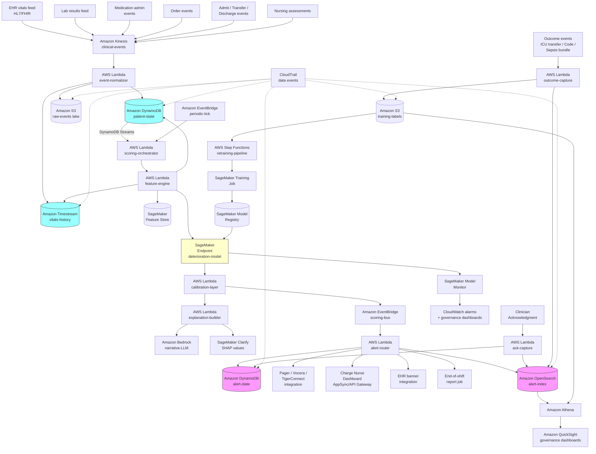

# Recipe 3.7 Architecture and Implementation: Patient Deterioration Early Warning

*Companion to [Recipe 3.7: Patient Deterioration Early Warning](chapter03.07-patient-deterioration-early-warning). This page covers the AWS architecture, services, prerequisites, and pseudocode. For the problem framing and the conceptual approach, start with the main recipe.*

---

## The AWS Implementation

### Why These Services

**Amazon Kinesis Data Streams (or Amazon MSK) for the EHR event feed.** Vitals, labs, medications, and orders flow into the pipeline as a continuous stream of clinical events. Kinesis is appropriate for moderate-volume streams; MSK (managed Kafka) is appropriate when the hospital's integration platform is already Kafka-based or when ordering and partitioning semantics need richer control. Either choice is HIPAA-eligible under the AWS BAA with appropriate encryption configuration.

**AWS HealthLake or a custom FHIR repository for the longitudinal patient record.** HealthLake stores patient records in FHIR format, supports query, and integrates with downstream analytics. For deployments with established FHIR infrastructure, HealthLake is a strong choice. For deployments that interface directly with EHR data via HL7 v2 or proprietary feeds, a custom FHIR transformation layer plus DynamoDB / S3 storage may fit better. The decision is more about existing integration patterns than about technical capability.

**Amazon DynamoDB for the patient state store.** Single-digit-millisecond reads on the current patient snapshot. Each admitted patient is a record (or a small set of records) with current vitals, rolling history pointers, active medications, current location, and active orders. DynamoDB Streams trigger the feature engine on state changes, so scoring is event-driven (not polling) for fresh events while a periodic backstop catches patients whose state hasn't changed but whose elapsed-time features have shifted.

**Amazon Timestream for time-series storage.** Vitals and labs are inherently time-series data, and Timestream is purpose-built for this. Trajectory features (slopes, deltas, rolling statistics) compute efficiently against a Timestream-backed history. Magnetic-tier retention is cost-effective for the multi-year history needed for retraining. 

**Amazon SageMaker for model training, hosting, and feature management.** Training runs as SageMaker Training Jobs against retrospective data in S3. The trained model deploys to a SageMaker real-time endpoint for online scoring (low latency for the inline alert path) plus a batch transform pipeline for the periodic backstop. SageMaker Feature Store keeps the offline (training) and online (scoring) feature vectors consistent, with point-in-time correctness so that historical predictions can be reproduced for governance and clinical safety review. SageMaker Clarify produces fairness reports across subgroups and per-prediction SHAP values for the explanation layer.

**Amazon SageMaker Model Monitor.** Continuously monitors data drift on input features, prediction drift on output scores, and (where labels are available) model quality. Critical for the calibration and subgroup performance monitoring that's part of the operational requirements.

**AWS Lambda for the lightweight stream processors.** Event normalization, feature engine invocation, scoring orchestration, and alert routing all fit Lambda's event-driven model. Lambdas run in the VPC with VPC endpoints for DynamoDB, SageMaker, and KMS to keep PHI traffic off the public internet.

**Amazon EventBridge for the alert routing fabric.** Scoring outputs publish to EventBridge with patient context and risk tier. Subscribers include the pager integration Lambda (for high-tier alerts), the dashboard service (for charge nurse situational awareness), the EHR banner integration (for in-chart visibility), and the audit logger (for every alert event regardless of disposition). Different alert types route to different subscribers; EventBridge rules encode the routing logic.

**Amazon API Gateway for clinical integrations.** EHR vendors expose various integration patterns (REST, FHIR, HL7 over MLLP, proprietary APIs). API Gateway in front of Lambda integrates these. AppSync (GraphQL) is sometimes a better fit when the consuming application (a web-based charge nurse dashboard) needs flexible queries over the patient state.

**Amazon OpenSearch Service for alert audit and analytics.** Every alert, with its full feature snapshot, score, explanation, disposition, and downstream outcome, is indexed in OpenSearch. The clinical governance team queries OpenSearch for case reviews. The model team queries for performance analytics. The operational team queries for alert volume by unit. Data also flows to S3 for retraining label assembly.

**Amazon S3 for the retrospective data lake and the training data.** Historical vitals, labs, medications, and outcome labels live here, partitioned by date and patient. Customer-managed KMS encryption. Used by SageMaker for training and by Athena for ad-hoc analysis.

**Amazon Comprehend Medical for nursing note feature extraction.** When the model includes free-text nursing assessment features, Comprehend Medical extracts structured entities (mental status descriptions, pain assessments, concerns expressed). The extracted entities feed the feature engine. Optional but useful when the Rothman-Index-style nursing-assessment features are part of the model.

**Amazon Bedrock for explanation generation.** Per-prediction explanations are essential for clinician trust. SHAP values surface the technical drivers; Bedrock-hosted LLMs convert those drivers plus the patient context into clinician-readable narrative ("Risk increased substantially over the last 4 hours, driven primarily by rising heart rate (76 to 102 bpm), rising respiratory rate (16 to 22), and a new lactate of 3.2. Pattern is consistent with early sepsis. Suggest sepsis bundle evaluation."). Always with human review; the LLM is producing decision support, not decisions. 

**AWS Step Functions for orchestration.** Retraining pipelines, periodic batch backstops, and scheduled subgroup performance evaluations are multi-step workflows with retry and error handling needs.

**Amazon CloudWatch and AWS X-Ray.** Operational monitoring of the streaming pipeline, scoring latency, alert delivery latency, and end-to-end traces. Latency budgets matter: from event ingest to alert delivery, the budget is typically tens of seconds to a few minutes; tracing finds where latency lives.

**AWS CloudTrail.** Audit logging on every PHI-bearing store and every API call against the scoring service. Every alert generation, every disposition, every model retraining is logged.

**AWS KMS.** Customer-managed keys on every PHI-bearing store: DynamoDB, Timestream, S3, OpenSearch, Kinesis, MSK, SageMaker volumes and Feature Store. Key rotation policies set per organizational requirements.

### Architecture Diagram



### Prerequisites

| Requirement | Details |
|-------------|---------|
| **AWS Services** | Amazon Kinesis Data Streams (or Amazon MSK), AWS HealthLake (optional), Amazon DynamoDB, Amazon Timestream, Amazon S3, AWS Lambda, Amazon SageMaker (Training, Hosting, Feature Store, Clarify, Model Monitor, Model Registry), Amazon Comprehend Medical (optional, for nursing note features), Amazon Bedrock, Amazon EventBridge, Amazon API Gateway, AWS AppSync, Amazon OpenSearch Service, Amazon Athena, Amazon QuickSight, AWS Step Functions, AWS Secrets Manager, AWS KMS, AWS CloudTrail, Amazon CloudWatch, AWS X-Ray. |
| **IAM Permissions** | Least-privilege per role. Scoring orchestrator Lambda reads from DynamoDB and Timestream, invokes the SageMaker endpoint, publishes to EventBridge. Alert router Lambda reads from EventBridge, writes to alert state and OpenSearch, calls integration endpoints (pagers, EHR banner). Clinician roles read alert state and write acknowledgments only. Model team roles can train and deploy models but cannot read PHI directly without explicit elevation. No `*` permissions; every action scoped to specific resources. |
| **BAA** | Signed AWS BAA. All services configured per BAA requirements. See the [AWS HIPAA Eligible Services Reference](https://aws.amazon.com/compliance/hipaa-eligible-services-reference/). |
| **Encryption** | Customer-managed KMS keys on every PHI-bearing store: Kinesis, MSK, DynamoDB, Timestream, S3, OpenSearch, SageMaker (volumes, Feature Store, model artifacts). TLS 1.2 or higher in transit everywhere. |
| **VPC** | Production deployment in a VPC with VPC endpoints for S3, DynamoDB, KMS, SageMaker runtime, Bedrock, Comprehend Medical, EventBridge, and Step Functions. OpenSearch in VPC with fine-grained access control. Lambdas that touch PHI run in the VPC. EHR integrations typically use AWS Direct Connect or Site-to-Site VPN to the hospital network rather than public-internet egress. |
| **CloudTrail and Data Events** | Enabled with data events on every PHI-bearing store and on the alert state and audit indexes. Every alert generation, every clinician disposition, every model invocation is logged. Log retention per organizational policy and applicable regulations. |
| **Clinical Governance** | A clinical governance committee (typically including hospitalists, intensivists, hospitalist-physician champions, nursing leadership, patient safety officers, and clinical informatics) must be established before deployment. The committee owns the deployment criteria, monitoring expectations, alert tier definitions, and decommissioning criteria. The committee is not optional and is not the IT team's responsibility to assemble. |
| **Regulatory Posture** | Determination of FDA SaMD applicability is necessary before any clinical use. Most "decision support that flags risk for human review" deployments fall under the 21st Century Cures Act CDS exemption when meeting the criteria (transparent reasoning available to the clinician; intended to support, not replace, clinician judgment; etc.). Higher-autonomy or higher-acuity deployments may not. Consult regulatory affairs early; do not assume exemption. |
| **Local Validation Required** | Vendor or external models must be validated on local population before clinical deployment. Subgroup-stratified validation is part of this. The validation should use a hold-out time period (not patient split) to capture temporal drift. Validation should compare against the existing standard of care (typically the in-use track-and-trigger system). |
| **Subgroup Data Access** | Race, ethnicity, language, and other demographic attributes used for fairness monitoring require separate data-governance controls. Restrict read access on the demographic-and-attribute store to the retraining-job IAM role and the fairness-monitoring-dashboard IAM role only. Enable CloudTrail data events on subgroup queries. QuickSight fairness dashboards query an aggregated subgroup-metrics table (alert rate by age band by unit type, calibration ECE by sex, time-to-acknowledge by service line) rather than the raw demographic-joined alert archive. Row-level demographic data does not flow to dashboard viewers. Some state laws restrict secondary use of race and ethnicity data beyond what HIPAA covers; confirm regulatory posture with compliance counsel before joining demographic attributes to clinical-event data for monitoring or retraining. |
| **Sample Data** | [MIMIC-IV](https://physionet.org/content/mimiciv/) is the canonical research dataset for ICU deterioration modeling (deidentified ICU data with vitals, labs, interventions, outcomes; access requires CITI training and a data use agreement). [eICU Collaborative Research Database](https://physionet.org/content/eicu-crd/) is similar with multi-center coverage. [Synthea](https://github.com/synthetichealth/synthea) generates synthetic patient data including vitals trajectories. Never use real PHI in development. |
| **EHR Integration** | Real-time ingest typically requires HL7 v2 ADT, ORU (results), ORM (orders), or FHIR R4 subscriptions. The EHR integration is often the longest single dependency in the project; assume 2-6 months of integration engineering for a production-grade feed depending on the EHR and the existing integration platform (Mirth, Rhapsody, Cloverleaf, vendor-supplied integration engines). |
| **Cost Estimate** | For a 300-bed hospital running a deterioration model on every admitted patient with hourly scoring plus event-driven re-scoring: Kinesis ingest: ~$200-500/month. DynamoDB patient state: ~$200-500/month. Timestream vitals history: ~$300-700/month. SageMaker endpoint hosting (multi-AZ for clinical reliability): ~$1,500-4,000/month depending on instance class and redundancy. SageMaker training (monthly retraining): ~$200-500/month. Bedrock for explanations (typically a small fraction of total scores get LLM explanations): ~$100-400/month. OpenSearch for alert audit: ~$400-1,000/month. Lambda, EventBridge, Step Functions, supporting services: ~$300-700/month. Total infrastructure: typically $3,000-8,000/month for a single hospital. Compare to typical ICU bed-day costs (often $3,000-5,000/day): preventing one preventable ICU transfer per month covers the infrastructure. The harder cost is people: clinical informatics, model team, governance committee time. |

### Ingredients

| AWS Service | Role |
|------------|------|
| **Amazon Kinesis Data Streams (or Amazon MSK)** | Real-time ingest of clinical events from the EHR integration layer |
| **AWS HealthLake (optional)** | FHIR-formatted longitudinal patient record store |
| **Amazon DynamoDB (patient-state)** | Current snapshot of every admitted patient for low-latency feature lookup |
| **Amazon DynamoDB (alert-state)** | Active alert tracking, acknowledgment status, suppression rules |
| **Amazon Timestream** | Vitals and lab time-series history for trajectory feature computation |
| **Amazon S3** | Raw event lake, training data, retrospective analysis, audit log archive |
| **AWS Lambda (event-normalizer)** | Stream processing of clinical events into canonical format |
| **AWS Lambda (scoring-orchestrator)** | Triggers feature computation and scoring on event or periodic tick |
| **AWS Lambda (feature-engine)** | Computes the model's input feature vector from patient state and history |
| **AWS Lambda (calibration-layer)** | Applies post-hoc calibration to raw model output |
| **AWS Lambda (explanation-builder)** | Assembles SHAP values plus narrative explanations for alerts |
| **AWS Lambda (alert-router)** | Tier-based routing, suppression, delta detection, integration calls |
| **AWS Lambda (ack-capture)** | Records clinician acknowledgments and dispositions |
| **AWS Lambda (outcome-capture)** | Records downstream clinical outcomes for label assembly |
| **Amazon SageMaker Endpoint** | Real-time scoring service for the deterioration model(s) |
| **Amazon SageMaker Training** | Model retraining pipeline against retrospective data |
| **Amazon SageMaker Feature Store** | Online and offline feature consistency with point-in-time correctness |
| **Amazon SageMaker Clarify** | Subgroup fairness reports and per-prediction SHAP explanations |
| **Amazon SageMaker Model Monitor** | Data drift, prediction drift, and (with labels) quality drift monitoring |
| **Amazon SageMaker Model Registry** | Versioning and approval workflow for model deployments |
| **Amazon Comprehend Medical** | Entity extraction from nursing notes for nursing-assessment features |
| **Amazon Bedrock** | LLM-generated narrative explanations alongside SHAP-based feature drivers |
| **Amazon EventBridge** | Routes scoring events to subscribers (pager integration, dashboard, audit) |
| **Amazon API Gateway / AWS AppSync** | Clinical integration APIs and dashboard back end |
| **Amazon OpenSearch Service** | Alert and feature audit index, governance query workload |
| **Amazon Athena** | SQL-over-S3 for ad-hoc analyst queries against historical data |
| **Amazon QuickSight** | Clinical governance and operational dashboards |
| **AWS Step Functions** | Retraining pipeline orchestration, periodic batch jobs |
| **AWS Secrets Manager** | EHR integration credentials, paging system credentials |
| **AWS KMS** | Customer-managed keys for every PHI-bearing store |
| **AWS CloudTrail** | Audit logging on every PHI store and every API operation |
| **Amazon CloudWatch + AWS X-Ray** | Pipeline health, scoring latency, end-to-end tracing |

---

### Code

> **Reference implementations:** These aws-samples repositories demonstrate patterns that apply here:
> - [`amazon-sagemaker-examples`](https://github.com/aws/amazon-sagemaker-examples): Time-series modeling examples, XGBoost on tabular features, Feature Store with online and offline stores, Model Monitor configurations, Clarify SHAP examples.
> - [`aws-samples`](https://github.com/aws-samples): search for "FHIR," "HealthLake," and "clinical" for healthcare-specific integration patterns.
> 

#### Walkthrough

**Step 1: Ingest and normalize clinical events.** Vitals, labs, medications, and orders arrive as a continuous stream from the EHR integration layer. The normalizer converts heterogeneous source formats (HL7 v2, FHIR, proprietary) into a canonical clinical event structure, performs unit conversion, reconciles timestamps, and routes the event to the patient state store and the time-series history.

```pseudocode
FUNCTION normalize_clinical_event(raw_event):
    // Parse based on the source format. The integration layer typically
    // pre-normalizes to FHIR or to a canonical JSON, but the pipeline
    // should be robust to source format drift.
    parsed = parse_event(raw_event)

    // Canonical event structure.
    canonical = {
        event_id:           generate_event_id(parsed),
        patient_id:         resolve_patient_id(parsed),
        encounter_id:       resolve_encounter_id(parsed),
        event_type:         parsed.type,                       // "vital", "lab", "med_admin", "order", "ADT", "nursing_note"
        observed_at:        parsed.observation_time,           // when the measurement actually happened
        recorded_at:        parsed.charted_time,               // when it was charted
        received_at:        NOW(),                              // when it arrived at the pipeline
        unit_id:            current_unit_for(parsed.encounter_id),
        source_system:      raw_event.source,                   // EHR identifier
        payload:            normalize_payload(parsed)
    }

    // For vitals, normalize units and value ranges.
    IF canonical.event_type == "vital":
        canonical.payload = {
            measurement_code:   map_to_loinc(parsed.measurement_type),    // canonical code
            value:              convert_to_canonical_units(parsed.value, parsed.units),
            units:              canonical_units_for(parsed.measurement_type),
            method:             parsed.method,                            // automated cuff, manual, arterial line, etc.
            position:           parsed.position,                          // sitting, supine, etc.
            quality_flags:      parsed.quality_flags                      // any analyzer flags
        }

    // For labs, similar normalization plus reference range attachment.
    IF canonical.event_type == "lab":
        canonical.payload = {
            test_code:          map_to_loinc(parsed.test_code),
            value:              convert_to_canonical_units(parsed.value, parsed.units),
            units:              canonical_units_for(parsed.test_code),
            reference_range:    attach_reference_range(canonical.patient_id, parsed.test_code),
            critical_flag:      parsed.critical_flag,
            specimen_quality:   parsed.specimen_quality_flags
        }

    // For medication administration, capture the medication and dose.
    IF canonical.event_type == "med_admin":
        canonical.payload = {
            rx_norm_code:       parsed.rxnorm,
            generic_name:       parsed.generic_name,
            dose:               parsed.dose,
            dose_units:         parsed.dose_units,
            route:              parsed.route,
            therapeutic_class:  classify_medication(parsed.rxnorm)        // antibiotic, vasopressor, etc.
        }

    // ADT events update unit and admission status.
    IF canonical.event_type == "ADT":
        canonical.payload = {
            adt_type:           parsed.adt_type,                          // admit, transfer, discharge
            new_unit:           parsed.new_unit,
            new_room:           parsed.new_room,
            new_bed:            parsed.new_bed,
            attending_provider: parsed.attending
        }

    // Persist to the raw event lake (S3) for retrospective analysis.
    S3.PutObject(
        bucket = "deterioration-raw-events",
        key    = f"event_type={canonical.event_type}/year={year_of(canonical.observed_at)}/month={month_of(canonical.observed_at)}/day={day_of(canonical.observed_at)}/{canonical.event_id}.json",
        body   = canonical
    )

    // Update the patient state store. Different event types update
    // different fields; the state store carries the current snapshot.
    update_patient_state(canonical)

    // Append to the time-series history for trajectory features.
    IF canonical.event_type in ["vital", "lab"]:
        Timestream.WriteRecord(
            database  = "deterioration-history",
            table     = canonical.event_type + "s",
            dimensions = {
                patient_id:       canonical.patient_id,
                measurement_code: canonical.payload.measurement_code OR canonical.payload.test_code
            },
            time_value = canonical.observed_at,
            value      = canonical.payload.value
        )

    return canonical
```

**Step 2: Maintain the patient state store.** The patient state store carries the current snapshot of every admitted patient. Updates from clinical events refresh the relevant fields; the snapshot includes everything the feature engine needs to compute a feature vector quickly.

```pseudocode
FUNCTION update_patient_state(event):
    // Read current state. Handle the not-yet-admitted case for ADT events.
    state = DynamoDB.GetItem(
        table = "patient-state",
        key   = { patient_id: event.patient_id, encounter_id: event.encounter_id }
    )

    IF state is null:
        // ADT admit creates the record; other events for unknown patients
        // are routed to a quarantine queue for investigation.
        IF event.event_type == "ADT" AND event.payload.adt_type == "admit":
            state = create_initial_patient_state(event)
        ELSE:
            send_to_quarantine(event)
            return

    // Update relevant fields based on event type.
    IF event.event_type == "vital":
        state.current_vitals[event.payload.measurement_code] = {
            value:         event.payload.value,
            observed_at:   event.observed_at,
            recorded_at:   event.recorded_at
        }
        state.last_vital_at = event.observed_at

    IF event.event_type == "lab":
        state.recent_labs[event.payload.test_code] = {
            value:           event.payload.value,
            observed_at:     event.observed_at,
            critical_flag:   event.payload.critical_flag,
            reference_range: event.payload.reference_range
        }

    IF event.event_type == "med_admin":
        // Append to the active medication list with administration time.
        state.recent_medications.append({
            rx_norm_code:       event.payload.rx_norm_code,
            therapeutic_class:  event.payload.therapeutic_class,
            dose:               event.payload.dose,
            administered_at:    event.observed_at
        })
        // Keep only the last N hours of medication history in the state record.
        state.recent_medications = filter_recent(state.recent_medications, hours = MED_HISTORY_WINDOW_HOURS)

    IF event.event_type == "ADT":
        state.current_unit = event.payload.new_unit OR state.current_unit
        state.current_room = event.payload.new_room OR state.current_room
        state.attending    = event.payload.attending_provider OR state.attending
        IF event.payload.adt_type == "discharge":
            state.discharge_at = event.observed_at
            state.is_active    = false

    state.updated_at = NOW()

    DynamoDB.PutItem(
        table = "patient-state",
        item  = state
    )
```

**Step 3: Trigger scoring on event or schedule.** Two paths produce scoring requests. Event-driven scoring fires from DynamoDB Streams when high-importance fields change (a new vital, a new lab, a unit transfer); periodic scoring fires every hour from a scheduled rule to capture elapsed-time effects.

```pseudocode
FUNCTION on_state_change(stream_record):
    // DynamoDB Streams record showing the change.
    new_state = stream_record.NewImage
    old_state = stream_record.OldImage

    // Decide whether the change is significant enough to re-score.
    IF should_rescore_on_change(new_state, old_state):
        invoke_scoring(new_state.patient_id, new_state.encounter_id, trigger = "event_driven")

FUNCTION on_periodic_tick():
    // Every hour, re-score every active patient.
    active_patients = DynamoDB.Query(
        table       = "patient-state",
        index       = "is_active-index",
        key_condition = "is_active = :true"
    )
    FOR each patient in active_patients:
        // Don't re-score if we've scored recently and nothing changed.
        IF patient.last_scored_at < (NOW() - PERIODIC_TICK_MIN_INTERVAL):
            invoke_scoring(patient.patient_id, patient.encounter_id, trigger = "periodic")

FUNCTION invoke_scoring(patient_id, encounter_id, trigger):
    EventBridge.PutEvent(
        bus         = "deterioration-scoring",
        source      = "scoring-orchestrator",
        detail_type = "ScoreRequest",
        detail      = { patient_id, encounter_id, trigger, requested_at: NOW() }
    )
```

**Step 4: Compute the feature vector.** The feature engine reads patient state and time-series history, computes the model's input vector, and writes it to the Feature Store for both online use and offline reproduction. Two first-class concerns live in this step: the leakage buffer (ensuring only observations genuinely available at decision time enter the feature vector) and the cold-start check (detecting patients without enough history for reliable trajectory features).

**Feature-cutoff and leakage-buffer discipline.** Treatment leakage is the most dangerous silent bug in a deterioration model: if a feature captures information from interventions triggered by the very deterioration you are predicting, the model will appear to perform well in retrospective evaluation but fail prospectively. Every feature must be computed against observations whose `observed_at` timestamp is strictly before `as_of - LEAKAGE_BUFFER_MINUTES`. The buffer (typically 30-60 minutes, set by clinical governance) accounts for documentation lag, order-entry-to-administration delays, and the temporal gap between a clinician recognizing deterioration and charting the response. The clinical governance committee owns the buffer setting because it trades off detection sensitivity (shorter buffer, more features available, higher risk of leakage) against leakage protection (longer buffer, fewer features from the most recent window, potentially delayed detection of very rapid deterioration).

**Cold-start handling.** A patient just admitted has no trajectory, no patient-specific baseline, and sparse vitals. A `data_richness_index` (number of vitals observations in the last 24 hours, number of labs in the last 48 hours, hours since admission) determines whether the model's feature space is populated enough for reliable scoring. When the index is below a configured threshold, the scoring service routes the patient to a population-prior fallback (typically a NEWS2-equivalent calculation using whatever vitals are available) rather than the full ML model. The cold-start status surfaces in the alert payload so the clinician knows the alert came from the fallback path.

```pseudocode
CONST LEAKAGE_BUFFER_MINUTES = 30   // clinical-governance-owned; 30-60 typical
CONST COLD_START_VITALS_MIN = 3     // minimum vitals observations in 24h
CONST COLD_START_LABS_MIN = 1       // minimum labs in 48h
CONST COLD_START_LOS_MIN_HOURS = 4  // minimum hours since admission

FUNCTION compute_features(patient_id, encounter_id, as_of):
    state = DynamoDB.GetItem(
        table = "patient-state",
        key   = { patient_id, encounter_id }
    )

    // Leakage buffer: the effective cutoff for feature observations.
    feature_cutoff = as_of - LEAKAGE_BUFFER_MINUTES minutes

    // Fetch trajectory history from Timestream, respecting the leakage buffer.
    vitals_history = Timestream.Query(
        f"""
        SELECT measurement_code, time, measure_value::double
        FROM "deterioration-history"."vitals"
        WHERE patient_id = '{patient_id}'
          AND time BETWEEN ago({TRAJECTORY_WINDOW_HOURS}h) AND from_iso8601_timestamp('{feature_cutoff}')
        ORDER BY time
        """
    )
    labs_history = Timestream.Query(
        f"""
        SELECT test_code, time, measure_value::double
        FROM "deterioration-history"."labs"
        WHERE patient_id = '{patient_id}'
          AND time BETWEEN ago({LAB_TRAJECTORY_WINDOW_HOURS}h) AND from_iso8601_timestamp('{feature_cutoff}')
        ORDER BY time
        """
    )

    // Cold-start detection: is there enough data for the ML model?
    vitals_count_24h = count(v for v in vitals_history IF v.time >= feature_cutoff - 24h)
    labs_count_48h = count(l for l in labs_history IF l.time >= feature_cutoff - 48h)
    los_hours = hours_between(state.encounter.admission_time, as_of)
    data_richness_index = {
        vitals_24h:   vitals_count_24h,
        labs_48h:     labs_count_48h,
        los_hours:    los_hours
    }
    cold_start_flag = (
        vitals_count_24h < COLD_START_VITALS_MIN
        OR labs_count_48h < COLD_START_LABS_MIN
        OR los_hours < COLD_START_LOS_MIN_HOURS
    )

    features = {}
    features["cold_start_flag"] = cold_start_flag
    features["data_richness_index"] = data_richness_index

    // Current vitals features. Only include observations before the leakage cutoff.
    FOR each vital_code in CORE_VITALS_CODES:
        latest = state.current_vitals.get(vital_code)
        IF latest AND latest.observed_at <= feature_cutoff:
            features[f"vital_{vital_code}_current"] = latest.value
            features[f"vital_{vital_code}_age_minutes"] = minutes_between(latest.observed_at, as_of)
        ELSE:
            features[f"vital_{vital_code}_current"] = null
            features[f"vital_{vital_code}_age_minutes"] = null

    // Vitals trajectory features (slope, max, min, std over windows).
    FOR each vital_code in CORE_VITALS_CODES:
        FOR each window_hours in [1, 4, 12]:
            window_values = filter_recent(vitals_history, vital_code, window_hours)
            features[f"vital_{vital_code}_slope_{window_hours}h"] = compute_slope(window_values)
            features[f"vital_{vital_code}_max_{window_hours}h"]   = max_of(window_values)
            features[f"vital_{vital_code}_min_{window_hours}h"]   = min_of(window_values)
            features[f"vital_{vital_code}_std_{window_hours}h"]   = stddev_of(window_values)
            features[f"vital_{vital_code}_count_{window_hours}h"] = length(window_values)

    // Patient-specific baselines: median over the last several days.
    baseline_history = filter_recent(vitals_history, code = ALL, hours = BASELINE_WINDOW_HOURS)
    FOR each vital_code in CORE_VITALS_CODES:
        baseline = median_of(filter_by_code(baseline_history, vital_code))
        features[f"vital_{vital_code}_baseline"] = baseline
        IF features[f"vital_{vital_code}_current"] is not null AND baseline is not null:
            features[f"vital_{vital_code}_delta_from_baseline"] = features[f"vital_{vital_code}_current"] - baseline

    // Composite features (shock index, ROX, MAP).
    hr  = features.get("vital_HR_current")
    sbp = features.get("vital_SBP_current")
    dbp = features.get("vital_DBP_current")
    rr  = features.get("vital_RR_current")
    spo2 = features.get("vital_SPO2_current")
    fio2 = features.get("vital_FIO2_current")
    IF hr is not null AND sbp is not null AND sbp > 0:
        features["composite_shock_index"] = hr / sbp
    IF sbp is not null AND dbp is not null:
        features["composite_pulse_pressure"] = sbp - dbp
        features["composite_map"] = (sbp + 2 * dbp) / 3
    IF spo2 is not null AND fio2 is not null AND rr is not null AND fio2 > 0 AND rr > 0:
        features["composite_rox_index"] = (spo2 / fio2) / rr

    // Lab features: latest values plus trajectory.
    FOR each lab_code in CORE_LAB_CODES:
        latest = state.recent_labs.get(lab_code)
        features[f"lab_{lab_code}_current"] = latest.value IF latest else null
        features[f"lab_{lab_code}_age_hours"] = hours_between(latest.observed_at, as_of) IF latest else null
        // Trajectory over a longer window for labs.
        lab_trend = filter_recent(labs_history, lab_code, hours = LAB_TRAJECTORY_WINDOW_HOURS)
        features[f"lab_{lab_code}_slope_24h"] = compute_slope(lab_trend)
        features[f"lab_{lab_code}_baseline"] = median_of(filter_recent(labs_history, lab_code, hours = LAB_BASELINE_WINDOW_HOURS))

    // Medication context. Filter by the leakage cutoff: only medications
    // administered before the feature_cutoff contribute features.
    active_classes = distinct(
        med.therapeutic_class for med in state.recent_medications
        IF med.administered_at <= feature_cutoff
        AND (feature_cutoff - med.administered_at) < ACTIVE_MED_WINDOW_HOURS
    )
    features["has_active_antibiotic"]     = "antibiotic"     in active_classes
    features["has_active_vasopressor"]    = "vasopressor"    in active_classes
    features["has_active_opioid"]          = "opioid"         in active_classes
    features["has_active_sedative"]        = "sedative"       in active_classes
    features["has_active_betablocker"]     = "betablocker"    in active_classes
    features["has_active_insulin"]          = "insulin"        in active_classes
    features["has_active_anticoagulant"]   = "anticoagulant"  in active_classes
    // Time since most recent administration of each class.
    FOR each class in TRACKED_MED_CLASSES:
        latest_admin = max_observed_at_for_class(state.recent_medications, class)
        features[f"hours_since_{class}"] = hours_between(latest_admin, as_of) IF latest_admin else null

    // Patient context.
    features["age_years"]       = state.demographics.age_years
    features["sex"]              = state.demographics.sex_band                  // categorical
    features["bmi"]              = state.demographics.bmi
    features["admission_diagnosis_category"] = state.encounter.admission_diagnosis_category
    features["surgical_status"]  = state.encounter.surgical_status              // none, post_op_day_1, ...
    features["los_hours"]        = hours_between(state.encounter.admission_time, as_of)
    features["hours_on_current_unit"] = hours_between(state.current_unit_at, as_of)
    features["unit_type"]         = state.current_unit.type                    // medical, surgical, telemetry, step_down, ICU

    // Time of day, day of week.
    features["hour_of_day"] = hour_of(as_of)
    features["day_of_week"] = day_of_week_of(as_of)

    // Order context (recent concerning orders).
    features["recent_lactate_order"] = has_recent_order(state, "lactate", hours = 4)
    features["recent_blood_culture_order"] = has_recent_order(state, "blood_culture", hours = 6)
    features["recent_oxygen_titration"] = has_recent_oxygen_change(state, hours = 2)

    // Persist the feature vector for online and offline use.
    SageMaker.FeatureStore.PutRecord(
        feature_group = "patient-features-online",
        record = {
            patient_encounter_id: f"{patient_id}:{encounter_id}",
            event_time:           as_of,
            **features
        }
    )

    return features
```

**Step 5: Score the feature vector and apply calibration.** The scoring service invokes the SageMaker endpoint with the feature vector, then a calibration layer maps the raw model output to a calibrated probability and a risk tier. Cold-start patients route to a population-prior fallback (NEWS2-equivalent) rather than the full ML model.

```pseudocode
FUNCTION score_patient(patient_id, encounter_id, features, trigger):
    // Cold-start routing: patients without enough data for reliable ML
    // scoring use a NEWS2-equivalent population-prior model instead.
    IF features.cold_start_flag:
        raw_output = score_via_population_prior(features)
        raw_output.scoring_path = "cold_start_news2_fallback"
    ELSE:
        // Invoke the full deterioration model endpoint.
        raw_output = SageMaker.Runtime.InvokeEndpoint(
            endpoint_name = "deterioration-model-prod",
            body          = serialize(features)
        )
        raw_output.scoring_path = "ml_model"
    // raw_output: { score: 0.0-1.0, model_version, feature_importance_top_k, scoring_path }

    // Apply post-hoc calibration. Calibration parameters are learned during
    // training and applied here so the score matches observed deterioration
    // rates at each score bucket.
    calibrated_probability = apply_calibration(
        raw_score        = raw_output.score,
        calibration_curve = CALIBRATION_CURVE_VERSION,
        subgroup         = subgroup_for_calibration(features)
    )

    // Map to a tier using subgroup-stratified thresholds. Thresholds are
    // tuned per unit type (ICU, step-down, floor) because tolerable
    // false-positive rates differ.
    threshold_set = THRESHOLDS_FOR(features.unit_type)
    IF calibrated_probability >= threshold_set.high:
        tier = "high"
    ELSE IF calibrated_probability >= threshold_set.medium:
        tier = "medium"
    ELSE IF calibrated_probability >= threshold_set.low:
        tier = "low"
    ELSE:
        tier = "below_threshold"

    score_record = {
        patient_id:              patient_id,
        encounter_id:            encounter_id,
        scored_at:               NOW(),
        trigger:                 trigger,                              // event_driven, periodic
        raw_score:               raw_output.score,
        calibrated_probability:  calibrated_probability,
        tier:                    tier,
        model_version:           raw_output.model_version,
        scoring_path:            raw_output.scoring_path,              // ml_model or cold_start_news2_fallback
        cold_start_flag:         features.cold_start_flag,
        feature_snapshot_id:     persist_feature_snapshot(features),
        feature_importance:      raw_output.feature_importance_top_k
    }

    // Persist for audit and downstream alert generation.
    DynamoDB.PutItem(
        table = "scoring-history",
        item  = score_record
    )
    OpenSearch.Index("scoring-index", score_record)

    // Publish for alert routing.
    EventBridge.PutEvent(
        bus         = "deterioration-scoring",
        source      = "scoring-service",
        detail_type = "ScoreProduced",
        detail      = score_record
    )

    return score_record
```

**Step 6: Build the explanation.** Per-prediction explanations combine SHAP values from the model with a narrative generated by an LLM. The narrative is decision support, not a decision.

```pseudocode
FUNCTION build_explanation(score_record, features):
    // SHAP values from SageMaker Clarify (or computed inline if the model
    // exposes SHAP natively).
    shap_values = SageMaker.Clarify.ExplainPrediction(
        endpoint_name = "deterioration-model-prod",
        input_record  = features
    )
    // shap_values: { feature_name -> shap_contribution }

    // Identify the top contributors (positive contributions to the risk score).
    top_drivers = top_n_by_value(shap_values, n = 7, direction = "positive")
    top_protective = top_n_by_value(shap_values, n = 3, direction = "negative")

    // Build a structured explanation record.
    structured_explanation = {
        top_risk_drivers:   [
            {
                feature:          driver.feature,
                value:            features[driver.feature],
                contribution:     driver.shap_contribution,
                clinical_meaning: humanize_feature_name(driver.feature, features)
            }
            for driver in top_drivers
        ],
        top_protective_factors: [...similar...],
        score_change_from_last:  delta_from_last_score(score_record)
    }

    // Build a narrative explanation via Bedrock for inclusion in the alert.
    // The narrative is constrained: cite features, suggest evaluation steps,
    // never recommend specific treatments.
    prompt = build_explanation_prompt(
        risk_tier:                score_record.tier,
        calibrated_probability:   score_record.calibrated_probability,
        score_change:             structured_explanation.score_change_from_last,
        top_drivers:               structured_explanation.top_risk_drivers,
        protective_factors:        structured_explanation.top_protective_factors,
        patient_context:           patient_context_summary(features),
        unit_type:                 features.unit_type
    )
    bedrock_response = Bedrock.InvokeModel(
        model_id  = "anthropic.claude-XX",      // HIPAA-eligible; select per current eligibility
        body      = { prompt: prompt, max_tokens: 600, temperature: 0.0 }
    )
    narrative = parse_bedrock_response(bedrock_response)

    full_explanation = {
        structured: structured_explanation,
        narrative:  narrative,
        generated_at: NOW(),
        generated_by: "shap_plus_bedrock",
        bedrock_model_version: "claude-XX"
    }

    return full_explanation
```

**Step 7: Route alerts based on tier and suppression rules.** The alert router applies tier-based routing, suppression rules (active comfort care, already in ICU, recent rapid response), and delta detection (this patient's score just jumped substantially).

```pseudocode
FUNCTION route_alert(score_record, explanation):
    // Suppression rules. Many alerts that the model would generate are not
    // operationally actionable; suppress them with documented reasons.
    suppression = check_suppression_rules(score_record)
    IF suppression.suppressed:
        log_suppressed_alert(score_record, suppression.reason)
        return

    // Delta detection: did the score jump substantially from the last score?
    last_score = get_last_score(score_record.patient_id, score_record.encounter_id)
    score_delta = score_record.calibrated_probability - (last_score.calibrated_probability IF last_score else 0)
    is_delta_alert = score_delta >= DELTA_ALERT_THRESHOLD

    // Tier-based routing decisions. Same tier on the same patient an hour
    // later doesn't re-page; a tier escalation does.
    //
    // The full alert record (with explanation, vital values, narrative) is
    // stored only in the alert-state DynamoDB table and the OpenSearch audit
    // index, behind IAM-scoped authenticated access. Pager, Vocera,
    // TigerConnect, and SMS channels receive only a minimal payload: alert_id,
    // tier, and unit location. The consuming application fetches the full alert
    // by alert_id through an authenticated path. PHI does not transit
    // lock-screen-visible channels or any logs they generate.

    // Construct the audit_trail block for reproducibility.
    audit_trail = {
        feature_snapshot_id:     score_record.feature_snapshot_id,
        scoring_record_id:       score_record.id,
        model_version:           score_record.model_version,
        calibration_curve_version: CALIBRATION_CURVE_VERSION,
        thresholds_version:      THRESHOLDS_VERSION_FOR(score_record.feature_snapshot.unit_type),
        rule_library_version:    SUPPRESSION_RULE_LIBRARY_VERSION,
        unit_threshold_set_id:   threshold_set_id_for(score_record.feature_snapshot.unit_type),
        scoring_path:            score_record.scoring_path
    }

    alert = {
        alert_id:               generate_alert_id(),
        patient_id:             score_record.patient_id,
        encounter_id:           score_record.encounter_id,
        unit:                   score_record.feature_snapshot.unit_type,
        tier:                   score_record.tier,
        score:                  score_record.calibrated_probability,
        score_delta:            score_delta,
        is_delta_alert:         is_delta_alert,
        cold_start_flag:        score_record.cold_start_flag,
        explanation:            explanation,
        triggered_at:           NOW(),
        audit_trail:            audit_trail
    }

    // High tier or significant delta routes to the page channel.
    last_page = get_last_page_for_patient(alert.patient_id)
    should_page = alert.tier == "high" OR (is_delta_alert AND alert.tier in ["medium","high"])
    should_page = should_page AND (last_page is null OR (NOW() - last_page.sent_at) > REPAGE_MIN_INTERVAL)

    IF should_page:
        // Pager channel gets ONLY the minimal, non-PHI payload.
        // The recipient fetches the full alert by alert_id through the
        // authenticated dashboard or EHR banner.
        pager_payload = {
            alert_id:   alert.alert_id,
            tier:       alert.tier,
            unit:       alert.unit
        }
        send_pager_notification(pager_payload)
        record_alert_routing(alert, channel = "pager", recipients = page_recipients_for(alert))

    // Medium tier (or high) shows on the charge nurse dashboard.
    IF alert.tier in ["medium", "high"]:
        publish_to_dashboard(alert)
        record_alert_routing(alert, channel = "dashboard")

    // Any tier routes to the EHR banner for the patient's chart.
    publish_to_ehr_banner(alert)
    record_alert_routing(alert, channel = "ehr_banner")

    // All alerts route to the audit index with the full audit_trail block.
    OpenSearch.Index("alert-index", alert)
    DynamoDB.PutItem(
        table = "alert-state",
        item  = {
            alert_id:           alert.alert_id,
            patient_id:         alert.patient_id,
            encounter_id:       alert.encounter_id,
            tier:               alert.tier,
            triggered_at:       alert.triggered_at,
            audit_trail:        audit_trail,
            ack_status:         "pending",
            disposition:        null,
            outcome:            null
        }
    )

FUNCTION check_suppression_rules(score_record):
    state = get_patient_state(score_record.patient_id, score_record.encounter_id)

    // Patient already in the ICU.
    IF state.current_unit.type == "ICU":
        return { suppressed: true, reason: "patient_in_icu" }

    // Active comfort-care or DNR-CC orders.
    IF state.has_active_comfort_care_order:
        return { suppressed: true, reason: "comfort_care_active" }

    // Recent rapid response activation.
    IF state.last_rrt_activation_at AND (NOW() - state.last_rrt_activation_at) < SUPPRESSION_AFTER_RRT:
        return { suppressed: true, reason: "recent_rrt_activation" }

    // Investigator-set patient-level suppression with valid expiration.
    IF state.suppression_until AND NOW() < state.suppression_until:
        return { suppressed: true, reason: "explicit_suppression", details: state.suppression_reason }

    return { suppressed: false }

CONST DEFAULT_SUPPRESSION_EXPIRY_HOURS = 72  // suppressions without explicit expiry auto-expire

// Daily scheduled job: walk the suppression registry for expired entries.
// Suppressions without documented expiry default to 72 hours. Expired
// suppressions transition to "expired_pending_review" and notify the
// suppression-owning attending. This prevents suppressions from silently
// persisting past their clinical relevance.
FUNCTION enforce_suppression_expiry():
    // Scan for active suppressions past their expiration.
    expired = DynamoDB.Scan(
        table  = "suppression-registry",
        filter = "expires_at <= :now OR (expires_at IS NULL AND created_at <= :default_cutoff)",
        values = {
            ":now":            NOW(),
            ":default_cutoff": NOW() - DEFAULT_SUPPRESSION_EXPIRY_HOURS hours
        }
    )
    FOR each suppression in expired:
        suppression.status = "expired_pending_review"
        suppression.expired_at = NOW()
        DynamoDB.PutItem(table = "suppression-registry", item = suppression)
        // Notify the suppression-owning attending for review.
        notify_attending(suppression.owning_provider, suppression)
        log_suppression_expiry(suppression)

// ADT-event-triggered suppression review: when a patient transfers units,
// surface active suppressions to the receiving care team. A suppression set
// by one attending on one unit may not be appropriate after a unit transfer;
// the receiving team needs visibility.
FUNCTION on_adt_transfer_review_suppressions(patient_id, encounter_id, new_unit):
    active_suppressions = DynamoDB.Query(
        table          = "suppression-registry",
        key_condition  = "patient_id = :pid",
        filter         = "status = :active",
        values         = { ":pid": patient_id, ":active": "active" }
    )
    IF active_suppressions is not empty:
        // Surface to the receiving unit's charge nurse and covering physician.
        notify_receiving_team(new_unit, patient_id, active_suppressions)
        log_suppression_transfer_review(patient_id, new_unit, active_suppressions)
```

**Step 8: Capture acknowledgments and outcomes.** Every alert generates an acknowledgment requirement. Subsequent clinical events (ICU transfer, code blue, sepsis bundle initiation) get linked to the alert as the eventual outcome. Both handlers use deterministic event-key derivation and conditional DynamoDB writes to enforce idempotency, because EventBridge delivers at-least-once and redelivered events must not bias the retraining distribution.

```pseudocode
FUNCTION on_clinical_outcome(patient_id, encounter_id, outcome_event):
    // outcome_event: { event_id, type: ICU_transfer | code_blue | unexpected_death |
    //                        sepsis_bundle_initiated | discharge,
    //                  occurred_at, details }

    // Idempotency guard. EventBridge delivers at-least-once; redelivered
    // outcome events must not double-link outcomes to alerts or double-write
    // S3 label rows (which would bias the retraining distribution toward
    // redelivered cases on a rare positive class).
    outcome_event_key = f"{outcome_event.event_id}:{outcome_event.type}"
    TRY:
        DynamoDB.PutItem(
            table             = "processed-outcome-events",
            item              = { event_key: outcome_event_key, processed_at: NOW(), ttl: NOW() + 30 days },
            condition_expression = "attribute_not_exists(event_key)"
        )
    CATCH ConditionalCheckFailedException:
        // Already processed. Safe to return without re-linking.
        return

    // Link the outcome to recent alerts on this patient.
    recent_alerts = OpenSearch.Search(
        index = "alert-index",
        query = {
            patient_id:       patient_id,
            encounter_id:     encounter_id,
            triggered_at_gte: outcome_event.occurred_at - OUTCOME_LINKAGE_WINDOW
        }
    )

    FOR each alert in recent_alerts:
        alert.outcome = {
            outcome_type:     outcome_event.type,
            occurred_at:      outcome_event.occurred_at,
            details:          outcome_event.details,
            time_from_alert_to_outcome_minutes: minutes_between(alert.triggered_at, outcome_event.occurred_at),
            linkage_method:    "temporal_proximity",
            linkage_confidence: confidence_for_outcome_alert(alert, outcome_event)
        }
        DynamoDB.PutItem(table = "alert-state", item = alert)
        OpenSearch.Index("alert-index", alert)

    // Write a label row for retraining.
    label_row = {
        patient_id:        patient_id,
        encounter_id:      encounter_id,
        outcome_type:       outcome_event.type,
        occurred_at:        outcome_event.occurred_at,
        recent_alert_ids:   [a.alert_id for a in recent_alerts],
        feature_snapshots:  [a.feature_snapshot_id for a in recent_alerts]
    }
    S3.PutObject(
        bucket = "deterioration-training-labels",
        key    = f"outcomes/year={year(outcome_event.occurred_at)}/month={month(outcome_event.occurred_at)}/{generate_id()}.json",
        body   = label_row
    )

FUNCTION on_clinician_acknowledgment(alert_id, clinician_id, disposition, intervention, notes):
    // Idempotency guard for acknowledgment events (same pattern).
    ack_event_key = f"{alert_id}:{clinician_id}"
    TRY:
        DynamoDB.PutItem(
            table             = "processed-acknowledgment-events",
            item              = { event_key: ack_event_key, processed_at: NOW(), ttl: NOW() + 30 days },
            condition_expression = "attribute_not_exists(event_key)"
        )
    CATCH ConditionalCheckFailedException:
        return

    alert_state = DynamoDB.GetItem(
        table = "alert-state",
        key   = { alert_id }
    )
    alert_state.ack_status      = "acknowledged"
    alert_state.acknowledged_by = clinician_id
    alert_state.acknowledged_at = NOW()
    alert_state.disposition     = disposition        // monitoring, escalated, intervention, dismissed_as_noise
    alert_state.intervention    = intervention       // free text; what action was taken
    alert_state.notes           = notes
    DynamoDB.PutItem(table = "alert-state", item = alert_state)
    OpenSearch.Index("alert-index", alert_state)

    IF disposition == "escalated":
        invoke_escalation_workflow(alert_state)
```

> **Curious how this looks in Python?** The pseudocode above covers the concepts. If you'd like to see sample Python code that demonstrates these patterns using boto3, check out the [Python Example](chapter03.07-python-example). It walks through each step with inline comments and notes on what you'd need to change for a real deployment.

---

### Expected Results

The sample payloads below use timestamps tied to the opening vignette (post-op day 2, daughter pressing the call button at 1:40 a.m., sepsis protocol activation). Dates are illustrative; production output uses real ISO-8601 timestamps from the alert-router invocation time.

**Sample pager-channel payload (minimal, no PHI):**

The pager, Vocera, TigerConnect, or SMS channel receives only this minimal payload. PHI does not transit lock-screen-visible channels or any logs they generate. The receiving clinician fetches the full alert by `alert_id` through the authenticated dashboard or EHR banner.

```json
{
  "alert_id": "DETER-2026-05-14-002281",
  "tier": "high",
  "unit": "MED-FLOOR-4N"
}
```

**Sample full alert record (stored in alert-state DynamoDB table and OpenSearch audit index, accessed via authenticated path only):**

```json
{
  "alert_id": "DETER-2026-05-14-002281",
  "patient_id": "PT-7724983",
  "encounter_id": "ENC-2026-04472",
  "unit": "MED-FLOOR-4N",
  "tier": "high",
  "score": 0.71,
  "score_delta": 0.34,
  "is_delta_alert": true,
  "cold_start_flag": false,
  "triggered_at": "2026-05-14T03:14:00Z",
  "model_version": "deterioration-v3.2",
  "explanation": {
    "structured": {
      "top_risk_drivers": [
        {
          "feature": "vital_HR_slope_4h",
          "value": 5.2,
          "contribution": 0.18,
          "clinical_meaning": "Heart rate has increased ~5 bpm/hour over the last 4 hours (76 to 102)"
        },
        {
          "feature": "vital_RR_slope_4h",
          "value": 1.5,
          "contribution": 0.12,
          "clinical_meaning": "Respiratory rate has increased over the last 4 hours (16 to 22)"
        },
        {
          "feature": "lab_LACTATE_current",
          "value": 3.2,
          "contribution": 0.11,
          "clinical_meaning": "Lactate elevated (3.2 mmol/L; reference range 0.5-2.2)"
        },
        {
          "feature": "vital_TEMP_delta_from_baseline",
          "value": 1.4,
          "contribution": 0.09,
          "clinical_meaning": "Temperature ~1.4 C above patient's recent baseline"
        },
        {
          "feature": "composite_shock_index",
          "value": 1.10,
          "contribution": 0.08,
          "clinical_meaning": "Shock index elevated (HR/SBP = 1.10; > 1.0 suggests circulatory compromise)"
        },
        {
          "feature": "recent_blood_culture_order",
          "value": true,
          "contribution": 0.07,
          "clinical_meaning": "Blood cultures ordered within the last 6 hours (clinical concern already raised)"
        },
        {
          "feature": "surgical_status",
          "value": "post_op_day_2",
          "contribution": 0.04,
          "clinical_meaning": "Post-operative day 2 (timing consistent with post-op infection risk)"
        }
      ],
      "top_protective_factors": [
        {
          "feature": "vital_SPO2_current",
          "value": 96,
          "contribution": -0.03,
          "clinical_meaning": "Oxygen saturation currently maintained on room air"
        }
      ],
      "score_change_from_last": 0.34
    },
    "narrative": "Risk score has increased substantially over the last 4 hours, driven primarily by rising heart rate (76 to 102 bpm), rising respiratory rate (16 to 22), a lactate of 3.2, and temperature trend rising 1.4 C above baseline. Pattern is consistent with early sepsis. Patient is post-op day 2 from colon resection. Blood cultures have been ordered, suggesting bedside team has noted concern. Suggest sepsis bundle evaluation: full set of vitals, repeat lactate, source review, and assessment per local sepsis protocol. This is decision support; clinical judgment governs."
  },
  "routing": {
    "channels": ["pager", "dashboard", "ehr_banner"],
    "page_recipients": ["RRT-CHARGE", "HOSPITALIST-ON-CALL"],
    "dashboard_visible_to": ["CHARGE-NURSE-4N"],
    "ehr_banner_visible_to": ["BEDSIDE-NURSE", "ATTENDING", "RESIDENT-COVERING"]
  },
  "audit_trail": {
    "feature_snapshot_id": "FEAT-2026-05-14-019283",
    "scoring_record_id": "SCORE-2026-05-14-039218",
    "model_version": "deterioration-v3.2",
    "calibration_curve_version": "calib-v3.2-2026-04",
    "thresholds_version": "thresh-MED-FLOOR-2026-04",
    "rule_library_version": "rules-v2.1",
    "unit_threshold_set_id": "thresh-set-MED-FLOOR-4N-2026-04",
    "scoring_path": "ml_model"
  }
}
```

**Sample acknowledgment record (post-disposition):**

```json
{
  "alert_id": "DETER-2026-05-14-002281",
  "ack_status": "acknowledged",
  "acknowledged_by": "RN-49283",
  "acknowledged_at": "2026-05-14T03:21:18Z",
  "time_to_acknowledge_minutes": 7.3,
  "disposition": "escalated",
  "intervention": "Charge nurse responded to room, bedside assessment performed. Hospitalist contacted, sepsis bundle initiated. Lactate redrawn (now 3.6), full set of vitals re-charted, antibiotics ordered. Patient remains on floor pending response.",
  "linked_outcome": {
    "outcome_type": "sepsis_bundle_initiated",
    "occurred_at": "2026-05-14T03:48:00Z",
    "time_from_alert_to_outcome_minutes": 34
  },
  "subsequent_outcomes": [
    {
      "outcome_type": "icu_transfer",
      "occurred_at": "2026-05-14T05:02:00Z",
      "time_from_alert_to_outcome_minutes": 108
    }
  ]
}
```

**Performance benchmarks (illustrative; measure against your own data):**

These ranges are directional from typical published deterioration-model performance and are not portable across deployments. Specific figures vary substantially by population (academic medical center vs community hospital), outcome definition (ICU transfer vs composite endpoint vs phenotype-specific), and prediction window (4h to 48h are common; the table fixes 6h and 24h for illustration). PRAUC in particular is population-dependent because the base rate of deterioration events varies substantially across hospitals and units. Treat the table as a sanity check for the order of magnitude you should expect, not as a target. Replace with measured numbers from local validation before any clinical deployment.

| Metric | NEWS2 baseline | LR with engineered features | GBT (XGBoost / LightGBM) | LSTM / time-series model | Ensemble |
|--------|----------------|------------------------------|---------------------------|---------------------------|----------|
| AUROC for ICU transfer in 6h | 0.74-0.80 | 0.80-0.85 | 0.83-0.88 | 0.84-0.89 | 0.85-0.90 |
| AUROC for code blue / arrest in 24h | 0.78-0.84 | 0.82-0.87 | 0.85-0.90 | 0.86-0.91 | 0.87-0.92 |
| PRAUC at typical base rate | 0.10-0.18 | 0.15-0.25 | 0.20-0.30 | 0.22-0.32 | 0.24-0.34 |
| Calibration (ECE) | varies | 0.02-0.05 | 0.02-0.04 | 0.03-0.06 | 0.02-0.04 |
| Alerts per 100 patient-days (high tier) | varies | 3-8 | 3-8 | 3-8 | 3-8 |
| Alerts per 100 patient-days (medium tier) | varies | 8-20 | 8-20 | 8-20 | 8-20 |
| Median time-to-acknowledge (minutes) | n/a | n/a | 4-12 (operational target) | 4-12 | 4-12 |
| Subgroup AUROC range (across protected categories) | ±0.05 | ±0.04 | ±0.04 | ±0.05 | ±0.04 |
| End-to-end latency (event ingest to alert) p95 | n/a | <60s | <60s | <60s | <60s |
| Scoring throughput (patients per minute, peak) | n/a | infrastructure-dependent; budget for 2x peak load | infrastructure-dependent; budget for 2x peak load | infrastructure-dependent; budget for 2x peak load | infrastructure-dependent; budget for 2x peak load |

**Where it struggles:**

- **Cold-start patients.** A patient just admitted has no prior vitals, no patient-specific baseline, and no trajectory features. The model falls back to a "no-baseline" mode that uses population priors. Performance is materially worse for the first several hours of stay; many programs accept this and rely on standard track-and-trigger during the early-stay window.
- **Sparse-vitals patients.** Patients with stable presentations may have vitals charted every 4 hours rather than every 1-2 hours. Trajectory features become less informative. The model has to handle missingness gracefully without over-reading from absence-of-data.
- **Out-of-distribution presentations.** Rare phenotypes (specific cancer treatment complications, post-transplant immunosuppression syndromes, unusual drug effects) may be under-represented in training data. The model's calibration on these subgroups is unreliable.
- **Adversarial-looking-not-adversarial cases.** A patient who's actively being titrated (rapid dose changes, extubation trial, dialysis session) has rapidly-changing vitals that look like deterioration but are expected and managed. Suppression rules help but are not exhaustive.
- **Documentation lag.** A vital that's measured at 11 p.m. but charted at 1 a.m. shows up in the system at 1 a.m. The model treats it as a 1 a.m. observation, which can produce delayed alerts. Real-time integration with bedside monitors closes this gap but is a substantial integration project.
- **Treatment-on-treatment confounding.** A patient who got broad-spectrum antibiotics 30 minutes ago may have rising vitals from the underlying infection, or stabilizing vitals from the antibiotics. The model can't distinguish; it sees current values and recent trends.
- **Population shift over time.** A model trained on pre-pandemic data performed worse during the COVID-19 pandemic for predictable reasons (different patient mix, different acuity profile, different respiratory disease patterns). Population shifts of this magnitude require retraining; smaller shifts produce slow drift that calibration monitoring catches.
- **Subgroup performance disparities.** Models can perform meaningfully worse on subgroups underrepresented in training data, on patients with chronic conditions whose baselines look acutely abnormal, on patients with sparse documentation, and on patients with language barriers (whose nursing notes may be sparser). Subgroup monitoring is essential.
- **EHR data quality issues.** Wrong-patient charting, retrospective edits, copy-forward documentation, and free-text-only entries can degrade input quality. The pipeline needs to validate inputs and flag suspect data; the model needs to be robust to common errors.
- **Alert fatigue still happens.** Even a well-designed system can produce alert volumes that overwhelm a small team. Continuous threshold tuning is required, not optional.

---

## Why This Isn't Production-Ready

The pseudocode shows the shape. A production deterioration early warning system closes several gaps the recipe leaves intentionally light.

**Clinical governance is the entire program.** The detection pipeline is maybe 30% of the work. Clinical governance, alert workflow design, change management for clinical staff, ongoing performance review, and safety-event review are the other 70%. A pipeline without an active governance committee that meets monthly, reviews subgroup performance, reviews recent alerts and dispositions, approves model updates, and owns the deployment criteria will not last in clinical operation. Build the governance before the technology.

**Local validation is non-negotiable.** Whether the model is in-house or vendor-supplied, local validation against the hospital's own population is required before clinical deployment. The validation should use a hold-out time period (not just patient split) to capture temporal effects. It should include subgroup-stratified analysis. It should compare against the existing standard of care (typically the in-use NEWS2 or MEWS implementation). It should include a clinical safety review of the highest-scoring patients who didn't deteriorate (false positives) and the lowest-scoring patients who did (false negatives) to identify failure patterns before deployment.

**Prospective shadow deployment.** Before any alert reaches a clinician, the model should run in shadow mode for several weeks to months: scoring patients, logging alerts, but not routing them. Shadow alerts get reviewed retrospectively. This catches feature pipeline bugs, calibration issues that didn't show up in retrospective validation, and operational integration problems. Shadow-mode review is also when alert volume gets calibrated to operational capacity. Skipping this step has produced more failed deployments than any single technical issue.

**Dead-letter queues and poison-message handling.** For a system in the alert path of inpatient clinical care, a dropped vital event is a patient-state gap, a dropped scoring event is an unscored patient at the moment a triggering vital came in, and a dropped alert event is a missed alert. Lambda's default async retry behavior (two retries over six hours, then drop) is not acceptable for a deterioration system whose FDA-CDS-exemption posture depends on transparent operation. Production adds five SQS dead-letter queues with `OnFailure` destinations on each critical Lambda (event-normalizer, scoring-orchestrator, alert-router, ack-capture, outcome-capture). CloudWatch alarms on DLQ depth: threshold of 1 message for the event-normalizer and scoring-orchestrator paths (because a single dropped event is a patient-state gap or an unscored patient), sustained-backlog threshold acceptable for the alert-router and capture paths. Replay events from the DLQ after fixing the root cause. For events older than the deterioration prediction window (typically 6-24 hours), escalate to clinical-governance-committee review rather than auto-replay because the timing-of-detection is itself part of the system's safety case.

**Bedside monitor integration is its own project.** Pulling vitals from the EHR (where they're charted at the discrete chart-time intervals) is the easy path. Pulling vitals from bedside monitors (continuous waveforms, sub-minute granularity) gives much richer trajectory features but adds significant integration complexity (HL7 RxR, IHE PCD, vendor-specific protocols, bridge appliances, often a separate biomedical engineering project). Some programs find the marginal value worth the integration cost; others stay with EHR-only feeds.

**Alert routing integration.** Pagers, Vocera, TigerConnect, Spok, Mobile Heartbeat, and the various clinical communication platforms each have their own APIs and integration patterns. Most hospitals have one or two of these in active use, and integrating with them takes time. Plan for integration testing, escalation testing, after-hours testing, and failure-mode testing (what happens when the paging system is down).

**EHR banner integration is vendor-specific.** Epic, Cerner, Meditech, Allscripts, and other EHRs have different ways of integrating external decision support into the chart view. Epic has SMART on FHIR plus their proprietary Cogito and Best Practice Advisory mechanisms; Cerner has Discern and SMART on FHIR; Meditech is more limited. The chosen integration method affects the user experience and the development effort.

**FDA regulatory determination.** Clinical decision support software that influences treatment decisions may fall under FDA medical device regulation. Most "flag risk for clinician review with transparent reasoning" systems qualify for the 21st Century Cures Act CDS exemption, but the boundary is non-trivial and has shifted with FDA guidance updates. Get the regulatory determination in writing from your regulatory affairs team before clinical deployment.

**Bias and equity audit framework.** Subgroup performance monitoring needs to be operationalized: which subgroups are monitored (age bands, sex, race and ethnicity where structurally captured, language, insurance status, unit type), which metrics (AUROC, PRAUC, calibration ECE, alert rate, alert disposition rate, time-to-acknowledge), which thresholds for triggering investigation, and which mitigation paths are pre-approved (recalibration vs. threshold adjustment vs. retraining vs. de-escalation). The framework needs leadership sign-off and a documented review cadence.

**Decommissioning criteria.** A model can stop working. Performance can degrade enough that it should be turned off. Decommissioning criteria (calibration ECE above X, subgroup AUROC below Y, alert disposition rate of "dismissed as noise" above Z) should be defined and pre-approved by the governance committee. Without pre-approved criteria, decommissioning becomes a political decision rather than a clinical safety decision.

**Patient-facing transparency considerations.** Some hospitals are starting to disclose to patients that AI-based decision support is in use. The disclosure approach (admission paperwork mention, MyChart-style banner, more active disclosure) is a hospital policy decision; the technical pipeline supports whatever the policy is, but the policy needs to exist.

**Vendor handoffs.** When the deterioration model is supplied by a vendor (Epic EDI, eCART, others), the hospital still owns the workflow integration, the local validation, the subgroup monitoring, the alert routing, and the governance. The vendor owns the model. The split of responsibilities needs to be explicit in the contract; both parties need to agree on what local validation looks like, what notification of model updates looks like, and what shared monitoring access looks like.

**Disaster recovery and continuity.** The deterioration system is ideally available 24/7. Multi-AZ deployment is the minimum. For a pipeline this safety-relevant, multi-region failover is worth considering, with regular failover drills. The fallback must be documented: when the system is down, the existing track-and-trigger system (NEWS2 charted in the flowsheet) is the backstop, and the staff need to know that.

**Integration with rapid response and code teams.** The output of the system is a pre-arrival alert. The downstream rapid response team needs to know what to do with a "high-tier deterioration alert" that isn't yet a code or an active rapid response activation. Their protocols need to be updated to include the alert path. Often this involves new workflows: a rapid response team that visits the bedside for a high-tier alert without a formal RRT activation, providing situational assessment without taking over care.

**Cross-shift handoffs.** A patient with an active high-tier alert at the end of one shift needs to be handed off explicitly. The system should produce shift-change reports of active alerts so the incoming charge nurse and bedside nurse have visibility. This is workflow design, not just technical wiring.

**Research and quality improvement use vs. clinical use.** The same model and pipeline can be used for both. The data flows, the access controls, the consent considerations, and the IRB requirements are different. Be explicit about which use is in scope and which isn't.

---

## Variations and Extensions

**Sepsis-specific models.** The single highest-value phenotype-specific specialization. Sepsis has distinct early signs (rising heart rate, rising respiratory rate, fever or hypothermia, rising lactate, hypotension, altered mental status), measurable outcomes (initiation of sepsis bundle, time-to-antibiotics, mortality), and well-developed clinical protocols (Surviving Sepsis Campaign bundles). A sepsis-specific model uses a sepsis-onset outcome label and produces alerts with sepsis-bundle-evaluation framing. Often deployed alongside or instead of the generic deterioration model. Substantial published validation literature.

**Respiratory-failure-specific models.** Rising oxygen requirement, rising respiratory rate, falling SpO2, rising work-of-breathing indicators (when documented), specific lab patterns. Outcome is intubation or escalating non-invasive ventilation. Often deployed in step-down units or post-extubation patients where the population is at higher risk.

**Post-operative deterioration models.** Surgical patients have specific risk patterns (post-op bleeding, anastomotic leaks, deep vein thrombosis, pulmonary embolism, surgical site infection). A post-op-specific model uses surgery type, post-op day, and intra-op risk factors as features and predicts the post-op-specific outcomes. Deployed on surgical floors and surgical step-down units.

**Pediatric deterioration models.** Age-specific vital sign norms, behavior assessments, parental concern as a documented input. PEWS is the established baseline; ML approaches have emerged in academic pediatric centers. Substantially different feature engineering than adult models because the vital sign distributions vary so much by age band.

**Maternal-fetal deterioration models.** Pregnancy has specific risk patterns (pre-eclampsia, eclampsia, post-partum hemorrhage, amniotic fluid embolism, sepsis from chorioamnionitis or endometritis). Different baseline vital sign norms. Different lab considerations. Different clinical workflows. Specialized models exist; deployment requires obstetric clinical governance.

**ICU deterioration models for early de-escalation or step-down readiness.** Rather than predicting deterioration, predict stability for de-escalation. Patients who can safely move from the ICU to a step-down or floor bed. Outcome is successful de-escalation without bounceback. Operational use is bed flow optimization and ICU capacity management.

**Outpatient deterioration models for ED admission decisions.** A patient in the ED whose disposition is being decided. The model predicts the probability of in-hospital deterioration if admitted to the floor vs. ICU vs. observation. Used to inform admission level-of-care decisions. Different feature engineering (no in-hospital vitals trajectory available; different population).

**Remote patient monitoring deterioration models.** Outpatient or post-discharge patients monitored at home (CGMs, smart pulse-ox, wearables, smart scales). Predict deterioration that warrants outreach or admission. Different data modality (continuous lower-fidelity wearable data instead of intermittent higher-fidelity in-hospital vitals). Substantial integration with patient-facing devices and care management workflows.

**LLM-enhanced explanation and case summary generation.** Beyond per-alert narratives, LLMs can generate end-of-shift summaries of all active deterioration alerts, multi-day patient trajectory summaries for handoff documentation, and case narrative drafts for quality and safety reviews. Always with human review; always grounded in documented data. Reduces clinician documentation time substantially when integrated well.

**Multi-modal deterioration models.** Incorporate structured text (nursing notes), waveform data (continuous ECG, plethysmography), imaging (chest x-rays for respiratory failure prediction), and unstructured EHR text (physician notes, consult notes). Substantial complexity increase; performance gains are real but workflow integration becomes much harder. Research-grade work in 2026; production deployment is rare.

**Federated learning across hospitals.** Multiple hospitals jointly training a shared model without sharing raw data. Addresses the population-shift and small-cohort problems. Technically challenging, governance-heavy, but emerging in academic consortia. Worth watching for organizations participating in research networks.

**Closed-loop interventions (the cautious extension).** The pipeline alerts a clinician; the clinician decides; the system records the decision. A closed-loop variant would have the system trigger specific interventions (notify charge nurse, queue blood culture order set, prompt for sepsis screening). Closed-loop systems for clinical interventions raise FDA SaMD considerations meaningfully; deployment requires substantial regulatory and clinical safety work. Most hospitals stay short of full closed-loop and keep the human in the loop for the actual care decisions.

---

## Additional Resources

**AWS Documentation:**
- [Amazon Kinesis Data Streams Developer Guide](https://docs.aws.amazon.com/streams/latest/dev/introduction.html)
- [Amazon MSK Developer Guide](https://docs.aws.amazon.com/msk/latest/developerguide/what-is-msk.html)
- [AWS HealthLake Developer Guide](https://docs.aws.amazon.com/healthlake/latest/devguide/what-is-amazon-health-lake.html)
- [Amazon DynamoDB Developer Guide](https://docs.aws.amazon.com/amazondynamodb/latest/developerguide/Introduction.html)
- [Amazon Timestream Developer Guide](https://docs.aws.amazon.com/timestream/latest/developerguide/what-is-timestream.html)
- [Amazon SageMaker Developer Guide](https://docs.aws.amazon.com/sagemaker/latest/dg/whatis.html)
- [Amazon SageMaker Feature Store Developer Guide](https://docs.aws.amazon.com/sagemaker/latest/dg/feature-store.html)
- [Amazon SageMaker Clarify for Fairness and Bias](https://docs.aws.amazon.com/sagemaker/latest/dg/clarify-configure-processing-jobs.html)
- [Amazon SageMaker Model Monitor](https://docs.aws.amazon.com/sagemaker/latest/dg/model-monitor.html)
- [Amazon SageMaker Model Registry](https://docs.aws.amazon.com/sagemaker/latest/dg/model-registry.html)
- [Amazon Comprehend Medical Developer Guide](https://docs.aws.amazon.com/comprehend-medical/latest/dev/comprehendmedical-welcome.html)
- [Amazon Bedrock User Guide](https://docs.aws.amazon.com/bedrock/latest/userguide/what-is-bedrock.html)
- [Amazon EventBridge User Guide](https://docs.aws.amazon.com/eventbridge/latest/userguide/eb-what-is.html)
- [Amazon OpenSearch Service Developer Guide](https://docs.aws.amazon.com/opensearch-service/latest/developerguide/what-is.html)
- [AWS Step Functions Developer Guide](https://docs.aws.amazon.com/step-functions/latest/dg/welcome.html)
- [AWS HIPAA Eligible Services Reference](https://aws.amazon.com/compliance/hipaa-eligible-services-reference/)
- [Architecting for HIPAA on AWS (Whitepaper)](https://docs.aws.amazon.com/whitepapers/latest/architecting-hipaa-security-and-compliance-on-aws/welcome.html)

**AWS Sample Repos:**
- [`amazon-sagemaker-examples`](https://github.com/aws/amazon-sagemaker-examples): Time-series modeling, XGBoost on tabular features, Feature Store examples, Model Monitor, and Clarify SHAP examples that apply to the scoring layer.
- [`aws-samples`](https://github.com/aws-samples): search for "FHIR," "HealthLake," "clinical," and "real-time scoring" for adjacent integration patterns.

**AWS Solutions and Blogs:**
- [AWS Solutions Library](https://aws.amazon.com/solutions/) (filter by AI/ML + Healthcare): healthcare ML reference architectures.
- [AWS Machine Learning Blog](https://aws.amazon.com/blogs/machine-learning/): search for "sepsis," "deterioration," "clinical decision support," and "patient monitoring" for architectural deep-dives.
- [AWS Industries Blog (Healthcare)](https://aws.amazon.com/blogs/industries/category/industries/healthcare/): healthcare-specific AWS architectures and customer stories.

**Clinical and Research References:**
- [National Early Warning Score (NEWS2)](https://www.rcplondon.ac.uk/projects/outputs/national-early-warning-score-news-2): Royal College of Physicians, UK; standard track-and-trigger reference.
- [Surviving Sepsis Campaign Guidelines](https://www.sccm.org/Clinical-Resources/Guidelines/Guidelines/Surviving-Sepsis-Guidelines-2021): clinical guidelines for sepsis recognition and management.
- [MIMIC-IV Clinical Database (PhysioNet)](https://physionet.org/content/mimiciv/): deidentified ICU data, the canonical research dataset for deterioration modeling.
- [eICU Collaborative Research Database (PhysioNet)](https://physionet.org/content/eicu-crd/): multi-center ICU data.
- [PhysioNet](https://physionet.org/): broader repository of physiologic signal databases including deterioration-relevant data.
- [Synthea](https://github.com/synthetichealth/synthea): synthetic patient data generator including vital signs trajectories.
- [SCCM (Society of Critical Care Medicine)](https://www.sccm.org/): professional society for critical care; publishes guidelines, validated scoring systems.
- [Society of Hospital Medicine](https://www.hospitalmedicine.org/): hospitalist-focused professional society; publishes guidance on rapid response systems and early warning programs.

**Regulatory References:**
- [FDA Clinical Decision Support Software Guidance](https://www.fda.gov/regulatory-information/search-fda-guidance-documents/clinical-decision-support-software): FDA's guidance on what CDS software requires FDA clearance vs. is exempt.
- [FDA Software as a Medical Device (SaMD)](https://www.fda.gov/medical-devices/digital-health-center-excellence/software-medical-device-samd): SaMD framework for clinical software.
- [21st Century Cures Act, Section 3060](https://www.congress.gov/bill/114th-congress/house-bill/34): legislative basis for the CDS exemption from FDA medical device regulation in specified circumstances.
- [FDA Predetermined Change Control Plans for AI/ML Software](https://www.fda.gov/medical-devices/software-medical-device-samd/marketing-submission-recommendations-predetermined-change-control-plan-artificial-intelligencemachine): FDA framework for ML model updates over time.

**Academic Literature (Conceptual Foundations):**

- [SHAP (SHapley Additive exPlanations)](https://github.com/shap/shap): per-prediction explanation library, central to the explanation layer.
- [GraphSAGE / Graph Neural Network references](https://arxiv.org/abs/1706.02216): for graph-based extensions of the deterioration prediction problem.
- [Statistical Process Control (Wikipedia)](https://en.wikipedia.org/wiki/Statistical_process_control): CUSUM and control chart background for trajectory features and drift monitoring.

---

## Estimated Implementation Time

| Tier | Scope | Time |
|------|-------|------|
| Basic | NEWS2 calculation engine running on EHR data, single dashboard, basic alert routing to one channel, retrospective performance comparison against existing manual track-and-trigger, monthly governance review | 4-6 months |
| Production-ready | ML-based deterioration model (gradient-boosted trees with engineered features) trained and locally validated on hospital data, calibrated outputs with subgroup-stratified thresholds, tiered alert routing (pager, dashboard, EHR banner), shadow-mode prospective validation, full clinical governance committee operating, acknowledgment and outcome capture, subgroup performance monitoring, retraining pipeline, integration with one EHR and one paging system | 12-18 months |
| With variations | Phenotype-specific models (sepsis, respiratory failure, post-op), bedside monitor integration, LSTM or transformer-based time-series model, multi-channel alert routing (Vocera/TigerConnect), nursing note NLP features (Rothman-style), LLM-generated narrative explanations, federated learning across multiple sites, closed-loop interventions for specific narrow scenarios, pediatric or maternal-fetal specializations | 18-36 months beyond production-ready |

---

---

*← [Main Recipe 3.7](chapter03.07-patient-deterioration-early-warning) · [Python Example](chapter03.07-python-example) · [Chapter Preface](chapter03-preface)*
