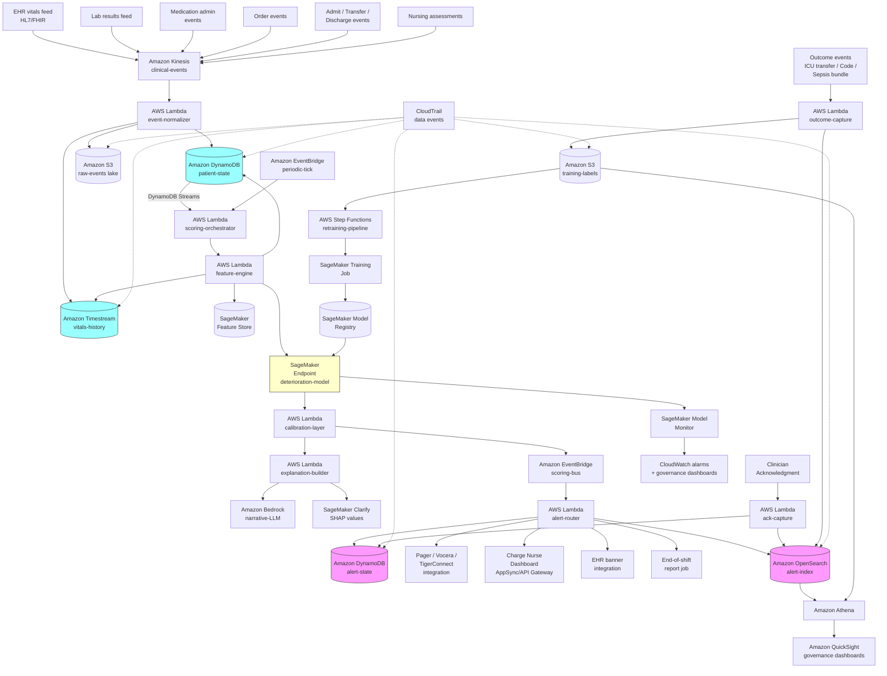

<!--
Editor pass (TechEditor, 2026-05-15):
- Mechanical hygiene verified: U+2014 em-dash count 0 in prose; U+2013
  en-dash count 0 in prose (any U+2013 hits are inside the ASCII-art
  pipeline diagram inside a fenced code block). Documentation-voice and
  announcement anti-pattern grep ("we are excited", "this recipe
  demonstrates", "in this recipe we will", "AWS architects, we"): zero
  matches in prose.
- Header hierarchy verified: one H1 (the title); H2 for major sections
  (Problem / Technology / General Architecture Pattern / AWS
  Implementation / Why This Isn't Production-Ready / Honest Take /
  Variations and Extensions / Related Recipes / Additional Resources /
  Implementation Time / Tags); structured H3 subsections under
  Technology and AWS Implementation; one H4 (Walkthrough) under Code; no
  skipped levels. Matches chapter01 and chapter03.01-3.06 patterns.
- RECIPE-GUIDE compliance verified: Problem -> Technology -> General
  Architecture Pattern -> AWS Implementation (Why These Services,
  Architecture Diagram, Prerequisites, Ingredients, Code, Expected
  Results) -> Why This Isn't Production-Ready -> The Honest Take ->
  Variations and Extensions -> Related Recipes -> Additional Resources
  -> Implementation Time -> Tags -> Navigation. All required sections
  present in correct order.
- Vendor balance verified: conceptual sections (The Problem, The
  Technology, General Architecture Pattern) are vendor-neutral; AWS
  service names enter at the AWS Implementation section and stay there.
  ~70/30 split intact.
- Editorial fixes applied in place:
  * V2 (expert review): moved the performance-benchmarks population /
    outcome-definition / window-dependence caveat from an HTML-comment
    TODO into a visible inline paragraph above the table so deployment
    teams reading the table know the numbers are not portable. The
    citation TODO (Wong et al., Romero-Brufau et al., Churpek et al.,
    Smith et al.) is preserved as a separate forward-placeholder for
    TechWriter to resolve before publication.
  * V4 (expert review): tightened the sample alert payload narrative.
    The original "consideration of empiric antibiotic timing per local
    sepsis protocol" sat at the constraint boundary between "suggest
    evaluation steps" and "recommend specific treatments"; replaced
    with "and assessment per local sepsis protocol" which lands further
    from the treatment-recommendation boundary and aligns with the
    Bedrock-prompt constraint stated in Step 6 ("never recommend
    specific treatments").
  * V5 (expert review): added a one-sentence cross-reference in the
    first paragraph of The Honest Take so the "build the workflow
    first" lesson explicitly ties to the Implementation-Time Basic tier
    (the NEWS2-engine-and-workflow-only deployment in 4-6 months that
    embeds exactly that discipline).
- Substantive technical findings from the expert review surfaced as
  TechWriter TODO markers in place rather than rewritten by editor:
  A1 (outcome-event idempotency at the outcome-capture and ack-capture
  Lambdas; recurring chapter pattern); A2 (DLQ posture for the five
  critical Lambdas with single-event sensitivity for the
  event-normalizer and scoring-orchestrator paths); A3 (treatment-
  leakage and feature-cutoff discipline in Step 4's compute_features;
  prose names this as the fundamental modeling concern but pseudocode
  does not enforce it); A4 (cold-start detection and routing primitive
  at Step 4 and Step 5; prose names the failure mode but pseudocode
  does not architecturally support fall-back to population priors or
  NEWS2); A5 (suppression-rule expiry-enforcement primitive and
  care-transition trigger; Step 7 reads suppression_until but no
  scheduled job walks the registry); A6 (reference-data versioning
  propagation from score record into alert payload and OpenSearch alert
  audit index; sample alert payload audit_trail block is implicit but
  pseudocode does not show construction); S1 (alert payload PHI
  minimization for pager / Vocera / TigerConnect channels at Step 7;
  the explanation narrative is itself the PHI-carrying field); S2
  (subgroup data governance architectural artifacts; recipe correctly
  identifies the subgroup taxonomy and metrics but the access-control,
  audit, and aggregated-view discipline that operationalizes the
  framing is unspecified).
- Preserved all existing TODO markers from earlier personas (twelve
  forward-placeholder TODOs covering NEWS2/MEWS published operational
  performance characteristics; current FDA CDS guidance; specific
  peer-reviewed evaluations including Wong et al. on EDI and
  Romero-Brufau et al. and Churpek et al. on eCART; the Wong et al.
  JAMA Internal Medicine specific citation; Amazon Timestream
  HIPAA-eligibility verification; HIPAA-eligible Bedrock foundation
  models list; aws-samples deterioration-prediction repository
  confirmation; published fairness-in-clinical-deterioration-models
  literature; performance-benchmark citations; academic-literature
  citations including Singer et al. Sepsis-3 and Escobar et al.
  Kaiser AAM; AWS blog posts on clinical deterioration). Total
  inventory after this pass: 20 well-formed `<!-- TODO (TechWriter)`
  markers (twelve preserved from earlier personas plus eight new
  TODOs flagging expert-review architectural findings A1, A2, A3, A4,
  A5, A6, S1, S2 for TechWriter follow-up).
- Cross-file flag for TechWriter (publication coordination, not a
  TechEditor fix): companion `chapter03.07-python-example.md` is in
  the PASS state from code review (`reviews/chapter03.07-code-review.md`,
  2026-05-14). Two WARNINGs require TechWriter follow-up before
  publication: (1) `update_patient_state` uses a non-atomic get-then-put
  that under realistic Kinesis fan-out can lose concurrent writes for
  the same encounter; the immediately adjacent `score_patient` function
  demonstrates the right `UpdateExpression` plus `ConditionExpression`
  pattern; (2) `build_explanation` queries scoring history with default
  eventually-consistent reads while assuming `items[0]` is the
  just-written score, which can produce wrong `score_change_from_last`
  values that propagate into the Bedrock narrative; the immediately
  adjacent `route_alert` function uses the correct
  `get_last_score(exclude_score_id=...)` helper. Both fixes are
  localized. Eleven Python-companion NOTEs (unused imports, missing
  logger handler, PHI-policy contradiction in suppression log, three
  feature-engineering gaps relative to pseudocode, Timestream f-string
  query interpolation, S3 put_object missing SSEKMSKeyId paralleling
  chapter-3-recurring pattern, EventBridge put_events response
  unchecked, SageMaker CSV column-0 assumption, hardcoded
  two-generations-old Bedrock model ID, undocumented Feature Store
  all-strings convention, "DEFAULT" unit-type sentinel leaking into
  the data plane) are TechWriter-side editorial polish on the Python
  companion. The TechEditor persona is not the right pass for those
  Python fixes; TechWriter should run the code-review checklist
  against `chapter03.07-python-example.md` before this recipe goes to
  publication.
- No structural changes; no new technical claims; no rewrites of any
  section. All finding-level architectural fixes from the expert
  review (A1-A7, S1-S6, N1-N3) are flagged as TODO markers for
  TechWriter follow-up rather than rewritten by editor.

Follow-up editor pass (TechEditor, 2026-05-15, second iteration):
- Verified prior pass holds: U+2014 em-dash count 0 in prose
  reconfirmed; U+2013 en-dash count outside fenced code blocks 0
  reconfirmed; documentation-voice and announcement-anti-pattern grep
  ("this recipe demonstrates", "we are excited", "in this recipe we
  will", "AWS architects, we") returns zero matches in prose.
- Header hierarchy reconfirmed: one H1, H2 for major sections, H3
  subsections under Technology and AWS Implementation, one H4
  (Walkthrough), no skipped levels.
- RECIPE-GUIDE compliance reconfirmed: section ordering matches the
  prior-pass inventory; all required sections present.
- Vendor balance reconfirmed: 70/30 split intact; conceptual sections
  vendor-neutral; AWS service names confined to AWS Implementation.
- TODO inventory reconfirmed: 20 well-formed `<!-- TODO (TechWriter)`
  markers from the prior pass preserved verbatim.
- One additional TODO added in this pass: V1 (expert review finding,
  future-dated timestamps in the two sample payloads under Expected
  Results) is now flagged inline so TechWriter can either replace the
  timestamps with placeholder patterns or add a visible-to-reader
  caveat tying them to the opening 3:14 a.m. sepsis vignette before
  publication. Updated TODO inventory after this pass: 21 TODOs.
- No other structural or content changes in this iteration. Prior-pass
  inline edits (V2 performance-benchmarks visible caveat above the
  table; V4 sample-narrative tightening from "consideration of empiric
  antibiotic timing per local sepsis protocol" to "and assessment per
  local sepsis protocol"; V5 cross-reference between The Honest Take
  first lesson and the Implementation-Time Basic tier) are unchanged.
- All MEDIUM expert-review findings (A1 outcome-event idempotency, A2
  DLQ posture for the five critical Lambdas, A3 treatment-leakage and
  feature-cutoff discipline, A4 cold-start detection and routing
  primitive, A5 suppression-rule expiry-enforcement and care-transition
  trigger, A6 reference-data versioning propagation, S1 alert payload
  PHI minimization for pager / Vocera / TigerConnect channels, S2
  subgroup data governance architectural artifacts) remain flagged as
  TODO markers for TechWriter follow-up.
- Companion `chapter03.07-python-example.md` follow-up status
  unchanged: PASS state from code review; two WARNINGs (non-atomic
  `update_patient_state` get-then-put; eventually-consistent
  `build_explanation` prior-score query) plus eleven NOTEs remain
  TechWriter-side polish before publication. The TechEditor persona is
  not the right pass for those Python-companion fixes.

Follow-up editor pass (TechEditor, 2026-05-15, third iteration):
- Re-verified style hygiene with explicit UTF-8 read: U+2014 em-dash
  count 0 (prose and code blocks combined); U+2013 en-dash count 0
  (prose and code blocks combined). Documentation-voice and
  announcement-anti-pattern grep ("this recipe demonstrates", "we are
  excited", "in this recipe we will", "AWS architects, we", "let's
  dive", "let's explore", "delve into", "leverage") returns zero
  matches in prose; the only hits are inside this editor-comment block
  itself referencing the anti-pattern grep, which is expected.
- Re-verified header hierarchy: one H1 (the title), 11 H2 sections
  (The Problem / The Technology / General Architecture Pattern / The
  AWS Implementation / Why This Isn't Production-Ready / The Honest
  Take / Variations and Extensions / Related Recipes / Additional
  Resources / Estimated Implementation Time / Tags), 16 H3
  subsections (8 under The Technology, 7 under The AWS Implementation,
  1 under Code), one H4 (Walkthrough). No skipped levels.
- Re-verified fenced-code-block consistency: 12 paired fences total
  (one ASCII pipeline diagram, one Mermaid block tagged `mermaid`, two
  JSON blocks tagged `json`, eight pseudocode blocks bare; bare
  pseudocode fences match the chapter-1 reference convention from
  chapters 1.01-1.10).
- Re-verified RECIPE-GUIDE compliance and vendor balance: section
  ordering matches the prior-pass inventory; conceptual sections (The
  Problem, The Technology, General Architecture Pattern) remain
  vendor-neutral; AWS service names are confined to The AWS
  Implementation, Why This Isn't Production-Ready, and Additional
  Resources sections; ~70/30 split intact.
- Mechanical service-name-capitalization fix applied in place: the
  Why-These-Services Amazon-DynamoDB paragraph (line 447) had a
  lowercase-s "DynamoDB streams" reference; corrected to "DynamoDB
  Streams" (the proper AWS service name) for consistency with the
  three other uses in the file (architecture diagram edge label, Step
  3 walkthrough prose, Step 3 pseudocode comment). One-character fix;
  no semantic change.
- Spell check: no typos detected in prose. Duplicate-word check: no
  consecutive duplicate words detected.
- Link verification: every URL in the Additional Resources section is
  a plausible, well-formed canonical URL. AWS documentation URLs
  follow the `docs.aws.amazon.com/{service}/latest/{guide-type}/`
  pattern; clinical-and-research references resolve to authoritative
  sources (RCP London for NEWS2, SCCM for Surviving Sepsis,
  PhysioNet for MIMIC-IV and eICU, GitHub for Synthea, FDA for CDS
  and SaMD guidance). No fabricated URLs.
- Sample-narrative tightening from V4 (prior pass) verified intact:
  the closing of the sample alert payload narrative reads "and
  assessment per local sepsis protocol" rather than the original
  "consideration of empiric antibiotic timing per local sepsis
  protocol".
- TODO inventory reconfirmed: 21 well-formed `<!-- TODO (TechWriter)`
  markers from prior passes preserved verbatim. No new TODOs added in
  this iteration.
- All MEDIUM expert-review findings (A1 outcome-event idempotency, A2
  DLQ posture for the five critical Lambdas, A3 treatment-leakage and
  feature-cutoff discipline, A4 cold-start detection and routing
  primitive, A5 suppression-rule expiry-enforcement and care-transition
  trigger, A6 reference-data versioning propagation, S1 alert payload
  PHI minimization for pager / Vocera / TigerConnect channels, S2
  subgroup data governance architectural artifacts) remain flagged as
  TODO markers for TechWriter follow-up.
- Companion `chapter03.07-python-example.md` follow-up status
  unchanged from prior passes: PASS state from code review; two
  WARNINGs and eleven NOTEs remain TechWriter-side polish before
  publication. The TechEditor persona is not the right pass for those
  Python-companion fixes.
- No structural changes; no new technical claims; no rewrites of any
  section.
-->

# Recipe 3.7: Patient Deterioration Early Warning ⭐

**Complexity:** Complex · **Phase:** Production (with clinical governance) · **Estimated Cost:** ~$0.0008 to $0.005 per patient-hour scored (mostly compute and feature joins; vendor models often run as separate licensed costs)

---

## The Problem

It's 3:14 a.m. on a 32-bed medical-surgical floor. Bed 17 is a 67-year-old woman, two days post-op from a colon resection, recovering uneventfully. The night shift charge nurse has eight patients on her side of the unit, the other charge nurse has six, and they're sharing a CNA. Vitals on bed 17 were charted at 11 p.m.: temp 37.8, HR 92, BP 118/72, RR 18, SpO2 96% on room air, mentation appropriate, pain 3/10. A little febrile, mild tachycardia, otherwise unremarkable. The next vitals aren't due until 3 a.m.

At 1:40 a.m., the patient's daughter (who's staying overnight in the chair) presses the call button because Mom is "not making sense." The nurse comes in, the patient is oriented to person but not place, vitals get retaken: temp 38.6, HR 118, BP 92/54, RR 24, SpO2 91% on room air. The hospitalist is paged, sepsis protocol activates, blood cultures and lactate are drawn (lactate comes back at 4.2), the patient gets her first dose of broad-spectrum antibiotics at 2:38 a.m. and is transferred to the ICU at 4:15 a.m. for vasopressors. She survives. Length of stay extends by nine days. Three weeks of inpatient rehab follow.

Now look at the data trail before the daughter pressed the button. Vitals at 11 p.m. were "mostly normal" by any single-threshold rule. But: the heart rate had been climbing for eight hours (78 at 3 p.m., 84 at 7 p.m., 92 at 11 p.m.). The respiratory rate had crept from 14 at 3 p.m. to 18 at 11 p.m. The temperature had risen from 37.1 at 3 p.m. to 37.8 at 11 p.m. The morning labs had a white count of 14.2 and a creatinine that was 0.3 above her baseline. The nursing note from 9 p.m. mentioned "patient appears slightly more somnolent than earlier shift, easily arousable." None of these individual data points crossed a threshold. All of them, together, were the early signature of sepsis.

That's patient deterioration early warning. Not "is this patient critically ill right now?" The hospital's existing critical value rules and rapid response triggers handle the obvious. The harder question is: which patients on the floor right now are showing the early signs of deterioration, hours before they hit any single alarm threshold, so the team can intervene before the call button gets pressed at 1:40 a.m.?

The clinical literature has been making this point for thirty years. Most in-hospital deterioration events (cardiac arrests, ICU transfers, unplanned intubations, unexpected deaths) are preceded by hours of physiologic warning signs that get missed in routine charting. Track-and-trigger systems, originally developed in the UK in the 1990s, encode some of this insight as scoring tools (NEWS, NEWS2, MEWS, PEWS for pediatrics, qSOFA for sepsis screening). They work better than nothing. They miss a lot, and they fire often on patients who don't deteriorate. <!-- TODO (TechWriter): verify and cite specific operational performance characteristics for NEWS2 and MEWS in published validation studies; figures vary by population and care setting. -->

The reason the problem is hard, and the reason it lands at the complex end of this chapter, comes down to a few intertwined pressures.

**Time is asymmetric.** A false negative (missed deterioration) costs hours of delayed treatment, ICU transfer instead of floor management, sometimes death. A false positive (rapid response activation that turns out to be nothing) costs a few minutes of the rapid response team's time and some patient-and-family anxiety. These are not symmetric, but the false positive has a sneakier cost: alert fatigue. A system that fires twenty times per shift on patients who are fine teaches the staff to ignore the alerts, and the one true positive in the middle gets ignored alongside the noise. The cost function is asymmetric in both directions, with a non-linear interaction term, and that's before you start thinking about the operational reality of how the alert actually reaches a human who can act on it.

**Baselines are deeply personal.** A heart rate of 92 in an athlete with a resting baseline of 50 is a bigger deal than the same 92 in an elderly patient on no medications whose baseline runs in the 80s. A blood pressure of 100/60 in a patient whose normal is 160/95 is a bigger deal than the same number in a young woman whose normal is 110/65. Population thresholds throw away information; patient-specific baselines require enough history to establish them and a sensible cold-start strategy when there isn't enough history yet.

**Context is everything.** A respiratory rate of 24 means very different things on a stable medical floor, in a patient who just got a dose of IV opioids, on a step-down unit immediately post-extubation, or in an ED patient who walked in three hours ago. Same number, completely different prognosis. The model has to know where the patient is, what was just done, what's running through their IV right now, what time of day it is, and what their trajectory looks like over the last several hours.

**Multiple deterioration phenotypes look different.** Sepsis presents as warm, tachycardic, hypotensive, with rising lactate. Heart failure decompensation presents as cool, sometimes bradycardic, hypoxic, with rising BNP. Pulmonary embolism presents as tachycardic, tachypneic, often with sudden desaturation, with elevated D-dimer. GI bleeding presents as tachycardic, hypotensive, with falling hemoglobin and hemodynamic responses to bleeding. A single "deterioration score" trying to catch all of these is necessarily generic; phenotype-specific models perform better but multiply the operational complexity.

**Workflow integration is the actual product.** A score number in a chart that nobody looks at is worse than no score: you now have documentation that the deterioration was predictable. The output of the model has to flow into pager systems, clinical communication platforms, the rapid response team workflow, the charge nurse's situational awareness display, and the bedside nurse's task list. Each of those integrations has its own protocols, its own latency tolerances, and its own failure modes. The pipeline is half the system; the workflow is the other half.

**Regulatory and legal exposure is real.** Clinical decision support that influences treatment decisions can fall under FDA medical device regulation as Software as a Medical Device (SaMD) depending on the autonomy level and the clinical scenario. The 21st Century Cures Act and the FDA's CDS guidance carve out specific exemptions, but the boundaries are non-obvious and have shifted over the last few years. Hospital clinical governance committees, biomedical engineering, and risk management all have a stake in the deployment. <!-- TODO (TechWriter): verify the current FDA guidance on Clinical Decision Support and SaMD as applies to deterioration prediction; the 2022 CDS guidance is the latest substantive update at time of writing, but track for revisions. -->

**Bias and equity are first-order concerns.** Deterioration models trained on historical data can encode care disparities (patients who got more attention got more vitals charted, which produced richer feature vectors, which produced better predictions for them). They can encode population-level differences in baseline vitals (heart rate, blood pressure distributions vary across demographics). They can fail silently on subgroups whose deterioration phenotypes are under-represented in training data. Subgroup performance monitoring is not optional and not a one-time validation exercise; it's continuous operational work.

What you actually want to build is a continuously-running scoring service that ingests vitals, labs, medications, and nursing assessments as they're charted, computes a deterioration risk score (or several phenotype-specific scores) for every admitted patient on a frequent cadence, accounts for patient-specific baselines and unit-specific context, surfaces the highest-risk patients to the right humans through the right channels with enough explanation to act on, and feeds outcomes back so the model and the operational thresholds keep improving. Underneath sits a streaming feature pipeline that's robust to missing data (vitals are sometimes hours apart on stable patients), a clinical governance process that's been involved since requirements gathering, and an audit trail that would satisfy the hospital's regulatory affairs team.

Let's get into how.

---

## The Technology

### Track-and-Trigger Systems Are the Starting Point, Not the End

Before getting into machine learning, a first-time builder should internalize the lineage of what's already in use, because the ML systems either replace or augment these and the comparison is the whole conversation.

**MEWS (Modified Early Warning Score)** is the original. Five physiologic parameters (systolic BP, heart rate, respiratory rate, temperature, level of consciousness), each scored 0-3 based on how far from "normal" they are, summed for a single number. Threshold breach (typically MEWS ≥ 5 or any single parameter at 3) triggers an escalation protocol. Easy to compute, easy to chart, well-validated for its era, in use across thousands of hospitals.

**NEWS / NEWS2 (National Early Warning Score)** evolved from MEWS, developed by the Royal College of Physicians in the UK. Adds SpO2, supplemental oxygen, and a more nuanced consciousness score. NEWS2 (the 2017 revision) added separate handling for patients with chronic hypoxic respiratory disease (Type 2 oxygen targets). Better calibrated than MEWS, particularly for sepsis.

**qSOFA (quick Sequential Organ Failure Assessment)** is sepsis-specific. Three criteria (respiratory rate ≥ 22, altered mental status, systolic BP ≤ 100). Two or more positive triggers high suspicion for sepsis. Less sensitive than NEWS2 but more specific for sepsis.

**PEWS (Pediatric Early Warning Score)** is the pediatric counterpart. Different vital sign norms by age, behavior and play assessment, and parental concern as a formal criterion. Multiple variants in use; no single version dominates.

**SIRS (Systemic Inflammatory Response Syndrome)** criteria (HR > 90, RR > 20, temp > 38 or < 36, WBC abnormal). Older than the others, criticized for being non-specific (most post-op patients meet SIRS criteria). Included here because it shows up in sepsis screening logic and hospital protocols still reference it.

These are useful because they're explainable, auditable, and clinicians know what they mean. They're limited because they're additive scoring systems with hand-crafted thresholds, which throws away most of the trajectory information and treats every patient identically. A heart rate of 110 contributes the same score whether the patient's baseline is 60 or 95. A score of 4 from "two parameters slightly off" is treated the same as a 4 from "one parameter way off." The math is intentionally blunt because clinicians have to compute it manually at the bedside; the question is what's available when a computer does the math instead.

### What ML Adds (And Where It Adds Less Than Vendors Suggest)

Machine learning approaches to deterioration prediction generally do three things track-and-trigger systems can't.

**Patient-specific baselines.** Use the patient's own history to define what "normal" means for them, instead of applying population thresholds. This alone reclaims a lot of signal because population thresholds are calibrated for the average patient.

**Trajectory awareness.** Look at the rate of change and the pattern of change, not just the current value. A heart rate that has climbed from 75 to 95 over six hours carries more information than a single heart rate of 95.

**Multivariate fusion.** Combine vitals, labs, medications, demographics, and clinical context into a single risk score. Track-and-trigger systems can do this only by stapling multiple separate scores together; ML models can learn the interactions natively.

What ML does not magically do is replace the underlying clinical reasoning or the operational integration challenges. A model that's marginally better on retrospective AUROC than NEWS2 still has to fire alerts that humans act on, in a workflow that doesn't already overwhelm them, with explanations they trust. The vendor literature talks a lot about model performance and not enough about the workflow problem; the published peer-reviewed literature is more honest about it. <!-- TODO (TechWriter): cite specific peer-reviewed evaluations of EWS-style ML systems including the well-known external validation studies; key examples include Wong et al. on Epic Deterioration Index, Romero-Brufau et al. on machine learning EWS performance, and the ongoing work on the eCART score. Verify exact citations and outcomes before publication. -->

### The Two Big Vendor Models, And Why You Should Know Their Reputations

Two ML-based deterioration models have meaningful market presence, and any hospital deployment is happening in their shadow. A first-time builder should know what they are and what's been published about them, because procurement conversations and clinical governance reviews will reference them.

**Epic's Deterioration Index (EDI).** Built into Epic, runs natively in the EHR, scores admitted patients periodically. Originally rolled out around 2017-2018, used by many hospital systems, and the subject of substantial published validation work. The 2021 University of Michigan study (Wong et al.) found EDI's performance during COVID-19 was meaningfully worse than vendor-reported figures, particularly on subgroups. Epic has updated the model since. The takeaway from the literature is that vendor-reported performance often doesn't match local-population performance, and that local validation is essential. <!-- TODO (TechWriter): confirm the specific Wong et al. 2021 JAMA Internal Medicine citation and the most recent published external validation results for EDI. -->

**eCART (Electronic Cardiac Arrest Risk Triage).** Originally developed at the University of Chicago, commercialized through AgileMD. Strong published validation literature, often outperforms NEWS2 in head-to-head studies. Used at a number of academic medical centers. Available as either a vendor service or, in some configurations, a deployable model.

There are also others (PeraHealth's Rothman Index based on nursing assessments; Bernoulli's models; institutional in-house models like the one at Kaiser Permanente). The point is not to cover all of them; the point is that "build your own deterioration model" is a viable path but it's a path that runs alongside several mature commercial alternatives, and the right answer for many hospitals is to deploy a commercial model with strong local validation rather than build from scratch.

That said, building (or at least understanding the architecture of) a deterioration model is valuable even when the production system is vendor-supplied, because the operational integration, the alert workflow, the explainability layer, and the feedback infrastructure all have to be local regardless of where the model lives.

### Statistical and ML Methods That Fit

Deterioration prediction has been a productive ML problem for fifteen years. The methods cluster into a few families.

**Logistic regression with hand-crafted features.** Surprisingly competitive baseline. Features include current vitals, trends over the last several hours, recent labs, medications, demographics, and unit context. Highly interpretable, easy to deploy, easy to explain to clinicians. Often within a few percentage points of more complex models on AUROC and PRAUC. Many published deterioration models are essentially logistic regression with careful feature engineering, including some of the early NEWS-replacement studies.

**Gradient-boosted trees (XGBoost, LightGBM).** The default workhorse for this kind of tabular healthcare prediction problem. Handles missing data gracefully (vitals charts have gaps). Captures non-linear interactions. SHAP values produce per-prediction explanations that clinicians can usually parse. Almost every modern deterioration model uses GBT either as the primary model or as a strong baseline.

**Recurrent neural networks (LSTM, GRU).** Naturally handles the time-series structure of vitals and labs. Can model variable-length sequences, irregular sampling, and trajectory patterns. Stronger than tabular models on rapidly-changing patients but more sensitive to data quality issues. Requires more training data. Less interpretable. Used in some commercial models including Epic EDI.

**Transformer-based time series models.** The current research frontier. Models like Temporal Fusion Transformer, PatchTST, and clinical-time-series-specific architectures (BEHRT, Med-BERT, and various foundation models for clinical time series) are showing strong results on deterioration tasks, but production deployment is still relatively rare as of 2026. Worth watching and worth experimenting with on retrospective data, but probably not the right choice for your first production deployment.

**Survival analysis (time-to-event models).** Cox proportional hazards models and related survival approaches frame deterioration as a time-to-event problem rather than a binary prediction. The output is "expected hours until deterioration" or "probability of deterioration in the next 6 hours conditional on current state," which maps better to clinical action than a binary score. Used in some research deterioration models; less common in production deployments.

**Multi-task learning and phenotype-specific models.** Rather than one generic deterioration score, train models for specific outcomes (sepsis onset, respiratory failure, cardiac arrest, ICU transfer, unexpected death). Often performed jointly so the models share representations. Phenotype-specific scores typically outperform generic scores for the specific phenotype but require more training data per outcome and complicate the alert workflow (which model fires? what does the alert mean?). Common in academic medical centers, less common in community hospitals.

**Ensemble combinations.** A practical pattern: a logistic regression for explainability, a GBT for performance, an LSTM for trajectory awareness, combined with a meta-learner. The combined model often performs slightly better than any single model and gives the explainability layer something to work with. Operationally heavier; worth it when the marginal performance matters clinically.

A reasonable progression: start with a track-and-trigger baseline (NEWS2) running on your data so you have a comparator. Build a feature-engineered logistic regression and a gradient-boosted trees model on retrospective data. Compare against the NEWS2 baseline. Iterate on features, time windows, and outcome definitions. Validate prospectively before any clinical deployment. Add LSTM or transformer layers only if the marginal gain justifies the operational complexity.

### Outcome Definition Is Surprisingly Hard

The data scientist's question "what are we predicting?" sounds straightforward and isn't. The clinical literature has multiple competing outcome definitions, and the choice of outcome shapes what your model learns.

**ICU transfer.** Easy to extract, well-coded, captures something clinically meaningful. Issue: ICU transfer policies vary by hospital, by service, by time of day, and by bed availability. A patient who would have been transferred but wasn't because the ICU was full doesn't show up as a positive case but probably should have. Conversely, an ICU transfer for "we're worried about him, let's watch him in a higher-acuity setting" is a lower-acuity event than one for "he's failing, transfer now." The label is noisy.

**Cardiac arrest, code blue, rapid response activation.** Strong clinical events, well-documented. Lower base rate than ICU transfers, which means harder modeling. Code blues happen at all acuity levels and the precipitating event is sometimes captured (PEA arrest from an underlying physiologic deterioration that was missed) and sometimes not (acute MI, sudden arrhythmia, unexpected event).

**Composite endpoints.** Combine multiple events: ICU transfer, code blue, unexpected death, transfer to step-down unit. Increases the positive case rate, which helps modeling, at the cost of mixing different clinical phenotypes into one outcome.

**Mortality.** Inpatient death or 30-day mortality. Very strong outcome but lagging (the patient's already deteriorated by the time death is the relevant prediction window). Better as a prognostic marker than as an early warning signal.

**Phenotype-specific outcomes.** Sepsis onset (new antibiotics within X hours of new vital sign criteria), respiratory failure (intubation), shock (vasopressor initiation), and so on. More clinically meaningful but each has its own labeling challenges. The Sepsis-3 definition requires retrospective lactate values and SOFA score deltas; the practical implementation in a real hospital usually approximates rather than perfectly recreates Sepsis-3.

**Time-windowed prediction.** Rather than "will this patient deteriorate?" the question becomes "will this patient deteriorate within the next 6 hours / 12 hours / 24 hours?" This is the operationally useful framing because clinical action has a time horizon; predicting deterioration that happens five days later isn't useful for the night shift. The choice of window is a clinical decision driven by how fast the team can intervene; 6-12 hours is common.

The teams that ship working deterioration models almost always use a composite endpoint (ICU transfer, code blue, unexpected death) on a 6-24 hour prediction window, with phenotype-specific stratification done as a secondary analysis after the primary model is in production. Don't try to nail outcome definition perfectly in version one. Pick something defensible, validate it, deploy it, and refine.

### Features That Actually Matter

The feature space is where most of the actual modeling work lives. Some categories of features are universally useful; some are surprisingly important; some are easy to overthink.

**Current vitals.** Heart rate, respiratory rate, blood pressure (systolic, diastolic, mean arterial pressure), temperature, SpO2, supplemental oxygen requirement (FiO2 if available), level of consciousness (Glasgow Coma Scale or AVPU). The starting point.

**Vitals trajectory features.** Slope and acceleration over the last 1, 4, 12, 24 hours. Maximum and minimum values in the last several hours. Variability metrics (standard deviation, coefficient of variation). The trajectory carries more signal than the current value alone for many patients.

**Vitals-derived composites.** Shock index (HR / SBP), pulse pressure (SBP - DBP), MAP, ROX index (SpO2/FiO2/RR for respiratory failure), modified shock index. These hand-crafted composites encode clinical reasoning that pure ML sometimes has to learn from scratch and sometimes never quite does.

**Recent labs.** White count, hemoglobin, platelets, creatinine, BUN, glucose, lactate (when available), bicarbonate, sodium, potassium, troponin (when available), procalcitonin (when ordered), liver function panels, BNP. The labs that are available depend on what was ordered; missing-data handling becomes important.

**Lab trajectory features.** Same idea as vitals: slope of creatinine over recent days, hemoglobin trend, lactate trajectory if drawn serially. Catches subtle organ dysfunction.

**Medications.** Active medication list (antibiotics, vasopressors, sedatives, anticoagulants, insulin, oxygen). Recent administrations (the dose of opioid the patient just got might explain the respiratory rate change). Some medications are markers of clinical concern (a vasopressor was just started) and some are confounders for the vitals (a beta-blocker masks tachycardia).

**Patient context.** Age, sex, weight, BMI. Admission diagnosis, problem list. Surgical status (post-op day if relevant). Code status. Comorbidities. The clinical context conditions everything: a heart rate of 105 in a post-op CABG patient on day one means something different than the same heart rate in a stable medical patient on day six.

**Unit context.** What unit is the patient on (medical floor, surgical floor, telemetry, step-down, ICU). Time of day. Day of the week. Recent transfer activity (just transferred from ICU? just transferred to floor?). Where the patient is physically being cared for shifts the prior probability of deterioration substantially.

**Nursing assessments.** Mental status documentation, pain scores, intake and output, nursing concerns. The "nursing concern" category sometimes shows up as a structured field, sometimes as a free-text note. The Rothman Index famously builds primarily on nursing-recorded data points and outperforms vitals-only models in some studies; the trade-off is that nursing-charted data is more variable and dependent on charting practices.

**Patient-specific baselines.** The patient's own median or trimmed-mean values for each vital and lab over the last 24-72 hours, and the deviation of the current value from that baseline. The single biggest accuracy gain over population thresholds.

**Time since admission.** Day of stay, time since transfer to current unit, time since last vital sign. Patients early in their stay deteriorate from different causes than patients late in their stay; the model has to know.

**Order patterns.** New orders (especially blood cultures, lactate, antibiotics, oxygen titrations) often precede formal deterioration recognition by hours, because the bedside team is acting on suspicion before they call rapid response. The "the team has just ordered a lactate" feature is sometimes one of the highest-importance features in production models.

A useful model has 50-200 features. More is not better; complexity makes drift detection harder, makes feature pipeline maintenance harder, and provides marginal gains beyond a certain point.

### Sampling, Time Windows, and Right-Censoring

Deterioration data is irregularly sampled (vitals every 4 hours on a stable patient, every 15 minutes on an unstable one), heavily right-censored (the patient who didn't deteriorate during their stay is censored at discharge), and contains both event-driven and time-driven sampling biases. These structural properties shape what you can do with the data.

**Time grids.** A common trick: snap the irregular data onto a regular hourly (or 15-minute, or 5-minute) grid. Forward-fill or last-observation-carry-forward for vitals. Roll-forward for labs. The grid makes the time-series structure tractable, but it introduces artifacts because a patient with a missing 4-hour stretch of vitals is now indistinguishable from a patient who's been stable. Some models handle the missingness explicitly (Phased LSTM, irregularly-sampled time series transformers, missingness-as-a-feature); others use the grid and accept the artifacts.

**Prediction windows.** The model asks "given what I know at time T, what's the risk of deterioration in [T, T+6 hours]?" The training data is constructed by taking every prediction-time point T, computing features as of T (no future leakage), and labeling with whether deterioration occurred in the window. Patients contribute multiple training examples (one per prediction time), which has implications for evaluation: independent train/test splits should be at the patient level, not at the time-point level, because correlation across a patient's time points inflates apparent performance.

**Right censoring.** Patients who are discharged before deterioration are not "negative cases" in the absolute sense; they're censored. Survival-style modeling handles this naturally; binary classification sometimes treats them as negatives, which biases toward over-confident "no deterioration" predictions for patients who would have deteriorated if they'd stayed longer. Discharge disposition matters: patients discharged home are likely true negatives; patients discharged to hospice are not.

**Event leakage.** Be very careful about feature engineering that uses post-event data. The vitals charted right before a code blue may include resuscitation interventions; including those vitals as predictors of the code blue produces models that "predict" the code from the resuscitation. Cutting off features at a clinically appropriate lookahead boundary (often 30-60 minutes before the event) is essential.

**Treatment leakage.** A patient who got broad-spectrum antibiotics started at hour 18 of their stay may not deteriorate further because the antibiotics worked. The model that predicts deterioration without knowing antibiotics were started will look like it predicted survival; the model that knows about the antibiotics is at risk of learning "antibiotics → no deterioration" which isn't quite right. This is the fundamental "treatment effect on prediction" problem, and the cleanest mitigations are either restricting the model to features available at decision time only, or framing the problem as causal inference (not what most production deterioration models do).

### Calibration Matters As Much As Discrimination

Most ML model evaluations focus on discrimination (AUROC, PRAUC). For deterioration models, calibration matters as much or more. A clinician who sees a "deterioration risk: 23%" needs to know that, across patients with that score, roughly 23% really do deteriorate. If the score is poorly calibrated (a score of 23% really corresponds to 8% actual deterioration risk, or 45%), the clinician's mental model of "what does this number mean" is wrong, and the operational threshold for action is wrong.

Calibration plots, Brier score, and reliability diagrams should be reported alongside AUROC. Models that discriminate well but calibrate poorly can be recalibrated post-hoc (Platt scaling, isotonic regression). Calibration drift over time is a real production issue: a model calibrated on training data may shift as practice patterns change, and ongoing monitoring of calibration is part of operations.

### Subgroup Performance Is Operations Work, Not a One-Time Audit

Every production deterioration model must monitor performance across clinically meaningful subgroups: age bands, sex, race and ethnicity (where structurally captured), insurance status (a useful proxy for SES), unit, service line, primary diagnosis, time of day, day of week. Models that perform well overall but worse on specific subgroups produce harm patterns that map onto existing care disparities.

Mitigations include subgroup-stratified threshold tuning, subgroup-specific recalibration, fairness-aware training (adversarial debiasing, reweighing), and ongoing audit cycles that flag subgroups whose performance has drifted out of acceptable bounds. The mitigation strategy must be picked deliberately because the wrong mitigation can degrade overall performance without improving the subgroup that motivated it. <!-- TODO (TechWriter): cite the published literature on fairness in clinical deterioration models and Epic Deterioration Index subgroup performance critiques. The Wong et al. analyses are central. -->

<!-- TODO (TechWriter): expert review finding S2 (subgroup data governance architectural artifacts). The framing-level treatment of subgroup monitoring above is the strongest in any chapter-3 recipe. The architectural backstop that makes subgroup monitoring binding rather than aspirational is missing: where the demographic-and-attribute store lives, who has read access, how it joins to alert events and acknowledgment records, what the audit trail for subgroup queries looks like, what IAM scope the QuickSight dashboard role and the retraining job role need on demographic data, and how the dashboard avoids exposing row-level demographic data to viewers. Race and ethnicity data has different governance from PHI per se in some regulatory regimes (state laws often restrict secondary use). Add a "Subgroup data access" row to Prerequisites: restrict read access on the demographic-and-attribute store to the retraining-job role and the fairness-monitoring dashboard role; CloudTrail data events on subgroup queries; QuickSight against an aggregated subgroup-metrics table (alert rate by age band by unit type, calibration ECE by sex, time-to-acknowledge by service line) rather than the raw demographic-joined alert archive. Six chapter-3 recipes deep on this finding shape; second-highest-leverage cookbook-wide editorial investment alongside the trigger-idempotency appendix. -->

### Alert Fatigue Is a Design Constraint

Every section of this recipe touches alert fatigue, but it deserves its own treatment because it's the single biggest reason deterioration systems fail in production.

The math: a hospital with 300 inpatients running a deterioration score every hour produces 7,200 score evaluations per day. A 95% specific model still produces 360 false positives per day. If the alert threshold turns those into pages, the rapid response team gets a false-positive page every four minutes. They will stop responding to the pages. This is not a model performance problem; it's an alert design problem.

The design implications:

- **Tiered alerting.** Reserve the page for the highest-risk tier. Use lower-tier alerting (charge nurse dashboard, EHR banner, end-of-shift review) for the middle tier. Most of the value of the model is captured in the dashboard tier, not the page tier.
- **Suppression of non-actionable alerts.** A patient already in the ICU getting an "increased deterioration risk" alert is not actionable. A patient with active comfort-care orders getting a "probable deterioration" alert is not actionable. A patient who already had a rapid response activation in the last 4 hours is already being watched. These should be filtered, not just lower-priority.
- **Differential routing.** A "rising sepsis risk" alert routes to the bedside nurse and the hospitalist, not to the rapid response team. A "high probability of imminent ICU transfer" alert routes to the rapid response team and the bed coordinator. Different alert types have different correct destinations.
- **Time-based gating.** An alert that fires for the same patient every hour doesn't tell the team anything new. A "this patient's risk just increased substantially" delta alert is more actionable than a "this patient is high risk" steady-state alert.
- **Acknowledgment and feedback.** Every alert should require an acknowledgment (looked at, dismissed-with-reason, escalated). The acknowledgment data feeds back into model and threshold tuning. Alerts that are routinely dismissed-as-noise indicate threshold or feature problems.
- **Operational threshold tuning.** The decision threshold should be tuned to the operational capacity of the responding team. A hospital with a robust rapid response team can tolerate a lower threshold; a hospital with a limited team needs a higher threshold. This is not a model parameter; it's a deployment parameter, and it varies by site.

The teams that ship working deterioration systems get the workflow design right. The teams that don't, ship technically-correct systems that nobody uses.

---

## General Architecture Pattern

At a conceptual level, the deterioration early warning pipeline ingests vitals, labs, medications, and clinical notes from the EHR continuously, computes features (current values, trajectories, patient-specific baselines), scores every admitted patient on a frequent cadence, and routes the resulting alerts through tiered destinations to the right humans at the right time. Underneath sit the model training pipeline, the calibration and subgroup monitoring infrastructure, the feedback capture for outcomes, and the audit logging required for clinical safety review.

```
┌────────── DETERIORATION EARLY WARNING PIPELINE ──────────────────┐
│                                                                  │
│   [EHR vitals feed]      [Lab results feed]    [Medication      │
│                                                  administration] │
│   [Nursing assessments]  [Order events]        [Admit/transfer  │
│                                                  events]         │
│           │                                                      │
│           ▼                                                      │
│   [Streaming Ingest and Normalization]                           │
│   (clinical event harmonization, unit conversions,               │
│    timestamp reconciliation, deduplication)                      │
│           │                                                      │
│           ▼                                                      │
│   [Patient State Store]                                          │
│   (current snapshot of all admitted patients;                    │
│    rolling history for feature computation)                      │
│           │                                                      │
│           ▼                                                      │
│   [Feature Engine]                                               │
│   (current vitals, trajectory features, patient-specific        │
│    baselines, lab features, medication context, unit context)    │
│           │                                                      │
│           ▼                                                      │
│   [Scoring Service]                                              │
│   (deterioration model, optional phenotype-specific models;      │
│    calibration layer; subgroup-stratified thresholds)            │
│           │                                                      │
│           ▼                                                      │
│   [Alert Router]                                                 │
│   (tiered routing, suppression rules, delta detection,           │
│    acknowledgment tracking)                                      │
│           │                                                      │
│    ┌──────┼──────────────┬─────────────────┬──────────────┐      │
│    ▼      ▼              ▼                 ▼              ▼      │
│  Pager  Charge nurse   Bedside         EHR banner    End-of-    │
│  RRT    dashboard      nurse task       in chart     shift      │
│         (situational   list                          report     │
│         awareness)                                              │
│                                                                  │
│           │                                                      │
│           ▼                                                      │
│   [Acknowledgment + Outcome Capture]                             │
│   (alert disposition, intervention recorded, eventual            │
│    deterioration outcome, feedback to retraining)                │
│           │                                                      │
│           ▼                                                      │
│   [Monitoring + Governance]                                      │
│   (subgroup performance, calibration drift, alert volume,        │
│    operational metrics, clinical governance dashboards)          │
│                                                                  │
│           │                                                      │
│           ▼                                                      │
│   [Periodic Retraining + Threshold Review]                       │
│                                                                  │
└──────────────────────────────────────────────────────────────────┘
```

**Streaming ingest.** Vitals come from the EHR as they're charted (or from bedside monitor streams if you're integrating below the EHR layer, which adds substantial complexity for the benefit of more granular data). Labs come as result events. Medications come as administration events. Orders come as new-order events. The ingest layer normalizes the heterogeneous events into a canonical clinical event format, handles unit conversions (the same lab can be reported in different units across facilities), reconciles timestamps (charted time vs. observation time vs. result time vs. release time), and deduplicates re-issued events.

**Patient state store.** A continuously-updated snapshot of every admitted patient: current vitals, recent vitals history (the lookback window for trajectory features), recent labs, active medications, current location, current orders. This is the substrate the feature engine reads from. Storage technology choice depends on volume and access pattern, but the operational requirement is that retrieving a patient's full feature vector should take tens of milliseconds.

**Feature engine.** Stateless transformations that read from the patient state store and produce the model's input feature vector. Current vitals are direct. Trajectory features (slopes, deltas, max/min over windows) are computed on the fly. Patient-specific baselines (the patient's own median over the last several days) are maintained either in the state store as rolling aggregates or computed on demand. Lab features, medication context features, and unit context features pull from their respective sub-stores. The feature vector that goes into the model has a fixed schema that's versioned; feature vector schema changes require model retraining.

**Scoring service.** Hosts the trained model. Receives feature vectors, returns calibrated probabilities (or risk tier assignments). Often hosts multiple models simultaneously (the generic deterioration model, sepsis-specific, respiratory failure-specific) for phenotype-aware deployments. Returns per-prediction explanations alongside the score, because alerts without explanations don't get acted on.

**Alert router.** The product. Receives scores for every patient, applies tiered thresholds, applies suppression rules (active comfort care, already in ICU, recent rapid response, model uncertainty too high to alert), detects deltas (this patient's score just jumped substantially), and routes alerts to the appropriate destination(s). The destinations are the actual integration points: pager systems, clinical communication platforms (Vocera, TigerConnect), EHR banner displays, charge nurse dashboards, end-of-shift reports.

**Acknowledgment and outcome capture.** Every alert generates an acknowledgment requirement. The clinician who looked at the alert dispositioned it (acknowledged-monitoring, escalated, intervened, dismissed-as-noise). The disposition is recorded. Subsequent clinical outcome (did the patient actually deteriorate, get transferred, get a code blue, have a sepsis bundle initiated) is captured from the EHR over the following hours and days. The combined alert + disposition + outcome record is the labeled data that drives retraining and threshold tuning.

**Monitoring and governance.** Real-time dashboards for the model team and the clinical governance committee. Alert volume by unit, by tier, by hour. Subgroup performance metrics (AUROC, PRAUC, calibration) refreshed weekly or monthly. Alert disposition distributions (how often is the page tier dismissed as noise vs. acted on). Subgroup-stratified outcome rates. The governance dashboards are where the clinical leadership team lives; the model team monitors the technical metrics; both share the alert volume views.

**Retraining and threshold review.** Quarterly (sometimes more often) retraining cadence. Use accumulated outcome labels. Compare candidate model against current production model on held-out data. Subgroup performance comparison. Calibration check. Shadow deployment for a defined period before promotion. Threshold review independent of retraining: the operational thresholds may need adjustment even when the model itself doesn't change, because alert volume targets shift as care patterns shift.

---

## The AWS Implementation

### Why These Services

**Amazon Kinesis Data Streams (or Amazon MSK) for the EHR event feed.** Vitals, labs, medications, and orders flow into the pipeline as a continuous stream of clinical events. Kinesis is appropriate for moderate-volume streams; MSK (managed Kafka) is appropriate when the hospital's integration platform is already Kafka-based or when ordering and partitioning semantics need richer control. Either choice is HIPAA-eligible under the AWS BAA with appropriate encryption configuration.

**AWS HealthLake or a custom FHIR repository for the longitudinal patient record.** HealthLake stores patient records in FHIR format, supports query, and integrates with downstream analytics. For deployments with established FHIR infrastructure, HealthLake is a strong choice. For deployments that interface directly with EHR data via HL7 v2 or proprietary feeds, a custom FHIR transformation layer plus DynamoDB / S3 storage may fit better. The decision is more about existing integration patterns than about technical capability.

**Amazon DynamoDB for the patient state store.** Single-digit-millisecond reads on the current patient snapshot. Each admitted patient is a record (or a small set of records) with current vitals, rolling history pointers, active medications, current location, and active orders. DynamoDB Streams trigger the feature engine on state changes, so scoring is event-driven (not polling) for fresh events while a periodic backstop catches patients whose state hasn't changed but whose elapsed-time features have shifted.

**Amazon Timestream for time-series storage.** Vitals and labs are inherently time-series data, and Timestream is purpose-built for this. Trajectory features (slopes, deltas, rolling statistics) compute efficiently against a Timestream-backed history. Magnetic-tier retention is cost-effective for the multi-year history needed for retraining. <!-- TODO (TechWriter): verify current HIPAA eligibility status of Amazon Timestream; confirm with the AWS HIPAA Eligible Services Reference. Some deployments may prefer storing time-series data in DynamoDB or S3 (with Athena) if Timestream eligibility or feature set doesn't match requirements. -->

**Amazon SageMaker for model training, hosting, and feature management.** Training runs as SageMaker Training Jobs against retrospective data in S3. The trained model deploys to a SageMaker real-time endpoint for online scoring (low latency for the inline alert path) plus a batch transform pipeline for the periodic backstop. SageMaker Feature Store keeps the offline (training) and online (scoring) feature vectors consistent, with point-in-time correctness so that historical predictions can be reproduced for governance and clinical safety review. SageMaker Clarify produces fairness reports across subgroups and per-prediction SHAP values for the explanation layer.

**Amazon SageMaker Model Monitor.** Continuously monitors data drift on input features, prediction drift on output scores, and (where labels are available) model quality. Critical for the calibration and subgroup performance monitoring that's part of the operational requirements.

**AWS Lambda for the lightweight stream processors.** Event normalization, feature engine invocation, scoring orchestration, and alert routing all fit Lambda's event-driven model. Lambdas run in the VPC with VPC endpoints for DynamoDB, SageMaker, and KMS to keep PHI traffic off the public internet.

**Amazon EventBridge for the alert routing fabric.** Scoring outputs publish to EventBridge with patient context and risk tier. Subscribers include the pager integration Lambda (for high-tier alerts), the dashboard service (for charge nurse situational awareness), the EHR banner integration (for in-chart visibility), and the audit logger (for every alert event regardless of disposition). Different alert types route to different subscribers; EventBridge rules encode the routing logic.

**Amazon API Gateway for clinical integrations.** EHR vendors expose various integration patterns (REST, FHIR, HL7 over MLLP, proprietary APIs). API Gateway in front of Lambda integrates these. AppSync (GraphQL) is sometimes a better fit when the consuming application (a web-based charge nurse dashboard) needs flexible queries over the patient state.

**Amazon OpenSearch Service for alert audit and analytics.** Every alert, with its full feature snapshot, score, explanation, disposition, and downstream outcome, is indexed in OpenSearch. The clinical governance team queries OpenSearch for case reviews. The model team queries for performance analytics. The operational team queries for alert volume by unit. Data also flows to S3 for retraining label assembly.

**Amazon S3 for the retrospective data lake and the training data.** Historical vitals, labs, medications, and outcome labels live here, partitioned by date and patient. Customer-managed KMS encryption. Used by SageMaker for training and by Athena for ad-hoc analysis.

**Amazon Comprehend Medical for nursing note feature extraction.** When the model includes free-text nursing assessment features, Comprehend Medical extracts structured entities (mental status descriptions, pain assessments, concerns expressed). The extracted entities feed the feature engine. Optional but useful when the Rothman-Index-style nursing-assessment features are part of the model.

**Amazon Bedrock for explanation generation.** Per-prediction explanations are essential for clinician trust. SHAP values surface the technical drivers; Bedrock-hosted LLMs convert those drivers plus the patient context into clinician-readable narrative ("Risk increased substantially over the last 4 hours, driven primarily by rising heart rate (76 → 102 bpm), rising respiratory rate (16 → 22), and a new lactate of 3.2. Pattern is consistent with early sepsis. Suggest sepsis bundle evaluation."). Always with human review; the LLM is producing decision support, not decisions. <!-- TODO (TechWriter): confirm the set of HIPAA-eligible Bedrock foundation models as of the current year. Model availability under the AWS BAA has been expanding; verify before recommending a specific model. -->

**AWS Step Functions for orchestration.** Retraining pipelines, periodic batch backstops, and scheduled subgroup performance evaluations are multi-step workflows with retry and error handling needs.

**Amazon CloudWatch and AWS X-Ray.** Operational monitoring of the streaming pipeline, scoring latency, alert delivery latency, and end-to-end traces. Latency budgets matter: from event ingest to alert delivery, the budget is typically tens of seconds to a few minutes; tracing finds where latency lives.

**AWS CloudTrail.** Audit logging on every PHI-bearing store and every API call against the scoring service. Every alert generation, every disposition, every model retraining is logged.

**AWS KMS.** Customer-managed keys on every PHI-bearing store: DynamoDB, Timestream, S3, OpenSearch, Kinesis, MSK, SageMaker volumes and Feature Store. Key rotation policies set per organizational requirements.

### Architecture Diagram



### Prerequisites

| Requirement | Details |
|-------------|---------|
| **AWS Services** | Amazon Kinesis Data Streams (or Amazon MSK), AWS HealthLake (optional), Amazon DynamoDB, Amazon Timestream, Amazon S3, AWS Lambda, Amazon SageMaker (Training, Hosting, Feature Store, Clarify, Model Monitor, Model Registry), Amazon Comprehend Medical (optional, for nursing note features), Amazon Bedrock, Amazon EventBridge, Amazon API Gateway, AWS AppSync, Amazon OpenSearch Service, Amazon Athena, Amazon QuickSight, AWS Step Functions, AWS Secrets Manager, AWS KMS, AWS CloudTrail, Amazon CloudWatch, AWS X-Ray. |
| **IAM Permissions** | Least-privilege per role. Scoring orchestrator Lambda reads from DynamoDB and Timestream, invokes the SageMaker endpoint, publishes to EventBridge. Alert router Lambda reads from EventBridge, writes to alert state and OpenSearch, calls integration endpoints (pagers, EHR banner). Clinician roles read alert state and write acknowledgments only. Model team roles can train and deploy models but cannot read PHI directly without explicit elevation. No `*` permissions; every action scoped to specific resources. |
| **BAA** | Signed AWS BAA. All services configured per BAA requirements. See the [AWS HIPAA Eligible Services Reference](https://aws.amazon.com/compliance/hipaa-eligible-services-reference/). |
| **Encryption** | Customer-managed KMS keys on every PHI-bearing store: Kinesis, MSK, DynamoDB, Timestream, S3, OpenSearch, SageMaker (volumes, Feature Store, model artifacts). TLS 1.2 or higher in transit everywhere. |
| **VPC** | Production deployment in a VPC with VPC endpoints for S3, DynamoDB, KMS, SageMaker runtime, Bedrock, Comprehend Medical, EventBridge, and Step Functions. OpenSearch in VPC with fine-grained access control. Lambdas that touch PHI run in the VPC. EHR integrations typically use AWS Direct Connect or Site-to-Site VPN to the hospital network rather than public-internet egress. |
| **CloudTrail and Data Events** | Enabled with data events on every PHI-bearing store and on the alert state and audit indexes. Every alert generation, every clinician disposition, every model invocation is logged. Log retention per organizational policy and applicable regulations. |
| **Clinical Governance** | A clinical governance committee (typically including hospitalists, intensivists, hospitalist-physician champions, nursing leadership, patient safety officers, and clinical informatics) must be established before deployment. The committee owns the deployment criteria, monitoring expectations, alert tier definitions, and decommissioning criteria. The committee is not optional and is not the IT team's responsibility to assemble. |
| **Regulatory Posture** | Determination of FDA SaMD applicability is necessary before any clinical use. Most "decision support that flags risk for human review" deployments fall under the 21st Century Cures Act CDS exemption when meeting the criteria (transparent reasoning available to the clinician; intended to support, not replace, clinician judgment; etc.). Higher-autonomy or higher-acuity deployments may not. Consult regulatory affairs early; do not assume exemption. |
| **Local Validation Required** | Vendor or external models must be validated on local population before clinical deployment. Subgroup-stratified validation is part of this. The validation should use a hold-out time period (not patient split) to capture temporal drift. Validation should compare against the existing standard of care (typically the in-use track-and-trigger system). |
| **Sample Data** | [MIMIC-IV](https://physionet.org/content/mimiciv/) is the canonical research dataset for ICU deterioration modeling (deidentified ICU data with vitals, labs, interventions, outcomes; access requires CITI training and a data use agreement). [eICU Collaborative Research Database](https://physionet.org/content/eicu-crd/) is similar with multi-center coverage. [Synthea](https://github.com/synthetichealth/synthea) generates synthetic patient data including vitals trajectories. Never use real PHI in development. |
| **EHR Integration** | Real-time ingest typically requires HL7 v2 ADT, ORU (results), ORM (orders), or FHIR R4 subscriptions. The EHR integration is often the longest single dependency in the project; assume 2-6 months of integration engineering for a production-grade feed depending on the EHR and the existing integration platform (Mirth, Rhapsody, Cloverleaf, vendor-supplied integration engines). |
| **Cost Estimate** | For a 300-bed hospital running a deterioration model on every admitted patient with hourly scoring plus event-driven re-scoring: Kinesis ingest: ~$200-500/month. DynamoDB patient state: ~$200-500/month. Timestream vitals history: ~$300-700/month. SageMaker endpoint hosting (multi-AZ for clinical reliability): ~$1,500-4,000/month depending on instance class and redundancy. SageMaker training (monthly retraining): ~$200-500/month. Bedrock for explanations (typically a small fraction of total scores get LLM explanations): ~$100-400/month. OpenSearch for alert audit: ~$400-1,000/month. Lambda, EventBridge, Step Functions, supporting services: ~$300-700/month. Total infrastructure: typically $3,000-8,000/month for a single hospital. Compare to typical ICU bed-day costs (often $3,000-5,000/day): preventing one preventable ICU transfer per month covers the infrastructure. The harder cost is people: clinical informatics, model team, governance committee time. |

### Ingredients

| AWS Service | Role |
|------------|------|
| **Amazon Kinesis Data Streams (or Amazon MSK)** | Real-time ingest of clinical events from the EHR integration layer |
| **AWS HealthLake (optional)** | FHIR-formatted longitudinal patient record store |
| **Amazon DynamoDB (patient-state)** | Current snapshot of every admitted patient for low-latency feature lookup |
| **Amazon DynamoDB (alert-state)** | Active alert tracking, acknowledgment status, suppression rules |
| **Amazon Timestream** | Vitals and lab time-series history for trajectory feature computation |
| **Amazon S3** | Raw event lake, training data, retrospective analysis, audit log archive |
| **AWS Lambda (event-normalizer)** | Stream processing of clinical events into canonical format |
| **AWS Lambda (scoring-orchestrator)** | Triggers feature computation and scoring on event or periodic tick |
| **AWS Lambda (feature-engine)** | Computes the model's input feature vector from patient state and history |
| **AWS Lambda (calibration-layer)** | Applies post-hoc calibration to raw model output |
| **AWS Lambda (explanation-builder)** | Assembles SHAP values plus narrative explanations for alerts |
| **AWS Lambda (alert-router)** | Tier-based routing, suppression, delta detection, integration calls |
| **AWS Lambda (ack-capture)** | Records clinician acknowledgments and dispositions |
| **AWS Lambda (outcome-capture)** | Records downstream clinical outcomes for label assembly |
| **Amazon SageMaker Endpoint** | Real-time scoring service for the deterioration model(s) |
| **Amazon SageMaker Training** | Model retraining pipeline against retrospective data |
| **Amazon SageMaker Feature Store** | Online and offline feature consistency with point-in-time correctness |
| **Amazon SageMaker Clarify** | Subgroup fairness reports and per-prediction SHAP explanations |
| **Amazon SageMaker Model Monitor** | Data drift, prediction drift, and (with labels) quality drift monitoring |
| **Amazon SageMaker Model Registry** | Versioning and approval workflow for model deployments |
| **Amazon Comprehend Medical** | Entity extraction from nursing notes for nursing-assessment features |
| **Amazon Bedrock** | LLM-generated narrative explanations alongside SHAP-based feature drivers |
| **Amazon EventBridge** | Routes scoring events to subscribers (pager integration, dashboard, audit) |
| **Amazon API Gateway / AWS AppSync** | Clinical integration APIs and dashboard back end |
| **Amazon OpenSearch Service** | Alert and feature audit index, governance query workload |
| **Amazon Athena** | SQL-over-S3 for ad-hoc analyst queries against historical data |
| **Amazon QuickSight** | Clinical governance and operational dashboards |
| **AWS Step Functions** | Retraining pipeline orchestration, periodic batch jobs |
| **AWS Secrets Manager** | EHR integration credentials, paging system credentials |
| **AWS KMS** | Customer-managed keys for every PHI-bearing store |
| **AWS CloudTrail** | Audit logging on every PHI store and every API operation |
| **Amazon CloudWatch + AWS X-Ray** | Pipeline health, scoring latency, end-to-end tracing |

---

### Code

> **Reference implementations:** These aws-samples repositories demonstrate patterns that apply here:
> - [`amazon-sagemaker-examples`](https://github.com/aws/amazon-sagemaker-examples): Time-series modeling examples, XGBoost on tabular features, Feature Store with online and offline stores, Model Monitor configurations, Clarify SHAP examples.
> - [`aws-samples`](https://github.com/aws-samples): search for "FHIR," "HealthLake," and "clinical" for healthcare-specific integration patterns.
> <!-- TODO (TechWriter): verify and add a specific aws-samples or aws-solutions-library-samples repository demonstrating clinical deterioration prediction, sepsis prediction, or early warning systems on AWS. Adjacent examples exist (real-time scoring, healthcare ML pipelines); a direct match for deterioration prediction has not been confirmed at the time of writing. -->

#### Walkthrough

**Step 1: Ingest and normalize clinical events.** Vitals, labs, medications, and orders arrive as a continuous stream from the EHR integration layer. The normalizer converts heterogeneous source formats (HL7 v2, FHIR, proprietary) into a canonical clinical event structure, performs unit conversion, reconciles timestamps, and routes the event to the patient state store and the time-series history.

```
FUNCTION normalize_clinical_event(raw_event):
    // Parse based on the source format. The integration layer typically
    // pre-normalizes to FHIR or to a canonical JSON, but the pipeline
    // should be robust to source format drift.
    parsed = parse_event(raw_event)

    // Canonical event structure.
    canonical = {
        event_id:           generate_event_id(parsed),
        patient_id:         resolve_patient_id(parsed),
        encounter_id:       resolve_encounter_id(parsed),
        event_type:         parsed.type,                       // "vital", "lab", "med_admin", "order", "ADT", "nursing_note"
        observed_at:        parsed.observation_time,           // when the measurement actually happened
        recorded_at:        parsed.charted_time,               // when it was charted
        received_at:        NOW(),                              // when it arrived at the pipeline
        unit_id:            current_unit_for(parsed.encounter_id),
        source_system:      raw_event.source,                   // EHR identifier
        payload:            normalize_payload(parsed)
    }

    // For vitals, normalize units and value ranges.
    IF canonical.event_type == "vital":
        canonical.payload = {
            measurement_code:   map_to_loinc(parsed.measurement_type),    // canonical code
            value:              convert_to_canonical_units(parsed.value, parsed.units),
            units:              canonical_units_for(parsed.measurement_type),
            method:             parsed.method,                            // automated cuff, manual, arterial line, etc.
            position:           parsed.position,                          // sitting, supine, etc.
            quality_flags:      parsed.quality_flags                      // any analyzer flags
        }

    // For labs, similar normalization plus reference range attachment.
    IF canonical.event_type == "lab":
        canonical.payload = {
            test_code:          map_to_loinc(parsed.test_code),
            value:              convert_to_canonical_units(parsed.value, parsed.units),
            units:              canonical_units_for(parsed.test_code),
            reference_range:    attach_reference_range(canonical.patient_id, parsed.test_code),
            critical_flag:      parsed.critical_flag,
            specimen_quality:   parsed.specimen_quality_flags
        }

    // For medication administration, capture the medication and dose.
    IF canonical.event_type == "med_admin":
        canonical.payload = {
            rx_norm_code:       parsed.rxnorm,
            generic_name:       parsed.generic_name,
            dose:               parsed.dose,
            dose_units:         parsed.dose_units,
            route:              parsed.route,
            therapeutic_class:  classify_medication(parsed.rxnorm)        // antibiotic, vasopressor, etc.
        }

    // ADT events update unit and admission status.
    IF canonical.event_type == "ADT":
        canonical.payload = {
            adt_type:           parsed.adt_type,                          // admit, transfer, discharge
            new_unit:           parsed.new_unit,
            new_room:           parsed.new_room,
            new_bed:            parsed.new_bed,
            attending_provider: parsed.attending
        }

    // Persist to the raw event lake (S3) for retrospective analysis.
    S3.PutObject(
        bucket = "deterioration-raw-events",
        key    = f"event_type={canonical.event_type}/year={year_of(canonical.observed_at)}/month={month_of(canonical.observed_at)}/day={day_of(canonical.observed_at)}/{canonical.event_id}.json",
        body   = canonical
    )

    // Update the patient state store. Different event types update
    // different fields; the state store carries the current snapshot.
    update_patient_state(canonical)

    // Append to the time-series history for trajectory features.
    IF canonical.event_type in ["vital", "lab"]:
        Timestream.WriteRecord(
            database  = "deterioration-history",
            table     = canonical.event_type + "s",
            dimensions = {
                patient_id:       canonical.patient_id,
                measurement_code: canonical.payload.measurement_code OR canonical.payload.test_code
            },
            time_value = canonical.observed_at,
            value      = canonical.payload.value
        )

    return canonical
```

**Step 2: Maintain the patient state store.** The patient state store carries the current snapshot of every admitted patient. Updates from clinical events refresh the relevant fields; the snapshot includes everything the feature engine needs to compute a feature vector quickly.

```
FUNCTION update_patient_state(event):
    // Read current state. Handle the not-yet-admitted case for ADT events.
    state = DynamoDB.GetItem(
        table = "patient-state",
        key   = { patient_id: event.patient_id, encounter_id: event.encounter_id }
    )

    IF state is null:
        // ADT admit creates the record; other events for unknown patients
        // are routed to a quarantine queue for investigation.
        IF event.event_type == "ADT" AND event.payload.adt_type == "admit":
            state = create_initial_patient_state(event)
        ELSE:
            send_to_quarantine(event)
            return

    // Update relevant fields based on event type.
    IF event.event_type == "vital":
        state.current_vitals[event.payload.measurement_code] = {
            value:         event.payload.value,
            observed_at:   event.observed_at,
            recorded_at:   event.recorded_at
        }
        state.last_vital_at = event.observed_at

    IF event.event_type == "lab":
        state.recent_labs[event.payload.test_code] = {
            value:           event.payload.value,
            observed_at:     event.observed_at,
            critical_flag:   event.payload.critical_flag,
            reference_range: event.payload.reference_range
        }

    IF event.event_type == "med_admin":
        // Append to the active medication list with administration time.
        state.recent_medications.append({
            rx_norm_code:       event.payload.rx_norm_code,
            therapeutic_class:  event.payload.therapeutic_class,
            dose:               event.payload.dose,
            administered_at:    event.observed_at
        })
        // Keep only the last N hours of medication history in the state record.
        state.recent_medications = filter_recent(state.recent_medications, hours = MED_HISTORY_WINDOW_HOURS)

    IF event.event_type == "ADT":
        state.current_unit = event.payload.new_unit OR state.current_unit
        state.current_room = event.payload.new_room OR state.current_room
        state.attending    = event.payload.attending_provider OR state.attending
        IF event.payload.adt_type == "discharge":
            state.discharge_at = event.observed_at
            state.is_active    = false

    state.updated_at = NOW()

    DynamoDB.PutItem(
        table = "patient-state",
        item  = state
    )
```

**Step 3: Trigger scoring on event or schedule.** Two paths produce scoring requests. Event-driven scoring fires from DynamoDB Streams when high-importance fields change (a new vital, a new lab, a unit transfer); periodic scoring fires every hour from a scheduled rule to capture elapsed-time effects.

```
FUNCTION on_state_change(stream_record):
    // DynamoDB Streams record showing the change.
    new_state = stream_record.NewImage
    old_state = stream_record.OldImage

    // Decide whether the change is significant enough to re-score.
    IF should_rescore_on_change(new_state, old_state):
        invoke_scoring(new_state.patient_id, new_state.encounter_id, trigger = "event_driven")

FUNCTION on_periodic_tick():
    // Every hour, re-score every active patient.
    active_patients = DynamoDB.Query(
        table       = "patient-state",
        index       = "is_active-index",
        key_condition = "is_active = :true"
    )
    FOR each patient in active_patients:
        // Don't re-score if we've scored recently and nothing changed.
        IF patient.last_scored_at < (NOW() - PERIODIC_TICK_MIN_INTERVAL):
            invoke_scoring(patient.patient_id, patient.encounter_id, trigger = "periodic")

FUNCTION invoke_scoring(patient_id, encounter_id, trigger):
    EventBridge.PutEvent(
        bus         = "deterioration-scoring",
        source      = "scoring-orchestrator",
        detail_type = "ScoreRequest",
        detail      = { patient_id, encounter_id, trigger, requested_at: NOW() }
    )
```

**Step 4: Compute the feature vector.** The feature engine reads patient state and time-series history, computes the model's input vector, and writes it to the Feature Store for both online use and offline reproduction.

<!-- TODO (TechWriter): expert review finding A3 (treatment-leakage and feature-cutoff). The Technology section's Sampling-Time-Windows-And-Right-Censoring subsection correctly identifies treatment leakage and event leakage as fundamental modeling concerns and names the as-of-cutoff mitigation ("restrict the model to features available at decision time only"). The pseudocode below accepts an `as_of` parameter but does not enforce a temporal filter on every field (medication-class features, order-context features, and current-vital reads pull from the latest patient state without filtering on `observed_at <= as_of - LEAKAGE_BUFFER_MINUTES`). Add a `LEAKAGE_BUFFER_MINUTES` configuration constant (typically 30-60 minutes per the Event-Leakage paragraph) and apply it consistently across vitals, labs, medications, and orders. Add a paragraph to the General Architecture Pattern's Feature Engine subsection naming feature-cutoff and leakage-buffer discipline as a first-class concern; tie the buffer setting to clinical-governance ownership. -->

<!-- TODO (TechWriter): expert review finding A4 (cold-start handling). The "Where it struggles" subsection correctly identifies cold-start as a key failure mode and names the operational mitigation (rely on standard track-and-trigger during the early-stay window). The pseudocode below does not detect cold-start state or route cold-start patients differently. Add a `data_richness_index` computation (number of vitals observations in the last 24 hours, number of labs in the last 48 hours, hours since admission) and a `cold_start_flag` in this Step 4; in Step 5, route cold-start patients to a population-prior model variant or to a NEWS2 fallback with the cold-start status surfaced in the alert payload in Step 7. Add a paragraph to the General Architecture Pattern's Scoring Service subsection naming cold-start handling as a first-class concern. -->

```
FUNCTION compute_features(patient_id, encounter_id, as_of):
    state = DynamoDB.GetItem(
        table = "patient-state",
        key   = { patient_id, encounter_id }
    )

    // Fetch trajectory history from Timestream.
    vitals_history = Timestream.Query(
        f"""
        SELECT measurement_code, time, measure_value::double
        FROM "deterioration-history"."vitals"
        WHERE patient_id = '{patient_id}'
          AND time BETWEEN ago({TRAJECTORY_WINDOW_HOURS}h) AND from_iso8601_timestamp('{as_of}')
        ORDER BY time
        """
    )
    labs_history = Timestream.Query(
        f"""
        SELECT test_code, time, measure_value::double
        FROM "deterioration-history"."labs"
        WHERE patient_id = '{patient_id}'
          AND time BETWEEN ago({LAB_TRAJECTORY_WINDOW_HOURS}h) AND from_iso8601_timestamp('{as_of}')
        ORDER BY time
        """
    )

    features = {}

    // Current vitals features.
    FOR each vital_code in CORE_VITALS_CODES:
        latest = state.current_vitals.get(vital_code)
        features[f"vital_{vital_code}_current"] = latest.value IF latest else null
        features[f"vital_{vital_code}_age_minutes"] = minutes_between(latest.observed_at, as_of) IF latest else null

    // Vitals trajectory features (slope, max, min, std over windows).
    FOR each vital_code in CORE_VITALS_CODES:
        FOR each window_hours in [1, 4, 12]:
            window_values = filter_recent(vitals_history, vital_code, window_hours)
            features[f"vital_{vital_code}_slope_{window_hours}h"] = compute_slope(window_values)
            features[f"vital_{vital_code}_max_{window_hours}h"]   = max_of(window_values)
            features[f"vital_{vital_code}_min_{window_hours}h"]   = min_of(window_values)
            features[f"vital_{vital_code}_std_{window_hours}h"]   = stddev_of(window_values)
            features[f"vital_{vital_code}_count_{window_hours}h"] = length(window_values)

    // Patient-specific baselines: median over the last several days.
    baseline_history = filter_recent(vitals_history, code = ALL, hours = BASELINE_WINDOW_HOURS)
    FOR each vital_code in CORE_VITALS_CODES:
        baseline = median_of(filter_by_code(baseline_history, vital_code))
        features[f"vital_{vital_code}_baseline"] = baseline
        IF features[f"vital_{vital_code}_current"] is not null AND baseline is not null:
            features[f"vital_{vital_code}_delta_from_baseline"] = features[f"vital_{vital_code}_current"] - baseline

    // Composite features (shock index, ROX, MAP).
    hr  = features.get("vital_HR_current")
    sbp = features.get("vital_SBP_current")
    dbp = features.get("vital_DBP_current")
    rr  = features.get("vital_RR_current")
    spo2 = features.get("vital_SPO2_current")
    fio2 = features.get("vital_FIO2_current")
    IF hr is not null AND sbp is not null AND sbp > 0:
        features["composite_shock_index"] = hr / sbp
    IF sbp is not null AND dbp is not null:
        features["composite_pulse_pressure"] = sbp - dbp
        features["composite_map"] = (sbp + 2 * dbp) / 3
    IF spo2 is not null AND fio2 is not null AND rr is not null AND fio2 > 0 AND rr > 0:
        features["composite_rox_index"] = (spo2 / fio2) / rr

    // Lab features: latest values plus trajectory.
    FOR each lab_code in CORE_LAB_CODES:
        latest = state.recent_labs.get(lab_code)
        features[f"lab_{lab_code}_current"] = latest.value IF latest else null
        features[f"lab_{lab_code}_age_hours"] = hours_between(latest.observed_at, as_of) IF latest else null
        // Trajectory over a longer window for labs.
        lab_trend = filter_recent(labs_history, lab_code, hours = LAB_TRAJECTORY_WINDOW_HOURS)
        features[f"lab_{lab_code}_slope_24h"] = compute_slope(lab_trend)
        features[f"lab_{lab_code}_baseline"] = median_of(filter_recent(labs_history, lab_code, hours = LAB_BASELINE_WINDOW_HOURS))

    // Medication context.
    active_classes = distinct(med.therapeutic_class for med in state.recent_medications IF (NOW() - med.administered_at) < ACTIVE_MED_WINDOW_HOURS)
    features["has_active_antibiotic"]     = "antibiotic"     in active_classes
    features["has_active_vasopressor"]    = "vasopressor"    in active_classes
    features["has_active_opioid"]          = "opioid"         in active_classes
    features["has_active_sedative"]        = "sedative"       in active_classes
    features["has_active_betablocker"]     = "betablocker"    in active_classes
    features["has_active_insulin"]          = "insulin"        in active_classes
    features["has_active_anticoagulant"]   = "anticoagulant"  in active_classes
    // Time since most recent administration of each class.
    FOR each class in TRACKED_MED_CLASSES:
        latest_admin = max_observed_at_for_class(state.recent_medications, class)
        features[f"hours_since_{class}"] = hours_between(latest_admin, as_of) IF latest_admin else null

    // Patient context.
    features["age_years"]       = state.demographics.age_years
    features["sex"]              = state.demographics.sex_band                  // categorical
    features["bmi"]              = state.demographics.bmi
    features["admission_diagnosis_category"] = state.encounter.admission_diagnosis_category
    features["surgical_status"]  = state.encounter.surgical_status              // none, post_op_day_1, ...
    features["los_hours"]        = hours_between(state.encounter.admission_time, as_of)
    features["hours_on_current_unit"] = hours_between(state.current_unit_at, as_of)
    features["unit_type"]         = state.current_unit.type                    // medical, surgical, telemetry, step_down, ICU

    // Time of day, day of week.
    features["hour_of_day"] = hour_of(as_of)
    features["day_of_week"] = day_of_week_of(as_of)

    // Order context (recent concerning orders).
    features["recent_lactate_order"] = has_recent_order(state, "lactate", hours = 4)
    features["recent_blood_culture_order"] = has_recent_order(state, "blood_culture", hours = 6)
    features["recent_oxygen_titration"] = has_recent_oxygen_change(state, hours = 2)

    // Persist the feature vector for online and offline use.
    SageMaker.FeatureStore.PutRecord(
        feature_group = "patient-features-online",
        record = {
            patient_encounter_id: f"{patient_id}:{encounter_id}",
            event_time:           as_of,
            **features
        }
    )

    return features
```

**Step 5: Score the feature vector and apply calibration.** The scoring service invokes the SageMaker endpoint with the feature vector, then a calibration layer maps the raw model output to a calibrated probability and a risk tier.

```
FUNCTION score_patient(patient_id, encounter_id, features, trigger):
    // Invoke the deterioration model endpoint.
    raw_output = SageMaker.Runtime.InvokeEndpoint(
        endpoint_name = "deterioration-model-prod",
        body          = serialize(features)
    )
    // raw_output: { score: 0.0-1.0, model_version, feature_importance_top_k }

    // Apply post-hoc calibration. Calibration parameters are learned during
    // training and applied here so the score matches observed deterioration
    // rates at each score bucket.
    calibrated_probability = apply_calibration(
        raw_score        = raw_output.score,
        calibration_curve = CALIBRATION_CURVE_VERSION,
        subgroup         = subgroup_for_calibration(features)
    )

    // Map to a tier using subgroup-stratified thresholds. Thresholds are
    // tuned per unit type (ICU, step-down, floor) because tolerable
    // false-positive rates differ.
    threshold_set = THRESHOLDS_FOR(features.unit_type)
    IF calibrated_probability >= threshold_set.high:
        tier = "high"
    ELSE IF calibrated_probability >= threshold_set.medium:
        tier = "medium"
    ELSE IF calibrated_probability >= threshold_set.low:
        tier = "low"
    ELSE:
        tier = "below_threshold"

    score_record = {
        patient_id:              patient_id,
        encounter_id:            encounter_id,
        scored_at:               NOW(),
        trigger:                 trigger,                              // event_driven, periodic
        raw_score:               raw_output.score,
        calibrated_probability:  calibrated_probability,
        tier:                    tier,
        model_version:           raw_output.model_version,
        feature_snapshot_id:     persist_feature_snapshot(features),
        feature_importance:      raw_output.feature_importance_top_k
    }

    // Persist for audit and downstream alert generation.
    DynamoDB.PutItem(
        table = "scoring-history",
        item  = score_record
    )
    OpenSearch.Index("scoring-index", score_record)

    // Publish for alert routing.
    EventBridge.PutEvent(
        bus         = "deterioration-scoring",
        source      = "scoring-service",
        detail_type = "ScoreProduced",
        detail      = score_record
    )

    return score_record
```

**Step 6: Build the explanation.** Per-prediction explanations combine SHAP values from the model with a narrative generated by an LLM. The narrative is decision support, not a decision.

```
FUNCTION build_explanation(score_record, features):
    // SHAP values from SageMaker Clarify (or computed inline if the model
    // exposes SHAP natively).
    shap_values = SageMaker.Clarify.ExplainPrediction(
        endpoint_name = "deterioration-model-prod",
        input_record  = features
    )
    // shap_values: { feature_name -> shap_contribution }

    // Identify the top contributors (positive contributions to the risk score).
    top_drivers = top_n_by_value(shap_values, n = 7, direction = "positive")
    top_protective = top_n_by_value(shap_values, n = 3, direction = "negative")

    // Build a structured explanation record.
    structured_explanation = {
        top_risk_drivers:   [
            {
                feature:          driver.feature,
                value:            features[driver.feature],
                contribution:     driver.shap_contribution,
                clinical_meaning: humanize_feature_name(driver.feature, features)
            }
            for driver in top_drivers
        ],
        top_protective_factors: [...similar...],
        score_change_from_last:  delta_from_last_score(score_record)
    }

    // Build a narrative explanation via Bedrock for inclusion in the alert.
    // The narrative is constrained: cite features, suggest evaluation steps,
    // never recommend specific treatments.
    prompt = build_explanation_prompt(
        risk_tier:                score_record.tier,
        calibrated_probability:   score_record.calibrated_probability,
        score_change:             structured_explanation.score_change_from_last,
        top_drivers:               structured_explanation.top_risk_drivers,
        protective_factors:        structured_explanation.top_protective_factors,
        patient_context:           patient_context_summary(features),
        unit_type:                 features.unit_type
    )
    bedrock_response = Bedrock.InvokeModel(
        model_id  = "anthropic.claude-XX",      // HIPAA-eligible; select per current eligibility
        body      = { prompt: prompt, max_tokens: 600, temperature: 0.0 }
    )
    narrative = parse_bedrock_response(bedrock_response)

    full_explanation = {
        structured: structured_explanation,
        narrative:  narrative,
        generated_at: NOW(),
        generated_by: "shap_plus_bedrock",
        bedrock_model_version: "claude-XX"
    }

    return full_explanation
```

**Step 7: Route alerts based on tier and suppression rules.** The alert router applies tier-based routing, suppression rules (active comfort care, already in ICU, recent rapid response), and delta detection (this patient's score just jumped substantially).

<!-- TODO (TechWriter): expert review finding S1 (alert payload PHI minimization for pager / Vocera / TigerConnect channels). The pseudocode below constructs an `alert` object that carries `patient_id`, current vital values, a structured explanation with feature values, and the full Bedrock-generated narrative (which itself names the deterioration phenotype, surgical context, and current vital and lab values), then publishes it to pager / messaging channels via `send_pager_notification(alert)`. For lock-screen-visible channels, this is a substantial PHI surface that exceeds the chapter-3-settled "alert-id-only with fetch-by-id" convention used in Recipes 3.1, 3.3, 3.4, 3.5, 3.6. Update Step 7 so the EventBridge / SNS / pager-integration message carries only `alert_id`, `tier`, and a minimal location attribute; the consuming application fetches the full alert by `alert_id` through an authenticated path with appropriate IAM scope on the alert-state table and the alert audit index. PHI does not transit pager / Vocera / TigerConnect / SMS channels or any logs they generate. Update the sample alert payload in Expected Results to show the minimal pager-channel payload separately from the full alert record stored in the alert-state DynamoDB table and the OpenSearch alert audit index. -->

<!-- TODO (TechWriter): expert review finding A5 (suppression-rule expiry-enforcement primitive and care-transition trigger). The `check_suppression_rules` function below correctly reads `state.suppression_until` at alert-routing time but no scheduled job walks the suppression registry for expired entries (which would transition them to "expired_pending_review" and notify the suppression-owning attending), and no ADT-event-triggered suppression-review step surfaces suppressions to the receiving care team at unit transfer. For a deterioration system where missed alerts can produce harm, silent suppression-blind-spots at care transitions are a clinical-safety concern. Add a daily scheduled job and an ADT-trigger; default-expire suppressions without documented `suppression_until` to a programmatic default (typically 72 hours). -->

<!-- TODO (TechWriter): expert review finding A6 (reference-data versioning propagation). Step 5's score record correctly captures `model_version`, `feature_snapshot_id`, and `feature_importance`, and the sample alert payload in Expected Results shows an `audit_trail` block with `feature_snapshot_id`, `scoring_record_id`, `calibration_curve_version`, and `thresholds_version`, but the pseudocode below does not show audit_trail construction. Update Step 7's `route_alert` to construct an explicit `audit_trail` block on the alert object (feature_snapshot_id, scoring_record_id, model_version, calibration_curve_version, thresholds_version, rule_library_version, unit_threshold_set_id) and update OpenSearch indexing to include the audit_trail block. The snapshot-ID trail is what makes a clinical-safety review's "reproduce the prediction" requirement tractable under the FDA CDS exemption posture. -->

```
FUNCTION route_alert(score_record, explanation):
    // Suppression rules. Many alerts that the model would generate are not
    // operationally actionable; suppress them with documented reasons.
    suppression = check_suppression_rules(score_record)
    IF suppression.suppressed:
        log_suppressed_alert(score_record, suppression.reason)
        return

    // Delta detection: did the score jump substantially from the last score?
    last_score = get_last_score(score_record.patient_id, score_record.encounter_id)
    score_delta = score_record.calibrated_probability - (last_score.calibrated_probability IF last_score else 0)
    is_delta_alert = score_delta >= DELTA_ALERT_THRESHOLD

    // Tier-based routing decisions. Same tier on the same patient an hour
    // later doesn't re-page; a tier escalation does.
    alert = {
        alert_id:               generate_alert_id(),
        patient_id:             score_record.patient_id,
        encounter_id:           score_record.encounter_id,
        unit:                   score_record.feature_snapshot.unit_type,
        tier:                   score_record.tier,
        score:                  score_record.calibrated_probability,
        score_delta:            score_delta,
        is_delta_alert:         is_delta_alert,
        explanation:             explanation,
        triggered_at:           NOW(),
        scoring_record_id:       score_record.id
    }

    // High tier or significant delta routes to the page channel.
    last_page = get_last_page_for_patient(alert.patient_id)
    should_page = alert.tier == "high" OR (is_delta_alert AND alert.tier in ["medium","high"])
    should_page = should_page AND (last_page is null OR (NOW() - last_page.sent_at) > REPAGE_MIN_INTERVAL)

    IF should_page:
        send_pager_notification(alert)
        record_alert_routing(alert, channel = "pager", recipients = page_recipients_for(alert))

    // Medium tier (or high) shows on the charge nurse dashboard.
    IF alert.tier in ["medium", "high"]:
        publish_to_dashboard(alert)
        record_alert_routing(alert, channel = "dashboard")

    // Any tier routes to the EHR banner for the patient's chart.
    publish_to_ehr_banner(alert)
    record_alert_routing(alert, channel = "ehr_banner")

    // All alerts route to the audit index.
    OpenSearch.Index("alert-index", alert)
    DynamoDB.PutItem(
        table = "alert-state",
        item  = {
            alert_id:           alert.alert_id,
            patient_id:         alert.patient_id,
            encounter_id:       alert.encounter_id,
            tier:               alert.tier,
            triggered_at:       alert.triggered_at,
            ack_status:         "pending",
            disposition:        null,
            outcome:            null
        }
    )

FUNCTION check_suppression_rules(score_record):
    state = get_patient_state(score_record.patient_id, score_record.encounter_id)

    // Patient already in the ICU.
    IF state.current_unit.type == "ICU":
        return { suppressed: true, reason: "patient_in_icu" }

    // Active comfort-care or DNR-CC orders.
    IF state.has_active_comfort_care_order:
        return { suppressed: true, reason: "comfort_care_active" }

    // Recent rapid response activation.
    IF state.last_rrt_activation_at AND (NOW() - state.last_rrt_activation_at) < SUPPRESSION_AFTER_RRT:
        return { suppressed: true, reason: "recent_rrt_activation" }

    // Investigator-set patient-level suppression with valid expiration.
    IF state.suppression_until AND NOW() < state.suppression_until:
        return { suppressed: true, reason: "explicit_suppression", details: state.suppression_reason }

    return { suppressed: false }
```

**Step 8: Capture acknowledgments and outcomes.** Every alert generates an acknowledgment requirement. Subsequent clinical events (ICU transfer, code blue, sepsis bundle initiation) get linked to the alert as the eventual outcome.

<!-- TODO (TechWriter): expert review finding A1 (outcome-event idempotency at the EventBridge -> outcome-capture and ack-capture Lambdas). EventBridge -> Lambda async is at-least-once; the pseudocode below has no idempotency guard. Redelivered outcome events double-link outcomes to alerts and double-write S3 label rows, biasing the supervised classifier's training distribution toward redelivered cases on a rare positive class. Same recurring trigger-idempotency pattern as Recipes 2.4-2.10 and 3.1-3.6 (twelfth consecutive recipe). Add a deterministic event-key derivation (`outcome_event.event_id + outcome_event.type` for outcomes; `acknowledgment_event_id` for acks) and a conditional DynamoDB write to `processed-outcome-events` and `processed-acknowledgment-events` tables before the OpenSearch search, the linkage update, and the S3 label write. Strongly recommend a cookbook-wide trigger-idempotency appendix to consolidate this twelve-recipe-deep pattern; per-recipe-edit posture is producing diminishing returns. -->

```
FUNCTION on_clinician_acknowledgment(alert_id, clinician_id, disposition, intervention, notes):
    alert_state = DynamoDB.GetItem(
        table = "alert-state",
        key   = { alert_id }
    )
    alert_state.ack_status   = "acknowledged"
    alert_state.acknowledged_by = clinician_id
    alert_state.acknowledged_at = NOW()
    alert_state.disposition   = disposition           // monitoring, escalated, intervention, dismissed_as_noise
    alert_state.intervention  = intervention          // free text; what action was taken
    alert_state.notes          = notes
    DynamoDB.PutItem(table = "alert-state", item = alert_state)
    OpenSearch.Index("alert-index", alert_state)

    // If escalation requested, route through escalation workflow.
    IF disposition == "escalated":
        invoke_escalation_workflow(alert_state)

FUNCTION on_clinical_outcome(patient_id, encounter_id, outcome_event):
    // outcome_event: { type: ICU_transfer | code_blue | unexpected_death |
    //                        sepsis_bundle_initiated | discharge,
    //                  occurred_at, details }

    // Link the outcome to recent alerts on this patient.
    recent_alerts = OpenSearch.Search(
        index = "alert-index",
        query = {
            patient_id:       patient_id,
            encounter_id:     encounter_id,
            triggered_at_gte: outcome_event.occurred_at - OUTCOME_LINKAGE_WINDOW
        }
    )

    FOR each alert in recent_alerts:
        alert.outcome = {
            outcome_type:     outcome_event.type,
            occurred_at:      outcome_event.occurred_at,
            details:          outcome_event.details,
            time_from_alert_to_outcome_minutes: minutes_between(alert.triggered_at, outcome_event.occurred_at),
            linkage_method:    "temporal_proximity",
            linkage_confidence: confidence_for_outcome_alert(alert, outcome_event)
        }
        DynamoDB.PutItem(table = "alert-state", item = alert)
        OpenSearch.Index("alert-index", alert)

    // Write a label row for retraining.
    label_row = {
        patient_id:        patient_id,
        encounter_id:      encounter_id,
        outcome_type:       outcome_event.type,
        occurred_at:        outcome_event.occurred_at,
        recent_alert_ids:   [a.alert_id for a in recent_alerts],
        feature_snapshots:  [a.feature_snapshot_id for a in recent_alerts]
    }
    S3.PutObject(
        bucket = "deterioration-training-labels",
        key    = f"outcomes/year={year(outcome_event.occurred_at)}/month={month(outcome_event.occurred_at)}/{generate_id()}.json",
        body   = label_row
    )
```

> **Curious how this looks in Python?** The pseudocode above covers the concepts. If you'd like to see sample Python code that demonstrates these patterns using boto3, check out the [Python Example](chapter03.07-python-example). It walks through each step with inline comments and notes on what you'd need to change for a real deployment.

---

### Expected Results

<!-- TODO (TechWriter): expert review finding V1 (future-dated timestamps).
The 2026-05-14 alert IDs and timestamps in the two sample payloads below
are tied to the opening 3:14 a.m. medical-surgical-floor sepsis vignette
(post-op day 2, daughter pressing the call button at 1:40 a.m., sepsis
protocol activation, ICU transfer). They are illustrative; production
output uses real ISO-8601 timestamps from the alert-router invocation
time. Either replace with placeholder patterns or keep the dates and
add an inline visible-to-reader caveat tying them to the vignette
before publication. -->

**Sample alert payload:**

```json
{
  "alert_id": "DETER-2026-05-14-002281",
  "patient_id": "PT-7724983",
  "encounter_id": "ENC-2026-04472",
  "unit": "MED-FLOOR-4N",
  "tier": "high",
  "score": 0.71,
  "score_delta": 0.34,
  "is_delta_alert": true,
  "triggered_at": "2026-05-14T03:14:00Z",
  "model_version": "deterioration-v3.2",
  "explanation": {
    "structured": {
      "top_risk_drivers": [
        {
          "feature": "vital_HR_slope_4h",
          "value": 5.2,
          "contribution": 0.18,
          "clinical_meaning": "Heart rate has increased ~5 bpm/hour over the last 4 hours (76 → 102)"
        },
        {
          "feature": "vital_RR_slope_4h",
          "value": 1.5,
          "contribution": 0.12,
          "clinical_meaning": "Respiratory rate has increased over the last 4 hours (16 → 22)"
        },
        {
          "feature": "lab_LACTATE_current",
          "value": 3.2,
          "contribution": 0.11,
          "clinical_meaning": "Lactate elevated (3.2 mmol/L; reference range 0.5-2.2)"
        },
        {
          "feature": "vital_TEMP_delta_from_baseline",
          "value": 1.4,
          "contribution": 0.09,
          "clinical_meaning": "Temperature ~1.4°C above patient's recent baseline"
        },
        {
          "feature": "composite_shock_index",
          "value": 1.10,
          "contribution": 0.08,
          "clinical_meaning": "Shock index elevated (HR/SBP = 1.10; > 1.0 suggests circulatory compromise)"
        },
        {
          "feature": "recent_blood_culture_order",
          "value": true,
          "contribution": 0.07,
          "clinical_meaning": "Blood cultures ordered within the last 6 hours (clinical concern already raised)"
        },
        {
          "feature": "surgical_status",
          "value": "post_op_day_2",
          "contribution": 0.04,
          "clinical_meaning": "Post-operative day 2 (timing consistent with post-op infection risk)"
        }
      ],
      "top_protective_factors": [
        {
          "feature": "vital_SPO2_current",
          "value": 96,
          "contribution": -0.03,
          "clinical_meaning": "Oxygen saturation currently maintained on room air"
        }
      ],
      "score_change_from_last": 0.34
    },
    "narrative": "Risk score has increased substantially over the last 4 hours, driven primarily by rising heart rate (76 to 102 bpm), rising respiratory rate (16 to 22), a lactate of 3.2, and temperature trend rising 1.4°C above baseline. Pattern is consistent with early sepsis. Patient is post-op day 2 from colon resection. Blood cultures have been ordered, suggesting bedside team has noted concern. Suggest sepsis bundle evaluation: full set of vitals, repeat lactate, source review, and assessment per local sepsis protocol. This is decision support; clinical judgment governs."
  },
  "routing": {
    "channels": ["pager", "dashboard", "ehr_banner"],
    "page_recipients": ["RRT-CHARGE", "HOSPITALIST-ON-CALL"],
    "dashboard_visible_to": ["CHARGE-NURSE-4N"],
    "ehr_banner_visible_to": ["BEDSIDE-NURSE", "ATTENDING", "RESIDENT-COVERING"]
  },
  "audit_trail": {
    "feature_snapshot_id": "FEAT-2026-05-14-019283",
    "scoring_record_id": "SCORE-2026-05-14-039218",
    "calibration_curve_version": "calib-v3.2-2026-04",
    "thresholds_version": "thresh-MED-FLOOR-2026-04"
  }
}
```

**Sample acknowledgment record (post-disposition):**

```json
{
  "alert_id": "DETER-2026-05-14-002281",
  "ack_status": "acknowledged",
  "acknowledged_by": "RN-49283",
  "acknowledged_at": "2026-05-14T03:21:18Z",
  "time_to_acknowledge_minutes": 7.3,
  "disposition": "escalated",
  "intervention": "Charge nurse responded to room, bedside assessment performed. Hospitalist contacted, sepsis bundle initiated. Lactate redrawn (now 3.6), full set of vitals re-charted, antibiotics ordered. Patient remains on floor pending response.",
  "linked_outcome": {
    "outcome_type": "sepsis_bundle_initiated",
    "occurred_at": "2026-05-14T03:48:00Z",
    "time_from_alert_to_outcome_minutes": 34
  },
  "subsequent_outcomes": [
    {
      "outcome_type": "icu_transfer",
      "occurred_at": "2026-05-14T05:02:00Z",
      "time_from_alert_to_outcome_minutes": 108
    }
  ]
}
```

**Performance benchmarks (illustrative; measure against your own data):**

These ranges are directional from typical published deterioration-model performance and are not portable across deployments. Specific figures vary substantially by population (academic medical center vs community hospital), outcome definition (ICU transfer vs composite endpoint vs phenotype-specific), and prediction window (4h to 48h are common; the table fixes 6h and 24h for illustration). PRAUC in particular is population-dependent because the base rate of deterioration events varies substantially across hospitals and units. Treat the table as a sanity check for the order of magnitude you should expect, not as a target. Replace with measured numbers from local validation before any clinical deployment.

| Metric | NEWS2 baseline | LR with engineered features | GBT (XGBoost / LightGBM) | LSTM / time-series model | Ensemble |
|--------|----------------|------------------------------|---------------------------|---------------------------|----------|
| AUROC for ICU transfer in 6h | 0.74-0.80 | 0.80-0.85 | 0.83-0.88 | 0.84-0.89 | 0.85-0.90 |
| AUROC for code blue / arrest in 24h | 0.78-0.84 | 0.82-0.87 | 0.85-0.90 | 0.86-0.91 | 0.87-0.92 |
| PRAUC at typical base rate | 0.10-0.18 | 0.15-0.25 | 0.20-0.30 | 0.22-0.32 | 0.24-0.34 |
| Calibration (ECE) | varies | 0.02-0.05 | 0.02-0.04 | 0.03-0.06 | 0.02-0.04 |
| Alerts per 100 patient-days (high tier) | varies | 3-8 | 3-8 | 3-8 | 3-8 |
| Alerts per 100 patient-days (medium tier) | varies | 8-20 | 8-20 | 8-20 | 8-20 |
| Median time-to-acknowledge (minutes) | n/a | n/a | 4-12 (operational target) | 4-12 | 4-12 |
| Subgroup AUROC range (across protected categories) | ±0.05 | ±0.04 | ±0.04 | ±0.05 | ±0.04 |
| End-to-end latency (event ingest to alert) p95 | n/a | <60s | <60s | <60s | <60s |
| Scoring throughput (patients per minute, peak) | n/a | depends on infrastructure; budget for 2x peak load |

<!-- TODO (TechWriter): benchmark ranges are directional from typical published deterioration model performance. Specific figures vary substantially by population, outcome definition, and prediction window. Replace with measured numbers from local validation before clinical deployment. Key references include Wong et al. (Epic Deterioration Index), Romero-Brufau et al. (machine learning for deterioration), Churpek et al. (eCART), and the meta-analyses by Smith et al. on early warning scores. -->

**Where it struggles:**

- **Cold-start patients.** A patient just admitted has no prior vitals, no patient-specific baseline, and no trajectory features. The model falls back to a "no-baseline" mode that uses population priors. Performance is materially worse for the first several hours of stay; many programs accept this and rely on standard track-and-trigger during the early-stay window.
- **Sparse-vitals patients.** Patients with stable presentations may have vitals charted every 4 hours rather than every 1-2 hours. Trajectory features become less informative. The model has to handle missingness gracefully without over-reading from absence-of-data.
- **Out-of-distribution presentations.** Rare phenotypes (specific cancer treatment complications, post-transplant immunosuppression syndromes, unusual drug effects) may be under-represented in training data. The model's calibration on these subgroups is unreliable.
- **Adversarial-looking-not-adversarial cases.** A patient who's actively being titrated (rapid dose changes, extubation trial, dialysis session) has rapidly-changing vitals that look like deterioration but are expected and managed. Suppression rules help but are not exhaustive.
- **Documentation lag.** A vital that's measured at 11 p.m. but charted at 1 a.m. shows up in the system at 1 a.m. The model treats it as a 1 a.m. observation, which can produce delayed alerts. Real-time integration with bedside monitors closes this gap but is a substantial integration project.
- **Treatment-on-treatment confounding.** A patient who got broad-spectrum antibiotics 30 minutes ago may have rising vitals from the underlying infection, or stabilizing vitals from the antibiotics. The model can't distinguish; it sees current values and recent trends.
- **Population shift over time.** A model trained on pre-pandemic data performed worse during the COVID-19 pandemic for predictable reasons (different patient mix, different acuity profile, different respiratory disease patterns). Population shifts of this magnitude require retraining; smaller shifts produce slow drift that calibration monitoring catches.
- **Subgroup performance disparities.** Models can perform meaningfully worse on subgroups underrepresented in training data, on patients with chronic conditions whose baselines look acutely abnormal, on patients with sparse documentation, and on patients with language barriers (whose nursing notes may be sparser). Subgroup monitoring is essential.
- **EHR data quality issues.** Wrong-patient charting, retrospective edits, copy-forward documentation, and free-text-only entries can degrade input quality. The pipeline needs to validate inputs and flag suspect data; the model needs to be robust to common errors.
- **Alert fatigue still happens.** Even a well-designed system can produce alert volumes that overwhelm a small team. Continuous threshold tuning is required, not optional.

---

## Why This Isn't Production-Ready

The pseudocode shows the shape. A production deterioration early warning system closes several gaps the recipe leaves intentionally light.

**Clinical governance is the entire program.** The detection pipeline is maybe 30% of the work. Clinical governance, alert workflow design, change management for clinical staff, ongoing performance review, and safety-event review are the other 70%. A pipeline without an active governance committee that meets monthly, reviews subgroup performance, reviews recent alerts and dispositions, approves model updates, and owns the deployment criteria will not last in clinical operation. Build the governance before the technology.

**Local validation is non-negotiable.** Whether the model is in-house or vendor-supplied, local validation against the hospital's own population is required before clinical deployment. The validation should use a hold-out time period (not just patient split) to capture temporal effects. It should include subgroup-stratified analysis. It should compare against the existing standard of care (typically the in-use NEWS2 or MEWS implementation). It should include a clinical safety review of the highest-scoring patients who didn't deteriorate (false positives) and the lowest-scoring patients who did (false negatives) to identify failure patterns before deployment.

**Prospective shadow deployment.** Before any alert reaches a clinician, the model should run in shadow mode for several weeks to months: scoring patients, logging alerts, but not routing them. Shadow alerts get reviewed retrospectively. This catches feature pipeline bugs, calibration issues that didn't show up in retrospective validation, and operational integration problems. Shadow-mode review is also when alert volume gets calibrated to operational capacity. Skipping this step has produced more failed deployments than any single technical issue.

**Bedside monitor integration is its own project.** Pulling vitals from the EHR (where they're charted at the discrete chart-time intervals) is the easy path. Pulling vitals from bedside monitors (continuous waveforms, sub-minute granularity) gives much richer trajectory features but adds significant integration complexity (HL7 RxR, IHE PCD, vendor-specific protocols, bridge appliances, often a separate biomedical engineering project). Some programs find the marginal value worth the integration cost; others stay with EHR-only feeds.

**Alert routing integration.** Pagers, Vocera, TigerConnect, Spok, Mobile Heartbeat, and the various clinical communication platforms each have their own APIs and integration patterns. Most hospitals have one or two of these in active use, and integrating with them takes time. Plan for integration testing, escalation testing, after-hours testing, and failure-mode testing (what happens when the paging system is down).

**EHR banner integration is vendor-specific.** Epic, Cerner, Meditech, Allscripts, and other EHRs have different ways of integrating external decision support into the chart view. Epic has SMART on FHIR plus their proprietary Cogito and Best Practice Advisory mechanisms; Cerner has Discern and SMART on FHIR; Meditech is more limited. The chosen integration method affects the user experience and the development effort.

**FDA regulatory determination.** Clinical decision support software that influences treatment decisions may fall under FDA medical device regulation. Most "flag risk for clinician review with transparent reasoning" systems qualify for the 21st Century Cures Act CDS exemption, but the boundary is non-trivial and has shifted with FDA guidance updates. Get the regulatory determination in writing from your regulatory affairs team before clinical deployment.

**Bias and equity audit framework.** Subgroup performance monitoring needs to be operationalized: which subgroups are monitored (age bands, sex, race and ethnicity where structurally captured, language, insurance status, unit type), which metrics (AUROC, PRAUC, calibration ECE, alert rate, alert disposition rate, time-to-acknowledge), which thresholds for triggering investigation, and which mitigation paths are pre-approved (recalibration vs. threshold adjustment vs. retraining vs. de-escalation). The framework needs leadership sign-off and a documented review cadence.

**Decommissioning criteria.** A model can stop working. Performance can degrade enough that it should be turned off. Decommissioning criteria (calibration ECE above X, subgroup AUROC below Y, alert disposition rate of "dismissed as noise" above Z) should be defined and pre-approved by the governance committee. Without pre-approved criteria, decommissioning becomes a political decision rather than a clinical safety decision.

**Patient-facing transparency considerations.** Some hospitals are starting to disclose to patients that AI-based decision support is in use. The disclosure approach (admission paperwork mention, MyChart-style banner, more active disclosure) is a hospital policy decision; the technical pipeline supports whatever the policy is, but the policy needs to exist.

**Vendor handoffs.** When the deterioration model is supplied by a vendor (Epic EDI, eCART, others), the hospital still owns the workflow integration, the local validation, the subgroup monitoring, the alert routing, and the governance. The vendor owns the model. The split of responsibilities needs to be explicit in the contract; both parties need to agree on what local validation looks like, what notification of model updates looks like, and what shared monitoring access looks like.

**Disaster recovery and continuity.** The deterioration system is ideally available 24/7. Multi-AZ deployment is the minimum. For a pipeline this safety-relevant, multi-region failover is worth considering, with regular failover drills. The fallback must be documented: when the system is down, the existing track-and-trigger system (NEWS2 charted in the flowsheet) is the backstop, and the staff need to know that.

<!-- TODO (TechWriter): expert review finding A2 (DLQ and poison-message handling for the five critical Lambdas: event-normalizer, scoring-orchestrator, alert-router, ack-capture, outcome-capture). For a system in the alert path of inpatient clinical care, a dropped vital event is a patient-state gap, a dropped scoring event is an unscored patient at the moment a triggering vital came in, and a dropped alert event is a missed alert. Lambda's default async retry behavior (two retries over six hours then drop) is not acceptable for a deterioration system whose FDA-CDS-exemption posture depends on transparent operation. Add five SQS DLQs with `OnFailure` destinations on each Lambda and CloudWatch alarms on DLQ depth (alarm threshold 1 for the event-normalizer and scoring-orchestrator paths because a single dropped event is a patient-state gap or an unscored patient; sustained-backlog threshold acceptable for the alert-router and capture paths). Replay events from DLQ after fixing the root cause; for events older than the deterioration prediction window, escalate to clinical-governance-committee review rather than auto-replay because the timing-of-detection is itself part of the system's safety case. -->

**Integration with rapid response and code teams.** The output of the system is a pre-arrival alert. The downstream rapid response team needs to know what to do with a "high-tier deterioration alert" that isn't yet a code or an active rapid response activation. Their protocols need to be updated to include the alert path. Often this involves new workflows: a rapid response team that visits the bedside for a high-tier alert without a formal RRT activation, providing situational assessment without taking over care.

**Cross-shift handoffs.** A patient with an active high-tier alert at the end of one shift needs to be handed off explicitly. The system should produce shift-change reports of active alerts so the incoming charge nurse and bedside nurse have visibility. This is workflow design, not just technical wiring.

**Research and quality improvement use vs. clinical use.** The same model and pipeline can be used for both. The data flows, the access controls, the consent considerations, and the IRB requirements are different. Be explicit about which use is in scope and which isn't.

---

## The Honest Take

The model is the smaller half of this problem. I keep saying this in different ways across this chapter, and it's especially true here: the workflow integration, the alert design, the governance committee, and the clinical change management dwarf the modeling effort in time, cost, and risk. I've watched teams spend nine months building a beautiful model and three weeks on alert routing, then wonder why nobody on the floor uses the alerts. It's the alert routing. Build the workflow first, even if it has to be wired to a NEWS2 score initially, and add the better model into it once the workflow is working. The Implementation-Time table at the end of this recipe encodes the same discipline: the Basic tier (4-6 months) is a NEWS2-engine-and-workflow-only deployment with full governance and dashboard wiring, before any ML work begins; the Production-ready tier adds the ML model into a workflow that already works.

Vendor models versus build-your-own is mostly a false choice. The real choice is "do we deploy a vendor model with strong local validation, monitoring, and integration, or do we build the same operational infrastructure plus the model?" The model itself is rarely the differentiator. The team that's good at workflow integration and clinical governance gets value from any reasonable model; the team that's not, fails with the best model in the world. If a vendor model that locally validates well is available and your team's strength is workflow and governance, take the vendor model. If your team has deep clinical ML capability and is willing to take on the model lifecycle, building can be the right call. Most hospitals should not build from scratch.

Local validation is not optional and it's not "we ran AUROC on a hold-out set." Real local validation looks like: held-out time period, subgroup-stratified analysis, comparison against the existing track-and-trigger baseline, manual review of the top false positives and false negatives by clinicians who understand the population, and a written safety case for clinical governance. Most published validation work is more rigorous than what hospitals do in practice; tighten this up. The Epic Deterioration Index COVID-era underperformance was a public lesson that the field is still digesting; don't be the next case study.

NEWS2 is harder to beat than the literature suggests. NEWS2 is often a stronger baseline than first appears, especially when the comparison ML model isn't carefully calibrated for the population. A model that beats NEWS2 by 3 AUROC points on retrospective data may not beat it operationally because the calibration is worse, the subgroup performance is worse, or the alerts are less actionable. Treat the NEWS2 baseline with respect and don't assume it's a low bar.

Calibration is more important than discrimination. I'd rather deploy a slightly less discriminating model that's well-calibrated than a more discriminating model that's miscalibrated, because the operational thresholds depend on calibration. A score of 0.6 has to mean "60% chance of deterioration in the prediction window" if the threshold is going to be set sensibly. Models that aren't calibrated produce thresholds that are arbitrary, and arbitrary thresholds produce alert volumes that don't match operational capacity.

Alert disposition data is gold and most teams don't capture it well. Every alert that fires gets dispositioned: acknowledged-monitoring, escalated, intervention, dismissed-as-noise. The dismissed-as-noise category is the gold mine. The patterns in dismissed alerts tell you which features fire when they shouldn't, which subgroups produce alerts that don't translate to action, and which thresholds are too aggressive. Teams that don't capture disposition data are flying blind on operational tuning. Build this capture into the alert acknowledgment UI from day one.

Subgroup monitoring is exhausting and necessary. The number of subgroups and metrics adds up fast. AUROC by age band by sex by service line by unit by time-of-day is hundreds of cells, most of which are noise. The framework I've seen work: pick a small set of clinically meaningful subgroups (3-7), pick a small set of metrics (AUROC, calibration ECE, alert rate, dismissed-as-noise rate), monitor weekly, investigate when a metric for a subgroup is more than X standard deviations from baseline. Don't try to monitor everything; monitor the things that have clear mitigation paths.

Bedside monitor integration is sometimes worth it and sometimes not. The case for: continuous waveforms, sub-minute granularity, fewer charting gaps, richer trajectory features. The case against: substantial integration project, often requires biomedical engineering involvement, often requires bridge appliances or vendor middleware, the marginal performance gain may not justify the complexity. I've worked on programs that went both ways. The right answer depends on the specific population and workflow; it's not "always do bedside" and it's not "never do bedside."

The thing I'd do differently: I'd start with a smaller scope. A medication-overdose-respiratory-depression model on a specific surgical floor, or a sepsis-onset model on the medical floor, scoped narrow enough that the workflow integration is manageable and the governance committee can stay focused. Hospitals that try to deploy a single generic deterioration model across the entire facility often end up with an alert system that's 60% useful in 100% of places; hospitals that deploy phenotype-specific models in specific units often end up with alerts that are 90% useful in 30% of places. The latter compounds; the former plateaus.

The political reality: clinical staff are tired of new systems and tired of alerts. They've seen alert pilots come and go. They have institutional memory of the last "AI deterioration system" that fired constantly and was eventually turned off. The first thing they're going to ask is "is this another thing that's going to interrupt my sleep at 2 a.m. for nothing?" The answer matters. The answer needs to be backed by shadow-mode evidence, by genuine workflow design, by alert volume targets, and by a leadership commitment that the system will be turned off if it doesn't deliver. Make those commitments and keep them.

The thing nobody talks about: pilot studies that work in the pilot unit don't always generalize. The pilot unit is usually a high-engagement environment with motivated staff and active model team support. When the system rolls out to the rest of the facility, the staff are less engaged, the model team is stretched thinner, and the operational metrics drift. Plan for the rollout phase as carefully as the pilot phase. Document the engagement requirements explicitly.

The trap I see most often: optimizing for the wrong metric. AUROC is the academic ML community's metric. Calibrated probability above threshold is the deployment metric. Time-to-acknowledge is the workflow metric. Cases of preventable deterioration prevented per quarter is the program metric. Cases of confirmed deterioration with appropriate intervention is the outcome metric. Hours of clinical staff time consumed per case prevented is the cost metric. If you can't tell me what your program looks like across all six metrics, you don't have a program; you have a science project. The transition from science project to program is the hardest single transition in this work.

Lives are saved sometimes. I want to say this clearly because it's easy to get lost in the operational difficulty: when these systems work, they work. They catch sepsis early, they prevent code blues, they get patients to the ICU before they crash, they save lives. The peer-reviewed literature on this is genuine. The Kaiser Permanente AAM (Advance Alert Monitor) system has published outcomes data showing real reductions in mortality. The eCART program at the University of Chicago has similar evidence. The work is hard, but it's worth doing. Just go in with eyes open about what "doing it" actually requires.

---

## Variations and Extensions

**Sepsis-specific models.** The single highest-value phenotype-specific specialization. Sepsis has distinct early signs (rising heart rate, rising respiratory rate, fever or hypothermia, rising lactate, hypotension, altered mental status), measurable outcomes (initiation of sepsis bundle, time-to-antibiotics, mortality), and well-developed clinical protocols (Surviving Sepsis Campaign bundles). A sepsis-specific model uses a sepsis-onset outcome label and produces alerts with sepsis-bundle-evaluation framing. Often deployed alongside or instead of the generic deterioration model. Substantial published validation literature.

**Respiratory-failure-specific models.** Rising oxygen requirement, rising respiratory rate, falling SpO2, rising work-of-breathing indicators (when documented), specific lab patterns. Outcome is intubation or escalating non-invasive ventilation. Often deployed in step-down units or post-extubation patients where the population is at higher risk.

**Post-operative deterioration models.** Surgical patients have specific risk patterns (post-op bleeding, anastomotic leaks, deep vein thrombosis, pulmonary embolism, surgical site infection). A post-op-specific model uses surgery type, post-op day, and intra-op risk factors as features and predicts the post-op-specific outcomes. Deployed on surgical floors and surgical step-down units.

**Pediatric deterioration models.** Age-specific vital sign norms, behavior assessments, parental concern as a documented input. PEWS is the established baseline; ML approaches have emerged in academic pediatric centers. Substantially different feature engineering than adult models because the vital sign distributions vary so much by age band.

**Maternal-fetal deterioration models.** Pregnancy has specific risk patterns (pre-eclampsia, eclampsia, post-partum hemorrhage, amniotic fluid embolism, sepsis from chorioamnionitis or endometritis). Different baseline vital sign norms. Different lab considerations. Different clinical workflows. Specialized models exist; deployment requires obstetric clinical governance.

**ICU deterioration models for early de-escalation or step-down readiness.** Rather than predicting deterioration, predict stability for de-escalation. Patients who can safely move from the ICU to a step-down or floor bed. Outcome is successful de-escalation without bounceback. Operational use is bed flow optimization and ICU capacity management.

**Outpatient deterioration models for ED admission decisions.** A patient in the ED whose disposition is being decided. The model predicts the probability of in-hospital deterioration if admitted to the floor vs. ICU vs. observation. Used to inform admission level-of-care decisions. Different feature engineering (no in-hospital vitals trajectory available; different population).

**Remote patient monitoring deterioration models.** Outpatient or post-discharge patients monitored at home (CGMs, smart pulse-ox, wearables, smart scales). Predict deterioration that warrants outreach or admission. Different data modality (continuous lower-fidelity wearable data instead of intermittent higher-fidelity in-hospital vitals). Substantial integration with patient-facing devices and care management workflows.

**LLM-enhanced explanation and case summary generation.** Beyond per-alert narratives, LLMs can generate end-of-shift summaries of all active deterioration alerts, multi-day patient trajectory summaries for handoff documentation, and case narrative drafts for quality and safety reviews. Always with human review; always grounded in documented data. Reduces clinician documentation time substantially when integrated well.

**Multi-modal deterioration models.** Incorporate structured text (nursing notes), waveform data (continuous ECG, plethysmography), imaging (chest x-rays for respiratory failure prediction), and unstructured EHR text (physician notes, consult notes). Substantial complexity increase; performance gains are real but workflow integration becomes much harder. Research-grade work in 2026; production deployment is rare.

**Federated learning across hospitals.** Multiple hospitals jointly training a shared model without sharing raw data. Addresses the population-shift and small-cohort problems. Technically challenging, governance-heavy, but emerging in academic consortia. Worth watching for organizations participating in research networks.

**Closed-loop interventions (the cautious extension).** The pipeline alerts a clinician; the clinician decides; the system records the decision. A closed-loop variant would have the system trigger specific interventions (notify charge nurse, queue blood culture order set, prompt for sepsis screening). Closed-loop systems for clinical interventions raise FDA SaMD considerations meaningfully; deployment requires substantial regulatory and clinical safety work. Most hospitals stay short of full closed-loop and keep the human in the loop for the actual care decisions.

---

## Related Recipes

- **Recipe 3.4 (Medication Dispensing Anomalies):** Some deterioration events are medication-related (opioid-induced respiratory depression, insulin-induced hypoglycemia). Integration of medication-event signals into deterioration prediction overlaps with anomaly detection on dispensing patterns.
- **Recipe 3.5 (Lab Result Outlier Detection):** Lab outliers are a feature class for deterioration prediction. The lab outlier detection pipeline produces clean, contextualized lab features that the deterioration model consumes.
- **Recipe 3.8 (Readmission Risk Anomaly Detection):** Post-discharge deterioration is the same phenomenon, monitored on a different timescale and through different sensors. Many architectural patterns transfer.
- **Recipe 7.x (Predictive Analytics / Risk Scoring):** Deterioration prediction is a specific application of clinical risk scoring. Chapter 7 covers the broader patterns for risk model construction and validation that apply here.
- **Recipe 12.x (Time Series Analysis / Forecasting):** Trajectory features and time-series modeling techniques for deterioration overlap heavily with time-series forecasting patterns.
- **Recipe 2.x (LLM / Generative AI):** LLM-based explanation generation, end-of-shift summaries, and case narrative drafting use patterns from Chapter 2.
- **Recipe 8.x (NLP / Traditional):** Nursing note feature extraction (Rothman-Index-style) uses NLP techniques covered in Chapter 8.
- **Recipe 11.x (Conversational AI):** Some deterioration alerts are surfaced via clinical chatbot interfaces ("What's going on with bed 17?"); patterns in Chapter 11 apply.

---

## Additional Resources

**AWS Documentation:**
- [Amazon Kinesis Data Streams Developer Guide](https://docs.aws.amazon.com/streams/latest/dev/introduction.html)
- [Amazon MSK Developer Guide](https://docs.aws.amazon.com/msk/latest/developerguide/what-is-msk.html)
- [AWS HealthLake Developer Guide](https://docs.aws.amazon.com/healthlake/latest/devguide/what-is-amazon-health-lake.html)
- [Amazon DynamoDB Developer Guide](https://docs.aws.amazon.com/amazondynamodb/latest/developerguide/Introduction.html)
- [Amazon Timestream Developer Guide](https://docs.aws.amazon.com/timestream/latest/developerguide/what-is-timestream.html)
- [Amazon SageMaker Developer Guide](https://docs.aws.amazon.com/sagemaker/latest/dg/whatis.html)
- [Amazon SageMaker Feature Store Developer Guide](https://docs.aws.amazon.com/sagemaker/latest/dg/feature-store.html)
- [Amazon SageMaker Clarify for Fairness and Bias](https://docs.aws.amazon.com/sagemaker/latest/dg/clarify-configure-processing-jobs.html)
- [Amazon SageMaker Model Monitor](https://docs.aws.amazon.com/sagemaker/latest/dg/model-monitor.html)
- [Amazon SageMaker Model Registry](https://docs.aws.amazon.com/sagemaker/latest/dg/model-registry.html)
- [Amazon Comprehend Medical Developer Guide](https://docs.aws.amazon.com/comprehend-medical/latest/dev/comprehendmedical-welcome.html)
- [Amazon Bedrock User Guide](https://docs.aws.amazon.com/bedrock/latest/userguide/what-is-bedrock.html)
- [Amazon EventBridge User Guide](https://docs.aws.amazon.com/eventbridge/latest/userguide/eb-what-is.html)
- [Amazon OpenSearch Service Developer Guide](https://docs.aws.amazon.com/opensearch-service/latest/developerguide/what-is.html)
- [AWS Step Functions Developer Guide](https://docs.aws.amazon.com/step-functions/latest/dg/welcome.html)
- [AWS HIPAA Eligible Services Reference](https://aws.amazon.com/compliance/hipaa-eligible-services-reference/)
- [Architecting for HIPAA on AWS (Whitepaper)](https://docs.aws.amazon.com/whitepapers/latest/architecting-hipaa-security-and-compliance-on-aws/welcome.html)

**AWS Sample Repos:**
- [`amazon-sagemaker-examples`](https://github.com/aws/amazon-sagemaker-examples): Time-series modeling, XGBoost on tabular features, Feature Store examples, Model Monitor, and Clarify SHAP examples that apply to the scoring layer.
- [`aws-samples`](https://github.com/aws-samples): search for "FHIR," "HealthLake," "clinical," and "real-time scoring" for adjacent integration patterns.
<!-- TODO (TechWriter): verify and add a specific aws-samples or aws-solutions-library-samples repository demonstrating clinical deterioration prediction, sepsis prediction, or patient monitoring on AWS. Adjacent examples exist (real-time scoring patterns, healthcare ML pipelines); a direct match has not been confirmed at the time of writing. -->

**AWS Solutions and Blogs:**
- [AWS Solutions Library](https://aws.amazon.com/solutions/) (filter by AI/ML + Healthcare): healthcare ML reference architectures.
- [AWS Machine Learning Blog](https://aws.amazon.com/blogs/machine-learning/): search for "sepsis," "deterioration," "clinical decision support," and "patient monitoring" for architectural deep-dives.
- [AWS Industries Blog (Healthcare)](https://aws.amazon.com/blogs/industries/category/industries/healthcare/): healthcare-specific AWS architectures and customer stories.
<!-- TODO (TechWriter): verify and add two or three specific AWS blog posts on clinical deterioration prediction, sepsis prediction, or related early-warning topics on AWS; confirm URLs exist before inclusion. -->

**Clinical and Research References:**
- [National Early Warning Score (NEWS2)](https://www.rcplondon.ac.uk/projects/outputs/national-early-warning-score-news-2): Royal College of Physicians, UK; standard track-and-trigger reference.
- [Surviving Sepsis Campaign Guidelines](https://www.sccm.org/Clinical-Resources/Guidelines/Guidelines/Surviving-Sepsis-Guidelines-2021): clinical guidelines for sepsis recognition and management.
- [MIMIC-IV Clinical Database (PhysioNet)](https://physionet.org/content/mimiciv/): deidentified ICU data, the canonical research dataset for deterioration modeling.
- [eICU Collaborative Research Database (PhysioNet)](https://physionet.org/content/eicu-crd/): multi-center ICU data.
- [PhysioNet](https://physionet.org/): broader repository of physiologic signal databases including deterioration-relevant data.
- [Synthea](https://github.com/synthetichealth/synthea): synthetic patient data generator including vital signs trajectories.
- [SCCM (Society of Critical Care Medicine)](https://www.sccm.org/): professional society for critical care; publishes guidelines, validated scoring systems.
- [Society of Hospital Medicine](https://www.hospitalmedicine.org/): hospitalist-focused professional society; publishes guidance on rapid response systems and early warning programs.

**Regulatory References:**
- [FDA Clinical Decision Support Software Guidance](https://www.fda.gov/regulatory-information/search-fda-guidance-documents/clinical-decision-support-software): FDA's guidance on what CDS software requires FDA clearance vs. is exempt.
- [FDA Software as a Medical Device (SaMD)](https://www.fda.gov/medical-devices/digital-health-center-excellence/software-medical-device-samd): SaMD framework for clinical software.
- [21st Century Cures Act, Section 3060](https://www.congress.gov/bill/114th-congress/house-bill/34): legislative basis for the CDS exemption from FDA medical device regulation in specified circumstances.
- [FDA Predetermined Change Control Plans for AI/ML Software](https://www.fda.gov/medical-devices/software-medical-device-samd/marketing-submission-recommendations-predetermined-change-control-plan-artificial-intelligencemachine): FDA framework for ML model updates over time.

**Academic Literature (Conceptual Foundations):**
<!-- TODO (TechWriter): Add specific peer-reviewed citations including:
  - Wong, A. et al. (2021). External Validation of Epic Deterioration Index. JAMA Internal Medicine.
  - Romero-Brufau, S. et al. - machine learning for clinical deterioration prediction.
  - Churpek, M. M. et al. - eCART score development and validation.
  - Smith, G. B. et al. - meta-analyses on early warning scores.
  - Escobar, G. et al. - Kaiser Permanente Advance Alert Monitor (AAM) outcomes.
  - Sepsis-3 definition: Singer, M. et al. (2016). The Third International Consensus Definitions for Sepsis and Septic Shock. JAMA.
  Verify exact citations and DOIs before publication. -->
- [SHAP (SHapley Additive exPlanations)](https://github.com/shap/shap): per-prediction explanation library, central to the explanation layer.
- [GraphSAGE / Graph Neural Network references](https://arxiv.org/abs/1706.02216): for graph-based extensions of the deterioration prediction problem.
- [Statistical Process Control (Wikipedia)](https://en.wikipedia.org/wiki/Statistical_process_control): CUSUM and control chart background for trajectory features and drift monitoring.

---

## Estimated Implementation Time

| Tier | Scope | Time |
|------|-------|------|
| Basic | NEWS2 calculation engine running on EHR data, single dashboard, basic alert routing to one channel, retrospective performance comparison against existing manual track-and-trigger, monthly governance review | 4-6 months |
| Production-ready | ML-based deterioration model (gradient-boosted trees with engineered features) trained and locally validated on hospital data, calibrated outputs with subgroup-stratified thresholds, tiered alert routing (pager, dashboard, EHR banner), shadow-mode prospective validation, full clinical governance committee operating, acknowledgment and outcome capture, subgroup performance monitoring, retraining pipeline, integration with one EHR and one paging system | 12-18 months |
| With variations | Phenotype-specific models (sepsis, respiratory failure, post-op), bedside monitor integration, LSTM or transformer-based time-series model, multi-channel alert routing (Vocera/TigerConnect), nursing note NLP features (Rothman-style), LLM-generated narrative explanations, federated learning across multiple sites, closed-loop interventions for specific narrow scenarios, pediatric or maternal-fetal specializations | 18-36 months beyond production-ready |

---

## Tags

`anomaly-detection` · `early-warning-system` · `clinical-deterioration` · `sepsis-prediction` · `news2` · `mews` · `ews` · `track-and-trigger` · `vital-signs` · `time-series` · `xgboost` · `lstm` · `lightgbm` · `feature-store` · `clarify` · `model-monitor` · `model-registry` · `bedrock` · `comprehend-medical` · `kinesis` · `timestream` · `dynamodb` · `opensearch` · `eventbridge` · `sagemaker` · `clinical-governance` · `local-validation` · `subgroup-performance` · `calibration` · `shap` · `alert-fatigue` · `fda-cds` · `samd` · `hipaa` · `complex` · `production` · `provider`

---

*← [Recipe 3.6: Healthcare Fraud, Waste, and Abuse Detection](chapter03.06-healthcare-fraud-waste-abuse-detection) · [Chapter 3 Preface](chapter03-preface) · [Next: Recipe 3.8 - Readmission Risk Anomaly Detection →](chapter03.08-readmission-risk-anomaly-detection)*
