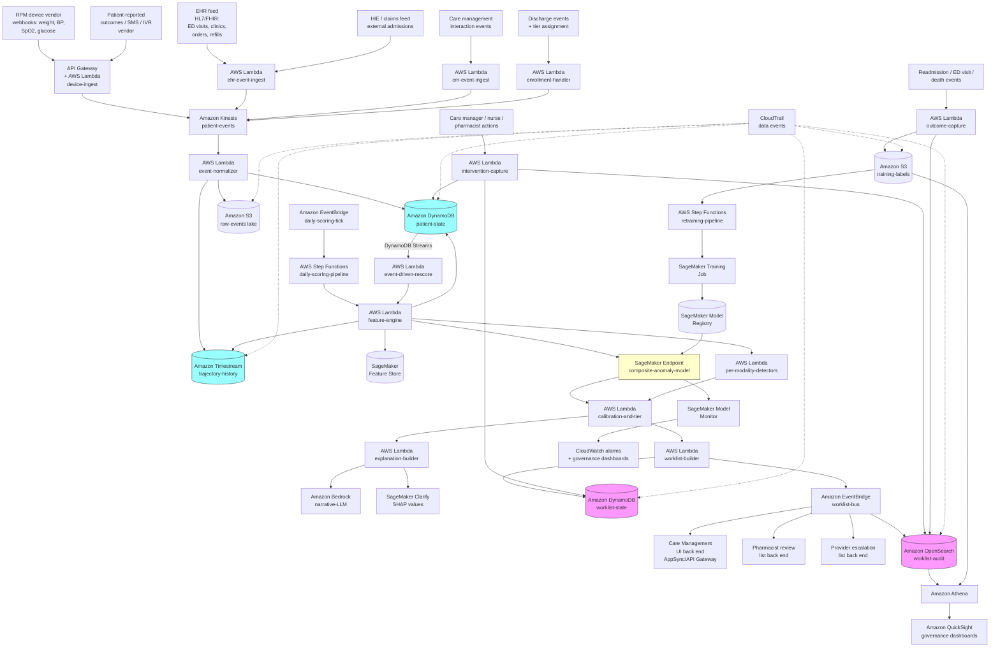

# Recipe 3.8 Architecture and Implementation: Readmission Risk Anomaly Detection

*Companion to [Recipe 3.8: Readmission Risk Anomaly Detection](chapter03.08-readmission-risk-anomaly-detection). This page covers the AWS architecture, services, prerequisites, and pseudocode. For the problem framing and the conceptual approach, start with the main recipe.*

---

## The AWS Implementation

### Why These Services

**Amazon API Gateway and AWS Lambda for RPM device webhook ingestion.** RPM device vendors send measurements via webhook. API Gateway receives the webhook, Lambda validates and normalizes it, and the canonical event flows into the rest of the pipeline. For vendors that prefer pull-based integration, scheduled Lambdas pull from vendor APIs on the configured cadence.

**Amazon Kinesis Data Streams (or Amazon SQS) for the canonical event stream.** The normalized canonical events flow through Kinesis (when ordering and replay matter) or SQS (when simpler queueing is sufficient). The cadence is much lower than Recipe 3.7 (a moderate-sized program might see thousands of events per day per few hundred patients, not millions); the simpler queue often suffices.

**Amazon DynamoDB for the patient state store.** Single-digit-millisecond reads on the current patient snapshot. Each enrolled patient is a record with current monitoring tier, recent values, engagement metrics, and intervention history pointers. DynamoDB streams trigger feature recomputation when state changes.

**Amazon Timestream for the trajectory history store.** Patient-reported weights, blood pressures, glucoses, and symptom scores are time-series data. Timestream's purpose-built storage and query model fit naturally. Magnetic-tier retention covers the multi-week baseline window cost-effectively. <!-- TODO (TechWriter): verify the current HIPAA eligibility status of Amazon Timestream and the BAA coverage; some deployments may use DynamoDB or S3 with Athena instead. -->

**AWS HealthLake for the longitudinal patient record.** When the program needs FHIR-formatted patient records integrated with the wider health-system data, HealthLake provides storage, query, and integration. For programs with established FHIR infrastructure, HealthLake is a strong fit.

**Amazon SageMaker for model training, hosting, and feature management.** The composite scoring model trains as a SageMaker Training Job against retrospective data in S3, deploys to a SageMaker endpoint for daily scoring (batch transform is appropriate for daily cadence; real-time endpoint is appropriate for high-frequency rescoring on new data). SageMaker Feature Store keeps offline (training) and online (scoring) feature vectors consistent. SageMaker Clarify produces fairness reports across subgroups and per-prediction SHAP values.

**Amazon SageMaker Model Monitor.** Continuously monitors data drift, prediction drift, and (with labels) model quality. Critical for catching the gradual drift in patient population, intervention pattern, and device firmware that affects post-discharge programs.

**Amazon Bedrock for explanation narratives and outreach script suggestions.** SHAP values surface the technical drivers; Bedrock-hosted LLMs convert them and the patient context into care-manager-facing narratives ("This patient's weight has trended up 2.4 lbs over the last 3 days. They responded to symptom check-ins through Friday but not Saturday or Sunday. Their last care management contact was Wednesday. Suggested outreach: confirm weight trend, ask about diuretic adherence, ask about diet over the weekend, consider same-day clinic add-on.") Always with human review; the LLM is producing decision support, not decisions. <!-- TODO (TechWriter): confirm the set of HIPAA-eligible Bedrock foundation models as of the current year. -->

**Amazon Comprehend Medical for free-text feature extraction.** Care management notes contain substantial signal in free text. Comprehend Medical extracts conditions, symptoms, medications, and concerns. Optional but useful when the care management interaction feed is text-rich.

**AWS Step Functions for orchestration.** The daily scoring run, the worklist generation, and the periodic retraining are multi-step workflows. Step Functions handles orchestration with retry and error handling.

**Amazon EventBridge for routing.** Scoring outputs publish to EventBridge with patient context and tier. Subscribers include the worklist UI back end, the pharmacist review list back end, the provider escalation list, and the audit logger.

**Amazon API Gateway and AWS AppSync for the care management workflow back end.** The care management UI (whether built in-house or vendored) consumes the worklist via API. AppSync (GraphQL) is often a better fit when the UI needs flexible queries over patient state, intervention history, and trajectory data; API Gateway plus REST is fine for simpler integrations.

**Amazon OpenSearch Service for worklist audit and analytics.** Every score, every alert, every intervention, and every outcome is indexed in OpenSearch for governance queries, performance analytics, and ad-hoc clinical safety review. Data also flows to S3 for retraining.

**Amazon S3 for the data lake.** Historical RPM data, PRO data, EHR events, and outcome labels live here, partitioned by date and patient. Customer-managed KMS encryption. Used by SageMaker for training and Athena for ad-hoc analysis.

**Amazon QuickSight for governance dashboards.** Subgroup performance, intervention success rates, alert volume, capacity utilization, and program-level outcome metrics. The clinical leadership team and the program operations team consume these.

**Amazon Athena for ad-hoc analysis.** Care managers, analysts, and the program team query the lake for ad-hoc questions ("how many patients in this cohort had at least one successful contact in the first week"). Athena over partitioned S3 is the cheap, flexible answer.

**AWS HealthOmics or generic S3 for genomic data (rarely relevant).** Most readmission programs do not use genomic data. Mentioned only for completeness; usually skip.

**AWS End User Messaging or a third-party SMS/IVR vendor for patient outreach.** The outreach itself (SMS check-ins, IVR calls) is often delivered through specialist healthcare communication vendors (CipherHealth, GetWellNetwork, Memora Health, Cipher). For SMS-only, AWS End User Messaging (formerly Pinpoint SMS and Voice) works. The integration boundary matters: keep PHI in HIPAA-eligible services; the patient-facing channel needs a BAA.

**Amazon CloudWatch and AWS X-Ray.** Operational monitoring of the pipeline, scoring latency, end-to-end traces. Latency budgets matter less than Recipe 3.7 (the cadence is daily, not per-event), but data freshness matters: a worklist computed at 7 a.m. should reflect data through end-of-day yesterday plus any overnight events.

**AWS CloudTrail.** Audit logging on every PHI-bearing store and every API call against the scoring service. Every score, every worklist generation, every intervention is logged.

**AWS KMS.** Customer-managed keys on every PHI-bearing store: DynamoDB, Timestream, S3, OpenSearch, Kinesis/SQS, SageMaker volumes and Feature Store. Key rotation policies set per organizational requirements.

### Architecture Diagram



### Prerequisites

| Requirement | Details |
|-------------|---------|
| **AWS Services** | Amazon API Gateway, AWS Lambda, Amazon Kinesis Data Streams (or Amazon SQS), Amazon DynamoDB, Amazon Timestream, AWS HealthLake (optional), Amazon S3, Amazon SageMaker (Training, Hosting, Feature Store, Clarify, Model Monitor, Model Registry), Amazon Comprehend Medical (optional, for note feature extraction), Amazon Bedrock, Amazon EventBridge, AWS Step Functions, AWS AppSync, Amazon OpenSearch Service, Amazon Athena, Amazon QuickSight, AWS End User Messaging (or third-party patient communication vendor), AWS Secrets Manager, AWS KMS, AWS CloudTrail, Amazon CloudWatch, AWS X-Ray. |
| **IAM Permissions** | Least-privilege per role. Device ingest Lambdas validate webhooks and write to the event stream. Feature engine reads from DynamoDB and Timestream, writes to Feature Store. Scoring orchestrator invokes the SageMaker endpoint, publishes to EventBridge. Worklist builder reads scores and writes worklist state. Care manager roles read worklist state and write intervention records only. Model team roles can train and deploy but cannot read PHI directly without explicit elevation. No `*` permissions; every action scoped to specific resources. |
| **BAA** | Signed AWS BAA. All services configured per BAA requirements. RPM vendors and PRO vendors must have their own BAAs with the hospital. See the [AWS HIPAA Eligible Services Reference](https://aws.amazon.com/compliance/hipaa-eligible-services-reference/). |
| **Encryption** | Customer-managed KMS keys on every PHI-bearing store: Kinesis, DynamoDB, Timestream, S3, OpenSearch, SageMaker (volumes, Feature Store, model artifacts). TLS 1.2 or higher in transit. Webhook endpoints validate vendor signatures and reject unsigned traffic. |
| **VPC** | Production deployment in a VPC with VPC endpoints for S3, DynamoDB, KMS, SageMaker runtime, Bedrock, Comprehend Medical, EventBridge, and Step Functions. Lambdas that touch PHI run in the VPC. RPM vendor and PRO vendor integrations typically traverse the public internet (TLS-protected); some hospital networks require Direct Connect or PrivateLink-style routing for these integrations. |
| **CloudTrail and Data Events** | Enabled with data events on every PHI-bearing store and on the worklist and audit indexes. Every score, every worklist generation, every intervention capture, every outcome event is logged. Log retention per organizational policy and applicable regulations. |
| **Care Management Governance** | A care management governance committee (typically including transitions-of-care leadership, hospitalists, primary care leadership, pharmacy, social work, nursing leadership, patient experience, and quality leadership) must be established before deployment. The committee owns the program design, intervention protocols, escalation pathways, equity considerations, and decommissioning criteria. |
| **Regulatory Posture** | Most post-discharge anomaly detection systems are clinical workflow tools rather than FDA-regulated medical devices, but the determination depends on the level of autonomy and the clinical scenario. Systems that produce recommendations for human review with transparent reasoning typically qualify for the 21st Century Cures Act CDS exemption. Higher-autonomy or closed-loop systems may not. Regulatory affairs should opine before deployment. |
| **Local Validation Required** | Vendor or external models must be validated on local population before clinical deployment. Subgroup-stratified validation is essential. Validation should compare against the existing standard of care (typically the existing transitions-of-care program). Evaluation metrics should include not just discrimination and calibration, but operational metrics: patients flagged per care manager per day, intervention rate, intervention success rate, and (where measurable) the change in 30-day readmission rate per cohort attributable to the program. |
| **Sample Data** | [MIMIC-IV](https://physionet.org/content/mimiciv/) has post-discharge readmission labels but limited post-discharge data (the dataset is primarily inpatient). [eICU Collaborative Research Database](https://physionet.org/content/eicu-crd/) is similar. [Synthea](https://github.com/synthetichealth/synthea) generates synthetic patient data with discharge-and-readmission events. RPM vendor sandboxes (BodyTrace, A&D Medical, Withings) provide test data feeds. Never use real PHI in development. |
| **EHR + RPM Vendor Integration** | The two longest dependencies in this project are typically the EHR ingestion (HL7/FHIR feeds for ED visits, clinic visits, refills, orders) and the RPM vendor integration (webhooks for measurements, device assignment, patient enrollment). Plan for 2-6 months of integration engineering for each, in parallel. Care management workflow integration (Salesforce Health Cloud, Epic Healthy Planet, etc.) is a third long dependency. |
| **Cost Estimate** | For a program monitoring 2,000 patients in the post-discharge window at any given time with daily scoring: device-vendor data through API Gateway and Lambda: ~$50-200/month. Kinesis or SQS: ~$50-150/month. DynamoDB patient state and worklist state: ~$200-400/month. Timestream trajectory history: ~$100-300/month. SageMaker endpoint hosting (modest instance class for daily-cadence scoring): ~$300-1,000/month. SageMaker training (monthly retraining): ~$100-300/month. Bedrock for explanation narratives (one per worklist row, daily): ~$100-300/month. OpenSearch for worklist audit: ~$300-700/month. Lambda, EventBridge, Step Functions, supporting services: ~$200-500/month. Total infrastructure: typically $1,500-4,000/month for a moderately-sized program. Outreach staffing (care managers, transitions nurses) is the dominant cost; one care manager at a typical loaded cost can cost more in a single month than the entire infrastructure. The infrastructure pays for itself if the program prevents one to two readmissions per year (typical readmission cost in the United States is in the $10,000-20,000 range depending on payer mix and condition mix). |

### Ingredients

| AWS Service | Role |
|------------|------|
| **Amazon API Gateway** | Receives RPM device webhooks; care management UI back-end fronting |
| **AWS Lambda (device-ingest)** | Validates and normalizes RPM webhook payloads |
| **AWS Lambda (ehr-event-ingest)** | Normalizes EHR events (ED visits, clinic visits, refills, orders) |
| **AWS Lambda (cm-event-ingest)** | Normalizes care management interaction events |
| **AWS Lambda (enrollment-handler)** | Handles discharge-event enrollment into the monitoring program |
| **AWS Lambda (event-normalizer)** | Stream processing of canonical events into state stores |
| **Amazon Kinesis Data Streams (or Amazon SQS)** | Canonical event stream |
| **Amazon DynamoDB (patient-state)** | Current snapshot of every enrolled patient |
| **Amazon DynamoDB (worklist-state)** | Active worklist rows, intervention status, suppression rules |
| **Amazon Timestream** | Trajectory time-series for weights, BPs, glucoses, symptoms |
| **AWS HealthLake (optional)** | FHIR-formatted longitudinal patient record |
| **Amazon S3** | Raw event lake, training data, retrospective analysis, audit log archive |
| **AWS Lambda (feature-engine)** | Computes the model's input feature vector |
| **AWS Lambda (per-modality-detectors)** | Control charts and per-modality anomaly scores |
| **AWS Lambda (calibration-and-tier)** | Applies calibration and assigns operational tier |
| **AWS Lambda (explanation-builder)** | Assembles SHAP values plus narrative explanations |
| **AWS Lambda (worklist-builder)** | Ranks and de-duplicates the daily worklist |
| **AWS Lambda (intervention-capture)** | Records care manager actions and intervention outcomes |
| **AWS Lambda (outcome-capture)** | Records readmission, ED visit, and other outcome events |
| **Amazon SageMaker Endpoint** | Hosts the composite anomaly scoring model |
| **Amazon SageMaker Training** | Model retraining pipeline against retrospective data |
| **Amazon SageMaker Feature Store** | Online and offline feature consistency with point-in-time correctness |
| **Amazon SageMaker Clarify** | Subgroup fairness reports and per-prediction SHAP explanations |
| **Amazon SageMaker Model Monitor** | Data drift, prediction drift, quality drift monitoring |
| **Amazon SageMaker Model Registry** | Versioning and approval workflow for model deployments |
| **Amazon Comprehend Medical** | Entity extraction from care management notes |
| **Amazon Bedrock** | Care-manager-facing narrative explanations and outreach script suggestions |
| **Amazon EventBridge** | Routes scoring events and worklist events to subscribers |
| **AWS AppSync / API Gateway** | Care management UI back end and integration APIs |
| **Amazon OpenSearch Service** | Worklist and intervention audit index |
| **Amazon Athena** | SQL-over-S3 for ad-hoc queries against historical data |
| **Amazon QuickSight** | Care management governance and operational dashboards |
| **AWS Step Functions** | Daily scoring pipeline and retraining pipeline orchestration |
| **AWS End User Messaging (or third-party vendor)** | Patient-facing SMS check-ins and outreach |
| **AWS Secrets Manager** | EHR credentials, device-vendor API keys, care management system credentials |
| **AWS KMS** | Customer-managed keys for every PHI-bearing store |
| **AWS CloudTrail** | Audit logging on every PHI store and every API operation |
| **Amazon CloudWatch + AWS X-Ray** | Pipeline health, scoring latency, end-to-end tracing |

---

### Code

> **Reference implementations:** These aws-samples repositories demonstrate patterns that apply here:
> - [`amazon-sagemaker-examples`](https://github.com/aws/amazon-sagemaker-examples): Time-series modeling, XGBoost on tabular features, Feature Store with online and offline stores, Model Monitor configurations, Clarify SHAP examples.
> - [`aws-samples`](https://github.com/aws-samples): search for "FHIR," "HealthLake," "remote patient monitoring," and "care management" for healthcare-specific integration patterns.
> <!-- TODO (TechWriter): verify and add a specific aws-samples or aws-solutions-library-samples repository demonstrating remote patient monitoring, post-discharge anomaly detection, or care management automation on AWS. Adjacent examples exist (real-time scoring, healthcare ML pipelines); a direct match has not been confirmed at the time of writing. -->

#### Walkthrough

<!-- Editor note: the expert reviewer flagged several prose-vs-pseudocode asymmetries that need follow-up before the next pass. None block PASS, but each is a place where the prose makes a discipline claim that the canonical pseudocode walkthrough below does not architecturally enforce. Address by adding short architectural primitives in the relevant Steps and a one-line note in the General Architecture Pattern subsections; do not rewrite the prose. Per-finding TODOs follow. -->

<!-- TODO (TechWriter): Expert review A3 (MEDIUM). Cold-start uniform-high-touch in the first 72 hours regardless of model output. The Honest Take is unusually direct about this; Step 7's worklist construction does not enforce it. Add a cold-start-routing primitive in Step 7 that promotes cold-start patients with elevated discharge-time risk to at-least-tier_2 regardless of composite score; surface cold-start status in the worklist row; add a paragraph to the General Architecture Pattern's Worklist Builder subsection. -->

<!-- TODO (TechWriter): Expert review A5 (MEDIUM). Engagement-decay first-class worklist pathway. The prose treats engagement decay as a first-class signal warranting dedicated outreach; Step 4 routes it through the composite-score pathway only. Add an engagement-decay-specific worklist pathway in Step 7 that surfaces disengaged patients (no_data_in_first_72_hours, stopped_pro_check_ins, stopped_rpm_uploads, previously_engaged_now_silent) at tier_2 or higher regardless of composite score; surface engagement-decay flag in worklist row. -->

<!-- TODO (TechWriter): Expert review A4 (MEDIUM). Randomized-rollout / target-trial-emulation primitive for causal evaluation. The Honest Take recommends randomized rollouts; pseudocode shows no `evaluation_track` field on the patient-state record and no track-aware filtering in the worklist build. Add `evaluation_track` attribute set at enrollment with stratified random assignment; worklist construction filters to `evaluation_track == "program"`; outcome-capture tracks both tracks; training-labels archive stratifies labels by track. -->

<!-- TODO (TechWriter): Expert review A1 (MEDIUM). Outcome-event and intervention-event idempotency at the EventBridge-driven capture Lambdas (recurring chapter-wide pattern; thirteenth consecutive recipe). Derive deterministic event keys (`outcome_event.event_id + outcome_event.type` for outcomes; `action_event.event_id` for interventions); conditional DynamoDB write to `processed-outcome-events` and `processed-intervention-events` tables before downstream operations. Strongly recommend a cookbook-wide trigger-idempotency appendix. -->

<!-- TODO (TechWriter): Expert review A2 (MEDIUM). DLQ / poison-message handling for the device-ingest, ehr-event-ingest, cm-event-ingest, enrollment-handler, event-normalizer, feature-engine, worklist-builder, intervention-capture, outcome-capture, and event-driven-rescore Lambdas. Add SQS DLQs with `OnFailure` destinations on each Lambda; CloudWatch alarms on DLQ depth with alarm threshold 1 for device-ingest, event-normalizer, outcome-capture (single-event sensitivity); replay older than the post-discharge prediction window escalates to care-management-governance-committee review. -->

<!-- TODO (TechWriter): Expert review A6 (MEDIUM). Reference-data versioning propagation. Step 7's worklist row construction should explicitly carry the audit_trail block (feature_snapshot_id, scoring_record_id, model_version, calibration_version, cohort_thresholds_version) into both the DynamoDB worklist-state write and the OpenSearch worklist-audit index. -->

<!-- TODO (TechWriter): Expert review A7 (MEDIUM). Multi-cohort architecture. The Why-This-Isn't-Production-Ready bullet says "designing for multi-cohort from the start is easier than retrofitting"; the pseudocode shows a single composite-scoring pathway with cohort indicator features. Update the Scoring Service paragraph in General Architecture Pattern and Steps 4 and 7 to dispatch to per-cohort endpoints, calibrators, threshold sets, and worklists. -->

<!-- TODO (TechWriter): Expert review A8 (LOW). Suppression-rule expiry. Step 7 reads suppression state but no scheduled job walks the program-hold registry for expired entries; ADT-event-driven hold-review trigger also missing. Add a daily scheduled job that walks the program-hold registry for expired holds and a care-transition trigger via ADT events. -->

<!-- TODO (TechWriter): Expert review S1 (MEDIUM). Worklist row PHI minimization. The EventBridge worklist-bus carries the full narrative (a multi-sentence clinical paragraph naming the patient's deterioration phenotype, recent values, post-acute-event context, and clinical-recommendation-shaped outreach steps) to three subscribers (care-management UI back end, pharmacist review list back end, provider escalation list back end). This is the eighth distinct PHI-minimization-inside-the-BAA surface across the cookbook (Chapter 2: serialized prompt context; Recipes 3.1, 3.3, 3.4, 3.5, 3.6, 3.7: various). Update Step 7 so the per-row event carries only worklist_id, row_id, patient_id, tier, and assigned_care_team; subscribers fetch the full row from the worklist-state DynamoDB table or the OpenSearch worklist-audit index through an authenticated path. Add per-consumer scope to the Prerequisites IAM row: pharmacist role can read rows whose suggested intervention includes medication-related items only; provider escalation role can read rows where tier == tier_1 AND escalation_to_provider is non-null only; care-manager UI role can read rows for the care-team-assigned patient set only. -->

<!-- TODO (TechWriter): Expert review S2 (MEDIUM). Subgroup data governance for fairness monitoring. The "Calibration, Subgroup Performance, and the Equity Question" subsection has the most comprehensive subgroup taxonomy in the chapter (age band, sex, race and ethnicity, language, insurance status, neighborhood SES via ADI/SVI, dual-eligibility status, primary diagnosis, discharge disposition; plus SDOH attributes through PRAPARE / AHC HRSN / Z-codes). Add architectural artifacts to Prerequisites: restrict read access to the demographic-and-attribute store including SDOH attributes (which may be governed differently from clinical PHI under state law); CloudTrail data events on subgroup queries; QuickSight against an aggregated subgroup-metrics table (alert rate by subgroup, calibration ECE by subgroup, intervention rate by subgroup, change in 30-day readmission rate per subgroup attributable to the program), not the raw demographic-joined worklist archive. -->

<!-- TODO (TechWriter): Expert review S3 (LOW). Per-consumer IAM scoping for shared resources (patient-state, scoring-history, worklist-state, intervention-history DynamoDB tables; OpenSearch worklist-audit and intervention-audit indexes). -->

<!-- TODO (TechWriter): Expert review S4 (LOW). RPM device webhook signature-verification posture: per-vendor protocol variation (HMAC-SHA256, mutual TLS, OAuth 2.0, JWT validation), rotation cadence, replay protection via timestamp validation, IP allowlisting at the API Gateway resource policy where the vendor publishes a source-IP range. -->

<!-- TODO (TechWriter): Expert review S5 (LOW). Bedrock LLM-explanation BAA-discipline forward reference to Chapter 2's settled patterns; minimum-necessary prompt construction; output filtering for clinical-recommendation hallucinations vs. outreach-suggestion language; full prompt-and-response audit trail tied to worklist row ID. -->

<!-- TODO (TechWriter): Expert review S6 (LOW). Comprehend Medical care-management-note PHI handling: synchronous DetectEntitiesV2 with minimum-necessary excerpt, derived-feature-flag-only persistence (do not store full Comprehend Medical entity payload alongside feature flags), CloudTrail data events on DetectEntitiesV2 calls. -->

<!-- TODO (TechWriter): Expert review S7 (LOW). Patient-facing SMS/IVR vendor BAA + TCPA discipline: pre-approved templates by content category (PHI-bearing vs de-identified), patient-consent capture as a structured event in the patient-state record, opt-out revocation handled immediately, audit trail in worklist-audit and intervention-audit indexes for TCPA defense. -->

<!-- TODO (TechWriter): Expert review N1 (LOW). VPC endpoint precision: name CloudWatch monitoring (`PutMetricData`) separately from CloudWatch Logs; EventBridge events bus separately from EventBridge Scheduler; SageMaker api / runtime / featurestore-runtime; SNS, Athena, Glue, AppSync, Timestream (write and query), HealthLake, Secrets Manager, bedrock-runtime, comprehendmedical. -->

<!-- TODO (TechWriter): Expert review N2 (LOW). VPC Flow Logs explicitly required (network-level audit complements API-level audit, supports both clinical-safety-review documentation and RPM CPT code billing-defense documentation). -->

<!-- TODO (TechWriter): Expert review N3 (LOW). HealthLake networking and access-control posture (KMS, VPC endpoint, SMART-on-FHIR scope discipline, bulk export to S3 with KMS). -->

<!-- TODO (TechWriter): Expert review N4 (LOW). HIE/claims feed network path (per-source security: MLLPS, FHIR R4 with mutual TLS or SMART-on-FHIR, C-CDA over Direct Trust, EDI 837 over SFTP, near-real-time claims APIs; Direct Connect for HIE-side gateway bridging; per-source trading-partner agreement and audit trail). -->

**Step 1: Enroll the patient at discharge.** The discharge event triggers enrollment into the monitoring program. The discharge-time risk score (computed by a separate model, often the Chapter 7 readmission risk model) sets the initial monitoring tier. The condition cohort drives which trajectory metrics will be tracked.

```pseudocode
FUNCTION on_discharge_event(discharge_event):
    // Discharge events come from the EHR feed when an ADT discharge fires.
    // Pull discharge-time features and the discharge-time risk score from the
    // Chapter 7 model (separate service); we use them as inputs here.
    discharge_features = pull_discharge_features(discharge_event.encounter_id)
    discharge_risk_score = pull_discharge_risk_score(discharge_event.encounter_id)

    // Determine condition cohort. Multiple cohorts can apply.
    cohorts = determine_cohorts(discharge_event)
    // cohorts: ["heart_failure", "diabetes", "post_op_cardiac"], etc.

    // Initial monitoring tier from discharge-time score.
    initial_tier = tier_from_discharge_score(
        score        = discharge_risk_score,
        cohorts      = cohorts,
        program_caps = current_program_capacity()
    )

    // Build the patient state record.
    state = {
        patient_id:               discharge_event.patient_id,
        encounter_id:             discharge_event.encounter_id,
        enrolled_at:              NOW(),
        discharge_at:             discharge_event.discharge_time,
        discharged_to:            discharge_event.discharge_disposition,
        cohorts:                  cohorts,
        discharge_risk_score:     discharge_risk_score,
        discharge_features:       discharge_features,
        current_tier:             initial_tier,
        is_active:                true,
        last_contact_at:          null,
        last_score_at:            null,
        intervention_history:     [],
        device_assignments:       discharge_event.assigned_devices,        // bluetooth scale, BP cuff, etc.
        program_end_at:            discharge_event.discharge_time + 30 days
    }

    DynamoDB.PutItem(table = "patient-state", item = state)

    // Notify the care management system that a new patient was enrolled.
    EventBridge.PutEvent(
        bus         = "post-discharge-events",
        source      = "enrollment-handler",
        detail_type = "PatientEnrolled",
        detail      = state
    )
```

**Step 2: Ingest RPM measurements and PRO check-ins.** RPM device vendors send measurements via webhook. The webhook handler validates the signature, normalizes the payload, and writes the canonical event into the stream.

```pseudocode
FUNCTION on_rpm_webhook(webhook_request):
    // Validate the vendor's signature. Reject anything that doesn't validate.
    IF NOT verify_vendor_signature(webhook_request):
        return 401

    // Parse the vendor-specific payload into a canonical measurement event.
    parsed = parse_vendor_payload(webhook_request)
    canonical_event = {
        event_id:           generate_event_id(parsed),
        patient_id:         resolve_patient_id_from_device(parsed.device_id),
        event_type:         "rpm_measurement",
        modality:            parsed.modality,                    // weight, blood_pressure, spo2, glucose, peak_flow
        value:               convert_to_canonical_units(parsed.value, parsed.units),
        units:               canonical_units_for(parsed.modality),
        observed_at:         parsed.measurement_time,
        received_at:         NOW(),
        device_id:           parsed.device_id,
        quality_flags:       parsed.quality_flags                // sensor flags, posture flags, etc.
    }

    // Resolve patient. Devices are assigned to patients at enrollment.
    IF canonical_event.patient_id is null:
        send_to_quarantine(canonical_event, reason = "unknown_device")
        return 202

    Kinesis.PutRecord(
        stream_name = "patient-events",
        data        = canonical_event,
        partition_key = canonical_event.patient_id
    )
    return 200

FUNCTION on_pro_check_in(check_in_event):
    // Patient-reported outcomes from the patient-facing app, SMS, or IVR vendor.
    // Similar pattern: validate, normalize, route.
    canonical_event = {
        event_id:           generate_event_id(check_in_event),
        patient_id:         check_in_event.patient_id,
        event_type:         "pro_check_in",
        modality:            check_in_event.template_id,         // hf_symptom_check, post_op_symptom_check, etc.
        responses:           check_in_event.responses,
        symptom_score:       compute_symptom_score(check_in_event.responses, check_in_event.template_id),
        free_text:           check_in_event.free_text_concerns,
        observed_at:         check_in_event.submitted_at,
        received_at:         NOW()
    }
    Kinesis.PutRecord(
        stream_name = "patient-events",
        data        = canonical_event,
        partition_key = canonical_event.patient_id
    )
```

**Step 3: Update patient state and trajectory history.** The event normalizer reads from the stream, updates the patient state with the latest values, and writes time-series records to Timestream.

```pseudocode
FUNCTION on_canonical_event(event):
    // Read current state. Skip events for patients not actively enrolled.
    state = DynamoDB.GetItem(
        table = "patient-state",
        key   = { patient_id: event.patient_id, encounter_id: resolve_encounter(event) }
    )
    IF state is null OR NOT state.is_active:
        log_skipped_event(event, reason = "not_active")
        return

    // Update the relevant fields based on event type.
    IF event.event_type == "rpm_measurement":
        state.latest_values[event.modality] = {
            value:       event.value,
            observed_at: event.observed_at,
            quality:     event.quality_flags
        }
        state.last_measurement_at = event.observed_at
        // Reset engagement counter; the patient just contributed data.
        state.last_data_at = event.observed_at

        // Append to Timestream for trajectory analysis.
        Timestream.WriteRecord(
            database  = "post-discharge",
            table     = "rpm_measurements",
            dimensions = {
                patient_id:    event.patient_id,
                modality:      event.modality
            },
            time_value = event.observed_at,
            value      = event.value
        )

    IF event.event_type == "pro_check_in":
        state.latest_pro = {
            template:      event.modality,
            symptom_score: event.symptom_score,
            free_text:     event.free_text,
            observed_at:   event.observed_at
        }
        state.last_pro_at = event.observed_at
        state.last_data_at = event.observed_at

        Timestream.WriteRecord(
            database  = "post-discharge",
            table     = "pro_symptom_scores",
            dimensions = {
                patient_id: event.patient_id,
                template:   event.modality
            },
            time_value = event.observed_at,
            value      = event.symptom_score
        )

    IF event.event_type == "ed_visit" OR event.event_type == "external_admission":
        // High-priority trigger; mark for immediate re-scoring and worklist surfacing.
        state.recent_acute_events.append({
            type:           event.event_type,
            facility:       event.facility,
            occurred_at:    event.occurred_at
        })
        state.urgent_rescore_requested = true

    IF event.event_type == "refill" OR event.event_type == "refill_missed":
        state.medication_events.append({
            rx_norm_code:    event.rx_norm_code,
            event_subtype:   event.event_type,
            occurred_at:     event.occurred_at,
            therapeutic_class: classify_medication(event.rx_norm_code)
        })

    IF event.event_type == "care_management_interaction":
        state.last_contact_at = event.occurred_at
        state.intervention_history.append({
            interaction_type: event.interaction_type,
            outcome:           event.contact_outcome,
            intervention:      event.intervention,
            notes:             event.notes,
            occurred_at:       event.occurred_at,
            staff_id:          event.staff_id
        })

    state.updated_at = NOW()
    DynamoDB.PutItem(table = "patient-state", item = state)

    // Some events trigger immediate re-scoring; others wait for the daily tick.
    IF should_rescore_immediately(event):
        EventBridge.PutEvent(
            bus         = "post-discharge-scoring",
            source      = "event-normalizer",
            detail_type = "RescoreRequest",
            detail      = { patient_id: state.patient_id, encounter_id: state.encounter_id, reason: event.event_type }
        )
```

**Step 4: Run the daily scoring pipeline.** Once a day (typically early morning), the scoring pipeline iterates every active patient, computes their feature vector, scores them, and produces the worklist.

```pseudocode
FUNCTION daily_scoring_pipeline():
    // Step Functions orchestrates this; broken into stages for retry and observability.
    active_patients = DynamoDB.Query(
        table         = "patient-state",
        index         = "is_active-index",
        key_condition = "is_active = :true"
    )

    FOR each patient in active_patients:
        score_record = score_patient(patient.patient_id, patient.encounter_id, trigger = "daily")
        publish_for_worklist(score_record)

    // Build the worklist after all patients are scored.
    worklist = build_worklist(today)
    publish_worklist(worklist)

FUNCTION score_patient(patient_id, encounter_id, trigger):
    state = DynamoDB.GetItem(
        table = "patient-state",
        key   = { patient_id, encounter_id }
    )

    // Compute features (next step).
    features = compute_features(state)

    // Run per-modality anomaly detectors first; these produce per-modality
    // deviation scores that go in as features for the composite model AND
    // surface independently in the explanation layer.
    per_modality_scores = {}
    FOR each modality in MONITORED_MODALITIES_FOR(state.cohorts):
        per_modality_scores[modality] = run_modality_detector(
            modality:   modality,
            history:    fetch_modality_history(patient_id, modality, BASELINE_WINDOW_DAYS),
            baseline:   compute_patient_baseline(patient_id, modality),
            cohort_priors: cohort_prior_for(state.cohorts, modality)
        )
        features[f"{modality}_deviation_score"] = per_modality_scores[modality].deviation_score
        features[f"{modality}_baseline_age_days"] = per_modality_scores[modality].baseline_age_days

    // Composite scoring with the gradient-boosted model.
    composite_output = SageMaker.Runtime.InvokeEndpoint(
        endpoint_name = "post-discharge-anomaly-model",
        body          = serialize(features)
    )
    // composite_output: { score, model_version, feature_importance_top_k }

    // Calibration. Apply per-cohort calibration where calibration drift differs.
    calibrated = apply_calibration(
        raw_score    = composite_output.score,
        calibration  = CALIBRATION_FOR(state.cohorts),
        subgroup     = subgroup_for_calibration(features)
    )

    // Tier assignment. Tiers map to operational outreach intensity:
    //   tier_1: same-day outreach by transitions nurse / pharmacist
    //   tier_2: outreach within 24h by care manager
    //   tier_3: routine touchpoint per program protocol
    //   below_threshold: standard discharge follow-up only
    tier = tier_from_score_and_cohort(
        score:    calibrated,
        cohorts:  state.cohorts,
        capacity: current_program_capacity_for(state.cohorts),
        suppression_check: check_suppression(state)
    )

    score_record = {
        score_id:                generate_score_id(),
        patient_id:              patient_id,
        encounter_id:            encounter_id,
        scored_at:                NOW(),
        trigger:                  trigger,                              // daily, event_driven
        composite_raw:            composite_output.score,
        composite_calibrated:     calibrated,
        per_modality_scores:      per_modality_scores,
        tier:                     tier,
        days_post_discharge:      days_between(state.discharge_at, NOW()),
        feature_snapshot_id:      persist_feature_snapshot(features),
        model_version:            composite_output.model_version
    }

    DynamoDB.PutItem(table = "scoring-history", item = score_record)
    OpenSearch.Index("scoring-index", score_record)

    EventBridge.PutEvent(
        bus         = "post-discharge-scoring",
        source      = "scoring-service",
        detail_type = "ScoreProduced",
        detail      = score_record
    )

    return score_record
```

**Step 5: Compute the feature vector.** The feature engine reads patient state and trajectory history, and produces the model's input feature vector. The cold-start logic falls back to cohort priors when patient-specific baselines aren't established.

```pseudocode
FUNCTION compute_features(state):
    features = {}

    // Discharge-time features (snapshot at enrollment).
    features.update(state.discharge_features)
    features["discharge_risk_score"]   = state.discharge_risk_score
    features["days_post_discharge"]    = days_between(state.discharge_at, NOW())
    features["discharge_disposition"]  = state.discharged_to

    // Cohort indicator features.
    FOR each cohort in ALL_COHORTS:
        features[f"cohort_{cohort}"] = cohort in state.cohorts

    // Per-modality trajectory features for each cohort-relevant modality.
    FOR each modality in MONITORED_MODALITIES_FOR(state.cohorts):
        history = Timestream.Query(
            f"""
            SELECT time, measure_value::double
            FROM "post-discharge"."rpm_measurements"
            WHERE patient_id = '{state.patient_id}'
              AND modality = '{modality}'
              AND time BETWEEN ago({TRAJECTORY_WINDOW_DAYS}d) AND now()
            ORDER BY time
            """
        )

        // Latest value, age of latest reading.
        latest = state.latest_values.get(modality)
        features[f"{modality}_current"] = latest.value IF latest else null
        features[f"{modality}_age_hours"] = hours_between(latest.observed_at, NOW()) IF latest else null

        // Trajectory features.
        FOR each window_days in [3, 7, 14]:
            window_values = filter_recent(history, window_days)
            features[f"{modality}_slope_{window_days}d"] = compute_slope(window_values)
            features[f"{modality}_max_{window_days}d"]   = max_of(window_values)
            features[f"{modality}_min_{window_days}d"]   = min_of(window_values)
            features[f"{modality}_count_{window_days}d"] = length(window_values)

        // Patient-specific baseline. Use the first several days of post-discharge
        // data IF available; otherwise fall back to cohort priors.
        patient_baseline_window = filter_recent(history, BASELINE_ESTABLISHMENT_DAYS)
        IF length(patient_baseline_window) >= MIN_BASELINE_OBSERVATIONS:
            features[f"{modality}_baseline"] = trimmed_mean_of(patient_baseline_window)
            features[f"{modality}_baseline_source"] = "patient_specific"
        ELSE:
            features[f"{modality}_baseline"] = cohort_prior_for(state.cohorts, modality).expected_value
            features[f"{modality}_baseline_source"] = "cohort_prior"

        // Deviation from baseline.
        IF features[f"{modality}_current"] is not null:
            features[f"{modality}_delta_from_baseline"] = features[f"{modality}_current"] - features[f"{modality}_baseline"]
            features[f"{modality}_pct_change_from_baseline"] = percent_change(features[f"{modality}_current"], features[f"{modality}_baseline"])

    // Cohort-specific composite features.
    IF "heart_failure" in state.cohorts:
        // The textbook heart failure deterioration signal.
        weight_3d_change = features.get("weight_max_3d", 0) - features.get("weight_min_3d", 0)
        features["hf_weight_3d_increase"] = weight_3d_change
        features["hf_weight_3lb_3d_alert"] = weight_3d_change >= 3       // textbook teaching threshold
        features["hf_dyspnea_score"] = state.latest_pro.responses.get("dyspnea_score") IF state.latest_pro else null

    IF "diabetes" in state.cohorts:
        features["dm_recent_high_glucose"] = recent_max("glucose", days=3, threshold=300)
        features["dm_recent_low_glucose"]   = recent_min("glucose", days=3, threshold=70)

    IF "copd" in state.cohorts:
        features["copd_peak_flow_decline"] = features.get("peak_flow_pct_change_from_baseline", 0) < -20
        features["copd_dyspnea_increase"]   = state.latest_pro.responses.get("dyspnea_score") IF state.latest_pro else null

    // Engagement features.
    features["days_since_last_data"]   = days_between(state.last_data_at, NOW()) IF state.last_data_at else state.days_post_discharge
    features["days_since_last_contact"] = days_between(state.last_contact_at, NOW()) IF state.last_contact_at else state.days_post_discharge
    features["pro_response_rate_7d"]    = compute_response_rate(state.patient_id, days=7)
    features["data_observations_7d"]    = count_observations(state.patient_id, days=7)
    features["engagement_decay"]         = compute_engagement_decay(state.patient_id)

    // EHR-derived features.
    features["ed_visits_since_discharge"]           = count(state.recent_acute_events, type="ed_visit")
    features["external_admissions_since_discharge"] = count(state.recent_acute_events, type="external_admission")
    features["clinic_visits_attended"]               = count_attended_visits(state.patient_id)
    features["clinic_visits_missed"]                  = count_missed_visits(state.patient_id)

    // Medication features.
    new_meds = filter_new_meds_since_discharge(state.medication_events, state.discharge_features.discharge_meds)
    features["new_meds_count"]        = length(new_meds)
    features["high_risk_meds_active"] = any_high_risk_meds(state.medication_events)
    features["missed_refills_count"]  = count(state.medication_events, subtype="refill_missed")

    // Care management interaction features.
    features["outreach_attempts_total"]   = count(state.intervention_history, "outreach_attempted")
    features["successful_contacts_total"] = count(state.intervention_history, "contact_made")
    features["interventions_delivered_total"] = count(state.intervention_history, "intervention_delivered")
    features["last_contact_outcome"]        = state.intervention_history[-1].outcome IF state.intervention_history else null

    // SDOH features (when available).
    sdoh = pull_sdoh_features(state.patient_id)
    features.update(sdoh)

    // Persist the feature vector for online and offline use.
    SageMaker.FeatureStore.PutRecord(
        feature_group = "post-discharge-features-online",
        record = {
            patient_encounter_id: f"{state.patient_id}:{state.encounter_id}",
            event_time:           NOW(),
            **features
        }
    )

    return features
```

**Step 6: Build the explanation layer.** SHAP values plus a Bedrock-generated narrative produce a care-manager-facing explanation. The narrative is decision support; it suggests outreach focus areas without prescribing treatment.

```pseudocode
FUNCTION build_explanation(score_record, features, state):
    shap_values = SageMaker.Clarify.ExplainPrediction(
        endpoint_name = "post-discharge-anomaly-model",
        input_record  = features
    )

    top_drivers = top_n_by_value(shap_values, n = 5, direction = "positive")

    structured = {
        composite_score:        score_record.composite_calibrated,
        tier:                    score_record.tier,
        top_risk_drivers:        [
            {
                feature:          driver.feature,
                value:            features[driver.feature],
                contribution:     driver.shap_contribution,
                clinical_meaning: humanize_feature_name(driver.feature, features, state.cohorts)
            }
            for driver in top_drivers
        ],
        per_modality_scores:     score_record.per_modality_scores,
        engagement_status:       summarize_engagement(features),
        days_post_discharge:     score_record.days_post_discharge
    }

    // Narrative explanation. Constrained: cite features, suggest outreach focus,
    // never prescribe treatment.
    prompt = build_outreach_explanation_prompt(
        cohort:                  state.cohorts,
        days_post_discharge:     score_record.days_post_discharge,
        composite_tier:           score_record.tier,
        top_drivers:              structured.top_risk_drivers,
        per_modality_scores:     score_record.per_modality_scores,
        engagement_status:        structured.engagement_status,
        recent_interventions:    state.intervention_history[-3:]
    )
    bedrock_response = Bedrock.InvokeModel(
        model_id = "anthropic.claude-XX",       // HIPAA-eligible; select per current eligibility
        body     = { prompt: prompt, max_tokens: 500, temperature: 0.0 }
    )
    narrative = parse_bedrock_response(bedrock_response)

    return {
        structured:           structured,
        narrative:            narrative,
        suggested_outreach:   suggested_outreach_for(state.cohorts, structured.top_risk_drivers, structured.engagement_status),
        generated_at:         NOW(),
        bedrock_model_version: "claude-XX"
    }
```

**Step 7: Build and publish the worklist.** The worklist builder ranks patients by composite tier, applies suppression and de-duplication, and routes the result to the care management UI back end.

```pseudocode
FUNCTION build_worklist(date):
    // Pull all scores produced in the last scoring run.
    scores = DynamoDB.Query(
        table         = "scoring-history",
        index         = "scored_at-index",
        key_condition = "scored_at >= :start AND scored_at < :end",
        values        = { ":start": start_of(date), ":end": start_of(date + 1) }
    )

    // For each patient, take the latest score from this run.
    latest_per_patient = group_by_patient_latest(scores)

    rows = []
    FOR each score in latest_per_patient:
        state = DynamoDB.GetItem(table = "patient-state", key = score.patient_key)

        // Suppression: patients in active high-touch intervention; patients
        // who graduated; patients we've contacted in the last suppression window.
        IF check_suppression(state, score).suppressed:
            log_suppressed_row(state, score)
            continue

        explanation = build_explanation(score, fetch_features(score.feature_snapshot_id), state)

        row = {
            patient_id:              score.patient_id,
            encounter_id:            score.encounter_id,
            cohort:                   state.cohorts,
            tier:                     score.tier,
            composite_score:          score.composite_calibrated,
            top_drivers:              explanation.structured.top_risk_drivers,
            narrative:                explanation.narrative,
            suggested_outreach:       explanation.suggested_outreach,
            days_post_discharge:      score.days_post_discharge,
            last_contact_at:          state.last_contact_at,
            last_data_at:             state.last_data_at,
            assigned_care_team:       state.assigned_care_team,
            scoring_record_id:        score.score_id
        }
        rows.append(row)

    // Sort by tier and composite score within tier.
    sorted_rows = sort_by_tier_then_score_desc(rows)

    // Apply program capacity caps. The top of the list goes to the
    // highest-touch teams; lower-tier rows go to broader outreach.
    capped_rows = apply_capacity_caps(sorted_rows, current_capacity())

    // Persist worklist for the day.
    worklist = {
        worklist_id:            generate_worklist_id(date),
        date:                    date,
        generated_at:            NOW(),
        rows:                    capped_rows,
        total_active_patients:   length(latest_per_patient),
        total_surfaced:           length(capped_rows)
    }
    DynamoDB.PutItem(table = "worklist-state", item = worklist)
    OpenSearch.Index("worklist-index", worklist)

    EventBridge.PutEvent(
        bus         = "post-discharge-events",
        source      = "worklist-builder",
        detail_type = "WorklistGenerated",
        detail      = { worklist_id: worklist.worklist_id, date: date, total_surfaced: worklist.total_surfaced }
    )

    return worklist

FUNCTION check_suppression(state, score):
    // Patients in observation status / readmitted: pause monitoring, the
    // inpatient team has them now.
    IF state.is_currently_inpatient:
        return { suppressed: true, reason: "patient_currently_inpatient" }

    // Patients within the cool-down window after a successful intervention.
    IF state.last_contact_at AND (NOW() - state.last_contact_at) < SUPPRESSION_AFTER_INTERVENTION:
        IF state.intervention_history[-1].outcome == "intervention_delivered":
            // Don't double-surface; the team is already on it.
            return { suppressed: true, reason: "recent_successful_intervention" }

    // Patients whose program window has ended.
    IF NOW() > state.program_end_at:
        return { suppressed: true, reason: "program_window_ended" }

    // Explicit hold (e.g., patient on hospice; explicit opt-out).
    IF state.has_active_program_hold:
        return { suppressed: true, reason: state.program_hold_reason }

    return { suppressed: false }
```

**Step 8: Capture interventions and outcomes.** Care managers act on the worklist; their actions are recorded. Subsequent outcomes (readmission, ED visit, mortality) are linked back to the alerts and interventions for label assembly.

```pseudocode
FUNCTION on_care_manager_action(action_event):
    state = DynamoDB.GetItem(
        table = "patient-state",
        key   = { patient_id: action_event.patient_id, encounter_id: action_event.encounter_id }
    )

    intervention_record = {
        intervention_id:   generate_intervention_id(),
        patient_id:        action_event.patient_id,
        encounter_id:      action_event.encounter_id,
        worklist_id:       action_event.worklist_id,
        scoring_record_id: action_event.scoring_record_id,
        action_type:       action_event.action_type,           // outreach_attempted, contact_made, intervention_delivered, escalated
        intervention:      action_event.intervention,          // medication_titration, same_day_appointment, home_health_referral, etc.
        contact_outcome:   action_event.contact_outcome,        // connected, voicemail, no_answer, refused, etc.
        notes:              action_event.notes,
        staff_id:          action_event.staff_id,
        occurred_at:       action_event.occurred_at
    }

    // Update state.
    state.last_contact_at = action_event.occurred_at IF action_event.action_type in ["contact_made", "intervention_delivered"]
    state.intervention_history.append(intervention_record)
    DynamoDB.PutItem(table = "patient-state", item = state)

    // Record for audit and analytics.
    DynamoDB.PutItem(table = "intervention-history", item = intervention_record)
    OpenSearch.Index("intervention-index", intervention_record)

    // Link to the worklist row for closing the loop.
    update_worklist_row_status(action_event.worklist_id, action_event.scoring_record_id, intervention_record)

FUNCTION on_outcome_event(outcome_event):
    // outcome_event: { type: readmission | ed_visit | death | program_graduation,
    //                  patient_id, encounter_id, occurred_at, details }

    // Link to recent alerts and interventions for label assembly.
    state = DynamoDB.GetItem(
        table = "patient-state",
        key   = { patient_id: outcome_event.patient_id, encounter_id: outcome_event.encounter_id }
    )
    recent_scores = OpenSearch.Search(
        index = "scoring-index",
        query = {
            patient_id:        outcome_event.patient_id,
            encounter_id:      outcome_event.encounter_id,
            scored_at_gte:     outcome_event.occurred_at - OUTCOME_LINKAGE_WINDOW
        }
    )
    recent_interventions = OpenSearch.Search(
        index = "intervention-index",
        query = {
            patient_id:        outcome_event.patient_id,
            encounter_id:      outcome_event.encounter_id,
            occurred_at_gte:   outcome_event.occurred_at - OUTCOME_LINKAGE_WINDOW
        }
    )

    label_row = {
        patient_id:                outcome_event.patient_id,
        encounter_id:              outcome_event.encounter_id,
        outcome_type:               outcome_event.type,
        occurred_at:                outcome_event.occurred_at,
        days_post_discharge:        days_between(state.discharge_at, outcome_event.occurred_at),
        recent_score_ids:           [s.score_id for s in recent_scores],
        recent_intervention_ids:    [i.intervention_id for i in recent_interventions],
        feature_snapshots:          [s.feature_snapshot_id for s in recent_scores],
        cohort:                     state.cohorts,
        details:                    outcome_event.details
    }
    S3.PutObject(
        bucket = "post-discharge-training-labels",
        key    = f"outcomes/year={year(outcome_event.occurred_at)}/month={month(outcome_event.occurred_at)}/{generate_id()}.json",
        body   = label_row
    )

    // For readmissions, close the program window for this encounter.
    IF outcome_event.type == "readmission":
        state.is_active = false
        state.program_end_reason = "readmission"
        state.program_end_at = outcome_event.occurred_at
        DynamoDB.PutItem(table = "patient-state", item = state)
```

> **Curious how this looks in Python?** The pseudocode above covers the concepts. If you'd like to see sample Python code that demonstrates these patterns using boto3, check out the [Python Example](chapter03.08-python-example). It walks through each step with inline comments and notes on what you'd need to change for a real deployment.

---

### Expected Results

<!-- TODO (TechWriter): Expert review V1 (LOW). Sample timestamps and identifiers below (e.g., WL-2026-05-14, SCORE-2026-05-14-039218, INT-2026-05-14-008811, 2026-05-14T10:24:00Z) reflect the draft date and will read as backdated as the book ages. Either replace with placeholder patterns or keep with this disclaimer. Production output uses real ISO-8601 timestamps from the worklist-builder invocation time and UUID-style IDs from the scoring service. -->

<!-- TODO (TechWriter): Expert review V4 (LOW). The expert reviewer flagged the sample narrative phrase "a diuretic adjustment per standing orders" as sitting at the constraint boundary between "suggest outreach focus" and "prescribe treatment." Some clinical-governance committees prefer narratives that stop at outreach-focus suggestions and let the protocol-and-clinician chain handle the titration decision. Consider tightening to "connect with the cardiology transitions clinic for same-day clinical assessment per local heart-failure protocol" or similar. The exact phrasing is a clinical-governance decision; the LLM constraints are tuned per institution. -->

**Sample worklist row (high-tier, day 4 post-discharge, heart failure cohort):**

```json
{
  "worklist_id": "WL-2026-05-14",
  "patient_id": "PT-7724983",
  "encounter_id": "ENC-2026-04472",
  "cohort": ["heart_failure"],
  "tier": "tier_1",
  "composite_score": 0.78,
  "days_post_discharge": 4,
  "top_drivers": [
    {
      "feature": "weight_slope_3d",
      "value": 1.05,
      "contribution": 0.22,
      "clinical_meaning": "Weight has trended up ~1 lb/day for the last 3 days (198 → 199 → 201 → 204)"
    },
    {
      "feature": "hf_weight_3lb_3d_alert",
      "value": true,
      "contribution": 0.18,
      "clinical_meaning": "Cumulative weight increase exceeds the 3-lb-in-3-days teaching threshold (6 lbs since discharge)"
    },
    {
      "feature": "pro_response_rate_7d",
      "value": 0.58,
      "contribution": 0.10,
      "clinical_meaning": "Symptom check-in response rate has dropped from baseline (~85%) to 58% over the last 3 days"
    },
    {
      "feature": "days_since_last_contact",
      "value": 4,
      "contribution": 0.07,
      "clinical_meaning": "Last care management contact was on the day of discharge; no follow-up touchpoint yet"
    },
    {
      "feature": "discharge_risk_score",
      "value": 0.62,
      "contribution": 0.06,
      "clinical_meaning": "Discharge-time readmission risk score was elevated (62nd percentile in cohort)"
    }
  ],
  "narrative": "Patient is 4 days post-discharge from a heart failure exacerbation. Weight has trended up about 1 lb per day over the last 3 days (198 to 204; cumulative 6 lbs above the discharge dry weight). Symptom check-in response rate has dropped from a baseline near 85% to about 58%, suggesting the patient may be feeling worse or less engaged. No care management contact has occurred since the day of discharge. Suggested outreach: confirm the weight trend, ask about dyspnea on exertion and orthopnea, ask about diuretic adherence and any recent changes (skipped doses, side effects), ask about diet over the weekend, and consider a same-day add-on with the cardiology transitions clinic or a diuretic adjustment per standing orders.",
  "suggested_outreach": {
    "primary_focus": "weight_trend_with_engagement_drop",
    "key_questions": [
      "Are you taking your diuretic every morning as prescribed?",
      "Have you been more short of breath, especially walking or lying flat?",
      "How many pillows are you sleeping on?",
      "Any swelling in your ankles or legs?",
      "How's your appetite, and any salty meals over the weekend?"
    ],
    "intervention_options": [
      {
        "intervention": "diuretic_titration_per_standing_orders",
        "applicability": "if_pharmacy_protocol_in_place"
      },
      {
        "intervention": "same_day_transitions_clinic_add_on",
        "applicability": "if_capacity_today"
      },
      {
        "intervention": "home_health_visit_request",
        "applicability": "if_eligible"
      }
    ],
    "escalation_to_provider": "Suggest provider review if weight trajectory continues despite intervention or if patient reports dyspnea at rest."
  },
  "audit_trail": {
    "scoring_record_id": "SCORE-2026-05-14-039218",
    "feature_snapshot_id": "FEAT-2026-05-14-019283",
    "model_version": "post-discharge-anomaly-v2.4",
    "calibration_version": "calib-v2.4-2026-04",
    "cohort_thresholds_version": "thresh-HF-2026-04"
  }
}
```

**Sample intervention capture record (after the call):**

```json
{
  "intervention_id": "INT-2026-05-14-008811",
  "worklist_id": "WL-2026-05-14",
  "scoring_record_id": "SCORE-2026-05-14-039218",
  "patient_id": "PT-7724983",
  "encounter_id": "ENC-2026-04472",
  "action_type": "intervention_delivered",
  "occurred_at": "2026-05-14T10:24:00Z",
  "staff_id": "RN-49283",
  "intervention": "diuretic_titration",
  "intervention_details": {
    "protocol": "HF-transitions-diuretic-titration-2025-v3",
    "previous_dose": "Furosemide 40 mg PO daily",
    "new_dose": "Furosemide 60 mg PO daily x 3 days, then re-evaluate",
    "labs_drawn": ["BMP_in_48h"],
    "follow_up_call": "Tomorrow morning"
  },
  "contact_outcome": "connected",
  "patient_response": "Patient confirmed weight 204 this morning, dyspnea on exertion increased from baseline, orthopnea improved with extra pillow. Endorsed diuretic adherence. Restaurant meal Saturday night high-sodium. Agreed to titration plan.",
  "notes": "Daughter present, helping with logistics. Discussed teaching points: avoid restaurant meals; weigh daily before breakfast; call back if up another 2 lbs by tomorrow.",
  "next_steps": [
    "Follow-up call tomorrow morning",
    "BMP in 48 hours",
    "Re-score Saturday morning"
  ]
}
```

**Performance benchmarks (illustrative ranges from typical published readmission-program performance; specific figures vary substantially by population, outcome definition, program design, and data availability. Measure against your own data before clinical deployment.):**

| Metric | Discharge-time risk only | + Per-modality control charts | + GBT composite (engineered features) | + Engagement and SDOH features | LSTM / time-series model |
|--------|--------------------------|--------------------------------|----------------------------------------|---------------------------------|---------------------------|
| AUROC for 30-day all-cause readmission | 0.62-0.68 | 0.66-0.72 | 0.70-0.78 | 0.72-0.80 | 0.73-0.81 |
| AUROC for 7-day readmission | 0.65-0.70 | 0.70-0.76 | 0.74-0.82 | 0.76-0.83 | 0.77-0.84 |
| PRAUC at typical base rate | 0.15-0.22 | 0.18-0.27 | 0.22-0.32 | 0.24-0.34 | 0.25-0.35 |
| Calibration (ECE) | varies | 0.03-0.06 | 0.02-0.05 | 0.02-0.05 | 0.03-0.06 |
| Top-decile capture (% of readmissions in top 10% scored) | 25-35% | 30-40% | 35-50% | 40-55% | 40-55% |
| Worklist size per care manager per day (typical operational target) | n/a | n/a | 15-30 | 15-30 | 15-30 |
| Successful contact rate (workflow KPI) | n/a | n/a | 50-75% | 50-75% | 50-75% |
| Intervention rate (workflow KPI) | n/a | n/a | 30-55% | 30-55% | 30-55% |
| Subgroup AUROC range across protected categories | ±0.04-0.08 | ±0.04-0.07 | ±0.03-0.06 | ±0.03-0.06 | ±0.04-0.08 |
| End-to-end latency (event ingest to worklist update) | n/a | <30 minutes for daily run; <15 minutes for event-driven rescoring | same | same | same |

<!-- TODO (TechWriter): Expert review V2 (LOW). Benchmark ranges are directional from typical published readmission model performance and post-discharge program performance. Specific figures vary substantially by population, outcome definition, intervention model, and data sources available. The published literature on LACE, LACE+, HOSPITAL, the Epic readmission model, and various commercial models reports AUROC in the 0.6-0.75 range for all-cause 30-day readmission; programs that add post-discharge data and intervention capture report higher values. Replace with measured numbers from local validation before clinical deployment. -->

**Where it struggles:**

- **Cold-start patients.** Patients in their first 1-3 post-discharge days have minimal trajectory data; the model relies on discharge-time features and cohort priors. Performance is materially worse during this window. Many programs accept this and rely on uniform high-touch outreach for high-risk discharges in the first 72 hours.
- **Non-engaged patients.** Patients who don't use the patient portal, don't take RPM measurements, and don't respond to check-ins generate minimal data. The model can flag the engagement decay, but cannot characterize the underlying clinical state. These patients often need direct outreach by phone or home visit, not pipeline-driven monitoring.
- **Devices that fail silently.** A Bluetooth scale that stops syncing because the battery died produces "missing data" that looks like patient disengagement. Differentiating device failure from patient disengagement requires device-health telemetry from the device vendor, which not all vendors provide reliably.
- **External-facility readmissions.** Without HIE or claims data, readmissions to other hospitals are invisible. A model evaluating "did the patient come back to us" has a biased outcome label and a biased intervention target.
- **Equity gaps in data availability.** SDOH data, digital engagement data, and even basic RPM data availability vary across socioeconomic and demographic groups. Models trained on the data-rich subset can perform meaningfully worse on the data-poor subset, exactly the population that often has the highest clinical risk.
- **Treatment-effect-on-prediction issues.** A patient who got an intervention and didn't deteriorate teaches the model that the patient wasn't going to deteriorate. The model under-predicts risk for the subset of patients who would have deteriorated absent the intervention, which is the subset the model is supposed to be identifying.
- **Population shift over time.** Discharge practices change, RPM device adoption changes, the ACO/value-based-care landscape changes payer mix and incentives, all of which produce drift. Quarterly retraining with prospective validation is the operational baseline.
- **Workflow capacity drift.** A model calibrated to surface 25 patients per care manager per day produces a different operational reality when the team is short-staffed and can only get to 15. Threshold tuning has to track team capacity.
- **Intervention attribution.** The same patient often gets multiple touchpoints (a transitions nurse call on day 2, a pharmacist call on day 4, a clinic visit on day 7). Attributing the "did not readmit" outcome to a specific intervention is a hard causal inference problem.

---

## Why This Isn't Production-Ready

The pseudocode shows the shape. A production post-discharge program closes several gaps the recipe leaves intentionally light.

**Care management governance is the program.** Same lesson as Recipe 3.7. The detection pipeline is maybe 30% of the work; the workflow design, the protocols, the equity considerations, the staffing model, and the ongoing performance review are the other 70%. A pipeline without an active governance committee that owns the program design and meets monthly to review outcomes will not produce sustained results. Build the governance before the technology.

**Discharge-time risk scoring as a separate prerequisite.** This recipe assumes a discharge-time risk score exists (Chapter 7 territory). If your organization doesn't have one, building one is a separate prerequisite project, often taking months. Without it, the cold-start tier assignment is more uniform than it should be, which means more high-touch outreach to patients who don't need it and less to patients who do.

**RPM device program as a separate prerequisite.** Enrollment, device shipping, patient education, troubleshooting, device replacement, and reimbursement (RPM CPT codes 99453, 99454, 99457, 99458 in the US, with documentation requirements) are their own program. The infrastructure described here consumes RPM data; it doesn't establish the device program. Plan for a 6-12 month device program rollout in parallel with the technical work, or partner with an RPM-services vendor that handles enrollment and logistics.

**Outreach staffing is the binding constraint.** Most programs assume care manager-to-patient ratios in the 1:50 to 1:200 range depending on intensity. The model's effective output is bounded by the team's capacity. Operationalizing the program requires staffing models that match the projected worklist volume, which often means hiring (or contracting) before the program goes live. Underfunded programs produce unworked worklists; unworked worklists produce no outcome benefit; no outcome benefit kills the program.

**Local validation against the program goal, not just AUROC.** "AUROC of 0.78" tells leadership nothing useful. "Top-decile capture of 47%, with 38% of those patients receiving an intervention and a measured 18% absolute reduction in 30-day readmission rate among intervened patients vs. matched controls" tells leadership whether the program is working. The validation framework should match the operational metrics, not the model metrics.

**Causal evaluation is hard and necessary.** Interventions affect outcomes, which makes naive before-after comparisons unreliable. Acceptable evaluation approaches: matched-cohort analysis, target trial emulation, propensity-score weighting, stepped-wedge cluster designs, and (when feasible) randomized intervention allocation. The cleanest approach is randomized assignment to intervention vs. usual care during program ramp; this is increasingly common in research-affiliated programs and provides defensible evidence for executive review.

**Equity audit framework.** Same operational checklist as Recipe 3.7, with extra attention to digital-engagement bias. Subgroup performance monitoring across age bands, sex, race and ethnicity (where structurally captured), language, insurance status, neighborhood-level SES (Area Deprivation Index, social vulnerability index), and dual-eligibility status. The mitigation strategy must be picked deliberately because the wrong mitigation can amplify existing disparities. Consider explicitly weighting prioritization toward higher-social-vulnerability patients to counter both data and outcome biases; this is a policy decision that should be made consciously and documented.

**HIE and claims integration is a regional problem.** The TEFCA framework and CommonWell and Carequality interoperability networks are improving the situation, but it's still the case that regional HIE coverage varies enormously, and many programs have to build region-specific integrations. For ACO/risk-bearing arrangements, near-real-time claims feeds from CMS and commercial payers are available but require contract-specific data-sharing agreements. <!-- TODO (TechWriter): verify the current state of TEFCA implementation, CommonWell-Carequality unification, and the practical availability of near-real-time HIE feeds nationally. -->

**Care management workflow tool integration.** Salesforce Health Cloud, Epic Healthy Planet, Innovaccer, Lumeris, ZeOmega Jiva, Lightbeam, and various custom-built tools are the typical landing places for the worklist. Each has its own API patterns, data models, and configuration constraints. Plan for substantial integration engineering. Some programs choose to build a thin care-manager-facing UI directly on AppSync rather than integrate with an existing CMS platform; this is reasonable when the existing platform can't accommodate the data model but is its own significant build.

**Patient-facing communication channels.** SMS, IVR, app push notifications, secure portal messages, and email all have different reach, response rates, and PHI-handling considerations. Programs serving older populations often find IVR (automated phone calls) outperforms SMS. Programs serving working-age populations often find SMS outperforms IVR. Multi-channel programs that adapt to patient preference outperform single-channel programs. The infrastructure choices matter; HIPAA-eligible vendors are required.

**FDA regulatory determination.** Most post-discharge anomaly detection systems are workflow tools that surface clinical concerns for human review and qualify for the 21st Century Cures Act CDS exemption. Higher-autonomy variants (closed-loop diuretic titration via standing orders triggered automatically by the model, for example) move closer to FDA medical device territory. Get the regulatory determination in writing before deployment.

**Documentation and reimbursement.** RPM and chronic care management have specific CPT codes with specific documentation requirements (time spent, qualifying conditions, signed consents). The infrastructure should produce documentation that supports the billing requirements. This is operationally important; programs that don't capture RPM-billable activity correctly leave revenue on the table that often funds the program.

**Decommissioning criteria.** Same operational rule as Recipe 3.7. Pre-approved criteria for when the program (or specific cohorts within it) gets paused or decommissioned. Without pre-approved criteria, decommissioning becomes a political conversation; with them, it's a clinical-safety decision driven by data.

**Multi-tenant and multi-cohort considerations.** A real program serves multiple cohorts (heart failure, COPD, post-op cardiac, post-op orthopedic, diabetes, etc.) with different metrics, different baselines, and different intervention protocols. The architecture has to support cohort-specific scoring, cohort-specific calibration, cohort-specific worklists, and cohort-specific governance. Single-cohort programs that grow organically often hit a wall when they try to add a second cohort; designing for multi-cohort from the start is easier than retrofitting.

**Disaster recovery and continuity.** Post-discharge programs are less time-critical than inpatient deterioration, but they're still operationally important. Multi-AZ deployment is the minimum. The fallback is the existing transitions program (manual call lists from discharge planners), which the team needs to know how to activate when the system is down.

---

## Variations and Extensions

The variations are listed in roughly the order most programs add them. Heart-failure-specific is the typical pilot for the reasons named in The Honest Take. COPD often follows because it shares the daily-monitoring cadence and self-management-protocol structure. Post-operative variations grow naturally from cardiac and orthopedic surgery service lines. Diabetes, maternal-infant, and behavioral health are typically later additions because their data structures and intervention protocols differ substantially from the cardiopulmonary core.

**Heart-failure-specific programs.** The single highest-value cohort. Heart failure has clear self-monitoring metrics (daily weight, dyspnea, edema), well-developed clinical protocols (diuretic titration, GDMT optimization), HRRP financial pressure, and substantial published evidence for transitions-of-care interventions. A heart-failure-specific program is often the right pilot.

**COPD-specific programs.** Peak flow tracking, dyspnea check-ins, action plans for exacerbations, smoking cessation support. Different metrics, different intervention palette, less well-developed RPM device ecosystem than heart failure. Often the second cohort added after heart failure.

**Post-operative programs.** Surgical site monitoring (photo upload from the patient), pain trajectory tracking, mobility milestones (steps from wearables), wound complication detection. Different feature engineering. Often a focus for orthopedic and cardiac surgery programs where the discharge transition is well-defined.

**Diabetes-specific programs.** Continuous glucose monitor data is the highest-cadence input in healthcare; the volume and feature engineering are different from intermittent measurements. Programs target post-acute-event patients (DKA, severe hypoglycemia) or newly-diagnosed patients in the first 30-90 days post-diagnosis.

**Maternal-infant transitions.** Post-partum monitoring for maternal health (blood pressure for postpartum hypertension and pre-eclampsia, mood scores for postpartum depression, breastfeeding tracking), and infant well-being monitoring. Different cohort dynamics; substantial public-health relevance for maternal mortality reduction.

**Behavioral health transitions.** Post-psychiatric-hospitalization monitoring with ecological momentary assessment, medication adherence tracking, social support engagement. Different infrastructure (no RPM devices in the typical sense; PRO and engagement signals dominate). Substantial unmet need; growing program area.

**Multi-condition longitudinal programs.** Beyond the 30-day window into ongoing chronic disease management. Many of the same architectural patterns extend, but the time scale shifts from weeks to years and the intervention model shifts from acute outreach to ongoing relationship.

**Pediatric and adolescent programs.** Age-specific normal ranges, caregiver-reported data as the primary input, adolescent privacy considerations. Specialized programs in pediatric centers; substantially different feature engineering.

**Caregiver-focused programs.** Especially for elderly patients with cognitive impairment. The caregiver is the actual user of the patient-facing app, the actual logger of weights, the actual receiver of education. Programs that explicitly support caregivers as a co-equal end user (separate caregiver app, caregiver-facing communication channels, caregiver burden monitoring) outperform programs that treat the caregiver as an incidental conduit.

**LLM-enhanced outreach script generation.** Beyond per-alert narratives, LLMs can generate personalized outreach scripts that incorporate the patient's specific situation (recent device data, recent symptoms, recent interventions, language preference). Care manager time savings can be substantial; the scripts must be reviewed and edited, not used verbatim.

**LLM-enhanced post-discharge documentation.** Care management notes, transitions summaries, hand-off documents for primary care. LLMs draft from structured data; clinicians review and edit. Reduces documentation burden significantly when integrated well.

**Conversational AI patient check-ins.** SMS or IVR-based check-ins delivered by an LLM-driven conversational agent rather than fixed scripts. Higher response rates and richer data; more guardrail engineering required (the agent must not give medical advice). Emerging in 2026; deployment is rare but growing. <!-- TODO (TechWriter): cite specific LLM-driven patient communication studies and vendors when the literature stabilizes. -->

**Federated learning across hospitals.** Joint training on multi-site data without raw data sharing. Addresses single-site population limitations and supports model generalization. Technically and governance-heavy; emerging in academic consortia.

**Patient-facing transparency and shared decision-making.** Some programs are starting to share the risk score and the trajectory data with patients (and caregivers) directly through the patient-facing app. The case for: patients with their own data engage more, ask better questions, and take more ownership of self-management. The case against: patients who see "high risk" labels can become anxious in counterproductive ways, and the disclosure raises informed-consent considerations. Some programs split the difference with structured "your trajectory is going well" or "let's connect with your care manager" messaging that doesn't expose the underlying score. Worth designing into the program intentionally.

**Closed-loop interventions in narrow scenarios.** Standing-order diuretic titration triggered automatically by the model in heart failure cohorts under specific conditions (within bounds, with safety features, with documented clinician oversight). Higher regulatory bar. Usually worth doing only in mature programs with strong governance.

---

## Additional Resources

**AWS Documentation:**
- [Amazon API Gateway Developer Guide](https://docs.aws.amazon.com/apigateway/latest/developerguide/welcome.html)
- [AWS Lambda Developer Guide](https://docs.aws.amazon.com/lambda/latest/dg/welcome.html)
- [Amazon Kinesis Data Streams Developer Guide](https://docs.aws.amazon.com/streams/latest/dev/introduction.html)
- [Amazon DynamoDB Developer Guide](https://docs.aws.amazon.com/amazondynamodb/latest/developerguide/Introduction.html)
- [Amazon Timestream Developer Guide](https://docs.aws.amazon.com/timestream/latest/developerguide/what-is-timestream.html)
- [AWS HealthLake Developer Guide](https://docs.aws.amazon.com/healthlake/latest/devguide/what-is-amazon-health-lake.html)
- [Amazon SageMaker Developer Guide](https://docs.aws.amazon.com/sagemaker/latest/dg/whatis.html)
- [Amazon SageMaker Feature Store](https://docs.aws.amazon.com/sagemaker/latest/dg/feature-store.html)
- [Amazon SageMaker Clarify](https://docs.aws.amazon.com/sagemaker/latest/dg/clarify-configure-processing-jobs.html)
- [Amazon SageMaker Model Monitor](https://docs.aws.amazon.com/sagemaker/latest/dg/model-monitor.html)
- [Amazon SageMaker Model Registry](https://docs.aws.amazon.com/sagemaker/latest/dg/model-registry.html)
- [Amazon Comprehend Medical Developer Guide](https://docs.aws.amazon.com/comprehend-medical/latest/dev/comprehendmedical-welcome.html)
- [Amazon Bedrock User Guide](https://docs.aws.amazon.com/bedrock/latest/userguide/what-is-bedrock.html)
- [Amazon EventBridge User Guide](https://docs.aws.amazon.com/eventbridge/latest/userguide/eb-what-is.html)
- [AWS Step Functions Developer Guide](https://docs.aws.amazon.com/step-functions/latest/dg/welcome.html)
- [AWS AppSync Developer Guide](https://docs.aws.amazon.com/appsync/latest/devguide/welcome.html)
- [Amazon OpenSearch Service Developer Guide](https://docs.aws.amazon.com/opensearch-service/latest/developerguide/what-is.html)
- [AWS HIPAA Eligible Services Reference](https://aws.amazon.com/compliance/hipaa-eligible-services-reference/)
- [Architecting for HIPAA on AWS (Whitepaper)](https://docs.aws.amazon.com/whitepapers/latest/architecting-hipaa-security-and-compliance-on-aws/welcome.html)

**AWS Sample Repos:**
- [`amazon-sagemaker-examples`](https://github.com/aws/amazon-sagemaker-examples): Time-series modeling, XGBoost on tabular features, Feature Store examples, Model Monitor, and Clarify SHAP examples that apply to the scoring layer.
- [`aws-samples`](https://github.com/aws-samples): search for "FHIR," "HealthLake," "remote patient monitoring," "care management," and "real-time scoring" for adjacent integration patterns.
<!-- TODO (TechWriter): verify and add a specific aws-samples or aws-solutions-library-samples repository demonstrating remote patient monitoring, post-discharge anomaly detection, transitions of care, or care management automation on AWS. Adjacent examples exist; a direct match has not been confirmed at the time of writing. -->

**AWS Solutions and Blogs:**
- [AWS Solutions Library](https://aws.amazon.com/solutions/) (filter by AI/ML + Healthcare): healthcare ML reference architectures.
- [AWS Machine Learning Blog](https://aws.amazon.com/blogs/machine-learning/): search for "readmission," "remote patient monitoring," "care management," and "transitions of care" for architectural deep-dives.
- [AWS Industries Blog (Healthcare)](https://aws.amazon.com/blogs/industries/category/industries/healthcare/): healthcare-specific AWS architectures and customer stories including post-discharge programs.
<!-- TODO (TechWriter): verify and add specific AWS blog posts on remote patient monitoring, readmission reduction, or care management automation on AWS; confirm URLs exist before inclusion. -->

**Clinical and Research References:**
- [CMS Hospital Readmissions Reduction Program (HRRP)](https://www.cms.gov/Medicare/Medicare-Fee-for-Service-Payment/AcuteInpatientPPS/Readmissions-Reduction-Program): the regulatory framework that drove much of the readmission-reduction investment in the United States.
- [CMS Methodology for HRRP Payment Adjustment](https://qualitynet.cms.gov/inpatient/hrrp): the specific measure specifications and methodology details.
- [AHRQ: Re-Engineered Discharge (Project RED)](https://www.ahrq.gov/patient-safety/settings/hospital/red/index.html): widely-cited transitions-of-care intervention bundle.
- [The Care Transitions Program (Coleman)](https://caretransitions.health/): the Coleman Care Transitions Intervention.
- [Transitional Care Model (Naylor)](https://www.transitionalcare.info/): the Naylor Transitional Care Model, RN-led transitions-of-care intervention.
- [BOOST (Better Outcomes for Older adults through Safe Transitions)](https://www.hospitalmedicine.org/clinical-topics/care-transitions/): SHM's transitions-of-care toolkit.
- [LACE Index for Readmission Risk](https://en.wikipedia.org/wiki/LACE_index): a widely-used discharge-time readmission risk score.
- [HOSPITAL Score for Readmission Risk](https://pubmed.ncbi.nlm.nih.gov/24166084/): another well-validated discharge-time readmission risk score.
<!-- TODO (TechWriter): verify the LACE and HOSPITAL canonical citations and update if better URL anchors exist. -->
- [MIMIC-IV Clinical Database (PhysioNet)](https://physionet.org/content/mimiciv/): research dataset including discharge events and readmission labels.
- [Synthea](https://github.com/synthetichealth/synthea): synthetic patient data generator including discharge and readmission events.

**Regulatory and Reimbursement References:**
- [FDA Clinical Decision Support Software Guidance](https://www.fda.gov/regulatory-information/search-fda-guidance-documents/clinical-decision-support-software): FDA guidance on what CDS software requires clearance vs. is exempt.
- [FDA Software as a Medical Device (SaMD)](https://www.fda.gov/medical-devices/digital-health-center-excellence/software-medical-device-samd): SaMD framework for clinical software.
- [21st Century Cures Act, Section 3060](https://www.congress.gov/bill/114th-congress/house-bill/34): legislative basis for the CDS exemption.
- [CMS Remote Physiologic Monitoring (RPM) CPT Code Guidance](https://www.cms.gov/Medicare/Medicare-Fee-for-Service-Payment/PhysicianFeeSched/PFS-Federal-Regulation-Notices): annual physician fee schedule includes RPM coverage and code updates.
- [HHS ONC TEFCA](https://www.healthit.gov/topic/interoperability/policy/trusted-exchange-framework-and-common-agreement-tefca): the federal interoperability framework expanding HIE coverage.

**Equity and SDOH References:**
- [PRAPARE (Protocol for Responding to and Assessing Patient Assets, Risks, and Experiences)](https://prapare.org/): SDOH screening tool widely used in primary care and transitions programs.
- [CMS Accountable Health Communities Health-Related Social Needs (AHC HRSN) Screening Tool](https://www.cms.gov/priorities/innovation/files/worksheets/ahcm-screeningtool.pdf): another widely-used SDOH screening tool.
- [Area Deprivation Index](https://www.neighborhoodatlas.medicine.wisc.edu/): neighborhood-level SES proxy used in many post-discharge programs.
- [Social Vulnerability Index (CDC)](https://www.atsdr.cdc.gov/placeandhealth/svi/index.html): another neighborhood-level proxy capturing multiple SDOH dimensions.

**Academic Literature (Conceptual Foundations):**
<!-- TODO (TechWriter): Add specific peer-reviewed citations for:
  - LACE index development and validation: van Walraven C, et al.
  - HOSPITAL score: Donzé J, et al.
  - Coleman CTI: Coleman EA, et al. (2006). The Care Transitions Intervention. Arch Intern Med.
  - Naylor TCM: Naylor MD, et al.
  - Project RED: Jack BW, et al. (2009). A reengineered hospital discharge program. Ann Intern Med.
  - Telemonitoring trials in heart failure: Inglis SC, et al. (Cochrane); various RCTs.
  - HRRP impact studies: Wadhera RK, et al.
  Verify exact citations and DOIs before publication. -->
- [SHAP (SHapley Additive exPlanations)](https://github.com/shap/shap): per-prediction explanation library.
- [Statistical Process Control (Wikipedia)](https://en.wikipedia.org/wiki/Statistical_process_control): CUSUM, EWMA, and control chart background for trajectory monitoring.

---

## Estimated Implementation Time

| Tier | Scope | Time |
|------|-------|------|
| Basic | Single cohort (heart failure), Bluetooth scale RPM only, weekly PRO check-ins, simple control-chart anomaly detection, manual care manager worklist, basic dashboard, retrospective comparison against existing transitions program | 4-8 months |
| Production-ready | Two to three cohorts, multi-modality RPM (scale, BP cuff), daily PRO check-ins for high-tier patients, gradient-boosted composite scoring with engineered features, calibrated outputs with subgroup-stratified thresholds, integrated worklist UI with explanation narratives, intervention capture with closed feedback loop, EHR integration for ED visits and clinic visits, full care management governance committee operating, subgroup performance monitoring, retraining pipeline, randomized or matched-cohort effectiveness evaluation | 12-18 months |
| With variations | Additional cohorts (post-op, diabetes, COPD, behavioral health), HIE integration for external readmissions, claims feed integration for ACO contexts, LLM-driven outreach script generation, conversational AI patient check-ins, time-series LSTM or transformer model, federated learning across multiple sites, RPM device program with patient enrollment and logistics, formal HRSN/SDOH screening integration, closed-loop interventions for specific narrow scenarios, pediatric or maternal specializations | 18-36 months beyond production-ready |

---


---

*← [Main Recipe 3.8](chapter03.08-readmission-risk-anomaly-detection) · [Python Example](chapter03.08-python-example) · [Chapter Preface](chapter03-preface)*
