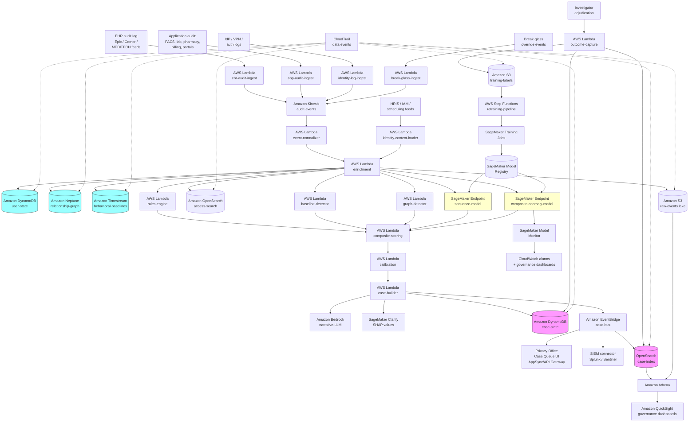

# Recipe 3.9 Architecture and Implementation: Cybersecurity / Access Pattern Anomalies

*Companion to [Recipe 3.9: Cybersecurity / Access Pattern Anomalies](chapter03.09-cybersecurity-access-pattern-anomalies). This page covers the AWS architecture, services, prerequisites, and pseudocode. For the problem framing and the conceptual approach, start with the main recipe.*

---

## The AWS Implementation

### Why These Services

**Amazon Kinesis Data Streams for the audit-event ingest backbone.** EHR audit logs, application audit logs, and network logs flow into a Kinesis stream as they're produced. Kinesis handles the volume (a major health system's audit volume runs into tens of millions of events per day), provides ordered delivery for sequence-based analysis, supports replay for backfill and retraining, and integrates cleanly with the downstream Lambda and analytics components.

**AWS Lambda for ingest, normalization, and enrichment.** Each event source (Epic Audit Log API, Cerner Behavior Tracker, application audit feeds, IdP logs, VPN logs) has its own Lambda that pulls or receives the source-specific format and writes canonical events into the stream. Downstream Lambdas perform identity resolution, schedule enrichment, care-team enrichment, and sensitivity-flag enrichment.

**Amazon DynamoDB for the user state and case state stores.** Per-user state (current behavioral baseline summary, recent flag counts, recent case history) and per-case state (open investigations, suppression status, evidence pointers) live in DynamoDB. Single-digit-millisecond reads on user lookup; DynamoDB streams trigger downstream re-evaluation when state changes.

**Amazon Neptune for the relationship graph.** The graph of workforce members, patients, encounters, departments, and devices fits Neptune's property-graph model naturally. Gremlin queries support the relationship-based detection logic ("does this user have a documented care relationship with this patient through any encounter, care team, on-call, or order signature path"). Neptune is HIPAA-eligible. 

**Amazon Timestream for time-series behavioral baselines.** Per-user time-series of access counts, session durations, and resource-type distributions are time-series data. Timestream's storage and query model fit; magnetic-tier retention covers the multi-week baseline window cost-effectively. Timestream is HIPAA-eligible and covered under the AWS BAA. 

**Amazon OpenSearch Service for case management, hunt, and SIEM-style analytics.** Privacy-office case data and the searchable archive of all access events live in OpenSearch. OpenSearch supports the kind of ad-hoc query the privacy office needs ("show me every chart access by this user in the last 90 days," "show me every access on this patient's record in the last week, sorted by user role"). Many SIEM products either run on OpenSearch under the hood or integrate with it cleanly.

**Amazon SageMaker for model training, hosting, and feature management.** The unsupervised detectors (Isolation Forest, autoencoders), the sequence models, and the supervised re-rankers train as SageMaker Training Jobs against historical data in S3, deploy to SageMaker endpoints for inference, and use SageMaker Feature Store for online and offline feature consistency. SageMaker Clarify produces SHAP-based explanations for each scored case.

**Amazon SageMaker Model Monitor.** Continuously monitors data drift, prediction drift, and (with labels) model quality. Critical for catching baseline drift caused by EHR upgrades, role changes, organizational restructures, and the gradual shift in workforce behavior that affects every monitoring program.

**Amazon Bedrock for case narrative generation.** The case builder hands the structured evidence package to a Bedrock-hosted LLM that produces the investigator-facing narrative ("This user accessed patient X's record at 11:47 p.m. The user shares a last name with the patient and lives on the same street according to HR records. The user is a step-down nurse and was not assigned to the patient's care team. The access included demographics, medications, and the most recent discharge plan, but no order entry or documentation was performed. The session ended after 90 seconds."). Decision support, not decision-making. 

**Amazon Comprehend Medical for note and search-text feature extraction.** Some break-glass override reasons and search queries are free text. Comprehend Medical extracts structured information (medications, conditions, anatomy) that feeds into feature engineering. Optional but useful for break-glass-reason analysis.

**AWS Step Functions for orchestration.** The nightly user-graph rescoring, the case assembly pipeline, and the periodic retraining are multi-step workflows. Step Functions handles orchestration with retry and error handling.

**Amazon EventBridge for routing.** Detector outputs publish to EventBridge with user context and case-class metadata. Subscribers include the case builder, the SIEM connector, the audit logger, and the metrics collector. The decoupling supports adding new detector or consumer types without touching the existing components.

**Amazon API Gateway and AWS AppSync for the privacy-office case management UI.** The privacy office's case queue UI consumes data through AppSync (when GraphQL flexibility is needed for the case-detail views) or API Gateway (for simpler integrations). When the organization uses an existing privacy-monitoring vendor (Protenus, FairWarning, etc.), the integration is API-driven and the UI is the vendor's; the AWS-native components feed it through the integration layer.

**AWS Glue and Amazon Athena for the data lake.** Historical audit events, enrichment data, and case outcomes live in S3 partitioned by date. Glue catalogs the schema; Athena provides SQL access for ad-hoc analysis and retraining feature extraction.

**Amazon QuickSight for governance dashboards.** Subgroup-performance dashboards, alert volume by detector type, case throughput, breach notification timing, and program-level operational metrics. Privacy office leadership, infosec leadership, and the audit committee consume these.

**Amazon S3 for the data lake and audit log archive.** Partitioned by date and event source, encrypted with customer-managed KMS keys. Used by SageMaker for training, Athena for ad-hoc analysis, and as the long-term archive for compliance retention.

**AWS IAM Identity Center (or external IdP integration).** The monitoring system itself has multiple roles: privacy-office investigators (read access to case data, write access to outcomes), privacy-office leadership (read access plus reporting), data-science team (training-data access without identifying user data when possible), and operations team (pipeline monitoring without case-data access). Least-privilege per role. The system ironically has to apply the same access-monitoring discipline to itself that it monitors elsewhere.

**Amazon CloudWatch and AWS X-Ray.** Pipeline health, ingest latency (especially for the EHR audit log feed, where latency directly affects detection speed), and end-to-end traces. Latency budgets matter: the time from "user takes the action" to "case appears in the privacy-office queue" is part of the operational metric.

**AWS CloudTrail.** Audit logging on every PHI-bearing store and every API call against the case management system. The monitoring system's own access logs feed back into the pipeline as a self-monitoring input.

**AWS KMS.** Customer-managed keys on every PHI-bearing store: Kinesis, DynamoDB, Neptune, Timestream, S3, OpenSearch, SageMaker volumes and Feature Store. Key rotation per organizational requirements.

**AWS Secrets Manager.** EHR API credentials, IdP integration credentials, IdP service-account credentials, and SIEM integration credentials. Rotated per policy.

### Architecture Diagram



### Prerequisites

| Requirement | Details |
|-------------|---------|
| **AWS Services** | Amazon Kinesis Data Streams, AWS Lambda, Amazon DynamoDB, Amazon Neptune, Amazon Timestream, Amazon OpenSearch Service, Amazon S3, Amazon SageMaker (Training, Hosting, Feature Store, Clarify, Model Monitor, Model Registry), Amazon Comprehend Medical (optional), Amazon Bedrock, Amazon EventBridge, AWS Step Functions, AWS AppSync, Amazon API Gateway, AWS Glue, Amazon Athena, Amazon QuickSight, AWS IAM Identity Center, AWS Secrets Manager, AWS KMS, AWS CloudTrail, Amazon CloudWatch, AWS X-Ray. |
| **IAM Permissions** | Least-privilege per role. Ingest Lambdas write to the event stream and read from EHR/IdP/HRIS sources. Enrichment Lambdas read from identity stores and write enriched events downstream. Detectors read from state stores and write scores. Case builder reads scores and assembles cases. Privacy investigators read case data and write outcomes only. Data science roles can train and deploy but cannot read identifying user data without explicit elevation; training data sets are typically pseudonymized for development. No `*` permissions; every action scoped to specific resources. |
| **BAA** | Signed AWS BAA. All services configured per BAA requirements. EHR vendor and any third-party patient-privacy-monitoring vendor must have their own BAAs. See the [AWS HIPAA Eligible Services Reference](https://aws.amazon.com/compliance/hipaa-eligible-services-reference/). |
| **Encryption** | Customer-managed KMS keys on every PHI-bearing store: Kinesis, DynamoDB, Neptune, Timestream, S3, OpenSearch, SageMaker (volumes, Feature Store, model artifacts). TLS 1.2 or higher in transit. Audit-event payloads include PHI (the patient identifier and often patient demographics) and user PII (the workforce member's identifier and HR-linked data); both categories must be protected. |
| **VPC** | Production deployment in a VPC with VPC endpoints for S3, DynamoDB, KMS, Neptune, SageMaker runtime, Bedrock, Comprehend Medical, EventBridge, and Step Functions. Lambdas that touch PHI run in the VPC. EHR audit-feed integrations typically use site-to-site VPN or AWS Direct Connect, depending on the EHR's deployment topology. |
| **CloudTrail and Data Events** | Enabled with data events on every PHI-bearing store, on the case management indexes, and on the model endpoints. Every score, every case generation, every adjudication, every export is logged. Log retention per organizational policy and applicable regulations (some jurisdictions and accreditation programs require multi-year retention). |
| **Privacy Office and Infosec Governance** | A privacy committee (typically including the Chief Privacy Officer, Chief Information Security Officer, General Counsel or HIPAA Privacy Officer designee, Compliance, HR, and clinical leadership) must own the program. Acceptable-use and monitoring policy must be in place and the workforce must be notified. Investigation procedures, appeals processes, and HR coordination protocols must be documented before deployment. |
| **Workforce Notification and Acceptable Use Policy** | Workforce members must be informed that monitoring exists and what it covers. The policy should align with HIPAA Security Rule audit-control requirements, applicable state privacy statutes, and any collective bargaining agreements. Counsel should review before publication. |
| **EHR Audit Log Access** | Coordinate with the EHR vendor and the EHR operations team to enable the audit-log feed at sufficient granularity and frequency. Epic, Cerner/Oracle Health, and MEDITECH each have specific mechanisms; the integration is typically a multi-quarter project. Latency from event to ingest matters; near-real-time is achievable with most modern EHRs but requires explicit configuration. |
| **HRIS, IAM, and Scheduling Integration** | The enrichment data is the project. HR data feeds (Workday, Oracle HCM, SAP SuccessFactors), IAM data (Active Directory, Okta, Microsoft Entra ID), and scheduling data (Kronos, UKG, API Healthcare) each require their own integration. Plan for parallel integration work; the enrichment quality determines the alert quality. |
| **Sample Data** | Internal historical audit logs are the only realistic training data; no public dataset captures the breadth needed. Synthetic audit-log generators exist in the security research community but produce data that's structurally different from real EHR audit logs. Pseudonymization for development is essential and non-trivial: the user-patient relationship structure must be preserved while identifiers are replaced. |
| **Cost Estimate** | For a moderate-size health system (10,000 active workforce, 100,000 patients in the active panel, ~30 million audit events per day): Kinesis ingest: ~$300-700/month. Lambda for ingest, normalization, enrichment, detection: ~$1,500-3,500/month. DynamoDB user-state and case-state: ~$300-700/month. Neptune for the relationship graph: ~$1,500-4,000/month (Neptune instance class is typically the largest single line item). Timestream baselines: ~$200-500/month. OpenSearch case index and search archive: ~$1,500-4,500/month (scales with retention period; many programs hold 12-24 months online). SageMaker endpoints (modest instance class for daily-cadence scoring): ~$500-1,500/month. SageMaker training and Model Monitor: ~$200-500/month. Bedrock for case narratives: ~$200-700/month. S3, supporting services: ~$200-500/month. Total infrastructure: typically $6,500-17,000/month for a moderate-size deployment. Privacy-office staffing (investigators, privacy analysts, the CPO function) is the dominant program cost; one investigator at typical loaded cost can equal several months of infrastructure. The infrastructure pays for itself by avoiding a single OCR settlement; published OCR settlements involving inadequate audit controls have ranged from hundreds of thousands to several million dollars.  |

### Ingredients

| AWS Service | Role |
|------------|------|
| **Amazon Kinesis Data Streams** | Canonical audit-event stream |
| **AWS Lambda (ehr-audit-ingest)** | EHR audit-log feed ingestion and source-format normalization |
| **AWS Lambda (app-audit-ingest)** | Application-system audit-log ingestion (PACS, lab, pharmacy, billing) |
| **AWS Lambda (identity-log-ingest)** | IdP, VPN, and authentication-log ingestion |
| **AWS Lambda (break-glass-ingest)** | Break-glass override event ingestion with override-reason text capture |
| **AWS Lambda (identity-context-loader)** | Periodic load of HRIS, IAM, and scheduling enrichment data |
| **AWS Lambda (event-normalizer)** | Canonical event format, identifier resolution, deduplication |
| **AWS Lambda (enrichment)** | Identity, role, schedule, care-team, sensitivity-flag enrichment per event |
| **AWS Lambda (rules-engine)** | Same-name, VIP, self-access, break-glass, off-hours rule evaluation |
| **AWS Lambda (baseline-detector)** | Per-user statistical deviation detection against rolling baseline |
| **AWS Lambda (graph-detector)** | Relationship-based detection using Neptune queries |
| **AWS Lambda (composite-scoring)** | Combines per-detector scores into composite case scores |
| **AWS Lambda (calibration)** | Subgroup-stratified calibration and tier assignment |
| **AWS Lambda (case-builder)** | Groups events into cases, assembles evidence, calls narrative LLM |
| **AWS Lambda (outcome-capture)** | Records investigator adjudications and feeds the label store |
| **Amazon DynamoDB (user-state)** | Per-user current state, baseline summary, recent flag history |
| **Amazon DynamoDB (case-state)** | Open and recently-closed case state, suppression rules |
| **Amazon Neptune** | Relationship graph: workforce, patients, encounters, devices, departments |
| **Amazon Timestream** | Time-series of behavioral metrics for baseline computation |
| **Amazon OpenSearch Service** | Searchable archive of audit events and case data; SIEM-style queries |
| **Amazon S3** | Raw event lake, training data, retraining label store, audit archive |
| **Amazon SageMaker Endpoint (sequence-model)** | Sequence-based workflow-vs-curiosity scoring |
| **Amazon SageMaker Endpoint (composite-anomaly-model)** | Composite anomaly scoring on user-window feature vectors |
| **Amazon SageMaker Training** | Periodic retraining for sequence and composite models |
| **Amazon SageMaker Feature Store** | Online and offline feature consistency for training and scoring |
| **Amazon SageMaker Clarify** | SHAP-based per-case explanations |
| **Amazon SageMaker Model Monitor** | Data drift, prediction drift, and quality drift monitoring |
| **Amazon SageMaker Model Registry** | Versioning and approval workflow for model deployments |
| **Amazon Comprehend Medical** | Optional: structured extraction from break-glass override reasons |
| **Amazon Bedrock** | Investigator-facing case-narrative generation |
| **Amazon EventBridge** | Routes scoring and case events to subscribers (case queue, SIEM, archive) |
| **AWS AppSync / API Gateway** | Privacy-office case management UI back end |
| **AWS Step Functions** | Daily user-graph rescoring and retraining pipeline orchestration |
| **AWS Glue + Amazon Athena** | Data lake catalog and SQL-over-S3 for ad-hoc analysis |
| **Amazon QuickSight** | Privacy-office, infosec, and governance dashboards |
| **AWS IAM Identity Center** | Workforce single sign-on for the case management UI |
| **AWS Secrets Manager** | EHR, IdP, HRIS, and SIEM integration credentials |
| **AWS KMS** | Customer-managed keys for every PHI- and PII-bearing store |
| **AWS CloudTrail** | Audit logging on every store and every API operation |
| **Amazon CloudWatch + AWS X-Ray** | Pipeline health, ingest latency, end-to-end traces |

---

### Code

> **Reference implementations:** These aws-samples repositories demonstrate patterns that apply here:
> - [`amazon-sagemaker-examples`](https://github.com/aws/amazon-sagemaker-examples): Anomaly detection notebooks (Isolation Forest, autoencoder, RNN sequence models), Feature Store with online and offline stores, Clarify SHAP examples, Model Monitor configurations.
> - [`aws-samples`](https://github.com/aws-samples): search for "Neptune," "FHIR," "audit log analysis," and "UEBA" for adjacent integration and graph-analytics patterns.
> 

#### Walkthrough

**Step 1: Ingest and normalize an audit event from the EHR.** The EHR audit feed publishes events on a near-real-time cadence. The ingest Lambda parses the source-specific format (Epic, Cerner, MEDITECH each differ), validates the schema, and writes a canonical event to the stream.

```pseudocode
FUNCTION on_ehr_audit_event(raw_event, source_format):
    // Parse the source-specific payload. EHR audit log formats vary
    // substantially by vendor; the parser is selected per source.
    parsed = parse_audit_event(raw_event, source_format)

    // Resolve workforce identifier. EHR user IDs are usually system-specific
    // and need to be mapped to enterprise identity (Active Directory SID,
    // Okta user ID, etc.).
    workforce_id = resolve_workforce_id(parsed.user_id, source_format)
    IF workforce_id is null:
        send_to_quarantine(parsed, reason = "unknown_workforce_user")
        return 202

    // Resolve patient identifier. Map EHR-internal patient ID to enterprise
    // master patient identifier (EMPI) so cross-system correlation works.
    patient_id = resolve_patient_id(parsed.patient_id, source_format)

    // Build the canonical event. The schema is consistent across all
    // event sources downstream.
    canonical_event = {
        event_id:           generate_event_id(parsed),
        workforce_id:       workforce_id,
        patient_id:         patient_id,
        source_system:      source_format,
        event_type:         normalize_event_type(parsed.action_type),  // view, edit, print, export, search, login
        resource_type:      normalize_resource_type(parsed.resource),  // chart, lab, image, note, order, demographics
        action:             parsed.action,
        observed_at:        parsed.event_time,
        received_at:        NOW(),
        device_id:          parsed.workstation_id,
        application_context: parsed.application_screen,
        ip_address:         parsed.source_ip,
        session_id:         parsed.session_id,
        break_glass:        parsed.break_glass_override == true,
        break_glass_reason: parsed.break_glass_reason,
        raw_event_ref:      persist_raw(raw_event)
    }

    Kinesis.PutRecord(
        stream_name   = "audit-events",
        data          = canonical_event,
        partition_key = canonical_event.workforce_id   // partition by user for ordering within a session
    )
    return 200
```

**Step 2: Enrich the event with identity, schedule, care-team, and sensitivity context.** The enrichment Lambda joins the canonical event against the identity, scheduling, care-team, and patient-flag stores. Enrichment quality drives detection quality.

```pseudocode
FUNCTION enrich(event):
    // Identity context. HRIS data refreshed nightly into a fast-lookup store.
    identity = DynamoDB.GetItem(
        table = "workforce-identity",
        key   = { workforce_id: event.workforce_id }
    )
    event.user_role         = identity.role
    event.user_department   = identity.department
    event.user_manager      = identity.manager_id
    event.user_employment   = identity.employment_type   // employee, contractor, student, volunteer
    event.user_address_zip  = identity.address_zip       // for same-neighborhood detection
    event.user_last_name    = identity.last_name         // for same-name detection
    event.user_hire_date    = identity.hire_date         // new-user ramp-up consideration

    // Schedule context. Was the user supposed to be working at this time?
    schedule = DynamoDB.GetItem(
        table = "workforce-schedule",
        key   = {
            workforce_id: event.workforce_id,
            shift_date:   date(event.observed_at)
        }
    )
    event.scheduled_to_work     = schedule != null
    event.scheduled_unit         = schedule.unit IF schedule else null
    event.is_off_shift           = is_off_shift(event.observed_at, schedule)
    event.is_off_hours           = is_off_hours(event.observed_at, identity.role)

    // Care-team context. Does the user have a documented relationship to
    // this patient through the EHR? Care teams, on-call schedules, encounter
    // assignments, and order signatures are the primary sources.
    care_relationship = check_care_relationship(
        workforce_id = event.workforce_id,
        patient_id   = event.patient_id,
        as_of        = event.observed_at,
        include      = ["assigned_attending", "assigned_nurse", "consult", "on_call",
                        "scheduling", "documentation_authorship", "order_signature",
                        "transitions_team", "case_management"]
    )
    event.has_care_relationship       = care_relationship.has_any
    event.care_relationship_types     = care_relationship.types
    event.care_relationship_strength   = care_relationship.strength_score   // 0..1; weak vs strong evidence

    // Patient context. Sensitivity flags, demographic data, employment relationship.
    patient = DynamoDB.GetItem(
        table = "patient-context",
        key   = { patient_id: event.patient_id }
    )
    event.patient_sensitivity_flags = patient.sensitivity_flags    // VIP, employee, foster, behavioral, victim, opt_out
    event.patient_is_employee       = patient.is_workforce_member
    event.patient_last_name         = patient.last_name
    event.patient_address_zip       = patient.address_zip
    event.patient_household_id      = patient.household_id          // for same-household detection (when available)
    event.patient_is_deceased       = patient.is_deceased

    // Network and device context.
    event.geo_location              = geolocate_ip(event.ip_address)
    event.is_off_network            = event.geo_location.network != "corporate"
    event.is_unusual_geo            = is_unusual_for_user(event.workforce_id, event.geo_location)

    // Persist enriched event for downstream detection.
    write_enriched_event(event)
    return event
```

**Step 3: Run the rules-engine detector.** The rules engine evaluates the explicit policy rules. Each rule is versioned, has a precise definition, and produces a flag with an explanation.

```pseudocode
FUNCTION run_rules_engine(event):
    flags = []

    // Same-last-name rule. Weighted by name uniqueness.
    IF event.user_last_name == event.patient_last_name AND NOT event.has_care_relationship:
        name_uniqueness = compute_name_uniqueness(event.user_last_name)   // higher for rare names
        flags.append({
            rule_id:    "RULE-001-SAME-LAST-NAME-NO-CARE",
            severity:   "high",
            confidence: name_uniqueness,
            evidence:   {
                user_last_name:    event.user_last_name,
                patient_last_name: event.patient_last_name,
                care_relationship: event.has_care_relationship
            },
            explanation: f"User and patient share last name '{event.user_last_name}' (uniqueness {name_uniqueness:.2f}); no documented care relationship found at access time."
        })

    // Same household / same neighborhood rule.
    IF event.user_address_zip == event.patient_address_zip:
        IF event.patient_household_id and is_member(event.workforce_id, event.patient_household_id):
            flags.append({
                rule_id:    "RULE-002-SAME-HOUSEHOLD-NO-CARE",
                severity:   "high",
                confidence: 0.95,
                evidence:   { household_id: event.patient_household_id }
            })
        ELSE IF zip_population_density(event.user_address_zip) < SMALL_ZIP_THRESHOLD AND NOT event.has_care_relationship:
            flags.append({
                rule_id:    "RULE-003-SAME-NEIGHBORHOOD-NO-CARE",
                severity:   "medium",
                confidence: 0.65,
                evidence:   { zip: event.user_address_zip }
            })

    // Self-access rule (organization policy dependent).
    IF event.workforce_id == event.patient_id_workforce_link:
        flags.append({
            rule_id:    "RULE-010-SELF-ACCESS",
            severity:   "policy_dependent",  // some orgs allow, some forbid
            confidence: 1.0,
            evidence:   { workforce_id: event.workforce_id, patient_id: event.patient_id }
        })

    // Sensitive-patient access without strong care relationship.
    IF "VIP" in event.patient_sensitivity_flags AND event.care_relationship_strength < 0.8:
        flags.append({
            rule_id:    "RULE-020-VIP-WEAK-CARE",
            severity:   "high",
            confidence: 0.85,
            evidence:   {
                sensitivity_flags:  event.patient_sensitivity_flags,
                care_strength:      event.care_relationship_strength
            }
        })

    // Co-worker access without strong care relationship.
    IF event.patient_is_employee AND event.care_relationship_strength < 0.8:
        flags.append({
            rule_id:    "RULE-021-EMPLOYEE-PATIENT-WEAK-CARE",
            severity:   "high",
            confidence: 0.80
        })

    // Break-glass override. Flagged for review by default; severity tuned by reason quality.
    IF event.break_glass:
        flags.append({
            rule_id:    "RULE-030-BREAK-GLASS-OVERRIDE",
            severity:   severity_from_break_glass_reason(event.break_glass_reason),
            confidence: 1.0,
            evidence:   {
                reason:             event.break_glass_reason,
                care_relationship: event.has_care_relationship,
                sensitivity_flags: event.patient_sensitivity_flags
            }
        })

    // Off-hours access by users on standard daytime schedules without scheduled coverage.
    IF event.is_off_hours AND NOT event.scheduled_to_work AND event.user_employment in ["employee", "contractor"]:
        flags.append({
            rule_id:    "RULE-040-OFF-HOURS-NO-SCHEDULE",
            severity:   "low",
            confidence: 0.50,
            evidence:   {
                observed_at:        event.observed_at,
                role_normal_hours:  normal_hours_for_role(event.user_role)
            }
        })

    // Deceased-patient access.
    IF event.patient_is_deceased AND NOT event.has_care_relationship:
        flags.append({
            rule_id:    "RULE-050-DECEASED-PATIENT-NO-CARE",
            severity:   "medium",
            confidence: 0.70
        })

    // Print and export, especially with sensitivity flags or weak care relationship.
    IF event.event_type in ["print", "export"] AND (
        event.patient_sensitivity_flags or event.care_relationship_strength < 0.5
    ):
        flags.append({
            rule_id:    "RULE-060-EXPORT-WEAK-CARE",
            severity:   "medium",
            confidence: 0.70
        })

    return flags
```

**Step 4: Compute per-user behavioral baselines and detect deviations.** Per-user rolling-window features are compared to the user's historical baseline and to peer-group distributions. A user whose behavior shifts substantially gets a deviation score.

```pseudocode
FUNCTION run_baseline_detector(event):
    workforce_id = event.workforce_id

    // Aggregate the recent activity window. Multiple windows in parallel
    // catch fast and slow shifts.
    feature_vector = {}
    FOR each window in [1_hour, 8_hour, 24_hour, 7_day, 30_day]:
        agg = aggregate_user_activity(workforce_id, window, ending_at = event.observed_at)
        feature_vector[f"events_count_{window}"]              = agg.event_count
        feature_vector[f"unique_patients_{window}"]            = agg.unique_patients
        feature_vector[f"unique_resources_{window}"]           = agg.unique_resource_types
        feature_vector[f"export_count_{window}"]               = agg.export_count
        feature_vector[f"print_count_{window}"]                = agg.print_count
        feature_vector[f"break_glass_count_{window}"]          = agg.break_glass_count
        feature_vector[f"off_hours_fraction_{window}"]         = agg.off_hours_fraction
        feature_vector[f"new_patient_fraction_{window}"]       = agg.never_seen_before_fraction
        feature_vector[f"sensitive_patient_fraction_{window}"]  = agg.sensitive_patient_fraction
        feature_vector[f"weak_care_fraction_{window}"]         = agg.weak_care_relationship_fraction

    // User's own historical baseline. Stored in Timestream and refreshed nightly.
    user_baseline = get_user_baseline(workforce_id)

    // Per-feature z-score against the user's own history.
    per_feature_z = {}
    FOR each feature_name in feature_vector:
        baseline_mean = user_baseline.mean(feature_name)
        baseline_std  = user_baseline.std(feature_name)
        IF baseline_std > 0:
            per_feature_z[feature_name] = (feature_vector[feature_name] - baseline_mean) / baseline_std
        ELSE:
            per_feature_z[feature_name] = 0

    // Peer-group baseline. Defined per (role, department, shift_pattern).
    peer_group_id = derive_peer_group(event.user_role, event.user_department, user_baseline.shift_pattern)
    peer_baseline = get_peer_baseline(peer_group_id)
    per_feature_peer_z = {}
    FOR each feature_name in feature_vector:
        peer_mean = peer_baseline.mean(feature_name)
        peer_std  = peer_baseline.std(feature_name)
        IF peer_std > 0:
            per_feature_peer_z[feature_name] = (feature_vector[feature_name] - peer_mean) / peer_std
        ELSE:
            per_feature_peer_z[feature_name] = 0

    // Composite deviation score: max-of-z across features, with feature
    // weighting that emphasizes the highest-stakes features (export volume,
    // sensitive-patient fraction).
    composite_user_z = weighted_max_z(per_feature_z, FEATURE_WEIGHTS)
    composite_peer_z = weighted_max_z(per_feature_peer_z, FEATURE_WEIGHTS)

    // Cold-start handling: new users with insufficient baseline data fall
    // back to peer-group comparison only.
    user_baseline_age_days = days_since(user_baseline.first_observed)
    IF user_baseline_age_days < MIN_BASELINE_DAYS:
        composite = composite_peer_z
        baseline_source = "peer_only_cold_start"
    ELSE:
        composite = max(composite_user_z, composite_peer_z)
        baseline_source = "patient_specific_and_peer"

    deviation_score = sigmoid(composite / DEVIATION_SCALING_FACTOR)

    return {
        deviation_score:     deviation_score,
        per_feature_z:       per_feature_z,
        per_feature_peer_z:  per_feature_peer_z,
        peer_group_id:       peer_group_id,
        baseline_source:     baseline_source,
        baseline_age_days:   user_baseline_age_days,
        feature_snapshot:    feature_vector
    }
```

**Step 5: Run the graph-based detector.** The relationship graph captures the documented connections between workforce members and patients. The detector evaluates whether the access has any plausible relationship path through the graph. Patterns where a user accesses patients with no graph connection to their documented work are flagged.

```pseudocode
FUNCTION run_graph_detector(event):
    // Query Neptune for any documented care-relationship path.
    paths = Neptune.Query(f"""
        g.V().has('workforce', 'workforce_id', '{event.workforce_id}')
          .repeat(both('care_team', 'on_call', 'consult', 'scheduling',
                       'order_signature', 'documentation_authorship',
                       'team_membership', 'cross_coverage'))
          .times(3)
          .has('patient', 'patient_id', '{event.patient_id}')
          .path()
          .limit(5)
    """)

    has_direct_relationship = any(p.length <= 2 for p in paths)
    has_indirect_relationship = any(p.length <= 4 for p in paths)

    // Department-level relationship: was the patient on a unit this user
    // covers, even if the user wasn't directly assigned?
    user_dept = event.user_department
    patient_recent_units = Neptune.Query(f"""
        g.V().has('patient', 'patient_id', '{event.patient_id}')
          .out('admitted_to_unit')
          .has('unit', 'time', between('{event.observed_at - 7d}', '{event.observed_at}'))
          .values('unit_id')
    """)
    department_overlap = user_dept in [unit_to_dept(u) for u in patient_recent_units]

    // Cluster anomaly: in the last N hours, has the user accessed a
    // suspicious cluster of patients with no shared care-team or workflow
    // connection? This catches credential-compromise reconnaissance patterns.
    recent_access = get_user_recent_patient_set(event.workforce_id, hours = 24)
    IF len(recent_access) >= CLUSTER_THRESHOLD:
        cluster_cohesion = compute_graph_cohesion(recent_access)
        // cluster_cohesion is high when patients share care teams, units, or
        // diagnosis groups; low when they're scattered.
        cluster_anomaly = cluster_cohesion < CLUSTER_COHESION_THRESHOLD
    ELSE:
        cluster_cohesion = null
        cluster_anomaly = false

    // Family-relationship through HR-linked household IDs (when available).
    family_match = check_family_link(event.workforce_id, event.patient_id)

    relationship_evidence = {
        has_direct_relationship:    has_direct_relationship,
        has_indirect_relationship:  has_indirect_relationship,
        department_overlap:         department_overlap,
        cluster_cohesion_score:     cluster_cohesion,
        cluster_anomaly:            cluster_anomaly,
        family_match:               family_match
    }

    // Composite graph-based score.
    IF has_direct_relationship:
        graph_score = 0.05
    ELSE IF has_indirect_relationship or department_overlap:
        graph_score = 0.30
    ELSE IF family_match:
        graph_score = 0.95
    ELSE IF cluster_anomaly:
        graph_score = 0.85
    ELSE:
        graph_score = 0.65    // no documented connection at all

    return {
        graph_score:           graph_score,
        relationship_evidence: relationship_evidence
    }
```

**Step 6: Combine detector outputs into a composite case score.** Each detector produces a score (rules, baseline deviation, graph relationship, sequence model). The composite combines them with calibrated weights. Calibration ensures that a composite score of 0.8 corresponds to roughly the same probability of being a confirmed violation across cohorts.

```pseudocode
FUNCTION composite_score(event, rules_flags, baseline_output, graph_output, sequence_output):
    // Weight detectors. Weights are tuned per cohort using historical
    // adjudicated cases.
    weights = COHORT_WEIGHTS_FOR(event.user_role, event.user_department)

    // Rules contribute a "rules confidence" derived from the maximum
    // rule-level confidence across triggered rules, with severity weighting.
    rules_confidence = max_severity_confidence(rules_flags) IF rules_flags else 0.0

    raw_composite = (
        weights.rules    * rules_confidence
      + weights.baseline * baseline_output.deviation_score
      + weights.graph    * graph_output.graph_score
      + weights.sequence * sequence_output.sequence_score
    )

    // Calibration. Per-cohort calibration corrects for systematic over- or
    // under-confidence in the raw score.
    calibrated = apply_calibration(
        raw_score    = raw_composite,
        calibration  = CALIBRATION_FOR(event.user_role, event.user_department),
        subgroup     = subgroup_for_calibration(event)
    )

    // Tier mapping. Tiers map to operational handling:
    //   tier_1: privacy-office same-day review
    //   tier_2: privacy-office within-72h review
    //   tier_3: routine weekly review
    //   below_threshold: archive only
    tier = tier_from_score(
        score:    calibrated,
        cohort:   (event.user_role, event.user_department),
        capacity: current_privacy_office_capacity()
    )

    return {
        score_id:                 generate_score_id(),
        event_id:                 event.event_id,
        workforce_id:             event.workforce_id,
        patient_id:               event.patient_id,
        scored_at:                NOW(),
        rules_flags:              rules_flags,
        rules_confidence:          rules_confidence,
        baseline_deviation_score:  baseline_output.deviation_score,
        graph_score:               graph_output.graph_score,
        sequence_score:            sequence_output.sequence_score,
        composite_raw:             raw_composite,
        composite_calibrated:      calibrated,
        tier:                      tier,
        per_feature_z:             baseline_output.per_feature_z,
        relationship_evidence:     graph_output.relationship_evidence,
        feature_snapshot_id:       persist_features(event, baseline_output, graph_output)
    }
```

**Step 7: Build the investigator-facing case package.** The case builder groups related scored events into a single case (the same user repeatedly accessing the same patient becomes one case, not many), assembles the supporting evidence, generates the LLM narrative, and applies suppression rules.

```pseudocode
FUNCTION build_case(score_record):
    // Group: does this score belong to an existing open case?
    existing_case = find_existing_case(
        workforce_id = score_record.workforce_id,
        patient_id   = score_record.patient_id,
        within_window_days = CASE_GROUPING_WINDOW
    )

    IF existing_case:
        // Append the new score to the existing case and update its evidence.
        update_existing_case(existing_case, score_record)
        return existing_case.case_id

    // Suppression: was this same pattern recently dismissed for this user?
    IF check_recent_dismissal(score_record):
        log_suppression(score_record, reason = "recent_dismissal_same_pattern")
        return null

    // Suppression: is the user already under active investigation for related
    // conduct, with the new pattern part of the existing investigation?
    IF check_investigation_overlap(score_record):
        attach_to_existing_investigation(score_record)
        return null

    // Build the evidence package.
    evidence = {
        // The scored event(s) that triggered the case.
        triggering_events:    fetch_triggering_events(score_record),

        // User context.
        workforce_record:     {
            workforce_id:     score_record.workforce_id,
            role:             score_record.user_role,
            department:       score_record.user_department,
            manager:          score_record.user_manager,
            employment_type:  score_record.user_employment,
            hire_date:        score_record.user_hire_date,
            recent_role_changes: fetch_recent_role_changes(score_record.workforce_id)
        },

        // Patient context. Be careful with PHI handling here; case data
        // is itself PHI and is access-controlled in the case management UI.
        patient_record:       {
            patient_id:       score_record.patient_id,
            sensitivity_flags: score_record.patient_sensitivity_flags,
            recent_encounters: fetch_recent_encounters(score_record.patient_id, days=90),
            care_team_history: fetch_care_team_history(score_record.patient_id, days=90)
        },

        // Care relationship status at access time.
        care_relationship:    score_record.relationship_evidence,

        // User's recent activity context.
        user_recent_activity: {
            last_30_days_summary:   fetch_activity_summary(score_record.workforce_id, days=30),
            sensitive_accesses_30d:  fetch_sensitive_access_summary(score_record.workforce_id, days=30),
            prior_cases:              fetch_prior_cases(score_record.workforce_id)
        },

        // Detector-level evidence.
        rules_flags:          score_record.rules_flags,
        baseline_evidence:    {
            deviation_score:    score_record.baseline_deviation_score,
            top_z_features:     top_n_by_z(score_record.per_feature_z, n=5)
        },
        graph_evidence:       score_record.relationship_evidence,
        sequence_evidence:    fetch_sequence_evidence(score_record.event_id),

        // Composite and calibration metadata.
        composite_score:      score_record.composite_calibrated,
        tier:                 score_record.tier,
        model_version:        score_record.model_version
    }

    // SHAP-based per-feature attribution for the composite model.
    shap = SageMaker.Clarify.ExplainPrediction(
        endpoint_name = "access-anomaly-composite-model",
        input_record  = fetch_features(score_record.feature_snapshot_id)
    )
    evidence.shap_top_drivers = top_n(shap, n=5, direction="positive")

    // LLM-generated narrative. Constrained to summarize evidence; never
    // makes adjudication recommendations or asserts intent.
    prompt = build_case_narrative_prompt(evidence)
    bedrock_response = Bedrock.InvokeModel(
        model_id = "anthropic.claude-XX",       // HIPAA-eligible per current eligibility
        body     = { prompt: prompt, max_tokens: 600, temperature: 0.0 }
    )
    evidence.narrative = parse_bedrock_response(bedrock_response)

    // Persist the case.
    case = {
        case_id:           generate_case_id(),
        opened_at:         NOW(),
        workforce_id:      score_record.workforce_id,
        patient_id:        score_record.patient_id,
        tier:              score_record.tier,
        composite_score:   score_record.composite_calibrated,
        evidence:          evidence,
        status:            "open_for_review",
        assigned_to:       null,
        outcome:           null,
        outcome_notes:     null
    }
    DynamoDB.PutItem(table = "case-state", item = case)
    OpenSearch.Index("case-index", case)

    EventBridge.PutEvent(
        bus         = "access-anomaly-events",
        source      = "case-builder",
        detail_type = "CaseOpened",
        detail      = {
            case_id:        case.case_id,
            tier:           case.tier,
            composite_score: case.composite_score
        }
    )

    return case.case_id
```

**Step 8: Capture investigator outcomes and feed the learning loop.** The privacy office investigator adjudicates the case. Outcomes flow back as labels for retraining, suppression rules, and threshold tuning.

```pseudocode
FUNCTION on_investigator_action(action):
    case = DynamoDB.GetItem(
        table = "case-state",
        key   = { case_id: action.case_id }
    )

    case.outcome              = action.outcome
    // outcome: confirmed_violation, dismissed_legitimate, dismissed_inconclusive,
    //          escalated_to_hr, escalated_to_legal, escalated_to_law_enforcement
    case.outcome_notes        = action.notes
    case.outcome_at           = NOW()
    case.assigned_to          = action.investigator_id
    case.status                = "closed"

    // Specific outcome types initiate downstream workflows.
    IF action.outcome == "confirmed_violation":
        // Initiate the HIPAA breach notification clock.
        initiate_breach_review(case)

        // Refer to HR for employment action review.
        refer_to_hr(case)

        // Flag the user for elevated future scrutiny (subject to policy).
        update_user_state(case.workforce_id, prior_violation = true)

    IF action.outcome == "dismissed_legitimate":
        // Add to suppression rules so this pattern doesn't re-flag.
        add_suppression_rule(
            workforce_id     = case.workforce_id,
            patient_id       = case.patient_id,
            reason           = action.dismissal_reason,
            valid_until      = NOW() + DISMISSAL_VALIDITY_PERIOD
        )

    // Persist case update and write the label for retraining.
    DynamoDB.PutItem(table = "case-state", item = case)
    OpenSearch.Index("case-index", case)

    label_record = {
        case_id:               case.case_id,
        workforce_id:          case.workforce_id,
        patient_id:            case.patient_id,
        feature_snapshot_id:   case.evidence.feature_snapshot_id,
        composite_score:       case.composite_score,
        outcome:               case.outcome,
        outcome_at:            case.outcome_at,
        time_to_adjudication:  case.outcome_at - case.opened_at
    }
    S3.PutObject(
        bucket = "access-anomaly-training-labels",
        key    = f"labels/year={year(case.outcome_at)}/month={month(case.outcome_at)}/{case.case_id}.json",
        body   = label_record
    )

    EventBridge.PutEvent(
        bus         = "access-anomaly-events",
        source      = "outcome-capture",
        detail_type = "CaseClosed",
        detail      = label_record
    )
```

> **Curious how this looks in Python?** The pseudocode above covers the concepts. If you'd like to see sample Python code that demonstrates these patterns using boto3, check out the [Python Example](chapter03.09-python-example). It walks through each step with inline comments and notes on what you'd need to change for a real deployment.

---

### Expected Results

**Sample case package (high-tier, family-relationship pattern):**

```json
{
  "case_id": "CASE-2026-05-14-008219",
  "opened_at": "2026-05-14T07:12:33Z",
  "workforce_id": "WF-12849",
  "patient_id": "PT-3382091",
  "tier": "tier_1",
  "composite_score": 0.87,
  "rules_flags": [
    {
      "rule_id": "RULE-001-SAME-LAST-NAME-NO-CARE",
      "severity": "high",
      "confidence": 0.81,
      "explanation": "User and patient share last name 'Wojnarowski' (uniqueness 0.81); no documented care relationship found at access time."
    },
    {
      "rule_id": "RULE-003-SAME-NEIGHBORHOOD-NO-CARE",
      "severity": "medium",
      "confidence": 0.65,
      "explanation": "User home ZIP and patient home ZIP both 14620 (small ZIP, ~9,400 residents); no documented care relationship."
    }
  ],
  "baseline_evidence": {
    "deviation_score": 0.42,
    "top_z_features": [
      { "feature": "off_hours_fraction_24_hour", "z": 2.6 },
      { "feature": "weak_care_fraction_24_hour", "z": 2.3 },
      { "feature": "new_patient_fraction_24_hour", "z": 1.9 }
    ]
  },
  "graph_evidence": {
    "has_direct_relationship": false,
    "has_indirect_relationship": false,
    "department_overlap": false,
    "cluster_cohesion_score": 0.78,
    "cluster_anomaly": false,
    "family_match": "candidate_via_address_zip_and_surname"
  },
  "narrative": "Workforce member WF-12849 (registered nurse, cardiology step-down unit) accessed the chart of patient PT-3382091 at 23:47 on May 13, outside the user's documented shift schedule (7 a.m. to 7 p.m. day shift). The user and patient share an uncommon last name (Wojnarowski, name uniqueness 0.81) and the same home ZIP (14620, a small ZIP with approximately 9,400 residents). No care team membership, on-call coverage, encounter assignment, or order signature linking the user to this patient was found. The patient was admitted earlier the same day to a unit other than the user's. The session lasted approximately 90 seconds and included views of demographics, the medication list, and the most recent discharge summary, with no documentation, order entry, or clinical action performed. The access pattern is inconsistent with documented care responsibilities and presents multiple deviation indicators (off-shift access, weak care relationship, household-level demographic match). This is decision support; investigator judgment governs.",
  "evidence_pointers": {
    "triggering_event_ids": ["EVT-2026-05-13-3392111", "EVT-2026-05-13-3392112", "EVT-2026-05-13-3392113"],
    "feature_snapshot_id": "FEAT-2026-05-14-001821",
    "model_version": "access-anomaly-composite-v3.1",
    "calibration_version": "calib-v3.1-2026-04"
  },
  "status": "open_for_review",
  "assigned_to": null
}
```

**Sample dismissed case (legitimate access, documented):**

```json
{
  "case_id": "CASE-2026-05-14-008173",
  "outcome": "dismissed_legitimate",
  "outcome_notes": "User was floor-covering for a colleague on parental leave per documented coverage in the unit's coverage spreadsheet (verified with charge nurse). The patient was on the user's covered panel for the shift in question. Care relationship gap is a known data-quality issue: the EHR's care-team module does not capture floor-coverage relationships and the privacy office has an open enhancement request with the EHR team. Adding suppression rule for floor-coverage relationships within the user's home unit for the next 30 days.",
  "investigator_id": "PO-INVESTIGATOR-002",
  "outcome_at": "2026-05-14T11:47:12Z",
  "time_to_adjudication_minutes": 275,
  "suppression_rule_added": "WF-12849 -> CARDIOLOGY_SD_UNIT_PATIENTS for 30 days"
}
```

**Performance benchmarks (illustrative ranges from typical patient-privacy-monitoring program performance; specific figures vary substantially by population (academic medical center vs. community hospital, workforce composition), base rate of policy violations, EHR vendor and configuration, privacy-office staffing, and program maturity. Confirmed-violation rate at top tier and confirmed-violation precision are particularly population-dependent. Replace with measured numbers from local validation before formalizing program-level metrics or governance reporting):**

| Metric | Rules-only | + Per-user baselines | + Graph relationship | + Sequence model | LLM-assisted triage |
|--------|-----------|---------------------|----------------------|------------------|---------------------|
| Daily candidate volume (per 10K active workforce) | 200-500 | 800-2,000 | 600-1,200 (with rules) | similar | similar |
| Top-tier case volume per day (after composite filtering) | 30-80 | 30-80 | 20-50 | 15-40 | 10-30 |
| Privacy office throughput per investigator-day | 8-15 | 8-15 | 8-15 | 8-15 | 15-30 (with LLM triage time savings) |
| Confirmed-violation rate at top tier | 8-15% | 5-12% | 12-25% | 15-28% | 18-32% |
| Confirmed-violation precision over all surfaced cases | 1-3% | 0.5-2% | 3-8% | 4-10% | 5-12% |
| False-positive review burden per confirmed violation | 30-100 | 50-200 | 12-30 | 9-25 | 6-20 |
| Time to detection (confirmed violation, retrospective measurement) | <24h | <24h | <24h | <24h | <24h |
| Time from detection to adjudication (median) | n/a | n/a | n/a | n/a | varies by tier; 4h to 72h typical |
| Subgroup precision range across role categories | ±0.05-0.15 | ±0.04-0.12 | ±0.04-0.10 | ±0.04-0.10 | ±0.04-0.10 |
| End-to-end latency (audit event ingest to candidate score) | <5 minutes | <5 minutes | <10 minutes | <15 minutes | <15 minutes |

**Where it struggles:**

- **Care-relationship data quality.** Many EHRs capture explicit care-team membership inconsistently. Floor-coverage, cross-coverage, on-call relationships, and pre-admission preparation often aren't represented in the data the detector sees. The result is a steady stream of false positives where the access was legitimate but the relationship wasn't recorded. The privacy office spends substantial review time on these.
- **Sophisticated insiders.** A workforce member who knows the system can structure access to stay below thresholds: small numbers of accesses spread over time, accesses initiated from workflow-plausible entry points, accesses to records of patients with name patterns that don't trigger same-name rules. The detector catches the unsophisticated cases (which are the majority) and has weaker performance on the sophisticated minority.
- **Privileged-user bulk access.** Database administrators, integration engineers, IT analysts, and researchers have legitimate bulk-data access. Distinguishing legitimate bulk access from extraction is hard at the access-event level and often requires correlation with downstream events that the system doesn't see (data appearing for sale, patients reporting identity theft).
- **Service accounts and integration accounts.** Automated processes, EHR-to-EHR integrations, and analytics pipelines log in as service accounts and access many records. Service-account behavior must be modeled separately from human-user behavior; conflating them either floods the queue with service-account "anomalies" or lets human anomalies hide in service-account noise.
- **New-user ramp-up.** New employees, residents starting rotations, and contractors with new assignments produce unfamiliar access patterns that look anomalous against any baseline. The cold-start problem applies to every role change. Programs that flag every new-user week produce alert fatigue; programs that suppress all new-user activity miss real new-user incidents.
- **Cross-organizational care.** Affiliated providers from external organizations who have privileged access (referral physicians at academic medical centers, telehealth providers, contracted hospitalists) often produce access patterns that look anomalous because the organization's identity data is incomplete for them.
- **Behavioral baselines decay during EHR upgrades.** When the EHR vendor releases a major upgrade, click paths change, new features appear, and the audit-log event taxonomy may shift. Baselines computed before the upgrade don't fit the post-upgrade behavior, and the detector floods the queue until baselines re-establish.
- **VPN and remote-work patterns.** Geographic anomaly detection assumes corporate-network access. Widespread VPN, BYOD, and remote-work patterns make raw IP geolocation noisy, especially after the structural shifts in clinical-administrative remote work that started in 2020.
- **Adversaries who use legitimate workflow paths.** A snooping user who opens charts from the schedule view rather than the search bar, who navigates through documentation tabs in clinical order, and who keeps each access brief produces minimal sequence-anomaly signal. These cases require relationship-based and content-based features to catch.
- **The investigation lag.** Even with same-day detection, investigations take hours to days. The breach notification clock is running. A more responsive investigation function (which is staffing, not technology) shortens the gap.

---

## Why This Isn't Production-Ready

The pseudocode shows the shape. A production access-monitoring program closes several gaps the recipe leaves intentionally light.

**Privacy-office and infosec governance is the program.** Same lesson as Recipes 3.6, 3.7, and 3.8. The detection pipeline is maybe 30% of the work; the workforce policy, the investigation procedures, the HR coordination, the legal coordination, the appeals process, and the ongoing program review are the other 70%. A pipeline without an active privacy committee, a defined investigation methodology, and a clear path from detection to adjudication will produce alerts that don't lead to outcomes. Build the governance before the technology.

**Workforce notification and acceptable-use policy must precede deployment.** Workforce members must be informed that monitoring exists. Quietly deploying a behavioral-monitoring system is a labor and legal disaster, regardless of the technology's quality. The acceptable-use policy must be reviewed by employment counsel, must comply with applicable state statutes, must align with collective bargaining agreements where relevant, and should be communicated through the same channels as other major policy updates.

**EHR audit log access is a multi-quarter integration.** Epic Audit Log API, Cerner Behavior Tracker, MEDITECH audit reports each have their own configuration, throughput, and latency characteristics. Plan for 3-6 months of integration work for each EHR vendor in scope, plus ongoing maintenance as the EHR upgrades. Test the integration's completeness: missing event types, sampled audit logs (some EHR configurations sample rather than log every event), and latency variability are common gotchas.

**HRIS, IAM, and scheduling integrations are the enrichment project.** The detection quality is gated by the enrichment quality. Plan for parallel integration work with each enrichment source. Workday, Oracle HCM, SAP SuccessFactors, UKG, Kronos, Active Directory, Okta, Microsoft Entra ID each have their own data models and integration mechanisms. Refresh cadence matters: an HR record refreshed monthly produces stale enrichment for users who changed roles last week.

**Care-relationship data is the hardest enrichment.** EHRs capture care relationships incompletely. The privacy-office program needs a defined process for capturing the relationships the EHR misses (floor coverage, cross-coverage, pre-admission, post-discharge, transitions): explicit override registration, suppression rules for known patterns, and ongoing data-quality work with the EHR team to improve native capture. This is multi-year work; plan for it.

**Privileged-user monitoring is its own program.** Database administrators, integration engineers, IT analysts, and researchers have access patterns fundamentally different from clinical workforce. Their monitoring should use different baselines, different feature sets, and different review processes. Some health systems run a separate privileged-access management (PAM) program with session recording, just-in-time access provisioning, and dedicated investigators. The detection patterns described in this recipe apply less directly to this population.

**Service-account and integration-account inventory.** Service accounts, integration accounts, and shared accounts must be inventoried and modeled separately from human users. Many programs discover unexpected service accounts during inventory, some with overly broad permissions. The inventory itself produces actionable findings before the detection pipeline does.

**Calibration to capacity, not to abstract precision targets.** The metric that matters most is "the privacy office can review the surfaced cases without falling behind." Threshold tuning should match the privacy office's actual throughput. A precision improvement that produces a queue larger than the office can review is not an improvement. Plan to retune thresholds quarterly as the program evolves and as the team's capacity changes.

**Equity and subgroup performance audits are not optional.** The same operational rules from Recipe 3.7 apply, with extra attention to workforce-equity considerations. Track flag rates, case-confirmation rates, and adjudication time by role, department, demographic group, employment type, and shift. Wide variation warrants investigation. Consult with employment counsel on disparate-impact considerations before formalizing thresholds that produce different rates across protected categories.

**The breach notification clock is operationally important.** HIPAA's 60-day notification window starts at discovery; some states have shorter windows. The program should track time to detection, time to adjudication, and time to notification. Programs that detect quickly but adjudicate slowly still produce late notifications. Investigation-team capacity is part of the operational design.

**HR coordination process must be documented and exercised.** When a confirmed violation occurs, the handoff to HR for employment action review needs a defined process, defined documentation, and defined timelines. Inconsistent handoffs produce inconsistent outcomes, which produce labor and legal exposure. Tabletop the process before relying on it for real cases.

**Legal coordination process must be documented.** Cases that may involve criminal conduct (medical identity theft schemes, organized credential abuse, foreign-intelligence patterns) require coordination with general counsel, possibly with law enforcement. The process for legal coordination needs to be clear before it's needed in an active case.

**SIEM integration carries its own scope.** Cybersecurity teams want access anomalies in their case-management workflow, but the detection logic, the evidence requirements, and the investigation cadence are different from typical SOC alerts. Decide explicitly which case classes go to the privacy office, which go to the SOC, and which go to both. Integration with Splunk, Microsoft Sentinel, Chronicle, IBM QRadar each has its own engineering effort.

**Vendor-tool considerations.** Existing patient-privacy-monitoring vendors (Protenus, Imprivata FairWarning, MaizeAnalytics, Iatric, etc.) provide turnkey solutions with healthcare-specific rule libraries, established integration patterns, and built-in case management UIs. The decision to build versus buy depends on existing tooling investment, the organization's engineering capacity, and the specific patterns the program needs to support. Many health systems run a hybrid: a vendor product for the bulk of the policy-defined detection plus custom AWS-native components for organization-specific patterns and advanced analytics. Honest framing matters: this recipe describes the underlying patterns, not a competitor to mature commercial products.

**Cold-start handling for new programs.** A program in its first six months has no historical baseline data, limited adjudicated cases for retraining, and an unfamiliar review workflow. Expect a higher false-positive rate, a slower review tempo, and substantial manual tuning during this period. Plan for it in the rollout schedule rather than treating it as a problem to fix after go-live.

**Decommissioning criteria.** Same operational rule as the rest of the chapter. Pre-approved criteria for when specific detector classes get tuned, suppressed, or retired. Without pre-approved criteria, every tuning conversation becomes a political conversation; with them, it's a clinical-safety and program-effectiveness decision driven by data.

**Disaster recovery and continuity.** Multi-AZ deployment for the active components is the minimum. The fallback during system outage is the EHR vendor's native audit-log review (which is slow and manual) and the privacy office's pre-existing process. Both should be documented and exercised, because the system will be down sometime and the breach-notification clock doesn't stop.

**Self-monitoring of the monitoring system.** The monitoring system itself contains highly sensitive data: workforce identity, patient identity, behavioral baselines, case histories, investigation outcomes. Access to the monitoring system must be tightly controlled, fully audited, and regularly reviewed. The system should monitor itself: a privacy-office investigator's access to case data is itself an audit event, and access patterns within the monitoring system warrant the same scrutiny applied to the EHR.

**Records retention and legal hold.** Audit logs, case data, and investigation outcomes must be retained per applicable retention policies, and may be subject to legal hold during active investigations or litigation. Retention policies often require multi-year retention for audit data and longer for investigation records. Build retention and legal-hold capabilities into the storage layer from the start; retrofitting them later is painful.

---

## Variations and Extensions

**Vendor-tool augmentation rather than replacement.** Most mid-to-large health systems run a commercial patient-privacy-monitoring product (Protenus, Imprivata FairWarning, MaizeAnalytics, Iatric, etc.). The variation here is using AWS-native components to extend rather than replace the vendor product: custom detectors for organization-specific patterns, a richer enrichment layer that the vendor's data model doesn't support, advanced graph analytics, LLM-assisted triage. The vendor handles the bulk of the standard detection; the AWS-native layer handles the differentiated work.

**SIEM-native deployment.** Some organizations route access-anomaly events to their existing SIEM (Splunk, Microsoft Sentinel, Chronicle, IBM QRadar) and run the analytics inside the SIEM. The trade-off: integrate-with-existing-tooling versus build-best-of-breed. SIEM-native deployments are easier for cybersecurity teams to operate and harder to customize for healthcare-specific patterns. AWS-native deployments are the inverse.

**Privileged-access management (PAM) integration.** Tools like CyberArk, BeyondTrust, and HashiCorp Boundary provide just-in-time access provisioning, session recording, and credential rotation for privileged users. Integration with PAM tooling means access-anomaly detection can incorporate session-recording context (what queries did the DBA actually run during this access window) for higher-fidelity detection on privileged users. As The Honest Take's "Privileged users are a different program" lesson argues, treat this as a related but distinct program from the clinical-workforce monitoring described above (separate detectors, separate baselines, separate review workflows, separate governance); the PAM-integration extension is the architectural primitive that supports the separate-program design. Operational recommendation: build clinical-workforce monitoring first, validate it, then add privileged-user monitoring as a parallel program when the PAM tooling and infrastructure-security review function are in place.

**Patient-portal access monitoring.** The recipe focuses on workforce access. The patient-portal access pattern is a related but distinct problem: detecting compromised patient accounts, fraudulent account takeovers, and abusive patient-to-patient interactions in tethered messaging. Same architectural patterns, different feature engineering, different policy framework.

**Identity-fabric integration.** Modern identity platforms (Okta Identity Cloud, Microsoft Entra Identity Governance, SailPoint) provide rich behavioral signals from authentication and authorization events. Integration with these platforms expands the feature set beyond EHR audit logs and into the broader identity context.

**External-organization monitoring.** Affiliated providers, telehealth providers, and care partners often have access to records through cross-organizational arrangements. Monitoring their access requires data-sharing agreements, identity federation, and care-relationship data that crosses organizational boundaries. The TEFCA framework and emerging healthcare interoperability standards are starting to address some of this, but the operational integration is bespoke.

**Compromised-credential detection focus.** Some programs prioritize external-attacker patterns over insider-snooping patterns: impossible-travel detection, geo-velocity analysis, login-from-anonymous-VPN flags, credential-stuffing pattern detection. This variant integrates more closely with the IdP and the SOC and emphasizes faster response (minutes, not hours).

**Insider-threat-program integration.** Larger health systems with formal insider-threat programs combine access monitoring with behavioral indicators outside the data layer: HR-flagged retention risk, unusual benefits-access patterns, unusual badge-access patterns, unusual physical-access patterns. The combined signal catches patterns that no single data source surfaces. Operationally heavy and governance-heavy.

**Federated and multi-site programs.** Health system networks operating multiple hospitals or affiliated entities run federated monitoring with site-specific baselines, central case-management, and cross-site pattern detection (a workforce member who works at two affiliated sites, or a patient whose care spans sites). Architecturally similar to the single-site program but with extra integration complexity.

**Privacy-by-design for the monitoring system itself.** Apply minimum-necessary access controls, pseudonymization where possible (some research and tuning work can be done without identifying user information), differential privacy for aggregated reports, and explicit data-retention limits. The monitoring system contains some of the most sensitive data in the organization; treat it accordingly.

**Conversational AI for case investigation.** An LLM-driven investigator copilot that can answer questions about a case ("show me every chart access by this user in the last 90 days," "what's the distribution of break-glass override reasons for this department"), retrieve evidence on demand, and assist with note drafting. Distinct from the case-narrative LLM, which compiles the initial summary. Emerging in 2026; substantial productivity potential.

**Patient-facing transparency.** Some health systems are starting to expose patients' access logs to them through the patient portal: "here are the workforce members who have accessed your record in the last 30 days, with their roles and the date." Patients can flag accesses they don't recognize. Substantial UX considerations (most patients have no context for evaluating their access log) but the transparency aligns with a growing patient-rights movement and provides an additional detection signal (patients flagging accesses they don't recognize is itself a label source).

**LLM-on-policy review.** The privacy office's policy library (acceptable-use, monitoring policy, investigation procedures) can be loaded into an LLM RAG system that supports privacy-officer queries. "Is this access pattern consistent with policy XYZ?" "What is our process for handling this kind of escalation?" Reduces the friction of operating a complex policy framework.

**Cross-detection with fraud and clinical anomalies.** The same workforce members who appear in access-anomaly cases sometimes also appear in billing-anomaly cases (Recipe 3.6) or clinical-anomaly cases. Cross-detector linkage at the workforce-member level surfaces patterns that no single detector catches. Architecturally additive; governance-heavy because it crosses privacy, infosec, and SIU boundaries.

---

## Additional Resources

**AWS Documentation:**
- [Amazon Kinesis Data Streams Developer Guide](https://docs.aws.amazon.com/streams/latest/dev/introduction.html)
- [AWS Lambda Developer Guide](https://docs.aws.amazon.com/lambda/latest/dg/welcome.html)
- [Amazon DynamoDB Developer Guide](https://docs.aws.amazon.com/amazondynamodb/latest/developerguide/Introduction.html)
- [Amazon Neptune User Guide](https://docs.aws.amazon.com/neptune/latest/userguide/intro.html)
- [Amazon Timestream Developer Guide](https://docs.aws.amazon.com/timestream/latest/developerguide/what-is-timestream.html)
- [Amazon OpenSearch Service Developer Guide](https://docs.aws.amazon.com/opensearch-service/latest/developerguide/what-is.html)
- [Amazon SageMaker Developer Guide](https://docs.aws.amazon.com/sagemaker/latest/dg/whatis.html)
- [Amazon SageMaker Feature Store](https://docs.aws.amazon.com/sagemaker/latest/dg/feature-store.html)
- [Amazon SageMaker Clarify](https://docs.aws.amazon.com/sagemaker/latest/dg/clarify-configure-processing-jobs.html)
- [Amazon SageMaker Model Monitor](https://docs.aws.amazon.com/sagemaker/latest/dg/model-monitor.html)
- [Amazon Bedrock User Guide](https://docs.aws.amazon.com/bedrock/latest/userguide/what-is-bedrock.html)
- [Amazon Comprehend Medical Developer Guide](https://docs.aws.amazon.com/comprehend-medical/latest/dev/comprehendmedical-welcome.html)
- [Amazon EventBridge User Guide](https://docs.aws.amazon.com/eventbridge/latest/userguide/eb-what-is.html)
- [AWS Step Functions Developer Guide](https://docs.aws.amazon.com/step-functions/latest/dg/welcome.html)
- [AWS AppSync Developer Guide](https://docs.aws.amazon.com/appsync/latest/devguide/welcome.html)
- [AWS CloudTrail User Guide](https://docs.aws.amazon.com/awscloudtrail/latest/userguide/cloudtrail-user-guide.html)
- [AWS HIPAA Eligible Services Reference](https://aws.amazon.com/compliance/hipaa-eligible-services-reference/)
- [Architecting for HIPAA on AWS (Whitepaper)](https://docs.aws.amazon.com/whitepapers/latest/architecting-hipaa-security-and-compliance-on-aws/welcome.html)

**AWS Sample Repos:**
- [`amazon-sagemaker-examples`](https://github.com/aws/amazon-sagemaker-examples): Anomaly detection (Isolation Forest, autoencoder, RNN sequence models), Feature Store, Clarify SHAP examples, Model Monitor configurations.
- [`aws-samples`](https://github.com/aws-samples): search for "Neptune," "graph analytics," "audit log analysis," "UEBA," and "FHIR" for adjacent integration and graph-analytics patterns.

**AWS Solutions and Blogs:**
- [AWS Solutions Library](https://aws.amazon.com/solutions/) (filter by Security + Healthcare): security and healthcare reference architectures.
- [AWS Security Blog](https://aws.amazon.com/blogs/security/): UEBA patterns, anomaly detection, and security architecture deep-dives.
- [AWS Industries Blog (Healthcare)](https://aws.amazon.com/blogs/industries/category/industries/healthcare/): healthcare-specific AWS architectures and customer stories.
- [AWS Machine Learning Blog](https://aws.amazon.com/blogs/machine-learning/): search for "anomaly detection," "graph neural network," and "insider threat" for analytics deep-dives.

**Regulatory and Compliance References:**
- [HIPAA Security Rule (45 CFR Part 164, Subpart C)](https://www.ecfr.gov/current/title-45/subtitle-A/subchapter-C/part-164/subpart-C): the regulatory backbone for audit controls.
- [HIPAA Privacy Rule (45 CFR Part 164, Subpart E)](https://www.ecfr.gov/current/title-45/subtitle-A/subchapter-C/part-164/subpart-E): minimum-necessary, accounting of disclosures, and other relevant provisions.
- [HHS Office for Civil Rights (OCR) Resolution Agreements](https://www.hhs.gov/hipaa/for-professionals/compliance-enforcement/agreements/index.html): published settlements; several involve inadequate audit controls.
- [HHS OCR HIPAA Audit Program](https://www.hhs.gov/hipaa/for-professionals/compliance-enforcement/audit/index.html): the OCR audit framework and protocol.
- [HHS OCR Cybersecurity Newsletter](https://www.hhs.gov/hipaa/for-professionals/security/guidance/cybersecurity-newsletter-archive/index.html): recurring guidance on monitoring, audit controls, and emerging threats.
- [NIST SP 800-66 Rev. 2: Implementing the HIPAA Security Rule](https://csrc.nist.gov/pubs/sp/800/66/r2/final): NIST guidance on HIPAA Security Rule implementation including audit controls.
- [NIST SP 800-53 Rev. 5](https://csrc.nist.gov/pubs/sp/800/53/r5/upd1/final): broader security control catalog with audit and accountability families that align with HIPAA Security Rule requirements.
- [HITRUST CSF](https://hitrustalliance.net/product-tool/hitrust-csf/): widely-adopted control framework that includes audit logging and monitoring requirements aligned with HIPAA.

**Industry Frameworks and Standards:**
- [HHS 405(d) Health Industry Cybersecurity Practices](https://405d.hhs.gov/Documents/HICP-Main-508.pdf): voluntary cybersecurity practices for healthcare, including monitoring guidance.
- [Healthcare and Public Health Sector-Specific Cybersecurity Performance Goals (CPGs)](https://www.cisa.gov/healthcare-cpgs): CISA guidance for healthcare cybersecurity baselines.
- [Federal Information Security Modernization Act (FISMA)](https://www.cisa.gov/topics/cyber-threats-and-advisories/federal-information-security-modernization-act): federal requirements applicable to certain healthcare entities.

**Academic and Industry Literature:**

- [SHAP (SHapley Additive exPlanations)](https://github.com/shap/shap): per-prediction explanation library.
- [Statistical Process Control (Wikipedia)](https://en.wikipedia.org/wiki/Statistical_process_control): CUSUM, EWMA, and control chart background for behavioral baseline monitoring.

**Operational and Vendor References (informational; not endorsements):**
- [Protenus Patient Privacy Monitoring](https://www.protenus.com/): commercial patient-privacy monitoring platform.
- [Imprivata FairWarning](https://www.imprivata.com/products/fairwarning): commercial patient-privacy monitoring platform.
- [Microsoft Sentinel](https://learn.microsoft.com/en-us/azure/sentinel/): SIEM with healthcare-relevant analytics packs.
- [Splunk User Behavior Analytics](https://www.splunk.com/en_us/products/user-behavior-analytics.html): general-purpose UEBA platform.

---

## Estimated Implementation Time

| Tier | Scope | Time |
|------|-------|------|
| Basic | Single EHR audit-log feed (one vendor), rules-engine detector for same-name, VIP, self-access, break-glass, and off-hours patterns, manual privacy-office case queue, basic governance, retrospective comparison against the existing privacy-monitoring process | 4-9 months |
| Production-ready | Single EHR plus 2-3 application audit feeds, rules engine plus per-user and peer-group baselines, graph-based relationship detection on Neptune, composite scoring with calibration, LLM-assisted case narrative generation, integrated case management UI (custom or vendor-integrated), HRIS/IAM/scheduling enrichment fully connected, full privacy-office and infosec governance committee operating, subgroup performance monitoring, retraining pipeline, SIEM integration, breach-notification clock tracking | 12-24 months |
| With variations | Additional EHRs and application systems, sequence-based workflow detection, GNN-based relationship detection, privileged-user monitoring program (typically as a separate program), patient-portal access monitoring, federated cross-site monitoring, conversational AI investigator copilot, advanced equity audits with formalized disparate-impact analysis, patient-facing transparency (access-log exposure to patients), insider-threat-program integration with HR and physical-access signals | 18-48 months beyond production-ready |

---

---

*← [Main Recipe 3.9](chapter03.09-cybersecurity-access-pattern-anomalies) · [Python Example](chapter03.09-python-example) · [Chapter Preface](chapter03-preface)*
