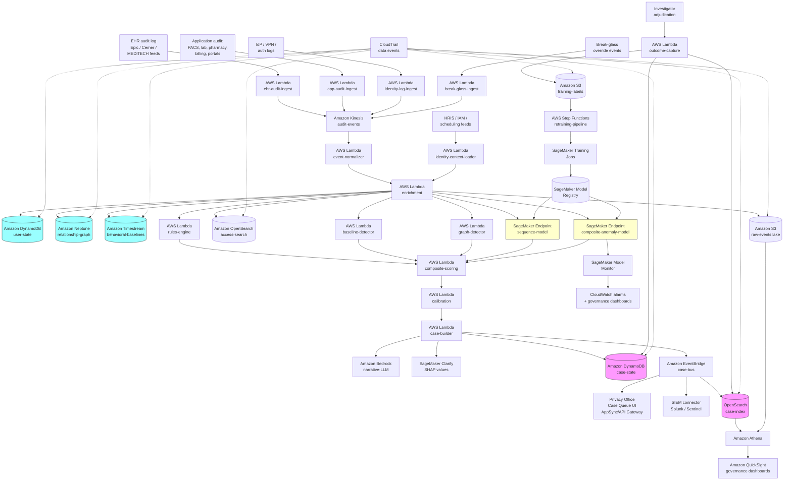

<!--
<!--
Editor pass v6 (TechEditor, 2026-05-21):
  - No body changes. Independent verification pass on top of v5.
        Re-confirmed every editor-scope mechanical and voice
        checkpoint; the recipe remains at publication-ready quality
        for editor-scope items.
  - Mechanical re-verification under UTF-8 decoding (System.Text.
        Encoding.UTF8 against the file bytes; PowerShell default-
        codepage decoding produces a false en-dash count on the
        architecture-diagram box-drawing lines, so prior pass-level
        verifications also need explicit UTF-8 to match):
      * 0 em dashes (U+2014).
      * 0 en dashes (U+2013).
      * Header hierarchy: 1 H1 (recipe title), 11 H2 (major
        sections), 12 H3 (subsections), 1 H4, 0 H5; no skipped
        levels.
      * 24 fence markers = 12 balanced fenced code blocks (mermaid
        block tagged, JSON sample cases tagged, pseudocode and
        architecture-text blocks intentionally untagged per Chapter
        1 convention).
      * "FairWarning" capitalization: 18 hits (all body-text plus
        v1, v2, v3, v4, v5 editor-comment self-references); 1
        "FAIRWarning" hit at line 4 inside this v6-and-prior comment
        block documenting the v5 fix narrative; 0 body-text
        "FAIRWarning" capitalization drift.
      * "IdP" capitalization: 17 body-text hits, all consistent;
        4 all-caps "IDP" hits, all inside editor-comment blocks
        (this v6 block plus v3, v4, v5 self-references documenting
        the v2 fix narrative); 0 body-text capitalization drift.
      * 38 regex matches for "TODO": 16 inline body TODOs + the
        carry-over consolidated TODOs in the v1 comment block + the
        v3, v4, v5, v6 comment-block self-references describing the
        TODO inventory. The 27 actual TODO markers (16 in body + 11
        carry-over in v1 block) are preserved verbatim; the
        remaining hits are editor-comment self-references and not
        real TODOs.
      * No common dittography ("the the", "of of", "is is", etc.)
        in body text.
      * No trailing-whitespace lines.
  - Voice and structure re-verification:
      * No documentation-voice ("This recipe demonstrates...") in
        body.
      * No announcement statements ("We are excited to...").
      * No LinkedIn-influencer tone ("AWS architects, we need to
        talk about...").
      * No feature-list formatting (bullet lists of capabilities
        without context).
      * Cross-references intact: The Honest Take to Implementation-
        Time Tier table Basic tier (v1 V5 fix); Variations and
        Extensions PAM integration extension to The Honest Take's
        "Privileged users are a different program" lesson (v1 V6
        fix); performance-benchmark caveat tightened (v1 V2 fix);
        sample case narrative tightened (v1 V4 fix).
      * 70/30 vendor balance preserved: AWS service names confined
        to The AWS Implementation, Architecture Diagram,
        Prerequisites, Ingredients, Code walkthrough,
        Why-This-Isn't-Production-Ready, Variations and Extensions,
        and Additional Resources.
      * All hyperlinks in Additional Resources point to plausible
        AWS, regulatory (ecfr.gov, hhs.gov, csrc.nist.gov, cisa.gov,
        hitrustalliance.net, 405d.hhs.gov), and vendor (protenus.com,
        imprivata.com, microsoft.com, splunk.com) domains; no
        fabricated GitHub URLs.
  - Open items remain TechWriter follow-ups (exceed editor scope
        per persona instructions "Do not introduce new claims or
        technical content" and "If a section needs substantial
        rewriting, flag it rather than rewriting"): the 9 MEDIUM
        and 14 LOW expert-review findings plus the 3 Python
        WARNINGs from code review remain catalogued in the v1
        comment block below. The MEDIUM cluster (A1 idempotency,
        A2 DLQs, A3 privileged-user separate program, A4
        service-account inventory, A5 new-user ramp-up cold-start,
        A6 care-relationship suppression-rule schema-and-workflow,
        A7 reference-data versioning propagation, S1 case payload
        PHI/workforce-PII minimization, S2 subgroup data
        governance) requires architectural and prose additions
        outside editor mandate.

Editor pass v5 (TechEditor, 2026-05-15):
  - Mechanics: corrected "FAIRWarning-style monitoring" to
        "FairWarning-style monitoring" in the Vocabulary You Need
        opening sentence for case consistency with the seven other
        "FairWarning" references in the recipe (Imprivata FairWarning
        in The Technology PPM paragraph, FairWarning in the AWS API
        Gateway / AppSync paragraph, Imprivata FairWarning in the
        performance-benchmark TODO, Imprivata FairWarning in the
        Vendor-tool considerations paragraph in Why-This-Isn't-
        Production-Ready, and Imprivata FairWarning in the Additional
        Resources operational vendor link). The original product name
        is "FairWarning" (capital F, capital W; not all-caps "FAIR").
  - Re-verified mechanically under UTF-8 decoding:
      * 0 em dashes (U+2014).
      * 0 en dashes (U+2013).
      * Header hierarchy: 1 H1 (recipe title), 11 H2 (major
        sections), 12 H3 (subsections), 1 H4, 0 H5; no skipped
        levels.
      * 24 fence markers = 12 balanced fenced code blocks (mermaid
        block tagged, JSON sample cases tagged, pseudocode and
        architecture-text blocks intentionally untagged per Chapter
        1 convention).
      * No common dittography ("the the", "of of", "is is", "and
        and", "to to") in body text. The 3 in-comment matches are
        editor self-references in the v3 and v4 verification blocks
        listing what was checked, not body content.
      * 16 lowercase "IdP" hits in body, consistent. The 3 all-caps
        "IDP" hits are all inside this comment block and the v3 and
        v4 comment blocks documenting the v2 capitalization fix; no
        body-text capitalization drift.
      * No trailing-whitespace lines.
      * Vendor name capitalization consistent: MEDITECH (branded
        all-caps), Workday, Okta, Active Directory, Microsoft Entra
        ID, Cerner / Oracle Health, Epic, Allscripts, athenahealth,
        eClinicalWorks, Kronos, UKG, Protenus, Imprivata
        FairWarning, MaizeAnalytics, Iatric Patient Privacy
        Monitor, Splunk, Microsoft Sentinel, Chronicle, IBM QRadar,
        CyberArk, BeyondTrust, HashiCorp Boundary all consistent
        with their canonical brand forms.
      * "vs." with period is the established cookbook style across
        Chapters 1, 2, and 3 (verified in chapters 01.01, 01.05,
        01.06, 01.10, 02.03, 02.04, 03.01, 03.03, 03.04, 03.05,
        03.07, 03.08); the single in-prose "vs." in this recipe's
        performance-benchmark caveat header is consistent with that
        style.
  - Voice and structure re-verification:
      * No documentation-voice ("This recipe demonstrates...") in
        body.
      * No announcement statements ("We are excited to...").
      * No LinkedIn-influencer tone ("AWS architects, we need to
        talk about...").
      * No feature-list formatting (bullet lists of capabilities
        without context).
      * Cross-references intact: The Honest Take to Implementation-
        Time Tier table Basic tier (v1 V5 fix); Variations and
        Extensions PAM integration extension to The Honest Take's
        "Privileged users are a different program" lesson (v1 V6
        fix); performance-benchmark caveat tightened (v1 V2 fix);
        sample case narrative tightened (v1 V4 fix).
      * 70/30 vendor balance preserved: AWS service names confined
        to The AWS Implementation, Architecture Diagram,
        Prerequisites, Ingredients, Code walkthrough,
        Why-This-Isn't-Production-Ready, Variations and Extensions,
        and Additional Resources.
      * All hyperlinks in Additional Resources point to plausible
        AWS, regulatory (ecfr.gov, hhs.gov, csrc.nist.gov, cisa.gov,
        hitrustalliance.net, 405d.hhs.gov), and vendor (protenus.com,
        imprivata.com, microsoft.com, splunk.com) domains; no
        fabricated GitHub URLs.
  - Open items remain TechWriter follow-ups (exceed editor scope
        per persona instructions "Do not introduce new claims or
        technical content" and "If a section needs substantial
        rewriting, flag it rather than rewriting"): the 9 MEDIUM
        and 14 LOW expert-review findings plus the 3 Python
        WARNINGs from code review remain catalogued in the v1
        comment block below. The MEDIUM cluster (A1 idempotency,
        A2 DLQs, A3 privileged-user separate program, A4
        service-account inventory, A5 new-user ramp-up cold-start,
        A6 care-relationship suppression-rule schema-and-workflow,
        A7 reference-data versioning propagation, S1 case payload
        PHI/workforce-PII minimization, S2 subgroup data
        governance) requires architectural and prose additions
        outside editor mandate.

Editor pass v4 (TechEditor, 2026-05-15):
  - No body changes. Independent verification pass on top of v3.
        Re-confirmed every editor-scope mechanical and voice
        checkpoint; the recipe remains at publication-ready quality
        for editor-scope items.
  - Mechanical re-verification under UTF-8 decoding:
      * 0 em dashes (U+2014).
      * 0 en dashes (U+2013).
      * Header hierarchy: 1 H1 (recipe title), 11 H2 (major
        sections), 12 H3 (subsections), 1 H4 (the Vocabulary You
        Need / Detection Pattern Catalog tier of nested headers
        under The Technology), 0 H5; no skipped levels.
      * 24 fence markers = 12 balanced fenced code blocks (one
        mermaid block tagged, JSON sample cases tagged, pseudocode
        and architecture-text blocks intentionally untagged per
        Chapter 1 convention).
      * 28 regex matches for "TODO (TechWriter": 16 inline body
        TODOs + 11 carry-over consolidated TODOs in the v1 comment
        block + 1 meta-reference at line 7 inside the v3 comment
        text itself ("27 TODO (TechWriter, ...)" appears in narrative
        prose describing the count). The 27 actual TODO markers are
        preserved verbatim; the 28th regex hit is the v3 comment
        block's own self-reference and not a real TODO.
      * "IdP" capitalization consistent in body (14 mixed-case "IdP"
        hits); the only "IDP" all-caps hits are 2, both inside this
        editor comment block (one in the v3 description quoting the
        prior v2 fix narrative, one in the v2 description of that
        same fix). No body-text capitalization drift.
      * No common dittography ("the the", "of of", "is is", etc.).
      * No trailing-whitespace lines.
  - Voice and structure re-verification:
      * No documentation-voice ("This recipe demonstrates...") in
        body.
      * No announcement statements ("We are excited to...").
      * No LinkedIn-influencer tone ("AWS architects, we need to
        talk about...").
      * Cross-reference from The Honest Take to the Implementation
        Time table's Basic tier (v1 V5 fix) intact at line 1454.
      * Cross-reference from the Variations and Extensions PAM
        integration extension to The Honest Take's "Privileged
        users are a different program" lesson (v1 V6 fix) intact
        at line 1492.
      * Performance-benchmark header tightened in v1 to call out
        population, workforce composition, base rate, EHR vendor,
        privacy-office staffing, and program maturity dependence
        (v1 V2 fix) intact at line 1376.
      * 70/30 vendor balance preserved: AWS service names confined
        to The AWS Implementation, Architecture Diagram,
        Prerequisites, Ingredients, Code walkthrough,
        Why-This-Isn't-Production-Ready, Variations and Extensions,
        and Additional Resources.
      * All hyperlinks in Additional Resources point to plausible
        AWS, regulatory (ecfr.gov, hhs.gov, csrc.nist.gov, cisa.gov,
        hitrustalliance.net, 405d.hhs.gov), and vendor (protenus.com,
        imprivata.com, microsoft.com, splunk.com) domains; no
        fabricated GitHub URLs.
  - Open items remain TechWriter follow-ups (exceed editor scope
        per persona instructions "Do not introduce new claims or
        technical content" and "If a section needs substantial
        rewriting, flag it rather than rewriting"): the 9 MEDIUM
        and 14 LOW expert-review findings plus the 3 Python
        WARNINGs from code review remain catalogued in the v1
        comment block below. The MEDIUM cluster (A1 idempotency,
        A2 DLQs, A3 privileged-user separate program, A4
        service-account inventory, A5 new-user ramp-up cold-start,
        A6 care-relationship suppression-rule schema-and-workflow,
        A7 reference-data versioning propagation, S1 case payload
        PHI/workforce-PII minimization, S2 subgroup data
        governance) requires architectural and prose additions
        outside editor mandate.

Editor pass v3 (TechEditor, 2026-05-15):
  - No body changes. Verification pass only; the v1 and v2 passes
        addressed every editor-scope finding from the expert review
        (LOW V2, V4, V5, V6) and the IdP capitalization mechanics fix.
  - Re-verified mechanically: 0 em dashes (U+2014) and 0 en dashes
        (U+2013) under UTF-8 decoding; 27 TODO (TechWriter, ...)
        markers preserved (16 in body + 11 carry-over in v1 comment
        block); header hierarchy clean (1 H1, 11 H2, 12 H3, 1 H4, no
        skipped levels); 24 fence markers = 12 balanced fenced code
        blocks; "IdP" capitalization consistent throughout body text
        (the single "IDP" hit is in this comment block documenting
        the v2 fix, not in body content); all hyperlinks in Additional
        Resources point to plausible AWS, regulatory (ecfr.gov,
        hhs.gov, csrc.nist.gov, cisa.gov, hitrustalliance.net,
        405d.hhs.gov), and vendor (protenus.com, imprivata.com,
        microsoft.com, splunk.com) domains; no fabricated GitHub URLs;
        70/30 vendor balance preserved (conceptual sections vendor-
        neutral, AWS service names confined to The AWS Implementation,
        Architecture Diagram, Prerequisites, Ingredients, Code
        walkthrough, Why-This-Isn't-Production-Ready, Variations and
        Extensions, and Additional Resources).
  - Open items remain TechWriter follow-ups (exceed editor scope per
        persona instructions "Do not introduce new claims or technical
        content"): the 9 MEDIUM and 14 LOW expert-review findings plus
        the 3 Python WARNINGs from code review are catalogued in this
        comment block below. Recipe is at publication-ready quality
        for the editor-scope items.

Editor pass v2 (TechEditor, 2026-05-15):
  - Mechanics: corrected "IDP service-account credentials" to
        "IdP service-account credentials" in the AWS Secrets Manager
        paragraph under Why These Services for case consistency with
        the nine other "IdP" references in the recipe (capitalization
        is the standard identity-provider abbreviation used elsewhere).
  - Re-verified: zero em dashes (U+2014) and zero en dashes (U+2013)
        under UTF-8 decoding; 27 TODO markers preserved (16 original
        TechWriter TODOs in body + 11 carry-over follow-up flags in
        the v1 comment block consolidating MEDIUM expert-review and
        WARNING code-review findings; see below).
  - Header hierarchy verified: 1 H1, 11 H2, 12 H3, 1 H4; no skipped
        levels.
  - All 24 fenced code blocks balanced; mermaid block tagged; JSON
        sample cases tagged; pseudocode and architecture-text blocks
        intentionally untagged (matches Chapter 1 convention).
  - All hyperlinks in Additional Resources are well-formed and point
        to plausible AWS documentation, regulatory (ecfr.gov, hhs.gov,
        csrc.nist.gov, cisa.gov), and vendor domains; no fabricated
        GitHub URLs.
  - 70/30 vendor balance: AWS service names confined to The AWS
        Implementation, Architecture Diagram, Prerequisites,
        Ingredients, the Code walkthrough, Why-This-Isn't-Production-
        Ready, Variations and Extensions, and Additional Resources;
        The Problem, The Technology, and General Architecture Pattern
        remain vendor-neutral.

Editor pass v1 (TechEditor, 2026-05-15):
  - V2: tightened the performance-benchmark inline caveat to call out
        population, workforce composition, base rate, EHR vendor,
        privacy-office staffing, and program maturity dependence
        (per expert-review LOW finding V2).
  - V4: tightened the sample case narrative's closing sentence to land
        as pattern description rather than tier-routing recommendation
        (per expert-review LOW finding V4).
  - V5: added a one-line cross-reference between The Honest Take's
        "build the program first" lesson and the Estimated Implementation
        Time table's Basic tier (per expert-review LOW finding V5).
  - V6: added a one-line cross-reference between the Variations and
        Extensions "PAM integration" extension and The Honest Take's
        "Privileged users are a different program" lesson (per
        expert-review LOW finding V6).
  - Verified zero em dashes (U+2014) and zero en dashes (U+2013) under
        UTF-8 decoding.
  - All sixteen pre-existing TechWriter TODOs preserved verbatim.

Open architectural concerns flagged for TechWriter follow-up
(consolidated from expert review chapter03.09-expert-review.md;
verdict was PASS with 0 CRITICAL, 0 HIGH, 9 MEDIUM, 14 LOW;
none require structural rewrites of completed sections, but the
pseudocode and General Architecture Pattern sections need targeted
additions that exceed editor scope):

  TODO (TechWriter, MEDIUM A1): Outcome-event and case-grouping
    idempotency. Step 7 build_case and Step 8 on_investigator_action
    are EventBridge-driven and at-least-once; redelivered events
    produce duplicate cases and double-initiate the breach-notification
    clock. Add a deterministic-event-key + conditional-write guard
    pattern. Same recurring pattern as Recipes 2.4-2.10 and 3.1-3.8;
    cookbook-wide trigger-idempotency appendix recommended.

  TODO (TechWriter, MEDIUM A2): No DLQ / poison-message handling
    for the fourteen Lambdas in the pipeline. Add SQS DLQs with
    OnFailure destinations; CloudWatch alarms on DLQ depth with
    threshold 1 for ehr-audit-ingest, event-normalizer, enrichment,
    case-builder, outcome-capture (single-event sensitivity).

  TODO (TechWriter, MEDIUM A3): Privileged-user separate program.
    The Honest Take's "Privileged users are a different program. I
    cannot stress this enough" lesson and the Why-This-Isn't-Production-
    Ready bullet are explicit, but the pseudocode shows a single
    composite-scoring pathway. Update General Architecture Pattern
    and AWS Implementation to name privileged-user separation as a
    first-class architectural concern: separate detection pipeline,
    separate case queue staffed by infrastructure-security analysts,
    PAM-integrated session recording, per-population scoring service
    dispatch.

  TODO (TechWriter, MEDIUM A4): Account-class enrichment and
    service-account inventory. Why-This-Isn't-Production-Ready names
    inventory as a precondition. Add account_class enrichment
    attribute to The Technology's Identity-Patient-and-Workforce-
    Enrichment subsection (human_clinical, human_administrative,
    human_privileged, service_integration, service_analytics,
    service_clinical_decision_support, shared_kiosk, unknown);
    detection logic dispatches by class.

  TODO (TechWriter, MEDIUM A5): New-user ramp-up cold-start
    architectural primitive. Update Step 4 to dispatch to new-user-
    specific peer cohorts when baseline_age_days < MIN_BASELINE_DAYS;
    update Step 6 to apply new-user-specific calibration and tier
    thresholds with explicit governance acknowledgment of the higher
    false-positive tolerance.

  TODO (TechWriter, MEDIUM A6): Care-relationship suppression-rule
    schema and expiry-and-review workflow. Surface the structured
    schema (workforce_id, pattern_class, pattern_scope,
    pattern_scope_value, valid_from, valid_until, dismissal_case_id,
    investigator_id, dismissal_rationale_text); scheduled job that
    walks the registry for soon-to-expire rules; care-transition
    triggers re-evaluate applicable rules.

  TODO (TechWriter, MEDIUM A7): Reference-data versioning
    propagation. Update Step 7 build_case to construct an explicit
    evidence_pointers block on the case object (feature_snapshot_id,
    triggering_event_ids, model_version, calibration_version,
    cohort_thresholds_version) and propagate into DynamoDB case-state
    and OpenSearch case-index.

  TODO (TechWriter, LOW A8): Self-monitoring of the monitoring
    system. Add a paragraph to General Architecture Pattern naming
    CloudTrail data events on case-state, OpenSearch case-index, and
    Neptune relationship-graph forwarded back to the audit-event
    stream as a self_audit source-system class.

  TODO (TechWriter, MEDIUM S1): Case payload PHI and workforce-PII
    minimization for the three subscriber back ends (privacy-office
    UI, SIEM connector, OpenSearch case-index). Update Step 7 to
    publish only case_id, workforce_id, patient_id, tier, and
    composite_score through the case-bus; consuming back ends fetch
    full case by case_id through authenticated paths with appropriate
    IAM scope. SIEM connector role can read only cases where
    case-class includes credential_compromise or lateral_movement.

  TODO (TechWriter, MEDIUM S2): Subgroup data governance for
    workforce-equity monitoring. Add a Subgroup data access row to
    Prerequisites; restrict read access to the workforce-demographic-
    and-attribute store under EEOC/Title VII implementation, state
    employment-discrimination statutes, and collective-bargaining
    agreements; CloudTrail data events on subgroup queries; QuickSight
    against an aggregated subgroup-metrics table.

  TODO (TechWriter, three Python WARNINGs from code review): The
    Python companion has three correctness gaps that should be fixed
    in chapter03.09-python-example.md before publication:
    (1) find_existing_case uses scan with Limit=10 + FilterExpression
        which silently misses an existing open case, producing
        duplicate cases for the same workforce-patient pair;
    (2) is_off_hours role-key mismatch renders the billing_analyst
        and database_administrator dictionary entries unreachable;
    (3) aggregate_user_activity.never_seen_before_fraction is always
        zero because append_to_user_state adds the current patient_id
        to known_patients before the aggregator runs.

  See reviews/chapter03.09-expert-review.md and
  reviews/chapter03.09-code-review.md for the full feedback.
-->

# Recipe 3.9: Cybersecurity / Access Pattern Anomalies ⭐

**Complexity:** Complex · **Phase:** Production (with privacy office and infosec governance) · **Estimated Cost:** ~$0.0001 to $0.001 per audit event scored (mostly ingest, enrichment, and storage; full user-graph rescoring runs nightly and dominates compute)

---

## The Problem

It's 11:47 p.m. on a Tuesday and a nurse on the cardiology step-down floor opens the chart of a patient she's never cared for. The patient was admitted earlier that day. They share a last name. They live on the same street. The nurse spends about ninety seconds in the chart, opens the demographics tab, the medication list, the discharge plan from the patient's previous admission six months ago, and then closes it. She doesn't open her assigned patients' charts again for the rest of her shift; her shift is mostly over.

In the audit log, that's six events. Six rows out of the roughly forty million audit rows the EHR generates that night across the health system. The user account is legitimate. The login was from her usual workstation. She has the role of registered nurse on a cardiology unit, which means she has read access to most patient charts in the hospital because the EHR was configured for clinical workflow flexibility, not least-privilege access. The chart she opened has no special "VIP" flag. Nothing in the rules engine fires. Nothing in the daily reports notices. The events sit in the audit log unread.

Three weeks later the patient (a relative of hers, as it turns out) calls the privacy office to complain that his cousin asked him about a medication he hadn't told her about. The privacy office pulls the access log for his record, sees the nurse's name, runs the standard "did this employee provide care to this patient" check against the encounter assignment data, sees that no, she did not, and opens an investigation. The investigation takes six weeks. The nurse is terminated. The hospital files a HIPAA breach notification with the Office for Civil Rights. The patient, who is now an ex-relative for several reasons, files a civil suit. The local newspaper picks up the story. The CIO gets a phone call from the CEO that begins with "explain to me how this happened."

That's the unglamorous reality of healthcare access monitoring. Not the Hollywood scenario where a foreign state actor exfiltrates ten million records (that happens too, and it's a different problem). The everyday reality is a workforce of thirty or forty thousand authenticated users, each of whom has been granted broad access to the EHR by clinical necessity, browsing records they shouldn't be looking at for reasons that range from idle curiosity to malicious snooping to credential compromise. The access is technically authorized. It's just not appropriate. And the audit log records every event, but nobody is looking at the audit log because looking at the audit log is like trying to drink from a fire hose by reading every drop.

Healthcare has a specific structural problem that makes this hard, and it's worth naming clearly before getting into the technology. Most enterprise security tools assume that users are granted narrow access, and that anomalous access (a finance person opening engineering files) is by definition suspicious. That model breaks in healthcare. A clinician needs broad access because patients move between units, get cross-covered by specialists, end up in the ED at 3 a.m. when their primary team isn't on, and require care that crosses departmental boundaries. The EHR is configured for that flexibility. "Break-glass" overrides exist because the alternative (a patient dying because the right doctor couldn't open the right chart fast enough) is unacceptable. Pulling access permissions tighter solves the privacy problem and creates the patient safety problem, and patient safety wins every time.

So the access is broad. The audit log is enormous. And inside the audit log, there are real signals that real people are doing real things that violate the privacy of real patients. The published OCR enforcement actions tell the story over and over: an employee browsing the records of a co-worker going through a divorce; a clerk looking up the records of a high-profile patient because the local news ran a story about them; a nursing student accessing her ex-boyfriend's chart out of curiosity; a billing analyst looking up family members; a contractor whose credentials got phished and now an external actor is methodically pulling records that could be used for medical identity theft. Every one of these is in the audit log. Every one of these violates 45 CFR 164.502(a) and 164.514. Every one of these is a breach if it goes undetected and undisclosed long enough. The technology problem is finding them in the noise.

Healthcare also has a particular flavor of insider threat that doesn't show up much in other industries. The "VIP snooping" problem is real and persistent. Every health system that's treated a celebrity, a professional athlete, a prominent local figure, a victim of a high-profile crime, or simply someone whose name has been in the news this week has dealt with it. The published enforcement actions and settlement agreements include cases involving access to records of public figures, ranging from individual employee terminations to multi-million-dollar corporate settlements. The behavioral signature is consistent: a sudden cluster of access events on a record from users who have no clinical relationship to the patient, often beginning within hours of news coverage and sometimes lasting for weeks.

Then there's the credential compromise problem. The cybersecurity literature tracks credential theft (phishing, credential stuffing, infostealer malware on a clinician's home laptop) as one of the leading initial-access vectors for healthcare breaches. Once the credential is stolen, the attacker logs in as the legitimate user. The audit log shows the legitimate user. The behavior is what's anomalous: access from an unusual location, at an unusual time, in an unusual sequence (broad reconnaissance across many records rather than the focused workflow of a clinician taking care of a panel of patients), or to records the legitimate user has never opened before. The detection problem here is similar in shape to the insider snooping problem (deviation from the user's behavioral baseline) but the cadence and the patterns differ.

And then there's the slowest-moving but highest-stakes case: the privileged user who is methodically extracting records for sale. Database administrators, integration engineers, IT analysts, and other privileged users have access to bulk data exports as part of their legitimate job. A small fraction of them, over time, have used that access to exfiltrate data. These cases are often discovered through downstream events (patients reporting medical identity theft, dark web market monitoring) rather than through detection on the access logs themselves, because the legitimate work and the malicious work look identical at the access-event level. The detection has to look at the longer time scale: who's pulling more bulk data than their peers in the same role, whose pulls have shifted over time, who's exporting data in formats or to destinations that don't match the documented workflows.

The reason this problem lands at the complex end of the chapter, despite being a fundamentally well-defined problem (audit log in, prioritized cases out), comes down to a tangle of intertwined issues.

**The base rate is brutal.** A typical health system's EHR generates tens of millions of audit events per day. The fraction that represent actual policy violations is somewhere in the parts-per-million range. Even a 99% accurate detector produces a flood of false positives that no privacy office can review. The math is the same alert-fatigue math as the rest of this chapter, with an extra twist: the privacy office staff is small (often single digits across an entire health system) and the reviews are time-consuming (you have to read the access events in context, check the user's role and assignments, often interview the user). The system has to be ruthlessly precise at the top of its ranking, because the privacy office can review tens of cases per day, not thousands.

**Legitimate access patterns are extraordinarily diverse.** A hospitalist covers a different patient panel every week. A float nurse moves between units. A consulting cardiologist sees referrals from across the medical staff. A pharmacist reviewing inpatient orders touches every patient with active prescriptions. A medical student rotates services every month. A clinical researcher pulls cohorts that span thousands of patients. None of these are anomalous. All of them produce access patterns that look unusual relative to a naive baseline. Establishing what's normal for each role and team is a substantial part of the work.

**The "treatment relationship" is poorly captured in source data.** The first question a privacy office asks about a flagged access is "did this employee have a clinical reason to access this patient's record?" Answering that should be straightforward. It usually isn't. Care team membership in EHRs is set inconsistently (some systems require explicit assignment, some infer from documentation, some from order signatures, some from scheduled appointments). Cross-coverage is often not represented at all. Pre-admission and pre-procedure access (radiology techs preparing for tomorrow's cases, OR staff prepping for the morning lineup) happens before the formal care team relationship exists in the data. Floor-coverage and rapid-response relationships are real but transient. A detector that needs a clean treatment-relationship signal to operate finds itself working with a noisy and incomplete one.

**The data is high-dimensional and multi-modal.** Each audit event has a user, a patient, a resource type (chart, lab result, image, note, order), an action type (view, edit, print, export), a timestamp, a device, an application context (which screen the user was on), a network context (IP address, geographic location for remote workers), and often a clinical context (the user's current scheduled or assigned patients). Modeling all of these jointly without exploding the false-positive rate requires careful feature engineering and sometimes representation learning.

**Adversarial dynamics matter.** A subset of insider threats are sophisticated. The user knows there's monitoring. The user reads about cases that get caught. The user adjusts behavior to stay below thresholds: small numbers of accesses spread over weeks, accesses inside a plausible workflow (open the patient's chart from the schedule view rather than search), accesses that mimic the normal pattern of a colleague. The detector has to handle the unsophisticated cases (which are the majority) and have a story for the sophisticated cases (which are the minority but the highest-stakes).

**The output isn't an alert; it's an investigation.** Same lesson as Recipes 3.6, 3.7, and 3.8. The detection is the small part. The investigation is the work product. Privacy office investigators need: the user's HR record, the patient's encounter history, the user's care assignments, the user's recent activity, the patient's relationships (employee status, family relationships, neighborhood, divorce records when relevant, public-figure status), and a way to document the investigation outcome so the system can learn. The pipeline that ends with "here's a scored list of users" is producing maybe 30% of the value.

**Workforce monitoring has its own legal and labor considerations.** Monitoring employee behavior crosses several legal frameworks (HIPAA, ECPA, state-specific employee privacy statutes), labor frameworks (NLRB protected concerted activity, union collective bargaining agreements), and organizational ones (transparency to staff, due process when an investigation is initiated). The monitoring system should be deployed under a written acceptable-use and monitoring policy that the workforce has been notified of. The legal posture differs substantially across jurisdictions, especially for state employees, unionized environments, and remote workers in different states. <!-- TODO (TechWriter): verify the current state of NLRB guidance on workforce monitoring and any recent state-level employee privacy statutes (Illinois, California, New York have notable ones). -->

**The breach notification clock is real.** HIPAA breach notification rules require notification within 60 days of discovery; some states have shorter windows (California's 15-business-day rule for medical information breaches, for example). Once an investigation confirms unauthorized access, the clock starts. A detection system that finds breaches late produces breaches that get reported late, which produces additional regulatory exposure. Speed of detection is part of the operational metric, not just an engineering nice-to-have. <!-- TODO (TechWriter): verify current state breach notification timelines; California specifically has tighter requirements than HIPAA. -->

**HIPAA Security Rule audit controls are mandatory but underspecified.** The HIPAA Security Rule (45 CFR 164.312) requires covered entities to "implement hardware, software, and/or procedural mechanisms that record and examine activity in information systems that contain or use electronic protected health information." It does not specify what to look at, how often, or what the response should be. OCR has issued guidance and enforcement actions that effectively define the floor (you must do something; "we collect logs but never look at them" is not a defense), but the ceiling is whatever you choose to do. <!-- TODO (TechWriter): cite specific OCR enforcement actions where inadequate audit controls were a contributing factor; the published settlements include several examples. -->

What you actually want to build is a continuously running pipeline that consumes EHR audit logs (and ideally application access logs from related systems: PACS, lab systems, billing platforms, communication tools), enriches every event with identity context (the user's role, department, manager, current assignments), patient context (encounter history, care team relationships, sensitivity flags), and behavioral baselines (this user's normal pattern), produces user-level and access-cluster-level risk scores on a streaming and batch basis, and routes the highest-risk cases to a privacy-office investigation workflow with the supporting evidence pre-assembled. Underneath sits a relationship graph of users, patients, encounters, and devices because the most interesting patterns live in the relationships, not in any single event. Around it sits the integration with the SIEM (most security teams expect access anomalies to flow into the same case management system as the rest of the security operations work), the privacy office case management system (which is often separate from the SIEM), and the HR and identity systems that provide the enrichment data.

Let's get into how.

---

## The Technology

### The Vocabulary You Need

Healthcare access monitoring has its own jargon, partly inherited from general cybersecurity (UEBA, UBA, SIEM) and partly specific to healthcare (FairWarning-style monitoring, "patient privacy monitoring," "appropriate use review"). Quick tour, because these terms are going to recur.

**UEBA (User and Entity Behavior Analytics).** The general cybersecurity discipline of building behavioral baselines for users and devices and flagging deviations. UEBA tools (Splunk UBA, Exabeam, Securonix, Microsoft Sentinel UEBA, etc.) come from the broader infosec world and are designed for general enterprise environments. They can be tuned for healthcare but rarely ship with healthcare-specific knowledge of the kind that distinguishes a hospitalist's normal access pattern from a billing analyst's.

**Patient privacy monitoring (PPM).** The healthcare-specific category. Tools like Protenus, Imprivata FairWarning (now FairWarning), MaizeAnalytics (now part of Imprivata), Iatric Patient Privacy Monitor, and Epic's Provider Access Audit are built around the specific patterns that matter in healthcare: same-name access, neighbor access, VIP/employee/celebrity access, family-relationship access, break-glass override review, and treatment-relationship validation. These tools encode much of the policy logic that a generic UEBA tool doesn't know about.

**EHR audit logs.** The primary data source. Every major EHR (Epic, Cerner/Oracle Health, MEDITECH, Allscripts, athenahealth, eClinicalWorks) produces audit logs covering chart accesses, but the format, the granularity, the latency, and the completeness vary substantially. Epic's Audit Log API, Cerner's Behavior Tracker, and MEDITECH's audit reports are not interchangeable; the integration is vendor-specific.

**HIPAA Security Rule audit controls.** The regulatory backbone. Required under 45 CFR 164.312(b). The implementation specification is "addressable," meaning a covered entity can either implement the safeguard, document why an alternative is reasonable and appropriate, or do neither and document why. In practice, OCR enforcement has made it clear that meaningful audit-log review is required.

**Treatment relationship.** The clinical relationship between a workforce member and a patient that legitimizes access. Captured (often imperfectly) in care team assignments, encounter assignments, order signatures, scheduling data, on-call schedules, and break-glass logs. The single most important enrichment for distinguishing legitimate from problematic access.

**Break-glass.** Emergency access override. When a user accesses a record they don't have routine permissions for (a patient with a "sensitive patient" flag, a record outside their normal department), the EHR may require them to confirm an override and document a reason. Break-glass logs are a critical input to access monitoring because they're explicit user assertions of intent.

**Appropriate use review.** The privacy office workflow term for the review of flagged access events. Not "investigation" until the case has been escalated; the early-stage review is part of the routine privacy-office function.

**Workforce member.** The HIPAA term for anyone with EHR access (employees, contractors, students, volunteers, residents, business associates). A useful term because the monitoring scope includes all of these, not just W-2 employees.

### The Detection Pattern Catalog

Before picking algorithms, a builder should know the detection patterns that map to the actual policy violations the privacy office cares about. These are the canonical patterns that show up in privacy monitoring tooling, in OCR enforcement actions, and in the literature on healthcare insider threats.

**Same-name access.** A workforce member accesses the record of a patient sharing the same last name. Family-relationship access is the most common policy violation by volume, and same-name is its strongest signal. Refinements: weighted by how unusual the name is (a user named "Smith" matching a patient named "Smith" is much weaker than "Wojnarowski" matching "Wojnarowski"), and combined with the patient's home address (same household is a stronger signal than same surname alone).

**Same-address or same-neighborhood access.** A workforce member accesses a record where the patient's address is the same as the workforce member's, or in the same small geographic area. Captures family members who don't share a name (in-laws, blended families, cohabitating partners). Requires HR address data linked to workforce identifiers, which is sensitive but typically accessible to the privacy office under appropriate controls.

**Self-access and dependent-access.** A workforce member accesses their own record or a dependent's. Often legitimate (accessing one's own discharge summary after a procedure), often a policy violation (most health systems prohibit self-access to records and require that workforce members go through the patient portal like everyone else; some have explicit exceptions for accessing one's own records during care). Highly noisy as a flag without policy context; very useful when paired with the organization's specific policy.

**Co-worker access.** A workforce member accesses the record of another workforce member. Sensitive area: co-worker records are often viewed during care delivery (the employee was a patient at the facility), but they're also a frequent privacy-violation pattern (the curious co-worker checking on someone's surgery). Requires linking workforce identity data with patient identity data, which has its own access controls and concerns.

**VIP/sensitive-patient access.** A workforce member accesses the record of a patient flagged as VIP, public figure, employee, foster child, victim of crime, behavioral health patient, or other sensitivity category. The flag is set in the EHR by the privacy office or the patient relations team. Access to flagged records is sometimes blocked by routine permissions and requires a break-glass override; sometimes it's allowed but logged with elevated scrutiny.

**Off-hours and off-shift access.** Access that occurs outside the workforce member's normal working hours. A nurse who works day shift accessing records at 2 a.m. is anomalous; a nurse who works nights accessing records at 2 a.m. is normal. Requires the user's scheduled-shift data, which lives in workforce management systems (Kronos, UKG, Workday, etc.).

**Geographic and device anomalies.** Login from an IP address that doesn't match the user's normal pattern, or from a country the user doesn't operate in. Useful for credential-compromise detection. Less useful for insider snooping (the insider is at their normal workstation). Refinements: VPN coverage and remote-work patterns make raw IP geolocation noisy; impossible-travel detection (login from Boston at 9:00 a.m. and Dallas at 9:30 a.m.) is more robust.

**Volume anomalies.** A user who normally opens 30-60 charts per day suddenly opens 300. The classic compromise signature. Requires user-level behavioral baselines and time-window aggregation.

**Search anomalies.** Searches by patient name that don't lead to expected workflow patterns. A user searching for "Smith, John" repeatedly without ever progressing into a chart-open-to-document flow is exhibiting curiosity behavior, not workflow behavior. Many EHRs log search events distinctly from chart-open events, which provides a useful signal source.

**Print and export anomalies.** Printing records, exporting reports, generating "patient lists" that produce CSV or PDF outputs that leave the system. Higher-stakes than view events because the data is now portable. Some EHRs differentiate between "print preview" (which is less risky) and "actual print job sent to a printer" (which is more so).

**Bulk and reporting anomalies.** Database queries, report-server requests, ad-hoc query builder usage that pulls data on many patients at once. Privileged-user territory. Detection requires monitoring of the query/reporting layer in addition to the EHR audit log.

**Break-glass override patterns.** Break-glass overrides should be infrequent (a small percentage of accesses) and concentrated in clinical roles where unexpected coverage is plausible. Users with high break-glass override rates relative to peers, or break-glass overrides on patients they have no clinical relationship to, are notable. Reasons documented in break-glass overrides are also a source of signal: vague reasons ("clinical review") versus specific reasons ("emergency consult during code blue") differ in their reviewability.

**Sequence and workflow anomalies.** Access sequences that don't match clinical workflow. A clinician opening a chart, jumping to demographics, then to social history, then to the address field, then closing without writing notes or orders, is exhibiting a curiosity pattern, not a clinical workflow. A clinician opening a chart and proceeding through history-of-present-illness, exam, assessment, and plan, in that order, is exhibiting a normal workflow. Sequence-aware models can catch what point-in-time models miss.

**Access to deceased patient records.** Specific subset that's worth handling explicitly: deceased patients' records sometimes get accessed by curious workforce members because the patient won't notice and complain. Some health systems flag deceased patients in the EHR and elevate scrutiny on access events to those records.

**Patterns around news cycles.** When a public figure is treated, or a high-profile patient is admitted (a victim of a publicized incident, a celebrity, an athlete), the access pattern to that patient's record often shows a spike of curiosity-driven access from users with no clinical relationship. Some patient-privacy-monitoring tools include "news-watch" features that automatically elevate scrutiny on records linked to patients matching name patterns from news feeds.

**Account abandonment and reactivation.** Accounts that haven't logged in for an extended period, then suddenly become active. Could be a returning user, could be a compromised account. Depends on context.

**New-user behavior.** New employees ramping up have different access patterns than established employees: more searches, more discovery behavior, more chart browsing. The detector has to differentiate "new and learning" from "compromised or curious."

### Statistical and ML Methods That Fit

The technique palette spans rules-based detection through unsupervised behavioral models through graph analytics. The right approach is layered, not monolithic.

**Rules engines.** The CCI-edits-equivalent of access monitoring. Encodes the explicit policy: same-name access flags, VIP-record access flags, self-access blocks (for organizations whose policy is to block them), break-glass-override review queues, off-hours access for users on standard daytime schedules. Rules are precise, explainable, defensible in front of a workforce member ("you triggered the same-last-name rule and the access doesn't match a documented care relationship"), and fast to compute. They miss the diffuse and the novel, which is what the rest of the stack is for.

**Per-user behavioral baselines.** For each workforce member, establish a baseline of their normal behavior across multiple dimensions: typical hours active, typical chart-open volume per shift, typical patient-set size accessed per week, typical sequence patterns, typical resource types touched, typical departments accessed. Baselines updated continuously (with appropriate handling of role changes and ramp-up). Deviations beyond control limits flag for review. The classic UEBA backbone.

**Peer-group baselines.** Each user is compared not just to their own history but to the distribution within their peer group: same role, same department, same shift, same training program. A new resident's behavior is compared to other new residents, not to attending physicians. A float nurse's behavior is compared to other float nurses. Peer-group definition is one of the most consequential design choices in the entire system; bad peer groups produce bad baselines and bad alerts.

**Isolation Forest and other unsupervised outlier detectors.** On per-user feature vectors aggregated over various time windows (per-day, per-week, per-shift). Captures multivariate outliers that no single dimension would flag. Pairs with SHAP values for explaining why a particular user-window was flagged.

**Sequence models (RNN, LSTM, Transformer).** On audit-event sequences within a session or shift. Learns the typical sequences of resource-type and action-type events and flags sessions whose sequences don't match. Captures the workflow-vs-curiosity distinction. More expensive to train and operate than tabular models, and the interpretability is harder; usually a second-pass technique on candidates surfaced by simpler detectors.

**Graph-based detection.** Construct the graph of workforce members, patients, encounters, devices, and applications. Compute graph features: how connected is this user to this patient through legitimate care relationships, how unusual is this user's access pattern within their team, what's the reachability between the user's documented panel and the accessed patient. Graph methods are essential for catching the patterns that rules-and-baselines methods miss: relationship-based access (the user accessed someone they have an off-system relationship with), team-level anomalies (a team's collective access pattern shifted), and credential-compromise patterns (the user accessed a set of patients that don't share any care-team or workflow connection).

**Graph neural networks (GNNs).** The learned-representation evolution of graph features. A GNN trained on the heterogeneous graph (users, patients, encounters, departments, applications) learns embeddings that incorporate role, structural position, and behavioral features. Anomaly detection on the embeddings catches patterns that hand-crafted graph features miss. Still emerging in production privacy monitoring; promising in research. <!-- TODO (TechWriter): verify the current state-of-the-art for GNN-based insider threat or healthcare access anomaly detection; the literature is evolving. -->

**Autoencoders on access vectors.** Train an autoencoder on the feature vector of legitimate access events; flag events with high reconstruction error. Works well on high-dimensional event representations. Suffers from the standard autoencoder concerns: needs a reasonably clean training set, needs care to prevent the model from learning to reconstruct anomalies.

**Supervised classification on labeled cases.** When the privacy office has accumulated enough confirmed-violation labels, supervised models can re-rank candidates from unsupervised detectors. The label problem is severe: confirmed violations are rare, the labeling latency is long, dismissed candidates (which are the majority) are noisy negatives, and the labels reflect what the privacy office found, not what was actually present (selection bias). Supervised approaches are useful as re-rankers, not as primary detectors.

**LLM-assisted triage.** Given an alert payload (the access events, the user context, the patient context, the care relationship status), an LLM can produce a plain-language assessment of whether the access pattern looks more like a workflow or a curiosity-snooping pattern, with reasoning. Investigators report substantial time savings on the per-case review, and the LLM's analysis often surfaces context the investigator might have missed (the patient was discussed in a recent staff meeting, for instance). Always with human review; the LLM produces decision support, not decisions. <!-- TODO (TechWriter): verify specific published work on LLM-assisted patient-privacy-monitoring triage; the use case is emerging and the literature is sparse. -->

**Feedback-driven threshold tuning.** Same operational rule as the rest of the chapter. The privacy office's adjudications (true positive, false positive, inconclusive) flow back into threshold tuning, peer-group refinement, and (where labels are sufficient) supervised re-ranker training. Without feedback, the system decays.

A reasonable layered architecture: rules engine for the policy-defined patterns (same-name, VIP, self-access, break-glass), per-user and peer-group baselines for the deviation patterns, graph features for the relationship patterns, sequence models for the workflow patterns, and an LLM-assisted triage layer that compiles all the evidence into reviewable cases for the privacy office. The supervised classifier on labels comes in as the operational program matures.

### Identity, Patient, and Workforce Enrichment

The enrichments that transform a raw access event into a reviewable signal are as important as the detector logic. The data sources that enable the enrichments often live outside the EHR and the security stack.

**Identity and access management (IAM).** Active Directory, Okta, Azure AD/Microsoft Entra ID, or equivalent. The user's account, group memberships, role assignments, employment status, and credential lifecycle. Source of truth for "is this account active" and "what is this user's role this week."

**Human resources information system (HRIS).** Workday, Oracle HCM, SAP SuccessFactors, UKG, etc. The user's organizational hierarchy (manager, department, business unit), employment dates, address, dependents, employment type (employee, contractor, student, volunteer). Source of truth for the demographic data needed for same-name and same-address detection.

**Workforce management / scheduling.** Kronos (now UKG), API Healthcare, Symplr, etc. The user's scheduled shifts, on-call schedules, time-off, and unit assignments. Source of truth for "was this user supposed to be working at this time" and "was this user assigned to this unit."

**EHR care team and encounter data.** The clinical relationships between providers and patients: assigned attending, assigned nurse, on-call coverage, consult relationships, treatment teams. The single most important enrichment for differentiating legitimate from problematic access. Quality varies: some EHRs capture this comprehensively, some require deduction from order signatures, documentation authorship, or scheduling.

**EHR sensitive-patient flags.** VIP, employee, foster child, behavioral health, victim of crime, opt-out, sealed record, restricted access. These flags must flow through to the monitoring system because they trigger different policies and elevate scrutiny.

**Patient demographics.** Name, address, date of birth, employer, employment relationship to the health system, family relationships (when documented). Source of the data that drives same-name, same-address, same-employer, and family-relationship detection.

**News and public-figure feeds.** Some health systems integrate news feeds or public-figure databases to elevate scrutiny on patients matching prominent names in current coverage. Useful but requires policy clarity (the system shouldn't be making judgments about who is "prominent"; it should be implementing policies set by the privacy office).

**Network and device context.** User's typical workstation, device, IP range, geographic region. Source of compromise-pattern detection.

**Privacy office case history.** Previously confirmed violations by user, previously confirmed legitimate accesses, previously dismissed cases. Feeds back as features and as suppression signals (don't re-flag the same pattern that was already cleared).

The enrichment pipeline is often the largest engineering effort in the system. The detection algorithms, even sophisticated ones, are commodity; the enrichment plumbing across IAM, HRIS, scheduling, EHR, and case history systems is what differentiates working programs from non-working ones.

### Calibration, Subgroup Performance, and the Workforce-Equity Question

The monitoring system has a uniquely sensitive stakeholder dynamic. The workforce members being monitored are often the same employees the organization is trying to retain and engage. Disparate-impact concerns arise: do certain roles, certain departments, certain demographic groups get flagged at higher rates than others, and is the difference clinically/operationally justified or is it bias?

**Subgroup performance.** Track flag rates and confirmed-violation rates by role, department, demographic group, employment type, and shift. Wide variation in flag rates across subgroups warrants investigation: is the variation real (one department genuinely has more curiosity-driven snooping) or artifactual (the baselines are calibrated for one group's workflow and don't fit another's)?

**Threshold calibration.** Per-cohort thresholds may be appropriate when peer-group definitions don't fully capture the variation. A new-resident cohort may justify higher false-positive tolerance because the cost of missing a true positive is the same but the operational impact of false positives during their training is different.

**Workforce communication and transparency.** The acceptable-use policy should disclose that monitoring exists. The investigation policy should describe the process when an investigation is initiated. The appeals process should exist and be documented. Workforce members who have been investigated and cleared should be informed of the outcome. The legal posture varies by jurisdiction, but the operational ethic is consistency and process.

**Union considerations.** In unionized environments, monitoring policies are subject to collective bargaining and may have specific notification, due-process, and appeals requirements. The system implementation should reflect the bargained terms. <!-- TODO (TechWriter): note that specific union and labor-law considerations vary substantially; this is meant as a flag, not a comprehensive treatment. -->

**Appeals and remediation.** When a workforce member is wrongly flagged or wrongly investigated, there should be a path to clear the record and (when appropriate) update the model so the same false positive doesn't recur. The feedback loop matters; a one-way system that never corrects mistakes erodes trust.

### Workflow Integration Is, Again, the Actual Product

The lesson recurs because it's the lesson that matters most. The detection pipeline is one component. The privacy-office case management workflow, the SIEM integration for the cybersecurity team, the HR coordination for employment actions, the legal coordination for breach notification, and the reporting infrastructure for compliance documentation are the other components.

The specific workflows that matter:

- **Privacy office daily case queue.** Sorted by composite risk score, with suppression for already-investigated cases and recently-cleared users. Click-through to the user's identity context, the patient's encounter context, the access event detail, and the relationship-graph view.
- **Investigator case assembly.** When an investigator opens a case, the system pre-assembles the supporting evidence: the access events in question, the user's recent activity, the patient's care team and encounter history, prior cases involving the user, and the LLM-generated narrative summary.
- **Investigation outcome capture.** Confirmed violation, dismissed (legitimate access with documented reason), inconclusive (cannot determine), referred to HR, referred to law enforcement. Outcomes feed back into the model and the suppression rules.
- **HR coordination.** Confirmed violations move into HR for employment action (counseling, retraining, suspension, termination). The monitoring system should hand off the case package to HR through a defined process.
- **Breach notification clock.** Confirmed unauthorized access initiates the HIPAA breach notification process. The monitoring system should track the time from initial detection to confirmed unauthorized access and from confirmed unauthorized access to notification, because both clocks matter operationally.
- **Compliance reporting.** Boards, audit committees, and regulators want regular reports on the program: cases reviewed, cases confirmed, breach notifications issued, patterns observed, remediation actions taken. The reporting infrastructure should produce these on a defined cadence.
- **SIEM integration.** Cybersecurity teams want access anomalies in the same case management system as the rest of the SOC's work. The pipeline should publish events to the SIEM (Splunk, Microsoft Sentinel, Chronicle, IBM QRadar) in addition to the privacy-office workflow, with a defined separation of which event types go where.

---

## General Architecture Pattern

At a conceptual level, the access pattern anomaly detection pipeline ingests audit events from the EHR (and supporting clinical systems), enriches each event with identity, workforce, patient, and clinical-context data, computes per-user and per-event behavioral and relationship features, scores users and access clusters on a streaming and batch basis, ranks the resulting case queue, and delivers it to the privacy office (and the SIEM) with the supporting evidence pre-assembled. Underneath sits the relationship graph, the per-user baseline store, and the case-history database. Around it sits the integration with HRIS, IAM, scheduling, and patient registration systems that provide the enrichment data, plus the integration with case management, HR, and legal workflows that consume the outputs.

```
┌────────── ACCESS PATTERN ANOMALY DETECTION PIPELINE ─────────────┐
│                                                                  │
│   [EHR audit log:        [Application audit:    [Network /        │
│    chart, lab, image,     PACS, lab system,      VPN logs,         │
│    note, order, search,   pharmacy, billing,     auth logs,        │
│    print, export]         portals, comms]        device telemetry]│
│                                                                  │
│   [Break-glass            [Search and report     [Bulk export      │
│    override events]        requests]              and query logs]  │
│                                                                  │
│           │                                                      │
│           ▼                                                      │
│   [Streaming Ingest and Normalization]                           │
│   (canonical access event format, time normalization, user and  │
│    patient identifier resolution, deduplication)                 │
│           │                                                      │
│           ▼                                                      │
│   [Enrichment Layer]                                             │
│   (identity from IAM, role and dept from HRIS, schedule from    │
│    workforce mgmt, care team and encounters from EHR,           │
│    sensitivity flags, geographic and device context)            │
│           │                                                      │
│           ▼                                                      │
│   [Relationship Graph]                                           │
│   (users ↔ patients ↔ encounters ↔ devices ↔ departments;       │
│    treatment relationships, care team membership, scheduling)   │
│           │                                                      │
│           ▼                                                      │
│   [Per-User Behavioral Baselines]                                │
│   (typical hours, volume, sequence, resource mix, peer cohort   │
│    distribution, drift detection on baseline shifts)            │
│           │                                                      │
│           ▼                                                      │
│   [Detector Bank]                                                │
│   (rules engine: same-name, VIP, self, break-glass;              │
│    statistical: per-user and peer-group deviation;               │
│    graph: relationship-based detection;                           │
│    sequence: workflow vs curiosity)                               │
│           │                                                      │
│           ▼                                                      │
│   [Composite Scoring and Calibration]                            │
│   (per-user composite, per-cluster composite, calibration        │
│    layer, subgroup-stratified thresholds)                         │
│           │                                                      │
│           ▼                                                      │
│   [Case Builder]                                                 │
│   (group flagged events into cases, attach evidence,             │
│    LLM-generated narrative, deduplicate against open cases,      │
│    suppress recently-cleared patterns)                           │
│           │                                                      │
│           ▼                                                      │
│   [Privacy Office Case Queue]   [SIEM Integration]               │
│   (investigation workflow,        (security operations              │
│    evidence package, outcome      visibility, correlation)        │
│    capture)                                                       │
│           │                                                      │
│           ▼                                                      │
│   [Investigation Outcome]                                        │
│   (confirmed violation, dismissed, inconclusive; HR referral;    │
│    breach notification trigger; case closure)                    │
│           │                                                      │
│           ▼                                                      │
│   [Outcome and Feedback Capture]                                 │
│   (label store for retraining; suppression rule updates;         │
│    threshold tuning; subgroup performance; equity audits)        │
│           │                                                      │
│           ▼                                                      │
│   [Compliance Reporting + Governance]                            │
│   (board and audit-committee reports, OCR documentation,         │
│    breach-notification clock, workforce communication)           │
│                                                                  │
└──────────────────────────────────────────────────────────────────┘
```

**Ingest and normalization.** Audit events flow from the EHR through vendor-specific export mechanisms (Epic Audit Log API, Cerner Behavior Tracker, MEDITECH audit reports) into the pipeline. Application audit logs from PACS, lab systems, billing platforms, and patient-facing portals join the same stream. Network and authentication logs from the IdP and VPN provide context. The normalizer produces canonical events with a consistent schema: who, what, when, where, how, on what.

**Enrichment.** Each canonical event is enriched with identity, role, department, schedule, care team, sensitivity flag, and device context. Some enrichments are real-time (the user's role and department) and some are batch (the user's HR record from the previous night's HRIS export). The enrichment layer is conceptually separate from detection and is heavily plumbing-oriented.

**Relationship graph.** A continuously updated graph of workforce members, patients, encounters, departments, and devices. The graph is the substrate for relationship-based detection (does this user have a documented care relationship with this patient) and for higher-order pattern detection (is this user accessing patients in a cluster that doesn't share any care team or workflow connection).

**Per-user behavioral baselines.** Rolling windows of typical access patterns: typical chart-opens per shift, typical hour distribution, typical resource type mix, typical sequence patterns. Stored per user with peer-cohort statistics for context. Drift detection alerts when a user's baseline shifts substantially (which can indicate role change or compromise).

**Detector bank.** Multiple detectors run in parallel: the rules engine for policy-defined patterns, the per-user statistical detectors for deviation patterns, the graph-based detectors for relationship patterns, the sequence-based detectors for workflow patterns. Each produces a per-event or per-window score; the composite layer combines them.

**Composite scoring and calibration.** Per-user and per-cluster composite scores. Calibration ensures that a score of 0.8 means roughly the same probability of being a confirmed violation across cohorts. Subgroup-stratified thresholds where calibration drift differs.

**Case builder.** The component that turns scored events into reviewable cases. Groups related events (the same user accessing the same patient over multiple sessions, or a session with multiple flagged accesses), attaches the supporting evidence (user context, patient context, care relationship status, prior cases), runs the LLM-generated narrative summary, and de-duplicates against open cases and recently-cleared patterns.

**Privacy office case queue and SIEM integration.** The privacy office case queue is the primary product. The SIEM integration provides cybersecurity-team visibility for cases that overlap with broader security concerns (credential compromise, lateral movement). The two queues are complementary, not duplicative; clear separation of which case types go where.

**Investigation outcome.** Investigators adjudicate cases as confirmed violations, dismissals, or inconclusive. Confirmed violations trigger HR referral and (if unauthorized access of PHI is confirmed) the HIPAA breach notification clock. Outcomes are captured for the feedback loop.

**Outcome and feedback capture.** Outcomes flow back as labels for retraining, suppression-rule updates, threshold tuning, and subgroup-performance analysis. The feedback loop is a first-class component, not a side effect.

**Compliance reporting and governance.** Periodic reports to the privacy committee, the audit committee, the board, and (when relevant) regulators. Documentation of program operation supports the HIPAA Security Rule audit-control requirement and any future OCR audit response.

---

## The AWS Implementation

### Why These Services

**Amazon Kinesis Data Streams for the audit-event ingest backbone.** EHR audit logs, application audit logs, and network logs flow into a Kinesis stream as they're produced. Kinesis handles the volume (a major health system's audit volume runs into tens of millions of events per day), provides ordered delivery for sequence-based analysis, supports replay for backfill and retraining, and integrates cleanly with the downstream Lambda and analytics components.

**AWS Lambda for ingest, normalization, and enrichment.** Each event source (Epic Audit Log API, Cerner Behavior Tracker, application audit feeds, IdP logs, VPN logs) has its own Lambda that pulls or receives the source-specific format and writes canonical events into the stream. Downstream Lambdas perform identity resolution, schedule enrichment, care-team enrichment, and sensitivity-flag enrichment.

**Amazon DynamoDB for the user state and case state stores.** Per-user state (current behavioral baseline summary, recent flag counts, recent case history) and per-case state (open investigations, suppression status, evidence pointers) live in DynamoDB. Single-digit-millisecond reads on user lookup; DynamoDB streams trigger downstream re-evaluation when state changes.

**Amazon Neptune for the relationship graph.** The graph of workforce members, patients, encounters, departments, and devices fits Neptune's property-graph model naturally. Gremlin queries support the relationship-based detection logic ("does this user have a documented care relationship with this patient through any encounter, care team, on-call, or order signature path"). Neptune is HIPAA-eligible. <!-- TODO (TechWriter): verify current HIPAA eligibility status of Amazon Neptune. -->

**Amazon Timestream for time-series behavioral baselines.** Per-user time-series of access counts, session durations, and resource-type distributions are time-series data. Timestream's storage and query model fit; magnetic-tier retention covers the multi-week baseline window cost-effectively. <!-- TODO (TechWriter): verify the current HIPAA eligibility status of Amazon Timestream and BAA coverage; some deployments use S3 with Athena instead. -->

**Amazon OpenSearch Service for case management, hunt, and SIEM-style analytics.** Privacy-office case data and the searchable archive of all access events live in OpenSearch. OpenSearch supports the kind of ad-hoc query the privacy office needs ("show me every chart access by this user in the last 90 days," "show me every access on this patient's record in the last week, sorted by user role"). Many SIEM products either run on OpenSearch under the hood or integrate with it cleanly.

**Amazon SageMaker for model training, hosting, and feature management.** The unsupervised detectors (Isolation Forest, autoencoders), the sequence models, and the supervised re-rankers train as SageMaker Training Jobs against historical data in S3, deploy to SageMaker endpoints for inference, and use SageMaker Feature Store for online and offline feature consistency. SageMaker Clarify produces SHAP-based explanations for each scored case.

**Amazon SageMaker Model Monitor.** Continuously monitors data drift, prediction drift, and (with labels) model quality. Critical for catching baseline drift caused by EHR upgrades, role changes, organizational restructures, and the gradual shift in workforce behavior that affects every monitoring program.

**Amazon Bedrock for case narrative generation.** The case builder hands the structured evidence package to a Bedrock-hosted LLM that produces the investigator-facing narrative ("This user accessed patient X's record at 11:47 p.m. The user shares a last name with the patient and lives on the same street according to HR records. The user is a step-down nurse and was not assigned to the patient's care team. The access included demographics, medications, and the most recent discharge plan, but no order entry or documentation was performed. The session ended after 90 seconds."). Decision support, not decision-making. <!-- TODO (TechWriter): confirm the current set of HIPAA-eligible Bedrock foundation models. -->

**Amazon Comprehend Medical for note and search-text feature extraction.** Some break-glass override reasons and search queries are free text. Comprehend Medical extracts structured information (medications, conditions, anatomy) that feeds into feature engineering. Optional but useful for break-glass-reason analysis.

**AWS Step Functions for orchestration.** The nightly user-graph rescoring, the case assembly pipeline, and the periodic retraining are multi-step workflows. Step Functions handles orchestration with retry and error handling.

**Amazon EventBridge for routing.** Detector outputs publish to EventBridge with user context and case-class metadata. Subscribers include the case builder, the SIEM connector, the audit logger, and the metrics collector. The decoupling supports adding new detector or consumer types without touching the existing components.

**Amazon API Gateway and AWS AppSync for the privacy-office case management UI.** The privacy office's case queue UI consumes data through AppSync (when GraphQL flexibility is needed for the case-detail views) or API Gateway (for simpler integrations). When the organization uses an existing privacy-monitoring vendor (Protenus, FairWarning, etc.), the integration is API-driven and the UI is the vendor's; the AWS-native components feed it through the integration layer.

**AWS Glue and Amazon Athena for the data lake.** Historical audit events, enrichment data, and case outcomes live in S3 partitioned by date. Glue catalogs the schema; Athena provides SQL access for ad-hoc analysis and retraining feature extraction.

**Amazon QuickSight for governance dashboards.** Subgroup-performance dashboards, alert volume by detector type, case throughput, breach notification timing, and program-level operational metrics. Privacy office leadership, infosec leadership, and the audit committee consume these.

**Amazon S3 for the data lake and audit log archive.** Partitioned by date and event source, encrypted with customer-managed KMS keys. Used by SageMaker for training, Athena for ad-hoc analysis, and as the long-term archive for compliance retention.

**AWS IAM Identity Center (or external IdP integration).** The monitoring system itself has multiple roles: privacy-office investigators (read access to case data, write access to outcomes), privacy-office leadership (read access plus reporting), data-science team (training-data access without identifying user data when possible), and operations team (pipeline monitoring without case-data access). Least-privilege per role. The system ironically has to apply the same access-monitoring discipline to itself that it monitors elsewhere.

**Amazon CloudWatch and AWS X-Ray.** Pipeline health, ingest latency (especially for the EHR audit log feed, where latency directly affects detection speed), and end-to-end traces. Latency budgets matter: the time from "user takes the action" to "case appears in the privacy-office queue" is part of the operational metric.

**AWS CloudTrail.** Audit logging on every PHI-bearing store and every API call against the case management system. The monitoring system's own access logs feed back into the pipeline as a self-monitoring input.

**AWS KMS.** Customer-managed keys on every PHI-bearing store: Kinesis, DynamoDB, Neptune, Timestream, S3, OpenSearch, SageMaker volumes and Feature Store. Key rotation per organizational requirements.

**AWS Secrets Manager.** EHR API credentials, IdP integration credentials, IdP service-account credentials, and SIEM integration credentials. Rotated per policy.

### Architecture Diagram



### Prerequisites

| Requirement | Details |
|-------------|---------|
| **AWS Services** | Amazon Kinesis Data Streams, AWS Lambda, Amazon DynamoDB, Amazon Neptune, Amazon Timestream, Amazon OpenSearch Service, Amazon S3, Amazon SageMaker (Training, Hosting, Feature Store, Clarify, Model Monitor, Model Registry), Amazon Comprehend Medical (optional), Amazon Bedrock, Amazon EventBridge, AWS Step Functions, AWS AppSync, Amazon API Gateway, AWS Glue, Amazon Athena, Amazon QuickSight, AWS IAM Identity Center, AWS Secrets Manager, AWS KMS, AWS CloudTrail, Amazon CloudWatch, AWS X-Ray. |
| **IAM Permissions** | Least-privilege per role. Ingest Lambdas write to the event stream and read from EHR/IdP/HRIS sources. Enrichment Lambdas read from identity stores and write enriched events downstream. Detectors read from state stores and write scores. Case builder reads scores and assembles cases. Privacy investigators read case data and write outcomes only. Data science roles can train and deploy but cannot read identifying user data without explicit elevation; training data sets are typically pseudonymized for development. No `*` permissions; every action scoped to specific resources. |
| **BAA** | Signed AWS BAA. All services configured per BAA requirements. EHR vendor and any third-party patient-privacy-monitoring vendor must have their own BAAs. See the [AWS HIPAA Eligible Services Reference](https://aws.amazon.com/compliance/hipaa-eligible-services-reference/). |
| **Encryption** | Customer-managed KMS keys on every PHI-bearing store: Kinesis, DynamoDB, Neptune, Timestream, S3, OpenSearch, SageMaker (volumes, Feature Store, model artifacts). TLS 1.2 or higher in transit. Audit-event payloads include PHI (the patient identifier and often patient demographics) and user PII (the workforce member's identifier and HR-linked data); both categories must be protected. |
| **VPC** | Production deployment in a VPC with VPC endpoints for S3, DynamoDB, KMS, Neptune, SageMaker runtime, Bedrock, Comprehend Medical, EventBridge, and Step Functions. Lambdas that touch PHI run in the VPC. EHR audit-feed integrations typically use site-to-site VPN or AWS Direct Connect, depending on the EHR's deployment topology. |
| **CloudTrail and Data Events** | Enabled with data events on every PHI-bearing store, on the case management indexes, and on the model endpoints. Every score, every case generation, every adjudication, every export is logged. Log retention per organizational policy and applicable regulations (some jurisdictions and accreditation programs require multi-year retention). |
| **Privacy Office and Infosec Governance** | A privacy committee (typically including the Chief Privacy Officer, Chief Information Security Officer, General Counsel or HIPAA Privacy Officer designee, Compliance, HR, and clinical leadership) must own the program. Acceptable-use and monitoring policy must be in place and the workforce must be notified. Investigation procedures, appeals processes, and HR coordination protocols must be documented before deployment. |
| **Workforce Notification and Acceptable Use Policy** | Workforce members must be informed that monitoring exists and what it covers. The policy should align with HIPAA Security Rule audit-control requirements, applicable state privacy statutes, and any collective bargaining agreements. Counsel should review before publication. |
| **EHR Audit Log Access** | Coordinate with the EHR vendor and the EHR operations team to enable the audit-log feed at sufficient granularity and frequency. Epic, Cerner/Oracle Health, and MEDITECH each have specific mechanisms; the integration is typically a multi-quarter project. Latency from event to ingest matters; near-real-time is achievable with most modern EHRs but requires explicit configuration. |
| **HRIS, IAM, and Scheduling Integration** | The enrichment data is the project. HR data feeds (Workday, Oracle HCM, SAP SuccessFactors), IAM data (Active Directory, Okta, Microsoft Entra ID), and scheduling data (Kronos, UKG, API Healthcare) each require their own integration. Plan for parallel integration work; the enrichment quality determines the alert quality. |
| **Sample Data** | Internal historical audit logs are the only realistic training data; no public dataset captures the breadth needed. Synthetic audit-log generators exist in the security research community but produce data that's structurally different from real EHR audit logs. Pseudonymization for development is essential and non-trivial: the user-patient relationship structure must be preserved while identifiers are replaced. |
| **Cost Estimate** | For a moderate-size health system (10,000 active workforce, 100,000 patients in the active panel, ~30 million audit events per day): Kinesis ingest: ~$300-700/month. Lambda for ingest, normalization, enrichment, detection: ~$1,500-3,500/month. DynamoDB user-state and case-state: ~$300-700/month. Neptune for the relationship graph: ~$1,500-4,000/month (Neptune instance class is typically the largest single line item). Timestream baselines: ~$200-500/month. OpenSearch case index and search archive: ~$1,500-4,500/month (scales with retention period; many programs hold 12-24 months online). SageMaker endpoints (modest instance class for daily-cadence scoring): ~$500-1,500/month. SageMaker training and Model Monitor: ~$200-500/month. Bedrock for case narratives: ~$200-700/month. S3, supporting services: ~$200-500/month. Total infrastructure: typically $6,500-17,000/month for a moderate-size deployment. Privacy-office staffing (investigators, privacy analysts, the CPO function) is the dominant program cost; one investigator at typical loaded cost can equal several months of infrastructure. The infrastructure pays for itself by avoiding a single OCR settlement; published OCR settlements involving inadequate audit controls have ranged from hundreds of thousands to several million dollars. <!-- TODO (TechWriter): verify recent OCR settlement ranges; the settlements are public and the figures are well-documented. --> |

### Ingredients

| AWS Service | Role |
|------------|------|
| **Amazon Kinesis Data Streams** | Canonical audit-event stream |
| **AWS Lambda (ehr-audit-ingest)** | EHR audit-log feed ingestion and source-format normalization |
| **AWS Lambda (app-audit-ingest)** | Application-system audit-log ingestion (PACS, lab, pharmacy, billing) |
| **AWS Lambda (identity-log-ingest)** | IdP, VPN, and authentication-log ingestion |
| **AWS Lambda (break-glass-ingest)** | Break-glass override event ingestion with override-reason text capture |
| **AWS Lambda (identity-context-loader)** | Periodic load of HRIS, IAM, and scheduling enrichment data |
| **AWS Lambda (event-normalizer)** | Canonical event format, identifier resolution, deduplication |
| **AWS Lambda (enrichment)** | Identity, role, schedule, care-team, sensitivity-flag enrichment per event |
| **AWS Lambda (rules-engine)** | Same-name, VIP, self-access, break-glass, off-hours rule evaluation |
| **AWS Lambda (baseline-detector)** | Per-user statistical deviation detection against rolling baseline |
| **AWS Lambda (graph-detector)** | Relationship-based detection using Neptune queries |
| **AWS Lambda (composite-scoring)** | Combines per-detector scores into composite case scores |
| **AWS Lambda (calibration)** | Subgroup-stratified calibration and tier assignment |
| **AWS Lambda (case-builder)** | Groups events into cases, assembles evidence, calls narrative LLM |
| **AWS Lambda (outcome-capture)** | Records investigator adjudications and feeds the label store |
| **Amazon DynamoDB (user-state)** | Per-user current state, baseline summary, recent flag history |
| **Amazon DynamoDB (case-state)** | Open and recently-closed case state, suppression rules |
| **Amazon Neptune** | Relationship graph: workforce, patients, encounters, devices, departments |
| **Amazon Timestream** | Time-series of behavioral metrics for baseline computation |
| **Amazon OpenSearch Service** | Searchable archive of audit events and case data; SIEM-style queries |
| **Amazon S3** | Raw event lake, training data, retraining label store, audit archive |
| **Amazon SageMaker Endpoint (sequence-model)** | Sequence-based workflow-vs-curiosity scoring |
| **Amazon SageMaker Endpoint (composite-anomaly-model)** | Composite anomaly scoring on user-window feature vectors |
| **Amazon SageMaker Training** | Periodic retraining for sequence and composite models |
| **Amazon SageMaker Feature Store** | Online and offline feature consistency for training and scoring |
| **Amazon SageMaker Clarify** | SHAP-based per-case explanations |
| **Amazon SageMaker Model Monitor** | Data drift, prediction drift, and quality drift monitoring |
| **Amazon SageMaker Model Registry** | Versioning and approval workflow for model deployments |
| **Amazon Comprehend Medical** | Optional: structured extraction from break-glass override reasons |
| **Amazon Bedrock** | Investigator-facing case-narrative generation |
| **Amazon EventBridge** | Routes scoring and case events to subscribers (case queue, SIEM, archive) |
| **AWS AppSync / API Gateway** | Privacy-office case management UI back end |
| **AWS Step Functions** | Daily user-graph rescoring and retraining pipeline orchestration |
| **AWS Glue + Amazon Athena** | Data lake catalog and SQL-over-S3 for ad-hoc analysis |
| **Amazon QuickSight** | Privacy-office, infosec, and governance dashboards |
| **AWS IAM Identity Center** | Workforce single sign-on for the case management UI |
| **AWS Secrets Manager** | EHR, IdP, HRIS, and SIEM integration credentials |
| **AWS KMS** | Customer-managed keys for every PHI- and PII-bearing store |
| **AWS CloudTrail** | Audit logging on every store and every API operation |
| **Amazon CloudWatch + AWS X-Ray** | Pipeline health, ingest latency, end-to-end traces |

---

### Code

> **Reference implementations:** These aws-samples repositories demonstrate patterns that apply here:
> - [`amazon-sagemaker-examples`](https://github.com/aws/amazon-sagemaker-examples): Anomaly detection notebooks (Isolation Forest, autoencoder, RNN sequence models), Feature Store with online and offline stores, Clarify SHAP examples, Model Monitor configurations.
> - [`aws-samples`](https://github.com/aws-samples): search for "Neptune," "FHIR," "audit log analysis," and "UEBA" for adjacent integration and graph-analytics patterns.
> <!-- TODO (TechWriter): verify and add specific aws-samples or aws-solutions-library-samples repositories demonstrating insider-threat detection, EHR audit-log analysis, healthcare patient-privacy monitoring, or UEBA on AWS. Adjacent examples exist in the security domain; a direct healthcare match has not been confirmed at the time of writing. -->

#### Walkthrough

**Step 1: Ingest and normalize an audit event from the EHR.** The EHR audit feed publishes events on a near-real-time cadence. The ingest Lambda parses the source-specific format (Epic, Cerner, MEDITECH each differ), validates the schema, and writes a canonical event to the stream.

```
FUNCTION on_ehr_audit_event(raw_event, source_format):
    // Parse the source-specific payload. EHR audit log formats vary
    // substantially by vendor; the parser is selected per source.
    parsed = parse_audit_event(raw_event, source_format)

    // Resolve workforce identifier. EHR user IDs are usually system-specific
    // and need to be mapped to enterprise identity (Active Directory SID,
    // Okta user ID, etc.).
    workforce_id = resolve_workforce_id(parsed.user_id, source_format)
    IF workforce_id is null:
        send_to_quarantine(parsed, reason = "unknown_workforce_user")
        return 202

    // Resolve patient identifier. Map EHR-internal patient ID to enterprise
    // master patient identifier (EMPI) so cross-system correlation works.
    patient_id = resolve_patient_id(parsed.patient_id, source_format)

    // Build the canonical event. The schema is consistent across all
    // event sources downstream.
    canonical_event = {
        event_id:           generate_event_id(parsed),
        workforce_id:       workforce_id,
        patient_id:         patient_id,
        source_system:      source_format,
        event_type:         normalize_event_type(parsed.action_type),  // view, edit, print, export, search, login
        resource_type:      normalize_resource_type(parsed.resource),  // chart, lab, image, note, order, demographics
        action:             parsed.action,
        observed_at:        parsed.event_time,
        received_at:        NOW(),
        device_id:          parsed.workstation_id,
        application_context: parsed.application_screen,
        ip_address:         parsed.source_ip,
        session_id:         parsed.session_id,
        break_glass:        parsed.break_glass_override == true,
        break_glass_reason: parsed.break_glass_reason,
        raw_event_ref:      persist_raw(raw_event)
    }

    Kinesis.PutRecord(
        stream_name   = "audit-events",
        data          = canonical_event,
        partition_key = canonical_event.workforce_id   // partition by user for ordering within a session
    )
    return 200
```

**Step 2: Enrich the event with identity, schedule, care-team, and sensitivity context.** The enrichment Lambda joins the canonical event against the identity, scheduling, care-team, and patient-flag stores. Enrichment quality drives detection quality.

```
FUNCTION enrich(event):
    // Identity context. HRIS data refreshed nightly into a fast-lookup store.
    identity = DynamoDB.GetItem(
        table = "workforce-identity",
        key   = { workforce_id: event.workforce_id }
    )
    event.user_role         = identity.role
    event.user_department   = identity.department
    event.user_manager      = identity.manager_id
    event.user_employment   = identity.employment_type   // employee, contractor, student, volunteer
    event.user_address_zip  = identity.address_zip       // for same-neighborhood detection
    event.user_last_name    = identity.last_name         // for same-name detection
    event.user_hire_date    = identity.hire_date         // new-user ramp-up consideration

    // Schedule context. Was the user supposed to be working at this time?
    schedule = DynamoDB.GetItem(
        table = "workforce-schedule",
        key   = {
            workforce_id: event.workforce_id,
            shift_date:   date(event.observed_at)
        }
    )
    event.scheduled_to_work     = schedule != null
    event.scheduled_unit         = schedule.unit IF schedule else null
    event.is_off_shift           = is_off_shift(event.observed_at, schedule)
    event.is_off_hours           = is_off_hours(event.observed_at, identity.role)

    // Care-team context. Does the user have a documented relationship to
    // this patient through the EHR? Care teams, on-call schedules, encounter
    // assignments, and order signatures are the primary sources.
    care_relationship = check_care_relationship(
        workforce_id = event.workforce_id,
        patient_id   = event.patient_id,
        as_of        = event.observed_at,
        include      = ["assigned_attending", "assigned_nurse", "consult", "on_call",
                        "scheduling", "documentation_authorship", "order_signature",
                        "transitions_team", "case_management"]
    )
    event.has_care_relationship       = care_relationship.has_any
    event.care_relationship_types     = care_relationship.types
    event.care_relationship_strength   = care_relationship.strength_score   // 0..1; weak vs strong evidence

    // Patient context. Sensitivity flags, demographic data, employment relationship.
    patient = DynamoDB.GetItem(
        table = "patient-context",
        key   = { patient_id: event.patient_id }
    )
    event.patient_sensitivity_flags = patient.sensitivity_flags    // VIP, employee, foster, behavioral, victim, opt_out
    event.patient_is_employee       = patient.is_workforce_member
    event.patient_last_name         = patient.last_name
    event.patient_address_zip       = patient.address_zip
    event.patient_household_id      = patient.household_id          // for same-household detection (when available)
    event.patient_is_deceased       = patient.is_deceased

    // Network and device context.
    event.geo_location              = geolocate_ip(event.ip_address)
    event.is_off_network            = event.geo_location.network != "corporate"
    event.is_unusual_geo            = is_unusual_for_user(event.workforce_id, event.geo_location)

    // Persist enriched event for downstream detection.
    write_enriched_event(event)
    return event
```

**Step 3: Run the rules-engine detector.** The rules engine evaluates the explicit policy rules. Each rule is versioned, has a precise definition, and produces a flag with an explanation.

```
FUNCTION run_rules_engine(event):
    flags = []

    // Same-last-name rule. Weighted by name uniqueness.
    IF event.user_last_name == event.patient_last_name AND NOT event.has_care_relationship:
        name_uniqueness = compute_name_uniqueness(event.user_last_name)   // higher for rare names
        flags.append({
            rule_id:    "RULE-001-SAME-LAST-NAME-NO-CARE",
            severity:   "high",
            confidence: name_uniqueness,
            evidence:   {
                user_last_name:    event.user_last_name,
                patient_last_name: event.patient_last_name,
                care_relationship: event.has_care_relationship
            },
            explanation: f"User and patient share last name '{event.user_last_name}' (uniqueness {name_uniqueness:.2f}); no documented care relationship found at access time."
        })

    // Same household / same neighborhood rule.
    IF event.user_address_zip == event.patient_address_zip:
        IF event.patient_household_id and is_member(event.workforce_id, event.patient_household_id):
            flags.append({
                rule_id:    "RULE-002-SAME-HOUSEHOLD-NO-CARE",
                severity:   "high",
                confidence: 0.95,
                evidence:   { household_id: event.patient_household_id }
            })
        ELSE IF zip_population_density(event.user_address_zip) < SMALL_ZIP_THRESHOLD AND NOT event.has_care_relationship:
            flags.append({
                rule_id:    "RULE-003-SAME-NEIGHBORHOOD-NO-CARE",
                severity:   "medium",
                confidence: 0.65,
                evidence:   { zip: event.user_address_zip }
            })

    // Self-access rule (organization policy dependent).
    IF event.workforce_id == event.patient_id_workforce_link:
        flags.append({
            rule_id:    "RULE-010-SELF-ACCESS",
            severity:   "policy_dependent",  // some orgs allow, some forbid
            confidence: 1.0,
            evidence:   { workforce_id: event.workforce_id, patient_id: event.patient_id }
        })

    // Sensitive-patient access without strong care relationship.
    IF "VIP" in event.patient_sensitivity_flags AND event.care_relationship_strength < 0.8:
        flags.append({
            rule_id:    "RULE-020-VIP-WEAK-CARE",
            severity:   "high",
            confidence: 0.85,
            evidence:   {
                sensitivity_flags:  event.patient_sensitivity_flags,
                care_strength:      event.care_relationship_strength
            }
        })

    // Co-worker access without strong care relationship.
    IF event.patient_is_employee AND event.care_relationship_strength < 0.8:
        flags.append({
            rule_id:    "RULE-021-EMPLOYEE-PATIENT-WEAK-CARE",
            severity:   "high",
            confidence: 0.80
        })

    // Break-glass override. Flagged for review by default; severity tuned by reason quality.
    IF event.break_glass:
        flags.append({
            rule_id:    "RULE-030-BREAK-GLASS-OVERRIDE",
            severity:   severity_from_break_glass_reason(event.break_glass_reason),
            confidence: 1.0,
            evidence:   {
                reason:             event.break_glass_reason,
                care_relationship: event.has_care_relationship,
                sensitivity_flags: event.patient_sensitivity_flags
            }
        })

    // Off-hours access by users on standard daytime schedules without scheduled coverage.
    IF event.is_off_hours AND NOT event.scheduled_to_work AND event.user_employment in ["employee", "contractor"]:
        flags.append({
            rule_id:    "RULE-040-OFF-HOURS-NO-SCHEDULE",
            severity:   "low",
            confidence: 0.50,
            evidence:   {
                observed_at:        event.observed_at,
                role_normal_hours:  normal_hours_for_role(event.user_role)
            }
        })

    // Deceased-patient access.
    IF event.patient_is_deceased AND NOT event.has_care_relationship:
        flags.append({
            rule_id:    "RULE-050-DECEASED-PATIENT-NO-CARE",
            severity:   "medium",
            confidence: 0.70
        })

    // Print and export, especially with sensitivity flags or weak care relationship.
    IF event.event_type in ["print", "export"] AND (
        event.patient_sensitivity_flags or event.care_relationship_strength < 0.5
    ):
        flags.append({
            rule_id:    "RULE-060-EXPORT-WEAK-CARE",
            severity:   "medium",
            confidence: 0.70
        })

    return flags
```

**Step 4: Compute per-user behavioral baselines and detect deviations.** Per-user rolling-window features are compared to the user's historical baseline and to peer-group distributions. A user whose behavior shifts substantially gets a deviation score.

```
FUNCTION run_baseline_detector(event):
    workforce_id = event.workforce_id

    // Aggregate the recent activity window. Multiple windows in parallel
    // catch fast and slow shifts.
    feature_vector = {}
    FOR each window in [1_hour, 8_hour, 24_hour, 7_day, 30_day]:
        agg = aggregate_user_activity(workforce_id, window, ending_at = event.observed_at)
        feature_vector[f"events_count_{window}"]              = agg.event_count
        feature_vector[f"unique_patients_{window}"]            = agg.unique_patients
        feature_vector[f"unique_resources_{window}"]           = agg.unique_resource_types
        feature_vector[f"export_count_{window}"]               = agg.export_count
        feature_vector[f"print_count_{window}"]                = agg.print_count
        feature_vector[f"break_glass_count_{window}"]          = agg.break_glass_count
        feature_vector[f"off_hours_fraction_{window}"]         = agg.off_hours_fraction
        feature_vector[f"new_patient_fraction_{window}"]       = agg.never_seen_before_fraction
        feature_vector[f"sensitive_patient_fraction_{window}"]  = agg.sensitive_patient_fraction
        feature_vector[f"weak_care_fraction_{window}"]         = agg.weak_care_relationship_fraction

    // User's own historical baseline. Stored in Timestream and refreshed nightly.
    user_baseline = get_user_baseline(workforce_id)

    // Per-feature z-score against the user's own history.
    per_feature_z = {}
    FOR each feature_name in feature_vector:
        baseline_mean = user_baseline.mean(feature_name)
        baseline_std  = user_baseline.std(feature_name)
        IF baseline_std > 0:
            per_feature_z[feature_name] = (feature_vector[feature_name] - baseline_mean) / baseline_std
        ELSE:
            per_feature_z[feature_name] = 0

    // Peer-group baseline. Defined per (role, department, shift_pattern).
    peer_group_id = derive_peer_group(event.user_role, event.user_department, user_baseline.shift_pattern)
    peer_baseline = get_peer_baseline(peer_group_id)
    per_feature_peer_z = {}
    FOR each feature_name in feature_vector:
        peer_mean = peer_baseline.mean(feature_name)
        peer_std  = peer_baseline.std(feature_name)
        IF peer_std > 0:
            per_feature_peer_z[feature_name] = (feature_vector[feature_name] - peer_mean) / peer_std
        ELSE:
            per_feature_peer_z[feature_name] = 0

    // Composite deviation score: max-of-z across features, with feature
    // weighting that emphasizes the highest-stakes features (export volume,
    // sensitive-patient fraction).
    composite_user_z = weighted_max_z(per_feature_z, FEATURE_WEIGHTS)
    composite_peer_z = weighted_max_z(per_feature_peer_z, FEATURE_WEIGHTS)

    // Cold-start handling: new users with insufficient baseline data fall
    // back to peer-group comparison only.
    user_baseline_age_days = days_since(user_baseline.first_observed)
    IF user_baseline_age_days < MIN_BASELINE_DAYS:
        composite = composite_peer_z
        baseline_source = "peer_only_cold_start"
    ELSE:
        composite = max(composite_user_z, composite_peer_z)
        baseline_source = "patient_specific_and_peer"

    deviation_score = sigmoid(composite / DEVIATION_SCALING_FACTOR)

    return {
        deviation_score:     deviation_score,
        per_feature_z:       per_feature_z,
        per_feature_peer_z:  per_feature_peer_z,
        peer_group_id:       peer_group_id,
        baseline_source:     baseline_source,
        baseline_age_days:   user_baseline_age_days,
        feature_snapshot:    feature_vector
    }
```

**Step 5: Run the graph-based detector.** The relationship graph captures the documented connections between workforce members and patients. The detector evaluates whether the access has any plausible relationship path through the graph. Patterns where a user accesses patients with no graph connection to their documented work are flagged.

```
FUNCTION run_graph_detector(event):
    // Query Neptune for any documented care-relationship path.
    paths = Neptune.Query(f"""
        g.V().has('workforce', 'workforce_id', '{event.workforce_id}')
          .repeat(both('care_team', 'on_call', 'consult', 'scheduling',
                       'order_signature', 'documentation_authorship',
                       'team_membership', 'cross_coverage'))
          .times(3)
          .has('patient', 'patient_id', '{event.patient_id}')
          .path()
          .limit(5)
    """)

    has_direct_relationship = any(p.length <= 2 for p in paths)
    has_indirect_relationship = any(p.length <= 4 for p in paths)

    // Department-level relationship: was the patient on a unit this user
    // covers, even if the user wasn't directly assigned?
    user_dept = event.user_department
    patient_recent_units = Neptune.Query(f"""
        g.V().has('patient', 'patient_id', '{event.patient_id}')
          .out('admitted_to_unit')
          .has('unit', 'time', between('{event.observed_at - 7d}', '{event.observed_at}'))
          .values('unit_id')
    """)
    department_overlap = user_dept in [unit_to_dept(u) for u in patient_recent_units]

    // Cluster anomaly: in the last N hours, has the user accessed a
    // suspicious cluster of patients with no shared care-team or workflow
    // connection? This catches credential-compromise reconnaissance patterns.
    recent_access = get_user_recent_patient_set(event.workforce_id, hours = 24)
    IF len(recent_access) >= CLUSTER_THRESHOLD:
        cluster_cohesion = compute_graph_cohesion(recent_access)
        // cluster_cohesion is high when patients share care teams, units, or
        // diagnosis groups; low when they're scattered.
        cluster_anomaly = cluster_cohesion < CLUSTER_COHESION_THRESHOLD
    ELSE:
        cluster_cohesion = null
        cluster_anomaly = false

    // Family-relationship through HR-linked household IDs (when available).
    family_match = check_family_link(event.workforce_id, event.patient_id)

    relationship_evidence = {
        has_direct_relationship:    has_direct_relationship,
        has_indirect_relationship:  has_indirect_relationship,
        department_overlap:         department_overlap,
        cluster_cohesion_score:     cluster_cohesion,
        cluster_anomaly:            cluster_anomaly,
        family_match:               family_match
    }

    // Composite graph-based score.
    IF has_direct_relationship:
        graph_score = 0.05
    ELSE IF has_indirect_relationship or department_overlap:
        graph_score = 0.30
    ELSE IF family_match:
        graph_score = 0.95
    ELSE IF cluster_anomaly:
        graph_score = 0.85
    ELSE:
        graph_score = 0.65    // no documented connection at all

    return {
        graph_score:           graph_score,
        relationship_evidence: relationship_evidence
    }
```

**Step 6: Combine detector outputs into a composite case score.** Each detector produces a score (rules, baseline deviation, graph relationship, sequence model). The composite combines them with calibrated weights. Calibration ensures that a composite score of 0.8 corresponds to roughly the same probability of being a confirmed violation across cohorts.

```
FUNCTION composite_score(event, rules_flags, baseline_output, graph_output, sequence_output):
    // Weight detectors. Weights are tuned per cohort using historical
    // adjudicated cases.
    weights = COHORT_WEIGHTS_FOR(event.user_role, event.user_department)

    // Rules contribute a "rules confidence" derived from the maximum
    // rule-level confidence across triggered rules, with severity weighting.
    rules_confidence = max_severity_confidence(rules_flags) IF rules_flags else 0.0

    raw_composite = (
        weights.rules    * rules_confidence
      + weights.baseline * baseline_output.deviation_score
      + weights.graph    * graph_output.graph_score
      + weights.sequence * sequence_output.sequence_score
    )

    // Calibration. Per-cohort calibration corrects for systematic over- or
    // under-confidence in the raw score.
    calibrated = apply_calibration(
        raw_score    = raw_composite,
        calibration  = CALIBRATION_FOR(event.user_role, event.user_department),
        subgroup     = subgroup_for_calibration(event)
    )

    // Tier mapping. Tiers map to operational handling:
    //   tier_1: privacy-office same-day review
    //   tier_2: privacy-office within-72h review
    //   tier_3: routine weekly review
    //   below_threshold: archive only
    tier = tier_from_score(
        score:    calibrated,
        cohort:   (event.user_role, event.user_department),
        capacity: current_privacy_office_capacity()
    )

    return {
        score_id:                 generate_score_id(),
        event_id:                 event.event_id,
        workforce_id:             event.workforce_id,
        patient_id:               event.patient_id,
        scored_at:                NOW(),
        rules_flags:              rules_flags,
        rules_confidence:          rules_confidence,
        baseline_deviation_score:  baseline_output.deviation_score,
        graph_score:               graph_output.graph_score,
        sequence_score:            sequence_output.sequence_score,
        composite_raw:             raw_composite,
        composite_calibrated:      calibrated,
        tier:                      tier,
        per_feature_z:             baseline_output.per_feature_z,
        relationship_evidence:     graph_output.relationship_evidence,
        feature_snapshot_id:       persist_features(event, baseline_output, graph_output)
    }
```

**Step 7: Build the investigator-facing case package.** The case builder groups related scored events into a single case (the same user repeatedly accessing the same patient becomes one case, not many), assembles the supporting evidence, generates the LLM narrative, and applies suppression rules.

```
FUNCTION build_case(score_record):
    // Group: does this score belong to an existing open case?
    existing_case = find_existing_case(
        workforce_id = score_record.workforce_id,
        patient_id   = score_record.patient_id,
        within_window_days = CASE_GROUPING_WINDOW
    )

    IF existing_case:
        // Append the new score to the existing case and update its evidence.
        update_existing_case(existing_case, score_record)
        return existing_case.case_id

    // Suppression: was this same pattern recently dismissed for this user?
    IF check_recent_dismissal(score_record):
        log_suppression(score_record, reason = "recent_dismissal_same_pattern")
        return null

    // Suppression: is the user already under active investigation for related
    // conduct, with the new pattern part of the existing investigation?
    IF check_investigation_overlap(score_record):
        attach_to_existing_investigation(score_record)
        return null

    // Build the evidence package.
    evidence = {
        // The scored event(s) that triggered the case.
        triggering_events:    fetch_triggering_events(score_record),

        // User context.
        workforce_record:     {
            workforce_id:     score_record.workforce_id,
            role:             score_record.user_role,
            department:       score_record.user_department,
            manager:          score_record.user_manager,
            employment_type:  score_record.user_employment,
            hire_date:        score_record.user_hire_date,
            recent_role_changes: fetch_recent_role_changes(score_record.workforce_id)
        },

        // Patient context. Be careful with PHI handling here; case data
        // is itself PHI and is access-controlled in the case management UI.
        patient_record:       {
            patient_id:       score_record.patient_id,
            sensitivity_flags: score_record.patient_sensitivity_flags,
            recent_encounters: fetch_recent_encounters(score_record.patient_id, days=90),
            care_team_history: fetch_care_team_history(score_record.patient_id, days=90)
        },

        // Care relationship status at access time.
        care_relationship:    score_record.relationship_evidence,

        // User's recent activity context.
        user_recent_activity: {
            last_30_days_summary:   fetch_activity_summary(score_record.workforce_id, days=30),
            sensitive_accesses_30d:  fetch_sensitive_access_summary(score_record.workforce_id, days=30),
            prior_cases:              fetch_prior_cases(score_record.workforce_id)
        },

        // Detector-level evidence.
        rules_flags:          score_record.rules_flags,
        baseline_evidence:    {
            deviation_score:    score_record.baseline_deviation_score,
            top_z_features:     top_n_by_z(score_record.per_feature_z, n=5)
        },
        graph_evidence:       score_record.relationship_evidence,
        sequence_evidence:    fetch_sequence_evidence(score_record.event_id),

        // Composite and calibration metadata.
        composite_score:      score_record.composite_calibrated,
        tier:                 score_record.tier,
        model_version:        score_record.model_version
    }

    // SHAP-based per-feature attribution for the composite model.
    shap = SageMaker.Clarify.ExplainPrediction(
        endpoint_name = "access-anomaly-composite-model",
        input_record  = fetch_features(score_record.feature_snapshot_id)
    )
    evidence.shap_top_drivers = top_n(shap, n=5, direction="positive")

    // LLM-generated narrative. Constrained to summarize evidence; never
    // makes adjudication recommendations or asserts intent.
    prompt = build_case_narrative_prompt(evidence)
    bedrock_response = Bedrock.InvokeModel(
        model_id = "anthropic.claude-XX",       // HIPAA-eligible per current eligibility
        body     = { prompt: prompt, max_tokens: 600, temperature: 0.0 }
    )
    evidence.narrative = parse_bedrock_response(bedrock_response)

    // Persist the case.
    case = {
        case_id:           generate_case_id(),
        opened_at:         NOW(),
        workforce_id:      score_record.workforce_id,
        patient_id:        score_record.patient_id,
        tier:              score_record.tier,
        composite_score:   score_record.composite_calibrated,
        evidence:          evidence,
        status:            "open_for_review",
        assigned_to:       null,
        outcome:           null,
        outcome_notes:     null
    }
    DynamoDB.PutItem(table = "case-state", item = case)
    OpenSearch.Index("case-index", case)

    EventBridge.PutEvent(
        bus         = "access-anomaly-events",
        source      = "case-builder",
        detail_type = "CaseOpened",
        detail      = {
            case_id:        case.case_id,
            tier:           case.tier,
            composite_score: case.composite_score
        }
    )

    return case.case_id
```

**Step 8: Capture investigator outcomes and feed the learning loop.** The privacy office investigator adjudicates the case. Outcomes flow back as labels for retraining, suppression rules, and threshold tuning.

```
FUNCTION on_investigator_action(action):
    case = DynamoDB.GetItem(
        table = "case-state",
        key   = { case_id: action.case_id }
    )

    case.outcome              = action.outcome
    // outcome: confirmed_violation, dismissed_legitimate, dismissed_inconclusive,
    //          escalated_to_hr, escalated_to_legal, escalated_to_law_enforcement
    case.outcome_notes        = action.notes
    case.outcome_at           = NOW()
    case.assigned_to          = action.investigator_id
    case.status                = "closed"

    // Specific outcome types initiate downstream workflows.
    IF action.outcome == "confirmed_violation":
        // Initiate the HIPAA breach notification clock.
        initiate_breach_review(case)

        // Refer to HR for employment action review.
        refer_to_hr(case)

        // Flag the user for elevated future scrutiny (subject to policy).
        update_user_state(case.workforce_id, prior_violation = true)

    IF action.outcome == "dismissed_legitimate":
        // Add to suppression rules so this pattern doesn't re-flag.
        add_suppression_rule(
            workforce_id     = case.workforce_id,
            patient_id       = case.patient_id,
            reason           = action.dismissal_reason,
            valid_until      = NOW() + DISMISSAL_VALIDITY_PERIOD
        )

    // Persist case update and write the label for retraining.
    DynamoDB.PutItem(table = "case-state", item = case)
    OpenSearch.Index("case-index", case)

    label_record = {
        case_id:               case.case_id,
        workforce_id:          case.workforce_id,
        patient_id:            case.patient_id,
        feature_snapshot_id:   case.evidence.feature_snapshot_id,
        composite_score:       case.composite_score,
        outcome:               case.outcome,
        outcome_at:            case.outcome_at,
        time_to_adjudication:  case.outcome_at - case.opened_at
    }
    S3.PutObject(
        bucket = "access-anomaly-training-labels",
        key    = f"labels/year={year(case.outcome_at)}/month={month(case.outcome_at)}/{case.case_id}.json",
        body   = label_record
    )

    EventBridge.PutEvent(
        bus         = "access-anomaly-events",
        source      = "outcome-capture",
        detail_type = "CaseClosed",
        detail      = label_record
    )
```

> **Curious how this looks in Python?** The pseudocode above covers the concepts. If you'd like to see sample Python code that demonstrates these patterns using boto3, check out the [Python Example](chapter03.09-python-example). It walks through each step with inline comments and notes on what you'd need to change for a real deployment.

---

### Expected Results

**Sample case package (high-tier, family-relationship pattern):**

```json
{
  "case_id": "CASE-2026-05-14-008219",
  "opened_at": "2026-05-14T07:12:33Z",
  "workforce_id": "WF-12849",
  "patient_id": "PT-3382091",
  "tier": "tier_1",
  "composite_score": 0.87,
  "rules_flags": [
    {
      "rule_id": "RULE-001-SAME-LAST-NAME-NO-CARE",
      "severity": "high",
      "confidence": 0.81,
      "explanation": "User and patient share last name 'Wojnarowski' (uniqueness 0.81); no documented care relationship found at access time."
    },
    {
      "rule_id": "RULE-003-SAME-NEIGHBORHOOD-NO-CARE",
      "severity": "medium",
      "confidence": 0.65,
      "explanation": "User home ZIP and patient home ZIP both 14620 (small ZIP, ~9,400 residents); no documented care relationship."
    }
  ],
  "baseline_evidence": {
    "deviation_score": 0.42,
    "top_z_features": [
      { "feature": "off_hours_fraction_24_hour", "z": 2.6 },
      { "feature": "weak_care_fraction_24_hour", "z": 2.3 },
      { "feature": "new_patient_fraction_24_hour", "z": 1.9 }
    ]
  },
  "graph_evidence": {
    "has_direct_relationship": false,
    "has_indirect_relationship": false,
    "department_overlap": false,
    "cluster_cohesion_score": 0.78,
    "cluster_anomaly": false,
    "family_match": "candidate_via_address_zip_and_surname"
  },
  "narrative": "Workforce member WF-12849 (registered nurse, cardiology step-down unit) accessed the chart of patient PT-3382091 at 23:47 on May 13, outside the user's documented shift schedule (7 a.m. to 7 p.m. day shift). The user and patient share an uncommon last name (Wojnarowski, name uniqueness 0.81) and the same home ZIP (14620, a small ZIP with approximately 9,400 residents). No care team membership, on-call coverage, encounter assignment, or order signature linking the user to this patient was found. The patient was admitted earlier the same day to a unit other than the user's. The session lasted approximately 90 seconds and included views of demographics, the medication list, and the most recent discharge summary, with no documentation, order entry, or clinical action performed. The access pattern is inconsistent with documented care responsibilities and presents multiple deviation indicators (off-shift access, weak care relationship, household-level demographic match). This is decision support; investigator judgment governs.",
  "evidence_pointers": {
    "triggering_event_ids": ["EVT-2026-05-13-3392111", "EVT-2026-05-13-3392112", "EVT-2026-05-13-3392113"],
    "feature_snapshot_id": "FEAT-2026-05-14-001821",
    "model_version": "access-anomaly-composite-v3.1",
    "calibration_version": "calib-v3.1-2026-04"
  },
  "status": "open_for_review",
  "assigned_to": null
}
```

**Sample dismissed case (legitimate access, documented):**

```json
{
  "case_id": "CASE-2026-05-14-008173",
  "outcome": "dismissed_legitimate",
  "outcome_notes": "User was floor-covering for a colleague on parental leave per documented coverage in the unit's coverage spreadsheet (verified with charge nurse). The patient was on the user's covered panel for the shift in question. Care relationship gap is a known data-quality issue: the EHR's care-team module does not capture floor-coverage relationships and the privacy office has an open enhancement request with the EHR team. Adding suppression rule for floor-coverage relationships within the user's home unit for the next 30 days.",
  "investigator_id": "PO-INVESTIGATOR-002",
  "outcome_at": "2026-05-14T11:47:12Z",
  "time_to_adjudication_minutes": 275,
  "suppression_rule_added": "WF-12849 -> CARDIOLOGY_SD_UNIT_PATIENTS for 30 days"
}
```

**Performance benchmarks (illustrative ranges from typical patient-privacy-monitoring program performance; specific figures vary substantially by population (academic medical center vs. community hospital, workforce composition), base rate of policy violations, EHR vendor and configuration, privacy-office staffing, and program maturity. Confirmed-violation rate at top tier and confirmed-violation precision are particularly population-dependent. Replace with measured numbers from local validation before formalizing program-level metrics or governance reporting):**

| Metric | Rules-only | + Per-user baselines | + Graph relationship | + Sequence model | LLM-assisted triage |
|--------|-----------|---------------------|----------------------|------------------|---------------------|
| Daily candidate volume (per 10K active workforce) | 200-500 | 800-2,000 | 600-1,200 (with rules) | similar | similar |
| Top-tier case volume per day (after composite filtering) | 30-80 | 30-80 | 20-50 | 15-40 | 10-30 |
| Privacy office throughput per investigator-day | 8-15 | 8-15 | 8-15 | 8-15 | 15-30 (with LLM triage time savings) |
| Confirmed-violation rate at top tier | 8-15% | 5-12% | 12-25% | 15-28% | 18-32% |
| Confirmed-violation precision over all surfaced cases | 1-3% | 0.5-2% | 3-8% | 4-10% | 5-12% |
| False-positive review burden per confirmed violation | 30-100 | 50-200 | 12-30 | 9-25 | 6-20 |
| Time to detection (confirmed violation, retrospective measurement) | <24h | <24h | <24h | <24h | <24h |
| Time from detection to adjudication (median) | n/a | n/a | n/a | n/a | varies by tier; 4h to 72h typical |
| Subgroup precision range across role categories | ±0.05-0.15 | ±0.04-0.12 | ±0.04-0.10 | ±0.04-0.10 | ±0.04-0.10 |
| End-to-end latency (audit event ingest to candidate score) | <5 minutes | <5 minutes | <10 minutes | <15 minutes | <15 minutes |

<!-- TODO (TechWriter): benchmark ranges are directional from typical patient-privacy-monitoring program performance. Specific figures vary substantially by health system size, EHR vendor, workforce composition, base rate of policy violations, and privacy office staffing. The published academic literature on healthcare insider threat detection is sparse compared with the operational literature; vendor-published metrics from Protenus, Imprivata FairWarning, and similar products provide additional reference points. Replace with measured numbers from local validation. -->

**Where it struggles:**

- **Care-relationship data quality.** Many EHRs capture explicit care-team membership inconsistently. Floor-coverage, cross-coverage, on-call relationships, and pre-admission preparation often aren't represented in the data the detector sees. The result is a steady stream of false positives where the access was legitimate but the relationship wasn't recorded. The privacy office spends substantial review time on these.
- **Sophisticated insiders.** A workforce member who knows the system can structure access to stay below thresholds: small numbers of accesses spread over time, accesses initiated from workflow-plausible entry points, accesses to records of patients with name patterns that don't trigger same-name rules. The detector catches the unsophisticated cases (which are the majority) and has weaker performance on the sophisticated minority.
- **Privileged-user bulk access.** Database administrators, integration engineers, IT analysts, and researchers have legitimate bulk-data access. Distinguishing legitimate bulk access from extraction is hard at the access-event level and often requires correlation with downstream events that the system doesn't see (data appearing for sale, patients reporting identity theft).
- **Service accounts and integration accounts.** Automated processes, EHR-to-EHR integrations, and analytics pipelines log in as service accounts and access many records. Service-account behavior must be modeled separately from human-user behavior; conflating them either floods the queue with service-account "anomalies" or lets human anomalies hide in service-account noise.
- **New-user ramp-up.** New employees, residents starting rotations, and contractors with new assignments produce unfamiliar access patterns that look anomalous against any baseline. The cold-start problem applies to every role change. Programs that flag every new-user week produce alert fatigue; programs that suppress all new-user activity miss real new-user incidents.
- **Cross-organizational care.** Affiliated providers from external organizations who have privileged access (referral physicians at academic medical centers, telehealth providers, contracted hospitalists) often produce access patterns that look anomalous because the organization's identity data is incomplete for them.
- **Behavioral baselines decay during EHR upgrades.** When the EHR vendor releases a major upgrade, click paths change, new features appear, and the audit-log event taxonomy may shift. Baselines computed before the upgrade don't fit the post-upgrade behavior, and the detector floods the queue until baselines re-establish.
- **VPN and remote-work patterns.** Geographic anomaly detection assumes corporate-network access. Widespread VPN, BYOD, and remote-work patterns make raw IP geolocation noisy, especially after the structural shifts in clinical-administrative remote work that started in 2020.
- **Adversaries who use legitimate workflow paths.** A snooping user who opens charts from the schedule view rather than the search bar, who navigates through documentation tabs in clinical order, and who keeps each access brief produces minimal sequence-anomaly signal. These cases require relationship-based and content-based features to catch.
- **The investigation lag.** Even with same-day detection, investigations take hours to days. The breach notification clock is running. A more responsive investigation function (which is staffing, not technology) shortens the gap.

---

## Why This Isn't Production-Ready

The pseudocode shows the shape. A production access-monitoring program closes several gaps the recipe leaves intentionally light.

**Privacy-office and infosec governance is the program.** Same lesson as Recipes 3.6, 3.7, and 3.8. The detection pipeline is maybe 30% of the work; the workforce policy, the investigation procedures, the HR coordination, the legal coordination, the appeals process, and the ongoing program review are the other 70%. A pipeline without an active privacy committee, a defined investigation methodology, and a clear path from detection to adjudication will produce alerts that don't lead to outcomes. Build the governance before the technology.

**Workforce notification and acceptable-use policy must precede deployment.** Workforce members must be informed that monitoring exists. Quietly deploying a behavioral-monitoring system is a labor and legal disaster, regardless of the technology's quality. The acceptable-use policy must be reviewed by employment counsel, must comply with applicable state statutes, must align with collective bargaining agreements where relevant, and should be communicated through the same channels as other major policy updates.

**EHR audit log access is a multi-quarter integration.** Epic Audit Log API, Cerner Behavior Tracker, MEDITECH audit reports each have their own configuration, throughput, and latency characteristics. Plan for 3-6 months of integration work for each EHR vendor in scope, plus ongoing maintenance as the EHR upgrades. Test the integration's completeness: missing event types, sampled audit logs (some EHR configurations sample rather than log every event), and latency variability are common gotchas.

**HRIS, IAM, and scheduling integrations are the enrichment project.** The detection quality is gated by the enrichment quality. Plan for parallel integration work with each enrichment source. Workday, Oracle HCM, SAP SuccessFactors, UKG, Kronos, Active Directory, Okta, Microsoft Entra ID each have their own data models and integration mechanisms. Refresh cadence matters: an HR record refreshed monthly produces stale enrichment for users who changed roles last week.

**Care-relationship data is the hardest enrichment.** EHRs capture care relationships incompletely. The privacy-office program needs a defined process for capturing the relationships the EHR misses (floor coverage, cross-coverage, pre-admission, post-discharge, transitions): explicit override registration, suppression rules for known patterns, and ongoing data-quality work with the EHR team to improve native capture. This is multi-year work; plan for it.

**Privileged-user monitoring is its own program.** Database administrators, integration engineers, IT analysts, and researchers have access patterns fundamentally different from clinical workforce. Their monitoring should use different baselines, different feature sets, and different review processes. Some health systems run a separate privileged-access management (PAM) program with session recording, just-in-time access provisioning, and dedicated investigators. The detection patterns described in this recipe apply less directly to this population.

**Service-account and integration-account inventory.** Service accounts, integration accounts, and shared accounts must be inventoried and modeled separately from human users. Many programs discover unexpected service accounts during inventory, some with overly broad permissions. The inventory itself produces actionable findings before the detection pipeline does.

**Calibration to capacity, not to abstract precision targets.** The metric that matters most is "the privacy office can review the surfaced cases without falling behind." Threshold tuning should match the privacy office's actual throughput. A precision improvement that produces a queue larger than the office can review is not an improvement. Plan to retune thresholds quarterly as the program evolves and as the team's capacity changes.

**Equity and subgroup performance audits are not optional.** The same operational rules from Recipe 3.7 apply, with extra attention to workforce-equity considerations. Track flag rates, case-confirmation rates, and adjudication time by role, department, demographic group, employment type, and shift. Wide variation warrants investigation. Consult with employment counsel on disparate-impact considerations before formalizing thresholds that produce different rates across protected categories.

**The breach notification clock is operationally important.** HIPAA's 60-day notification window starts at discovery; some states have shorter windows. The program should track time to detection, time to adjudication, and time to notification. Programs that detect quickly but adjudicate slowly still produce late notifications. Investigation-team capacity is part of the operational design.

**HR coordination process must be documented and exercised.** When a confirmed violation occurs, the handoff to HR for employment action review needs a defined process, defined documentation, and defined timelines. Inconsistent handoffs produce inconsistent outcomes, which produce labor and legal exposure. Tabletop the process before relying on it for real cases.

**Legal coordination process must be documented.** Cases that may involve criminal conduct (medical identity theft schemes, organized credential abuse, foreign-intelligence patterns) require coordination with general counsel, possibly with law enforcement. The process for legal coordination needs to be clear before it's needed in an active case.

**SIEM integration carries its own scope.** Cybersecurity teams want access anomalies in their case-management workflow, but the detection logic, the evidence requirements, and the investigation cadence are different from typical SOC alerts. Decide explicitly which case classes go to the privacy office, which go to the SOC, and which go to both. Integration with Splunk, Microsoft Sentinel, Chronicle, IBM QRadar each has its own engineering effort.

**Vendor-tool considerations.** Existing patient-privacy-monitoring vendors (Protenus, Imprivata FairWarning, MaizeAnalytics, Iatric, etc.) provide turnkey solutions with healthcare-specific rule libraries, established integration patterns, and built-in case management UIs. The decision to build versus buy depends on existing tooling investment, the organization's engineering capacity, and the specific patterns the program needs to support. Many health systems run a hybrid: a vendor product for the bulk of the policy-defined detection plus custom AWS-native components for organization-specific patterns and advanced analytics. Honest framing matters: this recipe describes the underlying patterns, not a competitor to mature commercial products.

**Cold-start handling for new programs.** A program in its first six months has no historical baseline data, limited adjudicated cases for retraining, and an unfamiliar review workflow. Expect a higher false-positive rate, a slower review tempo, and substantial manual tuning during this period. Plan for it in the rollout schedule rather than treating it as a problem to fix after go-live.

**Decommissioning criteria.** Same operational rule as the rest of the chapter. Pre-approved criteria for when specific detector classes get tuned, suppressed, or retired. Without pre-approved criteria, every tuning conversation becomes a political conversation; with them, it's a clinical-safety and program-effectiveness decision driven by data.

**Disaster recovery and continuity.** Multi-AZ deployment for the active components is the minimum. The fallback during system outage is the EHR vendor's native audit-log review (which is slow and manual) and the privacy office's pre-existing process. Both should be documented and exercised, because the system will be down sometime and the breach-notification clock doesn't stop.

**Self-monitoring of the monitoring system.** The monitoring system itself contains highly sensitive data: workforce identity, patient identity, behavioral baselines, case histories, investigation outcomes. Access to the monitoring system must be tightly controlled, fully audited, and regularly reviewed. The system should monitor itself: a privacy-office investigator's access to case data is itself an audit event, and access patterns within the monitoring system warrant the same scrutiny applied to the EHR.

**Records retention and legal hold.** Audit logs, case data, and investigation outcomes must be retained per applicable retention policies, and may be subject to legal hold during active investigations or litigation. Retention policies often require multi-year retention for audit data and longer for investigation records. Build retention and legal-hold capabilities into the storage layer from the start; retrofitting them later is painful.

---

## The Honest Take

The detection problem is technically interesting, and it's a tiny fraction of what makes this program work. Same lesson as every other complex recipe in this chapter, said again because the lesson is the lesson. A great detector with a privacy office that can't review the cases produces no value. A simple rules-only detector with a well-staffed privacy office, a clear acceptable-use policy, and tight HR coordination produces real value. Build the program first. Build the technology into the program second. The Estimated Implementation Time table's Basic tier reflects exactly this discipline: a rules-only deployment with a manual privacy-office case queue and basic governance in 4-9 months, before per-user baselines, graph features, and the LLM-assisted triage layer enter the picture.

The thing that surprised me the first time I worked on access monitoring at scale: the volume is somehow both crushing and tractable. A major health system generates tens of millions of audit events per day, which sounds impossible to review until you realize that you're not trying to review individual events. You're trying to identify users whose behavior over a window is anomalous. The day-event count drops to thousands when you aggregate to user-window vectors. The flagged-user-window count drops to hundreds with rules and baselines. The reviewable case count drops to tens with composite scoring and graph features. The math works because you're not reviewing events; you're reviewing patterns. Get the aggregation right and the volume problem is mostly solved.

The thing that didn't surprise me but is worth reiterating: the false-positive rate is the binding constraint, and most teams underweight it during design. Engineers love to optimize recall ("we caught 98% of confirmed violations!"). Privacy office investigators care about precision because their day is bounded by the number of cases they can review. A system with 95% recall and 5% precision floods the queue with false positives until reviewers stop trusting it; a system with 70% recall and 25% precision is reviewable, trustable, and produces real outcomes. The math is the same as the rest of the chapter. The cure is the same: tune to capacity, not to recall.

Same-name and same-address rules are surprisingly high-yield. They're embarrassingly simple and they catch real cases. The first time I ran them on a real audit-log archive, the volume was higher than expected and the confirmed-violation rate at the top of the ranking was higher than expected. Every health system I've worked with has had at least a few cases of employees accessing family members' records, and the rules catch most of them. Don't dismiss the simple rules because they look unsophisticated; they're often the highest-precision component of the system.

The sophisticated cases are rare and they're often caught by accident. The methodical privileged-user data-extraction case, the well-trained-insider-snooping case, the cohesive credential-compromise reconnaissance case: these are the high-stakes cases, and they're harder to catch than the curiosity-snooping cases. They often surface through downstream events (a patient reports identity theft, an external feed flags data appearing on a market, a tip from a colleague) rather than through the detection pipeline. The pipeline matters for catching the bulk of cases (which are unsophisticated), and matters for the documented-program defense ("we have an active monitoring program that meets the audit-control requirement"), but it shouldn't be sold as catching every sophisticated case. Honesty about what the system does and doesn't catch is part of the operational ethic.

Care-relationship data is the longest-running pain point. Every program I've seen has the same issue: the EHR's care-team data is incomplete, the gaps are real and frequent, and the privacy office spends a lot of time investigating cases that turn out to be legitimate access in a relationship the EHR didn't capture. The structural fix is improving the EHR's native capture. The operational workaround is building suppression rules for known patterns and accepting that some false positives are unavoidable until the underlying data improves. Programs that try to chase the perfect care-relationship signal end up over-engineering the detector to compensate for upstream data quality problems; the right answer is to escalate the data-quality issues to the EHR team while operating with the data you have.

Privileged users are a different program. I cannot stress this enough. The detection patterns that work for clinical workforce don't work for IT staff with broad data access. Privileged-user monitoring needs separate baselines, separate detectors (often session recording rather than per-event analysis), separate review workflows, and separate governance. Many health systems treat privileged-access management as an entirely separate program from patient-privacy monitoring, with different staff, different vendors, and different reporting lines. If you're building a single system that tries to monitor both populations with the same detector, you're going to either flood the queue with privileged-user noise or miss real privileged-user incidents. Build them as related but distinct.

LLM-assisted triage is the biggest near-term productivity improvement I've seen in this space. The privacy office investigator's day used to be: open case, read the access events, look up the user's HR record, look up the patient's encounter history, check the care-team module, check break-glass overrides, write a note, decide. That's twenty to forty minutes per case. A well-engineered LLM triage layer that compiles all of this into a structured narrative cuts the per-case review time by half or more. The investigator still makes the decision; the LLM does the legwork. The productivity gain compounds: more cases reviewed per day means more thresholds calibrated, more feedback into the system, faster operational learning. The technology is recent enough that programs that adopted it in 2025 are still measuring the gains; the early reports are positive. Treat it as a substantial productivity improvement, not as a replacement for investigators.

The biggest mistake I see: programs that flood the workforce with investigations. A program that produces a hundred investigations a week, most of them dismissed as legitimate, generates substantial workforce friction. People stop trusting the system. People stop trusting their managers. Union grievances proliferate. Morale drops. The right tempo is: detect at high precision, investigate efficiently, communicate the outcomes to the affected workforce member (when an investigation clears them, they should know), and accept that some false negatives are the cost of a low false-positive rate. The program's social legitimacy is part of its operational viability. Programs that ignore it produce backlash that constrains the program politically.

The political reality: this is a CISO-and-CPO joint function, and the two roles often have different operational priorities. The CISO wants the system to integrate with the SIEM, to detect credential compromise, to align with the broader security operations model. The CPO wants the system to detect curiosity snooping, family-relationship access, VIP-record access, and other privacy-policy-focused patterns. Both are valid; they're slightly different problems. The most successful programs have explicit joint governance with both roles signing off on detector tuning, threshold calibration, and case-disposition policy. Programs run by infosec alone tend to under-detect privacy patterns (they're not in the SOC's wheelhouse). Programs run by privacy alone tend to under-detect cybersecurity patterns (they don't have the SIEM context). Joint governance is the durable answer.

The thing nobody talks about: training-data scarcity is a real constraint on what you can build. Confirmed violations are rare, the labels are noisy (an "inconclusive" outcome doesn't tell the model whether the access was a violation or not), and the dismissed-as-legitimate cases include both true negatives and false negatives (cases where the violation existed but couldn't be proven). Supervised models in this space have to be designed with the label-quality issues in mind. Most of the actual detection work is unsupervised or rules-driven for this reason; the supervised re-rankers are useful at the margin but not as primary detectors.

Mature programs make the false-positive rate a leading indicator. A rising false-positive rate (an increasing fraction of surfaced cases that turn out to be legitimate) signals one of several things: an EHR upgrade has shifted behavior patterns, a new role or department has emerged that the baselines don't cover, the underlying data quality has degraded, or the threshold calibration needs refresh. Programs that watch the false-positive rate as carefully as they watch the true-positive rate catch the operational drift earlier than programs that don't.

The thing I'd do differently: I'd start narrower than I usually have. A program that begins with rules-only detection (same-name, VIP, self-access, break-glass, off-hours) on a single high-priority category (employee snooping, for example), with manual review by a defined privacy office team, will produce meaningful outcomes within a quarter. From that base, behavioral baselines for the same category, then graph features for relationship-based patterns, then sequence models, then LLM-assisted triage, each in sequence with measured impact. Programs that try to deploy the full multi-detector composite system on day one usually end up with a system that's too noisy to use and too complex to tune. Pilot, validate, scale.

The financial story has changed in the last few years. OCR enforcement has grown more visible and the fines have grown larger. The largest published settlements involving inadequate audit controls are now in the multi-million-dollar range. The cost of a single confirmed breach (notification costs, credit monitoring, legal fees, potential settlement, reputation damage, regulatory action) easily exceeds the cost of running an active monitoring program. The financial argument used to be "we should do this because it's the right thing to do." It's increasingly "we should do this because the alternative is more expensive." Both motivations are valid. The change is that the latter is now defensible at the CFO level. <!-- TODO (TechWriter): verify recent OCR settlement amounts; published examples include settlements in the multi-million-dollar range, with specific figures available in OCR's resolution-agreement archive. -->

Patients matter most, even when they're invisible in the operational workflow. The workforce members are the ones being monitored. The privacy office and infosec teams are the ones running the program. The leaders are the ones reading the reports. The patients whose privacy is being protected are mostly invisible to the operational machinery. They show up only when something goes wrong (they call to complain, they get notified of a breach, they file a suit). The program's purpose is to protect them. The operational ethic should reflect that, even when the day-to-day work doesn't bring them into the room.

---

## Variations and Extensions

**Vendor-tool augmentation rather than replacement.** Most mid-to-large health systems run a commercial patient-privacy-monitoring product (Protenus, Imprivata FairWarning, MaizeAnalytics, Iatric, etc.). The variation here is using AWS-native components to extend rather than replace the vendor product: custom detectors for organization-specific patterns, a richer enrichment layer that the vendor's data model doesn't support, advanced graph analytics, LLM-assisted triage. The vendor handles the bulk of the standard detection; the AWS-native layer handles the differentiated work.

**SIEM-native deployment.** Some organizations route access-anomaly events to their existing SIEM (Splunk, Microsoft Sentinel, Chronicle, IBM QRadar) and run the analytics inside the SIEM. The trade-off: integrate-with-existing-tooling versus build-best-of-breed. SIEM-native deployments are easier for cybersecurity teams to operate and harder to customize for healthcare-specific patterns. AWS-native deployments are the inverse.

**Privileged-access management (PAM) integration.** Tools like CyberArk, BeyondTrust, and HashiCorp Boundary provide just-in-time access provisioning, session recording, and credential rotation for privileged users. Integration with PAM tooling means access-anomaly detection can incorporate session-recording context (what queries did the DBA actually run during this access window) for higher-fidelity detection on privileged users. As The Honest Take's "Privileged users are a different program" lesson argues, treat this as a related but distinct program from the clinical-workforce monitoring described above (separate detectors, separate baselines, separate review workflows, separate governance); the PAM-integration extension is the architectural primitive that supports the separate-program design. Operational recommendation: build clinical-workforce monitoring first, validate it, then add privileged-user monitoring as a parallel program when the PAM tooling and infrastructure-security review function are in place.

**Patient-portal access monitoring.** The recipe focuses on workforce access. The patient-portal access pattern is a related but distinct problem: detecting compromised patient accounts, fraudulent account takeovers, and abusive patient-to-patient interactions in tethered messaging. Same architectural patterns, different feature engineering, different policy framework.

**Identity-fabric integration.** Modern identity platforms (Okta Identity Cloud, Microsoft Entra Identity Governance, SailPoint) provide rich behavioral signals from authentication and authorization events. Integration with these platforms expands the feature set beyond EHR audit logs and into the broader identity context.

**External-organization monitoring.** Affiliated providers, telehealth providers, and care partners often have access to records through cross-organizational arrangements. Monitoring their access requires data-sharing agreements, identity federation, and care-relationship data that crosses organizational boundaries. The TEFCA framework and emerging healthcare interoperability standards are starting to address some of this, but the operational integration is bespoke.

**Compromised-credential detection focus.** Some programs prioritize external-attacker patterns over insider-snooping patterns: impossible-travel detection, geo-velocity analysis, login-from-anonymous-VPN flags, credential-stuffing pattern detection. This variant integrates more closely with the IdP and the SOC and emphasizes faster response (minutes, not hours).

**Insider-threat-program integration.** Larger health systems with formal insider-threat programs combine access monitoring with behavioral indicators outside the data layer: HR-flagged retention risk, unusual benefits-access patterns, unusual badge-access patterns, unusual physical-access patterns. The combined signal catches patterns that no single data source surfaces. Operationally heavy and governance-heavy.

**Federated and multi-site programs.** Health system networks operating multiple hospitals or affiliated entities run federated monitoring with site-specific baselines, central case-management, and cross-site pattern detection (a workforce member who works at two affiliated sites, or a patient whose care spans sites). Architecturally similar to the single-site program but with extra integration complexity.

**Privacy-by-design for the monitoring system itself.** Apply minimum-necessary access controls, pseudonymization where possible (some research and tuning work can be done without identifying user information), differential privacy for aggregated reports, and explicit data-retention limits. The monitoring system contains some of the most sensitive data in the organization; treat it accordingly.

**Conversational AI for case investigation.** An LLM-driven investigator copilot that can answer questions about a case ("show me every chart access by this user in the last 90 days," "what's the distribution of break-glass override reasons for this department"), retrieve evidence on demand, and assist with note drafting. Distinct from the case-narrative LLM, which compiles the initial summary. Emerging in 2026; substantial productivity potential.

**Patient-facing transparency.** Some health systems are starting to expose patients' access logs to them through the patient portal: "here are the workforce members who have accessed your record in the last 30 days, with their roles and the date." Patients can flag accesses they don't recognize. Substantial UX considerations (most patients have no context for evaluating their access log) but the transparency aligns with a growing patient-rights movement and provides an additional detection signal (patients flagging accesses they don't recognize is itself a label source).

**LLM-on-policy review.** The privacy office's policy library (acceptable-use, monitoring policy, investigation procedures) can be loaded into an LLM RAG system that supports privacy-officer queries. "Is this access pattern consistent with policy XYZ?" "What is our process for handling this kind of escalation?" Reduces the friction of operating a complex policy framework.

**Cross-detection with fraud and clinical anomalies.** The same workforce members who appear in access-anomaly cases sometimes also appear in billing-anomaly cases (Recipe 3.6) or clinical-anomaly cases. Cross-detector linkage at the workforce-member level surfaces patterns that no single detector catches. Architecturally additive; governance-heavy because it crosses privacy, infosec, and SIU boundaries.

---

## Related Recipes

- **Recipe 3.3 (Billing Code Anomalies):** Per-provider behavioral baselining is the same statistical approach applied to a different data substrate (claims rather than audit logs).
- **Recipe 3.6 (Healthcare Fraud, Waste, and Abuse Detection):** Graph analytics for relationship-based detection, adversarial dynamics, investigator workflow design, and case management patterns transfer directly. The two programs share architectural DNA and sometimes share staff.
- **Recipe 3.7 (Patient Deterioration Early Warning):** Calibration, subgroup performance, alert-volume management, and the workflow-as-product lesson all apply.
- **Recipe 3.8 (Readmission Risk Anomaly Detection):** Engagement-decay detection (a previously-engaged patient who stops engaging) shares statistical foundations with workforce-behavior baselining.
- **Recipe 3.10 (Epidemic / Outbreak Detection):** Cluster-detection on graph data and signal-detection in low-base-rate settings overlap conceptually.
- **Recipe 2.x (LLM / Generative AI):** Case narrative generation and investigator-copilot patterns use techniques from Chapter 2.
- **Recipe 8.x (NLP / Traditional):** Break-glass override reason extraction and policy-text analysis use NLP patterns from Chapter 8.
- **Recipe 13.x (Knowledge Graphs / Ontology):** The relationship graph is a healthcare-specific instance of the broader knowledge-graph patterns covered in Chapter 13.

---

## Additional Resources

**AWS Documentation:**
- [Amazon Kinesis Data Streams Developer Guide](https://docs.aws.amazon.com/streams/latest/dev/introduction.html)
- [AWS Lambda Developer Guide](https://docs.aws.amazon.com/lambda/latest/dg/welcome.html)
- [Amazon DynamoDB Developer Guide](https://docs.aws.amazon.com/amazondynamodb/latest/developerguide/Introduction.html)
- [Amazon Neptune User Guide](https://docs.aws.amazon.com/neptune/latest/userguide/intro.html)
- [Amazon Timestream Developer Guide](https://docs.aws.amazon.com/timestream/latest/developerguide/what-is-timestream.html)
- [Amazon OpenSearch Service Developer Guide](https://docs.aws.amazon.com/opensearch-service/latest/developerguide/what-is.html)
- [Amazon SageMaker Developer Guide](https://docs.aws.amazon.com/sagemaker/latest/dg/whatis.html)
- [Amazon SageMaker Feature Store](https://docs.aws.amazon.com/sagemaker/latest/dg/feature-store.html)
- [Amazon SageMaker Clarify](https://docs.aws.amazon.com/sagemaker/latest/dg/clarify-configure-processing-jobs.html)
- [Amazon SageMaker Model Monitor](https://docs.aws.amazon.com/sagemaker/latest/dg/model-monitor.html)
- [Amazon Bedrock User Guide](https://docs.aws.amazon.com/bedrock/latest/userguide/what-is-bedrock.html)
- [Amazon Comprehend Medical Developer Guide](https://docs.aws.amazon.com/comprehend-medical/latest/dev/comprehendmedical-welcome.html)
- [Amazon EventBridge User Guide](https://docs.aws.amazon.com/eventbridge/latest/userguide/eb-what-is.html)
- [AWS Step Functions Developer Guide](https://docs.aws.amazon.com/step-functions/latest/dg/welcome.html)
- [AWS AppSync Developer Guide](https://docs.aws.amazon.com/appsync/latest/devguide/welcome.html)
- [AWS CloudTrail User Guide](https://docs.aws.amazon.com/awscloudtrail/latest/userguide/cloudtrail-user-guide.html)
- [AWS HIPAA Eligible Services Reference](https://aws.amazon.com/compliance/hipaa-eligible-services-reference/)
- [Architecting for HIPAA on AWS (Whitepaper)](https://docs.aws.amazon.com/whitepapers/latest/architecting-hipaa-security-and-compliance-on-aws/welcome.html)

**AWS Sample Repos:**
- [`amazon-sagemaker-examples`](https://github.com/aws/amazon-sagemaker-examples): Anomaly detection (Isolation Forest, autoencoder, RNN sequence models), Feature Store, Clarify SHAP examples, Model Monitor configurations.
- [`aws-samples`](https://github.com/aws-samples): search for "Neptune," "graph analytics," "audit log analysis," "UEBA," and "FHIR" for adjacent integration and graph-analytics patterns.
<!-- TODO (TechWriter): verify and add specific aws-samples or aws-solutions-library-samples repositories demonstrating insider-threat detection, EHR audit-log analysis, healthcare patient-privacy monitoring, or UEBA on AWS. Adjacent examples exist in the security domain; a direct healthcare-specific match has not been confirmed at the time of writing. -->

**AWS Solutions and Blogs:**
- [AWS Solutions Library](https://aws.amazon.com/solutions/) (filter by Security + Healthcare): security and healthcare reference architectures.
- [AWS Security Blog](https://aws.amazon.com/blogs/security/): UEBA patterns, anomaly detection, and security architecture deep-dives.
- [AWS Industries Blog (Healthcare)](https://aws.amazon.com/blogs/industries/category/industries/healthcare/): healthcare-specific AWS architectures and customer stories.
- [AWS Machine Learning Blog](https://aws.amazon.com/blogs/machine-learning/): search for "anomaly detection," "graph neural network," and "insider threat" for analytics deep-dives.
<!-- TODO (TechWriter): verify and add specific AWS blog posts on healthcare audit-log analysis, patient-privacy monitoring, or UEBA on AWS; confirm URLs exist before inclusion. -->

**Regulatory and Compliance References:**
- [HIPAA Security Rule (45 CFR Part 164, Subpart C)](https://www.ecfr.gov/current/title-45/subtitle-A/subchapter-C/part-164/subpart-C): the regulatory backbone for audit controls.
- [HIPAA Privacy Rule (45 CFR Part 164, Subpart E)](https://www.ecfr.gov/current/title-45/subtitle-A/subchapter-C/part-164/subpart-E): minimum-necessary, accounting of disclosures, and other relevant provisions.
- [HHS Office for Civil Rights (OCR) Resolution Agreements](https://www.hhs.gov/hipaa/for-professionals/compliance-enforcement/agreements/index.html): published settlements; several involve inadequate audit controls.
- [HHS OCR HIPAA Audit Program](https://www.hhs.gov/hipaa/for-professionals/compliance-enforcement/audit/index.html): the OCR audit framework and protocol.
- [HHS OCR Cybersecurity Newsletter](https://www.hhs.gov/hipaa/for-professionals/security/guidance/cybersecurity-newsletter-archive/index.html): recurring guidance on monitoring, audit controls, and emerging threats.
- [NIST SP 800-66 Rev. 2: Implementing the HIPAA Security Rule](https://csrc.nist.gov/pubs/sp/800/66/r2/final): NIST guidance on HIPAA Security Rule implementation including audit controls.
- [NIST SP 800-53 Rev. 5](https://csrc.nist.gov/pubs/sp/800/53/r5/upd1/final): broader security control catalog with audit and accountability families that align with HIPAA Security Rule requirements.
- [HITRUST CSF](https://hitrustalliance.net/product-tool/hitrust-csf/): widely-adopted control framework that includes audit logging and monitoring requirements aligned with HIPAA.

**Industry Frameworks and Standards:**
- [HHS 405(d) Health Industry Cybersecurity Practices](https://405d.hhs.gov/Documents/HICP-Main-508.pdf): voluntary cybersecurity practices for healthcare, including monitoring guidance.
- [Healthcare and Public Health Sector-Specific Cybersecurity Performance Goals (CPGs)](https://www.cisa.gov/healthcare-cpgs): CISA guidance for healthcare cybersecurity baselines.
- [Federal Information Security Modernization Act (FISMA)](https://www.cisa.gov/topics/cyber-threats-and-advisories/federal-information-security-modernization-act): federal requirements applicable to certain healthcare entities.

**Academic and Industry Literature:**
<!-- TODO (TechWriter): Add specific peer-reviewed citations for:
  - UEBA methodologies in healthcare: published comparison studies of UEBA approaches.
  - Insider threat detection: CERT National Insider Threat Center publications.
  - Graph-based anomaly detection: Akoglu, Tong, Koutra (2015) "Graph based anomaly detection and description: a survey".
  - Patient-privacy monitoring: published case studies from Protenus, Imprivata FairWarning, and academic medical center programs.
  - LLM-assisted security triage: emerging in 2024-2026; verify and cite as the literature stabilizes.
  Verify exact citations and DOIs before publication. -->
- [SHAP (SHapley Additive exPlanations)](https://github.com/shap/shap): per-prediction explanation library.
- [Statistical Process Control (Wikipedia)](https://en.wikipedia.org/wiki/Statistical_process_control): CUSUM, EWMA, and control chart background for behavioral baseline monitoring.

**Operational and Vendor References (informational; not endorsements):**
- [Protenus Patient Privacy Monitoring](https://www.protenus.com/): commercial patient-privacy monitoring platform.
- [Imprivata FairWarning](https://www.imprivata.com/products/fairwarning): commercial patient-privacy monitoring platform.
- [Microsoft Sentinel](https://learn.microsoft.com/en-us/azure/sentinel/): SIEM with healthcare-relevant analytics packs.
- [Splunk User Behavior Analytics](https://www.splunk.com/en_us/products/user-behavior-analytics.html): general-purpose UEBA platform.

---

## Estimated Implementation Time

| Tier | Scope | Time |
|------|-------|------|
| Basic | Single EHR audit-log feed (one vendor), rules-engine detector for same-name, VIP, self-access, break-glass, and off-hours patterns, manual privacy-office case queue, basic governance, retrospective comparison against the existing privacy-monitoring process | 4-9 months |
| Production-ready | Single EHR plus 2-3 application audit feeds, rules engine plus per-user and peer-group baselines, graph-based relationship detection on Neptune, composite scoring with calibration, LLM-assisted case narrative generation, integrated case management UI (custom or vendor-integrated), HRIS/IAM/scheduling enrichment fully connected, full privacy-office and infosec governance committee operating, subgroup performance monitoring, retraining pipeline, SIEM integration, breach-notification clock tracking | 12-24 months |
| With variations | Additional EHRs and application systems, sequence-based workflow detection, GNN-based relationship detection, privileged-user monitoring program (typically as a separate program), patient-portal access monitoring, federated cross-site monitoring, conversational AI investigator copilot, advanced equity audits with formalized disparate-impact analysis, patient-facing transparency (access-log exposure to patients), insider-threat-program integration with HR and physical-access signals | 18-48 months beyond production-ready |

---

## Tags

`anomaly-detection` · `cybersecurity` · `access-monitoring` · `insider-threat` · `ueba` · `user-behavior-analytics` · `patient-privacy-monitoring` · `audit-log-analysis` · `ehr-audit` · `hipaa-security-rule` · `audit-controls` · `breach-notification` · `vip-access` · `same-name-detection` · `break-glass` · `credential-compromise` · `graph-analytics` · `neptune` · `relationship-graph` · `gnn` · `xgboost` · `isolation-forest` · `autoencoder` · `sequence-model` · `lstm` · `feature-store` · `clarify` · `model-monitor` · `bedrock` · `comprehend-medical` · `kinesis` · `timestream` · `dynamodb` · `opensearch` · `eventbridge` · `sagemaker` · `appsync` · `step-functions` · `siem` · `splunk` · `sentinel` · `privacy-office` · `infosec` · `case-management` · `subgroup-performance` · `equity` · `workforce-monitoring` · `acceptable-use-policy` · `calibration` · `shap` · `peer-group-baselines` · `cold-start` · `hipaa` · `complex` · `production` · `compliance`

---

*← [Recipe 3.8: Readmission Risk Anomaly Detection](chapter03.08-readmission-risk-anomaly-detection) · [Chapter 3 Preface](chapter03-preface) · [Next: Recipe 3.10 - Epidemic / Outbreak Detection →](chapter03.10-epidemic-outbreak-detection)*
