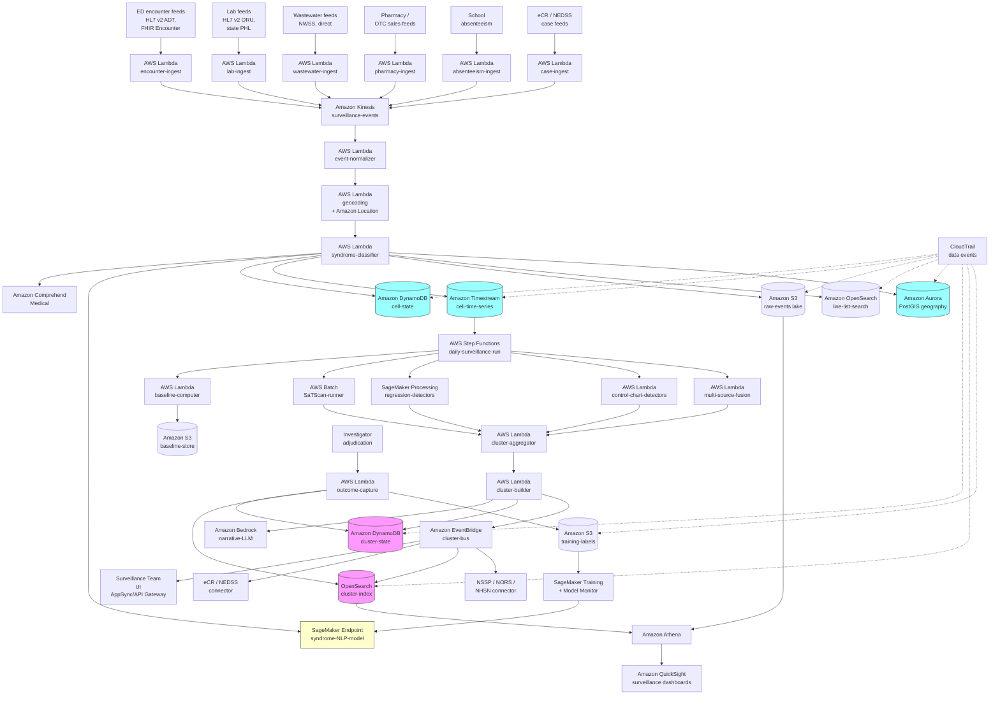

# Recipe 3.10: Epidemic / Outbreak Detection ⭐

**Complexity:** Complex · **Phase:** Production (with public health partnership and clinical surveillance governance) · **Estimated Cost:** ~$0.0001 to $0.001 per encounter scored (mostly ingest, syndrome classification, and spatiotemporal aggregation; daily full-population recompute dominates the bill)

---

## The Problem

It's a Tuesday in late October. A pediatrician at a suburban primary care clinic sees three kids from the same elementary school, all with high fever, dry cough, and unusual fatigue. He notes "viral syndrome, probably the flu that's going around" in each chart and prescribes supportive care. By Friday his colleague has seen four more kids from the same school with the same picture. None of them tested positive for influenza A on the rapid antigen test. None had a clear answer on the multiplex respiratory panel that the lab ran on a couple of them. The clinic's morning huddle the following Monday includes a quick "are we seeing anything weird?" and somebody mentions the school cluster. Somebody else mentions that two of their adult patients with school-age kids have come in with similar complaints. By Wednesday afternoon the local health department has a phone call from the school nurse: the absentee rate is twenty-two percent and climbing. By Thursday, the regional pediatric hospital is seeing six admissions a day for an undifferentiated febrile respiratory illness, none of which are testing positive on standard panels. By the following Monday the state lab has run sequencing and identified a novel variant of a respiratory pathogen. The first case was probably ten or twelve days earlier than anyone realized.

This is the everyday reality of how outbreak detection works in most of the country. Smart, attentive clinicians notice patterns one chart at a time. School nurses notice absences. Public health departments compile weekly reports from the data they get fed by hospitals and labs, often on a one- to two-week lag. Eventually somebody connects enough of the dots to call it. By that point the outbreak has been spreading for a week or two and the response window has narrowed considerably.

That's the unglamorous version. The glamorous version is what the public health surveillance world has been trying to build for decades: a continuously running pipeline that ingests clinical encounters, lab results, syndromic indicators (chief complaints, ED triage notes), pharmacy data (antiviral prescriptions, OTC product sales when available), school absenteeism, wastewater pathogen concentrations, and wearable-device aggregate signals; classifies each encounter into a syndromic category; aggregates by geography and time; computes baseline expected counts from historical data; and flags geographic-temporal cells where the observed counts exceed the expected counts at a level that warrants public health investigation. CDC's BioSense and the broader National Syndromic Surveillance Program (NSSP) do versions of this. ESSENCE (the Electronic Surveillance System for the Early Notification of Community-based Epidemics) is the workhorse algorithm and tooling. State and local health departments run their own variants. Many academic medical centers run institutional surveillance for their own catchment area. The gap between "the pipeline exists" and "the pipeline detects emerging clusters fast enough to matter" is where most of the operational pain lives.

Healthcare has a specific structural problem that makes this hard, and it's worth naming clearly before getting into the technology. Most enterprise anomaly detection assumes you have a stable, well-defined "normal" against which to flag deviations. Outbreak detection has to define normal in a setting where the baseline is itself a complicated mess of seasonal patterns (every winter has flu and RSV), demographic patterns (pediatric clinics see different syndromic mixes than adult medicine), geographic patterns (urban versus rural, university towns versus retirement communities), and structural shifts in care-seeking behavior (telehealth changed everything in 2020, and the post-pandemic baseline is still settling out). The baseline isn't a single distribution. It's a pile of overlapping seasonal-trend-residual decompositions, one per geography-syndrome-demographic cell. And the cells you most want to detect signal in (small geographies, specific demographic groups, rare syndromes) are exactly the cells where the baseline is hardest to estimate because there isn't enough historical data.

The signal-to-noise ratio is brutal. A typical large county sees thousands of ED visits per day across all causes. The number of those visits that represent the leading edge of an outbreak is, on most days, zero. On the day the outbreak actually starts, it might be three. Three out of two thousand. The detector has to find three excess cases against a background of two thousand routine ones, in a way that doesn't fire dozens of times a day on every random fluctuation, while also being sensitive enough to catch the outbreak before the count grows to thirty (which is the point at which clinicians notice anyway). The math is just hard.

Then there's the geographic problem. Patients don't get sick in the geography of the surveillance grid. They get sick in the geography of where they live, work, go to school, eat dinner, and ride public transit. By the time they're presenting to an ED, they've already been infectious for days in places that aren't reflected in their chart's address field. The surveillance system has to reason about a moving cloud of exposure, not a static set of points. Cluster detection algorithms (SaTScan, scan statistics, hot-spot analysis) handle the spatial part with various assumptions about geographic units (ZIP codes, census tracts, hospital catchments). All of those assumptions are approximations. The Modifiable Areal Unit Problem (the same data aggregated to different geographic units gives different cluster results) is a real and persistent issue.

And the demographic problem. Some pathogens hit specific demographics first: novel influenza variants often show up in children before adults; certain foodborne illness clusters are tightly age-skewed; outbreaks tied to specific gathering venues (a wedding, a religious service, a conference) cluster in specific demographic groups. A detector that only watches the overall count misses the early signal in subgroups. A detector that watches every demographic subgroup independently floods the queue with false positives because some subgroup somewhere is always above its baseline.

Public health investigation capacity is the binding constraint. State and local health departments are chronically underfunded, understaffed, and operating with information systems that range from impressive (Maryland, Minnesota, North Carolina, others) to embarrassing (multiple states still rely on faxed or paper-based reporting for some categories of notifiable conditions). When a detector flags a possible cluster, somebody has to investigate it: pull the case detail, contact the providers, run epidemiologic interviews with the patients, coordinate with the lab for additional testing, decide whether to issue a health advisory. A state health department's communicable disease unit might have a few dozen epidemiologists for a population of millions. A flood of detector alerts produces a queue that grows faster than it gets worked, and the system loses its operational value because the alerts that matter are buried in alerts that don't.

The output isn't an alert; it's a public health response. Detection is the first ten percent of the work. The rest is investigation, communication, coordination with healthcare providers, public messaging, and (when warranted) intervention: case isolation guidance, contact tracing, vaccine campaigns, prophylaxis, or facility-specific control measures. The detection pipeline produces decision support for that response. It has to produce it in a form the public health team can act on, with enough context to start the investigation, with data lineage clear enough to defend in front of the press conference if it comes to that. <!-- TODO (TechWriter): verify the current staffing ranges for state and local health department communicable disease units; the CDC and CSTE publish surveys periodically. -->

There's also the institutional version of this problem, which sits inside hospitals and health systems rather than at the public health department. A hospital infection prevention team is trying to detect emerging clusters of healthcare-associated infections (C. difficile, MRSA, VRE, CRE), unusual antibiotic susceptibility patterns, post-procedural infection trends, and norovirus or respiratory virus introductions on inpatient units. Same statistical machinery, different geographic and temporal scale. A surgical site infection cluster at a single hospital might be three cases in a month, all from the same OR or surgeon, against a baseline of one or two per month for that procedure. Detecting that cluster fast enough to investigate and intervene before it becomes seven cases is the operational goal.

The reason this problem lands at the complex end of the chapter, despite decades of biostatistical work on outbreak detection methodology, comes down to a tangle of intertwined issues.

**The base rate is brutal in both directions.** True outbreaks are rare; most days, in most jurisdictions, nothing unusual is happening. Even a 99% specific detector run daily across hundreds of geography-syndrome cells produces several false alarms per day. The math is the same alert-fatigue math as the rest of this chapter, with a public-health twist: the false-positive cost is high (a public health investigation is expensive and time-consuming, and a false alarm that goes public erodes credibility), and the false-negative cost is also high (a missed outbreak is an outbreak that grows). The system has to be ruthlessly precise at the top of its ranking, because public health teams can investigate single-digit alerts per day, not double digits.

**Seasonal and structural baselines are non-stationary in ways that matter operationally.** Every winter has a flu season, an RSV season, and (most years now) a COVID-19 season. The amplitude and timing differ year over year. A detector that doesn't account for seasonality flags every winter as an outbreak. A detector that over-corrects for seasonality misses the year when the flu season starts six weeks early. Year-over-year comparisons are the workhorse and they fail in years when something fundamental shifts (lockdowns flattening the 2020-2021 flu season, the post-pandemic settling, school calendar changes, vaccination coverage shifts).

**Multiple comparisons explode.** A surveillance system tracking 50 syndromes across 200 geographic cells across 10 demographic strata is running 100,000 hypothesis tests every day. Without multiple-comparison correction, you have hundreds of false positives per day. With aggressive correction, you miss real signals. Statistical methods that handle this well (False Discovery Rate procedures, hierarchical Bayesian models, scan statistics that explicitly handle multiplicity) exist; using them well is non-trivial.

**Care-seeking behavior is the noise floor.** Counts of ED visits depend on whether people present to the ED. That depends on insurance, transportation, what time of day, whether the urgent care clinic is open, the local culture around when to seek care, weather, news coverage, and a long list of other factors that have nothing to do with disease incidence. Big swings in care-seeking can mimic outbreaks (or hide them). The COVID-19 pandemic produced multi-year shifts in care-seeking behavior that surveillance systems are still adjusting to.

**Diagnostic coding latency is real.** A patient with a syndrome that turns out to be the leading edge of an outbreak is initially coded with whatever the chief complaint or initial impression suggested. The accurate diagnostic code (the one your detector is keying on) might appear hours or days later, after lab results come back. Real-time surveillance has to reason about chief complaints and triage notes, not just final diagnoses. NLP on free text is one of the biggest sources of value-add and one of the biggest sources of error.

**The geographic unit problem.** ZIP codes, census tracts, county boundaries, hospital catchments, school districts, and disease-ecology relevant geographies (sewersheds for wastewater surveillance, transit corridors, airshed regions for respiratory pathogens) all matter, all are different, and all force aggregation choices that change what the detector sees. There is no single right geography; the system has to support multiple geographies and reason about results across them.

**Privacy constraints are tight and patient-protective.** Public health authorities operate under specific legal authorities that allow access to PHI for surveillance (HIPAA's public health exception, state public health statutes), but those authorities are bounded. Suppressed-cell rules (don't report counts below 5 or 10 in small geographies, depending on jurisdiction) protect against re-identification but constrain what the detector can publish. Cross-organizational sharing (a clinical institution sharing surveillance data with the state health department) often requires data use agreements that are themselves operational artifacts. <!-- TODO (TechWriter): verify the current state of HIPAA's public health exception and any recent OCR guidance on its scope; the rule is in 45 CFR 164.512(b). -->

**Notifiable disease reporting is its own pipeline.** Many specific conditions are legally required to be reported to public health authorities: foodborne pathogens, certain respiratory pathogens, certain STIs, healthcare-associated infections, sentinel events. The reporting cadence and channel varies by condition and jurisdiction. A modern surveillance system has to integrate with the electronic case reporting (eCR) infrastructure that's emerged over the last decade, plus the legacy faxed or phoned-in pathways that still exist for some conditions and jurisdictions.

**Coordination across organizations and jurisdictions is the operational reality.** An outbreak that crosses county lines (most of them do) requires coordination across multiple local health departments, the state health department, possibly CDC. The detection system, the investigation workflow, and the public messaging all have to span jurisdictions. Federated detection, with each jurisdiction running its own surveillance and sharing higher-level signals, is the operational pattern most large states have settled into. <!-- TODO (TechWriter): verify the current state of cross-jurisdictional coordination practices; CSTE publishes guidance on this. -->

**The output's audiences vary.** Public health epidemiologists need detailed line-list data with patient identifiers (under appropriate authority). Clinical infection preventionists need facility-level data and unit-level breakdowns. Hospital leadership wants high-level trends and risk indicators. State health officials need to be briefed before the press conference. Each audience needs different views of the same underlying detection. Building each view is its own engineering effort.

What you actually want to build is a continuously running pipeline that consumes clinical encounter data (ED visits, urgent care visits, hospital admissions), lab results (especially microbiology and respiratory pathogen panels), pharmacy data when available, syndromic indicators from chief complaints and triage notes, and (where it exists) auxiliary data sources like wastewater surveillance and school absenteeism; classifies events into syndromic categories using NLP plus structured-data rules; aggregates counts by geographic-temporal-demographic cells; computes baseline expected counts from historical data with explicit seasonality and trend modeling; runs aberration detection (CUSUM, EWMA, scan statistics, regression-based methods) on the aggregated time series; ranks the resulting cluster candidates with calibrated scores; and routes the highest-priority candidates to the public health investigation workflow with the supporting evidence pre-assembled. Underneath sits the syndrome taxonomy, the geography hierarchy, the historical baseline store, and the case-history database. Around it sits the integration with electronic case reporting (eCR), the laboratory information network (LIMS, public health labs), and the state and federal reporting infrastructure (NSSP, NORS, NEDSS, NMI for nationally notifiable conditions).

Let's get into how.

---

## The Technology

### The Vocabulary You Need

Public health surveillance has its own jargon, partly inherited from biostatistics (scan statistics, CUSUM, EWMA), partly from epidemiology (notifiable conditions, line lists, case definitions), and partly from the specific tooling that emerged from CDC and academic surveillance programs (BioSense, ESSENCE, NSSP, SaTScan). Quick tour, because these terms are going to recur.

**Syndromic surveillance.** The category of surveillance that uses pre-diagnostic data (chief complaints, triage notes, ED encounter data) rather than confirmed diagnoses. The motivating insight: by the time you have lab confirmation, you've lost a week. Syndromic surveillance trades specificity for timeliness.

**National Syndromic Surveillance Program (NSSP).** The CDC-coordinated network that aggregates de-identified ED visit data across the country (covering the substantial majority of U.S. ED visits) and runs surveillance analytics. Hospitals and EDs feed structured data feeds (HL7, often via state intermediaries) and the program produces situational awareness products at national, state, and local levels.

**ESSENCE (Electronic Surveillance System for the Early Notification of Community-based Epidemics).** The dominant analytical engine in syndromic surveillance, developed at Johns Hopkins APL and used by NSSP and many state and local programs. ESSENCE provides aberration detection on syndromic categories, scan-statistic clustering, query interfaces for epidemiologists, and visualization. Many jurisdictions interact with surveillance through ESSENCE rather than building their own analytics.

**BioSense Platform.** The CDC's NSSP-supporting infrastructure that provides hosted ESSENCE access, data integration support, and analytics for participating jurisdictions. Most state and local health departments interact with NSSP through the BioSense Platform rather than receiving raw data feeds.

**Notifiable conditions.** The list of diseases that providers and labs are legally required to report to public health authorities. Maintained at the state level (with substantial overlap across states) and at the federal level (the Council of State and Territorial Epidemiologists publishes the National Notifiable Diseases List). Reporting requirements specify the timeline (immediate, within 24 hours, within a week) and the data elements.

**Electronic case reporting (eCR).** The HL7 FHIR-based standard for EHR-to-public-health automated case reporting, replacing the prior pattern of provider-driven manual reporting. The CDC eCR Now framework, the AIMS platform, and individual state eCR implementations have rolled out over the last several years. Coverage is increasing but not yet universal.

**NEDSS (National Electronic Disease Surveillance System).** The CDC framework for state-level disease surveillance systems. Many states run NEDSS Base System (NBS) deployments or commercial NEDSS-compatible products (Maven, Trisano, others). The system manages case investigation workflow, line lists, and reporting up to CDC.

**NORS (National Outbreak Reporting System).** The CDC system for reporting waterborne, foodborne, and enteric outbreaks. Operates at the cluster or outbreak level rather than at the individual case level.

**MMWR (Morbidity and Mortality Weekly Report).** The CDC's weekly publication that includes notifiable-condition surveillance summaries. The "MMWR table" is shorthand for the standard tabulation of weekly counts by condition and state.

**Line list.** The detailed enumeration of cases in an outbreak, with patient identifiers, demographics, exposures, dates of onset and reporting, lab results, and outcomes. The fundamental data structure of public health investigation.

**Case definition.** The specific criteria for classifying a patient as a confirmed, probable, or suspect case of a particular condition. CDC and state health departments publish case definitions; surveillance algorithms have to map their outputs to these definitions for the official count to be meaningful.

**Scan statistic.** The class of statistical methods (Kulldorff's spatial scan, the space-time permutation scan, the Poisson scan) that test for clustering by sliding a window of varying size and position over the data and computing a likelihood ratio against the null hypothesis of uniform distribution. SaTScan is the canonical implementation.

**CUSUM and EWMA.** Cumulative Sum and Exponentially Weighted Moving Average control charts. Time-series aberration detection methods that flag when a series deviates from its expected level. Workhorses in syndromic surveillance because they're computationally cheap and well-understood.

**Farrington algorithm and Farrington Flexible.** Regression-based aberration detection methods originally developed at Public Health England (now UKHSA). Models the expected count using historical data with adjustment for trend and season; flags weeks where the observed exceeds the upper prediction interval. Widely used in European and U.S. surveillance.

**Wastewater surveillance.** The practice of measuring pathogen concentrations (SARS-CoV-2 RNA, polio, influenza, mpox, others) in municipal wastewater to provide community-level disease burden estimates that are independent of testing and care-seeking behavior. The CDC National Wastewater Surveillance System (NWSS) coordinates this at the federal level. Emerged as a major surveillance modality during the COVID-19 pandemic and is now established for multiple pathogens.

**Sentinel surveillance.** A subset of providers or facilities chosen to provide regular, detailed surveillance data, with the assumption that their patterns are reasonably representative. The U.S. Outpatient Influenza-like Illness Surveillance Network (ILINet) is the classic example.

**HAI surveillance.** Healthcare-associated infection surveillance. Run by hospital infection prevention teams, often in partnership with public health authorities. The CDC's National Healthcare Safety Network (NHSN) is the federal aggregator. Specific infections (CLABSI, CAUTI, SSI, CDI, MRSA, VRE, CRE, ventilator-associated events) have detailed case definitions and reporting requirements.

**HIE (Health Information Exchange).** Regional or state-level platforms that share clinical data across organizations. Useful for surveillance because they can provide cross-facility views. Coverage and quality vary substantially.

### The Detection Pattern Catalog

Before picking algorithms, a builder should know the detection patterns that map to the actual surveillance questions public health teams care about. These are the canonical patterns that show up in the surveillance literature, in the ESSENCE feature set, in CDC guidance, and in the operational practice of state and local health departments.

**Total-count aberration.** The simplest pattern: total counts of a syndrome (or condition, or chief complaint category) in a geographic area exceed the expected count for the time of year. Detected by control charts (CUSUM, EWMA, Shewhart), regression-based methods (Farrington, Farrington Flexible), or simple threshold rules (counts exceed 1.5x the historical max for the same week). The workhorse of syndromic surveillance.

**Spatial cluster.** Geographic concentration of cases that exceeds what would be expected by chance under spatial homogeneity. Detected by spatial scan statistics (Kulldorff's method), local indicators of spatial association (LISA, Getis-Ord), or kernel density estimation with significance testing. Foundational for foodborne outbreak detection, cluster identification around environmental exposures, and detection of nascent geographic spread.

**Spatiotemporal cluster.** Geographic concentration that's also temporally concentrated. The space-time permutation scan statistic and the spatiotemporal scan statistic (both implemented in SaTScan) are the standard tools. Most practical outbreak detection uses spatiotemporal methods because most outbreaks have both a where and a when component.

**Demographic-stratified aberration.** A specific demographic subgroup (children under 5, adults 65+, a particular ZIP code, a particular insurance category) shows excess counts even when overall counts are normal. Requires running aberration detection on multiple stratifications, with careful multiple-testing correction. Catches early signals in subgroups before they become apparent at the population level.

**Cross-syndrome correlation.** Multiple syndromic categories rising together in the same geography. A spike in fever-respiratory plus a spike in gastrointestinal illness in the same county might indicate a single agent affecting multiple systems. Detection requires joint modeling of correlated time series.

**Lab-positive cluster.** Clusters of confirmed pathogen identifications that exceed background. Often the first hard signal that a syndromic spike is real. Requires lab data integration (state public health labs, hospital microbiology labs, commercial reference labs), which is its own integration challenge.

**Antibiogram drift.** Shifts in antibiotic susceptibility patterns at a facility or in a community. Catches emergence of resistance (CRE strains, multidrug-resistant TB, multidrug-resistant gonorrhea) before it shows up in clinical management problems. Slow-moving compared to acute outbreak detection but operationally important.

**HAI cluster.** Excess cases of a specific healthcare-associated infection on a specific unit, at a specific facility, or attributed to a specific procedure or device. Detected by NHSN-style standardized infection ratio (SIR) tracking, internal SPC charts at the unit level, and (increasingly) machine-learned cluster detection that incorporates microbiology data, genomics, and contact patterns.

**Surveillance for known pathogens of concern.** Specific surveillance pipelines for measles, polio, monkeypox, novel influenza, hemorrhagic fevers, agents of bioterrorism concern, antimicrobial-resistant pathogens. Each has its own case definition, reporting cadence, and response protocol. The detector for "is this case the first of an outbreak" can use Bayesian priors that strongly weight cases that match the case definition.

**Sentinel-event detection.** Single cases of conditions that should never be present (locally-acquired measles in an elimination region, the first case of polio in a polio-free region, the first case of a known-eliminated pathogen reappearing) trigger investigation regardless of count. Detection here is rule-based and the alert is on first occurrence.

**Genomic cluster.** Sequences that cluster together genomically (suggesting a common source) regardless of geography or timing. The PulseNet network does this for foodborne pathogens (E. coli, Salmonella, Listeria, Campylobacter); SARS-CoV-2 surveillance did it at scale during the pandemic; tuberculosis cluster detection has used genomics for years. Increasingly important as sequencing costs continue to drop.

**Wastewater surge.** Pathogen concentrations in municipal wastewater exceeding baseline. Independent of care-seeking behavior; reflects community-level prevalence. Used now for SARS-CoV-2, polio, influenza, mpox, and increasingly other pathogens. Often the earliest signal because it captures sub-clinical and pre-symptomatic infections.

**Wearable-aggregate signal.** Population-level deviations in resting heart rate, sleep patterns, or activity that may indicate community-level illness. Several research programs (Stanford's wearable surveillance, the Lan/Wang/Snyder work, the DETECT Study) have shown these signals can lead clinical surveillance by days. Operationally early-stage in 2026 but emerging.

**Cross-jurisdictional cluster.** A cluster that's invisible to any single jurisdiction because the cases are spread across boundaries (a cluster centered on a regional airport, a multi-state outbreak from a single food-distribution event, a cross-border cluster). Requires federated detection or central aggregation; PulseNet's national database is the canonical example.

**Sub-baseline drop.** A precipitous fall in counts of a syndrome below expected. Sometimes a real signal (a measure has been effective, a pathogen has receded), sometimes a data-quality artifact (a major facility's feed went down), sometimes an artifact of behavior change. Worth detecting because it signals something operationally relevant either way.

### Statistical and ML Methods That Fit

The technique palette spans simple control charts through scan statistics through hierarchical Bayesian models through deep learning approaches. The right approach is layered, not monolithic.

**Control charts.** CUSUM (Cumulative Sum), EWMA (Exponentially Weighted Moving Average), and Shewhart charts are the foundation. Cheap to compute, easy to explain, well-characterized statistical properties. Apply per geography-syndrome-week cell, with seasonally adjusted expected counts. The CDC's Early Aberration Reporting System (EARS) and ESSENCE both use control-chart-style methods extensively.

**Regression-based methods.** Farrington, Farrington Flexible, and related approaches model the expected count using historical data with explicit trend and season terms. Flag weeks where the observed count exceeds the upper prediction interval. More flexible than pure control charts; more demanding of historical data. Public Health England (now UKHSA) has been a leader in this space; Farrington Flexible is well-documented in the surveillance literature.

**Spatial scan statistics.** Kulldorff's method (and its space-time and permutation variants) computes a maximum likelihood ratio over all candidate clusters defined by varying spatial windows. Implemented in SaTScan, which is the standard tool used by CDC, state health departments, and academic surveillance programs. Computationally manageable for daily/weekly runs at county or ZIP-level resolution.

**Bayesian hierarchical models.** When the data has structure (cases nested within geographies, geographies nested within regions, weeks nested within seasons), hierarchical Bayesian models can borrow strength across the hierarchy and handle small-cell estimation gracefully. INLA-based approaches and MCMC-based approaches both have practitioners. The Stan-based R packages (`bsts`, `brms` with appropriate priors) and the `INLA` R package provide accessible implementations.

**Negative binomial regression with seasonal terms.** A workhorse for count data with overdispersion (which is most surveillance data). Model expected counts as a function of trend, seasonal harmonics, day-of-week effects, and (where available) special-cause indicators (school closures, holidays, regional events). Flag observations whose probability under the model is below a threshold.

**Time-series forecasting models.** ARIMA, SARIMA, state-space models (BSTS, Prophet) for forecasting expected counts. Compare observed to forecast; flag substantial deviations. Particularly useful when the seasonality is complex or when there are external regressors (weather, school sessions, gathering events).

**Hidden Markov Models and change-point detection.** Models that explicitly represent the system as switching between "epidemic" and "non-epidemic" states. The work of Le Strat and Carrat, the Markov-switching approaches in the surveillance literature. Promising for problems where the regime change itself is the signal.

**LSTM and Transformer time-series models.** Neural network approaches to forecasting expected counts. Flexible enough to learn complex multi-seasonal patterns and external-regressor effects. Computationally heavier than classical approaches; harder to interpret. Start to pay off when you have many time series with shared structure (every ZIP code in a state) and want to learn the structure jointly.

**Graph-based detection.** When the relevant structure is a network (a network of facilities, a network of providers, a contact graph), graph-based anomaly detection methods can surface clusters that geographic methods miss. Useful for HAI surveillance (cluster on the procedure-team-OR graph), for foodborne investigation (cluster on the meal-venue graph), and for communicable disease investigation (cluster on the contact graph).

**Genomic-cluster detection.** SNP-distance-based clustering (PulseNet's hqSNP analysis, the various core-genome MLST approaches), phylogenetic cluster detection (Nextstrain, BEAST), and combined epi-genomic detection (Nextstrain's regional dashboards integrating sequence and epi data). Specialized; usually delivered by lab-and-bioinformatics teams in close collaboration with surveillance.

**NLP for syndromic classification.** Free-text chief complaints and triage notes carry signal that structured ICD codes miss in real time. Rules-based syndromic classifiers (CCDD-style chief-complaint mappings, the various "fever-respiratory," "GI," "rash," "neuro" syndromic groups) plus learned models (transformer-based classifiers fine-tuned on labeled chief complaints) give better classification than either alone. NSSP's syndromic categories are the standard taxonomy in the U.S.

**LLM-assisted triage and investigation support.** Given a flagged cluster, an LLM can produce a draft investigation memo summarizing the cases, the geographic and demographic distribution, the syndromic features, the temporal trajectory, and the relevant prior cases. Investigators report substantial time savings on the per-cluster review. Always with human review; the LLM produces decision support, not decisions.

**Multi-source fusion.** Combining clinical surveillance with wastewater, school absenteeism, pharmacy data, wearables, and other auxiliary sources. The fusion can be at the feature level (combine signals into a single model input vector), the score level (combine outputs of separate detectors with calibrated weighting), or the decision level (require concordance across sources to flag). Each approach has tradeoffs; the operational pattern in mature programs is decision-level fusion with each source's detector tuned independently.

**Feedback-driven calibration.** Same operational rule as the rest of the chapter. Investigation outcomes (confirmed outbreak, false alarm, indeterminate) flow back into threshold tuning, suppression rules, and (where labels are sufficient) supervised re-ranker training. Without feedback, the system decays.

A reasonable layered architecture: rules engine for sentinel events and notifiable-condition triggers, control charts and regression-based methods for the bread-and-butter syndromic aberration detection, spatial scan statistics for clustering, hierarchical models for small-cell stabilization, genomic cluster detection where sequencing is available, multi-source fusion for the highest-confidence signals, and an LLM-assisted triage layer that compiles the evidence into reviewable cases for the surveillance team.

### Geography, Time, and Demographics: The Hard Choices

The aggregation choices shape what the detector sees. Three dimensions deserve specific attention because the choices interact and the wrong choices quietly degrade detection performance.

**Geographic aggregation.** ZIP codes are convenient but variable in size and population. Census tracts are demographically more stable but require geocoding from patient addresses. County-level aggregation is too coarse for most cluster detection but fine for trend monitoring. Hospital catchments are useful for facility-driven analyses but don't align with administrative geographies. Multiple geographies in parallel is the operational pattern; the system should support running detectors at ZIP, census tract, county, and custom geographies (sewersheds, school districts) simultaneously.

**Temporal aggregation.** Daily counts catch fast-moving outbreaks; weekly counts smooth noise and are the convention in many surveillance systems (MMWR weeks). Sub-daily aggregation (every 4 hours) is sometimes used for high-acuity surveillance (mass gatherings, post-disaster). Sliding windows (last 7 days, last 14 days, last 28 days) catch outbreaks at different temporal scales. Multiple temporal aggregations in parallel handle the trade-off between sensitivity and stability.

**Demographic stratification.** Age (often grouped: under 5, 5-17, 18-49, 50-64, 65+), sex, race/ethnicity (where reliably collected), insurance type, language, residence (urban/rural). Stratified detection catches subgroup signals; un-stratified detection has more statistical power for population-level signals. The right answer is "both, in parallel, with multiple-comparison handling."

The overall pipeline runs each geography x time x stratification x syndrome combination through the appropriate detector and produces a multidimensional set of flags. The case-builder collapses related flags into investigation candidates.

### Workflow Integration Is, Again, the Actual Product

The lesson recurs because it's the lesson that matters most. The detection pipeline is one component. The public health investigation workflow, the eCR integration, the laboratory data integration, the cross-jurisdictional sharing, the press communication, and the response coordination are the other components.

The specific workflows that matter:

- **Daily surveillance team review.** Sorted by composite cluster score, with suppression for already-investigated clusters and recently-resolved alerts. Click-through to the case detail, the geographic visualization, the temporal trajectory, and the supporting evidence.
- **Investigation case assembly.** When an epidemiologist opens a cluster, the system pre-assembles the line list, the geographic map, the temporal curve, the demographic breakdown, the related syndromic signals, the lab and genomic context (where available), and the LLM-generated narrative summary.
- **Cross-jurisdictional coordination.** When a cluster crosses jurisdictional boundaries, the system should automatically route notifications to the relevant local and state health departments. The data-sharing rules and the case-management coordination patterns vary by region.
- **Electronic case reporting integration.** Clusters that involve notifiable conditions trigger the eCR or NEDSS workflow for individual cases. The detection system should integrate cleanly with the case management infrastructure rather than duplicating it.
- **Investigation outcome capture.** Confirmed outbreak (with categorization), false alarm (with category and reason), continuing investigation, indeterminate. Outcomes feed back into the model and the suppression rules.
- **Response coordination.** Confirmed outbreaks trigger the response process: case isolation guidance, contact tracing initiation, lab capacity scaling, communication to affected facilities, public messaging. The detection system should hand off the cluster package to the response infrastructure through a defined process.
- **External reporting.** Reportable conditions get reported to CDC through NEDSS, NORS, NHSN, NMI, or other appropriate channels. Outbreak reports go up the hierarchy to state and federal authorities on defined timelines.
- **Public communication.** Some clusters reach the threshold for public communication (health advisory, press release, public dashboard update). The system should produce communication-ready summaries that the communications team can review and adapt.

---

## General Architecture Pattern

At a conceptual level, the outbreak detection pipeline ingests clinical encounter data, lab results, syndromic indicators (chief complaints, triage notes), and auxiliary data (wastewater, pharmacy, school absenteeism, wearables); classifies events into a syndrome taxonomy; aggregates counts by geographic-temporal-demographic cells; computes baseline expected counts from historical data with explicit seasonality and trend modeling; runs aberration detection across the cells; clusters related signals into cluster candidates; ranks the candidates with calibrated scores; and delivers them to the surveillance team (and downstream public health systems) with the supporting evidence pre-assembled. Underneath sits the syndrome taxonomy, the geography hierarchy, the historical baseline store, the case database, and the genomic and laboratory data. Around it sits the integration with eCR, NEDSS, NHSN, NSSP, the state and local health departments, and the response coordination infrastructure.

```
┌────────── EPIDEMIC / OUTBREAK DETECTION PIPELINE ────────────────┐
│                                                                  │
│   [ED encounter feeds:    [Lab feeds:           [Pharmacy and      │
│    chief complaint,        microbiology,         OTC product       │
│    triage notes,           respiratory panels,   sales data]        │
│    diagnosis codes,        STI panels, GI                          │
│    demographics]           panels, sequencing]                     │
│                                                                  │
│   [Wastewater pathogen   [School absenteeism   [Wearable           │
│    concentrations:         and clinic visit     aggregate signals  │
│    SARS-CoV-2, polio,      patterns]            (research-stage)]  │
│    influenza, mpox]                                                │
│                                                                  │
│           │                                                      │
│           ▼                                                      │
│   [Streaming Ingest and Normalization]                           │
│   (canonical event format, geocoding, demographic                 │
│    standardization, identifier resolution)                        │
│           │                                                      │
│           ▼                                                      │
│   [Syndrome Classification]                                      │
│   (rules-based + ML chief-complaint mapping; ICD/SNOMED            │
│    structured-data classification; lab-positive integration)      │
│           │                                                      │
│           ▼                                                      │
│   [Geographic and Demographic Stratification]                    │
│   (multi-resolution geographies: ZIP, tract, county, sewershed;   │
│    multi-stratification: age, sex, insurance, residence)          │
│           │                                                      │
│           ▼                                                      │
│   [Aggregation Layer]                                            │
│   (per-cell counts at multiple temporal windows: 1d, 7d, 14d, 28d) │
│           │                                                      │
│           ▼                                                      │
│   [Baseline Computation]                                         │
│   (seasonal-trend decomposition, year-over-year comparison,       │
│    Farrington-style regression baselines, hierarchical pooling)   │
│           │                                                      │
│           ▼                                                      │
│   [Detector Bank]                                                │
│   (control charts: CUSUM, EWMA;                                   │
│    regression: Farrington Flexible, neg-binomial GLM;             │
│    spatial: scan statistics, LISA;                                 │
│    spatiotemporal: SaTScan space-time permutation;                 │
│    multivariate: cross-syndrome correlation)                       │
│           │                                                      │
│           ▼                                                      │
│   [Auxiliary-Source Detectors]                                   │
│   (wastewater anomaly, genomic cluster, pharmacy spike,           │
│    school absenteeism aberration, wearable aggregate)             │
│           │                                                      │
│           ▼                                                      │
│   [Composite Scoring and Multi-Source Fusion]                    │
│   (cell-level composite, cluster-level composite, multi-source   │
│    concordance, calibration with multiple-testing handling)       │
│           │                                                      │
│           ▼                                                      │
│   [Cluster Builder]                                              │
│   (group flagged cells into clusters, attach line list,           │
│    geographic and temporal visualization, LLM narrative,         │
│    deduplicate against open clusters, suppress recently-resolved) │
│           │                                                      │
│           ▼                                                      │
│   [Surveillance Team Queue]   [eCR / NEDSS Integration]          │
│   (investigation workflow,     (notifiable case management,        │
│    evidence package,           cross-jurisdictional routing)       │
│    response coordination)                                         │
│           │                                                      │
│           ▼                                                      │
│   [Investigation Outcome]                                        │
│   (confirmed outbreak; false alarm; indeterminate;               │
│    HAI cluster; foodborne cluster; respiratory pathogen)          │
│           │                                                      │
│           ▼                                                      │
│   [Outcome and Feedback Capture]                                 │
│   (label store for retraining; suppression-rule updates;         │
│    threshold tuning; subgroup performance; multi-source weights)  │
│           │                                                      │
│           ▼                                                      │
│   [Reporting and Communication Layer]                            │
│   (NSSP, NORS, NHSN, NMI feeds; public dashboards;                │
│    health advisories; press communication packages;               │
│    cross-jurisdictional notifications)                            │
│                                                                  │
└──────────────────────────────────────────────────────────────────┘
```

**Ingest and normalization.** Clinical encounter data flows from EDs and urgent care facilities through HL7 v2 ADT and lab feeds (typically state-aggregator routed to the surveillance system) and FHIR encounter resources from facilities with modern integrations. Lab data flows from public health labs, hospital microbiology systems, and commercial reference labs. Wastewater data flows from CDC NWSS or directly from sample-processing labs. Each source has its own latency, schema, and completeness characteristics; the normalizer produces canonical encounter and lab events with consistent schema.

**Syndrome classification.** Each encounter is mapped to one or more syndromic categories using a combination of structured-data rules (ICD-10 patterns, lab-result patterns) and free-text classification (NLP on chief complaints and triage notes). NSSP's syndromic categories provide the standard taxonomy. A single encounter often maps to multiple categories.

**Geographic and demographic stratification.** Each encounter is geocoded to multiple geographic units (residence ZIP, residence census tract, residence county, residence sewershed, facility location) and stratified demographically. The stratification layer is conceptually separate from detection.

**Aggregation.** Counts per cell (geography x stratification x syndrome x time window) are computed and persisted. Multiple temporal windows in parallel handle different temporal scales of outbreak dynamics.

**Baseline computation.** Per-cell baseline expected counts are computed from historical data with seasonality, trend, day-of-week effects, and (where available) external regressors. Hierarchical pooling stabilizes estimates for small cells.

**Detector bank.** Multiple detectors run in parallel: control charts on each cell, regression-based aberration detection, spatial scan statistics across the geography hierarchy, spatiotemporal scan statistics on the moving windows, cross-syndrome correlation detection. Each produces per-cell or per-cluster scores.

**Auxiliary-source detectors.** Wastewater anomaly detection, genomic cluster detection (when sequence data is available), pharmacy-spike detection, school-absenteeism aberration detection, wearable aggregate-signal detection. Each runs against its own data source with its own modeling.

**Composite scoring and multi-source fusion.** Cell-level scores combine across detectors per cell. Cluster-level composite scores combine across cells in geographically and temporally adjacent regions. Multi-source fusion combines clinical, lab, wastewater, and auxiliary signals when they're concordant.

**Cluster builder.** Cells flagged in geographic and temporal proximity are grouped into clusters. Each cluster gets a line list, geographic visualization, temporal trajectory, demographic breakdown, related-source signals, and an LLM-generated narrative.

**Surveillance team queue and eCR/NEDSS integration.** The surveillance team queue is the primary product. The eCR/NEDSS integration handles notifiable-condition reporting and cross-jurisdictional case management. The two queues are complementary; clear separation of which case classes go where.

**Investigation outcome.** Investigators adjudicate clusters as confirmed outbreaks, false alarms, indeterminate, or specific outbreak categories. Confirmed outbreaks trigger the response coordination workflow.

**Outcome and feedback capture.** Outcomes flow back as labels for retraining, suppression-rule updates, threshold tuning, and subgroup-performance analysis. The feedback loop is a first-class component.

**Reporting and communication layer.** Periodic and event-triggered reports to CDC, state health authorities, healthcare facilities, and the public. The reporting infrastructure should produce these on defined cadences and ad-hoc as needed.

---

## The AWS Implementation

### Why These Services

**Amazon Kinesis Data Streams for the encounter and lab event backbone.** Clinical encounter feeds, lab feeds, and auxiliary-source feeds flow into Kinesis streams as they're produced. Kinesis handles the volume (a state-level surveillance system might process millions of encounter events per day across all participating facilities), provides ordered delivery for time-series analysis, supports replay for backfill and retraining, and integrates cleanly with the downstream Lambda and analytics components.

**AWS Lambda for ingest, normalization, and syndrome classification.** Each source type (HL7 v2 ADT feeds, HL7 v2 lab feeds, FHIR encounter feeds, NWSS wastewater feeds, eCR feeds, NHSN feeds) has its own Lambda that pulls or receives the source-specific format and writes canonical events. Downstream Lambdas perform geocoding, demographic stratification, and syndrome classification. Lambda's auto-scaling fits the bursty pattern of clinical encounter data well.

**Amazon Comprehend Medical for chief-complaint and triage-note NLP.** Free-text chief complaints carry signal that ICD codes miss in real time. Comprehend Medical extracts conditions, anatomy, medications, and signs/symptoms. Combined with rules-based syndromic classification, it provides higher-fidelity syndrome assignment than structured data alone.

**Amazon SageMaker for syndrome classifier training and hosting.** Custom syndrome classifiers (especially for organization-specific syndrome categories or sentinel-event triggers) train as SageMaker Training Jobs and deploy to SageMaker endpoints. SageMaker Feature Store provides online and offline feature consistency.

**Amazon DynamoDB for the cell state and cluster state stores.** Per-cell state (current count, baseline expected, recent flag history) and per-cluster state (open investigations, suppression status, evidence pointers) live in DynamoDB. Single-digit-millisecond reads on cell lookup; DynamoDB streams trigger downstream re-evaluation when cells update.

**Amazon Timestream for time-series cell counts and baselines.** Per-cell time-series of counts, baselines, and detector scores are time-series data. Timestream's storage and query model fit; magnetic-tier retention covers the multi-year baseline window cost-effectively. <!-- TODO (TechWriter): verify the current HIPAA eligibility status of Amazon Timestream and BAA coverage; some deployments use S3 with Athena instead. -->

**Amazon Location Service for geocoding.** Patient address fields (where authority and configuration permit) get geocoded to coordinates and to administrative geographies (census tract, ZIP code tabulation area, county). Combined with custom geography reference data (sewersheds, school districts, hospital catchments) for the multi-resolution geographic stratification.

**Amazon Aurora PostgreSQL with PostGIS for geographic operations.** The geography hierarchy and the geographic operations (point-in-polygon for assigning encounters to administrative areas, polygon-overlap for cluster aggregation, distance computations for cross-jurisdiction routing) fit PostGIS naturally. Aurora provides managed Postgres with HIPAA eligibility.

**Amazon Neptune for the contact and exposure graph (when used).** Contact tracing and exposure-network modeling fit the property-graph model. Less central than for Recipe 3.9, but useful when contact-tracing investigations or exposure-network analyses are part of the surveillance program. <!-- TODO (TechWriter): verify current HIPAA eligibility status of Amazon Neptune. -->

**Amazon OpenSearch Service for case search, line list, and surveillance analytics.** Surveillance line-list data, encounter-search archives, and the searchable history of clusters and investigations live in OpenSearch. OpenSearch supports the kind of ad-hoc query the surveillance team needs ("show me every fever-respiratory ED visit in this ZIP in the last 14 days," "show me every confirmed Salmonella case in the state for the last 90 days, sorted by serotype").

**AWS Batch and Amazon SageMaker Processing for SaTScan and other compute-heavy aberration detection.** SaTScan is a compiled tool that can run as a containerized batch job on AWS Batch. SageMaker Processing handles the regression-based detectors and the time-series modeling at scale. Both fit the daily-cadence "run all the detectors against today's data" pattern.

**AWS Step Functions for orchestration.** The daily surveillance run, the cluster-building pipeline, and the periodic retraining are multi-step workflows. Step Functions handles orchestration with retry and error handling.

**Amazon Bedrock for cluster narrative generation.** The cluster builder hands the structured evidence to a Bedrock-hosted LLM that produces the investigator-facing narrative ("A spatiotemporal cluster of 14 fever-respiratory ED visits in census tracts 36055-001100 through 36055-001400 over the past 7 days. Pediatric (under 12) cases account for 11 of 14. Geographic centroid is within 0.4 miles of three elementary schools. No lab-confirmed pathogen in the cluster yet; respiratory panels pending on 4 cases. Compared to the historical baseline for these tracts and this week, the observed count exceeds the 99th percentile."). Decision support, not decision-making. <!-- TODO (TechWriter): confirm the current set of HIPAA-eligible Bedrock foundation models. -->

**Amazon SageMaker Model Monitor.** Continuously monitors data drift, prediction drift, and (with labels) model quality. Critical for catching baseline drift caused by EHR upgrades, behavioral shifts, demographic changes, or COVID-era reset effects.

**Amazon EventBridge for routing.** Detector outputs publish to EventBridge with cluster context and case-class metadata. Subscribers include the cluster builder, the eCR/NEDSS connector, the audit logger, and the metrics collector.

**Amazon API Gateway and AWS AppSync for the surveillance UI.** The surveillance team's case queue UI consumes data through AppSync (GraphQL flexibility for cluster-detail views with related geographic, temporal, and demographic data) or API Gateway (simpler integrations). When the organization uses ESSENCE or another surveillance product, integration is API-driven.

**AWS Glue and Amazon Athena for the data lake.** Historical encounters, baselines, cluster outcomes, and surveillance archives live in S3 partitioned by date and source. Glue catalogs the schema; Athena provides SQL access for ad-hoc analysis and retraining feature extraction. Athena geospatial functions support some geographic analyses without lifting data into Aurora/PostGIS.

**Amazon QuickSight for surveillance dashboards.** Public-facing dashboards (with appropriate suppression rules), internal surveillance team dashboards (full detail), and leadership briefing dashboards (high-level trends and indicators). Geospatial visualizations through QuickSight or external tools (Mapbox, Esri) integrated through QuickSight embedding.

**Amazon S3 for the data lake and surveillance archive.** Partitioned by date and event source, encrypted with customer-managed KMS keys. Used by SageMaker for training, Athena for ad-hoc analysis, and as the long-term archive for compliance and historical-baseline retention.

**AWS IAM Identity Center.** Workforce single sign-on for the surveillance UI, integrated with the public health agency's identity provider. Per-role permissions: surveillance epidemiologists (read access to clusters, write access to outcomes), surveillance leadership (read access plus reporting), data-science team (training-data access with appropriate de-identification), operations team (pipeline monitoring without case-data access). Cross-organizational users (state health department staff accessing local-jurisdiction data, CDC staff accessing state data) get access through federation with appropriate scoping.

**Amazon CloudWatch and AWS X-Ray.** Pipeline health, ingest latency, end-to-end traces. Latency budgets matter: time from "patient arrives at ED" to "encounter scored in surveillance pipeline" is part of the operational metric. Most surveillance programs target same-day or next-day inclusion of new encounters.

**AWS CloudTrail.** Audit logging on every PHI-bearing store and every API call against the case management system.

**AWS KMS.** Customer-managed keys on every PHI-bearing store: Kinesis, DynamoDB, Aurora, Neptune, Timestream, S3, OpenSearch, SageMaker volumes and Feature Store. Public health authority data-handling rules often require additional controls beyond standard HIPAA.

**AWS Secrets Manager.** Source-system credentials (HL7 feed authentication, FHIR API tokens, NWSS access keys, eCR endpoint credentials, NHSN credentials), and external-system integration credentials.

### Architecture Diagram



### Prerequisites

| Requirement | Details |
|-------------|---------|
| **AWS Services** | Amazon Kinesis Data Streams, AWS Lambda, Amazon DynamoDB, Amazon Aurora PostgreSQL (PostGIS), Amazon Neptune (optional), Amazon Timestream, Amazon OpenSearch Service, Amazon S3, Amazon SageMaker (Training, Hosting, Feature Store, Processing, Model Monitor, Model Registry), Amazon Comprehend Medical, Amazon Bedrock, Amazon Location Service, Amazon EventBridge, AWS Step Functions, AWS Batch, AWS AppSync, Amazon API Gateway, AWS Glue, Amazon Athena, Amazon QuickSight, AWS IAM Identity Center, AWS Secrets Manager, AWS KMS, AWS CloudTrail, Amazon CloudWatch, AWS X-Ray. |
| **IAM Permissions** | Least-privilege per role. Ingest Lambdas write to the event stream and read from clinical-source endpoints. Detection Lambdas read from cell state and write scores. Cluster builder reads scores and assembles clusters. Surveillance epidemiologists read cluster data and write outcomes only. Data science roles can train and deploy with appropriate de-identification of training data. No `*` permissions; every action scoped to specific resources. |
| **BAA and Public Health Data Use Agreements** | Signed AWS BAA. All services configured per BAA requirements. Each clinical data source must have its own data-sharing arrangement (BAA, Data Use Agreement, public health authority memorandum). For state-level surveillance, the legal authority typically derives from state public health statutes; for institutional surveillance, from the institution's own privacy authority. See the [AWS HIPAA Eligible Services Reference](https://aws.amazon.com/compliance/hipaa-eligible-services-reference/). |
| **Encryption** | Customer-managed KMS keys on every PHI-bearing store: Kinesis, DynamoDB, Aurora, Neptune, Timestream, S3, OpenSearch, SageMaker (volumes, Feature Store, model artifacts). TLS 1.2 or higher in transit. Encounter payloads include PHI (patient identifier, demographics, address) and clinical data; both categories must be protected. Suppressed-cell rules apply at the publication layer for any data products distributed beyond the surveillance team. |
| **VPC** | Production deployment in a VPC with VPC endpoints for S3, DynamoDB, KMS, Comprehend Medical, Bedrock, Aurora, Neptune, SageMaker runtime, EventBridge, and Step Functions. Lambdas that touch PHI run in the VPC. Source-system integrations (HL7 feeds, FHIR endpoints) typically use site-to-site VPN or Direct Connect, depending on the source's deployment topology. |
| **CloudTrail and Data Events** | Enabled with data events on every PHI-bearing store, on the case management indexes, and on the model endpoints. Log retention per organizational policy and applicable regulations (some surveillance programs require multi-year retention for outbreak investigation records and longer for nationally notifiable conditions). |
| **Public Health Authority Coordination** | The surveillance program must operate under an explicit legal authority. State public health statutes, institutional privacy policies, and intergovernmental agreements should all be in place before the system goes live. Coordination with the state public health department, local health departments, and (for institutional programs) hospital privacy officers must be established. |
| **Clinical Data Source Integrations** | HL7 v2 feeds from EDs, urgent care facilities, and hospital ADT systems are the primary source; coordination with each source institution and (where applicable) state-level data aggregators is required. FHIR-based feeds are emerging but coverage varies. eCR integration follows the eCR Now framework and the AIMS platform; rollout is increasing but not universal. Plan for parallel multi-quarter integration projects per source class. |
| **Geographic Reference Data** | Census tract boundaries (TIGER/Line shapefiles), ZIP code tabulation areas, county boundaries, school district boundaries, sewershed boundaries (where wastewater surveillance is in scope), hospital service areas. Refresh annually; some boundaries change with the decennial census and with administrative changes. |
| **Sample Data** | Synthetic data generators exist for syndromic surveillance (the BARDA-funded synthetic generators, academic research datasets) but produce data that's structurally simpler than real EHR feeds. Pseudonymization for development is essential; the relationship structure (which patients live in which tracts, which providers see which patients) must be preserved while identifiers are replaced. The CDC NSSP provides aggregate data products (with appropriate access controls) that can support algorithm development without exposing PHI. |
| **Cost Estimate** | For a state-level surveillance system covering a population of 5-10 million across 100-500 facilities: Kinesis ingest: ~$500-1,500/month. Lambda for ingest, normalization, classification, detection: ~$2,000-5,000/month. DynamoDB cell-state and cluster-state: ~$500-1,500/month. Aurora PostGIS: ~$700-2,500/month. Timestream cell time-series: ~$300-800/month. OpenSearch line-list and cluster index: ~$2,000-6,000/month (scales with retention; many programs retain multiple years online). AWS Batch for SaTScan and other heavy detectors: ~$300-1,000/month. SageMaker endpoints (modest instance class for daily-cadence scoring): ~$500-1,500/month. SageMaker training and Model Monitor: ~$200-500/month. Comprehend Medical for chief-complaint NLP: ~$500-2,000/month (scales with encounter volume). Bedrock for cluster narratives: ~$200-700/month. S3, supporting services: ~$300-700/month. Total infrastructure: typically $8,000-22,000/month for a state-level deployment. Public health staffing (epidemiologists, data analysts, communications) is the dominant program cost; one experienced epidemiologist's loaded cost can equal several months of infrastructure. The infrastructure pays for itself by detecting one or two outbreaks earlier; the cost of a delayed outbreak response (extended community spread, healthcare system strain, mortality) substantially exceeds typical surveillance infrastructure costs. <!-- TODO (TechWriter): cost ranges are directional from typical state-level surveillance program budgets; specific figures vary by population covered, source-feed count, retention requirements, and program scope. --> |

### Ingredients

| AWS Service | Role |
|------------|------|
| **Amazon Kinesis Data Streams** | Canonical surveillance-event stream |
| **AWS Lambda (encounter-ingest)** | ED and urgent-care encounter ingestion (HL7 v2, FHIR) |
| **AWS Lambda (lab-ingest)** | Laboratory result ingestion from hospital labs and state public health labs |
| **AWS Lambda (wastewater-ingest)** | NWSS and direct-source wastewater pathogen-concentration data |
| **AWS Lambda (pharmacy-ingest)** | Pharmacy and OTC product-sales data (where available and authorized) |
| **AWS Lambda (absenteeism-ingest)** | School absenteeism and ILI clinic-visit data |
| **AWS Lambda (case-ingest)** | eCR and NEDSS notifiable-condition case ingestion |
| **AWS Lambda (event-normalizer)** | Canonical event format, identifier resolution, deduplication |
| **AWS Lambda (geocoding)** | Address-to-tract/ZIP/county/sewershed assignment using Amazon Location and reference geography |
| **AWS Lambda (syndrome-classifier)** | Rules-based plus ML syndrome classification |
| **Amazon Comprehend Medical** | Free-text chief-complaint and triage-note entity extraction |
| **AWS Lambda (baseline-computer)** | Per-cell baseline expected counts with seasonality and trend |
| **AWS Lambda (control-chart-detectors)** | CUSUM, EWMA, Shewhart per-cell aberration detection |
| **AWS Batch (SaTScan-runner)** | Spatial and spatiotemporal scan-statistic clustering |
| **SageMaker Processing (regression-detectors)** | Farrington Flexible and negative-binomial GLM-based detection |
| **AWS Lambda (multi-source-fusion)** | Combine clinical, wastewater, pharmacy, and auxiliary signals |
| **AWS Lambda (cluster-aggregator)** | Group flagged cells into spatiotemporal clusters |
| **AWS Lambda (cluster-builder)** | Assemble cluster evidence; line list, geographic visualization, narrative LLM |
| **AWS Lambda (outcome-capture)** | Record investigator adjudications and feed the label store |
| **Amazon DynamoDB (cell-state)** | Per-cell current state, baseline summary, recent flag history |
| **Amazon DynamoDB (cluster-state)** | Open and recently-closed cluster state, suppression rules |
| **Amazon Aurora PostgreSQL (PostGIS)** | Geographic reference data and geographic operations |
| **Amazon Neptune** | Optional: contact and exposure graph for contact-tracing-driven analyses |
| **Amazon Timestream** | Time-series of per-cell counts, baselines, and detector scores |
| **Amazon OpenSearch Service** | Searchable line list and cluster archive; surveillance ad-hoc queries |
| **Amazon S3** | Raw event lake, baseline store, training data, label store |
| **Amazon SageMaker Endpoint (syndrome-NLP-model)** | Custom syndrome classification beyond Comprehend Medical |
| **Amazon SageMaker Training and Model Registry** | Periodic retraining and versioning of classifiers and detection models |
| **Amazon SageMaker Feature Store** | Online and offline feature consistency for training and scoring |
| **Amazon SageMaker Model Monitor** | Data drift, prediction drift, and quality drift monitoring |
| **Amazon Bedrock** | Investigator-facing cluster-narrative generation |
| **Amazon Location Service** | Geocoding and reverse-geocoding for encounter addresses |
| **Amazon EventBridge** | Routes scoring and cluster events to subscribers (case queue, eCR connector, archive) |
| **AWS AppSync / API Gateway** | Surveillance team UI back end |
| **AWS Step Functions** | Daily surveillance run orchestration |
| **AWS Glue + Amazon Athena** | Data lake catalog and SQL-over-S3 for ad-hoc analysis |
| **Amazon QuickSight** | Surveillance dashboards (internal full-detail, leadership briefing, public with suppression) |
| **AWS IAM Identity Center** | Surveillance team SSO and federation with public health agency identity |
| **AWS Secrets Manager** | Source-system and downstream-integration credentials |
| **AWS KMS** | Customer-managed keys for every PHI-bearing store |
| **AWS CloudTrail** | Audit logging on every store and every API operation |
| **Amazon CloudWatch + AWS X-Ray** | Pipeline health, ingest latency, end-to-end traces |

---
