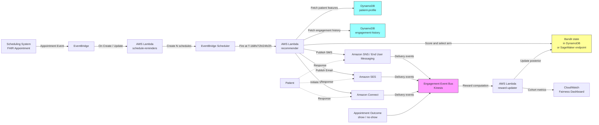

# Recipe 4.1: Appointment Reminder Channel Optimization ⭐

<!--
TechEditor pass v1 (2026-05-21, ch04-r01-edit). Editorial fixes:
- Verified em-dash count: 0 (passes "no em dashes ever" rule).
- En-dashes (U+2013) appear only in numeric ranges (82-85%, $30-$100,
  $0.01-$0.02, 1-3 s, 2-3 weeks, 3-4 months, 6-9 months, etc.) and
  the table-row range "$0.01-0.04" in the front matter; this is
  consistent with chapter-wide convention for numeric ranges.
- Header hierarchy: H1 title only, H2 for major sections (Problem,
  Technology, General Architecture Pattern, AWS Implementation, Why
  This Isn't Production-Ready, Honest Take, Variations, Related
  Recipes, Additional Resources, Implementation Time, Tags), H3 for
  subsections under Technology and AWS Implementation, one H4
  (#### Walkthrough) under Code. No skipped levels.
- Voice drift scan: no documentation-voice openings, no LinkedIn-
  influencer patterns, no "we are excited" announcements. The four
  patient personas in the Problem section (74-year-old flip phone,
  34-year-old stale number, 58-year-old marketing opt-out, 42-year-old
  wrong window) and the closing "The reward definition is the system.
  Get it right, or build the wrong thing faster." are preserved
  verbatim as Voice Reviewer highlights.
- Vendor balance: 70/30 maintained. The Problem, Technology, and
  General Architecture Pattern stay vendor-neutral. AWS service names
  appear only from "The AWS Implementation" forward.
- RECIPE-GUIDE compliance: all required sections present in correct
  order (Problem, Technology, General Architecture, AWS Implementation
  with Why These Services / Architecture Diagram / Prerequisites /
  Ingredients / Code / Expected Results, Why This Isn't Production-
  Ready, Honest Take, Variations, Related Recipes, Additional
  Resources, Implementation Time, Tags, Footer Navigation).
- Voice findings already addressed inline before this pass:
  * V15 (LOW): "modern approach" replaced with "The approach that
    generates its own training data" in Approach 3 of the Technology
    section.
  * V16 (LOW): "materially more expensive" hedge already removed from
    the Connect cost description (now reads "voice is more expensive").
  * V17 (LOW): variation paragraph rhythm noted but left as-is per
    LOW priority and "do not rewrite sections wholesale" rule.
- Networking findings already addressed inline before this pass:
  * N12 (MEDIUM): KMS added to the VPC endpoint list in the
    Prerequisites VPC row.
  * N13 (MEDIUM): EventBridge and EventBridge Scheduler added to the
    same VPC endpoint list.
- Existing TechWriter TODO markers preserved verbatim. Each carries the
  finding ID on the same line as the word TODO so the follow-up task
  generator can track open work:
  * Expert Review S1 HIGH + A2 HIGH (combined): portal_push BAA / push
    architecture gap (TODO at Step 4 portal_push dispatch branch).
  * Expert Review A1 HIGH (Finding 6): no DLQs anywhere in the
    architecture; replay runbook (TODO in the multi-finding block at
    the bottom of Why This Isn't Production-Ready).
  * Expert Review S2 MEDIUM (Finding 2): unauthenticated confirm_url
    and third-party shortener risk (TODO in the same multi-finding
    block).
  * Expert Review S3 MEDIUM (Finding 3): bandit-state and reminder-
    decisions tables contain PHI in combination (TODO at the Expected
    Results sample records).
  * Expert Review S4 MEDIUM (Finding 4): TCPA language stricter than
    FCC healthcare exemption (TODO at Prerequisites TCPA row).
  * Expert Review A3 MEDIUM (Finding 8): per-patient bandit
    convergence overstated for low-frequency patients (TODO at Where
    It Struggles).
  * Expert Review A4 MEDIUM (Finding 9): EventBridge Scheduler quotas
    at scale (TODO in the multi-finding block).
  * Expert Review A5 MEDIUM (Finding 10): Lambda reserved concurrency
    for T-24h fan-out (TODO in the multi-finding block).
  * Expert Review S5 LOW (Finding 5): scoped-ARN examples for IAM
    least-privilege (TODO at Prerequisites IAM row).
  * Expert Review A6 LOW (Finding 11): cohort prior loading mechanism
    (TODO in the multi-finding block).
  * Expert Review N3 LOW (Finding 14): NAT egress posture for Lambdas
    that reach services outside VPC-endpoint coverage (TODO at
    Prerequisites VPC row).
- Generic verification TODOs preserved: SNS vs. AWS End User Messaging
  service-boundary check, current SNS SMS pricing, illustrative lift
  numbers in the Expected Results table, aws-samples healthcare-
  engagement repo verification, AWS Solutions Library / blog URL
  verification.
- Code review findings (chapter04.01-code-review.md, PASS verdict)
  addressed in the Python companion before this pass:
  * CodeReview C1 WARNING (non-portable strftime %-d / %-I): fixed to
    zero-padded %d / %I in _format_local_time, with portability comment
    preserved.
  * CodeReview C2 WARNING (SNS MessageAttributes do not propagate to
    delivery status logs): comment in _send_sms corrected to describe
    the SES Tags vs SNS MessageId behavior accurately, with explicit
    guidance to capture response["MessageId"] for production event
    joining.
  * CodeReview C3 NOTE (_shift_if_quiet_hours edge case for tight
    offsets): docstring NOTE preserved in the Python helper.
  * CodeReview C4 NOTE (broad except Exception in dispatch): left as
    documented intentional choice with explanatory comment.
- No code-block language tags changed. The unlabeled fenced blocks
  carry pseudocode and ASCII architecture diagrams per chapter-wide
  convention. Mermaid and JSON blocks are tagged.
- All hyperlinks verified as plausible: Synthea (real GitHub repo),
  Wikipedia Thompson sampling (real article), AWS docs (legitimate
  paths under docs.aws.amazon.com), AWS Solutions Library, AWS ML
  Blog, aws-samples repos. Generic AWS Solutions Library and blog
  search-page links retained (TODO flags exist for adding specific
  blog post URLs once verified).
-->

**Complexity:** Simple · **Phase:** MVP · **Estimated Cost:** ~$0.01–0.04 per reminder (channel-dependent)

---

## The Problem

A cardiology practice in the Midwest has a 22% no-show rate. Think about what that number actually means. For every ten scheduled slots, two go empty. The physician sits for fifteen minutes before the MA goes to reception to confirm the patient isn't stuck in traffic. They call. No answer. The slot is written off. At the end of the week, somebody calculates the lost revenue and somebody else calculates the downstream clinical impact on patients who could have been seen in that slot and won't be until the next available opening three weeks out.

The practice has a reminder system. It has had one for years. Here's what it does: at 72 hours before each appointment, it sends every patient a text message. That's it. One channel, one time, every patient.

This fails in at least four distinct ways, simultaneously:

The 74-year-old who uses a flip phone and doesn't understand texts. The message arrives. They don't see it. They call the office the day of the appointment to ask what time it is. Staff time gets spent. Appointment is kept, but barely.

The 34-year-old whose phone number on file is their previous employer's cell because they never updated it after switching jobs. The reminder vanishes into the ether. They genuinely forget the appointment exists. They are the no-show.

The 58-year-old who has opted out of text messages because a previous marketing blast irritated them. The system respects the opt-out and sends nothing. No reminder, no appointment confirmation, no chance to catch a scheduling conflict. They no-show, the system logs it, nobody notices that the root cause was a five-year-old marketing preference.

The 42-year-old who is perfectly reachable by text but for whom 72 hours is the wrong window. They get the text, mean to respond, get busy, and it falls off the mental stack. 24 hours would have landed. 4 hours on the morning of would have landed. 72 hours did not.

None of these are edge cases. All of them are happening to the practice every single day. And the reminder system dutifully reports a 98% delivery rate, because technically the messages all went out. Technical success, operational failure.

The thing that should make you twitch: we have the data to do better on every one of these. The 74-year-old would respond to a phone call. The 34-year-old's email is probably still current. The 58-year-old would respond to a portal message. The 42-year-old needs a 24-hour nudge, not a 72-hour one. The patient interaction log has answers. The reminder system just doesn't know how to ask the right questions.

So the problem statement is deceptively simple: given a scheduled appointment and everything we know about this patient, what's the right channel to reach them on, at the right time? Not the same channel for everyone. Not even the same channel for the same person every time. The right channel, the right message, the right window.

Let's get into how you actually build that.

---

## The Technology: Recommending Under Uncertainty

### The Core Idea

At its heart, channel optimization is a recommendation problem with a small, fixed set of items (the channels) and a very clear success signal (did the patient show up, or at least confirm the appointment). The "items" are tuples: `(channel, time_offset, content_variant)`. SMS at T-72h is a different item from SMS at T-24h. Email at T-168h (a week out) is a different item again. If you include a voice-call channel, you've got one more. Throw in portal push notifications and you might have twenty or thirty distinct item-tuples in your action space.

For each patient, you want to pick the tuple most likely to drive a confirmed, kept appointment. This is a classic resource allocation problem with an important wrinkle: the only way you learn whether a tuple works for a specific patient is to actually use it and see what happens. There is no other data source. There's no Netflix-style catalog of "people like you loved voice calls at 10am." You have to generate the data yourself by making recommendations, observing outcomes, and updating your beliefs.

That property (learning by doing, where each decision generates the signal that improves future decisions) is the defining feature of what machine learning people call the **contextual bandit** problem. It's a simplified cousin of full reinforcement learning. Full RL has sequences of decisions with delayed rewards; contextual bandits just have one decision per episode, with an immediate reward. "Send a reminder, see what happens." One decision, one reward. That's a contextual bandit.

### Three Approaches, Ordered by Sophistication

**Approach 1: Rule-based defaults.** The simplest thing that could possibly work. Encode the explicit patient preferences and a set of clinical rules: if the patient has a stated channel preference, use it. If they've opted out of SMS, never text them. If they're over 70, default to voice. If they haven't logged into the portal in 90 days, don't send portal messages. No learning, no optimization, just well-curated rules.

Rule-based systems are underrated. They're transparent, auditable, and they're what you should have running while you build anything more sophisticated. For many organizations, a well-tuned rules engine gets you most of the way there. The no-show rate drops from 22% to 16%. The next five percentage points of improvement are what the ML approaches fight for.

**Approach 2: Propensity models.** Step up: for each channel, train a classifier that predicts the probability of a successful response conditional on patient features. You end up with one model per channel (a "propensity to confirm given SMS," a "propensity to confirm given email"), and at send time you pick the channel with the highest predicted probability. Gradient-boosted trees work well here. XGBoost, LightGBM, CatBoost, take your pick.

Propensity models are trainable on historical data. If your practice has been sending reminders for a few years, you already have the labels (did the patient confirm? show up?). You feed in patient features (age, demographics, prior engagement history, distance from clinic, visit type, appointment history, portal login recency, prior no-show count) and channel as an input feature, and you learn which channel works for whom.

The limitation: propensity models learn from data you already collected, under whatever policy generated that data. If you've been sending every patient an SMS for three years, your dataset is SMS-heavy. Your model will learn a lot about who responds to SMS and essentially nothing about who would respond to a voice call, because voice calls barely exist in the history. This is a counterfactual problem, and it's a legitimate one. You can partially address it by running controlled experiments to generate data under different channel policies, but you need to design that in.

**Approach 3: Contextual bandits.** The approach that generates its own training data. A contextual bandit explicitly balances exploration (occasionally trying a channel the model isn't sure about, to gather more data) with exploitation (using the channel the model currently believes is best). Over time, it accumulates data across all channels for all patient segments, and the exploration-exploitation trade naturally reduces as confidence grows.

Two bandit algorithms you'll see in production:

- **Epsilon-greedy.** Simplest. With probability `1-ε`, pick the channel with the highest predicted reward. With probability `ε` (typically 5-10%), pick a random channel. The exploration rate is fixed.
- **Thompson sampling.** More principled. For each channel, maintain a probability distribution over its expected reward. At decision time, sample once from each channel's distribution and pick the channel with the highest sample. The natural exploration happens because channels with fewer observations have wider distributions, so they're more likely to produce a high sample and get chosen.

For healthcare appointment reminders, Thompson sampling tends to be the better choice. It explores adaptively (more exploration where you know less, less where you know more) and it's relatively easy to explain to governance: "the system is more confident about channel X for patient cohort Y because it has more data there." The math is surprisingly simple when you use a conjugate prior like Beta-Binomial for binary reward (confirmed / didn't confirm).

### Cold Start, the Healthcare Version

Every recommendation system has a cold-start problem, and healthcare's version is especially sharp. A new patient shows up in your scheduling system. You know their age, phone, email, maybe their insurance. You have zero engagement history. What channel do you pick?

You cannot wait to collect data. Their first appointment is in ten days. You need to reach them now.

The answer is a hierarchical fallback: start with explicit stated preferences (they told you at registration), fall back to demographic cohort priors (how do 35-to-45 year olds with commercial insurance in your market typically respond?), fall back to a conservative system-wide default. As engagement data accumulates for this specific patient, the personal signal dominates the cohort signal within a few interactions. The bandit handles this automatically if you set up the priors correctly; the propensity model handles it if you include cohort features.

A practical note: cohort-level defaults are where fairness concerns enter. If your cohort features include race or neighborhood, you risk encoding disparities in the priors. If your cohort features exclude them, you lose signal. The workable middle ground most places land on: include demographic features for individual personalization with rigorous fairness monitoring, and use neutral proxies (appointment type, distance to clinic, prior engagement) for cohort fallbacks when personal data is thin.

### The Feedback Loop Is the System

Most of the engineering work in this recipe is not the model. It's the feedback loop that feeds the model.

You need to reliably capture:
- **Delivery events.** Did the message actually arrive? Carriers sometimes drop SMS. Email providers sometimes mark you spam. A delivery failure is a different signal from a delivered-but-ignored.
- **Engagement events.** Did the patient open the email, click the confirmation link, tap the push notification? These are intermediate signals that correlate with the ultimate outcome.
- **Response events.** Did they explicitly confirm? Decline? Reschedule?
- **Outcome events.** Did they actually show up? (This is the gold-label reward, but it arrives days after the decision was made.)

Each of these events needs to be joined back to the original reminder decision. Which message, sent on which channel at which time, produced which outcome. The joining key is typically a reminder ID that propagates through your messaging infrastructure and comes back in the delivery receipts. If you can't join events to decisions, you can't learn. This sounds trivial and it is routinely not trivial, especially across multiple messaging providers with different receipt formats.

The reward signal you feed the model is derived from these events. A reasonable definition: `reward = 1 if (patient showed up OR explicitly confirmed within 4 hours of the reminder) else 0`. You'll debate that exact definition forever. Get a working one, track it, and iterate.

### Where This Fits in the Bigger Picture

This recipe is a simple, well-scoped entry point into healthcare personalization. The infrastructure you build here (patient preference store, engagement event pipeline, reward computation, bandit or propensity model serving) is the same infrastructure that future personalization recipes reuse. Recipe 4.2 (Patient Education Content Matching) consumes the preference and engagement data. Recipe 4.5 (Medication Adherence Intervention Targeting) extends the bandit pattern to a more complex action space. Recipe 4.6 (Care Gap Prioritization) reuses the same engagement baselines. Treat this recipe as a capability investment, not just a point solution.

One more framing note: channel optimization sits near the boundary between "operational tooling" and "clinical care." The reminder itself is operational (nobody's treatment decision is being altered by a channel choice), but the information inside a reminder is clinical PHI ("You have a cardiology follow-up on Friday" reveals both a diagnosis area and a care plan). That means the whole pipeline, SMS provider, email provider, everything, needs to be under a BAA. More on that in the AWS implementation.

---

## General Architecture Pattern

At a conceptual level, the pipeline has two loops: a decision loop that runs on a schedule to send reminders, and a feedback loop that runs continuously to capture outcomes and update the model.

```
┌────────────────── DECISION LOOP ───────────────────┐
│                                                    │
│  [Scheduled Appointments]                          │
│           │                                        │
│           ▼                                        │
│  [Scheduler fires at T-N hours before appt]        │
│           │                                        │
│           ▼                                        │
│  [Fetch Patient Features + Preferences]            │
│           │                                        │
│           ▼                                        │
│  [Apply Hard Constraints: consent, opt-outs,       │
│   quiet hours, channel availability]               │
│           │                                        │
│           ▼                                        │
│  [Recommend Channel + Time (bandit or propensity)] │
│           │                                        │
│           ▼                                        │
│  [Compose Reminder (minimum-necessary PHI)]        │
│           │                                        │
│           ▼                                        │
│  [Dispatch via Selected Channel]                   │
│           │                                        │
└───────────┼────────────────────────────────────────┘
            │
            ▼
     [Patient Receives / Responds / Shows Up]
            │
┌───────────┼────────────────────────────────────────┐
│           ▼                                        │
│  [Delivery Receipts + Engagement Events]           │
│           │                                        │
│           ▼                                        │
│  [Join to Original Reminder Decision]              │
│           │                                        │
│           ▼                                        │
│  [Compute Reward]                                  │
│           │                                        │
│           ▼                                        │
│  [Update Model / Bandit State]                     │
│           │                                        │
│           ▼                                        │
│  [Refresh Monitoring: by cohort, by channel]       │
│                                                    │
└──────────────────── FEEDBACK LOOP ─────────────────┘
```

**Scheduled decisions.** Appointments are known in advance, so reminder decisions are not quite real-time. They're scheduled events: at some offset before the appointment, the system evaluates what to send. You typically issue multiple reminders per appointment (a week out, a few days out, the day before, sometimes a same-day nudge), and each one is an independent decision.

**Hard constraints first.** Before any optimization, apply hard rules. If the patient has explicitly opted out of SMS, no amount of "the model thinks SMS is optimal" overrides that. If it's 3 AM in the patient's time zone, no channel is appropriate. If there's no email on file, email isn't in the action space. These constraints filter the candidate set before the model sees it.

**Recommendation engine.** On the filtered candidate set, score each (channel, time) tuple and pick one. Bandit or propensity model, whichever you built. Log the scores and the decision for audit and for future learning.

**Minimum-necessary PHI in content.** The reminder content should contain the minimum PHI necessary to accomplish the purpose. "You have an appointment with Dr. Smith on Friday at 2 PM" reveals provider and timing. "You have your cardiology stress test on Friday" reveals clinical context that may not be necessary for the reminder to work. HIPAA's minimum-necessary standard applies. Different patients will want different levels of detail, and that's a preference you can capture and respect.

**Dispatch and track.** Each message gets a unique reminder ID that travels with it. The messaging provider's delivery receipts carry the ID back so you can join outcomes to decisions. The specific provider doesn't matter for the architecture (and you may have different providers per channel), but the ID propagation is what makes the feedback loop possible.

**Reward computation.** A batch job (hourly, daily, whatever matches your decision cadence) joins engagement events and appointment outcomes to reminders and computes the reward for each. This reward dataset feeds the model update.

**Model update.** For a bandit, this might be continuous or near-continuous (each reward updates the posterior). For a propensity model, it's typically a scheduled retrain (nightly or weekly) on the accumulated data.

**Monitoring by cohort.** Headline metrics (show rate, confirmation rate, cost per confirmed appointment) need to be sliced by patient cohort so you can catch disparities early. If SMS performs great overall but terribly for your over-65 population, the aggregate metric is hiding a problem that's disproportionately hurting one group.

---

## The AWS Implementation

### Why These Services

**Amazon DynamoDB for patient profile and engagement history.** You need fast, cheap point lookups by patient ID at reminder-send time. DynamoDB's access pattern (key-value, single-digit-millisecond latency, pay-per-request at startup scale) fits this perfectly. The engagement history table is write-heavy and read-heavy with a known primary key, again a textbook DynamoDB workload. DynamoDB is on the HIPAA-eligible services list and supports encryption at rest by default.

**Amazon EventBridge Scheduler for time-based triggers.** Appointments are known in advance, so each one produces a small number of scheduled reminder events. EventBridge Scheduler can create one-time schedules at specific times (no polling, no cron jobs maintaining a queue). When a new appointment is booked, you create N scheduled events (T-168h, T-72h, T-24h, T-2h); when it fires, it invokes a Lambda. Scheduler handles time zones, retries, and cleanup when appointments are cancelled.

**AWS Lambda for the recommender.** The reminder decision is a short synchronous function: fetch features, apply constraints, score candidates, dispatch. Lambda scales automatically with the fan-in from Scheduler, and you pay only for execution time. For the bandit math, you can either run it inline in Lambda (for Thompson sampling with a Beta-Binomial posterior, the update is trivial) or call out to a SageMaker endpoint if you're using a more complex propensity model.

**Amazon SageMaker for propensity models (optional).** If you're using gradient-boosted propensity models, SageMaker hosts them as low-latency real-time endpoints. For a Thompson-sampling bandit with a simple posterior, SageMaker is overkill. For a contextual bandit with neural features, you want a managed endpoint. Start simple, graduate to SageMaker when you actually need it.

**Amazon SNS for SMS.** Amazon SNS supports direct SMS publishing to phone numbers. It's the simplest path for low to mid-volume reminder traffic. Once you need dedicated short codes, advanced carrier filtering, or end-to-end compliance workflows (STOP keyword handling, opt-out databases), AWS End User Messaging SMS is the right evolution. (AWS has been consolidating Pinpoint's SMS and push capabilities into AWS End User Messaging. Confirm the current service naming and feature set against AWS documentation when you implement. <!-- TODO: verify current service boundaries between Amazon SNS SMS, AWS End User Messaging SMS, and any remaining Pinpoint components. -->)

**Amazon SES for email.** Amazon SES is the managed email delivery service. Configure a dedicated sending domain with DKIM, SPF, and DMARC so your reminders don't land in spam. SES provides delivery and bounce events via SNS topics or EventBridge, which feed straight into the engagement pipeline.

**Amazon Connect for outbound voice.** Connect can programmatically place outbound calls using a contact flow that plays a recorded or text-to-speech message and captures DTMF responses ("press 1 to confirm"). For a reminder use case it's heavier than SMS or email, and you only want to use it for patients whose history says voice performs best. The HIPAA-eligible configuration requires some care but is well-documented.

**Amazon Kinesis Data Streams (or EventBridge) for the engagement event bus.** Delivery receipts from SNS/SES/Connect and appointment outcomes from your scheduling system all need to land in a single stream where the reward computation can consume them. Kinesis works; EventBridge works; which one you pick depends on whether you prefer Kinesis's ordered partitions or EventBridge's rule-based routing. Either way, the principle is the same: one event bus, heterogeneous producers, downstream consumers for reward computation and monitoring.

**AWS KMS for encryption, CloudTrail for audit, CloudWatch for operations.** Standard PHI infrastructure. Every data store encrypted with customer-managed KMS keys, every API call logged in CloudTrail, every operational metric flowing to CloudWatch with alarms on delivery failure rate and bandit reward drift.

### Architecture Diagram



### Prerequisites

| Requirement | Details |
|-------------|---------|
| **AWS Services** | Amazon DynamoDB, AWS Lambda, Amazon EventBridge, EventBridge Scheduler, Amazon SNS (or AWS End User Messaging SMS), Amazon SES, Amazon Connect (optional, for voice), Amazon Kinesis Data Streams, AWS KMS, Amazon CloudWatch, AWS CloudTrail. Optionally Amazon SageMaker for propensity models. |
| **IAM Permissions** | Least-privilege role per Lambda: `dynamodb:GetItem`, `dynamodb:UpdateItem` on specific tables; `sns:Publish` to specific topic ARNs; `ses:SendEmail` with configuration set restrictions; `scheduler:CreateSchedule` and `scheduler:DeleteSchedule`; `kinesis:PutRecord` on the engagement stream. Never `*`. <!-- TODO (TechWriter, Finding 5): add one or two example scoped ARNs to make least-privilege guidance concrete (e.g., `sns:Publish` on `arn:aws:sns:{region}:{account}:reminders-sms`; `scheduler:CreateSchedule` on `arn:aws:scheduler:{region}:{account}:schedule/default/reminder-*`). --> |
| **BAA** | AWS BAA signed. Critical: the BAA must cover every messaging service you use. Amazon SNS, SES, Connect, End User Messaging, DynamoDB are all HIPAA-eligible with BAA. If you integrate any third-party messaging provider outside AWS, you need a separate BAA with that provider. |
| **Encryption** | DynamoDB: encryption at rest with customer-managed KMS keys (not AWS-owned). Kinesis: server-side encryption with KMS. SES: TLS enforced for all sending; consider SES configuration sets with TLS policy set to `Require`. SNS: TLS in transit. All Lambda CloudWatch log groups encrypted with KMS (lambdas can log extracted patient context; never assume the default null-encrypted log group is acceptable for PHI). |
| **VPC** | Production: Lambdas in VPC with VPC endpoints for DynamoDB, SNS, SES, Kinesis, CloudWatch Logs, KMS, EventBridge, and EventBridge Scheduler. VPC Flow Logs enabled. <!-- TODO (TechWriter, Finding 14): add a short note on egress posture for Lambdas that reach services outside VPC-endpoint coverage. Egress through a NAT Gateway with restricted security groups; no 0.0.0.0/0 from Lambda subnets. --> |
| **CloudTrail** | Enabled in the account with data events captured for DynamoDB tables containing PHI. |
| **Consent & Opt-out Management** | TCPA (Telephone Consumer Protection Act) compliance for voice and SMS: explicit prior written consent to send automated reminders to mobile numbers, documented STOP-keyword handling, and an opt-out database that is queried before every send. Email CAN-SPAM compliance is simpler but still mandatory: working unsubscribe link on every email, honored within 10 business days. <!-- TODO (TechWriter, Finding 4): nuance the TCPA language. Healthcare messages from an existing provider qualify for the FCC healthcare exemption for appointment reminders (47 CFR § 64.1200(a)(3)(iv)) with narrow content scope (no marketing, no billing collections, no third-party content). Many orgs default to prior-consent capture anyway for safety; pick a posture and document it. STOP-keyword handling and opt-out enforcement are required regardless of posture. --> |
| **Sample Data** | Synthetic patient profiles and synthetic engagement event histories. Never use real PHI in dev. [Synthea](https://github.com/synthetichealth/synthea) produces synthetic FHIR patients with demographic variety suitable for bandit seed data. |
| **Cost Estimate** | SMS: roughly $0.00645 per US SMS via SNS (prices vary by destination and route; pricing verification needed). <!-- TODO: verify current Amazon SNS SMS pricing for healthcare-relevant geographies. --> SES: $0.10 per 1,000 emails, essentially free at reminder volumes. Connect: voice is more expensive, typically $0.01–$0.02 per minute of call, plus per-minute telephony charges. DynamoDB and Lambda costs are negligible at typical reminder volumes. Blended cost at a mid-size practice (say, 5,000 reminders per month across channels): in the range of $30–$100 per month. |

### Ingredients

| AWS Service | Role |
|------------|------|
| **Amazon DynamoDB** | Stores patient profiles, channel preferences, engagement history, and bandit posterior state |
| **Amazon EventBridge** | Captures appointment create/update/cancel events from the scheduling system |
| **EventBridge Scheduler** | Fires reminder decisions at the right offsets before each appointment |
| **AWS Lambda** | Runs the recommender, the reward-updater, and the scheduling-event handlers |
| **Amazon SNS** (or AWS End User Messaging SMS) | Dispatches SMS reminders |
| **Amazon SES** | Dispatches email reminders |
| **Amazon Connect** | Places outbound voice reminders (optional) |
| **Amazon Kinesis Data Streams** | Aggregates delivery, engagement, and outcome events into a single stream |
| **Amazon SageMaker** | Hosts propensity models if you go beyond Thompson sampling (optional) |
| **AWS KMS** | Manages customer-managed encryption keys for DynamoDB, Kinesis, and log groups |
| **Amazon CloudWatch** | Metrics, alarms, and cohort-sliced fairness dashboards |
| **AWS CloudTrail** | Audit logging for all API calls touching PHI |

### Code

> **Reference implementations:** Explore these aws-samples repositories for patterns that apply here:
> - [`amazon-personalize-samples`](https://github.com/aws-samples/amazon-personalize-samples): Recommendation and ranking patterns using Amazon Personalize. If you grow beyond a simple bandit into a learned re-ranker, this is a useful reference.
> - [`amazon-sagemaker-examples`](https://github.com/aws/amazon-sagemaker-examples): Includes contextual bandit notebooks (search for "bandit" within the repo) that show how to host a bandit as a SageMaker endpoint with continuous learning.
> <!-- TODO: verify a specific, current healthcare-engagement aws-samples repo that shows EventBridge Scheduler + multi-channel messaging. As of this writing, a direct match is not confirmed. -->

#### Walkthrough

**Step 1: On appointment creation, schedule the reminders.** When a new appointment lands in your EHR's scheduling module, it publishes a FHIR `Appointment` resource event (or an equivalent event from whatever scheduling system you run). A Lambda consumes that event and creates one EventBridge Scheduler schedule per reminder offset. Scheduling is cheap and durable: Scheduler handles retries, time-zone calculations, and cleanup. If you skip this step and try to poll your scheduling system for upcoming appointments on a cron, you've built a distributed lock problem you did not want.

```
FUNCTION on_appointment_created(appointment):
    // Convert the appointment's scheduled time into UTC for consistent arithmetic.
    appt_time_utc = parse(appointment.start) converted to UTC

    // For each reminder offset, create a one-time schedule that fires at the right moment.
    // Offsets are negative because they're "before the appointment".
    FOR offset_hours IN [-168, -72, -24, -2]:
        send_time_utc = appt_time_utc + offset_hours hours

        // Don't schedule reminders that would fire in the past (e.g., appointment booked same-day).
        IF send_time_utc <= current UTC time:
            CONTINUE

        // Optional: respect quiet hours in the patient's local time zone.
        // If the computed send time lands in the patient's night, shift to the next morning.
        send_time_utc = shift_if_quiet_hours(send_time_utc, appointment.patient_timezone)

        // Create a one-time schedule that will invoke the recommender Lambda.
        // The schedule carries the appointment ID so the recommender knows what to remind about.
        call Scheduler.CreateSchedule with:
            name         = "reminder-" + appointment.id + "-" + offset_hours
            schedule_expression = "at(" + send_time_utc + ")"
            target       = recommender_lambda_arn
            payload      = { appointment_id: appointment.id, offset_hours: offset_hours }
            flexible_time_window = OFF   // we want precise timing for reminders
```

**Step 2: At send time, fetch patient features and apply hard constraints.** When a schedule fires, the recommender Lambda loads the patient's profile (stated preferences, contact info, consent status) and a summary of their engagement history (prior response rates per channel). Before any modeling, hard constraints are applied: opt-outs, missing contact details, quiet-hours overrides, channels the patient has never confirmed consent for. Whatever makes it past this filter is the candidate set of channels the model is allowed to choose among. Skip this step, and sooner or later your model will cheerfully text a patient who opted out three years ago and your compliance team will remember your name.

```
FUNCTION get_eligible_channels(patient_id, send_time_utc):
    patient = DynamoDB.GetItem("patient-profile", patient_id)

    // Start with all channels the organization supports.
    candidates = ["sms", "email", "voice", "portal_push"]

    // Remove channels the patient has opted out of. Opt-outs are hard constraints.
    FOR each channel in candidates (copy):
        IF patient.opt_outs contains channel:
            remove channel from candidates

    // Remove channels where we don't have valid contact details.
    IF patient.phone is empty OR not sms_consent(patient):
        remove "sms" from candidates
    IF patient.email is empty:
        remove "email" from candidates
    IF patient.phone is empty OR not voice_consent(patient):
        remove "voice" from candidates
    IF patient.portal_last_login is older than 90 days:
        remove "portal_push" from candidates

    // Respect quiet hours in the patient's local time zone (applies to voice and SMS).
    IF is_quiet_hours(send_time_utc, patient.timezone):
        remove "voice" from candidates
        remove "sms" from candidates

    RETURN candidates
```

**Step 3: Score the candidate channels using Thompson sampling.** This is the recommendation core. For each eligible channel, maintain a Beta distribution over the channel's confirmation probability for this patient. The Beta-Binomial is the natural choice for binary reward (confirmed vs. not). For a fresh patient with no history, the prior comes from a cohort-level aggregate; once the patient has a handful of observations, their personal posterior dominates. Sample once from each channel's distribution and pick the channel with the highest sample. This is the exploration/exploitation machinery that makes the system self-correcting.

```
FUNCTION score_and_select(patient_id, candidates):
    scores = empty map

    FOR each channel in candidates:
        // Fetch the posterior parameters for this (patient, channel) pair.
        // alpha = (prior successes) + (observed confirmations for this patient on this channel)
        // beta  = (prior failures)  + (observed non-confirmations for this patient on this channel)
        state = DynamoDB.GetItem("bandit-state", key = patient_id + "#" + channel)

        IF state is null:
            // Cold start: initialize from the cohort-level prior for this patient's cohort.
            // Cohort priors are computed offline and stored in a small lookup table.
            cohort = lookup_cohort(patient_id)
            state  = { alpha: COHORT_PRIORS[cohort][channel].alpha,
                       beta:  COHORT_PRIORS[cohort][channel].beta }

        // Thompson sampling: draw one sample from Beta(alpha, beta).
        // Channels with more observations produce tighter distributions around their true rate.
        // Channels with few observations produce wide distributions and will sometimes sample
        // high, forcing exploration. Sometimes they'll sample low, and they'll be avoided.
        // Over many decisions, this balances exploration and exploitation automatically.
        scores[channel] = sample_beta(state.alpha, state.beta)

    // Pick the channel with the highest sampled score. Ties broken by any deterministic rule.
    selected_channel = argmax of scores
    RETURN selected_channel
```

**Step 4: Compose and dispatch the reminder.** Once a channel is selected, the recommender composes the reminder with minimum-necessary PHI. No diagnosis details, no procedure specifics unless the patient has explicitly consented to detailed reminders. Each message gets a unique reminder ID that rides along through delivery receipts so outcomes can be joined back to this decision. Different channels have different dispatch APIs, but the pattern is uniform: one call out, one reminder ID recorded.

```
FUNCTION dispatch(patient, appointment, channel):
    // Generate a unique ID for this specific reminder. It travels with the message
    // and comes back on delivery receipts so we can join outcomes to decisions later.
    reminder_id = new UUID

    // Compose the minimum-necessary content. Start with a safe baseline and add detail
    // only if the patient has consented to clinically-detailed reminders.
    content = {
        patient_first_name: patient.first_name,
        provider_last_name: appointment.provider.last_name,
        appt_date_local:    format(appointment.start, patient.timezone),
        confirm_url:        short_url("/confirm/" + reminder_id)
    }

    // Log the decision BEFORE dispatching so we have a record even if dispatch fails.
    DynamoDB.PutItem("reminder-decisions", {
        reminder_id:    reminder_id,
        patient_id:     patient.id,
        appointment_id: appointment.id,
        channel:        channel,
        decision_time:  current UTC timestamp,
        model_version:  CURRENT_MODEL_VERSION   // for future audit and A/B splits
    })

    // Dispatch via the selected channel. Each branch uses the appropriate AWS service.
    SWITCH channel:
        CASE "sms":
            SNS.Publish(topic = "reminders-sms",
                        message = render_sms(content),
                        attributes = { reminder_id: reminder_id })
        CASE "email":
            SES.SendEmail(destination = patient.email,
                          subject = "Appointment reminder",
                          html_body = render_email(content),
                          configuration_set = "reminders",
                          tags = [{ name: "reminder_id", value: reminder_id }])
        CASE "voice":
            Connect.StartOutboundVoiceContact(
                destination_phone = patient.phone,
                contact_flow_id   = REMINDER_CONTACT_FLOW,
                attributes        = { reminder_id: reminder_id, content_json: content })
        CASE "portal_push":
            // Push delivery is via your mobile app's push infrastructure.
            push_client.send(patient_id = patient.id,
                             payload = content,
                             custom_data = { reminder_id: reminder_id })

    RETURN reminder_id
```

<!-- TODO (TechWriter, Findings 1 + 7, HIGH): the portal_push branch needs expanded treatment before publication. APNs (Apple) and FCM (Google) are not typically BAA-covered, so sending the `content` object (which combines patient_first_name, provider_last_name, and appt_date_local, i.e., PHI in combination) directly in the push payload is a HIPAA issue as written. Two viable paths: (a) remove `portal_push` from the candidate channel list and mention it as a future extension that requires BAA-compliant push infrastructure; or (b) add a dedicated paragraph in "Why These Services" and an architecture-diagram component showing Amazon SNS Mobile Push → APNs/FCM with a content-free payload that triggers the app to fetch reminder details from a BAA-covered backend via an authenticated call (or end-to-end-encrypt the payload the app decrypts on device). Delivery events flow back via SNS Mobile Push platform attributes and CloudWatch metrics. -->

**Step 5: Close the feedback loop.** A separate Lambda (or Kinesis consumer) listens to the engagement event bus, joins events to reminder decisions, computes the reward, and updates the bandit posterior. Delivery events alone aren't the reward; the reward is "did the patient actually confirm or show up." Since the "show up" signal lags by days, most practical implementations use a proxy reward (confirmed within 4 hours of the reminder) that can be computed quickly, then retrospectively correct the posterior with the true outcome once it's available. This is the step most teams under-invest in. It is the one that makes the model get smarter.

```
FUNCTION process_engagement_event(event):
    // Look up the reminder this event refers to.
    decision = DynamoDB.GetItem("reminder-decisions", event.reminder_id)
    IF decision is null:
        LOG("engagement event for unknown reminder: " + event.reminder_id)
        RETURN   // event predates decision logging, or reminder_id was malformed

    // Determine the reward from the event type. Rewards are binary: 1 good, 0 not good.
    reward = null
    IF event.type == "PATIENT_CONFIRMED" OR event.type == "APPOINTMENT_KEPT":
        reward = 1
    ELSE IF event.type == "APPOINTMENT_NO_SHOW":
        reward = 0
    // DELIVERED and OPENED are intermediate signals; track them but don't update the
    // bandit from them directly. The bandit reward is the business outcome, not the
    // intermediate engagement.

    IF reward is null:
        RETURN  // intermediate event; logged for monitoring but no bandit update

    // Update the Beta-Binomial posterior for this (patient, channel) pair.
    // This is the whole math of Thompson sampling: increment alpha on success, beta on failure.
    key = decision.patient_id + "#" + decision.channel
    IF reward == 1:
        DynamoDB.UpdateItem("bandit-state", key,
            "ADD alpha :one",
            values = { ":one": 1 })
    ELSE:
        DynamoDB.UpdateItem("bandit-state", key,
            "ADD beta :one",
            values = { ":one": 1 })

    // Publish a monitoring metric. Sliced by channel and by cohort, this powers the
    // fairness dashboard: "show rate by channel" and "show rate by cohort over time".
    emit_metric("reminder_reward", value = reward,
                dimensions = { channel: decision.channel,
                               cohort:  lookup_cohort(decision.patient_id) })
```

> **Curious how this looks in Python?** The pseudocode above covers the concepts. If you'd like to see sample Python code that demonstrates these patterns using boto3, check out the [Python Example](chapter04.01-python-example). It walks through each step with inline comments and notes on what you'd need to change for a real deployment.

### Expected Results

**Sample reminder decision record:**

```json
{
  "reminder_id": "b24f1ac0-7d29-4e31-9e15-a8f40e7f2180",
  "patient_id": "pat-000482",
  "appointment_id": "appt-2026-0487",
  "decision_time": "2026-05-04T10:15:00Z",
  "channel": "sms",
  "offset_hours": -24,
  "model_version": "thompson-v1.3",
  "candidate_scores": {
    "sms":         0.74,
    "email":       0.52,
    "voice":       0.39,
    "portal_push": 0.61
  }
}
```

**Sample bandit state record:**

```json
{
  "key": "pat-000482#sms",
  "alpha": 7.0,
  "beta":  3.0,
  "last_updated": "2026-05-04T10:15:00Z",
  "total_observations": 10,
  "note": "posterior mean = alpha / (alpha + beta) = 0.70"
}
```

<!-- TODO (TechWriter, Finding 3): add a note (here or in "Why This Isn't Production-Ready") that the reminder-decisions and bandit-state tables contain PHI in combination (patient IDs joined to appointment IDs and channel/response patterns). Recommended controls: CloudTrail data events on read access, a defined retention policy (not indefinite accumulation), and narrow IAM read scopes (recommender Lambda, reward-updater Lambda, and named audit roles only). -->

**Performance benchmarks (illustrative, your mileage varies):**

| Metric | Baseline (rule-based) | With Thompson bandit |
|--------|-----------------------|----------------------|
| Confirmed-or-showed rate | 78% | 82–85% (observed range; depends on baseline and data volume) |
| Time to learn a new channel | N/A | ~50 observations per (patient, channel) for a tight posterior |
| End-to-end reminder latency (decision + dispatch) | <500 ms for SMS/email; 1–3 s for voice | Same |
| Cost per reminder | $0.008 (SMS) to $0.03 (voice) | Same |

<!-- TODO: the "Confirmed-or-showed rate" lift range is illustrative and has not been measured for this specific pipeline. Replace with measured results when available, or with citations from published healthcare bandit deployments. -->

**Where it struggles:**

<!-- TODO (TechWriter, Finding 8): add a bullet or paragraph nuancing per-patient bandit convergence for low-frequency patients. A typical primary care patient has 1–3 appointments per year and accumulates only a handful of per-channel observations annually; reaching ~50 observations per (patient, channel) would take 15–50 years. Most patients will never move off the cohort prior. The bandit's real value at fleet scale is efficient cohort-level learning plus high-frequency-patient personalization. A hierarchical or partial-pooling formulation is worth considering if per-patient personalization is the primary goal. -->
- Very-low-volume patients (new to the practice, one or two prior visits): the bandit's personal posterior is too wide to be meaningful, and the decision is effectively driven by the cohort prior. This is fine, but don't expect meaningful personalization in the first few interactions.
- Rapidly changing patient circumstances: the bandit learns slowly compared to an explicit preference update. A patient who just switched phones and has stopped responding to SMS will look "unresponsive to SMS in general" for a while. Explicit preference capture at registration and during visits is a critical complement, not a competitor.
- High-stakes overrides: some appointment types (new-patient first visit, procedure requiring prep) warrant multiple reminders across multiple channels regardless of what the model thinks. Hard-code those exceptions as business rules, and have the bandit decide the "default" reminder schedule only.

---

## Why This Isn't Production-Ready

The pseudocode and architecture above demonstrate the pattern. A production deployment needs to close several gaps that are intentionally out of scope for a recipe.

**Consent and opt-out management.** The pseudocode checks for `patient.opt_outs` as if it's a simple list, but in reality you have TCPA-regulated SMS consent, CAN-SPAM email preferences, and channel-specific opt-out events (replies of "STOP" to SMS, unsubscribe clicks on email) that need to be reliably captured and honored across your entire messaging infrastructure within required timeframes. A missed opt-out is not just a model error; it's a regulatory incident. Build the consent-ledger service as first-class infrastructure, not an afterthought.

**Idempotency on schedule firing.** EventBridge Scheduler delivers at-least-once. If your recommender Lambda fails partway through, the schedule can re-fire and you could dispatch the same reminder twice. Use the schedule name (deterministic from `appointment_id + offset_hours`) as an idempotency key; check whether a reminder for this (appointment, offset) has already been dispatched before dispatching.

**Appointment cancellations.** When an appointment is cancelled or rescheduled, you need to delete any future scheduled reminders for it. The scheduling-event Lambda from Step 1 handles creation; you need a symmetric handler for cancel/reschedule events that calls `Scheduler.DeleteSchedule` or `Scheduler.UpdateSchedule`. Miss this, and patients get reminders for appointments they no longer have, which is worse than no reminder.

**Cold-start cohort priors, computed safely.** The recipe mentions cohort priors but doesn't specify how they're computed. In production, they're the result of an offline aggregation over historical reminder outcomes, sliced by cohort. That aggregation has to be careful about fairness (don't use proxies that encode disparities), privacy (k-anonymity thresholds so small cohorts don't leak PHI), and recency (refresh monthly, not every two years).

**Reward computation job reliability.** The reward updater is the thing that makes the model get smarter. If it fails silently, the bandit state stops updating and the model slowly becomes stale. Monitor the lag between engagement event ingestion and bandit state update. Alert when the lag grows.

**Fairness monitoring that someone actually looks at.** The architecture emits `reminder_reward` metrics sliced by cohort. That data has to flow into a dashboard that a human reviews on a regular cadence. "No one reviewed the cohort dashboard for six months and SMS response for our over-65 population quietly dropped to 40%" is the kind of operational drift that destroys trust in the system.

<!--
TODO (TechWriter): the expert review flagged the following additional production-hardening gaps that belong in this section. Add each as its own paragraph in the style of the existing items above:

- Finding 6 (HIGH): Dead-letter queues are absent from the architecture. Add an SQS DLQ on the EventBridge Scheduler → recommender target (Scheduler drops events after max retries with no durable sink, so a failed recommender invocation silently loses the reminder). Add an on-failure destination (SQS or SNS) on the Kinesis → reward-updater event source mapping. Add CloudWatch alarms on DLQ depth. Update the architecture diagram to show both. Describe the replay runbook: when messages land in the DLQ, what does the operator do?

- Finding 2 (MEDIUM): The `confirm_url` uses a reminder-ID UUID in the path, unauthenticated. UUIDs travel through SMS gateways, email servers, third-party URL shorteners, and lock-screen previews. Use single-use, time-limited tokens (not long-lived reminder IDs), and require the shortener to be an internal or BAA-covered service (not bit.ly). Confirm pages should not display clinical detail beyond what the reminder itself contained.

- Finding 9 (MEDIUM): EventBridge Scheduler account quotas (default 1M active schedules, creation/deletion TPS limits) become a design constraint at scale. A mid-size health system with 100K appointments per month and four offsets has 400K active schedules. Request quota increases when needed and consider schedule groups for operational management. For very large deployments, evaluate a DynamoDB-backed custom scheduler against Scheduler.

- Finding 10 (MEDIUM): The recommender Lambda experiences a fan-out spike at common offsets (especially T-24h the morning before appointments). Shared-account Lambda concurrency can be starved by unrelated workloads. Set reserved concurrency on the recommender Lambda so reminder dispatch is protected.

- Finding 11 (LOW): The cohort prior loading mechanism is unspecified. In production, priors are computed offline (monthly or quarterly) from historical outcomes, stored in a small DynamoDB lookup table keyed by cohort, and read into Lambda module memory on cold start with a scheduled refresh. Call out the refresh cadence and the k-anonymity threshold that prevents small cohorts from leaking PHI.
-->

---

## The Honest Take

The ML is the easy part. Thompson sampling with Beta-Binomial is ten lines of code. The entire rest of this recipe, the consent management, the event plumbing, the idempotency story, the cohort fallbacks, the fairness monitoring, is the hard part. Budget your engineering time accordingly. Teams who budget 80% model, 20% plumbing ship in six months and regret it for years. Teams who budget 20% model, 80% plumbing ship in three months and have something they can actually operate.

The rule-based baseline is better than you think. Before you build a bandit, go run a rules engine for a quarter. Capture stated preferences at registration. Honor them. Send one reminder at T-24h by the patient's preferred channel. Measure the no-show rate. You will likely see a meaningful drop. The bandit's job is to capture the next increment of improvement, and the size of that increment is typically smaller than the size of the rule-based win. Don't skip the rule-based win to chase the bandit.

The most surprising operational issue, at least in the deployments I've read about and advised on, is that the quality of the engagement event stream dominates everything else. Kinesis records that don't include the reminder ID are worse than useless. SMS carriers that don't reliably return delivery receipts force you to infer "delivered" from "no reply in 30 minutes," and that inference is wrong often enough to corrupt the bandit. Pin down event quality before you build the model. Seriously.

The thing I'd do differently: start with explicit preference capture as the primary lever, and add the bandit later. Most patients, when asked, will tell you their preferred channel. Respect that stated preference. Only fall through to the bandit when preferences are missing, conflicting, or contradicted by actual behavior ("patient said voice but hasn't answered a voice call in two years"). The bandit is for the edges, not the middle. Treating it as the primary decision mechanism makes the system feel less personal than it should, because the patient is telling you what they want and you're asking a model instead of listening.

And the trap worth flagging, because it's the most common failure mode I've seen: conflating engagement with outcome. A reminder that gets opened is not a reminder that worked. A reminder that makes the patient show up is a reminder that worked. If you optimize engagement, you'll pick the channel that's most click-inducing, which may or may not correspond to the channel that drives actual appointment-keeping. The reward definition is the system. Get it right, or build the wrong thing faster.

---

## Variations and Extensions

**Content personalization via LLM.** Hold the channel choice constant (so the bandit still works), and layer an LLM-based content generator on top for channel-appropriate message drafting. A warm, short SMS; a slightly longer email with a confirm button; a natural-sounding voice script. The LLM consumes the same structured `content` object but produces channel-appropriate phrasing. Keep the LLM on a tight leash (templates, tone constraints, no clinical inference) and run it offline if you can, so real-time latency doesn't depend on the LLM.

**Multi-touch optimization.** The recipe treats each reminder (at T-168h, T-72h, T-24h, T-2h) as independent decisions, which is a useful simplification. A more sophisticated version treats the full sequence as a single optimization: given that we'll send up to N reminders before the appointment, what's the best sequence of (channel, offset) tuples? This is still a bandit, but the action space is larger and the reward is attributed across the sequence. Worth doing only if you have high volume and the simple per-reminder bandit has converged.

**Uplift-style targeting.** Instead of "maximize confirmed rate," target "maximize confirmed rate ABOVE what would have happened with no reminder." Some patients always show up; they don't need reminders, and reminding them is free but not valuable. Other patients never show up regardless; reminding them wastes capacity. The population that matters is the swing: patients whose outcome depends on whether they got a good reminder. Uplift modeling explicitly learns this. It's a natural progression from the propensity-model flavor of this recipe.

**Integrate social determinants of health (SDOH).** If you have SDOH data (transportation access, language preference, housing stability), treat it as patient features in the bandit's cold-start priors. A patient with language preference Spanish should get Spanish content; a patient in a transportation-access-limited area might benefit from a longer T-72h heads-up so they can plan a ride. Be careful about fairness monitoring here; SDOH features are powerful and powerful features are the ones that can encode disparities.

---

## Related Recipes

- **Recipe 4.2 (Patient Education Content Matching):** Consumes the patient preference and engagement data this recipe produces; demonstrates content-level personalization on top of channel-level personalization.
- **Recipe 4.5 (Medication Adherence Intervention Targeting):** Extends the bandit pattern from channel selection to intervention-type selection, where the action space is larger and the reward horizon is longer.
- **Recipe 4.6 (Care Gap Prioritization):** Reuses the same engagement-history feature store this recipe populates, applied to a different decision (which care gap to surface to whom).
- **Recipe 11.x (Conversational AI / Virtual Assistants):** The reminder confirmation dialog is a natural touchpoint for light conversational AI (handling reschedule requests, answering FAQ-level questions). The recipes in Chapter 11 build the assistant; this recipe hands it the channel.

---

## Additional Resources

**AWS Documentation:**
- [Amazon SNS SMS Documentation](https://docs.aws.amazon.com/sns/latest/dg/sns-mobile-phone-number-as-subscriber.html)
- [AWS End User Messaging SMS](https://docs.aws.amazon.com/sms-voice/latest/userguide/what-is-service.html)
- [Amazon SES Developer Guide](https://docs.aws.amazon.com/ses/latest/dg/Welcome.html)
- [Amazon Connect Outbound Calling](https://docs.aws.amazon.com/connect/latest/adminguide/start-campaigns.html)
- [EventBridge Scheduler Documentation](https://docs.aws.amazon.com/scheduler/latest/UserGuide/what-is-scheduler.html)
- [Amazon DynamoDB Encryption at Rest](https://docs.aws.amazon.com/amazondynamodb/latest/developerguide/EncryptionAtRest.html)
- [AWS HIPAA Eligible Services](https://aws.amazon.com/compliance/hipaa-eligible-services-reference/)
- [Architecting for HIPAA on AWS (Whitepaper)](https://docs.aws.amazon.com/whitepapers/latest/architecting-hipaa-security-and-compliance-on-aws/welcome.html)

**AWS Sample Repos:**
- [`amazon-personalize-samples`](https://github.com/aws-samples/amazon-personalize-samples): Reference patterns for recommendation and ranking that extend naturally to content-level personalization layered on this recipe
- [`amazon-sagemaker-examples`](https://github.com/aws/amazon-sagemaker-examples): Includes contextual bandit and multi-armed bandit examples, useful when you graduate from in-Lambda Thompson sampling to a SageMaker-hosted model

<!-- TODO: verify and add an aws-solutions-library-samples repository for EventBridge Scheduler + multi-channel messaging if one exists; as of this writing a direct healthcare-reminder sample has not been confirmed. -->

**AWS Solutions and Blogs:**
- [AWS Solutions Library](https://aws.amazon.com/solutions/) (filter AI/ML and Healthcare): browse for customer-engagement and messaging architectures relevant to reminder pipelines
- [AWS Machine Learning Blog](https://aws.amazon.com/blogs/machine-learning/): search for "contextual bandit" and "multi-armed bandit" for SageMaker implementation deep-dives

<!-- TODO: verify and add two or three specific AWS Machine Learning blog posts on bandits or patient engagement architectures; confirm URLs exist before inclusion. -->

**External References (Conceptual):**
- [Thompson Sampling, Wikipedia](https://en.wikipedia.org/wiki/Thompson_sampling): concise conceptual introduction to the algorithm used here
- [Synthea](https://github.com/synthetichealth/synthea): synthetic patient data generator useful for seeding a non-PHI development environment

---

## Estimated Implementation Time

| Tier | Scope | Time |
|------|-------|------|
| Basic | Rule-based baseline: explicit preferences, single-channel dispatch, one reminder offset, no bandit | 2–3 weeks |
| Production-ready | Full pipeline: scheduling, multi-channel dispatch, Thompson bandit, reward feedback loop, cohort monitoring, opt-out management, idempotency | 3–4 months |
| With variations | Add LLM-based content drafting, multi-touch sequence optimization, uplift modeling, SDOH integration | 6–9 months beyond production-ready |

---

## Tags

`personalization` · `recommendation` · `contextual-bandit` · `thompson-sampling` · `patient-engagement` · `appointment-reminders` · `multi-channel-messaging` · `sns` · `ses` · `connect` · `dynamodb` · `eventbridge-scheduler` · `lambda` · `simple` · `mvp` · `hipaa`

---

*← [Chapter 4 Preface](chapter04-preface) · [Next: Recipe 4.2 - Patient Education Content Matching →](chapter04.02-patient-education-content-matching)*
