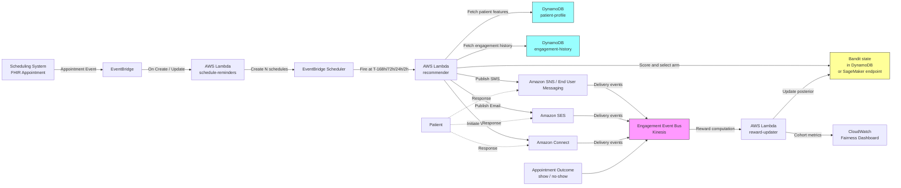

# Recipe 4.1 Architecture and Implementation: Appointment Reminder Channel Optimization

*Companion to [Recipe 4.1: Appointment Reminder Channel Optimization](chapter04.01-appointment-reminder-channel-optimization). This page covers the AWS architecture, services, prerequisites, and pseudocode. For the problem framing and the conceptual approach, start with the main recipe.*

---

## The AWS Implementation

### Why These Services

**Amazon DynamoDB for patient profile and engagement history.** You need fast, cheap point lookups by patient ID at reminder-send time. DynamoDB's access pattern (key-value, single-digit-millisecond latency, pay-per-request at startup scale) fits this perfectly. The engagement history table is write-heavy and read-heavy with a known primary key, again a textbook DynamoDB workload. DynamoDB is on the HIPAA-eligible services list and supports encryption at rest by default.

**Amazon EventBridge Scheduler for time-based triggers.** Appointments are known in advance, so each one produces a small number of scheduled reminder events. EventBridge Scheduler can create one-time schedules at specific times (no polling, no cron jobs maintaining a queue). When a new appointment is booked, you create N scheduled events (T-168h, T-72h, T-24h, T-2h); when it fires, it invokes a Lambda. Scheduler handles time zones, retries, and cleanup when appointments are cancelled.

**AWS Lambda for the recommender.** The reminder decision is a short synchronous function: fetch features, apply constraints, score candidates, dispatch. Lambda scales automatically with the fan-in from Scheduler, and you pay only for execution time. For the bandit math, you can either run it inline in Lambda (for Thompson sampling with a Beta-Binomial posterior, the update is trivial) or call out to a SageMaker endpoint if you're using a more complex propensity model.

**Amazon SageMaker for propensity models (optional).** If you're using gradient-boosted propensity models, SageMaker hosts them as low-latency real-time endpoints. For a Thompson-sampling bandit with a simple posterior, SageMaker is overkill. For a contextual bandit with neural features, you want a managed endpoint. Start simple, graduate to SageMaker when you actually need it.

**Amazon SNS for SMS.** Amazon SNS supports direct SMS publishing to phone numbers. It's the simplest path for low to mid-volume reminder traffic. Once you need dedicated short codes, advanced carrier filtering, or end-to-end compliance workflows (STOP keyword handling, opt-out databases), AWS End User Messaging SMS is the right evolution. (AWS has been consolidating Pinpoint's SMS and push capabilities into AWS End User Messaging. Confirm the current service naming and feature set against AWS documentation when you implement. )

**Amazon SES for email.** Amazon SES is the managed email delivery service. Configure a dedicated sending domain with DKIM, SPF, and DMARC so your reminders don't land in spam. SES provides delivery and bounce events via SNS topics or EventBridge, which feed straight into the engagement pipeline.

**Amazon Connect for outbound voice.** Connect can programmatically place outbound calls using a contact flow that plays a recorded or text-to-speech message and captures DTMF responses ("press 1 to confirm"). For a reminder use case it's heavier than SMS or email, and you only want to use it for patients whose history says voice performs best. The HIPAA-eligible configuration requires some care but is well-documented.

**Amazon Kinesis Data Streams (or EventBridge) for the engagement event bus.** Delivery receipts from SNS/SES/Connect and appointment outcomes from your scheduling system all need to land in a single stream where the reward computation can consume them. Kinesis works; EventBridge works; which one you pick depends on whether you prefer Kinesis's ordered partitions or EventBridge's rule-based routing. Either way, the principle is the same: one event bus, heterogeneous producers, downstream consumers for reward computation and monitoring.

**AWS KMS for encryption, CloudTrail for audit, CloudWatch for operations.** Standard PHI infrastructure. Every data store encrypted with customer-managed KMS keys, every API call logged in CloudTrail, every operational metric flowing to CloudWatch with alarms on delivery failure rate and bandit reward drift.

### Architecture Diagram



### Prerequisites

| Requirement | Details |
|-------------|---------|
| **AWS Services** | Amazon DynamoDB, AWS Lambda, Amazon EventBridge, EventBridge Scheduler, Amazon SNS (or AWS End User Messaging SMS), Amazon SES, Amazon Connect (optional, for voice), Amazon Kinesis Data Streams, AWS KMS, Amazon CloudWatch, AWS CloudTrail. Optionally Amazon SageMaker for propensity models. |
| **IAM Permissions** | Least-privilege role per Lambda: `dynamodb:GetItem`, `dynamodb:UpdateItem` on specific tables; `sns:Publish` to specific topic ARNs; `ses:SendEmail` with configuration set restrictions; `scheduler:CreateSchedule` and `scheduler:DeleteSchedule`; `kinesis:PutRecord` on the engagement stream. Never `*`.  |
| **BAA** | AWS BAA signed. Critical: the BAA must cover every messaging service you use. Amazon SNS, SES, Connect, End User Messaging, DynamoDB are all HIPAA-eligible with BAA. If you integrate any third-party messaging provider outside AWS, you need a separate BAA with that provider. |
| **Encryption** | DynamoDB: encryption at rest with customer-managed KMS keys (not AWS-owned). Kinesis: server-side encryption with KMS. SES: TLS enforced for all sending; consider SES configuration sets with TLS policy set to `Require`. SNS: TLS in transit. All Lambda CloudWatch log groups encrypted with KMS (lambdas can log extracted patient context; never assume the default null-encrypted log group is acceptable for PHI). |
| **VPC** | Production: Lambdas in VPC with VPC endpoints for DynamoDB, SNS, SES, Kinesis, CloudWatch Logs, KMS, EventBridge, and EventBridge Scheduler. VPC Flow Logs enabled.  |
| **CloudTrail** | Enabled in the account with data events captured for DynamoDB tables containing PHI. |
| **Consent & Opt-out Management** | TCPA (Telephone Consumer Protection Act) compliance for voice and SMS: explicit prior written consent to send automated reminders to mobile numbers, documented STOP-keyword handling, and an opt-out database that is queried before every send. Email CAN-SPAM compliance is simpler but still mandatory: working unsubscribe link on every email, honored within 10 business days.  |
| **Sample Data** | Synthetic patient profiles and synthetic engagement event histories. Never use real PHI in dev. [Synthea](https://github.com/synthetichealth/synthea) produces synthetic FHIR patients with demographic variety suitable for bandit seed data. |
| **Cost Estimate** | SMS: roughly $0.00645 per US SMS via SNS (prices vary by destination and route; pricing verification needed).  SES: $0.10 per 1,000 emails, essentially free at reminder volumes. Connect: voice is more expensive, typically $0.01–$0.02 per minute of call, plus per-minute telephony charges. DynamoDB and Lambda costs are negligible at typical reminder volumes. Blended cost at a mid-size practice (say, 5,000 reminders per month across channels): in the range of $30–$100 per month. |

### Ingredients

| AWS Service | Role |
|------------|------|
| **Amazon DynamoDB** | Stores patient profiles, channel preferences, engagement history, and bandit posterior state |
| **Amazon EventBridge** | Captures appointment create/update/cancel events from the scheduling system |
| **EventBridge Scheduler** | Fires reminder decisions at the right offsets before each appointment |
| **AWS Lambda** | Runs the recommender, the reward-updater, and the scheduling-event handlers |
| **Amazon SNS** (or AWS End User Messaging SMS) | Dispatches SMS reminders |
| **Amazon SES** | Dispatches email reminders |
| **Amazon Connect** | Places outbound voice reminders (optional) |
| **Amazon Kinesis Data Streams** | Aggregates delivery, engagement, and outcome events into a single stream |
| **Amazon SageMaker** | Hosts propensity models if you go beyond Thompson sampling (optional) |
| **AWS KMS** | Manages customer-managed encryption keys for DynamoDB, Kinesis, and log groups |
| **Amazon CloudWatch** | Metrics, alarms, and cohort-sliced fairness dashboards |
| **AWS CloudTrail** | Audit logging for all API calls touching PHI |

### Code

> **Reference implementations:** Explore these aws-samples repositories for patterns that apply here:
> - [`amazon-personalize-samples`](https://github.com/aws-samples/amazon-personalize-samples): Recommendation and ranking patterns using Amazon Personalize. If you grow beyond a simple bandit into a learned re-ranker, this is a useful reference.
> - [`amazon-sagemaker-examples`](https://github.com/aws/amazon-sagemaker-examples): Includes contextual bandit notebooks (search for "bandit" within the repo) that show how to host a bandit as a SageMaker endpoint with continuous learning.
> 

#### Walkthrough

**Step 1: On appointment creation, schedule the reminders.** When a new appointment lands in your EHR's scheduling module, it publishes a FHIR `Appointment` resource event (or an equivalent event from whatever scheduling system you run). A Lambda consumes that event and creates one EventBridge Scheduler schedule per reminder offset. Scheduling is cheap and durable: Scheduler handles retries, time-zone calculations, and cleanup. If you skip this step and try to poll your scheduling system for upcoming appointments on a cron, you've built a distributed lock problem you did not want.

```pseudocode
FUNCTION on_appointment_created(appointment):
    // Convert the appointment's scheduled time into UTC for consistent arithmetic.
    appt_time_utc = parse(appointment.start) converted to UTC

    // For each reminder offset, create a one-time schedule that fires at the right moment.
    // Offsets are negative because they're "before the appointment".
    FOR offset_hours IN [-168, -72, -24, -2]:
        send_time_utc = appt_time_utc + offset_hours hours

        // Don't schedule reminders that would fire in the past (e.g., appointment booked same-day).
        IF send_time_utc <= current UTC time:
            CONTINUE

        // Optional: respect quiet hours in the patient's local time zone.
        // If the computed send time lands in the patient's night, shift to the next morning.
        send_time_utc = shift_if_quiet_hours(send_time_utc, appointment.patient_timezone)

        // Create a one-time schedule that will invoke the recommender Lambda.
        // The schedule carries the appointment ID so the recommender knows what to remind about.
        call Scheduler.CreateSchedule with:
            name         = "reminder-" + appointment.id + "-" + offset_hours
            schedule_expression = "at(" + send_time_utc + ")"
            target       = recommender_lambda_arn
            payload      = { appointment_id: appointment.id, offset_hours: offset_hours }
            flexible_time_window = OFF   // we want precise timing for reminders
```

**Step 2: At send time, fetch patient features and apply hard constraints.** When a schedule fires, the recommender Lambda loads the patient's profile (stated preferences, contact info, consent status) and a summary of their engagement history (prior response rates per channel). Before any modeling, hard constraints are applied: opt-outs, missing contact details, quiet-hours overrides, channels the patient has never confirmed consent for. Whatever makes it past this filter is the candidate set of channels the model is allowed to choose among. Skip this step, and sooner or later your model will cheerfully text a patient who opted out three years ago and your compliance team will remember your name.

```pseudocode
FUNCTION get_eligible_channels(patient_id, send_time_utc):
    patient = DynamoDB.GetItem("patient-profile", patient_id)

    // Start with all channels the organization supports.
    candidates = ["sms", "email", "voice", "portal_push"]

    // Remove channels the patient has opted out of. Opt-outs are hard constraints.
    FOR each channel in candidates (copy):
        IF patient.opt_outs contains channel:
            remove channel from candidates

    // Remove channels where we don't have valid contact details.
    IF patient.phone is empty OR not sms_consent(patient):
        remove "sms" from candidates
    IF patient.email is empty:
        remove "email" from candidates
    IF patient.phone is empty OR not voice_consent(patient):
        remove "voice" from candidates
    IF patient.portal_last_login is older than 90 days:
        remove "portal_push" from candidates

    // Respect quiet hours in the patient's local time zone (applies to voice and SMS).
    IF is_quiet_hours(send_time_utc, patient.timezone):
        remove "voice" from candidates
        remove "sms" from candidates

    RETURN candidates
```

**Step 3: Score the candidate channels using Thompson sampling.** This is the recommendation core. For each eligible channel, maintain a Beta distribution over the channel's confirmation probability for this patient. The Beta-Binomial is the natural choice for binary reward (confirmed vs. not). For a fresh patient with no history, the prior comes from a cohort-level aggregate; once the patient has a handful of observations, their personal posterior dominates. Sample once from each channel's distribution and pick the channel with the highest sample. This is the exploration/exploitation machinery that makes the system self-correcting.

```pseudocode
FUNCTION score_and_select(patient_id, candidates):
    scores = empty map

    FOR each channel in candidates:
        // Fetch the posterior parameters for this (patient, channel) pair.
        // alpha = (prior successes) + (observed confirmations for this patient on this channel)
        // beta  = (prior failures)  + (observed non-confirmations for this patient on this channel)
        state = DynamoDB.GetItem("bandit-state", key = patient_id + "#" + channel)

        IF state is null:
            // Cold start: initialize from the cohort-level prior for this patient's cohort.
            // Cohort priors are computed offline and stored in a small lookup table.
            cohort = lookup_cohort(patient_id)
            state  = { alpha: COHORT_PRIORS[cohort][channel].alpha,
                       beta:  COHORT_PRIORS[cohort][channel].beta }

        // Thompson sampling: draw one sample from Beta(alpha, beta).
        // Channels with more observations produce tighter distributions around their true rate.
        // Channels with few observations produce wide distributions and will sometimes sample
        // high, forcing exploration. Sometimes they'll sample low, and they'll be avoided.
        // Over many decisions, this balances exploration and exploitation automatically.
        scores[channel] = sample_beta(state.alpha, state.beta)

    // Pick the channel with the highest sampled score. Ties broken by any deterministic rule.
    selected_channel = argmax of scores
    RETURN selected_channel
```

**Step 4: Compose and dispatch the reminder.** Once a channel is selected, the recommender composes the reminder with minimum-necessary PHI. No diagnosis details, no procedure specifics unless the patient has explicitly consented to detailed reminders. Each message gets a unique reminder ID that rides along through delivery receipts so outcomes can be joined back to this decision. Different channels have different dispatch APIs, but the pattern is uniform: one call out, one reminder ID recorded.

```pseudocode
FUNCTION dispatch(patient, appointment, channel):
    // Generate a unique ID for this specific reminder. It travels with the message
    // and comes back on delivery receipts so we can join outcomes to decisions later.
    reminder_id = new UUID

    // Compose the minimum-necessary content. Start with a safe baseline and add detail
    // only if the patient has consented to clinically-detailed reminders.
    content = {
        patient_first_name: patient.first_name,
        provider_last_name: appointment.provider.last_name,
        appt_date_local:    format(appointment.start, patient.timezone),
        confirm_url:        short_url("/confirm/" + reminder_id)
    }

    // Log the decision BEFORE dispatching so we have a record even if dispatch fails.
    DynamoDB.PutItem("reminder-decisions", {
        reminder_id:    reminder_id,
        patient_id:     patient.id,
        appointment_id: appointment.id,
        channel:        channel,
        decision_time:  current UTC timestamp,
        model_version:  CURRENT_MODEL_VERSION   // for future audit and A/B splits
    })

    // Dispatch via the selected channel. Each branch uses the appropriate AWS service.
    SWITCH channel:
        CASE "sms":
            SNS.Publish(topic = "reminders-sms",
                        message = render_sms(content),
                        attributes = { reminder_id: reminder_id })
        CASE "email":
            SES.SendEmail(destination = patient.email,
                          subject = "Appointment reminder",
                          html_body = render_email(content),
                          configuration_set = "reminders",
                          tags = [{ name: "reminder_id", value: reminder_id }])
        CASE "voice":
            Connect.StartOutboundVoiceContact(
                destination_phone = patient.phone,
                contact_flow_id   = REMINDER_CONTACT_FLOW,
                attributes        = { reminder_id: reminder_id, content_json: content })
        CASE "portal_push":
            // Push delivery is via your mobile app's push infrastructure.
            push_client.send(patient_id = patient.id,
                             payload = content,
                             custom_data = { reminder_id: reminder_id })

    RETURN reminder_id
```

**Step 5: Close the feedback loop.** A separate Lambda (or Kinesis consumer) listens to the engagement event bus, joins events to reminder decisions, computes the reward, and updates the bandit posterior. Delivery events alone aren't the reward; the reward is "did the patient actually confirm or show up." Since the "show up" signal lags by days, most practical implementations use a proxy reward (confirmed within 4 hours of the reminder) that can be computed quickly, then retrospectively correct the posterior with the true outcome once it's available. This is the step most teams under-invest in. It is the one that makes the model get smarter.

```pseudocode
FUNCTION process_engagement_event(event):
    // Look up the reminder this event refers to.
    decision = DynamoDB.GetItem("reminder-decisions", event.reminder_id)
    IF decision is null:
        LOG("engagement event for unknown reminder: " + event.reminder_id)
        RETURN   // event predates decision logging, or reminder_id was malformed

    // Determine the reward from the event type. Rewards are binary: 1 good, 0 not good.
    reward = null
    IF event.type == "PATIENT_CONFIRMED" OR event.type == "APPOINTMENT_KEPT":
        reward = 1
    ELSE IF event.type == "APPOINTMENT_NO_SHOW":
        reward = 0
    // DELIVERED and OPENED are intermediate signals; track them but don't update the
    // bandit from them directly. The bandit reward is the business outcome, not the
    // intermediate engagement.

    IF reward is null:
        RETURN  // intermediate event; logged for monitoring but no bandit update

    // Update the Beta-Binomial posterior for this (patient, channel) pair.
    // This is the whole math of Thompson sampling: increment alpha on success, beta on failure.
    key = decision.patient_id + "#" + decision.channel
    IF reward == 1:
        DynamoDB.UpdateItem("bandit-state", key,
            "ADD alpha :one",
            values = { ":one": 1 })
    ELSE:
        DynamoDB.UpdateItem("bandit-state", key,
            "ADD beta :one",
            values = { ":one": 1 })

    // Publish a monitoring metric. Sliced by channel and by cohort, this powers the
    // fairness dashboard: "show rate by channel" and "show rate by cohort over time".
    emit_metric("reminder_reward", value = reward,
                dimensions = { channel: decision.channel,
                               cohort:  lookup_cohort(decision.patient_id) })
```

> **Curious how this looks in Python?** The pseudocode above covers the concepts. If you'd like to see sample Python code that demonstrates these patterns using boto3, check out the [Python Example](chapter04.01-python-example). It walks through each step with inline comments and notes on what you'd need to change for a real deployment.

### Expected Results

**Sample reminder decision record:**

```json
{
  "reminder_id": "b24f1ac0-7d29-4e31-9e15-a8f40e7f2180",
  "patient_id": "pat-000482",
  "appointment_id": "appt-2026-0487",
  "decision_time": "2026-05-04T10:15:00Z",
  "channel": "sms",
  "offset_hours": -24,
  "model_version": "thompson-v1.3",
  "candidate_scores": {
    "sms":         0.74,
    "email":       0.52,
    "voice":       0.39,
    "portal_push": 0.61
  }
}
```

**Sample bandit state record:**

```json
{
  "key": "pat-000482#sms",
  "alpha": 7.0,
  "beta":  3.0,
  "last_updated": "2026-05-04T10:15:00Z",
  "total_observations": 10,
  "note": "posterior mean = alpha / (alpha + beta) = 0.70"
}
```

**Performance benchmarks (illustrative, your mileage varies):**

| Metric | Baseline (rule-based) | With Thompson bandit |
|--------|-----------------------|----------------------|
| Confirmed-or-showed rate | 78% | 82–85% (observed range; depends on baseline and data volume) |
| Time to learn a new channel | N/A | ~50 observations per (patient, channel) for a tight posterior |
| End-to-end reminder latency (decision + dispatch) | <500 ms for SMS/email; 1–3 s for voice | Same |
| Cost per reminder | $0.008 (SMS) to $0.03 (voice) | Same |

**Where it struggles:**

- Very-low-volume patients (new to the practice, one or two prior visits): the bandit's personal posterior is too wide to be meaningful, and the decision is effectively driven by the cohort prior. This is fine, but don't expect meaningful personalization in the first few interactions.
- Rapidly changing patient circumstances: the bandit learns slowly compared to an explicit preference update. A patient who just switched phones and has stopped responding to SMS will look "unresponsive to SMS in general" for a while. Explicit preference capture at registration and during visits is a critical complement, not a competitor.
- High-stakes overrides: some appointment types (new-patient first visit, procedure requiring prep) warrant multiple reminders across multiple channels regardless of what the model thinks. Hard-code those exceptions as business rules, and have the bandit decide the "default" reminder schedule only.

---

## Why This Isn't Production-Ready

The pseudocode and architecture above demonstrate the pattern. A production deployment needs to close several gaps that are intentionally out of scope for a recipe.

**Consent and opt-out management.** The pseudocode checks for `patient.opt_outs` as if it's a simple list, but in reality you have TCPA-regulated SMS consent, CAN-SPAM email preferences, and channel-specific opt-out events (replies of "STOP" to SMS, unsubscribe clicks on email) that need to be reliably captured and honored across your entire messaging infrastructure within required timeframes. A missed opt-out is not just a model error; it's a regulatory incident. Build the consent-ledger service as first-class infrastructure, not an afterthought.

**Idempotency on schedule firing.** EventBridge Scheduler delivers at-least-once. If your recommender Lambda fails partway through, the schedule can re-fire and you could dispatch the same reminder twice. Use the schedule name (deterministic from `appointment_id + offset_hours`) as an idempotency key; check whether a reminder for this (appointment, offset) has already been dispatched before dispatching.

**Appointment cancellations.** When an appointment is cancelled or rescheduled, you need to delete any future scheduled reminders for it. The scheduling-event Lambda from Step 1 handles creation; you need a symmetric handler for cancel/reschedule events that calls `Scheduler.DeleteSchedule` or `Scheduler.UpdateSchedule`. Miss this, and patients get reminders for appointments they no longer have, which is worse than no reminder.

**Cold-start cohort priors, computed safely.** The recipe mentions cohort priors but doesn't specify how they're computed. In production, they're the result of an offline aggregation over historical reminder outcomes, sliced by cohort. That aggregation has to be careful about fairness (don't use proxies that encode disparities), privacy (k-anonymity thresholds so small cohorts don't leak PHI), and recency (refresh monthly, not every two years).

**Reward computation job reliability.** The reward updater is the thing that makes the model get smarter. If it fails silently, the bandit state stops updating and the model slowly becomes stale. Monitor the lag between engagement event ingestion and bandit state update. Alert when the lag grows.

**Fairness monitoring that someone actually looks at.** The architecture emits `reminder_reward` metrics sliced by cohort. That data has to flow into a dashboard that a human reviews on a regular cadence. "No one reviewed the cohort dashboard for six months and SMS response for our over-65 population quietly dropped to 40%" is the kind of operational drift that destroys trust in the system.

---

## Variations and Extensions

**Content personalization via LLM.** Hold the channel choice constant (so the bandit still works), and layer an LLM-based content generator on top for channel-appropriate message drafting. A warm, short SMS; a slightly longer email with a confirm button; a natural-sounding voice script. The LLM consumes the same structured `content` object but produces channel-appropriate phrasing. Keep the LLM on a tight leash (templates, tone constraints, no clinical inference) and run it offline if you can, so real-time latency doesn't depend on the LLM.

**Multi-touch optimization.** The recipe treats each reminder (at T-168h, T-72h, T-24h, T-2h) as independent decisions, which is a useful simplification. A more sophisticated version treats the full sequence as a single optimization: given that we'll send up to N reminders before the appointment, what's the best sequence of (channel, offset) tuples? This is still a bandit, but the action space is larger and the reward is attributed across the sequence. Worth doing only if you have high volume and the simple per-reminder bandit has converged.

**Uplift-style targeting.** Instead of "maximize confirmed rate," target "maximize confirmed rate ABOVE what would have happened with no reminder." Some patients always show up; they don't need reminders, and reminding them is free but not valuable. Other patients never show up regardless; reminding them wastes capacity. The population that matters is the swing: patients whose outcome depends on whether they got a good reminder. Uplift modeling explicitly learns this. It's a natural progression from the propensity-model flavor of this recipe.

**Integrate social determinants of health (SDOH).** If you have SDOH data (transportation access, language preference, housing stability), treat it as patient features in the bandit's cold-start priors. A patient with language preference Spanish should get Spanish content; a patient in a transportation-access-limited area might benefit from a longer T-72h heads-up so they can plan a ride. Be careful about fairness monitoring here; SDOH features are powerful and powerful features are the ones that can encode disparities.

---

## Additional Resources

**AWS Documentation:**
- [Amazon SNS SMS Documentation](https://docs.aws.amazon.com/sns/latest/dg/sns-mobile-phone-number-as-subscriber.html)
- [AWS End User Messaging SMS](https://docs.aws.amazon.com/sms-voice/latest/userguide/what-is-service.html)
- [Amazon SES Developer Guide](https://docs.aws.amazon.com/ses/latest/dg/Welcome.html)
- [Amazon Connect Outbound Calling](https://docs.aws.amazon.com/connect/latest/adminguide/start-campaigns.html)
- [EventBridge Scheduler Documentation](https://docs.aws.amazon.com/scheduler/latest/UserGuide/what-is-scheduler.html)
- [Amazon DynamoDB Encryption at Rest](https://docs.aws.amazon.com/amazondynamodb/latest/developerguide/EncryptionAtRest.html)
- [AWS HIPAA Eligible Services](https://aws.amazon.com/compliance/hipaa-eligible-services-reference/)
- [Architecting for HIPAA on AWS (Whitepaper)](https://docs.aws.amazon.com/whitepapers/latest/architecting-hipaa-security-and-compliance-on-aws/welcome.html)

**AWS Sample Repos:**
- [`amazon-personalize-samples`](https://github.com/aws-samples/amazon-personalize-samples): Reference patterns for recommendation and ranking that extend naturally to content-level personalization layered on this recipe
- [`amazon-sagemaker-examples`](https://github.com/aws/amazon-sagemaker-examples): Includes contextual bandit and multi-armed bandit examples, useful when you graduate from in-Lambda Thompson sampling to a SageMaker-hosted model

**AWS Solutions and Blogs:**
- [AWS Solutions Library](https://aws.amazon.com/solutions/) (filter AI/ML and Healthcare): browse for customer-engagement and messaging architectures relevant to reminder pipelines
- [AWS Machine Learning Blog](https://aws.amazon.com/blogs/machine-learning/): search for "contextual bandit" and "multi-armed bandit" for SageMaker implementation deep-dives

**External References (Conceptual):**
- [Thompson Sampling, Wikipedia](https://en.wikipedia.org/wiki/Thompson_sampling): concise conceptual introduction to the algorithm used here
- [Synthea](https://github.com/synthetichealth/synthea): synthetic patient data generator useful for seeding a non-PHI development environment

---

## Estimated Implementation Time

| Tier | Scope | Time |
|------|-------|------|
| Basic | Rule-based baseline: explicit preferences, single-channel dispatch, one reminder offset, no bandit | 2–3 weeks |
| Production-ready | Full pipeline: scheduling, multi-channel dispatch, Thompson bandit, reward feedback loop, cohort monitoring, opt-out management, idempotency | 3–4 months |
| With variations | Add LLM-based content drafting, multi-touch sequence optimization, uplift modeling, SDOH integration | 6–9 months beyond production-ready |

---

---

*← [Main Recipe 4.1](chapter04.01-appointment-reminder-channel-optimization) · [Python Example](chapter04.01-python-example) · [Chapter Preface](chapter04-preface)*
