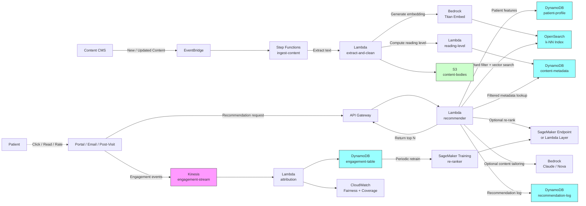

# Recipe 4.2: Patient Education Content Matching ⭐

**Complexity:** Simple · **Phase:** MVP · **Estimated Cost:** ~$0.001–0.01 per recommendation (depends on LLM use)

---

## The Problem

A primary care patient walks out of a 15-minute visit with a brand-new diagnosis of type 2 diabetes. The clinician spent maybe four minutes of that visit explaining the condition. Half of those four minutes were eaten up by managing the patient's anxiety, which is appropriate, but doesn't leave much room for the actual teaching. As the patient is leaving, the MA hands them a folder. Inside the folder: a generic brochure about diabetes from 2014, a printout from the patient portal that's seven pages of dense clinical text, and a one-pager about the hospital's diabetes class that meets on Tuesdays at 10 AM (the patient works Tuesdays at 10 AM).

The patient gets to their car. They look at the folder. They put it on the passenger seat. They drive home. Two weeks later they have follow-up labs and the front-desk staff find the folder, untouched, in the patient's bag. The patient has not started any lifestyle changes. They have not started the medication, because they're confused about whether they're supposed to take it with food. They cannot articulate what an A1c is. They are exactly as informed about their own disease as they were two weeks ago, except now they are also frustrated with themselves and slightly afraid of the doctor.

Every step of this story is the system working as designed. The clinician did their job. The MA did their job. The folder was assembled by a content team that produced reasonable, evidence-based material. The patient portal had education content available. The diabetes class exists.

The patient still ended up unprepared.

The thing that makes this maddening is the inventory mismatch. A typical health system has thousands of education assets sitting in their CMS or content library. Brochures, videos, interactive modules, post-visit instructions, condition-specific deep dives, peer-reviewed handouts in multiple languages. There is, in practically every case, *something* in that library that would have worked for this patient. There's content written at a sixth-grade reading level. There's content in Spanish. There are videos for patients who don't read well. There's a "newly diagnosed type 2 diabetes" starter pack. The system owns it. The system paid licensing fees for it. The system is currently not delivering it.

The reason it's not getting delivered is that nobody can match content to patient on the fly. The clinician doesn't have time. The MA isn't trained to. The portal does have a search function but the patient doesn't know what to search for and would not enjoy the experience of typing "type 2 diabetes" into a search box and getting 47 results sorted alphabetically. So a folder of generic content gets handed out, because it's the only repeatable workflow that scales.

What this looks like at scale: a 200,000-patient health system probably has between 500 and 5,000 individual education assets. They get clicked on a few thousand times per month. The same five or ten "popular" pieces get over-recommended, while a long tail of more targeted content gathers dust. Patient portal analytics will show you that 80% of education traffic is hitting maybe 10% of the content, and the other 90% is essentially dark inventory. Worse, the satisfaction signal is anemic: patients rarely rate content, rarely return for more, and the readers who would have benefited most from a specific piece often never see it.

So the problem statement is again deceptively simple: given a patient with some clinical context (diagnoses, procedures, medications, recent labs), some demographic context (age, primary language, reading level estimate, location), and some preference context (do they prefer videos? text? have they engaged with previous content?), pick the right small set of education assets to surface to them, at the right moment, in the right place. Not the same generic folder. The right materials.

This is a recommendation problem. It's a reasonably contained one, because the catalog is finite and curated. There's no risk of the recommender hallucinating a piece of content that doesn't exist; everything in the catalog has been clinically reviewed. The space of "harm" is narrow: the worst the recommender can typically do is suggest something that's irrelevant or boring, which is not great but is also not the failure mode that gets you in front of a regulator. That makes this a beautiful first recommender to build. You learn the entire pattern (feature engineering, candidate generation, ranking, feedback loops, monitoring) on a use case where the stakes are low enough that you can iterate, but high enough that the win is real. The win, by the way, is patients who understand their conditions, take their medications, and show up for their follow-ups. That's not a small win.

Let's get into how you actually build it.

---

## The Technology: Recommending from a Curated Catalog

### What Kind of Recommender Problem Is This, Really?

Recommendation problems come in flavors, and the flavor matters because it determines what techniques work. The big distinctions:

- **Catalog size.** Netflix has tens of thousands of titles. Amazon has hundreds of millions of products. A patient education library typically has hundreds to a few thousand assets. Small catalog. Massively important.
- **Cold-start severity.** Patients are new to the system constantly, and patient interaction histories are sparse compared to a streaming service. Most patients have engaged with zero or one prior pieces of content. Cold-start dominates the average case.
- **Item turnover.** Education content changes slowly. A piece on type 2 diabetes basics might get a refresh every 18 months. Compare to social media where the catalog changes by the hour.
- **Signal density.** "Did the patient read it?" is a much weaker signal than "did the patient buy it." Most patients don't rate or review education content. Many don't even click through to it. The implicit signal you have is page-view depth, time-on-page, and downstream behavior changes (did they show up for follow-up? did adherence improve?). All noisy.
- **Curated vs. open catalog.** The catalog is curated by clinical content teams. Every item has been reviewed. There are no fake reviews, no SEO gaming, no spam. This is rare and lovely.

Put those properties together and you get a use case where the cool, fancy techniques (deep two-tower neural recommenders, transformer-based sequence models) are dramatically overkill. The right approach is a small toolbox of well-understood techniques layered on top of each other, with the layering itself doing most of the work.

### The Three Layers

Most production patient education recommenders, regardless of vendor or technology stack, end up looking like a three-layer stack:

**Layer 1: Rule-based eligibility filters.** Hard "shall not" rules. If the patient's primary language is Spanish, never show English-only content. If the content is rated for ages 18+ and the patient is 14, don't show it. If a piece of content has been flagged as deprecated by the clinical content team, don't show it. These are not optimization decisions; they are correctness decisions, and they belong at the top of the stack so the model never has to reason about them.

**Layer 2: Content-based matching.** Given the patient's clinical context (diagnoses from the problem list, recent procedures, current medications, reading-level estimate, language preference), find content whose tags, topics, and reading metadata align. This is where the bulk of the recommendation logic lives, and the technique that does most of the work is honestly older than the smartphone: **content-based filtering**.

Content-based filtering, in plain English: every item in the catalog has a feature vector (what topics does it cover, what reading level, what format, what language, what age range). Every patient has a feature vector (what conditions, what reading level, what language, what preference history). Find the items whose feature vector best aligns with the patient's. The simplest way to do this is to use a small, hand-curated taxonomy (think SNOMED-CT codes mapped to content topics) and a similarity function (Jaccard, cosine, or just a weighted sum of matched fields). It works. It works boringly well.

The fancier version of content-based filtering uses **embeddings**. Take each piece of content, run its title and abstract through a sentence-embedding model, and store the resulting vector. Take the patient's clinical context, build a query string from it, embed that, and do a vector similarity search to find nearest content. This is "semantic search," and it's how most production search systems do similarity-by-meaning today. The advantage over a tag-based approach: you can find content that's topically related but doesn't share exact tags. ("Newly diagnosed diabetes" and "starting metformin" are semantically close even if no tag overlap.) The disadvantage: you've now introduced a black box, and you need to do a chunk of evaluation to make sure the embeddings are actually capturing the right kind of similarity for your use case.

**Layer 3: Personalization re-ranking.** Once content-based matching has produced a candidate set of (say) 20 to 50 plausibly relevant items, a re-ranker reorders them based on personalized signals: prior engagement (this patient watched videos, not articles), recent activity (they were just looking at content about A1c, surface related content), and predicted engagement (a small ML model that scores "will this patient actually open this item"). This is where you graduate from generic matching to actual personalization.

The re-ranker can be as simple as a feature-weighted scoring function or as fancy as a learning-to-rank model (LambdaMART, XGBoost-Ranker). For a starter implementation, weighted scoring works fine. Move to LambdaMART when you have meaningful click-through data and want to optimize a ranked-list metric like NDCG explicitly.

### Why Not Just Use an LLM for Everything?

It's a fair question in 2026. Why not skip all this scaffolding and just feed the patient context plus the catalog into a frontier LLM and ask it to pick the best three items?

You can. People do. It works in demos. Here's where it falls apart in production:

- **Cost.** Every recommendation invokes a frontier model, which means every reminder email, every portal page load, every new-patient onboarding triggers a multi-thousand-token LLM call. Costs grow linearly with users and pages, and they grow fast. Content-based filtering with embeddings does the heavy lifting in vector indexes that cost essentially nothing per query.
- **Latency.** A vector similarity search returns in tens of milliseconds. An LLM call returns in seconds. For a portal page that wants to show recommended content above the fold, the LLM is too slow.
- **Auditability.** "The model picked these three items" is hard to explain when the model is a 70-billion-parameter LLM. "The patient has a recent diabetes diagnosis, so we filtered to diabetes-tagged content, then ranked by reading-level match, and these three came out on top" is auditable. In healthcare, auditability is not a nice-to-have.
- **Determinism and testing.** A rule-and-vector pipeline produces the same results for the same inputs. An LLM at temperature > 0 doesn't. Regression-testing a content recommender requires a deterministic core.

What LLMs are great for in this pipeline is **content tailoring**, not content selection. The recommender picks the items. The LLM, optionally, generates a short personalized blurb introducing the items to the patient ("Based on your recent visit, here are three things that might help"), or rewrites the content snippet shown alongside the link. That's a much smaller, safer use of the LLM, and it composes cleanly with the deterministic recommendation core.

### Reading Level Is the Sleeper Feature

If you take one thing away from this section, take this: in patient education, reading level is the feature that matters most and gets the least attention. Average US adult reading level is around eighth grade. Average healthcare patient population skews lower because health-literacy challenges correlate with the conditions that bring people to healthcare in the first place. A patient handed a piece of content written at a college-graduate level (which is most clinical content, by default) is functionally not getting any education from it. They're not going to call you and tell you that. They're going to nod, take it home, and put it on the passenger seat.

Reading-level estimation has a few off-the-shelf algorithms (Flesch-Kincaid, SMOG, Dale-Chall) that give you a grade-level number. They're imperfect (they don't capture concept density, only sentence and word complexity), but they're better than nothing and they're computable from the text alone. Tag every piece of content with its reading level when it enters the catalog, and treat reading level as a hard or soft constraint when matching. A "fits patient's reading level" filter will dramatically outperform a generic semantic search every time, because relevance without comprehension is not relevance.

Patient reading level is harder to measure directly. Proxies that correlate: educational attainment from registration data, prior content engagement (which reading levels did they actually finish?), explicit health-literacy screening tools (REALM, TOFHLA) if your organization administers them. In the absence of any signal, default to a sixth-to-eighth-grade level rather than higher. You can always step up if engagement signals say you can; stepping down after pushing too-hard content is harder.

### Multilingual Is Not Optional

The same logic applies to language. Spanish-preference patients receiving English-only content are not being served. Many health systems have pockets of patients with primary languages well beyond the top two: Vietnamese, Tagalog, Somali, Russian, Mandarin, Arabic. Whether you have native-language content for each of those is a content-team decision (and a budget decision); whether your recommender respects language preference at all is a fundamental correctness decision.

Language preference goes in the eligibility filter (Layer 1). Don't try to be clever about it. If a patient's preference is Spanish and an item is English-only, drop it from candidates. If you don't have Spanish content for a topic, that's a content gap to flag back to the content team, not a feature for the model to optimize around.

### The Feedback Loop, Lighter Than 4.1

Recipe 4.1 had a complex feedback loop because the reward signal (did the patient show up?) was high-stakes and well-defined. For patient education, the feedback signal is softer: did they click? did they finish? did they come back? The model can use any of these, but you need to be honest about what each tells you:

- **Impressions** (was the item recommended) tell you about the recommender's behavior, not the patient's.
- **Clicks** tell you the recommendation looked relevant. They don't tell you the content delivered value.
- **Read-completion** (scrolled to the end, watched > 80% of the video) tells you something. Not perfect, but a real signal.
- **Return engagement** (the patient came back to read more, or rated the content positively) is the strongest weak signal you can capture from a portal interaction.
- **Downstream clinical behavior** (took the medication, showed up for the follow-up, lab values moved in the right direction) is the real outcome, and it's typically too far away in time to feed the recommender model directly. It's the signal you use for periodic offline evaluation, not for online learning.

The lighter weight of these signals (compared to "did they show up for the appointment") means the feedback loop here can be simpler. You don't need a contextual bandit; you need a click-through rate (CTR) tracker, a periodic re-ranker training job, and a slice-by-cohort dashboard. Worth its own paragraph: don't optimize for CTR alone. CTR optimization without read-completion as a counterweight will steer your recommender toward clickbait headlines and away from substantive content. Track both, and weight the loss toward read-completion when you train the re-ranker.

### Where This Fits in the Bigger Picture

Recipe 4.1 (channel optimization) decided how to reach the patient. Recipe 4.2 decides what content to put in front of them when you do. The two recipes are natural collaborators: a reminder email or portal nudge is the channel; the recommended education content is the payload. The patient preference store, engagement event pipeline, and cohort monitoring infrastructure you built for 4.1 are reusable here with minimal extension. If you've already shipped 4.1, you're more than halfway to 4.2.

Looking forward: Recipes 4.4 (Wellness Program Recommendations) and 4.5 (Medication Adherence Intervention Targeting) build on the same recommender infrastructure. The catalog changes (programs, interventions instead of education assets) but the architecture is recognizable. Treat 4.2 as the second round of capability-building.

---

## General Architecture Pattern

The pipeline has three logical components: a content ingestion path that prepares the catalog, an inference path that handles real-time recommendation requests, and a feedback path that captures engagement and refreshes the personalization model.

```
┌─────────────── CONTENT INGESTION (offline) ───────────────┐
│                                                            │
│  [Education Content CMS]                                   │
│           │                                                │
│           ▼                                                │
│  [Extract: title, body, language, reading level,           │
│   topic tags, content type, target audience]               │
│           │                                                │
│           ▼                                                │
│  [Compute: embedding(title + abstract),                    │
│   reading-grade-level score]                               │
│           │                                                │
│           ▼                                                │
│  [Index: vector store (embedding) +                        │
│   metadata store (tags, level, language)]                  │
│                                                            │
└────────────────────────────────────────────────────────────┘

┌──────────── INFERENCE PATH (real-time) ───────────────────┐
│                                                            │
│  [Trigger: portal page load,                               │
│   email assembly, post-visit summary]                      │
│           │                                                │
│           ▼                                                │
│  [Build patient context query:                             │
│   conditions, language, reading level,                     │
│   recent interactions]                                     │
│           │                                                │
│           ▼                                                │
│  [Layer 1: hard filters                                    │
│   (language match, age-appropriate,                        │
│    not-deprecated, consent)]                               │
│           │                                                │
│           ▼                                                │
│  [Layer 2: candidate generation                            │
│   (semantic search + tag overlap                           │
│    → top 30-50 candidates)]                                │
│           │                                                │
│           ▼                                                │
│  [Layer 3: re-rank by personalization                      │
│   (engagement priors, format preference,                   │
│    reading-level fit, recency)]                            │
│           │                                                │
│           ▼                                                │
│  [Return top N (typically 3-5) with                        │
│   explanation features for UI]                             │
│           │                                                │
└───────────┼────────────────────────────────────────────────┘
            │
            ▼
     [Patient Sees Recommendations / Clicks / Reads]
            │
┌───────────┼────────────────────────────────────────────────┐
│           ▼                                                │
│  [Engagement events: impression, click,                    │
│   read-completion, rating]                                 │
│           │                                                │
│           ▼                                                │
│  [Join to recommendation request,                          │
│   compute CTR + completion rate]                           │
│           │                                                │
│           ▼                                                │
│  [Update patient engagement features +                     │
│   re-ranker training data]                                 │
│           │                                                │
│           ▼                                                │
│  [Periodic re-ranker retrain                               │
│   (weekly / monthly)]                                      │
│           │                                                │
│           ▼                                                │
│  [Cohort dashboard: coverage, CTR,                         │
│   completion rate, by language and                         │
│   reading-level cohorts]                                   │
│                                                            │
└──────────────────── FEEDBACK PATH ─────────────────────────┘
```

**Content ingestion is offline and slow.** When a piece of content is added or updated in the CMS, a pipeline picks it up, extracts text, computes the embedding, computes the reading-level score, and indexes it. This runs once per content change, not once per recommendation request. The inference path reads from the index and never has to do this work in real time.

**Inference path is fast and cheap.** A single recommendation request hits a small set of services: a metadata lookup for the patient's clinical context, a hard-filter pass against catalog metadata, a vector similarity search against the content embedding index, a re-ranking step that consumes some patient features, and a return. Total latency target: under 200 milliseconds for a portal page integration. Achievable with off-the-shelf vector indexes and a feature store.

**Feedback path runs continuously but updates the model on a slower cadence.** Engagement events stream into an event bus, get joined to the originating recommendation request, and accumulate into a training dataset. The re-ranker model retrains on a weekly or monthly schedule, not in real time. The patient-level engagement features that the re-ranker consumes can be updated more frequently (a daily aggregation is fine for most use cases).

**The candidate set is small enough to be transparent.** Returning 30-50 candidates after filtering means the re-ranker is not the differentiator between "good" and "bad" recommendations; the candidate generator is. Most of your engineering attention should go to making the candidate generator produce a relevant set, because the re-ranker can only choose among what the candidate generator surfaced. A dazzling re-ranker on top of a clueless candidate generator is still a clueless recommender.

**Explanation features come along for the ride.** Have the recommender return the features that led to each selection along with the top N items themselves: matched tags, semantic similarity score, reading-level fit, prior engagement boost. The UI uses these to render natural-language explanations ("recommended because you have a recent diabetes diagnosis and prefer videos") and the audit log uses them to answer the inevitable "why was this recommended" question from a clinician or a compliance reviewer.

---

## The AWS Implementation

### Why These Services

**Amazon S3 for the content body store.** Patient education content has a few presentation forms (HTML, PDF, MP4, audio), all of which are blobs. S3 is the obvious home for the body. Bucket-level encryption with KMS, versioning enabled so you have a paper trail when content gets updated, and a prefix structure (`/content/{content_id}/{version}/{format}`) that maps to the content metadata.

**Amazon DynamoDB for content metadata and patient profile.** Two tables. One holds catalog metadata (content_id, title, language, reading_level, topic_tags, content_type, audience, status). One holds patient profile (patient_id, conditions, language, reading_level estimate, format preferences, engagement summary). Both are point-lookup workloads, both fit DynamoDB's strengths, and both are HIPAA-eligible with BAA. Use customer-managed KMS keys; the patient profile is PHI by definition, and the content metadata becomes PHI the moment it's joined to a patient ID.

**Amazon OpenSearch Service for vector search.** OpenSearch is the workhorse for both keyword search and vector similarity search in this kind of pipeline. The k-NN plugin supports cosine and L2 similarity over dense vectors at production latencies. The index is small (a few thousand items, each with a few-hundred-dimensional embedding) so a single small cluster is plenty. OpenSearch Service is HIPAA-eligible. <!-- TODO: confirm current OpenSearch Service HIPAA eligibility entry on the AWS HIPAA Eligible Services Reference; the service has been on the list, but verify before publishing. -->

**Amazon Bedrock for embedding generation and (optional) content tailoring.** Bedrock hosts foundation models including embedding models (Amazon Titan Text Embeddings, Cohere Embed) for the content vectorization step, and large language models (Anthropic Claude, Meta Llama, Amazon Nova) for any content-tailoring summarization on the inference path. The embedding model runs once per content ingestion event; the LLM, if you use one, runs at most once per recommendation response. Bedrock is HIPAA-eligible with BAA. Confirm in your BAA acceptance and Bedrock service terms that customer prompts and completions are not used to train the underlying foundation models and are not retained beyond the request lifecycle. This is the standard Bedrock posture but should be verified per-model and documented for audit. <!-- TODO: confirm Bedrock service terms and per-model data-handling guarantees at the time of build; the eligible-model list and BAA coverage have been evolving. -->

**AWS Lambda for the inference path and ingestion handlers.** Recommendation requests are short, stateless, and bursty (a portal page load triggers one). Lambda fits this naturally. The ingestion handler that processes new content events is also a fine Lambda workload. Set reserved concurrency on the inference Lambda to protect the patient-facing path from noisy-neighbor effects.

**Amazon API Gateway for the recommendation endpoint.** The portal, the email-composer Lambda from Recipe 4.1, and the post-visit summary generator (Recipe 2.5) all need to call the recommender. API Gateway gives you a single authenticated endpoint, request throttling, and integration with WAF for basic protection. Pair with Lambda authorizers or IAM-signed requests for service-to-service auth.

<!-- TODO (TechWriter): Expand this paragraph (or add one alongside) covering three related authn/topology items the expert review flagged:
     1. API Gateway has two distinct caller contexts here: public portal calls (need patient-session authn via Cognito or Lambda authorizer, with patient_id authorization enforced in the recommender Lambda so the request body's patient_id must match the resolved identity), and service-to-service calls (need IAM-signed SigV4 with a least-privileged execution role per caller). The recommender must validate that the caller is allowed to act on the requested patient_id; do not rely on the upstream service.
     2. Public vs private API Gateway: portal callers reach a public regional REST API; service-to-service callers should reach a private REST API exposed via a VPC interface endpoint. Two API Gateway deployments fronting the same recommender Lambda is a clean pattern.
     3. Per-patient throttling: WAF rate-limit on a header populated by the Lambda authorizer (resolved patient identifier). A starting point of 10 req/patient/min and 100 req/patient/hr protects shared backend quotas (Bedrock, OpenSearch) from a single misbehaving caller. See expert review Findings 2, 9, and 13. -->

**Amazon Kinesis Data Streams for engagement events.** Same engagement-event bus you stood up for Recipe 4.1, with new event types added (content_impression, content_click, content_completion, content_rating). One bus, multiple producers, multiple consumers. The reward-attribution Lambda picks up content-related events and persists them to a structured engagement table.

**Amazon SageMaker for the re-ranker training and (optionally) hosting.** The re-ranker is a gradient-boosted ranking model (XGBoost-Ranker or LightGBM with `lambdarank` objective). SageMaker Training Jobs handle the periodic retraining; SageMaker Endpoints host the model for inference if you graduate beyond a Lambda-embedded scoring function. For a starter implementation, you can host the trained model as a Lambda layer and skip the endpoint entirely. The Lambda-layer approach hits a 250 MB ceiling once you add XGBoost or LightGBM with their numpy/scipy dependencies; plan to graduate to a SageMaker Endpoint when the layer approach starts to feel cramped, which often happens earlier than expected.

<!-- TODO (TechWriter): Specify the SageMaker training-job trigger mechanism (EventBridge schedule? Step Functions on a cron? CloudWatch metric threshold?) and the model-promotion path from training to inference (Lambda-layer publish + alias canary, or SageMaker endpoint variant weights). The architecture diagram currently shows "Periodic retrain" without an explicit trigger node, and there is no path shown for promoting a newly-trained ranker into the inference path. See expert review Finding 8. -->

**AWS Glue / Amazon EMR / AWS Step Functions for the offline content ingestion pipeline.** The reading-level computation, embedding generation, and metadata indexing form a small DAG. Step Functions is the lowest-friction orchestrator for a pipeline of this size. Glue or EMR are overkill unless your catalog is much larger than typical or includes complex preprocessing.

**AWS KMS for encryption, CloudTrail for audit, CloudWatch for operations.** Same PHI infrastructure pattern as Recipe 4.1. Customer-managed KMS keys for every data store, CloudTrail data events for the patient profile table, CloudWatch alarms on inference latency, error rate, and recommendation coverage by cohort.

### Architecture Diagram



### Prerequisites

| Requirement | Details |
|-------------|---------|
| **AWS Services** | Amazon S3, Amazon DynamoDB, Amazon OpenSearch Service, Amazon Bedrock, AWS Lambda, Amazon API Gateway, Amazon Kinesis Data Streams, Amazon SageMaker, AWS Step Functions, AWS KMS, Amazon CloudWatch, AWS CloudTrail. |
| **IAM Permissions** | Per-Lambda least-privilege: `dynamodb:GetItem`, `dynamodb:PutItem` on specific tables; `s3:GetObject`/`s3:PutObject` on the content bucket; `bedrock:InvokeModel` on specific model ARNs (e.g., `arn:aws:bedrock:{region}::foundation-model/amazon.titan-embed-text-v2:0`); `aoss:APIAccessAll` or `es:ESHttpPost` scoped to the OpenSearch domain ARN; `kinesis:PutRecord` on the engagement stream. Never `*`. <!-- TODO: confirm exact IAM action names for OpenSearch Service vector search; classic OpenSearch uses `es:*` actions, OpenSearch Serverless uses `aoss:*`. The recipe assumes provisioned OpenSearch Service throughout; adjust if you choose Serverless. --> |
| **BAA** | AWS BAA signed. All services in the architecture must be HIPAA-eligible: S3, DynamoDB, OpenSearch Service, Bedrock, Lambda, API Gateway, Kinesis, SageMaker, Step Functions are all on the HIPAA Eligible Services list. <!-- TODO: confirm Bedrock + the specific embedding and LLM models you select are eligible at the time of build. The eligible list and per-model BAA coverage have been evolving; verify before launch. --> |
| **Encryption** | S3: SSE-KMS with customer-managed keys. DynamoDB: encryption at rest with customer-managed KMS. OpenSearch: encryption at rest enabled, node-to-node encryption enabled, HTTPS-only access. Kinesis: server-side encryption. All Lambda log groups KMS-encrypted (recommender logs include patient context). |
| **VPC** | Production: Lambdas in VPC, OpenSearch domain in VPC (not public), VPC endpoints for DynamoDB, S3 (gateway endpoint), Bedrock, Kinesis, KMS, CloudWatch Logs, SageMaker Runtime, Step Functions (`states`), STS, EventBridge (`events`). NAT Gateway only if calling external services that don't have VPC endpoints; restrict egress security groups. VPC Flow Logs enabled. Content ingestion may pull from an external CMS over the public internet (SaaS), a VPN/Direct Connect tunnel (on-prem), or a cross-account VPC endpoint (AWS-hosted); for SaaS pulls, restrict NAT egress to the CMS's published IP ranges, prefer Direct Connect with private routing for on-prem, and use VPC peering or PrivateLink for cross-account rather than internet egress. |
| **CloudTrail** | Enabled with data events on the patient-profile table, recommendation-log table, and the content S3 bucket if any content is patient-specific. |
| **Content Governance** | Process to mark content as deprecated, retired, or under review (so the recommender can exclude it); a defined cadence for clinical content team review (annual at minimum); language and reading-level metadata required at content ingestion (don't let untagged content into the index). |
| **Sample Data** | A starter content catalog (a few dozen items in two languages with reading-level metadata) to seed the index, plus a synthetic patient population. [Synthea](https://github.com/synthetichealth/synthea) generates synthetic FHIR patients with conditions and demographics suitable for testing. For sample education content suitable for development, [MedlinePlus](https://medlineplus.gov/) publishes patient-friendly content under a permissive license; verify license terms before redistribution. <!-- TODO: confirm current MedlinePlus content license and redistribution terms before recommending in print. --> |
| **Cost Estimate** | At a 200,000-patient health system with 5,000 unique active users per month and 3-5 recommendations per session: Bedrock Titan Embeddings (one-time per content item, plus query embeddings): typically a few dollars per month at this scale. <!-- TODO: verify current Bedrock Titan embedding pricing per 1K input tokens. --> OpenSearch Service: a `t3.small.search` two-node domain runs in the $50-100/month range, scaling up with usage. DynamoDB on-demand at this scale: $20-50/month. Lambda + API Gateway: typically under $20/month. Optional Claude/Nova content tailoring per recommendation pushes per-recommendation cost up to a few cents; toggle off if you don't need it. Estimated total: $150-400/month range for a starter deployment, before any SageMaker hosting costs. <!-- TODO: replace with verified, current pricing once the implementing team can validate against the AWS Pricing Calculator. --> |

### Ingredients

| AWS Service | Role |
|------------|------|
| **Amazon S3** | Stores content bodies (HTML, PDF, MP4) with versioning and KMS encryption |
| **Amazon DynamoDB** | Stores content metadata, patient profiles, recommendation logs, and engagement summaries |
| **Amazon OpenSearch Service** | Hosts the k-NN vector index for content embeddings and metadata-filtered candidate retrieval |
| **Amazon Bedrock** | Hosts the embedding model (e.g., Titan Text Embeddings) for content and query vectorization, plus optional LLM for content tailoring |
| **AWS Lambda** | Runs the recommender, content ingestion handlers, engagement attribution, and re-ranker scoring (when not on SageMaker) |
| **Amazon API Gateway** | Fronts the recommendation endpoint with auth, throttling, and WAF integration |
| **Amazon Kinesis Data Streams** | Carries impression, click, read-completion, and rating events into the attribution pipeline |
| **Amazon SageMaker** | Trains the re-ranker periodically; optionally hosts the re-ranker as a low-latency endpoint |
| **AWS Step Functions** | Orchestrates the content ingestion DAG (extract → embed → score reading level → index) |
| **AWS KMS** | Customer-managed encryption keys for all PHI-containing stores |
| **Amazon CloudWatch** | Operational metrics, cohort-sliced coverage and engagement dashboards |
| **AWS CloudTrail** | Audit logging for all PHI-related API calls |


### Code

> **Reference implementations:** Useful aws-samples patterns for this recipe:
> - [`amazon-bedrock-workshop`](https://github.com/aws-samples/amazon-bedrock-workshop): Demonstrates embedding generation with Titan and retrieval-augmented patterns. The vector-search labs are directly relevant to the candidate-generation step here.
> - [`amazon-personalize-samples`](https://github.com/aws-samples/amazon-personalize-samples): Reference patterns for recommendation systems. If you graduate beyond the in-house re-ranker into a managed service, this is the path.
> <!-- TODO: confirm current names and locations of these aws-samples repositories. The list of Bedrock-related aws-samples repos has been reorganizing. -->

#### Walkthrough

**Step 1: Ingest content and build the searchable index.** When a piece of content lands in the CMS (or gets updated), an event triggers a small Step Functions workflow that extracts the textual portion, computes the reading-grade level, generates an embedding from the title and abstract, and writes the resulting metadata to DynamoDB and the embedding to OpenSearch. This is the offline preparation step. Skip it and your recommender has nothing to recommend; rush it and you index content with bad metadata that the recommender will faithfully surface to patients for the next year.

```
FUNCTION on_content_published(content_event):
    // The CMS event includes the content ID and version.
    content = CMS.GetContent(content_event.content_id, content_event.version)

    // Extract the text we need for analysis. Strip HTML, normalize whitespace.
    cleaned_text = strip_html_and_normalize(content.body)
    abstract     = first_500_chars(cleaned_text)
    full_text    = cleaned_text

    // Compute the reading-grade level. Flesch-Kincaid is a reasonable default.
    // Healthcare content teams often use SMOG; pick one and document the choice.
    grade_level = flesch_kincaid_grade(full_text)

    // Generate the embedding for the title + abstract.
    // Use title + abstract rather than full body: it captures the topical signal
    // without diluting the embedding with body-text noise.
    embedding_input = content.title + "\n\n" + abstract
    embedding       = Bedrock.InvokeModel(
                          model_id = TITAN_EMBED_MODEL_ID,
                          body     = { "inputText": embedding_input })
                          .embedding   // returns a fixed-dimension dense vector

    // Persist the body in S3 (versioned bucket).
    S3.PutObject(bucket = CONTENT_BUCKET,
                 key    = "content/" + content.id + "/" + content.version + "/" + content.format,
                 body   = content.body)

    // Persist the metadata. This is what hard filters and re-rankers consult.
    DynamoDB.PutItem("content-metadata", {
        content_id:    content.id,
        version:       content.version,
        title:         content.title,
        language:      content.language,           // "en", "es", etc.
        reading_level: grade_level,
        topic_tags:    content.topic_tags,         // SNOMED / ICD-10 / custom taxonomy
        content_type:  content.content_type,       // "article", "video", "pdf", "module"
        audience:      content.audience,           // "adult", "pediatric", "caregiver"
        status:        content.status,             // "active", "deprecated", "draft"
        s3_key:        s3_key_we_just_wrote
    })

    // Persist the embedding in OpenSearch. The k-NN index is configured for cosine similarity.
    // The metadata duplication into OpenSearch supports filter-and-search in one query.
    OpenSearch.IndexDocument(
        index = "patient-education",
        id    = content.id,
        body  = {
            content_id:    content.id,
            embedding:     embedding,
            language:      content.language,
            reading_level: grade_level,
            topic_tags:    content.topic_tags,
            content_type:  content.content_type,
            status:        content.status
        })
```

**Step 2: Build the patient query context.** When a recommendation request fires (a patient loads the portal home page, or the post-visit summary generator wants to attach educational content), the recommender first assembles what it knows about the patient. Conditions from the problem list, language preference, reading-level estimate, recent content engagement, format preferences. This step is mostly a join across the patient profile table and any cached engagement aggregates. Skip it and the recommender falls back to one-size-fits-all matching, which is exactly what you were trying to escape.

```
FUNCTION build_patient_context(patient_id):
    // Load the patient profile. This includes language, reading-level estimate,
    // and format preferences, all of which were either set explicitly at registration
    // or learned from prior engagement.
    profile = DynamoDB.GetItem("patient-profile", patient_id)

    // Pull recent clinical context. In practice, this is sourced from a feature store
    // populated upstream from the EHR (FHIR Condition resources, recent procedures,
    // active medications). Limit to "active" problems to avoid noise from resolved
    // conditions that aren't currently relevant.
    recent_conditions = profile.active_conditions       // list of SNOMED / ICD-10 codes
    recent_procedures = profile.recent_procedures       // last 90 days
    active_medications = profile.active_medications

    // Build a free-text "intent" string from the structured codes. This will be
    // embedded in Step 3 to drive the semantic search.
    intent_text = build_intent_text(recent_conditions, recent_procedures, active_medications)
    // Example output: "newly diagnosed type 2 diabetes mellitus; starting metformin;
    // hemoglobin A1c elevated; primary care follow-up scheduled"

    // Pull recent engagement features, used by the re-ranker.
    engagement_summary = DynamoDB.GetItem("engagement-summary", patient_id)
    // Includes: format_ctr (article vs video click-through), avg_completion_rate,
    //          last_topics_engaged, time_since_last_session

    // Derive cohort labels used downstream by the re-ranker (Step 4) and the
    // recommendation log feature_snapshot (Step 5). Computing them here keeps
    // the inference path's joins to one place.
    audience          = infer_audience(profile)                  // "adult" or "pediatric" from age
    format_preference = highest_ctr_format(engagement_summary)   // "article" / "video" / null for cold-start

    RETURN {
        patient_id:         patient_id,
        language:           profile.language,
        reading_level_est:  profile.reading_level,    // can be null for new patients
        audience:           audience,
        intent_text:        intent_text,
        engagement_summary: engagement_summary,
        format_preference:  format_preference,
        topic_tags_pref:    profile.preferred_topics  // optional, from prior engagement
    }
```

**Step 3: Apply hard filters and run candidate generation.** This is where Layers 1 and 2 of the architecture combine. Hard filters reduce the catalog to the "allowed" subset; semantic search plus tag overlap reduces the allowed subset to a few dozen candidates. OpenSearch handles both in a single query: a filter clause for the hard rules, a k-NN clause for the embedding similarity, and a should-match clause for tag overlap as a tiebreaker. Skip the hard-filter step and you'll show English-only content to non-English speakers; skip the candidate generation and you'll be ranking the entire catalog every request, which is wasteful and slow.

```
FUNCTION generate_candidates(patient_context, top_k = 50):
    // Embed the patient's intent text using the same model used for content embeddings.
    // Critical: same model, same configuration, otherwise the vectors don't live in the same space.
    query_embedding = Bedrock.InvokeModel(
                          model_id = TITAN_EMBED_MODEL_ID,
                          body     = { "inputText": patient_context.intent_text })
                          .embedding

    // Construct the OpenSearch query. The filter clause is the eligibility check
    // (Layer 1); the knn clause does the semantic similarity search (Layer 2).
    query = {
        size: top_k,
        query: {
            bool: {
                filter: [
                    { term:  { "language": patient_context.language } },
                    { term:  { "status":   "active" } }
                    // Optional reading-level filter as a hard cap, if you want to enforce it.
                    // Some teams treat reading level as soft (re-ranker preference)
                    // rather than hard (filter); your call.
                ],
                must: [
                    {
                        knn: {
                            embedding: {
                                vector: query_embedding,
                                k: top_k
                            }
                        }
                    }
                ],
                should: [
                    // Tag overlap is a soft signal that boosts items sharing topic tags.
                    { terms: { "topic_tags": patient_context.topic_tags_pref or [] } }
                ]
            }
        }
    }

    response = OpenSearch.Search(index = "patient-education", body = query)
    candidates = response.hits   // each item includes content_id, similarity score, metadata

    // Hydrate from DynamoDB if you need fields not duplicated in the OpenSearch index.
    // For most pipelines, the duplicated metadata is enough to skip this round-trip.

    RETURN candidates   // typically 30-50 items
```

**Step 4: Re-rank with personalization signals.** The candidate set is relevant in aggregate, but the order matters. The re-ranker scores each candidate against patient-specific features (does the patient prefer videos? is this content's reading level a fit? have they engaged with similar topics recently?). This is where personalization shows up. The re-ranker can be as simple as a weighted scoring function for v1, then graduate to a learned ranker (LambdaMART, XGBoost-Ranker) once you have enough labeled engagement data. Skip personalization re-ranking and you're returning generic semantic-search results; that's fine for an MVP but it leaves real value on the table.

```
FUNCTION rerank(candidates, patient_context, top_n = 5):
    // For an MVP / v1, a weighted scoring function is enough.
    // The weights here are the kind of thing you tune by hand from analytics
    // before you have enough data to train a model.
    scored = []
    FOR each candidate in candidates:
        // Start with the semantic similarity score from candidate generation.
        base_score = candidate.similarity_score

        // Track which factors fired so the audit log and UI explanation can
        // show the trail per item, not just a final number.
        applied_factors = []

        // Reading-level fit: penalize content significantly above the patient's level.
        // A modest stretch is fine (level + 1) but a college-level piece for a
        // 6th-grade reader is a poor fit, full stop.
        reading_gap = candidate.reading_level - (patient_context.reading_level_est or 8)
        IF reading_gap > 4:
            base_score = base_score * 0.2
            applied_factors.append("reading_level_gap_over_4: x0.2")
        ELSE IF reading_gap > 2:
            base_score = base_score * 0.5
            applied_factors.append("reading_level_gap_2_to_4: x0.5")

        // Format preference: bump items in the patient's preferred format.
        IF patient_context.engagement_summary != null:
            preferred_format = highest_ctr_format(patient_context.engagement_summary)
            IF candidate.content_type == preferred_format:
                base_score = base_score * 1.25
                applied_factors.append("format_preference_match: x1.25")

        // Topic recency: bump items related to recently-engaged topics.
        IF candidate.topic_tags overlaps patient_context.engagement_summary.last_topics_engaged:
            base_score = base_score * 1.15
            applied_factors.append("recent_topic_overlap: x1.15")

        // Clamp the cumulative score to a reasonable range so multiplicative
        // factors can't compound into either zero or runaway values. Helps
        // when a clinical reviewer asks "why was this recommended" and you
        // need to explain the math without hand-waving.
        base_score = max(0.05, min(2.0, base_score))

        // Diversity: optional. If two candidates have very similar embeddings,
        // demote the second to avoid showing two near-duplicates side by side.
        // (Maximal Marginal Relevance or simple deduplication on title similarity.)

        scored.append({
            candidate:       candidate,
            score:           base_score,
            applied_factors: applied_factors
        })

    // Sort descending and take top N. N is typically 3-5 for a portal slot.
    sorted_scored = sort scored by score DESC
    top = first top_n of sorted_scored

    // Build the response with explanation features for the UI and audit log.
    response = []
    FOR each item in top:
        response.append({
            content_id:    item.candidate.content_id,
            title:         item.candidate.title,
            score:         item.score,
            explanation:   build_explanation(item.candidate, patient_context, item.applied_factors)
                           // e.g., "matches diabetes diagnosis, fits 8th-grade reading level"
        })

    RETURN response
```

**Step 5: Log the recommendation and return.** Before returning to the caller, persist a recommendation log entry. This is the join point that makes engagement attribution possible later. Each recommendation gets a unique ID; impressions, clicks, and completions reference that ID. Skip this step and you cannot evaluate the model. You can run the recommender, you cannot improve it.

```
FUNCTION log_and_return(patient_id, recommendations):
    recommendation_id = new UUID

    DynamoDB.PutItem("recommendation-log", {
        recommendation_id: recommendation_id,
        patient_id:        patient_id,
        timestamp:         current UTC timestamp,
        items:             [r.content_id for r in recommendations],
        scores:            [r.score for r in recommendations],
        model_version:     CURRENT_MODEL_VERSION,
        // Recommendation-time features for offline counterfactual analysis.
        // IMPORTANT: minimize. Persist only the cohort-level features used
        // by downstream ranker training and CloudWatch metric emission.
        // Do NOT persist the verbatim intent_text or the structured
        // condition / procedure / medication codes used to build it; that
        // turns the recommendation log into a free-text clinical narrative
        // joined to a patient_id.
        feature_snapshot:  {
            language:           patient_context.language,
            reading_level_est:  patient_context.reading_level_est,
            audience:           patient_context.audience,
            format_preference:  patient_context.format_preference,
            topic_tags_pref:    patient_context.topic_tags_pref
        }
    })

    // Emit an impression event for each item shown. Impression != click;
    // we want both signals, distinguishable.
    FOR each item in recommendations:
        Kinesis.PutRecord(stream = "engagement-stream", record = {
            event_type:        "content_impression",
            recommendation_id: recommendation_id,
            content_id:        item.content_id,
            patient_id:        patient_id,
            timestamp:         current UTC timestamp
        })

    RETURN { recommendation_id: recommendation_id, items: recommendations }
```

**Step 6: Capture engagement and update aggregates.** A separate Lambda consumes the engagement stream, joins each event back to the recommendation log, and updates two things: the patient's engagement summary (used by the re-ranker) and the training dataset (used for the periodic model refresh). The patient summary update can happen on the hot path; the training-dataset update is batched. Underinvest here and the model stops learning.

```
FUNCTION process_engagement_event(event):
    // Look up the recommendation that produced this event.
    rec = DynamoDB.GetItem("recommendation-log", event.recommendation_id)
    IF rec is null:
        LOG("engagement event for unknown recommendation_id: " + event.recommendation_id)
        RETURN

    // Confirm this content was actually in the recommendation. Defends against
    // mismatched IDs from a buggy client. Drop events that don't match.
    IF event.content_id NOT IN rec.items:
        LOG("event content_id not in recommendation items; dropping")
        RETURN

    // Validate the patient identity claim against the recommendation. The
    // Kinesis engagement stream is the integrity boundary for the
    // personalization model: a malicious or buggy producer that submits
    // events with a patient_id different from the one the recommendation
    // was issued for would pollute another patient's engagement summary
    // and skew their re-ranker features.
    IF event.patient_id != rec.patient_id:
        LOG("engagement event patient_id mismatch with recommendation; dropping")
        RETURN

    // Persist the event to the engagement table for offline training.
    DynamoDB.PutItem("engagement-events", {
        event_id:           new UUID,
        recommendation_id:  event.recommendation_id,
        content_id:         event.content_id,
        patient_id:         event.patient_id,
        event_type:         event.event_type,
        timestamp:          event.timestamp,
        // Position in the recommendation list (rank 1, 2, ...). Important for
        // ranker training; the ranker should learn to put more-engaged items higher.
        position:           rec.items.index_of(event.content_id) + 1
    })

    // Update the patient's running engagement summary. These features feed the re-ranker.
    // Use atomic updates so concurrent events don't trample each other. For nested-map
    // counters (format_clicks, format_completions), initialize the parent map with
    // `if_not_exists(...)` in the same expression as the ADD, otherwise the very first
    // event for a cold-start patient throws ValidationException because the parent map
    // doesn't exist on the new row yet.
    summary_key = event.patient_id

    IF event.event_type == "content_click":
        DynamoDB.UpdateItem("engagement-summary", summary_key,
            "SET format_clicks = if_not_exists(format_clicks, :empty) " +
            "ADD clicks_total :one, format_clicks." + event.content_type + " :one",
            values = { ":one": 1, ":empty": {} })

    ELSE IF event.event_type == "content_completion":
        DynamoDB.UpdateItem("engagement-summary", summary_key,
            "SET format_completions = if_not_exists(format_completions, :empty) " +
            "ADD completions_total :one, format_completions." + event.content_type + " :one",
            values = { ":one": 1, ":empty": {} })

    ELSE IF event.event_type == "content_rating":
        // Rating is a stronger signal; persist average and count.
        DynamoDB.UpdateItem("engagement-summary", summary_key,
            "ADD ratings_total :one, ratings_sum :rating",
            values = { ":one": 1, ":rating": event.rating })

    // Emit a CloudWatch metric sliced by cohort and content type. Powers the
    // coverage and fairness dashboards.
    emit_metric("content_engagement",
                value = 1,
                dimensions = {
                    event_type: event.event_type,
                    content_type: event.content_type,
                    language: rec.feature_snapshot.language,
                    reading_level_band: bucket(rec.feature_snapshot.reading_level_est)
                })
```

> **Curious how this looks in Python?** The pseudocode above covers the concepts. If you'd like to see sample Python code that demonstrates these patterns using boto3, check out the [Python Example](chapter04.02-python-example). It walks through each step with inline comments and notes on what you'd need to change for a real deployment.


### Expected Results

**Sample recommendation response:**

```json
{
  "recommendation_id": "f1d8c2e0-a1b3-4f8e-9c2d-3e8a1d7f0b14",
  "patient_id": "pat-000482",
  "timestamp": "2026-05-04T10:32:00Z",
  "model_version": "rerank-v0.4",
  "items": [
    {
      "content_id": "edu-diabetes-newly-diagnosed-en-v3",
      "title": "Type 2 Diabetes: What to Expect in Your First 90 Days",
      "score": 0.91,
      "reading_level": 7,
      "language": "en",
      "content_type": "article",
      "explanation": "Matches new diabetes diagnosis; fits 7th-grade reading level; aligns with prior article preference."
    },
    {
      "content_id": "edu-metformin-getting-started-en-v2",
      "title": "Starting Metformin: Common Questions Answered",
      "score": 0.84,
      "reading_level": 8,
      "language": "en",
      "content_type": "article",
      "explanation": "Matches new metformin prescription; closely related to recent diabetes content engagement."
    },
    {
      "content_id": "edu-glucose-monitoring-video-en-v1",
      "title": "How to Check Your Blood Sugar at Home (Video Walkthrough)",
      "score": 0.78,
      "reading_level": null,
      "language": "en",
      "content_type": "video",
      "explanation": "Matches glucose monitoring topic; video format matches your prior preferences."
    }
  ]
}
```

**Sample engagement summary record:**

```json
{
  "patient_id": "pat-000482",
  "clicks_total": 14,
  "completions_total": 7,
  "ratings_total": 3,
  "ratings_sum": 13,
  "format_clicks": { "article": 9, "video": 5, "pdf": 0 },
  "format_completions": { "article": 4, "video": 3, "pdf": 0 },
  "last_topics_engaged": ["diabetes", "diet", "blood_pressure"],
  "last_session_at": "2026-05-04T10:32:00Z",
  "note": "format_ctr suggests slight article preference; video completion is stronger"
}
```

**Performance benchmarks (illustrative, your mileage varies):**

| Metric | Generic top-popular baseline | Recipe pipeline |
|--------|-------------------------------|-----------------|
| Click-through rate (CTR) | 4-6% | 9-14% (observed range; depends heavily on content quality and patient population) |
| Read-completion rate (among clicks) | 25-35% | 40-55% |
| Coverage (% of catalog ever shown in 30 days) | 5-10% | 25-40% |
| End-to-end recommendation latency (p95) | <100 ms | <200 ms (incl. embedding) |

<!-- TODO: the CTR and completion-rate ranges are illustrative and have not been measured for this specific pipeline. Replace with measured results from your deployment, or with citations to published patient-education recommender deployments when available. -->

**Where it struggles:**

- **Brand-new patients with no engagement history.** The re-ranker has nothing to personalize with, so it falls back to candidate-generation order. That's fine, but expect the first few recommendations to feel generic. Consider a brief "tell us your preferences" onboarding to bootstrap explicit signals.
- **Languages with thin catalogs.** If you have 800 English items and 60 Spanish items, the Spanish-preference patient gets a much smaller candidate pool. The recommender will be honest about that (it can only rank what's there), but the patient's experience will be worse. The fix is content investment, not algorithm tuning.
- **Reading-level estimation drift.** Patients improve their health literacy over time. A reading-level estimate that's two years stale will under-serve a patient who has been reading and learning. Update the estimate from completion patterns at least quarterly.
- **Topic gaps the catalog doesn't cover.** A patient with a relatively rare condition (a specific genetic disorder, a less-common cancer subtype) might have no relevant content at all. The recommender will surface tangentially related content, but the gap is real and the right response is a content-team alert ("we have N patients with this condition and zero matching content").
- **Conflict between clinical accuracy and accessibility.** Sometimes the most accurate piece of content is also the most clinically dense. Choosing reading-level fit over topic precision can lead to surfacing simpler-but-narrower content. Both are valid; tune the trade-off based on the patient cohort and the moment in their care journey.

---

## Why This Isn't Production-Ready

The pseudocode and architecture above demonstrate the pattern. A production deployment needs to close several gaps that are intentionally out of scope for a recipe.

**Content team workflow integration.** The recipe assumes new content "lands in the CMS" and triggers ingestion. In reality, you need a clinical-review workflow (drafts shouldn't be indexed; deprecated content needs to disappear immediately from candidate sets; translations need to be linked to their source language version so the recommender can fall back gracefully). This is mostly content-ops work, but the recommender depends on it being right.

**Embedding model versioning.** When you upgrade the embedding model (Titan v1 to Titan v2, for example), every embedding in the index becomes incompatible with new query embeddings. The migration is non-trivial: you need to re-embed the entire catalog under the new model, build a parallel index, switch traffic, and retire the old index. Plan for this; embedding models will continue to improve.

**Cold-start patient handling.** The recipe lightly mentions that new patients get generic results. In production, build an explicit cold-start path: a brief onboarding survey, demographic-cohort defaults, and an explicit fallback strategy when the patient has zero engagement features. The cohort defaults raise the same fairness considerations covered in Recipe 4.1's chapter preface; apply the same care.

**Recommendation diversity and exposure controls.** Without explicit diversity logic, the recommender will surface the most similar three items to the query. If those three are all variations of the same article (e.g., a primary article, its summary, and its FAQ), the patient sees redundancy. Production systems use Maximal Marginal Relevance (MMR), category diversification, or a position-based cap ("no more than 2 items from the same topic in top 5") to maintain breadth. This is a small extension but it materially affects perceived quality.

**Content lifecycle hooks.** When content is deprecated, retired, or under review, the index needs to reflect that within minutes, not days. A recommendation log that surfaces a deprecated piece of content is a small operational embarrassment; surfacing content that has been clinically retracted (rare but real) is worse. Wire deprecation events through the same ingestion pipeline with high priority.

<!-- TODO (TechWriter): The architecture diagram shows the ingestion path writing to both DynamoDB content-metadata and OpenSearch, but does not show how deprecation events propagate. Either extend the Step Functions ingestion path to handle a deprecation parameter that updates DynamoDB.status and OpenSearch.status atomically, or add a separate deprecation-handler Lambda with its own EventBridge rule. Document the SLA (e.g., "deprecation propagation within 5 minutes of CMS event") and add a CloudWatch metric for DeprecationPropagationLatency. See expert review Finding 7. -->

<!-- TODO (TechWriter): Add a paragraph (or extend the existing operational gaps) covering DLQ coverage on all three Lambda paths in the architecture, none of which the diagram currently shows:
       (a) API Gateway -> recommender Lambda: SQS DLQ on the function, or accept the synchronous-API tradeoff and pair structured logging with a CloudWatch 5xx alarm and a documented replay-from-logs runbook;
       (b) Step Functions -> ingestion Lambdas: each task should `Catch` to an SQS failure queue keyed on content_id and failure reason, with a "failed-ingestion" replay process in operations;
       (c) Kinesis -> attribution Lambda: configure an OnFailure destination on the event source mapping pointing to SQS or SNS, with a CloudWatch alarm on DLQ depth.
     The third one is the most insidious: an attribution Lambda silently dropping engagement events leaves the re-ranker training data incomplete with no observable symptom until a cohort dashboard regresses weeks later. Update the architecture diagram to show DLQs on all three paths. See expert review Finding 6. -->

**Re-ranker labeling and training.** The pseudocode treats the re-ranker as either a hand-tuned scoring function or a learned model. In production, the leap from one to the other requires labeled training data: pairs of (patient context, candidate set, observed engagement) that get joined into a learning-to-rank dataset. Building that join correctly (positives are clicked or completed items; negatives are impressions that didn't get engagement; weights account for position bias) is its own small engineering project. Underinvest here and the learned ranker is worse than the hand-tuned one.

**Position bias correction.** Patients click items at the top of the list more than items at the bottom regardless of quality. If you train your ranker on raw clicks, it learns to put already-popular items at the top, regardless of whether they were genuinely better. Inverse-propensity weighting or a click-model-based correction (e.g., position-based model) is required for honest training. This is an easy thing to get wrong and a hard thing to debug after the fact.

**Privacy in the recommendation log.** The recommendation log table contains patient IDs joined to content IDs joined to feature snapshots. That join makes the table sensitive: a content_id like "edu-cancer-stage-iv-end-of-life-care" combined with a patient_id is information you do not want leaked. Apply the same controls as the patient profile table: customer-managed KMS, CloudTrail data events, narrow IAM read scopes, defined retention policy. Equally important: do not persist the verbatim `intent_text` (or the structured condition / procedure / medication codes used to build it) into the log. Store only the cohort-level features needed for ranker training and CloudWatch metric emission (language, reading-level estimate, audience, format preference, topic-tag preferences). If you need reconstructable patient context for incident investigation, log it through a separate, append-only audit channel with stricter access controls and a shorter retention window.

**Cohort fairness monitoring.** The architecture emits cohort-sliced metrics, but a dashboard nobody looks at is useless. Establish a monthly review cadence with the content team and a quality-of-care committee. Watch for: language cohorts with consistently lower CTR (catalog gap), reading-level cohorts with lower completion rates (content too hard), and clinical-condition cohorts with low coverage (catalog gap or matching gap). Each finding should produce an action item.

---

## The Honest Take

Patient education recommendation is one of the highest-ROI personalization use cases in healthcare, and it's also one of the most under-implemented. The reason it's under-implemented is not because the technology is hard; the technology has been mature for over a decade. It's under-implemented because content-ops investment is required for it to work, and content-ops is generally underfunded.

A recommender on a catalog that doesn't have language metadata, reading-level metadata, or up-to-date topic tags is going to be mediocre regardless of how clever the model is. A recommender on a well-curated catalog with thoughtful tagging will outperform sophisticated models running on poorly tagged catalogs. The lesson, learned the hard way: spend the first quarter on content metadata quality, then build the recommender. Teams who flip the order ship a recommender that's technically correct and operationally useless.

The other thing that surprises people: the LLM is rarely the answer. Frontier LLMs are seductive ("just have it pick the best item from the list, it can read the whole catalog"), and they work in demos. They fall down in production because they're slow, expensive, and not auditable. The deterministic vector + metadata + re-ranker pipeline is the right architectural shape, and the LLM, if you use one, belongs in the content-tailoring step (writing a friendly introduction to the recommended items, summarizing a piece of content into a portal-friendly snippet) rather than the selection step.

The thing I'd do differently: invest in explicit preference capture earlier. The recipe's re-ranker learns format preferences from clicks, but a single onboarding question ("do you prefer to learn from videos, articles, or both?") gets you to that signal in one step instead of fifty. Implicit signals are valuable, but they're slow and noisy. Explicit signals are fast and clear. Most patients are happy to tell you what they prefer if you ask once, politely, and then respect the answer.

And the trap worth flagging: confusing recommendation quality with engagement metrics. A recommender that drives more clicks is not necessarily a better recommender. A recommender that drives more *meaningful* engagement (read-completion, return visits, reported satisfaction, downstream behavior change) is the one that's actually serving patients. Optimizing for raw CTR will produce a recommender that surfaces clickbait headlines and content that's exciting in the moment but not genuinely useful. Always pair CTR with completion-rate or a stronger downstream signal in your model objective. The metric you optimize is the metric the system will deliver.

One last point, because it's specific to this use case: be careful with the framing in the UI. "We recommend you read X" lands very differently from "based on your recent visit, this might be helpful." The first sounds like an instruction; the second sounds like a friend who knows you. Patients pick up on the difference, and trust in the system is fragile. The technology is the same. The framing is what makes patients feel like the system is helping them rather than nudging them.

---

## Variations and Extensions

**LLM-tailored content snippets.** Hold the recommendation logic constant and add a small LLM step after Step 4 that rewrites each item's snippet to incorporate the patient's context ("Based on your recent visit, here's a quick read on starting metformin"). The LLM never picks the items (avoiding the hallucination and auditability concerns); it only renders the explanation in patient-friendly language. Run the LLM step asynchronously where possible to keep latency in check, or pre-generate a small set of context-conditioned snippets per content item and select based on patient context at request time.

**Explicit preference capture flow.** Add a brief onboarding survey (3-5 questions) when a patient first activates the portal: preferred language confirmed, format preference, topics of personal interest, reading-level self-assessment. The answers go directly into the patient profile and bypass the cold-start period. Refresh annually with a "is this still right?" check-in. Tiny investment, large payoff.

**Provider co-recommendation.** When a clinician is finishing a visit note, surface 3-5 recommended education items the patient could be sent. The clinician approves, edits, or replaces. This puts a human in the loop, lifts content quality (the clinician knows things about this specific patient that the model doesn't), and creates a feedback signal: which recommendations did the clinician keep, which did they swap out? That signal is gold for offline ranker training.

**Multi-modal content (audio, video transcripts).** The recipe focuses on text-heavy content. For video and audio assets, generate transcripts (Amazon Transcribe), embed the transcripts the same way as articles, and treat them as candidates in the same index. Add a content-type field so the format-preference signal in the re-ranker steers patients toward the formats they actually engage with. Bonus: video transcripts often expose sub-topic detail that title-only embeddings miss, surfacing more granular matches.

**Cross-recipe orchestration with Recipe 4.1.** When the channel optimizer (Recipe 4.1) is composing a reminder or follow-up message, it can call this recipe to fetch 1-2 contextually relevant education items to embed in the message. "Don't forget your appointment Friday. Here's a short read on what to expect." The two recipes share the patient profile and engagement infrastructure, so this composition is a natural extension and does not require new pipelines.

---

## Related Recipes

- **Recipe 4.1 (Appointment Reminder Channel Optimization):** Provides the patient preference store and engagement event pipeline this recipe consumes; the two recipes share infrastructure and naturally compose.
- **Recipe 4.4 (Wellness Program Recommendations):** Same recommender architecture applied to a different catalog (wellness programs instead of education content). The infrastructure built here is mostly reusable.
- **Recipe 2.2 (Medical Terminology Simplification):** A complementary capability for content tailoring; can be used to dynamically simplify content snippets for low-health-literacy patients without modifying the underlying catalog.
- **Recipe 2.5 (After-Visit Summary Generation):** A common consumer of this recommender; the AVS generator calls in to attach 2-3 recommended education items based on the visit's clinical context.
- **Recipe 11.x (Conversational AI / Virtual Assistants):** Patient-facing assistants can call this recommender mid-conversation to surface educational material when the patient asks a question.

---

## Additional Resources

**AWS Documentation:**
- [Amazon Bedrock User Guide](https://docs.aws.amazon.com/bedrock/latest/userguide/what-is-bedrock.html)
- [Amazon Titan Text Embeddings](https://docs.aws.amazon.com/bedrock/latest/userguide/titan-embedding-models.html)
- [Amazon OpenSearch Service k-NN Plugin](https://docs.aws.amazon.com/opensearch-service/latest/developerguide/knn.html)
- [Amazon SageMaker XGBoost Built-in Algorithm](https://docs.aws.amazon.com/sagemaker/latest/dg/xgboost.html) (`rank:pairwise` and `rank:ndcg` objectives for learning-to-rank)
- [Amazon API Gateway Developer Guide](https://docs.aws.amazon.com/apigateway/latest/developerguide/welcome.html)
- [AWS Step Functions Developer Guide](https://docs.aws.amazon.com/step-functions/latest/dg/welcome.html)
- [AWS HIPAA Eligible Services](https://aws.amazon.com/compliance/hipaa-eligible-services-reference/)
- [Architecting for HIPAA on AWS (Whitepaper)](https://docs.aws.amazon.com/whitepapers/latest/architecting-hipaa-security-and-compliance-on-aws/welcome.html)

**AWS Sample Repos:**
- [`amazon-bedrock-workshop`](https://github.com/aws-samples/amazon-bedrock-workshop): Hands-on labs covering embedding generation, vector search, and retrieval-augmented patterns directly applicable to the candidate-generation step in this recipe
- [`amazon-personalize-samples`](https://github.com/aws-samples/amazon-personalize-samples): Reference patterns for managed-service recommendation; useful if you graduate from a self-built re-ranker to Amazon Personalize
- [`amazon-sagemaker-examples`](https://github.com/aws/amazon-sagemaker-examples): XGBoost-based learning-to-rank notebooks (search for "learning to rank" or "lambdarank") for the eventual re-ranker training pipeline

<!-- TODO: confirm the current names and locations of the aws-samples repositories above; aws-samples and aws-solutions-library-samples have been reorganizing, and several Bedrock-related repos have moved or merged. -->

**AWS Solutions and Blogs:**
- [AWS Solutions Library](https://aws.amazon.com/solutions/) (filter AI/ML): browse for content-recommendation and search architectures
- [AWS Machine Learning Blog](https://aws.amazon.com/blogs/machine-learning/): search "vector search," "learning to rank," and "patient engagement" for relevant deep-dives
- [AWS Architecture Blog](https://aws.amazon.com/blogs/architecture/): search "recommendation system" for end-to-end reference architectures

<!-- TODO: replace generic "search the blog" pointers with two or three specific, verified blog post URLs once they are confirmed to exist. Avoid any made-up URLs. -->

**External References (Conceptual):**
- [Flesch-Kincaid readability tests, Wikipedia](https://en.wikipedia.org/wiki/Flesch%E2%80%93Kincaid_readability_tests): primer on the most common reading-level metric
- [Learning to Rank, Wikipedia](https://en.wikipedia.org/wiki/Learning_to_rank): conceptual overview of the technique family that powers the re-ranker
- [MedlinePlus](https://medlineplus.gov/): patient-friendly health information that can serve as a starter content corpus for development environments (verify license before redistribution)
- [Synthea](https://github.com/synthetichealth/synthea): synthetic patient data generator for non-PHI development

---

## Estimated Implementation Time

| Tier | Scope | Time |
|------|-------|------|
| Basic | Content ingestion pipeline, vector index, hard filters, semantic search, top-N return; no personalization re-ranker | 4-6 weeks |
| Production-ready | Full pipeline: ingestion + index + filters + candidate generation + hand-tuned re-ranker + engagement attribution + cohort dashboards + content lifecycle handling | 3-4 months |
| With variations | Add learned ranker (LambdaMART), explicit preference capture, LLM-tailored snippets, provider co-recommendation, multi-modal content support | 6-9 months beyond production-ready |

---

## Tags

`personalization` · `recommendation` · `content-based-filtering` · `semantic-search` · `vector-search` · `learning-to-rank` · `patient-education` · `health-literacy` · `bedrock` · `opensearch` · `dynamodb` · `sagemaker` · `lambda` · `simple` · `mvp` · `hipaa`

---

*← [Recipe 4.1: Appointment Reminder Channel Optimization](chapter04.01-appointment-reminder-channel-optimization) · [Chapter 4 Index](chapter04-preface) · [Next: Recipe 4.3 - Provider Directory Search Optimization →](chapter04.03-provider-directory-search-optimization)*
