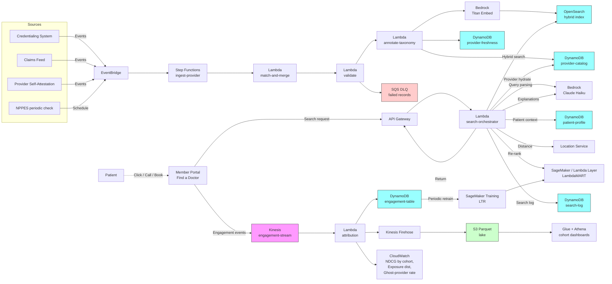

# Recipe 4.3 Architecture and Implementation: Provider Directory Search Optimization

*Companion to [Recipe 4.3: Provider Directory Search Optimization](chapter04.03-provider-directory-search-optimization). This page covers the AWS architecture, services, prerequisites, and pseudocode. For the problem framing and the conceptual approach, start with the main recipe.*

---

## The AWS Implementation

### Why These Services

**Amazon OpenSearch Service for the search workhorse.** OpenSearch is the right home for this kind of hybrid IR workload. It handles BM25 keyword scoring, attribute filters, and k-NN vector search in a single index. The query DSL lets you combine all three in one round-trip, which is exactly what Stages 2 and 3 of the pipeline want. OpenSearch Service is HIPAA-eligible and supports VPC-only deployment, encryption at rest, and node-to-node encryption. A single small cluster handles the load for a regional health plan; large national plans graduate to a multi-shard configuration. <!-- TODO: confirm current OpenSearch Service HIPAA eligibility entry on the AWS HIPAA Eligible Services Reference; the service has been on the list, but verify before publishing. -->

**Amazon DynamoDB for the provider catalog of record.** The provider record is a point-lookup workload (given an NPI or internal provider ID, fetch all attributes). DynamoDB is a fit: low-latency single-record reads, encryption at rest with customer-managed KMS, HIPAA-eligible. The OpenSearch index is a denormalized projection of the DynamoDB table; on update, a stream event fires a Lambda that re-indexes the affected provider. Two DynamoDB tables in this design: `provider-catalog` for the core record, and `provider-freshness` for the per-field verification timestamps that drive the data quality scoring.

**Amazon DynamoDB also for the patient context.** The same patient-profile table from Recipe 4.1 (and 4.2) is the source of truth for the patient's plan, language, prior providers, and stated preferences. The directory search Lambda reads this table on every search to enrich the query with personalization context. No new tables required if you've already shipped 4.1.

**Amazon Bedrock for query understanding and explanation rendering.** The Stage 1 query parser ("knee doctor" → orthopedic specialty + knee sub-interest) is well-suited to a small LLM call with structured-output guardrails (JSON schema, function-calling-style output). Anthropic Claude Haiku, Amazon Nova Lite, or Meta Llama models are all reasonable choices for the parsing work; Bedrock hosts them with HIPAA eligibility under BAA. Response times for these smaller models fit inside the search latency budget. The same Bedrock endpoint can be used in Stage 7 to render natural-language result explanations from structured ranking features. Confirm in your BAA acceptance and Bedrock service terms that customer prompts and completions are not used to train the underlying foundation models and are not retained beyond the request lifecycle. <!-- TODO: confirm Bedrock service terms and per-model data-handling guarantees at the time of build; the eligible-model list and BAA coverage have been evolving. -->

**Amazon Bedrock Titan Text Embeddings (or equivalent) for provider profile vectors.** Each provider's bio, specialty list, and services description gets embedded once at ingestion and stored as a dense vector in the OpenSearch index. Patient queries get embedded at search time. Vector cosine similarity becomes one of the candidate-retrieval signals in Stage 3. The embedding cost is small because the catalog is small.

**AWS Lambda for the query path orchestration.** The seven-stage query pipeline lives in a Lambda function (or a small set of Lambdas, depending on how you decompose). Lambda's burst-scaling fits the bursty traffic pattern of a public-facing "Find a Doctor" page. Reserved concurrency on the search Lambda protects the patient-facing path from noisy-neighbor effects.

**Amazon API Gateway for the search endpoint.** The "Find a Doctor" page on the member portal calls the search endpoint. Other consumers include member services tooling (the call-center rep searching on behalf of a member) and the appointment-reminder pipeline (Recipe 4.1) when it's checking in-network alternatives. API Gateway gives you authenticated entry, throttling, WAF integration, and the ability to differentiate public-portal callers (Cognito or Lambda authorizer) from service-to-service callers (IAM SigV4). The search Lambda must validate that the caller is allowed to act on the requested patient_id; do not rely on the upstream service.

<!-- TODO (TechWriter): Expert review S2 (MEDIUM), S6 (LOW), N13 (MEDIUM). Expand this paragraph (or add one alongside) covering three caller-context items the expert review flagged:
       (1) N13 (MEDIUM) Public vs private API Gateway. Three caller classes show up here with different network postures: portal callers reach a public regional REST API with WAF and Cognito authorizer; service-to-service callers (the Recipe 4.1 reminder pipeline, the Recipe 2.5 post-visit summary generator) should reach a private REST API exposed via a VPC interface endpoint; member-services tooling lands on either the public or the private endpoint depending on whether the agent desktop is inside the corporate VPC. The Lambda code is the same; the request paths and authn mechanisms are not.
       (2) S2 (MEDIUM) Per-patient WAF rate limiting. WAF is mentioned but not configured. Apply WAF rate-limit rules keyed on the resolved patient identifier from the Lambda authorizer (e.g., a custom request header populated by the authorizer). Starter values: 10 requests per patient per minute and 100 per patient per hour. This protects shared backend quotas (Bedrock for query parsing, Location Service for geocoding, OpenSearch read capacity) from a single misbehaving caller and is cheaper than discovering the issue via a Bedrock or Location Service throttling exception in production.
       (3) S6 (LOW) Member-services agent delegation auth. The agent-on-behalf-of-member pattern needs its own authorization mechanism: the request carries both the agent's identity (for audit and rate-limit dimensions) and the member's identity (for the recommendation context). Verify at request time that the agent is authorized to act on behalf of the requested member, typically via a short-lived delegation token issued by the member-services platform. Do not let an agent enumerate patients by reusing patient session tokens. -->

**AWS Step Functions for the catalog ingestion pipeline.** The match/merge/validate/annotate/embed/index DAG is a natural fit for Step Functions. Each stage is a Lambda. Failed records get routed to a DLQ with a `(provider_id, stage, failure_reason)` envelope so the data quality team can triage.

**Amazon EventBridge for source feed events.** Credentialing system updates, claims-derived signals (a provider hasn't billed under this plan in 90 days, a strong negative signal), and self-attestation submissions all arrive as events. EventBridge routes them to the appropriate Step Functions executions. Schedules in EventBridge also drive the periodic refresh tasks: nightly NPPES status checks, weekly phone-number validation sweeps, monthly geocoding reverification.

**Amazon Kinesis Data Streams for engagement events.** Same engagement-event bus you stood up for Recipes 4.1 and 4.2. New event types added: search_impression, search_click, provider_call_initiated, appointment_booked, directory_complaint_filed. The attribution Lambda picks up directory-related events and persists them into a structured engagement table for both ranker training and data quality monitoring.

**Amazon SageMaker for LTR training and (optional) hosting.** The ranker is an XGBoost-Ranker or LightGBM `lambdarank` model. SageMaker Training Jobs handle the periodic retraining; for a starter implementation, you can host the trained model as a Lambda layer and skip the endpoint. The Lambda-layer approach hits the 250 MB ceiling once you add XGBoost with numpy/scipy dependencies, so plan to graduate to a SageMaker Endpoint when the layer approach starts feeling cramped.

**Amazon Location Service for geocoding and distance.** Patient location strings ("123 Main St, Springfield") need to become coordinates for distance calculation. Provider addresses need the same. Amazon Location Service handles both, with HIPAA eligibility under BAA. The distance feature for the ranker comes from Location Service; the search-radius filter in OpenSearch uses Location-derived coordinates. <!-- TODO: confirm Amazon Location Service HIPAA eligibility status at the time of build; eligibility has been added but verify the current entry on the HIPAA Eligible Services Reference. -->

<!-- TODO (TechWriter): Expert review A11 (MEDIUM). Geocoding has to be cached, not called on every search. Geocode patient home addresses once at profile creation or address-update events, persist the lat/lon to the patient-profile table, and read on every search. Geocode patient-typed location overrides ("show me providers near 123 Other St") at search time, but cache by address string so a patient who searches the same off-profile address repeatedly doesn't re-incur the cost. Provider addresses are already geocoded once at ingestion (Step 1). Update the Cost Estimate row to reflect the cached-at-profile pattern: the right number is closer to $30-50/month at the illustrative volumes, not $300/month, since the only Location Service traffic is initial profile geocoding plus a small fraction of off-profile overrides. -->

**AWS Glue / Amazon Athena for the offline analytics and exposure dashboards.** Engagement data lands in S3 (via Kinesis Firehose) in Parquet. Glue crawlers maintain the schema, Athena queries power the cohort dashboards (NDCG by language, exposure distribution, ghost-provider rate). QuickSight or a custom dashboard fronts Athena for the operations team.

**AWS KMS for encryption, CloudTrail for audit, CloudWatch for operations.** Same PHI infrastructure pattern as previous recipes. Customer-managed KMS keys for every data store, CloudTrail data events for the patient-context lookups and the ranking-log table, CloudWatch alarms on search latency, error rate, and per-cohort NDCG drift.

### Architecture Diagram



### Prerequisites

| Requirement | Details |
|-------------|---------|
| **AWS Services** | Amazon OpenSearch Service, Amazon DynamoDB, Amazon Bedrock, AWS Lambda, Amazon API Gateway, Amazon Kinesis Data Streams, Amazon Kinesis Data Firehose, Amazon S3, AWS Glue, Amazon Athena, Amazon SageMaker, Amazon Location Service, AWS Step Functions, Amazon EventBridge, AWS KMS, Amazon CloudWatch, AWS CloudTrail. |
| **IAM Permissions** | Per-Lambda least-privilege: `dynamodb:GetItem`/`UpdateItem` scoped to specific tables; `bedrock:InvokeModel` on specific model ARNs; `aoss:APIAccessAll` or `es:ESHttpPost`/`es:ESHttpGet` scoped to the OpenSearch domain ARN; `geo:SearchPlaceIndex*` and `geo:CalculateRoute*` scoped to the Location Service resource; `kinesis:PutRecord` on the engagement stream. Never `*`. <!-- TODO: confirm exact IAM action names for OpenSearch Service vector search; classic OpenSearch uses `es:*` actions, OpenSearch Serverless uses `aoss:*`. The recipe assumes provisioned OpenSearch Service throughout; adjust if you choose Serverless. --><!-- TODO (TechWriter): Expert review S5 (LOW). Pair the actions with one or two scoped resource ARN examples so a reader copying this into an IAM policy doesn't default to `Resource: *`. For example: `bedrock:InvokeModel` on `arn:aws:bedrock:{region}::foundation-model/anthropic.claude-3-5-haiku-20241022-v1:0`; `dynamodb:GetItem` on `arn:aws:dynamodb:{region}:{account}:table/provider-catalog`; `geo:SearchPlaceIndexForText` on `arn:aws:geo:{region}:{account}:place-index/Healthcare-Geocoder`. Same chapter-wide pattern flagged in 4.1 Finding 5 and 4.2 Finding 5; a coordinated chapter-wide fix in the preface would be more durable than re-litigating per recipe. --> |
| **BAA** | AWS BAA signed. All services in the architecture must be HIPAA-eligible: OpenSearch Service, DynamoDB, Bedrock, Lambda, API Gateway, Kinesis, Firehose, S3, SageMaker, Step Functions, EventBridge, Location Service, KMS are all on the HIPAA Eligible Services list. <!-- TODO: confirm Bedrock + the specific embedding and LLM models you select are eligible at the time of build; verify Location Service eligibility entry; the eligible list has been evolving. --> |
| **Encryption** | DynamoDB: customer-managed KMS at rest. OpenSearch: encryption at rest, node-to-node encryption, HTTPS-only. Kinesis and Firehose: server-side encryption. S3: SSE-KMS with bucket-level keys. All Lambda log groups KMS-encrypted. Search-log table contains patient queries which may include PHI (a patient's name in a "find Dr. X" search, an NPI tied to a known patient relationship); treat it as PHI from the outset. |
| **VPC** | Production: Lambdas in VPC, OpenSearch domain in VPC (not public), VPC endpoints for DynamoDB (gateway), S3 (gateway), Bedrock, Kinesis, KMS, CloudWatch Logs, SageMaker Runtime, Step Functions (`states`), EventBridge (`events`), Location Service, STS. NAT Gateway only if calling external services without VPC endpoints (e.g., NPPES public API for provider verification); restrict egress security groups. VPC Flow Logs enabled. Provider data feeds from external SaaS credentialing systems may need a Direct Connect tunnel or PrivateLink connection rather than NAT egress. <!-- TODO (TechWriter): Expert review N14 (LOW) and N15 (LOW). Two networking items to fold into this row (or a follow-up paragraph in the production-gaps section): (1) N15 (LOW) State explicitly that there is no `0.0.0.0/0` egress on any Lambda subnet; NAT egress is restricted by security group to specific hostnames or IP ranges (NPPES public registry, the SaaS credentialing system if applicable), and all other outbound traffic flows through VPC endpoints. (2) N14 (LOW) NPPES public API has no formal SLA and is observed to throttle large polling clients. Batch queries (5-10 NPIs per request), schedule them off-peak (overnight), and back off aggressively on 5xx responses. The provider-validation Lambda must never call NPPES synchronously from the patient-facing search path. NPPES traffic is by NPI (provider identifier, not PHI), so NAT egress to NPPES is a reliability and rate-limiting concern, not an exfiltration risk. --> |
| **CloudTrail** | Enabled with data events on the patient-profile table, search-log table, and the engagement-event table. Provider-catalog table data events are recommended once it contains attributes derived from PHI (e.g., patient-overlap counts). |
| **Network and Compliance** | Provider directory accuracy requirements vary by line of business: Medicare Advantage and Medicaid managed care have CMS and state requirements respectively, ACA marketplace plans have separate requirements, commercial plans have state DOI requirements. The recipe assumes the architecture supports the strictest requirement applicable to the implementing plan; verify with compliance before scoping. <!-- TODO: have a compliance reviewer confirm the specific provider directory accuracy and refresh-cadence requirements applicable to your plan's lines of business at the time of build. --> |
| **Sample Data** | A starter provider catalog (a few hundred providers across multiple specialties) with realistic-but-synthetic addresses, languages, and tier assignments. The [NPPES NPI Registry](https://npiregistry.cms.hhs.gov/) is public and can seed an NPI/specialty/address index for development; never use real claims-derived attributes for non-production environments. [Synthea](https://github.com/synthetichealth/synthea) for synthetic patient encounters that produce realistic prior-provider relationships. |
| **Cost Estimate** | At a 400,000-member health plan with 12,000 providers and (illustratively) 500,000 searches per month: OpenSearch Service: a `m6g.large.search` 2-node domain runs in the $200-300/month range, scaling up with usage. DynamoDB on-demand: $50-150/month. Lambda + API Gateway: $50-150/month at this volume. Bedrock query parsing (typical Haiku-class request): roughly $0.0005-0.001 per search, so $250-500/month at 500K searches. Bedrock embedding for ingestion: a few dollars/month. Location Service: $0.50 per 1000 geocoding requests, so under $300/month at typical volumes. Kinesis + Firehose + S3 + Athena: $100-300/month. Estimated total: $1,000-2,500/month range for a regional plan, before SageMaker hosting costs. <!-- TODO: replace with verified, current pricing once the implementing team can validate against the AWS Pricing Calculator. --> |

### Ingredients

| AWS Service | Role |
|------------|------|
| **Amazon OpenSearch Service** | Hosts the hybrid keyword + filter + k-NN vector index of providers; serves Stage 3 candidate retrieval |
| **Amazon DynamoDB** | Stores the provider catalog of record, freshness metadata, patient profiles, search logs, and engagement aggregates |
| **Amazon Bedrock** | Hosts the LLM for query understanding (Stage 1) and explanation rendering (Stage 7); hosts the embedding model for provider profiles |
| **AWS Lambda** | Runs the search orchestrator, ingestion handlers, attribution worker, and (optionally) the LTR scorer as a layer |
| **Amazon API Gateway** | Fronts the search endpoint with auth, throttling, and WAF integration; supports public portal and service-to-service callers |
| **Amazon Kinesis Data Streams** | Carries impression, click, call, booking, and complaint events into the attribution pipeline |
| **Amazon Kinesis Data Firehose** | Lands engagement events in S3 Parquet for offline analytics and ranker training data prep |
| **Amazon S3** | Stores the engagement data lake, training artifacts, and ranker models |
| **AWS Glue / Amazon Athena** | Schema management and SQL access for the engagement data lake; powers the cohort dashboards |
| **Amazon SageMaker** | Trains the LTR ranker periodically; optionally hosts the ranker as a low-latency endpoint |
| **Amazon Location Service** | Geocodes patient and provider addresses; computes distances for ranking and radius filtering |
| **AWS Step Functions** | Orchestrates the catalog ingestion DAG with retry, DLQ, and visibility into per-stage failures |
| **Amazon EventBridge** | Routes upstream provider data events and schedules periodic refresh tasks |
| **AWS KMS** | Customer-managed encryption keys for all PHI-containing stores |
| **Amazon CloudWatch** | Operational metrics, cohort-sliced NDCG and exposure dashboards, alarms |
| **AWS CloudTrail** | Audit logging for all PHI-related API calls |

### Code

> **Reference implementations:** Useful aws-samples patterns for this recipe:
> - [`amazon-opensearch-service-samples`](https://github.com/aws-samples/amazon-opensearch-service-samples): Reference patterns for hybrid search (BM25 + filters + k-NN) directly applicable to Stages 2-3 here.
> - [`amazon-bedrock-workshop`](https://github.com/aws-samples/amazon-bedrock-workshop): Demonstrates structured-output prompting with Claude and embedding generation with Titan, the building blocks for Stages 1 and 7.
> <!-- TODO: confirm current names and locations of these aws-samples repositories. The list of search-related and Bedrock-related repos has been reorganizing. -->

#### Walkthrough

**Step 1: Ingest a provider record and validate it before indexing.** When a provider event arrives (new credentialing record, claims-derived update, NPPES delta), the ingestion pipeline matches the record to existing providers (NPI is the primary key; tax ID and address-similarity are fallbacks for dedupe), validates the data, annotates it with the standardized taxonomy, generates an embedding for the searchable profile text, and only then promotes it into the index. Skip validation and you index garbage; skip embedding and you lose semantic search; skip the staging step and bad records are visible to patients before anyone notices.

```
FUNCTION on_provider_event(event):
    // Match the inbound record to an existing catalog entry. NPI is the
    // primary key; if NPI is missing or the inbound record is from a system
    // that doesn't track NPI cleanly, fall back to (tax_id + address_similarity)
    // and (name + state + specialty). Each match strategy has a confidence
    // score. Below a threshold, the record goes to manual review.
    candidate_record = build_record_from_event(event)
    matched_provider_id = match_to_existing(candidate_record)
        // returns provider_id or null

    IF matched_provider_id is null AND candidate_record has NPI:
        provider_id = create_new_provider(candidate_record.NPI)
    ELSE IF matched_provider_id is null:
        ROUTE_TO_MANUAL_REVIEW(candidate_record, reason = "no_match_no_NPI")
        RETURN
    ELSE:
        provider_id = matched_provider_id

    // Validate. Each validation that fails goes to a freshness-decay table
    // and may demote (not delete) the corresponding field in the index.
    validation_results = {
        npi_active:       check_NPPES_active(candidate_record.NPI),
        address_geocoded: Location.SearchPlaceIndex(candidate_record.address),
        phone_reachable:  check_phone_format_and_reachability(candidate_record.phone),
        specialty_known:  taxonomy_lookup(candidate_record.specialty)
    }
    failed_validations = [k for k, v in validation_results if v is False]

    // Annotate. Map source-system specialty strings to a canonical taxonomy
    // (NUCC Healthcare Provider Taxonomy is the standard). Normalize languages
    // to ISO 639-1 codes. Assign network tier based on contracting metadata.
    annotated = {
        provider_id:      provider_id,
        canonical_specialty: map_to_NUCC(candidate_record.specialty),
        sub_specialties:  extract_sub_specialties(candidate_record),
        languages:        normalize_languages(candidate_record.languages),
        gender:           candidate_record.gender,
        accepts_new_patients: candidate_record.accepts_new_patients,
        network_tier:     network_tier_lookup(provider_id, candidate_record.contracting),
        location:         {
            address:   candidate_record.address,
            lat_lon:   validation_results.address_geocoded.coordinates,
            location_id: hash(candidate_record.address)   // a provider may have multiple
        },
        contact:          {
            phone:        candidate_record.phone,
            phone_status: validation_results.phone_reachable
        },
        services:         candidate_record.services,
        bio:              candidate_record.bio,
        last_verified_at: current UTC timestamp,
        source_system:    event.source_system
    }

    // Generate embedding for the searchable profile text. This is what
    // powers semantic match in Stage 3.
    profile_text = build_profile_text(annotated)
        // e.g., "Pediatrician. Sees newborns through age 18.
        //        Special interest in asthma and developmental pediatrics.
        //        Speaks English and Spanish."
    embedding = Bedrock.InvokeModel(
                    model_id = TITAN_EMBED_MODEL_ID,
                    body     = { "inputText": profile_text })
                    .embedding

    // Persist canonical record to DynamoDB.
    DynamoDB.PutItem("provider-catalog", annotated)

    // Update the per-field freshness table. The directory uses freshness as
    // a ranking signal: stale fields demote the provider in candidate retrieval.
    update_freshness_table(provider_id, validation_results, current UTC timestamp)

    // Index into OpenSearch. The hybrid index has BM25-scored text fields
    // (name, specialty, services), filter fields (network_tier, languages,
    // accepts_new_patients, location.lat_lon), and a vector field (embedding).
    OpenSearch.IndexDocument(
        index = "provider-directory",
        id    = provider_id,
        body  = {
            provider_id:          provider_id,
            name:                 annotated.name,
            canonical_specialty:  annotated.canonical_specialty,
            sub_specialties:      annotated.sub_specialties,
            languages:            annotated.languages,
            gender:               annotated.gender,
            accepts_new_patients: annotated.accepts_new_patients,
            network_tier:         annotated.network_tier,
            location:             annotated.location.lat_lon,
            services_text:        annotated.services,
            bio_text:             annotated.bio,
            embedding:            embedding,
            last_verified_at:     annotated.last_verified_at,
            freshness_score:      compute_freshness_score(provider_id),
            status:               "active" IF len(failed_validations) == 0 ELSE "demoted"
        })

    // Emit a CloudWatch metric for ingestion observability.
    emit_metric("provider_ingest", value = 1, dimensions = {
        source_system: event.source_system,
        outcome:       "active" if len(failed_validations) == 0 else "demoted"
    })
```

<!-- TODO (TechWriter): Expert review A8 (HIGH). Multi-location providers are not addressed by the indexing model. The annotated record's `location` block has a single `lat_lon` and a single `location_id`, with the comment "a provider may have multiple", and the OpenSearch index write stores `location: annotated.location.lat_lon` (one geo_point). A primary-care doc with three offices is indexed at one address, and the geo_distance filter in `retrieve_candidates` (Step 3) sees only that one. Multi-location is the common case in primary care, pediatrics, and most specialty groups, not an edge case. Index the catalog at the `(provider_id, location_id)` granularity. Pick one of:
       (a) per-pair documents (each `(provider, location)` is its own OpenSearch doc; result assembly deduplicates to the closest location per provider for display);
       (b) provider documents with a nested `locations[]` array (each entry has its own `lat_lon` and `last_verified_at`; OpenSearch's nested-field query returns the matching nested object).
     Update the pseudocode in Step 1, the architecture diagram, and Step 7 result assembly so the displayed address is the location that matched the geo_distance filter, not whichever address the catalog cited first. The match-and-merge step should produce a deduplicated `locations[]` array with an `is_primary` flag for the cases where the patient-facing UX needs a single canonical address. -->

**Step 2: Parse the search query into structured intent.** The patient typed something into a search box. Stage 1's job is to figure out what they meant. The output is a structured intent object that downstream stages use to build the OpenSearch query. Skip this and you'll be doing keyword matching against unnormalized free text, which works for exact-name searches and falls down on everything else.

```
FUNCTION parse_query(query_string, patient_context):
    // For a small set of obvious patterns, take a fast path that skips the LLM.
    // Empty query, exact NPI lookup, or a name-shaped string are deterministic.
    fast_path_intent = try_fast_path(query_string)
    IF fast_path_intent is not null:
        RETURN fast_path_intent

    // For the rest, structured-output prompt to a small Bedrock model.
    // Provide the canonical specialty taxonomy as part of the prompt context
    // so the model maps free-text inputs onto known specialties.
    prompt = build_query_understanding_prompt(query_string, patient_context.locale)
    schema = {
        "intent_type":     "specialty_search | name_search | service_search | unknown",
        "specialty":       "NUCC code or null",
        "sub_specialty":   "string or null",
        "services":        ["string"],
        "filters": {
            "language":             "ISO 639-1 code or null",
            "gender":               "male | female | non_binary | null",
            "accepts_new_patients": "true | false | null",
            "telehealth":           "true | false | null"
        },
        "free_text_residual": "string"
    }
    response = Bedrock.InvokeModel(
                   model_id = QUERY_PARSER_MODEL_ID,    // e.g., Claude Haiku or Nova Lite
                   body     = { "messages": [...], "response_format": { "schema": schema } })

    intent = parse_json(response.completion)
    validate_against_schema(intent, schema)   // belt-and-suspenders

    // Defensive fallbacks. If the model returns an unknown specialty code,
    // drop the structured filter and fall back to BM25 on the free-text residual.
    IF intent.specialty is not null AND intent.specialty not in TAXONOMY:
        intent.free_text_residual = query_string
        intent.specialty = null

    RETURN intent
```

**Step 3: Apply eligibility filters and retrieve candidates with hybrid search.** Stages 2 and 3 combine into a single OpenSearch query. The filter clause enforces hard "shall not show" rules; the must clause does keyword and vector match for relevance; the should clause adds soft signals (sub-specialty match, language preference) as boosts. Skip the filters and you'll show out-of-network providers in in-network searches, which is a contractual problem. Skip the hybrid match and you'll be choosing between keyword brittleness and vector black-box; you want both.

```
FUNCTION retrieve_candidates(intent, patient_context, top_k = 200):
    // Build the patient-context filters that are non-negotiable.
    eligibility_filters = [
        { term: { "status": "active" } },
        // Network match. The patient's plan determines which network tier(s)
        // they can see. A "preferred" plan can see preferred and standard;
        // a "standard" plan can see standard only.
        { terms: { "network_tier": allowed_tiers_for_plan(patient_context.plan_id) } }
    ]

    // The intent can add filters: language, gender, accepts_new_patients.
    // Filters from intent are required only when the intent system is confident.
    IF intent.filters.language is not null:
        eligibility_filters.append({ term: { "languages": intent.filters.language } })
    IF intent.filters.gender is not null:
        eligibility_filters.append({ term: { "gender": intent.filters.gender } })
    IF intent.filters.accepts_new_patients == true:
        eligibility_filters.append({ term: { "accepts_new_patients": true } })

    // Geographic radius. Patients always have a location (from explicit input
    // or from the address on file). Default radius depends on geography:
    // urban dense, 10 miles; suburban, 25; rural, 50. UI lets the patient adjust.
    eligibility_filters.append({
        geo_distance: {
            distance: patient_context.search_radius_miles + "mi",
            location: patient_context.search_location
        }
    })

    // Embed the free-text residual + the canonical specialty for the vector match.
    // Combining them gives the embedding both the structured signal and any
    // free-text nuance the parser couldn't capture.
    embedding_input = (intent.specialty or "") + " " + (intent.free_text_residual or "")
    query_embedding = Bedrock.InvokeModel(
                          model_id = TITAN_EMBED_MODEL_ID,
                          body     = { "inputText": embedding_input })
                          .embedding

    // Build the hybrid query. The boost weights here are the kind of thing
    // you tune by hand, then harden once you have evaluation data.
    query = {
        size: top_k,
        query: {
            bool: {
                filter: eligibility_filters,
                must: [
                    {
                        // Vector similarity: how well does the provider's
                        // profile match the parsed intent semantically.
                        knn: {
                            embedding: {
                                vector: query_embedding,
                                k: top_k
                            }
                        }
                    }
                ],
                should: [
                    // BM25 keyword match on name and specialty as a boost.
                    {
                        multi_match: {
                            query: intent.free_text_residual or "",
                            fields: ["name^3", "canonical_specialty^2", "sub_specialties", "services_text", "bio_text"],
                            boost: 1.5
                        }
                    },
                    // Sub-specialty match if the parser found one.
                    {
                        terms: { "sub_specialties": intent.sub_specialty ? [intent.sub_specialty] : [] }
                    },
                    // Freshness boost. Recently-verified records get a small lift.
                    {
                        range: { "last_verified_at": { gte: "now-30d", boost: 1.2 } }
                    }
                ]
            }
        }
    }

    response = OpenSearch.Search(index = "provider-directory", body = query)
    RETURN response.hits   // typically 100-300 candidates after filters
```

**Step 4: Join personalization features for the ranker.** The candidates from Stage 3 are relevant in aggregate, but the personalized ranker needs more signal: distance, prior visits, provider quality, panel openness, freshness penalties. This step parallel-fetches those signals from the patient profile, the provider catalog, and any feature-store enrichments. Underinvest here and the ranker has nothing personal to rank by.

```
FUNCTION join_features(candidates, patient_context):
    // For each candidate, build a feature vector that the LTR model consumes.
    feature_rows = []
    FOR each c in candidates:
        // Prior visits: claims-derived "has this patient seen this provider before"
        // signal. Strong positive feature, but only valid when the patient has
        // claims history with the plan. New members have null here.
        prior_visits = patient_context.claims_summary.visits_by_provider.get(c.provider_id, 0)

        // Distance from patient. Already filtered by radius, but distance
        // within radius is still a useful feature.
        distance_miles = haversine(patient_context.search_location, c.location)

        // Provider quality scores (HEDIS performance, patient satisfaction
        // if you have it). Many plans don't make these available at the
        // individual provider level; cohort-level fallback if not.
        quality_score = lookup_provider_quality(c.provider_id) or cohort_mean

        // Availability signals. Next-available appointment if you have it
        // (some scheduling systems expose this; many don't). Panel-openness
        // is a coarser fallback.
        next_available_days = lookup_next_available(c.provider_id)   // null if not known
        panel_openness      = c.accepts_new_patients ? 1 : 0

        // Freshness penalty. Records with stale verification get demoted
        // proportional to staleness. This is the data-quality lever.
        freshness_penalty = compute_freshness_penalty(c.last_verified_at)

        // Specialty fit. How well the provider's specialty matches the
        // parsed intent. Strong match = 1, partial = 0.5, weak = 0.
        specialty_fit = compute_specialty_fit(c.canonical_specialty, intent.specialty)

        feature_rows.append({
            provider_id:     c.provider_id,
            // From the candidate retrieval step:
            vector_score:    c.vector_similarity,
            bm25_score:      c.bm25_score,
            // From this stage:
            distance_miles:           distance_miles,
            prior_visits:             prior_visits,
            quality_score:            quality_score,
            next_available_days:      next_available_days,
            panel_openness:           panel_openness,
            freshness_penalty:        freshness_penalty,
            specialty_fit:            specialty_fit,
            language_match:           1 if patient_context.preferred_language in c.languages else 0,
            network_tier_rank:        tier_to_rank(c.network_tier),
            is_safety_net_provider:   c.provider_flags.includes("safety_net") ? 1 : 0
        })

    RETURN feature_rows
```

**Step 5: Score and rank with the LTR model.** The feature rows feed an XGBoost-Ranker (or LightGBM `lambdarank`) model. The model produces a relevance score per provider. Sorting by that score gives the raw ranking. Skip this step and you're back to "closest first," which is what you were trying to escape.

```
FUNCTION rank(feature_rows, model):
    // Build the feature matrix in the order the model expects.
    X = build_feature_matrix(feature_rows, FEATURE_ORDER)

    // Score. XGBoost-Ranker.predict returns a score per row.
    scores = model.predict(X)

    // Attach scores back to feature rows and sort descending.
    FOR i, row in enumerate(feature_rows):
        row.relevance_score = scores[i]

        // Capture per-row feature contributions for explainability.
        // SHAP values give the model's accounting of why this row got this score.
        row.shap_values = model.get_shap_values(X[i])

    sorted_rows = sort feature_rows by relevance_score DESC
    RETURN sorted_rows
```

**Step 6: Re-rank for fairness and diversity.** The raw LTR output is locally optimal but may produce structurally bad outcomes (a handful of providers dominating impressions, safety-net providers buried, near-duplicates clustering). The fairness re-ranker enforces explicit policy constraints. Skip this step and you ship a system that quietly concentrates patient flow on a small subset of the network.

```
FUNCTION fairness_rerank(sorted_rows, patient_context, policy):
    // Three policies typically apply, in order:

    // 1. Exposure caps: limit how often any single provider appears at the
    // top across a rolling window. Pull live exposure counts from the
    // engagement aggregates table.
    exposure_window = get_exposure_window(provider_ids = [r.provider_id for r in sorted_rows],
                                          window = "last_24h")
    FOR row in sorted_rows:
        IF exposure_window[row.provider_id].impressions_at_top_3 > policy.max_top3_impressions:
            row.relevance_score = row.relevance_score * 0.7
            row.applied_factors.append("exposure_cap_top3: x0.7")

    // 2. Safety-net floor: ensure at least one safety-net-flagged provider
    // appears in the top N when relevant. If the raw ranking didn't surface
    // one in the top N but the candidate set has a high-fit safety-net
    // provider, promote it. Strict thresholds: only promote if the safety-net
    // provider's specialty_fit and freshness are above floor levels, so we
    // don't surface bad data in the name of fairness.
    IF policy.safety_net_floor_enabled:
        top_n = first N of sorted_rows
        IF none of top_n is_safety_net_provider:
            best_safety_net_candidate = highest-relevance safety-net row in sorted_rows
                                        WHERE specialty_fit >= 0.7
                                          AND freshness_penalty <= 0.2
            IF best_safety_net_candidate exists:
                promote_to_position(best_safety_net_candidate, sorted_rows, position = N)

    // 3. Near-duplicate suppression: if two providers in the top N work at
    // the same practice and have similar specialties, demote the second.
    // Patients want choice, not copies of the same office.
    suppressed = []
    FOR i, row in enumerate(sorted_rows):
        FOR j, prior in enumerate(sorted_rows[:i]):
            IF j in suppressed:
                continue
            IF same_practice(row, prior) AND specialty_overlap(row, prior) > 0.8:
                row.relevance_score = row.relevance_score * 0.6
                row.applied_factors.append("near_duplicate_dampened: x0.6")
                suppressed.append(i)
                break

    // Resort after all the score adjustments. The reorder is small in
    // practice (most rows are unaffected) but enforces the policies cleanly.
    reranked = sort sorted_rows by relevance_score DESC
    RETURN reranked
```

<!-- TODO (TechWriter): Expert review A9 (HIGH) and A10 (MEDIUM). The `get_exposure_window(provider_ids, window = "last_24h")` call above is a black-box helper that this recipe never defines or implements. The Python companion's exposure aggregates carry `_24h`-suffixed attribute names but are never reset, never windowed, and never bounded; the Code Review caught the same gap on that side. Without windowing, every popular provider eventually accumulates counts above the cap and the dampening fires for them on every search permanently, which means the cap stops differentiating providers within a few months of launch and the fairness re-rank quietly stops doing the job it was designed for. Pick one canonical windowing approach, document the tradeoff in a Stage 6 sidebar, and align the pseudocode and the Python on the chosen implementation:
       (a) per-event row table with DynamoDB TTL on a 24-hour expiry, aggregated on read via a query;
       (b) sliding-window aggregation via Kinesis Data Analytics or a scheduled Lambda decay job that ages out older buckets hourly;
       (c) bucketed-counter map (`impressions_at_top_3.{yyyy-MM-ddTHH}`) summed over the last 24 hour-buckets at read time (note the cold-start nested-map issue from Recipe 4.2; the same `SET ... if_not_exists(...)` pattern would apply).
     Coordinate with the Code Review WARNING so both files teach the same approach. Also: A10 (MEDIUM) the per-search batched read of exposure aggregates for 100-300 candidates lives in the hot path (the recipe's claim "fits in 500 milliseconds" depends on this read being fast), so cache aggressively in the search-orchestrator Lambda (per-container LRU keyed on `provider_id`, TTL of 60-120 seconds) and consider an ElastiCache for Redis tier at higher traffic volumes; a 1-2 minute lag in the count is acceptable since the cap is a fairness lever, not a correctness boundary. -->

**Step 7: Assemble results with explanations and log the search.** Each result returned to the UI carries a short rationale. Skip the explanations and patients can't tell why one provider is ranked above another, which erodes trust and makes the system feel arbitrary. Skip the search log and you cannot evaluate the ranker, debug a complaint, or train the next model.

```
FUNCTION assemble_and_log(reranked_rows, patient_context, intent, top_n = 10):
    search_id = new UUID

    // Hydrate the top N with display fields from the provider catalog.
    top = first top_n of reranked_rows
    results = []
    FOR row in top:
        provider = DynamoDB.GetItem("provider-catalog", row.provider_id)
        // Build a short, structured explanation from ranking features
        // before optionally rephrasing with an LLM.
        structured_explanation = {
            specialty_fit:     row.features.specialty_fit,
            language_match:    row.features.language_match,
            prior_visits:      row.features.prior_visits,
            distance_miles:    row.features.distance_miles,
            network_tier:      provider.network_tier,
            freshness_penalty: row.features.freshness_penalty,
            applied_factors:   row.applied_factors
        }
        // Optional: render a friendly explanation via Bedrock. Run this
        // batched (one call per result page) rather than one call per row
        // to keep latency in check. Cache by structured_explanation hash.
        nl_explanation = render_explanation_via_llm(structured_explanation, patient_context.locale)
            // e.g., "Matches your search for a Spanish-speaking pediatrician.
            //       You've seen this provider before. In your plan's
            //       preferred network. 4.2 miles from your address."

        results.append({
            provider_id:     row.provider_id,
            name:            provider.name,
            specialty:       provider.canonical_specialty,
            address:         provider.location.address,
            distance_miles:  round(row.features.distance_miles, 1),
            languages:       provider.languages,
            accepting_new_patients: provider.accepts_new_patients,
            network_tier:    provider.network_tier,
            phone:           provider.contact.phone,
            relevance_score: row.relevance_score,
            explanation:     nl_explanation,
            structured_explanation: structured_explanation
        })

    // Persist the search log. This is the join point for engagement
    // attribution and the basis of the ranker's training data.
    // IMPORTANT: minimize. Persist parsed-intent fields and cohort features
    // used by the ranker. Do NOT persist the verbatim query string into
    // the same record as the patient_id; the raw query may include the
    // patient's own name, a prior provider's name, or other identifying
    // free text. Send the raw query to a separate, append-only audit log
    // with stricter access and shorter retention.
    DynamoDB.PutItem("search-log", {
        search_id:     search_id,
        patient_id:    patient_context.patient_id,
        timestamp:     current UTC timestamp,
        intent:        intent,
        // Only the cohort features the ranker training pipeline needs.
        feature_snapshot: {
            plan_id:            patient_context.plan_id,
            preferred_language: patient_context.preferred_language,
            search_radius:      patient_context.search_radius_miles,
            patient_locale:     patient_context.locale
        },
        ranked_provider_ids: [r.provider_id for r in results],
        ranked_scores:       [r.relevance_score for r in results],
        model_version:       CURRENT_LTR_MODEL_VERSION,
        policy_version:      CURRENT_POLICY_VERSION
    })

    // Send the verbatim query to the audit channel separately, with its own
    // access controls and retention.
    AuditLog.Append("search-query-audit", {
        search_id:    search_id,
        timestamp:    current UTC timestamp,
        query_string: query_string
        // No patient_id here; reconstruction requires joining via search_id
        // through the audit access workflow, which logs the joiner.
    })

    // Emit an impression event for each result shown.
    FOR rank_pos, result in enumerate(results):
        Kinesis.PutRecord(stream = "engagement-stream", record = {
            event_type:  "search_impression",
            search_id:   search_id,
            provider_id: result.provider_id,
            patient_id:  patient_context.patient_id,
            position:    rank_pos + 1,
            timestamp:   current UTC timestamp
        })

    RETURN { search_id: search_id, results: results }
```

**Step 8: Capture engagement and feed back into ranker training and data quality.** A separate Lambda consumes the engagement stream, joins each event back to the search log, applies position-bias correction, and updates two things: ranker training data (for the periodic retrain) and the provider catalog's freshness signals (a "ghost provider" complaint is high-priority operational signal). Underinvest here and the model stops learning and the catalog stops self-correcting.

```
FUNCTION process_engagement_event(event):
    // Look up the originating search.
    search = DynamoDB.GetItem("search-log", event.search_id)
    IF search is null:
        LOG("engagement event for unknown search_id: " + event.search_id)
        RETURN

    // Validate the event references a provider that was actually shown.
    IF event.provider_id NOT IN search.ranked_provider_ids:
        LOG("event provider_id not in ranked list; dropping")
        RETURN

    // Validate the patient identity. Same integrity boundary as Recipe 4.2.
    IF event.patient_id != search.patient_id:
        LOG("engagement event patient_id mismatch with search; dropping")
        RETURN

    position_in_results = search.ranked_provider_ids.index_of(event.provider_id) + 1

    // Persist to the engagement table for offline training.
    DynamoDB.PutItem("engagement-events", {
        event_id:    new UUID,
        search_id:   event.search_id,
        provider_id: event.provider_id,
        patient_id:  event.patient_id,
        event_type:  event.event_type,
        position:    position_in_results,
        timestamp:   event.timestamp,
        feature_snapshot: search.feature_snapshot
    })

    // Compute position-bias-corrected reward. Patients click position 1 more
    // than position 10 regardless of quality; ranker training that doesn't
    // correct for this just learns to repeat the existing ranking.
    propensity = position_propensity(position_in_results)
        // simple position-based model: e.g., 1.0, 0.7, 0.5, 0.4, ...
    bias_corrected_reward = (event_to_reward(event) / propensity)

    // Update the rolling exposure aggregates that the fairness re-ranker reads.
    DynamoDB.UpdateItem("exposure-aggregates", event.provider_id,
        "ADD impressions_total :one" +
        IF event.event_type == "search_impression" AND position_in_results <= 3
            THEN ", impressions_at_top_3 :one"
            ELSE "",
        values = { ":one": 1 })

    // Special handling: a directory complaint (the directory sent the patient
    // to a closed practice, wrong number, etc.) is a gold-standard data
    // quality signal. Flag the provider for immediate review and demote in
    // the index until the catalog team re-verifies.
    IF event.event_type == "directory_complaint_filed":
        flag_provider_for_review(event.provider_id, reason = event.complaint_reason)
        OpenSearch.UpdateDocument(
            index = "provider-directory",
            id    = event.provider_id,
            body  = { doc: { status: "demoted", freshness_score: 0.1 } })
        emit_metric("ghost_provider_complaint", value = 1, dimensions = {
            region: lookup_region(event.provider_id),
            specialty: lookup_specialty(event.provider_id)
        })

    // Emit cohort-sliced metrics for fairness monitoring.
    emit_metric("search_engagement",
                value = 1,
                dimensions = {
                    event_type: event.event_type,
                    plan_id:    search.feature_snapshot.plan_id,
                    language:   search.feature_snapshot.preferred_language,
                    position_band: bucket(position_in_results)
                })
```

> **Curious how this looks in Python?** The pseudocode above covers the concepts. If you'd like to see sample Python code that demonstrates these patterns using boto3, check out the [Python Example](chapter04.03-python-example). It walks through each step with inline comments and notes on what you'd need to change for a real deployment.

### Expected Results

**Sample search response:**

```json
{
  "search_id": "9b8c3a40-2c19-4e8b-b3f1-50f4d8c0a1b2",
  "patient_id": "pat-000482",
  "timestamp": "2026-05-04T19:32:00Z",
  "model_version": "rank-v0.7",
  "policy_version": "fair-rerank-v0.3",
  "intent": {
    "intent_type": "specialty_search",
    "specialty": "207Q00000X",
    "specialty_label": "Family Medicine",
    "filters": { "language": "es", "accepts_new_patients": true }
  },
  "results": [
    {
      "provider_id": "prv-018442",
      "name": "Dr. Maria Hernandez, MD",
      "specialty": "Family Medicine",
      "address": "1244 Elm St, Springfield",
      "distance_miles": 2.1,
      "languages": ["en", "es"],
      "accepting_new_patients": true,
      "network_tier": "preferred",
      "phone": "555-0140",
      "relevance_score": 1.42,
      "explanation": "Spanish-speaking family physician, 2.1 miles from your address. Accepting new patients. In your plan's preferred network."
    },
    {
      "provider_id": "prv-021903",
      "name": "Dr. Carlos Reyes, DO",
      "specialty": "Family Medicine",
      "address": "808 Oak Ave, Springfield",
      "distance_miles": 4.4,
      "languages": ["en", "es"],
      "accepting_new_patients": true,
      "network_tier": "preferred",
      "phone": "555-0188",
      "relevance_score": 1.31,
      "explanation": "Spanish-speaking family physician, 4.4 miles from your address. Accepting new patients."
    },
    {
      "provider_id": "prv-009811",
      "name": "Springfield Community Health Center",
      "specialty": "Family Medicine",
      "address": "20 River Rd, Springfield",
      "distance_miles": 5.6,
      "languages": ["en", "es", "vi"],
      "accepting_new_patients": true,
      "network_tier": "preferred",
      "phone": "555-0099",
      "relevance_score": 1.18,
      "explanation": "Federally Qualified Health Center, multiple Spanish-speaking providers, sliding-fee scale available."
    }
  ]
}
```

**Sample exposure aggregate record (for fairness re-ranker):**

```json
{
  "provider_id": "prv-018442",
  "impressions_total_24h": 412,
  "impressions_at_top_3_24h": 218,
  "clicks_total_24h": 47,
  "calls_initiated_24h": 12,
  "appointments_booked_24h": 4,
  "complaints_filed_24h": 0,
  "rolling_exposure_share": 0.084,
  "note": "Above plan-wide median exposure share but below cap (0.10)"
}
```

**Performance benchmarks (illustrative, your mileage varies):**

| Metric | Distance-only baseline | Recipe pipeline |
|--------|------------------------|-----------------|
| NDCG@10 | 0.55-0.65 | 0.78-0.85 (observed range, depends heavily on label quality and catalog completeness) |
| Click-through rate at top 3 | 25-35% | 45-60% |
| Calls placed per search session | 5-10% | 12-20% |
| Ghost-provider complaints per 10K searches | 30-50 | 8-15 (after a few months of data-quality feedback) |
| End-to-end search latency (p95) | <100 ms | <500 ms (incl. LLM query parsing) |

<!-- TODO: the NDCG, CTR, and complaint-rate ranges are illustrative and have not been measured for this specific pipeline. Replace with measured results from your deployment, or with citations to published provider-directory ranking deployments when available. -->

**Where it struggles:**

- **Brand-new members with no claims history.** The ranker leans heavily on prior-visit and quality features that aren't available for members in their first 30-60 days. Cohort-level fallbacks (similar plan + similar geography) help, but the new-member experience is more generic until claims start accumulating.
- **Specialties with thin networks.** Searches for less-common specialties (e.g., pediatric subspecialties in rural areas) return small candidate sets where ranking matters less than the bare fact of network adequacy. The recommender will be honest, but the patient's experience is "there are three options and they're all 40 miles away."
- **Provider-data systems that don't expose availability.** "Next-available appointment" is a strong feature when you have it. Many organizations don't have a single source of truth across all contracted providers. Without it, the ranker uses panel-openness as a coarse proxy and accepts the loss of granularity.
- **Patient queries in languages the parser hasn't been tested on.** The Stage 1 LLM may handle Spanish well and Vietnamese poorly, depending on the underlying model and the prompt's coverage. Test parsing quality per language before launching, and route low-confidence parses to a fallback BM25 path rather than letting a low-quality structured intent drive the rest of the pipeline.
- **Member services agents searching on behalf of multiple members.** A call-center agent doing dozens of searches per shift may produce engagement signals that don't represent any single patient's preferences. Tag agent-initiated searches separately so they don't poison the personalization signal.

---

## Why This Isn't Production-Ready

The pseudocode and architecture above demonstrate the pattern. A production deployment needs to close several gaps that are intentionally out of scope for a recipe.

**Provider-data governance.** The recipe assumes events arrive from credentialing, claims, and self-attestation systems. In a real plan, those systems are owned by different teams with different priorities, different data formats, and different SLAs. Standing up the ingestion pipeline is half the work; standing up the cross-functional process that keeps the catalog accurate (provider relations chasing down stale records, network operations reconciling tier assignments, compliance auditing accuracy) is the other half. Underinvest here and the recipe is technically correct but operationally brittle.

**Network-adequacy reporting.** Plans are required to demonstrate network adequacy: enough providers in each specialty within reasonable travel distance for each member. The directory data is the source for adequacy reporting. Make sure the data pipeline that powers search is the same data pipeline that powers adequacy reports, or you'll have two sources of truth and the regulatory one will be out of date.

**Multi-language UI and parsing.** The pipeline supports a `language` filter, but the search box itself probably needs to accept queries in non-English languages and return localized explanations. The Stage 1 parser must be tested and prompted for each supported language; the Stage 7 explanation rendering needs locale-aware templates. Skip this and the personalization stops at the first non-English query.

**Audit log access workflow.** The recipe puts the verbatim query string into a separate audit log. That log needs an access workflow: who can read it, what authorization is required, how requests get logged, how the log itself is retained and disposed of. Define this with privacy and legal before the system is live, not after.

<!-- TODO (TechWriter): Specify the SageMaker training-job trigger mechanism (EventBridge schedule, Step Functions on a cron, or CloudWatch metric threshold) and the model-promotion path from training to inference (Lambda-layer publish + alias canary, or SageMaker endpoint variant weights). The architecture diagram currently shows "Periodic retrain" without an explicit trigger node, and there is no path shown for promoting a newly-trained ranker into the inference path. -->

<!-- TODO (TechWriter): Add a paragraph (or extend the existing operational gaps) covering DLQ coverage on all Lambda paths in the architecture, none of which the diagram currently shows:
       (a) API Gateway -> search-orchestrator Lambda: SQS DLQ on the function, or accept the synchronous-API tradeoff and pair structured logging with a CloudWatch 5xx alarm and a documented replay-from-logs runbook;
       (b) Step Functions -> ingestion Lambdas: each task should `Catch` to an SQS failure queue keyed on (provider_id, stage, failure_reason);
       (c) Kinesis -> attribution Lambda: configure an OnFailure destination on the event source mapping pointing to SQS or SNS, with a CloudWatch alarm on DLQ depth.
     The third one is the most insidious: an attribution Lambda silently dropping engagement events leaves the ranker training data incomplete and the exposure aggregates wrong, with no observable symptom until a cohort dashboard regresses. -->

**Position-bias correction at training time.** The pseudocode references position-based bias correction in the engagement attribution. Production-grade LTR training does this correction explicitly inside the loss function (counterfactual learning to rank, IPS-weighted ranker). Wiring that into the training pipeline is real work and worth scoping early.

**Exposure-cap calibration.** The fairness re-ranker uses exposure caps as a policy lever. Setting those caps is a network-operations decision, not a data-science decision. Engage with provider relations early. A cap that's too tight starves high-quality providers of patients; a cap that's too loose lets concentration drift back in. Plan to recalibrate quarterly with data-driven inputs.

**Safety-net floor governance.** The "promote a safety-net provider into the top N" rule is sensitive. It needs a written policy, with criteria for which provider categories qualify, what fit thresholds apply, and how the policy is reviewed annually. Document this. Audit logs need to record when the floor fired and which provider was promoted, so a compliance review can confirm the policy is being applied as intended.

**Data quality SLAs.** The recipe references freshness scoring but doesn't define the SLAs. Production: define explicit SLAs by field (e.g., "phone number reverified within 90 days," "address geocoded within 180 days," "panel-openness flag refreshed monthly via provider self-attestation"). Each SLA gets a CloudWatch metric, an alarm, and a remediation playbook. The directory's regulatory standing depends on this.

**Privacy in the search log.** The search log table contains patient IDs joined to ranked provider lists joined to feature snapshots. That join is sensitive: patterns of search behavior (a member repeatedly searching for "oncologist" or "addiction medicine") are inferentially identifying. Apply the same controls as the patient profile: customer-managed KMS, CloudTrail data events, narrow IAM read scopes, defined retention. As noted in the pseudocode, do not persist verbatim query strings into the same record as the patient_id; route those to a separate audit channel with stricter access and shorter retention.

<!-- TODO (TechWriter): Expert review S1 (MEDIUM). Specify the retention period explicitly. At the illustrative scale used elsewhere in this recipe (500K searches per month), the patient-joined search log accumulates 6M rows per year and grows more inferentially identifying the longer it lives. Define an explicit retention policy with privacy and compliance approval (e.g., 90 days for individually-attributed search logs; 30 days for the verbatim query audit channel since its purpose is incident investigation rather than analytics; longer retention only after de-identification per HIPAA Safe Harbor or expert determination). Add a CloudWatch alarm on the deletion job and a documented re-attestation cadence. Same chapter-wide pattern as Recipe 4.1's reminder-decisions retention. -->

<!-- TODO (TechWriter): Expert review S3 (MEDIUM). Add a paragraph clarifying the provider-catalog PHI boundary. The pseudocode in `join_features` (Step 4) computes patient-side personalization features at query time from `patient_context.claims_summary.visits_by_provider`, which keeps the provider catalog non-PHI; the Prerequisites CloudTrail row, however, leans toward a future where provider-side patient-overlap counts get persisted onto the provider record, which would cross the catalog into PHI-bearing territory. State the default explicitly: keep the provider catalog non-PHI by computing patient-derived features at query time. If a future iteration persists provider-side patient aggregates (e.g., for ranker features or operational dashboards), elevate the entire catalog to PHI status from that point forward (customer-managed KMS, CloudTrail data events, narrow IAM read scopes, defined retention) and note that aggregated counts can be re-identifying for providers with small panels (a rare-specialty provider with three patients from a particular plan). -->

**Cohort fairness review.** The architecture emits cohort-sliced metrics, but a dashboard nobody reads is useless. Establish a quarterly review with a cross-functional committee (data science, network operations, compliance, member services). Watch for: cohorts with consistently lower NDCG (signaling poor parsing or data-quality coverage), provider exposure distributions that drift toward concentration, ghost-provider complaint rates that vary by region or language. Each finding should produce an action item with an owner.

---

## Variations and Extensions

**Telehealth-aware ranking.** Add a `telehealth_capable` flag and a `telehealth_preference` patient feature, and let the ranker treat telehealth as a first-class option rather than a sub-filter. For a working parent in a rural area, a telehealth-only Spanish-speaking pediatrician 200 miles away may be a better match than an in-person English-speaking pediatrician 8 miles away. The ranker can balance the trade-off if the data captures it.

**Care episode awareness.** When a patient has an active care episode (recent ED visit, recent cancer diagnosis, post-surgical follow-up window), boost specialists relevant to that episode and continuity-of-care signals (the providers who saw them during the episode). Episode signals come from the same claims-derived feature pipeline that powers prior-visit features; the extension is using episode tags as boosting features in the ranker.

**Insurance coverage explainability.** Combine the ranker output with member-specific cost estimation: "Dr. Hernandez is in your preferred tier; your estimated visit cost is $30 copay." This requires integrating with the plan's claims-pricing engine, but the patient experience leap is large. Make sure the cost estimates are clearly labeled as estimates and update them as plan-design changes.

**Provider-side tooling for directory accuracy.** A provider self-service portal where contracted providers can review and correct their own directory entries. Submissions enter the validation pipeline (Step 1) the same way as other source events. This shifts the data quality burden onto the parties best positioned to know the truth (the providers), with appropriate workflow to catch and flag self-attested changes that look anomalous (a provider claiming to speak fifteen languages, a sudden change in tax ID).

**LLM-rendered comparative explanations.** When the patient is comparing two or three results, generate a short comparative paragraph: "Dr. Hernandez and Dr. Reyes are both Spanish-speaking family physicians in your network. Dr. Hernandez is closer (2.1 miles vs 4.4); Dr. Reyes has earlier next-available appointments (2 weeks vs 4)." This is one Bedrock call per comparison and significantly improves the decision-making experience for patients juggling multiple criteria.

**Cross-recipe orchestration with Recipe 4.1.** When the channel optimizer (Recipe 4.1) sends an appointment reminder to a patient, it can include a note about in-network alternatives if the appointment has been canceled or if the original provider has gone out of network: "Your appointment with Dr. Smith is canceled. Here are three in-network alternatives." This composition consumes the search endpoint but pre-filters by specialty and existing relationships.

---

## Additional Resources

**AWS Documentation:**
- [Amazon OpenSearch Service Developer Guide](https://docs.aws.amazon.com/opensearch-service/latest/developerguide/what-is.html)
- [Amazon OpenSearch Service k-NN Plugin](https://docs.aws.amazon.com/opensearch-service/latest/developerguide/knn.html)
- [Amazon OpenSearch Service hybrid query patterns](https://docs.aws.amazon.com/opensearch-service/latest/developerguide/neural-search.html)
- [Amazon Bedrock User Guide](https://docs.aws.amazon.com/bedrock/latest/userguide/what-is-bedrock.html)
- [Amazon Bedrock structured output and function calling](https://docs.aws.amazon.com/bedrock/latest/userguide/inference-call-tools.html)
- [Amazon Location Service Developer Guide](https://docs.aws.amazon.com/location/latest/developerguide/what-is-amazon-location.html)
- [Amazon SageMaker XGBoost Built-in Algorithm](https://docs.aws.amazon.com/sagemaker/latest/dg/xgboost.html) (`rank:pairwise` and `rank:ndcg` objectives for learning-to-rank)
- [Amazon API Gateway Developer Guide](https://docs.aws.amazon.com/apigateway/latest/developerguide/welcome.html)
- [AWS Step Functions Developer Guide](https://docs.aws.amazon.com/step-functions/latest/dg/welcome.html)
- [AWS HIPAA Eligible Services](https://aws.amazon.com/compliance/hipaa-eligible-services-reference/)
- [Architecting for HIPAA on AWS (Whitepaper)](https://docs.aws.amazon.com/whitepapers/latest/architecting-hipaa-security-and-compliance-on-aws/welcome.html)

**AWS Sample Repos:**
- [`amazon-opensearch-service-samples`](https://github.com/aws-samples/amazon-opensearch-service-samples): Demonstrates hybrid keyword + vector search patterns, directly applicable to the candidate retrieval step
- [`amazon-bedrock-workshop`](https://github.com/aws-samples/amazon-bedrock-workshop): Hands-on labs covering structured-output prompting and embedding generation with Titan
- [`amazon-sagemaker-examples`](https://github.com/aws/amazon-sagemaker-examples): XGBoost-based learning-to-rank notebooks (search "learning to rank" or "lambdarank") for the eventual LTR training pipeline

<!-- TODO: confirm the current names and locations of the aws-samples repositories above; aws-samples and aws-solutions-library-samples have been reorganizing, and several Bedrock-related repos have moved or merged. -->

**AWS Solutions and Blogs:**
- [AWS Solutions Library](https://aws.amazon.com/solutions/) (filter AI/ML and Healthcare): browse for search and recommendation reference architectures
- [AWS Machine Learning Blog](https://aws.amazon.com/blogs/machine-learning/): search "hybrid search," "OpenSearch vector," "learning to rank," and "provider directory" for relevant deep-dives
- [AWS Architecture Blog](https://aws.amazon.com/blogs/architecture/): search "search architecture" and "recommendation system" for end-to-end reference architectures

<!-- TODO: replace generic "search the blog" pointers with two or three specific, verified blog post URLs once they are confirmed to exist. Avoid any made-up URLs. -->

**External References (Conceptual and Regulatory):**
- [NPPES NPI Registry](https://npiregistry.cms.hhs.gov/): public registry of National Provider Identifiers; foundational data source for credentialing and verification
- [NUCC Healthcare Provider Taxonomy](https://www.nucc.org/index.php/code-sets-mainmenu-41/provider-taxonomy-mainmenu-40): canonical specialty taxonomy used by CMS and most plans
- [CMS Medicare Advantage Provider Directory Requirements](https://www.cms.gov/medicare/health-drug-plans/medicare-advantage): regulatory baseline for accuracy and refresh requirements <!-- TODO: confirm this is the correct landing page for current MA provider directory requirements at the time of publication; CMS guidance moves frequently. -->
- [No Surprises Act, Provider Directory Provisions](https://www.cms.gov/nosurprises): federal accuracy requirements and patient protections related to inaccurate directory listings
- [Learning to Rank, Wikipedia](https://en.wikipedia.org/wiki/Learning_to_rank): conceptual overview of the technique family that powers the ranker
- [Counterfactual Learning to Rank, primer](https://arxiv.org/abs/1602.05352): foundational paper on inverse-propensity-weighted ranker training (position-bias correction at training time) <!-- TODO: confirm this is the most appropriate, up-to-date reference for counterfactual LTR; the field has continued to develop. -->
- [Synthea](https://github.com/synthetichealth/synthea): synthetic patient data generator for non-PHI development

---

## Estimated Implementation Time

| Tier | Scope | Time |
|------|-------|------|
| Basic | Catalog ingestion (single-source), hybrid OpenSearch index, eligibility filters, basic LTR ranker, distance-aware ranking | 6-8 weeks |
| Production-ready | Full pipeline: multi-source ingestion + validation + freshness scoring + query understanding LLM + LTR ranker + fairness re-rank + engagement attribution + cohort dashboards + audit log channel | 4-6 months |
| With variations | Add telehealth awareness, episode-aware boosting, cost-estimation overlay, provider self-service portal, comparative LLM explanations, cross-recipe orchestration | 6-12 months beyond production-ready |

---


---

*← [Main Recipe 4.3](chapter04.03-provider-directory-search-optimization) · [Python Example](chapter04.03-python-example) · [Chapter Preface](chapter04-preface)*
