# Recipe 4.4 Architecture and Implementation: Wellness Program Recommendations

*Companion to [Recipe 4.4: Wellness Program Recommendations](chapter04.04-wellness-program-recommendations). This page covers the AWS architecture, services, prerequisites, and pseudocode. For the problem framing and the conceptual approach, start with the main recipe.*

---

## Why These Services

**Amazon SageMaker for the model training and serving stack.** Three models live here: the clinical-need scorer (gradient-boosted, multi-output), the engagement predictor (gradient-boosted binary classifier), and the uplift estimator (causal forest or X-learner). SageMaker Training Jobs handle the periodic retraining. For inference, the batch nature of the recommendation run favors SageMaker Batch Transform (run a job, score the entire eligible population, write results back to S3) over a real-time endpoint. Batch Transform is dramatically cheaper for this workload because you don't pay for an idle endpoint between batch runs. SageMaker is HIPAA-eligible under BAA. 

**Amazon SageMaker Feature Store for the per-member feature vector.** The recommender consumes a few hundred features per member: clinical risk indicators, prior engagement aggregates, channel preferences, SDOH proxies, recent activity. SageMaker Feature Store is designed for exactly this: an offline store backed by S3 + Glue (for batch training and batch inference) and an optional online store backed by DynamoDB (for real-time lookups by other systems that need the features). The batch run reads from the offline store. Recipe 4.7 (Care Management Enrollment) and Recipe 4.5 (Adherence Targeting) reuse the same feature definitions, which is the whole point of a feature store: features defined once, consumed many times.

**Amazon DynamoDB for the program catalog and the recommendation log.** The program catalog is a small set of records (tens to low hundreds of programs across the slate), accessed by program_id. DynamoDB is overkill in scale terms but right in operational terms: HIPAA-eligible, encryption at rest with customer-managed KMS, point-in-time recovery, low operational burden. The recommendation log captures each (member, program, run_date, scores, allocated) row from each batch run, and is the join point for downstream engagement attribution.

**Amazon DynamoDB for the patient profile and engagement history.** Same `patient-profile` table from Recipe 4.1. New attributes added on the existing schema: `prior_program_participation` (a list of past program enrollments with outcomes), `wellness_outreach_recent` (a count of outreach touches in the last 30 days, used by the contact-frequency cap), and `wellness_consent` (an explicit flag for whether the member has opted in to wellness outreach where applicable).

**Amazon S3 for the data lake and recommendation outputs.** The batch recommendation run reads features from S3 (the offline feature store), reads the eligible-member list from S3 (precomputed by an upstream Glue job), and writes the (member, program, score) recommendation table to S3. The outreach orchestrator reads from this same S3 location. Engagement events accumulate in S3 (via Kinesis Firehose) for long-horizon evaluation.

**AWS Glue and Amazon Athena for the eligibility-filter and outcome-evaluation pipelines.** Eligibility filtering is a SQL-shaped problem: "members where HbA1c is between 5.7 and 6.4 in the last 12 months and BMI is over 25 and not currently enrolled in DPP." Glue jobs query the data lake on the batch schedule and produce the per-program eligible-member list. Athena powers the cohort dashboards and the program-level ROI queries. Both services support encryption at rest with KMS and IAM-controlled access.

**AWS Step Functions for the batch orchestration.** The eight-stage batch pipeline is a natural Step Functions workflow: trigger on schedule, run eligibility (Glue), run scoring (SageMaker Batch Transform jobs in parallel for each program; either a Map state with concurrency or a parallel-state fan-out, never a sequential outer loop), run uplift (separate Batch Transform), run allocation (Lambda), write outreach list (Lambda), trigger orchestrator (Lambda invoking 4.1's APIs). Step Functions gives you visibility into per-stage failures, automatic retry with backoff, and a clean DLQ for runs that fail mid-pipeline.

**Amazon EventBridge for run scheduling and program-catalog change events.** EventBridge schedules the weekly batch run. EventBridge rules route program-catalog change events (a vendor adjusting capacity, a program pausing for a quarter) to the appropriate Lambda for catalog updates. EventBridge also routes care-team override events (a PCP declining a recommendation) into the engagement-event pipeline.

**Amazon Kinesis Data Streams for engagement events.** Same engagement-event bus from 4.1 and 4.2 and 4.3. New event types: `program_recommended`, `program_outreach_sent`, `program_outreach_opened`, `program_enrolled`, `program_session_attended`, `program_completed`, `program_dropped_out`, `pcp_override`. The attribution Lambda picks up wellness-related events, joins them to the recommendation log in DynamoDB, persists the joined record into the engagement table, and emits cohort-sliced metrics.

**Amazon Bedrock for outreach message tailoring and PCP talking-point generation.** A small LLM call (Claude Haiku, Nova Lite, or Llama-class) takes a structured input (the recommendation, the member's relevant context, the program's pitch) and produces a personalized outreach message in the member's preferred language. A second prompt template, fed the same structured input, produces a PCP talking-point briefing that goes into the EHR inbox or care-team dashboard. Bedrock is HIPAA-eligible under BAA. Confirm in your service terms that prompts and completions are not used to train the underlying foundation models and are not retained beyond the request lifecycle. 

**AWS Lambda for the per-stage glue logic.** The allocator (Stage 6), the orchestrator (Stage 7), the engagement-attribution worker, and the contact-cap enforcer all run as Lambdas. The allocator is the only Lambda where size is a real concern: integer-programming libraries are bulky. For the greedy allocator described in this recipe, a pandas-and-numpy implementation fits comfortably under the Lambda 250 MB layer ceiling. Graduate to a containerized Lambda (10 GB image limit) when you move to the LP-based allocator in Recipe 14.x.

**Amazon SES (or a contracted outreach platform) for member-facing email.** Email is the most common outreach channel for wellness programs. SES under BAA handles the bulk send with deliverability monitoring. For SMS, push, or in-portal nudges, the orchestrator hands off to whatever channels Recipe 4.1 already integrated with. 

**Amazon QuickSight for the operations dashboards.** Cohort-sliced enrollment, completion, and uplift metrics need to be visible to the wellness operations team, the medical director, and the equity committee. QuickSight on Athena gives them a managed dashboard tier with row-level security so the same dashboards can be filtered to a specific cohort or program without rebuilding.

**AWS KMS for encryption, CloudTrail for audit, CloudWatch for operations.** Same PHI infrastructure pattern as previous recipes. Customer-managed keys per data store. CloudTrail data events on the patient-profile and engagement tables. CloudWatch alarms on batch-run failures, DLQ depth, and per-cohort metric drift.

## Architecture Diagram

```mermaid
flowchart LR
    subgraph Sources
      A1[Claims and EHR]
      A2[Health Risk Assessment]
      A3[Engagement History]
      A4[SDOH Sources]
      A5[Vendor Catalog Feeds]
    end

    A1 -->|Daily ETL| B1[Glue Jobs]
    A2 -->|Annual| B1
    A3 -->|Streaming| B1
    A4 -->|Periodic| B1
    A5 -->|Catalog updates| C1[Lambda\ncatalog-sync]

    B1 --> D1[SageMaker Feature Store\noffline + online]
    C1 --> D2[DynamoDB\nprogram-catalog]

    E1[EventBridge\nweekly schedule] --> F1[Step Functions\nbatch-recommendation]

    F1 --> G1[Glue\neligibility filter]
    G1 --> G2[S3\neligible-members]
    G2 --> H1[SageMaker Batch Transform\nneed-scorer]
    G2 --> H2[SageMaker Batch Transform\nengagement-predictor]
    G2 --> H3[SageMaker Batch Transform\nuplift-estimator]
    H1 --> I1[Lambda\nper-member-rank]
    H2 --> I1
    H3 --> I1
    I1 --> I2[Lambda\nallocator]
    I2 --> I3[DynamoDB\nrecommendation-log]
    I2 --> I4[Lambda\norchestrator]

    I4 --> J1[Bedrock\nmessage-tailoring]
    I4 --> J2[DynamoDB\npatient-profile]
    I4 --> J3[Recipe 4.1\nchannel-optimizer]
    J3 --> K1[SES / SMS / Portal]
    I4 --> K2[EHR Care-Team Inbox]
    J1 --> K1
    J1 --> K2

    K1 -.Engagement events.-> L1[Kinesis\nengagement-stream]
    K2 -.PCP override events.-> L1
    L1 --> L2[Lambda\nattribution]
    L2 --> L3[DynamoDB\nengagement-events]
    L2 --> L4[Kinesis Firehose]
    L4 --> L5[S3\ndata-lake]
    L5 --> L6[Glue + Athena\noutcome-evaluation]
    L5 --> L7[QuickSight\ndashboards]
    L3 --> M1[SageMaker Training\nperiodic retrain]
    M1 --> H1
    M1 --> H2
    M1 --> H3

    style D1 fill:#9ff,stroke:#333
    style D2 fill:#9ff,stroke:#333
    style I3 fill:#9ff,stroke:#333
    style J2 fill:#9ff,stroke:#333
    style L3 fill:#9ff,stroke:#333
    style L5 fill:#cfc,stroke:#333
    style L1 fill:#f9f,stroke:#333
```



## Prerequisites

| Requirement | Details |
|-------------|---------|
| **AWS Services** | Amazon SageMaker (Training, Batch Transform, Feature Store), Amazon DynamoDB, Amazon S3, AWS Glue, Amazon Athena, AWS Step Functions, Amazon EventBridge, Amazon Kinesis Data Streams, Amazon Kinesis Data Firehose, AWS Lambda, Amazon Bedrock, Amazon SES, Amazon QuickSight, AWS KMS, Amazon CloudWatch, AWS CloudTrail. |
| **IAM Permissions** | Per-Lambda least-privilege: `sagemaker:CreateTransformJob` and `sagemaker:DescribeTransformJob` scoped to specific model ARNs; `dynamodb:GetItem` / `BatchWriteItem` / `UpdateItem` scoped to specific tables; `bedrock:InvokeModel` on specific foundation-model ARNs; `s3:GetObject` / `PutObject` scoped to feature and recommendation buckets; `kinesis:PutRecord` on the engagement stream; `ses:SendEmail` scoped to the BAA-covered identity. Never `*`.  |
| **BAA** | AWS BAA signed. All services in the architecture must be HIPAA-eligible: SageMaker (including Feature Store and Batch Transform), DynamoDB, S3, Glue, Athena, Step Functions, EventBridge, Kinesis, Firehose, Lambda, Bedrock, SES, KMS are on the HIPAA Eligible Services list.  |
| **Encryption** | DynamoDB: customer-managed KMS at rest. S3: SSE-KMS with bucket-level keys. Kinesis and Firehose: server-side encryption. SageMaker training and inference: VPC-only, with KMS keys for model artifacts and Feature Store offline storage. All Lambda log groups KMS-encrypted. The recommendation log and engagement events are PHI: a (member_id, program_id, score) row implicitly reveals clinical context (the member meets DPP eligibility, the member is being targeted for a behavioral health program). Treat as PHI from day one. |
| **VPC** | Production: Lambdas in VPC. SageMaker training jobs, Batch Transform jobs, and Feature Store online store run in VPC. VPC endpoints for DynamoDB (gateway), S3 (gateway), Bedrock, Kinesis, Firehose, KMS, CloudWatch Logs, SageMaker Runtime, Step Functions (`states`), EventBridge (`events`), Glue, Athena, STS, SES. NAT Gateway only if calling external services without VPC endpoints (e.g., a vendor's outreach platform); restrict egress with security groups (no `0.0.0.0/0` egress on Lambda subnets). VPC Flow Logs enabled. Vendor program-catalog feeds may need a Direct Connect tunnel or PrivateLink connection rather than NAT egress. |
| **CloudTrail** | Enabled with data events on the patient-profile table, program-catalog table, recommendation-log table, and engagement-events table. Data events on the S3 buckets containing per-member feature snapshots and recommendation outputs. |
| **Equity Governance** | Document the allocator's policy weights (need vs. engagement vs. uplift trade-off), the equity floors (capacity reserved for under-engaged cohorts, capacity reserved for highest-clinical-need members), and the cohort-monitoring thresholds before launch. The cross-functional review committee (medical director, equity lead, data science, vendor management, member services) signs off on the policy and reviews quarterly. |
| **Sample Data** | A starter set of (synthetic) members with realistic clinical profiles ([Synthea](https://github.com/synthetichealth/synthea) for synthetic patient encounters), a small program catalog (3-5 programs spanning smoking cessation, weight management, DPP), and historical engagement data (synthetic or de-identified from prior cohorts). For uplift training, a randomized pilot cohort is the gold standard; in development, simulated treatment-effect data lets you validate the modeling pipeline before running real members through it. |
| **Cost Estimate** | At a 400,000-member health plan with a slate of 6 programs and a weekly batch run touching ~80,000 eligible members per run: SageMaker Batch Transform (3 models per run, ~80K rows per run, weekly): roughly $50-150/month at modest instance sizes. SageMaker Feature Store offline store: $50-100/month. SageMaker training (monthly retraining of 3 models): $50-150/month. DynamoDB on-demand: $50-150/month. Lambda + Step Functions: $50-100/month. Bedrock message tailoring (~10K outreach messages per week, Haiku-class): $200-400/month. SES (~40K emails per week with BAA): $20-40/month. S3 + Glue + Athena: $100-300/month. QuickSight: $50/user/month for authors plus reader fees. Estimated total: $700-1,800/month range for a regional plan, before vendor program costs.  |

## Ingredients

| AWS Service | Role |
|------------|------|
| **Amazon SageMaker** | Hosts the clinical-need scorer, engagement predictor, and uplift estimator; runs training and Batch Transform jobs |
| **Amazon SageMaker Feature Store** | Per-member feature vector reused across this recipe and Recipes 4.5 and 4.7 |
| **Amazon DynamoDB** | Stores the program catalog, recommendation log, patient profiles (extended from Recipe 4.1), and engagement aggregates |
| **Amazon S3** | Hosts the offline feature store, eligible-member lists, recommendation outputs, training data, and engagement data lake |
| **AWS Glue** | Eligibility-filter ETL, feature aggregation, and outcome-evaluation jobs |
| **Amazon Athena** | SQL access to the data lake; powers cohort dashboards and program-level ROI queries |
| **AWS Step Functions** | Orchestrates the weekly batch recommendation pipeline with retry, DLQ, and per-stage visibility |
| **Amazon EventBridge** | Schedules the batch run; routes program-catalog change events and PCP override events |
| **Amazon Kinesis Data Streams** | Carries engagement events (recommended, opened, enrolled, attended, completed, dropped, override) into attribution |
| **Amazon Kinesis Data Firehose** | Lands engagement events into S3 Parquet for long-horizon evaluation and ranker training data prep |
| **AWS Lambda** | Runs the allocator, orchestrator, attribution worker, and contact-cap enforcer |
| **Amazon Bedrock** | Hosts the LLM for member-facing message tailoring and PCP talking-point generation |
| **Amazon SES** | Bulk email delivery under BAA for wellness outreach |
| **Amazon QuickSight** | Operational dashboards for wellness operations team, medical director, and equity committee |
| **AWS KMS** | Customer-managed encryption keys for all PHI-containing stores |
| **Amazon CloudWatch** | Operational metrics, cohort-sliced enrollment and completion dashboards, alarms |
| **AWS CloudTrail** | Audit logging for all PHI-related API calls |

---

## Pseudocode Walkthrough

> **Reference implementations:** Useful aws-samples patterns for this recipe:
> - [`amazon-sagemaker-examples`](https://github.com/aws/amazon-sagemaker-examples): XGBoost and SageMaker Batch Transform notebooks that mirror the per-program scoring pattern used here.
> - [`amazon-sagemaker-feature-store-end-to-end-workshop`](https://github.com/aws-samples/amazon-sagemaker-feature-store-end-to-end-workshop): End-to-end Feature Store usage that maps directly onto the per-member feature pipeline.
> - [`amazon-bedrock-workshop`](https://github.com/aws-samples/amazon-bedrock-workshop): Demonstrates structured-output prompting with Claude Haiku and equivalents, applicable to the message-tailoring step.
> 

### Walkthrough

**Step 1: Build the eligible-member list per program.** Eligibility is a SQL-shaped filter applied to the data lake. For each program in the catalog, a Glue job pulls members who satisfy the program's clinical criteria, are active on the plan, have given consent for outreach if required, and are not currently enrolled or recently disenrolled. The result is written back to S3 as a per-program eligible-member list. Skip this and you'll waste downstream model inference on members who can't ever be allocated.

```pseudocode
FUNCTION build_eligible_member_lists(programs, run_date):
    FOR each program in programs:
        // Pull the program's eligibility criteria from the catalog. Each
        // program's record contains the structured criteria the Glue job
        // can compile into a parameterized SQL query.
        criteria = program.eligibility_criteria
            // e.g., { hba1c_min: 5.7, hba1c_max: 6.4, hba1c_window_days: 365,
            //         bmi_min: 25, smoking_status: null, age_min: 18, age_max: 75 }

        // Compile to SQL against the Glue Data Catalog. The data lake has
        // member-level tables for diagnoses, labs, vitals, claims, and
        // engagement aggregates that this query joins.
        eligible_query = build_eligibility_sql(criteria, program.exclusion_rules)
            // - clinical inclusion: HbA1c, BMI, smoking, behavioral health flags
            // - eligibility hygiene: plan_active = true, consent_for_wellness = true
            // - prior-state exclusions: not currently enrolled in this program,
            //   not enrolled in conflicting program, not recently disenrolled
            //   (typical exclusion: 6 months since last touch)
            // - capacity-feasibility: cohort starts within recommendation horizon

        results = Athena.StartQueryExecution(query = eligible_query,
                                              output_location = S3_ELIGIBLE_BUCKET)
        wait_for_query(results.query_id)

        // Persist the eligible-member list as a per-program S3 object,
        // partitioned by run_date for traceability.
        S3.put(
            bucket = "wellness-eligible-members",
            key    = "run_date=" + run_date + "/program=" + program.program_id + "/members.parquet",
            body   = athena_to_parquet(results)
        )

        emit_metric("eligibility_filter_applied", value = count(results), dimensions = {
            program_id: program.program_id,
            run_date:   run_date
        })
```

**Step 2: Score clinical need, engagement, and uplift per (member, program) pair.** Three SageMaker Batch Transform jobs run in parallel for each program: the clinical-need model, the engagement-prediction model, and the uplift estimator. Each consumes the eligible-member list and the per-member feature vector, and writes per-program scores back to S3. The need model says "is the member in the program's intended population." The engagement model says "if recommended, will the member enroll." The uplift model says "would the program change the member's outcome." Skip the uplift and you ship a recommender that targets sure things. Submit all per-program jobs in parallel; total wall-clock time is bounded by the slowest single Batch Transform job, not the sum across programs.

```pseudocode
FUNCTION score_eligible_population(programs, run_date):
    // Submit all jobs in parallel; do not wait between programs.
    // Step Functions Map with concurrency, or a parallel-state fan-out,
    // are both reasonable implementations. The wrong implementation is
    // the sequential outer-loop one.
    job_handles = []

    FOR each program in programs:
        eligible_path = "s3://wellness-eligible-members/run_date=" + run_date +
                        "/program=" + program.program_id + "/members.parquet"

        // Need score. Single multi-output model trained across programs;
        // input is the per-member feature vector, output is one score per
        // program. We slice to this program's column.
        need_job = SageMaker.CreateTransformJob(
            transform_job_name = "need-" + program.program_id + "-" + run_date,
            model_name         = NEED_MODEL_NAME,
            transform_input    = eligible_path,
            transform_output   = "s3://wellness-scores/run_date=" + run_date +
                                "/program=" + program.program_id + "/need/",
            instance_type      = "ml.m5.large",
            instance_count     = 1
        )
        job_handles.append(need_job)

        // Engagement prediction. Per-program model: the features predicting
        // engagement with DPP differ from features predicting engagement
        // with smoking cessation, so each program has its own engagement model.
        engagement_job = SageMaker.CreateTransformJob(
            transform_job_name = "eng-" + program.program_id + "-" + run_date,
            model_name         = ENGAGEMENT_MODEL_NAMES[program.program_id],
            transform_input    = eligible_path,
            transform_output   = "s3://wellness-scores/run_date=" + run_date +
                                "/program=" + program.program_id + "/engagement/",
            instance_type      = "ml.m5.large",
            instance_count     = 1
        )
        job_handles.append(engagement_job)

        // Uplift estimate. The uplift model is the most subtle of the three
        // and the hardest to train: it requires either a randomized historical
        // sample (members who were randomly assigned to "recommend" or "control"
        // in a prior cycle) or a propensity-adjusted observational sample.
        // For the X-learner pattern, the model predicts the conditional
        // average treatment effect (CATE) per member.
        uplift_job = SageMaker.CreateTransformJob(
            transform_job_name = "uplift-" + program.program_id + "-" + run_date,
            model_name         = UPLIFT_MODEL_NAMES[program.program_id],
            transform_input    = eligible_path,
            transform_output   = "s3://wellness-scores/run_date=" + run_date +
                                "/program=" + program.program_id + "/uplift/",
            instance_type      = "ml.m5.xlarge",  // causal forest is heavier
            instance_count     = 1
        )
        job_handles.append(uplift_job)

    // Wait once for all 3 * N jobs to finish. Programs do not block each other.
    wait_for_jobs(job_handles)

    // After all programs scored, concatenate into a single per-member,
    // per-program scoring table for the ranking step.
    consolidate_scores(programs, run_date)
        // produces s3://wellness-scores/run_date=<run_date>/all-scores.parquet
        // with columns: member_id, program_id, need_score, engagement_prob,
        //               uplift_estimate
```

**Step 3: Combine scores into a per-member ranked list.** The ranking step consumes the consolidated scoring table and combines the three scores into a per-(member, program) priority. The combination weights are policy: documented, reviewable, and version-controlled. Skip the explicit policy and the weights drift silently, with no record of why one cohort started getting more or fewer recommendations.

```pseudocode
FUNCTION rank_per_member(scores, policy):
    // policy.weights might be:
    // { need: 0.3, engagement: 0.2, uplift: 0.5 }
    // The weights live in a versioned config file, not in code, so the
    // policy is auditable and can be changed without a deploy.

    // Normalize each score to [0, 1] within its program. Z-scores would
    // also be reasonable; pick one and document.
    scores_normalized = normalize_within_program(scores)

    // Compute combined priority per (member, program).
    FOR each row in scores_normalized:
        row.priority = (policy.weights.need        * row.need_score +
                        policy.weights.engagement  * row.engagement_prob +
                        policy.weights.uplift      * row.uplift_estimate)

        // Capture the per-component contribution for explainability and
        // for downstream auditing of why a particular row was prioritized.
        row.priority_components = {
            need_contrib:       policy.weights.need       * row.need_score,
            engagement_contrib: policy.weights.engagement * row.engagement_prob,
            uplift_contrib:     policy.weights.uplift     * row.uplift_estimate
        }

    // Group by member and rank programs within each member.
    per_member_rankings = group_by(scores_normalized, key = "member_id")
    FOR each member, programs_for_member in per_member_rankings:
        sorted_programs = sort programs_for_member by priority DESC
        FOR rank_pos, p in enumerate(sorted_programs):
            p.member_rank = rank_pos + 1

    // Persist ranked output.
    write_ranking_table(per_member_rankings, policy.policy_version, run_date)
    RETURN per_member_rankings
```

**Step 4: Allocate slots under capacity constraints with equity floors.** The allocator turns per-member rankings into population-level allocations. Greedy by uplift is the starter version. Equity floors prevent the allocator from concentrating opportunity on the easiest-to-help cohorts. Skip the floors and you ship a system that quietly under-targets the populations that most need wellness investment.

```pseudocode
FUNCTION allocate_capacity(per_member_rankings, programs, policy):
    // Build a flat list of (member, program, priority) tuples, sorted by
    // priority descending. The allocator walks this list and assigns slots.
    candidates = []
    FOR each member, programs_for_member in per_member_rankings:
        FOR each p in programs_for_member:
            candidates.append({
                member_id:     member,
                program_id:    p.program_id,
                priority:      p.priority,
                priority_components: p.priority_components,
                member_rank:   p.member_rank,
                cohort_features: lookup_cohort_features(member)
                    // e.g., engagement-history quartile, language, geography,
                    //       SDOH cohort
            })
    candidates_sorted = sort candidates by priority DESC

    // Initialize per-program capacity counters and equity-floor counters.
    capacity_remaining = {}
    equity_remaining = {}
    FOR each program in programs:
        capacity_remaining[program.program_id] = program.capacity
        equity_remaining[program.program_id] = {}
        FOR floor_cohort, floor_count in policy.equity_floors[program.program_id]:
            equity_remaining[program.program_id][floor_cohort] = floor_count

    // Walk the candidate list. Each member gets at most one program assigned
    // per run (avoid recommending two programs to the same member in one
    // outreach cycle). Each program respects its capacity and its equity
    // floors.
    allocated = []
    members_already_allocated = set()
    FOR candidate in candidates_sorted:
        IF candidate.member_id in members_already_allocated:
            CONTINUE
        IF capacity_remaining[candidate.program_id] <= 0:
            CONTINUE

        // Equity-floor check: if this candidate's cohort still has
        // reserved slots in the floor, prefer them; if the cohort's floor
        // is filled, the candidate competes for general capacity.
        // The floor reserves capacity for cohorts that would otherwise
        // be under-allocated by uplift-only optimization.
        candidate_cohort_floors = applicable_floors(candidate.cohort_features,
                                                    policy.equity_floors[candidate.program_id])
        IF len(candidate_cohort_floors) > 0:
            // Use a floor slot if any apply.
            FOR floor_cohort in candidate_cohort_floors:
                IF equity_remaining[candidate.program_id][floor_cohort] > 0:
                    equity_remaining[candidate.program_id][floor_cohort] -= 1
                    BREAK

        capacity_remaining[candidate.program_id] -= 1
        members_already_allocated.add(candidate.member_id)
        allocated.append({
            member_id:           candidate.member_id,
            program_id:          candidate.program_id,
            priority:            candidate.priority,
            priority_components: candidate.priority_components,
            allocation_reason:   reason_string(candidate, candidate_cohort_floors),
            run_date:            run_date
        })

    // After greedy pass, run a second pass to fill any unfilled equity floors
    // by relaxing the uplift threshold for cohorts whose floor wasn't met.
    FOR program in programs:
        FOR floor_cohort, floor_remaining in equity_remaining[program.program_id]:
            IF floor_remaining > 0:
                top_up_from_cohort(allocated, program, floor_cohort, floor_remaining,
                                   per_member_rankings, members_already_allocated)

    // Persist the allocation as the recommendation log row(s) for this run.
    DynamoDB.BatchWriteItem("recommendation-log", allocated)

    emit_metric("allocations_made", value = len(allocated), dimensions = {
        run_date:       run_date,
        policy_version: policy.policy_version
    })
    RETURN allocated
```

**Step 5: Apply contact-frequency caps and consent verification.** Before outreach goes out, a final pass verifies that each allocated member is within their contact-frequency cap and that consent is current. Skip this and a member who got two wellness emails last week and a billing email yesterday gets a third wellness email today, which is the most common reason members opt out entirely.

```pseudocode
FUNCTION enforce_outreach_caps(allocated, run_date, policy):
    outreach_list = []
    deferred = []
    FOR row in allocated:
        member_profile = DynamoDB.GetItem("patient-profile", row.member_id)

        // Contact-frequency cap. Pull recent outreach count from the profile
        // (maintained by the orchestrator across all outreach types: 4.1
        // reminders, 4.2 education recommendations, 4.4 wellness, 4.5
        // adherence). Cap is policy: typical defaults are 2 wellness touches
        // per month, 4 total touches per month.
        recent_wellness = member_profile.outreach_recent_wellness_count
        recent_total    = member_profile.outreach_recent_total_count

        IF recent_wellness >= policy.max_wellness_per_month:
            deferred.append({
                row:    row,
                reason: "wellness_cap_exceeded"
            })
            CONTINUE

        IF recent_total >= policy.max_total_per_month:
            deferred.append({
                row:    row,
                reason: "total_cap_exceeded"
            })
            CONTINUE

        // Consent verification. Wellness consent may be implicit
        // (an enrollment-time opt-in to "wellness communications") or
        // explicit (a per-program consent the member acted on). Check both.
        IF NOT member_profile.wellness_consent.active:
            deferred.append({
                row:    row,
                reason: "no_active_wellness_consent"
            })
            CONTINUE

        IF row.program_id in member_profile.opt_outs.programs:
            deferred.append({
                row:    row,
                reason: "member_opted_out_of_program"
            })
            CONTINUE

        outreach_list.append(row)

    // Persist deferred reasons for transparency. Members who get repeatedly
    // deferred for cap reasons are signal: either the cap is too tight or
    // the recommender is over-targeting them.
    persist_deferred(deferred, run_date)
    RETURN outreach_list
```

**Step 6: Tailor outreach messages with an LLM and dispatch through the channel optimizer.** The outreach list goes to a per-member message-tailoring step (Bedrock), then to Recipe 4.1's channel optimizer, which decides whether to send via email, SMS, portal nudge, or care-team alert. Skip the LLM tailoring and you send the same template to every member, which is fine but leaves the easiest engagement gain on the table.

```pseudocode
FUNCTION tailor_and_dispatch(outreach_list, programs):
    FOR row in outreach_list:
        program = lookup_program(row.program_id, programs)
        member  = DynamoDB.GetItem("patient-profile", row.member_id)

        // Build the structured prompt input. Note: pass cohort and clinical
        // attributes the model needs to tailor, but do not pass raw
        // identifiers (member_id, name, phone) into the LLM. The LLM gets
        // de-identified context; identifiers are reattached after.
        prompt_context = {
            program_name:        program.display_name,
            program_summary:     program.public_summary,
            program_time_commit: program.time_commitment,
            relevant_clinical:   summarize_clinical_for_outreach(member, program),
                // e.g., "Member's recent A1c is in the prediabetes range"
            preferred_language:  member.preferred_language,
            tone:                policy.outreach_tone   // e.g., "supportive, non-alarming"
        }

        // Generate the tailored message. Bedrock model selection is policy:
        // Haiku-class for cost, Sonnet-class for quality, Nova for both.
        message_response = Bedrock.InvokeModel(
            model_id = OUTREACH_TAILORING_MODEL_ID,
            body     = build_tailoring_prompt(prompt_context, OUTREACH_SCHEMA)
        )
        tailored = parse_json(message_response.completion)
            // { subject_line, opening_line, program_pitch, closing_call_to_action }

        // Validate the LLM output: check the schema, check that required
        // disclosures are present, check that the message doesn't contain
        // any clinical claims that weren't in the prompt (the most common
        // hallucination failure mode in this kind of generation).
        validate_outreach_message(tailored, program)

        // Hand to Recipe 4.1's channel optimizer. The optimizer decides
        // which channel and what time. The orchestrator passes the
        // structured message; the channel optimizer renders it for the
        // specific channel format (subject + body for email, short for SMS).
        ChannelOptimizer.QueueOutreach(
            member_id    = row.member_id,
            content_type = "wellness_program_recommendation",
            payload      = {
                program_id:     row.program_id,
                tailored:       tailored,
                fallback_template: program.default_template
                    // Used if the channel optimizer downgrades to a channel
                    // that doesn't fit the tailored format (e.g., SMS
                    // truncation), or if a downstream system rejects the
                    // tailored copy.
            },
            urgency      = derive_urgency(row.priority, program.cohort_start_date),
            tracking_id  = "wellness-" + row.run_date + "-" + row.member_id + "-" + row.program_id
        )

        // Update the contact-frequency counter optimistically. The actual
        // send may fail; reconcile in the engagement-attribution step.
        DynamoDB.UpdateItem(
            "patient-profile",
            row.member_id,
            "ADD outreach_recent_wellness_count :one, outreach_recent_total_count :one",
            values = { ":one": 1 }
        )

        // Optionally generate a parallel PCP talking-point briefing.
        IF program.pcp_alert_enabled:
            pcp_briefing = generate_pcp_briefing(prompt_context, member, program)
            CareTeamInbox.PostNote(
                patient_id = row.member_id,
                briefing   = pcp_briefing,
                source     = "wellness-recommender",
                tracking_id = "wellness-pcp-" + row.run_date + "-" + row.member_id
            )

        // Emit a 'program_recommended' engagement event so downstream
        // attribution can match outcomes back to this recommendation.
        Kinesis.PutRecord(stream = "engagement-stream", record = {
            event_type:        "program_recommended",
            tracking_id:       "wellness-" + row.run_date + "-" + row.member_id + "-" + row.program_id,
            member_id:         row.member_id,
            program_id:        row.program_id,
            run_date:          row.run_date,
            priority_components: row.priority_components,
            allocation_reason: row.allocation_reason,
            timestamp:         current UTC timestamp
        })
```

**Step 7: Capture engagement events and update short-, medium-, and long-horizon training data.** Members open the email, ignore it, click through, enroll, attend, drop out, complete. Each event flows into the engagement stream, gets joined to the recommendation log, and feeds back into the appropriate model on the appropriate cadence. A PCP override (the doctor declined the recommendation) is also a signal and gets the same treatment. Skip this and the models stop learning, the dashboards stop reflecting reality, and the program-level ROI evaluation has nothing to evaluate against.

```pseudocode
FUNCTION process_engagement_event(event):
    // Look up the originating recommendation by tracking_id.
    rec = DynamoDB.GetItem("recommendation-log", key_from_tracking_id(event.tracking_id))
    IF rec is null:
        LOG("engagement event for unknown tracking_id: " + event.tracking_id)
        RETURN

    // Validate member_id matches; if not, this event was misrouted and
    // should be dropped to prevent data poisoning.
    IF event.member_id != rec.member_id:
        LOG("event member_id mismatch with recommendation; dropping")
        RETURN

    // Persist to the engagement table.
    DynamoDB.PutItem("engagement-events", {
        event_id:      new UUID,
        tracking_id:   event.tracking_id,
        member_id:     event.member_id,
        program_id:    event.program_id,
        event_type:    event.event_type,
        timestamp:     event.timestamp,
        run_date:      rec.run_date,
        priority:      rec.priority,
        priority_components: rec.priority_components,
        allocation_reason:   rec.allocation_reason,
        cohort_features: lookup_cohort_features(event.member_id)
    })

    // Short-horizon: open, click, enroll. Update the engagement-prediction
    // training data and the per-member outreach-history features the next
    // run will consume.
    IF event.event_type in ["program_outreach_opened", "program_outreach_clicked",
                             "program_enrolled"]:
        update_engagement_training_label(rec, event)

    // Medium-horizon: program_completed, program_dropped_out. Update the
    // uplift training data, with a treated-cohort label or a control-cohort
    // label depending on whether this member was in the recommendation arm.
    IF event.event_type in ["program_completed", "program_dropped_out"]:
        update_uplift_training_label(rec, event)

    // PCP override: the primary care team declined the recommendation.
    // This is a strong negative label and is also signal that the
    // recommender's clinical-need scoring may be miscalibrated for this
    // patient's situation.
    IF event.event_type == "pcp_override":
        DynamoDB.PutItem("pcp-overrides", {
            override_id:    new UUID,
            tracking_id:    event.tracking_id,
            member_id:      event.member_id,
            program_id:     event.program_id,
            pcp_reason:     event.reason,
            timestamp:      event.timestamp
        })
        flag_for_clinical_review(event)
        emit_metric("pcp_override", value = 1, dimensions = {
            program_id: event.program_id,
            reason:     event.reason
        })

    // Cohort-sliced metrics for the equity dashboard. Track enrollment,
    // completion, and override rates by cohort so subgroup drift is visible.
    emit_metric("wellness_engagement",
                value = 1,
                dimensions = {
                    event_type:              event.event_type,
                    program_id:              event.program_id,
                    engagement_history_quartile: rec.cohort_features.engagement_history_quartile,
                    language:                rec.cohort_features.language,
                    sdoh_cohort:             rec.cohort_features.sdoh_cohort
                })
```

**Step 8: Run long-horizon outcome evaluation periodically.** Independent of the weekly batch run, a quarterly or semi-annual outcome-evaluation job compares the clinical and cost trajectories of recommended-and-engaged members against matched controls. The output drives the medical director's program-renewal decisions and surfaces evidence (or counter-evidence) for whether each program is actually moving the needle. Skip this and you can't honestly answer the question of whether the wellness investment is paying off.

```pseudocode
FUNCTION run_outcome_evaluation(programs, evaluation_window):
    // For each program, build a treated cohort (members who were recommended
    // and engaged within the window) and a control cohort (matched members
    // who were not recommended, drawn either from a randomized hold-out or
    // from propensity-matched non-recommended members).
    FOR each program in programs:
        treated = pull_treated_cohort(program, evaluation_window)
        control = pull_matched_control(program, evaluation_window)
            // - if the program has a randomized hold-out arm, prefer that
            // - otherwise propensity-match on pre-recommendation features

        // For each cohort, compute the program's primary outcomes:
        // typically a clinical metric (HbA1c trajectory, BMI trajectory,
        // smoking quit-status at 6 and 12 months) and a cost metric
        // (downstream utilization, total cost of care).
        treated_outcomes = compute_outcomes(treated, program.outcome_definitions, evaluation_window)
        control_outcomes = compute_outcomes(control, program.outcome_definitions, evaluation_window)

        // Estimate the average treatment effect with confidence intervals.
        // For a randomized arm, this is a straightforward difference-in-means.
        // For propensity-matched, doubly-robust estimation gives tighter
        // intervals.
        ate = estimate_ate(treated_outcomes, control_outcomes, method = program.eval_method)

        // Stratify by cohort to surface heterogeneous effects. The aggregate
        // ATE may be positive while one cohort experiences null or negative
        // effect; equity-relevant signal that must surface.
        ate_by_cohort = stratified_ate(treated_outcomes, control_outcomes, cohort_axes = ["sdoh_cohort", "language", "age_band"])

        // Persist the evaluation. The medical director, equity lead, and
        // vendor management consume this when deciding whether to renew
        // the program for the next cycle.
        DynamoDB.PutItem("program-outcome-evaluations", {
            evaluation_id:      new UUID,
            program_id:         program.program_id,
            evaluation_window:  evaluation_window,
            ate:                ate,
            ate_by_cohort:      ate_by_cohort,
            sample_size_treated: len(treated),
            sample_size_control: len(control),
            method:             program.eval_method,
            run_date:           current UTC date
        })

        // Emit metrics to QuickSight and CloudWatch dashboards.
        emit_outcome_metrics(program, ate, ate_by_cohort)
```

> **Curious how this looks in Python?** The pseudocode above covers the concepts. If you'd like to see sample Python code that demonstrates these patterns using boto3, check out the [Python Example](chapter04.04-python-example). It walks through each step with inline comments and notes on what you'd need to change for a real deployment.

---

## Expected Results

**Sample recommendation log entry (per-(member, program) row):**

```json
{
  "tracking_id": "wellness-2026-05-04-mem-000482-prog-dpp",
  "run_date": "2026-05-04",
  "member_id": "mem-000482",
  "program_id": "prog-dpp",
  "priority": 0.78,
  "priority_components": {
    "need_contrib": 0.27,
    "engagement_contrib": 0.13,
    "uplift_contrib": 0.38
  },
  "allocation_reason": "top_uplift_general_capacity",
  "policy_version": "wellness-policy-v0.4",
  "model_versions": {
    "need_model": "need-v3",
    "engagement_model_dpp": "eng-dpp-v5",
    "uplift_model_dpp": "uplift-dpp-v2"
  },
  "cohort_features": {
    "engagement_history_quartile": "q2",
    "language": "es",
    "sdoh_cohort": "low_food_security",
    "age_band": "55-64"
  }
}
```

**Sample tailored outreach payload (passed to channel optimizer):**

```json
{
  "tracking_id": "wellness-2026-05-04-mem-000482-prog-dpp",
  "tailored": {
    "subject_line": "Una opción de prevención que puede ayudarle",
    "opening_line": "Hola Maria, queríamos compartirle un programa que podría apoyarle con sus resultados recientes.",
    "program_pitch": "El Programa de Prevención de Diabetes (DPP) es un programa de 12 meses con apoyo de un coach. Los participantes a menudo bajan algo de peso y mejoran sus números de A1c.",
    "closing_call_to_action": "¿Le gustaría saber más? Responda 'SÍ' a este mensaje o llame al número de su plan."
  },
  "fallback_template": "dpp-default-es",
  "urgency": "standard",
  "preferred_language": "es"
}
```

**Sample quarterly outcome evaluation:**

```json
{
  "evaluation_id": "eval-2026Q1-prog-dpp",
  "program_id": "prog-dpp",
  "evaluation_window": "2025-04-01_to_2026-03-31",
  "method": "propensity_matched_difference_in_differences",
  "ate": {
    "primary_outcome": "hba1c_change_at_12_months",
    "estimate": -0.34,
    "ci_95_low": -0.48,
    "ci_95_high": -0.20,
    "p_value": 0.002,
    "interpretation": "Treated members reduced HbA1c by ~0.34 more than matched controls over 12 months."
  },
  "ate_by_cohort": [
    { "cohort": "language=en", "estimate": -0.36, "ci_95_low": -0.52, "ci_95_high": -0.20 },
    { "cohort": "language=es", "estimate": -0.28, "ci_95_low": -0.51, "ci_95_high": -0.05 },
    { "cohort": "sdoh_cohort=low_food_security", "estimate": -0.18, "ci_95_low": -0.41, "ci_95_high": 0.05 }
  ],
  "sample_size_treated": 312,
  "sample_size_control": 312
}
```

**Performance benchmarks (illustrative, your mileage varies):**

| Metric | Eligibility-only baseline | Recipe pipeline |
|--------|---------------------------|-----------------|
| Outreach-to-enrollment rate | 0.5-1.5% | 4-8% |
| Enrollment-to-completion rate | 30-45% | 45-65% |
| Members allocated per cohort cycle | (manual list, often over-targeting) | (programmatic, capacity-aware) |
| Population uplift (treated vs matched control) | not measured | quantified per evaluation cycle |
| Equity floor utilization | n/a | 80-100% (configurable target) |
| End-to-end batch run time (400K members, 6 programs) | n/a | 30-90 minutes |

**Where it struggles:**

- **Programs with new or rapidly-changing slates.** The uplift model needs historical (treated, control) data to estimate effects. A brand-new program has none. For new programs, plan a randomized pilot for the first 1-2 cohorts (random recommendation among matched eligibles) to bootstrap the uplift training data; until that's available, fall back to need-and-engagement scoring with explicit "we are calibrating" disclosures in the recommendation log.
- **Members whose clinical picture changes faster than the feature pipeline.** The feature store has a refresh lag (claims arrive on a 24-48 hour delay). A member whose A1c just jumped because of an acute illness may not show up as DPP-eligible until the next refresh. The recommender will be a step behind clinically-acute changes; the care-team workflow has to be the catch.
- **Members with multiple compelling program matches.** The recommender currently allocates each member to at most one program per run. A member who is genuinely a strong match for two programs (a smoker with prediabetes) gets program A this run and (if still eligible) program B in a subsequent run. Some plans extend the per-member rule to allow concurrent multi-program allocation, but the orchestration cost (contact-frequency caps multiply, cross-program engagement metrics get tangled) is real and worth scoping deliberately.
- **Cohorts where engagement-history features are sparse.** Newly-enrolled members, members switching plans, members with low historical engagement: the engagement-prediction model is a guess for these. The equity floor and the explicit cohort-level fallbacks help, but the system is more uncertain about these members than about long-tenured members. Treat the uncertainty as visible state rather than letting the recommender pretend it knows.
- **PCP override mismatch.** Sometimes the recommender flags a member that the PCP, who knows the patient, knows is a bad fit (the patient just lost a parent and is in no shape for behavior-change work; the patient has an acute issue that takes precedence). PCP overrides are signal, but they also create a feedback loop where the recommender learns to under-recommend members whose PCPs are skeptical. Track override rates by PCP to distinguish legitimate clinical override from PCP skepticism toward wellness programs in general.
- **Data lag in long-horizon outcomes.** The outcome evaluation runs on quarterly or semi-annual cadences and reflects programs as they were configured 12-18 months ago. By the time you have evidence that a program isn't working, it's been running for a year. Plan parallel intermediate-outcome dashboards (3-month, 6-month leading indicators) so you can flag concerns earlier, while accepting that final evidence is necessarily delayed.

---

## Why This Isn't Production-Ready

The pseudocode and architecture above demonstrate the pattern. A production deployment needs to close several gaps that are intentionally out of scope for a recipe.

**Uplift training data.** The recipe assumes you have historical (recommended, response) data with enough variation in treatment assignment to train an uplift model. Most plans don't, on day one. The honest path: ship the pipeline with engagement-and-need scoring only, run a small randomized pilot for each program for one or two cohort cycles to generate training data, then turn on uplift scoring as the pilot data accrues. Document explicitly that the early runs are calibrating, not optimized.

**Propensity-score modeling for observational uplift.** When a randomized pilot isn't feasible, the recipe leans on propensity-score adjustment. Production-grade propensity modeling is its own engineering investment: the propensity model has to be trained, calibrated, and audited; the sensitivity of the uplift estimates to propensity-model misspecification has to be characterized. Plan for this work and engage with a causal-inference specialist if your team doesn't have one.

**Capacity-floor calibration.** The equity floor is a policy lever. Setting the per-cohort floor percentages is a cross-functional decision (medical director, equity lead, vendor management, member services), not a data-science decision. A floor that's too tight starves the optimization of room to optimize; a floor that's too loose lets concentration drift back in. Plan to recalibrate quarterly with stratified outcome data.

**Cohort-cycle calendar integration.** The recipe assumes a single weekly batch run. In practice, different programs have different cohort-cycle cadences (DPP starts monthly, smoking cessation rolls weekly, stress reduction quarterly). The orchestration layer should align each program's allocation pass with its cohort cycle so members are recommended at the right moment relative to the next intake. This is calendar logic, not ML, but the calendar bugs are some of the most painful production failures.

**Multi-program orchestration policy.** The recipe allocates one program per member per run. Plans with rich slates often want to recommend a sequence of programs over time (smoking cessation first, then DPP six months later when the member has stabilized). The orchestration to plan a member's wellness journey across multiple programs is an extension worth scoping deliberately. It looks like Recipe 4.10 (Dynamic Treatment Regime Recommendation), with all the regulatory and complexity considerations that implies.

**Outreach-message governance.** The LLM-tailored outreach passes through a validation step in the pseudocode. Production: the validation needs a list of approved program claims, an explicit prohibited-claims list (e.g., no curative-language overstatement, no implicit guarantees of outcome), and a sampling-and-review process where a human reads a sample of generated messages each week. Hallucinated clinical claims in patient-facing outreach are an FDA-attention failure mode; treat the validator as production-critical, not a nice-to-have.

**PCP-override workflow integration.** The recipe references a PCP override path. Real implementations need explicit EHR integration: the recommendation appears in the PCP inbox as a structured task, the PCP acts on it (endorse, decline-with-reason, defer), the action flows back into the engagement stream and the model retraining. Each EHR has its own integration surface (Epic, Cerner / Oracle Health, Athena, Veradigm); the orchestration layer needs purpose-built adapters per EHR, and the EHR teams need to be partners in the rollout.

**Wellness consent regime.** Wellness consent is not a single boolean. ADA voluntary-participation, GINA family-history authorization where applicable (DPP eligibility uses family history of diabetes), state-specific consent regimes (California CCPA/CPRA, Washington My Health My Data, others), program-specific consent (a member who consented to weight management has not consented to behavioral health outreach), and channel-specific consent (email vs SMS vs telephonic) are each their own field. Collapsing them into one flag produces an EEOC or state-AG enforcement risk that may not surface until two years after launch. Engage employee benefits counsel and your privacy officer on the consent model before the first run.

**Vendor reporting alignment.** Wellness program vendors typically supply enrollment, attendance, and completion data on their own cadence and formats. The engagement events in this recipe assume a normalized stream; in reality, the data engineering to ingest each vendor's reporting (CSVs in SFTP, vendor portal exports, sometimes flat files emailed to a shared inbox) is real work. Build a vendor-feed ingestion layer per vendor with explicit schema validation and reconciliation against the recommendation log.

**Idempotency and retry semantics.** Step Functions handles per-stage retry with backoff cleanly, but the recipe doesn't specify what happens on partial completion. Each stage of the pipeline must be idempotent at the (run_date, program_id, member_id) granularity. Step 1 (eligibility) writes to a per-run S3 prefix that is fully recreated on retry. Step 2 (scoring) job names embed the run_date so a retry is a no-op if the job already exists in `Completed` state. Step 3 (ranking) writes to a per-run S3 prefix. Steps 4 and 5 (allocation, cap enforcement) write to DynamoDB with conditional-put on a composite key (run_date + member_id + program_id); a retry that re-attempts an already-written row is a no-op. Step 6 (orchestration) checks the recommendation-log for an existing `program_recommended` engagement event before queueing outreach; idempotency on the orchestration boundary prevents double-sends. The Step Functions Catch should distinguish Retryable (transient infra failure) from Terminal (logic error) and route Terminal failures to the DLQ rather than retrying.

**Long-horizon evaluation methodology.** The outcome evaluation in the recipe references propensity-matched difference-in-differences. Production: the methodology needs explicit pre-registration (define the analysis before you run it, to avoid p-hacking), explicit sensitivity analyses (how robust are the conclusions to alternative matching specifications), and a statistical reviewer who is not the team running the recommender. Without those guardrails, the evaluation becomes a marketing artifact rather than an honest assessment.

**Privacy in the recommendation log and engagement events.** The recommendation-log table joins member_id to program_id, scores, and cohort attributes. That join is sensitive: a row indicating "member is being targeted for a behavioral health program" or "member is in the SDOH 'low food security' cohort" is inferentially identifying and revealing. Apply the same controls as the patient profile: customer-managed KMS, CloudTrail data events, narrow IAM read scopes, defined retention. Define explicit retention periods (90-180 days for individually-attributed recommendation logs; longer retention only after de-identification). Add a CloudWatch alarm on the deletion job and a documented re-attestation cadence.

**Cohort fairness review process.** The architecture emits cohort-sliced metrics, but a dashboard nobody reads is useless. Establish a quarterly review with a cross-functional committee (data science, equity lead, medical director, vendor management, member services). Watch for: cohorts with consistently lower enrollment-to-completion conversion (signaling poor fit or systematic exclusion), outcome differences by cohort that are not explained by clinical factors, persistent under-utilization of equity floors. Each finding should produce an action item with an owner.

**Cost-per-recommended-and-engaged tracking.** The cost numbers in the prerequisites table cover infrastructure. Production reporting needs to ladder up to per-program total cost (infrastructure plus vendor invoices plus internal staff time) divided by engaged-and-completed members. That number is what gets compared to expected long-horizon savings. The data engineering to track this end-to-end is its own project.

---

## Variations and Extensions

**Sequential program recommendation.** Instead of one program per member per run, plan a member's wellness journey as a sequence: the right first program, the right next program once the first completes, the right pause window between programs. This is a small step toward Recipe 4.10 (Dynamic Treatment Regime Recommendation). Implementation is a state-machine layer above the recommender that tracks each member's program history and applies sequencing rules (e.g., "stress reduction is more effective if completed before DPP for members with moderate-to-high anxiety"). Document the sequencing logic as policy, not as model output.

**Risk-based program intensity.** Many wellness programs come in tiers (light-touch app-based vs. coach-led vs. intensive group). The recommender can additionally select intensity tier, not just program: a high-clinical-need member with prediabetes and low engagement-history gets recommended to coach-led DPP rather than app-based DPP, even though both are options. Adds a categorical decision to the allocator. Worth it when the cost differential between tiers is meaningful and the data supports differentiated outcomes.

**Closed-loop care-team integration.** Beyond the PCP-alert pattern in the recipe, integrate the recommendation into the care manager's outreach workflow: the care manager seeing a high-risk member can pull up the system's wellness recommendations as part of their care-plan conversation. The care manager's response (member endorsed, member declined, member needs different program) is structured back into the engagement stream. Turns the recommender from a member-facing channel into a care-team productivity tool with the member-facing channel as a fallback.

**Member-stated preferences as hard constraints.** A member who explicitly says "I'm not interested in weight management programs, please don't suggest them again" should never see another weight management recommendation. The opt-out flow lives in member-facing portals; the orchestrator respects it as a hard filter. Track opt-outs as their own metric (high opt-out rates per program signal poor program-market fit, not just member preference).

**Cross-recipe orchestration with Recipe 4.5 (Adherence Targeting).** A member with prediabetes who is non-adherent to a diabetes prevention medication is a candidate for both DPP (lifestyle change) and an adherence intervention (medication-focused). The cross-recipe orchestrator avoids duplication: typically the adherence intervention precedes or runs alongside the lifestyle program, not in competition. Define explicit interaction rules between recommendations from different chapters and recipes.

**LLM-generated longitudinal motivational messaging.** Beyond the initial outreach message, the LLM can generate context-aware progress messages during the program ("you've attended 4 of 6 sessions; here's a thought from your coach about momentum"). This crosses into Chapter 11 conversational AI territory, but the structured input from the recommender (program state, attendance history, last clinical update) is a great fit for short, personalized motivational text. Treat as enhancement, not replacement, for human coach engagement.

**Cohort-level program-mix optimization.** Beyond per-member allocation, the population-level question of "what's the right mix of programs to offer next year" is itself an optimization problem. Given member-population characteristics, available program options, and projected outcome estimates, which slate of programs maximizes expected population health improvement subject to the budget? This is a Recipe 14.x problem, but the inputs come from this recipe's outcome evaluations.

---

## Additional Resources

**AWS Documentation:**
- [Amazon SageMaker Developer Guide](https://docs.aws.amazon.com/sagemaker/latest/dg/whatis.html)
- [Amazon SageMaker Batch Transform](https://docs.aws.amazon.com/sagemaker/latest/dg/batch-transform.html)
- [Amazon SageMaker Feature Store](https://docs.aws.amazon.com/sagemaker/latest/dg/feature-store.html)
- [Amazon SageMaker XGBoost Built-in Algorithm](https://docs.aws.amazon.com/sagemaker/latest/dg/xgboost.html)
- [AWS Step Functions Developer Guide](https://docs.aws.amazon.com/step-functions/latest/dg/welcome.html)
- [Amazon Bedrock User Guide](https://docs.aws.amazon.com/bedrock/latest/userguide/what-is-bedrock.html)
- [Amazon Bedrock structured output and function calling](https://docs.aws.amazon.com/bedrock/latest/userguide/inference-call-tools.html)
- [Amazon EventBridge Scheduler](https://docs.aws.amazon.com/scheduler/latest/UserGuide/what-is-scheduler.html)
- [Amazon SES Developer Guide](https://docs.aws.amazon.com/ses/latest/dg/Welcome.html)
- [Amazon QuickSight User Guide](https://docs.aws.amazon.com/quicksight/latest/user/welcome.html)
- [AWS HIPAA Eligible Services](https://aws.amazon.com/compliance/hipaa-eligible-services-reference/)
- [Architecting for HIPAA on AWS (Whitepaper)](https://docs.aws.amazon.com/whitepapers/latest/architecting-hipaa-security-and-compliance-on-aws/welcome.html)

**AWS Sample Repos:**
- [`amazon-sagemaker-examples`](https://github.com/aws/amazon-sagemaker-examples): Reference notebooks for XGBoost, Batch Transform, and end-to-end ML pipelines applicable to the per-program scoring stack
- [`amazon-sagemaker-feature-store-end-to-end-workshop`](https://github.com/aws-samples/amazon-sagemaker-feature-store-end-to-end-workshop): End-to-end Feature Store usage that maps directly to the per-member feature pipeline
- [`amazon-bedrock-workshop`](https://github.com/aws-samples/amazon-bedrock-workshop): Hands-on labs covering structured-output prompting that informs the message-tailoring step

**AWS Solutions and Blogs:**
- [AWS Solutions Library](https://aws.amazon.com/solutions/) (filter AI/ML and Healthcare): browse for personalization and recommender reference architectures
- [AWS Machine Learning Blog](https://aws.amazon.com/blogs/machine-learning/): search "uplift modeling," "causal inference," "SageMaker Batch Transform," and "personalization" for relevant deep-dives
- [AWS Architecture Blog](https://aws.amazon.com/blogs/architecture/): search "recommendation system" and "ML pipeline" for end-to-end reference architectures

**External References (Conceptual and Methodological):**
- [Centers for Disease Control National Diabetes Prevention Program](https://www.cdc.gov/diabetes-prevention/about/index.html): canonical reference for the DPP curriculum, eligibility criteria, and outcome metrics referenced throughout this recipe 
- [`econml`](https://github.com/py-why/EconML): Microsoft Research's library for heterogeneous treatment effect estimation, directly applicable to the uplift-modeling step
- [`causalml`](https://github.com/uber/causalml): Uber's causal-inference and uplift-modeling library, mature production library with multiple uplift estimators
- [Uplift Modeling, brief survey](https://arxiv.org/abs/2308.09385): contemporary survey of uplift-modeling techniques and their tradeoffs 
- [Obermeyer et al. 2019, Dissecting Racial Bias in an Algorithm Used to Manage the Health of Populations](https://www.science.org/doi/10.1126/science.aax2342): widely-cited example of how proxy outcomes encode disparities in healthcare predictive models; foundational context for the equity discussion in this recipe
- [Synthea](https://github.com/synthetichealth/synthea): synthetic patient data generator for non-PHI development

---

## Estimated Implementation Time

| Tier | Scope | Time |
|------|-------|------|
| Basic | Eligibility filtering + need scoring + simple engagement prediction + greedy allocation + email outreach via Recipe 4.1's channel optimizer + minimal cohort dashboard | 8-10 weeks |
| Production-ready | Full pipeline: Feature Store + per-program models + uplift estimation (engagement-only on day one, randomized pilots feeding uplift training over the first cohort cycles) + capacity-aware allocator with equity floors + LLM-tailored messaging + PCP override workflow + outcome evaluation pipeline + cohort dashboards + audit log channel | 6-9 months |
| With variations | Add sequential program recommendation, intensity-tier selection, closed-loop care-manager integration, cross-recipe orchestration with Recipe 4.5, LLM-generated longitudinal messaging | 6-12 months beyond production-ready |

---

---

*← [Main Recipe 4.4](chapter04.04-wellness-program-recommendations) · [Python Example](chapter04.04-python-example) · [Chapter Preface](chapter04-preface)*
