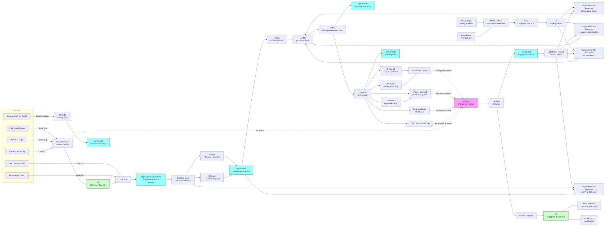

# Recipe 4.5 Architecture and Implementation: Medication Adherence Intervention Targeting

*Companion to [Recipe 4.5: Medication Adherence Intervention Targeting](chapter04.05-medication-adherence-intervention-targeting). This page covers the AWS architecture, services, prerequisites, and pseudocode. For the problem framing and the conceptual approach, start with the main recipe.*

---

## The AWS Implementation

### Why These Services

**Amazon SageMaker for the model training and serving stack.** Four model families live here: the per-medication clinical-need scorer (gradient-boosted), the barrier classifier (gradient-boosted multi-class with optional LLM augmentation), the per-intervention engagement predictors (gradient-boosted binary, one per intervention type), and the per-intervention uplift estimators (causal forest or X-learner, one per intervention type). SageMaker Training Jobs handle periodic retraining. The recommendation run uses SageMaker Batch Transform; same reasoning as 4.4 (batch is dramatically cheaper than an idle real-time endpoint, and adherence runs are scheduled, not interactive). SageMaker is HIPAA-eligible under BAA. 

**Amazon SageMaker Feature Store for per-(patient, medication) features.** This is where the Feature Store investment from Recipe 4.4 pays off again. The feature definitions for clinical risk, engagement history, demographics, SDOH proxies, and prior intervention engagement are reused. New features specific to this recipe (per-medication PDC, per-medication days-since-last-fill, regimen complexity, copay-paid history, channel mix) are added as new feature groups. The offline store powers the batch recommendation run; the online store powers any real-time intervention triggers (e.g., a refill-gap-detected event that fires a same-day intervention).

**Amazon DynamoDB for the intervention catalog, recommendation log, patient profile, and engagement aggregates.** Same `patient-profile` table from prior recipes; new attributes added (`pharmacy_data_quality`, `cash_pay_history`, `cost_sharing_tier`, `med_sync_enrolled`, `prior_interventions`). New table `intervention-catalog` for the dozens of intervention records. New table `barrier-classifications` keyed on (patient_id, therapeutic_class) for the latest barrier ranking. The recommendation log captures (patient_id, intervention_id, medication_class, run_date, priority, allocated, allocation_reason) for downstream attribution.

**Amazon S3 for the data lake and recommendation outputs.** Pharmacy claims land in S3 (via Kinesis Firehose from PBM feeds), the offline feature store is backed by S3, the eligible-target sets are written to S3 per run, and the recommendation outputs land in S3 for the orchestrator to consume. Engagement events and clinical outcomes accumulate in S3 for the long-horizon cost-effectiveness evaluation.

**AWS Glue and Amazon Athena for adherence computation and outcome evaluation.** The PDC computation is a SQL-shaped problem at scale: window functions over fill events, carry-forward joins, per-(patient, therapeutic_class) aggregation. Glue jobs run nightly to compute lag-aware PDC and emit the per-(patient, medication) feature snapshots to the offline feature store. Athena powers the cohort dashboards and the per-intervention effectiveness queries.

**AWS Step Functions for batch orchestration.** Same pattern as 4.4. The eight-stage batch pipeline is a Step Functions workflow: trigger on schedule, run target-set selection (Glue), run scoring (Batch Transform jobs in parallel for need, barrier, engagement, uplift), run combined ranking (Lambda), run allocation (Lambda), write outreach list (Lambda), trigger orchestrator (Lambda invoking 4.1's APIs and the staff-queue handoffs).

**Amazon EventBridge for scheduling and refill-gap triggers.** EventBridge schedules the weekly batch run. EventBridge rules also route real-time pharmacy-event signals: a `refill_gap_detected` event (patient is N days past expected refill) can trigger a same-day intervention pathway for high-risk medications, bypassing the weekly cycle for time-sensitive cases. Use EventBridge rules sparingly for real-time triggers; the operational complexity adds up fast.

**Amazon Kinesis Data Streams for engagement and pharmacy events.** Same engagement-event bus from 4.1 through 4.4. New event types: `pharmacy_fill_observed`, `refill_gap_detected`, `adherence_intervention_recommended`, `intervention_outreach_sent`, `intervention_engaged`, `intervention_completed`, `barrier_elicited`, `med_sync_enrolled`, `cost_assistance_initiated`, `cost_assistance_approved`, `pcp_override`, `pharmacist_consult_completed`. The attribution Lambda joins these events to the recommendation log in DynamoDB and persists per-(intervention, outcome) records.

**Amazon Bedrock for barrier-classification second opinion, outreach tailoring, and pharmacist pre-call briefs.** Three distinct LLM use cases:

1. Barrier classification second opinion. A structured-output prompt that takes the patient's adherence pattern, claims context, and prior outreach notes, and returns `{predicted_barrier, confidence, rationale}`. Used as augmentation, not primary signal.
2. Outreach message tailoring (same pattern as 4.4). The structured intervention assignment goes in, the personalized message comes out, the message goes through a clinical-claims validator before send.
3. Pharmacist pre-call brief generation. A structured prompt produces a one-page brief: the patient's regimen, the suspected barrier, prior fill pattern, suggested talking points, contraindications. The pharmacist reads it before the call.

Bedrock is HIPAA-eligible under BAA. Confirm in service terms that prompts and completions are not used to train the underlying foundation models. Select models covered under your organization's BAA; the eligible-model list evolves, so verify the specific model IDs (e.g., Claude Haiku, Nova Lite) at the time of build.

**AWS Secrets Manager for vendor and partner credentials.** All vendor and partner integrations (manufacturer copay-card portals, foundation-grant programs, partner pharmacy APIs for med-sync, vendor pharmacist services, the channel-optimizer's downstream SMS gateway) credential through AWS Secrets Manager with KMS encryption and a per-environment rotation policy. Plain-text vendor API keys in Lambda environment variables are not acceptable. Cross-account access for vendor or partner integrations uses scoped IAM roles with a vendor-specific external ID. Rotation schedules: 90 days for partner-pharmacy API keys, 30 days for manufacturer portal credentials (whose APIs tend to enforce shorter key lifetimes), and on-demand rotation for any credential involved in a security event.

**AWS Lambda for per-stage glue logic.** The barrier classifier (rule-based stage), the priority combiner, the allocator, the orchestrator, the engagement-attribution worker, and the contact-cap enforcer all run as Lambdas. Same scale considerations as 4.4; the allocator can stay under the 250 MB layer ceiling for greedy allocation, and graduates to a containerized Lambda for LP-based allocation (Recipe 14.x).

**Amazon Connect (or a contracted outreach platform) for telephonic pharmacist outreach.** When the recommended intervention is a clinical pharmacist consult, the assignment flows into a staff work queue. Plans with in-house clinical pharmacists often build on Amazon Connect for the contact-center capabilities (call recording for QA, call-disposition codes feeding back into the engagement stream, integration with the scheduled-callback model). Plans with vendor pharmacist services use the vendor's queue. The AWS-specific piece is HIPAA-eligible call recording and the contact-flow-to-engagement-event integration. 

**Amazon SES for member-facing email and SMS through a partner.** Same as 4.4; SES under BAA for email, SMS through Pinpoint or a contracted vendor under BAA. 

**Amazon QuickSight for operations dashboards.** Cohort-sliced PDC trends, per-intervention completion and uplift, barrier-distribution dashboards, Star-Ratings-tracking dashboards (movement across the 80 percent PDC line by therapeutic class), capacity-utilization views. QuickSight on Athena, with row-level security for cohort-specific filters.

**AWS KMS, CloudTrail, CloudWatch.** Same PHI infrastructure pattern as prior recipes. Customer-managed keys, CloudTrail data events on PHI tables, CloudWatch alarms on batch-run failures and cohort-metric drift.

### Architecture Diagram



### Prerequisites

| Requirement | Details |
|-------------|---------|
| **AWS Services** | Amazon SageMaker (Training, Batch Transform, Feature Store), Amazon DynamoDB, Amazon S3, AWS Glue, Amazon Athena, AWS Step Functions, Amazon EventBridge, Amazon Kinesis Data Streams, Amazon Kinesis Data Firehose, AWS Lambda, Amazon Bedrock, Amazon SES, Amazon Pinpoint or contracted SMS provider, Amazon Connect (optional, for in-house pharmacist contact center), Amazon QuickSight, AWS KMS, Amazon CloudWatch, AWS CloudTrail. |
| **IAM Permissions** | Per-Lambda least-privilege with scoped Resource ARNs. Examples: `sagemaker:CreateTransformJob` on `arn:aws:sagemaker:{region}:{account}:transform-job/adherence-*`; `dynamodb:GetItem` / `BatchWriteItem` / `UpdateItem` on `arn:aws:dynamodb:{region}:{account}:table/patient-profile` (and per-table for intervention-catalog, recommendation-log, barrier-classifications, engagement-events); `bedrock:InvokeModel` on `arn:aws:bedrock:{region}::foundation-model/anthropic.claude-3-5-haiku-20241022-v1:0`; `s3:GetObject` / `PutObject` scoped to specific bucket ARNs per stage; `kinesis:PutRecord` on `arn:aws:kinesis:{region}:{account}:stream/engagement-stream`; `ses:SendEmail` and `pinpoint:SendMessages` scoped to BAA-covered identities; `connect:StartOutboundContact` scoped to the pharmacist-queue contact flow ARN only. Never `Resource: *`. Each Lambda function gets its own execution role with only the actions and resources that function needs. |
| **BAA** | AWS BAA signed. All services in the architecture must be HIPAA-eligible: SageMaker (Training, Batch Transform, Feature Store), DynamoDB, S3, Glue, Athena, Step Functions, EventBridge, Kinesis, Firehose, Lambda, Bedrock, SES, Pinpoint, Connect (when configured for HIPAA workloads), KMS are on the HIPAA Eligible Services list.  |
| **Encryption** | DynamoDB: customer-managed KMS at rest. S3: SSE-KMS with bucket-level keys (especially the pharmacy-claims bucket; raw fill data is highly sensitive). Kinesis and Firehose: server-side encryption. SageMaker training and inference: VPC-only, with KMS keys for model artifacts and Feature Store offline storage. Lambda log groups KMS-encrypted. The recommendation log contains (patient_id, intervention_id, medication_class, barrier) tuples that are highly inferential; treat as PHI from day one. |
| **VPC** | Production: Lambdas in VPC. SageMaker training, Batch Transform, and Feature Store online store run in VPC. VPC endpoints for DynamoDB (gateway), S3 (gateway), Bedrock Runtime (interface), Kinesis (interface), Firehose (interface), KMS (interface), CloudWatch Logs (interface), SageMaker API (control plane: `api.sagemaker`, interface), SageMaker Runtime (inference: `runtime.sagemaker`, interface), SageMaker Feature Store Runtime (online store PutRecord/GetRecord: `featurestore-runtime.sagemaker`, interface), Step Functions (`states`, interface), EventBridge (`events`, interface), Glue (interface), Athena (interface), STS (interface), SES (interface), Pinpoint (interface), Connect (interface). Egress posture: no `0.0.0.0/0` egress from any Lambda subnet. NAT Gateway egress is restricted by security group to specific IP ranges or hostnames only for external services without VPC endpoints (manufacturer copay-card vendor portal, partner pharmacy API endpoints, foundation-grant program endpoints). All other outbound traffic must go through VPC endpoints. PBM claims feeds typically arrive via SFTP over a Direct Connect tunnel or PrivateLink connection rather than over the public internet. VPC Flow Logs enabled. |
| **CloudTrail** | Enabled with data events on the patient-profile table, intervention-catalog table, recommendation-log table, barrier-classifications table, and engagement-events table. Data events on the S3 buckets containing pharmacy claims, per-patient feature snapshots, and recommendation outputs. |
| **Equity Governance** | Document the allocator's policy weights (need vs. barrier-fit vs. engagement vs. uplift vs. cost-effectiveness trade-off), the equity floors (capacity reserved for cohorts with documented adherence disparities), and the cohort-monitoring thresholds before launch. Cross-functional review committee (medical director, pharmacist lead, equity lead, data science, vendor management) signs off on the policy and reviews quarterly. Star-Ratings-driven targeting decisions go through this committee, not just the analytics team. |
| **Sample Data** | A starter set of synthetic patients with realistic medication regimens (Synthea can generate prescribing patterns; supplement with synthetic fill events at varying adherence levels). A small intervention catalog (3-5 interventions: text reminders, pharmacist consult, copay-card navigation, med-sync, regimen-simplification PCP referral). Synthetic engagement labels for engagement-prediction training. For uplift training, a randomized pilot is the gold standard; in development, simulated treatment-effect data lets you validate the modeling pipeline before running real members through it. |
| **Cost Estimate** | At a 400,000-member health plan with ~80,000 chronic-medication patients running weekly: SageMaker Batch Transform (4 model families per run, ~80K rows per run, weekly): roughly $80-200/month at modest instance sizes. SageMaker Feature Store offline store: $50-100/month. SageMaker training (monthly retrain of 4 model families): $100-250/month. DynamoDB on-demand: $50-150/month. Lambda + Step Functions: $50-100/month. Bedrock for barrier classification + outreach tailoring + pharmacist briefs (~30K LLM calls per week, Haiku-class): $300-600/month. SES + Pinpoint SMS (~20K outreach per week): $40-100/month. Connect (if used, 4 FTE pharmacists): $200-400/month plus telephony. S3 + Glue + Athena: $150-400/month. QuickSight: $50/user/month for authors plus reader fees. Estimated total: $1,000-2,500/month range for a regional plan, before staff time and intervention vendor costs.  |

### Ingredients

| AWS Service | Role |
|------------|------|
| **Amazon SageMaker** | Hosts the clinical-need scorer, barrier classifier, per-intervention engagement predictors, and per-intervention uplift estimators; runs training and Batch Transform jobs |
| **Amazon SageMaker Feature Store** | Per-(patient, medication) features (PDC, fill cadence, regimen complexity) reused across this recipe and Recipes 4.4, 4.6, 4.7 |
| **Amazon DynamoDB** | Stores intervention catalog, recommendation log, patient profile (extended from 4.1/4.4), barrier classifications, and engagement aggregates |
| **Amazon S3** | Hosts the pharmacy-claims data lake, offline feature store, target-set lists, recommendation outputs, training data, and engagement data lake |
| **AWS Glue** | Adherence computation (PDC, regimen complexity), target-set selection, outcome-evaluation jobs |
| **Amazon Athena** | SQL access to data lake; powers cohort dashboards and per-intervention cost-effectiveness queries |
| **AWS Step Functions** | Orchestrates the weekly batch recommendation pipeline and the barrier-classification pipeline with retry, DLQ, and per-stage visibility |
| **Amazon EventBridge** | Schedules batch run; routes refill-gap-detected events for time-sensitive interventions; routes catalog change events |
| **Amazon Kinesis Data Streams** | Carries pharmacy fill events, engagement events, pharmacist consult events, and PCP overrides into attribution |
| **Amazon Kinesis Data Firehose** | Lands pharmacy claims and engagement events into S3 Parquet for evaluation and training data prep |
| **AWS Lambda** | Runs the rule-based barrier classifier, priority combiner, heterogeneous allocator, orchestrator, attribution worker, and contact-cap enforcer |
| **Amazon Bedrock** | Hosts the LLM for barrier-classification second opinion, member-facing message tailoring, and pharmacist pre-call briefs |
| **Amazon SES** | Bulk email delivery under BAA for adherence outreach |
| **Amazon Pinpoint** | SMS delivery for reminder interventions |
| **Amazon Connect** | Optional contact-center for in-house clinical pharmacist outreach; HIPAA-eligible when configured per AWS guidance |
| **Amazon QuickSight** | Operational dashboards for adherence operations team, medical director, pharmacist lead, and equity committee |
| **AWS KMS** | Customer-managed encryption keys for all PHI-containing stores |
| **Amazon CloudWatch** | Operational metrics, cohort-sliced PDC and intervention dashboards, alarms |
| **AWS CloudTrail** | Audit logging for all PHI-related API calls |

---

### Code

> **Reference implementations:** Useful aws-samples patterns for this recipe:
> - [`amazon-sagemaker-examples`](https://github.com/aws/amazon-sagemaker-examples): XGBoost and SageMaker Batch Transform notebooks that mirror the per-intervention scoring pattern used here.
> - [`amazon-sagemaker-feature-store-end-to-end-workshop`](https://github.com/aws-samples/amazon-sagemaker-feature-store-end-to-end-workshop): End-to-end Feature Store usage that maps onto the per-(patient, medication) feature pipeline.
> - [`amazon-bedrock-workshop`](https://github.com/aws-samples/amazon-bedrock-workshop): Demonstrates structured-output prompting applicable to the barrier-classification second opinion and message-tailoring steps.
> 

#### Walkthrough

**Step 1: Compute per-(patient, medication) adherence features.** The PDC computation runs nightly. For each patient, for each chronic medication therapeutic class, compute carry-forward days-supply, the PDC over the trailing 365 days (and 90 days, for short-window targeting), and per-medication regimen features. Skip carry-forward and a 90-day mail-order patient looks like a non-adherent retail patient.

```pseudocode
FUNCTION compute_adherence_features(patients, run_date):
    // Pull settled fill claims for the trailing 12 months. The "settled"
    // window means claims with fill_date at least 30 days before run_date,
    // because retail claims arrive on a 1-2 day lag, mail-order on a 5-14
    // day lag, and specialty up to 30 days. Computing adherence on
    // not-yet-settled data produces noisy, biased numbers.
    settled_window_end = run_date - 30 days
    settled_window_start = settled_window_end - 365 days

    fills = Athena.Query("""
        SELECT patient_id, ndc, therapeutic_class, fill_date, days_supply,
               channel, copay_paid, was_cash_pay, pharmacy_id
        FROM pharmacy_claims
        WHERE fill_date BETWEEN :start AND :end
          AND therapeutic_class IN :tracked_classes
    """, params = { start: settled_window_start, end: settled_window_end,
                    tracked_classes: TRACKED_THERAPEUTIC_CLASSES })

    FOR each (patient_id, therapeutic_class) in groupby(fills):
        // Carry-forward construction: for each fill, mark days from
        // fill_date through fill_date + days_supply - 1 as "covered".
        // Overlapping fills (early refills, stockpiling) extend the
        // covered window but don't double-count.
        days_covered = build_covered_set(fills_for_class)

        pdc_365 = len(days_covered ∩ trailing_365_days) / 365
        pdc_90  = len(days_covered ∩ trailing_90_days) / 90

        // Days since last fill: the gap between today and the most recent
        // fill date. A patient on a 30-day supply who hasn't filled in 45
        // days has a 15-day gap. A patient on a 90-day mail-order supply
        // who hasn't filled in 45 days is fine.
        last_fill_date = max(fills_for_class.fill_date)
        days_since_last_fill = settled_window_end - last_fill_date
        last_days_supply     = fills_for_class[-1].days_supply
        gap_days             = max(0, days_since_last_fill - last_days_supply)

        // Channel mix and cost-sharing pattern. These will feed the
        // barrier classifier.
        channel_mix      = compute_channel_distribution(fills_for_class)
        copay_paid_stats = compute_copay_stats(fills_for_class)
        cash_pay_count   = sum(fills_for_class.was_cash_pay)

        feature_record = {
            patient_id:              patient_id,
            therapeutic_class:       therapeutic_class,
            pdc_365:                 pdc_365,
            pdc_90:                  pdc_90,
            gap_days:                gap_days,
            last_fill_date:          last_fill_date,
            channel_mix:             channel_mix,
            copay_paid_p50:          copay_paid_stats.p50,
            copay_paid_p90:          copay_paid_stats.p90,
            cash_pay_indicator:      (cash_pay_count > 0),
            run_date:                run_date,
            data_quality_flag:       assess_data_completeness(fills_for_class)
                // values include 'complete', 'sparse_history',
                // 'multi_pharmacy_fragmented', 'cash_pay_partial',
                // 'recent_plan_change'. Downstream consumers can
                // gate on this when adherence-by-claims is unreliable.
        }

        SageMaker.FeatureStore.PutRecord(
            feature_group = "patient-medication-adherence",
            record        = feature_record
        )

    // Compute regimen-level features (across all chronic medications).
    FOR each patient_id:
        regimen = list_chronic_medications(patient_id, settled_window_end)
        SageMaker.FeatureStore.PutRecord(
            feature_group = "patient-regimen",
            record = {
                patient_id:           patient_id,
                regimen_size:         len(regimen),
                doses_per_day_total:  sum(regimen.doses_per_day),
                num_classes_tracked:  len(distinct(regimen.therapeutic_class)),
                pharmacy_count:       count_distinct_pharmacies(regimen),
                med_sync_enrolled:    member_profile(patient_id).med_sync_enrolled,
                run_date:             run_date
            }
        )
```

**Step 2: Classify barriers per (patient, medication) below the adherence threshold.** The rule-based classifier runs first and is deterministic; the supervised classifier refines confidence where labels exist; the LLM second opinion runs for high-stakes cases. The output is a ranked list of barriers per (patient, medication). Skip this and the recommender treats every adherence gap the same way.

```pseudocode
FUNCTION classify_barriers(target_set, features, run_date):
    FOR each (patient_id, therapeutic_class) in target_set:
        adherence = features.get_adherence(patient_id, therapeutic_class)
        regimen   = features.get_regimen(patient_id)
        claims_context = features.get_claims_context(patient_id, therapeutic_class)
            // Includes: most-recent-fill copay, trend in copay over time,
            // formulary tier of the medication, brand-vs-generic status,
            // recent fills of competing/substitute medications,
            // recent gap onset relative to copay change events,
            // recent gap onset relative to side-effect-coded encounters.
        engagement_context = features.get_engagement_history(patient_id)
            // Includes: prior intervention engagement, channel preference,
            // language, prior elicited barriers (gold from pharmacist consults).

        // Stage A: rule-based pass. Each rule emits one or more barrier
        // hypotheses with rule-defined confidences. Multiple rules can fire.
        rule_results = []

        IF adherence.gap_days > 30 AND
           claims_context.most_recent_copay > COPAY_HIGH_THRESHOLD AND
           claims_context.gap_onset_aligned_with_copay_change:
            rule_results.append({ barrier: "cost",          rule_confidence: 0.85 })

        IF claims_context.most_recent_copay > COPAY_HIGH_THRESHOLD AND
           NOT claims_context.gap_onset_aligned_with_copay_change AND
           NOT member.lis_enrolled:
            rule_results.append({ barrier: "cost",          rule_confidence: 0.55 })

        IF regimen.regimen_size >= 4 AND
           adherence.fills_pattern_is_sporadic AND
           NOT regimen.med_sync_enrolled:
            rule_results.append({ barrier: "complexity",    rule_confidence: 0.65 })
            rule_results.append({ barrier: "forgetfulness", rule_confidence: 0.45 })

        IF claims_context.recent_side_effect_encounter AND
           adherence.gap_started_after_side_effect_encounter:
            rule_results.append({ barrier: "side_effects", rule_confidence: 0.80 })

        IF therapeutic_class in SYMPTOMATIC_LATENT_CLASSES AND
           adherence.discontinued_after_one_or_two_fills:
            // Hypertension, statins: classic asymptomatic conditions where
            // patients often stop because they "feel fine".
            rule_results.append({ barrier: "beliefs", rule_confidence: 0.55 })

        IF adherence.fills_pattern_is_consistent_then_stopped AND
           NOT claims_context.recent_side_effect_encounter AND
           claims_context.recent_pcp_encounter_count == 0:
            rule_results.append({ barrier: "access", rule_confidence: 0.40 })

        // Stage B: supervised refinement. The supervised classifier was
        // trained on (features, elicited-barrier) labels from prior
        // pharmacist consult outcomes. Its output is a probability
        // distribution over the six barrier classes. We blend it with the
        // rule-based output rather than overriding, because the rule-based
        // output is auditable and the supervised model is the augmentation.
        supervised_probs = SupervisedClassifier.predict(features_for_classifier)

        blended = blend_rule_and_supervised(rule_results, supervised_probs,
                                             rule_weight = 0.6,
                                             supervised_weight = 0.4)

        // Stage C: LLM second opinion. Used only when:
        // - blended top-1 confidence is low (< 0.55), OR
        // - the patient is high-priority on need score, OR
        // - rule-based and supervised disagree materially.
        llm_review = null
        IF should_invoke_llm(blended, need_score):
            llm_review = Bedrock.InvokeModel(
                model_id = BARRIER_CLASSIFIER_MODEL_ID,
                body     = build_barrier_prompt(adherence, claims_context,
                                                 engagement_context, regimen,
                                                 BARRIER_OUTPUT_SCHEMA)
            )
            llm_parsed = parse_json(llm_review.completion)
                // { predicted_barrier, confidence, rationale,
                //   alternative_barriers, uncertainty_notes }

            // Validate the LLM output: four-layer validation.
            //   Layer 1: Schema and taxonomy check. predicted_barrier must
            //            be in the allowed six-category taxonomy; confidence
            //            must be numeric in [0, 1]; alternative_barriers must
            //            be a valid list.
            //   Layer 2: Rationale length and structure. Rationale must be
            //            30-500 characters, must contain at least one
            //            data-point reference, and must follow
            //            (observation -> inference -> conclusion) structure.
            //   Layer 3: Rationale cites observable data points whose values
            //            match observed_data within tolerance. For each cited
            //            data point in the rationale, verify the value exists
            //            in the feature set and falls within a defined
            //            tolerance band of the serialized value. This is the
            //            meaningful, non-trivial layer: a naive substring
            //            match between rationale text and serialized data
            //            produces both false positives and false negatives.
            //            Production uses structured extraction of cited
            //            values followed by numeric-tolerance comparison.
            //   Layer 4: Prohibited content check. Rationale must not
            //            contain PHI (patient names, MRNs, dates of birth),
            //            prescriber names, or medication-specific dosages
            //            that could identify the patient outside the
            //            clinical context.
            //
            //   Failure handling: if validation fails at any layer, the LLM
            //   second opinion is dropped from the blended classification
            //   (it does not influence the final ranked barriers). The
            //   failure is logged with (layer, reason, llm_output_hash) for
            //   prompt-engineering review. The case is flagged for the
            //   pharmacist-review queue with the LLM output included for
            //   diagnostic purposes only (not as a decision input).
            validated = validate_barrier_review(llm_parsed, observed_data = features)
            IF NOT validated.passed:
                log_validation_failure(validated.layer, validated.reason,
                                        patient_id, therapeutic_class)
                flag_for_pharmacist_review(patient_id, therapeutic_class,
                                            blended, llm_parsed,
                                            reason = "llm_validation_failed:" + validated.layer)
                llm_parsed = null   // drop LLM from blended result

            // Flag for human review if LLM disagrees with blended top-1
            // by a material margin and the case is high-stakes.
            IF llm_parsed.predicted_barrier != blended.top_1.barrier AND
               need_score > NEED_REVIEW_THRESHOLD:
                flag_for_pharmacist_review(patient_id, therapeutic_class,
                                            blended, llm_parsed)

        // Persist the ranked barriers. Do not collapse to a single label.
        DynamoDB.PutItem("barrier-classifications", {
            patient_id:        patient_id,
            therapeutic_class: therapeutic_class,
            run_date:          run_date,
            ranked_barriers:   blended.ranked_list,
                // [ { barrier: "cost", confidence: 0.72, sources: ["rule", "supervised"] },
                //   { barrier: "beliefs", confidence: 0.21, sources: ["rule"] }, ... ]
            llm_second_opinion: llm_parsed,
            data_quality_flag: adherence.data_quality_flag,
            classifier_versions: {
                rules:      RULES_VERSION,
                supervised: SUPERVISED_MODEL_VERSION,
                llm:        BARRIER_CLASSIFIER_MODEL_ID
            }
        })
```

**Step 3: Build the per-(patient, intervention, medication) candidate set with eligibility.** Not every intervention is eligible for every (patient, medication). Cost-assistance navigation is gated on cost-sharing tier and brand status. Med-sync requires the patient's pharmacy to be a partner. Pharmacist consults require pharmacist availability in the patient's region/language. Skip the eligibility filter and you waste downstream model inference on combinations that can't ever be allocated.

```pseudocode
FUNCTION build_candidate_triples(target_set, intervention_catalog, run_date):
    candidates = []
    FOR each (patient_id, therapeutic_class) in target_set:
        member  = lookup_member(patient_id)
        barriers = lookup_barriers(patient_id, therapeutic_class)

        FOR each intervention in intervention_catalog:
            // Hard eligibility filters.
            IF intervention.brand_only AND
               NOT lookup_medication(patient_id, therapeutic_class).is_brand:
                CONTINUE

            IF intervention.requires_lis AND NOT member.lis_enrolled:
                CONTINUE

            IF intervention.requires_partner_pharmacy AND
               member.preferred_pharmacy_id NOT IN PARTNER_PHARMACIES:
                CONTINUE

            IF intervention.requires_language AND
               member.preferred_language NOT IN intervention.supported_languages:
                CONTINUE

            // Per-intervention consent check. Adherence outreach consent
            // is multi-dimensional; three regulatory frameworks apply:
            //   (1) State boards of pharmacy regulate pharmacy-affiliated
            //       reminders state-by-state with rules on disclosure
            //       requirements, frequency caps, and approved-claims content.
            //   (2) TCPA governs SMS and automated-voice outreach unless
            //       the contact qualifies as treatment-related under HHS
            //       guidance.
            //   (3) HIPAA marketing rules at 45 CFR 164.501 may apply to
            //       manufacturer-funded interventions and to cost-assistance
            //       navigation if the plan's facilitation is classified as
            //       marketing.
            //
            // Each intervention in the catalog carries consent metadata:
            //   consent_classification: "treatment_related" | "marketing"
            //   tcpa_scope:            "exempt_treatment" | "requires_prior_express_consent"
            //   state_applicability:   list of states where the intervention is approved
            //   funding_source:        "plan" | "manufacturer" | "foundation"
            //
            // Do not collapse to a single `outreach_consent` boolean.
            // Engage privacy officer and pharmacy compliance lead on the
            // consent model for each intervention type before launch.
            IF NOT member_consent_applies_to(
                    member.consent_records,
                    intervention.consent_classification,
                    intervention.tcpa_scope,
                    member.state):
                CONTINUE

            IF intervention.cooldown_days > 0:
                IF member.last_intervention_of_type(intervention.type)
                   .completed_within(intervention.cooldown_days, run_date):
                    CONTINUE

            // Mutual-exclusion: if a higher-touch intervention is already
            // scheduled or in-flight for this (patient, medication),
            // exclude lower-touch alternatives that would conflict.
            IF intervention.conflicts_with_inflight(patient_id, therapeutic_class):
                CONTINUE

            candidates.append({
                patient_id:        patient_id,
                therapeutic_class: therapeutic_class,
                intervention_id:   intervention.intervention_id,
                intervention_type: intervention.type,
                intervention_cost: intervention.marginal_cost,
                supported_barriers: intervention.supported_barriers,
                barriers:          barriers,
                run_date:          run_date
            })

    write_candidates(candidates, run_date)
    RETURN candidates
```

**Step 4: Score need, barrier-fit, engagement, and uplift per candidate.** Same fan-out pattern as Recipe 4.4. SageMaker Batch Transform jobs in parallel; do not loop sequentially across interventions or therapeutic classes. Skip uplift and you over-target patients who would have improved on their own.

```pseudocode
FUNCTION score_candidates(candidates, run_date):
    // Group candidates by intervention_type so each intervention's models
    // run on the relevant subset; the per-intervention engagement and
    // uplift models are different model artifacts.
    candidates_by_intervention = group_by(candidates, "intervention_id")

    job_handles = []
    FOR each intervention_id, intervention_candidates in candidates_by_intervention:
        candidate_path = "s3://adherence-candidates/run_date=" + run_date +
                         "/intervention=" + intervention_id + "/candidates.parquet"
        write_parquet(intervention_candidates, candidate_path)

        // Need score is per (patient, medication) not per intervention,
        // so it's invoked once per therapeutic class rather than per
        // (intervention, class). Submit it once per class.
        FOR each therapeutic_class in distinct_classes(intervention_candidates):
            need_job = SageMaker.CreateTransformJob(
                transform_job_name = "need-" + therapeutic_class + "-" + run_date,
                model_name         = NEED_MODEL_NAMES[therapeutic_class],
                transform_input    = filter_to_class(candidate_path, therapeutic_class),
                transform_output   = "s3://adherence-scores/run_date=" + run_date +
                                    "/need/" + therapeutic_class + "/",
                instance_type      = "ml.m5.large",
                instance_count     = 1
            )
            job_handles.append(need_job)

        // Engagement prediction: per-intervention model. Different
        // intervention types have different engagement signatures.
        engagement_job = SageMaker.CreateTransformJob(
            transform_job_name = "eng-" + intervention_id + "-" + run_date,
            model_name         = ENGAGEMENT_MODEL_NAMES[intervention_id],
            transform_input    = candidate_path,
            transform_output   = "s3://adherence-scores/run_date=" + run_date +
                                "/engagement/" + intervention_id + "/",
            instance_type      = "ml.m5.large",
            instance_count     = 1
        )
        job_handles.append(engagement_job)

        // Uplift estimate: per-intervention model. The uplift target is
        // the change in PDC over the next 90 days conditional on
        // recommendation. Causal forest with the intervention as the
        // treatment indicator.
        uplift_job = SageMaker.CreateTransformJob(
            transform_job_name = "uplift-" + intervention_id + "-" + run_date,
            model_name         = UPLIFT_MODEL_NAMES[intervention_id],
            transform_input    = candidate_path,
            transform_output   = "s3://adherence-scores/run_date=" + run_date +
                                "/uplift/" + intervention_id + "/",
            instance_type      = "ml.m5.xlarge",
            instance_count     = 1
        )
        job_handles.append(uplift_job)

    wait_for_jobs(job_handles)

    // Barrier-fit scoring is a deterministic lookup, not a model call:
    // for each candidate, the barrier-fit score is the dot product
    // between the patient's ranked-barriers vector and the intervention's
    // supported-barriers vector.
    FOR candidate in candidates:
        candidate.barrier_fit = compute_barrier_fit(
            patient_barriers       = candidate.barriers,
            intervention_supported = candidate.supported_barriers
        )
            // e.g., if patient barriers are [cost: 0.72, beliefs: 0.21]
            // and intervention "cost-assistance navigation" supports
            // {cost: 1.0, beliefs: 0.0}, barrier_fit = 0.72.
            // For "text reminder" supporting {forgetfulness: 1.0,
            // complexity: 0.6, beliefs: 0.0, cost: 0.0, side_effects: 0.0,
            // access: 0.0}, the same patient's barrier_fit would be ~0.0.

    consolidate_scores(candidates, run_date)
        // produces s3://adherence-scores/run_date=<run_date>/all-scores.parquet
        // with columns: patient_id, therapeutic_class, intervention_id,
        //               need_score, barrier_fit, engagement_prob,
        //               uplift_estimate, intervention_cost
```

**Step 5: Combine scores into per-candidate priority with cost-effectiveness.** The combination weights are policy: documented, version-controlled, reviewable. The cost-effectiveness term divides expected-uplift by intervention cost so a $0.05 reminder doesn't get crowded out by a $80 pharmacist consult on every candidate. Skip the cost term and the system over-allocates expensive interventions to patients where a cheaper one would have worked.

```pseudocode
FUNCTION compute_priority(scored_candidates, policy):
    // Policy weights live in versioned config, not code:
    // {
    //   need:           0.25,
    //   barrier_fit:    0.20,
    //   engagement:     0.10,
    //   uplift:         0.35,
    //   cost_efficiency: 0.10
    // }
    // The cost_efficiency term rewards interventions that produce uplift
    // per dollar spent, computed as uplift_estimate / intervention_cost
    // and normalized to [0, 1] within the candidate pool.

    // Normalize within meaningful comparison groups. Need scores compare
    // across classes (a clinical-need 0.8 means roughly the same thing
    // for statins as for diabetes meds). Engagement and uplift are
    // normalized within intervention type.
    candidates_norm = normalize_scores(scored_candidates, policy.normalization)

    FOR each row in candidates_norm:
        cost_efficiency = row.uplift_estimate / max(row.intervention_cost, MIN_COST_FOR_DIVISION)
        cost_efficiency_norm = normalize_within_intervention_type(cost_efficiency, row.intervention_type)

        row.priority = (policy.weights.need        * row.need_score +
                        policy.weights.barrier_fit * row.barrier_fit +
                        policy.weights.engagement  * row.engagement_prob +
                        policy.weights.uplift      * row.uplift_estimate +
                        policy.weights.cost_efficiency * cost_efficiency_norm)

        row.priority_components = {
            need_contrib:           policy.weights.need * row.need_score,
            barrier_fit_contrib:    policy.weights.barrier_fit * row.barrier_fit,
            engagement_contrib:     policy.weights.engagement * row.engagement_prob,
            uplift_contrib:         policy.weights.uplift * row.uplift_estimate,
            cost_efficiency_contrib: policy.weights.cost_efficiency * cost_efficiency_norm
        }

    // Group by (patient, therapeutic_class) and sort interventions within
    // each group. The same patient can have multiple medications and
    // multiple top-ranked interventions across them.
    grouped = group_by(candidates_norm, ("patient_id", "therapeutic_class"))
    FOR each (patient_id, therapeutic_class), group_rows in grouped:
        sorted_rows = sort group_rows by priority DESC
        FOR rank_pos, r in enumerate(sorted_rows):
            r.intervention_rank_within_medication = rank_pos + 1

    write_priority_table(candidates_norm, policy.policy_version, run_date)
    RETURN candidates_norm
```

**Step 6: Allocate under heterogeneous capacities with multi-intervention-per-patient and equity floors.** The allocator walks priority-sorted candidates and assigns slots subject to: each intervention's daily capacity, the cumulative per-patient cap (default: at most 2 interventions per run, at most 1 high-touch), the cross-intervention exclusions (a pharmacist consult on a medication suppresses lower-touch interventions for the same medication), and the equity floors. Skip the floors and the optimization quietly redistributes opportunity to the easiest-to-help cohorts.

```pseudocode
FUNCTION allocate_heterogeneous(prioritized, interventions, policy, run_date):
    candidates_sorted = sort prioritized by priority DESC

    // Per-intervention capacity and equity-floor counters.
    capacity_remaining = {}
    equity_remaining = {}
    FOR each intervention in interventions:
        capacity_remaining[intervention.intervention_id] = intervention.daily_capacity * RUN_HORIZON_DAYS
        equity_remaining[intervention.intervention_id] = {}
        FOR floor_cohort, floor_count in policy.equity_floors[intervention.intervention_id]:
            equity_remaining[intervention.intervention_id][floor_cohort] = floor_count

    // Per-patient counters.
    patient_intervention_count = {}    // total interventions per patient this run
    patient_high_touch_count   = {}    // high-touch (pharmacist, care manager) per patient
    patient_contact_count_30d  = {}    // existing 30-day contact count from profile

    // Pre-cache cohort features for all unique patients in the candidate
    // set. The equity-floor check runs per (patient, intervention), so
    // without this cache a patient with N candidate triples would trigger
    // N identical lookups. Build the cache once before the allocation walk.
    unique_patient_ids = distinct(candidates_sorted, "patient_id")
    patient_cohort_cache = {}
    FOR pid in unique_patient_ids:
        patient_cohort_cache[pid] = lookup_cohort_features(pid)

    allocated = []
    FOR candidate in candidates_sorted:
        member = lookup_member(candidate.patient_id)
        intervention = lookup_intervention(candidate.intervention_id)

        // Per-intervention capacity.
        IF capacity_remaining[candidate.intervention_id] <= 0:
            CONTINUE

        // Per-patient interventions-per-run cap.
        IF patient_intervention_count.get(candidate.patient_id, 0) >= policy.max_interventions_per_patient_per_run:
            CONTINUE

        // Per-patient high-touch cap.
        IF intervention.is_high_touch:
            IF patient_high_touch_count.get(candidate.patient_id, 0) >= policy.max_high_touch_per_patient_per_run:
                CONTINUE

        // Per-patient contact-frequency cap (rolling 30-day window).
        // Implementation: DynamoDB TTL on per-contact rows. Each time a
        // patient-facing contact is generated, a row is written to a
        // `patient-contacts` table with TTL = now + 30 days. The count
        // query is a simple Query on patient_id where TTL > now. This
        // avoids the forward-only increment problem where a counter grows
        // without decay and becomes a lifetime filter after a few months.
        // Alternative: daily-bucket aggregation (count contacts per day,
        // sum the last 30 buckets) or a scheduled decay Lambda that
        // decrements stale entries. The TTL approach is simplest and
        // leverages DynamoDB's built-in expiration.
        existing_contacts = count_recent_contacts(member.patient_id, window_days=30)
        new_contacts_this_run = patient_contact_count_30d.get(candidate.patient_id, 0)
        IF intervention.generates_patient_contact AND
           (existing_contacts + new_contacts_this_run) >= policy.max_contacts_per_patient_30d:
            CONTINUE

        // Cross-intervention exclusions: e.g., a pharmacist consult on
        // a medication absorbs the reminder for that medication.
        IF already_allocated_conflicting(allocated, candidate):
            CONTINUE

        // Equity floor: prefer to use a floor slot if applicable.
        // NOTE: cohort_features are cached per unique patient_id before
        // the allocation walk (see below) so this lookup is O(1) per
        // candidate rather than a repeated DynamoDB call per
        // (patient, intervention) combination.
        cohort_features = patient_cohort_cache[candidate.patient_id]
        applicable_floors = applicable_floor_cohorts(cohort_features,
                                                      policy.equity_floors[candidate.intervention_id])
        used_floor = null
        FOR floor_cohort in applicable_floors:
            IF equity_remaining[candidate.intervention_id][floor_cohort] > 0:
                equity_remaining[candidate.intervention_id][floor_cohort] -= 1
                used_floor = floor_cohort
                BREAK

        capacity_remaining[candidate.intervention_id] -= 1
        patient_intervention_count[candidate.patient_id] = patient_intervention_count.get(candidate.patient_id, 0) + 1
        IF intervention.is_high_touch:
            patient_high_touch_count[candidate.patient_id] = patient_high_touch_count.get(candidate.patient_id, 0) + 1
        IF intervention.generates_patient_contact:
            patient_contact_count_30d[candidate.patient_id] = patient_contact_count_30d.get(candidate.patient_id, 0) + 1

        allocated.append({
            patient_id:        candidate.patient_id,
            therapeutic_class: candidate.therapeutic_class,
            intervention_id:   candidate.intervention_id,
            intervention_type: candidate.intervention_type,
            priority:          candidate.priority,
            priority_components: candidate.priority_components,
            allocation_reason: reason_string(candidate, used_floor),
            cohort_features:   cohort_features,
            run_date:          run_date,
            policy_version:    policy.policy_version
        })

    // Second pass to fill any unfilled equity floors. The floor's
    // reserved slots come from global capacity that the primary pass may
    // have over-allocated to non-cohort candidates. The second pass:
    //   1. Re-walks prioritized candidates filtered to the floor cohort.
    //   2. Re-applies per-patient caps and cross-intervention exclusions.
    //   3. Bypasses the global capacity cap (these slots are reserved).
    //   4. Stops when the floor is filled or no eligible candidates remain.
    //
    // Trade-off: reserving floor slots up front (reducing global capacity
    // before the primary pass starts) guarantees floors are filled but may
    // waste capacity if the cohort has fewer eligible candidates than the
    // floor size. The second-pass approach accepts that floors may be
    // unfilled in under-subscribed cohorts and surfaces that on the cohort
    // dashboard. Document the choice in the policy version notes.
    FOR intervention_id, floor_remaining_per_cohort in equity_remaining:
        FOR floor_cohort, floor_remaining in floor_remaining_per_cohort:
            IF floor_remaining <= 0:
                CONTINUE
            // Filter prioritized candidates to this cohort, this intervention,
            // excluding any already allocated in the primary pass.
            cohort_candidates = [c for c in prioritized
                                  WHERE c.intervention_id == intervention_id
                                  AND patient_cohort_cache[c.patient_id] matches floor_cohort
                                  AND c NOT IN allocated]
            cohort_candidates = sort cohort_candidates by priority DESC
            FOR candidate in cohort_candidates:
                IF floor_remaining <= 0:
                    BREAK
                // Re-apply per-patient caps (same logic as primary pass).
                IF patient_intervention_count.get(candidate.patient_id, 0) >= policy.max_interventions_per_patient_per_run:
                    CONTINUE
                intervention = lookup_intervention(candidate.intervention_id)
                IF intervention.is_high_touch AND
                   patient_high_touch_count.get(candidate.patient_id, 0) >= policy.max_high_touch_per_patient_per_run:
                    CONTINUE
                // Re-apply cross-intervention exclusions.
                IF already_allocated_conflicting(allocated, candidate):
                    CONTINUE
                // Allocate. Do NOT check global capacity_remaining; the
                // floor slots are reserved outside the global pool.
                floor_remaining -= 1
                patient_intervention_count[candidate.patient_id] += 1
                IF intervention.is_high_touch:
                    patient_high_touch_count[candidate.patient_id] += 1
                allocated.append({
                    ...candidate fields...,
                    allocation_reason: "equity_floor_second_pass:" + floor_cohort,
                    run_date:          run_date,
                    policy_version:    policy.policy_version
                })

    DynamoDB.BatchWriteItem("recommendation-log", allocated)

    emit_metric("adherence_allocations_made",
                value = len(allocated),
                dimensions = {
                    run_date:       run_date,
                    policy_version: policy.policy_version
                })
    RETURN allocated
```

**Step 7: Orchestrate outreach across heterogeneous channels.** Patient-facing interventions go to the channel optimizer from Recipe 4.1. Staff-facing interventions go to staff queues with structured pre-work. Cost-assistance flows to a dedicated case-management queue. Med-sync flows to the partner pharmacy's API or a flagged-for-action work queue. Skip the per-intervention-type orchestration and your interventions become "send a generic email" regardless of what was actually allocated.

```pseudocode
FUNCTION orchestrate_interventions(allocated, run_date, policy):
    FOR row in allocated:
        member = DynamoDB.GetItem("patient-profile", row.patient_id)
        intervention = lookup_intervention(row.intervention_id)
        medication = lookup_medication(row.patient_id, row.therapeutic_class)

        // Build the structured prompt input common to all generation
        // tasks. Identifiers are stripped before LLM calls; PHI is
        // re-attached after.
        de_identified_context = {
            therapeutic_class:    row.therapeutic_class,
            adherence_summary:    summarize_adherence_for_outreach(member, medication),
            ranked_barriers:      lookup_barriers(row.patient_id, row.therapeutic_class).ranked_barriers,
            preferred_language:   member.preferred_language,
            tone:                 policy.outreach_tone,
            data_quality_flag:    medication.data_quality_flag
        }

        BRANCH on intervention.type:
            CASE "text_reminder":
                tailored = Bedrock.InvokeModel(
                    model_id = REMINDER_MODEL_ID,
                    body     = build_reminder_prompt(de_identified_context, intervention)
                )
                validate_reminder(tailored, intervention)
                ChannelOptimizer.QueueOutreach(
                    member_id    = row.patient_id,
                    content_type = "adherence_reminder",
                    payload      = { tailored: tailored, fallback: intervention.default_template },
                    urgency      = "standard",
                    tracking_id  = build_tracking_id(row, run_date)
                )

            CASE "education":
                content_match = match_education_content(de_identified_context, intervention)
                ChannelOptimizer.QueueOutreach(
                    member_id    = row.patient_id,
                    content_type = "adherence_education",
                    payload      = { content_id: content_match.content_id, tailored_intro: content_match.intro },
                    urgency      = "standard",
                    tracking_id  = build_tracking_id(row, run_date)
                )

            CASE "pharmacist_consult":
                // Generate the pharmacist pre-call brief.
                brief = Bedrock.InvokeModel(
                    model_id = PHARMACIST_BRIEF_MODEL_ID,
                    body     = build_brief_prompt(de_identified_context, member,
                                                    medication, intervention)
                )
                validate_pharmacist_brief(brief)

                PharmacistQueue.Enqueue({
                    patient_id:        row.patient_id,
                    therapeutic_class: row.therapeutic_class,
                    priority:          row.priority,
                    suspected_barrier: de_identified_context.ranked_barriers[0],
                    brief_text:        brief.parsed,
                    target_window:     compute_target_window(row, intervention),
                    tracking_id:       build_tracking_id(row, run_date)
                })

            CASE "cost_assistance":
                CostAssistanceQueue.Enqueue({
                    patient_id:           row.patient_id,
                    therapeutic_class:    row.therapeutic_class,
                    medication_ndc:       medication.ndc,
                    suspected_barrier:    "cost",
                    member_lis_status:    member.lis_enrolled,
                    cost_sharing_tier:    medication.formulary_tier,
                    tracking_id:          build_tracking_id(row, run_date)
                })

            CASE "med_sync":
                IF member.preferred_pharmacy_id IN PARTNER_PHARMACIES:
                    PartnerPharmacyAPI.RequestMedSyncEnrollment({
                        patient_id:           row.patient_id,
                        therapeutic_classes:  member.regimen_classes,
                        tracking_id:          build_tracking_id(row, run_date)
                    })
                ELSE:
                    PharmacistQueue.Enqueue({
                        // Fall back to staff-mediated med-sync conversation
                        patient_id:        row.patient_id,
                        therapeutic_class: row.therapeutic_class,
                        intervention:      "med_sync_referral",
                        tracking_id:       build_tracking_id(row, run_date)
                    })

            CASE "regimen_simplification":
                // Requires prescriber action. Unlike a text reminder
                // (parallel-track safe) or a pharmacist consult (sorts
                // itself out at the consult), this intervention requires
                // the prescriber to act, and any simultaneous patient-
                // facing message creates a backfire pattern.
                //
                // The intervention catalog carries a `pcp_review_policy`
                // field with values:
                //   "none"                          - no hold needed
                //   "notify_parallel"               - PCP notified, patient messaged same day
                //   "review_required_24h"           - patient message held 24h for PCP endorsement
                //   "review_required_72h_then_hold" - patient message held 72h; if no PCP
                //                                    response, the outreach is held indefinitely
                //
                // regimen_simplification defaults to "review_required_72h_then_hold".
                // High-stakes therapeutic classes (anticoagulants,
                // anti-rejection medications, oral chemotherapy,
                // antiretrovirals, insulin during dose adjustment) override
                // the per-intervention default via a
                // `medication_class_review_policy` lookup that forces
                // "review_required_72h_then_hold" regardless of the
                // intervention's default.
                pcp_review_policy = resolve_pcp_review_policy(
                    intervention, medication.therapeutic_class)

                pcp_briefing = Bedrock.InvokeModel(
                    model_id = PCP_BRIEFING_MODEL_ID,
                    body     = build_pcp_prompt(de_identified_context, member, medication)
                )
                CareTeamInbox.PostNote(
                    patient_id  = row.patient_id,
                    briefing    = pcp_briefing.parsed,
                    source      = "adherence-recommender",
                    suggested_action = "consider regimen simplification (combination pill, once-daily, blister pack)",
                    tracking_id = build_tracking_id(row, run_date),
                    review_policy = pcp_review_policy
                )

                // Schedule the patient-facing message conditional on PCP
                // endorsement when the policy requires review.
                IF pcp_review_policy in ["review_required_24h",
                                          "review_required_72h_then_hold"]:
                    // Patient message is held in a pending state.
                    // An `pcp_endorsed` event from the care-team inbox
                    // triggers release of the patient-facing outreach.
                    // If no endorsement arrives within the hold window,
                    // the outreach stays held and the case surfaces on
                    // the operations dashboard.
                    ScheduleConditionalOutreach(
                        tracking_id   = build_tracking_id(row, run_date),
                        trigger_event = "pcp_endorsed",
                        hold_hours    = extract_hold_hours(pcp_review_policy),
                        fallback      = "hold_indefinitely"
                    )
                ELSE:
                    // "notify_parallel" or "none": patient outreach goes
                    // immediately or no patient outreach needed.
                    PASS

        // Update contact-frequency counter optimistically when patient
        // contact is generated. Reconcile in the engagement-attribution
        // step if the send fails.
        IF intervention.generates_patient_contact:
            DynamoDB.UpdateItem(
                "patient-profile",
                row.patient_id,
                "ADD outreach_recent_30d_count :one",
                values = { ":one": 1 }
            )

        // Emit a 'adherence_intervention_recommended' event.
        Kinesis.PutRecord(stream = "engagement-stream", record = {
            event_type:        "adherence_intervention_recommended",
            tracking_id:       build_tracking_id(row, run_date),
            patient_id:        row.patient_id,
            therapeutic_class: row.therapeutic_class,
            intervention_id:   row.intervention_id,
            intervention_type: row.intervention_type,
            run_date:          row.run_date,
            priority_components: row.priority_components,
            allocation_reason: row.allocation_reason,
            timestamp:         current UTC timestamp
        })
```

**Step 8: Capture engagement, fill, and barrier-elicited events; update training data on appropriate horizons.** Pharmacist consults that elicit a ground-truth barrier are gold for retraining the barrier classifier. Pharmacy fills observed after an intervention are the medium-horizon uplift signal. Clinical outcomes are the long-horizon signal. Skip this and the models stop learning, the dashboards stop reflecting reality, and you cannot honestly answer whether any intervention works.

```pseudocode
FUNCTION process_adherence_event(event):
    rec = lookup_recommendation_by_tracking_id(event.tracking_id)
        // Some events (pharmacy_fill_observed, organic) won't have a
        // tracking_id. Match those to the most recent open recommendation
        // for the same (patient_id, therapeutic_class) within an
        // attribution window.
    IF rec is null AND event.event_type == "pharmacy_fill_observed":
        rec = match_organic_fill_to_open_recommendation(event)

    IF rec is null:
        LOG("event with no matched recommendation: " + str(event))
        RETURN

    IF event.patient_id != rec.patient_id:
        LOG("event patient_id mismatch with recommendation; dropping")
        RETURN

    DynamoDB.PutItem("engagement-events", {
        event_id:          new UUID,
        tracking_id:       event.tracking_id,
        patient_id:        event.patient_id,
        therapeutic_class: rec.therapeutic_class,
        intervention_id:   rec.intervention_id,
        intervention_type: rec.intervention_type,
        event_type:        event.event_type,
        timestamp:         event.timestamp,
        run_date:          rec.run_date,
        priority:          rec.priority,
        priority_components: rec.priority_components,
        allocation_reason: rec.allocation_reason,
        cohort_features:   rec.cohort_features,
        event_payload:     event.payload
            // For barrier_elicited: { barrier: "cost", source: "pharmacist_consult", confidence: "high" }
            // For pharmacy_fill_observed: { fill_date, days_supply, copay_paid, channel }
            // For intervention_completed: { outcome_disposition, notes }
    })

    // Short-horizon engagement signals.
    IF event.event_type in ["intervention_outreach_opened",
                             "intervention_outreach_clicked",
                             "intervention_engaged",
                             "intervention_completed"]:
        update_engagement_training_label(rec, event)

    // Barrier-elicited: a pharmacist or care manager confirmed a barrier
    // through direct patient interaction. This is gold-label data for
    // the supervised barrier classifier.
    IF event.event_type == "barrier_elicited":
        update_barrier_classifier_training_label(rec, event)

    // Medium-horizon adherence change. After an intervention, observed
    // PDC over the next 90 days is the uplift outcome. Joins on the
    // recommendation-log row and the subsequent fill events.
    IF event.event_type == "pharmacy_fill_observed":
        update_uplift_observation(rec, event)

    // PCP override: regulator-style signal that the recommendation was
    // clinically declined. Strong negative label, also signals possible
    // need-score miscalibration.
    IF event.event_type == "pcp_override":
        DynamoDB.PutItem("pcp-overrides", {
            override_id:    new UUID,
            tracking_id:    event.tracking_id,
            patient_id:     event.patient_id,
            therapeutic_class: rec.therapeutic_class,
            intervention_id: rec.intervention_id,
            pcp_reason:     event.reason,
            timestamp:      event.timestamp
        })
        flag_for_clinical_review(event)

    // Outreach failure reconciliation. Without this, members with flaky
    // channels accumulate phantom contact-cap consumption and get
    // systematically excluded from future allocations. The asymmetry
    // compounds: members with reliable channels stay at the cap floor,
    // members with flaky channels silently drift past the cap and lose
    // access to the program.
    IF event.event_type in ["intervention_outreach_failed",
                             "intervention_outreach_bounced"]:
        decrement_contact_count(event.patient_id, window_days = 30)
        // Conditional decrement: only if count > 0, to avoid negative
        // counts from race conditions or duplicate events.

    // Intervention completion: trigger chain continuation if the
    // intervention catalog defines a successor intervention.
    IF event.event_type == "intervention_completed":
        successor = lookup_intervention_chain_successor(rec.intervention_id)
        IF successor is not null:
            enqueue_chained_intervention(event.patient_id,
                                          rec.therapeutic_class,
                                          successor,
                                          predecessor_tracking_id = rec.tracking_id)

    // Stale-pending sweep (runs on a scheduled EventBridge trigger,
    // not per-event, but documented here for completeness):
    // Query the recommendation-log for tracking_ids with status =
    // "dispatched" and no engagement-stream activity within 24 hours.
    // These represent a vendor-side processing failure or a dropped
    // handoff. For each stale entry: decrement the contact-cap counter,
    // mark the recommendation as "stale_pending", and surface on the
    // operations dashboard. A silently-dropped pharmacy_fill_observed
    // event leaves the uplift training data wrong and the dashboards
    // misleading with no observable symptom until a quarterly evaluation
    // regresses.

    // Cohort-sliced metrics for the equity dashboard.
    emit_metric("adherence_engagement",
                value = 1,
                dimensions = {
                    event_type:                    event.event_type,
                    intervention_type:             rec.intervention_type,
                    therapeutic_class:             rec.therapeutic_class,
                    engagement_history_quartile:   rec.cohort_features.engagement_history_quartile,
                    language:                      rec.cohort_features.language,
                    sdoh_cohort:                   rec.cohort_features.sdoh_cohort
                })
```

> **Curious how this looks in Python?** The pseudocode above covers the concepts. If you'd like to see sample Python code that demonstrates these patterns using boto3, check out the [Python Example](chapter04.05-python-example). It walks through each step with inline comments and notes on what you'd need to change for a real deployment.

---

### Expected Results

**Sample recommendation log entry:**

```json
{
  "tracking_id": "7f2a91c3-e8d4-4b1a-9c5f-3a8b6d2e1f04",
  "run_date": "2026-05-04",
  "patient_id": "pat-000482",
  "therapeutic_class": "statins",
  "intervention_id": "cost-assist-001",
  "intervention_type": "cost_assistance",
  "priority": 0.81,
  "priority_components": {
    "need_contrib": 0.20,
    "barrier_fit_contrib": 0.18,
    "engagement_contrib": 0.07,
    "uplift_contrib": 0.28,
    "cost_efficiency_contrib": 0.08
  },
  "allocation_reason": "top_priority_general_capacity",
  "policy_version": "adherence-policy-v0.3",
  "barrier_snapshot": {
    "ranked_barriers": [
      { "barrier": "cost", "confidence": 0.74 },
      { "barrier": "beliefs", "confidence": 0.18 }
    ],
    "data_quality_flag": "complete"
  },
  "model_versions": {
    "need_model": "need-statins-v4",
    "engagement_model": "eng-cost-assist-v3",
    "uplift_model": "uplift-cost-assist-v2",
    "barrier_classifier": "barrier-blended-v5"
  },
  "cohort_features": {
    "engagement_history_quartile": "q3",
    "language": "en",
    "sdoh_cohort": "moderate_food_security",
    "age_band": "55-64"
  }
}
```

**Sample tailored reminder payload (different patient, different barrier):**

```json
{
  "tracking_id": "a3c1d9e7-4f28-4a6b-8e1c-5b9f0d2a7c3e",
  "tailored": {
    "subject_line": "Quick reminder about your blood-pressure medication",
    "opening_line": "Hi James, just a quick check in.",
    "body": "Your last lisinopril fill was about 35 days ago. If you've already refilled, ignore this. If not, your pharmacy can usually have it ready in a few hours.",
    "call_to_action": "Tap here to request a refill, or reply OK if you already have it.",
    "tone": "supportive, non-alarming"
  },
  "fallback_template": "ras-reminder-en-default",
  "urgency": "standard",
  "preferred_language": "en"
}
```

**Sample pharmacist pre-call brief:**

```json
{
  "tracking_id": "b8e4f2a1-6c39-4d7e-a5b0-9f1c3e8d2a7b",
  "patient_summary": "58F, T2DM, HTN, dyslipidemia. Statin on board: atorvastatin 40mg.",
  "adherence_picture": {
    "trailing_365_pdc": 0.64,
    "trailing_90_pdc": 0.52,
    "fill_pattern": "irregular fills every 45-50 days vs prescribed 30-day supply",
    "data_quality": "complete"
  },
  "suspected_barrier": {
    "primary": "beliefs",
    "confidence": "moderate",
    "rationale": "Fill pattern consistent with deliberate skipping (not gaps). No copay change in last 12 months. No side-effect-coded encounters. Family history of statin intolerance documented."
  },
  "suggested_talking_points": [
    "Open-ended question about how the medication has been going",
    "Listen for concerns about muscle pain, family history of statin reaction",
    "If beliefs/concerns surface, validate and offer to discuss alternatives with PCP",
    "If side effects, escalate to PCP with prompt timeline"
  ],
  "contraindications_to_flag": [],
  "estimated_call_duration_minutes": 12
}
```

**Sample quarterly outcome evaluation:**

```json
{
  "evaluation_id": "eval-2026Q1-cost-assist-statins",
  "intervention_id": "cost-assist-001",
  "therapeutic_class": "statins",
  "evaluation_window": "2025-10-01_to_2026-03-31",
  "method": "propensity_matched_difference_in_differences",
  "primary_outcome": "pdc_change_at_90_days",
  "ate": {
    "estimate": 0.18,
    "ci_95_low": 0.11,
    "ci_95_high": 0.25,
    "p_value": 0.0008,
    "interpretation": "Treated members increased 90-day PDC by ~0.18 more than matched controls."
  },
  "ate_by_cohort": [
    { "cohort": "language=en", "estimate": 0.19, "ci_95_low": 0.11, "ci_95_high": 0.27 },
    { "cohort": "language=es", "estimate": 0.14, "ci_95_low": 0.02, "ci_95_high": 0.26 },
    { "cohort": "sdoh_cohort=low_food_security", "estimate": 0.21, "ci_95_low": 0.09, "ci_95_high": 0.33 }
  ],
  "secondary_outcomes": {
    "ldl_change_at_180_days": { "estimate_mg_dl": -8.4, "ci_95": [-13.1, -3.7] }
  },
  "sample_size_treated": 412,
  "sample_size_control": 412
}
```

**Performance benchmarks (illustrative, your mileage varies):**

| Metric | Reminder-only baseline | Recipe pipeline |
|--------|------------------------|-----------------|
| Targeting precision (intervention matched to barrier) | n/a (single intervention type) | 65-80% (per audit sample) |
| Per-intervention engagement rate | 12-18% (text reminders) | 25-45% (intervention-tailored) |
| 90-day PDC uplift (treated vs matched control) | 0.02-0.05 average across all targets | 0.10-0.20 in barrier-matched cohorts |
| Star Ratings cohort movement (% of 75-79 PDC band crossing 80%) | 8-15% | 18-30% |
| Cost per "PDC point" gained | ($high, dominated by reminder spam waste) | ($more efficient through targeted spend) |
| End-to-end batch run time (400K members, 10 interventions, 4 classes) | n/a | 60-120 minutes |
| Equity floor utilization | n/a | 80-100% (configurable) |

**Where it struggles:**

- **Patients with fragmented pharmacy data.** Multi-pharmacy patients, members who use cash-pay or discount-card programs, members who recently switched plans: the recommender's view of their adherence is incomplete. The `data_quality_flag` exposes this, but downstream consumers (and your operations team) need to actually gate on it. A confident "non-adherent" label on a patient with `cash_pay_partial` data quality is a confidently wrong label. Explicit gating: the barrier classifier should cap confidence on non-`complete` cases (Step 2's blended output for patients with `data_quality_flag` != `complete` gets a confidence ceiling of 0.50); the allocator should route low-quality cases to verification-first interventions (pharmacist consult to confirm adherence status before lower-touch outreach) or downweight them in the priority combiner; and the LLM-tailored patient-facing messages should acknowledge uncertainty rather than confidently asserting non-adherence ("we noticed we haven't seen a recent fill" rather than "you haven't been taking your medication").
- **Specialty pharmacy interactions.** Many specialty medications (infusion therapies, biologics) have completely different fill cadences and clinical workflows than retail meds. The carry-forward PDC math doesn't apply cleanly. Most plans treat specialty as a separate adherence program with its own intervention catalog and its own measurement methodology; don't try to shoehorn specialty into the retail/mail-order pipeline.
- **Newly prescribed medications.** A medication first prescribed 60 days ago has at most one or two fills of history. The PDC numbers are noisy, the engagement features for the patient-medication pair don't exist, and the uplift model has high uncertainty. The right behavior for new prescriptions is a "primary adherence" pathway: did the patient fill at all? That's a different intervention set (cost-assistance navigation, education on the new medication, pharmacist outreach to confirm side-effect tolerance) and a different measurement. Treat the first 60 to 90 days as a primary-adherence regime, not as PDC-driven targeting.
- **Therapeutic substitution patterns.** A patient who switches from atorvastatin to rosuvastatin (often driven by a formulary change) looks like an adherence interruption to an NDC-level computation. Class-level computation handles the obvious case, but cross-class substitutions (a switch from a statin plus PCSK9 to bempedoic acid) require clinical knowledge to map correctly. The class definitions need a clinical pharmacist to review.
- **Cost-barrier identification at the boundary.** Members with copays in the $20 to $50 range may or may not be cost-barriered depending on their financial situation. The classifier conflates "high copay" with "cost barrier" when the actual signal is the patient's discretionary income, which the plan doesn't see. Pharmacist-elicited barriers are the gold-label correction for this; until enough labels accumulate, expect the cost classifier to over-predict at the moderate-copay range and under-predict for low-income members with seemingly modest copays.
- **Patients with appropriate non-adherence.** Sometimes the right answer is *not* adherence: a patient on a statin who can't tolerate any of the available molecules and is in shared decision-making with their PCP about discontinuing should not be a target for adherence intervention. The recommender doesn't know the difference between "non-adherent" and "appropriately discontinued" without explicit prescriber communication. The PCP-override path is the corrective; the pre-recommendation check (does the prescription show as `discontinued` rather than `active` in the EHR) catches the easier cases.
- **Star Ratings cut-point distortion.** Patients in the 75 to 79 PDC band have outsized business value because moving them past 80 affects Star Ratings disproportionately. A purely uplift-driven recommender will rationally target them. A care-equity-driven recommender will weight the 30 to 50 PDC band more heavily, where clinical lift is larger but Star Ratings impact per member is smaller. Acknowledge the tension explicitly in the policy weights and document the trade-off; don't let either ideology silently win.
- **PCP override rate variation.** Some PCPs override most adherence recommendations (clinical skepticism toward population-health outreach in general); some PCPs override almost none. A model that learns from overrides will down-weight recommendations to patients of high-override PCPs, even when those patients clinically need the intervention. Track override rates by PCP separately and feed only legitimate per-recommendation overrides (where the PCP cited a specific clinical reason) into the model retraining; don't let prescriber-level skepticism become a feature.
- **Cohorts with sparse pharmacist-elicited barriers.** The supervised barrier classifier only learns well in cohorts where pharmacist outreach happens at meaningful volume. If the pharmacist queue prioritizes English-speaking, phone-comfortable members, the classifier gets better for them and stays guessing for everyone else. Equity floors in the pharmacist queue (capacity reserved for under-engaged cohorts) are not just about the intervention; they're about the *labels* the rest of the system depends on.

---

## Why This Isn't Production-Ready

The pseudocode and architecture above demonstrate the pattern. A production deployment needs to close several gaps that are intentionally out of scope for a recipe.

**Adherence measurement validation against published methodology.** The PDC computation has many small choices (which fills count, how to handle overlapping supplies, where the 365-day window starts and ends, how to treat hospitalizations and skilled-nursing stays during which the patient may not have outpatient pharmacy fills). The CMS Pharmacy Quality Alliance (PQA) measure specifications are the canonical reference for the Star Ratings classes. Compare your computed PDC distributions against your PBM-reported PDC distributions for the same population and the same window; sustained discrepancies flag a methodology bug. Engage a clinical pharmacist with quality-measure experience to review the implementation. 

**Pharmacy data ingestion contracts.** PBM feeds vary in format (X12 NCPDP, proprietary CSVs, occasionally JSON over an API). Specialty pharmacy feeds are often separate vendors with separate formats. Mail-order is sometimes the same vendor as retail and sometimes not. The data engineering to ingest, normalize, and reconcile these feeds is its own project, with explicit reconciliation against PBM-reported member-level adherence dashboards. Plan for 8 to 16 weeks of ingestion engineering before the first model run.

**Barrier-classifier label generation.** The supervised barrier classifier needs labeled data. The labels come from pharmacist consults that elicit barriers explicitly. In year one, you have very few labels. Plan a structured barrier-elicitation protocol: pharmacist consults follow a guided conversation that captures barrier with high inter-rater agreement, the consult result is structured and stored, and the dataset accumulates over time. Without the protocol, pharmacist notes are unstructured text and the labels are too noisy to train on. 

**Uplift training data.** Same caveat as Recipe 4.4. Without randomized treatment assignment in pilot cohorts, the uplift estimates conflate causal effect with engagement propensity. Plan randomized hold-outs from day one (10 to 20 percent of eligible members per intervention type, randomly assigned to no-intervention) so within 90 to 180 days you have a clean signal. The political conversation about "but those members need help" is real, and the conversation about "we ran the program for two years and don't know if it worked" is also real, and worse.

**Heterogeneous cost modeling.** The cost-effectiveness term in the priority function uses each intervention's marginal cost. The marginal cost is not always obvious: a text reminder costs cents to send but may consume contact-cap budget that could have been used for a higher-yield intervention; a pharmacist consult costs FTE time that's hard to allocate cleanly when the pharmacist also does intake calls and quality-measure outreach. Build a transparent cost model with clinical, financial, and operations input, and revisit it as actual cost data accumulates. The early version will be wrong; that's fine, as long as you know which numbers are estimates and which are measured.

**Star Ratings cycle awareness.** CMS Star Ratings measurement years are calendar-aligned, with cut points published in the spring for the prior measurement year. The recommender should know where in the measurement cycle each target patient sits (months remaining for them to recover their PDC for this measurement year), which affects the urgency of intervention and the appropriate intervention choice (a patient with 60 days remaining and a PDC of 73 percent has a different math problem than the same patient on day 1 of the year). Encode the cycle in the policy. Don't pretend it doesn't exist; don't optimize purely against it either.

**Wellness-program coordination (Recipe 4.4) and care-management coordination (Recipe 4.7).** A patient on a wellness program (DPP) and an adherence-targeting program (statin reminder) and a care-management program (high-risk diabetes) can easily get four to seven outreach contacts per month from the plan's various optimizations, which is too many. Cross-recipe orchestration in this chapter requires a global contact-frequency cap that all recipes' orchestrators consult; the patient-profile DynamoDB table is the natural place for the shared counter. Recipes 4.1, 4.2, 4.4, 4.5, 4.6, and 4.7 all need to read and update the same counter, and the cap policy needs to live in a place all of them respect.

**Outreach-message governance for adherence content.** Adherence reminders are a regulated communication category. State boards of pharmacy have varying rules about who can send reminders for what medications, and what disclosures are required. Manufacturer-funded reminder programs (where the manufacturer pays for the outreach for their drug) have additional anti-kickback considerations. Engage your compliance counsel on the message governance before launch. A reminder validator should enforce: the message contains required disclosures, the message does not make unapproved clinical claims, the message is identified as plan-sponsored where required, and the message respects state-specific pharmacy advertising rules.

**Privacy in the recommendation log and barrier classifications.** The barrier-classifications table joins (patient_id, therapeutic_class, barrier) and is *highly* inferential. A row indicating "patient has a cost barrier on diabetes medication" is sensitive in ways that go beyond clinical PHI: it implies socioeconomic distress. The recommendation log similarly joins patient to specific medications and intervention types in ways that could reveal disease state and financial status. Apply tight controls: customer-managed KMS, CloudTrail data events, narrow IAM read scopes, defined retention (90 to 180 days for individually-attributed records; longer retention only after de-identification), and explicit deletion jobs with alarming.

**Idempotency and retry semantics.** Same pattern as 4.4. Each stage's outputs are addressed by (run_date, intervention_id, patient_id, therapeutic_class) and writes are conditional, so a Step Functions retry that re-attempts a completed step is a no-op rather than a duplicate. The Step Functions Catch should distinguish retryable infrastructure failures from terminal logic failures and route terminal failures to the DLQ. Per-stage idempotency keys: (run_date, patient_id, therapeutic_class, intervention_id) for the Step 5/6/7 chain; (run_date, patient_id, therapeutic_class) for barrier classifications; (event_id, derived from tracking_id + event_type + timestamp) for engagement events with conditional-write semantics.

**DLQ coverage on all Lambda paths.** The architecture diagram does not show DLQs but production needs them at three boundaries: (a) Step Functions to Lambda tasks: a Catch clause on each Lambda task pointing to an SQS failure queue keyed on (run_date, stage, failure_reason); (b) Kinesis to attribution Lambda: configure an OnFailure destination on the event source mapping pointing to SQS or SNS, with a CloudWatch alarm on DLQ depth; (c) SageMaker Batch Transform job failures: SageMaker does not surface failures via DLQ natively; wire the Step Functions Catch to handle TransformJob failed states explicitly and route to the failure queue with the job name, failure reason, and run context. A silently-dropped pharmacy_fill_observed event leaves the uplift training data wrong and the dashboards misleading, with no observable symptom until a quarterly evaluation regresses.

**SageMaker training-job trigger and model-promotion path.** The architecture diagram shows "Periodic retrain" without an explicit trigger or promotion path. Production: use an EventBridge scheduled rule (weekly or monthly) or a CloudWatch metric threshold (e.g., barrier-classifier confidence drift below a threshold) to trigger a SageMaker Training Job via Step Functions. Promotion path: training job outputs a candidate model to the SageMaker Model Registry; a canary run scores a held-out evaluation set and compares metrics against the production model; if the candidate meets the threshold, it is promoted to the "Production" stage in the Model Registry and referenced by the next Batch Transform run. Same pattern flagged in Recipe 4.4.

**Star Ratings ethics and equity floors.** The documented temptation is to over-target the 75-79 PDC band because of the threshold effect on Star Ratings. The production deployment needs an explicit governance decision: how much of the allocator's capacity is reserved for the high-clinical-need / low-PDC cohort (PDC 0.30-0.50 on Star-Ratings-tracked classes), regardless of Star Ratings impact, and how is that policy reviewed? Without an explicit floor, the optimization quietly drifts toward the financially attractive band and the clinically attractive band gets under-served. Architect the floor as a first-class equity floor in the allocator: a `clinical_need_high_pdc_low` cohort definition with reserved capacity across pharmacist-consult and cost-assistance interventions. Show where the Star Ratings cycle plugs into the architecture: (1) the need-score model takes "months remaining in measurement year" as a feature; (2) the priority-combiner weights adjust as a function of (PDC band, months-remaining); (3) a per-patient `days_to_recover` gate prevents the optimization from spending capacity on patients whose PDC is mathematically unrecoverable in the remaining measurement-year window. The cross-functional review committee owns the floor-size and weight decisions; document them in the policy version notes. Reference Recipe 14.x for the LP-based version that optimizes the floor sizes directly.

**Global contact-cap reconciliation across recipes.** The patient-profile table currently has separate counters per recipe (`outreach_recent_wellness_count` from Recipe 4.4; `outreach_recent_30d_count` here). Production: define a single `outreach_recent_total_30d_count` that all recipes update, plus per-recipe sub-counters for cohort attribution. Policy: at most N total contacts per 30 days, of which at most M are high-touch, with priority-based eviction when caps would be exceeded. The shared-counter design is owned by Recipe 4.1 and consumed by 4.2, 4.4, 4.5, 4.6, and 4.7; no recipe should introduce a private counter without participating in the shared scheme. Reference the cross-recipe orchestration discussed in Recipe 4.4's variations.

**Outreach-message validator governance.** The validator's production shape is four layers: (1) schema and taxonomy check (intervention type, required fields, output format); (2) required disclosures and identifications (plan-sponsored identification where required by state rules, pharmacy-name attribution if pharmacy-affiliated); (3) prohibited-claims regex/blocklist (no unapproved clinical claims, no language that could be construed as medical advice without required context); (4) approved-claims-only check against a per-medication approved-claims artifact (especially for manufacturer-funded interventions whose content is contractually constrained). Add a `funding_source` catalog field for manufacturer-funded reminders, with manufacturer-funded interventions binding to the manufacturer's approved-claims artifact rather than the plan's general list. Failure handling: schema/length failures fall back to `intervention.default_template`; clinical-claim or prohibited-claims failures defer the outreach with reason `validator_failed:<reason>` and flag for human review. Specify a separate `validate_pharmacist_brief` validator with different concerns (clinical accuracy, no fabricated context, contraindications referenced are genuine, no instructions outside pharmacist licensure). Reference Recipe 4.4's parallel governance discussion.

**SDOH-cohort PHI boundary.** The recommendation log's `cohort_features` attribute carries labels like `low_food_security` and `moderate_food_security` that are PHI-equivalent and should follow the minimum-necessary principle. Engagement events should carry only the cohort axes the equity dashboard actually consumes, with narrower IAM scope than for general engagement data. A new cohort axis added "for future use" is a privacy expansion that needs review. The 4.5-specific concern is that the recommendation log here joins (patient, therapeutic_class, barrier) with cohort labels; in a small geographic cohort, that join is reidentifying. Apply the same minimum-necessary controls flagged in Recipe 4.4.

**Opaque tracking identifiers.** The pseudocode builds tracking_ids as string concatenation for readability. Production must replace with an opaque, non-reversible identifier (UUID or HMAC-SHA256 over the composite with a per-environment secret). Plain-text patient_ids and therapeutic_classes embedded in tracking IDs (carried in email open-tracking pixels, SMS click-through links, vendor outreach platform handoffs) are PHI leakage. Therapeutic_class in the tracking_id is particularly sensitive: "statins" implies cardiovascular disease, "ras" implies hypertension, "oral-diabetes" is unambiguous. Treat the tracking_id PHI exposure as one tier higher than the equivalent in Recipe 4.4 (where program_id was less clinically inferential). Update the Expected Results sample tracking_ids to show opaque UUIDs in the production column.

**Cohort fairness review process.** Same pattern as 4.4. Quarterly review with cross-functional committee; specific findings produce action items with owners. For adherence specifically, watch for: barrier-distribution disparities by language and SDOH cohort (a classifier that under-predicts cost barriers in a specific cohort is encoding bias from training-label distribution); engagement-rate disparities by intervention type within the same cohort; PDC change disparities post-intervention. Each axis is its own monitoring dashboard.

**Cost-per-PDC-point-gained tracking.** The cost numbers in the prerequisites table are infrastructure only. Production reporting needs to ladder up to per-intervention total cost (infrastructure + staff time + intervention vendor invoices) divided by PDC points gained in the targeted cohort, separated from organic PDC change (the matched-control comparison). That number is what gets compared to expected long-horizon savings (avoided hospitalizations, avoided ED visits, avoided downstream complications). The data engineering to track this end-to-end is its own project.

---

## Variations and Extensions

**Refill-gap real-time triggers.** Beyond the weekly batch run, an EventBridge rule can fire on a `refill_gap_detected` event (patient is N days past expected refill for a high-priority medication) and trigger a same-day intervention pathway. This collapses the time-to-intervention from a week to hours, which matters for medications where short gaps have meaningful clinical risk (anticoagulants, certain anti-rejection drugs). The pathway shares the recommender's allocation logic but bypasses the batch schedule.

**Primary adherence pathway for newly prescribed medications.** A medication first prescribed within the last 30 to 60 days needs a different intervention set: did the patient fill at all (primary adherence)? Did the first fill happen within an acceptable window of prescription? Cost-assistance navigation, pharmacist outreach to confirm side-effect tolerance, and patient education on the new medication are the appropriate intervention types. PDC is not yet meaningful for these patients. Run a parallel, lower-volume pipeline with a primary-adherence target set.

**Specialty pharmacy adherence.** Specialty medications (biologics, infusions, oral oncology) have different fill cadences, different side-effect profiles, different cost structures, and different stakeholder relationships (specialty pharmacy provider, prescriber, manufacturer hub services). Build a specialty-specific pipeline rather than forcing specialty into the retail/mail-order pipeline; share the recommendation infrastructure but with a specialty-specific intervention catalog and measurement methodology.

**Caregiver-mediated interventions.** Some patients have an engaged caregiver (adult child, spouse, paid home health aide) who is already involved in medication management. The recommender can route reminders or pharmacist consults through the caregiver with the patient's consent. Add a `caregiver_relationship` and `caregiver_consent` field to the patient profile; gate caregiver-mediated interventions on explicit consent (this is a common HIPAA edge case and warrants careful documentation).

**Closed-loop EHR integration with adherence flags.** Beyond the PCP-alert pattern, embed the adherence picture directly in the EHR's medication-list view. The PCP, looking at the patient's chart during a visit, sees a small badge next to each chronic medication: green for adherent, yellow for borderline, red for materially non-adherent, with the suspected barrier on hover. The visit becomes the intervention. This is one of the highest-impact interventions available and one of the hardest to build because EHR integration is purpose-built per EHR vendor (Epic, Cerner / Oracle Health, Athena, Veradigm) with their own integration platforms.

**Med-sync expansion.** Patients on five or more chronic medications often benefit dramatically from medication synchronization (all chronic meds aligned to a single refill date, with the pharmacy proactively confirming the bundle). The recommender can target med-sync enrollment as a standalone intervention for high-regimen-complexity patients regardless of their current PDC; the lift comes from preventing future adherence drift, not from correcting current non-adherence. Add a "preventive" intervention category.

**Cost-assistance cascade.** Cost-assistance is not one intervention; it's a cascade of options ordered by cost-savings yield: formulary substitution to a generic if available, manufacturer copay card for branded medications, foundation grant programs (especially for chronic specialty medications), Medicare LIS enrollment for income-eligible Part D members, state pharmaceutical assistance programs where they exist, $4 generic lists at major retailers. Build the cascade as a structured workflow with the case-management staff working through the options in order, with a structured outcome at each step, rather than as a single "cost-assistance" intervention type.

**Cross-recipe orchestration with Recipe 4.4 (Wellness Programs) and 4.7 (Care Management).** A patient with diabetes who is non-adherent to metformin and not enrolled in DPP and not in care management is a candidate for all three recommendations from three separate recipes. The cross-recipe orchestrator avoids redundant outreach (no four-week-blast of three recipes' recommendations) and sequences (often, address adherence first because the medications are already prescribed and a quick win, then enroll in lifestyle programs that take longer to show effect). Define explicit interaction rules.

**Behavioral economics nudges.** Beyond information-based reminders, some plans experiment with commitment devices, social comparisons (de-identified peer adherence rates), small gamification, or modest financial incentives where regulations permit. The evidence for these is mixed and context-dependent; treat them as additional intervention types in the catalog with their own engagement and uplift models, not as universally-applicable enhancements.

**LLM-generated longitudinal motivational sequences.** Beyond the initial outreach, an LLM can generate context-aware progress messages over time ("you've been on schedule for 6 weeks; here's a thought from your pharmacist about staying steady"). This crosses into Chapter 11 territory, but the structured input (current adherence trajectory, last clinical update, prior elicited concerns) is a great fit for short, personalized motivational text. Treat as enhancement, not replacement, for human pharmacist or care-team engagement.

---

## Additional Resources

**AWS Documentation:**
- [Amazon SageMaker Developer Guide](https://docs.aws.amazon.com/sagemaker/latest/dg/whatis.html)
- [Amazon SageMaker Batch Transform](https://docs.aws.amazon.com/sagemaker/latest/dg/batch-transform.html)
- [Amazon SageMaker Feature Store](https://docs.aws.amazon.com/sagemaker/latest/dg/feature-store.html)
- [Amazon SageMaker XGBoost Built-in Algorithm](https://docs.aws.amazon.com/sagemaker/latest/dg/xgboost.html)
- [AWS Step Functions Developer Guide](https://docs.aws.amazon.com/step-functions/latest/dg/welcome.html)
- [Amazon Bedrock User Guide](https://docs.aws.amazon.com/bedrock/latest/userguide/what-is-bedrock.html)
- [Amazon Bedrock structured output and function calling](https://docs.aws.amazon.com/bedrock/latest/userguide/inference-call-tools.html)
- [Amazon EventBridge Scheduler](https://docs.aws.amazon.com/scheduler/latest/UserGuide/what-is-scheduler.html)
- [Amazon SES Developer Guide](https://docs.aws.amazon.com/ses/latest/dg/Welcome.html)
- [Amazon Pinpoint User Guide](https://docs.aws.amazon.com/pinpoint/latest/userguide/welcome.html)
- [Amazon Connect Administrator Guide](https://docs.aws.amazon.com/connect/latest/adminguide/what-is-amazon-connect.html)
- [Amazon QuickSight User Guide](https://docs.aws.amazon.com/quicksight/latest/user/welcome.html)
- [AWS HIPAA Eligible Services](https://aws.amazon.com/compliance/hipaa-eligible-services-reference/)
- [Architecting for HIPAA on AWS (Whitepaper)](https://docs.aws.amazon.com/whitepapers/latest/architecting-hipaa-security-and-compliance-on-aws/welcome.html)

**AWS Sample Repos:**
- [`amazon-sagemaker-examples`](https://github.com/aws/amazon-sagemaker-examples): Reference notebooks for XGBoost, Batch Transform, and end-to-end ML pipelines applicable to the per-intervention scoring stack
- [`amazon-sagemaker-feature-store-end-to-end-workshop`](https://github.com/aws-samples/amazon-sagemaker-feature-store-end-to-end-workshop): End-to-end Feature Store usage that maps to the per-(patient, medication) feature pipeline
- [`amazon-bedrock-workshop`](https://github.com/aws-samples/amazon-bedrock-workshop): Hands-on labs covering structured-output prompting that informs the barrier-classification second opinion and message-tailoring steps

**AWS Solutions and Blogs:**
- [AWS Solutions Library](https://aws.amazon.com/solutions/) (filter AI/ML and Healthcare): browse for personalization and recommender reference architectures
- [AWS Machine Learning Blog](https://aws.amazon.com/blogs/machine-learning/): search "uplift modeling," "causal inference," "SageMaker Batch Transform," and "personalization" for relevant deep-dives
- [AWS for Industries Blog](https://aws.amazon.com/blogs/industries/) (Healthcare and Life Sciences): search "medication adherence" for end-to-end customer architectures

**External References (Conceptual and Methodological):**
- [Pharmacy Quality Alliance (PQA) Measure Specifications](https://www.pqaalliance.org/medication-adherence-measures): canonical adherence-measurement methodology, including the Star Ratings adherence measures (statins, RAS antagonists, oral diabetes medications) 
- [CMS Medicare Part D Star Ratings Technical Notes](https://www.cms.gov/medicare/health-drug-plans/part-c-d-performance-data): Star Ratings methodology including cut points and measure specifications 
- [`econml`](https://github.com/py-why/EconML): Microsoft Research's library for heterogeneous treatment effect estimation, applicable to the per-intervention uplift modeling
- [`causalml`](https://github.com/uber/causalml): Uber's causal-inference and uplift-modeling library
- [Obermeyer et al. 2019, Dissecting Racial Bias in an Algorithm Used to Manage the Health of Populations](https://www.science.org/doi/10.1126/science.aax2342): foundational reference for healthcare-algorithm bias considerations relevant to this recipe's equity discussion
- [Synthea](https://github.com/synthetichealth/synthea): synthetic patient data generator including prescribing patterns useful for non-PHI development

---

## Estimated Implementation Time

| Tier | Scope | Time |
|------|-------|------|
| Basic | Adherence computation (PDC) + rule-based barrier classifier + 2-3 intervention types (text reminder, education, pharmacist consult) + greedy allocator + email/SMS outreach via Recipe 4.1's channel optimizer + minimal cohort dashboard | 10-12 weeks |
| Production-ready | Full pipeline: per-intervention engagement + uplift models (engagement-only on day one, randomized pilots feeding uplift training) + supervised barrier classifier with structured pharmacist-consult labels + LLM second opinion for high-stakes cases + cost-assistance cascade workflow + med-sync partner integration + heterogeneous capacity allocator with equity floors + Star-Ratings cycle awareness + LLM-tailored messaging + pharmacist pre-call briefs + outcome evaluation pipeline + cohort dashboards + audit log channel | 8-12 months |
| With variations | Add refill-gap real-time triggers, primary-adherence pathway, specialty pharmacy pipeline, caregiver-mediated interventions, EHR-embedded adherence flags, behavioral economics nudges, cross-recipe orchestration with 4.4 and 4.7 | 6-12 months beyond production-ready |

---

---

*← [Main Recipe 4.5](chapter04.05-medication-adherence-intervention-targeting) · [Python Example](chapter04.05-python-example) · [Chapter Preface](chapter04-preface)*
