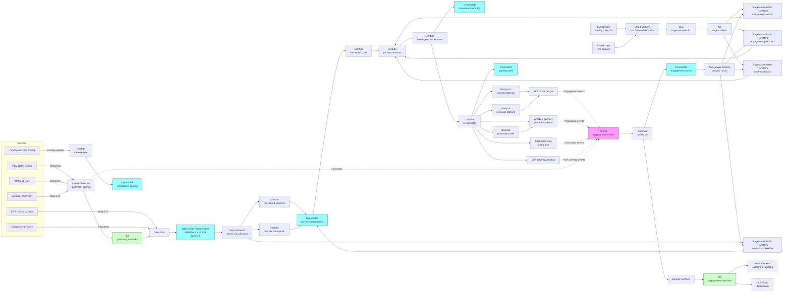

# Recipe 4.5: Medication Adherence Intervention Targeting ⭐⭐

**Complexity:** Medium · **Phase:** Production · **Estimated Cost:** ~$0.003-0.015 per intervention recommendation (depends on uplift model serving and LLM tailoring)

---

## The Problem

Maria is 58. She has type 2 diabetes, hypertension, and high cholesterol. Her medication list, in plan-formulary terms, is unremarkable: metformin twice daily, lisinopril once daily, atorvastatin once daily, and (added six months ago after a cardiology consult) a once-daily SGLT2 inhibitor. Her PCP wrote those prescriptions confident that Maria would take them, because Maria is a careful person who shows up for appointments and asks good questions. The PCP also has 1,800 other patients and does not have the bandwidth to track whether Maria's pharmacy refills are happening on schedule.

The plan's pharmacy benefit manager has the data, of course. Maria's metformin is being filled monthly, on time, every time. Her lisinopril is being filled monthly, on time, every time. Her atorvastatin is being filled, on average, once every 47 days. Her SGLT2 inhibitor was filled once, six months ago, and never again. If you computed her proportion of days covered (PDC) for each medication, metformin would be 98 percent, lisinopril would be 96 percent, atorvastatin would be 64 percent, and the SGLT2 would be 14 percent.

If you ranked Maria's medications by adherence problem, the SGLT2 inhibitor is the obvious crisis. The atorvastatin is a slower problem that's been quietly developing for years. The two she takes well are doing what they're supposed to. So far so good: the data tells you what's wrong, and any halfway competent analytics team can produce that ranking.

What the data does not tell you is *why*. The atorvastatin: Maria's brother had muscle pain on a statin and told her to be careful, so she takes it three or four days a week instead of seven. She thinks she's being prudent. The SGLT2 inhibitor: the copay was $84 a month, Maria filled it once, walked out of the pharmacy stunned, and decided she would talk to the doctor about it at her next visit. The next visit was four months out. She forgot to bring it up at the visit. The doctor assumed she was taking it.

Now imagine an adherence-intervention program that, on the basis of "Maria's PDC for the SGLT2 is 14 percent," sends her a text message reminder to take her medication. The text arrives. Maria does not have the medication. She has not had it for five months. The text is irrelevant. Worse, the text is mildly insulting: it implies Maria forgot to take a medication she could not have taken because she could not afford it. She unsubscribes from the plan's text messages. The plan now has lost its outreach channel for the next intervention.

The atorvastatin gets a different text: "remember to take your atorvastatin daily." Maria reads it, thinks "I am taking it carefully on purpose," and ignores it. The text doesn't address the actual barrier (she has a belief about side effects from a family member's experience), so it doesn't move the behavior. The plan logs it as "delivered" and "no response," which counts as a successful outreach in the operations dashboard, and counts as nothing in the actual world where Maria still has uncontrolled cholesterol.

Six months later, Maria's HbA1c has drifted up. Her LDL is 142. Her cardiologist's note from her recent visit is direct: she is not on the medications they prescribed. The cardiologist increases her metformin (the one she's actually taking), adds a referral to a clinical pharmacist, and writes in the chart that adherence is a problem. The plan's adherence dashboard, separately, marks Maria as "non-adherent across multiple chronic medications" and the case is escalated to a care manager, who has seventy other cases and will get to Maria in three weeks.

This is what medication adherence intervention looks like in practice. The data identifies the *what*: which medications, which patients, which adherence levels. The hard work is identifying the *why*, and matching the *why* to the right intervention. Reminders work for forgetfulness. They do not work for cost barriers or belief barriers or side-effect concerns or "the medication makes me dizzy and I haven't told anyone." A blanket reminder campaign for everyone with a PDC under 80 percent will produce reminders for thousands of Marias, most of which are irrelevant to the actual barrier, and the program will report a 2 to 4 percent improvement in PDC in the cohort that did get a behavior change, while the other 96 to 98 percent of the campaign was at best wasted effort and at worst counterproductive.

A second wrinkle that makes adherence intervention distinct from wellness program targeting (Recipe 4.4) and from the rest of this chapter: the catalog of interventions is *heterogeneous*. Wellness programs are similarly shaped objects (a multi-week curriculum, with sessions, with a coach or app). Adherence interventions are not. The plan's intervention slate typically includes:

- Behavioral reminders (text, app push, automated voice, mailed reminder cards)
- Pharmacist outreach (telephonic, in-store at retail pharmacies, video-visit with a clinical pharmacist)
- Cost-assistance navigation (manufacturer copay cards, foundation grants, formulary alternatives, switching from brand to generic, switching from retail to mail-order, switching from 30-day to 90-day fills, Low-Income Subsidy enrollment for Medicare members)
- Regimen simplification (combination pills, once-daily versus twice-daily formulations, blister packs, pill organizers)
- Education interventions (printed material, video, motivational interviewing scripts, peer-support groups)
- Care-team escalation (PCP outreach, care manager assignment, social work referral)
- Synchronized refill programs (med sync at the pharmacy so all chronic meds refill on the same day)

These have wildly different costs, different operational requirements, different evidence bases, and different patient experiences. A text reminder costs cents. A clinical pharmacist video visit costs $40 to $80 of staff time. A manufacturer copay card application costs staff time but no marginal medication cost. A regimen simplification requires a prescriber action. The recommender has to choose not just *whether* to intervene but *which* intervention, and the choice has to be matched to the underlying barrier, not just to the patient's PDC.

A third wrinkle: Star Ratings and HEDIS pressure. CMS Medicare Advantage Star Ratings include three Pharmacy Quality Alliance (PQA) medication adherence measures (Adherence to Cholesterol Statins, Adherence to Hypertension RAS Antagonists, and Adherence to Diabetes Medications), all with denominators based on use of the medication class regardless of indication. (Note: a separate HEDIS Part C measure, Statin Therapy for Patients with Cardiovascular Disease, evaluates statin *use* in CVD patients rather than adherence; the two are easy to conflate and aren't the same thing.) The cut points are unforgiving: a patient with a PDC of 79 percent and a patient with a PDC of 81 percent count differently for the plan even though their clinical risk is essentially identical. This produces a real organizational temptation to optimize for the cohort just below the cut point ("if we can get these 4,000 members from 78 to 81 percent, we move the Star score") at the expense of the cohort with PDCs in the 30 to 50 percent range, where the clinical lift is much larger but the Star Ratings improvement per member is smaller. The recipe is going to flag this trap explicitly, because it is one of the most common ways adherence-intervention programs end up doing the wrong thing very efficiently. <!-- TODO: confirm the current CMS Star Ratings cut-point methodology and the exact list of Part D adherence measures at the time of publication; CMS has revised this regularly and the 2023 Tukey-outlier change moved the cut points materially. -->

A fourth wrinkle: pharmacy data is messy. Claims arrive on a 1 to 30 day lag (retail pharmacy claims are usually within 48 hours; mail-order can be a week; specialty pharmacy can be longer). Cash-paying members, members using manufacturer-direct programs, and members using GoodRx or similar discount programs may not show up in PBM data at all. Patients with multiple pharmacies have fragmented data. 90-day mail-order fills can look like 30-day non-adherence if the calculation isn't careful. Therapeutic substitutions (a patient swaps from atorvastatin to rosuvastatin) can look like non-adherence if you're computing PDC by NDC instead of by therapeutic class. None of these are exotic edge cases. They affect 10 to 30 percent of the population in a typical plan, and they tilt the recommender's view of who is non-adherent in directions that correlate with socioeconomic status.

So the problem statement, again, is deceptively simple: given a patient's medication regimen, their fill history, their clinical context, their cost-sharing situation, and their prior engagement history, decide which adherence intervention (or sequence of interventions) is most likely to actually change their behavior, allocate finite intervention capacity across the population, and track whether the intervention worked. Not the same text message blast for everyone with a PDC under 80. The right intervention, for the right patient, at the right time, with honest measurement of whether it changed anything.

We're going to build that. This recipe leans heavily on Recipe 4.4's uplift-and-allocation pattern (we won't re-derive it; go read 4.4 if you skipped it), and adds three new pieces specific to adherence: barrier classification (figuring out the *why*), heterogeneous intervention scoring (different intervention types compete for the same patient), and pharmacy-data-aware adherence measurement (PDC done correctly, with the data lag and fragmentation handled honestly). The architecture is structurally similar to 4.4. The clinical and operational details are different enough that the recipe is worth its own treatment.

Let's get into how you build it.

---

## The Technology: Adherence Measurement, Barrier Classification, and Heterogeneous Intervention Uplift

### Adherence Measurement, Done Honestly

Before any modeling, the system has to compute adherence. The two metrics that matter:

- **Proportion of Days Covered (PDC).** Over an evaluation window (commonly 365 days, sometimes shorter), the fraction of days the patient had medication on hand based on fill dates and days-supply. PDC is the metric CMS uses for Star Ratings and HEDIS uses for adherence measures. PDC of 0.80 is the canonical "adherent" threshold; the plan-population number that matters for Star Ratings is the percentage of patients with PDC at or above 0.80.
- **Medication Possession Ratio (MPR).** Similar to PDC but computed as total days supplied divided by days in the window. MPR can exceed 1.0 (overlapping fills, stockpiling). Most modern programs use PDC because it caps at 1.0 and behaves better at the boundary.

Both metrics depend entirely on having clean fill data. Two non-obvious complications that wreck the calculation if you ignore them:

**Therapeutic class versus molecule.** A patient on atorvastatin who switches to rosuvastatin should not be marked non-adherent for the gap. Compute PDC at the therapeutic-class level (statins, RAS antagonists, oral diabetes medications) using the AHFS or NDF-RT classifications, not at the NDC level. The CMS Part D Star Ratings methodology, via the PQA measure specifications, defines the canonical class membership for the three adherence measures; use those definitions to keep your numbers comparable to the Star Ratings reporting your plan will be measured on. <!-- TODO: confirm the current CMS PQA (Pharmacy Quality Alliance) measure specifications and class definitions for the three Part D adherence measures at the time of publication. -->

**Fill cadence and overlapping supplies.** A patient who fills a 90-day supply in January doesn't need to fill again until April. If you compute PDC monthly, January looks like 100 percent adherence and February looks like 0 percent, when actually the patient is fine. The standard fix is "carry forward" days-supply: track running days-on-hand on a daily basis, and PDC is the count of days where days-on-hand was greater than zero.

**Mail-order and synchronization.** Patients on mail-order receive their meds in 90-day batches. Patients on med-sync at retail get all their chronic meds aligned to a single refill day, which can shift fill dates around the calendar in ways that look like non-adherence to a naive computation but are actually a sign of *good* adherence (the program worked).

**Data lag.** Retail pharmacy claims typically arrive within 48 hours. Mail-order can be 5 to 14 days. Specialty pharmacy varies wildly. Cash payments via discount programs may never arrive. The recommender has to reason about "the most recent fill the system can see" versus "the most recent fill that may have happened." A common pattern: compute PDC with a 30-day lag (PDC as of 30 days ago) for stable measurement, and a "best-effort current PDC" with explicit uncertainty for real-time targeting.

**Cash-pay and discount-card invisibility.** A meaningful fraction of members fill at least one chronic medication outside the PBM's data feed: GoodRx for cheaper generics, manufacturer assistance programs for branded drugs, supermarket $4 generic lists. The recommender will see "no fill" for these and conclude non-adherence, when actually the patient is filling but the data isn't there. The mitigation is partial at best: prompt the patient periodically about cash-pay fills (low-friction in-app survey), use clinical signals (continued PCP visits, repeat prescriptions written) as a sanity check, and tag patients with known cash-pay history so the recommender weights claims-derived adherence less heavily for them. Don't pretend the data is complete when it isn't.

### Barrier Classification: Why Aren't They Adherent?

This is the part most adherence programs skip. Without a barrier, the intervention is a guess.

The standard barrier taxonomy, simplified, has six rough categories:

- **Cost.** The patient can't or won't pay the copay. Often correlated with high-cost branded medications, members in deductible phases, members at low-income thresholds without LIS enrollment.
- **Forgetfulness.** The patient intends to take the medication but misses doses or fills. Often correlated with complex regimens (more than three chronic meds), older patients, patients with cognitive concerns.
- **Beliefs and concerns.** The patient has concerns about side effects, has heard things from family or social media, doesn't believe the medication is necessary, or has cultural concerns about long-term medication use. Often surfaces in symptomatic conditions where the patient feels fine without the medication (hypertension, dyslipidemia).
- **Side effects.** The patient is experiencing actual side effects and has self-reduced or stopped. Rarely volunteered to providers without prompting. The right answer is not "remind them to take it"; the right answer is "schedule a clinical conversation about alternatives."
- **Complexity.** The regimen itself is too complex to manage. Multiple times per day, food restrictions, drug-drug interactions the patient is trying to navigate alone. The right intervention is regimen simplification, not reminders.
- **Access.** The patient can't get to the pharmacy, can't navigate prior authorization, can't get the prescription written without a visit they can't get scheduled. The right intervention is care-team or pharmacist outreach, not patient-facing nudges.

How do you classify? Three approaches in practice, in increasing order of ambition:

**Rule-based.** Engineered features feed an explicit decision tree. Cost-sharing is high and the gap started after a copay change → cost barrier. Patient is on more than four chronic medications and the gaps are sporadic → forgetfulness or complexity. Patient discontinued shortly after fill, never refilled → beliefs/concerns or side effects. Transparent, auditable, and the right starting point. Misses subtle cases.

**Supervised classification.** Train a classifier on labeled non-adherence episodes where the barrier was identified through later patient outreach (call, survey, MTM session). Features: pharmacy claims patterns, copay levels, formulary changes, demographic and clinical context, prior engagement responses. The training labels are scarce (you need a barrier-elicitation program running in parallel) but the lift over rules can be material. Accuracy of the classifier is bounded by the quality of the labels: if pharmacist outreach calls preferentially elicit barriers from English-speaking, phone-comfortable members, the classifier will learn those patterns more confidently and be less reliable for everyone else.

**LLM-assisted classification.** A small LLM call given the patient's structured medication history, claims, and prior outreach notes can produce a reasoned barrier hypothesis with explicit uncertainty. This works best as a *second opinion* on the rule-based classifier rather than as a primary decision: a structured-output prompt that returns the predicted barrier, its confidence, and a one-paragraph rationale. The rationale is auditable, the structured output is consumable, and the human (clinical pharmacist or care manager) can review the LLM's reasoning when the stakes warrant it. Don't put the LLM in the autonomous decision path; keep it as augmentation.

A note on barrier ambiguity. Most patients do not have a single barrier. Maria from the opening had three: a belief barrier on the statin, a cost barrier on the SGLT2, and a communication-with-prescriber barrier underlying both. The barrier classifier should produce a *ranked list* of likely barriers with probabilities, not a single label, and the intervention recommender should be allowed to recommend a sequence (cost-assistance first to get the SGLT2 in the patient's hand, then a clinical conversation about the statin concern). Single-label barrier classification is a useful simplification for the first pass; multi-label barrier classification is the right long-term target.

### Heterogeneous Intervention Scoring

In Recipe 4.4, all the items in the catalog were similarly shaped (multi-week wellness programs). Here they aren't. A text reminder, a clinical pharmacist video visit, a manufacturer copay-card application, and a med-sync enrollment are different in cost, in evidence base, in operational footprint, and in patient experience. The recommender has to score each (patient, intervention, medication) triple, where the intervention is from a heterogeneous catalog.

Three scoring components per (patient, intervention, medication):

**Need score.** Is this patient's adherence problem real and clinically meaningful for this medication? A PDC of 78 percent on a statin in a primary-prevention 45-year-old is a different problem from a PDC of 78 percent on a statin in a post-MI 70-year-old. The need score is a clinical risk model (essentially a small Chapter 7 risk-scoring problem) that estimates the marginal clinical harm of continued non-adherence over the next 6 to 12 months given the patient's full clinical context.

**Barrier-fit score.** Does this intervention type address this patient's likely barrier? A reminder is a high-fit intervention for forgetfulness, a low-fit intervention for cost, and an actively counterproductive intervention for side-effect-driven non-adherence. The barrier-fit score is the conditional probability that this intervention type works for this barrier type, learned from historical (intervention, barrier, outcome) data and seeded with literature priors where data is sparse.

**Engagement-and-uplift score.** Same pattern as Recipe 4.4: predict the probability the patient will engage with this intervention if recommended, and predict the causal change in adherence (and downstream clinical outcome) from recommending it. Per-intervention-type engagement models (engagement with a text reminder is a different prediction from engagement with a clinical pharmacist call), per-intervention-type uplift models. The uplift model here is even more critical than in 4.4 because the intervention catalog includes some interventions that are nearly free (a text message) and some that are expensive (a clinical pharmacist consult), and the cost-effectiveness math depends on getting the uplift estimates right per intervention type.

The combined per-(patient, intervention, medication) priority score is a documented policy: weights on need, barrier-fit, engagement, and uplift, plus a cost-effectiveness term that incorporates the intervention's marginal cost. Different organizations weight these differently. A health plan focused on Star Ratings will weight uplift in the 75 to 85 percent PDC band heavily. An accountable care organization focused on total cost of care will weight clinical-need and uplift in the 30 to 60 percent PDC band heavily, where the clinical risk of continued non-adherence is largest. Both are defensible. Make the policy explicit, version it, review it quarterly. Don't bury it in the model.

### Allocation Across Heterogeneous Capacities

Capacity constraints are even more granular here than in 4.4. Each intervention type has its own capacity profile:

- Text reminders: nearly unbounded daily capacity, soft-bounded by per-patient contact-frequency caps.
- Telephonic pharmacist outreach: bounded by FTE capacity, typically 15 to 25 patients per pharmacist per day for substantive consults.
- Clinical pharmacist video visits: similar bound, plus appointment-scheduling overhead.
- Cost-assistance navigation: bounded by case-management capacity (each application takes 30 to 90 minutes of staff time, longer for foundation grants).
- Med-sync enrollment: bounded by retail pharmacy partnership capacity and the patient's pharmacy choice.
- Care-team escalation: bounded by PCP and care-manager bandwidth.

The allocator has to respect each intervention's per-day capacity, the cumulative per-patient contact-frequency cap, and any cross-intervention exclusions (a patient referred for a clinical pharmacist consult does not also get the text-reminder enrollment for the same medication; the pharmacist will handle the reminder framing). A greedy allocator sorted by priority is a fine starter, with two adjustments from 4.4:

- **Multi-intervention assignment per patient.** Unlike 4.4 where each patient was allocated one program per run, an adherence run may allocate multiple interventions to one patient when their barriers warrant it (cost-assistance navigation for the SGLT2 plus a belief-conversation pharmacist call for the statin). The allocator's per-patient cap is policy: typical defaults are at most 2 interventions per patient per run, at most 1 high-touch intervention (pharmacist or care manager), at most 3 patient-facing contacts in any 30-day window.
- **Sequencing within a patient.** Some interventions chain. Cost-assistance navigation is typically a prerequisite to "patient now has the medication"; a reminder enrollment chained after the navigation completes is more likely to land. The allocator can either assign in sequence with the chain explicit, or assign the first link only and let a state machine reschedule the next link when the first completes. The state-machine version is more robust; the sequence version is simpler and acceptable for early implementations. <!-- TODO (TechWriter): the cost-assistance to reminder chain is the recipe's primary example, but the architecture doesn't show how chaining is tracked. Add a small subsection (200-300 words) showing the state-machine version concretely: `predecessor_intervention_id` and `successor_intervention_id` fields on the catalog, `chain_position` and `chain_id` on the recommendation log, and an `intervention_completed` handler in Step 8 that triggers chain continuation. The simpler sequence version can be a one-paragraph alternative. Without this, the chain pattern stays a nice idea instead of an implemented feature. -->

### Where LLMs Fit (and Don't)

Same as 4.4 with adherence-specific notes:

- **Adherence measurement, barrier rules, intervention scoring, capacity allocation.** Not the LLM's job. Auditable models and rules, not generation.
- **Barrier classification as second opinion.** Yes, with structured output and explicit confidence. Frame it as a hypothesis the rule-based or supervised classifier can be checked against, not as the primary signal.
- **Outreach message tailoring.** Yes, for patient-facing reminders, education, and motivational content. The same pattern as 4.4: structured input goes in, tailored content comes out, the message goes through a clinical-claims validator before send.
- **Pharmacist call preparation.** When a clinical pharmacist is going to call a patient, an LLM can generate a structured pre-call brief: the patient's medication regimen, the suspected barrier, the prior fill history, suggested talking points, contraindications to flag. This saves the pharmacist 5 to 10 minutes per call and improves call quality, with the pharmacist always in the decision loop.
- **PCP and care-team summaries.** Same pattern as 4.4's PCP briefings. A structured summary of the patient's adherence picture, the recommended intervention, and the rationale, written into the EHR inbox or care-team dashboard.

What the LLM does *not* do: pick the intervention. Decide whether to escalate to a pharmacist. Override the cost-barrier path with a cheaper reminder because the LLM thought the patient seemed compliant. The recommender picks. The LLM packages.

### Where This Sits in the Chapter

This recipe builds directly on Recipe 4.4. The patient-profile DynamoDB table from 4.1, extended in 4.4, gets new attributes (`pharmacy_data_quality`, `cash_pay_history`, `cost_sharing_tier`, `med_sync_enrolled`). The engagement-event Kinesis stream gets new event types (`adherence_intervention_recommended`, `intervention_engaged`, `intervention_completed`, `pharmacy_fill_observed`, `barrier_elicited`). The SageMaker Feature Store features defined in 4.4 are reused; new features are added for medication-specific signals (per-medication PDC, days since last fill, cost-sharing for the specific drug, formulary tier, days-supply pattern).

The uplift-modeling investment from 4.4 transfers directly. The capacity-aware allocator gains a multi-intervention-per-patient mode and a per-intervention-capacity model. The cohort fairness instrumentation from 4.3 and 4.4 becomes more important here because adherence outcomes have well-documented disparities by race, language, geography, and socioeconomic status, and a poorly built recommender will encode those disparities into its targeting. Recipe 4.6 (Care Gap Prioritization) and Recipe 4.7 (Care Management Program Enrollment) reuse this recipe's barrier-classification and multi-intervention scoring patterns.

---

## General Architecture Pattern

The pipeline has five logical components: a pharmacy-data ingestion path that computes adherence metrics correctly, a barrier-classification path that turns adherence gaps into hypothesized "why" labels, an intervention-catalog ingestion path that maintains the slate of intervention types and capacities, a batch recommendation path that runs frequently to produce (patient, intervention, medication) allocations, and a feedback path that captures fill outcomes, intervention engagement, and downstream clinical change.

```
┌──────── PHARMACY DATA INGESTION (continuous) ─────────────┐
│                                                            │
│  [Retail pharmacy]   [Mail-order]   [Specialty pharmacy]   │
│           │                │                │              │
│           └────────┬───────┴────────┬───────┘              │
│                    ▼                ▼                      │
│         [Normalize fills: NDC -> therapeutic class,        │
│          days-supply, fill date, copay paid, channel]      │
│                    │                                       │
│                    ▼                                       │
│         [Compute per-medication PDC (carry-forward,        │
│          therapeutic-class level, lag-aware)               │
│          Compute regimen complexity (n meds, n doses)]     │
│                    │                                       │
│                    ▼                                       │
│         [Persist to feature store keyed on                 │
│          (patient_id, therapeutic_class)]                  │
│                                                            │
└────────────────────────────────────────────────────────────┘

┌──────── BARRIER CLASSIFICATION (daily/weekly) ────────────┐
│                                                            │
│  [Adherence features]   [Claims context]   [Engagement]    │
│           │                    │                │          │
│           └─────────┬──────────┴────────┬───────┘          │
│                     ▼                   ▼                  │
│         [Stage A: rule-based barrier classifier            │
│          (cost, forgetfulness, beliefs, side-effects,      │
│           complexity, access)]                             │
│                     │                                      │
│                     ▼                                      │
│         [Stage B: supervised classifier (when labels       │
│          available) refines confidence per barrier]        │
│                     │                                      │
│                     ▼                                      │
│         [Stage C (optional): LLM second-opinion             │
│          structured-output review for high-stakes cases]   │
│                     │                                      │
│                     ▼                                      │
│         [Persist ranked barriers + confidences per         │
│          (patient, medication)]                            │
│                                                            │
└────────────────────────────────────────────────────────────┘

┌──── INTERVENTION CATALOG INGESTION (low cadence) ─────────┐
│                                                            │
│  [Plan config]  [Vendor partners]  [PBM tools]             │
│         │              │                │                  │
│         └──────┬───────┴──────────┬─────┘                  │
│                ▼                  ▼                        │
│      [Intervention record: type, supported barriers,       │
│       evidence base, marginal cost, daily capacity,        │
│       eligibility (e.g., LIS-eligible only,                │
│       brand-only, retail-pharmacy-only)]                   │
│                │                                           │
│                ▼                                           │
│      [Persist to intervention-catalog store]               │
│                                                            │
└────────────────────────────────────────────────────────────┘

┌────── BATCH RECOMMENDATION RUN (e.g., weekly) ────────────┐
│                                                            │
│  [Trigger: schedule + Star Ratings cycle awareness]        │
│           │                                                │
│           ▼                                                │
│  [Stage 1: target set (patients with >= 1 medication       │
│   below adherence threshold for the run)]                  │
│           │                                                │
│           ▼                                                │
│  [Stage 2: per-(patient, medication) need scoring          │
│   (clinical risk of continued non-adherence)]              │
│           │                                                │
│           ▼                                                │
│  [Stage 3: intervention eligibility filter                 │
│   per (patient, intervention, medication)                  │
│   (LIS status, formulary tier, channel, exclusions)]       │
│           │                                                │
│           ▼                                                │
│  [Stage 4: per-(patient, intervention, medication)         │
│   barrier-fit scoring + engagement prediction              │
│   + uplift estimation]                                     │
│           │                                                │
│           ▼                                                │
│  [Stage 5: combined priority + cost-effectiveness          │
│   per documented policy weights]                           │
│           │                                                │
│           ▼                                                │
│  [Stage 6: capacity-aware allocation                       │
│   (heterogeneous capacities, equity floors,                │
│    multi-intervention-per-patient cap, sequencing)]        │
│           │                                                │
│           ▼                                                │
│  [Stage 7: outreach + pharmacist scheduling +              │
│   care-team alerts (channel optimizer + structured         │
│   handoffs to staff queues)]                               │
│           │                                                │
└───────────┼────────────────────────────────────────────────┘
            │
            ▼
     [Patient receives intervention / pharmacist call /
      cost-assistance navigation / med-sync enrollment]
            │
┌───────────┼────────────────────────────────────────────────┐
│           ▼                                                │
│  [Engagement events: opened, scheduled, completed,         │
│   barrier_elicited, intervention_outcome,                  │
│   pharmacy_fill_observed]                                  │
│           │                                                │
│           ▼                                                │
│  [Short-horizon: feed engagement-prediction + barrier      │
│   classifier (when staff elicit ground-truth barrier)]     │
│           │                                                │
│           ▼                                                │
│  [Medium-horizon (months): observed PDC change feeds       │
│   uplift training and intervention-effectiveness model]    │
│           │                                                │
│           ▼                                                │
│  [Long-horizon (months-years): clinical outcomes           │
│   (HbA1c, BP, LDL, hospitalization) feed program-level     │
│   cost-effectiveness evaluation]                           │
│           │                                                │
│           ▼                                                │
│  [Cohort dashboards: PDC trends by cohort,                 │
│   per-intervention completion + uplift,                    │
│   barrier-distribution by cohort,                          │
│   capacity utilization, equity-floor utilization]          │
│                                                            │
└──────────────────── FEEDBACK PATH ─────────────────────────┘
```

**Pharmacy data ingestion is the foundation.** Every other component depends on the adherence numbers being right. The ingestion job consumes claims feeds from the PBM (retail and mail-order in one stream, specialty in a separate stream because the data shape and lag profile differ), normalizes NDCs to therapeutic classes (using AHFS and the CMS PQA measure specifications for the Star Ratings classes), computes per-medication PDC with carry-forward days-supply, and emits both a "lag-aware stable" PDC (as of 30 days ago, when claims are settled) and a "best-effort current" PDC for real-time targeting. Per-patient features include each chronic medication's PDC, days since last fill, fill cadence, channel mix (retail vs mail-order), copay paid distribution, and regimen complexity (number of chronic medications, number of doses per day).

**Barrier classification runs on the same cadence as the recommendation run, or slightly ahead.** The output (ranked barriers per patient-medication with confidences) is consumed by the intervention scoring step. The classifier is staged: a rule-based pass for transparency and a deterministic baseline; a supervised classifier where labels exist; an optional LLM second opinion for high-stakes cases (high need score, high uplift potential, ambiguous barrier). The LLM second opinion's output is structured (predicted barrier, confidence, rationale) and flagged for human review when the suggested barrier conflicts materially with the rule-based prediction.

**Intervention catalog is small and human-curated.** The catalog is dozens of intervention records, not thousands. Each record has structured eligibility (some interventions are LIS-eligible only, some are brand-formulary-tier-only, some require the patient's pharmacy to be a partner), supported barriers (text reminders are a fit for forgetfulness; cost-assistance is a fit for cost barriers; pharmacist consults are general-purpose), capacity (daily slots per intervention, per-patient frequency caps), and marginal cost. Catalog updates are change-managed: a new intervention added requires clinical and contracting review, just like new wellness programs in 4.4.

**Batch recommendation runs frequently.** Adherence is a faster-moving target than wellness program enrollment. Weekly is the default for most programs; some plans run daily for the highest-priority Star Ratings cohorts. The batch run consumes the per-patient-medication adherence features, the barrier classification, and the intervention catalog, and produces a (patient, intervention, medication, priority, allocated) table that drives outreach and staff queuing.

**Outreach orchestration is multi-modal.** Patient-facing interventions (reminders, education, app push) flow through the channel optimizer from Recipe 4.1. Staff-facing interventions (pharmacist outreach, cost-assistance navigation, care-team escalation) flow into staff work queues with structured pre-work (the LLM-generated pre-call brief, the patient's adherence history, the suggested intervention rationale). Some interventions (med-sync enrollment) flow into pharmacy partner systems via the partner's API or through a flagged-for-action work queue if the partnership is manual.

**Feedback is multi-horizon, again.** Short-horizon engagement (text opened, call scheduled, copay-card application started) feeds the engagement-prediction model. Medium-horizon adherence change (PDC at 90 days post-intervention versus matched controls) feeds the uplift model and the per-intervention effectiveness estimates. Long-horizon clinical outcomes (HbA1c trajectory, blood pressure control, LDL trajectory, ED visits and hospitalizations for adherence-sensitive conditions) feed the program-level cost-effectiveness evaluation and inform whether each intervention type stays in the catalog. Star Ratings impact (movement of patients across the 80 percent PDC threshold) is tracked separately because it has business consequences distinct from clinical impact.

**Equity instrumentation is structural.** Every batch run produces cohort-sliced metrics: barrier-distribution by demographic cohort (a barrier classifier that disproportionately flags Spanish-speaking members as "forgetfulness" instead of "access" is a fairness problem; surface that), intervention allocation by cohort (capacity reserved for under-engaged cohorts), and PDC change by cohort. Persistent disparities surface as alarms on the cohort dashboard.

**Care-team integration is bidirectional.** PCP and pharmacist actions flow back into the system as structured events. A pharmacist who completes a consult and elicits a "side-effect concern" barrier writes that finding back to the engagement stream as a `barrier_elicited` event with the barrier and the source. That ground-truth label is gold for retraining the barrier classifier.

---

## The AWS Implementation

### Why These Services

**Amazon SageMaker for the model training and serving stack.** Four model families live here: the per-medication clinical-need scorer (gradient-boosted), the barrier classifier (gradient-boosted multi-class with optional LLM augmentation), the per-intervention engagement predictors (gradient-boosted binary, one per intervention type), and the per-intervention uplift estimators (causal forest or X-learner, one per intervention type). SageMaker Training Jobs handle periodic retraining. The recommendation run uses SageMaker Batch Transform; same reasoning as 4.4 (batch is dramatically cheaper than an idle real-time endpoint, and adherence runs are scheduled, not interactive). SageMaker is HIPAA-eligible under BAA. <!-- TODO: confirm SageMaker Batch Transform's current HIPAA eligibility and the appropriate instance types for the model sizes implied here. -->

**Amazon SageMaker Feature Store for per-(patient, medication) features.** This is where the Feature Store investment from Recipe 4.4 pays off again. The feature definitions for clinical risk, engagement history, demographics, SDOH proxies, and prior intervention engagement are reused. New features specific to this recipe (per-medication PDC, per-medication days-since-last-fill, regimen complexity, copay-paid history, channel mix) are added as new feature groups. The offline store powers the batch recommendation run; the online store powers any real-time intervention triggers (e.g., a refill-gap-detected event that fires a same-day intervention).

**Amazon DynamoDB for the intervention catalog, recommendation log, patient profile, and engagement aggregates.** Same `patient-profile` table from prior recipes; new attributes added (`pharmacy_data_quality`, `cash_pay_history`, `cost_sharing_tier`, `med_sync_enrolled`, `prior_interventions`). New table `intervention-catalog` for the dozens of intervention records. New table `barrier-classifications` keyed on (patient_id, therapeutic_class) for the latest barrier ranking. The recommendation log captures (patient_id, intervention_id, medication_class, run_date, priority, allocated, allocation_reason) for downstream attribution.

**Amazon S3 for the data lake and recommendation outputs.** Pharmacy claims land in S3 (via Kinesis Firehose from PBM feeds), the offline feature store is backed by S3, the eligible-target sets are written to S3 per run, and the recommendation outputs land in S3 for the orchestrator to consume. Engagement events and clinical outcomes accumulate in S3 for the long-horizon cost-effectiveness evaluation.

**AWS Glue and Amazon Athena for adherence computation and outcome evaluation.** The PDC computation is a SQL-shaped problem at scale: window functions over fill events, carry-forward joins, per-(patient, therapeutic_class) aggregation. Glue jobs run nightly to compute lag-aware PDC and emit the per-(patient, medication) feature snapshots to the offline feature store. Athena powers the cohort dashboards and the per-intervention effectiveness queries.

**AWS Step Functions for batch orchestration.** Same pattern as 4.4. The eight-stage batch pipeline is a Step Functions workflow: trigger on schedule, run target-set selection (Glue), run scoring (Batch Transform jobs in parallel for need, barrier, engagement, uplift), run combined ranking (Lambda), run allocation (Lambda), write outreach list (Lambda), trigger orchestrator (Lambda invoking 4.1's APIs and the staff-queue handoffs).

**Amazon EventBridge for scheduling and refill-gap triggers.** EventBridge schedules the weekly batch run. EventBridge rules also route real-time pharmacy-event signals: a `refill_gap_detected` event (patient is N days past expected refill) can trigger a same-day intervention pathway for high-risk medications, bypassing the weekly cycle for time-sensitive cases. Use EventBridge rules sparingly for real-time triggers; the operational complexity adds up fast.

**Amazon Kinesis Data Streams for engagement and pharmacy events.** Same engagement-event bus from 4.1 through 4.4. New event types: `pharmacy_fill_observed`, `refill_gap_detected`, `adherence_intervention_recommended`, `intervention_outreach_sent`, `intervention_engaged`, `intervention_completed`, `barrier_elicited`, `med_sync_enrolled`, `cost_assistance_initiated`, `cost_assistance_approved`, `pcp_override`, `pharmacist_consult_completed`. The attribution Lambda joins these events to the recommendation log in DynamoDB and persists per-(intervention, outcome) records.

**Amazon Bedrock for barrier-classification second opinion, outreach tailoring, and pharmacist pre-call briefs.** Three distinct LLM use cases:

1. Barrier classification second opinion. A structured-output prompt that takes the patient's adherence pattern, claims context, and prior outreach notes, and returns `{predicted_barrier, confidence, rationale}`. Used as augmentation, not primary signal.
2. Outreach message tailoring (same pattern as 4.4). The structured intervention assignment goes in, the personalized message comes out, the message goes through a clinical-claims validator before send.
3. Pharmacist pre-call brief generation. A structured prompt produces a one-page brief: the patient's regimen, the suspected barrier, prior fill pattern, suggested talking points, contraindications. The pharmacist reads it before the call.

Bedrock is HIPAA-eligible under BAA. Confirm in service terms that prompts and completions are not used to train the underlying foundation models. <!-- TODO: confirm current Bedrock service terms and the eligible-model list at the time of build; the BAA-covered model list has been evolving. -->

**AWS Lambda for per-stage glue logic.** The barrier classifier (rule-based stage), the priority combiner, the allocator, the orchestrator, the engagement-attribution worker, and the contact-cap enforcer all run as Lambdas. Same scale considerations as 4.4; the allocator can stay under the 250 MB layer ceiling for greedy allocation, and graduates to a containerized Lambda for LP-based allocation (Recipe 14.x).

**Amazon Connect (or a contracted outreach platform) for telephonic pharmacist outreach.** When the recommended intervention is a clinical pharmacist consult, the assignment flows into a staff work queue. Plans with in-house clinical pharmacists often build on Amazon Connect for the contact-center capabilities (call recording for QA, call-disposition codes feeding back into the engagement stream, integration with the scheduled-callback model). Plans with vendor pharmacist services use the vendor's queue. The AWS-specific piece is HIPAA-eligible call recording and the contact-flow-to-engagement-event integration.

**Amazon SES for member-facing email and SMS through a partner.** Same as 4.4; SES under BAA for email, SMS through Pinpoint or a contracted vendor under BAA. <!-- TODO: confirm SES HIPAA eligibility and BAA scope at the time of build; verify Pinpoint SMS eligibility. -->

**Amazon QuickSight for operations dashboards.** Cohort-sliced PDC trends, per-intervention completion and uplift, barrier-distribution dashboards, Star-Ratings-tracking dashboards (movement across the 80 percent PDC line by therapeutic class), capacity-utilization views. QuickSight on Athena, with row-level security for cohort-specific filters.

**AWS KMS, CloudTrail, CloudWatch.** Same PHI infrastructure pattern as prior recipes. Customer-managed keys, CloudTrail data events on PHI tables, CloudWatch alarms on batch-run failures and cohort-metric drift.

### Architecture Diagram



### Prerequisites

| Requirement | Details |
|-------------|---------|
| **AWS Services** | Amazon SageMaker (Training, Batch Transform, Feature Store), Amazon DynamoDB, Amazon S3, AWS Glue, Amazon Athena, AWS Step Functions, Amazon EventBridge, Amazon Kinesis Data Streams, Amazon Kinesis Data Firehose, AWS Lambda, Amazon Bedrock, Amazon SES, Amazon Pinpoint or contracted SMS provider, Amazon Connect (optional, for in-house pharmacist contact center), Amazon QuickSight, AWS KMS, Amazon CloudWatch, AWS CloudTrail. |
| **IAM Permissions** | Per-Lambda least-privilege: `sagemaker:CreateTransformJob` and `sagemaker:DescribeTransformJob` scoped to specific model ARNs; `dynamodb:GetItem` / `BatchWriteItem` / `UpdateItem` scoped to specific tables; `bedrock:InvokeModel` on specific foundation-model ARNs; `s3:GetObject` / `PutObject` scoped to feature, claims, and recommendation buckets; `kinesis:PutRecord` on the engagement stream; `ses:SendEmail` and `pinpoint:SendMessages` scoped to BAA-covered identities; `connect:*` scoped to the pharmacist-queue contact flow only. Never `*`. <!-- TODO: pair these actions with one or two scoped Resource ARN examples so a reader copying into an IAM policy doesn't default to `Resource: *`. Same chapter-wide pattern flagged in 4.1, 4.2, 4.3, 4.4 reviews. --> |
| **BAA** | AWS BAA signed. All services in the architecture must be HIPAA-eligible: SageMaker (Training, Batch Transform, Feature Store), DynamoDB, S3, Glue, Athena, Step Functions, EventBridge, Kinesis, Firehose, Lambda, Bedrock, SES, Pinpoint, Connect (when configured for HIPAA workloads), KMS are on the HIPAA Eligible Services list. <!-- TODO: confirm Bedrock + selected models are eligible at the time of build; verify Pinpoint and Connect HIPAA-eligible configurations; verify SageMaker Feature Store eligibility. --> |
| **Encryption** | DynamoDB: customer-managed KMS at rest. S3: SSE-KMS with bucket-level keys (especially the pharmacy-claims bucket; raw fill data is highly sensitive). Kinesis and Firehose: server-side encryption. SageMaker training and inference: VPC-only, with KMS keys for model artifacts and Feature Store offline storage. Lambda log groups KMS-encrypted. The recommendation log contains (patient_id, intervention_id, medication_class, barrier) tuples that are highly inferential; treat as PHI from day one. |
| **VPC** | Production: Lambdas in VPC. SageMaker training, Batch Transform, and Feature Store online store run in VPC. VPC endpoints for DynamoDB (gateway), S3 (gateway), Bedrock, Kinesis, Firehose, KMS, CloudWatch Logs, SageMaker Runtime, Step Functions (`states`), EventBridge (`events`), Glue, Athena, STS, SES, Pinpoint, Connect. NAT Gateway only for external services without VPC endpoints (e.g., a manufacturer copay-card vendor portal); restrict egress with security groups. PBM claims feeds typically arrive via SFTP over a Direct Connect tunnel or PrivateLink connection rather than over the public internet. VPC Flow Logs enabled. |
| **CloudTrail** | Enabled with data events on the patient-profile table, intervention-catalog table, recommendation-log table, barrier-classifications table, and engagement-events table. Data events on the S3 buckets containing pharmacy claims, per-patient feature snapshots, and recommendation outputs. |
| **Equity Governance** | Document the allocator's policy weights (need vs. barrier-fit vs. engagement vs. uplift vs. cost-effectiveness trade-off), the equity floors (capacity reserved for cohorts with documented adherence disparities), and the cohort-monitoring thresholds before launch. Cross-functional review committee (medical director, pharmacist lead, equity lead, data science, vendor management) signs off on the policy and reviews quarterly. Star-Ratings-driven targeting decisions go through this committee, not just the analytics team. |
| **Sample Data** | A starter set of synthetic patients with realistic medication regimens (Synthea can generate prescribing patterns; supplement with synthetic fill events at varying adherence levels). A small intervention catalog (3-5 interventions: text reminders, pharmacist consult, copay-card navigation, med-sync, regimen-simplification PCP referral). Synthetic engagement labels for engagement-prediction training. For uplift training, a randomized pilot is the gold standard; in development, simulated treatment-effect data lets you validate the modeling pipeline before running real members through it. |
| **Cost Estimate** | At a 400,000-member health plan with ~80,000 chronic-medication patients running weekly: SageMaker Batch Transform (4 model families per run, ~80K rows per run, weekly): roughly $80-200/month at modest instance sizes. SageMaker Feature Store offline store: $50-100/month. SageMaker training (monthly retrain of 4 model families): $100-250/month. DynamoDB on-demand: $50-150/month. Lambda + Step Functions: $50-100/month. Bedrock for barrier classification + outreach tailoring + pharmacist briefs (~30K LLM calls per week, Haiku-class): $300-600/month. SES + Pinpoint SMS (~20K outreach per week): $40-100/month. Connect (if used, 4 FTE pharmacists): $200-400/month plus telephony. S3 + Glue + Athena: $150-400/month. QuickSight: $50/user/month for authors plus reader fees. Estimated total: $1,000-2,500/month range for a regional plan, before staff time and intervention vendor costs. <!-- TODO: replace with verified, current pricing once the implementing team validates against the AWS Pricing Calculator. --> |

### Ingredients

| AWS Service | Role |
|------------|------|
| **Amazon SageMaker** | Hosts the clinical-need scorer, barrier classifier, per-intervention engagement predictors, and per-intervention uplift estimators; runs training and Batch Transform jobs |
| **Amazon SageMaker Feature Store** | Per-(patient, medication) features (PDC, fill cadence, regimen complexity) reused across this recipe and Recipes 4.4, 4.6, 4.7 |
| **Amazon DynamoDB** | Stores intervention catalog, recommendation log, patient profile (extended from 4.1/4.4), barrier classifications, and engagement aggregates |
| **Amazon S3** | Hosts the pharmacy-claims data lake, offline feature store, target-set lists, recommendation outputs, training data, and engagement data lake |
| **AWS Glue** | Adherence computation (PDC, regimen complexity), target-set selection, outcome-evaluation jobs |
| **Amazon Athena** | SQL access to data lake; powers cohort dashboards and per-intervention cost-effectiveness queries |
| **AWS Step Functions** | Orchestrates the weekly batch recommendation pipeline and the barrier-classification pipeline with retry, DLQ, and per-stage visibility |
| **Amazon EventBridge** | Schedules batch run; routes refill-gap-detected events for time-sensitive interventions; routes catalog change events |
| **Amazon Kinesis Data Streams** | Carries pharmacy fill events, engagement events, pharmacist consult events, and PCP overrides into attribution |
| **Amazon Kinesis Data Firehose** | Lands pharmacy claims and engagement events into S3 Parquet for evaluation and training data prep |
| **AWS Lambda** | Runs the rule-based barrier classifier, priority combiner, heterogeneous allocator, orchestrator, attribution worker, and contact-cap enforcer |
| **Amazon Bedrock** | Hosts the LLM for barrier-classification second opinion, member-facing message tailoring, and pharmacist pre-call briefs |
| **Amazon SES** | Bulk email delivery under BAA for adherence outreach |
| **Amazon Pinpoint** | SMS delivery for reminder interventions |
| **Amazon Connect** | Optional contact-center for in-house clinical pharmacist outreach; HIPAA-eligible when configured per AWS guidance |
| **Amazon QuickSight** | Operational dashboards for adherence operations team, medical director, pharmacist lead, and equity committee |
| **AWS KMS** | Customer-managed encryption keys for all PHI-containing stores |
| **Amazon CloudWatch** | Operational metrics, cohort-sliced PDC and intervention dashboards, alarms |
| **AWS CloudTrail** | Audit logging for all PHI-related API calls |

---

### Code

> **Reference implementations:** Useful aws-samples patterns for this recipe:
> - [`amazon-sagemaker-examples`](https://github.com/aws/amazon-sagemaker-examples): XGBoost and SageMaker Batch Transform notebooks that mirror the per-intervention scoring pattern used here.
> - [`amazon-sagemaker-feature-store-end-to-end-workshop`](https://github.com/aws-samples/amazon-sagemaker-feature-store-end-to-end-workshop): End-to-end Feature Store usage that maps onto the per-(patient, medication) feature pipeline.
> - [`amazon-bedrock-workshop`](https://github.com/aws-samples/amazon-bedrock-workshop): Demonstrates structured-output prompting applicable to the barrier-classification second opinion and message-tailoring steps.
> <!-- TODO: confirm the current names and locations of these aws-samples repos. -->

#### Walkthrough

**Step 1: Compute per-(patient, medication) adherence features.** The PDC computation runs nightly. For each patient, for each chronic medication therapeutic class, compute carry-forward days-supply, the PDC over the trailing 365 days (and 90 days, for short-window targeting), and per-medication regimen features. Skip carry-forward and a 90-day mail-order patient looks like a non-adherent retail patient.

```
FUNCTION compute_adherence_features(patients, run_date):
    // Pull settled fill claims for the trailing 12 months. The "settled"
    // window means claims with fill_date at least 30 days before run_date,
    // because retail claims arrive on a 1-2 day lag, mail-order on a 5-14
    // day lag, and specialty up to 30 days. Computing adherence on
    // not-yet-settled data produces noisy, biased numbers.
    settled_window_end = run_date - 30 days
    settled_window_start = settled_window_end - 365 days

    fills = Athena.Query("""
        SELECT patient_id, ndc, therapeutic_class, fill_date, days_supply,
               channel, copay_paid, was_cash_pay, pharmacy_id
        FROM pharmacy_claims
        WHERE fill_date BETWEEN :start AND :end
          AND therapeutic_class IN :tracked_classes
    """, params = { start: settled_window_start, end: settled_window_end,
                    tracked_classes: TRACKED_THERAPEUTIC_CLASSES })

    FOR each (patient_id, therapeutic_class) in groupby(fills):
        // Carry-forward construction: for each fill, mark days from
        // fill_date through fill_date + days_supply - 1 as "covered".
        // Overlapping fills (early refills, stockpiling) extend the
        // covered window but don't double-count.
        days_covered = build_covered_set(fills_for_class)

        pdc_365 = len(days_covered ∩ trailing_365_days) / 365
        pdc_90  = len(days_covered ∩ trailing_90_days) / 90

        // Days since last fill: the gap between today and the most recent
        // fill date. A patient on a 30-day supply who hasn't filled in 45
        // days has a 15-day gap. A patient on a 90-day mail-order supply
        // who hasn't filled in 45 days is fine.
        last_fill_date = max(fills_for_class.fill_date)
        days_since_last_fill = settled_window_end - last_fill_date
        last_days_supply     = fills_for_class[-1].days_supply
        gap_days             = max(0, days_since_last_fill - last_days_supply)

        // Channel mix and cost-sharing pattern. These will feed the
        // barrier classifier.
        channel_mix      = compute_channel_distribution(fills_for_class)
        copay_paid_stats = compute_copay_stats(fills_for_class)
        cash_pay_count   = sum(fills_for_class.was_cash_pay)

        feature_record = {
            patient_id:              patient_id,
            therapeutic_class:       therapeutic_class,
            pdc_365:                 pdc_365,
            pdc_90:                  pdc_90,
            gap_days:                gap_days,
            last_fill_date:          last_fill_date,
            channel_mix:             channel_mix,
            copay_paid_p50:          copay_paid_stats.p50,
            copay_paid_p90:          copay_paid_stats.p90,
            cash_pay_indicator:      (cash_pay_count > 0),
            run_date:                run_date,
            data_quality_flag:       assess_data_completeness(fills_for_class)
                // values include 'complete', 'sparse_history',
                // 'multi_pharmacy_fragmented', 'cash_pay_partial',
                // 'recent_plan_change'. Downstream consumers can
                // gate on this when adherence-by-claims is unreliable.
        }

        SageMaker.FeatureStore.PutRecord(
            feature_group = "patient-medication-adherence",
            record        = feature_record
        )

    // Compute regimen-level features (across all chronic medications).
    FOR each patient_id:
        regimen = list_chronic_medications(patient_id, settled_window_end)
        SageMaker.FeatureStore.PutRecord(
            feature_group = "patient-regimen",
            record = {
                patient_id:           patient_id,
                regimen_size:         len(regimen),
                doses_per_day_total:  sum(regimen.doses_per_day),
                num_classes_tracked:  len(distinct(regimen.therapeutic_class)),
                pharmacy_count:       count_distinct_pharmacies(regimen),
                med_sync_enrolled:    member_profile(patient_id).med_sync_enrolled,
                run_date:             run_date
            }
        )
```

<!-- TODO (TechWriter): The `data_quality_flag` is computed in Step 1 and propagated through the barrier-classifications table and engagement events, but no downstream component gates on it. The "Where it struggles" section names the gate as necessary, but the pseudocode in Steps 2, 3, 5, and 7 does not implement it. A reader copying the pseudocode literally produces confidently-wrong adherence labels for the cohorts most affected by data fragmentation (cash-pay, multi-pharmacy, recent plan change). Add explicit gating: cap barrier-classifier confidence on non-`complete` cases (Step 2), route low-quality cases to verification-first interventions or downweight (Step 3 or 5), and tailor patient-facing messages to acknowledge uncertainty rather than confidently asserting non-adherence (Step 7). Add a paragraph to the architecture pattern section naming the gate explicitly. -->


**Step 2: Classify barriers per (patient, medication) below the adherence threshold.** The rule-based classifier runs first and is deterministic; the supervised classifier refines confidence where labels exist; the LLM second opinion runs for high-stakes cases. The output is a ranked list of barriers per (patient, medication). Skip this and the recommender treats every adherence gap the same way.

```
FUNCTION classify_barriers(target_set, features, run_date):
    FOR each (patient_id, therapeutic_class) in target_set:
        adherence = features.get_adherence(patient_id, therapeutic_class)
        regimen   = features.get_regimen(patient_id)
        claims_context = features.get_claims_context(patient_id, therapeutic_class)
            // Includes: most-recent-fill copay, trend in copay over time,
            // formulary tier of the medication, brand-vs-generic status,
            // recent fills of competing/substitute medications,
            // recent gap onset relative to copay change events,
            // recent gap onset relative to side-effect-coded encounters.
        engagement_context = features.get_engagement_history(patient_id)
            // Includes: prior intervention engagement, channel preference,
            // language, prior elicited barriers (gold from pharmacist consults).

        // Stage A: rule-based pass. Each rule emits one or more barrier
        // hypotheses with rule-defined confidences. Multiple rules can fire.
        rule_results = []

        IF adherence.gap_days > 30 AND
           claims_context.most_recent_copay > COPAY_HIGH_THRESHOLD AND
           claims_context.gap_onset_aligned_with_copay_change:
            rule_results.append({ barrier: "cost",          rule_confidence: 0.85 })

        IF claims_context.most_recent_copay > COPAY_HIGH_THRESHOLD AND
           NOT claims_context.gap_onset_aligned_with_copay_change AND
           NOT member.lis_enrolled:
            rule_results.append({ barrier: "cost",          rule_confidence: 0.55 })

        IF regimen.regimen_size >= 4 AND
           adherence.fills_pattern_is_sporadic AND
           NOT regimen.med_sync_enrolled:
            rule_results.append({ barrier: "complexity",    rule_confidence: 0.65 })
            rule_results.append({ barrier: "forgetfulness", rule_confidence: 0.45 })

        IF claims_context.recent_side_effect_encounter AND
           adherence.gap_started_after_side_effect_encounter:
            rule_results.append({ barrier: "side_effects", rule_confidence: 0.80 })

        IF therapeutic_class in SYMPTOMATIC_LATENT_CLASSES AND
           adherence.discontinued_after_one_or_two_fills:
            // Hypertension, statins: classic asymptomatic conditions where
            // patients often stop because they "feel fine".
            rule_results.append({ barrier: "beliefs", rule_confidence: 0.55 })

        IF adherence.fills_pattern_is_consistent_then_stopped AND
           NOT claims_context.recent_side_effect_encounter AND
           claims_context.recent_pcp_encounter_count == 0:
            rule_results.append({ barrier: "access", rule_confidence: 0.40 })

        // Stage B: supervised refinement. The supervised classifier was
        // trained on (features, elicited-barrier) labels from prior
        // pharmacist consult outcomes. Its output is a probability
        // distribution over the six barrier classes. We blend it with the
        // rule-based output rather than overriding, because the rule-based
        // output is auditable and the supervised model is the augmentation.
        supervised_probs = SupervisedClassifier.predict(features_for_classifier)

        blended = blend_rule_and_supervised(rule_results, supervised_probs,
                                             rule_weight = 0.6,
                                             supervised_weight = 0.4)

        // Stage C: LLM second opinion. Used only when:
        // - blended top-1 confidence is low (< 0.55), OR
        // - the patient is high-priority on need score, OR
        // - rule-based and supervised disagree materially.
        llm_review = null
        IF should_invoke_llm(blended, need_score):
            llm_review = Bedrock.InvokeModel(
                model_id = BARRIER_CLASSIFIER_MODEL_ID,
                body     = build_barrier_prompt(adherence, claims_context,
                                                 engagement_context, regimen,
                                                 BARRIER_OUTPUT_SCHEMA)
            )
            llm_parsed = parse_json(llm_review.completion)
                // { predicted_barrier, confidence, rationale,
                //   alternative_barriers, uncertainty_notes }

            // Validate the LLM output: barrier must be in allowed taxonomy,
            // rationale must reference observed data points (not invent).
            validate_barrier_review(llm_parsed, observed_data = features)
                // <!-- TODO (TechWriter): Specify validate_barrier_review's
                // four-layer structure: (1) schema and taxonomy check,
                // (2) rationale length/structure, (3) rationale must cite
                // observable data points whose values match observed_data
                // within tolerance (the meaningful and non-trivial layer:
                // a substring match between rationale and serialized data
                // produces both false positives and false negatives), and
                // (4) prohibited content (PHI, prescriber names) in
                // rationale. Specify failure-handling: validator failure
                // means the LLM second opinion is dropped from the blended
                // classification, the failure is logged for prompt-
                // engineering review, and the case is flagged for
                // pharmacist-review queue with the LLM output included
                // for diagnostic purposes (not as a decision input). -->

            // Flag for human review if LLM disagrees with blended top-1
            // by a material margin and the case is high-stakes.
            IF llm_parsed.predicted_barrier != blended.top_1.barrier AND
               need_score > NEED_REVIEW_THRESHOLD:
                flag_for_pharmacist_review(patient_id, therapeutic_class,
                                            blended, llm_parsed)

        // Persist the ranked barriers. Do not collapse to a single label.
        DynamoDB.PutItem("barrier-classifications", {
            patient_id:        patient_id,
            therapeutic_class: therapeutic_class,
            run_date:          run_date,
            ranked_barriers:   blended.ranked_list,
                // [ { barrier: "cost", confidence: 0.72, sources: ["rule", "supervised"] },
                //   { barrier: "beliefs", confidence: 0.21, sources: ["rule"] }, ... ]
            llm_second_opinion: llm_parsed,
            data_quality_flag: adherence.data_quality_flag,
            classifier_versions: {
                rules:      RULES_VERSION,
                supervised: SUPERVISED_MODEL_VERSION,
                llm:        BARRIER_CLASSIFIER_MODEL_ID
            }
        })
```

**Step 3: Build the per-(patient, intervention, medication) candidate set with eligibility.** Not every intervention is eligible for every (patient, medication). Cost-assistance navigation is gated on cost-sharing tier and brand status. Med-sync requires the patient's pharmacy to be a partner. Pharmacist consults require pharmacist availability in the patient's region/language. Skip the eligibility filter and you waste downstream model inference on combinations that can't ever be allocated.

```
FUNCTION build_candidate_triples(target_set, intervention_catalog, run_date):
    candidates = []
    FOR each (patient_id, therapeutic_class) in target_set:
        member  = lookup_member(patient_id)
        barriers = lookup_barriers(patient_id, therapeutic_class)

        FOR each intervention in intervention_catalog:
            // Hard eligibility filters.
            IF intervention.brand_only AND
               NOT lookup_medication(patient_id, therapeutic_class).is_brand:
                CONTINUE

            IF intervention.requires_lis AND NOT member.lis_enrolled:
                CONTINUE

            IF intervention.requires_partner_pharmacy AND
               member.preferred_pharmacy_id NOT IN PARTNER_PHARMACIES:
                CONTINUE

            IF intervention.requires_language AND
               member.preferred_language NOT IN intervention.supported_languages:
                CONTINUE

            IF intervention.cooldown_days > 0:
                IF member.last_intervention_of_type(intervention.type)
                   .completed_within(intervention.cooldown_days, run_date):
                    CONTINUE

            // Mutual-exclusion: if a higher-touch intervention is already
            // scheduled or in-flight for this (patient, medication),
            // exclude lower-touch alternatives that would conflict.
            IF intervention.conflicts_with_inflight(patient_id, therapeutic_class):
                CONTINUE

            candidates.append({
                patient_id:        patient_id,
                therapeutic_class: therapeutic_class,
                intervention_id:   intervention.intervention_id,
                intervention_type: intervention.type,
                intervention_cost: intervention.marginal_cost,
                supported_barriers: intervention.supported_barriers,
                barriers:          barriers,
                run_date:          run_date
            })

    write_candidates(candidates, run_date)
    RETURN candidates
```

**Step 4: Score need, barrier-fit, engagement, and uplift per candidate.** Same fan-out pattern as Recipe 4.4. SageMaker Batch Transform jobs in parallel; do not loop sequentially across interventions or therapeutic classes. Skip uplift and you over-target patients who would have improved on their own.

```
FUNCTION score_candidates(candidates, run_date):
    // Group candidates by intervention_type so each intervention's models
    // run on the relevant subset; the per-intervention engagement and
    // uplift models are different model artifacts.
    candidates_by_intervention = group_by(candidates, "intervention_id")

    job_handles = []
    FOR each intervention_id, intervention_candidates in candidates_by_intervention:
        candidate_path = "s3://adherence-candidates/run_date=" + run_date +
                         "/intervention=" + intervention_id + "/candidates.parquet"
        write_parquet(intervention_candidates, candidate_path)

        // Need score is per (patient, medication) not per intervention,
        // so it's invoked once per therapeutic class rather than per
        // (intervention, class). Submit it once per class.
        FOR each therapeutic_class in distinct_classes(intervention_candidates):
            need_job = SageMaker.CreateTransformJob(
                transform_job_name = "need-" + therapeutic_class + "-" + run_date,
                model_name         = NEED_MODEL_NAMES[therapeutic_class],
                transform_input    = filter_to_class(candidate_path, therapeutic_class),
                transform_output   = "s3://adherence-scores/run_date=" + run_date +
                                    "/need/" + therapeutic_class + "/",
                instance_type      = "ml.m5.large",
                instance_count     = 1
            )
            job_handles.append(need_job)

        // Engagement prediction: per-intervention model. Different
        // intervention types have different engagement signatures.
        engagement_job = SageMaker.CreateTransformJob(
            transform_job_name = "eng-" + intervention_id + "-" + run_date,
            model_name         = ENGAGEMENT_MODEL_NAMES[intervention_id],
            transform_input    = candidate_path,
            transform_output   = "s3://adherence-scores/run_date=" + run_date +
                                "/engagement/" + intervention_id + "/",
            instance_type      = "ml.m5.large",
            instance_count     = 1
        )
        job_handles.append(engagement_job)

        // Uplift estimate: per-intervention model. The uplift target is
        // the change in PDC over the next 90 days conditional on
        // recommendation. Causal forest with the intervention as the
        // treatment indicator.
        uplift_job = SageMaker.CreateTransformJob(
            transform_job_name = "uplift-" + intervention_id + "-" + run_date,
            model_name         = UPLIFT_MODEL_NAMES[intervention_id],
            transform_input    = candidate_path,
            transform_output   = "s3://adherence-scores/run_date=" + run_date +
                                "/uplift/" + intervention_id + "/",
            instance_type      = "ml.m5.xlarge",
            instance_count     = 1
        )
        job_handles.append(uplift_job)

    wait_for_jobs(job_handles)

    // Barrier-fit scoring is a deterministic lookup, not a model call:
    // for each candidate, the barrier-fit score is the dot product
    // between the patient's ranked-barriers vector and the intervention's
    // supported-barriers vector.
    FOR candidate in candidates:
        candidate.barrier_fit = compute_barrier_fit(
            patient_barriers       = candidate.barriers,
            intervention_supported = candidate.supported_barriers
        )
            // e.g., if patient barriers are [cost: 0.72, beliefs: 0.21]
            // and intervention "cost-assistance navigation" supports
            // {cost: 1.0, beliefs: 0.0}, barrier_fit = 0.72.
            // For "text reminder" supporting {forgetfulness: 1.0,
            // complexity: 0.6, beliefs: 0.0, cost: 0.0, side_effects: 0.0,
            // access: 0.0}, the same patient's barrier_fit would be ~0.0.

    consolidate_scores(candidates, run_date)
        // produces s3://adherence-scores/run_date=<run_date>/all-scores.parquet
        // with columns: patient_id, therapeutic_class, intervention_id,
        //               need_score, barrier_fit, engagement_prob,
        //               uplift_estimate, intervention_cost
```


**Step 5: Combine scores into per-candidate priority with cost-effectiveness.** The combination weights are policy: documented, version-controlled, reviewable. The cost-effectiveness term divides expected-uplift by intervention cost so a $0.05 reminder doesn't get crowded out by a $80 pharmacist consult on every candidate. Skip the cost term and the system over-allocates expensive interventions to patients where a cheaper one would have worked.

```
FUNCTION compute_priority(scored_candidates, policy):
    // Policy weights live in versioned config, not code:
    // {
    //   need:           0.25,
    //   barrier_fit:    0.20,
    //   engagement:     0.10,
    //   uplift:         0.35,
    //   cost_efficiency: 0.10
    // }
    // The cost_efficiency term rewards interventions that produce uplift
    // per dollar spent, computed as uplift_estimate / intervention_cost
    // and normalized to [0, 1] within the candidate pool.

    // Normalize within meaningful comparison groups. Need scores compare
    // across classes (a clinical-need 0.8 means roughly the same thing
    // for statins as for diabetes meds). Engagement and uplift are
    // normalized within intervention type.
    candidates_norm = normalize_scores(scored_candidates, policy.normalization)

    FOR each row in candidates_norm:
        cost_efficiency = row.uplift_estimate / max(row.intervention_cost, MIN_COST_FOR_DIVISION)
        cost_efficiency_norm = normalize_within_intervention_type(cost_efficiency, row.intervention_type)

        row.priority = (policy.weights.need        * row.need_score +
                        policy.weights.barrier_fit * row.barrier_fit +
                        policy.weights.engagement  * row.engagement_prob +
                        policy.weights.uplift      * row.uplift_estimate +
                        policy.weights.cost_efficiency * cost_efficiency_norm)

        row.priority_components = {
            need_contrib:           policy.weights.need * row.need_score,
            barrier_fit_contrib:    policy.weights.barrier_fit * row.barrier_fit,
            engagement_contrib:     policy.weights.engagement * row.engagement_prob,
            uplift_contrib:         policy.weights.uplift * row.uplift_estimate,
            cost_efficiency_contrib: policy.weights.cost_efficiency * cost_efficiency_norm
        }

    // Group by (patient, therapeutic_class) and sort interventions within
    // each group. The same patient can have multiple medications and
    // multiple top-ranked interventions across them.
    grouped = group_by(candidates_norm, ("patient_id", "therapeutic_class"))
    FOR each (patient_id, therapeutic_class), group_rows in grouped:
        sorted_rows = sort group_rows by priority DESC
        FOR rank_pos, r in enumerate(sorted_rows):
            r.intervention_rank_within_medication = rank_pos + 1

    write_priority_table(candidates_norm, policy.policy_version, run_date)
    RETURN candidates_norm
```

**Step 6: Allocate under heterogeneous capacities with multi-intervention-per-patient and equity floors.** The allocator walks priority-sorted candidates and assigns slots subject to: each intervention's daily capacity, the cumulative per-patient cap (default: at most 2 interventions per run, at most 1 high-touch), the cross-intervention exclusions (a pharmacist consult on a medication suppresses lower-touch interventions for the same medication), and the equity floors. Skip the floors and the optimization quietly redistributes opportunity to the easiest-to-help cohorts.

```
FUNCTION allocate_heterogeneous(prioritized, interventions, policy, run_date):
    candidates_sorted = sort prioritized by priority DESC

    // Per-intervention capacity and equity-floor counters.
    capacity_remaining = {}
    equity_remaining = {}
    FOR each intervention in interventions:
        capacity_remaining[intervention.intervention_id] = intervention.daily_capacity * RUN_HORIZON_DAYS
        equity_remaining[intervention.intervention_id] = {}
        FOR floor_cohort, floor_count in policy.equity_floors[intervention.intervention_id]:
            equity_remaining[intervention.intervention_id][floor_cohort] = floor_count

    // Per-patient counters.
    patient_intervention_count = {}    // total interventions per patient this run
    patient_high_touch_count   = {}    // high-touch (pharmacist, care manager) per patient
    patient_contact_count_30d  = {}    // existing 30-day contact count from profile

    allocated = []
    FOR candidate in candidates_sorted:
        member = lookup_member(candidate.patient_id)
        intervention = lookup_intervention(candidate.intervention_id)

        // Per-intervention capacity.
        IF capacity_remaining[candidate.intervention_id] <= 0:
            CONTINUE

        // Per-patient interventions-per-run cap.
        IF patient_intervention_count.get(candidate.patient_id, 0) >= policy.max_interventions_per_patient_per_run:
            CONTINUE

        // Per-patient high-touch cap.
        IF intervention.is_high_touch:
            IF patient_high_touch_count.get(candidate.patient_id, 0) >= policy.max_high_touch_per_patient_per_run:
                CONTINUE

        // Per-patient contact-frequency cap (rolling 30-day).
        existing_contacts = member.outreach_recent_30d_count
            // <!-- TODO (TechWriter): the "30d" in the name implies a
            // rolling 30-day window, but the counter as implemented in
            // Step 7 increments forward without decay. After three
            // months of weekly runs, the counter no longer reflects
            // recent contact frequency, and the contact-cap deferral
            // becomes a lifetime-of-program filter rather than a 30-day
            // window. Pick a rolling-window pattern (DynamoDB TTL on
            // per-event rows, daily-bucket aggregation, or scheduled
            // decay Lambda) and document it. Coordinate with the
            // cross-recipe global counter TODO in Why This Isn't
            // Production-Ready. -->
        new_contacts_this_run = patient_contact_count_30d.get(candidate.patient_id, 0)
        IF intervention.generates_patient_contact AND
           (existing_contacts + new_contacts_this_run) >= policy.max_contacts_per_patient_30d:
            CONTINUE

        // Cross-intervention exclusions: e.g., a pharmacist consult on
        // a medication absorbs the reminder for that medication.
        IF already_allocated_conflicting(allocated, candidate):
            CONTINUE

        // Equity floor: prefer to use a floor slot if applicable.
        cohort_features = lookup_cohort_features(candidate.patient_id)
            // <!-- TODO (TechWriter): same chapter-wide pattern as 4.4
            // Finding 13. The cohort-feature lookup runs per-(patient,
            // intervention) inside this loop; for a patient with N
            // candidate triples it repeats N times. Hoist the cache out
            // of the per-candidate loop and build it once per unique
            // patient_id before the allocation walk. -->
        applicable_floors = applicable_floor_cohorts(cohort_features,
                                                      policy.equity_floors[candidate.intervention_id])
        used_floor = null
        FOR floor_cohort in applicable_floors:
            IF equity_remaining[candidate.intervention_id][floor_cohort] > 0:
                equity_remaining[candidate.intervention_id][floor_cohort] -= 1
                used_floor = floor_cohort
                BREAK

        capacity_remaining[candidate.intervention_id] -= 1
        patient_intervention_count[candidate.patient_id] = patient_intervention_count.get(candidate.patient_id, 0) + 1
        IF intervention.is_high_touch:
            patient_high_touch_count[candidate.patient_id] = patient_high_touch_count.get(candidate.patient_id, 0) + 1
        IF intervention.generates_patient_contact:
            patient_contact_count_30d[candidate.patient_id] = patient_contact_count_30d.get(candidate.patient_id, 0) + 1

        allocated.append({
            patient_id:        candidate.patient_id,
            therapeutic_class: candidate.therapeutic_class,
            intervention_id:   candidate.intervention_id,
            intervention_type: candidate.intervention_type,
            priority:          candidate.priority,
            priority_components: candidate.priority_components,
            allocation_reason: reason_string(candidate, used_floor),
            cohort_features:   cohort_features,
            run_date:          run_date,
            policy_version:    policy.policy_version
        })

    // Second pass to fill any unfilled equity floors.
    FOR intervention_id, floor_remaining_per_cohort in equity_remaining:
        FOR floor_cohort, floor_remaining in floor_remaining_per_cohort:
            IF floor_remaining > 0:
                top_up_from_cohort(allocated, intervention_id, floor_cohort,
                                   floor_remaining, prioritized,
                                   patient_intervention_count, patient_high_touch_count)

    DynamoDB.BatchWriteItem("recommendation-log", allocated)

    emit_metric("adherence_allocations_made",
                value = len(allocated),
                dimensions = {
                    run_date:       run_date,
                    policy_version: policy.policy_version
                })
    RETURN allocated
```

**Step 7: Orchestrate outreach across heterogeneous channels.** Patient-facing interventions go to the channel optimizer from Recipe 4.1. Staff-facing interventions go to staff queues with structured pre-work. Cost-assistance flows to a dedicated case-management queue. Med-sync flows to the partner pharmacy's API or a flagged-for-action work queue. Skip the per-intervention-type orchestration and your interventions become "send a generic email" regardless of what was actually allocated.

```
FUNCTION orchestrate_interventions(allocated, run_date, policy):
    FOR row in allocated:
        member = DynamoDB.GetItem("patient-profile", row.patient_id)
        intervention = lookup_intervention(row.intervention_id)
        medication = lookup_medication(row.patient_id, row.therapeutic_class)

        // Build the structured prompt input common to all generation
        // tasks. Identifiers are stripped before LLM calls; PHI is
        // re-attached after.
        de_identified_context = {
            therapeutic_class:    row.therapeutic_class,
            adherence_summary:    summarize_adherence_for_outreach(member, medication),
            ranked_barriers:      lookup_barriers(row.patient_id, row.therapeutic_class).ranked_barriers,
            preferred_language:   member.preferred_language,
            tone:                 policy.outreach_tone,
            data_quality_flag:    medication.data_quality_flag
        }

        BRANCH on intervention.type:
            CASE "text_reminder":
                tailored = Bedrock.InvokeModel(
                    model_id = REMINDER_MODEL_ID,
                    body     = build_reminder_prompt(de_identified_context, intervention)
                )
                validate_reminder(tailored, intervention)
                ChannelOptimizer.QueueOutreach(
                    member_id    = row.patient_id,
                    content_type = "adherence_reminder",
                    payload      = { tailored: tailored, fallback: intervention.default_template },
                    urgency      = "standard",
                    tracking_id  = build_tracking_id(row, run_date)
                )

            CASE "education":
                content_match = match_education_content(de_identified_context, intervention)
                ChannelOptimizer.QueueOutreach(
                    member_id    = row.patient_id,
                    content_type = "adherence_education",
                    payload      = { content_id: content_match.content_id, tailored_intro: content_match.intro },
                    urgency      = "standard",
                    tracking_id  = build_tracking_id(row, run_date)
                )

            CASE "pharmacist_consult":
                // Generate the pharmacist pre-call brief.
                brief = Bedrock.InvokeModel(
                    model_id = PHARMACIST_BRIEF_MODEL_ID,
                    body     = build_brief_prompt(de_identified_context, member,
                                                    medication, intervention)
                )
                validate_pharmacist_brief(brief)

                PharmacistQueue.Enqueue({
                    patient_id:        row.patient_id,
                    therapeutic_class: row.therapeutic_class,
                    priority:          row.priority,
                    suspected_barrier: de_identified_context.ranked_barriers[0],
                    brief_text:        brief.parsed,
                    target_window:     compute_target_window(row, intervention),
                    tracking_id:       build_tracking_id(row, run_date)
                })

            CASE "cost_assistance":
                CostAssistanceQueue.Enqueue({
                    patient_id:           row.patient_id,
                    therapeutic_class:    row.therapeutic_class,
                    medication_ndc:       medication.ndc,
                    suspected_barrier:    "cost",
                    member_lis_status:    member.lis_enrolled,
                    cost_sharing_tier:    medication.formulary_tier,
                    tracking_id:          build_tracking_id(row, run_date)
                })

            CASE "med_sync":
                IF member.preferred_pharmacy_id IN PARTNER_PHARMACIES:
                    PartnerPharmacyAPI.RequestMedSyncEnrollment({
                        patient_id:           row.patient_id,
                        therapeutic_classes:  member.regimen_classes,
                        tracking_id:          build_tracking_id(row, run_date)
                    })
                ELSE:
                    PharmacistQueue.Enqueue({
                        // Fall back to staff-mediated med-sync conversation
                        patient_id:        row.patient_id,
                        therapeutic_class: row.therapeutic_class,
                        intervention:      "med_sync_referral",
                        tracking_id:       build_tracking_id(row, run_date)
                    })

            CASE "regimen_simplification":
                // Requires prescriber action. Flag to PCP via care-team
                // inbox with a structured talking-point briefing.
                pcp_briefing = Bedrock.InvokeModel(
                    model_id = PCP_BRIEFING_MODEL_ID,
                    body     = build_pcp_prompt(de_identified_context, member, medication)
                )
                CareTeamInbox.PostNote(
                    patient_id  = row.patient_id,
                    briefing    = pcp_briefing.parsed,
                    source      = "adherence-recommender",
                    suggested_action = "consider regimen simplification (combination pill, once-daily, blister pack)",
                    tracking_id = build_tracking_id(row, run_date)
                )
                // <!-- TODO (TechWriter): regimen_simplification has no
                // PCP-review hold-time semantics. Unlike a text reminder
                // (which is parallel-track safe) or a pharmacist consult
                // (which sorts itself out at the consult), this
                // intervention requires the prescriber to act, and any
                // simultaneous patient-facing message creates the same
                // backfire pattern as 4.4 Finding 4 named for behavioral
                // health. Add a `pcp_review_policy` field to the
                // intervention catalog (`none`, `notify_parallel`,
                // `review_required_24h`, `review_required_72h_then_hold`)
                // and default regimen_simplification to
                // `review_required_72h_then_hold`. Update the orchestrator
                // to schedule the patient-facing message conditional on
                // PCP endorsement when the policy requires review. -->

        // Update contact-frequency counter optimistically when patient
        // contact is generated. Reconcile in the engagement-attribution
        // step if the send fails.
        IF intervention.generates_patient_contact:
            DynamoDB.UpdateItem(
                "patient-profile",
                row.patient_id,
                "ADD outreach_recent_30d_count :one",
                values = { ":one": 1 }
            )

        // Emit a 'adherence_intervention_recommended' event.
        Kinesis.PutRecord(stream = "engagement-stream", record = {
            event_type:        "adherence_intervention_recommended",
            tracking_id:       build_tracking_id(row, run_date),
            patient_id:        row.patient_id,
            therapeutic_class: row.therapeutic_class,
            intervention_id:   row.intervention_id,
            intervention_type: row.intervention_type,
            run_date:          row.run_date,
            priority_components: row.priority_components,
            allocation_reason: row.allocation_reason,
            timestamp:         current UTC timestamp
        })
```

<!-- TODO (TechWriter): The optimistic increment in Step 7 has the same reconciliation gap flagged in Recipe 4.4 Step 6. Add the matching reconciliation paths to Step 8: an `intervention_outreach_failed` / `intervention_outreach_bounced` clause that decrements `outreach_recent_30d_count`, plus a stale-pending sweep for tracking_ids with no engagement-stream activity within 24 hours. Without these, members with flaky channels accumulate phantom contact-cap consumption and get systematically excluded from future allocations they should still be eligible for. The asymmetry compounds across cohorts: members with reliable channels stay at the cap floor, members with flaky channels silently move past the cap floor and lose access to the program. -->

**Step 8: Capture engagement, fill, and barrier-elicited events; update training data on appropriate horizons.** Pharmacist consults that elicit a ground-truth barrier are gold for retraining the barrier classifier. Pharmacy fills observed after an intervention are the medium-horizon uplift signal. Clinical outcomes are the long-horizon signal. Skip this and the models stop learning, the dashboards stop reflecting reality, and you cannot honestly answer whether any intervention works.

```
FUNCTION process_adherence_event(event):
    rec = lookup_recommendation_by_tracking_id(event.tracking_id)
        // Some events (pharmacy_fill_observed, organic) won't have a
        // tracking_id. Match those to the most recent open recommendation
        // for the same (patient_id, therapeutic_class) within an
        // attribution window.
    IF rec is null AND event.event_type == "pharmacy_fill_observed":
        rec = match_organic_fill_to_open_recommendation(event)

    IF rec is null:
        LOG("event with no matched recommendation: " + str(event))
        RETURN

    IF event.patient_id != rec.patient_id:
        LOG("event patient_id mismatch with recommendation; dropping")
        RETURN

    DynamoDB.PutItem("engagement-events", {
        event_id:          new UUID,
        tracking_id:       event.tracking_id,
        patient_id:        event.patient_id,
        therapeutic_class: rec.therapeutic_class,
        intervention_id:   rec.intervention_id,
        intervention_type: rec.intervention_type,
        event_type:        event.event_type,
        timestamp:         event.timestamp,
        run_date:          rec.run_date,
        priority:          rec.priority,
        priority_components: rec.priority_components,
        allocation_reason: rec.allocation_reason,
        cohort_features:   rec.cohort_features,
        event_payload:     event.payload
            // For barrier_elicited: { barrier: "cost", source: "pharmacist_consult", confidence: "high" }
            // For pharmacy_fill_observed: { fill_date, days_supply, copay_paid, channel }
            // For intervention_completed: { outcome_disposition, notes }
    })

    // Short-horizon engagement signals.
    IF event.event_type in ["intervention_outreach_opened",
                             "intervention_outreach_clicked",
                             "intervention_engaged",
                             "intervention_completed"]:
        update_engagement_training_label(rec, event)

    // Barrier-elicited: a pharmacist or care manager confirmed a barrier
    // through direct patient interaction. This is gold-label data for
    // the supervised barrier classifier.
    IF event.event_type == "barrier_elicited":
        update_barrier_classifier_training_label(rec, event)

    // Medium-horizon adherence change. After an intervention, observed
    // PDC over the next 90 days is the uplift outcome. Joins on the
    // recommendation-log row and the subsequent fill events.
    IF event.event_type == "pharmacy_fill_observed":
        update_uplift_observation(rec, event)

    // PCP override: regulator-style signal that the recommendation was
    // clinically declined. Strong negative label, also signals possible
    // need-score miscalibration.
    IF event.event_type == "pcp_override":
        DynamoDB.PutItem("pcp-overrides", {
            override_id:    new UUID,
            tracking_id:    event.tracking_id,
            patient_id:     event.patient_id,
            therapeutic_class: rec.therapeutic_class,
            intervention_id: rec.intervention_id,
            pcp_reason:     event.reason,
            timestamp:      event.timestamp
        })
        flag_for_clinical_review(event)

    // Cohort-sliced metrics for the equity dashboard.
    emit_metric("adherence_engagement",
                value = 1,
                dimensions = {
                    event_type:                    event.event_type,
                    intervention_type:             rec.intervention_type,
                    therapeutic_class:             rec.therapeutic_class,
                    engagement_history_quartile:   rec.cohort_features.engagement_history_quartile,
                    language:                      rec.cohort_features.language,
                    sdoh_cohort:                   rec.cohort_features.sdoh_cohort
                })
```

> **Curious how this looks in Python?** The pseudocode above covers the concepts. If you'd like to see sample Python code that demonstrates these patterns using boto3, check out the [Python Example](chapter04.05-python-example). It walks through each step with inline comments and notes on what you'd need to change for a real deployment.

---

### Expected Results

**Sample recommendation log entry:**

```json
{
  "tracking_id": "adherence-2026-05-04-pat-000482-statins-cost-assist-001",
  "run_date": "2026-05-04",
  "patient_id": "pat-000482",
  "therapeutic_class": "statins",
  "intervention_id": "cost-assist-001",
  "intervention_type": "cost_assistance",
  "priority": 0.81,
  "priority_components": {
    "need_contrib": 0.20,
    "barrier_fit_contrib": 0.18,
    "engagement_contrib": 0.07,
    "uplift_contrib": 0.28,
    "cost_efficiency_contrib": 0.08
  },
  "allocation_reason": "top_priority_general_capacity",
  "policy_version": "adherence-policy-v0.3",
  "barrier_snapshot": {
    "ranked_barriers": [
      { "barrier": "cost", "confidence": 0.74 },
      { "barrier": "beliefs", "confidence": 0.18 }
    ],
    "data_quality_flag": "complete"
  },
  "model_versions": {
    "need_model": "need-statins-v4",
    "engagement_model": "eng-cost-assist-v3",
    "uplift_model": "uplift-cost-assist-v2",
    "barrier_classifier": "barrier-blended-v5"
  },
  "cohort_features": {
    "engagement_history_quartile": "q3",
    "language": "en",
    "sdoh_cohort": "moderate_food_security",
    "age_band": "55-64"
  }
}
```

**Sample tailored reminder payload (different patient, different barrier):**

```json
{
  "tracking_id": "adherence-2026-05-04-pat-000915-ras-reminder-002",
  "tailored": {
    "subject_line": "Quick reminder about your blood-pressure medication",
    "opening_line": "Hi James, just a quick check in.",
    "body": "Your last lisinopril fill was about 35 days ago. If you've already refilled, ignore this. If not, your pharmacy can usually have it ready in a few hours.",
    "call_to_action": "Tap here to request a refill, or reply OK if you already have it.",
    "tone": "supportive, non-alarming"
  },
  "fallback_template": "ras-reminder-en-default",
  "urgency": "standard",
  "preferred_language": "en"
}
```

**Sample pharmacist pre-call brief:**

```json
{
  "tracking_id": "adherence-2026-05-04-pat-000482-statins-pharmacist-003",
  "patient_summary": "58F, T2DM, HTN, dyslipidemia. Statin on board: atorvastatin 40mg.",
  "adherence_picture": {
    "trailing_365_pdc": 0.64,
    "trailing_90_pdc": 0.52,
    "fill_pattern": "irregular fills every 45-50 days vs prescribed 30-day supply",
    "data_quality": "complete"
  },
  "suspected_barrier": {
    "primary": "beliefs",
    "confidence": "moderate",
    "rationale": "Fill pattern consistent with deliberate skipping (not gaps). No copay change in last 12 months. No side-effect-coded encounters. Family history of statin intolerance documented."
  },
  "suggested_talking_points": [
    "Open-ended question about how the medication has been going",
    "Listen for concerns about muscle pain, family history of statin reaction",
    "If beliefs/concerns surface, validate and offer to discuss alternatives with PCP",
    "If side effects, escalate to PCP with prompt timeline"
  ],
  "contraindications_to_flag": [],
  "estimated_call_duration_minutes": 12
}
```

**Sample quarterly outcome evaluation:**

```json
{
  "evaluation_id": "eval-2026Q1-cost-assist-statins",
  "intervention_id": "cost-assist-001",
  "therapeutic_class": "statins",
  "evaluation_window": "2025-10-01_to_2026-03-31",
  "method": "propensity_matched_difference_in_differences",
  "primary_outcome": "pdc_change_at_90_days",
  "ate": {
    "estimate": 0.18,
    "ci_95_low": 0.11,
    "ci_95_high": 0.25,
    "p_value": 0.0008,
    "interpretation": "Treated members increased 90-day PDC by ~0.18 more than matched controls."
  },
  "ate_by_cohort": [
    { "cohort": "language=en", "estimate": 0.19, "ci_95_low": 0.11, "ci_95_high": 0.27 },
    { "cohort": "language=es", "estimate": 0.14, "ci_95_low": 0.02, "ci_95_high": 0.26 },
    { "cohort": "sdoh_cohort=low_food_security", "estimate": 0.21, "ci_95_low": 0.09, "ci_95_high": 0.33 }
  ],
  "secondary_outcomes": {
    "ldl_change_at_180_days": { "estimate_mg_dl": -8.4, "ci_95": [-13.1, -3.7] }
  },
  "sample_size_treated": 412,
  "sample_size_control": 412
}
```

**Performance benchmarks (illustrative, your mileage varies):**

| Metric | Reminder-only baseline | Recipe pipeline |
|--------|------------------------|-----------------|
| Targeting precision (intervention matched to barrier) | n/a (single intervention type) | 65-80% (per audit sample) |
| Per-intervention engagement rate | 12-18% (text reminders) | 25-45% (intervention-tailored) |
| 90-day PDC uplift (treated vs matched control) | 0.02-0.05 average across all targets | 0.10-0.20 in barrier-matched cohorts |
| Star Ratings cohort movement (% of 75-79 PDC band crossing 80%) | 8-15% | 18-30% |
| Cost per "PDC point" gained | ($high, dominated by reminder spam waste) | ($more efficient through targeted spend) |
| End-to-end batch run time (400K members, 10 interventions, 4 classes) | n/a | 60-120 minutes |
| Equity floor utilization | n/a | 80-100% (configurable) |

<!-- TODO: the benchmarks above are illustrative ranges informed by published adherence-program literature; replace with measured results from your deployment, or with citations once verified. Be wary of vendor-published numbers that conflate engagement metrics with adherence change, or that report aggregate uplift without confidence intervals. -->

**Where it struggles:**

- **Patients with fragmented pharmacy data.** Multi-pharmacy patients, members who use cash-pay or discount-card programs, members who recently switched plans: the recommender's view of their adherence is incomplete. The `data_quality_flag` exposes this, but downstream consumers (and your operations team) need to actually gate on it. A confident "non-adherent" label on a patient with `cash_pay_partial` data quality is a confidently wrong label.
- **Specialty pharmacy interactions.** Many specialty medications (infusion therapies, biologics) have completely different fill cadences and clinical workflows than retail meds. The carry-forward PDC math doesn't apply cleanly. Most plans treat specialty as a separate adherence program with its own intervention catalog and its own measurement methodology; don't try to shoehorn specialty into the retail/mail-order pipeline.
- **Newly prescribed medications.** A medication first prescribed 60 days ago has at most one or two fills of history. The PDC numbers are noisy, the engagement features for the patient-medication pair don't exist, and the uplift model has high uncertainty. The right behavior for new prescriptions is a "primary adherence" pathway: did the patient fill at all? That's a different intervention set (cost-assistance navigation, education on the new medication, pharmacist outreach to confirm side-effect tolerance) and a different measurement. Treat the first 60 to 90 days as a primary-adherence regime, not as PDC-driven targeting.
- **Therapeutic substitution patterns.** A patient who switches from atorvastatin to rosuvastatin (often driven by a formulary change) looks like an adherence interruption to an NDC-level computation. Class-level computation handles the obvious case, but cross-class substitutions (a switch from a statin plus PCSK9 to bempedoic acid) require clinical knowledge to map correctly. The class definitions need a clinical pharmacist to review.
- **Cost-barrier identification at the boundary.** Members with copays in the $20 to $50 range may or may not be cost-barriered depending on their financial situation. The classifier conflates "high copay" with "cost barrier" when the actual signal is the patient's discretionary income, which the plan doesn't see. Pharmacist-elicited barriers are the gold-label correction for this; until enough labels accumulate, expect the cost classifier to over-predict at the moderate-copay range and under-predict for low-income members with seemingly modest copays.
- **Patients with appropriate non-adherence.** Sometimes the right answer is *not* adherence: a patient on a statin who can't tolerate any of the available molecules and is in shared decision-making with their PCP about discontinuing should not be a target for adherence intervention. The recommender doesn't know the difference between "non-adherent" and "appropriately discontinued" without explicit prescriber communication. The PCP-override path is the corrective; the pre-recommendation check (does the prescription show as `discontinued` rather than `active` in the EHR) catches the easier cases.
- **Star Ratings cut-point distortion.** Patients in the 75 to 79 PDC band have outsized business value because moving them past 80 affects Star Ratings disproportionately. A purely uplift-driven recommender will rationally target them. A care-equity-driven recommender will weight the 30 to 50 PDC band more heavily, where clinical lift is larger but Star Ratings impact per member is smaller. Acknowledge the tension explicitly in the policy weights and document the trade-off; don't let either ideology silently win.
- **PCP override rate variation.** Some PCPs override most adherence recommendations (clinical skepticism toward population-health outreach in general); some PCPs override almost none. A model that learns from overrides will down-weight recommendations to patients of high-override PCPs, even when those patients clinically need the intervention. Track override rates by PCP separately and feed only legitimate per-recommendation overrides (where the PCP cited a specific clinical reason) into the model retraining; don't let prescriber-level skepticism become a feature.
- **Cohorts with sparse pharmacist-elicited barriers.** The supervised barrier classifier only learns well in cohorts where pharmacist outreach happens at meaningful volume. If the pharmacist queue prioritizes English-speaking, phone-comfortable members, the classifier gets better for them and stays guessing for everyone else. Equity floors in the pharmacist queue (capacity reserved for under-engaged cohorts) are not just about the intervention; they're about the *labels* the rest of the system depends on.

---

## Why This Isn't Production-Ready

The pseudocode and architecture above demonstrate the pattern. A production deployment needs to close several gaps that are intentionally out of scope for a recipe.

**Adherence measurement validation against published methodology.** The PDC computation has many small choices (which fills count, how to handle overlapping supplies, where the 365-day window starts and ends, how to treat hospitalizations and skilled-nursing stays during which the patient may not have outpatient pharmacy fills). The CMS Pharmacy Quality Alliance (PQA) measure specifications are the canonical reference for the Star Ratings classes. Compare your computed PDC distributions against your PBM-reported PDC distributions for the same population and the same window; sustained discrepancies flag a methodology bug. Engage a clinical pharmacist with quality-measure experience to review the implementation. <!-- TODO: confirm the current PQA measure specifications and the link to the CMS Star Ratings methodology at the time of build. -->

**Pharmacy data ingestion contracts.** PBM feeds vary in format (X12 NCPDP, proprietary CSVs, occasionally JSON over an API). Specialty pharmacy feeds are often separate vendors with separate formats. Mail-order is sometimes the same vendor as retail and sometimes not. The data engineering to ingest, normalize, and reconcile these feeds is its own project, with explicit reconciliation against PBM-reported member-level adherence dashboards. Plan for 8 to 16 weeks of ingestion engineering before the first model run.

**Barrier-classifier label generation.** The supervised barrier classifier needs labeled data. The labels come from pharmacist consults that elicit barriers explicitly. In year one, you have very few labels. Plan a structured barrier-elicitation protocol: pharmacist consults follow a guided conversation that captures barrier with high inter-rater agreement, the consult result is structured and stored, and the dataset accumulates over time. Without the protocol, pharmacist notes are unstructured text and the labels are too noisy to train on. <!-- TODO: link to a published barrier-elicitation framework once verified; the field is converging on a few common taxonomies. -->

**Uplift training data.** Same caveat as Recipe 4.4. Without randomized treatment assignment in pilot cohorts, the uplift estimates conflate causal effect with engagement propensity. Plan randomized hold-outs from day one (10 to 20 percent of eligible members per intervention type, randomly assigned to no-intervention) so within 90 to 180 days you have a clean signal. The political conversation about "but those members need help" is real, and the conversation about "we ran the program for two years and don't know if it worked" is also real, and worse.

<!-- TODO (TechWriter): Specify the SageMaker training-job trigger mechanism and model-promotion path from training to inference. The architecture diagram shows "Periodic retrain" without an explicit trigger or promotion path; mirror the pattern flagged in 4.4 (EventBridge schedule or CloudWatch metric threshold for trigger; SageMaker Model Registry with canary run for promotion). -->

**Heterogeneous cost modeling.** The cost-effectiveness term in the priority function uses each intervention's marginal cost. The marginal cost is not always obvious: a text reminder costs cents to send but may consume contact-cap budget that could have been used for a higher-yield intervention; a pharmacist consult costs FTE time that's hard to allocate cleanly when the pharmacist also does intake calls and quality-measure outreach. Build a transparent cost model with clinical, financial, and operations input, and revisit it as actual cost data accumulates. The early version will be wrong; that's fine, as long as you know which numbers are estimates and which are measured.

**Star Ratings cycle awareness.** CMS Star Ratings measurement years are calendar-aligned, with cut points published in the spring for the prior measurement year. The recommender should know where in the measurement cycle each target patient sits (months remaining for them to recover their PDC for this measurement year), which affects the urgency of intervention and the appropriate intervention choice (a patient with 60 days remaining and a PDC of 73 percent has a different math problem than the same patient on day 1 of the year). Encode the cycle in the policy. Don't pretend it doesn't exist; don't optimize purely against it either.

<!-- TODO (TechWriter): Add a paragraph clarifying the Star Ratings ethics. The documented temptation is to over-target the 75-79 PDC band because of the threshold-effect on Star Ratings. The recipe has called this out in The Honest Take, but the production deployment needs an explicit governance decision: how much of the allocator's capacity is reserved for the high-clinical-need / low-PDC cohort, regardless of Star Ratings impact, and how is that policy reviewed? Without an explicit floor, the optimization quietly drifts toward the financially-attractive band and the clinically-attractive band gets under-served. The cross-functional review committee owns this decision; document it in the policy version notes. Additionally, show where the cycle plugs into the architecture: (1) need-score features (does the model take "months remaining in measurement year" as a feature, or does the cycle weighting live in the priority combiner?), (2) priority-combiner weights as a function of (PDC band, months-remaining), and (3) equity floors that reserve capacity for high-clinical-need cohorts independent of cycle. Reference Recipe 14.x for the LP version. -->

**Wellness-program coordination (Recipe 4.4) and care-management coordination (Recipe 4.7).** A patient on a wellness program (DPP) and an adherence-targeting program (statin reminder) and a care-management program (high-risk diabetes) can easily get four to seven outreach contacts per month from the plan's various optimizations, which is too many. Cross-recipe orchestration in this chapter requires a global contact-frequency cap that all recipes' orchestrators consult; the patient-profile DynamoDB table is the natural place for the shared counter. Recipes 4.1, 4.2, 4.4, 4.5, 4.6, and 4.7 all need to read and update the same counter, and the cap policy needs to live in a place all of them respect.

<!-- TODO (TechWriter): Add a paragraph on the global contact-cap reconciliation across recipes. The patient-profile table currently has separate counters per recipe (`outreach_recent_wellness_count` from 4.4; `outreach_recent_30d_count` here). Production: define a single `outreach_recent_total_30d_count` that all recipes update, plus per-recipe sub-counters for cohort attribution. Specify the policy: at most N total contacts per 30 days, of which at most M are high-touch, with priority-based eviction when caps would be exceeded. Reference the cross-recipe orchestration discussed in 4.4's variations. -->

**Outreach-message governance for adherence content.** Adherence reminders are a regulated communication category. State boards of pharmacy have varying rules about who can send reminders for what medications, and what disclosures are required. Manufacturer-funded reminder programs (where the manufacturer pays for the outreach for their drug) have additional anti-kickback considerations. Engage your compliance counsel on the message governance before launch. A reminder validator should enforce: the message contains required disclosures, the message does not make unapproved clinical claims, the message is identified as plan-sponsored where required, and the message respects state-specific pharmacy advertising rules.

<!-- TODO (TechWriter): Specify the validator's pseudocode shape (four layers: schema, required disclosures and identifications, prohibited-claims regex/blocklist, approved-claims-only check against a per-medication approved-claims artifact). Specify the failure-handling: schema/length failures fall back to `intervention.default_template`; clinical-claim or prohibited-claims failures defer the outreach with reason `validator_failed:<reason>` and flag for human review. Reference 4.4's parallel governance discussion. -->

**Privacy in the recommendation log and barrier classifications.** The barrier-classifications table joins (patient_id, therapeutic_class, barrier) and is *highly* inferential. A row indicating "patient has a cost barrier on diabetes medication" is sensitive in ways that go beyond clinical PHI: it implies socioeconomic distress. The recommendation log similarly joins patient to specific medications and intervention types in ways that could reveal disease state and financial status. Apply tight controls: customer-managed KMS, CloudTrail data events, narrow IAM read scopes, defined retention (90 to 180 days for individually-attributed records; longer retention only after de-identification), and explicit deletion jobs with alarming.

<!-- TODO (TechWriter): Add a paragraph on the SDOH-cohort PHI boundary in the cohort_features attribute. Cohort labels like "low_food_security" and "moderate_food_security" are PHI-equivalent and should follow the minimum-necessary principle. Engagement events should carry only the cohort axes the equity dashboard actually consumes, with narrower IAM scope than for general engagement data. A new cohort axis added "for future use" is a privacy expansion that needs review. Mirror the language flagged in 4.4. -->

**Idempotency and retry semantics.** Same pattern as 4.4. Each stage's outputs are addressed by (run_date, intervention_id, patient_id, therapeutic_class) and writes are conditional, so a Step Functions retry that re-attempts a completed step is a no-op rather than a duplicate. The Step Functions Catch should distinguish retryable infrastructure failures from terminal logic failures and route terminal failures to the DLQ.

<!-- TODO (TechWriter): Replace the string-concatenation tracking_id with an opaque, non-reversible identifier (UUID or HMAC-SHA256 over the composite with a per-environment secret). Plain-text patient_ids and therapeutic_classes embedded in tracking IDs (carried in email open-tracking pixels, SMS click-through links, vendor outreach platform handoffs) are PHI leakage. Mirror the language from 4.4. Update the Expected Results sample tracking_ids accordingly. -->

<!-- TODO (TechWriter): Specify DLQ coverage on all Lambda paths in the architecture, none of which the diagram currently shows: (a) Step Functions to Lambda allocator: Catch on each Lambda task pointing to an SQS failure queue keyed on (run_date, stage, failure_reason); (b) Kinesis to attribution Lambda: configure an OnFailure destination on the event source mapping pointing to SQS or SNS, with a CloudWatch alarm on DLQ depth; (c) Batch Transform job failures: SageMaker doesn't surface failures via DLQ; wire the Step Functions Catch to handle TransformJob failed states explicitly. A silently-dropped pharmacy_fill_observed event leaves the uplift training data wrong and the dashboards misleading, with no observable symptom until a quarterly evaluation regresses. Mirror the language from 4.4. -->

**Cohort fairness review process.** Same pattern as 4.4. Quarterly review with cross-functional committee; specific findings produce action items with owners. For adherence specifically, watch for: barrier-distribution disparities by language and SDOH cohort (a classifier that under-predicts cost barriers in a specific cohort is encoding bias from training-label distribution); engagement-rate disparities by intervention type within the same cohort; PDC change disparities post-intervention. Each axis is its own monitoring dashboard.

**Cost-per-PDC-point-gained tracking.** The cost numbers in the prerequisites table are infrastructure only. Production reporting needs to ladder up to per-intervention total cost (infrastructure + staff time + intervention vendor invoices) divided by PDC points gained in the targeted cohort, separated from organic PDC change (the matched-control comparison). That number is what gets compared to expected long-horizon savings (avoided hospitalizations, avoided ED visits, avoided downstream complications). The data engineering to track this end-to-end is its own project.

---

## The Honest Take

Medication adherence is one of those problems where the data is rich and the data is wrong in ways that take years to learn. The PDC numbers are easy to compute and easy to misuse. The barrier classification is the hard part, the part that distinguishes a good adherence program from a reminder spam campaign, and it's also the part that is most data-starved at launch. Most plans I've seen go straight from "we have PDC numbers" to "let's send reminders to everyone with PDC under 80," skip the barrier work, and spend the next two years discovering that reminders only address one of six barriers and the patients who needed something else either ignored the reminders, opted out of all communications, or wrote off the plan as "the people who keep texting me about a medication I can't afford."

The trap that's most specific to this domain is the Star Ratings cut-point distortion. If your plan is in a competitive Medicare Advantage market, the financial pressure to optimize for the 75 to 79 PDC cohort is enormous: a few percent movement of that cohort across the 80 percent line can be worth tens of millions of dollars in plan revenue, and the math is auditable. The math is also a moral hazard. The patient at PDC 35 percent has more clinical room to improve, and the population health benefit of moving them to PDC 65 is much larger than moving the 78-percent patient to 81 percent. The plan-revenue benefit is the opposite. Both can't win when capacity is finite. The recipe's policy weights make this explicit; teams should make the trade-off conscious, document it, and accept that "we are optimizing primarily for Star Ratings" is a defensible answer if it's said out loud and reviewed, while "we are not thinking about it and our model converged on the 75-79 band because that's where the engagement data was densest" is not.

The thing that surprises people coming from retail recommendation backgrounds is how much of adherence is about *staff capacity*, not patient targeting. A plan with 2 clinical pharmacists has a different optimal allocation than a plan with 20. A plan that contracts pharmacist outreach to a vendor at $40 per consult has different cost-effectiveness math than a plan with in-house pharmacists at allocated cost. The recommender's policy and capacity constraints must reflect actual operational reality. A model that perfectly predicts who would benefit from a pharmacist consult is useless if the pharmacist queue has been at capacity for three months. The best recommenders I've seen treat capacity as a first-class input that the operations team can adjust without a code deploy, and they show capacity utilization as prominently as they show targeting precision.

The thing I'd do differently the second time: invest in the pharmacist-elicited barrier dataset from day one, even before the recommender is targeting at scale. Pharmacist consults are the gold-label source for the supervised barrier classifier. If the consults aren't structured (open-ended notes, no consistent barrier capture), the labels are too noisy to train on, and the classifier never gets better than the rule-based baseline. A small upfront investment in a guided pharmacist-consult protocol with structured barrier capture pays back across the entire program lifecycle. The pharmacists are usually fine with this; their notes get more useful and their performance reviews get easier to defend.

The trap worth flagging: confusing "the patient took the pill" with "the patient is healthy." A statin program that drives PDC from 60 percent to 85 percent and produces no measurable change in LDL trajectory has either a sample size problem, a measurement problem, or (most likely) a "the model is recommending interventions to people whose baseline LDL was already controlled" problem. The cost-effectiveness math has to compare clinical outcome change, not just PDC change, against the cost of intervention. Intermediate metrics (PDC, fill counts, engagement rates) are the fast feedback you optimize against; clinical outcomes are the slow validation you use to check whether the optimization was pointing in the right direction. A program that hill-climbs against PDC for two years without ever validating against outcomes has built a beautiful optimization for a metric that may not be the metric.

Another trap: confusing intervention completion with intervention success. A pharmacist consult that completed (the pharmacist talked to the patient, the patient said "thanks") is not the same as a successful intervention (the patient subsequently changed their behavior and adherence improved). Some plans count completed consults as the success metric and report 95 percent success rates. The honest metric is: among completed consults, what fraction produced a measurable PDC change in the next 90 days versus a propensity-matched control. That number is usually 30 to 50 percent for high-quality programs, much lower for poor ones. Don't let the operational metric become the success metric.

One more piece of personal opinion. The adherence space has a long history of vendors with strong claims and weak methodology, and a long history of plans buying programs because the vendor's case study showed a 20 percent PDC improvement that turns out, on inspection, to compare a self-selected enrolled cohort against an unmatched control. The architecture in this recipe is built for plans that want honest evaluation. Whether the team commits to running the honest evaluation, with randomized hold-outs and propensity-matched controls and pre-registered methodology and clinical-outcomes verification, is a cultural choice. The technology supports it. The discipline is the rare resource.

Last point, because it's specific to this use case: medication non-adherence is often *rational* from the patient's perspective. A patient who can't afford the medication, or who is having side effects they haven't told anyone about, or who has lost trust in the prescriber, or who is exhausted and managing eight chronic conditions and has decided to triage which medications matter most: these patients are not failing. They are coping. The right response to non-adherence is rarely "remind harder." It's "find out what's going on, and address that." The recommender's job is to figure out what's going on as well as data permits, route the patient to the right intervention, and trust the human at the other end of the intervention to listen. The most expensive failure mode is treating non-adherence as a behavioral defect to be corrected rather than a signal to be understood. Build the system to listen; don't build it to nag.

---

## Variations and Extensions

**Refill-gap real-time triggers.** Beyond the weekly batch run, an EventBridge rule can fire on a `refill_gap_detected` event (patient is N days past expected refill for a high-priority medication) and trigger a same-day intervention pathway. This collapses the time-to-intervention from a week to hours, which matters for medications where short gaps have meaningful clinical risk (anticoagulants, certain anti-rejection drugs). The pathway shares the recommender's allocation logic but bypasses the batch schedule.

**Primary adherence pathway for newly prescribed medications.** A medication first prescribed within the last 30 to 60 days needs a different intervention set: did the patient fill at all (primary adherence)? Did the first fill happen within an acceptable window of prescription? Cost-assistance navigation, pharmacist outreach to confirm side-effect tolerance, and patient education on the new medication are the appropriate intervention types. PDC is not yet meaningful for these patients. Run a parallel, lower-volume pipeline with a primary-adherence target set.

**Specialty pharmacy adherence.** Specialty medications (biologics, infusions, oral oncology) have different fill cadences, different side-effect profiles, different cost structures, and different stakeholder relationships (specialty pharmacy provider, prescriber, manufacturer hub services). Build a specialty-specific pipeline rather than forcing specialty into the retail/mail-order pipeline; share the recommendation infrastructure but with a specialty-specific intervention catalog and measurement methodology.

**Caregiver-mediated interventions.** Some patients have an engaged caregiver (adult child, spouse, paid home health aide) who is already involved in medication management. The recommender can route reminders or pharmacist consults through the caregiver with the patient's consent. Add a `caregiver_relationship` and `caregiver_consent` field to the patient profile; gate caregiver-mediated interventions on explicit consent (this is a common HIPAA edge case and warrants careful documentation).

**Closed-loop EHR integration with adherence flags.** Beyond the PCP-alert pattern, embed the adherence picture directly in the EHR's medication-list view. The PCP, looking at the patient's chart during a visit, sees a small badge next to each chronic medication: green for adherent, yellow for borderline, red for materially non-adherent, with the suspected barrier on hover. The visit becomes the intervention. This is one of the highest-impact interventions available and one of the hardest to build because EHR integration is purpose-built per EHR vendor (Epic, Cerner / Oracle Health, Athena, Veradigm) with their own integration platforms.

**Med-sync expansion.** Patients on five or more chronic medications often benefit dramatically from medication synchronization (all chronic meds aligned to a single refill date, with the pharmacy proactively confirming the bundle). The recommender can target med-sync enrollment as a standalone intervention for high-regimen-complexity patients regardless of their current PDC; the lift comes from preventing future adherence drift, not from correcting current non-adherence. Add a "preventive" intervention category.

**Cost-assistance cascade.** Cost-assistance is not one intervention; it's a cascade of options ordered by cost-savings yield: formulary substitution to a generic if available, manufacturer copay card for branded medications, foundation grant programs (especially for chronic specialty medications), Medicare LIS enrollment for income-eligible Part D members, state pharmaceutical assistance programs where they exist, $4 generic lists at major retailers. Build the cascade as a structured workflow with the case-management staff working through the options in order, with a structured outcome at each step, rather than as a single "cost-assistance" intervention type.

**Cross-recipe orchestration with Recipe 4.4 (Wellness Programs) and 4.7 (Care Management).** A patient with diabetes who is non-adherent to metformin and not enrolled in DPP and not in care management is a candidate for all three recommendations from three separate recipes. The cross-recipe orchestrator avoids redundant outreach (no four-week-blast of three recipes' recommendations) and sequences (often, address adherence first because the medications are already prescribed and a quick win, then enroll in lifestyle programs that take longer to show effect). Define explicit interaction rules.

**Behavioral economics nudges.** Beyond information-based reminders, some plans experiment with commitment devices, social comparisons (de-identified peer adherence rates), small gamification, or modest financial incentives where regulations permit. The evidence for these is mixed and context-dependent; treat them as additional intervention types in the catalog with their own engagement and uplift models, not as universally-applicable enhancements.

**LLM-generated longitudinal motivational sequences.** Beyond the initial outreach, an LLM can generate context-aware progress messages over time ("you've been on schedule for 6 weeks; here's a thought from your pharmacist about staying steady"). This crosses into Chapter 11 territory, but the structured input (current adherence trajectory, last clinical update, prior elicited concerns) is a great fit for short, personalized motivational text. Treat as enhancement, not replacement, for human pharmacist or care-team engagement.

---

## Related Recipes

- **Recipe 4.1 (Appointment Reminder Channel Optimization):** Provides the channel optimizer the orchestrator hands off to. The contact-frequency cap is shared infrastructure. The channel-preference learning extends naturally to adherence reminders.
- **Recipe 4.2 (Patient Education Content Matching):** The education intervention type in this recipe's catalog uses 4.2's content-matching pipeline to select the right educational material for the patient and medication.
- **Recipe 4.3 (Provider Directory Search Optimization):** Shares the fairness-instrumentation pattern (cohort-sliced metrics, equity floors).
- **Recipe 4.4 (Wellness Program Recommendations):** This recipe reuses 4.4's uplift-and-allocation pattern. The capacity-aware allocator is structurally the same; the multi-intervention-per-patient extension is new.
- **Recipe 4.6 (Care Gap Prioritization):** Adherence is one form of care gap; the prioritization patterns from 4.6 apply to selecting which adherence target to address first when a patient has multiple non-adherent medications.
- **Recipe 4.7 (Care Management Program Enrollment):** A patient with multiple non-adherent medications and high clinical risk is a candidate for care-management enrollment; this recipe and 4.7 share inputs and patients, and the cross-recipe orchestration matters.
- **Recipe 4.10 (Dynamic Treatment Regime Recommendation):** The sequential-intervention extension above is a small step toward 4.10; both share the multi-time-step decision pattern.
- **Recipe 7.x (Predictive Analytics / Risk Scoring):** The clinical-need model in this recipe is a risk-scoring problem; Chapter 7's risk-scoring patterns and validation methodology apply directly.
- **Recipe 8.x (NLP Non-LLM):** Pharmacist consult notes can be parsed by NLP techniques to extract structured barrier labels; the labels feed the supervised barrier classifier. Free-text-to-structured-label pipelines are a Chapter 8 problem.
- **Recipe 11.x (Conversational AI / Virtual Assistants):** Member-facing assistants can call this recommender to answer "why am I getting reminders for X" or to capture a member-reported barrier directly through conversation.
- **Recipe 14.x (Optimization / Operations Research):** The heterogeneous-capacity allocator graduates to integer programming or column-generation when constraints multiply; Chapter 14 covers the formal techniques.

---

## Additional Resources

**AWS Documentation:**
- [Amazon SageMaker Developer Guide](https://docs.aws.amazon.com/sagemaker/latest/dg/whatis.html)
- [Amazon SageMaker Batch Transform](https://docs.aws.amazon.com/sagemaker/latest/dg/batch-transform.html)
- [Amazon SageMaker Feature Store](https://docs.aws.amazon.com/sagemaker/latest/dg/feature-store.html)
- [Amazon SageMaker XGBoost Built-in Algorithm](https://docs.aws.amazon.com/sagemaker/latest/dg/xgboost.html)
- [AWS Step Functions Developer Guide](https://docs.aws.amazon.com/step-functions/latest/dg/welcome.html)
- [Amazon Bedrock User Guide](https://docs.aws.amazon.com/bedrock/latest/userguide/what-is-bedrock.html)
- [Amazon Bedrock structured output and function calling](https://docs.aws.amazon.com/bedrock/latest/userguide/inference-call-tools.html)
- [Amazon EventBridge Scheduler](https://docs.aws.amazon.com/scheduler/latest/UserGuide/what-is-scheduler.html)
- [Amazon SES Developer Guide](https://docs.aws.amazon.com/ses/latest/dg/Welcome.html)
- [Amazon Pinpoint User Guide](https://docs.aws.amazon.com/pinpoint/latest/userguide/welcome.html)
- [Amazon Connect Administrator Guide](https://docs.aws.amazon.com/connect/latest/adminguide/what-is-amazon-connect.html)
- [Amazon QuickSight User Guide](https://docs.aws.amazon.com/quicksight/latest/user/welcome.html)
- [AWS HIPAA Eligible Services](https://aws.amazon.com/compliance/hipaa-eligible-services-reference/)
- [Architecting for HIPAA on AWS (Whitepaper)](https://docs.aws.amazon.com/whitepapers/latest/architecting-hipaa-security-and-compliance-on-aws/welcome.html)

**AWS Sample Repos:**
- [`amazon-sagemaker-examples`](https://github.com/aws/amazon-sagemaker-examples): Reference notebooks for XGBoost, Batch Transform, and end-to-end ML pipelines applicable to the per-intervention scoring stack
- [`amazon-sagemaker-feature-store-end-to-end-workshop`](https://github.com/aws-samples/amazon-sagemaker-feature-store-end-to-end-workshop): End-to-end Feature Store usage that maps to the per-(patient, medication) feature pipeline
- [`amazon-bedrock-workshop`](https://github.com/aws-samples/amazon-bedrock-workshop): Hands-on labs covering structured-output prompting that informs the barrier-classification second opinion and message-tailoring steps

<!-- TODO: confirm the current names and locations of the aws-samples repos above; aws-samples and aws-solutions-library-samples have been reorganizing. -->

**AWS Solutions and Blogs:**
- [AWS Solutions Library](https://aws.amazon.com/solutions/) (filter AI/ML and Healthcare): browse for personalization and recommender reference architectures
- [AWS Machine Learning Blog](https://aws.amazon.com/blogs/machine-learning/): search "uplift modeling," "causal inference," "SageMaker Batch Transform," and "personalization" for relevant deep-dives
- [AWS for Industries Blog](https://aws.amazon.com/blogs/industries/) (Healthcare and Life Sciences): search "medication adherence" for end-to-end customer architectures

<!-- TODO: replace generic "search the blog" pointers with two or three specific, verified blog post URLs once they are confirmed to exist. Avoid any made-up URLs. -->

**External References (Conceptual and Methodological):**
- [Pharmacy Quality Alliance (PQA) Measure Specifications](https://www.pqaalliance.org/medication-adherence-measures): canonical adherence-measurement methodology, including the Star Ratings adherence measures (statins, RAS antagonists, oral diabetes medications) <!-- TODO: confirm the current PQA landing page and specification access path at the time of publication. -->
- [CMS Medicare Part D Star Ratings Technical Notes](https://www.cms.gov/medicare/health-drug-plans/part-c-d-performance-data): Star Ratings methodology including cut points and measure specifications <!-- TODO: confirm the most current CMS landing page; the URL has moved repeatedly. -->
- [`econml`](https://github.com/py-why/EconML): Microsoft Research's library for heterogeneous treatment effect estimation, applicable to the per-intervention uplift modeling
- [`causalml`](https://github.com/uber/causalml): Uber's causal-inference and uplift-modeling library
- [Obermeyer et al. 2019, Dissecting Racial Bias in an Algorithm Used to Manage the Health of Populations](https://www.science.org/doi/10.1126/science.aax2342): foundational reference for healthcare-algorithm bias considerations relevant to this recipe's equity discussion
- [Synthea](https://github.com/synthetichealth/synthea): synthetic patient data generator including prescribing patterns useful for non-PHI development

---

## Estimated Implementation Time

| Tier | Scope | Time |
|------|-------|------|
| Basic | Adherence computation (PDC) + rule-based barrier classifier + 2-3 intervention types (text reminder, education, pharmacist consult) + greedy allocator + email/SMS outreach via Recipe 4.1's channel optimizer + minimal cohort dashboard | 10-12 weeks |
| Production-ready | Full pipeline: per-intervention engagement + uplift models (engagement-only on day one, randomized pilots feeding uplift training) + supervised barrier classifier with structured pharmacist-consult labels + LLM second opinion for high-stakes cases + cost-assistance cascade workflow + med-sync partner integration + heterogeneous capacity allocator with equity floors + Star-Ratings cycle awareness + LLM-tailored messaging + pharmacist pre-call briefs + outcome evaluation pipeline + cohort dashboards + audit log channel | 8-12 months |
| With variations | Add refill-gap real-time triggers, primary-adherence pathway, specialty pharmacy pipeline, caregiver-mediated interventions, EHR-embedded adherence flags, behavioral economics nudges, cross-recipe orchestration with 4.4 and 4.7 | 6-12 months beyond production-ready |

---

## Tags

`personalization` · `recommendation` · `medication-adherence` · `pdc` · `barrier-classification` · `uplift-modeling` · `causal-inference` · `heterogeneous-allocation` · `star-ratings` · `pharmacy` · `equity` · `cohort-analysis` · `bedrock` · `sagemaker` · `feature-store` · `dynamodb` · `step-functions` · `lambda` · `medium` · `production` · `hipaa`

---

*← [Recipe 4.4: Wellness Program Recommendations](chapter04.04-wellness-program-recommendations) · [Chapter 4 Preface](chapter04-preface) · [Next: Recipe 4.6 - Care Gap Prioritization →](chapter04.06-care-gap-prioritization)*
