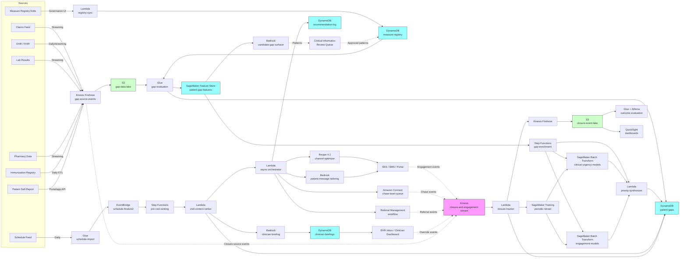

# Recipe 4.6 Architecture and Implementation: Care Gap Prioritization

*Companion to [Recipe 4.6: Care Gap Prioritization](chapter04.06-care-gap-prioritization). This page covers the AWS architecture, services, prerequisites, and pseudocode. For the problem framing and the conceptual approach, start with the main recipe.*

---

## The AWS Implementation

### Why These Services

**Amazon SageMaker for the model training and serving stack.** Three model families live here: the per-gap-type clinical urgency model (gradient-boosted regression, optionally with a supervised outcome layer for gaps with rich training data), the per-pathway engagement and completion-probability models (gradient-boosted binary classifiers, one per pathway), and an optional per-gap-type uplift model where randomized closure-pathway data exists. The recommendation run uses SageMaker Batch Transform; same reasoning as 4.4 and 4.5 (batch is dramatically cheaper than an idle real-time endpoint, and gap evaluation runs are scheduled). Visit-context ranking runs on a near-real-time cadence (the day before each visit); it can use the offline-trained models with cached scores rather than requiring a live endpoint. SageMaker is HIPAA-eligible under BAA. 

**Amazon SageMaker Feature Store for per-(patient, gap) features.** This is where the Feature Store investment from Recipes 4.4 and 4.5 pays off again. Patient-level features (clinical risk, engagement history, demographics, SDOH proxies, prior intervention engagement) are reused. New features specific to this recipe (per-gap state, days-in-window, days-overdue, prior closures of this gap type, prior referral-completion rate, last-visit data, scheduled-visit data) are added as new feature groups. The offline store powers the daily gap evaluation; the online store supports real-time visit-context ranking when the day's schedule lands.

**Amazon DynamoDB for the measure registry, gap state, recommendation log, patient profile, and engagement aggregates.** Same `patient-profile` table from prior recipes, extended with gap-related attributes. New table `measure-registry` keyed on `measure_id` and `version` for the structured measure definitions. New table `patient-gaps` keyed on (patient_id, measure_id) for the per-patient gap state machine, with attributes: `state`, `state_history`, `current_window_open`, `current_window_close`, `evidence`, `urgency_score`, `priority_components`, `last_evaluation_date`. New table `clinician-overrides` for the override audit trail. Recommendation log captures (patient_id, measure_id, surfaced_at, surface_pathway, ranking_position, allocation_reason).

**Amazon S3 for the data lake and gap-evaluation outputs.** All source data feeds (claims, EHR exports, lab feeds, pharmacy feeds, immunization registries) land in S3 (via Kinesis Firehose for streaming and via Glue/Lambda jobs for batch). The offline feature store is backed by S3, evaluation outputs land in S3 per run, and the visit-context-ranker outputs land in S3 for clinician-dashboard consumers. Engagement events and closure events accumulate in S3 for long-horizon evaluation.

**AWS Glue and Amazon Athena for gap evaluation, multi-source reconciliation, and outcome evaluation.** Gap evaluation is an SQL-shaped problem at scale: window functions over qualifying events, joins to denominator-eligible populations, exclusion-predicate filtering. Glue jobs run nightly to evaluate every measure in the registry against every eligible patient and emit the per-(patient, gap) state records. Athena powers the cohort dashboards, the per-pathway closure-rate queries, and the equity-monitoring views. Multi-source closure reconciliation runs in Glue with deterministic source-priority logic encoded per measure.

**AWS Step Functions for batch orchestration.** Same pattern as 4.4 and 4.5. The daily gap-evaluation pipeline is a Step Functions workflow: trigger on schedule, run gap evaluation (Glue), run urgency and engagement scoring (Batch Transform jobs in parallel), run priority synthesis (Lambda), emit per-(patient, gap) enriched records, persist to DynamoDB and S3. The pre-visit ranking pipeline is a separate Step Functions workflow that triggers per-day on the next-day schedule and produces per-encounter ranked agendas plus clinician briefings.

**Amazon EventBridge for scheduling and event-driven triggers.** EventBridge schedules the daily gap-evaluation run and the pre-visit ranking run. EventBridge rules also handle event-driven triggers: a `closure_event_received` event triggers the closure tracker; a `clinician_override_recorded` event triggers the suppression worker; a `next_day_schedule_finalized` event triggers the pre-visit ranking. Use EventBridge rules for the operational events; use scheduled rules for the batch runs.

**Amazon Kinesis Data Streams for engagement, closure, and override events.** Same engagement-event bus from 4.1 through 4.5. New event types: `gap_identified`, `gap_provisionally_closed`, `gap_confirmed_closed`, `gap_reopened`, `gap_excluded`, `gap_referral_scheduled`, `gap_referral_completed`, `gap_surfaced_at_visit`, `gap_surfaced_for_outreach`, `clinician_override_recorded`, `patient_self_report_received`. The attribution Lambda joins these to the recommendation log and updates the gap state machine.

**Amazon Bedrock for candidate-gap surfacing, clinician briefings, and patient-facing message tailoring.** Three distinct LLM use cases:

1. **Candidate-gap surfacer.** A structured-output prompt that takes the patient's chart context (diagnoses, recent lab trends, recent encounters, current medications) and returns `{candidate_gap, rationale, suggested_evidence_to_check}` for clinical informatics review. Run on a sampled or high-risk subset, not the full population. The output flows to a review queue, not to clinicians.

2. **Pre-visit clinician briefing.** A structured prompt produces a one-paragraph briefing per upcoming encounter: the top 3 to 5 ranked gaps, the suggested visit focus, the items deferred to asynchronous closure, and any notable clinical context. The clinician reads it in the EHR inbox before the visit.

3. **Patient-facing closure messaging.** Same pattern as 4.4 and 4.5: structured intervention assignment goes in, the personalized message comes out, the message goes through a clinical-claims validator before send.

Bedrock is HIPAA-eligible under BAA. Confirm in service terms that prompts and completions are not used to train the underlying foundation models. 

**AWS Lambda for per-stage glue logic.** The measure-registry evaluator dispatcher, the closure-tracker reconciliation worker, the priority synthesizer, the visit-context ranker (the deterministic-ranking part), the briefing generator (the orchestration around the LLM call), the override handler, the engagement-attribution worker, and the contact-cap enforcer all run as Lambdas.

**Amazon Connect (or a contracted outreach platform) for chase-team telephonic outreach.** Same pattern as 4.5. Plans with in-house chase teams often build on Amazon Connect; plans with vendor outreach use the vendor's queue. The AWS-specific piece is HIPAA-eligible call recording and the contact-flow-to-engagement-event integration.

**Amazon SES for member-facing email and Pinpoint (or a contracted vendor) for SMS.** Same as 4.4 and 4.5; both under BAA. 

**Amazon QuickSight for operations dashboards.** Per-measure, per-cohort, per-clinician closure dashboards. Equity-monitoring views (closure-rate disparities by language, race, SDOH cohort). HEDIS-cycle dashboards showing measure progress against year-end targets. Clinician-level closure-rate dashboards with peer comparisons. QuickSight on Athena, with row-level security for cohort-specific filters.

**AWS HealthLake (optional, for FHIR-based EHR integration).** When the practice's EHR exposes FHIR APIs and the recommender needs to ingest fine-grained clinical data (problem list, observations, encounters, immunizations, conditions) for the candidate-gap surfacer or for the urgency model, HealthLake provides a FHIR-native data store with built-in normalization. The lighter pattern is direct FHIR API integration with bulk export to S3; HealthLake is the heavier pattern for plans/practices with multiple EHR vendors and a long-term need to maintain unified FHIR storage. 

**AWS KMS, CloudTrail, CloudWatch.** Same PHI infrastructure pattern as prior recipes. Customer-managed keys, CloudTrail data events on PHI tables, CloudWatch alarms on batch-run failures and cohort-metric drift.

### Architecture Diagram



### Prerequisites

| Requirement | Details |
|-------------|---------|
| **AWS Services** | Amazon SageMaker (Training, Batch Transform, Feature Store), Amazon DynamoDB, Amazon S3, AWS Glue, Amazon Athena, AWS Step Functions, Amazon EventBridge, Amazon Kinesis Data Streams, Amazon Kinesis Data Firehose, AWS Lambda, Amazon Bedrock, Amazon SES, Amazon Pinpoint or contracted SMS provider, Amazon Connect (optional, for in-house chase team), Amazon QuickSight, AWS HealthLake (optional, for FHIR-based EHR integration), AWS KMS, Amazon CloudWatch, AWS CloudTrail. |
| **IAM Permissions** | Per-Lambda least-privilege: `sagemaker:CreateTransformJob` and `sagemaker:DescribeTransformJob` scoped to specific model ARNs; `dynamodb:GetItem` / `BatchWriteItem` / `UpdateItem` scoped to specific tables (especially the `patient-gaps` table); `bedrock:InvokeModel` on specific foundation-model ARNs; `s3:GetObject` / `PutObject` scoped to gap, claims, and recommendation buckets; `kinesis:PutRecord` on the closure-and-engagement stream; `ses:SendEmail` and `pinpoint:SendMessages` scoped to BAA-covered identities; `connect:*` scoped to the chase-team contact flow only. Never `*`.  |
| **BAA** | AWS BAA signed. All services in the architecture must be HIPAA-eligible: SageMaker (Training, Batch Transform, Feature Store), DynamoDB, S3, Glue, Athena, Step Functions, EventBridge, Kinesis, Firehose, Lambda, Bedrock, SES, Pinpoint, Connect (when configured for HIPAA workloads), KMS, HealthLake.  |
| **Encryption** | DynamoDB: customer-managed KMS at rest (especially the `patient-gaps` table; the per-gap state plus reasoning is highly inferential PHI). S3: SSE-KMS with bucket-level keys. Kinesis and Firehose: server-side encryption. SageMaker training, Batch Transform, and Feature Store: VPC-only, with KMS keys for model artifacts and Feature Store offline storage. Lambda log groups KMS-encrypted. Clinician briefings stored in DynamoDB are PHI; the briefing text contains diagnostic and risk-related content. |
| **VPC** | Production: Lambdas in VPC. SageMaker training, Batch Transform, and Feature Store online store run in VPC. VPC endpoints for DynamoDB (gateway), S3 (gateway), Bedrock, Kinesis, Firehose, KMS, CloudWatch Logs, SageMaker Runtime, Step Functions (`states`), EventBridge (`events`), Glue, Athena, STS, SES, Pinpoint, Connect, HealthLake. NAT Gateway only for external services without VPC endpoints (e.g., a state immunization registry that does not support PrivateLink); restrict egress with security groups. EHR FHIR feeds typically arrive via PrivateLink, Direct Connect, or SFTP-over-VPN. VPC Flow Logs enabled. |
| **CloudTrail** | Enabled with data events on the `patient-gaps` table, `measure-registry` table, `clinician-briefings` table, `clinician-overrides` table, `recommendation-log` table, and `patient-profile` table. Data events on the S3 buckets containing source feeds, gap evaluation outputs, briefings, and recommendation outputs. |
| **Equity Governance** | Document the priority synthesis weights (clinical urgency vs. completion probability vs. quality-measure value vs. window urgency), the equity floors (capacity reserved for cohorts with documented closure-rate disparities), and the cohort-monitoring thresholds before launch. Cross-functional review committee (medical director, quality lead, equity lead, data science, operations) signs off on the policy and reviews quarterly. Decisions about quality-measure-driven capacity allocation versus clinical-urgency-driven allocation go through this committee, not just the analytics team. |
| **Sample Data** | A starter set of synthetic patients with realistic demographics and condition mixes (Synthea generates good baseline data for HEDIS measures). A small measure registry (10-20 measures: a few preventive screenings, a few diabetes-related, a few HEDIS Stars-bonus measures, a few patient-specific clinical patterns). A synthetic schedule feed for visit-context ranking. Synthetic engagement labels for engagement-prediction training. |
| **Cost Estimate** | At a 400,000-member health plan with ~250,000 patients eligible for at least one care gap, ~40 measures in the registry, daily evaluation: SageMaker Batch Transform (3 model families per run, ~1M (patient, gap) rows per run, daily): roughly $200-500/month at modest instance sizes. SageMaker Feature Store offline store: $80-150/month. SageMaker training (monthly retrain of 3 model families): $150-300/month. DynamoDB on-demand: $200-500/month (the per-gap state table is the largest). Lambda + Step Functions: $100-200/month. Bedrock for candidate-gap surfacer (sampled, ~5K patients/week), clinician briefings (~10K visits/day with briefings), patient-message tailoring (~50K/week), Haiku-class: $1,000-2,500/month. SES + Pinpoint SMS (~50K outreach per week): $100-200/month. Connect (if used, 6-10 FTE chase-team agents): $300-600/month plus telephony. S3 + Glue + Athena: $300-600/month. QuickSight: $50/user/month for authors plus reader fees. HealthLake (if used): $500-2,000/month depending on data volume. Estimated total: $2,500-6,000/month range for a regional plan, before staff time and referral-management vendor costs.  |

### Ingredients

| AWS Service | Role |
|------------|------|
| **Amazon SageMaker** | Hosts the per-gap-type clinical urgency model, per-pathway engagement and closure-probability models, and optional uplift models; runs training and Batch Transform jobs |
| **Amazon SageMaker Feature Store** | Per-(patient, gap) features (state, days-in-window, days-overdue, prior closure history, prior referral-completion rate, last-visit data) reused across this recipe and Recipes 4.4, 4.5, 4.7 |
| **Amazon DynamoDB** | Stores measure registry, per-(patient, gap) state machine, recommendation log, patient profile (extended from earlier recipes), clinician briefings, and clinician overrides |
| **Amazon S3** | Hosts the gap-source-event lake, offline feature store, evaluation outputs, briefings audit trail, training data, and closure-event lake |
| **AWS Glue** | Daily gap evaluation against the measure registry, multi-source closure reconciliation, schedule import, outcome-evaluation jobs |
| **Amazon Athena** | SQL access to data lake; powers cohort dashboards, per-pathway closure-rate queries, and equity-monitoring views |
| **AWS Step Functions** | Orchestrates the daily gap-evaluation pipeline and the pre-visit ranking pipeline with retry, DLQ, and per-stage visibility |
| **Amazon EventBridge** | Schedules batch runs; routes closure-event, clinician-override, and schedule-finalized events |
| **Amazon Kinesis Data Streams** | Carries closure events from claims, EHR, lab, pharmacy, immunization registries, and patient self-report into the closure tracker |
| **Amazon Kinesis Data Firehose** | Lands source events and engagement events into S3 Parquet for evaluation and training data prep |
| **AWS Lambda** | Runs the registry sync, the closure-tracker reconciliation, priority synthesizer, visit-context ranker, briefing-generation orchestrator, override handler, and contact-cap enforcer |
| **Amazon Bedrock** | Hosts the LLM for candidate-gap surfacing (review-gated), pre-visit clinician briefings, and patient-facing message tailoring |
| **Amazon SES** | Bulk email delivery under BAA for patient-facing closure outreach |
| **Amazon Pinpoint** | SMS delivery for closure-prompting reminders |
| **Amazon Connect** | Optional contact-center for in-house chase-team outreach; HIPAA-eligible when configured per AWS guidance |
| **AWS HealthLake** | Optional FHIR-native data store when the practice's EHR exposes FHIR and unified FHIR storage is needed |
| **Amazon QuickSight** | Operational dashboards for quality team, medical director, equity committee, and clinician-level closure-rate views |
| **AWS KMS** | Customer-managed encryption keys for all PHI-containing stores |
| **Amazon CloudWatch** | Operational metrics, cohort-sliced gap-closure dashboards, alarms |
| **AWS CloudTrail** | Audit logging for all PHI-related API calls |

---

### Code

> **Reference implementations:** Useful aws-samples patterns for this recipe:
> - [`amazon-sagemaker-examples`](https://github.com/aws/amazon-sagemaker-examples): XGBoost and SageMaker Batch Transform notebooks that mirror the per-gap urgency and per-pathway engagement scoring patterns used here.
> - [`amazon-sagemaker-feature-store-end-to-end-workshop`](https://github.com/aws-samples/amazon-sagemaker-feature-store-end-to-end-workshop): End-to-end Feature Store usage that maps onto the per-(patient, gap) feature pipeline.
> - [`amazon-bedrock-workshop`](https://github.com/aws-samples/amazon-bedrock-workshop): Demonstrates structured-output prompting applicable to the candidate-gap surfacer, clinician briefings, and patient message tailoring.
> 

#### Walkthrough

**Step 1: Evaluate the measure registry against patient data to produce open-gap lists.** The evaluation runs nightly. For each measure in the registry, evaluate denominator membership, numerator satisfaction, and exclusion criteria over the lookback window using the canonical source the registry specifies. Skip the registry abstraction and you end up hard-coding measure logic, which becomes a maintenance disaster when measure specifications change annually.

```
FUNCTION evaluate_measures(patients, run_date):
    // Load every active measure version. The registry is the source of
    // truth; engineering doesn't hard-code any measure logic. New
    // measures or annual revisions land as new registry versions.
    active_measures = DynamoDB.Query(
        "measure-registry",
        filter = "effective_start <= :rd AND effective_end >= :rd",
        params = { :rd = run_date }
    )

    FOR each measure in active_measures:
        // Step 1A: denominator. Determine which patients are eligible
        // for this measure as of run_date. Denominator predicates use
        // age, sex, condition flags, and continuous-enrollment criteria
        // expressed in the registry's predicate language.
        denominator = Athena.Query(
            measure.denominator_query_template,
            params = { run_date: run_date,
                       lookback_start: run_date - measure.denominator_lookback_days }
        )

        // Step 1B: numerator. For each denominator-eligible patient,
        // check whether a qualifying event exists in the canonical
        // source within the numerator lookback. Different measures
        // have different qualifying event definitions and different
        // canonical sources (claims for HEDIS, EHR for some practice
        // measures, immunization registry for some vaccines, etc.).
        qualifying_events = Athena.Query(
            measure.numerator_query_template,
            params = { run_date: run_date,
                       lookback_start: run_date - measure.numerator_lookback_days,
                       canonical_source: measure.canonical_source,
                       value_set: measure.numerator_value_set }
        )

        // Step 1C: exclusions. Apply measure-specific exclusion logic.
        // Some patients are excluded categorically (palliative care,
        // hospice); some are excluded conditionally (pregnancy excludes
        // some screenings; documented refusal excludes others for some
        // measures and not others; check the spec).
        excluded = Athena.Query(
            measure.exclusion_query_template,
            params = { run_date: run_date }
        )

        // Step 1D: state determination. For each denominator patient,
        // determine the current gap state.
        FOR each patient_id in denominator:
            IF patient_id in excluded:
                new_state = "excluded"
            ELSE IF patient_id in qualifying_events.patient_ids:
                qualifying_event = qualifying_events.get(patient_id)
                // The canonical source matters for confirmed_closed.
                // A pharmacy claim for a flu shot is provisional until
                // the immunization registry confirms (in some states);
                // a HEDIS measure requires a claims-source qualifying
                // event for confirmed_closed.
                IF qualifying_event.source == measure.canonical_source:
                    new_state = "confirmed_closed"
                ELSE:
                    new_state = "provisionally_closed"
            ELSE:
                new_state = "open"

            // State machine: if previous state was confirmed_closed and
            // the patient has aged out of the numerator window, the
            // gap reopens.
            previous_state = DynamoDB.GetItem("patient-gaps",
                                              key = (patient_id, measure.measure_id))
            IF previous_state.state == "confirmed_closed" AND
               previous_state.numerator_window_end < run_date AND
               new_state == "open":
                state_history_event = "reopened"
            ELSE IF previous_state.state != new_state:
                state_history_event = "transitioned_" + previous_state.state +
                                      "_to_" + new_state
            ELSE:
                state_history_event = "unchanged"

            DynamoDB.PutItem("patient-gaps", {
                patient_id:           patient_id,
                measure_id:           measure.measure_id,
                state:                new_state,
                state_history:        previous_state.state_history.append(
                                          { event: state_history_event,
                                            timestamp: run_date,
                                            evidence: qualifying_event } ),
                current_window_open:  compute_window_open(measure, patient_id),
                current_window_close: compute_window_close(measure, patient_id),
                evidence:             qualifying_event,
                last_evaluation_date: run_date,
                measure_version:      measure.version,
                canonical_source:     measure.canonical_source,
                data_quality_flag:    assess_source_completeness(patient_id, measure)
                    // values include 'complete', 'sparse_history',
                    // 'multi_source_disagreement', 'recent_plan_change',
                    // 'cross_provider_fragmentation'. Downstream
                    // consumers should gate on this when the data
                    // is unreliable, mirroring the pattern from 4.5.
            })

    // Optional: LLM candidate-gap surfacer. Run on a sampled or high-risk
    // subset, not the full population. The output is a candidate queue
    // for clinical informatics review, not a direct gap signal.
    high_risk_subset = sample_high_risk_patients(patients, sample_size = 5000)
    FOR each patient_id in high_risk_subset:
        chart_context = build_chart_context(patient_id, lookback_days = 730)
        candidate_review = Bedrock.InvokeModel(
            model_id = CANDIDATE_GAP_MODEL_ID,
            body     = build_candidate_gap_prompt(chart_context, CANDIDATE_GAP_SCHEMA)
        )
        candidates = parse_json(candidate_review.completion)
        // candidates: [ { candidate_gap_label, rationale,
        //                 suggested_evidence_to_check,
        //                 confidence, supporting_chart_excerpts }, ... ]
        validate_candidate_gaps(candidates, patient_id, observed_data = chart_context)
            // 

        FOR each candidate in candidates.passing_validation:
            DynamoDB.PutItem("clinical-informatics-review-queue", {
                review_id:        new UUID,
                patient_id:       patient_id,
                candidate:        candidate,
                proposed_at:      run_date,
                state:            "pending_review"
            })
```

**Step 2: Score clinical urgency, engagement, and closure probability per (patient, gap).** The clinical urgency model is per-gap-type. The engagement and closure-probability models are per-pathway. Skip the per-gap-type modeling and you treat all gaps with the same urgency profile, which is the error David's PCP fell into when the dashboard sorted by HEDIS bonus value instead of clinical risk.

```
FUNCTION enrich_open_gaps(patient_gaps_today, run_date):
    open_gaps = filter(patient_gaps_today, state = "open")
    enriched = []

    // Group by measure_id so each measure's urgency model runs on the
    // relevant subset; per-gap-type models are different artifacts.
    open_gaps_by_measure = group_by(open_gaps, "measure_id")

    job_handles = []
    FOR each measure_id, measure_gaps in open_gaps_by_measure:
        candidate_path = "s3://gap-enrichment/run_date=" + run_date +
                         "/measure=" + measure_id + "/candidates.parquet"
        write_parquet(measure_gaps, candidate_path)

        // Clinical urgency: per-gap-type model. The model takes
        // patient features (demographics, conditions, recent clinical
        // trajectory, family history flags) and returns an urgency
        // score with a confidence interval. The urgency score is
        // independent of quality-measure status.
        urgency_job = SageMaker.CreateTransformJob(
            transform_job_name = "urgency-" + measure_id + "-" + run_date,
            model_name         = URGENCY_MODEL_NAMES[measure_id],
            transform_input    = candidate_path,
            transform_output   = "s3://gap-scores/run_date=" + run_date +
                                "/urgency/" + measure_id + "/",
            instance_type      = "ml.m5.large",
            instance_count     = 1
        )
        job_handles.append(urgency_job)

        // Engagement and closure-probability per pathway. Each gap has
        // one or more compatible pathways (in-visit, patient-driven
        // pharmacy, patient-driven home-test, specialist-referral, etc.).
        // Run the pathway-specific engagement model on the (patient,
        // gap, pathway) triple.
        compatible_pathways = lookup_pathways_for_measure(measure_id)
        FOR each pathway in compatible_pathways:
            pathway_input = expand_to_pathway(candidate_path, pathway)
            engagement_job = SageMaker.CreateTransformJob(
                transform_job_name = "engagement-" + measure_id +
                                     "-" + pathway + "-" + run_date,
                model_name         = ENGAGEMENT_MODEL_NAMES[pathway],
                transform_input    = pathway_input,
                transform_output   = "s3://gap-scores/run_date=" + run_date +
                                    "/engagement/" + measure_id +
                                    "/" + pathway + "/",
                instance_type      = "ml.m5.large",
                instance_count     = 1
            )
            job_handles.append(engagement_job)

    wait_for_jobs(job_handles)

    // Step 2B: priority synthesis per (patient, gap). The priority is
    // the policy-weighted combination of clinical urgency, expected
    // closure probability across pathways, quality-measure value, and
    // window urgency. This is documented policy, version-controlled.
    FOR each gap in open_gaps:
        urgency = read_urgency_score(gap, run_date)
        per_pathway = read_engagement_scores(gap, run_date)
            // dict: pathway -> { engagement_prob, closure_prob }
            // closure_prob = engagement_prob × pathway-specific
            //                completion-conditional-on-engagement

        // Best-pathway closure probability is the maximum over compatible
        // pathways. We track per-pathway scores so the orchestrator can
        // decide which pathway to use (a high in-visit closure probability
        // for a gap that has an upcoming visit beats a moderate referral
        // closure probability that requires referral logistics).
        best_pathway = argmax(per_pathway, key = "closure_prob")
        best_closure_prob = per_pathway[best_pathway].closure_prob

        // Quality-measure value: the marginal financial or quality-bonus
        // value to the plan or practice of closing this gap. Pulled from
        // the registry. Some patient-specific clinical gaps have value 0
        // for this term (they're not in any quality program); their
        // priority is driven entirely by clinical urgency.
        measure_value = lookup_measure_value(gap.measure_id, gap.patient_id)

        // Window urgency: time pressure from the measure's closing
        // window. A gap that closes in 30 days has higher window
        // urgency than the same gap with 8 months left.
        window_urgency = compute_window_urgency(gap, run_date)
            // continuous, [0, 1], rises sharply as gap.window_close approaches

        // Cohort-aware fairness modulation: equity floors are applied
        // at the allocator (Step 5), but the priority synthesis does
        // not down-weight cohorts. The cohort signal is captured for
        // dashboard purposes only.
        cohort_features = lookup_cohort_features(gap.patient_id)

        // Policy weights live in versioned config:
        // {
        //   clinical_urgency:   0.40,
        //   closure_probability: 0.20,
        //   measure_value:       0.20,
        //   window_urgency:      0.20
        // }
        priority = (policy.weights.clinical_urgency    * normalize(urgency) +
                    policy.weights.closure_probability * best_closure_prob +
                    policy.weights.measure_value       * normalize(measure_value) +
                    policy.weights.window_urgency      * window_urgency)

        priority_components = {
            urgency_contrib:           policy.weights.clinical_urgency * normalize(urgency),
            closure_prob_contrib:      policy.weights.closure_probability * best_closure_prob,
            measure_value_contrib:     policy.weights.measure_value * normalize(measure_value),
            window_urgency_contrib:    policy.weights.window_urgency * window_urgency
        }

        DynamoDB.UpdateItem("patient-gaps",
            key = (gap.patient_id, gap.measure_id),
            updates = {
                urgency_score:        urgency,
                per_pathway:          per_pathway,
                best_pathway:         best_pathway,
                best_closure_prob:    best_closure_prob,
                window_urgency:       window_urgency,
                priority:             priority,
                priority_components:  priority_components,
                cohort_features:      cohort_features,
                policy_version:       policy.policy_version,
                last_enrichment_date: run_date
            })

        enriched.append(gap_with_priority(gap, priority, priority_components))

    RETURN enriched
```

**Step 3: Visit-context ranking for tomorrow's encounters.** Consume the next-day schedule, look up each scheduled patient's enriched gap list, filter to gaps with closure pathways compatible with the visit type and visit time, and produce a per-encounter ranked agenda. Skip the visit-fit filter and you put a colonoscopy referral on a 15-minute sick visit's agenda, which is a useless recommendation.

```
FUNCTION rank_visit_agendas(next_day_schedule, run_date):
    visit_agendas = []

    FOR each encounter in next_day_schedule:
        patient_id    = encounter.patient_id
        visit_type    = encounter.visit_type
        visit_minutes = lookup_typical_duration(encounter.provider_id, visit_type)
        provider      = lookup_provider(encounter.provider_id)

        // Pull the enriched open gaps for this patient.
        patient_open_gaps = DynamoDB.Query(
            "patient-gaps",
            key_condition = "patient_id = :pid AND state = :open",
            params = { :pid: patient_id, :open: "open" }
        )

        // Visit-fit filter: each pathway has a per-visit-type fit profile.
        // Some pathways close in-visit (foot exam, vaccine administration,
        // BP measurement, in-office screening, point-of-care HbA1c).
        // Some are referral-out (colonoscopy, retinal exam, mammogram).
        // Some are patient-driven (home FIT kit, pharmacy vaccine).
        // The visit-fit filter ranks pathways for this specific encounter.
        ranked_for_visit = []
        FOR each gap in patient_open_gaps:
            visit_fit = compute_visit_fit(gap, visit_type, visit_minutes,
                                            provider, encounter.acute_context)
            // visit_fit components:
            // - pathway_compatibility: how well does the best pathway
            //   match the visit (in-visit fit > referral fit > patient-driven fit)
            // - time_cost: how many minutes does this gap take to address
            // - clinician_capacity_match: does this clinician typically
            //   address this gap type
            // - acute_displacement: does the visit have an acute issue
            //   that displaces preventive work

            adjusted_priority = gap.priority * visit_fit.pathway_compatibility *
                                visit_fit.time_cost_factor *
                                (1 - visit_fit.acute_displacement)

            ranked_for_visit.append({
                gap:                  gap,
                adjusted_priority:    adjusted_priority,
                visit_fit:            visit_fit
            })

        ranked_for_visit = sort ranked_for_visit by adjusted_priority DESC

        // Pick the in-visit agenda. The agenda has a hard cap on size
        // (typically 3 to 5 items) and a hard cap on cumulative time
        // cost (typically 60 percent of the visit's preventive-time
        // budget; the rest of the visit time is reserved for the
        // patient's own concerns and the acute issue if any).
        in_visit_agenda    = []
        cumulative_minutes = 0
        in_visit_budget    = visit_minutes * policy.preventive_time_share

        FOR row in ranked_for_visit:
            IF len(in_visit_agenda) >= policy.max_agenda_items:
                BREAK
            IF row.visit_fit.pathway_compatibility < policy.min_visit_compatibility_for_agenda:
                CONTINUE  // pathway not compatible enough; defer to async
            IF cumulative_minutes + row.visit_fit.time_cost_minutes > in_visit_budget:
                CONTINUE  // doesn't fit in budget; defer to async
            in_visit_agenda.append(row)
            cumulative_minutes += row.visit_fit.time_cost_minutes

        // Everything that didn't make the visit agenda goes to the
        // async closure queue.
        async_queue = [row for row in ranked_for_visit
                       if row not in in_visit_agenda]

        // Generate the clinician briefing. Structured input goes in,
        // a one-paragraph briefing comes out, the briefing references
        // only the deterministic ranker's choices.
        de_identified_context = {
            patient_summary:       summarize_clinical_context(patient_id),
                // de-identified for LLM call; identifiers re-attached after
            visit_type:            visit_type,
            visit_minutes:         visit_minutes,
            in_visit_agenda:       redact_identifiers(in_visit_agenda),
            top_async_items:       redact_identifiers(async_queue[:5]),
            acute_context:         encounter.acute_context,
            language:              encounter.preferred_language
        }

        briefing = Bedrock.InvokeModel(
            model_id = CLINICIAN_BRIEFING_MODEL_ID,
            body     = build_briefing_prompt(de_identified_context, BRIEFING_OUTPUT_SCHEMA)
        )
        briefing_parsed = parse_json(briefing.completion)
            // { headline, suggested_focus, agenda_summary,
            //   deferred_items_summary, notable_clinical_context,
            //   confidence_notes }

        validate_briefing(briefing_parsed, observed_agenda = in_visit_agenda)
            // 

        DynamoDB.PutItem("clinician-briefings", {
            briefing_id:      build_briefing_id(encounter, run_date),
            patient_id:       patient_id,
            provider_id:      encounter.provider_id,
            encounter_time:   encounter.scheduled_time,
            briefing_text:    briefing_parsed,
            in_visit_agenda:  in_visit_agenda,
            async_queue:      async_queue,
            policy_version:   policy.policy_version,
            generated_at:     run_date
        })

        visit_agendas.append({
            encounter:        encounter,
            in_visit_agenda:  in_visit_agenda,
            async_queue:      async_queue,
            briefing:         briefing_parsed
        })

    // Push the briefings to the EHR inbox or clinician dashboard.
    push_briefings_to_clinician_dashboards(visit_agendas)

    RETURN visit_agendas
```

**Step 4: Asynchronous orchestration for non-visit closures.** Gaps that didn't make the visit agenda flow to the async orchestrator. The orchestrator picks the best pathway per gap, respects per-patient contact-frequency caps, applies equity floors, and routes to the appropriate channel or staff queue. Skip the per-pathway routing and your colonoscopy gap becomes an undifferentiated "send a generic email" outreach, which has near-zero closure rate and burns trust.

```
FUNCTION orchestrate_async_closures(visit_agendas, enriched_gaps_today, run_date, policy):
    // Build the async candidate set: all gaps that are open and not on
    // a visit agenda for the upcoming horizon (typically 14-30 days).
    visit_horizon_end = run_date + policy.async_visit_horizon_days
    visited_or_planned = collect_patient_ids_with_upcoming_visits(visit_horizon_end)

    async_candidates = []
    FOR each gap in enriched_gaps_today:
        IF gap.patient_id in visited_or_planned:
            // The gap may close at the upcoming visit; defer async outreach
            // to avoid duplicate prompts. The visit-context ranker may
            // have decided to keep the gap async-only (low visit fit);
            // include it then.
            agenda_for_patient = lookup_agenda(visit_agendas, gap.patient_id)
            IF gap.measure_id in agenda_for_patient.in_visit_agenda.measure_ids:
                CONTINUE
        async_candidates.append(gap)

    candidates_sorted = sort async_candidates by priority DESC

    // Per-pathway capacity counters. Each pathway has its own daily
    // capacity profile.
    capacity_remaining = {}
    equity_remaining = {}
    FOR each pathway in policy.pathways:
        capacity_remaining[pathway] = pathway.daily_capacity * RUN_HORIZON_DAYS
        equity_remaining[pathway] = {}
        FOR floor_cohort, floor_count in policy.equity_floors[pathway]:
            equity_remaining[pathway][floor_cohort] = floor_count

    // Per-patient counters. The contact-frequency cap is shared with
    // the rest of Chapter 4; the patient-profile counter is the global
    // counter that 4.4 and 4.5 also update.
    patient_gap_count = {}
    patient_contact_count_30d = {}

    allocated = []
    FOR candidate in candidates_sorted:
        member = lookup_member(candidate.patient_id)
        chosen_pathway = candidate.best_pathway

        // 

        // Per-pathway capacity.
        IF capacity_remaining[chosen_pathway] <= 0:
            // Try the second-best pathway.
            chosen_pathway = second_best_pathway(candidate)
            IF chosen_pathway is null OR capacity_remaining[chosen_pathway] <= 0:
                CONTINUE

        // Per-patient gap-allocation cap.
        IF patient_gap_count.get(candidate.patient_id, 0) >= policy.max_gaps_per_patient_per_run:
            CONTINUE

        // Global contact-frequency cap (shared across Chapter 4 recipes).
        existing_contacts = member.outreach_recent_total_30d_count
        new_contacts_this_run = patient_contact_count_30d.get(candidate.patient_id, 0)
        IF lookup_pathway(chosen_pathway).generates_patient_contact AND
           (existing_contacts + new_contacts_this_run) >= policy.max_total_contacts_per_patient_30d:
            CONTINUE

        // Cross-recipe coordination: if the patient is currently in an
        // adherence intervention or wellness-program enrollment that
        // suppresses additional outreach, skip this gap (or downgrade
        // to a passive surfacing pathway).
        IF cross_recipe_suppresses(candidate.patient_id, chosen_pathway):
            CONTINUE

        // Apply equity floor.
        cohort_features = candidate.cohort_features
        applicable_floors = applicable_floor_cohorts(cohort_features,
                                                      policy.equity_floors[chosen_pathway])
        used_floor = null
        FOR floor_cohort in applicable_floors:
            IF equity_remaining[chosen_pathway][floor_cohort] > 0:
                equity_remaining[chosen_pathway][floor_cohort] -= 1
                used_floor = floor_cohort
                BREAK

        capacity_remaining[chosen_pathway] -= 1
        patient_gap_count[candidate.patient_id] = patient_gap_count.get(candidate.patient_id, 0) + 1
        IF lookup_pathway(chosen_pathway).generates_patient_contact:
            patient_contact_count_30d[candidate.patient_id] = patient_contact_count_30d.get(candidate.patient_id, 0) + 1

        allocated.append({
            patient_id:        candidate.patient_id,
            measure_id:        candidate.measure_id,
            chosen_pathway:    chosen_pathway,
            priority:          candidate.priority,
            priority_components: candidate.priority_components,
            allocation_reason: reason_string(candidate, used_floor),
            cohort_features:   cohort_features,
            run_date:          run_date,
            policy_version:    policy.policy_version
        })

    // Step 4B: dispatch by pathway.
    FOR row in allocated:
        BRANCH on row.chosen_pathway:
            CASE "patient_driven_pharmacy":
                // Vaccinations, some screenings: send a portal/SMS/email
                // nudge directing the patient to a network pharmacy.
                tailored = Bedrock.InvokeModel(
                    model_id = MESSAGE_MODEL_ID,
                    body     = build_pharmacy_nudge_prompt(row, MESSAGE_OUTPUT_SCHEMA)
                )
                validate_clinical_message(tailored, row.measure_id)
                ChannelOptimizer.QueueOutreach(
                    member_id    = row.patient_id,
                    content_type = "gap_pharmacy_nudge",
                    payload      = { tailored: tailored.parsed,
                                     measure_id: row.measure_id,
                                     fallback: lookup_default_template(row.measure_id) },
                    urgency      = compute_urgency_label(row),
                    tracking_id  = build_tracking_id(row, run_date)
                )

            CASE "patient_driven_home_kit":
                // FIT kit for colorectal screening, A1c home kit:
                // generate a fulfillment request through the partner.
                HomeKitFulfillment.RequestKit({
                    patient_id:   row.patient_id,
                    kit_type:     row.measure_id,
                    address:      lookup_address(row.patient_id),
                    tracking_id:  build_tracking_id(row, run_date)
                })

            CASE "specialist_referral":
                // Generate a referral and route to the referral-management
                // workflow, which handles scheduling assistance,
                // transportation help, and prior auth.
                ReferralManagement.QueueReferral({
                    patient_id:        row.patient_id,
                    measure_id:        row.measure_id,
                    suggested_specialty: row.suggested_specialty,
                    priority:          row.priority,
                    suspected_barriers: lookup_barriers(row.patient_id),
                    tracking_id:       build_tracking_id(row, run_date)
                })

            CASE "chase_team_call":
                // High-priority gaps that didn't make a visit agenda
                // and need a high-touch outreach. Generate a structured
                // pre-call brief for the chase agent.
                brief = Bedrock.InvokeModel(
                    model_id = CHASE_BRIEF_MODEL_ID,
                    body     = build_chase_brief_prompt(row)
                )
                validate_chase_brief(brief)
                ChaseTeamQueue.Enqueue({
                    patient_id:   row.patient_id,
                    measure_id:   row.measure_id,
                    priority:     row.priority,
                    brief_text:   brief.parsed,
                    tracking_id:  build_tracking_id(row, run_date)
                })

            CASE "asynchronous_pcp_inbox":
                // Some gaps don't fit a visit but need PCP awareness for
                // an order (e.g., a UACR order that the patient can fulfill
                // at any draw site). Post a structured note to the PCP
                // inbox with a one-click order action.
                CareTeamInbox.PostNote(
                    patient_id  = row.patient_id,
                    briefing    = build_pcp_action_briefing(row),
                    source      = "gap-recommender",
                    suggested_action = lookup_default_pcp_action(row.measure_id),
                    tracking_id = build_tracking_id(row, run_date)
                )

        IF lookup_pathway(row.chosen_pathway).generates_patient_contact:
            DynamoDB.UpdateItem(
                "patient-profile",
                row.patient_id,
                "ADD outreach_recent_total_30d_count :one",
                values = { ":one": 1 }
            )

        Kinesis.PutRecord(stream = "closure-and-engagement-stream", record = {
            event_type:        "gap_surfaced_for_outreach",
            tracking_id:       build_tracking_id(row, run_date),
            patient_id:        row.patient_id,
            measure_id:        row.measure_id,
            chosen_pathway:    row.chosen_pathway,
            priority_components: row.priority_components,
            allocation_reason: row.allocation_reason,
            run_date:          run_date,
            timestamp:         current UTC timestamp
        })

    DynamoDB.BatchWriteItem("recommendation-log", allocated)
    RETURN allocated
```

**Step 5: Track closures from multiple sources and update gap state.** Closure events arrive from claims, EHR encounters, lab feeds, pharmacy data, immunization registries, and patient self-report. Each has its own latency and trustworthiness profile. Skip the multi-source reconciliation and your chase team will call patients about colonoscopies they had last week.

```
FUNCTION process_closure_event(event):
    // Step 5A: match the event to one or more open or provisionally-closed
    // gaps. A single event (e.g., a colonoscopy claim) can satisfy
    // multiple measures (HEDIS COL, USPSTF colorectal screening, ACO
    // colorectal screening). The match logic uses the procedure code
    // value sets from the registry.
    candidate_matches = []
    FOR each open_or_provisional_gap in DynamoDB.Query(
            "patient-gaps",
            key_condition = "patient_id = :pid AND state IN (:open, :provisional)",
            params = { :pid: event.patient_id,
                       :open: "open", :provisional: "provisionally_closed" }
        ):
        measure = lookup_measure(open_or_provisional_gap.measure_id,
                                  open_or_provisional_gap.measure_version)
        IF event_matches_numerator(event, measure):
            candidate_matches.append((open_or_provisional_gap, measure))

    IF len(candidate_matches) == 0:
        // The event doesn't satisfy any open gap. Could be an event that
        // closes a gap that's already confirmed_closed (no-op), or could
        // be an event for a measure not in the registry. Log and ignore.
        LOG("closure event with no matched gap: " + str(event))
        RETURN

    // Step 5B: per-match, advance the state machine.
    FOR (gap, measure) in candidate_matches:
        IF event.source == measure.canonical_source:
            new_state = "confirmed_closed"
        ELSE:
            // Event is from a non-canonical source. If the gap is
            // already provisionally_closed by an earlier event, leave
            // it provisional unless this event is the canonical source.
            IF gap.state == "open":
                new_state = "provisionally_closed"
            ELSE:
                new_state = gap.state  // already provisional; no change

        DynamoDB.UpdateItem("patient-gaps",
            key = (gap.patient_id, gap.measure_id),
            updates = {
                state: new_state,
                state_history: gap.state_history.append({
                    event:     "transitioned_to_" + new_state,
                    timestamp: event.timestamp,
                    source:    event.source,
                    evidence:  event.payload
                }),
                evidence: merge_evidence(gap.evidence, event)
            })

        // Step 5C: if any in-flight outreach exists for this gap,
        // suppress it. Nothing erodes trust faster than calling the
        // patient about a colonoscopy they had last week.
        suppress_inflight_outreach(gap.patient_id, gap.measure_id, reason = "gap_closed",
                                    closure_state = new_state)

        // Step 5D: emit the closure event for downstream consumers
        // (chase team dashboards, evaluation pipeline, urgency-model
        // training data).
        Kinesis.PutRecord(stream = "closure-and-engagement-stream", record = {
            event_type:    new_state == "confirmed_closed" ? "gap_confirmed_closed" :
                                                              "gap_provisionally_closed",
            patient_id:    event.patient_id,
            measure_id:    gap.measure_id,
            event_source:  event.source,
            event_payload: event.payload,
            tracking_id:   gap.last_outreach_tracking_id,
                // tracking_id is null for organic closures (the patient
                // closed the gap without any outreach having been sent);
                // these are valuable for dashboards as the "would-have-
                // closed-anyway" baseline.
            timestamp:     event.timestamp
        })

        // Step 5E: cohort-sliced metrics for the equity dashboard.
        emit_metric("gap_closure",
                    value = 1,
                    dimensions = {
                        measure_id:                  gap.measure_id,
                        chosen_pathway:              gap.last_chosen_pathway,
                        closure_source:              event.source,
                        new_state:                   new_state,
                        engagement_history_quartile: gap.cohort_features.engagement_history_quartile,
                        language:                    gap.cohort_features.language,
                        sdoh_cohort:                 gap.cohort_features.sdoh_cohort
                    })
```

**Step 6: Handle clinician overrides as structured signals.** When a clinician dismisses a high-priority gap with a reason, the override is gold-label data. It informs both immediate suppression (don't keep surfacing this gap on this patient's agenda for some interval) and longer-horizon model retraining (the urgency model should down-weight this pattern in similar contexts). Skip the structured override capture and you either keep nagging the clinician about gaps they've already handled, or you lose the signal entirely.

```
FUNCTION process_clinician_override(event):
    rec = lookup_recommendation_by_briefing_id(event.briefing_id)
    IF rec is null:
        LOG("override event with no matched briefing: " + str(event))
        RETURN

    // 
    // IF event.patient_id != rec.patient_id OR
    //    event.measure_id != rec.measure_id:
    //     LOG("override event identity mismatch with briefing; dropping",
    //         event_patient = event.patient_id,
    //         briefing_patient = rec.patient_id)
    //     emit_metric("override_identity_mismatch", value = 1)
    //     RETURN

    // Validate the override reason against the allowed taxonomy.
    allowed_reasons = ["appropriate_decline",
                        "previously_addressed_outside_record",
                        "clinical_judgment_defer",
                        "patient_refusal",
                        "out_of_scope_for_visit",
                        "exclusion_documented",
                        "other"]
    IF event.reason not in allowed_reasons:
        LOG("invalid override reason: " + event.reason)
        RETURN

    DynamoDB.PutItem("clinician-overrides", {
        override_id:      new UUID,
        briefing_id:      event.briefing_id,
        patient_id:       event.patient_id,
        provider_id:      event.provider_id,
        measure_id:       event.measure_id,
        reason:           event.reason,
        free_text_note:   event.free_text_note,  // optional
        timestamp:        event.timestamp
    })

    // Apply suppression on the gap based on the reason.
    suppression_policy = SUPPRESSION_BY_REASON[event.reason]
        // examples:
        // appropriate_decline:               suppress 90 days
        // previously_addressed_outside_record: confirm and mark
        //     provisionally_closed pending source data
        // clinical_judgment_defer:           suppress 30 days
        // patient_refusal:                   suppress 180 days
        //     unless clinical context shifts
        // out_of_scope_for_visit:            no suppression; just defer to async
        // exclusion_documented:              update gap to excluded state
    apply_suppression(event.patient_id, event.measure_id, suppression_policy)

    // Feed the override into the urgency-model retraining pipeline as
    // a structured label. Some reasons (clinical_judgment_defer,
    // exclusion_documented) carry strong signal that the urgency model
    // miscalibrated; others (out_of_scope_for_visit) carry signal about
    // visit-fit ranking, not urgency.
    update_training_label(event)

    Kinesis.PutRecord(stream = "closure-and-engagement-stream", record = {
        event_type:    "clinician_override_recorded",
        patient_id:    event.patient_id,
        measure_id:    event.measure_id,
        provider_id:   event.provider_id,
        reason:        event.reason,
        briefing_id:   event.briefing_id,
        timestamp:     event.timestamp
    })

    emit_metric("clinician_override",
                value = 1,
                dimensions = {
                    measure_id:  event.measure_id,
                    reason:      event.reason,
                    provider_id: event.provider_id  // for per-provider
                                                     // override-rate dashboards
                })
```

> **Curious how this looks in Python?** The pseudocode above covers the concepts. If you'd like to see sample Python code that demonstrates these patterns using boto3, check out the [Python Example](chapter04.06-python-example). It walks through each step with inline comments and notes on what you'd need to change for a real deployment.

---

### Expected Results

**Sample patient gap state record:**

```json
{
  "patient_id": "pat-000482",
  "measure_id": "hedis-cdc-eye-exam",
  "measure_version": "2026-v1",
  "state": "open",
  "state_history": [
    { "event": "transitioned_open_to_confirmed_closed", "timestamp": "2024-03-12", "source": "claims" },
    { "event": "reopened", "timestamp": "2025-12-31", "source": "annual_window_rollover" },
    { "event": "unchanged", "timestamp": "2026-05-04" }
  ],
  "current_window_open": "2025-12-31",
  "current_window_close": "2026-12-31",
  "evidence": null,
  "urgency_score": 0.62,
  "per_pathway": {
    "specialist_referral": { "engagement_prob": 0.41, "closure_prob": 0.31 },
    "in_visit": { "engagement_prob": 0.0, "closure_prob": 0.0 }
  },
  "best_pathway": "specialist_referral",
  "best_closure_prob": 0.31,
  "window_urgency": 0.45,
  "priority": 0.51,
  "priority_components": {
    "urgency_contrib": 0.25,
    "closure_prob_contrib": 0.06,
    "measure_value_contrib": 0.13,
    "window_urgency_contrib": 0.07
  },
  "data_quality_flag": "complete",
  "policy_version": "gap-policy-v0.4",
  "last_evaluation_date": "2026-05-04"
}
```

**Sample clinician briefing for an upcoming visit:**

```json
{
  "briefing_id": "brief-2026-05-05-prov-014-pat-000482",
  "patient_id": "pat-000482",
  "provider_id": "prov-014",
  "encounter_time": "2026-05-05T09:15:00Z",
  "headline": "Annual visit; rising creatinine and 5 open gaps; suggested focus is kidney conversation.",
  "suggested_focus": "Mr. Chen's eGFR has dropped from 78 to 64 over 24 months without a documented CKD discussion. A1c is 7.8 (up from 7.1). His urine albumin-to-creatinine ratio was last drawn 14 months ago. A focused kidney conversation, an order for UACR, and a discussion about diabetes regimen intensification fit within visit time and address the highest-urgency clinical gap.",
  "in_visit_agenda": [
    { "measure_id": "ada-uacr-annual-diabetes", "label": "Order UACR (last drawn 14 months ago)", "estimated_minutes": 1, "priority": 0.71 },
    { "measure_id": "patient-specific-ckd-conversation", "label": "Document CKD conversation; consider nephrology referral", "estimated_minutes": 8, "priority": 0.69 },
    { "measure_id": "hedis-cdc-foot-exam", "label": "Diabetic foot exam (in-office)", "estimated_minutes": 4, "priority": 0.55 }
  ],
  "deferred_items_summary": "Pneumococcal vaccine, retinal exam, and colonoscopy are deferred to chase team for asynchronous closure. Patient declined colonoscopy at last year's visit; suppressed for 90 days, eligible to re-discuss in August.",
  "notable_clinical_context": "Family history: father died of colon cancer at 71. The colonoscopy gap remains clinically important even with the prior decline.",
  "confidence_notes": "Briefing generated from deterministic ranker output; gap list reflects the registry as of 2026-05-04.",
  "policy_version": "gap-policy-v0.4"
}
```

**Sample async orchestration record:**

```json
{
  "tracking_id": "gap-2026-05-04-pat-000915-pneumo-pharmacy-001",
  "patient_id": "pat-000915",
  "measure_id": "cdc-pneumococcal-65plus",
  "chosen_pathway": "patient_driven_pharmacy",
  "priority": 0.78,
  "priority_components": {
    "urgency_contrib": 0.32,
    "closure_prob_contrib": 0.18,
    "measure_value_contrib": 0.14,
    "window_urgency_contrib": 0.14
  },
  "allocation_reason": "high_priority_general_capacity",
  "policy_version": "gap-policy-v0.4",
  "cohort_features": {
    "engagement_history_quartile": "q3",
    "language": "en",
    "sdoh_cohort": "moderate_food_security",
    "age_band": "65-74"
  },
  "tailored_payload": {
    "subject_line": "Quick health checklist item",
    "body": "You're due for the pneumococcal vaccine, recommended for adults 65+ with diabetes. Your in-network pharmacies can give it without an appointment.",
    "call_to_action": "Find a pharmacy near you",
    "tone": "informational, low-pressure"
  }
}
```

**Sample quarterly outcome evaluation:**

```json
{
  "evaluation_id": "eval-2026Q1-foot-exam",
  "measure_id": "hedis-cdc-foot-exam",
  "evaluation_window": "2025-10-01_to_2026-03-31",
  "method": "propensity_matched_difference_in_differences",
  "primary_outcome": "gap_closure_within_90_days",
  "ate": {
    "estimate": 0.21,
    "ci_95_low": 0.14,
    "ci_95_high": 0.28,
    "p_value": 0.0002,
    "interpretation": "Treated patients (gap surfaced on visit agenda) closed gap within 90 days at a rate ~0.21 higher than matched controls."
  },
  "ate_by_cohort": [
    { "cohort": "language=en", "estimate": 0.22, "ci_95_low": 0.14, "ci_95_high": 0.30 },
    { "cohort": "language=es", "estimate": 0.16, "ci_95_low": 0.04, "ci_95_high": 0.28 },
    { "cohort": "sdoh_cohort=transportation_barrier", "estimate": 0.11, "ci_95_low": 0.01, "ci_95_high": 0.21 }
  ],
  "secondary_outcomes": {
    "downstream_diabetic_complication_visits_180d": { "estimate": -0.04, "ci_95": [-0.09, 0.01] }
  },
  "sample_size_treated": 1842,
  "sample_size_control": 1842
}
```

**Performance benchmarks (illustrative, your mileage varies):**

| Metric | List-based dashboard baseline | Recipe pipeline |
|--------|-------------------------------|-----------------|
| Per-visit agenda relevance (clinician acceptance rate) | n/a (no agenda) | 60-80% |
| Per-visit gap closure rate (treated vs untreated visits) | 25-35% | 40-55% |
| 90-day async gap closure rate | 8-15% | 18-32% |
| HEDIS measure year-end closure (relative to baseline) | reference | +6 to +14 percentage points (high-bonus measures) |
| Clinician override rate as a sanity check | n/a | 8-15% (a healthy program; >25% suggests the ranker is misaligned with clinical reality) |
| End-to-end batch run time (250K eligible patients, 40 measures, 1M patient-gap rows) | n/a | 2-3 hours |
| Pre-visit ranking time (10K visits, briefings) | n/a | 30-60 minutes |
| Equity floor utilization | n/a | 75-95% (configurable) |

**Where it struggles:**

- **Patients with fragmented care across multiple practices.** A patient who sees PCPs in two different health systems and gets screened at retail clinics has gap closure events scattered across data sources the recommender doesn't all see. The `data_quality_flag` exposes this, but downstream consumers (chase team, dashboards) need to gate on it. A "gap open" label on a patient with `cross_provider_fragmentation` data quality is much less reliable than the same label on a patient with `complete` data quality.
- **Newly attributed patients.** A patient who joined the plan or attributed to the practice within the last 60 days has minimal historical data for engagement and closure-probability prediction. Cold-start cohort defaults are essential, and the recommender should weight patient-specific predictions less heavily for these patients until enough history accumulates.
- **Measures with ambiguous numerator definitions.** Some measure specifications have been written in ways that admit multiple interpretations. Different vendors' implementations of the "same" HEDIS measure can produce different numerators by 1 to 3 percentage points. The recipe's measure registry encodes one interpretation; reconciling with the plan's PBM/HEDIS-vendor numerators requires explicit alignment work and ongoing comparison.
- **Specialty-care gap closures.** Gaps that close via specialist visits (retinal exam, mammogram, colonoscopy) depend on the specialist documenting and the data flowing back to the PCP's view. A patient who had the colonoscopy at a specialist not in the plan's data exchange may show as "open" indefinitely. Patient self-report is a partial mitigation; dedicated data-exchange agreements with frequent-referral specialists are the durable fix.
- **Measures where the PCP can't drive closure.** Some gap closures are entirely outside the PCP's control: a follow-up after a hospitalization for mental illness (HEDIS FUH) requires the patient to attend a follow-up encounter; the PCP can flag, refer, and remind but cannot force the appointment. The recommender should not surface these as in-visit agenda items for the PCP except as awareness; they belong in the chase-team queue.
- **Cohort fairness in the urgency model.** If the training data has systematically different follow-up rates by demographic cohort, the urgency model will be miscalibrated by cohort, with higher uncertainty for under-followed groups. Cohort-aware calibration and ongoing fairness monitoring are not nice-to-haves.
- **Window-driven prioritization swamping clinical urgency.** As measure-year ends approach, the window-urgency term in the priority synthesis grows, and operationally-attractive but clinically-low-urgency gaps can swamp the top of the priority-sorted list. The policy weights need a hard cap on how much window urgency can dominate; otherwise the David scenario from The Problem section recurs at scale every December.
- **Patient-driven home test kits with low completion rates.** FIT kits, A1c home kits, and similar self-administered tests have meaningful completion rates only when the kit is followed by reminders and tied to a clear result-return process. A kit-fulfillment record is not a closure; the result return is the closure. Track both, and don't credit the kit-send as a closure.
- **Clinicians who systematically override.** Some PCPs override most agenda items because they distrust the recommender (or because they prefer to drive their own visit agenda). The retraining loop should treat overrides as signal carefully: a per-PCP override-rate filter prevents the model from down-weighting recommendations to that PCP's patients globally based on their override pattern. Per-recommendation reasons matter; per-PCP attitudes don't.

---

## Why This Isn't Production-Ready

The pseudocode and architecture above demonstrate the pattern. A production deployment needs to close several gaps that are intentionally out of scope for a recipe.

**Measure-registry curation as an ongoing program.** The registry is the source of truth for what counts as a gap, and it has to be maintained continuously. Annual NCQA HEDIS revisions, CMS Stars technical updates, USPSTF guideline changes, and contract-specific measure additions all require registry updates. The team that owns the registry needs structured change-management: proposed change, clinical informatics review, evidence packet, version bump, parallel evaluation against the prior version on a sample to quantify population impact, then promotion. A registry that drifts out of sync with NCQA's published HEDIS specs produces gap lists that don't match the plan's reported HEDIS performance, which is a credibility-destroying problem that takes months to recover from. Plan for at least 0.5 to 1.0 FTE of clinical-informatics time on registry maintenance ongoing. 

**Measure-spec parity testing against the plan's HEDIS vendor.** The plan typically has a HEDIS vendor (Inovalon, Cotiviti, Episource, Vatica Health, others) producing the official quality reporting. The recommender's gap evaluation will not exactly match the vendor's numerator counts; small implementation differences in value sets, lookback boundary handling, and supplemental-data inclusion can shift numerators by 1 to 3 percentage points. Build a parity test that runs nightly comparing the recommender's open-gap counts to the vendor's open-gap counts at the population level, with alerting on divergence beyond an established tolerance. Persistent divergence is an alignment task with the vendor, not a model failure.

**Multi-source closure reconciliation engineering.** Closure events arrive from at least six distinct source types (claims, EHR, lab, pharmacy, immunization registry, patient self-report), each with its own format, latency, and reliability profile. The reconciliation logic needs to handle: events arriving out of chronological order, partially-redacted events from registries with patient-consent restrictions, retroactive corrections, and events from sources that periodically restate (a registry that re-submits the previous month's data with corrections each month). Plan for 6 to 12 weeks of source-by-source ingestion and reconciliation engineering, plus an ongoing monitoring dashboard for source-feed health.

**Clinical-urgency model training data.** The urgency models work best when trained against longitudinal outcome data. For some gaps (vaccinations, screenings) the outcome that the urgency model is trying to estimate is rare in any individual year and requires multi-year longitudinal data to estimate well. For others (chronic disease monitoring like UACR or A1c), the outcome is common but defining the right outcome variable is non-trivial. Plan for 6 to 12 months of training data preparation per measure family, with explicit handling of confounding (the patients who close their gaps differ from the patients who don't, and the urgency model's training pipeline must adjust for that confounding or the urgency estimates will be systematically biased upward for non-engaged patients).

**Visit-context features need to be accurate.** The visit-context ranker depends on knowing the visit type, the typical visit duration for the provider, the acute context (a patient coming in for back pain has the visit dominated by back pain), and the clinician's closure habits. Visit-type metadata in scheduling systems is often noisy or inconsistent; "annual wellness visit" can mean different things across providers; visit-duration estimates vary widely. Production deployment requires investing in scheduling-data quality: clean visit-type taxonomy, per-provider visit-duration calibration from historical encounter data, and a feedback loop where clinician overrides update the model's understanding of visit fit.

**Clinical informatics review queue for LLM-surfaced candidates.** The candidate-gap surfacer's output is only useful if there's a real review process behind it. Plan for 10 to 20 hours per week of clinical-informatics time on the review queue (varies by sample size and surfacing aggressiveness). Without staff on the review side, the queue grows, the surfacer's quality stagnates (no one is correcting bad patterns), and the candidate-gap mechanism becomes shelfware. If you can't staff the review, scope the surfacer to a small, well-defined set of patient types where the patterns are most likely to be valuable.

**Suppression-rule governance.** The suppression policies tied to clinician-override reasons have material impact on patient care. A "patient_refusal" suppressed for 180 days is a reasonable default; suppressed for 18 months is a patient-safety problem when the clinical context shifts. Each suppression rule needs an exception-condition mapping: shifts in clinical context that should reopen the gap regardless of prior suppression (a new abnormal lab, a new diagnosis, a hospitalization). Build the exception-condition logic into the suppression worker, not as an afterthought.

**Cross-recipe orchestration with Recipes 4.4 and 4.5 and 4.7.** Same pattern as 4.5. A patient with multiple care gaps, multiple non-adherent medications, and a wellness program enrollment recommendation can easily exceed any reasonable contact-frequency budget if each recipe orchestrates independently. The shared `outreach_recent_total_30d_count` on the patient-profile table is the foundation; the cross-recipe coordination policy that decides which recipe wins when caps would be exceeded needs to be explicit, version-controlled, and committee-reviewed.

**Patient-facing message governance for care gap content.** Care gap reminders are a regulated communication category, and the rules vary by gap type. State pharmacy boards have varying rules on vaccination prompts. CMS has guidance on Medicare Advantage member communications. Some health-condition prompts (cancer screening, depression screening) have additional state-specific consumer-protection rules. Engage compliance counsel on per-measure messaging before launch. The validator should enforce: required disclosures, prohibition on unapproved clinical claims, plan-sponsorship identification where required, and respect for state-specific care-prompt rules. A patient who gets an unsolicited "you're due for a mammogram" message in a state where direct-to-patient screening prompts require additional consent is a compliance issue, not just an awkward message.

**Privacy in the gap state and recommendation log.** The `patient-gaps` table joins (patient_id, measure_id, state, urgency_score, evidence) and is highly inferential. A row indicating "patient has open mental-health-follow-up gap with high urgency" is much more sensitive than a row indicating "patient has open flu-shot gap." Apply tighter controls to gap state for stigmatized or high-sensitivity measures (mental health, substance use, HIV-related, reproductive health): narrower IAM read scopes, optional separate-table partitioning so general analytics access does not expose them, additional CloudTrail data event capture, and a documented minimum-necessary access policy.

**Equity floor design.** The equity floors implemented in Step 4 reserve capacity for cohorts with documented closure-rate disparities. Designing the floors well requires baseline cohort closure data (which you don't have until you've been operating for some time), explicit policy on which disparities trigger floors versus other interventions, and willingness to accept that you'll be wrong sometimes about which cohorts need protection. Start with conservative floors (small reserved capacity), monitor cohort closure-rate parity, expand floors where parity remains poor, and revisit quarterly. Don't try to design the perfect equity floor on day one; design the right operating cadence for adjusting them.

**Idempotency and retry semantics.** Same pattern as 4.4 and 4.5. Each stage's outputs are addressed by deterministic keys (run_date, measure_id, patient_id) and writes are conditional, so a Step Functions retry that re-attempts a completed step is a no-op rather than a duplicate. The Step Functions Catch should distinguish retryable infrastructure failures from terminal logic failures and route terminal failures to the DLQ.

**Cost-per-closure tracking.** The cost numbers in the prerequisites table are infrastructure only. Production reporting needs to ladder up to per-measure total cost (infrastructure + staff time + outreach vendor invoices + referral logistics) divided by confirmed closures attributable to the program (above the matched-control baseline). That number is what gets compared to the value of closure (HEDIS bonus for measure-bound gaps, clinical-outcome benefit for clinically-driven gaps). The data engineering to track this end-to-end with attribution is its own project. Without it, the program reports gap-closure totals that include closures that would have happened anyway.

**Quality-measure year-end push handling.** Many quality programs run a year-end "chase" where the team aggressively closes outstanding gaps in the last 60 to 90 days of the measurement year. This creates a natural seasonality in the program and a temptation to throw the priority weights toward window-urgency in the chase period. Build the seasonality into the policy explicitly (e.g., a `chase_period_weight_overrides` block that activates between specific dates), document it, and put the cohort-equity dashboard on a shorter monitoring cycle during the chase. Otherwise the year-end push quietly redistributes effort to the easiest-to-close gaps in the cohorts already best-served by the program.

**Patient-friendly closure visibility.** Patients should be able to see their own care gaps and closures in the patient portal, with explanations they can understand. "You are due for a screening colonoscopy" is more useful than "HEDIS COL-E open." Patient-facing summaries are a separate UX project, with content review by health-literacy specialists, but the gap state machine in this recipe is the source data for that view. Plan for the patient-facing layer as a parallel deliverable; without it, patients only learn about gaps when the chase team calls, which is the worst time to learn about them.

---

## Variations and Extensions

**Real-time gap-closure suppression triggers.** Beyond the daily reconciliation cycle, an EventBridge rule can fire on incoming closure events and suppress in-flight outreach for the matching gap immediately. Patients who got the flu shot at the pharmacy on Saturday should not receive a Monday morning robocall. The latency between closure and suppression is the most operationally visible failure mode of these systems; pushing it from hours to minutes is high-leverage.

**Pre-visit patient prep nudges.** Some gap closures benefit from patient preparation before the visit: a patient coming in for an annual visit who is overdue for HbA1c can have a portal nudge sent two days before the visit asking them to get the lab drawn that morning so the result is available at the visit. The pre-visit ranker can produce a separate "patient prep agenda" alongside the clinician briefing, fed through the channel optimizer from Recipe 4.1.

**At-the-visit closure orchestration.** Beyond pre-visit briefing, surface the gap closure agenda directly in the EHR encounter view, with one-click ordering for the in-visit closures (foot exam attestation, vaccine administration, BP measurement). The integration is EHR-vendor-specific (Epic, Oracle Health, Athena, Veradigm have different SMART-on-FHIR app patterns and different one-click-order capabilities), but where the integration exists, it's the highest-impact closure intervention available because it removes the click friction that competes with patient conversation time.

**Patient-driven closure self-service.** Patient-driven pathways (pharmacy vaccinations, home test kits, retail clinic screenings) become much more effective when patients can see their own gaps and choose closures from a portal interface. Build the patient-facing layer with health-literacy review on the messaging, transparent gap explanations ("here's why this matters; here's how to close it; here's what you need to know"), and explicit consent for any patient-initiated closure that has clinical implications.

**Gap-closure incentive integration.** Some plans offer member-facing incentives for gap closure (gift cards, premium discounts, reward points) within regulatory limits. The recommender can route incentive-eligible gaps with a different message frame and track incentive uptake as a closure-conversion lift signal. Beware: incentive programs can introduce unintended behavioral patterns, including cherry-picking by patients who chase incentives across multiple low-value closures while neglecting clinically important high-effort closures.

**Care-team load balancing.** When chase-team capacity is bounded and the priority queue exceeds capacity, the allocator from Step 4 picks the top of the priority list. A more sophisticated approach: cluster gaps by patient, route patients with multiple high-priority gaps to a single high-touch outreach contact (the agent addresses all of them in one call), and use lower-touch automation for patients with single moderate-priority gaps. This pattern is sometimes called "outreach bundling" and is operationally more efficient than gap-by-gap routing. 

**Specialist-coordination workflows.** For gaps that close via specialist visits (retinal exam, mammogram, colonoscopy, behavioral-health follow-up), build an end-to-end coordination workflow: scheduling assistance, transportation help, prior auth, reminder cascades, result-return-tracking, and PCP notification. The recommender's referral generation is the entry point; the closure depends on the workflow. Plans that invest in this coordination see materially higher referral-completion rates than plans that send a referral and hope.

**Cohort-specific intervention catalogs.** Some patient cohorts benefit from cohort-specific closure pathways: patients in rural areas may need mobile screening units; patients with limited English proficiency benefit from in-language outreach; patients with documented transportation barriers may need rideshare-funded transport. The intervention catalog can carry cohort-eligibility flags so the allocator picks cohort-appropriate pathways rather than defaulting to the general-population pathway.

**Closure-rate forecasting and capacity planning.** With historical closure-rate data per pathway, the recommender's outputs can drive forward-looking capacity planning: how many chase-team agents do we need to staff for Q4 to hit the year-end measure targets? Which referral-network capacity bottlenecks are likely to show up in the next 60 days? This is a Chapter 12 (time series forecasting) problem layered onto the gap-closure system, valuable for operations leadership.

**Cross-recipe orchestration with Recipes 4.4, 4.5, and 4.7.** A patient who's a candidate for adherence intervention (4.5), care management enrollment (4.7), and several care gap closures (4.6), with a wellness program recommendation (4.4) on top, gets too many touches if each recipe orchestrates independently. Cross-recipe coordination requires a shared contact-frequency budget (Chapter 4 wide), a shared priority arbitration policy when caps would be exceeded, and per-patient orchestration that picks the right recipe for the right moment. The cross-recipe orchestrator is its own architectural piece; the global counter on patient-profile is the foundation.

**Clinically-aware scheduling assistance.** Beyond the gap recommender, an integration with the practice's scheduling system can proactively suggest visit slots when a patient's gap profile would benefit from a longer visit (multiple high-priority gaps suggest scheduling a 40-minute slot rather than 25). This crosses into Chapter 14 territory (operations research / scheduling optimization), but the gap profile is the input that makes the optimization meaningful.

---

## Additional Resources

**AWS Documentation:**
- [Amazon SageMaker Developer Guide](https://docs.aws.amazon.com/sagemaker/latest/dg/whatis.html)
- [Amazon SageMaker Batch Transform](https://docs.aws.amazon.com/sagemaker/latest/dg/batch-transform.html)
- [Amazon SageMaker Feature Store](https://docs.aws.amazon.com/sagemaker/latest/dg/feature-store.html)
- [Amazon SageMaker XGBoost Built-in Algorithm](https://docs.aws.amazon.com/sagemaker/latest/dg/xgboost.html)
- [AWS Step Functions Developer Guide](https://docs.aws.amazon.com/step-functions/latest/dg/welcome.html)
- [Amazon Bedrock User Guide](https://docs.aws.amazon.com/bedrock/latest/userguide/what-is-bedrock.html)
- [Amazon Bedrock structured output and function calling](https://docs.aws.amazon.com/bedrock/latest/userguide/inference-call-tools.html)
- [Amazon EventBridge Scheduler](https://docs.aws.amazon.com/scheduler/latest/UserGuide/what-is-scheduler.html)
- [AWS HealthLake Developer Guide](https://docs.aws.amazon.com/healthlake/latest/devguide/what-is-amazon-health-lake.html)
- [Amazon SES Developer Guide](https://docs.aws.amazon.com/ses/latest/dg/Welcome.html)
- [Amazon Pinpoint User Guide](https://docs.aws.amazon.com/pinpoint/latest/userguide/welcome.html)
- [Amazon Connect Administrator Guide](https://docs.aws.amazon.com/connect/latest/adminguide/what-is-amazon-connect.html)
- [Amazon QuickSight User Guide](https://docs.aws.amazon.com/quicksight/latest/user/welcome.html)
- [AWS HIPAA Eligible Services](https://aws.amazon.com/compliance/hipaa-eligible-services-reference/)
- [Architecting for HIPAA on AWS (Whitepaper)](https://docs.aws.amazon.com/whitepapers/latest/architecting-hipaa-security-and-compliance-on-aws/welcome.html)

**AWS Sample Repos:**
- [`amazon-sagemaker-examples`](https://github.com/aws/amazon-sagemaker-examples): Reference notebooks for XGBoost, Batch Transform, and end-to-end ML pipelines applicable to the per-gap-type modeling stack
- [`amazon-sagemaker-feature-store-end-to-end-workshop`](https://github.com/aws-samples/amazon-sagemaker-feature-store-end-to-end-workshop): End-to-end Feature Store usage that maps to the per-(patient, gap) feature pipeline
- [`amazon-bedrock-workshop`](https://github.com/aws-samples/amazon-bedrock-workshop): Hands-on labs covering structured-output prompting that informs the candidate-gap surfacer, clinician briefings, and message tailoring

**AWS Solutions and Blogs:**
- [AWS Solutions Library](https://aws.amazon.com/solutions/) (filter AI/ML and Healthcare): browse for healthcare quality and personalization reference architectures
- [AWS Machine Learning Blog](https://aws.amazon.com/blogs/machine-learning/): search "SageMaker Batch Transform," "Feature Store," and "personalization" for relevant deep-dives
- [AWS for Industries Blog](https://aws.amazon.com/blogs/industries/) (Healthcare and Life Sciences): search "care gap" and "HEDIS" for end-to-end customer architectures

**External References (Conceptual and Methodological):**
- [NCQA HEDIS Measures and Technical Resources](https://www.ncqa.org/hedis/): canonical HEDIS measure specifications including denominator, numerator, exclusion, and value-set definitions 
- [CMS Medicare Star Ratings Technical Notes](https://www.cms.gov/medicare/health-drug-plans/part-c-d-performance-data): Star Ratings methodology including measure specifications and cut-point determination 
- [USPSTF Recommendations](https://www.uspreventiveservicestaskforce.org/uspstf/recommendation-topics): canonical US Preventive Services Task Force recommendations for screening and preventive care
- [American Diabetes Association Standards of Care](https://diabetesjournals.org/care/issue): annually updated diabetes care guidelines including monitoring intervals
- [KDIGO Guidelines](https://kdigo.org/guidelines/): kidney disease guidelines including monitoring and referral recommendations
- [CDC Immunization Schedules](https://www.cdc.gov/vaccines/schedules/index.html): adult and pediatric immunization recommendations
- [`econml`](https://github.com/py-why/EconML): Microsoft Research's library for heterogeneous treatment effect estimation, applicable to per-gap uplift modeling
- [Obermeyer et al. 2019, Dissecting Racial Bias in an Algorithm Used to Manage the Health of Populations](https://www.science.org/doi/10.1126/science.aax2342): foundational reference for healthcare-algorithm bias considerations relevant to this recipe's equity discussion
- [Synthea](https://github.com/synthetichealth/synthea): synthetic patient data generator including realistic conditions, encounters, and procedures useful for non-PHI development of care gap pipelines

---

## Estimated Implementation Time

| Tier | Scope | Time |
|------|-------|------|
| Basic | Measure registry with 5-10 high-volume measures + claims-and-EHR-based gap evaluation + rule-based clinical urgency + simple priority synthesis + chase team queue routing + minimal cohort dashboard | 12-16 weeks |
| Production-ready | Full pipeline: 30-50 measure registry with NCQA-parity testing + multi-source closure tracking with state machine + per-gap-type clinical urgency models + per-pathway engagement and closure-probability models + visit-context ranker + LLM-generated clinician briefings + asynchronous orchestration with heterogeneous capacities + equity floors + clinician-override feedback loop + outcome evaluation pipeline + cohort and per-clinician dashboards + cross-recipe orchestration | 10-14 months |
| With variations | Add real-time closure-suppression triggers, pre-visit patient prep, at-the-visit EHR integration, patient-driven self-service, incentive integration, outreach bundling, specialist-coordination workflows, cohort-specific catalogs, closure-rate forecasting | 8-14 months beyond production-ready |

---

---

*← [Main Recipe 4.6](chapter04.06-care-gap-prioritization) · [Python Example](chapter04.06-python-example) · [Chapter Preface](chapter04-preface)*
