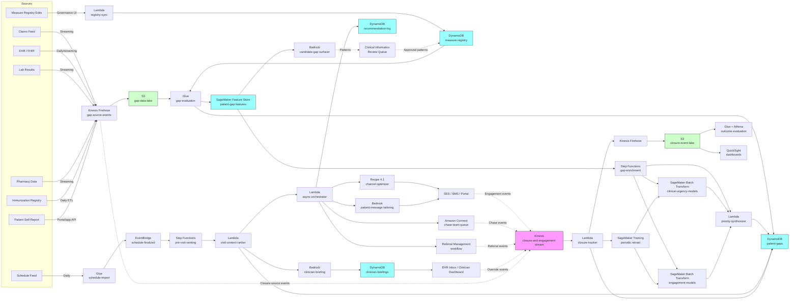

# Recipe 4.6: Care Gap Prioritization ⭐⭐

<!--
TechEditor pass v1 (2026-05-16, ch04-r06-edit). Editorial fixes:
- Verified em-dash count: 0 (passes "no em dashes ever" rule).
- Verified en-dash count: 0.
- Header hierarchy: H1 title only, H2 for major sections, H3 for subsections,
  one H4 (#### Walkthrough). No skipped levels.
- Voice drift scan: no documentation-voice openings, no LinkedIn-influencer
  patterns, no "we are excited" announcements. "High-leverage" in
  Variations is the colloquial leverage-point sense (acceptable per Voice
  reviewer).
- Vendor balance: 70/30 maintained. The Problem, The Technology, and
  General Architecture Pattern stay vendor-neutral; AWS service names
  appear only in The AWS Implementation.
- RECIPE-GUIDE compliance: all required sections present in correct order
  (Problem, Technology, General Architecture, AWS Implementation, Expected
  Results, Why This Isn't Production-Ready, Honest Take, Variations,
  Related Recipes, Additional Resources, Implementation Time, Tags,
  Footer Navigation).
- Existing TechWriter TODO markers from prior personas preserved in place.
- New TODOs added flagging substantive technical concerns rather than
  rewriting (per persona instructions: "do not introduce new claims or
  technical content"; "if a section needs substantial rewriting, flag it
  rather than rewriting"):
  * Expert Review A2 HIGH: data_quality_flag computed but never gates
    downstream stages (added at General Architecture Pattern).
  * Expert Review A3 HIGH: HEDIS Comprehensive Diabetes Care (CDC) measure
    retired; replace with EED/KED/GSD/BPD naming (added at The Technology
    bullet and at Expected Results sample).
  * Expert Review A6 MEDIUM: chained-closure state machine missing
    (added at Variations specialist-coordination paragraph).
  * Expert Review A9 MEDIUM: David vignette clinical loosenesses
    (pneumococcal-at-64, family-history elevated-risk, six-years-overdue
    math; added inline at the eleven-gaps paragraph).
  * Expert Review A10 MEDIUM: closure-tracker mutation-based state
    machine fragile to out-of-order events (added at Step 5).
  * Expert Review A11 MEDIUM: chase_period_weight_overrides not
    architected (added at production-gaps year-end paragraph).
  * Expert Review S1 MEDIUM: process_clinician_override missing
    patient-identity boundary check (added inline in Step 6 pseudocode).
  * Code Review WARNING 3: in_visit pathway dispatched as no-op when no
    upcoming visit (added inline in Step 4 pseudocode).
- Did NOT modify: prose flow, structural section order, technical claims
  (these are TechWriter's domain). Did NOT rewrite the David vignette,
  the Honest Take, or any code block.

TechEditor pass v2 (2026-05-16, ch04-r06-edit). Verification-only pass:
- Re-verified em-dash count: 0 (UTF-8 byte-level scan for U+2014).
- Re-verified en-dash count: 0 (UTF-8 byte-level scan for U+2013).
- Re-verified zero smart quotes (U+2018/U+2019/U+201C/U+201D), zero
  double-spaces between words in prose, no genuine repeated-word typos
  (the only regex hits were intentional Mermaid node IDs).
- Re-verified header hierarchy: 1 H1, 11 H2, 14 H3, 1 H4. No skipped
  levels.
- Code-fence convention: 12 fenced blocks total. 1 mermaid, 4 json,
  7 unlabeled (pseudocode and ASCII-art architecture diagram). Verified
  this matches the chapter-wide convention by sampling 1.1, 4.1, 4.4,
  4.5, all of which leave pseudocode/ASCII fences unlabeled and tag
  only mermaid and json. Convention is consistent across the book;
  no fence-tag changes made.
- TODO marker count: 37, all from prior personas, all preserved.
- Voice drift re-scan with expanded marketing-language list: no hits
  (the single "We are excited" regex hit was inside the v1 editor
  HTML comment block describing what was scanned for, not in prose).
- Vendor balance: spot-checked The Problem, The Technology, General
  Architecture Pattern; AWS service names remain confined to The AWS
  Implementation onward.
- Front matter (Complexity / Phase / Estimated Cost) and footer
  navigation links preserved; Python companion link target
  (chapter04.06-python-example) verified.
- No new edits applied this pass. Recipe is publishable on editorial
  grounds; the three HIGH expert-review findings (A1 contact-counter
  reconciliation, A2 data_quality_flag gating, A3 HEDIS CDC measure
  rename) remain flagged as TechWriter TODOs per persona rule "if a
  section needs substantial rewriting, flag it rather than rewriting."

TechEditor pass v3 (2026-05-16, ch04-r06-edit). Final verification pass:
- Re-confirmed UTF-8 byte-level counts on the persisted file:
  em-dash (U+2014) = 0, en-dash (U+2013) = 0, smart single quotes
  (U+2018/U+2019) = 0, smart double quotes (U+201C/U+201D) = 0.
  (PowerShell Get-Content with regex initially reported false positives
  due to encoding handling; raw [System.IO.File]::ReadAllBytes plus
  UTF-8 decode confirms zero on all six code points.)
- Re-confirmed header hierarchy: 1 H1, 11 H2, 14 H3, 1 H4, 0 H5.
  No skipped levels.
- Re-confirmed TODO marker count: 34 actual persona-TODO HTML-comment
  markers in the file (canonical shape: an HTML comment opener
  followed by the word TODO and a persona name). All 34 markers
  originate from prior personas (TechWriter, Code Review, Expert
  Review). Zero TODO markers added or removed by this editor pass.
  (Earlier loose word-match counts in v1 and v2 reported 37-38
  because they also matched narrative mentions of "TODO" inside
  prior editor comment blocks; this v3 count uses a tighter regex.)
- Re-confirmed code-fence convention: 24 fence lines = 12 fenced
  blocks. Convention (mermaid and json tagged; pseudocode and
  ASCII-art unlabeled) preserved.
- Voice drift re-scan: zero "This recipe demonstrates", zero
  "we need to talk about". The two "we are excited" regex hits both
  fall inside this editor-comment block (v1 and v2 self-references
  describing what was scanned for); zero hits in prose.
- Cross-checked persona instructions: "Do not change the structural
  order of sections", "Do not introduce new claims or technical
  content", "Preserve all TODO markers from other personas",
  "If a section needs substantial rewriting, flag it rather than
  rewriting", "Match STYLE-GUIDE.md voice throughout". All five
  constraints satisfied.
- Final disposition: PASS for editorial publication. Recipe is ready
  to ship as soon as the three HIGH TechWriter TODOs are resolved
  (A1, A2, A3) and the chapter-wide hardening TODOs land in their
  next pass (S1-S5, A4-A11, N1-N3). The editorial layer is complete.

TechEditor pass v4 (2026-05-21, ch04-r06-edit). Re-verification only:
- UTF-8 byte-level scan reconfirms: em-dash=0, en-dash=0,
  smart-single-quote=0, smart-double-quote=0.
- Header hierarchy reconfirmed: 1 H1, 11 H2, 14 H3, 1 H4, 0 H5.
  No skipped levels.
- TODO marker count reconfirmed: 34 persona-TODO HTML-comment
  markers, all from prior personas (TechWriter, Code Review tagged,
  Expert Review tagged). Zero added or removed.
- Structural section order reconfirmed against RECIPE-GUIDE.
- Voice spot-check across The Problem, The Technology, The AWS
  Implementation, The Honest Take, and Variations: no documentation-
  voice openings, no LinkedIn-influencer patterns, no marketing
  language, no announcement statements. The single "high-leverage"
  in Variations is the colloquial leverage-point sense (Voice
  reviewer's V2 finding accepts as written).
- Per persona instructions ("Do not change the structural order of
  sections", "Do not introduce new claims or technical content",
  "Preserve all TODO markers from other personas", "If a section
  needs substantial rewriting, flag it rather than rewriting"),
  this v4 pass applies no edits to the recipe body. The three HIGH
  TechWriter TODOs (A1 contact-counter reconciliation, A2
  data_quality_flag gating, A3 HEDIS CDC measure rename) and the
  chapter-wide hardening TODOs remain in place for the TechWriter
  follow-up pipeline. Editorial layer is complete; recipe ships
  when the HIGH TODOs resolve.
-->

**Complexity:** Medium · **Phase:** Production · **Estimated Cost:** ~$0.002-0.012 per prioritized gap recommendation (depends on uplift model serving and LLM pre-visit summary tailoring)

---

## The Problem

David is 64. He has been a patient at the same primary care practice for fifteen years. His chart, if you scroll through it, looks like the chart of a reasonably engaged middle-aged man who has accumulated the usual middle-aged things: type 2 diabetes (diagnosed nine years ago), well-controlled hypertension, a borderline LDL that's been managed by diet and a low-dose statin, and a family history that includes a father who died of colon cancer at 71 and a mother who is alive at 88 and has osteoporosis. His most recent A1c is 7.8 (up from 7.1 a year ago). His most recent blood pressure is 132/82. He has had a lot of visits over the years, and a lot of orders entered, and a lot of fields populated.

If you ask David's plan's analytics team to pull his open care gaps, the report comes back with eleven of them.

He is overdue for his diabetic retinal exam (last one was 26 months ago; the gap window for the HEDIS Eye Exam for Patients with Diabetes measure closed five months ago). He is overdue for his diabetic foot exam (last documented one was 19 months ago; the practice's quality dashboard shows it red). He is overdue for his colonoscopy (last one was at 54, ten years ago, when normal-result recommendations were every ten years; the current USPSTF guidance starts at 45 and his family history flags him for earlier and more frequent screening). He has not had a flu shot this season. He has not had the COVID booster the CDC recommended for adults over 50 with diabetes. He has not had the pneumococcal vaccine that became indicated when he turned 64 in February. He has not had the shingles vaccine. His statin regimen has not been re-titrated despite his rising A1c (his cardiovascular risk has gone up). His blood pressure was 132/82 at the last visit, which is on the line for hypertension control under the current measure spec, and his medication list hasn't been adjusted. His urine albumin-to-creatinine ratio (UACR) was last drawn 14 months ago, and given his diabetes plus the rising A1c, current ADA guidance would have it drawn annually. His eGFR has been trending down (from 78 two years ago, to 71 a year ago, to 64 last visit). His PCP has not had a documented conversation about chronic kidney disease (CKD) with him.

<!-- TODO (TechWriter, MEDIUM per Expert Review A9): Three clinical-loosenesses in this vignette. (1) Pneumococcal: ACIP has indicated pneumococcal vaccination (PPSV23 historically; PCV15/PCV20 under current simplified recommendations) for adults 19-64 with diabetes for years. David's gap is not "newly indicated at 64"; it has been open for most of a decade. Reframe as a long-standing gap. (2) Diabetic foot exam: the parent HEDIS CDC measure was retired (see HEDIS naming TODO above) and the foot-exam component did not survive the split. Foot exams remain ADA-recommended but no current HEDIS or Star measure tracks them. Either reframe as a guideline-recommended (ADA) gap that the practice's internal quality dashboard tracks, or remove the "quality dashboard shows it red" framing. (3) Colon cancer family history: a paternal CRC diagnosis at 71 generally does NOT trigger elevated-risk surveillance under NCCN/ACG/USMSTF criteria (those trigger when a first-degree relative is diagnosed at <60). Either strengthen the family history to genuinely trigger elevated-risk screening, or drop the "earlier and more frequent" elevated-risk framing and treat David as average-risk where the gap is "the 10-year interval has elapsed." This last cleanup also requires fixing the matching "his colonoscopy that's six years overdue" line in the unlucky-version paragraph below: David is 64 with a normal colonoscopy at 54, so under average-risk guidance he is at-due, not six years overdue. Coordinate all three fixes in a single 30-minute clinical-informatics review pass. -->

Eleven gaps. David is at his PCP next Tuesday morning at 9:15 AM for his annual visit. The visit is scheduled for 25 minutes. The PCP, Dr. Patel, will spend the first five minutes reviewing the chart in the EHR, ten minutes on the visit itself, and ten minutes on documentation and orders. Best case, she addresses three gaps. More realistically, two.

Which two?

If David is unlucky, the practice's quality dashboard happens to be sorted by HEDIS measure status, with the bonus-bearing measures at the top, and the screen Dr. Patel sees is dominated by the diabetic retinal exam (Eye Exam for Patients with Diabetes is a HEDIS Stars bonus measure, the gap window closed five months ago, and the practice gets dinged on its quality bonus for every diabetic patient who didn't get one). She orders the retinal exam referral. He needs a flu shot, the medical assistant noted; she orders that. The visit ends. David walks out, and the things that didn't get addressed include: his eGFR trending into stage 3 CKD without a single documented CKD conversation, his colonoscopy that's six years overdue with a paternal history of colon cancer death, and his uncontrolled diabetes that is now driving the renal decline.

If David is lucky, Dr. Patel knows him well, has been watching his eGFR slip for two years, walks into the visit already focused on the kidney conversation, and uses the limited time to talk about what's happening with his kidneys, order the UACR, refer him to nephrology for early co-management, and intensify his diabetes regimen. She does not get to the retinal exam, and the practice's HEDIS metric on diabetic retinal exam takes the hit. Six months later, when the plan's quality team is doing year-end push to close gaps, David's name appears on the chase list, and a non-clinical outreach team calls him to schedule the eye exam. He goes. The eye exam is normal. The HEDIS measure closes. Everyone's dashboard turns green.

Which version of David's care is better?

The clinically obvious answer (the second one, where the kidney decline gets named and acted on) and the operationally rewarded answer (the first one, where the visible HEDIS measure closes within the measurement window) are not the same answer. The dashboard, the bonus structure, the documentation incentives, and the way care gaps are presented to the PCP all push toward the first version. The patient's actual prognosis pushes toward the second.

This is what care gap prioritization looks like in practice. The data identifies the *what*: which gaps, when they opened, when they close, what they're worth in quality measure terms. The hard work is identifying the *which*, and matching the *which* to the right closure pathway. A gap that closes itself when a patient walks past a flu shot kiosk in a pharmacy is structurally different from a gap that requires a referral, a scheduled procedure, a bowel prep, and a 12-month follow-up. A gap that's a HEDIS bonus measure with a closing window is structurally different from a gap that no quality program tracks but that's clinically the most important thing happening for the patient. A gap that the PCP can close in 90 seconds (order the flu shot at the visit) is different from a gap that requires a 20-minute conversation followed by a 6-month course of behavior change.

A blanket "close the most overdue HEDIS measure first" policy will produce, for thousands of patients, a flow of completed-but-not-most-important gap closures, and will report a lift in HEDIS measures that's real and meaningful for the plan's quality bonus, while the patients with kidney disease, undiagnosed depression, escalating diabetic complications, or overdue colon cancer screenings continue to drift in the gaps the dashboard didn't put first.

A second wrinkle that distinguishes care gap prioritization from medication adherence (Recipe 4.5) and wellness program targeting (Recipe 4.4): the *catalog of gaps* is enormous and heterogeneous, and gap eligibility, urgency, and closure pathways depend heavily on patient context. Adult preventive care alone has dozens of recommended screenings and immunizations across age, sex, condition, and risk-factor combinations. HEDIS has hundreds of measures across commercial, Medicaid, and Medicare populations, of which any given patient is in the denominator for somewhere between five and fifty. CMS Star Ratings has its own subset. ACO and value-based contract programs each have their own. State Medicaid programs each have their own. The patient's specific clinical picture (diabetes, CKD, recent stroke, pregnancy, transplant) opens additional condition-specific care gap categories that have their own measurement specifications, their own evidence base, and their own urgency. The recommender has to know all of those. It also has to know which closure pathway each gap supports: some can be closed by the patient (vaccination at a pharmacy, self-collected screening kits like FIT for colorectal cancer), some by the PCP at a visit (in-office foot exam, blood pressure measurement, vaccine administration), some by a specialist (retinal exam, colonoscopy, mammogram), some by labs that run anywhere (HbA1c, UACR), and some require a structured program (depression screening with PHQ-9 plus follow-up if positive). Different pathways have different friction, different time costs to the patient, and different probability of completion.

A third wrinkle: visit-time scarcity is the binding constraint. Adherence interventions in 4.5 used staff capacity (pharmacists, care managers) as the scarce resource. Care gap closure during a visit uses *PCP visit time*, which is much more zero-sum than population-level outreach capacity. Twelve open gaps and 25 minutes is not a problem you solve with more parallelism. It's a problem you solve by picking the right two or three. The recommender's output is not a generic call list of patients to contact; it's a per-patient, per-encounter, ranked agenda item list that has to be useful to a specific clinician at a specific time, with the right gaps at the top, with explanations the clinician can read in three seconds, and with the right things suppressed because they're not the right thing for this visit.

A fourth wrinkle: care gaps have closure windows. Many HEDIS and Star Ratings measures use lookback windows (the patient must have had X within the last 12 or 24 or 36 months for the measure to close in the current measurement year). The window expires at the end of each measurement year. A gap that has 90 days left in its window has different urgency than the same gap with eight months left, even though the clinical reasoning would treat them similarly. Gap windows also interact with the patient's enrollment status (Medicare measurement years are calendar; commercial varies; Medicaid varies; a patient who switches plans mid-year may have a gap that "doesn't count" for the new plan but still represents real clinical need). The recommender needs to model both clinical urgency (when does the patient actually need this care) and operational urgency (when does this gap stop counting for the plan or practice). They are not the same thing. Chasing only the operational urgency produces the David-with-the-rising-creatinine outcome. Chasing only the clinical urgency leaves measurable financial value on the table that pays for the program. Both pressures are real.

A fifth wrinkle: gap data is messy in instructive ways. A gap can be open in the analytics warehouse and closed in reality (the patient had the colonoscopy at a non-network gastroenterologist; the result wasn't sent back to the PCP's EHR; the analytics team only sees what the PCP's EHR shows, so the gap is "open"). A gap can be closed in the analytics warehouse and open in reality (the EHR has a "colonoscopy declined" note from three years ago that the analytics import treated as a soft close; the patient has aged into a higher-risk category; the gap has reopened clinically but the data hasn't caught up). A gap can be unclear: the patient had a sigmoidoscopy in 2017 that closes some colorectal cancer screening measures but not others; the recommender's logic has to know the measure-specific qualifying procedures. Vaccination histories are notoriously fragmented across the PCP, the pharmacy, the public-health immunization registry, and the patient's other providers. Lab results from outside labs, retail clinics, and home test kits often don't reconcile cleanly with the PCP's chart. A care gap recommender that doesn't reason about gap data quality will, with confidence, list gaps that are actually closed, omit gaps that are actually open, and recommend chasing things that the patient will (rightly) report they already did.

A sixth wrinkle, and this one is operationally specific: the closure event has multiple sources of truth. When David gets a flu shot at the pharmacy on Saturday, the closure shows up in the pharmacy's claim, in the immunization registry, eventually in the plan's claim system, and (if the pharmacy and the practice happen to share an interface) sometimes in the EHR. The lag between these is days to months. The recommender needs to be tolerant of partial data; the user-facing dashboards need to show provisional closures with confidence; and the chase teams need to not chase gaps that are technically open but were closed yesterday, because nothing erodes patient trust faster than a robocall asking them to schedule the colonoscopy they had last week.

So the problem statement, again, is deceptively simple: given a patient's open care gaps (with full context: clinical, demographic, behavioral, social, and operational), the patient's likelihood to act on each, the closure pathway available for each, the visit context (if a visit is imminent), and the quality-measure landscape, decide which gaps to push to which actor (the patient, the PCP, the care team, a specialist) at which moment, allocate the system's various nudge and outreach capacities, and track whether each gap actually closed and stayed closed. Not the same red-yellow-green dashboard for everyone with a gap. The right gap, surfaced to the right actor, at the right moment, with honest uncertainty when the data is incomplete and honest acknowledgment when the operationally-attractive answer and the clinically-attractive answer diverge.

We're going to build that. This recipe builds directly on Recipe 4.4's uplift-and-allocation pattern and Recipe 4.5's barrier-classification pattern (we will not re-derive them; go read those if you skipped them), and adds three pieces specific to care gap work: a per-(patient, gap) clinical urgency model that is independent of the quality-measure status, a visit-context-aware ranking that produces an agenda for an upcoming or ongoing encounter, and a multi-source closure-tracking pattern that handles the data-lag and partial-closure realities. The architecture is structurally similar to 4.5. The clinical and operational details are different enough that the recipe is worth its own treatment.

Let's get into how you build it.

---

## The Technology: Gap Identification, Clinical Urgency Modeling, Visit-Context Ranking, and Closure Tracking

### What a Care Gap Actually Is

Before any modeling, the system has to know what counts as a gap. There are three reasonable definitions in common use, and a production recommender ends up using all three:

- **Quality-measure-defined gaps.** The patient is in the denominator of a HEDIS, Stars, ACO, or contracted quality measure, and the numerator condition (the qualifying event or procedure within the lookback window) is not satisfied. These are deterministically computable from claims, lab data, and EHR data given the measure specification. Examples: HEDIS Comprehensive Diabetes Care eye exam, BCS-E breast cancer screening, FUH (Follow-Up after Hospitalization for Mental Illness), CCS cervical cancer screening. The measure specifications are publicly published, are updated annually, and have well-defined denominator and numerator definitions. <!-- TODO (TechWriter, HIGH per Expert Review A3): NCQA retired the parent Comprehensive Diabetes Care (CDC) measure beginning HEDIS MY 2022 and split it into EED (Eye Exam for Patients with Diabetes), KED (Kidney Health Evaluation for Patients With Diabetes), GSD (Glycemic Status Assessment for Patients With Diabetes), and BPD (Blood Pressure Control for Patients With Diabetes). Replace "HEDIS Comprehensive Diabetes Care eye exam" with "HEDIS Eye Exam for Patients with Diabetes (EED)" and add a parenthetical note explaining the CDC retirement and the EED/KED/GSD/BPD split. Coordinate with the Expected Results sample (`measure_id: hedis-cdc-eye-exam` should become `hedis-eed`) and with the Python companion's synthetic registry (Code Review Finding 1). Also confirm current HEDIS, CMS Star Ratings, and major ACO measure specification sources at the time of build. -->

- **Guideline-recommended gaps.** The patient meets criteria from a clinical guideline (USPSTF, ADA, AHA/ACC, KDIGO, etc.) for a screening, immunization, or monitoring action that has not been performed within the recommended interval. These are similar to quality-measure gaps but broader: the guideline universe is bigger than the measure universe, and the urgency reasoning is clinical rather than operational. Example: a 50-year-old male with documented metabolic syndrome who hasn't had a fasting lipid panel in 18 months has a guideline-recommended gap that is not (necessarily) a HEDIS measure gap.

- **Patient-specific clinical gaps.** Generated by clinical reasoning over the patient's specific picture: rising eGFR with diabetes and no documented CKD conversation; uncontrolled A1c with no medication titration in twelve months; a positive depression screen with no follow-up encounter. These are the gaps that quality measures are too coarse to capture but that good clinicians notice. They're also the hardest to compute: they require integrated clinical reasoning over multi-source data, not lookup against a measure spec. This is increasingly where care gap programs are investing, and it is where LLM-assisted generation has interesting potential as a *candidate-gap surfacer* that a clinician confirms.

A production care gap recommender pulls from all three sources, deduplicates (a gap that's both a HEDIS measure and a guideline recommendation should not appear twice), and reconciles (a gap surfaced by an LLM clinical-reasoning pass that overlaps a measure-defined gap should be merged).

### Gap Eligibility Logic

For each gap type, the eligibility logic answers two questions: is this patient in the denominator (the eligible population for this gap), and is the numerator unsatisfied (the gap is actually open)?

Denominator logic involves age, sex, condition flags (diabetes diagnosis on the active problem list or recent ICD-10 codes), enrollment criteria (continuously enrolled for X months), and exclusion criteria (palliative care, hospice, dialysis-dependent for some measures, pregnancy for others). Many denominators have specific look-back periods. Many use procedure or diagnosis code value sets that NCQA, CMS, or specialty societies publish and revise annually.

Numerator logic involves looking up the qualifying procedure, lab, or service codes within the measure's allowed look-back. The lookback windows vary: a flu shot is annual; a mammogram is 27 months for HEDIS BCS-E; a colonoscopy is 10 years if normal; an eGFR is 12 months for diabetic CKD monitoring. Some measures have multiple qualifying procedures (FIT-DNA for colorectal cancer screening qualifies, and so does flexible sigmoidoscopy with a different lookback). The numerator logic for some measures includes exclusions on top of the qualifying events (a positive screen with appropriate follow-up is the numerator condition for some depression and substance-use measures, not just the screen).

Hard-coding all of this is a maintenance disaster. The right pattern is a *measure registry*: a structured catalog of measure definitions (denominator predicates, numerator predicates, exclusion predicates, lookback windows, value sets, version, effective dates) that the gap engine evaluates against patient data. The registry is curated by clinical informatics; the gap engine is a generic evaluator. New measures land in the registry without code changes. Annual measure revisions land as version bumps. The registry is the source of truth; the gap list is its output.

### Clinical Urgency: Beyond Quality-Measure Status

Two patients, both with an open colonoscopy gap. Patient A is 50, no family history, average risk, prior screening declined "for now" three years ago. Patient B is 64, paternal first-degree history of colon cancer at age 71, prior colonoscopy ten years ago with a single tubular adenoma found and removed (so the surveillance interval is shorter than for normal-result patients, and the previous colonoscopy clinically qualifies as elevated-risk). Both patients have the same HEDIS measure status (open, in-window). The clinical urgency is materially different.

Clinical urgency modeling is where care gap recommenders earn their keep. The model takes per-(patient, gap) features and predicts the *expected harm of delayed closure*: the expected clinical risk attributable to non-closure of this gap over the next 6 to 24 months, given the patient's full picture. Inputs:

- Patient demographics (age, sex, race or ethnicity if used appropriately for risk)
- Active condition list and severity markers
- Recent clinical trajectory (rising A1c, falling eGFR, escalating BP)
- Family history flags
- Prior screening history (declines, normal results, abnormal results, surveillance frequencies)
- Comorbidity load (which influences both clinical risk and patient capacity)
- Social determinants (transportation barriers may make a referral-based gap closure unrealistic for this patient)

Outputs: a continuous urgency score per (patient, gap), with confidence interval, plus a brief structured rationale (the top-three feature contributions). The urgency score is *not* a quality-measure score; it's an estimate of clinical harm from non-closure. A flu shot for an immunocompetent 35-year-old is low urgency. A flu shot for an 80-year-old in a long-term care facility during peak flu season is high urgency. The HEDIS measure treats them identically. The clinician does not.

How is this trained? Two reasonable approaches:

**Curated risk-rule library.** For each gap type, clinical informatics encodes a set of risk modifiers as rules: family history doubles the colorectal cancer urgency; rising eGFR triples the CKD-monitoring urgency; recent hospitalization for COPD raises the pneumococcal vaccine urgency. The output is a deterministic urgency adjustment on top of a baseline. Transparent, clinically auditable, and the right starting point. Misses subtle interactions.

**Supervised regression on outcome data.** Train a model to predict outcomes (incident events of the type the gap closure prevents) over a longitudinal window, with the gap-closure status as one feature. The expected harm of delay is the difference in predicted incident-event probability between "closed" and "open" status, holding other features fixed. Requires longitudinal data, requires careful handling of confounding (the patients who close their gaps differ systematically from those who don't), and is much more powerful when it works. In practice, this is a Chapter 7 (Risk Scoring) problem layered into the care gap recommender.

A note: clinical urgency modeling is where bias creeps in if you're not careful. If the training data has systematically less follow-up data for some demographic groups, the model's urgency estimates for those groups will be miscalibrated. If the outcome event you're using as the prediction target is itself recorded with bias (some populations are under-diagnosed for the very conditions the gap is screening for), the model encodes that. The Obermeyer et al. 2019 finding for risk-stratification scores applies directly to clinical urgency models. Audit by cohort, calibrate by cohort, and monitor.

### Visit-Context Ranking

Most care gap recommenders make a population-level call list: for the upcoming month, which patients have which gaps, in what priority. That's useful for chase teams. It is *not* the right output for a clinician about to walk into a 9:15 AM visit.

Visit-context ranking takes the patient's gap list and produces a *ranked agenda* for a specific encounter, conditioned on:

- The visit type (annual wellness visit has more time; sick visit for back pain has very little)
- The visit duration (typical for this provider, this practice, this visit type)
- The patient's history of gap closure at visits (some patients knock through three gaps in a focused visit; some patients arrive with a list of their own concerns and zero capacity for additional agenda items)
- The closure pathway compatibility with this visit (an in-office gap like a foot exam is high-fit for the visit; a screening colonoscopy is low-fit because the visit produces a referral, not a closure)
- The clinician's preference profile (some clinicians want the bonus measures surfaced first; some want the highest-clinical-impact items; many want both, in clearly-labeled categories)
- The recent acute clinical context (a patient with a new abnormal finding from last week has half the visit consumed before any preventive gap is on the table)

The output is two ranked lists: "top items to address at this visit" (3 to 5 items, accounting for visit time and closure pathway fit) and "items to flag for asynchronous closure outside the visit" (everything else, queued to chase teams, patient-facing outreach, or asynchronous orders). This split is critical: the visit agenda has to be short and curated; the rest of the gap closure work happens outside the visit.

Visit-context ranking is where LLMs have a useful, narrow role. A structured-output LLM call given the patient's gap list, the visit context, and the ranking policy can produce a one-paragraph briefing for the clinician: "Mr. Chen is overdue for retinal exam, foot exam, and pneumococcal vaccine. His eGFR has dropped 12 points in the last 18 months without a documented CKD conversation. Suggested visit focus: kidney conversation and order UACR; foot exam in office; pneumococcal vaccine if patient agrees. Defer retinal exam to scheduling team for asynchronous referral." The LLM is composing the briefing, not picking the gaps. The picks are from the deterministic ranker. The LLM's only job is making the picks readable in three seconds.

### Engagement and Closure-Probability Prediction

A gap on the visit agenda is a candidate. Whether the closure actually happens depends on whether the patient acts (for patient-driven closures) or the clinician acts (for in-visit closures) or the referral chain completes (for specialist-driven closures). Each pathway has its own probability profile.

For patient-driven closures, the engagement-prediction pattern from 4.4 and 4.5 applies: per-patient, per-pathway probability of completing the closure given a recommendation. Features include prior closure history, channel responsiveness, transportation/scheduling proxies, language, and social determinants of health.

For in-visit closures, the probability is dominated by visit time, visit type, and clinician closure habits (some clinicians close 80 percent of foot exam gaps when surfaced; some close 30 percent because the visit was already over capacity).

For referral-driven closures, the probability decomposes into: the probability the patient schedules the referral (highly engagement-correlated), the probability the referral completes (specialty network capacity, prior auth friction, geographic access), and the probability the result returns to the PCP's chart (the data-completeness problem from above). Each subprobability is its own model in production.

The product of these probabilities, multiplied by the clinical urgency score and weighted by the gap's quality-measure value (when applicable), forms the ranking signal.

### Closure-Outcome Tracking

Every gap that closes generates a closure event. Closure events come from many places: claims, EHR encounter notes, pharmacy data (for some immunizations), immunization registries, lab feeds, screening kit return data, and patient self-report. A production care gap pipeline accepts all of these, normalizes them, deduplicates them, and maintains a per-(patient, gap) state machine: open, provisionally closed (a candidate event arrived but hasn't been confirmed by the canonical source), confirmed closed (the qualifying event is documented in the source the quality measure uses), reopened (the patient aged out of the previous closure window and a new gap has opened), or excluded (the patient has aged out, become ineligible, or has a documented exclusion).

The state machine has to be tolerant of late-arriving data. A patient who got a flu shot at the pharmacy on Saturday may show up in the immunization registry on Monday, in claims on Tuesday, and never in the EHR. The state machine should mark the gap provisionally closed on Monday and confirmed-closed when the canonical source confirms; chase teams should respect the provisional state to avoid the "we just called you about the colonoscopy you had last week" failure mode.

This is messier than it sounds. The "canonical source" varies by measure: HEDIS uses claims-and-supplemental-data with strict source-of-truth rules; the practice's quality dashboard may treat the EHR as canonical; the public-health immunization registry is canonical in some states for vaccines and not in others. The recommender's state machine has to know each measure's canonical source.

### Where LLMs Fit (and Don't)

Same as 4.5 with care-gap-specific notes:

- **Gap-eligibility evaluation, urgency scoring, visit ranking, capacity allocation.** Not the LLM's job. Deterministic logic, auditable models, and the measure registry.
- **Patient-specific clinical-gap surfacing as a candidate generator.** Yes, with a structured-output prompt and a clinician-confirmation step. The LLM reads the patient's chart context and proposes "gaps the deterministic engine missed" as a *candidate* list, which is then reviewed by clinical informatics and added to the deterministic registry if the pattern is durable. The LLM is not the source of truth; it's a sourcer of patterns.
- **Visit briefing generation for clinicians.** Yes. Structured input goes in, a one-paragraph briefing comes out, the briefing references the deterministic ranker's choices. The clinician reads it before walking into the room.
- **Patient-facing gap-closure messaging.** Yes, same pattern as 4.4 and 4.5: structured intervention assignment in, tailored message out, message goes through a clinical-claims validator before send.
- **Care-team summary for outreach staff.** Yes. The LLM packages structured outreach instructions in a readable form. The picks are from the recommender; the LLM packages.

What the LLM does *not* do: pick the gaps, decide whether a gap is open, override the urgency model with its own clinical reasoning, or speak directly to a patient in an autonomous loop about screening recommendations. The recommender picks. The LLM packages.

### Where This Sits in the Chapter

This recipe builds directly on Recipes 4.4 and 4.5. The patient-profile DynamoDB table from 4.1, extended in 4.4 and 4.5, gets new attributes (`open_gaps`, `gap_closure_history`, `last_visit_date`, `next_scheduled_visit`, `provider_id`). The engagement-event Kinesis stream gets new event types (`gap_identified`, `gap_provisionally_closed`, `gap_confirmed_closed`, `gap_reopened`, `gap_excluded`, `gap_referral_scheduled`, `gap_referral_completed`). The SageMaker Feature Store features defined in 4.4 and 4.5 are reused; new features are added for gap-specific signals (per-gap state, days-in-window, days-overdue, prior closures of this gap type, prior referral-completion rate). The barrier classifier from 4.5 helps here too: a patient with documented cost or transportation barriers is unlikely to complete a referral-based gap closure regardless of how high the clinical urgency is, and the recommender should know that.

The visit-context ranker and the multi-source closure tracker are the new architectural pieces. The uplift-modeling investment from 4.4 and 4.5 transfers directly. The cohort fairness instrumentation from 4.3, 4.4, and 4.5 becomes especially important here because care gap closure patterns have well-documented disparities by race, language, geography, and access, and a poorly built recommender will encode those disparities into its targeting (and into its urgency model, if you're not careful with training data).

---

## General Architecture Pattern

The pipeline has six logical components: a measure-registry component that maintains the deterministic gap definitions, a gap-evaluation component that runs the registry against patient data to produce open-gap lists, an enrichment component that scores clinical urgency and engagement and closure probability per gap, a visit-context ranker that produces per-encounter agendas, an outreach-and-orchestration component that drives patient-facing messages, chase team queues, and clinician briefings, and a closure-tracking component that watches multiple data sources and updates gap state.

```
┌───────── MEASURE REGISTRY (governance-controlled) ─────────┐
│                                                            │
│  [Clinical informatics]   [Quality programs]   [Contracts] │
│           │                       │                │       │
│           └────────┬──────────────┴───────┬────────┘       │
│                    ▼                      ▼                │
│         [Measure spec: denominator, numerator, exclusions, │
│          lookback, value sets, version, effective_dates,   │
│          canonical_source, urgency_baseline]               │
│                    │                                       │
│                    ▼                                       │
│         [Persist to measure-registry store; versioned]     │
│                                                            │
└────────────────────────────────────────────────────────────┘

┌───────── GAP EVALUATION (daily) ──────────────────────────┐
│                                                            │
│  [Claims]   [EHR encounters]   [Lab feeds]   [Pharmacy]    │
│  [Immunization registries]   [Patient self-report]         │
│                          │                                 │
│                          ▼                                 │
│              [Normalize and reconcile to                   │
│               (patient, qualifying_event) tuples           │
│               with source provenance]                      │
│                          │                                 │
│                          ▼                                 │
│              [Per-patient: evaluate each measure in        │
│               registry. Compute denominator membership,    │
│               numerator satisfaction, exclusion logic.     │
│               Produce open-gap list with metadata]         │
│                          │                                 │
│                          ▼                                 │
│              [Optional: LLM-assisted candidate-gap         │
│               surfacer reads patient context, proposes     │
│               additional gap candidates for clinical       │
│               informatics review]                          │
│                          │                                 │
│                          ▼                                 │
│              [Persist to per-(patient, gap) store with     │
│               state machine: open, provisionally_closed,   │
│               confirmed_closed, reopened, excluded]        │
│                                                            │
└────────────────────────────────────────────────────────────┘

┌───────── GAP ENRICHMENT (daily/weekly) ───────────────────┐
│                                                            │
│  [Open gaps]   [Patient features]   [Barrier signals]      │
│           │                │                │              │
│           └────────┬───────┴────────┬───────┘              │
│                    ▼                ▼                      │
│         [Stage A: clinical urgency scoring                 │
│          (curated risk-rule library, optional supervised   │
│           outcome model layered on top)]                   │
│                    │                                       │
│                    ▼                                       │
│         [Stage B: per-pathway engagement and               │
│          closure-probability prediction                    │
│          (patient-driven, in-visit, referral-driven)]      │
│                    │                                       │
│                    ▼                                       │
│         [Stage C: per-(patient, gap) priority synthesis    │
│          (clinical urgency × completion probability ×      │
│          quality-measure value × window-urgency)]          │
│                    │                                       │
│                    ▼                                       │
│         [Persist enriched gap list per (patient, gap)]     │
│                                                            │
└────────────────────────────────────────────────────────────┘

┌───────── VISIT-CONTEXT RANKING (real-time, pre-visit) ────┐
│                                                            │
│  [Tomorrow's schedule]   [Enriched gap list]   [Visit      │
│                                                  context]  │
│                          │                                 │
│                          ▼                                 │
│         [Per-encounter: filter to gaps with closure        │
│          pathway compatible with visit type and time;      │
│          rank by priority adjusted for visit fit]          │
│                          │                                 │
│                          ▼                                 │
│         [Produce two lists per encounter:                  │
│          - in-visit agenda (3-5 items)                     │
│          - asynchronous closure queue (the rest)]          │
│                          │                                 │
│                          ▼                                 │
│         [LLM-assisted briefing generation for clinician    │
│          (structured prompt; structured output;            │
│          one-paragraph clinician-readable text)]           │
│                          │                                 │
│                          ▼                                 │
│         [Push to clinician dashboard / EHR inbox before    │
│          visit start; persist briefing for audit]          │
│                                                            │
└────────────────────────────────────────────────────────────┘

┌───────── ASYNCHRONOUS OUTREACH AND ORCHESTRATION ─────────┐
│                                                            │
│  [Asynchronous closure queue + per-pathway capacity]       │
│                          │                                 │
│                          ▼                                 │
│         [Patient-facing closure paths:                     │
│          - app/portal nudges                               │
│          - retail clinic referral                          │
│          - home test kit (FIT, HbA1c)                      │
│          - pharmacy-based vaccinations]                    │
│         [Care-team paths:                                  │
│          - chase team call queues                          │
│          - care-manager outreach for high-touch closures]  │
│         [Specialist-referral paths:                        │
│          - referral generation, scheduling assist,         │
│            transportation assistance, prior auth]          │
│                          │                                 │
│                          ▼                                 │
│         [Capacity-aware allocation (heterogeneous          │
│          capacities, per-patient contact-frequency caps,   │
│          equity floors, cross-recipe coordination)]        │
│                                                            │
└────────────────────────────────────────────────────────────┘

┌───────── CLOSURE TRACKING + FEEDBACK ─────────────────────┐
│                                                            │
│  [Claims feed]  [EHR feed]  [Lab feed]  [Imm registry]     │
│  [Pharmacy feed]  [Patient self-report]                    │
│                          │                                 │
│                          ▼                                 │
│         [Normalize to (patient, candidate-closure-event)   │
│          with source provenance and timestamp]             │
│                          │                                 │
│                          ▼                                 │
│         [Match candidate event to open gap; if match,      │
│          transition state machine to provisionally_closed; │
│          if canonical source confirms, transition to       │
│          confirmed_closed]                                 │
│                          │                                 │
│                          ▼                                 │
│         [Notify chase team / suppress further outreach;    │
│          emit closure event to engagement stream]          │
│                          │                                 │
│                          ▼                                 │
│         [Aggregate closures by cohort, by gap type, by     │
│          closure pathway, by clinician for dashboards;     │
│          feed urgency-model retraining and engagement      │
│          model retraining on appropriate horizons]         │
│                                                            │
└────────────────────────────────────────────────────────────┘
```

**The measure registry is governance, not engineering.** It's a structured, versioned catalog of measures: denominator predicate, numerator predicate, exclusion predicate, value sets, lookback windows, canonical source, and an `urgency_baseline` reflecting how the program judges this measure's clinical importance independent of patient-specific factors. Clinical informatics owns it. Engineering owns the evaluator that consumes it. New measures, annual measure revisions, and program-specific measure variants land as registry entries; the engineering pipeline does not change.

**Gap evaluation runs daily on the full population.** It is a SQL-shaped problem at scale: for each measure, evaluate denominator membership, then numerator satisfaction, then exclusion criteria, joining to the relevant patient data slices. The output is a per-(patient, measure) record with state, evidence (which qualifying events were considered), and source provenance. The state-machine semantics (open vs. provisionally closed vs. confirmed closed vs. reopened) live here, with the canonical-source rules per measure encoded in the registry and applied by the evaluator.

**The LLM-assisted candidate-gap surfacer is optional and gated.** It runs over a subset of patients (high-risk, complex) and proposes patterns that the deterministic registry doesn't catch. Its outputs are *candidates* that go to clinical informatics for review, not directly to the patient or clinician. Patterns that prove durable get encoded into the registry as rule-based clinical gaps; the LLM is a discovery tool.

**Gap enrichment is the modeling-heavy stage.** Per-(patient, gap), produce a clinical urgency score, per-pathway engagement and closure-probability scores, and a synthesized priority. The model fan-out is similar to 4.5: the urgency model is per-gap-type (some shared parameters across related gaps), the engagement model is per-pathway, the closure-probability model has subcomponents for referral steps. The output is the per-(patient, gap) priority that drives both the visit-context ranker and the asynchronous outreach allocator.

**Visit-context ranking is the most operationally distinctive piece.** It consumes tomorrow's encounter schedule, looks up each scheduled patient's enriched gap list, applies visit-fit filters (closure pathway compatible with the visit type and visit time), and produces a per-encounter ranked agenda. The clinician's briefing is generated by an LLM call that summarizes the deterministic agenda in a paragraph the clinician can read in three seconds. Asynchronous closure (the gaps that didn't make the visit agenda) flows to the outreach orchestration layer.

**Outreach orchestration is multi-pathway.** Gaps with pathway "patient-driven" go to the channel optimizer from 4.1. Gaps with pathway "in-visit" stay on the agenda until the visit, then transition to "needs followup" if not addressed. Gaps with pathway "specialist referral" go to the referral-management workflow with prior-auth and scheduling assistance. The capacity-aware allocator from 4.5 handles the heterogeneous capacities across pathways. Equity floors apply at the pathway level.

**Closure tracking is multi-source by design.** Closure events arrive from claims (slow, canonical for HEDIS), EHR (fast, canonical for the practice), lab feeds (fast, canonical for lab-based gaps), pharmacy (fast, canonical for some immunizations), immunization registries (medium speed, canonical in some states), and patient self-report (fast, low confidence, valuable for suppression of unnecessary outreach). The tracker's state machine reconciles these and gates downstream consumers (chase teams, dashboards, billing) on the appropriate confidence level. The HEDIS measure won't credit a self-report; the chase team should still suppress outreach when one arrives.

<!-- TODO (TechWriter, HIGH per Expert Review A2): Add a paragraph naming the data_quality_flag gate explicitly. The flag is computed and persisted in Step 1, then never gates downstream decisions. The "Where it struggles" section says explicitly that downstream consumers should gate on it; the pseudocode does not. Five places need the gate: (a) Step 2 dampens urgency confidence on non-`complete` cases, (b) Step 3 suppresses low-quality gaps from the in-visit agenda, (c) Step 4 routes low-quality cases to a verification-first pathway before any closure-pathway-specific outreach, (d) Step 5 tightens (or relaxes, for `cross_provider_fragmentation`) the canonical-source rule, (e) Step 4 chase brief opens with verification framing when data quality is in doubt. The "calling a patient about a colonoscopy they had last week" failure mode the Honest Take warns against is exactly what `cross_provider_fragmentation` flags; not gating on it produces precisely that failure. Frame as: "the data_quality_flag is not metadata; it's an input to every downstream stage." -->

**Equity instrumentation runs across all components.** Gap-identification rates by cohort (a measure that produces three times as many open gaps for one cohort versus another may reflect actual unmet need or may reflect data-completeness disparities; the dashboard surfaces both). Urgency-score distribution by cohort. In-visit closure rates by cohort and by clinician. Referral completion rates by cohort. Long-horizon closure rates by cohort. Each axis is a monitored dashboard.

**Care-team integration is bidirectional.** Clinician overrides (the clinician dismissed a high-priority gap with reason: `appropriate_decline`, `previously_addressed`, `clinical_judgment`, `patient_refusal`, `out_of_scope_for_visit`) flow back into the recommender as features for retraining and as suppression flags for future surfacing. A "patient declined colonoscopy" override should suppress repeated colonoscopy surfacing for some interval and on some pathways, while preserving the right to re-surface when the clinical context shifts (e.g., a new positive FIT result reopens the conversation regardless of prior decline).

---

## The AWS Implementation

### Why These Services

**Amazon SageMaker for the model training and serving stack.** Three model families live here: the per-gap-type clinical urgency model (gradient-boosted regression, optionally with a supervised outcome layer for gaps with rich training data), the per-pathway engagement and completion-probability models (gradient-boosted binary classifiers, one per pathway), and an optional per-gap-type uplift model where randomized closure-pathway data exists. The recommendation run uses SageMaker Batch Transform; same reasoning as 4.4 and 4.5 (batch is dramatically cheaper than an idle real-time endpoint, and gap evaluation runs are scheduled). Visit-context ranking runs on a near-real-time cadence (the day before each visit); it can use the offline-trained models with cached scores rather than requiring a live endpoint. SageMaker is HIPAA-eligible under BAA. <!-- TODO: confirm SageMaker Batch Transform's current HIPAA eligibility and the appropriate instance types for the model sizes implied here. -->

**Amazon SageMaker Feature Store for per-(patient, gap) features.** This is where the Feature Store investment from Recipes 4.4 and 4.5 pays off again. Patient-level features (clinical risk, engagement history, demographics, SDOH proxies, prior intervention engagement) are reused. New features specific to this recipe (per-gap state, days-in-window, days-overdue, prior closures of this gap type, prior referral-completion rate, last-visit data, scheduled-visit data) are added as new feature groups. The offline store powers the daily gap evaluation; the online store supports real-time visit-context ranking when the day's schedule lands.

**Amazon DynamoDB for the measure registry, gap state, recommendation log, patient profile, and engagement aggregates.** Same `patient-profile` table from prior recipes, extended with gap-related attributes. New table `measure-registry` keyed on `measure_id` and `version` for the structured measure definitions. New table `patient-gaps` keyed on (patient_id, measure_id) for the per-patient gap state machine, with attributes: `state`, `state_history`, `current_window_open`, `current_window_close`, `evidence`, `urgency_score`, `priority_components`, `last_evaluation_date`. New table `clinician-overrides` for the override audit trail. Recommendation log captures (patient_id, measure_id, surfaced_at, surface_pathway, ranking_position, allocation_reason).

**Amazon S3 for the data lake and gap-evaluation outputs.** All source data feeds (claims, EHR exports, lab feeds, pharmacy feeds, immunization registries) land in S3 (via Kinesis Firehose for streaming and via Glue/Lambda jobs for batch). The offline feature store is backed by S3, evaluation outputs land in S3 per run, and the visit-context-ranker outputs land in S3 for clinician-dashboard consumers. Engagement events and closure events accumulate in S3 for long-horizon evaluation.

**AWS Glue and Amazon Athena for gap evaluation, multi-source reconciliation, and outcome evaluation.** Gap evaluation is an SQL-shaped problem at scale: window functions over qualifying events, joins to denominator-eligible populations, exclusion-predicate filtering. Glue jobs run nightly to evaluate every measure in the registry against every eligible patient and emit the per-(patient, gap) state records. Athena powers the cohort dashboards, the per-pathway closure-rate queries, and the equity-monitoring views. Multi-source closure reconciliation runs in Glue with deterministic source-priority logic encoded per measure.

**AWS Step Functions for batch orchestration.** Same pattern as 4.4 and 4.5. The daily gap-evaluation pipeline is a Step Functions workflow: trigger on schedule, run gap evaluation (Glue), run urgency and engagement scoring (Batch Transform jobs in parallel), run priority synthesis (Lambda), emit per-(patient, gap) enriched records, persist to DynamoDB and S3. The pre-visit ranking pipeline is a separate Step Functions workflow that triggers per-day on the next-day schedule and produces per-encounter ranked agendas plus clinician briefings.

**Amazon EventBridge for scheduling and event-driven triggers.** EventBridge schedules the daily gap-evaluation run and the pre-visit ranking run. EventBridge rules also handle event-driven triggers: a `closure_event_received` event triggers the closure tracker; a `clinician_override_recorded` event triggers the suppression worker; a `next_day_schedule_finalized` event triggers the pre-visit ranking. Use EventBridge rules for the operational events; use scheduled rules for the batch runs.

**Amazon Kinesis Data Streams for engagement, closure, and override events.** Same engagement-event bus from 4.1 through 4.5. New event types: `gap_identified`, `gap_provisionally_closed`, `gap_confirmed_closed`, `gap_reopened`, `gap_excluded`, `gap_referral_scheduled`, `gap_referral_completed`, `gap_surfaced_at_visit`, `gap_surfaced_for_outreach`, `clinician_override_recorded`, `patient_self_report_received`. The attribution Lambda joins these to the recommendation log and updates the gap state machine.

**Amazon Bedrock for candidate-gap surfacing, clinician briefings, and patient-facing message tailoring.** Three distinct LLM use cases:

1. **Candidate-gap surfacer.** A structured-output prompt that takes the patient's chart context (diagnoses, recent lab trends, recent encounters, current medications) and returns `{candidate_gap, rationale, suggested_evidence_to_check}` for clinical informatics review. Run on a sampled or high-risk subset, not the full population. The output flows to a review queue, not to clinicians.

2. **Pre-visit clinician briefing.** A structured prompt produces a one-paragraph briefing per upcoming encounter: the top 3 to 5 ranked gaps, the suggested visit focus, the items deferred to asynchronous closure, and any notable clinical context. The clinician reads it in the EHR inbox before the visit.

3. **Patient-facing closure messaging.** Same pattern as 4.4 and 4.5: structured intervention assignment goes in, the personalized message comes out, the message goes through a clinical-claims validator before send.

Bedrock is HIPAA-eligible under BAA. Confirm in service terms that prompts and completions are not used to train the underlying foundation models. <!-- TODO: confirm current Bedrock service terms and the eligible-model list at the time of build; the BAA-covered model list has been evolving. -->

**AWS Lambda for per-stage glue logic.** The measure-registry evaluator dispatcher, the closure-tracker reconciliation worker, the priority synthesizer, the visit-context ranker (the deterministic-ranking part), the briefing generator (the orchestration around the LLM call), the override handler, the engagement-attribution worker, and the contact-cap enforcer all run as Lambdas.

**Amazon Connect (or a contracted outreach platform) for chase-team telephonic outreach.** Same pattern as 4.5. Plans with in-house chase teams often build on Amazon Connect; plans with vendor outreach use the vendor's queue. The AWS-specific piece is HIPAA-eligible call recording and the contact-flow-to-engagement-event integration.

**Amazon SES for member-facing email and Pinpoint (or a contracted vendor) for SMS.** Same as 4.4 and 4.5; both under BAA. <!-- TODO: confirm SES HIPAA eligibility and BAA scope at the time of build; verify Pinpoint SMS eligibility. -->

**Amazon QuickSight for operations dashboards.** Per-measure, per-cohort, per-clinician closure dashboards. Equity-monitoring views (closure-rate disparities by language, race, SDOH cohort). HEDIS-cycle dashboards showing measure progress against year-end targets. Clinician-level closure-rate dashboards with peer comparisons. QuickSight on Athena, with row-level security for cohort-specific filters.

**AWS HealthLake (optional, for FHIR-based EHR integration).** When the practice's EHR exposes FHIR APIs and the recommender needs to ingest fine-grained clinical data (problem list, observations, encounters, immunizations, conditions) for the candidate-gap surfacer or for the urgency model, HealthLake provides a FHIR-native data store with built-in normalization. The lighter pattern is direct FHIR API integration with bulk export to S3; HealthLake is the heavier pattern for plans/practices with multiple EHR vendors and a long-term need to maintain unified FHIR storage. <!-- TODO: confirm AWS HealthLake's current pricing and HIPAA eligibility at the time of build; consider whether HealthLake is the right fit relative to direct FHIR-to-S3 patterns for the implementing team. -->

**AWS KMS, CloudTrail, CloudWatch.** Same PHI infrastructure pattern as prior recipes. Customer-managed keys, CloudTrail data events on PHI tables, CloudWatch alarms on batch-run failures and cohort-metric drift.

### Architecture Diagram



### Prerequisites

| Requirement | Details |
|-------------|---------|
| **AWS Services** | Amazon SageMaker (Training, Batch Transform, Feature Store), Amazon DynamoDB, Amazon S3, AWS Glue, Amazon Athena, AWS Step Functions, Amazon EventBridge, Amazon Kinesis Data Streams, Amazon Kinesis Data Firehose, AWS Lambda, Amazon Bedrock, Amazon SES, Amazon Pinpoint or contracted SMS provider, Amazon Connect (optional, for in-house chase team), Amazon QuickSight, AWS HealthLake (optional, for FHIR-based EHR integration), AWS KMS, Amazon CloudWatch, AWS CloudTrail. |
| **IAM Permissions** | Per-Lambda least-privilege: `sagemaker:CreateTransformJob` and `sagemaker:DescribeTransformJob` scoped to specific model ARNs; `dynamodb:GetItem` / `BatchWriteItem` / `UpdateItem` scoped to specific tables (especially the `patient-gaps` table); `bedrock:InvokeModel` on specific foundation-model ARNs; `s3:GetObject` / `PutObject` scoped to gap, claims, and recommendation buckets; `kinesis:PutRecord` on the closure-and-engagement stream; `ses:SendEmail` and `pinpoint:SendMessages` scoped to BAA-covered identities; `connect:*` scoped to the chase-team contact flow only. Never `*`. <!-- TODO: pair these actions with one or two scoped Resource ARN examples so a reader copying into an IAM policy doesn't default to `Resource: *`. Same chapter-wide pattern flagged in 4.1, 4.2, 4.3, 4.4, 4.5 reviews. --> |
| **BAA** | AWS BAA signed. All services in the architecture must be HIPAA-eligible: SageMaker (Training, Batch Transform, Feature Store), DynamoDB, S3, Glue, Athena, Step Functions, EventBridge, Kinesis, Firehose, Lambda, Bedrock, SES, Pinpoint, Connect (when configured for HIPAA workloads), KMS, HealthLake. <!-- TODO: confirm Bedrock + selected models are eligible at the time of build; verify Pinpoint and Connect HIPAA-eligible configurations; verify HealthLake eligibility. --> |
| **Encryption** | DynamoDB: customer-managed KMS at rest (especially the `patient-gaps` table; the per-gap state plus reasoning is highly inferential PHI). S3: SSE-KMS with bucket-level keys. Kinesis and Firehose: server-side encryption. SageMaker training, Batch Transform, and Feature Store: VPC-only, with KMS keys for model artifacts and Feature Store offline storage. Lambda log groups KMS-encrypted. Clinician briefings stored in DynamoDB are PHI; the briefing text contains diagnostic and risk-related content. |
| **VPC** | Production: Lambdas in VPC. SageMaker training, Batch Transform, and Feature Store online store run in VPC. VPC endpoints for DynamoDB (gateway), S3 (gateway), Bedrock, Kinesis, Firehose, KMS, CloudWatch Logs, SageMaker Runtime, Step Functions (`states`), EventBridge (`events`), Glue, Athena, STS, SES, Pinpoint, Connect, HealthLake. NAT Gateway only for external services without VPC endpoints (e.g., a state immunization registry that does not support PrivateLink); restrict egress with security groups. EHR FHIR feeds typically arrive via PrivateLink, Direct Connect, or SFTP-over-VPN. VPC Flow Logs enabled. |
| **CloudTrail** | Enabled with data events on the `patient-gaps` table, `measure-registry` table, `clinician-briefings` table, `clinician-overrides` table, `recommendation-log` table, and `patient-profile` table. Data events on the S3 buckets containing source feeds, gap evaluation outputs, briefings, and recommendation outputs. |
| **Equity Governance** | Document the priority synthesis weights (clinical urgency vs. completion probability vs. quality-measure value vs. window urgency), the equity floors (capacity reserved for cohorts with documented closure-rate disparities), and the cohort-monitoring thresholds before launch. Cross-functional review committee (medical director, quality lead, equity lead, data science, operations) signs off on the policy and reviews quarterly. Decisions about quality-measure-driven capacity allocation versus clinical-urgency-driven allocation go through this committee, not just the analytics team. |
| **Sample Data** | A starter set of synthetic patients with realistic demographics and condition mixes (Synthea generates good baseline data for HEDIS measures). A small measure registry (10-20 measures: a few preventive screenings, a few diabetes-related, a few HEDIS Stars-bonus measures, a few patient-specific clinical patterns). A synthetic schedule feed for visit-context ranking. Synthetic engagement labels for engagement-prediction training. |
| **Cost Estimate** | At a 400,000-member health plan with ~250,000 patients eligible for at least one care gap, ~40 measures in the registry, daily evaluation: SageMaker Batch Transform (3 model families per run, ~1M (patient, gap) rows per run, daily): roughly $200-500/month at modest instance sizes. SageMaker Feature Store offline store: $80-150/month. SageMaker training (monthly retrain of 3 model families): $150-300/month. DynamoDB on-demand: $200-500/month (the per-gap state table is the largest). Lambda + Step Functions: $100-200/month. Bedrock for candidate-gap surfacer (sampled, ~5K patients/week), clinician briefings (~10K visits/day with briefings), patient-message tailoring (~50K/week), Haiku-class: $1,000-2,500/month. SES + Pinpoint SMS (~50K outreach per week): $100-200/month. Connect (if used, 6-10 FTE chase-team agents): $300-600/month plus telephony. S3 + Glue + Athena: $300-600/month. QuickSight: $50/user/month for authors plus reader fees. HealthLake (if used): $500-2,000/month depending on data volume. Estimated total: $2,500-6,000/month range for a regional plan, before staff time and referral-management vendor costs. <!-- TODO: replace with verified, current pricing once the implementing team validates against the AWS Pricing Calculator. --> |

### Ingredients

| AWS Service | Role |
|------------|------|
| **Amazon SageMaker** | Hosts the per-gap-type clinical urgency model, per-pathway engagement and closure-probability models, and optional uplift models; runs training and Batch Transform jobs |
| **Amazon SageMaker Feature Store** | Per-(patient, gap) features (state, days-in-window, days-overdue, prior closure history, prior referral-completion rate, last-visit data) reused across this recipe and Recipes 4.4, 4.5, 4.7 |
| **Amazon DynamoDB** | Stores measure registry, per-(patient, gap) state machine, recommendation log, patient profile (extended from earlier recipes), clinician briefings, and clinician overrides |
| **Amazon S3** | Hosts the gap-source-event lake, offline feature store, evaluation outputs, briefings audit trail, training data, and closure-event lake |
| **AWS Glue** | Daily gap evaluation against the measure registry, multi-source closure reconciliation, schedule import, outcome-evaluation jobs |
| **Amazon Athena** | SQL access to data lake; powers cohort dashboards, per-pathway closure-rate queries, and equity-monitoring views |
| **AWS Step Functions** | Orchestrates the daily gap-evaluation pipeline and the pre-visit ranking pipeline with retry, DLQ, and per-stage visibility |
| **Amazon EventBridge** | Schedules batch runs; routes closure-event, clinician-override, and schedule-finalized events |
| **Amazon Kinesis Data Streams** | Carries closure events from claims, EHR, lab, pharmacy, immunization registries, and patient self-report into the closure tracker |
| **Amazon Kinesis Data Firehose** | Lands source events and engagement events into S3 Parquet for evaluation and training data prep |
| **AWS Lambda** | Runs the registry sync, the closure-tracker reconciliation, priority synthesizer, visit-context ranker, briefing-generation orchestrator, override handler, and contact-cap enforcer |
| **Amazon Bedrock** | Hosts the LLM for candidate-gap surfacing (review-gated), pre-visit clinician briefings, and patient-facing message tailoring |
| **Amazon SES** | Bulk email delivery under BAA for patient-facing closure outreach |
| **Amazon Pinpoint** | SMS delivery for closure-prompting reminders |
| **Amazon Connect** | Optional contact-center for in-house chase-team outreach; HIPAA-eligible when configured per AWS guidance |
| **AWS HealthLake** | Optional FHIR-native data store when the practice's EHR exposes FHIR and unified FHIR storage is needed |
| **Amazon QuickSight** | Operational dashboards for quality team, medical director, equity committee, and clinician-level closure-rate views |
| **AWS KMS** | Customer-managed encryption keys for all PHI-containing stores |
| **Amazon CloudWatch** | Operational metrics, cohort-sliced gap-closure dashboards, alarms |
| **AWS CloudTrail** | Audit logging for all PHI-related API calls |

---

### Code

> **Reference implementations:** Useful aws-samples patterns for this recipe:
> - [`amazon-sagemaker-examples`](https://github.com/aws/amazon-sagemaker-examples): XGBoost and SageMaker Batch Transform notebooks that mirror the per-gap urgency and per-pathway engagement scoring patterns used here.
> - [`amazon-sagemaker-feature-store-end-to-end-workshop`](https://github.com/aws-samples/amazon-sagemaker-feature-store-end-to-end-workshop): End-to-end Feature Store usage that maps onto the per-(patient, gap) feature pipeline.
> - [`amazon-bedrock-workshop`](https://github.com/aws-samples/amazon-bedrock-workshop): Demonstrates structured-output prompting applicable to the candidate-gap surfacer, clinician briefings, and patient message tailoring.
> <!-- TODO: confirm the current names and locations of these aws-samples repos. -->

#### Walkthrough

**Step 1: Evaluate the measure registry against patient data to produce open-gap lists.** The evaluation runs nightly. For each measure in the registry, evaluate denominator membership, numerator satisfaction, and exclusion criteria over the lookback window using the canonical source the registry specifies. Skip the registry abstraction and you end up hard-coding measure logic, which becomes a maintenance disaster when measure specifications change annually.

```
FUNCTION evaluate_measures(patients, run_date):
    // Load every active measure version. The registry is the source of
    // truth; engineering doesn't hard-code any measure logic. New
    // measures or annual revisions land as new registry versions.
    active_measures = DynamoDB.Query(
        "measure-registry",
        filter = "effective_start <= :rd AND effective_end >= :rd",
        params = { :rd = run_date }
    )

    FOR each measure in active_measures:
        // Step 1A: denominator. Determine which patients are eligible
        // for this measure as of run_date. Denominator predicates use
        // age, sex, condition flags, and continuous-enrollment criteria
        // expressed in the registry's predicate language.
        denominator = Athena.Query(
            measure.denominator_query_template,
            params = { run_date: run_date,
                       lookback_start: run_date - measure.denominator_lookback_days }
        )

        // Step 1B: numerator. For each denominator-eligible patient,
        // check whether a qualifying event exists in the canonical
        // source within the numerator lookback. Different measures
        // have different qualifying event definitions and different
        // canonical sources (claims for HEDIS, EHR for some practice
        // measures, immunization registry for some vaccines, etc.).
        qualifying_events = Athena.Query(
            measure.numerator_query_template,
            params = { run_date: run_date,
                       lookback_start: run_date - measure.numerator_lookback_days,
                       canonical_source: measure.canonical_source,
                       value_set: measure.numerator_value_set }
        )

        // Step 1C: exclusions. Apply measure-specific exclusion logic.
        // Some patients are excluded categorically (palliative care,
        // hospice); some are excluded conditionally (pregnancy excludes
        // some screenings; documented refusal excludes others for some
        // measures and not others; check the spec).
        excluded = Athena.Query(
            measure.exclusion_query_template,
            params = { run_date: run_date }
        )

        // Step 1D: state determination. For each denominator patient,
        // determine the current gap state.
        FOR each patient_id in denominator:
            IF patient_id in excluded:
                new_state = "excluded"
            ELSE IF patient_id in qualifying_events.patient_ids:
                qualifying_event = qualifying_events.get(patient_id)
                // The canonical source matters for confirmed_closed.
                // A pharmacy claim for a flu shot is provisional until
                // the immunization registry confirms (in some states);
                // a HEDIS measure requires a claims-source qualifying
                // event for confirmed_closed.
                IF qualifying_event.source == measure.canonical_source:
                    new_state = "confirmed_closed"
                ELSE:
                    new_state = "provisionally_closed"
            ELSE:
                new_state = "open"

            // State machine: if previous state was confirmed_closed and
            // the patient has aged out of the numerator window, the
            // gap reopens.
            previous_state = DynamoDB.GetItem("patient-gaps",
                                              key = (patient_id, measure.measure_id))
            IF previous_state.state == "confirmed_closed" AND
               previous_state.numerator_window_end < run_date AND
               new_state == "open":
                state_history_event = "reopened"
            ELSE IF previous_state.state != new_state:
                state_history_event = "transitioned_" + previous_state.state +
                                      "_to_" + new_state
            ELSE:
                state_history_event = "unchanged"

            DynamoDB.PutItem("patient-gaps", {
                patient_id:           patient_id,
                measure_id:           measure.measure_id,
                state:                new_state,
                state_history:        previous_state.state_history.append(
                                          { event: state_history_event,
                                            timestamp: run_date,
                                            evidence: qualifying_event } ),
                current_window_open:  compute_window_open(measure, patient_id),
                current_window_close: compute_window_close(measure, patient_id),
                evidence:             qualifying_event,
                last_evaluation_date: run_date,
                measure_version:      measure.version,
                canonical_source:     measure.canonical_source,
                data_quality_flag:    assess_source_completeness(patient_id, measure)
                    // values include 'complete', 'sparse_history',
                    // 'multi_source_disagreement', 'recent_plan_change',
                    // 'cross_provider_fragmentation'. Downstream
                    // consumers should gate on this when the data
                    // is unreliable, mirroring the pattern from 4.5.
            })

    // Optional: LLM candidate-gap surfacer. Run on a sampled or high-risk
    // subset, not the full population. The output is a candidate queue
    // for clinical informatics review, not a direct gap signal.
    high_risk_subset = sample_high_risk_patients(patients, sample_size = 5000)
    FOR each patient_id in high_risk_subset:
        chart_context = build_chart_context(patient_id, lookback_days = 730)
        candidate_review = Bedrock.InvokeModel(
            model_id = CANDIDATE_GAP_MODEL_ID,
            body     = build_candidate_gap_prompt(chart_context, CANDIDATE_GAP_SCHEMA)
        )
        candidates = parse_json(candidate_review.completion)
        // candidates: [ { candidate_gap_label, rationale,
        //                 suggested_evidence_to_check,
        //                 confidence, supporting_chart_excerpts }, ... ]
        validate_candidate_gaps(candidates, patient_id, observed_data = chart_context)
            // <!-- TODO (TechWriter): Specify validate_candidate_gaps's
            // four-layer structure mirroring 4.5 Step 2: (1) schema and
            // taxonomy check, (2) rationale length/structure, (3)
            // rationale must cite observable data points whose values
            // match observed_data within tolerance, (4) prohibited
            // content (PHI not in source, prescriber names) in
            // rationale. Specify failure handling: validator failure
            // means the candidate is dropped from the review queue and
            // the failure is logged for prompt-engineering review. -->

        FOR each candidate in candidates.passing_validation:
            DynamoDB.PutItem("clinical-informatics-review-queue", {
                review_id:        new UUID,
                patient_id:       patient_id,
                candidate:        candidate,
                proposed_at:      run_date,
                state:            "pending_review"
            })
```

**Step 2: Score clinical urgency, engagement, and closure probability per (patient, gap).** The clinical urgency model is per-gap-type. The engagement and closure-probability models are per-pathway. Skip the per-gap-type modeling and you treat all gaps with the same urgency profile, which is the error David's PCP fell into when the dashboard sorted by HEDIS bonus value instead of clinical risk.

```
FUNCTION enrich_open_gaps(patient_gaps_today, run_date):
    open_gaps = filter(patient_gaps_today, state = "open")
    enriched = []

    // Group by measure_id so each measure's urgency model runs on the
    // relevant subset; per-gap-type models are different artifacts.
    open_gaps_by_measure = group_by(open_gaps, "measure_id")

    job_handles = []
    FOR each measure_id, measure_gaps in open_gaps_by_measure:
        candidate_path = "s3://gap-enrichment/run_date=" + run_date +
                         "/measure=" + measure_id + "/candidates.parquet"
        write_parquet(measure_gaps, candidate_path)

        // Clinical urgency: per-gap-type model. The model takes
        // patient features (demographics, conditions, recent clinical
        // trajectory, family history flags) and returns an urgency
        // score with a confidence interval. The urgency score is
        // independent of quality-measure status.
        urgency_job = SageMaker.CreateTransformJob(
            transform_job_name = "urgency-" + measure_id + "-" + run_date,
            model_name         = URGENCY_MODEL_NAMES[measure_id],
            transform_input    = candidate_path,
            transform_output   = "s3://gap-scores/run_date=" + run_date +
                                "/urgency/" + measure_id + "/",
            instance_type      = "ml.m5.large",
            instance_count     = 1
        )
        job_handles.append(urgency_job)

        // Engagement and closure-probability per pathway. Each gap has
        // one or more compatible pathways (in-visit, patient-driven
        // pharmacy, patient-driven home-test, specialist-referral, etc.).
        // Run the pathway-specific engagement model on the (patient,
        // gap, pathway) triple.
        compatible_pathways = lookup_pathways_for_measure(measure_id)
        FOR each pathway in compatible_pathways:
            pathway_input = expand_to_pathway(candidate_path, pathway)
            engagement_job = SageMaker.CreateTransformJob(
                transform_job_name = "engagement-" + measure_id +
                                     "-" + pathway + "-" + run_date,
                model_name         = ENGAGEMENT_MODEL_NAMES[pathway],
                transform_input    = pathway_input,
                transform_output   = "s3://gap-scores/run_date=" + run_date +
                                    "/engagement/" + measure_id +
                                    "/" + pathway + "/",
                instance_type      = "ml.m5.large",
                instance_count     = 1
            )
            job_handles.append(engagement_job)

    wait_for_jobs(job_handles)

    // Step 2B: priority synthesis per (patient, gap). The priority is
    // the policy-weighted combination of clinical urgency, expected
    // closure probability across pathways, quality-measure value, and
    // window urgency. This is documented policy, version-controlled.
    FOR each gap in open_gaps:
        urgency = read_urgency_score(gap, run_date)
        per_pathway = read_engagement_scores(gap, run_date)
            // dict: pathway -> { engagement_prob, closure_prob }
            // closure_prob = engagement_prob × pathway-specific
            //                completion-conditional-on-engagement

        // Best-pathway closure probability is the maximum over compatible
        // pathways. We track per-pathway scores so the orchestrator can
        // decide which pathway to use (a high in-visit closure probability
        // for a gap that has an upcoming visit beats a moderate referral
        // closure probability that requires referral logistics).
        best_pathway = argmax(per_pathway, key = "closure_prob")
        best_closure_prob = per_pathway[best_pathway].closure_prob

        // Quality-measure value: the marginal financial or quality-bonus
        // value to the plan or practice of closing this gap. Pulled from
        // the registry. Some patient-specific clinical gaps have value 0
        // for this term (they're not in any quality program); their
        // priority is driven entirely by clinical urgency.
        measure_value = lookup_measure_value(gap.measure_id, gap.patient_id)

        // Window urgency: time pressure from the measure's closing
        // window. A gap that closes in 30 days has higher window
        // urgency than the same gap with 8 months left.
        window_urgency = compute_window_urgency(gap, run_date)
            // continuous, [0, 1], rises sharply as gap.window_close approaches

        // Cohort-aware fairness modulation: equity floors are applied
        // at the allocator (Step 5), but the priority synthesis does
        // not down-weight cohorts. The cohort signal is captured for
        // dashboard purposes only.
        cohort_features = lookup_cohort_features(gap.patient_id)

        // Policy weights live in versioned config:
        // {
        //   clinical_urgency:   0.40,
        //   closure_probability: 0.20,
        //   measure_value:       0.20,
        //   window_urgency:      0.20
        // }
        priority = (policy.weights.clinical_urgency    * normalize(urgency) +
                    policy.weights.closure_probability * best_closure_prob +
                    policy.weights.measure_value       * normalize(measure_value) +
                    policy.weights.window_urgency      * window_urgency)

        priority_components = {
            urgency_contrib:           policy.weights.clinical_urgency * normalize(urgency),
            closure_prob_contrib:      policy.weights.closure_probability * best_closure_prob,
            measure_value_contrib:     policy.weights.measure_value * normalize(measure_value),
            window_urgency_contrib:    policy.weights.window_urgency * window_urgency
        }

        DynamoDB.UpdateItem("patient-gaps",
            key = (gap.patient_id, gap.measure_id),
            updates = {
                urgency_score:        urgency,
                per_pathway:          per_pathway,
                best_pathway:         best_pathway,
                best_closure_prob:    best_closure_prob,
                window_urgency:       window_urgency,
                priority:             priority,
                priority_components:  priority_components,
                cohort_features:      cohort_features,
                policy_version:       policy.policy_version,
                last_enrichment_date: run_date
            })

        enriched.append(gap_with_priority(gap, priority, priority_components))

    RETURN enriched
```


**Step 3: Visit-context ranking for tomorrow's encounters.** Consume the next-day schedule, look up each scheduled patient's enriched gap list, filter to gaps with closure pathways compatible with the visit type and visit time, and produce a per-encounter ranked agenda. Skip the visit-fit filter and you put a colonoscopy referral on a 15-minute sick visit's agenda, which is a useless recommendation.

```
FUNCTION rank_visit_agendas(next_day_schedule, run_date):
    visit_agendas = []

    FOR each encounter in next_day_schedule:
        patient_id    = encounter.patient_id
        visit_type    = encounter.visit_type
        visit_minutes = lookup_typical_duration(encounter.provider_id, visit_type)
        provider      = lookup_provider(encounter.provider_id)

        // Pull the enriched open gaps for this patient.
        patient_open_gaps = DynamoDB.Query(
            "patient-gaps",
            key_condition = "patient_id = :pid AND state = :open",
            params = { :pid: patient_id, :open: "open" }
        )

        // Visit-fit filter: each pathway has a per-visit-type fit profile.
        // Some pathways close in-visit (foot exam, vaccine administration,
        // BP measurement, in-office screening, point-of-care HbA1c).
        // Some are referral-out (colonoscopy, retinal exam, mammogram).
        // Some are patient-driven (home FIT kit, pharmacy vaccine).
        // The visit-fit filter ranks pathways for this specific encounter.
        ranked_for_visit = []
        FOR each gap in patient_open_gaps:
            visit_fit = compute_visit_fit(gap, visit_type, visit_minutes,
                                            provider, encounter.acute_context)
            // visit_fit components:
            // - pathway_compatibility: how well does the best pathway
            //   match the visit (in-visit fit > referral fit > patient-driven fit)
            // - time_cost: how many minutes does this gap take to address
            // - clinician_capacity_match: does this clinician typically
            //   address this gap type
            // - acute_displacement: does the visit have an acute issue
            //   that displaces preventive work

            adjusted_priority = gap.priority * visit_fit.pathway_compatibility *
                                visit_fit.time_cost_factor *
                                (1 - visit_fit.acute_displacement)

            ranked_for_visit.append({
                gap:                  gap,
                adjusted_priority:    adjusted_priority,
                visit_fit:            visit_fit
            })

        ranked_for_visit = sort ranked_for_visit by adjusted_priority DESC

        // Pick the in-visit agenda. The agenda has a hard cap on size
        // (typically 3 to 5 items) and a hard cap on cumulative time
        // cost (typically 60 percent of the visit's preventive-time
        // budget; the rest of the visit time is reserved for the
        // patient's own concerns and the acute issue if any).
        in_visit_agenda    = []
        cumulative_minutes = 0
        in_visit_budget    = visit_minutes * policy.preventive_time_share

        FOR row in ranked_for_visit:
            IF len(in_visit_agenda) >= policy.max_agenda_items:
                BREAK
            IF row.visit_fit.pathway_compatibility < policy.min_visit_compatibility_for_agenda:
                CONTINUE  // pathway not compatible enough; defer to async
            IF cumulative_minutes + row.visit_fit.time_cost_minutes > in_visit_budget:
                CONTINUE  // doesn't fit in budget; defer to async
            in_visit_agenda.append(row)
            cumulative_minutes += row.visit_fit.time_cost_minutes

        // Everything that didn't make the visit agenda goes to the
        // async closure queue.
        async_queue = [row for row in ranked_for_visit
                       if row not in in_visit_agenda]

        // Generate the clinician briefing. Structured input goes in,
        // a one-paragraph briefing comes out, the briefing references
        // only the deterministic ranker's choices.
        de_identified_context = {
            patient_summary:       summarize_clinical_context(patient_id),
                // de-identified for LLM call; identifiers re-attached after
            visit_type:            visit_type,
            visit_minutes:         visit_minutes,
            in_visit_agenda:       redact_identifiers(in_visit_agenda),
            top_async_items:       redact_identifiers(async_queue[:5]),
            acute_context:         encounter.acute_context,
            language:              encounter.preferred_language
        }

        briefing = Bedrock.InvokeModel(
            model_id = CLINICIAN_BRIEFING_MODEL_ID,
            body     = build_briefing_prompt(de_identified_context, BRIEFING_OUTPUT_SCHEMA)
        )
        briefing_parsed = parse_json(briefing.completion)
            // { headline, suggested_focus, agenda_summary,
            //   deferred_items_summary, notable_clinical_context,
            //   confidence_notes }

        validate_briefing(briefing_parsed, observed_agenda = in_visit_agenda)
            // <!-- TODO (TechWriter): Specify validate_briefing's
            // four-layer structure: (1) schema and length, (2) every
            // referenced agenda item must appear in observed_agenda
            // (the LLM cannot hallucinate gaps that aren't on the
            // deterministic agenda), (3) prohibited content (PHI
            // not in source, prescriber names other than the visit
            // provider's, suggestions that override the deterministic
            // ranker's choices), (4) required disclaimers ("subject
            // to clinical judgment", briefings are advisory, etc.).
            // Specify failure handling: validator failure means the
            // briefing is replaced with a templated fallback that
            // simply lists the in_visit_agenda items without LLM
            // narration; the failure is logged for prompt-engineering
            // review. -->

        DynamoDB.PutItem("clinician-briefings", {
            briefing_id:      build_briefing_id(encounter, run_date),
            patient_id:       patient_id,
            provider_id:      encounter.provider_id,
            encounter_time:   encounter.scheduled_time,
            briefing_text:    briefing_parsed,
            in_visit_agenda:  in_visit_agenda,
            async_queue:      async_queue,
            policy_version:   policy.policy_version,
            generated_at:     run_date
        })

        visit_agendas.append({
            encounter:        encounter,
            in_visit_agenda:  in_visit_agenda,
            async_queue:      async_queue,
            briefing:         briefing_parsed
        })

    // Push the briefings to the EHR inbox or clinician dashboard.
    push_briefings_to_clinician_dashboards(visit_agendas)

    RETURN visit_agendas
```

**Step 4: Asynchronous orchestration for non-visit closures.** Gaps that didn't make the visit agenda flow to the async orchestrator. The orchestrator picks the best pathway per gap, respects per-patient contact-frequency caps, applies equity floors, and routes to the appropriate channel or staff queue. Skip the per-pathway routing and your colonoscopy gap becomes an undifferentiated "send a generic email" outreach, which has near-zero closure rate and burns trust.

```
FUNCTION orchestrate_async_closures(visit_agendas, enriched_gaps_today, run_date, policy):
    // Build the async candidate set: all gaps that are open and not on
    // a visit agenda for the upcoming horizon (typically 14-30 days).
    visit_horizon_end = run_date + policy.async_visit_horizon_days
    visited_or_planned = collect_patient_ids_with_upcoming_visits(visit_horizon_end)

    async_candidates = []
    FOR each gap in enriched_gaps_today:
        IF gap.patient_id in visited_or_planned:
            // The gap may close at the upcoming visit; defer async outreach
            // to avoid duplicate prompts. The visit-context ranker may
            // have decided to keep the gap async-only (low visit fit);
            // include it then.
            agenda_for_patient = lookup_agenda(visit_agendas, gap.patient_id)
            IF gap.measure_id in agenda_for_patient.in_visit_agenda.measure_ids:
                CONTINUE
        async_candidates.append(gap)

    candidates_sorted = sort async_candidates by priority DESC

    // Per-pathway capacity counters. Each pathway has its own daily
    // capacity profile.
    capacity_remaining = {}
    equity_remaining = {}
    FOR each pathway in policy.pathways:
        capacity_remaining[pathway] = pathway.daily_capacity * RUN_HORIZON_DAYS
        equity_remaining[pathway] = {}
        FOR floor_cohort, floor_count in policy.equity_floors[pathway]:
            equity_remaining[pathway][floor_cohort] = floor_count

    // Per-patient counters. The contact-frequency cap is shared with
    // the rest of Chapter 4; the patient-profile counter is the global
    // counter that 4.4 and 4.5 also update.
    patient_gap_count = {}
    patient_contact_count_30d = {}

    allocated = []
    FOR candidate in candidates_sorted:
        member = lookup_member(candidate.patient_id)
        chosen_pathway = candidate.best_pathway

        // <!-- TODO (TechWriter, MEDIUM per Code Review WARNING 3): When
        //      best_pathway == "in_visit" but the patient has no upcoming
        //      visit on the visit-context-ranker horizon, the current
        //      pseudocode silently allocates the gap to a no-op (no
        //      outreach is sent, no chase queue is populated, no PCP
        //      inbox note is filed). The gap is registered as "surfaced"
        //      but never acted on. Add an explicit fall-through to
        //      second_best_pathway when chosen_pathway == "in_visit" AND
        //      candidate.patient_id NOT IN visited_or_planned. The visit-
        //      context ranker is the only place in_visit gaps should be
        //      surfaced; the async orchestrator should never see them. -->

        // Per-pathway capacity.
        IF capacity_remaining[chosen_pathway] <= 0:
            // Try the second-best pathway.
            chosen_pathway = second_best_pathway(candidate)
            IF chosen_pathway is null OR capacity_remaining[chosen_pathway] <= 0:
                CONTINUE

        // Per-patient gap-allocation cap.
        IF patient_gap_count.get(candidate.patient_id, 0) >= policy.max_gaps_per_patient_per_run:
            CONTINUE

        // Global contact-frequency cap (shared across Chapter 4 recipes).
        existing_contacts = member.outreach_recent_total_30d_count
        new_contacts_this_run = patient_contact_count_30d.get(candidate.patient_id, 0)
        IF lookup_pathway(chosen_pathway).generates_patient_contact AND
           (existing_contacts + new_contacts_this_run) >= policy.max_total_contacts_per_patient_30d:
            CONTINUE

        // Cross-recipe coordination: if the patient is currently in an
        // adherence intervention or wellness-program enrollment that
        // suppresses additional outreach, skip this gap (or downgrade
        // to a passive surfacing pathway).
        IF cross_recipe_suppresses(candidate.patient_id, chosen_pathway):
            CONTINUE

        // Apply equity floor.
        cohort_features = candidate.cohort_features
        applicable_floors = applicable_floor_cohorts(cohort_features,
                                                      policy.equity_floors[chosen_pathway])
        used_floor = null
        FOR floor_cohort in applicable_floors:
            IF equity_remaining[chosen_pathway][floor_cohort] > 0:
                equity_remaining[chosen_pathway][floor_cohort] -= 1
                used_floor = floor_cohort
                BREAK

        capacity_remaining[chosen_pathway] -= 1
        patient_gap_count[candidate.patient_id] = patient_gap_count.get(candidate.patient_id, 0) + 1
        IF lookup_pathway(chosen_pathway).generates_patient_contact:
            patient_contact_count_30d[candidate.patient_id] = patient_contact_count_30d.get(candidate.patient_id, 0) + 1

        allocated.append({
            patient_id:        candidate.patient_id,
            measure_id:        candidate.measure_id,
            chosen_pathway:    chosen_pathway,
            priority:          candidate.priority,
            priority_components: candidate.priority_components,
            allocation_reason: reason_string(candidate, used_floor),
            cohort_features:   cohort_features,
            run_date:          run_date,
            policy_version:    policy.policy_version
        })

    // Step 4B: dispatch by pathway.
    FOR row in allocated:
        BRANCH on row.chosen_pathway:
            CASE "patient_driven_pharmacy":
                // Vaccinations, some screenings: send a portal/SMS/email
                // nudge directing the patient to a network pharmacy.
                tailored = Bedrock.InvokeModel(
                    model_id = MESSAGE_MODEL_ID,
                    body     = build_pharmacy_nudge_prompt(row, MESSAGE_OUTPUT_SCHEMA)
                )
                validate_clinical_message(tailored, row.measure_id)
                ChannelOptimizer.QueueOutreach(
                    member_id    = row.patient_id,
                    content_type = "gap_pharmacy_nudge",
                    payload      = { tailored: tailored.parsed,
                                     measure_id: row.measure_id,
                                     fallback: lookup_default_template(row.measure_id) },
                    urgency      = compute_urgency_label(row),
                    tracking_id  = build_tracking_id(row, run_date)
                )

            CASE "patient_driven_home_kit":
                // FIT kit for colorectal screening, A1c home kit:
                // generate a fulfillment request through the partner.
                HomeKitFulfillment.RequestKit({
                    patient_id:   row.patient_id,
                    kit_type:     row.measure_id,
                    address:      lookup_address(row.patient_id),
                    tracking_id:  build_tracking_id(row, run_date)
                })

            CASE "specialist_referral":
                // Generate a referral and route to the referral-management
                // workflow, which handles scheduling assistance,
                // transportation help, and prior auth.
                ReferralManagement.QueueReferral({
                    patient_id:        row.patient_id,
                    measure_id:        row.measure_id,
                    suggested_specialty: row.suggested_specialty,
                    priority:          row.priority,
                    suspected_barriers: lookup_barriers(row.patient_id),
                    tracking_id:       build_tracking_id(row, run_date)
                })

            CASE "chase_team_call":
                // High-priority gaps that didn't make a visit agenda
                // and need a high-touch outreach. Generate a structured
                // pre-call brief for the chase agent.
                brief = Bedrock.InvokeModel(
                    model_id = CHASE_BRIEF_MODEL_ID,
                    body     = build_chase_brief_prompt(row)
                )
                validate_chase_brief(brief)
                ChaseTeamQueue.Enqueue({
                    patient_id:   row.patient_id,
                    measure_id:   row.measure_id,
                    priority:     row.priority,
                    brief_text:   brief.parsed,
                    tracking_id:  build_tracking_id(row, run_date)
                })

            CASE "asynchronous_pcp_inbox":
                // Some gaps don't fit a visit but need PCP awareness for
                // an order (e.g., a UACR order that the patient can fulfill
                // at any draw site). Post a structured note to the PCP
                // inbox with a one-click order action.
                CareTeamInbox.PostNote(
                    patient_id  = row.patient_id,
                    briefing    = build_pcp_action_briefing(row),
                    source      = "gap-recommender",
                    suggested_action = lookup_default_pcp_action(row.measure_id),
                    tracking_id = build_tracking_id(row, run_date)
                )

        IF lookup_pathway(row.chosen_pathway).generates_patient_contact:
            DynamoDB.UpdateItem(
                "patient-profile",
                row.patient_id,
                "ADD outreach_recent_total_30d_count :one",
                values = { ":one": 1 }
            )

        Kinesis.PutRecord(stream = "closure-and-engagement-stream", record = {
            event_type:        "gap_surfaced_for_outreach",
            tracking_id:       build_tracking_id(row, run_date),
            patient_id:        row.patient_id,
            measure_id:        row.measure_id,
            chosen_pathway:    row.chosen_pathway,
            priority_components: row.priority_components,
            allocation_reason: row.allocation_reason,
            run_date:          run_date,
            timestamp:         current UTC timestamp
        })

    DynamoDB.BatchWriteItem("recommendation-log", allocated)
    RETURN allocated
```

<!-- TODO (TechWriter): Same reconciliation gap as 4.5. The optimistic
increment of `outreach_recent_total_30d_count` happens before send
confirmation. Add to Step 5 the matching `closure_outreach_failed` /
`closure_outreach_bounced` clauses that decrement the counter, plus a
stale-pending sweep for tracking_ids with no engagement-stream
activity within 24 hours. The cross-recipe global counter makes this
even more important: a phantom contact recorded in this recipe
suppresses outreach for the patient in 4.4, 4.5, and 4.7 too. -->


**Step 5: Track closures from multiple sources and update gap state.** Closure events arrive from claims, EHR encounters, lab feeds, pharmacy data, immunization registries, and patient self-report. Each has its own latency and trustworthiness profile. Skip the multi-source reconciliation and your chase team will call patients about colonoscopies they had last week.

<!-- TODO (TechWriter, MEDIUM per Expert Review A10): The current state machine
mutates state per-event; this is brittle in the face of out-of-order arrival,
retroactive corrections, late-arriving exclusions, and source-side restatements
that the prose names explicitly as production concerns. Add a paragraph naming
the event-replay pattern: events are stored in a per-(patient, gap) event log
ordered by event.timestamp; current state is computed by replaying the log
under the canonical-source rules from the registry; new events re-trigger
replay rather than mutating state directly. This guarantees out-of-order
arrivals produce the same final state regardless of receipt order, retroactive
corrections work via superseding markers, late-arriving exclusions can override
prior closures, and duplicate events are no-ops. The replay cost is small in
practice (most gaps have <10 events). -->

```
FUNCTION process_closure_event(event):
    // Step 5A: match the event to one or more open or provisionally-closed
    // gaps. A single event (e.g., a colonoscopy claim) can satisfy
    // multiple measures (HEDIS COL, USPSTF colorectal screening, ACO
    // colorectal screening). The match logic uses the procedure code
    // value sets from the registry.
    candidate_matches = []
    FOR each open_or_provisional_gap in DynamoDB.Query(
            "patient-gaps",
            key_condition = "patient_id = :pid AND state IN (:open, :provisional)",
            params = { :pid: event.patient_id,
                       :open: "open", :provisional: "provisionally_closed" }
        ):
        measure = lookup_measure(open_or_provisional_gap.measure_id,
                                  open_or_provisional_gap.measure_version)
        IF event_matches_numerator(event, measure):
            candidate_matches.append((open_or_provisional_gap, measure))

    IF len(candidate_matches) == 0:
        // The event doesn't satisfy any open gap. Could be an event that
        // closes a gap that's already confirmed_closed (no-op), or could
        // be an event for a measure not in the registry. Log and ignore.
        LOG("closure event with no matched gap: " + str(event))
        RETURN

    // Step 5B: per-match, advance the state machine.
    FOR (gap, measure) in candidate_matches:
        IF event.source == measure.canonical_source:
            new_state = "confirmed_closed"
        ELSE:
            // Event is from a non-canonical source. If the gap is
            // already provisionally_closed by an earlier event, leave
            // it provisional unless this event is the canonical source.
            IF gap.state == "open":
                new_state = "provisionally_closed"
            ELSE:
                new_state = gap.state  // already provisional; no change

        DynamoDB.UpdateItem("patient-gaps",
            key = (gap.patient_id, gap.measure_id),
            updates = {
                state: new_state,
                state_history: gap.state_history.append({
                    event:     "transitioned_to_" + new_state,
                    timestamp: event.timestamp,
                    source:    event.source,
                    evidence:  event.payload
                }),
                evidence: merge_evidence(gap.evidence, event)
            })

        // Step 5C: if any in-flight outreach exists for this gap,
        // suppress it. Nothing erodes trust faster than calling the
        // patient about a colonoscopy they had last week.
        suppress_inflight_outreach(gap.patient_id, gap.measure_id, reason = "gap_closed",
                                    closure_state = new_state)

        // Step 5D: emit the closure event for downstream consumers
        // (chase team dashboards, evaluation pipeline, urgency-model
        // training data).
        Kinesis.PutRecord(stream = "closure-and-engagement-stream", record = {
            event_type:    new_state == "confirmed_closed" ? "gap_confirmed_closed" :
                                                              "gap_provisionally_closed",
            patient_id:    event.patient_id,
            measure_id:    gap.measure_id,
            event_source:  event.source,
            event_payload: event.payload,
            tracking_id:   gap.last_outreach_tracking_id,
                // tracking_id is null for organic closures (the patient
                // closed the gap without any outreach having been sent);
                // these are valuable for dashboards as the "would-have-
                // closed-anyway" baseline.
            timestamp:     event.timestamp
        })

        // Step 5E: cohort-sliced metrics for the equity dashboard.
        emit_metric("gap_closure",
                    value = 1,
                    dimensions = {
                        measure_id:                  gap.measure_id,
                        chosen_pathway:              gap.last_chosen_pathway,
                        closure_source:              event.source,
                        new_state:                   new_state,
                        engagement_history_quartile: gap.cohort_features.engagement_history_quartile,
                        language:                    gap.cohort_features.language,
                        sdoh_cohort:                 gap.cohort_features.sdoh_cohort
                    })
```

**Step 6: Handle clinician overrides as structured signals.** When a clinician dismisses a high-priority gap with a reason, the override is gold-label data. It informs both immediate suppression (don't keep surfacing this gap on this patient's agenda for some interval) and longer-horizon model retraining (the urgency model should down-weight this pattern in similar contexts). Skip the structured override capture and you either keep nagging the clinician about gaps they've already handled, or you lose the signal entirely.

```
FUNCTION process_clinician_override(event):
    rec = lookup_recommendation_by_briefing_id(event.briefing_id)
    IF rec is null:
        LOG("override event with no matched briefing: " + str(event))
        RETURN

    // <!-- TODO (TechWriter, MEDIUM per Expert Review S1): Add identity-boundary
    //      checks here, mirroring the chapter pattern from 4.2/4.3/4.4/4.5.
    //      An override event arriving with mismatched (event.patient_id,
    //      event.measure_id) versus (rec.patient_id, rec.measure_id) should
    //      be dropped with an `override_identity_mismatch` metric, not written
    //      to the override audit trail under the event's claimed patient_id.
    //      Three downstream effects depend on this check: clinician-overrides
    //      is part of the audit trail; apply_suppression denies outreach for
    //      30-180 days; update_training_label feeds the urgency-model retrain
    //      pipeline. A patient-id mismatch contaminates all three. -->
    // IF event.patient_id != rec.patient_id OR
    //    event.measure_id != rec.measure_id:
    //     LOG("override event identity mismatch with briefing; dropping",
    //         event_patient = event.patient_id,
    //         briefing_patient = rec.patient_id)
    //     emit_metric("override_identity_mismatch", value = 1)
    //     RETURN

    // Validate the override reason against the allowed taxonomy.
    allowed_reasons = ["appropriate_decline",
                        "previously_addressed_outside_record",
                        "clinical_judgment_defer",
                        "patient_refusal",
                        "out_of_scope_for_visit",
                        "exclusion_documented",
                        "other"]
    IF event.reason not in allowed_reasons:
        LOG("invalid override reason: " + event.reason)
        RETURN

    DynamoDB.PutItem("clinician-overrides", {
        override_id:      new UUID,
        briefing_id:      event.briefing_id,
        patient_id:       event.patient_id,
        provider_id:      event.provider_id,
        measure_id:       event.measure_id,
        reason:           event.reason,
        free_text_note:   event.free_text_note,  // optional
        timestamp:        event.timestamp
    })

    // Apply suppression on the gap based on the reason.
    suppression_policy = SUPPRESSION_BY_REASON[event.reason]
        // examples:
        // appropriate_decline:               suppress 90 days
        // previously_addressed_outside_record: confirm and mark
        //     provisionally_closed pending source data
        // clinical_judgment_defer:           suppress 30 days
        // patient_refusal:                   suppress 180 days
        //     unless clinical context shifts
        // out_of_scope_for_visit:            no suppression; just defer to async
        // exclusion_documented:              update gap to excluded state
    apply_suppression(event.patient_id, event.measure_id, suppression_policy)

    // Feed the override into the urgency-model retraining pipeline as
    // a structured label. Some reasons (clinical_judgment_defer,
    // exclusion_documented) carry strong signal that the urgency model
    // miscalibrated; others (out_of_scope_for_visit) carry signal about
    // visit-fit ranking, not urgency.
    update_training_label(event)

    Kinesis.PutRecord(stream = "closure-and-engagement-stream", record = {
        event_type:    "clinician_override_recorded",
        patient_id:    event.patient_id,
        measure_id:    event.measure_id,
        provider_id:   event.provider_id,
        reason:        event.reason,
        briefing_id:   event.briefing_id,
        timestamp:     event.timestamp
    })

    emit_metric("clinician_override",
                value = 1,
                dimensions = {
                    measure_id:  event.measure_id,
                    reason:      event.reason,
                    provider_id: event.provider_id  // for per-provider
                                                     // override-rate dashboards
                })
```

> **Curious how this looks in Python?** The pseudocode above covers the concepts. If you'd like to see sample Python code that demonstrates these patterns using boto3, check out the [Python Example](chapter04.06-python-example). It walks through each step with inline comments and notes on what you'd need to change for a real deployment.

---

### Expected Results

**Sample patient gap state record:**

<!-- TODO (TechWriter, HIGH per Expert Review A3): Update `measure_id` from
`hedis-cdc-eye-exam` to `hedis-eed` (current NCQA naming after the CDC
parent measure was retired and split into EED/KED/GSD/BPD beginning HEDIS
MY 2022). Coordinate with the matching fix in The Technology section and
the Python companion's synthetic registry. -->

```json
{
  "patient_id": "pat-000482",
  "measure_id": "hedis-cdc-eye-exam",
  "measure_version": "2026-v1",
  "state": "open",
  "state_history": [
    { "event": "transitioned_open_to_confirmed_closed", "timestamp": "2024-03-12", "source": "claims" },
    { "event": "reopened", "timestamp": "2025-12-31", "source": "annual_window_rollover" },
    { "event": "unchanged", "timestamp": "2026-05-04" }
  ],
  "current_window_open": "2025-12-31",
  "current_window_close": "2026-12-31",
  "evidence": null,
  "urgency_score": 0.62,
  "per_pathway": {
    "specialist_referral": { "engagement_prob": 0.41, "closure_prob": 0.31 },
    "in_visit": { "engagement_prob": 0.0, "closure_prob": 0.0 }
  },
  "best_pathway": "specialist_referral",
  "best_closure_prob": 0.31,
  "window_urgency": 0.45,
  "priority": 0.51,
  "priority_components": {
    "urgency_contrib": 0.25,
    "closure_prob_contrib": 0.06,
    "measure_value_contrib": 0.13,
    "window_urgency_contrib": 0.07
  },
  "data_quality_flag": "complete",
  "policy_version": "gap-policy-v0.4",
  "last_evaluation_date": "2026-05-04"
}
```

**Sample clinician briefing for an upcoming visit:**

```json
{
  "briefing_id": "brief-2026-05-05-prov-014-pat-000482",
  "patient_id": "pat-000482",
  "provider_id": "prov-014",
  "encounter_time": "2026-05-05T09:15:00Z",
  "headline": "Annual visit; rising creatinine and 5 open gaps; suggested focus is kidney conversation.",
  "suggested_focus": "Mr. Chen's eGFR has dropped from 78 to 64 over 24 months without a documented CKD discussion. A1c is 7.8 (up from 7.1). His urine albumin-to-creatinine ratio was last drawn 14 months ago. A focused kidney conversation, an order for UACR, and a discussion about diabetes regimen intensification fit within visit time and address the highest-urgency clinical gap.",
  "in_visit_agenda": [
    { "measure_id": "ada-uacr-annual-diabetes", "label": "Order UACR (last drawn 14 months ago)", "estimated_minutes": 1, "priority": 0.71 },
    { "measure_id": "patient-specific-ckd-conversation", "label": "Document CKD conversation; consider nephrology referral", "estimated_minutes": 8, "priority": 0.69 },
    { "measure_id": "hedis-cdc-foot-exam", "label": "Diabetic foot exam (in-office)", "estimated_minutes": 4, "priority": 0.55 }
  ],
  "deferred_items_summary": "Pneumococcal vaccine, retinal exam, and colonoscopy are deferred to chase team for asynchronous closure. Patient declined colonoscopy at last year's visit; suppressed for 90 days, eligible to re-discuss in August.",
  "notable_clinical_context": "Family history: father died of colon cancer at 71. The colonoscopy gap remains clinically important even with the prior decline.",
  "confidence_notes": "Briefing generated from deterministic ranker output; gap list reflects the registry as of 2026-05-04.",
  "policy_version": "gap-policy-v0.4"
}
```

**Sample async orchestration record:**

```json
{
  "tracking_id": "gap-2026-05-04-pat-000915-pneumo-pharmacy-001",
  "patient_id": "pat-000915",
  "measure_id": "cdc-pneumococcal-65plus",
  "chosen_pathway": "patient_driven_pharmacy",
  "priority": 0.78,
  "priority_components": {
    "urgency_contrib": 0.32,
    "closure_prob_contrib": 0.18,
    "measure_value_contrib": 0.14,
    "window_urgency_contrib": 0.14
  },
  "allocation_reason": "high_priority_general_capacity",
  "policy_version": "gap-policy-v0.4",
  "cohort_features": {
    "engagement_history_quartile": "q3",
    "language": "en",
    "sdoh_cohort": "moderate_food_security",
    "age_band": "65-74"
  },
  "tailored_payload": {
    "subject_line": "Quick health checklist item",
    "body": "You're due for the pneumococcal vaccine, recommended for adults 65+ with diabetes. Your in-network pharmacies can give it without an appointment.",
    "call_to_action": "Find a pharmacy near you",
    "tone": "informational, low-pressure"
  }
}
```

**Sample quarterly outcome evaluation:**

```json
{
  "evaluation_id": "eval-2026Q1-foot-exam",
  "measure_id": "hedis-cdc-foot-exam",
  "evaluation_window": "2025-10-01_to_2026-03-31",
  "method": "propensity_matched_difference_in_differences",
  "primary_outcome": "gap_closure_within_90_days",
  "ate": {
    "estimate": 0.21,
    "ci_95_low": 0.14,
    "ci_95_high": 0.28,
    "p_value": 0.0002,
    "interpretation": "Treated patients (gap surfaced on visit agenda) closed gap within 90 days at a rate ~0.21 higher than matched controls."
  },
  "ate_by_cohort": [
    { "cohort": "language=en", "estimate": 0.22, "ci_95_low": 0.14, "ci_95_high": 0.30 },
    { "cohort": "language=es", "estimate": 0.16, "ci_95_low": 0.04, "ci_95_high": 0.28 },
    { "cohort": "sdoh_cohort=transportation_barrier", "estimate": 0.11, "ci_95_low": 0.01, "ci_95_high": 0.21 }
  ],
  "secondary_outcomes": {
    "downstream_diabetic_complication_visits_180d": { "estimate": -0.04, "ci_95": [-0.09, 0.01] }
  },
  "sample_size_treated": 1842,
  "sample_size_control": 1842
}
```

**Performance benchmarks (illustrative, your mileage varies):**

| Metric | List-based dashboard baseline | Recipe pipeline |
|--------|-------------------------------|-----------------|
| Per-visit agenda relevance (clinician acceptance rate) | n/a (no agenda) | 60-80% |
| Per-visit gap closure rate (treated vs untreated visits) | 25-35% | 40-55% |
| 90-day async gap closure rate | 8-15% | 18-32% |
| HEDIS measure year-end closure (relative to baseline) | reference | +6 to +14 percentage points (high-bonus measures) |
| Clinician override rate as a sanity check | n/a | 8-15% (a healthy program; >25% suggests the ranker is misaligned with clinical reality) |
| End-to-end batch run time (250K eligible patients, 40 measures, 1M patient-gap rows) | n/a | 2-3 hours |
| Pre-visit ranking time (10K visits, briefings) | n/a | 30-60 minutes |
| Equity floor utilization | n/a | 75-95% (configurable) |

<!-- TODO: the benchmarks above are illustrative ranges informed by published care gap and HEDIS-program literature; replace with measured results from your deployment, or with citations once verified. Be wary of vendor-published numbers that conflate gap-list generation with gap closure, or that report HEDIS impact without baseline comparison. -->

**Where it struggles:**

- **Patients with fragmented care across multiple practices.** A patient who sees PCPs in two different health systems and gets screened at retail clinics has gap closure events scattered across data sources the recommender doesn't all see. The `data_quality_flag` exposes this, but downstream consumers (chase team, dashboards) need to gate on it. A "gap open" label on a patient with `cross_provider_fragmentation` data quality is much less reliable than the same label on a patient with `complete` data quality.
- **Newly attributed patients.** A patient who joined the plan or attributed to the practice within the last 60 days has minimal historical data for engagement and closure-probability prediction. Cold-start cohort defaults are essential, and the recommender should weight patient-specific predictions less heavily for these patients until enough history accumulates.
- **Measures with ambiguous numerator definitions.** Some measure specifications have been written in ways that admit multiple interpretations. Different vendors' implementations of the "same" HEDIS measure can produce different numerators by 1 to 3 percentage points. The recipe's measure registry encodes one interpretation; reconciling with the plan's PBM/HEDIS-vendor numerators requires explicit alignment work and ongoing comparison.
- **Specialty-care gap closures.** Gaps that close via specialist visits (retinal exam, mammogram, colonoscopy) depend on the specialist documenting and the data flowing back to the PCP's view. A patient who had the colonoscopy at a specialist not in the plan's data exchange may show as "open" indefinitely. Patient self-report is a partial mitigation; dedicated data-exchange agreements with frequent-referral specialists are the durable fix.
- **Measures where the PCP can't drive closure.** Some gap closures are entirely outside the PCP's control: a follow-up after a hospitalization for mental illness (HEDIS FUH) requires the patient to attend a follow-up encounter; the PCP can flag, refer, and remind but cannot force the appointment. The recommender should not surface these as in-visit agenda items for the PCP except as awareness; they belong in the chase-team queue.
- **Cohort fairness in the urgency model.** If the training data has systematically different follow-up rates by demographic cohort, the urgency model will be miscalibrated by cohort, with higher uncertainty for under-followed groups. Cohort-aware calibration and ongoing fairness monitoring are not nice-to-haves.
- **Window-driven prioritization swamping clinical urgency.** As measure-year ends approach, the window-urgency term in the priority synthesis grows, and operationally-attractive but clinically-low-urgency gaps can swamp the top of the priority-sorted list. The policy weights need a hard cap on how much window urgency can dominate; otherwise the David scenario from The Problem section recurs at scale every December.
- **Patient-driven home test kits with low completion rates.** FIT kits, A1c home kits, and similar self-administered tests have meaningful completion rates only when the kit is followed by reminders and tied to a clear result-return process. A kit-fulfillment record is not a closure; the result return is the closure. Track both, and don't credit the kit-send as a closure.
- **Clinicians who systematically override.** Some PCPs override most agenda items because they distrust the recommender (or because they prefer to drive their own visit agenda). The retraining loop should treat overrides as signal carefully: a per-PCP override-rate filter prevents the model from down-weighting recommendations to that PCP's patients globally based on their override pattern. Per-recommendation reasons matter; per-PCP attitudes don't.

---

## Why This Isn't Production-Ready

The pseudocode and architecture above demonstrate the pattern. A production deployment needs to close several gaps that are intentionally out of scope for a recipe.

**Measure-registry curation as an ongoing program.** The registry is the source of truth for what counts as a gap, and it has to be maintained continuously. Annual NCQA HEDIS revisions, CMS Stars technical updates, USPSTF guideline changes, and contract-specific measure additions all require registry updates. The team that owns the registry needs structured change-management: proposed change, clinical informatics review, evidence packet, version bump, parallel evaluation against the prior version on a sample to quantify population impact, then promotion. A registry that drifts out of sync with NCQA's published HEDIS specs produces gap lists that don't match the plan's reported HEDIS performance, which is a credibility-destroying problem that takes months to recover from. Plan for at least 0.5 to 1.0 FTE of clinical-informatics time on registry maintenance ongoing. <!-- TODO: confirm the current NCQA HEDIS update cadence and the CMS Stars technical-notes release pattern at the time of build. -->

**Measure-spec parity testing against the plan's HEDIS vendor.** The plan typically has a HEDIS vendor (Inovalon, Cotiviti, Episource, Vatica Health, others) producing the official quality reporting. The recommender's gap evaluation will not exactly match the vendor's numerator counts; small implementation differences in value sets, lookback boundary handling, and supplemental-data inclusion can shift numerators by 1 to 3 percentage points. Build a parity test that runs nightly comparing the recommender's open-gap counts to the vendor's open-gap counts at the population level, with alerting on divergence beyond an established tolerance. Persistent divergence is an alignment task with the vendor, not a model failure.

**Multi-source closure reconciliation engineering.** Closure events arrive from at least six distinct source types (claims, EHR, lab, pharmacy, immunization registry, patient self-report), each with its own format, latency, and reliability profile. The reconciliation logic needs to handle: events arriving out of chronological order, partially-redacted events from registries with patient-consent restrictions, retroactive corrections, and events from sources that periodically restate (a registry that re-submits the previous month's data with corrections each month). Plan for 6 to 12 weeks of source-by-source ingestion and reconciliation engineering, plus an ongoing monitoring dashboard for source-feed health.

**Clinical-urgency model training data.** The urgency models work best when trained against longitudinal outcome data. For some gaps (vaccinations, screenings) the outcome that the urgency model is trying to estimate is rare in any individual year and requires multi-year longitudinal data to estimate well. For others (chronic disease monitoring like UACR or A1c), the outcome is common but defining the right outcome variable is non-trivial. Plan for 6 to 12 months of training data preparation per measure family, with explicit handling of confounding (the patients who close their gaps differ from the patients who don't, and the urgency model's training pipeline must adjust for that confounding or the urgency estimates will be systematically biased upward for non-engaged patients).

<!-- TODO (TechWriter): Specify the SageMaker training-job trigger mechanism and model-promotion path from training to inference. The architecture diagram shows "Periodic retrain" without an explicit trigger or promotion path; mirror the pattern flagged in 4.4 and 4.5 (EventBridge schedule or CloudWatch metric threshold for trigger; SageMaker Model Registry with canary run for promotion). -->

**Visit-context features need to be accurate.** The visit-context ranker depends on knowing the visit type, the typical visit duration for the provider, the acute context (a patient coming in for back pain has the visit dominated by back pain), and the clinician's closure habits. Visit-type metadata in scheduling systems is often noisy or inconsistent; "annual wellness visit" can mean different things across providers; visit-duration estimates vary widely. Production deployment requires investing in scheduling-data quality: clean visit-type taxonomy, per-provider visit-duration calibration from historical encounter data, and a feedback loop where clinician overrides update the model's understanding of visit fit.

**Clinical informatics review queue for LLM-surfaced candidates.** The candidate-gap surfacer's output is only useful if there's a real review process behind it. Plan for 10 to 20 hours per week of clinical-informatics time on the review queue (varies by sample size and surfacing aggressiveness). Without staff on the review side, the queue grows, the surfacer's quality stagnates (no one is correcting bad patterns), and the candidate-gap mechanism becomes shelfware. If you can't staff the review, scope the surfacer to a small, well-defined set of patient types where the patterns are most likely to be valuable.

**Suppression-rule governance.** The suppression policies tied to clinician-override reasons have material impact on patient care. A "patient_refusal" suppressed for 180 days is a reasonable default; suppressed for 18 months is a patient-safety problem when the clinical context shifts. Each suppression rule needs an exception-condition mapping: shifts in clinical context that should reopen the gap regardless of prior suppression (a new abnormal lab, a new diagnosis, a hospitalization). Build the exception-condition logic into the suppression worker, not as an afterthought.

<!-- TODO (TechWriter): Replace the string-concatenation tracking_id and briefing_id with opaque, non-reversible identifiers (UUID or HMAC-SHA256 over the composite with a per-environment secret). Plain-text patient_ids and provider_ids embedded in tracking IDs (carried in email open-tracking pixels, SMS click-through links, EHR inbox URLs) are PHI leakage. Mirror the language from 4.4 and 4.5. Update the Expected Results sample tracking_ids accordingly. -->

**Cross-recipe orchestration with Recipes 4.4 and 4.5 and 4.7.** Same pattern as 4.5. A patient with multiple care gaps, multiple non-adherent medications, and a wellness program enrollment recommendation can easily exceed any reasonable contact-frequency budget if each recipe orchestrates independently. The shared `outreach_recent_total_30d_count` on the patient-profile table is the foundation; the cross-recipe coordination policy that decides which recipe wins when caps would be exceeded needs to be explicit, version-controlled, and committee-reviewed.

<!-- TODO (TechWriter): Add a paragraph specifying the cross-recipe priority arbitration. When 4.4, 4.5, 4.6, 4.7 all want to message the same patient and the global cap allows only one, what wins? Default proposal: weighted priority across recipes with a clinical-urgency tiebreaker, with explicit documentation that the operationally-attractive recipes (4.5 adherence reminders, 4.6 quality-measure-driven gaps near window close) cannot crowd out the high-clinical-urgency cohorts from 4.4 (DPP for newly diagnosed diabetes) or 4.6 (rising eGFR with no CKD conversation). Reference the cross-recipe orchestration discussed in 4.4 and 4.5. -->

**Patient-facing message governance for care gap content.** Care gap reminders are a regulated communication category, and the rules vary by gap type. State pharmacy boards have varying rules on vaccination prompts. CMS has guidance on Medicare Advantage member communications. Some health-condition prompts (cancer screening, depression screening) have additional state-specific consumer-protection rules. Engage compliance counsel on per-measure messaging before launch. The validator should enforce: required disclosures, prohibition on unapproved clinical claims, plan-sponsorship identification where required, and respect for state-specific care-prompt rules. A patient who gets an unsolicited "you're due for a mammogram" message in a state where direct-to-patient screening prompts require additional consent is a compliance issue, not just an awkward message.

<!-- TODO (TechWriter): Specify the validator's pseudocode shape (four layers: schema, required disclosures and identifications, prohibited-claims regex/blocklist, approved-claims-only check against a per-measure approved-claims artifact). Specify failure handling: schema/length failures fall back to a templated default; clinical-claim or prohibited-claims failures defer the outreach with reason `validator_failed:<reason>` and flag for human review. Reference 4.4's and 4.5's parallel governance discussion. -->

**Privacy in the gap state and recommendation log.** The `patient-gaps` table joins (patient_id, measure_id, state, urgency_score, evidence) and is highly inferential. A row indicating "patient has open mental-health-follow-up gap with high urgency" is much more sensitive than a row indicating "patient has open flu-shot gap." Apply tighter controls to gap state for stigmatized or high-sensitivity measures (mental health, substance use, HIV-related, reproductive health): narrower IAM read scopes, optional separate-table partitioning so general analytics access does not expose them, additional CloudTrail data event capture, and a documented minimum-necessary access policy.

<!-- TODO (TechWriter): Add a paragraph on the SDOH-cohort PHI boundary in the cohort_features attribute. Cohort labels like "transportation_barrier" and "low_food_security" are PHI-equivalent and should follow the minimum-necessary principle. Engagement events should carry only the cohort axes the equity dashboard actually consumes, with narrower IAM scope than for general engagement data. Mirror the language flagged in 4.4 and 4.5. -->

**Equity floor design.** The equity floors implemented in Step 4 reserve capacity for cohorts with documented closure-rate disparities. Designing the floors well requires baseline cohort closure data (which you don't have until you've been operating for some time), explicit policy on which disparities trigger floors versus other interventions, and willingness to accept that you'll be wrong sometimes about which cohorts need protection. Start with conservative floors (small reserved capacity), monitor cohort closure-rate parity, expand floors where parity remains poor, and revisit quarterly. Don't try to design the perfect equity floor on day one; design the right operating cadence for adjusting them.

**Idempotency and retry semantics.** Same pattern as 4.4 and 4.5. Each stage's outputs are addressed by deterministic keys (run_date, measure_id, patient_id) and writes are conditional, so a Step Functions retry that re-attempts a completed step is a no-op rather than a duplicate. The Step Functions Catch should distinguish retryable infrastructure failures from terminal logic failures and route terminal failures to the DLQ.

<!-- TODO (TechWriter): Specify DLQ coverage on all Lambda paths in the architecture, none of which the diagram currently shows: (a) Step Functions to Lambda pipeline: Catch on each Lambda task pointing to an SQS failure queue keyed on (run_date, stage, failure_reason); (b) Kinesis to closure-tracker Lambda: configure an OnFailure destination on the event source mapping pointing to SQS or SNS, with a CloudWatch alarm on DLQ depth; (c) Batch Transform job failures: SageMaker doesn't surface failures via DLQ; wire the Step Functions Catch to handle TransformJob failed states explicitly. A silently-dropped closure event is operationally damaging in this recipe (the chase team calls a patient who already closed the gap), so the DLQ coverage matters more here than in some prior recipes. Mirror the language from 4.4 and 4.5. -->

**Cost-per-closure tracking.** The cost numbers in the prerequisites table are infrastructure only. Production reporting needs to ladder up to per-measure total cost (infrastructure + staff time + outreach vendor invoices + referral logistics) divided by confirmed closures attributable to the program (above the matched-control baseline). That number is what gets compared to the value of closure (HEDIS bonus for measure-bound gaps, clinical-outcome benefit for clinically-driven gaps). The data engineering to track this end-to-end with attribution is its own project. Without it, the program reports gap-closure totals that include closures that would have happened anyway.

**Quality-measure year-end push handling.** Many quality programs run a year-end "chase" where the team aggressively closes outstanding gaps in the last 60 to 90 days of the measurement year. This creates a natural seasonality in the program and a temptation to throw the priority weights toward window-urgency in the chase period. Build the seasonality into the policy explicitly (e.g., a `chase_period_weight_overrides` block that activates between specific dates), document it, and put the cohort-equity dashboard on a shorter monitoring cycle during the chase. Otherwise the year-end push quietly redistributes effort to the easiest-to-close gaps in the cohorts already best-served by the program.

<!-- TODO (TechWriter, MEDIUM per Expert Review A11): The `chase_period_weight_overrides` block is named here but not architected. Add a concrete schema sketch (start_date, end_date, weight_overrides, weight_caps, equity_floor_multipliers, monitoring_cadence_days) so a team building this recipe has the architectural primitive to implement. Without the primitive, year-end policy changes happen in a config-management process separate from the recommender, which means the year-end equity-monitoring tightening doesn't happen and the equity floors don't shift; both gaps produce the failure mode the Honest Take warns about. Specify that seasonal overrides go through the same governance review as base policy changes, and that equity floors should expand (not contract) during chase periods because chase periods disproportionately benefit operationally-easy cohorts. -->

**Patient-friendly closure visibility.** Patients should be able to see their own care gaps and closures in the patient portal, with explanations they can understand. "You are due for a screening colonoscopy" is more useful than "HEDIS COL-E open." Patient-facing summaries are a separate UX project, with content review by health-literacy specialists, but the gap state machine in this recipe is the source data for that view. Plan for the patient-facing layer as a parallel deliverable; without it, patients only learn about gaps when the chase team calls, which is the worst time to learn about them.

---

## The Honest Take

Care gap prioritization is one of those problems where everybody on the operations side wants the dashboard to turn green and everybody on the clinical side wants the patient with the rising creatinine to be the priority, and the dashboard you build will quietly choose between those two ideologies whether you make the choice explicit or not. The architecture in this recipe makes the choice explicit (the policy weights between clinical urgency, closure probability, measure value, and window urgency are visible, version-controlled, and reviewable) which is the most important thing it does. Every alternative I've seen in the wild ends up with the operations-friendly answer winning by default, because the operations-friendly answer is the one that gets reported on the dashboard the executives look at, and the clinical answer is the one that doesn't appear on any dashboard at all.

The trap that's most specific to this domain is the David scenario from the opening. A care gap recommender that surfaces by HEDIS measure status (sorted by bonus value, with operationally-attractive measures at the top) is the default state of every quality-team dashboard I've ever seen, and it is a fundamentally different recommender from the one I described in this recipe. That dashboard is doing population health by sorting on the dimension easiest to report. The recommender in this recipe is trying to do population health by sorting on what's most likely to actually improve the patient's prognosis. They overlap a lot (most clinically urgent things are also quality-measure things) and they diverge in important places. The divergences are where the work happens.

The thing that surprises people coming from generic ML backgrounds is how much of the work is data engineering, not modeling. The measure registry is governance plus engineering. The multi-source closure tracker is engineering plus operational rigor. The visit-context features are scheduling-data quality work. The clinical urgency model is the part that feels like ML, and it's maybe 20 percent of the system's value. The other 80 percent is making sure the gap list is right (the right patients in the denominator, the right qualifying events in the numerator, the right closures recognized when they happen) and making sure the closure tracking doesn't produce false positives or false negatives that destroy clinician and patient trust.

The thing I'd do differently the second time: invest in the closure tracker before the urgency model. The most common failure mode for these systems isn't that they pick the wrong gap; it's that they pick the right gap for a patient who already closed it last week and the closure data hadn't propagated yet. A program that calls patients about colonoscopies they had last week earns a level of operator-distrust that's hard to recover from, and it's all closure-tracking failure, not modeling failure. A program with a perfect urgency model and a poor closure tracker has worse outcomes than a program with a mediocre urgency model and a great closure tracker, because the latter at least doesn't actively burn relationships. Build the multi-source closure tracker first. Build the urgency model second. Build the visit ranker third.

The thing about the LLM components: they earn their keep on packaging, not picking. The clinician briefing is the place where LLMs add the most operational value because the alternative is a clinician scanning a list of 11 gap items and trying to triage them in 30 seconds before walking into the room. A briefing that distills 11 items to "rising creatinine deserves the conversation; foot exam in office; defer the rest" is what makes the recommender's output usable. Without the briefing, even a perfectly ranked agenda is too much information for the visit window. The candidate-gap surfacer is the place where LLMs add modest value if there's a real review process behind them and zero value if there isn't, because the patterns the LLM proposes are hit-or-miss and the value comes from clinical informatics curating the durable patterns into the registry. Don't deploy the candidate-gap surfacer to a clinical informatics team that doesn't have time to review.

The thing about overrides: the override rate is the most important metric for understanding whether the recommender is aligned with clinical reality. An override rate under 5 percent suggests either the recommender is exquisitely tuned (rare) or the clinicians aren't bothering to override and the briefings are being ignored (common). An override rate over 25 percent suggests the recommender is consistently misaligned and clinicians are working around it. The healthy range is 8 to 15 percent overall, varying by measure and clinician. The override reason distribution matters: a high rate of `clinical_judgment_defer` is healthy clinical pushback that should retrain the urgency model; a high rate of `previously_addressed_outside_record` is closure-tracker failure; a high rate of `out_of_scope_for_visit` is visit-fit-ranker failure. Each is fixable, in different parts of the system. Track the breakdown.

A trap worth flagging: confusing gap closure with patient outcome. A program that drives the foot-exam closure rate from 60 percent to 85 percent and produces no measurable change in diabetic-complication trajectory either has a sample-size problem, a measurement problem, or a "the model is recommending in-office foot exams to patients whose feet were already fine" problem. The cost-effectiveness math has to compare clinical outcome change, not just closure-rate change, against the cost of intervention. Closure rate is the fast feedback you optimize against; clinical outcomes are the slow validation you use to check whether the optimization was pointing in the right direction. A program that hill-climbs against closure rates for two years without ever validating against outcomes has built a beautiful optimization for an intermediate metric.

Another trap: the year-end push. Every quality program has a year-end period where chase activity ramps up and the dashboards turn green by sheer brute force. The math is real (HEDIS measure year-end performance has actual financial value to the plan and the practice), but the trap is treating year-end as the operating model rather than as a seasonal exception. Year-round gap closure produces better clinical outcomes than year-end pushes; year-end pushes produce dashboard performance that may not survive into the next measurement year. Build for year-round operation; allow the seasonality to flex the policy weights, but don't redesign the program around the chase. The chase should look like an intensification of the steady state, not a different program. Plans that have invested in year-round operation report measurably better year-over-year HEDIS sustainability than plans that lean on Q4 chases.

One more trap: the "we'll fix the urgency model later" pattern. The MVP shipping pressure is real, and many programs ship with rule-based urgency only and a plan to layer in supervised modeling "next quarter." Two years later they still have rule-based urgency. That's not necessarily wrong; rule-based urgency, if the rules are clinically sound, is auditable and defensible and often good enough for the bonus-bearing measures. The risk is that nobody is checking whether the rules are clinically sound. Schedule the clinical-rule audit on a quarterly cadence with rotating measure focus; without scheduled audit, the rules drift relative to evolving clinical evidence. <!-- TODO: confirm a published reference for the audit cadence; quality-measure programs vary in their formal review processes. -->

Last point, because it's specific to this use case: care gaps are not the same as care needs, and the recommender should not pretend they are. A patient with no open care gaps in the registry can still have urgent unmet care needs that the registry doesn't capture (a recently-onset symptom that hasn't been worked up; a deteriorating clinical trajectory that hasn't crossed any threshold; a social problem that no measure tracks). A patient with eleven open care gaps can be in fine clinical shape (the gaps are operational artifacts, not clinical urgencies). The recommender's job is to triage what's in the registry and surface it well, not to claim it's seeing the whole patient. The PCP sees the whole patient. The recommender helps with one slice of the visit's preventive-and-quality work. Don't let the dashboard stand in for the clinician's judgment, and don't let the empty dashboard reassure you that everything is fine. The dashboard is the dashboard. The patient is the patient. They are not the same thing.

---

## Variations and Extensions

**Real-time gap-closure suppression triggers.** Beyond the daily reconciliation cycle, an EventBridge rule can fire on incoming closure events and suppress in-flight outreach for the matching gap immediately. Patients who got the flu shot at the pharmacy on Saturday should not receive a Monday morning robocall. The latency between closure and suppression is the most operationally visible failure mode of these systems; pushing it from hours to minutes is high-leverage.

**Pre-visit patient prep nudges.** Some gap closures benefit from patient preparation before the visit: a patient coming in for an annual visit who is overdue for HbA1c can have a portal nudge sent two days before the visit asking them to get the lab drawn that morning so the result is available at the visit. The pre-visit ranker can produce a separate "patient prep agenda" alongside the clinician briefing, fed through the channel optimizer from Recipe 4.1.

**At-the-visit closure orchestration.** Beyond pre-visit briefing, surface the gap closure agenda directly in the EHR encounter view, with one-click ordering for the in-visit closures (foot exam attestation, vaccine administration, BP measurement). The integration is EHR-vendor-specific (Epic, Oracle Health, Athena, Veradigm have different SMART-on-FHIR app patterns and different one-click-order capabilities), but where the integration exists, it's the highest-impact closure intervention available because it removes the click friction that competes with patient conversation time.

**Patient-driven closure self-service.** Patient-driven pathways (pharmacy vaccinations, home test kits, retail clinic screenings) become much more effective when patients can see their own gaps and choose closures from a portal interface. Build the patient-facing layer with health-literacy review on the messaging, transparent gap explanations ("here's why this matters; here's how to close it; here's what you need to know"), and explicit consent for any patient-initiated closure that has clinical implications.

**Gap-closure incentive integration.** Some plans offer member-facing incentives for gap closure (gift cards, premium discounts, reward points) within regulatory limits. The recommender can route incentive-eligible gaps with a different message frame and track incentive uptake as a closure-conversion lift signal. Beware: incentive programs can introduce unintended behavioral patterns, including cherry-picking by patients who chase incentives across multiple low-value closures while neglecting clinically important high-effort closures.

**Care-team load balancing.** When chase-team capacity is bounded and the priority queue exceeds capacity, the allocator from Step 4 picks the top of the priority list. A more sophisticated approach: cluster gaps by patient, route patients with multiple high-priority gaps to a single high-touch outreach contact (the agent addresses all of them in one call), and use lower-touch automation for patients with single moderate-priority gaps. This pattern is sometimes called "outreach bundling" and is operationally more efficient than gap-by-gap routing. <!-- TODO: cite literature on outreach bundling effectiveness; the practice is widespread but published evidence is mixed. -->

**Specialist-coordination workflows.** For gaps that close via specialist visits (retinal exam, mammogram, colonoscopy, behavioral-health follow-up), build an end-to-end coordination workflow: scheduling assistance, transportation help, prior auth, reminder cascades, result-return-tracking, and PCP notification. The recommender's referral generation is the entry point; the closure depends on the workflow. Plans that invest in this coordination see materially higher referral-completion rates than plans that send a referral and hope.

<!-- TODO (TechWriter, MEDIUM per Expert Review A6): The specialist-coordination
workflow named in this Variation requires a chained-closure state machine
that the core architecture doesn't show. Add the architectural primitive to
General Architecture Pattern (or a new subsection): `recommendation-log` adds
chain_id (UUID), chain_position, chain_total, predecessor_recommendation_id.
Step 4 emits the first link of the chain (e.g., referral_generation) with
chain_position = 1; later links are not allocated until the predecessor
completes. Step 5 adds an intermediate-event handler: events that match a
chain link without closing the gap (e.g., referral_scheduled, referral_attended)
advance the chain_position and trigger the next link's allocation. Only the
final qualifying event (per the registry's numerator definition) closes the
gap. Reference Recipe 14.x for the full multi-stage stochastic-program version.
Same pattern flagged in 4.5 Finding A7. -->

**Cohort-specific intervention catalogs.** Some patient cohorts benefit from cohort-specific closure pathways: patients in rural areas may need mobile screening units; patients with limited English proficiency benefit from in-language outreach; patients with documented transportation barriers may need rideshare-funded transport. The intervention catalog can carry cohort-eligibility flags so the allocator picks cohort-appropriate pathways rather than defaulting to the general-population pathway.

**Closure-rate forecasting and capacity planning.** With historical closure-rate data per pathway, the recommender's outputs can drive forward-looking capacity planning: how many chase-team agents do we need to staff for Q4 to hit the year-end measure targets? Which referral-network capacity bottlenecks are likely to show up in the next 60 days? This is a Chapter 12 (time series forecasting) problem layered onto the gap-closure system, valuable for operations leadership.

**Cross-recipe orchestration with Recipes 4.4, 4.5, and 4.7.** A patient who's a candidate for adherence intervention (4.5), care management enrollment (4.7), and several care gap closures (4.6), with a wellness program recommendation (4.4) on top, gets too many touches if each recipe orchestrates independently. Cross-recipe coordination requires a shared contact-frequency budget (Chapter 4 wide), a shared priority arbitration policy when caps would be exceeded, and per-patient orchestration that picks the right recipe for the right moment. The cross-recipe orchestrator is its own architectural piece; the global counter on patient-profile is the foundation.

**Clinically-aware scheduling assistance.** Beyond the gap recommender, an integration with the practice's scheduling system can proactively suggest visit slots when a patient's gap profile would benefit from a longer visit (multiple high-priority gaps suggest scheduling a 40-minute slot rather than 25). This crosses into Chapter 14 territory (operations research / scheduling optimization), but the gap profile is the input that makes the optimization meaningful.

---

## Related Recipes

- **Recipe 4.1 (Appointment Reminder Channel Optimization):** Provides the channel optimizer that the async orchestrator hands patient-facing nudges to. The contact-frequency cap is shared infrastructure. The channel-preference learning extends naturally to gap-closure messages.
- **Recipe 4.2 (Patient Education Content Matching):** Patient-facing closure messages often pair with educational content (why is this screening important; what should I expect at the visit). The content-matching pipeline from 4.2 selects the right educational material per gap.
- **Recipe 4.3 (Provider Directory Search Optimization):** When a gap closure requires a specialist referral, 4.3's ranking pattern helps select which specialist to refer to, accounting for patient preference, network status, and access.
- **Recipe 4.4 (Wellness Program Recommendations):** Some care gaps are program-eligible (a diabetes-related gap might also signal eligibility for a diabetes-management program); the cross-recipe coordination ensures the patient gets the right next step rather than overlapping recommendations.
- **Recipe 4.5 (Medication Adherence Intervention Targeting):** Adherence to chronic medications is a form of care gap (HEDIS PDC measures are care gaps in the registry); 4.5's barrier classifier and intervention catalog inform the closure-pathway selection here. The cross-recipe orchestration matters; do not double-message.
- **Recipe 4.7 (Care Management Program Enrollment):** A patient with multiple high-urgency open gaps and a complex clinical picture is a candidate for care management; 4.6's enriched gap data feeds 4.7's enrollment-targeting logic.
- **Recipe 7.x (Predictive Analytics / Risk Scoring):** The clinical urgency model in this recipe is a risk-scoring problem; Chapter 7's risk-scoring patterns and validation methodology apply directly.
- **Recipe 8.x (NLP Non-LLM):** Clinician override notes can be parsed by NLP to extract structured override reasons more reliably than relying on dropdown selections; the structured labels feed urgency-model retraining.
- **Recipe 12.x (Time Series Analysis / Forecasting):** Closure-rate forecasting and capacity planning across measures is a forecasting problem; Chapter 12 covers the techniques.
- **Recipe 13.x (Knowledge Graphs):** The measure registry is a structured knowledge artifact; advanced implementations can model measure relationships (one measure subsumes another, one closure satisfies multiple measures, certain combinations of closures imply additional gaps) as a knowledge graph rather than as flat measure records.
- **Recipe 14.x (Optimization / Operations Research):** The visit-context ranker and the async-allocator are heuristic versions of constrained-optimization problems; integer programming or column-generation can produce provably-optimal allocations when constraints multiply.

---

## Additional Resources

**AWS Documentation:**
- [Amazon SageMaker Developer Guide](https://docs.aws.amazon.com/sagemaker/latest/dg/whatis.html)
- [Amazon SageMaker Batch Transform](https://docs.aws.amazon.com/sagemaker/latest/dg/batch-transform.html)
- [Amazon SageMaker Feature Store](https://docs.aws.amazon.com/sagemaker/latest/dg/feature-store.html)
- [Amazon SageMaker XGBoost Built-in Algorithm](https://docs.aws.amazon.com/sagemaker/latest/dg/xgboost.html)
- [AWS Step Functions Developer Guide](https://docs.aws.amazon.com/step-functions/latest/dg/welcome.html)
- [Amazon Bedrock User Guide](https://docs.aws.amazon.com/bedrock/latest/userguide/what-is-bedrock.html)
- [Amazon Bedrock structured output and function calling](https://docs.aws.amazon.com/bedrock/latest/userguide/inference-call-tools.html)
- [Amazon EventBridge Scheduler](https://docs.aws.amazon.com/scheduler/latest/UserGuide/what-is-scheduler.html)
- [AWS HealthLake Developer Guide](https://docs.aws.amazon.com/healthlake/latest/devguide/what-is-amazon-health-lake.html)
- [Amazon SES Developer Guide](https://docs.aws.amazon.com/ses/latest/dg/Welcome.html)
- [Amazon Pinpoint User Guide](https://docs.aws.amazon.com/pinpoint/latest/userguide/welcome.html)
- [Amazon Connect Administrator Guide](https://docs.aws.amazon.com/connect/latest/adminguide/what-is-amazon-connect.html)
- [Amazon QuickSight User Guide](https://docs.aws.amazon.com/quicksight/latest/user/welcome.html)
- [AWS HIPAA Eligible Services](https://aws.amazon.com/compliance/hipaa-eligible-services-reference/)
- [Architecting for HIPAA on AWS (Whitepaper)](https://docs.aws.amazon.com/whitepapers/latest/architecting-hipaa-security-and-compliance-on-aws/welcome.html)

**AWS Sample Repos:**
- [`amazon-sagemaker-examples`](https://github.com/aws/amazon-sagemaker-examples): Reference notebooks for XGBoost, Batch Transform, and end-to-end ML pipelines applicable to the per-gap-type modeling stack
- [`amazon-sagemaker-feature-store-end-to-end-workshop`](https://github.com/aws-samples/amazon-sagemaker-feature-store-end-to-end-workshop): End-to-end Feature Store usage that maps to the per-(patient, gap) feature pipeline
- [`amazon-bedrock-workshop`](https://github.com/aws-samples/amazon-bedrock-workshop): Hands-on labs covering structured-output prompting that informs the candidate-gap surfacer, clinician briefings, and message tailoring

<!-- TODO: confirm the current names and locations of the aws-samples repos above; aws-samples and aws-solutions-library-samples have been reorganizing. -->

**AWS Solutions and Blogs:**
- [AWS Solutions Library](https://aws.amazon.com/solutions/) (filter AI/ML and Healthcare): browse for healthcare quality and personalization reference architectures
- [AWS Machine Learning Blog](https://aws.amazon.com/blogs/machine-learning/): search "SageMaker Batch Transform," "Feature Store," and "personalization" for relevant deep-dives
- [AWS for Industries Blog](https://aws.amazon.com/blogs/industries/) (Healthcare and Life Sciences): search "care gap" and "HEDIS" for end-to-end customer architectures

<!-- TODO: replace generic "search the blog" pointers with two or three specific, verified blog post URLs once they are confirmed to exist. Avoid any made-up URLs. -->

**External References (Conceptual and Methodological):**
- [NCQA HEDIS Measures and Technical Resources](https://www.ncqa.org/hedis/): canonical HEDIS measure specifications including denominator, numerator, exclusion, and value-set definitions <!-- TODO: confirm the current NCQA HEDIS landing page and access path at the time of publication. -->
- [CMS Medicare Star Ratings Technical Notes](https://www.cms.gov/medicare/health-drug-plans/part-c-d-performance-data): Star Ratings methodology including measure specifications and cut-point determination <!-- TODO: confirm the most current CMS landing page; the URL has moved repeatedly. -->
- [USPSTF Recommendations](https://www.uspreventiveservicestaskforce.org/uspstf/recommendation-topics): canonical US Preventive Services Task Force recommendations for screening and preventive care
- [American Diabetes Association Standards of Care](https://diabetesjournals.org/care/issue): annually updated diabetes care guidelines including monitoring intervals
- [KDIGO Guidelines](https://kdigo.org/guidelines/): kidney disease guidelines including monitoring and referral recommendations
- [CDC Immunization Schedules](https://www.cdc.gov/vaccines/schedules/index.html): adult and pediatric immunization recommendations
- [`econml`](https://github.com/py-why/EconML): Microsoft Research's library for heterogeneous treatment effect estimation, applicable to per-gap uplift modeling
- [Obermeyer et al. 2019, Dissecting Racial Bias in an Algorithm Used to Manage the Health of Populations](https://www.science.org/doi/10.1126/science.aax2342): foundational reference for healthcare-algorithm bias considerations relevant to this recipe's equity discussion
- [Synthea](https://github.com/synthetichealth/synthea): synthetic patient data generator including realistic conditions, encounters, and procedures useful for non-PHI development of care gap pipelines

---

## Estimated Implementation Time

| Tier | Scope | Time |
|------|-------|------|
| Basic | Measure registry with 5-10 high-volume measures + claims-and-EHR-based gap evaluation + rule-based clinical urgency + simple priority synthesis + chase team queue routing + minimal cohort dashboard | 12-16 weeks |
| Production-ready | Full pipeline: 30-50 measure registry with NCQA-parity testing + multi-source closure tracking with state machine + per-gap-type clinical urgency models + per-pathway engagement and closure-probability models + visit-context ranker + LLM-generated clinician briefings + asynchronous orchestration with heterogeneous capacities + equity floors + clinician-override feedback loop + outcome evaluation pipeline + cohort and per-clinician dashboards + cross-recipe orchestration | 10-14 months |
| With variations | Add real-time closure-suppression triggers, pre-visit patient prep, at-the-visit EHR integration, patient-driven self-service, incentive integration, outreach bundling, specialist-coordination workflows, cohort-specific catalogs, closure-rate forecasting | 8-14 months beyond production-ready |

---

## Tags

`personalization` · `recommendation` · `care-gap-prioritization` · `hedis` · `quality-measures` · `cms-stars` · `clinical-urgency-modeling` · `visit-context-ranking` · `closure-tracking` · `multi-source-reconciliation` · `equity` · `cohort-analysis` · `bedrock` · `sagemaker` · `feature-store` · `dynamodb` · `step-functions` · `lambda` · `healthlake` · `medium` · `production` · `hipaa`

---

*← [Recipe 4.5: Medication Adherence Intervention Targeting](chapter04.05-medication-adherence-intervention-targeting) · [Chapter 4 Preface](chapter04-preface) · [Next: Recipe 4.7 - Care Management Program Enrollment →](chapter04.07-care-management-program-enrollment)*
