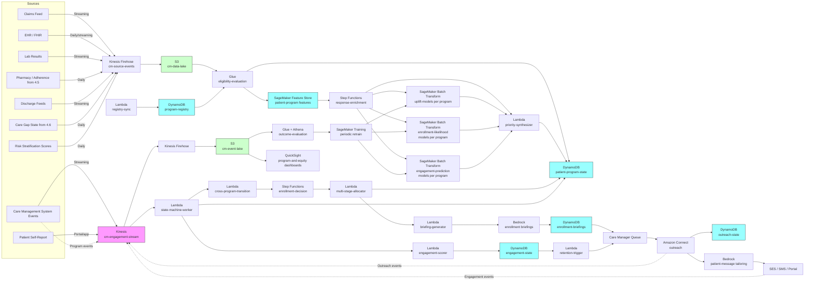

# Recipe 4.7 Architecture and Implementation: Care Management Program Enrollment

*Companion to [Recipe 4.7: Care Management Program Enrollment](chapter04.07-care-management-program-enrollment). This page covers the AWS architecture, services, prerequisites, and pseudocode. For the problem framing and the conceptual approach, start with the main recipe.*

---

## The AWS Implementation

### Why These Services

**Amazon SageMaker for the model training and serving stack.** Three model families per program: the per-program response (uplift) model, the per-program enrollment-likelihood model, and the per-program engagement-prediction model (predicting whether an enrolled patient will engage). With four to seven programs in the portfolio, the model count multiplies; SageMaker Pipelines (or Step Functions orchestration over SageMaker training jobs) handles the per-program retraining cadence. Inference uses Batch Transform on a weekly or monthly cadence aligned with enrollment cycles; same cost reasoning as 4.4, 4.5, 4.6 (batch is dramatically cheaper than idle real-time endpoints, and enrollment decisions don't run in real-time). SageMaker is HIPAA-eligible under BAA. <!-- TODO: confirm SageMaker Batch Transform's current HIPAA eligibility and the appropriate instance types for the model sizes implied here. -->

**Amazon SageMaker Feature Store for per-patient and per-(patient, program) features.** Patient-level features (clinical risk, engagement history, demographics, SDOH proxies) reused from earlier recipes. Per-(patient, program) features specific to this recipe: prior enrollment in the program, prior engagement during enrollment, prior disenrollment reason, time since last enrollment, cross-program coordination state. The offline store powers daily/weekly batch enrichment; the online store supports the lower-latency lookups used during outreach when a care manager pulls up a patient and the system surfaces the current recommendation context.

**Amazon DynamoDB for the program registry, eligibility records, recommendation log, patient program state, engagement state, and outreach state.** Same `patient-profile` table from prior recipes, extended with program-related attributes. New table `program-registry` keyed on `program_id` and `version`. New table `patient-program-state` keyed on (patient_id, program_id) for the per-(patient, program) state machine, with attributes: `state`, `state_history`, `eligibility_reason`, `priority`, `priority_components`, `current_enrollment_metadata`, `last_evaluation_date`. New table `outreach-state` for in-flight outreach attempts. New table `engagement-state` for in-program engagement scoring.

**Amazon S3 for the data lake, evaluation outputs, and longitudinal storage.** Source data feeds (claims, EHR, lab, pharmacy, discharge feeds, care management system events) land in S3 via Kinesis Firehose for streaming and Glue for batch. Offline feature store backed by S3. Eligibility evaluation outputs land in S3 per run. Per-program evaluation cohorts (treated and matched-control) land in S3 for outcome evaluation. Long-horizon engagement and outcome history accumulate for retraining.

**AWS Glue and Amazon Athena for eligibility evaluation, propensity matching, and outcome evaluation.** Eligibility is a SQL-shaped problem at scale, identical pattern to 4.6's gap evaluator. Glue jobs run nightly to evaluate every program in the registry against every eligible-population patient. Athena powers the per-program, per-cohort, per-clinician dashboards and the outcome-evaluation pipeline. Propensity matching for the difference-in-differences evaluator runs in Glue with logistic-regression or gradient-boosted propensity models, joining matched pairs into evaluation cohorts.

**AWS Step Functions for batch orchestration.** Same pattern as 4.5 and 4.6. The daily eligibility evaluation pipeline is a Step Functions workflow. The weekly/monthly enrollment-decision orchestration is a separate Step Functions workflow that runs the multi-stage allocation, persists recommendations, and triggers outreach generation. The post-enrollment monthly outcome-evaluation pipeline is a third Step Functions workflow.

**Amazon EventBridge for scheduling and event-driven triggers.** EventBridge schedules the daily eligibility run and the enrollment-decision run. EventBridge rules handle event-driven triggers: a discharge event triggers transitional-care eligibility evaluation for that patient outside the daily cycle (transitional care is time-sensitive); a clinical-deterioration event during enrollment triggers cross-program transition evaluation; a graduation event triggers post-graduation observation entry.

**Amazon Kinesis Data Streams for engagement, enrollment-state, and clinical events.** Same engagement-event bus from 4.1 through 4.6. New event types specific to this recipe: `program_recommended`, `program_outreach_initiated`, `program_outreach_attempted`, `program_consent_obtained`, `program_enrolled`, `program_engagement_event`, `program_at_risk`, `program_retention_attempted`, `program_disenrolled`, `program_graduated`, `program_re_eligible`, `cross_program_transition_recommended`. The state-machine worker consumes these and updates `patient-program-state`.

**Amazon Bedrock for care-manager-facing briefings, patient-facing enrollment messages, mid-program engagement summaries, and disenrollment-decision narratives.** Four distinct LLM use cases:

1. **Enrollment briefing for the care manager.** A structured-output prompt takes the patient's clinical context, the recommended program, the per-program uplift estimates with confidence intervals, recent clinical events, and the suspected barriers, and returns a one-paragraph briefing the care manager reads before initial outreach. Includes "what to lead with," "anticipated concerns," and "social context that matters."

2. **Patient-facing enrollment message tailoring.** Same pattern as 4.4 through 4.6: structured assignment in, tailored message out, validator before send. Care management enrollment messaging requires plan-sponsorship identification and program-specific consent language; the validator enforces both.

3. **Mid-program engagement summary for case rounds.** A weekly or monthly per-(patient, program) summary distilling structured engagement data (last contact, missed check-ins, recent clinical events, outstanding goals) into a paragraph for case-rounds discussion. Care managers triage from the summaries.

4. **Disenrollment-decision rationale.** When the deterministic policy recommends disenrollment, an LLM-generated rationale lists the engagement-history evidence, the policy-rule that triggered the recommendation, and any countervailing factors. The clinical lead reviews the rationale and makes the actual disenrollment call. The LLM is decision support for a human, not autonomous disenrollment.

Bedrock is HIPAA-eligible under BAA. Confirm in service terms that prompts and completions are not used to train the underlying foundation models. <!-- TODO: confirm current Bedrock service terms and the eligible-model list at the time of build. -->

**AWS Lambda for per-stage glue logic.** The eligibility evaluator dispatcher, the response-model invocation orchestrator, the priority synthesizer, the multi-stage allocation runner, the briefing-generation orchestrator, the state-machine worker, the engagement-scoring worker, the retention-trigger worker, the cross-program-transition recommender, and the post-graduation observation worker all run as Lambdas.

**Amazon Connect (or contracted outreach platform) for care-manager telephonic outreach.** Care management programs are predominantly telephonic and televisit. Plans with in-house care management teams often build on Amazon Connect; plans with vendor care management use the vendor's queue and a structured-event integration. The AWS-specific piece is HIPAA-eligible call recording, the contact-flow-to-engagement-event integration, and the per-care-manager work-queue routing that respects language, condition, and program-specialization match.

**Amazon SES for member-facing email and Pinpoint (or contracted vendor) for SMS.** Same as prior chapters; both under BAA. <!-- TODO: confirm SES HIPAA eligibility and BAA scope at the time of build; verify Pinpoint SMS eligibility. -->

**Amazon QuickSight for operations dashboards.** Per-program enrollment funnels (eligible -> recommended -> outreach -> consented -> enrolled -> engaged -> graduated). Per-cohort equity dashboards. Per-care-manager workload and outcome dashboards. Per-program ROI dashboards (cost-versus-value, with cohort breakdowns). Outcome-evaluation dashboards (per-program propensity-matched difference-in-differences, with cohort stratification). QuickSight on Athena, with row-level security for cohort-specific filters.

**AWS HealthLake (optional, for FHIR-based clinical data integration).** When the program needs fine-grained clinical data (problem list, observations, encounters, medications) for the response model and the program-fit score, HealthLake provides FHIR-native storage with built-in normalization. The lighter pattern is direct FHIR-to-S3 integration; HealthLake is the heavier pattern for plans operating across multiple EHR vendors. <!-- TODO: confirm AWS HealthLake's current pricing and HIPAA eligibility at the time of build. -->

**AWS KMS, CloudTrail, CloudWatch.** Same PHI infrastructure pattern as prior recipes. Customer-managed keys, CloudTrail data events on PHI tables, CloudWatch alarms on batch-run failures, eligibility-volume drift, enrollment-pipeline backups, and cohort-metric drift.

### Architecture Diagram




### Prerequisites

| Requirement | Details |
|-------------|---------|
| **AWS Services** | Amazon SageMaker (Training, Batch Transform, Feature Store, Pipelines), Amazon DynamoDB, Amazon S3, AWS Glue, Amazon Athena, AWS Step Functions, Amazon EventBridge, Amazon Kinesis Data Streams, Amazon Kinesis Data Firehose, AWS Lambda, Amazon Bedrock, Amazon Connect, Amazon SES, Amazon Pinpoint or contracted SMS provider, Amazon QuickSight, AWS HealthLake (optional), AWS KMS, Amazon CloudWatch, AWS CloudTrail. |
| **IAM Permissions** | Per-Lambda least-privilege: `sagemaker:CreateTransformJob` / `DescribeTransformJob` scoped to specific model ARNs; `dynamodb:GetItem` / `BatchWriteItem` / `UpdateItem` scoped to specific tables (especially `patient-program-state`, `engagement-state`, `outreach-state`); `bedrock:InvokeModel` on specific foundation-model ARNs; `s3:GetObject` / `PutObject` scoped to enrollment, eligibility, evaluation, and briefing buckets; `kinesis:PutRecord` on the cm-engagement-stream; `connect:*` scoped to the care-management contact flow; `ses:SendEmail` and `pinpoint:SendMessages` scoped to BAA-covered identities. Never `*`. <!-- TODO: pair these actions with one or two scoped Resource ARN examples. Same chapter-wide pattern flagged in 4.1 through 4.6 reviews. --> |
| **BAA** | AWS BAA signed. All services in the architecture must be HIPAA-eligible: SageMaker, DynamoDB, S3, Glue, Athena, Step Functions, EventBridge, Kinesis, Firehose, Lambda, Bedrock, Connect, SES, Pinpoint, KMS, HealthLake. <!-- TODO: confirm Bedrock + selected models, Pinpoint, Connect, and HealthLake eligibility at the time of build. --> |
| **Encryption** | DynamoDB: customer-managed KMS at rest (especially `patient-program-state`, `engagement-state`, and `enrollment-briefings`; the per-(patient, program) state plus engagement scoring is highly inferential PHI). S3: SSE-KMS with bucket-level keys. Kinesis and Firehose: server-side encryption. SageMaker training, Batch Transform, and Feature Store: VPC-only, with KMS keys for model artifacts and Feature Store offline storage. Lambda log groups KMS-encrypted. Briefing text stored in DynamoDB is PHI; the briefing contains diagnoses, social context, and clinical-trajectory framing. |
| **VPC** | Production: Lambdas in VPC. SageMaker training, Batch Transform, and Feature Store online store run in VPC. VPC endpoints for DynamoDB (gateway), S3 (gateway), Bedrock, Kinesis, Firehose, KMS, CloudWatch Logs, SageMaker Runtime, Step Functions (`states`), EventBridge (`events`), Glue, Athena, STS, SES, Pinpoint, Connect, HealthLake. NAT Gateway only for external services without VPC endpoints; restrict egress with security groups. EHR FHIR feeds typically arrive via PrivateLink, Direct Connect, or SFTP-over-VPN. Care management system integrations vary by vendor; PrivateLink or VPN preferred. VPC Flow Logs enabled. |
| **CloudTrail** | Enabled with data events on the `patient-program-state`, `program-registry`, `enrollment-briefings`, `outreach-state`, `engagement-state`, `recommendation-log`, and `patient-profile` tables. Data events on the S3 buckets containing source feeds, eligibility outputs, evaluation cohorts, and briefing outputs. |
| **Equity Governance** | Document priority synthesis weights, the multi-stage allocation policy, the equity floors per program, the per-cohort enrollment-rate parity targets, and the disenrollment-decision policy before launch. Cross-functional review committee (medical director, program leadership, equity lead, data science, operations, member-experience lead, legal/compliance) signs off on the policy and reviews quarterly. Disenrollment-for-cause decisions go through committee review on a monthly cadence; individual cases that affect protected populations get heightened review. The Obermeyer-style failure mode is the canonical concern; instrumentation and governance are how you avoid it. |
| **Sample Data** | A starter set of synthetic patients with realistic risk profiles, condition mixes, prior-year utilization, and SDOH features (Synthea provides good baseline data; augment with synthesized engagement and enrollment-history fields). A small program registry (3-5 programs covering disease-specific, complex-care, transitional, and polypharmacy archetypes). Synthetic engagement and outcome labels to support uplift-model training scaffolding. Synthetic care-management-system events. |
| **Cost Estimate** | At a 250,000-member health plan with ~18,000 eligible patients, ~5 programs, and ~1,400 active enrollment slots: SageMaker Batch Transform (3 model families × 5 programs, weekly): roughly $250-500/month at modest instance sizes. SageMaker Feature Store offline store: $100-200/month. SageMaker training (monthly retrain of 15 model artifacts): $200-400/month. DynamoDB on-demand: $300-700/month (the per-(patient, program) state and engagement-state tables are the largest). Lambda + Step Functions: $100-250/month. Bedrock for enrollment briefings (~1,400 active per month plus outreach attempts), patient-message tailoring (~2,000/month), engagement summaries (~5,000/month), disenrollment rationales (~200/month), Haiku-class: $1,500-3,500/month. SES + Pinpoint SMS: $50-150/month. Connect for in-house care management team (15-30 FTE depending on caseload): $1,500-4,500/month plus telephony. S3 + Glue + Athena: $400-800/month. QuickSight: $50/user/month authors plus reader fees. HealthLake (if used): $500-2,500/month. Estimated infrastructure total: $5,000-12,000/month for a regional plan, before staff time, telephony, and outsourced care management contracts (which dwarf the AWS line items). <!-- TODO: replace with verified, current pricing once the implementing team validates against the AWS Pricing Calculator. --> |

### Ingredients

| AWS Service | Role |
|------------|------|
| **Amazon SageMaker** | Hosts the per-program response (uplift), enrollment-likelihood, and engagement-prediction models; runs training and Batch Transform jobs |
| **Amazon SageMaker Feature Store** | Per-patient and per-(patient, program) features (eligibility, prior enrollment history, prior engagement history, SDOH proxies, cross-program coordination state) reused across this recipe and prior chapter recipes |
| **Amazon DynamoDB** | Stores program registry, per-(patient, program) state machine, recommendation log, outreach state, engagement state, enrollment briefings, and clinician/care-manager overrides |
| **Amazon S3** | Hosts the cm-data-lake, offline feature store, eligibility outputs, evaluation cohorts, briefings audit trail, training data, and engagement-event lake |
| **AWS Glue** | Daily eligibility evaluation against the program registry, propensity-matching for outcome evaluation, schedule import, outcome-evaluation jobs |
| **Amazon Athena** | SQL access to the data lake; powers per-program funnels, per-cohort dashboards, and outcome-evaluation queries |
| **AWS Step Functions** | Orchestrates the daily eligibility pipeline, the weekly/monthly enrollment-decision pipeline, the per-discharge transitional-care evaluation pipeline, and the monthly outcome-evaluation pipeline |
| **Amazon EventBridge** | Schedules batch runs; routes discharge, clinical-deterioration, graduation, disenrollment, and re-eligibility events |
| **Amazon Kinesis Data Streams** | Carries care-management engagement, outreach, clinical, and self-report events into the state-machine worker and engagement scorer |
| **Amazon Kinesis Data Firehose** | Lands engagement events into S3 Parquet for long-horizon evaluation and retraining |
| **AWS Lambda** | Runs the registry sync, eligibility dispatcher, response-model invocation orchestrator, priority synthesizer, multi-stage allocator, briefing generator, state-machine worker, engagement scorer, retention trigger, cross-program transition recommender, and outcome-evaluation orchestrator |
| **Amazon Bedrock** | Hosts the LLM for enrollment briefings, patient-facing enrollment messages, mid-program engagement summaries, and disenrollment-decision rationales |
| **Amazon Connect** | Care-manager telephonic outreach with HIPAA-eligible call recording, work-queue routing, and integration with the engagement event stream |
| **Amazon SES** | Bulk email delivery under BAA for patient-facing enrollment outreach |
| **Amazon Pinpoint** | SMS delivery for enrollment outreach and check-in reminders |
| **AWS HealthLake** | Optional FHIR-native data store when fine-grained clinical data is needed for response models and program-fit scoring |
| **Amazon QuickSight** | Operational dashboards: per-program funnels, per-cohort equity, per-care-manager workload and outcomes, per-program ROI, propensity-matched outcome evaluation |
| **AWS KMS** | Customer-managed encryption keys for all PHI-containing stores |
| **Amazon CloudWatch** | Operational metrics, cohort-sliced enrollment dashboards, alarms on enrollment volume drift and outcome-metric drift |
| **AWS CloudTrail** | Audit logging for all PHI-related API calls |

---

### Code

> **Reference implementations:** Useful aws-samples patterns for this recipe:
> - [`amazon-sagemaker-examples`](https://github.com/aws/amazon-sagemaker-examples): XGBoost and SageMaker Pipelines notebooks that mirror per-program model training and inference patterns.
> - [`amazon-sagemaker-feature-store-end-to-end-workshop`](https://github.com/aws-samples/amazon-sagemaker-feature-store-end-to-end-workshop): End-to-end Feature Store usage that maps onto the per-(patient, program) feature pipeline.
> - [`amazon-bedrock-workshop`](https://github.com/aws-samples/amazon-bedrock-workshop): Demonstrates structured-output prompting applicable to enrollment briefings, engagement summaries, and disenrollment-decision rationales.
> <!-- TODO: confirm the current names and locations of these aws-samples repos. -->

#### Walkthrough

**Step 1: Evaluate the program registry against patient data to produce per-(patient, program) eligibility records.** Eligibility runs nightly. For each program in the registry, evaluate denominator, inclusion, and exclusion predicates against the patient feature snapshot. Skip the registry abstraction and you end up hard-coding program logic, which becomes unmaintainable as the portfolio evolves.

```
FUNCTION evaluate_program_eligibility(patients, run_date):
    // Load every active program version. The registry is the source
    // of truth; engineering does not hard-code program logic. New
    // programs and capacity changes land as new registry versions.
    active_programs = DynamoDB.Query(
        "program-registry",
        filter = "effective_start <= :rd AND effective_end >= :rd",
        params = { :rd = run_date }
    )

    FOR each program in active_programs:
        // Step 1A: denominator. Determine which patients are eligible
        // for this program as of run_date. Denominator predicates use
        // condition flags, recent events, risk-score thresholds, and
        // continuous-enrollment criteria expressed in the registry's
        // predicate language.
        denominator = Athena.Query(
            program.denominator_query_template,
            params = { run_date: run_date,
                       lookback_start: run_date - program.denominator_lookback_days }
        )

        // Step 1B: inclusion criteria. Some programs have additional
        // inclusion logic on top of the denominator (e.g., HF program
        // requires not just an HF diagnosis but also at least one
        // HF-related encounter or admission in the last 6 months).
        inclusion_passing = Athena.Query(
            program.inclusion_query_template,
            params = { run_date: run_date,
                       denominator_population: denominator }
        )

        // Step 1C: exclusion criteria. Hospice election, active oncology
        // treatment, current enrollment in a competing program, prior
        // disenrollment for cause within the lookback, language not
        // supported by program staffing.
        excluded = Athena.Query(
            program.exclusion_query_template,
            params = { run_date: run_date }
        )

        // Step 1D: per-patient eligibility determination.
        FOR each patient_id in inclusion_passing:
            IF patient_id in excluded:
                eligibility = "excluded"
                exclusion_reason = lookup_exclusion_reason(patient_id, program, excluded)
            ELSE:
                eligibility = "eligible"
                exclusion_reason = null

            previous_record = DynamoDB.GetItem("patient-program-state",
                                                key = (patient_id, program.program_id))

            // State-machine semantics for eligibility transitions.
            IF previous_record.eligibility != eligibility:
                eligibility_event = "transitioned_" + previous_record.eligibility +
                                     "_to_" + eligibility
            ELSE:
                eligibility_event = "unchanged"

            DynamoDB.PutItem("patient-program-state", {
                patient_id:           patient_id,
                program_id:           program.program_id,
                program_version:      program.version,
                eligibility:          eligibility,
                exclusion_reason:     exclusion_reason,
                state:                derive_state(previous_record, eligibility),
                state_history:        previous_record.state_history.append({
                                          event: eligibility_event,
                                          timestamp: run_date,
                                          source: "eligibility_evaluation"
                                      }),
                last_evaluation_date: run_date,
                data_quality_flag:    assess_source_completeness(patient_id, program)
                    // values: 'complete', 'sparse_history',
                    // 'recent_plan_change', 'cross_provider_fragmentation'.
                    // Downstream consumers should gate on this when the
                    // data is unreliable, mirroring the pattern from 4.5
                    // and 4.6.
            })

        // Emit eligibility-change events for downstream consumers.
        // Time-sensitive eligibility changes (transitional care after
        // a discharge) trigger the per-discharge evaluation flow rather
        // than waiting for the next enrollment-decision cycle.
        FOR each newly_eligible_patient in newly_eligible(inclusion_passing,
                                                          program, run_date):
            Kinesis.PutRecord(stream = "cm-engagement-stream", record = {
                event_type:  "eligibility_acquired",
                patient_id:  newly_eligible_patient,
                program_id:  program.program_id,
                run_date:    run_date,
                time_sensitive: program.is_time_sensitive,
                timestamp:   current UTC timestamp
            })
```

**Step 2: Score per-program response (uplift), enrollment likelihood, and program-fit per (patient, program).** The response model predicts the conditional treatment effect; the enrollment-likelihood model predicts whether the patient will accept enrollment given outreach; the program-fit score combines hard-coded theory-of-change alignment with a learned component. Skip per-program modeling and you treat all programs as interchangeable, which is the trap of "highest risk first" enrollment that ignores program semantics.

```
FUNCTION enrich_eligible_candidates(eligibility_records, run_date):
    eligible = filter(eligibility_records, eligibility = "eligible")

    // Group by program_id so each program's models run on the relevant
    // subset; per-program models are different artifacts.
    eligible_by_program = group_by(eligible, "program_id")

    job_handles = []
    FOR each program_id, program_eligible in eligible_by_program:
        candidate_path = "s3://cm-enrichment/run_date=" + run_date +
                         "/program=" + program_id + "/candidates.parquet"
        write_parquet(program_eligible, candidate_path)

        // Stage A: per-program uplift (response) scoring. The model
        // takes patient features, recent clinical trajectory, prior
        // engagement signals, barrier flags, and SDOH features and
        // returns a per-patient predicted uplift estimate (the
        // expected change in the program's primary outcome from
        // enrollment, versus no enrollment), with a confidence
        // interval. Trained against propensity-matched historical
        // enrollment data, ideally augmented with randomized-enrollment
        // data when available.
        uplift_job = SageMaker.CreateTransformJob(
            transform_job_name = "uplift-" + program_id + "-" + run_date,
            model_name         = UPLIFT_MODEL_NAMES[program_id],
            transform_input    = candidate_path,
            transform_output   = "s3://cm-scores/run_date=" + run_date +
                                 "/uplift/" + program_id + "/",
            instance_type      = "ml.m5.large",
            instance_count     = 1
        )
        job_handles.append(uplift_job)

        // Stage B: enrollment-likelihood scoring. Per-program model
        // predicting probability the patient accepts enrollment given
        // outreach. Inputs include barrier flags from 4.5 (transportation,
        // language, cost-sensitivity), prior enrollment-attempt history,
        // recent engagement responsiveness, and care-team-relationship
        // signals.
        likelihood_job = SageMaker.CreateTransformJob(
            transform_job_name = "likelihood-" + program_id + "-" + run_date,
            model_name         = LIKELIHOOD_MODEL_NAMES[program_id],
            transform_input    = candidate_path,
            transform_output   = "s3://cm-scores/run_date=" + run_date +
                                 "/likelihood/" + program_id + "/",
            instance_type      = "ml.m5.large",
            instance_count     = 1
        )
        job_handles.append(likelihood_job)

        // Stage C: engagement-prediction scoring (post-enrollment).
        // Per-program model predicting probability the patient remains
        // engaged through program completion given enrollment. Used
        // both for priority synthesis and for setting expectations
        // during enrollment outreach.
        engagement_job = SageMaker.CreateTransformJob(
            transform_job_name = "engagement-" + program_id + "-" + run_date,
            model_name         = ENGAGEMENT_MODEL_NAMES[program_id],
            transform_input    = candidate_path,
            transform_output   = "s3://cm-scores/run_date=" + run_date +
                                 "/engagement/" + program_id + "/",
            instance_type      = "ml.m5.large",
            instance_count     = 1
        )
        job_handles.append(engagement_job)

    wait_for_jobs(job_handles)

    // Stage D: program-fit scoring. Combines a hard-coded
    // theory-of-change-alignment score with a learned component.
    // The hard-coded part encodes program semantics: a patient with
    // primary HF as the actionable problem has high HF-program fit;
    // a patient with multi-system complexity has high complex-care
    // fit; a recently-discharged patient has high transitional-care
    // fit during the post-discharge window.
    FOR each candidate in eligible:
        uplift = read_uplift_score(candidate, run_date)
            // { point_estimate, ci_low, ci_high }
        likelihood = read_likelihood_score(candidate, run_date)
        engagement = read_engagement_score(candidate, run_date)
        fit_score = compute_program_fit(candidate, candidate.program_id)
            // hard-coded + learned; values [0, 1]
            // examples of hard-coded rules:
            //   transitional_care: fit = 1.0 if discharge < 7 days,
            //                          0.7 if 7-14, 0.3 if 14-30, 0.0 if >30
            //   heart_failure_program: fit = 0.9 if HF is the primary
            //                              actionable problem;
            //                          0.4 if HF + 3+ other major
            //                              actionable problems (consider
            //                              complex-care instead)
            //   complex_care: fit ranges with multi-system score

        cohort_features = lookup_cohort_features(candidate.patient_id)

        // Priority synthesis. Policy weights live in versioned config:
        // {
        //   uplift:               0.45,  // dominant: this is the
        //                                  // counterfactual benefit
        //   enrollment_likelihood: 0.20,  // can't help if not enrolled
        //   program_fit:          0.20,  // matters for downstream
        //                                  // engagement and outcome
        //   post_enrollment_engagement: 0.15
        // }
        priority = (policy.weights.uplift              * normalize(uplift.point_estimate) +
                    policy.weights.enrollment_likelihood * likelihood +
                    policy.weights.program_fit         * fit_score +
                    policy.weights.post_enrollment_engagement * engagement)

        priority_components = {
            uplift_contrib:             policy.weights.uplift * normalize(uplift.point_estimate),
            uplift_uncertainty:         uplift.ci_high - uplift.ci_low,
            likelihood_contrib:         policy.weights.enrollment_likelihood * likelihood,
            fit_contrib:                policy.weights.program_fit * fit_score,
            engagement_contrib:         policy.weights.post_enrollment_engagement * engagement
        }

        DynamoDB.UpdateItem("patient-program-state",
            key = (candidate.patient_id, candidate.program_id),
            updates = {
                uplift_score:         uplift,
                enrollment_likelihood: likelihood,
                engagement_prediction: engagement,
                fit_score:            fit_score,
                priority:             priority,
                priority_components:  priority_components,
                cohort_features:      cohort_features,
                policy_version:       policy.policy_version,
                last_enrichment_date: run_date
            })

    RETURN read_enriched_candidates(eligible, run_date)
```


**Step 3: Multi-stage enrollment allocation with capacity, equity, and operational-feasibility constraints.** The orchestrator runs in stages so program semantics are respected: time-sensitive transitional-care first, disease-specific high-fit second, complex-care third, parallel add-ons fourth. Within each stage, allocation is greedy-by-priority subject to capacity and equity constraints. Skip the multi-stage structure and you produce allocations that ignore the most important property of care management: that programs are designed for specific theories of change.

```
FUNCTION allocate_enrollments(enriched_candidates, run_date, policy):
    // Per-program capacity counters from registry-stated capacity minus
    // current active enrollments.
    capacity_remaining = {}
    equity_remaining = {}
    FOR each program in policy.programs:
        active_enrollments = count_active_enrollments(program.program_id)
        capacity_remaining[program.program_id] = (program.target_active_capacity -
                                                   active_enrollments)
        equity_remaining[program.program_id] = {}
        FOR floor_cohort, floor_count in policy.equity_floors[program.program_id]:
            equity_remaining[program.program_id][floor_cohort] = floor_count

    // Per-patient single-active-primary-program counter. A patient is
    // not in two competing primary programs simultaneously, but parallel
    // add-ons (polypharmacy, behavioral-health) can stack on top of a
    // primary. The registry tags each program as 'primary' or 'add_on'.
    patient_primary_assigned = {}
    patient_add_on_count = {}

    allocated = []

    // Stage 1: time-sensitive programs (transitional care after
    // discharge). Time-sensitive programs are prioritized because a
    // delayed enrollment is a structurally weaker enrollment (the
    // first 7-14 days post-discharge are the highest-leverage window).
    time_sensitive_programs = filter(policy.programs, is_time_sensitive = true)
    stage1_candidates = filter(enriched_candidates,
                                program_id in time_sensitive_programs)
    stage1_sorted = sort stage1_candidates by priority DESC

    allocated += allocate_stage(stage1_sorted, capacity_remaining,
                                equity_remaining, patient_primary_assigned,
                                patient_add_on_count, policy,
                                stage_name = "time_sensitive")

    // Stage 2: disease-specific programs for patients with high
    // theory-of-change fit. The fit score is the gating filter:
    // a patient with HF among many other things has lower HF-program
    // fit and is held for stage 3 (complex-care).
    disease_programs = filter(policy.programs,
                               category = "disease_specific",
                               is_time_sensitive = false)
    stage2_candidates = filter(enriched_candidates,
                                program_id in disease_programs,
                                fit_score >= policy.disease_fit_threshold,
                                patient_id NOT IN patient_primary_assigned)
    stage2_sorted = sort stage2_candidates by priority DESC

    allocated += allocate_stage(stage2_sorted, capacity_remaining,
                                equity_remaining, patient_primary_assigned,
                                patient_add_on_count, policy,
                                stage_name = "disease_specific")

    // Stage 3: complex-care for residual high-uplift patients who
    // didn't fit a disease-specific program. These are the patients
    // whose problem profile is heterogeneous enough that complex-care
    // is the right fit.
    complex_programs = filter(policy.programs, category = "complex_care")
    stage3_candidates = filter(enriched_candidates,
                                program_id in complex_programs,
                                patient_id NOT IN patient_primary_assigned)
    stage3_sorted = sort stage3_candidates by priority DESC

    allocated += allocate_stage(stage3_sorted, capacity_remaining,
                                equity_remaining, patient_primary_assigned,
                                patient_add_on_count, policy,
                                stage_name = "complex_care")

    // Stage 4: parallel add-on programs (polypharmacy, behavioral-health
    // integration). Add-ons stack on top of a primary enrollment, with
    // a per-patient cap on total parallel programs (typically 1-2 at
    // most beyond the primary).
    add_on_programs = filter(policy.programs, category = "add_on")
    stage4_candidates = filter(enriched_candidates,
                                program_id in add_on_programs)
    stage4_sorted = sort stage4_candidates by priority DESC

    allocated += allocate_stage(stage4_sorted, capacity_remaining,
                                equity_remaining, patient_primary_assigned,
                                patient_add_on_count, policy,
                                stage_name = "add_on")

    // Persist recommendations and transition state machine to
    // 'recommended' for downstream outreach.
    FOR row in allocated:
        DynamoDB.UpdateItem("patient-program-state",
            key = (row.patient_id, row.program_id),
            updates = {
                state:                "recommended",
                state_history:        previous_state_history.append({
                                          event: "transitioned_eligible_to_recommended",
                                          timestamp: run_date,
                                          stage: row.stage_name,
                                          allocation_reason: row.allocation_reason
                                      }),
                recommended_run_date: run_date,
                allocation_reason:    row.allocation_reason,
                policy_version:       policy.policy_version
            })

        Kinesis.PutRecord(stream = "cm-engagement-stream", record = {
            event_type:        "program_recommended",
            patient_id:        row.patient_id,
            program_id:        row.program_id,
            stage:             row.stage_name,
            priority:          row.priority,
            priority_components: row.priority_components,
            allocation_reason: row.allocation_reason,
            cohort_features:   row.cohort_features,
            policy_version:    policy.policy_version,
            run_date:          run_date,
            timestamp:         current UTC timestamp
        })

    DynamoDB.BatchWriteItem("recommendation-log", allocated)
    RETURN allocated


FUNCTION allocate_stage(candidates_sorted, capacity_remaining,
                         equity_remaining, patient_primary_assigned,
                         patient_add_on_count, policy, stage_name):
    stage_allocated = []
    FOR candidate in candidates_sorted:
        program = lookup_program(candidate.program_id)

        // Capacity check.
        IF capacity_remaining[program.program_id] <= 0:
            CONTINUE

        // Per-patient primary-program constraint.
        IF program.category != "add_on" AND
           candidate.patient_id in patient_primary_assigned:
            CONTINUE

        // Per-patient add-on cap.
        IF program.category == "add_on" AND
           patient_add_on_count.get(candidate.patient_id, 0) >= policy.max_add_ons_per_patient:
            CONTINUE

        // Operational feasibility: language, geography, modality.
        IF NOT operational_feasible(candidate, program):
            CONTINUE

        // Cross-recipe coordination check (4.4 wellness, 4.5 adherence,
        // 4.6 care-gap). Some combinations should not be enrolled
        // simultaneously. The cross-recipe coordination policy lives
        // in shared chapter-level config.
        IF cross_recipe_conflicts(candidate, program):
            CONTINUE

        // Equity floor: if the candidate is in a floor cohort and there
        // is reserved capacity, prefer using floor capacity.
        cohort_features = candidate.cohort_features
        applicable_floors = applicable_floor_cohorts(cohort_features,
                                                      policy.equity_floors[program.program_id])
        used_floor = null
        FOR floor_cohort in applicable_floors:
            IF equity_remaining[program.program_id][floor_cohort] > 0:
                equity_remaining[program.program_id][floor_cohort] -= 1
                used_floor = floor_cohort
                BREAK

        // Allocate.
        capacity_remaining[program.program_id] -= 1
        IF program.category == "add_on":
            patient_add_on_count[candidate.patient_id] = (
                patient_add_on_count.get(candidate.patient_id, 0) + 1)
        ELSE:
            patient_primary_assigned[candidate.patient_id] = program.program_id

        stage_allocated.append({
            patient_id:        candidate.patient_id,
            program_id:        program.program_id,
            stage_name:        stage_name,
            priority:          candidate.priority,
            priority_components: candidate.priority_components,
            allocation_reason: reason_string(candidate, used_floor, stage_name),
            cohort_features:   cohort_features,
            uplift_estimate:   candidate.uplift_score
        })

    RETURN stage_allocated
```

**Step 4: Generate the care-manager enrollment briefing and dispatch outreach.** Once a recommendation is made, the care management team needs a readable briefing before the initial outreach call. The briefing distills the deterministic ranker's choice plus the patient's clinical and social context into a paragraph the care manager can read in 30 seconds. Skip the briefing and the care manager goes into the call cold, which produces lower enrollment-conversion and worse rapport on the calls that succeed.

```
FUNCTION dispatch_outreach(allocated_recommendations, run_date):
    FOR row in allocated_recommendations:
        // Build the structured briefing context. De-identify before
        // the LLM call; re-attach identifiers in the persisted briefing.
        briefing_context = {
            patient_summary:           build_clinical_summary(row.patient_id),
                // de-identified: condition list, recent trajectory,
                // key recent events, current medications, SDOH proxies
            program_id:                row.program_id,
            program_name:              lookup_program_name(row.program_id),
            program_theory_of_change:  lookup_program_theory_of_change(row.program_id),
            uplift_estimate:           row.uplift_estimate,
                // includes confidence interval; the briefing should
                // communicate uncertainty honestly
            enrollment_likelihood:     row.priority_components.likelihood_contrib,
            anticipated_barriers:      lookup_barriers(row.patient_id),
                // from 4.5: cost, language, transportation, beliefs
            recent_clinical_events:    lookup_recent_events(row.patient_id, days = 90),
            cross_program_context:     lookup_other_program_state(row.patient_id),
            allocation_reason:         row.allocation_reason
        }

        briefing = Bedrock.InvokeModel(
            model_id = ENROLLMENT_BRIEFING_MODEL_ID,
            body     = build_briefing_prompt(briefing_context, BRIEFING_OUTPUT_SCHEMA)
        )
        briefing_parsed = parse_json(briefing.completion)
            // { headline, lead_with, anticipated_concerns,
            //   social_context_that_matters, suggested_modality,
            //   suggested_outreach_window, confidence_notes }

        validate_briefing(briefing_parsed, observed_context = briefing_context)
            // <!-- TODO (TechWriter): Specify validate_briefing's
            // four-layer structure: (1) schema and length, (2) every
            // referenced clinical fact must appear in observed_context
            // (the LLM cannot hallucinate diagnoses or events), (3)
            // prohibited content (PHI not in source, prescriber names
            // other than the patient's, suggestions that override the
            // deterministic program assignment), (4) required notes
            // ("subject to clinical judgment", briefing is advisory,
            // patient consent required for enrollment). Failure
            // handling: replace with templated fallback that lists
            // the structured context without LLM narration; log for
            // prompt-engineering review. -->

        DynamoDB.PutItem("enrollment-briefings", {
            briefing_id:        build_briefing_id(row, run_date),
            patient_id:         row.patient_id,
            program_id:         row.program_id,
            briefing_text:      briefing_parsed,
            briefing_context:   briefing_context,
            allocation_reason:  row.allocation_reason,
            policy_version:     row.policy_version,
            generated_at:       run_date
        })

        // Route to care-management work queue. Routing respects
        // language, condition specialization, and per-care-manager
        // workload.
        cm_assignment = route_to_care_manager(row, lookup_cm_pool(row.program_id))

        DynamoDB.PutItem("outreach-state", {
            outreach_id:        new UUID,
            patient_id:         row.patient_id,
            program_id:         row.program_id,
            briefing_id:        build_briefing_id(row, run_date),
            assigned_to:        cm_assignment.cm_id,
            state:              "queued",
            attempts:           [],
            created_at:         run_date,
            policy_version:     row.policy_version
        })

        DynamoDB.UpdateItem("patient-program-state",
            key = (row.patient_id, row.program_id),
            updates = {
                state:                "outreach_in_progress",
                state_history:        previous_state_history.append({
                                          event: "transitioned_recommended_to_outreach",
                                          timestamp: run_date,
                                          assigned_to: cm_assignment.cm_id
                                      })
            })

        Kinesis.PutRecord(stream = "cm-engagement-stream", record = {
            event_type:    "program_outreach_initiated",
            patient_id:    row.patient_id,
            program_id:    row.program_id,
            assigned_to:   cm_assignment.cm_id,
            briefing_id:   build_briefing_id(row, run_date),
            timestamp:     current UTC timestamp
        })


FUNCTION record_outreach_attempt(outreach_id, attempt_result):
    // attempt_result is one of:
    //   { result: "consented", consent_form_id, baseline_assessment_id }
    //   { result: "declined", reason }
    //   { result: "unreachable", attempt_count, next_attempt_scheduled }
    //   { result: "deferred", reason, defer_until }
    //
    // <!-- TODO (TechWriter): Expert Review HIGH A1 (chapter-wide
    // pattern propagated unresolved through 4.4-4.7). Add a counter
    // decrement on the patient-profile attribute
    // cm_outreach_recent_30d_count for the terminal-unreachable,
    // declined, and deferred outcomes; otherwise the 4.7-specific
    // outreach budget accumulates phantom counter consumption that
    // silences the patient from future enrollment outreach for 30
    // days when the original outreach never reached the patient.
    // The pathology disproportionately affects cohorts with flaky
    // channels (transient housing, prepaid phones with intermittent
    // service, language-mismatch with assigned care manager) which
    // correlate with the cohorts the equity floors are trying to
    // protect. Coordinate the implementation with the parallel 4.4,
    // 4.5, 4.6 fixes; the chapter editor should land all four
    // together. The Python companion's record_outreach_attempt
    // unreachable-terminal branch already attempts the decrement but
    // currently fails (Code Review ERROR 2: missing :zero placeholder
    // and ExpressionAttributeNames=None); fix both at once. Also add
    // a stale-pending sweep Lambda (hourly): for outreach-state rows
    // where state == "queued" or state == "outreach_in_progress" and
    // created_at > 7 days ago with no engagement-event activity, mark
    // state = "stale_no_activity" and decrement the counter. -->
    outreach = DynamoDB.GetItem("outreach-state", outreach_id)
    outreach.attempts.append({
        attempt_at:  current UTC timestamp,
        result:      attempt_result.result,
        details:     attempt_result
    })

    BRANCH on attempt_result.result:
        CASE "consented":
            outreach.state = "consented"
            DynamoDB.UpdateItem("patient-program-state",
                key = (outreach.patient_id, outreach.program_id),
                updates = {
                    state: "enrolled",
                    state_history: previous_state_history.append({
                        event: "transitioned_outreach_to_enrolled",
                        timestamp: current UTC timestamp,
                        consent_form_id: attempt_result.consent_form_id
                    }),
                    enrollment_metadata: {
                        enrolled_at: current UTC timestamp,
                        consent_form_id: attempt_result.consent_form_id,
                        baseline_assessment_id: attempt_result.baseline_assessment_id,
                        target_duration: lookup_target_duration(outreach.program_id)
                    }
                })

        CASE "declined":
            outreach.state = "declined"
            DynamoDB.UpdateItem("patient-program-state",
                key = (outreach.patient_id, outreach.program_id),
                updates = {
                    state: "declined",
                    state_history: previous_state_history.append({
                        event: "transitioned_outreach_to_declined",
                        timestamp: current UTC timestamp,
                        decline_reason: attempt_result.reason
                    })
                })

        CASE "unreachable":
            outreach.state = "unreachable_pending_retry"
            IF attempt_result.attempt_count >= POLICY.max_outreach_attempts:
                outreach.state = "unreachable_terminal"
                DynamoDB.UpdateItem("patient-program-state",
                    key = (outreach.patient_id, outreach.program_id),
                    updates = {
                        state: "outreach_failed",
                        state_history: previous_state_history.append({
                            event: "transitioned_outreach_to_failed",
                            timestamp: current UTC timestamp,
                            attempts: attempt_result.attempt_count
                        })
                    })

        CASE "deferred":
            outreach.state = "deferred"
            DynamoDB.UpdateItem("patient-program-state",
                key = (outreach.patient_id, outreach.program_id),
                updates = {
                    state: "deferred",
                    deferred_until: attempt_result.defer_until,
                    state_history: previous_state_history.append({
                        event: "transitioned_outreach_to_deferred",
                        timestamp: current UTC timestamp,
                        defer_until: attempt_result.defer_until,
                        defer_reason: attempt_result.reason
                    })
                })

    DynamoDB.PutItem("outreach-state", outreach)

    Kinesis.PutRecord(stream = "cm-engagement-stream", record = {
        event_type:    "program_outreach_attempted",
        outreach_id:   outreach_id,
        patient_id:    outreach.patient_id,
        program_id:    outreach.program_id,
        result:        attempt_result.result,
        timestamp:     current UTC timestamp
    })
```

> **Curious how this looks in Python?** The pseudocode above covers the concepts. If you'd like to see sample Python code that demonstrates these patterns using boto3, check out the [Python Example](chapter04.07-python-example). It walks through each step with inline comments and notes on what you'd need to change for a real deployment.


**Step 5: Track in-program engagement and trigger retention when engagement declines.** Once a patient is enrolled, the engagement scorer runs against the program-specific engagement profile. Below threshold, the retention worker activates. Skip the engagement tracking and you discover at month three that the patient stopped engaging at month one and the program slot has been wasted.

```
FUNCTION score_engagement(patient_id, program_id, run_date):
    enrollment = DynamoDB.GetItem("patient-program-state",
                                   key = (patient_id, program_id)).enrollment_metadata
    program = lookup_program(program_id)

    // Pull the engagement profile for this (patient, program). Profiles
    // are program-specific: HF program profile is weekly check-in
    // attendance + weight-monitoring submission rate; complex-care
    // profile is monthly visit attendance + care-plan-goal progress;
    // polypharmacy profile is session attendance + prescriber-action
    // follow-through.
    profile = build_engagement_profile(patient_id, program_id, run_date)
        // {
        //   scheduled_contacts:           [...],
        //   completed_contacts:           [...],
        //   missed_contacts:              [...],
        //   self_reported_data_submissions: [...],
        //   education_modules_completed:  [...],
        //   recent_clinical_events:       [...]
        // }

    // Compute engagement score per program's scoring function.
    engagement_score = program.engagement_scoring_function(profile)
        // continuous, [0, 1]; 0 = no engagement, 1 = full engagement

    // Threshold check.
    threshold = program.at_risk_threshold
    is_at_risk = engagement_score < threshold

    // Classification of engagement decline (if at-risk):
    decline_pattern = null
    IF is_at_risk:
        decline_pattern = classify_decline(profile)
            // values:
            //   'no_initial_engagement': never engaged after enrollment
            //   'gradual_drop_off': engagement declined steadily
            //   'event_driven_drop': engagement dropped after specific event
            //                       (admission, life event, season change)
            //   'modality_mismatch': engagement low on assigned modality;
            //                        signal that a different modality might work
            //   'staffing_disruption': care-manager change, vacation, transition

    DynamoDB.UpdateItem("engagement-state",
        key = (patient_id, program_id),
        updates = {
            engagement_score:    engagement_score,
            engagement_profile:  profile,
            is_at_risk:          is_at_risk,
            decline_pattern:     decline_pattern,
            last_scored_at:      run_date
        })

    IF is_at_risk:
        Kinesis.PutRecord(stream = "cm-engagement-stream", record = {
            event_type:        "program_at_risk",
            patient_id:        patient_id,
            program_id:        program_id,
            engagement_score:  engagement_score,
            decline_pattern:   decline_pattern,
            timestamp:         current UTC timestamp
        })
        trigger_retention(patient_id, program_id, decline_pattern)


FUNCTION trigger_retention(patient_id, program_id, decline_pattern):
    // Retention strategies are program-specific and decline-pattern-specific.
    BRANCH on decline_pattern:
        CASE "no_initial_engagement":
            // The patient consented but never engaged after the first
            // outreach. Try once with a different care manager and a
            // different modality before giving up.
            schedule_retention_attempt(patient_id, program_id,
                strategy = "fresh_cm_different_modality",
                attempt_within_days = 7)

        CASE "gradual_drop_off":
            // Engagement is fading. A direct check-in conversation
            // about whether the program is still useful is the right
            // move; the conversation may surface barriers that can
            // be addressed.
            schedule_retention_attempt(patient_id, program_id,
                strategy = "engagement_check_in_conversation",
                attempt_within_days = 5)

        CASE "event_driven_drop":
            // Something happened (admission, family crisis, change in
            // condition). The retention attempt addresses the event,
            // not the engagement metric directly.
            schedule_retention_attempt(patient_id, program_id,
                strategy = "event_acknowledgment_and_recalibration",
                attempt_within_days = 3)

        CASE "modality_mismatch":
            // The patient consented to telephonic but isn't picking up;
            // try video, SMS-first, or in-person if available.
            schedule_retention_attempt(patient_id, program_id,
                strategy = "modality_switch",
                attempt_within_days = 7)

        CASE "staffing_disruption":
            // The disruption is on the program side. Address it
            // operationally rather than treating it as patient
            // disengagement.
            schedule_continuity_recovery(patient_id, program_id)


FUNCTION evaluate_disenrollment(patient_id, program_id, run_date):
    // Disenrollment decisions are run on a separate cadence (typically
    // weekly) for at-risk patients whose retention attempts have not
    // succeeded. The decision is decision-supported, not autonomous;
    // a human (clinical lead, program manager) makes the actual call.
    //
    // <!-- TODO (TechWriter): Expert Review HIGH A2. The
    // data_quality_flag is computed in Step 1, persisted to
    // patient-program-state, and named in Where It Struggles as a
    // signal that "downstream consumers (specifically the
    // disenrollment evaluator) should gate harder when quality is
    // low." The pseudocode below does not gate. For
    // cross_provider_fragmentation and multi_source_disagreement
    // patients, the engagement profile may appear worse than it
    // actually is because the patient is engaging through encounters
    // the recommender's data feed does not see; a
    // disenroll_for_no_engagement recommendation against fragmented
    // data has civil-rights implications when it concentrates in
    // protected cohorts (mobile populations, recent plan-changers,
    // patients seen across multiple practices). Add a
    // verify_engagement_first action that runs before
    // disenroll_for_no_engagement when state.data_quality_flag is in
    // {"cross_provider_fragmentation", "multi_source_disagreement"}.
    // Mirror the gating language at five additional sites: Step 2
    // response enrichment (widen uplift CI on non-complete cases),
    // Step 3 orchestrator (route fragmented-data patients through
    // verification-first allocation), Step 4 briefing
    // (data_quality_caveat in confidence_notes), Step 5 engagement
    // scoring (widen CI on the score; require multi-source
    // consistency for is_at_risk = true), and Step 6 cross-program
    // transition recommender (flag the recommendation with
    // data_quality_caveat). Same chapter-wide pattern as 4.5
    // Finding A2 and 4.6 Finding A2; the chapter editor should land
    // all three together. -->
    state = DynamoDB.GetItem("patient-program-state",
                              key = (patient_id, program_id))
    engagement = DynamoDB.GetItem("engagement-state",
                                   key = (patient_id, program_id))
    enrollment = state.enrollment_metadata

    days_since_enrollment = run_date - enrollment.enrolled_at.date
    days_since_last_engagement = run_date - last_engagement_date(engagement)

    // Decision policy. Earlier in the program, retention is preferred;
    // later, partial-credit graduation may be appropriate. For-cause
    // disenrollment is reserved for sustained no-engagement after
    // multiple retention attempts.
    IF engagement.is_at_risk AND
       count_failed_retention_attempts(patient_id, program_id) >= POLICY.max_retention_attempts AND
       days_since_last_engagement >= POLICY.disenroll_no_engagement_days:
        recommended_action = "disenroll_for_no_engagement"
    ELSE IF days_since_enrollment >= enrollment.target_duration:
        // Program duration met or exceeded.
        IF goals_substantially_met(patient_id, program_id):
            recommended_action = "graduate"
        ELSE IF engagement.is_at_risk:
            recommended_action = "disenroll_did_not_complete"
        ELSE:
            recommended_action = "extend_or_transition"
                // engaged but not yet meeting goals; consider extension
                // or cross-program transition to a maintenance pathway
    ELSE IF clinical_deterioration_detected(patient_id, program_id):
        // Patient deteriorated during enrollment beyond the program's
        // theory of change; consider transition to higher-acuity
        // program (e.g., disease-specific to complex-care).
        recommended_action = "transition_to_higher_acuity"
    ELSE:
        recommended_action = "continue"

    IF recommended_action != "continue":
        // Generate a decision-support rationale via LLM.
        rationale_context = {
            patient_summary:           build_clinical_summary(patient_id),
            program_id:                program_id,
            enrollment_metadata:       enrollment,
            engagement_history:        engagement.engagement_profile,
            recent_clinical_events:    lookup_recent_events(patient_id, days = 90),
            recommended_action:        recommended_action,
            policy_rule_triggered:     describe_triggering_rule(recommended_action,
                                                                   engagement,
                                                                   enrollment, run_date)
        }
        rationale = Bedrock.InvokeModel(
            model_id = DISENROLLMENT_RATIONALE_MODEL_ID,
            body     = build_rationale_prompt(rationale_context, RATIONALE_OUTPUT_SCHEMA)
        )
        rationale_parsed = parse_json(rationale.completion)
            // { headline, evidence_summary, countervailing_factors,
            //   policy_rule, suggested_human_review_questions }

        validate_rationale(rationale_parsed, observed_context = rationale_context)
            // <!-- TODO (TechWriter): Specify validate_rationale layers
            // mirroring the chapter-wide validator pattern. Failures
            // fall back to a templated rationale that lists the
            // policy-rule trigger and the engagement-history evidence
            // without LLM narration. -->

        DynamoDB.PutItem("disenrollment-decisions", {
            decision_id:           new UUID,
            patient_id:            patient_id,
            program_id:            program_id,
            recommended_action:    recommended_action,
            rationale:             rationale_parsed,
            rationale_context:     rationale_context,
            human_review_pending:  true,
            recommended_at:        run_date
        })

        Kinesis.PutRecord(stream = "cm-engagement-stream", record = {
            event_type:        "disenrollment_decision_recommended",
            patient_id:        patient_id,
            program_id:        program_id,
            recommended_action: recommended_action,
            timestamp:         current UTC timestamp
        })
```

**Step 6: Process the human disenrollment decision and handle cross-program transitions and post-graduation observation.** A clinical lead or program manager reviews the recommendation and decides; the system then transitions state and triggers downstream cross-program logic. Skip the post-graduation observation and you lose patients to relapse without any visibility, undermining the whole point of program graduation.

```
FUNCTION process_disenrollment_decision(decision_id, human_decision):
    // human_decision is one of:
    //   { decision: "approve", recommended_action }
    //   { decision: "override", actual_action, override_reason }
    decision = DynamoDB.GetItem("disenrollment-decisions", decision_id)
    final_action = (decision.recommended_action if human_decision.decision == "approve"
                                                  else human_decision.actual_action)

    BRANCH on final_action:
        CASE "graduate":
            DynamoDB.UpdateItem("patient-program-state",
                key = (decision.patient_id, decision.program_id),
                updates = {
                    state: "graduated",
                    state_history: previous_state_history.append({
                        event: "transitioned_enrolled_to_graduated",
                        timestamp: current UTC timestamp,
                        decision_id: decision_id
                    }),
                    graduation_metadata: {
                        graduated_at: current UTC timestamp,
                        post_graduation_observation_window:
                            POLICY.post_graduation_observation_days,
                        post_graduation_relapse_signals: []
                    }
                })
            // Trigger cross-program transition recommendation: the
            // graduate may benefit from a maintenance pathway (e.g., HF
            // graduate -> light-touch-monitoring) or a complementary
            // program (e.g., HF graduate with new diabetes signals ->
            // DM program).
            recommend_cross_program_transitions(decision.patient_id,
                                                  prior_program_id = decision.program_id,
                                                  context = "graduation")

        CASE "disenroll_for_no_engagement":
            DynamoDB.UpdateItem("patient-program-state",
                key = (decision.patient_id, decision.program_id),
                updates = {
                    state: "disenrolled_for_cause",
                    state_history: previous_state_history.append({
                        event: "transitioned_enrolled_to_disenrolled_for_cause",
                        timestamp: current UTC timestamp,
                        decision_id: decision_id
                    }),
                    disenrollment_metadata: {
                        disenrolled_at: current UTC timestamp,
                        reason: "no_engagement_after_retention",
                        re_eligibility_window_days: POLICY.re_eligibility_window_for_no_engagement
                    }
                })

        CASE "disenroll_did_not_complete":
            DynamoDB.UpdateItem("patient-program-state",
                key = (decision.patient_id, decision.program_id),
                updates = {
                    state: "disenrolled_incomplete",
                    state_history: previous_state_history.append({
                        event: "transitioned_enrolled_to_disenrolled_incomplete",
                        timestamp: current UTC timestamp,
                        decision_id: decision_id
                    })
                })

        CASE "transition_to_higher_acuity":
            // Mid-program escalation. Disenroll from current program
            // (with completed-portion noted) and immediately recommend
            // higher-acuity program enrollment.
            DynamoDB.UpdateItem("patient-program-state",
                key = (decision.patient_id, decision.program_id),
                updates = {
                    state: "transitioned_out",
                    state_history: previous_state_history.append({
                        event: "transitioned_enrolled_to_transitioned_out",
                        timestamp: current UTC timestamp,
                        decision_id: decision_id,
                        reason: "deterioration_during_enrollment"
                    })
                })
            recommend_cross_program_transitions(decision.patient_id,
                                                  prior_program_id = decision.program_id,
                                                  context = "deterioration")

        CASE "extend_or_transition":
            DynamoDB.UpdateItem("patient-program-state",
                key = (decision.patient_id, decision.program_id),
                updates = {
                    state: "enrolled_extended",
                    enrollment_metadata.target_duration:
                        enrollment_metadata.target_duration + POLICY.extension_days,
                    state_history: previous_state_history.append({
                        event: "extended",
                        timestamp: current UTC timestamp,
                        decision_id: decision_id
                    })
                })

    DynamoDB.UpdateItem("disenrollment-decisions",
        key = decision_id,
        updates = {
            human_review_pending: false,
            human_decision:       human_decision,
            final_action:         final_action,
            resolved_at:          current UTC timestamp
        })


FUNCTION post_graduation_observation(run_date):
    // Daily sweep of recently graduated patients within their
    // observation window. Watch for relapse signals (admission,
    // ED visit, abnormal lab, missed follow-up appointment, sharp
    // engagement drop on related ongoing programs).
    recently_graduated = DynamoDB.Query(
        "patient-program-state",
        filter = "state = :graduated AND graduation_metadata.graduated_at >= :cutoff",
        params = { :graduated: "graduated",
                   :cutoff: run_date - MAX_OBSERVATION_DAYS }
    )

    FOR each row in recently_graduated:
        relapse_signals = detect_relapse_signals(row.patient_id,
                                                   row.program_id,
                                                   row.graduation_metadata.graduated_at)
            // signals: admission, ED visit, abnormal lab,
            //          missed follow-up, adherence drop, weight gain
            //          (HF), sharp engagement drop on parallel programs

        IF len(relapse_signals) > 0:
            DynamoDB.UpdateItem("patient-program-state",
                key = (row.patient_id, row.program_id),
                updates = {
                    state: "in_observation_relapse_detected",
                    graduation_metadata.post_graduation_relapse_signals:
                        relapse_signals
                })

            // Re-eligibility evaluation runs immediately rather than
            // waiting for the next eligibility cycle. The patient may
            // be a candidate for re-enrollment, transition to a
            // higher-acuity program, or temporary watchful waiting.
            Kinesis.PutRecord(stream = "cm-engagement-stream", record = {
                event_type:        "post_graduation_relapse_detected",
                patient_id:        row.patient_id,
                prior_program_id:  row.program_id,
                relapse_signals:   relapse_signals,
                timestamp:         current UTC timestamp
            })


FUNCTION recommend_cross_program_transitions(patient_id, prior_program_id, context):
    // Evaluate the patient's current eligibility and uplift across all
    // programs. Identify candidate transitions and surface them to the
    // care management team for decisioning.
    current_eligibility = read_current_eligibility(patient_id)
    current_uplifts = read_current_uplifts(patient_id)
    candidates = []
    FOR each program_id, eligibility in current_eligibility:
        IF eligibility != "eligible":
            CONTINUE
        IF program_id == prior_program_id:
            CONTINUE
        priority = synthesize_priority(current_uplifts[program_id], context)
        candidates.append({
            program_id: program_id,
            priority:   priority,
            context:    context
        })
    candidates_sorted = sort candidates by priority DESC

    IF len(candidates_sorted) > 0:
        top_candidate = candidates_sorted[0]
        DynamoDB.PutItem("cross-program-transitions", {
            transition_id:       new UUID,
            patient_id:          patient_id,
            prior_program_id:    prior_program_id,
            recommended_program_id: top_candidate.program_id,
            context:             context,
            priority:            top_candidate.priority,
            recommended_at:      current UTC timestamp,
            human_review_pending: true
        })
        Kinesis.PutRecord(stream = "cm-engagement-stream", record = {
            event_type:               "cross_program_transition_recommended",
            patient_id:               patient_id,
            prior_program_id:         prior_program_id,
            recommended_program_id:   top_candidate.program_id,
            context:                  context,
            timestamp:                current UTC timestamp
        })
```

---

### Expected Results

**Sample patient program state record:**

```json
{
  "patient_id": "pat-002148",
  "program_id": "heart-failure-program",
  "program_version": "2026-v2",
  "eligibility": "eligible",
  "state": "enrolled",
  "state_history": [
    { "event": "transitioned_eligible_to_recommended", "timestamp": "2026-04-12", "stage": "disease_specific", "allocation_reason": "high_uplift_disease_fit" },
    { "event": "transitioned_recommended_to_outreach", "timestamp": "2026-04-15", "assigned_to": "cm-007" },
    { "event": "transitioned_outreach_to_enrolled", "timestamp": "2026-04-19", "consent_form_id": "consent-2026-04-19-pat-002148-hf" }
  ],
  "uplift_score": {
    "point_estimate": 0.18,
    "ci_low": 0.09,
    "ci_high": 0.27,
    "outcome": "90_day_readmission_probability_reduction"
  },
  "enrollment_likelihood": 0.62,
  "engagement_prediction": 0.71,
  "fit_score": 0.85,
  "priority": 0.62,
  "priority_components": {
    "uplift_contrib": 0.30,
    "uplift_uncertainty": 0.18,
    "likelihood_contrib": 0.12,
    "fit_contrib": 0.17,
    "engagement_contrib": 0.11
  },
  "enrollment_metadata": {
    "enrolled_at": "2026-04-19",
    "consent_form_id": "consent-2026-04-19-pat-002148-hf",
    "baseline_assessment_id": "baseline-2026-04-19-pat-002148-hf",
    "target_duration": 84
  },
  "cohort_features": {
    "engagement_history_quartile": "q3",
    "language": "en",
    "sdoh_cohort": "moderate_food_security",
    "age_band": "65-74"
  },
  "data_quality_flag": "complete",
  "policy_version": "cm-policy-v0.6"
}
```

**Sample care manager enrollment briefing:**

<!-- TODO (TechWriter): the briefing's social-context details (Medicare donut hole, grandchildren-care responsibilities, no home scale, Spanish-preferred written materials) are additive context not present in the opening vignette of Linda. Either fold the corresponding details into the vignette so the briefing reads as a faithful synthesis, or add a one-line note in The Problem section that the briefing in Expected Results includes care-management-relevant context surfaced from the patient profile beyond what the vignette establishes. Editor renamed Mr. Garcia to Linda for continuity (per expert review V2); the social-context reconciliation is the remaining piece. -->

```json
{
  "briefing_id": "brief-2026-04-15-pat-002148-hf",
  "patient_id": "pat-002148",
  "program_id": "heart-failure-program",
  "headline": "HF program candidate after recent decompensation; cost concerns likely; daughter is engaged.",
  "lead_with": "Linda was admitted in February for HF decompensation that started after she ran out of furosemide. The HF program's weekly check-ins and daily-weight monitoring directly address that pattern. Lead with the connection to keeping her out of the hospital, not with the program structure.",
  "anticipated_concerns": [
    "Cost of additional medications (she's a Medicare beneficiary in donut hole most of the year; LIS not enrolled).",
    "Concern about additional appointments competing with grandchildren-care responsibilities.",
    "Uncertainty about whether she can do daily weights reliably (no scale at home; the program covers a Bluetooth scale)."
  ],
  "social_context_that_matters": "Lives alone in a fourth-floor walkup with intermittent elevator. Daughter visits weekends and is documented as a willing care partner. Spanish is preferred for written materials; verbal communication in English is fine.",
  "suggested_modality": "telephonic for first contact; transition to video for week-three care-plan review when daughter can participate.",
  "suggested_outreach_window": "weekday mornings; she's typically home then.",
  "confidence_notes": "Uplift estimate has wide CI (0.09-0.27); the recommendation is to enroll, but expectations should be calibrated to a probabilistic improvement, not a guaranteed prevention.",
  "policy_version": "cm-policy-v0.6"
}
```

**Sample mid-program engagement record:**

```json
{
  "engagement_record_id": "eng-2026-05-10-pat-002148-hf",
  "patient_id": "pat-002148",
  "program_id": "heart-failure-program",
  "scoring_window": "2026-04-19_to_2026-05-10",
  "engagement_score": 0.78,
  "is_at_risk": false,
  "decline_pattern": null,
  "engagement_profile": {
    "scheduled_contacts": 4,
    "completed_contacts": 4,
    "missed_contacts": 0,
    "weight_submission_rate": 0.86,
    "education_modules_completed": 3,
    "recent_clinical_events": [
      { "event": "lab_BNP", "value": "412 pg/mL", "date": "2026-05-02", "trend": "down_from_baseline" }
    ]
  },
  "decision_support_summary": "Engagement is strong. BNP trending down. No retention action needed. Continue weekly check-ins; plan week-six medication-reconciliation visit on schedule."
}
```

**Sample quarterly outcome evaluation:**

```json
{
  "evaluation_id": "eval-2026Q1-heart-failure-program",
  "program_id": "heart-failure-program",
  "evaluation_window": "2025-10-01_to_2026-03-31",
  "method": "propensity_matched_difference_in_differences",
  "primary_outcome": "90_day_all_cause_readmission_rate",
  "ate": {
    "estimate": -0.064,
    "ci_95_low": -0.092,
    "ci_95_high": -0.036,
    "p_value": 0.0001,
    "interpretation": "Enrolled patients had a 90-day readmission rate ~6.4 percentage points lower than matched non-enrolled patients."
  },
  "ate_by_cohort": [
    { "cohort": "language=en", "estimate": -0.071, "ci_95_low": -0.103, "ci_95_high": -0.039 },
    { "cohort": "language=es", "estimate": -0.038, "ci_95_low": -0.082, "ci_95_high": 0.006 },
    { "cohort": "sdoh_cohort=transportation_barrier", "estimate": -0.024, "ci_95_low": -0.062, "ci_95_high": 0.014 }
  ],
  "secondary_outcomes": {
    "90_day_ed_visit_rate": { "estimate": -0.029, "ci_95": [-0.054, -0.004] },
    "180_day_total_cost_change": { "estimate": -1240, "ci_95": [-2110, -370], "currency": "USD" }
  },
  "uplift_calibration": {
    "predicted_uplift_quintiles": [0.04, 0.10, 0.16, 0.22, 0.31],
    "realized_uplift_quintiles": [0.02, 0.08, 0.15, 0.20, 0.27],
    "calibration_slope": 0.91,
    "interpretation": "Model is reasonably well-calibrated; mild over-estimation in higher quintiles."
  },
  "sample_size_treated": 412,
  "sample_size_control": 412,
  "program_cost": 740000,
  "value_of_avoided_admissions_180d": 1180000,
  "net_estimated_value": 440000,
  "roi_ratio": 1.59
}
```

**Performance benchmarks (illustrative, your mileage varies):**

| Metric | Risk-rank-only enrollment baseline | Recipe pipeline |
|--------|-----------------------------------|-----------------|
| Enrollment-conversion rate (recommended -> consented) | 25-40% | 45-60% |
| Per-program engagement rate at week 4 (enrolled patients still engaged) | 50-65% | 70-85% |
| Per-program graduation rate (enrolled patients reaching program completion) | 35-55% | 55-75% |
| Propensity-matched difference-in-differences in 90-day readmissions (HF program) | -1 to -3 pp | -4 to -8 pp |
| Per-cohort enrollment-rate parity (worst-served cohort vs. best-served) | 35-55% gap | 5-15% gap |
| End-to-end batch run time (250K members, 5 programs, weekly enrichment) | n/a | 3-5 hours |
| Care-manager outreach-to-enrollment conversion improvement | reference | +30 to +60% relative |
| Disenrollment-for-no-engagement rate | 15-25% | 6-12% |
| Cross-program transition recommendation acceptance rate | n/a | 60-80% |

<!-- TODO: the benchmarks above are illustrative ranges informed by published care management and HEDIS-program literature; replace with measured results from your deployment. Be wary of vendor-published numbers that report "X% reduction in admissions" without matched-control comparison and without confidence intervals. -->

**Where it struggles:**

- **Patients with sparse historical data.** A patient newly attributed to the practice or recently joined the plan has minimal prior engagement, prior enrollment, or prior outcome data. Cold-start cohort defaults are essential, and the recommender should weight patient-specific predictions less heavily for these patients until enough history accumulates. The `data_quality_flag` exposes this; downstream consumers (specifically the disenrollment evaluator) should gate harder when quality is low.
- **Programs with overlapping eligibility but conflicting theories of change.** A patient eligible for both heart-failure and complex-care programs can be a hard call: HF is the most actionable single condition, but the patient also has CKD, depression, and social complexity that complex-care addresses better. The fit-score logic forces a choice, but the choice is genuinely hard, and clinician override of the recommendation is appropriate often. Track override rate by (patient-profile, program-pair) to identify systematic miscalibration.
- **Recently graduated patients with relapse signals.** Post-graduation observation surfaces relapse signals, but the action is ambiguous: re-enroll the patient (capacity-cost), transition to a maintenance pathway (may not exist), or escalate to higher-acuity (consumes a complex-care slot). The system flags; the human decides; the failure mode is that the flag arrives but no slot is available.
- **Programs whose target outcomes are slow to materialize.** Diabetes management's primary outcome (A1c change) takes 3 to 6 months to read out; the response model trained on it has a long feedback loop. During the loop, the model is trained on stale data. Confidence intervals widen for slow-outcome programs; the orchestrator should apply additional uplift-uncertainty penalties for programs with delayed outcomes.
- **Cohort fairness in the response model.** If the historical enrollment data has systematically different engagement patterns by cohort (because the program structure historically didn't fit some cohorts), the response model encodes those patterns and predicts low uplift for cohorts the program could have served better with operational adjustments. Cohort-aware calibration and ongoing fairness monitoring are not nice-to-haves; they are how you avoid the Obermeyer failure mode at scale.
- **Program capacity that flexes during the year.** Care management staffing flexes (maternity leaves, vacations, hiring cycles, contract renegotiations). Capacity reductions can happen mid-cycle, leaving patients in the recommended state with no slot to enroll into. The orchestrator needs to handle capacity contraction gracefully rather than producing recommendations that operations cannot fulfill.
- **Cross-program coordination across vendor and in-house programs.** Plans often run a mix of in-house programs (Connect-based, internal staff) and vendor-delivered programs (third-party care management vendors). Cross-vendor visibility into engagement and outcomes can be poor, and the recommender's view of program state can diverge from the vendor's actual record. Contractual data-feed requirements are the durable fix.
- **Disenrollment-for-cause concentrated in protected cohorts.** If the disenrollment-for-no-engagement rate is materially higher in some cohorts than others, that disparity is a fairness concern and may have civil-rights implications. Equity instrumentation on disenrollment rates is required, and the disenrollment policy may need cohort-aware retention budget adjustments.
- **Operational fatigue from too many transition recommendations.** Cross-program transition recommendations after every graduation, every disenrollment, and every relapse signal can flood the care management team. Apply per-care-manager and per-program throttles; only the highest-priority transitions should reach the human review queue.

---

## Why This Isn't Production-Ready

The pseudocode and architecture above demonstrate the pattern. A production deployment needs to close several gaps that are intentionally out of scope for a recipe.

**Program-registry curation as an ongoing program.** Like the measure registry in 4.6, the program registry is a living artifact. New programs launch, old programs sunset, capacities change quarterly with staffing, contractual obligations evolve, and clinical evidence shifts what each program does. Plan for at least 0.25 to 0.5 FTE of program-leadership and clinical-informatics time on registry maintenance ongoing, plus a structured change-management process with parallel evaluation against the prior version when significant changes ship.

**Causal-inference rigor for response models.** Most plans have observational data only (selection-biased enrollment history). Training response models on observational data without causal-inference tooling (propensity matching at minimum, doubly-robust estimation when feasible, randomized evaluation cohorts when possible) produces uplift estimates that are systematically biased toward the patient profiles that historically got selected for enrollment. The downstream effect is a recommender that recommends what the historical selection process recommended, with extra steps. Plan for a data science investment in causal inference: skills, tooling (EconML, DoWhy, causaldata), and the operational willingness to randomize a fraction of enrollment slots for unbiased evaluation. Without this, the program drifts toward serving the cohorts the historical bias served.

<!-- TODO (TechWriter): Specify the SageMaker training-job trigger mechanism and model-promotion path for the response, enrollment-likelihood, and engagement-prediction models. With 3 model families × 5 programs = 15 model artifacts, the model registry and promotion automation matter more here than in earlier recipes. Mirror the EventBridge-trigger plus SageMaker-Model-Registry-with-canary-run pattern flagged in 4.4 through 4.6. -->

**Multi-source state-machine reconciliation.** The patient's program state lives in multiple systems: the recommender's `patient-program-state` table, the care management vendor's case-management system, the EHR's care-plan view, and the patient's portal. Drift across these is a chronic operational pain. Plan for tight integration with the case-management system (event-driven sync, not periodic batch reconciliation), explicit conflict-resolution rules when sources disagree, and periodic full-reconciliation runs that flag drift for human review.

**Outreach attempt management with humane defaults.** The pseudocode handles outreach-attempt counting and terminal-unreachable transitions, but a production system needs more nuance: rest periods between attempts, time-of-day modeling per patient, opt-out registry integration, suppression after specific patient signals (missed appointment plus declined first outreach is a stronger signal than two unanswered calls), and integration with TCPA and state telephone-consumer-protection rules. The outreach worker is the most patient-facing component; treat it accordingly.

**Patient consent, HIPAA authorization, and program-specific consent forms.** Care management enrollment requires multiple consent artifacts: HIPAA authorization for data sharing across program staff, program-specific informed consent describing what the patient is enrolling into, and (for some programs) consent for data sharing with external entities (community resources, social-work referrals). The consent capture and storage flow needs to be tightly designed and tightly audited; consent-form-version mismatches and missing consent are compliance issues that produce disenrollment-and-restart cycles.

<!-- TODO (TechWriter): Replace the string-concatenation tracking_id, briefing_id, decision_id with opaque, non-reversible identifiers (UUID or HMAC-SHA256 over the composite with a per-environment secret). Plain-text patient_ids embedded in identifiers carried in care-manager queues, EHR inboxes, and engagement events are PHI leakage. Mirror the language flagged in 4.4, 4.5, 4.6. Update Expected Results sample identifiers accordingly. -->

**Cross-recipe orchestration with Recipes 4.4, 4.5, and 4.6.** A patient who's a candidate for adherence intervention (4.5), care-gap closure (4.6), wellness program (4.4), and care management (4.7) gets too many touches if each recipe orchestrates independently. The shared `outreach_recent_total_30d_count` on the patient-profile table is the foundation; the cross-recipe coordination policy that decides which recipe wins when caps would be exceeded needs to be explicit, version-controlled, and committee-reviewed. For 4.7 specifically, care management enrollment outreach should typically *not* be capped against routine engagement messages from 4.4-4.6 because the enrollment conversation is a distinct, infrequent interaction; document the exception in the cross-recipe policy.

<!-- TODO (TechWriter): Add a paragraph specifying the cross-recipe priority arbitration for 4.7 specifically. Default proposal: 4.7 enrollment outreach has a separate contact budget from 4.4-4.6 routine outreach, with a hard cap on combined contacts within a rolling 30 days. The enrollment conversation is the highest-priority interaction in chapter 4 and should not be routinely deferred for adherence reminders. Document the cross-recipe arbitration in shared chapter-level config. -->

**Disenrollment governance and review.** Disenrollment-for-cause decisions have member-experience implications and may have civil-rights implications if they concentrate in protected populations. Build a monthly disenrollment-review cadence: a cross-functional committee reviews the prior month's disenrollment-for-cause cases, with cohort breakdowns, looking for patterns that suggest the policy is mis-targeting, the retention attempts are inadequate, or the program structure is unfit for some cohorts. Build the review cadence into the policy from day one, not as an afterthought.

<!-- TODO (TechWriter): Expert Review HIGH A3 (uniquely 4.7-specific).
The disenrollment-decisions and cross-program-transitions queues both
hold rows with human_review_pending: true and no SLA, no escalation,
no default action. Three pathologies follow: (a) patient remains
enrolled indefinitely while the disenrollment recommendation sits
unreviewed, consuming a slot another patient could use; (b) patient
is silently disenrolled when stale review eventually happens against
out-of-date engagement and clinical-event data; (c) clinical leads
with high case-load triage easy cases first, so complex cases (which
correlate with the cohorts the equity floors protect) sit longer in
the pending queue, producing disparate review-latency that the
disenrollment-rate equity dashboard does not catch. Add SLA-and-
escalation specification with per-action defaults that err toward
retention rather than disenrollment: 7-day review SLA for
disenroll_for_no_engagement (auto-defer 7 more days then
auto-default to extend_for_review with current data); 14-day review
SLA for disenroll_did_not_complete (auto-default to
graduate_with_partial_credit); 72-hour review SLA for
transition_to_higher_acuity (clinical-urgency driven; escalate to
medical director on miss); 14-day SLA for graduation transitions
(auto-expire); 7-day SLA for relapse transitions (escalate to
program manager on miss). Per-cohort review-latency monitoring goes
into the equity instrumentation alongside per-cohort disenrollment-
rate metrics; disparities in review latency are fairness signals
just like disparities in eventual outcome. Specify in the
architecture pattern; add the sweep_pending_decisions Lambda to
the pseudocode as a daily run. -->

**Equity floor design.** The equity floors implemented in Step 3 reserve capacity for cohorts with documented enrollment-rate disparities. Designing the floors well requires baseline cohort data (which you don't have until operating for some time), explicit policy on which disparities trigger floors, and willingness to revisit floors quarterly. The Obermeyer failure mode is the canonical concern: a recommender trained on historical data with under-represented cohorts will systematically under-enroll those cohorts unless the design explicitly compensates. Equity floors are one mechanism; cohort-aware retraining with reweighting is another; cohort-stratified outcome evaluation is the validation.

<!-- TODO (TechWriter): Add a paragraph on the SDOH-cohort PHI boundary. Cohort labels like "transportation_barrier" and "low_food_security" are PHI-equivalent and should follow the minimum-necessary principle. Engagement events should carry only the cohort axes the equity dashboard actually consumes, with narrower IAM scope than for general engagement data. Mirror the language flagged in 4.4 through 4.6. -->

**Privacy in program state and enrollment briefings.** The `patient-program-state` table joins (patient_id, program_id, state, uplift_score, priority_components) and is highly inferential. A row indicating "patient recommended for high-risk complex-care program" is more sensitive than a row indicating "patient eligible for wellness program." Apply tighter controls to program state for stigmatized or high-sensitivity programs (behavioral health, substance use, palliative care, HIV-related): narrower IAM read scopes, optional separate-table partitioning, additional CloudTrail data event capture, and a documented minimum-necessary access policy. Enrollment briefings stored in DynamoDB are PHI; the briefing text contains diagnoses, social context, and trajectory framing. Treat them with the same encryption, IAM, and audit posture as clinical notes.

**Idempotency and retry semantics.** Same pattern as 4.4 through 4.6. Each stage's outputs are addressed by deterministic keys (run_date, program_id, patient_id) and writes are conditional, so a Step Functions retry that re-attempts a completed step is a no-op rather than a duplicate. The Step Functions Catch should distinguish retryable infrastructure failures from terminal logic failures and route terminal failures to the DLQ.

<!-- TODO (TechWriter): Code Review ERROR 1 (chapter-wide pattern in
the Python companion files for 4.6 and 4.7). The pseudocode
state_history.append(...) semantics are correct, but the
straightforward DynamoDB translation is *not* "ADD state_history
:history_event" because the ADD action only supports Number and Set
data types, not List. The correct UpdateExpression is
"SET state_history = list_append(if_not_exists(state_history, :empty),
:history_event)" with :empty defined as []. Update the Python
companion (chapter04.07-python-example.md) for all ten state-
transition update_item call sites; propagate the same fix to 4.6's
Python example. Add a one-line note here in the recipe's
Idempotency paragraph (or in a dedicated DynamoDB-gotchas paragraph)
warning readers who copy the pseudocode pattern that the literal
"append to history list" idiom requires the list_append +
if_not_exists pattern, not ADD. -->

<!-- TODO (TechWriter): Specify DLQ coverage on all Lambda paths in the architecture. (a) Step Functions to Lambda pipeline: Catch on each Lambda task pointing to an SQS failure queue keyed on (run_date, stage, failure_reason); (b) Kinesis to state-machine-worker Lambda: configure an OnFailure destination on the event source mapping pointing to SQS or SNS, with a CloudWatch alarm on DLQ depth; (c) Batch Transform job failures: SageMaker doesn't surface failures via DLQ; wire the Step Functions Catch to handle TransformJob failed states explicitly. A silently-dropped state-transition event is operationally damaging in this recipe (a missed program_at_risk event delays retention; a missed program_enrolled event leaves the engagement scorer unarmed), so DLQ coverage matters substantively. Mirror the language from 4.4 through 4.6. -->

**Cost-per-enrollment and cost-per-prevented-event tracking.** The cost numbers in the prerequisites table are infrastructure only. Production reporting needs end-to-end cost (infrastructure + care-manager loaded hours + telephony + program-specific costs like Bluetooth scales for HF or pharmacist time for polypharmacy) divided by confirmed prevented events attributable to the program (above the matched-control baseline). That number compared to the value of prevented events (avoided admission cost, avoided ED visit cost, plan-quality-bonus value) determines whether the program returns its budget. The data engineering to track this end-to-end with attribution is its own project and is essential for program-level decisions about expansion or contraction.

**Annual and contractual reporting requirements.** CMS Medicare Advantage care management activities have specific reporting requirements (CCM and PCM CPT code documentation, care plan structure, time-tracking for billable activities). State Medicaid programs often have their own care management reporting structures. Value-based contracts have their own. Build the reporting layer into the system from the beginning; retrofitting reporting onto a system that wasn't designed for it is painful and produces compliance gaps.

**Patient-friendly enrollment visibility.** Patients should be able to see their own program enrollment status, upcoming activities, and progress in the patient portal, with explanations they can understand. "Your heart-failure care management program" is more useful than "HF-CMP-2026-v2." Patient-facing summaries are a separate UX project, with content review by health-literacy specialists, but the program state machine in this recipe is the source data. Plan for the patient-facing layer as a parallel deliverable.

**Care-manager workload modeling.** Care managers don't have uniform capacity: a complex-care manager handling 50 patients with multi-system disease has different bandwidth than a transitional-care nurse running 20 active 30-day episodes. The work-queue routing in Step 4 needs to model per-care-manager realistic loaded hours, not just headcount. Without this, the routing produces care-manager burnout, attrition, and a slow-moving operations problem that undermines the entire program. <!-- TODO: cite published care-management caseload-and-burnout literature; the ratios vary by acuity but the patterns are consistent. -->

**Member-experience and PROMs measurement.** Beyond clinical outcomes, care management programs should measure member experience (CG-CAHPS for the care management interaction specifically; not the overall plan CAHPS) and patient-reported outcome measures (PROMs) where available. Member experience is often the leading indicator that diverges from clinical outcome metrics; a program that improves admissions but produces low member experience is sustainable for a quarter and politically untenable thereafter.

---

## Variations and Extensions

**Real-time post-discharge transitional care enrollment.** Beyond the daily eligibility cycle, an EventBridge rule can fire on incoming discharge events and trigger immediate transitional-care eligibility evaluation, response scoring, and enrollment recommendation, with care-manager assignment within hours of discharge. The 30-day TCM window is time-sensitive; reducing the time-to-outreach from days to hours captures more of the high-leverage early window.

**Hospital-at-home and remote-monitoring program integration.** Plans increasingly offer hospital-at-home and high-acuity-at-home programs as alternatives to admission. The recommender can layer these into the program portfolio, with response models predicting which patients would benefit and which patients are operationally feasible (caregiver availability, home environment, technology comfort). The overall pattern is the same; the eligibility and response models are program-specific.

**Behavioral-health integration.** Behavioral-health needs intersect heavily with care management for chronic conditions; depression in the heart-failure population, anxiety in the diabetes population, substance-use comorbidity in the chronic-pain population. Adding a behavioral-health-integration pathway as an add-on program (the add_on category in the multi-stage allocator) catches these patients without requiring separate eligibility flow. The validator and consent framework matter more here because behavioral-health communications have additional regulatory requirements.

**SDOH-focused care management.** Some plans run dedicated SDOH-focused programs (housing instability, food insecurity, transportation, social isolation) staffed by community health workers and social workers. These have different denominators (less driven by clinical risk, more by SDOH-screening positives), different theories of change (resource navigation rather than clinical care), and different outcomes (housing stability, food-security improvement, social-connectedness improvement). The architecture extends naturally; the metrics extend less naturally and are worth their own evaluation pipeline.

**Dynamic enrollment-cycle cadence.** A monthly enrollment cycle is operationally simple but imposes a one-month wait for any patient who becomes eligible day-after-the-cycle. A more sophisticated approach: weekly cycles for non-time-sensitive programs, daily cycles for time-sensitive programs (transitional care, post-deterioration escalation), with capacity reservation logic that holds slots across cycles to prevent depletion in early-cycle weeks.

**Care-team coordination across provider organizations.** A patient who is enrolled in a plan-run heart-failure program but also followed by an ACO-run primary-care medical home and a specialty-cardiology practice is being managed by three different teams with three different views. Cross-organization care-coordination layers (often vendor-supplied or built on FHIR-based shared care plans) become the integration substrate; the recommender's program-state events flow into the shared care plan rather than living in isolation.

**Predictive disenrollment-prevention.** Beyond the at-risk threshold, a per-patient model can predict the probability of disengagement over the next 14 days, surfacing patients for retention attention before the threshold crosses. This is a separate model family with the engagement-decline event as the prediction target; trained on enrollment cohorts, validated against held-out enrollments. <!-- TODO: cite published literature on predictive disenrollment-prevention; the patterns are documented in some plan publications but the evidence base is mixed. -->

**Cross-recipe orchestration with Recipes 4.4, 4.5, 4.6.** A patient who's a candidate for adherence intervention (4.5), care management (4.7), care-gap closure (4.6), and a wellness program (4.4) gets too many independent recommendations if each recipe orchestrates alone. Cross-recipe orchestration: shared contact-frequency budget (Chapter 4-wide), shared priority arbitration when caps would be exceeded, per-patient orchestration that picks the right recipe for the right moment. For 4.7 specifically, care management enrollment outreach typically should not be capped against routine engagement messages because the enrollment conversation is a distinct, infrequent interaction; document the exception in the cross-recipe policy.

**Cohort-specific program variants.** Some patient cohorts benefit from cohort-specific program structures: Spanish-language disease-specific programs, programs adapted for low-health-literacy populations, programs with home-visit options for mobility-limited patients, programs with extended-hour staffing for working-age members who can't engage during business hours. Variants are added to the registry as separate programs with their own capacity; the multi-stage allocator handles them as siblings.

**Member-incentive integration.** Some plans offer member-facing incentives for care-management engagement (gift cards for completing baseline assessment, premium discounts for program graduation) within regulatory limits. The recommender can route incentive-eligible recommendations with a different message frame and track incentive uptake as an enrollment-conversion-lift signal. Beware: incentive programs can introduce unintended behavioral patterns and may complicate compliance reporting; legal review before launch.

**Cost-aware uplift optimization.** Beyond per-(patient, program) uplift, a more sophisticated allocator optimizes total expected value subject to total budget rather than per-program capacity. This requires per-program cost models (per-patient loaded cost varies by program and by patient acuity within program), per-program impact-in-dollars models, and an integer-programming formulation. Useful when the plan has flexibility to reallocate budget across programs in response to demand. Crosses into Chapter 14 (operations research) territory.

**Closure of the loop with provider performance.** Care management programs intersect with provider performance: a patient enrolled in a care management program because their PCP was missing the boat on heart-failure management is a pattern; a high-volume of patients in care management for the same provider is a signal. The recommender's outputs can feed provider-performance dashboards, with the appropriate caveats about confounding (sicker panels generate more care-management referrals).

---

## Additional Resources

**AWS Documentation:**
- [Amazon SageMaker Developer Guide](https://docs.aws.amazon.com/sagemaker/latest/dg/whatis.html)
- [Amazon SageMaker Batch Transform](https://docs.aws.amazon.com/sagemaker/latest/dg/batch-transform.html)
- [Amazon SageMaker Feature Store](https://docs.aws.amazon.com/sagemaker/latest/dg/feature-store.html)
- [Amazon SageMaker Model Registry](https://docs.aws.amazon.com/sagemaker/latest/dg/model-registry.html)
- [Amazon SageMaker Pipelines](https://docs.aws.amazon.com/sagemaker/latest/dg/pipelines.html)
- [AWS Step Functions Developer Guide](https://docs.aws.amazon.com/step-functions/latest/dg/welcome.html)
- [Amazon Bedrock User Guide](https://docs.aws.amazon.com/bedrock/latest/userguide/what-is-bedrock.html)
- [Amazon Bedrock structured output and function calling](https://docs.aws.amazon.com/bedrock/latest/userguide/inference-call-tools.html)
- [Amazon EventBridge Scheduler](https://docs.aws.amazon.com/scheduler/latest/UserGuide/what-is-scheduler.html)
- [Amazon Connect Administrator Guide](https://docs.aws.amazon.com/connect/latest/adminguide/what-is-amazon-connect.html)
- [AWS HealthLake Developer Guide](https://docs.aws.amazon.com/healthlake/latest/devguide/what-is-amazon-health-lake.html)
- [Amazon SES Developer Guide](https://docs.aws.amazon.com/ses/latest/dg/Welcome.html)
- [Amazon Pinpoint User Guide](https://docs.aws.amazon.com/pinpoint/latest/userguide/welcome.html)
- [Amazon QuickSight User Guide](https://docs.aws.amazon.com/quicksight/latest/user/welcome.html)
- [AWS HIPAA Eligible Services](https://aws.amazon.com/compliance/hipaa-eligible-services-reference/)
- [Architecting for HIPAA on AWS (Whitepaper)](https://docs.aws.amazon.com/whitepapers/latest/architecting-hipaa-security-and-compliance-on-aws/welcome.html)

**AWS Sample Repos:**
- [`amazon-sagemaker-examples`](https://github.com/aws/amazon-sagemaker-examples): Reference notebooks for XGBoost, Batch Transform, SageMaker Pipelines, and Model Registry workflows applicable to per-program model lifecycles
- [`amazon-sagemaker-feature-store-end-to-end-workshop`](https://github.com/aws-samples/amazon-sagemaker-feature-store-end-to-end-workshop): End-to-end Feature Store usage that maps to the per-(patient, program) feature pipeline
- [`amazon-bedrock-workshop`](https://github.com/aws-samples/amazon-bedrock-workshop): Hands-on labs covering structured-output prompting that informs enrollment briefings, engagement summaries, and disenrollment-decision rationales

<!-- TODO: confirm the current names and locations of the aws-samples repos above; aws-samples and aws-solutions-library-samples have been reorganizing. -->

**AWS Solutions and Blogs:**
- [AWS Solutions Library](https://aws.amazon.com/solutions/) (filter AI/ML and Healthcare): browse for healthcare personalization and population-health reference architectures
- [AWS Machine Learning Blog](https://aws.amazon.com/blogs/machine-learning/): search "SageMaker Pipelines," "Feature Store," and "uplift modeling" for relevant deep-dives
- [AWS for Industries Blog](https://aws.amazon.com/blogs/industries/) (Healthcare and Life Sciences): search "care management," "population health," and "value-based care" for end-to-end customer architectures

<!-- TODO: replace generic "search the blog" pointers with two or three specific, verified blog post URLs once they are confirmed to exist. Avoid any made-up URLs. -->

**External References (Conceptual and Methodological):**
- [`econml`](https://github.com/py-why/EconML): Microsoft Research's library for heterogeneous treatment effect estimation, the workhorse for per-(patient, program) uplift modeling
- [`DoWhy`](https://github.com/py-why/dowhy): causal-inference framework for structuring assumptions and running sensitivity analysis
- [`causaldata`](https://github.com/NickCH-K/causaldata): example datasets for causal-inference workflows useful in scaffolding response-model training pipelines
- [Obermeyer et al. 2019, Dissecting Racial Bias in an Algorithm Used to Manage the Health of Populations](https://www.science.org/doi/10.1126/science.aax2342): the canonical cautionary tale for response-modeling failures in care management; required reading
- [CMS Chronic Care Management (CCM) Services](https://www.cms.gov/medicare/medicare-fee-for-service-payment/physicianfeesched/chronic-care-management): Medicare fee-for-service CCM billing structure, including the 99490, 99491, 99437, 99439 CPT codes and documentation requirements <!-- TODO: confirm current CMS landing page; CMS reorganizes URLs frequently. -->
- [CMS Transitional Care Management (TCM) Services](https://www.cms.gov/files/document/mln908628-transitional-care-management-services.pdf): TCM CPT codes 99495 / 99496 and documentation requirements <!-- TODO: confirm the current published-document URL at the time of build. -->
- [NCQA Care Management Standards](https://www.ncqa.org/): NCQA's care-management accreditation standards, applicable for plans pursuing accreditation
- [Synthea](https://github.com/synthetichealth/synthea): synthetic patient data generator including realistic conditions, encounters, and procedures useful for non-PHI development of care management pipelines
- [Care Continuum Alliance Care Management Outcomes Standards](https://www.populationhealthalliance.org/): the population-health-alliance care-management outcome standards <!-- TODO: confirm the current URL at the time of build; the alliance has rebranded multiple times. -->

---

## Estimated Implementation Time

| Tier | Scope | Time |
|------|-------|------|
| Basic | Program registry with 2-3 high-volume programs + risk-stratification-based eligibility + observational uplift models per program + single-stage greedy allocator + manual outreach workflow + minimal cohort dashboard | 14-18 weeks |
| Production-ready | Full pipeline: 4-7 program registry + multi-source eligibility + per-program response, enrollment-likelihood, and engagement-prediction models with propensity-matched evaluation + multi-stage capacity-aware allocator + LLM-generated enrollment briefings + Connect-integrated outreach workflow + engagement-and-retention worker + disenrollment governance + cross-program transition logic + post-graduation observation + outcome-evaluation pipeline + cohort and equity dashboards + cross-recipe orchestration | 12-16 months |
| With variations | Add real-time post-discharge enrollment, hospital-at-home integration, behavioral-health pathway, SDOH-focused programs, randomized-evaluation cohort, predictive disenrollment-prevention, member-incentive integration, cost-aware uplift optimization, provider-performance feedback | 10-16 months beyond production-ready |

---


---

*← [Main Recipe 4.7](chapter04.07-care-management-program-enrollment) · [Python Example](chapter04.07-python-example) · [Chapter Preface](chapter04-preface)*
