# Recipe 4.8 Architecture and Implementation: Treatment Response Prediction

*Companion to [Recipe 4.8: Treatment Response Prediction](chapter04.08-treatment-response-prediction). This page covers the AWS architecture, services, prerequisites, and pseudocode. For the problem framing and the conceptual approach, start with the main recipe.*

---

## The AWS Implementation

### Why These Services

**Amazon SageMaker for the causal-modeling stack.** Three model families per treatment-comparator pair: the propensity score model, the outcome model, and the CATE estimator (typically run as an ensemble of two or more methods). With a treatment catalog of ten to thirty treatment-comparator pairs in scope, the model count multiplies; SageMaker Pipelines orchestrates the per-pair retraining workflow, and the SageMaker Model Registry holds versioned artifacts with the governance metadata (cohort version, training-cohort archive, calibration-test results, fairness-test results, medical-director sign-off). Inference runs through Batch Transform for the daily cohort scoring path and through a low-latency real-time endpoint for the point-of-care path when a clinician opens a patient chart and requests on-demand scoring. SageMaker is HIPAA-eligible under BAA. <!-- TODO: confirm SageMaker Real-Time Inference and Batch Transform HIPAA eligibility, and the appropriate instance types for the model sizes implied here. -->

**Amazon SageMaker Feature Store for patient features and treatment-history features.** Patient-level features (demographics, problem list, medication history, lab trajectories, vitals trajectories, comorbidity profile, SDOH proxies, prior treatment exposures, prior treatment responses) reused from earlier recipes and enriched with treatment-response-specific features (time since diagnosis for the index condition, prior medication-class exposures, prior discontinuation reasons, baseline disease severity). The offline store powers cohort construction and batch scoring; the online store supports the low-latency lookups when a clinician opens a chart at the point of care.

**Amazon DynamoDB for the treatment catalog, scoring results, decision records, and feedback events.** New table `treatment-catalog` keyed on `treatment_id` and `version`. New table `treatment-comparison-pairs` keyed on `(treatment_id, comparator_id)` and `version`, holding the modeling specification and the latest model registry pointer per pair. New table `scoring-results` keyed on `(patient_id, scoring_run_id)` for the structured scoring output that feeds the clinician view. New table `decision-records` keyed on `(patient_id, decision_id)` for the clinician's recorded decision and rationale, including the predictions presented at the time of decision (frozen for audit). New table `prediction-outcome-pairs` for the matched-outcome data feeding feedback and calibration monitoring. The `patient-profile` table from prior recipes is extended with treatment-response-relevant attributes.

**Amazon S3 for the data lake, training cohorts, evaluation outputs, and longitudinal storage.** Source data feeds (claims, EHR, lab, pharmacy, vitals, PROMs) land in S3 via Kinesis Firehose for streaming and Glue for batch. Offline feature store backed by S3. Cohort construction outputs land in S3 as Parquet, partitioned by treatment-comparator pair and version, and archived alongside the trained model artifacts so that any model can be reproduced. Per-treatment-comparator calibration plots, fairness reports, and sensitivity analyses live in S3 with the model artifacts.

**AWS Glue and Amazon Athena for cohort construction, propensity matching, and outcome evaluation.** Cohort construction is SQL-shaped at scale: the target-trial-protocol filters (eligibility, washout, exposure assignment, censoring) translate directly into SQL on the data lake. Glue jobs run the cohort construction nightly or weekly per treatment-comparator pair. Athena powers the per-cohort exploration, the calibration analyses, and the post-deployment outcome surveillance. Propensity matching for sensitivity analyses runs in Glue with logistic-regression or gradient-boosted propensity models and outputs the matched-pair datasets to S3.

**AWS Step Functions for batch orchestration.** Same pattern as 4.5 through 4.7. The nightly cohort-construction-and-feature-pipeline workflow is a Step Functions state machine. The weekly retraining-and-recalibration workflow is a separate state machine that runs the per-pair retraining, executes the calibration and fairness tests, gates on the governance review, and promotes new models in the registry. The monthly post-deployment surveillance workflow runs the prediction-to-outcome matching, the calibration drift detection, and the cohort-stratified performance monitoring.

**Amazon EventBridge for scheduling and event-driven triggers.** EventBridge schedules the nightly cohort run, the weekly retraining run, and the monthly surveillance run. EventBridge rules also handle event-driven triggers: a clinician opening an index-condition chart at the point of care triggers an on-demand scoring request; an adverse-event report triggers a surveillance check against recent predictions; a treatment-catalog update (new entry, tier change, supply constraint) triggers downstream re-evaluation of affected scoring outputs.

**Amazon Bedrock for clinician-facing comparison briefings, patient-facing summaries, and disagreement-investigation narratives.** Three distinct LLM use cases:

1. **Clinician-facing comparison briefing.** A structured-output prompt takes the per-treatment CATE estimates with confidence intervals, the cohort sizes and match quality, the OOD flags, the formulary statuses, the guideline references, and the patient summary, and returns a paragraph the clinician reads at the point of care. The validator strictly enforces no-recommendation language: the briefing describes the comparison without selecting a treatment.

2. **Patient-facing summary.** When the clinician chooses to share, a patient-facing summary translates the comparison into lay language. The patient version uses cohort-based phrasing ("among patients similar to you, treatment A was associated with a larger reduction in blood sugar than treatment B, with about this much uncertainty"), avoids probabilistic statements that may be misread as guarantees, and includes the explicit framing that the final decision is shared between the patient and the clinician. Reading-level matching applies the same pattern as Recipe 4.2.

3. **Disagreement-investigation narrative.** When the multiple CATE estimators disagree more than a defined threshold, an LLM-generated narrative lists the points of disagreement, the candidate explanations (model misspecification, unmeasured confounding, treatment-effect heterogeneity, data quality issues), and the recommended sensitivity-analysis follow-up for the clinical informatics team. This is internal-facing decision support for the modeling team, not patient-facing or clinician-facing.

Bedrock is HIPAA-eligible under BAA. Confirm in service terms that prompts and completions are not used to train the underlying foundation models. <!-- TODO: confirm current Bedrock service terms, the eligible-model list, and the data-handling guarantees at the time of build. -->

**AWS Lambda for per-stage glue logic.** The cohort-construction dispatcher, the propensity-score-invocation orchestrator, the CATE-estimator-ensemble runner, the uncertainty-quantification computer, the calibration-drift detector, the OOD-flag computer, the on-demand-scoring orchestrator, the briefing-generator, the validator, the decision-recorder, and the prediction-to-outcome matcher all run as Lambdas.

**Amazon API Gateway and Amazon Cognito for the on-demand scoring API.** The clinician-facing decision-support component is exposed as an authenticated API consumed by the EHR integration layer. API Gateway provides the endpoint, Cognito (or the institution's identity provider via SAML or OIDC) provides authentication, and per-clinician audit logs go to CloudTrail. The EHR integration is typically through a SMART on FHIR app or a CDS Hooks endpoint, both of which the API supports.

**Amazon Kinesis Data Streams for clinical events, scoring requests, decisions, and outcome updates.** Same engagement-event bus pattern as prior chapters, with new event types: `treatment_scoring_requested`, `treatment_scoring_completed`, `treatment_scoring_oodflag_triggered`, `treatment_decision_recorded`, `treatment_outcome_observed`, `prediction_calibration_alert`, `disagreement_alert`. The state-machine worker consumes these and updates the relevant DynamoDB tables.

**AWS HealthLake (recommended for this recipe).** Treatment response prediction benefits substantially from FHIR-native clinical data. The condition list, medication list, observation history, and procedure history feed directly into the phenotyping and outcome construction. HealthLake provides FHIR-native storage with built-in normalization across multiple EHR vendors, which matters here because the model's accuracy depends on consistent representation of clinical concepts across data sources. <!-- TODO: confirm AWS HealthLake's current pricing, HIPAA eligibility, and FHIR specification version support. -->

**Amazon QuickSight for governance and surveillance dashboards.** Per-treatment-comparator calibration dashboards (predicted versus observed treatment effects, with confidence intervals, stratified by cohort). Per-cohort fairness dashboards (calibration parity, estimate parity at equipoise, adverse-event parity). Post-deployment surveillance dashboards (prediction error trends over time, OOD-flag rates by cohort, override rates by clinician). Treatment-catalog governance dashboards (per-treatment usage, per-treatment outcome trends, model-version lineage). QuickSight on Athena, with row-level security for cohort-specific access.

**AWS KMS, CloudTrail, CloudWatch.** Same PHI infrastructure pattern as prior recipes, with elevated controls for the prediction artifacts. Customer-managed keys, CloudTrail data events on the prediction tables and the scoring API, CloudWatch alarms on calibration drift, OOD-flag rate spikes, and disagreement-alert rate spikes. Treatment recommendations are sensitive enough that the audit posture is closer to clinical-record audit than typical analytics audit.

### Architecture Diagram

```mermaid
flowchart LR
    subgraph Sources
      A1[Claims Feed]
      A2[EHR / FHIR via HealthLake]
      A3[Lab Results]
      A4[Pharmacy / Adherence from 4.5]
      A5[Vitals and PROMs]
      A6[Patient Registries]
      A7[Patient Self-Report]
    end

    A1 -->|Streaming| B1[Kinesis Firehose\ntrx-source-events]
    A2 -->|FHIR| HL1[AWS HealthLake]
    HL1 -->|Export| B1
    A3 -->|Streaming| B1
    A4 -->|Daily| B1
    A5 -->|Streaming| B1
    A6 -->|Daily| B1
    A7 -->|Portal/app| B1

    B1 --> S1[S3\ntrx-data-lake]

    PR1[Lambda\ncatalog-sync] --> D1[DynamoDB\ntreatment-catalog]
    D1 --> C1[Glue\ncohort-construction]
    S1 --> C1
    C1 --> S2[S3\ncohorts and labels]
    C1 --> F1[SageMaker Feature Store\npatient and treatment-history features]

    SF1[Step Functions\nweekly-retrain] --> H1[SageMaker Pipelines\nper treatment-comparator pair]
    F1 --> H1
    S2 --> H1
    H1 --> H2[SageMaker Training\npropensity model]
    H1 --> H3[SageMaker Training\noutcome model]
    H1 --> H4[SageMaker Training\nCATE ensemble]
    H2 --> MR1[SageMaker Model Registry]
    H3 --> MR1
    H4 --> MR1

    MR1 --> H5[Lambda\ncalibration and fairness tests]
    H5 --> S3[S3\nmodel evaluation reports]
    H5 --> GR1[Lambda\ngovernance gate]
    GR1 --> MR1
    GR1 --> D1

    AG1[API Gateway\nscoring API] --> AU1[Cognito or IdP]
    AU1 --> SC1[Lambda\nscoring orchestrator]
    SC1 --> F1
    SC1 --> D1
    SC1 --> H6[SageMaker Real-Time\nCATE inference]
    SC1 --> H7[SageMaker Batch Transform\ncohort retrieval]
    SC1 --> SR1[DynamoDB\nscoring-results]
    SR1 --> BR1[Lambda\nbriefing-generator]
    BR1 --> BD1[Bedrock\ncomparison briefing]
    BD1 --> VL1[Lambda\nvalidator]
    VL1 --> SR2[DynamoDB\nbriefings]
    SR2 --> EHR1[EHR via SMART on FHIR\nor CDS Hooks]

    EHR1 -.Decision recorded.-> DR1[DynamoDB\ndecision-records]
    EHR1 -.Decision event.-> KS1[Kinesis\ntrx-events]

    KS1 --> SM1[Lambda\nstate-machine-worker]
    SM1 --> DR1
    SM1 --> PO1[DynamoDB\nprediction-outcome-pairs]

    SF2[Step Functions\nmonthly-surveillance] --> SU1[Lambda\nprediction-outcome-matcher]
    SU1 --> PO1
    SU1 --> S4[S3\nsurveillance outputs]
    S4 --> CD1[Lambda\ncalibration-drift-detector]
    S4 --> FA1[Lambda\nfairness-monitor]
    CD1 --> AL1[CloudWatch alarms]
    FA1 --> AL1

    S4 --> QS1[QuickSight\ngovernance and surveillance dashboards]

    KS1 --> KF1[Kinesis Firehose]
    KF1 --> S5[S3\ntrx-event-lake]
    S5 --> QS1

    style F1 fill:#9ff,stroke:#333
    style D1 fill:#9ff,stroke:#333
    style SR1 fill:#9ff,stroke:#333
    style SR2 fill:#9ff,stroke:#333
    style DR1 fill:#9ff,stroke:#333
    style PO1 fill:#9ff,stroke:#333
    style S1 fill:#cfc,stroke:#333
    style S2 fill:#cfc,stroke:#333
    style S3 fill:#cfc,stroke:#333
    style S4 fill:#cfc,stroke:#333
    style S5 fill:#cfc,stroke:#333
    style KS1 fill:#f9f,stroke:#333
    style HL1 fill:#fc9,stroke:#333
    style MR1 fill:#fc9,stroke:#333
```



### Prerequisites

| Requirement | Details |
|-------------|---------|
| **AWS Services** | Amazon SageMaker (Training, Pipelines, Model Registry, Real-Time Inference, Batch Transform, Feature Store), Amazon DynamoDB, Amazon S3, AWS Glue, Amazon Athena, AWS Step Functions, Amazon EventBridge, Amazon Kinesis Data Streams, Amazon Kinesis Data Firehose, AWS Lambda, Amazon Bedrock, Amazon API Gateway, Amazon Cognito, Amazon QuickSight, AWS HealthLake, AWS KMS, Amazon CloudWatch, AWS CloudTrail. |
| **IAM Permissions** | Per-Lambda least-privilege: `sagemaker:CreateTransformJob` / `InvokeEndpoint` / `DescribeModelPackage` scoped to specific model and endpoint ARNs; `dynamodb:GetItem` / `BatchWriteItem` / `UpdateItem` scoped to specific tables (especially `scoring-results`, `decision-records`, `prediction-outcome-pairs`); `bedrock:InvokeModel` on specific foundation-model ARNs; `s3:GetObject` / `PutObject` scoped to cohort, model-evaluation, and surveillance buckets; `kinesis:PutRecord` on the trx-events stream; `healthlake:SearchWithGet` and related read actions scoped to the relevant data store; `apigateway:Invoke` for the scoring API. Never `*`. <!-- TODO: pair these actions with one or two scoped Resource ARN examples. Same chapter-wide pattern flagged in 4.1 through 4.7. --> |
| **BAA** | AWS BAA signed. All services in the architecture must be HIPAA-eligible: SageMaker, DynamoDB, S3, Glue, Athena, Step Functions, EventBridge, Kinesis, Firehose, Lambda, Bedrock, API Gateway, Cognito, QuickSight, HealthLake, KMS. <!-- TODO: confirm Bedrock + selected models, HealthLake, and any EHR-integration components at the time of build. --> |
| **Encryption** | DynamoDB: customer-managed KMS at rest (especially `scoring-results`, `decision-records`, and `prediction-outcome-pairs`; the joining of patient identifiers with predicted treatment outcomes is highly inferential PHI). S3: SSE-KMS with bucket-level keys. Kinesis and Firehose: server-side encryption. SageMaker training, Real-Time Inference, Batch Transform, and Feature Store: VPC-only, with KMS keys for model artifacts and Feature Store offline storage. HealthLake: KMS-encrypted at rest, TLS in transit. Lambda log groups KMS-encrypted. Briefing text stored in DynamoDB is PHI; treat with full clinical-record encryption posture. |
| **VPC** | Production: Lambdas in VPC. SageMaker training, inference, and Feature Store online store run in VPC. VPC endpoints for DynamoDB (gateway), S3 (gateway), Bedrock, Kinesis, Firehose, KMS, CloudWatch Logs, SageMaker Runtime, Step Functions, EventBridge, Glue, Athena, STS, HealthLake, API Gateway. NAT Gateway only for external services without VPC endpoints; restrict egress with security groups. EHR integration typically arrives via PrivateLink, Direct Connect, or the institution's existing private network. VPC Flow Logs enabled. |
| **CloudTrail** | Enabled with data events on the `treatment-catalog`, `scoring-results`, `decision-records`, `prediction-outcome-pairs`, and `briefings` tables. Data events on the S3 buckets containing source feeds, cohorts, model-evaluation reports, and surveillance outputs. Scoring API invocations logged at the API Gateway and Lambda layers. The audit posture for treatment-recommendation artifacts approaches clinical-record audit standards. |
| **Regulatory Governance** | Document the treatment catalog model-risk tier per treatment, the regulatory pathway (Cures Act CDS exemption versus FDA SaMD), the predetermined change control plan for model updates, the postmarket surveillance plan, the complaint-handling process, and the quality system documentation. Establish a cross-functional review committee (medical director, clinical informatics lead, pharmacy and therapeutics chair, equity lead, data science lead, regulatory and compliance lead, legal) that signs off on model promotion, reviews surveillance reports monthly, and reviews fairness reports quarterly. The Obermeyer-style failure mode is the canonical concern; for treatment recommendations specifically, biased predictions can directly cause inferior care, so the governance has to be rigorous from the beginning. <!-- TODO: confirm current FDA Clinical Decision Support guidance, the Cures Act CDS exemption criteria, and the Good Machine Learning Practice principles applicable at the time of build. --> |
| **Sample Data** | A starter set of synthetic patients with realistic condition profiles, lab trajectories, medication histories, and outcome timelines (Synthea provides good baseline data; augment with synthesized treatment-exposure and treatment-outcome events to simulate the cohort patterns the CATE models will be trained on). A small treatment catalog covering two to four treatment-comparator pairs with well-defined outcomes (T2D second-line therapy comparisons are a good starting use case because the outcomes are measurable and well-evidenced). |
| **Cost Estimate** | At a multi-specialty health system with ~500,000 active patients, ~10-30 treatment-comparator pairs in scope, and ~5,000 on-demand scoring requests per day: SageMaker Real-Time Inference (per-pair endpoints, multi-model endpoints to amortize): roughly $1,000-3,000/month. SageMaker Batch Transform for daily cohort-level predictions: $300-800/month. SageMaker Pipelines training (weekly retrain across the catalog): $500-1,500/month. SageMaker Feature Store: $200-500/month. DynamoDB on-demand: $400-1,200/month. Lambda + Step Functions: $200-600/month. Bedrock for briefings (~5,000/day clinician-facing, plus patient-facing summaries when shared, plus internal disagreement narratives), Sonnet-class for briefings and Haiku-class for routine summaries: $3,000-9,000/month. API Gateway + Cognito: $200-500/month. S3 + Glue + Athena: $800-2,000/month. QuickSight: $50/user/month authors plus reader fees. HealthLake: $1,500-5,000/month depending on data volume. Estimated infrastructure total: $8,000-25,000/month for a regional system, before staff time, EHR integration, and the (substantial) modeling-team and clinical-informatics costs that dominate this recipe. <!-- TODO: replace with verified, current pricing once the implementing team validates against the AWS Pricing Calculator. --> |

### Ingredients

| AWS Service | Role |
|------------|------|
| **Amazon SageMaker** | Hosts the per-treatment-comparator propensity, outcome, and CATE-ensemble models; runs training, batch, and real-time inference; manages model lifecycle through Pipelines and Model Registry |
| **Amazon SageMaker Feature Store** | Per-patient and per-treatment-history features that feed cohort construction, training, and inference; the offline store powers training and batch scoring; the online store powers point-of-care scoring |
| **Amazon DynamoDB** | Stores the treatment catalog, treatment-comparison-pair specifications, scoring results, decision records, prediction-outcome pairs, and clinician-facing briefings |
| **Amazon S3** | Hosts the trx-data-lake, the cohort-and-label store, the model-evaluation reports, the surveillance outputs, the briefings audit trail, and the long-horizon event lake |
| **AWS Glue** | Cohort construction implementing the target trial emulation per treatment-comparator pair; propensity matching for sensitivity analyses; outcome-evaluation jobs |
| **Amazon Athena** | SQL access to the data lake; powers per-cohort exploration, calibration analyses, and post-deployment outcome surveillance queries |
| **AWS Step Functions** | Orchestrates the nightly cohort-construction workflow, the weekly retraining-and-recalibration workflow, and the monthly post-deployment surveillance workflow |
| **Amazon EventBridge** | Schedules batch runs; routes point-of-care scoring requests, treatment-catalog updates, and adverse-event surveillance triggers |
| **Amazon Kinesis Data Streams** | Carries scoring requests, scoring completions, decision events, outcome events, calibration alerts, and disagreement alerts |
| **Amazon Kinesis Data Firehose** | Lands scoring and decision events into S3 Parquet for long-horizon analysis and retraining |
| **AWS Lambda** | Runs the catalog sync, cohort-construction dispatcher, governance gate, scoring orchestrator, briefing generator, validator, decision recorder, prediction-outcome matcher, calibration-drift detector, fairness monitor, and OOD-flag computer |
| **Amazon Bedrock** | Hosts the LLM for clinician-facing comparison briefings, patient-facing summaries, and internal disagreement-investigation narratives |
| **Amazon API Gateway** | Exposes the on-demand scoring API consumed by the EHR integration layer (SMART on FHIR or CDS Hooks) |
| **Amazon Cognito** | Authenticates clinician access to the scoring API; integrates with the institution's identity provider via SAML or OIDC |
| **AWS HealthLake** | FHIR-native clinical data store powering phenotyping, cohort construction, and feature engineering across multiple EHR vendors |
| **Amazon QuickSight** | Governance and surveillance dashboards: per-treatment-comparator calibration, per-cohort fairness, post-deployment surveillance, treatment-catalog governance |
| **AWS KMS** | Customer-managed encryption keys for all PHI-containing stores |
| **Amazon CloudWatch** | Operational metrics, calibration-drift alarms, OOD-flag-rate alarms, fairness-threshold alarms, alarms on prediction-volume drift |
| **AWS CloudTrail** | Audit logging for all PHI-related API calls and for every scoring API invocation |

---

### Code

> **Reference implementations:** Useful aws-samples and open-source patterns for this recipe:
> - [`amazon-sagemaker-examples`](https://github.com/aws/amazon-sagemaker-examples): SageMaker Pipelines, Model Registry, and Real-Time Inference patterns that mirror per-treatment-comparator model lifecycles.
> - [`amazon-sagemaker-feature-store-end-to-end-workshop`](https://github.com/aws-samples/amazon-sagemaker-feature-store-end-to-end-workshop): End-to-end Feature Store usage applicable to the per-patient and per-treatment-history feature pipelines.
> - [`amazon-bedrock-workshop`](https://github.com/aws-samples/amazon-bedrock-workshop): Demonstrates structured-output prompting applicable to clinician-facing comparison briefings.
> - [`EconML`](https://github.com/py-why/EconML): Microsoft Research's heterogeneous-treatment-effect estimation library, the methodological foundation for the CATE ensemble.
> - [`DoWhy`](https://github.com/py-why/dowhy): Causal-inference framework for structuring assumptions and running sensitivity analyses.
> <!-- TODO: confirm the current names and locations of the aws-samples repos. -->

#### Walkthrough

**Step 1: Construct the cohort and outcome labels per treatment-comparator pair using target trial emulation.** Cohort construction is the foundation of every downstream causal estimate. The target-trial protocol is specified explicitly: who is eligible, when the index date is, what the washout window excludes, what the treatment exposure is, what the comparator is, what the outcomes are with explicit timing, and what censoring rules apply. Skip the explicit protocol and you build a cohort with implicit decisions that bias the resulting estimates in ways nobody can audit.

```pseudocode
FUNCTION construct_cohort(treatment_pair, run_date):
    // Load the target-trial protocol from the treatment catalog. The
    // protocol is a structured spec with eligibility, washout,
    // exposure, comparator, outcome, follow-up, and censoring
    // definitions. The protocol is versioned; cohorts are tagged
    // with the protocol version so any cohort can be reproduced.
    protocol = DynamoDB.GetItem(
        "treatment-comparison-pairs",
        key = (treatment_pair.treatment_id, treatment_pair.comparator_id)
    ).protocol

    // Step 1A: identify candidate patients. The candidate population
    // is the patients with the index condition active at the index
    // date, who are also eligible for both the treatment and the
    // comparator (so the comparison is between actually-substitutable
    // options).
    candidates = Athena.Query(
        protocol.candidate_query,
        params = { :run_date = run_date }
    )

    // Step 1B: apply the washout window. Patients with relevant prior
    // exposures (the same treatment, the comparator, or other
    // confounding treatments) within the washout window are excluded.
    // The washout is specified per-pair because the relevant prior
    // exposures depend on what is being compared.
    eligible = Athena.Query(
        protocol.washout_query,
        params = { :run_date = run_date,
                   :washout_start = run_date - protocol.washout_days,
                   :candidates = candidates }
    )

    // Step 1C: assign treatment exposure. For each eligible patient,
    // determine which treatment arm they fall into based on what
    // they were actually prescribed at the index date. Patients who
    // received neither the treatment nor the comparator are excluded
    // from this pair's cohort (they may belong to another pair's
    // cohort).
    cohort_treated = Athena.Query(
        protocol.treated_assignment_query,
        params = { :eligible_population = eligible }
    )
    cohort_comparator = Athena.Query(
        protocol.comparator_assignment_query,
        params = { :eligible_population = eligible }
    )
    cohort = union(cohort_treated, cohort_comparator)

    // Step 1D: construct outcome labels. For each cohort member,
    // compute the outcome at the protocol-specified timing. Multiple
    // outcomes per cohort member are supported (primary, secondary,
    // safety). Censoring rules handle patients lost to follow-up,
    // patients who switched treatments mid-follow-up, and competing
    // events (death, plan disenrollment).
    cohort_with_outcomes = []
    FOR each member in cohort:
        outcomes = {}
        FOR each outcome_def in protocol.outcomes:
            outcome_value = compute_outcome(member, outcome_def, protocol)
                // returns { value, observed, censored_at, censor_reason }
            outcomes[outcome_def.outcome_id] = outcome_value

        cohort_with_outcomes.append({
            patient_id:        member.patient_id,
            treatment_arm:     member.treatment_arm,
            index_date:        member.index_date,
            covariates:        member.covariates,
                // patient features at index date; this is the conditioning
                // set for the CATE estimators
            outcomes:          outcomes,
            protocol_version:  protocol.version
        })

    // Step 1E: persist the cohort. Cohort artifacts are partitioned
    // by treatment-pair and protocol version, archived alongside the
    // model artifacts for reproducibility, and never overwritten
    // (each retraining run produces a new versioned cohort).
    cohort_path = "s3://trx-cohorts/pair=" + treatment_pair.pair_id +
                  "/protocol_version=" + protocol.version +
                  "/run_date=" + run_date + "/cohort.parquet"
    write_parquet(cohort_with_outcomes, cohort_path)

    // Persist cohort metadata for traceability.
    DynamoDB.PutItem("cohort-metadata", {
        cohort_id:         build_cohort_id(treatment_pair, protocol.version, run_date),
        treatment_pair:    treatment_pair.pair_id,
        protocol_version:  protocol.version,
        run_date:          run_date,
        cohort_path:       cohort_path,
        size_treated:      count_arm(cohort_with_outcomes, "treated"),
        size_comparator:   count_arm(cohort_with_outcomes, "comparator"),
        outcome_definitions: list_outcomes(protocol),
        feature_set_version: protocol.feature_set_version
    })

    Kinesis.PutRecord(stream = "trx-events", record = {
        event_type:     "cohort_constructed",
        cohort_id:      build_cohort_id(treatment_pair, protocol.version, run_date),
        treatment_pair: treatment_pair.pair_id,
        size_treated:   count_arm(cohort_with_outcomes, "treated"),
        size_comparator: count_arm(cohort_with_outcomes, "comparator"),
        timestamp:      current UTC timestamp
    })

    RETURN cohort_with_outcomes
```

**Step 2: Train the propensity, outcome, and CATE-ensemble models per treatment-comparator pair.** The propensity model estimates the probability of receiving each treatment given covariates; this anchors the doubly-robust methods. The outcome model estimates outcome given covariates and treatment; this feeds the meta-learners. The CATE ensemble runs at least two estimators from different method families (causal forest, DR-learner, BART, or equivalent) so that disagreement among them surfaces model misspecification. Skip the ensemble and you cannot tell whether your point estimate is robust or a methodological artifact.

```pseudocode
FUNCTION train_pair_models(cohort_id, run_date):
    cohort_metadata = DynamoDB.GetItem("cohort-metadata", cohort_id)
    cohort = read_parquet(cohort_metadata.cohort_path)
    treatment_pair = lookup_treatment_pair(cohort_metadata.treatment_pair)
    protocol = lookup_protocol(treatment_pair, cohort_metadata.protocol_version)

    // Stage A: propensity score model. Predicts P(treatment = treated |
    // covariates X). Trained on the full cohort with treatment_arm as
    // the binary label. Logistic regression with regularization is a
    // reasonable baseline; gradient-boosted trees often perform better
    // and are the practical default. Use cross-validation for
    // hyperparameter selection; check propensity-score overlap (the
    // distribution of propensity scores in the treated and comparator
    // arms should overlap substantially for the cohort to support
    // causal estimation).
    propensity_job = SageMaker.CreateTrainingJob(
        training_job_name = "propensity-" + treatment_pair.pair_id + "-" + run_date,
        algorithm         = "xgboost-with-isotonic-calibration",
        training_data     = cohort_metadata.cohort_path,
        target            = "treatment_arm_treated",
        feature_set       = protocol.feature_set_version,
        hyperparameters   = protocol.propensity_hyperparameters
    )
    propensity_model_arn = SageMaker.RegisterModel(propensity_job, "propensity")

    // Quick check: propensity overlap. If overlap is poor (many
    // treated patients have propensity > 0.95 or many comparator
    // patients have propensity < 0.05), the cohort does not support
    // reliable CATE estimation. Flag for governance review and
    // suspend further training for this pair until the cohort can
    // be re-scoped.
    overlap_check = assess_propensity_overlap(propensity_model_arn, cohort)
    IF overlap_check.severe:
        DynamoDB.UpdateItem("treatment-comparison-pairs",
            key = treatment_pair.pair_id,
            updates = {
                training_status: "suspended_propensity_overlap",
                last_overlap_check: overlap_check
            })
        Kinesis.PutRecord(stream = "trx-events", record = {
            event_type:     "training_suspended",
            cohort_id:      cohort_id,
            reason:         "propensity_overlap_severe",
            timestamp:      current UTC timestamp
        })
        RETURN { status: "suspended", reason: "propensity_overlap" }

    // Stage B: outcome model(s). Predicts E[Y | X, T] for each
    // outcome of interest. For the CATE ensemble that follows, we
    // train at least two specifications: a flexible regression (XGBoost
    // or random forest) and a simpler interpretable specification
    // (regularized linear) so that the CATE estimators can leverage
    // both. Trained on the full cohort with outcome as the label
    // and treatment as a feature.
    outcome_models = {}
    FOR each outcome_def in protocol.outcomes:
        outcome_job = SageMaker.CreateTrainingJob(
            training_job_name = "outcome-" + treatment_pair.pair_id +
                                 "-" + outcome_def.outcome_id + "-" + run_date,
            algorithm         = "xgboost-regression-or-classification",
            training_data     = cohort_metadata.cohort_path,
            target            = outcome_def.outcome_id,
            feature_set       = protocol.feature_set_version + "+treatment_arm",
            hyperparameters   = protocol.outcome_hyperparameters[outcome_def.outcome_id]
        )
        outcome_models[outcome_def.outcome_id] = SageMaker.RegisterModel(outcome_job, "outcome")

    // Stage C: CATE estimator ensemble. At least two methods from
    // different families. The Causal Forest provides built-in
    // confidence intervals and handles non-linear heterogeneity;
    // the DR-learner is doubly robust; BART (or equivalent Bayesian
    // method) provides posterior-based uncertainty.
    cate_estimators = []

    cf_job = SageMaker.CreateTrainingJob(
        training_job_name = "cate-cf-" + treatment_pair.pair_id + "-" + run_date,
        algorithm         = "causal-forest-econml",
            // BYOC container; econml CausalForestDML or grf-equivalent
        training_data     = cohort_metadata.cohort_path,
        propensity_model  = propensity_model_arn,
        outcome_model     = outcome_models["primary"],
        feature_set       = protocol.feature_set_version,
        hyperparameters   = protocol.cate_hyperparameters.causal_forest
    )
    cate_estimators.append(SageMaker.RegisterModel(cf_job, "cate_causal_forest"))

    dr_job = SageMaker.CreateTrainingJob(
        training_job_name = "cate-dr-" + treatment_pair.pair_id + "-" + run_date,
        algorithm         = "dr-learner-econml",
            // BYOC container; econml DRLearner
        training_data     = cohort_metadata.cohort_path,
        propensity_model  = propensity_model_arn,
        outcome_model     = outcome_models["primary"],
        feature_set       = protocol.feature_set_version,
        hyperparameters   = protocol.cate_hyperparameters.dr_learner
    )
    cate_estimators.append(SageMaker.RegisterModel(dr_job, "cate_dr_learner"))

    bart_job = SageMaker.CreateTrainingJob(
        training_job_name = "cate-bart-" + treatment_pair.pair_id + "-" + run_date,
        algorithm         = "bcf-bart",
            // BYOC container; bcf or bartCause R package via wrapper
        training_data     = cohort_metadata.cohort_path,
        feature_set       = protocol.feature_set_version,
        hyperparameters   = protocol.cate_hyperparameters.bart
    )
    cate_estimators.append(SageMaker.RegisterModel(bart_job, "cate_bart"))

    DynamoDB.UpdateItem("treatment-comparison-pairs",
        key = treatment_pair.pair_id,
        updates = {
            training_status:        "trained_pending_evaluation",
            propensity_model_arn:   propensity_model_arn,
            outcome_model_arns:     outcome_models,
            cate_estimator_arns:    cate_estimators,
            cohort_id:              cohort_id,
            run_date:               run_date
        })

    RETURN {
        status:               "trained_pending_evaluation",
        propensity_model_arn: propensity_model_arn,
        outcome_model_arns:   outcome_models,
        cate_estimator_arns:  cate_estimators
    }
```

**Step 3: Run the calibration and fairness tests, and gate model promotion through governance.** A trained model is not a production model. Calibration tests check that predicted treatment effects match observed effects in held-out cohorts and in subgroups. Fairness tests check that calibration is consistent across protected subpopulations. The governance gate is a human review of the test results before the new model artifacts are promoted to production. Skip this and you ship a model with unknown calibration on the populations it will most affect.

```pseudocode
FUNCTION evaluate_and_gate_pair_models(treatment_pair_id, run_date):
    pair = DynamoDB.GetItem("treatment-comparison-pairs", treatment_pair_id)
    cohort = read_parquet(lookup_cohort_path(pair.cohort_id))

    // Stage A: held-out calibration. The cohort is split into a
    // training set and a held-out test set (typically temporally,
    // so the test set is more recent than the training set). Train
    // on the training set, predict on the test set, and compare
    // predicted treatment effects to observed effects within
    // covariate-defined subgroups. The calibration plot per
    // estimator and per outcome is the primary evidence.
    calibration_results = {}
    FOR each estimator in pair.cate_estimator_arns:
        predicted_effects = SageMaker.BatchTransform(
            model_arn   = estimator.arn,
            input_path  = cohort.held_out_path,
            output_path = "s3://trx-eval/" + treatment_pair_id +
                          "/calibration/" + estimator.name + "/"
        )
        // Compute calibration in groups of similar predicted effect.
        // Within each group, the average predicted effect should be
        // close to the average observed effect.
        cal = compute_calibration_in_groups(predicted_effects, cohort.held_out)
        calibration_results[estimator.name] = cal
        IF cal.calibration_slope < 0.7 OR cal.calibration_slope > 1.3:
            calibration_results[estimator.name].calibration_warning = true

    // Stage B: cohort-stratified fairness. Repeat the calibration
    // within each protected cohort (defined by demographic and SDOH
    // axes from the treatment-catalog fairness specification).
    // Calibration parity across cohorts is the bar: the model should
    // be similarly accurate for each cohort.
    fairness_results = {}
    FOR each cohort_axis in CATALOG.fairness_axes[treatment_pair_id]:
        FOR each cohort_value in cohort_axis.values:
            cohort_subset = filter(cohort.held_out,
                                    cohort_features[cohort_axis.name] == cohort_value)
            IF len(cohort_subset) < MIN_FAIRNESS_SAMPLE_SIZE:
                fairness_results[(cohort_axis.name, cohort_value)] = {
                    status: "insufficient_sample"
                }
                CONTINUE
            cohort_predicted = predicted_effects.filter(
                patient_id IN cohort_subset.patient_ids)
            cohort_calibration = compute_calibration_in_groups(
                cohort_predicted, cohort_subset)
            fairness_results[(cohort_axis.name, cohort_value)] = cohort_calibration

    // Stage C: estimator agreement. The CATE estimators should
    // produce similar estimates on the same held-out patients.
    // Disagreement at the patient level is a signal of model
    // misspecification or unmeasured confounding.
    agreement_results = compute_estimator_agreement(
        pair.cate_estimator_arns, cohort.held_out)
        // returns per-patient correlation, percent-of-patients with
        // estimator-spread above threshold, and a global agreement
        // score per outcome

    // Stage D: sensitivity analysis. How strong would unmeasured
    // confounding need to be to overturn the conclusion? E-values
    // (VanderWeele and Ding) and Rosenbaum bounds are the standard
    // tools. The result is a structural-uncertainty bound that is
    // reported alongside the model's statistical confidence intervals.
    sensitivity_results = run_sensitivity_analyses(
        pair.cate_estimator_arns, cohort, protocol = lookup_protocol(pair))

    // Stage E: persist the evaluation report.
    eval_report = {
        treatment_pair_id:    treatment_pair_id,
        run_date:             run_date,
        calibration_results:  calibration_results,
        fairness_results:     fairness_results,
        agreement_results:    agreement_results,
        sensitivity_results:  sensitivity_results,
        evaluation_status:    classify_overall(calibration_results, fairness_results,
                                                 agreement_results, sensitivity_results)
            // values: 'green' (clear pass), 'yellow' (warnings, governance review
            // required), 'red' (clear fail, suspend)
    }
    write_json(eval_report,
               "s3://trx-eval/" + treatment_pair_id + "/run=" + run_date + "/report.json")

    // Stage F: governance gate. A human review committee evaluates
    // the report. The system creates a review task; the committee's
    // decision is recorded; only on approval are the new model
    // artifacts promoted to production.
    DynamoDB.PutItem("governance-review-tasks", {
        task_id:               new UUID,
        treatment_pair_id:     treatment_pair_id,
        run_date:              run_date,
        evaluation_report_path: "s3://trx-eval/" + treatment_pair_id +
                                 "/run=" + run_date + "/report.json",
        evaluation_status:     eval_report.evaluation_status,
        reviewer_assignments:  CATALOG.governance_reviewers[treatment_pair_id],
        status:                "pending_review",
        created_at:            run_date,
        sla_review_by:         run_date + GOVERNANCE.review_sla_days
    })

    Kinesis.PutRecord(stream = "trx-events", record = {
        event_type:           "governance_review_pending",
        treatment_pair_id:    treatment_pair_id,
        evaluation_status:    eval_report.evaluation_status,
        timestamp:            current UTC timestamp
    })

    // The governance review's decision is processed in a separate
    // Lambda triggered by a review-decision event; on approval, the
    // promotion logic moves the new artifacts to the production
    // alias in the model registry and the production pointers in
    // the treatment-comparison-pairs table. On rejection, the
    // training-status is set to evaluation-failed and the team
    // investigates.
    //
    // TODO (TechWriter): Expert review A2 (HIGH). The governance
    // review task carries an sla_review_by field but the pseudocode
    // does not specify the SLA-and-escalation pathway: per-tier SLAs
    // (14 days for tier-1, 28 days for tier-2 and above), 75% and
    // 100% notification escalation, default-deferral after first
    // SLA expiry, default-retirement after second SLA expiry (never
    // auto-promote), per-cohort review-latency monitoring as part
    // of equity instrumentation. Without this, model artifacts can
    // sit in pending_review indefinitely while drifted prior models
    // continue to serve. Reference Recipe 4.7 Finding A3 as the
    // sibling pattern. Add a sweep_pending_governance_tasks function
    // and document defaults in the architecture pattern.
```

> **Curious how this looks in Python?** The pseudocode above covers the concepts. If you'd like to see sample Python code that demonstrates these patterns using boto3, check out the [Python Example](chapter04.08-python-example). It walks through each step with inline comments and notes on what you'd need to change for a real deployment.

**Step 4: Score an index patient on demand at the point of care, retrieve the similar-patient cohort, and compute uncertainty.** When the clinician opens the patient's chart and requests treatment guidance, the system identifies eligible treatment-comparator pairs from the catalog, invokes each pair's CATE ensemble, retrieves the similar-patient cohort underlying the estimate, computes uncertainty across all sources, and flags out-of-distribution cases. Skip the OOD flag and the system silently extrapolates predictions to patients who are not represented in the training data, which is exactly the case where the prediction is least reliable.

```pseudocode
FUNCTION score_patient(patient_id, request_context):
    // request_context includes the requesting clinician, the
    // index condition, the visit context, and any clinician-supplied
    // constraints (formulary preference, contraindication overrides).
    patient_features = SageMaker.FeatureStore.GetRecord(
        feature_group_name = "patient-features-online",
        record_identifier  = patient_id
    )

    // Step 4A: identify eligible treatment-comparator pairs. The
    // treatment catalog determines which pairs are in scope for this
    // patient given the index condition, the patient's covariates,
    // and any contraindications. Pairs whose model is not in the
    // production state are excluded.
    eligible_pairs = []
    FOR each pair in CATALOG.list_pairs_for_condition(request_context.index_condition):
        IF NOT pair.is_production:
            CONTINUE
        IF NOT meets_pair_eligibility(patient_features, pair):
            CONTINUE
        IF has_contraindication(patient_features, pair):
            CONTINUE
        eligible_pairs.append(pair)

    IF len(eligible_pairs) == 0:
        // No eligible pairs. Return a structured response that tells
        // the clinician we have nothing to add for this patient. Do
        // not silently produce a low-confidence estimate.
        RETURN {
            patient_id:        patient_id,
            scoring_run_id:    new UUID,
            scoring_status:    "no_eligible_pairs",
            scoring_reason:    diagnose_no_eligibility(patient_features,
                                                       request_context.index_condition),
            timestamp:         current UTC timestamp
        }

    // Step 4B: per-pair scoring. For each eligible pair, invoke the
    // CATE ensemble (one inference per estimator), retrieve the
    // similar-patient cohort, compute uncertainty, and flag OOD.
    pair_results = []
    FOR each pair in eligible_pairs:
        // Run each estimator. The Real-Time endpoints return the
        // point estimate and the estimator-specific confidence interval.
        estimator_outputs = {}
        FOR each estimator in pair.cate_estimator_arns:
            estimator_response = SageMaker.InvokeEndpoint(
                endpoint_name = estimator.endpoint,
                input         = patient_features.serialize_for(estimator.feature_set)
            )
            estimator_outputs[estimator.name] = parse_json(estimator_response)
                // { point_estimate, ci_low, ci_high, internal_metadata }

        // Step 4C: ensemble uncertainty. Combine the per-estimator
        // estimates and CIs into ensemble uncertainty: the union of
        // the estimator CIs is the sampling-plus-model uncertainty.
        // Disagreement among estimators (the spread of point estimates)
        // is a structural-uncertainty signal.
        ensemble_estimate = combine_ensemble_estimates(estimator_outputs)
            // { point_estimate, ci_low, ci_high,
            //   estimator_agreement_score, disagreement_flag }

        // Step 4D: similar-patient cohort retrieval. The cohort
        // underlying this estimate is the patients in the training
        // cohort with covariates similar to the index patient. The
        // retrieval uses the patient embedding (or hand-engineered
        // similarity metric) defined per pair. The retrieved cohort
        // is summarized (size, demographic match, average observed
        // outcome by arm) rather than returned in full; full-cohort
        // retrieval would be PHI-leaking.
        cohort_summary = retrieve_similar_patient_summary(
            patient_features, pair, k = SIMILAR_PATIENT_K)
            // {
            //   total_size, treated_size, comparator_size,
            //   demographic_match_score, condition_match_score,
            //   average_treated_outcome, average_comparator_outcome,
            //   treated_outcome_distribution_summary,
            //   comparator_outcome_distribution_summary,
            //   training_data_recency
            // }

        // Step 4E: out-of-distribution flag. If the patient is not
        // well-represented in the training cohort (low density of
        // similar patients, propensity score in the tails, large
        // extrapolation distance from the training distribution),
        // flag the estimate as out-of-distribution. OOD-flagged
        // estimates are presented with explicit warnings or
        // suppressed depending on policy.
        ood_flag = compute_ood_flag(patient_features, pair, cohort_summary)
            // { is_ood, severity, reasons }
            //
            // TODO (TechWriter): Expert review A3 (HIGH). Specify
            // the OOD severity bands as policy in the pseudocode:
            // severity < 0.50 present normally with standard
            // uncertainty caveats; 0.50 <= severity < 0.85 present
            // with explicit OOD warning text; severity >= 0.85
            // suppress the pair (mark scoring_status =
            // "suppressed_oodflag", exclude from the briefing's
            // numeric comparison, render an "estimate suppressed"
            // line). Co-specify with the validator's
            // uncertainty-completeness layer in Step 5. Document
            // suppression as the chapter's most defensive
            // clinical-safety primitive; per-pair overrides allowed
            // in the catalog when clinically warranted.

        // Step 4F: sensitivity-analysis bounds. The pre-computed
        // sensitivity results from Step 3 bound how much unmeasured
        // confounding could change the conclusion. Apply them to
        // the index patient's estimate to widen the reported CI
        // appropriately.
        adjusted_estimate = apply_sensitivity_bounds(
            ensemble_estimate, pair.sensitivity_results)

        pair_results.append({
            treatment_pair_id:    pair.pair_id,
            treatment_id:         pair.treatment_id,
            comparator_id:        pair.comparator_id,
            outcome_id:           pair.primary_outcome_id,
            point_estimate:       adjusted_estimate.point_estimate,
            ci_low:               adjusted_estimate.ci_low,
            ci_high:              adjusted_estimate.ci_high,
            estimator_agreement:  ensemble_estimate.estimator_agreement_score,
            disagreement_flag:    ensemble_estimate.disagreement_flag,
            cohort_summary:       cohort_summary,
            ood_flag:             ood_flag,
            evidence_level:       pair.evidence_level,
            formulary_status:     pair.formulary_status,
            guideline_references: pair.guideline_references,
            calibration_status:   pair.production_calibration_status
        })

    // Step 4G: persist scoring result.
    scoring_run_id = new UUID
    scoring_result = {
        patient_id:           patient_id,
        scoring_run_id:       scoring_run_id,
        request_context:      request_context,
        index_condition:      request_context.index_condition,
        eligible_pairs:       [pair.pair_id FOR pair in eligible_pairs],
        pair_results:         pair_results,
        scoring_status:       "completed",
        scoring_completed_at: current UTC timestamp
    }
    DynamoDB.PutItem("scoring-results", scoring_result)

    Kinesis.PutRecord(stream = "trx-events", record = {
        event_type:        "treatment_scoring_completed",
        patient_id:        patient_id,
        scoring_run_id:    scoring_run_id,
        eligible_pair_count: len(eligible_pairs),
        any_ood_flag:      any(p.ood_flag.is_ood FOR p in pair_results),
        any_disagreement: any(p.disagreement_flag FOR p in pair_results),
        timestamp:         current UTC timestamp
    })

    RETURN scoring_result
```

**Step 5: Generate the clinician-facing comparison briefing with strict validator enforcement.** The structured scoring result is rendered into a paragraph the clinician reads at the point of care. The LLM packages the comparison; the validator enforces strict no-recommendation language, explicit uncertainty, and required caveats. Skip the validator and an LLM that has been trained on the broader internet may quietly insert recommendation language ("the evidence supports prescribing X") that the clinician interprets as the system selecting a treatment.

```pseudocode
FUNCTION generate_briefing(scoring_run_id):
    scoring = DynamoDB.GetItem("scoring-results", scoring_run_id)

    // Build the structured briefing context. Every fact in the
    // briefing must come from the scoring result; the LLM does not
    // introduce clinical claims not present in the structured data.
    briefing_context = {
        patient_summary:      build_clinical_summary(scoring.patient_id),
            // de-identified for the LLM call: condition, key labs,
            // current medications, key trajectory features
        index_condition:      scoring.index_condition,
        pair_results:         scoring.pair_results,
        request_context:      scoring.request_context,
        any_ood_flag:         any(p.ood_flag.is_ood FOR p in scoring.pair_results),
        any_disagreement:     any(p.disagreement_flag FOR p in scoring.pair_results),
        scoring_run_id:       scoring_run_id
    }

    briefing = Bedrock.InvokeModel(
        model_id = COMPARISON_BRIEFING_MODEL_ID,
        body     = build_briefing_prompt(briefing_context, BRIEFING_OUTPUT_SCHEMA)
    )
    briefing_parsed = parse_json(briefing.completion)
        // { headline, comparison_paragraph, per_treatment_summary,
        //   uncertainty_summary, caveats, suggested_clinician_review_points }

    // Validator. Strict enforcement of the no-recommendation rule
    // and the explicit-uncertainty rule. The validator is the
    // last line of defense before the briefing reaches the
    // clinician.
    validation_result = validate_briefing(briefing_parsed, observed_context = briefing_context)
        // Layers:
        // 1. Schema and length: required fields present, no oversize
        //    text, every required caveat present.
        // 2. Fact grounding: every clinical fact in the briefing
        //    must trace to a specific field in the scoring result;
        //    the LLM cannot introduce treatment effect estimates,
        //    cohort sizes, or outcome figures not in observed_context.
        // 3. Recommendation language: strict pattern matching for
        //    recommendation phrasing ("should prescribe", "is the
        //    best choice", "recommended treatment"); any matches
        //    cause the briefing to be regenerated with stricter
        //    guidance, and a third strike falls back to a templated
        //    comparison view without LLM narration.
        // 4. Uncertainty completeness: every estimate mentioned must
        //    be accompanied by its confidence interval and any
        //    OOD flags or disagreement flags must be surfaced
        //    explicitly in the briefing.
        // 5. Required caveats: explicit acknowledgment of
        //    observational-data limitations, the conditional-average
        //    nature of the estimates, and the clinician's role as
        //    decision-maker.
        // <!-- TODO (TechWriter): Expert review S3 (MEDIUM). document the four-layer validator
        // pattern in the same shared specification used for 4.5
        // through 4.7, and extend it with the recommendation-language
        // and uncertainty-completeness layers specific to 4.8.
        // Specify (a) eleven-plus aggressive recommendation-language
        // patterns; (b) a fact-grounding layer that requires every
        // numeric value cited to trace byte-for-byte to a field in
        // observed_context.pair_results; (c) an uncertainty-completeness
        // layer that requires CI alongside every cited point estimate
        // and explicit OOD/disagreement disclosure when those flags
        // fire; (d) required-caveats including the observational-data
        // and conditional-average framings. Specify failure-handling
        // progression: regenerate with feedback, regenerate strict-mode,
        // fall back to templated. Co-specify with the OOD-suppression
        // bands tagged as A3 in Step 4. -->

    IF NOT validation_result.passed:
        IF validation_result.failure_count < MAX_REGENERATION_ATTEMPTS:
            // Regenerate with stricter guidance.
            briefing_context.validator_feedback = validation_result.feedback
            briefing = Bedrock.InvokeModel(
                model_id = COMPARISON_BRIEFING_MODEL_ID,
                body     = build_briefing_prompt(briefing_context,
                                                  BRIEFING_OUTPUT_SCHEMA,
                                                  strict_mode = true)
            )
            briefing_parsed = parse_json(briefing.completion)
            validation_result = validate_briefing(briefing_parsed,
                                                    observed_context = briefing_context)

        IF NOT validation_result.passed:
            // Fall back to a templated briefing that lists the
            // structured comparison without LLM narration. The
            // templated briefing is deterministic and always
            // passes validation; it is less readable but never
            // crosses into recommendation territory.
            briefing_parsed = render_templated_briefing(briefing_context)
            briefing_parsed.fallback_reason = validation_result.failure_summary

            Kinesis.PutRecord(stream = "trx-events", record = {
                event_type:        "briefing_validator_fallback",
                scoring_run_id:    scoring_run_id,
                reason:            validation_result.failure_summary,
                timestamp:         current UTC timestamp
            })

    DynamoDB.PutItem("briefings", {
        briefing_id:       new UUID,
        scoring_run_id:    scoring_run_id,
        patient_id:        scoring.patient_id,
        briefing_text:     briefing_parsed,
        briefing_context:  briefing_context,
        validator_status:  validation_result.passed,
        generated_at:      current UTC timestamp,
        ttl:               compute_ttl(scoring.request_context)
            // Briefings have a TTL: a briefing generated for a Tuesday
            // visit should not be presented unchanged at a Friday
            // visit. The clinician interface re-generates if the
            // briefing is stale.
    })

    RETURN briefing_parsed
```

**Step 6: Capture the clinician's decision and the patient's subsequent outcome, and feed the matched pair back into surveillance and retraining.** The decision record links the prediction at the time of decision to the actual treatment chosen and (later) the actual outcome. The matched prediction-outcome pair is the feedback that drives calibration drift detection, cohort-stratified performance monitoring, adverse-event surveillance, and retraining triggers. Skip this and you have a prediction system with no feedback loop, which is the single most common reason production ML systems quietly degrade over time.

```pseudocode
FUNCTION record_decision(scoring_run_id, decision_payload):
    // decision_payload includes:
    //   - clinician_id (from the authenticated session)
    //   - chosen_treatment_id (or 'none' if no treatment selected)
    //   - clinician_rationale (free-text or structured)
    //   - patient_consent_recorded (boolean)
    //   - shared_decision_indicators (whether the patient summary
    //     was shared with the patient; whether the patient's
    //     stated preference influenced the decision)
    scoring = DynamoDB.GetItem("scoring-results", scoring_run_id)
    briefing = lookup_latest_briefing(scoring_run_id)

    // TODO (TechWriter): Expert review S1 (HIGH). Add patient-
    // identity-boundary checks immediately after the scoring
    // lookup: validate the calling clinician has a treatment
    // relationship to scoring.patient_id, validate that
    // decision_payload.chosen_treatment_id is in the scoring run's
    // eligible_pairs (the clinician cannot record a decision for
    // a treatment the model did not score), and validate
    // decision_payload.scoring_run_id matches scoring_run_id when
    // both are present. Emit decision_authorization_violation,
    // decision_treatment_mismatch, and decision_scoring_run_mismatch
    // metrics on failures and reject the write. The artifact being
    // mutated is a clinical-decision audit record; misrouted
    // decisions contaminate the audit trail and break the Cures Act
    // CDS exemption argument. Reference 4.4 through 4.7 chapter
    // pattern; the regulated-decision audit-trail posture earns the
    // HIGH severity here.

    decision = {
        decision_id:           new UUID,
        scoring_run_id:        scoring_run_id,
        patient_id:            scoring.patient_id,
        clinician_id:          decision_payload.clinician_id,
        chosen_treatment_id:   decision_payload.chosen_treatment_id,
        clinician_rationale:   decision_payload.clinician_rationale,
        patient_consent:       decision_payload.patient_consent_recorded,
        shared_decision:       decision_payload.shared_decision_indicators,
        // Frozen-at-decision-time view of the predictions: this is
        // what the clinician saw when deciding. Critical for audit
        // and for after-the-fact analysis of predictions versus
        // decisions.
        predictions_at_decision: scoring.pair_results,
        briefing_id_at_decision: briefing.briefing_id,
        decision_recorded_at:    current UTC timestamp
    }

    // Determine whether the decision agrees with the model's
    // best-effect estimate (for monitoring, not for judgment).
    decision.agrees_with_best_effect_estimate = compute_agreement(
        decision.chosen_treatment_id, scoring.pair_results)

    DynamoDB.PutItem("decision-records", decision)

    Kinesis.PutRecord(stream = "trx-events", record = {
        event_type:                  "treatment_decision_recorded",
        patient_id:                  scoring.patient_id,
        scoring_run_id:              scoring_run_id,
        decision_id:                 decision.decision_id,
        chosen_treatment_id:         decision.chosen_treatment_id,
        agrees_with_best_effect:     decision.agrees_with_best_effect_estimate,
        timestamp:                   current UTC timestamp
    })


FUNCTION match_outcome(decision_id, run_date):
    // Outcome matching runs in batch on a cadence aligned with each
    // pair's primary outcome timing (e.g., 90-day matching for the
    // 90-day A1c outcome). For each decision recorded N days ago,
    // pull the patient's actual outcome at that timing, match it
    // against the prediction at decision time, and persist the
    // prediction-outcome pair.
    decision = DynamoDB.GetItem("decision-records", decision_id)
    pair = lookup_pair_for_treatment(decision.chosen_treatment_id)
    // TODO (TechWriter): Expert review A11 (MEDIUM). Specify the
    // mapping. chosen_treatment_id can correspond to multiple pairs
    // in a single scoring run (GLP-1 was scored against SGLT2,
    // sulfonylurea, and basal insulin in three separate pairs).
    // The methodologically-correct choice is to iterate over all
    // pairs for the chosen treatment and persist multiple
    // prediction-outcome rows per decision; the calibration analysis
    // accounts for the per-patient repeated-measures structure.
    // TODO (TechWriter): Expert review A9 (MEDIUM). Iterate over
    // all outcomes defined for the pair (primary + secondary +
    // safety), not just pair.primary_outcome. Without this,
    // surveillance only catches drift on a single outcome and
    // misses cardiovascular, weight, and adverse-event signals
    // that the model trains on but the surveillance pipeline
    // ignores.

    actual_outcome = compute_actual_outcome(
        patient_id = decision.patient_id,
        outcome_def = pair.primary_outcome,
        index_date = decision.decision_recorded_at,
        as_of_date = run_date)
        // returns { value, observed, censored, censor_reason }

    IF NOT actual_outcome.observed:
        // Censored (lost to follow-up, switched treatments, plan
        // disenrolled). Record the censoring and skip prediction
        // matching; censored cases inform a separate analysis.
        DynamoDB.PutItem("prediction-outcome-pairs", {
            pair_id:           new UUID,
            decision_id:       decision_id,
            patient_id:        decision.patient_id,
            scoring_run_id:    decision.scoring_run_id,
            outcome_status:    "censored",
            censor_reason:     actual_outcome.censor_reason,
            recorded_at:       run_date
        })
        RETURN

    // Find the prediction at decision time that corresponds to the
    // chosen treatment.
    chosen_prediction = find_prediction_for_treatment(
        decision.predictions_at_decision, decision.chosen_treatment_id)

    // TODO (TechWriter): Expert review A1 (HIGH). The fields below
    // conflate two distinct quantities. chosen_prediction.point_estimate
    // is the per-pair CATE estimate
    // E[Y(treatment) - Y(comparator) | X], a treatment-effect
    // *difference*. actual_outcome.value is the patient's
    // single-arm observed outcome Y(treatment_chosen). These are
    // not directly comparable; Marcus did not receive the comparator
    // and his counterfactual is unobserved. Persisting them under
    // names that suggest comparability (predicted_outcome vs
    // actual_outcome) feeds run_calibration_drift_detection a
    // miscalibrated slope. Two fixes acceptable: (Option A) rename
    // the field to predicted_treatment_effect, persist the
    // single-arm observed_outcome separately, and document the
    // CATE-vs-outcome distinction; replace the naive ratio-of-means
    // slope with IPTW-weighted aggregate-CATE re-estimation in
    // run_calibration_drift_detection. (Option B) implement the
    // IPTW-weighted aggregation as a first-class component. Either
    // way, surveillance must preserve the methodological discipline
    // the Technology section establishes. Coordinates with the
    // Python companion's Finding 3 fix.
    // TODO (TechWriter): Expert review S1 (HIGH). Add the same
    // identity-boundary checks here as in record_decision: validate
    // the decision_id has not already been matched (no duplicate
    // prediction-outcome pair), validate the run_date is consistent
    // with the protocol's primary-outcome timing window, and
    // validate the decision-record version has not been superseded
    // by a replay or reprocessing event.
    DynamoDB.PutItem("prediction-outcome-pairs", {
        pair_id:               new UUID,
        decision_id:           decision_id,
        patient_id:            decision.patient_id,
        scoring_run_id:        decision.scoring_run_id,
        chosen_treatment_id:   decision.chosen_treatment_id,
        chosen_pair_id:        pair.pair_id,
        predicted_outcome:     chosen_prediction.point_estimate,
        predicted_ci:          [chosen_prediction.ci_low, chosen_prediction.ci_high],
        actual_outcome:        actual_outcome.value,
        outcome_status:        "observed",
        ood_flag_at_decision:  chosen_prediction.ood_flag,
        cohort_features:       lookup_cohort_features(decision.patient_id),
        recorded_at:           run_date
    })

    Kinesis.PutRecord(stream = "trx-events", record = {
        event_type:        "treatment_outcome_observed",
        patient_id:        decision.patient_id,
        decision_id:       decision_id,
        chosen_pair_id:    pair.pair_id,
        predicted:         chosen_prediction.point_estimate,
        actual:            actual_outcome.value,
        timestamp:         current UTC timestamp
    })


FUNCTION run_calibration_drift_detection(run_date):
    // Aggregate the prediction-outcome pairs accumulated since the
    // last surveillance run. For each treatment-comparator pair,
    // compute the calibration on observed outcomes. Compare to the
    // calibration computed at model promotion. Significant drift
    // triggers an alert that a human reviews.
    FOR each pair in CATALOG.list_production_pairs():
        recent_pairs = DynamoDB.Query(
            "prediction-outcome-pairs",
            filter = "chosen_pair_id = :p AND outcome_status = :o AND recorded_at >= :since",
            params = { :p = pair.pair_id,
                       :o = "observed",
                       :since = run_date - SURVEILLANCE_WINDOW_DAYS }
        )
        IF len(recent_pairs) < MIN_DRIFT_DETECTION_SAMPLE:
            CONTINUE

        current_calibration = compute_calibration_in_groups(recent_pairs)
        baseline_calibration = pair.production_calibration_status

        drift_signal = compare_calibrations(current_calibration, baseline_calibration)
            // { calibration_slope_delta, calibration_intercept_delta,
            //   per_cohort_drift, drift_severity }

        IF drift_signal.drift_severity >= DRIFT_ALERT_THRESHOLD:
            DynamoDB.PutItem("surveillance-alerts", {
                alert_id:           new UUID,
                alert_type:         "calibration_drift",
                treatment_pair_id:  pair.pair_id,
                drift_signal:       drift_signal,
                triggered_at:       run_date,
                review_status:      "pending"
            })

            Kinesis.PutRecord(stream = "trx-events", record = {
                event_type:        "prediction_calibration_alert",
                treatment_pair_id: pair.pair_id,
                drift_severity:    drift_signal.drift_severity,
                timestamp:         current UTC timestamp
            })

        // Cohort-stratified fairness drift. The per-cohort
        // calibration drift is the equity-relevant signal; even if
        // overall calibration is stable, cohort-specific drift may
        // be widening disparities.
        //
        // TODO (TechWriter): Expert review A4 (HIGH). Specify
        // COHORT_DRIFT_ALERT_THRESHOLD and DRIFT_ALERT_THRESHOLD
        // (and MIN_DRIFT_DETECTION_SAMPLE) as policy in the
        // pseudocode rather than referencing them undefined.
        // Default thresholds: DRIFT_ALERT_THRESHOLD = 0.15,
        // COHORT_DRIFT_ALERT_THRESHOLD = 0.10 (tighter than overall
        // because disparate impact can hide in overall stability),
        // MIN_DRIFT_DETECTION_SAMPLE = 100 per cohort and 500
        // overall. Document per-axis-per-pair overrides set by the
        // cross-functional review committee, and frame chronic
        // suppression-via-insufficient-sample as itself a fairness
        // signal (a cohort whose enrollment is structurally low
        // across pairs is one the system is systematically
        // under-serving). Reference the Obermeyer 2019 framing
        // already in the recipe.
        FOR cohort_axis, cohort_drift in drift_signal.per_cohort_drift:
            IF cohort_drift.severity >= COHORT_DRIFT_ALERT_THRESHOLD:
                DynamoDB.PutItem("surveillance-alerts", {
                    alert_id:            new UUID,
                    alert_type:          "cohort_calibration_drift",
                    treatment_pair_id:   pair.pair_id,
                    cohort_axis:         cohort_axis,
                    drift_signal:        cohort_drift,
                    triggered_at:        run_date,
                    review_status:       "pending"
                })
```

---

### Expected Results

**Sample scoring result:**

```json
{
  "patient_id": "pat-007842",
  "scoring_run_id": "score-2026-04-22-pat-007842-7c3a",
  "request_context": {
    "clinician_id": "clinician-0142",
    "index_condition": "type_2_diabetes_inadequately_controlled_on_metformin",
    "visit_context": "established_patient_followup",
    "formulary_preference": "tier_1_or_tier_2_only"
  },
  "eligible_pairs": ["t2d-glp1-vs-sglt2", "t2d-glp1-vs-sulfonylurea", "t2d-sglt2-vs-sulfonylurea", "t2d-glp1-vs-basal-insulin", "t2d-sglt2-vs-basal-insulin"],
  "pair_results": [
    {
      "treatment_pair_id": "t2d-glp1-vs-sglt2",
      "treatment_id": "glp1_receptor_agonist_class",
      "comparator_id": "sglt2_inhibitor_class",
      "outcome_id": "a1c_change_at_90_days",
      "point_estimate": -0.62,
      "ci_low": -0.94,
      "ci_high": -0.31,
      "estimator_agreement": 0.83,
      "disagreement_flag": false,
      "cohort_summary": {
        "total_size": 1284,
        "treated_size": 612,
        "comparator_size": 672,
        "demographic_match_score": 0.79,
        "condition_match_score": 0.84,
        "average_treated_outcome_a1c_change": -1.41,
        "average_comparator_outcome_a1c_change": -0.79,
        "training_data_recency": "2023-01-01_to_2025-12-31"
      },
      "ood_flag": { "is_ood": false, "severity": 0.18, "reasons": [] },
      "evidence_level": "RCT_supported_with_observational_extension",
      "formulary_status": "tier_2_with_prior_auth",
      "guideline_references": ["ada_standards_of_care_2026_section_9.4", "kdigo_2024_diabetes_guidelines"],
      "calibration_status": "production_calibrated_2026Q1",
      "interpretation_note": "GLP-1 estimated to produce 0.62 percentage points greater A1c reduction than SGLT2 at 90 days, in patients with this profile. CI: 0.31 to 0.94 pp. Estimator agreement strong; not OOD."
    },
    {
      "treatment_pair_id": "t2d-glp1-vs-sulfonylurea",
      "treatment_id": "glp1_receptor_agonist_class",
      "comparator_id": "sulfonylurea_class",
      "outcome_id": "a1c_change_at_90_days",
      "point_estimate": -0.34,
      "ci_low": -0.71,
      "ci_high": 0.03,
      "estimator_agreement": 0.71,
      "disagreement_flag": false,
      "cohort_summary": {
        "total_size": 891,
        "treated_size": 412,
        "comparator_size": 479,
        "demographic_match_score": 0.74,
        "condition_match_score": 0.82,
        "average_treated_outcome_a1c_change": -1.41,
        "average_comparator_outcome_a1c_change": -1.07,
        "training_data_recency": "2023-01-01_to_2025-12-31"
      },
      "ood_flag": { "is_ood": false, "severity": 0.22, "reasons": [] },
      "evidence_level": "RCT_supported_with_observational_extension",
      "formulary_status": "tier_2_with_prior_auth",
      "guideline_references": ["ada_standards_of_care_2026_section_9.4"],
      "calibration_status": "production_calibrated_2026Q1",
      "interpretation_note": "A1c-reduction estimate for GLP-1 versus sulfonylurea is 0.34 pp greater for GLP-1, but the CI crosses zero (0.71 pp better to 0.03 pp worse). The drug-class comparison on A1c alone may not be discriminating; secondary outcomes (weight, hypoglycemia) likely matter more for this patient."
    }
  ],
  "scoring_status": "completed",
  "scoring_completed_at": "2026-04-22T14:32:18Z"
}
```

**Sample clinician-facing comparison briefing:**

```json
{
  "briefing_id": "brief-2026-04-22-pat-007842-2f1a",
  "scoring_run_id": "score-2026-04-22-pat-007842-7c3a",
  "patient_id": "pat-007842",
  "headline": "Comparison of GLP-1 versus SGLT2 versus sulfonylurea for second-line therapy. Estimates are model-derived from observational data and intended to inform, not replace, clinical judgment.",
  "comparison_paragraph": "For a patient with this profile (eGFR 64 declining, BMI 34, calcium score 240, albuminuria), the model estimates greater 90-day A1c reduction on GLP-1 than on SGLT2 by 0.62 percentage points (95 percent CI 0.31 to 0.94). The model estimates similar 90-day A1c reduction on GLP-1 versus sulfonylurea, with a wide confidence interval that crosses zero (point estimate 0.34 pp better on GLP-1; 95 percent CI 0.71 pp better to 0.03 pp worse). Cardiovascular and renal outcomes are not in the primary 90-day estimate; secondary outcomes from the cohort suggest weight reduction is substantially greater on GLP-1 and SGLT2 than on sulfonylurea. The cohort underlying the GLP-1 versus SGLT2 estimate has 1,284 patients with strong condition match; estimator agreement is strong; the patient is in-distribution.",
  "per_treatment_summary": {
    "glp1": "Estimated 90-day A1c reduction 1.41 pp, weight reduction 8 to 11 percent in 90 days. GI intolerance leading to discontinuation occurred in 14 percent of cohort patients in the first 90 days. Tier 2 formulary status with prior authorization required.",
    "sglt2": "Estimated 90-day A1c reduction 0.79 pp, weight reduction 2 to 4 percent in 90 days. Genitourinary infections occurred in 6 percent of cohort patients. Tier 1 formulary status. Cardiovascular and renal benefits established by RCT in patients with this risk profile.",
    "sulfonylurea": "Estimated 90-day A1c reduction 1.07 pp. Hypoglycemia events occurred in 9 percent of cohort patients in the first 90 days; weight gain averaged 1.8 kg over 90 days. Tier 1 formulary status."
  },
  "uncertainty_summary": "Estimates are derived from observational data with target trial emulation. Confidence intervals reflect statistical uncertainty and inter-estimator agreement. Sensitivity analyses indicate the GLP-1 versus SGLT2 conclusion is robust to moderate unmeasured confounding (E-value 1.84). The GLP-1 versus sulfonylurea A1c estimate is sensitive to stronger unmeasured confounding (E-value 1.21).",
  "caveats": [
    "Estimates are conditional-average effects within the matched cohort, not individual guarantees.",
    "Cardiovascular and renal benefits are evidenced by RCTs and are not fully captured in the 90-day A1c outcome.",
    "Patient preferences and barriers (cost, injectable acceptance, supply availability) are not in the model and should drive shared decision-making.",
    "Formulary status and prior-authorization requirements may affect actual access and adherence."
  ],
  "suggested_clinician_review_points": [
    "Weight management goal: weight is a strong secondary consideration in this patient's profile.",
    "Cardiovascular and renal indication: GLP-1 and SGLT2 both have indication-supported benefit; the choice between them is not driven by 90-day A1c alone.",
    "Patient willingness to use injectable: not in the model; ask the patient.",
    "Cost and coverage: formulary status indicated above; current copay should be confirmed."
  ],
  "validator_status": "passed",
  "generated_at": "2026-04-22T14:32:34Z"
}
```

**Sample prediction-outcome pair (90 days post-decision):**

```json
{
  "pair_id": "po-2026-07-21-pat-007842-glp1",
  "decision_id": "dec-2026-04-22-pat-007842-glp1",
  "patient_id": "pat-007842",
  "scoring_run_id": "score-2026-04-22-pat-007842-7c3a",
  "chosen_treatment_id": "glp1_receptor_agonist_class",
  "chosen_pair_id": "t2d-glp1-vs-sglt2",
  "predicted_outcome": -1.41,
  "predicted_ci": [-1.78, -1.04],
  "actual_outcome": -1.62,
  "outcome_status": "observed",
  "ood_flag_at_decision": { "is_ood": false, "severity": 0.18 },
  "cohort_features": {
    "language": "en",
    "sdoh_cohort": "moderate_food_security",
    "age_band": "55-64",
    "race_ethnicity_self_report": "non_hispanic_white"
  },
  "recorded_at": "2026-07-21"
}
```

**Performance benchmarks (illustrative, your mileage varies):**

| Metric | Naive observational baseline | Recipe pipeline |
|--------|------------------------------|-----------------|
| Calibration slope (predicted vs observed treatment effect, primary outcome) | 0.55-0.75 | 0.85-1.05 |
| Per-cohort calibration parity (worst-cohort slope vs best-cohort slope) | 0.5-0.7 | 0.85-1.0 |
| Estimator-agreement rate (percent of patients with inter-estimator spread within band) | n/a | 70-85% |
| OOD-flag rate (percent of scoring requests flagged out-of-distribution) | n/a | 8-18% |
| Sensitivity-analysis E-value at the median CATE estimate | not computed | 1.4-2.5 |
| End-to-end on-demand scoring latency (95th percentile) | n/a | 1.5-3.5 seconds |
| Briefing validator pass rate (first-attempt) | n/a | 88-96% |
| Briefing fallback-to-templated rate | n/a | 1-4% |
| Calibration drift detection latency (months from drift onset to alert) | n/a | 1-3 months |
| Cohort-stratified fairness alert rate (per quarter, per pair) | n/a | 0-2 per pair per quarter |

<!-- TODO: the benchmarks above are illustrative ranges informed by the published causal inference literature for treatment-effect estimation; replace with measured results from your deployment. Be wary of vendor-published numbers that report "X% accuracy" for treatment recommendations; accuracy is not the right metric for treatment effect estimation, and headline accuracy claims often elide calibration, fairness, and uncertainty. -->

**Where it struggles:**

- **Patients outside the support of the training data.** The OOD flag catches the obvious cases (very high or very low propensity score, large extrapolation distance). The harder cases are patients who are technically in-distribution on each individual feature but in an unusual combination of features. The flag has false negatives, and the briefing's required uncertainty caveats are partial protection at best. Patients with rare combinations of comorbidities, atypical lab profiles, or recent significant changes in clinical state should be approached with extra clinical skepticism even when the OOD flag is negative.
- **Treatments with rapid evolution in clinical use.** GLP-1 receptor agonists are the canonical example: prescribing patterns have shifted dramatically over the last several years (cardiovascular indication, then weight management, then post-supply-constraint reallocation). The training cohort from any given period is not representative of the present prescribing distribution, and CATE estimates are anchored to outdated patterns. Frequent retraining helps; explicit period-specific cohort slicing helps; the underlying problem (treatment-environment shift faster than data accumulates) does not fully go away.
- **Outcomes that take a long time to materialize.** Cardiovascular and renal benefits read out in years, not months. The 90-day A1c outcome is fast feedback but does not capture the outcomes that drive the major clinical guideline recommendations. Multi-horizon models help; surrogate-outcome-to-true-outcome calibration helps. Be honest in the briefing about which outcomes are predicted and which are not.
- **Treatments with strong heterogeneity that the covariates do not capture.** Antidepressant response is the classic example: the response rate to any given SSRI in major depressive disorder is around 30 to 40 percent, and the patient features available in EHR data do not predict response well. The CATE estimates have wide confidence intervals because the underlying treatment-effect heterogeneity is poorly explained by observable features. Be honest: the model in this case may not discriminate meaningfully between options. The briefing should communicate that.
- **Regulatory and formulary friction at the point of care.** A model that recommends a treatment the patient cannot access (prior authorization denied, supply constrained, copay prohibitive) is not useful. The catalog's formulary status and supply constraints reduce the gap, but real-world access is more dynamic than catalog updates capture. The decision-support layer should integrate access checks that fail loudly rather than the model recommending a treatment the patient will leave the pharmacy without.
- **Off-label use cases.** Many real-world treatment decisions are partially off-label or in patient populations underrepresented in trials (older adults, pregnant patients, patients with multimorbidity). The training cohorts may include some off-label use, but the methodological assumptions of CATE estimation are weaker in the off-label setting. The model should suppress or heavily caveat predictions for off-label use; the catalog can flag treatment-condition pairs as on-label or off-label.
- **Temporal confounding from concurrent care changes.** A patient who started a GLP-1 also started seeing a dietitian and joined a walking group; the observed outcome reflects the bundle, not the drug alone. CATE estimators control for measured covariates, but not for concurrent unmeasured interventions. Sensitivity analyses bound the impact; perfect identification of drug-only effect from observational data is a fiction.
- **Cohort fairness in the response model.** If historical prescribing concentrated GLP-1 in certain demographic groups (because of access, insurance, clinician preferences, or patient preferences), the cohort underlying the model is demographically skewed, and the CATE estimates may not generalize cleanly to demographic groups underrepresented in the cohort. Cohort-stratified calibration and explicit fairness instrumentation are how you avoid the Obermeyer-style failure mode at scale.
- **Clinician override patterns concentrated in specific cohorts.** If clinicians override the model's predictions at substantially different rates for patients in different demographic groups, the override pattern itself is a fairness signal. The override-rate dashboard surfaces this; the policy response is harder.
- **Adverse-event surveillance at low base rates.** Severe adverse events from any individual drug are rare; detecting unexpected adverse-event rate increases requires either a large patient population or a long surveillance window or both. Single-institution surveillance is underpowered for many adverse-event signals; consortium and network-based surveillance (Sentinel, OHDSI) is the methodologically appropriate response.

---

## Why This Isn't Production-Ready

The pseudocode and architecture above demonstrate the pattern. A production deployment needs to close several gaps that are intentionally out of scope for a recipe.

**Treatment-catalog curation as an ongoing program.** Like the program registry in 4.7, the treatment catalog is a living artifact. New drugs, new indications, formulary changes, evolving guideline recommendations, supply constraints, post-marketing safety signals; all of these land as catalog updates. Plan for at least 0.5 to 1.0 FTE of pharmacy and therapeutics, clinical informatics, and health economics time on catalog maintenance ongoing, plus a structured change-management process with parallel evaluation against the prior catalog version when significant changes ship.

**Causal-inference rigor at production scale.** The methodology described in The Technology section is not a checklist; it is a discipline that requires a dedicated methodologist or a methodologist-trained data scientist in the loop. Plan for the staffing: at minimum a senior data scientist with formal causal-inference training, a clinical informaticist who understands the outcome definitions and target trials, and a biostatistician who can evaluate the sensitivity analyses. The choice of cohort, the outcome definitions, the sensitivity analyses, the calibration tests, and the fairness tests are not template work. They are design work that has to be done well at every catalog entry. The pattern that fails is the data science team shipping CATE estimators on hand-engineered cohorts without methodological review; the resulting estimates look authoritative and are systematically biased.

<!-- TODO (TechWriter): Expert review A10 (MEDIUM). Specify the SageMaker training-job trigger mechanism and model-promotion path for the propensity, outcome, and CATE-ensemble models. With three or more model artifacts per treatment-comparator pair times ten to thirty pairs, the model registry and promotion automation are central. Mirror the EventBridge-trigger plus SageMaker-Model-Registry-with-canary-run pattern flagged in 4.4 through 4.7, with the additional governance gate from Step 3. -->

**Regulatory pathway determination and documentation.** The model risk tier per treatment-comparator pair determines whether the pair is in scope for FDA SaMD regulation, the 21st Century Cures Act CDS exemption, or another regulatory framework. The decision is fact-specific: the form of the recommendation (suggestive paragraph versus ranked list versus single recommendation), the underlying evidence (RCT-backed versus observational), and the clinician's ability to review the basis (which the briefing's structured evidence is intended to support) all matter. Plan for regulatory legal review at scoping, a predetermined change control plan if SaMD applies, postmarket surveillance documentation, and a complaint-handling process. Retrofitting regulatory compliance is dramatically more expensive than building it in. <!-- TODO: confirm current FDA SaMD framework, the Cures Act CDS exemption criteria, and the Good Machine Learning Practice principles applicable at the time of build. -->

**EHR integration and clinician workflow design.** The recipe assumes a SMART on FHIR app or CDS Hooks endpoint as the integration point. The clinician workflow design (when does the briefing surface, how does the clinician dismiss it, how does the chosen-treatment field get back to the system, how does the rationale get captured) is a substantial UX project. Many clinical decision support systems fail at this layer rather than at the modeling layer; the recommendation is technically correct, presented at the wrong moment, in a way that interrupts the clinician's flow, and gets dismissed without consideration. Plan for a dedicated clinical-informatics-led UX effort, with iterative deployment to a small clinician cohort, clinician feedback loops, and willingness to redesign the surface before broad rollout.

<!-- TODO (TechWriter): Expert review N2 (MEDIUM). Specify the SMART on FHIR / CDS Hooks integration credential posture: OAuth 2.0 with PKCE for SMART launches with JWT validation against the EHR's JWKS endpoint and audience/issuer pinning; mutual TLS or HMAC-signed bearer tokens for CDS Hooks calls with replay protection (timestamp + nonce); OAuth client secrets and HMAC keys in AWS Secrets Manager with KMS encryption and 90-day rotation; per-EHR-tenant TLS certificates managed via ACM; per-tenant audit logging of launch context, requesting clinician, patient context, and scoring API response. The clinician-facing scoring API is the highest-stakes integration in Chapter 4 and the credential posture deserves specification rather than the high-level "PrivateLink, Direct Connect, or institution-private network" framing. -->

**Patient consent and shared decision-making.** Treatment decisions in healthcare are shared decisions between clinician and patient. The briefing supports the clinician; a patient-facing version supports the patient. Whether and how the patient-facing version is shared, whether the patient's preferences are captured back into the decision record, and whether the patient consents to having their data used for ongoing model improvement are all design decisions that have legal, ethical, and operational implications. Integrate with the institution's existing shared decision-making programs; do not invent a parallel patient-engagement layer.

<!-- TODO (TechWriter): Expert review A6 (MEDIUM). Add a specification for the patient consent flow and the shared-decision capture pattern. The pattern needs to handle: (a) consent to the use of model-derived predictions in the patient's care; (b) consent to ongoing data use for model retraining; (c) capture of the patient's stated preferences and their influence on the chosen treatment; (d) the right to withdraw consent and have predictions excluded from future scoring. Mirror the language from 4.5 through 4.7 where applicable, but the consent layer here is more substantive because the prediction is a clinical-decision input. -->

**Cross-recipe orchestration with Recipes 4.5, 4.6, 4.7, 4.9, and 4.10.** A patient who gets a treatment-response prediction at the visit may also be a candidate for medication-adherence intervention (4.5), care-gap closure (4.6), care-management enrollment (4.7), personalized care plan generation (4.9), or dynamic treatment regime recommendation (4.10). The integration points need to be explicit: the chosen treatment from 4.8 feeds the care plan in 4.9; the predicted adherence from 4.5 feeds the 4.8 prediction's caveat about adherence assumptions; the care-management enrollment in 4.7 may include monitoring for the chosen treatment's outcomes. Document the cross-recipe data flow; design for the integration rather than bolting it on.

<!-- TODO (TechWriter): Expert review S2 (MEDIUM). Replace the string-concatenation scoring_run_id, briefing_id, decision_id with opaque, non-reversible identifiers (UUID or HMAC-SHA256 over the composite with a per-environment secret). Plain-text patient_ids embedded in identifiers carried in EHR responses, scoring API responses, and decision events are PHI leakage. The treatment-class-in-identifier pattern (e.g., po-2026-07-21-pat-007842-glp1) is sharper than prior recipes because it intersects with state-specific confidentiality statutes for analogous pairs in stigmatized clinical areas (42 CFR Part 2, state mental-health-confidentiality laws). Mirror the language flagged in 4.4 through 4.7. Update Expected Results sample identifiers accordingly. -->

**Model retirement and sunset.** Some models will, over time, lose calibration faster than retraining can recover, become structurally biased in ways that fairness instrumentation cannot fully correct, or be superseded by a regulatory-cleared alternative. The catalog needs a sunset path: a treatment-comparator pair can be retired from production with explicit rationale, and the retirement triggers downstream cleanup (suppress the briefings, archive the decision records with the retired-model annotation, communicate to the clinical-informatics team). The pattern that fails is models that quietly degrade in production because nobody is responsible for retiring them; the result is clinicians who learn to ignore the briefing, which is the worst of both worlds (the system is taking up screen real estate without changing decisions).

**Adverse-event surveillance at network scale.** Single-institution surveillance is underpowered for low-base-rate adverse events. The methodologically appropriate response is consortium-based surveillance (Sentinel, OHDSI) where treatment-response surveillance signals are pooled across multiple institutions with privacy-preserving methods. Building the consortium integration is a large external partnership that takes time; the recipe assumes single-institution operation, but the production version benefits substantially from consortium membership.

<!-- TODO (TechWriter): Expert review A5 (MEDIUM). Architect adverse-event surveillance as first-class pseudocode in Step 6, alongside calibration drift detection. Per pair: define the adverse events of interest at model promotion (GLP-1 -- pancreatitis, severe GI; SGLT2 -- DKA, Fournier's gangrene; sulfonylurea -- severe hypoglycemia hospitalization), establish expected rates from training and trial data, compute observed rates per million patient-days of exposure in the surveillance window, fire alerts via Poisson or exact binomial test at p < 0.01 conditional on a minimum exposure floor, and produce cohort-stratified versions. Surveillance alerts integrate with the existing surveillance-alerts table. Reference Sentinel and OHDSI as the consortium-scale path. -->

<!-- TODO (TechWriter): Expert review A7 (MEDIUM). Specify a separate validate_patient_summary function for the patient-facing path, distinct from the clinician-facing validator. Layers: (1) reading-level enforcement per Recipe 4.2 pattern; (2) prohibition of probabilistic point estimates as percentages and "you will [outcome]" framing in favor of "patients similar to you" cohort-based phrasing; (3) recommendation-language patterns plus extensions for patient context; (4) required content including shared-decision framing and approved-claim-language compliance. -->

<!-- TODO (TechWriter): Expert review A8 (MEDIUM). The cohort-feature lookup at lookup_cohort_features(decision.patient_id) inside the per-pair scoring loop in Step 4 and inside match_outcome in Step 6 repeats per patient; chapter-wide pattern from 4.4 through 4.7. Hoist the cohort-feature cache out of the per-pair loop and compute once per patient. With 5 to 10 eligible pairs per patient and thousands of patients per surveillance run, the redundant lookups multiply. -->

<!-- TODO (TechWriter): Expert review S4 (MEDIUM). Specify the de-identification posture for treatment-response briefings inside the Privacy paragraph. Banded clinical features (eGFR_band, BMI_band, A1c_band) rather than precise lab values. Demographic attributes (race, ethnicity, language, SDOH cohort) excluded by default with explicit pharmacy-and-therapeutics-committee opt-in only when the attribute is clinically relevant (pharmacogenomic indications). No patient_id or clinician_id in prompts; minimum-necessary disclosure remains the architectural posture even for HIPAA-eligible services. -->

**Privacy in scoring results and decision records.** The `scoring-results` table joins (patient_id, predicted treatment outcomes, similar-patient cohort summaries) and is highly inferential. The `decision-records` table joins (patient_id, chosen treatment, predictions at decision time, clinician rationale) and is closer to clinical-record audit content than typical analytics audit. Apply tighter controls than for engagement data: narrower IAM read scopes, optional separate-table partitioning by sensitivity tier, additional CloudTrail data event capture, and a documented minimum-necessary access policy. Briefings stored in DynamoDB are PHI and treatment-recommendation-relevant; treat them with the same encryption, IAM, and audit posture as clinical notes.

**Idempotency and retry semantics.** Same pattern as 4.4 through 4.7. Each stage's outputs are addressed by deterministic keys (cohort run, scoring run id, decision id) and writes are conditional, so a Step Functions retry that re-attempts a completed step is a no-op rather than a duplicate. The Step Functions Catch should distinguish retryable infrastructure failures from terminal logic failures and route terminal failures to the DLQ.

<!-- TODO (TechWriter): Specify DLQ coverage on all Lambda paths in the architecture. (a) Step Functions to Lambda pipeline: Catch on each Lambda task pointing to an SQS failure queue keyed on (run, stage, treatment_pair); (b) Kinesis to state-machine-worker Lambda: configure an OnFailure destination on the event source mapping; (c) SageMaker Real-Time inference failures: wire the scoring orchestrator's error handling to a degraded-state response that returns "scoring temporarily unavailable" rather than a partial or stale prediction. The point-of-care scoring path must fail loudly and return a non-prediction response rather than silently degrade. Mirror the language from 4.4 through 4.7. -->

**Cost-aware model serving.** Real-time CATE inference per pair times ten to thirty pairs at thousands of scoring requests per day adds up. SageMaker multi-model endpoints amortize across pairs; SageMaker Asynchronous Inference handles bursty workloads; SageMaker Serverless Inference is appropriate for low-volume pairs. The architecture above assumes a single endpoint per pair for clarity; production deployments should rationalize the serving topology against actual usage patterns and cost.

---

## Variations and Extensions

**Multi-outcome treatment scoring.** The pseudocode focuses on a primary outcome per pair. A more sophisticated version produces per-(patient, treatment) estimates across a vector of outcomes (A1c, weight, hypoglycemia, cardiovascular events, total cost) with a cross-outcome trade-off framework. The clinician-facing view becomes a multi-dimensional comparison rather than a single-number ranking. Implementing this responsibly requires explicit weight elicitation (often patient-specific) and a UX that does not collapse the trade-offs to a single recommendation.

**Subgroup-conditional CATE.** Standard CATE estimators estimate effects conditional on the full covariate vector. In some clinical applications, the meaningful question is the effect within a clinically defined subgroup (patients with eGFR less than 45, patients with prior MI, patients above age 75). Subgroup-conditional CATE is a special case but worth implementing as a first-class feature: the catalog includes subgroup definitions, and the briefing presents subgroup-specific estimates when the patient falls in a defined subgroup. Be mindful of multiple-testing inflation when many subgroups are evaluated.

**Federated learning across institutions.** Single-institution training cohorts are often underpowered for low-prevalence treatment-condition pairs. Federated learning across multiple institutions (with privacy-preserving methods like homomorphic encryption or differential privacy) produces pooled models without sharing patient-level data. OHDSI's OMOP-CDM and PCORnet's data networks provide harmonized data substrates that make federated CATE estimation tractable. Plan for federation as a multi-institution partnership, not a single-vendor project.

**Adaptive trial integration.** Some treatment decisions can be informed by ongoing adaptive clinical trials (platform trials, basket trials, master protocols). When a patient is eligible for an active trial and the trial design supports adaptive randomization with response-prediction inputs, the recipe's CATE output can be one input to the trial's adaptive randomization algorithm. This integration sits squarely in research-clinical boundary territory and requires IRB-approved protocols.

**Patient-reported outcome integration.** Standard CATE estimation uses clinically observed outcomes (lab values, encounter codes). Patient-reported outcomes (PROMs, symptom scales, quality-of-life measures) are increasingly captured in EHRs and patient portals. Adding PROMs as additional outcomes per pair captures the patient experience that clinical metrics miss. Be mindful of PROM completion bias; the patients who complete PROMs are not a random sample of the cohort.

**Pharmacogenomic integration.** Some treatments have well-evidenced pharmacogenomic predictors of response (CYP2C19 for clopidogrel, HLA for carbamazepine, CYP2D6 for some antidepressants). When pharmacogenomic data is available for the index patient, it becomes a high-leverage covariate. The catalog can flag treatment-pair pairs with pharmacogenomic relevance and the prediction pipeline can prioritize PGx-derived features. PGx data has its own privacy and consent considerations beyond standard EHR data.

**Cost-effectiveness extensions.** A model that predicts only clinical effects misses the cost-effectiveness dimension that drives many real-world treatment decisions. An extended pipeline computes per-patient cost-of-treatment (drug cost, monitoring cost, downstream cost based on predicted outcomes) alongside clinical effect, and the briefing surfaces a cost-versus-benefit comparison. Cost-effectiveness analysis is methodologically distinct (incremental cost-effectiveness ratios, willingness-to-pay thresholds) and benefits from health economics expertise on the team.

**Sequencing and trial-and-error optimization.** Some treatment decisions are inherently sequential: try drug A; if response is inadequate, try drug B; if not, try drug C. The single-shot CATE framework does not capture the sequencing optimization. Recipe 4.10 (Dynamic Treatment Regime Recommendation) extends the framework to sequential decisions with reinforcement-learning-style estimation. Recipe 4.8 is the building block for 4.10; teams targeting sequential optimization should design the catalog and the data infrastructure with the 4.10 extension in mind from the start.

**Real-world evidence pipeline integration.** The catalog and the evaluation infrastructure described here are the substrate for real-world evidence generation. Per-treatment-comparator cohort effects, with the methodological rigor of target trial emulation, are the kind of evidence that supports regulatory submissions, label expansions, and post-marketing safety analyses. A research collaboration with a regulatory or RWE partner extends the value of the system substantially beyond decision support.

**Negative-control and falsification analyses.** A robust CATE pipeline includes negative-control outcomes (outcomes that should not be affected by the treatment; if the estimator finds an effect on a negative-control outcome, the estimator is misspecified or there is unmeasured confounding) and falsification tests (effects on treatment-naive periods, effects on outcomes that occurred before treatment). These are research-grade discipline but increasingly expected in production-grade real-world evidence pipelines.

**Time-varying treatment effects.** The single-snapshot CATE assumes a treatment effect at a single point in time. For chronic conditions, the treatment effect varies with disease stage, comorbidity progression, and treatment duration. Time-varying CATE estimation (g-methods, marginal structural models) handles this more rigorously than the static framework. Crosses methodologically into Recipe 4.10 territory.

---

## Additional Resources

**AWS Documentation:**
- [Amazon SageMaker Developer Guide](https://docs.aws.amazon.com/sagemaker/latest/dg/whatis.html)
- [Amazon SageMaker Pipelines](https://docs.aws.amazon.com/sagemaker/latest/dg/pipelines.html)
- [Amazon SageMaker Model Registry](https://docs.aws.amazon.com/sagemaker/latest/dg/model-registry.html)
- [Amazon SageMaker Real-Time Inference](https://docs.aws.amazon.com/sagemaker/latest/dg/realtime-endpoints.html)
- [Amazon SageMaker Multi-Model Endpoints](https://docs.aws.amazon.com/sagemaker/latest/dg/multi-model-endpoints.html)
- [Amazon SageMaker Batch Transform](https://docs.aws.amazon.com/sagemaker/latest/dg/batch-transform.html)
- [Amazon SageMaker Feature Store](https://docs.aws.amazon.com/sagemaker/latest/dg/feature-store.html)
- [AWS Step Functions Developer Guide](https://docs.aws.amazon.com/step-functions/latest/dg/welcome.html)
- [Amazon Bedrock User Guide](https://docs.aws.amazon.com/bedrock/latest/userguide/what-is-bedrock.html)
- [Amazon API Gateway Developer Guide](https://docs.aws.amazon.com/apigateway/latest/developerguide/welcome.html)
- [Amazon Cognito Developer Guide](https://docs.aws.amazon.com/cognito/latest/developerguide/what-is-amazon-cognito.html)
- [AWS HealthLake Developer Guide](https://docs.aws.amazon.com/healthlake/latest/devguide/what-is-amazon-health-lake.html)
- [Amazon QuickSight User Guide](https://docs.aws.amazon.com/quicksight/latest/user/welcome.html)
- [AWS HIPAA Eligible Services](https://aws.amazon.com/compliance/hipaa-eligible-services-reference/)
- [Architecting for HIPAA on AWS (Whitepaper)](https://docs.aws.amazon.com/whitepapers/latest/architecting-hipaa-security-and-compliance-on-aws/welcome.html)

**AWS Sample Repos:**
- [`amazon-sagemaker-examples`](https://github.com/aws/amazon-sagemaker-examples): Reference notebooks for SageMaker Pipelines, Model Registry, Real-Time Inference, and Batch Transform applicable to per-pair model lifecycles
- [`amazon-sagemaker-feature-store-end-to-end-workshop`](https://github.com/aws-samples/amazon-sagemaker-feature-store-end-to-end-workshop): End-to-end Feature Store usage applicable to the per-patient and per-treatment-history feature pipelines
- [`amazon-bedrock-workshop`](https://github.com/aws-samples/amazon-bedrock-workshop): Hands-on labs covering structured-output prompting that informs clinician-facing comparison briefings and patient-facing summaries

<!-- TODO: confirm the current names and locations of the aws-samples repos; they have been reorganizing. -->

**AWS Solutions and Blogs:**
- [AWS Solutions Library](https://aws.amazon.com/solutions/) (filter AI/ML and Healthcare): browse for healthcare ML and decision-support reference architectures
- [AWS Machine Learning Blog](https://aws.amazon.com/blogs/machine-learning/): search "causal inference," "uplift modeling," and "SageMaker Pipelines" for relevant deep-dives
- [AWS for Industries Blog](https://aws.amazon.com/blogs/industries/) (Healthcare and Life Sciences): search "clinical decision support," "real-world evidence," and "value-based care" for end-to-end customer architectures

<!-- TODO: replace generic "search the blog" pointers with two or three specific, verified blog post URLs once they are confirmed to exist. Avoid any made-up URLs. -->

**External References (Methodology and Causal Inference):**
- [`EconML`](https://github.com/py-why/EconML): Microsoft Research's library for heterogeneous treatment effect estimation; the methodological foundation for the CATE ensemble in this recipe
- [`DoWhy`](https://github.com/py-why/dowhy): Causal-inference framework for structuring assumptions and running sensitivity analyses
- [`causalml`](https://github.com/uber/causalml): Uber's causal inference library, complementary to EconML, with strong meta-learner implementations
- [`grf`](https://github.com/grf-labs/grf): The R generalized random forests package implementing causal forests; the canonical implementation of the Athey-Wager method
- [`bcf`](https://github.com/jaredsmurray/bcf): Bayesian Causal Forests, the BART-based CATE estimator
- [Hernán and Robins, *Causal Inference: What If*](https://www.hsph.harvard.edu/miguel-hernan/causal-inference-book/): the standard textbook for causal inference in epidemiology and observational research; the target trial emulation framework is the methodological backbone of this recipe
- [VanderWeele and Ding, *Sensitivity Analysis in Observational Research: Introducing the E-value*](https://www.acpjournals.org/doi/10.7326/M16-2607): the E-value sensitivity-analysis approach used in Step 3
- [Yadlowsky et al., *Calibration of CATE estimators*](https://arxiv.org/abs/2104.04763): contemporary work on calibration of treatment-effect predictions <!-- TODO: confirm reference and update to a specific stable URL at the time of build. -->
- [Obermeyer et al. 2019, *Dissecting Racial Bias in an Algorithm Used to Manage the Health of Populations*](https://www.science.org/doi/10.1126/science.aax2342): the canonical cautionary tale for fairness failures in healthcare AI; required reading

**External References (Regulatory and Clinical):**
- [FDA Software as a Medical Device (SaMD) framework](https://www.fda.gov/medical-devices/software-medical-device-samd) <!-- TODO: confirm the current FDA SaMD framework documents at the time of build. -->
- [FDA Clinical Decision Support Software guidance](https://www.fda.gov/regulatory-information/search-fda-guidance-documents/clinical-decision-support-software) <!-- TODO: confirm the current FDA CDS guidance and the 21st Century Cures Act exemption criteria at the time of build. -->
- [Good Machine Learning Practice for Medical Device Development (FDA, Health Canada, MHRA)](https://www.fda.gov/medical-devices/software-medical-device-samd/good-machine-learning-practice-medical-device-development-guiding-principles) <!-- TODO: confirm the current GMLP guidance at the time of build. -->
- [OHDSI (Observational Health Data Sciences and Informatics)](https://www.ohdsi.org/): community methods, the OMOP common data model, and consortium-scale real-world evidence generation
- [PCORnet](https://pcornet.org/): the National Patient-Centered Clinical Research Network for distributed observational research and treatment-effect estimation
- [Sentinel Initiative](https://www.sentinelinitiative.org/): FDA's national electronic system for monitoring the safety of medical products in the post-marketing setting

---

## Estimated Implementation Time

| Tier | Scope | Time |
|------|-------|------|
| Basic | Two to three well-evidenced treatment-comparator pairs in a single condition (e.g., T2D second-line therapy) + target-trial-emulated cohorts + propensity model + DR-learner CATE + calibration tests + manual governance review + offline scoring (no point-of-care integration) + single-cohort fairness check | 16-24 weeks |
| Production-ready | Full pipeline: ten to thirty treatment-comparator pairs across multiple conditions + target trial emulation infrastructure + per-pair propensity, outcome, and CATE-ensemble models + automated calibration and fairness tests + governance gate + on-demand scoring API with EHR integration via SMART on FHIR or CDS Hooks + LLM-generated briefings with strict validator + decision capture + prediction-outcome matching + calibration drift detection + cohort-stratified surveillance + adverse-event surveillance + regulatory documentation + cross-recipe orchestration | 18-30 months |
| With variations | Add multi-outcome scoring, federated learning across institutions, pharmacogenomic integration, cost-effectiveness extensions, real-world evidence pipeline integration, time-varying treatment effects, sequencing optimization (4.10 lead-in), patient-reported outcome integration, adaptive trial integration | 12-24 months beyond production-ready |

---


---

*← [Main Recipe 4.8](chapter04.08-treatment-response-prediction) · [Python Example](chapter04.08-python-example) · [Chapter Preface](chapter04-preface)*
