# Recipe 4.8: Treatment Response Prediction ⭐⭐⭐⭐

**Complexity:** Complex · **Phase:** Research-to-Production · **Estimated Cost:** ~$0.02-0.10 per per-patient treatment-comparison decision (depends on per-treatment CATE model serving, similar-cohort retrieval, and clinician-facing rationale generation)

---

## The Problem

Marcus is 58. He has type 2 diabetes diagnosed eight years ago, an A1c that has crept from 7.1 to 8.7 over the last fourteen months despite metformin twice a day, a BMI of 34, an eGFR of 64 (slowly declining; he was 78 three years ago), no diagnosed cardiovascular disease but a calcium score of 240 from a screening CT he got last year, and a moderately elevated urinary albumin-to-creatinine ratio that his nephrologist has been "watching" for the better part of two years. His most recent visit, his primary care physician told him it was time to add a second medication, talked through some options, and ordered a lab follow-up in six weeks. Marcus left the office unclear about which medication he'd actually be starting. He's not alone. Neither, frankly, is his physician.

The decision in front of Marcus's PCP is not a small one. Adding a medication for a patient with this profile is a five-way fork. There is metformin plus a sulfonylurea (cheap, effective at lowering A1c, hypoglycemia risk, weight gain). There is metformin plus a DPP-4 inhibitor (modest A1c reduction, weight neutral, generally well tolerated, expensive without good preferred-formulary status on his insurance). There is metformin plus a GLP-1 receptor agonist (substantial A1c reduction, weight loss of 10 to 15 percent in many patients, cardiovascular and renal benefit in patients like Marcus, but injectable for the most-effective formulations, GI side effects, expensive, supply is sometimes constrained). There is metformin plus an SGLT2 inhibitor (moderate A1c reduction, weight loss, cardioprotective and renoprotective benefit at his eGFR, genitourinary infection risk, ketoacidosis risk in specific situations, expensive but well tolerated). And there is metformin plus basal insulin (most-effective A1c reduction at higher A1c levels, hypoglycemia risk, weight gain, requires the patient to inject and self-monitor glucose, accessible and inexpensive in generic formulations).

Five options. The clinical guidelines say "consider GLP-1 or SGLT2 in patients with cardiovascular or renal indications." Marcus has cardiovascular indications (calcium score, family history) and emerging renal indications (declining eGFR, albuminuria). The guidelines do not say "this specific patient should get this specific drug." They say "consider." The PCP is the one who has to consider. And the PCP is not, in any honest accounting, going to spend forty minutes drilling into the trial data, the patient's specific phenotype, the cost-coverage table for this insurance plan, the supply situation for the preferred GLP-1, and the patient's likelihood of adhering to an injectable, in the seven-minute slot allotted to this part of the visit.

What ends up happening, much of the time, is that the PCP picks one of the options based on a combination of factors: their own clinical experience with similar patients, the most recent manufacturer rep visit, what's on the local formulary, what they think the patient will be willing and able to take, what they remember from a recent CME, and, sometimes, what's just easiest to prescribe in the EHR. The patient leaves with a prescription. Six weeks later they come back. The A1c has moved, or it hasn't. The patient has tolerated the medication, or they haven't. The PCP makes the next adjustment. The whole thing iterates over months and years. Most patients, eventually, get to a stable regimen. Some don't. Marcus is somewhere in the population we hope for and not the population we worry about, but the path he takes through that fork has real consequences for his next ten years: cardiovascular risk reduction or not, renal protection or not, weight that goes up or down, hypoglycemia risk, total medication cost, whether he stops taking his medication entirely because the side effects were too much.

And here is the thing that should have been bothering us the entire time: there are *thousands* of patients exactly like Marcus in this plan's panel. The plan, the practice, and the EHR vendor all have data on what happened to those patients. Some got the GLP-1 and dropped six points of A1c. Some got the GLP-1 and stopped it after three weeks because of nausea. Some got the SGLT2 and saw a beautiful eGFR-stabilization curve. Some got the SGLT2 and got a yeast infection that they really didn't appreciate. Some got the sulfonylurea and never came back to discuss the late-night hypoglycemic episode that scared their spouse. The data exists. The data is *messy* (the patients who got GLP-1 are systematically different from the patients who got sulfonylurea, because the prescribing decision wasn't random), but the data exists. And nobody, in the moment Marcus is sitting in front of his PCP, is consulting that data in a structured way that produces an estimate of which medication is most likely to work for *this* patient.

Treatment response prediction is the practice of producing that estimate. Not a guideline-level "consider GLP-1 or SGLT2." A patient-level "for Marcus, given his eGFR trajectory, his weight, his calcium score, his medication-adherence pattern, his insurance coverage, and his stated preferences, the predicted three-month A1c reduction on a GLP-1 is 1.4 percentage points (95 percent CI 0.8 to 1.9), the predicted three-month A1c reduction on an SGLT2 is 0.7 percentage points (95 percent CI 0.4 to 1.1), the predicted weight change on a GLP-1 is minus 8.4 percent (95 percent CI minus 5.1 to minus 11.7), the predicted GI-intolerance discontinuation rate is 18 percent in the first 60 days, and the patient's predicted adherence on injectable is materially lower than on oral if cost-coverage is borderline." That paragraph is what the PCP wants on the screen during the visit. That paragraph is *not* the same as a guideline. That paragraph is a probabilistic, individualized estimate of treatment effect, and producing it well is one of the hardest open problems in healthcare ML.

The reason it's hard is not that we lack the data, although the data is harder to use than it looks. The reason it's hard is that the question being asked is fundamentally a *causal* question, not a *correlational* one. We are not asking "what is the probability that Marcus's A1c will be 7.0 in three months?" We are asking "what is the difference between Marcus's three-month A1c if he is prescribed GLP-1 versus if he is prescribed SGLT2?" That difference, the *individualized treatment effect*, is, for any given patient, fundamentally unobservable: Marcus will get one drug, not all five, and the others are counterfactuals we never see. Estimating the unobserved is the whole problem. Doing it from observational data, where the patients who got drug A differ systematically from the patients who got drug B (because clinicians chose, not because randomization chose), is even more of a problem. Doing it in a way that doesn't replicate the historical patterns of who-got-prescribed-what (which, in the United States, correlates uncomfortably with race, income, geography, and insurance type) is more of a problem still.

And then there is the wrinkle that makes treatment response prediction qualitatively different from every other recipe in this chapter: the consumer of the output is a clinician, in a treatment-decision moment, and the recommendation has direct clinical impact. The earlier recipes in this chapter (4.1 through 4.7) recommend channels, content, programs, and care-management resources. The downstream actor is operations or care management, the decision is reversible, and the stakes are real but bounded. Recipe 4.8 sits one floor higher. The downstream actor is a prescribing clinician, the decision affects a real prescription that the patient will take or not take, and the regulatory framing is different: in many implementations, treatment response prediction tools fall within the FDA's definition of Software as a Medical Device (SaMD), specifically clinical decision support that does not meet the criteria for the Cures Act non-device exemption when the clinician cannot independently review the basis of the recommendation. <!-- TODO: confirm current FDA Clinical Decision Support guidance and 21st Century Cures Act exemption criteria; the exemption is fact-specific and depends on the form of the recommendation, the underlying evidence, and the clinician's ability to review. -->

This recipe, then, is a recipe with a very specific posture: the system *informs* the clinician with individualized treatment-effect estimates, with honest uncertainty quantification, with the basis of the estimate (the similar patients, the features driving the estimate, the data quality) made transparent enough that the clinician can review it. The system does not select the treatment. The system does not present a single ranked answer that a busy clinician will rubber-stamp without inspection. The system presents a structured comparison, with confidence intervals, with the heterogeneity of the underlying cohort, and with the explicit caveat that the estimate is from observational data and is bounded by what the data can tell us. The clinician decides. The patient consents. The system tracks the outcome and feeds it back into the next iteration of the model.

We are going to build the architecture for that. The scaffolding is similar to Recipe 4.7 in some respects (per-treatment models, feature pipelines, batch and on-demand serving, validator-protected LLM packaging, equity instrumentation), but the heart of this recipe is causal-inference modeling done with appropriate methodological discipline, presented to a clinician at the point of care, with regulatory and ethical guardrails that the earlier recipes did not require. The hard parts are not the AWS services. The hard parts are the methodology and the governance. The recipe takes both seriously.

Let's get into how you build it.

---

## The Technology: Causal Inference, Heterogeneous Treatment Effects, and the "Similar Patient" Trap

### What Treatment Response Prediction Actually Asks

The question is: for this specific patient, what is the difference in expected outcome between treatment A and treatment B (or between treatment A and no treatment, or between treatment A and standard care)? The output is an estimated *individualized treatment effect* (ITE), or, more honestly, a *conditional average treatment effect* (CATE) given the patient's covariates. The conditional average treatment effect is the average outcome difference among the subpopulation of patients with the same covariates as the index patient. The "individualized" framing is aspirational; the conditional-average framing is what the math can actually deliver, and it depends on the conditioning set being rich enough that within-subpopulation variation is small.

This is fundamentally a counterfactual question. For any given patient, we observe one outcome (the one corresponding to the treatment they actually received) and we never observe the others. That asymmetry is the *fundamental problem of causal inference*. Donald Rubin's framework, the Neyman-Rubin potential outcomes model, formalizes it: each patient has a vector of potential outcomes Y(0), Y(1), Y(2), ... one per possible treatment, and we observe only the one corresponding to the treatment actually administered. The CATE is the expected difference between these potential outcomes within the subpopulation defined by patient covariates.

We need to estimate that difference from observational data, where the treatment was not assigned at random. Patients who got GLP-1 differ from patients who got SGLT2 in ways that are visible in the data (eGFR, BMI, prior cardiovascular events) and in ways that may not be visible (clinician preferences, regional prescribing patterns, patient willingness to use injectables, ability to pay copay). The visible differences are *measured confounders*; controlling for them is statistically tractable. The invisible differences are *unmeasured confounders*; controlling for them is, in general, mathematically impossible without additional structure.

So the technical work is a sequence of disciplined moves: identify what causal quantity we want to estimate, identify the assumptions under which the data can identify it, build models that respect those assumptions, quantify uncertainty (both statistical from sample size and structural from the assumptions themselves), and present the result with the assumptions explicit so the clinician can decide whether to trust the estimate for the patient in front of them.

### The "Similar Patient" Methodology and Its Failure Modes

The intuitive framing of treatment response prediction is "find patients similar to this one, see what worked for them, predict accordingly." This framing is approximately right and dangerously wrong at the same time. It is approximately right because the underlying mathematics of CATE estimation is, in many estimators, doing a sophisticated form of weighted-similar-patient averaging. It is dangerously wrong because the intuitive form (k-nearest-neighbor matching on a hand-picked feature set) has systematic failure modes that experienced practitioners have learned to avoid:

**Curse of dimensionality.** "Similar" in high-dimensional feature space (hundreds of clinical and demographic features) means "no two patients are actually similar." The nearest neighbors in 200-dimensional space are far away. Distance becomes meaningless without strong feature selection, dimensionality reduction (PCA, autoencoders, learned embeddings), or methods that handle high dimensionality intrinsically (random forests, gradient boosting, deep learning).

**Confounding by indication.** The patients who received GLP-1 differ systematically from the patients who received SGLT2 in ways that drove the prescribing decision. If the model finds "similar patients to Marcus who got GLP-1," those patients had specific reasons they got GLP-1 that Marcus may or may not share. Treating their outcomes as Marcus's expected outcome conflates the drug effect with the selection effect.

**Hidden subgroups within the matched cohort.** A "similar patient" cohort can contain heterogeneous subgroups that average out to a misleading mean. Five matched patients had a 2-point A1c drop on GLP-1; what the average hides is that two of them dropped 4 points and three of them dropped 0.5 points because they discontinued. The average is not Marcus's likely outcome; it is a poorly-summarized distribution over very different outcomes.

**Treatment effect heterogeneity that the matching misses.** Two patients with the same covariates can have very different responses to the same drug because of factors not in the covariates (genetics, microbiome, behavioral, environmental). The CATE estimate has structural uncertainty that no amount of within-covariate matching can eliminate. The honest output communicates that uncertainty rather than reporting the conditional mean as if it were a point prediction.

**Selection bias in the source data.** The patients in the historical data are not a random sample of the eligible population. They are the patients who showed up for visits, agreed to start medications, filled prescriptions, and stayed in the system long enough to have an observed outcome. If those filters correlate with response (and they do, almost always), the response predictions inherit the bias. A model trained on patients who stayed on GLP-1 long enough to have measured A1c will systematically over-estimate GLP-1 effectiveness, because the patients who stopped early (because of side effects, cost, or other reasons) are missing from the outcome data.

**Calibration drift over time.** Treatment effects in observational data are anchored to the prescribing patterns and patient mix of the historical period. If GLP-1 prescribing shifted from "cardiovascular indication, treatment-resistant" to "weight management, treatment-naive" over the last three years, the patients in the training data are not representative of the patients the model will be asked to predict for going forward. This is concept drift with a vengeance, and it requires explicit recalibration.

The serious literature on treatment effect estimation has developed methods that address these failure modes head-on. Hand-rolled k-nearest-neighbor on a hand-picked feature set is a research demonstration, not a production approach. The right approach uses one or more of the methods below.

### Methods for Heterogeneous Treatment Effect Estimation

Several method families have matured to production-grade and are appropriate for treatment response prediction:

**Meta-learners.** A family of approaches that combine outcome models (predicting Y given features X and treatment T) with treatment-assignment models (predicting T given X) to estimate the CATE. The S-learner uses a single outcome model with treatment as a feature; the T-learner trains separate outcome models per treatment arm; the X-learner combines T-learner predictions with weighting to improve performance under treatment-arm imbalance; the DR-learner (doubly robust) combines outcome and treatment models in a way that is consistent if either is correctly specified; the R-learner (named after Robinson) uses orthogonalization to reduce sensitivity to misspecification of the nuisance models. The Microsoft Research EconML library implements all of these. The choice among them is empirical; performance varies by data characteristics, and benchmarking on held-out data with known treatment effects (or randomized subsets) is essential.

**Causal forests.** Athey and Wager's adaptation of random forests for CATE estimation. Each tree splits to maximize within-leaf homogeneity of treatment effect rather than within-leaf homogeneity of outcome. The forest aggregates per-leaf treatment effect estimates, with honest sample-splitting to prevent overfitting. The grf R package and EconML's CausalForestDML implement this method. Causal forests handle high-dimensional features and complex non-linear treatment effect heterogeneity natively, with built-in confidence interval estimation.

**Bayesian additive regression trees (BART).** A Bayesian sum-of-trees model with regularization priors. BART naturally produces posterior distributions over predicted outcomes, which translate directly into uncertainty estimates over treatment effects. The bartCause and BCF (Bayesian Causal Forests) packages are mature implementations. BART is computationally heavier than gradient boosting but the Bayesian posterior is operationally useful for the uncertainty quantification clinical decision support requires.

**Deep learning for HTE.** TARNet, Dragonnet, CFRNet, and related architectures use shared-and-separate-head neural networks to estimate counterfactual outcomes. They handle high-dimensional inputs (including unstructured text, images) at the cost of more demanding model selection and validation. For tabular EHR data with hundreds to low thousands of features, gradient-boosted methods often match or beat deep learning; deep learning's edge appears when imaging or text features are integrated into the prediction.

**Target trial emulation.** Hernán and Robins's framework for using observational data to estimate treatment effects as if from a hypothetical randomized trial. The method specifies the hypothetical trial protocol (eligibility, treatment strategies, outcomes, follow-up) and then constructs the analytic dataset from observational data to match that protocol as closely as possible. Target trial emulation has become the methodological gold standard for observational treatment-effect studies and produces estimates with much better correspondence to randomized-trial benchmarks than ad-hoc observational analyses. It is methodologically rigorous, time-consuming, and worth the investment for any treatment-effect estimate that will inform clinical decisions.

**Targeted Maximum Likelihood Estimation (TMLE).** A doubly-robust estimation framework that produces semi-parametrically efficient estimates of average treatment effects with good finite-sample properties. The R tmle and Python zEpid packages implement it. TMLE is well-suited to the population-level effect estimation that anchors the per-patient CATE estimates.

**Inverse probability of treatment weighting (IPTW).** Weight observations by the inverse of the estimated treatment probability given covariates, then estimate effects on the weighted pseudo-population. Simpler than the doubly-robust methods, more sensitive to propensity model misspecification. Often used as a complement to other methods rather than as the primary estimator.

A production system does not pick one method and call it done. The defensible pattern is:

1. Use multiple estimators (typically at least two from different method families).
2. Compare estimates and investigate when they disagree (disagreement is a signal of model misspecification, unmeasured confounding, or both).
3. Bound the result with sensitivity analysis (how strong would unmeasured confounding need to be to change the conclusion?).
4. Validate, where possible, against randomized-trial benchmarks for known patient subgroups.
5. Report estimates with explicit uncertainty, not as point predictions.

### Uncertainty Quantification: Why It Is Non-Negotiable Here

Most ML systems hide uncertainty. A classification model predicts a class; a regression model predicts a number. The uncertainty is somewhere in the model's confidence score, but the operational interface is a point output. Treatment response prediction cannot work that way. The clinician needs to know whether the predicted A1c reduction of 1.4 percentage points has a 95 percent confidence interval of 0.8 to 1.9 (a useful, actionable estimate) or a 95 percent confidence interval of minus 0.5 to 3.3 (a wide-enough uncertainty that the estimate may not meaningfully discriminate between this drug and a comparator).

There are several sources of uncertainty in CATE estimation, and a production system distinguishes them:

**Sampling uncertainty.** The sample size of similar patients is finite. Confidence intervals from bootstrap or analytic estimators (causal forest's built-in CI, Bayesian posterior intervals, sandwich variance estimators for IPTW) capture this.

**Model uncertainty.** Different correctly-specified estimators may produce different point estimates because they make different bias-variance tradeoffs. Reporting estimates from multiple methods quantifies this. When the methods agree, the CATE is robust; when they disagree, the disagreement is the uncertainty.

**Unmeasured confounding.** The structural assumption underlying any observational CATE estimate is unconfoundedness (treatment is independent of potential outcomes given measured covariates). This is not an empirically testable assumption. Sensitivity analyses (E-value, Rosenbaum bounds, simulation-based perturbation) bound how much unmeasured confounding could change the conclusion.

**Distributional shift.** The patient in front of the clinician may not be in the support of the training data. Out-of-distribution flags (low density of similar patients in the training data, propensity scores near 0 or 1, large extrapolation distances) indicate the estimate is being extrapolated rather than interpolated. Estimates flagged as extrapolation should be presented with explicit warnings or suppressed entirely.

**Outcome definition.** Different operational definitions of the outcome (three-month A1c reduction, six-month A1c reduction, A1c-below-7-at-six-months, time to A1c-below-7) yield different estimates. The reported uncertainty should make the outcome definition explicit; the same drug can look better or worse depending on which outcome the model targets.

### Where the Field Has Moved

A few years' worth of progress that matters for production implementations:

- **Target trial emulation has become the methodological gold standard** for observational treatment-effect studies, with publications in top medical journals demonstrating close correspondence to randomized-trial benchmarks for several drug classes. The Hernán-Robins textbook and the widely-cited diabetes-treatment emulation papers have made the method accessible to applied researchers.
- **Doubly-robust meta-learners and causal forests have matured** into production-grade libraries (EconML, grf, DoWhy, causalml) with stable APIs and reasonable defaults. The methodological barrier to entry has dropped substantially in the last three to five years.
- **Calibration of treatment effect predictions has emerged as a research focus.** Work on calibration of CATE estimators (Kuusisto et al., Yadlowsky et al.) is producing methods for ensuring that the predicted treatment effects match observed effects in subgroups, in the same spirit as calibration of probabilistic classifiers.
- **FDA's framework for AI/ML-based Software as a Medical Device** has evolved through the predetermined change control plan guidance, the Good Machine Learning Practice principles (a joint FDA-Health Canada-MHRA effort), and ongoing regulatory science. Treatment response prediction tools that meet the SaMD definition are in scope. <!-- TODO: confirm current FDA guidance documents and the SaMD change control plan framework. -->
- **Federated and consortium approaches** (OHDSI, PCORnet, Sentinel) are producing pooled treatment-effect estimates across multiple healthcare systems with privacy-preserving methods. These pooled estimates address the small-sample problem at single institutions and are increasingly being used as priors or anchors for institution-specific models.
- **Phenotyping, particularly through deep representation learning, has improved.** Patient phenotyping pipelines that turn raw EHR data into clinically meaningful clusters or embeddings (often using foundation models trained on EHR sequences) make the "similar patient" matching far more meaningful than feature-engineered approaches. The patient embedding becomes the conditioning variable for CATE estimation. <!-- TODO: cite specific recent foundation-model-for-EHR work; the field is moving fast and citations should reflect recent literature at time of build. -->

### Where LLMs Fit (and Don't)

The same pattern as Recipes 4.5 through 4.7, with treatment-response-specific notes:

- **Causal estimation, similar-patient matching, uncertainty quantification, treatment ranking.** Not the LLM's job. Deterministic statistical models trained on validated cohorts.
- **Clinician-facing treatment-comparison briefings.** Yes. A structured-output prompt takes the per-treatment CATE estimates with confidence intervals, the cohort characteristics, the data quality flags, and the patient's clinical context, and produces a paragraph the clinician reads. The briefing surfaces the comparison, the magnitude, the uncertainty, and the caveats. The clinician interprets and decides.
- **Patient-facing decision-support summaries** (when the clinician chooses to share). Yes, with the same validator pattern as prior recipes. The patient version uses lay-language equivalents (probabilities translated into "patients like you," confidence intervals translated into "we are more confident about A than B"), with reading-level matched to the patient and approved-claim language enforced.
- **Free-form clinical reasoning about which drug to choose.** No. The LLM does not pick; it packages. The line is the same line as in 4.7. Treatment-response prediction is the highest-stakes recipe in this chapter, so the line is even more important.
- **Evidence synthesis and citation.** Yes, when the system surfaces guideline references, trial evidence, and consensus statements alongside the model's prediction. The LLM packages a structured evidence summary; the underlying citations come from a curated knowledge source (formulary, UpToDate or similar via licensed integration, society guidelines), not from the LLM's own knowledge. <!-- TODO: cross-reference Recipe 13.x knowledge graph and Recipe 2.x evidence synthesis; the right integration depends on what the organization licenses. -->

### Where This Sits in the Chapter

This recipe is the most clinically consequential in Chapter 4 and inhabits the borderland between research-grade methodology and production decision support. The patient-feature pipeline from earlier recipes (4.1 through 4.7) is reused: the SageMaker Feature Store features for clinical risk, comorbidity profile, medication history, adherence patterns, social determinants. The cohort fairness instrumentation from 4.3 through 4.7 is reused, with sharper consequences here because cohort-stratified treatment-effect estimates that systematically favor or disfavor protected populations are direct civil-rights concerns. The validator pattern protecting LLM outputs from 4.5 through 4.7 is reused, with stricter rules: the validator allows the LLM to *describe* the comparison but not to *recommend* a specific treatment, and any text that crosses into recommendation is rewritten or suppressed.

The new architectural pieces are the treatment catalog (the structured representation of the treatments in scope, with comparators, eligibility criteria, outcome definitions, and target patient phenotypes), the causal-inference modeling stack (per-treatment-comparator CATE models with multiple estimators), the cohort-retrieval engine (the "similar patient" lookup, with proper handling of the failure modes above), the uncertainty-aware scoring layer, the clinician-facing comparison view (the part the clinician actually sees), the regulatory-aware governance layer (model risk classification, predetermined change control plan, post-deployment surveillance), and the post-decision feedback loop (the patient's actual outcome compared to the prediction, fed into model retraining and calibration drift detection).

This is also the recipe where the rest of Chapter 4 starts feeding 4.9 (personalized care plan generation) and 4.10 (dynamic treatment regime recommendation): the per-treatment CATE estimate is one input to the broader care-plan synthesis in 4.9 and the sequential-decision-making in 4.10.

---

## General Architecture Pattern

The pipeline has six logical components: a treatment-catalog component that maintains the structured representation of treatment options and their comparators, a feature-pipeline component that produces patient features and outcome labels from source data, a causal-modeling component that trains and serves per-treatment-comparator CATE estimators with uncertainty, a cohort-retrieval component that surfaces the similar-patient evidence underlying each estimate, a clinician-facing decision-support component that packages the estimates into a treatment-comparison view at the point of care, and a feedback-and-evaluation component that captures actual outcomes and drives retraining, calibration monitoring, and surveillance.

```
┌───────── TREATMENT CATALOG (governance-controlled) ───────────┐
│                                                                │
│  [Pharmacy / Therapeutics committee]   [Clinical informatics]  │
│  [Health economics and outcomes research]   [Compliance]       │
│           │                       │                  │         │
│           └──────────┬────────────┴────────┬─────────┘         │
│                      ▼                     ▼                   │
│         [Treatment spec: treatment_id, comparator_id(s),       │
│          eligibility predicates, outcome definitions,          │
│          target_patient_phenotype, evidence_level,             │
│          guideline_references, formulary_status,               │
│          supply_constraints, version, effective_dates,         │
│          model_risk_tier, cleared_for_decision_support_use]    │
│                      │                                         │
│                      ▼                                         │
│         [Persist to treatment-catalog store; versioned;        │
│          governance approval required for new entries          │
│          and tier promotions]                                  │
│                                                                │
└────────────────────────────────────────────────────────────────┘

┌───────── FEATURE PIPELINE AND COHORT CONSTRUCTION (batch) ────┐
│                                                                │
│  [EHR / FHIR]  [Claims]  [Pharmacy]  [Lab]  [Vitals]           │
│  [SDOH]  [PROMs]  [Patient registries]                         │
│                          │                                     │
│                          ▼                                     │
│              [Phenotype computation: condition flags,          │
│               severity scores, comorbidity profile,            │
│               disease trajectory features]                     │
│                          │                                     │
│                          ▼                                     │
│              [Outcome label construction per treatment         │
│               and outcome definition: timed clinical           │
│               response, persistence, discontinuation,          │
│               adverse event, downstream utilization]           │
│                          │                                     │
│                          ▼                                     │
│              [Cohort construction: index date,                 │
│               washout window, eligibility filtering,           │
│               treatment exposure assignment, censoring]        │
│                          │                                     │
│                          ▼                                     │
│              [Persist patient features to feature store;       │
│               persist cohorts to evaluation lake]              │
│                                                                │
└────────────────────────────────────────────────────────────────┘

┌───────── CAUSAL MODELING (offline, scheduled retrain) ────────┐
│                                                                │
│  [Cohorts]  [Patient features]  [Outcome labels]               │
│  [Treatment catalog]                                           │
│           │                │                  │                │
│           └──────────┬─────┴────────┬─────────┘                │
│                      ▼              ▼                          │
│         [Stage A: target trial emulation specification         │
│          per treatment-comparator pair]                        │
│                      │                                         │
│                      ▼                                         │
│         [Stage B: propensity score model                       │
│          (treatment assignment given covariates)]              │
│                      │                                         │
│                      ▼                                         │
│         [Stage C: outcome model                                │
│          (outcome given covariates and treatment)]             │
│                      │                                         │
│                      ▼                                         │
│         [Stage D: CATE estimator ensemble                      │
│          (causal forest, DR-learner, BART or                   │
│           equivalent; per treatment-comparator pair)]          │
│                      │                                         │
│                      ▼                                         │
│         [Stage E: uncertainty quantification                   │
│          (sampling CI, model-agreement CI,                     │
│           sensitivity-analysis bounds, OOD flag)]              │
│                      │                                         │
│                      ▼                                         │
│         [Stage F: calibration assessment                       │
│          per cohort and overall; calibration plot              │
│           per treatment-comparator pair]                       │
│                      │                                         │
│                      ▼                                         │
│         [Stage G: governance gate                              │
│          (medical-director sign-off, model registry            │
│           promotion, change-control plan adherence)]           │
│                      │                                         │
│                      ▼                                         │
│         [Persist model artifacts to versioned registry;        │
│          archive training cohort for reproducibility]          │
│                                                                │
└────────────────────────────────────────────────────────────────┘

┌───────── COHORT RETRIEVAL AND SCORING (on-demand or batch) ───┐
│                                                                │
│  [Index patient features]  [Treatment catalog]                 │
│  [Production CATE models]  [Cohort index]                      │
│                          │                                     │
│                          ▼                                     │
│              [Determine eligible treatments and                │
│               comparators for this patient]                    │
│                          │                                     │
│                          ▼                                     │
│              [Per-treatment-comparator pair: invoke CATE       │
│               model, retrieve similar-patient cohort,          │
│               compute uncertainty, compute OOD flag]           │
│                          │                                     │
│                          ▼                                     │
│              [Persist scoring result; emit                     │
│               scoring-event record for audit]                  │
│                                                                │
└────────────────────────────────────────────────────────────────┘

┌───────── CLINICIAN-FACING DECISION SUPPORT ───────────────────┐
│                                                                │
│  [Scoring result]  [Patient summary]  [Guideline references]   │
│                          │                                     │
│                          ▼                                     │
│              [Structured comparison view                       │
│               (per-treatment estimate, CI, cohort size,        │
│                cohort match quality, outcome definition,       │
│                evidence level, formulary status)]              │
│                          │                                     │
│                          ▼                                     │
│              [LLM-generated comparison briefing                │
│               (validated, no recommendation language,          │
│                explicit uncertainty, explicit caveats)]        │
│                          │                                     │
│                          ▼                                     │
│              [Clinician review at point of care;               │
│               clinician records decision and rationale;        │
│               optional patient-facing summary generation]      │
│                                                                │
└────────────────────────────────────────────────────────────────┘

┌───────── FEEDBACK, OUTCOMES, SURVEILLANCE ────────────────────┐
│                                                                │
│  [Clinician decision]  [Patient outcomes over time]            │
│  [Adverse events]  [Post-deployment events]                    │
│                          │                                     │
│                          ▼                                     │
│              [Match prediction to actual outcome;              │
│               compute prediction error per estimator,          │
│               per cohort, per treatment]                       │
│                          │                                     │
│                          ▼                                     │
│              [Calibration drift detection;                     │
│               cohort-stratified performance monitoring;        │
│               adverse-event pattern surveillance]              │
│                          │                                     │
│                          ▼                                     │
│              [Trigger retraining, model recalibration,         │
│               or model retirement; report to governance]       │
│                                                                │
└────────────────────────────────────────────────────────────────┘
```

**The treatment catalog is governance, not engineering.** A treatment is more than a drug name. It is a structured spec that includes: the treatment identifier (typically RxNorm for drugs, CPT for procedures), the comparators against which the model will estimate effects (this is the most important and most-overlooked design decision), the eligibility predicates that define who is in the analysis cohort, the outcome definitions (primary and secondary, with explicit timing), the target patient phenotype the model is most useful for, the evidence level (randomized-trial backed, observational only, mixed), the formulary status, the supply constraints if any, and a model-risk tier that reflects how high-stakes the prediction is. Pharmacy and Therapeutics committee, clinical informatics, health economics and outcomes research, and compliance jointly own the catalog. New treatments and tier promotions require sign-off.

**Feature pipeline and cohort construction is the unsexy work that determines whether the rest works.** Phenotype computation turns raw EHR data into clinically meaningful flags (active heart failure, NYHA class, eGFR trajectory). Outcome labels are constructed from longitudinal data with explicit timing (three-month A1c, twelve-month total cost, time-to-discontinuation, time-to-hospitalization). Cohort construction implements the target trial emulation: index date is when the treatment decision was made, washout window excludes patients with relevant exposures in a defined prior period, eligibility filtering applies the treatment catalog's predicates, exposure assignment determines which treatment arm each patient is in, censoring rules handle dropouts and competing events. The output is a patient-features dataset and a cohorts dataset that the modeling stage consumes.

**Causal modeling is the methodologically heavy stage.** A target trial protocol is specified per treatment-comparator pair. A propensity score model estimates the probability of receiving each treatment given covariates; this is the foundation for the doubly-robust methods and for the IPTW alternative. An outcome model estimates the outcome given covariates and treatment; this is the foundation for the meta-learner methods. The CATE estimator ensemble runs at least two estimators from different method families on the same cohort; disagreement among estimators is a signal of model misspecification or unmeasured confounding. Uncertainty quantification combines sampling uncertainty (from the model's confidence intervals), model uncertainty (from estimator disagreement), and structural uncertainty (from sensitivity analyses). Calibration assessment checks that predicted treatment effects match observed effects in held-out cohorts and in subgroups. The governance gate is a human review of the model's performance, fairness, and calibration before promotion to production; this is not optional and should not be a rubber stamp.

**Cohort retrieval and scoring is the on-demand or batch path.** For an index patient, the system determines eligible treatments and comparators from the catalog, invokes the CATE model for each treatment-comparator pair, retrieves the similar-patient cohort underlying the estimate, computes uncertainty, and flags out-of-distribution cases where the patient is not well-represented in the training data. The output is a structured scoring result: per-treatment-comparator pair, the CATE estimate, the confidence interval, the cohort size and match quality, the OOD flag, and the calibration status.

**Clinician-facing decision support is the part the clinician sees.** The structured scoring result is rendered as a comparison view: per treatment, the predicted outcome change, the confidence interval, the cohort size and demographic match, the outcome definition (so the clinician knows what is being predicted), the evidence level, and the formulary status. An LLM-generated briefing provides a paragraph synthesis. The validator enforces strict rules: no recommendation language ("the patient should be prescribed X"), no overstatement of certainty, explicit acknowledgment of unmeasured confounding, and required caveats about the analysis assumptions. The clinician reviews and decides; the system records the decision and the clinician's rationale for audit.

**Feedback, outcomes, and surveillance is what turns this from a research demo into a production system.** Each prediction is matched to the patient's actual subsequent outcome (where observable). Prediction errors are computed per estimator, per cohort, per treatment. Calibration drift detection flags when predictions diverge from outcomes over time. Cohort-stratified performance monitoring flags when the model's accuracy differs across protected populations. Adverse-event surveillance flags when patients who received the recommended treatment had unexpected adverse events at higher-than-expected rates. The output is trigger signals for retraining, recalibration, or model retirement. Post-deployment surveillance is a regulatory expectation for SaMD-class tools and an ethical expectation regardless of regulatory classification.

**Equity instrumentation is non-negotiable.** Calibration parity across cohorts (the model is equally accurate for each demographic subgroup). Estimate parity at clinical equipoise (when the model's prediction is in a clinically narrow band, it should not systematically point one direction for one cohort and another direction for another). Adverse-event parity (recommended treatments do not produce disproportionate adverse events in any cohort). Each axis is monitored, with thresholds that trigger committee review when crossed. The Obermeyer-style failure mode is the canonical concern; for treatment recommendations specifically, biased predictions can directly cause inferior care, so the instrumentation has to be built in from the beginning.

**Regulatory posture is set early.** The treatment-catalog model-risk tier determines the regulatory pathway. Tier-1 (low risk, well-evidenced, advisory only, clinician fully reviews basis) may qualify for the 21st Century Cures Act exemption from FDA SaMD regulation. Tier-2 and above are likely SaMD and require a regulatory plan: predetermined change control plan, Good Machine Learning Practice adherence, postmarket surveillance, complaint handling, and quality system documentation. Decide the tier early; retrofitting regulatory compliance onto a system not designed for it is expensive. <!-- TODO: confirm current FDA SaMD framework and Cures Act CDS exemption criteria; the regulatory landscape is evolving. -->

---

## The AWS Implementation

### Why These Services

**Amazon SageMaker for the causal-modeling stack.** Three model families per treatment-comparator pair: the propensity score model, the outcome model, and the CATE estimator (typically run as an ensemble of two or more methods). With a treatment catalog of ten to thirty treatment-comparator pairs in scope, the model count multiplies; SageMaker Pipelines orchestrates the per-pair retraining workflow, and the SageMaker Model Registry holds versioned artifacts with the governance metadata (cohort version, training-cohort archive, calibration-test results, fairness-test results, medical-director sign-off). Inference runs through Batch Transform for the daily cohort scoring path and through a low-latency real-time endpoint for the point-of-care path when a clinician opens a patient chart and requests on-demand scoring. SageMaker is HIPAA-eligible under BAA. <!-- TODO: confirm SageMaker Real-Time Inference and Batch Transform HIPAA eligibility, and the appropriate instance types for the model sizes implied here. -->

**Amazon SageMaker Feature Store for patient features and treatment-history features.** Patient-level features (demographics, problem list, medication history, lab trajectories, vitals trajectories, comorbidity profile, SDOH proxies, prior treatment exposures, prior treatment responses) reused from earlier recipes and enriched with treatment-response-specific features (time since diagnosis for the index condition, prior medication-class exposures, prior discontinuation reasons, baseline disease severity). The offline store powers cohort construction and batch scoring; the online store supports the low-latency lookups when a clinician opens a chart at the point of care.

**Amazon DynamoDB for the treatment catalog, scoring results, decision records, and feedback events.** New table `treatment-catalog` keyed on `treatment_id` and `version`. New table `treatment-comparison-pairs` keyed on `(treatment_id, comparator_id)` and `version`, holding the modeling specification and the latest model registry pointer per pair. New table `scoring-results` keyed on `(patient_id, scoring_run_id)` for the structured scoring output that feeds the clinician view. New table `decision-records` keyed on `(patient_id, decision_id)` for the clinician's recorded decision and rationale, including the predictions presented at the time of decision (frozen for audit). New table `prediction-outcome-pairs` for the matched-outcome data feeding feedback and calibration monitoring. The `patient-profile` table from prior recipes is extended with treatment-response-relevant attributes.

**Amazon S3 for the data lake, training cohorts, evaluation outputs, and longitudinal storage.** Source data feeds (claims, EHR, lab, pharmacy, vitals, PROMs) land in S3 via Kinesis Firehose for streaming and Glue for batch. Offline feature store backed by S3. Cohort construction outputs land in S3 as Parquet, partitioned by treatment-comparator pair and version, and archived alongside the trained model artifacts so that any model can be reproduced. Per-treatment-comparator calibration plots, fairness reports, and sensitivity analyses live in S3 with the model artifacts.

**AWS Glue and Amazon Athena for cohort construction, propensity matching, and outcome evaluation.** Cohort construction is SQL-shaped at scale: the target-trial-protocol filters (eligibility, washout, exposure assignment, censoring) translate directly into SQL on the data lake. Glue jobs run the cohort construction nightly or weekly per treatment-comparator pair. Athena powers the per-cohort exploration, the calibration analyses, and the post-deployment outcome surveillance. Propensity matching for sensitivity analyses runs in Glue with logistic-regression or gradient-boosted propensity models and outputs the matched-pair datasets to S3.

**AWS Step Functions for batch orchestration.** Same pattern as 4.5 through 4.7. The nightly cohort-construction-and-feature-pipeline workflow is a Step Functions state machine. The weekly retraining-and-recalibration workflow is a separate state machine that runs the per-pair retraining, executes the calibration and fairness tests, gates on the governance review, and promotes new models in the registry. The monthly post-deployment surveillance workflow runs the prediction-to-outcome matching, the calibration drift detection, and the cohort-stratified performance monitoring.

**Amazon EventBridge for scheduling and event-driven triggers.** EventBridge schedules the nightly cohort run, the weekly retraining run, and the monthly surveillance run. EventBridge rules also handle event-driven triggers: a clinician opening an index-condition chart at the point of care triggers an on-demand scoring request; an adverse-event report triggers a surveillance check against recent predictions; a treatment-catalog update (new entry, tier change, supply constraint) triggers downstream re-evaluation of affected scoring outputs.

**Amazon Bedrock for clinician-facing comparison briefings, patient-facing summaries, and disagreement-investigation narratives.** Three distinct LLM use cases:

1. **Clinician-facing comparison briefing.** A structured-output prompt takes the per-treatment CATE estimates with confidence intervals, the cohort sizes and match quality, the OOD flags, the formulary statuses, the guideline references, and the patient summary, and returns a paragraph the clinician reads at the point of care. The validator strictly enforces no-recommendation language: the briefing describes the comparison without selecting a treatment.

2. **Patient-facing summary.** When the clinician chooses to share, a patient-facing summary translates the comparison into lay language. The patient version uses cohort-based phrasing ("among patients similar to you, treatment A was associated with a larger reduction in blood sugar than treatment B, with about this much uncertainty"), avoids probabilistic statements that may be misread as guarantees, and includes the explicit framing that the final decision is shared between the patient and the clinician. Reading-level matching applies the same pattern as Recipe 4.2.

3. **Disagreement-investigation narrative.** When the multiple CATE estimators disagree more than a defined threshold, an LLM-generated narrative lists the points of disagreement, the candidate explanations (model misspecification, unmeasured confounding, treatment-effect heterogeneity, data quality issues), and the recommended sensitivity-analysis follow-up for the clinical informatics team. This is internal-facing decision support for the modeling team, not patient-facing or clinician-facing.

Bedrock is HIPAA-eligible under BAA. Confirm in service terms that prompts and completions are not used to train the underlying foundation models. <!-- TODO: confirm current Bedrock service terms, the eligible-model list, and the data-handling guarantees at the time of build. -->

**AWS Lambda for per-stage glue logic.** The cohort-construction dispatcher, the propensity-score-invocation orchestrator, the CATE-estimator-ensemble runner, the uncertainty-quantification computer, the calibration-drift detector, the OOD-flag computer, the on-demand-scoring orchestrator, the briefing-generator, the validator, the decision-recorder, and the prediction-to-outcome matcher all run as Lambdas.

**Amazon API Gateway and Amazon Cognito for the on-demand scoring API.** The clinician-facing decision-support component is exposed as an authenticated API consumed by the EHR integration layer. API Gateway provides the endpoint, Cognito (or the institution's identity provider via SAML or OIDC) provides authentication, and per-clinician audit logs go to CloudTrail. The EHR integration is typically through a SMART on FHIR app or a CDS Hooks endpoint, both of which the API supports.

**Amazon Kinesis Data Streams for clinical events, scoring requests, decisions, and outcome updates.** Same engagement-event bus pattern as prior chapters, with new event types: `treatment_scoring_requested`, `treatment_scoring_completed`, `treatment_scoring_oodflag_triggered`, `treatment_decision_recorded`, `treatment_outcome_observed`, `prediction_calibration_alert`, `disagreement_alert`. The state-machine worker consumes these and updates the relevant DynamoDB tables.

**AWS HealthLake (recommended for this recipe).** Treatment response prediction benefits substantially from FHIR-native clinical data. The condition list, medication list, observation history, and procedure history feed directly into the phenotyping and outcome construction. HealthLake provides FHIR-native storage with built-in normalization across multiple EHR vendors, which matters here because the model's accuracy depends on consistent representation of clinical concepts across data sources. <!-- TODO: confirm AWS HealthLake's current pricing, HIPAA eligibility, and FHIR specification version support. -->

**Amazon QuickSight for governance and surveillance dashboards.** Per-treatment-comparator calibration dashboards (predicted versus observed treatment effects, with confidence intervals, stratified by cohort). Per-cohort fairness dashboards (calibration parity, estimate parity at equipoise, adverse-event parity). Post-deployment surveillance dashboards (prediction error trends over time, OOD-flag rates by cohort, override rates by clinician). Treatment-catalog governance dashboards (per-treatment usage, per-treatment outcome trends, model-version lineage). QuickSight on Athena, with row-level security for cohort-specific access.

**AWS KMS, CloudTrail, CloudWatch.** Same PHI infrastructure pattern as prior recipes, with elevated controls for the prediction artifacts. Customer-managed keys, CloudTrail data events on the prediction tables and the scoring API, CloudWatch alarms on calibration drift, OOD-flag rate spikes, and disagreement-alert rate spikes. Treatment recommendations are sensitive enough that the audit posture is closer to clinical-record audit than typical analytics audit.

### Architecture Diagram

```mermaid
flowchart LR
    subgraph Sources
      A1[Claims Feed]
      A2[EHR / FHIR via HealthLake]
      A3[Lab Results]
      A4[Pharmacy / Adherence from 4.5]
      A5[Vitals and PROMs]
      A6[Patient Registries]
      A7[Patient Self-Report]
    end

    A1 -->|Streaming| B1[Kinesis Firehose\ntrx-source-events]
    A2 -->|FHIR| HL1[AWS HealthLake]
    HL1 -->|Export| B1
    A3 -->|Streaming| B1
    A4 -->|Daily| B1
    A5 -->|Streaming| B1
    A6 -->|Daily| B1
    A7 -->|Portal/app| B1

    B1 --> S1[S3\ntrx-data-lake]

    PR1[Lambda\ncatalog-sync] --> D1[DynamoDB\ntreatment-catalog]
    D1 --> C1[Glue\ncohort-construction]
    S1 --> C1
    C1 --> S2[S3\ncohorts and labels]
    C1 --> F1[SageMaker Feature Store\npatient and treatment-history features]

    SF1[Step Functions\nweekly-retrain] --> H1[SageMaker Pipelines\nper treatment-comparator pair]
    F1 --> H1
    S2 --> H1
    H1 --> H2[SageMaker Training\npropensity model]
    H1 --> H3[SageMaker Training\noutcome model]
    H1 --> H4[SageMaker Training\nCATE ensemble]
    H2 --> MR1[SageMaker Model Registry]
    H3 --> MR1
    H4 --> MR1

    MR1 --> H5[Lambda\ncalibration and fairness tests]
    H5 --> S3[S3\nmodel evaluation reports]
    H5 --> GR1[Lambda\ngovernance gate]
    GR1 --> MR1
    GR1 --> D1

    AG1[API Gateway\nscoring API] --> AU1[Cognito or IdP]
    AU1 --> SC1[Lambda\nscoring orchestrator]
    SC1 --> F1
    SC1 --> D1
    SC1 --> H6[SageMaker Real-Time\nCATE inference]
    SC1 --> H7[SageMaker Batch Transform\ncohort retrieval]
    SC1 --> SR1[DynamoDB\nscoring-results]
    SR1 --> BR1[Lambda\nbriefing-generator]
    BR1 --> BD1[Bedrock\ncomparison briefing]
    BD1 --> VL1[Lambda\nvalidator]
    VL1 --> SR2[DynamoDB\nbriefings]
    SR2 --> EHR1[EHR via SMART on FHIR\nor CDS Hooks]

    EHR1 -.Decision recorded.-> DR1[DynamoDB\ndecision-records]
    EHR1 -.Decision event.-> KS1[Kinesis\ntrx-events]

    KS1 --> SM1[Lambda\nstate-machine-worker]
    SM1 --> DR1
    SM1 --> PO1[DynamoDB\nprediction-outcome-pairs]

    SF2[Step Functions\nmonthly-surveillance] --> SU1[Lambda\nprediction-outcome-matcher]
    SU1 --> PO1
    SU1 --> S4[S3\nsurveillance outputs]
    S4 --> CD1[Lambda\ncalibration-drift-detector]
    S4 --> FA1[Lambda\nfairness-monitor]
    CD1 --> AL1[CloudWatch alarms]
    FA1 --> AL1

    S4 --> QS1[QuickSight\ngovernance and surveillance dashboards]

    KS1 --> KF1[Kinesis Firehose]
    KF1 --> S5[S3\ntrx-event-lake]
    S5 --> QS1

    style F1 fill:#9ff,stroke:#333
    style D1 fill:#9ff,stroke:#333
    style SR1 fill:#9ff,stroke:#333
    style SR2 fill:#9ff,stroke:#333
    style DR1 fill:#9ff,stroke:#333
    style PO1 fill:#9ff,stroke:#333
    style S1 fill:#cfc,stroke:#333
    style S2 fill:#cfc,stroke:#333
    style S3 fill:#cfc,stroke:#333
    style S4 fill:#cfc,stroke:#333
    style S5 fill:#cfc,stroke:#333
    style KS1 fill:#f9f,stroke:#333
    style HL1 fill:#fc9,stroke:#333
    style MR1 fill:#fc9,stroke:#333
```



### Prerequisites

| Requirement | Details |
|-------------|---------|
| **AWS Services** | Amazon SageMaker (Training, Pipelines, Model Registry, Real-Time Inference, Batch Transform, Feature Store), Amazon DynamoDB, Amazon S3, AWS Glue, Amazon Athena, AWS Step Functions, Amazon EventBridge, Amazon Kinesis Data Streams, Amazon Kinesis Data Firehose, AWS Lambda, Amazon Bedrock, Amazon API Gateway, Amazon Cognito, Amazon QuickSight, AWS HealthLake, AWS KMS, Amazon CloudWatch, AWS CloudTrail. |
| **IAM Permissions** | Per-Lambda least-privilege: `sagemaker:CreateTransformJob` / `InvokeEndpoint` / `DescribeModelPackage` scoped to specific model and endpoint ARNs; `dynamodb:GetItem` / `BatchWriteItem` / `UpdateItem` scoped to specific tables (especially `scoring-results`, `decision-records`, `prediction-outcome-pairs`); `bedrock:InvokeModel` on specific foundation-model ARNs; `s3:GetObject` / `PutObject` scoped to cohort, model-evaluation, and surveillance buckets; `kinesis:PutRecord` on the trx-events stream; `healthlake:SearchWithGet` and related read actions scoped to the relevant data store; `apigateway:Invoke` for the scoring API. Never `*`. <!-- TODO: pair these actions with one or two scoped Resource ARN examples. Same chapter-wide pattern flagged in 4.1 through 4.7. --> |
| **BAA** | AWS BAA signed. All services in the architecture must be HIPAA-eligible: SageMaker, DynamoDB, S3, Glue, Athena, Step Functions, EventBridge, Kinesis, Firehose, Lambda, Bedrock, API Gateway, Cognito, QuickSight, HealthLake, KMS. <!-- TODO: confirm Bedrock + selected models, HealthLake, and any EHR-integration components at the time of build. --> |
| **Encryption** | DynamoDB: customer-managed KMS at rest (especially `scoring-results`, `decision-records`, and `prediction-outcome-pairs`; the joining of patient identifiers with predicted treatment outcomes is highly inferential PHI). S3: SSE-KMS with bucket-level keys. Kinesis and Firehose: server-side encryption. SageMaker training, Real-Time Inference, Batch Transform, and Feature Store: VPC-only, with KMS keys for model artifacts and Feature Store offline storage. HealthLake: KMS-encrypted at rest, TLS in transit. Lambda log groups KMS-encrypted. Briefing text stored in DynamoDB is PHI; treat with full clinical-record encryption posture. |
| **VPC** | Production: Lambdas in VPC. SageMaker training, inference, and Feature Store online store run in VPC. VPC endpoints for DynamoDB (gateway), S3 (gateway), Bedrock, Kinesis, Firehose, KMS, CloudWatch Logs, SageMaker Runtime, Step Functions, EventBridge, Glue, Athena, STS, HealthLake, API Gateway. NAT Gateway only for external services without VPC endpoints; restrict egress with security groups. EHR integration typically arrives via PrivateLink, Direct Connect, or the institution's existing private network. VPC Flow Logs enabled. |
| **CloudTrail** | Enabled with data events on the `treatment-catalog`, `scoring-results`, `decision-records`, `prediction-outcome-pairs`, and `briefings` tables. Data events on the S3 buckets containing source feeds, cohorts, model-evaluation reports, and surveillance outputs. Scoring API invocations logged at the API Gateway and Lambda layers. The audit posture for treatment-recommendation artifacts approaches clinical-record audit standards. |
| **Regulatory Governance** | Document the treatment catalog model-risk tier per treatment, the regulatory pathway (Cures Act CDS exemption versus FDA SaMD), the predetermined change control plan for model updates, the postmarket surveillance plan, the complaint-handling process, and the quality system documentation. Establish a cross-functional review committee (medical director, clinical informatics lead, pharmacy and therapeutics chair, equity lead, data science lead, regulatory and compliance lead, legal) that signs off on model promotion, reviews surveillance reports monthly, and reviews fairness reports quarterly. The Obermeyer-style failure mode is the canonical concern; for treatment recommendations specifically, biased predictions can directly cause inferior care, so the governance has to be rigorous from the beginning. <!-- TODO: confirm current FDA Clinical Decision Support guidance, the Cures Act CDS exemption criteria, and the Good Machine Learning Practice principles applicable at the time of build. --> |
| **Sample Data** | A starter set of synthetic patients with realistic condition profiles, lab trajectories, medication histories, and outcome timelines (Synthea provides good baseline data; augment with synthesized treatment-exposure and treatment-outcome events to simulate the cohort patterns the CATE models will be trained on). A small treatment catalog covering two to four treatment-comparator pairs with well-defined outcomes (T2D second-line therapy comparisons are a good starting use case because the outcomes are measurable and well-evidenced). |
| **Cost Estimate** | At a multi-specialty health system with ~500,000 active patients, ~10-30 treatment-comparator pairs in scope, and ~5,000 on-demand scoring requests per day: SageMaker Real-Time Inference (per-pair endpoints, multi-model endpoints to amortize): roughly $1,000-3,000/month. SageMaker Batch Transform for daily cohort-level predictions: $300-800/month. SageMaker Pipelines training (weekly retrain across the catalog): $500-1,500/month. SageMaker Feature Store: $200-500/month. DynamoDB on-demand: $400-1,200/month. Lambda + Step Functions: $200-600/month. Bedrock for briefings (~5,000/day clinician-facing, plus patient-facing summaries when shared, plus internal disagreement narratives), Sonnet-class for briefings and Haiku-class for routine summaries: $3,000-9,000/month. API Gateway + Cognito: $200-500/month. S3 + Glue + Athena: $800-2,000/month. QuickSight: $50/user/month authors plus reader fees. HealthLake: $1,500-5,000/month depending on data volume. Estimated infrastructure total: $8,000-25,000/month for a regional system, before staff time, EHR integration, and the (substantial) modeling-team and clinical-informatics costs that dominate this recipe. <!-- TODO: replace with verified, current pricing once the implementing team validates against the AWS Pricing Calculator. --> |

### Ingredients

| AWS Service | Role |
|------------|------|
| **Amazon SageMaker** | Hosts the per-treatment-comparator propensity, outcome, and CATE-ensemble models; runs training, batch, and real-time inference; manages model lifecycle through Pipelines and Model Registry |
| **Amazon SageMaker Feature Store** | Per-patient and per-treatment-history features that feed cohort construction, training, and inference; the offline store powers training and batch scoring; the online store powers point-of-care scoring |
| **Amazon DynamoDB** | Stores the treatment catalog, treatment-comparison-pair specifications, scoring results, decision records, prediction-outcome pairs, and clinician-facing briefings |
| **Amazon S3** | Hosts the trx-data-lake, the cohort-and-label store, the model-evaluation reports, the surveillance outputs, the briefings audit trail, and the long-horizon event lake |
| **AWS Glue** | Cohort construction implementing the target trial emulation per treatment-comparator pair; propensity matching for sensitivity analyses; outcome-evaluation jobs |
| **Amazon Athena** | SQL access to the data lake; powers per-cohort exploration, calibration analyses, and post-deployment outcome surveillance queries |
| **AWS Step Functions** | Orchestrates the nightly cohort-construction workflow, the weekly retraining-and-recalibration workflow, and the monthly post-deployment surveillance workflow |
| **Amazon EventBridge** | Schedules batch runs; routes point-of-care scoring requests, treatment-catalog updates, and adverse-event surveillance triggers |
| **Amazon Kinesis Data Streams** | Carries scoring requests, scoring completions, decision events, outcome events, calibration alerts, and disagreement alerts |
| **Amazon Kinesis Data Firehose** | Lands scoring and decision events into S3 Parquet for long-horizon analysis and retraining |
| **AWS Lambda** | Runs the catalog sync, cohort-construction dispatcher, governance gate, scoring orchestrator, briefing generator, validator, decision recorder, prediction-outcome matcher, calibration-drift detector, fairness monitor, and OOD-flag computer |
| **Amazon Bedrock** | Hosts the LLM for clinician-facing comparison briefings, patient-facing summaries, and internal disagreement-investigation narratives |
| **Amazon API Gateway** | Exposes the on-demand scoring API consumed by the EHR integration layer (SMART on FHIR or CDS Hooks) |
| **Amazon Cognito** | Authenticates clinician access to the scoring API; integrates with the institution's identity provider via SAML or OIDC |
| **AWS HealthLake** | FHIR-native clinical data store powering phenotyping, cohort construction, and feature engineering across multiple EHR vendors |
| **Amazon QuickSight** | Governance and surveillance dashboards: per-treatment-comparator calibration, per-cohort fairness, post-deployment surveillance, treatment-catalog governance |
| **AWS KMS** | Customer-managed encryption keys for all PHI-containing stores |
| **Amazon CloudWatch** | Operational metrics, calibration-drift alarms, OOD-flag-rate alarms, fairness-threshold alarms, alarms on prediction-volume drift |
| **AWS CloudTrail** | Audit logging for all PHI-related API calls and for every scoring API invocation |

---

### Code

> **Reference implementations:** Useful aws-samples and open-source patterns for this recipe:
> - [`amazon-sagemaker-examples`](https://github.com/aws/amazon-sagemaker-examples): SageMaker Pipelines, Model Registry, and Real-Time Inference patterns that mirror per-treatment-comparator model lifecycles.
> - [`amazon-sagemaker-feature-store-end-to-end-workshop`](https://github.com/aws-samples/amazon-sagemaker-feature-store-end-to-end-workshop): End-to-end Feature Store usage applicable to the per-patient and per-treatment-history feature pipelines.
> - [`amazon-bedrock-workshop`](https://github.com/aws-samples/amazon-bedrock-workshop): Demonstrates structured-output prompting applicable to clinician-facing comparison briefings.
> - [`EconML`](https://github.com/py-why/EconML): Microsoft Research's heterogeneous-treatment-effect estimation library, the methodological foundation for the CATE ensemble.
> - [`DoWhy`](https://github.com/py-why/dowhy): Causal-inference framework for structuring assumptions and running sensitivity analyses.
> <!-- TODO: confirm the current names and locations of the aws-samples repos. -->

#### Walkthrough

**Step 1: Construct the cohort and outcome labels per treatment-comparator pair using target trial emulation.** Cohort construction is the foundation of every downstream causal estimate. The target-trial protocol is specified explicitly: who is eligible, when the index date is, what the washout window excludes, what the treatment exposure is, what the comparator is, what the outcomes are with explicit timing, and what censoring rules apply. Skip the explicit protocol and you build a cohort with implicit decisions that bias the resulting estimates in ways nobody can audit.

```
FUNCTION construct_cohort(treatment_pair, run_date):
    // Load the target-trial protocol from the treatment catalog. The
    // protocol is a structured spec with eligibility, washout,
    // exposure, comparator, outcome, follow-up, and censoring
    // definitions. The protocol is versioned; cohorts are tagged
    // with the protocol version so any cohort can be reproduced.
    protocol = DynamoDB.GetItem(
        "treatment-comparison-pairs",
        key = (treatment_pair.treatment_id, treatment_pair.comparator_id)
    ).protocol

    // Step 1A: identify candidate patients. The candidate population
    // is the patients with the index condition active at the index
    // date, who are also eligible for both the treatment and the
    // comparator (so the comparison is between actually-substitutable
    // options).
    candidates = Athena.Query(
        protocol.candidate_query,
        params = { :run_date = run_date }
    )

    // Step 1B: apply the washout window. Patients with relevant prior
    // exposures (the same treatment, the comparator, or other
    // confounding treatments) within the washout window are excluded.
    // The washout is specified per-pair because the relevant prior
    // exposures depend on what is being compared.
    eligible = Athena.Query(
        protocol.washout_query,
        params = { :run_date = run_date,
                   :washout_start = run_date - protocol.washout_days,
                   :candidates = candidates }
    )

    // Step 1C: assign treatment exposure. For each eligible patient,
    // determine which treatment arm they fall into based on what
    // they were actually prescribed at the index date. Patients who
    // received neither the treatment nor the comparator are excluded
    // from this pair's cohort (they may belong to another pair's
    // cohort).
    cohort_treated = Athena.Query(
        protocol.treated_assignment_query,
        params = { :eligible_population = eligible }
    )
    cohort_comparator = Athena.Query(
        protocol.comparator_assignment_query,
        params = { :eligible_population = eligible }
    )
    cohort = union(cohort_treated, cohort_comparator)

    // Step 1D: construct outcome labels. For each cohort member,
    // compute the outcome at the protocol-specified timing. Multiple
    // outcomes per cohort member are supported (primary, secondary,
    // safety). Censoring rules handle patients lost to follow-up,
    // patients who switched treatments mid-follow-up, and competing
    // events (death, plan disenrollment).
    cohort_with_outcomes = []
    FOR each member in cohort:
        outcomes = {}
        FOR each outcome_def in protocol.outcomes:
            outcome_value = compute_outcome(member, outcome_def, protocol)
                // returns { value, observed, censored_at, censor_reason }
            outcomes[outcome_def.outcome_id] = outcome_value

        cohort_with_outcomes.append({
            patient_id:        member.patient_id,
            treatment_arm:     member.treatment_arm,
            index_date:        member.index_date,
            covariates:        member.covariates,
                // patient features at index date; this is the conditioning
                // set for the CATE estimators
            outcomes:          outcomes,
            protocol_version:  protocol.version
        })

    // Step 1E: persist the cohort. Cohort artifacts are partitioned
    // by treatment-pair and protocol version, archived alongside the
    // model artifacts for reproducibility, and never overwritten
    // (each retraining run produces a new versioned cohort).
    cohort_path = "s3://trx-cohorts/pair=" + treatment_pair.pair_id +
                  "/protocol_version=" + protocol.version +
                  "/run_date=" + run_date + "/cohort.parquet"
    write_parquet(cohort_with_outcomes, cohort_path)

    // Persist cohort metadata for traceability.
    DynamoDB.PutItem("cohort-metadata", {
        cohort_id:         build_cohort_id(treatment_pair, protocol.version, run_date),
        treatment_pair:    treatment_pair.pair_id,
        protocol_version:  protocol.version,
        run_date:          run_date,
        cohort_path:       cohort_path,
        size_treated:      count_arm(cohort_with_outcomes, "treated"),
        size_comparator:   count_arm(cohort_with_outcomes, "comparator"),
        outcome_definitions: list_outcomes(protocol),
        feature_set_version: protocol.feature_set_version
    })

    Kinesis.PutRecord(stream = "trx-events", record = {
        event_type:     "cohort_constructed",
        cohort_id:      build_cohort_id(treatment_pair, protocol.version, run_date),
        treatment_pair: treatment_pair.pair_id,
        size_treated:   count_arm(cohort_with_outcomes, "treated"),
        size_comparator: count_arm(cohort_with_outcomes, "comparator"),
        timestamp:      current UTC timestamp
    })

    RETURN cohort_with_outcomes
```

**Step 2: Train the propensity, outcome, and CATE-ensemble models per treatment-comparator pair.** The propensity model estimates the probability of receiving each treatment given covariates; this anchors the doubly-robust methods. The outcome model estimates outcome given covariates and treatment; this feeds the meta-learners. The CATE ensemble runs at least two estimators from different method families (causal forest, DR-learner, BART, or equivalent) so that disagreement among them surfaces model misspecification. Skip the ensemble and you cannot tell whether your point estimate is robust or a methodological artifact.

```
FUNCTION train_pair_models(cohort_id, run_date):
    cohort_metadata = DynamoDB.GetItem("cohort-metadata", cohort_id)
    cohort = read_parquet(cohort_metadata.cohort_path)
    treatment_pair = lookup_treatment_pair(cohort_metadata.treatment_pair)
    protocol = lookup_protocol(treatment_pair, cohort_metadata.protocol_version)

    // Stage A: propensity score model. Predicts P(treatment = treated |
    // covariates X). Trained on the full cohort with treatment_arm as
    // the binary label. Logistic regression with regularization is a
    // reasonable baseline; gradient-boosted trees often perform better
    // and are the practical default. Use cross-validation for
    // hyperparameter selection; check propensity-score overlap (the
    // distribution of propensity scores in the treated and comparator
    // arms should overlap substantially for the cohort to support
    // causal estimation).
    propensity_job = SageMaker.CreateTrainingJob(
        training_job_name = "propensity-" + treatment_pair.pair_id + "-" + run_date,
        algorithm         = "xgboost-with-isotonic-calibration",
        training_data     = cohort_metadata.cohort_path,
        target            = "treatment_arm_treated",
        feature_set       = protocol.feature_set_version,
        hyperparameters   = protocol.propensity_hyperparameters
    )
    propensity_model_arn = SageMaker.RegisterModel(propensity_job, "propensity")

    // Quick check: propensity overlap. If overlap is poor (many
    // treated patients have propensity > 0.95 or many comparator
    // patients have propensity < 0.05), the cohort does not support
    // reliable CATE estimation. Flag for governance review and
    // suspend further training for this pair until the cohort can
    // be re-scoped.
    overlap_check = assess_propensity_overlap(propensity_model_arn, cohort)
    IF overlap_check.severe:
        DynamoDB.UpdateItem("treatment-comparison-pairs",
            key = treatment_pair.pair_id,
            updates = {
                training_status: "suspended_propensity_overlap",
                last_overlap_check: overlap_check
            })
        Kinesis.PutRecord(stream = "trx-events", record = {
            event_type:     "training_suspended",
            cohort_id:      cohort_id,
            reason:         "propensity_overlap_severe",
            timestamp:      current UTC timestamp
        })
        RETURN { status: "suspended", reason: "propensity_overlap" }

    // Stage B: outcome model(s). Predicts E[Y | X, T] for each
    // outcome of interest. For the CATE ensemble that follows, we
    // train at least two specifications: a flexible regression (XGBoost
    // or random forest) and a simpler interpretable specification
    // (regularized linear) so that the CATE estimators can leverage
    // both. Trained on the full cohort with outcome as the label
    // and treatment as a feature.
    outcome_models = {}
    FOR each outcome_def in protocol.outcomes:
        outcome_job = SageMaker.CreateTrainingJob(
            training_job_name = "outcome-" + treatment_pair.pair_id +
                                 "-" + outcome_def.outcome_id + "-" + run_date,
            algorithm         = "xgboost-regression-or-classification",
            training_data     = cohort_metadata.cohort_path,
            target            = outcome_def.outcome_id,
            feature_set       = protocol.feature_set_version + "+treatment_arm",
            hyperparameters   = protocol.outcome_hyperparameters[outcome_def.outcome_id]
        )
        outcome_models[outcome_def.outcome_id] = SageMaker.RegisterModel(outcome_job, "outcome")

    // Stage C: CATE estimator ensemble. At least two methods from
    // different families. The Causal Forest provides built-in
    // confidence intervals and handles non-linear heterogeneity;
    // the DR-learner is doubly robust; BART (or equivalent Bayesian
    // method) provides posterior-based uncertainty.
    cate_estimators = []

    cf_job = SageMaker.CreateTrainingJob(
        training_job_name = "cate-cf-" + treatment_pair.pair_id + "-" + run_date,
        algorithm         = "causal-forest-econml",
            // BYOC container; econml CausalForestDML or grf-equivalent
        training_data     = cohort_metadata.cohort_path,
        propensity_model  = propensity_model_arn,
        outcome_model     = outcome_models["primary"],
        feature_set       = protocol.feature_set_version,
        hyperparameters   = protocol.cate_hyperparameters.causal_forest
    )
    cate_estimators.append(SageMaker.RegisterModel(cf_job, "cate_causal_forest"))

    dr_job = SageMaker.CreateTrainingJob(
        training_job_name = "cate-dr-" + treatment_pair.pair_id + "-" + run_date,
        algorithm         = "dr-learner-econml",
            // BYOC container; econml DRLearner
        training_data     = cohort_metadata.cohort_path,
        propensity_model  = propensity_model_arn,
        outcome_model     = outcome_models["primary"],
        feature_set       = protocol.feature_set_version,
        hyperparameters   = protocol.cate_hyperparameters.dr_learner
    )
    cate_estimators.append(SageMaker.RegisterModel(dr_job, "cate_dr_learner"))

    bart_job = SageMaker.CreateTrainingJob(
        training_job_name = "cate-bart-" + treatment_pair.pair_id + "-" + run_date,
        algorithm         = "bcf-bart",
            // BYOC container; bcf or bartCause R package via wrapper
        training_data     = cohort_metadata.cohort_path,
        feature_set       = protocol.feature_set_version,
        hyperparameters   = protocol.cate_hyperparameters.bart
    )
    cate_estimators.append(SageMaker.RegisterModel(bart_job, "cate_bart"))

    DynamoDB.UpdateItem("treatment-comparison-pairs",
        key = treatment_pair.pair_id,
        updates = {
            training_status:        "trained_pending_evaluation",
            propensity_model_arn:   propensity_model_arn,
            outcome_model_arns:     outcome_models,
            cate_estimator_arns:    cate_estimators,
            cohort_id:              cohort_id,
            run_date:               run_date
        })

    RETURN {
        status:               "trained_pending_evaluation",
        propensity_model_arn: propensity_model_arn,
        outcome_model_arns:   outcome_models,
        cate_estimator_arns:  cate_estimators
    }
```

**Step 3: Run the calibration and fairness tests, and gate model promotion through governance.** A trained model is not a production model. Calibration tests check that predicted treatment effects match observed effects in held-out cohorts and in subgroups. Fairness tests check that calibration is consistent across protected subpopulations. The governance gate is a human review of the test results before the new model artifacts are promoted to production. Skip this and you ship a model with unknown calibration on the populations it will most affect.

```
FUNCTION evaluate_and_gate_pair_models(treatment_pair_id, run_date):
    pair = DynamoDB.GetItem("treatment-comparison-pairs", treatment_pair_id)
    cohort = read_parquet(lookup_cohort_path(pair.cohort_id))

    // Stage A: held-out calibration. The cohort is split into a
    // training set and a held-out test set (typically temporally,
    // so the test set is more recent than the training set). Train
    // on the training set, predict on the test set, and compare
    // predicted treatment effects to observed effects within
    // covariate-defined subgroups. The calibration plot per
    // estimator and per outcome is the primary evidence.
    calibration_results = {}
    FOR each estimator in pair.cate_estimator_arns:
        predicted_effects = SageMaker.BatchTransform(
            model_arn   = estimator.arn,
            input_path  = cohort.held_out_path,
            output_path = "s3://trx-eval/" + treatment_pair_id +
                          "/calibration/" + estimator.name + "/"
        )
        // Compute calibration in groups of similar predicted effect.
        // Within each group, the average predicted effect should be
        // close to the average observed effect.
        cal = compute_calibration_in_groups(predicted_effects, cohort.held_out)
        calibration_results[estimator.name] = cal
        IF cal.calibration_slope < 0.7 OR cal.calibration_slope > 1.3:
            calibration_results[estimator.name].calibration_warning = true

    // Stage B: cohort-stratified fairness. Repeat the calibration
    // within each protected cohort (defined by demographic and SDOH
    // axes from the treatment-catalog fairness specification).
    // Calibration parity across cohorts is the bar: the model should
    // be similarly accurate for each cohort.
    fairness_results = {}
    FOR each cohort_axis in CATALOG.fairness_axes[treatment_pair_id]:
        FOR each cohort_value in cohort_axis.values:
            cohort_subset = filter(cohort.held_out,
                                    cohort_features[cohort_axis.name] == cohort_value)
            IF len(cohort_subset) < MIN_FAIRNESS_SAMPLE_SIZE:
                fairness_results[(cohort_axis.name, cohort_value)] = {
                    status: "insufficient_sample"
                }
                CONTINUE
            cohort_predicted = predicted_effects.filter(
                patient_id IN cohort_subset.patient_ids)
            cohort_calibration = compute_calibration_in_groups(
                cohort_predicted, cohort_subset)
            fairness_results[(cohort_axis.name, cohort_value)] = cohort_calibration

    // Stage C: estimator agreement. The CATE estimators should
    // produce similar estimates on the same held-out patients.
    // Disagreement at the patient level is a signal of model
    // misspecification or unmeasured confounding.
    agreement_results = compute_estimator_agreement(
        pair.cate_estimator_arns, cohort.held_out)
        // returns per-patient correlation, percent-of-patients with
        // estimator-spread above threshold, and a global agreement
        // score per outcome

    // Stage D: sensitivity analysis. How strong would unmeasured
    // confounding need to be to overturn the conclusion? E-values
    // (VanderWeele and Ding) and Rosenbaum bounds are the standard
    // tools. The result is a structural-uncertainty bound that is
    // reported alongside the model's statistical confidence intervals.
    sensitivity_results = run_sensitivity_analyses(
        pair.cate_estimator_arns, cohort, protocol = lookup_protocol(pair))

    // Stage E: persist the evaluation report.
    eval_report = {
        treatment_pair_id:    treatment_pair_id,
        run_date:             run_date,
        calibration_results:  calibration_results,
        fairness_results:     fairness_results,
        agreement_results:    agreement_results,
        sensitivity_results:  sensitivity_results,
        evaluation_status:    classify_overall(calibration_results, fairness_results,
                                                 agreement_results, sensitivity_results)
            // values: 'green' (clear pass), 'yellow' (warnings, governance review
            // required), 'red' (clear fail, suspend)
    }
    write_json(eval_report,
               "s3://trx-eval/" + treatment_pair_id + "/run=" + run_date + "/report.json")

    // Stage F: governance gate. A human review committee evaluates
    // the report. The system creates a review task; the committee's
    // decision is recorded; only on approval are the new model
    // artifacts promoted to production.
    DynamoDB.PutItem("governance-review-tasks", {
        task_id:               new UUID,
        treatment_pair_id:     treatment_pair_id,
        run_date:              run_date,
        evaluation_report_path: "s3://trx-eval/" + treatment_pair_id +
                                 "/run=" + run_date + "/report.json",
        evaluation_status:     eval_report.evaluation_status,
        reviewer_assignments:  CATALOG.governance_reviewers[treatment_pair_id],
        status:                "pending_review",
        created_at:            run_date,
        sla_review_by:         run_date + GOVERNANCE.review_sla_days
    })

    Kinesis.PutRecord(stream = "trx-events", record = {
        event_type:           "governance_review_pending",
        treatment_pair_id:    treatment_pair_id,
        evaluation_status:    eval_report.evaluation_status,
        timestamp:            current UTC timestamp
    })

    // The governance review's decision is processed in a separate
    // Lambda triggered by a review-decision event; on approval, the
    // promotion logic moves the new artifacts to the production
    // alias in the model registry and the production pointers in
    // the treatment-comparison-pairs table. On rejection, the
    // training-status is set to evaluation-failed and the team
    // investigates.
```

> **Curious how this looks in Python?** The pseudocode above covers the concepts. If you'd like to see sample Python code that demonstrates these patterns using boto3, check out the [Python Example](chapter04.08-python-example). It walks through each step with inline comments and notes on what you'd need to change for a real deployment.

**Step 4: Score an index patient on demand at the point of care, retrieve the similar-patient cohort, and compute uncertainty.** When the clinician opens the patient's chart and requests treatment guidance, the system identifies eligible treatment-comparator pairs from the catalog, invokes each pair's CATE ensemble, retrieves the similar-patient cohort underlying the estimate, computes uncertainty across all sources, and flags out-of-distribution cases. Skip the OOD flag and the system silently extrapolates predictions to patients who are not represented in the training data, which is exactly the case where the prediction is least reliable.

```
FUNCTION score_patient(patient_id, request_context):
    // request_context includes the requesting clinician, the
    // index condition, the visit context, and any clinician-supplied
    // constraints (formulary preference, contraindication overrides).
    patient_features = SageMaker.FeatureStore.GetRecord(
        feature_group_name = "patient-features-online",
        record_identifier  = patient_id
    )

    // Step 4A: identify eligible treatment-comparator pairs. The
    // treatment catalog determines which pairs are in scope for this
    // patient given the index condition, the patient's covariates,
    // and any contraindications. Pairs whose model is not in the
    // production state are excluded.
    eligible_pairs = []
    FOR each pair in CATALOG.list_pairs_for_condition(request_context.index_condition):
        IF NOT pair.is_production:
            CONTINUE
        IF NOT meets_pair_eligibility(patient_features, pair):
            CONTINUE
        IF has_contraindication(patient_features, pair):
            CONTINUE
        eligible_pairs.append(pair)

    IF len(eligible_pairs) == 0:
        // No eligible pairs. Return a structured response that tells
        // the clinician we have nothing to add for this patient. Do
        // not silently produce a low-confidence estimate.
        RETURN {
            patient_id:        patient_id,
            scoring_run_id:    new UUID,
            scoring_status:    "no_eligible_pairs",
            scoring_reason:    diagnose_no_eligibility(patient_features,
                                                       request_context.index_condition),
            timestamp:         current UTC timestamp
        }

    // Step 4B: per-pair scoring. For each eligible pair, invoke the
    // CATE ensemble (one inference per estimator), retrieve the
    // similar-patient cohort, compute uncertainty, and flag OOD.
    pair_results = []
    FOR each pair in eligible_pairs:
        // Run each estimator. The Real-Time endpoints return the
        // point estimate and the estimator-specific confidence interval.
        estimator_outputs = {}
        FOR each estimator in pair.cate_estimator_arns:
            estimator_response = SageMaker.InvokeEndpoint(
                endpoint_name = estimator.endpoint,
                input         = patient_features.serialize_for(estimator.feature_set)
            )
            estimator_outputs[estimator.name] = parse_json(estimator_response)
                // { point_estimate, ci_low, ci_high, internal_metadata }

        // Step 4C: ensemble uncertainty. Combine the per-estimator
        // estimates and CIs into ensemble uncertainty: the union of
        // the estimator CIs is the sampling-plus-model uncertainty.
        // Disagreement among estimators (the spread of point estimates)
        // is a structural-uncertainty signal.
        ensemble_estimate = combine_ensemble_estimates(estimator_outputs)
            // { point_estimate, ci_low, ci_high,
            //   estimator_agreement_score, disagreement_flag }

        // Step 4D: similar-patient cohort retrieval. The cohort
        // underlying this estimate is the patients in the training
        // cohort with covariates similar to the index patient. The
        // retrieval uses the patient embedding (or hand-engineered
        // similarity metric) defined per pair. The retrieved cohort
        // is summarized (size, demographic match, average observed
        // outcome by arm) rather than returned in full; full-cohort
        // retrieval would be PHI-leaking.
        cohort_summary = retrieve_similar_patient_summary(
            patient_features, pair, k = SIMILAR_PATIENT_K)
            // {
            //   total_size, treated_size, comparator_size,
            //   demographic_match_score, condition_match_score,
            //   average_treated_outcome, average_comparator_outcome,
            //   treated_outcome_distribution_summary,
            //   comparator_outcome_distribution_summary,
            //   training_data_recency
            // }

        // Step 4E: out-of-distribution flag. If the patient is not
        // well-represented in the training cohort (low density of
        // similar patients, propensity score in the tails, large
        // extrapolation distance from the training distribution),
        // flag the estimate as out-of-distribution. OOD-flagged
        // estimates are presented with explicit warnings or
        // suppressed depending on policy.
        ood_flag = compute_ood_flag(patient_features, pair, cohort_summary)
            // { is_ood, severity, reasons }

        // Step 4F: sensitivity-analysis bounds. The pre-computed
        // sensitivity results from Step 3 bound how much unmeasured
        // confounding could change the conclusion. Apply them to
        // the index patient's estimate to widen the reported CI
        // appropriately.
        adjusted_estimate = apply_sensitivity_bounds(
            ensemble_estimate, pair.sensitivity_results)

        pair_results.append({
            treatment_pair_id:    pair.pair_id,
            treatment_id:         pair.treatment_id,
            comparator_id:        pair.comparator_id,
            outcome_id:           pair.primary_outcome_id,
            point_estimate:       adjusted_estimate.point_estimate,
            ci_low:               adjusted_estimate.ci_low,
            ci_high:              adjusted_estimate.ci_high,
            estimator_agreement:  ensemble_estimate.estimator_agreement_score,
            disagreement_flag:    ensemble_estimate.disagreement_flag,
            cohort_summary:       cohort_summary,
            ood_flag:             ood_flag,
            evidence_level:       pair.evidence_level,
            formulary_status:     pair.formulary_status,
            guideline_references: pair.guideline_references,
            calibration_status:   pair.production_calibration_status
        })

    // Step 4G: persist scoring result.
    scoring_run_id = new UUID
    scoring_result = {
        patient_id:           patient_id,
        scoring_run_id:       scoring_run_id,
        request_context:      request_context,
        index_condition:      request_context.index_condition,
        eligible_pairs:       [pair.pair_id FOR pair in eligible_pairs],
        pair_results:         pair_results,
        scoring_status:       "completed",
        scoring_completed_at: current UTC timestamp
    }
    DynamoDB.PutItem("scoring-results", scoring_result)

    Kinesis.PutRecord(stream = "trx-events", record = {
        event_type:        "treatment_scoring_completed",
        patient_id:        patient_id,
        scoring_run_id:    scoring_run_id,
        eligible_pair_count: len(eligible_pairs),
        any_ood_flag:      any(p.ood_flag.is_ood FOR p in pair_results),
        any_disagreement: any(p.disagreement_flag FOR p in pair_results),
        timestamp:         current UTC timestamp
    })

    RETURN scoring_result
```

**Step 5: Generate the clinician-facing comparison briefing with strict validator enforcement.** The structured scoring result is rendered into a paragraph the clinician reads at the point of care. The LLM packages the comparison; the validator enforces strict no-recommendation language, explicit uncertainty, and required caveats. Skip the validator and an LLM that has been trained on the broader internet may quietly insert recommendation language ("the evidence supports prescribing X") that the clinician interprets as the system selecting a treatment.

```
FUNCTION generate_briefing(scoring_run_id):
    scoring = DynamoDB.GetItem("scoring-results", scoring_run_id)

    // Build the structured briefing context. Every fact in the
    // briefing must come from the scoring result; the LLM does not
    // introduce clinical claims not present in the structured data.
    briefing_context = {
        patient_summary:      build_clinical_summary(scoring.patient_id),
            // de-identified for the LLM call: condition, key labs,
            // current medications, key trajectory features
        index_condition:      scoring.index_condition,
        pair_results:         scoring.pair_results,
        request_context:      scoring.request_context,
        any_ood_flag:         any(p.ood_flag.is_ood FOR p in scoring.pair_results),
        any_disagreement:     any(p.disagreement_flag FOR p in scoring.pair_results),
        scoring_run_id:       scoring_run_id
    }

    briefing = Bedrock.InvokeModel(
        model_id = COMPARISON_BRIEFING_MODEL_ID,
        body     = build_briefing_prompt(briefing_context, BRIEFING_OUTPUT_SCHEMA)
    )
    briefing_parsed = parse_json(briefing.completion)
        // { headline, comparison_paragraph, per_treatment_summary,
        //   uncertainty_summary, caveats, suggested_clinician_review_points }

    // Validator. Strict enforcement of the no-recommendation rule
    // and the explicit-uncertainty rule. The validator is the
    // last line of defense before the briefing reaches the
    // clinician.
    validation_result = validate_briefing(briefing_parsed, observed_context = briefing_context)
        // Layers:
        // 1. Schema and length: required fields present, no oversize
        //    text, every required caveat present.
        // 2. Fact grounding: every clinical fact in the briefing
        //    must trace to a specific field in the scoring result;
        //    the LLM cannot introduce treatment effect estimates,
        //    cohort sizes, or outcome figures not in observed_context.
        // 3. Recommendation language: strict pattern matching for
        //    recommendation phrasing ("should prescribe", "is the
        //    best choice", "recommended treatment"); any matches
        //    cause the briefing to be regenerated with stricter
        //    guidance, and a third strike falls back to a templated
        //    comparison view without LLM narration.
        // 4. Uncertainty completeness: every estimate mentioned must
        //    be accompanied by its confidence interval and any
        //    OOD flags or disagreement flags must be surfaced
        //    explicitly in the briefing.
        // 5. Required caveats: explicit acknowledgment of
        //    observational-data limitations, the conditional-average
        //    nature of the estimates, and the clinician's role as
        //    decision-maker.
        // <!-- TODO (TechWriter): document the four-layer validator
        // pattern in the same shared specification used for 4.5
        // through 4.7, and extend it with the recommendation-language
        // and uncertainty-completeness layers specific to 4.8. -->

    IF NOT validation_result.passed:
        IF validation_result.failure_count < MAX_REGENERATION_ATTEMPTS:
            // Regenerate with stricter guidance.
            briefing_context.validator_feedback = validation_result.feedback
            briefing = Bedrock.InvokeModel(
                model_id = COMPARISON_BRIEFING_MODEL_ID,
                body     = build_briefing_prompt(briefing_context,
                                                  BRIEFING_OUTPUT_SCHEMA,
                                                  strict_mode = true)
            )
            briefing_parsed = parse_json(briefing.completion)
            validation_result = validate_briefing(briefing_parsed,
                                                    observed_context = briefing_context)

        IF NOT validation_result.passed:
            // Fall back to a templated briefing that lists the
            // structured comparison without LLM narration. The
            // templated briefing is deterministic and always
            // passes validation; it is less readable but never
            // crosses into recommendation territory.
            briefing_parsed = render_templated_briefing(briefing_context)
            briefing_parsed.fallback_reason = validation_result.failure_summary

            Kinesis.PutRecord(stream = "trx-events", record = {
                event_type:        "briefing_validator_fallback",
                scoring_run_id:    scoring_run_id,
                reason:            validation_result.failure_summary,
                timestamp:         current UTC timestamp
            })

    DynamoDB.PutItem("briefings", {
        briefing_id:       new UUID,
        scoring_run_id:    scoring_run_id,
        patient_id:        scoring.patient_id,
        briefing_text:     briefing_parsed,
        briefing_context:  briefing_context,
        validator_status:  validation_result.passed,
        generated_at:      current UTC timestamp,
        ttl:               compute_ttl(scoring.request_context)
            // Briefings have a TTL: a briefing generated for a Tuesday
            // visit should not be presented unchanged at a Friday
            // visit. The clinician interface re-generates if the
            // briefing is stale.
    })

    RETURN briefing_parsed
```

**Step 6: Capture the clinician's decision and the patient's subsequent outcome, and feed the matched pair back into surveillance and retraining.** The decision record links the prediction at the time of decision to the actual treatment chosen and (later) the actual outcome. The matched prediction-outcome pair is the feedback that drives calibration drift detection, cohort-stratified performance monitoring, adverse-event surveillance, and retraining triggers. Skip this and you have a prediction system with no feedback loop, which is the single most common reason production ML systems quietly degrade over time.

```
FUNCTION record_decision(scoring_run_id, decision_payload):
    // decision_payload includes:
    //   - clinician_id (from the authenticated session)
    //   - chosen_treatment_id (or 'none' if no treatment selected)
    //   - clinician_rationale (free-text or structured)
    //   - patient_consent_recorded (boolean)
    //   - shared_decision_indicators (whether the patient summary
    //     was shared with the patient; whether the patient's
    //     stated preference influenced the decision)
    scoring = DynamoDB.GetItem("scoring-results", scoring_run_id)
    briefing = lookup_latest_briefing(scoring_run_id)

    decision = {
        decision_id:           new UUID,
        scoring_run_id:        scoring_run_id,
        patient_id:            scoring.patient_id,
        clinician_id:          decision_payload.clinician_id,
        chosen_treatment_id:   decision_payload.chosen_treatment_id,
        clinician_rationale:   decision_payload.clinician_rationale,
        patient_consent:       decision_payload.patient_consent_recorded,
        shared_decision:       decision_payload.shared_decision_indicators,
        // Frozen-at-decision-time view of the predictions: this is
        // what the clinician saw when deciding. Critical for audit
        // and for after-the-fact analysis of predictions versus
        // decisions.
        predictions_at_decision: scoring.pair_results,
        briefing_id_at_decision: briefing.briefing_id,
        decision_recorded_at:    current UTC timestamp
    }

    // Determine whether the decision agrees with the model's
    // best-effect estimate (for monitoring, not for judgment).
    decision.agrees_with_best_effect_estimate = compute_agreement(
        decision.chosen_treatment_id, scoring.pair_results)

    DynamoDB.PutItem("decision-records", decision)

    Kinesis.PutRecord(stream = "trx-events", record = {
        event_type:                  "treatment_decision_recorded",
        patient_id:                  scoring.patient_id,
        scoring_run_id:              scoring_run_id,
        decision_id:                 decision.decision_id,
        chosen_treatment_id:         decision.chosen_treatment_id,
        agrees_with_best_effect:     decision.agrees_with_best_effect_estimate,
        timestamp:                   current UTC timestamp
    })


FUNCTION match_outcome(decision_id, run_date):
    // Outcome matching runs in batch on a cadence aligned with each
    // pair's primary outcome timing (e.g., 90-day matching for the
    // 90-day A1c outcome). For each decision recorded N days ago,
    // pull the patient's actual outcome at that timing, match it
    // against the prediction at decision time, and persist the
    // prediction-outcome pair.
    decision = DynamoDB.GetItem("decision-records", decision_id)
    pair = lookup_pair_for_treatment(decision.chosen_treatment_id)

    actual_outcome = compute_actual_outcome(
        patient_id = decision.patient_id,
        outcome_def = pair.primary_outcome,
        index_date = decision.decision_recorded_at,
        as_of_date = run_date)
        // returns { value, observed, censored, censor_reason }

    IF NOT actual_outcome.observed:
        // Censored (lost to follow-up, switched treatments, plan
        // disenrolled). Record the censoring and skip prediction
        // matching; censored cases inform a separate analysis.
        DynamoDB.PutItem("prediction-outcome-pairs", {
            pair_id:           new UUID,
            decision_id:       decision_id,
            patient_id:        decision.patient_id,
            scoring_run_id:    decision.scoring_run_id,
            outcome_status:    "censored",
            censor_reason:     actual_outcome.censor_reason,
            recorded_at:       run_date
        })
        RETURN

    // Find the prediction at decision time that corresponds to the
    // chosen treatment.
    chosen_prediction = find_prediction_for_treatment(
        decision.predictions_at_decision, decision.chosen_treatment_id)

    DynamoDB.PutItem("prediction-outcome-pairs", {
        pair_id:               new UUID,
        decision_id:           decision_id,
        patient_id:            decision.patient_id,
        scoring_run_id:        decision.scoring_run_id,
        chosen_treatment_id:   decision.chosen_treatment_id,
        chosen_pair_id:        pair.pair_id,
        predicted_outcome:     chosen_prediction.point_estimate,
        predicted_ci:          [chosen_prediction.ci_low, chosen_prediction.ci_high],
        actual_outcome:        actual_outcome.value,
        outcome_status:        "observed",
        ood_flag_at_decision:  chosen_prediction.ood_flag,
        cohort_features:       lookup_cohort_features(decision.patient_id),
        recorded_at:           run_date
    })

    Kinesis.PutRecord(stream = "trx-events", record = {
        event_type:        "treatment_outcome_observed",
        patient_id:        decision.patient_id,
        decision_id:       decision_id,
        chosen_pair_id:    pair.pair_id,
        predicted:         chosen_prediction.point_estimate,
        actual:            actual_outcome.value,
        timestamp:         current UTC timestamp
    })


FUNCTION run_calibration_drift_detection(run_date):
    // Aggregate the prediction-outcome pairs accumulated since the
    // last surveillance run. For each treatment-comparator pair,
    // compute the calibration on observed outcomes. Compare to the
    // calibration computed at model promotion. Significant drift
    // triggers an alert that a human reviews.
    FOR each pair in CATALOG.list_production_pairs():
        recent_pairs = DynamoDB.Query(
            "prediction-outcome-pairs",
            filter = "chosen_pair_id = :p AND outcome_status = :o AND recorded_at >= :since",
            params = { :p = pair.pair_id,
                       :o = "observed",
                       :since = run_date - SURVEILLANCE_WINDOW_DAYS }
        )
        IF len(recent_pairs) < MIN_DRIFT_DETECTION_SAMPLE:
            CONTINUE

        current_calibration = compute_calibration_in_groups(recent_pairs)
        baseline_calibration = pair.production_calibration_status

        drift_signal = compare_calibrations(current_calibration, baseline_calibration)
            // { calibration_slope_delta, calibration_intercept_delta,
            //   per_cohort_drift, drift_severity }

        IF drift_signal.drift_severity >= DRIFT_ALERT_THRESHOLD:
            DynamoDB.PutItem("surveillance-alerts", {
                alert_id:           new UUID,
                alert_type:         "calibration_drift",
                treatment_pair_id:  pair.pair_id,
                drift_signal:       drift_signal,
                triggered_at:       run_date,
                review_status:      "pending"
            })

            Kinesis.PutRecord(stream = "trx-events", record = {
                event_type:        "prediction_calibration_alert",
                treatment_pair_id: pair.pair_id,
                drift_severity:    drift_signal.drift_severity,
                timestamp:         current UTC timestamp
            })

        // Cohort-stratified fairness drift. The per-cohort
        // calibration drift is the equity-relevant signal; even if
        // overall calibration is stable, cohort-specific drift may
        // be widening disparities.
        FOR cohort_axis, cohort_drift in drift_signal.per_cohort_drift:
            IF cohort_drift.severity >= COHORT_DRIFT_ALERT_THRESHOLD:
                DynamoDB.PutItem("surveillance-alerts", {
                    alert_id:            new UUID,
                    alert_type:          "cohort_calibration_drift",
                    treatment_pair_id:   pair.pair_id,
                    cohort_axis:         cohort_axis,
                    drift_signal:        cohort_drift,
                    triggered_at:        run_date,
                    review_status:       "pending"
                })
```

---

### Expected Results

**Sample scoring result:**

```json
{
  "patient_id": "pat-007842",
  "scoring_run_id": "score-2026-04-22-pat-007842-7c3a",
  "request_context": {
    "clinician_id": "clinician-0142",
    "index_condition": "type_2_diabetes_inadequately_controlled_on_metformin",
    "visit_context": "established_patient_followup",
    "formulary_preference": "tier_1_or_tier_2_only"
  },
  "eligible_pairs": ["t2d-glp1-vs-sglt2", "t2d-glp1-vs-sulfonylurea", "t2d-sglt2-vs-sulfonylurea", "t2d-glp1-vs-basal-insulin", "t2d-sglt2-vs-basal-insulin"],
  "pair_results": [
    {
      "treatment_pair_id": "t2d-glp1-vs-sglt2",
      "treatment_id": "glp1_receptor_agonist_class",
      "comparator_id": "sglt2_inhibitor_class",
      "outcome_id": "a1c_change_at_90_days",
      "point_estimate": -0.62,
      "ci_low": -0.94,
      "ci_high": -0.31,
      "estimator_agreement": 0.83,
      "disagreement_flag": false,
      "cohort_summary": {
        "total_size": 1284,
        "treated_size": 612,
        "comparator_size": 672,
        "demographic_match_score": 0.79,
        "condition_match_score": 0.84,
        "average_treated_outcome_a1c_change": -1.41,
        "average_comparator_outcome_a1c_change": -0.79,
        "training_data_recency": "2023-01-01_to_2025-12-31"
      },
      "ood_flag": { "is_ood": false, "severity": 0.18, "reasons": [] },
      "evidence_level": "RCT_supported_with_observational_extension",
      "formulary_status": "tier_2_with_prior_auth",
      "guideline_references": ["ada_standards_of_care_2026_section_9.4", "kdigo_2024_diabetes_guidelines"],
      "calibration_status": "production_calibrated_2026Q1",
      "interpretation_note": "GLP-1 estimated to produce 0.62 percentage points greater A1c reduction than SGLT2 at 90 days, in patients with this profile. CI: 0.31 to 0.94 pp. Estimator agreement strong; not OOD."
    },
    {
      "treatment_pair_id": "t2d-glp1-vs-sulfonylurea",
      "treatment_id": "glp1_receptor_agonist_class",
      "comparator_id": "sulfonylurea_class",
      "outcome_id": "a1c_change_at_90_days",
      "point_estimate": -0.34,
      "ci_low": -0.71,
      "ci_high": 0.03,
      "estimator_agreement": 0.71,
      "disagreement_flag": false,
      "cohort_summary": {
        "total_size": 891,
        "treated_size": 412,
        "comparator_size": 479,
        "demographic_match_score": 0.74,
        "condition_match_score": 0.82,
        "average_treated_outcome_a1c_change": -1.41,
        "average_comparator_outcome_a1c_change": -1.07,
        "training_data_recency": "2023-01-01_to_2025-12-31"
      },
      "ood_flag": { "is_ood": false, "severity": 0.22, "reasons": [] },
      "evidence_level": "RCT_supported_with_observational_extension",
      "formulary_status": "tier_2_with_prior_auth",
      "guideline_references": ["ada_standards_of_care_2026_section_9.4"],
      "calibration_status": "production_calibrated_2026Q1",
      "interpretation_note": "A1c-reduction estimate for GLP-1 versus sulfonylurea is 0.34 pp greater for GLP-1, but the CI crosses zero (0.71 pp better to 0.03 pp worse). The drug-class comparison on A1c alone may not be discriminating; secondary outcomes (weight, hypoglycemia) likely matter more for this patient."
    }
  ],
  "scoring_status": "completed",
  "scoring_completed_at": "2026-04-22T14:32:18Z"
}
```

**Sample clinician-facing comparison briefing:**

```json
{
  "briefing_id": "brief-2026-04-22-pat-007842-2f1a",
  "scoring_run_id": "score-2026-04-22-pat-007842-7c3a",
  "patient_id": "pat-007842",
  "headline": "Comparison of GLP-1 versus SGLT2 versus sulfonylurea for second-line therapy. Estimates are model-derived from observational data and intended to inform, not replace, clinical judgment.",
  "comparison_paragraph": "For a patient with this profile (eGFR 64 declining, BMI 34, calcium score 240, albuminuria), the model estimates greater 90-day A1c reduction on GLP-1 than on SGLT2 by 0.62 percentage points (95 percent CI 0.31 to 0.94). The model estimates similar 90-day A1c reduction on GLP-1 versus sulfonylurea, with a wide confidence interval that crosses zero (point estimate 0.34 pp better on GLP-1; 95 percent CI 0.71 pp better to 0.03 pp worse). Cardiovascular and renal outcomes are not in the primary 90-day estimate; secondary outcomes from the cohort suggest weight reduction is substantially greater on GLP-1 and SGLT2 than on sulfonylurea. The cohort underlying the GLP-1 versus SGLT2 estimate has 1,284 patients with strong condition match; estimator agreement is strong; the patient is in-distribution.",
  "per_treatment_summary": {
    "glp1": "Estimated 90-day A1c reduction 1.41 pp, weight reduction 8 to 11 percent in 90 days. GI intolerance leading to discontinuation occurred in 14 percent of cohort patients in the first 90 days. Tier 2 formulary status with prior authorization required.",
    "sglt2": "Estimated 90-day A1c reduction 0.79 pp, weight reduction 2 to 4 percent in 90 days. Genitourinary infections occurred in 6 percent of cohort patients. Tier 1 formulary status. Cardiovascular and renal benefits established by RCT in patients with this risk profile.",
    "sulfonylurea": "Estimated 90-day A1c reduction 1.07 pp. Hypoglycemia events occurred in 9 percent of cohort patients in the first 90 days; weight gain averaged 1.8 kg over 90 days. Tier 1 formulary status."
  },
  "uncertainty_summary": "Estimates are derived from observational data with target trial emulation. Confidence intervals reflect statistical uncertainty and inter-estimator agreement. Sensitivity analyses indicate the GLP-1 versus SGLT2 conclusion is robust to moderate unmeasured confounding (E-value 1.84). The GLP-1 versus sulfonylurea A1c estimate is sensitive to stronger unmeasured confounding (E-value 1.21).",
  "caveats": [
    "Estimates are conditional-average effects within the matched cohort, not individual guarantees.",
    "Cardiovascular and renal benefits are evidenced by RCTs and are not fully captured in the 90-day A1c outcome.",
    "Patient preferences and barriers (cost, injectable acceptance, supply availability) are not in the model and should drive shared decision-making.",
    "Formulary status and prior-authorization requirements may affect actual access and adherence."
  ],
  "suggested_clinician_review_points": [
    "Weight management goal: weight is a strong secondary consideration in this patient's profile.",
    "Cardiovascular and renal indication: GLP-1 and SGLT2 both have indication-supported benefit; the choice between them is not driven by 90-day A1c alone.",
    "Patient willingness to use injectable: not in the model; ask the patient.",
    "Cost and coverage: formulary status indicated above; current copay should be confirmed."
  ],
  "validator_status": "passed",
  "generated_at": "2026-04-22T14:32:34Z"
}
```

**Sample prediction-outcome pair (90 days post-decision):**

```json
{
  "pair_id": "po-2026-07-21-pat-007842-glp1",
  "decision_id": "dec-2026-04-22-pat-007842-glp1",
  "patient_id": "pat-007842",
  "scoring_run_id": "score-2026-04-22-pat-007842-7c3a",
  "chosen_treatment_id": "glp1_receptor_agonist_class",
  "chosen_pair_id": "t2d-glp1-vs-sglt2",
  "predicted_outcome": -1.41,
  "predicted_ci": [-1.78, -1.04],
  "actual_outcome": -1.62,
  "outcome_status": "observed",
  "ood_flag_at_decision": { "is_ood": false, "severity": 0.18 },
  "cohort_features": {
    "language": "en",
    "sdoh_cohort": "moderate_food_security",
    "age_band": "55-64",
    "race_ethnicity_self_report": "non_hispanic_white"
  },
  "recorded_at": "2026-07-21"
}
```

**Performance benchmarks (illustrative, your mileage varies):**

| Metric | Naive observational baseline | Recipe pipeline |
|--------|------------------------------|-----------------|
| Calibration slope (predicted vs observed treatment effect, primary outcome) | 0.55-0.75 | 0.85-1.05 |
| Per-cohort calibration parity (worst-cohort slope vs best-cohort slope) | 0.5-0.7 | 0.85-1.0 |
| Estimator-agreement rate (percent of patients with inter-estimator spread within band) | n/a | 70-85% |
| OOD-flag rate (percent of scoring requests flagged out-of-distribution) | n/a | 8-18% |
| Sensitivity-analysis E-value at the median CATE estimate | not computed | 1.4-2.5 |
| End-to-end on-demand scoring latency (95th percentile) | n/a | 1.5-3.5 seconds |
| Briefing validator pass rate (first-attempt) | n/a | 88-96% |
| Briefing fallback-to-templated rate | n/a | 1-4% |
| Calibration drift detection latency (months from drift onset to alert) | n/a | 1-3 months |
| Cohort-stratified fairness alert rate (per quarter, per pair) | n/a | 0-2 per pair per quarter |

<!-- TODO: the benchmarks above are illustrative ranges informed by the published causal inference literature for treatment-effect estimation; replace with measured results from your deployment. Be wary of vendor-published numbers that report "X% accuracy" for treatment recommendations; accuracy is not the right metric for treatment effect estimation, and headline accuracy claims often elide calibration, fairness, and uncertainty. -->

**Where it struggles:**

- **Patients outside the support of the training data.** The OOD flag catches the obvious cases (very high or very low propensity score, large extrapolation distance). The harder cases are patients who are technically in-distribution on each individual feature but in an unusual combination of features. The flag has false negatives, and the briefing's required uncertainty caveats are partial protection at best. Patients with rare combinations of comorbidities, atypical lab profiles, or recent significant changes in clinical state should be approached with extra clinical skepticism even when the OOD flag is negative.
- **Treatments with rapid evolution in clinical use.** GLP-1 receptor agonists are the canonical example: prescribing patterns have shifted dramatically over the last several years (cardiovascular indication, then weight management, then post-supply-constraint reallocation). The training cohort from any given period is not representative of the present prescribing distribution, and CATE estimates are anchored to outdated patterns. Frequent retraining helps; explicit period-specific cohort slicing helps; the underlying problem (treatment-environment shift faster than data accumulates) does not fully go away.
- **Outcomes that take a long time to materialize.** Cardiovascular and renal benefits read out in years, not months. The 90-day A1c outcome is fast feedback but does not capture the outcomes that drive the major clinical guideline recommendations. Multi-horizon models help; surrogate-outcome-to-true-outcome calibration helps. Be honest in the briefing about which outcomes are predicted and which are not.
- **Treatments with strong heterogeneity that the covariates do not capture.** Antidepressant response is the classic example: the response rate to any given SSRI in major depressive disorder is around 30 to 40 percent, and the patient features available in EHR data do not predict response well. The CATE estimates have wide confidence intervals because the underlying treatment-effect heterogeneity is poorly explained by observable features. Be honest: the model in this case may not discriminate meaningfully between options. The briefing should communicate that.
- **Regulatory and formulary friction at the point of care.** A model that recommends a treatment the patient cannot access (prior authorization denied, supply constrained, copay prohibitive) is not useful. The catalog's formulary status and supply constraints reduce the gap, but real-world access is more dynamic than catalog updates capture. The decision-support layer should integrate access checks that fail loudly rather than the model recommending a treatment the patient will leave the pharmacy without.
- **Off-label use cases.** Many real-world treatment decisions are partially off-label or in patient populations underrepresented in trials (older adults, pregnant patients, patients with multimorbidity). The training cohorts may include some off-label use, but the methodological assumptions of CATE estimation are weaker in the off-label setting. The model should suppress or heavily caveat predictions for off-label use; the catalog can flag treatment-condition pairs as on-label or off-label.
- **Temporal confounding from concurrent care changes.** A patient who started a GLP-1 also started seeing a dietitian and joined a walking group; the observed outcome reflects the bundle, not the drug alone. CATE estimators control for measured covariates, but not for concurrent unmeasured interventions. Sensitivity analyses bound the impact; perfect identification of drug-only effect from observational data is a fiction.
- **Cohort fairness in the response model.** If historical prescribing concentrated GLP-1 in certain demographic groups (because of access, insurance, clinician preferences, or patient preferences), the cohort underlying the model is demographically skewed, and the CATE estimates may not generalize cleanly to demographic groups underrepresented in the cohort. Cohort-stratified calibration and explicit fairness instrumentation are how you avoid the Obermeyer-style failure mode at scale.
- **Clinician override patterns concentrated in specific cohorts.** If clinicians override the model's predictions at substantially different rates for patients in different demographic groups, the override pattern itself is a fairness signal. The override-rate dashboard surfaces this; the policy response is harder.
- **Adverse-event surveillance at low base rates.** Severe adverse events from any individual drug are rare; detecting unexpected adverse-event rate increases requires either a large patient population or a long surveillance window or both. Single-institution surveillance is underpowered for many adverse-event signals; consortium and network-based surveillance (Sentinel, OHDSI) is the methodologically appropriate response.

---

## Why This Isn't Production-Ready

The pseudocode and architecture above demonstrate the pattern. A production deployment needs to close several gaps that are intentionally out of scope for a recipe.

**Treatment-catalog curation as an ongoing program.** Like the program registry in 4.7, the treatment catalog is a living artifact. New drugs, new indications, formulary changes, evolving guideline recommendations, supply constraints, post-marketing safety signals; all of these land as catalog updates. Plan for at least 0.5 to 1.0 FTE of pharmacy and therapeutics, clinical informatics, and health economics time on catalog maintenance ongoing, plus a structured change-management process with parallel evaluation against the prior catalog version when significant changes ship.

**Causal-inference rigor at production scale.** The methodology described in The Technology section is not a checklist; it is a discipline that requires a dedicated methodologist or a methodologist-trained data scientist in the loop. Plan for the staffing: at minimum a senior data scientist with formal causal-inference training, a clinical informaticist who understands the outcome definitions and target trials, and a biostatistician who can evaluate the sensitivity analyses. The choice of cohort, the outcome definitions, the sensitivity analyses, the calibration tests, and the fairness tests are not template work. They are design work that has to be done well at every catalog entry. The pattern that fails is the data science team shipping CATE estimators on hand-engineered cohorts without methodological review; the resulting estimates look authoritative and are systematically biased.

<!-- TODO (TechWriter): Specify the SageMaker training-job trigger mechanism and model-promotion path for the propensity, outcome, and CATE-ensemble models. With three or more model artifacts per treatment-comparator pair times ten to thirty pairs, the model registry and promotion automation are central. Mirror the EventBridge-trigger plus SageMaker-Model-Registry-with-canary-run pattern flagged in 4.4 through 4.7, with the additional governance gate from Step 3. -->

**Regulatory pathway determination and documentation.** The model risk tier per treatment-comparator pair determines whether the pair is in scope for FDA SaMD regulation, the 21st Century Cures Act CDS exemption, or another regulatory framework. The decision is fact-specific: the form of the recommendation (suggestive paragraph versus ranked list versus single recommendation), the underlying evidence (RCT-backed versus observational), and the clinician's ability to review the basis (which the briefing's structured evidence is intended to support) all matter. Plan for regulatory legal review at scoping, a predetermined change control plan if SaMD applies, postmarket surveillance documentation, and a complaint-handling process. Retrofitting regulatory compliance is dramatically more expensive than building it in. <!-- TODO: confirm current FDA SaMD framework, the Cures Act CDS exemption criteria, and the Good Machine Learning Practice principles applicable at the time of build. -->

**EHR integration and clinician workflow design.** The recipe assumes a SMART on FHIR app or CDS Hooks endpoint as the integration point. The clinician workflow design (when does the briefing surface, how does the clinician dismiss it, how does the chosen-treatment field get back to the system, how does the rationale get captured) is a substantial UX project. Many clinical decision support systems fail at this layer rather than at the modeling layer; the recommendation is technically correct, presented at the wrong moment, in a way that interrupts the clinician's flow, and gets dismissed without consideration. Plan for a dedicated clinical-informatics-led UX effort, with iterative deployment to a small clinician cohort, clinician feedback loops, and willingness to redesign the surface before broad rollout.

**Patient consent and shared decision-making.** Treatment decisions in healthcare are shared decisions between clinician and patient. The briefing supports the clinician; a patient-facing version supports the patient. Whether and how the patient-facing version is shared, whether the patient's preferences are captured back into the decision record, and whether the patient consents to having their data used for ongoing model improvement are all design decisions that have legal, ethical, and operational implications. Integrate with the institution's existing shared decision-making programs; do not invent a parallel patient-engagement layer.

<!-- TODO (TechWriter): Add a specification for the patient consent flow and the shared-decision capture pattern. The pattern needs to handle: (a) consent to the use of model-derived predictions in the patient's care; (b) consent to ongoing data use for model retraining; (c) capture of the patient's stated preferences and their influence on the chosen treatment; (d) the right to withdraw consent and have predictions excluded from future scoring. Mirror the language from 4.5 through 4.7 where applicable, but the consent layer here is more substantive because the prediction is a clinical-decision input. -->

**Cross-recipe orchestration with Recipes 4.5, 4.6, 4.7, 4.9, and 4.10.** A patient who gets a treatment-response prediction at the visit may also be a candidate for medication-adherence intervention (4.5), care-gap closure (4.6), care-management enrollment (4.7), personalized care plan generation (4.9), or dynamic treatment regime recommendation (4.10). The integration points need to be explicit: the chosen treatment from 4.8 feeds the care plan in 4.9; the predicted adherence from 4.5 feeds the 4.8 prediction's caveat about adherence assumptions; the care-management enrollment in 4.7 may include monitoring for the chosen treatment's outcomes. Document the cross-recipe data flow; design for the integration rather than bolting it on.

<!-- TODO (TechWriter): Replace the string-concatenation scoring_run_id, briefing_id, decision_id with opaque, non-reversible identifiers (UUID or HMAC-SHA256 over the composite with a per-environment secret). Plain-text patient_ids embedded in identifiers carried in EHR responses, scoring API responses, and decision events are PHI leakage. Mirror the language flagged in 4.4 through 4.7. Update Expected Results sample identifiers accordingly. -->

**Model retirement and sunset.** Some models will, over time, lose calibration faster than retraining can recover, become structurally biased in ways that fairness instrumentation cannot fully correct, or be superseded by a regulatory-cleared alternative. The catalog needs a sunset path: a treatment-comparator pair can be retired from production with explicit rationale, and the retirement triggers downstream cleanup (suppress the briefings, archive the decision records with the retired-model annotation, communicate to the clinical-informatics team). The pattern that fails is models that quietly degrade in production because nobody is responsible for retiring them; the result is clinicians who learn to ignore the briefing, which is the worst of both worlds (the system is taking up screen real estate without changing decisions).

**Adverse-event surveillance at network scale.** Single-institution surveillance is underpowered for low-base-rate adverse events. The methodologically appropriate response is consortium-based surveillance (Sentinel, OHDSI) where treatment-response surveillance signals are pooled across multiple institutions with privacy-preserving methods. Building the consortium integration is a large external partnership that takes time; the recipe assumes single-institution operation, but the production version benefits substantially from consortium membership.

**Privacy in scoring results and decision records.** The `scoring-results` table joins (patient_id, predicted treatment outcomes, similar-patient cohort summaries) and is highly inferential. The `decision-records` table joins (patient_id, chosen treatment, predictions at decision time, clinician rationale) and is closer to clinical-record audit content than typical analytics audit. Apply tighter controls than for engagement data: narrower IAM read scopes, optional separate-table partitioning by sensitivity tier, additional CloudTrail data event capture, and a documented minimum-necessary access policy. Briefings stored in DynamoDB are PHI and treatment-recommendation-relevant; treat them with the same encryption, IAM, and audit posture as clinical notes.

**Idempotency and retry semantics.** Same pattern as 4.4 through 4.7. Each stage's outputs are addressed by deterministic keys (cohort run, scoring run id, decision id) and writes are conditional, so a Step Functions retry that re-attempts a completed step is a no-op rather than a duplicate. The Step Functions Catch should distinguish retryable infrastructure failures from terminal logic failures and route terminal failures to the DLQ.

<!-- TODO (TechWriter): Specify DLQ coverage on all Lambda paths in the architecture. (a) Step Functions to Lambda pipeline: Catch on each Lambda task pointing to an SQS failure queue keyed on (run, stage, treatment_pair); (b) Kinesis to state-machine-worker Lambda: configure an OnFailure destination on the event source mapping; (c) SageMaker Real-Time inference failures: wire the scoring orchestrator's error handling to a degraded-state response that returns "scoring temporarily unavailable" rather than a partial or stale prediction. The point-of-care scoring path must fail loudly and return a non-prediction response rather than silently degrade. Mirror the language from 4.4 through 4.7. -->

**Cost-aware model serving.** Real-time CATE inference per pair times ten to thirty pairs at thousands of scoring requests per day adds up. SageMaker multi-model endpoints amortize across pairs; SageMaker Asynchronous Inference handles bursty workloads; SageMaker Serverless Inference is appropriate for low-volume pairs. The architecture above assumes a single endpoint per pair for clarity; production deployments should rationalize the serving topology against actual usage patterns and cost.

---

## The Honest Take

Treatment response prediction is the recipe in this chapter where the gap between "the model produces a number" and "the number reliably informs a better decision" is widest. Every plan, every health system, and every research group has, at some point, trained a regression model on observational treatment data, predicted outcomes by treatment arm, computed differences, and called it treatment response prediction. The number is a number. The number, in most cases, conflates the drug effect with the selection effect with the confounding-by-indication effect with the survivorship-bias-in-the-cohort effect. The architecture in this recipe is largely about the discipline that distinguishes a defensible CATE estimate from that confused number. Most of that discipline is not AWS-specific. Most of it is methodological choices made well, governance applied seriously, and uncertainty communicated honestly. The cloud infrastructure is comparatively easy.

The trap most specific to this domain is the difference between average treatment effect and individualized treatment effect. The average treatment effect for GLP-1 versus SGLT2 in a population is a well-defined quantity that can be reasonably estimated from observational data with appropriate methods. The individualized treatment effect for Marcus is, in a strong technical sense, unobservable: Marcus will take one drug, and the counterfactual outcomes on the other drugs are forever invisible. What we estimate is the conditional average treatment effect given Marcus's covariates. The "individualized" label is aspirational; the conditional-average framing is what the math delivers. The CATE is useful, often very useful, and it is not the same thing as a personalized prediction. The briefing has to communicate that distinction. A briefing that says "for you, GLP-1 will lower A1c by 1.4 percentage points" is overstating what the model knows. A briefing that says "for patients similar to you, the average A1c reduction on GLP-1 was 1.4 percentage points greater than on SGLT2, with this confidence interval and these caveats" is the truth, as best the system can tell. The difference looks small. It is everything.

A trap I keep seeing fresh teams fall into: treating the CATE estimator as a black-box predictor and skipping the cohort overlap diagnostic. Propensity overlap is a precondition for credible CATE estimation: if the treated and comparator cohorts have substantially non-overlapping covariate distributions, the estimator is extrapolating across the distribution gap, and the resulting estimates are dominated by modeling assumptions rather than data. The overlap check in Step 2 is short. It is also the difference between an honest output and a confidently wrong one. Make it a hard gate, not a warning.

Another trap, related: trusting estimator agreement as the sole signal of robustness. Estimators from the same method family (different XGBoost hyperparameter settings, different causal forest random seeds) will agree because they are making correlated assumptions. Estimator agreement across method families (causal forest plus DR-learner plus BART) is more meaningful but still does not address shared blind spots like unmeasured confounding. Sensitivity analyses are the structural-uncertainty check that estimator agreement does not provide. The combination of agreement, calibration, and sensitivity analysis is the closest the methodology gets to honest-confidence. None of them alone is enough.

The thing that surprises people coming from generic ML backgrounds is how much of the work is methodological rather than engineering. The propensity model, the outcome model, the CATE ensemble, the calibration tests, the sensitivity analyses, the fairness tests; each requires a methodological choice that has consequences. The default choices in EconML are reasonable starting points; they are not durable production choices. Investing in causal-inference depth on the team (a methodologist or a methodologist-trained data scientist) is the highest-leverage staffing decision you will make. The ML engineering is comparatively easy; the causal inference is hard, and the gap between methodologically-light and methodologically-rigorous CATE estimates is the gap between a system that informs better decisions and a system that confidently produces noise.

The thing about LLMs in this recipe: they are useful for packaging the comparison, and they are dangerous if not constrained. The validator's no-recommendation-language rule is non-negotiable. A clinician reading a briefing that subtly recommends a treatment is a clinician acting on a recommendation that the underlying model is not designed to make. The validator's pattern matching for recommendation phrasing should be aggressive, the regeneration loop should be tight, and the templated fallback should be deterministic and always-passing. The fallback is less readable; that is acceptable. A less readable templated comparison view that is faithful to the data is better than an LLM paragraph that is more readable but selects a treatment.

The thing I would do differently the second time: invest in the surveillance pipeline before broadening the catalog. The pattern many teams follow is to launch with a well-evidenced, well-calibrated treatment-comparator pair, see initial success, and expand the catalog quickly to ten or twenty pairs. The expanded catalog produces more recommendations, but the surveillance infrastructure is undersized for the increased volume. Calibration drift detection lags; cohort-stratified fairness monitoring is partial; adverse-event surveillance is underpowered. The system looks like it is delivering value, and the lagging surveillance is producing the appearance of stability rather than confirmed stability. The discipline is to expand the catalog only as fast as the surveillance infrastructure can support, not as fast as the modeling team can train new models. Treat the catalog growth rate as a function of the surveillance capacity, not as a function of demand.

The thing about clinician overrides: override patterns are diagnostic information about the model, not a problem to be reduced. A clinician who looks at the briefing and chooses a different treatment is doing exactly what the system is designed to support: independent clinical judgment informed by the prediction. A high override rate is not a model failure; it may indicate a model that is producing useful additional context that the clinician then incorporates with their broader clinical knowledge. The override-rate dashboard is a tool for understanding where the model is most and least informative, not a tool for pressuring clinicians toward agreement. The pattern that fails is treating override rate as a metric to minimize; that pressure produces clinicians who rubber-stamp the recommendation, which defeats the entire purpose.

The thing about fairness: cohort-stratified calibration is the floor, not the ceiling. A model that is equally well-calibrated across cohorts is a necessary condition; it is not sufficient. Even a perfectly-calibrated-across-cohorts model can produce systematically different recommendations to different cohorts because the cohorts have systematically different covariates that drive the underlying clinical effect. That can be appropriate (different patients have different optimal treatments). It can also be inappropriate (covariates that correlate with race or socioeconomic status may be driving recommendations in ways that reflect historical access disparities rather than clinical reality). Distinguishing the two requires deeper analysis than a calibration plot. Plan for fairness analysis as a methodological discipline, not a metric.

A trap worth flagging: confusing accuracy with usefulness. A model that predicts a 0.5 percentage point A1c difference between two treatments with a confidence interval of plus-or-minus 0.4 percentage points is statistically significant and clinically marginal. A clinician glancing at the briefing may conclude "the difference is small enough that other factors dominate," which is exactly the right conclusion. The model is not failing; the model is correctly indicating that the comparison is not strongly discriminating. The briefing should explicitly support that conclusion when it applies. A common failure mode is a briefing that emphasizes the statistical significance and downplays the clinical-effect-size implication; the clinician then chooses based on the headline rather than the nuance. The validator's uncertainty-completeness rule is partial protection; the briefing-design discipline of stating clinical-effect-size context alongside statistical significance is the substantive fix.

Another trap: the seductive simplicity of patient embeddings. Foundation-model patient embeddings are increasingly available and produce a single vector representation of a patient that can be used as the conditioning variable for CATE estimation. The embeddings are real progress and the methodological convenience is genuine. The trap is treating the embedding as fully sufficient and discarding the careful feature-engineering and outcome-construction work that the recipe describes. The embedding compresses the patient's clinical state, which is useful for similarity-based retrieval and for nonparametric estimators; it does not substitute for the explicit definition of confounders, the explicit specification of the target trial, or the explicit construction of outcome labels. Use the embedding as a useful additional input, not as a replacement for the methodological discipline.

Last point, because it is specific to this use case: treatment response prediction tools, even when they are technically advisory, change clinical practice. A clinician with the briefing in front of them is a different decision-maker than a clinician without it. The change can be in the direction the system designers intended (better-informed decisions, better outcomes for the patient population). The change can also be in directions the system designers did not intend: clinicians anchoring on the model's point estimate at the expense of clinical context; patients perceiving the recommendation as authoritative when the clinician shares it; downstream second-opinion processes deferring to the model's view. None of those are model failures in a narrow sense. All of them are system failures in the broader sense that the system is changing practice in ways that were not part of the design. Build the system as if it will change practice, because it will. Document the intended changes. Monitor for the unintended changes. Be willing to ship the system back to a more limited scope if the unintended changes outweigh the intended ones. The hardest decision in this work is not whether to ship the model. It is whether to keep it shipped after watching what it actually does.

---

## Variations and Extensions

**Multi-outcome treatment scoring.** The pseudocode focuses on a primary outcome per pair. A more sophisticated version produces per-(patient, treatment) estimates across a vector of outcomes (A1c, weight, hypoglycemia, cardiovascular events, total cost) with a cross-outcome trade-off framework. The clinician-facing view becomes a multi-dimensional comparison rather than a single-number ranking. Implementing this responsibly requires explicit weight elicitation (often patient-specific) and a UX that does not collapse the trade-offs to a single recommendation.

**Subgroup-conditional CATE.** Standard CATE estimators estimate effects conditional on the full covariate vector. In some clinical applications, the meaningful question is the effect within a clinically defined subgroup (patients with eGFR less than 45, patients with prior MI, patients above age 75). Subgroup-conditional CATE is a special case but worth implementing as a first-class feature: the catalog includes subgroup definitions, and the briefing presents subgroup-specific estimates when the patient falls in a defined subgroup. Be mindful of multiple-testing inflation when many subgroups are evaluated.

**Federated learning across institutions.** Single-institution training cohorts are often underpowered for low-prevalence treatment-condition pairs. Federated learning across multiple institutions (with privacy-preserving methods like homomorphic encryption or differential privacy) produces pooled models without sharing patient-level data. OHDSI's OMOP-CDM and PCORnet's data networks provide harmonized data substrates that make federated CATE estimation tractable. Plan for federation as a multi-institution partnership, not a single-vendor project.

**Adaptive trial integration.** Some treatment decisions can be informed by ongoing adaptive clinical trials (platform trials, basket trials, master protocols). When a patient is eligible for an active trial and the trial design supports adaptive randomization with response-prediction inputs, the recipe's CATE output can be one input to the trial's adaptive randomization algorithm. This integration sits squarely in research-clinical boundary territory and requires IRB-approved protocols.

**Patient-reported outcome integration.** Standard CATE estimation uses clinically observed outcomes (lab values, encounter codes). Patient-reported outcomes (PROMs, symptom scales, quality-of-life measures) are increasingly captured in EHRs and patient portals. Adding PROMs as additional outcomes per pair captures the patient experience that clinical metrics miss. Be mindful of PROM completion bias; the patients who complete PROMs are not a random sample of the cohort.

**Pharmacogenomic integration.** Some treatments have well-evidenced pharmacogenomic predictors of response (CYP2C19 for clopidogrel, HLA for carbamazepine, CYP2D6 for some antidepressants). When pharmacogenomic data is available for the index patient, it becomes a high-leverage covariate. The catalog can flag treatment-pair pairs with pharmacogenomic relevance and the prediction pipeline can prioritize PGx-derived features. PGx data has its own privacy and consent considerations beyond standard EHR data.

**Cost-effectiveness extensions.** A model that predicts only clinical effects misses the cost-effectiveness dimension that drives many real-world treatment decisions. An extended pipeline computes per-patient cost-of-treatment (drug cost, monitoring cost, downstream cost based on predicted outcomes) alongside clinical effect, and the briefing surfaces a cost-versus-benefit comparison. Cost-effectiveness analysis is methodologically distinct (incremental cost-effectiveness ratios, willingness-to-pay thresholds) and benefits from health economics expertise on the team.

**Sequencing and trial-and-error optimization.** Some treatment decisions are inherently sequential: try drug A; if response is inadequate, try drug B; if not, try drug C. The single-shot CATE framework does not capture the sequencing optimization. Recipe 4.10 (Dynamic Treatment Regime Recommendation) extends the framework to sequential decisions with reinforcement-learning-style estimation. Recipe 4.8 is the building block for 4.10; teams targeting sequential optimization should design the catalog and the data infrastructure with the 4.10 extension in mind from the start.

**Real-world evidence pipeline integration.** The catalog and the evaluation infrastructure described here are the substrate for real-world evidence generation. Per-treatment-comparator cohort effects, with the methodological rigor of target trial emulation, are the kind of evidence that supports regulatory submissions, label expansions, and post-marketing safety analyses. A research collaboration with a regulatory or RWE partner extends the value of the system substantially beyond decision support.

**Negative-control and falsification analyses.** A robust CATE pipeline includes negative-control outcomes (outcomes that should not be affected by the treatment; if the estimator finds an effect on a negative-control outcome, the estimator is misspecified or there is unmeasured confounding) and falsification tests (effects on treatment-naive periods, effects on outcomes that occurred before treatment). These are research-grade discipline but increasingly expected in production-grade real-world evidence pipelines.

**Time-varying treatment effects.** The single-snapshot CATE assumes a treatment effect at a single point in time. For chronic conditions, the treatment effect varies with disease stage, comorbidity progression, and treatment duration. Time-varying CATE estimation (g-methods, marginal structural models) handles this more rigorously than the static framework. Crosses methodologically into Recipe 4.10 territory.

---

## Related Recipes

- **Recipe 4.4 (Wellness Program Recommendations):** The uplift pattern from 4.4 is methodologically related (CATE estimation), with simpler outcomes and lower clinical stakes. Practitioners often build 4.4 as a methodological warmup for 4.8.
- **Recipe 4.5 (Medication Adherence Intervention Targeting):** Predicted adherence from 4.5 feeds the 4.8 prediction's caveat about adherence assumptions; a treatment response prediction that assumes full adherence overestimates effect for patients predicted to have low adherence.
- **Recipe 4.6 (Care Gap Prioritization):** The multi-pathway orchestration pattern from 4.6 informs the multi-treatment-pair scoring in 4.8.
- **Recipe 4.7 (Care Management Program Enrollment):** The methodological foundation (per-pair causal estimation, calibration, fairness, governance) is shared. 4.7 applies it to program enrollment with capacity constraints; 4.8 applies it to treatment selection with regulatory considerations.
- **Recipe 4.9 (Personalized Care Plan Generation):** The CATE estimates from 4.8 are key inputs to the broader care plan in 4.9. Care plans synthesize across multiple treatment decisions, lifestyle interventions, and care-coordination steps; the per-treatment-pair predictions are the building blocks.
- **Recipe 4.10 (Dynamic Treatment Regime Recommendation):** Extends 4.8 to sequential decision-making with reinforcement-learning-style estimation. 4.8 is the static counterpart; 4.10 is the sequential extension.
- **Recipe 2.x (LLM / Generative AI):** The clinician-facing briefing and the patient-facing summary use LLM techniques developed across Chapter 2; the validator pattern from 2.5 (After-Visit Summary) applies directly here.
- **Recipe 7.x (Predictive Analytics / Risk Scoring):** Risk-stratification scores from Chapter 7 feed the patient-feature pipeline. Some of the same modeling discipline (calibration, fairness, validation) applies, with the additional causal-inference layer that 4.8 requires.
- **Recipe 12.x (Time Series Analysis / Forecasting):** Disease-trajectory forecasting from Chapter 12 produces features that feed CATE estimation; the longitudinal patterns that predict outcome trajectories are also predictors of treatment response.
- **Recipe 13.x (Knowledge Graphs):** The treatment catalog, with relationships between treatments (substitutable, sequential, complementary) and links to guideline references and trial evidence, is naturally modeled as a knowledge graph at higher sophistication levels.
- **Recipe 15.x (Reinforcement Learning):** Sequential treatment decisions with long-horizon outcomes are a reinforcement-learning problem at the most sophisticated level. 4.10 sits at the boundary; full RL formulations cross into Chapter 15.

---

## Additional Resources

**AWS Documentation:**
- [Amazon SageMaker Developer Guide](https://docs.aws.amazon.com/sagemaker/latest/dg/whatis.html)
- [Amazon SageMaker Pipelines](https://docs.aws.amazon.com/sagemaker/latest/dg/pipelines.html)
- [Amazon SageMaker Model Registry](https://docs.aws.amazon.com/sagemaker/latest/dg/model-registry.html)
- [Amazon SageMaker Real-Time Inference](https://docs.aws.amazon.com/sagemaker/latest/dg/realtime-endpoints.html)
- [Amazon SageMaker Multi-Model Endpoints](https://docs.aws.amazon.com/sagemaker/latest/dg/multi-model-endpoints.html)
- [Amazon SageMaker Batch Transform](https://docs.aws.amazon.com/sagemaker/latest/dg/batch-transform.html)
- [Amazon SageMaker Feature Store](https://docs.aws.amazon.com/sagemaker/latest/dg/feature-store.html)
- [AWS Step Functions Developer Guide](https://docs.aws.amazon.com/step-functions/latest/dg/welcome.html)
- [Amazon Bedrock User Guide](https://docs.aws.amazon.com/bedrock/latest/userguide/what-is-bedrock.html)
- [Amazon API Gateway Developer Guide](https://docs.aws.amazon.com/apigateway/latest/developerguide/welcome.html)
- [Amazon Cognito Developer Guide](https://docs.aws.amazon.com/cognito/latest/developerguide/what-is-amazon-cognito.html)
- [AWS HealthLake Developer Guide](https://docs.aws.amazon.com/healthlake/latest/devguide/what-is-amazon-health-lake.html)
- [Amazon QuickSight User Guide](https://docs.aws.amazon.com/quicksight/latest/user/welcome.html)
- [AWS HIPAA Eligible Services](https://aws.amazon.com/compliance/hipaa-eligible-services-reference/)
- [Architecting for HIPAA on AWS (Whitepaper)](https://docs.aws.amazon.com/whitepapers/latest/architecting-hipaa-security-and-compliance-on-aws/welcome.html)

**AWS Sample Repos:**
- [`amazon-sagemaker-examples`](https://github.com/aws/amazon-sagemaker-examples): Reference notebooks for SageMaker Pipelines, Model Registry, Real-Time Inference, and Batch Transform applicable to per-pair model lifecycles
- [`amazon-sagemaker-feature-store-end-to-end-workshop`](https://github.com/aws-samples/amazon-sagemaker-feature-store-end-to-end-workshop): End-to-end Feature Store usage applicable to the per-patient and per-treatment-history feature pipelines
- [`amazon-bedrock-workshop`](https://github.com/aws-samples/amazon-bedrock-workshop): Hands-on labs covering structured-output prompting that informs clinician-facing comparison briefings and patient-facing summaries

<!-- TODO: confirm the current names and locations of the aws-samples repos; they have been reorganizing. -->

**AWS Solutions and Blogs:**
- [AWS Solutions Library](https://aws.amazon.com/solutions/) (filter AI/ML and Healthcare): browse for healthcare ML and decision-support reference architectures
- [AWS Machine Learning Blog](https://aws.amazon.com/blogs/machine-learning/): search "causal inference," "uplift modeling," and "SageMaker Pipelines" for relevant deep-dives
- [AWS for Industries Blog](https://aws.amazon.com/blogs/industries/) (Healthcare and Life Sciences): search "clinical decision support," "real-world evidence," and "value-based care" for end-to-end customer architectures

<!-- TODO: replace generic "search the blog" pointers with two or three specific, verified blog post URLs once they are confirmed to exist. Avoid any made-up URLs. -->

**External References (Methodology and Causal Inference):**
- [`EconML`](https://github.com/py-why/EconML): Microsoft Research's library for heterogeneous treatment effect estimation; the methodological foundation for the CATE ensemble in this recipe
- [`DoWhy`](https://github.com/py-why/dowhy): Causal-inference framework for structuring assumptions and running sensitivity analyses
- [`causalml`](https://github.com/uber/causalml): Uber's causal inference library, complementary to EconML, with strong meta-learner implementations
- [`grf`](https://github.com/grf-labs/grf): The R generalized random forests package implementing causal forests; the canonical implementation of the Athey-Wager method
- [`bcf`](https://github.com/jaredsmurray/bcf): Bayesian Causal Forests, the BART-based CATE estimator
- [Hernán and Robins, *Causal Inference: What If*](https://www.hsph.harvard.edu/miguel-hernan/causal-inference-book/): the standard textbook for causal inference in epidemiology and observational research; the target trial emulation framework is the methodological backbone of this recipe
- [VanderWeele and Ding, *Sensitivity Analysis in Observational Research: Introducing the E-value*](https://www.acpjournals.org/doi/10.7326/M16-2607): the E-value sensitivity-analysis approach used in Step 3
- [Yadlowsky et al., *Calibration of CATE estimators*](https://arxiv.org/abs/2104.04763): contemporary work on calibration of treatment-effect predictions <!-- TODO: confirm reference and update to a specific stable URL at the time of build. -->
- [Obermeyer et al. 2019, *Dissecting Racial Bias in an Algorithm Used to Manage the Health of Populations*](https://www.science.org/doi/10.1126/science.aax2342): the canonical cautionary tale for fairness failures in healthcare AI; required reading

**External References (Regulatory and Clinical):**
- [FDA Software as a Medical Device (SaMD) framework](https://www.fda.gov/medical-devices/software-medical-device-samd) <!-- TODO: confirm the current FDA SaMD framework documents at the time of build. -->
- [FDA Clinical Decision Support Software guidance](https://www.fda.gov/regulatory-information/search-fda-guidance-documents/clinical-decision-support-software) <!-- TODO: confirm the current FDA CDS guidance and the 21st Century Cures Act exemption criteria at the time of build. -->
- [Good Machine Learning Practice for Medical Device Development (FDA, Health Canada, MHRA)](https://www.fda.gov/medical-devices/software-medical-device-samd/good-machine-learning-practice-medical-device-development-guiding-principles) <!-- TODO: confirm the current GMLP guidance at the time of build. -->
- [OHDSI (Observational Health Data Sciences and Informatics)](https://www.ohdsi.org/): community methods, the OMOP common data model, and consortium-scale real-world evidence generation
- [PCORnet](https://pcornet.org/): the National Patient-Centered Clinical Research Network for distributed observational research and treatment-effect estimation
- [Sentinel Initiative](https://www.sentinelinitiative.org/): FDA's national electronic system for monitoring the safety of medical products in the post-marketing setting

---

## Estimated Implementation Time

| Tier | Scope | Time |
|------|-------|------|
| Basic | Two to three well-evidenced treatment-comparator pairs in a single condition (e.g., T2D second-line therapy) + target-trial-emulated cohorts + propensity model + DR-learner CATE + calibration tests + manual governance review + offline scoring (no point-of-care integration) + single-cohort fairness check | 16-24 weeks |
| Production-ready | Full pipeline: ten to thirty treatment-comparator pairs across multiple conditions + target trial emulation infrastructure + per-pair propensity, outcome, and CATE-ensemble models + automated calibration and fairness tests + governance gate + on-demand scoring API with EHR integration via SMART on FHIR or CDS Hooks + LLM-generated briefings with strict validator + decision capture + prediction-outcome matching + calibration drift detection + cohort-stratified surveillance + adverse-event surveillance + regulatory documentation + cross-recipe orchestration | 18-30 months |
| With variations | Add multi-outcome scoring, federated learning across institutions, pharmacogenomic integration, cost-effectiveness extensions, real-world evidence pipeline integration, time-varying treatment effects, sequencing optimization (4.10 lead-in), patient-reported outcome integration, adaptive trial integration | 12-24 months beyond production-ready |

---

## Tags

`personalization` · `treatment-response-prediction` · `causal-inference` · `heterogeneous-treatment-effects` · `cate-estimation` · `target-trial-emulation` · `propensity-score` · `meta-learners` · `causal-forest` · `bart` · `doubly-robust` · `sensitivity-analysis` · `calibration` · `equity` · `cohort-analysis` · `fda-samd` · `clinical-decision-support` · `smart-on-fhir` · `cds-hooks` · `bedrock` · `sagemaker` · `feature-store` · `dynamodb` · `step-functions` · `lambda` · `healthlake` · `complex` · `research-to-production` · `hipaa`

---

*← [Recipe 4.7: Care Management Program Enrollment](chapter04.07-care-management-program-enrollment) · [Chapter 4 Preface](chapter04-preface) · [Next: Recipe 4.9 - Personalized Care Plan Generation →](chapter04.09-personalized-care-plan-generation)*
