# Recipe 4.9 Architecture and Implementation: Personalized Care Plan Generation

*Companion to [Recipe 4.9: Personalized Care Plan Generation](chapter04.09-personalized-care-plan-generation). This page covers the AWS architecture, services, prerequisites, and pseudocode. For the problem framing and the conceptual approach, start with the main recipe.*

---

## The AWS Implementation

### Why These Services

**Amazon DynamoDB for the clinical content, plan records, action records, narrative records, and feedback events.** Several new tables: `goal-templates` keyed on `(condition_id, goal_id, version)`; `action-templates` keyed on `(action_id, version)`; `plan-records` keyed on `(patient_id, plan_version)` storing the structured plan; `plan-action-records` keyed on `(plan_id, action_id)` for action status tracking through the plan lifecycle; `plan-narratives` keyed on `(plan_id, narrative_audience)` for the clinician-facing, patient-facing, and care-team-internal narratives; `plan-feedback-records` keyed on `(plan_id, feedback_id)` for action completion events, outcome events, and patient feedback. The `patient-profile` table from prior recipes is extended with care-plan-relevant attributes (current plan_id, last plan revision date, plan-engagement summary). DynamoDB is HIPAA-eligible under BAA.

**Amazon SageMaker Feature Store for patient features powering the inputs aggregation.** The same offline and online feature stores from prior recipes are reused. The online store is read at plan generation time to provide low-latency access to the patient's current state. The offline store powers the cohort-stratified plan-quality monitoring and the longitudinal plan-effectiveness analyses.

**AWS HealthLake for the FHIR-native clinical data substrate.** Care plan generation benefits substantially from FHIR-native storage. The condition list, medication list, observation history, encounter history, and care team feed directly into the inputs aggregation. The plan output is itself a FHIR `CarePlan` with linked `Goal`, `Task`, and `ServiceRequest` resources, which makes plan portability across care settings tractable. HealthLake is the natural home for the plan as a FHIR resource. 

**Amazon S3 for the data lake, plan archives, and longitudinal storage.** Source data feeds (claims, EHR, lab, pharmacy, vitals, PROMs, social work assessments, advance care planning documents) land in S3 via Kinesis Firehose and Glue. Plan archives (the immutable record of every plan version, including the input record, the goal set, the action set, the narratives, and the activation events) live in S3 alongside the structured DynamoDB data; the S3 archive is the system of record for audit, the DynamoDB is the operational store. Cohort outputs from the goal-derivation, action-assembly, and reconciliation stages land in S3 as Parquet for downstream analytics.

**Amazon Bedrock for the narrative generation, with strict validator enforcement.** Three distinct LLM use cases:

1. **Clinician-facing narrative.** A structured-output prompt takes the plan record and produces a paragraph-plus-bullets summary that the clinician reads at the point of plan review. The structured summary precedes the prose; the prose surfaces what changed since the prior plan, what conflicts were reconciled, and what the care team should pay attention to.

2. **Patient-facing narrative.** A separate prompt takes the plan record, the patient's reading level, the patient's preferred language, the patient's channel preferences, and the patient's stated preferences and produces the patient-facing version. Reading-level matching applies the same pattern as Recipe 4.2. Approved-claim-language enforcement applies the same pattern as Recipes 2.5 and 4.5 through 4.8.

3. **Care-team-internal disagreement narrative.** When reconciliation could not resolve a conflict, the LLM generates an internal-facing summary listing the conflict, candidate resolutions, and recommended escalation path. This is decision-support for the care team, not patient-facing.

The validator is a four-layer check applied to every narrative: schema and length, fact grounding (every clinical fact traces to a structured plan element), prohibited-language patterns (no recommendation language for treatments not in the structured plan, no probabilistic claims framed as guarantees, no goal statements not in the goal set), and required content (shared-decision framing for the patient narrative, change-since-prior-plan callouts for the clinician narrative, escalation path for the disagreement narrative). Failed validations regenerate with feedback or fall back to a templated narrative.

Bedrock is HIPAA-eligible under BAA. Confirm in service terms that prompts and completions are not used to train the underlying foundation models. 

**AWS Step Functions for plan-generation orchestration.** Plan generation is a multi-stage workflow: inputs aggregation, goal derivation, action assembly and reconciliation, plan finalization, narrative generation and validation, plan persistence, and review notification. Step Functions orchestrates the stages, with explicit retry, timeout, and DLQ semantics per stage. A separate state machine handles plan revision (the same stages, but starting from a prior plan record and applying targeted updates). A third state machine handles scheduled plan review (running plan adherence and effectiveness aggregation, triggering revisions where indicated). All Step Functions executions are logged to S3 and surfaced in the operational dashboards.

**AWS Lambda for per-stage logic.** The inputs aggregator, the goal derivator, the action-template matcher, the interaction filter, the burden estimator, the capacity reconciler, the schedule reconciler, the plan finalizer, the narrative generator, the validator, the plan persister, the review-notifier, the activation-dispatcher, the action-completion-tracker, and the plan-revision-trigger all run as Lambdas. Each Lambda is in VPC with VPC endpoints for downstream services.

**Amazon EventBridge for scheduling and event-driven triggers.** EventBridge schedules the periodic plan-review runs (typically aligned to the plan's defined review cadence: monthly for high-risk patients, quarterly for stable patients, ad-hoc on triggering events). EventBridge rules also handle event-driven triggers: a hospitalization triggers a plan-revision check; a new diagnosis triggers a plan-revision check; a quality-program deadline approaching for a patient with an unmet care gap triggers a plan-revision check; an upstream signal change from Recipes 4.5 through 4.8 (a new adherence intervention, a new care management enrollment, a new treatment-response prediction) triggers a plan-revision check.

**Amazon Kinesis Data Streams for plan-generation events, action-completion events, outcome events, and patient feedback events.** Same engagement-event bus pattern as prior chapters, with new event types: `plan_generation_requested`, `plan_generation_completed`, `plan_review_required`, `plan_approved`, `plan_activated`, `action_completed`, `action_failed`, `outcome_observed`, `patient_feedback_received`, `plan_revision_triggered`. The state-machine worker consumes these and updates the relevant DynamoDB tables.

**Amazon API Gateway and Amazon Cognito for the plan-review API.** The clinical-team plan-review surface is exposed as an authenticated API consumed by the EHR integration layer (typically a SMART on FHIR app). API Gateway provides the endpoint, Cognito (or the institution's identity provider via SAML or OIDC) provides authentication, and per-clinician audit logs go to CloudTrail. The patient-facing plan delivery uses the institution's existing patient portal (Amazon Pinpoint or the EHR's patient-portal infrastructure for the channel layer); the API Gateway endpoint is for the clinician review surface.

**Amazon Pinpoint for patient-facing plan delivery in the patient's preferred channel.** The plan record's narrative for the patient is rendered into the channel format (email, SMS link to portal, mailed letter for low-digital-literacy patients) and delivered through Pinpoint. Channel preferences are read from Recipe 4.1's preference store. Pinpoint is HIPAA-eligible for the eligible channels (email and SMS in the US); confirm at build time. 

**Amazon QuickSight for governance and operational dashboards.** Per-cohort plan ambition, plan complexity, and action-assignment dashboards (the equity instrumentation). Per-plan adherence and effectiveness dashboards (how often actions are completed, how often plans are revised, how often plans drive observed outcome improvements). Care-team-load dashboards (how many plans each care manager has, how many require review, how many are at risk of stalling). Clinical-content-version usage dashboards (which goal templates and action templates are firing, which are rare, which produce conflicts). QuickSight on Athena, with row-level security for cohort-specific access.

**AWS KMS, CloudTrail, CloudWatch.** Same PHI infrastructure pattern as prior recipes, with elevated controls for the plan artifacts. Customer-managed keys, CloudTrail data events on the plan tables, CloudWatch alarms on plan-generation failure rates, validator-fallback rates, plan-review-SLA breaches, and cohort fairness threshold crossings. Plan records are sensitive enough that the audit posture is closer to clinical-record audit than typical analytics audit.

### Architecture Diagram

```mermaid
flowchart LR
    subgraph Sources
      A1[Claims Feed]
      A2[EHR / FHIR via HealthLake]
      A3[Lab Results]
      A4[Pharmacy / Adherence from 4.5]
      A5[Vitals and PROMs]
      A6[Care Gap Inventory from 4.6]
      A7[Care Mgmt from 4.7]
      A8[Treatment Predictions from 4.8]
      A9[Wellness Programs from 4.4]
      A10[Content Matches from 4.2]
      A11[Provider Relationships from 4.3]
      A12[Channel Prefs from 4.1]
      A13[POLST / Advance Directives]
      A14[SDOH and Functional]
    end

    A1 -->|Streaming| B1[Kinesis Firehose\ncp-source-events]
    A2 -->|FHIR| HL1[AWS HealthLake]
    HL1 -->|Export| B1
    A3 -->|Streaming| B1
    A4 -->|Daily| B1
    A5 -->|Streaming| B1
    A6 -->|Daily| B1
    A7 -->|Daily| B1
    A8 -->|On change| B1
    A9 -->|Daily| B1
    A10 -->|Daily| B1
    A11 -->|Daily| B1
    A12 -->|Daily| B1
    A13 -->|On change| B1
    A14 -->|Daily| B1

    B1 --> S1[S3\ncp-data-lake]

    PR1[Lambda\ncontent-sync] --> D1[DynamoDB\ngoal-templates]
    PR1 --> D2[DynamoDB\naction-templates]
    S1 --> F1[SageMaker Feature Store\npatient features]

    EB1[EventBridge\nschedule + triggers] --> SF1[Step Functions\nplan-generation]
    SF1 --> L1[Lambda\ninputs-aggregator]
    F1 --> L1
    HL1 --> L1
    D1 --> L1
    D2 --> L1
    L1 --> L2[Lambda\ngoal-derivator]
    L2 --> L3[Lambda\naction-assembler]
    L3 --> L4[Lambda\ninteraction-filter]
    L4 --> L5[Lambda\nburden-estimator]
    L5 --> L6[Lambda\ncapacity-and-schedule\nreconciler]
    L6 --> L7[Lambda\nplan-finalizer]
    L7 --> P1[DynamoDB\nplan-records]
    L7 --> S2[S3\nplan-archives]

    L7 --> L8[Lambda\nnarrative-generator]
    L8 --> BD1[Bedrock\nclinician + patient + internal]
    BD1 --> VL1[Lambda\nvalidator]
    VL1 --> P2[DynamoDB\nplan-narratives]

    P2 --> AG1[API Gateway\nplan-review API]
    AG1 --> AU1[Cognito or IdP]
    AU1 --> EHR1[EHR via SMART on FHIR\nclinical-team review]

    P2 --> PI1[Amazon Pinpoint\npatient-facing delivery]
    PI1 --> PORTAL[Patient portal / SMS / email / mail]

    EHR1 -.Approval.-> KS1[Kinesis\ncp-events]
    PORTAL -.Acknowledgment.-> KS1
    KS1 --> SM1[Lambda\nstate-machine-worker]
    SM1 --> P3[DynamoDB\nplan-action-records]
    SM1 --> P4[DynamoDB\nplan-feedback-records]

    SM1 --> ACT1[Lambda\nactivation-dispatcher]
    ACT1 -.eRx.-> RX1[E-Prescribing system]
    ACT1 -.Schedule.-> SCH1[Scheduling system]
    ACT1 -.Program enroll.-> PR2[Program registry]

    EB2[EventBridge\nrevision-triggers] --> SF2[Step Functions\nplan-revision]
    SF2 --> L1

    SF3[Step Functions\nperiodic-review] --> RV1[Lambda\nreview-aggregator]
    P3 --> RV1
    P4 --> RV1
    RV1 --> S3[S3\nreview-outputs]
    RV1 --> RV2[Lambda\nrevision-trigger]
    RV2 --> SF2

    KS1 --> KF1[Kinesis Firehose]
    KF1 --> S4[S3\ncp-event-lake]
    S4 --> QS1[QuickSight\ndashboards]
    S3 --> QS1

    style F1 fill:#9ff,stroke:#333
    style D1 fill:#9ff,stroke:#333
    style D2 fill:#9ff,stroke:#333
    style P1 fill:#9ff,stroke:#333
    style P2 fill:#9ff,stroke:#333
    style P3 fill:#9ff,stroke:#333
    style P4 fill:#9ff,stroke:#333
    style S1 fill:#cfc,stroke:#333
    style S2 fill:#cfc,stroke:#333
    style S3 fill:#cfc,stroke:#333
    style S4 fill:#cfc,stroke:#333
    style KS1 fill:#f9f,stroke:#333
    style HL1 fill:#fc9,stroke:#333
    style BD1 fill:#fc9,stroke:#333
```



### Prerequisites

| Requirement | Details |
|-------------|---------|
| **AWS Services** | Amazon DynamoDB, Amazon SageMaker Feature Store, AWS HealthLake, Amazon S3, AWS Glue, Amazon Athena, AWS Step Functions, Amazon EventBridge, Amazon Kinesis Data Streams, Amazon Kinesis Data Firehose, AWS Lambda, Amazon Bedrock, Amazon API Gateway, Amazon Cognito, Amazon Pinpoint, Amazon QuickSight, AWS KMS, Amazon CloudWatch, AWS CloudTrail. |
| **IAM Permissions** | Per-Lambda least-privilege: `dynamodb:GetItem` / `BatchWriteItem` / `UpdateItem` scoped to specific tables (especially `plan-records`, `plan-narratives`, `plan-feedback-records`); `bedrock:InvokeModel` on specific foundation-model ARNs; `s3:GetObject` / `PutObject` scoped to plan-archive and review-output buckets; `kinesis:PutRecord` on the cp-events stream; `healthlake:SearchWithGet` and related read actions scoped to the relevant data store; `pinpoint:SendMessages` scoped to the relevant Pinpoint application; `sagemaker:GetRecord` on the relevant Feature Store. Never `*`.  |
| **BAA** | AWS BAA signed. All services in the architecture must be HIPAA-eligible: DynamoDB, SageMaker Feature Store, HealthLake, S3, Glue, Athena, Step Functions, EventBridge, Kinesis, Firehose, Lambda, Bedrock, API Gateway, Cognito, Pinpoint (eligible channels only), QuickSight, KMS.  |
| **Encryption** | DynamoDB: customer-managed KMS at rest (especially `plan-records`, `plan-narratives`, and `plan-feedback-records`; the plan is a clinical record). S3: SSE-KMS with bucket-level keys. Kinesis and Firehose: server-side encryption. SageMaker Feature Store: KMS keys for offline storage. HealthLake: KMS-encrypted at rest, TLS in transit. Lambda log groups KMS-encrypted. Narrative text stored in DynamoDB is PHI; treat with full clinical-record encryption posture. |
| **VPC** | Production: Lambdas in VPC. SageMaker Feature Store online store runs in VPC. VPC endpoints for DynamoDB (gateway), S3 (gateway), Bedrock, Kinesis, Firehose, KMS, CloudWatch Logs, Step Functions, EventBridge, Glue, Athena, STS, HealthLake, API Gateway, Pinpoint. NAT Gateway only for external services without VPC endpoints; restrict egress with security groups. EHR integration typically arrives via PrivateLink, Direct Connect, or the institution's existing private network. VPC Flow Logs enabled. |
| **CloudTrail** | Enabled with data events on the `goal-templates`, `action-templates`, `plan-records`, `plan-narratives`, `plan-action-records`, and `plan-feedback-records` tables. Data events on the S3 buckets containing source feeds, plan archives, and review outputs. Plan-review API invocations logged at the API Gateway and Lambda layers. Plan activations logged through the activation-dispatcher Lambda. The audit posture for care-plan artifacts approaches clinical-record audit standards. |
| **Clinical Content Governance** | Document the goal-template and action-template review process (clinical informatics, P&T, care management, quality, patient education). Establish a clinical-content review committee that approves new templates, template updates, and cohort overrides. Establish a parallel-evaluation policy for significant content changes (run new templates against the prior version's plans on a held-out cohort and surface differences for review). Document the cohort-override approval policy (who can approve a cohort-specific override and what evidence is required). |
| **Sample Data** | A starter set of synthetic patients with realistic multi-condition profiles, medication lists, encounter histories, and goals-of-care preferences (Synthea provides good baseline data; augment with synthesized POLST / advance-directive structured data, SDOH attributes, and patient-portal preference data). A starter clinical-content library covering the most common chronic-condition combinations (diabetes + CKD, CHF + diabetes, CHF + CKD, depression + chronic pain) with goal templates and action templates that exercise the reconciliation logic. |
| **Cost Estimate** | At a multi-specialty health system with ~500,000 active patients and ~50,000 active care plans (10 percent care-managed cohort), with monthly plan-review cycles for high-risk patients and quarterly cycles for the rest: DynamoDB on-demand: $400-1,200/month. SageMaker Feature Store: $200-500/month. HealthLake: $1,500-5,000/month depending on data volume. Lambda + Step Functions: $300-900/month. Bedrock for narratives (~50,000 plan narratives per month average across clinician, patient, and internal audiences), Sonnet-class for clinician and internal, Haiku-class for patient where reading-level allows: $5,000-15,000/month. API Gateway + Cognito: $200-500/month. Amazon Pinpoint: $300-1,000/month depending on channel mix. S3 + Glue + Athena: $800-2,000/month. QuickSight: $50/user/month authors plus reader fees. Estimated infrastructure total: $9,000-26,000/month for a regional system, before staff time, EHR integration, and the (substantial) clinical-content-curation costs that dominate this recipe.  |

### Ingredients

| AWS Service | Role |
|------------|------|
| **Amazon DynamoDB** | Stores the goal templates, action templates, plan records, plan-action records, plan narratives, and plan-feedback records |
| **Amazon SageMaker Feature Store** | Per-patient features (clinical, social, functional, preference) feeding the inputs aggregation; offline store powers cohort analytics |
| **AWS HealthLake** | FHIR-native clinical data store powering condition, medication, observation, encounter, and care-team aggregation; persists plan output as FHIR `CarePlan` with linked `Goal`, `Task`, and `ServiceRequest` resources |
| **Amazon S3** | Hosts the cp-data-lake, plan archives, review outputs, and longitudinal event lake; the immutable plan-archive S3 store is the audit system of record |
| **AWS Glue** | Cohort analytics over the plan and feedback data; longitudinal plan-effectiveness ETL |
| **Amazon Athena** | SQL access to the plan and feedback data lake; powers cohort-stratified plan-quality monitoring and longitudinal effectiveness analysis |
| **AWS Step Functions** | Orchestrates plan-generation, plan-revision, and periodic-review workflows |
| **Amazon EventBridge** | Schedules periodic plan reviews; routes event-driven plan-revision triggers (hospitalizations, new diagnoses, upstream signal changes from Recipes 4.5 through 4.8) |
| **Amazon Kinesis Data Streams** | Carries plan-generation events, action-completion events, outcome events, and patient feedback events |
| **Amazon Kinesis Data Firehose** | Lands plan and feedback events into S3 Parquet for long-horizon analysis |
| **AWS Lambda** | Runs the inputs aggregator, goal derivator, action assembler, interaction filter, burden estimator, capacity and schedule reconciler, plan finalizer, narrative generator, validator, plan persister, review notifier, activation dispatcher, and plan-revision trigger |
| **Amazon Bedrock** | Hosts the LLM for clinician-facing narratives, patient-facing narratives, and care-team-internal disagreement narratives |
| **Amazon API Gateway** | Exposes the plan-review API consumed by the EHR integration layer (SMART on FHIR app) |
| **Amazon Cognito** | Authenticates clinical-team access to the plan-review API; integrates with the institution's identity provider via SAML or OIDC |
| **Amazon Pinpoint** | Patient-facing plan delivery in the patient's preferred channel (email, SMS link to portal, mailed letter via partner) |
| **Amazon QuickSight** | Equity, plan-quality, plan-effectiveness, care-team-load, and clinical-content-version dashboards |
| **AWS KMS** | Customer-managed encryption keys for all PHI-containing stores |
| **Amazon CloudWatch** | Operational metrics, plan-generation-failure alarms, validator-fallback alarms, plan-review-SLA-breach alarms, fairness-threshold alarms |
| **AWS CloudTrail** | Audit logging for all PHI-related API calls, plan-review API invocations, and plan activation events |

---

### Code

> **Reference implementations:** Useful aws-samples and open-source patterns for this recipe:
> - [`amazon-bedrock-workshop`](https://github.com/aws-samples/amazon-bedrock-workshop): Demonstrates structured-output prompting applicable to clinician-facing narratives, patient-facing narratives, and internal disagreement narratives.
> - [`amazon-sagemaker-feature-store-end-to-end-workshop`](https://github.com/aws-samples/amazon-sagemaker-feature-store-end-to-end-workshop): End-to-end Feature Store usage applicable to the per-patient feature pipelines feeding inputs aggregation.
> - [`fhir-works-on-aws-deployment`](https://github.com/awslabs/fhir-works-on-aws-deployment): FHIR-native API patterns applicable to persisting and serving FHIR `CarePlan`, `Goal`, `Task`, and `ServiceRequest` resources.
> 

#### Walkthrough

**Step 1: Aggregate inputs and freeze them in a plan-input record.** Plan generation depends on a snapshot of the patient's state and the upstream signals from Recipes 4.1 through 4.8. The aggregation is at a single point in time, with the inputs frozen so that the plan can be reproduced and audited. Skip the freezing step and a plan generated on Tuesday cannot be reproduced from Wednesday's data, which makes investigation of any later issue impossible.

```pseudocode
FUNCTION aggregate_plan_inputs(patient_id, request_context):
    // request_context includes the trigger (scheduled review,
    // event-driven, manual request), the requesting clinician
    // (if any), and any clinician-supplied scope (e.g., "regenerate
    // only the cardiac-related goals").
    plan_input_record = {
        plan_input_id:        new UUID,
        patient_id:           patient_id,
        request_context:      request_context,
        captured_at:          current UTC timestamp
    }

    // Step 1A: clinical state from FHIR.
    clinical_state = HealthLake.GetPatientBundle(
        patient_id = patient_id,
        resources  = ["Condition", "MedicationRequest", "Observation",
                       "Encounter", "AllergyIntolerance", "CareTeam"])
    plan_input_record.clinical_state = normalize_clinical_state(clinical_state)

    // Step 1B: patient features from the Feature Store.
    patient_features = SageMaker.FeatureStore.GetRecord(
        feature_group_name = "patient-features-online",
        record_identifier  = patient_id)
    plan_input_record.patient_features = patient_features

    // Step 1C: upstream signals from Recipes 4.1 through 4.8. Each
    // signal is fetched independently; missing signals are recorded
    // as such rather than failing the whole aggregation. A care plan
    // can be generated without (e.g.) Recipe 4.8 treatment-response
    // predictions if those are not available for this patient; the
    // plan should reflect what is and is not available.
    plan_input_record.channel_preferences =
        try_fetch("recipe-4.1", patient_id, default = null)
    plan_input_record.educational_content_matches =
        try_fetch("recipe-4.2", patient_id, default = [])
    plan_input_record.provider_relationships =
        try_fetch("recipe-4.3", patient_id, default = [])
    plan_input_record.wellness_program_candidates =
        try_fetch("recipe-4.4", patient_id, default = [])
    plan_input_record.adherence_interventions =
        try_fetch("recipe-4.5", patient_id, default = [])
    plan_input_record.care_gap_inventory =
        try_fetch("recipe-4.6", patient_id, default = [])
    plan_input_record.care_management_enrollment =
        try_fetch("recipe-4.7", patient_id, default = null)
    plan_input_record.treatment_response_predictions =
        try_fetch("recipe-4.8", patient_id, default = [])

    // Step 1D: goals-of-care preferences. POLST forms, advance
    // directives, structured advance-care-planning conversations,
    // and patient-portal preference questionnaires.
    plan_input_record.goals_of_care = HealthLake.GetGoalsOfCare(patient_id)
        // returns: { polst, advance_directive, acp_conversations,
        //            stated_preferences, comfort_focused_flag,
        //            decision_maker, last_updated }

    // Goals-of-care quality assessment. The downstream goal-derivation
    // and narrative layers need to know how much confidence to place
    // in the GoC alignment. A "sparse" flag means the plan should
    // surface a structured ACP conversation as a priority action.
    plan_input_record.goc_quality_flag = compute_goc_quality(
        plan_input_record.goals_of_care)
        // Scoring:
        //   "high"   - POLST on file AND updated within 12 months
        //              AND at least one structured ACP conversation
        //              within 24 months
        //   "medium" - advance directive on file OR stated preferences
        //              captured via portal, but no recent ACP
        //              conversation or POLST is stale (>24 months)
        //   "low"    - only portal preference questionnaire, no
        //              formal ACP documentation, last update >12 months
        //   "sparse" - no structured GoC data at all, or all sources
        //              older than 36 months
        // The clinician-facing narrative discloses the flag:
        //   "Goals-of-care alignment confidence: [flag]. [reason]."
        // When flag is "low" or "sparse", the goal-derivation layer
        // injects a priority action: "structured ACP conversation"
        // with the social worker or PCP as owner.
    plan_input_record.goc_quality_reason = explain_goc_quality(
        plan_input_record.goals_of_care, plan_input_record.goc_quality_flag)

    // Step 1E: social determinants and functional status.
    plan_input_record.sdoh = fetch_sdoh_assessment(patient_id)
        // returns: { transportation, food_security, housing_stability,
        //            financial_strain, social_support, language,
        //            digital_literacy, last_assessed }
    plan_input_record.functional_status = fetch_functional_status(patient_id)
        // returns: { adl_score, iadl_score, cognitive_status,
        //            mobility, last_assessed }
    plan_input_record.family_caregivers = fetch_family_caregivers(patient_id)
        // returns: list of { relationship, role_in_care, contact,
        //                    consent_status }

    // Step 1F: prior plan, if any. The current plan is the baseline
    // for revision; the goal is incremental update where possible
    // rather than full regeneration.
    plan_input_record.prior_plan = lookup_current_plan(patient_id)

    // Persist the input record. Immutable; this is the audit
    // baseline for the plan.
    DynamoDB.PutItem("plan-input-records", plan_input_record)
    write_json(plan_input_record,
               "s3://cp-archives/inputs/" + plan_input_record.plan_input_id + ".json")

    Kinesis.PutRecord(stream = "cp-events", record = {
        event_type:        "plan_inputs_aggregated",
        patient_id:        patient_id,
        plan_input_id:     plan_input_record.plan_input_id,
        request_context:   request_context,
        timestamp:         current UTC timestamp
    })

    RETURN plan_input_record
```

**Step 2: Derive the goal set from condition-specific guidelines, goals-of-care preferences, and quality-program requirements.** Goals are the structural backbone of the plan. Condition-specific guidelines drive the baseline goal set; goals-of-care preferences re-weight (or in some cases remove) goals; quality-program requirements add measure-linked goals and weighting. Skip the goals-of-care alignment and you produce an aggressive disease-management plan for a patient who has elected comfort-focused care, which is exactly the failure mode that erodes patient trust.

```pseudocode
FUNCTION derive_goal_set(plan_input_record):
    goal_set = []

    // Step 2A: match conditions to goal templates. Each active
    // condition surfaces its guideline-recommended goals; cohort
    // overrides apply for pediatric, geriatric, palliative,
    // pregnancy, and other special populations.
    FOR each condition in plan_input_record.clinical_state.conditions:
        IF NOT is_active(condition):
            CONTINUE
        templates = DynamoDB.Query(
            "goal-templates",
            filter = "condition_id = :c AND status = :s",
            params = { :c = condition.condition_id,
                       :s = "active" })
        FOR each template in templates:
            // Apply cohort overrides. The cohort_overrides field on
            // the template specifies modifications based on patient
            // attributes (age, frailty, life expectancy, comorbidity
            // burden, pregnancy, etc.).
            applicable_template = apply_cohort_overrides(template, plan_input_record)
            IF applicable_template == null:
                // The cohort override removed this template entirely
                // (e.g., a goal that does not apply in palliative care).
                CONTINUE
            goal_set.append({
                goal_id:               applicable_template.goal_id,
                source_template:       applicable_template.template_id,
                source_template_version: applicable_template.version,
                source_condition:      condition.condition_id,
                horizon:               applicable_template.horizon,
                measurable_outcome:    applicable_template.measurable_outcome,
                priority_weight:       applicable_template.baseline_priority,
                evidence_level:        applicable_template.evidence_level,
                cohort_overrides_applied: applicable_template.overrides_applied,
                provenance: {
                    source: "condition_guideline",
                    condition_id: condition.condition_id,
                    template_id: applicable_template.template_id
                }
            })

    // Step 2B: apply goals-of-care alignment. The patient's stated
    // preferences and POLST re-weight goals. A patient with
    // comfort_focused_flag = true sees aggressive-disease-management
    // goals down-weighted or removed; a patient with
    // explicit-decline-of-specific-treatment preferences sees the
    // corresponding goals removed.
    FOR each goal in goal_set:
        adjustment = compute_goals_of_care_adjustment(goal, plan_input_record.goals_of_care)
            // returns { weight_multiplier, retain_flag,
            //           override_reason }
        IF NOT adjustment.retain_flag:
            // Mark the goal as removed by goals-of-care alignment;
            // do not silently drop. The clinician-facing narrative
            // will surface what was removed and why.
            goal.removed_by_goals_of_care = true
            goal.removal_reason = adjustment.override_reason
        goal.priority_weight *= adjustment.weight_multiplier
        goal.goals_of_care_adjustment = adjustment

    // Step 2C: apply quality-program weighting. Goals that map to
    // active quality measures (HEDIS, CMS Stars, ACO measures) carry
    // additional weight depending on the program. The mapping is
    // maintained in the catalog.
    FOR each goal in goal_set:
        IF goal.removed_by_goals_of_care:
            CONTINUE
        program_links = lookup_quality_program_links(goal, plan_input_record)
        FOR each link in program_links:
            goal.priority_weight *= link.weight_multiplier
            goal.quality_program_links.append(link)

    // Step 2D: deduplicate goals that surfaced from multiple
    // conditions (e.g., "control blood pressure" surfaces from
    // hypertension, CKD, and CHF templates). Merge while preserving
    // provenance; the merged goal carries the union of the source
    // templates and the maximum priority weight.
    goal_set = deduplicate_goals(goal_set)

    // Step 2E: rank by priority weight; include the bottom-of-list
    // goals as candidates for prioritization compression in Step 4.
    goal_set = rank_by_priority(goal_set)

    Kinesis.PutRecord(stream = "cp-events", record = {
        event_type:        "goals_derived",
        patient_id:        plan_input_record.patient_id,
        plan_input_id:     plan_input_record.plan_input_id,
        goal_count:        len(goal_set),
        removed_by_goc_count: count_removed_by_goc(goal_set),
        timestamp:         current UTC timestamp
    })

    RETURN goal_set
```

**Step 3: Assemble candidate actions per goal, then run reconciliation (interactions, burden, capacity, schedule).** Action assembly produces the candidate set; reconciliation removes infeasible actions, surfaces deprescribing candidates, and compresses the action set to a feasible total burden. Reconciliation is where the multi-condition synthesis actually happens; skip it and you produce an action set that looks comprehensive on paper and is unworkable in practice.

```pseudocode
FUNCTION assemble_and_reconcile_actions(goal_set, plan_input_record):
    candidate_actions = []

    // Step 3A: for each retained goal, generate candidate actions
    // from action templates. Action templates link to goal templates
    // and contain the action-level metadata (owner role, timing,
    // success criteria, fallback chain, dependencies, burden score,
    // contraindications).
    FOR each goal in goal_set:
        IF goal.removed_by_goals_of_care:
            CONTINUE
        templates = DynamoDB.Query(
            "action-templates",
            filter = "goal_link = :g AND status = :s",
            params = { :g = goal.goal_id,
                       :s = "active" })
        FOR each template in templates:
            applicable = apply_cohort_overrides(template, plan_input_record)
            IF applicable == null:
                CONTINUE
            candidate_actions.append({
                action_id:             applicable.action_id,
                source_template:       applicable.template_id,
                source_template_version: applicable.version,
                goal_link:             goal.goal_id,
                owner_role:            applicable.owner_role,
                horizon:               applicable.horizon,
                due_date_logic:        applicable.due_date_logic,
                success_criteria:      applicable.success_criteria,
                fallback_chain:        applicable.fallback_chain,
                dependencies:          applicable.dependencies,
                burden_score:          applicable.burden_score,
                clinical_payload:      applicable.clinical_payload,
                provenance: {
                    source_template: applicable.template_id,
                    goal_link: goal.goal_id
                }
            })

    // Step 3B: drug-drug, drug-disease, drug-allergy interaction
    // filtering. Actions whose clinical payload includes a
    // medication recommendation are checked against the patient's
    // current medication list, condition list, and allergy list.
    // Contraindicated actions are removed; the contraindication is
    // logged with the suppressed action so the clinician-facing
    // narrative can surface "this action was suppressed because..."
    suppressed_actions = []
    retained_actions = []
    FOR each action in candidate_actions:
        IF action.clinical_payload.kind == "medication":
            interaction_check = check_interactions(
                action.clinical_payload,
                current_medications = plan_input_record.clinical_state.medications,
                conditions          = plan_input_record.clinical_state.conditions,
                allergies           = plan_input_record.clinical_state.allergies)
            IF interaction_check.severe:
                action.suppressed = true
                action.suppression_reason = interaction_check.reason
                suppressed_actions.append(action)
                CONTINUE
        retained_actions.append(action)

    // Step 3C: deprescribing candidates. The action assembly is not
    // only additive. A polypharmacy-aware care plan looks at the
    // current medication list and surfaces deprescribing candidates:
    // medications that are no longer indicated, that are duplicative,
    // that are contraindicated by the current condition list, or
    // that exceed Beers / STOPP geriatric criteria. Deprescribing is
    // an action with the prescribing clinician as the owner.
    deprescribing_actions = generate_deprescribing_actions(
        current_medications = plan_input_record.clinical_state.medications,
        conditions          = plan_input_record.clinical_state.conditions,
        patient_features    = plan_input_record.patient_features)
    retained_actions.extend(deprescribing_actions)

    // Step 3D: burden estimation. Compute the cumulative burden of
    // the action set; if above the patient's threshold, trigger
    // prioritization compression (drop or defer the
    // lowest-priority-weight actions until the burden is feasible).
    cumulative_burden = sum_of_burden(retained_actions)
    burden_threshold = compute_burden_threshold(plan_input_record)
        // Patient-specific threshold derivation. The baseline is
        // DEFAULT_BURDEN_THRESHOLD (12.0 action-burden-points). Penalties
        // reduce it for patients whose capacity is constrained:
        //
        //   threshold = baseline
        //     - functional_penalty(adl_score, iadl_score)
        //         // ADL < 4/6: -2; IADL < 5/8: -1.5
        //     - cognitive_penalty(cognitive_status)
        //         // mild impairment: -1; moderate: -3; severe: floor
        //     - social_support_penalty(social_support_tier)
        //         // tier "isolated": -2; "limited": -1; "adequate": 0
        //     - sdoh_penalty(transportation, food_security, housing)
        //         // each unmet need: -0.5 (cumulative)
        //     - comfort_focused_floor(goals_of_care)
        //         // if comfort_focused_flag: threshold = min(threshold, 6.0)
        //
        // The floor is 4.0 (minimum two to three very-low-burden actions).
        //
        // Calibration anchors: the Treatment Burden Questionnaire (TBQ)
        // and the Cumulative Complexity Model (May, Montori, Mair 2009)
        // inform the penalty magnitudes. Validate per institution by
        // correlating computed burden with patient-reported experience
        // (PREMs) in the first 90 days of operation.
        //
        // Compression-decision policy (compress_for_burden):
        //   1. Protected goal classes are never compressed:
        //      - patient-stated-preference goals (provenance = goals_of_care)
        //      - safety-critical goals (e.g., medication safety, fall prevention)
        //   2. Compression order (first dropped/deferred):
        //      a. Preventive screening goals (lowest clinical urgency)
        //      b. Quality-program-only goals with no patient preference link
        //      c. Lower-priority condition-guideline goals
        //   3. When quality-program-incentivized goals conflict with
        //      patient-stated-preference goals under compression, the
        //      patient's preference wins. Document the compression
        //      decision so the operations team can explain quality-measure
        //      shortfalls attributable to patient choice.
        //   4. Compression logs every dropped/deferred action with the
        //      reason, the goal class, and the patient's threshold at
        //      the time of generation. The clinician-facing narrative
        //      surfaces the top three compression decisions explicitly.
    IF cumulative_burden > burden_threshold:
        compression_decisions = compress_for_burden(
            retained_actions, goal_set, target_burden = burden_threshold)
            // returns { dropped_or_deferred_actions, compression_rationale }
        retained_actions = subtract_dropped(retained_actions,
                                            compression_decisions.dropped_or_deferred_actions)

    // Step 3E: capacity reconciliation. For each action's owner,
    // check whether the owner is at capacity. Care manager panels,
    // social worker capacities, specialist appointment availability,
    // and home-health agency capacity all matter. Actions whose
    // owner is at capacity are flagged for substitution (alternate
    // owner) or deferral (later horizon).
    FOR each action in retained_actions:
        capacity_status = check_owner_capacity(action.owner_role,
                                                plan_input_record.patient_features.geographic_region)
        IF capacity_status.at_capacity:
            substitute = find_substitute_owner(action, capacity_status)
            IF substitute != null:
                action.owner_role = substitute.owner_role
                action.capacity_substitution = substitute
            ELSE:
                action.deferred = true
                action.defer_reason = capacity_status.reason

    // Step 3F: schedule reconciliation. Actions with overlapping
    // timing constraints (e.g., three programs each meeting twice a
    // week, when the patient has stated they can do at most two
    // away-from-home commitments per week) are sequenced rather
    // than parallelized. The sequencing respects clinical urgency
    // (higher-urgency actions earlier) and the patient's stated
    // capacity.
    schedule_reconciled = sequence_for_schedule(retained_actions, plan_input_record)
    retained_actions = schedule_reconciled.actions
    schedule_decisions = schedule_reconciled.decisions

    // Persist the reconciliation decisions for the audit trail and
    // for the clinician-facing narrative.
    reconciliation_record = {
        suppressed_actions:        suppressed_actions,
        deprescribing_added:       deprescribing_actions,
        compression_decisions:     compression_decisions,
        capacity_decisions:        extract_capacity_decisions(retained_actions),
        schedule_decisions:        schedule_decisions
    }

    RETURN { actions: retained_actions, reconciliation: reconciliation_record }
```

**Step 4: Finalize the plan into a structured plan record with goals, sequenced actions, owners, and dependencies.** The plan record is the system of record. Every downstream activity (narrative generation, review, activation, feedback) operates on it. Skip the explicit structuring and the system has nothing to reproduce, audit, or update against; you have a one-shot document, not a plan.

```pseudocode
FUNCTION finalize_plan(goal_set, retained_actions, reconciliation_record,
                        plan_input_record):
    // Step 4A: bucket actions by horizon. The horizons are
    // catalog-defined; typical horizons are this-week, this-month,
    // this-quarter, ongoing.
    actions_by_horizon = bucket_by_horizon(retained_actions)

    // Step 4B: verify each action has an owner and a fallback path.
    // Actions failing this check are not silently accepted; they
    // are surfaced to the care team as to-be-assigned items in the
    // clinician-facing narrative.
    //
    // Fallback execution architecture. When an in-flight action
    // transitions to "failed" (via feedback in Step 6), the
    // fallback_dispatcher Lambda fires:
    //   - Auto-fire fallbacks (no clinician gate): screening
    //     substitutions (e.g., FIT test if colonoscopy declined),
    //     channel substitutions (e.g., telehealth if in-person
    //     declined), appointment rescheduling.
    //   - Clinician-review-gated fallbacks: medication substitutions,
    //     program-enrollment alternatives, deprescribing escalations.
    //     These emit a plan-action-record status "fallback_pending_review"
    //     and surface in the clinician plan-review attention list.
    //   - Scheduler-initiated fallbacks: appointment-capacity
    //     fallbacks that wait for the scheduling system to confirm
    //     the substitute slot before firing.
    //
    // Fallback interaction with plan-revision triggers (Finding A3):
    //   When a fallback fires, the feedback loop evaluates whether
    //   the fallback itself is sufficient or whether the failure
    //   pattern (primary + fallback both failed, or the failure
    //   implies a broader plan concern) should trigger a full plan
    //   revision via EventBridge.
    //
    // Patient-facing narrative on fallback: the activation-dispatcher
    //   sends an updated patient notification when a fallback fires
    //   and succeeds (e.g., "Your colonoscopy scheduling did not work
    //   out; we are sending you a home stool test kit instead").
    //   Failed fallbacks do not produce patient-facing output until
    //   the care team reviews.
    to_be_assigned = []
    final_actions = []
    FOR each action in retained_actions:
        IF action.owner_role == null:
            to_be_assigned.append(action)
            CONTINUE
        IF action.fallback_chain == null OR len(action.fallback_chain) == 0:
            // Some actions legitimately have no fallback (e.g.,
            // "complete cardiac rehab"); others (e.g., "fill the
            // prescription") should have one. The catalog flags
            // which actions require a fallback.
            template_meta = lookup_template_meta(action.source_template)
            IF template_meta.fallback_required:
                to_be_assigned.append(action)
                CONTINUE
        final_actions.append(action)

    // Step 4C: assemble the plan record. The record carries goals,
    // actions, the reconciliation record, the to-be-assigned list,
    // a plan_version, and the input record reference for
    // reproducibility.
    plan_id = new UUID
    plan_version = next_plan_version(plan_input_record.patient_id)
    plan_record = {
        plan_id:               plan_id,
        plan_version:          plan_version,
        patient_id:            plan_input_record.patient_id,
        plan_input_id:         plan_input_record.plan_input_id,
        goal_set:              goal_set,
        actions_by_horizon:    actions_by_horizon,
        final_actions:         final_actions,
        to_be_assigned:        to_be_assigned,
        reconciliation_record: reconciliation_record,
        prior_plan_version:    plan_input_record.prior_plan ? plan_input_record.prior_plan.plan_version : null,
        plan_status:           "pending_review",
        review_due_at:         current UTC timestamp + REVIEW_SLA_DAYS,
        generated_at:          current UTC timestamp
    }

    // Step 4D: persist. The plan record is the operational store;
    // the immutable archive is in S3. Both must be written before
    // the workflow proceeds.
    DynamoDB.PutItem("plan-records", plan_record)
    write_json(plan_record, "s3://cp-archives/plans/" + plan_id + ".json")

    Kinesis.PutRecord(stream = "cp-events", record = {
        event_type:           "plan_finalized",
        patient_id:           plan_record.patient_id,
        plan_id:              plan_id,
        plan_version:         plan_version,
        goal_count:           len(goal_set),
        action_count:         len(final_actions),
        to_be_assigned_count: len(to_be_assigned),
        timestamp:            current UTC timestamp
    })

    RETURN plan_record
```

> **Curious how this looks in Python?** The pseudocode above covers the concepts. If you'd like to see sample Python code that demonstrates these patterns using boto3, check out the [Python Example](chapter04.09-python-example). It walks through each step with inline comments and notes on what you'd need to change for a real deployment.

**Step 5: Generate the clinician-facing, patient-facing, and care-team-internal narratives, with strict validator enforcement.** The narratives are the human-readable artifacts; the structured plan is the audit-ready system of record. Skip the structured-then-narrative direction and the LLM becomes the source of truth, which is the failure mode that makes care plan generation systems clinically unsafe.

```pseudocode
FUNCTION generate_narratives(plan_record):
    narratives = {}

    // Step 5A: clinician-facing narrative. The structured summary
    // (goals, actions, what-changed-since-prior) precedes the prose;
    // the prose surfaces conflicts, what was reconciled, and what
    // requires care-team attention.
    clinician_context = {
        plan_record:          plan_record,
        prior_plan:           lookup_prior_plan(plan_record),
        what_changed:         compute_diff(plan_record, lookup_prior_plan(plan_record)),
        care_team_attention:  extract_attention_items(plan_record),
            // to-be-assigned actions, suppressed actions with
            // clinical implications, deprescribing candidates,
            // disagreement-investigation items
        audience:             "clinician"
    }
    clinician_narrative = Bedrock.InvokeModel(
        model_id = CLINICIAN_NARRATIVE_MODEL_ID,
        body     = build_narrative_prompt(clinician_context, CLINICIAN_OUTPUT_SCHEMA))
    clinician_validation = validate_narrative(parse_json(clinician_narrative.completion),
                                               observed_context = clinician_context,
                                               audience = "clinician")
    narratives.clinician = finalize_narrative(clinician_narrative, clinician_validation,
                                                clinician_context)

    // Step 5B: patient-facing narrative. Tailored to the patient's
    // reading level, language, channel preferences, and stated
    // preferences. Approved-claim language and reading-level
    // enforcement apply throughout.
    patient_context = {
        plan_record:          plan_record,
        reading_level:        plan_record.patient_id ? lookup_reading_level(plan_record.patient_id) : "default",
        language:             lookup_language_preference(plan_record.patient_id),
        channel_preferences:  lookup_channel_preferences(plan_record.patient_id),
        stated_preferences:   plan_record.plan_input_id ? lookup_stated_preferences(plan_record.plan_input_id) : null,
        audience:             "patient"
    }
    patient_narrative = Bedrock.InvokeModel(
        model_id = PATIENT_NARRATIVE_MODEL_ID,
        body     = build_narrative_prompt(patient_context, PATIENT_OUTPUT_SCHEMA))
    patient_validation = validate_narrative(parse_json(patient_narrative.completion),
                                             observed_context = patient_context,
                                             audience = "patient")
    narratives.patient = finalize_narrative(patient_narrative, patient_validation,
                                              patient_context)

    // Step 5C: care-team-internal disagreement narrative. Generated
    // only when reconciliation could not resolve a conflict. The
    // narrative describes the conflict, candidate resolutions, and
    // recommended escalation path. Internal-facing only.
    IF has_unresolved_conflicts(plan_record):
        internal_context = {
            plan_record:        plan_record,
            unresolved:         extract_unresolved_conflicts(plan_record),
            audience:           "care_team_internal"
        }
        internal_narrative = Bedrock.InvokeModel(
            model_id = INTERNAL_NARRATIVE_MODEL_ID,
            body     = build_narrative_prompt(internal_context, INTERNAL_OUTPUT_SCHEMA))
        internal_validation = validate_narrative(parse_json(internal_narrative.completion),
                                                  observed_context = internal_context,
                                                  audience = "care_team_internal")
        narratives.care_team_internal = finalize_narrative(internal_narrative,
                                                            internal_validation,
                                                            internal_context)

    // Persist narratives keyed by audience.
    FOR each audience, narrative in narratives:
        DynamoDB.PutItem("plan-narratives", {
            narrative_id:     new UUID,
            plan_id:          plan_record.plan_id,
            plan_version:     plan_record.plan_version,
            patient_id:       plan_record.patient_id,
            audience:         audience,
            narrative_text:   narrative,
            validator_status: narrative.validator_status,
            generated_at:     current UTC timestamp
        })

    RETURN narratives

FUNCTION finalize_narrative(raw_narrative, validation_result, observed_context):
    parsed = parse_json(raw_narrative.completion)
        // Validator layers (applied by validate_narrative):
        // 1. Schema and length: required fields present per the
        //    audience-specific output schema, no oversize text,
        //    every required section present.
        // 2. Fact grounding: every clinical fact in the narrative
        //    must trace to a structured plan element (goal, action,
        //    reconciliation decision, observation). The LLM cannot
        //    introduce clinical claims absent from observed_context.
        // 3. Prohibited-language patterns: no recommendation
        //    language for treatments not in the structured plan,
        //    no probabilistic claims framed as guarantees, no goal
        //    statements not in the goal set, no prognostic claims
        //    beyond approved templates. The patterns are
        //    audience-specific (the patient-facing list is broader
        //    than the clinician-facing list).
        // 4. Required content: shared-decision framing for the
        //    patient narrative, change-since-prior-plan callouts
        //    for the clinician narrative, escalation path for the
        //    disagreement narrative, contact-for-questions for the
        //    patient narrative, reading-level compliance for the
        //    patient narrative.
    IF NOT validation_result.passed:
        IF validation_result.failure_count < MAX_REGENERATION_ATTEMPTS:
            // Regenerate with stricter guidance.
            observed_context.validator_feedback = validation_result.feedback
            raw_narrative = Bedrock.InvokeModel(
                model_id = pick_model_for_audience(observed_context.audience),
                body     = build_narrative_prompt(observed_context,
                                                   pick_schema_for_audience(observed_context.audience),
                                                   strict_mode = true))
            parsed = parse_json(raw_narrative.completion)
            validation_result = validate_narrative(parsed,
                                                    observed_context = observed_context,
                                                    audience = observed_context.audience)

        IF NOT validation_result.passed:
            // Fall back to a templated narrative that lists the
            // structured plan without LLM narration. The templated
            // narrative is deterministic and always passes
            // validation; it is less readable but never crosses
            // into prohibited territory.
            parsed = render_templated_narrative(observed_context)
            parsed.fallback_reason = validation_result.failure_summary
            Kinesis.PutRecord(stream = "cp-events", record = {
                event_type:        "narrative_validator_fallback",
                plan_id:           observed_context.plan_record.plan_id,
                audience:          observed_context.audience,
                reason:            validation_result.failure_summary,
                timestamp:         current UTC timestamp
            })

    parsed.validator_status = validation_result.passed
    parsed.validator_layers_passed = validation_result.layers_passed
    RETURN parsed
```

**Step 6: Activate approved actions, capture feedback, and trigger plan revisions when conditions, outcomes, or scheduled review intervals warrant.** Activation flips the structured actions into operational tasks; feedback closes the loop; revision keeps the plan alive. Skip the feedback loop and the plan is a one-shot artifact that ages out of relevance, which is the most common reason care plans become the stale document Linda's plan started as.

```pseudocode
FUNCTION activate_plan(plan_id, activation_payload):
    // activation_payload includes:
    //   - approving_clinician_id (from the authenticated session)
    //   - approved_action_ids (subset of plan_record.final_actions)
    //   - clinician_edits (per-action overrides, if any)
    //   - patient_acknowledgment (if patient review preceded
    //     activation)
    //   - teach_back_results (if applicable)
    plan = DynamoDB.GetItem("plan-records", plan_id)

    // Identity-boundary checks: validate the calling clinician has a
    // treatment relationship to plan.patient_id; validate that
    // approved_action_ids is a subset of plan.final_actions; reject
    // attempts to approve actions not in the structured plan.
    //
    // Security enforcement (pseudocode):
    IF NOT has_treatment_relationship(activation_payload.approving_clinician_id,
                                       plan.patient_id):
        emit_metric("PlanActivation/IdentityViolation",
                     { violation_type: "no_treatment_relationship",
                       clinician_id:   activation_payload.approving_clinician_id,
                       patient_id:     plan.patient_id })
        logger.warn("Activation rejected: clinician lacks treatment relationship",
                     clinician = activation_payload.approving_clinician_id,
                     patient   = plan.patient_id)
        RAISE AuthorizationError("Clinician does not have treatment relationship to patient")

    valid_action_ids = set(a.action_id FOR a IN plan.final_actions)
    requested_ids    = set(activation_payload.approved_action_ids)
    invalid_ids      = requested_ids - valid_action_ids
    IF len(invalid_ids) > 0:
        emit_metric("PlanActivation/SubsetViolation",
                     { invalid_count: len(invalid_ids),
                       plan_id:       plan_id })
        logger.warn("Activation rejected: action_ids not in plan",
                     invalid = invalid_ids, plan_id = plan_id)
        RAISE ValidationError("approved_action_ids contains actions not in this plan")

    IF activation_payload.plan_id != plan.plan_id:
        emit_metric("PlanActivation/ConsistencyViolation",
                     { payload_plan_id: activation_payload.plan_id,
                       actual_plan_id:  plan.plan_id })
        RAISE ValidationError("plan_id mismatch between payload and resolved plan")

    activation_record = {
        activation_id:           new UUID,
        plan_id:                 plan_id,
        plan_version:            plan.plan_version,
        approving_clinician_id:  activation_payload.approving_clinician_id,
        approved_action_ids:     activation_payload.approved_action_ids,
        clinician_edits:         activation_payload.clinician_edits,
        patient_acknowledgment:  activation_payload.patient_acknowledgment,
        teach_back_results:      activation_payload.teach_back_results,
        activated_at:            current UTC timestamp
    }

    // For each approved action, dispatch the operational integration:
    // medication actions go to the e-prescribing system, appointment
    // actions go to the scheduling system, program enrollment
    // actions go to the program registry, patient-facing reminder
    // actions go to the channel-appropriate sender, care-manager
    // outreach actions are queued in the care-management system.
    //
    // Asynchronous activation-dispatch status pipeline:
    //   Initial state: "pending_dispatch" (written to plan-action-records
    //   before dispatch begins).
    //   Per-integration success callback updates to "active".
    //   Per-integration partial-success updates to "active_partial"
    //   (e.g., appointment scheduled but transport not yet confirmed).
    //   Per-integration failure updates to "dispatch_failed" with a
    //   failure_reason and retry_eligible flag.
    //   SLA-driven retry: a scheduled EventBridge rule (every 15 min)
    //   scans for "pending_dispatch" records older than SLA (30 min)
    //   and retries up to MAX_DISPATCH_RETRIES (3). After exhaustion,
    //   state moves to "dispatch_failed" and surfaces in the care-team
    //   attention list.
    //   Failed dispatches feed the plan-revision evaluator: persistent
    //   dispatch failures for critical actions (medications, urgent
    //   appointments) trigger a plan-revision check.
    //   The patient-facing narrative renders only after the activation
    //   reaches a stable state ("active" or "active_partial") so the
    //   system never makes promises it cannot verify.
    //   Per-integration dispatch-success dashboards in QuickSight,
    //   sliced by cohort axis, surface systemic integration failures
    //   that correlate with patient demographics.
    FOR each action_id in activation_payload.approved_action_ids:
        action = find_action(plan, action_id)
        edit = activation_payload.clinician_edits[action_id] or null
        effective_action = apply_clinician_edit(action, edit)
        dispatch_action_to_operational_system(effective_action,
                                                plan_id,
                                                activation_record.activation_id)
        DynamoDB.PutItem("plan-action-records", {
            plan_action_record_id: new UUID,
            plan_id:               plan_id,
            action_id:             action_id,
            effective_action:      effective_action,
            status:                "pending_dispatch",
            owner_role:            effective_action.owner_role,
            due_at:                compute_due_at(effective_action),
            success_criteria:      effective_action.success_criteria,
            fallback_chain:        effective_action.fallback_chain,
            activated_at:          current UTC timestamp,
            dispatch_attempts:     1,
            last_dispatch_at:      current UTC timestamp
        })

    DynamoDB.UpdateItem("plan-records", plan_id, updates = {
        plan_status:           "active",
        activation_record:     activation_record,
        last_status_change_at: current UTC timestamp
    })

    Kinesis.PutRecord(stream = "cp-events", record = {
        event_type:        "plan_activated",
        patient_id:        plan.patient_id,
        plan_id:           plan_id,
        plan_version:      plan.plan_version,
        activated_action_count: len(activation_payload.approved_action_ids),
        timestamp:         current UTC timestamp
    })

FUNCTION record_feedback(plan_id, feedback_payload):
    // feedback_payload includes:
    //   - feedback_kind (action_completed, action_failed,
    //     outcome_observed, patient_reported, adverse_event)
    //   - target_action_id (if action-level)
    //   - feedback_data (kind-specific payload)
    //   - source (clinician, patient, system, integrated_device)

    // Identity and consistency checks (mirrors activate_plan S1 pattern):
    plan = DynamoDB.GetItem("plan-records", plan_id)
    IF plan == null:
        emit_metric("PlanFeedback/PlanNotFound", { plan_id: plan_id })
        RAISE ValidationError("plan_id not found")

    IF feedback_payload.target_action_id != null:
        valid_action_ids = set(a.action_id FOR a IN plan.final_actions)
        IF feedback_payload.target_action_id NOT IN valid_action_ids:
            emit_metric("PlanFeedback/ActionIdViolation",
                         { action_id: feedback_payload.target_action_id,
                           plan_id:   plan_id })
            RAISE ValidationError("target_action_id not in this plan")

    // Source-kind consistency: system-sourced feedback must be
    // action_completed or action_failed; patient-sourced must be
    // patient_reported or outcome_observed.
    IF NOT is_source_kind_consistent(feedback_payload.source,
                                      feedback_payload.feedback_kind):
        emit_metric("PlanFeedback/SourceKindMismatch",
                     { source: feedback_payload.source,
                       kind:   feedback_payload.feedback_kind })
        RAISE ValidationError("source inconsistent with feedback_kind")

    // Idempotency: compute deterministic event key from the feedback
    // payload. If the key already exists in plan-feedback-records,
    // return success without re-processing (replayed events are no-ops).
    event_key = hash(plan_id, feedback_payload.feedback_kind,
                      feedback_payload.target_action_id,
                      feedback_payload.feedback_data.event_date)
    IF feedback_already_recorded(event_key):
        RETURN { status: "duplicate", feedback_id: existing_id }

    feedback_record = {
        feedback_id:    new UUID,
        event_key:      event_key,
        plan_id:        plan_id,
        feedback_kind:  feedback_payload.feedback_kind,
        target_action_id: feedback_payload.target_action_id,
        feedback_data:  feedback_payload.feedback_data,
        source:         feedback_payload.source,
        recorded_at:    current UTC timestamp
    }
    DynamoDB.PutItem("plan-feedback-records", feedback_record,
                      condition = "attribute_not_exists(event_key)")

    // Update the action status if action-level feedback.
    IF feedback_payload.target_action_id != null:
        update_action_status(plan_id, feedback_payload.target_action_id,
                              feedback_payload.feedback_kind,
                              feedback_payload.feedback_data)

    // Determine if the feedback should trigger a plan revision.
    revision_signal = evaluate_feedback_for_revision(plan_id, feedback_record)
        // Trigger-calibration policy:
        //
        // ALWAYS-TRIGGER events (fire revision immediately):
        //   - adverse_event (any severity)
        //   - hospitalization (any cause)
        //   - new_diagnosis (any)
        //   - patient_reported "wants_plan_change"
        //
        // THRESHOLD-TRIGGER events (fire only when catalog-defined
        // thresholds are exceeded AND the signal persists):
        //   - weight gain: >3 lbs in 3 days for CHF patients
        //     (per-cohort: geriatric patients threshold is 2 lbs)
        //   - A1c rise: > 0.5 above target at next measurement
        //   - new medication: only if drug class is in the
        //     watch list (anticoagulants, insulin, opioids, etc.)
        //   - outcome regression: metric worsens for 2+ consecutive
        //     measurement windows (catalog-defined per goal)
        //
        // PERSISTENT-FAILURE triggers (fire after fallback exhaustion):
        //   - action_failed beyond the catalog-defined fallback window
        //     (typically: primary fails + one fallback fails = trigger)
        //   - dispatch_failed for >48 hours on a critical action
        //
        // SUPPRESS-TRIGGER events (do not fire revision):
        //   - within-normal-variation fluctuations (catalog-defined
        //     per metric, per cohort)
        //   - duplicate feedback events (idempotency check on the
        //     deterministic key: hash(plan_id, feedback_kind,
        //     target_action_id, feedback_data.event_date))
        //
        // Per-cohort severity tuning: older patients (age >= 75) and
        // patients with frailty index > 0.25 use more sensitive
        // thresholds because the underlying instability is higher
        // and earlier intervention has greater impact.
        //
        // Idempotency: feedback events carry a deterministic key
        // (hash of plan_id + feedback_kind + target_action_id +
        // event_date). Replayed events with the same key are
        // deduplicated and do not re-fire revisions.
        //
        // Cohort-stratified trigger-rate monitoring: the equity
        // dashboard tracks trigger rates per cohort axis per month.
        // A cohort with significantly higher trigger rates may
        // indicate over-ambitious plans; significantly lower rates
        // may indicate under-sensitive thresholds or disengagement.
        // Both warrant committee review.
    IF revision_signal.should_revise:
        EventBridge.PutEvents([{
            source:      "care-plan",
            detail_type: "plan_revision_triggered",
            detail:      { plan_id: plan_id,
                           reason: revision_signal.reason,
                           triggered_by: feedback_record.feedback_id }
        }])

    Kinesis.PutRecord(stream = "cp-events", record = {
        event_type:        "plan_feedback_recorded",
        plan_id:           plan_id,
        feedback_kind:     feedback_payload.feedback_kind,
        target_action_id:  feedback_payload.target_action_id,
        revision_triggered: revision_signal.should_revise,
        timestamp:         current UTC timestamp
    })

FUNCTION run_periodic_plan_review(run_date):
    // For each active plan, check whether it is due for scheduled
    // review based on the catalog-defined review cadence (monthly
    // for high-risk patients, quarterly for stable patients,
    // event-driven otherwise). Plans due for review are dispatched
    // to the plan-revision Step Functions workflow.
    due_plans = DynamoDB.Query("plan-records",
        filter = "plan_status = :s AND review_due_at <= :d",
        params = { :s = "active", :d = run_date })
    FOR each plan in due_plans:
        EventBridge.PutEvents([{
            source:      "care-plan",
            detail_type: "plan_revision_triggered",
            detail:      { plan_id: plan.plan_id,
                           reason: "scheduled_review",
                           run_date: run_date }
        }])

    // Cohort-stratified plan-quality monitoring runs on the same
    // cadence. Plan ambition parity, plan complexity parity, action
    // assignment parity, and outcome trajectory parity are computed
    // per cohort axis. Threshold crossings emit alerts to the
    // governance review committee.
    quality_metrics = compute_plan_quality_metrics(run_date,
                                                    SURVEILLANCE_WINDOW_DAYS)
    FOR each axis, metric in quality_metrics:
        IF metric.disparity >= COHORT_DISPARITY_ALERT_THRESHOLD:
            // Equity-metric definitions and per-axis thresholds:
            //
            // Metrics (operationalized as worst-cohort / best-cohort ratio):
            //   plan_ambition_disparity:
            //     median(priority_weight_sum) across cohorts; ratio < 0.80
            //     triggers alert (plans for some cohorts aim lower)
            //   plan_complexity_disparity:
            //     median(action_count) across cohorts; ratio > 1.30 OR < 0.70
            //     triggers alert (some cohorts get more/fewer actions)
            //   action_assignment_disparity:
            //     share of self_management_actions / total_actions; ratio
            //     difference > 0.15 triggers alert (some cohorts pushed
            //     toward self-management while others get clinician-led)
            //   outcome_trajectory_disparity:
            //     median(outcome_improvement_slope) across cohorts; ratio
            //     < 0.75 triggers alert (plans for some cohorts produce
            //     worse outcomes)
            //
            // Cohort axes: race_ethnicity, age_bracket, language,
            //   dual_eligible_status, rurality, SDOH_composite_score
            //
            // Chronic-suppression-as-fairness-signal: when a cohort's
            //   sample size (MIN_COHORT_SAMPLE = 30) is not met across
            //   the surveillance window, escalate as an equity signal in
            //   its own right (the cohort is too small or too invisible
            //   for the system to evaluate).
            //
            // Per-axis override mechanism: the equity-review committee
            //   documents threshold overrides per (axis, metric) at
            //   deployment, with justification and review cadence.
            //   Overrides are versioned in DynamoDB with effective dates.
            //
            // Reference: Obermeyer et al. 2019 demonstrated that cost-
            //   based proxy metrics in healthcare algorithms systematically
            //   disadvantage Black patients. Plan-ambition parity must
            //   measure clinical goals directly, not proxy metrics like
            //   historical utilization or cost. Recipe 4.8 Finding A4
            //   applies the same principle to treatment recommendations.
            DynamoDB.PutItem("surveillance-alerts", {
                alert_id:           new UUID,
                alert_type:         "plan_cohort_disparity",
                axis:               axis,
                metric:              metric,
                triggered_at:       run_date,
                review_status:      "pending"
            })
```

---

#### Cross-Cutting Architectural Concerns

The pseudocode above covers the per-stage logic. Several cross-cutting concerns apply across all stages and deserve first-class architectural treatment rather than per-stage footnotes.

**Opaque, non-reversible identifiers.** All record identifiers (plan_id, narrative_id, plan_action_record_id, feedback_id, plan_input_id) must be opaque UUIDs (v4) or HMAC-SHA256 over the composite key with a per-environment secret. Never construct identifiers from concatenated patient_id, plan_version, or condition data. Composite-string-based identifiers leak PHI in URLs, logs, CloudTrail events, Step Functions execution histories, and downstream event payloads. A URL like `plan-2026-04-22-pat-007842-v07` reveals the patient, the date, and the plan version to anyone who sees the URL in a browser history, a Slack message, or a log line. Use `plan_id = uuid4()` or `plan_id = hmac_sha256(env_secret, patient_id + plan_version + timestamp)` so identifiers are meaningless without access to the resolution table. This pattern mirrors the identifier discipline in Recipes 4.4 through 4.8. Note: The Expected Results section below uses human-readable composite IDs for pedagogical clarity; production implementations must use opaque identifiers.

**DLQ coverage on all Lambda paths.** Every Lambda in the pipeline must route failures to a per-stage SQS dead-letter queue keyed on `(plan_id, stage_name)`:

- Step Functions task failures: the Catch block routes to a per-stage DLQ with the full task input and error context. The DLQ consumer emits a CloudWatch metric and a structured alert.
- Kinesis-to-state-machine-worker Lambda: configures an OnFailure destination pointing to a DLQ. Failed events are retried per the Kinesis retry policy before landing in the DLQ.
- Narrative-generation Bedrock failures: route to a degraded-state response that returns the templated narrative rather than a partial or empty plan. The validator-fallback path handles this; if both Bedrock and the templated fallback fail (infrastructure failure), the plan finalization path must fail loudly and produce no plan rather than a partial plan.
- Plan finalization: the critical invariant is that a partial plan (goals without actions, actions without owners, narratives without validator pass) never persists to the plan-records table. If any stage fails terminally after retries, the entire plan-generation attempt is rolled back to "generation_failed" status and surfaced in the operational dashboard.

**Channel-credential posture.** Patient-facing delivery through Pinpoint uses multiple channel integrations, each with its own credential lifecycle:

- Portal API credentials: stored in AWS Secrets Manager with automatic rotation (30-day cycle). The Lambda that calls the portal API fetches the current secret at invocation; the rotation Lambda updates the secret and validates connectivity before marking the new version current.
- Mailing-vendor SFTP keys: stored in Secrets Manager with manual rotation (90-day cycle, driven by the vendor's key-rotation policy). Rotation triggers a connectivity check against the vendor's SFTP endpoint.
- SMS short-code provisioning: the short code is provisioned through Pinpoint with carrier-level approval. Provisioning is a one-time process per short code; the credential is the Pinpoint application ID plus the origination identity, not a rotating secret.
- Language-specific template approval: patient-facing narrative templates in non-English languages require carrier-level template approval for SMS delivery. Maintain a per-language template registry in DynamoDB with approval status and effective dates. New templates go through the carrier approval workflow before the activation-dispatcher sends them.

Reference the channel-integration patterns from Recipes 4.1 and 4.2 for the channel-preference resolution and delivery-confirmation loops.

**Consent-data-flow pattern.** The plan uses goals-of-care preferences, SDOH data, functional and cognitive status, family-caregiver involvement, and longitudinal engagement signals. Each data category carries a consent posture:

- Explicit consent capture: at enrollment (or plan opt-in), the patient consents to data categories used in plan generation. Consent is captured in the patient-profile table with a structured consent record: `{ consent_id, patient_id, data_categories[], consent_version, captured_at, captured_via, expires_at }`.
- Consent versioning: when the institution updates the consent language or adds data categories, a new consent version is created. Patients on prior versions are prompted to re-consent at next interaction; plans generated under prior consent versions note the version in the plan-input record for audit.
- Consent-revocation handling: a patient who revokes consent for a data category triggers a plan-revision check. The revision regenerates the plan without the revoked data category; the affected goals and actions are re-evaluated. Revocation is immediate (next plan interaction), not retroactive (prior plans are not rewritten, but the revocation is noted in the audit trail).
- Audit trail of consent state at generation time: the plan-input record freezes the consent state at plan generation. The field `plan_input_record.consent_snapshot` records which data categories were consented at the moment of aggregation. This makes it possible to reconstruct whether a specific plan used data the patient later revoked.

Mirror the consent language from Recipes 4.5 through 4.8 where applicable; the consent-data-flow primitives are shared across the chapter.

**Trigger-calibration operational pattern.** Beyond the per-event trigger policy specified in Step 6, the trigger system requires operational tuning:

- Per-trigger sensitivity calibration: acute hospitalization always triggers revision. Weight gain only triggers if it exceeds the threshold AND persists for the catalog-defined window (3 days for CHF). New medication only triggers if the drug class is in the watch list (maintained in the action-templates catalog).
- Per-cohort tuning: older patients (75+) and patients with elevated frailty scores use more sensitive thresholds because underlying instability is higher and earlier intervention has greater impact. The per-cohort tuning table is maintained in DynamoDB alongside the trigger catalog.
- Monthly trigger-rate review at the cohort level: the equity dashboard surfaces trigger rates per cohort axis. Persistently high trigger rates in a cohort may indicate over-ambitious plans that consistently fail; persistently low rates may indicate disengagement or under-sensitive thresholds. Both warrant clinical committee review.
- Trigger-rate alerting: CloudWatch alarms fire when a cohort's trigger rate deviates from the population mean by more than 2 standard deviations, sustained for 7 days.

**Multi-language as a first-class architectural concern.** Non-English-preferring cohorts are exactly the cohorts the equity instrumentation should be most sensitive to, so multi-language support is not a variation but an architectural requirement for equitable plan delivery:

- Per-language validator dispatch: the validator selects language-specific reading-level scoring algorithms. English uses Flesch-Kincaid. Spanish uses Flesch-Huerta-Macuso for general text and INFLESZ for medical text. Other languages use syllable-based algorithms calibrated per language.
- Per-language prohibited-language catalog: each supported language maintains its own catalog of prohibited patterns (recommendation language, prognostic claims, ungrounded clinical assertions) reviewed by in-language clinical content reviewers.
- Per-language required-content templates: the templated-narrative fallback has per-language variants so the fallback is a clean, scannable, language-appropriate presentation rather than machine-translated English.
- Per-language template approval for channel delivery: SMS and email templates in non-English languages go through the same carrier and compliance approval as English templates (see channel-credential posture above).
- Cross-references: Recipe 4.2's reading-level pattern provides the per-language scoring infrastructure; Recipe 4.1's language-as-channel-attribute pattern provides the language-preference resolution.

**Clinical-content version transitions.** Goal templates and action templates are versioned artifacts with effective dates, and the plan generation pipeline must handle version transitions cleanly:

- Version freezing at generation time: the plan-input record freezes the effective template versions at plan generation. The field `source_template_version` on each goal and action records which template version was active when the plan was generated. Subsequent template updates do not retroactively change existing plans.
- Distinguishing patient-state changes from template-content changes in plan revision: when a plan is revised, the revision logic computes a per-element diff. Elements that changed because of patient-state evolution (new lab result, new diagnosis) are distinguished from elements that changed because the underlying template was updated. The clinician-facing narrative surfaces both change types explicitly.
- Retired template handling for active plans: when a template is retired (status moves from "active" to "retired"), active plans that reference it are not immediately revised. The retired template remains readable (immutable archive) but is not used for new plan generation. Plans referencing retired templates are flagged for review at the next scheduled review cycle; the clinician-facing narrative notes "this goal/action references a template that has been superseded."
- Parallel evaluation for significant content changes: before a major template update goes live, a shadow Step Functions pipeline runs the new templates against a held-out patient cohort (using the same plan-input records from recent plans) and produces a diff surface for the clinical-content review committee. The committee reviews the diff before promoting the new template version.
- Scale considerations: a mature content library may contain 50 to 200 goal templates and 200 to 1000 action templates with cohort overrides. Coordinated promotion (updating multiple related templates simultaneously) uses a promotion batch with a single effective date and a single parallel-evaluation run. The promotion path is version-controlled in a content-management DynamoDB table with batch-level approval status.

---

### Expected Results

**Sample plan record (truncated for readability):**

```json
{
  "plan_id": "plan-2026-04-22-pat-007842-v07",
  "plan_version": 7,
  "patient_id": "pat-007842",
  "plan_input_id": "input-2026-04-22-pat-007842-7c3a",
  "goal_set": [
    {
      "goal_id": "chf_avoid_readmission",
      "horizon": "next_12_months",
      "measurable_outcome": "no_chf_related_admission",
      "priority_weight": 9.5,
      "evidence_level": "guideline_strong",
      "quality_program_links": ["cms_stars_readmission"],
      "provenance": {"source": "condition_guideline", "condition_id": "I50.22"}
    },
    {
      "goal_id": "diabetes_a1c_under_8",
      "horizon": "next_quarter",
      "measurable_outcome": "a1c_below_8_at_q3",
      "priority_weight": 7.8,
      "evidence_level": "guideline_strong",
      "quality_program_links": ["hedis_cdc_a1c"],
      "provenance": {"source": "condition_guideline", "condition_id": "E11.9"}
    },
    {
      "goal_id": "ckd_egfr_stabilization",
      "horizon": "ongoing",
      "measurable_outcome": "egfr_decline_under_2_per_year",
      "priority_weight": 8.0,
      "evidence_level": "guideline_strong",
      "provenance": {"source": "condition_guideline", "condition_id": "N18.32"}
    },
    {
      "goal_id": "depression_phq9_remission",
      "horizon": "next_6_months",
      "measurable_outcome": "phq9_under_5",
      "priority_weight": 7.2,
      "evidence_level": "guideline_moderate",
      "provenance": {"source": "condition_guideline", "condition_id": "F32.1"}
    },
    {
      "goal_id": "stay_at_home",
      "horizon": "ongoing",
      "measurable_outcome": "no_skilled_nursing_admission",
      "priority_weight": 9.8,
      "evidence_level": "patient_stated_preference",
      "provenance": {"source": "goals_of_care", "preference_id": "pref-stay-home"}
    },
    {
      "goal_id": "colon_cancer_screening",
      "horizon": "next_quarter",
      "measurable_outcome": "colonoscopy_completed",
      "priority_weight": 6.0,
      "evidence_level": "guideline_strong",
      "quality_program_links": ["hedis_col"],
      "provenance": {"source": "care_gap_inventory_4.6"}
    }
  ],
  "actions_by_horizon": {
    "this_week": [
      {
        "action_id": "diuretic_daily_morning",
        "goal_link": ["chf_avoid_readmission", "stay_at_home"],
        "owner_role": "patient",
        "clinical_payload": {"kind": "self_management",
                              "instruction": "take_furosemide_40mg_at_8am_daily"},
        "success_criteria": "self_reported_compliance_5_of_7_days",
        "fallback_chain": ["care_manager_call_at_2_missed_doses"],
        "burden_score": 1.5,
        "due_at": "ongoing"
      },
      {
        "action_id": "weight_daily_log",
        "goal_link": ["chf_avoid_readmission"],
        "owner_role": "patient",
        "clinical_payload": {"kind": "self_management",
                              "instruction": "weigh_morning_after_void_log_in_portal"},
        "success_criteria": "5_of_7_days_logged",
        "fallback_chain": ["care_manager_call_if_no_log_3_days"],
        "burden_score": 1.0,
        "due_at": "ongoing"
      },
      {
        "action_id": "weight_alert_threshold",
        "goal_link": ["chf_avoid_readmission"],
        "owner_role": "patient",
        "clinical_payload": {"kind": "self_management",
                              "instruction": "call_care_manager_if_3lb_gain_in_3_days"},
        "success_criteria": "patient_reports_understanding",
        "fallback_chain": ["care_manager_outreach_on_alert_failure"],
        "burden_score": 0.5,
        "due_at": "ongoing"
      }
    ],
    "this_month": [
      {
        "action_id": "colonoscopy_with_transport",
        "goal_link": ["colon_cancer_screening"],
        "owner_role": "care_manager",
        "clinical_payload": {"kind": "scheduling_with_benefit",
                              "instruction": "book_colonoscopy_arrange_plan_transport"},
        "success_criteria": "colonoscopy_completed",
        "fallback_chain": ["fit_test_if_colonoscopy_declined"],
        "dependencies": ["transport_benefit_verified"],
        "burden_score": 3.0,
        "due_at": "2026-05-22"
      },
      {
        "action_id": "ces-d_followup_with_pcp",
        "goal_link": ["depression_phq9_remission"],
        "owner_role": "pcp",
        "clinical_payload": {"kind": "appointment",
                              "instruction": "phq9_reassessment_visit"},
        "success_criteria": "visit_completed",
        "fallback_chain": ["telehealth_visit_if_in_person_declined"],
        "burden_score": 2.0,
        "due_at": "2026-05-08"
      }
    ],
    "this_quarter": [
      {
        "action_id": "cardiac_rehab_enrollment",
        "goal_link": ["chf_avoid_readmission", "stay_at_home"],
        "owner_role": "care_manager",
        "clinical_payload": {"kind": "program_enrollment",
                              "instruction": "enroll_cardiac_rehab_local_site_with_transport"},
        "success_criteria": "completes_first_4_sessions",
        "fallback_chain": ["home_based_cardiac_rehab_if_facility_attendance_fails"],
        "burden_score": 4.0,
        "due_at": "2026-05-15",
        "capacity_substitution": null
      },
      {
        "action_id": "advance_care_planning_visit",
        "goal_link": ["stay_at_home"],
        "owner_role": "social_worker",
        "clinical_payload": {"kind": "appointment",
                              "instruction": "structured_acp_conversation_in_home"},
        "success_criteria": "polst_completed_with_patient_signature",
        "fallback_chain": ["telehealth_acp_if_in_home_declined"],
        "burden_score": 2.5,
        "due_at": "2026-06-30"
      }
    ],
    "ongoing": [
      {
        "action_id": "care_manager_monthly_checkin",
        "goal_link": ["chf_avoid_readmission", "diabetes_a1c_under_8",
                       "depression_phq9_remission", "stay_at_home"],
        "owner_role": "care_manager",
        "clinical_payload": {"kind": "outreach",
                              "instruction": "monthly_phone_checkin_followup_on_goals"},
        "success_criteria": "monthly_call_completed_each_month",
        "fallback_chain": ["pcp_outreach_if_2_months_missed"],
        "burden_score": 1.5,
        "due_at": "monthly"
      }
    ]
  },
  "to_be_assigned": [],
  "reconciliation_record": {
    "suppressed_actions": [
      {"action_id": "naproxen_for_oa_pain",
        "suppression_reason": "drug_disease_chf_severe"}
    ],
    "deprescribing_added": [
      {"action_id": "deprescribe_ppi_long_term",
        "rationale": "long_term_ppi_no_indication_documented"}
    ],
    "compression_decisions": [
      {"action_id": "smoking_cessation_referral",
        "decision": "deferred_next_review",
        "reason": "patient_burden_threshold_reached"}
    ],
    "capacity_decisions": [
      {"action_id": "cardiac_rehab_enrollment",
        "original_owner_role": "cardiology_clinic_scheduler",
        "substituted_owner_role": "care_manager",
        "reason": "scheduler_capacity_exceeded"}
    ],
    "schedule_decisions": [
      {"summary": "diabetes_self_mgmt_education_deferred_to_q3_to_avoid_overlap_with_cardiac_rehab"}
    ]
  },
  "plan_status": "pending_review",
  "review_due_at": "2026-04-26",
  "generated_at": "2026-04-22T14:32:18Z"
}
```

**Sample patient-facing narrative (truncated):**

```json
{
  "narrative_id": "narr-2026-04-22-pat-007842-patient",
  "plan_id": "plan-2026-04-22-pat-007842-v07",
  "audience": "patient",
  "headline": "Your care plan for the next few weeks. Your care team made these updates after your hospital stay.",
  "this_week": [
    "Take your water pill (furosemide 40 mg) at 8 in the morning, every day. Set a phone alarm if it helps.",
    "Weigh yourself every morning after using the bathroom. Write the weight in your patient portal or on a paper log we will send.",
    "Call your care manager (number below) if you gain 3 pounds in 3 days, or if your breathing feels worse."
  ],
  "this_month": [
    "Your colonoscopy is overdue. Your care manager will help schedule it and arrange the ride that your plan covers.",
    "We will see you in the office for a follow-up visit on your mood and how you're feeling overall."
  ],
  "this_quarter": [
    "We are signing you up for cardiac rehab at a location close to you. We will arrange the rides. Please plan on going three times a week for twelve weeks.",
    "A social worker will visit you at home to talk through what is most important to you for the next few years and to update your wishes for your care."
  ],
  "ongoing": [
    "Your care manager will call you once a month to check in on how everything is going."
  ],
  "what_changed": "After your hospital stay, we added the daily weight check and the cardiac rehab. We are also working on getting your colonoscopy scheduled with transportation help.",
  "questions": "If anything in this plan does not work for you, please call your care manager. Your plan is meant to fit your life, not the other way around.",
  "contact": {
    "care_manager_name": "Jordan",
    "phone": "(800) 555-0142",
    "portal_link": "secure.example.com/portal"
  },
  "validator_status": "passed",
  "reading_level_target": "grade_6",
  "reading_level_measured": "grade_6.2"
}
```

**Sample clinician-facing narrative (truncated):**

```json
{
  "narrative_id": "narr-2026-04-22-pat-007842-clinician",
  "plan_id": "plan-2026-04-22-pat-007842-v07",
  "audience": "clinician",
  "headline": "Plan v7 for Linda following CHF admission discharge. Six goals; thirteen actions; one suppressed action; one deprescribing candidate. Care-team attention required on transportation benefit verification (cardiac rehab dependency).",
  "what_changed_since_v6": [
    "Added daily diuretic adherence and weight monitoring (CHF readmission prevention).",
    "Added cardiac rehab enrollment (capacity-substituted to care manager because cardiology scheduler at capacity).",
    "Added structured ACP conversation (patient stated preference for staying at home; goal weight elevated).",
    "Suppressed naproxen for OA (drug-disease interaction in CHF severe).",
    "Added PPI deprescribing candidate (long-term use, no documented indication).",
    "Deferred smoking cessation referral to next review (burden threshold reached this cycle)."
  ],
  "care_team_attention": [
    "Transportation benefit must be verified before cardiac rehab enrollment can complete; care manager to confirm with plan benefits team this week.",
    "PPI deprescribing requires PCP review and patient discussion; flag for next PCP visit (already scheduled May 8).",
    "PHQ-9 reassessment recommended at the May 8 visit; current depression goal is on the borderline of moderate-to-severe."
  ],
  "narrative_paragraph": "This plan reflects post-discharge focus on CHF stabilization while preserving Linda's stated preference to stay at home. Burden compression deferred the smoking cessation referral; revisit at the July review or earlier if her cardiac rehab attendance is going well. Capacity substitution moved cardiac rehab enrollment to the care manager. The PPI deprescribing candidate is the new addition this cycle.",
  "validator_status": "passed"
}
```

**Performance benchmarks (illustrative, your mileage varies):**

| Metric | Status quo template plan | Recipe pipeline |
|--------|---------------------------|-----------------|
| Percent of plans with structured goals (versus prose only) | 5-15% | 95%+ |
| Average actions per plan with explicit owners | 2-4 | 8-15 |
| Percent of plans surfacing drug-drug or drug-disease conflicts | <10% | 70-90% |
| Percent of plans surfacing deprescribing candidates | <5% | 30-50% |
| Patient-facing narrative reading-level compliance (grade 6 target) | not measured | 85-95% |
| Plan-revision latency (days from triggering event to revised plan) | 30-90 (often never) | 1-5 |
| Clinician plan-review time (median) | 5-10 minutes (skim) | 4-7 minutes (active review) |
| Cohort plan-ambition parity (worst cohort vs best cohort) | 0.4-0.6 | 0.85-0.95 |
| Validator first-attempt pass rate (patient narrative) | n/a | 85-94% |
| Validator fallback-to-templated rate | n/a | 1-5% |
| End-to-end plan-generation latency (95th percentile, 6-condition patient) | n/a | 25-60 seconds |
| Patient acknowledgment rate within 7 days | <30% | 60-80% |

**Where it struggles:**

- **Conditions not in the clinical content library.** Goal templates and action templates exist for the conditions the clinical-content team has authored. A patient with a less-common condition (e.g., a rare metabolic disorder, a recently-diagnosed-but-not-yet-templated condition) gets a plan that is silent on that condition or that defaults to generic management. Coverage gaps are visible in the plan as "no condition-specific goals authored for X" callouts; the catalog growth rate is the bottleneck.
- **Patients with very high condition counts and very low capacity.** A patient with eight active conditions, severe frailty, and low health literacy can produce a candidate action set with thirty or more actions before reconciliation. The burden compression layer reduces this, but the resulting plan may be uncomfortably reductive (a lot was dropped to reach a feasible burden); the alternative of presenting all thirty actions is worse, but the compression decisions warrant clinician review every time.
- **Goals-of-care preferences that conflict with quality-program weighting.** A patient who has elected comfort-focused care but is enrolled in a Medicare Advantage plan with aggressive quality-program incentives produces goals where the goals-of-care alignment removes goals that the quality program rewards. The system should preserve the patient's preferences; some plans will systematically underperform on certain quality measures because the patient does not want the actions those measures incentivize. That is the right outcome, but it requires the operations team to expect it.
- **Multi-actor coordination across systems.** A care plan spans the EHR, the e-prescribing system, the scheduling system, the program-enrollment system, the patient portal, and the care-management system. Each of these has its own state, its own update cadence, and its own integration friction. Plans that activate cleanly in one system and fail to propagate to another are the hardest failure mode to detect; the activation-dispatcher should produce structured success/failure events per integration, and the plan-action-records should reflect propagation status. 
- **Deprescribing candidates without prescribing-clinician engagement.** The system surfaces deprescribing candidates; the deprescribing decision belongs to the prescribing clinician (often the PCP, sometimes a specialist). If the PCP does not engage with the deprescribing surface, the candidates accumulate and are eventually ignored as noise. Treat deprescribing as a workflow integration problem, not a model-output problem; the candidates need a clear point in the clinician's workflow, not a separate dashboard.
- **Plans for newly diagnosed patients.** A patient with a new diagnosis has limited longitudinal data; the personalization layer is sparse. Cold-start plans use cohort-level defaults more heavily, which is the right answer in the short term but means the personalization improves over the first few revisions rather than being immediately rich. Set patient expectations accordingly; the first plan is the starting point, not the destination.
- **LLM narrative drift in less-common scenarios.** The validator catches the common failure modes (recommendation language, prognostic claims, ungrounded facts). Less-common scenarios (an unusual condition combination, a non-English language with subtle clinical-claim translation issues, a rarely-used cohort override) are where validator coverage is thinnest. Expect a higher fallback-to-templated rate for these scenarios and treat the templated narrative as the safe default.
- **Cohort fairness that hides under proxies.** Plan ambition parity, plan complexity parity, and outcome trajectory parity catch the obvious fairness failures. Subtler patterns (less-engaged action ownership for some cohorts, longer fallback chains for some cohorts, more deferrals through compression for some cohorts) are harder to detect and require deeper analysis. Build the analysis pipeline before you need it.
- **Care-team review fatigue.** A plan with thirteen actions, an LLM narrative, a what-changed callout, and a care-team-attention list takes more cognitive effort to review than a status quo template plan. Care teams that are already at capacity will skim. The review surface design is the difference between a plan that is meaningfully reviewed and a plan that is rubber-stamped; budget for iterative UX work, not just a launch.
- **The first-time-shift cost.** The first time a clinical team uses the system, the plans are noticeably more detailed than the status quo. Some clinicians experience this as helpful; others experience it as overwhelming or as a critique of how plans were authored before. Plan for change management. The pattern that fails is shipping the system to a clinical team without explicit framing of what is changing and why.

---

## Why This Isn't Production-Ready

The pseudocode and architecture above demonstrate the pattern. A production deployment needs to close several gaps that are intentionally out of scope for a recipe.

**Clinical-content library curation as an ongoing program.** The clinical-content library (goal templates and action templates with cohort overrides) is the substrate of the system. It is not a one-time build. Plan for at least 1.0 to 2.0 FTE of clinical informaticist time, plus part-time involvement from pharmacy, care management, quality, and patient education. Establish a versioned change-management process with parallel evaluation against the prior version on a held-out cohort. The pattern that fails is treating the content library as engineering work; the resulting templates drift from current clinical practice within a year and the clinical team's trust evaporates.

**Multi-condition reconciliation evidence and validation.** The reconciliation logic (drug-drug, drug-disease, burden compression, capacity reconciliation, schedule reconciliation) requires clinical evidence for the rules and operational validation for the decisions. Drug-interaction databases (First Databank, Lexicomp, Wolters Kluwer) are licensed and integrated. Burden scoring requires a calibrated model (the Treatment Burden Questionnaire, the Patient Experience with Treatment and Self-Management measure, or an internally-validated equivalent) rather than a hand-tuned constant. Capacity reconciliation requires real-time integration with the staffing and panel-management systems. Schedule reconciliation requires integration with the patient's stated capacity, which most systems do not capture in structured form. None of these are quick wins; budget appropriately.

**LLM narrative validation maturity.** The validator described in Step 5 is a four-layer pattern that needs significant content-team investment to operationalize. The fact-grounding layer requires structured-payload-to-narrative-claim tracing infrastructure that is not trivial to build. The prohibited-language patterns require a curated catalog with cohort-specific extensions. The required-content layer requires audience-specific schemas and template fallbacks. Plan for a validator team (a senior engineer plus a clinical content reviewer) and ongoing maintenance; the failure modes the validator catches will evolve as the underlying foundation models evolve.

**FHIR-native plan persistence and portability.** The plan record is, ideally, a FHIR `CarePlan` with linked `Goal`, `Task`, and `ServiceRequest` resources, persisted in HealthLake for interoperability. The mapping from the internal structured plan to the FHIR resources is straightforward in principle and operationally non-trivial; FHIR profile selection (US Core, IPS, payer-specific profiles), value-set bindings, and extension management all need to be done well. Plan for an integration-engineer plus a FHIR-knowledgeable informaticist on the integration. The payoff is that the plan is portable across care settings, which is increasingly a regulatory and interoperability expectation.

**Patient-portal and channel integration.** The patient-facing narrative is delivered through the patient portal, SMS, email, or mailed letter. Integration with the patient portal is typically the longest-pole project; most patient portals (Epic MyChart, Cerner HealtheLife, athenahealth Patient Portal, custom portals) have limited APIs for structured-content delivery, and the work of rendering the plan in the portal in a way the patient can engage with is iterative UX work. Mailed letter delivery for low-digital-literacy patients is also non-trivial (mail vendor integration, mailing-list deduplication, opt-out handling). Budget the channel integration as a separate workstream from the plan generation logic.

**Patient consent for data use and plan-generation participation.** The plan uses goals-of-care preferences, SDOH data, functional and cognitive status, family-caregiver involvement, and longitudinal engagement signals. Each of these has a consent posture: the patient should be aware that the data is being used and should be able to opt out. The institution's existing consent infrastructure typically does not have all of these granularities; expect to extend it. Document the consent posture in the patient-facing narrative; "your care plan was generated using your medical record, your stated preferences, and your social and functional context" is the kind of explicit framing that builds trust rather than the silent surprise the alternative produces.

**Clinical decision support regulatory analysis.** Care plan generation that produces patient-facing prose with clinical instructions sits in a regulatory grey area in many jurisdictions. The framing of the patient-facing narrative (educational versus directive), the degree of clinical-team review before patient delivery, and the specificity of the action instructions all affect the regulatory analysis. Plan for regulatory legal review at scoping, with explicit framing of the system's posture (clinician-mediated, patient-direct, hybrid). Retrofitting regulatory compliance is expensive. 

**Adverse event handling and plan-revision triggering.** When an adverse event occurs (a fall, a hospitalization, a serious medication side effect), the plan should revise. The revision triggers need to be calibrated: too-sensitive triggers cause plan churn that erodes the plan's stability and the patient's understanding of it; too-insensitive triggers leave the plan stale through changes that should drive revision. The trigger calibration is operationally tuned, not a one-time configuration. Build the trigger-calibration analysis pipeline before you need it.

**Cross-recipe orchestration with Recipes 4.1 through 4.8.** Care plan generation depends on signals from every prior Chapter 4 recipe. The integration points must be reliable, idempotent, and consistent. A plan generated when Recipe 4.5 was unavailable should be regenerated when 4.5 comes back; a plan-feedback event from Recipe 4.7 should propagate to Recipe 4.6 if it changes the care-gap inventory. The cross-recipe event flow needs to be designed up front, not bolted on. Document the integration patterns and the failure-mode handling.

**Operational privacy in plan records and narratives.** The `plan-records` table joins patient_id with the structured plan; the `plan-narratives` table joins patient_id with the LLM-generated prose. Both are highly inferential PHI. The plan archive in S3 is the audit system of record and accumulates indefinitely; data-retention policy needs to balance audit requirements against minimization principles. Apply tighter controls than for engagement data: narrower IAM read scopes, optional separate-table partitioning by sensitivity tier, additional CloudTrail data event capture, and a documented minimum-necessary access policy.

**Idempotency and retry semantics.** Plan generation is multi-stage; each stage's outputs are addressed by deterministic keys (plan_input_id, plan_id, narrative_id) and writes are conditional, so a Step Functions retry that re-attempts a completed step is a no-op rather than a duplicate. The Step Functions Catch should distinguish retryable infrastructure failures from terminal logic failures and route terminal failures to the DLQ.

**Cost-aware narrative generation.** Bedrock calls per plan (one clinician-facing, one patient-facing, sometimes one internal) add up at 50,000 plans per month. Tiering the model selection (Sonnet for clinician and internal, Haiku for patient where reading-level allows) substantially reduces cost without quality loss for the patient-facing path. Caching narrative fragments for repeated content (boilerplate sections, contact-information blocks) reduces token volume. Production deployments should rationalize the narrative-generation topology against actual usage patterns and cost, with the cost monitoring built into the dashboard from day one.

---

## Variations and Extensions

**Multi-language patient-facing narratives.** The patient-facing narrative is generated in the patient's preferred language. The architectural requirements for multi-language support are specified in the Cross-Cutting Architectural Concerns section above (per-language validator dispatch, per-language prohibited-language catalog, per-language required-content templates, per-language template approval for channel delivery). Beyond those structural requirements, the operational variation includes: cultural-context overrides for goal framing (e.g., family-decision-making centrality for some cultures), idiomatic localization that goes beyond translation, and community health worker involvement for languages where the patient population benefits from in-person plan walkthrough. Plan for in-language clinical content review for every language you support; machine translation alone is not sufficient for clinical content that drives patient behavior.

**Caregiver-facing narrative.** When a patient has a designated family caregiver with consent to access the plan, a third audience-specific narrative addresses the caregiver directly: what they should watch for, when to escalate, what specific support they can provide, and what is not their responsibility (an explicit boundary statement). The caregiver narrative respects the patient's privacy preferences (some patients consent to plan sharing without sharing every detail). The validator extends to a caregiver-audience layer with caregiver-specific prohibited-language patterns.

**Multi-condition disease-specific deep-dives.** Some patients with multi-morbid profiles benefit from a condition-specific addendum to the main plan: a CHF-specific deep-dive for Linda that goes deeper into self-management than the main plan does. The condition-specific addendum is generated when the patient's condition meets a depth threshold (recently diagnosed, recently destabilized, complex regimen) and references the main plan for the cross-condition synthesis. Implement as additional narrative layers on top of the structured plan, not as separate plans.

**Goals-of-care conversation prompts.** When the goals-of-care data is sparse or stale, the plan surfaces a prompt for a structured advance-care-planning conversation as an action. The prompt's framing is calibrated to the patient's stage and stated comfort with the conversation; jumping to "let's talk about your end-of-life preferences" with a newly-diagnosed patient who is not ready is counterproductive. The clinical-content team curates the framing; the LLM produces the patient-facing version with strict approved-claim-language enforcement.

**Outcomes-based plan effectiveness reporting.** Beyond plan adherence (did the actions get completed?), longitudinal outcome tracking measures whether plans drive observed clinical improvements. Per-cohort outcome trajectory analysis (A1c trends, readmission rates, mortality) attributes change to plan-level interventions where causal inference supports the attribution. This crosses into Recipe 4.8 territory methodologically; the outcome attribution requires the same discipline (target trial emulation, sensitivity analysis, calibration) that 4.8 applies. The plan-effectiveness surveillance dashboard is a downstream consumer.

**Federated learning across institutions for plan-quality benchmarking.** Care plan quality at a single institution is hard to benchmark in isolation. Consortium-based approaches (multi-institution data sharing with privacy-preserving methods) produce benchmarks for plan ambition, plan complexity, plan adherence, and outcome trajectories that single-institution analyses cannot. OHDSI and PCORnet provide harmonized data substrates that make federated plan-quality analysis tractable.

**Patient-driven plan editing.** Beyond patient acknowledgment, allow the patient to suggest edits to the plan: "I cannot do daily weights because I do not own a scale," "I prefer not to enroll in cardiac rehab because of past experience," "I want to add a goal about staying active enough to garden." The structured edit pipeline maps the patient's free-text input to the structured plan elements (suggested action removal, suggested action substitution, suggested goal addition), with a clinical-team review gate before the edits become part of the active plan. The variation respects patient autonomy without bypassing clinical review for safety-critical changes.

**Real-time plan adjustment based on remote-monitoring data.** When a patient is enrolled in remote patient monitoring (RPM) for CHF, blood pressure, glucose, or weight, the plan can adjust in near-real-time based on the monitoring data: a gradual upward weight trend triggers diuretic dose adjustment review by the care manager; a hypoglycemia pattern triggers diabetes-medication review by the PCP. This crosses into Recipe 4.10 (Dynamic Treatment Regime) territory and requires the same regulatory discipline.

**Plan-driven preventive health journey.** For relatively healthy patients with primarily preventive goals (screening, vaccinations, health maintenance), the plan focuses on age and risk-stratified preventive care rather than chronic-condition management. The clinical content is different (USPSTF recommendations, ACIP vaccine schedules, age-stratified screening); the structure is the same. The same recipe accommodates both populations with different content libraries.

**Care-transition plans.** A patient transitioning between care settings (hospital to home, skilled nursing facility to home, primary care to specialty care, adult to geriatric medicine) needs a transition-specific plan that addresses the transition itself plus the ongoing care. Transition plans are typically time-bounded (30 to 90 days post-transition) and emphasize handoff actions (medication reconciliation, follow-up appointments, ongoing-care provider designation). Implement as a plan variant with its own goal templates and action templates.

---

## Additional Resources

**AWS Documentation:**
- [Amazon DynamoDB Developer Guide](https://docs.aws.amazon.com/amazondynamodb/latest/developerguide/Introduction.html)
- [Amazon SageMaker Feature Store](https://docs.aws.amazon.com/sagemaker/latest/dg/feature-store.html)
- [AWS HealthLake Developer Guide](https://docs.aws.amazon.com/healthlake/latest/devguide/what-is-amazon-health-lake.html)
- [Amazon Bedrock User Guide](https://docs.aws.amazon.com/bedrock/latest/userguide/what-is-bedrock.html)
- [AWS Step Functions Developer Guide](https://docs.aws.amazon.com/step-functions/latest/dg/welcome.html)
- [Amazon EventBridge User Guide](https://docs.aws.amazon.com/eventbridge/latest/userguide/eb-what-is.html)
- [Amazon Kinesis Data Streams Developer Guide](https://docs.aws.amazon.com/streams/latest/dev/introduction.html)
- [Amazon API Gateway Developer Guide](https://docs.aws.amazon.com/apigateway/latest/developerguide/welcome.html)
- [Amazon Cognito Developer Guide](https://docs.aws.amazon.com/cognito/latest/developerguide/what-is-amazon-cognito.html)
- [Amazon Pinpoint Developer Guide](https://docs.aws.amazon.com/pinpoint/latest/developerguide/welcome.html)
- [Amazon QuickSight User Guide](https://docs.aws.amazon.com/quicksight/latest/user/welcome.html)
- [AWS HIPAA Eligible Services](https://aws.amazon.com/compliance/hipaa-eligible-services-reference/)
- [Architecting for HIPAA on AWS (Whitepaper)](https://docs.aws.amazon.com/whitepapers/latest/architecting-hipaa-security-and-compliance-on-aws/welcome.html)

**AWS Sample Repos:**
- [`amazon-bedrock-workshop`](https://github.com/aws-samples/amazon-bedrock-workshop): Hands-on labs covering structured-output prompting that informs clinician-facing narratives, patient-facing narratives, and internal disagreement narratives
- [`amazon-sagemaker-feature-store-end-to-end-workshop`](https://github.com/aws-samples/amazon-sagemaker-feature-store-end-to-end-workshop): End-to-end Feature Store usage applicable to the per-patient feature pipelines feeding inputs aggregation
- [`fhir-works-on-aws-deployment`](https://github.com/awslabs/fhir-works-on-aws-deployment): FHIR-native API patterns applicable to persisting and serving FHIR `CarePlan`, `Goal`, `Task`, and `ServiceRequest` resources

**AWS Solutions and Blogs:**
- [AWS Solutions Library](https://aws.amazon.com/solutions/) (filter AI/ML and Healthcare): browse for healthcare ML, care management, and population health reference architectures
- [AWS Machine Learning Blog](https://aws.amazon.com/blogs/machine-learning/): search "care management," "personalization," and "FHIR" for relevant deep-dives
- [AWS for Industries Blog](https://aws.amazon.com/blogs/industries/) (Healthcare and Life Sciences): search "care plan," "care management," and "value-based care" for end-to-end customer architectures

**External References (Clinical Content and Methodology):**
- [HL7 FHIR `CarePlan` Resource](https://www.hl7.org/fhir/careplan.html): the FHIR specification for care plans, including linked `Goal`, `Task`, and `ServiceRequest` resources
- [HL7 FHIR `Goal` Resource](https://www.hl7.org/fhir/goal.html): the FHIR specification for patient-care goals
- [HL7 FHIR `Task` Resource](https://www.hl7.org/fhir/task.html): the FHIR specification for action assignment and tracking
- [US Core Implementation Guide](https://www.hl7.org/fhir/us/core/): US Core profiles for FHIR resources used in clinical settings
- [The National POLST Paradigm](https://polst.org/): structured advance-care-planning forms
- [Cumulative Complexity Model (May, Montori, Mair, BMJ 2009)](https://www.bmj.com/content/339/bmj.b2803): the canonical framework for therapeutic burden in chronic illness 
- [STOPP/START Criteria for Older Adults](https://academic.oup.com/ageing/article/44/2/213/2812233): screening tool for inappropriate prescribing in older adults 
- [Beers Criteria for Potentially Inappropriate Medication Use](https://www.americangeriatrics.org/programs/beers-criteria): geriatric prescribing safety criteria
- [Obermeyer et al. 2019, *Dissecting Racial Bias in an Algorithm Used to Manage the Health of Populations*](https://www.science.org/doi/10.1126/science.aax2342): the canonical cautionary tale for fairness failures in healthcare AI; required reading for anyone building care plan generation

**External References (Regulatory and Standards):**
- [FDA Software as a Medical Device (SaMD) framework](https://www.fda.gov/medical-devices/software-medical-device-samd) 
- [FDA Clinical Decision Support Software guidance](https://www.fda.gov/regulatory-information/search-fda-guidance-documents/clinical-decision-support-software) 
- [USPSTF Recommendations](https://www.uspreventiveservicestaskforce.org/uspstf/): preventive-care recommendations relevant to preventive-health goal templates
- [HEDIS Measures](https://www.ncqa.org/hedis/): healthcare-quality measures relevant to quality-program-linked goals
- [CMS Star Ratings](https://www.cms.gov/Medicare/Prescription-Drug-Coverage/PrescriptionDrugCovGenIn/PerformanceData): Medicare quality measures relevant to quality-program-linked goals

---

## Estimated Implementation Time

| Tier | Scope | Time |
|------|-------|------|
| Basic | Clinical-content library for two to three chronic conditions (e.g., diabetes, CHF, hypertension) + goal and action templates with cohort overrides for a single cohort axis (age) + inputs aggregation from Recipes 4.5 through 4.7 + simple multi-condition reconciliation (drug-drug only) + plan finalization with structured output + clinician-facing narrative with validator + manual care-team review (no integrated EHR review surface) + manual activation (no operational integrations) | 20-32 weeks |
| Production-ready | Full pipeline: clinical-content library covering the most common multi-condition patterns + complete inputs aggregation from Recipes 4.1 through 4.8 + multi-condition reconciliation with drug-drug, drug-disease, drug-allergy, burden, capacity, and schedule layers + plan finalization with FHIR-native persistence + LLM-generated clinician-facing, patient-facing, and care-team-internal narratives with strict four-layer validator + clinical-team review surface via SMART on FHIR + patient-facing delivery via Pinpoint with channel preferences + activation integrations (e-prescribing, scheduling, program enrollment) + feedback capture and plan revision triggers + cohort-stratified plan-quality monitoring + adverse-event-triggered revisions + cross-recipe orchestration + regulatory documentation | 24-36 months |
| With variations | Add multi-language patient narratives, caregiver-facing narrative, condition-specific deep-dives, goals-of-care conversation prompts, outcomes-based effectiveness reporting, federated benchmarking, patient-driven plan editing, real-time RPM-driven adjustments, preventive-health variants, care-transition variants | 12-24 months beyond production-ready |

---

---

*← [Main Recipe 4.9](chapter04.09-personalized-care-plan-generation) · [Python Example](chapter04.09-python-example) · [Chapter Preface](chapter04-preface)*
