# Recipe 4.9: Personalized Care Plan Generation ⭐⭐⭐⭐

**Complexity:** Complex · **Phase:** Research-to-Production · **Estimated Cost:** ~$0.05-0.20 per generated care plan (depends on number of recommended actions assembled, LLM tokens for tailored narrative, and the breadth of care-team review surfaces)


---

## The Problem

Linda is 67. She has type 2 diabetes (last A1c 8.4, on metformin and a GLP-1), congestive heart failure with reduced ejection fraction (last echo EF 38 percent, on guideline-directed medical therapy), chronic kidney disease stage 3b (eGFR 39 and trending down), depression that her PCP has been managing since her husband died two years ago, mild cognitive impairment that her family has started noticing on the harder days, osteoarthritis in both knees that she manages with topical NSAIDs because her cardiologist has asked her to stay off the oral ones, hypertension that is mostly controlled, and a colonoscopy that is two years overdue. She lives alone in a second-floor walk-up in a neighborhood where the closest grocery store is a thirty-minute bus ride away. Her daughter, who lives in another state, has been calling more often. Linda has six prescriptions, sees four specialists, has a once-monthly care manager check-in through her Medicare Advantage plan, and was just discharged from a three-day hospital stay for a CHF exacerbation that her care team thinks may have been triggered by a missed diuretic dose.

Linda needs a care plan. Linda has, technically, a care plan, in the sense that there is a document in her electronic health record with that label. The document is sixteen pages long. It was generated from a template at the time of her CHF diagnosis four years ago and has been amended exactly twice since then: once when she started the GLP-1, once when her depression diagnosis was added. The plan lists her diagnoses, her medications, her appointment cadence, her preferred pharmacy, her emergency contact, and the boilerplate language her health system uses for "follow heart-healthy diet" and "monitor symptoms." The plan does not say what Linda should do tomorrow morning when she wakes up. The plan does not say what to do if she gains three pounds in a week. The plan does not say which appointment to keep when both her cardiologist and her endocrinologist offer her a slot on the same Thursday. The plan does not connect her social isolation to her CHF readmission risk, although her care team would, if asked, agree that the connection is real and probably important. The plan, in short, is a document, not a plan.

What Linda's care team actually wants is a different artifact. They want a working document that, looking at Linda's diagnoses, medications, recent labs, recent encounters, social context, stated preferences, and current goals, produces a prioritized, time-bounded, accountability-assigned set of actions: this week, take the diuretic at the same time every morning, weigh yourself daily, call the care manager if you gain three pounds in three days. This month, complete the deferred colonoscopy with transportation arranged through the plan's benefit. This quarter, attend the cardiac rehab program your cardiologist referred you to and that your insurance covers but that nobody at the practice has ever told you starts within walking distance. Going forward, work with your care manager on a goals-of-care conversation about what living-well-at-home looks like for you over the next several years. Each action has an owner (Linda, the care manager, the cardiologist, the PCP, the social worker), a due date, a measurable outcome, and a fallback if the primary action fails. The plan adapts as Linda's clinical state changes, as her preferences change, and as her care team learns what is and is not working.

That artifact does not exist for most patients with multiple chronic conditions, even though every health system, every payer, and every quality program nominally requires one. The reasons are well-rehearsed: the underlying clinical guidelines are written one condition at a time, and combining them for a patient with five active conditions creates inconsistencies that the guidelines do not resolve. The patient's preferences and social context are scattered across visit notes, social work assessments, patient-portal questionnaires, and the back of the care manager's notepad, never in a single structured place. The accountability and timing structure that turns recommendations into actions is implicit in clinician minds, not explicit in any system. The output, when it exists, is a paragraph in a discharge summary that the patient skims and the next clinician overlooks. The "personalized" part of "personalized care plan" is doing a lot of work that the systems do not actually do.

Personalized care plan generation is the practice of producing that working artifact: a structured, prioritized, accountability-assigned, adaptive action plan that synthesizes the patient's clinical conditions, social context, preferences, and goals into something the care team and the patient can use. It is not a single recommendation, the way 4.5 (medication adherence intervention) and 4.7 (care management enrollment) are recommendations. It is an ensemble of recommendations, sequenced and weighted, with explicit reasoning and explicit tradeoffs visible to the people who will use it.

The reason this is a Complex recipe rather than a Medium one is that it is not the same problem as the earlier recipes in this chapter. The earlier recipes pick one thing: a channel, a piece of content, a provider, a wellness program, an adherence intervention, a care gap to prioritize, a care management enrollment, a treatment from a comparator pair. Care plan generation picks all of them, simultaneously, for the same patient, and reconciles the picks into a coherent whole. The clinical-evidence layer is broader (every condition's guidelines, plus geriatric-specific principles, plus end-of-life-care principles where applicable). The personalization layer is denser (preferences, goals, social determinants, family situation, cognitive status, prior plan adherence). The orchestration layer is multi-actor (the patient, the PCP, multiple specialists, the care manager, the social worker, the pharmacy, the family caregiver). The output is structured but consumable by humans (the clinician scans it in two minutes and Linda understands the relevant pieces in three). And the maintenance loop is ongoing: a care plan that does not update with the patient's state is a static document, which is what the system is trying to escape from in the first place.

The other reason it is Complex is that this is the recipe in this chapter where the LLM stops being a packaging layer and starts being structurally load-bearing. In Recipes 4.5 through 4.8, the LLM produced a paragraph or two of clinician-facing or patient-facing prose; the recommendation logic was deterministic, validated, and the LLM was constrained to express the structured output. In Recipe 4.9, the LLM is doing more: it is sequencing actions, drafting goal statements, tailoring instructions to the patient's reading level and stated preferences, and assembling the narrative that holds the structured action set together. The validator pattern from earlier recipes still applies, but the surface area is larger and the failure modes are more nuanced. The discipline that keeps the LLM from freelancing on the clinical decisions is much of the work.

We are going to build the architecture for this. The scaffolding draws on every previous recipe in Chapter 4: the channel preferences from 4.1, the educational content matching from 4.2, the provider relationships from 4.3, the wellness program candidates from 4.4, the medication adherence interventions from 4.5, the care gap inventory from 4.6, the care management enrollment from 4.7, the treatment-response predictions from 4.8. Care plan generation is the synthesis layer that turns these into a single, coherent, evolving plan. The architecture has more moving parts than any prior recipe in the chapter, and the governance is correspondingly heavier. The hard parts are not the AWS services. The hard parts are the clinical-content modeling, the multi-condition reconciliation, the patient-engagement design, and the LLM discipline. The recipe takes all of them seriously.

Let's get into how you build it.

---

## The Technology: Multi-Condition Synthesis, Goal-Action-Owner Modeling, and the LLM as Load-Bearing Component

### What a Care Plan Actually Is, in Structured Terms

Strip away the document layout, the cover sheet, the boilerplate, and what is left of a useful care plan is a directed graph of *goals*, *actions*, and *owners*, with timing, dependencies, and accountability metadata.

A *goal* is a desired clinical, functional, or quality-of-life outcome the patient is working toward. "A1c under 7.5 by next quarter." "Avoid heart-failure-related hospitalization for the next twelve months." "Walk to the corner store and back without significant shortness of breath." "Have a documented advance care planning conversation by year-end." Goals have horizons (this week, this quarter, by year-end, ongoing), priority weights (which goal yields if two of them conflict), and a connection to evidence (which guideline or which clinical reasoning supports the goal). Goals are owned by the patient ultimately, but co-owned operationally by clinicians and care team members.

An *action* is a specific, time-bounded, executable step that advances a goal. "Take the diuretic at 8 AM each morning." "Complete the colonoscopy by April 30 with transportation booked through the plan's benefit." "Attend three cardiac rehab sessions per week for twelve weeks starting next Monday." "Call the care manager if you gain three pounds in three days, or if you become more short of breath." Actions have owners (who is doing this), due dates, success criteria (how we know it happened and worked), fallback paths (what we do if the primary action fails), and dependencies (this action depends on transportation being booked first). Actions roll up to goals; one goal usually has multiple actions, and one action can serve multiple goals.

An *owner* is a person or role accountable for an action. The patient is an owner of self-care actions. The PCP, the cardiologist, the endocrinologist, the care manager, the social worker, the pharmacist, the home-health agency, and the family caregiver are all potential owners. Owners have communication preferences, escalation paths, and capacity constraints that the plan respects.

These three primitives, with their relationships and metadata, are the structured representation that the rest of the system manipulates. The narrative layer (the prose the patient and clinicians read) is rendered from this structured representation, not the other way around. The structured-then-narrative direction is critical: it is what makes the plan auditable, queryable, updatable, and amenable to fairness analysis. It is also what keeps the LLM from being the system of record for clinical decisions; the LLM produces the narrative, but the narrative is grounded in structured data that has been through deterministic clinical-rule, prediction, and validation logic.

Different fields have converged on similar primitives from different directions. The HL7 FHIR resources `Goal`, `CarePlan`, and `ServiceRequest` (with `Task` for assignment and tracking) implement essentially this graph. The HL7 C-CDA care plan template uses similar structure with different field names. The IHE Personal Health Record content profile and CMS care-plan documentation requirements all map to the same underlying graph. The point is that the structured representation is well-trodden ground; what differs across implementations is the richness of the graph and how dynamically it is maintained.

### The Multi-Condition Reconciliation Problem

Most clinical guidelines are written one condition at a time. The diabetes guidelines say "for a patient with type 2 diabetes and CKD, prefer SGLT2 inhibitors and GLP-1 receptor agonists." The CHF guidelines say "for a patient with HFrEF, prefer ARNI plus beta-blocker plus MRA plus SGLT2 inhibitor." The CKD guidelines say "for a patient with CKD stage 3b, prefer SGLT2 inhibitors and avoid metformin if eGFR drops below 30." The geriatric guidelines say "for a patient over 65 with polypharmacy, beware of adding medications without simultaneously deprescribing where appropriate, and weigh therapeutic burden against quality of life." Linda is all of these patients.

The single-condition guidelines, applied separately, point in mostly compatible directions (SGLT2 inhibitor is a winner across the diabetes, CHF, and CKD guidelines), but they do not natively reconcile when they conflict, and they do not natively prioritize when the patient cannot do all of the recommended actions at the same time. Reconciliation across conditions is the work that historically happens implicitly in clinician heads. Making it explicit, in a structured way that a system can produce and a clinical team can review, is one of the central technical challenges of care plan generation.

There are several methodological pieces:

**Drug-drug and drug-disease interaction checking.** The simplest reconciliation. Standard drug-interaction databases (First Databank, Lexicomp, Wolters Kluwer Medi-Span, the FDA's RxNorm-linked drug-interaction APIs) flag the obvious conflicts. Drug-disease checks (e.g., NSAIDs in CHF, metformin in advanced CKD, sulfonylureas in elderly with cognitive impairment) are similarly catalogued. These are baseline checks every modern e-prescribing system already does; the care plan layer surfaces them as constraints on the action set rather than as point-of-prescribe alerts.

**Care-gap conflict reconciliation.** Two guideline-based actions can conflict on patient time, patient finances, patient cognitive load, or care-team capacity. Linda's cardiologist wants her in cardiac rehab three times a week; Linda's endocrinologist wants her in diabetes self-management education two times a week; her care manager wants her in a depression group once a week. Linda is one person with one schedule and limited stamina. The care-gap conflict reconciliation layer recognizes that the actions, individually clinically correct, may not fit together in practice and needs to either prioritize, sequence, or substitute.

**Therapeutic-burden weighting.** A growing body of geriatric and chronic-care literature describes therapeutic burden (sometimes called treatment burden, sometimes patient work) as the load placed on the patient by their treatment regimen: the prescriptions to fill, the appointments to attend, the lab draws, the self-monitoring tasks, the dietary restrictions, the financial costs, the cognitive load. Care plans for patients with multiple chronic conditions and limited resources should account for therapeutic burden, not just clinical efficacy. The Cumulative Complexity Model (May, Montori, and Mair) is the canonical framework. Implementations explicitly compute a per-patient burden estimate and use it as a constraint in the prioritization layer.

**Goals-of-care alignment.** A patient with multiple advanced conditions may have explicit preferences that override the disease-specific clinical maximization. "I want to stay home as long as possible." "I do not want any more hospitalizations if they can be avoided." "I want to be alert enough to interact with my grandchildren even if it costs me some life expectancy." A care plan that does not reflect these preferences fails the patient even if every individual recommendation is guideline-consistent. The goals-of-care layer captures these preferences (often through structured advance-care-planning conversations, but also through inferred-from-portal-engagement signals), translates them into priority weights and constraints, and propagates them through the plan generation logic.

**Cohort-stratified appropriateness.** Beyond the patient's individual goals, the appropriateness of a recommendation may vary across cohorts that the guidelines do not stratify on. Pregnant patients, patients with intellectual or developmental disabilities, patients with significant cognitive impairment, patients in palliative or hospice care, patients with limited English proficiency, patients with documented preferences against specific care types (faith-based, cultural, prior trauma): all of these change which recommendations are appropriate without changing the underlying disease management. The cohort-aware reconciliation layer applies these adjustments before the plan is finalized.

**Conflict-resolution defaults.** Even with all of the above, some conflicts will not resolve. The system needs explicit defaults: when goals conflict, prioritize the higher-acuity goal. When actions conflict on patient time, sequence them rather than parallelize. When actions conflict on patient cost, surface the cost transparently rather than silently picking the cheaper option. The defaults are policy choices, not implementation choices, and they should be reviewed by the clinical leadership that operates the program.

### Personalization: Beyond "Patient Preference Field"

Personalization in care plan generation is denser than in any prior recipe in this chapter. The relevant features include but are not limited to:

- **Stated preferences** captured through structured advance-care-planning, patient-portal questionnaires, or visit-note dot phrases. "I prefer not to start any injectable medications." "I will not consent to any procedure under general anesthesia." "I want to avoid hospitalizations whenever possible." "I want all major decisions to be discussed with my daughter before I commit."
- **Implied preferences** inferred from prior plan adherence, prior interaction patterns, and prior choices when given options. A patient who has cancelled three colonoscopy appointments has revealed something about their preferences even if they have not stated it explicitly.
- **Social determinants of health.** Transportation access, food security, housing stability, financial strain, internet access, social support. These directly constrain which actions are feasible. A care plan that requires Linda to attend an outpatient program in a building she cannot get to without transportation she does not have is not a care plan; it is a disregarded sticky note.
- **Clinical complexity and trajectory.** Number of active conditions, polypharmacy count, recent hospitalizations, recent emergency department visits, recent major life events (bereavement, job loss, housing change). The plan's tempo and ambition should match the patient's current resilience, not an idealized profile.
- **Cognitive and functional status.** Self-care capacity (can the patient manage their medications?), cognitive function (can the patient track multi-step instructions?), functional status (can the patient walk to the bus stop?), language and literacy (can the patient read the plan in their preferred language at their reading level?), digital literacy (does the patient use the portal, text messages, or print mail?). All of these change what kinds of actions are realistic and how the plan should be communicated.
- **Family and caregiver involvement.** Who else is involved in the patient's care, what is their relationship, and what do they know and own? A plan that does not coordinate with the patient's adult daughter who manages the medication list is a plan that will be quietly subverted by the daughter's reasonable interventions.
- **Cultural and faith context.** Religious observances that affect timing of fasts, lab draws, or medication schedules. Cultural attitudes toward specific care types, family decision-making norms, language and idiomatic preferences. Care plans that ignore these are care plans that the patient does not engage with.

Capturing this density of personalization requires structured intake (the more structured, the better), longitudinal tracking (preferences change), and explicit consent for the system to use the information. The pattern that fails is when the system has rich preference data and does not use it because the planning logic was built before the preference data was structured; the patient experiences the plan as ignoring everything they have told the system, and the trust loss is durable.

### LLMs as Load-Bearing, with Strict Constraints

Care plan generation is the recipe in Chapter 4 where the LLM moves from "package the structured output" to "structurally contribute to the assembly of the plan." That sounds dangerous, and it is, if not done carefully. Done carefully, it works for several specific tasks:

**Sequencing of actions.** Given a set of recommended actions from the deterministic recommendation layers (medication adjustments from 4.5 and 4.8, care gaps from 4.6, programs from 4.4 and 4.7, content from 4.2), the LLM can propose an ordering that respects clinical urgency, patient capacity, and dependencies. The LLM does not invent actions; it sequences the actions it is given. The output is validated against the structured action set and any reordering rules in the catalog.

**Drafting of patient-facing goal statements.** "Avoid CHF readmission" is the clinical goal. The patient-facing version is something like "Stay home and out of the hospital by paying close attention to your weight and how you feel each day, and calling the care manager early if something changes." The LLM drafts that. The validator enforces reading-level compliance, plain-language clinical accuracy, and approved-claim language.

**Tailoring of action instructions.** "Take furosemide 40 mg by mouth daily in the morning" is the prescription. The patient-facing instruction, tailored to Linda specifically, is "Take your water pill at 8 in the morning, with breakfast, every day. Set a phone alarm if it helps. If you forget and remember the same morning, take it. If you have already gotten to the afternoon, skip that day and take the next one as scheduled. Call the care manager if you miss two days in a row." The LLM drafts that. The validator checks every clinical claim against the structured action and the approved patient-instruction templates for the medication.

**Assembling the narrative layer.** The plan's prose summary, the section introductions, the transitions between goals, the explanation of what changed since the last plan version. The LLM writes this. The validator checks that every clinical fact in the narrative traces to a structured action, goal, or observation in the plan; the LLM does not introduce clinical claims absent from the structured plan.

**Disagreement and escalation narratives for the care team.** When the planning logic produces a conflict that the deterministic reconciliation layer could not resolve, the LLM generates an internal-facing summary of the conflict, the candidate resolutions, and the recommended escalation path. This narrative goes to the clinical team for human review, not to the patient.

What the LLM does not do, and the validator enforces it does not do:

- The LLM does not introduce new clinical recommendations not present in the structured action set.
- The LLM does not change the priority weights of goals.
- The LLM does not change the clinical content of action instructions; it can rephrase, add tailored framing, and adjust reading level, but the underlying medication, dose, schedule, and clinical guidance is fixed by the structured action.
- The LLM does not select among comparator treatments where 4.8's CATE estimates support a comparison; that is 4.8's job, with 4.8's regulatory posture.
- The LLM does not generate prognostic statements about the patient's outcomes beyond the templates approved by the clinical-content team.
- The LLM does not produce content that crosses into recommendation language for treatments where the clinical evidence does not support a recommendation.

This division of labor (deterministic structured-action assembly with LLM-produced narrative on top) is what makes the recipe defensible. The structured plan is auditable. The narrative is checkable against the structured plan. The personalization is in the narrative tailoring and the structured personalization features (preferences, SDOH, goals); it is not in the LLM freelancing on what should be in the plan.

### Where the Field Has Moved

Several recent developments shape what a care plan generation system can do well today versus a few years ago:

- **Foundation-model-based clinical reasoning** has matured to the point where LLMs can produce clinically coherent narrative when grounded in structured input. The grounding is the operative word: ungrounded LLM output for clinical content is unsafe. Structured-input-with-narrative-output patterns, with rigorous validators, are now a defensible design.
- **FHIR-native care plan storage** is increasingly standard. The `CarePlan`, `Goal`, `Task`, and `ServiceRequest` resources, with their relationships, give the structured graph a standard representation. Most modern EHRs and care management platforms can produce and consume these resources, which makes plan portability across care settings tractable for the first time.
- **Structured advance-care-planning** (5 Wishes, the National POLST Paradigm, increasingly ePOLST registries) has put more goals-of-care information into structured form. The plan generation logic can consume it as a first-class input rather than guessing from free-text notes.
- **Cohort-aware fairness instrumentation** has moved from research-paper territory to operational territory. The infrastructure built for 4.4 through 4.8 can be extended to monitor care plan generation for cohort-specific differences in plan ambition, plan complexity, action assignment, and outcome trajectories.
- **Patient-reported outcome measures and patient-reported experience measures** (PROMs, PREMs) are increasingly captured in EHRs and patient portals. They feed both the personalization layer (what the patient says they want and how their function is changing) and the evaluation layer (whether the plan is actually working from the patient's perspective).
- **Teach-back and shared decision-making frameworks** have produced structured instruments (Ottawa Personal Decision Guide, SDM-Q-9) that can be integrated into the plan generation and review loop. These are not just UX patterns; they produce structured signals about the patient's understanding and engagement that the plan generation system can use.

### Where This Sits in the Chapter

This is the synthesis recipe of Chapter 4. It pulls from every prior recipe (4.1 through 4.8) as inputs and produces a unified output that no single prior recipe could produce. It is a Complex recipe both in modeling sophistication (multi-condition reconciliation, therapeutic burden weighting, goals-of-care alignment) and in operational sophistication (multi-actor orchestration, longitudinal adaptation, multi-channel communication). The clinical stakes are below 4.8 in some sense (the plan is advisory and reviewed by the care team before reaching the patient) and above 4.8 in another sense (the plan is a synthesis the patient is supposed to live by, so a poorly-calibrated plan affects daily life in a way that a poorly-calibrated treatment-comparator estimate does not). The regulatory posture varies: in many implementations, the care plan is not itself a regulated decision-support tool because the care team reviews and modifies it before it reaches the patient; in implementations where the plan is presented to the patient with minimal review, the regulatory analysis tightens.

Recipe 4.10 (Dynamic Treatment Regime Recommendation) extends 4.9 into the temporal-sequencing space: 4.9 produces the plan at a point in time; 4.10 produces sequences of plan adjustments over time as the patient's state evolves. 4.9 is the substrate for 4.10. Most organizations should master 4.9 before attempting 4.10, both technically and operationally.

---

## General Architecture Pattern

The pipeline has seven logical components: a clinical-content component that maintains the structured guideline content, action templates, and goal templates; an inputs-aggregation component that pulls in upstream signals from Recipes 4.1 through 4.8 and from source clinical and social data; a goal-derivation component that produces the patient's goal set from condition-specific guidelines, goals-of-care preferences, and quality-program requirements; an action-assembly component that produces candidate actions per goal and reconciles conflicts; a plan-finalization component that prioritizes and sequences the action set into a coherent plan with assigned owners and due dates; a narrative-and-rendering component that produces the clinician-facing and patient-facing artifacts with the LLM and the validator; and a feedback-and-adaptation component that captures plan adherence, plan effectiveness, and patient feedback and drives plan revisions.

```
┌───────── CLINICAL CONTENT (governance-controlled) ────────────┐
│                                                                │
│  [Clinical guideline curation]   [Pharmacy and Therapeutics]   │
│  [Patient education library]   [Care management programs]     │
│  [Quality measure library]   [Geriatric / palliative]          │
│           │                       │                  │         │
│           └──────────┬────────────┴────────┬─────────┘         │
│                      ▼                     ▼                   │
│         [Goal templates: condition_id, goal_id, horizon,       │
│          measurable_outcome, evidence_level, priority_weight,  │
│          cohort_overrides, version, effective_dates]           │
│                                                                │
│         [Action templates: action_id, goal_link, owner_role,   │
│          duration, due_date_logic, success_criteria,           │
│          fallback_chain, dependencies, burden_score,           │
│          contraindications, cohort_overrides, version]         │
│                                                                │
└────────────────────────────────────────────────────────────────┘

┌───────── INPUTS AGGREGATION (per care-plan run) ──────────────┐
│                                                                │
│  [Condition list and severity (FHIR Conditions)]               │
│  [Medication list (FHIR MedicationRequest)]                    │
│  [Recent labs and trajectories]                                │
│  [Recent encounters and admissions]                            │
│  [Care gap inventory (Recipe 4.6)]                             │
│  [Adherence intervention recommendations (Recipe 4.5)]         │
│  [Care management enrollment (Recipe 4.7)]                     │
│  [Treatment-response predictions (Recipe 4.8)]                 │
│  [Wellness program candidates (Recipe 4.4)]                    │
│  [Educational content matches (Recipe 4.2)]                    │
│  [Provider relationships (Recipe 4.3)]                         │
│  [Channel preferences (Recipe 4.1)]                            │
│  [Goals-of-care preferences (POLST, advance directive)]        │
│  [Stated preferences (portal, intake forms)]                   │
│  [Social determinants of health]                               │
│  [Functional and cognitive status]                             │
│  [Family and caregiver involvement]                            │
│                          │                                     │
│                          ▼                                     │
│              [Persist normalized inputs to plan-input          │
│               record; freeze for plan reproducibility]         │
│                                                                │
└────────────────────────────────────────────────────────────────┘

┌───────── GOAL DERIVATION ─────────────────────────────────────┐
│                                                                │
│  [Plan-input record]  [Goal templates]                         │
│                          │                                     │
│                          ▼                                     │
│              [Match conditions to goal templates,              │
│               apply cohort overrides, compute baseline         │
│               priority weights]                                │
│                          │                                     │
│                          ▼                                     │
│              [Apply goals-of-care alignment:                   │
│               re-weight goals against patient preferences      │
│               and POLST]                                       │
│                          │                                     │
│                          ▼                                     │
│              [Apply quality-program requirements:              │
│               attach measure references to applicable          │
│               goals]                                           │
│                          │                                     │
│                          ▼                                     │
│              [Persist goal_set with provenance per goal]       │
│                                                                │
└────────────────────────────────────────────────────────────────┘

┌───────── ACTION ASSEMBLY AND RECONCILIATION ──────────────────┐
│                                                                │
│  [Goal set]  [Action templates]  [Plan inputs]                 │
│                          │                                     │
│                          ▼                                     │
│              [For each goal, generate candidate actions        │
│               from action templates, applying cohort           │
│               overrides and contraindication filters]          │
│                          │                                     │
│                          ▼                                     │
│              [Drug-drug, drug-disease, drug-allergy            │
│               interaction filters; suppress contraindicated    │
│               actions and surface deprescribing candidates]    │
│                          │                                     │
│                          ▼                                     │
│              [Burden estimation: compute cumulative            │
│               burden of the action set; if above threshold,    │
│               trigger prioritization compression]              │
│                          │                                     │
│                          ▼                                     │
│              [Capacity reconciliation: actions whose owner     │
│               is at capacity (e.g., a care manager with        │
│               a full panel) are flagged for substitution       │
│               or deferral]                                     │
│                          │                                     │
│                          ▼                                     │
│              [Schedule reconciliation: actions whose timing    │
│               conflicts with the patient's stated capacity     │
│               are sequenced rather than parallelized]          │
│                          │                                     │
│                          ▼                                     │
│              [Persist reconciled_action_set with provenance    │
│               and reconciliation decisions per action]         │
│                                                                │
└────────────────────────────────────────────────────────────────┘

┌───────── PLAN FINALIZATION ───────────────────────────────────┐
│                                                                │
│  [Reconciled action set]  [Goal set]  [Plan inputs]            │
│                          │                                     │
│                          ▼                                     │
│              [Sequence actions: this-week,                     │
│               this-month, this-quarter, ongoing]               │
│                          │                                     │
│                          ▼                                     │
│              [Assign owners per action; verify each action     │
│               has an owner and a fallback path]                │
│                          │                                     │
│                          ▼                                     │
│              [Assemble plan_record: goals, actions, owners,    │
│               due dates, success criteria, fallback chains,    │
│               dependencies, provenance, plan_version]          │
│                                                                │
└────────────────────────────────────────────────────────────────┘

┌───────── NARRATIVE GENERATION AND VALIDATION ─────────────────┐
│                                                                │
│  [Plan record]  [Patient communication preferences]            │
│  [Reading level]  [Language]                                   │
│                          │                                     │
│                          ▼                                     │
│              [Clinician-facing narrative: structured           │
│               summary plus prose; LLM-generated, validator-    │
│               protected; flags conflicts and changes]          │
│                          │                                     │
│                          ▼                                     │
│              [Patient-facing narrative: tailored,              │
│               reading-level matched, language matched,         │
│               channel-formatted; LLM-generated; validator-     │
│               protected]                                       │
│                          │                                     │
│                          ▼                                     │
│              [Care-team-internal disagreement narrative        │
│               where reconciliation could not resolve]          │
│                          │                                     │
│                          ▼                                     │
│              [Persist narratives keyed to plan_version]        │
│                                                                │
└────────────────────────────────────────────────────────────────┘

┌───────── REVIEW, DELIVERY, AND ACTIVATION ────────────────────┐
│                                                                │
│  [Plan record + narratives]                                    │
│                          │                                     │
│                          ▼                                     │
│              [Clinical-team review surface: PCP,               │
│               care manager, relevant specialists; suggest      │
│               edits, override actions, approve]                │
│                          │                                     │
│                          ▼                                     │
│              [Patient review: present plan in preferred        │
│               channel; capture acknowledgment, questions,      │
│               and edits; teach-back where appropriate]         │
│                          │                                     │
│                          ▼                                     │
│              [Activation: actions become live tasks,           │
│               owners are notified, dependencies resolved,      │
│               communications are scheduled]                    │
│                                                                │
└────────────────────────────────────────────────────────────────┘

┌───────── FEEDBACK, ADAPTATION, EVALUATION ────────────────────┐
│                                                                │
│  [Action completion events]  [Outcome events]                  │
│  [Patient-reported feedback]  [Adverse events]                 │
│                          │                                     │
│                          ▼                                     │
│              [Update action statuses; compute plan adherence   │
│               and effectiveness metrics]                       │
│                          │                                     │
│                          ▼                                     │
│              [Trigger plan revision when conditions change,    │
│               actions fail, or scheduled review interval       │
│               elapses]                                         │
│                          │                                     │
│                          ▼                                     │
│              [Cohort-stratified plan-quality monitoring;       │
│               outcome-trajectory monitoring]                   │
│                                                                │
└────────────────────────────────────────────────────────────────┘
```

**The clinical content layer is governance, not engineering.** Goal templates and action templates are clinical artifacts that the clinical-content team (clinical informatics, pharmacy and therapeutics, care management, quality, patient education) curates and approves. The templates are versioned, with effective dates, with cohort overrides, and with explicit provenance back to the source guideline. Updates go through the same change-management process as the treatment catalog in 4.8: changes that affect plan content are reviewed, parallel-evaluated against the prior version, and rolled out with a defined cutover window. The pattern that fails is when the templates are owned by engineering and updated as part of feature work; the clinical content drifts away from the current state of clinical practice and the system is shipping advice that the clinicians no longer endorse.

**The inputs aggregation layer is where Chapter 4 compounds.** Every prior recipe contributes signals: the channel preferences from 4.1, the matched educational content from 4.2, the provider relationships from 4.3, the wellness program candidates from 4.4, the adherence intervention recommendations from 4.5, the care gap inventory from 4.6, the care management enrollment status from 4.7, the treatment-response predictions from 4.8. The aggregation layer fetches the latest signals and freezes them in a plan-input record so the plan can be reproduced; reproducibility is a requirement for audit and for adverse-event investigation. The aggregation layer also pulls source clinical data (conditions, medications, labs, encounters), goals-of-care preferences (POLST, advance directives), stated preferences (portal questionnaires, intake forms), social determinants of health, functional and cognitive status, and family and caregiver involvement. The breadth of inputs is the personalization density that distinguishes 4.9 from prior recipes.

**The goal derivation layer is where condition-specific clinical guidelines meet patient-specific goals of care.** Goal templates are matched to the patient's active conditions, applying cohort overrides for pediatric, geriatric, palliative, pregnancy, and other populations where the disease-specific defaults do not apply unmodified. Baseline priority weights are computed from clinical urgency and from quality-program weighting (a goal that is also a quality measure may carry additional weight depending on the program). Goals-of-care alignment then re-weights the goals against the patient's stated preferences: a patient who has explicitly elected comfort-focused care has different goal weights than a patient who is pursuing aggressive disease management. The output is the goal set, with explicit provenance per goal so a clinician reviewing the plan can see why each goal is present and why it is weighted as it is.

**The action assembly and reconciliation layer is the heaviest synthesis work.** For each goal, the action templates produce candidate actions. Cohort overrides and contraindication filters remove the actions that do not apply to the patient. Drug-drug, drug-disease, and drug-allergy interaction checks filter further; the action assembly layer also surfaces deprescribing candidates as actions in their own right (a polypharmacy-aware care plan deprescribes proactively, not just prescribes). The burden estimation step computes the cumulative therapeutic burden of the candidate action set and triggers prioritization compression if the total burden exceeds a threshold; the threshold is patient-specific and reflects the patient's documented capacity. Capacity reconciliation flags actions whose owner is at capacity, suggesting substitution or deferral. Schedule reconciliation sequences actions that conflict on the patient's time. Each reconciliation decision is logged with provenance so the care team can review and override.

**The plan finalization layer produces the structured plan that is the system of record.** Actions are sequenced into time horizons (this-week, this-month, this-quarter, ongoing). Each action is assigned an owner; actions without an owner are surfaced to the care team for assignment rather than silently shipped without accountability. Each action has a fallback path; actions without a fallback are similarly surfaced. The plan record is assembled with goals, actions, owners, due dates, success criteria, fallback chains, dependencies, provenance, and a plan_version. The plan record is the structured artifact that downstream rendering, review, and activation operates on.

**The narrative generation and validation layer produces the human-readable artifacts.** Three narratives are produced per plan: the clinician-facing narrative (structured summary plus prose, surfacing conflicts, changes since prior plan, and any care-team-action-required items), the patient-facing narrative (tailored to the patient's reading level, language, channel preferences, and stated preferences), and the care-team-internal disagreement narrative (when reconciliation could not resolve a conflict, the narrative describes the conflict, candidate resolutions, and recommended escalation path). Each narrative goes through the LLM with a strict validator: the validator checks reading-level compliance, fact grounding (every clinical claim in the narrative must trace to a structured action, goal, or observation in the plan), prohibited-language patterns (no recommendation language for treatments not in the structured plan, no probabilistic claims framed as guarantees), required content (the patient-facing narrative must include the shared-decision framing, the contact information for questions, and the next-action callout), and approved-claim language enforcement. Failed validations regenerate with feedback or fall back to a templated narrative that is deterministic and always passes.

**The review, delivery, and activation layer is where the plan meets humans.** The clinical-team review surface presents the plan to the appropriate clinicians (PCP always, care manager always, relevant specialists per the active conditions). The clinicians can approve, suggest edits, override specific actions, or send the plan back for regeneration with structured feedback. The patient review presents the plan in the preferred channel (portal, mailed letter, in-person review with the care manager). Teach-back is offered where the clinical-content team has flagged it as appropriate. The patient's acknowledgment, questions, and edits are captured in structured form. Activation flips approved actions into live tasks: the medication change goes to the e-prescribing system, the appointment goes to the scheduling system, the program enrollment goes to the program registry, the patient-facing reminder goes to the channel-appropriate sender, and the care manager's outreach is queued.

**The feedback, adaptation, and evaluation layer is what turns this from a one-shot artifact into a living plan.** Action-completion events (the colonoscopy was completed, the cardiac rehab session was attended, the medication was filled) and outcome events (the A1c at three months, the weight trend, the blood pressure trend, the readmission status) feed back into the plan. The patient's self-reported feedback (PROMs, PREMs, portal messages) feeds back. Adverse events (a fall, a hospitalization, a medication side effect) feed back. The update layer changes action statuses, computes plan adherence and effectiveness metrics, and triggers plan revision when conditions change, actions fail, or the scheduled review interval elapses. The cohort-stratified plan-quality monitoring layer watches for differential plan ambition, complexity, and outcome trajectories across cohorts; differential plan complexity that correlates with race, language, or insurance is a fairness signal that needs investigation, not a cohort-specific feature.

**Equity instrumentation is non-negotiable.** Plan ambition parity across cohorts (the plan does not systematically aim lower for some cohorts than others). Plan complexity parity (the plan is not systematically simpler or more burdensome for some cohorts than others). Action assignment parity (some cohorts are not systematically assigned more self-management actions while other cohorts get more clinician-led actions). Outcome trajectory parity (plan-attributable outcome improvements are not concentrated in some cohorts). Each axis is monitored, with thresholds that trigger committee review when crossed. The Obermeyer pattern (proxies that encode access disparities driving differential recommendations) applies here in a slightly different form: a care plan generation system that aims its plans at what the model thinks the patient can do, where what-the-patient-can-do is conflated with what-the-patient-has-historically-had-access-to, will produce systematically less ambitious plans for patients in under-resourced cohorts. That is exactly the disparity the system should be working against, not reinforcing.

**Regulatory posture is set early.** In implementations where the care plan is reviewed and modified by the care team before activation, the clinical decision support is mediated by clinician judgment and the regulatory framing is similar to other care-management workflows. In implementations where the plan is presented to the patient with minimal clinical review (a chronic-disease self-management plan delivered through a patient portal, for example), the regulatory analysis tightens; depending on jurisdiction and the clinical claims made in the patient-facing narrative, FDA SaMD regulation may apply. Most production deployments err toward the reviewed-by-care-team posture; teams attempting more direct-to-patient delivery should invest in regulatory analysis early. <!-- TODO: confirm current FDA Clinical Decision Support guidance and the 21st Century Cures Act exemption criteria; the regulatory landscape is evolving and the analysis is fact-specific. -->

---

## The AWS Implementation

### Why These Services

**Amazon DynamoDB for the clinical content, plan records, action records, narrative records, and feedback events.** Several new tables: `goal-templates` keyed on `(condition_id, goal_id, version)`; `action-templates` keyed on `(action_id, version)`; `plan-records` keyed on `(patient_id, plan_version)` storing the structured plan; `plan-action-records` keyed on `(plan_id, action_id)` for action status tracking through the plan lifecycle; `plan-narratives` keyed on `(plan_id, narrative_audience)` for the clinician-facing, patient-facing, and care-team-internal narratives; `plan-feedback-records` keyed on `(plan_id, feedback_id)` for action completion events, outcome events, and patient feedback. The `patient-profile` table from prior recipes is extended with care-plan-relevant attributes (current plan_id, last plan revision date, plan-engagement summary). DynamoDB is HIPAA-eligible under BAA.

**Amazon SageMaker Feature Store for patient features powering the inputs aggregation.** The same offline and online feature stores from prior recipes are reused. The online store is read at plan generation time to provide low-latency access to the patient's current state. The offline store powers the cohort-stratified plan-quality monitoring and the longitudinal plan-effectiveness analyses.

**AWS HealthLake for the FHIR-native clinical data substrate.** Care plan generation benefits substantially from FHIR-native storage. The condition list, medication list, observation history, encounter history, and care team feed directly into the inputs aggregation. The plan output is itself a FHIR `CarePlan` with linked `Goal`, `Task`, and `ServiceRequest` resources, which makes plan portability across care settings tractable. HealthLake is the natural home for the plan as a FHIR resource. <!-- TODO: confirm AWS HealthLake's current pricing, HIPAA eligibility, and FHIR specification version support. -->

**Amazon S3 for the data lake, plan archives, and longitudinal storage.** Source data feeds (claims, EHR, lab, pharmacy, vitals, PROMs, social work assessments, advance care planning documents) land in S3 via Kinesis Firehose and Glue. Plan archives (the immutable record of every plan version, including the input record, the goal set, the action set, the narratives, and the activation events) live in S3 alongside the structured DynamoDB data; the S3 archive is the system of record for audit, the DynamoDB is the operational store. Cohort outputs from the goal-derivation, action-assembly, and reconciliation stages land in S3 as Parquet for downstream analytics.

**Amazon Bedrock for the narrative generation, with strict validator enforcement.** Three distinct LLM use cases:

1. **Clinician-facing narrative.** A structured-output prompt takes the plan record and produces a paragraph-plus-bullets summary that the clinician reads at the point of plan review. The structured summary precedes the prose; the prose surfaces what changed since the prior plan, what conflicts were reconciled, and what the care team should pay attention to.

2. **Patient-facing narrative.** A separate prompt takes the plan record, the patient's reading level, the patient's preferred language, the patient's channel preferences, and the patient's stated preferences and produces the patient-facing version. Reading-level matching applies the same pattern as Recipe 4.2. Approved-claim-language enforcement applies the same pattern as Recipes 2.5 and 4.5 through 4.8.

3. **Care-team-internal disagreement narrative.** When reconciliation could not resolve a conflict, the LLM generates an internal-facing summary listing the conflict, candidate resolutions, and recommended escalation path. This is decision-support for the care team, not patient-facing.

The validator is a four-layer check applied to every narrative: schema and length, fact grounding (every clinical fact traces to a structured plan element), prohibited-language patterns (no recommendation language for treatments not in the structured plan, no probabilistic claims framed as guarantees, no goal statements not in the goal set), and required content (shared-decision framing for the patient narrative, change-since-prior-plan callouts for the clinician narrative, escalation path for the disagreement narrative). Failed validations regenerate with feedback or fall back to a templated narrative.

Bedrock is HIPAA-eligible under BAA. Confirm in service terms that prompts and completions are not used to train the underlying foundation models. <!-- TODO: confirm current Bedrock service terms, the eligible-model list, and the data-handling guarantees at the time of build. -->

**AWS Step Functions for plan-generation orchestration.** Plan generation is a multi-stage workflow: inputs aggregation, goal derivation, action assembly and reconciliation, plan finalization, narrative generation and validation, plan persistence, and review notification. Step Functions orchestrates the stages, with explicit retry, timeout, and DLQ semantics per stage. A separate state machine handles plan revision (the same stages, but starting from a prior plan record and applying targeted updates). A third state machine handles scheduled plan review (running plan adherence and effectiveness aggregation, triggering revisions where indicated). All Step Functions executions are logged to S3 and surfaced in the operational dashboards.

**AWS Lambda for per-stage logic.** The inputs aggregator, the goal derivator, the action-template matcher, the interaction filter, the burden estimator, the capacity reconciler, the schedule reconciler, the plan finalizer, the narrative generator, the validator, the plan persister, the review-notifier, the activation-dispatcher, the action-completion-tracker, and the plan-revision-trigger all run as Lambdas. Each Lambda is in VPC with VPC endpoints for downstream services.

**Amazon EventBridge for scheduling and event-driven triggers.** EventBridge schedules the periodic plan-review runs (typically aligned to the plan's defined review cadence: monthly for high-risk patients, quarterly for stable patients, ad-hoc on triggering events). EventBridge rules also handle event-driven triggers: a hospitalization triggers a plan-revision check; a new diagnosis triggers a plan-revision check; a quality-program deadline approaching for a patient with an unmet care gap triggers a plan-revision check; an upstream signal change from Recipes 4.5 through 4.8 (a new adherence intervention, a new care management enrollment, a new treatment-response prediction) triggers a plan-revision check.

**Amazon Kinesis Data Streams for plan-generation events, action-completion events, outcome events, and patient feedback events.** Same engagement-event bus pattern as prior chapters, with new event types: `plan_generation_requested`, `plan_generation_completed`, `plan_review_required`, `plan_approved`, `plan_activated`, `action_completed`, `action_failed`, `outcome_observed`, `patient_feedback_received`, `plan_revision_triggered`. The state-machine worker consumes these and updates the relevant DynamoDB tables.

**Amazon API Gateway and Amazon Cognito for the plan-review API.** The clinical-team plan-review surface is exposed as an authenticated API consumed by the EHR integration layer (typically a SMART on FHIR app). API Gateway provides the endpoint, Cognito (or the institution's identity provider via SAML or OIDC) provides authentication, and per-clinician audit logs go to CloudTrail. The patient-facing plan delivery uses the institution's existing patient portal (Amazon Pinpoint or the EHR's patient-portal infrastructure for the channel layer); the API Gateway endpoint is for the clinician review surface.

**Amazon Pinpoint for patient-facing plan delivery in the patient's preferred channel.** The plan record's narrative for the patient is rendered into the channel format (email, SMS link to portal, mailed letter for low-digital-literacy patients) and delivered through Pinpoint. Channel preferences are read from Recipe 4.1's preference store. Pinpoint is HIPAA-eligible for the eligible channels (email and SMS in the US); confirm at build time. <!-- TODO: confirm Pinpoint HIPAA-eligible channel list at the time of build. -->

**Amazon QuickSight for governance and operational dashboards.** Per-cohort plan ambition, plan complexity, and action-assignment dashboards (the equity instrumentation). Per-plan adherence and effectiveness dashboards (how often actions are completed, how often plans are revised, how often plans drive observed outcome improvements). Care-team-load dashboards (how many plans each care manager has, how many require review, how many are at risk of stalling). Clinical-content-version usage dashboards (which goal templates and action templates are firing, which are rare, which produce conflicts). QuickSight on Athena, with row-level security for cohort-specific access.

**AWS KMS, CloudTrail, CloudWatch.** Same PHI infrastructure pattern as prior recipes, with elevated controls for the plan artifacts. Customer-managed keys, CloudTrail data events on the plan tables, CloudWatch alarms on plan-generation failure rates, validator-fallback rates, plan-review-SLA breaches, and cohort fairness threshold crossings. Plan records are sensitive enough that the audit posture is closer to clinical-record audit than typical analytics audit.

### Architecture Diagram

```mermaid
flowchart LR
    subgraph Sources
      A1[Claims Feed]
      A2[EHR / FHIR via HealthLake]
      A3[Lab Results]
      A4[Pharmacy / Adherence from 4.5]
      A5[Vitals and PROMs]
      A6[Care Gap Inventory from 4.6]
      A7[Care Mgmt from 4.7]
      A8[Treatment Predictions from 4.8]
      A9[Wellness Programs from 4.4]
      A10[Content Matches from 4.2]
      A11[Provider Relationships from 4.3]
      A12[Channel Prefs from 4.1]
      A13[POLST / Advance Directives]
      A14[SDOH and Functional]
    end

    A1 -->|Streaming| B1[Kinesis Firehose\ncp-source-events]
    A2 -->|FHIR| HL1[AWS HealthLake]
    HL1 -->|Export| B1
    A3 -->|Streaming| B1
    A4 -->|Daily| B1
    A5 -->|Streaming| B1
    A6 -->|Daily| B1
    A7 -->|Daily| B1
    A8 -->|On change| B1
    A9 -->|Daily| B1
    A10 -->|Daily| B1
    A11 -->|Daily| B1
    A12 -->|Daily| B1
    A13 -->|On change| B1
    A14 -->|Daily| B1

    B1 --> S1[S3\ncp-data-lake]

    PR1[Lambda\ncontent-sync] --> D1[DynamoDB\ngoal-templates]
    PR1 --> D2[DynamoDB\naction-templates]
    S1 --> F1[SageMaker Feature Store\npatient features]

    EB1[EventBridge\nschedule + triggers] --> SF1[Step Functions\nplan-generation]
    SF1 --> L1[Lambda\ninputs-aggregator]
    F1 --> L1
    HL1 --> L1
    D1 --> L1
    D2 --> L1
    L1 --> L2[Lambda\ngoal-derivator]
    L2 --> L3[Lambda\naction-assembler]
    L3 --> L4[Lambda\ninteraction-filter]
    L4 --> L5[Lambda\nburden-estimator]
    L5 --> L6[Lambda\ncapacity-and-schedule\nreconciler]
    L6 --> L7[Lambda\nplan-finalizer]
    L7 --> P1[DynamoDB\nplan-records]
    L7 --> S2[S3\nplan-archives]

    L7 --> L8[Lambda\nnarrative-generator]
    L8 --> BD1[Bedrock\nclinician + patient + internal]
    BD1 --> VL1[Lambda\nvalidator]
    VL1 --> P2[DynamoDB\nplan-narratives]

    P2 --> AG1[API Gateway\nplan-review API]
    AG1 --> AU1[Cognito or IdP]
    AU1 --> EHR1[EHR via SMART on FHIR\nclinical-team review]

    P2 --> PI1[Amazon Pinpoint\npatient-facing delivery]
    PI1 --> PORTAL[Patient portal / SMS / email / mail]

    EHR1 -.Approval.-> KS1[Kinesis\ncp-events]
    PORTAL -.Acknowledgment.-> KS1
    KS1 --> SM1[Lambda\nstate-machine-worker]
    SM1 --> P3[DynamoDB\nplan-action-records]
    SM1 --> P4[DynamoDB\nplan-feedback-records]

    SM1 --> ACT1[Lambda\nactivation-dispatcher]
    ACT1 -.eRx.-> RX1[E-Prescribing system]
    ACT1 -.Schedule.-> SCH1[Scheduling system]
    ACT1 -.Program enroll.-> PR2[Program registry]

    EB2[EventBridge\nrevision-triggers] --> SF2[Step Functions\nplan-revision]
    SF2 --> L1

    SF3[Step Functions\nperiodic-review] --> RV1[Lambda\nreview-aggregator]
    P3 --> RV1
    P4 --> RV1
    RV1 --> S3[S3\nreview-outputs]
    RV1 --> RV2[Lambda\nrevision-trigger]
    RV2 --> SF2

    KS1 --> KF1[Kinesis Firehose]
    KF1 --> S4[S3\ncp-event-lake]
    S4 --> QS1[QuickSight\ndashboards]
    S3 --> QS1

    style F1 fill:#9ff,stroke:#333
    style D1 fill:#9ff,stroke:#333
    style D2 fill:#9ff,stroke:#333
    style P1 fill:#9ff,stroke:#333
    style P2 fill:#9ff,stroke:#333
    style P3 fill:#9ff,stroke:#333
    style P4 fill:#9ff,stroke:#333
    style S1 fill:#cfc,stroke:#333
    style S2 fill:#cfc,stroke:#333
    style S3 fill:#cfc,stroke:#333
    style S4 fill:#cfc,stroke:#333
    style KS1 fill:#f9f,stroke:#333
    style HL1 fill:#fc9,stroke:#333
    style BD1 fill:#fc9,stroke:#333
```



### Prerequisites

| Requirement | Details |
|-------------|---------|
| **AWS Services** | Amazon DynamoDB, Amazon SageMaker Feature Store, AWS HealthLake, Amazon S3, AWS Glue, Amazon Athena, AWS Step Functions, Amazon EventBridge, Amazon Kinesis Data Streams, Amazon Kinesis Data Firehose, AWS Lambda, Amazon Bedrock, Amazon API Gateway, Amazon Cognito, Amazon Pinpoint, Amazon QuickSight, AWS KMS, Amazon CloudWatch, AWS CloudTrail. |
| **IAM Permissions** | Per-Lambda least-privilege: `dynamodb:GetItem` / `BatchWriteItem` / `UpdateItem` scoped to specific tables (especially `plan-records`, `plan-narratives`, `plan-feedback-records`); `bedrock:InvokeModel` on specific foundation-model ARNs; `s3:GetObject` / `PutObject` scoped to plan-archive and review-output buckets; `kinesis:PutRecord` on the cp-events stream; `healthlake:SearchWithGet` and related read actions scoped to the relevant data store; `pinpoint:SendMessages` scoped to the relevant Pinpoint application; `sagemaker:GetRecord` on the relevant Feature Store. Never `*`. <!-- TODO: pair these actions with one or two scoped Resource ARN examples. Same chapter-wide pattern flagged in 4.1 through 4.8. --> |
| **BAA** | AWS BAA signed. All services in the architecture must be HIPAA-eligible: DynamoDB, SageMaker Feature Store, HealthLake, S3, Glue, Athena, Step Functions, EventBridge, Kinesis, Firehose, Lambda, Bedrock, API Gateway, Cognito, Pinpoint (eligible channels only), QuickSight, KMS. <!-- TODO: confirm Bedrock + selected models, HealthLake, Pinpoint channel eligibility, and any EHR-integration components at the time of build. --> |
| **Encryption** | DynamoDB: customer-managed KMS at rest (especially `plan-records`, `plan-narratives`, and `plan-feedback-records`; the plan is a clinical record). S3: SSE-KMS with bucket-level keys. Kinesis and Firehose: server-side encryption. SageMaker Feature Store: KMS keys for offline storage. HealthLake: KMS-encrypted at rest, TLS in transit. Lambda log groups KMS-encrypted. Narrative text stored in DynamoDB is PHI; treat with full clinical-record encryption posture. |
| **VPC** | Production: Lambdas in VPC. SageMaker Feature Store online store runs in VPC. VPC endpoints for DynamoDB (gateway), S3 (gateway), Bedrock, Kinesis, Firehose, KMS, CloudWatch Logs, Step Functions, EventBridge, Glue, Athena, STS, HealthLake, API Gateway, Pinpoint. NAT Gateway only for external services without VPC endpoints; restrict egress with security groups. EHR integration typically arrives via PrivateLink, Direct Connect, or the institution's existing private network. VPC Flow Logs enabled. |
| **CloudTrail** | Enabled with data events on the `goal-templates`, `action-templates`, `plan-records`, `plan-narratives`, `plan-action-records`, and `plan-feedback-records` tables. Data events on the S3 buckets containing source feeds, plan archives, and review outputs. Plan-review API invocations logged at the API Gateway and Lambda layers. Plan activations logged through the activation-dispatcher Lambda. The audit posture for care-plan artifacts approaches clinical-record audit standards. |
| **Clinical Content Governance** | Document the goal-template and action-template review process (clinical informatics, P&T, care management, quality, patient education). Establish a clinical-content review committee that approves new templates, template updates, and cohort overrides. Establish a parallel-evaluation policy for significant content changes (run new templates against the prior version's plans on a held-out cohort and surface differences for review). Document the cohort-override approval policy (who can approve a cohort-specific override and what evidence is required). |
| **Sample Data** | A starter set of synthetic patients with realistic multi-condition profiles, medication lists, encounter histories, and goals-of-care preferences (Synthea provides good baseline data; augment with synthesized POLST / advance-directive structured data, SDOH attributes, and patient-portal preference data). A starter clinical-content library covering the most common chronic-condition combinations (diabetes + CKD, CHF + diabetes, CHF + CKD, depression + chronic pain) with goal templates and action templates that exercise the reconciliation logic. |
| **Cost Estimate** | At a multi-specialty health system with ~500,000 active patients and ~50,000 active care plans (10 percent care-managed cohort), with monthly plan-review cycles for high-risk patients and quarterly cycles for the rest: DynamoDB on-demand: $400-1,200/month. SageMaker Feature Store: $200-500/month. HealthLake: $1,500-5,000/month depending on data volume. Lambda + Step Functions: $300-900/month. Bedrock for narratives (~50,000 plan narratives per month average across clinician, patient, and internal audiences), Sonnet-class for clinician and internal, Haiku-class for patient where reading-level allows: $5,000-15,000/month. API Gateway + Cognito: $200-500/month. Amazon Pinpoint: $300-1,000/month depending on channel mix. S3 + Glue + Athena: $800-2,000/month. QuickSight: $50/user/month authors plus reader fees. Estimated infrastructure total: $9,000-26,000/month for a regional system, before staff time, EHR integration, and the (substantial) clinical-content-curation costs that dominate this recipe. <!-- TODO: replace with verified, current pricing once the implementing team validates against the AWS Pricing Calculator. --> |

### Ingredients

| AWS Service | Role |
|------------|------|
| **Amazon DynamoDB** | Stores the goal templates, action templates, plan records, plan-action records, plan narratives, and plan-feedback records |
| **Amazon SageMaker Feature Store** | Per-patient features (clinical, social, functional, preference) feeding the inputs aggregation; offline store powers cohort analytics |
| **AWS HealthLake** | FHIR-native clinical data store powering condition, medication, observation, encounter, and care-team aggregation; persists plan output as FHIR `CarePlan` with linked `Goal`, `Task`, and `ServiceRequest` resources |
| **Amazon S3** | Hosts the cp-data-lake, plan archives, review outputs, and longitudinal event lake; the immutable plan-archive S3 store is the audit system of record |
| **AWS Glue** | Cohort analytics over the plan and feedback data; longitudinal plan-effectiveness ETL |
| **Amazon Athena** | SQL access to the plan and feedback data lake; powers cohort-stratified plan-quality monitoring and longitudinal effectiveness analysis |
| **AWS Step Functions** | Orchestrates plan-generation, plan-revision, and periodic-review workflows |
| **Amazon EventBridge** | Schedules periodic plan reviews; routes event-driven plan-revision triggers (hospitalizations, new diagnoses, upstream signal changes from Recipes 4.5 through 4.8) |
| **Amazon Kinesis Data Streams** | Carries plan-generation events, action-completion events, outcome events, and patient feedback events |
| **Amazon Kinesis Data Firehose** | Lands plan and feedback events into S3 Parquet for long-horizon analysis |
| **AWS Lambda** | Runs the inputs aggregator, goal derivator, action assembler, interaction filter, burden estimator, capacity and schedule reconciler, plan finalizer, narrative generator, validator, plan persister, review notifier, activation dispatcher, and plan-revision trigger |
| **Amazon Bedrock** | Hosts the LLM for clinician-facing narratives, patient-facing narratives, and care-team-internal disagreement narratives |
| **Amazon API Gateway** | Exposes the plan-review API consumed by the EHR integration layer (SMART on FHIR app) |
| **Amazon Cognito** | Authenticates clinical-team access to the plan-review API; integrates with the institution's identity provider via SAML or OIDC |
| **Amazon Pinpoint** | Patient-facing plan delivery in the patient's preferred channel (email, SMS link to portal, mailed letter via partner) |
| **Amazon QuickSight** | Equity, plan-quality, plan-effectiveness, care-team-load, and clinical-content-version dashboards |
| **AWS KMS** | Customer-managed encryption keys for all PHI-containing stores |
| **Amazon CloudWatch** | Operational metrics, plan-generation-failure alarms, validator-fallback alarms, plan-review-SLA-breach alarms, fairness-threshold alarms |
| **AWS CloudTrail** | Audit logging for all PHI-related API calls, plan-review API invocations, and plan activation events |

---

### Code

> **Reference implementations:** Useful aws-samples and open-source patterns for this recipe:
> - [`amazon-bedrock-workshop`](https://github.com/aws-samples/amazon-bedrock-workshop): Demonstrates structured-output prompting applicable to clinician-facing narratives, patient-facing narratives, and internal disagreement narratives.
> - [`amazon-sagemaker-feature-store-end-to-end-workshop`](https://github.com/aws-samples/amazon-sagemaker-feature-store-end-to-end-workshop): End-to-end Feature Store usage applicable to the per-patient feature pipelines feeding inputs aggregation.
> - [`fhir-works-on-aws-deployment`](https://github.com/awslabs/fhir-works-on-aws-deployment): FHIR-native API patterns applicable to persisting and serving FHIR `CarePlan`, `Goal`, `Task`, and `ServiceRequest` resources.
> <!-- TODO: confirm the current names and locations of the aws-samples repos. -->

#### Walkthrough

**Step 1: Aggregate inputs and freeze them in a plan-input record.** Plan generation depends on a snapshot of the patient's state and the upstream signals from Recipes 4.1 through 4.8. The aggregation is at a single point in time, with the inputs frozen so that the plan can be reproduced and audited. Skip the freezing step and a plan generated on Tuesday cannot be reproduced from Wednesday's data, which makes investigation of any later issue impossible.

```
FUNCTION aggregate_plan_inputs(patient_id, request_context):
    // request_context includes the trigger (scheduled review,
    // event-driven, manual request), the requesting clinician
    // (if any), and any clinician-supplied scope (e.g., "regenerate
    // only the cardiac-related goals").
    plan_input_record = {
        plan_input_id:        new UUID,
        patient_id:           patient_id,
        request_context:      request_context,
        captured_at:          current UTC timestamp
    }

    // Step 1A: clinical state from FHIR.
    clinical_state = HealthLake.GetPatientBundle(
        patient_id = patient_id,
        resources  = ["Condition", "MedicationRequest", "Observation",
                       "Encounter", "AllergyIntolerance", "CareTeam"])
    plan_input_record.clinical_state = normalize_clinical_state(clinical_state)

    // Step 1B: patient features from the Feature Store.
    patient_features = SageMaker.FeatureStore.GetRecord(
        feature_group_name = "patient-features-online",
        record_identifier  = patient_id)
    plan_input_record.patient_features = patient_features

    // Step 1C: upstream signals from Recipes 4.1 through 4.8. Each
    // signal is fetched independently; missing signals are recorded
    // as such rather than failing the whole aggregation. A care plan
    // can be generated without (e.g.) Recipe 4.8 treatment-response
    // predictions if those are not available for this patient; the
    // plan should reflect what is and is not available.
    plan_input_record.channel_preferences =
        try_fetch("recipe-4.1", patient_id, default = null)
    plan_input_record.educational_content_matches =
        try_fetch("recipe-4.2", patient_id, default = [])
    plan_input_record.provider_relationships =
        try_fetch("recipe-4.3", patient_id, default = [])
    plan_input_record.wellness_program_candidates =
        try_fetch("recipe-4.4", patient_id, default = [])
    plan_input_record.adherence_interventions =
        try_fetch("recipe-4.5", patient_id, default = [])
    plan_input_record.care_gap_inventory =
        try_fetch("recipe-4.6", patient_id, default = [])
    plan_input_record.care_management_enrollment =
        try_fetch("recipe-4.7", patient_id, default = null)
    plan_input_record.treatment_response_predictions =
        try_fetch("recipe-4.8", patient_id, default = [])

    // Step 1D: goals-of-care preferences. POLST forms, advance
    // directives, structured advance-care-planning conversations,
    // and patient-portal preference questionnaires.
    plan_input_record.goals_of_care = HealthLake.GetGoalsOfCare(patient_id)
        // returns: { polst, advance_directive, acp_conversations,
        //            stated_preferences, comfort_focused_flag,
        //            decision_maker, last_updated }
        // TODO (TechWriter): Expert review A5 (MEDIUM). Compute a
        // goals_of_care_quality_flag here ("high", "medium", "low",
        // "sparse") so the clinician-facing narrative can disclose
        // how confident the goals-of-care alignment was. Trigger a
        // structured ACP conversation action when the flag is low or
        // sparse. Add cohort-stratified GoC-quality monitoring to
        // the equity dashboard so systematically lower data quality
        // in some cohorts is itself surfaced as a fairness signal.

    // Step 1E: social determinants and functional status.
    plan_input_record.sdoh = fetch_sdoh_assessment(patient_id)
        // returns: { transportation, food_security, housing_stability,
        //            financial_strain, social_support, language,
        //            digital_literacy, last_assessed }
    plan_input_record.functional_status = fetch_functional_status(patient_id)
        // returns: { adl_score, iadl_score, cognitive_status,
        //            mobility, last_assessed }
    plan_input_record.family_caregivers = fetch_family_caregivers(patient_id)
        // returns: list of { relationship, role_in_care, contact,
        //                    consent_status }

    // Step 1F: prior plan, if any. The current plan is the baseline
    // for revision; the goal is incremental update where possible
    // rather than full regeneration.
    plan_input_record.prior_plan = lookup_current_plan(patient_id)

    // Persist the input record. Immutable; this is the audit
    // baseline for the plan.
    DynamoDB.PutItem("plan-input-records", plan_input_record)
    write_json(plan_input_record,
               "s3://cp-archives/inputs/" + plan_input_record.plan_input_id + ".json")

    Kinesis.PutRecord(stream = "cp-events", record = {
        event_type:        "plan_inputs_aggregated",
        patient_id:        patient_id,
        plan_input_id:     plan_input_record.plan_input_id,
        request_context:   request_context,
        timestamp:         current UTC timestamp
    })

    RETURN plan_input_record
```

**Step 2: Derive the goal set from condition-specific guidelines, goals-of-care preferences, and quality-program requirements.** Goals are the structural backbone of the plan. Condition-specific guidelines drive the baseline goal set; goals-of-care preferences re-weight (or in some cases remove) goals; quality-program requirements add measure-linked goals and weighting. Skip the goals-of-care alignment and you produce an aggressive disease-management plan for a patient who has elected comfort-focused care, which is exactly the failure mode that erodes patient trust.

```
FUNCTION derive_goal_set(plan_input_record):
    goal_set = []

    // Step 2A: match conditions to goal templates. Each active
    // condition surfaces its guideline-recommended goals; cohort
    // overrides apply for pediatric, geriatric, palliative,
    // pregnancy, and other special populations.
    FOR each condition in plan_input_record.clinical_state.conditions:
        IF NOT is_active(condition):
            CONTINUE
        templates = DynamoDB.Query(
            "goal-templates",
            filter = "condition_id = :c AND status = :s",
            params = { :c = condition.condition_id,
                       :s = "active" })
        FOR each template in templates:
            // Apply cohort overrides. The cohort_overrides field on
            // the template specifies modifications based on patient
            // attributes (age, frailty, life expectancy, comorbidity
            // burden, pregnancy, etc.).
            applicable_template = apply_cohort_overrides(template, plan_input_record)
            IF applicable_template == null:
                // The cohort override removed this template entirely
                // (e.g., a goal that does not apply in palliative care).
                CONTINUE
            goal_set.append({
                goal_id:               applicable_template.goal_id,
                source_template:       applicable_template.template_id,
                source_template_version: applicable_template.version,
                source_condition:      condition.condition_id,
                horizon:               applicable_template.horizon,
                measurable_outcome:    applicable_template.measurable_outcome,
                priority_weight:       applicable_template.baseline_priority,
                evidence_level:        applicable_template.evidence_level,
                cohort_overrides_applied: applicable_template.overrides_applied,
                provenance: {
                    source: "condition_guideline",
                    condition_id: condition.condition_id,
                    template_id: applicable_template.template_id
                }
            })

    // Step 2B: apply goals-of-care alignment. The patient's stated
    // preferences and POLST re-weight goals. A patient with
    // comfort_focused_flag = true sees aggressive-disease-management
    // goals down-weighted or removed; a patient with
    // explicit-decline-of-specific-treatment preferences sees the
    // corresponding goals removed.
    FOR each goal in goal_set:
        adjustment = compute_goals_of_care_adjustment(goal, plan_input_record.goals_of_care)
            // returns { weight_multiplier, retain_flag,
            //           override_reason }
        IF NOT adjustment.retain_flag:
            // Mark the goal as removed by goals-of-care alignment;
            // do not silently drop. The clinician-facing narrative
            // will surface what was removed and why.
            goal.removed_by_goals_of_care = true
            goal.removal_reason = adjustment.override_reason
        goal.priority_weight *= adjustment.weight_multiplier
        goal.goals_of_care_adjustment = adjustment

    // Step 2C: apply quality-program weighting. Goals that map to
    // active quality measures (HEDIS, CMS Stars, ACO measures) carry
    // additional weight depending on the program. The mapping is
    // maintained in the catalog.
    FOR each goal in goal_set:
        IF goal.removed_by_goals_of_care:
            CONTINUE
        program_links = lookup_quality_program_links(goal, plan_input_record)
        FOR each link in program_links:
            goal.priority_weight *= link.weight_multiplier
            goal.quality_program_links.append(link)

    // Step 2D: deduplicate goals that surfaced from multiple
    // conditions (e.g., "control blood pressure" surfaces from
    // hypertension, CKD, and CHF templates). Merge while preserving
    // provenance; the merged goal carries the union of the source
    // templates and the maximum priority weight.
    goal_set = deduplicate_goals(goal_set)

    // Step 2E: rank by priority weight; include the bottom-of-list
    // goals as candidates for prioritization compression in Step 4.
    goal_set = rank_by_priority(goal_set)

    Kinesis.PutRecord(stream = "cp-events", record = {
        event_type:        "goals_derived",
        patient_id:        plan_input_record.patient_id,
        plan_input_id:     plan_input_record.plan_input_id,
        goal_count:        len(goal_set),
        removed_by_goc_count: count_removed_by_goc(goal_set),
        timestamp:         current UTC timestamp
    })

    RETURN goal_set
```

**Step 3: Assemble candidate actions per goal, then run reconciliation (interactions, burden, capacity, schedule).** Action assembly produces the candidate set; reconciliation removes infeasible actions, surfaces deprescribing candidates, and compresses the action set to a feasible total burden. Reconciliation is where the multi-condition synthesis actually happens; skip it and you produce an action set that looks comprehensive on paper and is unworkable in practice.

```
FUNCTION assemble_and_reconcile_actions(goal_set, plan_input_record):
    candidate_actions = []

    // Step 3A: for each retained goal, generate candidate actions
    // from action templates. Action templates link to goal templates
    // and contain the action-level metadata (owner role, timing,
    // success criteria, fallback chain, dependencies, burden score,
    // contraindications).
    FOR each goal in goal_set:
        IF goal.removed_by_goals_of_care:
            CONTINUE
        templates = DynamoDB.Query(
            "action-templates",
            filter = "goal_link = :g AND status = :s",
            params = { :g = goal.goal_id,
                       :s = "active" })
        FOR each template in templates:
            applicable = apply_cohort_overrides(template, plan_input_record)
            IF applicable == null:
                CONTINUE
            candidate_actions.append({
                action_id:             applicable.action_id,
                source_template:       applicable.template_id,
                source_template_version: applicable.version,
                goal_link:             goal.goal_id,
                owner_role:            applicable.owner_role,
                horizon:               applicable.horizon,
                due_date_logic:        applicable.due_date_logic,
                success_criteria:      applicable.success_criteria,
                fallback_chain:        applicable.fallback_chain,
                dependencies:          applicable.dependencies,
                burden_score:          applicable.burden_score,
                clinical_payload:      applicable.clinical_payload,
                provenance: {
                    source_template: applicable.template_id,
                    goal_link: goal.goal_id
                }
            })

    // Step 3B: drug-drug, drug-disease, drug-allergy interaction
    // filtering. Actions whose clinical payload includes a
    // medication recommendation are checked against the patient's
    // current medication list, condition list, and allergy list.
    // Contraindicated actions are removed; the contraindication is
    // logged with the suppressed action so the clinician-facing
    // narrative can surface "this action was suppressed because..."
    suppressed_actions = []
    retained_actions = []
    FOR each action in candidate_actions:
        IF action.clinical_payload.kind == "medication":
            interaction_check = check_interactions(
                action.clinical_payload,
                current_medications = plan_input_record.clinical_state.medications,
                conditions          = plan_input_record.clinical_state.conditions,
                allergies           = plan_input_record.clinical_state.allergies)
            IF interaction_check.severe:
                action.suppressed = true
                action.suppression_reason = interaction_check.reason
                suppressed_actions.append(action)
                CONTINUE
        retained_actions.append(action)

    // Step 3C: deprescribing candidates. The action assembly is not
    // only additive. A polypharmacy-aware care plan looks at the
    // current medication list and surfaces deprescribing candidates:
    // medications that are no longer indicated, that are duplicative,
    // that are contraindicated by the current condition list, or
    // that exceed Beers / STOPP geriatric criteria. Deprescribing is
    // an action with the prescribing clinician as the owner.
    deprescribing_actions = generate_deprescribing_actions(
        current_medications = plan_input_record.clinical_state.medications,
        conditions          = plan_input_record.clinical_state.conditions,
        patient_features    = plan_input_record.patient_features)
    retained_actions.extend(deprescribing_actions)

    // Step 3D: burden estimation. Compute the cumulative burden of
    // the action set; if above the patient's threshold, trigger
    // prioritization compression (drop or defer the
    // lowest-priority-weight actions until the burden is feasible).
    cumulative_burden = sum_of_burden(retained_actions)
    burden_threshold = compute_burden_threshold(plan_input_record)
        // patient-specific: a function of functional status, cognitive
        // status, social support, and stated preferences. The
        // threshold for Linda is lower than the threshold for a
        // 45-year-old with the same conditions and full social
        // support.
        // TODO (TechWriter): Expert review A1 (HIGH). The threshold
        // derivation policy and the compress_for_burden decision
        // policy are referenced but undefined. Specify the
        // threshold formula (baseline minus penalties for functional
        // deficits, cognitive impairment, social support tier, SDOH
        // burdens; floor for comfort-focused patients) and the
        // compression-decision policy (which goal classes are
        // protected from compression; how patient-stated-preference
        // goals interact with quality-program-incentivized goals).
        // Reference the Cumulative Complexity Model and the
        // Treatment Burden Questionnaire as calibration anchors.
        // The Honest Take warns that naive burden scoring
        // systematically deprioritizes the wrong actions for the
        // patients with the least support; the architecture should
        // not leave the threshold and compression logic
        // implementation-defined.
    IF cumulative_burden > burden_threshold:
        compression_decisions = compress_for_burden(
            retained_actions, goal_set, target_burden = burden_threshold)
            // returns { dropped_or_deferred_actions, compression_rationale }
        retained_actions = subtract_dropped(retained_actions,
                                            compression_decisions.dropped_or_deferred_actions)

    // Step 3E: capacity reconciliation. For each action's owner,
    // check whether the owner is at capacity. Care manager panels,
    // social worker capacities, specialist appointment availability,
    // and home-health agency capacity all matter. Actions whose
    // owner is at capacity are flagged for substitution (alternate
    // owner) or deferral (later horizon).
    FOR each action in retained_actions:
        capacity_status = check_owner_capacity(action.owner_role,
                                                plan_input_record.patient_features.geographic_region)
        IF capacity_status.at_capacity:
            substitute = find_substitute_owner(action, capacity_status)
            IF substitute != null:
                action.owner_role = substitute.owner_role
                action.capacity_substitution = substitute
            ELSE:
                action.deferred = true
                action.defer_reason = capacity_status.reason

    // Step 3F: schedule reconciliation. Actions with overlapping
    // timing constraints (e.g., three programs each meeting twice a
    // week, when the patient has stated they can do at most two
    // away-from-home commitments per week) are sequenced rather
    // than parallelized. The sequencing respects clinical urgency
    // (higher-urgency actions earlier) and the patient's stated
    // capacity.
    schedule_reconciled = sequence_for_schedule(retained_actions, plan_input_record)
    retained_actions = schedule_reconciled.actions
    schedule_decisions = schedule_reconciled.decisions

    // Persist the reconciliation decisions for the audit trail and
    // for the clinician-facing narrative.
    reconciliation_record = {
        suppressed_actions:        suppressed_actions,
        deprescribing_added:       deprescribing_actions,
        compression_decisions:     compression_decisions,
        capacity_decisions:        extract_capacity_decisions(retained_actions),
        schedule_decisions:        schedule_decisions
    }

    RETURN { actions: retained_actions, reconciliation: reconciliation_record }
```

**Step 4: Finalize the plan into a structured plan record with goals, sequenced actions, owners, and dependencies.** The plan record is the system of record. Every downstream activity (narrative generation, review, activation, feedback) operates on it. Skip the explicit structuring and the system has nothing to reproduce, audit, or update against; you have a one-shot document, not a plan.

```
FUNCTION finalize_plan(goal_set, retained_actions, reconciliation_record,
                        plan_input_record):
    // Step 4A: bucket actions by horizon. The horizons are
    // catalog-defined; typical horizons are this-week, this-month,
    // this-quarter, ongoing.
    actions_by_horizon = bucket_by_horizon(retained_actions)

    // Step 4B: verify each action has an owner and a fallback path.
    // Actions failing this check are not silently accepted; they
    // are surfaced to the care team as to-be-assigned items in the
    // clinician-facing narrative.
    // TODO (TechWriter): Expert review A7 (MEDIUM). Plan finalization
    // verifies the fallback chain exists, but architecture is silent
    // on fallback execution: when an in-flight action transitions to
    // failed, who fires the fallback (auto for screening
    // substitutions, clinician-review-gated for medication
    // substitutions, scheduler-initiated for appointments), how the
    // fallback interacts with plan-revision triggers (Finding A3),
    // and what the patient-facing narrative says when a fallback
    // fires. Add a fallback_dispatcher Lambda and specify the
    // per-action-class firing policy.
    to_be_assigned = []
    final_actions = []
    FOR each action in retained_actions:
        IF action.owner_role == null:
            to_be_assigned.append(action)
            CONTINUE
        IF action.fallback_chain == null OR len(action.fallback_chain) == 0:
            // Some actions legitimately have no fallback (e.g.,
            // "complete cardiac rehab"); others (e.g., "fill the
            // prescription") should have one. The catalog flags
            // which actions require a fallback.
            template_meta = lookup_template_meta(action.source_template)
            IF template_meta.fallback_required:
                to_be_assigned.append(action)
                CONTINUE
        final_actions.append(action)

    // Step 4C: assemble the plan record. The record carries goals,
    // actions, the reconciliation record, the to-be-assigned list,
    // a plan_version, and the input record reference for
    // reproducibility.
    plan_id = new UUID
    plan_version = next_plan_version(plan_input_record.patient_id)
    plan_record = {
        plan_id:               plan_id,
        plan_version:          plan_version,
        patient_id:            plan_input_record.patient_id,
        plan_input_id:         plan_input_record.plan_input_id,
        goal_set:              goal_set,
        actions_by_horizon:    actions_by_horizon,
        final_actions:         final_actions,
        to_be_assigned:        to_be_assigned,
        reconciliation_record: reconciliation_record,
        prior_plan_version:    plan_input_record.prior_plan ? plan_input_record.prior_plan.plan_version : null,
        plan_status:           "pending_review",
        review_due_at:         current UTC timestamp + REVIEW_SLA_DAYS,
        generated_at:          current UTC timestamp
    }

    // Step 4D: persist. The plan record is the operational store;
    // the immutable archive is in S3. Both must be written before
    // the workflow proceeds.
    DynamoDB.PutItem("plan-records", plan_record)
    write_json(plan_record, "s3://cp-archives/plans/" + plan_id + ".json")

    Kinesis.PutRecord(stream = "cp-events", record = {
        event_type:           "plan_finalized",
        patient_id:           plan_record.patient_id,
        plan_id:              plan_id,
        plan_version:         plan_version,
        goal_count:           len(goal_set),
        action_count:         len(final_actions),
        to_be_assigned_count: len(to_be_assigned),
        timestamp:            current UTC timestamp
    })

    RETURN plan_record
```

> **Curious how this looks in Python?** The pseudocode above covers the concepts. If you'd like to see sample Python code that demonstrates these patterns using boto3, check out the [Python Example](chapter04.09-python-example). It walks through each step with inline comments and notes on what you'd need to change for a real deployment.

**Step 5: Generate the clinician-facing, patient-facing, and care-team-internal narratives, with strict validator enforcement.** The narratives are the human-readable artifacts; the structured plan is the audit-ready system of record. Skip the structured-then-narrative direction and the LLM becomes the source of truth, which is the failure mode that makes care plan generation systems clinically unsafe.

```
FUNCTION generate_narratives(plan_record):
    narratives = {}

    // Step 5A: clinician-facing narrative. The structured summary
    // (goals, actions, what-changed-since-prior) precedes the prose;
    // the prose surfaces conflicts, what was reconciled, and what
    // requires care-team attention.
    clinician_context = {
        plan_record:          plan_record,
        prior_plan:           lookup_prior_plan(plan_record),
        what_changed:         compute_diff(plan_record, lookup_prior_plan(plan_record)),
        care_team_attention:  extract_attention_items(plan_record),
            // to-be-assigned actions, suppressed actions with
            // clinical implications, deprescribing candidates,
            // disagreement-investigation items
        audience:             "clinician"
    }
    clinician_narrative = Bedrock.InvokeModel(
        model_id = CLINICIAN_NARRATIVE_MODEL_ID,
        body     = build_narrative_prompt(clinician_context, CLINICIAN_OUTPUT_SCHEMA))
    clinician_validation = validate_narrative(parse_json(clinician_narrative.completion),
                                               observed_context = clinician_context,
                                               audience = "clinician")
    narratives.clinician = finalize_narrative(clinician_narrative, clinician_validation,
                                                clinician_context)

    // Step 5B: patient-facing narrative. Tailored to the patient's
    // reading level, language, channel preferences, and stated
    // preferences. Approved-claim language and reading-level
    // enforcement apply throughout.
    patient_context = {
        plan_record:          plan_record,
        reading_level:        plan_record.patient_id ? lookup_reading_level(plan_record.patient_id) : "default",
        language:             lookup_language_preference(plan_record.patient_id),
        channel_preferences:  lookup_channel_preferences(plan_record.patient_id),
        stated_preferences:   plan_record.plan_input_id ? lookup_stated_preferences(plan_record.plan_input_id) : null,
        audience:             "patient"
    }
    patient_narrative = Bedrock.InvokeModel(
        model_id = PATIENT_NARRATIVE_MODEL_ID,
        body     = build_narrative_prompt(patient_context, PATIENT_OUTPUT_SCHEMA))
    patient_validation = validate_narrative(parse_json(patient_narrative.completion),
                                             observed_context = patient_context,
                                             audience = "patient")
    narratives.patient = finalize_narrative(patient_narrative, patient_validation,
                                              patient_context)

    // Step 5C: care-team-internal disagreement narrative. Generated
    // only when reconciliation could not resolve a conflict. The
    // narrative describes the conflict, candidate resolutions, and
    // recommended escalation path. Internal-facing only.
    IF has_unresolved_conflicts(plan_record):
        internal_context = {
            plan_record:        plan_record,
            unresolved:         extract_unresolved_conflicts(plan_record),
            audience:           "care_team_internal"
        }
        internal_narrative = Bedrock.InvokeModel(
            model_id = INTERNAL_NARRATIVE_MODEL_ID,
            body     = build_narrative_prompt(internal_context, INTERNAL_OUTPUT_SCHEMA))
        internal_validation = validate_narrative(parse_json(internal_narrative.completion),
                                                  observed_context = internal_context,
                                                  audience = "care_team_internal")
        narratives.care_team_internal = finalize_narrative(internal_narrative,
                                                            internal_validation,
                                                            internal_context)

    // Persist narratives keyed by audience.
    FOR each audience, narrative in narratives:
        DynamoDB.PutItem("plan-narratives", {
            narrative_id:     new UUID,
            plan_id:          plan_record.plan_id,
            plan_version:     plan_record.plan_version,
            patient_id:       plan_record.patient_id,
            audience:         audience,
            narrative_text:   narrative,
            validator_status: narrative.validator_status,
            generated_at:     current UTC timestamp
        })

    RETURN narratives


FUNCTION finalize_narrative(raw_narrative, validation_result, observed_context):
    parsed = parse_json(raw_narrative.completion)
        // Validator layers (applied by validate_narrative):
        // 1. Schema and length: required fields present per the
        //    audience-specific output schema, no oversize text,
        //    every required section present.
        // 2. Fact grounding: every clinical fact in the narrative
        //    must trace to a structured plan element (goal, action,
        //    reconciliation decision, observation). The LLM cannot
        //    introduce clinical claims absent from observed_context.
        // 3. Prohibited-language patterns: no recommendation
        //    language for treatments not in the structured plan,
        //    no probabilistic claims framed as guarantees, no goal
        //    statements not in the goal set, no prognostic claims
        //    beyond approved templates. The patterns are
        //    audience-specific (the patient-facing list is broader
        //    than the clinician-facing list).
        // 4. Required content: shared-decision framing for the
        //    patient narrative, change-since-prior-plan callouts
        //    for the clinician narrative, escalation path for the
        //    disagreement narrative, contact-for-questions for the
        //    patient narrative, reading-level compliance for the
        //    patient narrative.
    IF NOT validation_result.passed:
        IF validation_result.failure_count < MAX_REGENERATION_ATTEMPTS:
            // Regenerate with stricter guidance.
            observed_context.validator_feedback = validation_result.feedback
            raw_narrative = Bedrock.InvokeModel(
                model_id = pick_model_for_audience(observed_context.audience),
                body     = build_narrative_prompt(observed_context,
                                                   pick_schema_for_audience(observed_context.audience),
                                                   strict_mode = true))
            parsed = parse_json(raw_narrative.completion)
            validation_result = validate_narrative(parsed,
                                                    observed_context = observed_context,
                                                    audience = observed_context.audience)

        IF NOT validation_result.passed:
            // Fall back to a templated narrative that lists the
            // structured plan without LLM narration. The templated
            // narrative is deterministic and always passes
            // validation; it is less readable but never crosses
            // into prohibited territory.
            parsed = render_templated_narrative(observed_context)
            parsed.fallback_reason = validation_result.failure_summary
            Kinesis.PutRecord(stream = "cp-events", record = {
                event_type:        "narrative_validator_fallback",
                plan_id:           observed_context.plan_record.plan_id,
                audience:          observed_context.audience,
                reason:            validation_result.failure_summary,
                timestamp:         current UTC timestamp
            })

    parsed.validator_status = validation_result.passed
    parsed.validator_layers_passed = validation_result.layers_passed
    RETURN parsed
```

**Step 6: Activate approved actions, capture feedback, and trigger plan revisions when conditions, outcomes, or scheduled review intervals warrant.** Activation flips the structured actions into operational tasks; feedback closes the loop; revision keeps the plan alive. Skip the feedback loop and the plan is a one-shot artifact that ages out of relevance, which is the most common reason care plans become the stale document Linda's plan started as.

```
FUNCTION activate_plan(plan_id, activation_payload):
    // activation_payload includes:
    //   - approving_clinician_id (from the authenticated session)
    //   - approved_action_ids (subset of plan_record.final_actions)
    //   - clinician_edits (per-action overrides, if any)
    //   - patient_acknowledgment (if patient review preceded
    //     activation)
    //   - teach_back_results (if applicable)
    plan = DynamoDB.GetItem("plan-records", plan_id)

    // Identity-boundary checks: validate the calling clinician has a
    // treatment relationship to plan.patient_id; validate that
    // approved_action_ids is a subset of plan.final_actions; reject
    // attempts to approve actions not in the structured plan.
    // TODO (TechWriter): Expert review S1 (HIGH). The comment above
    // describes the identity-boundary checks but the pseudocode that
    // follows performs neither. activate_plan and record_feedback
    // are the most security-sensitive write paths in Chapter 4
    // (clinical-record-equivalent PHI; downstream dispatch to
    // e-prescribing, scheduling, and program-registry systems).
    // Specify in pseudocode: clinician treatment-relationship check,
    // approved_action_ids subset check against final_actions,
    // plan_id consistency check, log + emit metric on each
    // violation, reject mismatches. Add an analogous check in
    // record_feedback (target_action_id belongs to plan; source is
    // consistent with feedback_kind; idempotency on the deterministic
    // event key). Mirror 4.4-4.8 chapter pattern.

    activation_record = {
        activation_id:           new UUID,
        plan_id:                 plan_id,
        plan_version:            plan.plan_version,
        approving_clinician_id:  activation_payload.approving_clinician_id,
        approved_action_ids:     activation_payload.approved_action_ids,
        clinician_edits:         activation_payload.clinician_edits,
        patient_acknowledgment:  activation_payload.patient_acknowledgment,
        teach_back_results:      activation_payload.teach_back_results,
        activated_at:            current UTC timestamp
    }

    // For each approved action, dispatch the operational integration:
    // medication actions go to the e-prescribing system, appointment
    // actions go to the scheduling system, program enrollment
    // actions go to the program registry, patient-facing reminder
    // actions go to the channel-appropriate sender, care-manager
    // outreach actions are queued in the care-management system.
    // TODO (TechWriter): Expert review A4 (HIGH). Activation-
    // dispatch propagation status is not persisted. The pseudocode
    // marks plan-action-records status="active" immediately after
    // dispatch, which assumes successful propagation everywhere.
    // Architect the asynchronous status pipeline: initial state
    // "pending_dispatch"; per-integration success/failure responses
    // update to "active", "active_partial", or "dispatch_failed";
    // SLA-driven retry for stuck dispatches; failed dispatches
    // surface to care team and feed the plan-revision evaluator
    // (Finding A3). The patient-facing narrative renders only after
    // activation reaches a stable state so the system never makes
    // promises it cannot verify. Add per-integration cohort-
    // stratified dispatch-success dashboards. Mirror 4.4-4.7's
    // optimistic-counter-without-reconciliation pattern; the same
    // architectural primitive applies (close the loop with the
    // operational system before claiming the action is live).
    FOR each action_id in activation_payload.approved_action_ids:
        action = find_action(plan, action_id)
        edit = activation_payload.clinician_edits[action_id] or null
        effective_action = apply_clinician_edit(action, edit)
        dispatch_action_to_operational_system(effective_action,
                                                plan_id,
                                                activation_record.activation_id)
        DynamoDB.PutItem("plan-action-records", {
            plan_action_record_id: new UUID,
            plan_id:               plan_id,
            action_id:             action_id,
            effective_action:      effective_action,
            status:                "active",
            owner_role:            effective_action.owner_role,
            due_at:                compute_due_at(effective_action),
            success_criteria:      effective_action.success_criteria,
            fallback_chain:        effective_action.fallback_chain,
            activated_at:          current UTC timestamp
        })

    DynamoDB.UpdateItem("plan-records", plan_id, updates = {
        plan_status:           "active",
        activation_record:     activation_record,
        last_status_change_at: current UTC timestamp
    })

    Kinesis.PutRecord(stream = "cp-events", record = {
        event_type:        "plan_activated",
        patient_id:        plan.patient_id,
        plan_id:           plan_id,
        plan_version:      plan.plan_version,
        activated_action_count: len(activation_payload.approved_action_ids),
        timestamp:         current UTC timestamp
    })


FUNCTION record_feedback(plan_id, feedback_payload):
    // feedback_payload includes:
    //   - feedback_kind (action_completed, action_failed,
    //     outcome_observed, patient_reported, adverse_event)
    //   - target_action_id (if action-level)
    //   - feedback_data (kind-specific payload)
    //   - source (clinician, patient, system, integrated_device)
    feedback_record = {
        feedback_id:    new UUID,
        plan_id:        plan_id,
        feedback_kind:  feedback_payload.feedback_kind,
        target_action_id: feedback_payload.target_action_id,
        feedback_data:  feedback_payload.feedback_data,
        source:         feedback_payload.source,
        recorded_at:    current UTC timestamp
    }
    DynamoDB.PutItem("plan-feedback-records", feedback_record)

    // Update the action status if action-level feedback.
    IF feedback_payload.target_action_id != null:
        update_action_status(plan_id, feedback_payload.target_action_id,
                              feedback_payload.feedback_kind,
                              feedback_payload.feedback_data)

    // Determine if the feedback should trigger a plan revision.
    revision_signal = evaluate_feedback_for_revision(plan_id, feedback_record)
    // TODO (TechWriter): Expert review A3 (HIGH). The trigger
    // calibration policy is undefined. Specify in pseudocode:
    // always-trigger events (adverse_event, hospitalization,
    // new_diagnosis); threshold-trigger events (outcome thresholds
    // catalog-defined per pair, with per-cohort severity tuning);
    // persistent-failure triggers (action failure beyond the
    // catalog-defined fallback window); suppress-trigger events
    // (within-normal-variation). Add idempotency on the feedback
    // event's deterministic key so replayed events do not re-fire
    // revisions. Add cohort-stratified trigger-rate monitoring as
    // part of the equity instrumentation. The Honest Take names
    // both failure modes (too-sensitive churn versus too-insensitive
    // staleness); architecture must specify the framework so the
    // calibration is operational tuning, not implementation guesswork.
    IF revision_signal.should_revise:
        EventBridge.PutEvents([{
            source:      "care-plan",
            detail_type: "plan_revision_triggered",
            detail:      { plan_id: plan_id,
                           reason: revision_signal.reason,
                           triggered_by: feedback_record.feedback_id }
        }])

    Kinesis.PutRecord(stream = "cp-events", record = {
        event_type:        "plan_feedback_recorded",
        plan_id:           plan_id,
        feedback_kind:     feedback_payload.feedback_kind,
        target_action_id:  feedback_payload.target_action_id,
        revision_triggered: revision_signal.should_revise,
        timestamp:         current UTC timestamp
    })


FUNCTION run_periodic_plan_review(run_date):
    // For each active plan, check whether it is due for scheduled
    // review based on the catalog-defined review cadence (monthly
    // for high-risk patients, quarterly for stable patients,
    // event-driven otherwise). Plans due for review are dispatched
    // to the plan-revision Step Functions workflow.
    due_plans = DynamoDB.Query("plan-records",
        filter = "plan_status = :s AND review_due_at <= :d",
        params = { :s = "active", :d = run_date })
    FOR each plan in due_plans:
        EventBridge.PutEvents([{
            source:      "care-plan",
            detail_type: "plan_revision_triggered",
            detail:      { plan_id: plan.plan_id,
                           reason: "scheduled_review",
                           run_date: run_date }
        }])

    // Cohort-stratified plan-quality monitoring runs on the same
    // cadence. Plan ambition parity, plan complexity parity, action
    // assignment parity, and outcome trajectory parity are computed
    // per cohort axis. Threshold crossings emit alerts to the
    // governance review committee.
    quality_metrics = compute_plan_quality_metrics(run_date,
                                                    SURVEILLANCE_WINDOW_DAYS)
    FOR each axis, metric in quality_metrics:
        IF metric.disparity >= COHORT_DISPARITY_ALERT_THRESHOLD:
            // TODO (TechWriter): Expert review A2 (HIGH).
            // COHORT_DISPARITY_ALERT_THRESHOLD and the equity-
            // metric definitions are referenced but undefined.
            // Specify per-axis-per-metric thresholds (plan ambition
            // disparity, plan complexity disparity, action assignment
            // disparity, outcome trajectory disparity), the
            // operationalization of each metric (median ratio of
            // priority-weight sum, action count, self-management
            // share, outcome improvement, worst-cohort versus best-
            // cohort), the chronic-suppression-as-fairness-signal
            // pattern (when MIN_COHORT_SAMPLE is not met across a
            // surveillance window, escalate as an equity signal in
            // its own right), and the per-axis override mechanism
            // (the equity-review committee documents threshold
            // overrides per (axis, metric) at deployment). Reference
            // Obermeyer 2019 and Recipe 4.8 Finding A4.
            DynamoDB.PutItem("surveillance-alerts", {
                alert_id:           new UUID,
                alert_type:         "plan_cohort_disparity",
                axis:               axis,
                metric:              metric,
                triggered_at:       run_date,
                review_status:      "pending"
            })
```

---

### Expected Results

**Sample plan record (truncated for readability):**

```json
{
  "plan_id": "plan-2026-04-22-pat-007842-v07",
  "plan_version": 7,
  "patient_id": "pat-007842",
  "plan_input_id": "input-2026-04-22-pat-007842-7c3a",
  "goal_set": [
    {
      "goal_id": "chf_avoid_readmission",
      "horizon": "next_12_months",
      "measurable_outcome": "no_chf_related_admission",
      "priority_weight": 9.5,
      "evidence_level": "guideline_strong",
      "quality_program_links": ["cms_stars_readmission"],
      "provenance": {"source": "condition_guideline", "condition_id": "I50.22"}
    },
    {
      "goal_id": "diabetes_a1c_under_8",
      "horizon": "next_quarter",
      "measurable_outcome": "a1c_below_8_at_q3",
      "priority_weight": 7.8,
      "evidence_level": "guideline_strong",
      "quality_program_links": ["hedis_cdc_a1c"],
      "provenance": {"source": "condition_guideline", "condition_id": "E11.9"}
    },
    {
      "goal_id": "ckd_egfr_stabilization",
      "horizon": "ongoing",
      "measurable_outcome": "egfr_decline_under_2_per_year",
      "priority_weight": 8.0,
      "evidence_level": "guideline_strong",
      "provenance": {"source": "condition_guideline", "condition_id": "N18.32"}
    },
    {
      "goal_id": "depression_phq9_remission",
      "horizon": "next_6_months",
      "measurable_outcome": "phq9_under_5",
      "priority_weight": 7.2,
      "evidence_level": "guideline_moderate",
      "provenance": {"source": "condition_guideline", "condition_id": "F32.1"}
    },
    {
      "goal_id": "stay_at_home",
      "horizon": "ongoing",
      "measurable_outcome": "no_skilled_nursing_admission",
      "priority_weight": 9.8,
      "evidence_level": "patient_stated_preference",
      "provenance": {"source": "goals_of_care", "preference_id": "pref-stay-home"}
    },
    {
      "goal_id": "colon_cancer_screening",
      "horizon": "next_quarter",
      "measurable_outcome": "colonoscopy_completed",
      "priority_weight": 6.0,
      "evidence_level": "guideline_strong",
      "quality_program_links": ["hedis_col"],
      "provenance": {"source": "care_gap_inventory_4.6"}
    }
  ],
  "actions_by_horizon": {
    "this_week": [
      {
        "action_id": "diuretic_daily_morning",
        "goal_link": ["chf_avoid_readmission", "stay_at_home"],
        "owner_role": "patient",
        "clinical_payload": {"kind": "self_management",
                              "instruction": "take_furosemide_40mg_at_8am_daily"},
        "success_criteria": "self_reported_compliance_5_of_7_days",
        "fallback_chain": ["care_manager_call_at_2_missed_doses"],
        "burden_score": 1.5,
        "due_at": "ongoing"
      },
      {
        "action_id": "weight_daily_log",
        "goal_link": ["chf_avoid_readmission"],
        "owner_role": "patient",
        "clinical_payload": {"kind": "self_management",
                              "instruction": "weigh_morning_after_void_log_in_portal"},
        "success_criteria": "5_of_7_days_logged",
        "fallback_chain": ["care_manager_call_if_no_log_3_days"],
        "burden_score": 1.0,
        "due_at": "ongoing"
      },
      {
        "action_id": "weight_alert_threshold",
        "goal_link": ["chf_avoid_readmission"],
        "owner_role": "patient",
        "clinical_payload": {"kind": "self_management",
                              "instruction": "call_care_manager_if_3lb_gain_in_3_days"},
        "success_criteria": "patient_reports_understanding",
        "fallback_chain": ["care_manager_outreach_on_alert_failure"],
        "burden_score": 0.5,
        "due_at": "ongoing"
      }
    ],
    "this_month": [
      {
        "action_id": "colonoscopy_with_transport",
        "goal_link": ["colon_cancer_screening"],
        "owner_role": "care_manager",
        "clinical_payload": {"kind": "scheduling_with_benefit",
                              "instruction": "book_colonoscopy_arrange_plan_transport"},
        "success_criteria": "colonoscopy_completed",
        "fallback_chain": ["fit_test_if_colonoscopy_declined"],
        "dependencies": ["transport_benefit_verified"],
        "burden_score": 3.0,
        "due_at": "2026-05-22"
      },
      {
        "action_id": "ces-d_followup_with_pcp",
        "goal_link": ["depression_phq9_remission"],
        "owner_role": "pcp",
        "clinical_payload": {"kind": "appointment",
                              "instruction": "phq9_reassessment_visit"},
        "success_criteria": "visit_completed",
        "fallback_chain": ["telehealth_visit_if_in_person_declined"],
        "burden_score": 2.0,
        "due_at": "2026-05-08"
      }
    ],
    "this_quarter": [
      {
        "action_id": "cardiac_rehab_enrollment",
        "goal_link": ["chf_avoid_readmission", "stay_at_home"],
        "owner_role": "care_manager",
        "clinical_payload": {"kind": "program_enrollment",
                              "instruction": "enroll_cardiac_rehab_local_site_with_transport"},
        "success_criteria": "completes_first_4_sessions",
        "fallback_chain": ["home_based_cardiac_rehab_if_facility_attendance_fails"],
        "burden_score": 4.0,
        "due_at": "2026-05-15",
        "capacity_substitution": null
      },
      {
        "action_id": "advance_care_planning_visit",
        "goal_link": ["stay_at_home"],
        "owner_role": "social_worker",
        "clinical_payload": {"kind": "appointment",
                              "instruction": "structured_acp_conversation_in_home"},
        "success_criteria": "polst_completed_with_patient_signature",
        "fallback_chain": ["telehealth_acp_if_in_home_declined"],
        "burden_score": 2.5,
        "due_at": "2026-06-30"
      }
    ],
    "ongoing": [
      {
        "action_id": "care_manager_monthly_checkin",
        "goal_link": ["chf_avoid_readmission", "diabetes_a1c_under_8",
                       "depression_phq9_remission", "stay_at_home"],
        "owner_role": "care_manager",
        "clinical_payload": {"kind": "outreach",
                              "instruction": "monthly_phone_checkin_followup_on_goals"},
        "success_criteria": "monthly_call_completed_each_month",
        "fallback_chain": ["pcp_outreach_if_2_months_missed"],
        "burden_score": 1.5,
        "due_at": "monthly"
      }
    ]
  },
  "to_be_assigned": [],
  "reconciliation_record": {
    "suppressed_actions": [
      {"action_id": "naproxen_for_oa_pain",
        "suppression_reason": "drug_disease_chf_severe"}
    ],
    "deprescribing_added": [
      {"action_id": "deprescribe_ppi_long_term",
        "rationale": "long_term_ppi_no_indication_documented"}
    ],
    "compression_decisions": [
      {"action_id": "smoking_cessation_referral",
        "decision": "deferred_next_review",
        "reason": "patient_burden_threshold_reached"}
    ],
    "capacity_decisions": [
      {"action_id": "cardiac_rehab_enrollment",
        "original_owner_role": "cardiology_clinic_scheduler",
        "substituted_owner_role": "care_manager",
        "reason": "scheduler_capacity_exceeded"}
    ],
    "schedule_decisions": [
      {"summary": "diabetes_self_mgmt_education_deferred_to_q3_to_avoid_overlap_with_cardiac_rehab"}
    ]
  },
  "plan_status": "pending_review",
  "review_due_at": "2026-04-26",
  "generated_at": "2026-04-22T14:32:18Z"
}
```

**Sample patient-facing narrative (truncated):**

```json
{
  "narrative_id": "narr-2026-04-22-pat-007842-patient",
  "plan_id": "plan-2026-04-22-pat-007842-v07",
  "audience": "patient",
  "headline": "Your care plan for the next few weeks. Your care team made these updates after your hospital stay.",
  "this_week": [
    "Take your water pill (furosemide 40 mg) at 8 in the morning, every day. Set a phone alarm if it helps.",
    "Weigh yourself every morning after using the bathroom. Write the weight in your patient portal or on a paper log we will send.",
    "Call your care manager (number below) if you gain 3 pounds in 3 days, or if your breathing feels worse."
  ],
  "this_month": [
    "Your colonoscopy is overdue. Your care manager will help schedule it and arrange the ride that your plan covers.",
    "We will see you in the office for a follow-up visit on your mood and how you're feeling overall."
  ],
  "this_quarter": [
    "We are signing you up for cardiac rehab at a location close to you. We will arrange the rides. Please plan on going three times a week for twelve weeks.",
    "A social worker will visit you at home to talk through what is most important to you for the next few years and to update your wishes for your care."
  ],
  "ongoing": [
    "Your care manager will call you once a month to check in on how everything is going."
  ],
  "what_changed": "After your hospital stay, we added the daily weight check and the cardiac rehab. We are also working on getting your colonoscopy scheduled with transportation help.",
  "questions": "If anything in this plan does not work for you, please call your care manager. Your plan is meant to fit your life, not the other way around.",
  "contact": {
    "care_manager_name": "Jordan",
    "phone": "(800) 555-0142",
    "portal_link": "secure.example.com/portal"
  },
  "validator_status": "passed",
  "reading_level_target": "grade_6",
  "reading_level_measured": "grade_6.2"
}
```

**Sample clinician-facing narrative (truncated):**

```json
{
  "narrative_id": "narr-2026-04-22-pat-007842-clinician",
  "plan_id": "plan-2026-04-22-pat-007842-v07",
  "audience": "clinician",
  "headline": "Plan v7 for Linda following CHF admission discharge. Six goals; thirteen actions; one suppressed action; one deprescribing candidate. Care-team attention required on transportation benefit verification (cardiac rehab dependency).",
  "what_changed_since_v6": [
    "Added daily diuretic adherence and weight monitoring (CHF readmission prevention).",
    "Added cardiac rehab enrollment (capacity-substituted to care manager because cardiology scheduler at capacity).",
    "Added structured ACP conversation (patient stated preference for staying at home; goal weight elevated).",
    "Suppressed naproxen for OA (drug-disease interaction in CHF severe).",
    "Added PPI deprescribing candidate (long-term use, no documented indication).",
    "Deferred smoking cessation referral to next review (burden threshold reached this cycle)."
  ],
  "care_team_attention": [
    "Transportation benefit must be verified before cardiac rehab enrollment can complete; care manager to confirm with plan benefits team this week.",
    "PPI deprescribing requires PCP review and patient discussion; flag for next PCP visit (already scheduled May 8).",
    "PHQ-9 reassessment recommended at the May 8 visit; current depression goal is on the borderline of moderate-to-severe."
  ],
  "narrative_paragraph": "This plan reflects post-discharge focus on CHF stabilization while preserving Linda's stated preference to stay at home. Burden compression deferred the smoking cessation referral; revisit at the July review or earlier if her cardiac rehab attendance is going well. Capacity substitution moved cardiac rehab enrollment to the care manager. The PPI deprescribing candidate is the new addition this cycle.",
  "validator_status": "passed"
}
```

**Performance benchmarks (illustrative, your mileage varies):**

| Metric | Status quo template plan | Recipe pipeline |
|--------|---------------------------|-----------------|
| Percent of plans with structured goals (versus prose only) | 5-15% | 95%+ |
| Average actions per plan with explicit owners | 2-4 | 8-15 |
| Percent of plans surfacing drug-drug or drug-disease conflicts | <10% | 70-90% |
| Percent of plans surfacing deprescribing candidates | <5% | 30-50% |
| Patient-facing narrative reading-level compliance (grade 6 target) | not measured | 85-95% |
| Plan-revision latency (days from triggering event to revised plan) | 30-90 (often never) | 1-5 |
| Clinician plan-review time (median) | 5-10 minutes (skim) | 4-7 minutes (active review) |
| Cohort plan-ambition parity (worst cohort vs best cohort) | 0.4-0.6 | 0.85-0.95 |
| Validator first-attempt pass rate (patient narrative) | n/a | 85-94% |
| Validator fallback-to-templated rate | n/a | 1-5% |
| End-to-end plan-generation latency (95th percentile, 6-condition patient) | n/a | 25-60 seconds |
| Patient acknowledgment rate within 7 days | <30% | 60-80% |

<!-- TODO: the benchmarks above are illustrative; replace with measured results from your deployment. Be wary of vendor-published claims about "AI-generated care plans"; the headline metric (plans generated per minute) is the wrong metric, and the substantive metrics (reconciliation quality, cohort fairness, plan adherence over time) are rarely reported. -->

**Where it struggles:**

- **Conditions not in the clinical content library.** Goal templates and action templates exist for the conditions the clinical-content team has authored. A patient with a less-common condition (e.g., a rare metabolic disorder, a recently-diagnosed-but-not-yet-templated condition) gets a plan that is silent on that condition or that defaults to generic management. Coverage gaps are visible in the plan as "no condition-specific goals authored for X" callouts; the catalog growth rate is the bottleneck.
- **Patients with very high condition counts and very low capacity.** A patient with eight active conditions, severe frailty, and low health literacy can produce a candidate action set with thirty or more actions before reconciliation. The burden compression layer reduces this, but the resulting plan may be uncomfortably reductive (a lot was dropped to reach a feasible burden); the alternative of presenting all thirty actions is worse, but the compression decisions warrant clinician review every time.
- **Goals-of-care preferences that conflict with quality-program weighting.** A patient who has elected comfort-focused care but is enrolled in a Medicare Advantage plan with aggressive quality-program incentives produces goals where the goals-of-care alignment removes goals that the quality program rewards. The system should preserve the patient's preferences; some plans will systematically underperform on certain quality measures because the patient does not want the actions those measures incentivize. That is the right outcome, but it requires the operations team to expect it.
- **Multi-actor coordination across systems.** A care plan spans the EHR, the e-prescribing system, the scheduling system, the program-enrollment system, the patient portal, and the care-management system. Each of these has its own state, its own update cadence, and its own integration friction. Plans that activate cleanly in one system and fail to propagate to another are the hardest failure mode to detect; the activation-dispatcher should produce structured success/failure events per integration, and the plan-action-records should reflect propagation status. <!-- TODO (TechWriter): Expert review A4 (HIGH). Architect this as a first-class component (asynchronous status pipeline, per-integration success-rate dashboards) rather than leaving it as a struggle bullet. -->
- **Deprescribing candidates without prescribing-clinician engagement.** The system surfaces deprescribing candidates; the deprescribing decision belongs to the prescribing clinician (often the PCP, sometimes a specialist). If the PCP does not engage with the deprescribing surface, the candidates accumulate and are eventually ignored as noise. Treat deprescribing as a workflow integration problem, not a model-output problem; the candidates need a clear point in the clinician's workflow, not a separate dashboard.
- **Plans for newly diagnosed patients.** A patient with a new diagnosis has limited longitudinal data; the personalization layer is sparse. Cold-start plans use cohort-level defaults more heavily, which is the right answer in the short term but means the personalization improves over the first few revisions rather than being immediately rich. Set patient expectations accordingly; the first plan is the starting point, not the destination.
- **LLM narrative drift in less-common scenarios.** The validator catches the common failure modes (recommendation language, prognostic claims, ungrounded facts). Less-common scenarios (an unusual condition combination, a non-English language with subtle clinical-claim translation issues, a rarely-used cohort override) are where validator coverage is thinnest. Expect a higher fallback-to-templated rate for these scenarios and treat the templated narrative as the safe default.
- **Cohort fairness that hides under proxies.** Plan ambition parity, plan complexity parity, and outcome trajectory parity catch the obvious fairness failures. Subtler patterns (less-engaged action ownership for some cohorts, longer fallback chains for some cohorts, more deferrals through compression for some cohorts) are harder to detect and require deeper analysis. Build the analysis pipeline before you need it.
- **Care-team review fatigue.** A plan with thirteen actions, an LLM narrative, a what-changed callout, and a care-team-attention list takes more cognitive effort to review than a status quo template plan. Care teams that are already at capacity will skim. The review surface design is the difference between a plan that is meaningfully reviewed and a plan that is rubber-stamped; budget for iterative UX work, not just a launch.
- **The first-time-shift cost.** The first time a clinical team uses the system, the plans are noticeably more detailed than the status quo. Some clinicians experience this as helpful; others experience it as overwhelming or as a critique of how plans were authored before. Plan for change management. The pattern that fails is shipping the system to a clinical team without explicit framing of what is changing and why.

---

## Why This Isn't Production-Ready

The pseudocode and architecture above demonstrate the pattern. A production deployment needs to close several gaps that are intentionally out of scope for a recipe.

**Clinical-content library curation as an ongoing program.** The clinical-content library (goal templates and action templates with cohort overrides) is the substrate of the system. It is not a one-time build. Plan for at least 1.0 to 2.0 FTE of clinical informaticist time, plus part-time involvement from pharmacy, care management, quality, and patient education. Establish a versioned change-management process with parallel evaluation against the prior version on a held-out cohort. The pattern that fails is treating the content library as engineering work; the resulting templates drift from current clinical practice within a year and the clinical team's trust evaporates.

<!-- TODO (TechWriter): Expert review A9 (MEDIUM). Specify clinical-content version transitions in the architecture: how plan_input_record freezes effective template versions at generation time; how plan revision distinguishes patient-state changes from template-content changes via per-element diff; how retired templates are handled for active plans; how parallel evaluation runs (shadow Step Functions pipeline against held-out cohort, diff surface for committee review). Also flagged: A11 (MEDIUM) on the coordinated promotion path for 50-200 goal templates and 200-1000 action templates with cohort overrides; the scale here is materially larger than 4.4-4.8. -->

**Multi-condition reconciliation evidence and validation.** The reconciliation logic (drug-drug, drug-disease, burden compression, capacity reconciliation, schedule reconciliation) requires clinical evidence for the rules and operational validation for the decisions. Drug-interaction databases (First Databank, Lexicomp, Wolters Kluwer) are licensed and integrated. Burden scoring requires a calibrated model (the Treatment Burden Questionnaire, the Patient Experience with Treatment and Self-Management measure, or an internally-validated equivalent) rather than a hand-tuned constant. Capacity reconciliation requires real-time integration with the staffing and panel-management systems. Schedule reconciliation requires integration with the patient's stated capacity, which most systems do not capture in structured form. None of these are quick wins; budget appropriately.

**LLM narrative validation maturity.** The validator described in Step 5 is a four-layer pattern that needs significant content-team investment to operationalize. The fact-grounding layer requires structured-payload-to-narrative-claim tracing infrastructure that is not trivial to build. The prohibited-language patterns require a curated catalog with cohort-specific extensions. The required-content layer requires audience-specific schemas and template fallbacks. Plan for a validator team (a senior engineer plus a clinical content reviewer) and ongoing maintenance; the failure modes the validator catches will evolve as the underlying foundation models evolve.

<!-- TODO (TechWriter): document the four-layer validator pattern in a shared specification used across 4.5 through 4.9. The patterns rhyme but are not identical (the patient-facing layer in 4.9 has reading-level enforcement that 4.7 does not; the recommendation-language layer in 4.8 is stricter than in 4.9). Consolidate the chapter-level validator pattern with cross-recipe references. -->

**FHIR-native plan persistence and portability.** The plan record is, ideally, a FHIR `CarePlan` with linked `Goal`, `Task`, and `ServiceRequest` resources, persisted in HealthLake for interoperability. The mapping from the internal structured plan to the FHIR resources is straightforward in principle and operationally non-trivial; FHIR profile selection (US Core, IPS, payer-specific profiles), value-set bindings, and extension management all need to be done well. Plan for an integration-engineer plus a FHIR-knowledgeable informaticist on the integration. The payoff is that the plan is portable across care settings, which is increasingly a regulatory and interoperability expectation.

**Patient-portal and channel integration.** The patient-facing narrative is delivered through the patient portal, SMS, email, or mailed letter. Integration with the patient portal is typically the longest-pole project; most patient portals (Epic MyChart, Cerner HealtheLife, athenahealth Patient Portal, custom portals) have limited APIs for structured-content delivery, and the work of rendering the plan in the portal in a way the patient can engage with is iterative UX work. Mailed letter delivery for low-digital-literacy patients is also non-trivial (mail vendor integration, mailing-list deduplication, opt-out handling). Budget the channel integration as a separate workstream from the plan generation logic.

<!-- TODO (TechWriter): specify the channel-credential posture: portal API credentials in Secrets Manager with rotation, mailing-vendor SFTP keys with rotation, SMS short-code provisioning, language-specific template approval. Reference the channel-integration patterns from 4.1 and 4.2. -->

**Patient consent for data use and plan-generation participation.** The plan uses goals-of-care preferences, SDOH data, functional and cognitive status, family-caregiver involvement, and longitudinal engagement signals. Each of these has a consent posture: the patient should be aware that the data is being used and should be able to opt out. The institution's existing consent infrastructure typically does not have all of these granularities; expect to extend it. Document the consent posture in the patient-facing narrative; "your care plan was generated using your medical record, your stated preferences, and your social and functional context" is the kind of explicit framing that builds trust rather than the silent surprise the alternative produces.

<!-- TODO (TechWriter): specify the consent-data-flow pattern: explicit consent capture, consent versioning, consent-revocation handling, audit-trail of consent state at the time of plan generation. Mirror the language from 4.5 through 4.8 where applicable. -->

**Clinical decision support regulatory analysis.** Care plan generation that produces patient-facing prose with clinical instructions sits in a regulatory grey area in many jurisdictions. The framing of the patient-facing narrative (educational versus directive), the degree of clinical-team review before patient delivery, and the specificity of the action instructions all affect the regulatory analysis. Plan for regulatory legal review at scoping, with explicit framing of the system's posture (clinician-mediated, patient-direct, hybrid). Retrofitting regulatory compliance is expensive. <!-- TODO: confirm current FDA Clinical Decision Support guidance, the Cures Act CDS exemption criteria, and applicable state-level care-management regulations at the time of build. -->

**Adverse event handling and plan-revision triggering.** When an adverse event occurs (a fall, a hospitalization, a serious medication side effect), the plan should revise. The revision triggers need to be calibrated: too-sensitive triggers cause plan churn that erodes the plan's stability and the patient's understanding of it; too-insensitive triggers leave the plan stale through changes that should drive revision. The trigger calibration is operationally tuned, not a one-time configuration. Build the trigger-calibration analysis pipeline before you need it.

<!-- TODO (TechWriter): specify the trigger-calibration pattern. Per-trigger sensitivity (acute hospitalization always triggers; weight gain only triggers if exceeds threshold and persists; new medication only triggers if class is in the watch list); per-cohort tuning (older patients have more sensitive triggers because the underlying instability is higher); review the trigger rates at the cohort level monthly. -->

**Cross-recipe orchestration with Recipes 4.1 through 4.8.** Care plan generation depends on signals from every prior Chapter 4 recipe. The integration points must be reliable, idempotent, and consistent. A plan generated when Recipe 4.5 was unavailable should be regenerated when 4.5 comes back; a plan-feedback event from Recipe 4.7 should propagate to Recipe 4.6 if it changes the care-gap inventory. The cross-recipe event flow needs to be designed up front, not bolted on. Document the integration patterns and the failure-mode handling.

**Operational privacy in plan records and narratives.** The `plan-records` table joins patient_id with the structured plan; the `plan-narratives` table joins patient_id with the LLM-generated prose. Both are highly inferential PHI. The plan archive in S3 is the audit system of record and accumulates indefinitely; data-retention policy needs to balance audit requirements against minimization principles. Apply tighter controls than for engagement data: narrower IAM read scopes, optional separate-table partitioning by sensitivity tier, additional CloudTrail data event capture, and a documented minimum-necessary access policy.

<!-- TODO (TechWriter): replace the string-concatenation plan_id, narrative_id, plan_action_record_id with opaque, non-reversible identifiers (UUID or HMAC-SHA256 over the composite with a per-environment secret). Plan-version-and-patient-id-in-identifier patterns are PHI leakage in URLs, logs, and event payloads. Mirror the language flagged in 4.4 through 4.8. -->

**Idempotency and retry semantics.** Plan generation is multi-stage; each stage's outputs are addressed by deterministic keys (plan_input_id, plan_id, narrative_id) and writes are conditional, so a Step Functions retry that re-attempts a completed step is a no-op rather than a duplicate. The Step Functions Catch should distinguish retryable infrastructure failures from terminal logic failures and route terminal failures to the DLQ.

<!-- TODO (TechWriter): specify DLQ coverage on all Lambda paths: Step Functions task failures route to a per-stage SQS DLQ keyed on (plan_id, stage); Kinesis to state-machine-worker Lambda configures an OnFailure destination; narrative-generation Bedrock failures route to a degraded-state response that returns a templated narrative rather than a partial or empty plan. The plan finalization path must fail loudly and produce no plan rather than a partial plan. Mirror 4.4 through 4.8. -->

**Cost-aware narrative generation.** Bedrock calls per plan (one clinician-facing, one patient-facing, sometimes one internal) add up at 50,000 plans per month. Tiering the model selection (Sonnet for clinician and internal, Haiku for patient where reading-level allows) substantially reduces cost without quality loss for the patient-facing path. Caching narrative fragments for repeated content (boilerplate sections, contact-information blocks) reduces token volume. Production deployments should rationalize the narrative-generation topology against actual usage patterns and cost, with the cost monitoring built into the dashboard from day one.

---

## The Honest Take

Personalized care plan generation is the recipe in this chapter where the gap between "the system produces a plan" and "the system produces a plan that meaningfully changes care" is the widest. Every health system, every payer, and every care management vendor has, at some point, shipped a care plan generator. Most of those generators produce a document. The document goes into the EHR. The document is opened occasionally. The document is updated rarely. The document does not, in any honest accounting, change what happens to the patient. The architecture in this recipe is largely about the operational, content, and engagement discipline that distinguishes a plan that changes care from a plan that occupies disk space. Most of that discipline is not AWS-specific. Most of it is clinical content choices made well, governance applied seriously, multi-actor orchestration designed deliberately, and LLM constraints enforced strictly. The cloud infrastructure is comparatively easy.

The trap most specific to this domain is treating the LLM as the structural assembly engine. A team that hands the LLM the patient's record, the guidelines, and the prompt "generate a personalized care plan" will get a plausible-looking output that is not auditable, not reproducible, and not safe to act on without thorough clinical review every time. The structured-then-narrative direction (Steps 2 through 4 produce the structured plan; Step 5 wraps it in narrative) is the difference between a system that compounds clinical content investment and a system that re-litigates every plan from scratch. The discipline is to keep the LLM from making clinical decisions; the LLM produces words about decisions that the structured logic has already made. That sounds like a small distinction. It is the recipe.

A trap I keep seeing fresh teams fall into: skimping on the goals-of-care alignment because the data is messier than the disease-specific guidelines. Goals-of-care preferences are partially structured (POLST, advance directives), partially semi-structured (patient-portal questionnaires, structured ACP conversation notes), and partially unstructured (free-text notes about what the patient said in the visit). Building the pipeline that elevates these signals into structured goal-weighting inputs is not glamorous work, but it is the work that makes the plan reflect the patient rather than reflect the algorithm's best guess about a typical patient. Skip it and the plan optimizes for clinical outcomes the patient did not pick, which is a category of failure the patient experiences as the system not listening.

Another trap, related: treating the burden estimation as a footnote. Burden compression decides which actions get dropped or deferred when the action set exceeds the patient's feasible total. That decision affects what the patient actually does. A naive burden score (count of actions, sum of touch points) misses that some actions are higher-burden in a specific patient's life (the colonoscopy is high-burden for a patient without transportation; low-burden for one with), and the compression decisions made on a naive score will systematically defer the wrong actions for the patients with the least support. Patient-specific, social-context-aware burden scoring is meaningful work; the alternative is compression decisions that quietly disadvantage the patients who most need a thoughtful plan.

The thing that surprises people coming from generic ML backgrounds is how much of the work is content and operations rather than modeling. The clinical-content library, the multi-condition reconciliation rules, the cohort overrides, the burden scoring, the activation integrations, the channel integrations, the consent posture, the regulatory analysis: each is multi-month work. The ML and the LLM are the easier parts. The pattern that fails is a team that frames care plan generation as "an LLM problem with some data plumbing" and ships a system that produces fluent narrative on top of a thin clinical-content layer. The narrative reads well. The clinical content is shallow. The clinical team notices within a month.

The thing about the LLM specifically: the four-layer validator is non-negotiable, and the templated fallback should be a respectable artifact. A team that under-invests in the templated fallback ends up shipping LLM output even when the validator wants to fall back, because the fallback looks worse. The fix is to invest in the templated path so the fallback is a clean, scannable, structured presentation that is less narrative-rich but never crosses into prohibited territory. A clean templated narrative is better than a polished LLM narrative that the validator was uncertain about. Calibrate accordingly.

The thing I would do differently the second time: invest more heavily in the cross-recipe event flow before the launch. Care plan generation pulls signals from every prior Chapter 4 recipe; the assumption is that those signals are present and current. The reality is that any one of those upstream pipelines can be stale, partial, or wrong, and the plan should be resilient to that. Build the upstream-signal-quality monitoring before the plan generator is in production; do not let the plan generator silently degrade because Recipe 4.5 has been emitting nulls for a week.

The thing about clinician engagement: the plan's value depends on the care team treating it as a working document, not a checkbox. The systems that succeed are ones where the care manager opens the plan at the start of every patient interaction and the PCP looks at it before every visit; the systems that fail are ones where the plan is generated, filed, and ignored. The technical work makes the latter possible; the operational work makes the former real. Invest in the rollout discipline: small clinical pilots with deliberate framing, iterative feedback collection, willingness to redesign the review surface, and explicit success metrics that measure plan engagement, not plan generation volume. The pattern that fails is launching to the entire care team and discovering after six months that engagement is sporadic.

The thing about patient engagement: the patient-facing narrative is the surface area where the system meets the patient's life. A narrative that reads as bureaucratic, confusing, or condescending is one that the patient skims and forgets. The reading-level enforcement, the language preference, the cultural sensitivity, and the channel preference are not nice-to-haves; they are the difference between a narrative that the patient actually engages with and one that they discard. The work of getting the patient-facing narrative right is collaborative with patient advocates, clinical educators, and (ideally) actual patients who review the output before it ships. A patient-facing narrative that has not been reviewed by patients is one that has not been validated; the LLM and the validator catch the technical failures, not the lived-experience failures.

The thing about cohort fairness: plan ambition parity is the headline metric, and it is necessary but not sufficient. Even a system with cohort-fair plan ambition can produce systematically different outcomes if the underlying access, support, and engagement infrastructure differs across cohorts. A plan that aims at the same ambition for all patients but provides effective transportation only for some is a plan that produces unequal outcomes. The fairness analysis must extend past the plan content to the activation integrations, the channel preferences, the family-caregiver involvement, and the outcome trajectories. Plan for fairness as an ongoing analysis discipline, not a launch-time check.

A trap worth flagging: the difference between plans for one patient and plans for a population. A plan for Linda is a personalized artifact; the population of Linda-like patients is a portfolio that the care management program is responsible for. A plan that is well-personalized for Linda but inconsistent with the plans of the other patients in her cohort produces operational chaos for the care manager and the social worker. The pattern that works is per-patient personalization within a portfolio-aware framework: the cohort-level priorities (CHF readmission reduction, A1c control, COL screening) inform the goal weighting, and the per-patient personalization is on top. Both layers matter; neither is sufficient alone.

Last point, because it is specific to this use case: care plan generation is the recipe in this chapter where the patient's life intersects most directly with the system's output. Every recipe in this chapter affects the patient, but Recipe 4.9 is the one where the patient reads the system's output and acts on it (or doesn't). That means the system is, in a real sense, a co-author of the patient's care. The seriousness with which the team treats that authorship is the difference between a system that earns the patient's trust and one that erodes it. The clinical content has to be right. The personalization has to be honest. The narrative has to be readable in the patient's language, at the patient's reading level, in the patient's preferred channel. The feedback loop has to be respected (a patient who said "this didn't work for me" should see the system change, not repeat the same suggestion at the next review). The operational discipline has to back the technical work. The system that gets these right does not produce a wow; it produces a quiet "this works for me" that, scaled across thousands of patients, is the version of healthcare personalization the chapter has been pointing at all along. Build for that.

---

## Variations and Extensions

**Multi-language patient-facing narratives.** The patient-facing narrative is generated in the patient's preferred language. Beyond simple machine translation, the variation includes: language-specific reading-level scoring, cultural-context overrides for goal framing (e.g., family-decision-making centrality for some cultures), idiomatic localization, and language-specific approved-claim language. The catalog supports per-language template variants. The validator applies language-specific reading-level checks. Plan for in-language clinical content review for the languages you support; machine translation alone is not sufficient for clinical content. <!-- TODO (TechWriter): Expert review A10 (MEDIUM). Multi-language is broader than a variation framing suggests because non-English-preferring cohorts are exactly the cohorts the equity instrumentation should be most sensitive to. Promote the per-language validator dispatch (Flesch-Huerta-Macuso for Spanish, INFLESZ for Spanish-medical, syllable algorithms per language), the per-language catalog of prohibited-language patterns and required-content templates, and the per-language templated fallback into a first-class architectural concern with cross-references to Recipe 4.2 reading-level pattern and Recipe 4.1 language-as-channel-attribute pattern. -->

**Caregiver-facing narrative.** When a patient has a designated family caregiver with consent to access the plan, a third audience-specific narrative addresses the caregiver directly: what they should watch for, when to escalate, what specific support they can provide, and what is not their responsibility (an explicit boundary statement). The caregiver narrative respects the patient's privacy preferences (some patients consent to plan sharing without sharing every detail). The validator extends to a caregiver-audience layer with caregiver-specific prohibited-language patterns.

**Multi-condition disease-specific deep-dives.** Some patients with multi-morbid profiles benefit from a condition-specific addendum to the main plan: a CHF-specific deep-dive for Linda that goes deeper into self-management than the main plan does. The condition-specific addendum is generated when the patient's condition meets a depth threshold (recently diagnosed, recently destabilized, complex regimen) and references the main plan for the cross-condition synthesis. Implement as additional narrative layers on top of the structured plan, not as separate plans.

**Goals-of-care conversation prompts.** When the goals-of-care data is sparse or stale, the plan surfaces a prompt for a structured advance-care-planning conversation as an action. The prompt's framing is calibrated to the patient's stage and stated comfort with the conversation; jumping to "let's talk about your end-of-life preferences" with a newly-diagnosed patient who is not ready is counterproductive. The clinical-content team curates the framing; the LLM produces the patient-facing version with strict approved-claim-language enforcement.

**Outcomes-based plan effectiveness reporting.** Beyond plan adherence (did the actions get completed?), longitudinal outcome tracking measures whether plans drive observed clinical improvements. Per-cohort outcome trajectory analysis (A1c trends, readmission rates, mortality) attributes change to plan-level interventions where causal inference supports the attribution. This crosses into Recipe 4.8 territory methodologically; the outcome attribution requires the same discipline (target trial emulation, sensitivity analysis, calibration) that 4.8 applies. The plan-effectiveness surveillance dashboard is a downstream consumer.

**Federated learning across institutions for plan-quality benchmarking.** Care plan quality at a single institution is hard to benchmark in isolation. Consortium-based approaches (multi-institution data sharing with privacy-preserving methods) produce benchmarks for plan ambition, plan complexity, plan adherence, and outcome trajectories that single-institution analyses cannot. OHDSI and PCORnet provide harmonized data substrates that make federated plan-quality analysis tractable.

**Patient-driven plan editing.** Beyond patient acknowledgment, allow the patient to suggest edits to the plan: "I cannot do daily weights because I do not own a scale," "I prefer not to enroll in cardiac rehab because of past experience," "I want to add a goal about staying active enough to garden." The structured edit pipeline maps the patient's free-text input to the structured plan elements (suggested action removal, suggested action substitution, suggested goal addition), with a clinical-team review gate before the edits become part of the active plan. The variation respects patient autonomy without bypassing clinical review for safety-critical changes.

**Real-time plan adjustment based on remote-monitoring data.** When a patient is enrolled in remote patient monitoring (RPM) for CHF, blood pressure, glucose, or weight, the plan can adjust in near-real-time based on the monitoring data: a gradual upward weight trend triggers diuretic dose adjustment review by the care manager; a hypoglycemia pattern triggers diabetes-medication review by the PCP. This crosses into Recipe 4.10 (Dynamic Treatment Regime) territory and requires the same regulatory discipline.

**Plan-driven preventive health journey.** For relatively healthy patients with primarily preventive goals (screening, vaccinations, health maintenance), the plan focuses on age and risk-stratified preventive care rather than chronic-condition management. The clinical content is different (USPSTF recommendations, ACIP vaccine schedules, age-stratified screening); the structure is the same. The same recipe accommodates both populations with different content libraries.

**Care-transition plans.** A patient transitioning between care settings (hospital to home, skilled nursing facility to home, primary care to specialty care, adult to geriatric medicine) needs a transition-specific plan that addresses the transition itself plus the ongoing care. Transition plans are typically time-bounded (30 to 90 days post-transition) and emphasize handoff actions (medication reconciliation, follow-up appointments, ongoing-care provider designation). Implement as a plan variant with its own goal templates and action templates.

---

## Related Recipes

- **Recipe 4.1 (Appointment Reminder Channel Optimization):** Channel preferences from 4.1 drive the patient-facing narrative delivery in 4.9. The infrastructure compounds: 4.1 establishes the channel preference store; 4.9 reads from it.
- **Recipe 4.2 (Patient Education Content Matching):** Educational content matches from 4.2 surface as content-link actions in 4.9. The reading-level enforcement pattern from 4.2 applies directly to the patient-facing narrative in 4.9.
- **Recipe 4.3 (Provider Directory Search Optimization):** Provider relationships from 4.3 inform action ownership assignments in 4.9 (the patient's preferred specialists are the default owners for specialist-related actions).
- **Recipe 4.4 (Wellness Program Recommendations):** Wellness program candidates from 4.4 surface as program-enrollment actions in 4.9.
- **Recipe 4.5 (Medication Adherence Intervention Targeting):** Adherence interventions from 4.5 surface as adherence-support actions in 4.9. The intervention-targeting CATE estimates inform the action-priority weighting.
- **Recipe 4.6 (Care Gap Prioritization):** The care gap inventory from 4.6 is a primary input to the goal derivation in 4.9. Care gaps become measure-linked goals; care-gap-closure actions become this-month or this-quarter actions.
- **Recipe 4.7 (Care Management Program Enrollment):** Care management enrollment status from 4.7 determines the care manager's role in the plan; an enrolled patient has the care manager as a primary owner; an unenrolled patient sees the program as a candidate action.
- **Recipe 4.8 (Treatment Response Prediction):** CATE estimates from 4.8 inform treatment-related actions in 4.9. The plan integrates the comparison-briefing output for treatment-decision actions; the regulatory posture from 4.8 carries into the treatment-related sections of the plan.
- **Recipe 4.10 (Dynamic Treatment Regime Recommendation):** 4.9 is the substrate for 4.10. 4.9 produces the plan at a point in time; 4.10 produces sequences of plan adjustments over time as the patient's state evolves.
- **Recipe 2.x (LLM / Generative AI):** The narrative generation and validator pattern uses techniques developed across Chapter 2; the validator pattern from 2.5 (After-Visit Summary) and 2.9 (Clinical Decision Support Synthesis) applies directly.
- **Recipe 7.x (Predictive Analytics / Risk Scoring):** Risk-stratification scores feed the plan input record; high-risk patients get more frequent plan review cadences and more action-focused plans.
- **Recipe 12.x (Time Series Analysis / Forecasting):** Disease-trajectory forecasting from Chapter 12 informs the goal horizons and the action timing.
- **Recipe 13.x (Knowledge Graphs):** The clinical content library, with relationships between conditions, goals, actions, contraindications, and guideline references, is naturally modeled as a knowledge graph at higher sophistication levels.
- **Recipe 11.x (Conversational AI):** Patient-facing conversational interfaces can deliver and adapt the plan interactively, leveraging the structured plan as the source of truth for the conversation.

---

## Additional Resources

**AWS Documentation:**
- [Amazon DynamoDB Developer Guide](https://docs.aws.amazon.com/amazondynamodb/latest/developerguide/Introduction.html)
- [Amazon SageMaker Feature Store](https://docs.aws.amazon.com/sagemaker/latest/dg/feature-store.html)
- [AWS HealthLake Developer Guide](https://docs.aws.amazon.com/healthlake/latest/devguide/what-is-amazon-health-lake.html)
- [Amazon Bedrock User Guide](https://docs.aws.amazon.com/bedrock/latest/userguide/what-is-bedrock.html)
- [AWS Step Functions Developer Guide](https://docs.aws.amazon.com/step-functions/latest/dg/welcome.html)
- [Amazon EventBridge User Guide](https://docs.aws.amazon.com/eventbridge/latest/userguide/eb-what-is.html)
- [Amazon Kinesis Data Streams Developer Guide](https://docs.aws.amazon.com/streams/latest/dev/introduction.html)
- [Amazon API Gateway Developer Guide](https://docs.aws.amazon.com/apigateway/latest/developerguide/welcome.html)
- [Amazon Cognito Developer Guide](https://docs.aws.amazon.com/cognito/latest/developerguide/what-is-amazon-cognito.html)
- [Amazon Pinpoint Developer Guide](https://docs.aws.amazon.com/pinpoint/latest/developerguide/welcome.html)
- [Amazon QuickSight User Guide](https://docs.aws.amazon.com/quicksight/latest/user/welcome.html)
- [AWS HIPAA Eligible Services](https://aws.amazon.com/compliance/hipaa-eligible-services-reference/)
- [Architecting for HIPAA on AWS (Whitepaper)](https://docs.aws.amazon.com/whitepapers/latest/architecting-hipaa-security-and-compliance-on-aws/welcome.html)

**AWS Sample Repos:**
- [`amazon-bedrock-workshop`](https://github.com/aws-samples/amazon-bedrock-workshop): Hands-on labs covering structured-output prompting that informs clinician-facing narratives, patient-facing narratives, and internal disagreement narratives
- [`amazon-sagemaker-feature-store-end-to-end-workshop`](https://github.com/aws-samples/amazon-sagemaker-feature-store-end-to-end-workshop): End-to-end Feature Store usage applicable to the per-patient feature pipelines feeding inputs aggregation
- [`fhir-works-on-aws-deployment`](https://github.com/awslabs/fhir-works-on-aws-deployment): FHIR-native API patterns applicable to persisting and serving FHIR `CarePlan`, `Goal`, `Task`, and `ServiceRequest` resources

<!-- TODO: confirm the current names and locations of the aws-samples repos; they have been reorganizing. -->

**AWS Solutions and Blogs:**
- [AWS Solutions Library](https://aws.amazon.com/solutions/) (filter AI/ML and Healthcare): browse for healthcare ML, care management, and population health reference architectures
- [AWS Machine Learning Blog](https://aws.amazon.com/blogs/machine-learning/): search "care management," "personalization," and "FHIR" for relevant deep-dives
- [AWS for Industries Blog](https://aws.amazon.com/blogs/industries/) (Healthcare and Life Sciences): search "care plan," "care management," and "value-based care" for end-to-end customer architectures

<!-- TODO: replace generic "search the blog" pointers with two or three specific, verified blog post URLs once they are confirmed to exist. Avoid any made-up URLs. -->

**External References (Clinical Content and Methodology):**
- [HL7 FHIR `CarePlan` Resource](https://www.hl7.org/fhir/careplan.html): the FHIR specification for care plans, including linked `Goal`, `Task`, and `ServiceRequest` resources
- [HL7 FHIR `Goal` Resource](https://www.hl7.org/fhir/goal.html): the FHIR specification for patient-care goals
- [HL7 FHIR `Task` Resource](https://www.hl7.org/fhir/task.html): the FHIR specification for action assignment and tracking
- [US Core Implementation Guide](https://www.hl7.org/fhir/us/core/): US Core profiles for FHIR resources used in clinical settings
- [The National POLST Paradigm](https://polst.org/): structured advance-care-planning forms
- [Cumulative Complexity Model (May, Montori, Mair, BMJ 2009)](https://www.bmj.com/content/339/bmj.b2803): the canonical framework for therapeutic burden in chronic illness <!-- TODO: confirm reference at the time of build; the original paper is from 2009 with subsequent literature extending the framework. -->
- [STOPP/START Criteria for Older Adults](https://academic.oup.com/ageing/article/44/2/213/2812233): screening tool for inappropriate prescribing in older adults <!-- TODO: confirm reference at the time of build; the criteria have been updated in subsequent versions. -->
- [Beers Criteria for Potentially Inappropriate Medication Use](https://www.americangeriatrics.org/programs/beers-criteria): geriatric prescribing safety criteria
- [Obermeyer et al. 2019, *Dissecting Racial Bias in an Algorithm Used to Manage the Health of Populations*](https://www.science.org/doi/10.1126/science.aax2342): the canonical cautionary tale for fairness failures in healthcare AI; required reading for anyone building care plan generation

**External References (Regulatory and Standards):**
- [FDA Software as a Medical Device (SaMD) framework](https://www.fda.gov/medical-devices/software-medical-device-samd) <!-- TODO: confirm the current FDA SaMD framework documents at the time of build. -->
- [FDA Clinical Decision Support Software guidance](https://www.fda.gov/regulatory-information/search-fda-guidance-documents/clinical-decision-support-software) <!-- TODO: confirm the current FDA CDS guidance and the 21st Century Cures Act exemption criteria at the time of build. -->
- [USPSTF Recommendations](https://www.uspreventiveservicestaskforce.org/uspstf/): preventive-care recommendations relevant to preventive-health goal templates
- [HEDIS Measures](https://www.ncqa.org/hedis/): healthcare-quality measures relevant to quality-program-linked goals
- [CMS Star Ratings](https://www.cms.gov/Medicare/Prescription-Drug-Coverage/PrescriptionDrugCovGenIn/PerformanceData): Medicare quality measures relevant to quality-program-linked goals

---

## Estimated Implementation Time

| Tier | Scope | Time |
|------|-------|------|
| Basic | Clinical-content library for two to three chronic conditions (e.g., diabetes, CHF, hypertension) + goal and action templates with cohort overrides for a single cohort axis (age) + inputs aggregation from Recipes 4.5 through 4.7 + simple multi-condition reconciliation (drug-drug only) + plan finalization with structured output + clinician-facing narrative with validator + manual care-team review (no integrated EHR review surface) + manual activation (no operational integrations) | 20-32 weeks |
| Production-ready | Full pipeline: clinical-content library covering the most common multi-condition patterns + complete inputs aggregation from Recipes 4.1 through 4.8 + multi-condition reconciliation with drug-drug, drug-disease, drug-allergy, burden, capacity, and schedule layers + plan finalization with FHIR-native persistence + LLM-generated clinician-facing, patient-facing, and care-team-internal narratives with strict four-layer validator + clinical-team review surface via SMART on FHIR + patient-facing delivery via Pinpoint with channel preferences + activation integrations (e-prescribing, scheduling, program enrollment) + feedback capture and plan revision triggers + cohort-stratified plan-quality monitoring + adverse-event-triggered revisions + cross-recipe orchestration + regulatory documentation | 24-36 months |
| With variations | Add multi-language patient narratives, caregiver-facing narrative, condition-specific deep-dives, goals-of-care conversation prompts, outcomes-based effectiveness reporting, federated benchmarking, patient-driven plan editing, real-time RPM-driven adjustments, preventive-health variants, care-transition variants | 12-24 months beyond production-ready |

---

## Tags

`personalization` · `care-plan-generation` · `multi-condition-reconciliation` · `goals-of-care` · `therapeutic-burden` · `polypharmacy` · `deprescribing` · `equity` · `cohort-analysis` · `fhir` · `careplan-resource` · `clinical-decision-support` · `smart-on-fhir` · `bedrock` · `dynamodb` · `feature-store` · `step-functions` · `lambda` · `pinpoint` · `healthlake` · `complex` · `research-to-production` · `hipaa`

---

*← [Recipe 4.8: Treatment Response Prediction](chapter04.08-treatment-response-prediction) · [Chapter 4 Preface](chapter04-preface) · [Next: Recipe 4.10 - Dynamic Treatment Regime Recommendation →](chapter04.10-dynamic-treatment-regime-recommendation)*
