# Recipe 4.10 Architecture and Implementation: Dynamic Treatment Regime Recommendation

*Companion to [Recipe 4.10: Dynamic Treatment Regime Recommendation](chapter04.10-dynamic-treatment-regime-recommendation). This page covers the AWS architecture, services, prerequisites, and pseudocode. For the problem framing and the conceptual approach, start with the main recipe.*

---

## The AWS Implementation

### Why These Services

**Amazon DynamoDB for the regime catalog, trajectory metadata, recommendation records, and surveillance metadata.** Several new tables: `regime-catalog` keyed on `(regime_id, version)` with state definition, action catalog, reward function, eligibility predicates, model risk tier, and clearance status; `trajectory-metadata` keyed on `(patient_id, regime_id)` storing pointers to S3 trajectory blobs and per-patient metadata (start date, current decision-point index, current state hash, censoring status); `recommendation-records` keyed on `(patient_id, regime_id, decision_point_id)` storing each served recommendation with rationale, alternatives, OOD flag, similar trajectories, regime version, and clinician's eventual action; `regime-versions` keyed on `(regime_id, version)` with the registered model artifacts, OPE results, governance-approval status, and effective dates; `surveillance-metrics` keyed on `(regime_id, surveillance_window)` for the operational metrics. DynamoDB is HIPAA-eligible under BAA. The full trajectory data lives in S3; DynamoDB carries the metadata and operational hot path.

**Amazon S3 for trajectory storage, OPE outputs, and the data lake.** Per-patient trajectory records (the sequence of state, action, reward, next_state tuples) are stored as Parquet in S3 with partitioning by patient cohort and regime. Source data feeds (claims, EHR via HealthLake, lab, pharmacy, vitals, PROMs, mortality) land in S3 via Kinesis Firehose and Glue. OPE outputs (the value estimates, confidence intervals, cohort-stratified results, sensitivity analyses) are stored in S3 with version-tagged paths so the governance committee can review historical OPE alongside the model artifacts. The S3 trajectory archive is the system of record for audit; the DynamoDB metadata is the operational store.

**Amazon SageMaker for regime training, model registry, and serving.** SageMaker Training Jobs run the sequential causal modeling stack (Q-learning, offline RL, target trial emulation). The choice of algorithms depends on the clinical area: Q-learning with regression at each stage for chronic-disease management with curated state representations; offline RL (Conservative Q-Learning, Implicit Q-Learning) for high-dimensional state spaces or acute-care problems; A-learning or outcome-weighted learning as cross-validation. The SageMaker Model Registry holds candidate regime versions with their OPE results, governance-approval status, and clearance-for-decision-support metadata. SageMaker Endpoints serve the active regime model for on-demand recommendation generation; the endpoint configuration is multi-model so the same endpoint can serve different regimes by clinical area.

**Amazon SageMaker Feature Store for patient features.** The same feature store from prior recipes is reused. The online store provides low-latency access at the decision point; the offline store powers trajectory construction and cohort analytics. Feature Store's point-in-time-correct retrieval is essential for trajectory construction; the state at decision point three must reflect what was known at decision point three, not what is known today.

**AWS HealthLake for FHIR-native clinical data.** Treatment regimes benefit from FHIR-native storage for the same reasons Recipe 4.9 did: condition lists, medication lists, observation history, encounter history feed directly into trajectory construction. Recommendation outputs map to FHIR `Task` and `ServiceRequest` resources with regime-specific extensions, supporting interoperability across care settings. 

**Amazon Bedrock for the clinician-facing narrative, with strict validator enforcement.** Two distinct LLM use cases:

1. **Clinician-facing regime briefing.** A structured-output prompt takes the recommendation record (recommended action, alternatives with values and uncertainty, OOD flag, similar trajectories, regime version) and produces a paragraph the clinician reads at the decision point. The briefing surfaces the recommendation, the comparison to alternatives, the uncertainty, the data-quality flags, and the explicit "the regime suggests, the clinician decides" framing.

2. **Patient-facing regime summary** (when the clinician chooses to share). Tailored to reading level, language, and channel preferences. Lay-language equivalents for probabilities and confidence intervals; explicit "this is the next step in your overall plan" framing that connects to Recipe 4.9's care plan.

The validator is a four-layer check applied to every narrative: schema and length, fact grounding (every clinical claim traces to a structured element of the recommendation record or the regime catalog), prohibited-language patterns (no recommendation language for treatments not in the regime's action catalog, no probabilistic claims framed as guarantees, no policy-as-directive framing), and required content (uncertainty disclosure, regime-version reference, override-encouragement framing for the clinician narrative; care-plan-linkage and contact-for-questions for the patient narrative). Failed validations regenerate with feedback or fall back to a templated narrative.

Bedrock is HIPAA-eligible under BAA.  

**AWS Step Functions for training and serving orchestration.** Three workflows: a training workflow (trajectory pipeline, sequential causal modeling, OPE, governance review packaging); a serving workflow (recommendation generation at a decision point); a surveillance workflow (regime adherence, outcome surveillance, drift detection, cohort-stratified monitoring). Step Functions provides the per-stage retry, timeout, and DLQ semantics; all executions are logged to S3 and surfaced in the operational dashboards.

**AWS Lambda for per-stage logic.** The trajectory builder, the behavior-policy estimator, the OPE runner, the eligibility checker, the OOD detector, the policy evaluator, the similar-trajectory retriever, the narrative generator, the validator, the recommendation persister, the action-taken-tracker, the surveillance computer, and the drift detector all run as Lambdas. Each Lambda is in VPC with VPC endpoints for downstream services.

**Amazon EventBridge for scheduling and event-driven triggers.** EventBridge schedules the periodic training cycles and the surveillance computations. Event-driven triggers handle decision-point arrivals: a clinical encounter scheduled for a patient eligible for a regime triggers a recommendation-generation event so the recommendation is ready when the encounter starts.

**Amazon Kinesis Data Streams for the trajectory event bus.** Event types: `decision_point_arrived`, `recommendation_generated`, `action_taken`, `outcome_observed`, `adverse_event_recorded`, `regime_adherence_evaluated`, `regime_version_promoted`, `surveillance_alert_raised`. The stream feeds the state-machine worker that updates the trajectory store, the recommendation records, and the surveillance metrics.

**Amazon API Gateway and Amazon Cognito for the recommendation API.** The clinician-facing recommendation surface is exposed as an authenticated API consumed by the EHR integration (typically a SMART on FHIR app). API Gateway provides the endpoint, Cognito (or the institution's identity provider via SAML or OIDC) provides authentication, and per-clinician audit logs go to CloudTrail. The API supports both pull (clinician requests a recommendation for a patient at the visit) and push (recommendation generated proactively before a scheduled visit and rendered on the EHR's pre-visit screen).

**Amazon QuickSight for governance and operational dashboards.** Per-cohort regime value, regime adherence, OOD-flag rates, and outcome-trajectory dashboards (the equity instrumentation). Per-regime OPE result dashboards (the value estimates and confidence intervals over training runs). Calibration-drift dashboards (predicted versus realized outcomes over surveillance windows). Override-pattern dashboards (which recommendations are clinicians overriding, in which cohorts, with what stated rationales). QuickSight on Athena, with row-level security for cohort-specific access.

**AWS KMS, CloudTrail, CloudWatch.** Same PHI infrastructure pattern as prior recipes, with elevated controls for the regime artifacts. Customer-managed keys, CloudTrail data events on the recommendation tables and trajectory storage, CloudWatch alarms on training failure rates, OPE-confidence-interval-violation rates, OOD-flag rates, and cohort fairness threshold crossings. Recommendation records are sensitive enough that the audit posture is closer to clinical-record audit than typical analytics audit.

### Architecture Diagram

```mermaid
flowchart LR
    subgraph Sources
      A1[Claims Feed]
      A2[EHR / FHIR via HealthLake]
      A3[Lab Results]
      A4[Pharmacy / Adherence]
      A5[Vitals and PROMs]
      A6[Mortality / Outcomes]
      A7[CATE from 4.8]
      A8[Care Plan from 4.9]
    end

    A1 -->|Streaming| B1[Kinesis Firehose\ndtr-source-events]
    A2 -->|FHIR| HL1[AWS HealthLake]
    HL1 -->|Export| B1
    A3 -->|Streaming| B1
    A4 -->|Daily| B1
    A5 -->|Streaming| B1
    A6 -->|Periodic| B1
    A7 -->|On change| B1
    A8 -->|On change| B1

    B1 --> S1[S3\ndtr-data-lake]
    S1 --> F1[SageMaker Feature Store\npatient features]

    PR1[Lambda\ncatalog-sync] --> D1[DynamoDB\nregime-catalog]

    EB1[EventBridge\nperiodic train trigger] --> SF1[Step Functions\ntraining]
    SF1 --> L1[Lambda\ntrajectory-builder]
    F1 --> L1
    HL1 --> L1
    S1 --> L1
    L1 --> S2[S3\ntrajectories]

    SF1 --> L2[Lambda\nbehavior-policy-estimator]
    S2 --> L2
    L2 --> S3[S3\nbehavior-policy]

    SF1 --> SM1[SageMaker Training\nQ-learning / offline RL /\nA-learning]
    S2 --> SM1
    S3 --> SM1
    D1 --> SM1
    SM1 --> MR1[SageMaker Model Registry\ncandidate regimes]

    SF1 --> L3[Lambda\nope-runner]
    S2 --> L3
    S3 --> L3
    MR1 --> L3
    L3 --> S4[S3\nope-outputs]

    L3 --> L4[Lambda\ngovernance-package-builder]
    S4 --> L4
    L4 --> S5[S3\ngovernance-packages]

    EB2[EventBridge\ndecision-point trigger] --> SF2[Step Functions\nrecommendation]
    SF2 --> L5[Lambda\nstate-builder]
    F1 --> L5
    D2[DynamoDB\ntrajectory-metadata] --> L5
    L5 --> L6[Lambda\neligibility-and-ood]
    L6 --> EP1[SageMaker Endpoint\nactive regime model]
    EP1 --> L6
    L6 --> L7[Lambda\nsimilar-trajectory-retriever]
    S2 --> L7
    L7 --> L8[Lambda\nnarrative-generator]
    L8 --> BD1[Bedrock\nclinician + patient]
    BD1 --> VL1[Lambda\nvalidator]
    VL1 --> R1[DynamoDB\nrecommendation-records]
    VL1 --> S6[S3\nrecommendation-archives]

    R1 --> AG1[API Gateway\nrecommendation API]
    AG1 --> AU1[Cognito or IdP]
    AU1 --> EHR1[EHR via SMART on FHIR\nclinician decision support]

    EHR1 -.Action taken.-> KS1[Kinesis\ndtr-events]
    KS1 --> SM2[Lambda\nstate-machine-worker]
    SM2 --> R1
    SM2 --> D2

    EB3[EventBridge\nsurveillance schedule] --> SF3[Step Functions\nsurveillance]
    SF3 --> L9[Lambda\nadherence-tracker]
    SF3 --> L10[Lambda\noutcome-surveillance]
    SF3 --> L11[Lambda\ndrift-detector]
    SF3 --> L12[Lambda\ncohort-equity-monitor]
    R1 --> L9
    S6 --> L9
    S2 --> L10
    S2 --> L11
    S4 --> L11
    S2 --> L12
    L9 --> S7[S3\nsurveillance-outputs]
    L10 --> S7
    L11 --> S7
    L12 --> S7

    KS1 --> KF1[Kinesis Firehose]
    KF1 --> S8[S3\ndtr-event-lake]
    S8 --> QS1[QuickSight\ndashboards]
    S7 --> QS1
    S4 --> QS1

    style F1 fill:#9ff,stroke:#333
    style D1 fill:#9ff,stroke:#333
    style D2 fill:#9ff,stroke:#333
    style R1 fill:#9ff,stroke:#333
    style S1 fill:#cfc,stroke:#333
    style S2 fill:#cfc,stroke:#333
    style S4 fill:#cfc,stroke:#333
    style S6 fill:#cfc,stroke:#333
    style S7 fill:#cfc,stroke:#333
    style KS1 fill:#f9f,stroke:#333
    style HL1 fill:#fc9,stroke:#333
    style BD1 fill:#fc9,stroke:#333
    style MR1 fill:#fc9,stroke:#333
    style EP1 fill:#fc9,stroke:#333
    style SM1 fill:#fc9,stroke:#333
```



### Prerequisites

| Requirement | Details |
|-------------|---------|
| **AWS Services** | Amazon DynamoDB, Amazon SageMaker (Training, Model Registry, Feature Store, Endpoints), AWS HealthLake, Amazon S3, AWS Glue, Amazon Athena, AWS Step Functions, Amazon EventBridge, Amazon Kinesis Data Streams, Amazon Kinesis Data Firehose, AWS Lambda, Amazon Bedrock, Amazon API Gateway, Amazon Cognito, Amazon QuickSight, AWS KMS, Amazon CloudWatch, AWS CloudTrail. |
| **IAM Permissions** | Per-Lambda least-privilege: `dynamodb:GetItem` / `BatchWriteItem` / `UpdateItem` scoped to specific tables (especially `recommendation-records`, `regime-catalog`, `trajectory-metadata`); `bedrock:InvokeModel` on specific foundation-model ARNs; `s3:GetObject` / `PutObject` scoped to trajectory, OPE, recommendation-archive, and surveillance-output buckets; `kinesis:PutRecord` on the dtr-events stream; `sagemaker:InvokeEndpoint` on the regime-serving endpoint ARN; `sagemaker:CreateTrainingJob` and Model Registry actions for training-stage Lambdas; `healthlake:SearchWithGet` and related read actions scoped to the relevant data store. Never `*`.  |
| **BAA** | AWS BAA signed. All services in the architecture must be HIPAA-eligible: DynamoDB, SageMaker, HealthLake, S3, Glue, Athena, Step Functions, EventBridge, Kinesis, Firehose, Lambda, Bedrock, API Gateway, Cognito, QuickSight, KMS.  |
| **Encryption** | DynamoDB: customer-managed KMS at rest (especially `recommendation-records`, `regime-catalog`, `trajectory-metadata`; the recommendation is a clinical decision-support artifact). S3: SSE-KMS with bucket-level keys. Kinesis and Firehose: server-side encryption. SageMaker Feature Store and Model Registry: KMS keys. SageMaker Endpoints: KMS for storage and TLS for inference traffic. HealthLake: KMS-encrypted at rest, TLS in transit. Lambda log groups KMS-encrypted. Recommendation rationale text in DynamoDB is PHI-adjacent; treat with full clinical-record encryption posture. |
| **VPC** | Production: Lambdas in VPC. SageMaker Feature Store online store and Endpoints run in VPC. VPC endpoints for DynamoDB (gateway), S3 (gateway), Bedrock, Kinesis, Firehose, KMS, CloudWatch Logs, Step Functions, EventBridge, Glue, Athena, STS, HealthLake, API Gateway, SageMaker. NAT Gateway only for external services without VPC endpoints; restrict egress with security groups. EHR integration typically arrives via PrivateLink, Direct Connect, or the institution's existing private network. VPC Flow Logs enabled.  |
| **CloudTrail** | Enabled with data events on the `regime-catalog`, `trajectory-metadata`, `recommendation-records`, `regime-versions`, and `surveillance-metrics` tables. Data events on the S3 buckets containing source feeds, trajectories, OPE outputs, recommendation archives, and surveillance outputs. Recommendation API invocations logged at the API Gateway and Lambda layers. SageMaker training and inference invocations logged. The audit posture for recommendation artifacts approaches clinical-record audit standards. |
| **Regime Governance** | Regime governance committee charter (clinical informatics, P&T, outcomes research, compliance, regulatory legal, ideally with patient-advisory representation). Documented model risk classification process. Documented predetermined change control plan. Documented OPE-result review and approval policy. Documented retraining cadence and re-evaluation gating policy. Documented model monitoring and drift-response protocol. Cleared-for-decision-support clearance gate that no recommendation is served to clinicians without committee approval. |
| **Sample Data** | A starter set of synthetic longitudinal patient trajectories with realistic multi-decision-point clinical histories (Synthea-derived multi-year trajectories, augmented with explicit decision points, action labels, and outcome events). A starter regime catalog covering one or two clinical areas with strong sequential-decision patterns (chronic disease management for diabetes / CKD / hypertension; depression treatment selection; HIV care). For OPE work, a held-out subset of trajectories used as the validation cohort; a randomized subset (where available, e.g., from SMART trials in the literature) used as the gold-standard benchmark. |
| **Cost Estimate** | At a multi-specialty health system with ~500,000 active patients and ~50,000 patients in active regimes (10 percent in regime-eligible chronic-disease cohorts), with quarterly decision points and monthly surveillance: DynamoDB on-demand: $300-900/month. SageMaker Feature Store: $200-500/month. SageMaker Training (quarterly retraining cycles per regime, ~5 regimes): $1,500-5,000/month. SageMaker Endpoints (multi-model, 4-8 ml.m5 instances): $800-2,000/month. HealthLake: $1,500-5,000/month depending on data volume. Lambda + Step Functions: $400-1,200/month. Bedrock for narratives (~50,000 recommendations per month average across clinician and patient narratives, Sonnet-class for clinician, Haiku-class for patient): $4,000-12,000/month. API Gateway + Cognito: $200-500/month. S3 + Glue + Athena: $600-1,800/month. QuickSight: $50/user/month authors plus reader fees. Estimated infrastructure total: $9,500-29,000/month for a regional system, before staff time, EHR integration, and the (substantial) regime-curation, OPE-validation, and governance costs that dominate this recipe.  |

### Ingredients

| AWS Service | Role |
|------------|------|
| **Amazon DynamoDB** | Stores the regime catalog, trajectory metadata, recommendation records, regime version registry, and surveillance metrics |
| **Amazon SageMaker (Training)** | Runs the sequential causal modeling pipeline (Q-learning, offline RL, A-learning, target trial emulation) |
| **Amazon SageMaker (Model Registry)** | Holds candidate and approved regime versions with OPE results and clearance status |
| **Amazon SageMaker (Endpoints)** | Serves the active regime models for on-demand recommendation generation |
| **Amazon SageMaker Feature Store** | Per-patient features feeding state construction; offline store powers trajectory construction and cohort analytics |
| **AWS HealthLake** | FHIR-native clinical data store powering condition, medication, observation, encounter, and care-team aggregation; persists recommendation outputs as FHIR `Task` and `ServiceRequest` resources |
| **Amazon S3** | Hosts the dtr-data-lake, trajectories, OPE outputs, recommendation archives, surveillance outputs, and event lake; the immutable trajectory and recommendation archives are the audit system of record |
| **AWS Glue** | Cohort analytics over the trajectory and recommendation data; longitudinal regime-effectiveness ETL |
| **Amazon Athena** | SQL access to the trajectory and recommendation data lake; powers cohort-stratified surveillance and OPE-result review |
| **AWS Step Functions** | Orchestrates training, recommendation, and surveillance workflows |
| **Amazon EventBridge** | Schedules periodic training cycles and surveillance computations; routes decision-point-arrival events |
| **Amazon Kinesis Data Streams** | Carries decision-point, recommendation, action-taken, outcome, and surveillance events |
| **Amazon Kinesis Data Firehose** | Lands trajectory events into S3 Parquet for long-horizon analysis |
| **AWS Lambda** | Runs the trajectory builder, behavior-policy estimator, OPE runner, eligibility checker, OOD detector, similar-trajectory retriever, narrative generator, validator, recommendation persister, action-taken tracker, surveillance computer, and drift detector |
| **Amazon Bedrock** | Hosts the LLM for clinician-facing regime briefings and patient-facing summaries |
| **Amazon API Gateway** | Exposes the recommendation API consumed by the EHR integration layer (SMART on FHIR app) |
| **Amazon Cognito** | Authenticates clinical-team access to the recommendation API; integrates with the institution's identity provider via SAML or OIDC |
| **Amazon QuickSight** | Governance, OPE, surveillance, equity, and override-pattern dashboards |
| **AWS KMS** | Customer-managed encryption keys for all PHI-containing stores |
| **Amazon CloudWatch** | Operational metrics, training-failure alarms, OPE-confidence-interval-violation alarms, OOD-rate alarms, fairness-threshold alarms, drift alarms |
| **AWS CloudTrail** | Audit logging for all PHI-related API calls, recommendation API invocations, regime-version promotions, and SageMaker training and inference invocations |

---

### Code

> **Reference implementations:** Useful aws-samples and open-source patterns for this recipe:
> - [`amazon-sagemaker-examples`](https://github.com/aws/amazon-sagemaker-examples): SageMaker Training, Model Registry, and Endpoints patterns applicable to regime training and serving.
> - [`amazon-sagemaker-feature-store-end-to-end-workshop`](https://github.com/aws-samples/amazon-sagemaker-feature-store-end-to-end-workshop): Feature Store usage applicable to point-in-time-correct state construction.
> - [`amazon-bedrock-workshop`](https://github.com/aws-samples/amazon-bedrock-workshop): Structured-output prompting applicable to clinician-facing regime briefings and patient-facing summaries.
> 

#### Walkthrough

**Step 1: Build longitudinal trajectories from source clinical data.** Trajectories are the substrate of dynamic-treatment-regime work; quality issues here propagate to every downstream model. Skip the careful identification of decision points, the precise state construction at each point, and the explicit handling of censoring, and the resulting trajectories produce policies that look defensible and are not.

```pseudocode
FUNCTION build_trajectories(refresh_window):
    // refresh_window includes the start_date, end_date, and the
    // patient cohorts in scope for this trajectory build.
    eligible_patients = identify_regime_eligible_patients(refresh_window)
        // returns the patient_ids whose clinical histories within
        // the refresh window meet the regime's eligibility criteria
        // (active condition, sufficient longitudinal data, no
        // exclusion criteria).

    FOR each patient_id in eligible_patients:
        // Step 1A: identify decision points. The cadence is regime-
        // specific (typically aligned to clinical encounters,
        // scheduled reviews, or regime-defined intervals).
        decision_points = identify_decision_points(patient_id, refresh_window)
        IF len(decision_points) < MIN_TRAJECTORY_LENGTH:
            // Patients with too few decision points contribute
            // limited signal; record but flag for exclusion from
            // training.
            log_short_trajectory(patient_id, len(decision_points))
            CONTINUE

        trajectory = []
        FOR i, dp in enumerate(decision_points):
            // Step 1B: construct the state at this decision point.
            // The state is built from the feature store (point-in-
            // time-correct retrieval), the trajectory store (prior
            // regime actions), and recent observations.
            state = build_state_at_time(patient_id, dp.timestamp)
                // state schema is regime-defined; typically
                // includes clinical features (severity, comorbidity,
                // recent labs, recent encounters), prior actions
                // taken under the regime, time since last
                // decision point, and any state-relevant patient
                // characteristics.

            // Step 1C: label the action taken at this decision point.
            // The action catalog is regime-defined; out-of-catalog
            // actions are recorded as such.
            action = label_action_at_time(patient_id, dp.timestamp)
            IF action.kind == "out_of_catalog":
                trajectory.append({
                    decision_point_index: i,
                    timestamp: dp.timestamp,
                    state: state,
                    action: action,
                    out_of_catalog: true,
                    out_of_catalog_detail: action.detail
                })
                // Trajectories with high out-of-catalog rates
                // signal catalog inadequacy; surveillance will
                // pick this up.
                CONTINUE

            // Step 1D: compute the reward accumulated between this
            // decision point and the next (or to the end of the
            // horizon). The reward is a weighted combination of
            // outcomes per the regime's reward function.
            next_dp_or_horizon = decision_points[i+1] if i+1 < len(decision_points) else refresh_window.end_date
            reward = compute_reward(patient_id,
                                     dp.timestamp,
                                     next_dp_or_horizon,
                                     reward_function = regime.reward_function)
                // reward_function is a structured spec: per-outcome
                // weights, censoring rules, time-discounting (if
                // any), and adverse-event penalties.

            // Step 1E: handle censoring. If the patient is censored
            // (lost to follow-up, changed insurer, died) before the
            // next decision point or horizon, the trajectory is
            // censored at the censoring time and the censoring
            // weight is computed for IPCW-based estimators.
            censoring = check_censoring(patient_id, dp.timestamp, next_dp_or_horizon)
            IF censoring.censored:
                trajectory.append({
                    decision_point_index: i,
                    timestamp: dp.timestamp,
                    state: state,
                    action: action,
                    reward_to_censoring: reward,
                    censored: true,
                    censoring_reason: censoring.reason,
                    censoring_weight: censoring.weight
                })
                BREAK

            trajectory.append({
                decision_point_index: i,
                timestamp: dp.timestamp,
                state: state,
                action: action,
                reward: reward,
                next_state_timestamp: next_dp_or_horizon,
                censored: false
            })

        // Step 1F: persist the trajectory. The full trajectory is
        // written to S3 as Parquet; metadata (last decision point,
        // censoring status, current state hash) is written to
        // DynamoDB for the operational hot path.
        write_parquet(trajectory,
                      "s3://dtr-trajectories/" + regime.regime_id +
                      "/" + patient_id + "/trajectory.parquet")
        DynamoDB.PutItem("trajectory-metadata", {
            patient_id: patient_id,
            regime_id: regime.regime_id,
            last_decision_point_index: len(trajectory) - 1,
            current_state_hash: hash(trajectory[-1].state),
            censoring_status: trajectory[-1].censored,
            last_updated: current UTC timestamp,
            trajectory_uri: "s3://dtr-trajectories/" + regime.regime_id +
                            "/" + patient_id + "/trajectory.parquet"
        })

    RETURN { eligible_patient_count: len(eligible_patients),
             trajectory_count: count_persisted_trajectories(refresh_window) }
```

**Step 2: Estimate the behavior policy.** Off-policy evaluation requires the propensity of the historical clinician to choose each action given the state. A poorly-estimated behavior policy produces poor importance weights and poor evaluations. The behavior policy is a model in its own right that requires validation, calibration, and monitoring; skip its discipline and the OPE results are not trustworthy.

```pseudocode
FUNCTION estimate_behavior_policy(trajectories, regime):
    // Step 2A: assemble the behavior-policy training data: pairs of
    // (state, action) from across the trajectories.
    training_data = []
    FOR each trajectory in trajectories:
        FOR each step in trajectory:
            IF step.censored OR step.out_of_catalog:
                CONTINUE
            training_data.append({
                state: step.state,
                action: step.action.action_id,
                cohort: extract_cohort_features(step.state)
            })

    // Step 2B: fit the behavior-policy estimator. Multinomial
    // logistic regression for small action spaces; gradient-boosted
    // trees or a small neural network for larger action spaces or
    // richer state representations.
    behavior_policy_model = fit_behavior_policy_estimator(
        training_data,
        action_catalog = regime.action_catalog,
        method = regime.behavior_policy_method)

    // Step 2C: validate calibration. The behavior policy's predicted
    // action probabilities should match the empirical action
    // frequencies in held-out data, both overall and within
    // cohorts. Miscalibration produces biased importance weights.
    held_out = sample_held_out(training_data, fraction = 0.2)
    calibration_results = compute_calibration_metrics(
        behavior_policy_model, held_out,
        cohort_axes = ["race_ethnicity", "language", "age_band",
                        "comorbidity_tier", "geographic_region"])
    IF calibration_results.overall_ece > BEHAVIOR_POLICY_ECE_THRESHOLD:
        // Calibration failure on the overall metric is a blocker.
        log_calibration_failure(calibration_results)
        RAISE BehaviorPolicyCalibrationFailure
    FOR each axis, axis_results in calibration_results.cohort_axes:
        IF axis_results.worst_cohort_ece > BEHAVIOR_POLICY_COHORT_ECE_THRESHOLD:
            // Cohort-specific calibration failure is also a blocker;
            // OPE on a regime trained on miscalibrated importance
            // weights produces misleading equity assessments.
            log_calibration_failure_cohort(axis, axis_results)
            RAISE BehaviorPolicyCohortCalibrationFailure

    // Step 2D: persist the behavior-policy model. Version-tagged so
    // OPE results trace to the specific behavior-policy model used.
    behavior_policy_version = next_behavior_policy_version(regime.regime_id)
    write_pickle(behavior_policy_model,
                  "s3://dtr-behavior-policy/" + regime.regime_id +
                  "/" + behavior_policy_version + "/model.pkl")

    RETURN { behavior_policy_model: behavior_policy_model,
             behavior_policy_version: behavior_policy_version,
             calibration_results: calibration_results }
```

**Step 3: Train the regime with multiple methods, with sequential target trial emulation as the protocol.** Method diversity is the discipline; using only one estimator and shipping it produces a regime that has not been cross-validated against the alternative methodological choices. Skip the multi-method approach and the resulting regime is no more reliable than a single-method ML model.

```pseudocode
FUNCTION train_regime(trajectories, behavior_policy, regime):
    candidate_regimes = []

    // Step 3A: target trial emulation specification. The hypothetical
    // sequential trial protocol must be specified before training
    // begins: eligibility, treatment strategies under comparison,
    // outcome definition, censoring, follow-up. The protocol is
    // documented in the regime catalog so the OPE results can be
    // interpreted against an explicit hypothetical experiment.
    protocol = build_sequential_target_trial_protocol(regime,
                                                       trajectories)
    write_json(protocol,
                "s3://dtr-protocols/" + regime.regime_id +
                "/protocol_v" + protocol.version + ".json")

    // Step 3B: Q-learning with backward induction. The workhorse
    // method.
    q_model = train_q_learning(
        trajectories,
        regime = regime,
        protocol = protocol,
        function_class = regime.q_function_class,
            // typical: gradient-boosted trees or a small neural
            // network depending on state dimensionality
        backward_induction = true)
    candidate_regimes.append({
        method: "q_learning",
        model: q_model,
        version: next_model_version(regime.regime_id, "q_learning")
    })

    // Step 3C: offline RL where the action space is large or the
    // state representation is high-dimensional. Conservative Q-
    // Learning (CQL) and Implicit Q-Learning (IQL) are typical
    // choices because they constrain the learned policy to stay
    // close to the behavior policy, which limits the extrapolation
    // problem.
    IF regime.use_offline_rl:
        offline_rl_model = train_offline_rl(
            trajectories,
            regime = regime,
            protocol = protocol,
            algorithm = regime.offline_rl_algorithm,
                // CQL, IQL, BCQ, or similar
            behavior_constraint = regime.behavior_constraint_strength)
        candidate_regimes.append({
            method: regime.offline_rl_algorithm,
            model: offline_rl_model,
            version: next_model_version(regime.regime_id,
                                          regime.offline_rl_algorithm)
        })

    // Step 3D: A-learning or outcome-weighted learning as
    // cross-validation. Different bias-variance tradeoffs from
    // Q-learning; agreement among methods is the robustness signal.
    IF regime.use_a_learning:
        a_learning_model = train_a_learning(
            trajectories,
            regime = regime,
            protocol = protocol)
        candidate_regimes.append({
            method: "a_learning",
            model: a_learning_model,
            version: next_model_version(regime.regime_id, "a_learning")
        })

    // Step 3E: marginal structural model with IPTW for population-
    // level policy value comparison. Used as a complement, not as
    // the primary estimator, because MSMs estimate the value of a
    // candidate regime rather than the optimal regime directly.
    IF regime.use_msm:
        msm_results = estimate_msm_policy_values(
            trajectories,
            behavior_policy = behavior_policy,
            candidate_policies = [c.model.policy for c in candidate_regimes],
            regime = regime)
        write_json(msm_results,
                    "s3://dtr-msm/" + regime.regime_id + "/msm_v" +
                    next_msm_version(regime.regime_id) + ".json")

    // Step 3F: register all candidate regimes in the SageMaker Model
    // Registry. Each candidate carries its method, training data
    // window, behavior-policy version, and protocol version.
    FOR each candidate in candidate_regimes:
        SageMaker.ModelRegistry.RegisterModel(
            ModelPackageGroupName = regime.regime_id,
            ModelData = candidate.model.s3_uri,
            ModelMetadata = {
                method: candidate.method,
                version: candidate.version,
                training_window: refresh_window,
                behavior_policy_version: behavior_policy.version,
                protocol_version: protocol.version,
                governance_status: "pending_ope"
            })

    RETURN candidate_regimes
```

**Step 4: Run off-policy evaluation with multiple estimators and sensitivity analysis, including cohort-stratified results.** OPE is the gate that determines whether a candidate regime can be deployed. Skip the multi-estimator approach and you have a single point estimate without the cross-validation discipline; skip the sensitivity analysis and you have not asked how robust the conclusion is to the unmeasured confounding the data cannot rule out; skip the cohort stratification and you can ship a regime whose overall value is high while its value for some cohorts is much lower or much more uncertain. Each omission produces a regime whose deployment risk is higher than the OPE results suggest.

```pseudocode
FUNCTION run_ope(candidate_regimes, behavior_policy, trajectories, regime):
    ope_results = []

    FOR each candidate in candidate_regimes:
        // Step 4A: doubly-robust off-policy evaluation. The workhorse
        // estimator. Combines importance sampling weights from the
        // behavior policy with a fitted Q model for the candidate
        // policy. Consistent if either the IS weights or the Q model
        // is correctly specified.
        dr_value, dr_ci = doubly_robust_ope(
            trajectories,
            target_policy = candidate.model.policy,
            behavior_policy = behavior_policy.model,
            q_model = fit_q_for_target(trajectories, candidate.model.policy),
            bootstrap_iterations = OPE_BOOTSTRAP_ITERATIONS)

        // Step 4B: importance sampling (self-normalized) for
        // comparison. Higher variance than DR but less reliant on
        // the Q model's specification.
        is_value, is_ci = self_normalized_importance_sampling(
            trajectories,
            target_policy = candidate.model.policy,
            behavior_policy = behavior_policy.model,
            bootstrap_iterations = OPE_BOOTSTRAP_ITERATIONS)

        // Step 4C: fitted Q evaluation. Lower variance than IS, more
        // reliant on the Q model's specification.
        fqe_value, fqe_ci = fitted_q_evaluation(
            trajectories,
            target_policy = candidate.model.policy,
            q_model_fitter = OPE_FQE_MODEL_FITTER)

        // Step 4D: cohort-stratified OPE. The same estimators applied
        // to within-cohort subsets. The cohort axes are the same
        // ones used throughout Chapter 4 (race, ethnicity, language,
        // age, comorbidity tier, geographic region) plus regime-
        // specific cohorts (e.g., diabetes-only versus diabetes-plus-
        // CKD for a diabetes regime).
        cohort_results = []
        FOR each axis in COHORT_AXES:
            FOR each cohort_value in get_cohort_values(axis):
                cohort_trajectories = filter_to_cohort(trajectories,
                                                         axis, cohort_value)
                IF len(cohort_trajectories) < MIN_COHORT_SAMPLE:
                    // Insufficient data is itself an equity signal:
                    // a cohort that is systematically underrepresented
                    // cannot be evaluated and should be flagged
                    // rather than silently dropped.
                    cohort_results.append({
                        axis: axis,
                        cohort_value: cohort_value,
                        sample_size: len(cohort_trajectories),
                        evaluable: false,
                        flag: "insufficient_data"
                    })
                    CONTINUE
                cohort_dr_value, cohort_dr_ci = doubly_robust_ope(
                    cohort_trajectories,
                    target_policy = candidate.model.policy,
                    behavior_policy = behavior_policy.model,
                    q_model = fit_q_for_target(cohort_trajectories,
                                                  candidate.model.policy),
                    bootstrap_iterations = OPE_BOOTSTRAP_ITERATIONS)
                cohort_results.append({
                    axis: axis,
                    cohort_value: cohort_value,
                    sample_size: len(cohort_trajectories),
                    dr_value: cohort_dr_value,
                    dr_ci: cohort_dr_ci,
                    evaluable: true
                })

        // Step 4E: sensitivity analysis. Bound the impact of
        // unmeasured confounding on the OPE conclusion. E-value
        // and Rosenbaum bounds are typical; simulation-based
        // perturbation of the propensity model is more flexible.
        sensitivity_results = run_sensitivity_analysis(
            trajectories,
            target_policy = candidate.model.policy,
            behavior_policy = behavior_policy.model,
            method = "e_value_and_simulation")

        ope_results.append({
            candidate_method: candidate.method,
            candidate_version: candidate.version,
            dr_value: dr_value, dr_ci: dr_ci,
            is_value: is_value, is_ci: is_ci,
            fqe_value: fqe_value, fqe_ci: fqe_ci,
            method_agreement_score: compute_agreement([dr_value, is_value, fqe_value]),
            cohort_results: cohort_results,
            sensitivity_results: sensitivity_results,
            ope_run_at: current UTC timestamp
        })

    // Step 4F: persist OPE results for governance review.
    write_json(ope_results,
                "s3://dtr-ope/" + regime.regime_id + "/ope_run_" +
                next_ope_run_id(regime.regime_id) + ".json")

    // Step 4G: build the governance package. The committee reviews
    // the OPE results, the cohort-stratified results, the sensitivity
    // analysis, and the calibration of the behavior policy before
    // approving any candidate for deployment. The package is the
    // artifact the committee approves; the committee's decision is
    // recorded with the package.
    governance_package = build_governance_package(
        regime = regime,
        candidate_regimes = candidate_regimes,
        ope_results = ope_results,
        behavior_policy = behavior_policy,
        protocol = protocol)
    write_json(governance_package,
                "s3://dtr-governance/" + regime.regime_id +
                "/package_" + governance_package.package_id + ".json")

    RETURN ope_results
```

**Step 5: Serve recommendations at decision points with eligibility, OOD detection, similar-trajectory retrieval, and validator-protected narrative generation.** The serving path is where the regime meets the patient. Skip the eligibility check and the regime is applied to patients it was not designed for; skip the OOD check and recommendations become extrapolation rather than interpolation; skip the similar-trajectory retrieval and clinicians have no concrete evidence behind the recommendation; skip the validator and the LLM is allowed to drift from the structured recommendation into territory the regime does not support.

```pseudocode
FUNCTION serve_recommendation(patient_id, regime_id, decision_point_id):
    regime = DynamoDB.GetItem("regime-catalog", regime_id, latest_version = true)

    // Step 5A: build the patient's current state.
    state = build_state_at_time(patient_id, current UTC timestamp)
    trajectory_metadata = DynamoDB.GetItem("trajectory-metadata",
                                              patient_id, regime_id)

    // Step 5B: identity-boundary checks. The recommendation API is
    // called by an authenticated EHR session. Validate that the
    // calling clinician has a treatment relationship to the patient,
    // that the patient is an active member of the regime's eligible
    // population, and that the decision_point_id is consistent with
    // the patient's trajectory state.
    treatment_relationship_check(calling_clinician_id, patient_id)
    consistency_check(decision_point_id, trajectory_metadata)
    // TODO (TechWriter): Expert review S1 (HIGH). Specify the
    // identity-boundary check policy and rejection semantics at the
    // chapter pattern level: failure modes (clinician_not_authorized,
    // patient_not_active_in_regime, decision_point_inconsistent),
    // metric emission on each violation, and the served_to_clinician_id
    // capture that record_action_taken needs. Mirror 4.4-4.9 chapter
    // pattern; sharper here because trajectory contamination is a
    // propagating harm into the next training cycle.

    // Step 5C: eligibility check. The regime's eligibility predicates
    // are evaluated against the current state. Patients who fail
    // eligibility receive an explicit "not eligible" response with
    // the failing predicate identified, not silently no recommendation.
    eligibility = evaluate_eligibility(state, regime.eligibility_predicates)
    IF NOT eligibility.eligible:
        recommendation_record = {
            recommendation_id: new UUID,
            patient_id: patient_id,
            regime_id: regime_id,
            regime_version: regime.version,
            decision_point_id: decision_point_id,
            outcome: "not_eligible",
            failing_predicate: eligibility.failing_predicate,
            generated_at: current UTC timestamp
        }
        DynamoDB.PutItem("recommendation-records", recommendation_record)
        Kinesis.PutRecord(stream = "dtr-events", record = {
            event_type: "recommendation_not_eligible",
            patient_id: patient_id,
            regime_id: regime_id,
            decision_point_id: decision_point_id,
            timestamp: current UTC timestamp
        })
        RETURN recommendation_record

    // Step 5D: out-of-distribution check. Does the patient's state
    // fall within the support of the training trajectories? Several
    // signals: density estimation in the state space, propensity
    // score near 0 or 1 for any action, large extrapolation distance
    // by k-NN.
    ood_check = run_ood_check(state, regime.ood_detector,
                                regime.ood_thresholds)
    // The OOD flag is information, not necessarily a stop. The
    // regime risk tier determines whether OOD-flagged patients still
    // receive a recommendation, receive one with explicit warnings,
    // or are blocked.
    // TODO (TechWriter): Expert review A3 (HIGH). Specify the OOD
    // severity bands (NONE/LOW/MODERATE/HIGH thresholds), the routing
    // policy by regime risk tier (which severity bands serve, warn,
    // or suppress at each tier), the override semantics (whether a
    // clinician can request "show recommendation anyway" and how that
    // event is captured), and the suppressed-for-OOD outcome on the
    // recommendation record so the audit trail captures the
    // suppression. Without these the clinical-safety posture is
    // implementation-defined.

    // Step 5E: invoke the regime's policy.
    endpoint_response = SageMaker.InvokeEndpoint(
        EndpointName = regime.serving_endpoint,
        Body = serialize({
            state: state,
            regime_id: regime_id,
            regime_version: regime.version
        }))
    policy_output = parse(endpoint_response)
    // policy_output schema: {
    //   recommended_action_id, recommended_action_value,
    //   recommended_action_ci_low, recommended_action_ci_high,
    //   alternative_actions: [{ action_id, value, ci_low, ci_high }, ...],
    //   feature_contributions: [{ feature, contribution }, ...],
    //   regime_version, behavior_policy_version,
    //   evaluation_method
    // }

    // Step 5F: similar-trajectory retrieval. A small cohort (typically
    // 5 to 20) of historical trajectories most similar to the
    // patient's current state, with their actions and outcomes. The
    // similarity metric is regime-defined; a learned embedding from
    // the regime model is typical. The retrieval is privacy-aware
    // (de-identified, k-anonymity-checked, and aggregate-only when
    // the cohort is too small to share individual examples without
    // re-identification risk).
    similar_trajectories = retrieve_similar_trajectories(
        state, regime,
        n = SIMILAR_TRAJECTORY_COUNT,
        privacy_check = true)

    // Step 5G: build the recommendation record.
    recommendation_record = {
        recommendation_id: new UUID,
        patient_id: patient_id,
        regime_id: regime_id,
        regime_version: regime.version,
        decision_point_id: decision_point_id,
        outcome: "served",
        state: state,
        eligibility: eligibility,
        ood_flag: ood_check.flagged,
        ood_detail: ood_check.detail,
        recommended_action: policy_output.recommended_action_id,
        recommended_action_value: policy_output.recommended_action_value,
        recommended_action_ci: [policy_output.recommended_action_ci_low,
                                  policy_output.recommended_action_ci_high],
        alternative_actions: policy_output.alternative_actions,
        feature_contributions: policy_output.feature_contributions,
        similar_trajectories: similar_trajectories,
        guideline_references: lookup_guideline_references(regime,
                                                           policy_output.recommended_action_id),
        contraindication_checks: run_contraindication_checks(state,
                                                              policy_output.recommended_action_id,
                                                              policy_output.alternative_actions),
        generated_at: current UTC timestamp
    }

    // Step 5H: generate the clinician-facing narrative with validator
    // enforcement. Same pattern as Recipes 4.5 through 4.9; the
    // regime-specific prohibited-language patterns are stricter
    // (no policy-as-directive framing, no recommendation language
    // that elides the alternatives, no probabilistic claims framed
    // as guarantees, explicit override-encouragement framing).
    narrative = generate_clinician_narrative(recommendation_record, regime)
        // The validator is layered the same way as in Recipe 4.9:
        // schema and length, fact grounding (every clinical claim
        // traces to the recommendation_record or the regime catalog),
        // prohibited-language patterns, required content (uncertainty
        // disclosure, regime version, override-encouragement,
        // similar-trajectory reference). Failed validations
        // regenerate or fall back to a templated narrative.
    recommendation_record.clinician_narrative = narrative

    // Step 5I: persist and emit.
    DynamoDB.PutItem("recommendation-records", recommendation_record)
    write_json(recommendation_record,
                "s3://dtr-recommendation-archives/" +
                recommendation_record.recommendation_id + ".json")
    Kinesis.PutRecord(stream = "dtr-events", record = {
        event_type: "recommendation_generated",
        patient_id: patient_id,
        regime_id: regime_id,
        regime_version: regime.version,
        decision_point_id: decision_point_id,
        recommended_action: policy_output.recommended_action_id,
        ood_flagged: ood_check.flagged,
        timestamp: current UTC timestamp
    })

    RETURN recommendation_record
```

**Step 6: Capture the clinician's eventual action, the patient outcomes, and run the surveillance pipeline.** The feedback loop is what turns the regime from a static artifact into a living one. Skip the action-taken capture and you cannot tell whether clinicians follow the recommendations; skip the outcome surveillance and you cannot tell whether the regime is performing as the OPE estimated; skip the cohort-stratified surveillance and you cannot tell whether equity disparities have emerged in production. Each omission converts the regime back into a research artifact.

```pseudocode
FUNCTION record_action_taken(recommendation_id, action_taken_payload):
    // action_taken_payload includes:
    //   - action_id (the action the clinician picked, which may be
    //     the regime's recommendation, an alternative, or out-of-
    //     catalog)
    //   - clinician_id (from the authenticated session)
    //   - rationale (free text or structured, especially when
    //     overriding the recommendation)
    //   - patient_share_decision (whether the clinician shared the
    //     recommendation with the patient and what level of detail)
    rec = DynamoDB.GetItem("recommendation-records", recommendation_id)

    // Identity-boundary check: the clinician_id must match the
    // session that received the recommendation; mismatch is logged
    // and rejected.
    IF action_taken_payload.clinician_id != rec.served_to_clinician_id:
        log_security_violation(...)
        REJECT
    // TODO (TechWriter): Expert review S1 (HIGH). Specify the
    // rejection semantics in chapter pattern style: validate that
    // action_id is in the recommendation's known action set
    // (recommended_action plus alternatives, or explicit out-of-
    // catalog), enforce idempotency on replay (rec.action_taken
    // already set means treat as replay rather than double-mutate),
    // and emit metric action_taken_identity_mismatch on rejection.
    // Trajectory poisoning from a misrouted action-taken event
    // propagates into the next training cycle; the boundary must
    // hold.

    DynamoDB.UpdateItem("recommendation-records", recommendation_id, {
        action_taken: action_taken_payload.action_id,
        action_taken_kind: classify_action(action_taken_payload.action_id, rec),
            // returns one of: "followed_recommendation",
            // "chose_alternative", "out_of_catalog"
        action_rationale: action_taken_payload.rationale,
        patient_share_decision: action_taken_payload.patient_share_decision,
        action_recorded_at: current UTC timestamp
    })

    // Append to the patient's trajectory record. This is the same
    // trajectory record that powers training; the in-production
    // trajectories continuously feed the next training cycle.
    append_to_trajectory(rec.patient_id, rec.regime_id, {
        decision_point_id: rec.decision_point_id,
        timestamp: current UTC timestamp,
        state: rec.state,
        action: action_taken_payload.action_id,
        recommendation_id: recommendation_id,
        followed_regime: classify_action(...) == "followed_recommendation"
    })

    Kinesis.PutRecord(stream = "dtr-events", record = {
        event_type: "action_taken",
        patient_id: rec.patient_id,
        regime_id: rec.regime_id,
        recommendation_id: recommendation_id,
        followed_regime: classify_action(...) == "followed_recommendation",
        timestamp: current UTC timestamp
    })

FUNCTION run_surveillance(regime_id, surveillance_window):
    regime = DynamoDB.GetItem("regime-catalog", regime_id, latest_version = true)

    // Step 6A: regime adherence tracking. How often did clinicians
    // follow the regime's recommendation, by clinical area, by
    // patient cohort, by recommendation strength. Low adherence
    // to high-confidence recommendations is a signal of clinician
    // disagreement that merits review.
    adherence_metrics = compute_adherence_metrics(regime_id, surveillance_window)

    // Step 6B: outcome surveillance. Compare observed outcomes
    // against the OPE-estimated regime value. Calibration drift
    // (predicted versus realized outcomes diverging) is the signal
    // that the regime is no longer optimal for the current
    // population.
    outcome_metrics = compute_outcome_metrics(regime_id, surveillance_window)
    drift_results = detect_calibration_drift(regime_id, surveillance_window,
                                              ope_baseline = lookup_ope_baseline(regime_id))
    // TODO (TechWriter): Expert review A4 (HIGH). Specify the
    // prediction-versus-outcome pairing: identify recommendations
    // whose outcome window has closed within the surveillance
    // window (regime.outcome_window_days), join action-taken events
    // to observed outcomes computed against the regime's reward
    // function (matching weights), apply IPCW for patients censored
    // before the outcome window closed, and compute per-cohort
    // residuals. Drift severity = |mean residual| / OPE baseline CI
    // half-width. The implementation must avoid the failure mode of
    // averaging predicted Q-values across recommendations and
    // calling that "observed reward"; that signal detects
    // population-mix drift, not calibration drift, and the
    // RETRAINING_TRIGGER_THRESHOLD fires on the wrong axis.

    // Step 6C: cohort-stratified surveillance. Outcome trajectories
    // by cohort, regime adherence by cohort, OOD-flag rates by
    // cohort. Disparities trigger committee review.
    cohort_metrics = compute_cohort_stratified_metrics(regime_id, surveillance_window,
                                                        cohort_axes = COHORT_AXES)
    FOR each axis, axis_metrics in cohort_metrics:
        IF axis_metrics.disparity >= COHORT_DISPARITY_ALERT_THRESHOLD:
            DynamoDB.PutItem("surveillance-alerts", {
                alert_id: new UUID,
                alert_type: "regime_cohort_disparity",
                regime_id: regime_id,
                axis: axis,
                axis_metrics: axis_metrics,
                triggered_at: current UTC timestamp,
                review_status: "pending"
            })
    // TODO (TechWriter): Expert review A1 (HIGH). Specify the
    // cohort-disparity thresholds (REGIME_VALUE_DISPARITY_THRESHOLD,
    // REGIME_ADHERENCE_DISPARITY_THRESHOLD, OOD_RATE_DISPARITY_THRESHOLD,
    // OUTCOME_TRAJECTORY_DISPARITY_THRESHOLD) and the per-axis-per-
    // metric override mechanism. Specify how each disparity is
    // computed (e.g., regime value disparity = ratio of mean DR-OPE
    // value worst-cohort vs best-cohort; adherence disparity =
    // difference in follow-recommendation rate by recommendation
    // strength tier). Specify MIN_SURVEILLANCE_COHORT_SAMPLE and
    // chronic-suppression-as-fairness-signal pattern: a cohort whose
    // sample size is structurally low across windows is itself an
    // under-representation alert, not silently absorbed into the
    // disparity calculation. Specify the relationship between the
    // OPE-stage MIN_COHORT_SAMPLE and the surveillance-stage minimum.
    // Reference Obermeyer 2019 and the chapter siblings 4.8 A4 / 4.9 A2.

    // Step 6D: drift-driven retraining trigger. If calibration drift
    // exceeds threshold, trigger a retraining cycle ahead of the
    // scheduled cadence. The retraining produces a new candidate
    // regime that goes through OPE before promotion.
    IF drift_results.severity >= RETRAINING_TRIGGER_THRESHOLD:
        EventBridge.PutEvents([{
            source: "dtr-surveillance",
            detail_type: "retraining_triggered",
            detail: { regime_id: regime_id,
                      reason: "calibration_drift",
                      drift_results: drift_results }
        }])

    // Step 6E: persist surveillance metrics for the dashboards.
    DynamoDB.PutItem("surveillance-metrics", {
        regime_id: regime_id,
        surveillance_window: surveillance_window,
        adherence_metrics: adherence_metrics,
        outcome_metrics: outcome_metrics,
        drift_results: drift_results,
        cohort_metrics: cohort_metrics,
        run_at: current UTC timestamp
    })
    write_json({
        regime_id: regime_id,
        surveillance_window: surveillance_window,
        adherence_metrics: adherence_metrics,
        outcome_metrics: outcome_metrics,
        drift_results: drift_results,
        cohort_metrics: cohort_metrics
    }, "s3://dtr-surveillance/" + regime_id + "/window_" +
        surveillance_window.id + ".json")
```

> **Curious how this looks in Python?** The pseudocode above covers the concepts. If you'd like to see sample Python code that demonstrates these patterns using boto3, check out the [Python Example](chapter04.10-python-example). It walks through each step with inline comments and notes on what you'd need to change for a real deployment.

---

### Expected Results

**Sample recommendation record (truncated for readability):**

```json
{
  "recommendation_id": "rec-2026-04-22-pat-009315-dp-014",
  "patient_id": "pat-009315",
  "regime_id": "diabetes_ckd_stepwise_v3",
  "regime_version": "3.2.1",
  "decision_point_id": "dp-2026-04-22-pat-009315-014",
  "outcome": "served",
  "state": {
    "current_a1c": 8.4,
    "current_egfr": 41,
    "current_acr": 78,
    "current_systolic_bp": 134,
    "current_medications": ["metformin_2000_mg",
                              "lisinopril_20_mg",
                              "hydrochlorothiazide_25_mg",
                              "semaglutide_1_mg_weekly"],
    "decision_point_index": 14,
    "time_since_last_decision_point_days": 91,
    "prior_actions_under_regime": ["add_glp1", "increase_glp1",
                                     "no_change", "no_change"],
    "comorbidities": ["t2dm", "ckd_3b", "htn"],
    "comorbidity_tier": 3,
    "age_band": "50_to_59",
    "polypharmacy_count": 7
  },
  "eligibility": {
    "eligible": true,
    "predicate_evaluations": {
      "active_t2dm": true,
      "egfr_above_30": true,
      "no_active_pregnancy": true,
      "regime_consent_on_file": true
    }
  },
  "ood_flag": false,
  "ood_detail": {
    "density_score": 0.83,
    "propensity_min": 0.06,
    "propensity_max": 0.91,
    "knn_extrapolation_distance": 1.4
  },
  "recommended_action": "add_sglt2_dapagliflozin_10_mg_daily",
  "recommended_action_value": 0.78,
  "recommended_action_ci": [0.71, 0.84],
  "alternative_actions": [
    {"action_id": "increase_semaglutide_to_2_mg_weekly",
      "value": 0.74,
      "ci": [0.66, 0.81]},
    {"action_id": "add_basal_insulin_glargine",
      "value": 0.61,
      "ci": [0.52, 0.69]},
    {"action_id": "no_change_with_lifestyle_intensification",
      "value": 0.58,
      "ci": [0.49, 0.66]},
    {"action_id": "add_dpp4_sitagliptin_100_mg_daily",
      "value": 0.55,
      "ci": [0.47, 0.63]}
  ],
  "feature_contributions": [
    {"feature": "current_egfr", "contribution": 0.18,
      "direction": "favors_sglt2_for_renal_protection"},
    {"feature": "current_acr", "contribution": 0.12,
      "direction": "favors_sglt2_for_albuminuria"},
    {"feature": "comorbidity_tier", "contribution": 0.07,
      "direction": "favors_sglt2_for_cv_protection"},
    {"feature": "current_a1c", "contribution": 0.05,
      "direction": "modest_benefit_either_way"},
    {"feature": "polypharmacy_count", "contribution": -0.04,
      "direction": "modest_caution_with_more_medications"}
  ],
  "similar_trajectories": [
    {"trajectory_id": "anonymized_001",
      "starting_state_summary": "a1c_8.5_egfr_43_glp1_on_board",
      "action_taken": "add_sglt2",
      "12_month_outcome": "a1c_7.4_egfr_42_no_aki",
      "discontinuation": false,
      "k_anonymity_passed": true},
    {"trajectory_id": "anonymized_002",
      "starting_state_summary": "a1c_8.6_egfr_39_glp1_on_board",
      "action_taken": "add_sglt2",
      "12_month_outcome": "a1c_7.6_egfr_40_no_aki",
      "discontinuation": false,
      "k_anonymity_passed": true},
    {"trajectory_id": "anonymized_003",
      "starting_state_summary": "a1c_8.3_egfr_40_glp1_on_board",
      "action_taken": "increase_glp1",
      "12_month_outcome": "a1c_7.8_egfr_38_no_aki",
      "discontinuation": false,
      "k_anonymity_passed": true}
  ],
  "guideline_references": [
    {"source": "ADA_Standards_of_Care_2026",
      "section": "diabetes_with_ckd",
      "recommendation_text": "in_t2dm_with_egfr_under_60_or_albuminuria_prefer_sglt2_or_glp1_with_proven_kidney_benefit"},
    {"source": "KDIGO_2022_diabetes_in_ckd",
      "section": "first_line_after_metformin",
      "recommendation_text": "sglt2_inhibitor_with_proven_kidney_outcome_benefit_strongly_recommended"}
  ],
  "contraindication_checks": {
    "drug_drug": "no_severe_interactions",
    "drug_disease": "no_active_drug_disease_contraindications",
    "drug_allergy": "no_known_allergies",
    "renal_dosing": "dapagliflozin_appropriate_at_egfr_41"
  },
  "clinician_narrative": {
    "headline": "For this patient, the regime suggests adding an SGLT2 inhibitor (dapagliflozin 10 mg daily). The estimated benefit is modestly higher than increasing the GLP-1 dose. Confidence intervals overlap; the clinician's judgment should incorporate factors not in the model.",
    "rationale": "The state-level features driving this recommendation are eGFR 41 and ACR 78 (both favor SGLT2 for renal protection), current cardiovascular risk profile, and the patient already being on metformin and a GLP-1. Three similar historical trajectories with comparable starting states all received SGLT2 with stable eGFR and improved A1c at twelve months. Two alternative actions have overlapping confidence intervals; this regime is not strongly discriminating between SGLT2 addition and GLP-1 dose increase.",
    "uncertainty": "The OPE confidence interval is [0.71, 0.84]. Cohort-stratified estimates for this patient's combined cohort (T2DM with CKD 3b on GLP-1) are consistent with the overall estimate. The OOD score does not flag this patient as out-of-distribution.",
    "alternatives_callout": "Increasing the GLP-1 dose to 2 mg weekly has an estimated value of 0.74 [0.66, 0.81]; the difference from the recommended action is small relative to the confidence intervals. Either action is defensible from the regime's perspective; the choice may reasonably depend on patient preferences (oral SGLT2 versus injectable GLP-1 dose increase), formulary status, and expected tolerability.",
    "regime_version_disclosure": "Regime version 3.2.1, trained on data through 2026-Q1, last governance approval 2026-03-15.",
    "override_encouragement": "If clinical judgment or patient preference points to a different action, document the rationale; the regime is decision support, not a directive."
  },
  "generated_at": "2026-04-22T15:08:42Z"
}
```

**Sample governance package OPE summary (truncated):**

```json
{
  "regime_id": "diabetes_ckd_stepwise_v3",
  "candidate_version": "3.3.0",
  "training_window": "2022-01-01_to_2026-01-31",
  "behavior_policy_version": "diabetes_ckd_bp_v7",
  "protocol_version": "2.1",
  "sample_size": 47832,
  "decision_points_per_trajectory_median": 8,
  "ope_results": {
    "doubly_robust": {"value": 0.79, "ci": [0.74, 0.83]},
    "self_normalized_is": {"value": 0.77, "ci": [0.69, 0.85]},
    "fitted_q_evaluation": {"value": 0.80, "ci": [0.76, 0.83]},
    "method_agreement": "high",
    "current_regime_value": {"value": 0.71, "ci": [0.66, 0.75]},
    "value_lift": "candidate exceeds current regime CI lower bound; promotion candidate"
  },
  "cohort_results": [
    {"axis": "race_ethnicity", "cohort": "white_non_hispanic",
      "sample_size": 28115, "dr_value": 0.80, "dr_ci": [0.74, 0.85]},
    {"axis": "race_ethnicity", "cohort": "black_non_hispanic",
      "sample_size": 9842, "dr_value": 0.74, "dr_ci": [0.67, 0.81]},
    {"axis": "race_ethnicity", "cohort": "hispanic",
      "sample_size": 7251, "dr_value": 0.76, "dr_ci": [0.69, 0.83]},
    {"axis": "race_ethnicity", "cohort": "asian",
      "sample_size": 1834, "dr_value": 0.78, "dr_ci": [0.66, 0.88]},
    {"axis": "race_ethnicity", "cohort": "other_or_unknown",
      "sample_size": 790, "dr_value": null, "dr_ci": null,
      "evaluable": false, "flag": "insufficient_data"},
    {"axis": "language", "cohort": "english", "sample_size": 41512,
      "dr_value": 0.80, "dr_ci": [0.75, 0.84]},
    {"axis": "language", "cohort": "spanish", "sample_size": 4318,
      "dr_value": 0.74, "dr_ci": [0.66, 0.82]},
    {"axis": "language", "cohort": "other", "sample_size": 2002,
      "dr_value": 0.71, "dr_ci": [0.59, 0.81], "flag": "wide_ci"}
  ],
  "sensitivity_analysis": {
    "e_value_for_main_effect": 1.62,
    "e_value_for_lower_ci": 1.34,
    "interpretation": "moderate_robustness_to_unmeasured_confounding"
  },
  "governance_recommendation": "approve_for_pilot_deployment_with_cohort_specific_monitoring",
  "blocking_concerns": [],
  "non_blocking_concerns": [
    "other_or_unknown_race_ethnicity_cohort_insufficient_data",
    "other_language_cohort_wide_ci"
  ]
}
```

**Performance benchmarks (illustrative, your mileage varies):**

| Metric | Status quo (clinician unaided) | Recipe pipeline |
|--------|---------------------------------|-----------------|
| Regime-coverage of multi-decision chronic-disease care | <5% (mostly ad-hoc) | 70-90% in supported regimes |
| Per-recommendation evidence depth (similar-trajectory N) | 0 (none surfaced) | 5-20 anonymized trajectories |
| Per-recommendation uncertainty quantification | not surfaced | 95% CI on every value |
| OPE-validated regime value lift over status quo | not measured | 5-15% on the chosen reward |
| Clinician follow-rate of high-confidence recommendations | n/a | 60-80% |
| Clinician follow-rate of borderline recommendations | n/a | 40-55% (which is appropriate; low confidence should not auto-follow) |
| Cohort regime-value parity (worst cohort vs best cohort) | unknown | 0.85-0.95 after cohort-stratified retraining |
| Validator first-attempt pass rate (clinician narrative) | n/a | 88-95% |
| Validator fallback-to-templated rate | n/a | 1-4% |
| End-to-end recommendation latency (95th percentile) | n/a | 1-3 seconds |
| Calibration drift detection time-to-alert | n/a | 30-90 days from drift onset |
| Time from drift alert to retraining completion | n/a | 7-21 days |
| OOD-flag rate (patients outside training distribution) | not measured | 3-8% in supported cohorts |

**Where it struggles:**

- **Sparse decision points or short trajectories.** Some regimes' clinical areas have decision points spaced months apart with only a handful per patient. Q-learning and offline RL benefit from longer trajectories and denser decision points; sparse trajectories produce wider OPE confidence intervals and less stable policies. Surface this as part of the OPE result; do not promote regimes whose CIs do not exclude the current regime's value.
- **Action catalog gaps.** The action catalog is a finite list; clinicians regularly choose actions that are not in the catalog (a non-formulary medication, an unusual dose, a combination not previously considered). High out-of-catalog rates degrade the regime's coverage and produce trajectories that train on incomplete history. Surveillance should track out-of-catalog rate per cohort; persistent gaps should drive catalog expansion.
- **Behavior-policy estimation in low-decision-density cohorts.** A cohort where every patient gets the same action has a degenerate behavior policy (probability 1 for one action, 0 for others), which produces infinite or zero importance weights. Cohorts with very homogeneous historical practice cannot be evaluated with importance-sampling-based OPE; alternative methods (FQE, model-based simulation) are needed and produce wider intervals.
- **Long horizons.** Off-policy evaluation variance grows with horizon length. Multi-year chronic-disease horizons with annual or semiannual decision points produce CIs wide enough that the OPE often cannot discriminate between candidate regimes. Either shorten the evaluation horizon (with explicit acknowledgement that the policy's long-term value is uncertain), or invest in advanced techniques (per-decision IS, model-based OPE) that mitigate the variance growth.
- **Clinician disengagement.** Clinicians who do not understand the regime's logic, the OPE confidence intervals, or the OOD flag will skim the narrative and either reflexively follow or reflexively ignore the recommendation. Both modes are failures of decision support. Invest in clinician education before launch and in continuous engagement after; track follow-rates by clinician and surface disengagement patterns to clinical leadership.
- **Calibration drift in evolving practice.** A regime trained on 2022-2025 data optimizes for the prescribing patterns and patient mix of that era. As newer drug classes enter standard practice, as new outcomes data updates the guidelines, and as the patient mix shifts, the regime's recommendations age. Calibration drift detection should flag this within months; the retraining cadence should respond. The pattern that fails is treating the regime as static; it ages out and starts producing recommendations the current literature would not endorse.
- **Cohort-stratified OPE with insufficient data.** Smaller cohorts (less-represented racial groups, less-represented languages, rare comorbidity profiles) produce OPE results with intervals so wide they are not actionable. The honest response is "we cannot tell whether the regime works for this cohort with the data we have"; the dishonest response is to report the point estimate as if it were trustworthy. The architecture surfaces the insufficient-data flag explicitly; the governance committee decides whether to deploy the regime to that cohort with explicit warnings, restrict deployment to cohorts with adequate data, or invest in cohort-specific data acquisition.
- **Reward-function gaming and unintended optimization.** A reward function that weights A1c reduction heavily may push the regime toward aggressive medication intensification, producing improvements in A1c at the cost of more hypoglycemia, more weight gain, and more medication burden than the intended balance. The reward function is a policy decision that the governance committee must revisit as outcomes accumulate; outcomes that improve the reward but worsen unmeasured aspects of patient experience are a structural feature of any reward-driven system, and the system needs an audit mechanism (PROMs, qualitative feedback, periodic clinical review) for catching them.
- **Patient communication of policy logic.** When the clinician shares the recommendation with the patient, the patient often wants to know "why this and not that?" The patient-facing narrative must convey the path-dependence ("this is the next step given how things have gone") and the uncertainty ("the model is more confident about A than about B for patients in your situation") without crossing into prescriptive language. Patient-facing regime communication is iterative work; the first version is rarely the version that lands.
- **Override pattern interpretation.** Clinicians override recommendations for many reasons: patient preference, formulary issues, supply constraints, unspecified clinical judgment, simple disagreement with the model. Distinguishing "override because the model is right but the patient said no" from "override because the model is wrong for this patient profile" requires structured rationale capture and periodic clinical review of the rationales. Without that discipline, override patterns become noise rather than signal.
- **Regulatory shift mid-deployment.** FDA SaMD policy is evolving. The Predetermined Change Control Plan policy has matured and may continue to mature; state-level regulations are also evolving. A regime that is below the SaMD threshold today may not be below it next year if the policy changes or if the regime's deployment posture (clinician-mediated versus more direct) changes. Maintain the regulatory analysis as an active document, not a one-time deliverable. 

---

## Why This Isn't Production-Ready

The pseudocode and architecture above demonstrate the pattern. A production deployment needs to close several gaps that are intentionally out of scope for a recipe.

**Methodology validation against randomized-trial benchmarks.** Where SMART-trial data is available (the canonical sequential-randomized-trial design that grounded much of the dynamic-treatment-regime literature), the regime's OPE estimates should be benchmarked against the trial's primary analysis. Closeness to the randomized-trial point estimate, with overlapping confidence intervals, is the signal of methodological validity. The benchmark exercises require a methodologically sophisticated team (biostatistician with sequential-causal-inference experience, ML engineer with offline RL background); plan for at least 1.0 to 2.0 FTE during the methodology-validation phase.

**Behavior policy validation depth.** The behavior policy is a model whose miscalibration silently corrupts every downstream OPE result. Calibration validation is necessary but not sufficient. Sensitivity analysis to behavior-policy misspecification (perturbing the propensity model and observing the OPE result) is a discipline that the methodology-validation phase should establish as ongoing practice, not a one-time check.

**Reward-function governance and revision.** The reward function is the most contested artifact in the catalog. Establish an explicit policy: who can propose a reward change, what evidence is required, how is the proposed change evaluated (parallel-evaluation against the prior reward, surface what changes in the recommended actions), what cohort-specific impact analysis must accompany the proposal, and what review cadence (quarterly, annually) does the governance committee maintain on the reward as outcomes accumulate. Reward-function changes are policy changes; the engineering process should treat them with the seriousness that implies.

**Patient consent posture.** Dynamic treatment regime recommendations use the patient's longitudinal trajectory data, including prior actions, outcomes, and (in many implementations) similar-trajectory cohorts of other patients. The consent framing should make this explicit: "your care recommendations are informed by your own past care and outcomes and by the patterns observed in similar patients' care; we use this information with care and you can opt out." The institution's existing consent infrastructure typically does not have all of these granularities; expect to extend it. Consent revocation requires a defined data-handling pathway: revoking patients' contributions to training data, re-training without their data on the next cycle, removing them from similar-trajectory retrieval pools.

**Operational privacy in trajectory storage and similar-trajectory retrieval.** The trajectory store is highly sensitive: per-patient sequences of (state, action, reward) tuples encode rich clinical journeys. The similar-trajectory retrieval surface returns information about other patients (de-identified, k-anonymity-checked, but still derived from real PHI). Apply tighter controls than for engagement data: narrower IAM read scopes, separate-table partitioning by sensitivity tier, additional CloudTrail data event capture, and a documented minimum-necessary access policy. The k-anonymity threshold for similar-trajectory retrieval should be regime-specific and revisited as the data accumulates.

**FDA SaMD framework integration as an ongoing program.** Treat the regulatory analysis as a continuous deliverable. Model risk classification at scoping; predetermined change control plan as part of the initial submission (where SaMD applies); post-deployment surveillance with structured outcome tracking; regulatory legal review at every regime version promotion that includes a substantive change to the action catalog, the reward function, or the deployment posture. The Good Machine Learning Practice principles are a useful checklist; map your operational practices against them and identify the gaps. 

**Idempotency and retry semantics.** Recommendation generation is multi-stage; each stage's outputs are addressed by deterministic keys (recommendation_id, decision_point_id) and writes are conditional, so a Step Functions retry is a no-op rather than a duplicate. SageMaker endpoint invocations should be idempotent at the recommendation_id level. Action-taken events use deterministic event keys for at-most-once trajectory updates. Step Functions Catch should distinguish retryable infrastructure failures from terminal logic failures and route terminal failures to the DLQ.

**Cross-recipe orchestration with Recipes 4.5 through 4.9.** Dynamic treatment regimes depend on signals from prior Chapter 4 recipes: the per-treatment CATE estimates from 4.8 inform the action-catalog and the similar-trajectory retrieval; the personalized care plan from 4.9 is the broader plan in which the regime's recommendation is one component; the adherence and engagement signals from 4.5 and 4.7 affect the state representation. The integration points must be reliable, idempotent, and consistent. Document the integration patterns and the failure-mode handling.

**Regime-deprecation and patient-impact handling.** When a regime version is deprecated (replaced by a newer version, retired due to drift, withdrawn after surveillance findings), the patients with active recommendations under the old version need clear handling: re-recommend under the new version at the next decision point, surface the change to the clinician with the rationale, and avoid silent regime swaps. The deprecation policy is part of the change control plan and should be reviewed by the governance committee.

**Cost-aware narrative generation.** Bedrock calls per recommendation (one clinician-facing always, one patient-facing when shared) add up at scale. Tiering the model selection (Sonnet for clinician, Haiku for patient where reading-level allows) substantially reduces cost. Caching narrative fragments for repeated content (regime-version-disclosure boilerplate, override-encouragement blocks) reduces token volume. Production deployments should rationalize the narrative-generation topology against actual usage patterns and cost, with the cost monitoring built into the dashboard from day one.

**Operational dashboards and runbooks.** Drift alarms, OOD-rate alarms, and cohort fairness alarms require runbooks that designate the responding teams (clinical leadership, data science, regulatory, operations) and the response protocols. A drift alarm without a runbook is an alarm that gets acknowledged and ignored. The runbooks are operational deliverables, not engineering ones; the regime is in production only when the runbooks exist and the response teams have rehearsed them.

---

## Variations and Extensions

**Multi-objective regimes with explicit Pareto-frontier exploration.** Some clinical areas have multiple outcomes that resist combination into a single reward (clinical effectiveness, harm avoidance, burden, cost, patient-reported quality of life). Multi-objective offline RL produces a Pareto frontier of policies, each optimizing a different weighting of the objectives. The clinician-facing surface presents the patient's recommended action under each weighting alongside the implications, and the clinician (with the patient) picks among the weightings rather than picking among the actions directly. This is methodologically more demanding and operationally harder to explain; pilot in a clinical area where the multi-objective tradeoffs are explicit and patient-driven (oncology line-of-therapy, end-of-life care planning).

**Patient-driven reward weighting.** A specialization of the multi-objective approach: the patient's stated values are translated into reward weights at the point of recommendation. A patient who has elected comfort-focused care has a reward weighting that down-weights aggressive disease control and up-weights symptom burden; a patient who has elected aggressive disease control has the opposite weighting. The regime serves a recommendation whose policy is calibrated to the patient's reward, not the population-average reward. This requires per-patient policy evaluation rather than a single shared policy and increases serving complexity; the payoff is recommendations that actually reflect what each patient values.

**Federated and consortium-based regime estimation.** Single-institution data is rarely enough for adequate cohort coverage in less-common scenarios (rare comorbidity profiles, less-represented racial groups, less-represented languages). Federated approaches across multiple healthcare systems (OHDSI, PCORnet, Sentinel) produce pooled regimes with broader cohort coverage. The institution-specific regime serves as a fine-tune of the federated baseline; the federated baseline serves as the prior or anchor when local data is sparse. Privacy-preserving methods (secure aggregation, differential privacy) protect individual-institution data; the methodological work to combine federated and local estimation is non-trivial and worth the investment for cohorts where local data is insufficient.

**Real-time RPM-driven decision points.** When a patient is enrolled in remote patient monitoring (continuous glucose monitor, blood pressure cuff, weight scale, pulse oximetry), the decision points can be event-driven rather than visit-aligned: a sustained glucose excursion triggers a regime evaluation; a weight trend triggers a regime evaluation; a sustained blood pressure pattern triggers a regime evaluation. The regime in this variant has higher decision-point density, smaller per-decision actions (titration adjustments rather than regime changes), and tighter integration with the operational workflow. The regulatory framing tightens; closer-to-real-time recommendations are more likely to be regulated as SaMD.

**Consultation-mode regime advice.** Rather than producing a recommendation at a decision point, the regime produces a "what would this regime do?" estimate at any time. The clinician asks the system "if Sara stays on her current regimen for another quarter and then we add an SGLT2, what does the regime estimate?" and the system returns a value estimate with confidence intervals. Consultation mode supports clinical reasoning without committing to a specific recommendation cadence; it is also useful for shared decision-making with patients who want to explore alternatives.

**Multi-regime composition.** A patient may be eligible for multiple regimes (a diabetes regime, a CHF regime, a depression regime). The regimes' recommended actions may interact (an SGLT2 from the diabetes regime affects the CHF regime; an SSRI from the depression regime affects the CHF regime through QT prolongation considerations). Multi-regime composition requires a meta-policy that reconciles the per-regime recommendations into a coherent action set, similar to the multi-condition reconciliation in Recipe 4.9. The reconciliation is not just multi-condition (which 4.9 handles); it is multi-regime, where each regime is itself a policy. This is a research-frontier problem with limited applied work; pilot cautiously.

**Reinforcement-learning-informed clinical-trial design.** The methodology that produces a dynamic treatment regime can also produce hypotheses for prospective sequential-randomized trials. A regime that performs well in OPE but with wide intervals is a candidate for a SMART-style trial that would tighten the intervals with prospective randomized data. The recipe's infrastructure becomes a hypothesis-generating engine for clinical research, with appropriate ethics-board review and pre-registration.

**Causal-discovery-informed state representation.** The state representation in the regime is, by default, a curated feature set. Causal discovery methods (PC algorithm, FCI, neural causal inference) can suggest features that are causally relevant to the outcomes that are not obvious from clinical reasoning alone. The discovered features, after expert review, can enrich the state representation and improve the regime's value. This is methodologically advanced and requires careful causal-inference expertise; the discovered features should not enter the state representation without expert review for confounding and clinical plausibility.

**Counterfactual-explanation surfaces.** Beyond the recommended action and its alternatives, the surface can present counterfactuals: "if the patient's eGFR were 50 instead of 41, the regime would recommend X instead of Y." Counterfactual explanations are useful for clinician understanding of the policy's logic and for patient education. The work to produce counterfactuals well (with attention to causal validity rather than just feature perturbation) is substantial; pilot in a clinical area where counterfactual reasoning is high-value (oncology line-of-therapy, ICU sedation policies).

**Online value-of-information evaluation.** Some recommendations may benefit from additional data before commitment: "the regime recommends X with moderate confidence; if we get a recent A1c and an updated eGFR before the next visit, the confidence interval will narrow substantially." The system surfaces value-of-information analyses that suggest which additional measurements would most improve the recommendation's confidence. This connects to ordering and lab-utilization workflows that were out of scope for the base recipe.

**Prospective regime-versus-current-care comparison studies.** Once a regime has been deployed in some clinical contexts and not others (a phased rollout), a quasi-experimental comparison of outcomes between deployed and non-deployed contexts produces real-world evidence on the regime's value. The methodology requires careful design (interrupted time series, difference-in-differences, regression discontinuity if a clear deployment threshold exists) and prospective registration of the analysis plan. The output is a publishable, peer-reviewable assessment of the regime's real-world performance, complementing the OPE-based pre-deployment estimates.

---

## Additional Resources

**AWS Documentation:**
- [Amazon SageMaker Developer Guide](https://docs.aws.amazon.com/sagemaker/latest/dg/whatis.html)
- [Amazon SageMaker Model Registry](https://docs.aws.amazon.com/sagemaker/latest/dg/model-registry.html)
- [Amazon SageMaker Feature Store](https://docs.aws.amazon.com/sagemaker/latest/dg/feature-store.html)
- [Amazon DynamoDB Developer Guide](https://docs.aws.amazon.com/amazondynamodb/latest/developerguide/Introduction.html)
- [AWS HealthLake Developer Guide](https://docs.aws.amazon.com/healthlake/latest/devguide/what-is-amazon-health-lake.html)
- [Amazon Bedrock User Guide](https://docs.aws.amazon.com/bedrock/latest/userguide/what-is-bedrock.html)
- [AWS Step Functions Developer Guide](https://docs.aws.amazon.com/step-functions/latest/dg/welcome.html)
- [Amazon EventBridge User Guide](https://docs.aws.amazon.com/eventbridge/latest/userguide/eb-what-is.html)
- [Amazon Kinesis Data Streams Developer Guide](https://docs.aws.amazon.com/streams/latest/dev/introduction.html)
- [Amazon API Gateway Developer Guide](https://docs.aws.amazon.com/apigateway/latest/developerguide/welcome.html)
- [Amazon Cognito Developer Guide](https://docs.aws.amazon.com/cognito/latest/developerguide/what-is-amazon-cognito.html)
- [Amazon QuickSight User Guide](https://docs.aws.amazon.com/quicksight/latest/user/welcome.html)
- [AWS HIPAA Eligible Services](https://aws.amazon.com/compliance/hipaa-eligible-services-reference/)
- [Architecting for HIPAA on AWS (Whitepaper)](https://docs.aws.amazon.com/whitepapers/latest/architecting-hipaa-security-and-compliance-on-aws/welcome.html)

**AWS Sample Repos:**
- [`amazon-sagemaker-examples`](https://github.com/aws/amazon-sagemaker-examples): SageMaker Training, Model Registry, and Endpoints patterns applicable to regime training and serving
- [`amazon-sagemaker-feature-store-end-to-end-workshop`](https://github.com/aws-samples/amazon-sagemaker-feature-store-end-to-end-workshop): Feature Store usage applicable to point-in-time-correct state construction at decision points
- [`amazon-bedrock-workshop`](https://github.com/aws-samples/amazon-bedrock-workshop): Hands-on labs covering structured-output prompting that informs clinician-facing regime briefings and patient-facing summaries
- [`fhir-works-on-aws-deployment`](https://github.com/awslabs/fhir-works-on-aws-deployment): FHIR-native API patterns applicable to persisting regime recommendations as FHIR `Task` and `ServiceRequest` resources

**AWS Solutions and Blogs:**
- [AWS Solutions Library](https://aws.amazon.com/solutions/) (filter AI/ML and Healthcare): browse for healthcare ML, sequential-decision-support, and population health reference architectures
- [AWS Machine Learning Blog](https://aws.amazon.com/blogs/machine-learning/): search "reinforcement learning," "causal inference," and "FHIR" for relevant deep-dives
- [AWS for Industries Blog](https://aws.amazon.com/blogs/industries/) (Healthcare and Life Sciences): search "decision support," "treatment recommendation," and "value-based care" for end-to-end customer architectures

**External References (Methodology):**
- [Hernán M., Robins J. *Causal Inference: What If*](https://www.hsph.harvard.edu/miguel-hernan/causal-inference-book/): the canonical reference on causal inference from observational data, including target trial emulation and G-methods 
- [Murphy S. *Optimal Dynamic Treatment Regimes*](https://www.jstor.org/stable/3647538): the foundational statistical paper on dynamic treatment regimes 
- [Chakraborty B., Moodie E. *Statistical Methods for Dynamic Treatment Regimes*](https://link.springer.com/book/10.1007/978-1-4614-7428-9): textbook reference on dynamic treatment regime methodology
- [Kosorok M., Laber E. *Precision Medicine*](https://www.annualreviews.org/doi/10.1146/annurev-statistics-031017-100753): annual-review-style overview of precision medicine methodology including dynamic treatment regimes
- [Komorowski M. et al. *The AI Clinician learns optimal treatment strategies for sepsis in intensive care*](https://www.nature.com/articles/s41591-018-0213-5): canonical applied paper on offline RL for ICU treatment policies, with extensive subsequent commentary 
- [Levine S., Kumar A., Tucker G., Fu J. *Offline Reinforcement Learning: Tutorial, Review, and Perspectives on Open Problems*](https://arxiv.org/abs/2005.01643): comprehensive review of offline RL methods with applicability to healthcare problems

**External References (Tooling):**
- [d3rlpy](https://github.com/takuseno/d3rlpy): production-grade offline RL library
- [DoWhy](https://github.com/py-why/dowhy): causal inference library with sequential-treatment support
- [EconML](https://github.com/py-why/EconML): meta-learners and causal forests for treatment effect estimation
- [CausalML](https://github.com/uber/causalml): treatment effect and uplift modeling library

**External References (Regulatory and Standards):**
- [FDA Software as a Medical Device (SaMD) framework](https://www.fda.gov/medical-devices/software-medical-device-samd) 
- [FDA Predetermined Change Control Plan guidance for AI/ML SaMD](https://www.fda.gov/medical-devices/software-medical-device-samd/marketing-submission-recommendations-predetermined-change-control-plan-artificial-intelligence) 
- [FDA-Health Canada-MHRA Good Machine Learning Practice (GMLP) for Medical Device Development](https://www.fda.gov/medical-devices/software-medical-device-samd/good-machine-learning-practice-medical-device-development-guiding-principles) 
- [FDA Clinical Decision Support Software guidance](https://www.fda.gov/regulatory-information/search-fda-guidance-documents/clinical-decision-support-software) 

**External References (Clinical Content):**
- [Obermeyer Z. et al. 2019, *Dissecting Racial Bias in an Algorithm Used to Manage the Health of Populations*](https://www.science.org/doi/10.1126/science.aax2342): the canonical cautionary tale for fairness failures in healthcare AI; required reading for anyone building dynamic treatment regimes
- [HL7 FHIR `Task` Resource](https://www.hl7.org/fhir/task.html): the FHIR specification for action assignment and tracking
- [HL7 FHIR `ServiceRequest` Resource](https://www.hl7.org/fhir/servicerequest.html): the FHIR specification for service requests including treatments and procedures
- [USPSTF Recommendations](https://www.uspreventiveservicestaskforce.org/uspstf/): preventive-care recommendations relevant to action catalogs in preventive-care regimes
- [HEDIS Measures](https://www.ncqa.org/hedis/): healthcare-quality measures relevant to reward function specifications

---

## Estimated Implementation Time

| Tier | Scope | Time |
|------|-------|------|
| Basic | One clinical area (e.g., diabetes stepwise therapy) + curated state representation + small action catalog (5-8 actions) + Q-learning policy estimation + doubly-robust OPE with overall and 2-3 cohort axes + sensitivity analysis + clinician-facing recommendation API with structured comparison + LLM narrative with validator + manual override workflow + basic surveillance (adherence and outcome tracking) | 8-12 months |
| Production-ready | Full pipeline: 2-3 clinical areas with complete trajectory pipelines + behavior policy estimation with cohort calibration + multi-method regime estimation (Q-learning + offline RL + A-learning) + comprehensive OPE with multiple estimators, cohort stratification across all standard axes, and sensitivity analysis + governance package generation + SageMaker Model Registry integration + recommendation API via SMART on FHIR + clinician-facing narrative with strict four-layer validator + patient-facing narrative variant + EHR integration with override capture + cross-recipe orchestration with 4.5 through 4.9 + drift detection and retraining automation + cohort-stratified surveillance dashboards + regime-deprecation handling + complete regulatory documentation + clinician engagement program | 36-54 months |
| With variations | Add multi-objective regimes, patient-driven reward weighting, federated and consortium estimation, real-time RPM-driven decision points, consultation-mode advice, multi-regime composition, counterfactual explanation surfaces, value-of-information analysis, prospective comparison studies | 18-36 months beyond production-ready |

---

---

*← [Main Recipe 4.10](chapter04.10-dynamic-treatment-regime-recommendation) · [Python Example](chapter04.10-python-example) · [Chapter Preface](chapter04-preface)*
