# Recipe 5.1: Internal Duplicate Patient Detection ⭐

**Complexity:** Simple · **Phase:** MVP · **Estimated Cost:** ~$0.001-0.01 per record-pair scored (depends on blocking efficiency, similarity-function complexity, and review-queue volume)

---

## The Problem

Pull up the medical records system at any reasonably-sized health system tomorrow morning and search for a common name. Maria Garcia. John Smith. Jennifer Lee. You will get hits. A lot of hits. Some of those hits are different people who happen to share a name (which, for "John Smith," should not surprise anyone). Some of them are the same person who was registered three different times by three different front-desk staff who each spelled the name slightly differently, used a different format for the date of birth, or didn't ask for an SSN this time.

Now zoom in on one of those hypothetical Maria Garcias. Maria came in for a sprained ankle in 2018, registered as Maria E Garcia, born 03/14/1972, with a phone number she has since changed. She came back in 2021 for a mammogram, registered as Maria Garcia (no middle initial), DOB 3-14-72, with her current phone. She came back last month for a primary care intake, registered as Maria Garcia-Lopez (her married name, finally added to the system), DOB March 14 1972, current phone. From the database's perspective, that is three patients. Three medical record numbers. Three problem lists. Three medication lists. Three sets of allergies. Three separate insurance records. Three separate streams of clinical history that nobody has connected.

Last week Maria came in for an acute issue and the clinician saw the chart from the 2021 visit because that was the one the registration clerk pulled up. The chart didn't show the medication she was started on by the primary care doctor last month. It also didn't show the allergy that was documented at that intake. The clinician prescribed something that interacted with the new medication. Maria had a moderate adverse reaction. Nobody died, but somebody is going to be having a serious quality-and-safety conversation about it next week.

This is what duplicate patient records do. They are not, as the IT department sometimes tries to frame it, a data quality nuisance. They are a patient safety hazard with documented clinical consequences. The Joint Commission has flagged patient identification as a top patient safety concern essentially every year for the last two decades. ECRI Institute regularly lists wrong-patient errors in its top ten patient safety hazards. <!-- TODO: verify the most recent Joint Commission National Patient Safety Goals and ECRI Top 10 Patient Safety Concerns reports at time of build; the patient identification theme has been consistent but specific years and rankings shift. --> The cost shows up in adverse drug events, repeated lab tests because the result from last visit isn't visible, missed care gaps because the screening was done on the other chart, denied claims because the insurance is on yet another record, and a steady drip of staff time spent reconciling things at the desk while patients wait.

The other thing duplicate records do is silently inflate every metric the organization reports. The patient count is wrong. The unique-patient denominators in HEDIS measures are wrong. The cohort sizes in any analytics work are wrong. The marketing list has duplicates. The patient portal sends three reminders to the same person who just clicks delete and wonders why their primary care provider is so disorganized. The financial reconciliation routinely finds the same human being with three open balances on three accounts. None of this is rare. Most healthcare organizations carry duplicate rates somewhere in the 5 to 15 percent range within a single system, with substantially higher rates across organizations. <!-- TODO: verify duplicate rate ranges; commonly-cited figures from ONC, AHIMA, and EMPI vendor literature put within-system duplicates at 5-15% for typical health systems and as high as 20-30% in poorly-maintained or recently-merged systems. -->

The good news, and the reason this is the first recipe in the chapter, is that duplicate patient detection within a single system is the most tractable entity-resolution problem in healthcare. You have one source. You control the field formats. You can tune aggressively because the merge action is gated by human review. The techniques are well-understood. The tools have been around for decades. Most organizations could be doing this and aren't, or are doing it once-a-year as a manual cleanup project that gets behind the moment it ends.

This recipe builds the always-on version. Every new registration gets compared against the existing database. Suspected duplicates get queued for review. Known matches get merged with full audit and reversibility. The blocking, similarity, and probabilistic scoring infrastructure you build here becomes the foundation that every other recipe in this chapter reuses. If you read only one recipe in Chapter 5, read this one. It is the cheapest way to make the rest of the chapter cheaper.

Let's get into how you build it.

---

## The Technology: How You Decide Two Records Are the Same Person

### The Core Problem, Stated Plainly

You have a database of patient records. Each record has demographic fields: name, date of birth, sex, address, phone, sometimes SSN, sometimes a previous medical record number. You want to find every pair of records in the database that refers to the same real-world person, decide which pairs are confident enough to auto-merge, decide which pairs need human review, and let the rest stay as distinct patients.

Stated that way, the problem looks like a join. It is not. A join requires a key that is identical when the records refer to the same entity. You do not have one. The closest thing to a shared key in healthcare patient data is the SSN, and SSNs are missing on most records, mistyped on a meaningful fraction, and increasingly not collected at all due to identity theft concerns. Names get misspelled. Dates of birth get fat-fingered. Phone numbers change. Addresses change. Suffixes drop. Nicknames substitute for legal first names. The data you would join on is too noisy for an exact-match join to find most of the duplicates.

So you do not join. You compare pairs of records, score how similar they are, and decide which pairs are similar enough to be the same person. That sounds simple. Several things make it hard.

### The Scaling Wall

If you have a million patient records and you want to compare every pair, that is roughly 500 billion comparisons. At a microsecond per comparison (optimistic), that is about six days of compute. At a millisecond per comparison (realistic with string-similarity functions), that is sixteen years. You cannot compare every pair. You have to be selective about which pairs you bother to compare.

The technique for being selective is called **blocking**. The idea: partition the records into smaller groups (blocks) such that records within a block are plausibly related and records in different blocks are very unlikely to be the same person. Then only compare pairs within each block. A block keyed on (first three letters of last name, year of birth) takes a million records and breaks them into thousands of small blocks. Comparisons within each block are tractable. The trick is picking blocking keys that are loose enough to keep true duplicates in the same block (so you find them) and tight enough to keep block sizes manageable (so the comparisons are feasible).

No single blocking key works for everything. A patient whose last name was misspelled in one record but not the other will not land in the same block under a last-name-based key. So production systems use **multiple blocking passes**: pass one blocks on (last name initial, DOB), pass two blocks on (soundex of last name, ZIP code), pass three blocks on (first name, last name initial, year of birth), and so on. Any pair that lands in the same block in any pass becomes a candidate for comparison. The union across passes is the candidate set; the goal is high recall (we want to catch true duplicates) at acceptable block-size cost.

Designing the blocking strategy is the single most consequential engineering decision in the whole pipeline. Bad blocking misses real duplicates and you never know. Good blocking finds candidates efficiently and lets the downstream comparison logic do its job. Most production matchers spend more engineering effort on blocking than on the comparison logic itself.

### String Similarity, the Heart of the Matter

Once you have a candidate pair, you need to score how similar the two records are. Most of that work comes down to comparing strings: comparing two first names, two last names, two addresses, two phone numbers. Several string-similarity functions show up in nearly every patient-matching system, each useful for different things:

**Edit distance (Levenshtein).** The minimum number of single-character insertions, deletions, or substitutions to turn one string into another. "Garcia" to "Gracia" is one substitution and one insertion, edit distance 2. Edit distance is symmetric and intuitive. It is most useful for catching typos and minor spelling variations. It is less useful for catching transpositions of word order or large-scale reformatting.

**Jaro-Winkler.** A specialized similarity score for short strings, particularly names. It scores matches based on the number of matching characters and the number of transpositions, with extra weight given to characters that match at the start of the strings. The "Winkler" part is the prefix bonus. Jaro-Winkler tends to outperform plain edit distance on first-name and last-name comparisons because human names tend to have informative prefixes. "Maria" and "Marie" score high on Jaro-Winkler. So do "John" and "Jon."

**Soundex and double metaphone.** Phonetic encoders. They reduce a string to a code that approximates how it sounds. Names that sound similar produce the same code. Soundex is the older, simpler one (it produces codes like S530 for "Smith"). Double metaphone is the more modern, more accurate one. Phonetic encoders are how you catch "Catherine" matching "Katherine" and "Smith" matching "Smyth." They are also how you generate excellent blocking keys.

**N-gram overlap (Jaccard).** Break each string into overlapping character sequences (typically 2-grams or 3-grams), then compute the overlap as a fraction of the union. Useful for longer fields like addresses where partial matches are common and where the comparison should be insensitive to word order.

**Damerau-Levenshtein.** A variant of edit distance that also counts adjacent-character transposition as a single edit. "Garica" to "Garcia" becomes one transposition rather than two substitutions. Damerau-Levenshtein matches human typo patterns better than plain Levenshtein.

You do not pick one of these and call it done. You pick the right one for each field. Jaro-Winkler on first name. Damerau-Levenshtein on last name. Phonetic encoding (double metaphone) for blocking and as an additional tie-breaker. Token-based comparison on multi-word fields. Exact-match-with-typo-tolerance on numeric fields like phone and DOB. Each field gets its own similarity treatment, because the failure modes are different.

### Probabilistic Record Linkage: How You Combine the Field Scores

Once you have similarity scores per field, you need to combine them into a single match decision. Naive approaches (sum the scores, weighted average) work badly because they do not account for the **information value** of each field. A perfect match on an SSN is far more informative than a perfect match on a first name, because SSN collisions are rare and first-name collisions are common. A mismatch on DOB is far more informative than a mismatch on phone, because DOB rarely changes legitimately and phone numbers do.

The classical framework for combining field scores is **probabilistic record linkage**, formalized by Fellegi and Sunter in 1969. The intuition is straightforward. For each field, you estimate two probabilities:

- **m-probability:** The probability that this field matches given that the two records are about the same person. m is high for stable, accurately-recorded fields (DOB) and lower for fields that change or have data-quality issues (phone, address).
- **u-probability:** The probability that this field matches given that the two records are about different people. u is essentially the population-frequency of the value. u is high for common names and low for rare names. u is high for common ZIP codes and low for rare ones.

The log-likelihood ratio for an observed field comparison is `log(m / u)` for a match and `log((1-m) / (1-u))` for a non-match. Sum these log-ratios across fields and you have a single match score. High scores mean the records are likely to be the same person; low scores mean they are likely to be different people. The threshold-setting is straightforward: pick a high threshold above which everything is auto-matched, a low threshold below which everything is auto-rejected, and a middle band for human review.

Two things make Fellegi-Sunter the workhorse it has been for fifty years. First, the m and u probabilities can be estimated directly from the data using **expectation-maximization** (EM). You do not need labeled training data. The algorithm bootstraps from the observed field-comparison patterns under the assumption that the dataset contains a mixture of matches and non-matches. Second, the resulting scores are **interpretable**. You can show a stakeholder why a particular pair scored high (this field matched and was rare in the population, that field matched and was rare in the population, the DOB field matched exactly), and the reasoning is the same reasoning a human would use. That interpretability matters enormously when you are presenting borderline cases to a clinical data steward for review and when you are defending the system to compliance or audit.

You will see references to other methods (gradient-boosted trees, neural networks, transformer-based pair embeddings) in modern entity-resolution literature. They have a place. For internal duplicate detection in a single system, where the data quality is reasonable and the volume is manageable, probabilistic record linkage is still the right starting point. It is well-understood, easy to tune, easy to audit, and produces results that hold up in front of a data steward. ML-based approaches are useful when probabilistic linkage hits a ceiling, particularly in cross-organization matching with messier data. For Recipe 5.1, build the probabilistic core first.

### The Three-Bucket Output

A duplicate-detection system never outputs "match" or "no match" for every pair. It outputs three buckets:

**Auto-match.** Score above the high threshold. The system is confident enough to merge without human review. In practice, most teams reserve auto-match for very obvious cases: identical name, identical DOB, identical SSN, identical address; or a missing-SSN equivalent with a strong-evidence combination. Even auto-match should produce an audit trail and a reversibility path, because the system is going to be wrong sometimes and you need to be able to back out a wrong merge cleanly.

**Auto-non-match.** Score below the low threshold. The system is confident the records are different people. No action.

**Human review.** Score in the middle band. A human (typically a Health Information Management or HIM specialist) looks at the pair, decides match or not, and applies the merge or marks the pair as a known non-match so the system stops surfacing it. The review queue is where most of the operational work lives. The review queue is the product, often more than the score is.

The thresholds are tunable. They are not set by the engineer; they are set by clinical leadership in conversation with the HIM team, balancing the cost of false merges (a patient safety hazard) against the cost of false splits (missing a real duplicate, leaving a fragmented record). Most healthcare systems set the thresholds conservatively (favor false splits over false merges) because the patient safety asymmetry is real. The resulting auto-match rate is typically 30 to 60 percent of true duplicates, with the rest going to review. That review queue is real, ongoing work, and budgeting for it is part of the project.

### Survivorship: After You Decide to Merge, Which Fields Win?

This is the unglamorous half of duplicate detection that most write-ups skip. When you merge two records, the merged record needs concrete field values. Which name? Which address? Which phone number? Which insurance? Which problem list?

The answer is **survivorship rules**, a set of per-field policies that decide which source-record value wins. Common rules:

- **Most recent.** For fields that change over time (address, phone, insurance), take the most recently updated value. The patient probably moved.
- **Most trusted source.** For fields that vary by data quality across registration channels (legal name, SSN), prefer values from sources known to be more reliable.
- **Longest non-null.** For free-text fields (name suffix, middle name), prefer the source that actually has a value over the one that does not.
- **Combine rather than overwrite.** For lists (problem list, medication list, allergy list, insurance list), do not pick one; merge them with deduplication. The merged record contains the union of the source-record clinical histories.
- **Manual review for sensitive fields.** For things like preferred name, gender, sex assigned at birth, contact preferences, the right answer is sometimes "ask the patient," not "let the algorithm pick."

Survivorship is unglamorous but absolutely critical. The merged record is what downstream systems consume. Wrong survivorship rules can lose clinically significant data even when the match itself was correct. ("We merged correctly, but the merge picked the older address because the timestamp was wrong, and now her appointment letter is going to her last apartment.") The project plan needs to allocate explicit time for the survivorship-rule design, with HIM and clinical informatics involvement, and the rules need to be reviewed and adjusted as patterns emerge.

### Reversibility: Wrong Merges Are Going to Happen

Even with conservative thresholds and human review, some merges will be wrong. A clinician or a data steward will eventually look at a chart and say "wait, this is two different people." When that happens, you need to be able to **unmerge** the records cleanly. That means: every merge stores the source-record provenance, the source-system identifiers, the merge timestamp, the merge operator (human or system), the score that drove the merge, and a complete history of the field-level survivorship decisions. Unmerge restores the source records to their pre-merge state and records the unmerge as a reversible action.

You cannot bolt this on later. The data structures need to support reversibility from day one, because once you have done a year of merges without provenance, the reverse-engineering is painful and lossy. The compliance, legal, and patient-safety implications of a non-reversible merge are large enough that "we'll add audit later" is the wrong answer.

### Where the Field Has Moved

A few practical updates worth knowing:

- **Open-source tooling is mature.** Libraries like Splink, dedupe, recordlinkage, and Zingg have made probabilistic record linkage broadly accessible. Splink in particular has a strong reputation for healthcare-scale workloads and produces interpretable Fellegi-Sunter outputs with EM-based parameter estimation. <!-- TODO: confirm current state of these libraries; Splink (Robin Linacre / UK government) is well-maintained and healthcare-applicable; dedupe.io is mature; recordlinkage (Python) is academically well-grounded; Zingg supports record linkage and resolution at scale. -->
- **EMPI vendors implement the same patterns.** Commercial enterprise master patient index products (Verato, NextGate, IBM Initiate, and others) implement variants of the same Fellegi-Sunter probabilistic linkage with proprietary tuning. They are reasonable choices when the operational support and pre-built integrations are worth the license cost. The architecture in this recipe applies whether you are building or buying; "buying" still requires you to design the review queue, the survivorship rules, and the audit trail around the vendor product.
- **Embeddings are starting to show up.** Recent work uses learned string embeddings (sentence transformers, character-level models) as additional similarity features in the Fellegi-Sunter framework. Useful for handling transliteration, abbreviation, and complex naming conventions. Not a replacement for the probabilistic core; an enhancement layer.
- **Bias monitoring has become standard practice.** Patient-matching accuracy is not uniform across populations. Names from naming conventions outside the dominant culture (Hispanic surnames with multiple components, Asian names with order variations, Arabic names with transliteration variations) match worse on average. Address-based matching works worse for housing-insecure populations. The recipes in this chapter, including this one, monitor cohort-stratified match rates and false-positive rates as a first-class concern, not a bolt-on.

---

## General Architecture Pattern

The pipeline has five logical stages: ingest and normalize the source records, generate candidate pairs through blocking, score the pairs with similarity functions and the probabilistic combiner, route the scored pairs to auto-action or human review, and persist the resolved identity decisions with full audit and reversibility.

```
┌────────────── INGEST AND NORMALIZE ───────────────┐
│                                                    │
│  [Source Patient Records (registration system)]    │
│           │                                        │
│           ▼                                        │
│  [Field-level normalization:                       │
│   - Names: case-fold, trim, strip diacritics,      │
│     handle suffixes, expand nicknames]             │
│   - Dates: parse to canonical form, validate]      │
│   - Addresses: USPS-standardize where possible]    │
│   - Phones: strip formatting to E.164]             │
│   - SSNs: strip formatting, validate length]       │
│           │                                        │
│           ▼                                        │
│  [Phonetic encoding (double metaphone) for         │
│   names; precompute for use as blocking keys]      │
│           │                                        │
│           ▼                                        │
│  [Persist normalized records with provenance]      │
│                                                    │
└────────────────────────────────────────────────────┘

┌────────────── BLOCKING / CANDIDATE GENERATION ─────┐
│                                                    │
│  [Normalized Records]                              │
│           │                                        │
│           ▼                                        │
│  [Multiple blocking passes:                        │
│   pass 1: (last_name_metaphone, dob_year)         │
│   pass 2: (first_name_metaphone, last_initial,    │
│            dob_year)                               │
│   pass 3: (last_name_initial, dob_full)           │
│   pass 4: (zip_code, last_name_initial)           │
│   pass 5: (phone_last_4, dob_year)                │
│   ...add passes as needed for recall]             │
│           │                                        │
│           ▼                                        │
│  [Candidate pair set = union across passes]       │
│           │                                        │
│           ▼                                        │
│  [Deduplicate candidate pairs (a pair matched     │
│   in multiple passes is still one pair)]          │
│                                                    │
└────────────────────────────────────────────────────┘

┌────────────── SCORE CANDIDATE PAIRS ──────────────┐
│                                                    │
│  [Candidate pairs]                                 │
│           │                                        │
│           ▼                                        │
│  [Per-field comparison:                            │
│   - first_name: Jaro-Winkler                       │
│   - last_name: Damerau-Levenshtein + metaphone    │
│   - dob: exact / one-digit / month-day-swap       │
│   - sex: exact / null-aware                       │
│   - address: token-based + USPS-standardized      │
│   - phone: exact on last-7 / last-4               │
│   - ssn: exact / one-digit                        │
│   - email: exact / case-insensitive               │
│           │                                        │
│           ▼                                        │
│  [Probabilistic combiner (Fellegi-Sunter):         │
│   - Per-field m and u probabilities (estimated     │
│     from data via EM)                              │
│   - Sum per-field log-likelihood ratios            │
│   - Output: composite match score]                │
│                                                    │
└────────────────────────────────────────────────────┘

┌────────────── ROUTE BY THRESHOLD ─────────────────┐
│                                                    │
│  [Composite match score]                           │
│           │                                        │
│           ▼                                        │
│  [Score >= HIGH_THRESHOLD?]                        │
│      ├── Yes → AUTO-MATCH path                     │
│      └── No                                        │
│            │                                       │
│            ▼                                       │
│      [Score <= LOW_THRESHOLD?]                     │
│          ├── Yes → AUTO-NON-MATCH (no action)     │
│          └── No → REVIEW QUEUE                    │
│                     │                              │
│                     ▼                              │
│             [HIM specialist review:                │
│              match / not-match / not-sure]        │
│                                                    │
└────────────────────────────────────────────────────┘

┌────────────── PERSIST WITH AUDIT ─────────────────┐
│                                                    │
│  [Match decision (auto or human)]                  │
│           │                                        │
│           ▼                                        │
│  [Apply survivorship rules per field]             │
│           │                                        │
│           ▼                                        │
│  [Write to MPI:                                    │
│   - Master patient identity (golden record)       │
│   - Cross-references to source records            │
│   - Merge provenance: source IDs, timestamps,     │
│     operator, score, field-level survivorship     │
│     decisions]                                    │
│           │                                        │
│           ▼                                        │
│  [Emit merge event to downstream consumers]       │
│           │                                        │
│           ▼                                        │
│  [Update similarity-feedback labels for           │
│   model retraining (m and u probability           │
│   refinement)]                                    │
│                                                    │
└────────────────────────────────────────────────────┘
```

**Ingest and normalize is where most of the recall comes from.** The single most underrated technique in patient matching is aggressive normalization before any comparison happens. A name field stored as "  María  E.  García-López " becomes the canonical form "maria garcia-lopez" (or with the diacritics preserved, depending on locale strategy). A DOB stored as "3/14/72" becomes "1972-03-14" after parsing and century-windowing. A phone stored as "(555) 123-4567 ext 89" becomes "+15551234567x89" or just "5551234567" depending on how you treat extensions. A nickname-to-legal-name dictionary expands "Bob" to also match "Robert." Addresses go through USPS-standardization (CASS-certified products like SmartyStreets, Melissa, or the USPS API), which produces a canonical form that handles abbreviations, ZIP+4, apartment numbering, and the dozen ways "Saint" can appear in a street name. None of this is glamorous. All of it dramatically improves matching accuracy. Every hour spent on normalization saves multiple hours of debugging false negatives downstream.

**Blocking is the recall-vs-cost knob.** Multiple blocking passes increase recall at the cost of more candidate pairs to score. Tighter blocking keys reduce candidate count at the cost of missing some real duplicates. The right answer is empirical: pick an initial set of passes, measure recall against a labeled gold set, add or tighten passes until recall is acceptable, and accept the resulting candidate count. For a million-record system, a well-designed blocking strategy typically produces a candidate-pair count in the low millions, which is tractable on commodity infrastructure.

**Scoring is the core that everything else hangs from.** The per-field comparators are mostly off-the-shelf (Jaro-Winkler, Damerau-Levenshtein, metaphone). The Fellegi-Sunter combiner is mostly off-the-shelf (Splink, dedupe, recordlinkage). The work is in tuning the m and u probabilities to your data, validating the resulting scores against a labeled gold set, and adjusting the comparators for any field-specific quirks (like dates that are commonly entered with month and day swapped).

**The review queue is the operational core.** Building a great score is one job. Building a queue that lets a small HIM team work through hundreds of candidate matches per day without burning out is a different job, and it is the job that determines whether the system actually clears duplicates over time. A good review queue presents the two records side by side with the matching fields highlighted, the differing fields highlighted, the composite score shown with the contributing per-field scores, the option to merge / not-match / not-sure / escalate, and a single-keystroke advance to the next item. Bad review queues (multi-page forms, unclear scores, no way to bulk-process obvious clusters) produce reviewer fatigue, inconsistent decisions, and a backlog that grows faster than it shrinks.

**Audit and reversibility are baked in, not added later.** Every merge stores the full provenance. Every unmerge is recorded as a reversible action. The audit log is queryable, immutable, and retained per the institution's records-retention policy (which for clinical records is typically several years to decades, depending on jurisdiction).

**Cohort-stratified accuracy monitoring is part of the system, not an afterthought.** Compute and report match rate, false-positive rate, and review queue depth by demographic cohort (race, ethnicity, language, age band, geographic region, primary-language). Significant disparities (worse match rate for Hispanic patients than non-Hispanic, for example) are signals that the comparators or the m/u probabilities are not generalizing across populations and need cohort-specific tuning. This is a Chapter 5 chapter-wide pattern; it shows up in every recipe and starts here.

<!-- TODO (TechWriter): Expert review A2 (HIGH). Specify the cohort-disparity alert thresholds and metric definitions explicitly: per-cohort recall ratio (worst vs best), auto-match precision ratio, post-merge unmerge rate ratio, and review-queue depth-per-FTE ratio, with example threshold values (e.g., MATCH_RATE_DISPARITY_THRESHOLD = 0.10), per-axis override mechanism via the equity-review committee, chronic-suppression-as-fairness-signal pattern when cohort sample size falls below MIN_COHORT_SAMPLE_SIZE, cohort-stratified gold-set construction discipline, and the documented diagnose-and-address workflow that fires when an alert crosses threshold. Reference Recipe 4.8 Finding A4, 4.9 Finding A2, 4.10 Finding A1 as chapter pattern. -->

<!-- TODO (TechWriter): Expert review A3 (HIGH). Add a "no-link flags" architectural primitive. Specify a `no_link_flags` table keyed on (mpi_id_or_record_id, flag_type) covering safety-sensitive populations: address_confidentiality_program (state ACP / Safe at Home), witness_protection (federal Witness Security), adoption_sealed, patient_requested_separation (gender transition, protected name change), care_segmentation (42 CFR Part 2 SUD, behavioral health), family_relationship_explicit (twin, parent-infant), and no_link_pairwise. The pipeline must consult these flags at candidate generation (filter), threshold routing (auto-match path bypassed for any pair containing a flagged record; route to privacy-office restricted-review track), and review-queue assignment (separate restricted queue). Flags are write-protected to privacy-office and HIM-leadership roles, with separate-key encryption. The chapter editor should consider promoting to chapter preface since 5.5, 5.7, 5.9 inherit the same concern. -->

<!-- TODO (TechWriter): Expert review A11 (LOW). Architect the family-aware blocking pass (sibling to A3): consult `no_link_flags` for `family_relationship_explicit` to skip comparison of explicitly-flagged sibling pairs and down-weight comparator scores on shared-family fields. -->

<!-- TODO (TechWriter): Expert review S3 (LOW). When emitting cohort dimensions on CloudWatch metrics, use bucketed non-reversible cohort labels (cohort_race_eth_bucket = A, B, C, D, E, unknown) rather than raw demographic attributes; the cohort-label-to-attribute mapping lives in a separate access-controlled table loaded only at dashboard-render time. Same chapter pattern as Recipe 4.4 Finding 13 / 4.10 Finding S4. -->

---

## The AWS Implementation

### Why These Services

**Amazon S3 for the source-record landing, the normalized-records store, and the candidate-pair archive.** Patient registration extracts land in an S3 raw zone; the normalized records (after the ingest stage) land in a curated zone partitioned by ingest date; the candidate pairs and their per-field scores land in a derived zone partitioned by blocking pass. S3 is HIPAA-eligible under BAA, supports SSE-KMS at rest, and is the natural staging layer for batch matching workloads. The candidate-pair archive is also the audit substrate; every pair the system considered is preserved with its scores, regardless of routing decision, so a future investigation can trace exactly what the system saw.

**Amazon DynamoDB for the master patient identity table, the cross-reference table, and the review queue.** Three tables, each with a clear role. `mpi-master` keyed on `mpi_id` holds the resolved identity record (the "golden" record after survivorship). `mpi-xref` keyed on `(source_system, source_record_id)` holds the cross-reference from each source record to its current `mpi_id`, with version history of identity reassignments. `review-queue` keyed on `(queue_id, candidate_pair_id)` holds candidate pairs awaiting human decision, with the score, the contributing field scores, the snapshot of both records at the time of queuing, and the reviewer's eventual decision. DynamoDB's single-digit-millisecond reads support real-time identity lookups (which `mpi_id` does this source record map to right now?), and on-demand capacity handles the bursty review-queue write pattern without capacity-planning headaches.

**AWS Glue for the batch matching pipeline.** Glue jobs (Spark-backed) handle the normalization, the blocking-pass generation, and the per-pair scoring at scale. The Splink open-source library runs on Spark and is a natural fit for the Fellegi-Sunter combiner; it handles the EM-based m/u estimation, the per-field comparators, and the composite score computation with healthcare-scale workloads. <!-- TODO: confirm Splink's current Glue/Spark compatibility and the recommended integration pattern at time of build; alternatives include the recordlinkage and dedupe libraries running on EMR. --> Glue Data Catalog tracks schemas across the raw, normalized, candidate-pair, and audit zones. Athena (over the Glue catalog) provides the ad-hoc SQL access for cohort-stratified accuracy monitoring and HIM-team analytics.

**AWS Step Functions for orchestration.** Two workflows: a batch-matching workflow (run nightly or as a backfill, full pipeline from normalize to score to route) and a real-time-matching workflow (run on every new registration, normalize the single record, generate candidates against the existing index, score, and route). Step Functions provides the per-stage retry, timeout, and dead-letter-queue semantics that the matching pipeline needs.

**AWS Lambda for the per-stage logic.** Normalization, candidate generation against the index, single-pair scoring, threshold routing, merge-application with survivorship, and audit-event emission each run as Lambdas. Lambdas are in VPC with VPC endpoints for downstream services. The split between Glue (batch, high-throughput) and Lambda (real-time, single-record) lets each workload run on the right substrate without compromising the other.

**Amazon OpenSearch Service for the candidate-generation index.** For real-time matching, you need to find candidate pairs for a single new record in milliseconds. Scanning a million records is too slow; iterating blocking passes against a relational store is awkward. OpenSearch with custom analyzers (lowercase, ASCII-folding, phonetic encoders) is a good fit: index each normalized record, query for candidates using the equivalents of the blocking passes (multi-field bool queries with phonetic and prefix matches), and rank-limit the results before scoring. OpenSearch is HIPAA-eligible under BAA and supports KMS-encrypted indices, fine-grained access control, and VPC deployment.

**Amazon EventBridge for the merge-event bus.** When a merge happens (auto or after review), an event flows out to downstream consumers: the EHR for chart linkage, the data warehouse for analytics deduplication, the patient communication system for de-duplicated outreach, the billing system for account reconciliation. EventBridge provides the loose coupling, retry semantics, and per-consumer filtering that this fan-out pattern needs.

**AWS Step Functions plus a simple web app (API Gateway + Lambda + a static S3-hosted SPA) for the review queue UI.** The review queue UI is the operational face of the system. Most production deployments use a purpose-built internal tool that pulls candidates from `review-queue`, presents the side-by-side comparison, and writes the decision back. API Gateway exposes the read/write endpoints, Cognito (or the institution's identity provider) handles HIM-team authentication, and Lambda backs the API. Audit events fire on every reviewer action. <!-- TODO: confirm whether the institution has an existing review tool to integrate with (Verato, NextGate, IBM Initiate, Epic's MPI tools, or a homegrown one). The architecture supports either path; if integrating with an existing tool, replace this surface with the integration adapter. -->

<!-- TODO (TechWriter): Expert review S1 (HIGH). Specify the identity-boundary policy for the real-time-matching path, the review-queue API, and the apply_merge / unmerge operations. For the Kinesis registration-events stream: producer role identity (arn:aws:iam::<account>:role/registration-source-<env>), per-event signed envelope, signature validation in the normalize Lambda, allowed-list of source_systems, idempotency window, rejected-events DLQ. For the review API: Cognito for authentication plus an authorization layer enforcing reviewer-to-queue assignment and conflict-of-interest checks (reviewer is not a relative or the patient in the pair). For apply_merge: invocation_source enum (auto_match_pipeline, review_queue_decision, backfill_pipeline) with per-source caller role validation and reject-with-metric on mismatch. For unmerge: institution-defined reason set, second-operator approval for medication-or-recent-note-affected merges, route to privacy-office track for no-link-flag cohorts. Reference Recipe 4.4-4.10 Finding S1 chapter pattern. -->

<!-- TODO (TechWriter): Networking review N1 (LOW). Specify the API Gateway resource policy (private API with VPC endpoint resource policy restricting to institutional VPC), AWS WAF rules (SQL/command injection, rate limiting per principal), and optional mTLS for the review-queue API. The HIM Review UI served from S3 + CloudFront with a WAF web ACL; if the UI is publicly addressable, gate API calls through institutional VPN or PrivateLink. -->

<!-- TODO (TechWriter): Networking review N3 (LOW). Specify Kinesis producer authentication for the registration-events stream: PrivateLink endpoint access from the institutional VPC, sigv4-signed PutRecord with a dedicated IAM role, cross-account delivery via PrivateLink with explicit endpoint policies, TLS 1.2+ enforced, server-side encryption with customer-managed KMS keys. -->

**Amazon QuickSight for the operational and equity dashboards.** Daily duplicate-detection rates, review-queue depth by reviewer, auto-match vs review-routing rates, false-positive feedback from unmerges, and cohort-stratified accuracy by race / ethnicity / language / age band / geographic region. QuickSight on Athena over the Glue-cataloged audit data, with row-level security for cohort-specific access where institutional policy requires it.

<!-- TODO (TechWriter): Expert review A10 (MEDIUM). Specify Lake Formation as the access-control layer over the Glue catalog: column-level permissions restricting `cohort_features`, `field_comparisons`, and `per_field_log_ratios` columns to entity-resolution analytics roles; demographic-snapshot columns restricted to HIM-leadership for forensic investigation; row-level filtering for cohort-stratified analytics; QuickSight inherits Lake Formation grants; direct Athena access uses Lake Formation grants; CloudTrail logs Athena query execution with periodic review. -->

**AWS KMS, CloudTrail, CloudWatch.** Customer-managed keys for the S3 buckets, the DynamoDB tables, the OpenSearch domain, and the Lambda log groups. CloudTrail data events on the MPI tables and the audit S3 buckets (every read of these is a PHI access and needs to be audited). CloudWatch alarms on review-queue depth (excessive growth signals reviewer staffing problems), on auto-match rate drift (significant changes in rate signal upstream data quality issues), on cohort-stratified accuracy disparity threshold crossings (equity guard rail), and on Lambda or Glue job failures.

### Architecture Diagram

```mermaid
flowchart LR
    subgraph Sources
      A1[Patient Registration<br/>System / EHR]
      A2[Historical Patient<br/>Database backfill]
    end

    A1 -->|Real-time event| KS1[Kinesis Streams<br/>registration-events]
    A2 -->|Bulk export| S1[S3<br/>raw-records]

    KS1 --> L1[Lambda<br/>normalize-record]
    S1 --> GL1[Glue Job<br/>batch-normalize]
    L1 --> S2[S3<br/>normalized-records]
    GL1 --> S2

    L1 --> OS1[OpenSearch<br/>candidate-index]
    GL1 -->|Bulk index| OS1

    subgraph Real-Time Matching
        L1 --> L2[Lambda<br/>candidate-generator]
        OS1 --> L2
        L2 --> L3[Lambda<br/>pair-scorer]
        L3 --> L4[Lambda<br/>threshold-router]
    end

    subgraph Batch Matching
        S2 --> GL2[Glue Job<br/>block-and-score<br/>Splink on Spark]
        GL2 --> S3[S3<br/>candidate-pairs]
        S3 --> GL3[Glue Job<br/>threshold-router]
    end

    L4 -->|Auto-match| L5[Lambda<br/>apply-merge]
    L4 -->|Review| D1[DynamoDB<br/>review-queue]
    L4 -->|Auto-non-match| S4[S3<br/>audit-archive]

    GL3 -->|Auto-match| L5
    GL3 -->|Review| D1
    GL3 -->|Auto-non-match| S4

    D1 --> AG1[API Gateway<br/>review API]
    AG1 --> CG1[Cognito / IdP]
    CG1 --> UI1[HIM Review UI<br/>S3-hosted SPA]
    AG1 --> L6[Lambda<br/>review-decision]
    L6 -->|Match| L5
    L6 -->|Not match| S4

    L5 --> D2[DynamoDB<br/>mpi-master]
    L5 --> D3[DynamoDB<br/>mpi-xref]
    L5 --> S4
    L5 --> EB1[EventBridge<br/>merge-events]

    EB1 -->|FanOut| C1[EHR<br/>chart-linkage]
    EB1 -->|FanOut| C2[Data Warehouse]
    EB1 -->|FanOut| C3[Patient Outreach]
    EB1 -->|FanOut| C4[Billing]

    S4 --> GC1[Glue Catalog]
    GC1 --> AT1[Athena]
    AT1 --> QS1[QuickSight<br/>Ops + Equity Dashboards]

    style D1 fill:#9ff,stroke:#333
    style D2 fill:#9ff,stroke:#333
    style D3 fill:#9ff,stroke:#333
    style S1 fill:#cfc,stroke:#333
    style S2 fill:#cfc,stroke:#333
    style S3 fill:#cfc,stroke:#333
    style S4 fill:#cfc,stroke:#333
    style OS1 fill:#fc9,stroke:#333
    style KS1 fill:#f9f,stroke:#333
    style EB1 fill:#f9f,stroke:#333
```



### Prerequisites

| Requirement | Details |
|-------------|---------|
| **AWS Services** | Amazon S3, Amazon DynamoDB, Amazon OpenSearch Service, AWS Glue, Amazon Athena, AWS Step Functions, AWS Lambda, Amazon Kinesis Data Streams, Amazon EventBridge, Amazon API Gateway, Amazon Cognito, Amazon QuickSight, AWS KMS, Amazon CloudWatch, AWS CloudTrail. |
| **IAM Permissions** | Per-Lambda least-privilege: `dynamodb:GetItem` / `BatchWriteItem` / `UpdateItem` scoped to specific tables (`mpi-master`, `mpi-xref`, `review-queue`); `s3:GetObject` / `PutObject` scoped to specific bucket prefixes; `es:ESHttpGet` / `ESHttpPost` scoped to specific OpenSearch indices; `events:PutEvents` on the merge-events bus; `kms:Decrypt` on the relevant CMKs. Glue jobs need scoped catalog and S3 permissions. Never use `*` actions or `*` resources in production. <!-- TODO: pair these with one or two scoped Resource ARN examples mirroring the chapter-wide pattern. --> |
| **BAA** | AWS BAA signed. All services in the architecture must be HIPAA-eligible: S3, DynamoDB, OpenSearch, Glue, Athena, Step Functions, Lambda, Kinesis, EventBridge, API Gateway, Cognito, QuickSight, KMS. |
| **Encryption** | S3: SSE-KMS with bucket-level keys. DynamoDB: customer-managed KMS at rest (`mpi-master` and `mpi-xref` are highly sensitive). OpenSearch: KMS-encrypted indices, TLS in transit, fine-grained access control. Lambda log groups KMS-encrypted. Kinesis and EventBridge: server-side encryption. Glue jobs: KMS for connection passwords and Glue-managed encryption for the catalog. |
| **VPC** | Production: Lambdas in VPC. Glue jobs in VPC connections. OpenSearch in VPC. VPC endpoints for S3 (gateway), DynamoDB (gateway), KMS, CloudWatch Logs, EventBridge, Step Functions, Glue, Athena, STS, Kinesis, OpenSearch. NAT Gateway only for external services without VPC endpoints (USPS API, identity-verification services if used); restrict egress with security groups. No `0.0.0.0/0` egress; egress destinations are explicit per AWS service prefix list or per VPC endpoint. VPC Flow Logs enabled. <!-- TODO (TechWriter): Networking review N2 (LOW). External egress to address-standardization vendors (SmartyStreets, Melissa, USPS) routes through an outbound HTTPS proxy with allow-listed destination domains; the proxy is in VPC with VPC Flow Logs and CloudWatch Logs capture of every outbound connection. Each vendor must be BAA-covered before any PHI flows to it; review the BAA list annually. --> |
| **CloudTrail** | Enabled with data events on the `mpi-master`, `mpi-xref`, and `review-queue` tables; data events on the S3 buckets containing patient records, normalized records, candidate pairs, and audit archives. Every read of MPI data is a PHI access and needs to be audited. Review-queue API invocations logged at the API Gateway and Lambda layers. CloudTrail logs themselves are encrypted with KMS and retained per the institution's records-retention policy. <!-- TODO (TechWriter): Expert review S2 (MEDIUM). Replace the "per the institution's records-retention policy" framing with an explicit floor: the longer of 7 years (clinical-record minimum), the institution's documented medical-record retention policy, the state-specific medical-record retention statute, and the state-specific minor-records floor for pediatric patients. Audit logs in a dedicated S3 bucket with Object Lock in Compliance mode for immutability, lifecycle policy transitioning to S3 Glacier Deep Archive after 90 days. CloudTrail data events forwarded to a dedicated audit AWS account in the institution's organization. Retention floor enforced at the bucket-policy and Object-Lock-configuration level. Reference HIPAA 45 CFR § 164.530(j). --> |
| **Data Quality Baseline** | Source-record completeness audit before launching matching: percentage of records with non-null DOB, SSN, address, phone. The matching system is only as good as the data; if 40% of records are missing DOB, plan to fix the data quality at the registration desk in parallel rather than expecting the matcher to work miracles. |
| **Review Team Staffing** | An HIM team trained on the review interface, the merge / not-match decision criteria, and the escalation path for ambiguous cases. Most production deployments allocate 0.25 to 1.0 FTE per 100,000 active patients for ongoing review work, with higher initial allocation during the historical-backlog cleanup. <!-- TODO: verify staffing ratios; figures from EMPI vendor literature and AHIMA practice guidance vary, but the 0.25-1.0 FTE / 100K active patients range is commonly cited for steady-state review work. --> |
| **Sample Data** | A starter set of synthetic patient records with realistic demographic distributions, intentional duplicate seeding, and known ground-truth match labels (Synthea-derived patient panels with deduplication labels are a common starting point). For tuning, a held-out labeled gold set of pairs that have been reviewed by HIM, with the reviewer's match / not-match decision recorded. Never use real PHI in development environments; the synthetic data is the development substrate, the real data only enters production. |
| **Cost Estimate** | At a multi-specialty health system with ~500,000 active patients, ~50,000 new registrations per year, and a nightly batch refresh: S3: $50-200/month. DynamoDB on-demand: $200-600/month. OpenSearch (one r6g.large.search node minimum, three for production): $200-700/month. Glue (nightly Spark jobs): $200-800/month depending on data volume. Lambda + Step Functions: $50-200/month. EventBridge + Kinesis: $50-200/month. API Gateway + Cognito: $50-200/month. Athena + QuickSight: $100-400/month. Estimated infrastructure total: $900-3,300/month for a regional system, before HIM staff time, the EHR integration work, and the (substantial) initial backlog-cleanup engineering. <!-- TODO: replace with verified, current pricing once the implementing team validates against the AWS Pricing Calculator. --> |

### Ingredients

| AWS Service | Role |
|------------|------|
| **Amazon S3** | Hosts raw patient records, normalized records, candidate-pair archive, and the immutable audit log; partitioned for cohort and time-window analytics |
| **Amazon DynamoDB** | Stores the master patient identity (`mpi-master`), the source-record cross-references (`mpi-xref`), and the review queue (`review-queue`) |
| **Amazon OpenSearch Service** | Indexes normalized records for real-time candidate-pair generation; supports multi-field bool queries with phonetic and prefix matchers |
| **AWS Glue** | Runs the batch normalization, the blocking-pass generation, and the Splink-based probabilistic linkage on Spark; manages the data catalog across raw, normalized, candidate, and audit zones |
| **Amazon Athena** | SQL access to the audit and candidate-pair data lake; powers cohort-stratified accuracy monitoring and HIM-team analytics |
| **AWS Step Functions** | Orchestrates the batch-matching and real-time-matching workflows; provides retry, timeout, and DLQ semantics |
| **AWS Lambda** | Runs the per-stage logic for real-time matching: normalize, candidate-generate, score, threshold-route, apply-merge, emit audit events |
| **Amazon Kinesis Data Streams** | Carries real-time registration events from the source system into the normalize-record Lambda |
| **Amazon EventBridge** | Fans out merge events to downstream consumers (EHR, data warehouse, outreach, billing) with per-consumer filtering and retry |
| **Amazon API Gateway** | Exposes the review-queue API to the HIM review UI |
| **Amazon Cognito** | Authenticates HIM team members; integrates with the institution's identity provider via SAML or OIDC |
| **Amazon QuickSight** | Operational dashboards (queue depth, throughput, auto-match rate) and equity dashboards (cohort-stratified accuracy) |
| **AWS KMS** | Customer-managed encryption keys for all PHI-containing stores |
| **Amazon CloudWatch** | Operational metrics and alarms (queue depth, accuracy drift, cohort disparities, job failures) |
| **AWS CloudTrail** | Audit logging for all PHI-related API calls (DynamoDB MPI tables, S3 audit buckets, OpenSearch indices, Lambda invocations) |

---

### Code

> **Reference implementations:** Useful aws-samples and open-source patterns for this recipe:
> - [`Splink`](https://github.com/moj-analytical-services/splink): a probabilistic record linkage library that runs on Spark, DuckDB, and Athena backends; produces interpretable Fellegi-Sunter outputs with EM-based parameter estimation. Healthcare-applicable.
> - [`dedupe`](https://github.com/dedupeio/dedupe): a Python library for accurate and scalable fuzzy matching, record deduplication, and entity resolution; uses active learning to bootstrap from small labeled samples.
> - [`amazon-glue-developer-guide`](https://docs.aws.amazon.com/glue/latest/dg/what-is-glue.html): Glue patterns for Spark-based ETL applicable to the batch-matching pipeline.
> <!-- TODO: confirm Splink's current Glue/Spark integration pattern and the dedupe library's current state at time of build. -->

#### Walkthrough

**Step 1: Normalize each patient record.** Aggressive normalization is the single biggest lever for matching accuracy. Skip this step and downstream comparators will spend their time on case differences, whitespace, formatting variations, and diacritics rather than the substantive differences that should drive the match decision.

```
FUNCTION normalize_record(raw_record):
    normalized = {}

    // Step 1A: name normalization. Case-fold, trim, strip diacritics
    // (or preserve them per institutional locale strategy), expand
    // common abbreviations, separate compound names.
    normalized.first_name = normalize_name(raw_record.first_name)
        // example: "  María-José " -> "maria jose"
    normalized.last_name = normalize_name(raw_record.last_name)
        // handle hyphenated last names: "García-López" -> "garcia lopez"
        // store both the combined form and individual components
    normalized.middle_name = normalize_name(raw_record.middle_name)
    normalized.suffix = normalize_suffix(raw_record.suffix)
        // map "Jr.", "Jr", "JR", "Junior" to canonical "jr"

    // Step 1B: nickname expansion. Maintain a curated nickname-to-
    // legal-name dictionary; for matching purposes, expand "Bob" to
    // also match "Robert" via a separate "first_name_expanded"
    // field that holds all plausible legal-name equivalents.
    normalized.first_name_expanded = expand_nicknames(normalized.first_name)
        // returns a set, not a string: {"bob", "robert", "rob", "bobby"}

    // Step 1C: phonetic encoding. Compute double metaphone codes
    // for use as blocking keys and as comparator inputs.
    normalized.first_name_metaphone = double_metaphone(normalized.first_name)
    normalized.last_name_metaphone = double_metaphone(normalized.last_name)

    // Step 1D: date of birth normalization. Parse to canonical
    // YYYY-MM-DD form, validate (no impossible dates), apply
    // century-windowing for two-digit years.
    normalized.dob = parse_date(raw_record.dob)
        // accept common formats: MM/DD/YYYY, DD-MM-YYYY, YYYYMMDD,
        // "March 14, 1972", etc.
        // century-windowing: a year of "72" becomes 1972 if today's
        // year minus 1972 is plausible for a living patient
    IF NOT is_plausible_dob(normalized.dob):
        // common garbage values: 01/01/1900, 12/31/9999, 01/01/0001
        // flag for review; do not use as a matching field
        normalized.dob_quality_flag = "implausible_dob"

    // Step 1E: address normalization. USPS-standardize where
    // possible; preserve both the input and the standardized form.
    normalized.address_input = raw_record.address
    normalized.address_usps = usps_standardize(raw_record.address)
        // returns canonical form: "123 MAIN ST APT 4 ANYTOWN ST 12345-6789"
        // or null if the address is undeliverable / unparseable

    // Step 1F: phone normalization. Strip formatting; preserve
    // last-7 and last-4 for partial-match comparators.
    normalized.phone = normalize_phone(raw_record.phone)
        // "(555) 123-4567 ext 89" -> "5551234567" (extension stored
        // separately if present)
    normalized.phone_last_7 = normalized.phone[-7:]
    normalized.phone_last_4 = normalized.phone[-4:]

    // Step 1G: SSN normalization. Strip formatting; validate length
    // and non-fake-pattern (no 000-00-0000, no 999-99-9999).
    normalized.ssn = normalize_ssn(raw_record.ssn)
    IF NOT is_valid_ssn_pattern(normalized.ssn):
        normalized.ssn = null
        normalized.ssn_quality_flag = "invalid_pattern"

    // Step 1H: email normalization.
    normalized.email = normalize_email(raw_record.email)
        // lowercase, trim, validate basic pattern

    // Step 1I: provenance. Preserve the source-record reference
    // so we can trace back from any normalized record to the raw.
    normalized.source_system = raw_record.source_system
    normalized.source_record_id = raw_record.source_record_id
    normalized.normalized_at = current UTC timestamp
    normalized.normalizer_version = NORMALIZER_VERSION

    RETURN normalized
```

**Step 2: Generate candidate pairs through multiple blocking passes.** Single-pass blocking misses real duplicates. Multi-pass blocking dramatically improves recall at modest cost. Skip this and the matcher will look great on easy duplicates and silently miss the harder ones.

```
FUNCTION generate_candidate_pairs(normalized_records):
    candidate_pairs = set()  // deduplicating set; same pair from
                              // multiple passes counts once

    // Pass 1: last-name metaphone + DOB year. Catches most direct
    // duplicates with name spelling variations.
    blocks_1 = group_by(normalized_records,
                        key = lambda r: (r.last_name_metaphone, year(r.dob)))
    FOR each block in blocks_1:
        FOR each pair in pairs_within_block(block):
            candidate_pairs.add(pair)

    // Pass 2: first-name metaphone + last-initial + DOB year.
    // Catches duplicates with last-name change (marriage, divorce).
    blocks_2 = group_by(normalized_records,
                        key = lambda r: (r.first_name_metaphone,
                                          r.last_name[0],
                                          year(r.dob)))
    FOR each block in blocks_2:
        FOR each pair in pairs_within_block(block):
            candidate_pairs.add(pair)

    // Pass 3: last-name initial + full DOB. Catches duplicates with
    // significant first-name variation (nickname mismatches).
    blocks_3 = group_by(normalized_records,
                        key = lambda r: (r.last_name[0], r.dob))
    FOR each block in blocks_3:
        FOR each pair in pairs_within_block(block):
            candidate_pairs.add(pair)

    // Pass 4: ZIP code + last-name initial. Catches duplicates with
    // DOB data quality issues.
    blocks_4 = group_by(normalized_records,
                        key = lambda r: (zip_code(r.address_usps),
                                          r.last_name[0]))
    FOR each block in blocks_4:
        IF len(block) > MAX_BLOCK_SIZE:
            // skip oversized blocks; they're not useful and they
            // explode the comparison count
            log_oversized_block(...)
            CONTINUE
        FOR each pair in pairs_within_block(block):
            candidate_pairs.add(pair)

    // Pass 5: phone last-4 + DOB year. Catches duplicates where the
    // name was entered very differently but the phone number is
    // stable.
    blocks_5 = group_by(normalized_records,
                        key = lambda r: (r.phone_last_4, year(r.dob)))
    FOR each block in blocks_5:
        FOR each pair in pairs_within_block(block):
            candidate_pairs.add(pair)

    // Add more passes as needed based on recall measurement against
    // the labeled gold set. Each pass costs candidate-pair count;
    // add only if it materially improves recall.

    RETURN candidate_pairs
```

**Step 3: Score each candidate pair with field-specific comparators and the probabilistic combiner.** Per-field comparators tuned to the specific field types. Probabilistic combination via Fellegi-Sunter with EM-estimated m and u probabilities. Skip the per-field tuning and you'll get bad scores on common patterns (transposed DOB digits, nicknames, hyphenated names). Skip the probabilistic combination and you'll be doing ad-hoc weighted scoring that doesn't reflect the actual information value of each field.

```
FUNCTION score_pair(record_a, record_b, model):
    // model contains the EM-estimated m and u probabilities per
    // field (these are estimated once, periodically re-estimated as
    // data accumulates).

    // Step 3A: per-field comparison.
    field_comparisons = {}

    field_comparisons.first_name = compare_first_name(record_a, record_b)
        // returns one of: exact, jaro_winkler_high, jaro_winkler_medium,
        // nickname_match, metaphone_match, mismatch, both_null
    field_comparisons.last_name = compare_last_name(record_a, record_b)
        // returns: exact, damerau_levenshtein_high, damerau_levenshtein_medium,
        // metaphone_match, hyphenated_partial_match, mismatch, both_null
    field_comparisons.dob = compare_dob(record_a, record_b)
        // returns: exact, year_only_match, month_day_swap, one_digit_off,
        // year_off_by_one, mismatch, one_null, both_null
        // month_day_swap is a common entry error worth catching
    field_comparisons.sex = compare_categorical(record_a.sex, record_b.sex)
    field_comparisons.address = compare_address(record_a.address_usps,
                                                  record_b.address_usps)
        // returns: exact, same_zip_plus_4, same_street_different_apt,
        // same_zip_different_street, mismatch, one_null, both_null
    field_comparisons.phone = compare_phone(record_a, record_b)
        // returns: exact, last_7_match, last_4_match, mismatch,
        // one_null, both_null
    field_comparisons.ssn = compare_ssn(record_a, record_b)
        // returns: exact, one_digit_off, mismatch, one_null, both_null
    field_comparisons.email = compare_email(record_a.email, record_b.email)
        // returns: exact, local_part_match, mismatch, one_null, both_null

    // Step 3B: Fellegi-Sunter combination. For each field, look up
    // the m and u probabilities for the observed comparison level,
    // compute the log-likelihood ratio, sum across fields.
    log_likelihood_ratio = 0
    FOR each field, comparison_level in field_comparisons:
        m = model.m_probabilities[field][comparison_level]
        u = model.u_probabilities[field][comparison_level]
        IF m > 0 AND u > 0:
            log_likelihood_ratio += log(m / u)
        // null and undefined cases handled per the model's null-handling
        // policy; typically they contribute zero (no information).

    // Step 3C: convert to a match probability if useful for routing
    // / display purposes.
    match_probability = sigmoid(log_likelihood_ratio)

    // Step 3D: package the score with full traceability so the
    // review queue can show why the pair scored as it did.
    pair_score = {
        record_a_id: record_a.source_record_id,
        record_b_id: record_b.source_record_id,
        composite_score: log_likelihood_ratio,
        match_probability: match_probability,
        field_comparisons: field_comparisons,
        per_field_log_ratios: compute_per_field_log_ratios(field_comparisons,
                                                              model),
        scored_at: current UTC timestamp,
        model_version: model.version
    }

    RETURN pair_score
```

**Step 4: Route by threshold.** Three buckets: auto-match, review, auto-non-match. Thresholds set by clinical leadership in consultation with HIM. Skip the conservative-thresholds discipline and you'll either auto-merge wrong patients (patient safety hazard) or flood the review queue with garbage (reviewer burnout, system collapse).

```
FUNCTION route_pair(pair_score, thresholds):
    // thresholds is a clinical-leadership-approved configuration:
    //   - HIGH_THRESHOLD: above this, auto-match
    //   - LOW_THRESHOLD: below this, auto-non-match (no action)
    //   - everything in between goes to review

    IF pair_score.composite_score >= thresholds.HIGH_THRESHOLD:
        // Auto-match path. Even auto-matches go through the merge
        // application step that records full provenance for
        // reversibility.
        emit_event("auto_match_decided", pair_score)
        return_decision = "auto_match"

    ELIF pair_score.composite_score <= thresholds.LOW_THRESHOLD:
        // Auto-non-match path. The pair is preserved in the audit
        // archive so a future investigation can trace what the
        // system saw, but no action is taken.
        emit_event("auto_non_match_decided", pair_score)
        return_decision = "auto_non_match"

    ELSE:
        // Review path. The pair goes to the review queue with a
        // priority based on the score (closer to high threshold
        // scored higher; reviewers can work the queue in priority
        // order to maximize impact per unit time).
        DynamoDB.PutItem("review-queue", {
            queue_id: assign_queue_id(pair_score),
                // queue assignment can route by clinical area,
                // by reviewer team, or by priority tier
            candidate_pair_id: new UUID,
            record_a_snapshot: deep_copy(record_a),
            record_b_snapshot: deep_copy(record_b),
                // store snapshots so the review surface shows what
                // the system saw at the time of queuing, even if
                // either source record is updated later
            score: pair_score.composite_score,
            match_probability: pair_score.match_probability,
            field_comparisons: pair_score.field_comparisons,
            per_field_log_ratios: pair_score.per_field_log_ratios,
            priority: compute_priority(pair_score, thresholds),
            queued_at: current UTC timestamp,
            review_status: "pending"
        })
        emit_event("review_queued", pair_score)
        return_decision = "review"

    // All decisions are written to the audit archive regardless of
    // routing. The archive is partitioned by date and routing
    // decision for efficient cohort-stratified analytics.
    write_to_audit_archive(pair_score, return_decision)

    RETURN return_decision
```

**Step 5: Apply the merge with survivorship rules and full audit.** The merge is the action that actually links the source records into a single patient identity. Survivorship rules decide which fields win on the golden record. Full provenance preserves the path back to the source records and supports unmerge. Skip the survivorship discipline and the merged record will be missing fields or carrying stale ones; skip the provenance and you cannot unmerge cleanly when a wrong merge surfaces.

```
FUNCTION apply_merge(record_a, record_b, decision_metadata):
    // decision_metadata is the audit context: who or what decided
    // (auto-match with score X, or human reviewer with ID Y), the
    // score, the routing path, the model version, the timestamp.
    //
    // TODO (TechWriter): Expert review S1 (HIGH). Add identity-boundary
    // checks at the top of this function: validate caller role matches
    // decision_metadata.invocation_source (auto_match_pipeline,
    // review_queue_decision, backfill_pipeline), validate the named
    // reviewer was authorized for the pair (queue assignment,
    // conflict-of-interest list), reject with logged metric on
    // mismatch. See AWS Implementation TODO for the chapter-pattern
    // identity-boundary specification.

    // Step 5A: identify the existing MPI assignments for both source
    // records. There are three cases:
    //   - both records already point to the same mpi_id (idempotent;
    //     no work)
    //   - both records point to different mpi_ids (a "cluster
    //     merge"; both clusters now combine under a single mpi_id)
    //   - at least one record has no mpi_id yet (assign one or
    //     adopt the other's)
    xref_a = DynamoDB.GetItem("mpi-xref",
                                key = (record_a.source_system,
                                        record_a.source_record_id))
    xref_b = DynamoDB.GetItem("mpi-xref",
                                key = (record_b.source_system,
                                        record_b.source_record_id))

    IF xref_a.mpi_id == xref_b.mpi_id AND xref_a.mpi_id IS NOT null:
        // Already linked; this is a re-confirmation, not a new merge.
        emit_event("merge_idempotent", ...)
        RETURN xref_a.mpi_id

    // Step 5B: pick the surviving mpi_id. If both records have one,
    // pick the older (more linkages typically accumulated under it)
    // or follow the institution's canonical-mpi-id rule.
    surviving_mpi_id = pick_surviving_mpi_id(xref_a, xref_b)

    // Step 5C: load the master records for both clusters.
    cluster_a_members = DynamoDB.Query("mpi-xref",
                                         IndexName = "mpi-id-index",
                                         KeyCondition = "mpi_id = :a")
    cluster_b_members = DynamoDB.Query("mpi-xref",
                                         IndexName = "mpi-id-index",
                                         KeyCondition = "mpi_id = :b")
    master_a = DynamoDB.GetItem("mpi-master", key = xref_a.mpi_id)
    master_b = DynamoDB.GetItem("mpi-master", key = xref_b.mpi_id)

    // Step 5D: apply survivorship rules to produce the merged
    // master record. Survivorship is field-by-field per the
    // institution's documented rules.
    merged_master = {
        mpi_id: surviving_mpi_id,
        names: merge_names(master_a.names, master_b.names,
                            rule = "preserve_all_with_primary_most_recent"),
        dob: merge_with_rule(master_a.dob, master_b.dob,
                              rule = "non_null_consistent_or_flag"),
        sex: merge_with_rule(master_a.sex, master_b.sex,
                              rule = "non_null_consistent_or_flag"),
        address_history: merge_address_lists(master_a.address_history,
                                                master_b.address_history),
        phone_history: merge_phone_lists(master_a.phone_history,
                                            master_b.phone_history),
        ssn: merge_with_rule(master_a.ssn, master_b.ssn,
                              rule = "non_null_consistent_or_flag"),
        email_history: merge_email_lists(master_a.email_history,
                                            master_b.email_history),
        insurance_records: merge_lists(master_a.insurance_records,
                                          master_b.insurance_records),
        merged_from_clusters: [xref_a.mpi_id, xref_b.mpi_id],
        last_merge_at: current UTC timestamp,
        active: true
    }

    // Step 5E: persist the merged master and update all cross-
    // references in the deprecated cluster to point to the survivor.
    //
    // TODO (TechWriter): Expert review A1 (HIGH). Wrap the master
    // PutItem, the xref UpdateItems, and the deprecated-cluster
    // tombstone in a single TransactWriteItems call so the merge is
    // atomic. For clusters > 95 members (above the 100-item
    // TransactWriteItems cap), use a staging-table pattern: write
    // intended state to merge-staging, apply changes in atomic
    // batches with progress tracking, and reconcile staged-but-not-
    // committed merges via a periodic job. Audit-archive write
    // happens after the master+xref state is consistent;
    // EventBridge merge event emit follows the audit-archive write.
    // Each step has DLQ routing for terminal failures so half-
    // applied merges surface for engineering investigation rather
    // than silently producing inconsistent state.
    DynamoDB.PutItem("mpi-master", merged_master)
    FOR each member in cluster_a_members + cluster_b_members:
        DynamoDB.UpdateItem("mpi-xref",
                              key = (member.source_system,
                                      member.source_record_id),
                              update = {
                                mpi_id: surviving_mpi_id,
                                previous_mpi_id_history: member.previous_mpi_id_history
                                                          + [member.mpi_id],
                                last_reassigned_at: current UTC timestamp
                              })

    // Mark the deprecated cluster as merged-into-survivor.
    IF surviving_mpi_id == master_a.mpi_id:
        DynamoDB.UpdateItem("mpi-master", key = master_b.mpi_id,
                              update = {
                                active: false,
                                merged_into: surviving_mpi_id,
                                merged_at: current UTC timestamp
                              })
    ELSE:
        DynamoDB.UpdateItem("mpi-master", key = master_a.mpi_id,
                              update = {
                                active: false,
                                merged_into: surviving_mpi_id,
                                merged_at: current UTC timestamp
                              })

    // Step 5F: write the full merge audit record. This is the
    // artifact that supports unmerge if the decision proves wrong.
    audit_record = {
        merge_id: new UUID,
        surviving_mpi_id: surviving_mpi_id,
        deprecated_mpi_ids: [master_a.mpi_id, master_b.mpi_id]
                             - [surviving_mpi_id],
        source_records_in_merge: cluster_a_members + cluster_b_members,
        decision_metadata: decision_metadata,
        survivorship_decisions: capture_field_level_survivorship(...),
        pre_merge_master_a: master_a,
        pre_merge_master_b: master_b,
        merge_at: current UTC timestamp
    }
    write_to_audit_archive(audit_record, "merge")

    // Step 5G: emit the merge event for downstream consumers.
    EventBridge.PutEvents([{
        source: "mpi-deduplication",
        detail_type: "patient_records_merged",
        detail: {
            surviving_mpi_id: surviving_mpi_id,
            deprecated_mpi_ids: audit_record.deprecated_mpi_ids,
            source_records: [r.source_record_id for r in
                             cluster_a_members + cluster_b_members],
            merge_id: audit_record.merge_id,
            merged_at: audit_record.merge_at
        }
    }])

    RETURN surviving_mpi_id


FUNCTION unmerge(merge_id, reason, operator_id):
    // Look up the audit record for the merge being reversed.
    audit_record = lookup_audit_record(merge_id)

    // Restore the pre-merge master records.
    FOR each pre_merge_master in [audit_record.pre_merge_master_a,
                                    audit_record.pre_merge_master_b]:
        DynamoDB.PutItem("mpi-master", pre_merge_master)

    // Restore the cross-references to their pre-merge mpi_ids.
    FOR each source_record_ref in audit_record.source_records_in_merge:
        DynamoDB.UpdateItem("mpi-xref",
                              key = (source_record_ref.source_system,
                                      source_record_ref.source_record_id),
                              update = {
                                mpi_id: source_record_ref.previous_mpi_id,
                                last_reassigned_at: current UTC timestamp
                              })

    // Mark the survivor as no-longer-active-as-survivor (it remains
    // available; it just isn't carrying the additional cluster anymore).
    DynamoDB.UpdateItem("mpi-master", key = audit_record.surviving_mpi_id,
                          update = {
                            unmerged_at: current UTC timestamp,
                            unmerge_reason: reason
                          })

    // Write the unmerge audit record.
    write_to_audit_archive({
        unmerge_id: new UUID,
        original_merge_id: merge_id,
        operator_id: operator_id,
        reason: reason,
        unmerged_at: current UTC timestamp
    }, "unmerge")

    // Emit the unmerge event for downstream consumers.
    EventBridge.PutEvents([{
        source: "mpi-deduplication",
        detail_type: "patient_records_unmerged",
        detail: {...}
    }])
```

> **Curious how this looks in Python?** The pseudocode above covers the concepts. If you'd like to see sample Python code that demonstrates these patterns using boto3, check out the [Python Example](chapter05.01-python-example). It walks through each step with inline comments and notes on what you'd need to change for a real deployment.

---

### Expected Results

**Sample candidate-pair score (truncated for readability):**

```json
{
  "candidate_pair_id": "cp-2026-04-22-00018345",
  "record_a_id": "src-ehr1-MRN-009315",
  "record_b_id": "src-ehr1-MRN-018747",
  "composite_score": 9.42,
  "match_probability": 0.997,
  "field_comparisons": {
    "first_name": "exact",
    "last_name": "damerau_levenshtein_high",
    "dob": "exact",
    "sex": "exact",
    "address": "same_zip_different_street",
    "phone": "last_4_match",
    "ssn": "both_null",
    "email": "exact"
  },
  "per_field_log_ratios": {
    "first_name": 1.85,
    "last_name": 2.10,
    "dob": 4.20,
    "sex": 0.18,
    "address": -0.45,
    "phone": 0.92,
    "ssn": 0.00,
    "email": 0.62
  },
  "scored_at": "2026-04-22T03:14:18Z",
  "model_version": "fs-v2.3.1",
  "routing_decision": "auto_match",
  "routing_threshold_high": 8.5,
  "routing_threshold_low": -2.0,
  "snapshots": {
    "record_a": {
      "first_name": "maria",
      "last_name": "garcia",
      "dob": "1972-03-14",
      "sex": "F",
      "address_usps": "1421 ELM ST APT 4 ANYTOWN ST 12345-6789",
      "phone": "5551234567",
      "ssn": null,
      "email": "mgarcia@example.com"
    },
    "record_b": {
      "first_name": "maria",
      "last_name": "garcia-lopez",
      "dob": "1972-03-14",
      "sex": "F",
      "address_usps": "789 OAK AVE ANYTOWN ST 12345-6543",
      "phone": "5559994567",
      "ssn": null,
      "email": "mgarcia@example.com"
    }
  }
}
```

**Sample merge audit record (truncated):**

```json
{
  "merge_id": "merge-2026-04-22-00018345",
  "surviving_mpi_id": "mpi-000000128347",
  "deprecated_mpi_ids": ["mpi-000000284901"],
  "source_records_in_merge": [
    {"source_system": "ehr1", "source_record_id": "MRN-009315",
      "previous_mpi_id": "mpi-000000128347"},
    {"source_system": "ehr1", "source_record_id": "MRN-018747",
      "previous_mpi_id": "mpi-000000284901"}
  ],
  "decision_metadata": {
    "decision_type": "auto_match",
    "score": 9.42,
    "score_threshold_high": 8.5,
    "model_version": "fs-v2.3.1",
    "decided_at": "2026-04-22T03:14:18Z"
  },
  "survivorship_decisions": {
    "primary_name": {
      "winner": "garcia-lopez",
      "rule": "most_recent_legal_name",
      "loser_preserved_as_alias": "garcia"
    },
    "current_address": {
      "winner": "789 OAK AVE ANYTOWN ST 12345-6543",
      "rule": "most_recent",
      "address_history_combined": true
    },
    "current_phone": {
      "winner": "5559994567",
      "rule": "most_recent",
      "phone_history_combined": true
    },
    "email": {
      "winner": "mgarcia@example.com",
      "rule": "exact_match_no_decision_needed"
    },
    "insurance_records": {
      "winner": "combined",
      "rule": "merge_lists_with_dedup"
    },
    "problem_list": {
      "winner": "combined",
      "rule": "merge_clinical_lists_for_downstream_review"
    }
  },
  "merged_at": "2026-04-22T03:14:19Z"
}
```

**Performance benchmarks (illustrative, your mileage varies):**

| Metric | Status quo (manual cleanup, ad-hoc) | Recipe pipeline |
|--------|---------------------------------------|-----------------|
| Duplicate-detection coverage of active patient base | <30% (sporadic batch projects) | 95-99% (continuous) |
| Time from new registration to identity assignment | days to weeks (manual) | seconds (real-time) |
| Auto-match precision (correct merges among auto-matches) | n/a | 99.0-99.9% (with conservative thresholds) |
| Auto-match recall (auto-matched among true duplicates) | n/a | 30-60% (rest go to review) |
| End-to-end recall (auto + reviewed merges among true duplicates) | 50-70% (typical batch project) | 90-97% |
| Review-queue throughput per HIM FTE (decisions per day) | 50-150 | 200-400 (with good UI) |
| Wrong-merge rate (false positives surfaced post-merge) | varies, often unmonitored | <1% with conservative thresholds |
| Cohort match-rate parity (worst cohort vs best cohort) | unmonitored | 0.85-0.95 after cohort-specific tuning |
| Time from wrong-merge surface to unmerge | days to never | minutes (single-action unmerge) |

<!-- TODO: replace illustrative figures with measured results from the deployment. Be wary of EMPI vendor-published claims about "99%+ accuracy"; the figures are typically reported on the easy cases (auto-match precision) and not on the harder ones (overall recall, cohort fairness, error-recovery time). -->

**Where it struggles:**

- **Common-name + missing-DOB combinations.** A "John Smith" with no DOB and no SSN matched against another "John Smith" with no DOB is essentially unidentifiable from the demographic data alone. The pipeline correctly flags these as low-information matches; it cannot fabricate confidence the data does not support. The mitigation is upstream: improve DOB and SSN capture at the registration desk so the matching system has the data it needs.
- **Twin and family-member confounding.** Twins share birthday, last name, address, sometimes first-name initial (especially with family-naming traditions). Mothers and infants are co-registered with overlapping fields. Spouses share insurance and phone. Probabilistic matchers built without family-aware logic regularly merge these. The mitigation is family-aware blocking and per-field comparators that down-weight matches on shared-family fields when other fields suggest different individuals.
- **Pediatric and frequent-mover populations.** Pediatric patients change addresses with their parents, change phone numbers as the household phone changes, and have less independent identity-anchoring data. Frequent movers have address-history fragmentation that breaks address-based matching. The mitigation is leaning more heavily on stable identifiers (DOB, SSN where available) and less on changing ones for these cohorts; this is a per-cohort tuning question rather than a one-size-fits-all algorithm.
- **Recently-merged-system populations.** When two health systems merge, the combined database carries every cross-system duplicate as a new entity-resolution problem. The blocking-pass design needs to be reviewed because the cross-system population shifts the m and u distributions; the threshold needs to be re-tuned because the score distribution shifts; the review-queue staffing needs to ramp because the backlog is large. Plan a deliberate cleanup project on system mergers; the steady-state matcher will not absorb the backlog quickly enough on its own.
- **Names from naming conventions outside the dominant culture.** Hispanic surnames with multiple components (paternal-maternal patterns), Asian names with order variations (family name first vs given name first), Arabic names with transliteration variations all match worse on average than dominant-culture names because the standard string-similarity heuristics were tuned on the dominant-culture cases. Cohort-stratified accuracy monitoring surfaces this; the mitigation is per-cohort comparator tuning, supplementary cohort-specific blocking passes, and (where feasible) a cohort-specific m/u model. This is an equity issue, not a fancy edge case.
- **Records that should not be merged but score high.** Same-name same-DOB different-people happen, particularly with common names. The pipeline relies on additional fields (SSN, address, phone, email) to discriminate; when those fields are also missing or coincidentally similar, the score can be misleadingly high. The mitigation is human review on borderline cases (set the high threshold conservatively enough that genuinely ambiguous cases route to review rather than auto-match), and structured rationale capture in the review interface so the HIM team's decisions inform model retuning.
- **Active patients vs historical patients.** A historical record from 2002 with a long-disconnected phone, an address from a building that was demolished, and a maiden name will not match against the current registration of the same person. The pipeline treats these as separate patients because the data does not connect them. The mitigation is a periodic deeper sweep that compares active records against historical records using looser blocking and human review for everything; this is a separate, slower process from the always-on real-time matcher.
- **Low-information SSN matches.** SSN match is one of the most informative fields, but data-quality issues (mistyped SSNs, SSNs reused on dependent records, fake SSNs entered when ID was not available) introduce false matches. The pipeline validates SSN patterns and flags suspicious values (000-00-0000, 999-99-9999, sequential digits) for manual review; never use a single-field SSN match as auto-match evidence on its own.

---

## Why This Isn't Production-Ready

The pseudocode and architecture above demonstrate the pattern. A production deployment needs to close several gaps that are intentionally out of scope for a recipe.

**Threshold tuning against a labeled gold set.** The high and low thresholds are clinical-leadership decisions that depend on the score distribution in your specific data. Build the labeled gold set first (1,000 to 5,000 candidate pairs, reviewed by HIM specialists, with match / not-match labels), use it to characterize the score distribution under known matches and known non-matches, and pick thresholds that produce the auto-match precision and recall the institution can defend. Re-tune the thresholds at least annually and after any major data-quality change (registration system upgrade, new acquisition, change in nickname dictionary).

**M/U probability estimation and re-estimation cadence.** The m and u probabilities are the core of the Fellegi-Sunter scoring. EM-based estimation works but produces probabilities that drift as the underlying data drifts (population changes, registration practices change, new fields added or deprecated). Build a re-estimation pipeline that runs on a documented cadence (quarterly is typical), validates the new probabilities against the held-out gold set before promotion, and emits a "model version updated" event that downstream consumers can react to. <!-- TODO (TechWriter): Expert review A4 (MEDIUM). Add the M/U re-estimation pipeline to the architecture diagram (Step Functions workflow scheduling a Glue job on a quarterly cadence, plus on-demand triggers after major data-quality events). Specify the validation gate: per-cohort precision and recall reported on the held-out gold set, no per-cohort regression beyond a documented threshold, equity-review committee approval before promotion. Approved models promoted by writing a new MODEL_VERSION configuration entry; threshold-router Lambda and batch Glue job pick it up on next invocation. Emit `model_version_updated` event on EventBridge with prior and new version IDs; analytics dashboards partition queries on `model_version` rather than computing across the boundary. -->

**Survivorship rule design and patient-facing implications.** The survivorship rules in the pseudocode are illustrative. The real survivorship policy is a cross-functional decision involving HIM, clinical informatics, the privacy office, and (ideally) patient-advisory representation. Decisions like "the merged record uses the most recent legal name" need to handle gender transitions, name changes that were specifically requested to be hidden, and patient-stated preferences about historical-name handling. The policy should be documented, reviewed annually, and implemented in code with the policy version recorded alongside every merge.

**Review queue UX and reviewer training.** The review interface in the architecture is a placeholder. A production interface needs side-by-side record display with field-level diff highlighting, a clear summary of the score and its contributors, single-keystroke advance/decision, bulk-action support for obvious clusters, escalation to a senior reviewer for ambiguous cases, and a search interface so a reviewer can pull up the candidate pair for a specific patient on demand. Reviewer training on the decision criteria, on edge cases (twins, family members, intentional name changes, suspected identity fraud), and on documentation standards is a one-to-three-week onboarding investment per reviewer.

**Real-time matching latency budget and caching.** Real-time matching at registration time has a tight latency budget; the registration clerk cannot wait fifteen seconds for the result. Architect for sub-second response: in-memory blocking key indices for the most common access patterns, OpenSearch query optimization, candidate-set capping (return at most N candidates per blocking pass), and asynchronous follow-up scoring for borderline cases that did not resolve in time. The asynchronous-resolution pattern lets the registration desk proceed while the system continues working in the background; if a duplicate is detected after the patient leaves, the merge happens in the standard review/auto-match flow. <!-- TODO (TechWriter): Expert review A5 (MEDIUM). Promote the latency primitives into the architecture diagram: ElastiCache (Redis) in-memory blocking-key index for the most common access patterns seeded by a periodic Glue job; per-pass candidate cap (N=50 typical, configurable); SQS-queued asynchronous-follow-up Lambda for borderline pairs that did not resolve in time. Specify OpenSearch failover: when OpenSearch is unavailable, fall back to ElastiCache alone with logged metric `opensearch_fallback_invoked`; if both unavailable, route to a "queued for matching" DLQ that the next batch-matching cycle processes, with a CloudWatch alarm so chronic outages do not silently degrade matching freshness. -->

**Cross-system identity reconciliation when MPI assignments diverge.** In a multi-EHR institution, the MPI must be the source of truth and downstream systems must adopt the surviving mpi_id. The reconciliation when source systems disagree (the EHR has linked records as the same patient but the billing system has them separate, or vice versa) requires a cross-system reconciliation process that surfaces the divergence and pushes the resolved identity to all systems. Build this from day one, because cross-system divergence accumulates silently and is much harder to fix later. <!-- TODO (TechWriter): Expert review A7 (MEDIUM). Architect the reverse-direction event flow: downstream systems emit `chart_linkage_observed` (EHR), `account_linkage_observed` (billing), `outreach_consolidated` (patient communication) events back to the matcher. A reconciliation Lambda compares downstream linkage state to the MPI's mpi_id assignment; divergence routes to a `cross-system-divergence-queue` with the source-system linkage evidence preserved. HIM-leadership roles adjudicate; resolution either updates the MPI to match downstream or pushes a corrective linkage event back. Cross-system divergence rates per system are dashboarded; chronic divergence indicates either a matcher gap or a downstream data-quality issue. -->

**Identity-fraud detection.** The same techniques that detect duplicate records also detect potential identity-fraud cases (same demographics with very different SSNs or different DOBs). The pipeline should route suspected fraud cases to the institution's fraud-investigation team rather than to the standard merge flow. Define the fraud-detection rules in consultation with the compliance and security teams.

**Data quality feedback to the registration desk.** The matcher learns where the source data quality is poor. Names that are routinely mistyped, DOBs that are routinely entered as 01/01/1900, addresses that fail USPS standardization, phones that are routinely stored with extension formatting issues. Feed this back to the registration system and the front-desk training program. The matcher cannot fix bad input; it can identify the patterns that need upstream fixes. <!-- TODO (TechWriter): Expert review A12 (LOW). Architect the feedback loop: emit `data_quality_observed` events on EventBridge for each normalized record's quality flags (implausible DOB, invalid SSN pattern, USPS-unstandardizable address, phone with extension formatting issues); the registration system consumes these events and surfaces aggregate patterns to the front-desk training dashboard. -->

**Equity instrumentation and cohort-specific tuning.** The cohort-stratified accuracy dashboard is necessary but not sufficient. When the dashboard surfaces a cohort-specific accuracy gap, there must be a documented process for diagnosing and addressing it: cohort-specific m/u tuning, supplementary blocking passes, comparator adjustments for naming conventions, or (in some cases) HIM-team training on culturally-specific name handling. The process is operational; the dashboard alone does not close the gap.

**Idempotency and retry semantics.** Real-time matching is event-driven; the pipeline must handle duplicate-event-delivery without producing duplicate merges. Use the (`source_system`, `source_record_id`) as the idempotency key for normalize-and-route operations; use the `merge_id` as the idempotency key for merge-application operations. Lambda invocations should be idempotent at these keys. Step Functions Catch should distinguish retryable infrastructure failures from terminal logic failures and route terminal failures to a DLQ for human investigation. <!-- TODO (TechWriter): Expert review A9 (MEDIUM). Inline DLQ coverage on every Lambda path in the architecture diagram, idempotency keys on every write, fall-back-to-no-action pattern when matching fails partway. apply_merge idempotency on `merge_id` is the most consequential because a duplicate-merge invocation would re-apply with potentially different survivorship outcomes if source records changed between invocations. Same chapter pattern as Recipe 4.4-4.10. -->

**Audit-log retention and access control.** The audit log is highly sensitive: it contains every patient-identification decision the system has made, including the historical states of source records and the rationales. Apply the institution's clinical-record retention policy to the audit log (typically several years to decades). Apply tighter access control than for general analytics: the audit log is a forensic-grade artifact and should be queryable only by named auditors, compliance staff, and HIM leadership, with every read logged.

<!-- TODO (TechWriter): Expert review A8 (MEDIUM). Specify the cross-recipe orchestration contract for downstream Chapter 5 recipes: (1) MPI-as-shared-substrate contract: every consumer holding an mpi_id from a prior write should resolve it through the cross-reference table at read time to handle subsequent merges; (2) matching-primitives library boundary: blocking passes, per-field comparators, and Fellegi-Sunter combiner packaged as a Lambda layer or Glue Python library with explicit version coupling for downstream recipes; (3) audit-archive shared-substrate: same partition scheme consumed by 5.5 (cross-facility), 5.6 (claims-to-clinical), 5.7 (longitudinal), 5.8 (privacy-preserving), 5.9 (TEFCA), 5.10 (deceased patient resolution). Reference Recipe 4.10 Finding A7 as the chapter-sibling pattern. -->

**Backfill strategy for historical records.** When the matcher launches, it has to process the existing patient base (potentially millions of records) before steady-state operation begins. The backfill is a separate engineering and operational project: generate the candidate pairs in batch, score them all, route through the review queue, ramp HIM-team capacity for the initial review wave, and accept that the cleanup will take weeks to months. Plan the backfill explicitly; do not assume the matcher will absorb it as part of normal operation. <!-- TODO (TechWriter): Expert review A6 (MEDIUM). Architect the backfill primitives: separate `review-queue-backfill` queue (or backfill-specific queue_id) distinct from `review-queue-realtime`; real-time pairs reviewed first, backfill when real-time depth permits; backfill routing pauses when combined queue depth exceeds the configured ceiling (typically 2x daily decision throughput) and resumes below the hysteresis threshold (typically 1.5x); backfill dashboard tracking projected completion timeline against HIM throughput; ramp-up and ramp-down decisions made on dashboard signal rather than calendar; ramp transition to baseline staffing when projected steady-state queue depth at baseline FTE-ratio falls below the maintenance threshold. -->

---

## The Honest Take

Internal duplicate patient detection is the recipe in Chapter 5 with the highest payoff-per-engineering-hour ratio. The infrastructure compounds for every later recipe in the chapter: the blocking, the comparators, the probabilistic combiner, the review queue, the survivorship rules, and the audit trail you build here are directly reused in 5.5 (cross-facility matching), 5.6 (claims-to-clinical), 5.7 (longitudinal across name changes), and the rest. If you read only one recipe in this chapter, this is the one. If you build only one recipe in this chapter, this is the one. The duplicate rate in the source database is silently costing the organization money and patient safety every day, and the project to fix it pays for itself in months in most cases.

The trap most specific to this domain is treating it as a one-time cleanup project rather than as ongoing operational work. The "let's hire a contractor to clean up the duplicates over the summer" approach is real, common, and a money pit. The duplicates regenerate. The patient base grows. The registration practices vary across new staff. Twelve months after the cleanup contractor leaves, the duplicate rate is back to where it was, the matcher infrastructure has been turned off because nobody owns it, and the next cleanup project starts from scratch. The pattern that works is treating the matcher as a permanent operational system with a permanent owning team (typically HIM with engineering support), a permanent review queue, and a permanent monitoring dashboard. The one-time cleanup is the backfill; the ongoing operation is the system.

A second trap, related: under-investing in the review queue UX and the HIM team that staffs it. Engineering teams default to investing in the algorithm and underinvesting in the human-in-the-loop surface. The review queue is where the decisions happen. A bad review queue produces inconsistent decisions, reviewer burnout, and a backlog that grows. A great review queue is the difference between a matcher that earns its keep and a matcher that gets quietly turned off. The review queue is not a sidebar; it is the product. Allocate engineering and design time accordingly.

The third trap, and the one most specific to healthcare: setting the auto-match threshold too aggressively. The patient-safety asymmetry is real. A wrong merge mixes two people's clinical information, and the consequences include adverse drug events, missed diagnoses, and wrong-patient procedures. A missed match keeps the records fragmented, which has real costs (repeated tests, missed history) but rarely an acute safety event. Conservative thresholds (favor false splits over false merges) are the right starting position. The pressure to relax the thresholds will come from the operational team that wants the review queue smaller, and the right answer is almost always to staff the review queue at the level the threshold demands rather than to lower the threshold to fit available staffing. There is a population of real duplicates the matcher will catch only with conservative thresholds and adequate review staffing; cutting the staffing is the same as accepting that those duplicates will not be found.

The thing that surprises people coming from generic data-deduplication backgrounds is the centrality of the survivorship rules. In customer-database deduplication, getting the merge "right" is mostly about picking the right name and address. In patient-record deduplication, the merge has to combine clinical histories, medication lists, allergy lists, problem lists, and insurance records in ways that preserve clinically significant information without producing a record that is just a confusing concatenation of two source records. Survivorship rules need clinical informatics input and ongoing review. The first version of the rules will have flaws that surface when clinicians start consuming the merged records; budget time for iteration.

The thing about the equity dimension: Hispanic and other naming-convention-diverse patients match worse on average than dominant-culture patients in essentially every off-the-shelf system. The cohort-stratified accuracy monitoring will show this. The fix is per-cohort comparator tuning (Hispanic surnames need component-aware comparison, not whole-string Damerau-Levenshtein), supplementary blocking passes (block on the paternal-surname-only pattern in addition to the combined surname pattern), and HIM-team training on culturally-specific name handling. Without this work, the matcher's accuracy gap perpetuates the operational and safety inequities it is supposed to be fixing. With this work, the gap can be substantially closed. This is not optional in 2026; it is the standard.

The thing I would do differently the second time: invest more in the upstream registration-desk data-quality work in parallel with the matcher build. The matcher is a downstream system that compensates for upstream data quality issues. Every percentage-point improvement in DOB capture at the registration desk reduces the matcher's load by more than a percentage point, because the marginal records that lacked DOB are also typically the records that lacked other identifying fields, so the gain compounds. The two projects (registration data quality, matcher build) reinforce each other; running them sequentially leaves value on the table. Plan them together.

Last point, because it is specific to this domain: duplicate patient records are a problem that has been "solved" in the academic literature for thirty years and is still unsolved in production at most healthcare organizations. The gap is not a methods gap. It is an alignment-and-operations gap. The methods (Fellegi-Sunter, blocking, EM, conservative thresholds, human review) are well-understood. The work is in the registration discipline, the threshold setting, the survivorship rules, the review-queue UX, the HIM-team training, the cohort-stratified equity monitoring, and the ongoing operational ownership. Most organizations can build the technical pipeline in three to six months. The thing that takes longer is the operational discipline that makes the pipeline produce good outcomes year after year. Build for that. The pipeline is the easy part.

---

## Variations and Extensions

**Active-learning-driven labeling for the gold set.** Rather than randomly sampling pairs for HIM review during gold-set construction, prioritize pairs near the decision boundary (medium scores) or pairs in cohorts where the model is least certain. Active learning can reduce the labeling effort to build a useful gold set by 50% or more, which materially reduces the upfront HIM-team load. Libraries like dedupe implement this pattern. The tradeoff is that active-learning samples are biased toward the boundary, so the gold set is not directly usable for unbiased accuracy measurement; you need a separate, randomly-sampled validation set for that.

**Per-cohort m/u models.** Rather than a single m/u model fitted across the entire dataset, fit separate models per cohort (defined by demographics, language, geographic region, or other relevant axes). Per-cohort models capture cohort-specific patterns (Hispanic surnames have different m/u distributions than non-Hispanic surnames) and substantially improve cohort fairness. The tradeoff is that smaller cohorts have less data for parameter estimation; production deployments typically use cohort-specific models for the larger cohorts and the population-level model as a fallback for smaller cohorts.

**Embedding-augmented similarity.** Add learned string embeddings (sentence-transformer or character-level embeddings) as additional similarity features in the Fellegi-Sunter framework. Useful for handling transliteration, abbreviation, and complex naming conventions. The embeddings can be domain-specific (trained on healthcare-name corpora) or general-purpose. This is an incremental enhancement to the probabilistic core, not a replacement.

**Graph-based clustering for ambiguous chains.** When a candidate pair connects to other candidate pairs through transitive relationships ("A matches B, B matches C, A does not match C"), the simple pair-based decision logic produces inconsistencies. Graph-based clustering algorithms (connected components on the "auto-match" subgraph, with conflict-resolution rules for transitivity violations) produce coherent identity clusters. This is a more sophisticated routing layer on top of the per-pair scoring; useful when the data is messy enough to produce many transitive ambiguities.

**Streaming continuous matching.** Rather than nightly batch refresh plus real-time at registration, run the matcher continuously as a streaming pipeline. Every source-record update flows through the candidate-generation, scoring, and routing pipeline within seconds, regardless of whether the update came from a new registration or an edit to an existing record. This catches duplicates that emerge from edits (a phone number update suddenly makes two records look the same) and supports near-real-time downstream consumers. Slightly more complex to operate; useful for institutions with high registration-edit volumes.

**Privacy-preserving matching (related to recipe 5.8).** When the matching needs to span organizational boundaries, the techniques in recipe 5.8 (Bloom-filter-based matching, secure hash chains) apply. The internal-duplicate matcher is the natural foundation; the privacy-preserving extensions add cryptographic layers that let the matcher operate without exposing raw demographic data across organizational boundaries.

**Risk-tier-aware thresholding.** Different patient populations have different stakes for false-merge errors. A pediatric oncology patient is higher-stakes than an episodic urgent-care patient. The pipeline can apply different thresholds to different patient populations, with tighter thresholds for high-stakes populations. The tradeoff is operational complexity; the institution must define and govern the population tiers and the per-tier threshold policies.

**Continuous comparator updating from review-queue feedback.** Every reviewer decision (match / not-match) is an additional labeled example. Pipe the labels back into the m/u re-estimation and into the comparator-tuning process. Over time the matcher learns from the reviewers' decisions and the m/u probabilities reflect the institution's specific population. The pattern requires careful versioning so that retraining cycles do not silently reroute previously-decided pairs differently.

**Patient-facing identity self-service.** A portal feature that lets patients see (and request corrections to) the demographic data the institution has on file for them. A patient who notices that their address is wrong, their phone number is stale, or their preferred name is missing can update the record directly, which improves the data quality at the source. This is a downstream-of-matching feature but it directly affects the matcher's input quality. <!-- TODO (TechWriter): Expert review S5 (LOW). Before surfacing stored demographic data to the patient, gate on a data-disclosure policy review: data sourced from the patient (registration self-attestation, portal submissions) is appropriate to display; data sourced from third-party feeds (insurance, claims, partner-organization shares) may have separate disclosure-and-consent requirements that the policy framework needs to address before the self-service feature surfaces it. -->

---

## Related Recipes

- **Recipe 5.2 (Provider NPI Matching):** Sibling Simple-tier recipe; uses similar string-similarity and probabilistic-linkage techniques against the National Provider Identifier registry. The infrastructure (blocking, comparators, review queue) overlaps substantially.
- **Recipe 5.3 (Address Standardization and Household Linkage):** The address-standardization layer in recipe 5.1 is the foundation for 5.3's household-linkage work. The USPS-standardization pipeline carries forward.
- **Recipe 5.4 (Insurance Eligibility Matching):** The matching framework extends to payer-eligibility matching with adjustments for cross-organizational data quality and real-time eligibility-check latency requirements.
- **Recipe 5.5 (Cross-Facility Patient Matching for HIE):** The probabilistic combiner, blocking strategy, and review-queue infrastructure carry forward; the cross-organizational layer adds consent and governance complexity not present in 5.1.
- **Recipe 5.6 (Claims-to-Clinical Data Linkage):** Uses the same matching primitives extended to claims and clinical record linkage with timing-misalignment handling.
- **Recipe 5.7 (Longitudinal Patient Matching Across Name Changes):** Builds on 5.1's framework with explicit history-aware matching and sensitive-identity-change handling.
- **Recipe 5.8 (Privacy-Preserving Record Linkage):** Adds cryptographic layers to the matching primitives developed here for cross-organizational matching without raw-data exchange.
- **Recipe 5.9 (National-Scale Patient Matching, TEFCA):** Extends the patterns to national-scale infrastructure with thousands of participating organizations.
- **Recipe 5.10 (Deceased Patient Resolution):** Combines this recipe's deduplication with mortality-source matching for record reconciliation.
- **Recipe 4.x (Personalization):** A clean MPI directly improves every personalization recipe in Chapter 4 by ensuring patient features are computed against complete, deduplicated histories.
- **Recipe 7.x (Predictive Analytics):** Risk scores computed against a deduplicated patient base are more accurate than scores computed against fragmented records; the dedup is foundational for Chapter 7.
- **Recipe 13.x (Knowledge Graphs):** A clean patient identity is the anchor for any patient-centric knowledge graph; the MPI from this recipe is the entity-resolution layer underneath the graph.

---

## Additional Resources

**AWS Documentation:**
- [Amazon DynamoDB Developer Guide](https://docs.aws.amazon.com/amazondynamodb/latest/developerguide/Introduction.html)
- [Amazon OpenSearch Service Developer Guide](https://docs.aws.amazon.com/opensearch-service/latest/developerguide/what-is.html)
- [AWS Glue Developer Guide](https://docs.aws.amazon.com/glue/latest/dg/what-is-glue.html)
- [Amazon Athena User Guide](https://docs.aws.amazon.com/athena/latest/ug/what-is.html)
- [AWS Step Functions Developer Guide](https://docs.aws.amazon.com/step-functions/latest/dg/welcome.html)
- [AWS Lambda Developer Guide](https://docs.aws.amazon.com/lambda/latest/dg/welcome.html)
- [Amazon EventBridge User Guide](https://docs.aws.amazon.com/eventbridge/latest/userguide/eb-what-is.html)
- [Amazon Kinesis Data Streams Developer Guide](https://docs.aws.amazon.com/streams/latest/dev/introduction.html)
- [Amazon API Gateway Developer Guide](https://docs.aws.amazon.com/apigateway/latest/developerguide/welcome.html)
- [Amazon Cognito Developer Guide](https://docs.aws.amazon.com/cognito/latest/developerguide/what-is-amazon-cognito.html)
- [Amazon QuickSight User Guide](https://docs.aws.amazon.com/quicksight/latest/user/welcome.html)
- [AWS HIPAA Eligible Services](https://aws.amazon.com/compliance/hipaa-eligible-services-reference/)
- [Architecting for HIPAA on AWS (Whitepaper)](https://docs.aws.amazon.com/whitepapers/latest/architecting-hipaa-security-and-compliance-on-aws/welcome.html)

**AWS Sample Repos:**
- [`aws-samples/aws-glue-samples`](https://github.com/aws-samples/aws-glue-samples): Glue ETL patterns applicable to the batch-matching pipeline
- [`aws-samples/amazon-opensearch-developer-guide`](https://github.com/awsdocs/amazon-opensearch-service-developer-guide): OpenSearch patterns including custom analyzers for phonetic search applicable to the candidate-generation index
- [`aws-samples/serverless-patterns`](https://github.com/aws-samples/serverless-patterns): Step Functions + Lambda + DynamoDB orchestration patterns applicable to the real-time matching pipeline
<!-- TODO: confirm the current names and locations of the aws-samples repos; they have been reorganizing. Search aws-samples and aws-solutions-library-samples organizations on GitHub for the latest entity-resolution and master-data-management examples. -->

**AWS Solutions and Blogs:**
- [AWS Solutions Library](https://aws.amazon.com/solutions/) (filter Healthcare and Life Sciences): browse for healthcare data quality, master data management, and patient matching reference architectures
- [AWS for Industries: Healthcare and Life Sciences Blog](https://aws.amazon.com/blogs/industries/category/industries/healthcare/): search "patient matching," "master data management," and "EMPI" for relevant deep-dives
- [AWS Big Data Blog](https://aws.amazon.com/blogs/big-data/): search "entity resolution," "fuzzy matching," and "Splink" for relevant pipeline patterns
<!-- TODO: replace generic "search the blog" pointers with two or three specific, verified blog post URLs once they are confirmed to exist. Avoid any made-up URLs. -->

**External References (Methodology):**
- [Fellegi I., Sunter A. *A Theory for Record Linkage*](https://courses.cs.washington.edu/courses/cse590q/04au/papers/Felligi69.pdf): the foundational 1969 paper that grounds probabilistic record linkage <!-- TODO: confirm a stable, accessible link to the original paper at time of build; multiple academic mirrors host PDFs. -->
- [Christen P. *Data Matching: Concepts and Techniques for Record Linkage, Entity Resolution, and Duplicate Detection*](https://link.springer.com/book/10.1007/978-3-642-31164-2): comprehensive textbook covering the methodology
- [Splink documentation](https://moj-analytical-services.github.io/splink/): a probabilistic record linkage library with healthcare-applicable patterns
- [dedupe documentation](https://docs.dedupe.io/): library for fuzzy matching and entity resolution

**External References (Healthcare Practice):**
- [ONC Patient Identification and Matching Final Report](https://www.healthit.gov/sites/default/files/patient_identification_matching_final_report.pdf) <!-- TODO: confirm current ONC reports on patient matching at time of build. -->
- [AHIMA Best Practices for Patient Identity Integrity](https://www.ahima.org/): operational guidance on MPI management, survivorship, and review processes
- [The Sequoia Project Patient Matching White Papers](https://sequoiaproject.org/): industry-collaborative work on patient matching standards
- [The Pew Charitable Trusts Patient Matching Reports](https://www.pewtrusts.org/en/projects/health-information-technology/patient-matching): policy and operational research on the state of patient matching in the United States <!-- TODO: confirm current Pew patient matching reports at time of build. -->
- [ECRI Top 10 Patient Safety Concerns](https://www.ecri.org/): annual report consistently flagging patient identification as a top concern <!-- TODO: confirm the most recent ECRI Top 10 report at time of build. -->

**External References (Equity):**
- [Obermeyer Z. et al. 2019, *Dissecting Racial Bias in an Algorithm Used to Manage the Health of Populations*](https://www.science.org/doi/10.1126/science.aax2342): the canonical cautionary tale for fairness failures in healthcare AI; required reading for anyone building entity resolution systems
- [RAND Corporation reports on patient matching disparities](https://www.rand.org/): research on demographic-cohort accuracy gaps in patient matching <!-- TODO: confirm specific RAND patient-matching publications at time of build. -->

---

## Estimated Implementation Time

| Tier | Scope | Time |
|------|-------|------|
| Basic | Single source system + offline batch matching + Splink-based probabilistic linkage with 5-7 fields + 3-5 blocking passes + manual threshold setting + simple review queue (CSV export to existing tooling) + manual merge application + audit log to S3 | 3-4 months |
| Production-ready | Real-time matching at registration + nightly batch refresh + OpenSearch-backed candidate generation + Splink with EM-tuned m/u model + 5-10 blocking passes + threshold tuning against labeled gold set + purpose-built review queue UI with HIM workflow + survivorship rules with field-level provenance + reversible merge / unmerge + EHR integration via EventBridge fanout + cohort-stratified accuracy dashboard + drift monitoring and re-tuning automation + complete CloudTrail and audit-retention posture | 9-15 months |
| With variations | Add active-learning-driven gold-set construction, per-cohort m/u models, embedding-augmented similarity, graph-based ambiguous-chain clustering, streaming continuous matching, identity-fraud detection, patient-facing self-service correction | 6-12 months beyond production-ready |

---

## Tags

`entity-resolution` · `record-linkage` · `patient-matching` · `mpi` · `empi` · `deduplication` · `fellegi-sunter` · `probabilistic-linkage` · `blocking` · `string-similarity` · `survivorship` · `equity` · `health-information-management` · `dynamodb` · `opensearch` · `glue` · `splink` · `step-functions` · `lambda` · `simple` · `mvp` · `hipaa`

---

*← [Chapter 5 Preface](chapter05-preface) · Chapter 5 · [Next: Recipe 5.2 - Provider NPI Matching →](chapter05.02-provider-npi-matching)*
