# Recipe 5.2 Architecture and Implementation: Provider NPI Matching

*Companion to [Recipe 5.2: Provider NPI Matching](chapter05.02-provider-npi-matching). This page covers the AWS architecture, services, prerequisites, and pseudocode. For the problem framing and the conceptual approach, start with the main recipe.*

---

## The AWS Implementation

### Why These Services

**Amazon S3 for the NPPES bulk file, the internal provider extracts, the candidate-pair archive, and the audit trail.** The monthly NPPES download lands in an S3 raw zone partitioned by file release date. The internal provider extracts (from credentialing, HR, network management) land in their own raw zone, also partitioned by extract date. After normalization, both flow into a curated zone with a stable canonical schema. Candidate pairs and per-pair scores land in a derived zone partitioned by run date. The match decisions and drift events are archived for audit and compliance. S3 is HIPAA-eligible under BAA, supports SSE-KMS encryption at rest, and is the natural staging layer for batch matching workloads. The provider data is generally lower-sensitivity than patient data (provider names and practice addresses are typically public information, since they appear in directories), but the matching artifacts can carry license numbers and personal addresses, so the same encryption and access discipline applies.

**Amazon DynamoDB for the provider-NPI assignment table, the re-verification schedule, and the review queue.** Three tables, each with a clear role. `provider-npi-assignment` keyed on `internal_provider_id` holds the active NPI assignment, the drift snapshot, the match metadata, and the re-verification timestamp. `verification-schedule` keyed on `(verification_due_date, internal_provider_id)` holds the scheduled re-verification work, sortable by due date so the daily verification job can pull due-or-overdue records efficiently. `provider-review-queue` keyed on `(queue_id, candidate_pair_id)` holds candidate pairs awaiting human review, mirroring the structure from recipe 5.1. DynamoDB's single-digit-millisecond reads support real-time NPI lookups for new-provider onboarding, and on-demand capacity handles the bursty pattern of batch refresh days vs quiet days.

**Amazon OpenSearch Service for the registry candidate-generation index.** The NPPES file has millions of records; for real-time individual lookup during onboarding, you need an indexed substrate that supports the equivalents of the blocking passes (license-number-plus-state lookup, name-plus-state-plus-taxonomy lookup, address-zip-plus-name lookup). OpenSearch with custom analyzers (lowercase, ASCII-folding, phonetic encoding for names, exact-match for NPI and license numbers) is a good fit. Refresh the index from each monthly NPPES download. For real-time lookups, query OpenSearch directly. For batch refreshes, you can run the comparison entirely in Glue/Spark over the parquet-converted NPPES file, but having OpenSearch available for individual lookups simplifies the credentialing onboarding workflow.

**AWS Glue for the batch matching pipeline and the NPPES file conversion.** The monthly NPPES CSV lands in S3 raw, and a Glue job converts it to parquet, normalizes the field schema, computes the metaphone codes, and lands the result in S3 curated. A second Glue job runs the batch matching: for each internal provider record needing an NPI, generate candidates from the NPPES parquet using blocking-pass joins, score the candidates (using the Splink library for Fellegi-Sunter or a custom Spark UDF chain for the per-field comparators), apply the hard filters, pick the best candidate, and write the result to S3. Glue Data Catalog tracks schemas across raw, curated, candidate, and audit zones. Athena queries the catalog for cohort-stratified accuracy monitoring, network-adequacy reporting, and ad-hoc operations questions.

**AWS Step Functions for orchestration.** Three workflows: a monthly batch-refresh workflow (download the new NPPES file, convert to parquet, refresh the OpenSearch index, run batch matching against any records flagged for re-match), a daily re-verification workflow (pull records due for re-verification from the schedule table, refresh from registry, detect drift, route to ops if drift is significant), and a real-time onboarding workflow (run on a per-provider basis when a new internal record is created, query OpenSearch for candidates, score, route).

**AWS Lambda for the per-stage logic.** Normalization of single records, OpenSearch candidate query, single-record scoring, threshold routing, NPI attachment, drift detection, and re-verification scheduling each run as Lambdas. Lambdas are in VPC with VPC endpoints for downstream services. The split between Glue (batch, monthly volumes) and Lambda (real-time, single-record, daily) lets each workload run on the right substrate.

<!-- TODO (TechWriter): Expert review S1 (HIGH). Specify the identity-boundary policy for the real-time onboarding path, `attach_npi`, `re_verify_npi`, and the review-queue API. The real-time onboarding event should carry a producer-signed envelope (source_system, source_record_id, event_id, signed_payload) that the candidate-generator Lambda validates before processing. `attach_npi` should validate that `decision_metadata.invocation_source` matches the calling Lambda's execution role (auto_attach_pipeline, review_queue_decision, batch_match_pipeline) and reject mismatches with a logged metric. The review-queue Lambda should validate that the named reviewer had an assigned queue containing the pair and is not in the conflict-of-interest list. `re_verify_npi` should be invoked only by the daily Step Functions execution role with `(internal_provider_id, verification_due_date)` as the idempotency key. Same chapter pattern as 4.4-5.1; the consequence here is sharper because the assignment table is the canonical anchor for credentialing, claims, directory, and network-adequacy reporting consumers. -->


**Amazon EventBridge for the assignment and drift event bus.** When an NPI is attached or a drift event fires (NPI deactivated, address changed, taxonomy changed), an event flows out to downstream consumers: the credentialing system for cred-file updates, the network management system for directory updates, the claims-processing system for claim-time NPI validation, the network-adequacy reporting pipeline for compliance reports. EventBridge provides the loose coupling and retry semantics for this fan-out.

**AWS Step Functions plus a simple web app (API Gateway + Lambda + a static S3-hosted SPA) for the review queue UI.** Same pattern as recipe 5.1: API Gateway for the read/write endpoints, Cognito for credentialing-team authentication, Lambda backing the API, audit events on every reviewer action. The review interface presents the internal record next to the candidate registry records, highlights matching and differing fields, shows the score and the per-field score contributions, and provides single-keystroke decision plus advance to the next record. <!-- TODO: confirm whether the institution has an existing credentialing system (Symplr, Echo, MedTrainer, Modio, Verifiable, internal) to integrate with. The architecture supports either path; if integrating, replace this surface with the integration adapter and the review queue is exposed as records inside the credentialing tool. -->

**Amazon QuickSight for the operational and compliance dashboards.** Network adequacy by specialty and geography, provider-directory accuracy metrics (percent of providers with verified-within-90-days NPI assignments, percent with current addresses, percent with current taxonomies), drift event rates, review-queue depth, and cohort-stratified accuracy. QuickSight on Athena over the Glue-cataloged data, with row-level security where institutional policy requires it.

<!-- TODO (TechWriter): Expert review A10 (MEDIUM). Specify Lake Formation column-level and row-level access controls for the audit archive's Glue-cataloged tables. QuickSight has named row-level security but Athena does not; a direct Athena query against the audit archive can read every PHI-adjacent row regardless of cohort or access role. Same chapter pattern as 5.1 Finding A10. -->


**AWS KMS, CloudTrail, CloudWatch.** Customer-managed keys for the S3 buckets, the DynamoDB tables, the OpenSearch domain, and the Lambda log groups. CloudTrail data events on the assignment and review-queue tables and on the audit-archive S3 buckets. CloudWatch alarms on review-queue depth, on drift event volume (a sudden spike often indicates a data-quality issue in the latest NPPES file), on re-verification SLA breaches (records whose verification is overdue past the regulatory cadence), and on cohort-stratified accuracy disparity threshold crossings.

### Architecture Diagram

```mermaid
flowchart LR
    subgraph Sources
      A1[Internal Provider Records<br/>Credentialing / HR /<br/>Network Management]
      A2[NPPES Monthly Download<br/>CMS public data]
      A3[NPI Registry API<br/>real-time lookups]
    end

    A1 -->|Periodic extract| S1[S3<br/>internal-providers-raw]
    A2 -->|Monthly bulk| S2[S3<br/>nppes-raw]
    A3 -->|On-demand API| L1[Lambda<br/>realtime-lookup]

    S1 --> GL1[Glue Job<br/>normalize-internal]
    S2 --> GL2[Glue Job<br/>normalize-nppes]
    GL1 --> S3[S3<br/>internal-providers-curated]
    GL2 --> S4[S3<br/>nppes-curated]

    S4 --> OS1[OpenSearch<br/>nppes-index]
    L1 --> OS1

    subgraph Real-Time Onboarding
        L2[Lambda<br/>candidate-generator]
        L3[Lambda<br/>pair-scorer]
        L4[Lambda<br/>threshold-router]
        OS1 --> L2
        L2 --> L3
        L3 --> L4
    end

    subgraph Batch Matching
        S3 --> GL3[Glue Job<br/>batch-match<br/>Splink on Spark]
        S4 --> GL3
        GL3 --> S5[S3<br/>candidate-pairs]
        S5 --> GL4[Glue Job<br/>threshold-router]
    end

    subgraph Daily Re-Verification
        D1[DynamoDB<br/>verification-schedule]
        L5[Lambda<br/>re-verify-due]
        L6[Lambda<br/>drift-detector]
        D1 --> L5
        L5 --> A3
        L5 --> L6
    end

    L4 -->|Auto-attach| L7[Lambda<br/>attach-npi]
    L4 -->|Review| D2[DynamoDB<br/>provider-review-queue]
    L4 -->|Auto-non-match| S6[S3<br/>audit-archive]

    GL4 -->|Auto-attach| L7
    GL4 -->|Review| D2
    GL4 -->|Auto-non-match| S6

    L6 --> D2

    D2 --> AG1[API Gateway<br/>review API]
    AG1 --> CG1[Cognito / IdP]
    CG1 --> UI1[Credentialing Review UI<br/>S3-hosted SPA]
    AG1 --> L8[Lambda<br/>review-decision]
    L8 -->|Attach| L7
    L8 -->|Not match| S6

    L7 --> D3[DynamoDB<br/>provider-npi-assignment]
    L7 --> D1
    L7 --> S6
    L7 --> EB1[EventBridge<br/>assignment-and-drift-events]

    EB1 -->|FanOut| C1[Credentialing System]
    EB1 -->|FanOut| C2[Network Management]
    EB1 -->|FanOut| C3[Claims Processing<br/>NPI Validation]
    EB1 -->|FanOut| C4[Network Adequacy<br/>Reporting]

    S6 --> GC1[Glue Catalog]
    GC1 --> AT1[Athena]
    AT1 --> QS1[QuickSight<br/>Ops + Compliance Dashboards]

    style D1 fill:#9ff,stroke:#333
    style D2 fill:#9ff,stroke:#333
    style D3 fill:#9ff,stroke:#333
    style S1 fill:#cfc,stroke:#333
    style S2 fill:#cfc,stroke:#333
    style S3 fill:#cfc,stroke:#333
    style S4 fill:#cfc,stroke:#333
    style S5 fill:#cfc,stroke:#333
    style S6 fill:#cfc,stroke:#333
    style OS1 fill:#fc9,stroke:#333
    style EB1 fill:#f9f,stroke:#333
```



### Prerequisites

| Requirement | Details |
|-------------|---------|
| **AWS Services** | Amazon S3, Amazon DynamoDB, Amazon OpenSearch Service, AWS Glue, Amazon Athena, AWS Step Functions, AWS Lambda, Amazon EventBridge, Amazon API Gateway, Amazon Cognito, Amazon QuickSight, AWS KMS, Amazon CloudWatch, AWS CloudTrail. |
| **IAM Permissions** | Per-Lambda least-privilege: `dynamodb:GetItem` / `BatchWriteItem` / `UpdateItem` scoped to specific tables (`provider-npi-assignment`, `verification-schedule`, `provider-review-queue`); `s3:GetObject` / `PutObject` scoped to specific bucket prefixes; `es:ESHttpGet` / `ESHttpPost` scoped to specific OpenSearch indices; `events:PutEvents` on the assignment-and-drift bus; `kms:Decrypt` on the relevant CMKs. Glue jobs need scoped catalog and S3 permissions. Never use `*` actions or `*` resources in production. |
| **BAA** | AWS BAA signed. The provider data itself is generally lower-sensitivity than patient data but the matching pipeline can carry license numbers and personal addresses, so all services in the architecture run under the BAA on the same posture as patient-matching infrastructure. |
| **Encryption** | S3: SSE-KMS with bucket-level keys. DynamoDB: customer-managed KMS at rest. OpenSearch: KMS-encrypted indices, TLS in transit, fine-grained access control. Lambda log groups KMS-encrypted. EventBridge: server-side encryption. Glue jobs: KMS for connection passwords and Glue-managed encryption for the catalog. |
| **VPC** | Production: Lambdas in VPC. Glue jobs in VPC connections. OpenSearch in VPC. VPC endpoints for S3 (gateway), DynamoDB (gateway), KMS, CloudWatch Logs, EventBridge, Step Functions, Glue, Athena, STS. NAT Gateway only for external services without VPC endpoints (the NPI Registry API, the NPPES download endpoint); restrict egress with an outbound HTTPS proxy and an allow-list of destination domains. The NPPES download is from a public CMS endpoint; CMS does not require BAA for this data because the NPI registry is public information, but route the egress through your standard outbound proxy so the connection is logged and auditable. <!-- TODO: confirm the current NPPES download URL pattern at time of build; the file is published at download.cms.gov / NPPES download pages. --> |
| **CloudTrail** | Enabled with data events on the assignment and review-queue tables; data events on the audit-archive S3 buckets. Review-queue API invocations logged at the API Gateway and Lambda layers. CloudTrail logs encrypted with KMS and retained per the institution's records-retention policy (typically several years for credentialing records, longer for compliance attestations). <!-- TODO (TechWriter): Expert review S2 (MEDIUM). Specify the architectural retention floor: the longer of (HIPAA 6-year minimum, the institution's documented credentialing-record retention policy, the state-specific credentialing retention statute, and the network-adequacy attestation retention requirement; many institutions land at 7 to 10 years). Specify S3 Object Lock in Compliance mode for immutability and a lifecycle policy that transitions to S3 Glacier Deep Archive after 90 days. Forward CloudTrail data events to a dedicated audit AWS account isolated from the production data plane. --> |
| **Data Quality Baseline** | Internal-provider record completeness audit before launching matching: percentage of records with non-null license number, license state, primary taxonomy, practice address. Records with no license number and no NPI present are the hardest to match; depending on volume, plan a parallel data-collection campaign with the credentialing team. |
| **Review Team Staffing** | A credentialing or provider-data-management team trained on the review interface and the auto-attach / not-this-NPI / unknown decision criteria. Most production deployments allocate 0.1 to 0.5 FTE per 10,000 active providers for ongoing review work, with higher initial allocation during the historical-backlog cleanup. <!-- TODO: verify staffing ratios; the figures here are rough estimates from credentialing-tool vendor literature and may vary by organization. --> |
| **Sample Data** | The NPPES Downloadable File is publicly available and free; download a recent extract for development. For internal provider records, use synthetic data based on representative naming-convention distributions and known-NPI seedings; never use real provider data in development environments. |
| **Cost Estimate** | At a regional health plan with ~50,000 active network providers and ~200 new credentialing onboardings per month: S3: $20-100/month (NPPES file is multi-GB but compressed parquet is much smaller). DynamoDB on-demand: $50-200/month (low write volume, modest read volume). OpenSearch (one r6g.large.search node minimum, three for production): $200-600/month. Glue (monthly batch refresh, daily re-verification): $50-200/month. Lambda + Step Functions: $30-100/month. EventBridge: $20-50/month. API Gateway + Cognito: $30-100/month. Athena + QuickSight: $50-200/month. Estimated infrastructure total: $450-1,550/month, an order of magnitude lower than patient matching because the cardinality is lower and the workload is less intense. <!-- TODO: replace with verified, current pricing once the implementing team validates against the AWS Pricing Calculator. --> |

### Ingredients

| AWS Service | Role |
|------------|------|
| **Amazon S3** | Hosts raw NPPES downloads, internal-provider extracts, normalized data, candidate-pair archives, and the immutable audit log; partitioned for cohort and time-window analytics |
| **Amazon DynamoDB** | Stores the provider-NPI assignments (`provider-npi-assignment`), the re-verification schedule (`verification-schedule`), and the review queue (`provider-review-queue`) |
| **Amazon OpenSearch Service** | Indexes the NPPES registry for real-time candidate-pair generation; supports name, license, address, and taxonomy lookups with phonetic and exact-match analyzers |
| **AWS Glue** | Runs the NPPES CSV-to-parquet conversion, the batch normalization, the blocking-pass generation, and the Splink-based probabilistic linkage on Spark; manages the data catalog |
| **Amazon Athena** | SQL access to the matching audit data lake; powers cohort-stratified accuracy monitoring, network-adequacy reporting, and credentialing-team analytics |
| **AWS Step Functions** | Orchestrates the monthly batch-refresh, the daily re-verification, and the real-time onboarding workflows; provides retry, timeout, and DLQ semantics |
| **AWS Lambda** | Runs the per-stage logic for real-time onboarding and daily re-verification: normalize, candidate-generate, score, threshold-route, attach-NPI, detect drift |
| **Amazon EventBridge** | Fans out assignment and drift events to downstream consumers (credentialing, network management, claims, network adequacy reporting) |
| **Amazon API Gateway** | Exposes the review-queue API to the credentialing review UI |
| **Amazon Cognito** | Authenticates credentialing team members; integrates with the institution's identity provider |
| **Amazon QuickSight** | Operational dashboards (queue depth, drift volume, re-verification SLA) and compliance dashboards (network adequacy, directory accuracy by cohort) |
| **AWS KMS** | Customer-managed encryption keys for all matching-data stores |
| **Amazon CloudWatch** | Operational metrics and alarms (queue depth, drift spike detection, SLA breaches, cohort disparities, job failures) |
| **AWS CloudTrail** | Audit logging for all API calls on the assignment and review-queue tables and on the audit-archive S3 buckets |

---

### Code

> **Reference implementations:** Useful aws-samples and open-source patterns for this recipe:
> - [`Splink`](https://github.com/moj-analytical-services/splink): probabilistic record linkage on Spark/DuckDB/Athena; produces Fellegi-Sunter outputs with EM-based parameter estimation. Same library as recipe 5.1.
> - [`pyNPI`](https://github.com/josephgallant/pynpi): a small Python wrapper around the NPI Registry API for individual NPI lookups; useful for the real-time-onboarding code path. <!-- TODO: confirm the maintained state of pyNPI at time of build; alternative wrappers exist and may be more current. -->
> - [NUCC Health Care Provider Taxonomy Code Set](https://www.nucc.org/index.php/code-sets-mainmenu-41/provider-taxonomy-mainmenu-40): the official taxonomy code set referenced in NPPES; download the current version for taxonomy-mapping code in the normalize step.

#### Walkthrough

**Step 1: Ingest and normalize the NPPES download.** The monthly NPPES Downloadable File arrives as a large CSV with a documented schema. Convert to parquet for efficient downstream processing, normalize the field formats to match the canonical schema, and compute the metaphone codes used for blocking. Skip this step and you'll be CSV-scanning every match operation, which gets slow fast.

```pseudocode
FUNCTION normalize_nppes_record(raw_nppes_row):
    normalized = {}

    // Step 1A: identifier and type fields. The NPI is the anchor.
    normalized.npi = raw_nppes_row.NPI
    normalized.entity_type_code = raw_nppes_row.Entity_Type_Code
        // "1" = individual, "2" = organization
    normalized.deactivation_date = parse_date(raw_nppes_row.NPI_Deactivation_Date)
    normalized.deactivation_reason = raw_nppes_row.NPI_Deactivation_Reason_Code
    normalized.is_active = (normalized.deactivation_date IS NULL OR
                              normalized.deactivation_date > today())
    normalized.enumeration_date = parse_date(raw_nppes_row.Provider_Enumeration_Date)
    normalized.last_update_date = parse_date(raw_nppes_row.Last_Update_Date)

    // Step 1B: name normalization for individual NPIs.
    IF normalized.entity_type_code == "1":
        normalized.first_name = normalize_name(raw_nppes_row.Provider_First_Name)
        normalized.last_name = normalize_name(raw_nppes_row.Provider_Last_Name)
        normalized.middle_name = normalize_name(raw_nppes_row.Provider_Middle_Name)
        normalized.name_suffix = normalize_suffix(raw_nppes_row.Provider_Name_Suffix_Text)
        normalized.credential_string = parse_credential_string(
            raw_nppes_row.Provider_Credential_Text)
            // parses "MD", "MD, MPH", "DO,FACP" into a normalized
            // ordered set of credential codes
        normalized.first_name_metaphone = double_metaphone(normalized.first_name)
        normalized.last_name_metaphone = double_metaphone(normalized.last_name)

        // The NPPES "other names" field carries previous legal names
        // with a typed reason code. Critical for matching across
        // name changes.
        normalized.other_names = parse_other_names_block(raw_nppes_row)
            // returns list of {first_name, last_name, type_code,
            //                    type_description}

    // Step 1C: name normalization for organizational NPIs.
    IF normalized.entity_type_code == "2":
        normalized.legal_business_name = normalize_organization_name(
            raw_nppes_row.Provider_Organization_Name_Legal_Business_Name)
        normalized.dba_name = normalize_organization_name(
            raw_nppes_row.Provider_Other_Organization_Name)
        normalized.organization_type = raw_nppes_row.Is_Organization_Subpart
            // some Type 2s are subparts of larger organizations;
            // useful context for the directory

    // Step 1D: address normalization. Two addresses to normalize:
    // the practice location address and the mailing address. They
    // are often different; the practice address is what members
    // care about.
    normalized.practice_address = usps_standardize({
        line1: raw_nppes_row.Provider_First_Line_Business_Practice_Location_Address,
        line2: raw_nppes_row.Provider_Second_Line_Business_Practice_Location_Address,
        city: raw_nppes_row.Provider_Business_Practice_Location_Address_City_Name,
        state: raw_nppes_row.Provider_Business_Practice_Location_Address_State_Name,
        zip: raw_nppes_row.Provider_Business_Practice_Location_Address_Postal_Code
    })
    normalized.mailing_address = usps_standardize({
        // ...same pattern with mailing-address fields
    })
    normalized.practice_zip5 = first_5_chars(normalized.practice_address.zip)
    normalized.practice_state = normalized.practice_address.state

    // Step 1E: phone and fax normalization.
    normalized.practice_phone = normalize_phone(
        raw_nppes_row.Provider_Business_Practice_Location_Address_Telephone_Number)
    normalized.practice_fax = normalize_phone(
        raw_nppes_row.Provider_Business_Practice_Location_Address_Fax_Number)

    // Step 1F: license normalization. NPPES allows up to 15 license
    // entries per NPI (covering different states or different
    // license types). Parse them all and store as a list.
    normalized.licenses = parse_license_entries(raw_nppes_row)
        // returns list of {license_number, license_state,
        //                    taxonomy_code, taxonomy_description,
        //                    is_primary_taxonomy_for_npi}

    // Step 1G: taxonomy aggregation. Collect every taxonomy code
    // attached to any of the licenses, with a flag for the one
    // marked primary.
    normalized.taxonomies = aggregate_taxonomy_codes(normalized.licenses)
        // returns list of {nucc_code, description, is_primary,
        //                    license_state}
    normalized.primary_taxonomy = find_primary(normalized.taxonomies)

    // Step 1H: provenance.
    normalized.source = "nppes"
    normalized.nppes_file_release_date = current_nppes_release_date
    normalized.normalized_at = current UTC timestamp
    normalized.normalizer_version = NORMALIZER_VERSION

    RETURN normalized
```

**Step 2: Normalize the internal provider record.** Internal provider records come from credentialing systems, HR systems, or network management systems, each with its own schema. Normalize to the same canonical fields so the matcher can compare apples to apples. Skip this and you'll be writing match code that hard-codes assumptions about a particular source schema.

```pseudocode
FUNCTION normalize_internal_provider(raw_internal_record):
    normalized = {}

    // Step 2A: identifier fields. If the internal record already
    // has an NPI, capture it for confirmation rather than search.
    normalized.internal_provider_id = raw_internal_record.provider_id
    normalized.has_existing_npi = raw_internal_record.npi IS NOT NULL
    IF normalized.has_existing_npi:
        normalized.existing_npi = raw_internal_record.npi
        normalized.match_mode = "confirm"
    ELSE:
        normalized.match_mode = "search"

    // Step 2B: name normalization. Same transforms as the NPPES side.
    normalized.first_name = normalize_name(raw_internal_record.first_name)
    normalized.last_name = normalize_name(raw_internal_record.last_name)
    normalized.middle_name = normalize_name(raw_internal_record.middle_name)
    normalized.name_suffix = normalize_suffix(raw_internal_record.suffix)
    normalized.first_name_metaphone = double_metaphone(normalized.first_name)
    normalized.last_name_metaphone = double_metaphone(normalized.last_name)

    // Step 2C: credential parsing.
    normalized.credential_string = parse_credential_string(
        raw_internal_record.credentials)

    // Step 2D: license normalization. Internal records often have
    // a single license number; capture it with state explicitly.
    IF raw_internal_record.license_number IS NOT NULL:
        normalized.licenses = [{
            license_number: normalize_license_number(
                raw_internal_record.license_number),
            license_state: raw_internal_record.license_state,
            taxonomy_code: map_internal_specialty_to_nucc(
                raw_internal_record.specialty),
            is_primary_taxonomy: true
        }]
    ELSE:
        normalized.licenses = []

    // Step 2E: address normalization.
    normalized.practice_address = usps_standardize({
        line1: raw_internal_record.address_line_1,
        line2: raw_internal_record.address_line_2,
        city: raw_internal_record.city,
        state: raw_internal_record.state,
        zip: raw_internal_record.zip
    })

    // Step 2F: specialty / taxonomy mapping. Internal records
    // typically have a free-text or coded specialty field that does
    // not directly match NUCC codes. Maintain a mapping table keyed
    // on the internal specialty value, returning the NUCC code or
    // an explicit "unknown_taxonomy" sentinel when the specialty
    // does not map.
    normalized.primary_taxonomy = map_internal_specialty_to_nucc(
        raw_internal_record.specialty)

    // Step 2G: phone normalization.
    normalized.practice_phone = normalize_phone(raw_internal_record.phone)

    RETURN normalized
```

**Step 3: Generate candidates from the registry.** Multiple blocking passes against the NPPES index. The first pass uses license-number-plus-state when available, which is the highest-information lookup and often returns a single candidate. Subsequent passes catch records that lack a license-number field or where the license-state is not in the internal record. Skip the multi-pass strategy and you'll miss real matches in records with patchy data.

```pseudocode
FUNCTION generate_candidates(internal_record, nppes_index):
    candidates = set()

    // Pass 0: existing NPI confirmation. If the internal record
    // already claims an NPI, look it up directly; this is the
    // confirmation path rather than the search path.
    IF internal_record.has_existing_npi:
        candidate = nppes_index.get_by_npi(internal_record.existing_npi)
        IF candidate IS NOT NULL:
            candidates.add(candidate)
        // do not return here; we still want to check other passes
        // in case the existing NPI is wrong.

    // Pass 1: license-number + license-state (when available).
    // Highest information value. Often returns a single candidate.
    IF internal_record.licenses IS NOT EMPTY:
        FOR each license in internal_record.licenses:
            results = nppes_index.search({
                license_number_exact: license.license_number,
                license_state_exact: license.license_state
            })
            FOR each result in results:
                candidates.add(result)

    // Pass 2: last_name_metaphone + first_initial + practice_state.
    // Catches records with the right name in the right state when
    // license fields are missing.
    results = nppes_index.search({
        entity_type_code_exact: "1",
        last_name_metaphone_exact: internal_record.last_name_metaphone,
        first_name_starts_with: internal_record.first_name[0],
        practice_state_exact: internal_record.practice_address.state,
        is_active: true,
        limit: 50
    })
    FOR each result in results:
        candidates.add(result)

    // Pass 3: last_name_metaphone + primary_taxonomy + practice_state.
    // Useful when the internal record has a strong taxonomy signal
    // and the name might have spelling variations.
    IF internal_record.primary_taxonomy IS NOT NULL:
        results = nppes_index.search({
            entity_type_code_exact: "1",
            last_name_metaphone_exact: internal_record.last_name_metaphone,
            taxonomy_code_any: internal_record.primary_taxonomy,
            practice_state_exact: internal_record.practice_address.state,
            is_active: true,
            limit: 50
        })
        FOR each result in results:
            candidates.add(result)

    // Pass 4: practice_zip + last_name_initial. Address-based
    // candidate generation; less information but helps when
    // name fields are unusual.
    results = nppes_index.search({
        entity_type_code_exact: "1",
        practice_zip5_exact: internal_record.practice_address.zip5,
        last_name_starts_with: internal_record.last_name[0],
        is_active: true,
        limit: 50
    })
    FOR each result in results:
        candidates.add(result)

    // Pass 5: phone-number-based pass. Low yield in NPPES because
    // the phone field is unreliable, but useful as a tiebreaker.
    IF internal_record.practice_phone IS NOT NULL:
        results = nppes_index.search({
            entity_type_code_exact: "1",
            phone_last_4_exact: internal_record.practice_phone[-4:],
            limit: 20
        })
        FOR each result in results:
            candidates.add(result)

    // Cap candidate count to manage scoring cost. Most internal
    // records produce <50 candidates; outliers (e.g., very common
    // surnames in dense states) can produce hundreds, in which case
    // log and route to review rather than auto-decide.
    IF len(candidates) > MAX_CANDIDATES_BEFORE_REVIEW:
        log_oversized_candidate_set(internal_record, len(candidates))
        return_to_review_queue(internal_record, "oversized_candidate_set")
        RETURN []

    RETURN candidates
```

**Step 4: Score each candidate against the internal record.** Per-field comparators and the Fellegi-Sunter combiner. Hard filters first (deactivation, type mismatch, license-state mismatch) to drop obviously-wrong candidates before scoring. Skip the hard filters and you'll be wasting comparator cycles on candidates that should never have been considered.

```pseudocode
FUNCTION score_candidates(internal_record, candidates, model):
    scored = []

    FOR each candidate in candidates:
        // Step 4A: hard filters. Reject candidates that fail
        // categorical exclusions before scoring.
        IF NOT candidate.is_active:
            // deactivated NPIs only match if the internal record is
            // also marked inactive (rare).
            IF internal_record.is_active:
                add_audit_record(internal_record, candidate, "filtered_deactivated")
                CONTINUE

        IF (internal_record.match_mode == "search" AND
            candidate.entity_type_code != "1"):
            // we are looking for an individual; reject Type 2 NPIs.
            add_audit_record(internal_record, candidate, "filtered_type_mismatch")
            CONTINUE

        // license-state hard filter: when the internal record has
        // an explicit license state and the candidate has no
        // matching license in that state, reject.
        IF (internal_record.licenses IS NOT EMPTY AND
            NOT candidate_has_matching_license_state(candidate,
                                                      internal_record)):
            add_audit_record(internal_record, candidate, "filtered_license_state")
            CONTINUE

        // Step 4B: per-field comparison.
        field_comparisons = {}
        field_comparisons.first_name = compare_first_name(
            internal_record, candidate)
        field_comparisons.last_name = compare_last_name(
            internal_record, candidate)
            // also checks candidate.other_names for the previous-
            // name pattern when the primary surface is mismatched.
        field_comparisons.credential = compare_credentials(
            internal_record.credential_string,
            candidate.credential_string)
        field_comparisons.license = compare_license_set(
            internal_record.licenses, candidate.licenses)
            // exact license-number match in the same state is the
            // strongest signal in this pipeline.
        field_comparisons.taxonomy = compare_taxonomy(
            internal_record.primary_taxonomy,
            candidate.taxonomies)
            // returns: primary_match, any_match, parent_taxonomy_match,
            //          mismatch, internal_unknown
        field_comparisons.address = compare_address(
            internal_record.practice_address,
            candidate.practice_address)
        field_comparisons.phone = compare_phone(
            internal_record.practice_phone,
            candidate.practice_phone)

        // Step 4C: Fellegi-Sunter combination. Per-field log-
        // likelihood ratios summed.
        log_likelihood_ratio = 0
        FOR each field, level in field_comparisons:
            m = model.m_probabilities[field][level]
            u = model.u_probabilities[field][level]
            IF m > 0 AND u > 0:
                log_likelihood_ratio += log(m / u)

        match_probability = sigmoid(log_likelihood_ratio)

        scored.append({
            internal_provider_id: internal_record.internal_provider_id,
            candidate_npi: candidate.npi,
            composite_score: log_likelihood_ratio,
            match_probability: match_probability,
            field_comparisons: field_comparisons,
            per_field_log_ratios: compute_per_field_log_ratios(
                field_comparisons, model),
            scored_at: current UTC timestamp,
            model_version: model.version,
            candidate_snapshot: drift_relevant_fields_snapshot(candidate)
        })

    // Step 4D: rank candidates by composite score. The highest is
    // the proposed match; the runner-up is the comparator.
    scored = sort_descending(scored, key = composite_score)

    RETURN scored
```

**Step 5: Route by threshold and margin.** Two thresholds and a margin requirement. The margin requirement is what catches the same-name-in-the-same-state confounder that pure absolute thresholds miss. Skip the margin requirement and you'll auto-attach to the wrong NPI on records where multiple plausible candidates exist.

```pseudocode
FUNCTION route_match(internal_record, scored_candidates, thresholds):
    IF scored_candidates IS EMPTY:
        // no candidates passed the hard filters; route to review
        // for the credentialing team to investigate.
        queue_for_review(internal_record, [], "no_viable_candidates")
        RETURN "review"

    // TODO (TechWriter): Expert review A6 (MEDIUM). Specify the
    // existing-NPI conflict-resolution branch explicitly. When
    // `internal_record.has_existing_npi`, find the candidate whose
    // NPI matches the existing claim. If the existing NPI is not
    // in the candidate set, emit `existing_npi_not_resolved` and
    // route to review (the existing NPI may be a typo, a deactivated
    // entry, or invalid). If the existing NPI is the top-scoring
    // candidate, the auto-attach path is appropriate. If the
    // existing NPI is not the top candidate but the top candidate's
    // margin over the existing NPI is below MIN_MARGIN, prefer
    // the existing NPI to avoid churn. Otherwise emit
    // `existing_npi_disputed` and route to review. The recipe
    // text correctly identifies this scenario in The Problem
    // ("an internal record with the wrong NPI from a typo or a
    // prior bad match") but the routing pseudocode does not yet
    // specify the resolution.

    top_candidate = scored_candidates[0]
    runner_up = scored_candidates[1] IF len(scored_candidates) > 1 ELSE NULL
    margin = (top_candidate.composite_score - runner_up.composite_score)
              IF runner_up IS NOT NULL ELSE INFINITY

    IF (top_candidate.composite_score >= thresholds.HIGH_THRESHOLD AND
        margin >= thresholds.MIN_MARGIN):
        // Auto-attach path.
        emit_event("auto_attach_decided", top_candidate)
        RETURN "auto_attach"

    ELIF top_candidate.composite_score <= thresholds.LOW_THRESHOLD:
        // No plausible match in the registry; rare for active
        // providers. Surface to credentialing for investigation.
        emit_event("no_match_in_registry", internal_record)
        queue_for_review(internal_record, scored_candidates,
                          "no_match_in_registry")
        RETURN "review"

    ELSE:
        // Review path. Includes the borderline-score case and the
        // narrow-margin case (multiple plausible candidates).
        reason = "borderline_score" IF top_candidate.composite_score < thresholds.HIGH_THRESHOLD
                  ELSE "narrow_margin"
        queue_for_review(internal_record, scored_candidates, reason)
        RETURN "review"


FUNCTION queue_for_review(internal_record, scored_candidates, reason):
    DynamoDB.PutItem("provider-review-queue", {
        queue_id: assign_queue_id(internal_record),
        candidate_pair_id: new UUID,
        internal_record_snapshot: deep_copy(internal_record),
        scored_candidates_snapshot: scored_candidates[:5],
            // top 5 candidates with full scoring detail.
        reason: reason,
        priority: compute_priority(scored_candidates, reason),
        queued_at: current UTC timestamp,
        review_status: "pending"
    })
```

**Step 6: Attach the NPI and schedule re-verification.** After an auto-attach or a human review with a positive decision, write the assignment to DynamoDB, snapshot the drift-relevant fields, schedule the next re-verification, and emit the assignment event for downstream consumers. Skip the drift snapshot and you have no efficient way to detect when registry data changes between re-verifications; skip the schedule and re-verification becomes a manual chore that everybody forgets.

```pseudocode
FUNCTION attach_npi(internal_record, matched_candidate, decision_metadata):
    // decision_metadata: who decided (auto_match_pipeline,
    //   review_queue_decision_by_user_X), the score, the model
    //   version, the timestamp.

    // Step 6A: drift snapshot. Capture the registry fields that
    // are most likely to change so future re-verifications can
    // detect drift cheaply.
    drift_snapshot = {
        practice_address: matched_candidate.practice_address,
        practice_phone: matched_candidate.practice_phone,
        primary_taxonomy: matched_candidate.primary_taxonomy,
        all_taxonomies: matched_candidate.taxonomies,
        is_active: matched_candidate.is_active,
        deactivation_date: matched_candidate.deactivation_date,
        last_update_date: matched_candidate.last_update_date,
        nppes_file_release_date: matched_candidate.nppes_file_release_date
    }

    // Step 6B: persist the assignment.
    // TODO (TechWriter): Expert review A1 (HIGH). Wrap the
    // assignment Put, the schedule Put, and an outbox row in a
    // single DynamoDB.TransactWriteItems call so partial failures
    // do not leave the assignment table out of sync with the
    // schedule table or the audit archive. The outbox drainer
    // (a separate Lambda or a DynamoDB Streams consumer) reads
    // pending outbox rows, writes the audit-archive S3 object,
    // emits the EventBridge event idempotently at outbox_event_id,
    // and marks the row drained. Same chapter pattern as 5.1
    // Finding A1 / 4.6 / 4.7 / 4.10. Consequence here is sharper
    // because network-adequacy reporting depends on the verified-
    // within-90-days metric being demonstrable from the assignment
    // table.
    DynamoDB.PutItem("provider-npi-assignment", {
        internal_provider_id: internal_record.internal_provider_id,
        matched_npi: matched_candidate.npi,
        match_score: matched_candidate.composite_score,
        match_method: decision_metadata.method,
        decided_by: decision_metadata.decided_by,
        decided_at: decision_metadata.decided_at,
        nppes_file_release_date: matched_candidate.nppes_file_release_date,
        drift_snapshot: drift_snapshot,
        last_verified_at: current UTC timestamp,
        next_verification_due_at: today() + VERIFICATION_CADENCE_DAYS
    })

    // Step 6C: schedule the next re-verification. The schedule
    // table is keyed by due-date so the daily verification job
    // can pull due-or-overdue records efficiently.
    // TODO (TechWriter): Expert review A3 (HIGH). The schedule
    // table key shape `(verification_due_date, internal_provider_id)`
    // accumulates stale entries across cycles: each re-verification
    // writes a new row but does not delete the prior one, so over
    // time the daily job re-processes providers at the rate of
    // stale-entry accumulation. Either change the schedule schema
    // to be keyed on `internal_provider_id` alone (with a GSI on
    // due-date for the date-range query) so each provider has at
    // most one row, or specify an upsert pattern that deletes the
    // prior schedule row inside the same TransactWriteItems block
    // as the new one. Same correctness gap surfaces in `re_verify_npi`.
    DynamoDB.PutItem("verification-schedule", {
        verification_due_date: today() + VERIFICATION_CADENCE_DAYS,
        internal_provider_id: internal_record.internal_provider_id,
        matched_npi: matched_candidate.npi,
        scheduled_at: current UTC timestamp
    })

    // Step 6D: write the audit record.
    write_to_audit_archive({
        attachment_id: new UUID,
        internal_provider_id: internal_record.internal_provider_id,
        matched_npi: matched_candidate.npi,
        decision_metadata: decision_metadata,
        drift_snapshot: drift_snapshot,
        attached_at: current UTC timestamp
    }, "npi_attached")

    // Step 6E: emit the assignment event for downstream consumers.
    EventBridge.PutEvents([{
        source: "provider-npi-matching",
        detail_type: "npi_attached",
        detail: {
            internal_provider_id: internal_record.internal_provider_id,
            matched_npi: matched_candidate.npi,
            match_score: matched_candidate.composite_score,
            attached_at: current UTC timestamp
        }
    }])


FUNCTION re_verify_npi(internal_provider_id, matched_npi):
    // The daily re-verification job pulls due records from the
    // schedule table and runs this function for each.
    current_assignment = DynamoDB.GetItem("provider-npi-assignment",
                                            key = internal_provider_id)
    current_registry_record = nppes_lookup(matched_npi)
        // either from the latest NPPES file or via API for freshness.

    drift = compare_drift_snapshot(current_assignment.drift_snapshot,
                                     current_registry_record)
        // returns: {address_changed, taxonomy_changed,
        //            phone_changed, deactivation_changed,
        //            other_changes}

    // Update the drift snapshot and re-verification metadata.
    DynamoDB.UpdateItem("provider-npi-assignment",
                          key = internal_provider_id,
                          update = {
                            drift_snapshot: snapshot_from(current_registry_record),
                            last_verified_at: current UTC timestamp,
                            next_verification_due_at:
                                today() + VERIFICATION_CADENCE_DAYS
                          })

    // Re-schedule the next verification.
    // TODO (TechWriter): Expert review A3 (HIGH). Same schedule-
    // table accumulation gap as `attach_npi`: this Put writes a
    // new (verification_due_date, internal_provider_id) row but
    // does not delete the prior one. The daily verification job
    // will pull stale rows on every subsequent run. Apply the
    // same fix specified above (single-row-per-provider schema
    // or upsert-with-delete inside TransactWriteItems).
    DynamoDB.PutItem("verification-schedule", {
        verification_due_date: today() + VERIFICATION_CADENCE_DAYS,
        internal_provider_id: internal_provider_id,
        matched_npi: matched_npi
    })

    // Surface drift events as appropriate.
    IF drift.deactivation_changed AND current_registry_record.deactivation_date IS NOT NULL:
        // The provider's NPI has been deactivated since the last
        // verification. This is a directory-removal event and
        // typically requires immediate operations attention.
        EventBridge.PutEvents([{
            source: "provider-npi-matching",
            detail_type: "npi_deactivated",
            detail: {
                internal_provider_id: internal_provider_id,
                matched_npi: matched_npi,
                deactivation_date: current_registry_record.deactivation_date,
                deactivation_reason: current_registry_record.deactivation_reason
            }
        }])

    IF drift.address_changed:
        EventBridge.PutEvents([{
            source: "provider-npi-matching",
            detail_type: "practice_address_changed",
            detail: {
                internal_provider_id: internal_provider_id,
                matched_npi: matched_npi,
                old_address: current_assignment.drift_snapshot.practice_address,
                new_address: current_registry_record.practice_address
            }
        }])

    IF drift.taxonomy_changed:
        EventBridge.PutEvents([{
            source: "provider-npi-matching",
            detail_type: "taxonomy_changed",
            detail: {...}
        }])
```

> **Curious how this looks in Python?** The pseudocode above covers the concepts. If you'd like to see sample Python code that demonstrates these patterns using boto3, check out the [Python Example](chapter05.02-python-example). It walks through each step with inline comments and notes on what you'd need to change for a real deployment.

---

### Expected Results

**Sample candidate-pair score (truncated for readability):**

```json
{
  "candidate_pair_id": "cp-2026-04-22-00000412",
  "internal_provider_id": "provider-internal-00874",
  "candidate_npi": "1234567890",
  "composite_score": 11.85,
  "match_probability": 0.9999,
  "field_comparisons": {
    "first_name": "exact",
    "last_name": "exact",
    "credential": "exact_set_match",
    "license": "exact_number_and_state",
    "taxonomy": "primary_match",
    "address": "same_zip_different_street",
    "phone": "mismatch"
  },
  "per_field_log_ratios": {
    "first_name": 1.20,
    "last_name": 2.40,
    "credential": 1.10,
    "license": 6.50,
    "taxonomy": 1.85,
    "address": -0.40,
    "phone": -0.80
  },
  "scored_at": "2026-04-22T10:14:18Z",
  "model_version": "fs-provider-v1.4",
  "routing_decision": "auto_attach",
  "routing_threshold_high": 8.0,
  "routing_min_margin": 3.0,
  "runner_up_score": 1.40,
  "snapshots": {
    "internal": {
      "first_name": "sarah",
      "last_name": "patel",
      "credential_string": ["MD"],
      "license": {"number": "MD-87543", "state": "CA"},
      "primary_taxonomy": "207Q00000X",
      "practice_address": "1421 ELM ST ANYTOWN CA 94555-1234",
      "practice_phone": "5551234567"
    },
    "candidate": {
      "npi": "1234567890",
      "first_name": "sarah",
      "last_name": "patel",
      "credential_string": ["MD"],
      "licenses": [{"number": "MD-87543", "state": "CA",
                    "is_primary_taxonomy": true,
                    "taxonomy_code": "207Q00000X"}],
      "primary_taxonomy": "207Q00000X",
      "practice_address": "789 OAK AVE ANYTOWN CA 94555-7821",
      "practice_phone": "5559994567",
      "is_active": true,
      "last_update_date": "2026-01-12"
    }
  }
}
```

**Sample re-verification drift event:**

```json
{
  "drift_event_id": "drift-2026-07-15-00000031",
  "internal_provider_id": "provider-internal-00874",
  "matched_npi": "1234567890",
  "previous_verified_at": "2026-04-22T10:14:18Z",
  "current_verified_at": "2026-07-15T03:00:00Z",
  "nppes_file_release_date": "2026-07-08",
  "drift_detected": ["practice_address"],
  "previous_snapshot": {
    "practice_address": "789 OAK AVE ANYTOWN CA 94555-7821",
    "is_active": true,
    "primary_taxonomy": "207Q00000X"
  },
  "current_snapshot": {
    "practice_address": "1100 MAIN ST SUITE 200 ANYTOWN CA 94555-1199",
    "is_active": true,
    "primary_taxonomy": "207Q00000X"
  },
  "downstream_event_emitted": "practice_address_changed",
  "regulatory_action_required": "directory_update_within_15_days"
}
```

**Performance benchmarks (illustrative, your mileage varies):**

| Metric | Status quo (manual / ad-hoc) | Recipe pipeline |
|--------|-------------------------------|-----------------|
| Coverage of provider records with verified NPI | 60-85% (varies wildly by org) | 95-99% |
| Time from new credentialing onboarding to NPI verification | days to weeks | minutes (real-time) |
| Auto-attach precision (correct attachments among auto-decisions) | n/a | 99.5-99.9% (with margin requirement) |
| Auto-attach recall (auto-attached among true matches) | n/a | 70-90% (rest go to review) |
| End-to-end recall (auto + reviewed attachments among true matches) | 85-95% (typical credentialing project) | 97-99.5% |
| Re-verification SLA compliance (verified within last 90 days) | 30-70% (without automation) | >99% (with scheduled re-verification) |
| Time from registry deactivation to internal directory removal | weeks to months | hours to days |
| Network adequacy reporting accuracy | varies, often unaudited | provable from audit logs |

<!-- TODO: replace illustrative figures with measured results from the deployment. Vendor-published figures from provider-data services often emphasize the easy cases (coverage, auto-attach precision) and not the harder ones (cohort fairness, drift-detection latency). -->

**Where it struggles:**

- **Common-name + missing-license combinations.** A "John Smith, MD" with no license number on the internal record can match dozens of NPPES entries. The pipeline correctly routes these to review rather than auto-attaching to a guess. The mitigation is upstream: capture license number on every internal provider record at onboarding.
- **Recently-issued NPIs.** A provider whose NPI was enumerated within the last few weeks may not yet appear in the most recent NPPES Downloadable File (the file is monthly, not daily). The mitigation is the API path: query the live NPI Registry API for newly-onboarded providers between batch refreshes.
- **Newly-changed names.** A provider who changed their legal name recently and updated NPPES will have the new name as the primary surface and the old name in the "other names" field. If your internal record still has the old name, the basic name-comparator will mismatch and the match will rely on license-number or address. The mitigation is the other-names check in the comparator and the periodic prompt to internal providers to confirm their data.
- **Type 1 vs Type 2 confusion.** Internal records that conflate the individual provider with the billing entity ("Dr. Smith's Practice") match poorly because the entity-type field disagrees with the registry. The mitigation is upstream data discipline: model individual providers and billing entities as separate records in the internal system, with a many-to-many relationship.
- **Multiple candidates with similar scores.** Two providers in the same state, with similar names, similar specialties, and similar address patterns. The margin requirement catches these and routes them to review, but the credentialing reviewer needs the right context (license-number disambiguation, sometimes a phone call to the provider to confirm) to make the decision. Without good context, reviewer decisions are inconsistent and the audit trail suffers.
- **Providers practicing in multiple states.** A provider with licenses in California and Nevada has license entries in both states in NPPES. Your internal record might know about only the California practice. The matcher works fine on the in-state license, but downstream consumers (network adequacy reports, cross-state directory) might miss the multi-state context. The mitigation is to capture the full license list from NPPES at attachment time and surface it to the credentialing system.
- **Specialty taxonomy mismatches.** Internal "Pediatrics" with NPPES primary "Pediatric Cardiology." The provider self-attested both, with the subspecialty marked primary. The taxonomy comparator handles this with parent-taxonomy logic (Pediatric Cardiology rolls up to Pediatrics in the NUCC hierarchy), but only if the comparator knows the hierarchy. Maintain the NUCC hierarchy as a structured table so the comparator can do parent-class matches.
- **Names from naming conventions outside the dominant culture.** Same equity issue as patient matching: Hispanic surnames with multiple components, Asian names with order variations, Arabic names with transliteration variations all match worse on average. Cohort-stratified accuracy monitoring surfaces this; the mitigation is per-cohort comparator tuning and supplementary blocking passes.
- **Provider data feeds with stale credentials.** Internal records sometimes carry credential strings that have not been updated when the provider earned an additional credential (an MD who completed an MPH, for example). The credential comparator should use a "subset match" rather than an "exact set match" as the high-confidence level, so a credential set that is a subset of the registry's set (or vice versa) does not penalize the score severely.

---

## Why This Isn't Production-Ready

The pseudocode and architecture above demonstrate the pattern. A production deployment needs to close several gaps that are intentionally out of scope for a recipe.

**Threshold and margin tuning against a labeled gold set.** Like recipe 5.1, the high threshold and the low threshold are operational decisions calibrated against the score distribution in your specific data. The margin requirement is calibrated similarly: how big a gap between top candidate and runner-up is "definitely the top one." Build the labeled gold set first (a few hundred to a few thousand internal records with manually-verified NPIs), characterize the score distribution under known matches and known non-matches, and pick thresholds that produce the auto-attach precision and recall the credentialing team can defend in audit. Re-tune at least annually and after any major data-quality change (new credentialing system, organizational acquisition, change in internal taxonomy mapping).

**Specialty-taxonomy mapping table.** The map from internal specialty values to NUCC codes is a maintained artifact, not a one-time build. New internal specialties show up. NUCC publishes new codes periodically. Internal-to-NUCC mappings need a periodic review with input from credentialing leadership. The mapping should be versioned, the version captured in each match record, and the table maintained as code rather than as a spreadsheet that gets edited and lost.

**Re-verification cadence configuration per regulatory regime.** Network adequacy regulations vary by state and by line of business (commercial, Medicare Advantage, Medicaid). The standard ninety-day cadence is a common starting point but is not universal. The architecture should support per-segment re-verification cadences (Medicare Advantage commonly has stricter requirements, Medicaid varies by state) with the cadence stored as configuration rather than hard-coded. <!-- TODO: confirm current network adequacy verification requirements by line of business at time of build; CMS, NCQA, and state-level rules are the relevant authorities. -->

**Drift-event downstream consumption.** Emitting a `practice_address_changed` event is the easy part. The hard part is what happens next: who consumes the event, who updates the directory, who notifies members of an in-network provider whose location has moved, who reconciles the cred-file address with the registry address, who decides whether the address change constitutes a re-credentialing event versus a routine update. The downstream workflows are organization-specific and require explicit design.

**Backfill strategy for the existing provider directory.** When the matcher launches, the existing directory has thousands of provider records, some with NPIs already attached, some without, some with NPIs that are wrong. The backfill is a separate engineering and operational project: run the batch matcher against the entire directory, surface the disagreements with current attachments and the records lacking attachments to credentialing, ramp credentialing-team capacity for the cleanup wave, and accept that the cleanup will take weeks to months. Plan the backfill explicitly.

**Identity-fraud and integrity-of-credentialing detection.** The same techniques that match providers to NPIs also detect potential issues: a credentialing application with a license number that does not match the NPPES license, a provider with a deactivated NPI submitted as active, a license that the state board has shown as suspended. The matcher should route these to the credentialing-integrity team rather than to the standard auto-attach flow. Define the integrity rules in consultation with the credentialing-leadership and compliance teams.

**Sanction list integration.** The OIG List of Excluded Individuals/Entities (LEIE) is a separate authoritative source of providers excluded from federal healthcare programs. <!-- TODO: confirm; the OIG LEIE is published monthly at oig.hhs.gov with the full list and incremental update files. --> Cross-checking the matched NPI against the LEIE catches sanctioned providers before they end up in the directory. The cross-check is straightforward (NPI lookup against the LEIE file) but the response logic is organization-specific (immediate directory removal, claims hold, credentialing review, all of the above). The architecture should support the cross-check as a parallel pipeline that emits its own events.

<!-- TODO (TechWriter): Expert review S3 (MEDIUM). Promote LEIE integration from "Variations and Extensions" into the main architecture. Federal payer compliance (42 USC § 1320a-7) makes LEIE checks table stakes for organizations participating in Medicare Advantage, Medicaid Managed Care, or any federally-funded program; an unchecked NPI exposes the institution to recoupment risk and CMP penalties under § 1320a-7a. Add to the architecture diagram a parallel LEIE Verification flow consuming the monthly OIG LEIE file, with a `leie-sanction-status` attribute on `provider-npi-assignment` carrying the most recent check timestamp and result. Add to the EventBridge fan-out a `provider_sanctioned` detail-type. Update the Honest Take to name LEIE alongside the deactivation flag as the highest-priority drift events. Reference the OIG Special Advisory Bulletin on the Effect of Exclusion as the regulatory anchor. -->


**State-level license-board integration.** Beyond NPPES, state medical boards publish license status (active, suspended, revoked, expired) and disciplinary actions. The matched NPI's license-state plus license-number is sufficient to look up the state board record. The lookup is rate-limited and structurally different per state (some states publish flat files, some publish APIs, some publish web pages that need scraping). For organizations with regulatory exposure, the state-board integration is necessary; design it as a separate verification pipeline that emits drift events when license status changes.

**Real-time matching latency budget for onboarding workflows.** Credentialing-team onboarding workflows expect a sub-second response to "what's the NPI for this provider." The OpenSearch-based candidate generation plus Lambda-based scoring typically lands well under that budget for clean lookups, but edge cases (very common surnames with hundreds of candidates, ambiguous taxonomy mappings) can push latency. Architect for sub-second response with fallback paths: candidate-set capping, asynchronous follow-up scoring for borderline cases, and an "in progress" status the credentialing UI can display while the matching completes.

<!-- TODO (TechWriter): Expert review A8 (MEDIUM). Specify the OpenSearch failover. OpenSearch availability is a single point of failure for the real-time onboarding path; the candidate-generator Lambda should fall back to (a) a direct NPI Registry API query when OpenSearch is unavailable, or (b) "queued for matching" status with an SQS handoff to the asynchronous scoring path, with a CloudWatch alarm on chronic OpenSearch availability issues. Specify the fallback order and the latency-budget check that triggers the asynchronous path. -->


**Audit-log retention.** The matching audit log is a regulatory artifact, particularly for the network-adequacy compliance reports. Apply the institution's records-retention policy to the audit log (typically several years for credentialing files, longer for compliance attestations). Apply tighter access control than for general analytics: the audit log should be queryable only by named credentialing leadership, compliance staff, and auditors.

**Equity instrumentation for cohort-fair matching.** The cohort-stratified accuracy dashboard from recipe 5.1 carries forward. When the dashboard surfaces a cohort-specific accuracy gap, the documented remediation process (cohort-specific m/u tuning, supplementary blocking passes, comparator adjustments for naming conventions) applies here too. This is not optional in 2026; it is the standard.

**Idempotency and retry semantics.** Like recipe 5.1, the matching pipeline must handle duplicate-event delivery without producing duplicate attachments or scheduling duplicate verifications. Use the `internal_provider_id` as the idempotency key for normalize-and-route; use the `attachment_id` as the idempotency key for attach-NPI; use `(internal_provider_id, verification_due_date)` as the idempotency key for schedule-re-verification. Lambda invocations should be idempotent at these keys.

<!-- TODO (TechWriter): Expert review A7 (MEDIUM). Specify DLQ coverage on every Lambda path, the Step Functions Catch-with-route-to-DLQ pattern, and an `attachment_id` ConditionExpression on the attach-NPI Put preventing duplicate writes. Distinguish retryable infrastructure failures from terminal logic failures. Same chapter pattern as 4.4-5.1. The duplicate-attach event consequence is sharper here because downstream credentialing-system, directory, and claims-validation consumers may take action on each event delivery. -->


**Cross-recipe orchestration with patient matching (recipe 5.1).** The same DynamoDB instance and the same Glue catalog can host both the patient-matching and provider-matching artifacts. Where it makes sense, share the matching-primitives library (blocking passes, comparators, Fellegi-Sunter combiner) as a versioned Lambda layer or Glue Python library so improvements to the comparators benefit both recipes. The provider-matching pipeline is structurally simpler than the patient one, but the operational patterns (review queue, audit, drift detection, equity monitoring) are shared and worth packaging as a shared substrate.

<!-- TODO (TechWriter): Expert review A9 (MEDIUM). Architect the matching-primitives library boundary explicitly. Specify the versioned Lambda layer or Glue Python library that hosts the shared blocking passes, comparators, and Fellegi-Sunter combiner; the version-coupling contract (each recipe pins a specific library version); and the audit-archive shared-substrate cross-recipe consumption pattern. Same chapter pattern as 5.1 Finding A8. -->


---

## Variations and Extensions

**Sanction-list integration (LEIE) as a parallel verification pipeline.** Cross-check every matched NPI against the OIG List of Excluded Individuals/Entities. The LEIE is published monthly with full and incremental files; the lookup is straightforward NPI exact match. Excluded providers should fire an immediate event to credentialing, claims, and directory consumers. The pattern extends to other authoritative sanction sources (state Medicaid exclusion lists, GSA System for Award Management exclusions, state medical board disciplinary actions). <!-- TODO: confirm current sanction-list sources and update cadences at time of build. -->

**State medical board license verification.** Beyond NPPES, the state medical boards publish license status and disciplinary actions. For each matched NPI's license, schedule a periodic check against the relevant state board (rate-limited per state) and emit drift events for license status changes (suspended, revoked, expired, reinstated). This is an additional verification pipeline running alongside the NPPES one; the architecture is the same with state-specific data sources.

**Death Master File integration.** For organizations with permitted access to the Death Master File, cross-check matched NPIs against death records. Deceased providers in NPPES are sometimes deactivated promptly, sometimes not; the DMF cross-check provides a more aggressive deceased-provider detection. <!-- TODO: confirm DMF access requirements at time of build; the limited-access DMF requires specific authorizations under federal law and may not be available to all organizations. -->

**FHIR Practitioner / PractitionerRole resource generation.** Once the matched NPI and drift-tracked metadata are in place, the institution can publish FHIR-conformant Practitioner and PractitionerRole resources for downstream interoperability consumers (HIE, TEFCA participation, partner integrations). The FHIR resources are derived from the assignment table and the drift snapshot; they are a publishing pattern on top of the existing data, not a new data store.

**Multi-source taxonomy reconciliation.** Some organizations need to reconcile internal specialty taxonomies (the institution's own coded specialties) with NUCC taxonomies (NPPES) and with payer-specific taxonomies (each payer's own credentialing categories). The mapping table generalizes from the single internal-to-NUCC map to a multi-source taxonomy reconciliation graph. Useful when the directory needs to be published in multiple specialty-coding contexts (provider-search APIs for different payers each consuming different taxonomy systems).

**Active-learning-driven labeling for the gold set.** As in recipe 5.1, prioritize pairs near the decision boundary or in cohorts where the matcher is least certain. Active learning reduces the labeling effort to build a useful gold set, especially valuable here because credentialing-team time is scarce and expensive.

**Per-cohort m/u models.** Like recipe 5.1, fit separate models for cohorts where the matching characteristics differ (naming-convention-defined cohorts, rural-vs-urban cohorts, recently-enumerated-vs-tenured cohorts). The benefit is smaller in provider matching than in patient matching because the data quality is higher, but the equity case is the same.

**Credentialing-system bidirectional sync.** The matcher writes its assignment to the credentialing system as part of the attach event. The credentialing system writes back any provider-data changes (specialty added, license renewed, address updated) into the internal-provider data feed. The bidirectional sync keeps the matcher's input fresh and reduces the number of records that re-enter the review queue because internal data drifted while the registry stayed current.

**Provider-self-service portal.** A portal feature that lets providers see (and request corrections to) the demographic data the institution has on file for them, with a path to update NPPES directly from within the portal (for the address, taxonomy, and other-name fields where the provider has authority over the registry). This is a downstream-of-matching feature but it directly affects the matcher's input quality. The pattern parallels the patient-self-service correction in recipe 5.1.

**Network adequacy reporting as a downstream pipeline.** The assignment table plus the drift snapshot is the substrate for network-adequacy reports: per-specialty provider counts in defined geographies, with timely-attestation timestamps and active-status flags. Build a periodic Glue job that produces the network-adequacy reports from this substrate; the matcher is the data layer, the report is the consumption layer.

---

## Additional Resources

**AWS Documentation:**
- [Amazon DynamoDB Developer Guide](https://docs.aws.amazon.com/amazondynamodb/latest/developerguide/Introduction.html)
- [Amazon OpenSearch Service Developer Guide](https://docs.aws.amazon.com/opensearch-service/latest/developerguide/what-is.html)
- [AWS Glue Developer Guide](https://docs.aws.amazon.com/glue/latest/dg/what-is-glue.html)
- [Amazon Athena User Guide](https://docs.aws.amazon.com/athena/latest/ug/what-is.html)
- [AWS Step Functions Developer Guide](https://docs.aws.amazon.com/step-functions/latest/dg/welcome.html)
- [AWS Lambda Developer Guide](https://docs.aws.amazon.com/lambda/latest/dg/welcome.html)
- [Amazon EventBridge User Guide](https://docs.aws.amazon.com/eventbridge/latest/userguide/eb-what-is.html)
- [Amazon API Gateway Developer Guide](https://docs.aws.amazon.com/apigateway/latest/developerguide/welcome.html)
- [Amazon Cognito Developer Guide](https://docs.aws.amazon.com/cognito/latest/developerguide/what-is-amazon-cognito.html)
- [Amazon QuickSight User Guide](https://docs.aws.amazon.com/quicksight/latest/user/welcome.html)
- [AWS HIPAA Eligible Services](https://aws.amazon.com/compliance/hipaa-eligible-services-reference/)

**AWS Sample Repos:**
- [`aws-samples/aws-glue-samples`](https://github.com/aws-samples/aws-glue-samples): Glue ETL patterns applicable to the NPPES bulk processing and batch matching pipelines
- [`aws-samples/serverless-patterns`](https://github.com/aws-samples/serverless-patterns): Step Functions + Lambda + DynamoDB orchestration patterns applicable to the real-time onboarding and daily re-verification workflows
<!-- TODO: confirm the current names and locations of the aws-samples repos at time of build; the organizations have been reorganizing. Search aws-samples and aws-solutions-library-samples for entity-resolution and reference-data examples. -->

**AWS Solutions and Blogs:**
- [AWS Solutions Library](https://aws.amazon.com/solutions/) (filter Healthcare and Life Sciences): browse for healthcare data quality and master data management reference architectures
- [AWS for Industries: Healthcare and Life Sciences Blog](https://aws.amazon.com/blogs/industries/category/industries/healthcare/): search "provider directory," "credentialing," and "NPI" for relevant deep-dives
- [AWS Big Data Blog](https://aws.amazon.com/blogs/big-data/): search "entity resolution" and "fuzzy matching" for relevant pipeline patterns
<!-- TODO: replace generic "search the blog" pointers with two or three specific, verified blog post URLs once they are confirmed to exist. Avoid any made-up URLs. -->

**External References (Authoritative Sources):**
- [NPPES NPI Registry (CMS)](https://npiregistry.cms.hhs.gov/): the public registry search and the NPI Registry API documentation
- [NPPES Data Dissemination](https://download.cms.gov/nppes/NPI_Files.html): the monthly NPPES Downloadable File and update schedule <!-- TODO: confirm the current download URL pattern at time of build; CMS occasionally restructures the data-dissemination pages. -->
- [NUCC Health Care Provider Taxonomy Code Set](https://www.nucc.org/index.php/code-sets-mainmenu-41/provider-taxonomy-mainmenu-40): the official taxonomy code set referenced in NPPES
- [OIG List of Excluded Individuals/Entities (LEIE)](https://oig.hhs.gov/exclusions/): the federal exclusion list
- [HIPAA Administrative Simplification Standards (CMS)](https://www.cms.gov/Regulations-and-Guidance/Administrative-Simplification/HIPAA-ACA): the regulatory framework establishing the NPI as the standard unique identifier for healthcare providers <!-- TODO: confirm current URL at time of build. -->

**External References (Methodology):**
- [Splink documentation](https://moj-analytical-services.github.io/splink/): probabilistic record linkage library, healthcare-applicable
- [dedupe documentation](https://docs.dedupe.io/): library for fuzzy matching and entity resolution

**External References (Regulatory and Industry):**
- [No Surprises Act provider-directory provisions (CMS)](https://www.cms.gov/nosurprises): the federal framework imposing provider-directory accuracy requirements <!-- TODO: confirm the most relevant CMS guidance pages at time of build. -->
- [CMS Medicare Advantage Provider Directory Reviews](https://www.cms.gov/): annual CMS audits documenting provider-directory accuracy patterns <!-- TODO: confirm specific URL at time of build; CMS publishes Secret Shopper studies and Provider Directory Review reports periodically. -->
- [NCQA Health Plan Accreditation Standards](https://www.ncqa.org/): provider-directory accuracy requirements within NCQA accreditation
- [The Sequoia Project Provider Directory Initiatives](https://sequoiaproject.org/): industry-collaborative work on provider data standards and exchange

---

## Estimated Implementation Time

| Tier | Scope | Time |
|------|-------|------|
| Basic | Monthly NPPES download + Glue normalization + batch matching using Splink with 4-6 fields and 3-4 blocking passes + manual threshold setting + simple review queue (CSV export to existing credentialing tooling) + manual NPI attachment + audit log to S3 | 2-3 months |
| Production-ready | Real-time onboarding + monthly batch refresh + daily re-verification with drift detection + OpenSearch-backed candidate generation + Splink with EM-tuned m/u model + 5-7 blocking passes + threshold and margin tuning against labeled gold set + purpose-built credentialing review UI + assignment-and-drift event fanout + LEIE sanction-list integration + cohort-stratified accuracy dashboard + network-adequacy reporting + complete CloudTrail and audit-retention posture | 6-10 months |
| With variations | Add state medical board license verification, Death Master File integration, FHIR Practitioner / PractitionerRole publication, multi-source taxonomy reconciliation, active-learning-driven gold-set construction, per-cohort m/u models, credentialing-system bidirectional sync, provider self-service portal | 4-8 months beyond production-ready |

---


---

*← [Main Recipe 5.2](chapter05.02-provider-npi-matching) · [Python Example](chapter05.02-python-example) · [Chapter Preface](chapter05-preface)*
