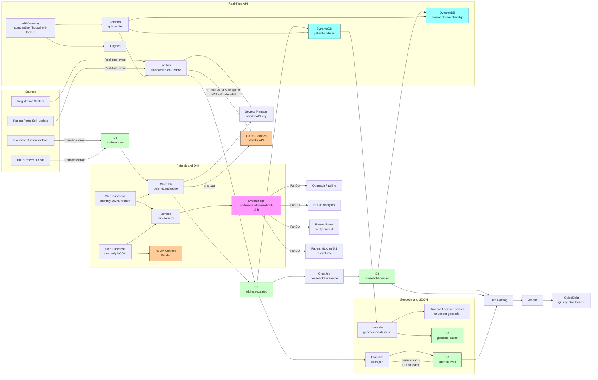

# Recipe 5.3: Address Standardization and Household Linkage ⭐⭐

**Complexity:** Simple-Medium · **Phase:** MVP · **Estimated Cost:** ~$0.001-0.01 per address standardized and per household-link decision (depends on USPS API or third-party CASS-certified vendor pricing, plus review-queue volume for ambiguous household assignments)

---

## The Problem

Pull up any patient record in any health system and look at the address field. You will find one of these.

You will find "1421 Elm St Apt 3B, Anytown, ST 12345." That is the clean case. You will find "1421 ELM STREET APARTMENT 3B ANYTOWN ST 12345-1234," which is the same address but typed differently. You will find "1421 elm st #3b anytown st 12345," same address, different again. You will find "1421 Elm Street, 3rd Floor, Anytown, ST 12345-1199," same building but the floor is wrong because the patient said "third floor" and the registration clerk wrote it down literally. You will find "1421 Elm St, Anytown ST 12345" with no apartment number at all because the patient mumbled it and nobody asked again. You will find "1421 Elm" with the rest of the address blank because the registration software did not require a complete address and the front desk was busy. You will find "P.O. Box 4421, Anytown, ST 12345," which is a mailing address, not a residence, and might or might not tell you where the patient actually lives. You will find "Homeless" or "no fixed address" or "shelter" entered as line one. You will find an address that does not exist anywhere in the United States Postal Service database, because the patient gave a property description rather than a postal address ("the trailer behind the QuickStop on Route 9"). You will find an address that exists, but the patient moved out of it three years ago and your system has not been updated. <!-- TODO: verify; ONC, AHIMA, and address-quality vendor literature consistently report that 10-30% of patient address records have at least one quality issue (incomplete fields, formatting variations, or staleness), with substantially higher rates in populations with lower socioeconomic stability. -->

Now imagine you are doing anything that depends on a clean address.

You are running a population-health outreach program for diabetes patients with no recent A1c. The plan is to mail each patient a reminder. You generate the mailing list and twelve percent of the letters come back as undeliverable, eight percent of the letters reach a previous resident at an address the patient no longer lives at, and somewhere between two and five percent are sent to addresses that look real but do not actually correspond to any deliverable location, so they vanish into the postal void without a return-to-sender. Your outreach campaign has a baseline failure rate of twenty percent before you have done anything wrong as a clinical operation; you are just paying the price of bad address data. <!-- TODO: confirm typical undeliverable-mail rates for healthcare outreach campaigns; the figures in industry literature vary by population but are consistently a meaningful fraction. -->

You are a value-based care organization that gets paid based on the social determinants of health for the population you serve. Some of those determinants are census-tract-derived: area deprivation index, food access score, walkability, primary care provider density, exposure to environmental hazards. <!-- TODO: confirm at time of build; the area deprivation index (ADI) and similar census-tract-level indicators are widely used in risk adjustment and SDOH analytics; standardized addresses are required to derive them. --> To compute any of those metrics you need to geocode the address, which requires the address to be standardized into a form the geocoder recognizes. A meaningful fraction of your patient addresses fail to geocode at all because of formatting issues. Another fraction geocode to the wrong place (a zip-code centroid instead of a building, the city hall instead of the residence) because the address was incomplete or ambiguous. Your SDOH metrics are wrong, and the part of your contract that pays based on those metrics is wrong, and you do not know by how much.

You are running a community health needs assessment and you need to know how many of your patients live in households where another family member is also a patient. The answer affects how you design family-medicine teams, how you stage outreach, how you operate transportation programs, how you think about chronic disease in family clusters. You cannot answer the question without grouping patients by household, and you cannot group patients by household without first standardizing their addresses (so two records at the same address actually compare as the same address) and then making careful decisions about which same-address pairs constitute a household versus a multi-unit building of unrelated people.

You are a hospital running a financial assistance program for low-income patients. Eligibility depends on household income, household size, and household composition. The patient brings in a stack of pay stubs and a tax return. The intake process needs to know which other patients in your system are in the same household, both for verification and for streamlining the eligibility determination. Without household linkage, every family member is a separate eligibility determination from scratch, every related case is processed independently, and the financial counselor spends three times as long getting to the same decision.

You are a health information exchange linking records across organizations and one of the high-value linkage signals is shared address. A patient seen at the urgent care across town and the same patient seen at your primary care office should match more confidently when both records have the same standardized address. Without address standardization on both sides, the addresses look different, the matcher does not get the signal, and the linkage misses or routes to review unnecessarily.

Each of these problems sounds different on the surface and is the same problem underneath. Every workflow that operates on patient location has to first solve "what does this address actually represent," and the patient registration data does not give you a clean answer. You need a layer that takes whatever the front desk typed in and turns it into a structured, validated, deliverable address with consistent formatting; and once you have that, you have the substrate for the further question of "which of our patients live together as a household."

This is the recipe. It is in the Simple-Medium tier because the address standardization piece is largely a solved problem (USPS publishes the rules, vendors are CASS-certified to implement them, the failure modes are well-documented), but the household-linkage piece introduces real ambiguity (same address does not always mean same household, and the wrong inference can leak privacy or violate consent). You can ship the address-standardization layer in weeks. The household-linkage layer is more of a quarter, and it takes care to do without creating new problems.

Let's get into how you build it.

---

## The Technology: Address Standardization and Household Inference

### Why Addresses Are Harder Than They Look

A postal address is not a free-text string. It is a structured reference to a location in a delivery system, and the structure follows rules that vary by country, by region, and by delivery type. In the United States, the United States Postal Service maintains the canonical reference data. The USPS publishes the addressing standards (USPS Publication 28 is the foundational document), the address database (the Delivery Point Validation file, the ZIP+4 file, and others), and a certification program (CASS, the Coding Accuracy Support System) for software that processes addresses. <!-- TODO: confirm Publication 28 and CASS certification specifics at time of build; USPS occasionally updates the standards and the certification cycle. --> Anything that processes US addresses at scale either uses CASS-certified software or pretends it has done. The software that has not done it produces lower-quality output and produces it inconsistently.

The standardization rules are dense but learnable. Street types have canonical abbreviations: "Street" becomes "ST," "Avenue" becomes "AVE," "Boulevard" becomes "BLVD." Directional prefixes and suffixes follow the same pattern: "North" becomes "N," "Southwest" becomes "SW." Secondary unit designators have their own canonical forms: "Apartment" becomes "APT," "Suite" becomes "STE," "Unit" becomes "UNIT," "Building" becomes "BLDG," and there is a long list. Punctuation drops. Casing goes uppercase. Multiple spaces collapse. The five-digit ZIP code can be extended to ZIP+4, which encodes the specific delivery point (often a single building or a small group of contiguous addresses); the +4 is the difference between "general neighborhood" and "actual building." Some addresses have a "secondary address line" (PO Box plus street, or a building name plus a unit) that needs careful handling.

Beyond formatting, USPS-certified software answers two questions about each address: *is this a real, deliverable address?* and *what is the standardized form?* The first question is the validation question. The USPS Delivery Point Validation file (DPV) records every address the Postal Service delivers to. An address that fails DPV does not exist as a deliverable address, which might mean the patient gave you a property description, a wrong number, an old address that was demolished, or simply a typo that nudged the address out of the database. The second question is the standardization question. If the address validates, the software returns the canonical form (the form that should be on the envelope, in your database, and in any downstream system).

CASS-certified software gives you both answers in one operation, and it gives them with the additional context that the USPS treats as part of address quality: residential vs. commercial, business name vs. personal name, vacant vs. occupied (for some product types), the carrier route, the congressional district, the census block. Most CASS-certified products also expose **address correction**: where the input is plausibly a typo or a missing-element of an existing address, the correction logic returns the most likely intended address. "1421 Elm" missing the city, state, and ZIP can be corrected if the rest of the data narrows it. "1421 Elm Stret" with the obvious typo can be corrected to "1421 ELM ST." The correction logic has tunable confidence thresholds; you have to pick how aggressive to be (see Honest Take).

### What Standardization Is Not

Standardization is not geocoding, though the two are often conflated. Geocoding takes a standardized address and returns a point on the earth, usually a (latitude, longitude) pair. The geocode is what lets you compute distance to the nearest provider, intersect with a census tract, plot a heat map, route a home-visit nurse. Geocoding requires standardization as a prerequisite (a free-text address geocodes worse than a standardized one), but it is a separate step with its own data sources, accuracy characteristics, and failure modes. Production patient-data pipelines run standardization first, then geocoding, then any downstream geographic analytics. Recipe 5.3 covers standardization and household linkage; Chapter 6 (clustering and similarity) covers the geocoded analytics that use the standardized output.

Standardization is also not address verification. Verification is the question of whether the address actually belongs to the patient (as in: is the patient really at this address?). A USPS-validated, fully standardized, deliverable address can still be wrong because the patient moved out, gave a friend's address, or mistyped the number. CASS validation tells you the address is real; verification (typically through outreach, USPS National Change of Address (NCOA) processing, or third-party identity-verification services) tells you the patient is plausibly there. Most healthcare workflows live with the gap between validation and verification, and use NCOA matches against the patient population to detect movers on a quarterly cadence. <!-- TODO: confirm NCOA access requirements and update cadence at time of build; NCOA is a USPS-licensed product distributed through partners and has access controls based on intended use. -->

### The Anatomy of a Standardized Address

After CASS processing, an address becomes a structured object with a well-defined schema. A typical post-standardization record has fields like:

- `delivery_line_1`: the primary delivery line (street number, predirectional, street name, suffix, postdirectional, secondary unit if combined with the primary line). Example: "1421 ELM ST APT 3B."
- `delivery_line_2`: secondary line, if used. Often empty.
- `last_line`: city, state, and ZIP+4. Example: "ANYTOWN ST 12345-1234."
- `components`: parsed components (`primary_number`, `street_predirection`, `street_name`, `street_suffix`, `street_postdirection`, `secondary_designator`, `secondary_number`, `city`, `state`, `zipcode`, `plus4_code`).
- `metadata`: USPS-derived metadata (`delivery_point_validation` (Y/N/S for confirmed/not-confirmed/missing-secondary-info), `record_type` (street, highway-contract, PO Box, etc.), `is_residential`, `is_business`, `congressional_district`, `county`, `census_block`, `carrier_route`, `is_vacant`, `dpv_footnotes`).
- `provenance`: original input, standardization timestamp, software version, certification level, confidence score for any corrections applied.

This structured form is the substrate for everything downstream. Hash the standardized form for consistent equality comparisons across records. Match on the canonical components for household inference. Pass the components to a geocoder. Use the metadata for SDOH analytics and for understanding the limits of what the address tells you.

### Where Standardization Hits Its Limits

CASS-certified standardization works well on the cases the USPS knows about. It works less well on the cases the USPS does not.

**Rural addresses without traditional street numbering.** Some rural areas use route-and-box numbering ("Rural Route 3, Box 47") or property descriptions. The USPS recognizes these where they exist in the delivery database, but the structured representation is different and downstream systems sometimes lose the structure when forcing it through a "street number, street name, suffix" template.

**Military addresses (APO/FPO/DPO).** Use a separate addressing convention with a "unit" and a "FPO/APO/DPO" designation in place of the city. CASS-certified software handles these, but downstream systems often do not, and the records get treated as malformed.

**International addresses.** USPS standardization only covers US addresses. Patients with international addresses (Canadian, Mexican, or further afield) need a separate standardization pipeline that uses Universal Postal Union or country-specific standards. <!-- TODO: confirm at time of build; UPU publishes addressing standards and most countries have national postal authorities with their own validation systems. The major commercial address-quality vendors typically support multi-country standardization, but the free USPS-only path does not. -->

**Newly built addresses.** A new construction development opens, the addresses are real and being delivered to, but the USPS database has not yet incorporated them. CASS validation fails. The software flags these as "non-validated" and you have to decide whether to accept them on the basis of other evidence.

**Patients with unstable housing.** Homeless patients, patients in transitional shelters, patients couch-surfing among family. The address field on their record is either blank, a shelter, the latest of multiple short-term locations, or a relative's address that does not represent where the patient is currently living. CASS validation will accept the shelter address as valid (it is); CASS validation does not have anything to say about whether it is the patient's current residence. Population health outreach programs, social determinant analytics, and household linkage all need to handle these patients with explicit logic, because the default of "treat the address as the patient's home" is wrong for them and produces both wrong analytics and unintended consequences (mailing notices to a shelter rather than to the patient's case manager).

**International addresses on US infrastructure.** Some patients live in the US but have a documented address in another country (recent immigrants, students, temporary workers). The healthcare record may capture both. The standardization pipeline needs to know which is the residential address for SDOH analysis and which is the alternate address for reach-out fallback.

**Mailing addresses that are not residences.** PO Boxes, private mailbox services (UPS Store boxes, etc.), General Delivery, in-care-of addresses, lawyer offices used as mailing addresses for privacy. The address validates and standardizes; it does not give you a residence. SDOH analyses based on mailing-address geocoding mis-attribute the patient to a commercial location. Household linkage on PO Box addresses produces "households" of unrelated patients who happen to share a private mailbox provider. The mitigation is to capture both `mailing_address` and `physical_address` as separate fields where possible, with `is_po_box` and `address_type` metadata that downstream systems can filter on.

### The Household Linkage Problem

Once you have standardized addresses, you can ask: which patient records share the same address? On the surface this looks like a join: group records by `(delivery_line_1, last_line)` (or by the standardized hash) and any group with more than one record is a "household." That is the naive version, and it is the version that produces problems quickly.

The first problem is that "same address" is necessary but not sufficient for "same household." A 200-unit apartment building has up to 200 households at "100 Main St"; if your records do not have unit numbers, you will collapse all 200 households into one. A nursing home has dozens of residents at the same address; they are not a household in any meaningful sense. A homeless shelter has a rotating population at the same address. A rental property turns over every year or two, so two patients at the same address with non-overlapping residence periods are not the same household even if your records do not distinguish the time windows.

The second problem is that "different addresses" does not always mean "different households." A family that just moved has some records at the new address and some at the old. A college student has the family address as one record and the dorm address as another. A divorced couple shares custody, so the children appear at both parents' addresses. A patient who travels for work has work addresses captured in the system that look distinct from the residence address.

The third problem, and this is the one that makes household linkage genuinely a sensitive operation, is that **household membership is sometimes private and not derivable from the data you have permission to see**. Two patients at the same residential address might be a married couple. They might also be a domestic violence survivor and the spouse they fled from, where the survivor specifically asked the health system not to disclose the connection. Two patients at the same address might be roommates rather than family, and inferring a "household" implies a relationship that does not exist. A child's address might be the address of the parent who has primary custody but also (for legal or safety reasons) one that is confidential from the other parent. Inferring household relationships from address is mostly fine for care coordination and outreach (sending one mailing to the household instead of two); it is potentially harmful for clinical-context sharing or for exposing relationships in a chart that the patient did not intend to expose.

The fourth problem is that **the granularity of household inference depends on how the address data is captured**. Two records at the same multi-unit address with no unit numbers are ambiguous: same building, possibly same household, possibly different households. Two records at the same multi-unit address with the same unit number are stronger evidence of same household. Two records at the same single-family-residence address are stronger still. Two records with the same standardized address and the same secondary unit and the same last name and overlapping insurance subscriber ID are very strong evidence of same household. The system needs to express the confidence level in each inference and let downstream consumers decide what confidence threshold their workflow needs.

A workable household-inference framework treats "household" as a graded confidence claim, not a binary fact. The system outputs:

- **Same address (high confidence) and corroborating evidence (high confidence): infer household.** Same standardized address with secondary unit, same last name (or evidence of family relationship via other fields like emergency contact or insurance subscriber), patient ages consistent with a family unit. This is the strong-match bucket.
- **Same address (high confidence), no corroborating evidence: infer "co-located" but not household.** Same standardized address but no other family-relationship signal. Could be roommates, could be apartment-building neighbors collapsed by missing unit numbers. The system flags these as co-located rather than household, and downstream consumers decide whether to treat co-location as household equivalent for their workflow (population outreach often does, clinical context-sharing should not).
- **Same address (low confidence): no inference.** Address standardization confidence is low (the address did not fully validate, or the secondary unit is missing on a multi-unit address). The system declines to infer.
- **Possible household (different addresses, other evidence): flag for review or accept based on workflow.** Different addresses but overlapping insurance subscriber, same last name, child-of-parent age pattern. Useful for catching post-move households but with higher false-positive risk; typically gated by workflow (acceptable for outreach, not acceptable for sensitive context-sharing).

### Where the Field Has Moved

A few practical updates worth knowing:

- **The major address-quality vendors all offer cloud-native APIs.** Smarty (formerly SmartyStreets), Melissa Data, Loqate (GBG), Experian Address Validation, and others provide CASS-certified APIs with sub-100-millisecond latency for individual address validation and bulk APIs for batch standardization. <!-- TODO: confirm current vendor landscape and CASS certification status at time of build. --> The build-vs-buy calculus has tilted toward buy: implementing CASS from scratch is a significant project (you need to license the USPS reference data and run CASS-certification testing), while the vendor APIs are inexpensive on a per-address basis and handle the certification renewal as part of their service.
- **USPS NCOA (National Change of Address) processing is the standard answer for staleness.** Submit your patient address list to a CASS-and-NCOAlink-certified vendor; they cross-check against the USPS NCOA database (which records 18-48 months of recent address changes from forwarding requests) and return updated addresses for movers. <!-- TODO: confirm NCOA coverage window at time of build; USPS publishes the retention period for the NCOA file. --> Most healthcare organizations run NCOA processing on a quarterly cadence to keep the address data current.
- **Census-tract-derived SDOH indicators have become routine.** The Area Deprivation Index (ADI), the Social Vulnerability Index (SVI), the Centers for Disease Control's Social Vulnerability Index, the Healthy Places Index (California), and others are census-tract or census-block-group-level indicators of socioeconomic status, environmental risk, and access to resources. Standardized addresses geocoded to census tract drive the SDOH metrics consumed by population health, value-based care contracting, and equity reporting. <!-- TODO: confirm the current state of these indices at time of build; the underlying census data and the index methodologies are updated periodically. -->
- **Privacy-preserving household linkage is an emerging topic.** For HIE and cross-organization use cases, sharing standardized addresses across organizations carries the same data-sharing concerns as sharing other PHI. Bloom-filter-based and hash-based household-equivalence techniques (analogous to the privacy-preserving record linkage techniques in recipe 5.8) are starting to appear in production deployments, particularly for cross-organizational care coordination programs. <!-- TODO: confirm at time of build; the academic literature on privacy-preserving record linkage applies to address-based linkage with similar tradeoffs. -->
- **Address data is increasingly recognized as a sensitive identifier.** The combination of standardized address + DOB + sex is highly re-identifying, and HIPAA's de-identification standards (Safe Harbor and Expert Determination) treat address components above the state-or-three-digit-ZIP level as identifiers that must be removed for de-identified datasets. <!-- TODO: confirm; HIPAA Privacy Rule § 164.514 lists the 18 Safe Harbor identifiers including geographic subdivisions smaller than a state with limited exceptions for the first three digits of ZIP code under specified population thresholds. --> The recipe respects the identifier sensitivity throughout: standardized addresses are PHI and live in the same encryption and access-control posture as the rest of the patient demographics.

---

## General Architecture Pattern

The pipeline has six logical stages: ingest patient address records from source systems, standardize each address through a CASS-certified validator, geocode the standardized addresses (optional but commonly co-located with standardization), persist the structured form with provenance, infer household groupings with confidence scoring, and re-process periodically to detect movers and stale addresses.

```
┌────────────── INGEST ─────────────────────────────┐
│                                                    │
│  [Source Patient Records]                         │
│   - Registration system (front-desk capture)      │
│   - Insurance subscriber files                    │
│   - HIE / referral feeds                          │
│   - Self-service patient portal updates           │
│           │                                        │
│           ▼                                        │
│  [Raw address fields:                              │
│   line1, line2, city, state, zip,                  │
│   plus any free-text address comments]            │
│                                                    │
└────────────────────────────────────────────────────┘

┌────────────── STANDARDIZE ────────────────────────┐
│                                                    │
│  [Raw address]                                     │
│           │                                        │
│           ▼                                        │
│  [CASS-certified address validator:                │
│   - Parse into components                          │
│   - Apply USPS standardization rules               │
│   - Validate against DPV (Delivery Point Val.)    │
│   - Apply correction logic (with confidence)       │
│   - Capture metadata (residential/business,        │
│     vacant, PO Box, delivery confirmation,         │
│     congressional district, county,                │
│     census block, carrier route)]                 │
│           │                                        │
│           ▼                                        │
│  [Result classification:                           │
│   - VALIDATED: clean USPS-confirmed address       │
│   - CORRECTED: input had errors, software         │
│     applied a high-confidence correction           │
│   - AMBIGUOUS: multiple valid corrections,        │
│     no single high-confidence answer               │
│   - MISSING_SECONDARY: valid building, but a      │
│     unit number is required and missing            │
│   - NOT_VALIDATED: not in USPS database;          │
│     might still be real (new construction)         │
│   - INVALID: cannot be parsed or matched]         │
│           │                                        │
│           ▼                                        │
│  [Persist standardized record with provenance      │
│   (original input, timestamp, tool version,       │
│   confidence level, footnotes)]                   │
│                                                    │
└────────────────────────────────────────────────────┘

┌────────────── GEOCODE ────────────────────────────┐
│                                                    │
│  [Standardized address]                            │
│           │                                        │
│           ▼                                        │
│  [Geocode to (latitude, longitude) plus            │
│   geographic-hierarchy joins:                      │
│   - census_block_group_id                          │
│   - census_tract_id                                │
│   - county_fips                                    │
│   - state_fips                                     │
│   - rural_urban_classification]                   │
│           │                                        │
│           ▼                                        │
│  [Join to SDOH indicators:                         │
│   - Area Deprivation Index                        │
│   - Social Vulnerability Index                    │
│   - food access score                             │
│   - any state- or region-specific indicators]     │
│                                                    │
└────────────────────────────────────────────────────┘

┌────────────── INFER HOUSEHOLD ────────────────────┐
│                                                    │
│  [Standardized addresses across all patient       │
│   records]                                         │
│           │                                        │
│           ▼                                        │
│  [Group records by (canonical_address_hash,        │
│   secondary_unit) into co-location buckets]       │
│           │                                        │
│           ▼                                        │
│  [Per co-location bucket, evaluate household       │
│   confidence:                                      │
│   - Building type (single-family, multi-unit,     │
│     commercial, PO Box, shelter, nursing home)    │
│   - Secondary unit completeness                   │
│   - Last-name overlap among records               │
│   - Insurance-subscriber overlap                  │
│   - Emergency-contact relationships               │
│   - Age-pattern consistency (parent-child,        │
│     spouse, etc.)]                                │
│           │                                        │
│           ▼                                        │
│  [Output household_membership records with         │
│   confidence_level and inference_basis:           │
│   - HOUSEHOLD_HIGH (strong corroborating          │
│     evidence)                                      │
│   - HOUSEHOLD_MEDIUM (some corroborating          │
│     evidence)                                      │
│   - CO_LOCATED (same address, no other            │
│     corroborating evidence)                        │
│   - SUPPRESSED (privacy flag set on one or        │
│     more records, no inference made)]             │
│           │                                        │
│           ▼                                        │
│  [Apply downstream-consumer-defined                │
│   confidence thresholds:                           │
│   - Outreach: accept HOUSEHOLD_* and CO_LOCATED   │
│   - Care coordination: accept HOUSEHOLD_*         │
│   - Clinical context sharing: HIGH only           │
│   - Financial assistance: HIGH plus manual review]│
│                                                    │
└────────────────────────────────────────────────────┘

┌────────────── REFRESH AND DRIFT ──────────────────┐
│                                                    │
│  [Periodic re-processing pipeline]                 │
│           │                                        │
│           ▼                                        │
│  [Quarterly NCOA processing:                       │
│   - Submit address list to CASS+NCOAlink-cert.    │
│     vendor                                         │
│   - Receive updated-address records for movers]   │
│           │                                        │
│           ▼                                        │
│  [Re-validate every standardized address           │
│   against the latest USPS reference data           │
│   on a recurring cadence (monthly to quarterly)]  │
│           │                                        │
│           ▼                                        │
│  [Detect drifts:                                   │
│   - Address became invalid (DPV failure now)      │
│   - Address standardization changed (new ZIP+4)   │
│   - Patient flagged as mover via NCOA             │
│   - Building type changed]                        │
│           │                                        │
│           ▼                                        │
│  [Emit drift events to downstream consumers       │
│   (registration, outreach, SDOH analytics)        │
│   and recompute household groupings as needed]    │
│                                                    │
└────────────────────────────────────────────────────┘
```

**Ingest is multi-source.** Patient addresses arrive from registration systems, insurance feeds, HIE referrals, patient-portal self-updates, and sometimes from outreach vendors. Each source has its own field formats, its own data-quality patterns, and its own update cadence. The architecture standardizes the source schema before standardization runs, so the validator sees a consistent input regardless of upstream source. Provenance fields track which source contributed which record so the system can later reason about source-quality differences (a portal-self-update is generally higher quality than a hand-keyed registration, for example).

**Standardization is an external service.** Either you license a CASS-certified library and run it inside your VPC, or you call a CASS-certified vendor API. Either way, the standardization step is treated as an idempotent function from raw address to structured standardized record. The structured output is what gets persisted; the raw input is preserved for audit and for re-running standardization after any vendor-software upgrade. Idempotency matters: re-running standardization on the same input should produce the same output (modulo USPS reference-data updates, which is why re-runs after reference-data refreshes are a normal part of operations).

**Geocoding is co-located but separable.** Most CASS-certified vendors also provide geocoding as part of the same API call. You can run them as a single step or split them, depending on cost and on which workflow needs which output. Some workflows need only the standardized address (mailing); some need only the geocode (distance-to-nearest-provider analytics); some need both (SDOH analytics). The architecture supports running geocoding lazily on demand for workflows that need it, with the geocode result cached against the standardized address so repeated requests do not re-geocode.

**Household inference is downstream of standardization.** It cannot run until the addresses are standardized, because two records at the same physical address with different formatting would be treated as different addresses by a naive grouper. Once addresses are standardized, household inference is a grouping operation followed by per-group evidence assessment. The inference is graded (HOUSEHOLD_HIGH, HOUSEHOLD_MEDIUM, CO_LOCATED, SUPPRESSED) and the grade is the contract with downstream consumers.

**Privacy suppression is a first-class case.** Some patient records have a "do not link to household" flag (set explicitly via patient request, set automatically when domain-specific signals indicate domestic violence or other safety concerns, set when the address is a confidential address kept for the patient's safety). The household inference pipeline checks for this flag on every record before grouping, and any group that contains a suppressed record either suppresses the household inference for the entire group or excludes the suppressed record from the group, depending on the institution's privacy policy. The privacy contract is part of the architecture, not a downstream filter; suppressing late is much harder to get right than suppressing early.

**Refresh is on a regulatory cadence.** USPS reference data updates monthly; NCOA processing typically runs quarterly. Both refresh cycles can produce changes to a previously-standardized address (the address becomes invalid because the building was demolished, the patient moved, the ZIP+4 changed because of a postal-route restructure). The architecture re-runs standardization on the existing patient population on a defined cadence, detects drifts against the previously-standardized form, and emits drift events to downstream consumers. The drift events feed the same patterns used in recipe 5.2 for provider-NPI re-verification.

**Cohort-stratified accuracy monitoring is required here too.** Address standardization quality varies across cohorts. Patients in dense urban areas with multi-unit buildings have systematically worse standardization quality (missing unit numbers) than patients in single-family homes. Patients with unstable housing have systematically lower DPV-validation rates. Patients in rural areas with non-traditional addressing have systematically more "NOT_VALIDATED" results. Patients with names from naming conventions outside the dominant culture sometimes have addresses keyed in by registration staff with errors that the standardization software cannot fully correct. Per-cohort standardization-success rate, household-inference confidence distribution, and downstream geocoding success rate are all metrics worth tracking, with disparity thresholds that trigger investigation.

---

## The AWS Implementation

### Why These Services

**Amazon S3 for the address-standardization data lake.** Three zones: raw (the source-system extracts of patient addresses, partitioned by source system and extract date), curated (the standardized addresses keyed by `address_hash` with full provenance and metadata), and derived (household-membership tables, geocode-augmented records, SDOH-joined records, drift-event archives). S3 is HIPAA-eligible under BAA with SSE-KMS encryption, and the partitioning pattern supports cohort-stratified analytics through Athena. Standardized addresses are PHI in their structured form; the encryption and access-control posture matches the rest of the patient demographics.

**Amazon DynamoDB for the standardized-address table and the household-membership table.** Two main tables. `patient-address` keyed on `(patient_id, address_role)` (where `address_role` is `physical`, `mailing`, `historical`, etc.) holds the current standardized address per role per patient, with the structured components, the validation status, the metadata, and the last-validated timestamp. `household-membership` keyed on `(household_id, patient_id)` holds the patient-to-household mappings with the inference confidence, the inference basis, and the privacy-suppression flag. DynamoDB's single-digit-millisecond reads support real-time household lookups for clinical context queries; the on-demand capacity handles the bursty pattern of registration-driven updates and quarterly batch refreshes.

**Amazon Location Service or a CASS-certified third-party vendor for standardization and geocoding.** AWS Location Service provides geocoding through partner data providers (Esri, HERE, Grab) but does not currently provide CASS-certified USPS-conformant standardization for the United States. <!-- TODO: confirm at time of build; AWS Location Service capabilities continue to evolve and CASS-certification status of providers within Location may change. --> The most common production pattern is to use a CASS-certified vendor (Smarty, Melissa, Loqate, Experian) for standardization, then either Location Service or the same vendor for geocoding. Vendor APIs are called from a Lambda with the API key stored in AWS Secrets Manager, the call made through a VPC endpoint or NAT Gateway with allow-listed egress, and the response cached against the input hash to avoid duplicate API calls. The architecture treats the standardization vendor as a swappable component: the standardized-record schema is the contract, and the implementation behind it can be any CASS-certified provider.

**AWS Lambda for the per-record standardization, the household-inference scoring, and the drift detection.** Lambda is the right substrate for these because each task is short-lived, mostly I/O-bound (vendor API call plus DynamoDB write), and benefits from on-demand scaling for bursty workloads. Standardization Lambdas are in VPC with VPC endpoints for downstream services. The split between Glue (batch, large-scale refresh) and Lambda (real-time, single-record) lets each workload run on the right substrate. <!-- TODO: confirm Lambda VPC and timeout configurations work for the chosen vendor's response time at time of build; some vendor APIs have higher tail latency than the standard Lambda 30-second default. -->

**AWS Glue for the batch refresh and the household-inference batch job.** The monthly USPS-reference-data refresh and the quarterly NCOA processing run as Glue jobs because they operate over the entire patient address population at once. The household-inference job also runs as Glue: it groups standardized addresses by canonical hash, evaluates per-group evidence, and writes household-membership rows. Glue Data Catalog tracks the schema across raw, curated, and derived zones. Athena queries the catalog for cohort-stratified accuracy monitoring, address-quality reporting, and ad-hoc operational questions.

**AWS Step Functions for orchestration.** Three workflows: a real-time-update workflow (run on a per-record basis when a new patient registers or an address changes; standardize, validate, persist, recompute household membership for the affected addresses), a monthly-USPS-refresh workflow (re-standardize the entire population against the latest USPS reference data; detect drifts; recompute household membership where addresses changed), and a quarterly-NCOA workflow (submit the population to NCOA; receive updates; merge into the address store; recompute household membership where movers were detected).

**Amazon EventBridge for address and household drift events.** When a standardized address changes (DPV failure, ZIP+4 change, NCOA mover) or a household membership changes (new patient at an existing household, household member moved out), an event flows out to downstream consumers: the outreach pipeline for mailing-list updates, the SDOH analytics pipeline for geocode refresh, the patient-portal for verification prompts, the matcher (recipe 5.1) for re-evaluation of any duplicate-detection candidates that depend on address signals.

**Amazon API Gateway plus Lambda for the real-time standardization API.** Patient registration workflows call the API at the moment a patient is registering or updating their address, get back a structured standardized address, and present any corrections or ambiguity warnings to the registration clerk for confirmation. The API also handles the household-lookup pattern (given a patient ID, return the household membership records). API Gateway provides authentication, rate-limiting, and request logging; Lambda handles the orchestration of the standardization vendor call and the persist-to-DynamoDB step. Latency budget is sub-second for the registration-clerk experience; vendor API calls typically fit in that budget, with caching for repeat addresses helping the common case.

**Amazon Athena and AWS Glue Data Catalog for analytics.** Cohort-stratified standardization-success rates, household-inference confidence distributions, drift-event volumes, mover detection rates from NCOA processing. Athena queries the catalog over the curated and derived S3 zones; QuickSight on top of Athena provides the dashboards for the address-data-quality team and for the population-health and SDOH analytics teams.

**Amazon QuickSight for the operational and quality dashboards.** Per-cohort standardization-success rates (validated vs corrected vs ambiguous vs not-validated), household-inference confidence distribution by building type and by cohort, drift-event rates, NCOA mover rates, geocoding success rates, SDOH-indicator coverage by census tract.

**AWS KMS, CloudTrail, CloudWatch.** Customer-managed keys for the S3 buckets, the DynamoDB tables, and the Lambda log groups. CloudTrail data events on the address and household tables and on the standardization-audit S3 bucket. CloudWatch alarms on standardization-vendor-API failure rates, on drift-event volumes (a sudden spike often indicates a USPS reference-data anomaly worth investigating), on NCOA-processing-latency breaches, and on cohort-stratified standardization-success-rate disparities.

**AWS Secrets Manager for the standardization-vendor API key and the NCOA-vendor credentials.** Vendor credentials are sensitive and should not appear in code or in environment variables. Secrets Manager stores them with KMS encryption at rest, IAM-controlled access, and rotation support where the vendor supports rotation.

### Architecture Diagram



### Prerequisites

| Requirement | Details |
|-------------|---------|
| **AWS Services** | Amazon S3, Amazon DynamoDB, AWS Lambda, AWS Glue, Amazon Athena, AWS Step Functions, Amazon EventBridge, Amazon API Gateway, Amazon Cognito, Amazon Location Service (optional), Amazon QuickSight, AWS Secrets Manager, AWS KMS, Amazon CloudWatch, AWS CloudTrail. |
| **External Services** | A CASS-certified address-standardization vendor (Smarty, Melissa, Loqate, Experian, or equivalent). An NCOAlink-certified vendor for periodic mover detection (often the same vendor as standardization). A geocoding source (Amazon Location Service partner providers, or the same address-quality vendor). |
| **IAM Permissions** | Per-Lambda least-privilege: `dynamodb:GetItem` / `PutItem` / `UpdateItem` scoped to specific tables; `s3:GetObject` / `PutObject` scoped to specific bucket prefixes; `secretsmanager:GetSecretValue` scoped to the vendor-API-key secret; `events:PutEvents` on the drift bus; `kms:Decrypt` on relevant CMKs. Glue jobs need scoped catalog and S3 permissions. Never use `*` actions or `*` resources in production. |
| **BAA** | AWS BAA signed. The standardization vendor must also be willing to sign a BAA, since you will be sending PHI (the address combined with patient identifier) to their API. Most major address-quality vendors offer healthcare-tier service plans with BAAs available. <!-- TODO: confirm at time of build; vendor BAA availability and tier pricing changes periodically. --> |
| **Encryption** | S3: SSE-KMS with bucket-level keys. DynamoDB: customer-managed KMS at rest. Lambda log groups KMS-encrypted. Secrets Manager: KMS-encrypted secrets. EventBridge: server-side encryption. Glue jobs: KMS for connection passwords. TLS 1.2 or higher for all in-transit traffic, including the vendor-API call. |
| **VPC** | Production: Lambdas in VPC. Glue jobs in VPC connections. VPC endpoints for S3 (gateway), DynamoDB (gateway), KMS, Secrets Manager, CloudWatch Logs, EventBridge, Step Functions, Glue, Athena, STS. NAT Gateway for the vendor API call (vendor APIs typically do not have AWS PrivateLink endpoints) with an outbound HTTPS proxy and an allow-list of vendor domains. <!-- TODO: confirm at time of build; some address-quality vendors offer AWS PrivateLink endpoints for high-volume customers. --> |
| **CloudTrail** | Enabled with data events on the patient-address and household-membership tables; data events on the audit S3 buckets. API Gateway and Lambda invocations logged. CloudTrail logs encrypted with KMS and retained per the institution's records-retention policy. |
| **Vendor Selection** | Vet the standardization vendor for: CASS certification (current cycle), NCOAlink certification, BAA availability, healthcare-customer references, API rate limits and bulk-processing options, response-time SLAs, geographic coverage (US-only or international), pricing model (per-record, monthly subscription, or annual license), uptime SLA, and data-handling commitments (do they retain submissions, for how long, with what controls). The vendor selection is consequential because the vendor sees PHI; treat the procurement as a privacy and security review, not just a feature comparison. |
| **Sample Data** | Use synthetic patient address records that exercise the full range of standardization outcomes (clean, corrected, ambiguous, missing-secondary, not-validated, invalid). The USPS provides public reference data and the major vendors typically provide test endpoints with known-test addresses. Never use real patient addresses in development environments. |
| **Cost Estimate** | At a medium-sized health system with ~500,000 patients and ~10,000 new addresses per month plus quarterly refresh: vendor standardization costs roughly $0.005-0.02 per address validated (typically billed in batches; healthcare-tier with BAA is at the higher end of that range), so monthly throughput at ~520,000 addresses (10K new plus 510K quarterly-refresh share) ≈ $2,500-10,000/month for the vendor. AWS infrastructure: S3, DynamoDB, Lambda, Glue, Step Functions, EventBridge, API Gateway, Athena, QuickSight, KMS combined typically $300-1,500/month. Estimated total: $2,800-11,500/month, dominated by the vendor cost. NCOA processing typically adds $1,000-3,000/quarter for the cross-check submission. <!-- TODO: replace with verified, current pricing once the implementing team validates against vendor quotes and the AWS Pricing Calculator. --> |

### Ingredients

| AWS Service | Role |
|------------|------|
| **Amazon S3** | Hosts raw address extracts, standardized records, household-membership tables, geocode cache, SDOH-joined records, and drift archives |
| **Amazon DynamoDB** | Stores the current standardized address per patient per role (`patient-address`) and the patient-to-household mappings (`household-membership`) for low-latency real-time access |
| **AWS Lambda** | Per-record standardization on registration-time events, household-inference for affected groups on address change, drift-detection on refresh cycles, real-time API handler |
| **AWS Glue** | Batch standardization refresh against new USPS reference data, batch household-inference over the full patient population, SDOH-indicator joining |
| **Amazon Athena** | SQL access to the address data lake for cohort-stratified accuracy monitoring, quality reporting, and ad-hoc operations questions |
| **AWS Step Functions** | Orchestrates the monthly USPS refresh, the quarterly NCOA processing, and the per-record real-time update workflows |
| **Amazon EventBridge** | Fans out address and household drift events to downstream consumers (outreach, SDOH analytics, patient portal, patient matcher) |
| **Amazon API Gateway** | Exposes the real-time standardization endpoint for registration workflows and the household-lookup endpoint for clinical-context queries |
| **Amazon Cognito** | Authenticates real-time API consumers (registration system, clinical applications) |
| **Amazon Location Service** | (Optional) Geocoding, when not handled by the address-quality vendor; partners provide the underlying mapping data |
| **Amazon QuickSight** | Quality dashboards (standardization success rate by cohort, household-inference confidence distribution, drift volume, mover detection rate) |
| **AWS Secrets Manager** | Stores vendor API keys and credentials with KMS encryption and rotation support |
| **AWS KMS** | Customer-managed encryption keys for all address-data stores |
| **Amazon CloudWatch** | Operational metrics and alarms (vendor API failures, standardization latency, drift spike detection, cohort disparities) |
| **AWS CloudTrail** | Audit logging for all API calls on the address and household tables and on the audit S3 buckets |

---

### Code

> **Reference implementations:** Useful aws-samples, vendor SDKs, and open-source patterns for this recipe:
> - [`pyusps`](https://github.com/jminuse/pyusps) and similar small libraries: lightweight USPS API wrappers; useful for development environments where you cannot use a CASS-certified vendor. Note the USPS Web Tools API is not CASS-certified and is rate-limited; not appropriate for production. <!-- TODO: confirm pyusps maintenance status at time of build; small wrapper libraries come and go. -->
> - [`libpostal`](https://github.com/openvenues/libpostal): an open-source library for address parsing trained on OpenStreetMap data; useful for the parsing piece even when the validation is delegated to a CASS-certified vendor.
> - [`usaddress`](https://github.com/datamade/usaddress): a Python library for parsing US addresses into structured components using probabilistic methods; less heavyweight than libpostal, useful for the parsing piece in development.
> - The major CASS-certified vendors (Smarty, Melissa, Loqate) publish official SDKs for Python, Java, .NET, and Node.js; use the official SDK rather than rolling your own HTTP client. <!-- TODO: link to the specific vendor SDKs at time of build; vendor URLs change. -->

#### Walkthrough

**Step 1: Ingest patient address records.** Address records arrive from registration events (real-time), insurance feeds (periodic batch), HIE referrals (per-event), and patient-portal updates (real-time). Each source produces a raw address with source-specific field formatting. Capture the source, the timestamp, the patient identifier, the address role (physical, mailing, historical), and the raw fields. Skip this and you lose the audit trail you'll need when the standardization changes the address and you need to explain why.

```
FUNCTION ingest_address_record(source_event):
    raw = {
        patient_id: source_event.patient_id,
        address_role: source_event.address_role,
            // "physical", "mailing", "historical_<n>"
        line1: source_event.address_line_1,
        line2: source_event.address_line_2,
        city: source_event.city,
        state: source_event.state,
        zip: source_event.postal_code,
        country: source_event.country OR "US",
        source: source_event.source_system,
            // "registration", "insurance_feed", "hie", "portal"
        source_record_id: source_event.source_record_id,
        ingested_at: current UTC timestamp
    }

    // Persist the raw input for audit and for re-standardization
    // after vendor-software upgrades.
    write_to_s3(raw, s3_bucket="address-raw",
                key="{source}/{date}/{patient_id}_{role}.json")

    RETURN raw
```

**Step 2: Standardize against the USPS reference data via the vendor API.** The CASS-certified vendor takes the raw input and returns a structured, validated, USPS-conformant standardized record. The vendor handles the heavy lifting: parsing, USPS rule application, DPV validation, correction logic, and metadata enrichment. Skip this and you'll be implementing CASS yourself, which is a multi-quarter project that you'll then have to maintain through every USPS reference-data update.

```
FUNCTION standardize_address(raw):
    // Step 2A: short-circuit for non-US addresses. The CASS vendor
    // covers US addresses only; international addresses go through
    // a different validator path (or no validator at all if no
    // international vendor is licensed).
    IF raw.country != "US" AND raw.country != "USA":
        RETURN {
            standardization_status: "INTERNATIONAL_NOT_PROCESSED",
            international_address_raw: raw,
            standardized_at: current UTC timestamp
        }

    // Step 2B: call the CASS-certified vendor API.
    // The vendor SDK handles authentication, retries, and the
    // structured response. Idempotency is on (raw_input_hash) so
    // repeated calls for the same input return the same result.
    raw_input_hash = sha256(canonical_form(raw))

    // Check the cache first; many addresses are repeats across
    // patient records (family members at the same address, address
    // copied from one record to another).
    cached = check_standardization_cache(raw_input_hash)
    IF cached IS NOT NULL AND cached.cache_age < CACHE_TTL:
        RETURN cached.standardized

    vendor_response = vendor_sdk.validate(
        line1: raw.line1,
        line2: raw.line2,
        city: raw.city,
        state: raw.state,
        zip: raw.zip
    )
    // The vendor response contains: parsed components, the
    // standardized form, the DPV result, and any footnotes
    // explaining corrections or warnings.

    // Step 2C: classify the result by USPS-defined outcome.
    standardized = {}
    IF vendor_response.dpv == "Y" AND vendor_response.was_corrected == false:
        standardized.status = "VALIDATED"
            // clean, USPS-confirmed, no corrections
    ELIF vendor_response.dpv == "Y" AND vendor_response.was_corrected == true:
        standardized.status = "CORRECTED"
            // input had errors, vendor applied a correction
        standardized.correction_confidence = vendor_response.correction_confidence
        standardized.original_input = raw  // for audit
    ELIF vendor_response.dpv == "S":
        standardized.status = "MISSING_SECONDARY"
            // valid building, but a secondary unit is required
            // and missing
    ELIF vendor_response.dpv == "D":
        standardized.status = "AMBIGUOUS"
            // multiple valid corrections, no high-confidence answer
        standardized.candidate_addresses = vendor_response.candidates
    ELIF vendor_response.dpv == "N" OR vendor_response.match_code == "no_match":
        standardized.status = "NOT_VALIDATED"
            // not in USPS database; might still be real (new
            // construction) or invalid
    ELSE:
        standardized.status = "INVALID"
            // cannot be parsed or matched

    // Step 2D: capture the structured form and the metadata.
    IF standardized.status IN ["VALIDATED", "CORRECTED", "MISSING_SECONDARY"]:
        standardized.delivery_line_1 = vendor_response.delivery_line_1
        standardized.last_line = vendor_response.last_line
        standardized.components = {
            primary_number: vendor_response.components.primary_number,
            street_predirection: vendor_response.components.street_predirection,
            street_name: vendor_response.components.street_name,
            street_suffix: vendor_response.components.street_suffix,
            street_postdirection: vendor_response.components.street_postdirection,
            secondary_designator: vendor_response.components.secondary_designator,
            secondary_number: vendor_response.components.secondary_number,
            city: vendor_response.components.city,
            state: vendor_response.components.state,
            zipcode: vendor_response.components.zipcode,
            plus4_code: vendor_response.components.plus4_code
        }
        standardized.metadata = {
            record_type: vendor_response.metadata.record_type,
                // "Street", "PO Box", "Highway Contract",
                // "Firm" (commercial), etc.
            is_residential: vendor_response.metadata.is_residential,
            is_business: vendor_response.metadata.is_business,
            is_vacant: vendor_response.metadata.is_vacant,
            is_po_box: vendor_response.metadata.is_po_box,
            congressional_district: vendor_response.metadata.congressional_district,
            county_name: vendor_response.metadata.county_name,
            county_fips: vendor_response.metadata.county_fips,
            census_block: vendor_response.metadata.census_block,
            carrier_route: vendor_response.metadata.carrier_route,
            dpv_footnotes: vendor_response.metadata.dpv_footnotes
        }
        standardized.canonical_hash = sha256(
            canonical_form(standardized.delivery_line_1,
                            standardized.components.secondary_number,
                            standardized.last_line))
            // Used for grouping in household inference; same
            // physical address with same unit produces same hash.

    // Step 2E: provenance.
    standardized.raw_input_hash = raw_input_hash
    standardized.original_input = raw
    standardized.standardized_at = current UTC timestamp
    standardized.vendor = VENDOR_NAME
    standardized.vendor_software_version = vendor_response.software_version
    standardized.cass_certification_cycle = vendor_response.cass_cycle
    standardized.usps_reference_data_release = vendor_response.usps_reference_release

    // Step 2F: cache and return.
    write_to_standardization_cache(raw_input_hash, standardized)
    RETURN standardized
```

**Step 3: Persist the standardized record and emit events.** Write the structured standardized record to DynamoDB keyed on `(patient_id, address_role)` so downstream consumers can look up the current address per role. Also write to S3 for the audit trail and for analytics. If the standardization changed the address, emit an `address_standardized` event so downstream consumers can refresh their copies.

```
FUNCTION persist_standardized_record(patient_id, raw, standardized):
    // Step 3A: read the previous record for this (patient_id,
    // address_role) so we can detect changes.
    previous = DynamoDB.GetItem("patient-address",
        key={patient_id: patient_id, address_role: raw.address_role})

    // TODO (TechWriter): Wrap the DynamoDB write, the S3 archive
    // write, and the EventBridge emit in a transactional pattern
    // (TransactWriteItems plus an outbox row drained by a separate
    // Lambda or DynamoDB Streams consumer) so partial failures do
    // not leave the address table out of sync with downstream
    // consumers. Same chapter pattern as 5.1, 5.2.

    // Step 3B: write the current standardized record.
    DynamoDB.PutItem("patient-address", {
        patient_id: patient_id,
        address_role: raw.address_role,
        standardized: standardized,
        previous_canonical_hash: previous.standardized.canonical_hash
            IF previous IS NOT NULL ELSE NULL,
        last_updated_at: current UTC timestamp,
        next_revalidation_due_at: today() + REVALIDATION_CADENCE_DAYS
    })

    // Step 3C: archive to S3.
    write_to_s3(standardized,
                s3_bucket="address-curated",
                key="{patient_id}/{role}/{timestamp}.json")

    // Step 3D: emit an event if the canonical address changed.
    IF previous IS NULL OR
       previous.standardized.canonical_hash != standardized.canonical_hash:
        EventBridge.PutEvents([{
            source: "address-standardization",
            detail_type: "address_standardized",
            detail: {
                patient_id: patient_id,
                address_role: raw.address_role,
                previous_canonical_hash: previous.standardized.canonical_hash
                    IF previous IS NOT NULL ELSE NULL,
                new_canonical_hash: standardized.canonical_hash,
                standardization_status: standardized.status,
                standardized_at: standardized.standardized_at
            }
        }])

    // Step 3E: trigger household re-inference for affected
    // canonical addresses. The previous-address group loses this
    // patient; the new-address group gains them.
    IF previous IS NOT NULL AND
       previous.standardized.canonical_hash != standardized.canonical_hash:
        invoke_household_inference(previous.standardized.canonical_hash)
    invoke_household_inference(standardized.canonical_hash)
```

**Step 4: Infer household membership for a co-location group.** Group all patient records sharing a canonical address hash. Apply privacy suppression. Evaluate corroborating evidence (last-name overlap, insurance-subscriber overlap, age patterns). Emit graded household-membership records. Skip this and you have a list of co-located patients but no usable household structure for downstream consumers.

```
FUNCTION infer_household_for_address(canonical_hash):
    // Step 4A: pull all patient records sharing the canonical hash.
    co_located_records = DynamoDB.Query("patient-address",
        index="canonical_hash_index",
        key={canonical_hash: canonical_hash})

    IF len(co_located_records) <= 1:
        // Single patient at this address; no household to infer.
        // Persist a single-patient household record for consistency.
        persist_single_patient_household(co_located_records[0])
        RETURN

    // Step 4B: apply privacy suppression. If any record has a
    // privacy flag, the system either suppresses the household
    // for everyone in the group, or excludes the suppressed
    // patient from the group, depending on policy.
    suppressed_patients = []
    FOR each record in co_located_records:
        patient_privacy = get_patient_privacy_flags(record.patient_id)
        IF patient_privacy.suppress_household_linkage:
            suppressed_patients.append(record.patient_id)

    IF PRIVACY_POLICY == "suppress_entire_group_if_any_suppressed":
        IF len(suppressed_patients) > 0:
            persist_suppressed_household(canonical_hash, co_located_records,
                                            suppressed_patients)
            RETURN
    ELIF PRIVACY_POLICY == "exclude_suppressed_from_group":
        co_located_records = [r FOR r in co_located_records
                                 WHERE r.patient_id NOT IN suppressed_patients]

    // Step 4C: identify the building type from the standardization
    // metadata. Some building types do not produce meaningful
    // household groupings (commercial, PO Box, shelter, nursing
    // home).
    sample_metadata = co_located_records[0].standardized.metadata
    building_type = classify_building_type(sample_metadata,
                                              co_located_records)
        // returns: "single_family", "multi_unit_with_unit",
        //          "multi_unit_no_unit", "commercial", "po_box",
        //          "shelter", "nursing_home", "unknown"

    IF building_type IN ["commercial", "po_box", "shelter",
                          "nursing_home"]:
        // These building types do not produce household inferences
        // (or need workflow-specific handling, e.g., shelters need
        // case-management linkage rather than household linkage).
        persist_co_located_only(canonical_hash, co_located_records,
                                  building_type)
        RETURN

    // Step 4D: apply corroborating-evidence assessment to assign
    // confidence.
    household_id = derive_household_id(canonical_hash)
        // stable household_id derived from the canonical hash so
        // re-runs produce the same id

    confidence_assessment = {
        building_type: building_type,
        unit_completeness: all_records_have_secondary_unit(co_located_records),
        last_name_overlap: compute_last_name_overlap(co_located_records),
        insurance_subscriber_overlap: compute_subscriber_overlap(co_located_records),
        age_pattern_consistency: assess_age_patterns(co_located_records),
        emergency_contact_links: check_emergency_contact_links(co_located_records)
    }

    confidence = assign_confidence_level(confidence_assessment, building_type)
        // returns: "HIGH", "MEDIUM", "CO_LOCATED"

    inference_basis = enumerate_supporting_evidence(confidence_assessment)
        // human-readable list for the audit trail and for the
        // review interface when downstream consumers need it

    // Step 4E: persist the household-membership records. One row
    // per (household_id, patient_id), so downstream consumers can
    // efficiently look up household membership by patient or by
    // household.
    FOR each record in co_located_records:
        DynamoDB.PutItem("household-membership", {
            household_id: household_id,
            patient_id: record.patient_id,
            confidence_level: confidence,
            inference_basis: inference_basis,
            building_type: building_type,
            canonical_hash: canonical_hash,
            inferred_at: current UTC timestamp,
            inference_version: HOUSEHOLD_INFERENCE_VERSION
        })

    // Step 4F: emit a household-changed event if the membership
    // changed.
    EventBridge.PutEvents([{
        source: "household-inference",
        detail_type: "household_inferred",
        detail: {
            household_id: household_id,
            canonical_hash: canonical_hash,
            patient_ids: [r.patient_id FOR r in co_located_records],
            confidence: confidence,
            building_type: building_type,
            inferred_at: current UTC timestamp
        }
    }])
```

**Step 5: Periodic refresh against the latest USPS reference data and NCOA.** USPS reference data updates monthly. NCOA processing typically runs quarterly. Both can change a previously-validated address: a building gets demolished, a ZIP+4 changes due to a postal-route restructure, a patient is detected as a mover via NCOA. The refresh re-standardizes the population, detects drifts, and updates the address store. Skip the refresh and your address data decays; outreach campaigns get worse over time, SDOH analytics drift from reality, the patient matcher loses signal it should have.

```
FUNCTION monthly_usps_refresh():
    // Step 5A: pull the entire population of standardized addresses.
    all_addresses = DynamoDB.Scan("patient-address")
        // For large populations, this is a Glue/Spark job over
        // S3-archived snapshots rather than a DynamoDB scan.

    drift_events = []

    FOR each address_record in all_addresses:
        // Step 5B: re-standardize against the latest USPS data.
        new_standardized = standardize_address(address_record.standardized.original_input)

        // Step 5C: compare the new standardization to the previous.
        IF new_standardized.canonical_hash != address_record.standardized.canonical_hash OR
           new_standardized.status != address_record.standardized.status:
            // A meaningful change occurred.
            drift_events.append({
                patient_id: address_record.patient_id,
                address_role: address_record.address_role,
                previous_status: address_record.standardized.status,
                new_status: new_standardized.status,
                previous_canonical_hash: address_record.standardized.canonical_hash,
                new_canonical_hash: new_standardized.canonical_hash,
                drift_type: classify_drift(address_record.standardized,
                                              new_standardized)
                    // "became_invalid", "zip4_changed",
                    // "secondary_unit_now_required",
                    // "building_type_changed", "validated_now"
            })

            // Step 5D: persist the updated standardized record.
            persist_standardized_record(address_record.patient_id,
                                          address_record.standardized.original_input,
                                          new_standardized)

            // Step 5E: re-run household inference for the affected
            // canonical hashes (old and new).
            invoke_household_inference(address_record.standardized.canonical_hash)
            IF new_standardized.canonical_hash != address_record.standardized.canonical_hash:
                invoke_household_inference(new_standardized.canonical_hash)

    // Step 5F: emit drift events to downstream consumers.
    FOR each event in drift_events:
        EventBridge.PutEvents([{
            source: "address-standardization",
            detail_type: "address_drift_detected",
            detail: event
        }])

    // Step 5G: surface a summary metric for monitoring.
    emit_cloudwatch_metric("usps_refresh_drift_count", len(drift_events))
    emit_cloudwatch_metric("usps_refresh_processed_count", len(all_addresses))


FUNCTION quarterly_ncoa_processing():
    // Step 5H: assemble the patient address list in the format
    // the NCOA-certified vendor expects.
    address_list = build_ncoa_submission_file()

    // Step 5I: submit to the vendor (typically a secure file
    // exchange rather than a real-time API; NCOA processing is
    // batch-oriented).
    submission_id = ncoa_vendor_sdk.submit(address_list)

    // Step 5J: wait for the result. Vendors typically process
    // within hours for healthcare-tier accounts.
    result = ncoa_vendor_sdk.poll_for_result(submission_id)

    // Step 5K: process movers. Each mover record has the previous
    // address, the new address, the move date, and the source of
    // the change-of-address record.
    FOR each mover in result.movers:
        update_address_with_ncoa_match(
            patient_id: mover.patient_id,
            new_address: mover.new_address,
            move_date: mover.move_date,
            ncoa_match_type: mover.match_type)
                // "individual", "family", "business",
                // "moved_left_no_address"

        // Emit an event for each mover; downstream consumers
        // (outreach, patient portal) often want to act promptly.
        EventBridge.PutEvents([{
            source: "address-standardization",
            detail_type: "ncoa_mover_detected",
            detail: {
                patient_id: mover.patient_id,
                previous_canonical_hash: ...,
                new_canonical_hash: ...,
                move_date: mover.move_date,
                match_type: mover.match_type
            }
        }])
```

> **Curious how this looks in Python?** The pseudocode above covers the concepts. If you'd like to see sample Python code that demonstrates these patterns using boto3, check out the [Python Example](chapter05.03-python-example). It walks through each step with inline comments and notes on what you'd need to change for a real deployment.

---

### Expected Results

**Sample standardized address record:**

```json
{
  "patient_id": "patient-internal-00874",
  "address_role": "physical",
  "standardized": {
    "status": "CORRECTED",
    "delivery_line_1": "1421 ELM ST APT 3B",
    "last_line": "ANYTOWN ST 12345-1234",
    "components": {
      "primary_number": "1421",
      "street_predirection": null,
      "street_name": "ELM",
      "street_suffix": "ST",
      "street_postdirection": null,
      "secondary_designator": "APT",
      "secondary_number": "3B",
      "city": "ANYTOWN",
      "state": "ST",
      "zipcode": "12345",
      "plus4_code": "1234"
    },
    "metadata": {
      "record_type": "Street",
      "is_residential": true,
      "is_business": false,
      "is_vacant": false,
      "is_po_box": false,
      "congressional_district": "12",
      "county_name": "EXAMPLE",
      "county_fips": "12345",
      "census_block": "1234567890123",
      "carrier_route": "C001",
      "dpv_footnotes": ["AA", "BB"]
    },
    "canonical_hash": "a3f5b8c2d1e9f4a7...",
    "correction_confidence": 0.97,
    "original_input": {
      "line1": "1421 elm st apt 3b",
      "line2": null,
      "city": "anytown",
      "state": "ST",
      "zip": "12345"
    },
    "raw_input_hash": "f1e2d3c4b5a6...",
    "standardized_at": "2026-04-22T10:14:18Z",
    "vendor": "ExampleAddressVendor",
    "vendor_software_version": "v3.21.4",
    "cass_certification_cycle": "Cycle O",
    "usps_reference_data_release": "2026-04-01"
  },
  "previous_canonical_hash": null,
  "last_updated_at": "2026-04-22T10:14:18Z",
  "next_revalidation_due_at": "2026-07-22"
}
```

**Sample household-membership record:**

```json
{
  "household_id": "hh-2026-04-a3f5b8c2",
  "patient_id": "patient-internal-00874",
  "confidence_level": "HIGH",
  "inference_basis": [
    "single_family_residential_building",
    "all_records_have_secondary_unit_match",
    "last_name_overlap_3_of_4_records",
    "insurance_subscriber_overlap_present",
    "age_pattern_consistent_with_two_adults_two_children"
  ],
  "building_type": "multi_unit_with_unit",
  "canonical_hash": "a3f5b8c2d1e9f4a7...",
  "inferred_at": "2026-04-22T10:14:25Z",
  "inference_version": "household-inf-v1.2"
}
```

**Sample drift event:**

```json
{
  "drift_event_id": "drift-2026-07-15-00000041",
  "patient_id": "patient-internal-00874",
  "address_role": "physical",
  "drift_type": "ncoa_mover_detected",
  "previous_canonical_hash": "a3f5b8c2d1e9f4a7...",
  "new_canonical_hash": "b4c6d2e1f3a8b9c5...",
  "previous_address": {
    "delivery_line_1": "1421 ELM ST APT 3B",
    "last_line": "ANYTOWN ST 12345-1234"
  },
  "new_address": {
    "delivery_line_1": "789 OAK AVE",
    "last_line": "OTHERTOWN ST 23456-7890"
  },
  "move_date": "2026-06-30",
  "ncoa_match_type": "family",
  "detected_at": "2026-07-15T03:00:00Z",
  "downstream_actions_emitted": [
    "outreach_pipeline_address_refresh",
    "patient_portal_verify_prompt",
    "household_re_inference_old_address",
    "household_re_inference_new_address"
  ]
}
```

**Performance benchmarks (illustrative, your mileage varies):**

| Metric | Status quo (raw addresses) | Recipe pipeline |
|--------|----------------------------|-----------------|
| Percent of addresses USPS-validated | 50-75% | 92-98% |
| Percent of addresses geocoded successfully | 60-85% | 95-99% |
| Direct mail undeliverable rate | 10-25% | 3-8% |
| SDOH-indicator coverage (patients with valid census-tract assignment) | 60-80% | 92-98% |
| Household-inference precision (confidence=HIGH inferences correct on review) | n/a | 95-99% |
| Household-inference recall (true households captured at any confidence) | 30-60% (deterministic on raw) | 75-90% |
| Address-data freshness (median age of validated address) | varies, often 18+ months | <90 days (with quarterly NCOA) |
| Standardization latency (real-time API) | n/a | <300ms typical, <1s worst-case |

<!-- TODO: replace illustrative figures with measured results from the deployment. The above are typical ranges from address-quality vendor literature and from healthcare implementations; specific figures vary by source population and by vendor selection. -->

**Where it struggles:**

- **Multi-unit buildings without unit numbers.** A 200-unit apartment complex where registration captures only the street address produces a "household" of 200 unrelated patients. The pipeline correctly classifies these as `multi_unit_no_unit` and assigns `CO_LOCATED` rather than `HOUSEHOLD`, but the downstream consumer has to handle the co-location category appropriately. The mitigation is upstream data capture: the registration form should require the unit number for multi-unit addresses, and the standardization status `MISSING_SECONDARY` should trigger a registration-time prompt.
- **Patients with unstable housing.** Shelter addresses, transitional housing, "no fixed address" patients. The standardization layer accepts the shelter as a valid address; the household-inference layer correctly classifies as `shelter` and declines household inference. But the underlying SDOH and outreach workflows have to be designed for these patients explicitly, and they often are not. Mailing notices to a shelter where the patient may no longer be is not a useful outreach. The workflow has to integrate with the case-management system (often a separate vendor) to know where the patient is reachable.
- **PO Box addresses presented as residences.** Patients sometimes give a PO Box because they do not want their residential address known. The metadata correctly flags `is_po_box`; downstream SDOH analytics has to suppress the geocode-derived metrics for these patients because the PO Box geocodes to the post office, not the patient's residence. The mitigation is to capture both `physical_address` and `mailing_address` and use the right one for the right purpose.
- **Newly built addresses not yet in USPS reference data.** New construction comes online before the USPS database is updated. The standardization status returns `NOT_VALIDATED`; the address might still be the patient's actual address. The mitigation is to allow `NOT_VALIDATED` addresses to be retained with appropriate downstream filtering, with a re-validation pass after the next USPS reference-data update.
- **Vendor API failures and rate limits.** The CASS-certified vendor has a published SLA, but real-world tail latency and occasional API outages happen. The mitigation is local caching of the standardization result (a hash-keyed cache catches most repeats), exponential-backoff retry for transient failures, and a degraded path that accepts the raw address with a `pending_standardization` flag and re-tries asynchronously when the vendor recovers.
- **NCOA misses on intra-household moves.** NCOA captures change-of-address records filed with the USPS. Patients who move without filing a forwarding request (which happens a lot in younger and lower-income populations) are missed by NCOA. The pipeline detects them only when they re-register with a new address. The mitigation is layered: NCOA for the easy case, registration-time updates for the rest, and periodic patient-portal verification prompts to surface address changes the patient never reported.
- **Privacy suppressions cascading awkwardly.** A domestic-violence-survivor patient at the same address as the spouse they fled produces a privacy suppression on the survivor's record. The household-inference logic has to decide whether the spouse's record (with no suppression) shows the household membership or whether the entire household is suppressed for both records. This is a policy decision the institution has to make explicitly, and the policy has consequences either way (suppress entirely and risk the spouse's records not flowing to coordinated care; suppress only the survivor and risk leaking the survivor's location through the household).
- **Cohort-specific quality issues.** Rural addresses with non-traditional formatting standardize at lower rates than urban addresses with conventional formatting. Patients with names from naming conventions outside the dominant culture have addresses keyed in by registration staff with culturally-influenced typo patterns that the standardization software's correction logic is less good at fixing. Cohort-stratified accuracy monitoring is required to catch these, and the mitigation is per-cohort vendor tuning where the vendor supports it, plus targeted training for registration staff on common problem patterns.
- **International addresses.** US-only CASS standardization simply does not handle them. Patients with international addresses are tagged `INTERNATIONAL_NOT_PROCESSED` and excluded from US-specific analytics. If the institution serves a population with significant international addresses, license a multi-country address-quality service rather than leaving these records uncovered.
- **Address standardization changing the address.** A patient's record before standardization says "1421 elm street" and after standardization says "1421 ELM ST APT 3B." The unit number was inferred by the corrector. Some institutions are uncomfortable with the system silently adding components the patient did not provide. The mitigation is to make the correction confidence and the original input visible at every layer that displays the address, so a clinician or registration clerk can confirm the correction is real (often by asking the patient).

---

## Why This Isn't Production-Ready

The pseudocode and architecture above demonstrate the pattern. A production deployment needs to close several gaps that are intentionally out of scope for a recipe.

**Vendor selection and BAA execution.** The vendor is not a swappable commodity at the level of pricing alone. The vendor sees PHI (patient identifier plus address). The BAA, the data-handling commitments, the rate limits, the response-time SLAs, and the geographic coverage all matter. Run a real procurement: short-list two or three CASS-certified vendors with healthcare references, run a proof-of-concept with synthetic and a small slice of real PHI under a temporary BAA, evaluate accuracy on a labeled gold set covering your population's cohort distribution (urban vs rural, multi-unit vs single-family, common vs uncommon naming conventions), and pick on the combination of accuracy, BAA terms, and pricing rather than on pricing alone.

**Privacy policy decisions for household inference.** The recipe presents two policy options (suppress the entire group when any record is suppressed, vs exclude suppressed records from the group). Either is defensible; the right one depends on the institution's legal and clinical context. The decision has to be made by the privacy office and the clinical leadership, documented in the institution's privacy policy, and surfaced in the household-inference audit trail. Do not leave this as an implementation detail.

**Cohort-stratified accuracy thresholds and remediation.** Like recipes 5.1 and 5.2, the cohort-stratified monitoring needs operational thresholds (suggested: per-cohort standardization-success-rate disparity threshold of 0.05, household-inference HIGH-confidence-rate disparity threshold of 0.10, geocoding-success-rate disparity of 0.05), per-cohort gold-set construction discipline, and a documented remediation pathway for threshold crossings. The remediation is often per-cohort vendor tuning (where the vendor supports it), supplementary correction logic, and registration-staff training on cohort-specific data-quality patterns.

**Patient-facing address-update workflow.** The patient portal should let patients see and update their on-file address. The update flows through the same standardization pipeline that registration uses. The portal should also surface the institution's standardized version of the address back to the patient ("we have you at 1421 ELM ST APT 3B, ANYTOWN ST 12345-1234, is this still right?") and capture the patient's confirmation as a higher-trust update than registration-clerk-entered changes. This is a downstream of the matcher but one that significantly improves data quality over time.

**Outreach-list scrubbing pipeline.** Most of the value of standardization is realized by downstream consumers, especially direct mail outreach. Build a periodic Glue job that produces outreach-ready mailing lists: filter to validated addresses, exclude vacant and PO Box addresses for residential outreach, exclude shelter addresses for routine mailing (route to case-manager outreach instead), exclude patients with privacy-suppression flags. The scrubbed list is the artifact the outreach team consumes; the standardized address store is the upstream substrate.

**SDOH-indicator integration as a downstream pipeline.** The standardized address geocoded to census tract is the substrate for the SDOH analytics consumed by population health, value-based care, and equity reporting. Build the SDOH-join pipeline (Area Deprivation Index, Social Vulnerability Index, food access scores, region-specific indicators) as a separate Glue job that runs after standardization-and-geocoding. The pipeline should track which SDOH indicator each patient was assigned, with the version of the underlying census data and the geocoding confidence.

**Re-standardization on USPS reference-data updates.** USPS reference data updates monthly. A previously-validated address might now be invalid (building demolished) or might have a different ZIP+4 (postal route restructured) after the update. The architecture re-standardizes on a monthly cadence, but the actual logistics matter: which subset of addresses to re-standardize each cycle (entire population is expensive; only-changed-in-USPS-reference is hard to identify; sample-and-extrapolate is wrong), how to detect drift cheaply, and how to throttle the resulting downstream-event volume so the consumers do not get flooded. Plan this explicitly.

**NCOA processing logistics.** NCOA is a USPS-licensed product with specific access controls based on intended use. The institution must qualify for NCOAlink access, the submission must be properly formatted, the response must be processed within a defined window, and the resulting address updates must be applied with appropriate provenance and downstream-event emission. Most institutions outsource the NCOA submission to a vendor that handles the licensing and the submission logistics. The Glue/Step Functions orchestration assembles the submission file, hands off to the vendor, and processes the response.

**International address handling.** The recipe explicitly does not standardize international addresses. If the institution's population includes a meaningful number of international patients (border-region health systems, academic medical centers serving international students, snowbird populations with Canadian winter residences), license a multi-country address-quality service and run a parallel pipeline. The data model should support international addresses without forcing them through the US-specific schema; the canonical hash for international addresses should be derived appropriately for the country's addressing conventions.

**Audit trail retention.** Address records and household memberships are PHI, and they are referenced in care-coordination, financial-assistance, and equity-reporting contexts. Apply the institution's records-retention policy. Keep the original input on every standardization event so the system can be re-run with newer reference data or newer correction logic and the lineage can be reconstructed.

**Idempotency and retry semantics.** Like the other recipes in this chapter, the pipeline must handle duplicate-event delivery without producing duplicate work or inconsistent state. Use the `(patient_id, address_role)` as the idempotency key for standardization-and-persist. Use the `canonical_hash` as the idempotency key for household-inference. Use the `(patient_id, ncoa_submission_id)` for NCOA-result processing. Lambda invocations should be idempotent at these keys; DLQs should be configured on every Lambda path; Step Functions Catch states should route to the DLQ so terminal failures are visible.

**Cost monitoring and per-vendor-call accounting.** Vendor calls are the dominant cost. Tag every vendor call with the workflow that originated it (registration, batch-refresh, NCOA, household-re-inference). Aggregate the calls per workflow per month. Detect cost anomalies (a runaway re-inference job, a registration-system change that re-validates already-validated addresses unnecessarily). Alert on cost thresholds. The vendor cost can spiral fast if a downstream system starts looping.

**The standardization-result confidence threshold for auto-acceptance.** A `CORRECTED` result with 0.99 confidence is fine to auto-accept; a `CORRECTED` result with 0.65 confidence might be fine and might be subtly wrong. The institution has to set a confidence threshold above which corrections are accepted silently and below which the registration-time UI surfaces the correction for clerk-or-patient confirmation. The threshold is calibrated against a labeled gold set, and it is institution-specific (a hospital with a sophisticated registration team can set it lower than a clinic with high-turnover front-desk staff).

---

## The Honest Take

Address standardization is the easiest of the entity-resolution problems in this chapter and the one that produces the most surprised gains when an organization actually does it. The reason it is easy: USPS publishes the rules, vendors are CASS-certified to implement them, the failure modes are well-documented, and the integration is a single API call per address. The reason the gains are surprising: most healthcare organizations have never run their patient address data through a CASS-certified standardizer, and the resulting address quality is meaningfully worse than the organization realizes. The first time you run standardization across the population, the data team gets a small shock at how many patient addresses needed correction, how many failed validation entirely, and how many had stale ZIP+4 codes. The second time you run it, the data is dramatically better. The third time, you start finding the cohort-specific patterns that need targeted attention.

The trap most specific to address standardization is treating it as a one-time data-cleanup project rather than as ongoing operational infrastructure. A one-time scrub produces clean addresses for a moment, then the data drifts (patients move, USPS reference data updates, registration staff key in new addresses with new typo patterns). Six months later, the address quality is back to where it was. The pipeline that runs continuously (real-time at registration, monthly against USPS, quarterly against NCOA) is the difference between a project that decays and infrastructure that compounds. Treat it as infrastructure from the start, with the operational ownership, monitoring, and budget that implies.

A second trap, related: under-investing in the registration-time correction-confirmation UX. The standardizer's correction logic gets the obvious cases right (capitalization, abbreviation, missing ZIP+4); it gets the medium cases right most of the time (typo correction, secondary unit inference); it gets the hard cases wrong sometimes (multiple plausible corrections, ambiguous addresses). When the correction is silent, the registration clerk does not see what the standardizer changed. When the correction is wrong, the clerk does not catch it. When the correction is asked-and-confirmed in the registration UI, the clerk catches the wrong corrections, and over time the institution's address-data quality is dramatically better than at peer institutions that ship corrections silently. Build the registration-time UX into the project plan; it is not a frill.

The third trap, specific to household inference: confusing co-location with relationship. Two patients at the same address might be a family. They might be roommates. They might be the previous resident and the current resident with non-overlapping residence periods. They might be mother-and-adult-child. They might be siblings. They might be unrelated tenants in a multi-unit building where the unit numbers were not captured. The graded-confidence output (HOUSEHOLD_HIGH, HOUSEHOLD_MEDIUM, CO_LOCATED, SUPPRESSED) is the discipline that prevents the "build a household graph and let downstream consumers figure it out" failure mode. Downstream consumers cannot figure it out; they will use whatever the inference layer gives them, and if the inference layer hands them co-location as if it were a household, they will treat it as a household. The graded contract is non-negotiable.

The thing that surprises people coming from generic data-quality backgrounds is how much value the standardization metadata produces beyond just the cleaned-up address. The `is_residential`, `is_business`, `is_po_box`, `is_vacant`, `congressional_district`, `census_block`, `carrier_route` fields that come back from a CASS-certified validator are useful in surprising places. SDOH analytics needs the census block. Equity reporting needs the congressional district. Outreach-list scrubbing needs the residential vs commercial flag and the vacant flag. Direct-mail vendor segmentation uses the carrier route. The standardizer is not just a data cleaner; it is a data enricher. Architects who think of standardization as "cleanup" leave half the value on the table.

The thing about the equity dimension: address-data-quality disparities are real and consequential. Patients in dense urban areas in multi-unit buildings get incomplete addresses (missing unit numbers) at higher rates than patients in single-family homes. Patients with names from naming conventions outside the dominant culture have addresses keyed in by registration staff who are less practiced at the spelling patterns. Patients with unstable housing have addresses that the standardizer cannot meaningfully validate. The downstream consequences of these disparities are concrete: the affected patients get worse outreach, worse SDOH metric coverage, less accurate household linkage, and (because address is a matching signal) worse cross-system identity resolution. Cohort-stratified accuracy monitoring catches the disparities; per-cohort interventions (additional registration training, supplementary correction logic, integration with case-management for unstable-housing patients) close them. Equity in address quality is equity in access.

The thing about NCOA: it is one of the most underused tools in healthcare data quality. The USPS NCOA database records change-of-address requests filed with the Postal Service, with an 18-to-48-month retention window. <!-- TODO: confirm retention window at time of build; USPS publishes the specific window. --> Quarterly NCOA processing on the patient address list typically detects 1-3 percent of patients as movers per quarter (the rate varies by population). At a 500,000-patient health system, that is 5,000 to 15,000 detected movers per quarter, each one a chance to update the address before the next outreach campaign goes to the wrong place. The cost is modest (a few thousand dollars per submission for a healthcare-tier NCOA service); the benefit is large. Most institutions either do not run NCOA at all or run it once a year as a batch project; running it quarterly at minimum is the right baseline. Many run it monthly.

The thing I would do differently the second time: invest more heavily in the patient-portal address-confirmation flow. The portal can show the patient their on-file address and ask them to confirm or update. The patient is the authoritative source on whether they live at the address. The portal-confirmed update is much higher-trust than a registration-time keystroke from a busy front-desk clerk. Most institutions either do not have the portal flow at all or have it but do not surface it prominently. The right product design is to surface it on every portal session ("Is this still your address? Yes / Update"), capture the confirmation with a timestamp, and use the timestamp as a freshness signal in the address store. Patients largely will confirm if asked simply; the data quality improvement is meaningful and the cost is small.

The thing that has aged surprisingly well in the standardization domain is the underlying USPS infrastructure. The CASS certification program has been around for decades, the reference data updates run on a predictable cadence, the vendor ecosystem is mature, and the API patterns are stable. The interesting innovation is happening at the edges: machine learning for ambiguous-address resolution, embeddings for cross-language address matching, privacy-preserving household linkage for cross-organizational use cases. The core (use a CASS-certified vendor for US addresses) is solid and not changing fast. Build the boring core first, then experiment at the edges if your population needs it.

Last point, because it is specific to the regulatory context: HIPAA's de-identification standards (Safe Harbor and Expert Determination) treat addresses above the state-or-three-digit-ZIP level as identifiers that must be removed for de-identified datasets. <!-- TODO: confirm; HIPAA Privacy Rule § 164.514 lists the 18 Safe Harbor identifiers including geographic subdivisions smaller than a state with limited exceptions for the first three digits of ZIP code under specified population thresholds. --> The standardized address is therefore a sensitive identifier in its own right, not just a piece of demographic data. Treat the standardized address store with the same encryption and access-control posture as the rest of the patient demographics. Apply Lake Formation column-level controls or equivalent for analytics consumers who do not need the full address. Do not pipe standardized addresses into low-sensitivity analytics environments without de-identification. The convenience of having the address available everywhere is real; the privacy posture of having it available everywhere is not what you want.

---

## Variations and Extensions

**International address standardization.** License a multi-country address-quality service (Loqate, Melissa Global, Experian) and run a parallel pipeline for non-US addresses. The data model and the household-inference logic carry over with country-specific adjustments to the canonical-hash derivation and to the metadata fields.

**Privacy-preserving household linkage across organizations.** For HIE and cross-organization care coordination, sharing standardized addresses across organizations carries the same data-sharing concerns as sharing other PHI. Bloom-filter-based and hash-based household-equivalence techniques (analogous to the privacy-preserving record linkage techniques in recipe 5.8) let two organizations identify shared households without exchanging raw addresses. The pattern is more operationally complex than direct sharing and produces lower accuracy, but it is the right tool when direct sharing is not legally available.

**Census-tract-derived SDOH integration.** Build a separate pipeline that joins each standardized address (geocoded to census tract) to a curated set of SDOH indicators: Area Deprivation Index, Social Vulnerability Index, USDA food-access score, walkability index, primary-care-access index, environmental risk indicators. The output is a per-patient SDOH-context record that population health, value-based care, and equity reporting consume. The pipeline should track the version of each underlying SDOH index, since the indices update on different cadences.

**Address-based fraud detection.** Some healthcare fraud schemes exploit address patterns: phantom patients at specific staged addresses, providers billing for patients who all live at a single address, organized billing rings using a small set of mailing addresses. Cross-reference the standardized-address store with claims data to detect these patterns, with attention to the false-positive risk (a multi-generational household, a group home, a long-term care facility legitimately has many patients at one address). Recipe 3.6 (fraud, waste, abuse) is the natural home for the detection logic; the address store is the substrate.

**USPS Informed Delivery integration.** USPS Informed Delivery provides electronic preview of incoming mail. For institutions that send a lot of patient mail (statements, appointment letters, lab-result notices), Informed Delivery integration improves the patient experience and provides an additional address-validity signal: deliveries that consistently bounce despite a USPS-validated address might indicate a mover not yet in NCOA. <!-- TODO: confirm Informed Delivery integration patterns at time of build; the program is USPS-operated with specific business-mailer integration paths. -->

**Address-based household-fairness auditing.** Apply the cohort-stratified accuracy framework specifically to household-inference outcomes. Are HIGH-confidence household inferences distributed proportionally across cohorts, or do certain cohorts (urban multi-unit, rural, naming-convention-defined) end up at lower confidence levels disproportionately? Disparities in household-inference confidence translate to disparities in the downstream workflows that gate on confidence (financial assistance, coordinated care). The fairness audit catches this.

**Active-learning-driven correction tuning.** As the standardizer encounters ambiguous and corrected addresses, prioritize the borderline cases for human review and use the review labels to tune the correction-confidence threshold. Active learning concentrates the review effort on the cases that most improve the downstream accuracy.

**Reverse-geocoding for unaddressed locations.** Some encounters happen at locations without a postal address (the scene of an accident, an event venue, a work site). Capture the latitude and longitude when available and reverse-geocode to the nearest standardized address (or to a "no postal address available" sentinel). The pattern extends the standardization pipeline to ambient-location workflows like care delivered in non-clinical settings.

**Address-confidence-aware patient matching.** The patient matcher (recipe 5.1) uses address as one of several similarity signals. The matcher's confidence in an address-based match should be weighted by the standardization confidence: a `VALIDATED` address is a stronger signal than a `NOT_VALIDATED` one. Pass the standardization status through to the matcher's per-field comparator and let the matcher's probabilistic combiner weight accordingly.

**Patient-portal address self-service.** Build the portal feature that shows the patient their on-file address with a confirm-or-update flow. Capture the patient's confirmation timestamp as a freshness signal. For updates, route them through the standardization pipeline and surface any corrections to the patient for re-confirmation. Surface the address-update prompt on every portal session (or every Nth session) until confirmation is received. Pair the prompt with related self-service items (insurance update, emergency contact update) so the experience feels coherent rather than nag-y.

**Multi-source address reconciliation.** Some patients have addresses captured from multiple sources (registration, insurance subscriber file, HIE referral, portal self-update). The reconciler picks the most authoritative source per address role with explicit precedence rules (portal > registration > insurance > HIE; or per-role variations). The architecture supports this with the `address_role` partition key and per-role-source provenance.

---

## Related Recipes

- **Recipe 5.1 (Internal Duplicate Patient Detection):** Address is one of the comparators used in patient matching; standardized addresses produce stronger match signals than raw addresses. The standardization pipeline built here directly feeds the patient matcher's normalization step.
- **Recipe 5.2 (Provider NPI Matching):** The same address-standardization layer used for patients is used for providers. Build it once, use it across recipes.
- **Recipe 5.4 (Insurance Eligibility Matching):** Insurance eligibility checks often need to validate the patient's address against the payer's record; standardized addresses on both sides reduce mismatches.
- **Recipe 5.5 (Cross-Facility Patient Matching for HIE):** Standardized addresses are a high-value comparator in cross-facility matching; the pipeline carries forward.
- **Recipe 5.7 (Longitudinal Patient Matching Across Name Changes):** Address history is a stable-identity signal across name changes; the address store with full historical roles supports the longitudinal matcher.
- **Recipe 5.8 (Privacy-Preserving Record Linkage):** Privacy-preserving household linkage uses the same cryptographic foundations as privacy-preserving identity linkage; closely related architecturally.
- **Recipe 4.2 (Patient Education Content Matching):** Outreach personalization based on patient location requires standardized addresses for accurate geographic and SDOH targeting.
- **Recipe 4.5 (Medication Adherence Intervention Targeting):** Adherence interventions often involve direct mail or in-home outreach; address quality directly affects intervention reach.
- **Recipe 6.x (Cohort Analysis and Clustering):** Geographic and SDOH-derived cohorts depend on standardized addresses geocoded to census tract.
- **Recipe 7.x (Predictive Analytics):** SDOH risk-adjustment models depend on standardized addresses for census-tract-level feature derivation.
- **Recipe 13.x (Knowledge Graphs):** Household relationships and patient-location graphs build on the address-and-household substrate.

---

## Additional Resources

**AWS Documentation:**
- [Amazon S3 User Guide](https://docs.aws.amazon.com/AmazonS3/latest/userguide/Welcome.html)
- [Amazon DynamoDB Developer Guide](https://docs.aws.amazon.com/amazondynamodb/latest/developerguide/Introduction.html)
- [AWS Lambda Developer Guide](https://docs.aws.amazon.com/lambda/latest/dg/welcome.html)
- [AWS Glue Developer Guide](https://docs.aws.amazon.com/glue/latest/dg/what-is-glue.html)
- [Amazon Athena User Guide](https://docs.aws.amazon.com/athena/latest/ug/what-is.html)
- [AWS Step Functions Developer Guide](https://docs.aws.amazon.com/step-functions/latest/dg/welcome.html)
- [Amazon EventBridge User Guide](https://docs.aws.amazon.com/eventbridge/latest/userguide/eb-what-is.html)
- [Amazon API Gateway Developer Guide](https://docs.aws.amazon.com/apigateway/latest/developerguide/welcome.html)
- [Amazon Cognito Developer Guide](https://docs.aws.amazon.com/cognito/latest/developerguide/what-is-amazon-cognito.html)
- [Amazon Location Service Developer Guide](https://docs.aws.amazon.com/location/latest/developerguide/welcome.html)
- [AWS Secrets Manager User Guide](https://docs.aws.amazon.com/secretsmanager/latest/userguide/intro.html)
- [Amazon QuickSight User Guide](https://docs.aws.amazon.com/quicksight/latest/user/welcome.html)
- [AWS HIPAA Eligible Services](https://aws.amazon.com/compliance/hipaa-eligible-services-reference/)

**AWS Sample Repos:**
- [`aws-samples/aws-glue-samples`](https://github.com/aws-samples/aws-glue-samples): Glue ETL patterns applicable to the batch standardization-refresh and household-inference pipelines
- [`aws-samples/serverless-patterns`](https://github.com/aws-samples/serverless-patterns): Step Functions + Lambda + DynamoDB orchestration patterns applicable to the real-time standardization API and the periodic refresh workflows
<!-- TODO: confirm the current names and locations of the aws-samples repos at time of build; the organizations have been reorganizing. Search aws-samples for address-validation and data-quality examples. -->

**AWS Solutions and Blogs:**
- [AWS Solutions Library](https://aws.amazon.com/solutions/) (filter Healthcare and Life Sciences): browse for healthcare data-quality and master-data-management reference architectures
- [AWS for Industries: Healthcare and Life Sciences Blog](https://aws.amazon.com/blogs/industries/category/industries/healthcare/): search "patient demographics," "data quality," and "SDOH" for relevant deep-dives
- [AWS Big Data Blog](https://aws.amazon.com/blogs/big-data/): search "address validation," "data quality," and "geocoding" for relevant pipeline patterns
<!-- TODO: replace generic "search the blog" pointers with two or three specific, verified blog post URLs once they are confirmed to exist. Avoid any made-up URLs. -->

**External References (Authoritative Sources):**
- [USPS Publication 28: Postal Addressing Standards](https://pe.usps.com/cpim/ftp/pubs/Pub28/pub28.pdf): the foundational USPS document for US address formatting <!-- TODO: confirm current URL at time of build; USPS occasionally moves publication PDFs. -->
- [USPS CASS Certification Program](https://postalpro.usps.com/certifications/cass): the certification program for address-matching software <!-- TODO: confirm current URL at time of build. -->
- [USPS NCOAlink Service](https://postalpro.usps.com/address-quality/ncoalink): the National Change of Address service for mover detection <!-- TODO: confirm current URL at time of build. -->
- [Census Bureau Geocoder](https://geocoding.geo.census.gov/): public geocoding service tied to census-tract assignment
- [HUD USPS ZIP Code Crosswalk Files](https://www.huduser.gov/portal/datasets/usps_crosswalk.html): mapping ZIP codes to census tracts and other geographic units
- [HIPAA Privacy Rule § 164.514 (De-Identification)](https://www.hhs.gov/hipaa/for-professionals/privacy/special-topics/de-identification/index.html): the regulatory framework treating address components above state-or-three-digit-ZIP as identifiers <!-- TODO: confirm current URL at time of build. -->

**External References (SDOH Indicators):**
- [University of Wisconsin Neighborhood Atlas: Area Deprivation Index](https://www.neighborhoodatlas.medicine.wisc.edu/): the ADI methodology and downloadable data
- [CDC Social Vulnerability Index](https://www.atsdr.cdc.gov/placeandhealth/svi/index.html): the SVI methodology and downloadable data
- [Healthy People 2030: Social Determinants of Health](https://health.gov/healthypeople/priority-areas/social-determinants-health): the federal SDOH framework

**External References (Vendor Landscape):**
- The major CASS-certified address-quality vendors include Smarty (formerly SmartyStreets), Melissa Data, Loqate (GBG), Experian Address Validation, and Pitney Bowes. Each publishes documentation, SDKs, and pricing at their corporate websites; healthcare-tier offerings with BAA support vary by vendor and account tier. <!-- TODO: confirm current vendor list and link to their official sites at time of build; the vendor landscape consolidates and new entrants emerge. -->

**External References (Methodology):**
- [`libpostal`](https://github.com/openvenues/libpostal): open-source address parsing library
- [`usaddress`](https://github.com/datamade/usaddress): Python US-address parsing library
- [`pypostalcode`](https://pypi.org/project/pypostalcode/): Python postal code utilities

---

## Estimated Implementation Time

| Tier | Scope | Time |
|------|-------|------|
| Basic | CASS-certified vendor integration via Lambda + DynamoDB persistence + simple S3 archive + monthly batch refresh + manual outreach-list scrubbing | 4-8 weeks |
| Production-ready | Real-time standardization API + monthly USPS refresh + quarterly NCOA processing + drift detection and event fan-out + graded household inference + privacy-suppression policy + cohort-stratified quality monitoring + integration with patient matcher (5.1) and outreach pipelines + complete CloudTrail and audit-retention posture | 3-5 months |
| With variations | Add international address standardization, privacy-preserving cross-organization household linkage, SDOH-indicator integration pipeline, address-based fraud detection cross-reference, USPS Informed Delivery integration, patient-portal self-service confirmation flow, active-learning-driven correction tuning | 3-6 months beyond production-ready |

---

## Tags

`entity-resolution` · `record-linkage` · `address-standardization` · `cass-certified` · `usps` · `ncoa` · `household-linkage` · `geocoding` · `sdoh` · `population-health` · `outreach` · `dynamodb` · `lambda` · `glue` · `step-functions` · `event-driven` · `simple` · `mvp` · `hipaa` · `privacy`

---

*← [Recipe 5.2: Provider NPI Matching](chapter05.02-provider-npi-matching) · Chapter 5 · [Next: Recipe 5.4 - Insurance Eligibility Matching →](chapter05.04-insurance-eligibility-matching)*
