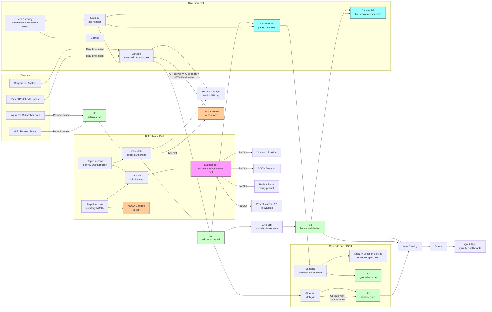

# Recipe 5.3 Architecture and Implementation: Address Standardization and Household Linkage

*Companion to [Recipe 5.3: Address Standardization and Household Linkage](chapter05.03-address-standardization-household-linkage). This page covers the AWS architecture, services, prerequisites, and pseudocode. For the problem framing and the conceptual approach, start with the main recipe.*

---

## The AWS Implementation

### Why These Services

**Amazon S3 for the address-standardization data lake.** Three zones: raw (the source-system extracts of patient addresses, partitioned by source system and extract date), curated (the standardized addresses keyed by `address_hash` with full provenance and metadata), and derived (household-membership tables, geocode-augmented records, SDOH-joined records, drift-event archives). S3 is HIPAA-eligible under BAA with SSE-KMS encryption, and the partitioning pattern supports cohort-stratified analytics through Athena. Standardized addresses are PHI in their structured form; the encryption and access-control posture matches the rest of the patient demographics.

**Amazon DynamoDB for the standardized-address table and the household-membership table.** Two main tables. `patient-address` keyed on `(patient_id, address_role)` (where `address_role` is `physical`, `mailing`, `historical`, etc.) holds the current standardized address per role per patient, with the structured components, the validation status, the metadata, and the last-validated timestamp. `household-membership` keyed on `(household_id, patient_id)` holds the patient-to-household mappings with the inference confidence, the inference basis, and the privacy-suppression flag. DynamoDB's single-digit-millisecond reads support real-time household lookups for clinical context queries; the on-demand capacity handles the bursty pattern of registration-driven updates and quarterly batch refreshes.

**Amazon Location Service or a CASS-certified third-party vendor for standardization and geocoding.** AWS Location Service provides geocoding through partner data providers (Esri, HERE, Grab) but does not currently provide CASS-certified USPS-conformant standardization for the United States.  The most common production pattern is to use a CASS-certified vendor (Smarty, Melissa, Loqate, Experian) for standardization, then either Location Service or the same vendor for geocoding. Vendor APIs are called from a Lambda with the API key stored in AWS Secrets Manager, the call made through a VPC endpoint or NAT Gateway with allow-listed egress, and the response cached against the input hash to avoid duplicate API calls. The architecture treats the standardization vendor as a swappable component: the standardized-record schema is the contract, and the implementation behind it can be any CASS-certified provider.

**AWS Lambda for the per-record standardization, the household-inference scoring, and the drift detection.** Lambda is the right substrate for these because each task is short-lived, mostly I/O-bound (vendor API call plus DynamoDB write), and benefits from on-demand scaling for bursty workloads. Standardization Lambdas are in VPC with VPC endpoints for downstream services. The split between Glue (batch, large-scale refresh) and Lambda (real-time, single-record) lets each workload run on the right substrate. 

**AWS Glue for the batch refresh and the household-inference batch job.** The monthly USPS-reference-data refresh and the quarterly NCOA processing run as Glue jobs because they operate over the entire patient address population at once. The household-inference job also runs as Glue: it groups standardized addresses by canonical hash, evaluates per-group evidence, and writes household-membership rows. Glue Data Catalog tracks the schema across raw, curated, and derived zones. Athena queries the catalog for cohort-stratified accuracy monitoring, address-quality reporting, and ad-hoc operational questions.

**AWS Step Functions for orchestration.** Three workflows: a real-time-update workflow (run on a per-record basis when a new patient registers or an address changes; standardize, validate, persist, recompute household membership for the affected addresses), a monthly-USPS-refresh workflow (re-standardize the entire population against the latest USPS reference data; detect drifts; recompute household membership where addresses changed), and a quarterly-NCOA workflow (submit the population to NCOA; receive updates; merge into the address store; recompute household membership where movers were detected).

**Amazon EventBridge for address and household drift events.** When a standardized address changes (DPV failure, ZIP+4 change, NCOA mover) or a household membership changes (new patient at an existing household, household member moved out), an event flows out to downstream consumers: the outreach pipeline for mailing-list updates, the SDOH analytics pipeline for geocode refresh, the patient-portal for verification prompts, the matcher (recipe 5.1) for re-evaluation of any duplicate-detection candidates that depend on address signals.

**Amazon API Gateway plus Lambda for the real-time standardization API.** Patient registration workflows call the API at the moment a patient is registering or updating their address, get back a structured standardized address, and present any corrections or ambiguity warnings to the registration clerk for confirmation. The API also handles the household-lookup pattern (given a patient ID, return the household membership records). API Gateway is a private API with a VPC endpoint resource policy restricting access to the institutional VPC; the registration system, the patient portal, and the clinical-context-query consumers reach the API through the VPC endpoint. AWS WAF is attached with rule groups for SQL injection, command injection, request rate limiting (per source-IP and per Cognito principal), and request-size limiting. CloudFront-with-WAF fronts any publicly-addressable patient-portal surface; the institutional perimeter terminates TLS at the WAF and re-establishes TLS to the API. Lambda handles the orchestration of the standardization vendor call and the persist-to-DynamoDB step. Latency targets: P50 cache-hit < 50ms, P50 cache-miss-with-vendor-call < 400ms, P95 < 800ms, P99 < 2s. Vendor API call timeout is 1.5s with one retry (3s total before fallback). Fallback: accept the raw address with `standardization_status: "PENDING_STANDARDIZATION"`, write to patient-address with the pending flag, emit a `pending_standardization` event drained by an asynchronous re-standardization Lambda when the vendor recovers; registration workflow continues without interruption (fail-open). CloudWatch alarm fires when pending-standardization queue depth exceeds 100 records or persists more than 30 minutes. Vendor failover to a secondary CASS-certified vendor is not architected at the Lambda layer (the multi-vendor consistency complexity exceeds the value at most institutions); institutions with stricter availability requirements evaluate primary-secondary vendor patterns separately.

**Amazon Athena and AWS Glue Data Catalog for analytics.** Cohort-stratified standardization-success rates, household-inference confidence distributions, drift-event volumes, mover detection rates from NCOA processing. Athena queries the catalog over the curated and derived S3 zones; QuickSight on top of Athena provides the dashboards for the address-data-quality team and for the population-health and SDOH analytics teams.

**Amazon QuickSight for the operational and quality dashboards.** Per-cohort standardization-success rates (validated vs corrected vs ambiguous vs not-validated), household-inference confidence distribution by building type and by cohort, drift-event rates, NCOA mover rates, geocoding success rates, SDOH-indicator coverage by census tract.

**AWS KMS, CloudTrail, CloudWatch.** Customer-managed keys for the S3 buckets, the DynamoDB tables, and the Lambda log groups. CloudTrail data events on the address and household tables and on the standardization-audit S3 bucket. CloudWatch alarms on standardization-vendor-API failure rates, on drift-event volumes (a sudden spike often indicates a USPS reference-data anomaly worth investigating), on NCOA-processing-latency breaches, and on cohort-stratified standardization-success-rate disparities. When emitting cohort dimensions on CloudWatch metrics (per-cohort standardization-success rate, per-cohort household HIGH-confidence rate, per-cohort geocoding-success rate, per-cohort NCOA mover rate), use bucketed non-reversible cohort labels (`cohort_bucket` = A, B, C, D, E, unknown) rather than raw demographic attributes; the cohort-label-to-attribute mapping lives in a separate access-controlled table loaded only at dashboard-render time.

**AWS Lake Formation for column-level and row-level access controls over the Glue-cataloged curated and audit S3 zones.** Standardized addresses are PHI; QuickSight users do not need access to the full address payload, only the cohort-aggregated metrics. Restrict dashboards to cohort-aggregated metrics columns; data-quality team users see the full standardized address payload and the audit-trail provenance; the privacy-suppression-audit table is restricted to the privacy office and the institutional auditors. Direct Athena query path uses the same Lake Formation grants. Access logged via CloudTrail data events on the catalog and underlying S3 buckets.

**AWS Secrets Manager for the standardization-vendor API key and the NCOA-vendor credentials.** Vendor credentials are sensitive and should not appear in code or in environment variables. Secrets Manager stores them with KMS encryption at rest, IAM-controlled access, and rotation support where the vendor supports rotation.

### Architecture Diagram



### Prerequisites

| Requirement | Details |
|-------------|---------|
| **AWS Services** | Amazon S3, Amazon DynamoDB, AWS Lambda, AWS Glue, Amazon Athena, AWS Step Functions, Amazon EventBridge, Amazon API Gateway, Amazon Cognito, Amazon Location Service (optional), Amazon QuickSight, AWS Secrets Manager, AWS KMS, Amazon CloudWatch, AWS CloudTrail. |
| **External Services** | A CASS-certified address-standardization vendor (Smarty, Melissa, Loqate, Experian, or equivalent). An NCOAlink-certified vendor for periodic mover detection (often the same vendor as standardization). A geocoding source (Amazon Location Service partner providers, or the same address-quality vendor). |
| **IAM Permissions** | Per-Lambda least-privilege: `dynamodb:GetItem` / `PutItem` / `UpdateItem` scoped to specific tables; `s3:GetObject` / `PutObject` scoped to specific bucket prefixes; `secretsmanager:GetSecretValue` scoped to the vendor-API-key secret; `events:PutEvents` on the drift bus; `kms:Decrypt` on relevant CMKs. Glue jobs need scoped catalog and S3 permissions. Never use `*` actions or `*` resources in production. Highest-stakes scoped ARN examples: `dynamodb:UpdateItem` on `arn:aws:dynamodb:<region>:<account>:table/patient-address`; `dynamodb:Query` on `arn:aws:dynamodb:<region>:<account>:table/patient-address/index/canonical-hash-index`; `s3:PutObject` on `arn:aws:s3:::<env>-address-curated/audit/*`; `events:PutEvents` on `arn:aws:events:<region>:<account>:event-bus/address-and-household-drift`; `secretsmanager:GetSecretValue` on the vendor-API-key secret ARN. |
| **BAA** | AWS BAA signed. The standardization vendor must also be willing to sign a BAA, since you will be sending PHI (the address combined with patient identifier) to their API. Most major address-quality vendors offer healthcare-tier service plans with BAAs available. Vendor data-handling commitments contractually specified: (a) the vendor will not retain submitted addresses beyond a documented operational window (typically 30-90 days), with deletion verifiable on request; (b) the vendor will disclose all sub-processors that may handle PHI (cloud-infrastructure providers, sub-vendors for international coverage, sub-vendors for geocoding) and the institution may object to specific sub-processors; (c) the vendor will notify the institution within a documented window (typically 24-72 hours) of any data incident affecting institutional data; (d) the vendor will sign a HIPAA-compliant BAA and a data-processing addendum specifying the institution's right to audit the vendor's controls (typically annually or upon material change). The architecture uses a vendor-side correlation token rather than transmitting `patient_id` to the vendor; the institution maps the correlation token back to `patient_id` on response, so the vendor never holds a direct patient identifier. |
| **Encryption** | S3: SSE-KMS with bucket-level keys. DynamoDB: customer-managed KMS at rest. Lambda log groups KMS-encrypted. Secrets Manager: KMS-encrypted secrets. EventBridge: server-side encryption. Glue jobs: KMS for connection passwords. TLS 1.2 or higher for all in-transit traffic, including the vendor-API call. |
| **VPC** | Production: Lambdas in VPC. Glue jobs in VPC connections. VPC endpoints for S3 (gateway), DynamoDB (gateway), KMS, Secrets Manager, CloudWatch Logs, EventBridge, Step Functions, Glue, Athena, STS. NAT Gateway for the vendor API call with an outbound HTTPS proxy and allow-listed vendor domains. The standardization-vendor egress and the NCOA-vendor egress are configured as distinct outbound proxy rules with non-overlapping allow-lists scoped to compute roles: the standardization Lambda's role allows only the CASS-certified-vendor API domain; the NCOA-result-handler Lambda's role allows only the NCOA-vendor secure-file-exchange domain. Per-role rate limit on vendor API calls below the vendor's published rate limits. Egress connections CloudWatch-logged for chargeback and forensic auditing. At volumes exceeding approximately 1M vendor API calls per month, evaluate the vendor's PrivateLink endpoint where available (eliminates NAT Gateway data-transfer cost on the egress path and keeps traffic on the AWS network). |
| **CloudTrail** | Enabled with data events on the patient-address and household-membership tables; data events on the audit S3 buckets. API Gateway and Lambda invocations logged. CloudTrail logs encrypted with KMS and retained for the longer of: 7 years (records-retention minimum for healthcare encounter-adjacent records), the institution's documented address-and-household retention policy, the financial-assistance program's retention statute (where applicable), the value-based-care contract's retention requirement (where applicable), and the HIE-participation retention specification. Audit logs in a dedicated S3 bucket with Object Lock in Compliance mode for immutability and a lifecycle policy transitioning to S3 Glacier Deep Archive after 90 days. CloudTrail data events forwarded to a dedicated audit AWS account in the institution's organization, isolating the audit substrate from the production data plane. The retention floor is enforced at the bucket-policy and Object-Lock-configuration level, not at application logic. |
| **Vendor Selection** | Vet the standardization vendor for: CASS certification (current cycle), NCOAlink certification, BAA availability, healthcare-customer references, API rate limits and bulk-processing options, response-time SLAs, geographic coverage (US-only or international), pricing model (per-record, monthly subscription, or annual license), uptime SLA, and data-handling commitments (do they retain submissions, for how long, with what controls). The vendor selection is consequential because the vendor sees PHI; treat the procurement as a privacy and security review, not just a feature comparison. |
| **Sample Data** | Use synthetic patient address records that exercise the full range of standardization outcomes (clean, corrected, ambiguous, missing-secondary, not-validated, invalid). The USPS provides public reference data and the major vendors typically provide test endpoints with known-test addresses. Never use real patient addresses in development environments. |
| **Cost Estimate** | At a medium-sized health system with ~500,000 patients and ~10,000 new addresses per month plus change-driven monthly refresh (typically 5-15% of the population per cycle): vendor standardization costs roughly $0.005-0.02 per address validated (typically billed in batches; healthcare-tier with BAA is at the higher end of that range), so monthly throughput at approximately 35,000-85,000 addresses (10K new plus 25K-75K change-driven refresh share) produces a change-driven baseline of roughly $2,000-6,000/month for the vendor. Full-population refresh is available as an architectural alternative at roughly 3-5x the change-driven baseline for institutions that prefer simplicity over cost optimization. AWS infrastructure: S3, DynamoDB, Lambda, Glue, Step Functions, EventBridge, API Gateway, Athena, QuickSight, KMS combined typically $300-1,500/month. Estimated total: $2,300-7,500/month (change-driven) or $5,000-15,000/month (full-population), dominated by the vendor cost. NCOA processing typically adds $1,000-3,000/quarter for the cross-check submission. |

### Ingredients

| AWS Service | Role |
|------------|------|
| **Amazon S3** | Hosts raw address extracts, standardized records, household-membership tables, geocode cache, SDOH-joined records, and drift archives |
| **Amazon DynamoDB** | Stores the current standardized address per patient per role (`patient-address`) and the patient-to-household mappings (`household-membership`) for low-latency real-time access |
| **AWS Lambda** | Per-record standardization on registration-time events, household-inference for affected groups on address change, drift-detection on refresh cycles, real-time API handler |
| **AWS Glue** | Batch standardization refresh against new USPS reference data, batch household-inference over the full patient population, SDOH-indicator joining |
| **Amazon Athena** | SQL access to the address data lake for cohort-stratified accuracy monitoring, quality reporting, and ad-hoc operations questions |
| **AWS Step Functions** | Orchestrates the monthly USPS refresh, the quarterly NCOA processing, and the per-record real-time update workflows |
| **Amazon EventBridge** | Fans out address and household drift events to downstream consumers (outreach, SDOH analytics, patient portal, patient matcher) |
| **Amazon API Gateway** | Exposes the real-time standardization endpoint for registration workflows and the household-lookup endpoint for clinical-context queries |
| **Amazon Cognito** | Authenticates real-time API consumers (registration system, clinical applications) |
| **Amazon Location Service** | (Optional) Geocoding, when not handled by the address-quality vendor; partners provide the underlying mapping data |
| **Amazon QuickSight** | Quality dashboards (standardization success rate by cohort, household-inference confidence distribution, drift volume, mover detection rate) |
| **AWS Secrets Manager** | Stores vendor API keys and credentials with KMS encryption and rotation support |
| **AWS KMS** | Customer-managed encryption keys for all address-data stores |
| **Amazon CloudWatch** | Operational metrics and alarms (vendor API failures, standardization latency, drift spike detection, cohort disparities) |
| **AWS CloudTrail** | Audit logging for all API calls on the address and household tables and on the audit S3 buckets |

---

### Code

> **Reference implementations:** Useful aws-samples, vendor SDKs, and open-source patterns for this recipe:
> - [`pyusps`](https://github.com/jminuse/pyusps) and similar small libraries: lightweight USPS API wrappers; useful for development environments where you cannot use a CASS-certified vendor. Note the USPS Web Tools API is not CASS-certified and is rate-limited; not appropriate for production. 
> - [`libpostal`](https://github.com/openvenues/libpostal): an open-source library for address parsing trained on OpenStreetMap data; useful for the parsing piece even when the validation is delegated to a CASS-certified vendor.
> - [`usaddress`](https://github.com/datamade/usaddress): a Python library for parsing US addresses into structured components using probabilistic methods; less heavyweight than libpostal, useful for the parsing piece in development.
> - The major CASS-certified vendors (Smarty, Melissa, Loqate) publish official SDKs for Python, Java, .NET, and Node.js; use the official SDK rather than rolling your own HTTP client. 

#### Walkthrough

**Identity-boundary discipline.** The address-and-household pipeline mutates the canonical address that downstream outreach, SDOH analytics, financial assistance, the patient matcher (5.1), and the patient portal all consume. A misrouted persist or inference call silently corrupts these downstream systems. Every write path enforces identity-boundary checks at the application level (on top of Cognito authentication at the API Gateway layer):

- **Real-time API (registration, portal updates):** The API Gateway authorizer validates the Cognito-authenticated caller's role and scope. For portal self-updates, the authenticated principal must equal the patient_id in the request (a patient may only update their own address). For registration-system calls, the caller's service principal is bound to the facilities it is authorized to serve; a registration clerk at Facility A cannot standardize-and-persist for a patient at Facility B. Mismatches reject with a logged metric (`api_authorization_violation`).
- **Ingest events (registration, insurance feeds, HIE referrals):** Inbound events carry a producer-signed envelope (`source_system`, `source_record_id`, `event_id`, `signed_payload`, `signature`). The standardize-on-update Lambda validates the signature against the producer's known signing key (rotated per the institutional secret-rotation policy), validates the source_system is in the allow-list, validates the event_id is unique within a sliding window (idempotency), and rejects events that fail any check with routing to the rejected-events DLQ and a logged metric.
- **NCOA result processing:** The quarterly NCOA result file arrives from the vendor's secure file exchange. The result-handler Lambda validates the vendor-response signature (the NCOA vendor signs the result file with a key the institution holds) and the idempotency-on-submission-id check (a result file is processed exactly once per submission; replays are rejected).
- **Household-inference path:** Only the persist-standardized-record path and the batch-refresh path may invoke household inference. The inference Lambda validates that the caller's execution role matches one of the authorized invocation sources (standardize-on-update role, batch-refresh role, NCOA-result-handler role). The real-time API's household-lookup endpoint calls the read path only (not the inference path).
- **Household-lookup read path:** A household-membership query for a patient_id with the privacy-suppression flag returns "no household" (the same response shape as a patient with no co-located records), closing the absence-as-signal channel. An audit event records every household-lookup query for forensic review.

Same chapter-wide pattern as recipes 5.1 and 5.2; the chapter editor should consolidate identity-boundary guidance into a chapter preface. For 5.3 specifically, the address-as-anchor consequence earns the specification here because corrupted address state cascades to every downstream consumer.

**Step 1: Ingest patient address records.** Address records arrive from registration events (real-time), insurance feeds (periodic batch), HIE referrals (per-event), and patient-portal updates (real-time). Each source produces a raw address with source-specific field formatting. Capture the source, the timestamp, the patient identifier, the address role (physical, mailing, historical), and the raw fields. Skip this and you lose the audit trail you'll need when the standardization changes the address and you need to explain why.

```pseudocode
FUNCTION ingest_address_record(source_event):
    raw = {
        patient_id: source_event.patient_id,
        address_role: source_event.address_role,
            // "physical", "mailing", "historical_<n>"
        line1: source_event.address_line_1,
        line2: source_event.address_line_2,
        city: source_event.city,
        state: source_event.state,
        zip: source_event.postal_code,
        country: source_event.country OR "US",
        source: source_event.source_system,
            // "registration", "insurance_feed", "hie", "portal"
        source_record_id: source_event.source_record_id,
        ingested_at: current UTC timestamp
    }

    // Persist the raw input for audit and for re-standardization
    // after vendor-software upgrades.
    write_to_s3(raw, s3_bucket="address-raw",
                key="{source}/{date}/{patient_id}_{role}.json")

    RETURN raw
```

**Step 2: Standardize against the USPS reference data via the vendor API.** The CASS-certified vendor takes the raw input and returns a structured, validated, USPS-conformant standardized record. The vendor handles the heavy lifting: parsing, USPS rule application, DPV validation, correction logic, and metadata enrichment. Skip this and you'll be implementing CASS yourself, which is a multi-quarter project that you'll then have to maintain through every USPS reference-data update.

```pseudocode
FUNCTION standardize_address(raw):
    // Step 2A: short-circuit for non-US addresses. The CASS vendor
    // covers US addresses only; international addresses go through
    // a different validator path (or no validator at all if no
    // international vendor is licensed).
    IF raw.country != "US" AND raw.country != "USA":
        RETURN {
            standardization_status: "INTERNATIONAL_NOT_PROCESSED",
            international_address_raw: raw,
            standardized_at: current UTC timestamp
        }

    // Step 2B: call the CASS-certified vendor API.
    // The vendor SDK handles authentication, retries, and the
    // structured response. Idempotency is on (raw_input_hash) so
    // repeated calls for the same input return the same result.
    raw_input_hash = sha256(canonical_form(raw))

    // Check the cache first; many addresses are repeats across
    // patient records (family members at the same address, address
    // copied from one record to another).
    cached = check_standardization_cache(raw_input_hash)
    IF cached IS NOT NULL AND cached.cache_age < CACHE_TTL:
        RETURN cached.standardized
    // CACHE_TTL is 30 days, bounded by the USPS monthly
    // reference-data update cadence. Cache entries stored in
    // DynamoDB with a TTL attribute so DynamoDB auto-evicts.
    // Cache invalidation on USPS reference-data update is handled
    // by the change-driven refresh (see Step 5A): if the refresh
    // re-standardizes a record, the cache for the underlying
    // raw_input_hash is updated as a side effect.

    vendor_response = vendor_sdk.validate(
        line1: raw.line1,
        line2: raw.line2,
        city: raw.city,
        state: raw.state,
        zip: raw.zip
    )
    // The vendor response contains: parsed components, the
    // standardized form, the DPV result, and any footnotes
    // explaining corrections or warnings.

    // Step 2C: classify the result by USPS-defined outcome.
    standardized = {}
    IF vendor_response.dpv == "Y" AND vendor_response.was_corrected == false:
        standardized.status = "VALIDATED"
            // clean, USPS-confirmed, no corrections
    ELIF vendor_response.dpv == "Y" AND vendor_response.was_corrected == true:
        standardized.status = "CORRECTED"
            // input had errors, vendor applied a correction
        standardized.correction_confidence = vendor_response.correction_confidence
        standardized.original_input = raw  // for audit
    ELIF vendor_response.dpv == "S":
        standardized.status = "MISSING_SECONDARY"
            // valid building, but a secondary unit is required
            // and missing
    ELIF vendor_response.dpv == "D":
        standardized.status = "AMBIGUOUS"
            // multiple valid corrections, no high-confidence answer
        standardized.candidate_addresses = vendor_response.candidates
    ELIF vendor_response.dpv == "N" OR vendor_response.match_code == "no_match":
        standardized.status = "NOT_VALIDATED"
            // not in USPS database; might still be real (new
            // construction) or invalid
    ELSE:
        standardized.status = "INVALID"
            // cannot be parsed or matched

    // Step 2D: capture the structured form and the metadata.
    IF standardized.status IN ["VALIDATED", "CORRECTED", "MISSING_SECONDARY"]:
        standardized.delivery_line_1 = vendor_response.delivery_line_1
        standardized.last_line = vendor_response.last_line
        standardized.components = {
            primary_number: vendor_response.components.primary_number,
            street_predirection: vendor_response.components.street_predirection,
            street_name: vendor_response.components.street_name,
            street_suffix: vendor_response.components.street_suffix,
            street_postdirection: vendor_response.components.street_postdirection,
            secondary_designator: vendor_response.components.secondary_designator,
            secondary_number: vendor_response.components.secondary_number,
            city: vendor_response.components.city,
            state: vendor_response.components.state,
            zipcode: vendor_response.components.zipcode,
            plus4_code: vendor_response.components.plus4_code
        }
        standardized.metadata = {
            record_type: vendor_response.metadata.record_type,
                // "Street", "PO Box", "Highway Contract",
                // "Firm" (commercial), etc.
            is_residential: vendor_response.metadata.is_residential,
            is_business: vendor_response.metadata.is_business,
            is_vacant: vendor_response.metadata.is_vacant,
            is_po_box: vendor_response.metadata.is_po_box,
            congressional_district: vendor_response.metadata.congressional_district,
            county_name: vendor_response.metadata.county_name,
            county_fips: vendor_response.metadata.county_fips,
            census_block: vendor_response.metadata.census_block,
            carrier_route: vendor_response.metadata.carrier_route,
            dpv_footnotes: vendor_response.metadata.dpv_footnotes
        }
        standardized.canonical_hash = sha256(
            canonical_form(standardized.delivery_line_1,
                            standardized.last_line))
            // Used for grouping in household inference; same
            // physical address with same unit produces same hash.
            // delivery_line_1 from a CASS-certified vendor already
            // includes the unit number when present.

    // Step 2E: provenance.
    standardized.raw_input_hash = raw_input_hash
    standardized.original_input = raw
    standardized.standardized_at = current UTC timestamp
    standardized.vendor = VENDOR_NAME
    standardized.vendor_software_version = vendor_response.software_version
    standardized.cass_certification_cycle = vendor_response.cass_cycle
    standardized.usps_reference_data_release = vendor_response.usps_reference_release

    // Step 2F: cache and return.
    write_to_standardization_cache(raw_input_hash, standardized)
    RETURN standardized
```

**Step 3: Persist the standardized record and emit events.** Write the structured standardized record to DynamoDB keyed on `(patient_id, address_role)` so downstream consumers can look up the current address per role. Also write to S3 for the audit trail and for analytics. If the standardization changed the address, emit an `address_standardized` event so downstream consumers can refresh their copies. The DynamoDB write, the S3 archive write, and the EventBridge emit are wrapped in a TransactWriteItems plus an outbox row drained by a separate Lambda (or DynamoDB Streams consumer) so partial failures do not leave the address table out of sync with downstream consumers. The same wrapping applies to `infer_household_for_address` (Step 4): per-member household-membership PutItems plus the household-inferred event are atomic; for households exceeding the TransactWriteItems 100-item limit, a saga pattern keyed on a `household_update_id` ensures eventual consistency. The regulatory consequence is sharper than recipes 5.1 and 5.2 because the address store feeds outreach (mailing-list scrubbing breaks if the address persisted but the household-inference event was not emitted) and the financial-assistance workflow (eligibility re-determination reads household membership).

Idempotency keys for each path: standardize-on-update at `(patient_id, address_role, raw_input_hash)`; persist-standardized-record at `(patient_id, address_role, standardized.standardized_at)`; household-inference at `(canonical_hash, inference_version)`; NCOA-result-processing at `(submission_id, mover_record_id)`; drift-event emission at `(patient_id, address_role, drift_type, detected_at_day)`. Each Lambda has a dedicated DLQ; Step Functions Catch states route terminal failures to the DLQ; CloudWatch alarms on DLQ depth surface stuck workflows within 15 minutes of accumulation.

```pseudocode
FUNCTION persist_standardized_record(patient_id, raw, standardized):
    // Step 3A: read the previous record for this (patient_id,
    // address_role) so we can detect changes.
    previous = DynamoDB.GetItem("patient-address",
        key={patient_id: patient_id, address_role: raw.address_role})

    // Transactional consistency: the DynamoDB write, the S3
    // archive write, and the EventBridge emit use
    // TransactWriteItems plus an outbox row drained by a
    // DynamoDB Streams consumer. Partial failures do not leave
    // the address table out of sync with downstream consumers.
    // The same pattern applies to infer_household_for_address
    // (Step 4): per-member household-membership PutItems plus the
    // household-inferred event are atomic; for households
    // exceeding the TransactWriteItems 100-item limit, a saga
    // pattern keyed on household_update_id ensures eventual
    // consistency.

    // Step 3B: write the current standardized record.
    DynamoDB.PutItem("patient-address", {
        patient_id: patient_id,
        address_role: raw.address_role,
        standardized: standardized,
        previous_canonical_hash: previous.standardized.canonical_hash
            IF previous IS NOT NULL ELSE NULL,
        last_updated_at: current UTC timestamp,
        next_revalidation_due_at: today() + REVALIDATION_CADENCE_DAYS
    })

    // Step 3C: archive to S3.
    write_to_s3(standardized,
                s3_bucket="address-curated",
                key="{patient_id}/{role}/{timestamp}.json")

    // Step 3D: emit an event if the canonical address changed.
    IF previous IS NULL OR
       previous.standardized.canonical_hash != standardized.canonical_hash:
        EventBridge.PutEvents([{
            source: "address-standardization",
            detail_type: "address_standardized",
            detail: {
                patient_id: patient_id,
                address_role: raw.address_role,
                previous_canonical_hash: previous.standardized.canonical_hash
                    IF previous IS NOT NULL ELSE NULL,
                new_canonical_hash: standardized.canonical_hash,
                standardization_status: standardized.status,
                standardized_at: standardized.standardized_at
            }
        }])

    // Step 3E: trigger household re-inference for affected
    // canonical addresses. The previous-address group loses this
    // patient; the new-address group gains them.
    IF previous IS NOT NULL AND
       previous.standardized.canonical_hash != standardized.canonical_hash:
        invoke_household_inference(previous.standardized.canonical_hash)
    invoke_household_inference(standardized.canonical_hash)
```

**Step 4: Infer household membership for a co-location group.** Group all patient records sharing a canonical address hash. Apply privacy suppression. Evaluate corroborating evidence (last-name overlap, insurance-subscriber overlap, age patterns). Emit graded household-membership records. Skip this and you have a list of co-located patients but no usable household structure for downstream consumers.

```pseudocode
FUNCTION infer_household_for_address(canonical_hash):
    // Step 4A: pull all patient records sharing the canonical hash.
    co_located_records = DynamoDB.Query("patient-address",
        index="canonical_hash_index",
        key={canonical_hash: canonical_hash})

    IF len(co_located_records) <= 1:
        // Single patient at this address; no household to infer.
        // Persist a single-patient household record for consistency.
        persist_single_patient_household(co_located_records[0])
        RETURN

    // Step 4B: apply privacy suppression. If any record has a
    // privacy flag, the system either suppresses the household
    // for everyone in the group, or excludes the suppressed
    // patient from the group, depending on policy.
    //
    // Audit posture for the privacy-suppression decision path:
    // every household-membership row records the policy version
    // active at inference time (privacy_policy_version) and the
    // policy decision (privacy_decision: none,
    // suppressed_record_excluded, suppressed_group_entirely). A
    // separate privacy_suppression_audit table keyed on
    // (canonical_hash, suppression_event_timestamp) records every
    // encounter with a suppression flag during inference, with
    // the suppressed patient_id, the action taken, and the
    // resulting household state. A change in the institutional
    // privacy policy emits a privacy_policy_changed event on
    // EventBridge that triggers re-inference for every canonical
    // hash with at least one suppressed record. Without these,
    // forensic reconstruction (a domestic-violence-survivor
    // patient asks the institution to investigate whether the
    // household graph leaked her location) cannot reconstruct the
    // policy state at the time of the inference.
    suppressed_patients = []
    FOR each record in co_located_records:
        patient_privacy = get_patient_privacy_flags(record.patient_id)
        IF patient_privacy.suppress_household_linkage:
            suppressed_patients.append(record.patient_id)

    IF PRIVACY_POLICY == "suppress_entire_group_if_any_suppressed":
        IF len(suppressed_patients) > 0:
            persist_suppressed_household(canonical_hash, co_located_records,
                                            suppressed_patients)
            RETURN
    ELIF PRIVACY_POLICY == "exclude_suppressed_from_group":
        co_located_records = [r FOR r in co_located_records
                                 WHERE r.patient_id NOT IN suppressed_patients]

    // Step 4C: identify the building type from the standardization
    // metadata. Some building types do not produce meaningful
    // household groupings (commercial, PO Box, shelter, nursing
    // home).
    sample_metadata = co_located_records[0].standardized.metadata
    building_type = classify_building_type(sample_metadata,
                                              co_located_records)
        // returns: "single_family", "multi_unit_with_unit",
        //          "multi_unit_no_unit", "commercial", "po_box",
        //          "shelter", "nursing_home", "unknown"

    IF building_type IN ["commercial", "po_box", "shelter",
                          "nursing_home"]:
        // These building types do not produce household inferences
        // (or need workflow-specific handling, e.g., shelters need
        // case-management linkage rather than household linkage).
        persist_co_located_only(canonical_hash, co_located_records,
                                  building_type)
        RETURN

    // Step 4D: apply corroborating-evidence assessment to assign
    // confidence.
    //
    // Configuration and governance posture: the thresholds
    // (last-name overlap fraction, age-pattern consistency
    // criteria, insurance-subscriber match weight, secondary-unit
    // completeness weight) live in a versioned configuration
    // table; re-calibration runs annually or on detection of
    // cohort-stratified disparity above 0.10, whichever first;
    // re-calibration produces a candidate threshold set;
    // institutional review (data-quality team, privacy office,
    // clinical leadership) reviews the confusion matrix and the
    // cohort-disparity impact before promoting the candidate to
    // production; each household-membership row records the
    // configuration version and threshold values active at
    // inference time.
    household_id = derive_household_id(canonical_hash)
        // stable household_id derived from the canonical hash so
        // re-runs produce the same id

    confidence_assessment = {
        building_type: building_type,
        unit_completeness: all_records_have_secondary_unit(co_located_records),
        last_name_overlap: compute_last_name_overlap(co_located_records),
        insurance_subscriber_overlap: compute_subscriber_overlap(co_located_records),
        age_pattern_consistency: assess_age_patterns(co_located_records),
        emergency_contact_links: check_emergency_contact_links(co_located_records)
    }

    confidence = assign_confidence_level(confidence_assessment, building_type)
        // returns: "HIGH", "MEDIUM", "CO_LOCATED"

    inference_basis = enumerate_supporting_evidence(confidence_assessment)
        // human-readable list for the audit trail and for the
        // review interface when downstream consumers need it

    // Step 4E: persist the household-membership records. One row
    // per (household_id, patient_id), so downstream consumers can
    // efficiently look up household membership by patient or by
    // household.
    FOR each record in co_located_records:
        DynamoDB.PutItem("household-membership", {
            household_id: household_id,
            patient_id: record.patient_id,
            confidence_level: confidence,
            inference_basis: inference_basis,
            building_type: building_type,
            canonical_hash: canonical_hash,
            inferred_at: current UTC timestamp,
            inference_version: HOUSEHOLD_INFERENCE_VERSION
        })

    // Step 4F: emit a household-changed event if the membership
    // changed.
    EventBridge.PutEvents([{
        source: "household-inference",
        detail_type: "household_inferred",
        detail: {
            household_id: household_id,
            canonical_hash: canonical_hash,
            patient_ids: [r.patient_id FOR r in co_located_records],
            confidence: confidence,
            building_type: building_type,
            inferred_at: current UTC timestamp
        }
    }])
```

**Step 5: Periodic refresh against the latest USPS reference data and NCOA.** USPS reference data updates monthly. NCOA processing typically runs quarterly. Both can change a previously-validated address: a building gets demolished, a ZIP+4 changes due to a postal-route restructure, a patient is detected as a mover via NCOA. The refresh uses a change-driven approach rather than re-standardizing the entire population: Step 5A pulls the USPS reference-data change manifest for the cycle (which ZIP+4 ranges, DPV records, and building-type metadata changed since the last processed release); a Glue/Spark job filters the patient-address snapshot to records whose canonical-hash prefix maps to a changed range plus records whose cache TTL expired independent of reference-data changes (catches vendor software updates and correction-logic improvements); only those records are re-standardized. At a 500K-patient system this typically processes 5-15% of the population per cycle (versus 100% for a full-population pass), with the corresponding cost reduction. Vendor-side change feeds (where the vendor offers them) eliminate the need for the full re-validation pass entirely. Full-population re-standardization remains available as an architectural alternative for institutions that prefer simplicity over cost optimization at roughly 3-5x the change-driven baseline. Skip the refresh and your address data decays; outreach campaigns get worse over time, SDOH analytics drift from reality, the patient matcher loses signal it should have.

```pseudocode
FUNCTION monthly_usps_refresh():
    // Step 5A: pull the USPS reference-data change manifest for
    // the cycle (which ZIP+4 ranges, DPV records, and building-
    // type metadata changed since the last processed release).
    // A Glue/Spark job filters the patient-address snapshot to
    // records whose canonical-hash prefix maps to a changed range
    // plus records whose cache TTL expired independent of
    // reference-data changes (catches vendor software updates and
    // correction-logic improvements); only those records are
    // re-standardized. At a 500K-patient system this typically
    // processes 5-15% of the population per cycle.
    change_manifest = load_usps_change_manifest(current_cycle, previous_cycle)
    all_addresses = filter_patient_addresses_by_change_manifest(
        change_manifest, CACHE_TTL_DAYS)
        // For large populations, this is a Glue/Spark job over
        // S3-archived snapshots rather than a DynamoDB scan.

    drift_events = []

    FOR each address_record in all_addresses:
        // Step 5B: re-standardize against the latest USPS data.
        new_standardized = standardize_address(address_record.standardized.original_input)

        // Step 5C: compare the new standardization to the previous.
        IF new_standardized.canonical_hash != address_record.standardized.canonical_hash OR
           new_standardized.status != address_record.standardized.status:
            // A meaningful change occurred.
            drift_events.append({
                patient_id: address_record.patient_id,
                address_role: address_record.address_role,
                previous_status: address_record.standardized.status,
                new_status: new_standardized.status,
                previous_canonical_hash: address_record.standardized.canonical_hash,
                new_canonical_hash: new_standardized.canonical_hash,
                drift_type: classify_drift(address_record.standardized,
                                              new_standardized)
                    // "became_invalid", "zip4_changed",
                    // "secondary_unit_now_required",
                    // "building_type_changed", "validated_now"
            })

            // Step 5D: persist the updated standardized record.
            persist_standardized_record(address_record.patient_id,
                                          address_record.standardized.original_input,
                                          new_standardized)

            // Step 5E: re-run household inference for the affected
            // canonical hashes (old and new).
            invoke_household_inference(address_record.standardized.canonical_hash)
            IF new_standardized.canonical_hash != address_record.standardized.canonical_hash:
                invoke_household_inference(new_standardized.canonical_hash)

    // Step 5F: emit drift events to downstream consumers.
    FOR each event in drift_events:
        EventBridge.PutEvents([{
            source: "address-standardization",
            detail_type: "address_drift_detected",
            detail: event
        }])

    // Step 5G: surface a summary metric for monitoring.
    emit_cloudwatch_metric("usps_refresh_drift_count", len(drift_events))
    emit_cloudwatch_metric("usps_refresh_processed_count", len(all_addresses))

FUNCTION quarterly_ncoa_processing():
    // Step 5H: assemble the patient address list in the format
    // the NCOA-certified vendor expects.
    address_list = build_ncoa_submission_file()

    // Step 5I: submit to the vendor (typically a secure file
    // exchange rather than a real-time API; NCOA processing is
    // batch-oriented).
    submission_id = ncoa_vendor_sdk.submit(address_list)

    // Step 5J: wait for the result. Vendors typically process
    // within hours for healthcare-tier accounts.
    result = ncoa_vendor_sdk.poll_for_result(submission_id)

    // Step 5K: process movers. Each mover record has the previous
    // address, the new address, the move date, and the source of
    // the change-of-address record.
    FOR each mover in result.movers:
        update_address_with_ncoa_match(
            patient_id: mover.patient_id,
            new_address: mover.new_address,
            move_date: mover.move_date,
            ncoa_match_type: mover.match_type)
                // "individual", "family", "business",
                // "moved_left_no_address"

        // Emit an event for each mover; downstream consumers
        // (outreach, patient portal) often want to act promptly.
        EventBridge.PutEvents([{
            source: "address-standardization",
            detail_type: "ncoa_mover_detected",
            detail: {
                patient_id: mover.patient_id,
                previous_canonical_hash: ...,
                new_canonical_hash: ...,
                move_date: mover.move_date,
                match_type: mover.match_type
            }
        }])
```

> **Curious how this looks in Python?** The pseudocode above covers the concepts. If you'd like to see sample Python code that demonstrates these patterns using boto3, check out the [Python Example](chapter05.03-python-example). It walks through each step with inline comments and notes on what you'd need to change for a real deployment.

---

### Expected Results

**Sample standardized address record:**

```json
{
  "patient_id": "patient-internal-00874",
  "address_role": "physical",
  "standardized": {
    "status": "CORRECTED",
    "delivery_line_1": "1421 ELM ST APT 3B",
    "last_line": "ANYTOWN ST 12345-1234",
    "components": {
      "primary_number": "1421",
      "street_predirection": null,
      "street_name": "ELM",
      "street_suffix": "ST",
      "street_postdirection": null,
      "secondary_designator": "APT",
      "secondary_number": "3B",
      "city": "ANYTOWN",
      "state": "ST",
      "zipcode": "12345",
      "plus4_code": "1234"
    },
    "metadata": {
      "record_type": "Street",
      "is_residential": true,
      "is_business": false,
      "is_vacant": false,
      "is_po_box": false,
      "congressional_district": "12",
      "county_name": "EXAMPLE",
      "county_fips": "12345",
      "census_block": "1234567890123",
      "carrier_route": "C001",
      "dpv_footnotes": ["AA", "BB"]
    },
    "canonical_hash": "a3f5b8c2d1e9f4a7...",
    "correction_confidence": 0.97,
    "original_input": {
      "line1": "1421 elm st apt 3b",
      "line2": null,
      "city": "anytown",
      "state": "ST",
      "zip": "12345"
    },
    "raw_input_hash": "f1e2d3c4b5a6...",
    "standardized_at": "2026-04-22T10:14:18Z",
    "vendor": "ExampleAddressVendor",
    "vendor_software_version": "v3.21.4",
    "cass_certification_cycle": "Cycle O",
    "usps_reference_data_release": "2026-04-01"
  },
  "previous_canonical_hash": null,
  "last_updated_at": "2026-04-22T10:14:18Z",
  "next_revalidation_due_at": "2026-07-22"
}
```

**Sample household-membership record:**

```json
{
  "household_id": "hh-2026-04-a3f5b8c2",
  "patient_id": "patient-internal-00874",
  "confidence_level": "HIGH",
  "inference_basis": [
    "single_family_residential_building",
    "all_records_have_secondary_unit_match",
    "last_name_overlap_3_of_4_records",
    "insurance_subscriber_overlap_present",
    "age_pattern_consistent_with_two_adults_two_children"
  ],
  "building_type": "multi_unit_with_unit",
  "canonical_hash": "a3f5b8c2d1e9f4a7...",
  "inferred_at": "2026-04-22T10:14:25Z",
  "inference_version": "household-inf-v1.2"
}
```

**Sample drift event:**

```json
{
  "drift_event_id": "drift-2026-07-15-00000041",
  "patient_id": "patient-internal-00874",
  "address_role": "physical",
  "drift_type": "ncoa_mover_detected",
  "previous_canonical_hash": "a3f5b8c2d1e9f4a7...",
  "new_canonical_hash": "b4c6d2e1f3a8b9c5...",
  "previous_address": {
    "delivery_line_1": "1421 ELM ST APT 3B",
    "last_line": "ANYTOWN ST 12345-1234"
  },
  "new_address": {
    "delivery_line_1": "789 OAK AVE",
    "last_line": "OTHERTOWN ST 23456-7890"
  },
  "move_date": "2026-06-30",
  "ncoa_match_type": "family",
  "detected_at": "2026-07-15T03:00:00Z",
  "downstream_actions_emitted": [
    "outreach_pipeline_address_refresh",
    "patient_portal_verify_prompt",
    "household_re_inference_old_address",
    "household_re_inference_new_address"
  ]
}
```

**Performance benchmarks (illustrative, your mileage varies):**

| Metric | Status quo (raw addresses) | Recipe pipeline |
|--------|----------------------------|-----------------|
| Percent of addresses USPS-validated | 50-75% | 92-98% |
| Percent of addresses geocoded successfully | 60-85% | 95-99% |
| Direct mail undeliverable rate | 10-25% | 3-8% |
| SDOH-indicator coverage (patients with valid census-tract assignment) | 60-80% | 92-98% |
| Household-inference precision (confidence=HIGH inferences correct on review) | n/a | 95-99% |
| Household-inference recall (true households captured at any confidence) | 30-60% (deterministic on raw) | 75-90% |
| Address-data freshness (median age of validated address) | varies, often 18+ months | <90 days (with quarterly NCOA) |
| Standardization latency (real-time API) | n/a | <300ms typical, <1s worst-case |

**Where it struggles:**

- **Multi-unit buildings without unit numbers.** A 200-unit apartment complex where registration captures only the street address produces a "household" of 200 unrelated patients. The pipeline correctly classifies these as `multi_unit_no_unit` and assigns `CO_LOCATED` rather than `HOUSEHOLD`, but the downstream consumer has to handle the co-location category appropriately. The mitigation is upstream data capture: the registration form should require the unit number for multi-unit addresses, and the standardization status `MISSING_SECONDARY` should trigger a registration-time prompt.
- **Patients with unstable housing.** Shelter addresses, transitional housing, "no fixed address" patients. The standardization layer accepts the shelter as a valid address; the household-inference layer correctly classifies as `shelter` and declines household inference. But the underlying SDOH and outreach workflows have to be designed for these patients explicitly, and they often are not. Mailing notices to a shelter where the patient may no longer be is not a useful outreach. The workflow has to integrate with the case-management system (often a separate vendor) to know where the patient is reachable.
- **PO Box addresses presented as residences.** Patients sometimes give a PO Box because they do not want their residential address known. The metadata correctly flags `is_po_box`; downstream SDOH analytics has to suppress the geocode-derived metrics for these patients because the PO Box geocodes to the post office, not the patient's residence. The mitigation is to capture both `physical_address` and `mailing_address` and use the right one for the right purpose.
- **Newly built addresses not yet in USPS reference data.** New construction comes online before the USPS database is updated. The standardization status returns `NOT_VALIDATED`; the address might still be the patient's actual address. The mitigation is to allow `NOT_VALIDATED` addresses to be retained with appropriate downstream filtering, with a re-validation pass after the next USPS reference-data update.
- **Vendor API failures and rate limits.** The CASS-certified vendor has a published SLA, but real-world tail latency and occasional API outages happen. The mitigation is local caching of the standardization result (a hash-keyed cache catches most repeats), exponential-backoff retry for transient failures, and a degraded path that accepts the raw address with a `pending_standardization` flag and re-tries asynchronously when the vendor recovers.
- **NCOA misses on intra-household moves.** NCOA captures change-of-address records filed with the USPS. Patients who move without filing a forwarding request (which happens a lot in younger and lower-income populations) are missed by NCOA. The pipeline detects them only when they re-register with a new address. The mitigation is layered: NCOA for the easy case, registration-time updates for the rest, and periodic patient-portal verification prompts to surface address changes the patient never reported.
- **Privacy suppressions cascading awkwardly.** A domestic-violence-survivor patient at the same address as the spouse they fled produces a privacy suppression on the survivor's record. The household-inference logic has to decide whether the spouse's record (with no suppression) shows the household membership or whether the entire household is suppressed for both records. This is a policy decision the institution has to make explicitly, and the policy has consequences either way (suppress entirely and risk the spouse's records not flowing to coordinated care; suppress only the survivor and risk leaking the survivor's location through the household).
- **Cohort-specific quality issues.** Rural addresses with non-traditional formatting standardize at lower rates than urban addresses with conventional formatting. Patients with names from naming conventions outside the dominant culture have addresses keyed in by registration staff with culturally-influenced typo patterns that the standardization software's correction logic is less good at fixing. Cohort-stratified accuracy monitoring is required to catch these, and the mitigation is per-cohort vendor tuning where the vendor supports it, plus targeted training for registration staff on common problem patterns.
- **International addresses.** US-only CASS standardization simply does not handle them. Patients with international addresses are tagged `INTERNATIONAL_NOT_PROCESSED` and excluded from US-specific analytics. If the institution serves a population with significant international addresses, license a multi-country address-quality service rather than leaving these records uncovered.
- **Address standardization changing the address.** A patient's record before standardization says "1421 elm street" and after standardization says "1421 ELM ST APT 3B." The unit number was inferred by the corrector. Some institutions are uncomfortable with the system silently adding components the patient did not provide. The mitigation is to make the correction confidence and the original input visible at every layer that displays the address, so a clinician or registration clerk can confirm the correction is real (often by asking the patient).

---

## Why This Isn't Production-Ready

The pseudocode and architecture above demonstrate the pattern. A production deployment needs to close several gaps that are intentionally out of scope for a recipe.

**Vendor selection and BAA execution.** The vendor is not a swappable commodity at the level of pricing alone. The vendor sees PHI (patient identifier plus address). The BAA, the data-handling commitments, the rate limits, the response-time SLAs, and the geographic coverage all matter. Run a real procurement: short-list two or three CASS-certified vendors with healthcare references, run a proof-of-concept with synthetic and a small slice of real PHI under a temporary BAA, evaluate accuracy on a labeled gold set covering your population's cohort distribution (urban vs rural, multi-unit vs single-family, common vs uncommon naming conventions), and pick on the combination of accuracy, BAA terms, and pricing rather than on pricing alone.

**Privacy policy decisions for household inference.** The recipe presents two policy options (suppress the entire group when any record is suppressed, vs exclude suppressed records from the group). Either is defensible; the right one depends on the institution's legal and clinical context. The decision has to be made by the privacy office and the clinical leadership, documented in the institution's privacy policy, and surfaced in the household-inference audit trail. Do not leave this as an implementation detail.

**Cohort-stratified accuracy thresholds and remediation.** Like recipes 5.1 and 5.2, the cohort-stratified monitoring needs operational thresholds, per-cohort gold-set construction discipline, and a documented remediation pathway for threshold crossings. The institutional cohort registry is the source of truth for cohort axes (no ad-hoc enumeration in code). Metrics: (a) standardization-success rate (percent of records with status `VALIDATED` or `CORRECTED` with confidence > 0.90) per cohort, computed weekly; (b) household-inference HIGH-confidence rate (percent of multi-record co-location buckets resolving to `HOUSEHOLD_HIGH`) per cohort, computed weekly; (c) geocoding-success rate (percent of standardized addresses resolving to a census-block geocode) per cohort, computed weekly; (d) NCOA mover-detection rate per cohort, computed quarterly. Disparity calculation: absolute difference between the cohort with the highest rate and the cohort with the lowest rate, computed per-metric per-cycle. Alarm thresholds: standardization-success-rate disparity > 0.05 triggers MEDIUM; HIGH-confidence-rate disparity > 0.10 triggers MEDIUM; geocoding-success-rate disparity > 0.05 triggers MEDIUM; any disparity > 2x the threshold triggers HIGH. Alarms route to the data-quality team with a 5-business-day SLA for the first investigation report; post-mortem and any remediation (per-cohort vendor tuning where the vendor supports it, supplementary correction logic, registration-staff training on cohort-specific data-quality patterns) is documented in the cohort-disparity ledger and reviewed quarterly by the address-data-quality steering committee.

**Patient-facing address-update workflow.** The patient portal should let patients see and update their on-file address. The update flows through the same standardization pipeline that registration uses. The portal should also surface the institution's standardized version of the address back to the patient ("we have you at 1421 ELM ST APT 3B, ANYTOWN ST 12345-1234, is this still right?") and capture the patient's confirmation as a higher-trust update than registration-clerk-entered changes. Before surfacing the institution's standardized address back to the patient, gate on a disclosure-policy review: addresses sourced from the patient's own portal updates are appropriate to display verbatim; addresses sourced from registration-clerk entry, insurance subscriber feeds, or HIE referrals carry separate provenance, and the portal display should indicate the source rather than presenting the address as if the patient had entered it. Patients with privacy-suppression flags require special handling: the portal should not surface the household-membership inference, only the address itself. This is a downstream of the matcher but one that significantly improves data quality over time.

**Initial backfill operation.** At launch, run a one-time pass over the existing patient address population. Considerations: (a) negotiate a one-time bulk pricing tier with the standardization vendor (typical bulk pricing is 5-10x cheaper per record than the real-time tier); (b) run the backfill as a Glue job with controlled concurrency to stay below the vendor's rate limit; (c) suppress the `address_standardized` event emission during backfill (downstream consumers refresh from a single `backfill_complete` marker rather than 500K individual events); (d) run household inference as a separate Glue job after backfill completes; (e) emit one `household_inference_backfill_complete` event when household inference is done, with the cohort-stratified accuracy report attached. Plan the backfill timeline in coordination with downstream consumers (outreach, SDOH analytics, financial assistance) so the change in address quality lands in their workflows on a known date.

**Outreach-list scrubbing pipeline.** Most of the value of standardization is realized by downstream consumers, especially direct mail outreach. Build a periodic Glue job that produces outreach-ready mailing lists: filter to validated addresses, exclude vacant and PO Box addresses for residential outreach, exclude shelter addresses for routine mailing (route to case-manager outreach instead), exclude patients with privacy-suppression flags. The scrubbed list is the artifact the outreach team consumes; the standardized address store is the upstream substrate.

**SDOH-indicator integration as a downstream pipeline.** The standardized address geocoded to census tract is the substrate for the SDOH analytics consumed by population health, value-based care, and equity reporting. Build the SDOH-join pipeline (Area Deprivation Index, Social Vulnerability Index, food access scores, region-specific indicators) as a separate Glue job that runs after standardization-and-geocoding. The pipeline should track which SDOH indicator each patient was assigned, with the version of the underlying census data and the geocoding confidence.

**Re-standardization on USPS reference-data updates.** USPS reference data updates monthly. A previously-validated address might now be invalid (building demolished) or might have a different ZIP+4 (postal route restructured) after the update. The architecture re-standardizes on a monthly cadence, but the actual logistics matter: which subset of addresses to re-standardize each cycle (entire population is expensive; only-changed-in-USPS-reference is hard to identify; sample-and-extrapolate is wrong), how to detect drift cheaply, and how to throttle the resulting downstream-event volume so the consumers do not get flooded. Plan this explicitly.

**NCOA processing logistics.** NCOA is a USPS-licensed product with specific access controls based on intended use. The institution must qualify for NCOAlink access, the submission must be properly formatted, the response must be processed within a defined window, and the resulting address updates must be applied with appropriate provenance and downstream-event emission. Most institutions outsource the NCOA submission to a vendor that handles the licensing and the submission logistics. The Glue/Step Functions orchestration assembles the submission file, hands off to the vendor, and processes the response.

**International address handling.** The recipe explicitly does not standardize international addresses. If the institution's population includes a meaningful number of international patients (border-region health systems, academic medical centers serving international students, snowbird populations with Canadian winter residences), license a multi-country address-quality service and run a parallel pipeline. The data model should support international addresses without forcing them through the US-specific schema; the canonical hash for international addresses should be derived appropriately for the country's addressing conventions.

**Audit trail retention.** Address records and household memberships are PHI, and they are referenced in care-coordination, financial-assistance, and equity-reporting contexts. Apply an explicit retention floor: the longer of 7 years (records-retention minimum for healthcare encounter-adjacent records), the institution's documented address-and-household retention policy, the financial-assistance program's retention statute (where applicable), the value-based-care contract's retention requirement (where applicable), and the HIE-participation retention specification. Keep the original input on every standardization event so the system can be re-run with newer reference data or newer correction logic and the lineage can be reconstructed. The retention floor is enforced at the bucket-policy and Object-Lock-configuration level, not at application logic.

**Idempotency and retry semantics.** Like the other recipes in this chapter, the pipeline must handle duplicate-event delivery without producing duplicate work or inconsistent state. Recipe-specific idempotency keys: standardize-on-update at `(patient_id, address_role, raw_input_hash)`; persist-standardized-record at `(patient_id, address_role, standardized.standardized_at)`; household-inference at `(canonical_hash, inference_version)`; NCOA-result-processing at `(submission_id, mover_record_id)`; drift-event emission at `(patient_id, address_role, drift_type, detected_at_day)`. Each Lambda has a dedicated DLQ; Step Functions Catch states route terminal failures to the DLQ; CloudWatch alarms on DLQ depth surface stuck workflows within 15 minutes of accumulation.

**Cost monitoring and per-vendor-call accounting.** Vendor calls are the dominant cost. Tag every vendor call with the workflow that originated it (registration, batch-refresh, NCOA, household-re-inference). Aggregate the calls per workflow per month. Detect cost anomalies (a runaway re-inference job, a registration-system change that re-validates already-validated addresses unnecessarily). Alert on cost thresholds. The vendor cost can spiral fast if a downstream system starts looping.

**The standardization-result confidence threshold for auto-acceptance.** A `CORRECTED` result with 0.99 confidence is fine to auto-accept; a `CORRECTED` result with 0.65 confidence might be fine and might be subtly wrong. The institution has to set a confidence threshold above which corrections are accepted silently and below which the registration-time UI surfaces the correction for clerk-or-patient confirmation. The threshold is calibrated against a labeled gold set, and it is institution-specific (a hospital with a sophisticated registration team can set it lower than a clinic with high-turnover front-desk staff).

---

## Variations and Extensions

**International address standardization.** License a multi-country address-quality service (Loqate, Melissa Global, Experian) and run a parallel pipeline for non-US addresses. The data model and the household-inference logic carry over with country-specific adjustments to the canonical-hash derivation and to the metadata fields.

**Privacy-preserving household linkage across organizations.** For HIE and cross-organization care coordination, sharing standardized addresses across organizations carries the same data-sharing concerns as sharing other PHI. Bloom-filter-based and hash-based household-equivalence techniques (analogous to the privacy-preserving record linkage techniques in recipe 5.8) let two organizations identify shared households without exchanging raw addresses. The pattern is more operationally complex than direct sharing and produces lower accuracy, but it is the right tool when direct sharing is not legally available.

**Census-tract-derived SDOH integration.** Build a separate pipeline that joins each standardized address (geocoded to census tract) to a curated set of SDOH indicators: Area Deprivation Index, Social Vulnerability Index, USDA food-access score, walkability index, primary-care-access index, environmental risk indicators. The output is a per-patient SDOH-context record that population health, value-based care, and equity reporting consume. The pipeline should track the version of each underlying SDOH index, since the indices update on different cadences.

**Address-based fraud detection.** Some healthcare fraud schemes exploit address patterns: phantom patients at specific staged addresses, providers billing for patients who all live at a single address, organized billing rings using a small set of mailing addresses. Cross-reference the standardized-address store with claims data to detect these patterns, with attention to the false-positive risk (a multi-generational household, a group home, a long-term care facility legitimately has many patients at one address). Recipe 3.6 (fraud, waste, abuse) is the natural home for the detection logic; the address store is the substrate.

**USPS Informed Delivery integration.** USPS Informed Delivery provides electronic preview of incoming mail. For institutions that send a lot of patient mail (statements, appointment letters, lab-result notices), Informed Delivery integration improves the patient experience and provides an additional address-validity signal: deliveries that consistently bounce despite a USPS-validated address might indicate a mover not yet in NCOA. 

**Address-based household-fairness auditing.** Apply the cohort-stratified accuracy framework specifically to household-inference outcomes. Are HIGH-confidence household inferences distributed proportionally across cohorts, or do certain cohorts (urban multi-unit, rural, naming-convention-defined) end up at lower confidence levels disproportionately? Disparities in household-inference confidence translate to disparities in the downstream workflows that gate on confidence (financial assistance, coordinated care). The fairness audit catches this.

**Active-learning-driven correction tuning.** As the standardizer encounters ambiguous and corrected addresses, prioritize the borderline cases for human review and use the review labels to tune the correction-confidence threshold. Active learning concentrates the review effort on the cases that most improve the downstream accuracy.

**Reverse-geocoding for unaddressed locations.** Some encounters happen at locations without a postal address (the scene of an accident, an event venue, a work site). Capture the latitude and longitude when available and reverse-geocode to the nearest standardized address (or to a "no postal address available" sentinel). The pattern extends the standardization pipeline to ambient-location workflows like care delivered in non-clinical settings.

**Address-confidence-aware patient matching.** The patient matcher (recipe 5.1) uses address as one of several similarity signals. The matcher's confidence in an address-based match should be weighted by the standardization confidence: a `VALIDATED` address is a stronger signal than a `NOT_VALIDATED` one. Pass the standardization status through to the matcher's per-field comparator and let the matcher's probabilistic combiner weight accordingly.

**Patient-portal address self-service.** Build the portal feature that shows the patient their on-file address with a confirm-or-update flow. Capture the patient's confirmation timestamp as a freshness signal. For updates, route them through the standardization pipeline and surface any corrections to the patient for re-confirmation. Surface the address-update prompt on every portal session (or every Nth session) until confirmation is received. Pair the prompt with related self-service items (insurance update, emergency contact update) so the experience feels coherent rather than nag-y.

**Multi-source address reconciliation.** Some patients have addresses captured from multiple sources (registration, insurance subscriber file, HIE referral, portal self-update). The reconciler picks the most authoritative source per address role with explicit precedence rules (portal > registration > insurance > HIE; or per-role variations). The architecture supports this with the `address_role` partition key and per-role-source provenance.

---

## Additional Resources

**AWS Documentation:**
- [Amazon S3 User Guide](https://docs.aws.amazon.com/AmazonS3/latest/userguide/Welcome.html)
- [Amazon DynamoDB Developer Guide](https://docs.aws.amazon.com/amazondynamodb/latest/developerguide/Introduction.html)
- [AWS Lambda Developer Guide](https://docs.aws.amazon.com/lambda/latest/dg/welcome.html)
- [AWS Glue Developer Guide](https://docs.aws.amazon.com/glue/latest/dg/what-is-glue.html)
- [Amazon Athena User Guide](https://docs.aws.amazon.com/athena/latest/ug/what-is.html)
- [AWS Step Functions Developer Guide](https://docs.aws.amazon.com/step-functions/latest/dg/welcome.html)
- [Amazon EventBridge User Guide](https://docs.aws.amazon.com/eventbridge/latest/userguide/eb-what-is.html)
- [Amazon API Gateway Developer Guide](https://docs.aws.amazon.com/apigateway/latest/developerguide/welcome.html)
- [Amazon Cognito Developer Guide](https://docs.aws.amazon.com/cognito/latest/developerguide/what-is-amazon-cognito.html)
- [Amazon Location Service Developer Guide](https://docs.aws.amazon.com/location/latest/developerguide/welcome.html)
- [AWS Secrets Manager User Guide](https://docs.aws.amazon.com/secretsmanager/latest/userguide/intro.html)
- [Amazon QuickSight User Guide](https://docs.aws.amazon.com/quicksight/latest/user/welcome.html)
- [AWS HIPAA Eligible Services](https://aws.amazon.com/compliance/hipaa-eligible-services-reference/)

**AWS Sample Repos:**
- [`aws-samples/aws-glue-samples`](https://github.com/aws-samples/aws-glue-samples): Glue ETL patterns applicable to the batch standardization-refresh and household-inference pipelines
- [`aws-samples/serverless-patterns`](https://github.com/aws-samples/serverless-patterns): Step Functions + Lambda + DynamoDB orchestration patterns applicable to the real-time standardization API and the periodic refresh workflows

**AWS Solutions and Blogs:**
- [AWS Solutions Library](https://aws.amazon.com/solutions/) (filter Healthcare and Life Sciences): browse for healthcare data-quality and master-data-management reference architectures
- [AWS for Industries: Healthcare and Life Sciences Blog](https://aws.amazon.com/blogs/industries/category/industries/healthcare/): search "patient demographics," "data quality," and "SDOH" for relevant deep-dives
- [AWS Big Data Blog](https://aws.amazon.com/blogs/big-data/): search "address validation," "data quality," and "geocoding" for relevant pipeline patterns

**External References (Authoritative Sources):**
- [USPS Publication 28: Postal Addressing Standards](https://pe.usps.com/cpim/ftp/pubs/Pub28/pub28.pdf): the foundational USPS document for US address formatting 
- [USPS CASS Certification Program](https://postalpro.usps.com/certifications/cass): the certification program for address-matching software 
- [USPS NCOAlink Service](https://postalpro.usps.com/address-quality/ncoalink): the National Change of Address service for mover detection 
- [Census Bureau Geocoder](https://geocoding.geo.census.gov/): public geocoding service tied to census-tract assignment
- [HUD USPS ZIP Code Crosswalk Files](https://www.huduser.gov/portal/datasets/usps_crosswalk.html): mapping ZIP codes to census tracts and other geographic units
- [HIPAA Privacy Rule § 164.514 (De-Identification)](https://www.hhs.gov/hipaa/for-professionals/privacy/special-topics/de-identification/index.html): the regulatory framework treating address components above state-or-three-digit-ZIP as identifiers 

**External References (SDOH Indicators):**
- [University of Wisconsin Neighborhood Atlas: Area Deprivation Index](https://www.neighborhoodatlas.medicine.wisc.edu/): the ADI methodology and downloadable data
- [CDC Social Vulnerability Index](https://www.atsdr.cdc.gov/placeandhealth/svi/index.html): the SVI methodology and downloadable data
- [Healthy People 2030: Social Determinants of Health](https://health.gov/healthypeople/priority-areas/social-determinants-health): the federal SDOH framework

**External References (Vendor Landscape):**
- The major CASS-certified address-quality vendors include Smarty (formerly SmartyStreets), Melissa Data, Loqate (GBG), Experian Address Validation, and Pitney Bowes. Each publishes documentation, SDKs, and pricing at their corporate websites; healthcare-tier offerings with BAA support vary by vendor and account tier. 

**External References (Methodology):**
- [`libpostal`](https://github.com/openvenues/libpostal): open-source address parsing library
- [`usaddress`](https://github.com/datamade/usaddress): Python US-address parsing library
- [`pypostalcode`](https://pypi.org/project/pypostalcode/): Python postal code utilities

---

## Estimated Implementation Time

| Tier | Scope | Time |
|------|-------|------|
| Basic | CASS-certified vendor integration via Lambda + DynamoDB persistence + simple S3 archive + monthly batch refresh + manual outreach-list scrubbing | 4-8 weeks |
| Production-ready | Real-time standardization API + monthly USPS refresh + quarterly NCOA processing + drift detection and event fan-out + graded household inference + privacy-suppression policy + cohort-stratified quality monitoring + integration with patient matcher (5.1) and outreach pipelines + complete CloudTrail and audit-retention posture | 3-5 months |
| With variations | Add international address standardization, privacy-preserving cross-organization household linkage, SDOH-indicator integration pipeline, address-based fraud detection cross-reference, USPS Informed Delivery integration, patient-portal self-service confirmation flow, active-learning-driven correction tuning | 3-6 months beyond production-ready |

---

---

*← [Main Recipe 5.3](chapter05.03-address-standardization-household-linkage) · [Python Example](chapter05.03-python-example) · [Chapter Preface](chapter05-preface)*
