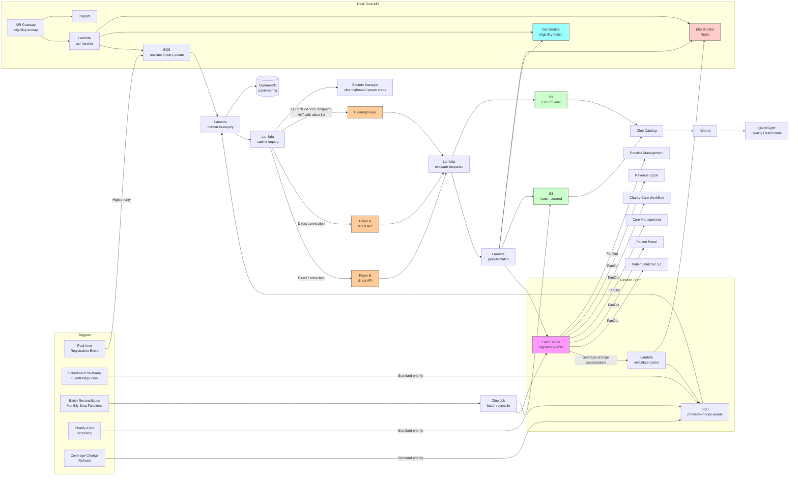

# Recipe 5.4 Architecture and Implementation: Insurance Eligibility Matching

*Companion to [Recipe 5.4: Insurance Eligibility Matching](chapter05.04-insurance-eligibility-matching). This page covers the AWS architecture, services, prerequisites, and pseudocode. For the problem framing and the conceptual approach, start with the main recipe.*

---

## The AWS Implementation

### Why These Services

**Amazon S3 for the eligibility data lake.** Three zones: raw (every 270 inquiry payload and every 271 response payload as received, partitioned by payer and date for audit and replay), curated (parsed, normalized eligibility match outcomes keyed on inquiry hash with full provenance), and derived (cohort-stratified accuracy reports, payer-quality metrics, charity-care screening summaries). S3 is HIPAA-eligible under BAA with SSE-KMS encryption. The raw 270/271 payloads are retained for the regulatory audit window; the curated outcomes power both the real-time lookup path (via cache and DynamoDB) and the analytics path (via Athena).

**Amazon DynamoDB for the eligibility-match store.** One main table keyed on `(patient_id, payer_id, service_date)`, with a global secondary index on `(matched_member_id, payer_id)` for the reverse lookup (given a payer-side member ID, which patient records have matched against it). Item attributes hold the parsed coverage state, the financial-responsibility detail, the match confidence, the match method, and the inquiry-and-response provenance. DynamoDB's single-digit-millisecond reads support the front-desk-experience target of sub-second eligibility lookup at registration. The on-demand capacity handles the bursty pattern of morning registration peaks plus the steady volume of scheduled pre-warm.

**Amazon ElastiCache (Redis) for the real-time cache.** The freshness regime requires a fast cache layer in front of DynamoDB for the registration-flow path. Redis holds parsed eligibility state with TTLs that match the freshness policy (24 hours for future service dates, 1 year for past). Cache hits return in under 5ms and skip the DynamoDB read entirely; cache misses fall through to DynamoDB, then to a re-inquiry if no record exists. <!-- TODO: confirm ElastiCache HIPAA eligibility and the encryption-at-rest configuration at time of build; ElastiCache for Redis supports encryption at rest and in transit and is included in AWS HIPAA-eligible services. -->

<!-- TODO (TechWriter): Expert review A9 (MEDIUM). Specify the cluster sizing methodology and the eviction policy. At a medium-volume institution doing 150K verifications/month, the rolling 12 months of past entries plus the 30-day forward window total approximately 3-4GB at 1-2KB per match-outcome JSON; a `cache.r6g.large` (~13GB memory) with two read replicas and a `volatile-lfu` eviction policy is the recommended starting point. Past-service-date TTL of 1 year is conservative; institutions optimizing for cache cost may shorten to 30-90 days with on-demand re-fetch from DynamoDB on the rare past-date read. CloudWatch alarms on memory utilization > 80% and on per-day eviction count above threshold signal undersizing. The Cost Estimate row's "small Redis cluster runs $200-600/month" is undersized at the stated volumes; correct figure is roughly $400-800/month for `cache.r6g.large` with replicas. -->

**Amazon SQS for the inquiry queues.** Two queues: a high-priority queue for real-time registration inquiries (with a short visibility timeout and aggressive retry), and a standard-priority queue for scheduled pre-warm and batch reconciliation. Separating the queues prevents a flood of pre-warm inquiries from delaying the real-time path. Both queues feed Lambda consumers that submit inquiries through the configured connectivity layer.

**AWS Lambda for the per-inquiry processing.** Lambda is the right substrate because each inquiry is short-lived, mostly I/O-bound (clearinghouse or payer API call plus DynamoDB writes), and benefits from on-demand scaling for the bursty registration-time pattern. Separate Lambdas per pipeline stage: `normalize-inquiry`, `submit-inquiry`, `evaluate-response`, `persist-match`, `invalidate-cache`. Each is in VPC with VPC endpoints for downstream services. Connectivity outbound to clearinghouses or direct payer endpoints uses NAT Gateway with allow-listed egress (most clearinghouses do not offer AWS PrivateLink, though some larger payers and clearinghouses do at high volume tiers). <!-- TODO: confirm clearinghouse and payer PrivateLink availability at time of build; this is evolving. -->

**AWS Glue for the batch reconciliation and analytics jobs.** The monthly payer roster reconciliation runs as a Glue/Spark job that joins the payer's member roster (typically delivered as a flat file via SFTP or an X12 834 enrollment file) against the institution's eligibility-match store, producing reconciliation reports. The cohort-stratified accuracy job runs as a separate Glue job over the curated S3 zone. Glue Data Catalog tracks the schema across raw, curated, and derived zones; Athena queries the catalog for ad-hoc analytics.

**AWS Step Functions for orchestration.** Three workflows: a real-time-inquiry workflow (normalize, submit, evaluate, persist, propagate; with timeouts and retries calibrated to the registration-flow latency budget), a scheduled-pre-warm workflow (run nightly across tomorrow's appointments, queue the inquiries for off-peak processing, populate the cache by morning), and a batch-reconciliation workflow (run monthly to compare the payer roster against the institution's match store and surface discrepancies). The workflows are visible in Step Functions' execution history for operational debugging.

**Amazon EventBridge for eligibility events and downstream propagation.** When a match is resolved (`eligibility_resolved`), when a cached match is invalidated by a coverage-change signal (`eligibility_invalidated`), when a discrepancy is found in batch reconciliation (`eligibility_discrepancy_detected`), an event flows out to downstream consumers: practice management (front-desk display update), revenue cycle (claim coverage refresh), charity-care workflow, care management, patient portal. EventBridge rules route events to the right consumer, with DLQs configured for failed deliveries.

**Amazon API Gateway plus Lambda for the real-time eligibility lookup API.** Practice management systems and revenue-cycle workflows call the API to retrieve current eligibility for a patient and date of service. The API checks the cache, falls through to DynamoDB, and (if neither has the entry) triggers an asynchronous inquiry while returning a "verification in progress" response that the caller can poll on. API Gateway provides authentication via Cognito or via mutual TLS for system-to-system clients, request logging, and rate limiting per consumer to prevent any one consumer from monopolizing capacity.

<!-- TODO (TechWriter): Expert review A5 (MEDIUM). Specify the latency budget breakdown for the real-time eligibility lookup API. Targets: P50 cache-hit latency < 10ms, P50 cache-miss-DynamoDB-hit < 50ms, P50 cache-miss-DynamoDB-miss-trigger-async < 200ms, P95 < 500ms across all paths, P99 < 2s. The "verification in progress" response is the fail-open pattern: registration workflow continues with a degraded-but-useful response while the actual 270/271 round-trip happens asynchronously. CloudWatch alarm fires when async-resolution queue depth exceeds 500 records or persists more than 10 minutes (registration is in steady state, async backlog should drain quickly). The 270/271 round-trip itself can take up to 20 seconds per CAQH CORE Phase II rules; the cache-and-async pattern decouples the registration latency from the underlying 270/271 latency. -->

<!-- TODO (TechWriter): Expert review A8 / Networking review N1 (MEDIUM / LOW). Specify the API Gateway resource policy and WAF posture. Private API with VPC endpoint resource policy; institutional registration system, PMS, and revenue-cycle consumers reach the API through the VPC endpoint. AWS WAF attached with rule groups for SQL injection, command injection, request rate limiting per source-IP and per Cognito principal, and request-size limiting. Same chapter pattern as 5.1 / 5.2 / 5.3 Finding N1. -->

**Amazon Athena and AWS Glue Data Catalog for analytics.** Cohort-stratified match-success rates, per-payer response-quality metrics (average response time, error rate, search-match accuracy), batch-reconciliation discrepancy rates, claim-denial-for-eligibility cross-references. Athena queries the catalog over the curated and derived S3 zones; QuickSight on top of Athena provides dashboards for the revenue-cycle, charity-care, and payer-relations teams.

<!-- TODO (TechWriter): Expert review A10 (LOW). Specify Lake Formation column-level and row-level access controls. The raw 271 payloads are sensitive (full coverage and financial-responsibility detail; restricted to payer-relations and audit teams). The parsed coverage state is needed by clinical and revenue-cycle staff. The cohort-aggregated metrics are needed by leadership and equity-monitoring committees. Different audiences need different views; Lake Formation grants enforce the column-level distinctions. Direct Athena query path uses the same grants. Access logged via CloudTrail data events on the catalog and underlying buckets. Same chapter pattern as 5.2 / 5.3 Finding A10. -->

<!-- TODO (TechWriter): Expert review S5 (LOW). When emitting cohort dimensions on CloudWatch metrics, use bucketed non-reversible cohort labels (cohort_bucket = A, B, C, D, E, unknown) rather than raw demographic attributes; the cohort-label-to-attribute mapping lives in a separate access-controlled table loaded only at dashboard-render time. Same chapter pattern as 4.4 / 4.10 / 5.1 / 5.2 / 5.3. -->

**Amazon QuickSight for operational and quality dashboards.** Per-payer match success rate, per-cohort match success rate, real-time-vs-batch volume, review-queue depth and aging, claim-denial rate cross-referenced to eligibility match outcomes, payer-response quality distribution, charity-care eligibility-determination cycle time.

**AWS KMS, CloudTrail, CloudWatch.** Customer-managed keys for the S3 buckets, the DynamoDB tables, the ElastiCache cluster, the Lambda log groups. CloudTrail data events on the eligibility-match table and on the audit S3 buckets. CloudWatch alarms on real-time inquiry success rate, on per-payer error spikes (often the first signal of a payer-side outage), on review-queue depth, on cohort-stratified disparities, on cache-hit-rate drops (often a sign of a cache-invalidation storm or a config issue).

**AWS Secrets Manager for clearinghouse and direct-payer credentials.** API keys, certificates, mutual-TLS credentials, SFTP credentials. Stored with KMS encryption at rest, IAM-controlled access, rotation support where the partner supports it. Many clearinghouses use mutual TLS or signed JWTs that rotate periodically; the secret store handles the rotation lifecycle without requiring redeploys.

### Architecture Diagram



### Prerequisites

| Requirement | Details |
|-------------|---------|
| **AWS Services** | Amazon S3, Amazon DynamoDB, Amazon ElastiCache for Redis, Amazon SQS, AWS Lambda, AWS Glue, Amazon Athena, AWS Step Functions, Amazon EventBridge, Amazon API Gateway, Amazon Cognito, Amazon QuickSight, AWS Secrets Manager, AWS KMS, Amazon CloudWatch, AWS CloudTrail. |
| **External Services** | A clearinghouse with X12 270/271 connectivity (Availity, Change Healthcare, Waystar, or equivalent) for the long-tail payer coverage. Direct connections to two or three high-volume payers (negotiated separately, typically requires payer onboarding and a trading-partner agreement). FHIR-based payer connectivity for any payers that expose a CMS Patient Access API or Da Vinci Coverage Requirements Discovery endpoint where applicable. <!-- TODO: confirm clearinghouse landscape at time of build; the major US healthcare clearinghouses are well-known but the connectivity options for FHIR-based eligibility continue to evolve. --> |
| **IAM Permissions** | Per-Lambda least-privilege: `dynamodb:GetItem` / `PutItem` / `UpdateItem` scoped to specific tables; `s3:GetObject` / `PutObject` scoped to specific bucket prefixes; `secretsmanager:GetSecretValue` scoped to specific clearinghouse and payer credential secrets; `events:PutEvents` on the eligibility-events bus; `sqs:SendMessage` / `ReceiveMessage` scoped to specific queues; `kms:Decrypt` on relevant CMKs; `elasticache:DescribeCacheClusters` and equivalent for cluster discovery. Glue jobs need scoped catalog and S3 permissions. Never use `*` actions or `*` resources in production. <!-- TODO (TechWriter): Expert review S6 (LOW). Pair with one or two scoped Resource ARN examples for the highest-stakes actions: dynamodb:UpdateItem on arn:aws:dynamodb:<region>:<account>:table/eligibility-match; s3:PutObject on arn:aws:s3:::<env>-eligibility-raw/audit/*; events:PutEvents on arn:aws:events:<region>:<account>:event-bus/eligibility-events; secretsmanager:GetSecretValue on arn:aws:secretsmanager:<region>:<account>:secret:clearinghouse/*. Same chapter pattern as 5.1, 5.2, 5.3; consolidate into chapter preface in the next pass. --> |
| **BAA** | AWS BAA signed. The clearinghouse must have a BAA (and a Trading Partner Agreement specifying connectivity terms, transaction volumes, and SLAs). Each direct-payer connection requires its own trading partner agreement and BAA. Self-funded employer plans connect through a TPA, and the TPA's BAA covers the eligibility flow. <!-- TODO (TechWriter): Expert review S3 (MEDIUM). Specify clearinghouse and payer data-handling commitments contractually: (a) the partner will not retain submitted patient data beyond a documented operational window (typical clearinghouse retention is 7 years for HIPAA audit, separate from operational caches that are typically days-to-weeks); (b) the partner will disclose all sub-processors that may handle PHI; (c) the partner will notify within a documented window of any data incident; (d) the partner agreement specifies the institution's right to audit the partner's controls (typically annually). Add an inline comment at the inquiry-submission call site explaining the de-identification posture (the 270 inquiry contains the full demographics and the patient_id; the patient_id is a partner-shared identifier under BAA, not a public identifier). --> |
| **Encryption** | S3: SSE-KMS with bucket-level keys. DynamoDB: customer-managed KMS at rest. ElastiCache: in-transit encryption with TLS, at-rest encryption with KMS. Lambda log groups KMS-encrypted. Secrets Manager: KMS-encrypted secrets. EventBridge and SQS: server-side encryption. TLS 1.2 or higher for all in-transit traffic, including the clearinghouse and direct-payer connections. Mutual TLS where the partner requires it. |
| **VPC** | Production: Lambdas in VPC. Glue jobs in VPC connections. ElastiCache in VPC subnet groups. VPC endpoints for S3, DynamoDB, KMS, Secrets Manager, CloudWatch Logs, EventBridge, SQS, Step Functions, Glue, Athena, STS. NAT Gateway for clearinghouse and direct-payer egress with an outbound HTTPS proxy and an allow-list of partner endpoints. PrivateLink endpoints for partners that offer them. <!-- TODO (TechWriter): Networking review N2 / Architecture A9 (LOW). Configure clearinghouse egress and direct-payer egress as distinct outbound proxy rules with non-overlapping allow-lists scoped to compute roles: each Lambda role allows only the specific partner endpoints it must call; per-role rate limits below the partner's published rate limits; egress connections CloudWatch-logged for chargeback and forensic auditing. At eligibility-inquiry volumes (millions per month for medium institutions), evaluate the partner's PrivateLink endpoints where available. Same chapter pattern as 5.3. --> |
| **CloudTrail** | Enabled with data events on the eligibility-match table and on the audit S3 buckets. API Gateway and Lambda invocations logged. CloudTrail logs encrypted with KMS and retained per the institution's records-retention policy. <!-- TODO (TechWriter): Expert review S2 (MEDIUM). Replace "per the institution's records-retention policy" with an explicit floor: the longer of 7 years (HIPAA records-retention minimum), 10 years (Medicare claims retention where applicable), the institution's documented eligibility-data retention policy, the value-based-care contract retention requirement (where applicable), and any state-specific Medicaid retention requirement. Audit logs in a dedicated S3 bucket with Object Lock in Compliance mode for immutability and a lifecycle policy transitioning to S3 Glacier Deep Archive after 90 days. CloudTrail data events forwarded to a dedicated audit AWS account in the institution's organization, isolating the audit substrate from the production data plane. The retention floor is enforced at the bucket-policy and Object-Lock-configuration level, not at application logic. Same chapter pattern as 5.1 / 5.2 / 5.3 Finding S2. --> |
| **Clearinghouse Selection** | Vet the clearinghouse for: payer coverage breadth, transaction volumes supported, real-time response-time SLAs (CAQH CORE Phase II compliance is the baseline), batch processing capability, FHIR-based connectivity for payers offering it, BAA terms, healthcare references at similar volumes, audit log access, error-message quality, transaction pricing model. The clearinghouse is a major operational dependency; choose with the same diligence you would apply to a core EHR vendor. |
| **Sample Data** | Use synthetic patient and member data that exercises the full range of match outcomes. The CAQH CORE certification suite includes test transactions; major clearinghouses provide test endpoints with known-test-patient data. Synthea and similar synthetic-EHR generators can produce patient demographics for testing. Never use real patient or member data in development environments. <!-- TODO: confirm Synthea capabilities and CAQH CORE certification test data availability at time of build. --> |
| **Cost Estimate** | At a medium-sized health system with ~50,000 monthly registrations and corresponding scheduled-pre-warm volume (~150,000 eligibility verifications per month total): clearinghouse transaction fees roughly $0.05-0.25 per real-time 270/271 transaction depending on volume tier, batch transactions $0.005-0.02 per record. Monthly clearinghouse cost ~$2,000-$15,000. AWS infrastructure: SQS, Lambda, DynamoDB, ElastiCache, S3, EventBridge, API Gateway, Athena, QuickSight, KMS combined typically $1,000-3,500/month at this volume, dominated by ElastiCache (a small Redis cluster runs $200-600/month) and Lambda (volume-driven). Estimated total: $3,000-18,500/month, dominated by clearinghouse fees. <!-- TODO: replace with verified, current pricing once the implementing team validates against partner quotes and the AWS Pricing Calculator. --> |

### Ingredients

| AWS Service | Role |
|------------|------|
| **Amazon S3** | Hosts raw 270/271 payloads, parsed match outcomes, cohort-stratified accuracy reports, batch-reconciliation results |
| **Amazon DynamoDB** | Stores the per-(patient, payer, service-date) match outcome with parsed coverage and provenance for low-latency lookup |
| **Amazon ElastiCache for Redis** | Real-time cache layer in front of DynamoDB; sub-10ms eligibility lookup at registration |
| **Amazon SQS** | Buffers real-time and pre-warm inquiry workloads on separate queues so pre-warm cannot starve real-time |
| **AWS Lambda** | Per-stage processing: normalize inquiry, submit to clearinghouse or payer, evaluate response, persist match, invalidate cache |
| **AWS Glue** | Batch reconciliation against payer rosters, cohort-stratified accuracy analytics, payer-quality metrics |
| **Amazon Athena** | SQL access to the eligibility data lake for ad-hoc operations and reporting |
| **AWS Step Functions** | Orchestrates real-time inquiry, scheduled pre-warm, monthly reconciliation workflows |
| **Amazon EventBridge** | Fans out eligibility events to practice management, revenue cycle, charity-care, care management, patient portal, patient matcher |
| **Amazon API Gateway** | Exposes the real-time eligibility-lookup endpoint to PMS, revenue-cycle, and other internal consumers |
| **Amazon Cognito** | Authenticates real-time API consumers (PMS, revenue cycle, clinical applications) |
| **Amazon QuickSight** | Quality dashboards (match success by cohort, by payer; review-queue depth; claim-denial cross-reference; charity-care cycle time) |
| **AWS Secrets Manager** | Stores clearinghouse and direct-payer credentials with KMS encryption and rotation support |
| **AWS KMS** | Customer-managed encryption keys for all eligibility-data stores |
| **Amazon CloudWatch** | Operational metrics and alarms (real-time success rate, per-payer error spikes, review-queue depth, cache hit rate, cohort disparities) |
| **AWS CloudTrail** | Audit logging for all API calls on the eligibility-match table and on the audit S3 buckets |

---

### Code

> **Reference implementations:** Useful libraries and patterns for this recipe:
> - The major US clearinghouses (Availity, Change Healthcare/Optum, Waystar) publish official SDKs for X12 270/271 transactions; use the official SDK rather than rolling your own X12 parser, which is a significant project. <!-- TODO: confirm SDK availability at time of build; clearinghouse SDKs come and go with corporate ownership changes. -->
> - [`pyx12`](https://github.com/azoner/pyx12): an open-source Python library for X12 transaction parsing and generation. Useful for the parsing piece even when transmission is delegated to a clearinghouse SDK. <!-- TODO: confirm maintenance status at time of build. -->
> - [`bots`](https://github.com/bots-edi/bots): an open-source EDI translator with X12 support; useful as an alternative or backup parser.
> - The HL7 FHIR Coverage and CoverageEligibilityRequest/Response resources implement the FHIR-based eligibility flow; the [HAPI FHIR](https://github.com/hapifhir/hapi-fhir) library is the canonical Java reference implementation. The HL7 FHIR specification at [hl7.org/fhir](https://www.hl7.org/fhir/) provides the resource definitions.
> - The [CAQH CORE Operating Rules](https://www.caqh.org/core/) are the operational baseline for X12-based eligibility verification in US healthcare. <!-- TODO: confirm current URL at time of build. -->

#### Walkthrough

**Step 1: Ingest the eligibility-verification trigger.** Triggers come from registration (real-time), scheduled pre-warm (batch, runs nightly), batch reconciliation against payer rosters, charity-care screening, and refresh-on-coverage-change events. Each trigger produces a structured inquiry record with the patient, the payer, the service date, the requesting provider, the service-type codes, and the trigger metadata. Skip the trigger metadata and you lose the audit trail that lets you explain later why a particular inquiry was made.

```
FUNCTION ingest_eligibility_trigger(trigger_event):
    inquiry = {
        inquiry_id: generate_uuid(),
        patient_id: trigger_event.patient_id,
        payer_id: trigger_event.payer_id,
        service_date: trigger_event.service_date,
            // For real-time, this is today; for pre-warm,
            // tomorrow's appointment date; for batch,
            // a date the payer's roster file applies to.
        service_type_codes: trigger_event.service_type_codes
            // X12 EQ01 codes: 30 = Health Benefit Plan Coverage,
            // 1 = Medical Care, 88 = Pharmacy, etc.
            OR ["30"],
        requesting_provider_npi: trigger_event.provider_npi
            OR institutional_default_npi(trigger_event.facility_id),
        priority: trigger_event.priority OR derive_priority(trigger_event),
            // "real_time", "high", "standard", "batch"
        trigger_reason: trigger_event.reason,
            // "registration", "scheduled_prewarm",
            // "batch_reconciliation", "charity_care_screening",
            // "coverage_change_refresh"
        trigger_source_record_id: trigger_event.source_record_id,
        triggered_at: current UTC timestamp
    }

    // Compute a canonical hash for idempotency. A second trigger
    // for the same (patient, payer, service_date) within a short
    // window is almost certainly a duplicate from a retry path
    // and should be deduplicated rather than producing a second
    // 270 to the clearinghouse (clearinghouses charge per
    // transaction).
    inquiry.inquiry_hash = sha256(canonical_form(
        inquiry.patient_id,
        inquiry.payer_id,
        inquiry.service_date,
        sorted(inquiry.service_type_codes)))

    // Route to the right SQS queue by priority. The real-time
    // queue has aggressive retry and short visibility timeout;
    // the standard queue has gentler settings.
    queue_url = select_queue(inquiry.priority)
    SQS.SendMessage(queue_url, inquiry,
        MessageDeduplicationId=inquiry.inquiry_hash,
        MessageGroupId=inquiry.payer_id)
            // FIFO MessageGroupId per payer ensures inquiries
            // for the same payer process in order, which matters
            // for correctly handling subscriber-then-dependent
            // sequenced inquiries.
            // TODO (TechWriter): Expert review A3 (HIGH). The
            // FIFO-with-MessageGroupId-per-payer pattern serializes
            // a horizontally-scalable workload through a per-payer
            // bottleneck (SQS FIFO is bounded at 300 msg/sec per
            // MessageGroupId, 3000/sec with batching and high-
            // throughput mode). At a medium-volume institution
            // doing 150K verifications/month, a single national
            // payer (Aetna, Cigna, UnitedHealth) commonly produces
            // concentrated morning-registration load that cannot
            // fit the latency budget through one MessageGroupId.
            // The stated rationale (subscriber-then-dependent
            // ordering) is also incorrect; subscriber and
            // dependent inquiries are independently resolvable.
            // Switch to SQS Standard with idempotency at the
            // inquiry hash, or use a finer-grained MessageGroupId
            // (per (payer_id, subscriber_id) for the rare cases
            // that genuinely need ordering, or per inquiry_hash
            // for parallelism with idempotent delivery).
            // Reference 5.1 / 5.2 / 5.3 chapter pattern (those
            // recipes use SQS Standard or Step Functions, not
            // FIFO with payer-grouping).

    RETURN inquiry
```

**Step 2: Normalize the patient demographics for this payer.** Each payer has subtly different formatting expectations. The same patient submitted to two different payers needs two different 270 payloads. The normalization layer applies payer-specific rules from a configuration table. Skip this and you get more "member not found" responses than necessary because the payer's matcher could not parse what you sent.

```
FUNCTION normalize_inquiry(inquiry):
    // Step 2A: pull patient demographics from the MPI / active
    // registration record. Use the MPI master record where the
    // patient has been resolved through recipe 5.1; use the most
    // recent registration record otherwise.
    patient = MPI.get_master_record(inquiry.patient_id)
        OR Registration.get_active_record(inquiry.patient_id)

    // Step 2B: pull payer-specific configuration. The config
    // holds the rules each payer expects: name format, date
    // format, member ID format, dependent-handling rules,
    // service-type-code support, and any payer-specific
    // quirks discovered through operational experience.
    payer_config = DynamoDB.GetItem("payer-config",
        key={payer_id: inquiry.payer_id})
    IF payer_config IS NULL:
        // Unknown payer; fall back to clearinghouse-default
        // formatting. Log a warning so the payer can be
        // formally onboarded.
        payer_config = clearinghouse_default_config()
        emit_warning("payer_not_in_config", inquiry.payer_id)

    // Step 2C: pull last-known member ID and subscriber
    // relationship. The last-known member ID is the most
    // valuable signal for primary-key match; if the patient
    // has produced a card today, that member ID is on the
    // inquiry already (use it). If not, use the most recent
    // member ID we have on file (with stamp date so we can
    // tell if it's stale).
    coverage_history = Coverage.get_history(inquiry.patient_id,
                                              inquiry.payer_id)

    // Step 2D: build the normalized inquiry payload according
    // to the payer's expectations.
    normalized = {
        subscriber_or_dependent: derive_relationship(patient,
                                                      coverage_history),
            // "subscriber" or "dependent"; some payers handle
            // these as the same lookup but most distinguish.
        member_id_to_query: select_member_id(coverage_history,
                                                inquiry,
                                                payer_config),
            // The current card-supplied member ID if available;
            // else the most recent member ID with the stamp
            // date so the response evaluator can tell if it's
            // stale; else NULL (search match).
        first_name: payer_config.normalize_first_name(patient.first_name),
        last_name: payer_config.normalize_last_name(patient.last_name,
                                                     patient.suffix),
            // Some payers expect last name without suffix
            // (Smith vs. Smith Jr); some expect it with.
        dob: payer_config.format_date(patient.dob),
        sex: payer_config.normalize_sex(patient.sex),
        address: payer_config.format_address(patient.standardized_address),
        ssn: payer_config.format_ssn(patient.ssn)
            IF payer_config.expects_ssn AND patient.ssn IS NOT NULL,
        subscriber_id: derive_subscriber_id(patient,
                                              coverage_history,
                                              payer_config)
            IF normalized.subscriber_or_dependent == "dependent",
        person_code: derive_person_code(patient,
                                          coverage_history,
                                          payer_config)
            IF payer_config.requires_person_code,
        service_date: payer_config.format_date(inquiry.service_date),
        service_type_codes: payer_config.filter_service_types(
                                inquiry.service_type_codes),
            // Some payers do not support all service-type codes
            // and return a generic response if asked for one
            // they don't support. The config strips unsupported
            // codes and substitutes the closest supported code.
        provider_npi: inquiry.requesting_provider_npi
    }

    // Step 2E: build the X12 270 envelope (or the FHIR
    // CoverageEligibilityRequest, depending on the payer's
    // connectivity model).
    IF payer_config.connectivity_model == "x12_270_271":
        request_payload = build_x12_270(normalized,
                                          inquiry,
                                          payer_config)
    ELIF payer_config.connectivity_model == "fhir":
        request_payload = build_fhir_coverage_request(normalized,
                                                        inquiry,
                                                        payer_config)

    // Step 2F: archive the normalized inquiry for audit. This
    // is the artifact that lets you reconstruct what you
    // submitted to the payer when a question comes up later.
    write_to_s3(normalized,
                s3_bucket="inquiry-curated",
                key="{payer_id}/{date}/{inquiry_hash}.json")

    inquiry.normalized = normalized
    inquiry.request_payload = request_payload
    RETURN inquiry
```

**Step 3: Submit the inquiry through the configured connectivity layer.** Real-time inquiries call the clearinghouse or direct-payer API and wait for the synchronous 271 response. Batch inquiries are queued for async submission. The connectivity layer handles authentication, retries with exponential backoff, timeout (calibrated to the response-time SLA), and idempotency on the inquiry hash. Skip retry-and-idempotency and you get duplicate transactions on transient failures, which clearinghouses charge for and which can produce confusing duplicate match outcomes.

```
FUNCTION submit_inquiry(inquiry):
    // Step 3A: select the connectivity channel based on payer
    // configuration. Direct connections to the largest payers,
    // clearinghouse for everything else.
    channel = select_channel(inquiry.payer_id, inquiry.priority)
        // returns: "direct_payer_a", "direct_payer_b",
        //          "clearinghouse_primary",
        //          "clearinghouse_secondary"

    // Step 3B: load the partner credentials.
    credentials = SecretsManager.GetSecretValue(channel.secret_id)

    // Step 3C: submit with timeout and retry. Real-time
    // priority gets short timeout and aggressive retry; batch
    // gets longer timeout and gentler retry.
    timeout_ms = inquiry.priority == "real_time" ? 6000 : 20000
    max_retries = inquiry.priority == "real_time" ? 1 : 3

    response = NULL
    FOR attempt FROM 1 TO max_retries + 1:
        TRY:
            response = channel.submit(
                payload: inquiry.request_payload,
                credentials: credentials,
                timeout_ms: timeout_ms,
                idempotency_key: inquiry.inquiry_hash
            )
            BREAK  // success
        CATCH timeout_error:
            log_warning("inquiry_timeout", inquiry.inquiry_id, attempt)
            IF attempt < max_retries + 1:
                wait(exponential_backoff(attempt))
                CONTINUE
            response = {status: "TIMEOUT"}
        CATCH protocol_error AS e:
            log_warning("inquiry_protocol_error",
                          inquiry.inquiry_id, e.code)
            response = {status: "PROTOCOL_ERROR", error: e}
            BREAK  // do not retry on protocol-level errors

    // Step 3D: archive the raw response for audit. The raw 271
    // is the legal record of what the payer told you; preserve
    // it exactly as received.
    write_to_s3({inquiry: inquiry, response: response},
                s3_bucket="270-271-raw",
                key="{payer_id}/{date}/{inquiry_hash}.bin")

    inquiry.response = response
    RETURN inquiry
```

**Step 4: Evaluate the response and resolve identity.** The 271 response (or FHIR response) comes back with one of several outcomes: primary key matched, search match returned, search match with multiple candidates, not found, rejected, or partial. The evaluator parses the response, runs the probabilistic-record-linkage scorer against the candidate(s), and applies confidence thresholds. Skip this and you trust the payer's match decision blindly, which is wrong about a measurable fraction of the time (in particular, search-match candidates need scoring on your side too because the payer's matcher does not see the same demographic context yours does).

```
FUNCTION evaluate_response(inquiry):
    response = inquiry.response

    // Step 4A: handle protocol-level outcomes that don't need
    // identity resolution.
    IF response.status == "TIMEOUT" OR response.status == "PROTOCOL_ERROR":
        match_outcome = {
            status: "INQUIRY_FAILED",
            failure_reason: response.status,
            requires_retry: TRUE
        }
        RETURN persist_and_propagate(inquiry, match_outcome)

    // Step 4B: parse the 271 (or FHIR) response into a
    // structured form.
    IF inquiry.normalized.connectivity_model == "x12_270_271":
        parsed = parse_x12_271(response.payload)
    ELIF inquiry.normalized.connectivity_model == "fhir":
        parsed = parse_fhir_coverage_response(response.payload)

    // Step 4C: branch by response type. The X12 271 has
    // standardized response codes (AAA segments for errors,
    // EB segments for benefit info, NM1 segments for matched
    // members). FHIR uses outcome codes on the
    // CoverageEligibilityResponse resource.
    IF parsed.is_not_found:
        match_outcome = {
            status: "NOT_FOUND",
            payer_response_code: parsed.aaa_codes,
            interpretation: interpret_not_found(parsed,
                                                  inquiry,
                                                  payer_config)
                // "wrong_member_id_supplied",
                // "wrong_dob", "patient_genuinely_not_enrolled",
                // "payer_data_lag", or "indeterminate"
        }
        RETURN persist_and_propagate(inquiry, match_outcome)

    IF parsed.is_rejected:
        match_outcome = {
            status: "REJECTED",
            rejection_reason: parsed.rejection_codes,
            requires_review: TRUE
        }
        RETURN persist_and_propagate(inquiry, match_outcome)

    // Step 4D: extract candidate(s) from the response. The
    // common case is one candidate (either the primary-key
    // matched member or the payer's best search match). Some
    // payers return multiple candidates with their own
    // confidence scoring.
    candidates = parsed.matched_members  // 1 or more

    IF len(candidates) == 0:
        // Should be caught by is_not_found but defensive.
        match_outcome = {status: "NOT_FOUND",
                          interpretation: "indeterminate"}
        RETURN persist_and_propagate(inquiry, match_outcome)

    // Step 4E: score each candidate using the same
    // probabilistic-record-linkage core as recipe 5.1, with
    // the eligibility-specific feature set.
    patient = MPI.get_master_record(inquiry.patient_id)
        OR Registration.get_active_record(inquiry.patient_id)

    scored_candidates = []
    FOR each candidate in candidates:
        score = compute_match_score({
            first_name: jaro_winkler(patient.first_name,
                                       candidate.first_name),
            last_name: last_name_similarity(patient.last_name,
                                              patient.prior_names,
                                              candidate.last_name),
                // Includes maiden-name handling; if the patient
                // has a recorded prior name, score against both
                // current and prior and take the max.
            dob: dob_match_grade(patient.dob, candidate.dob),
                // Returns: exact, year_month_only, year_only,
                // mismatch.
            sex: sex_match(patient.sex, candidate.sex),
            address: address_similarity(patient.standardized_address,
                                           candidate.address),
            ssn: ssn_match(patient.ssn, candidate.ssn)
                IF patient.ssn IS NOT NULL AND candidate.ssn IS NOT NULL,
            member_id_match: member_id_match_grade(
                                  inquiry.normalized.member_id_to_query,
                                  candidate.member_id),
                // exact / partial (e.g., suffix differs) /
                // historical (matches a prior member ID we have
                // on file) / mismatch.
            relationship_consistency: check_relationship(
                                          inquiry.normalized,
                                          candidate.subscriber_relationship)
        })
        scored_candidates.append({
            candidate: candidate,
            score: score
        })

    // Step 4F: pick the best candidate and apply confidence
    // thresholds.
    best = max(scored_candidates, key=lambda c: c.score.composite)

    // The thresholds live in versioned configuration; they
    // were calibrated against a labeled gold set covering
    // the institution's cohort distribution. The gold-set
    // construction and threshold calibration are
    // institutional disciplines, not magic numbers.
    IF best.score.composite >= AUTO_ACCEPT_THRESHOLD:
        match_outcome = {
            status: "MATCHED",
            matched_member_id: best.candidate.member_id,
            match_confidence: best.score.composite,
            match_method: classify_match_method(parsed, best),
                // "primary_key", "search_high_confidence",
                // "search_returned_single", etc.
            coverage: parsed.coverage,
            financial_responsibility: parsed.financial,
            cob_indicator: parsed.cob,
            network_status: parsed.network_status
        }
    ELIF best.score.composite <= AUTO_REJECT_THRESHOLD:
        match_outcome = {
            status: "NOT_MATCHED_AUTO",
            best_candidate_score: best.score.composite,
            interpretation: "payer_returned_record_but_does_not_match"
        }
    ELSE:
        match_outcome = {
            status: "REVIEW_REQUIRED",
            best_candidate: best.candidate,
            best_candidate_score: best.score.composite,
            other_candidates: scored_candidates,
            review_reason: characterize_uncertainty(best.score)
                // "name_similar_dob_off_by_year",
                // "subscriber_relationship_ambiguous", etc.
        }

    // Step 4G: cohort-stratified telemetry. Every match
    // outcome contributes to the per-cohort metrics. This
    // does not affect the match decision; it just emits the
    // cohort-bucketed metric for the equity-monitoring
    // dashboard.
    cohort_bucket = lookup_cohort_bucket(patient)
    emit_cloudwatch_metric_with_cohort(
        "eligibility_match_outcome",
        match_outcome.status,
        cohort_bucket)

    RETURN persist_and_propagate(inquiry, match_outcome)
```

**Step 5: Persist the match outcome and propagate.** Write the match outcome to DynamoDB (and the cache), archive to S3, emit an EventBridge event. Downstream consumers pick up the event and update their views. Skip the event emission and downstream consumers either pull on a stale cache or block on the eligibility lookup, defeating the purpose of the asynchronous pipeline.

```
FUNCTION persist_and_propagate(inquiry, match_outcome):
    // Step 5A: read the previous match outcome for this
    // (patient, payer, service_date) so we can detect changes.
    previous = DynamoDB.GetItem("eligibility-match",
        key={patient_id: inquiry.patient_id,
             payer_payer_service_date_sort:
                "{payer_id}#{service_date}"})

    // TODO (TechWriter): Expert review A1 (HIGH). Wrap the
    // DynamoDB write, the cache write, the S3 archive, and the
    // EventBridge emit in a TransactWriteItems plus an outbox
    // row drained by a separate Lambda or DynamoDB Streams
    // consumer so partial failures do not leave the eligibility
    // store out of sync with downstream consumers. Regulatory
    // consequence here is sharper than 5.1/5.2/5.3 because the
    // eligibility outcome directly drives revenue-cycle (claim
    // submission with wrong coverage = denial), charity-care
    // (false-negative coverage = wrongful denial of eligibility),
    // and patient financial responsibility (point-of-service
    // collection). Same chapter pattern as 5.1 / 5.2 / 5.3
    // Finding A1.

    // Step 5B: write the current match outcome.
    item = {
        patient_id: inquiry.patient_id,
        payer_payer_service_date_sort:
            "{inquiry.payer_id}#{inquiry.service_date}",
        payer_id: inquiry.payer_id,
        service_date: inquiry.service_date,
        match_outcome: match_outcome,
        inquiry_hash: inquiry.inquiry_hash,
        inquiry_id: inquiry.inquiry_id,
        normalized_inquiry_audit_key:
            "{payer_id}/{date}/{inquiry_hash}.json",
        raw_response_audit_key:
            "{payer_id}/{date}/{inquiry_hash}.bin",
        previous_status: previous.match_outcome.status
            IF previous IS NOT NULL ELSE NULL,
        resolved_at: current UTC timestamp,
        cache_ttl: derive_cache_ttl(inquiry.service_date)
            // service_date in past: 1 year; future: 24 hours
    }
    DynamoDB.PutItem("eligibility-match", item)

    // Step 5C: write to cache for sub-10ms reads. Cache TTL
    // matches the DynamoDB cache_ttl.
    cache_key = "{patient_id}#{payer_id}#{service_date}"
    Redis.Set(cache_key, item, ex=item.cache_ttl)

    // Step 5D: archive curated outcome.
    write_to_s3(item,
                s3_bucket="match-curated",
                key="{patient_id}/{payer_id}/{service_date}.json")

    // Step 5E: emit event if the outcome changed.
    IF previous IS NULL OR
       previous.match_outcome.status != match_outcome.status OR
       previous.match_outcome.matched_member_id !=
            match_outcome.matched_member_id:
        EventBridge.PutEvents([{
            source: "eligibility-matching",
            detail_type: "eligibility_resolved",
            detail: {
                patient_id: inquiry.patient_id,
                payer_id: inquiry.payer_id,
                service_date: inquiry.service_date,
                inquiry_id: inquiry.inquiry_id,
                outcome_status: match_outcome.status,
                matched_member_id: match_outcome.matched_member_id
                    IF match_outcome.status == "MATCHED" ELSE NULL,
                match_confidence: match_outcome.match_confidence
                    IF match_outcome.status == "MATCHED" ELSE NULL,
                previous_outcome_status: previous.match_outcome.status
                    IF previous IS NOT NULL ELSE NULL,
                resolved_at: item.resolved_at
            }
        }])

    // Step 5F: route to review queue if required.
    IF match_outcome.status == "REVIEW_REQUIRED":
        SQS.SendMessage("eligibility-review-queue", {
            patient_id: inquiry.patient_id,
            inquiry_id: inquiry.inquiry_id,
            best_candidate_score: match_outcome.best_candidate_score,
            review_reason: match_outcome.review_reason,
            priority: derive_review_priority(inquiry,
                                              match_outcome)
                // Real-time inquiries get higher review
                // priority than batch.
        })

    RETURN item
```

**Step 6: React to coverage-change signals and invalidate cached eligibility.** Eligibility data changes constantly. The system subscribes to coverage-change signals (monthly payer roster delta, 277/277CA claim status responses, 834 enrollment files, patient-side events from recipes 5.1 and 5.3) and invalidates affected cache entries. Skip the invalidation pipeline and the cache slowly fills up with stale answers; revenue cycle starts seeing claim denials for coverage that the cache thought was active.

```
FUNCTION invalidate_on_coverage_change(change_event):
    // Step 6A: classify the change event and identify the
    // affected (patient, payer, service_date) keys.
    affected_keys = []

    IF change_event.source == "payer-roster-delta":
        // Monthly roster comparison surfaced a member who is
        // no longer in the roster (or who has new coverage
        // start/end dates). Invalidate any cached match for
        // future service dates.
        affected_keys.append({
            patient_id: change_event.affected_patient_id,
            payer_id: change_event.payer_id,
            service_date_filter: "future"
        })

    ELIF change_event.source == "claim-status-277":
        // A 277CA claim-status response indicated an
        // eligibility issue (denial code group "29" or
        // similar). Invalidate the cache and force re-inquiry.
        affected_keys.append({
            patient_id: change_event.affected_patient_id,
            payer_id: change_event.payer_id,
            service_date_filter: "all"
                // Past service dates also need re-inquiry
                // because the claim denial says the prior
                // match outcome was wrong.
        })

    ELIF change_event.source == "834-enrollment-file":
        // A subscriber added or removed a dependent, or a new
        // member enrolled. Invalidate the cache for the
        // affected member and (if dependent change) the
        // related members in the same household.
        affected_keys.append({
            patient_id: change_event.affected_patient_id,
            payer_id: change_event.payer_id,
            service_date_filter: "future"
        })
        FOR each dependent_id in change_event.affected_dependent_ids:
            affected_keys.append({
                patient_id: dependent_id,
                payer_id: change_event.payer_id,
                service_date_filter: "future"
            })

    ELIF change_event.source == "patient-merge-event":
        // Recipe 5.1 merged two patient records; the
        // surviving patient_id may have eligibility cached
        // under the old patient_id. Migrate or invalidate.
        affected_keys.append({
            patient_id: change_event.merged_into_patient_id,
            payer_id: "*",
            service_date_filter: "all",
            also_invalidate_patient_id:
                change_event.merged_from_patient_id
        })

    ELIF change_event.source == "address-change":
        // Recipe 5.3 detected an address change. The
        // eligibility match used the old address as a
        // signal; if the change indicates the patient moved
        // states, the payer-network status may have
        // changed. Invalidate future-service-date entries
        // for re-inquiry.
        affected_keys.append({
            patient_id: change_event.patient_id,
            payer_id: "*",
            service_date_filter: "future"
        })

    // Step 6B: invalidate cache entries.
    FOR each key in affected_keys:
        cache_keys = enumerate_cache_keys(key)
        FOR each cache_key in cache_keys:
            Redis.Delete(cache_key)
        // Also mark DynamoDB items for re-inquiry by setting
        // a flag the read path checks; the re-inquiry runs
        // asynchronously and updates the item with the new
        // outcome.
        FOR each dynamo_key in enumerate_dynamo_keys(key):
            DynamoDB.UpdateItem("eligibility-match",
                key=dynamo_key,
                update_expression="SET requires_reinquiry = :true",
                expression_values={":true": True})

    // Step 6C: emit invalidation event so downstream
    // consumers (PMS, revenue cycle) know to refresh.
    EventBridge.PutEvents([{
        source: "eligibility-matching",
        detail_type: "eligibility_invalidated",
        detail: {
            change_event_source: change_event.source,
            affected_keys: affected_keys,
            invalidated_at: current UTC timestamp
        }
    }])

    // Step 6D: re-queue the affected inquiries for async
    // re-resolution. The standard-priority queue handles
    // this without competing with real-time registration
    // capacity.
    FOR each key in affected_keys:
        FOR each (patient_id, payer_id, service_date) in
                enumerate_keys_to_reinquire(key):
            re_inquiry = build_reinquiry(patient_id,
                                            payer_id,
                                            service_date,
                                            change_event)
            SQS.SendMessage("prewarm-inquiry-queue", re_inquiry)
```

> **Curious how this looks in Python?** The pseudocode above covers the concepts. If you'd like to see sample Python code that demonstrates these patterns using boto3, check out the [Python Example](chapter05.04-python-example). It walks through each step with inline comments and notes on what you'd need to change for a real deployment.

---

### Expected Results

**Sample match outcome record:**

```json
{
  "patient_id": "patient-internal-00874",
  "payer_payer_service_date_sort": "payer-CIGNA-COMMERCIAL#2026-05-22",
  "payer_id": "payer-CIGNA-COMMERCIAL",
  "service_date": "2026-05-22",
  "match_outcome": {
    "status": "MATCHED",
    "matched_member_id": "U1234567890-01",
    "match_confidence": 0.96,
    "match_method": "primary_key",
    "coverage": {
      "active": true,
      "plan_name": "Open Access PPO",
      "plan_id": "OAPPO-001",
      "effective_date": "2026-01-01",
      "termination_date": null,
      "coverage_level": "individual_plus_spouse"
    },
    "financial_responsibility": {
      "primary_care_copay_dollars": 25,
      "specialist_copay_dollars": 50,
      "deductible_individual_dollars": 1500,
      "deductible_individual_remaining_dollars": 875,
      "deductible_family_dollars": 3000,
      "out_of_pocket_max_individual_dollars": 6000,
      "coinsurance_percent": 20,
      "service_specific_overrides": [
        {
          "service_type_code": "98",
          "description": "Professional Physician Visit",
          "applies_to_deductible": true
        }
      ]
    },
    "cob_indicator": {
      "is_primary": true,
      "other_coverage_present": false
    },
    "network_status": {
      "provider_in_network": true,
      "facility_in_network": true
    }
  },
  "inquiry_hash": "f3a8b2c1d4e9...",
  "inquiry_id": "inq-2026-05-22-00012345",
  "normalized_inquiry_audit_key": "payer-CIGNA-COMMERCIAL/2026-05-22/f3a8b2c1d4e9.json",
  "raw_response_audit_key": "payer-CIGNA-COMMERCIAL/2026-05-22/f3a8b2c1d4e9.bin",
  "previous_status": null,
  "resolved_at": "2026-05-22T07:42:18Z",
  "cache_ttl": 86400
}
```

**Sample search-match outcome with review required:**

```json
{
  "patient_id": "patient-internal-01927",
  "payer_payer_service_date_sort": "payer-MEDICAID-STATE-X#2026-05-22",
  "payer_id": "payer-MEDICAID-STATE-X",
  "service_date": "2026-05-22",
  "match_outcome": {
    "status": "REVIEW_REQUIRED",
    "best_candidate": {
      "member_id": "M9876543210",
      "first_name": "MARIA",
      "last_name": "GARCIA-LOPEZ",
      "dob": "1972-03-14",
      "address": "1421 ELM ST APT 3B, ANYTOWN ST 12345"
    },
    "best_candidate_score": 0.78,
    "review_reason": "last_name_partial_match_dob_off_by_one_day_address_match",
    "other_candidates": [
      {
        "member_id": "M5555111122",
        "first_name": "MARIA",
        "last_name": "GARCIA",
        "dob": "1972-03-15",
        "score": 0.72
      }
    ]
  },
  "inquiry_hash": "a4b8c2e3f5d6...",
  "resolved_at": "2026-05-22T07:43:01Z",
  "cache_ttl": 86400
}
```

**Sample eligibility-invalidated event:**

```json
{
  "event_id": "inv-2026-06-01-000001",
  "change_event_source": "payer-roster-delta",
  "affected_keys": [
    {
      "patient_id": "patient-internal-00874",
      "payer_id": "payer-CIGNA-COMMERCIAL",
      "service_date_filter": "future"
    }
  ],
  "invalidated_at": "2026-06-01T03:15:00Z",
  "downstream_actions_emitted": [
    "practice_management_refresh_pending",
    "revenue_cycle_recheck_outstanding_claims",
    "patient_portal_benefits_view_refresh"
  ]
}
```

**Performance benchmarks (illustrative, your mileage varies):**

| Metric | Status quo (raw 270/271 with no caching) | Recipe pipeline |
|--------|-----------------------------------------|-----------------|
| Real-time eligibility lookup latency at registration (P50) | 3-8 seconds | 10-50ms (cache hit) / 200-500ms (cache miss) |
| Real-time eligibility lookup latency at registration (P99) | up to 20 seconds | <2 seconds (cache miss with async resolution) |
| Percent of registrations with usable eligibility answer at point of service | 70-85% | 96-99% |
| Claim denial rate for "patient ineligible at time of service" | 3-8% | 0.5-2% |
| Charity-care eligibility-determination cycle time | 2-3 weeks (manual cross-payer checks) | 2-5 days |
| Front-desk staff time per problematic eligibility verification | 5-15 minutes | <2 minutes (workflow-integrated review queue) |
| Per-cohort match success rate disparity (best vs worst cohort) | typically 0.10-0.25 | targeted under 0.05 with monitoring |
| Cache hit rate for real-time lookups | n/a | 70-85% in steady state |

<!-- TODO: replace illustrative figures with measured results from the deployment. The above are typical ranges from CAQH CORE benchmarks, clearinghouse vendor literature, and healthcare-industry revenue-cycle benchmarks; specific figures vary by population, payer mix, and operational maturity. -->

**Where it struggles:**

- **Payer-side data lag.** A patient who enrolled yesterday may not be in the payer's eligibility system today. The 271 returns "not found." The pipeline correctly classifies as `interpretation: payer_data_lag` only when there is corroborating evidence (the patient's card was issued recently, the payer is known to have a multi-day enrollment lag); without that evidence, the system cannot distinguish "patient not enrolled" from "patient enrolled but not yet in the eligibility file." The mitigation is operational: the front desk has documented procedures for next-day re-verification of "not found" responses, and the system schedules an automatic re-inquiry 48 hours later.
- **Member ID changes mid-year.** A patient whose plan changed mid-year may have a new member ID that the practice's records do not reflect. The primary-key 270 fails. The fallback search match works, but it is a degraded path. The mitigation is to ask the patient for an updated card on every visit and to integrate with the patient-portal self-service flow for member-ID updates between visits.
- **Subscriber-vs-dependent ambiguity.** Some payers handle dependents identically to subscribers (same member ID, lookup works the same). Some require explicit person-code suffixes. Some require the inquiry to specify subscriber-ID and the relationship code. Getting it wrong returns "not found" or returns the subscriber's record instead of the dependent's. The payer-config table holds the per-payer rules; the rules are discovered through operational experience and gold-set testing.
- **Self-funded employer plans on TPAs.** A self-funded plan administered by a TPA goes through a different code path than the TPA's own commercial plans, and the payer ID in the practice management system may not distinguish them. The matcher has to either route through the TPA generically or have explicit per-employer-plan configuration; the latter is more accurate but requires onboarding effort per employer plan.
- **Coordination of benefits (COB) errors.** A patient with multiple active coverages produces a 271 from each payer; the COB indicator in each response says whether the payer thinks they are primary, secondary, or tertiary. The two payers can disagree. The mitigation is to capture all responses, surface the disagreement to the revenue-cycle workflow, and apply the institution's COB-tiebreaker rules (typically state-specific Medicaid/Medicare hierarchy plus the "birthday rule" for pediatric coverage with both parents' employers).
- **Search-match-only payers.** Some payers do not support primary-key lookup and return only search-match candidates. The matcher always has to score and threshold these. The mitigation is to upgrade to direct connections where the payer offers search-match-with-confidence-score (some do, returning their own confidence as a hint), and to keep the matcher's gold set well-stocked with search-match cases.
- **CAQH CORE-noncompliant payers.** Smaller payers and self-funded TPAs sometimes ignore the operating rules: they return responses with missing required fields, they ignore service-type codes, they include extraneous segments. The parser has to handle malformed-but-recoverable responses gracefully and route the unrecoverable ones to the review queue. The mitigation is to log every non-compliance pattern, share with the clearinghouse (who has more leverage with the payer than the provider does), and over time the clearinghouse pushes the payer toward compliance.
- **Real-time registration during payer outages.** When a payer's eligibility system is down, the 270 times out or returns a protocol error. The registration flow cannot block. The mitigation is the fail-open pattern: return a "verification pending" response, complete the registration, queue the re-inquiry for when the payer recovers, and let the revenue-cycle workflow handle the few cases where the eventual eligibility outcome is "not eligible" with a manual or automated patient-followup path.
- **Cohort-specific match disparities.** Patients with non-dominant-culture naming conventions, patients with name changes that did not propagate from one system to the other, Medicaid populations with frequent coverage churn and high address mobility, all match worse on average. Cohort-stratified accuracy monitoring catches the disparities; per-cohort threshold tuning, payer-specific normalization rules, and registration-staff training close them.
- **Search-match false positives.** A payer's search match can return a different person who happens to share name and DOB with the patient (especially common with very common names). The matcher's address and SSN comparators are the safety nets here; if they don't agree, the score drops below the auto-accept threshold and the case routes to review. But a false positive that passes review (because the reviewer also missed the address mismatch) is hard to catch later. The audit trail and the periodic gold-set re-evaluation are the long-term mitigation.
- **Stale cached eligibility on coverage termination.** A patient whose coverage terminated yesterday but whose cache was populated last week shows as eligible. The invalidation pipeline is designed to catch this, but it depends on the change signals being received promptly (the payer roster delta is monthly; the 277CA claim status response is per-claim, after the fact). The mitigation is to keep the cache TTL short for future service dates (24 hours is the typical baseline) and to subscribe to as many real-time coverage-change signals as the payers expose.

---

## Why This Isn't Production-Ready

The pseudocode and architecture above demonstrate the pattern. A production deployment needs to close several gaps that are intentionally out of scope for a recipe.

**Clearinghouse selection and trading-partner agreements.** The clearinghouse is a major operational dependency. Run a real procurement: short-list two or three CAQH CORE Phase II-compliant clearinghouses with healthcare references at similar volume, run a proof-of-concept against synthetic and a small slice of real PHI under a temporary BAA, evaluate transaction success rate and latency across the institution's payer mix, evaluate the clearinghouse's ability to support FHIR-based eligibility for payers offering it, and pick on the combination of payer coverage breadth, transaction quality, BAA terms, and pricing rather than on pricing alone. Trading-partner agreements with each clearinghouse and each direct-payer connection define the operational contract; treat the agreements as part of the architecture, not as an afterthought.

**Per-payer configuration and the gold-set discipline.** Each payer's normalization rules, response interpretation rules, and connectivity quirks live in a configuration table. The configuration is not stable; it gets refined as operational experience accumulates and as the payers update their systems. Build a gold-set of labeled inquiry-response pairs per payer, evaluate the matcher's accuracy against the gold set on a periodic cadence (monthly to quarterly), and update the configuration when accuracy drifts. The gold-set construction is a significant ongoing operational discipline; budget for it.

**Threshold calibration and approval governance.** The auto-accept and auto-reject thresholds are calibrated against the gold set. Re-calibration runs annually or on detection of cohort-stratified disparity above the institutional threshold, whichever first. Re-calibration produces a candidate threshold set; institutional review (revenue-cycle leadership, compliance, equity-monitoring committee) reviews the confusion matrix and the cohort-disparity impact before promoting the candidate to production. Each match outcome records the configuration version and threshold values active at the time of the match. Change without governance is the failure mode that produces silent regressions in both accuracy and equity.

<!-- TODO (TechWriter): Expert review A7 (MEDIUM). Specify the configuration-and-governance posture for the threshold calibration and per-payer normalization rules. The thresholds (AUTO_ACCEPT_THRESHOLD, AUTO_REJECT_THRESHOLD, per-feature weights in the composite score) live in a versioned configuration table; re-calibration runs annually or on detection of cohort-stratified disparity above 0.05, whichever first; re-calibration produces a candidate threshold set; institutional review reviews the confusion matrix and the cohort-disparity impact before promoting to production; each match outcome records the configuration version and threshold values active at inference time. Reference 5.1 Finding A11, 5.2 Finding A11, 5.3 Finding A7 as chapter pattern. -->

**Review queue tooling.** The matcher's value depends on the review queue's quality. Reviewers need a workflow tool that surfaces the inquiry, the candidate(s), the score breakdown, the supporting demographic context, and the decision options (accept the match, reject the match, escalate, request additional information from the patient). The tool emits the reviewer's decision back into the matcher's training signal for periodic threshold re-calibration. Build the review tool with attention: it is the system that the operational staff will spend hours per day in, and a clunky tool produces clunky decisions.

**Coordination of benefits logic.** The recipe handles identity match and basic coverage status; full COB resolution is a separate, payer-specific module. The institution's COB rules apply state-specific Medicaid/Medicare hierarchies, the "birthday rule" for pediatric coverage, the order of liability for liability-and-workers-comp cases, and the institution's contractual rules. The COB module reads the multiple match outcomes for the same patient/service-date and produces a primary-secondary-tertiary determination that the revenue-cycle workflow consumes.

**Network status integration.** The matcher returns the payer's network indicator from the 271 response, but the institution may have its own provider-network table that supplements (or contradicts) the payer's. A patient seen by a provider who is contracted directly through the institution's value-based-care arrangement may be in-network in the institution's records and out-of-network in the payer's. The integration layer reconciles the two and surfaces conflicts to revenue cycle.

**Patient-facing eligibility view in the portal.** The patient portal benefits from a "what is my coverage right now" view backed by the same eligibility-match store. The portal call goes through the API Gateway with the patient-id-from-Cognito-token validated against the request, returns the parsed coverage and financial-responsibility state, and surfaces any "verification pending" status when the cache is stale. This is downstream of the matcher but a high-value patient-experience win.

**Initial backfill operation.** A one-time pass over the existing patient population at launch, populating the cache with eligibility for all upcoming appointments. Considerations: (a) negotiate a one-time bulk pricing tier with the clearinghouse (typical batch transaction pricing is 5-10x cheaper than real-time); (b) run the backfill as a Glue job with controlled concurrency to stay below the clearinghouse's rate limit; (c) suppress the eligibility-resolved event emission during backfill (downstream consumers refresh from a single backfill_complete marker rather than 100K individual events); (d) emit one eligibility_backfill_complete event when done with the cohort-stratified accuracy report attached. Plan the backfill timeline in coordination with downstream consumers (PMS, revenue cycle, charity care) so the change in eligibility-data quality lands in their workflows on a known date.

<!-- TODO (TechWriter): Expert review A11 (LOW). Reference 5.1, 5.2, 5.3 chapter pattern for backfill discipline. -->

**Idempotency and retry semantics.** The pipeline must handle duplicate-event delivery without producing duplicate work, duplicate clearinghouse charges, or inconsistent state. Use the inquiry hash as the idempotency key for inquiry submission. Use `(patient_id, payer_id, service_date)` as the idempotency key for persistence. Use Lambda invocations idempotent at these keys; configure DLQs on every Lambda path; Step Functions Catch states route terminal failures to the DLQ so stuck workflows are visible.

<!-- TODO (TechWriter): Expert review A4 (MEDIUM). Promote the idempotency keys and DLQ topology into the General Architecture Pattern paragraph rather than only in the production-gaps section. Specify recipe-specific keys: normalize-inquiry at inquiry_hash; submit-inquiry at inquiry_hash + clearinghouse_idempotency_key; evaluate-response at (inquiry_id, response_payload_hash); persist-and-propagate at (patient_id, payer_id, service_date, resolved_at_minute_bucket); invalidate-on-coverage-change at (change_event_source, change_event_id). Each Lambda has a dedicated DLQ; Step Functions Catch states route terminal failures to the DLQ; CloudWatch alarms on DLQ depth surface stuck workflows within 15 minutes of accumulation. Same chapter pattern as 5.3 Finding A4. -->

<!-- TODO (TechWriter): Expert review S4 (MEDIUM). Specify the audit posture for review-queue decisions. Every review decision should record the reviewer's identity (with appropriate authentication), the decision (accept / reject / escalate / request-info), the reviewer's stated reason, the timestamp, the configuration version active at the time, and any reviewer-supplied additional demographic context (e.g., "patient confirmed maiden name was Garcia, married name is Smith"). The audit trail supports forensic reconstruction when a wrong match is later traced back to a reviewer decision, and it supports the periodic gold-set re-evaluation that catches systematic reviewer biases. Same chapter pattern as 5.1, 5.3 Finding S4. -->

**Clearinghouse cost monitoring.** Clearinghouse transaction fees are the dominant cost. Tag every inquiry with the workflow that originated it (registration, pre-warm, batch, charity-care, refresh). Aggregate the inquiries per workflow per month. Detect cost anomalies (a runaway pre-warm job, a cache-invalidation storm forcing re-inquiries, a configuration change that increases the percentage of search-match inquiries). Alert on cost thresholds. The clearinghouse cost can spiral fast if a downstream system starts looping.

**Compliance and operational ownership.** Eligibility matching sits at the intersection of revenue cycle, registration, compliance, and IT. Establish clear operational ownership: who tunes the thresholds, who reviews the cohort-disparity reports, who handles the per-payer config updates, who responds to clearinghouse incidents, who owns the relationship with each direct-payer connection. The matcher works only when the operational ownership is clear and funded.

---

## Variations and Extensions

**FHIR-based eligibility verification.** For payers that expose CMS Patient Access APIs, Da Vinci Coverage Requirements Discovery endpoints, or other FHIR-native eligibility APIs, build a parallel connectivity path that uses FHIR CoverageEligibilityRequest/Response resources instead of X12 270/271. The data model and the matching logic carry over with adjustments to the parsing layer. FHIR-native is faster, more flexible, and easier to extend, but the payer ecosystem is smaller; the X12 path remains the broad-coverage option.

**Charity-care cross-payer screening.** When a patient applies for charity care, the institution needs to verify they have no active commercial or government coverage. Build a fan-out workflow that submits 270 inquiries to all major payers in the patient's region (commercial through clearinghouse, state Medicaid through state-specific connectivity, Medicare through CMS connectivity), aggregates the responses, and produces a charity-care-eligible recommendation. The architecture extends the recipe with a multi-payer-fanout step and a cross-response aggregation layer.

**Coordination of benefits resolution.** Build a downstream COB module that consumes multiple match outcomes for the same patient and service date and applies the institution's COB rules (state-specific Medicaid/Medicare hierarchy, the "birthday rule" for pediatric coverage, contractual rules for value-based-care patients) to produce a primary-secondary-tertiary determination. The COB module is its own subject and is appropriately a separate recipe; the eligibility-match store provides the data substrate.

**Real-time pricing transparency.** Combine the eligibility-match parsed financial-responsibility data with the institution's chargemaster and the payer's contracted rates to produce a patient-facing "good faith estimate" for the upcoming service. The estimate satisfies a portion of the No Surprises Act requirements and improves the patient experience around cost. The architecture extends the recipe with a pricing-engine downstream consumer that subscribes to eligibility-resolved events.

**Predictive eligibility refresh.** Apply ML to the historical pattern of coverage changes per payer, per population segment, to predict when a cached eligibility entry is more likely to have gone stale than the policy-baseline TTL would suggest. Refresh aggressively for at-risk entries (recent coverage churn signal in a Medicaid population, near a known annual-renewal date for commercial plans) and conservatively for stable entries. Reduces aggregate clearinghouse cost while improving the cache freshness for the entries that need it.

**Patient-portal coverage self-service.** Build the portal feature that shows patients their on-file coverage with a confirm-or-update flow, accepts updated card images via OCR (recipe 1.1), and triggers an immediate eligibility re-verification on update. Capture the patient's confirmation timestamp as a freshness signal. Surface the prompt on every portal session until confirmation is received. Pair with related self-service items (address update from recipe 5.3, emergency contact update) so the experience feels coherent.

**Clearinghouse-vs-direct optimization.** For the highest-volume payers, evaluate whether direct connection produces better cost-per-transaction and better latency than clearinghouse routing. The trade-off is operational: each direct connection requires a trading partner agreement, ongoing relationship management, and onboarding effort. The architecture supports both transparently; the optimization is a per-payer business decision.

**Eligibility-driven appointment scheduling.** When a patient calls or schedules online, run an eligibility pre-check before confirming the appointment. If the patient's coverage is unclear or expired, surface the issue to the patient at scheduling time rather than at registration, with a suggested next step (update insurance, schedule a financial counseling session, apply for charity care). Improves patient experience and reduces the day-of-service surprises. The architecture extends with a scheduling-time integration that runs the same matcher with a longer-latency tolerance.

**Cross-organization eligibility sharing.** For patients seen across multiple unaffiliated organizations within an HIE, the eligibility-match outcome at one organization is useful context for the others (avoiding redundant 270/271 traffic and reducing patient surprises). Privacy-preserving exchange of "coverage active with payer X as of Y date" without sharing the full coverage detail is feasible with the techniques in recipe 5.8.

**Active-learning-driven threshold tuning.** As the matcher routes cases to the review queue and reviewers make decisions, the labels feed a periodic re-training of the threshold and the per-feature weights. Active learning concentrates the review effort on the cases that most improve the downstream accuracy and the cohort fairness.

**Payer-quality scorecards.** Aggregate per-payer metrics (response time, error rate, search-match quality, CAQH CORE compliance, claim-denial cross-reference) into a scorecard that the payer-relations team uses in contract negotiations. Payers respond well to data-driven feedback on their eligibility-system quality, and the scorecard converts an operational pain point into a contract-leverage point.

---

## Additional Resources

**AWS Documentation:**
- [Amazon S3 User Guide](https://docs.aws.amazon.com/AmazonS3/latest/userguide/Welcome.html)
- [Amazon DynamoDB Developer Guide](https://docs.aws.amazon.com/amazondynamodb/latest/developerguide/Introduction.html)
- [Amazon ElastiCache for Redis User Guide](https://docs.aws.amazon.com/AmazonElastiCache/latest/red-ug/WhatIs.html)
- [Amazon SQS Developer Guide](https://docs.aws.amazon.com/AWSSimpleQueueService/latest/SQSDeveloperGuide/welcome.html)
- [AWS Lambda Developer Guide](https://docs.aws.amazon.com/lambda/latest/dg/welcome.html)
- [AWS Glue Developer Guide](https://docs.aws.amazon.com/glue/latest/dg/what-is-glue.html)
- [Amazon Athena User Guide](https://docs.aws.amazon.com/athena/latest/ug/what-is.html)
- [AWS Step Functions Developer Guide](https://docs.aws.amazon.com/step-functions/latest/dg/welcome.html)
- [Amazon EventBridge User Guide](https://docs.aws.amazon.com/eventbridge/latest/userguide/eb-what-is.html)
- [Amazon API Gateway Developer Guide](https://docs.aws.amazon.com/apigateway/latest/developerguide/welcome.html)
- [Amazon Cognito Developer Guide](https://docs.aws.amazon.com/cognito/latest/developerguide/what-is-amazon-cognito.html)
- [AWS Secrets Manager User Guide](https://docs.aws.amazon.com/secretsmanager/latest/userguide/intro.html)
- [Amazon QuickSight User Guide](https://docs.aws.amazon.com/quicksight/latest/user/welcome.html)
- [AWS HIPAA Eligible Services](https://aws.amazon.com/compliance/hipaa-eligible-services-reference/)

**AWS Sample Repos:**
- [`aws-samples/aws-glue-samples`](https://github.com/aws-samples/aws-glue-samples): Glue ETL patterns applicable to the batch-reconciliation pipeline
- [`aws-samples/serverless-patterns`](https://github.com/aws-samples/serverless-patterns): API Gateway + Lambda + DynamoDB + ElastiCache patterns applicable to the real-time eligibility-lookup API
<!-- TODO: confirm the current names and locations of the aws-samples repos at time of build; the organizations have been reorganizing. Search aws-samples for healthcare and EDI integration examples. -->

**AWS Solutions and Blogs:**
- [AWS Solutions Library](https://aws.amazon.com/solutions/) (filter Healthcare and Life Sciences): browse for healthcare revenue-cycle and EDI-integration reference architectures
- [AWS for Industries: Healthcare and Life Sciences Blog](https://aws.amazon.com/blogs/industries/category/industries/healthcare/): search "eligibility," "X12," "claims," "revenue cycle" for relevant deep-dives
<!-- TODO: replace generic "search the blog" pointers with two or three specific, verified blog post URLs once they are confirmed to exist. Avoid any made-up URLs. -->

**External References (Standards and Operating Rules):**
- [CAQH CORE Operating Rules](https://www.caqh.org/core/): the operating rules constraining X12 270/271 transactions in US healthcare <!-- TODO: confirm current URL at time of build. -->
- [X12 EDI Standards](https://x12.org/): the standards body for the X12 transaction set <!-- TODO: confirm current URL at time of build. -->
- [HL7 FHIR Coverage Resource](https://www.hl7.org/fhir/coverage.html): the FHIR resource for coverage information
- [HL7 FHIR CoverageEligibilityRequest](https://www.hl7.org/fhir/coverageeligibilityrequest.html): the FHIR resource for eligibility inquiries
- [HL7 FHIR CoverageEligibilityResponse](https://www.hl7.org/fhir/coverageeligibilityresponse.html): the FHIR resource for eligibility responses
- [HL7 Da Vinci Project](http://www.hl7.org/about/davinci/): industry collaborative defining FHIR implementation guides for payer-provider workflows <!-- TODO: confirm current URL at time of build. -->
- [CMS Interoperability and Patient Access Final Rule](https://www.cms.gov/Regulations-and-Guidance/Guidance/Interoperability/index): the regulatory framework requiring payer FHIR-based APIs <!-- TODO: confirm current URL at time of build. -->

**External References (Regulatory):**
- [HIPAA Administrative Simplification](https://www.cms.gov/Regulations-and-Guidance/Administrative-Simplification): the regulatory framework mandating electronic transactions and standards
- [No Surprises Act Implementation](https://www.cms.gov/nosurprises): the regulatory framework constraining surprise billing and requiring good-faith estimates
- [HHS Office of Inspector General Compliance Guidance](https://oig.hhs.gov/compliance/): general compliance framework for healthcare data handling

**External References (Methodology and Open Source):**
- [`pyx12`](https://github.com/azoner/pyx12): Python X12 transaction parsing library
- [`bots`](https://github.com/bots-edi/bots): open-source EDI translator with X12 support
- [HAPI FHIR](https://github.com/hapifhir/hapi-fhir): canonical Java reference implementation of FHIR
- [Synthea](https://github.com/synthetichealth/synthea): synthetic patient population generator useful for development testing

**External References (Industry Benchmarks):**
- [CAQH Index Reports](https://www.caqh.org/explorations/caqh-index): annual reports on the state of healthcare administrative transactions, including eligibility-verification volumes and adoption rates <!-- TODO: confirm current URL at time of build. -->
- [HFMA (Healthcare Financial Management Association)](https://www.hfma.org/): industry benchmarks for revenue-cycle metrics including denial rates by category

---

## Estimated Implementation Time

| Tier | Scope | Time |
|------|-------|------|
| Basic | Clearinghouse integration via Lambda + DynamoDB persistence + simple cache + real-time lookup API + manual review queue | 6-10 weeks |
| Production-ready | Real-time inquiry pipeline + scheduled pre-warm + monthly batch reconciliation + cohort-stratified accuracy monitoring + cache invalidation pipeline + per-payer config + threshold-and-review-queue governance + integration with patient matcher (5.1) and address pipeline (5.3) + complete CloudTrail and audit-retention posture | 4-6 months |
| With variations | Add FHIR-based connectivity for payers offering it, charity-care multi-payer fanout, COB resolution module, real-time pricing transparency, patient-portal self-service, predictive refresh, payer-quality scorecards | 4-8 months beyond production-ready |

---


---

*← [Main Recipe 5.4](chapter05.04-insurance-eligibility-matching) · [Python Example](chapter05.04-python-example) · [Chapter Preface](chapter05-preface)*
