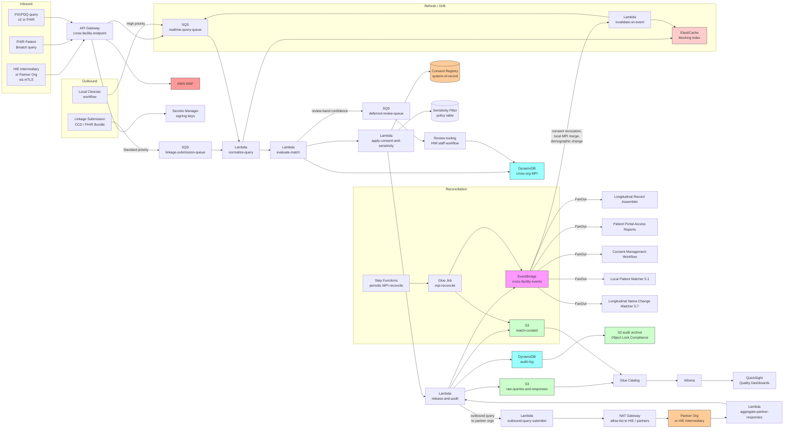

# Recipe 5.5: Cross-Facility Patient Matching (HIE) ⭐⭐⭐

**Complexity:** Medium · **Phase:** Production · **Estimated Cost:** ~$0.0001-0.001 per query at HIE scale, dominated by infrastructure rather than per-transaction fees (depends on participant volume, query patterns, and the consent-and-audit overhead the framework imposes)

---

## The Problem

A patient gets in a car accident on a Tuesday afternoon. She is unconscious when the ambulance arrives, has no ID on her, and is brought to the nearest emergency department. The trauma team needs to know, very fast, whether she is on blood thinners. Whether she has an allergy to anything they are about to give her. Whether she has a cardiac history that would change how they manage her. Whether she has been seen for similar injuries before in a way that suggests intimate-partner violence. Whether she is pregnant. Whether she has an advance directive on file somewhere.

She has, in fact, been seen at four different healthcare organizations in the last decade: her primary care office (a small independent practice that uses a regional EHR), the academic medical center across the city (where she had her gallbladder out five years ago), the urgent care chain near her job (visited twice last year for sinus infections), and the women's health clinic where her OB/GYN practices (which is part of a different health system). All four organizations have records that, between them, would answer every one of those trauma-team questions in seconds. None of them are connected directly. The trauma team has, today, no way to query all four systems with "who is this patient and what do you know about her" and get back a useful answer in the registration window.

This is what cross-facility patient matching is for. The clinical care use case is the dramatic one, the one that makes the case for funding the infrastructure, but it is far from the only use case. Care coordination across primary care and specialty care for chronic conditions, transitions of care from hospital to skilled nursing facility to home health, public health reporting that needs to deduplicate across submitting organizations, quality measurement that needs to know whether a patient seen at organization A had her required follow-up at organization B, value-based care contracts that pay or penalize based on total cost of care for an attributed patient population that gets care from multiple sources, all of these require the ability to say "the patient seen at organization A is the same person as the patient seen at organization B."

The gap between "should be possible" and "is possible" here is decades wide. Health information exchanges (HIEs), regional and state and increasingly national, exist precisely to bridge this gap. They have been around for over twenty years in various forms. They have functioning patient-matching infrastructure. And yet the typical experience of a clinician in the United States, in the year you are reading this, is still that they do not have a complete view of their patient at the point of care.

Why is it hard? Several reasons that compound:

You are running an HIE that connects forty hospitals, two hundred ambulatory practices, twelve community health centers, and a handful of post-acute facilities in a state. Each of those organizations sends you patient records (admission and discharge notifications, continuity of care documents, FHIR resources) on their own schedule, in their own dialect, with their own demographic conventions. Maria Garcia at the academic medical center is "Maria E. Garcia, DOB 1972-03-14, address on Maple Street." At the urgent care chain she is "Maria Garcia-Lopez, DOB 1972-03-14, address on Maple Street." At the women's health clinic she is "M Garcia, DOB 1972-03-15 (their registration system requires every digit and the staff guessed when she did not have her ID), address last updated when she lived on Oak Street four years ago." At the primary care office she is "Maria Elena Garcia, DOB 1972-03-14, with her current Maple Street address and her old Oak Street address as a secondary." Without an external master patient index that ties these four records together, the trauma team querying you for "Maria Garcia, DOB 1972-03-14" gets back zero, one, two, or all four of these records depending on how confident your matcher is, and you have to be right about the merge in seconds.

You are running clinical IT at one of those forty hospitals, and you receive a Continuity of Care Document (CCD) from the urgent care chain via the HIE for one of your patients. The CCD is for "Maria Garcia-Lopez." Your patient is "Maria E. Garcia." Your EHR's automatic-match-on-incoming-document logic says it is a probable match, so it files the document into your patient's chart automatically. Two months later you discover that "Maria Garcia-Lopez" was a different person entirely (a different Maria, born the same year, same first name, different middle initial), and the urgent care record (which mentioned a positive pregnancy test) is now in your patient's chart, where it has been seen by a covering physician who believed it. The patient is, understandably, upset. The chief medical officer wants to know what happened. The compliance team wants to file a breach notification. The HIE wants to know whether this is a one-off or a systematic matcher problem on either your side or theirs.

You are coordinating care for an oncology patient who is on an active treatment plan at the academic medical center, gets her infusions there, but is being seen for a separate concern by her primary care physician at a different organization. The PCP needs the latest oncology notes; the oncology team needs the PCP's blood pressure trends and recent medication changes. The HIE has the data on both sides. The question is whether the HIE can confidently link the two patient records at query time so that "give me everything you have on this patient" returns the union, not the disjoint subset that each organization can already see locally.

You are running quality measurement for a state Medicaid program. You need to compute, for the attributed population, the percentage of diabetic patients who got an HbA1c test in the last twelve months. The data sources are claims (which see all the tests billed but not the results), the state's largest health system EHR (which has the results for patients seen there), and the regional reference lab (which has the results for tests that were billed by primary care offices using outside labs). You have to match patients across all three sources without double-counting, without missing patients who got their test at a system you do not have feed from, and without crediting the wrong test to the wrong patient.

You are a public health agency receiving immunization records from every provider in the state, plus pharmacies, plus mass vaccination sites during a pandemic. The records are submitted with the demographic data each provider had at the time, which varies in completeness and accuracy. Your immunization information system needs one record per child per vaccine event, properly attributed, even though the submitter may have only the kid's first name and a guessed birth year because the family did not have ID at the pop-up clinic.

You are TEFCA's national-network operator and you are wiring up the inter-network exchange of patient records between Qualified Health Information Networks (QHINs). The patient matching at this layer happens between organizations that may have never exchanged data with each other before, may have very different population demographics, may use different matching technologies internally, and have to produce a confident match decision through query-and-respond protocols that were designed before the volume and the stakes got this high. <!-- TODO: confirm at time of build; TEFCA's QHIN-to-QHIN exchange and the underlying patient-matching protocols continue to evolve. -->

This is the recipe. Cross-facility patient matching is the entity-resolution problem of "is the patient described in this query the same person as the patient on record at our organization, and if so, with what confidence and what data are we willing to release?" The answer requires entity-resolution techniques (which you saw in 5.1, 5.2, 5.3, and 5.4), but it adds three things on top: privacy-and-consent governance is not optional and it shapes the architecture, the match has to work against records you did not control the creation of and probably never will, and the cost of getting it wrong is borne by the patient in clinical-safety terms in addition to the administrative and financial terms from the earlier recipes.

It is in the medium-complexity tier because the matching core is the same probabilistic-and-deterministic stack from earlier recipes, but the surrounding cross-organizational coordination, the consent layers, the audit posture, and the trust frameworks add an order of magnitude of operational and governance complexity. National-scale matching across the entire TEFCA framework is in recipe 5.9 and is genuinely complex; the regional and HIE-scale matching covered here is the on-ramp.

Let's get into how you build it.

---

## The Technology: Cross-Organizational Entity Resolution Without a Shared Identifier

### Why This Is Different From Internal Matching

You have already seen the basic toolkit. Recipes 5.1 (internal duplicate detection), 5.2 (provider NPI matching), 5.3 (address standardization and household linkage), and 5.4 (insurance eligibility matching) all draw from the same core: deterministic matching for the easy cases, probabilistic scoring with Fellegi-Sunter weights for the medium cases, ML re-ranking where it earns its keep, and human review for the rest. That toolkit applies here. What changes is the surrounding context.

In recipe 5.1, both records are yours. You can normalize the data on both sides. You can re-run the matcher when the threshold changes. You can merge and unmerge with full audit. You can fix the registration UI to capture cleaner data going forward.

In recipe 5.5, the records on the other side belong to a different organization. You cannot clean their data. You cannot change how they collect it. You cannot see their full record (only the demographics and the explicitly-shared clinical data). You may not even know what their internal patient ID looks like. The matcher has to work across organizations that share a thin slice of demographics and (usually) nothing else.

A second difference: the consent layer is in the request path. In recipe 5.1, your patient consented to be in your records when they registered with your organization. In recipe 5.5, the question is whether they have consented (explicitly or by operation of law) to having their records exchanged with another organization for this specific purpose. The answer is encoded in a consent registry, and the matcher has to consult the registry before releasing any data. The architecture treats consent as a first-class input to the match-and-release decision, not as a checkbox on a downstream form.

A third difference: the trust model is multilateral. In recipe 5.4, you trusted the payer to have authoritative member data; the trust direction was clear. In recipe 5.5, two or more organizations are exchanging data peer-to-peer (or through an HIE intermediary), and each has to trust that the others are matching responsibly, not over-merging or under-merging in ways that produce unsafe data sharing. The trust framework is an explicit document (Data Use and Reciprocal Support Agreement, Common Agreement, HIE participation agreement) that constrains what each party may do with the data they receive.

A fourth difference: the failure modes have a clinical-safety dimension that the earlier recipes did not have at the same intensity. A wrong eligibility match (recipe 5.4) produces a billing error. A wrong cross-facility match produces, potentially, a misfiled clinical document, a missed allergy, a wrong-patient overlay in the receiving organization's chart, and harm to the patient. The matcher's tolerance for false positives is therefore lower than in any of the earlier recipes, and the architecture has to make the tolerance explicit and tunable.

### The Cross-Facility Match: What It Actually Resolves

Two distinct operations live under the umbrella of "cross-facility patient matching," and the architecture treats them differently:

**Query-time match.** A clinician at organization A queries the HIE (or directly queries organization B) for "patient X." The system has to identify, with high confidence, which of organization B's patient records (if any) is the same person, and return only those records. This is a synchronous, latency-sensitive operation; the clinician cannot wait. The match runs against the requesting organization's demographic submission and organization B's master patient index. The output is a match decision and (if matched and consent permits) the requested clinical data.

**Linkage-time match.** Records are submitted to a shared MPI (the HIE's, or an inter-organization EMPI) on a continuous or batch basis. Each submission is matched against the existing population to determine whether it is a new identity or an existing one. The output is a stable cross-organizational identifier that ties together the participating organizations' local patient IDs. This is the durable substrate for query-time matches and for any cross-organizational analytics.

The two operations share the underlying matcher but differ in their architecture. Query-time match is real-time and stateless (the match decision is for this query only; the result is not persisted as a permanent linkage). Linkage-time match is asynchronous and state-building (each match decision adds to or modifies the cross-organizational MPI). Both run in production simultaneously; the linkage-time pipeline maintains the substrate that the query-time pipeline reads.

The match output also has more components than in earlier recipes:

**Identity match.** Same probabilistic core as recipes 5.1 and 5.4, with the cross-organizational features. Demographics are the primary signal; cross-organizational identifiers (when present, like a previously-issued HIE patient identifier) are the strongest deterministic signal.

**Consent envelope.** Even when the identity match is high-confidence, the consent registry determines what data may be released. Some organizations operate under opt-in models (patients must explicitly consent to be in the HIE), some under opt-out (patients are in unless they have specifically opted out), some under a mixed model (treatment uses are opt-out, secondary uses are opt-in). The consent envelope constrains the released payload. <!-- TODO: confirm at time of build; the legal landscape for HIE consent varies by state and by data category, and the 21st Century Cures Act information-blocking rules layer additional obligations. -->

**Sensitivity filter.** Some categories of clinical data have additional sharing constraints beyond general HIPAA: substance-use disorder records under 42 CFR Part 2, behavioral health records in some states, HIV and STI status in some jurisdictions, genetic test results, reproductive health information in jurisdictions where it has become legally sensitive. <!-- TODO: confirm at time of build; the legal landscape on sensitive-category sharing is moving, particularly post-Dobbs reproductive-health-information sharing constraints. --> The match-and-release pipeline filters the released data by these categories, and the matcher's audit trail records what was filtered and why.

**Provenance and authority.** When two organizations both have a record for the same patient, which record is authoritative for what? The patient's allergies recorded yesterday at the academic medical center are probably more current than the allergies recorded three years ago at the urgent care chain. The cross-facility match output includes provenance metadata so the consuming organization (or the HIE's longitudinal-record assembler) can apply survivorship rules.

The recipe focuses on the identity-and-consent piece, with hooks for the rest. Sensitivity filtering is its own subject and is largely policy-driven rather than algorithmic; provenance and survivorship are best handled in a downstream record-assembler.

### The Standards Foundation: IHE PIX/PDQ and FHIR Patient $match

Two standards-based mechanisms underlie most production cross-facility patient matching:

**IHE PIX and PDQ.** Integrating the Healthcare Enterprise (IHE) is a standards organization that publishes profiles for healthcare interoperability. The Patient Identifier Cross-reference (PIX) profile defines how to query for "given this patient's local identifier in organization A, what is their local identifier in organization B." The Patient Demographics Query (PDQ) profile defines how to query for "given these demographic search criteria, return matching patient records." Both have HL7 v2-based variants (the original) and FHIR-based variants (PIXm and PDQm, with the m for "mobile" reflecting their RESTful design). <!-- TODO: confirm IHE profile names and current versions at time of build; IHE updates the profiles periodically. --> Most operational HIEs in the United States expose at least PDQ and PIX (or their FHIR equivalents) as the patient-discovery layer.

**FHIR Patient $match operation.** The FHIR specification defines a `$match` operation on the Patient resource that takes a search Patient resource as input and returns a Bundle of candidate Patient resources, each with a search score indicating match confidence. <!-- TODO: confirm at time of build; the FHIR Patient $match operation is defined at hl7.org/fhir/patient-operation-match.html and is a normative part of the spec. --> This is the modern, REST-friendly version of the patient-discovery query. It is what Carequality, CommonWell, and TEFCA QHINs predominantly use for their cross-organization patient-discovery flows. The matcher implementation behind `$match` is left to the responding organization (the standard says how to query, not how to match), so each organization's match quality may differ. The query-time architecture has to handle that variance.

The combination is layered: a query (PIX/PDQ or `$match`) goes from the requesting organization to the responding organization (or to an HIE intermediary that fans out to multiple responders), each responder's matcher evaluates the query against its local MPI, each responder returns a match-or-no-match (with confidence) and (subject to consent) the requested data. The requesting organization aggregates the responses, applies its own match-quality threshold, and presents the result to the clinician.

This is how the trauma-team scenario from the opening actually works in production: the ED registration system queries the HIE (or directly queries known nearby organizations), each responder's matcher evaluates the query against its local MPI and returns matched data, and the ED's longitudinal-record-assembler stitches the responses into a single view for the clinician. When it works, the clinician sees the union of records from all four of Maria Garcia's prior providers within a few seconds of registration. When the matchers disagree about whether the queries refer to the same person, the result is partial.

### What Makes the Cross-Facility Match Hard

Six structural reasons:

**No shared identifier across organizations.** Each organization issues its own MRN. The HIE may issue its own cross-organizational identifier, but it is opaque to the participating organizations and can only be resolved through the HIE. Older infrastructure relied heavily on Social Security Number as a quasi-identifier, but SSN is increasingly excluded from healthcare data flows for privacy reasons (and it has data-quality and entry-error issues even where it is collected). The match runs on demographic data plus whatever cross-references the HIE has previously established.

**Demographic data is asymmetric in different ways than in eligibility matching.** Two providers' registration systems capture demographic data with different conventions, different quality bars, different completeness expectations. The hospital's registration captures a comprehensive set with insurance verification; the urgent care's registration captures minimum-viable demographics under time pressure; the public health pop-up clinic captures whatever the family was willing to give them. The matcher has to be tolerant enough to handle these without becoming so loose that it accepts wrong matches.

**The probability-base-rate is much lower than in single-organization matching.** When you query an HIE for "Maria Garcia, DOB 1972-03-14," you are not asking "is this person already in our database" (the question for recipe 5.1, where the prior probability is "yes, with high probability, because she registered today"). You are asking "is this person in any of the participating organizations' databases" against a population of millions, where the prior probability that any specific other-organization record refers to the same person is small. The Fellegi-Sunter math handles this through the u-probabilities (random-match probabilities), but the practical implication is that the threshold has to be calibrated more conservatively, because the cost of false positives is higher relative to the population base rate.

**Names are not stable across organizations and time.** A patient who was seen at organization A under her maiden name and at organization B under her married name produces records that the matcher has to recognize as the same person without conflating them with a different patient who has the maiden name as her birth name. This is the cross-facility version of the longitudinal-name-change problem (recipe 5.7), and it is harder here because organization A may not know about the marriage at all.

**Privacy and consent are first-class inputs, not constraints.** A high-confidence identity match does not authorize data release. The consent registry has to be consulted, the sensitivity filter has to be applied, and the audit trail has to record what was queried, what was returned, what was filtered, and why. The query-and-release pipeline carries the consent metadata through every stage. Skip this and the architecture is unsafe at production scale, regardless of how well the matcher itself performs.

**Trust in the responder's match quality is bounded.** When organization B's matcher returns "match, confidence 0.96, here are the records," organization A has to decide whether to trust that confidence value. Organization B's confidence is calibrated against organization B's gold set, against organization B's population, with organization B's threshold. Organization A has its own population and its own risk tolerance. The aggregating side typically applies its own confidence threshold to the responder's score, treating the responder's match decision as one signal among several. This is increasingly being formalized in HIE policy as "minimum acceptable matcher quality" requirements rather than left to ad-hoc per-querier reinterpretation.

### Where the Field Has Moved

A few practical updates worth knowing:

**TEFCA went operational, slowly.** The Trusted Exchange Framework and Common Agreement is now in production, with multiple QHINs designated and inter-network exchange happening at increasing volume. <!-- TODO: confirm operational status and QHIN list at time of build; TEFCA QHIN designations and operational rollout continue to expand. --> The patient-matching standards within TEFCA are still maturing; recipe 5.9 covers the national-scale dimension. For regional and HIE-scale matching, TEFCA's emergence is changing the operational reality (organizations that previously connected only through their regional HIE now have a national reach) but is not changing the underlying matching techniques. The same probabilistic-and-deterministic core works.

**FHIR-native query is becoming the dominant pattern.** Newer HIE deployments and the TEFCA QHIN-to-QHIN exchange use FHIR Patient `$match` and FHIR R4 (or higher) data resources rather than the older HL7 v2 Continuity of Care Document and IHE XDS infrastructure. <!-- TODO: confirm at time of build; FHIR R5 has been published but R4 remains the broadly-deployed baseline. --> The transition is still in progress (most operational HIEs have hybrid v2-and-FHIR connectivity), and FHIR is rapidly becoming the assumed substrate for new development.

**Patient-mediated identity, not just provider-mediated.** The CMS Patient Access API and the broader push for patient-controlled health data are introducing a new identity-resolution path: the patient authenticates to a payer or to an aggregator, authorizes a connection to a third-party app, and the app pulls records on the patient's behalf. The patient's cryptographic identity (typically through OAuth or OIDC against a known identity provider) becomes a strong identifier that supplements demographic matching. <!-- TODO: confirm at time of build; the CMS Interoperability and Patient Access Final Rule and its successor regulations are evolving, and patient-mediated identity is increasingly relevant. --> This is most directly relevant for patient-facing apps but is starting to feed into provider-facing record location too.

**Cohort-stratified accuracy monitoring is required by regulation in some contexts.** ONC's certification criteria, TEFCA's QHIN requirements, and various state HIE rules increasingly include obligations around match-quality monitoring and disparate-impact analysis. <!-- TODO: confirm at time of build; the regulatory landscape is moving toward more explicit equity-monitoring requirements. --> This is the same equity concern as in recipes 5.1 and 5.4, applied to the cross-organizational layer where the disparities can be larger because the matching is harder.

**Privacy-preserving record linkage is moving from research to production.** Bloom-filter-based and hash-based matching protocols (recipe 5.8 covers the techniques in detail) are increasingly available as alternatives to direct demographic exchange, particularly for analytics use cases where the full record does not need to be revealed. For clinical-care use cases the demographic exchange remains dominant, because the privacy-preserving methods have lower match accuracy and are harder to audit. <!-- TODO: confirm at time of build; deployment of privacy-preserving linkage in operational HIEs has increased but is still uncommon for clinical-care queries. -->

**Match-quality benchmarking and auditing standards are emerging.** Industry initiatives (the Sequoia Project Patient Matching Framework, ONC patient-matching pilot programs, AHIMA's MPI maturity model) are producing benchmarking standards, audit checklists, and recommended practices that did not exist a decade ago. <!-- TODO: confirm at time of build; the patient-matching framework documents are being updated. --> The practical effect is that "what does a good cross-facility matcher look like" is becoming a question with documented industry answers rather than a per-organization improvisation.

---

## General Architecture Pattern

The pipeline has six logical stages: ingest the cross-facility query (or the linkage submission), normalize the demographic search criteria, evaluate against the local MPI (or, for query aggregators, fan out to participating organizations and aggregate the responses), apply the consent and sensitivity filters, persist the match decision with provenance, and react to events that invalidate prior matches (consent revocation, organization onboarding or offboarding, MPI updates).

```
┌────────────── INGEST ─────────────────────────────┐
│                                                    │
│  [Trigger sources]                                 │
│   - Inbound query (PIX/PDQ, FHIR $match)          │
│     from another organization or HIE             │
│   - Inbound linkage submission (CCD, FHIR Bundle, │
│     ADT message) for ingestion into shared MPI   │
│   - Outbound query from local clinician           │
│     (registration ED workflow, transition-of-care │
│     workflow, public-health reporting)            │
│   - Periodic MPI reconciliation across            │
│     participating organizations                   │
│           │                                        │
│           ▼                                        │
│  [Query / submission record:                       │
│   query_id, requesting_org, target_orgs,          │
│   purpose_of_use, search_demographics,            │
│   requested_data_categories, response_window]     │
│                                                    │
└────────────────────────────────────────────────────┘

┌────────────── NORMALIZE ──────────────────────────┐
│                                                    │
│  [Apply cross-organizational demographic           │
│   normalization:                                   │
│   - Names: case, suffix, hyphenation,             │
│     transliteration                               │
│   - DOB: format, partial-date handling            │
│   - Sex / gender (where captured)                 │
│   - Standardized address (recipe 5.3)             │
│   - Phone: E.164 with extension stripping         │
│   - Cross-organizational identifier (if present   │
│     from prior match)]                             │
│           │                                        │
│           ▼                                        │
│  [Build the canonical search payload]             │
│                                                    │
└────────────────────────────────────────────────────┘

┌────────────── EVALUATE / RESOLVE IDENTITY ────────┐
│                                                    │
│  [For local MPI evaluation:]                       │
│   Block on (last-name-soundex, year-of-birth)     │
│   plus secondary blocks for low-recall coverage   │
│   (last-name-metaphone, ZIP3-and-DOB,             │
│   first-name-and-DOB-day-month)                   │
│           │                                        │
│           ▼                                        │
│  [Score each candidate using the same             │
│   probabilistic-record-linkage core as 5.1:        │
│   - First name (Jaro-Winkler with                │
│     nickname-aware comparison)                    │
│   - Last name (with maiden-name handling and      │
│     hyphenation tolerance)                        │
│   - DOB (exact, year-month, year-only)           │
│   - Sex                                           │
│   - Standardized address                         │
│   - SSN (where present, with care)               │
│   - Phone                                         │
│   - Prior cross-org identifier (strong signal)]   │
│           │                                        │
│           ▼                                        │
│  [Apply confidence thresholds calibrated          │
│   against the cross-organizational gold set:      │
│   - >= AUTO_ACCEPT_HIGH: high-confidence match,  │
│     proceed to release                           │
│   - >= AUTO_ACCEPT_MED: probable match,          │
│     proceed with downgraded data scope            │
│   - <= AUTO_REJECT: no match, return null         │
│   - in between: route to deferred-review queue   │
│     (this is not blocking; the original          │
│     query gets a "no match found" response       │
│     and the candidate is reviewed                │
│     asynchronously to inform future matches)]    │
│                                                    │
└────────────────────────────────────────────────────┘

┌────────────── CONSENT + SENSITIVITY FILTER ───────┐
│                                                    │
│  [Consult consent registry for the matched        │
│   patient:                                         │
│   - Is exchange permitted at all?                 │
│   - Is exchange permitted for this purpose-       │
│     of-use? (treatment, payment, operations,      │
│     research, public-health)                      │
│   - Is exchange permitted with this requesting   │
│     organization?                                  │
│   - Is exchange permitted for this data           │
│     category?                                      │
│   - What is the consent valid-through date?]      │
│           │                                        │
│           ▼                                        │
│  [Apply sensitivity filter to the eligible        │
│   data set:                                        │
│   - 42 CFR Part 2 (substance use disorder)        │
│   - State-specific behavioral health rules        │
│   - HIV / STI status restrictions where          │
│     applicable                                    │
│   - Genetic test results                         │
│   - Reproductive health information where         │
│     legally restricted                            │
│   - Patient-flagged sensitive categories]         │
│           │                                        │
│           ▼                                        │
│  [Construct the response payload:                  │
│   - Match decision and confidence                │
│   - Released data subset                         │
│   - List of filtered / withheld data categories  │
│     (with reason codes; the requester knows      │
│     something was withheld but not specifically   │
│     what or why)]                                  │
│                                                    │
└────────────────────────────────────────────────────┘

┌────────────── PERSIST + AUDIT ────────────────────┐
│                                                    │
│  [Audit record:                                    │
│   - query_id, requesting_org, target_org         │
│   - matched_local_patient_id (if any)            │
│   - match_confidence, match_method               │
│   - consent_check_result                          │
│   - released_data_summary                         │
│   - filtered_data_categories_with_reason_codes   │
│   - response_timestamp                           │
│   - response_correlation_id                      │
│   - purpose_of_use as asserted by requester]     │
│           │                                        │
│           ▼                                        │
│  [Write to immutable audit log; retain per the    │
│   regulatory retention floor]                     │
│           │                                        │
│           ▼                                        │
│  [Emit cross_facility_query_resolved event for    │
│   downstream analytics, quality monitoring,        │
│   and patient-facing access reports]              │
│                                                    │
└────────────────────────────────────────────────────┘

┌────────────── INVALIDATION / REFRESH ─────────────┐
│                                                    │
│  [Subscribe to events that invalidate prior        │
│   matches:                                         │
│   - Patient consent revocation or modification    │
│   - Local MPI merge or unmerge (recipe 5.1)       │
│   - Patient demographic change (recipe 5.7        │
│     name change, recipe 5.3 address change)       │
│   - Participating organization onboarding or      │
│     offboarding                                    │
│   - Cross-org identifier reassignment]            │
│           │                                        │
│           ▼                                        │
│  [Invalidate cached cross-facility match           │
│   metadata; emit cross_facility_match_invalidated │
│   event so the requesting organization can        │
│   refresh its longitudinal record assembly]       │
│                                                    │
└────────────────────────────────────────────────────┘
```

**Inbound and outbound flows share the matcher.** The same probabilistic-record-linkage scorer runs on the inbound query (someone is asking us about a patient; do we have them?) and on the outbound query response from a participating organization (they say they have a candidate; is the candidate the same person we asked about?). Build the matcher as a service and call it from both directions, rather than duplicating logic.

**Blocking is the first-order architectural choice.** Cross-facility matchers run at scale (millions of records on each side, sometimes billions in national-scale deployments), and naive O(n²) comparison is impossible. Blocking partitions the candidate set so that comparisons happen only within plausibly-related buckets. The blocking-key design is a tradeoff: too tight and true matches get split across buckets; too loose and the bucket sizes blow up. Standard production blockers use multiple complementary blocking keys (last-name-soundex plus year-of-birth, last-name-metaphone, ZIP3-plus-DOB, first-name-plus-DOB-month-day) and union the candidate sets. The matcher then scores each candidate; the final score is the max across blocks (or a composite if you want the consensus signal).

<!-- TODO (TechWriter): Expert review A12 (LOW). Reconcile the phonetic-encoding naming across the architecture diagram, this prose paragraph, and the Step 2 pseudocode. The diagram and prose alternate "soundex" and "metaphone"; the pseudocode uses double_metaphone() and stores in last_name_phonetic. Suggested fix: add one sentence noting "Production matchers typically use Double Metaphone (more accurate for non-Anglo names) rather than Soundex (the original phonetic encoding); the recipe's pseudocode uses Double Metaphone, but the principle is the same." -->


**The matcher returns more than a match decision.** The query-time response includes the match confidence, the candidate identifier, the categorical reason for the score (which features matched, which did not), and the data-release decision. The requesting organization uses all of this to decide what to do with the response: accept the match and integrate the data, accept the match but flag it for clinician review, reject the match and continue without the data. Cleanly separating "we matched" from "we released" matters for the audit trail and for correctly reporting to the patient what data was exchanged about them.

**Consent is consulted at release time, not at query time.** A legitimate query for a patient who has not consented to data sharing is not blocked at the entry point; the matcher runs, the identity is determined, and the consent check then constrains what (if anything) is released. This pattern lets the matcher's accuracy not be polluted by consent-driven bias (otherwise, patients who opt out of sharing would systematically not appear in match training data, distorting the matcher's calibration), and it lets the audit log accurately record that a query was made and that consent caused the release to be limited. The requester, depending on the framework, may receive a "consent did not permit release" indicator; in some frameworks, even acknowledging that the patient is in the responder's system requires consent.

**The audit log is the system of record for cross-organizational data flow.** Every query, every match decision, every consent check, every release. This is non-negotiable in a cross-organizational setting because the audit log is the only artifact that can answer "who saw what about this patient and when" when the patient asks (which they have a regulatory right to ask) or when a downstream incident requires forensic reconstruction. The retention floor is at least the longest of HIPAA records-retention, the HIE's contractual retention, the state's medical-records-retention requirement, and any sensitive-category-specific retention (Part 2 has its own).

**Cross-organizational match is event-driven on the maintenance side.** When a patient's local MPI changes (a merge in recipe 5.1, an unmerge, a demographic update from recipe 5.7), the cross-organizational matches that depended on the prior state need to be re-evaluated. The architecture subscribes to local MPI events and propagates re-evaluation to the cross-org layer; without this, stale cross-org matches accumulate.

**Cohort-stratified accuracy monitoring applies here too, with cross-organizational variance.** Match accuracy is not uniform across patient cohorts, and cross-facility match accuracy can be worse than intra-organizational match accuracy for the same cohorts because the demographic asymmetries (different organizations capturing different fields differently) compound. Per-cohort match success rate, per-cohort review-queue rate, and per-cohort downstream-error rate (clinician-reported wrong-patient retrieval, mistakenly-filed cross-org documents) all need monitoring with disparity thresholds.

<!-- TODO (TechWriter): Expert review A2 (HIGH). Specify the operational thresholds, per-axis aggregation, and disparity-metric definitions for cohort-stratified accuracy monitoring. Use the institutional cohort registry as the source of truth (no ad-hoc enumeration in code). Metrics: per-cohort cross-facility match success rate weekly; per-cohort review-queue rate weekly; per-cohort clinician-reported wrong-patient-retrieval rate monthly; per-cohort document-misfiling rate monthly. Disparity calculation: absolute difference between best-rate and worst-rate cohort per metric per cycle. Suggested thresholds: match-success disparity > 0.05 = MEDIUM alarm; review-queue disparity > 0.05 = MEDIUM; downstream wrong-patient disparity > 0.01 = HIGH (clinical safety). Reference 5.1, 5.2, 5.3, 5.4 Finding A2 as chapter pattern. -->

<!-- TODO (TechWriter): Expert review S1 (HIGH). Specify the identity-boundary policy for the inbound-query handler, the outbound-query submitter, the consent-and-sensitivity filter, and the audit-log writer. Inbound handler: validate the requesting organization's identity through mTLS or signed JWT, verify the asserted purpose-of-use against the participation agreement, rate-limit per requester to prevent enumeration attacks. Outbound submitter: sign queries with the institutional credential, verify response signatures from participating organizations. Consent-and-sensitivity filter: this is the most security-sensitive component; it must read consent state from the consent-registry-of-record (not from a cache that may be stale on consent revocation) and must fail closed (if the consent registry is unavailable, withhold release rather than release). Audit-log writer: append-only, signature-chained, replicated to a separate audit AWS account; tampering attempts surface immediately. Reference chapter pattern from 5.1, 5.2, 5.3, 5.4 Finding S1. -->

<!-- TODO (TechWriter): Expert review A6 (MEDIUM). Specify the cross-recipe orchestration contract for cross-facility-related events. Schema: source, detail_type, detail.local_patient_id, detail.cross_org_identifier, detail.event_id, detail.previous_state, detail.new_state, detail.detected_at. Downstream consumers in 5.1 (local matcher; cross-facility match may surface a previously-unknown duplicate-patient signal locally), 5.4 (eligibility matcher; cross-facility match data may inform a payer-side identity question), 5.6 (claims-clinical linkage; cross-facility identifier may help bridge claim-vs-clinical join), 5.7 (longitudinal name-change matcher; cross-facility queries are a common surfacing point for prior-name records), 5.8 (privacy-preserving linkage; cross-facility identifier resolution interacts with the privacy-preserving layer), plus the longitudinal-record-assembler, the patient-portal access-report generator, and the consent-management workflow, subscribe to specific detail_type values and acknowledge processing via a CloudWatch metric ({consumer}.events_processed). Reference chapter pattern from 5.1, 5.2, 5.3, 5.4. -->

---

## The AWS Implementation

### Why These Services

**Amazon S3 for the cross-facility data lake.** Three zones: raw (every inbound query payload, every outbound query response, every linkage-submission CCD or FHIR Bundle, exactly as received, partitioned by participating-organization and date for audit and replay), curated (parsed match decisions and release decisions with full provenance), and derived (cohort-stratified match-quality reports, per-organization match-quality scorecards, consent-coverage analytics). S3 is HIPAA-eligible under BAA with SSE-KMS encryption. The raw payloads are retained for the regulatory retention floor; the curated decisions power both the operational layer and the analytics layer.

**Amazon DynamoDB for the cross-org MPI and the audit-log primary store.** Two tables: a cross-org MPI table keyed on `(local_patient_id)` with attributes for the cross-organizational identifier, the participating-organization links, the demographic snapshot at last match, the match-confidence-history; and an audit-log table keyed on `(query_id, event_seq)` with the full lifecycle of each query (inbound, normalized, evaluated, consent-checked, released-or-withheld, completed). DynamoDB's single-digit-millisecond reads support the latency budget for query-time match. Streams from both tables feed downstream consumers (longitudinal-record-assembler, audit-log replicator).

**Amazon ElastiCache (Redis) for the blocking-index and consent-state cache.** Blocking indices are read on every query and are amenable to caching. The blocking-key-to-candidate-set map is loaded from DynamoDB at warm-up and refreshed incrementally as the MPI changes; the cache holds the most-frequently-queried blocks. Consent state is also read on every query, but consent reads must fall through to the system-of-record on miss (caching consent risks releasing data after revocation). Both caches use TLS in-transit and KMS at-rest encryption. <!-- TODO: confirm ElastiCache HIPAA eligibility and the encryption-at-rest configuration at time of build. -->

<!-- TODO (TechWriter): Expert review A9 (MEDIUM). Specify the consent-cache invalidation timing on revocation. Synchronous: consent-revocation EventBridge event triggers invalidate-on-event Lambda which (a) deletes the cached consent state, (b) writes consent_revoked_at on the cross-org MPI for the affected patient, (c) emits cross_facility_match_invalidated. In-flight queries that have read the cache but not yet released must re-check consent at release-and-audit against the system-of-record (not the cache), with a 500ms timeout, fail-closed on timeout. Propagation latency budget is 60 seconds from registry emit to release-path effect; CloudWatch alarms on P99 propagation latency > 60s. The fail-closed posture extends through the in-flight-query lifecycle, not just the initial cache-vs-system-of-record read. -->


**Amazon SQS for the query queues.** Three queues: a high-priority queue for synchronous query-time matching (with a short visibility timeout and a strict latency budget), a standard queue for asynchronous linkage-submission processing (each new CCD or FHIR Bundle gets matched against the MPI to determine whether it is a new identity or an existing one), and a deferred-review queue for cases where the matcher's confidence falls in the review band. Separating the queues prevents linkage-submission load from delaying query-time matching.

**AWS Lambda for the per-query and per-submission processing.** Lambda is the right substrate because each query is short-lived, mostly I/O-bound (DynamoDB reads plus the matcher computation), and benefits from on-demand scaling for the bursty pattern of clinical-workflow queries. Separate Lambdas per pipeline stage: `normalize-query`, `evaluate-match`, `apply-consent-and-sensitivity`, `release-and-audit`, `process-linkage-submission`. Each is in VPC with VPC endpoints for downstream services. Outbound queries to participating organizations or to HIE intermediaries go through NAT Gateway with an allow-list of known endpoints, with PrivateLink where the partner offers it. <!-- TODO: confirm partner PrivateLink availability at time of build; HIE intermediaries vary in their connectivity options. --> <!-- TODO (TechWriter): Networking review N3 (LOW). Add a sentence on the volume-based PrivateLink evaluation criterion: at HIE-scale query volumes (typically a couple million queries per month or higher), evaluate the partner's or HIE intermediary's PrivateLink endpoint where available; the cost trade-off (PrivateLink hourly fee plus per-GB transfer vs NAT Gateway data-transfer) usually favors PrivateLink past that threshold. -->

**Amazon API Gateway plus Lambda for the inbound query endpoint.** Other organizations and HIE intermediaries call the API to query for patients. API Gateway provides authentication via mutual TLS (the HIE participation agreement specifies certificate-based identity for queriers), request logging, request signing verification, and rate limiting per requester. The endpoint exposes both PIX/PDQ (for legacy v2 queries) and FHIR Patient `$match` (for FHIR-native queries) with shared backend logic.

**AWS Step Functions for orchestration.** Three workflows: a query-time-match workflow (normalize, evaluate, consent-check, release-and-audit, with strict latency budgets and timeouts at each stage), a linkage-submission workflow (parse the inbound CCD or FHIR Bundle, normalize, evaluate against the MPI, persist the match decision, propagate to downstream consumers), and an MPI-reconciliation workflow (run periodically to compare the local MPI to the participating-organizations' aggregated demographic snapshots and detect drift).

**Amazon EventBridge for cross-facility events and downstream propagation.** When a query is resolved (`cross_facility_query_resolved`), when a linkage submission produces a new or updated cross-org identifier (`cross_facility_identifier_resolved`), when a consent change invalidates prior matches (`cross_facility_match_invalidated`), an event flows out to downstream consumers: the longitudinal-record-assembler, the patient-portal access-report generator, the consent-management workflow, the local patient matcher (5.1, when the cross-facility match surfaces a previously-unknown internal duplicate signal), the longitudinal name-change matcher (5.7), and the privacy-preserving linkage layer (5.8) where applicable. EventBridge rules route events to the right consumer, with DLQs configured for failed deliveries.

**AWS Glue for the batch reconciliation and analytics jobs.** Periodic MPI reconciliation across participating organizations runs as a Glue/Spark job, comparing the local MPI to the aggregated demographic snapshots from participating organizations and flagging discrepancies. The cohort-stratified match-quality job runs as a separate Glue job over the curated S3 zone. Glue Data Catalog tracks the schema across raw, curated, and derived zones; Athena queries the catalog for ad-hoc analytics.

**Amazon Athena and AWS Glue Data Catalog for analytics.** Cohort-stratified match success rates, per-organization match-quality scorecards, consent-coverage analytics, per-purpose-of-use query volume, deferred-review-queue depth and aging, clinician-reported wrong-patient-retrieval rates. Athena queries the catalog over the curated and derived S3 zones; QuickSight on top of Athena provides dashboards for HIE operations, the data-governance committee, and the clinical-safety team.

<!-- TODO (TechWriter): Expert review A10 (LOW). Specify Lake Formation column-level and row-level access controls. The raw query payloads are sensitive (full demographics on every query, including queries that returned no match); restricted to HIE operations and audit teams. The parsed match decisions are needed by clinical-IT and longitudinal-record assembly. The cohort-aggregated metrics are needed by leadership and equity-monitoring committees. Different audiences need different views; Lake Formation grants enforce the column-level distinctions. Direct Athena query path uses the same grants. Access logged via CloudTrail data events on the catalog and underlying buckets. Same chapter pattern as 5.2, 5.3, 5.4. -->

<!-- TODO (TechWriter): Expert review S5 (LOW). When emitting cohort dimensions on CloudWatch metrics, use bucketed non-reversible cohort labels (cohort_bucket = A, B, C, D, E, unknown) rather than raw demographic attributes; the cohort-label-to-attribute mapping lives in a separate access-controlled table loaded only at dashboard-render time. Same chapter pattern as 4.4, 4.10, 5.1, 5.2, 5.3, 5.4. -->

**Amazon QuickSight for operational and quality dashboards.** Per-organization match success rate, per-cohort match success rate, query volume by purpose-of-use, consent-permission distribution, deferred-review-queue depth and aging, per-sensitivity-category withhold rate, downstream clinician-reported wrong-patient-retrieval cross-references.

**AWS KMS, CloudTrail, CloudWatch.** Customer-managed keys for the S3 buckets, the DynamoDB tables, the ElastiCache cluster, the Lambda log groups. CloudTrail data events on the cross-org MPI table and the audit-log table. CloudWatch alarms on inbound query success rate, on per-organization error spikes (often the first signal of a partner-side outage), on deferred-review-queue depth, on cohort-stratified disparities, on consent-registry availability (this is a fail-closed dependency; if the consent registry is unreachable, queries cannot be released).

**AWS Secrets Manager for HIE and partner credentials.** Mutual-TLS certificates, signing keys, API keys for HIE intermediaries and direct-organization connections. Stored with KMS encryption at rest, IAM-controlled access, rotation support where the partner supports it.

**AWS WAF and Shield for the inbound-query endpoint.** Cross-facility query endpoints are public-internet-reachable (or HIE-network-reachable) by definition, and they are attractive targets for enumeration attacks (an attacker submitting demographic guesses to discover whether a known person has records at the institution). WAF rules limit per-source-IP and per-authenticated-principal query rates; Shield protects against volumetric attacks. Per-requester rate limits in API Gateway are layered on top.

<!-- TODO (TechWriter): Expert review A8 / Networking review N1 (MEDIUM). The cross-facility query endpoint sits on the boundary of the institution and the HIE network. Specify the API Gateway resource policy (private API for HIE-network-reachable consumers via VPC endpoint, public API for federated identity-provider-authenticated consumers), the WAF rule groups (rate limiting per source-IP and per Cognito principal, request-size limiting, request-pattern analysis for enumeration-attack signatures), and the geo-restriction posture if the institution's HIE participation agreement constrains query origins. Same chapter pattern as 5.1, 5.2, 5.3, 5.4 Finding N1, with the additional enumeration-attack consideration specific to cross-facility queries. -->

### Architecture Diagram




### Prerequisites

| Requirement | Details |
|-------------|---------|
| **AWS Services** | Amazon S3, Amazon DynamoDB, Amazon ElastiCache for Redis, Amazon SQS, AWS Lambda, AWS Glue, Amazon Athena, AWS Step Functions, Amazon EventBridge, Amazon API Gateway, Amazon QuickSight, AWS WAF, AWS Shield, AWS Secrets Manager, AWS KMS, Amazon CloudWatch, AWS CloudTrail. |
| **External Services** | HIE participation agreement with one or more regional or state HIEs. TEFCA QHIN connection (direct or sub-participant) for national-network reach. Direct connections to specific partner organizations where the volume justifies bypassing the HIE intermediary. A consent-registry system-of-record (often HIE-provided, sometimes institutional, sometimes a separate vendor product). A longitudinal-record-assembler (institutional or HIE-provided) that consumes the cross-facility match output and presents the unified record to clinicians. <!-- TODO: confirm HIE landscape and TEFCA QHIN options at time of build; the operational ecosystem continues to evolve. --> |
| **IAM Permissions** | Per-Lambda least-privilege: `dynamodb:GetItem` / `PutItem` / `UpdateItem` / `Query` scoped to specific tables; `s3:GetObject` / `PutObject` scoped to specific bucket prefixes; `secretsmanager:GetSecretValue` scoped to specific HIE and partner credentials; `events:PutEvents` on the cross-facility-events bus; `sqs:SendMessage` / `ReceiveMessage` scoped to specific queues; `kms:Decrypt` on relevant CMKs. Glue jobs need scoped catalog and S3 permissions. The audit-log writer Lambda has append-only permissions on the audit-log table (no delete, no update on existing items) enforced through IAM condition keys plus DynamoDB resource-based policy. Never use `*` actions or `*` resources in production. <!-- TODO (TechWriter): Expert review S6 (LOW). Pair with one or two scoped Resource ARN examples for the highest-stakes actions: dynamodb:UpdateItem on arn:aws:dynamodb:<region>:<account>:table/cross-org-mpi; s3:PutObject on arn:aws:s3:::<env>-cross-facility-raw/audit/*; events:PutEvents on arn:aws:events:<region>:<account>:event-bus/cross-facility-events; secretsmanager:GetSecretValue on arn:aws:secretsmanager:<region>:<account>:secret:hie-partners/*. Same chapter pattern as 5.1, 5.2, 5.3, 5.4. --> |
| **BAA and Trust Framework** | AWS BAA signed. The HIE has a BAA, and participation in the HIE is governed by a Data Use and Reciprocal Support Agreement (DURSA-style) or equivalent Common Agreement. Each direct-partner-organization connection has its own trading-partner agreement and BAA. TEFCA participation is governed by the Common Agreement and the QHIN-specific subordinate agreements. <!-- TODO (TechWriter): Expert review S3 (MEDIUM). Specify the partner data-handling commitments contractually: (a) the partner will not retain queried demographics beyond a documented operational window (queries that returned no match should produce no persistent record on the partner side, only an audit log entry); (b) the partner will disclose all sub-processors that may handle PHI; (c) the partner will notify within a documented window of any data incident; (d) the partner agreement specifies the institution's right to audit the partner's controls (typically annually); (e) the partner commits to a minimum acceptable matcher quality (cohort-stratified accuracy thresholds). Add an inline comment at the outbound-query call site explaining the trust boundary. --> |
| **Encryption** | S3: SSE-KMS with bucket-level keys. DynamoDB: customer-managed KMS at rest. ElastiCache: in-transit encryption with TLS, at-rest encryption with KMS. Lambda log groups KMS-encrypted. Secrets Manager: KMS-encrypted secrets. EventBridge and SQS: server-side encryption. TLS 1.2 or higher for all in-transit traffic, including HIE and partner connections. Mutual TLS where the partner or HIE requires it. The audit-log archive bucket has Object Lock in Compliance mode. |
| **VPC** | Production: Lambdas in VPC. Glue jobs in VPC connections. ElastiCache in VPC subnet groups. VPC endpoints for S3, DynamoDB, KMS, Secrets Manager, CloudWatch Logs, EventBridge, SQS, Step Functions, Glue, Athena, STS. NAT Gateway for HIE and partner-organization egress with an outbound HTTPS proxy and an allow-list of partner endpoints. PrivateLink endpoints for partners that offer them. <!-- TODO (TechWriter): Networking review N2 (LOW). Configure HIE egress and partner egress as distinct outbound proxy rules with non-overlapping allow-lists scoped to compute roles; per-role rate limits below the partner's published rate limits; egress connections CloudWatch-logged for forensic auditing. Same chapter pattern as 5.3, 5.4. --> |
| **CloudTrail** | Enabled with data events on the cross-org MPI table, the audit-log table, and on the audit S3 buckets. API Gateway and Lambda invocations logged. CloudTrail logs encrypted with KMS and retained per the regulatory floor. <!-- TODO (TechWriter): Expert review S2 (MEDIUM). Replace "per the regulatory floor" with explicit retention: the longest of 7 years (HIPAA records-retention minimum), the HIE's contractual retention, the state's medical-records-retention requirement, the 42 CFR Part 2 retention requirement (where Part 2 data is in scope), and any sensitive-category-specific retention. Audit logs in a dedicated S3 bucket with Object Lock in Compliance mode for immutability and a lifecycle policy transitioning to S3 Glacier Deep Archive after 90 days. CloudTrail data events forwarded to a dedicated audit AWS account in the institution's organization, isolating the audit substrate from the production data plane. The retention floor is enforced at the bucket-policy and Object-Lock-configuration level, not at application logic. Same chapter pattern as 5.1, 5.2, 5.3, 5.4. --> |
| **Consent Registry** | A consent-registry system-of-record that the consent-and-sensitivity filter consults on every release decision. The registry must be highly available (consent-check is on the critical path of every released response); the architecture treats consent-registry unavailability as a fail-closed condition (withhold release rather than release with stale consent state). Consent state changes propagate to the cross-facility match invalidation pipeline. |
| **Sensitivity Filter Policy** | A policy table encoding the sensitivity-category rules: 42 CFR Part 2, state-specific behavioral health sharing rules, HIV / STI sharing restrictions where applicable, genetic-information rules, reproductive-health rules where legally restricted, and patient-flagged sensitive categories. Maintained by the institution's compliance and legal teams; versioned with deployment governance. |
| **Sample Data** | Use synthetic patient data that exercises the full range of cross-facility match outcomes, including the cohort-specific patterns the matcher needs to handle. Synthea can generate synthetic patient populations with multi-organization encounter histories. The Sequoia Project and ONC have published patient-matching test datasets for benchmarking. <!-- TODO: confirm Sequoia / ONC test dataset availability at time of build. --> Never use real PHI in development environments. |
| **Cost Estimate** | At a regional HIE serving fifty participating organizations and processing three million queries per month: AWS infrastructure (S3, DynamoDB, ElastiCache, SQS, Lambda, Step Functions, EventBridge, API Gateway, WAF, Athena, QuickSight, KMS combined) typically $4,000-12,000/month, dominated by DynamoDB (cross-org MPI plus audit log at this volume) and ElastiCache. HIE participation fees vary widely (anywhere from a few thousand to tens of thousands per month per institution) and are usually structured per-query, per-participant, or as a flat institutional fee. TEFCA QHIN fees are still settling. <!-- TODO: replace with verified, current pricing once the implementing team validates against partner quotes and the AWS Pricing Calculator. --> <!-- TODO (TechWriter): Expert review A13 (LOW). Add ElastiCache capacity-sizing guidance: at HIE scale (e.g., fifty participating organizations, populations totaling several million patients), the blocking-index cache is dominated by candidate-set cardinality per blocking key. A typical regional HIE benefits from cache.r6g.xlarge or larger with read replicas for availability and a volatile-lfu eviction policy. Warm-up loads the most-frequently-queried blocks from the prior period's CloudWatch query-rate metrics; subsequent updates flow through DynamoDB Streams. CloudWatch alarms on cache memory > 80% and on cache-miss rate exceeding the institutional threshold. --> |

### Ingredients

| AWS Service | Role |
|------------|------|
| **Amazon S3** | Hosts raw query and response payloads, parsed match decisions, cohort-stratified accuracy reports, audit archive with Object Lock |
| **Amazon DynamoDB** | Cross-org MPI table and append-only audit-log table for low-latency reads on the query-time path |
| **Amazon ElastiCache for Redis** | Blocking-index cache for sub-millisecond candidate-set lookup; consent-state read-through cache (with fail-closed-on-miss to system-of-record) |
| **Amazon SQS** | Buffers query-time, linkage-submission, and deferred-review workloads on separate queues |
| **AWS Lambda** | Per-stage processing: normalize query, evaluate match, apply consent and sensitivity, release and audit, process linkage submission, submit outbound queries, aggregate partner responses |
| **AWS Glue** | Periodic MPI reconciliation across participating organizations, cohort-stratified match-quality analytics |
| **Amazon Athena** | SQL access to the cross-facility data lake for ad-hoc operations and reporting |
| **AWS Step Functions** | Orchestrates query-time match, linkage submission, and periodic MPI reconciliation workflows |
| **Amazon EventBridge** | Fans out cross-facility events to longitudinal-record-assembler, patient-portal access reports, consent management, local matcher (5.1), name-change matcher (5.7) |
| **Amazon API Gateway** | Inbound query endpoint exposing PIX/PDQ and FHIR Patient `$match` to HIE intermediaries and partner organizations |
| **AWS WAF** | Rate limiting, request-size limiting, enumeration-attack pattern detection at the inbound query endpoint |
| **AWS Shield** | Volumetric attack protection for the inbound query endpoint |
| **Amazon QuickSight** | Quality dashboards (match success by cohort and by partner organization, deferred-review depth, sensitivity withhold rates, clinician-reported wrong-patient-retrieval cross-references) |
| **AWS Secrets Manager** | HIE and partner credentials with KMS encryption and rotation support |
| **AWS KMS** | Customer-managed encryption keys for all cross-facility data stores |
| **Amazon CloudWatch** | Operational metrics and alarms (query success rate, per-partner error spikes, deferred-review depth, cohort disparities, consent-registry availability) |
| **AWS CloudTrail** | Audit logging for all API calls on the cross-org MPI table, the audit-log table, and the audit S3 buckets |

---

### Code

> **Reference implementations:** Useful libraries and patterns for this recipe:
> - [HAPI FHIR](https://github.com/hapifhir/hapi-fhir): the canonical Java reference implementation of FHIR, including the Patient `$match` operation. Many production HIE matchers are built on HAPI or its derivatives.
> - [Mirth Connect / NextGen Connect](https://github.com/nextgenhealthcare/connect): an open-source healthcare integration engine widely used in HIE deployments for HL7 v2 and FHIR routing. <!-- TODO: confirm current name and maintenance status at time of build. -->
> - [`pyfhirsdk`](https://github.com/google/fhir) and the broader FHIR Python ecosystem: useful for the FHIR-side parsing and serialization pieces.
> - The [IHE PIX/PDQ Technical Frameworks](https://www.ihe.net/resources/technical_frameworks/) document the v2-based and FHIR-based patient identity profiles. <!-- TODO: confirm current URL at time of build. -->
> - The [Sequoia Project Patient Matching Framework](https://sequoiaproject.org/initiatives/patient-matching/) publishes operational guidance and benchmarking standards for cross-organizational patient matching. <!-- TODO: confirm current URL at time of build. -->
> - The [HL7 FHIR specification](https://www.hl7.org/fhir/) for the Patient resource, the `$match` operation, and the Consent resource.

#### Walkthrough

**Step 1: Ingest the query or linkage submission.** Inbound queries arrive through the API Gateway endpoint as PIX/PDQ messages or FHIR `$match` requests. Linkage submissions arrive as continuity-of-care documents or FHIR Bundles, typically through a different ingestion path (often an SFTP-or-MLLP-to-S3 staging pipeline). Outbound queries from local clinicians arrive through internal workflows. All three paths produce a normalized query record that the downstream pipeline consumes. Skip this normalization and you have to build three slightly different matchers; the abstraction earns its keep.

```
FUNCTION ingest_query(inbound):
    // Branch by inbound source. Each source produces a
    // normalized query record with consistent fields.
    IF inbound.source == "api_gateway_pdq_pix_v2":
        query = parse_v2_pdq_pix(inbound.payload)
    ELIF inbound.source == "api_gateway_fhir_match":
        query = parse_fhir_match(inbound.payload)
    ELIF inbound.source == "linkage_submission_ccd":
        query = parse_ccd_for_linkage(inbound.payload)
            // Linkage submissions are matched against the MPI
            // to determine new-vs-existing identity, but they
            // do not produce a release-to-requester output;
            // mark accordingly.
        query.is_linkage_submission = TRUE
    ELIF inbound.source == "linkage_submission_fhir_bundle":
        query = parse_fhir_bundle_for_linkage(inbound.payload)
        query.is_linkage_submission = TRUE
    ELIF inbound.source == "outbound_local_query":
        query = parse_local_query(inbound.payload)

    // Validate the requesting principal.
    IF NOT inbound.is_linkage_submission:
        principal = verify_requester_identity(inbound)
            // mTLS certificate check, signed-JWT verification,
            // or HIE-issued credential verification, depending
            // on the connectivity model.
        IF principal IS NULL:
            RETURN reject(inbound, "unauthenticated_requester")

        // Verify the asserted purpose-of-use against the
        // participation agreement. Treatment, payment,
        // operations, public-health, research, patient-access
        // each have different release rules.
        IF NOT is_purpose_of_use_permitted(principal,
                                              query.purpose_of_use):
            RETURN reject(inbound, "purpose_of_use_not_permitted")

        query.requesting_principal = principal

    // Build the normalized query record.
    normalized_query = {
        query_id: generate_uuid(),
        source: inbound.source,
        is_linkage_submission: query.is_linkage_submission OR FALSE,
        requesting_principal: query.requesting_principal,
        purpose_of_use: query.purpose_of_use,
        search_demographics: extract_demographics(query),
        requested_data_categories: query.requested_data_categories
                                       OR ["match_only"],
        response_window_ms: derive_response_window(query),
            // Real-time clinical queries: 2000-5000ms.
            // Linkage submissions: 30000ms or batch.
            // Public-health-reporting queries: 60000ms.
        received_at: current UTC timestamp
    }

    // Route to the right SQS queue.
    queue_url = select_queue(normalized_query)
    SQS.SendMessage(queue_url, normalized_query,
        MessageDeduplicationId=compute_query_dedup_key(normalized_query))

    RETURN normalized_query
```

**Step 2: Normalize the demographic search criteria.** Apply the same normalization the other recipes use: name case, suffix, hyphenation, transliteration; date format; address standardization (recipe 5.3 supplies this); phone E.164 with extension stripping; sex-or-gender normalization. The normalization layer also handles partial-data cases (date of birth with year only, last name only, demographic field missing) by passing through with a flag rather than rejecting; the matcher tolerates partial data by adjusting the per-feature weights. Skip this and the matcher's accuracy drops on the very queries that most need it (queries that arrive with imperfect demographic data are usually for patients who themselves have inconsistent demographic data across organizations).

```
FUNCTION normalize_query(query):
    raw = query.search_demographics

    normalized = {
        // Name normalization. Hold both a normalized form
        // (case-folded, suffix-stripped, hyphenation-collapsed)
        // and a phonetic form (Soundex, Double Metaphone) for
        // blocking. The matcher uses the normalized form for
        // string-similarity scoring and the phonetic form for
        // candidate generation.
        first_name_normalized: normalize_name(raw.first_name),
        first_name_phonetic: double_metaphone(raw.first_name),
        first_name_nickname_alternates: nickname_alternates(raw.first_name),
            // "Bob" -> ["Robert", "Bob", "Rob", "Robbie"]
            // "Maria" -> ["Maria", "Mary"]
            // Used at score time, not block time.
        last_name_normalized: normalize_name(raw.last_name),
        last_name_phonetic: double_metaphone(raw.last_name),
        last_name_alternates: hyphenation_alternates(raw.last_name),
            // "Garcia-Lopez" -> ["Garcia", "Lopez", "Garcia-Lopez",
            //                    "GarciaLopez", "Garcia Lopez"]
        suffix: extract_suffix(raw.last_name),
        // Date of birth handling. Distinguish missing,
        // year-only, and full-precision.
        dob: parse_dob(raw.dob),
            // Returns: {value: date, precision: full/year_month/year_only,
            //           is_present: boolean}
        // Sex/gender normalization. Distinguish administrative-
        // sex captured at the requester from gender-identity
        // captured at the responder; do not collapse.
        administrative_sex: normalize_sex(raw.sex),
        // Address: pass through recipe 5.3's standardizer.
        standardized_address: address_pipeline.standardize(raw.address),
        // Phone: E.164.
        phone_e164: normalize_phone(raw.phone),
        // SSN: only if present and the responder accepts it.
        ssn_full: raw.ssn IF policy_allows_ssn_in_match(query),
        ssn_last_four: extract_last_four(raw.ssn) IF raw.ssn IS NOT NULL,
        // Cross-org identifier (if the requester previously
        // matched and is now re-querying with the resolved id).
        prior_cross_org_id: raw.prior_cross_org_id
    }

    // Compute the blocking keys. Multiple complementary keys
    // for blocking-recall, the matcher unions the candidates.
    normalized.blocking_keys = [
        // Block 1: last-name-phonetic plus year-of-birth
        ("ln_phonetic_yob",
         normalized.last_name_phonetic + "#" +
         year(normalized.dob.value)) IF normalized.dob.is_present,
        // Block 2: last-name-phonetic plus first-name-initial
        ("ln_phonetic_fn_initial",
         normalized.last_name_phonetic + "#" +
         first_char(normalized.first_name_normalized)),
        // Block 3: ZIP3 plus DOB-month-day (catches name-change
        // patients who otherwise wouldn't block together)
        ("zip3_dob_md",
         zip3(normalized.standardized_address) + "#" +
         month_day(normalized.dob.value))
            IF normalized.standardized_address IS NOT NULL
            AND normalized.dob.is_present,
        // Block 4: SSN-last-four plus year-of-birth
        ("ssn4_yob",
         normalized.ssn_last_four + "#" +
         year(normalized.dob.value))
            IF normalized.ssn_last_four IS NOT NULL
            AND normalized.dob.is_present,
        // Block 5: prior cross-org identifier (deterministic if
        // present)
        ("prior_xorg_id", normalized.prior_cross_org_id)
            IF normalized.prior_cross_org_id IS NOT NULL
    ]

    query.normalized = normalized
    RETURN query
```

**Step 3: Evaluate the match against the local MPI.** Use the blocking keys to retrieve candidate records, score each candidate with the probabilistic-record-linkage scorer, apply confidence thresholds, and produce a match decision. The thresholds for cross-facility match are typically more conservative than for internal duplicate detection because the cost of false positives is higher. Skip the conservative thresholds and you produce wrong-patient overlays in the consuming organization's chart, which is the failure mode this whole architecture exists to prevent.

```
FUNCTION evaluate_match(query):
    normalized = query.normalized

    // Step 3A: retrieve candidates using the blocking keys.
    // Each blocking key maps to a set of candidate local patient
    // IDs; union the sets. The blocking index is in ElastiCache
    // for sub-millisecond reads, with DynamoDB as the
    // system-of-record.
    candidate_ids = empty_set
    FOR each (block_type, block_value) in normalized.blocking_keys:
        candidates = blocking_index.get(block_type, block_value)
            // Each entry: {local_patient_id, last_modified_ts}
        candidate_ids.update(c.local_patient_id FOR c in candidates)

    // Cap the candidate set size to protect against a malformed
    // query that produces a huge block. Configurable.
    IF len(candidate_ids) > MAX_CANDIDATES_PER_QUERY:
        emit_metric("query_truncated_candidates", 1)
        candidate_ids = sample_top_n(candidate_ids,
                                       MAX_CANDIDATES_PER_QUERY)

    // Step 3B: load each candidate's demographic snapshot from
    // the cross-org MPI. Batch reads through DynamoDB
    // BatchGetItem for efficiency.
    candidates_full = DynamoDB.BatchGetItem(
        "cross-org-mpi",
        keys=[{local_patient_id: id} FOR id in candidate_ids])

    // Step 3C: score each candidate using the probabilistic
    // record-linkage scorer.
    scored_candidates = []
    FOR each candidate in candidates_full:
        score = compute_match_score({
            first_name: nickname_aware_first_name_score(
                            normalized.first_name_normalized,
                            normalized.first_name_nickname_alternates,
                            candidate.first_name),
            last_name: cross_org_last_name_score(
                            normalized.last_name_normalized,
                            normalized.last_name_alternates,
                            candidate.last_name,
                            candidate.prior_last_names),
                // The prior_last_names list (from recipe 5.7)
                // catches maiden-and-married-name patterns.
            dob: dob_match_grade(normalized.dob, candidate.dob),
            sex: sex_match(normalized.administrative_sex,
                            candidate.administrative_sex),
            address: address_similarity(normalized.standardized_address,
                                           candidate.standardized_address,
                                           candidate.prior_addresses),
                // Prior_addresses catches recently-moved patients.
            phone: phone_match(normalized.phone_e164,
                                candidate.phone_history),
            ssn: ssn_match(normalized.ssn_full, normalized.ssn_last_four,
                            candidate.ssn_full, candidate.ssn_last_four)
                IF normalized.ssn_full IS NOT NULL
                OR normalized.ssn_last_four IS NOT NULL,
            prior_cross_org_id: deterministic_match(
                                    normalized.prior_cross_org_id,
                                    candidate.cross_org_id)
                IF normalized.prior_cross_org_id IS NOT NULL
        })
        // The composite score combines per-feature scores using
        // Fellegi-Sunter weights. The weights are calibrated
        // against the institutional gold set; calibration is
        // an institutional discipline, not a magic number.
        scored_candidates.append({
            candidate: candidate,
            score: score
        })

    // Step 3D: apply confidence thresholds. The thresholds for
    // cross-facility match are calibrated more conservatively
    // than for internal duplicate detection.
    IF len(scored_candidates) == 0:
        match_outcome = {
            status: "NO_CANDIDATE",
            interpretation: "no_candidate_in_blocking"
        }
        RETURN match_outcome

    best = max(scored_candidates, key=lambda c: c.score.composite)

    // The thresholds live in versioned configuration; calibration
    // is governed by the institution's HIE-quality committee with
    // input from compliance and clinical safety.
    IF best.score.composite >= AUTO_ACCEPT_HIGH_THRESHOLD:
        match_outcome = {
            status: "MATCHED_HIGH_CONFIDENCE",
            matched_local_patient_id: best.candidate.local_patient_id,
            matched_cross_org_id: best.candidate.cross_org_id,
            match_confidence: best.score.composite,
            score_breakdown: best.score.per_feature,
            match_method: "probabilistic_high_confidence"
        }
    ELIF best.score.composite >= AUTO_ACCEPT_MED_THRESHOLD:
        match_outcome = {
            status: "MATCHED_MED_CONFIDENCE",
            matched_local_patient_id: best.candidate.local_patient_id,
            matched_cross_org_id: best.candidate.cross_org_id,
            match_confidence: best.score.composite,
            score_breakdown: best.score.per_feature,
            match_method: "probabilistic_med_confidence",
            release_scope_modifier: "downgrade_to_high_value_only"
                // Med-confidence matches release a smaller,
                // higher-value subset of the full data scope.
                // The clinician-facing UI flags the lower
                // confidence and shows the score breakdown.
        }
    ELIF best.score.composite <= AUTO_REJECT_THRESHOLD:
        match_outcome = {
            status: "NO_MATCH",
            best_candidate_score: best.score.composite,
            interpretation: "below_auto_reject_threshold"
        }
    ELSE:
        // Review band: the query gets a NO_MATCH response in real
        // time (we do not block the clinician on human review),
        // but the case is queued for asynchronous review so that
        // the matcher's gold set absorbs the reviewer's decision
        // and future queries with similar profiles are calibrated
        // accordingly.
        match_outcome = {
            status: "NO_MATCH_DEFERRED_REVIEW",
            best_candidate_score: best.score.composite,
            best_candidate_id: best.candidate.local_patient_id,
            queued_for_review: TRUE
        }
        SQS.SendMessage("deferred-review-queue", {
            query_id: query.query_id,
            best_candidate: best,
            other_candidates: scored_candidates,
            normalized_query: normalized
        })

    // Step 3E: cohort-stratified telemetry.
    cohort_bucket = lookup_cohort_bucket_for_query(normalized)
    emit_cloudwatch_metric_with_cohort(
        "cross_facility_match_outcome",
        match_outcome.status,
        cohort_bucket)

    query.match_outcome = match_outcome
    RETURN query
```

**Step 4: Apply consent and sensitivity filters.** Even when the identity match is high-confidence, the consent registry determines what data may be released, and the sensitivity-filter policy determines what categories must be withheld even within the consented set. Skip this and you produce the failure mode that nukes HIE participation: a release that violated the patient's consent or that exposed sensitive-category data to a requester who did not have the legal basis for it. This step has to fail closed: if the consent registry is unreachable, withhold release.

```
FUNCTION apply_consent_and_sensitivity(query):
    match_outcome = query.match_outcome

    // Linkage submissions and no-match outcomes do not require
    // consent checks; their audit-only.
    IF query.is_linkage_submission OR
       match_outcome.status IN ["NO_MATCH",
                                  "NO_MATCH_DEFERRED_REVIEW",
                                  "NO_CANDIDATE"]:
        query.release_decision = {
            release: FALSE,
            reason: "no_match_or_linkage_submission"
        }
        RETURN query

    // Step 4A: read consent state from the consent registry.
    // This is fail-closed: if the registry is unavailable,
    // we cannot confirm consent and therefore cannot release.
    TRY:
        consent_state = ConsentRegistry.get(
            patient_local_id: match_outcome.matched_local_patient_id,
            requesting_org: query.requesting_principal.org_id,
            purpose_of_use: query.purpose_of_use,
            requested_data_categories: query.requested_data_categories,
            timeout_ms: 500
        )
    CATCH consent_registry_unavailable:
        // Fail-closed. Audit the failure separately.
        // TODO (TechWriter): Expert review A3 (HIGH). Set
        // discoverability_permitted: FALSE on this branch. The
        // fail-closed posture must extend to discoverability:
        // when the registry is unreachable we cannot confirm
        // that discoverability is permitted, so the response
        // must mask as NO_MATCH (per the corrected check in
        // Step 5A) rather than fall through to
        // MATCHED_NOT_RELEASABLE.
        emit_metric("consent_registry_unavailable", 1)
        emit_alarm_if_repeated("consent_registry_outage", 5_in_60s)
        query.release_decision = {
            release: FALSE,
            reason: "consent_registry_unavailable",
            should_retry: TRUE
        }
        RETURN query

    // Step 4B: evaluate consent state.
    IF NOT consent_state.is_exchange_permitted:
        // Patient has opted out, never opted in (in opt-in
        // jurisdictions), or has revoked consent.
        query.release_decision = {
            release: FALSE,
            reason: "consent_does_not_permit",
            consent_state_summary: consent_state.summary,
            // In some frameworks, even acknowledging that the
            // patient is in our system requires consent.
            // The "discoverability_permitted" flag controls
            // whether the response is "no record found" (which
            // does not reveal whether the patient is in our
            // system) or "found but not releasable" (which
            // does reveal that).
            discoverability_permitted: consent_state.discoverability_permitted
        }
        RETURN query

    IF consent_state.expires_before(query.received_at):
        // Consent existed but has expired. Same handling as
        // not-permitted, with a different reason code so the
        // patient-facing access report can show "consent
        // expired" rather than "consent denied."
        // TODO (TechWriter): Expert review A3 (HIGH).
        // Set discoverability_permitted on this branch (and
        // the consent_registry_unavailable catch below) with
        // a fail-closed default. The Honest Take's
        // discoverability paragraph correctly diagnoses the
        // canonical first-pass failure mode (a query that
        // returns "matched but consent does not permit
        // release" leaks the fact that the patient is in our
        // system); the pseudocode currently sets
        // discoverability_permitted only on the
        // consent_does_not_permit branch, which means the
        // consent-expired and registry-unavailable branches
        // fall through to MATCHED_NOT_RELEASABLE in Step 5A
        // and leak fact-of-care. Fix: set
        // discoverability_permitted to
        // consent_state.discoverability_permitted when the
        // field is present and to FALSE otherwise; in Step 5A,
        // mask as NO_MATCH unless discoverability_permitted is
        // affirmatively TRUE. Add a paragraph to The
        // Technology section naming the fail-closed-on-
        // discoverability posture as the same principle as
        // fail-closed-on-release.
        query.release_decision = {
            release: FALSE,
            reason: "consent_expired",
            consent_state_summary: consent_state.summary
        }
        RETURN query

    // Step 4C: identify the eligible data set under consent.
    // Some consents are scoped (treatment uses only, not
    // research; specific organizations only, not global).
    eligible_data_categories = consent_state.permitted_data_categories
        INTERSECT query.requested_data_categories

    // Step 4D: apply the sensitivity filter to the eligible set.
    sensitivity_policy = SensitivityFilterPolicy.current_version()
    sensitivity_result = sensitivity_policy.filter(
        patient_id: match_outcome.matched_local_patient_id,
        eligible_data_categories: eligible_data_categories,
        purpose_of_use: query.purpose_of_use,
        requesting_principal: query.requesting_principal,
        consent_state: consent_state
    )

    // The sensitivity filter returns:
    //   - released_data_categories: the subset that may be released
    //   - filtered_data_categories: the subset that was withheld
    //     (with reason codes; the requester learns "behavioral
    //     health data was withheld" without learning specifically
    //     what the data said)
    //   - additional_notes: any framework-required disclosures
    //     (e.g., 42 CFR Part 2 requires that the requester be
    //     notified of the prohibition on re-disclosure)

    // Step 4E: apply the release-scope modifier from
    // medium-confidence matches. Med-confidence matches
    // release a narrower set than high-confidence matches.
    IF match_outcome.release_scope_modifier == "downgrade_to_high_value_only":
        sensitivity_result.released_data_categories =
            intersect(sensitivity_result.released_data_categories,
                       HIGH_VALUE_DATA_CATEGORIES_AT_MED_CONFIDENCE)

    query.release_decision = {
        release: TRUE,
        consent_state_summary: consent_state.summary,
        released_data_categories: sensitivity_result.released_data_categories,
        filtered_data_categories: sensitivity_result.filtered_data_categories,
        additional_notes: sensitivity_result.additional_notes,
        match_confidence: match_outcome.match_confidence,
        match_score_breakdown: match_outcome.score_breakdown
    }
    RETURN query
```

**Step 5: Release, audit, and propagate.** Construct the response payload according to the release decision, write the full audit record, and emit the cross-facility event. The audit record is the system of record for what was queried, what was matched, what was consented, what was released, and what was withheld. Skip the audit and you cannot answer the patient's right-to-know question, you cannot reconstruct an incident, and you cannot demonstrate compliance with the participation agreement.

```
FUNCTION release_and_audit(query):
    decision = query.release_decision

    // Step 5A: construct the response payload.
    IF decision.release:
        released_data = LongitudinalRecordAssembler.assemble(
            patient_local_id: query.match_outcome.matched_local_patient_id,
            data_categories: decision.released_data_categories,
            purpose_of_use: query.purpose_of_use,
            requesting_org: query.requesting_principal.org_id
        )

        response_payload = {
            match_status: query.match_outcome.status,
            match_confidence: query.match_outcome.match_confidence,
            cross_org_identifier: query.match_outcome.matched_cross_org_id,
            data: released_data,
            withheld_data_summary: {
                categories: decision.filtered_data_categories,
                notes: decision.additional_notes
            }
        }

    ELIF decision.discoverability_permitted == FALSE:
        // Cannot acknowledge the patient is in our system.
        response_payload = {match_status: "NO_MATCH"}

    ELSE:
        // Patient is in our system but consent does not permit
        // release. The framework-specific response indicates
        // "found but not releasable."
        // TODO (TechWriter): Expert review A3 (HIGH). Change
        // the discoverability check above from
        // "discoverability_permitted == FALSE" to
        // "NOT (discoverability_permitted == TRUE)" so that
        // missing or null fields fail closed (mask as
        // NO_MATCH). Currently, the consent-expired and
        // consent-registry-unavailable branches in Step 4 do
        // not set discoverability_permitted, and the
        // FALSE-equality check falls through to
        // MATCHED_NOT_RELEASABLE, leaking fact-of-care.
        response_payload = {
            match_status: "MATCHED_NOT_RELEASABLE",
            withhold_reason: decision.reason
        }

    // Step 5B: TODO (TechWriter): Expert review A1 (HIGH).
    // Wrap the audit-log write, the response transmission,
    // the cache update, and the EventBridge emit in a
    // TransactWriteItems plus an outbox row drained by a
    // separate Lambda or DynamoDB Streams consumer so partial
    // failures do not leave the audit log out of sync with
    // the released response. Regulatory consequence here is
    // sharp: the audit log is the legal record of what was
    // exchanged; any divergence between what was sent and
    // what the audit log claims was sent is a compliance
    // incident. Same chapter pattern as 5.1, 5.2, 5.3, 5.4.

    // Step 5C: write the audit record. Append-only.
    audit_record = {
        query_id: query.query_id,
        event_seq: 1,
        received_at: query.received_at,
        completed_at: current UTC timestamp,
        requesting_org: query.requesting_principal.org_id IF query.requesting_principal IS NOT NULL,
        purpose_of_use: query.purpose_of_use,
        normalized_demographics_audit_key:
            "{date}/{query_id}/normalized.json",
        match_outcome: query.match_outcome,
        consent_check_result: decision.consent_state_summary,
        released_data_categories: decision.released_data_categories
            IF decision.release,
        filtered_data_categories: decision.filtered_data_categories
            IF decision.release,
        response_correlation_id: response_payload.correlation_id,
        configuration_version: matcher_config_version(),
        sensitivity_policy_version: sensitivity_policy.current_version()
    }
    DynamoDB.PutItem("audit-log", audit_record,
        condition_expression="attribute_not_exists(query_id)")

    // Step 5D: archive raw and curated payloads.
    write_to_s3(query.original_payload,
                s3_bucket="raw-queries-and-responses",
                key="{date}/{query_id}/inbound.bin")
    write_to_s3(response_payload,
                s3_bucket="raw-queries-and-responses",
                key="{date}/{query_id}/outbound.bin")
    write_to_s3({query: query, decision: decision,
                  response_summary: summarize(response_payload)},
                 s3_bucket="match-curated",
                 key="{date}/{query_id}/curated.json")

    // Step 5E: emit cross_facility_query_resolved event.
    EventBridge.PutEvents([{
        source: "cross-facility-matching",
        detail_type: "cross_facility_query_resolved",
        detail: {
            query_id: query.query_id,
            patient_local_id: query.match_outcome.matched_local_patient_id
                IF decision.release,
            cross_org_id: query.match_outcome.matched_cross_org_id
                IF decision.release,
            requesting_org: query.requesting_principal.org_id,
            purpose_of_use: query.purpose_of_use,
            outcome_status: query.match_outcome.status,
            release_status: decision.release,
            resolved_at: current UTC timestamp
        }
    }])

    // Step 5F: transmit the response back to the requester.
    transmit_response(query, response_payload)

    RETURN audit_record
```

**Step 6: Invalidate downstream state on consent or MPI changes.** Cross-facility match decisions are time-sensitive: a consent revocation, a local MPI merge or unmerge, a demographic change from recipe 5.7, all invalidate prior matches in ways the requesting organizations need to know about. Skip the invalidation pipeline and stale match decisions accumulate in downstream systems, producing data flowing about patients who have since revoked consent. The fail-closed posture on consent has to extend through the lifecycle, not just the initial release.

```
FUNCTION invalidate_on_event(event):
    // Identify which prior cross-facility matches are
    // affected by this event.
    IF event.source == "consent_revocation":
        // A patient has revoked or modified their consent.
        // Identify prior cross-facility queries for this
        // patient and emit invalidation events so requesting
        // organizations can refresh.
        affected_queries = AuditLog.find_recent_queries(
            patient_local_id: event.patient_local_id,
            since: event.consent_change_effective_date
        )
        FOR each query in affected_queries:
            emit_invalidation_event(query, "consent_revoked")
        // Also clear any cached consent state for this patient
        // so the next query goes to system-of-record.
        ConsentCache.invalidate(event.patient_local_id)

    ELIF event.source == "local_mpi_merge":
        // Recipe 5.1 merged two patient records. The cross-
        // facility match decisions referencing the
        // merged-from record need to be re-pointed to the
        // surviving record, and prior cross-org-id
        // assignments need to be reconciled.
        affected_queries = AuditLog.find_recent_queries(
            patient_local_id: event.merged_from_patient_id
        )
        FOR each query in affected_queries:
            emit_invalidation_event(query,
                                       "local_mpi_merge",
                                       new_patient_local_id=event.merged_into_patient_id)
        // Update the cross-org MPI to redirect the
        // merged-from local id to the surviving local id.
        DynamoDB.UpdateItem("cross-org-mpi",
            key={local_patient_id: event.merged_from_patient_id},
            update_expression="SET superseded_by = :new",
            expression_values={":new": event.merged_into_patient_id})
        // Recompute the surviving record's cross-org
        // identifier to incorporate the merged-from
        // record's prior cross-org links.

    ELIF event.source == "name_change_5_7":
        // Recipe 5.7 recorded a patient's name change. The
        // cross-org MPI's prior_last_names list for this
        // patient is updated; future cross-facility queries
        // will match against the new name and the old name.
        DynamoDB.UpdateItem("cross-org-mpi",
            key={local_patient_id: event.patient_local_id},
            update_expression="SET prior_last_names = list_append(prior_last_names, :new)",
            expression_values={":new": [event.previous_last_name]})
        // Prior queries that returned no match because they
        // were looking for the old name may need to be
        // re-evaluated; this is a longer-tail invalidation
        // pattern handled by the periodic MPI reconciliation
        // workflow rather than per-event.

    ELIF event.source == "address_change_5_3":
        // Recipe 5.3 detected an address change. The cross-
        // org MPI's prior_addresses list is updated.
        DynamoDB.UpdateItem("cross-org-mpi",
            key={local_patient_id: event.patient_local_id},
            update_expression="SET prior_addresses = list_append(prior_addresses, :addr)",
            expression_values={":addr": [event.previous_address]})

    ELIF event.source == "participating_org_offboarded":
        // A participating organization has left the HIE or
        // had their participation suspended. Cross-facility
        // matches involving that org need invalidation.
        affected = AuditLog.find_queries_by_org(event.org_id,
                                                  since: ALL_TIME)
        FOR each query in affected:
            emit_invalidation_event(query,
                                       "org_offboarded")

    // Emit aggregated invalidation event for downstream
    // consumers to refresh their longitudinal records.
    EventBridge.PutEvents([{
        source: "cross-facility-matching",
        detail_type: "cross_facility_match_invalidated",
        detail: {
            invalidation_source: event.source,
            invalidation_event_id: event.event_id,
            affected_patient_local_id: event.patient_local_id,
            invalidated_at: current UTC timestamp
        }
    }])
```

> **Curious how this looks in Python?** The pseudocode above covers the concepts. If you'd like to see sample Python code that demonstrates these patterns using boto3, check out the [Python Example](chapter05.05-python-example). It walks through each step with inline comments and notes on what you'd need to change for a real deployment.

---

### Expected Results

**Sample high-confidence match outcome (released):**

```json
{
  "query_id": "qry-2026-05-22-00045672",
  "received_at": "2026-05-22T14:18:42Z",
  "completed_at": "2026-05-22T14:18:43Z",
  "requesting_org": "regional-hie-trauma-network",
  "purpose_of_use": "treatment",
  "match_outcome": {
    "status": "MATCHED_HIGH_CONFIDENCE",
    "matched_local_patient_id": "local-patient-internal-00874",
    "matched_cross_org_id": "xorg-7a3b9c2e-...",
    "match_confidence": 0.97,
    "match_method": "probabilistic_high_confidence",
    "score_breakdown": {
      "first_name": 1.00,
      "last_name": 0.98,
      "dob": 1.00,
      "sex": 1.00,
      "address": 0.92,
      "phone": 1.00
    }
  },
  "consent_check_result": {
    "is_exchange_permitted": true,
    "permitted_data_categories": ["allergies", "medications", "problem_list", "advance_directives", "lab_results_recent", "imaging_reports_recent"],
    "discoverability_permitted": true,
    "expires_at": "2027-01-15T00:00:00Z"
  },
  "released_data_categories": ["allergies", "medications", "problem_list", "advance_directives", "lab_results_recent"],
  "filtered_data_categories": [
    {"category": "behavioral_health_notes", "reason": "state_specific_sensitivity_rule"}
  ],
  "configuration_version": "matcher-v3.2.1",
  "sensitivity_policy_version": "policy-2026-04-01"
}
```

**Sample medium-confidence match (released with downgraded scope):**

```json
{
  "query_id": "qry-2026-05-22-00045673",
  "match_outcome": {
    "status": "MATCHED_MED_CONFIDENCE",
    "matched_local_patient_id": "local-patient-internal-01927",
    "match_confidence": 0.84,
    "match_method": "probabilistic_med_confidence",
    "release_scope_modifier": "downgrade_to_high_value_only",
    "score_breakdown": {
      "first_name": 0.90,
      "last_name": 0.75,
      "dob": 0.95,
      "sex": 1.00,
      "address": 0.60
    }
  },
  "released_data_categories": ["allergies", "active_medications", "problem_list_active"],
  "filtered_data_categories": [
    {"category": "lab_results_recent", "reason": "match_confidence_below_high_threshold"},
    {"category": "imaging_reports_recent", "reason": "match_confidence_below_high_threshold"},
    {"category": "behavioral_health_notes", "reason": "state_specific_sensitivity_rule"}
  ]
}
```

**Sample no-match-with-deferred-review:**

```json
{
  "query_id": "qry-2026-05-22-00045674",
  "match_outcome": {
    "status": "NO_MATCH_DEFERRED_REVIEW",
    "best_candidate_score": 0.62,
    "queued_for_review": true,
    "review_reason": "name_phonetic_match_dob_off_by_one_year_address_match"
  },
  "release_decision": {
    "release": false,
    "reason": "no_match_at_threshold"
  }
}
```

**Sample consent-blocked outcome:**

```json
{
  "query_id": "qry-2026-05-22-00045675",
  "match_outcome": {
    "status": "MATCHED_HIGH_CONFIDENCE",
    "matched_local_patient_id": "local-patient-internal-00321",
    "match_confidence": 0.99
  },
  "release_decision": {
    "release": false,
    "reason": "consent_does_not_permit",
    "consent_state_summary": {
      "is_exchange_permitted": false,
      "discoverability_permitted": false
    }
  },
  "response_to_requester": {
    "match_status": "NO_MATCH"
  }
}
```

**Performance benchmarks (illustrative, your mileage varies):**

| Metric | Status quo (no cross-facility matching) | Recipe pipeline |
|--------|-----------------------------------------|-----------------|
| Time for ED clinician to assemble outside-records context at registration | 15-45 minutes (manual fax-and-phone) | 2-10 seconds (automated query and assembly) |
| Cross-organizational record availability at point of care | <20% of relevant records reach the clinician | 60-85% of relevant records reach the clinician |
| Wrong-patient cross-facility document retrieval rate | n/a (no cross-facility flow) | <0.1% with conservative thresholds |
| Match success rate at HIE for patients known to multiple organizations | 50-70% (if any matching is done) | 85-95% with conservative thresholds |
| Per-cohort match success rate disparity (best vs worst cohort) | 0.15-0.30 (if measured at all) | <0.05 with monitoring and per-cohort tuning |
| Audit completeness for cross-organizational data flows | partial, often manual | 100% via the audit-log pipeline |
| Median query latency P50 | n/a or seconds-to-minutes | 50-200ms |
| Median query latency P99 | n/a | <2 seconds |

<!-- TODO: replace illustrative figures with measured results from the deployment. The above are typical ranges from Sequoia Project benchmarks, ONC patient-matching pilot reports, and HIE-vendor literature; specific figures vary by population, by participating-organization mix, and by operational maturity. -->

**Where it struggles:**

- **Common-name false positives.** Two different "Maria Garcia, born 1972-03-14, in metro area X" people can produce a high-score match even when they are not the same person. The address comparator and the SSN-last-four (where present) are the safety nets. Conservative thresholds catch most of these, but the long tail of name-and-DOB collisions for very common names is the residual risk. The mitigation is a combination of conservative thresholds, address weighting, and (for HIEs that operate at this scale) requiring at least one additional discriminating signal beyond name-and-DOB.
- **Demographic-asymmetry blind spots.** Two organizations capturing demographics with different conventions can produce records that the matcher cannot match even though they refer to the same person. The classic case is one organization storing the patient's preferred name and another storing only the legal name; the matcher sees "Maria" vs "Maria Elena" and downweights the match. Recipe 5.7's prior-name handling and the nickname-aware comparator help, but the long tail of asymmetric capture conventions is not solved.
- **Consent-registry availability.** The fail-closed posture means that any consent-registry outage produces a flood of "consent registry unavailable" no-releases. The mitigation is high-availability for the registry itself, region-redundant deployment, and a brief grace-period exception for treatment-purpose-of-use queries during demonstrable registry outages (with audit and post-hoc consent verification). The grace period is regulatory-sensitive and has to be governed, not bolted on.
- **Sensitivity-filter under- and over-blocking.** The sensitivity-filter policy is a complex piece of software, and it is easy to get wrong in either direction. Under-blocking releases data that should have been withheld; over-blocking withholds data the clinician needed for safe care. The mitigation is institutional governance over the policy, periodic audit against test cases, and a clinician-feedback channel that surfaces over-blocking incidents (under-blocking is harder to detect from clinician feedback because the requester does not always know what was withheld vs released). The policy is versioned, and every audit record references the policy version active at the time.
- **Stale cross-organizational identifier mappings.** A cross-org identifier issued by an HIE for a patient seen at multiple organizations becomes stale when one of the underlying organizations re-MRNs the patient (which happens during EHR migrations and during local MPI merges). The invalidation pipeline catches this for events that propagate to the cross-facility layer, but events that do not propagate (or that propagate with delay) leave the cross-org identifier pointing at a now-invalid local identifier. The mitigation is the periodic MPI reconciliation Glue job and a clinician-feedback channel for "the cross-facility data does not match the patient on screen."
- **Enumeration attack surface.** A bad actor with a list of demographic guesses can submit many queries to discover whether specific known persons are in the responder's system. WAF and per-requester rate limits raise the cost; the audit log surfaces suspicious patterns. The mitigation is defense-in-depth, not perfection: rate limits, anomaly detection on query patterns, and an institutional policy that responds to suspected enumeration attempts with credential review and reporting.
- **Disparity in upstream matcher quality.** When organization A queries organization B and organization B's matcher returns "match, confidence 0.95," organization A has to decide whether to trust that confidence. Organization B's calibration may differ from organization A's expectation. The mitigation is the minimum-acceptable-matcher-quality clauses in HIE participation agreements, periodic cross-organization match-quality benchmarking against shared gold sets, and treating the responder's confidence as one signal among several in the aggregating organization's own decision.
- **Real-time queries during partner outages.** When a partner organization or HIE intermediary is down, queries to that partner time out. The aggregating layer cannot block; the response degrades to "we have data from these N partners, the others did not respond." The mitigation is the fail-soft pattern: complete the response with whatever was available, log the timeouts, and re-query the unavailable partners asynchronously with the clinician's longitudinal-record-assembler refreshing as responses arrive.

<!-- TODO (TechWriter): Expert review A5 (MEDIUM). Promote the fail-soft pattern from "Where it struggles" into the General Architecture Pattern paragraph. Specify the per-partner timeout (typically 1.5-2s within the realtime latency budget), the retry policy (one retry within the deadline for transient 5xx, no retry for persistent failures), the late-response refresh contract (late responses flow into the longitudinal-record-assembler via the cross_facility_query_resolved event with a late_response: true flag), and the per-partner CloudWatch alarm threshold (5xx rate > 5% over 5 minutes signals partner outage). Same chapter pattern as 5.4. -->

- **Cohort-specific match disparities.** Patients with non-dominant-culture naming conventions, patients with name changes that did not propagate to all organizations, patients whose households cross multiple participating-organization service areas, all match worse on average. Cohort-stratified accuracy monitoring catches the disparities; per-cohort threshold tuning, expanded synonyms and prior-name handling, and partner-organization quality scorecards are the operational responses.
- **Linkage-time matcher and query-time matcher drift.** If the linkage-time matcher (which builds the MPI) and the query-time matcher (which evaluates queries against the MPI) use different feature weights or thresholds, the query-time matcher can return inconsistent results across queries that should be equivalent. The mitigation is shared configuration: both matchers read from the same versioned configuration store, and any threshold or weight change deploys atomically to both.

---

## Why This Isn't Production-Ready

The pseudocode and architecture above demonstrate the pattern. A production deployment needs to close several gaps that are intentionally out of scope for a recipe.

**HIE participation agreement and trust framework.** Participation in an HIE is contractually governed; the institution's legal and compliance teams negotiate the participation agreement, the data-use terms, the permitted purposes of use, the audit obligations, and the data-handling retention. This is not a technical exercise; it is a legal and operational exercise that the technical architecture must comply with. Treat the participation agreement as architecture-level input, not as paperwork.

**Consent-registry selection and integration.** The consent registry is a major architectural dependency and is often outside the team's direct control (HIE-provided in many cases, third-party in some, institutional in others). Vet the registry for: data model completeness (does it support the consent dimensions the institution needs, including purpose-of-use granularity, organization-specific permissions, data-category granularity, and time-limited consent), availability (the registry has to be highly available because consent-check is on the critical path), audit access (can the institution see its own consent state for a patient when needed for an audit), revocation propagation (how fast does a consent revocation propagate to the cross-facility match layer), patient-access (the patient has a right to see and modify their consent state, and the registry has to support that workflow). Choose with the same diligence applied to a core EHR vendor.

**Sensitivity-filter policy authoring and governance.** The sensitivity filter encodes legal rules that vary by jurisdiction, by data category, and by patient-specific flags. The policy is authored by compliance and legal teams with input from clinicians and the institution's privacy officer. It is versioned with deployment governance: changes to the policy go through review, are tested against gold cases, and are deployed with an explicit version stamp that propagates into every audit record. Re-authoring is triggered by regulatory changes, by jurisdictional law changes (for example, post-Dobbs reproductive-health-information sharing constraints in some states), and by institutional policy updates.

**Threshold calibration and approval governance.** The cross-facility match thresholds are calibrated against an institutional gold set that reflects the cross-organizational query patterns. Re-calibration runs annually or on detection of cohort-stratified disparity above the institutional threshold, whichever first. Re-calibration produces a candidate threshold set; institutional review (HIE-quality committee, compliance, clinical safety, equity-monitoring committee) reviews the confusion matrix and the cohort-disparity impact before promoting the candidate to production. Each match decision records the configuration version active at decision time. Change without governance is the failure mode that produces silent regressions in both accuracy and equity.

<!-- TODO (TechWriter): Expert review A7 (MEDIUM). Specify the configuration-and-governance posture for the threshold calibration. The thresholds (AUTO_ACCEPT_HIGH, AUTO_ACCEPT_MED, AUTO_REJECT, per-feature weights) live in a versioned configuration table; re-calibration runs annually or on detection of cohort-stratified disparity above 0.05, whichever first; re-calibration produces a candidate threshold set; institutional review reviews the confusion matrix and the cohort-disparity impact before promoting to production; each match decision records the configuration version and threshold values active at decision time. Reference 5.1, 5.2, 5.3, 5.4 chapter pattern. -->

**Deferred-review tooling.** The matcher's review band is the operational layer where ambiguous cases get resolved. Reviewers (typically health information management staff with HIE-specific training) need a workflow tool that surfaces the query, the candidate(s), the score breakdown, the demographic context from the query and from each candidate, and the decision options (confirm-match-and-update-MPI, reject-as-different-person, escalate, request-additional-information-from-the-querying-organization). The tool emits the decision back into the matcher's training signal for periodic threshold re-calibration. Build the review tool with attention; the matcher's accuracy depends on it.

**Longitudinal record assembly.** The cross-facility matcher returns a match decision and a release-eligibility decision; the actual data assembly into a clinician-usable view is the longitudinal-record-assembler's job. The assembler consumes the cross-facility match output, applies provenance and survivorship rules, deduplicates clinical concepts (a problem listed at organization A and at organization B is the same problem, even if the codes differ), and presents the unified view. The assembler is a separate, sizeable subsystem; the recipe pipeline supplies the data substrate.

**Outbound query orchestration.** When the local clinician queries the HIE for a patient, the HIE typically fans out to multiple participating organizations and aggregates the responses. The orchestration handles partial responses, timeouts, retries, and the latency budget. Build the outbound side with the same care as the inbound side; the failure modes (partner organizations being slow, partner matchers returning low-quality results, partner data being incomplete) are the dominant operational issues.

**Patient access reports.** Patients have a right (under HIPAA, under TEFCA, under various state laws) to see who has queried about them, what was released, and to whom. The audit log is the source; the patient-access-report generator reads from the audit log and produces a patient-readable summary. This is downstream of the matcher but is a load-bearing compliance feature; do not defer it.

**Initial backfill and onboarding.** Joining an HIE involves a substantial one-time backfill: every patient in the institution's MPI is matched against the HIE's existing population to establish cross-organizational identifiers. This is a Glue job that runs at scale, with attention to: (a) cohort-stratified accuracy monitoring during the backfill (the backfill is a one-time opportunity to surface cohort issues at scale); (b) suppression of routine event emission during the backfill (downstream consumers refresh from a single backfill_complete marker rather than millions of individual events); (c) governance approval at each stage (a backfill that produces a 5% lower match rate than expected may indicate a configuration issue rather than a population-difference issue, and the institutional governance committee has to bless the backfill output before it goes live). Plan onboarding as a project with its own timeline and its own risk register.

<!-- TODO (TechWriter): Expert review A11 (LOW). Reference 5.1, 5.2, 5.3, 5.4 chapter pattern for backfill discipline. -->

**Idempotency and retry semantics.** The pipeline must handle duplicate-event delivery and partner-side retries without producing duplicate audit records, duplicate releases, or inconsistent state. Use the query_id as the primary idempotency key for inbound queries. Use `(query_id, event_seq)` for the audit-log writes (event_seq sequences allow multiple lifecycle events on the same query without overwriting). Configure DLQs on every Lambda path; Step Functions Catch states route terminal failures to the DLQ so stuck workflows are visible.

<!-- TODO (TechWriter): Expert review A4 (MEDIUM). Promote the idempotency keys and DLQ topology into the General Architecture Pattern paragraph rather than only in the production-gaps section. Specify recipe-specific keys: normalize-query at query_id; evaluate-match at (query_id, matcher_config_version); apply-consent-and-sensitivity at (query_id, consent_state_etag); release-and-audit at (query_id, event_seq); invalidate-on-event at (event_id). Each Lambda has a dedicated DLQ; Step Functions Catch states route terminal failures to the DLQ; CloudWatch alarms on DLQ depth surface stuck workflows within 15 minutes of accumulation. Same chapter pattern as 5.3, 5.4. -->

<!-- TODO (TechWriter): Expert review S4 (MEDIUM). Specify the audit posture for deferred-review decisions. Every review decision records the reviewer's identity, the decision (confirm-match / reject / escalate / request-info), the reviewer's stated reason, the timestamp, the configuration version active at the time, and any reviewer-supplied additional context. The audit trail supports forensic reconstruction when a wrong match is later traced back to a reviewer decision, and it supports the periodic gold-set re-evaluation that catches systematic reviewer biases. Same chapter pattern as 5.1, 5.3, 5.4. -->

**Compliance and operational ownership.** Cross-facility matching sits at the intersection of clinical IT, compliance, HIE participation, privacy, and information security. Establish clear operational ownership: who tunes the thresholds, who reviews the cohort-disparity reports, who handles the partner-organization quality issues, who responds to consent-registry incidents, who owns the relationship with each partner. The pipeline works only when the operational ownership is clear and funded.

---

## The Honest Take

Cross-facility patient matching is the recipe in this chapter where the gap between "we have the technology" and "we have the operational capacity to deploy it well" is the widest. Every piece of the technical architecture above has been built and run in production by some HIE somewhere for over a decade. None of the matching techniques are novel. The standards are mature. The reference implementations exist. And yet most US clinicians, in the year you are reading this, still do not have a complete view of their patient at the point of care. The bottleneck is not the technology; it is the surrounding infrastructure of trust, consent, governance, and operational discipline that the technology depends on. Build the technical pipeline well, and you have done the easier half of the work.

The trap most specific to cross-facility matching is treating the matcher as a stand-alone component. The matcher is one piece of a larger flow that includes the consent registry, the sensitivity-filter policy, the audit log, the longitudinal-record-assembler, the patient-access-report generator, the operational review queue, the cohort-stratified monitoring dashboard, the participation-agreement obligations, the cross-organization quality benchmarking, and the institutional governance committees that own each of those. Each of those components is itself a project. The institutions that deploy cross-facility matching well treat it as a program rather than a system. The institutions that treat it as a system find that the matcher works fine and the surrounding context is what fails them.

A second trap, related: treating the consent layer as compliance overhead rather than as a first-class architectural input. The consent layer is where the system either earns or loses the patient's trust. A patient who discovers that their data flowed to an organization they did not authorize loses trust in the HIE and in every participating organization. That trust is hard to rebuild, and the loss often shows up as patients opting out at higher rates, which degrades the value of the HIE for everyone else. Build the consent layer as if the patient is the actual customer (because, in the end, they are), with attention to the patient-facing access report, the consent-modification workflow, the discoverability semantics, and the audit trail's accessibility to the patient. The compliance benefit is a side effect of doing the right thing for the patient.

The third trap, specific to the equity dimension: under-investing in cohort-stratified accuracy monitoring at the cross-organizational layer. Cross-facility match disparities can be larger than intra-organizational disparities because the demographic asymmetries compound. A patient with a hyphenated last name who is captured with the hyphen at one organization and without at another is at the intersection of two single-organization disparities, and the cross-facility match for them can fail in ways that the single-organization matchers do not. The downstream consequences are concrete equity issues: missed records at the point of care, delayed care for patients whose providers cannot find their history, charity-care eligibility errors that propagate from the eligibility-matching layer (recipe 5.4) into the cross-facility layer, public-health reporting gaps for affected cohorts. Monitor it, measure it, and tune for it.

The thing that surprises people coming from a single-organization-matching background is how much of the architecture is about provenance and audit rather than about matching itself. In recipe 5.1, the audit trail is important but secondary. In recipe 5.5, the audit trail is the system. Every query, every match, every consent check, every release, every withhold, every re-query for the same patient on a different day, all of it lives in the audit log. The audit log is what the patient asks to see when they exercise their right-to-know. The audit log is what compliance reviews when a partner organization's request for an audit comes in. The audit log is what reconstructs the incident when a wrong-patient release surfaces months later. Build the audit log first, before any of the matching logic, because every other piece of the architecture has to write into it.

The thing about the discoverability semantics: it is more nuanced than most teams initially design for. "Patient is in our system" is, itself, sensitive information. A query for "Maria Garcia, DOB 1972-03-14" that returns "no match" tells the requester something different than a query that returns "matched but consent does not permit release." In some frameworks, the difference between those two responses leaks information that the patient did not consent to share (the fact of being seen at this organization, even without the clinical detail). The discoverability flag in the consent registry controls this, and the responder's match-and-release pipeline has to honor it. Most implementations get this wrong on the first pass and discover the issue when the first patient files a complaint about it.

The thing about the trust-but-verify posture toward partner organizations' matchers: it does not feel collegial in the moment. When a partner returns "match, confidence 0.95," and the local matcher's secondary score is 0.78, you have to make a decision that essentially says "we do not fully trust your match." This is uncomfortable when the partner is the academic medical center across town and you are the community health center, or vice versa. The discomfort is real; the design is correct. The match-quality variance across organizations is a measurable, documented phenomenon, and the aggregating organization's responsibility to its own clinicians and patients does not disappear because the responder's matcher disagreed. Frame it as quality assurance rather than as distrust, and the institutional relationships handle it.

The thing I would do differently the second time: invest more heavily in the patient-facing access reports from day one. Most institutions build the access reports as a back-of-the-line compliance item, after the matcher and the longitudinal-record-assembler are working. The right approach is to build the access report alongside the audit log, as a first-class deliverable. The access report is what makes the rest of the architecture trustworthy, and the institutions that deploy it well find that patient engagement with the HIE goes up rather than down (counter to the intuition that "the more you tell patients about their data flows the more they will opt out"). Patients who can see who is looking at their data and what is being shared are more comfortable with the data flowing, not less. The access report is therefore a feature, not a compliance burden.

The thing that has aged surprisingly well is the IHE PIX/PDQ profile family. Designed in the early 2000s, written for HL7 v2, layered with the IHE testing and certification framework, they are still the operational substrate for most regional HIE patient discovery in the United States. FHIR Patient `$match` is the modern successor and is unambiguously the future, but the v2 PIX/PDQ infrastructure is going to be load-bearing for at least the next several years. Build the FHIR-native path because that is where the field is going; expose the v2 PIX/PDQ path because that is where most of the existing partners still live.

Last point, because it is specific to the regulatory context: the 21st Century Cures Act information-blocking rules have changed the calculus. The default has shifted from "we share when we choose to" to "we share unless an exception applies." The cross-facility match infrastructure is now load-bearing for compliance with information-blocking, not just for patient care. An HIE that has poor matcher quality, that has slow query response times, that has frequent outages, is at risk of being characterized as information-blocking by the regulator. The architecture is therefore not just a clinical-care or operational asset; it is a compliance asset. Treat it accordingly, with the audit, performance, and reliability posture that implies.

---

## Variations and Extensions

**FHIR-native cross-facility query.** For partners that support FHIR Patient `$match` natively, build a parallel connectivity path that uses FHIR R4 or R5 resources end-to-end rather than translating to and from HL7 v2 PIX/PDQ. The matching logic is identical; the parsing and serialization layers differ. FHIR-native is faster, more flexible, and easier to extend; the v2 path remains the broad-coverage option for partners that have not migrated.

**TEFCA QHIN exchange.** For institutions participating in TEFCA either directly as a sub-participant or through a Designated QHIN, extend the cross-facility matcher to handle QHIN-to-QHIN queries. The technical changes are small (QHIN exchange uses FHIR-based queries with the addition of QHIN-specific message envelopes and policy assertions), but the governance changes are larger (TEFCA Common Agreement obligations layer on top of the local HIE participation agreement). Recipe 5.9 covers the national-scale dimension in depth.

**Patient-mediated identity resolution.** For patient-facing apps that authenticate via OAuth/OIDC against a known identity provider (the patient's portal account, a trusted aggregator like Apple Health Records, or a CMS-defined identity layer), use the patient's authenticated identity as a strong signal in the matcher. The patient-mediated identity supplements demographic matching: a query that arrives with both demographic data and a verified patient OAuth identity can match more confidently than either signal alone. The architecture extends the recipe with an identity-provider-verification step ahead of normalization.

<!-- TODO (TechWriter): Expert review S7 (LOW). Add a disclosure-policy gate sentence to this variation: before accepting a patient-mediated identity as authoritative for matcher input, review the disclosure policy. The data flowing under the patient's authenticated identity to the third-party app may be governed by separate disclosure-and-consent frameworks (CMS Patient Access API rules, the 21st Century Cures Act information-blocking provisions, state-specific app-disclosure rules in some jurisdictions); the matcher's acceptance of the identity does not automatically authorize the downstream app's data egress. -->


**Privacy-preserving cross-facility matching.** For partners that have not signed a BAA or for use cases where direct demographic exchange is not legally available, implement Bloom-filter-based or hash-based matching using the techniques in recipe 5.8. The privacy-preserving path produces match decisions without exchanging raw demographics; accuracy is lower than direct matching but the use case envelope is wider. Particularly relevant for some research and public-health use cases.

**Care-transition-aware match prioritization.** When a patient is transferred from organization A to organization B (hospital discharge to skilled nursing facility, primary care referral to specialist), the cross-facility matcher can pre-compute the match between the originating and receiving organizations rather than waiting for the receiving organization's clinician to query. The pre-computation uses the transfer notification as the trigger and pre-warms the consent and sensitivity-filter checks. Reduces latency at the receiving organization's intake.

**Multi-organization longitudinal-record assembly with provenance.** When the same patient has records at multiple participating organizations, the longitudinal-record-assembler unifies them with provenance metadata (which organization recorded which fact, when). The assembler's output is a single clinician-facing view, with a "show me the source" affordance for any specific data point. The architecture extends with a provenance graph that tracks, per data element, the contributing organizations and the consolidation rule that produced the assembled value.

**Patient-controlled cross-facility query authorization.** Some emerging frameworks let the patient authorize a specific cross-facility query in real time (for example, by tapping a notification on their phone to authorize the ED's query of their PCP's records). The architecture extends with a patient-notification step ahead of the consent-and-release decision; the patient's response (within a short window) feeds into the consent state. Useful for one-time queries that fall outside the patient's standing consent.

**Cross-facility match for public-health reporting.** Public-health agencies receiving reports from many submitting organizations need to deduplicate across submitters. The recipe pipeline applies, with the agency as the aggregator and the submitting organizations as the data sources. The differences from the clinical-care use case: the agency is reading-only (no release back to submitters), the match quality has to handle the variable demographic completeness from pop-up clinics and mass-vaccination sites, the audit trail is for public-health reporting compliance rather than for HIE participation. The architecture extends with public-health-specific submission ingestion and aggregation patterns.

**Insurance-coverage-aware matching.** Combining the cross-facility match with the insurance-eligibility match (recipe 5.4) lets the cross-facility result be filtered by "patients we both have an active eligibility relationship with." This is useful for value-based-care contracts where the institution is responsible for the total cost of care of an attributed population: the cross-facility matcher returns only the records relevant to the contracted population, with consent and sensitivity layers still applied. The architecture extends with an attribution-list filter on the match output.

**Active-learning-driven threshold tuning.** As the deferred-review queue resolves cases, the labels feed a periodic re-training of the matcher's thresholds and the per-feature weights. Active learning concentrates the review effort on the cases that most improve the downstream accuracy and the cohort fairness; over time, the review queue depth decreases as the matcher absorbs the labeled cases.

**Partner-organization quality scorecard.** Aggregate per-partner metrics (response time, error rate, match accuracy as measured by downstream wrong-patient-retrieval reports, sensitivity-filter pattern divergence, CAQH-CORE-equivalent compliance) into a scorecard that the HIE's quality committee uses for partner-organization performance review. Partners respond to data-driven feedback, and the scorecard converts an operational pain point into a quality-improvement program.

---

## Related Recipes

- **Recipe 5.1 (Internal Duplicate Patient Detection):** The probabilistic-record-linkage scorer and the review-queue tooling are reused here. Cross-facility matches sometimes surface previously-unknown internal duplicates as a side effect; the events flow into 5.1's pipeline.
- **Recipe 5.2 (Provider NPI Matching):** Cross-facility queries include the requesting provider's NPI; the NPI-matching layer from 5.2 supplies the canonical NPI value for the audit trail.
- **Recipe 5.3 (Address Standardization and Household Linkage):** Standardized addresses are a comparator in the cross-facility match scorer; the address pipeline from 5.3 directly feeds this matcher's normalization step.
- **Recipe 5.4 (Insurance Eligibility Matching):** Eligibility data informs cross-facility match (a high-confidence eligibility match across organizations is a signal for the patient match), and cross-facility match outcomes feed back into eligibility (a cross-facility match may surface a payer-side identity question).
- **Recipe 5.6 (Claims-to-Clinical Data Linkage):** Cross-facility identifier resolution helps bridge claims-to-clinical joins when claims data sits at one organization and clinical data at another.
- **Recipe 5.7 (Longitudinal Patient Matching Across Name Changes):** The prior-name handling in the cross-facility matcher is the operational manifestation of 5.7's longitudinal matching; the two recipes share data structures and event flows.
- **Recipe 5.8 (Privacy-Preserving Record Linkage):** Privacy-preserving cross-facility matching is the variation for use cases where direct demographic exchange is not available; the techniques layer on top of this recipe's pipeline.
- **Recipe 5.9 (National-Scale Patient Matching - TEFCA):** TEFCA QHIN-to-QHIN exchange is the national-scale extension of the cross-facility patterns covered here; 5.9 covers the additional governance and scale considerations.
- **Recipe 5.10 (Deceased Patient Resolution):** Death data sources reach the cross-facility matcher as a coverage-change-equivalent signal; the matcher invalidates prior matches for deceased patients and emits the appropriate downstream events.
- **Recipe 1.1 (Insurance Card Scanning):** The patient-portal coverage self-service flow can also surface cross-facility consent updates; the OCR and identity-extraction patterns from 1.1 feed both flows.
- **Recipe 1.9 (Medical Records Request Extraction):** Cross-facility patient matching is the foundation that medical-records-request workflows depend on; matching quality directly affects record-request fulfillment.
- **Recipe 2.4 (Prior Authorization Letter Generation):** Cross-facility data on the patient's prior care informs prior-authorization decisions, particularly for specialty-care referrals.
- **Recipe 7.x (Predictive Analytics):** Cross-facility data enriches risk-scoring features (a patient with care patterns across multiple organizations has different risk profile than one with all care concentrated at a single organization).

---

## Additional Resources

**AWS Documentation:**
- [Amazon S3 User Guide](https://docs.aws.amazon.com/AmazonS3/latest/userguide/Welcome.html)
- [Amazon DynamoDB Developer Guide](https://docs.aws.amazon.com/amazondynamodb/latest/developerguide/Introduction.html)
- [Amazon ElastiCache for Redis User Guide](https://docs.aws.amazon.com/AmazonElastiCache/latest/red-ug/WhatIs.html)
- [Amazon SQS Developer Guide](https://docs.aws.amazon.com/AWSSimpleQueueService/latest/SQSDeveloperGuide/welcome.html)
- [AWS Lambda Developer Guide](https://docs.aws.amazon.com/lambda/latest/dg/welcome.html)
- [AWS Glue Developer Guide](https://docs.aws.amazon.com/glue/latest/dg/what-is-glue.html)
- [Amazon Athena User Guide](https://docs.aws.amazon.com/athena/latest/ug/what-is.html)
- [AWS Step Functions Developer Guide](https://docs.aws.amazon.com/step-functions/latest/dg/welcome.html)
- [Amazon EventBridge User Guide](https://docs.aws.amazon.com/eventbridge/latest/userguide/eb-what-is.html)
- [Amazon API Gateway Developer Guide](https://docs.aws.amazon.com/apigateway/latest/developerguide/welcome.html)
- [AWS WAF Developer Guide](https://docs.aws.amazon.com/waf/latest/developerguide/waf-chapter.html)
- [AWS Shield Developer Guide](https://docs.aws.amazon.com/waf/latest/developerguide/shield-chapter.html)
- [AWS Secrets Manager User Guide](https://docs.aws.amazon.com/secretsmanager/latest/userguide/intro.html)
- [Amazon QuickSight User Guide](https://docs.aws.amazon.com/quicksight/latest/user/welcome.html)
- [AWS HIPAA Eligible Services](https://aws.amazon.com/compliance/hipaa-eligible-services-reference/)
- [Amazon HealthLake](https://docs.aws.amazon.com/healthlake/) (FHIR-native data store; relevant for the longitudinal-record-assembly side of the architecture)

**AWS Sample Repos:**
- [`aws-samples/serverless-patterns`](https://github.com/aws-samples/serverless-patterns): API Gateway + Lambda + DynamoDB + ElastiCache patterns applicable to the inbound query endpoint
- [`aws-samples/aws-glue-samples`](https://github.com/aws-samples/aws-glue-samples): Glue ETL patterns applicable to the periodic MPI reconciliation pipeline
<!-- TODO: confirm the current names and locations of the aws-samples repos at time of build; search aws-samples for healthcare interoperability and FHIR examples. -->

**AWS Solutions and Blogs:**
- [AWS Solutions Library](https://aws.amazon.com/solutions/) (filter Healthcare and Life Sciences): browse for healthcare interoperability and HIE reference architectures
- [AWS for Industries: Healthcare and Life Sciences Blog](https://aws.amazon.com/blogs/industries/category/industries/healthcare/): search "interoperability," "FHIR," "HIE," "patient matching" for relevant deep-dives
<!-- TODO: replace generic "search the blog" pointers with two or three specific, verified blog post URLs once they are confirmed to exist. Avoid any made-up URLs. -->

**External References (Standards):**
- [HL7 FHIR Patient Resource](https://www.hl7.org/fhir/patient.html): the FHIR resource for patient demographics
- [HL7 FHIR Patient $match Operation](https://www.hl7.org/fhir/patient-operation-match.html): the FHIR-native patient discovery operation
- [HL7 FHIR Consent Resource](https://www.hl7.org/fhir/consent.html): the FHIR resource for representing patient consent
- [IHE Technical Frameworks](https://www.ihe.net/resources/technical_frameworks/): the PIX, PDQ, PIXm, and PDQm profiles for patient identity exchange <!-- TODO: confirm current URL at time of build. -->
- [Sequoia Project Patient Matching Framework](https://sequoiaproject.org/initiatives/patient-matching/): operational guidance and benchmarking standards <!-- TODO: confirm current URL at time of build. -->
- [Carequality Framework](https://carequality.org/): the trust framework underlying much of the operational US HIE exchange <!-- TODO: confirm current URL at time of build. -->

**External References (Regulatory):**
- [TEFCA Common Agreement](https://rce.sequoiaproject.org/tefca/): the Trusted Exchange Framework and Common Agreement governing the national-network exchange <!-- TODO: confirm current URL at time of build. -->
- [21st Century Cures Act Information Blocking Rule](https://www.healthit.gov/topic/information-blocking): the regulatory framework on information blocking obligations
- [HIPAA Privacy Rule](https://www.hhs.gov/hipaa/for-professionals/privacy/index.html): the foundational regulatory framework for healthcare data sharing
- [42 CFR Part 2](https://www.ecfr.gov/current/title-42/chapter-I/subchapter-A/part-2): substance use disorder treatment record sharing rules <!-- TODO: confirm current URL at time of build. -->
- [CMS Interoperability and Patient Access Final Rule](https://www.cms.gov/Regulations-and-Guidance/Guidance/Interoperability/index): payer FHIR-API requirements that affect cross-facility data flows <!-- TODO: confirm current URL at time of build. -->

**External References (Methodology and Open Source):**
- [HAPI FHIR](https://github.com/hapifhir/hapi-fhir): canonical Java reference implementation of FHIR
- [Synthea](https://github.com/synthetichealth/synthea): synthetic patient population generator with multi-organization encounter histories
- [SMART on FHIR](https://docs.smarthealthit.org/): the application authorization and identity framework increasingly used for patient-mediated identity flows <!-- TODO: confirm current URL at time of build. -->

**External References (Industry):**
- [ONC Patient Matching Resources](https://www.healthit.gov/topic/scientific-initiatives/patient-matching): ONC's patient-matching pilot programs, benchmarks, and recommended practices <!-- TODO: confirm current URL at time of build. -->
- [AHIMA MPI Resources](https://www.ahima.org/): the American Health Information Management Association's MPI maturity guidance <!-- TODO: confirm current URL at time of build. -->
- [Pew Charitable Trusts Patient Identification Reports](https://www.pewtrusts.org/en/research-and-analysis/issue-briefs): published research on patient-matching disparities and policy recommendations <!-- TODO: confirm current URL at time of build. -->

---

## Estimated Implementation Time

| Tier | Scope | Time |
|------|-------|------|
| Basic | HIE participation onboarding + inbound FHIR `$match` endpoint + DynamoDB-based cross-org MPI + simple consent check + audit log + manual review queue | 4-6 months |
| Production-ready | Full inbound and outbound query pipelines + sensitivity-filter policy + cohort-stratified accuracy monitoring + invalidation pipeline + integration with patient matcher (5.1), eligibility matcher (5.4), name-change matcher (5.7) + complete CloudTrail and audit-retention posture + patient-access reports + deferred-review tooling | 9-15 months |
| With variations | Add TEFCA QHIN exchange, patient-mediated identity, privacy-preserving cross-facility matching, care-transition-aware prioritization, partner-organization quality scorecards, active-learning-driven threshold tuning | 6-12 months beyond production-ready |

---

## Tags

`entity-resolution` · `record-linkage` · `cross-facility` · `hie` · `health-information-exchange` · `pix` · `pdq` · `fhir` · `patient-match` · `consent` · `sensitivity-filter` · `audit-log` · `tefca` · `carequality` · `dynamodb` · `elasticache` · `lambda` · `step-functions` · `event-driven` · `medium` · `production` · `hipaa` · `42-cfr-part-2` · `information-blocking`

---

*← [Recipe 5.4: Insurance Eligibility Matching](chapter05.04-insurance-eligibility-matching) · Chapter 5 · [Next: Recipe 5.6 - Claims-to-Clinical Data Linkage →](chapter05.06-claims-to-clinical-data-linkage)*
