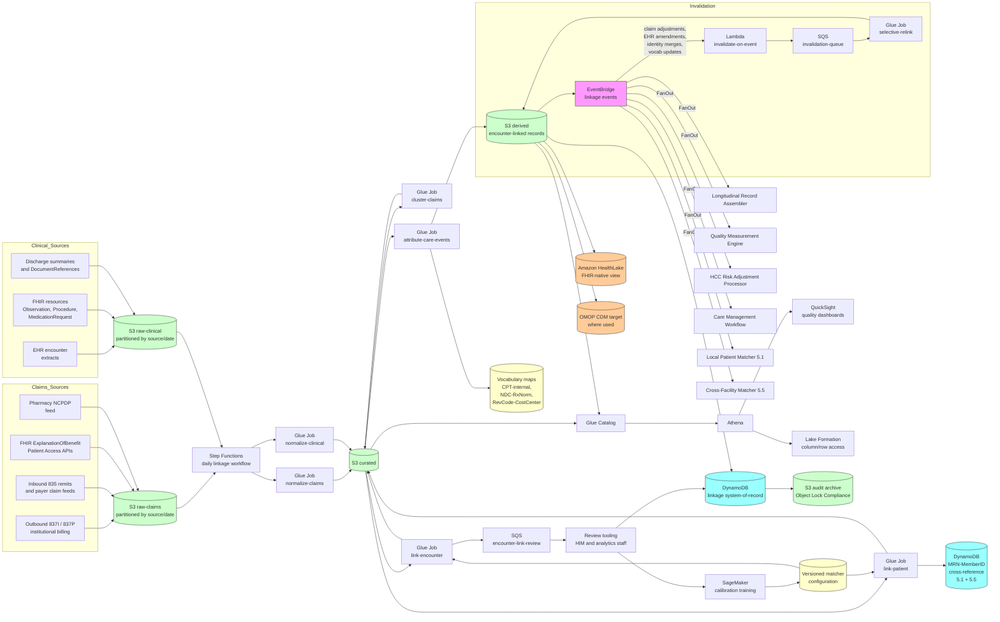

# Recipe 5.6 Architecture and Implementation: Claims-to-Clinical Data Linkage

*Companion to [Recipe 5.6: Claims-to-Clinical Data Linkage](chapter05.06-claims-to-clinical-data-linkage). This page covers the AWS architecture, services, prerequisites, and pseudocode. For the problem framing and the conceptual approach, start with the main recipe.*

---

## The AWS Implementation

### Why These Services

**Amazon S3 for the claims-clinical data lake.** Three zones: raw (every inbound claim file, every EHR extract, every payer feed, byte-for-byte as received, partitioned by source and date for audit and replay), curated (parsed and normalized claims and clinical records with the patient-level link annotated), and derived (encounter-clustered claims, encounter-linked records, care-event-attributed records, cohort-stratified link-quality reports). S3 is HIPAA-eligible under BAA with SSE-KMS encryption. The raw payloads are retained for the regulatory retention floor; the derived outputs are the substrate for the analytics layer.

**AWS Glue and Apache Spark for the linkage pipeline.** The linkage workload is bulk-batch with structured records (claims and clinical events on the order of hundreds of thousands to tens of millions per institution per year), and it benefits from columnar processing, partition pruning, and the join-optimization that Spark provides. Glue jobs are the right substrate because the work is periodic (typically overnight, with intra-day refreshes for the latest claims) and the cost model (per-DPU-hour) maps cleanly to the workload pattern. Each pipeline stage runs as its own Glue job: parse-and-normalize-claims, parse-and-normalize-clinical, link-patient, cluster-claims, link-encounter, attribute-care-events, persist-and-emit.

**Amazon Athena and AWS Glue Data Catalog for analytics access.** The Glue Data Catalog tracks the schema across raw, curated, and derived zones. Athena queries the catalog over the curated and derived S3 zones for ad-hoc analytics, quality measurement, risk adjustment computation, and cohort definition. QuickSight on Athena provides the operational and quality dashboards.

**Amazon DynamoDB for the linkage system-of-record and the invalidation index.** Two tables: a linkage table keyed on `(encounter_cluster_id)` with attributes for the linked clinical encounter, the link confidence, the constituent claim list, the line-item attribution, and the link history; and an invalidation index keyed on `(source_record_id)` for fast lookup of which linkages depend on a given claim or encounter when an invalidation event arrives. DynamoDB's low-latency reads support the operational query patterns (longitudinal-record assembly, care management, real-time cost lookups for an encounter); the analytics queries hit S3 via Athena.

**Amazon SQS for the linkage and invalidation queues.** Three queues: a main linkage queue (claims and encounters arriving for a fresh link evaluation), an invalidation queue (events that supersede prior linkages), and a review queue (cases where the matcher's confidence falls in the review band and a human reviewer needs to confirm). Separating the queues lets the operational pipeline absorb bursts (a payer feed delivery dropping fifty thousand claims at once) without delaying the higher-priority invalidation flow.

**AWS Lambda for the per-event processing and the API surface.** The Glue jobs do the bulk work; Lambdas handle the event-driven slices. Per-claim-arrival linking (when a claim arrives outside the bulk window and needs immediate evaluation), per-invalidation-event re-linking, and the read API for downstream consumers all run as Lambdas. Each is in VPC with VPC endpoints for downstream services. The per-claim-arrival Lambda validates inbound events via a producer-signed envelope (`source_system`, `source_record_id`, `event_id`, `signed_payload`, `signature`); the Lambda validates the signature against the producer's known signing key (rotated per the institutional secret-rotation policy), validates the source_system against the allow-list, validates the event_id for uniqueness within a sliding window (idempotency), and rejects events that fail any check with a logged metric and routing to the rejected-events DLQ. Per-source rate limits prevent a runaway batch-reconciliation job from consuming per-claim-arrival capacity. The invalidation Lambda applies the same producer-signed envelope validation with a per-event-source allow-list: `patient_identity_merge` events come only from the 5.1 Lambda's execution role, `cross_facility_match_invalidated` events come only from the 5.5 Lambda's execution role, and so on; consumer-side signature validation and rejection-on-mismatch metrics apply. The read API for downstream consumers runs through API Gateway with WAF, mTLS for system-to-system clients, and per-caller authorization-to-patient-id binding enforced at a Lambda authorizer; the parsed-linkage view (clinical and analytics consumers) is separated from the raw-constituent-claims view (revenue-cycle and audit consumers).

**AWS Step Functions for orchestration.** Three workflows: a daily linkage workflow (claims-and-clinical normalization, patient link, claim clustering, encounter link, care-event attribution, persistence, event emission), an invalidation workflow (subscribe to invalidation events and selectively re-link), and a vocabulary-refresh workflow (annual ICD-10 / CPT updates trigger a re-evaluation of the affected historical linkages). The state machine handles retries, error routing to DLQs, and parallel execution where the dependency graph allows.

**Amazon EventBridge for the cross-recipe events.** When a linkage is resolved (`claims_clinical_link_resolved`), when a linkage is invalidated (`claims_clinical_link_invalidated`), when an external encounter is detected (`external_encounter_observed`), an event flows out to downstream consumers: the longitudinal-record-assembler, the quality-measurement engine, the risk-adjustment HCC processor, the care-management workflow, the local patient matcher (5.1, when a cross-organizational claim surfaces a previously-unknown internal duplicate signal), and the cross-facility matcher (5.5) where applicable. EventBridge rules route events to the right consumer, with DLQs for failed deliveries. The claims-clinical events conform to a chapter-wide event schema (`source`, `detail_type`, `detail.encounter_cluster_id`, `detail.local_patient_id`, `detail.linked_clinical_encounter_id` where applicable, `detail.event_id`, `detail.previous_state`, `detail.new_state`, `detail.detected_at`, `detail.matcher_config_version`, `detail.vocabulary_versions`, `detail.permitted_uses` from the per-payer data-use tagging). Each event payload carries a producer-signed envelope; consumer-side validation confirms the asserted `source` matches the expected signing principal before acting on the event. Downstream consumers subscribe to specific `detail_type` values and acknowledge processing via a CloudWatch metric (`{consumer}.events_processed`). The chapter-wide event-bus governance specifies the schema versioning policy and the deprecation cadence for breaking changes.

**Amazon HealthLake for the FHIR-native clinical view.** Where the institution has an OMOP CDM substrate, the linkage outputs feed OMOP. Where the institution has a FHIR-native data lake, HealthLake stores the clinical encounters, observations, and procedures as FHIR resources, and the linkage output joins claims to the FHIR Encounter resource.  The linkage architecture treats the FHIR-native and OMOP-native representations as alternative downstream targets; the link itself is upstream.

**Amazon SageMaker for the matcher training and offline calibration.** The Fellegi-Sunter weights, the per-feature thresholds, and the encounter-class-specific date tolerances are calibrated against the institution's gold set. The calibration runs as a SageMaker training job over the historical linkage records, produces a candidate configuration set, and emits the metrics the institutional review committee uses to decide on promotion. SageMaker Processing jobs run the cohort-stratified accuracy reports.

**AWS Lake Formation for column-level and row-level access control.** Different audiences need different views of the linkage outputs. Quality-measurement teams need the encounter-linked aggregate; risk-adjustment teams need the diagnosis-concordance detail; outcomes-research teams need the de-identified longitudinal record. Lake Formation grants enforce the row-and-column distinctions; Athena query paths use the same grants. Same chapter pattern as 5.2, 5.3, 5.4, 5.5. 

**AWS KMS, CloudTrail, CloudWatch.** Customer-managed keys for the S3 buckets, the DynamoDB tables, the Lambda log groups, and the Glue temp storage. CloudTrail data events on the linkage table and the audit-log buckets. CloudWatch alarms on link rate (sudden drops are usually a data-source outage), on cohort-stratified disparities, on invalidation backlog depth, on review-queue depth and aging. Cohort-stratified accuracy monitoring uses the institutional cohort registry as the source of truth for cohort axes (no ad-hoc enumeration in code). Recipe-specific cohort axes include patients-by-care-distribution (concentrated at institution vs spread across many providers), patients-by-payer-mix (single-payer vs multi-payer), patients-by-payer-type (commercial / Medicare / Medicaid / self-funded / dual-eligible), and patients-by-name-change-or-address-change history. Metrics: (a) per-cohort linkage rate (percent of clusters with a LINKED_HIGH or LINKED_MED outcome) computed weekly; (b) per-cohort encounter-coverage rate (percent of EHR encounters with a linked claim cluster within the analysis window) computed weekly; (c) per-cohort diagnosis-concordance rate computed weekly; (d) per-cohort attribution coverage (line-item attribution success rate) computed weekly; (e) per-cohort linkage-error rate (sampled audit, false-merge or false-split combined) computed monthly. Disparity calculation: absolute difference between the cohort with the highest rate and the cohort with the lowest rate, computed per-metric per-cycle. Alarm thresholds: link-rate disparity > 0.05 = MEDIUM; review-queue disparity > 0.05 = MEDIUM; attribution-coverage disparity > 0.10 = MEDIUM; linkage-error disparity > 0.02 = HIGH (analytics integrity); any disparity > 2x the threshold = HIGH. Alarms route to the analytics governance committee, the equity-monitoring committee, and (per-driver) the revenue-cycle leadership or clinical-informatics committee with a 5-business-day SLA for the first investigation report; the post-mortem and any remediation (per-cohort threshold tuning, per-payer normalization-rule updates, vocabulary-map gap analysis, registration-flow data-capture improvements) is documented in the cohort-disparity ledger and reviewed quarterly. Cohort dimensions on CloudWatch metrics use bucketed, non-reversible cohort labels (cohort_bucket = A, B, C, D, E, unknown) from the institutional cohort registry rather than raw demographic attributes; the cohort-label-to-attribute mapping lives in a separate access-controlled table loaded only at dashboard-render time. Same chapter pattern as 5.1, 5.2, 5.3, 5.4, 5.5.

**Amazon QuickSight for operational and quality dashboards.** Per-encounter-class link rate, per-payer link rate, per-cohort link rate, link confidence distribution, review-queue depth and aging, time-to-link distribution (how long after the clinical event does a link get established), external-encounter rate and breakdown by inferred location, vocabulary-map coverage (what fraction of claim CPT codes mapped to internal procedure codes).

### Architecture Diagram



### Prerequisites

| Requirement | Details |
|-------------|---------|
| **AWS Services** | Amazon S3, Amazon DynamoDB, AWS Glue, Apache Spark on Glue, Amazon Athena, AWS Lake Formation, AWS Step Functions, Amazon EventBridge, AWS Lambda, Amazon SQS, Amazon SageMaker, Amazon HealthLake (where used for FHIR-native clinical view), Amazon QuickSight, AWS KMS, Amazon CloudWatch, AWS CloudTrail. |
| **External Inputs** | Claims feeds: outbound institutional and professional 837s as the institution generates them, inbound 835 remits, payer claim feeds (commonly delivered as flat files or FHIR ExplanationOfBenefit resources), pharmacy NCPDP feeds where the institution has access. Clinical inputs: EHR encounter extracts, FHIR resources or OMOP-CDM-loaded clinical data, discharge summaries and other clinical documents. Cross-reference data: the institution's MRN-to-member-ID cross-reference (output of recipe 5.1's MPI plus payer eligibility-matching from 5.4), the NPI-to-internal-provider mapping (output of recipe 5.2). Vocabulary maps: CPT/HCPCS-to-internal-procedure-code, NDC-to-RxNorm, revenue-code-to-cost-center, ICD-10 hierarchy.  |
| **IAM Permissions** | Per-Glue-job least-privilege: scoped `s3:GetObject` and `s3:PutObject` on specific bucket prefixes, `glue:Get*` on the data catalog, `dynamodb:GetItem` / `PutItem` / `UpdateItem` / `Query` on the linkage and cross-reference tables, `kms:Decrypt` on relevant CMKs. Lambdas have similarly scoped permissions; the linkage write Lambda has append-only permissions on the linkage history (no delete) enforced through IAM condition keys plus DynamoDB resource-based policy. SageMaker training jobs have read access to the curated and derived S3 zones and write access to a model-artifacts bucket. Never use `*` actions or `*` resources in production. Scoped ARN examples: `dynamodb:UpdateItem` on `arn:aws:dynamodb:<region>:<account>:table/claims-clinical-linkage`; `s3:PutObject` on `arn:aws:s3:::<env>-claims-raw/audit/*`; `events:PutEvents` on `arn:aws:events:<region>:<account>:event-bus/claims-clinical-events`; `dynamodb:GetItem` on `arn:aws:dynamodb:<region>:<account>:table/mrn-memberid-cross-reference`. Each pipeline-stage Glue job has its own IAM role bound to its specific stage; Step Functions invokes only the role appropriate for the current stage, so the cluster-claims Glue job cannot directly write to the linkage table (which would bypass the encounter-link stage). |
| **BAA and Trust Framework** | AWS BAA signed. Payer data feeds are governed by trading-partner agreements that specify retention, redistribution, and audit obligations. Where the claims data covers patients seen at non-affiliated providers, the institution's right to use the data is constrained by the payer agreement (typically permitted for treatment, payment, operations, and quality activities; sometimes restricted for research). For research uses, additional IRB and data-use agreements apply.  |
| **Encryption** | S3: SSE-KMS with bucket-level keys. DynamoDB: customer-managed KMS at rest. Glue temp storage: KMS encrypted. Lambda log groups: KMS-encrypted. SageMaker: KMS-encrypted volumes and outputs. EventBridge and SQS: server-side encryption. TLS 1.2 or higher for all in-transit traffic. The audit-log archive bucket has Object Lock in Compliance mode. |
| **VPC** | Production: Glue jobs in VPC connections. Lambdas in VPC. SageMaker training in VPC. VPC endpoints for S3, DynamoDB, KMS, Secrets Manager, CloudWatch Logs, EventBridge, SQS, Step Functions, Glue, Athena, STS, SageMaker. NAT Gateway for partner-facing HTTPS egress with an outbound proxy and an allow-list of payer endpoints; PrivateLink where the partner offers it. Payer-feed egress is configured as distinct outbound proxy rules with non-overlapping allow-lists scoped to compute roles: each Glue job role and each Lambda role allows only the specific partner endpoints it must call; per-role rate limits below the partner's published rate limits; egress connections CloudWatch-logged for forensic auditing. At payer-feed volumes exceeding approximately 500K transactions/month per payer, evaluate the partner's PrivateLink endpoint where available; PrivateLink eliminates NAT Gateway data-transfer cost on the partner-egress path and keeps traffic on the AWS network without traversing the public internet. |
| **CloudTrail** | Enabled with data events on the linkage table, the audit S3 buckets, and the cross-reference table. Glue job runs and SageMaker training runs logged. CloudTrail logs encrypted with KMS and retained for the longest of: 7 years (HIPAA records-retention minimum), 10 years (Medicare claim-related retention where applicable), the payer trading-partner agreement retention (typically 7-10 years, specified in the agreement), the state's medical-records-retention requirement, and any HCC risk-adjustment data-validation retention. Audit logs (the raw 837 / 835 / NCPDP / FHIR ExplanationOfBenefit payloads, the parsed linkage records, the line-item attribution records, the review-queue decisions, the invalidation events) are stored in a dedicated S3 bucket with Object Lock in Compliance mode for immutability and a lifecycle policy transitioning to S3 Glacier Deep Archive after 90 days for cost optimization. CloudTrail data events are forwarded to a dedicated audit AWS account in the institution's organization, isolating the audit substrate from the production data plane. |
| **Vocabulary and Code Maps** | A versioned vocabulary store with mappings for CPT to internal procedure codes, NDC to RxNorm, revenue codes to internal cost centers, and ICD-10 hierarchy traversal. The vocabulary maps refresh on the annual coding-update cycle (ICD-10-CM in October, CPT in January, RxNorm continuously) and on payer-specific updates. Each linkage record references the vocabulary version active at link time. |
| **Sample Data** | Use synthetic claims and clinical data that exercises the full range of linkage outcomes including the encounter-class variations. Synthea generates synthetic patient populations with both clinical encounters and corresponding claims; the CMS Synthetic Public Use Files (SynPUFs) are realistic claims-only datasets useful for the claims side.  Never use real PHI in development environments. |
| **Cost Estimate** | At an institution processing one million encounters per year and three to five million claims per year: Glue compute (the bulk linkage pipeline) typically $2,000-6,000 per month; S3 storage including raw, curated, derived, and audit archive typically $500-2,000 per month at three to five years of retention; DynamoDB for the linkage table and cross-reference typically $300-1,500 per month; SageMaker calibration jobs typically $200-800 per month; Athena, QuickSight, EventBridge, Lambda, SQS, Step Functions, KMS in aggregate typically $300-1,000 per month. Total AWS infrastructure typically $3,500-12,000 per month, dominated by Glue compute and S3 storage.  |

### Ingredients

| AWS Service | Role |
|------------|------|
| **Amazon S3** | Hosts raw claims and clinical extracts, curated normalized records, derived encounter-linked output, audit archive with Object Lock |
| **AWS Glue and Apache Spark** | Bulk linkage pipeline: parse-and-normalize, link-patient, cluster-claims, link-encounter, attribute-care-events |
| **Amazon DynamoDB** | Linkage system-of-record table (encounter cluster to clinical encounter), cross-reference invalidation index, MRN-to-member-ID cross-reference |
| **Amazon Athena and AWS Glue Data Catalog** | SQL access to the data lake for analytics, quality measurement, risk adjustment, cohort definition |
| **AWS Lake Formation** | Column-level and row-level access controls for the differentiated audiences (quality, risk adjustment, outcomes research, longitudinal record) |
| **Amazon SQS** | Buffers linkage, invalidation, and review workloads on separate queues |
| **AWS Lambda** | Per-event processing: per-claim-arrival immediate linking, per-invalidation-event re-linking, read API for downstream consumers |
| **AWS Step Functions** | Orchestrates daily linkage, invalidation, and vocabulary-refresh workflows |
| **Amazon EventBridge** | Fans out linkage events to longitudinal-record-assembler, quality-measurement engine, HCC risk adjustment processor, care management, local matcher (5.1), cross-facility matcher (5.5) |
| **Amazon SageMaker** | Matcher calibration over historical linkage records, cohort-stratified accuracy reports, candidate-configuration evaluation |
| **Amazon HealthLake** | FHIR-native clinical view target for institutions standardized on FHIR resources |
| **Amazon QuickSight** | Operational and quality dashboards (per-encounter-class link rate, per-payer link rate, cohort disparities, review-queue depth, time-to-link distribution, external-encounter rate, vocabulary coverage) |
| **AWS KMS** | Customer-managed encryption keys for all linkage data stores |
| **Amazon CloudWatch** | Operational metrics and alarms (link-rate drops, cohort disparities, invalidation backlog, review-queue aging) |
| **AWS CloudTrail** | Audit logging for all API calls on the linkage table, the cross-reference table, and the audit S3 buckets |

---

### Code

> **Reference implementations:** Useful libraries and patterns for this recipe:
> - [OHDSI / Athena](https://athena.ohdsi.org/): the OMOP CDM vocabulary store, with mappings between ICD-10, SNOMED, RxNorm, LOINC, and the OMOP standard concepts. 
> - [PCORnet Common Data Model](https://pcornet.org/data-driven-common-model/): an alternative target schema for claims-clinical linkage in PCORI-funded research networks. 
> - [Synthea](https://github.com/synthetichealth/synthea): synthetic patient population generator with both clinical encounters and corresponding claims output, useful for development and testing.
> - [HAPI FHIR](https://github.com/hapifhir/hapi-fhir): FHIR reference implementation including the Claim and ExplanationOfBenefit resources used in payer-side claims representations.
> - [`pyspark` and `pandas`](https://spark.apache.org/docs/latest/api/python/index.html): the dominant analytics substrates for the Glue-based linkage pipeline.
> - The [HL7 FHIR ExplanationOfBenefit resource](https://www.hl7.org/fhir/explanationofbenefit.html) is the FHIR-native representation of post-adjudication claims data and the substrate for the CMS Patient Access API claims feeds.

#### Walkthrough

**Step 1: Ingest and normalize the claims and clinical streams.** The two streams arrive on different cadences in different formats. Claims arrive as X12 837/835 transactions for outbound flows, and as payer-specific flat files or FHIR ExplanationOfBenefit resources for inbound flows. Clinical data arrives as EHR extracts (Epic Clarity / Caboodle, Cerner / Oracle Health, or the equivalent) or as FHIR resources from a FHIR-native data lake. Both streams have to land in the raw zone byte-for-byte for audit replay, then get parsed into a normalized representation that the rest of the pipeline can join on. Skip the strict raw-zone preservation and you cannot reconstruct the original payload when a claim is later disputed or when an audit reaches back to a transaction from three years ago.

```pseudocode
FUNCTION normalize_claims_and_clinical(input_partition_keys):
    // Each partition processed by a Glue job; partition keys
    // identify which raw files to consume.

    // Step 1A: parse claims-side records.
    raw_claims_files = S3.list_objects(
        bucket="raw-claims",
        prefix=input_partition_keys.claims_prefix)

    parsed_claims = []
    FOR each file in raw_claims_files:
        IF file.format == "x12_837i":
            claims = parse_837_institutional(file.payload)
        ELIF file.format == "x12_837p":
            claims = parse_837_professional(file.payload)
        ELIF file.format == "x12_835":
            claims = parse_835_remittance(file.payload)
        ELIF file.format == "fhir_explanation_of_benefit":
            claims = parse_fhir_eob(file.payload)
        ELIF file.format == "ncpdp_pharmacy":
            claims = parse_ncpdp(file.payload)
        ELIF file.format == "payer_flat_file":
            claims = parse_payer_specific(file.payload, file.payer_id)

        FOR each claim in claims:
            // Build the normalized claim record. Keep the
            // original byte offset for traceability.
            parsed_claims.append({
                claim_id: extract_claim_id(claim),
                source_file_key: file.s3_key,
                source_file_offset: claim.byte_offset,
                payer_id: claim.payer_id,
                claim_type: claim.claim_type,
                    // facility_inpatient, facility_outpatient,
                    // facility_er, professional, pharmacy
                billing_provider_npi: claim.billing_provider_npi,
                rendering_provider_npi: claim.rendering_provider_npi
                    OR claim.billing_provider_npi,
                member_id: claim.member_id,
                member_demographics: claim.member_demographics,
                service_from_date: claim.service_from_date,
                service_through_date: claim.service_through_date,
                primary_diagnosis_icd10: claim.primary_diagnosis,
                secondary_diagnoses_icd10: claim.secondary_diagnoses,
                procedures_cpt_hcpcs: claim.procedures,
                revenue_codes: claim.revenue_codes,
                drg_code: claim.drg_code IF claim.claim_type == "facility_inpatient",
                place_of_service: claim.place_of_service,
                claim_status: claim.claim_status,
                    // submitted, paid, denied, adjusted, void
                adjustment_indicator: claim.adjustment_indicator,
                original_claim_id: claim.original_claim_id
                    IF claim.adjustment_indicator,
                charge_amount: claim.charge_amount,
                paid_amount: claim.paid_amount IF claim.claim_status == "paid",
                line_items: claim.line_items,
                received_at: file.received_timestamp,
                vocabulary_versions_at_parse: current_vocabulary_versions()
            })

    write_to_s3_curated_zone(parsed_claims,
        prefix="curated-claims/" + input_partition_keys.partition_path)

    // Step 1B: parse clinical-side records.
    raw_clinical_files = S3.list_objects(
        bucket="raw-clinical",
        prefix=input_partition_keys.clinical_prefix)

    parsed_clinical = []
    FOR each file in raw_clinical_files:
        IF file.format == "epic_clarity_extract":
            encounters = parse_epic_clarity(file.payload)
        ELIF file.format == "cerner_extract":
            encounters = parse_cerner(file.payload)
        ELIF file.format == "fhir_bundle":
            encounters = parse_fhir_bundle_for_encounters(file.payload)

        FOR each encounter in encounters:
            // Resolve the diagnosis lifecycle into a per-
            // encounter diagnosis set: admitting, working,
            // discharge, plus any condition-list entries
            // that were active during the encounter.
            encounter_diagnoses = resolve_diagnosis_lifecycle(
                encounter,
                source_format=file.format)

            parsed_clinical.append({
                encounter_id: extract_encounter_id(encounter),
                source_file_key: file.s3_key,
                source_record_id: encounter.source_record_id,
                local_patient_id: encounter.mrn,
                encounter_class: encounter.class,
                    // inpatient, outpatient, emergency,
                    // observation, telehealth, ancillary
                location_id: encounter.location_id,
                attending_provider_npi: encounter.attending_npi,
                    // Resolved through recipe 5.2's NPI matcher.
                consulting_provider_npis: encounter.consulting_npis,
                admission_timestamp: encounter.admission_ts,
                discharge_timestamp: encounter.discharge_ts,
                encounter_diagnoses: encounter_diagnoses,
                procedures_internal: encounter.procedures,
                medications_administered: encounter.medications,
                observations: encounter.observations,
                discharge_disposition: encounter.discharge_disposition,
                source_extract_timestamp: file.extract_timestamp
            })

    write_to_s3_curated_zone(parsed_clinical,
        prefix="curated-clinical/" + input_partition_keys.partition_path)

    RETURN {
        claims_count: len(parsed_claims),
        clinical_count: len(parsed_clinical),
        partition_keys: input_partition_keys
    }
```

**Step 2: Resolve patient identity across the streams.** Before any encounter-level linking can happen, the matcher has to know which clinical patient corresponds to which claims-side member. Within a single institution where a maintained MRN-to-member-ID cross-reference exists (built and maintained by the eligibility-matching pipeline from recipe 5.4 and the local MPI from recipe 5.1), this is largely deterministic. For external claims feeds covering populations where the cross-reference is incomplete, the patient link uses the same probabilistic-record-linkage scorer as 5.1 and 5.5 over the demographic fields the claims feed exposes. Skip the patient link or treat it as trivial and you produce encounter linkages that join the right encounters but the wrong patients, which silently corrupts every analytics output downstream.

```pseudocode
FUNCTION link_patient(claim_record, cross_reference_table, mpi):
    // Step 2A: deterministic match via cross-reference.
    // The MRN-to-member-ID cross-reference is a DynamoDB
    // table populated by recipe 5.4's eligibility matcher
    // and maintained by recipe 5.1's MPI updates.
    cross_ref_match = cross_reference_table.lookup_by(
        member_id=claim_record.member_id,
        payer_id=claim_record.payer_id,
        as_of=claim_record.service_from_date)

    IF cross_ref_match IS NOT NULL
       AND cross_ref_match.confidence >= CROSS_REF_HIGH_CONFIDENCE:
        // The cross-reference itself has a confidence; trust
        // levels above the high threshold are deterministic
        // for our purposes.
        RETURN {
            resolved_local_patient_id: cross_ref_match.local_patient_id,
            link_method: "cross_reference_deterministic",
            link_confidence: cross_ref_match.confidence,
            cross_ref_version: cross_ref_match.version
        }

    // Step 2B: probabilistic match via demographics.
    // The cross-reference is missing or low-confidence;
    // fall back to demographic matching against the local
    // MPI.
    candidate_patients = mpi.find_candidates_by_blocking(
        last_name_phonetic: double_metaphone(
                                claim_record.member_demographics.last_name),
        year_of_birth: year(claim_record.member_demographics.dob),
        zip3: zip3(claim_record.member_demographics.address))

    scored_candidates = []
    FOR each candidate in candidate_patients:
        score = compute_patient_match_score({
            // Use the same scorer as recipe 5.1, with the
            // additional consideration that some demographic
            // fields may be partially redacted on inbound
            // payer feeds (commonly SSN, sometimes street
            // address detail).
            first_name: nickname_aware_first_name_score(
                            claim_record.member_demographics.first_name,
                            candidate.first_name),
            last_name: cross_org_last_name_score(
                            claim_record.member_demographics.last_name,
                            candidate.last_name,
                            candidate.prior_last_names),
            dob: dob_match_grade(claim_record.member_demographics.dob,
                                    candidate.dob),
            sex: sex_match(claim_record.member_demographics.sex,
                            candidate.administrative_sex),
            address: address_similarity(
                            claim_record.member_demographics.address,
                            candidate.standardized_address,
                            candidate.prior_addresses),
            phone: phone_match(claim_record.member_demographics.phone,
                                candidate.phone_history)
        })
        scored_candidates.append({candidate, score})

    IF len(scored_candidates) == 0
       OR max(scored_candidates).score.composite < AUTO_REJECT:
        RETURN {
            resolved_local_patient_id: NULL,
            link_method: "no_match",
            link_confidence: 0.0,
            unmatched_reason: "no_candidates_or_below_threshold"
        }

    best = max(scored_candidates, key=lambda c: c.score.composite)

    IF best.score.composite >= PATIENT_LINK_HIGH:
        // Optionally update the cross-reference table with
        // this newly-confirmed link so future claims for the
        // same member skip the probabilistic path.
        cross_reference_table.upsert(
            payer_id=claim_record.payer_id,
            member_id=claim_record.member_id,
            local_patient_id=best.candidate.local_patient_id,
            confidence=best.score.composite,
            evidence_source="probabilistic_demographic_match",
            valid_from=claim_record.service_from_date)

        RETURN {
            resolved_local_patient_id: best.candidate.local_patient_id,
            link_method: "probabilistic_high_confidence",
            link_confidence: best.score.composite,
            score_breakdown: best.score.per_feature
        }

    ELIF best.score.composite >= PATIENT_LINK_MED:
        // Med-confidence patient links are accepted but
        // tagged for downstream awareness; encounter-level
        // matching for med-confidence patient links applies
        // tighter encounter-link thresholds to compound less
        // risk.
        RETURN {
            resolved_local_patient_id: best.candidate.local_patient_id,
            link_method: "probabilistic_med_confidence",
            link_confidence: best.score.composite,
            score_breakdown: best.score.per_feature,
            patient_link_caveat: "med_confidence_patient_link"
        }

    ELSE:
        // Falls in the patient-link review band. Route to
        // the review queue; do not attempt encounter-level
        // linking until the patient link is resolved.
        SQS.SendMessage("patient-link-review-queue", {
            claim_id: claim_record.claim_id,
            best_candidate: best,
            scored_candidates: scored_candidates,
            demographics: claim_record.member_demographics
        })
        RETURN {
            resolved_local_patient_id: NULL,
            link_method: "deferred_patient_review",
            link_confidence: best.score.composite,
            queued_for_review: TRUE
        }
```

**Step 3: Cluster the patient-resolved claims into encounter clusters.** Multiple claims describe a single underlying encounter, and grouping them is the first structural job after the patient link. The cluster-key is patient plus encounter-class plus a service-date range; the date tolerance is encounter-class-specific. The clustering also needs to detect resubmissions and adjustments so the cluster's authoritative version of each claim is the latest valid one. Skip the clustering and you treat thirteen claims for one inpatient stay as thirteen separate encounters, which over-counts admissions, double-counts readmissions, and corrupts every cost-and-quality calculation that depends on encounter-level rollups.

```pseudocode
FUNCTION cluster_claims_by_encounter(patient_resolved_claims):
    // Group by patient first, then process each patient's
    // claims independently. Spark partitions naturally on
    // local_patient_id; this is a within-partition groupBy.

    clusters = []

    BY local_patient_id:
        patient_claims = sort_by(claims, key=service_from_date)

        // Step 3A: detect resubmission/adjustment chains.
        // Claims with the same original_claim_id reference
        // (set by adjustment_indicator) are versions of the
        // same underlying claim. Within a chain, the latest
        // submission is the authoritative version; the
        // earlier ones are kept for history.
        chains = group_by_original_claim_id(patient_claims)
        canonical_claims = [latest_in_chain(chain) FOR chain in chains]

        // Step 3B: cluster by encounter-class window.
        FOR each claim in canonical_claims:
            // The encounter-class window determines how
            // permissive the date overlap can be when
            // grouping claims together.
            window = encounter_class_window(claim.claim_type)
                // Inpatient facility: span (service_from -
                //   buffer_days, service_through + buffer_days)
                //   where buffer_days is typically 1-2.
                // Outpatient/clinic: same calendar day with
                //   small slop for next-morning batch posting.
                // ER: span (service_from, service_through +
                //   buffer_days) with smaller buffer than
                //   inpatient.
                // Pharmacy: matches against the encounter
                //   it's tied to (e.g. an inpatient stay
                //   for in-stay administration claims) using
                //   the date of service.

            existing_cluster = find_cluster_for(
                clusters,
                local_patient_id=claim.resolved_local_patient_id,
                encounter_class=normalize_encounter_class(claim.claim_type),
                date_overlap_with=window)

            IF existing_cluster IS NOT NULL:
                existing_cluster.add_claim(claim,
                    role=infer_role(claim, existing_cluster))
                    // Roles: primary_facility, primary_professional,
                    // related_professional, ancillary, pharmacy,
                    // resubmission, adjustment.
            ELSE:
                new_cluster = {
                    encounter_cluster_id: generate_cluster_id(
                        local_patient_id=claim.resolved_local_patient_id,
                        encounter_class=normalize_encounter_class(claim.claim_type),
                        anchor_date=claim.service_from_date),
                    local_patient_id: claim.resolved_local_patient_id,
                    encounter_class: normalize_encounter_class(claim.claim_type),
                    cluster_anchor_date: claim.service_from_date,
                    cluster_window_start: claim.service_from_date,
                    cluster_window_end: claim.service_through_date,
                    constituent_claims: [claim],
                    primary_facility_npi: claim.billing_provider_npi
                        IF claim.claim_type == "facility_inpatient",
                    primary_diagnoses: claim.primary_diagnosis_icd10,
                    secondary_diagnoses: claim.secondary_diagnoses_icd10,
                    drg_code: claim.drg_code,
                    earliest_service_date: claim.service_from_date,
                    latest_service_date: claim.service_through_date,
                    cluster_status: "active"
                }
                clusters.append(new_cluster)

        // Step 3C: post-cluster reconciliation.
        // After all claims are clustered, walk each cluster
        // and reconcile its window: extend the window to
        // cover all constituent claims, aggregate diagnoses
        // across the cluster, identify the cluster's primary
        // billing entity, compute the cluster total charge
        // and paid amount.
        FOR each cluster in clusters_for_patient(local_patient_id):
            cluster.cluster_window_start = min(
                c.service_from_date FOR c in cluster.constituent_claims)
            cluster.cluster_window_end = max(
                c.service_through_date FOR c in cluster.constituent_claims)
            cluster.aggregate_diagnoses = union_with_hierarchy(
                c.primary_diagnosis_icd10
                    FOR c in cluster.constituent_claims)
            cluster.cluster_charge_total = sum(
                c.charge_amount FOR c in cluster.constituent_claims)
            cluster.cluster_paid_total = sum(
                c.paid_amount OR 0 FOR c in cluster.constituent_claims)

    RETURN clusters
```

**Step 4: Match each encounter cluster to a clinical encounter.** The cluster has a patient, an encounter class, a date window, a set of diagnoses, and a billing provider. The clinical encounter has the same patient, an encounter class, an admission/discharge timestamp, an attending provider, and a diagnosis set. The match scores each (cluster, encounter) candidate pair and applies confidence thresholds. Skip the encounter-level link and you have claim clusters and clinical encounters but no joined unit of analysis, which means every analytics question that needs both administrative and clinical detail at the encounter grain has to be re-derived from raw data.

```pseudocode
FUNCTION link_encounter(cluster, clinical_encounters_for_patient,
                          matcher_config):
    // The clinical encounters for the patient are pre-fetched
    // (DynamoDB query or curated-zone read) and cached for
    // the duration of the cluster's match.

    // Step 4A: filter to candidate encounters by date and class.
    candidates = []
    FOR each encounter in clinical_encounters_for_patient:
        IF encounter.encounter_class != cluster.encounter_class:
            CONTINUE
            // Class mismatch is a hard filter; an inpatient
            // cluster does not match an outpatient encounter.

        // Date alignment within the encounter-class tolerance.
        date_tolerance = matcher_config.date_tolerance_for_class(
                              cluster.encounter_class)
        IF NOT dates_overlap_within(
                  cluster.cluster_window_start,
                  cluster.cluster_window_end,
                  encounter.admission_timestamp,
                  encounter.discharge_timestamp,
                  tolerance=date_tolerance):
            CONTINUE

        candidates.append(encounter)

    IF len(candidates) == 0:
        // No candidate clinical encounter. Tag as
        // external_encounter; the claim cluster describes
        // care that happened elsewhere.
        RETURN {
            cluster_id: cluster.encounter_cluster_id,
            link_status: "EXTERNAL_ENCOUNTER",
            inferred_external_npi: cluster.primary_facility_npi,
            inferred_external_class: cluster.encounter_class,
            external_diagnoses: cluster.aggregate_diagnoses,
            link_confidence: NULL
        }

    // Step 4B: score each candidate.
    scored = []
    FOR each encounter in candidates:
        score = compute_encounter_link_score({
            // Date alignment: how tightly does the cluster
            // window match the encounter timestamps.
            date_alignment: date_alignment_score(
                                cluster.cluster_window_start,
                                cluster.cluster_window_end,
                                encounter.admission_timestamp,
                                encounter.discharge_timestamp),
            // Provider alignment: does the cluster's
            // rendering NPI appear on the encounter (as
            // attending or consulting).
            provider_alignment: provider_alignment_score(
                                    cluster.constituent_claims,
                                    encounter.attending_provider_npi,
                                    encounter.consulting_provider_npis),
            // Encounter class compatibility (inpatient
            // facility cluster vs inpatient EHR encounter is
            // a perfect match; ER cluster vs observation
            // encounter is a partial match because of class
            // ambiguity).
            class_compatibility: class_compatibility_score(
                                       cluster.encounter_class,
                                       encounter.encounter_class),
            // Diagnosis concordance: ICD-10 overlap with
            // hierarchy-aware comparison. Partial overlap is
            // expected; the score gives credit for parents
            // and for related codes within the same
            // chapter.
            diagnosis_concordance: diagnosis_concordance_score(
                                       cluster.aggregate_diagnoses,
                                       encounter.encounter_diagnoses),
            // Procedure concordance for inpatient and
            // procedural encounters: do the cluster's CPT
            // codes correspond to the encounter's procedure
            // events.
            procedure_concordance: procedure_concordance_score(
                                       cluster.constituent_claims,
                                       encounter.procedures_internal,
                                       vocabulary_map),
            // DRG concordance for inpatient: does the
            // cluster's DRG match the EHR's DRG, where both
            // are present.
            drg_concordance: drg_concordance_score(
                                  cluster.drg_code,
                                  encounter.drg_code)
                IF cluster.drg_code IS NOT NULL
                AND encounter.drg_code IS NOT NULL
        })
        scored.append({encounter, score})

    best = max(scored, key=lambda c: c.score.composite)

    // Step 4D: joint-evaluation for multi-candidate patients.
    // The greedy per-cluster best-score assignment above is the
    // simpler pattern and works when the patient has only one
    // candidate cluster in the window. When the patient has
    // multiple candidate clusters and multiple candidate
    // encounters in the same window, run a joint-evaluation pass
    // that maximizes the global score across the assignment. Build
    // a score matrix (rows = clusters, columns = candidate
    // encounters), then apply linear-sum-assignment (the Hungarian
    // algorithm or scipy.optimize.linear_sum_assignment). The
    // global-optimum assignment avoids scrambling: the greedy
    // approach might assign cluster A to encounter X (local best
    // for A), leaving cluster B with no high-scoring option, when
    // the globally-optimal assignment is A-to-Y plus B-to-X.
    //
    // Trigger the joint path when the patient has more than one
    // cluster with overlapping date windows and more than one
    // candidate encounter for any of those clusters. This is the
    // would-do-differently-the-second-time observation from The
    // Honest Take: build the joint version first.
    IF patient_has_multiple_overlapping_clusters(cluster):
        best = joint_evaluation_assignment(
            clusters_in_window,
            candidates_for_each_cluster,
            score_function=compute_encounter_link_score)
            // Returns the assignment for this specific cluster
            // after globally optimizing across all clusters in
            // the patient's current window.

    // Step 4C: apply confidence thresholds. Tighter than
    // patient-level thresholds because encounter linkage
    // errors compound: a wrong encounter link routes the
    // wrong claims to the wrong analytic bucket.
    IF best.score.composite >= ENCOUNTER_LINK_HIGH:
        RETURN {
            cluster_id: cluster.encounter_cluster_id,
            link_status: "LINKED_HIGH_CONFIDENCE",
            linked_clinical_encounter_id: best.encounter.encounter_id,
            link_confidence: best.score.composite,
            score_breakdown: best.score.per_feature,
            link_method: "probabilistic_high_confidence"
        }
    ELIF best.score.composite >= ENCOUNTER_LINK_MED:
        RETURN {
            cluster_id: cluster.encounter_cluster_id,
            link_status: "LINKED_MED_CONFIDENCE",
            linked_clinical_encounter_id: best.encounter.encounter_id,
            link_confidence: best.score.composite,
            score_breakdown: best.score.per_feature,
            link_method: "probabilistic_med_confidence",
            usage_caveat: "use_with_confidence_filter_in_quality_measurement"
        }
    ELIF best.score.composite <= ENCOUNTER_LINK_REJECT:
        // Best candidate is below the rejection threshold;
        // the cluster does not match any clinical encounter
        // confidently. Most likely cause: encounter is
        // external, or the clinical extract is incomplete.
        RETURN {
            cluster_id: cluster.encounter_cluster_id,
            link_status: "NO_LINK",
            best_candidate_id: best.encounter.encounter_id,
            best_candidate_score: best.score.composite,
            interpretation: "below_link_threshold"
        }
    ELSE:
        // Review band; defer to human review and persist a
        // tentative link with status REVIEW_PENDING so
        // downstream consumers know not to consume it yet.
        SQS.SendMessage("encounter-link-review-queue", {
            cluster_id: cluster.encounter_cluster_id,
            scored_candidates: scored,
            cluster_summary: cluster.summary()
        })
        RETURN {
            cluster_id: cluster.encounter_cluster_id,
            link_status: "REVIEW_PENDING",
            best_candidate_id: best.encounter.encounter_id,
            best_candidate_score: best.score.composite,
            queued_for_review: TRUE
        }
```

**Step 5: Attribute claim line items to clinical events within the linked encounter.** Once the cluster is linked to a clinical encounter, the line items on the constituent claims need to be attributed to specific clinical events (orders, procedures, medication administrations) inside that encounter. The CPT/HCPCS codes on the claims map to internal procedure codes via the vocabulary map; the NDCs on pharmacy claims map to RxNorm codes that correspond to the medication administrations; the date-and-time on the claim line aligns with the clinical event's timestamp where the EHR captures it. Skip the line-item attribution and the linkage answers "did this encounter happen" but does not answer "what happened during it" at the level of cost-and-quality analytics that the institution typically needs.

```pseudocode
FUNCTION attribute_care_events(linked_cluster, clinical_encounter,
                                  vocabulary_map):
    // Only run for linked clusters; external_encounter and
    // no_link clusters are out of scope.
    IF linked_cluster.link_status NOT IN
       ["LINKED_HIGH_CONFIDENCE", "LINKED_MED_CONFIDENCE"]:
        RETURN {cluster_id: linked_cluster.cluster_id,
                line_item_attribution: NONE}

    line_item_attributions = []
    unattributed_line_items = []

    FOR each claim in linked_cluster.constituent_claims:
        FOR each line_item in claim.line_items:
            // Step 5A: code-system map.
            internal_code_candidates = vocabulary_map.lookup(
                source_system="cpt_hcpcs",
                source_code=line_item.cpt_hcpcs,
                target_system="internal_procedure_code")
                // The vocabulary map may return one code (clean
                // mapping), several codes (one-to-many; the
                // claim-side CPT covers a billable procedure
                // that maps to several internal procedure-record
                // entries), or none (no mapping; tag for review).

            IF len(internal_code_candidates) == 0:
                unattributed_line_items.append({
                    line_item: line_item,
                    reason: "no_vocabulary_mapping",
                    source_code: line_item.cpt_hcpcs
                })
                CONTINUE

            // Step 5B: find clinical events on the encounter
            // that match the line-item's date and code.
            event_candidates = []
            FOR each clinical_event in clinical_encounter.procedures_internal
                                       OR clinical_encounter.medications_administered:
                IF clinical_event.code IN internal_code_candidates:
                    IF date_within_tolerance(line_item.service_date,
                                                clinical_event.event_timestamp,
                                                tolerance_hours=
                                                    LINE_ITEM_DATE_TOLERANCE_HOURS):
                        event_candidates.append(clinical_event)

            IF len(event_candidates) == 0:
                unattributed_line_items.append({
                    line_item: line_item,
                    reason: "no_matching_clinical_event",
                    source_code: line_item.cpt_hcpcs,
                    mapped_internal_codes: internal_code_candidates
                })
                CONTINUE

            // Step 5C: pick the best clinical event candidate.
            best_event = pick_best_clinical_event_candidate(
                event_candidates,
                line_item,
                tiebreaker_rules=["closest_in_time",
                                    "exact_code_over_partial",
                                    "ordered_by_attending_over_consulting"])

            line_item_attributions.append({
                claim_id: claim.claim_id,
                line_item_id: line_item.line_item_id,
                source_code: line_item.cpt_hcpcs,
                attributed_clinical_event_id: best_event.event_id,
                attribution_confidence: compute_attribution_confidence(
                                            line_item,
                                            best_event,
                                            event_candidates),
                attribution_method: "vocabulary_map_plus_temporal"
            })

    // Pharmacy claims attribute to medication administrations
    // by NDC -> RxNorm mapping; the same pattern applies with
    // a different vocabulary map.
    // Revenue codes attribute to internal cost-centers; this
    // is a coarser-grained attribution used for cost
    // rollups rather than line-item-level analytics.

    RETURN {
        cluster_id: linked_cluster.cluster_id,
        encounter_id: clinical_encounter.encounter_id,
        line_item_attributions: line_item_attributions,
        unattributed_line_items: unattributed_line_items,
        attribution_coverage: len(line_item_attributions)
                              / (len(line_item_attributions) +
                                  len(unattributed_line_items)),
        vocabulary_versions: vocabulary_map.versions_used()
    }
```

**Step 6: Persist, audit, and react to invalidation events.** Write the linkage to DynamoDB as the system of record, archive the curated linkage record to S3, and emit the cross-recipe event so downstream consumers can refresh. On invalidation events, re-evaluate selectively rather than recomputing the entire pipeline. Skip the invalidation pipeline and the linkage table is correct on day one and silently wrong by month three.

```pseudocode
FUNCTION persist_and_emit(linkage_decision, attribution_decision):
    // Step 6A: write the linkage record. The linkage table
    // is keyed on (encounter_cluster_id, version) with the
    // current version sortable at the top via a current_flag
    // GSI; prior versions are retained as separate items for
    // forensic reconstruction. The next_version_for function
    // reads the current version and returns version + 1; the
    // write is conditional on no-other-write-since-read to
    // prevent racing writers.
    // Persistence uses a compound primary key:
    //   partition key = encounter_cluster_id
    //   sort key = version (integer, monotonically increasing)
    // A GSI on (encounter_cluster_id, current_flag) allows
    // single-item reads of the current version. Prior versions
    // are retained as separate items for forensic reconstruction.
    // The next_version_for function reads the current max version
    // and returns version + 1; the write uses a condition
    // expression (attribute_not_exists(version)) on the new sort
    // key value to prevent racing writers from clobbering each
    // other. On invalidation and re-link, a new version item is
    // written and the previous version's current_flag is removed
    // in the same TransactWriteItems call.
    linkage_record = {
        encounter_cluster_id: linkage_decision.cluster_id,
        local_patient_id: linkage_decision.local_patient_id,
        link_status: linkage_decision.link_status,
        linked_clinical_encounter_id:
            linkage_decision.linked_clinical_encounter_id,
        link_confidence: linkage_decision.link_confidence,
        score_breakdown: linkage_decision.score_breakdown,
        link_method: linkage_decision.link_method,
        constituent_claim_ids: linkage_decision.constituent_claim_ids,
        line_item_attributions:
            attribution_decision.line_item_attributions,
        attribution_coverage: attribution_decision.attribution_coverage,
        unattributed_line_items:
            attribution_decision.unattributed_line_items,
        matcher_config_version: matcher_config.version,
        vocabulary_versions: attribution_decision.vocabulary_versions,
        resolved_at: current UTC timestamp,
        version: next_version_for(linkage_decision.cluster_id)
    }

    // Use a TransactWriteItems plus an outbox row drained by
    // a separate Lambda or DynamoDB Streams consumer so that
    // partial failures do not leave the linkage table out of
    // sync with the event stream. Same chapter pattern as
    // recipe 5.5.
    DynamoDB.TransactWriteItems([
        PutItem("claims-clinical-linkage", linkage_record),
        PutItem("linkage-outbox", {
            outbox_id: generate_uuid(),
            event_type:
                IF linkage_decision.link_status IN
                   ["LINKED_HIGH_CONFIDENCE", "LINKED_MED_CONFIDENCE"]
                THEN "claims_clinical_link_resolved"
                ELIF linkage_decision.link_status == "EXTERNAL_ENCOUNTER"
                THEN "external_encounter_observed"
                ELSE "claims_clinical_link_unresolved",
            payload: linkage_record,
            emitted_at: NULL
        })
    ])

    // Step 6B: archive the curated linkage record to S3.
    // The S3 archive is the long-term substrate for
    // analytics; DynamoDB is the operational read path.
    // The archive write happens in the outbox-drainer flow
    // (triggered by DynamoDB Streams on the linkage-outbox
    // table) alongside the EventBridge emit. The drainer
    // writes to S3 first, then emits to EventBridge, then
    // marks the outbox row COMPLETED. Both side effects must
    // succeed before the row is marked COMPLETED; idempotent
    // at outbox_id. CloudWatch alarms fire on outbox-row age
    // exceeding the operational SLA (typically 5 minutes for
    // the daily pipeline, 60 seconds for the per-event path).
    // This keeps DynamoDB and S3 consistent on partial failure.
    write_to_s3(linkage_record,
                bucket="match-derived",
                key="encounter-linkages/" +
                    partition_path_for(linkage_record))

    // Step 6C: drain the outbox to EventBridge. A separate
    // Lambda or DynamoDB Streams consumer reads the outbox
    // and emits the EventBridge event, marking emitted_at
    // on success. This pattern keeps the audit log and the
    // event stream consistent.
    // (Implementation detail; not shown inline.)

    RETURN linkage_record

FUNCTION invalidate_on_event(event):
    // Identify which prior linkages are affected.
    IF event.source == "claim_adjustment" OR
       event.source == "claim_resubmission" OR
       event.source == "claim_denial":
        // A claim within an existing cluster has changed.
        // Find the cluster, re-cluster within the patient
        // (other claims may belong differently now), re-link
        // the affected cluster.
        affected_clusters = find_clusters_containing_claim(
            event.claim_id)
        FOR each cluster in affected_clusters:
            re_evaluate_cluster_linkage(cluster.cluster_id)

    ELIF event.source == "ehr_encounter_amendment":
        // An EHR encounter changed: diagnoses, attending,
        // timestamps. Find the linked cluster (if any) and
        // re-link.
        affected_linkage = find_linkage_by_encounter_id(
            event.encounter_id)
        IF affected_linkage IS NOT NULL:
            re_evaluate_cluster_linkage(
                affected_linkage.cluster_id)

    ELIF event.source == "patient_identity_merge":
        // Recipe 5.1 merged two patient records. Both
        // populations of clusters and encounters need
        // re-linking under the surviving identity.
        affected_clusters = find_clusters_for_patient(
            event.merged_from_patient_id)
        affected_clusters.extend(
            find_clusters_for_patient(event.merged_into_patient_id))
        FOR each cluster in deduplicate(affected_clusters):
            // Update cluster's local_patient_id to the
            // surviving identity, then re-evaluate the
            // encounter linkage using that identity's
            // encounter set.
            cluster.local_patient_id =
                event.merged_into_patient_id
            re_evaluate_cluster_linkage(cluster.cluster_id)

    ELIF event.source == "vocabulary_map_update":
        // Annual ICD-10 / CPT / RxNorm refresh. The vocabulary
        // map version changes; linkages whose attribution
        // coverage falls below the institutional threshold
        // under the new mapping need re-attribution.
        affected_linkages = find_linkages_using_old_vocab_version(
            event.old_version)
        FOR each linkage in affected_linkages:
            re_evaluate_cluster_attribution(linkage.cluster_id,
                vocabulary_map=event.new_version)

    ELIF event.source == "cross_facility_match_invalidated":
        // Recipe 5.5 emitted an invalidation. If this
        // affected our cross-organizational patient link
        // for any cluster, re-evaluate.
        affected_clusters = find_clusters_with_external_patient_id(
            event.affected_patient_local_id)
        FOR each cluster in affected_clusters:
            re_evaluate_cluster_patient_link(cluster.cluster_id)

    // Emit the aggregate invalidation event so downstream
    // consumers can refresh their derived views.
    EventBridge.PutEvents([{
        source: "claims-clinical-linkage",
        detail_type: "claims_clinical_link_invalidated",
        detail: {
            invalidation_source: event.source,
            invalidation_event_id: event.event_id,
            affected_cluster_ids: list_of_affected_clusters,
            invalidated_at: current UTC timestamp
        }
    }])
```

> **Curious how this looks in Python?** The pseudocode above covers the concepts. If you'd like to see sample Python code that demonstrates these patterns using boto3, check out the [Python Example](chapter05.06-python-example). It walks through each step with inline comments and notes on what you'd need to change for a real deployment.

---

### Expected Results

**Sample high-confidence linkage (inpatient stay):**

```json
{
  "encounter_cluster_id": "ec-2026-03-14-pt00874-inpatient-001",
  "local_patient_id": "local-patient-internal-00874",
  "link_status": "LINKED_HIGH_CONFIDENCE",
  "linked_clinical_encounter_id": "ehr-enc-2026-03-14-12-44-32-pt00874",
  "link_confidence": 0.94,
  "link_method": "probabilistic_high_confidence",
  "score_breakdown": {
    "date_alignment": 0.98,
    "provider_alignment": 1.00,
    "class_compatibility": 1.00,
    "diagnosis_concordance": 0.85,
    "procedure_concordance": 0.92,
    "drg_concordance": 1.00
  },
  "encounter_class": "inpatient",
  "cluster_window_start": "2026-03-14",
  "cluster_window_end": "2026-03-19",
  "ehr_admission_timestamp": "2026-03-14T12:44:32Z",
  "ehr_discharge_timestamp": "2026-03-18T14:11:08Z",
  "constituent_claim_ids": [
    "fac-claim-2026-03-2841073",
    "fac-claim-2026-03-2841074",
    "fac-claim-2026-04-2904115",
    "prof-claim-2026-03-882441-attending",
    "prof-claim-2026-03-882442-cardiology",
    "prof-claim-2026-03-882443-anesthesia",
    "prof-claim-2026-03-882444-radiology",
    "prof-claim-2026-03-882445-pathology",
    "prof-claim-2026-03-882446-hospitalist",
    "prof-claim-2026-04-905712-resubmit-cardiology"
  ],
  "primary_diagnoses_claim": ["I50.21"],
  "primary_diagnoses_ehr": ["I50.23", "I50.21"],
  "drg_code": "291",
  "cluster_charge_total": 84720.00,
  "cluster_paid_total": 18342.55,
  "attribution_coverage": 0.91,
  "matcher_config_version": "linker-v2.4.1",
  "vocabulary_versions": {
    "icd10cm": "2026.10.01",
    "cpt": "2026.01.01",
    "rxnorm": "2026.04.07",
    "internal_procedure_map": "imap-v9"
  },
  "resolved_at": "2026-04-22T03:14:08Z"
}
```

**Sample external encounter:**

```json
{
  "encounter_cluster_id": "ec-2026-02-08-pt00874-outpatient-007",
  "local_patient_id": "local-patient-internal-00874",
  "link_status": "EXTERNAL_ENCOUNTER",
  "encounter_class": "outpatient",
  "cluster_window_start": "2026-02-08",
  "cluster_window_end": "2026-02-08",
  "inferred_external_npi": "1659473821",
  "inferred_external_facility_name_from_npi_resolver": "OUTSIDE CARDIOLOGY GROUP PLLC",
  "external_diagnoses": ["I10", "I50.20"],
  "external_procedures_cpt": ["93000", "93306"],
  "constituent_claim_ids": [
    "prof-claim-2026-02-712441-outside-cardiology",
    "prof-claim-2026-02-712442-outside-imaging"
  ],
  "interpretation": "patient_received_cardiology_followup_at_outside_practice"
}
```

**Sample medium-confidence linkage with caveat:**

```json
{
  "encounter_cluster_id": "ec-2026-04-02-pt01927-er-014",
  "local_patient_id": "local-patient-internal-01927",
  "link_status": "LINKED_MED_CONFIDENCE",
  "linked_clinical_encounter_id": "ehr-enc-2026-04-02-08-22-15-pt01927",
  "link_confidence": 0.74,
  "link_method": "probabilistic_med_confidence",
  "usage_caveat": "use_with_confidence_filter_in_quality_measurement",
  "score_breakdown": {
    "date_alignment": 0.95,
    "provider_alignment": 0.50,
    "class_compatibility": 0.80,
    "diagnosis_concordance": 0.65,
    "procedure_concordance": 0.70
  },
  "interpretation": "claim_class_was_observation_ehr_was_er_with_subsequent_admission_decision"
}
```

**Sample review-pending linkage:**

```json
{
  "encounter_cluster_id": "ec-2026-04-15-pt03441-outpatient-022",
  "local_patient_id": "local-patient-internal-03441",
  "link_status": "REVIEW_PENDING",
  "best_candidate_id": "ehr-enc-2026-04-15-09-30-12-pt03441",
  "best_candidate_score": 0.62,
  "queued_for_review": true,
  "review_reason": "two_outpatient_encounters_within_window_diagnosis_overlap_with_both_provider_match_with_neither"
}
```

**Performance benchmarks (illustrative, your mileage varies):**

| Metric | Status quo (no linkage) | Recipe pipeline |
|--------|-------------------------|-----------------|
| Time to answer "what was the readmission rate for our heart-failure cohort" | 2-4 weeks (manual chart review and claims pull) | hours (Athena query against derived zone) |
| Encounter coverage in claims-to-clinical view | <40% (ad-hoc joins on date and patient) | 75-90% with conservative thresholds |
| Per-cohort linkage rate disparity (best vs worst cohort) | 0.20-0.40 (if measured at all) | <0.07 with monitoring and per-cohort tuning |
| External-encounter visibility into outside care | <10% (often invisible until patient self-reports) | 50-70% (external encounters surfaced through claims feed) |
| Vocabulary-map coverage (CPT to internal procedure code) | 60-80% (ad-hoc) | 85-95% with maintained map |
| Time-to-link median (claim arrival to linkage decision) | n/a | hours-to-1-day for arriving claims |
| Time-to-link p99 | n/a | <7 days (covers payer-feed late arrivals) |
| Linkage error rate (sampled audit, false-merge or false-split combined) | n/a (typically not measured) | <2% with conservative thresholds |

**Where it struggles:**

- **The encounter-class boundary cases.** Observation stays that turn into inpatient admissions (or vice versa). ER visits that lead to inpatient admissions on the same day. Outpatient surgical procedures that turn into observation overnight stays. The encounter class is ambiguous on both sides, and the matcher has to handle the ambiguity without forcing a hard class boundary that misses real linkages. The mitigation is class-compatibility scoring (rather than hard class equality) plus a higher confidence threshold for cross-class candidates plus explicit handling of known transition patterns in the configuration.
- **Multiple closely-related encounters in the same window.** A patient who has an outpatient visit on Monday, an outpatient procedure on Wednesday, and an ER visit on Friday produces three encounter clusters that may all link to the right encounters, or may scramble in ways that route the procedure cluster to the visit encounter and the visit cluster to the procedure encounter. The mitigation is the joint-evaluation pattern (consider all candidate-cluster-to-candidate-encounter pairs for the patient in the window simultaneously rather than greedily) and tighter date-tolerance for clusters with many candidate encounters.
- **Late-arriving claims.** A claim that arrives sixty days after the encounter may need to be added to a cluster whose initial linkage was made fifty-nine days ago. The invalidation pipeline catches this if the cluster window covers the new claim, but claims that fall outside any existing cluster's window create new clusters, which then have to re-evaluate against encounters from two months ago. The mitigation is the sliding window (typically 90-180 days) and the patience to let the pipeline catch up.
- **Resubmissions that change the cluster's primary diagnosis.** A claim's primary diagnosis can change between original submission and resubmission (the CDI specialist's query produced a more specific code; an audit produced a different DRG). The cluster's aggregate diagnoses change, which can change the encounter linkage. The mitigation is to track diagnosis-version history at the cluster level and to re-link only if the change is material to the score.
- **Pharmacy-claim-to-medication-administration alignment.** The NDC on the pharmacy claim and the RxNorm on the medication administration in the EHR map to the same drug in most cases, but the brand-vs-generic, the formulation, the strength, and the package size can all differ in ways that the vocabulary map handles imperfectly. The mitigation is hierarchy-aware vocabulary mapping (RxNorm has clinical-drug, branded-drug, ingredient, and clinical-drug-component levels with relationships between them) and a tolerance for less-specific matches when the more-specific match is missing.
- **Diagnosis-related-group changes between EHR and claim.** The DRG that the EHR computes at discharge (often the working DRG used for length-of-stay management) can differ from the DRG on the final claim (after coding review and CDI). When both DRGs are present, concordance is a strong signal; when they disagree, the matcher should treat the disagreement as informational rather than dispositive (the encounters can still link even if the DRG drifted).
- **Adjudication evolution after linkage.** A claim that was linked at one paid amount may have its paid amount adjusted weeks later (post-payment audit, recoupment, secondary-payer adjustment). The linkage is still correct (the cluster still links to the encounter), but the dollar figures on derived analytics outputs that were computed at the time of the original linkage are now stale. The mitigation is the invalidation event for adjustment-indicator changes and a clear policy on whether derived outputs are computed at link time, at query time, or at a periodic refresh.
- **Cohort-specific linkage disparities.** Patients with care concentrated at the institution link well; patients whose care is spread across many providers (and whose claim feeds therefore include many external encounters) have a lower fraction of their claims linked to local encounters. Patients with stable demographics link well; patients with mid-period name changes (recipe 5.7) or address changes (recipe 5.3) link worse. Cohort-stratified link-rate monitoring catches the disparities; per-cohort threshold tuning, expanded prior-name handling, and cross-organizational identifier resolution (recipe 5.5) are the operational responses.
- **Vocabulary-map gaps.** A CPT code with no entry in the institution's internal-procedure-code map produces an unattributed line item; over time, gaps accumulate as new CPT codes are introduced. The mitigation is the line-item review queue (HIM staff review unattributed line items and either add the missing map entry or flag the line for manual handling) and the periodic vocabulary-coverage report (which CPT codes are under-mapped this quarter).
- **Self-funded employer plan idiosyncrasies.** Self-funded employers contract with payers for administrative services but retain underwriting risk; their claim feeds may have benefit and coverage metadata that the standard payer feed does not. Different employers' plans within the same payer's claims feed may have different data conventions, different field-completeness levels, and different timing. The mitigation is per-source profiling (each claim source gets a profile of typical field completeness, typical timing, typical adjustment-indicator patterns) and per-source thresholds where the differences are large enough to matter.
- **Provider-roster drift.** A claim with an NPI that maps to a provider in the institution's directory at one time but not at another (provider departures, credentialing changes) produces a provider-alignment score that varies with the as-of date. The mitigation is to use the provider roster as-of the encounter date rather than as-of the link-evaluation date, and to track provider-roster changes in the recipe 5.2 NPI matcher.

---

## Why This Isn't Production-Ready

The pseudocode and architecture above demonstrate the pattern. A production deployment needs to close several gaps that are intentionally out of scope for a recipe.

**Trading-partner agreements and data-use governance.** Each payer-feed contract has its own data-use clauses: what the institution may use the data for, how long the data may be retained, who else may see it, what the redistribution rights are, what the audit obligations are. These are negotiated by legal and compliance, not engineered around. Treat the trading-partner agreements as architectural input: if a payer's data is contractually limited to operations and quality use cases, the linkage outputs derived from that payer's data have to be tagged with that constraint and the access controls have to enforce it. Skip this and the institution is at risk of using the data outside its contractual envelope.

**Vocabulary-map sourcing and maintenance.** The vocabulary maps (CPT to internal procedure code, NDC to RxNorm, revenue code to internal cost center, ICD-10 hierarchy) are not free, are not static, and are not usually built well from scratch. Most institutions either license a commercial vocabulary product (3M, Optum, IMO) or invest in maintaining their own internal map with a clinical-informatics team. The map version drives the line-item attribution; map errors propagate into every analytics output downstream. Plan the vocabulary maintenance as an ongoing program with versioning, change governance, and regression-testing against gold-set linkages.

**OMOP CDM or alternative target schema.** If the institution's analytics environment is OMOP-based (as is increasingly common for outcomes research), the linkage outputs feed an OMOP load process that maps the linked encounters to the OMOP person, visit_occurrence, condition_occurrence, procedure_occurrence, drug_exposure, and observation tables. The OMOP load is its own pipeline: vocabulary alignment, terminology mapping, source-to-CDM translation, and OHDSI data-quality validation. Plan the OMOP load alongside the linkage; the two are tightly coupled.

**Coding lifecycle and CDI integration.** The institution's coding department produces the final coded claims, often after a CDI (clinical documentation improvement) review cycle that may take days to weeks after discharge. The linkage runs against the claims that have made it through coding; encounters whose claims are still in coding limbo are linked later. Coordinate the linkage cadence with the coding cycle so that the linkage gets the post-CDI version of the claims rather than the initial pre-CDI submission.

**Threshold calibration and approval governance.** The encounter-link thresholds, the patient-link thresholds, the date-tolerance values, and the per-feature weights are calibrated against an institutional gold set. Re-calibration runs periodically and on detection of cohort-stratified disparity above the institutional threshold. Re-calibration produces a candidate threshold set; institutional review (analytics governance committee, compliance, clinical informatics, equity-monitoring committee) reviews the confusion matrix and the cohort-disparity impact before promoting the candidate to production. Each linkage record references the configuration version active at decision time. Same chapter pattern as 5.1, 5.2, 5.3, 5.4, 5.5.

**Review tooling for the linkage queues.** Three distinct review queues each need their own tooling. The patient-link review queue surfaces the candidate-patient details with the demographic comparison; the encounter-link review queue surfaces the candidate-encounter details with the date, provider, diagnosis, and procedure comparison; the line-item review queue surfaces unattributed line items with their CPT/HCPCS codes and the available vocabulary mappings. Each tool emits the reviewer's decision back into the matcher's training signal. Build the tools with the same care as the analytics pipeline; the matcher's accuracy depends on it. 

**External-encounter handling.** External encounters are not just exception rows; they are a primary data product (the institution's view of its patients' outside care). The longitudinal-record-assembler consumes external encounters and integrates them with the cross-facility match output from recipe 5.5; care management workflows surface external encounters that are clinically significant (a recent ER visit at another facility, a specialist consult the patient did not mention). Build the external-encounter pipeline as a first-class deliverable, not an afterthought. External encounters surfaced through the claims feed carry their own disclosure considerations. A patient who was seen at an outside facility for sensitive care (mental health, reproductive health, substance use) may have a privacy expectation the institution should honor before surfacing the external encounter to internal consumers. Apply the same sensitivity-filter pattern as recipe 5.5: external encounters from claims with sensitivity-marked CPT / HCPCS / ICD-10 codes (Part 2 service-type codes, certain reproductive-health codes in jurisdictions with applicable state law) flow through a sensitivity filter before reaching the longitudinal-record-assembler or the care-management workflow; the audit log records what was filtered and why.

**Patient-access reports.** Under HIPAA and the 21st Century Cures Act, patients have a right to see who has accessed their health data. The linkage table holds claims data the institution received from payers; the patient's right to know what data the institution holds about them includes that data. Build the patient-access-report generator from the linkage table and the audit log so the institution can respond to patient requests. The same pattern as recipe 5.5 applies. 

**Idempotency and retry semantics.** The pipeline must handle duplicate-event delivery, partner-side retries, and Glue job re-runs without producing duplicate linkage records or scrambled audit logs. Per-stage idempotency keys: normalize-claims uses `(source_file_key, source_file_offset)`; normalize-clinical uses `(encounter_id, source_extract_timestamp)`; link-patient uses `(claim_id, cross_ref_version)`; cluster-claims uses `(local_patient_id, cluster_anchor_date, encounter_class)`; link-encounter uses `(encounter_cluster_id, matcher_config_version)`; attribute-care-events uses `(encounter_cluster_id, vocabulary_version)`; persist-and-emit uses `(encounter_cluster_id, version)`; invalidate-on-event uses `(invalidation_event_source, invalidation_event_id)`. Each stage has its own DLQ. CloudWatch alarms fire on DLQ depth exceeding zero records or on any workflow stuck longer than 15 minutes. Step Functions Catch states route terminal failures to the DLQ so stuck workflows are visible. Same chapter pattern as 5.3, 5.4, 5.5. 

**Cohort-stratified accuracy monitoring discipline.** The CloudWatch metrics with cohort-bucket dimensions, the QuickSight dashboard, the institutional review cadence, and the disparity-alarm thresholds are architecture-level commitments, not bolt-ons. Specify the operational thresholds, the per-axis aggregation, the disparity-metric definitions, and the institutional response protocol. Cohort-stratified link-rate disparity > 0.05 = MEDIUM alarm; cohort-stratified linkage-error-rate disparity > 0.02 = HIGH (analytics integrity). Same chapter pattern as 5.1, 5.2, 5.3, 5.4, 5.5.

**Initial backfill and onboarding.** Standing up the linkage pipeline involves a substantial one-time backfill: every historical claim and every historical encounter in the analysis window gets linked. This is a Glue job that runs at scale, with attention to: cohort-stratified accuracy monitoring during the backfill (the backfill is a one-time opportunity to surface cohort issues at scale); suppression of routine event emission during the backfill (downstream consumers refresh from a single backfill_complete marker rather than millions of individual events); governance approval at each stage. Plan onboarding as a project with its own timeline.

**Compliance and operational ownership.** Claims-to-clinical linkage sits at the intersection of revenue cycle, clinical informatics, analytics, compliance, and IT. Establish clear operational ownership: who tunes the thresholds, who reviews the cohort-disparity reports, who handles the payer-feed quality issues, who owns the vocabulary-map updates, who responds to invalidation backlogs. The pipeline works only when the operational ownership is clear and funded.

**Threshold calibration governance and versioned configuration.** The encounter-link thresholds, the patient-link thresholds, the date-tolerance values, and the per-feature weights live in a versioned configuration table (DynamoDB or S3-backed). A SageMaker calibration job produces the candidate configuration set from the latest gold-set labels. Promotion to production requires a per-cohort impact analysis (how does the candidate configuration change the link rate, the false-merge rate, and the attribution coverage for each cohort bucket) as a required artifact at the promotion gate. The institutional governance committee (clinical informatics, compliance, equity monitoring) reviews the impact analysis and approves or rejects. Each linkage record references the configuration version active at decision time so a future audit can reconstruct which thresholds were in effect when a particular linkage was decided. Same chapter pattern as 5.1, 5.2, 5.3, 5.4, 5.5.

**Event-schema contract.** Each event emitted to EventBridge carries a defined envelope: `source`, `detail_type`, `detail.encounter_cluster_id`, `detail.local_patient_id`, `detail.linked_clinical_encounter_id` (where applicable), `detail.event_id`, `detail.previous_state`, `detail.new_state`, `detail.detected_at`, `detail.matcher_config_version`, `detail.vocabulary_versions`, and `detail.permitted_uses` (from per-payer data-use tagging). Downstream consumers subscribe to specific `detail_type` values and acknowledge processing via a CloudWatch metric (`{consumer}.events_processed`). The schema follows a versioning policy: additive fields are non-breaking; removal or type changes require a deprecation cadence (new detail_type variant published alongside the old one for at least two release cycles, with CloudWatch alarms on unacknowledged events to catch consumers that have not migrated).

**Vocabulary-version promotion governance.** Vocabulary-map updates (annual ICD-10, CPT, and RxNorm refreshes plus payer-specific updates) flow through a promotion gate before reaching production. The gate requires: regression test against the gold set (attribution coverage must not regress beyond a configured tolerance); cohort-stratified attribution-coverage evaluation (no cohort may degrade more than the institutional threshold); institutional governance committee review with clinical-informatics, compliance, and equity-monitoring sign-off. The rollback path re-attributes affected linkages under the prior vocabulary version; operational reads are served from the prior version during rollback, with an SLA-bounded rollback completion time. A cross-cohort impact analysis is a required artifact at the promotion gate.

**Back-fill-behavior contract.** The pipeline operates on a sliding window (90 to 180 days, configurable per encounter class). Late-arriving claims trigger re-linking within the window. Each linkage record carries a `claims_completeness_estimate` attribute (the fraction of expected claims that have arrived, computed from the payer-specific historical arrival distribution) and a `next_review_date` attribute (the date by which remaining late-arriving claims would have arrived based on the payer's lag profile). Downstream consumers use these attributes to distinguish "linkage is stable, use for reporting" from "linkage is still accumulating, defer quality-measure calculation." Per-payer late-arrival metrics (median lag, p95 lag, completeness curve) are monitored with CloudWatch alarms on payer-specific degradation.

**Encounter-class compatibility matrix.** The class-compatibility scorer in Step 4 uses a versioned configuration artifact that maps `(claim_encounter_class, ehr_encounter_class)` pairs to compatibility scores in the range [0, 1]. Same-class pairs score 1.0. Known-transition pairs (observation to inpatient, ED to observation, same-day surgery to observation) score per the institution's revenue-cycle conventions. Incompatible pairs score 0. The matrix is reviewed quarterly with the revenue-cycle and clinical-informatics teams; updates flow through the same threshold-calibration governance as the encounter-link weights. Each linkage record references the class-compatibility matrix version active at link time.

**Patient-access and provider-access read path.** API Gateway with the institution's patient-portal authentication (Cognito federated with the institutional IdP) or mTLS for system-to-system provider-directory clients. A Lambda authorizer binds the requesting principal to the patient_id (patient-access) or validates the treatment relationship (provider-access). The Lambda handler retrieves the linkage record, applies the sensitivity filter (see below), retrieves the audit-trail entries showing what was previously disclosed, and returns the response. The audit log records every patient-access and provider-access read with the requesting principal, the records returned, and the sensitivity filters applied. Compliance with the 21st Century Cures Act information-blocking provisions is enforced at this read path; the analytics-only architecture (Athena, QuickSight) is deliberately distinct and does not serve patient or provider requests directly.

**On-demand API surface for operational use cases.** The on-demand linkage path (for ER physicians, discharge planners, care managers who need real-time outside-care visibility) runs through API Gateway with WAF. The institution's clinician-authentication path (Cognito federated with the institutional IdP or mTLS for system-to-system clients) gates access. Per-caller rate limits sit below the operational-session capacity ceiling. The cached result has a session-bounded TTL (typically the duration of the clinical session, with a maximum of 24 hours) and is invalidated on coverage-change or patient-merge events. Audit logging captures every read.

**Per-audience column and row distinctions.** Lake Formation enforces differentiated views per audience: quality-measurement teams see the encounter-linked aggregate without constituent-claim detail; risk-adjustment teams see diagnosis-concordance detail with constituent-claim primary diagnoses; outcomes-research teams see a de-identified longitudinal record with Safe Harbor or Limited Data Set treatment of dates, ZIP codes, and identifiers; audit teams see the full record. The de-identification pattern for the outcomes-research view applies Safe Harbor transformations (date shifting within a calendar year, ZIP truncation to three digits, removal of direct identifiers) as a materialized view in S3 refreshed on the daily pipeline cadence.

**Identity-boundary and producer-signed envelopes.** The per-claim-arrival Lambda, the invalidation Lambda, the read API for downstream consumers, and the cross-recipe EventBridge fan-out consumers all require producer-signed envelopes: `source_system`, `source_record_id`, `event_id`, `signed_payload`, and `signature`. Per-event-source allow-lists are tied to producer signing keys; only events from known, authorized producers are accepted. Each Glue job runs under an execution-role scoped to its pipeline stage (Step Functions invokes only the role appropriate for the current step). Scoped Resource ARN examples for the highest-stakes actions: `dynamodb:UpdateItem` on `arn:aws:dynamodb:<region>:<account>:table/claims-clinical-linkage`; `s3:PutObject` on `arn:aws:s3:::<env>-claims-raw/audit/*`; `events:PutEvents` on `arn:aws:events:<region>:<account>:event-bus/claims-clinical-events`; `dynamodb:GetItem` on `arn:aws:dynamodb:<region>:<account>:table/mrn-memberid-cross-reference`. Same chapter pattern as 5.1, 5.2, 5.3, 5.4, 5.5.

**Retention posture.** Retention is governed by the longest of: HIPAA records-retention (six years from creation or last effective date); payer trading-partner agreement retention (varies, often seven to ten years); state medical-records-retention (varies by state, up to ten years for adults, longer for minors); research IRB retention where applicable; Medicare claim-related retention (up to ten years); and HCC risk-adjustment data-validation retention where the institution participates in Medicare Advantage. Audit logs live in a dedicated S3 bucket with Object Lock in Compliance mode and a lifecycle to S3 Glacier Deep Archive after 90 days. CloudTrail data events are forwarded to a dedicated audit AWS account. Same chapter pattern as 5.1, 5.2, 5.3, 5.4, 5.5.

**Per-payer data-use tagging.** Each linkage record carries a `permitted_uses` array derived from the trading-partner agreement for the claim's source payer. Lake Formation row-level filters enforce data-use constraints: a requesting principal's authorized-use-context must intersect the linkage record's `permitted_uses` before the row is returned. Sub-processor disclosure contractual requirements apply for self-funded employer plans through TPAs. Incident-notification windows for clinical-safety-relevant incidents (wrong-patient-linkage producing a wrong clinical action) are typically 24 to 72 hours, tighter than the standard HIPAA 60-day breach notification given the clinical-safety stakes. Audit-rights contractual requirements for payer claims-feed quality (data-completeness profiles, on-time delivery rates, late-arrival distributions) are tracked. Vocabulary-license tracking on each linkage record demonstrates compliance with the vocabulary license alongside the payer-data license.

**Review-queue audit posture.** Each of the three review queues (patient-link, encounter-link, line-item) captures: reviewer identity (with appropriate authentication), decision, stated reason, configuration version active at the time, threshold or vocabulary-map version active at the time, and any reviewer-supplied additional context. The line-item-review queue adds vocabulary-map-update audit fields: source citation, regression-test result, governance-committee approval reference. A pre-assignment conflict-of-interest check runs against an institutional registry before routing a case to a reviewer.

**Sensitive-encounter filtering.** External encounters surfaced through the claims feed carry their own disclosure considerations. A patient seen at an outside facility for sensitive care (mental health, reproductive health, substance use) may have a privacy expectation that the institution should honor before surfacing the encounter to internal consumers. External encounters from claims with sensitivity-marked CPT, HCPCS, or ICD-10 codes (42 CFR Part 2 service-type codes, certain reproductive-health codes in jurisdictions with applicable state law) flow through a sensitivity filter before reaching the longitudinal-record-assembler or the care-management workflow. The audit log records what was filtered and why. Same pattern as recipe 5.5.

**Networking posture.** HIE and payer egress is configured as distinct outbound proxy rules with non-overlapping allow-lists scoped to compute roles. Per-role rate limits sit below the partner's published rate limits. Egress connections are CloudWatch-logged for forensic auditing. At payer-feed volumes exceeding approximately 500K transactions per month per payer, evaluate the partner's PrivateLink endpoint where available; the cost trade-off (PrivateLink endpoint hourly fee plus per-GB data-transfer fee vs NAT Gateway data-transfer fee) is institution-specific. Same chapter pattern as 5.3, 5.4, 5.5.

---

## Variations and Extensions

**OMOP CDM-native linkage.** Build the linkage directly against an OMOP CDM instance rather than against EHR-native and claims-native source schemas. The OMOP person, visit_occurrence, condition_occurrence, procedure_occurrence, and drug_exposure tables are the join targets, and the linkage produces visit_occurrence_id-to-claim_id mappings as the output. The linkage logic is the same; the schema target is different. This is the right pattern for institutions whose analytics environment is OMOP-first; the linkage outputs are immediately consumable by the OHDSI analytic toolkit.

**FHIR-native linkage with HealthLake.** For institutions standardized on FHIR resources, the clinical side of the linkage runs against FHIR Encounter, Observation, Procedure, MedicationAdministration, and Condition resources stored in Amazon HealthLake. The claims side runs against FHIR ExplanationOfBenefit and Claim resources. The linkage emits a FHIR-native cross-reference (a Provenance resource or an extension on the Encounter resource) that downstream FHIR-aware applications consume. 

**Tokenization-based privacy-preserving linkage.** For research datasets that combine claims data from a payer with clinical data from a provider where direct demographic exchange is not available, use a tokenization service (Datavant, HealthVerity, or an institutional equivalent) to produce deterministic patient tokens from demographic data using a salted hash. The token is generated identically on both sides; the linkage runs against tokens rather than raw demographics.  Ties to recipe 5.8 for the privacy-preserving record linkage techniques.

**Patient-mediated claims-to-clinical linkage.** Patients can authorize a third-party app to receive their claims data through the CMS Blue Button 2.0 API or a payer-specific Patient Access API, and they can authorize the same app to receive their clinical data through an EHR FHIR endpoint. The linkage runs in the app, on the patient's device, with the patient's authorization. The architecture extension is a patient-facing app that calls both APIs and applies the same linkage logic on a per-patient basis. This is the architectural pattern that personal-health-record products and some care-coordination apps use; it is increasingly relevant as the patient-access ecosystem matures.

**Real-time linkage for operational use cases.** The default pattern is batch linkage. For specific operational use cases (the ER physician needs to know in real time what claims the patient has for outside care, the discharge-planning team needs to see the patient's prior outpatient procedures from outside providers), the linkage can run on demand against a recent claims window. The architecture extension is a Lambda that runs the linkage logic for a single patient on a small window, with the result cached in DynamoDB for the duration of the operational session. 

**Pharmacy-claims-focused linkage for adherence analytics.** Pharmacy claims have their own patterns: NCPDP feeds, NDC-coded line items, fill dates, days-supply, refill counts. A specialized linkage pipeline focuses on linking pharmacy claims to medication-administration events in the EHR (for in-stay administration) and to medication-list entries (for outpatient adherence analysis). The output is a per-medication adherence trajectory: fills over time, days-supply coverage, persistence, gaps. Used in care management for high-risk medication classes (anticoagulants, antiretrovirals, antipsychotics).

**HCC risk-adjustment-focused linkage.** A specialized variant of the encounter-link that focuses on linking face-to-face encounters in the EHR to claims that flow into the CMS encounter-data submission for HCC risk adjustment. The link confirms that the diagnoses on the claim correspond to encounters where the conditions were actively addressed, which is the regulatory standard for HCC qualification. 

**Quality-measure-focused linkage for ACO and value-based care reporting.** A specialized variant that links claims to clinical data specifically for quality-measure denominators and numerators. The HEDIS and CMS quality measures depend on the linkage to assemble denominator membership (claims-side attribution) and numerator events (clinical-side test results, procedures, immunizations). The output is a per-measure-per-patient indicator with full provenance back to the source claims and clinical events.

**Cross-organizational claims-to-clinical linkage via HIE.** When the patient's clinical data lives at multiple organizations (recipe 5.5's cross-facility scenario), the claims feed for the patient covers all of them, but the institution running the linkage has clinical data for only its own encounters. The HIE provides the cross-organizational clinical view; the linkage extends to use the HIE-mediated clinical data as additional candidate encounters. The output is a more complete linkage where the institution can attribute claims to encounters it did not directly run, with the clinical detail surfaced through the HIE rather than through a direct extract.

**Streaming claims-and-clinical linkage with Kinesis.** For institutions with a streaming analytics pipeline, the batch Glue jobs are augmented (or replaced) with Kinesis Data Streams and Kinesis Data Analytics for near-real-time linkage. Each claim or encounter arrival fires a streaming event; the linkage logic runs in a Flink or Kinesis Data Analytics application; the output flows to DynamoDB and EventBridge. The streaming pattern is particularly valuable for outbound institution claims (which arrive within minutes of submission) and for the operational use cases that need fresher linkages than nightly batch can provide.

**Active-learning-driven configuration tuning.** As the encounter-link review queue resolves cases, the labels feed a periodic re-training of the matcher's thresholds and the per-feature weights. Active learning concentrates the review effort on the cases that most improve the downstream accuracy and the cohort fairness; over time, the review queue depth decreases as the matcher absorbs the labeled cases. Same chapter pattern as recipe 5.5.

**External-encounter clinical-summary inference.** Instead of treating an external encounter as an opaque set of claim line items, infer a clinical summary (likely chief complaint, likely procedures, likely diagnoses) from the claim's diagnosis-and-procedure codes mapped through the vocabulary store. The output is a clinician-readable summary that the longitudinal-record-assembler can present as "the patient was likely seen for X at outside provider Y on date Z." The inference is approximate and should be flagged as such; the value is in surfacing care that would otherwise be invisible.

---

## Additional Resources

**AWS Documentation:**
- [Amazon S3 User Guide](https://docs.aws.amazon.com/AmazonS3/latest/userguide/Welcome.html)
- [Amazon DynamoDB Developer Guide](https://docs.aws.amazon.com/amazondynamodb/latest/developerguide/Introduction.html)
- [AWS Glue Developer Guide](https://docs.aws.amazon.com/glue/latest/dg/what-is-glue.html)
- [Apache Spark on AWS Glue](https://docs.aws.amazon.com/glue/latest/dg/aws-glue-programming-etl-libraries.html)
- [Amazon Athena User Guide](https://docs.aws.amazon.com/athena/latest/ug/what-is.html)
- [AWS Lake Formation Developer Guide](https://docs.aws.amazon.com/lake-formation/latest/dg/what-is-lake-formation.html)
- [AWS Step Functions Developer Guide](https://docs.aws.amazon.com/step-functions/latest/dg/welcome.html)
- [Amazon EventBridge User Guide](https://docs.aws.amazon.com/eventbridge/latest/userguide/eb-what-is.html)
- [AWS Lambda Developer Guide](https://docs.aws.amazon.com/lambda/latest/dg/welcome.html)
- [Amazon SQS Developer Guide](https://docs.aws.amazon.com/AWSSimpleQueueService/latest/SQSDeveloperGuide/welcome.html)
- [Amazon SageMaker Developer Guide](https://docs.aws.amazon.com/sagemaker/latest/dg/whatis.html)
- [Amazon HealthLake Developer Guide](https://docs.aws.amazon.com/healthlake/latest/devguide/what-is-amazon-health-lake.html)
- [Amazon QuickSight User Guide](https://docs.aws.amazon.com/quicksight/latest/user/welcome.html)
- [AWS HIPAA Eligible Services](https://aws.amazon.com/compliance/hipaa-eligible-services-reference/)

**AWS Sample Repos:**
- [`aws-samples/aws-glue-samples`](https://github.com/aws-samples/aws-glue-samples): Glue ETL patterns applicable to the bulk linkage pipeline
- [`aws-samples/serverless-patterns`](https://github.com/aws-samples/serverless-patterns): API Gateway + Lambda + DynamoDB patterns for the operational read paths
- [`aws-samples/amazon-healthlake-samples`](https://github.com/aws-samples/amazon-healthlake-samples): HealthLake patterns including FHIR resource ingestion and querying 

**AWS Solutions and Blogs:**
- [AWS Solutions Library](https://aws.amazon.com/solutions/) (filter Healthcare and Life Sciences): browse for healthcare data lake and interoperability reference architectures
- [AWS for Industries: Healthcare and Life Sciences Blog](https://aws.amazon.com/blogs/industries/category/industries/healthcare/): search "claims," "clinical data," "OMOP," "HealthLake," "real-world evidence" for relevant deep-dives

**External References (Standards):**
- [HL7 FHIR Claim Resource](https://www.hl7.org/fhir/claim.html): the FHIR resource for claims data
- [HL7 FHIR ExplanationOfBenefit Resource](https://www.hl7.org/fhir/explanationofbenefit.html): the FHIR resource for post-adjudication claims, used by Patient Access APIs
- [HL7 FHIR Encounter Resource](https://www.hl7.org/fhir/encounter.html): the FHIR resource for clinical encounters
- [X12 837 Health Care Claim](https://x12.org/products/transaction-sets): the institutional and professional claim transaction sets 
- [X12 835 Health Care Claim Payment Advice](https://x12.org/products/transaction-sets): the remittance advice transaction set 
- [NCPDP Standards](https://standards.ncpdp.org/): the pharmacy claim transaction standards 

**External References (Common Data Models):**
- [OHDSI OMOP Common Data Model](https://ohdsi.github.io/CommonDataModel/): the dominant research-substrate CDM
- [OHDSI Athena Vocabulary](https://athena.ohdsi.org/): the vocabulary store with mappings between source vocabularies and OMOP standard concepts 
- [PCORnet Common Data Model](https://pcornet.org/data-driven-common-model/): the PCORnet CDM used in PCORI-funded research networks 
- [Sentinel Common Data Model](https://www.sentinelinitiative.org/methods-data-tools/sentinel-common-data-model): the FDA Sentinel system's data model for post-marketing surveillance 

**External References (Regulatory):**
- [21st Century Cures Act Information Blocking Rule](https://www.healthit.gov/topic/information-blocking): the regulatory framework that increasingly applies to claims data alongside clinical data
- [CMS Interoperability and Patient Access Final Rule](https://www.cms.gov/Regulations-and-Guidance/Guidance/Interoperability/index): the rule mandating Patient Access APIs and Provider Directory APIs 
- [CMS Blue Button 2.0](https://bluebutton.cms.gov/): the patient-facing claims data API for Medicare beneficiaries 
- [HIPAA Privacy Rule](https://www.hhs.gov/hipaa/for-professionals/privacy/index.html): the foundational regulatory framework for healthcare data sharing
- [FDA Real-World Evidence Program](https://www.fda.gov/science-research/science-and-research-special-topics/real-world-evidence): the FDA framework for using real-world data including claims-clinical-linked data in regulatory submissions 

**External References (Methodology and Open Source):**
- [Synthea](https://github.com/synthetichealth/synthea): synthetic patient population generator with both clinical and claims output
- [HAPI FHIR](https://github.com/hapifhir/hapi-fhir): Java reference implementation of FHIR
- [CMS DE-SynPUF](https://www.cms.gov/Research-Statistics-Data-and-Systems/Downloadable-Public-Use-Files/SynPUFs/DE_Syn_PUF): synthetic Medicare claims data for development and testing 
- [OHDSI ATLAS](https://github.com/OHDSI/Atlas): the OHDSI cohort definition and analysis tool that consumes OMOP-formatted claims-and-clinical data

**External References (Industry):**
- [PCORnet Distributed Research Network](https://pcornet.org/): a national research network that depends on standardized claims-and-clinical data 
- [Sentinel System](https://www.sentinelinitiative.org/): the FDA's post-marketing safety surveillance system 
- [Datavant](https://datavant.com/): a commercial vendor providing tokenization-based claims-clinical linkage for research datasets

---

## Estimated Implementation Time

| Tier | Scope | Time |
|------|-------|------|
| Basic | S3 raw zone + Glue normalize-and-link pipeline + DynamoDB linkage table + simple patient-link via existing cross-reference + encounter-link with conservative thresholds + manual review queue + Athena access for analytics | 4-6 months |
| Production-ready | Full pipeline with claim clustering, encounter linking, care-event attribution + invalidation pipeline + integration with patient matcher (5.1), eligibility matcher (5.4), NPI matcher (5.2), cross-facility matcher (5.5) + cohort-stratified accuracy monitoring + vocabulary-map governance + threshold-calibration governance + complete CloudTrail and audit-retention posture + patient-access reports + three-queue review tooling | 9-15 months |
| With variations | Add OMOP CDM integration, FHIR-native linkage with HealthLake, tokenization-based privacy-preserving linkage, real-time operational linkage, pharmacy-focused adherence analytics, HCC risk-adjustment specialization, quality-measure specialization, cross-organizational HIE-mediated linkage, streaming Kinesis-based pipeline, active-learning configuration tuning, external-encounter clinical-summary inference | 6-15 months beyond production-ready |

---

---

*← [Main Recipe 5.6](chapter05.06-claims-to-clinical-data-linkage) · [Python Example](chapter05.06-python-example) · [Chapter Preface](chapter05-preface)*
