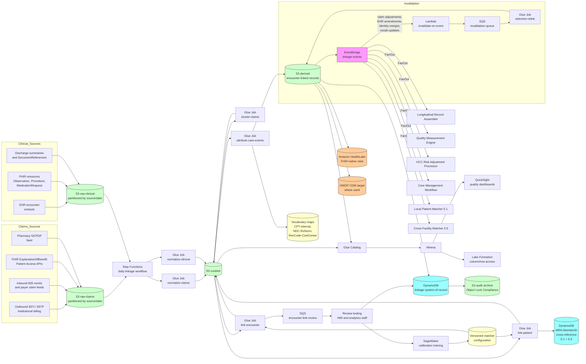

# Recipe 5.6: Claims-to-Clinical Data Linkage ⭐⭐⭐⭐

**Complexity:** Medium-Complex · **Phase:** Production · **Estimated Cost:** ~$0.0001-0.001 per linked encounter at population scale, dominated by infrastructure and storage rather than per-record fees (depends on linkage strategy, retention windows, and the proportion of encounters that require human review)

---

## The Problem

You are an analyst at a regional health system, and the executive team has asked a question that sounds simple. *For the patients we treated for congestive heart failure last year, what was the readmission rate, and how does it compare to the diabetic patients we treated for the same condition?* You have the EHR. You have the claims feed from the system's accountable care organization. You have, between the two of them, every piece of data you could possibly need to answer the question. The trouble is, the EHR and the claims feed do not, in any direct sense, agree on which encounters are which.

The EHR knows that on a Tuesday in March, an attending physician admitted a 67-year-old patient with shortness of breath and a BNP of 1840, treated her over a four-day stay, and discharged her on the Friday with a diagnosis of acute decompensated heart failure. There is an admission timestamp, a discharge timestamp, a diagnosis-related group, a list of orders, a list of medications administered, the discharge summary the resident wrote at 3 AM the night before discharge, and the lab and imaging results from the stay. Every clinical event is documented somewhere in the chart.

The claims feed knows that, for the same patient, three separate facility claims were submitted. One for the admission day with the room-and-board charge. One spanning the middle of the stay with the ancillary charges (lab, imaging, pharmacy). One for the discharge day with the second room-and-board charge plus a few late-posted line items that did not make it into the prior submission. Each of those claims has its own claim identifier, its own service-from and service-through dates, its own primary and secondary diagnosis codes, and its own list of CPT and HCPCS procedure codes. Then there are seven professional claims (the attending, the cardiology consult, the anesthesiologist for the procedure on day three, the radiologist for the chest CT, the pathologist for the cytology, the hospitalist who covered the weekend, and the inpatient pharmacist who would not normally bill but did because of the medication-reconciliation visit). Several of those professional claims overlap in their service dates with the facility claims and with each other. A few of them have diagnosis codes that do not match the facility's primary diagnosis (the cardiology consultant coded chronic systolic heart failure rather than acute decompensated; the anesthesiologist coded the procedure-specific diagnosis). One of them was originally denied for missing prior authorization, was resubmitted three weeks later with the auth on file, and now has both a denied original claim and a paid resubmission in the dataset.

To answer the executive's question, you need to look at the patients with a heart-failure admission, count the unique admissions, and check whether each patient was readmitted within thirty days. The EHR sees one admission. The claims feed sees thirteen claims (three facility plus seven professional plus the resubmitted three). They are all about the same encounter. The same hospital stay. The same patient. None of them point at each other. The patient's MRN appears on the EHR side; the patient's payer member ID appears on most of the claims (but not all, because the anesthesiology claim came through a different billing entity that did not have the member ID propagated correctly). The diagnosis on the EHR's encounter does not exactly match the primary diagnosis on any of the facility claims (the EHR uses the I-10 code as the working diagnosis at admission; the facility claim uses the I-10 code that came out of coding review three weeks later, which differs because the CDI specialist queried the physician about the level of specificity). The dates *almost* line up except that the discharge claim's service-through date is the day after the EHR's discharge timestamp, because the patient stayed an extra night for transportation reasons that did not get documented in the EHR's discharge note.

This is what claims-to-clinical data linkage is for. The question the executive asked is the simplest possible version of the question. The harder versions are everywhere:

You are running quality measurement for an accountable care organization, and one of your contracted measures is "percentage of diabetic patients with an HbA1c below 9 in the last twelve months." The numerator is "patients with HbA1c < 9 in the last twelve months," which means you need the actual lab result. The denominator is "patients with diabetes who were attributed to the ACO in the measurement period," which means you need the claims-side attribution and the diagnosis history. You have the lab results in the EHR (and in the reference lab's feed for tests done on the patients who got their labs at outside facilities). You have the claims data showing the diabetes diagnoses that drove attribution. You need to link the lab results to the patient's claims-side identity to know whether the test even counts toward the measure for that patient under that contract.

You are doing outcomes research on a new biologic for rheumatoid arthritis, and the executive sponsoring the study wants to know whether patients on the biologic had fewer hospitalizations and ER visits in the year after starting the drug than in the year before. The biologic prescriptions are in the EHR's medication-administration record (for infusions given at the institution) and in the pharmacy claims feed (for self-administered formulations the patients picked up at retail pharmacies). The hospitalizations and ER visits are in the claims feed (with all the cross-payer variability that implies). The clinical outcomes you want as covariates (CRP levels, DAS28 scores, joint counts) are in the EHR. The link between the patient on the biologic, the hospitalizations they had, the ER visits they had, and the inflammation markers they had over time is the link you need to make to even define the study cohort, never mind run the analysis.

You are running risk-adjustment for a Medicare Advantage plan, and the CMS Hierarchical Condition Categories model rewards plans for documenting chronic conditions in a way that affects the next year's capitation. The conditions have to be documented on a face-to-face encounter; the diagnosis codes have to be on a claim that flows back to CMS through the encounter data submission. The patient may have a documented chronic kidney disease in the EHR (with creatinine values to back it up), but if the CKD diagnosis is not on a claim that maps to a face-to-face encounter, it does not count for HCC. You need to link claims to encounters to make sure the conditions on the claims actually correspond to encounters where the conditions were addressed. <!-- TODO: confirm at time of build; CMS HCC and risk-adjustment data validation rules continue to evolve, and the specific encounter-level submission requirements vary by program (Medicare Advantage, ACA, Medicaid managed care). -->

You are building a clinical decision support tool that suggests preventive screenings, and the rule for "due for a colonoscopy" is "no colonoscopy in the last ten years." The colonoscopy may have been done at your institution (in the EHR's procedure history) or at a gastroenterology practice across town (visible only through the patient's claims data). If your tool only sees the EHR, it will tell the patient they are due for a screening they had four years ago at the practice across town, which is annoying for the patient and undermines the tool's credibility.

You are reconciling pharmacy claims to medication-administration records to figure out what the patient is actually taking versus what is on their active medication list. The active medication list in the EHR is what the providers think the patient is on. The pharmacy claims feed shows what the patient has actually filled, and at what frequency. The med-rec list is often wrong (medications are added but not always removed when therapy changes; patients fill prescriptions that providers wrote and then stopped recommending; patients do not fill prescriptions that providers think they are taking). The link between the pharmacy claims (with their NDC codes) and the EHR's medication record (with its RxNorm codes) is the mechanism for figuring out adherence, and it is the mechanism for catching the polypharmacy interaction the providers do not see.

You are coordinating care for a complex patient with multiple chronic conditions who is seen at six different practices across two health systems and gets her medications from a national mail-order pharmacy and her labs from two different reference labs. The longitudinal record assembly that her care manager needs to do her job depends on the ability to link claims (which see every encounter she billed for, regardless of where it happened) to the clinical data from each setting. Without the linkage, the care manager has to manually phone each practice and ask for records that the practice may or may not be willing to share efficiently.

This is the recipe. Claims-to-clinical data linkage is the entity-resolution problem of "given a claim and given a clinical encounter, do they describe the same care event for the same patient, and if so, how do they relate to each other?" The answer requires entity-resolution techniques (which you saw in 5.1, 5.2, 5.3, 5.4, and 5.5), but it adds three things on top: the entities are not just patients (they are also encounters and care events, with their own identifiers and their own lifecycle), the data quality on both sides is poor in different ways than in earlier recipes (claims have administrative biases that clinical data does not, and clinical data has documentation gaps that claims do not), and the linkage is asymmetric in time (claims arrive on a delay of weeks to months after the clinical event, get adjusted, sometimes get denied and resubmitted, and may continue to evolve for months after the encounter is closed).

It is in the medium-complex tier because the matching core is the same probabilistic-and-deterministic stack from earlier recipes, but the linkage is not just patient-to-patient. It is patient-to-patient plus encounter-to-encounter plus care-event-to-care-event, with every level having its own identifier instability, its own timing, and its own data quality issues. The recipes that come after this one (5.7, 5.8, 5.9, 5.10) all assume that the claims-to-clinical link exists in some form; this recipe builds the substrate.

Let's get into how you build it.

---

## The Technology: Linking Two Data Models That Were Designed to Disagree

### Why Claims and Clinical Data Disagree by Design

Claims data and clinical data exist for different purposes. The claims dataset exists so the provider can get paid and the payer can adjudicate. The clinical dataset exists so the care team can deliver care and the chart can support the next visit. Both touch the same encounter, but they represent it through completely different lenses, and the disagreements between them are not bugs in either system; they are features of the role each system plays.

The claims side is structured around the billable transaction. Each transaction has a billing entity (a hospital, a physician practice, a free-standing diagnostic facility), a billed service (a CPT or HCPCS procedure code, a revenue code, a DRG for inpatient stays), a date or date range, a primary diagnosis (what the encounter was for, in ICD-10 terms), zero or more secondary diagnoses, a charge amount, an adjudicated payment, and patient and payer identifiers. The transaction is what gets sent to the payer; the transaction is what shows up in the claims dataset; the transaction is the unit of analysis. A single inpatient stay produces one or more facility transactions and zero-to-many professional transactions; a single outpatient visit usually produces one facility-or-clinic transaction and one professional transaction; a single ER visit produces a particular pattern of facility-and-professional transactions that is structurally similar but timing-wise much tighter. The data model is the X12 837 institutional or professional claim form, the post-adjudication remittance advice (X12 835), and the resulting paid-claim record on the payer side that powers the claims feed. <!-- TODO: confirm at time of build; the X12 837 institutional and professional claim transaction sets and the X12 835 remittance advice are HIPAA-mandated standards, with version 5010 still the deployed baseline. -->

The clinical side is structured around the patient and the encounter. An encounter is a discrete care event with an identifier (an EHR-assigned encounter ID, sometimes called a CSN or visit ID), a patient (with the institution's MRN), an attending or rendering provider, a class (inpatient, outpatient, ER, observation, telehealth), a service location, an admission timestamp, a discharge timestamp, a working diagnosis, and a chart that holds the documentation, orders, results, medications, and notes for the encounter. The encounter is the unit of clinical analysis. Inside an encounter, the data model is FHIR resources (Patient, Encounter, Observation, Procedure, MedicationRequest, MedicationAdministration, DiagnosticReport, Condition, Composition, DocumentReference) or the institution-specific equivalent. The encounter has its own lifecycle that is mostly independent of the billing lifecycle. The chart closes when the discharge summary is signed; the billing process for the same encounter may take three weeks to four months to settle.

The two systems describe overlapping but non-identical events:

**Different units of granularity.** One inpatient stay is one encounter on the EHR side and three-to-twenty claims on the claims side. The encounter-to-claim relationship is one-to-many on the facility side, one-to-many on the professional side, and there is no bidirectional pointer that the institution controls. Some institutions construct one through the revenue cycle (the EHR encounter ID is sometimes propagated to the claims as an internal control number), but the propagation is rarely complete and is often lost on the claims feed back from the payer.

**Different time anchors.** The EHR encounter has admission and discharge timestamps in real-clock time. The claims transaction has service-from and service-through dates that are calendar dates, with no time component, and that may be set to the calendar dates of the clinical event or to the calendar dates of the billing posting (depending on the institution's revenue cycle conventions). A discharge at 3 AM on the 14th may appear on the claims as service-through 14th (clinically correct) or service-through 13th (because the patient was admitted on the 13th and the room-and-board billing convention rounds to whole days). Outpatient visits and ER visits are usually a single calendar date and align cleanly. Inpatient stays and observation stays are where the timing gets messy.

**Different diagnosis representations.** The EHR's encounter diagnosis is what the clinician documented at admission, which may evolve over the course of the stay and is finalized in the discharge summary. The claim's diagnosis is what the coder assigned for billing purposes, which is influenced by the documentation, the coding rules, the institution's CDI process, and the financial-incentive structure of the contract under which the institution is being paid. The two diagnoses for the same encounter usually overlap but are rarely identical. Even when both are I-10 codes, they may be at different levels of specificity (CHF unspecified vs acute on chronic systolic CHF), reflect different perspectives (admitting diagnosis vs principal discharge diagnosis), or include conditions that one side recorded and the other did not.

**Different identifier systems.** The EHR uses the institution's MRN. The claims use the payer-issued member ID, possibly with a subscriber-vs-dependent suffix, possibly with a plan-specific prefix, possibly with a member ID that has changed mid-year because of an open-enrollment change. The institution may attempt to maintain a cross-reference between MRN and member ID, but the cross-reference is built on the same demographic-matching infrastructure as recipe 5.1 and inherits its accuracy limits. Across organizations the cross-reference is even thinner: the claims feed for a specialist visit at a different institution has a member ID and demographics, but no MRN that the analyzing institution can use directly.

**Different completeness.** The EHR sees every clinical detail of the encounter at the institution but is largely blind to encounters that happened elsewhere. The claims feed sees every encounter that was billed (regardless of where it happened) but knows almost nothing about the clinical detail of any of them. A patient seen at the institution for primary care, at an outside cardiology practice for a specialist visit, at the local lab for a panel ordered by the cardiologist, and at a retail pharmacy for the prescription the cardiologist wrote, has clinical data at one of those four places (the institution) and claims data covering all four. The claims-to-clinical link is the mechanism that lets the institution see the full picture.

**Different temporal stability.** The EHR encounter's clinical content is stable once the chart is closed (with annotation and addendum exceptions). The claims data for the same encounter continues to evolve: the original claim is submitted, possibly denied, resubmitted, possibly partially adjusted, eventually finalized. The claims feed delivers each version. The matcher has to handle the fact that "the claim for this encounter" is not a single record over time but an evolving set of records, and the linkage has to be resilient to the evolution.

The mismatches are not pathological. They reflect the fact that claims and clinical data were designed for different jobs and were never designed to be linked. The recipe is the architecture for doing the linkage anyway, with awareness of where the disagreements live and how to handle them.

### What a Claims-to-Clinical Link Actually Resolves

The link is layered. It is not a single yes/no.

**Patient-level link.** Is this patient on the claims side the same person as this patient on the clinical side? This is the part most directly analogous to the earlier recipes in this chapter. Within a single institution where you have an MRN-to-member-ID cross-reference, the link is largely deterministic, modulo the cross-reference's accuracy. Across organizations or for claims data covering populations that include patients with no clinical record at the analyzing institution, the link is the cross-organizational match from recipe 5.5 with the additional constraint that it is being done in batch over historical data rather than at query time.

**Encounter-level link.** Is this set of claims for the same care event as this clinical encounter? Given a patient match, this is the harder question. A claim is anchored on a service date or date range, a billing entity, and a billed service. An encounter is anchored on an admission timestamp, a discharge timestamp, an attending provider, an encounter class, and a location. The match has to align the claims dates with the encounter timestamps (with the timing tolerance the institution's data conventions require), align the billing entity with the institution (or with the institution's affiliated entities, which is often a different question), align the billed service with the encounter class (a facility claim with revenue codes for room-and-board belongs to an inpatient encounter; a professional claim with an office-visit CPT belongs to an outpatient encounter), and produce a confident link. The claim-to-encounter link is one-to-one in some encounter classes (a routine outpatient visit with one professional claim) and one-to-many in others (an inpatient stay with several facility and professional claims).

**Care-event-level link.** Within an encounter, is this specific claim line the billing artifact for this specific clinical event? A patient's inpatient stay generates orders for labs, imaging, and medications. The claims for those services may show up as discrete line items on the facility claim or as separate professional claims (the radiologist's professional fee for the CT, the pathologist's fee for the cytology). The link from the line item to the clinical event is what powers detailed cost-and-quality analytics: how much did the heart-failure admission cost broken down by service line, what fraction of the ICU stay was directly attributable to ventilator support, did the patient receive the right diagnostic workup for the suspected sepsis. The care-event link is the most fragile, because the clinical orders and the billing line items use different code systems (CPT/HCPCS on the billing side, internal procedure orders or LOINC on the clinical side) and the mapping is often approximate.

**Diagnostic-attribution link.** A claim's primary diagnosis is the reason for the encounter as the coder represented it. The clinical encounter has its own diagnoses, including admitting, working, and discharge diagnoses. For analytics that depend on accurate diagnosis attribution (HCC risk adjustment, condition-specific quality measures, cohort definition for outcomes research), the linkage must be aware that the diagnoses on the claim and the diagnoses on the chart are not identical and may need reconciliation rather than treating either as authoritative.

The recipe focuses on the patient-level and encounter-level links (where the entity-resolution techniques live), with hooks for the care-event level. The line-item-to-clinical-event mapping is its own subject and is largely vocabulary-mapping work (CPT to internal procedure code, NDC to RxNorm, revenue code to internal cost-center) on top of the encounter-level link.

### Why Linkage Is Harder Than It Sounds (Again)

Six structural reasons:

**Multiple claims per encounter, with no shared encounter identifier.** Even within one institution, the claims for a single encounter rarely point at each other directly. A facility claim and a professional claim for the same inpatient stay may share the patient's member ID and have overlapping service dates, but they have different claim identifiers, different billing entities, different submission dates, and they do not reference each other. The matcher has to group them into encounter clusters based on the timing-and-overlap pattern. Across institutions or in claims feeds from payers, the situation is worse because even the institutional control numbers are stripped out before the payer sends the data back.

**Timing misalignment between clinical event and billing.** Claims arrive on a delay. The institution's own outbound claims show up in the claims warehouse within days of submission, but the inbound claims feed from a payer (showing not just the institution's claims but every claim for the institution's patients across every provider in the payer's network) often lags by weeks or months. Resubmissions, adjustments, and denials further extend the timeline. An analytics pipeline that links yesterday's clinical encounters to yesterday's claims will find very few matches; the matching has to operate over a window that lets the claims catch up.

**Many-to-many relationships at the patient and encounter levels.** A patient may have multiple encounters in the analysis window, several of which produce overlapping claims (a colonoscopy ordered in an outpatient visit, performed at an ambulatory-surgery center, with a pathology read at a separate lab; a hospitalization with a transfer to a different facility mid-stay; a series of related ER visits for the same evolving condition). The matcher has to disambiguate which claims go with which encounter without splitting closely-related claims that legitimately span encounters.

**Diagnosis and procedure code drift.** The EHR records the working diagnosis at the time of the encounter; the claim records the diagnosis the coder assigned weeks later. The codes may differ (different ICD-10 codes for the same condition at different specificity levels), the codes may shift in coding-update cycles (annual ICD-10-CM updates change the available codes; CPT changes annually too), and the codes may reflect different perspectives (the cardiologist's claim has the cardiac diagnosis; the hospitalist's claim has the hospitalist's view of the same patient with possibly different secondary conditions emphasized). Reconciling the two without losing information is its own subproblem.

**Adjustments, denials, and resubmissions.** A single underlying clinical event may produce a sequence of claim records over time: the original submission, a denial, a resubmission with updated documentation, a partial adjustment after audit, a write-off. The matcher has to recognize the sequence as one underlying event rather than counting each record separately, and the analytics pipeline has to know which version of the record to use as authoritative for each kind of question. Some questions want the original (what was the institution's first attempt at characterizing the encounter), some want the final (what did the patient actually owe and what did the payer actually pay), some want all versions (what was the adjudication trajectory over time).

**Cross-payer heterogeneity in claim quality.** The institution's outbound claims are well-formed because the institution controls their generation. The inbound claims feed from a payer aggregates claims from many submitting providers, and the data quality varies. Some payers strip data fields (member-ID-related fields, internal control numbers, secondary identifiers) before forwarding. Some payers normalize the data; some pass it through. Some payers have real-time eligibility-and-claim feeds; some have monthly batch deliveries that have already aged by the time the institution receives them. The matcher has to be tolerant of the heterogeneity and the analytics pipeline has to know the data source for each match decision so that downstream reasoning can apply payer-specific rules.

### Where the Field Has Moved

A few practical updates worth knowing:

**The OMOP Common Data Model has become the de facto research substrate.** OHDSI's Observational Medical Outcomes Partnership Common Data Model (OMOP CDM) provides a target schema and a vocabulary set that normalizes both claims and clinical data into a unified relational structure. <!-- TODO: confirm at time of build; OHDSI maintains the OMOP CDM at ohdsi.org and publishes a vocabulary (Athena) and a software toolkit. --> An organization that loads its claims and EHR data into an OMOP instance gets a pre-built person-encounter-care-event hierarchy, with vocabulary mappings between ICD-10 / SNOMED / RxNorm / LOINC / CPT done by the OMOP team rather than by the institution. The link itself is still the institution's responsibility (OMOP does not, by itself, link a particular EHR encounter to a particular claim), but the post-link analytics environment is enormously more productive than rolling your own. Outcomes research and pharmacoepidemiology in particular have largely standardized on OMOP. <!-- TODO: confirm at time of build; OMOP CDM v5.4 is the current published version, with newer versions in development. -->

**FHIR is becoming the clinical-side lingua franca.** Where the claims-to-clinical link historically pulled clinical data out of an EHR-specific schema (Epic Clarity / Caboodle, Cerner / Oracle Health, etc.), the FHIR US Core implementation guide and the broader FHIR R4 ecosystem provide a normalized clinical schema that the link can target. <!-- TODO: confirm at time of build; FHIR R4 is the deployed baseline; R5 has been published and is in early adoption. --> An institution with a FHIR-native data lake can run the linkage against FHIR resources directly, and the linkage code is portable across institutions and EHR vendors. Most production claims-to-clinical pipelines today are hybrid (EHR-native for the high-volume historical extracts, FHIR for the current operational view), but the trajectory is toward FHIR.

**The CMS Blue Button 2.0 and Patient Access APIs surface claims data to patients and apps.** Patients can now authorize a third-party app to receive their Medicare claims through the Blue Button 2.0 API, and most payers offer equivalent FHIR-based Patient Access APIs under the CMS Interoperability Final Rule. <!-- TODO: confirm at time of build; CMS Interoperability and Patient Access Final Rule and its enforcement timeline; Blue Button 2.0 has been operational since 2018 with continued expansion. --> The practical implication for claims-to-clinical linkage is that the patient is increasingly the connecting point: an app that has both the patient's clinical data (from an EHR FHIR endpoint) and the patient's claims data (from a payer FHIR endpoint) can do the link client-side, with the patient's authorization, without going through the institution's data warehouse at all. This is a structural shift; it does not eliminate the institution's need for the link but it adds a new architectural pattern.

**Tokenization-based linkage in claims-to-clinical research.** Vendors like Datavant and HealthVerity offer privacy-preserving tokenization services that produce a deterministic patient token from demographic data using a salted hash. The token is generated identically on the claims side and the clinical side, allowing a link without exchanging raw demographics. <!-- TODO: confirm at time of build; the tokenization approach is well-established in commercial claims-to-clinical research, with Datavant being the commonly-cited reference; the technique relates to the privacy-preserving methods covered in recipe 5.8. --> This is operationally important for research datasets that combine claims data from a payer with clinical data from a provider where direct demographic exchange is not legally available; it is increasingly common for de-identified-research-purposes use cases.

**Real-world data quality frameworks have matured.** Industry initiatives (the FDA's Real-World Evidence Program, PCORnet's Common Data Model and data-quality framework, Sentinel's analytic data model) have produced data-quality benchmarks, validation methods, and reporting templates that did not exist a decade ago. <!-- TODO: confirm at time of build; FDA RWE guidance documents continue to evolve, and PCORnet and Sentinel maintain their respective frameworks publicly. --> The practical implication for claims-to-clinical linkage is that "what does a good link look like" is becoming a question with documented industry answers (link rate, encounter-coverage rate, diagnosis-concordance rate, with target ranges) rather than a per-organization improvisation.

**Information-blocking rules apply here too.** The 21st Century Cures Act information-blocking provisions cover claims data alongside clinical data in many use cases. An institution that has a claims-to-clinical link infrastructure is increasingly expected to make linked data available to patients on request, to other providers as part of care coordination, and to public-health agencies as part of mandated reporting. The architecture has to support those release patterns; building the linkage as an analytics-only system that is not patient-accessible is increasingly noncompliant. <!-- TODO: confirm at time of build; the information-blocking exceptions and the specific applicability to claims data are still being clarified through enforcement actions and FAQ guidance. -->

---

## General Architecture Pattern

The pipeline has six logical stages: ingest both data streams, resolve patient identity across the streams, group claims into encounter clusters, match those encounter clusters to clinical encounters, attribute care events within the matched encounter, and react to events that invalidate prior linkages (claim adjustments, denials, resubmissions, EHR encounter amendments, patient identity merges).

```
┌────────────── INGEST ─────────────────────────────┐
│                                                    │
│  [Claims-side sources]                             │
│   - Outbound institutional claims (X12 837I)       │
│   - Outbound professional claims (X12 837P)        │
│   - Inbound payer feeds (X12 835 remits, payer-    │
│     specific claim files, FHIR ExplanationOfBenefit│
│     resources from Patient Access APIs)            │
│   - Pharmacy claims (NCPDP feed)                   │
│                                                    │
│  [Clinical-side sources]                           │
│   - EHR encounter records (admission/discharge,    │
│     class, location, attending, diagnoses)         │
│   - Clinical observations (orders, results, vitals)│
│   - Medication-administration records              │
│   - Procedure events                               │
│   - Discharge summaries and other documents        │
│           │                                        │
│           ▼                                        │
│  [Land in raw zone:                                │
│   - Partition by source, date, encounter_class    │
│   - Preserve original payload byte-for-byte for    │
│     audit and replay]                             │
│                                                    │
└────────────────────────────────────────────────────┘

┌────────────── NORMALIZE ──────────────────────────┐
│                                                    │
│  [Claims-side normalization:                       │
│   - Parse X12 segments or FHIR resources          │
│   - Standardize identifiers (member_id, claim_id, │
│     billing_provider_npi, rendering_provider_npi) │
│   - Standardize codes (ICD-10, CPT/HCPCS,         │
│     revenue codes, NDC)                           │
│   - Compute derived fields (encounter_class_      │
│     inferred, service_window_days,                 │
│     claim_status_at_snapshot)]                     │
│                                                    │
│  [Clinical-side normalization:                     │
│   - Map EHR-native schemas to FHIR resources or  │
│     OMOP tables                                    │
│   - Standardize identifiers (mrn, encounter_id,  │
│     attending_npi, location_id)                    │
│   - Standardize codes (SNOMED, RxNorm, LOINC,    │
│     internal procedure codes)                      │
│   - Resolve diagnosis lifecycle (admitting,       │
│     working, discharge) into a per-encounter      │
│     diagnosis set]                                │
│                                                    │
│  [Cross-stream:                                    │
│   - Apply institutional MRN-to-member-ID cross-   │
│     reference (output of recipe 5.1's MPI plus   │
│     payer cross-reference table)                  │
│   - Standardize provider identifiers via the NPI  │
│     resolver from recipe 5.2]                     │
│                                                    │
└────────────────────────────────────────────────────┘

┌────────────── PATIENT-LEVEL LINK ─────────────────┐
│                                                    │
│  [Resolve claims-side member to clinical-side    │
│   patient:                                         │
│   - Deterministic via MRN-to-member-ID cross-     │
│     reference where present                       │
│   - Probabilistic via demographic match (recipe   │
│     5.1 / 5.4 scorer) where the cross-reference  │
│     is missing or stale                            │
│   - Cross-organizational match (recipe 5.5) for   │
│     external claims feeds]                        │
│           │                                        │
│           ▼                                        │
│  [Output: claim record annotated with             │
│   resolved_local_patient_id and                    │
│   patient_link_confidence; claims that fail to    │
│   link are flagged for the patient-link review    │
│   queue with their candidates]                    │
│                                                    │
└────────────────────────────────────────────────────┘

┌────────────── CLAIM CLUSTERING ───────────────────┐
│                                                    │
│  [Group claims that describe a single underlying   │
│   encounter:                                       │
│   - Same patient                                   │
│   - Overlapping or adjacent service dates within  │
│     a tolerance specific to encounter class       │
│     (inpatient: full-stay window; outpatient:     │
│     same-day; ER: same-shift)                     │
│   - Compatible encounter-class signatures         │
│     derived from revenue codes, place-of-service, │
│     and CPT category]                              │
│           │                                        │
│           ▼                                        │
│  [Detect resubmissions, adjustments, and          │
│   denials within the cluster:                     │
│   - Same-or-related claim_id sequences           │
│   - Same service line on different submission    │
│     dates                                          │
│   - Adjustment indicators in the X12 835 remit]  │
│           │                                        │
│           ▼                                        │
│  [Output: claim clusters keyed on a synthetic     │
│   encounter_cluster_id, with each member claim   │
│   tagged by role (primary, resubmission,          │
│   adjustment, related-professional)]              │
│                                                    │
└────────────────────────────────────────────────────┘

┌────────────── ENCOUNTER LINK ─────────────────────┐
│                                                    │
│  [Match claim clusters to clinical encounters:    │
│   - Same patient (high confidence required)      │
│   - Date alignment within encounter-class         │
│     tolerance                                      │
│   - Encounter class compatibility (inpatient     │
│     facility cluster matches inpatient EHR        │
│     encounter; outpatient cluster matches         │
│     outpatient encounter)                          │
│   - Provider alignment (the rendering NPI on     │
│     the claim matches an attending or             │
│     consulting provider on the EHR encounter)    │
│   - Diagnosis concordance (overlap between       │
│     claim primary/secondary diagnoses and        │
│     EHR encounter diagnoses; partial overlap     │
│     is normal)]                                   │
│           │                                        │
│           ▼                                        │
│  [Score each candidate (claim cluster, EHR       │
│   encounter) pair using Fellegi-Sunter-style     │
│   weights tuned for the encounter-link problem;  │
│   apply confidence thresholds:                    │
│   - >= AUTO_LINK_HIGH: confident link;           │
│     attribute the cluster to the encounter      │
│   - >= AUTO_LINK_MED: probable link; attribute  │
│     with a confidence flag                       │
│   - <= AUTO_REJECT: no link; cluster goes to    │
│     the unmatched-claims pool                    │
│   - in between: encounter-link review queue]    │
│                                                    │
│  [Special cases:                                  │
│   - Cluster has no candidate encounter           │
│     (encounter happened at an outside facility   │
│     or before the EHR coverage window): tag     │
│     external_encounter and retain               │
│   - Encounter has no candidate cluster (claims  │
│     have not arrived yet, or the encounter was   │
│     not billable): tag awaiting_claims and       │
│     re-evaluate on cluster arrival]              │
│                                                    │
└────────────────────────────────────────────────────┘

┌────────────── CARE-EVENT ATTRIBUTION ─────────────┐
│                                                    │
│  [For matched (cluster, encounter) pairs,         │
│   attribute claim line items to clinical events:  │
│   - CPT/HCPCS to internal procedure code via     │
│     vocabulary map                                 │
│   - NDC to RxNorm via vocabulary map             │
│   - Revenue code to internal cost-center          │
│   - Date-and-time alignment of claim line to    │
│     order or administration time on the EHR      │
│     side                                           │
│   - Provider attribution (which provider          │
│     ordered, which provider performed)]           │
│           │                                        │
│           ▼                                        │
│  [Output: linked encounter record with the        │
│   joined claim and clinical detail; flag any     │
│   line items that did not attribute to a         │
│   clinical event for the line-item review        │
│   queue]                                           │
│                                                    │
└────────────────────────────────────────────────────┘

┌────────────── PERSIST + AUDIT ────────────────────┐
│                                                    │
│  [Linkage record:                                  │
│   - encounter_cluster_id and constituent          │
│     claim_ids                                     │
│   - linked_clinical_encounter_id (or              │
│     external_encounter / awaiting_claims tag)    │
│   - link_confidence (per-link, with feature      │
│     breakdown)                                     │
│   - link_method (deterministic via MRN-and-      │
│     dates, probabilistic, manual)                 │
│   - line_item_attribution (per-line-item link    │
│     to clinical events)                          │
│   - linker_configuration_version                 │
│   - resolved_at                                   │
│   - audit log entries for any prior linkage     │
│     state that this record supersedes]           │
│           │                                        │
│           ▼                                        │
│  [Write to the claims-clinical-linkage store as  │
│   the system of record]                           │
│           │                                        │
│           ▼                                        │
│  [Emit claims_clinical_link_resolved event for    │
│   downstream consumers (analytics, quality        │
│   measurement, risk adjustment, longitudinal     │
│   record assembly, care management)]             │
│                                                    │
└────────────────────────────────────────────────────┘

┌────────────── INVALIDATION / REFRESH ─────────────┐
│                                                    │
│  [Subscribe to events that invalidate prior        │
│   linkages:                                        │
│   - New claim arrives that affects a prior       │
│     cluster (resubmission, adjustment,           │
│     additional professional claim for the         │
│     encounter)                                    │
│   - Claim denial reverses a prior link            │
│   - EHR encounter amendment changes diagnoses,    │
│     timestamps, or attending                      │
│   - Patient identity merge or unmerge (recipe   │
│     5.1) changes the resolved patient on one     │
│     side                                           │
│   - Cross-organizational identity change         │
│     (recipe 5.5)                                  │
│   - Vocabulary map update (annual ICD-10 / CPT  │
│     refresh)]                                     │
│           │                                        │
│           ▼                                        │
│  [Re-evaluate the affected linkages; emit         │
│   claims_clinical_link_invalidated events with   │
│   the prior and new linkage states so downstream │
│   consumers can refresh]                         │
│                                                    │
└────────────────────────────────────────────────────┘
```

**The matcher runs in batch but is event-aware.** Unlike recipe 5.5's query-time matcher, claims-to-clinical linkage runs in batch over a sliding window (typically the past 90 to 180 days, sometimes longer for retrospective research builds). Within the window, the linker re-evaluates as new claims arrive and as EHR encounters get amended. The events drive the re-evaluation; the substrate is batch.

**Cluster-then-link is the right ordering.** The naive approach (match each claim individually to an encounter) loses the structural information that several claims belong to the same encounter cluster, and it produces a brittle matcher that is sensitive to single-claim outliers. Clustering claims into encounter-cluster candidates first, then matching the cluster to the encounter, is more robust. The cluster as a whole carries timing-and-overlap signals that no individual claim has, and the matched cluster gives the analytics pipeline the unit of analysis it actually needs.

**Date tolerance is encounter-class-specific.** Inpatient claims need a date tolerance large enough to cover the entire stay plus the late-billing window (the discharge claim may have a service-through date a day or two after the actual discharge). Outpatient claims need a tight tolerance (claim service date should match the encounter date almost exactly, with single-day slop for after-hours encounters that get billed the next morning). ER claims need a tolerance that handles the same-day-but-overlapping pattern of facility plus several professional claims. The tolerance values live in versioned configuration; calibration against the institution's gold set is an institutional discipline, not a magic number.

**Diagnosis concordance is a soft signal, not a hard one.** The diagnoses on the claim and the diagnoses on the EHR encounter overlap but are rarely identical. Treating "diagnoses match exactly" as a required signal will under-link; treating them as completely irrelevant will over-link patients with multiple encounters in the same window. The right pattern is to score diagnosis overlap as one feature among several (with partial-overlap credit, with hierarchy-aware comparison so that a more-specific code on one side counts as a match for the less-specific code on the other side), and to let the composite score handle it.

**External encounters are first-class outputs.** Many claims will not match any local encounter because the encounter happened at a different institution. These claims are still data; they describe the patient's care trajectory outside the institution. Tag them as external_encounter with their inferred encounter class, the rendering provider's NPI, and the diagnosis-and-procedure summary, and surface them to the longitudinal-record-assembler. The institution learns about its patients' outside care primarily through this path.

**Awaiting-claims is a real state.** Many local encounters will not have a claim cluster at the time of initial linking because the claims have not arrived yet. Tag the encounter as awaiting_claims and re-evaluate on cluster arrival. The awaiting state has its own retention policy (an encounter with no claim cluster after 180 days is probably never going to get one, and gets re-tagged as billed_externally or non_billable).

**Resubmissions and adjustments are tracked at the cluster level.** A cluster's claim list includes the original submission, any resubmissions, and any adjustments. The cluster has a current authoritative claim version and a history. Analytics queries that need the original submission read the original; queries that need the final adjudicated state read the current; queries that need the trajectory read the history. The persistence layer keeps all three accessible.

**The invalidation pipeline is the durability story.** Without invalidation, prior linkages go stale as new claims arrive, EHR amendments happen, and identity merges propagate. The linkage store is event-driven on the maintenance side; every change to a constituent record fires an invalidation event, and the re-evaluation either confirms the prior link, modifies it, or marks it superseded. Skip the invalidation pipeline and you build a linkage table that looks accurate on day one and is silently wrong by day ninety.

**Cohort-stratified accuracy monitoring applies here too.** Linkage rates and accuracy are not uniform across patient cohorts. Patients with primary care concentrated at the institution and minimal outside care will have higher linkage rates than patients whose care is spread across many providers. Patients with stable demographic capture will link better than patients with mid-period name changes or address changes. Per-cohort link rate, per-cohort encounter-coverage rate, and per-cohort diagnosis-concordance rate are the right metrics; per-cohort thresholds and disparity alarms are the right monitoring.

<!-- TODO (TechWriter): Expert review A1 (HIGH). Promote the production-gaps content into this paragraph. Specify: the institutional cohort registry as the source of truth for cohort axes (no ad-hoc enumeration in code); recipe-specific cohort axes (patients-by-care-distribution, patients-by-payer-mix, patients-by-payer-type including commercial / Medicare / Medicaid / self-funded / dual-eligible, patients-by-name-change-or-address-change history); per-cohort metrics and cadence (linkage rate weekly, encounter-coverage rate weekly, diagnosis-concordance rate weekly, attribution coverage weekly, sampled linkage-error rate monthly); disparity calculation as absolute difference between best-rate and worst-rate cohort per metric per cycle; alarm thresholds (link-rate disparity > 0.05 = MEDIUM, attribution-coverage disparity > 0.10 = MEDIUM, linkage-error disparity > 0.02 = HIGH for analytics integrity, any disparity > 2x the threshold = HIGH); routing to analytics governance committee, equity-monitoring committee, and per-driver revenue-cycle leadership or clinical-informatics committee with 5-business-day SLA; remediation pathway and quarterly review by the claims-clinical-data-quality steering committee. Same chapter pattern as 5.1, 5.2, 5.3, 5.4, 5.5 Finding A2; recipe-specific stakes are linkage-driven charity-care eligibility errors, missed HCC documentation, missed quality-measure denominator membership, and missed external-encounter visibility. -->
<!-- TODO (TechWriter): Expert review S5 (LOW). Cohort dimensions on metrics use bucketed, non-reversible cohort labels (cohort_bucket = A, B, C, D, E, unknown) from the institutional cohort registry rather than raw demographic attributes; the cohort-label-to-attribute mapping lives in a separate access-controlled table loaded only at dashboard-render time. Same chapter pattern as 5.1, 5.2, 5.3, 5.4, 5.5. -->

---

## The AWS Implementation

### Why These Services

**Amazon S3 for the claims-clinical data lake.** Three zones: raw (every inbound claim file, every EHR extract, every payer feed, byte-for-byte as received, partitioned by source and date for audit and replay), curated (parsed and normalized claims and clinical records with the patient-level link annotated), and derived (encounter-clustered claims, encounter-linked records, care-event-attributed records, cohort-stratified link-quality reports). S3 is HIPAA-eligible under BAA with SSE-KMS encryption. The raw payloads are retained for the regulatory retention floor; the derived outputs are the substrate for the analytics layer.

**AWS Glue and Apache Spark for the linkage pipeline.** The linkage workload is bulk-batch with structured records (claims and clinical events on the order of hundreds of thousands to tens of millions per institution per year), and it benefits from columnar processing, partition pruning, and the join-optimization that Spark provides. Glue jobs are the right substrate because the work is periodic (typically overnight, with intra-day refreshes for the latest claims) and the cost model (per-DPU-hour) maps cleanly to the workload pattern. Each pipeline stage runs as its own Glue job: parse-and-normalize-claims, parse-and-normalize-clinical, link-patient, cluster-claims, link-encounter, attribute-care-events, persist-and-emit.

**Amazon Athena and AWS Glue Data Catalog for analytics access.** The Glue Data Catalog tracks the schema across raw, curated, and derived zones. Athena queries the catalog over the curated and derived S3 zones for ad-hoc analytics, quality measurement, risk adjustment computation, and cohort definition. QuickSight on Athena provides the operational and quality dashboards.

**Amazon DynamoDB for the linkage system-of-record and the invalidation index.** Two tables: a linkage table keyed on `(encounter_cluster_id)` with attributes for the linked clinical encounter, the link confidence, the constituent claim list, the line-item attribution, and the link history; and an invalidation index keyed on `(source_record_id)` for fast lookup of which linkages depend on a given claim or encounter when an invalidation event arrives. DynamoDB's low-latency reads support the operational query patterns (longitudinal-record assembly, care management, real-time cost lookups for an encounter); the analytics queries hit S3 via Athena.

**Amazon SQS for the linkage and invalidation queues.** Three queues: a main linkage queue (claims and encounters arriving for a fresh link evaluation), an invalidation queue (events that supersede prior linkages), and a review queue (cases where the matcher's confidence falls in the review band and a human reviewer needs to confirm). Separating the queues lets the operational pipeline absorb bursts (a payer feed delivery dropping fifty thousand claims at once) without delaying the higher-priority invalidation flow.

**AWS Lambda for the per-event processing and the API surface.** The Glue jobs do the bulk work; Lambdas handle the event-driven slices. Per-claim-arrival linking (when a claim arrives outside the bulk window and needs immediate evaluation), per-invalidation-event re-linking, and the read API for downstream consumers all run as Lambdas. Each is in VPC with VPC endpoints for downstream services.

**AWS Step Functions for orchestration.** Three workflows: a daily linkage workflow (claims-and-clinical normalization, patient link, claim clustering, encounter link, care-event attribution, persistence, event emission), an invalidation workflow (subscribe to invalidation events and selectively re-link), and a vocabulary-refresh workflow (annual ICD-10 / CPT updates trigger a re-evaluation of the affected historical linkages). The state machine handles retries, error routing to DLQs, and parallel execution where the dependency graph allows.

**Amazon EventBridge for the cross-recipe events.** When a linkage is resolved (`claims_clinical_link_resolved`), when a linkage is invalidated (`claims_clinical_link_invalidated`), when an external encounter is detected (`external_encounter_observed`), an event flows out to downstream consumers: the longitudinal-record-assembler, the quality-measurement engine, the risk-adjustment HCC processor, the care-management workflow, the local patient matcher (5.1, when a cross-organizational claim surfaces a previously-unknown internal duplicate signal), and the cross-facility matcher (5.5) where applicable. EventBridge rules route events to the right consumer, with DLQs for failed deliveries.

<!-- TODO (TechWriter): Expert review A6 (MEDIUM). Specify the chapter-wide event-schema contract: each event carries `source`, `detail_type`, `detail.encounter_cluster_id`, `detail.local_patient_id`, `detail.linked_clinical_encounter_id` where applicable, `detail.event_id`, `detail.previous_state`, `detail.new_state`, `detail.detected_at`, `detail.matcher_config_version`, `detail.vocabulary_versions`, and `detail.permitted_uses` from the per-payer data-use tagging; downstream consumers subscribe to specific `detail_type` values and acknowledge processing via a CloudWatch metric (`{consumer}.events_processed`); chapter-wide event-bus governance specifies the schema versioning policy and the deprecation cadence for breaking changes. -->

**Amazon HealthLake for the FHIR-native clinical view.** Where the institution has an OMOP CDM substrate, the linkage outputs feed OMOP. Where the institution has a FHIR-native data lake, HealthLake stores the clinical encounters, observations, and procedures as FHIR resources, and the linkage output joins claims to the FHIR Encounter resource. <!-- TODO: confirm at time of build; HealthLake's claim handling and the FHIR Claim and ExplanationOfBenefit resource support continue to evolve. --> The linkage architecture treats the FHIR-native and OMOP-native representations as alternative downstream targets; the link itself is upstream.

**Amazon SageMaker for the matcher training and offline calibration.** The Fellegi-Sunter weights, the per-feature thresholds, and the encounter-class-specific date tolerances are calibrated against the institution's gold set. The calibration runs as a SageMaker training job over the historical linkage records, produces a candidate configuration set, and emits the metrics the institutional review committee uses to decide on promotion. SageMaker Processing jobs run the cohort-stratified accuracy reports.

**AWS Lake Formation for column-level and row-level access control.** Different audiences need different views of the linkage outputs. Quality-measurement teams need the encounter-linked aggregate; risk-adjustment teams need the diagnosis-concordance detail; outcomes-research teams need the de-identified longitudinal record. Lake Formation grants enforce the row-and-column distinctions; Athena query paths use the same grants. Same chapter pattern as 5.2, 5.3, 5.4, 5.5. <!-- TODO (TechWriter): Expert review A12 (LOW). Specify the column distinctions per audience (quality-measurement: encounter-linked aggregate, no constituent-claim detail; risk-adjustment: diagnosis-concordance detail with constituent-claim primary diagnoses; outcomes-research: de-identified longitudinal record with SafeHarbor or LDS treatment of dates, ZIP, identifiers; audit: full record); specify the de-identification pattern for the outcomes-research view. -->

**AWS KMS, CloudTrail, CloudWatch.** Customer-managed keys for the S3 buckets, the DynamoDB tables, the Lambda log groups, and the Glue temp storage. CloudTrail data events on the linkage table and the audit-log buckets. CloudWatch alarms on link rate (sudden drops are usually a data-source outage), on cohort-stratified disparities, on invalidation backlog depth, on review-queue depth and aging. Same chapter pattern as 5.1, 5.2, 5.3, 5.4, 5.5.

**Amazon QuickSight for operational and quality dashboards.** Per-encounter-class link rate, per-payer link rate, per-cohort link rate, link confidence distribution, review-queue depth and aging, time-to-link distribution (how long after the clinical event does a link get established), external-encounter rate and breakdown by inferred location, vocabulary-map coverage (what fraction of claim CPT codes mapped to internal procedure codes).

### Architecture Diagram



### Prerequisites

| Requirement | Details |
|-------------|---------|
| **AWS Services** | Amazon S3, Amazon DynamoDB, AWS Glue, Apache Spark on Glue, Amazon Athena, AWS Lake Formation, AWS Step Functions, Amazon EventBridge, AWS Lambda, Amazon SQS, Amazon SageMaker, Amazon HealthLake (where used for FHIR-native clinical view), Amazon QuickSight, AWS KMS, Amazon CloudWatch, AWS CloudTrail. |
| **External Inputs** | Claims feeds: outbound institutional and professional 837s as the institution generates them, inbound 835 remits, payer claim feeds (commonly delivered as flat files or FHIR ExplanationOfBenefit resources), pharmacy NCPDP feeds where the institution has access. Clinical inputs: EHR encounter extracts, FHIR resources or OMOP-CDM-loaded clinical data, discharge summaries and other clinical documents. Cross-reference data: the institution's MRN-to-member-ID cross-reference (output of recipe 5.1's MPI plus payer eligibility-matching from 5.4), the NPI-to-internal-provider mapping (output of recipe 5.2). Vocabulary maps: CPT/HCPCS-to-internal-procedure-code, NDC-to-RxNorm, revenue-code-to-cost-center, ICD-10 hierarchy. <!-- TODO: confirm at time of build; commercial vocabulary providers (3M, Optum, IMO) and open-source vocabulary stores (Athena from OHDSI, RxNorm from NLM, BioPortal) all play roles in the vocabulary-map sourcing. --> |
| **IAM Permissions** | Per-Glue-job least-privilege: scoped `s3:GetObject` and `s3:PutObject` on specific bucket prefixes, `glue:Get*` on the data catalog, `dynamodb:GetItem` / `PutItem` / `UpdateItem` / `Query` on the linkage and cross-reference tables, `kms:Decrypt` on relevant CMKs. Lambdas have similarly scoped permissions; the linkage write Lambda has append-only permissions on the linkage history (no delete) enforced through IAM condition keys plus DynamoDB resource-based policy. SageMaker training jobs have read access to the curated and derived S3 zones and write access to a model-artifacts bucket. Never use `*` actions or `*` resources in production. <!-- TODO (TechWriter): Expert review S1 (HIGH) and S6 (LOW). Promote identity-boundary specification into the architecture text: per-claim-arrival Lambda, invalidation Lambda, read API for downstream consumers, and cross-recipe EventBridge fan-out consumers all need producer-signed envelopes (`source_system`, `source_record_id`, `event_id`, `signed_payload`, `signature`), per-event-source allow-lists tied to producer signing keys, and per-Glue-job execution-role binding so Step Functions invokes only the role appropriate for the current pipeline stage. Pair with scoped Resource ARN examples for the highest-stakes actions: `dynamodb:UpdateItem` on `arn:aws:dynamodb:<region>:<account>:table/claims-clinical-linkage`; `s3:PutObject` on `arn:aws:s3:::<env>-claims-raw/audit/*`; `events:PutEvents` on `arn:aws:events:<region>:<account>:event-bus/claims-clinical-events`; `dynamodb:GetItem` on `arn:aws:dynamodb:<region>:<account>:table/mrn-memberid-cross-reference`. Same chapter pattern as 5.1, 5.2, 5.3, 5.4, 5.5. --> |
| **BAA and Trust Framework** | AWS BAA signed. Payer data feeds are governed by trading-partner agreements that specify retention, redistribution, and audit obligations. Where the claims data covers patients seen at non-affiliated providers, the institution's right to use the data is constrained by the payer agreement (typically permitted for treatment, payment, operations, and quality activities; sometimes restricted for research). For research uses, additional IRB and data-use agreements apply. <!-- TODO (TechWriter): Expert review S3 (MEDIUM). Promote the production-gaps content into this row and the architecture text. Specify: per-payer data-use tagging on the linkage record (a `permitted_uses` array derived from the trading-partner agreement, enforced via Lake Formation row-level filters keyed on the union of the linkage record's permitted_uses and the requesting principal's authorized-use-context); sub-processor disclosure contractual requirement for self-funded employer plans through TPAs; incident-notification-window contractual requirement (typically 24-72 hours for clinical-safety-relevant incidents, tighter than the standard HIPAA 60-day breach notification given the wrong-patient-linkage clinical-safety stakes); audit-rights contractual requirement for payer claims-feed quality (data-completeness profiles, on-time delivery rates, late-arrival distributions); vocabulary-license tracking on each linkage record so the institution can demonstrate compliance with the vocabulary license alongside the payer-data license. --> |
| **Encryption** | S3: SSE-KMS with bucket-level keys. DynamoDB: customer-managed KMS at rest. Glue temp storage: KMS encrypted. Lambda log groups: KMS-encrypted. SageMaker: KMS-encrypted volumes and outputs. EventBridge and SQS: server-side encryption. TLS 1.2 or higher for all in-transit traffic. The audit-log archive bucket has Object Lock in Compliance mode. |
| **VPC** | Production: Glue jobs in VPC connections. Lambdas in VPC. SageMaker training in VPC. VPC endpoints for S3, DynamoDB, KMS, Secrets Manager, CloudWatch Logs, EventBridge, SQS, Step Functions, Glue, Athena, STS, SageMaker. NAT Gateway for partner-facing HTTPS egress with an outbound proxy and an allow-list of payer endpoints; PrivateLink where the partner offers it. <!-- TODO (TechWriter): Expert review N1 (LOW) and N2 (LOW). Networking chapter pattern from 5.3, 5.4, 5.5: configure HIE/payer egress as distinct outbound proxy rules with non-overlapping allow-lists scoped to compute roles; per-role rate limits below the partner's published rate limits; egress connections CloudWatch-logged for forensic auditing. At payer-feed volumes exceeding ~500K transactions/month per payer, evaluate the partner's PrivateLink endpoint where available; the cost trade-off (PrivateLink endpoint hourly fee plus per-GB data-transfer fee vs NAT Gateway data-transfer fee) is institution-specific. --> |
| **CloudTrail** | Enabled with data events on the linkage table, the audit S3 buckets, and the cross-reference table. Glue job runs and SageMaker training runs logged. CloudTrail logs encrypted with KMS and retained per the regulatory floor. <!-- TODO (TechWriter): Expert review S2 (MEDIUM). Replace "per the regulatory floor" with explicit retention posture (longest of HIPAA records-retention, payer trading-partner agreement retention, state medical-records-retention, research IRB retention where applicable, plus Medicare claim-related retention up to 10 years and HCC risk-adjustment data-validation retention where the institution participates in Medicare Advantage); audit logs in a dedicated S3 bucket with Object Lock in Compliance mode and lifecycle to S3 Glacier Deep Archive after 90 days; CloudTrail data events forwarded to a dedicated audit AWS account. Same chapter pattern as 5.1, 5.2, 5.3, 5.4, 5.5. --> |
| **Vocabulary and Code Maps** | A versioned vocabulary store with mappings for CPT to internal procedure codes, NDC to RxNorm, revenue codes to internal cost centers, and ICD-10 hierarchy traversal. The vocabulary maps refresh on the annual coding-update cycle (ICD-10-CM in October, CPT in January, RxNorm continuously) and on payer-specific updates. Each linkage record references the vocabulary version active at link time. |
| **Sample Data** | Use synthetic claims and clinical data that exercises the full range of linkage outcomes including the encounter-class variations. Synthea generates synthetic patient populations with both clinical encounters and corresponding claims; the CMS Synthetic Public Use Files (SynPUFs) are realistic claims-only datasets useful for the claims side. <!-- TODO: confirm at time of build; CMS DE-SynPUF availability and Synthea claims output continue to evolve. --> Never use real PHI in development environments. |
| **Cost Estimate** | At an institution processing one million encounters per year and three to five million claims per year: Glue compute (the bulk linkage pipeline) typically $2,000-6,000 per month; S3 storage including raw, curated, derived, and audit archive typically $500-2,000 per month at three to five years of retention; DynamoDB for the linkage table and cross-reference typically $300-1,500 per month; SageMaker calibration jobs typically $200-800 per month; Athena, QuickSight, EventBridge, Lambda, SQS, Step Functions, KMS in aggregate typically $300-1,000 per month. Total AWS infrastructure typically $3,500-12,000 per month, dominated by Glue compute and S3 storage. <!-- TODO: replace with verified, current pricing once the implementing team validates against the AWS Pricing Calculator. --> |

### Ingredients

| AWS Service | Role |
|------------|------|
| **Amazon S3** | Hosts raw claims and clinical extracts, curated normalized records, derived encounter-linked output, audit archive with Object Lock |
| **AWS Glue and Apache Spark** | Bulk linkage pipeline: parse-and-normalize, link-patient, cluster-claims, link-encounter, attribute-care-events |
| **Amazon DynamoDB** | Linkage system-of-record table (encounter cluster to clinical encounter), cross-reference invalidation index, MRN-to-member-ID cross-reference |
| **Amazon Athena and AWS Glue Data Catalog** | SQL access to the data lake for analytics, quality measurement, risk adjustment, cohort definition |
| **AWS Lake Formation** | Column-level and row-level access controls for the differentiated audiences (quality, risk adjustment, outcomes research, longitudinal record) |
| **Amazon SQS** | Buffers linkage, invalidation, and review workloads on separate queues |
| **AWS Lambda** | Per-event processing: per-claim-arrival immediate linking, per-invalidation-event re-linking, read API for downstream consumers |
| **AWS Step Functions** | Orchestrates daily linkage, invalidation, and vocabulary-refresh workflows |
| **Amazon EventBridge** | Fans out linkage events to longitudinal-record-assembler, quality-measurement engine, HCC risk adjustment processor, care management, local matcher (5.1), cross-facility matcher (5.5) |
| **Amazon SageMaker** | Matcher calibration over historical linkage records, cohort-stratified accuracy reports, candidate-configuration evaluation |
| **Amazon HealthLake** | FHIR-native clinical view target for institutions standardized on FHIR resources |
| **Amazon QuickSight** | Operational and quality dashboards (per-encounter-class link rate, per-payer link rate, cohort disparities, review-queue depth, time-to-link distribution, external-encounter rate, vocabulary coverage) |
| **AWS KMS** | Customer-managed encryption keys for all linkage data stores |
| **Amazon CloudWatch** | Operational metrics and alarms (link-rate drops, cohort disparities, invalidation backlog, review-queue aging) |
| **AWS CloudTrail** | Audit logging for all API calls on the linkage table, the cross-reference table, and the audit S3 buckets |

---

### Code

> **Reference implementations:** Useful libraries and patterns for this recipe:
> - [OHDSI / Athena](https://athena.ohdsi.org/): the OMOP CDM vocabulary store, with mappings between ICD-10, SNOMED, RxNorm, LOINC, and the OMOP standard concepts. <!-- TODO: confirm current URL at time of build. -->
> - [PCORnet Common Data Model](https://pcornet.org/data-driven-common-model/): an alternative target schema for claims-clinical linkage in PCORI-funded research networks. <!-- TODO: confirm current URL at time of build. -->
> - [Synthea](https://github.com/synthetichealth/synthea): synthetic patient population generator with both clinical encounters and corresponding claims output, useful for development and testing.
> - [HAPI FHIR](https://github.com/hapifhir/hapi-fhir): FHIR reference implementation including the Claim and ExplanationOfBenefit resources used in payer-side claims representations.
> - [`pyspark` and `pandas`](https://spark.apache.org/docs/latest/api/python/index.html): the dominant analytics substrates for the Glue-based linkage pipeline.
> - The [HL7 FHIR ExplanationOfBenefit resource](https://www.hl7.org/fhir/explanationofbenefit.html) is the FHIR-native representation of post-adjudication claims data and the substrate for the CMS Patient Access API claims feeds.

#### Walkthrough

**Step 1: Ingest and normalize the claims and clinical streams.** The two streams arrive on different cadences in different formats. Claims arrive as X12 837/835 transactions for outbound flows, and as payer-specific flat files or FHIR ExplanationOfBenefit resources for inbound flows. Clinical data arrives as EHR extracts (Epic Clarity / Caboodle, Cerner / Oracle Health, or the equivalent) or as FHIR resources from a FHIR-native data lake. Both streams have to land in the raw zone byte-for-byte for audit replay, then get parsed into a normalized representation that the rest of the pipeline can join on. Skip the strict raw-zone preservation and you cannot reconstruct the original payload when a claim is later disputed or when an audit reaches back to a transaction from three years ago.

```
FUNCTION normalize_claims_and_clinical(input_partition_keys):
    // Each partition processed by a Glue job; partition keys
    // identify which raw files to consume.

    // Step 1A: parse claims-side records.
    raw_claims_files = S3.list_objects(
        bucket="raw-claims",
        prefix=input_partition_keys.claims_prefix)

    parsed_claims = []
    FOR each file in raw_claims_files:
        IF file.format == "x12_837i":
            claims = parse_837_institutional(file.payload)
        ELIF file.format == "x12_837p":
            claims = parse_837_professional(file.payload)
        ELIF file.format == "x12_835":
            claims = parse_835_remittance(file.payload)
        ELIF file.format == "fhir_explanation_of_benefit":
            claims = parse_fhir_eob(file.payload)
        ELIF file.format == "ncpdp_pharmacy":
            claims = parse_ncpdp(file.payload)
        ELIF file.format == "payer_flat_file":
            claims = parse_payer_specific(file.payload, file.payer_id)

        FOR each claim in claims:
            // Build the normalized claim record. Keep the
            // original byte offset for traceability.
            parsed_claims.append({
                claim_id: extract_claim_id(claim),
                source_file_key: file.s3_key,
                source_file_offset: claim.byte_offset,
                payer_id: claim.payer_id,
                claim_type: claim.claim_type,
                    // facility_inpatient, facility_outpatient,
                    // facility_er, professional, pharmacy
                billing_provider_npi: claim.billing_provider_npi,
                rendering_provider_npi: claim.rendering_provider_npi
                    OR claim.billing_provider_npi,
                member_id: claim.member_id,
                member_demographics: claim.member_demographics,
                service_from_date: claim.service_from_date,
                service_through_date: claim.service_through_date,
                primary_diagnosis_icd10: claim.primary_diagnosis,
                secondary_diagnoses_icd10: claim.secondary_diagnoses,
                procedures_cpt_hcpcs: claim.procedures,
                revenue_codes: claim.revenue_codes,
                drg_code: claim.drg_code IF claim.claim_type == "facility_inpatient",
                place_of_service: claim.place_of_service,
                claim_status: claim.claim_status,
                    // submitted, paid, denied, adjusted, void
                adjustment_indicator: claim.adjustment_indicator,
                original_claim_id: claim.original_claim_id
                    IF claim.adjustment_indicator,
                charge_amount: claim.charge_amount,
                paid_amount: claim.paid_amount IF claim.claim_status == "paid",
                line_items: claim.line_items,
                received_at: file.received_timestamp,
                vocabulary_versions_at_parse: current_vocabulary_versions()
            })

    write_to_s3_curated_zone(parsed_claims,
        prefix="curated-claims/" + input_partition_keys.partition_path)

    // Step 1B: parse clinical-side records.
    raw_clinical_files = S3.list_objects(
        bucket="raw-clinical",
        prefix=input_partition_keys.clinical_prefix)

    parsed_clinical = []
    FOR each file in raw_clinical_files:
        IF file.format == "epic_clarity_extract":
            encounters = parse_epic_clarity(file.payload)
        ELIF file.format == "cerner_extract":
            encounters = parse_cerner(file.payload)
        ELIF file.format == "fhir_bundle":
            encounters = parse_fhir_bundle_for_encounters(file.payload)

        FOR each encounter in encounters:
            // Resolve the diagnosis lifecycle into a per-
            // encounter diagnosis set: admitting, working,
            // discharge, plus any condition-list entries
            // that were active during the encounter.
            encounter_diagnoses = resolve_diagnosis_lifecycle(
                encounter,
                source_format=file.format)

            parsed_clinical.append({
                encounter_id: extract_encounter_id(encounter),
                source_file_key: file.s3_key,
                source_record_id: encounter.source_record_id,
                local_patient_id: encounter.mrn,
                encounter_class: encounter.class,
                    // inpatient, outpatient, emergency,
                    // observation, telehealth, ancillary
                location_id: encounter.location_id,
                attending_provider_npi: encounter.attending_npi,
                    // Resolved through recipe 5.2's NPI matcher.
                consulting_provider_npis: encounter.consulting_npis,
                admission_timestamp: encounter.admission_ts,
                discharge_timestamp: encounter.discharge_ts,
                encounter_diagnoses: encounter_diagnoses,
                procedures_internal: encounter.procedures,
                medications_administered: encounter.medications,
                observations: encounter.observations,
                discharge_disposition: encounter.discharge_disposition,
                source_extract_timestamp: file.extract_timestamp
            })

    write_to_s3_curated_zone(parsed_clinical,
        prefix="curated-clinical/" + input_partition_keys.partition_path)

    RETURN {
        claims_count: len(parsed_claims),
        clinical_count: len(parsed_clinical),
        partition_keys: input_partition_keys
    }
```

**Step 2: Resolve patient identity across the streams.** Before any encounter-level linking can happen, the matcher has to know which clinical patient corresponds to which claims-side member. Within a single institution where a maintained MRN-to-member-ID cross-reference exists (built and maintained by the eligibility-matching pipeline from recipe 5.4 and the local MPI from recipe 5.1), this is largely deterministic. For external claims feeds covering populations where the cross-reference is incomplete, the patient link uses the same probabilistic-record-linkage scorer as 5.1 and 5.5 over the demographic fields the claims feed exposes. Skip the patient link or treat it as trivial and you produce encounter linkages that join the right encounters but the wrong patients, which silently corrupts every analytics output downstream.

```
FUNCTION link_patient(claim_record, cross_reference_table, mpi):
    // Step 2A: deterministic match via cross-reference.
    // The MRN-to-member-ID cross-reference is a DynamoDB
    // table populated by recipe 5.4's eligibility matcher
    // and maintained by recipe 5.1's MPI updates.
    cross_ref_match = cross_reference_table.lookup_by(
        member_id=claim_record.member_id,
        payer_id=claim_record.payer_id,
        as_of=claim_record.service_from_date)

    IF cross_ref_match IS NOT NULL
       AND cross_ref_match.confidence >= CROSS_REF_HIGH_CONFIDENCE:
        // The cross-reference itself has a confidence; trust
        // levels above the high threshold are deterministic
        // for our purposes.
        RETURN {
            resolved_local_patient_id: cross_ref_match.local_patient_id,
            link_method: "cross_reference_deterministic",
            link_confidence: cross_ref_match.confidence,
            cross_ref_version: cross_ref_match.version
        }

    // Step 2B: probabilistic match via demographics.
    // The cross-reference is missing or low-confidence;
    // fall back to demographic matching against the local
    // MPI.
    candidate_patients = mpi.find_candidates_by_blocking(
        last_name_phonetic: double_metaphone(
                                claim_record.member_demographics.last_name),
        year_of_birth: year(claim_record.member_demographics.dob),
        zip3: zip3(claim_record.member_demographics.address))

    scored_candidates = []
    FOR each candidate in candidate_patients:
        score = compute_patient_match_score({
            // Use the same scorer as recipe 5.1, with the
            // additional consideration that some demographic
            // fields may be partially redacted on inbound
            // payer feeds (commonly SSN, sometimes street
            // address detail).
            first_name: nickname_aware_first_name_score(
                            claim_record.member_demographics.first_name,
                            candidate.first_name),
            last_name: cross_org_last_name_score(
                            claim_record.member_demographics.last_name,
                            candidate.last_name,
                            candidate.prior_last_names),
            dob: dob_match_grade(claim_record.member_demographics.dob,
                                    candidate.dob),
            sex: sex_match(claim_record.member_demographics.sex,
                            candidate.administrative_sex),
            address: address_similarity(
                            claim_record.member_demographics.address,
                            candidate.standardized_address,
                            candidate.prior_addresses),
            phone: phone_match(claim_record.member_demographics.phone,
                                candidate.phone_history)
        })
        scored_candidates.append({candidate, score})

    IF len(scored_candidates) == 0
       OR max(scored_candidates).score.composite < AUTO_REJECT:
        RETURN {
            resolved_local_patient_id: NULL,
            link_method: "no_match",
            link_confidence: 0.0,
            unmatched_reason: "no_candidates_or_below_threshold"
        }

    best = max(scored_candidates, key=lambda c: c.score.composite)

    IF best.score.composite >= PATIENT_LINK_HIGH:
        // Optionally update the cross-reference table with
        // this newly-confirmed link so future claims for the
        // same member skip the probabilistic path.
        cross_reference_table.upsert(
            payer_id=claim_record.payer_id,
            member_id=claim_record.member_id,
            local_patient_id=best.candidate.local_patient_id,
            confidence=best.score.composite,
            evidence_source="probabilistic_demographic_match",
            valid_from=claim_record.service_from_date)

        RETURN {
            resolved_local_patient_id: best.candidate.local_patient_id,
            link_method: "probabilistic_high_confidence",
            link_confidence: best.score.composite,
            score_breakdown: best.score.per_feature
        }

    ELIF best.score.composite >= PATIENT_LINK_MED:
        // Med-confidence patient links are accepted but
        // tagged for downstream awareness; encounter-level
        // matching for med-confidence patient links applies
        // tighter encounter-link thresholds to compound less
        // risk.
        RETURN {
            resolved_local_patient_id: best.candidate.local_patient_id,
            link_method: "probabilistic_med_confidence",
            link_confidence: best.score.composite,
            score_breakdown: best.score.per_feature,
            patient_link_caveat: "med_confidence_patient_link"
        }

    ELSE:
        // Falls in the patient-link review band. Route to
        // the review queue; do not attempt encounter-level
        // linking until the patient link is resolved.
        SQS.SendMessage("patient-link-review-queue", {
            claim_id: claim_record.claim_id,
            best_candidate: best,
            scored_candidates: scored_candidates,
            demographics: claim_record.member_demographics
        })
        RETURN {
            resolved_local_patient_id: NULL,
            link_method: "deferred_patient_review",
            link_confidence: best.score.composite,
            queued_for_review: TRUE
        }
```

**Step 3: Cluster the patient-resolved claims into encounter clusters.** Multiple claims describe a single underlying encounter, and grouping them is the first structural job after the patient link. The cluster-key is patient plus encounter-class plus a service-date range; the date tolerance is encounter-class-specific. The clustering also needs to detect resubmissions and adjustments so the cluster's authoritative version of each claim is the latest valid one. Skip the clustering and you treat thirteen claims for one inpatient stay as thirteen separate encounters, which over-counts admissions, double-counts readmissions, and corrupts every cost-and-quality calculation that depends on encounter-level rollups.

```
FUNCTION cluster_claims_by_encounter(patient_resolved_claims):
    // Group by patient first, then process each patient's
    // claims independently. Spark partitions naturally on
    // local_patient_id; this is a within-partition groupBy.

    clusters = []

    BY local_patient_id:
        patient_claims = sort_by(claims, key=service_from_date)

        // Step 3A: detect resubmission/adjustment chains.
        // Claims with the same original_claim_id reference
        // (set by adjustment_indicator) are versions of the
        // same underlying claim. Within a chain, the latest
        // submission is the authoritative version; the
        // earlier ones are kept for history.
        chains = group_by_original_claim_id(patient_claims)
        canonical_claims = [latest_in_chain(chain) FOR chain in chains]

        // Step 3B: cluster by encounter-class window.
        FOR each claim in canonical_claims:
            // The encounter-class window determines how
            // permissive the date overlap can be when
            // grouping claims together.
            window = encounter_class_window(claim.claim_type)
                // Inpatient facility: span (service_from -
                //   buffer_days, service_through + buffer_days)
                //   where buffer_days is typically 1-2.
                // Outpatient/clinic: same calendar day with
                //   small slop for next-morning batch posting.
                // ER: span (service_from, service_through +
                //   buffer_days) with smaller buffer than
                //   inpatient.
                // Pharmacy: matches against the encounter
                //   it's tied to (e.g. an inpatient stay
                //   for in-stay administration claims) using
                //   the date of service.

            existing_cluster = find_cluster_for(
                clusters,
                local_patient_id=claim.resolved_local_patient_id,
                encounter_class=normalize_encounter_class(claim.claim_type),
                date_overlap_with=window)

            IF existing_cluster IS NOT NULL:
                existing_cluster.add_claim(claim,
                    role=infer_role(claim, existing_cluster))
                    // Roles: primary_facility, primary_professional,
                    // related_professional, ancillary, pharmacy,
                    // resubmission, adjustment.
            ELSE:
                new_cluster = {
                    encounter_cluster_id: generate_cluster_id(
                        local_patient_id=claim.resolved_local_patient_id,
                        encounter_class=normalize_encounter_class(claim.claim_type),
                        anchor_date=claim.service_from_date),
                    local_patient_id: claim.resolved_local_patient_id,
                    encounter_class: normalize_encounter_class(claim.claim_type),
                    cluster_anchor_date: claim.service_from_date,
                    cluster_window_start: claim.service_from_date,
                    cluster_window_end: claim.service_through_date,
                    constituent_claims: [claim],
                    primary_facility_npi: claim.billing_provider_npi
                        IF claim.claim_type == "facility_inpatient",
                    primary_diagnoses: claim.primary_diagnosis_icd10,
                    secondary_diagnoses: claim.secondary_diagnoses_icd10,
                    drg_code: claim.drg_code,
                    earliest_service_date: claim.service_from_date,
                    latest_service_date: claim.service_through_date,
                    cluster_status: "active"
                }
                clusters.append(new_cluster)

        // Step 3C: post-cluster reconciliation.
        // After all claims are clustered, walk each cluster
        // and reconcile its window: extend the window to
        // cover all constituent claims, aggregate diagnoses
        // across the cluster, identify the cluster's primary
        // billing entity, compute the cluster total charge
        // and paid amount.
        FOR each cluster in clusters_for_patient(local_patient_id):
            cluster.cluster_window_start = min(
                c.service_from_date FOR c in cluster.constituent_claims)
            cluster.cluster_window_end = max(
                c.service_through_date FOR c in cluster.constituent_claims)
            cluster.aggregate_diagnoses = union_with_hierarchy(
                c.primary_diagnosis_icd10
                    FOR c in cluster.constituent_claims)
            cluster.cluster_charge_total = sum(
                c.charge_amount FOR c in cluster.constituent_claims)
            cluster.cluster_paid_total = sum(
                c.paid_amount OR 0 FOR c in cluster.constituent_claims)

    RETURN clusters
```

**Step 4: Match each encounter cluster to a clinical encounter.** The cluster has a patient, an encounter class, a date window, a set of diagnoses, and a billing provider. The clinical encounter has the same patient, an encounter class, an admission/discharge timestamp, an attending provider, and a diagnosis set. The match scores each (cluster, encounter) candidate pair and applies confidence thresholds. Skip the encounter-level link and you have claim clusters and clinical encounters but no joined unit of analysis, which means every analytics question that needs both administrative and clinical detail at the encounter grain has to be re-derived from raw data.

```
FUNCTION link_encounter(cluster, clinical_encounters_for_patient,
                          matcher_config):
    // The clinical encounters for the patient are pre-fetched
    // (DynamoDB query or curated-zone read) and cached for
    // the duration of the cluster's match.

    // Step 4A: filter to candidate encounters by date and class.
    candidates = []
    FOR each encounter in clinical_encounters_for_patient:
        IF encounter.encounter_class != cluster.encounter_class:
            CONTINUE
            // Class mismatch is a hard filter; an inpatient
            // cluster does not match an outpatient encounter.

        // Date alignment within the encounter-class tolerance.
        date_tolerance = matcher_config.date_tolerance_for_class(
                              cluster.encounter_class)
        IF NOT dates_overlap_within(
                  cluster.cluster_window_start,
                  cluster.cluster_window_end,
                  encounter.admission_timestamp,
                  encounter.discharge_timestamp,
                  tolerance=date_tolerance):
            CONTINUE

        candidates.append(encounter)

    IF len(candidates) == 0:
        // No candidate clinical encounter. Tag as
        // external_encounter; the claim cluster describes
        // care that happened elsewhere.
        RETURN {
            cluster_id: cluster.encounter_cluster_id,
            link_status: "EXTERNAL_ENCOUNTER",
            inferred_external_npi: cluster.primary_facility_npi,
            inferred_external_class: cluster.encounter_class,
            external_diagnoses: cluster.aggregate_diagnoses,
            link_confidence: NULL
        }

    // Step 4B: score each candidate.
    scored = []
    FOR each encounter in candidates:
        score = compute_encounter_link_score({
            // Date alignment: how tightly does the cluster
            // window match the encounter timestamps.
            date_alignment: date_alignment_score(
                                cluster.cluster_window_start,
                                cluster.cluster_window_end,
                                encounter.admission_timestamp,
                                encounter.discharge_timestamp),
            // Provider alignment: does the cluster's
            // rendering NPI appear on the encounter (as
            // attending or consulting).
            provider_alignment: provider_alignment_score(
                                    cluster.constituent_claims,
                                    encounter.attending_provider_npi,
                                    encounter.consulting_provider_npis),
            // Encounter class compatibility (inpatient
            // facility cluster vs inpatient EHR encounter is
            // a perfect match; ER cluster vs observation
            // encounter is a partial match because of class
            // ambiguity).
            class_compatibility: class_compatibility_score(
                                       cluster.encounter_class,
                                       encounter.encounter_class),
            // Diagnosis concordance: ICD-10 overlap with
            // hierarchy-aware comparison. Partial overlap is
            // expected; the score gives credit for parents
            // and for related codes within the same
            // chapter.
            diagnosis_concordance: diagnosis_concordance_score(
                                       cluster.aggregate_diagnoses,
                                       encounter.encounter_diagnoses),
            // Procedure concordance for inpatient and
            // procedural encounters: do the cluster's CPT
            // codes correspond to the encounter's procedure
            // events.
            procedure_concordance: procedure_concordance_score(
                                       cluster.constituent_claims,
                                       encounter.procedures_internal,
                                       vocabulary_map),
            // DRG concordance for inpatient: does the
            // cluster's DRG match the EHR's DRG, where both
            // are present.
            drg_concordance: drg_concordance_score(
                                  cluster.drg_code,
                                  encounter.drg_code)
                IF cluster.drg_code IS NOT NULL
                AND encounter.drg_code IS NOT NULL
        })
        scored.append({encounter, score})

    best = max(scored, key=lambda c: c.score.composite)
    // TODO (TechWriter): Expert review A3 (MEDIUM). Greedy
    // per-cluster best-score assignment is the simpler
    // pattern; for patients with multiple candidate clusters
    // and multiple candidate encounters in the same window,
    // production should run a joint-evaluation pass
    // (linear-sum-assignment over the per-pair score matrix,
    // e.g. Hungarian algorithm) that maximizes the global
    // score across the assignment rather than picking each
    // cluster's local best independently. The Honest Take
    // names this as the would-do-differently-the-second-time
    // observation; add a labeled Step 4D or a Variations
    // entry that details the joint pattern so the pseudocode
    // matches the operational guidance.

    // Step 4C: apply confidence thresholds. Tighter than
    // patient-level thresholds because encounter linkage
    // errors compound: a wrong encounter link routes the
    // wrong claims to the wrong analytic bucket.
    IF best.score.composite >= ENCOUNTER_LINK_HIGH:
        RETURN {
            cluster_id: cluster.encounter_cluster_id,
            link_status: "LINKED_HIGH_CONFIDENCE",
            linked_clinical_encounter_id: best.encounter.encounter_id,
            link_confidence: best.score.composite,
            score_breakdown: best.score.per_feature,
            link_method: "probabilistic_high_confidence"
        }
    ELIF best.score.composite >= ENCOUNTER_LINK_MED:
        RETURN {
            cluster_id: cluster.encounter_cluster_id,
            link_status: "LINKED_MED_CONFIDENCE",
            linked_clinical_encounter_id: best.encounter.encounter_id,
            link_confidence: best.score.composite,
            score_breakdown: best.score.per_feature,
            link_method: "probabilistic_med_confidence",
            usage_caveat: "use_with_confidence_filter_in_quality_measurement"
        }
    ELIF best.score.composite <= ENCOUNTER_LINK_REJECT:
        // Best candidate is below the rejection threshold;
        // the cluster does not match any clinical encounter
        // confidently. Most likely cause: encounter is
        // external, or the clinical extract is incomplete.
        RETURN {
            cluster_id: cluster.encounter_cluster_id,
            link_status: "NO_LINK",
            best_candidate_id: best.encounter.encounter_id,
            best_candidate_score: best.score.composite,
            interpretation: "below_link_threshold"
        }
    ELSE:
        // Review band; defer to human review and persist a
        // tentative link with status REVIEW_PENDING so
        // downstream consumers know not to consume it yet.
        SQS.SendMessage("encounter-link-review-queue", {
            cluster_id: cluster.encounter_cluster_id,
            scored_candidates: scored,
            cluster_summary: cluster.summary()
        })
        RETURN {
            cluster_id: cluster.encounter_cluster_id,
            link_status: "REVIEW_PENDING",
            best_candidate_id: best.encounter.encounter_id,
            best_candidate_score: best.score.composite,
            queued_for_review: TRUE
        }
```

**Step 5: Attribute claim line items to clinical events within the linked encounter.** Once the cluster is linked to a clinical encounter, the line items on the constituent claims need to be attributed to specific clinical events (orders, procedures, medication administrations) inside that encounter. The CPT/HCPCS codes on the claims map to internal procedure codes via the vocabulary map; the NDCs on pharmacy claims map to RxNorm codes that correspond to the medication administrations; the date-and-time on the claim line aligns with the clinical event's timestamp where the EHR captures it. Skip the line-item attribution and the linkage answers "did this encounter happen" but does not answer "what happened during it" at the level of cost-and-quality analytics that the institution typically needs.

```
FUNCTION attribute_care_events(linked_cluster, clinical_encounter,
                                  vocabulary_map):
    // Only run for linked clusters; external_encounter and
    // no_link clusters are out of scope.
    IF linked_cluster.link_status NOT IN
       ["LINKED_HIGH_CONFIDENCE", "LINKED_MED_CONFIDENCE"]:
        RETURN {cluster_id: linked_cluster.cluster_id,
                line_item_attribution: NONE}

    line_item_attributions = []
    unattributed_line_items = []

    FOR each claim in linked_cluster.constituent_claims:
        FOR each line_item in claim.line_items:
            // Step 5A: code-system map.
            internal_code_candidates = vocabulary_map.lookup(
                source_system="cpt_hcpcs",
                source_code=line_item.cpt_hcpcs,
                target_system="internal_procedure_code")
                // The vocabulary map may return one code (clean
                // mapping), several codes (one-to-many; the
                // claim-side CPT covers a billable procedure
                // that maps to several internal procedure-record
                // entries), or none (no mapping; tag for review).

            IF len(internal_code_candidates) == 0:
                unattributed_line_items.append({
                    line_item: line_item,
                    reason: "no_vocabulary_mapping",
                    source_code: line_item.cpt_hcpcs
                })
                CONTINUE

            // Step 5B: find clinical events on the encounter
            // that match the line-item's date and code.
            event_candidates = []
            FOR each clinical_event in clinical_encounter.procedures_internal
                                       OR clinical_encounter.medications_administered:
                IF clinical_event.code IN internal_code_candidates:
                    IF date_within_tolerance(line_item.service_date,
                                                clinical_event.event_timestamp,
                                                tolerance_hours=
                                                    LINE_ITEM_DATE_TOLERANCE_HOURS):
                        event_candidates.append(clinical_event)

            IF len(event_candidates) == 0:
                unattributed_line_items.append({
                    line_item: line_item,
                    reason: "no_matching_clinical_event",
                    source_code: line_item.cpt_hcpcs,
                    mapped_internal_codes: internal_code_candidates
                })
                CONTINUE

            // Step 5C: pick the best clinical event candidate.
            best_event = pick_best_clinical_event_candidate(
                event_candidates,
                line_item,
                tiebreaker_rules=["closest_in_time",
                                    "exact_code_over_partial",
                                    "ordered_by_attending_over_consulting"])

            line_item_attributions.append({
                claim_id: claim.claim_id,
                line_item_id: line_item.line_item_id,
                source_code: line_item.cpt_hcpcs,
                attributed_clinical_event_id: best_event.event_id,
                attribution_confidence: compute_attribution_confidence(
                                            line_item,
                                            best_event,
                                            event_candidates),
                attribution_method: "vocabulary_map_plus_temporal"
            })

    // Pharmacy claims attribute to medication administrations
    // by NDC -> RxNorm mapping; the same pattern applies with
    // a different vocabulary map.
    // Revenue codes attribute to internal cost-centers; this
    // is a coarser-grained attribution used for cost
    // rollups rather than line-item-level analytics.

    RETURN {
        cluster_id: linked_cluster.cluster_id,
        encounter_id: clinical_encounter.encounter_id,
        line_item_attributions: line_item_attributions,
        unattributed_line_items: unattributed_line_items,
        attribution_coverage: len(line_item_attributions)
                              / (len(line_item_attributions) +
                                  len(unattributed_line_items)),
        vocabulary_versions: vocabulary_map.versions_used()
    }
```

**Step 6: Persist, audit, and react to invalidation events.** Write the linkage to DynamoDB as the system of record, archive the curated linkage record to S3, and emit the cross-recipe event so downstream consumers can refresh. On invalidation events, re-evaluate selectively rather than recomputing the entire pipeline. Skip the invalidation pipeline and the linkage table is correct on day one and silently wrong by month three.

```
FUNCTION persist_and_emit(linkage_decision, attribution_decision):
    // Step 6A: write the linkage record. The linkage table
    // is keyed on (encounter_cluster_id, version) with the
    // current version sortable at the top via a current_flag
    // GSI; prior versions are retained as separate items for
    // forensic reconstruction. The next_version_for function
    // reads the current version and returns version + 1; the
    // write is conditional on no-other-write-since-read to
    // prevent racing writers.
    // TODO (TechWriter): Expert review A11 (LOW). Make the
    // (encounter_cluster_id, version) compound-key shape
    // explicit in the persistence schema specification above
    // so the Python companion's hardcoded version=1 plus
    // attribute_not_exists(encounter_cluster_id) condition
    // (which precludes re-link after invalidation) can be
    // promoted to a working production pattern.
    linkage_record = {
        encounter_cluster_id: linkage_decision.cluster_id,
        local_patient_id: linkage_decision.local_patient_id,
        link_status: linkage_decision.link_status,
        linked_clinical_encounter_id:
            linkage_decision.linked_clinical_encounter_id,
        link_confidence: linkage_decision.link_confidence,
        score_breakdown: linkage_decision.score_breakdown,
        link_method: linkage_decision.link_method,
        constituent_claim_ids: linkage_decision.constituent_claim_ids,
        line_item_attributions:
            attribution_decision.line_item_attributions,
        attribution_coverage: attribution_decision.attribution_coverage,
        unattributed_line_items:
            attribution_decision.unattributed_line_items,
        matcher_config_version: matcher_config.version,
        vocabulary_versions: attribution_decision.vocabulary_versions,
        resolved_at: current UTC timestamp,
        version: next_version_for(linkage_decision.cluster_id)
    }

    // Use a TransactWriteItems plus an outbox row drained by
    // a separate Lambda or DynamoDB Streams consumer so that
    // partial failures do not leave the linkage table out of
    // sync with the event stream. <!-- Same chapter pattern
    // as 5.5 expert review A1 -->
    DynamoDB.TransactWriteItems([
        PutItem("claims-clinical-linkage", linkage_record),
        PutItem("linkage-outbox", {
            outbox_id: generate_uuid(),
            event_type:
                IF linkage_decision.link_status IN
                   ["LINKED_HIGH_CONFIDENCE", "LINKED_MED_CONFIDENCE"]
                THEN "claims_clinical_link_resolved"
                ELIF linkage_decision.link_status == "EXTERNAL_ENCOUNTER"
                THEN "external_encounter_observed"
                ELSE "claims_clinical_link_unresolved",
            payload: linkage_record,
            emitted_at: NULL
        })
    ])

    // Step 6B: archive the curated linkage record to S3.
    // The S3 archive is the long-term substrate for
    // analytics; DynamoDB is the operational read path.
    // TODO (TechWriter): Expert review A2 (MEDIUM). Move the
    // S3 archive write into the outbox-drainer flow alongside
    // the EventBridge emit so DynamoDB and S3 stay consistent
    // on partial failure. The drainer (triggered by DynamoDB
    // Streams on linkage-outbox) writes to S3 first, then
    // emits to EventBridge, then marks the outbox row
    // COMPLETED; both side effects must succeed before the
    // row is marked COMPLETED. Idempotent at outbox_id.
    // CloudWatch alarms fire on outbox-row age exceeding the
    // SLA. Reference Recipe 5.5 expert review A1.
    write_to_s3(linkage_record,
                bucket="match-derived",
                key="encounter-linkages/" +
                    partition_path_for(linkage_record))

    // Step 6C: drain the outbox to EventBridge. A separate
    // Lambda or DynamoDB Streams consumer reads the outbox
    // and emits the EventBridge event, marking emitted_at
    // on success. This pattern keeps the audit log and the
    // event stream consistent.
    // (Implementation detail; not shown inline.)

    RETURN linkage_record


FUNCTION invalidate_on_event(event):
    // Identify which prior linkages are affected.
    IF event.source == "claim_adjustment" OR
       event.source == "claim_resubmission" OR
       event.source == "claim_denial":
        // A claim within an existing cluster has changed.
        // Find the cluster, re-cluster within the patient
        // (other claims may belong differently now), re-link
        // the affected cluster.
        affected_clusters = find_clusters_containing_claim(
            event.claim_id)
        FOR each cluster in affected_clusters:
            re_evaluate_cluster_linkage(cluster.cluster_id)

    ELIF event.source == "ehr_encounter_amendment":
        // An EHR encounter changed: diagnoses, attending,
        // timestamps. Find the linked cluster (if any) and
        // re-link.
        affected_linkage = find_linkage_by_encounter_id(
            event.encounter_id)
        IF affected_linkage IS NOT NULL:
            re_evaluate_cluster_linkage(
                affected_linkage.cluster_id)

    ELIF event.source == "patient_identity_merge":
        // Recipe 5.1 merged two patient records. Both
        // populations of clusters and encounters need
        // re-linking under the surviving identity.
        affected_clusters = find_clusters_for_patient(
            event.merged_from_patient_id)
        affected_clusters.extend(
            find_clusters_for_patient(event.merged_into_patient_id))
        FOR each cluster in deduplicate(affected_clusters):
            // Update cluster's local_patient_id to the
            // surviving identity, then re-evaluate the
            // encounter linkage using that identity's
            // encounter set.
            cluster.local_patient_id =
                event.merged_into_patient_id
            re_evaluate_cluster_linkage(cluster.cluster_id)

    ELIF event.source == "vocabulary_map_update":
        // Annual ICD-10 / CPT / RxNorm refresh. The vocabulary
        // map version changes; linkages whose attribution
        // coverage falls below the institutional threshold
        // under the new mapping need re-attribution.
        affected_linkages = find_linkages_using_old_vocab_version(
            event.old_version)
        FOR each linkage in affected_linkages:
            re_evaluate_cluster_attribution(linkage.cluster_id,
                vocabulary_map=event.new_version)

    ELIF event.source == "cross_facility_match_invalidated":
        // Recipe 5.5 emitted an invalidation. If this
        // affected our cross-organizational patient link
        // for any cluster, re-evaluate.
        affected_clusters = find_clusters_with_external_patient_id(
            event.affected_patient_local_id)
        FOR each cluster in affected_clusters:
            re_evaluate_cluster_patient_link(cluster.cluster_id)

    // Emit the aggregate invalidation event so downstream
    // consumers can refresh their derived views.
    EventBridge.PutEvents([{
        source: "claims-clinical-linkage",
        detail_type: "claims_clinical_link_invalidated",
        detail: {
            invalidation_source: event.source,
            invalidation_event_id: event.event_id,
            affected_cluster_ids: list_of_affected_clusters,
            invalidated_at: current UTC timestamp
        }
    }])
```

> **Curious how this looks in Python?** The pseudocode above covers the concepts. If you'd like to see sample Python code that demonstrates these patterns using boto3, check out the [Python Example](chapter05.06-python-example). It walks through each step with inline comments and notes on what you'd need to change for a real deployment.

---

### Expected Results

**Sample high-confidence linkage (inpatient stay):**

```json
{
  "encounter_cluster_id": "ec-2026-03-14-pt00874-inpatient-001",
  "local_patient_id": "local-patient-internal-00874",
  "link_status": "LINKED_HIGH_CONFIDENCE",
  "linked_clinical_encounter_id": "ehr-enc-2026-03-14-12-44-32-pt00874",
  "link_confidence": 0.94,
  "link_method": "probabilistic_high_confidence",
  "score_breakdown": {
    "date_alignment": 0.98,
    "provider_alignment": 1.00,
    "class_compatibility": 1.00,
    "diagnosis_concordance": 0.85,
    "procedure_concordance": 0.92,
    "drg_concordance": 1.00
  },
  "encounter_class": "inpatient",
  "cluster_window_start": "2026-03-14",
  "cluster_window_end": "2026-03-19",
  "ehr_admission_timestamp": "2026-03-14T12:44:32Z",
  "ehr_discharge_timestamp": "2026-03-18T14:11:08Z",
  "constituent_claim_ids": [
    "fac-claim-2026-03-2841073",
    "fac-claim-2026-03-2841074",
    "fac-claim-2026-04-2904115",
    "prof-claim-2026-03-882441-attending",
    "prof-claim-2026-03-882442-cardiology",
    "prof-claim-2026-03-882443-anesthesia",
    "prof-claim-2026-03-882444-radiology",
    "prof-claim-2026-03-882445-pathology",
    "prof-claim-2026-03-882446-hospitalist",
    "prof-claim-2026-04-905712-resubmit-cardiology"
  ],
  "primary_diagnoses_claim": ["I50.21"],
  "primary_diagnoses_ehr": ["I50.23", "I50.21"],
  "drg_code": "291",
  "cluster_charge_total": 84720.00,
  "cluster_paid_total": 18342.55,
  "attribution_coverage": 0.91,
  "matcher_config_version": "linker-v2.4.1",
  "vocabulary_versions": {
    "icd10cm": "2026.10.01",
    "cpt": "2026.01.01",
    "rxnorm": "2026.04.07",
    "internal_procedure_map": "imap-v9"
  },
  "resolved_at": "2026-04-22T03:14:08Z"
}
```

**Sample external encounter:**

```json
{
  "encounter_cluster_id": "ec-2026-02-08-pt00874-outpatient-007",
  "local_patient_id": "local-patient-internal-00874",
  "link_status": "EXTERNAL_ENCOUNTER",
  "encounter_class": "outpatient",
  "cluster_window_start": "2026-02-08",
  "cluster_window_end": "2026-02-08",
  "inferred_external_npi": "1659473821",
  "inferred_external_facility_name_from_npi_resolver": "OUTSIDE CARDIOLOGY GROUP PLLC",
  "external_diagnoses": ["I10", "I50.20"],
  "external_procedures_cpt": ["93000", "93306"],
  "constituent_claim_ids": [
    "prof-claim-2026-02-712441-outside-cardiology",
    "prof-claim-2026-02-712442-outside-imaging"
  ],
  "interpretation": "patient_received_cardiology_followup_at_outside_practice"
}
```

**Sample medium-confidence linkage with caveat:**

```json
{
  "encounter_cluster_id": "ec-2026-04-02-pt01927-er-014",
  "local_patient_id": "local-patient-internal-01927",
  "link_status": "LINKED_MED_CONFIDENCE",
  "linked_clinical_encounter_id": "ehr-enc-2026-04-02-08-22-15-pt01927",
  "link_confidence": 0.74,
  "link_method": "probabilistic_med_confidence",
  "usage_caveat": "use_with_confidence_filter_in_quality_measurement",
  "score_breakdown": {
    "date_alignment": 0.95,
    "provider_alignment": 0.50,
    "class_compatibility": 0.80,
    "diagnosis_concordance": 0.65,
    "procedure_concordance": 0.70
  },
  "interpretation": "claim_class_was_observation_ehr_was_er_with_subsequent_admission_decision"
}
```

**Sample review-pending linkage:**

```json
{
  "encounter_cluster_id": "ec-2026-04-15-pt03441-outpatient-022",
  "local_patient_id": "local-patient-internal-03441",
  "link_status": "REVIEW_PENDING",
  "best_candidate_id": "ehr-enc-2026-04-15-09-30-12-pt03441",
  "best_candidate_score": 0.62,
  "queued_for_review": true,
  "review_reason": "two_outpatient_encounters_within_window_diagnosis_overlap_with_both_provider_match_with_neither"
}
```

**Performance benchmarks (illustrative, your mileage varies):**

| Metric | Status quo (no linkage) | Recipe pipeline |
|--------|-------------------------|-----------------|
| Time to answer "what was the readmission rate for our heart-failure cohort" | 2-4 weeks (manual chart review and claims pull) | hours (Athena query against derived zone) |
| Encounter coverage in claims-to-clinical view | <40% (ad-hoc joins on date and patient) | 75-90% with conservative thresholds |
| Per-cohort linkage rate disparity (best vs worst cohort) | 0.20-0.40 (if measured at all) | <0.07 with monitoring and per-cohort tuning |
| External-encounter visibility into outside care | <10% (often invisible until patient self-reports) | 50-70% (external encounters surfaced through claims feed) |
| Vocabulary-map coverage (CPT to internal procedure code) | 60-80% (ad-hoc) | 85-95% with maintained map |
| Time-to-link median (claim arrival to linkage decision) | n/a | hours-to-1-day for arriving claims |
| Time-to-link p99 | n/a | <7 days (covers payer-feed late arrivals) |
| Linkage error rate (sampled audit, false-merge or false-split combined) | n/a (typically not measured) | <2% with conservative thresholds |

<!-- TODO: replace illustrative figures with measured results from the deployment. The above are typical ranges from PCORnet, OHDSI, Sentinel, and FDA RWE benchmarks; specific figures vary by population, by payer mix, and by data-source maturity. -->

**Where it struggles:**

- **The encounter-class boundary cases.** Observation stays that turn into inpatient admissions (or vice versa). ER visits that lead to inpatient admissions on the same day. Outpatient surgical procedures that turn into observation overnight stays. The encounter class is ambiguous on both sides, and the matcher has to handle the ambiguity without forcing a hard class boundary that misses real linkages. The mitigation is class-compatibility scoring (rather than hard class equality) plus a higher confidence threshold for cross-class candidates plus explicit handling of known transition patterns in the configuration.
- **Multiple closely-related encounters in the same window.** A patient who has an outpatient visit on Monday, an outpatient procedure on Wednesday, and an ER visit on Friday produces three encounter clusters that may all link to the right encounters, or may scramble in ways that route the procedure cluster to the visit encounter and the visit cluster to the procedure encounter. The mitigation is the joint-evaluation pattern (consider all candidate-cluster-to-candidate-encounter pairs for the patient in the window simultaneously rather than greedily) and tighter date-tolerance for clusters with many candidate encounters.
- **Late-arriving claims.** A claim that arrives sixty days after the encounter may need to be added to a cluster whose initial linkage was made fifty-nine days ago. The invalidation pipeline catches this if the cluster window covers the new claim, but claims that fall outside any existing cluster's window create new clusters, which then have to re-evaluate against encounters from two months ago. The mitigation is the sliding window (typically 90-180 days) and the patience to let the pipeline catch up.
- **Resubmissions that change the cluster's primary diagnosis.** A claim's primary diagnosis can change between original submission and resubmission (the CDI specialist's query produced a more specific code; an audit produced a different DRG). The cluster's aggregate diagnoses change, which can change the encounter linkage. The mitigation is to track diagnosis-version history at the cluster level and to re-link only if the change is material to the score.
- **Pharmacy-claim-to-medication-administration alignment.** The NDC on the pharmacy claim and the RxNorm on the medication administration in the EHR map to the same drug in most cases, but the brand-vs-generic, the formulation, the strength, and the package size can all differ in ways that the vocabulary map handles imperfectly. The mitigation is hierarchy-aware vocabulary mapping (RxNorm has clinical-drug, branded-drug, ingredient, and clinical-drug-component levels with relationships between them) and a tolerance for less-specific matches when the more-specific match is missing.
- **Diagnosis-related-group changes between EHR and claim.** The DRG that the EHR computes at discharge (often the working DRG used for length-of-stay management) can differ from the DRG on the final claim (after coding review and CDI). When both DRGs are present, concordance is a strong signal; when they disagree, the matcher should treat the disagreement as informational rather than dispositive (the encounters can still link even if the DRG drifted).
- **Adjudication evolution after linkage.** A claim that was linked at one paid amount may have its paid amount adjusted weeks later (post-payment audit, recoupment, secondary-payer adjustment). The linkage is still correct (the cluster still links to the encounter), but the dollar figures on derived analytics outputs that were computed at the time of the original linkage are now stale. The mitigation is the invalidation event for adjustment-indicator changes and a clear policy on whether derived outputs are computed at link time, at query time, or at a periodic refresh.
- **Cohort-specific linkage disparities.** Patients with care concentrated at the institution link well; patients whose care is spread across many providers (and whose claim feeds therefore include many external encounters) have a lower fraction of their claims linked to local encounters. Patients with stable demographics link well; patients with mid-period name changes (recipe 5.7) or address changes (recipe 5.3) link worse. Cohort-stratified link-rate monitoring catches the disparities; per-cohort threshold tuning, expanded prior-name handling, and cross-organizational identifier resolution (recipe 5.5) are the operational responses.
- **Vocabulary-map gaps.** A CPT code with no entry in the institution's internal-procedure-code map produces an unattributed line item; over time, gaps accumulate as new CPT codes are introduced. The mitigation is the line-item review queue (HIM staff review unattributed line items and either add the missing map entry or flag the line for manual handling) and the periodic vocabulary-coverage report (which CPT codes are under-mapped this quarter).
- **Self-funded employer plan idiosyncrasies.** Self-funded employers contract with payers for administrative services but retain underwriting risk; their claim feeds may have benefit and coverage metadata that the standard payer feed does not. Different employers' plans within the same payer's claims feed may have different data conventions, different field-completeness levels, and different timing. The mitigation is per-source profiling (each claim source gets a profile of typical field completeness, typical timing, typical adjustment-indicator patterns) and per-source thresholds where the differences are large enough to matter.
- **Provider-roster drift.** A claim with an NPI that maps to a provider in the institution's directory at one time but not at another (provider departures, credentialing changes) produces a provider-alignment score that varies with the as-of date. The mitigation is to use the provider roster as-of the encounter date rather than as-of the link-evaluation date, and to track provider-roster changes in the recipe 5.2 NPI matcher.

---

## Why This Isn't Production-Ready

The pseudocode and architecture above demonstrate the pattern. A production deployment needs to close several gaps that are intentionally out of scope for a recipe.

**Trading-partner agreements and data-use governance.** Each payer-feed contract has its own data-use clauses: what the institution may use the data for, how long the data may be retained, who else may see it, what the redistribution rights are, what the audit obligations are. These are negotiated by legal and compliance, not engineered around. Treat the trading-partner agreements as architectural input: if a payer's data is contractually limited to operations and quality use cases, the linkage outputs derived from that payer's data have to be tagged with that constraint and the access controls have to enforce it. Skip this and the institution is at risk of using the data outside its contractual envelope.

**Vocabulary-map sourcing and maintenance.** The vocabulary maps (CPT to internal procedure code, NDC to RxNorm, revenue code to internal cost center, ICD-10 hierarchy) are not free, are not static, and are not usually built well from scratch. Most institutions either license a commercial vocabulary product (3M, Optum, IMO) or invest in maintaining their own internal map with a clinical-informatics team. The map version drives the line-item attribution; map errors propagate into every analytics output downstream. Plan the vocabulary maintenance as an ongoing program with versioning, change governance, and regression-testing against gold-set linkages.

<!-- TODO (TechWriter): Expert review A7 (MEDIUM). Promote the governance pattern into the architecture text: vocabulary-version promotion gate (regression test against gold set, cohort-stratified attribution-coverage evaluation, institutional governance committee review with clinical-informatics + compliance + equity-monitoring sign-off); vocabulary-version rollback path (re-attribute affected linkages under the prior version, operational reads served from the prior version during rollback, SLA-bounded rollback time); cross-cohort impact analysis as a required artifact at the promotion gate. -->

**OMOP CDM or alternative target schema.** If the institution's analytics environment is OMOP-based (as is increasingly common for outcomes research), the linkage outputs feed an OMOP load process that maps the linked encounters to the OMOP person, visit_occurrence, condition_occurrence, procedure_occurrence, drug_exposure, and observation tables. The OMOP load is its own pipeline: vocabulary alignment, terminology mapping, source-to-CDM translation, and OHDSI data-quality validation. Plan the OMOP load alongside the linkage; the two are tightly coupled.

**Coding lifecycle and CDI integration.** The institution's coding department produces the final coded claims, often after a CDI (clinical documentation improvement) review cycle that may take days to weeks after discharge. The linkage runs against the claims that have made it through coding; encounters whose claims are still in coding limbo are linked later. Coordinate the linkage cadence with the coding cycle so that the linkage gets the post-CDI version of the claims rather than the initial pre-CDI submission.

**Threshold calibration and approval governance.** The encounter-link thresholds, the patient-link thresholds, the date-tolerance values, and the per-feature weights are calibrated against an institutional gold set. Re-calibration runs periodically and on detection of cohort-stratified disparity above the institutional threshold. Re-calibration produces a candidate threshold set; institutional review (analytics governance committee, compliance, clinical informatics, equity-monitoring committee) reviews the confusion matrix and the cohort-disparity impact before promoting the candidate to production. Each linkage record references the configuration version active at decision time. Same chapter pattern as 5.1, 5.2, 5.3, 5.4, 5.5. <!-- TODO (TechWriter): Expert review A5 (MEDIUM). Promote the production-gaps content into the architecture text: specify the versioned configuration table, the SageMaker calibration job that produces the candidate set, the per-cohort impact-analysis requirement, and the linkage-record reference to the configuration version active at decision time. -->

**Review tooling for the linkage queues.** Three distinct review queues each need their own tooling. The patient-link review queue surfaces the candidate-patient details with the demographic comparison; the encounter-link review queue surfaces the candidate-encounter details with the date, provider, diagnosis, and procedure comparison; the line-item review queue surfaces unattributed line items with their CPT/HCPCS codes and the available vocabulary mappings. Each tool emits the reviewer's decision back into the matcher's training signal. Build the tools with the same care as the analytics pipeline; the matcher's accuracy depends on it. <!-- TODO (TechWriter): Expert review S4 (MEDIUM). Specify the audit posture for each of the three review queues (reviewer identity with appropriate authentication, decision, stated reason, configuration version active at the time, threshold or vocabulary-map version active at the time, any reviewer-supplied additional context); specify the line-item-review queue's vocabulary-map-update audit additions (source citation, regression-test result, governance-committee approval reference); specify the pre-assignment conflict-of-interest check against an institutional registry. -->

**External-encounter handling.** External encounters are not just exception rows; they are a primary data product (the institution's view of its patients' outside care). The longitudinal-record-assembler consumes external encounters and integrates them with the cross-facility match output from recipe 5.5; care management workflows surface external encounters that are clinically significant (a recent ER visit at another facility, a specialist consult the patient did not mention). Build the external-encounter pipeline as a first-class deliverable, not an afterthought. <!-- TODO (TechWriter): Expert review S7 (LOW). Add disclosure-policy guidance: external encounters surfaced through the claims feed carry their own disclosure considerations (a patient seen at an outside facility for sensitive care including mental health, reproductive health, or substance use may have a privacy expectation the institution should honor before surfacing the encounter to internal consumers). Apply the same sensitivity-filter pattern as recipe 5.5: external encounters from claims with sensitivity-marked CPT / HCPCS / ICD-10 codes (Part 2 service-type codes, certain reproductive-health codes in jurisdictions with applicable state law) flow through a sensitivity filter before reaching the longitudinal-record-assembler or the care-management workflow; the audit log records what was filtered and why. -->

**Patient-access reports.** Under HIPAA and the 21st Century Cures Act, patients have a right to see who has accessed their health data. The linkage table holds claims data the institution received from payers; the patient's right to know what data the institution holds about them includes that data. Build the patient-access-report generator from the linkage table and the audit log so the institution can respond to patient requests. The same pattern as recipe 5.5 applies. <!-- TODO (TechWriter): Expert review A10 (MEDIUM). Promote the patient-access read path into the architecture diagram and the architecture text: API Gateway with the institution's patient-portal authentication or provider-directory authentication; Lambda authorizer binds the requesting principal to the patient_id (patient-access) or treatment-relationship (provider-access); Lambda handler retrieves the linkage record, applies the sensitivity filter (S7), retrieves the audit-trail entries showing what was disclosed, and returns the response; audit log records every patient-access and provider-access read. Compliance with the 21st Century Cures Act information-blocking provisions is enforced at this read path; the analytics-only architecture is deliberately distinct. -->

**Idempotency and retry semantics.** The pipeline must handle duplicate-event delivery, partner-side retries, and Glue job re-runs without producing duplicate linkage records or scrambled audit logs. Use the (encounter_cluster_id, version) tuple as the idempotency key for linkage writes; use claim_id and encounter_id as natural keys for the upstream stages. Configure DLQs on every Lambda path and Glue job; Step Functions Catch states route terminal failures to the DLQ so stuck workflows are visible. Same chapter pattern as 5.3, 5.4, 5.5. <!-- TODO (TechWriter): Expert review A4 (MEDIUM). Promote the per-stage idempotency keys into the architecture pattern: normalize-claims `(source_file_key, source_file_offset)`; normalize-clinical `(encounter_id, source_extract_timestamp)`; link-patient `(claim_id, cross_ref_version)`; cluster-claims `(local_patient_id, cluster_anchor_date, encounter_class)`; link-encounter `(encounter_cluster_id, matcher_config_version)`; attribute-care-events `(encounter_cluster_id, vocabulary_version)`; persist-and-emit `(encounter_cluster_id, version)`; invalidate-on-event `(invalidation_event_source, invalidation_event_id)`. Specify the DLQ-per-stage topology and CloudWatch alarms on DLQ depth (typically > 0 records or > 15 minutes for stuck workflows). -->

**Cohort-stratified accuracy monitoring discipline.** The CloudWatch metrics with cohort-bucket dimensions, the QuickSight dashboard, the institutional review cadence, and the disparity-alarm thresholds are architecture-level commitments, not bolt-ons. Specify the operational thresholds, the per-axis aggregation, the disparity-metric definitions, and the institutional response protocol. Cohort-stratified link-rate disparity > 0.05 = MEDIUM alarm; cohort-stratified linkage-error-rate disparity > 0.02 = HIGH (analytics integrity). Same chapter pattern as 5.1, 5.2, 5.3, 5.4, 5.5.

**Initial backfill and onboarding.** Standing up the linkage pipeline involves a substantial one-time backfill: every historical claim and every historical encounter in the analysis window gets linked. This is a Glue job that runs at scale, with attention to: cohort-stratified accuracy monitoring during the backfill (the backfill is a one-time opportunity to surface cohort issues at scale); suppression of routine event emission during the backfill (downstream consumers refresh from a single backfill_complete marker rather than millions of individual events); governance approval at each stage. Plan onboarding as a project with its own timeline.

**Compliance and operational ownership.** Claims-to-clinical linkage sits at the intersection of revenue cycle, clinical informatics, analytics, compliance, and IT. Establish clear operational ownership: who tunes the thresholds, who reviews the cohort-disparity reports, who handles the payer-feed quality issues, who owns the vocabulary-map updates, who responds to invalidation backlogs. The pipeline works only when the operational ownership is clear and funded.

---

## The Honest Take

Claims-to-clinical data linkage is the recipe in this chapter where the technical complexity is moderate and the data-quality complexity is enormous. The matching techniques are familiar (you have seen the same probabilistic-record-linkage core in every recipe of this chapter). The orchestration is familiar (Glue jobs, Step Functions, EventBridge, the same pattern as the analytics-grade pipelines you have built before). The thing that makes this recipe hard is that the inputs disagree with each other in ways that are not bugs and cannot be fixed at the source. The claims data and the clinical data describe the same encounters through completely different lenses, with different identifiers, different time conventions, different vocabularies, and different completeness profiles. The job of the linkage pipeline is to produce a useful join despite the disagreements, with awareness that the disagreements are the data, not noise around it.

The trap most specific to claims-to-clinical linkage is treating it as an analytics-only system that runs once and produces a static result. Claims keep arriving. EHR encounters keep getting amended. Patients keep getting their identities merged. Vocabulary maps keep getting updated annually. A linkage table that is correct on the day it is built is silently wrong by the third month if the invalidation pipeline is not running. The institutions that deploy claims-to-clinical linkage well treat it as a continuously-running pipeline with the same operational rigor as a transactional system. The institutions that treat it as a one-time analytics project find that their derived outputs decay in accuracy at a rate that nobody is monitoring, and the decay shows up months later as a quality-measurement number that is too good or a cost-trend that is too bad and nobody can explain why. Build the invalidation pipeline first, before the matcher; the matcher is the easy part.

The second trap is over-trusting the claims data on diagnosis. The diagnosis on a claim is the coder's representation of the encounter, optimized for billing under whatever incentive structure the contract creates. The diagnosis on the EHR encounter is the clinician's representation, optimized for clinical care. Neither is the ground truth on what the patient actually has. For most analytics, you want both, with awareness of which is which. A risk-adjustment program that computes HCC scores from claims-side diagnoses gets one answer; a quality measure that computes denominator membership from EHR-side diagnoses gets a different answer; a research study that wants both perspectives uses them as separate features. The linkage gives you both; the analytics built on top of the linkage need to know that there are two diagnoses for every encounter and they are not the same.

The third trap, related: under-investing in vocabulary maintenance. The vocabulary maps are the lubricant of the entire pipeline. CPT to internal procedure code, NDC to RxNorm, revenue code to internal cost center, ICD-10 hierarchy. When the vocabulary maps are well-maintained, the linkage's attribution coverage is high, the cost rollups are accurate, and the analytics outputs are trustworthy. When the vocabulary maps drift (because the annual coding-update cycle introduced new codes that the institution did not map, or because the institution acquired a new clinical service line that uses procedure codes that were not in the historical map), the attribution coverage drops, the unattributed line items pile up, and the analytics outputs get noisy. Treat vocabulary maintenance as a permanent line item in the analytics budget, not as a one-time setup task.

The thing that surprises people coming from other entity-resolution backgrounds is how much of the matcher's signal comes from non-demographic features. In recipe 5.1, the patient match is dominated by name, DOB, and address. In recipe 5.6, the encounter match is dominated by date, provider, encounter class, and diagnosis. The patient identity is largely settled before the encounter linker even runs (deterministically through the cross-reference table or probabilistically through the patient-link step). The encounter linker's job is to find the right encounter for a known patient, and the signals it uses are operational rather than demographic. This is a different mental model than internal duplicate detection; budget the time to build the encounter-feature scorer with as much care as you would build the demographic scorer.

The thing about late-arriving claims: it is the dominant operational issue in production. Initially, teams build the linkage pipeline to run nightly over the prior day's data and assume that yesterday's claims are now linked. Then they discover that "yesterday's claims" actually means "the institution's outbound claims that were submitted yesterday, not the inbound payer feeds covering yesterday's encounters at outside providers, which will not arrive for another six to eight weeks." The pipeline has to be designed to operate on a sliding window and to re-link as late-arriving claims appear. The first version that does not handle the late-arriving claims will produce a dataset that looks complete on day one, undercounts cross-organizational care for the first eight weeks, and then back-fills into accuracy in a way that confuses everyone using the data. Communicate the back-fill behavior to the analytics consumers explicitly, or you will spend a lot of time explaining why "the readmission rate for January looked different last week than it does this week."

<!-- TODO (TechWriter): Expert review A8 (MEDIUM). Promote the back-fill-behavior contract into the architecture pattern: specify the sliding-window re-linking pattern (90-180 day default with per-encounter-class tolerance); add `claims_completeness_estimate` (fraction of expected claims that have arrived) and `next_review_date` (date by which any remaining late-arriving claims would have arrived) attributes on linkage records; specify the back-fill-behavior contract for downstream consumers; specify per-payer late-arrival metric set with alarms on payer-specific degradation. -->

The thing about external encounters: they are usually the highest-value part of the linkage output, even though they are the most awkward to build. The institution's clinical staff already knows about the local encounters (they ran them); the claims-to-clinical link is informative but not transformative for that data. The external encounters are net new information: care that the patient received outside the institution that the institution would not otherwise know about. A care manager who can see "your patient was in a different system's ER three nights ago" can intervene; a quality-measurement program that can see "the patient had their preventive screening at the outside imaging center we send overflow to" gets a more accurate quality measure; a longitudinal-record-assembler can produce a complete view rather than a partial view. The external-encounter pipeline pays for the rest of the linkage infrastructure. Build it with that perspective.

The thing about the encounter-class boundary cases: there are more of them than you expect. Observation-to-inpatient transitions. Outpatient-procedure-to-observation. Same-day-surgery-to-overnight-stay. ED-to-observation-to-inpatient. Each pattern has its own claim sequence and its own EHR encounter sequence, and the institution's revenue-cycle conventions for handling them vary. The first version of the encounter-class compatibility scorer will be too strict and will leave a lot of legitimate matches unlinked; the second version will be too loose and will start scrambling them. The right version comes from working through the institution's specific revenue-cycle conventions with the revenue-cycle team and the clinical-informatics team together, and configuring the class-compatibility matrix to reflect those conventions. Plan for two-to-three iterations on the configuration in the first six months.

<!-- TODO (TechWriter): Expert review A9 (MEDIUM). Add a class-compatibility-matrix specification to the architecture pattern: versioned configuration artifact mapping `(claim_encounter_class, ehr_encounter_class)` pairs to compatibility scores in [0, 1]; same-class pairs score 1.0; known-transition pairs (observation_to_inpatient, ED_to_observation, etc.) score per institutional revenue-cycle convention; incompatible pairs score 0; reviewed quarterly with the revenue-cycle and clinical-informatics teams; updates flow through the same threshold-calibration governance as the encounter-link weights; each linkage record references the class-compatibility matrix version active at link time. -->

The thing I would do differently the second time: invest in the joint-evaluation pattern from day one. The greedy approach (evaluate each cluster against each candidate encounter independently, pick the highest score for each cluster) is simpler to build but produces scrambled assignments when the patient has multiple encounters in the same window with overlapping characteristics. The joint approach (consider all candidate-cluster-to-candidate-encounter pairs for the patient simultaneously and find the assignment that maximizes the global score) is more expensive but is dramatically more accurate for the boundary cases. Most teams build the greedy version first because it is easier; most teams then have to retrofit the joint version when the analytics team flags a quality-measurement number that does not pass smell test. Build the joint version first.

The thing about the OMOP integration: it is a much bigger project than the linkage itself. Standing up an OMOP CDM instance is a significant undertaking (vocabulary alignment, source-to-CDM mapping, data-quality validation, the OHDSI tooling setup). If the institution is going to land its analytics on OMOP, the linkage is a piece of the larger OMOP project, not a standalone deliverable. If the institution already has an OMOP instance, the linkage outputs feed it; the integration is more contained. Either way, scope the linkage and the OMOP work as a coordinated program with clear handoffs.

Last point, because it is specific to the regulatory context: information-blocking applies to claims data in many of the same ways it applies to clinical data. An institution that has built a high-quality claims-to-clinical linkage is in a stronger position to comply with the patient-access and provider-access requirements of the 21st Century Cures Act, because the linked record is what the patient or provider is asking for. An institution that has not built the linkage is more likely to deliver a partial response to a patient-access request and to be characterized as information-blocking when the patient discovers that the institution's response does not include their outside-care visibility from the claims feed. Build the linkage with the patient-access and provider-access use cases in scope, not just the analytics use cases. The architecture is then load-bearing for compliance, not just for internal analytics.

---

## Variations and Extensions

**OMOP CDM-native linkage.** Build the linkage directly against an OMOP CDM instance rather than against EHR-native and claims-native source schemas. The OMOP person, visit_occurrence, condition_occurrence, procedure_occurrence, and drug_exposure tables are the join targets, and the linkage produces visit_occurrence_id-to-claim_id mappings as the output. The linkage logic is the same; the schema target is different. This is the right pattern for institutions whose analytics environment is OMOP-first; the linkage outputs are immediately consumable by the OHDSI analytic toolkit.

**FHIR-native linkage with HealthLake.** For institutions standardized on FHIR resources, the clinical side of the linkage runs against FHIR Encounter, Observation, Procedure, MedicationAdministration, and Condition resources stored in Amazon HealthLake. The claims side runs against FHIR ExplanationOfBenefit and Claim resources. The linkage emits a FHIR-native cross-reference (a Provenance resource or an extension on the Encounter resource) that downstream FHIR-aware applications consume. <!-- TODO: confirm at time of build; HealthLake's claim representation and the FHIR-native linkage patterns continue to develop. -->

**Tokenization-based privacy-preserving linkage.** For research datasets that combine claims data from a payer with clinical data from a provider where direct demographic exchange is not available, use a tokenization service (Datavant, HealthVerity, or an institutional equivalent) to produce deterministic patient tokens from demographic data using a salted hash. The token is generated identically on both sides; the linkage runs against tokens rather than raw demographics. <!-- TODO: confirm at time of build; the tokenization vendor landscape and the underlying techniques continue to evolve. --> Ties to recipe 5.8 for the privacy-preserving record linkage techniques.

**Patient-mediated claims-to-clinical linkage.** Patients can authorize a third-party app to receive their claims data through the CMS Blue Button 2.0 API or a payer-specific Patient Access API, and they can authorize the same app to receive their clinical data through an EHR FHIR endpoint. The linkage runs in the app, on the patient's device, with the patient's authorization. The architecture extension is a patient-facing app that calls both APIs and applies the same linkage logic on a per-patient basis. This is the architectural pattern that personal-health-record products and some care-coordination apps use; it is increasingly relevant as the patient-access ecosystem matures.

**Real-time linkage for operational use cases.** The default pattern is batch linkage. For specific operational use cases (the ER physician needs to know in real time what claims the patient has for outside care, the discharge-planning team needs to see the patient's prior outpatient procedures from outside providers), the linkage can run on demand against a recent claims window. The architecture extension is a Lambda that runs the linkage logic for a single patient on a small window, with the result cached in DynamoDB for the duration of the operational session. <!-- TODO (TechWriter): Expert review A13 (LOW) and N3 (LOW). Add API-surface specification: the on-demand path runs through API Gateway with WAF, the institution's clinician-authentication path (Cognito federated with the institutional IdP or mTLS for system-to-system clients), per-caller rate limits below the operational-session capacity, and audit logging on every read; the cached result has a session-bounded TTL (typically the duration of the clinical session, with a maximum of 24 hours) and is invalidated on coverage-change or patient-merge events. -->

**Pharmacy-claims-focused linkage for adherence analytics.** Pharmacy claims have their own patterns: NCPDP feeds, NDC-coded line items, fill dates, days-supply, refill counts. A specialized linkage pipeline focuses on linking pharmacy claims to medication-administration events in the EHR (for in-stay administration) and to medication-list entries (for outpatient adherence analysis). The output is a per-medication adherence trajectory: fills over time, days-supply coverage, persistence, gaps. Used in care management for high-risk medication classes (anticoagulants, antiretrovirals, antipsychotics).

**HCC risk-adjustment-focused linkage.** A specialized variant of the encounter-link that focuses on linking face-to-face encounters in the EHR to claims that flow into the CMS encounter-data submission for HCC risk adjustment. The link confirms that the diagnoses on the claim correspond to encounters where the conditions were actively addressed, which is the regulatory standard for HCC qualification. <!-- TODO: confirm at time of build; CMS HCC and encounter-data-submission rules continue to evolve. -->

**Quality-measure-focused linkage for ACO and value-based care reporting.** A specialized variant that links claims to clinical data specifically for quality-measure denominators and numerators. The HEDIS and CMS quality measures depend on the linkage to assemble denominator membership (claims-side attribution) and numerator events (clinical-side test results, procedures, immunizations). The output is a per-measure-per-patient indicator with full provenance back to the source claims and clinical events.

**Cross-organizational claims-to-clinical linkage via HIE.** When the patient's clinical data lives at multiple organizations (recipe 5.5's cross-facility scenario), the claims feed for the patient covers all of them, but the institution running the linkage has clinical data for only its own encounters. The HIE provides the cross-organizational clinical view; the linkage extends to use the HIE-mediated clinical data as additional candidate encounters. The output is a more complete linkage where the institution can attribute claims to encounters it did not directly run, with the clinical detail surfaced through the HIE rather than through a direct extract.

**Streaming claims-and-clinical linkage with Kinesis.** For institutions with a streaming analytics pipeline, the batch Glue jobs are augmented (or replaced) with Kinesis Data Streams and Kinesis Data Analytics for near-real-time linkage. Each claim or encounter arrival fires a streaming event; the linkage logic runs in a Flink or Kinesis Data Analytics application; the output flows to DynamoDB and EventBridge. The streaming pattern is particularly valuable for outbound institution claims (which arrive within minutes of submission) and for the operational use cases that need fresher linkages than nightly batch can provide.

**Active-learning-driven configuration tuning.** As the encounter-link review queue resolves cases, the labels feed a periodic re-training of the matcher's thresholds and the per-feature weights. Active learning concentrates the review effort on the cases that most improve the downstream accuracy and the cohort fairness; over time, the review queue depth decreases as the matcher absorbs the labeled cases. Same chapter pattern as recipe 5.5.

**External-encounter clinical-summary inference.** Instead of treating an external encounter as an opaque set of claim line items, infer a clinical summary (likely chief complaint, likely procedures, likely diagnoses) from the claim's diagnosis-and-procedure codes mapped through the vocabulary store. The output is a clinician-readable summary that the longitudinal-record-assembler can present as "the patient was likely seen for X at outside provider Y on date Z." The inference is approximate and should be flagged as such; the value is in surfacing care that would otherwise be invisible.

---

## Related Recipes

- **Recipe 5.1 (Internal Duplicate Patient Detection):** The local MPI is the canonical patient identity that the claims-to-clinical link resolves to. Patient-identity merges from 5.1 propagate through the invalidation pipeline to re-link affected encounter clusters.
- **Recipe 5.2 (Provider NPI Matching):** The NPI resolver from 5.2 normalizes provider identifiers on both the claims side (billing and rendering NPIs) and the clinical side (attending and consulting providers); the encounter-link's provider-alignment scorer depends on it.
- **Recipe 5.3 (Address Standardization and Household Linkage):** Address consistency is one demographic feature in the patient-link step for external claims feeds; recipe 5.3's pipeline standardizes addresses identically on both sides.
- **Recipe 5.4 (Insurance Eligibility Matching):** The MRN-to-member-ID cross-reference is built and maintained by the eligibility-matching pipeline; the claims-to-clinical link reads from it for the deterministic patient-link path.
- **Recipe 5.5 (Cross-Facility Patient Matching):** Cross-organizational identity resolution from 5.5 supplies the patient identity for claims covering encounters at other organizations; the cross-facility match output and the claims-to-clinical link both feed the longitudinal-record-assembler.
- **Recipe 5.7 (Longitudinal Patient Matching Across Name Changes):** Name-change patients have demographic asymmetry between claims (which may carry the old name from a prior payer enrollment) and clinical data (which may carry the new name from a recent registration); recipe 5.7's prior-name handling is reused in the patient-link step.
- **Recipe 5.8 (Privacy-Preserving Record Linkage):** Tokenization-based linkage (a variation above) is the operational manifestation of recipe 5.8's techniques in the claims-to-clinical context; relevant for research uses where direct demographic exchange is not legally available.
- **Recipe 5.9 (National-Scale Patient Matching):** TEFCA-mediated identity resolution feeds the patient-link step for claims data that flows through national-scale exchange; the architecture extends to consume the QHIN-mediated identity tokens.
- **Recipe 5.10 (Deceased Patient Resolution):** Deceased-patient events from 5.10 invalidate prior linkages and may trigger reconciliation of post-mortem claims (which can continue to arrive for months after death); the invalidation pipeline handles the propagation.
- **Recipe 1.5 (Claims Attachment Processing):** Claims attachments contain clinical detail that supplements the claim itself; the claims-to-clinical link can incorporate attachment-derived information as additional features.
- **Recipe 1.8 (EOB Processing):** The Explanation of Benefits is the patient-facing version of the X12 835 remittance; the EOB-processing pipeline feeds the patient-mediated linkage variation.
- **Recipe 2.6 (Clinical Note Summarization):** Linked encounters with their constituent claims are richer summarization inputs than encounters alone; the claims context informs the summary's framing for cost-and-quality discussions.
- **Recipe 3.1 (Duplicate Claim Detection):** Duplicate-claim detection runs on the claims side; the linkage's claim-clustering step reuses the same claim-version-and-resubmission logic.
- **Recipe 3.6 (Healthcare Fraud, Waste, and Abuse Detection):** Linked encounters where the claims and clinical data disagree substantially are signals for the fraud-detection pipeline; the link surfaces the candidates for downstream analysis.
- **Recipe 7.x (Predictive Analytics):** Risk-scoring features depend heavily on linked claims-and-clinical data; readmission prediction, total-cost-of-care prediction, and condition-progression models all consume the linkage output.

---

## Additional Resources

**AWS Documentation:**
- [Amazon S3 User Guide](https://docs.aws.amazon.com/AmazonS3/latest/userguide/Welcome.html)
- [Amazon DynamoDB Developer Guide](https://docs.aws.amazon.com/amazondynamodb/latest/developerguide/Introduction.html)
- [AWS Glue Developer Guide](https://docs.aws.amazon.com/glue/latest/dg/what-is-glue.html)
- [Apache Spark on AWS Glue](https://docs.aws.amazon.com/glue/latest/dg/aws-glue-programming-etl-libraries.html)
- [Amazon Athena User Guide](https://docs.aws.amazon.com/athena/latest/ug/what-is.html)
- [AWS Lake Formation Developer Guide](https://docs.aws.amazon.com/lake-formation/latest/dg/what-is-lake-formation.html)
- [AWS Step Functions Developer Guide](https://docs.aws.amazon.com/step-functions/latest/dg/welcome.html)
- [Amazon EventBridge User Guide](https://docs.aws.amazon.com/eventbridge/latest/userguide/eb-what-is.html)
- [AWS Lambda Developer Guide](https://docs.aws.amazon.com/lambda/latest/dg/welcome.html)
- [Amazon SQS Developer Guide](https://docs.aws.amazon.com/AWSSimpleQueueService/latest/SQSDeveloperGuide/welcome.html)
- [Amazon SageMaker Developer Guide](https://docs.aws.amazon.com/sagemaker/latest/dg/whatis.html)
- [Amazon HealthLake Developer Guide](https://docs.aws.amazon.com/healthlake/latest/devguide/what-is-amazon-health-lake.html)
- [Amazon QuickSight User Guide](https://docs.aws.amazon.com/quicksight/latest/user/welcome.html)
- [AWS HIPAA Eligible Services](https://aws.amazon.com/compliance/hipaa-eligible-services-reference/)

**AWS Sample Repos:**
- [`aws-samples/aws-glue-samples`](https://github.com/aws-samples/aws-glue-samples): Glue ETL patterns applicable to the bulk linkage pipeline
- [`aws-samples/serverless-patterns`](https://github.com/aws-samples/serverless-patterns): API Gateway + Lambda + DynamoDB patterns for the operational read paths
- [`aws-samples/amazon-healthlake-samples`](https://github.com/aws-samples/amazon-healthlake-samples): HealthLake patterns including FHIR resource ingestion and querying <!-- TODO: confirm the current name and location of HealthLake samples repo at time of build; the aws-samples organization periodically reorganizes. -->

**AWS Solutions and Blogs:**
- [AWS Solutions Library](https://aws.amazon.com/solutions/) (filter Healthcare and Life Sciences): browse for healthcare data lake and interoperability reference architectures
- [AWS for Industries: Healthcare and Life Sciences Blog](https://aws.amazon.com/blogs/industries/category/industries/healthcare/): search "claims," "clinical data," "OMOP," "HealthLake," "real-world evidence" for relevant deep-dives
<!-- TODO: replace generic "search the blog" pointers with two or three specific, verified blog post URLs once they are confirmed to exist. Avoid any made-up URLs. -->

**External References (Standards):**
- [HL7 FHIR Claim Resource](https://www.hl7.org/fhir/claim.html): the FHIR resource for claims data
- [HL7 FHIR ExplanationOfBenefit Resource](https://www.hl7.org/fhir/explanationofbenefit.html): the FHIR resource for post-adjudication claims, used by Patient Access APIs
- [HL7 FHIR Encounter Resource](https://www.hl7.org/fhir/encounter.html): the FHIR resource for clinical encounters
- [X12 837 Health Care Claim](https://x12.org/products/transaction-sets): the institutional and professional claim transaction sets <!-- TODO: confirm current URL at time of build. -->
- [X12 835 Health Care Claim Payment Advice](https://x12.org/products/transaction-sets): the remittance advice transaction set <!-- TODO: confirm current URL at time of build. -->
- [NCPDP Standards](https://standards.ncpdp.org/): the pharmacy claim transaction standards <!-- TODO: confirm current URL at time of build. -->

**External References (Common Data Models):**
- [OHDSI OMOP Common Data Model](https://ohdsi.github.io/CommonDataModel/): the dominant research-substrate CDM
- [OHDSI Athena Vocabulary](https://athena.ohdsi.org/): the vocabulary store with mappings between source vocabularies and OMOP standard concepts <!-- TODO: confirm current URL at time of build. -->
- [PCORnet Common Data Model](https://pcornet.org/data-driven-common-model/): the PCORnet CDM used in PCORI-funded research networks <!-- TODO: confirm current URL at time of build. -->
- [Sentinel Common Data Model](https://www.sentinelinitiative.org/methods-data-tools/sentinel-common-data-model): the FDA Sentinel system's data model for post-marketing surveillance <!-- TODO: confirm current URL at time of build. -->

**External References (Regulatory):**
- [21st Century Cures Act Information Blocking Rule](https://www.healthit.gov/topic/information-blocking): the regulatory framework that increasingly applies to claims data alongside clinical data
- [CMS Interoperability and Patient Access Final Rule](https://www.cms.gov/Regulations-and-Guidance/Guidance/Interoperability/index): the rule mandating Patient Access APIs and Provider Directory APIs <!-- TODO: confirm current URL at time of build. -->
- [CMS Blue Button 2.0](https://bluebutton.cms.gov/): the patient-facing claims data API for Medicare beneficiaries <!-- TODO: confirm current URL at time of build. -->
- [HIPAA Privacy Rule](https://www.hhs.gov/hipaa/for-professionals/privacy/index.html): the foundational regulatory framework for healthcare data sharing
- [FDA Real-World Evidence Program](https://www.fda.gov/science-research/science-and-research-special-topics/real-world-evidence): the FDA framework for using real-world data including claims-clinical-linked data in regulatory submissions <!-- TODO: confirm current URL at time of build. -->

**External References (Methodology and Open Source):**
- [Synthea](https://github.com/synthetichealth/synthea): synthetic patient population generator with both clinical and claims output
- [HAPI FHIR](https://github.com/hapifhir/hapi-fhir): Java reference implementation of FHIR
- [CMS DE-SynPUF](https://www.cms.gov/Research-Statistics-Data-and-Systems/Downloadable-Public-Use-Files/SynPUFs/DE_Syn_PUF): synthetic Medicare claims data for development and testing <!-- TODO: confirm current URL at time of build. -->
- [OHDSI ATLAS](https://github.com/OHDSI/Atlas): the OHDSI cohort definition and analysis tool that consumes OMOP-formatted claims-and-clinical data

**External References (Industry):**
- [PCORnet Distributed Research Network](https://pcornet.org/): a national research network that depends on standardized claims-and-clinical data <!-- TODO: confirm current URL at time of build. -->
- [Sentinel System](https://www.sentinelinitiative.org/): the FDA's post-marketing safety surveillance system <!-- TODO: confirm current URL at time of build. -->
- [Datavant](https://datavant.com/): a commercial vendor providing tokenization-based claims-clinical linkage for research datasets

---

## Estimated Implementation Time

| Tier | Scope | Time |
|------|-------|------|
| Basic | S3 raw zone + Glue normalize-and-link pipeline + DynamoDB linkage table + simple patient-link via existing cross-reference + encounter-link with conservative thresholds + manual review queue + Athena access for analytics | 4-6 months |
| Production-ready | Full pipeline with claim clustering, encounter linking, care-event attribution + invalidation pipeline + integration with patient matcher (5.1), eligibility matcher (5.4), NPI matcher (5.2), cross-facility matcher (5.5) + cohort-stratified accuracy monitoring + vocabulary-map governance + threshold-calibration governance + complete CloudTrail and audit-retention posture + patient-access reports + three-queue review tooling | 9-15 months |
| With variations | Add OMOP CDM integration, FHIR-native linkage with HealthLake, tokenization-based privacy-preserving linkage, real-time operational linkage, pharmacy-focused adherence analytics, HCC risk-adjustment specialization, quality-measure specialization, cross-organizational HIE-mediated linkage, streaming Kinesis-based pipeline, active-learning configuration tuning, external-encounter clinical-summary inference | 6-15 months beyond production-ready |

---

## Tags

`entity-resolution` · `record-linkage` · `claims-to-clinical` · `claims-clinical-linkage` · `omop` · `omop-cdm` · `pcornet` · `sentinel` · `fhir` · `explanationofbenefit` · `x12` · `837` · `835` · `ncpdp` · `vocabulary-mapping` · `cpt` · `hcpcs` · `icd-10` · `ndc` · `rxnorm` · `loinc` · `revenue-codes` · `drg` · `hcc` · `risk-adjustment` · `quality-measurement` · `outcomes-research` · `real-world-evidence` · `glue` · `spark` · `dynamodb` · `athena` · `lake-formation` · `healthlake` · `eventbridge` · `step-functions` · `event-driven` · `medium-complex` · `production` · `hipaa` · `information-blocking` · `cures-act`

---

*← [Recipe 5.5: Cross-Facility Patient Matching (HIE)](chapter05.05-cross-facility-patient-matching) · Chapter 5 · [Next: Recipe 5.7 - Longitudinal Patient Matching Across Name Changes →](chapter05.07-longitudinal-patient-matching-name-changes)*
