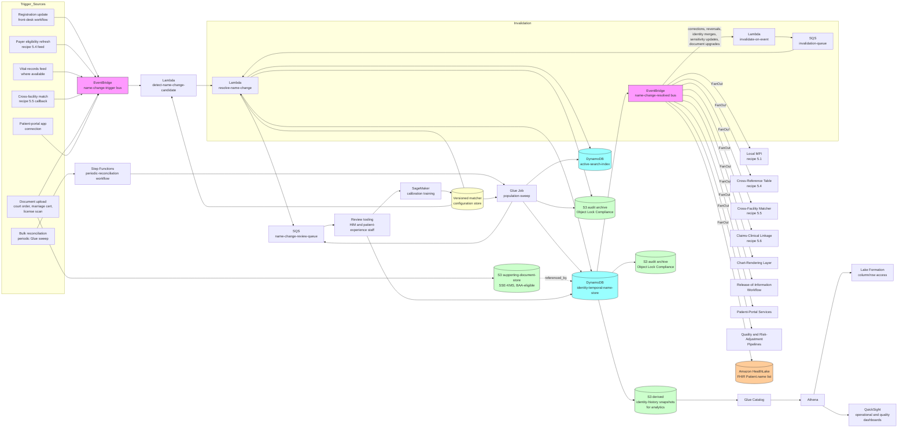

# Recipe 5.7: Longitudinal Patient Matching Across Name Changes ⭐⭐⭐⭐

**Complexity:** Complex · **Phase:** Production · **Estimated Cost:** ~$0.0001-0.001 per name-change resolution at population scale, dominated by review tooling and audit infrastructure rather than per-record fees (depends on the institution's name-change rate, the depth of historical retention, and the sensitivity-handling overhead the institution requires)

---

## The Problem

A nurse at the cancer infusion center is preparing a chemotherapy bag for the patient sitting in chair 4. She scans the patient's wristband, the EHR pulls up the chart, and the active medication list shows a regimen the nurse has never seen for this diagnosis. She clicks back through the chart looking for the consult note that started the regimen. The note is not there. She clicks into the imaging history. The most recent CT is from eight months ago. She knows the patient told her she had a CT three weeks ago at the same hospital. She clicks into the labs. The lab trend graph stops at a date six months ago and resumes a month ago, with a six-month gap that does not match what the patient just told her about her treatment. The patient sees the nurse's face and says, *I changed my name in March. I think some things got separated. The other nurse said it would be fine but every time I come in someone has to fix something.*

This is what longitudinal patient matching across name changes is for. The patient is one person. The records are one person's records. The matcher knows it. The historical chart that was created under the patient's prior name is sitting in the same database as the current chart that was created under her current name, and the two are tied together by a cross-reference that has been built precisely to handle this case. The chart-rendering layer in the EHR did not consult the cross-reference, or consulted it and applied it incorrectly, or consulted it and rendered the historical chart under the prior name without surfacing the linkage to the nurse, or consulted it and silently dropped the historical chart entirely because the match logic failed when the prior name was retired. Any of those failure modes is common in production. All of them produce the same outcome: the nurse, the patient, and the safety of the next infusion are at risk because the system that should have presented one continuous record presented a fragmented one.

The clinical-safety scenario is the dramatic one. It is far from the only one. Names change. People get married. People get divorced. People get remarried. People take a hyphenated name and then drop the hyphen. People legally change their name for any number of reasons. People go through gender transition and change their name (and sometimes their sex assigned at birth and their other demographic data) accordingly. People naturalize and change their family name to align with their adopted country's conventions. People with names from naming traditions that English-language registration systems do not handle well (Spanish double surnames, East Asian family-name-first conventions, Arabic patronymics, names with diacritics that the EHR strips on input) accumulate variations across years of registrations as different staff transcribe their names differently. People drop a suffix (Jr, Sr, II) when their parent dies. People reverse a suffix when they become a parent themselves. People who did not previously use a middle name start using one. People drop a previously-recorded middle name in favor of just an initial. People in the same family are co-registered with overlapping data fields and confused for each other in ways that name changes amplify.

Now multiply this across every patient in a population over a multi-decade horizon, and the longitudinal-matching problem looks less like an exception case and more like the operational substrate that the rest of the patient-matching infrastructure depends on. Recipe 5.1 (internal duplicate detection) treats name as one demographic feature among several. Recipe 5.4 (insurance eligibility matching) treats the demographic asymmetry between payer-side and provider-side names as a feature mismatch to be scored. Recipe 5.5 (cross-facility matching) treats the cross-organizational name variation as a tolerance to be calibrated. None of those recipes solves the name-change problem at its root. They handle the name-mismatch artifact with a tolerant matcher and assume the underlying continuous identity is stable. The continuous identity is what this recipe is about.

The harder versions of the question are everywhere:

You are running a women's health clinic that has been in continuous operation for forty years. A substantial fraction of your long-term patients have been seen for thirty or more years, and the lifetime name-change rate among them is over forty percent. <!-- TODO: confirm at time of build; lifetime name-change rates from marriage/divorce/legal-change vary widely by population and by region, with U.S. women historically experiencing markedly higher rates than men, but specific figures are study-dependent. --> You have charts on file from before the EHR was deployed (paper, scanned into PDF, indexed under the name on the chart at the time of scanning), charts created in the original EHR (which had no concept of prior names), charts migrated to the current EHR (which does have a prior-names field, but the migration did not always populate it), and charts created in the current EHR after the prior-names feature went live. The patient sitting in front of you today has charts in all four buckets, under three different names, and you need to be able to surface every relevant document the next time her oncologist queries the system.

You are running gender-affirming care services at an academic medical center. A patient who began care at age fifteen with a name and sex assigned at birth has, by the time she is twenty-two, formally changed her name (with court order), updated her sex on her driver's license and her insurance card, and asked the clinic to retire her prior name from any chart view that her current providers see. She still wants the clinical history (the labs, the imaging, the procedures) preserved and accessible to her current care team, because some of that history is medically relevant to her ongoing care. She does not want a covering provider, a new front-desk staff member, or a member of her family with limited access seeing her prior name unless there is a specific clinical or legal reason. The matching infrastructure has to make her two identities one record for the purposes of clinical continuity and zero records for the purposes of casual disclosure, and the access-control surface has to know which is which.

You are running a public-health agency that maintains a state immunization registry. Patients are submitted to the registry by every provider in the state, with the demographic data the provider had at the time of the visit. A patient who got her childhood vaccinations under her birth name and her adult booster shots under her married name appears as two registry entries under most matching configurations, and her care team gets a fragmented immunization record that may incorrectly suggest she is overdue for a series she has actually completed. The matcher has to recognize the same person across the name change without getting confused by family members (mother and daughter who share a last name and whose first names may be similar) or by other patients (someone with the daughter's first and last name combination who is not related).

You are running an oncology service line where the patient's longitudinal record carries treatment exposure history that affects every subsequent treatment decision. A patient who was treated for breast cancer at age forty-two under her maiden name, then re-presented at fifty-one with a recurrence after a marriage and name change, then re-presented at sixty-three with a metastatic disease workup under her remarried name, has three primary records with three name variants and one continuous treatment trajectory. Total cumulative anthracycline dose, total cumulative chest radiation, history of cardiotoxicity, hormone-receptor status, prior surgical margins. Every one of those data points lives in records that carry one of the three name variants, and missing any of them changes the treatment plan in ways that range from suboptimal to actively dangerous.

You are running insurance verification for an internal medicine practice that participates in a Medicare Advantage plan. A patient whose name on her Medicare card is "Mary Catherine Wilson" has been seeing the practice for fifteen years under "Mary Wilson" and her chart still says so. Her commercial insurance, before she aged into Medicare, was under "Mary C Wilson," and her old payer claims feed (which still drives some retroactive analytics) carries that variant. Her PCP knows her as Mary. The eligibility verification step at every visit has to reconcile the name across her Medicare member ID, her chart, and her active claim feed, and any analytics that combine her pre-Medicare and post-Medicare claims have to recognize the continuous identity across the name format change.

You are running quality measurement for an accountable-care organization. The HEDIS and CMS quality measures depend on a continuous longitudinal record per attributed patient. Patients who change their name between the measurement-year start and end (or who have changed it within the look-back window for measures with multi-year windows) accumulate two records in the underlying matching infrastructure unless the longitudinal matcher recognizes the change. Both records appear in the denominator of some measures and miss the numerator events that happened under the other name; the result is a quality-measurement number that is artificially low (the denominator includes both records, the numerator credits only one). At population scale, the cumulative undercount can move the institution's reported quality enough to affect contract performance.

You are operating a TEFCA QHIN. The query that comes in from a participating organization carries a name-and-DOB-and-address payload. Your matcher evaluates the query against your local population and finds a high-confidence match. The local record carries a prior-names list with three entries. The query payload's name matches one of the prior names but not the current name. The system has to decide whether to release the current data (which is under the current name), what to do about the prior-name match in the response (acknowledge the prior name as part of the match evidence, or filter it out), and how to record the audit trail in a way that respects the patient's autonomy over their own identity history. None of these are technical questions; all of them shape what your matcher and your release pipeline have to do.

You are doing outcomes research on a cohort that was defined in 2018 from claims and clinical data, and you are now refreshing the cohort in 2026 with eight years of additional follow-up. A non-trivial fraction of the original cohort has changed their name in the intervening eight years; some of those name changes were captured by the matchers running in the meantime, some were not. The 2026 refresh has to recognize the same patients across whatever name changes occurred and not double-count them in the cohort. The same is true for the comparison group, which has its own attrition and its own name-change events.

This is the recipe. Longitudinal patient matching across name changes is the entity-resolution problem of "given two records that may have different names but otherwise look like the same person, are they the same person, and if so, how do we represent the time-varying name in a way that preserves clinical continuity, supports the operational queries we need to run, respects the patient's autonomy over how their identity is presented, and survives the multi-decade lifecycle that healthcare data routinely operates over." The matching core is the same probabilistic-record-linkage stack from earlier recipes. Every layer above the core (the data model, the audit posture, the access controls, the review tooling, the operational discipline) is different.

It is in the complex tier because the technical problem is genuinely temporal (a record's name on a date in the past is one fact, a record's name today is a different fact, and the match has to operate over both), the consent-and-sensitivity layer is unavoidable (especially for gender-transition cases), the historical retrofit complexity is large (most institutions have years of data that pre-date their current name-change handling and need to be reconciled retroactively), and the failure modes range from clinical-safety to dignity-of-the-patient in ways that the earlier recipes did not encounter at the same intensity.

Let's get into how you build it.

---

## The Technology: Time-Aware Identity Resolution

### Why Names Are Not What You Think They Are

In recipe 5.1, a record's name is a string. The matcher compares it to another string and produces a similarity score. The score feeds the probabilistic combiner, which produces a match decision. That model works for the case where the two records were created close enough in time that the same name was current for both. The model breaks for the case where the two records were created at different times under different names that both belonged to the same person.

The fix is not a tolerance adjustment. The matcher cannot get smart enough to recognize "Catherine Wilson" and "Catherine Hernandez" as the same person on the basis of demographic data alone, because at the level of the matcher, those are two different names belonging to two people who happen to share other features, and the population is large enough that the matcher will routinely encounter actual pairs of people who match on those other features and have those names. The fix is to represent the patient's name as a time-varying attribute, with a history of name spans that each cover a date range, and to make every comparison aware of which name the patient was using during the interval the comparison record was created.

A patient is one identity. The identity has a current name. The identity has zero or more prior names, each with an effective span (the date range during which the prior name was current). The identity has zero or more aliases (alternative names that were never the legal name but appear in records anyway, like a hyphenated form recorded inconsistently or a nickname that was used in registration). The identity has zero or more sensitivity flags governing how the prior names may be displayed and to whom (the gender-transition case is the most common; the witness-protection case is the most extreme). The identity also has the standard demographic features that the rest of the matching infrastructure already uses: DOB (which is usually stable, with rare exceptions for refugees with reconstructed identities), sex assigned at birth (which is a separate field from current sex / gender, and which may be relevant or irrelevant depending on the use case), addresses (which change for their own reasons and feed recipe 5.3), phone numbers, SSN where collected, prior MRNs from systems the patient was previously in.

The matcher works against this temporal-identity model rather than against a flat name field. A new record arriving with name "Catherine Hernandez" matches against the identity's current name, against each prior name (with the comparison weighted by the temporal proximity of the prior name's span to the new record's encounter date), and against any aliases. The match score combines all of these comparisons, not just the comparison to the current name. A new record arriving with name "Catherine Wilson," dated five years ago, matches against whichever name was current for the identity five years ago (which might be "Wilson" if the change happened four years ago, in which case the comparison is to the current-as-of-then name and is a strong signal; or it might be the current name if the change happened more than five years ago, in which case the comparison is to a now-prior name and is also a strong signal; the temporal alignment is what makes the comparison work).

The model has implications beyond the matcher. The chart-rendering layer has to know which name to display for a historical document (the name the patient had when the document was created, the patient's current name, or both, depending on the audience and the sensitivity flags). The audit log has to record what name was used in what query, and which version of the identity's name history was active when the query was answered. The release-of-information process has to know which names to include when responding to an outside request, which to suppress (because of sensitivity flags or jurisdictional rules), and which to acknowledge in the cover letter without exposing them in the released documents. None of these decisions can be made by the matcher; the matcher produces the linkage, and the rendering, audit, and release layers consume it with awareness of its temporal structure.

### What the Time-Varying Name Model Has to Capture

A working model has at least seven dimensions that a flat name field does not.

**Effective span.** Each name (current or prior) has a from-date and a through-date, in the patient's reference frame. The current name's span is open-ended on the through-date. Prior names have a through-date that corresponds to when the change took effect (legally, administratively, or by patient self-report; the three may differ).

**Source.** The name change was reported by some entity. The patient (verbal or written self-report at registration). The patient's authorizing document (court order, marriage certificate, divorce decree). A payer's enrollment update (the patient updated her name on her insurance and the eligibility-verification step propagated it). A vital-records update (state vital-records data showing a name change event). A driver's-license verification (the new license was scanned and the matcher detected the change). The strength of the source matters for the matcher's confidence and for downstream audit. A self-reported change with no supporting document is weaker than a court order; both are valid; the matcher's behavior may differ.

**Authority and document references.** Where the source is a document, the document itself (or a reference to it) is part of the identity record. The court-order PDF is in the document store; the identity record points at it. The marriage certificate scan is in the document store; the identity record points at it. The audit trail can reach back to the supporting documents; the release-of-information process may need to disclose them or reference them depending on the request.

**Sensitivity classification.** Some name changes carry no special handling beyond audit. Others carry strong privacy preferences. The patient who changed her name through marriage may not care if her prior name is visible in the chart's name-history widget; the patient who changed her name as part of gender transition may have explicit preferences about who can see the prior name and under what circumstances. The model has to capture the patient's explicit preferences (default-display, restricted-display, masked-display, archive-only) and the system has to enforce them through the access-control layer.

**Cross-reference linkages.** The patient's identity may have prior MRNs in legacy systems that retired, prior member IDs at prior payers, prior employee IDs if she works for the institution. Each of those is part of the identity's history. The cross-reference table from recipe 5.4 (MRN to member ID) and the local-MPI from recipe 5.1 carry their own version of this; the longitudinal-name-change recipe coordinates with them so that a name change updates all the references atomically rather than orphaning some of them.

**Sex and gender as separate, time-varying fields.** The sex-assigned-at-birth is a stable biological attribute that does not change. The current sex / gender on the patient's records is administrative and may change. The chart-rendering layer and the matcher both need access to both, with the awareness that they are different things and that the matching uses the historical-as-of value, not the current value, for historical comparisons. <!-- TODO: confirm at time of build; the FHIR US Core implementation guide and various state-level requirements continue to clarify the data-model recommendations for sex-assigned-at-birth, current sex / gender identity, and gender-affirming care administrative needs. -->

<!-- TODO (TechWriter): Expert review A9 (MEDIUM). Architect the four-separate-fields data model from FHIR US Core (sex assigned at birth, current sex / gender identity, pronouns, legal sex on identity documents) as time-varying attributes on the identity record with their own effective-span histories mirroring the time-varying-name model. Specify how the matcher queries the historical-as-of-date value for each field when scoring against historical records; how the chart-rendering layer surfaces the appropriate set of fields for the as-of-date the disclosure is rendering for, with the access-control-envelope evaluation for the as-of-date sensitivity classification; and how a gender-transition name change typically produces a coordinated set of events (name change + current-sex-or-gender-identity update + pronouns update + legal-sex update where applicable + sensitivity-classification setting) processed as a transactional batch through the same TransactWriteItems-plus-outbox pattern as single-event resolutions. -->

**Reversibility and superseding events.** A name-change event can be reversed (a patient who changed her name and then divorced and reverted; a patient whose initial change was recorded incorrectly and was corrected). The model treats name changes as events with their own audit trail rather than as in-place updates to a current-name field. The current name is computed from the event history; superseding events update the computed view without losing the underlying history.

These seven dimensions are not optional. Every production-grade longitudinal-matching system handles all of them, and the gaps in any dimension show up in operational pain over the multi-decade lifecycle of healthcare data.

### Why It Is Harder Than It Sounds

Six structural reasons:

**Historical records often contain only the name that was current at the time, with no link to the present identity.** A chart created in 2009 carries a name that was current in 2009. The system that produced the chart did not know there would be a name change in 2014. The chart sits in the database, indexed under the 2009 name, and the matching infrastructure has to figure out (years later) that this 2009 chart belongs to the patient who is now indexed under the 2024 name. The matcher cannot rely on a forward pointer from the 2009 record to the 2024 identity, because the 2009 record was not aware the 2024 identity existed; it has to discover the linkage by retrospective analysis.

**Supporting documents are unavailable for many name changes.** A patient who self-reports at registration, "I changed my name when I got married, here's my new ID," may not produce the marriage certificate. The receptionist updates the record under the new name and (if the system supports it) records the prior name. The change has no supporting document on file. Years later, the patient appears at a different point in the system under just the new name, and the matcher has to resolve the historical records without a paper trail to confirm the change. The matcher's confidence has to handle the asymmetry between "well-documented change" and "self-reported, undocumented change."

**Family members are a strong confounder, more so than in non-temporal matching.** A name change moves a patient toward (or away from) a family member's name. A daughter who marries and takes her husband's last name now has a different last name from her mother (whom she previously matched closely). A son who is named after his father (Jr) drops the suffix when his father dies and now matches his deceased father's records more closely. A patient who divorces and reverts to her maiden name now has the same last name as her brother and the same first name as her sister-in-law's mother. The matcher has to maintain enough specificity not to merge across family members during these events, which is harder than the static-family-disambiguation case.

**Sensitivity and patient-autonomy considerations are not negotiable.** Gender-transition name changes are the prototypical case but not the only one. Patients in protective custody, patients fleeing intimate-partner violence, patients in witness protection, and patients who simply prefer not to have their prior identity visible all impose constraints on how the prior name may be presented. The architecture has to enforce the constraints at the rendering, audit, and release layers without making the matcher itself unable to find the linkage. The constraint is "the system knows the linkage; specific users may not know the linkage"; that distinction is operationally meaningful and architecturally non-trivial.

**Cross-organizational reach magnifies every failure mode.** Within one organization, a wrong name-change linkage produces an internal data error that the local matcher can review and correct. Across organizations, a wrong linkage propagated through the HIE or through TEFCA produces an exchange artifact that travels into other organizations' charts, and the original organization no longer controls it. Conservative thresholds and explicit reversibility are operationally necessary. The architecture has to be designed for the case where a linkage was wrong and has to be retracted from systems that have already consumed it.

**The retrofit problem is enormous.** Most institutions did not have a working time-varying-name model when they deployed their EHR. The early years of records carry only the name that was current at the time. The middle years may carry a partial prior-names list that was filled in inconsistently. The recent years carry a full history. Standing up the longitudinal-matching pipeline involves a one-time backfill that has to reconcile decades of records under whatever name conventions were in force at each point. The backfill is not a technical project; it is an organizational change-management project with technical scaffolding.

### Where the Field Has Moved

A few practical updates worth knowing:

**Gender-affirming care has become a first-class data-model concern.** Until recently, most EHR vendors treated sex as a single field with a small set of values. The current state-of-practice (and increasingly the regulatory expectation) is that sex assigned at birth, current sex / gender identity, pronouns, and legal sex on identity documents are four separate fields with their own update lifecycles. <!-- TODO: confirm at time of build; the FHIR US Core implementation guide and the ONC USCDI versioning continue to clarify the requirements; major EHR vendors have been updating their data models on a rolling basis. --> The longitudinal-name-change recipe sits adjacent to this evolution: a gender-transition name change is one event that intersects with the broader gender-identity data model, and the architecture has to coordinate.

**FHIR's `Patient.name` is a list, not a string.** The FHIR Patient resource models name as a list of HumanName resources, each of which has its own use code (official, usual, nickname, anonymous, old, maiden), period (effective span), and text-and-component representation. <!-- TODO: confirm at time of build; the FHIR R4 Patient resource is normative and the HumanName datatype has been stable for several versions. --> An institution that lands its data in a FHIR-native data lake gets the time-varying-name structure for free at the schema level; the matcher and the rendering layer still have to use it correctly. Most operational EHRs internally represent names with similar (if vendor-specific) structures, but the externalized representation is often a flat current-name field unless the integration explicitly preserves the history.

**State-level vital-records integration is uneven but growing.** State vital-records agencies maintain authoritative records of legal name changes through marriage, divorce, and court order. In some states the data is available to healthcare organizations through structured feeds (often through the public-health-reporting infrastructure); in others it is not directly available and the institution has to rely on patient self-report and document review. <!-- TODO: confirm at time of build; the state-level landscape varies; most states do not provide direct healthcare-organization access to vital-records-name-change data, but some have piloted programs. --> The recipe is designed to incorporate vital-records feeds where they exist and to operate without them where they do not.

**Information-blocking obligations apply here too.** The 21st Century Cures Act information-blocking provisions require that an institution provide a patient's records on request, regardless of which name the records were created under. Refusing to release records that exist under a prior name (or filtering them out of a release because the request specified the current name) is increasingly characterized as information blocking. The release-of-information process has to recognize the linkage without violating the patient's preferences about how their prior name is referenced; this is operationally subtle. <!-- TODO: confirm at time of build; the information-blocking exceptions and their applicability to name-change scenarios continue to be clarified through enforcement actions and FAQ guidance. -->

**Equity and disparity monitoring is increasingly specified.** Patient-matching equity research has consistently found that name-handling errors are not uniform across demographic groups. Names from naming traditions that English-language registration systems handle poorly (Spanish double surnames, Asian family-name-first conventions, Arabic patronymics, names with diacritics) accumulate variations at higher rates and produce more match errors. Patients who change their name (disproportionately women in many U.S. populations; transgender patients across all populations) experience more match errors than patients with stable names. The cohort-stratified accuracy monitoring that was built for recipes 5.1, 5.4, and 5.5 carries forward here, with name-change-specific cohort axes layered on top. <!-- TODO: confirm at time of build; the Pew, ONC, RAND, and Sequoia Project literature on patient-matching equity continues to expand. -->

**Patient-mediated identity is changing the data sources.** As the CMS Patient Access API and Patient-Facing-App ecosystems mature, the patient is increasingly the connecting tissue between their own records across organizations. A patient who has connected her records to a personal-health-record app under her current name can authorize the app to retrieve records from organizations that knew her under her prior name; the app does the linkage on her behalf, with her authentication serving as the strong identifier that supplements the demographic match. The patient-mediated path is becoming a real architectural pattern, particularly for the cross-organizational long-horizon case. <!-- TODO: confirm at time of build; the Patient Access API ecosystem has expanded substantially since the CMS Interoperability Final Rule went into effect, and patient-mediated linkage is increasingly viable. -->

---

## General Architecture Pattern

The pipeline has six logical stages: ingest the demographic update or new record, detect a candidate name-change event, evaluate the candidate against the patient's existing identity record, persist the temporal-name update with audit and sensitivity metadata, propagate the linkage to dependent stores, and react to events that supersede prior linkages (correction, reversal, identity merge, sensitivity-flag update).

```
┌────────────── INGEST ─────────────────────────────┐
│                                                    │
│  [Trigger sources]                                 │
│   - Registration update at the front desk          │
│     ("I changed my name; here's my new ID")       │
│   - Inbound payer eligibility refresh with        │
│     updated name                                   │
│   - Vital-records feed (where available)          │
│   - Cross-organizational match refresh            │
│     (recipe 5.5) carrying a name discrepancy      │
│   - Document upload: court order, marriage cert,  │
│     divorce decree, driver's license scan         │
│   - Patient-facing app connection (the patient    │
│     authenticated under her current name and      │
│     authorized retrieval from prior records)     │
│   - Bulk historical-records reconciliation         │
│     (one-time backfill or periodic refresh)      │
│           │                                        │
│           ▼                                        │
│  [Land the trigger record:                         │
│   - source_type, source_record_id                 │
│   - asserted_name (the new name in the trigger)   │
│   - asserted_change_date (if known)               │
│   - asserted_prior_name (if the trigger carried   │
│     one)                                          │
│   - supporting_document_reference (if any)       │
│   - patient_self_assertion_flag,                  │
│     authoritative_source_flag,                    │
│     consent_for_change_flag]                      │
│                                                    │
└────────────────────────────────────────────────────┘

┌────────────── DETECT ─────────────────────────────┐
│                                                    │
│  [Name-change candidate detection:                 │
│   - Direct case: trigger record explicitly         │
│     asserts a name change (the patient said so,   │
│     the document says so, the payer's update      │
│     event says so)                                 │
│   - Indirect case: trigger record has new name +  │
│     existing record has different name + other    │
│     demographics align strongly enough to suggest │
│     same identity                                  │
│   - Detection score combines:                     │
│       - Demographic-feature match strength on     │
│         non-name fields (DOB, address, phone,     │
│         SSN where present)                        │
│       - Name-pair plausibility (the new name      │
│         is a plausible legal-change variant of    │
│         the prior name: surname change with       │
│         shared first/middle, hyphenation, suffix  │
│         drop, transliteration variant)            │
│       - Source strength (a court-order document   │
│         beats a verbal patient assertion)         │
│       - Temporal plausibility (the asserted       │
│         change date is consistent with the        │
│         records' creation timeline)]              │
│           │                                        │
│           ▼                                        │
│  [Output: detection envelope including candidate  │
│   identity, asserted name change, evidence        │
│   summary, detection confidence]                   │
│                                                    │
└────────────────────────────────────────────────────┘

┌────────────── EVALUATE / RESOLVE ─────────────────┐
│                                                    │
│  [For each candidate identity:                     │
│   - Look up the existing temporal-name record     │
│   - Score the asserted change against:           │
│       - Existing current name and its span        │
│       - Existing prior names and their spans      │
│       - Existing aliases                          │
│       - Demographic features as of the assertion  │
│         date                                       │
│       - Document-source strength of any           │
│         supporting evidence                        │
│   - Apply confidence thresholds calibrated for    │
│     the name-change-specific scoring (separate    │
│     from the demographic-match thresholds in 5.1):│
│     - >= NAME_CHANGE_HIGH: confident name change; │
│       update the identity's temporal-name record │
│       atomically                                  │
│     - >= NAME_CHANGE_MED: probable change;       │
│       record as pending; surface to review        │
│       queue if patient-self-assertion alone      │
│       (no document)                               │
│     - <= NAME_CHANGE_REJECT: not a name change;   │
│       likely a different person matching some    │
│       features                                    │
│     - in between: name-change review queue;       │
│       hold the assertion in pending state]       │
│           │                                        │
│           ▼                                        │
│  [Output: change resolution decision and         │
│   pending-state envelope, with all evidence       │
│   preserved for audit and review]                 │
│                                                    │
└────────────────────────────────────────────────────┘

┌────────────── SENSITIVITY + CONSENT ──────────────┐
│                                                    │
│  [Apply patient-preference and policy filters:    │
│   - Patient preferences for prior-name display    │
│     (default-display, restricted-display,         │
│     masked-display, archive-only)                 │
│   - Sensitivity classification of the name        │
│     change (gender-affirming, protective-custody, │
│     intimate-partner-violence relocation, none)  │
│   - Default access scope for the prior name      │
│     (treatment, payment, operations, research,    │
│     patient-access-API release; some scopes may  │
│     be blocked entirely for restricted classes)  │
│   - Cohort/jurisdiction policy overlays (state    │
│     law, institutional policy, HIE participation │
│     agreement constraints)]                      │
│           │                                        │
│           ▼                                        │
│  [Output: access-control envelope on the prior    │
│   name and on the linkage itself]                 │
│                                                    │
└────────────────────────────────────────────────────┘

┌────────────── PERSIST + AUDIT ────────────────────┐
│                                                    │
│  [Identity record:                                  │
│   - identity_id (the institution's stable          │
│     internal patient identifier)                   │
│   - current_name (with effective_from)             │
│   - prior_names (each with effective_from,         │
│     effective_through, source, document_ref,      │
│     sensitivity_class)                             │
│   - aliases (with same metadata)                   │
│   - linked_local_mrns (current and historical)    │
│   - linked_member_ids (current and historical)    │
│   - sex_assigned_at_birth (stable)                 │
│   - current_sex_or_gender (with history)           │
│   - access_control_envelope on each prior name    │
│   - resolved_at, resolved_by, source_record_id]   │
│           │                                        │
│           ▼                                        │
│  [Audit log entry for every change: who/what       │
│   asserted the change, what evidence supported    │
│   it, what threshold tier the decision fell in,   │
│   what prior identity state was superseded]      │
│           │                                        │
│           ▼                                        │
│  [Emit identity_name_change_resolved event for     │
│   downstream consumers]                            │
│                                                    │
└────────────────────────────────────────────────────┘

┌────────────── PROPAGATE ──────────────────────────┐
│                                                    │
│  [Subscribe consumers update their derived state:  │
│   - Local MPI (recipe 5.1) updates the patient's │
│     master record                                  │
│   - Cross-reference table (recipe 5.4) updates    │
│     MRN-to-member-ID mappings if changed          │
│   - Cross-facility matcher (recipe 5.5) refreshes │
│     prior-name handling for query responses       │
│   - Claims-clinical linkage (recipe 5.6) re-      │
│     evaluates encounter clusters whose patient   │
│     resolution depended on the name              │
│   - Chart-rendering layer refreshes its name-    │
│     display logic                                  │
│   - Release-of-information workflows incorporate  │
│     the updated name history                       │
│   - Quality-measurement and risk-adjustment       │
│     pipelines deduplicate the records under the  │
│     unified identity                              │
│   - Care-coordination and patient-portal          │
│     services pick up the change]                  │
│                                                    │
└────────────────────────────────────────────────────┘

┌────────────── INVALIDATION / SUPERSEDE ───────────┐
│                                                    │
│  [Subscribe to events that supersede prior        │
│   resolutions:                                     │
│   - Correction event (the change was recorded     │
│     incorrectly; a court order was misread; a    │
│     reviewer overturned an automated decision)   │
│   - Reversal event (the patient changed back; a   │
│     marriage was annulled; an interim change     │
│     was rolled back)                              │
│   - Identity merge from recipe 5.1 (two           │
│     identities are now one; both name histories   │
│     fold into the surviving identity)             │
│   - Identity unmerge (a wrong merge is being     │
│     reversed; name history splits accordingly)   │
│   - Sensitivity-class update (the patient's      │
│     preference for prior-name display has         │
│     changed)                                      │
│   - Document-strength upgrade (a previously      │
│     self-reported change is now backed by a      │
│     supporting document)                           │
│   - Cross-organizational match invalidation      │
│     (recipe 5.5 retracted a linkage that         │
│     affected the prior-name handling)]           │
│           │                                        │
│           ▼                                        │
│  [Re-evaluate the affected identity records;      │
│   emit identity_name_change_invalidated events    │
│   so propagation consumers refresh accordingly]  │
│                                                    │
└────────────────────────────────────────────────────┘
```

**The detection step is the load-bearing addition versus recipe 5.1.** A flat-name matcher does not need a name-change detector because it treats every name as the value-of-the-day. The temporal model needs an explicit detector because the addition of a new name to an existing identity is structurally different from a new record matching an existing identity. The detector handles both the direct case (an explicit assertion of a name change) and the indirect case (a high-demographic-match record arriving with a different name from the matched identity). The indirect case is the dominant operational path and is the one that institutions tend to under-invest in.

**Threshold calibration is name-change-specific.** Re-using the recipe 5.1 thresholds for name-change decisions produces either too many false-merges (the threshold was calibrated for new-record-vs-existing comparisons where the names usually match, and a name-changed comparison fails it) or too many missed name changes (the threshold is loose enough that name changes get accepted, but the matcher then over-merges across family members or across actual different patients with similar features). The right thresholds for name-change events are derived from a separate calibration set that includes confirmed name-change events, near-miss family-disambiguation cases, and known-incorrect linkages. Same chapter pattern as 5.1, 5.4, 5.5; the parameters and the gold-set composition differ.

**Sensitivity classification is set per-event, not per-identity.** A patient may have multiple name changes over a lifetime, with different sensitivity classifications for each. A divorce that reverts to a maiden name may have no special sensitivity, while a subsequent legal name change associated with gender transition has explicit privacy preferences. The model carries the classification at the prior-name level, not at the identity level, because a single identity can have prior names with different sensitivity treatments.

**Access controls operate on the prior name, not on the identity.** The architecture assumes that the system always knows the linkage between current and prior names; specific users may or may not see the prior name based on their role, the sensitivity classification, the access purpose, and the patient's preferences. Hiding the linkage from the system itself defeats the matcher's job; hiding the prior name from the user surface is a presentation-and-access-control concern. The two are distinct. Same chapter pattern as 5.5's sensitivity-filter approach.

**Patient-self-assertion is a valid source but a weaker one.** The matcher accepts patient-self-assertion as a source for name-change events but treats it differently from document-backed assertions. Self-assertion alone may be enough for high-confidence resolution when the demographic features otherwise match strongly and there is no conflicting evidence; it may not be enough when the demographic match is medium-confidence or when there is conflicting evidence (a prior payer record under a different name with no overlap). The architecture supports a pending state for self-asserted changes and a confirmation pathway when supporting documents are eventually provided.

**Document evidence has its own retention.** When a court-order PDF or marriage-certificate scan is provided as supporting evidence for a name change, the document itself goes into the institution's document store with its own retention and access-control posture, and the identity record points at it. The retention floor for these documents is typically the longer of the institution's general medical-records retention and the regulatory floor for identity-related documents. The audit trail on the identity record references the document; the document itself is not duplicated into the identity record.

**Reversibility is not a feature; it is the architecture.** A name-change event can be wrong, and the architecture has to support cleanly retracting it. The temporal-name record carries an event history, not just a current state; superseding events update the computed view without losing the underlying history; downstream consumers receive invalidation events that allow them to refresh derived state. Skip the reversibility pathway and a wrong name change becomes a permanent data corruption that the organization cannot fully clean up. <!-- The reversibility pathway is the same pattern as the audit-and-unmerge pathway in recipe 5.1; the difference here is that name changes are more frequent than full identity merges and the reversibility has to be operational on a routine basis. -->

**Cohort-stratified accuracy monitoring applies here too.** Name-change handling accuracy is not uniform across patient cohorts. Patients with names from non-dominant-culture naming traditions experience more matcher errors. Transgender patients experience higher rates of operational friction that affect care experience even when the matcher itself is technically correct. Per-cohort match-rate, per-cohort error-rate, and per-cohort review-queue-aging are the right metrics; per-cohort thresholds and disparity alarms are the right monitoring.

<!-- TODO (TechWriter): Expert review A1 (HIGH). Promote cohort-stratified accuracy monitoring into a paragraph specifying: cohort axes (name-tradition cohort, transgender-or-gender-diverse cohort with patient-consented self-identification only, name-change-frequency cohort, age-of-name-change cohort); per-cohort metrics and cadence (name-change detection rate weekly, name-change false-acceptance rate weekly, review-queue aging weekly, sampled error rate monthly); disparity calculation as absolute difference between best-rate and worst-rate cohort per metric per cycle; alarm thresholds (detection-rate disparity > 0.05 = MEDIUM, false-acceptance-rate disparity > 0.01 = HIGH); routing to analytics governance committee, equity-monitoring committee, and patient-experience-and-dignity committee with 5-business-day SLA; remediation pathway with explicit dignity-stakes-disparity translation (cohort-disparity metrics in this recipe measure how disparately one cohort's patients experience friction in registration, clinical-record-rendering, and release-of-information workflows). Same chapter pattern as 5.1, 5.4, 5.5 cohort monitoring. -->

---

## The AWS Implementation

### Why These Services

**Amazon DynamoDB for the temporal-identity store.** The longitudinal-name-change recipe is fundamentally a record-keeping problem on top of an entity-resolution problem. The identity record (with its current name, prior names, aliases, sensitivity classifications, supporting-document references, and audit-event history) is read on every chart-rendering, every cross-facility match, every release-of-information request, and every analytics pipeline that needs to deduplicate across name variants. DynamoDB's low-latency item reads support those operational paths, and the table's keying scheme (`identity_id` as partition key, with name-event versions as sort-key items under the identity) supports point-in-time queries for "what was this patient's name as of date X." A second table holds the active-search index for matcher input (current-name and prior-name lookups for incoming records); the search index is rebuilt from the canonical identity store on every change.

**Amazon S3 for the supporting-document store and the audit archive.** Court orders, marriage certificates, divorce decrees, driver's-license scans, and patient-signed attestations all land in S3 with SSE-KMS encryption and Object Lock in Compliance mode for the audit-archive bucket. The retention floor is typically the longer of the institution's general medical-records retention, the document-specific retention floor where applicable, and the regulatory retention floor for identity-related records. The identity record in DynamoDB points at the S3 object; the document itself is not duplicated.

**AWS Glue and Apache Spark for the historical backfill and periodic reconciliation.** Standing up the longitudinal-matching pipeline involves a one-time backfill that re-evaluates years of historical records against whatever name-change evidence is available, and the periodic reconciliation re-runs the matcher across the population to catch name changes that the front-line registration workflow missed. Both are bulk-batch operations over hundreds of thousands to tens of millions of records, and Spark on Glue is the right substrate for the workload pattern. <!-- TODO (TechWriter): Periodic reconciliation cadence is institutionally specific; typical cadence is monthly for the cross-organizational reconciliation and quarterly for the full retrospective sweep. -->

**AWS Lambda for the per-event detection and resolution path.** When a registration update arrives with a different name from the existing identity, when a payer-eligibility refresh detects a name discrepancy, when a vital-records feed delivers a name-change event, when a document upload provides supporting evidence, the per-event Lambda invokes the detector, the resolver, and the persistence step on a single identity. Each invocation is in VPC with VPC endpoints for downstream services. The bulk Glue jobs handle the population-scale work; the Lambdas handle the operational stream.

**Amazon SageMaker for the matcher calibration.** The name-change-specific Fellegi-Sunter weights, the per-feature thresholds, the name-pair-plausibility scoring (which pairs of names are plausibly a legal-change variant of one another), and the temporal-tolerance values are calibrated against an institutional gold set. The calibration runs as a SageMaker training job over the historical name-change records, produces a candidate configuration set, and emits the metrics the institutional review committee uses to decide on promotion. SageMaker Processing jobs run the cohort-stratified accuracy reports.

**Amazon SQS for the review queue and the propagation queue.** Two queues: a name-change review queue (for self-asserted-without-document changes that fall in the medium-confidence band, and for indirect-detection cases below the auto-resolve threshold) and a propagation queue (for fanning out resolved name-change events to downstream consumers that maintain derived state). Separating the queues lets the operational pipeline absorb bursts (a bulk vital-records feed delivery) without delaying the higher-priority review flow.

**AWS Step Functions for orchestration.** Three workflows: a per-event resolution workflow (detect, evaluate, persist, propagate), a periodic reconciliation workflow (sweep the population looking for name-change candidates that the per-event flow missed), and an invalidation workflow (subscribe to superseding events and selectively re-resolve). The state machine handles retries, error routing to DLQs, and parallel execution where the dependency graph allows.

**Amazon EventBridge for the cross-recipe events.** When a name change is resolved (`identity_name_change_resolved`), when a name change is invalidated (`identity_name_change_invalidated`), when a sensitivity classification is updated (`identity_sensitivity_updated`), an event flows out to the local MPI (recipe 5.1), the cross-reference table (recipe 5.4), the cross-facility matcher (recipe 5.5), the claims-clinical linkage (recipe 5.6), the chart-rendering layer, the release-of-information workflow, and the patient-portal services. EventBridge rules route events to the right consumer, with DLQs for failed deliveries.

<!-- TODO (TechWriter): Expert review A6 (MEDIUM). Specify the chapter-wide event-schema contract: each event carries `source`, `detail_type`, `detail.identity_id`, `detail.event_id`, `detail.previous_state`, `detail.new_state`, `detail.detected_at`, `detail.matcher_config_version`, `detail.evidence_summary`, `detail.sensitivity_class`, and `detail.access_control_envelope_id` plus `detail.access_control_envelope_version`. Specify access-control-envelope-aware routing with two channels (standard for non-restricted classes, restricted for sensitivity-classified events with reduced consumer fan-out). Downstream consumers acknowledge processing via a CloudWatch metric. Same chapter pattern as 5.5, 5.6. -->

**Amazon HealthLake for the FHIR-native rendering view.** Where the institution stores clinical resources in HealthLake, the longitudinal-name-change recipe writes the patient's name history into the FHIR Patient resource's `name` list (with `use` codes of `official`, `usual`, `old`, `maiden`, etc., and `period` to capture the effective span). The chart-rendering layer reads the FHIR Patient resource and applies the institution's display rules (current-name primary, prior-name suppression for restricted classes, prior-name display for treatment use cases). <!-- TODO: confirm at time of build; HealthLake's support for the FHIR Patient resource and the HumanName datatype's `use` and `period` fields continue to be refined. -->

**AWS Lake Formation for column-level and row-level access control on the identity store's analytics surface.** Different audiences see different views. Treatment-context users see the current name with the prior-name display governed by the sensitivity classification. Operations users see the linkage but a constrained view of the prior names. Research users (for de-identified analytics) see the linked identity with no name detail at all. Lake Formation grants enforce the row-and-column distinctions; Athena query paths use the same grants. Same chapter pattern as 5.2, 5.3, 5.4, 5.5, 5.6.

**AWS KMS, CloudTrail, CloudWatch.** Customer-managed keys for the identity store, the supporting-document bucket, the audit archive, and the Lambda log groups. CloudTrail data events on the identity table and the audit-archive bucket. CloudWatch alarms on review-queue depth and aging, on detection-rate drops (sudden drops are usually a data-source outage), on cohort-stratified disparities, and on invalidation backlog depth. Same chapter pattern as 5.1, 5.4, 5.5, 5.6.

**Amazon QuickSight for operational and quality dashboards.** Per-cohort name-change-detection rate, per-cohort review-queue depth and aging, per-source name-change rate (registration-asserted, payer-asserted, vital-records-asserted, document-asserted), time-to-resolve distribution (how long does a self-asserted change sit in pending state before a supporting document arrives), audit-volume trends, and per-jurisdiction policy-overlay activity.

### Architecture Diagram



### Prerequisites

| Requirement | Details |
|-------------|---------|
| **AWS Services** | Amazon DynamoDB, Amazon S3, AWS Glue, Apache Spark on Glue, AWS Lambda, AWS Step Functions, Amazon EventBridge, Amazon SQS, Amazon SageMaker, Amazon Athena, AWS Lake Formation, Amazon HealthLake (where used for FHIR-native rendering), Amazon QuickSight, AWS KMS, Amazon CloudWatch, AWS CloudTrail. |
| **External Inputs** | Trigger sources: registration system updates, payer eligibility refresh feeds (output of recipe 5.4), state vital-records feeds where contractually available, cross-facility match callbacks (output of recipe 5.5), document uploads (court orders, marriage certificates, divorce decrees, driver's-license scans), patient-portal app connections, bulk historical reconciliation runs. Cross-recipe dependencies: the local MPI from recipe 5.1, the address standardization from recipe 5.3, the eligibility cross-reference from recipe 5.4. Reference data: name-pair-plausibility models (which pairs of names are plausible legal-change variants of one another), nickname dictionaries, transliteration mappings, jurisdiction-specific naming-convention rules. <!-- TODO: confirm at time of build; commercial name-data providers (Melissa Data, RecordLinkage / Splink communities, OHDSI vocabulary) and open-source nickname dictionaries (Anc.NicknameAndDiminutiveNamesLookup) all play roles in the reference-data sourcing. --> |
| **IAM Permissions** | Per-Lambda least-privilege: scoped `dynamodb:GetItem` / `PutItem` / `UpdateItem` / `Query` on the identity-temporal-name and active-search-index tables, `s3:GetObject` / `PutObject` on specific bucket prefixes for the supporting-document and audit-archive buckets, `events:PutEvents` on the name-change-resolved bus, `kms:Decrypt` on relevant CMKs, `sqs:SendMessage` on the review and propagation queues. The persistence Lambda has append-only permissions on the identity-event history (no delete) enforced through IAM condition keys plus DynamoDB resource-based policy. SageMaker training jobs have read access to the curated identity-store snapshots and write access to a model-artifacts bucket. Per-Glue-job execution-role binding so Step Functions invokes only the role appropriate for the current pipeline stage. Never use `*` actions or `*` resources in production. <!-- TODO (TechWriter): Expert review S1 (HIGH). Specify identity-boundary requirements at the architectural level for every consequential path: (1) per-event detection / resolution Lambda receives a producer-signed envelope (`source_system`, `source_record_id`, `event_id`, `signed_payload`, `signature`) with consumer-side signature validation against rotated producer keys and per-source allow-lists; (2) patient-portal-app trigger source uses a separate Cognito-federated authentication path with the patient's own credentials, per-patient authorization-to-identity-id binding at the Lambda authorizer (one patient cannot drive identity-update events for unrelated patients), per-patient rate limits, and explicit "patient-mediated" audit attribution; (3) vital-records feed uses per-agency mTLS authentication with producer-signed envelopes; (4) document-upload trigger source carries a per-document provenance chain (uploader identity, upload timestamp, document hash, extraction-engine version and confidence) with dual-control routing when extraction confidence is below the auto-resolve threshold; (5) sensitivity-class-update path requires dual-control for downgrades (two reviewer signatures from the patient-experience-and-dignity committee for staff-initiated; patient re-authentication for patient-initiated) with explicit forward-only-disclosure-update framing; (6) invalidation Lambda enforces per-event-source allow-lists tying each invalidation event type to the originating Lambda role; (7) read API uses API Gateway with WAF, mTLS for system clients, per-caller authorization-to-identity-id binding, and sensitivity-aware response shaping; (8) cross-recipe EventBridge fan-out validates producer-signed envelopes at consumers and applies access-control-envelope-aware routing. Pair with scoped resource ARNs for the highest-stakes actions: `dynamodb:UpdateItem` on `arn:aws:dynamodb:<region>:<account>:table/identity-temporal-name`; `s3:PutObject` on `arn:aws:s3:::<env>-supporting-documents/<patient_id_hash>/*`; `events:PutEvents` on `arn:aws:events:<region>:<account>:event-bus/name-change-resolved`. Same chapter pattern as 5.1, 5.4, 5.5, 5.6 with recipe-specific patient-portal-app authentication and sensitivity-class-update dual-control elevation. --> |
| **BAA and Trust Framework** | AWS BAA signed. Vital-records feeds (where available) operate under state-level data-use agreements that constrain how the data may be used and retained. Patient-self-asserted name changes carry the patient's consent for the change itself but do not, alone, authorize disclosure of the prior name to all downstream consumers. Sensitivity classification (gender-affirming, protective-custody, intimate-partner-violence) carries explicit patient preferences enforced at the access-control layer. <!-- TODO (TechWriter): Expert review S3 (MEDIUM, partial). Specify per-event consent metadata captured at intake: patient-consent-for-change scope (the patient consented to the change being recorded), patient-consent-for-prior-name-display scope (the patient's preferences for who may see the prior name and under what circumstances), jurisdictional overlays (state law on prior-name disclosure, particularly post-Dobbs reproductive-health-care state laws and post-Bostock employment-context implications). --> |
| **Encryption** | Identity-temporal-name DynamoDB: customer-managed KMS at rest. Active-search-index DynamoDB: customer-managed KMS at rest. Supporting-document S3 bucket: SSE-KMS with bucket-level keys, restricted access policy, Object Lock optional based on document type. Audit-archive S3 bucket: SSE-KMS with bucket-level keys, Object Lock in Compliance mode. Glue temp storage: KMS-encrypted. Lambda log groups: KMS-encrypted. SageMaker: KMS-encrypted volumes and outputs. EventBridge and SQS: server-side encryption. TLS 1.2 or higher for all in-transit traffic. |
| **VPC** | Production: Lambdas in VPC. Glue jobs in VPC connections. SageMaker training in VPC. VPC endpoints for DynamoDB, S3, KMS, Secrets Manager, CloudWatch Logs, EventBridge, SQS, Step Functions, Glue, Athena, STS, SageMaker. NAT Gateway for outbound HTTPS to vital-records partner endpoints with an outbound proxy and an allow-list; PrivateLink where the partner offers it. <!-- TODO (TechWriter): Expert review N1 (LOW). Networking pattern from 5.3, 5.4, 5.5, 5.6: vital-records feeds and document-source partner connections as distinct outbound proxy rules with non-overlapping allow-lists scoped to compute roles; per-role rate limits below the partner's published rate limits; egress connections CloudWatch-logged for forensic auditing. The patient-portal-app trigger source is exempt from the partner-allow-list pattern (it authenticates inbound rather than outbound) but has its own per-patient rate-limit enforcement at the API Gateway layer. --> |
| **CloudTrail** | Enabled with data events on the identity-temporal-name table, the active-search-index table, the supporting-document S3 bucket, and the audit-archive S3 bucket. Glue job runs and SageMaker training runs logged. CloudTrail logs encrypted with KMS and retained per the regulatory floor. <!-- TODO (TechWriter): Expert review S2 (MEDIUM). Replace "per the regulatory floor" with explicit retention posture (longest of HIPAA records-retention 7-year minimum, state medical-records-retention, identity-document retention floor where applicable typically 10+ years for court orders / marriage certificates / divorce decrees, research IRB retention where the linkage feeds an IRB-approved research substrate). For sensitivity-classified events (GENDER_AFFIRMING, PROTECTIVE_CUSTODY, IPV_RELOCATION, WITNESS_PROTECTION, PATIENT_REQUESTED_RESTRICTED), audit logs in a separately access-controlled bucket with an additional 5-year retention floor and forwarded to a dedicated audit AWS account. Audit logs in a dedicated S3 bucket with Object Lock in Compliance mode and lifecycle to S3 Glacier Deep Archive after 90 days; CloudTrail data events forwarded to a dedicated audit AWS account. Same chapter pattern as 5.1, 5.4, 5.5, 5.6. --> |
| **Reference Data and Name-Plausibility Models** | A versioned reference-data store with: nickname-and-diminutive dictionaries; transliteration mappings for non-Latin scripts and diacritic handling; surname-change-pattern models (hyphenation, suffix drop, maiden-to-married, transliteration variants); naming-tradition rules (Spanish double surnames, East Asian family-name-first conventions, Arabic patronymics); per-jurisdiction policy overlays. The reference data refreshes on a regular cadence and is versioned so each name-change resolution references the model versions active at the time. |
| **Sample Data** | Use synthetic patient populations that include modeled name changes with diverse name-tradition representation. Synthea generates synthetic patient populations; extending Synthea to inject name-change events with timestamped supporting-document references is feasible. <!-- TODO: confirm at time of build; Synthea's name-change modeling capabilities and the available extensions for name-tradition diversity continue to develop. --> Never use real PHI in development environments. |
| **Cost Estimate** | At an institution with one million active patients and a name-change rate of approximately 2-4 percent per year (the rate varies considerably by population): DynamoDB for the identity-temporal-name and active-search-index tables typically $200-1,000 per month; S3 for supporting-document storage and audit archive typically $200-800 per month at multi-year retention; Glue compute for periodic reconciliation typically $500-2,500 per month; Lambda compute for per-event processing typically $100-500 per month; SageMaker calibration jobs typically $100-400 per month; Athena, QuickSight, EventBridge, SQS, Step Functions, KMS in aggregate typically $200-700 per month. Total AWS infrastructure typically $1,300-5,900 per month, dominated by Glue periodic reconciliation and DynamoDB. <!-- TODO: replace with verified, current pricing once the implementing team validates against the AWS Pricing Calculator. --> |

### Ingredients

| AWS Service | Role |
|------------|------|
| **Amazon DynamoDB** | Identity-temporal-name store (current name, prior names, aliases, sensitivity classifications, audit-event history); active-search-index for matcher input lookups |
| **Amazon S3** | Supporting-document store (court orders, marriage certificates, license scans), audit-archive bucket (Object Lock in Compliance mode), derived-zone snapshots for analytics |
| **AWS Glue and Apache Spark** | Periodic-reconciliation Glue jobs that sweep the population for name-change candidates, historical-backfill jobs that retroactively reconcile pre-existing records |
| **AWS Lambda** | Per-event detection (`detect-name-change-candidate`), per-event resolution (`resolve-name-change`), invalidation handling (`invalidate-on-event`), read API for downstream consumers |
| **AWS Step Functions** | Orchestrates per-event resolution, periodic reconciliation, and invalidation workflows |
| **Amazon EventBridge** | Trigger-input bus for raw name-change-candidate events; resolved-output bus for fanning out resolutions to local MPI (5.1), cross-reference table (5.4), cross-facility matcher (5.5), claims-clinical linkage (5.6), chart-rendering, release-of-information, patient-portal, and analytics consumers |
| **Amazon SQS** | Buffers name-change review queue (medium-confidence cases) and propagation queue (downstream consumer fan-out) on separate queues |
| **Amazon SageMaker** | Matcher calibration over historical name-change records, name-pair-plausibility model training, cohort-stratified accuracy reports |
| **Amazon HealthLake** | FHIR-native rendering target where the institution stores clinical resources in HealthLake; the FHIR Patient resource's `name` list with `use` and `period` fields holds the time-varying name |
| **Amazon Athena and AWS Glue Data Catalog** | SQL access to the identity-history derived snapshots for analytics, quality measurement, equity monitoring, audit reporting |
| **AWS Lake Formation** | Column-level and row-level access controls for the differentiated audiences (treatment, operations, research, audit) |
| **Amazon QuickSight** | Operational and quality dashboards (per-cohort detection rate, per-cohort review-queue depth and aging, per-source name-change rate, time-to-resolve distribution, audit-volume trends) |
| **AWS KMS** | Customer-managed encryption keys for all identity data stores and supporting documents |
| **Amazon CloudWatch** | Operational metrics and alarms (review-queue depth and aging, detection-rate drops, cohort-stratified disparities, invalidation backlog) |
| **AWS CloudTrail** | Audit logging for all API calls on the identity table, the active-search-index, the supporting-document bucket, and the audit-archive bucket |

---

### Code

> **Reference implementations:** Useful libraries and patterns for this recipe:
> - [Splink](https://github.com/moj-analytical-services/splink): an open-source probabilistic record linkage library with strong support for time-aware comparisons; the underlying Fellegi-Sunter math powers most of what the matcher does.
> - [`recordlinkage`](https://github.com/J535D165/recordlinkage): a Python toolkit for record linkage; useful for the candidate-generation and similarity-scoring steps.
> - [`jellyfish`](https://github.com/jamesturk/jellyfish): a Python library for approximate string matching and phonetic encoding; the workhorse for name-similarity scoring.
> - [Anc.NicknameAndDiminutiveNamesLookup](https://github.com/onyxrev/common_nickname_csv): a community-maintained nickname-and-diminutive lookup; a starting point for nickname-aware name comparison. <!-- TODO: confirm current URL at time of build; community-maintained nickname dictionaries change repositories occasionally. -->
> - The [HL7 FHIR Patient resource](https://www.hl7.org/fhir/patient.html) and the [HumanName datatype](https://www.hl7.org/fhir/datatypes.html#HumanName): the standards-based representation of the time-varying-name model.

#### Walkthrough

**Step 1: Detect a name-change candidate from the trigger event.** Every operational path that produces a name discrepancy goes through detection first. A registration update with a new name, a payer eligibility refresh with an updated name, a vital-records feed event, a cross-facility match callback that surfaced a different name on the responding side. The detector classifies the trigger as direct (an explicit name-change assertion) or indirect (a high-demographic-match arriving with a different name from the matched identity), pulls the candidate identity record, and produces a detection envelope. Skip the detection step and you treat every name discrepancy as a potential new identity, which over-creates duplicate records and corrupts the longitudinal continuity the recipe is supposed to maintain.

```
FUNCTION detect_name_change_candidate(trigger_event):
    // Extract the asserted name and any change metadata
    // from the trigger. Different sources carry different
    // structure; normalize to a canonical assertion.
    asserted_name = extract_asserted_name(trigger_event)
    asserted_change_date = extract_change_date(trigger_event)
        // May be NULL for indirect cases.
    asserted_prior_name = extract_prior_name(trigger_event)
        // May be NULL.
    supporting_document_ref = extract_document_ref(trigger_event)
        // May be NULL.
    source_strength = classify_source_strength(trigger_event.source_type)
        // Court order: STRONG. Marriage cert: STRONG.
        // Vital records: STRONG. Payer update: MEDIUM.
        // Patient self-assertion at registration: MEDIUM-WEAK.
        // Cross-facility match callback: MEDIUM-WEAK.
        // Indirect detection alone: WEAK.

    // Step 1A: identify the candidate identity. Different
    // trigger sources reference the patient differently; the
    // candidate-identity lookup walks through the available
    // identifiers in priority order.
    candidate_identity = NULL

    IF trigger_event.local_patient_id IS NOT NULL:
        // Direct reference to an existing identity.
        candidate_identity = identity_store.get_by_local_patient_id(
            trigger_event.local_patient_id)

    IF candidate_identity IS NULL
       AND trigger_event.member_id IS NOT NULL
       AND trigger_event.payer_id IS NOT NULL:
        // Lookup via the cross-reference table from recipe 5.4.
        cross_ref = cross_reference_table.lookup_by(
            payer_id=trigger_event.payer_id,
            member_id=trigger_event.member_id,
            as_of=trigger_event.event_date)
        IF cross_ref IS NOT NULL:
            candidate_identity = identity_store.get_by_local_patient_id(
                cross_ref.local_patient_id)

    IF candidate_identity IS NULL
       AND asserted_prior_name IS NOT NULL:
        // The trigger asserted an explicit prior name; look
        // up the identity by the prior name plus other
        // demographic features.
        candidate_identity = identity_store.search_by_name_and_demographics(
            name=asserted_prior_name,
            demographics=trigger_event.demographics,
            as_of=trigger_event.event_date)

    IF candidate_identity IS NULL:
        // No candidate found via direct references. Run a
        // demographic-based search using the asserted name
        // plus other features. This is the indirect-detection
        // path; the search is broader and the threshold for
        // accepting a candidate is higher.
        candidate_identity = identity_store.search_by_name_and_demographics(
            name=asserted_name,
            demographics=trigger_event.demographics,
            as_of=trigger_event.event_date,
            tolerance="indirect_search")

    IF candidate_identity IS NULL:
        // Genuinely no candidate; this is a new identity, not
        // a name change. Hand off to recipe 5.1's new-record
        // path.
        RETURN {
            classification: "NO_EXISTING_IDENTITY",
            handoff_to: "new_record_path_recipe_5_1"
        }

    // Step 1B: classify direct vs indirect.
    IF asserted_prior_name IS NOT NULL OR
       asserted_change_date IS NOT NULL OR
       supporting_document_ref IS NOT NULL OR
       trigger_event.event_type IN ["explicit_name_change",
                                       "vital_records_update",
                                       "court_order_recorded"]:
        change_type = "DIRECT"
    ELSE:
        change_type = "INDIRECT"

    // Step 1C: build the detection envelope.
    name_pair_plausibility = compute_name_pair_plausibility(
        asserted_name=asserted_name,
        candidate_current_name=candidate_identity.current_name,
        candidate_prior_names=candidate_identity.prior_names,
        candidate_aliases=candidate_identity.aliases,
        reference_data_versions=current_reference_data_versions(),
        scoring_components={
            "shared_first_or_middle": shared_given_name_score,
            "surname_change_pattern": surname_change_pattern_score,
                // hyphenation, suffix drop, maiden-to-married,
                // transliteration variant
            "nickname_or_diminutive": nickname_score,
            "family_name_distance": family_name_distance_score,
                // family-member-confounder dampener
        })

    demographic_match_strength =
        compute_non_name_demographic_match_strength(
            trigger_event.demographics,
            candidate_identity.demographics_as_of(
                trigger_event.event_date))

    temporal_plausibility = compute_temporal_plausibility(
        asserted_change_date=asserted_change_date,
        candidate_identity_creation_date=
            candidate_identity.creation_date,
        candidate_existing_name_history=
            candidate_identity.name_history)

    detection_score = combine_detection_signals({
        name_pair_plausibility: name_pair_plausibility,
        demographic_match_strength: demographic_match_strength,
        temporal_plausibility: temporal_plausibility,
        source_strength: source_strength,
        change_type: change_type
    })

    RETURN {
        classification: change_type,
        candidate_identity_id: candidate_identity.identity_id,
        asserted_name: asserted_name,
        asserted_prior_name: asserted_prior_name,
        asserted_change_date: asserted_change_date,
        supporting_document_ref: supporting_document_ref,
        source_strength: source_strength,
        detection_score: detection_score,
        evidence_summary: {
            name_pair_plausibility: name_pair_plausibility,
            demographic_match_strength: demographic_match_strength,
            temporal_plausibility: temporal_plausibility
        },
        reference_data_versions: current_reference_data_versions(),
        matcher_config_version: matcher_config.version
    }
```

**Step 2: Resolve the candidate against the existing identity record.** The detector produced a candidate; the resolver decides whether to accept it as a name change, hold it for review, or reject it. The resolver consults the identity's existing name history, applies the name-change-specific thresholds, and produces a resolution decision with the evidence preserved for audit. Skip the explicit resolution step and you have a detector that flags candidates without a clear handoff to the persistence layer; the result is name-change events that get partially recorded and then drift out of sync with the rest of the patient record.

```
FUNCTION resolve_name_change(detection_envelope, matcher_config):
    candidate = detection_envelope

    // Step 2A: re-fetch the identity record at evaluation
    // time. Between detection and resolution, the identity
    // may have been updated by a concurrent path (a separate
    // registration update, a separate payer refresh); the
    // resolver re-reads under the latest version.
    identity = identity_store.get_by_id(
        candidate.candidate_identity_id,
        consistent_read=TRUE)

    // Step 2B: apply the name-change-specific threshold.
    // The thresholds for name-change events are calibrated
    // separately from the demographic-match thresholds in
    // recipe 5.1, because the cost-benefit profile is
    // different (false acceptances of name changes corrupt
    // the longitudinal record; false rejections fragment it).
    IF candidate.classification == "DIRECT":
        IF candidate.detection_score >= matcher_config
                                          .DIRECT_NAME_CHANGE_HIGH:
            resolution = "AUTO_RESOLVE_HIGH"
        ELIF candidate.detection_score >= matcher_config
                                            .DIRECT_NAME_CHANGE_MED:
            // Direct assertion with medium-confidence
            // demographic alignment. Hold for review unless
            // a strong-source document is on file.
            IF candidate.source_strength == "STRONG":
                resolution = "AUTO_RESOLVE_MED_DOCUMENTED"
            ELSE:
                resolution = "REVIEW_PENDING_DIRECT"
        ELSE:
            resolution = "REJECT_INSUFFICIENT_EVIDENCE"

    ELIF candidate.classification == "INDIRECT":
        IF candidate.detection_score >= matcher_config
                                          .INDIRECT_NAME_CHANGE_HIGH:
            // Indirect detection at high confidence is rare
            // and usually requires very strong demographic
            // alignment plus a plausible name-change pattern.
            resolution = "AUTO_RESOLVE_INDIRECT_HIGH"
        ELIF candidate.detection_score >= matcher_config
                                            .INDIRECT_NAME_CHANGE_MED:
            // Indirect medium-confidence routes to review
            // by default; the cost of an auto-acceptance is
            // higher when there was no explicit assertion.
            resolution = "REVIEW_PENDING_INDIRECT"
        ELSE:
            resolution = "REJECT_LIKELY_DIFFERENT_PERSON"

    // Step 2C: build the resolution record.
    IF resolution IN ["AUTO_RESOLVE_HIGH",
                       "AUTO_RESOLVE_MED_DOCUMENTED",
                       "AUTO_RESOLVE_INDIRECT_HIGH"]:

        // Build the new name-event record. The current name
        // becomes a prior name; the asserted name becomes
        // the current name.
        new_event = {
            event_id: generate_event_id(),
            event_type: "NAME_CHANGE",
            previous_current_name: identity.current_name.name_string,
            previous_current_name_effective_from:
                identity.current_name.effective_from,
            new_current_name: candidate.asserted_name,
            change_effective_date:
                candidate.asserted_change_date OR
                infer_effective_date(candidate, identity),
            source: candidate.source_strength,
            source_record_id: candidate.source_record_id,
            supporting_document_ref:
                candidate.supporting_document_ref,
            detection_score: candidate.detection_score,
            evidence_summary: candidate.evidence_summary,
            matcher_config_version: matcher_config.version,
            reference_data_versions:
                candidate.reference_data_versions,
            sensitivity_class: classify_sensitivity(
                candidate, identity, jurisdictional_overlays),
            resolved_at: current UTC timestamp,
            resolved_by: candidate.resolver_role
                // "automated" for auto-resolved cases;
                // a reviewer identity for human-confirmed cases.
        }

        RETURN {
            resolution: resolution,
            new_event: new_event,
            updated_identity_state: compute_updated_identity_state(
                identity, new_event)
        }

    ELIF resolution IN ["REVIEW_PENDING_DIRECT",
                          "REVIEW_PENDING_INDIRECT"]:

        // Hold the assertion in pending state. The identity
        // record is not yet modified; a pending-review item
        // is recorded and surfaced to the review queue.
        pending_item = {
            pending_id: generate_pending_id(),
            candidate_identity_id: identity.identity_id,
            candidate: candidate,
            held_at: current UTC timestamp,
            requires: ["human_review",
                          IF candidate.source_strength != "STRONG"
                          THEN "supporting_document"
                          ELSE NULL]
        }

        SQS.SendMessage("name-change-review-queue", pending_item)

        RETURN {
            resolution: resolution,
            pending_item: pending_item,
            updated_identity_state: identity
                // Identity state unchanged for pending cases.
        }

    ELSE:
        // REJECT_INSUFFICIENT_EVIDENCE or
        // REJECT_LIKELY_DIFFERENT_PERSON.
        RETURN {
            resolution: resolution,
            rejected_candidate: candidate,
            updated_identity_state: identity,
            rejection_reason: resolution
        }
```

**Step 3: Apply the sensitivity and consent envelope.** A resolved name change carries a sensitivity classification and an access-control envelope. The classification reflects the type of change (general, gender-affirming, protective-custody, intimate-partner-violence, witness-protection) and the patient's expressed preferences for prior-name display. The envelope encodes the access rules that downstream consumers (chart-rendering, release-of-information, patient-portal) must honor. Skip the sensitivity envelope and the prior name surfaces in places the patient did not consent to, which is a dignity violation and, in some jurisdictions, a regulatory violation.

```
FUNCTION apply_sensitivity_and_consent_envelope(resolution_envelope,
                                                    identity,
                                                    patient_preferences,
                                                    jurisdictional_overlays):
    // The sensitivity classification is one of:
    //   GENERAL: no special handling beyond audit
    //   GENDER_AFFIRMING: the change is part of gender
    //     transition; specific patient-preference rules apply
    //   PROTECTIVE_CUSTODY: legal protective measures are in
    //     effect; the prior name should not surface outside
    //     specific authorized contexts
    //   IPV_RELOCATION: intimate-partner-violence safety;
    //     prior-name visibility is restricted
    //   WITNESS_PROTECTION: the strictest class; prior name
    //     is suppressed except for narrowly-authorized
    //     contexts
    //   PATIENT_REQUESTED_RESTRICTED: the patient has
    //     specifically requested restricted visibility for a
    //     reason that does not fit the named classes

    sensitivity_class = resolution_envelope.new_event
                          .sensitivity_class

    // Patient preferences override the default rules where
    // they have been expressed. Preferences are captured at
    // the time of the change (or updated later through a
    // patient-portal flow).
    patient_pref = patient_preferences.get_for_change_event(
        resolution_envelope.new_event.event_id)
        // Examples:
        //   { display_scope: "treatment_only" }
        //   { display_scope: "default" }
        //   { display_scope: "masked" }
        //   { display_scope: "archive_only",
        //     patient_consented_for_audit: TRUE }

    // Build the access-control envelope. The envelope is a
    // structured object that downstream consumers consult
    // when deciding what to show, what to log, and what to
    // include in releases.
    envelope = {
        prior_name_event_id: resolution_envelope.new_event
                                .event_id,
        sensitivity_class: sensitivity_class,
        patient_preference: patient_pref,
        jurisdictional_overlay:
            jurisdictional_overlays.applicable_overlays(
                identity, resolution_envelope.new_event),
        permitted_display_contexts: derive_display_contexts(
            sensitivity_class,
            patient_pref,
            jurisdictional_overlays),
            // Examples:
            //   ["treatment", "operations"] for GENERAL
            //     with default preference
            //   ["treatment_with_clinical_relevance"] for
            //     GENDER_AFFIRMING with masked preference
            //   ["audit_only"] for WITNESS_PROTECTION
        permitted_release_scopes: derive_release_scopes(
            sensitivity_class,
            patient_pref,
            jurisdictional_overlays),
            // Examples:
            //   ["patient_access_api", "treatment_disclosure",
            //    "operations_disclosure"]
            //   ["patient_access_api"] only for restricted
            //     classes
        audit_rules: derive_audit_rules(
            sensitivity_class,
            patient_pref,
            jurisdictional_overlays)
            // Higher-sensitivity classes may require more
            // detailed audit logging for every prior-name
            // disclosure.
    }

    RETURN envelope
```

**Step 4: Persist the resolved name change atomically with the audit log.** The persistence step writes the new event to the identity-temporal-name table, updates the active-search-index, archives the resolution to the audit S3 bucket, and emits the cross-recipe event. Use a transactional write so partial failures do not leave the system in an inconsistent state. Skip the transactional discipline and you produce identity records whose name history disagrees with the search index, which causes the matcher to make decisions on stale data and the analytics layer to deduplicate incorrectly.

```
FUNCTION persist_resolved_name_change(resolution_envelope,
                                          access_control_envelope):
    new_event = resolution_envelope.new_event
    identity = resolution_envelope.updated_identity_state

    // Step 4A: build the canonical identity-event record.
    // The record is an append-only event in the identity's
    // history; the current state is computed from the event
    // log. This pattern lets the resolver re-derive the
    // current state under any historical configuration
    // (which is what the audit layer needs for
    // forensic-reconstruction queries).
    identity_event_record = {
        identity_id: identity.identity_id,
        event_version: next_event_version_for(identity.identity_id),
        event_id: new_event.event_id,
        event_type: "NAME_CHANGE",
        event_payload: new_event,
        access_control_envelope: access_control_envelope,
        emitted_to_eventbus_at: NULL,
            // Set by the outbox-drainer flow.
        archived_to_s3_at: NULL,
            // Set by the outbox-drainer flow.
        created_at: current UTC timestamp
    }

    // Step 4B: update the active-search-index. The matcher
    // reads the active-search-index for incoming-record
    // lookups (current name, prior names, aliases). The
    // index is a denormalized projection of the identity's
    // current state; the persistence step rebuilds the
    // affected entries.
    new_search_index_entries = build_search_index_entries(
        identity, new_event)

    // Step 4C: write the event, the index update, and the
    // outbox row in one transaction so partial failures do
    // not leave the system inconsistent.
    DynamoDB.TransactWriteItems([
        PutItem("identity-temporal-name",
                identity_event_record,
                condition: "attribute_not_exists(event_id) AND " +
                              "expected_version = " +
                              str(identity.current_event_version)),
        PutItem("active-search-index", new_search_index_entries),
        PutItem("identity-event-outbox", {
            outbox_id: generate_uuid(),
            event_type: derive_event_type_for_emission(
                            access_control_envelope),
                // "identity_name_change_resolved" for
                // standard cases.
                // "identity_name_change_resolved_restricted"
                // for high-sensitivity cases that require
                // restricted downstream propagation.
            payload: identity_event_record,
            access_control_envelope: access_control_envelope,
            emitted_at: NULL,
            archived_at: NULL
        })
    ])

    // Step 4D: drain the outbox. A separate Lambda or
    // DynamoDB Streams consumer reads the outbox, archives
    // the event to S3, emits to EventBridge, and marks the
    // outbox row COMPLETED. This pattern keeps the operational
    // store, the audit archive, and the event stream
    // consistent even on partial failure.
    // (Implementation detail; see Recipe 5.5 expert review
    // A1 reference. Idempotent at outbox_id.)

    RETURN identity_event_record
```

**Step 5: Propagate the resolution to dependent stores.** The downstream consumers maintain their own derived state that depends on the identity's name. The local MPI from recipe 5.1 needs the new name in its master record. The cross-reference table from recipe 5.4 may need an update if the eligibility cross-reference was keyed on the prior name in any way. The cross-facility matcher from recipe 5.5 needs to refresh its prior-name handling for query responses. The chart-rendering layer needs the updated name-history view. Skip the propagation step and the downstream consumers continue to operate on stale data, producing decisions and displays that disagree with the canonical identity store.

```
FUNCTION propagate_to_dependents(identity_event_record,
                                     access_control_envelope):
    // Each dependent consumer subscribes to the
    // identity_name_change_resolved event via EventBridge
    // rules that route based on the access_control_envelope
    // (some consumers receive only events for non-restricted
    // sensitivity classes; some receive all events but
    // honor the envelope when consuming).

    // Step 5A: emit the canonical event. Done by the
    // outbox-drainer flow described in step 4D.

    // Step 5B: each consumer's handler is its own function;
    // the persistence layer's job here is to make the event
    // visible. The consumers handle their own idempotency
    // (each consumes the event_id once) and their own
    // failure-and-retry behavior.

    // Examples of consumer behavior:

    //   Local MPI (recipe 5.1):
    //     UPDATE master_patient_record
    //     SET current_name = new_event.new_current_name,
    //         prior_names = append(prior_names,
    //                                  new_event.previous_current_name),
    //         updated_at = new_event.resolved_at
    //     WHERE local_patient_id = identity.linked_local_mrns
    //                                 .primary;

    //   Cross-Reference Table (recipe 5.4):
    //     // The cross-reference may carry a name snapshot
    //     // for the eligibility-verification step; refresh
    //     // it under the new name.
    //     UPDATE eligibility_cross_reference
    //     SET demographic_snapshot = new_demographics,
    //         demographic_version = new_event.event_id,
    //         valid_from = new_event.change_effective_date
    //     WHERE local_patient_id = identity.linked_local_mrns
    //                                 .primary;

    //   Cross-Facility Matcher (recipe 5.5):
    //     // The HIE's MPI projection of this patient
    //     // refreshes; queries against the prior name still
    //     // resolve to the same identity, with the response
    //     // governed by access_control_envelope.
    //     SUBMIT mpi_refresh_event_to_hie(
    //         identity.identity_id,
    //         new_event,
    //         access_control_envelope);

    //   Claims-Clinical Linkage (recipe 5.6):
    //     // Re-evaluate encounter clusters whose patient
    //     // resolution depended on the prior name; the
    //     // change-effective-date constraint determines
    //     // which clusters are affected.
    //     ENQUEUE_RELINK_FOR_PATIENT(
    //         identity.linked_local_mrns.primary,
    //         change_effective_date:
    //             new_event.change_effective_date);

    //   Chart-Rendering Layer:
    //     // Refresh the cached chart-render templates for
    //     // active sessions that have this patient open.
    //     INVALIDATE_RENDER_CACHE(
    //         identity.linked_local_mrns.primary,
    //         honor: access_control_envelope);

    //   Release-of-Information Workflow:
    //     // Update the open-request rendering for any
    //     // requests in flight that involve this patient.
    //     INVALIDATE_ROI_RENDER_CACHE(
    //         identity.linked_local_mrns.primary,
    //         honor: access_control_envelope);

    //   Patient-Portal Services:
    //     // The patient sees her own name change reflected
    //     // in her portal view; the portal also updates
    //     // the patient-preference UI to surface
    //     // sensitivity-class options if applicable.
    //     UPDATE_PATIENT_PORTAL_VIEW(
    //         identity.identity_id,
    //         new_event,
    //         patient_preference_ui_state);

    //   Quality and Risk-Adjustment Pipelines:
    //     // Deduplicate the records under the unified
    //     // identity in the next pipeline run; mark any
    //     // already-emitted measure values as superseded
    //     // by the new identity-aware computation.
    //     ENQUEUE_QUALITY_REFRESH(
    //         identity.identity_id,
    //         affecting_measures:
    //             measures_with_lookback_covering(
    //                 new_event.change_effective_date));

    //   Amazon HealthLake (FHIR-native):
    //     // Update the FHIR Patient resource's name list
    //     // with the new HumanName entry (use=official,
    //     // period.start=change_effective_date) and
    //     // demote the prior HumanName entry to use=old
    //     // with period.end=change_effective_date.
    //     UPDATE_FHIR_PATIENT_NAME_LIST(
    //         identity.healthlake_patient_id,
    //         new_event,
    //         honor: access_control_envelope);

    RETURN propagation_status
```

**Step 6: React to invalidation events that supersede prior resolutions.** A name-change resolution is not permanent. It can be corrected (a wrong assertion was recorded), reversed (the patient changed back), superseded by an identity merge from recipe 5.1, updated by a sensitivity-classification change (the patient has expressed new preferences), upgraded by a document-strength promotion (a previously self-reported change is now backed by a court order). The invalidation pipeline subscribes to these events and selectively re-resolves the affected identities. Skip the invalidation pipeline and the resolved-name-change records drift out of sync with the rest of the institution's identity infrastructure; the drift compounds over time.

```
FUNCTION invalidate_on_event(invalidation_event):
    // Identify which identities and which name-change events
    // are affected.
    IF invalidation_event.source == "correction":
        // A reviewer has corrected a previously-resolved
        // name-change event. Mark the prior event as
        // superseded; resolve the correction as a new event
        // that overrides the prior one.
        affected_identity = identity_store.get_by_id(
            invalidation_event.identity_id)
        prior_event = affected_identity.find_event_by_id(
            invalidation_event.superseded_event_id)
        resolve_correction(affected_identity, prior_event,
                              invalidation_event.correction_payload)

    ELIF invalidation_event.source == "reversal":
        // The patient changed back. The prior name becomes
        // the current name again; the briefly-current name
        // becomes a prior name for the period of its
        // currency.
        affected_identity = identity_store.get_by_id(
            invalidation_event.identity_id)
        resolve_reversal(affected_identity,
                            invalidation_event.reversal_payload)

    ELIF invalidation_event.source == "identity_merge":
        // Recipe 5.1 merged two identities. Both name
        // histories fold into the surviving identity; events
        // are dated under the surviving identity but retain
        // their original effective dates.
        merged_identities = [
            identity_store.get_by_id(
                invalidation_event.merged_from_identity_id),
            identity_store.get_by_id(
                invalidation_event.merged_into_identity_id)]
        resolve_identity_merge(merged_identities,
                                  invalidation_event.merge_payload)

    ELIF invalidation_event.source == "identity_unmerge":
        // A prior merge is being reversed. Name histories
        // split back to their respective pre-merge
        // identities. The original effective dates are
        // preserved; the merge audit-trail is preserved.
        resolve_identity_unmerge(invalidation_event)

    ELIF invalidation_event.source == "sensitivity_update":
        // The patient (or an authorized representative) has
        // updated the sensitivity classification or the
        // prior-name display preference for an existing
        // name-change event. Update the access_control_
        // envelope on the affected event; do not modify the
        // event itself.
        affected_identity = identity_store.get_by_id(
            invalidation_event.identity_id)
        update_access_control_envelope_for_event(
            affected_identity,
            invalidation_event.event_id,
            invalidation_event.new_envelope_payload)

    ELIF invalidation_event.source == "document_upgrade":
        // A previously self-reported change now has a
        // supporting document (a court order arrived,
        // a marriage certificate was scanned). The event's
        // source_strength is upgraded; the resolution may
        // move from REVIEW_PENDING to AUTO_RESOLVE if it
        // was held for review.
        affected_identity = identity_store.get_by_id(
            invalidation_event.identity_id)
        upgrade_event_with_document(
            affected_identity,
            invalidation_event.event_id,
            invalidation_event.document_ref,
            invalidation_event.document_metadata)

    ELIF invalidation_event.source ==
            "cross_facility_match_invalidated":
        // Recipe 5.5 has retracted a cross-facility linkage
        // that affected this identity's prior-name handling
        // for query responses. Re-evaluate any prior-name-
        // dependent search-index entries.
        re_evaluate_search_index_for_identity(
            invalidation_event.identity_id,
            invalidation_event.affected_prior_name_event_ids)

    // Emit the aggregate invalidation event for downstream
    // consumers to refresh their derived state.
    EventBridge.PutEvents([{
        source: "longitudinal-name-change",
        detail_type: "identity_name_change_invalidated",
        detail: {
            identity_id: invalidation_event.identity_id,
            invalidation_source: invalidation_event.source,
            invalidation_event_id: invalidation_event.event_id,
            superseded_event_ids: list_of_superseded_event_ids,
            new_state_summary: new_state_summary,
            invalidated_at: current UTC timestamp
        }
    }])
```

> **Curious how this looks in Python?** The pseudocode above covers the concepts. If you'd like to see sample Python code that demonstrates these patterns using boto3, check out the [Python Example](chapter05.07-python-example). It walks through each step with inline comments and notes on what you'd need to change for a real deployment.

---

### Expected Results

**Sample direct, high-confidence name-change resolution:**

```json
{
  "identity_id": "id-internal-00874",
  "event_id": "evt-name-2026-04-22-12-08-44",
  "event_type": "NAME_CHANGE",
  "resolution": "AUTO_RESOLVE_HIGH",
  "previous_current_name": {
    "given": "Catherine",
    "middle": "Marie",
    "family": "Wilson",
    "effective_from": "2018-09-14"
  },
  "new_current_name": {
    "given": "Catherine",
    "middle": "Marie",
    "family": "Hernandez",
    "effective_from": "2026-04-22"
  },
  "change_effective_date": "2026-04-22",
  "source": "STRONG",
  "source_record_id": "doc-court-order-2026-04-22-001",
  "supporting_document_ref": "s3://supporting-documents/id-internal-00874/court-order-2026-04-22-001.pdf",
  "detection_score": 0.96,
  "evidence_summary": {
    "name_pair_plausibility": 0.92,
    "demographic_match_strength": 0.99,
    "temporal_plausibility": 1.00
  },
  "sensitivity_class": "GENERAL",
  "patient_preference": {
    "display_scope": "default"
  },
  "permitted_display_contexts": ["treatment", "operations"],
  "permitted_release_scopes": [
    "patient_access_api",
    "treatment_disclosure",
    "operations_disclosure"
  ],
  "matcher_config_version": "lncm-v1.7.2",
  "reference_data_versions": {
    "nickname_dictionary": "ndict-2026-q1",
    "surname_change_patterns": "scp-2026-q1",
    "transliteration_maps": "tmap-2026-q1"
  },
  "resolved_at": "2026-04-22T12:08:44Z",
  "resolved_by": "automated"
}
```

**Sample direct, medium-confidence resolution that requires review:**

```json
{
  "identity_id": "id-internal-02199",
  "event_id": "evt-name-2026-04-23-09-15-22-pending",
  "event_type": "NAME_CHANGE_PENDING",
  "resolution": "REVIEW_PENDING_DIRECT",
  "asserted_name": {
    "given": "Maria",
    "family": "Garcia-Lopez"
  },
  "asserted_prior_name": {
    "given": "Maria",
    "family": "Garcia"
  },
  "asserted_change_date": "2026-04-15",
  "source": "MEDIUM-WEAK",
  "source_record_id": "registration-update-2026-04-23-front-desk",
  "supporting_document_ref": null,
  "detection_score": 0.78,
  "evidence_summary": {
    "name_pair_plausibility": 0.86,
    "demographic_match_strength": 0.82,
    "temporal_plausibility": 0.75
  },
  "review_reason": "self_asserted_no_supporting_document_and_demographic_match_below_auto_threshold",
  "queued_for_review": true
}
```

**Sample indirect, high-confidence resolution (rare):**

```json
{
  "identity_id": "id-internal-04412",
  "event_id": "evt-name-2026-04-23-14-44-09",
  "event_type": "NAME_CHANGE",
  "resolution": "AUTO_RESOLVE_INDIRECT_HIGH",
  "previous_current_name": {
    "given": "Margaret",
    "family": "Chen"
  },
  "new_current_name": {
    "given": "Margaret",
    "family": "Chen-Patel"
  },
  "change_effective_date": "2026-04-23",
  "source": "WEAK",
  "source_record_id": "payer-eligibility-refresh-2026-04-23-001",
  "detection_score": 0.91,
  "evidence_summary": {
    "name_pair_plausibility": 0.94,
    "demographic_match_strength": 0.97,
    "temporal_plausibility": 0.85
  },
  "interpretation": "payer_eligibility_refresh_carried_new_name_with_high_confidence_demographic_alignment_and_plausible_hyphenation_pattern",
  "sensitivity_class": "GENERAL",
  "permitted_display_contexts": ["treatment", "operations"],
  "permitted_release_scopes": [
    "patient_access_api",
    "treatment_disclosure",
    "operations_disclosure"
  ]
}
```

**Sample resolution with restricted sensitivity classification:**

```json
{
  "identity_id": "id-internal-07331",
  "event_id": "evt-name-2026-04-24-10-22-08",
  "event_type": "NAME_CHANGE",
  "resolution": "AUTO_RESOLVE_HIGH",
  "previous_current_name": {
    "given": "[suppressed]",
    "family": "[suppressed]",
    "effective_from": "[suppressed]"
  },
  "new_current_name": {
    "given": "Avery",
    "family": "Mitchell",
    "effective_from": "2026-04-24"
  },
  "change_effective_date": "2026-04-24",
  "source": "STRONG",
  "supporting_document_ref": "s3://supporting-documents/id-internal-07331/court-order-2026-04-24-002.pdf",
  "sensitivity_class": "GENDER_AFFIRMING",
  "patient_preference": {
    "display_scope": "masked",
    "patient_consented_for_audit": true,
    "treatment_clinical_relevance_disclosure": "permitted_when_clinically_indicated"
  },
  "permitted_display_contexts": [
    "treatment_with_clinical_relevance",
    "audit_only"
  ],
  "permitted_release_scopes": [
    "patient_access_api"
  ],
  "audit_rules": {
    "every_prior_name_disclosure_logged": true,
    "every_prior_name_query_logged": true,
    "monthly_summary_to_patient_portal": true
  }
}
```

**Performance benchmarks (illustrative, your mileage varies):**

| Metric | Status quo (no longitudinal handling) | Recipe pipeline |
|--------|--------------------------------------|-----------------|
| Detection of name-change events from registration updates | <30% (most updates land as overwrites with no history) | 85-95% with explicit detection |
| Detection of name-change events from indirect signals | <5% | 60-80% with periodic reconciliation |
| False-acceptance rate (name change accepted when records are different patients) | 1-3% (varies by name density) | <0.5% with conservative thresholds |
| False-rejection rate (legitimate name change missed) | 30-60% | <10% with documented sources, 15-25% with self-reported only |
| Time-to-resolve median (trigger arrival to resolution) | n/a | minutes for direct documented changes; days for self-reported pending review |
| Time-to-resolve p99 | n/a | <30 days (covers review-queue aging for low-priority cases) |
| Per-cohort linkage rate disparity (best vs worst cohort) | 0.15-0.30 (if measured at all) | <0.07 with monitoring and per-cohort tuning |
| Audit-event volume per resolved change | 1-2 (no audit beyond the update itself) | 8-15 (full event chain with sensitivity-aware logging) |

<!-- TODO: replace illustrative figures with measured results from the deployment. The above are typical ranges from Pew, Sequoia, and ONC patient-matching benchmarks; specific figures vary by population, by source mix, and by data-source maturity. -->

**Where it struggles:**

- **Self-reported, undocumented name changes with weak demographic alignment.** A patient who walks in and says "I changed my name" without supporting documentation, where the demographic features only weakly support the change (an address that has not been refreshed since the prior name's currency, a phone number that has changed, missing SSN). The matcher routes to review; the review queue ages while the patient is mid-care; the patient experiences the friction of "every visit someone has to fix something." The mitigation is patient-portal flows that let the patient upload supporting documents asynchronously, plus a default to provisional acceptance for low-stakes contexts (with downgrade if the documents do not arrive within a defined window).
- **Family-member confounders during name changes.** A daughter who marries and takes her husband's name now matches her father's name on the family side. A son who drops the Jr suffix when his father dies now matches his deceased father's records. The matcher has to maintain enough specificity to avoid merging across these events, which requires family-aware features (shared address-as-of-date, shared phone, age-sex-relationship constraints) layered on top of the demographic features. The mitigation is explicit family-disambiguation rules in the matcher's name-pair-plausibility scoring, calibrated against a gold set that includes intentionally-tricky family-confounder cases.
- **Names from naming traditions the matcher's reference data does not handle well.** Spanish double surnames (the reference data may treat the maternal-paternal compound as two surnames or as one), East Asian family-name-first conventions (the reference data may invert the components), Arabic patronymics (the reference data may treat the binyam-ibn-sequence as a flat string), names with diacritics that the EHR strips on input. The mitigation is per-tradition reference data, cohort-stratified accuracy monitoring with alarms when the per-tradition false-rejection rate exceeds the threshold, and a feedback loop that surfaces under-handled traditions to the reference-data maintenance team.
- **Reversibility cases that touch downstream propagation.** A name-change event was resolved and propagated; a reviewer determined the resolution was wrong; the invalidation pipeline retracts it. Downstream consumers that have already consumed the event need to refresh; some consumers (analytic pipelines that produced static reports) cannot retroactively un-emit their outputs. The mitigation is the invalidation event with a clear superseded-event-id reference, plus institutional discipline around acknowledging that some derived outputs (already-published quality reports, already-submitted regulatory filings) carry the prior-state assumption and require explicit annotation rather than silent revision.
- **Cross-organizational name-change propagation.** A name change resolved at organization A does not automatically propagate to organization B, even when both organizations are connected through an HIE. The patient may continue to be known by her prior name at organization B until she presents there in person and updates her record, or until the cross-facility refresh path (recipe 5.5) detects the discrepancy. The mitigation is explicit cross-organization refresh signals where the trust framework allows them, plus the patient-mediated path (the patient connects her records to a personal-health-record app that propagates the new name to authorized organizations).
- **Historical-record retrofit gaps.** The backfill that retroactively reconciles pre-existing records cannot recover information that was never recorded. A patient who was registered in 2008 under her current-at-the-time name, moved to a different organization for several years, and returned in 2024 under a different name, may have a 2008 record at the institution that the backfill cannot confidently link to the 2024 record without supporting evidence. The mitigation is the patient-portal flow that surfaces unresolved historical records to the patient for confirmation, plus periodic reconciliation runs as new evidence accumulates.
- **Sensitivity-classification updates that conflict with prior disclosures.** A patient who initially classified a name change as GENERAL and later upgrades the classification to GENDER_AFFIRMING (with masked-display preference) creates a state in which prior-name disclosures that were appropriate at the time may no longer be appropriate going forward. The architecture cannot retract disclosures that have already left the institution, but it can update the access-control envelope for future disclosures and surface the change to the audit-monitoring layer. The mitigation is explicit handling of sensitivity-class upgrades as forward-looking constraints, with patient-facing communication about what can and cannot be retracted.
- **Pending-state aging.** A self-reported change that goes to review-pending may sit in the queue for days or weeks if the supporting document does not arrive and the reviewer's prioritization defers it. The patient continues to interact with the system in the meantime, sometimes under the new name (where the front-desk staff manually applied the update at the visit) and sometimes under the prior name (in the still-canonical identity record). The mitigation is a clear default-state policy (typically: the prior name remains canonical for the matcher and the active-search-index until the pending review resolves, but the chart-rendering layer surfaces "the patient has reported a name change pending review" to the staff seeing the patient in person), plus aging alarms that escalate review-queue items above a threshold.
- **Document-strength promotion edge cases.** A previously self-reported change is upgraded with a supporting document that arrives weeks later. The upgrade should promote the resolution from REVIEW_PENDING to AUTO_RESOLVE, but the resolution's effective date may need adjustment (the document indicates the legal change happened on a date earlier than the self-report date). The mitigation is explicit document-metadata extraction at upload time, with the legal-change date from the document overriding the self-reported date when the document is authoritative.

<!-- TODO (TechWriter): Expert review A10 (MEDIUM). Promote the document-strength-promotion edge case into the architecture pattern. Specify the document-extraction confidence threshold for auto-promotion versus review-routing; the per-document-type authority rules (court order: authoritative for legal-change date; marriage certificate: authoritative for marriage date with conditional authority for legal-change date subject to per-jurisdiction recording rules; divorce decree: authoritative for divorce date; driver's-license scan: authoritative for license-issuance date with no authority for underlying legal-change date); and the consumer-side retroactive-effective-date-adjustment handling (consumers receive an `identity_name_change_effective_date_adjusted` event distinct from `identity_name_change_resolved`; consumers either re-evaluate affected decisions or apply an explicit-no-retroactive-revision policy depending on consumer-specific rules). -->

- **Multi-step name changes within the lookback window.** A patient who marries, takes her husband's name, divorces, reverts to her maiden name, and then remarries and takes a different married name, all within a five-year window. The identity record carries multiple name events; the matcher and the chart-rendering layer have to navigate the history correctly. The mitigation is explicit support for multi-event histories in the data model, with the canonical event log preserving every transition and the rendering layer surfacing the appropriate name for each historical record's date.

<!-- TODO (TechWriter): Expert review A8 (MEDIUM). Promote the multi-step name-change history reasoning into the architecture pattern. Specify the multi-step-pattern reasoning layer in the name-pair-plausibility model (the new name is a plausible legal-change variant of the current name, of any prior name, or of any composition of plausible transitions across prior names; calibrated against gold-set records that include multi-step histories); the chart-rendering layer's as-of-date name lookup pattern (the rendering layer queries the identity-temporal-name store with the historical record's date and receives the as-of-date name; the access-control-envelope evaluation considers the as-of-date name's sensitivity classification); and the audit-log effective-date-interval handling (every disclosure of a prior name is logged with the as-of-date the disclosure rendered for). -->
- **Cohort-specific operational disparities.** Patients whose name-handling involves any of the above edge cases experience more friction, and the friction is not uniform across populations. Patients with names from non-dominant-culture traditions experience the reference-data-gap edge case more often. Transgender patients experience the sensitivity-classification-update edge case at higher rates. Women in jurisdictions with high marriage-and-divorce rates experience the multi-step-history edge case at higher rates. The cohort-stratified monitoring catches the disparities; per-cohort threshold tuning and per-cohort review-queue prioritization are the operational responses.

---

## Why This Isn't Production-Ready

The pseudocode and architecture above demonstrate the pattern. A production deployment needs to close several gaps that are intentionally out of scope for a recipe.

**Patient-preference UI and consent capture.** The sensitivity classification and patient-preference fields in the identity record assume that the patient has been asked. The mechanism for asking is not the matcher's job; it is the registration workflow's, the patient-portal app's, and (for clinical-care contexts) the gender-affirming-care intake workflow's. Build the patient-preference capture as a deliberate workflow with appropriate framing, training for the staff who solicit the information, and mechanisms for the patient to update preferences over time. Skip this and the access-control envelope is operating on default values that may not match the patient's actual preferences, with predictable dignity-and-trust failures.

**Reference-data sourcing and maintenance.** The name-pair-plausibility scoring depends on nickname dictionaries, surname-change-pattern models, transliteration maps, and per-tradition naming-convention rules. These are not free, are not static, and are not usually built well from scratch. Most institutions either license a commercial reference-data product or invest in maintaining their own internal references with a clinical-informatics-and-patient-experience team. The reference-data version drives the detection accuracy; reference-data gaps propagate into the cohort disparities. Plan the reference-data maintenance as an ongoing program with versioning, change governance, and regression-testing against gold-set name changes.

**Threshold calibration and approval governance.** The DIRECT_NAME_CHANGE thresholds, the INDIRECT_NAME_CHANGE thresholds, the source-strength weights, and the sensitivity-classification rules are calibrated against an institutional gold set. Re-calibration runs periodically and on detection of cohort-stratified disparity above the institutional threshold. Re-calibration produces a candidate threshold set; institutional review (analytics governance committee, compliance, clinical informatics, patient-experience-and-dignity committee, equity-monitoring committee) reviews the confusion matrix and the cohort-disparity impact before promoting the candidate to production. Each name-change event references the configuration version active at decision time. Same chapter pattern as 5.1, 5.4, 5.5, 5.6.

<!-- TODO (TechWriter): Expert review A5 (MEDIUM). Promote the threshold-calibration governance into the architecture text. Specify the versioned configuration table holding DIRECT and INDIRECT thresholds, source-strength weights, per-feature weights, sensitivity-classification rules, and per-jurisdiction overlay rules; the SageMaker calibration job that produces the candidate set; the per-cohort impact-analysis requirement (each candidate evaluated against the cohort registry before promotion); the patient-experience-and-dignity committee inclusion in the review committee with explicit dignity-stakes assessment authority; and the name-change-event reference to the configuration version active at decision time. -->

**Three review queues with sensitivity-aware tooling.** The name-change review queue surfaces pending-direct and pending-indirect cases for human review; reviewers see the asserted name, the candidate identity, the demographic comparison, the name-pair plausibility breakdown, and any available supporting documents. The supporting-document review queue surfaces uploaded documents for verification and metadata extraction; reviewers verify the document type, extract the legal-change date, and link the document to the pending name-change event. The sensitivity-classification review queue surfaces patient-preference updates for verification (especially when the update is delivered through a non-standard channel like a phone call to medical records). Each review tool emits the reviewer's decision back into the matcher's training signal. Build the tools with the same care as the analytics pipeline; the matcher's accuracy depends on it. <!-- TODO (TechWriter): Expert review S3 (MEDIUM). Specify the audit posture for each of the three review queues (reviewer identity with appropriate authentication, decision, stated reason, configuration version active at the time, threshold or reference-data version active at the time, any reviewer-supplied additional context); pre-assignment conflict-of-interest check against an institutional registry; patient-experience-and-dignity oversight on sensitivity-classification reviews with dual-control requirement for downgrades (two reviewer signatures from the patient-experience-and-dignity committee for staff-initiated downgrades; patient re-authentication for patient-initiated downgrades). Conflict-of-interest screening extends to known relationships beyond the standard categories for sensitivity-classification reviews. -->

**Information-blocking compliance posture.** The 21st Century Cures Act information-blocking provisions require that the institution release a patient's records on request, regardless of which name the records were created under. The release pipeline has to recognize the linkage (the matcher's job) and apply the patient's explicit preferences for prior-name display in the released documents (the access-control envelope's job). Build the patient-access-API release path as a deliberate workflow that consults both the linkage and the envelope, with audit logging on every release. Skip this and the institution either over-releases (exposing prior names that the patient preferred to suppress) or under-releases (failing to include records under prior names, which is increasingly characterized as information blocking). <!-- TODO (TechWriter): Expert review A2 (MEDIUM). Promote the patient-access read path and the provider-access read path into the architecture diagram and the architecture text: API Gateway with the institution's patient-portal authentication (or provider-directory authentication for provider-access); Lambda authorizer binds the requesting principal to the identity_id (patient-access) or to the treatment-relationship (provider-access); Lambda handler retrieves the linked records, applies the access_control_envelope (the dignity-compliance enforcement determining which prior names are released and which are suppressed), returns the response with explicit handling of prior-name disclosures; audit log records every patient-access and provider-access read with the envelope state at the time. The dual-obligation enforcement is the read-path Lambda's defining responsibility: release records under prior names (information-blocking compliance) AND honor patient preferences for prior-name suppression in disclosures (patient-dignity compliance), simultaneously, per-patient, per-context, per-disclosure. Same pattern as recipe 5.5, recipe 5.6 with recipe-specific dual-obligation elevation. -->

**Cross-organizational propagation policy.** Name-change events resolved at the institution may need to propagate to other organizations the patient has authorized for cross-facility data exchange. The propagation policy is not technical; it is governed by HIE participation agreements, patient consent, and the trust frameworks the institution operates under. Some HIE frameworks support push notifications for identity updates; others rely on pull-time refresh during query response. The architecture has to fit the institution's specific cross-organizational posture; the recipe's propagation-queue is the institution-internal portion of the broader cross-org flow.

**Historical backfill plan and execution.** The one-time backfill that retroactively reconciles pre-existing records is a substantial project, with cohort-stratified accuracy monitoring during the backfill (it is the one-time opportunity to surface cohort issues at scale), suppression of routine event emission during the backfill (downstream consumers refresh from a single backfill_complete marker rather than millions of individual events), governance approval at each stage, and patient-facing communication for the historical records that surface as candidates for confirmation. Plan the backfill as a project with its own timeline, its own review staffing, and its own communication strategy.

**Vital-records integration where available.** Where the state's vital-records agency provides feeds for legal name changes, the integration is its own subproject: the partner-agreement, the network connectivity, the data-format normalization, the privacy-and-purpose-of-use constraints, the audit requirements. The recipe accommodates the integration where it exists; building the integration is institutional-scale work that varies by state. <!-- TODO (TechWriter): Expert review A7 (MEDIUM). For institutions in states that offer vital-records integration, specify the integration pattern (typically a FHIR endpoint or a flat-file feed delivered through a state HIE; per-state authentication path with mTLS or signed envelope), the data-use-agreement scope (typically constrained to identity-resolution and patient-matching purposes; not generally redistributable; tag vital-records-derived events with `data_use_scope: "identity_resolution_and_patient_matching"` enforced via Lake Formation grants on the analytics surface), and the audit requirements (typically per-event audit logged with the state agency's reference identifier; per-state retention floors incorporated into the audit-log retention floor per Finding S2). The detail varies by state and is institution-specific. -->

**Idempotency and retry semantics.** The pipeline must handle duplicate-event delivery, partner-side retries, and Glue job re-runs without producing duplicate name-change events or scrambled audit logs. Use the (identity_id, event_id) tuple as the idempotency key for event writes; use source_record_id and asserted_change_date as natural keys for the upstream stages. Configure DLQs on every Lambda path and Glue job; Step Functions Catch states route terminal failures to the DLQ so stuck workflows are visible. Same chapter pattern as 5.3, 5.4, 5.5, 5.6. <!-- TODO (TechWriter): Expert review A4 (MEDIUM). Promote the per-stage idempotency keys into the architecture pattern: detect-name-change-candidate `(source_record_id, source_type)`; resolve-name-change `(candidate_identity_id, asserted_change_date, asserted_name)`; apply-sensitivity-envelope `(candidate_identity_id, event_id)`; persist `(identity_id, event_id)`; propagate `(event_id, consumer_id)`; invalidate-on-event `(invalidation_event_source, invalidation_event_id)`; bulk-historical-reconciliation Glue `(identity_id, reconciliation_run_id)`. Specify the DLQ-per-stage topology and CloudWatch alarms on DLQ depth (typically > 0 records or > 15 minutes for stuck workflows). -->

**Cohort-stratified accuracy monitoring discipline.** The CloudWatch metrics with cohort-bucket dimensions, the QuickSight dashboard, the institutional review cadence, and the disparity-alarm thresholds are architecture-level commitments, not bolt-ons. Specify the operational thresholds, the per-axis aggregation, the disparity-metric definitions, and the institutional response protocol. Cohort-stratified detection-rate disparity > 0.05 = MEDIUM alarm; cohort-stratified false-acceptance-rate disparity > 0.01 = HIGH (clinical safety implications). Same chapter pattern as 5.1, 5.4, 5.5, 5.6. The patient-experience-and-dignity committee is an explicit reviewer for this recipe in addition to the standard analytics-governance committee.

**Compliance and operational ownership.** Longitudinal name-change handling sits at the intersection of registration, clinical informatics, compliance, patient experience, equity monitoring, and IT. Establish clear operational ownership: who tunes the thresholds, who reviews the cohort-disparity reports, who owns the reference-data maintenance, who handles the patient-preference UI, who responds to invalidation backlogs. The pipeline works only when the operational ownership is clear and funded.

---

## The Honest Take

Longitudinal name-change handling is the recipe in this chapter where the technical complexity is moderate and the human-and-organizational complexity is enormous. The matching techniques are familiar (you have seen the same probabilistic-record-linkage core in every recipe of this chapter, with the time-aware extension that this recipe layers on top). The orchestration is familiar (Lambdas, Glue jobs, Step Functions, EventBridge, the same pattern as the other identity-pipeline recipes). The thing that makes this recipe hard is that names are not just strings; they are part of how a patient is known to herself, to her family, to her providers, and to the systems that record her care. Mishandling a name change is not a data-quality bug; it is a dignity failure that the patient experiences directly, sometimes repeatedly, sometimes for years. The job of the architecture is to produce continuity of clinical record without producing dignity failures, and the discipline that takes is operational and organizational at least as much as it is technical.

The trap most specific to longitudinal name-change handling is treating it as an exception case. Name changes are not exceptional events. In a population of one million patients followed over a multi-decade horizon, the cumulative name-change rate is high enough that an institution that has built its identity infrastructure on the assumption of stable names will, by year ten, have a longitudinal record that is silently fragmented for a substantial fraction of its long-term patients. The fragmentation does not surface in the daily registration workflow; it surfaces when a clinician needs to make a treatment decision based on cumulative history, when an analytics team needs to compute a quality measure with a multi-year lookback, when a research team needs to define a cohort across a follow-up window that spans a name change. By the time the fragmentation surfaces, the institution has decades of records to retrofit. Build the time-varying-name model from the beginning; the retrofit cost is much higher than the up-front cost.

The second trap is over-trusting front-desk-asserted name changes without supporting documents. Front-desk staff, under time pressure, with patients who have varying levels of documentation on hand, are not in a position to verify a name change rigorously. Most front-desk-asserted changes are correct (patients tell the truth about their own names), but the fraction that are not (someone else's insurance card used at registration; a name typed wrong with the typo persisting; a confused patient who reported a name change that did not legally happen) is large enough that auto-accepting all of them produces wrong linkages at scale. The right pattern is to record front-desk assertions, accept them provisionally for the encounter at hand, and require supporting evidence for the linkage to become canonical. The patient-portal upload path makes this workable; without it, the operational burden falls on the medical-records team and the queue ages.

The third trap, related: under-investing in the patient-portal flow for name-change documentation. The asynchronous upload path is the lowest-friction way to get supporting documents on file, and the institutions that build it well have substantially better operational metrics than the institutions that rely on document upload at the front desk. Treat the patient-portal flow as a first-class architectural component, not an afterthought.

The thing that surprises people coming from other identity-pipeline backgrounds is how much of the operational load is in the sensitivity layer rather than in the matcher itself. Recipe 5.1's matcher cares about whether two records refer to the same person; recipe 5.7's matcher cares about that and about whether the two records' name relationship is appropriate to surface to a given user, in a given context, under the patient's expressed preferences. The matcher is not deciding what to display; it is deciding what is true. The display decision lives in the access-control envelope, which is consulted by every consumer that reads the identity record. The split-of-concerns is correct (it lets the matcher do its job without being entangled in display logic), but it requires architectural discipline to maintain. Most teams initially put display logic in the matcher and have to refactor when the sensitivity requirements grow.

The thing about gender-affirming-care patients: their experience of the system is, in most institutions, substantially worse than the experience of cisgender patients with otherwise comparable care needs. The reasons are operational, not algorithmic. The chart-rendering layer surfaces the prior name in places it should not. The release-of-information process includes the prior name in disclosures the patient did not consent to. The provider directory shows the prior name to colleagues who do not need it. Each of those is an architecture-and-process problem, not a matcher problem. Building the longitudinal name-change recipe well requires explicit collaboration with the gender-affirming-care service line (where it exists) or with patient-advocacy groups (where it does not), and treating the sensitivity layer as a load-bearing requirement rather than a checkbox.

The thing about names from non-dominant-culture naming traditions: the matcher's reference data is the dominant source of cohort-disparity. Nickname dictionaries that were compiled from English-language sources do not handle Spanish nicknames, Arabic kunyas, or Chinese pet names. Surname-change-pattern models that were trained on Western European marriage conventions do not handle Spanish double-surname systems, Korean clan-name conventions, or Arabic patronymic structures. Transliteration maps that were built for one script-pair often miss the variations that arise in cross-language registration. The institutions that take cohort equity seriously invest in per-tradition reference data and in collaboration with the communities they serve to maintain it. The institutions that do not invest in this discover the disparity when their cohort-stratified accuracy monitoring surfaces it, which is later than they would have liked.

The thing about historical retrofit: do it deliberately, with patient communication, and with the assumption that some fraction of the candidate linkages are wrong. The backfill is a one-time chance to clean up decades of records, but the backfill operates on records that were created without the time-varying-name model in mind, and the evidence available at backfill time is necessarily thinner than the evidence available at the time of each original name change. Use the patient-portal flow to surface candidate linkages to the patient for confirmation where possible; use conservative thresholds for auto-acceptance during the backfill and route ambiguous cases to review; communicate the back-fill behavior to the analytics consumers who will see their data refresh as the backfill progresses. The first version of the backfill that does not respect any of these will produce a "merge wave" that fragments more than it consolidates and undermines confidence in the longitudinal record for years.

The thing about cross-organizational propagation: most institutions cannot fully solve this on their own. A name change recorded at organization A propagates to organization B only through one of three pathways: the patient updates her record at organization B in person, the cross-facility refresh path detects the discrepancy at query time, or the patient-mediated flow propagates the change through a personal-health-record app. Each pathway has its own latency and its own coverage gaps. The institutions that operate in mature regional HIE ecosystems get the cross-org refresh more reliably than institutions in less-mature regions. The patient-mediated flow is increasing in importance as the Patient Access API ecosystem matures; treat it as a strategic investment rather than a tactical convenience.

The thing about reversibility: the institutions that build the invalidation pipeline first have substantially better operational outcomes than the institutions that build the resolution pipeline first and add invalidation later. The invalidation pipeline forces the architecture to treat name-change events as data with a lifecycle, not as in-place updates. The institutions that skip the invalidation pipeline initially discover, when the first wrong resolution surfaces, that retracting it cleanly is more work than they planned for; the institutions that build invalidation first treat retractions as routine.

The thing I would do differently the second time: invest in the access-control envelope as a versioned, queryable artifact from day one. The first version of the recipe will treat the envelope as a small bag of policy fields attached to each prior-name event. The second version will recognize that the envelope has its own lifecycle (patient-preference updates, jurisdictional-policy changes, sensitivity-class upgrades, audit-rule modifications) and needs versioning, history, and a query API. The envelope is consulted by chart-rendering, release-of-information, patient-portal, audit, and analytics consumers; treating it as an undifferentiated bag of fields produces ad-hoc display logic that is hard to govern. Build the envelope as a first-class concept from the beginning.

<!-- TODO (TechWriter): Expert review A3 (MEDIUM). Promote the access-control envelope to a versioned, queryable artifact in the persistence schema and the architecture pattern. Specify two write paths (per-event envelope assignment from the sensitivity step produces a reference to a versioned envelope; envelope updates produce a new envelope version with a forward-only-disclosure-update framing) and three read paths (chart-rendering reads the envelope-as-of-now for the requesting context; release-of-information reads the envelope-at-disclosure-time for the audit log; patient-portal-audit-summary-delivery reads the envelope-history for the time-window display). The envelope-versioning store is a separate DynamoDB table keyed on `(envelope_id, version)` with the current-version pointer in a GSI; consumers query by envelope_id and consume current or specified historical version. The envelope-update event flows through the same outbox-and-EventBridge-fan-out pattern as the name-change resolution, with the same access-control-aware routing. -->

The thing about audit volume: the audit log for a sensitivity-classified name change is heavier than for a general one, by design. Every disclosure of the prior name is logged. Every query that touches the prior name is logged. The patient may have explicit preferences for monthly summaries delivered to her portal. The audit volume can grow surprisingly fast for restricted-class patients, and the audit-retention costs are non-trivial at population scale. Plan the audit-storage tier explicitly (S3 Glacier Deep Archive after 90 days is typical), the per-class retention floor explicitly, and the audit-query path explicitly so it does not collide with the operational read path. <!-- TODO: confirm at time of build; the per-state and per-jurisdiction audit-retention rules for sensitivity-classified records continue to evolve. -->

Last point, because it is specific to the regulatory context: the information-blocking obligation cuts both ways. The institution is obligated to release a patient's records on request, including records under prior names, but the patient also has the right to constrain how her prior names are referenced in disclosures. The release pipeline has to honor both obligations simultaneously, and the resolution between them is per-patient, per-context, per-disclosure. Build the release pipeline with the access-control envelope in scope from day one, not as a retrofit. The architecture is then load-bearing for compliance and for patient dignity in the same operational layer, which is the right place for both.

---

## Variations and Extensions

**FHIR-native temporal-name representation.** For institutions standardized on FHIR resources (with HealthLake or an equivalent), the time-varying name lives directly in the FHIR Patient resource's `name` list. Each HumanName entry carries a `use` code (`official`, `usual`, `old`, `maiden`, `nickname`, `anonymous`, `temp`) and a `period` covering its effective span. The matcher reads and writes the FHIR Patient resource directly; the access-control envelope lives in a custom extension on the Patient resource or in a parallel structured-data store. <!-- TODO: confirm at time of build; FHIR R4 supports the period and use fields on HumanName, and several US Core implementation guide updates have refined the recommended use-codes for prior-name representation. -->

**Patient-mediated name-change propagation.** Rather than relying on institutional cross-org refresh, the patient connects her records to a personal-health-record app, the app holds the current canonical view of her identity (with her explicit consent), and the app propagates name changes to authorized institutions through the FHIR endpoints each institution exposes. This pattern is becoming more practical as the Patient Access API ecosystem matures; the institution-side architecture extends to accept patient-mediated updates as a trigger source, with appropriate authentication and verification. The patient is the connecting tissue rather than the institution's MPI.

**Vital-records integration where available.** Where the state's vital-records agency provides a feed for legal name changes (currently limited to a small number of states, but expanding), the integration provides authoritative source-strength evidence with minimal patient effort. The architecture extension is a Lambda that consumes the vital-records feed, matches each event to the institution's identity records (using the state's identifier or via demographic matching where the state-issued identifier is not available), and triggers a high-confidence resolution path. The integration is constrained by the state's data-use agreement; typically the data is permitted only for identity-resolution and patient-matching purposes. <!-- TODO: confirm at time of build; the state-level integration landscape is institution-specific. -->

**Tokenization-based privacy-preserving name-change reconciliation.** For research datasets that combine claims-and-clinical data across organizations under privacy-preserving constraints (recipe 5.8), name changes complicate the tokenization. The tokens are derived from demographic fields including name; a name change produces a different token after the change than before. The architecture extension is a token-pair-history layer that records the relationship between the pre-change and post-change tokens for the same identity, allowing the research linkage to maintain longitudinal continuity without exposing the underlying name change. Ties to recipe 5.8 directly.

**Gender-affirming-care-specific workflow integration.** Where the institution operates a gender-affirming-care service line, the name-change handling integrates with the service line's intake workflow. The intake workflow captures the patient's preferences for prior-name display (default-display, treatment-only, masked-display, archive-only) at the start of care, the matcher receives the preferences as part of the trigger event, and the access-control envelope is configured at resolution time. The architecture extension is a tighter coupling between the gender-affirming-care intake and the longitudinal-name-change resolution, with patient-experience considerations driving the workflow design.

**Public-health-registry-specific reconciliation.** State immunization registries, cancer registries, and other public-health-reporting infrastructures accumulate records over decades and routinely encounter name-change-driven duplicates. A specialized variant of the recipe focuses on the registry context: bulk reconciliation of registry submissions with the patient's longitudinal identity, with awareness of the registry's specific consent and disclosure rules. The output deduplicates the registry's records under the unified identity while preserving the per-submission audit trail.

**Cross-organizational name-change push notification.** For institutions in mature HIE ecosystems where the trust framework supports it, the recipe extends to push notifications: when a name change is resolved at organization A, the HIE delivers an identity-update event to all participating organizations that have a record for the same patient and have authorized push notifications. The receiving organizations consume the event and refresh their local identity records. This pattern is uncommon but becoming more viable; it requires explicit consent and trust-framework support.

**Active-learning-driven configuration tuning.** As the name-change review queue resolves cases, the labels feed a periodic re-training of the matcher's thresholds and the per-feature weights. Active learning concentrates the review effort on the cases that most improve the downstream accuracy and the cohort fairness; over time, the review queue depth decreases as the matcher absorbs the labeled cases. Same chapter pattern as recipe 5.5 and 5.6.

**Sensitivity-class-specific audit channels.** For high-sensitivity classifications (gender-affirming, witness-protection, intimate-partner-violence relocation), the audit log goes to a dedicated, more-tightly-controlled channel with restricted access. The architecture extension is a per-sensitivity-class audit routing rule that emits to the standard audit archive for general-classified events and to a dedicated archive for restricted classes, with separate access-control posture and separate retention rules.

**Audit-summary delivery to the patient.** As part of the patient-experience layer, the patient may opt to receive periodic summaries of how her prior name has been disclosed, queried, or referenced. The architecture extension is a patient-portal summary-delivery service that aggregates the per-disclosure audit entries (filtered to the patient's own data) and delivers them on the patient's chosen cadence. This is particularly relevant for sensitivity-classified patients but is generally available; ties to the broader patient-access-and-consent architecture under the 21st Century Cures Act.

**Multi-step name-change history with effective-date intervals.** A patient with multiple name changes over a multi-decade horizon (marriage, divorce, remarriage, hyphenation drop, suffix change) accumulates a rich event history. The matcher's name-pair-plausibility scoring extends to multi-step paths: the new name is a plausible legal-change variant of the current name, of any prior name, or of any composition of plausible transitions across prior names. The architecture extension is the multi-step-pattern reasoning layer in the name-pair-plausibility model, calibrated against gold-set records that include multi-step histories.

**Family-disambiguation rules.** A specialized layer in the matcher that maintains tighter control over family-member confounders during name-change events. The layer carries explicit shared-attribute rules (shared address-as-of-date, shared phone, age-sex-relationship constraints) that downweight or override the name-pair-plausibility score when the candidate identity has a family member whose attributes match the trigger. The architecture extension is a per-identity family-graph snapshot that the matcher consults at evaluation time, with the family-graph maintained as part of recipe 5.3's household linkage.

---

## Related Recipes

- **Recipe 5.1 (Internal Duplicate Patient Detection):** The local MPI is the canonical patient identity that the longitudinal-name-change recipe maintains. Identity merges from 5.1 propagate through this recipe's invalidation pipeline; name-change resolutions from this recipe propagate to the local MPI's master record.
- **Recipe 5.2 (Provider NPI Matching):** Providers also experience name changes (less frequently than patients, but they happen). The same architectural pattern applies to provider-name handling, with NPI as a stronger anchor that simplifies the matching but does not eliminate the time-varying-name need.
- **Recipe 5.3 (Address Standardization and Household Linkage):** Address consistency is a strong demographic feature in the name-change detector; recipe 5.3's address pipeline supplies the standardized addresses that the detector compares as-of-date. Household-linkage data feeds the family-disambiguation rules variation.
- **Recipe 5.4 (Insurance Eligibility Matching):** Payer eligibility refreshes are one of the most reliable trigger sources for name-change detection (the patient updated her name on her insurance and the eligibility refresh carries the new name). The cross-reference table from recipe 5.4 is updated through the propagation pipeline when a name change resolves.
- **Recipe 5.5 (Cross-Facility Patient Matching):** Cross-organizational queries against an HIE may surface name discrepancies that this recipe's indirect-detection path consumes; cross-facility match invalidation events from 5.5 feed this recipe's invalidation pipeline.
- **Recipe 5.6 (Claims-to-Clinical Data Linkage):** Encounter-cluster-to-clinical-encounter linkages whose patient resolution depended on the prior name need to be re-evaluated when a name change resolves; the propagation queue from this recipe triggers the re-link in 5.6.
- **Recipe 5.8 (Privacy-Preserving Record Linkage):** Tokenization-based linkage produces different tokens for pre-change and post-change records; the token-pair-history layer (a variation above) maintains the longitudinal continuity in the privacy-preserving setting.
- **Recipe 5.9 (National-Scale Patient Matching):** TEFCA-mediated identity resolution at national scale carries the same name-change challenges magnified; the QHIN-to-QHIN exchange of identity-update events is the cross-organizational extension of this recipe at national scale.
- **Recipe 5.10 (Deceased Patient Resolution):** Deceased-patient events from 5.10 may surface previously-unknown name changes (a death record that carries a name different from the institution's current record for the same identity); the recipes coordinate so that the death-record reconciliation does not produce a false-positive name-change resolution.
- **Recipe 1.6 (Handwritten Clinical Note Digitization):** Handwritten notes from prior decades may surface names different from the current canonical name; the recipe's historical-record retrofit consumes the digitized notes as evidence for backfill.
- **Recipe 1.10 (Historical Chart Migration):** Migrating paper or legacy-system charts surfaces records under names that may not be in the current institution's name history; the migration's matcher hands off to this recipe's resolution path.
- **Recipe 2.6 (Clinical Note Summarization):** Notes referencing the patient by name may be regenerated under the current name (or kept under the original name with a sensitivity-aware overlay) depending on the access-control envelope; the summarization service consumes the envelope at render time.
- **Recipe 7.x (Predictive Analytics):** Cohort definitions for risk-scoring depend on the unified longitudinal identity; missed name-change linkages produce fragmented cohorts and biased model training. The longitudinal-name-change recipe is upstream of every multi-year predictive-analytics use case.

---

## Additional Resources

**AWS Documentation:**
- [Amazon DynamoDB Developer Guide](https://docs.aws.amazon.com/amazondynamodb/latest/developerguide/Introduction.html)
- [Amazon S3 User Guide](https://docs.aws.amazon.com/AmazonS3/latest/userguide/Welcome.html)
- [Amazon S3 Object Lock](https://docs.aws.amazon.com/AmazonS3/latest/userguide/object-lock.html)
- [AWS Glue Developer Guide](https://docs.aws.amazon.com/glue/latest/dg/what-is-glue.html)
- [AWS Lambda Developer Guide](https://docs.aws.amazon.com/lambda/latest/dg/welcome.html)
- [AWS Step Functions Developer Guide](https://docs.aws.amazon.com/step-functions/latest/dg/welcome.html)
- [Amazon EventBridge User Guide](https://docs.aws.amazon.com/eventbridge/latest/userguide/eb-what-is.html)
- [Amazon SQS Developer Guide](https://docs.aws.amazon.com/AWSSimpleQueueService/latest/SQSDeveloperGuide/welcome.html)
- [Amazon SageMaker Developer Guide](https://docs.aws.amazon.com/sagemaker/latest/dg/whatis.html)
- [Amazon HealthLake Developer Guide](https://docs.aws.amazon.com/healthlake/latest/devguide/what-is-amazon-health-lake.html)
- [Amazon Athena User Guide](https://docs.aws.amazon.com/athena/latest/ug/what-is.html)
- [AWS Lake Formation Developer Guide](https://docs.aws.amazon.com/lake-formation/latest/dg/what-is-lake-formation.html)
- [Amazon QuickSight User Guide](https://docs.aws.amazon.com/quicksight/latest/user/welcome.html)
- [AWS HIPAA Eligible Services](https://aws.amazon.com/compliance/hipaa-eligible-services-reference/)

**AWS Sample Repos:**
- [`aws-samples/serverless-patterns`](https://github.com/aws-samples/serverless-patterns): API Gateway + Lambda + DynamoDB patterns applicable to the per-event detection and resolution Lambdas
- [`aws-samples/aws-glue-samples`](https://github.com/aws-samples/aws-glue-samples): Glue ETL patterns applicable to the periodic-reconciliation pipeline
- [`aws-samples/amazon-healthlake-samples`](https://github.com/aws-samples/amazon-healthlake-samples): HealthLake patterns including FHIR Patient resource manipulation <!-- TODO: confirm the current name and location of HealthLake samples repo at time of build; the aws-samples organization periodically reorganizes. -->

**AWS Solutions and Blogs:**
- [AWS Solutions Library](https://aws.amazon.com/solutions/) (filter Healthcare and Life Sciences): browse for healthcare data lake and patient-data-management reference architectures
- [AWS for Industries: Healthcare and Life Sciences Blog](https://aws.amazon.com/blogs/industries/category/industries/healthcare/): search "patient matching," "MPI," "EMPI," "FHIR," "interoperability" for relevant deep-dives
<!-- TODO: replace generic "search the blog" pointers with two or three specific, verified blog post URLs once they are confirmed to exist. Avoid any made-up URLs. -->

**External References (Standards):**
- [HL7 FHIR Patient Resource](https://www.hl7.org/fhir/patient.html): the FHIR resource for patient identity, with the HumanName list supporting the time-varying-name model
- [HL7 FHIR HumanName Datatype](https://www.hl7.org/fhir/datatypes.html#HumanName): the structured datatype for names, with `use` and `period` fields
- [HL7 FHIR Patient $match Operation](https://www.hl7.org/fhir/patient-operation-match.html): the standard query operation that consumes the time-varying-name model on the responding side
- [IHE PIX/PDQ Profiles](https://wiki.ihe.net/index.php/PIX_PDQ): the patient-identifier-cross-reference and patient-demographics-query profiles that legacy HIE infrastructure uses <!-- TODO: confirm current URL at time of build. -->
- [HL7 FHIR US Core Implementation Guide](https://www.hl7.org/fhir/us/core/): the U.S.-specific FHIR profile set including patient identity recommendations <!-- TODO: confirm current version and URL at time of build. -->

**External References (Methodology and Open Source):**
- [Splink](https://github.com/moj-analytical-services/splink): an open-source probabilistic record linkage library
- [`recordlinkage`](https://github.com/J535D165/recordlinkage): a Python toolkit for record linkage
- [`jellyfish`](https://github.com/jamesturk/jellyfish): a Python library for approximate string matching and phonetic encoding
- [Synthea](https://github.com/synthetichealth/synthea): synthetic patient population generator, useful for development and testing of patient-matching pipelines
- [Anc.NicknameAndDiminutiveNamesLookup](https://github.com/onyxrev/common_nickname_csv): a community-maintained nickname-and-diminutive lookup; one starting point for nickname-aware name comparison <!-- TODO: confirm current URL at time of build. -->

**External References (Regulatory and Industry):**
- [21st Century Cures Act Information Blocking Rule](https://www.healthit.gov/topic/information-blocking): the regulatory framework that governs patient-record release including release of records under prior names
- [HIPAA Privacy Rule](https://www.hhs.gov/hipaa/for-professionals/privacy/index.html): the foundational regulatory framework
- [CMS Interoperability and Patient Access Final Rule](https://www.cms.gov/Regulations-and-Guidance/Guidance/Interoperability/index): the rule mandating Patient Access APIs that release patient records on demand <!-- TODO: confirm current URL at time of build. -->
- [ONC Patient Matching](https://www.healthit.gov/topic/scientific-initiatives/patient-matching): ONC's published research and guidance on patient matching <!-- TODO: confirm current URL at time of build. -->
- [Sequoia Project Patient Matching Framework](https://sequoiaproject.org/): industry-developed framework for patient-matching practices and benchmarking <!-- TODO: confirm current URL at time of build. -->
- [Pew Charitable Trusts Patient Matching Research](https://www.pewtrusts.org/en/projects/health-information-technology): published research on patient-matching accuracy, equity, and disparate impact <!-- TODO: confirm current URL at time of build. -->

**External References (Equity and Patient Experience):**
- [AHIMA Patient Identification Resources](https://www.ahima.org/): AHIMA publishes practice briefs and educational materials on MPI maturity and identity resolution <!-- TODO: confirm current URL at time of build. -->
- [Fenway Institute Resources on Sexual Orientation and Gender Identity Data Collection](https://fenwayhealth.org/the-fenway-institute/): published guidance on capturing and managing identity data for LGBTQ+ patients in healthcare settings <!-- TODO: confirm current URL at time of build. -->
- [National LGBTQIA+ Health Education Center](https://www.lgbtqiahealtheducation.org/): published guidance on inclusive practices in healthcare data systems <!-- TODO: confirm current URL at time of build. -->

---

## Estimated Implementation Time

| Tier | Scope | Time |
|------|-------|------|
| Basic | DynamoDB temporal-name store + per-event detection Lambda + per-event resolution Lambda + manual review queue + S3 audit archive + simple chart-rendering integration with current-name-only display | 4-6 months |
| Production-ready | Full pipeline with direct and indirect detection, sensitivity-classification handling, access-control envelope, periodic reconciliation backfill, integration with local MPI (5.1), eligibility cross-reference (5.4), cross-facility matcher (5.5), claims-clinical linkage (5.6), patient-portal flow for document upload, three-queue review tooling, cohort-stratified accuracy monitoring, threshold-calibration governance, complete CloudTrail and audit-retention posture, FHIR Patient resource integration where used | 9-15 months |
| With variations | Add patient-mediated propagation, vital-records integration where available, tokenization-based privacy-preserving extension, gender-affirming-care workflow integration, public-health-registry-specific reconciliation, cross-organizational push notification where supported by HIE, active-learning configuration tuning, sensitivity-class-specific audit channels, audit-summary delivery to patient, multi-step history reasoning, family-disambiguation rules | 6-12 months beyond production-ready |

---

## Tags

`entity-resolution` · `record-linkage` · `longitudinal-matching` · `name-change` · `temporal-identity` · `time-varying-name` · `master-patient-index` · `mpi` · `empi` · `gender-affirming-care` · `sensitivity-classification` · `access-control-envelope` · `fhir` · `humanname` · `patient-resource` · `dynamodb` · `lambda` · `glue` · `step-functions` · `eventbridge` · `sagemaker` · `healthlake` · `lake-formation` · `event-driven` · `complex` · `production` · `hipaa` · `information-blocking` · `cures-act` · `equity-monitoring` · `cohort-stratified-accuracy` · `vital-records` · `patient-portal` · `audit-archive`

---

*← [Recipe 5.6: Claims-to-Clinical Data Linkage](chapter05.06-claims-to-clinical-data-linkage) · Chapter 5 · [Next: Recipe 5.8 - Privacy-Preserving Record Linkage →](chapter05.08-privacy-preserving-record-linkage)*
