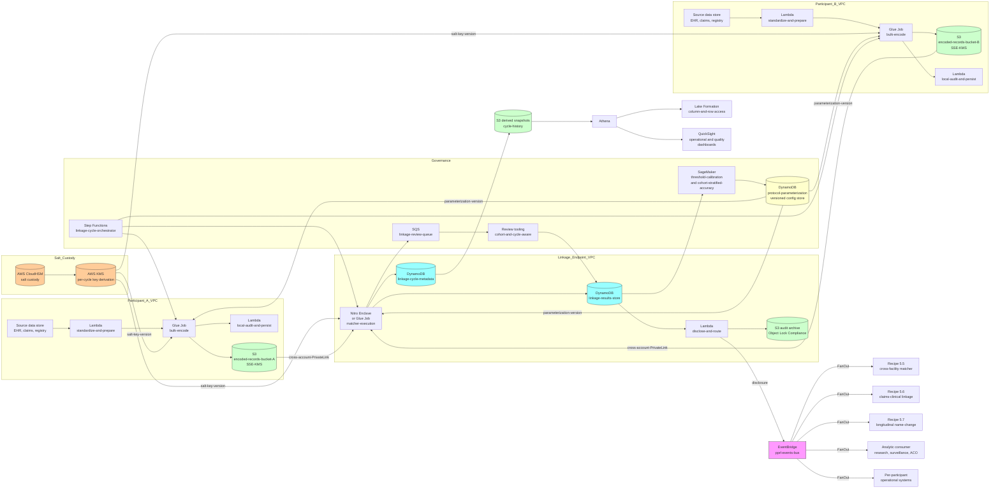

# Recipe 5.8 Architecture and Implementation: Privacy-Preserving Record Linkage

*Companion to [Recipe 5.8: Privacy-Preserving Record Linkage](chapter05.08-privacy-preserving-record-linkage). This page covers the AWS architecture, services, prerequisites, and pseudocode. For the problem framing and the conceptual approach, start with the main recipe.*

---

## The AWS Implementation

### Why These Services

**AWS Nitro Enclaves for the protocol-execution endpoint.** Where the protocol benefits from a hardware-attested isolated execution environment (most TEE-based PPRL deployments), Nitro Enclaves provide an isolated EC2 environment with hardware attestation, no persistent storage, no network access except through the parent EC2 instance's vsock interface, and no operator visibility into the enclave's memory. The matcher runs inside the enclave on the encoded data; the enclave's attestation is verified by each participant before contributing its encoded data, providing the trust assumption the protocol requires. 

**AWS Key Management Service (KMS) and AWS CloudHSM for the salt and shared-secret custody.** The shared cryptographic salt is the protocol's root-of-trust; it has to be generated through a multi-party ceremony, custodied through a hardware-security-module that no single participant can unilaterally access, rotated on the agreed cadence, and audit-logged on every access. KMS with customer-managed keys covers the standard custody pattern; CloudHSM covers the higher-assurance pattern where the institutional security posture or the regulatory framework requires a single-tenant HSM. The salt-related access control is enforced through KMS key policies and resource-based policies that name the specific Lambda or enclave roles authorized to invoke the salt-related operations.

**Amazon S3 for the encoded-record exchange surface.** The participating organizations exchange encoded data through S3 buckets configured with cross-account access policies that enumerate the specific roles authorized to read or write. SSE-KMS encryption with customer-managed keys protects the encoded data at rest; per-bucket bucket-policies and per-object access controls enforce the trust architecture. Object Lock in Compliance mode protects the audit-archive bucket (which retains every encoded payload for the protocol's audit retention floor). Cross-account replication propagates encoded payloads to the linkage-execution endpoint's account where the matcher consumes them.

**Amazon DynamoDB for the linkage-cycle metadata and linkage-result store.** The per-cycle metadata (cycle identifier, protocol parameterization version, consent-posture summary, per-participant record count, run timestamps) and the linkage-result-disclosure envelope are stored in DynamoDB with customer-managed KMS encryption, point-in-time recovery, and DynamoDB Streams to drive the cross-recipe event fan-out. The table's keying scheme (`linkage_cycle_id` as partition key, `disclosure_event_id` as sort key) supports per-cycle queries and per-disclosure audit reconstruction.

**AWS Lambda for the per-record encoding path.** Each participating organization's encoding Lambda is invoked per-record (or per-batch) with the standardized record payload, the protocol parameterization version, the salt reference, and the consent-posture metadata. The Lambda computes the per-feature Bloom filters, combines them into the CLK, applies the defensive measures, and writes the encoded payload to the participant's encoded-record S3 bucket. Each invocation is in VPC with VPC endpoints for KMS, S3, DynamoDB, and Secrets Manager. The Lambda's execution role has explicit permissions to access only the salt-key version pinned for the current linkage cycle; the role does not have permissions to access any other participant's data or salt-key version.

**AWS Glue and Apache Spark for the bulk encoding and the linkage-cycle execution.** Where the linkage cycle operates over hundreds of thousands to tens of millions of records per participant (typical for population-scale research linkages and for cross-payer outcomes linkages), the encoding Lambda is replaced by a Glue job running Spark on the participant's data. The Glue job applies the same encoding logic with the same parameterization version and writes the encoded payload to S3. The matcher itself runs as a Glue job in the linkage-execution-endpoint's account, consuming the encoded data from each participant's exchange bucket and producing the per-pair linkage decisions.

**AWS Step Functions for the linkage-cycle orchestration.** The cycle's state machine coordinates the per-participant encoding, the cross-account exchange, the matcher execution, the disclosure step, and the per-participant audit-and-retention persistence. The state machine handles retries with exponential backoff, error routing to per-stage DLQs, parallel execution across participants where the protocol allows, and explicit synchronization barriers where the protocol requires (the matcher cannot start until every participant has contributed; the disclosure cannot occur until the matcher has completed and the disclosure-policy validation has passed).

**Amazon SageMaker for the threshold calibration and the cohort-stratified-accuracy reporting.** The encoded-data thresholds (ENCODED_MATCH_HIGH, ENCODED_MATCH_MED, ENCODED_REJECT) are calibrated against a known-overlap pilot population with full demographic visibility, encoded under the production parameterization. SageMaker training jobs run the calibration over the pilot data and produce candidate thresholds with confusion-matrix and cohort-stratified-disparity reports. SageMaker Processing jobs run the in-production cohort-stratified-accuracy reports against the cohort-axis hashes contributed by each participant.

**Amazon SQS for the review queue and the propagation queue.** Two queues: a linkage-review queue (for medium-confidence pairs that the encoded-match threshold flagged for review without exposing the underlying demographics; the review tooling consults each participant's source data with appropriate authorization controls) and a propagation queue (for fanning out cycle-completion events to downstream consumers). Separating the queues keeps the operational pipeline independent of the higher-priority disclosure flow.

**Amazon EventBridge for the cross-recipe events.** When a linkage cycle completes (`pprl_linkage_cycle_completed`), when a salt rotation begins (`pprl_salt_rotation_initiated`), when a salt rotation completes (`pprl_salt_rotation_completed`), when a parameterization upgrade is published (`pprl_parameterization_upgraded`), when a consent withdrawal is processed (`pprl_consent_withdrawn`), or when a re-encoding is required (`pprl_re_encoding_required`), an event flows out to the per-participant operational systems, the cross-recipe consumers (recipe 5.5 cross-facility matcher, recipe 5.6 claims-clinical-linkage, recipe 5.7 longitudinal-name-change), and the analytics consumers. EventBridge rules route events to the right consumer with DLQs for failed deliveries. 

**Amazon Athena and AWS Lake Formation for the audit-and-analytics surface.** The linkage-cycle metadata, the per-cycle audit-event log, and the per-participant performance metrics surface through Athena queries with Lake Formation column-level and row-level access controls. Treatment-context users (for clinical-care PPRL deployments) see only the linkage results for their own institution's patients; research-context users see the cohort-stratified-accuracy metrics; audit-and-compliance users see the full audit-event log; the institutional governance committee sees the cycle-level metadata for review. 

**AWS PrivateLink for the cross-account exchange where the protocol requires it.** Where the participating organizations operate in separate AWS accounts and the protocol prohibits exchange through publicly-routable endpoints, PrivateLink endpoints between the participants' VPCs provide a private network path for the encoded-data exchange. The PrivateLink configuration is paired with VPC endpoint policies that enumerate the specific cross-account roles authorized to invoke the endpoint.

**AWS KMS, CloudTrail, CloudWatch.** Customer-managed keys for the encoded-record stores, the linkage-cycle metadata table, the audit archive, the salt custody, and the Lambda log groups. CloudTrail data events on every salt-related operation, every encoded-record bucket access, every linkage-cycle metadata access, and every linkage-result disclosure. CloudWatch alarms on review-queue depth and aging, on encoding-failure rates (sudden spikes are usually a parameterization-mismatch issue), on cohort-stratified disparities, and on salt-rotation backlog. Same chapter pattern as 5.1, 5.4, 5.5, 5.6, 5.7.

**Amazon QuickSight for operational and quality dashboards.** Per-participant encoding rate, per-cycle linkage-rate trend, per-cohort linkage-rate disparity, salt-rotation cadence and coverage, parameterization-upgrade adoption, consent-withdrawal volume, re-encoding backlog, and audit-volume trends.

### Architecture Diagram



### Prerequisites

| Requirement | Details |
|-------------|---------|
| **AWS Services** | AWS Nitro Enclaves (for TEE-based protocols), AWS KMS, AWS CloudHSM (where the higher-assurance salt-custody posture is required), Amazon S3, Amazon DynamoDB, AWS Lambda, AWS Glue, Apache Spark on Glue, AWS Step Functions, Amazon EventBridge, Amazon SQS, Amazon SageMaker, Amazon Athena, AWS Lake Formation, AWS PrivateLink, Amazon QuickSight, Amazon CloudWatch, AWS CloudTrail. |
| **External Inputs** | Per-participant source data: the standardized demographic-feature set (typically name components, DOB, sex, address components, SSN where collected, phone), the per-record consent posture, the per-record cohort-axis values that produce the local cohort-axis hashes. Cross-recipe dependencies: recipe 5.1 local MPI for the canonical patient identity, recipe 5.3 address standardization, recipe 5.7 longitudinal-name-change for the time-varying-name handling under PPRL. Reference data: the protocol parameterization (salt-key-version, n-gram size, Bloom-filter size, hash-function count, per-feature bit allocation, defensive-measures parameters) maintained in a versioned configuration store. |
| **IAM Permissions** | Per-Lambda least-privilege: scoped `s3:GetObject` / `PutObject` on specific bucket prefixes for the encoded-records bucket, `dynamodb:GetItem` / `PutItem` / `Query` on the linkage-cycle-metadata and linkage-results tables, `kms:Decrypt` on the per-cycle salt-key version pinned for the current linkage cycle, `events:PutEvents` on the pprl-events bus, `sqs:SendMessage` on the review queue. The encoding Lambda has permissions to access only the salt-key version pinned for the current linkage cycle, not any prior or future version. The matcher Lambda or Nitro Enclave role has read access to all participants' encoded-records buckets through cross-account bucket policies; the role does not have access to any participant's source data. SageMaker training jobs have read access to the pilot-overlap calibration data and the cohort-axis-hash store; the role does not have access to the underlying demographics. Per-Glue-job execution-role binding so Step Functions invokes only the role appropriate for the current pipeline stage. Never use `*` actions or `*` resources in production.  |
| **BAA and Trust Framework** | AWS BAA signed. Per-participant data-use agreements that authorize the PPRL linkage for the specific use case and constrain downstream re-use. Multi-party trust framework that enumerates the participants, the protocol parameterization, the salt-management ceremony, the linkage-result-disclosure policy, the audit posture, the re-identification-risk model, and the dispute-resolution mechanism. Where a tokenization vendor is used, a separate BAA-and-data-use-agreement with the vendor that addresses the vendor's specific privacy posture and audit certifications. Patient consent for inclusion in the linkage where the institutional policy or the regulatory framework requires it.  |
| **Encryption** | Encoded-records S3 buckets: SSE-KMS with customer-managed keys, bucket-level keys, restricted access policy. Audit-archive S3 bucket: SSE-KMS with customer-managed keys, Object Lock in Compliance mode. Linkage-cycle-metadata DynamoDB: customer-managed KMS at rest. Linkage-results DynamoDB: customer-managed KMS at rest. Salt custody: CloudHSM where the higher-assurance posture is required, KMS customer-managed keys otherwise; the salt is itself encrypted under the HSM/KMS key with no plaintext extraction permitted. Glue temp storage: KMS-encrypted. Lambda log groups: KMS-encrypted. SageMaker: KMS-encrypted volumes and outputs. Nitro Enclave attestation: hardware-attested with the parent EC2 instance verifying the enclave's measurement before contributing the salt-key version. EventBridge and SQS: server-side encryption. TLS 1.2 or higher for all in-transit traffic. mTLS where the protocol requires it. |
| **VPC** | Production: per-participant Lambdas and Glue jobs in VPC. Linkage-execution endpoint in a separate VPC (typically a separate AWS account). VPC endpoints for KMS, S3, DynamoDB, Secrets Manager, CloudWatch Logs, EventBridge, SQS, Step Functions, Glue, Athena, STS, SageMaker. PrivateLink for the cross-participant encoded-data exchange where the protocol requires it. NAT Gateway for outbound HTTPS to the linkage-execution endpoint where PrivateLink is not used; outbound proxy with allow-list.  |
| **CloudTrail** | Enabled with data events on the salt-custody resources, the encoded-records buckets, the linkage-cycle-metadata table, the linkage-results table, and the audit-archive bucket. Glue job runs and SageMaker training runs logged. Step Functions executions logged. EventBridge events logged. CloudTrail logs encrypted with KMS and retained per the regulatory floor (typically the longest of HIPAA records-retention 7-year minimum, state medical-records-retention, the protocol-specific audit-retention floor, and the multi-party trust-framework's audit-retention requirement; many PPRL trust frameworks specify a longer audit retention than the regulatory minimum because the linkage's privacy claim depends on retrospective audit). Audit logs in a dedicated S3 bucket with Object Lock in Compliance mode and lifecycle to S3 Glacier Deep Archive after 90 days; CloudTrail data events forwarded to a dedicated audit AWS account. Same chapter pattern as 5.1, 5.4, 5.5, 5.6, 5.7.  |
| **Reference Data and Protocol Parameterization** | A versioned reference-data store with: the salt-key-version (rotated per protocol cadence), the n-gram size, the Bloom-filter size, the hash-function count, the per-feature bit allocation, the defensive-measures parameters (random-hashing seed, balanced-encoding parameters, hardening parameters), the cohort-axis-hash specification (which features map to which cohort axes locally at each participant). The reference data refreshes on a regular cadence and is versioned so each linkage cycle references the parameterization version active at the cycle's start. Salt rotation is a separate event from parameterization upgrade; both invalidate the encoded data and require re-encoding. |
| **Sample Data** | Synthetic data with modeled cross-organizational overlap. Synthea generates synthetic patient populations; extending Synthea to produce two or more "organizations" with overlapping populations (the same synthetic patients appearing in both with appropriate demographic-feature variation across organizations) is feasible. Pilot calibration with a known-overlap population (where the institution has a verified overlap with a counterparty under a specific data-sharing agreement that permits the pilot evaluation) provides the absolute-accuracy benchmarks the in-production thresholds are calibrated against. Never use real PHI in development environments. |
| **Cost Estimate** | At a research linkage with two participants each contributing one million records per cycle, four cycles per year: Glue compute for per-participant encoding typically $200-800 per cycle; cross-account S3 storage and transfer typically $50-200 per cycle; DynamoDB for linkage-cycle metadata and results typically $50-200 per month; Nitro Enclave or Glue compute for the matcher execution typically $300-1,200 per cycle; SageMaker calibration and cohort-stratified-accuracy reports typically $200-600 per cycle; KMS, CloudHSM, Athena, QuickSight, EventBridge, SQS, Step Functions in aggregate typically $300-800 per month; CloudHSM (where used) typically $1,500-2,500 per month for the dedicated HSM. Total AWS infrastructure typically $2,400-7,000 per month at this scale, dominated by CloudHSM (where used) and per-cycle Glue and Nitro Enclave compute.  |

### Ingredients

| AWS Service | Role |
|------------|------|
| **AWS Nitro Enclaves** | Hardware-attested isolated execution environment for the matcher in TEE-based protocols |
| **AWS KMS** | Customer-managed encryption keys for the encoded-record stores, the linkage-cycle-metadata, the audit archive, and the per-cycle salt-key derivation |
| **AWS CloudHSM** | Single-tenant hardware-security-module for the high-assurance salt-custody pattern (where the institutional security posture or the protocol's trust framework requires it) |
| **Amazon S3** | Per-participant encoded-records buckets with cross-account access policies, the audit-archive bucket with Object Lock in Compliance mode, derived-zone snapshots for analytics |
| **Amazon DynamoDB** | Linkage-cycle-metadata table (per-cycle parameterization version, consent posture summary, per-participant record count, run timestamps, disclosure target, disclosure form), linkage-results-store (per-pair linkage decisions with disclosure-policy-aware projection) |
| **AWS Lambda** | Per-participant encoding (small-batch path), per-participant standardize-and-prepare, disclose-and-route, invalidate-on-event |
| **AWS Glue and Apache Spark** | Per-participant bulk encoding for population-scale cycles, the matcher-execution job in the linkage-endpoint account where Nitro Enclaves are not used |
| **AWS Step Functions** | Linkage-cycle orchestration with per-stage retries, error routing to DLQs, parallel execution across participants where the protocol allows, explicit synchronization barriers where the protocol requires |
| **Amazon EventBridge** | Cross-recipe event fan-out: `pprl_linkage_cycle_completed`, `pprl_salt_rotation_initiated`, `pprl_salt_rotation_completed`, `pprl_parameterization_upgraded`, `pprl_consent_withdrawn`, `pprl_re_encoding_required` |
| **Amazon SQS** | Linkage-review queue (medium-confidence pairs for cohort-and-cycle-aware review tooling), propagation queue (downstream consumer fan-out) |
| **Amazon SageMaker** | Threshold calibration over the pilot-overlap data, cohort-stratified-accuracy reports against the cohort-axis hashes contributed by each participant |
| **Amazon Athena and AWS Glue Data Catalog** | SQL access to the linkage-cycle metadata and the cohort-stratified-accuracy snapshots |
| **AWS Lake Formation** | Column-level and row-level access controls for the differentiated audiences (treatment, research, audit, governance) |
| **AWS PrivateLink** | Private network path for the cross-participant encoded-data exchange where the protocol prohibits exchange through publicly-routable endpoints |
| **Amazon QuickSight** | Operational and quality dashboards (per-participant encoding rate, per-cycle linkage-rate trend, per-cohort linkage-rate disparity, salt-rotation cadence and coverage, parameterization-upgrade adoption, consent-withdrawal volume, re-encoding backlog, audit-volume trends) |
| **Amazon CloudWatch** | Operational metrics and alarms (review-queue depth and aging, encoding-failure rates, cohort-stratified disparities, salt-rotation backlog) |
| **AWS CloudTrail** | Audit logging for all API calls on the salt custody, the encoded-records buckets, the linkage-cycle-metadata, the linkage-results, and the audit-archive |

---

### Code

> **Reference implementations:** Useful libraries and patterns for this recipe:
> - [`anonlink`](https://github.com/data61/anonlink): an open-source Python toolkit for CLK-based privacy-preserving record linkage from CSIRO's Data61 / Confidential Computing Consortium. The toolkit provides reference implementations of the encoding-and-matching algorithms used in production PPRL deployments. 
> - [`clkhash`](https://github.com/data61/clkhash): the companion encoding library for `anonlink` that produces CLK-encoded records from demographic features under a shared schema and salt.
> - [OpenMined PSI](https://github.com/OpenMined/PSI): an open-source private-set-intersection toolkit with C++ and Python bindings; a reference implementation of the PSI protocol family.
> - [Microsoft SEAL](https://github.com/microsoft/SEAL): an open-source homomorphic-encryption library; useful for the SMPC-based PPRL family where the matcher's similarity computation runs on encrypted features.
> - [MP-SPDZ](https://github.com/data61/MP-SPDZ): an open-source secure-multi-party-computation toolkit covering several SMPC protocols (BGW, GMW, SPDZ family); a reference implementation for the SMPC-based PPRL family.
> - The [Confidential Computing Consortium](https://confidentialcomputing.io/): an industry consortium covering TEE-based confidential-computing patterns including PPRL.

#### Walkthrough

**Step 1: Standardize and prepare the per-participant demographic-feature set.** Every participating organization standardizes its demographic features under the same schema before encoding. The standardization is the same work that a conventional matcher does (case-folding, whitespace stripping, USPS address standardization, diacritic folding) but it has to be deterministic and cross-participant-compatible because any divergence in standardization produces encoded records that the matcher cannot reliably compare. Skip the standardization step and the encoding produces records whose Bloom filters carry the institution's idiosyncratic demographic-feature representation rather than the cross-participant-compatible representation, and the linkage rate drops substantially.

```pseudocode
FUNCTION standardize_and_prepare(source_record_batch,
                                     participant_id,
                                     consent_filter_policy,
                                     cohort_axis_specification):
    standardized_records = []

    FOR EACH source_record IN source_record_batch:
        // Step 1A: apply the consent and purpose-of-use
        // filter. Records the patient has not consented to
        // include, records under jurisdiction-specific
        // suppression, records the institutional policy
        // excludes from this purpose are dropped.
        IF NOT consent_filter_policy.permits(source_record):
            CONTINUE

        // Step 1B: standardize the demographic features
        // under the protocol's shared schema. The schema
        // is a per-feature normalization specification
        // negotiated cross-participant.
        normalized = {
            given_name: normalize_given_name(
                source_record.given_name,
                fold_case=TRUE,
                strip_whitespace=TRUE,
                fold_diacritics=TRUE,
                strip_punctuation=TRUE
            ),
            family_name: normalize_family_name(
                source_record.family_name,
                handle_naming_tradition=
                    cohort_axis_specification
                      .name_tradition_handler
            ),
            dob: normalize_dob(
                source_record.dob,
                target_format="YYYY-MM-DD"
            ),
            sex_or_gender: normalize_sex_or_gender(
                source_record.sex_or_gender,
                target_vocabulary=
                    "protocol_specified_vocabulary"
            ),
            address_line: normalize_address(
                source_record.address,
                usps_standardize=TRUE,
                drop_unit_designator=
                    "protocol_specified_handling"
            ),
            zip_code: normalize_zip(
                source_record.zip_code,
                target_format="zip5"
            ),
            phone: normalize_phone(
                source_record.phone,
                target_format="e164",
                drop_extension=TRUE
            ),
            ssn_last_4: normalize_ssn_last_4(
                source_record.ssn,
                if_present=TRUE
            )
        }

        // Step 1C: derive the cohort-axis hashes. Each
        // participant computes its own cohort-axis values
        // locally (using its own demographic visibility) and
        // hashes them under the cohort-axis-hash key. The
        // matcher receives the hashes (not the values) and
        // can stratify accuracy metrics by hash without
        // learning the underlying axis values.
        cohort_axis_hashes = compute_cohort_axis_hashes(
            source_record,
            cohort_axis_specification,
            cohort_axis_hash_key=
                load_cohort_axis_hash_key()
        )

        // Step 1D: tag the record with metadata that the
        // matcher needs but that does not expose
        // demographics.
        prepared_record = {
            participant_id: participant_id,
            source_record_id: source_record.local_id,
                // Retained locally; not included in the
                // encoded payload that gets exchanged.
            normalized_features: normalized,
            consent_posture: source_record.consent_posture,
            cohort_axis_hashes: cohort_axis_hashes,
            prepared_at: current UTC timestamp
        }

        standardized_records.append(prepared_record)

    RETURN standardized_records
```

**Step 2: Apply the cryptographic encoding under the pinned protocol parameterization.** The encoding step is per-participant; it transforms the standardized record into a Cryptographic-Long-Term-Key (CLK) encoded form. The CLK is a single Bloom filter that combines the per-feature Bloom filters under the per-feature bit allocation. The matcher consumes the CLK without seeing the underlying demographic features. Skip the parameterization-version pinning and you produce encoded records that are not comparable to the counterparty's records produced under a different parameterization version, and the linkage silently fails.

```pseudocode
FUNCTION encode_record(prepared_record, parameterization_version):
    // Step 2A: load the protocol parameterization. The
    // parameterization is loaded from a versioned
    // configuration store with the version pinned to the
    // current linkage cycle (set by the cycle orchestrator).
    parameterization = config_store.load_parameterization(
        parameterization_version)

    // The parameterization contains:
    // - salt_key_version: reference to the current salt key
    //   in the salt custody (KMS or CloudHSM)
    // - n_gram_size: typically 2 (bigrams) or 3 (trigrams)
    // - bloom_filter_size: typically 1024 or 2048
    // - hash_function_count: typically 30
    // - per_feature_bit_allocation: the share of the bloom
    //   filter assigned to each feature
    // - defensive_measures:
    //     random_hashing_enabled: TRUE / FALSE
    //     balanced_encoding_enabled: TRUE / FALSE
    //     hardening_parameters: per-protocol-specific

    // Step 2B: load the salt key for this cycle. The salt
    // key is loaded into a HSM-backed KMS context; the
    // plaintext salt is never exposed to the encoding
    // process; the per-feature hashing operations call
    // into the HSM context.
    salt_context = salt_custody.acquire_per_cycle_context(
        parameterization.salt_key_version,
        cycle_id=current_cycle_id())

    // Step 2C: produce the per-feature Bloom filters.
    per_feature_filters = {}

    FOR EACH (feature_name, normalized_value) IN
              prepared_record.normalized_features:
        IF normalized_value IS NULL:
            // Missing features get a sentinel filter; the
            // matcher's Fellegi-Sunter combiner handles
            // missing-feature cases under the protocol's
            // missing-feature weights.
            per_feature_filters[feature_name] =
                produce_missing_feature_filter(
                    parameterization, feature_name)
            CONTINUE

        // Tokenize the value into n-grams.
        n_grams = produce_n_grams(
            normalized_value,
            n=parameterization.n_gram_size,
            include_start_end_markers=TRUE)

        // Initialize an empty bit array of the protocol's
        // size. The per-feature filter is the share of the
        // total bloom filter assigned to this feature.
        per_feature_size = compute_per_feature_size(
            parameterization.bloom_filter_size,
            parameterization.per_feature_bit_allocation,
            feature_name)
        feature_filter = bit_array_of_size(per_feature_size)

        // For each n-gram, compute the k hash values and
        // set the corresponding bit positions.
        FOR EACH n_gram IN n_grams:
            FOR k_index IN 0 TO parameterization
                                    .hash_function_count - 1:
                hash_value = salt_context.hmac_sha_256(
                    key_index=k_index,
                    input=n_gram)
                bit_position = hash_value MOD per_feature_size
                feature_filter.set_bit(bit_position)

        // Apply defensive measures (random hashing,
        // balanced encoding, hardening) per the
        // parameterization. These adjust the feature_filter
        // to defeat known re-identification attacks.
        IF parameterization.defensive_measures
                              .random_hashing_enabled:
            feature_filter = apply_random_hashing(
                feature_filter,
                parameterization.defensive_measures
                    .random_hashing_seed,
                prepared_record.source_record_id)

        IF parameterization.defensive_measures
                              .balanced_encoding_enabled:
            feature_filter = apply_balanced_encoding(
                feature_filter,
                parameterization.defensive_measures
                    .balanced_encoding_parameters)

        IF parameterization.defensive_measures
                              .hardening_parameters
                              .enabled:
            feature_filter = apply_hardening(
                feature_filter,
                parameterization.defensive_measures
                    .hardening_parameters)

        per_feature_filters[feature_name] = feature_filter

    // Step 2D: combine the per-feature filters into the
    // record-level CLK under the per-feature bit allocation.
    clk = combine_per_feature_filters_into_clk(
        per_feature_filters,
        parameterization.per_feature_bit_allocation)

    // Step 2E: build the encoded-record envelope. The
    // envelope carries the CLK plus the metadata the
    // matcher needs (participant_id, encoded_record_id,
    // consent_posture, cohort_axis_hashes,
    // parameterization_version, encoded_at) but does not
    // carry the normalized demographics or the source
    // record identifier.
    encoded_record_envelope = {
        participant_id: prepared_record.participant_id,
        encoded_record_id: generate_encoded_record_id(),
            // Per-cycle pseudonym; not the source_record_id
            // and not derived from the demographics.
        clk_payload: clk.to_compact_representation(),
        consent_posture: prepared_record.consent_posture,
        cohort_axis_hashes:
            prepared_record.cohort_axis_hashes,
        parameterization_version: parameterization_version,
        salt_key_version:
            parameterization.salt_key_version,
        encoded_at: current UTC timestamp
    }

    // Step 2F: persist the per-cycle local mapping from the
    // encoded_record_id to the source_record_id. The mapping
    // is retained at the participant only; it is never
    // included in the encoded-record envelope or the
    // cross-participant exchange. The mapping enables the
    // participant to later resolve match results back to
    // the source records under its own access controls.
    participant_local_mapping_store.put({
        cycle_id: current_cycle_id(),
        encoded_record_id:
            encoded_record_envelope.encoded_record_id,
        source_record_id: prepared_record.source_record_id,
        encoded_at:
            encoded_record_envelope.encoded_at
    })

    RETURN encoded_record_envelope
```

**Step 3: Exchange the encoded records under the trust architecture.** The participating organizations deliver their encoded payloads to the linkage-execution endpoint. The exchange is the trust-architecture-defining step; the choice of transport, authentication, and audit posture reflects the protocol's specific privacy claims. Skip the exchange-time auditing and the protocol's audit posture is broken: a counterparty that uploaded an encoded payload cannot prove what it uploaded if the linkage's results are later disputed.

```pseudocode
FUNCTION exchange_encoded_records(encoded_record_envelopes,
                                       trust_architecture_config,
                                       cycle_id):
    // Step 3A: validate that every envelope in the batch
    // was produced under the parameterization and salt-key
    // versions pinned for this cycle. Mis-coordinated
    // versions are the most common operational failure
    // mode; catch them before exchange.
    cycle_metadata =
        cycle_metadata_store.get(cycle_id)

    FOR EACH envelope IN encoded_record_envelopes:
        IF envelope.parameterization_version !=
            cycle_metadata.parameterization_version:
            RAISE ParameterizationMismatchError(
                envelope.encoded_record_id,
                envelope.parameterization_version,
                cycle_metadata.parameterization_version)

        IF envelope.salt_key_version !=
            cycle_metadata.salt_key_version:
            RAISE SaltKeyMismatchError(
                envelope.encoded_record_id,
                envelope.salt_key_version,
                cycle_metadata.salt_key_version)

    // Step 3B: route the envelopes to the linkage-execution
    // endpoint per the trust architecture.
    IF trust_architecture_config.transport_type ==
        "tokenizer_model":
        // Upload to the tokenizer's designated S3 bucket
        // under the cross-account access policy negotiated
        // in the contract; the tokenizer ingests and
        // produces the linkage results.
        upload_with_signed_envelope_and_mtls(
            envelopes=encoded_record_envelopes,
            destination=trust_architecture_config
                          .tokenizer_ingestion_bucket,
            cycle_id=cycle_id,
            participant_id=cycle_metadata
                              .current_participant_id)

    ELIF trust_architecture_config.transport_type ==
        "linkage_broker_model":
        // Upload to the linkage-broker's S3 bucket. The
        // linkage broker has visibility to the encoded
        // payloads but not the demographics.
        upload_with_signed_envelope_and_mtls(
            envelopes=encoded_record_envelopes,
            destination=trust_architecture_config
                          .linkage_broker_ingestion_bucket,
            cycle_id=cycle_id,
            participant_id=cycle_metadata
                              .current_participant_id)

    ELIF trust_architecture_config.transport_type ==
        "tee_attested_endpoint":
        // The matcher runs in a Nitro Enclave; verify the
        // attestation document before uploading the
        // encoded payload. The attestation proves the
        // enclave is running the agreed measurement.
        attestation_doc =
            request_enclave_attestation(
                trust_architecture_config
                  .enclave_endpoint)

        IF NOT verify_attestation(
                attestation_doc,
                trust_architecture_config
                  .expected_measurement,
                trust_architecture_config
                  .pcr_values):
            RAISE EnclaveAttestationFailedError()

        // Upload through the attested vsock or PrivateLink
        // path.
        upload_via_attested_endpoint(
            envelopes=encoded_record_envelopes,
            destination=trust_architecture_config
                          .enclave_endpoint,
            cycle_id=cycle_id)

    ELIF trust_architecture_config.transport_type ==
        "smpc_protocol_runner":
        // Engage in the multi-round SMPC protocol with the
        // counterparties. Each round of the protocol
        // exchanges protocol-specific messages over mTLS;
        // the encoded data is never directly exchanged but
        // is consumed by the SMPC primitives.
        smpc_runner.execute_protocol(
            envelopes=encoded_record_envelopes,
            counterparties=trust_architecture_config
                              .counterparty_endpoints,
            protocol_specification=
                trust_architecture_config
                  .protocol_specification,
            cycle_id=cycle_id)

    // Step 3C: log the exchange to the participant's local
    // audit store. Every exchange event is logged with the
    // cycle_id, the parameterization_version, the
    // salt_key_version, the per-record count, the
    // destination identifier, and the timestamp.
    participant_audit_store.log({
        event_type: "PPRL_EXCHANGE",
        cycle_id: cycle_id,
        participant_id: cycle_metadata.current_participant_id,
        parameterization_version:
            cycle_metadata.parameterization_version,
        salt_key_version:
            cycle_metadata.salt_key_version,
        record_count: len(encoded_record_envelopes),
        transport_type:
            trust_architecture_config.transport_type,
        destination: trust_architecture_config
                       .destination_identifier,
        exchanged_at: current UTC timestamp
    })

    RETURN exchange_status
```

**Step 4: Match the encoded records under the protocol's matching function.** The matcher operates on the encoded data without ever seeing the underlying demographics. The matching function is protocol-specific: Sørensen-Dice for Bloom filters, equality for tokenized data, the SMPC primitives for the SMPC family. The thresholds are calibrated separately from the conventional matcher's thresholds because the encoded scoring function is different. Skip the encoded-data threshold calibration and you re-use the conventional thresholds, which produces silent linkage failures because the encoded similarity scores are systematically lower for the same underlying record pair.

```pseudocode
FUNCTION match_encoded_records(encoded_record_sets,
                                    parameterization,
                                    threshold_calibration,
                                    cohort_axis_specification):
    match_results = []

    // Step 4A: candidate-generation step (blocking). For
    // Bloom-filter-encoded data, candidate generation uses
    // properties of the CLK (e.g., locality-sensitive
    // hashing on the CLK bits) to reduce the candidate
    // pair count from O(n*m) to a tractable subset. For
    // tokenized data, candidate generation may be a direct
    // hash join. For SMPC-based protocols, candidate
    // generation depends on the protocol primitive.
    candidate_pairs = candidate_generation(
        encoded_record_sets,
        parameterization)

    FOR EACH (record_a, record_b) IN candidate_pairs:
        // Step 4B: per-pair similarity scoring. For
        // Bloom-filter-encoded data, compute the
        // Sørensen-Dice coefficient between the CLKs.
        // For tokenized data, equality. For SMPC, the
        // protocol-specific primitive.
        per_feature_similarity_scores =
            compute_per_feature_similarities(
                record_a, record_b, parameterization)

        // Step 4C: per-pair Fellegi-Sunter combination.
        // The same probabilistic-record-linkage core
        // from recipes 5.1 and 5.5, with the feature
        // weights calibrated against the encoded data.
        match_score = combine_with_fellegi_sunter(
            per_feature_similarity_scores,
            threshold_calibration.feature_weights,
            threshold_calibration.missing_feature_weights)

        // Step 4D: apply the encoded-data thresholds.
        IF match_score >= threshold_calibration
                            .ENCODED_MATCH_HIGH:
            decision = "MATCH_HIGH"
        ELIF match_score >= threshold_calibration
                              .ENCODED_MATCH_MED:
            decision = "MATCH_MED_REVIEW"
        ELIF match_score <= threshold_calibration
                              .ENCODED_REJECT:
            decision = "REJECT"
        ELSE:
            decision = "REVIEW"

        // Step 4E: build the per-pair result with the
        // evidence summary and the cohort-axis hashes
        // for downstream cohort-stratified-accuracy
        // monitoring.
        match_result = {
            participant_a_id: record_a.participant_id,
            participant_b_id: record_b.participant_id,
            encoded_record_a_id: record_a.encoded_record_id,
            encoded_record_b_id: record_b.encoded_record_id,
            match_score: match_score,
            decision: decision,
            evidence_summary: {
                per_feature_similarities:
                    per_feature_similarity_scores,
                feature_weights_version:
                    threshold_calibration.weights_version
            },
            cohort_axis_hashes_a: record_a.cohort_axis_hashes,
            cohort_axis_hashes_b: record_b.cohort_axis_hashes,
            consent_posture_a: record_a.consent_posture,
            consent_posture_b: record_b.consent_posture,
            parameterization_version:
                parameterization.parameterization_version,
            matched_at: current UTC timestamp
        }

        match_results.append(match_result)

    RETURN match_results
```

**Step 5: Apply the disclosure policy and route the linkage results.** The matcher produces match decisions; the disclosure step transforms the decisions into the form the protocol authorizes for delivery to the consumer. The disclosure form is protocol-specific: per-record yes/no flags, intersection counts, encrypted match indicators, k-anonymous summaries, differentially-private aggregates. Skip the disclosure-policy step and you deliver the per-record matches to a consumer that the protocol authorized only for aggregate-level disclosure, which is a privacy violation that the audit cannot retract.

```pseudocode
FUNCTION disclose_linkage_results(match_results,
                                       disclosure_policy,
                                       cycle_id):
    // Step 5A: filter to the consent-and-purpose-aligned
    // results. Records whose consent posture does not
    // permit inclusion in this disclosure are filtered out
    // even if the matcher produced a match.
    consent_filtered_results = []
    FOR EACH match_result IN match_results:
        IF disclosure_policy
              .consent_posture_permits(
                match_result.consent_posture_a,
                match_result.consent_posture_b):
            consent_filtered_results.append(match_result)

    // Step 5B: apply the disclosure-form transformation.
    IF disclosure_policy.disclosure_form ==
        "per_record_match_flags":
        // The consumer receives per-record yes/no flags.
        // Each consumer's view is filtered to its own
        // records (the consumer is a participating
        // organization and can only see matches involving
        // its own records).
        disclosure_envelope = build_per_record_match_flags(
            consent_filtered_results,
            disclosure_policy.target_consumer)

    ELIF disclosure_policy.disclosure_form ==
        "intersection_count":
        // The consumer receives only the size of the
        // intersection (no per-record detail).
        disclosure_envelope = build_intersection_count(
            consent_filtered_results)

    ELIF disclosure_policy.disclosure_form ==
        "k_anonymous_aggregate":
        // The consumer receives k-anonymous aggregates
        // with small-cell suppression.
        disclosure_envelope = build_k_anonymous_aggregate(
            consent_filtered_results,
            disclosure_policy.k_anonymity_parameter,
            disclosure_policy.suppression_threshold)

    ELIF disclosure_policy.disclosure_form ==
        "differentially_private_aggregate":
        // The consumer receives aggregates with
        // calibrated DP noise.
        disclosure_envelope =
            build_differentially_private_aggregate(
                consent_filtered_results,
                disclosure_policy.epsilon,
                disclosure_policy.delta,
                disclosure_policy.aggregate_specification)

    ELIF disclosure_policy.disclosure_form ==
        "encrypted_match_indicator":
        // The matches are encrypted under the consumer's
        // public key; only the consumer can decrypt.
        disclosure_envelope = build_encrypted_match_indicator(
            consent_filtered_results,
            disclosure_policy.consumer_public_key)

    // Step 5C: route the disclosure to the target consumer.
    deliver_with_signed_envelope_and_mtls(
        disclosure_envelope=disclosure_envelope,
        target_consumer=disclosure_policy.target_consumer,
        cycle_id=cycle_id)

    // Step 5D: emit the cycle-completion event for cross-
    // recipe consumers.
    EventBridge.PutEvents([{
        source: "privacy-preserving-record-linkage",
        detail_type: "pprl_linkage_cycle_completed",
        detail: {
            cycle_id: cycle_id,
            disclosure_form:
                disclosure_policy.disclosure_form,
            target_consumer:
                disclosure_policy.target_consumer
                  .consumer_identifier,
            participant_count:
                len(unique_participants(match_results)),
            matched_pair_count:
                len(consent_filtered_results),
            disclosed_at: current UTC timestamp
        }
    }])

    // Step 5E: log the disclosure to the audit archive.
    // The audit log captures the disclosure-form, the
    // target-consumer, the per-record count, and the
    // cohort-stratified-accuracy summary, but does not
    // log the actual disclosure payload (which would
    // duplicate the consumer's copy).
    audit_archive.log_disclosure({
        event_type: "PPRL_DISCLOSURE",
        cycle_id: cycle_id,
        disclosure_form:
            disclosure_policy.disclosure_form,
        target_consumer:
            disclosure_policy.target_consumer
              .consumer_identifier,
        record_count: len(consent_filtered_results),
        cohort_stratified_accuracy_summary:
            compute_cohort_stratified_summary(
                consent_filtered_results),
        disclosed_at: current UTC timestamp
    })

    RETURN disclosure_envelope
```

**Step 6: React to invalidation events that supersede the linkage.** A linkage that was wrong, a salt that has rotated, a parameterization that has been upgraded, a consent that has been withdrawn, an underlying identity-merge or name-change reversal from recipes 5.1 or 5.7 all invalidate the prior linkage in different ways. The invalidation pipeline subscribes to these events and triggers the appropriate response (re-encode the affected records, re-run the matcher, communicate the superseded result to the consumer, route the affected records out of future cycles). Skip the invalidation pipeline and the prior linkage results drift out of sync with the underlying identity infrastructure; the drift compounds over time and undermines trust in every subsequent cycle.

```pseudocode
FUNCTION invalidate_on_event(invalidation_event):
    // Identify the affected linkage cycles and the
    // affected encoded records.
    IF invalidation_event.source == "salt_rotation":
        // The salt has rotated. All encoded data under the
        // prior salt is invalidated. Schedule a coordinated
        // re-encoding cycle with all participants. Notify
        // downstream consumers that the prior cycle's
        // results are superseded by the next cycle's.
        affected_cycles = cycle_metadata_store
            .find_cycles_with_salt_key_version(
                invalidation_event.prior_salt_key_version)

        schedule_coordinated_re_encoding(
            participants=invalidation_event.participants,
            new_salt_key_version=
                invalidation_event.new_salt_key_version,
            new_parameterization_version=
                invalidation_event
                  .new_parameterization_version)

        notify_downstream_consumers(
            affected_cycles, "salt_rotation_supersedes")

    ELIF invalidation_event.source ==
        "parameterization_upgrade":
        // The parameterization has been upgraded. Schedule
        // a coordinated re-encoding under the new
        // parameterization. Existing cycles' results remain
        // valid for the use cases the prior parameterization
        // supported, but new cycles use the new
        // parameterization.
        schedule_coordinated_re_encoding(
            participants=invalidation_event.participants,
            new_salt_key_version=
                invalidation_event.salt_key_version,
            new_parameterization_version=
                invalidation_event.new_parameterization_version)

    ELIF invalidation_event.source ==
        "consent_withdrawal":
        // A patient has withdrawn consent for inclusion in
        // the linkage. The participating organization
        // removes the patient from future encoding. Prior
        // linkages remain in the consumer's possession;
        // the participating organization communicates the
        // withdrawal to the consumer per the protocol's
        // policy on retroactive handling.
        affected_participant_id =
            invalidation_event.participant_id
        affected_source_record_id =
            invalidation_event.source_record_id

        participant_local_consent_store.update({
            source_record_id: affected_source_record_id,
            consent_posture: "WITHDRAWN",
            withdrawn_at: invalidation_event.withdrawn_at
        })

        notify_downstream_consumers_of_consent_withdrawal(
            affected_participant_id,
            affected_source_record_id,
            disclosure_policy_for_withdrawal_handling)

    ELIF invalidation_event.source ==
        "identity_merge_recipe_5_1":
        // Recipe 5.1 merged two identities at the
        // participating organization. The prior encoded
        // records under the merged-from identity are
        // invalidated; the next cycle re-encodes the
        // surviving identity.
        affected_participant_id =
            invalidation_event.participant_id
        affected_source_record_ids =
            invalidation_event.merged_from_source_record_ids

        participant_local_re_encode_queue.enqueue(
            affected_source_record_ids)

    ELIF invalidation_event.source ==
        "name_change_recipe_5_7":
        // Recipe 5.7 resolved a name change. The encoded
        // records under the prior name are invalidated;
        // the next cycle re-encodes under the current
        // name (and may carry a prior-name encoding for
        // the cycles that need historical-name
        // matching).
        affected_participant_id =
            invalidation_event.participant_id
        affected_source_record_id =
            invalidation_event.source_record_id

        participant_local_re_encode_queue.enqueue(
            [affected_source_record_id])

    ELIF invalidation_event.source ==
        "re_identification_risk_model_update":
        // The institutional privacy team has updated the
        // re-identification-risk model. The
        // parameterization may need re-tuning;
        // defensive measures may need to be strengthened.
        // Schedule a coordinated parameterization upgrade
        // and re-encoding cycle.
        schedule_parameterization_upgrade(
            new_parameterization_version=
                invalidation_event
                  .new_parameterization_version,
            participants=invalidation_event.participants,
            target_completion_window=
                invalidation_event.target_completion_window)

    // Emit the invalidation event for downstream consumers
    // to refresh their derived state.
    EventBridge.PutEvents([{
        source: "privacy-preserving-record-linkage",
        detail_type: "pprl_linkage_invalidated",
        detail: {
            invalidation_source: invalidation_event.source,
            invalidation_event_id: invalidation_event.event_id,
            affected_cycle_ids: affected_cycle_ids_summary,
            affected_participant_ids:
                affected_participant_ids_summary,
            invalidated_at: current UTC timestamp
        }
    }])
```

> **Curious how this looks in Python?** The pseudocode above covers the concepts. If you'd like to see sample Python code that demonstrates these patterns using boto3, check out the [Python Example](chapter05.08-python-example). It walks through each step with inline comments and notes on what you'd need to change for a real deployment.

---

### Expected Results

**Sample CLK-encoded record envelope (illustrative; actual CLK payload would be a binary bit array):**

```json
{
  "participant_id": "participant-A-academic-medical-center",
  "encoded_record_id": "enc-cycle-2026-q2-A-00284271",
  "clk_payload": "<base64-encoded-1024-bit-bloom-filter>",
  "consent_posture": {
    "consent_for_research_linkage": true,
    "consent_for_outcomes_research_purpose": true,
    "jurisdictional_overlay_applied": "post_dobbs_state_overlay_v1",
    "consent_recorded_at": "2026-01-15T10:34:22Z"
  },
  "cohort_axis_hashes": {
    "name_tradition_cohort_hash": "h-naming-tradition-08f4...",
    "age_decade_cohort_hash": "h-age-decade-2c91...",
    "sex_or_gender_cohort_hash": "h-sex-gender-7a13..."
  },
  "parameterization_version": "pprl-clk-v2.3.1",
  "salt_key_version": "salt-2026-q2-rotation-001",
  "encoded_at": "2026-04-22T14:08:33Z"
}
```

**Sample high-confidence match result:**

```json
{
  "cycle_id": "cycle-2026-q2-research-linkage-001",
  "match_id": "match-2026-q2-001-00094822",
  "participant_a_id": "participant-A-academic-medical-center",
  "participant_b_id": "participant-B-regional-payer",
  "encoded_record_a_id": "enc-cycle-2026-q2-A-00284271",
  "encoded_record_b_id": "enc-cycle-2026-q2-B-00891334",
  "match_score": 0.94,
  "decision": "MATCH_HIGH",
  "evidence_summary": {
    "per_feature_similarities": {
      "given_name_clk_dice": 0.97,
      "family_name_clk_dice": 0.99,
      "dob_token_match": 1.00,
      "address_clk_dice": 0.89,
      "zip_code_token_match": 1.00,
      "ssn_last_4_token_match": 1.00,
      "phone_clk_dice": 0.85
    },
    "feature_weights_version": "pprl-fs-v1.4.2"
  },
  "cohort_axis_hashes_a": {
    "name_tradition_cohort_hash": "h-naming-tradition-08f4...",
    "age_decade_cohort_hash": "h-age-decade-2c91...",
    "sex_or_gender_cohort_hash": "h-sex-gender-7a13..."
  },
  "cohort_axis_hashes_b": {
    "name_tradition_cohort_hash": "h-naming-tradition-08f4...",
    "age_decade_cohort_hash": "h-age-decade-2c91...",
    "sex_or_gender_cohort_hash": "h-sex-gender-7a13..."
  },
  "parameterization_version": "pprl-clk-v2.3.1",
  "matched_at": "2026-04-23T09:18:44Z"
}
```

**Sample disclosure envelope (per-record-match-flags form, scoped to participant A's view):**

```json
{
  "cycle_id": "cycle-2026-q2-research-linkage-001",
  "disclosure_form": "per_record_match_flags",
  "target_consumer": "participant-A-academic-medical-center",
  "disclosure_envelope": {
    "matches": [
      {
        "encoded_record_a_id": "enc-cycle-2026-q2-A-00284271",
        "matched_with_participant_id": "participant-B-regional-payer",
        "match_decision": "MATCH_HIGH",
        "match_score": 0.94
      }
    ],
    "total_records_contributed_by_a": 1027341,
    "total_matches_for_a": 412988,
    "match_rate_for_a": 0.402
  },
  "disclosed_at": "2026-04-23T09:32:12Z"
}
```

**Sample disclosure envelope (intersection-count form, used when the protocol authorizes only the count and not per-record details):**

```json
{
  "cycle_id": "cycle-2026-q2-public-health-surveillance-001",
  "disclosure_form": "intersection_count",
  "target_consumer": "state-public-health-department",
  "disclosure_envelope": {
    "intersection_count": 184722,
    "participant_a_total": 1027341,
    "participant_b_total": 487219,
    "match_rate_lower_bound": 0.380,
    "match_rate_upper_bound": 0.396
  },
  "disclosed_at": "2026-04-23T09:48:55Z"
}
```

**Sample disclosure envelope (k-anonymous-aggregate form, used when the protocol authorizes only k-anonymous cohort summaries):**

```json
{
  "cycle_id": "cycle-2026-q2-aco-out-of-network-ed-001",
  "disclosure_form": "k_anonymous_aggregate",
  "target_consumer": "aco-analytics-team",
  "k_anonymity_parameter": 11,
  "suppression_threshold": 5,
  "disclosure_envelope": {
    "out_of_network_ed_visits_by_age_decade_and_chronic_condition": [
      {
        "age_decade": "60-69",
        "chronic_condition": "diabetes",
        "visit_count_aggregate": 234,
        "patient_count_aggregate": 178
      },
      {
        "age_decade": "70-79",
        "chronic_condition": "diabetes",
        "visit_count_aggregate": 156,
        "patient_count_aggregate": 121
      },
      {
        "age_decade": "80-89",
        "chronic_condition": "diabetes",
        "visit_count_aggregate": "[suppressed: cell size below threshold]",
        "patient_count_aggregate": "[suppressed: cell size below threshold]"
      }
    ]
  },
  "disclosed_at": "2026-04-23T10:14:08Z"
}
```

**Performance benchmarks (illustrative, your mileage varies):**

| Metric | Conventional cross-facility matching (recipe 5.5) | PPRL with CLK encoding |
|--------|---------------------------------------------------|------------------------|
| Match rate at fixed false-acceptance threshold (FAR=0.005) | 92-96% | 80-90% |
| False-acceptance rate at fixed match threshold | 0.3-0.7% | 0.5-1.0% |
| Per-cohort linkage-rate disparity (best vs worst cohort) | 0.05-0.10 | 0.08-0.15 |
| Time-to-encode per record (Glue Spark) | n/a | 50-200 microseconds |
| Time-to-match per pair (Sørensen-Dice on Bloom filter) | n/a | 5-20 microseconds |
| Time-to-complete a population-scale linkage cycle (1M records each, 2 participants) | 1-3 hours (HIE-mediated) | 4-12 hours (encoding plus match plus disclosure) |
| Salt rotation cadence | n/a | quarterly to annually depending on protocol |
| Re-encoding time per population (1M records) | n/a | 2-6 hours |
| Audit-event volume per cycle | 50-200 (per-query audit) | 1,000-10,000 (per-stage audit including encoding, exchange, matching, disclosure) |

**Where it struggles:**

- **Demographic-feature missingness amplifies the encoding penalty.** A record with a missing field encodes to a CLK with a sentinel filter for that field. The Fellegi-Sunter combiner handles missing features under specific weights, but the missing-feature weight calibration is harder for encoded data (the calibration set has to include encoded missing-feature cases against encoded non-missing cases, which adds a dimension to the calibration). The mitigation is per-feature missingness rate monitoring with per-cohort breakdowns, plus deliberate encoding-time field-imputation policies for the fields where imputation is appropriate.
- **Names from non-dominant-culture traditions accumulate more encoding noise.** The bigram tokenization, the per-feature bit allocation, and the defensive-measures parameters were typically calibrated on populations dominated by Western European naming conventions. Spanish double surnames, East Asian family-name-first conventions, Arabic patronymics, and names with diacritics that the EHR strips on input all encode to CLKs that are less robust to legitimate variation than CLKs from Western European names. The cohort-stratified-linkage-rate disparity is the metric that catches this; the mitigation is per-tradition encoding-parameter tuning (separate per-feature bit allocations for shorter names, separate n-gram sizes for non-Latin scripts) calibrated against per-tradition gold sets, with explicit communication to the participating organizations about the tuning rationale.
- **Re-identification attacks against the encoded data have evolved.** The early Bloom-filter-based PPRL deployments were vulnerable to specific re-identification attacks (the Vatsalan-Christen frequency analysis, the Kuzu-et-al attack on small populations). The defensive measures (random hashing, balanced encoding, hardening) are designed to defeat these attacks. The institution's privacy team has to keep current with the published attack literature and update the defensive parameterization in response. The mitigation is a versioned parameterization with a periodic re-identification-risk review (every 12-18 months is typical), with the review owned by the institutional privacy team and communicated to the participating organizations through the trust-framework governance process.
- **The salt-rotation ceremony has no margin for error.** Every encoded record under a prior salt is invalidated by rotation; mis-coordinated rotation produces a population-scale loss of all encoded data under the wrong key. The mitigation is a ceremonial multi-organization rotation with explicit dual-control approval, audit-logged at every step, and an explicit catch-up-window (where the prior salt remains valid for read-only operations during the cutover) to give participants time to complete their re-encoding. The catch-up window is itself a privacy concern (the prior salt's data is still readable during the catch-up); the institution has to balance the operational discipline against the privacy posture.
- **Linkage results across protocols do not compose.** A patient who is matched in one PPRL cycle (under one protocol with one participant set) cannot be transitively linked across cycles with a different protocol or participant set. The encoded data is parameterization-specific; cross-cycle composition requires re-encoding under a common parameterization or operating against the union of protocols at the source-record level (where the demographics are still available). The mitigation is explicit per-cycle scope discipline and a cross-cycle index that the participating organizations maintain at the source-record level (under their own access controls) to compose linkages where the use case requires it.
- **Consent-withdrawal handling has retrospective limits.** A patient who withdraws consent for inclusion in a research linkage can be removed from future cycles, but prior cycles' results remain in the consumer's possession. The architecture cannot retract disclosures that have already left the institution, and the protocol's post-withdrawal handling is whatever the contract specifies. The mitigation is explicit handling of consent withdrawal as a forward-looking event with patient-facing communication about what can and cannot be retracted, plus institutional policy on whether to communicate the withdrawal to the consumer (some protocols specify the communication; others leave it to the participating organization's discretion).
- **Cross-jurisdictional applicability constraints multiply.** A patient's record under post-Dobbs reproductive-health-care state-law overlays may be excludable from one PPRL cycle but includable in another, depending on the consumer's jurisdiction and the use case. A record under 42 CFR Part 2 (substance-use treatment) may be excludable from most linkages without specific consent. A record from a patient who has gender-transition-related sensitivity classification (recipe 5.7) may be includable but with restricted disclosure form. The cross-jurisdictional rules accumulate in the consent-and-purpose-of-use governance layer; the mitigation is per-record consent-posture metadata that the encoding step consults and the disclosure step honors, with explicit institutional review of the per-jurisdictional-overlay rule set on a periodic cadence.
- **The linkage-result dispute-resolution path is institution-specific.** When a linkage result is disputed (the consumer's analysis surfaces what looks like a wrong match; one participant's downstream operations identify a record they believe was incorrectly linked), the dispute resolution requires going back to the source data at each participant under their own access controls. The PPRL protocol does not provide a built-in dispute-resolution mechanism; the institutional trust framework has to specify it. The mitigation is an explicit dispute-resolution clause in the trust framework with named contacts, a defined SLA, and an audit-logged process; without it, disputes drift and undermine confidence in subsequent cycles. 
- **Cross-recipe coordination has subtle ordering effects.** A name change resolved in recipe 5.7 invalidates the encoded records under the prior name; an identity merge resolved in recipe 5.1 invalidates the encoded records under the merged-from identity; an address standardization update in recipe 5.3 may change the address-feature encoding. The PPRL re-encoding queue has to respect the cross-recipe event ordering and consolidate near-simultaneous events on the same record. The mitigation is an event-ordering-aware re-encoding queue with explicit deduplication and prioritization rules.
- **Pilot evaluation requires authorization the production deployment does not.** The pilot calibration of encoded-data thresholds requires a known-overlap population with full demographic visibility, which means the calibration step has to be authorized under a separate data-sharing agreement that permits the pilot evaluation. Some institutions do not have a counterparty willing to provide the pilot data; the calibration falls back to synthetic data, which is less accurate. The mitigation is investing in the pilot-data agreement as part of the trust-framework negotiation, with an explicit one-time scope and an audit-archive retention specifically for the pilot data.

---

## Why This Isn't Production-Ready

The pseudocode and architecture above demonstrate the pattern. A production deployment needs to close several gaps that are intentionally out of scope for a recipe.

**Trust-framework negotiation and contract drafting.** The multi-party trust framework is the load-bearing artifact for any PPRL deployment, and it is not a technical artifact. It is a contract that enumerates the participants, the protocol parameterization, the salt-management ceremony, the linkage-result-disclosure policy, the audit posture, the re-identification-risk model, the dispute-resolution mechanism, the consent-and-purpose-of-use governance, the cross-jurisdictional overlay handling, and the operational rhythms (salt-rotation cadence, parameterization-upgrade cadence, periodic re-identification-risk review cadence). The institutions that operate PPRL successfully have invested in the legal-and-compliance team's familiarity with the cryptographic primitives, with the trust-framework artifact, and with the ongoing governance. The institutions that have not made the investment discover, mid-project, that the trust framework cannot be drafted without senior legal and compliance review at every participant, and the project stalls. Plan the trust-framework negotiation as a project with its own timeline, its own staffing, and its own iteration discipline.

**Salt-management ceremony and HSM custody.** The shared cryptographic salt is the protocol's root-of-trust. Salt generation is a multi-party HSM ceremony: the participants (enumerated by the trust framework) follow a documented cryptographic-key-generation procedure, with every step audit-logged (calling principal, operation, timestamp, cycle context, salt-key-version, dual-control approver identities, post-ceremony verification status). Salt custody is a hardware-security-module concern: the salt is stored in a CloudHSM (or KMS customer-managed key) in a separate VPC with no inbound network access from the production data plane; salt-related operations route through a dedicated salt-custody endpoint with mTLS authentication and the dual-control approval Lambda as the only authorized caller. Salt rotation requires dual-control approval: two HSM operators from non-overlapping organizations must approve the rotation operation through a separate approval-workflow Lambda; cross-account approval routes through the trust framework's enumerated participating-organization roles; single-actor approvals are rejected; the inter-organizational binding mechanism is the trust framework's participant registry. The catch-up-window policy specifies an explicit duration (typically 7-14 days) with access-control constraint: read-only access bound to the prior salt-key-version through KMS key-policy enforcement, audit logging on every read during the catch-up window. Post-rotation re-encoding-coverage SLA per participant is monitored through CloudWatch metrics (`{participant_id}.re_encoding_coverage_percent`); alarm on degradation below 95% triggers the response protocol with explicit catch-up-window-extension authority. Salt-related audit events (salt generation, salt rotation, salt access, salt-key-version promotion, salt-decommission) write to a separately access-controlled S3 bucket with the trust-framework's specified retention floor (typically the longest of HIPAA 7-year minimum, state medical-records-retention, the multi-party trust-framework's audit-retention requirement of 10-15 years, the pilot-data agreement's audit retention, the IRB-approved research substrate's audit retention, and the cross-jurisdictional retention overlay where the linkage spans national borders, plus an additional 5 years to accommodate post-deployment retrospective re-identification-risk evaluation). Build the salt-management capability as a deliberate operational program with named owners, named processes, and named review committees.

**Threshold calibration and approval governance.** The ENCODED_MATCH_HIGH, ENCODED_MATCH_MED, ENCODED_REJECT thresholds, the per-feature weights, and the missing-feature weights are calibrated against a known-overlap pilot population encoded under the production parameterization. The versioned configuration table (DynamoDB or a dedicated configuration store) holds the thresholds, per-feature weights, missing-feature weights, and per-jurisdiction overlay rules; each linkage cycle references the configuration version active at decision time. Re-calibration runs periodically via a SageMaker calibration job that produces the candidate set against the pilot-overlap calibration data. Re-calibration produces a candidate threshold set with a per-cohort impact-analysis requirement: explicit cohort-axis enumeration (name-tradition cohort, age-decade cohort, sex-or-gender cohort, name-change-frequency cohort where recipe 5.7 is upstream) evaluated against the pilot data. The privacy team has explicit re-identification-risk review authority in the review committee; the analytics governance committee, compliance, clinical informatics, equity-monitoring committee, and privacy team review the confusion matrix and the cohort-disparity impact before promoting the candidate to production. The pilot-data infrastructure is separately governed (separate AWS account, separate access controls, separate audit posture, separate retention rules); the production pipeline references the calibration outputs without re-accessing the underlying pilot data. Same chapter pattern as 5.1, 5.4, 5.5, 5.6, 5.7.

**Re-identification-risk review.** The institutional privacy team owns the re-identification-risk model and reviews it on a periodic cadence (every 12-18 months is typical, with off-cycle review when new attacks are published). The structural artifacts: a written re-identification-risk assessment with cited sources, identified risks, recommended mitigations, residual-risk acceptance with explicit privacy-team sign-off and trust-framework-governance review. Off-cycle trigger conditions: a literature-monitoring function with explicit subscription to relevant venues (IEEE S&P, ACM CCS, PETS, PoPETs, the PPRL-specific workshop venues), an attack-database subscription with explicit relevance-evaluation criteria, and vendor-advisory-monitoring for commercial-tokenizer integrations. The trust-framework governance consumption pathway: recommendation-to-governance-decision through the trust-framework-governance process; review committee composition (privacy team, security team, participating-organization delegates), decision-making process, timeline, and communication to participating organizations. The parameterization-update path: governance-decision-to-parameterization-update through the parameterization-versioning configuration store with explicit cohort-stratified-impact-analysis at the promotion gate; parameterization-update-to-re-identification-risk-model-update event through the EventBridge fan-out; re-encoding pipeline triggered by the event. Build the re-identification-risk review as a deliberate operational program with the institutional privacy team as the owner; without it, the parameterization stagnates while the attacks evolve.

**Three review queues with cohort-and-cycle-aware tooling.** The linkage-review queue surfaces medium-confidence pairs for human review; reviewers see the encoded-record IDs (not the demographics), the per-feature similarity scores, the cohort-axis hashes, and (under appropriate authorization) the source records at each participant. The salt-rotation review queue surfaces re-encoding completion status per participant for verification before the prior salt is decommissioned. The consent-withdrawal review queue surfaces patient-initiated withdrawals for verification (especially when delivered through a non-standard channel). Each review tool emits the reviewer's decision back into the matcher's training signal. Per-queue audit posture: reviewer identity with appropriate authentication, decision, stated reason, configuration version active at the time, threshold or parameterization version active at the time, and any reviewer-supplied additional context. For the salt-rotation review queue: dual-control with two reviewers from non-overlapping organizations enforced through cross-account approval; per-participant re-encoding-coverage status verification before prior-salt decommission; audit logging of every salt-rotation completion event with both reviewer identities and the per-participant re-encoding-coverage status; explicit decommission-of-prior-salt audit entry. The reviewer-authentication is two-factor and the reviewer-action is dual-controlled for the salt-rotation review queue. For the consent-withdrawal review queue: patient re-authentication for non-standard-channel withdrawals; reviewer's decision audit; conflict-of-interest screening with the recipe-specific extension to patient-relationship-with-reviewer beyond the standard conflict-of-interest categories. Build the tools with the same care as the analytics pipeline; the matcher's accuracy depends on it.

**Patient-consent capture and withdrawal pathways.** The PPRL deployment assumes that the patient has been asked (and has consented or declined) for inclusion in the linkage. The mechanism for asking is not the matcher's job; it is the registration workflow's, the patient-portal app's, and (for clinical-care contexts) the institutional consent-management workflow's. Build the consent-capture and withdrawal-pathway as a deliberate workflow with appropriate framing, training for the staff who solicit the information, and patient-facing communication about what the linkage does and what consent withdrawal means. Skip this and the consent posture is operating on default values that may not match the patient's actual preferences, with predictable trust failures when patients discover their records were included in a linkage they did not consent to.

**Information-blocking compliance posture.** The 21st Century Cures Act information-blocking provisions apply to PPRL in non-obvious ways: a patient who has authorized an external research consortium to access her records has, by extension, authorized the PPRL linkage that the consortium uses; a patient whose records are excluded from the linkage because of a consent-withdrawal or a jurisdictional overlay should be able to receive an explanation of why the records were excluded and to authorize an alternative disclosure mechanism if available. The architecture has to surface the consent-and-jurisdictional-exclusion reasoning to the patient on request without exposing the linkage's cryptographic primitives. Build the patient-access-API release path with explicit awareness of the PPRL exclusion reasons.

**Cross-organizational propagation policy.** The PPRL pipeline does not propagate the linkage results across organizations beyond the disclosure-policy-authorized targets; the trust framework constrains downstream re-use. Some research collaborations explicitly limit each consumer's downstream use to a specific analytic publication; others permit re-use within a defined research-program scope. The architecture has to fit the institution's specific cross-organizational posture; the recipe's disclosure-policy mechanism is the institution-internal portion of the broader cross-org flow.

**Pilot evaluation infrastructure.** The pilot-overlap calibration data is a separately authorized data-sharing event with its own data-use agreement. The pilot data exists for a defined period (typically the duration of the calibration project) and is then either retained under a defined audit-archive retention floor or deleted per the agreement. The pilot data infrastructure is operationally separate from the production PPRL pipeline (separate AWS account, separate access controls, separate audit posture); the production pipeline references the calibration outputs (the threshold set, the per-feature weights) without re-accessing the underlying pilot data. Build the pilot infrastructure as a separately governed substrate; without it, the production pipeline's calibration depends on operational assumptions that the audit cannot verify.

**Idempotency and retry semantics.** The pipeline must handle duplicate-event delivery, partner-side retries, and Glue job re-runs without producing duplicate encoded records, duplicate match results, or scrambled audit logs. Per-stage idempotency keys: standardize-and-prepare Lambda `(cycle_id, source_record_id)`; bulk-encode Glue `(cycle_id, source_record_id, parameterization_version)`; exchange-encoded-records Lambda `(cycle_id, encoded_record_id, transport_type)`; match-encoded-records Glue or Nitro Enclave `(cycle_id, encoded_record_a_id, encoded_record_b_id)`; disclose-and-route Lambda `(cycle_id, disclosure_event_id, target_consumer)`; invalidate-on-event Lambda `(invalidation_event_source, invalidation_event_id)`; salt-rotation-coordinator Step Functions `(rotation_id, participant_id)`. Configure a DLQ per stage with CloudWatch alarms on DLQ depth (alarm threshold: > 0 records or > 15 minutes for stuck workflows); Step Functions Catch states route terminal failures to the DLQ so stuck workflows are visible. Same chapter pattern as 5.3, 5.4, 5.5, 5.6, 5.7.

**Cohort-stratified accuracy monitoring discipline.** The CloudWatch metrics with cohort-axis-hash dimensions, the QuickSight dashboard, the institutional review cadence, and the disparity-alarm thresholds are architecture-level commitments, not bolt-ons. Recipe-specific cohort axis enumeration (inherited from 5.7 plus PPRL-specific extensions): name-tradition cohort hash, transgender-or-gender-diverse cohort hash (populated only from patient-consented self-identification), age-decade cohort hash, name-change-frequency cohort hash, patient-consent-for-fairness-monitoring cohort hash, cross-jurisdictional-overlay cohort hash. Disparity-calculation method: absolute difference between highest and lowest cohort, computed per-metric per-cycle. Per-metric emission cadence: linkage rate weekly, false-acceptance rate weekly, review-queue aging weekly, sampled error rate monthly. Privacy-team routing: privacy team receives per-cohort re-identification-risk-indicator metrics; analytics-governance committee receives per-cohort accuracy metrics; equity-monitoring committee receives per-cohort fairness metrics; cross-jurisdictional governance committee receives jurisdictional-overlay-affected metrics. Dual-interpretation translation: cohort disparities in PPRL are simultaneously fairness signals and re-identification-risk signals. Cohort-stratified linkage-rate disparity > 0.05 = MEDIUM alarm; cohort-stratified false-acceptance-rate disparity > 0.01 = HIGH (because false acceptances under PPRL produce wrong-record disclosures that the consumer cannot retract). Remediation pathway: alert routing, investigation, post-mortem retention with 5-business-day SLA, quarterly review by PPRL steering committee with privacy-team co-chair. Cohort dimensions on metrics use cohort-axis-hash labels rather than underlying axis values; the hash-to-axis-value mapping lives only at each participant under their own access controls; the matcher and the metrics dashboard stratify by hash without learning the underlying axis values. The privacy team has authority to require re-derivation when the hash-to-axis-value mapping is determined to be re-derivable from the metric distribution. Same chapter pattern as 5.1, 5.4, 5.5, 5.6, 5.7. Reference Recipe 5.1 / 5.4 / 5.5 / 5.6 / 5.7 Finding A1/A2 as the chapter-wide pattern.

**Compliance and operational ownership.** PPRL sits at the intersection of analytics, research, compliance, privacy, security, and IT. Establish clear operational ownership: who tunes the thresholds, who reviews the cohort-disparity reports, who owns the parameterization-version updates, who handles the salt-rotation ceremonies, who responds to consent withdrawals, who negotiates trust-framework changes. The pipeline works only when the operational ownership is clear and funded across the participating organizations, not just within one of them.

**Identity-boundary requirements.** Every consequential path has explicit identity-boundary requirements: (1) the per-participant encoding Lambda receives a producer-signed envelope (`source_system`, `source_record_id`, `event_id`, `signed_payload`, `signature`) with consumer-side signature validation against rotated producer keys; (2) the cross-account encoded-records exchange is authenticated through cross-account bucket policies that enumerate the specific roles authorized to read or write, plus mTLS and PrivateLink for the network transport; (3) the matcher Lambda or Nitro Enclave role is per-cycle bound through Step Functions and has time-bound access to the encoded data only during the cycle's active execution window; (4) the salt-rotation ceremony is dual-controlled at the architectural level (two HSM operators from non-overlapping organizations must approve a rotation operation; the rotation is audit-logged with both operator identities and the new salt-key-version reference); (5) the consent-withdrawal path requires patient re-authentication and is audit-logged with explicit "patient-mediated" attribution; (6) the cross-recipe EventBridge fan-out validates producer-signed envelopes at consumers and applies access-control-envelope-aware routing so that consumers in different trust tiers receive different event detail levels. The recipe-specific extensions to the chapter pattern are the salt-rotation ceremony's cryptographic-root-of-trust stakes, the TEE-attestation-flow stakes, and the patient-mediated PPRL trigger source's patient-impersonation stakes. Same chapter pattern as 5.1, 5.4, 5.5, 5.6, 5.7.

**Cross-recipe event-schema contract.** PPRL events conform to a chapter-wide event-schema contract: (`source`, `detail_type`, `detail.cycle_id`, `detail.event_id`, `detail.parameterization_version`, `detail.salt_key_version`, `detail.disclosure_form`, `detail.target_consumer`, `detail.participant_count`, `detail.matched_pair_count`, `detail.cohort_stratified_summary`, `detail.consent_posture_summary`, `detail.jurisdictional_overlay_applicability`, `detail.detected_at`). Access-control-envelope-aware routing: a standard channel for non-restricted disclosure forms (per-record-match-flags, intersection-count, k-anonymous-aggregate) consumed by recipes 5.5, 5.6, 5.7, the analytic consumer, and per-participant operational systems; a restricted channel for differentially-private-aggregate or encrypted-match-indicator disclosure forms consumed only by the explicitly-authorized consumer per the disclosure policy. Downstream consumers acknowledge processing via a CloudWatch metric (`{consumer}.events_processed`). The chapter-wide event-bus governance specifies the schema versioning policy and the deprecation cadence for breaking changes.

**Dispute-resolution architecture.** The dispute-intake mechanism: a dedicated API endpoint with WAF and authentication for system-initiated disputes; a dedicated UI for human-initiated disputes; a dispute-tracking DynamoDB table keyed on `(cycle_id, dispute_id)`; an audit-archive bucket for dispute artifacts. The cross-participant source-data-resolution pathway: per-dispute access-control envelope with time-bound and scope-bound authorization; per-participant source-data-resolution Lambda invoked through Step Functions cross-participant orchestration; audit logging on every cross-participant source-data access. Dispute-resolution-outcome propagation: outcome propagated through the EventBridge fan-out with explicit dispute-outcome event-types; consumer and participant notification with the outcome and the response-protocol; explicit "linkage-superseded" attribution where the outcome is "linkage was wrong."

**Cross-account network and salt-custody isolation.** Per-participant cross-account bucket-policy template enumerating the specific roles authorized for read or write. PrivateLink endpoint configuration with VPC endpoint policies that name the authorized cross-account roles. Per-cycle network-policy expiration that aligns with the linkage-cycle's active execution window. Audit-and-monitoring discipline on the cross-account exchange (CloudTrail data events on every cross-account read and write, CloudWatch alarm on unexpected-role access patterns). Salt-custody-network-isolation pattern: the salt custody (KMS or CloudHSM) is in a separate VPC with no inbound network access from the production data plane; salt-related operations route through a dedicated salt-custody endpoint with mTLS authentication and the dual-control approval Lambda as the only authorized caller.

**Audit-retention floor.** Replace "per the regulatory retention floor" with an explicit floor that names the longest of: HIPAA 7-year minimum, state medical-records-retention, the multi-party trust-framework's audit-retention requirement (typically 10-15 years; the trust framework's privacy claim depends on retrospective auditability of the cryptographic-root-of-trust operations including salt generation, rotation, and access), the pilot-data agreement's audit retention where applicable, the IRB-approved research substrate's audit retention where the linkage feeds research, and the cross-jurisdictional retention overlay where the linkage spans national borders (the most restrictive jurisdiction governs). For salt-related audit events (salt generation, salt rotation, salt access, salt-key-version promotion, salt-decommission): a separately access-controlled bucket with the trust-framework's specified retention floor (typically the longest of the above plus an additional 5 years to accommodate post-deployment retrospective re-identification-risk evaluation).

**TEE attestation flow.** Per-participant attestation verification flow: attestation document retrieval from the Nitro Enclave, expected-measurement matching against the trust-framework-specified measurement, PCR-values verification, per-participant verification policy with explicit reject-on-mismatch semantics. Per-cycle enclave instantiation flow: Step Functions instantiation stage with the cycle's pinned measurement and PCR-values; per-participant attestation verification before any encoded data is uploaded; cycle-completion teardown. Nitro Enclave-to-KMS integration: KMS key policies that name the specific enclave measurement; the enclave attestation document is presented to KMS to authorize the salt-key-decryption; audit logging on every salt-key-decryption with the enclave attestation context. Fallback-to-non-TEE-protocol pathway: cycle aborted on attestation failure, alert routing to the trust-framework-governance committee, response-protocol with explicit re-cycle-after-investigation authority.

**Patient-mediated PPRL trigger source.** Patient-authentication path through the participating organizations' API endpoints: Cognito federation with the patient-portal IdP at each participant, per-participant authentication-to-source-record-id binding through Lambda authorizers, abuse-prevention rate-limiting at the API Gateway layer. Per-patient authorization-to-source-record-id binding at each participant: Lambda authorizer consults the participant's local authorization store; rejection on binding-failure. Patient-as-linkage-execution-endpoint authority: per-patient choice of execution endpoint with the participating organizations' trust-framework-determined-acceptable-endpoint allow-list; per-endpoint-type authentication and audit posture; rejection semantics when the patient's choice does not satisfy the trust framework. Audit-attribution discipline: patient-mediated cycles audit-logged with explicit "patient-mediated" attribution; per-patient audit summary delivery to the patient's chosen channel. API Gateway resource policy and WAF for the patient-portal authentication path.

**Jurisdictional overlay-rules engine.** Architecture: a versioned rule store in DynamoDB or a dedicated configuration store; a rule-evaluation Lambda invoked at encoding time with the patient's residence jurisdiction, the use case's authorization scope, the record-type sensitivity classification, and the participating organizations' jurisdictional postures; output consent-posture metadata stored on the encoded-record envelope. Applicable overlays: post-Dobbs reproductive-health-care state laws, 42 CFR Part 2 substance-use-treatment record applicability, state-specific HIV-and-genetic-information rules, state-level PPRL-specific rules where they exist. Regulatory-monitoring function: shared between privacy and compliance teams; legislative-session feeds with explicit per-state subscription, regulatory-bulletin subscriptions, court-decision tracking; trigger thresholds with relevance-evaluation criteria. Per-record consent-posture decision audit trail: every overlay-rule application audit-logged with inputs, rule version active, output decision. Trust-framework-update pathway: regulatory-change-detection through the regulatory-monitoring function; trust-framework-update through the trust-framework-governance committee; coordinated re-encoding through the salt-rotation-coordinator pattern; downstream-consumer notification through the EventBridge fan-out.

**Active-learning calibration loop constraints.** The active-learning calibration loop operates only on the encoded data and the reviewer-decided labels; the calibration job runs in a separate access-controlled context that does not have access to the demographic features. The threshold-and-weights candidate produced by the active-learning loop is reviewed by the privacy team for re-identification-risk evaluation (the cohort-stratified-disparity translation in the cohort-stratified accuracy monitoring section applies; the privacy team checks whether the candidate's cohort-impact suggests the labels themselves are leaking demographic information through systematic reviewer biases) before promotion to the production parameterization.

**Commercial tokenization vendor integration governance.** The institutional review committee (privacy team, security team, compliance team) reviews the vendor's cryptographic-implementation document, audit certifications, data-handling posture, and contractual constraints, producing a written threat-model determination as part of the trust-framework artifact. Quarterly currency monitoring of vendor audit certifications (SOC 2 Type II, HITRUST, ISO 27001, ISO 27018) with response-protocol review by the institutional review committee on lapsed certifications. Contractual-constraint-tagging on every linkage record derived from vendor-tokenized data, mirroring the per-payer data-use-tagging pattern from 5.6, with access-control enforced via Lake Formation row-level filters.

**Audit-summary delivery to the patient.** Architecture: API Gateway with WAF, the institution's patient-portal authentication, per-patient authorization-to-source-record-id binding enforced at the Lambda authorizer (one patient cannot retrieve audit summaries for unrelated patients), per-patient rate limits below the operational-session capacity. Audit-data filtering enforced at the data layer: the query is bound to the requesting patient's source_record_id at the data-store level rather than at the application layer. Audit logging on every audit-summary read with the patient-attestation that the summary was delivered.

**Lake Formation column distinctions and de-identification.** Treatment-context: linkage results filtered to the requesting institution's patients with no cross-institution detail. Research-context: cohort-stratified-accuracy metrics with cohort-axis-hash labels rather than underlying axis values; aggregated linkage statistics rather than per-record disclosures. Audit-and-compliance: full audit-event log. Institutional-governance: cycle-level metadata with parameterization-version detail. The de-identification pattern for the research view uses cohort-axis-hash labels rather than underlying axis values.

---

## Variations and Extensions

**Trusted-third-party tokenization integration.** Rather than building the encoding-and-matching pipeline in-house, the institution integrates with a commercial tokenization vendor (Datavant, HealthVerity, IQVIA, others). The vendor receives the demographic feeds from each participating organization, applies its proprietary tokenization, and produces the linked output. The architectural extension is a vendor-integration adapter that handles the per-vendor authentication, the per-vendor data-format conventions, the per-vendor audit-and-compliance posture, and the per-vendor BAA-and-contract surface. The institution's threat model has to include the vendor as a trusted third party with full visibility into the demographic feeds; the trust assumption is the contractual relationship rather than the cryptographic primitive.  

**TEE-based PPRL with Nitro Enclaves.** Rather than encoding the demographics into Bloom filters before exchange, the participating organizations deliver their demographics in plaintext to a Nitro Enclave that has been hardware-attested as running the agreed matcher implementation. The enclave runs a conventional probabilistic-record-linkage matcher on the plaintext demographics, produces the linkage results, and returns them to the disclosure step; the demographics are never visible outside the enclave's hardware-isolated memory. The architectural extension is the Nitro Enclave attestation flow (each participant verifies the enclave's measurement before contributing its demographic feed), the per-cycle enclave instantiation, and the per-cycle enclave teardown (the enclave is destroyed at the cycle's end with no persistent storage). The trust assumption is shifted from "the cryptographic primitives suffice" to "the hardware enforces the isolation and the attestation is sound."

**Patient-mediated PPRL through the Patient Access API.** A patient who has connected her records to a personal-health-record app authenticated under her own credentials authorizes a PPRL-mediated retrieval that the app coordinates on her behalf. The app, acting as the patient's agent, retrieves encoded records from each participating organization's API endpoint and orchestrates the matching at the patient's chosen linkage-execution endpoint (which may be the app itself, a designated research consortium, or a patient-controlled tokenization broker). The architectural extension is a patient-mediated trigger source that the per-participant encoding Lambda accepts, with explicit patient authentication and per-patient authorization-to-source-record-id binding. The pattern is uncommon as of writing but is becoming architecturally viable as the Patient Access API ecosystem matures.

**Differential-privacy-augmented disclosure.** The disclosure step applies calibrated differential-privacy noise to the linkage results before delivery, providing stronger privacy guarantees on the analytic outputs than the linkage alone provides. The architectural extension is a differential-privacy module in the disclose-and-route Lambda that computes the appropriate noise scale per the disclosure-policy's epsilon-and-delta parameters. The pattern is operationally complex (the privacy budget across cycles has to be tracked) but provides a stronger end-to-end privacy guarantee for use cases where the consumer's queries against the linked data are bounded and well-specified.

**Cross-cycle linkage composition with persistent encoded-record identifiers.** Rather than producing a fresh per-cycle encoded-record identifier, each participating organization maintains a persistent encoded-record identifier per source record (under a separate per-participant-only mapping that the linkage-execution endpoint does not see). The persistent identifier lets the linkage-execution endpoint compose linkages across cycles for analytic use cases that require multi-cycle continuity. The architectural extension is the per-participant persistent-identifier store with explicit access controls and explicit re-encoding-on-rotation rules; the linkage-execution endpoint sees the persistent identifier in the encoded payload but cannot resolve it back to the source record without the participant's authorization.

**Federated SMPC across more than two parties.** For research collaborations with more than two participants, the SMPC protocols generalize to n-party computation with appropriate protocol primitives (Shamir secret-sharing, replicated secret-sharing, additive secret-sharing). The architectural extension is the n-party orchestration layer that coordinates the multi-round protocol exchanges across all participants. Operational complexity scales super-linearly with the participant count; production deployments at more than four or five parties are uncommon as of writing.

**Linkage-result-disclosure-policy templates per use case.** The disclosure-policy mechanism supports multiple disclosure forms (per-record-match-flags, intersection-count, k-anonymous-aggregate, differentially-private-aggregate, encrypted-match-indicator). Per-use-case policy templates pre-configure the disclosure form and the per-form parameters (k-anonymity threshold, differential-privacy epsilon, suppression policy, encryption recipient). The architectural extension is a policy-template library that the cycle orchestrator consults at the disclosure step; the institution's privacy team owns the templates and reviews them on a periodic cadence.

**Cohort-stratified-accuracy monitoring with privacy-preserving cohort-axis derivation.** The cohort-stratified-accuracy reporting requires per-record cohort-axis hashes that the participants contribute in the encoding step. The architectural extension is a privacy-preserving cohort-axis derivation that lets the participants compute the cohort-axis values locally (under their own demographic visibility) and contribute the hashed values without exposing the underlying axis values to the linkage-execution endpoint. Same chapter pattern as 5.1, 5.4, 5.5, 5.6, 5.7 cohort-stratified accuracy monitoring with the recipe-specific hashing-on-the-axis-value-not-the-record discipline.

**Active-learning-driven configuration tuning.** As the linkage-review queue resolves cases, the labels feed a periodic re-training of the matcher's thresholds and the per-feature weights. Active learning concentrates the review effort on the cases that most improve the downstream accuracy and the cohort fairness; over time, the review queue depth decreases as the matcher absorbs the labeled cases. The active-learning pattern is constrained by the encoded-data limitation (the labels are on the encoded records, not on the demographics; the calibration has to be careful not to leak demographic information through the labeling decisions). 

**Re-identification-risk-aware adaptive parameterization.** Rather than static parameterization that the privacy team reviews on a periodic cadence, the encoding step monitors the encoded-data distribution for anomaly indicators (unusual frequency patterns, unusual bit-density distributions, unusual cohort-axis distributions) and adaptively adjusts the defensive measures in response. The architectural extension is a parameterization-feedback loop that consumes the in-production encoded-data statistics and produces parameterization adjustments that the trust-framework governance approves before promotion.

**Cross-jurisdictional overlay automation.** The consent-and-purpose-of-use governance layer applies per-jurisdiction overlay rules at encoding time. The architectural extension is an overlay-rules engine that consumes the patient's residence jurisdiction, the use case's authorization scope, the record-type sensitivity classification, and the participating organizations' jurisdictional postures, and produces a per-record consent-posture decision. The overlay rules are versioned and reviewed on a regulatory-monitoring cadence (post-legislative-session is the typical trigger). The pattern is operationally important for institutions operating across multiple states with diverging post-Dobbs, post-Bostock, and gender-affirming-care state-law overlays. 

**Audit-summary delivery to the patient.** As part of the patient-experience layer, the patient may opt to receive periodic summaries of how her record has been included in linkages, with the cycle, the participants, the use case, the disclosure form, and the disclosure target identified. The architectural extension is a patient-portal summary-delivery service that aggregates the per-cycle inclusion records (filtered to the patient's own data) and delivers them on the patient's chosen cadence. The pattern is uncommon but is becoming an expected disclosure for patients in jurisdictions with strong data-rights regulations. 

---

## Additional Resources

**AWS Documentation:**
- [AWS Nitro Enclaves User Guide](https://docs.aws.amazon.com/enclaves/latest/user/nitro-enclave.html)
- [AWS Key Management Service Developer Guide](https://docs.aws.amazon.com/kms/latest/developerguide/overview.html)
- [AWS CloudHSM User Guide](https://docs.aws.amazon.com/cloudhsm/latest/userguide/introduction.html)
- [Amazon S3 User Guide](https://docs.aws.amazon.com/AmazonS3/latest/userguide/Welcome.html)
- [Amazon S3 Object Lock](https://docs.aws.amazon.com/AmazonS3/latest/userguide/object-lock.html)
- [Amazon DynamoDB Developer Guide](https://docs.aws.amazon.com/amazondynamodb/latest/developerguide/Introduction.html)
- [AWS Glue Developer Guide](https://docs.aws.amazon.com/glue/latest/dg/what-is-glue.html)
- [AWS Lambda Developer Guide](https://docs.aws.amazon.com/lambda/latest/dg/welcome.html)
- [AWS Step Functions Developer Guide](https://docs.aws.amazon.com/step-functions/latest/dg/welcome.html)
- [Amazon EventBridge User Guide](https://docs.aws.amazon.com/eventbridge/latest/userguide/eb-what-is.html)
- [AWS PrivateLink Documentation](https://docs.aws.amazon.com/vpc/latest/privatelink/what-is-privatelink.html)
- [Amazon SageMaker Developer Guide](https://docs.aws.amazon.com/sagemaker/latest/dg/whatis.html)
- [Amazon Athena User Guide](https://docs.aws.amazon.com/athena/latest/ug/what-is.html)
- [AWS Lake Formation Developer Guide](https://docs.aws.amazon.com/lake-formation/latest/dg/what-is-lake-formation.html)
- [Amazon QuickSight User Guide](https://docs.aws.amazon.com/quicksight/latest/user/welcome.html)
- [AWS HIPAA Eligible Services](https://aws.amazon.com/compliance/hipaa-eligible-services-reference/)

**AWS Sample Repos:**
- [`aws-samples/aws-nitro-enclaves-samples`](https://github.com/aws-samples/aws-nitro-enclaves-samples): Nitro Enclaves examples that demonstrate the attestation-and-confidential-computing pattern applicable to TEE-based PPRL 
- [`aws-samples/serverless-patterns`](https://github.com/aws-samples/serverless-patterns): API Gateway + Lambda + DynamoDB patterns applicable to the per-event encoding and disclosure Lambdas
- [`aws-samples/aws-glue-samples`](https://github.com/aws-samples/aws-glue-samples): Glue ETL patterns applicable to the bulk-encoding and the matcher-execution jobs

**AWS Solutions and Blogs:**
- [AWS Solutions Library](https://aws.amazon.com/solutions/) (filter Healthcare and Life Sciences): browse for healthcare-data-collaboration and confidential-computing reference architectures
- [AWS for Industries: Healthcare and Life Sciences Blog](https://aws.amazon.com/blogs/industries/category/industries/healthcare/): search "data collaboration," "confidential computing," "Nitro Enclaves," "tokenization," "privacy preserving" for relevant deep-dives
- [AWS Security Blog](https://aws.amazon.com/blogs/security/): search "confidential computing," "Nitro Enclaves," "homomorphic encryption" for relevant patterns

**External References (Cryptographic and Methodological):**
- [`anonlink`](https://github.com/data61/anonlink): an open-source CLK-based PPRL toolkit from CSIRO's Data61, with reference implementations of encoding and matching 
- [`clkhash`](https://github.com/data61/clkhash): the companion encoding library for `anonlink` 
- [OpenMined PSI](https://github.com/OpenMined/PSI): an open-source private-set-intersection toolkit
- [Microsoft SEAL](https://github.com/microsoft/SEAL): an open-source homomorphic-encryption library
- [MP-SPDZ](https://github.com/data61/MP-SPDZ): an open-source secure-multi-party-computation toolkit 
- [Confidential Computing Consortium](https://confidentialcomputing.io/): an industry consortium covering TEE-based confidential-computing patterns

**External References (Standards and Frameworks):**
- [HIPAA De-identification Standard (Safe Harbor and Expert Determination)](https://www.hhs.gov/hipaa/for-professionals/privacy/special-topics/de-identification/): the regulatory framework for de-identified data that PPRL deployments operate under
- [NIST SP 800-188 (De-Identification of Personal Information)](https://csrc.nist.gov/publications/detail/sp/800-188/draft): NIST guidance on de-identification including PPRL-relevant techniques 
- [21st Century Cures Act Information Blocking Rule](https://www.healthit.gov/topic/information-blocking): the regulatory framework that interacts with PPRL-mediated research disclosures
- [HIPAA Privacy Rule](https://www.hhs.gov/hipaa/for-professionals/privacy/index.html): the foundational regulatory framework
- [42 CFR Part 2](https://www.ecfr.gov/current/title-42/chapter-I/subchapter-A/part-2): the substance-use-treatment record disclosure framework that imposes specific constraints on PPRL inclusion 

**External References (Academic Literature):**
- [Schnell, R., Bachteler, T., and Reiher, J. (2009). "Privacy-preserving record linkage using Bloom filters." BMC Medical Informatics and Decision Making.](https://bmcmedinformdecismak.biomedcentral.com/articles/10.1186/1472-6947-9-41) The seminal paper introducing CLK-based PPRL 
- [Vatsalan, D., Christen, P., and Verykios, V. S. (2013). "A taxonomy of privacy-preserving record linkage techniques." Information Systems.](https://doi.org/10.1016/j.is.2012.11.005) A reference taxonomy of the PPRL technique families 
- [Christen, P., Schnell, R., Vatsalan, D., and Ranbaduge, T. (2017). "Efficient Cryptanalysis of Bloom Filters for Privacy-Preserving Record Linkage." Pacific-Asia Conference on Knowledge Discovery and Data Mining.](https://link.springer.com/chapter/10.1007/978-3-319-57454-7_50) The reference paper on the re-identification attacks against CLK encoding 

**External References (Industry):**
- [ONC Data Use Agreements and Patient Matching](https://www.healthit.gov/topic/scientific-initiatives/patient-matching): ONC's published guidance on patient matching including privacy-preserving techniques 
- [Sequoia Project Patient Matching Framework](https://sequoiaproject.org/): industry-developed framework for patient-matching including PPRL recommendations 
- [PCORnet Common Data Model](https://pcornet.org/): a multi-institution research network that has explored PPRL approaches for cross-network linkage 

---

## Estimated Implementation Time

| Tier | Scope | Time |
|------|-------|------|
| Basic | Single-protocol PPRL with two participants, CLK encoding, S3-mediated exchange, Glue-based matcher, fixed parameterization, manual review queue, basic audit-archive bucket, single-disclosure-form support (per-record-match-flags only) | 6-9 months |
| Production-ready | Multi-participant PPRL with full trust-framework artifact, HSM-based salt custody with rotation ceremony, versioned parameterization with periodic re-identification-risk review, multiple disclosure forms (per-record-match-flags, intersection-count, k-anonymous-aggregate, differentially-private-aggregate), cohort-stratified-accuracy monitoring with privacy-preserving cohort-axis derivation, integration with cross-recipe events from 5.1 / 5.3 / 5.5 / 5.6 / 5.7, three-queue review tooling, threshold-calibration governance with pilot-data infrastructure, complete CloudTrail and audit-retention posture, consent-capture and consent-withdrawal pathways with patient-facing communication, regulatory-monitoring function with trust-framework-update triggers | 12-24 months |
| With variations | Add commercial tokenization vendor integration, TEE-based PPRL with Nitro Enclaves, patient-mediated PPRL through Patient Access API, federated SMPC across more than two parties, differential-privacy-augmented disclosure with privacy-budget tracking, cross-cycle linkage composition with persistent encoded-record identifiers, re-identification-risk-aware adaptive parameterization, cross-jurisdictional overlay automation, audit-summary delivery to patient | 12-18 months beyond production-ready |

---

---

*← [Main Recipe 5.8](chapter05.08-privacy-preserving-record-linkage) · [Python Example](chapter05.08-python-example) · [Chapter Preface](chapter05-preface)*
