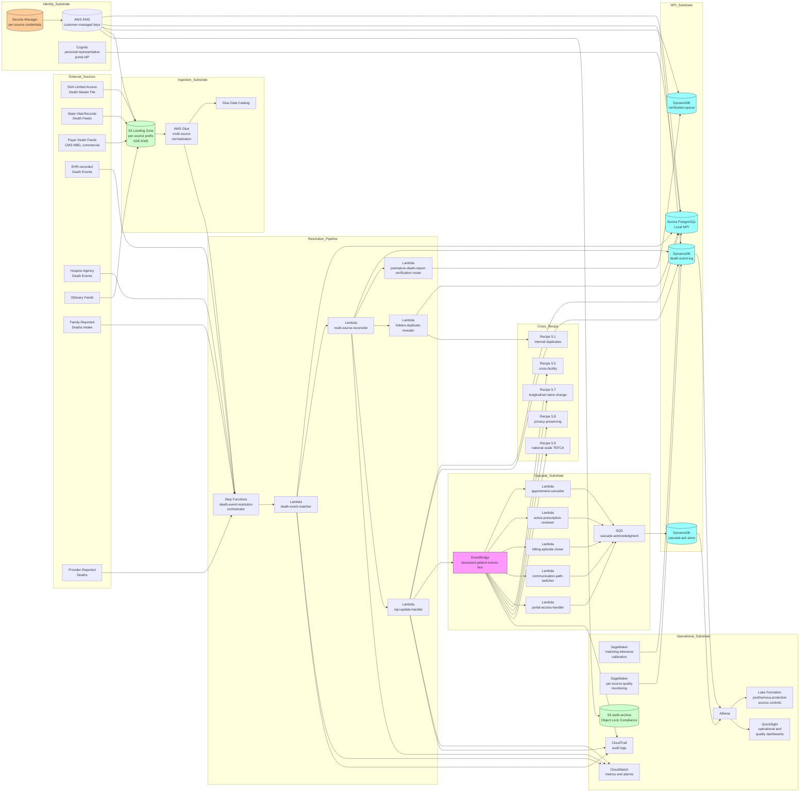

# Recipe 5.10 Architecture and Implementation: Deceased Patient Resolution and Record Reconciliation

*Companion to [Recipe 5.10: Deceased Patient Resolution and Record Reconciliation](chapter05.10-deceased-patient-resolution-reconciliation). This page covers the AWS architecture, services, prerequisites, and pseudocode. For the problem framing and the conceptual approach, start with the main recipe.*

---

## The AWS Implementation

### Why These Services

**Amazon S3 for the multi-source death-event landing zone.** The heterogeneous death-event sources (SSA Limited Access Death Master File batch files, state vital-records death feeds, payer death feeds, obituary feeds) deliver their data as files on varying schedules. S3 is the landing zone for the inbound files with SSE-KMS encryption, source-prefix organization (one prefix per source for per-source IAM scoping), Object Lock in Compliance mode for the audit-archive bucket, and lifecycle to S3 Glacier Deep Archive for the long-retention requirement.

**AWS Glue for the multi-source death-event normalization pipeline.** The inbound death-event files arrive in source-specific schemas (the LADMF's fixed-width format, the state vital-records offices' varying formats, the payer feeds' varying formats); the Glue jobs normalize each source's schema to a common death-event schema with per-event provenance metadata captured in the normalization step. The Glue Data Catalog manages the per-source schema definitions; the Glue jobs are versioned and re-run on schema changes.

**AWS Step Functions for the death-event-resolution orchestration.** Each death event flows through the pipeline's stages (matching, multi-source reconciliation, MPI update, downstream cascade) as a Step Functions workflow. The workflow has per-step retries, per-step error routing to DLQs, parallel execution where the per-event work permits, and explicit synchronization at the cross-recipe-coordination steps. Step Functions provides the audit-and-monitoring substrate for the per-event flow.

**AWS Lambda for the per-stage handler logic.** Each stage's logic (the matching Lambda, the reconciliation Lambda, the MPI-update Lambda, the per-system-cascade Lambdas) runs as a Lambda invocation with least-privilege IAM. Lambda's per-invocation isolation provides the execution boundary; the per-stage logic is composable and testable independently.

**Amazon DynamoDB for the death-event log, the MPI's death-status state, and the verification queue.** The death-event log captures per-event provenance for the multi-decade retention horizon. The MPI's death-status state carries the patient's computed death status, the date-of-death (or the conflict-flagged set of dates from multiple sources), and the cross-source provenance. The verification queue holds the cases requiring human review (medium-confidence matches, premature-death-report candidates, cross-source disagreements). All three tables use customer-managed KMS encryption, point-in-time recovery, and DynamoDB Streams to drive the cross-recipe event fan-out and the downstream-cascade propagation.

**Amazon RDS for Aurora PostgreSQL for the institution's MPI.** The institution's MPI is the canonical patient identity store from recipe 5.1; the deceased-patient pipeline consults and updates the MPI through the same database substrate that the rest of the chapter operates against. The MPI's death-status fields are extended with the deceased-patient-resolution-specific schema (per-source provenance, computed death status, per-source date-of-death history, sensitivity classification).

**Amazon EventBridge for the deceased-patient-event fan-out.** When a death event is applied, an event flows out to the per-system cascade consumers, the cross-recipe consumers (recipes 5.1, 5.5, 5.7, 5.8, 5.9), and the analytics consumers. EventBridge rules route the event to each consumer with DLQs for failed deliveries. The per-consumer event schema is explicit and versioned; the consumer-side validation is signature-validated for cross-account consumers.

**Amazon SQS for the cascade-acknowledgment queues.** Each downstream system that consumes the deceased-patient-event signal posts an acknowledgment back through SQS when the system has applied the change. The acknowledgment queue lets the deceased-patient-resolution pipeline track the cross-system-propagation-completeness metric and detect systems that are not propagating the event correctly.

**Amazon SageMaker for the deceased-patient-matching-tolerance calibration and the per-source quality monitoring.** The matching tolerance is calibrated against a curated calibration set (synthetic data plus opt-in pilot data from collaborating institutions) using SageMaker training jobs. The per-source quality monitoring (the SSA DMF's premature-death-report rate, the state vital-records-feed accuracy per jurisdiction, the EHR-recorded-death-event timeliness) is computed as SageMaker Processing jobs against the per-source death-event audit data.

**Amazon Athena, AWS Glue Data Catalog, and AWS Lake Formation for the audit-and-analytics surface.** The death-event log, the per-source provenance metadata, the verification-queue decisions, and the cascade-completion data surface through Athena queries with Lake Formation column-level and row-level access controls. The HIPAA-posthumous-protection-period access controls are enforced through Lake Formation's data filters.

**Amazon Cognito and AWS IAM Identity Center for the personal-representative authentication.** Where the personal representative needs access to the deceased patient's record during the estate-administration period, the personal-representative-portal authentication operates through Cognito with the institutional verification framework. The personal-representative's authorization is mediated through the institution's release-of-information process; Cognito provides the authentication substrate.

**AWS Secrets Manager for the per-source-feed credentials.** The SSA LADMF subscription credentials, the state-vital-records-feed credentials, the payer-feed credentials, and the obituary-feed credentials are stored in Secrets Manager with customer-managed KMS encryption and rotation per the source's framework cadence.

**AWS KMS for the cryptographic-key custody.** Customer-managed KMS keys for the death-event log, the MPI's death-status state, the verification queue, the audit archive, and the Secrets Manager secrets. The key policies enforce least-privilege access; the death-event-ingestion Lambda role can decrypt the inbound source data but cannot decrypt the MPI's other PHI; the MPI-update Lambda role can update the death-status fields but cannot mutate the rest of the MPI's schema.

**Amazon CloudWatch and AWS CloudTrail.** CloudWatch metrics on per-source death-event ingestion rate, per-source matching success rate, per-source quality drift, mean-time-to-recognize-death, false-positive-death-rate, family-correspondence-after-death rate, cross-system-propagation-completeness rate, premature-death-report-reversal latency. CloudWatch alarms on per-source-quality-drift breaches, family-correspondence-after-death rate spikes, premature-death-report-reversal-latency breaches. CloudTrail data events on every read of the death-event log, every write to the MPI's death-status state, every access to the deceased-patient records under the HIPAA-posthumous-protection-period framework. Same chapter pattern as 5.1, 5.4, 5.5, 5.6, 5.7, 5.8, 5.9.

**Amazon QuickSight for the operational and quality dashboards.** Per-source ingestion-and-quality trend, mean-time-to-recognize-death trend by source mix, false-positive-death-rate trend, family-correspondence-after-death incident map, cross-system-propagation-completeness trend, premature-death-report-reversal latency distribution, personal-representative-record-request-completion-time distribution.

### Architecture Diagram



### Prerequisites

| Requirement | Details |
|-------------|---------|
| **AWS Services** | Amazon S3, AWS Glue, AWS Glue Data Catalog, AWS Step Functions, AWS Lambda, Amazon DynamoDB, Amazon RDS for Aurora PostgreSQL (or the institution's existing MPI), Amazon EventBridge, Amazon SQS, Amazon Cognito, AWS Secrets Manager, AWS KMS, Amazon SageMaker, Amazon Athena, AWS Lake Formation, Amazon QuickSight, Amazon CloudWatch, AWS CloudTrail. |
| **External Inputs** | The institution's local MPI (the canonical patient identity store from recipe 5.1). The SSA Limited Access Death Master File subscription (where the institution has obtained the certification) or an authorized intermediary's feed. The state-vital-records-feed subscription per jurisdiction (where the institution operates). The payer-death-feed subscription per data-use agreement. The EHR-recorded-death-event integration with the institution's EHR. The hospice-agency-death-event integration (where the institution operates a hospice or has the referral relationship). The family-reported-death intake from the patient-services call center. The obituary-feed subscription (commercial aggregator). The provider-reported-death intake from faxed/mailed/HIE-mediated notifications. Cross-recipe dependencies: recipe 5.1 local MPI for the duplicate-resolution-coordination, recipe 5.5 cross-facility matcher for the deceased-patient signaling, recipe 5.7 longitudinal-name-change for the post-death history closure, recipe 5.8 privacy-preserving-linkage for the deceased-patient-PPRL signaling, recipe 5.9 cross-network matcher for the cross-network deceased-patient suppression. |
| **IAM Permissions** | Per-Lambda least-privilege: scoped `dynamodb:GetItem` / `PutItem` / `Query` on the death-event-log, the verification-queue, and the cascade-ack-store; `s3:GetObject` on the per-source landing-zone prefix bound to the source-specific Lambda; `s3:PutObject` on the audit-archive bucket; `secretsmanager:GetSecretValue` on the per-source-credentials secrets pinned to the current rotation; `kms:Decrypt` on the audit-and-attribution KMS keys; `events:PutEvents` on the deceased-patient-events bus; `sqs:SendMessage` on the cascade-acknowledgment queue. The death-event-matcher Lambda has read-only access to the local MPI; mutations to the local MPI happen through the mpi-update-handler Lambda, which has scoped write access to the death-status fields but not to the rest of the MPI's schema. The premature-death-report-verification-router Lambda has scoped access to the verification queue and the audit-archive but no write access to the MPI. The per-system-cascade Lambdas have scoped access to the operational systems they operate against (the appointment-cancellation Lambda has access to the scheduling-system API; the active-prescription-reviewer Lambda has access to the e-prescribing-system API; and so on); the per-system access is bound to the specific Lambda role. Never use `*` actions or `*` resources in production. <!-- TODO (TechWriter): Expert review S1 (HIGH). Specify identity-boundary requirements at the architectural level for every consequential path: (1) the death-event-matcher Lambda receives a per-event envelope with the per-source signature validated where the source provides cryptographic signing; (2) the mpi-update-handler Lambda's transactional write is dual-controlled at the operational level for high-impact updates (deceased-status updates that affect more than a configurable number of records in a window are routed to a manual-approval workflow before applying); (3) the premature-death-report-verification-router Lambda's reversal-decision is dual-controlled at the architectural level (two operators from non-overlapping organizational units must approve a reversal; the reversal is audit-logged with both operator identities); (4) the cross-recipe EventBridge fan-out validates producer-signed envelopes at consumers and applies access-control-envelope-aware routing so that consumers in different trust tiers receive different event detail levels; (5) the personal-representative-portal Cognito flow validates the institutional release-of-information authorization before granting the personal representative access to the deceased-patient record. The recipe-specific extensions to the chapter pattern are the per-source-credential rotation's per-jurisdiction stakes, the family-reported-death-intake authentication-and-verification stakes, and the personal-representative-portal authorization-mediation stakes. Same chapter pattern as 5.1, 5.4, 5.5, 5.6, 5.7, 5.8, 5.9. --> |
| **BAA, Source Subscriptions, and HIPAA Posthumous Protection** | AWS BAA signed. SSA LADMF certification under the Bipartisan Budget Act of 2013's framework or authorized-intermediary data-use agreement. State vital-records office data-use agreements per jurisdiction (with per-jurisdiction operational and access constraints). Payer-death-feed data-use agreements per payer relationship. Hospice-agency data-sharing agreement (where applicable). Obituary-feed commercial-subscription agreement. The HIPAA Privacy Rule's posthumous-protection-period (50 years from date of death) operational compliance program with named ownership, named processes, and named review committees. Personal-representative authorization framework operational compliance program with named ownership and named processes. <!-- TODO (TechWriter): Expert review A3 (MEDIUM). Specify the per-jurisdiction-vital-records overlay applicability and the per-payer-data-use-agreement overlay. Architect the posthumous-protection-period access-control engine (versioned rule store, rule-evaluation Lambda invoked at every read against the deceased-patient record with the requesting context, the date of death, and the per-use-case authorization-framework as inputs), the personal-representative-authentication-and-authorization workflow (Cognito federation; institutional release-of-information process integration; per-personal-representative authorization-scope binding; audit logging on every personal-representative read against the deceased-patient record), and the per-jurisdiction-source-subscription-management workflow. --> |
| **Encryption** | S3 buckets: SSE-KMS with customer-managed keys. Audit-archive S3: SSE-KMS with customer-managed keys, Object Lock in Compliance mode, lifecycle to S3 Glacier Deep Archive after 90 days. Aurora PostgreSQL: customer-managed KMS at rest, TLS in transit. DynamoDB tables: customer-managed KMS at rest. Lambda log groups: KMS-encrypted. Secrets Manager: KMS-encrypted with customer-managed keys. KMS key policies enforce least-privilege access; the death-event-matcher Lambda role can decrypt the per-source landing-zone data but cannot decrypt the MPI's other PHI; the mpi-update-handler Lambda role can update the death-status fields but cannot decrypt the rest of the MPI's PHI. mTLS for the per-source-feed transport where the source supports it (CMS MBD's mTLS, the modernized state-vital-records-feed's mTLS); HTTPS-with-strong-TLS for the rest. |
| **VPC** | Production: all Lambdas in VPC. VPC endpoints for DynamoDB, S3, Secrets Manager, KMS, CloudWatch Logs, EventBridge, SQS, Step Functions, Athena, STS, SageMaker. Private subnet for Aurora PostgreSQL with no public-network reachability; security group enumerates the specific Lambda execution-role-bound ENIs authorized to connect. Outbound-only NAT Gateway or VPC endpoint for the per-source-feed connectivity; per-source allow-list of the source's network endpoints. <!-- TODO (TechWriter): Expert review N1 (LOW). Specify the per-source-feed VPC-endpoint configuration where the source supports PrivateLink (CMS's increasing PrivateLink availability for federal-data-feeds; some commercial-payer-feeds), the per-rotation network-policy expiration that aligns with the per-source-credential rotation, and the audit-and-monitoring discipline on the per-source-feed network traffic. Also specify the personal-representative-portal-network-isolation pattern: the personal-representative-portal Cognito flow operates through a separate API Gateway endpoint with its own WAF rule set, with rate limiting per-personal-representative-session and per-personal-representative-id below the staff-initiated query rate limits to prevent abuse. --> |
| **CloudTrail** | Enabled with data events on the death-event-log, the verification-queue, the cascade-ack-store DynamoDB tables, the per-source landing-zone and audit-archive S3 buckets, the per-source-credentials and per-jurisdiction-credential Secrets Manager secrets, and the customer-managed KMS keys. Lambda invocations logged. Step Functions executions logged. EventBridge events logged. CloudTrail logs encrypted with KMS and retained per the regulatory-floor (the longest of HIPAA's 50-year posthumous-protection-period, state medical-records-retention, the per-source-data-use-agreement audit-retention floor, the cross-jurisdictional retention overlay where the institution operates across borders). Audit logs in a dedicated S3 bucket with Object Lock in Compliance mode and lifecycle to S3 Glacier Deep Archive after 90 days; CloudTrail data events forwarded to a dedicated audit AWS account. Same chapter pattern as 5.1, 5.4, 5.5, 5.6, 5.7, 5.8, 5.9. <!-- TODO (TechWriter): Expert review S2 (MEDIUM). Replace the "per the regulatory retention floor" framing with an explicit floor that names the longest of: HIPAA 50-year posthumous-protection-period (the longest single retention requirement in the chapter; this is the dominant retention floor for deceased-patient resolution), state medical-records-retention, the institution's institutional retention floor, the cross-jurisdictional retention overlay, the per-source-data-use-agreement retention floor, and the cross-recipe-coordination retention floor. Specify the separately access-controlled bucket for posthumous-protection-period audit events with the framework's specified retention floor. --> |
| **Reference Data and Source Configuration** | A versioned reference-data store with: the per-source-feed subscription credentials and rotation status, the per-source-quality classification (the SSA DMF's premature-death-report rate baseline, the per-state-vital-records-feed accuracy per jurisdiction, the per-payer-feed reliability), the deceased-patient-matching-tolerance configuration (per-source matching tolerance), the date-of-death-conflict-resolution policy (per-use-case selection), the per-system-cascade-cadence configuration (the appropriate-cadence per downstream system), the HIPAA-posthumous-protection-period access-control rules (per-use-case authorization framework), the personal-representative-authorization framework, the family-reported-death-intake script, the per-jurisdiction-vital-records-feed overlay rules. The reference data refreshes on regulatory and operational cadences and is versioned so each event references the configuration version active at the resolution time. |
| **Sample Data** | Synthetic data with modeled deceased-patient cohorts. Synthea generates synthetic patient populations with simulated death events; extending Synthea to produce a deceased-patient-resolution test cohort (synthetic patients with multi-source death events, synthetic premature-death-report cases, synthetic hidden-duplicate-revelation cases) is feasible. The SSA-published DMF samples (where available under the certification framework) provide the operational format for the LADMF integration. The CDC's NCHS publishes vital-records-data-format samples that approximate the production formats. Pilot testing against opt-in collaborating institutions provides the operational validation. Never use real PHI or real death-event data in development environments. |
| **Cost Estimate** | At an institution operating at a large-integrated-delivery-network scale (one million patients in the local MPI, ten thousand death events per year, integration with four death-event sources): S3 for the landing-zone-and-audit-archive typically $200-500 per month; Glue for the multi-source normalization typically $100-300 per month; Step Functions for the per-event orchestration typically $50-150 per month; Lambda invocations typically $50-200 per month at this volume; DynamoDB for the death-event-log and verification-queue typically $100-400 per month; Aurora PostgreSQL for the local MPI typically $1,000-3,000 per month (depends on the existing MPI substrate); EventBridge and SQS typically $20-100 per month; SageMaker typically $200-500 per month; Athena typically $50-150 per month; QuickSight typically $50-200 per month; KMS, Secrets Manager, CloudWatch, CloudTrail typically $200-500 per month. Total AWS infrastructure typically $2,000-6,000 per month at this scale, dominated by Aurora PostgreSQL. The per-source subscription fees are separate (LADMF certification has its own fee structure; payer-feed agreements have varying fee structures; obituary-feed subscriptions are commercial). <!-- TODO: replace with verified, current pricing once the implementing team validates against the AWS Pricing Calculator. The per-source-subscription fees are operational and contractual rather than infrastructure costs. --> |

### Ingredients

| AWS Service | Role |
|------------|------|
| **Amazon S3** | Per-source landing zone for inbound death-event files (SSE-KMS, per-source prefix); audit-archive bucket (SSE-KMS, Object Lock in Compliance mode, lifecycle to Glacier Deep Archive) |
| **AWS Glue** | Multi-source death-event normalization pipeline; per-source schema definitions managed in the Glue Data Catalog |
| **AWS Step Functions** | Death-event-resolution orchestration with per-step retries, error routing to DLQs, parallel execution where the per-event work permits |
| **AWS Lambda** | Per-stage handler logic: death-event-matcher, multi-source-reconciler, premature-death-report-verification-router, hidden-duplicate-revealer, mpi-update-handler, per-system-cascade Lambdas (appointment-canceller, active-prescription-reviewer, billing-episode-closer, communication-path-switcher, portal-access-handler) |
| **Amazon DynamoDB** | Death-event-log (per-event provenance for the multi-decade retention horizon), verification-queue (cases requiring human review), cascade-ack-store (per-system propagation acknowledgments) |
| **Amazon RDS for Aurora PostgreSQL** | Local MPI for the institution; the deceased-patient-resolution pipeline consults and updates the MPI through the same database substrate |
| **Amazon EventBridge** | Deceased-patient-event fan-out: `deceased_patient_resolved`, `deceased_status_reversed`, `hidden_duplicate_revealed`, `personal_representative_authorized`, `posthumous_access_granted`, `cross_source_disagreement_flagged` |
| **Amazon SQS** | Cascade-acknowledgment queue (per-system propagation acknowledgments) |
| **Amazon Cognito** | Personal-representative-portal authentication during the estate-administration period |
| **AWS Secrets Manager** | Per-source-feed credentials with rotation per source's framework cadence |
| **AWS KMS** | Customer-managed encryption keys for the death-event-log, the MPI's death-status state, the verification queue, the audit archive, and the Secrets Manager secrets |
| **Amazon SageMaker** | Deceased-patient-matching-tolerance calibration; per-source quality monitoring (premature-death-report rate, per-jurisdiction-vital-records-feed accuracy, per-payer-feed reliability) |
| **Amazon Athena and AWS Glue Data Catalog** | SQL access to the death-event-log, the per-source provenance metadata, the verification-queue decisions, and the cascade-completion data |
| **AWS Lake Formation** | Column-level and row-level access controls for the differentiated audiences (treatment-context, estate-administration, research, audit, governance, analytics); HIPAA-posthumous-protection-period access-control enforcement |
| **Amazon QuickSight** | Operational and quality dashboards (per-source ingestion-and-quality trend, mean-time-to-recognize-death trend, false-positive-death-rate trend, family-correspondence-after-death incident map, cross-system-propagation-completeness trend) |
| **Amazon CloudWatch** | Operational metrics and alarms (per-source-quality-drift breaches, family-correspondence-after-death rate spikes, premature-death-report-reversal-latency breaches) |
| **AWS CloudTrail** | Audit logging for all API calls on the death-event-log, the verification-queue, the audit-archive bucket, the per-source-credentials Secrets Manager secrets, the customer-managed KMS keys |

---

### Code

> **Reference implementations:** Useful patterns and reference materials for this recipe:
> - The [Social Security Administration's Death Master File](https://www.ssa.gov/dataexchange/) program documentation describes the data-source content and the access framework.
> - The [National Technical Information Service's Limited Access Death Master File](https://ladmf.ntis.gov/) program operates the access certification under the Bipartisan Budget Act of 2013's framework.
> - The [CDC's National Center for Health Statistics Vital Statistics System](https://www.cdc.gov/nchs/nvss/index.htm) publishes the data-format standards and the inter-jurisdictional-coordination guidance for state-vital-records-feed implementations.
> - The [National Association for Public Health Statistics and Information Systems](https://www.naphsis.org/) coordinates the state-vital-records offices' modernization work and publishes the FHIR-based death-reporting implementation guidance.
> - The [HL7 FHIR Vital Records Death Reporting Implementation Guide](https://hl7.org/fhir/us/vrdr/) specifies the FHIR-based death-reporting profile that the modernized state-vital-records feeds increasingly implement.
> - The [HHS Office for Civil Rights HIPAA Privacy Rule guidance on deceased individuals](https://www.hhs.gov/hipaa/for-professionals/privacy/guidance/health-information-of-deceased-individuals/index.html) describes the 50-year posthumous-protection period and the personal-representative framework. <!-- TODO: confirm at time of build; the OCR's specific guidance documents continue to be issued through HHS rulemaking. -->

#### Walkthrough

**Step 1: Ingest a death event from a source feed.** The per-source ingestion pipeline reads the inbound source data, normalizes it to the common death-event schema, captures the per-event provenance, and emits the normalized event into the death-event-resolution pipeline. Skip the provenance capture and the institution loses the ability to reverse premature death reports correctly later, because the audit trail no longer reflects which source triggered the resolution.

```pseudocode
FUNCTION ingest_death_event_from_source(
    source_id, source_specific_record):

    // Step 1A: load the per-source schema definition. The
    // schema definition is versioned in the Glue Data
    // Catalog; the per-source ingestion uses the schema
    // version active at ingestion time.
    source_schema =
        load_per_source_schema_definition(
            source_id,
            schema_version_active_at=
                current UTC timestamp)

    // Step 1B: normalize the source-specific record to the
    // common death-event schema. The normalization is
    // per-source: the LADMF's fixed-width-format parsing,
    // the per-state-vital-records FHIR-or-batch-format
    // parsing, the payer-feed parsing.
    normalized_event = normalize_to_common_schema(
        source_specific_record, source_schema)

    // The common death-event schema captures:
    // - patient identifying information (name, DOB, sex,
    //   address as available, SSN where the source
    //   provides it)
    // - date of death (the source's reported date)
    // - cause of death (where the source provides it; the
    //   institution may suppress this for cross-recipe
    //   propagation per the institutional sensitivity
    //   policy)
    // - source-specific identifiers (the source's record
    //   identifier, the source's submission identifier)

    // Step 1C: capture the per-event provenance. The
    // provenance carries the source identifier, the
    // source-specific record identifier, the source's
    // submission timestamp, the institution's ingestion
    // timestamp, the source-quality classification at
    // the time of ingestion, and the supporting-evidence
    // reference (where the source provides one).
    provenance = build_provenance_envelope(
        source_id=source_id,
        source_record_id=
            source_specific_record.record_id,
        source_submission_timestamp=
            source_specific_record.submission_timestamp,
        institution_ingestion_timestamp=
            current UTC timestamp,
        source_quality_classification=
            load_per_source_quality_classification(
                source_id,
                classification_active_at=
                    current UTC timestamp),
        supporting_evidence_reference=
            extract_supporting_evidence_reference(
                source_specific_record))

    // Step 1D: persist the inbound event into the death-
    // event-log with the per-event provenance.
    event_id = generate_event_id()
    death_event_log.put({
        event_id: event_id,
        normalized_event: normalized_event,
        provenance: provenance,
        ingestion_status: "received",
        ingested_at: current UTC timestamp
    })

    audit_log({
        event_type: "DEATH_EVENT_INGESTED",
        event_id: event_id,
        source_id: source_id,
        ingested_at: current UTC timestamp
    })

    // Step 1E: dispatch the event to the resolution
    // pipeline (Step 2).
    Lambda.invoke_async(
        "death-event-matcher",
        {event_id: event_id})

    RETURN event_id
```

**Step 2: Match the death event against the MPI under the deceased-patient-resolution tolerance.** The matcher consults the local MPI, applies the per-source matching tolerance (different sources have different demographic-data-quality profiles, so the per-source tolerance is calibrated separately), and produces a candidate set with per-candidate match confidence. High-confidence matches route to auto-resolution; medium-confidence matches route to the verification queue; the matcher also detects hidden-duplicate-revelation cases. Skip the per-source tolerance calibration and you treat the SSA DMF (which has high-quality demographics) the same as the family-reported intake (which has variable demographics), with the consequent matching-quality compromise.

```pseudocode
FUNCTION match_death_event_against_mpi(event_id):

    // Step 2A: load the death-event record.
    death_event = death_event_log.get(event_id)

    // Step 2B: load the per-source matching tolerance.
    // Different sources have different appropriate
    // tolerances. The SSA DMF has high-quality
    // demographics (verified at SSA's source); the
    // tolerance can be tighter. The family-reported
    // intake has variable demographic completeness; the
    // tolerance is looser to accept incomplete data with
    // appropriate confidence weighting.
    matching_tolerance = load_deceased_patient_tolerance(
        source_id=death_event.provenance.source_id)

    // Step 2C: candidate-generation step (blocking).
    candidate_record_ids = local_mpi.block(
        normalize_for_deceased_resolution(
            death_event.normalized_event),
        matching_tolerance.blocking_strategy)

    // Step 2D: per-candidate scoring.
    scored_candidates = []
    FOR EACH candidate_id IN candidate_record_ids:
        candidate_record = local_mpi.get(candidate_id)

        per_feature_similarity_scores =
            compute_per_feature_similarities(
                death_event.normalized_event,
                candidate_record.normalized_features,
                matching_tolerance)

        match_score = combine_with_fellegi_sunter(
            per_feature_similarity_scores,
            matching_tolerance.feature_weights,
            matching_tolerance.missing_feature_weights)

        IF match_score >= matching_tolerance
                            .candidate_acceptance_threshold:
            scored_candidates.append({
                candidate_record_id: candidate_id,
                match_score: match_score,
                match_confidence_tier:
                    classify_confidence_tier(
                        match_score, matching_tolerance)
            })

    // Step 2E: detect hidden-duplicate-revelation. If the
    // match produces multiple high-confidence candidates,
    // the death event has revealed a previously-hidden
    // duplicate chain in the MPI.
    high_confidence_candidates = filter_by_confidence(
        scored_candidates, "high")

    IF len(high_confidence_candidates) > 1:
        // Hidden-duplicate-revelation case: route to
        // the coordinated-resolution pipeline (Step 3B).
        audit_log({
            event_type:
                "HIDDEN_DUPLICATE_REVEALED_BY_DEATH_EVENT",
            event_id: event_id,
            duplicate_candidate_ids:
                [c.candidate_record_id for c in
                 high_confidence_candidates],
            revealed_at: current UTC timestamp
        })

        Lambda.invoke_async(
            "hidden-duplicate-revealer",
            {event_id: event_id,
             duplicate_candidates:
                 high_confidence_candidates})
        RETURN

    // Step 2F: route based on the dominant candidate's
    // confidence.
    IF len(scored_candidates) == 0:
        // No-match: park the event for retrospective
        // re-matching (the matched-patient may not yet
        // exist in the MPI; the event is retained in
        // case the patient is added later).
        death_event_log.update(event_id, {
            resolution_status: "no_match",
            resolved_at: current UTC timestamp
        })

        audit_log({
            event_type: "DEATH_EVENT_NO_MATCH",
            event_id: event_id,
            resolved_at: current UTC timestamp
        })
        RETURN

    dominant_candidate = scored_candidates[0]

    IF dominant_candidate.match_confidence_tier == "high":
        // Auto-resolution path: dispatch to the multi-
        // source reconciler (Step 3).
        Lambda.invoke_async(
            "multi-source-reconciler",
            {event_id: event_id,
             matched_record_id:
                 dominant_candidate.candidate_record_id})

    ELIF dominant_candidate.match_confidence_tier ==
         "medium":
        // Verification-queue path: route to the human-
        // review queue.
        verification_queue.put({
            event_id: event_id,
            candidate_record_id:
                dominant_candidate.candidate_record_id,
            match_score: dominant_candidate.match_score,
            queued_at: current UTC timestamp
        })

        audit_log({
            event_type: "DEATH_EVENT_QUEUED_FOR_REVIEW",
            event_id: event_id,
            queued_at: current UTC timestamp
        })

    ELSE:
        // Low-confidence: park the event in the no-match
        // archive with the candidate set for audit.
        death_event_log.update(event_id, {
            resolution_status: "low_confidence_no_match",
            scored_candidates: scored_candidates,
            resolved_at: current UTC timestamp
        })

        audit_log({
            event_type:
                "DEATH_EVENT_LOW_CONFIDENCE_NO_MATCH",
            event_id: event_id,
            resolved_at: current UTC timestamp
        })
```

**Step 3: Reconcile the death event with any existing death events for the same patient.** Multiple sources may report the same patient's death with potentially-different dates, potentially-conflicting evidence, and potentially-different supporting documents. The reconciler combines the per-source events into a consolidated death-event view per patient, applies the date-of-death-conflict-resolution policy, detects premature-death-report candidates (a single source's death event without corroboration from other sources), and produces the consolidated view that the MPI will consume. Skip the multi-source reconciliation and you collapse multiple sources to a single source's view with the consequent quality compromise.

```pseudocode
FUNCTION reconcile_multi_source_death_events(
    event_id, matched_record_id):

    // Step 3A: load the new death event and any prior
    // death events for the same matched patient record.
    new_event = death_event_log.get(event_id)
    prior_events = death_event_log.query_by_matched_record(
        matched_record_id)

    all_events = prior_events + [new_event]

    // Step 3B: apply the date-of-death-conflict-resolution
    // policy. The policy is per-use-case: legal-and-
    // billing uses the death-certificate-date (when
    // available); clinical-event-timing uses the EHR-
    // recorded-date (when available); cohort-survival uses
    // the earliest-plausible-date; default uses the
    // highest-quality-source's date.
    conflict_resolution_policy =
        load_date_of_death_conflict_resolution_policy()

    consolidated_dates = compute_consolidated_dates(
        all_events, conflict_resolution_policy)

    // The consolidated_dates carry the per-use-case
    // selected date and the per-source date history for
    // the audit trail and for downstream-consumer use.
    // Where the source dates differ by more than the
    // policy's threshold, the case is flagged for review.

    IF consolidated_dates.has_threshold_exceeded_conflict:
        // Date-of-death-conflict-flagged: route to the
        // verification queue with the conflict context.
        verification_queue.put({
            event_id: event_id,
            matched_record_id: matched_record_id,
            verification_reason:
                "date_of_death_conflict",
            consolidated_dates: consolidated_dates,
            queued_at: current UTC timestamp
        })

        audit_log({
            event_type:
                "DEATH_EVENT_DATE_CONFLICT_FLAGGED",
            event_id: event_id,
            consolidated_dates_summary:
                summarize_dates(consolidated_dates),
            flagged_at: current UTC timestamp
        })
        RETURN

    // Step 3C: premature-death-report detection. If the
    // new event is from a source with a non-trivial
    // premature-death-report rate (the SSA DMF, for
    // example) and the event has no corroboration from
    // other sources, route to the verification queue
    // before applying the death status to the high-
    // impact downstream systems.
    new_event_source_id =
        new_event.provenance.source_id
    new_event_source_quality =
        load_per_source_quality_classification(
            new_event_source_id,
            classification_active_at=
                current UTC timestamp)

    IF new_event_source_quality
         .premature_death_report_rate >
         PREMATURE_DEATH_REPORT_VERIFICATION_THRESHOLD
       AND len(prior_events) == 0:
        // Premature-death-report verification candidate.
        verification_queue.put({
            event_id: event_id,
            matched_record_id: matched_record_id,
            verification_reason:
                "premature_death_report_candidate",
            queued_at: current UTC timestamp
        })

        audit_log({
            event_type:
                "DEATH_EVENT_PREMATURE_REPORT_FLAGGED",
            event_id: event_id,
            source_id: new_event_source_id,
            flagged_at: current UTC timestamp
        })
        RETURN

    // Step 3D: build the consolidated death-event view.
    consolidated_view = build_consolidated_view(
        all_events,
        consolidated_dates,
        per_source_provenance=
            extract_per_source_provenance(all_events))

    // Step 3E: dispatch to the MPI-update handler (Step 4).
    Lambda.invoke_async(
        "mpi-update-handler",
        {event_id: event_id,
         matched_record_id: matched_record_id,
         consolidated_view: consolidated_view})

    audit_log({
        event_type: "DEATH_EVENT_RECONCILED",
        event_id: event_id,
        matched_record_id: matched_record_id,
        reconciled_at: current UTC timestamp
    })
```

**Step 4: Apply the death-status update to the MPI atomically.** The mpi-update-handler executes the death-status application as a transactional write that includes the consolidated death-event-view application, any coordinated duplicate-resolution actions (where the death event revealed hidden duplicates), and the audit-event emission. The transactional write ensures the MPI's downstream consumers see a consistent state. Skip the transactional discipline and the institution produces inconsistent operational behavior across the systems that consume the MPI's death-status field at slightly different moments.

```pseudocode
FUNCTION apply_death_status_to_mpi(
    event_id, matched_record_id,
    consolidated_view):

    // Step 4A: load the current MPI record state.
    current_record = local_mpi.get(matched_record_id)

    // Step 4B: build the updated record state with the
    // death-status applied. The record's death-event
    // history list is appended; the computed death status
    // is updated; the per-source provenance is captured.
    updated_record = apply_death_event_to_record(
        current_record, consolidated_view)

    // Step 4C: execute the transactional write. The write
    // updates the MPI record, appends the death-event
    // log entry for audit, and emits the deceased-patient
    // event signal. The Aurora PostgreSQL transaction
    // ensures atomicity.
    transaction = local_mpi.begin_transaction()
    TRY:
        local_mpi.update_record(
            matched_record_id, updated_record,
            transaction=transaction)
        death_event_log.update(
            event_id,
            {resolution_status: "applied",
             resolved_at: current UTC timestamp},
            transaction=transaction)
        local_mpi.commit_transaction(transaction)
    EXCEPT TransactionFailedError:
        local_mpi.rollback_transaction(transaction)
        audit_log({
            event_type:
                "DEATH_EVENT_TRANSACTION_FAILED",
            event_id: event_id,
            matched_record_id: matched_record_id,
            failed_at: current UTC timestamp
        })
        RAISE

    // Step 4D: emit the deceased-patient-event signal to
    // the EventBridge fan-out. The signal carries the
    // event identifier, the matched record identifier,
    // the consolidated date of death (per-use-case), the
    // per-source provenance, and the cross-recipe
    // coordination metadata.
    EventBridge.PutEvents([{
        source: "deceased-patient-resolution",
        detail_type: "deceased_patient_resolved",
        detail: {
            event_id: event_id,
            matched_record_id: matched_record_id,
            consolidated_date_of_death:
                consolidated_view
                  .consolidated_dates.legal_billing_date,
            per_source_provenance:
                consolidated_view.per_source_provenance,
            applied_at: current UTC timestamp
        }
    }])

    audit_log({
        event_type: "DEATH_EVENT_APPLIED",
        event_id: event_id,
        matched_record_id: matched_record_id,
        applied_at: current UTC timestamp
    })
```

**Step 5: Propagate the death status to the downstream operational systems on each system's appropriate cadence.** Each downstream system has its own appropriate-cadence configuration. The cascade Lambdas consume the deceased-patient-event signal from EventBridge and apply the system-specific behavior change. Each cascade Lambda emits an acknowledgment back to the cascade-ack-store when the change has been applied. Skip the per-system cadence configuration and you apply the cascade at the wrong cadence for some systems (too slow for systems that need real-time, too aggressive for systems that should be batch).

```pseudocode
FUNCTION cascade_appointment_cancellation(
    event_id, matched_record_id,
    consolidated_date_of_death):

    // Step 5A-Appointment: cancel future appointments and
    // suppress automated reminders. This is a real-time
    // cascade because an appointment scheduled for
    // tomorrow has its automated reminder going out
    // today, and the family experience of a wrong-patient
    // reminder is acutely negative.

    // Identify future appointments (after the date of
    // death).
    future_appointments =
        appointment_system.get_future_appointments(
            patient_id=matched_record_id,
            after_date=consolidated_date_of_death)

    FOR EACH appointment IN future_appointments:
        // Cancel each future appointment. The cancellation
        // reason is "deceased patient"; the cancellation
        // is propagated to the scheduling-system audit log.
        appointment_system.cancel_appointment(
            appointment_id=appointment.id,
            cancellation_reason="deceased_patient",
            cancelled_at=current UTC timestamp)

    // Suppress automated reminders. The reminder-system
    // configuration is updated to suppress all outbound
    // reminders for this patient.
    reminder_system.suppress_reminders(
        patient_id=matched_record_id,
        suppression_reason="deceased_patient",
        suppressed_at=current UTC timestamp)

    // Step 5A-Appointment-Final: emit cascade-completion
    // acknowledgment.
    cascade_ack_store.put({
        event_id: event_id,
        cascade_consumer: "appointment-system",
        completed_at: current UTC timestamp,
        appointments_cancelled: len(future_appointments)
    })

    audit_log({
        event_type:
            "CASCADE_APPOINTMENT_CANCELLATION_APPLIED",
        event_id: event_id,
        matched_record_id: matched_record_id,
        applied_at: current UTC timestamp
    })


FUNCTION cascade_active_prescription_review(
    event_id, matched_record_id,
    consolidated_date_of_death):

    // Step 5B-Prescription: review active prescriptions
    // and apply the appropriate post-death handling.
    // Active prescriptions are flagged for clinical review
    // (auto-cancellation may not be appropriate for all
    // medication classes; some require provider sign-off).

    active_prescriptions =
        prescription_system
          .get_active_prescriptions(
            patient_id=matched_record_id)

    FOR EACH prescription IN active_prescriptions:
        // Cancel the auto-refill loop. New refills are
        // blocked.
        prescription_system.cancel_auto_refill(
            prescription_id=prescription.id,
            cancellation_reason="deceased_patient",
            cancelled_at=current UTC timestamp)

        // Flag for clinical review. Some prescription
        // dispositions (controlled substances, in-process
        // mail-order packages) require explicit clinical
        // disposition.
        clinical_review_queue.put({
            patient_id: matched_record_id,
            prescription_id: prescription.id,
            review_reason:
                "deceased_patient_prescription_disposition",
            queued_at: current UTC timestamp
        })

    cascade_ack_store.put({
        event_id: event_id,
        cascade_consumer: "prescription-system",
        completed_at: current UTC timestamp,
        active_prescriptions_processed:
            len(active_prescriptions)
    })

    audit_log({
        event_type:
            "CASCADE_PRESCRIPTION_REVIEW_APPLIED",
        event_id: event_id,
        matched_record_id: matched_record_id,
        applied_at: current UTC timestamp
    })


FUNCTION cascade_communication_path_switch(
    event_id, matched_record_id,
    consolidated_date_of_death):

    // Step 5C-Communication: stop default communications
    // and switch to the bereavement-aware communication
    // path.

    // Stop the default communications.
    outreach_platform.suppress_default_communications(
        patient_id=matched_record_id,
        suppression_reason="deceased_patient",
        suppressed_at=current UTC timestamp)

    // Trigger the bereavement-aware communication path.
    // The path is institutionally-defined and is opt-in
    // for the family (the institution does not assume
    // bereavement-aware contact authorization without an
    // explicit family signal).
    bereavement_aware_path.initialize(
        patient_id=matched_record_id,
        date_of_death=consolidated_date_of_death,
        initialized_at=current UTC timestamp)

    cascade_ack_store.put({
        event_id: event_id,
        cascade_consumer: "communication-path",
        completed_at: current UTC timestamp
    })

    audit_log({
        event_type:
            "CASCADE_COMMUNICATION_PATH_SWITCHED",
        event_id: event_id,
        matched_record_id: matched_record_id,
        applied_at: current UTC timestamp
    })

// Additional cascade Lambdas operate similarly for the
// billing-episode-closer (close open episodes-of-care,
// apply post-death billing treatment, route to estate-
// administration workflow), the portal-access-handler
// (suspend the patient's own account, provision the
// personal-representative's access through the
// institutional process), the cross-recipe coordination
// signal (signal recipes 5.1, 5.5, 5.7, 5.8, 5.9 with
// the appropriate per-recipe consumer schema).
```

**Step 6: Handle premature-death-report verification and reversal.** The verification queue surfaces cases where the death status may be wrongly applied. The verifier (a designated operational role with appropriate training and authorization) reviews the case, applies the institutional verification framework (cross-source verification, supporting-document review, family-contact verification), and produces the verification decision. If the death report is verified, the resolution proceeds; if the death report is reversed, the reversal pathway restores the live-patient state. Skip the verification framework and you produce the disrupted-patient-experience cases the recipe is for.

```pseudocode
FUNCTION execute_premature_death_report_reversal(
    event_id, matched_record_id, verifier_identity,
    reversal_reason):

    // Step 6A: validate the verifier's authorization. The
    // reversal is a high-impact operation; the verifier
    // role is institutionally-named and specifically-
    // authorized.
    IF NOT validate_verifier_authorization(
            verifier_identity,
            "premature_death_report_reversal"):
        audit_log({
            event_type:
                "REVERSAL_AUTHORIZATION_REJECTED",
            verifier_identity:
                summarize_for_audit(verifier_identity),
            rejected_at: current UTC timestamp
        })
        RAISE AuthorizationFailedError()

    // Step 6B: validate the dual-control approval. The
    // reversal requires two operators from non-
    // overlapping organizational units to approve.
    IF NOT verify_dual_control_approval(
            event_id, "premature_death_report_reversal"):
        audit_log({
            event_type:
                "REVERSAL_DUAL_CONTROL_INCOMPLETE",
            event_id: event_id,
            queued_at: current UTC timestamp
        })
        RAISE DualControlIncompleteError()

    // Step 6C: load the current record state.
    current_record = local_mpi.get(matched_record_id)

    // Step 6D: build the reverted record state. The
    // reversal restores the live-patient state but
    // retains the audit history of the death-event-
    // application and the reversal.
    reverted_record = apply_reversal_to_record(
        current_record,
        reversal_reason=reversal_reason,
        verifier_identity=verifier_identity)

    // Step 6E: execute the transactional reversal.
    transaction = local_mpi.begin_transaction()
    TRY:
        local_mpi.update_record(
            matched_record_id, reverted_record,
            transaction=transaction)
        death_event_log.update(
            event_id,
            {resolution_status: "reversed",
             reversal_reason: reversal_reason,
             reversed_by: verifier_identity,
             reversed_at: current UTC timestamp},
            transaction=transaction)
        local_mpi.commit_transaction(transaction)
    EXCEPT TransactionFailedError:
        local_mpi.rollback_transaction(transaction)
        RAISE

    // Step 6F: emit the reversal event for the cascade-
    // reversal consumers.
    EventBridge.PutEvents([{
        source: "deceased-patient-resolution",
        detail_type: "deceased_status_reversed",
        detail: {
            event_id: event_id,
            matched_record_id: matched_record_id,
            reversal_reason: reversal_reason,
            verifier_identity:
                summarize_for_audit(verifier_identity),
            reversed_at: current UTC timestamp
        }
    }])

    audit_log({
        event_type:
            "DEATH_EVENT_REVERSED",
        event_id: event_id,
        matched_record_id: matched_record_id,
        reversal_reason: reversal_reason,
        verifier_identity:
            summarize_for_audit(verifier_identity),
        reversed_at: current UTC timestamp
    })
```

> **Curious how this looks in Python?** The pseudocode above covers the concepts. If you'd like to see sample Python code that demonstrates these patterns using boto3, check out the [Python Example](chapter05.10-python-example). It walks through each step with inline comments and notes on what you'd need to change for a real deployment.

---

### Expected Results

**Sample inbound death event from the SSA Limited Access Death Master File (illustrative; the LADMF format is fixed-width):**

```json
{
  "event_id": "death-event-ssa-2026-q2-44912001",
  "source_id": "ssa-ladmf",
  "normalized_event": {
    "given_name": "ROBERT",
    "middle_name": "JAMES",
    "family_name": "ANDERSON",
    "dob": "1942-05-14",
    "ssn_last_4": "4827",
    "date_of_death": "2026-02-08",
    "state_of_death": null,
    "cause_of_death": null
  },
  "provenance": {
    "source_id": "ssa-ladmf",
    "source_record_id": "ladmf-2026-q1-batch-44912001",
    "source_submission_timestamp": "2026-04-15T00:00:00Z",
    "institution_ingestion_timestamp": "2026-04-16T07:14:00Z",
    "source_quality_classification": {
      "premature_death_report_rate_baseline": 0.013,
      "data_completeness_score": 0.78,
      "matching_anchor_strength_class": "ssn_strong"
    },
    "supporting_evidence_reference": null
  }
}
```

**Sample inbound death event from a state vital-records FHIR-based feed (illustrative; conforms approximately to the VRDR Implementation Guide):**

```json
{
  "event_id": "death-event-vrdr-2026-q2-77821445",
  "source_id": "state-vital-records-virginia",
  "normalized_event": {
    "given_name": "Robert",
    "middle_name": "James",
    "family_name": "Anderson",
    "dob": "1942-05-14",
    "sex": "M",
    "address_line_1": "1247 Oak Street",
    "city": "Richmond",
    "state": "VA",
    "zip_code": "23220",
    "date_of_death": "2026-02-08",
    "state_of_death": "VA",
    "cause_of_death_underlying": "I25.10",
    "death_certifier_identifier": "npi-1234567890"
  },
  "provenance": {
    "source_id": "state-vital-records-virginia",
    "source_record_id": "va-dc-2026-02-008-44521",
    "source_submission_timestamp": "2026-02-15T14:22:00Z",
    "institution_ingestion_timestamp": "2026-02-16T03:00:00Z",
    "source_quality_classification": {
      "premature_death_report_rate_baseline": 0.002,
      "data_completeness_score": 0.94,
      "matching_anchor_strength_class": "demographics_strong",
      "supporting_document_certainty": "death_certificate"
    },
    "supporting_evidence_reference":
        "s3://vital-records-archive/va/2026/02/dc-2026-02-008-44521.pdf"
  }
}
```

**Sample consolidated death-event view (after multi-source reconciliation):**

```json
{
  "matched_record_id": "mpi-rec-3387221",
  "consolidated_view": {
    "consolidated_dates": {
      "legal_billing_date": "2026-02-08",
      "clinical_event_timing_date": "2026-02-08",
      "earliest_plausible_date": "2026-02-08",
      "default_date": "2026-02-08",
      "date_of_death_conflict_flagged": false,
      "per_source_dates": {
        "ssa-ladmf": "2026-02-08",
        "state-vital-records-virginia": "2026-02-08"
      }
    },
    "per_source_provenance": [
      {
        "source_id": "state-vital-records-virginia",
        "source_record_id": "va-dc-2026-02-008-44521",
        "supporting_document_certainty": "death_certificate",
        "received_at": "2026-02-16T03:00:00Z"
      },
      {
        "source_id": "ssa-ladmf",
        "source_record_id": "ladmf-2026-q1-batch-44912001",
        "supporting_document_certainty": "ssa_record",
        "received_at": "2026-04-16T07:14:00Z"
      }
    ],
    "consolidated_source_count": 2,
    "premature_death_report_candidate": false,
    "hidden_duplicate_revelation_count": 0,
    "consolidated_at": "2026-04-16T07:14:08Z"
  }
}
```

**Sample cascade-acknowledgment summary (after the downstream propagation):**

```json
{
  "event_id": "death-event-vrdr-2026-q2-77821445",
  "matched_record_id": "mpi-rec-3387221",
  "cascade_consumer_acknowledgments": [
    {
      "cascade_consumer": "appointment-system",
      "completed_at": "2026-02-16T03:00:14Z",
      "appointments_cancelled": 3,
      "ack_latency_seconds": 14
    },
    {
      "cascade_consumer": "prescription-system",
      "completed_at": "2026-02-16T03:00:22Z",
      "active_prescriptions_processed": 5,
      "ack_latency_seconds": 22
    },
    {
      "cascade_consumer": "communication-path",
      "completed_at": "2026-02-16T03:00:18Z",
      "ack_latency_seconds": 18
    },
    {
      "cascade_consumer": "billing-system",
      "completed_at": "2026-02-16T03:08:44Z",
      "open_episodes_closed": 2,
      "ack_latency_seconds": 524
    },
    {
      "cascade_consumer": "patient-portal",
      "completed_at": "2026-02-16T03:00:31Z",
      "ack_latency_seconds": 31
    },
    {
      "cascade_consumer": "care-management-dashboard",
      "completed_at": "2026-02-16T03:15:22Z",
      "ack_latency_seconds": 922
    },
    {
      "cascade_consumer": "analytics-platform",
      "completed_at": "2026-02-16T08:00:00Z",
      "ack_latency_seconds": 17996
    },
    {
      "cascade_consumer": "cross-recipe-5.5-cross-facility",
      "completed_at": "2026-02-16T03:00:42Z",
      "ack_latency_seconds": 42
    },
    {
      "cascade_consumer": "cross-recipe-5.9-tefca",
      "completed_at": "2026-02-16T03:00:55Z",
      "ack_latency_seconds": 55
    }
  ],
  "cross_system_propagation_completeness": 1.0
}
```

**Performance benchmarks (illustrative, your mileage varies):**

| Metric | Single-source EHR-only baseline | Multi-source pipeline |
|--------|--------------------------------|------------------------|
| Mean-time-to-recognize-death (population scale) | 30-180 days | 5-30 days |
| Death-event-source coverage | 30-50% | 90-98% |
| Death-event match rate at fixed false-acceptance threshold (FAR=0.001) | n/a | 92-97% |
| False-positive death rate (premature death applied) | n/a | 0.001-0.005 |
| False-negative death rate (death not recognized within 90 days) | 0.40-0.60 | 0.05-0.15 |
| Hidden-duplicate-revelation rate per 1000 death events | n/a | 5-25 |
| Cross-system-propagation-completeness (all systems acknowledged within 24 hours) | 60-80% | 95-99% |
| Family-correspondence-after-death incidents per 1000 deaths | 200-500 | 5-30 |
| Premature-death-report reversal latency (end-to-end) | n/a | 2-5 business days |
| Personal-representative-record-request completion time | n/a | 5-15 business days |
| Audit-event volume per resolved death event | n/a | 8-25 (per-resolution audit including cascade acknowledgments) |

<!-- TODO: replace illustrative figures with measured results from the deployment. The above are typical ranges from operational reports of healthcare organizations operating multi-source deceased-patient-resolution pipelines; specific figures vary by source mix, by population scale, and by operational maturity. -->

**Where it struggles:**

- **The SSA DMF's three-year access restriction creates an operational gap.** Healthcare organizations that consume the publicly-available DMF (without LADMF certification) are operating with a three-year-stale view of the SSA's death data, which is the most operationally-valuable window. The mitigation is LADMF certification or authorized-intermediary subscription. The certification process is institutional and has its own ongoing compliance program; the institutions that operate the certification well treat it as a multi-year program rather than a project.
- **The state-vital-records-feed landscape is heterogeneous and slow to modernize.** Some states publish near-real-time FHIR-based death feeds; some states publish batch files monthly; some states publish quarterly or with longer lags. The institution operating across multiple states inherits the heterogeneity. The mitigation is per-jurisdiction-feed integration with per-jurisdiction-cadence configuration; the institution that does not invest in the per-jurisdiction integration has systematic death-event-recognition gaps in the slow-to-modernize jurisdictions.
- **The premature-death-report rate is small but operationally non-trivial.** A 1-3% premature-death-report rate at the SSA DMF, applied without verification, produces 10-30 incorrectly-disrupted patients per 1000 death events. The patient experience during the disruption is acutely negative; the operational cost of the reversal is non-trivial; the institutional reputation cost is real. The mitigation is the verification-queue-and-reversal pathway with explicit institutional ownership; the institution that does not invest in the pathway absorbs the disruption-cost-and-reputation-cost as ongoing operational liability.
- **The hidden-duplicate-revelation cases produce coordinated-resolution complexity.** Death events that reveal duplicate chains require the deceased-patient-resolution pipeline to coordinate with the recipe 5.1 duplicate-resolution pipeline atomically. The atomic coordination is operationally non-trivial (the two pipelines have to share transactional state; the cross-pipeline audit trail has to capture the coordinated resolution as a single event). The mitigation is the coordinated-resolution Lambda that operates against both pipelines transactionally; the institution that does not implement the coordination produces inconsistent operational behavior across the duplicate chain's records.
- **The family-correspondence-after-death rate is the most family-visible signal.** Every wrong-patient communication sent to a deceased patient's family is a single negative experience for the family that the institution's downstream systems produced because the deceased-patient-resolution pipeline did not propagate the death status in time. The metric is operationally important and family-facing; the institution that invests in driving the metric down (by improving source coverage, by reducing recognition latency, by improving cross-system-propagation-completeness) sees the family experience improve over time.
- **The HIPAA-posthumous-protection-period enforcement is a multi-decade discipline.** The 50-year posthumous-protection period is the longest single retention requirement in the chapter. The institution's access-control engine, audit-and-attribution layer, and analytics-access controls all need to enforce the posthumous framework. The discipline is operationally important and is one of the institutional capabilities that the deceased-patient-resolution program builds. The institution that does not invest in the discipline has an inconsistent posthumous-access posture across the institution's various read paths.
- **The personal-representative framework requires institutional release-of-information integration.** The personal representative's access to the deceased patient's record during the estate-administration period operates under the institutional release-of-information framework, with the personal-representative authentication mediated through the institutional verification process. The integration is non-trivial (the personal-representative's identity verification, the authorization-scope binding, the audit logging on every access). The mitigation is the personal-representative-portal Cognito-and-IAM integration with the institutional release-of-information system; the institution that does not implement the integration has a poor personal-representative experience that affects family trust during the estate-administration period.
- **Cross-recipe coordination at the architectural level introduces non-obvious dependencies.** The deceased-patient signal flows to recipes 5.1, 5.5, 5.7, 5.8, and 5.9; each cross-recipe consumer has its own appropriate behavior change. The cross-recipe coordination is engineered through the EventBridge fan-out with explicit per-consumer schemas; the institution that does not engineer the coordination produces inconsistent deceased-patient handling across the chapter's recipes.
- **The institutional learning curve is substantial.** Operating the deceased-patient-resolution pipeline well requires institutional capabilities (multi-source integration, verification operations, posthumous-protection compliance, personal-representative coordination, family-experience design) that most institutions are still building. The capabilities take years to develop; the institutions that operate the pipeline well have invested in the capabilities deliberately, often through a multi-year program.
- **The data-quality-drift-monitoring discipline is essential.** The per-source data quality drifts over time (the SSA DMF's premature-death-report rate may shift; the state-vital-records-feed accuracy may improve as the modernization rolls out; the payer-feed reliability may shift with operational changes at the payer). The institution that does not monitor the per-source data-quality drift discovers the drift through specific operational incidents (a premature-death-report-rate spike that produces a wave of incorrectly-disrupted patients; a state-vital-records-feed accuracy degradation that produces a wave of false-rejection cases). The mitigation is the per-source quality monitoring as part of the pipeline's operational dashboards.

---

## Why This Isn't Production-Ready

The pseudocode and architecture above demonstrate the pattern. A production deployment needs to close several gaps that are intentionally out of scope for a recipe.

**Per-source subscription and certification onboarding.** The institution has to obtain the LADMF certification (or contract with an authorized intermediary), negotiate the per-state-vital-records-feed data-use agreements per jurisdiction, negotiate the per-payer-death-feed agreements per payer relationship, contract with a hospice-agency data-sharing partner where applicable, subscribe to the obituary-feed commercial aggregator, and integrate the per-source feed with the institution's ingestion pipeline. Each of these is its own onboarding project; the institution's specific source mix shapes the program's scope and timeline.

**Family-reported-death intake operational discipline.** The family-reported-death intake is the most family-experience-sensitive operational surface. The intake worker's training, the intake script's design, the intake's audit-and-quality posture, and the intake's downstream-propagation discipline are all institutional-design choices that affect the family's experience and the institution's deceased-patient-resolution effectiveness. Build the intake as a deliberate operational program with named ownership, named processes, and continuous quality monitoring. Skip this and the institution's first family-reported-death-experience incident is the family's experience.

<!-- TODO (TechWriter): Expert review A8 (MEDIUM). Specify the family-reported-death-intake operational discipline at the architectural level: the intake worker's training program (the institutional onboarding curriculum, the periodic refresher training, the role-specific bereavement-aware-communications training), the intake script's structure (the institutionally-defined script with the specific information collection sequence, the appropriate emotional tone, the specific verification framework), the intake's audit-and-quality posture (every family-reported-death intake is audit-logged with the worker identity, the intake duration, the information-completeness-score, and any worker-supplied additional context; periodic quality review surfaces the intakes that may have been mishandled), the intake's family-side authentication-and-verification framework (callback verification at the on-file number, supporting-document request where the death-impact threshold is exceeded, per-relationship verification distinguishing personal-representative-claims from family-member-claims), and the intake's downstream-propagation cadence (the family-reported-death event is dispatched to the multi-source-reconciler within minutes of the intake completion, with the appropriate verification routing). -->

**Premature-death-report-reversal pathway with named operational ownership.** The reversal pathway is the operational program that determines the institution's response to incorrectly-applied death status. The pathway has named ownership (a designated reversal-operator role with institutional authority), named processes (the verification framework, the dual-control approval, the cross-system-reversal coordination), and named SLAs (the maximum reversal-completion time, the family-communication framework during reversal). Build the pathway as a deliberate operational program; treat the reversal as a high-touch, high-importance institutional function rather than as an exceptional ad-hoc operation.

<!-- TODO (TechWriter): Expert review A2 (MEDIUM). Promote the premature-death-report-reversal pathway into the General Architecture Pattern. Specify (a) the institutional reversal-operator role with explicit authority and explicit training requirements; (b) the dual-control approval pattern with explicit cross-organizational-unit separation; (c) the per-cascade-consumer reversal protocol (each cascade consumer has its own reversal protocol; the reversal coordinator operates against each consumer in sequence with audit logging on every step); (d) the family-communication-during-reversal framework (the family is contacted during reversal with the institutional explanation, the corrective-action timeline, and the institutional-apology language); (e) the post-reversal operational-quality review (every reversal is reviewed within 5 business days by the deceased-patient-resolution-program steering committee with the goal of identifying and addressing the systemic factor that produced the premature-death-report); (f) the reversal-completion SLA monitoring against the institutional commitment with alarm-on-SLA-breach. -->

**HIPAA-posthumous-protection-period access-control enforcement engine.** The 50-year posthumous-protection period is enforced through an access-control engine that consults the patient's deceased status, the date of death, the requesting-context's authorization framework, and the institutional access-control posture. Specify the engine's structure (the per-request access decision, the per-decision audit logging, the per-decision authorization-framework selection), the institutional review (the compliance-team review of the access-control configuration, the privacy-team review of the access-control decisions), and the multi-decade operational discipline (the engine is maintained over the 50-year horizon with appropriate lifecycle management).

<!-- TODO (TechWriter): Expert review A3 (MEDIUM). Specify the HIPAA-posthumous-protection-period access-control engine at the architectural level: the versioned access-control rule store in DynamoDB or a dedicated configuration store; the access-control evaluation Lambda invoked at every read against the deceased-patient record with the requesting context, the date of death, and the per-use-case authorization-framework as inputs; the per-request access decision with explicit authorization-framework attribution; the per-decision audit logging with the inputs that drove the decision; the multi-decade operational discipline including the configuration-store lifecycle management, the per-jurisdiction-overlay-rule integration (some states have stricter posthumous-protection requirements than HIPAA's federal floor), and the periodic compliance-team review with explicit institutional review committee. -->

**Personal-representative-portal authorization-mediation workflow.** The personal representative's access to the deceased patient's record during the estate-administration period operates under the institutional release-of-information framework. The integration is non-trivial: the personal-representative's identity verification through the institutional process, the authorization-scope binding (the personal representative is authorized to access specific record types for specific purposes during specific time windows), the per-access audit logging, and the institutional release-of-information system integration. Build the integration as a deliberate workflow; treat the personal-representative experience as a key institutional touchpoint that affects family trust during a sensitive period.

<!-- TODO (TechWriter): Expert review A4 (MEDIUM). Specify the personal-representative-portal authorization-mediation workflow at the architectural level: the institutional release-of-information system integration with the personal-representative-authentication-and-authorization framework; the per-personal-representative authorization-scope binding (which record types the personal representative may access, which time windows the access is authorized for, which use cases the access serves); the per-access audit logging with the personal-representative identity, the access timestamp, the accessed records, and the access purpose; the personal-representative-portal user-experience design (the institutional-onboarding flow, the institutional-explanation language, the institutional-support contact information). -->

**Three review queues with cohort-and-cycle-aware tooling.** The deceased-patient-match-review queue surfaces medium-confidence matches that the matcher routed for human review; reviewers see the candidate set with the per-source provenance and the underlying records. The premature-death-report-verification queue surfaces the cases requiring premature-death-report verification; verifiers apply the institutional verification framework. The date-of-death-conflict-resolution queue surfaces the cases where the per-source dates of death exceed the conflict-threshold; resolvers apply the date-of-death-conflict-resolution policy. Each review tool emits the reviewer's decision back into the operational training signal.

<!-- TODO (TechWriter): Expert review S3, A5 (MEDIUM). Promote the three review-queue audit posture into the architecture pattern. Specify per-queue audit posture (reviewer identity with appropriate authentication, decision, stated reason, configuration version active at the time, threshold or tolerance version active at the time, any reviewer-supplied additional context). Specify per-queue reviewer-authentication-and-authorization (per-reviewer role binding through the Cognito-federated patient-services system; per-reviewer training requirements; per-reviewer conflict-of-interest screening against an institutional registry). Specify per-queue cohort-aware presentation (per-queue dashboard with cohort-stratified metrics; per-cohort-bucket review-aging tracking; per-cohort-bucket disparity surfacing). Specify per-queue active-learning feedback loop (per-decision feedback to the matching tolerance configuration, per-source quality classification, and conflict-resolution policy). For the premature-death-report-verification queue, specify the cross-source verification-framework with the explicit verification-criteria; per-verifier-training and conflict-of-interest screening; the dual-control approval for high-impact reversals. For the date-of-death-conflict-resolution queue, specify the conflict-resolution-policy with explicit named ownership (analytics, billing, clinical informatics, compliance); per-conflict-decision-audit-logging with the inputs that drove the decision. -->

**Cross-recipe coordination event contract.** The deceased-patient signal flows to recipes 5.1 (the consolidated record's death status drives the duplicate-resolution decisions), 5.5 (the cross-facility matcher suppresses deceased-patient candidates), 5.7 (the longitudinal-name-change history is closed at the date of death), 5.8 (the privacy-preserving-linkage encoded payloads are updated to reflect the deceased status), and 5.9 (the cross-network match infrastructure suppresses deceased-patient candidates). Specify the per-consumer event schema, the consumer-side signature validation, the schema-versioning policy, and the per-event-source allow-list.

<!-- TODO (TechWriter): Expert review A7 (MEDIUM). Specify the cross-recipe event contract for the EventBridge fan-out reaching the eight consumers (recipes 5.1, 5.5, 5.7, 5.8, 5.9 plus 3.6 fraud-detection plus 7.x predictive analytics plus 12.x time-series) and per-cascade operational systems. Specify the chapter-wide event schema (`source`, `detail_type`, `detail.event_id`, `detail.matched_record_id`, `detail.consolidated_date_of_death`, `detail.per_source_provenance`, `detail.cross_recipe_coordination_metadata`, `detail.cohort_stratified_summary`, `detail.posthumous_protection_applicability`, `detail.applied_at`), the access-control-envelope-aware routing (standard channel for non-restricted disclosure forms vs restricted channel for sensitivity-classified disclosure forms such as cause-of-death where the patient's residence jurisdiction restricts post-death cause-of-death disclosure), the consumer-side signature validation, the schema-versioning policy at the chapter-wide event-bus governance layer, and the per-event-source allow-list (`deceased_patient_resolved` events come only from the mpi-update-handler Lambda's execution role; `deceased_status_reversed` events come only from the premature-death-report-reversal Lambda's execution role; `hidden_duplicate_revealed` events come only from the hidden-duplicate-revealer Lambda's execution role). -->

**Idempotency and retry semantics.** The pipeline must handle duplicate-event delivery, source-side retries, and Lambda re-runs without producing duplicate audit events, duplicate cascade-acknowledgments, or scrambled per-source provenance. Use the (event_id, source_id) tuple as the idempotency key for the death-event-log writes; use (event_id, cascade_consumer) for the cascade-acknowledgment store; use (matched_record_id, reversal_event_id) for the reversal events. Configure DLQs on every Lambda path; Step Functions Catch states route terminal failures to the DLQ so stuck workflows are visible. Same chapter pattern as 5.3, 5.4, 5.5, 5.6, 5.7, 5.8, 5.9.

<!-- TODO (TechWriter): Expert review A6 (MEDIUM). Promote the idempotency keys into the General Architecture Pattern paragraph with the recipe-specific per-stage keys: death-event-ingestion Lambda `(event_id, source_id)`; death-event-matcher Lambda `(event_id, matched_record_id)`; multi-source-reconciler Lambda `(event_id, reconciliation_event_id)`; mpi-update-handler Lambda `(event_id, matched_record_id, application_event_id)`; per-cascade Lambdas `(event_id, cascade_consumer)`; premature-death-report-reversal Lambda `(event_id, reversal_event_id)`. Specify the DLQ-per-stage topology and CloudWatch alarms on DLQ depth (typically > 0 records or > 15 minutes for stuck workflows). -->

**Per-source quality-drift monitoring discipline.** The CloudWatch metrics with per-source dimensions, the QuickSight dashboard, the institutional review cadence, and the disparity-alarm thresholds are architecture-level commitments, not bolt-ons. Specify the operational thresholds, the per-source aggregation, the disparity-metric definitions, and the institutional response protocol. Per-source-premature-death-report-rate-drift > 50% from baseline = MEDIUM alarm; per-source-data-completeness-score-drift < -10% from baseline = MEDIUM (because data-completeness drift reduces matching effectiveness); per-source-matching-success-rate-drift < -15% from baseline = HIGH (because matching-success-rate drift produces death-event-recognition gaps). Same chapter pattern as 5.1, 5.4, 5.5, 5.6, 5.7, 5.8, 5.9.

<!-- TODO (TechWriter): Expert review A9 (MEDIUM). Promote the per-source quality-drift thresholds and metric definitions into the General Architecture Pattern. Specify (a) the recipe-specific per-source metric enumeration (per-source ingestion rate, per-source data-completeness score, per-source matching-success rate, per-source premature-death-report rate, per-source cross-source-corroboration rate); (b) the drift-calculation method (rolling-window-baseline comparison, with the rolling-window length per-metric); (c) the per-metric emission cadence (per-source ingestion rate weekly, per-source matching-success rate weekly, per-source premature-death-report rate monthly, per-source cross-source-corroboration rate monthly); (d) the per-source-quality-classification update routing (drift exceeding threshold triggers automatic-reclassification with the institutional review committee for confirmation); (e) the remediation pathway (alert routing, investigation, post-mortem retention with 5-business-day SLA, quarterly review by deceased-patient-resolution-program steering committee). -->

<!-- TODO (TechWriter): Expert review A13 (MEDIUM). Architect the hidden-duplicate-revelation atomic-coordination-with-recipe-5.1 pattern at the cross-pipeline transactional-coordination level rather than only at the pseudocode dispatch level. Specify (a) the cross-recipe transactional state sharing (the recipe-5.1 substrate and the recipe-5.10 substrate share transactional state through the local-MPI Aurora PostgreSQL transaction; the cross-pipeline audit trail captures the coordinated resolution as a single audit event); (b) the cross-recipe Lambda execution-role binding to both recipe substrates with appropriate scoping; (c) the rejection semantics when the recipe-5.1 coordination cannot complete within the cycle's window (the death event is held in a pending-coordination queue rather than auto-propagated; the deceased-patient-resolution-program steering committee is notified of the coordination failure); (d) the per-coordination audit-event capture covering both pipelines' decisions; (e) the survivor-record consolidation discipline (the duplicate's appointments, prescriptions, billing episodes, and care-management enrollments are consolidated into the survivor before the cascade-propagation step runs against the survivor's record). -->

<!-- TODO (TechWriter): Expert review A1 (HIGH). Architect cohort-stratified family-experience-equity threshold definitions and metric routing in the General Architecture Pattern paragraph. Specify (a) the cohort-axis enumeration (geographic-region cohort hash including rural-versus-urban and cross-jurisdictional-overlay-applicable; age-decade cohort hash; sex-or-gender cohort hash from patient-consented self-identification only; language-preference cohort hash for personal-representative-experience metrics; name-tradition cohort hash; source-mix cohort hash for high-quality-vs-low-quality-vs-claims-cessation-only sources; jurisdictional-overlay cohort hash) using cohort-axis-hash labels rather than underlying axis values; (b) the recipe-specific operational metrics enumeration (per-cohort mean-time-to-recognize-death, per-cohort false-positive-death rate, per-cohort false-negative-death rate, per-cohort family-correspondence-after-death rate per 1000 deaths, per-cohort cross-system-propagation-completeness within 24 hours, per-cohort premature-death-report-reversal latency, per-cohort personal-representative-record-request completion time, per-cohort hidden-duplicate-revelation rate per 1000 events) with per-metric emission cadence; (c) the disparity-calculation method (absolute difference between best and worst cohort, computed per-metric per-cycle); (d) the alarm thresholds (mean-time-to-recognize-death disparity > 30 days = MEDIUM; family-correspondence-after-death-rate disparity > 100 incidents per 1000 deaths = HIGH; false-positive-death-rate disparity > 0.005 = HIGH; cross-system-propagation-completeness disparity > 0.10 = MEDIUM; premature-death-report-reversal-latency disparity > 3 business days = HIGH; personal-representative-record-request-completion-time disparity > 5 business days = MEDIUM); (e) the multi-disciplinary review routing (analytics governance committee, equity-monitoring committee, privacy team for posthumous-protection-evaluation, patient-experience and patient-advocacy for family-experience-evaluation, institutional governance committee for cross-jurisdictional posthumous-protection overlays, deceased-patient-resolution-program steering committee for program-level-evaluation); (f) the multi-dimensional-interpretation translation explicit (cohort-disparity metrics in this recipe are simultaneously fairness signals, family-dignity signals, quality-measurement-bias signals, and framework-compliance signals); (g) the remediation pathway (per-cohort source-coverage analysis, per-cohort matching-tolerance tuning, per-cohort family-reported-death-intake-quality analysis, per-cohort personal-representative-experience review, per-cohort cross-system-propagation analysis) with 5-business-day SLA and quarterly review. -->

**Compliance and operational ownership.** The deceased-patient-resolution program sits at the intersection of analytics, clinical operations, compliance, privacy, security, IT, legal, patient-experience, and patient-advocacy. Establish clear operational ownership: who tunes the per-source matching tolerance, who reviews the per-source-quality-drift reports, who owns the LADMF certification and the per-jurisdiction-vital-records-data-use agreements, who handles the family-reported-death intake operations, who responds to premature-death-report verifications and reversals, who owns the HIPAA-posthumous-protection-period compliance program, who owns the personal-representative-experience program. The pipeline works only when the operational ownership is clear and funded across the institution, not just within the IT or analytics organization.

---

## Variations and Extensions

**Authorized-intermediary LADMF subscription.** Rather than obtaining the LADMF certification directly, the institution contracts with an authorized intermediary that has the certification and provides the LADMF data through a value-added service. The architectural extension is the per-intermediary integration with the institution's ingestion pipeline; the data flow is similar to the direct LADMF subscription but the certification overhead is moved to the intermediary. The pattern is operationally common for institutions that do not have the institutional capacity to maintain the LADMF certification independently.

**State-vital-records FHIR-based feed integration.** As state vital-records offices modernize to FHIR-based death-event publication (the VRDR profile), the institution's per-jurisdiction feed integration evolves from batch-file processing to real-time FHIR-based event subscription. The architectural extension is a per-jurisdiction FHIR-subscription endpoint that consumes the FHIR-based death events as they are published, with the appropriate per-jurisdiction-feed-rate-and-rate-limiting configuration. The pattern reduces the death-event recognition latency for the participating jurisdictions and supports the institution's broader interoperability roadmap.

**Cross-network death-event propagation through TEFCA.** The deceased-patient signal flows through the TEFCA federation to the participating organizations that may have records for the deceased patient. The architectural extension is a TEFCA-mediated deceased-patient-event propagation pipeline that signals the cross-network participants of the deceased status, with the appropriate authorization-framework and audit-and-attribution layer. The pattern reduces the cross-organizational deceased-patient-recognition latency and supports the broader national-scale-matching infrastructure (recipe 5.9). <!-- TODO: confirm at time of build; the TEFCA-mediated deceased-patient-propagation pattern is emerging; the operational specifics continue to evolve. -->

**Hospice-data-network deceased-patient-source integration.** As hospice-and-palliative-care data integration matures, the regional and national hospice-data networks become high-quality deceased-patient sources for their enrolled populations. The architectural extension is a hospice-data-network subscription with appropriate data-use agreements; the data flow is similar to the per-jurisdiction-vital-records-feed integration but the source is the hospice-data network rather than the state vital-records office. The pattern provides high-quality, near-real-time deceased-patient data for the hospice-served population.

**Pharmacy-network deceased-patient-fraud-detection integration.** The institution's pharmacy-dispensing data and the institution's deceased-patient-resolution data, combined, provide a deceased-patient-pharmacy-fraud-detection signal. The architectural extension is a fraud-detection pipeline that joins the deceased-patient signal with the active-prescription-dispensing data to detect patterns of post-death prescription activity (a fraud signal where someone obtained the deceased patient's identity for prescription-fraud purposes). The pattern complements the chapter 3 fraud-detection recipes and provides a deceased-patient-specific fraud-detection capability.

**Cohort-survival-analysis cohort-refresh automation.** As the deceased-patient-resolution pipeline produces consolidated death-event data, the institution's cohort-survival-analysis infrastructure consumes the data for the cohort refresh. The architectural extension is a cohort-survival-analysis-refresh pipeline that re-runs the cohort definitions with the updated deceased-patient data, computes the censoring decisions, and produces the refreshed cohort for the analytics consumers. The pattern supports the institution's outcomes-research and quality-measurement programs.

**Quality-measurement-pipeline deceased-patient-handling automation.** The institution's quality-measurement pipeline consumes the deceased-patient signal and applies the per-measure deceased-patient handling. The architectural extension is a quality-measurement-deceased-patient-rule engine that consumes the deceased-patient signal and applies the per-measure rules (HEDIS, CMS Star Ratings, contracted commercial-payer measures) with the appropriate exclusion or inclusion logic. The pattern automates the deceased-patient-handling that the institution's quality-measurement program has historically managed manually.

**Family-bereavement-aware-communication-path opt-in framework.** The institution's bereavement-aware communication path is opt-in (the institution does not assume bereavement-aware contact authorization without an explicit family signal). The architectural extension is a family-opt-in capture-and-management framework that captures the family's communication preferences (the institutional-relationships, the institutional-touchpoints, the institutional-support contact information) and operates the bereavement-aware communications under the family's preferences. The pattern respects the family's autonomy and supports the institutional-bereavement-support function.

**Personal-representative-portal patient-record-access workflow.** The personal-representative's access to the deceased patient's record during the estate-administration period operates through the personal-representative-portal Cognito-and-IAM integration with the institutional release-of-information system. The architectural extension is a personal-representative-portal patient-record-access workflow that supports the personal-representative through the access process (the institutional-onboarding flow, the institutional-explanation language, the institutional-support contact information, the per-record-type access-decision framework, the audit-and-attribution layer). The pattern supports the personal-representative experience during the estate-administration period and is consistent with the framework's individual-access-services exchange purpose at recipe 5.9.

**Multi-decade-archival-pathway lifecycle automation.** The HIPAA-posthumous-protection-period 50-year retention requirement extends the institution's record-retention obligation far beyond the patient's lifetime. The architectural extension is a multi-decade-archival pathway that lifecycles the deceased-patient records from the active-MPI substrate to a deceased-patient-archive substrate with the appropriate access-control, audit, and retention configuration; the per-stage lifecycle is automated through S3 lifecycle policies, Aurora archival pathways, and the institutional governance review. The pattern supports the multi-decade compliance posture without producing the active-MPI cost-and-performance overhead that comes from retaining the deceased-patient records in the active substrate indefinitely.

**Cross-jurisdictional posthumous-protection-overlay engine.** Some states have stricter posthumous-protection requirements than the HIPAA federal floor (state-specific posthumous-protection-period extensions, state-specific deceased-patient-record-disclosure rules). The architectural extension is a cross-jurisdictional posthumous-protection-overlay engine that consumes the patient's residence jurisdiction, the requesting context's jurisdiction, the per-state overlay rules, and produces the per-request posthumous-protection access decision. The pattern is operationally important for institutions operating across multiple states with diverging posthumous-protection rules.

**Active-learning-driven matching-tolerance tuning.** As the deceased-patient-match-review queue resolves cases, the labels feed a periodic re-training of the deceased-patient-matching tolerance and the per-feature weights. Active learning concentrates the review effort on the cases that most improve the downstream accuracy and the per-source-quality classification; over time, the review queue depth decreases as the matcher absorbs the labeled cases. The active-learning pattern is constrained by the deceased-patient-context-specific considerations (the labels are on death-event-resolution decisions; the calibration has to be careful about the per-source-quality and per-source-tolerance dependencies).

**Audit-summary delivery to the personal representative.** As part of the personal-representative-experience layer, the personal representative may opt to receive periodic summaries of how the deceased patient's record has been accessed during the estate-administration period, with the access events, the requesting contexts, the use cases, and the disclosure forms identified. The architectural extension is a personal-representative-portal summary-delivery service that aggregates the per-access records and delivers them on the personal-representative's chosen cadence. The pattern is consistent with the framework's individual-access-services exchange purpose and supports the personal-representative experience during the estate-administration period.

---

## Additional Resources

**AWS Documentation:**
- [Amazon S3 User Guide](https://docs.aws.amazon.com/AmazonS3/latest/userguide/Welcome.html)
- [AWS Glue Developer Guide](https://docs.aws.amazon.com/glue/latest/dg/what-is-glue.html)
- [AWS Step Functions Developer Guide](https://docs.aws.amazon.com/step-functions/latest/dg/welcome.html)
- [AWS Lambda Developer Guide](https://docs.aws.amazon.com/lambda/latest/dg/welcome.html)
- [Amazon DynamoDB Developer Guide](https://docs.aws.amazon.com/amazondynamodb/latest/developerguide/Introduction.html)
- [Amazon RDS for Aurora User Guide](https://docs.aws.amazon.com/AmazonRDS/latest/AuroraUserGuide/CHAP_AuroraOverview.html)
- [Amazon EventBridge User Guide](https://docs.aws.amazon.com/eventbridge/latest/userguide/eb-what-is.html)
- [Amazon SQS Developer Guide](https://docs.aws.amazon.com/AWSSimpleQueueService/latest/SQSDeveloperGuide/welcome.html)
- [Amazon Cognito Developer Guide](https://docs.aws.amazon.com/cognito/latest/developerguide/what-is-amazon-cognito.html)
- [AWS Secrets Manager User Guide](https://docs.aws.amazon.com/secretsmanager/latest/userguide/intro.html)
- [AWS Key Management Service Developer Guide](https://docs.aws.amazon.com/kms/latest/developerguide/overview.html)
- [Amazon SageMaker Developer Guide](https://docs.aws.amazon.com/sagemaker/latest/dg/whatis.html)
- [Amazon Athena User Guide](https://docs.aws.amazon.com/athena/latest/ug/what-is.html)
- [AWS Lake Formation Developer Guide](https://docs.aws.amazon.com/lake-formation/latest/dg/what-is-lake-formation.html)
- [Amazon QuickSight User Guide](https://docs.aws.amazon.com/quicksight/latest/user/welcome.html)
- [AWS HIPAA Eligible Services](https://aws.amazon.com/compliance/hipaa-eligible-services-reference/)

**AWS Sample Repos:**
- [`aws-samples/serverless-patterns`](https://github.com/aws-samples/serverless-patterns): EventBridge + Lambda + DynamoDB patterns applicable to the per-event handler logic
- [`aws-samples/aws-glue-samples`](https://github.com/aws-samples/aws-glue-samples): Glue ETL patterns applicable to the multi-source death-event normalization pipeline
<!-- TODO: confirm the current names and locations of these repos at time of build. -->

**AWS Solutions and Blogs:**
- [AWS Solutions Library](https://aws.amazon.com/solutions/) (filter Healthcare and Life Sciences): browse for healthcare data-integration and master-data-management reference architectures
- [AWS for Industries: Healthcare and Life Sciences Blog](https://aws.amazon.com/blogs/industries/category/industries/healthcare/): search "MPI," "patient matching," "interoperability" for relevant deep-dives
- [AWS Architecture Blog](https://aws.amazon.com/blogs/architecture/): search "data integration," "event-driven architecture" for relevant patterns
<!-- TODO: replace generic "search the blog" pointers with two or three specific, verified blog post URLs once they are confirmed to exist. Avoid any made-up URLs. -->

**External References (Standards and Frameworks):**
- [Social Security Administration's Death Master File](https://www.ssa.gov/dataexchange/): the SSA's death-data-source program description
- [National Technical Information Service's Limited Access Death Master File](https://ladmf.ntis.gov/): the LADMF certification program operated by NTIS
- [Bipartisan Budget Act of 2013 Section 203](https://www.congress.gov/bill/113th-congress/house-bill/2775): the legal framework that constrains DMF access
- [CDC's National Center for Health Statistics Vital Statistics System](https://www.cdc.gov/nchs/nvss/index.htm): the federal vital-records-data-standards-and-coordination program
- [National Association for Public Health Statistics and Information Systems](https://www.naphsis.org/): the state-vital-records-offices' coordinating organization
- [HL7 FHIR Vital Records Death Reporting Implementation Guide](https://hl7.org/fhir/us/vrdr/): the FHIR-based death-reporting implementation guidance for the modernized state-vital-records feeds
- [HHS OCR HIPAA Privacy Rule Guidance on Deceased Individuals](https://www.hhs.gov/hipaa/for-professionals/privacy/guidance/health-information-of-deceased-individuals/index.html): the 50-year posthumous-protection period and the personal-representative framework
- [HIPAA Privacy Rule Personal Representatives Provision (45 CFR 164.502(g))](https://www.ecfr.gov/current/title-45/subtitle-A/subchapter-C/part-164/subpart-E/section-164.502): the personal-representative-authorization framework <!-- TODO: confirm current URL at time of build. -->
- [Council for State and Territorial Epidemiologists](https://www.cste.org/): the public-health-coordinating-organization-for-vital-records-data
- [21st Century Cures Act Information Blocking Rule](https://www.healthit.gov/topic/information-blocking): the regulatory framework that interacts with deceased-patient-record disclosure

**External References (Industry):**
- [Sequoia Project Patient Matching Framework](https://sequoiaproject.org/): industry-developed framework for patient-matching that informs the deceased-patient-matching expectations <!-- TODO: confirm current URL at time of build. -->
- [HIMSS Master Patient Index Resources](https://www.himss.org/): industry-association resources on master-patient-index management including deceased-patient-resolution guidance <!-- TODO: confirm current URL at time of build. -->
- [American Health Information Management Association (AHIMA)](https://www.ahima.org/): industry-association resources on health-information management including deceased-patient-record management <!-- TODO: confirm current URL at time of build. -->
- [The Office of the National Coordinator for Health Information Technology (ONC)](https://www.healthit.gov/): the federal agency that operates the information-blocking rule enforcement and the broader interoperability framework

---

## Estimated Implementation Time

| Tier | Scope | Time |
|------|-------|------|
| Basic | Single-source ingestion (typically EHR-recorded-deaths plus family-reported-death intake), basic MPI death-status update, a small set of cascade consumers (appointment-system, communication-path), basic audit-and-attribution layer, no premature-death-report-verification pathway | 3-6 months |
| Production-ready | Multi-source ingestion (LADMF-or-authorized-intermediary, per-jurisdiction state-vital-records-feeds, payer-death-feeds, hospice-agency-deaths, family-reported-deaths, obituary-feeds, provider-reported-deaths), full MPI death-status update with multi-source reconciliation and date-of-death-conflict-resolution, full cascade-propagation across all operational systems (appointment, prescription, billing, communication-path, portal, care-management, analytics, quality-measurement), three-queue review tooling (deceased-patient-match-review, premature-death-report-verification, date-of-death-conflict-resolution), HIPAA-posthumous-protection-period access-control engine, personal-representative-portal authorization-mediation workflow, premature-death-report-reversal pathway with named operational ownership, complete CloudTrail and audit-retention posture, family-bereavement-aware-communication-path opt-in framework, per-source quality-drift monitoring | 12-24 months |
| With variations | Add authorized-intermediary LADMF subscription, state-vital-records FHIR-based feed integration, cross-network deceased-patient-event propagation through TEFCA, hospice-data-network deceased-patient-source integration, pharmacy-network deceased-patient-fraud-detection integration, cohort-survival-analysis cohort-refresh automation, quality-measurement-pipeline deceased-patient-handling automation, multi-decade-archival-pathway lifecycle automation, cross-jurisdictional posthumous-protection-overlay engine, active-learning-driven matching-tolerance tuning, audit-summary delivery to the personal representative | 9-18 months beyond production-ready |

---


---

*← [Main Recipe 5.10](chapter05.10-deceased-patient-resolution-reconciliation) · [Python Example](chapter05.10-python-example) · [Chapter Preface](chapter05-preface)*
