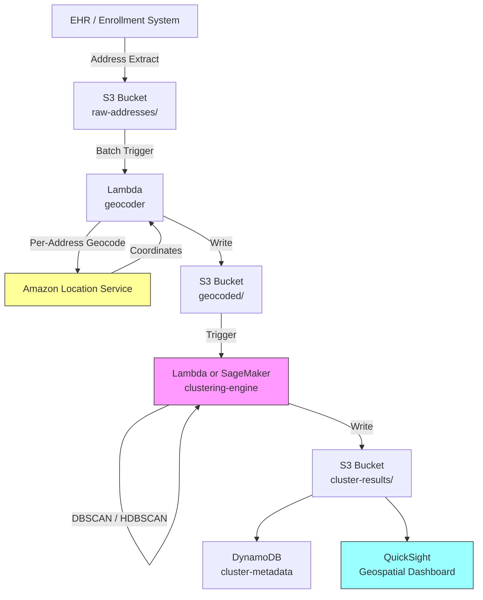

# Recipe 6.1 Architecture and Implementation: Geographic Patient Clustering

*Companion to [Recipe 6.1: Geographic Patient Clustering](chapter06.01-geographic-patient-clustering). This page covers the AWS architecture, services, prerequisites, and pseudocode. For the problem framing and the conceptual approach, start with the main recipe.*

---

## The AWS Implementation

### Why These Services

**Amazon Location Service for geocoding.** Location Service provides a managed geocoding API that converts addresses to coordinates without requiring you to run your own geocoding infrastructure. It supports high-throughput geocoding (important when you're processing 200,000 addresses), returns confidence scores, and operates within the AWS compliance boundary. Before sending patient addresses to Location Service, verify that it appears on the current [AWS HIPAA Eligible Services list](https://aws.amazon.com/compliance/hipaa-eligible-services-reference/). The eligible services list is updated periodically; check at implementation time. If Location Service is not listed when you implement, geocode using a self-hosted solution (e.g., Pelias or Nominatim on EC2 within your VPC) or use a geocoding provider with whom you have a BAA.

**Amazon S3 for data storage.** Patient address extracts, geocoded coordinates, and cluster results all need durable, encrypted storage. S3 with SSE-KMS provides the encryption at rest, and S3's integration with every other AWS service makes it the natural data lake layer.

**AWS Lambda for orchestration and clustering logic.** The geocoding and clustering steps are batch workloads that run periodically (weekly or monthly refresh). Lambda handles the orchestration: trigger the geocoding batch, run the clustering algorithm, write results. For datasets under ~500,000 points, the clustering algorithm itself runs comfortably within Lambda's memory and timeout limits.

<!-- TODO (TechWriter): Expert review ARCH-1 (MEDIUM). Add note recommending Step Functions Map state for orchestrating geocoding batches over 50K addresses to avoid Lambda timeout risk. -->

**Amazon SageMaker for large-scale clustering.** If your patient population exceeds what Lambda can handle in memory (roughly 500K+ points with enrichment data), SageMaker provides managed compute for running scikit-learn or custom clustering jobs. SageMaker Processing Jobs give you ephemeral compute that spins up, runs the algorithm, writes results to S3, and shuts down. For datasets exceeding 500K points or requiring GPU-accelerated HDBSCAN, replace the clustering Lambda with a SageMaker Processing Job. The job reads from the same S3 geocoded/ prefix, runs the same algorithm, and writes to the same cluster-results/ prefix. The only difference is compute: SageMaker provides instances with more memory and optional GPU. Use the `sklearn` container or bring your own.

**Amazon QuickSight for visualization.** QuickSight supports geospatial visualizations (point maps, filled maps, heat maps) and connects directly to S3 or Athena. For the "show me where the clusters are" question that executives ask, QuickSight delivers without requiring a custom mapping application.

**Amazon DynamoDB for cluster metadata.** Once clusters are computed, downstream systems need fast lookups: "which cluster does this patient belong to?" or "what are the characteristics of cluster 7?" DynamoDB provides single-digit-millisecond reads for these access patterns. Restrict DynamoDB access to the cluster-results tables using IAM policies scoped to specific roles (the pipeline write role and the dashboard read role). Use an opaque patient identifier (not MRN) as the partition key; maintain the MRN mapping in a separate, more tightly controlled identity service. The patient-clusters table contains home location data for your entire active population; treat it as a high-sensitivity asset.

### Architecture Diagram



### Prerequisites

| Requirement | Details |
|-------------|---------|
| **AWS Services** | Amazon Location Service, Amazon S3, AWS Lambda, Amazon DynamoDB, Amazon QuickSight (optional), Amazon SageMaker (for large datasets) |
| **IAM Permissions** | Geocoding Lambda: `geo:SearchPlaceIndexForText`, `s3:GetObject` (raw-addresses), `s3:PutObject` (geocoded), `kms:Decrypt`, `kms:GenerateDataKey`, CloudWatch Logs. Clustering Lambda/SageMaker: `s3:GetObject` (geocoded), `s3:PutObject` (cluster-results), `dynamodb:PutItem`, `kms:Decrypt`, `kms:GenerateDataKey`, CloudWatch Logs. Dashboard role: `dynamodb:Query`, `s3:GetObject` (cluster-results). |
| **BAA** | Required. Patient addresses are PHI. Geocoded coordinates derived from addresses are PHI. Verify Amazon Location Service appears on the [HIPAA Eligible Services list](https://aws.amazon.com/compliance/hipaa-eligible-services-reference/) before sending patient addresses. |
| **Encryption** | S3: SSE-KMS; DynamoDB: encryption at rest (default); Lambda environment variables encrypted with KMS; all transit over TLS |
| **VPC** | Production: Lambda in VPC with S3 and DynamoDB Gateway endpoints (free, no per-GB charge) and Interface endpoints for CloudWatch Logs. Location Service calls go over the public endpoint (no VPC endpoint available as of early 2026; use a NAT Gateway). Data is TLS-encrypted in transit. Document this data flow in your HIPAA risk assessment. If your compliance posture requires all PHI to remain within private network paths, consider self-hosted geocoding (Pelias on EC2 within your VPC). |
| **CloudTrail** | Enabled: log all Location Service and S3 API calls for HIPAA audit trail |
| **Sample Data** | Synthetic patient addresses. Use Census Bureau TIGER/Line files for realistic geographic distributions. Never use real patient addresses in dev. |
| **Cost Estimate** | Location Service geocoding: ~$0.50 per 1,000 requests. For 200,000 patients: ~$100 one-time, then incremental for new patients. Lambda and DynamoDB costs negligible at this scale. |

### Ingredients

| AWS Service | Role |
|------------|------|
| **Amazon Location Service** | Geocodes patient addresses to lat/long coordinates |
| **Amazon S3** | Stores address extracts, geocoded data, and cluster results |
| **AWS Lambda** | Orchestrates geocoding batches and runs clustering for moderate datasets |
| **Amazon SageMaker** | Runs clustering algorithms on large datasets (500K+ patients) |
| **Amazon DynamoDB** | Stores cluster assignments and metadata for fast lookup |
| **Amazon QuickSight** | Geospatial visualization of clusters and coverage gaps |
| **AWS KMS** | Manages encryption keys for all data at rest |
| **Amazon CloudWatch** | Logs, metrics, and alarms for pipeline monitoring |

### Pseudocode Walkthrough

**Step 1: Extract and prepare address data.** The pipeline starts by pulling patient addresses from your source system (EHR extract, enrollment file, claims data warehouse). The key decision here is what to include beyond the address itself. At minimum, you need a patient identifier and the full address. For enrichment later, include demographics (age, payer type) and utilization data (visit count, last visit date). This step also handles basic data quality: removing records with no address, standardizing state abbreviations, and flagging PO Boxes for special handling. Skip this step or skip the quality checks, and your geocoding step will waste API calls on addresses that can never resolve to meaningful coordinates.

```pseudocode
FUNCTION extract_patient_addresses(source_connection):
    // Pull patient records with geographic and demographic data.
    // We need more than just addresses: the enrichment fields make clusters actionable.
    records = query source_connection:
        SELECT patient_id, address_line_1, address_line_2, city, state, zip_code,
               date_of_birth, primary_payer, visit_count_12mo, last_visit_date
        FROM patient_demographics
        WHERE status = 'active'                    // only current patients
          AND address_line_1 IS NOT NULL           // must have an address to geocode

    // Basic quality filtering before we spend money on geocoding API calls.
    cleaned = empty list
    po_box_count = 0

    FOR each record in records:
        // Standardize state to two-letter abbreviation
        record.state = standardize_state(record.state)

        // Flag PO Boxes: they geocode to the post office, not the patient's home.
        // We'll still geocode them (some analysis needs them), but flag for awareness.
        IF record.address_line_1 matches pattern "PO BOX" or "P.O." or "POST OFFICE":
            record.is_po_box = true
            po_box_count = po_box_count + 1
        ELSE:
            record.is_po_box = false

        append record to cleaned

    LOG "Extracted {length of cleaned} records. {po_box_count} PO Boxes flagged."
    RETURN cleaned
```

**Step 2: Geocode addresses to coordinates.** This is where text addresses become plottable points. The geocoding service takes a street address and returns a latitude/longitude pair with a confidence score. We process addresses in client-side batches for throughput management (controlling concurrency and rate limiting), but each address is geocoded individually. The confidence score matters because a low-confidence geocode (the service guessed at the location) can place a patient miles from their actual home, distorting your clusters. We set a threshold and route low-confidence results to a "needs review" bucket rather than silently including bad coordinates.

```pseudocode
GEOCODE_CONFIDENCE_THRESHOLD = 0.85  // below this, the coordinate is too uncertain to trust

FUNCTION geocode_addresses(records, place_index_name):
    // Process addresses in client-side batches for rate limiting and progress tracking.
    // Amazon Location Service geocodes one address per API call (SearchPlaceIndexForText).
    // We group into batches of 50 for concurrency control, not because there's a batch API.
    geocoded = empty list
    failed = empty list
    batch_size = 50  // process this many before logging progress

    FOR each batch of batch_size records:
        FOR each record in batch:
            // Build the search string from address components.
            full_address = "{record.address_line_1}, {record.city}, {record.state} {record.zip_code}"

            // Call the geocoding service for this address.
            result = call LocationService.SearchPlaceIndexForText with:
                index_name = place_index_name
                text       = full_address
                max_results = 1

            IF result is not empty AND result.confidence >= GEOCODE_CONFIDENCE_THRESHOLD:
                record.latitude  = result.latitude
                record.longitude = result.longitude
                record.geocode_confidence = result.confidence
                append record to geocoded
            ELSE:
                // Low confidence or no result: ambiguous address, rural route, etc.
                record.geocode_confidence = result.confidence IF result exists ELSE 0
                record.geocode_failure_reason = "low_confidence"
                append record to failed

        LOG "Progress: geocoded {length of geocoded} so far..."

    LOG "Geocoded {length of geocoded} successfully. {length of failed} below confidence threshold."
    RETURN geocoded, failed
```

**Step 3: Clean and filter coordinates.** Even after geocoding, the data needs one more pass. Coordinates at (0, 0) mean the geocoder returned a default rather than admitting failure. Coordinates outside your service area bounding box are patients who've moved or were entered incorrectly. Duplicate coordinates (multiple patients at the same address, like a nursing home) need to be handled: you might want to count them as one point for clustering but retain the patient count for enrichment. This step ensures that what goes into the clustering algorithm is clean, bounded, and representative.

```pseudocode
FUNCTION clean_coordinates(geocoded_records, bounding_box):
    // bounding_box = { min_lat, max_lat, min_lon, max_lon }
    // Defines your service area. Points outside are excluded from clustering.
    cleaned = empty list
    excluded = empty list

    FOR each record in geocoded_records:
        // Check for null island (0,0) which means geocoding silently failed
        IF record.latitude == 0 AND record.longitude == 0:
            record.exclusion_reason = "null_island"
            append record to excluded
            CONTINUE

        // Check bounding box: is this patient within our service area?
        IF record.latitude < bounding_box.min_lat
           OR record.latitude > bounding_box.max_lat
           OR record.longitude < bounding_box.min_lon
           OR record.longitude > bounding_box.max_lon:
            record.exclusion_reason = "outside_service_area"
            append record to excluded
            CONTINUE

        append record to cleaned

    LOG "Retained {length of cleaned} points. Excluded {length of excluded}."
    RETURN cleaned, excluded
```

**Step 4: Run the clustering algorithm.** This is the core analytical step. We use DBSCAN because it doesn't require pre-specifying the number of clusters, handles irregular shapes, and identifies noise points (isolated patients who don't belong to any dense cluster). The two parameters to tune are epsilon (the maximum distance between two points for them to be considered neighbors) and min_samples (the minimum number of points to form a dense region). For healthcare facility planning, an epsilon of 2-5 km and min_samples of 50-200 patients is a reasonable starting range, but these depend entirely on your population density and operational question.

```pseudocode
// DBSCAN parameters: these are the knobs you'll tune.
// epsilon: maximum distance (in km) between two points to be considered neighbors.
//          Smaller = tighter clusters, more noise points. Larger = looser clusters.
// min_samples: minimum points in a neighborhood to form a cluster core.
//              Higher = only dense areas form clusters. Lower = sparser areas qualify.

EPSILON = 3.0        // km; roughly "within a 5-minute drive in suburban areas"
MIN_SAMPLES = 100    // at least 100 patients to form a meaningful cluster

FUNCTION cluster_patients(cleaned_records):
    // Extract coordinate arrays for the clustering algorithm.
    coordinates = array of [record.latitude, record.longitude] for each record in cleaned_records

    // Convert epsilon from km to radians for Haversine distance metric.
    // Earth's radius is approximately 6371 km.
    epsilon_radians = EPSILON / 6371.0

    // Run DBSCAN with Haversine distance (appropriate for lat/long coordinates).
    // Haversine accounts for Earth's curvature, unlike Euclidean distance which
    // would distort at higher latitudes.
    cluster_labels = DBSCAN(
        data            = coordinates,
        epsilon         = epsilon_radians,
        min_samples     = MIN_SAMPLES,
        metric          = "haversine"       // critical: use spherical distance, not flat
    )

    // Assign cluster labels back to records.
    // Label -1 means "noise": the point doesn't belong to any cluster.
    FOR each record, label in zip(cleaned_records, cluster_labels):
        record.cluster_id = label

    // Count results
    num_clusters = count of unique labels where label != -1
    noise_count  = count of records where cluster_id == -1

    LOG "Found {num_clusters} clusters. {noise_count} noise points ({noise_count/total * 100}%)."
    RETURN cleaned_records, num_clusters
```

**Step 5: Enrich clusters with metadata.** A cluster is just a set of coordinates until you attach meaning. This step computes summary statistics for each cluster: centroid (geographic center), patient count, demographic breakdown, utilization patterns, and payer mix. These enrichments transform "there's a dense area here" into "there are 3,200 patients here, average age 58, 40% Medicare, averaging 6.2 visits per year, and the nearest existing clinic is 12 miles away." That's the information a strategy team needs to make a facility decision.

```pseudocode
FUNCTION enrich_clusters(clustered_records, num_clusters):
    cluster_metadata = empty map

    FOR cluster_id FROM 0 TO num_clusters - 1:
        // Get all patients in this cluster
        members = filter clustered_records where record.cluster_id == cluster_id

        // Compute geographic centroid (average lat/long of all members)
        centroid_lat = average of member.latitude for all members
        centroid_lon = average of member.longitude for all members

        // Compute demographic summary
        avg_age = average age computed from member.date_of_birth for all members
        payer_distribution = count members grouped by member.primary_payer

        // Compute utilization summary
        avg_visits_12mo = average of member.visit_count_12mo for all members
        pct_no_visit_12mo = percentage of members where visit_count_12mo == 0

        // Compute geographic spread (how tight or dispersed is this cluster?)
        max_distance_from_centroid = maximum Haversine distance from centroid to any member

        cluster_metadata[cluster_id] = {
            cluster_id:          cluster_id,
            patient_count:       length of members,
            centroid:            { latitude: centroid_lat, longitude: centroid_lon },
            radius_km:           max_distance_from_centroid,
            avg_age:             avg_age,
            payer_mix:           payer_distribution,
            avg_visits_12mo:     avg_visits_12mo,
            pct_disengaged:      pct_no_visit_12mo,   // patients with zero visits: potential access issue
            top_zip_codes:       top 5 ZIP codes by patient count in this cluster
        }

    RETURN cluster_metadata
```

**Step 6: Store results and serve downstream.** The final step persists both the per-patient cluster assignments (so any system can look up "which cluster is this patient in?") and the cluster-level metadata (so dashboards and reports can display cluster characteristics). Writing to both a fast-lookup store (DynamoDB) and a bulk-query store (S3/Athena) covers both access patterns: real-time lookups and analytical queries.

Table design: the `patient-clusters` table uses `patient_id` (string, opaque identifier) as the partition key. The `cluster-metadata` table uses `cluster_id` (number) as the partition key. No sort keys needed for point lookups. If you need "list all patients in cluster X," add a GSI on `cluster_id` to the patient-clusters table, but be aware this enables bulk enumeration of patient locations by cluster.

<!-- TODO (TechWriter): Expert review SEC-3 (MEDIUM). Add S3 lifecycle policy recommendation: retain current and previous snapshot, expire older snapshots after 6-12 months. Each snapshot contains PHI; minimizing retained copies reduces exposure surface. -->

```pseudocode
FUNCTION store_results(clustered_records, cluster_metadata):
    // Write per-patient assignments to DynamoDB for fast point lookups.
    // Use case: "Which cluster does patient X belong to?"
    // Table: patient-clusters, partition key: patient_id (opaque, not MRN)
    FOR each record in clustered_records:
        write to DynamoDB table "patient-clusters":
            patient_id   = record.patient_id
            cluster_id   = record.cluster_id
            latitude     = record.latitude
            longitude    = record.longitude
            computed_at  = current UTC timestamp (ISO 8601)

    // Write cluster metadata to DynamoDB for dashboard and API access.
    // Table: cluster-metadata, partition key: cluster_id
    FOR each cluster_id, metadata in cluster_metadata:
        write to DynamoDB table "cluster-metadata":
            cluster_id   = cluster_id
            metadata     = metadata
            computed_at  = current UTC timestamp (ISO 8601)

    // Also write full results to S3 as Parquet for analytical queries via Athena.
    write clustered_records as Parquet to S3: "cluster-results/{date}/patient-assignments.parquet"
    write cluster_metadata as JSON to S3: "cluster-results/{date}/cluster-summaries.json"

    LOG "Stored {length of clustered_records} patient assignments and {length of cluster_metadata} cluster summaries."
```

> **Curious how this looks in Python?** The pseudocode above covers the concepts. If you'd like to see sample Python code that demonstrates these patterns using boto3, check out the [Python Example](chapter06.01-python-example). It walks through each step with inline comments and notes on what you'd need to change for a real deployment.

### Expected Results

**Sample cluster metadata output:**

```json
{
  "cluster_id": 7,
  "patient_count": 3247,
  "centroid": {
    "latitude": 39.1021,
    "longitude": -84.5120
  },
  "radius_km": 4.8,
  "avg_age": 52.3,
  "payer_mix": {
    "Medicare": 0.31,
    "Commercial": 0.44,
    "Medicaid": 0.18,
    "Self-Pay": 0.07
  },
  "avg_visits_12mo": 4.7,
  "pct_disengaged": 0.12,
  "top_zip_codes": ["45202", "45203", "45219", "45206", "45220"]
}
```

**Performance benchmarks:**

| Metric | Typical Value |
|--------|---------------|
| Geocoding throughput | ~50-100 addresses/second (per-address API calls with concurrency) |
| Geocoding accuracy | 90-95% high-confidence matches |
| Clustering time (200K points) | 15-45 seconds |
| End-to-end pipeline (200K patients) | 30-60 minutes (dominated by geocoding) |
| Cost per full run (200K patients) | ~$100-150 (dominated by geocoding) |
| Incremental cost (new patients only) | ~$0.50 per 1,000 new addresses |

**Where it struggles:**

- Rural areas with low population density produce few or no clusters (everything is "noise" to DBSCAN). You may need different epsilon values for urban vs. rural regions.
- PO Box addresses geocode to the post office, not the patient's home. High PO Box rates (common in rural areas) distort cluster locations.
- Apartment complexes and nursing homes create artificial density spikes. 500 patients at one address looks like a cluster core but represents a single building, not a neighborhood.
- Seasonal populations (snowbirds, college students) shift dramatically between summer and winter. A single snapshot misses this.

<!-- TODO (TechWriter): RECIPE-GUIDE requires a "Why This Isn't Production-Ready" section between Expected Results and Variations. Add one covering gaps like lack of automated parameter tuning, missing drive-time validation, no CI/CD pipeline, and absence of data drift monitoring. -->

---

## Variations and Extensions

**Drive-time isochrone analysis.** Instead of clustering by straight-line distance, use a routing service to compute actual drive times from each patient to existing facilities. Identify patients outside a 20-minute drive-time threshold. This is more expensive (requires a routing API call per patient-facility pair) but dramatically more accurate for access analysis, especially in areas with geographic barriers like rivers, mountains, or highway configurations.

**Temporal clustering.** Add a time dimension: cluster patients not just by where they live, but by when they visit. A cluster of 2,000 patients who all visit on weekday mornings has different staffing implications than one where visits are evenly distributed. Combine geographic clusters with visit-time patterns to inform both location and hours-of-operation decisions.

**Competitor overlay.** Geocode competitor facility locations and compute which of your patient clusters are closer to a competitor than to your nearest facility. This identifies "at-risk" clusters where patients might switch if a competitor opens or expands. Requires publicly available competitor address data (NPI registry, state licensing databases).

---

## Additional Resources

**AWS Documentation:**
- [Amazon Location Service Developer Guide](https://docs.aws.amazon.com/location/latest/developerguide/welcome.html)
- [Amazon Location Service Geocoding (Place Index)](https://docs.aws.amazon.com/location/latest/developerguide/search-place-index-geocoding.html)
- [Amazon Location Service Pricing](https://aws.amazon.com/location/pricing/)
- [Amazon SageMaker Processing Jobs](https://docs.aws.amazon.com/sagemaker/latest/dg/processing-job.html)
- [AWS HIPAA Eligible Services](https://aws.amazon.com/compliance/hipaa-eligible-services-reference/)
- [Amazon QuickSight Geospatial Charts](https://docs.aws.amazon.com/quicksight/latest/user/geospatial-charts.html)

**AWS Sample Repos:**
- [`amazon-location-samples`](https://github.com/aws-samples/amazon-location-samples): Code samples for Amazon Location Service including geocoding, routing, and map rendering
- [`aws-healthcare-lifescience-ai-ml-sample-notebooks`](https://github.com/aws-samples/aws-healthcare-lifescience-ai-ml-sample-notebooks): Healthcare-specific ML notebooks including geospatial analysis patterns

**External References:**
- [scikit-learn DBSCAN Documentation](https://scikit-learn.org/stable/modules/generated/sklearn.cluster.DBSCAN.html): Algorithm reference with parameter guidance
- [US Census TIGER/Line Shapefiles](https://www.census.gov/geographies/mapping-files/time-series/geo/tiger-line-file.html): Free geographic boundary files for service area definition
- [CMS Network Adequacy Standards](https://www.cms.gov/medicare/health-drug-plans/managed-care-eligibility-enrollment/network-adequacy): Regulatory distance/time thresholds by provider type

---

## Estimated Implementation Time

| Tier | Timeline | What You Get |
|------|----------|--------------|
| **Basic** | 1-2 weeks | Geocoded patient map, DBSCAN clusters, static visualization |
| **Production-ready** | 4-6 weeks | Automated refresh pipeline, enriched cluster metadata, QuickSight dashboards, DynamoDB API layer |
| **With variations** | 8-12 weeks | Drive-time isochrones, temporal analysis, competitor overlay, network adequacy reporting |

---

**Tags:** `clustering` · `geospatial` · `DBSCAN` · `facility-planning` · `network-adequacy` · `population-health` · `Amazon Location Service` · `QuickSight`

---

| [← Chapter 6 Index](chapter06-preface) | [Chapter 6 Index](chapter06-preface) | [Recipe 6.2 →](chapter06.02-utilization-pattern-segmentation) |
|:---|:---:|---:|


---

*← [Main Recipe 6.1](chapter06.01-geographic-patient-clustering) · [Python Example](chapter06.01-python-example) · [Chapter Preface](chapter06-preface)*
