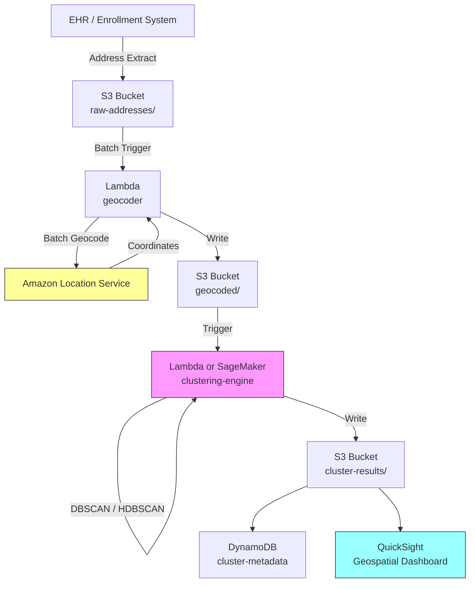

# Recipe 6.1: Geographic Patient Clustering ⭐

**Complexity:** Simple · **Phase:** MVP · **Estimated Cost:** ~$0.10 per 10,000 patients clustered

---

## The Problem

A regional health system with 14 clinics is trying to decide where to open clinic number 15. They have 200,000 patients in their EHR. They know where those patients live (addresses on file). They know which clinic each patient currently visits. But they don't know where the gaps are. They don't know which ZIP codes have patients driving 45 minutes past a closer competitor because there's nothing in between. They don't know which neighborhoods are growing, which are aging, and which are losing population to the suburbs.

This isn't a hypothetical. Every health system with more than a handful of locations faces this question constantly: where are our patients, where should we be, and where are we losing people to distance?

The same geographic clustering problem shows up in community health assessment (which neighborhoods have the worst outcomes and the fewest resources?), mobile health unit routing (where should the van go on Tuesdays?), pandemic response (which areas need testing sites?), and network adequacy reporting (can we prove to CMS that 90% of our members live within 15 miles of a provider?).

The data is sitting right there in the EHR: patient addresses, visit histories, diagnoses. The challenge isn't getting the data. It's turning 200,000 individual addresses into actionable geographic intelligence that a VP of Strategy can use to make a $40 million facility decision.

Let's talk about how geographic clustering actually works.

---

## The Technology: Spatial Clustering from First Principles

### What Is Geographic Clustering?

At its core, geographic clustering is the process of grouping points on a map into meaningful regions based on proximity and density. You have a set of coordinates (latitude/longitude pairs derived from patient addresses), and you want to find natural groupings: areas where patients concentrate, gaps where they don't, and boundaries that make operational sense.

This sounds trivial. Plot the dots, draw circles around the dense areas, done. In practice, it's more nuanced than that, because "meaningful" depends entirely on what you're trying to do. A cluster that makes sense for facility planning (where should we build?) looks different from one that makes sense for community health (which neighborhoods share risk factors?), which looks different from one that makes sense for network adequacy (can we prove geographic coverage?).

### The Classic Algorithms

**K-Means** is the algorithm most people learn first. You pick K (the number of clusters you want), and the algorithm iteratively assigns each point to its nearest cluster center, then moves the centers to the middle of their assigned points. Repeat until stable. It's fast, intuitive, and works well when your clusters are roughly spherical and roughly the same size.

The problem with K-Means for geographic data: you have to pick K in advance. How many clusters should 200,000 patients form? 10? 50? 200? The answer depends on your use case, and K-Means gives you no guidance. It also assumes clusters are convex (roughly circular), which geographic populations rarely are. People cluster along highways, around town centers, in irregular suburban sprawl patterns.

**DBSCAN** (Density-Based Spatial Clustering of Applications with Noise) takes a different approach. Instead of pre-specifying the number of clusters, you specify two parameters: epsilon (how close points need to be to count as neighbors) and min_samples (how many neighbors a point needs to be considered part of a dense region). DBSCAN finds clusters of arbitrary shape, handles noise (isolated points that don't belong to any cluster), and doesn't require you to guess the number of clusters in advance.

For geographic patient data, DBSCAN is often the better starting point. Patient populations don't form neat circles. They form irregular blobs along transit corridors, around commercial centers, and in residential developments. DBSCAN respects that reality.

**HDBSCAN** (Hierarchical DBSCAN) extends DBSCAN by varying the density threshold and building a hierarchy of clusters. It handles populations with varying density (dense urban core, sparse rural fringe) better than plain DBSCAN, which uses a single density threshold everywhere. If your service area spans both downtown and farmland, HDBSCAN is worth the extra complexity.

### Geocoding: The Unglamorous Foundation

Before you can cluster anything, you need coordinates. Patient records have addresses. Addresses are text strings. Clustering algorithms need numbers (latitude, longitude). The process of converting "123 Main St, Springfield, IL 62701" into (39.7817, -89.6501) is called geocoding.

Geocoding sounds like a solved problem. It mostly is, for well-formed US addresses. But healthcare data is messy:

- PO Boxes don't have a meaningful geographic location (they represent a post office, not where the patient lives)
- Homeless patients may have a shelter address, a last-known address, or no address at all
- Rural addresses sometimes use route-and-box notation that geocoders struggle with
- Apartment numbers don't affect coordinates but do affect density calculations
- Patients move. The address in the EHR might be six months stale.

A geocoding step that silently drops 15% of your patients (the ones with PO Boxes, bad addresses, or missing data) will bias your clusters toward populations with stable housing and well-formed addresses. That's exactly the population you probably don't need to worry about. The patients you're missing are often the ones who need geographic access the most.

### Distance Metrics: Not All Miles Are Equal

When clustering geographic points, the obvious distance metric is "as the crow flies" (Haversine distance between two lat/long pairs). But patients don't fly. They drive. Or take the bus. Or walk.

A patient who lives 3 miles from a clinic but across a river with no bridge is functionally farther away than a patient who lives 8 miles away on a straight highway. Drive-time isochrones (the area reachable within X minutes of driving) are more meaningful than radius circles for healthcare access analysis.

For initial clustering, Haversine distance is fine. It's fast, requires no external API calls, and gives you directionally correct results. But when you're making facility placement decisions, you'll want to validate clusters against actual drive times. A cluster of 5,000 patients that looks compact on a map might actually span a 45-minute drive if there's a mountain or a river in the middle.

### What Makes Healthcare Geographic Clustering Different

Generic geographic clustering (where should we put a Starbucks?) differs from healthcare geographic clustering in a few important ways:

**Regulatory requirements.** CMS network adequacy standards specify maximum distance and drive-time thresholds by specialty type. Your clusters need to map to these thresholds, not arbitrary boundaries. For Medicare Advantage plans, 90% of urban members must live within specific distances of specific provider types. Your clustering needs to prove (or disprove) compliance.

**Equity considerations.** If your clusters reveal that underserved populations are systematically farther from care, that's not just a business insight. It's a health equity finding with regulatory, reputational, and moral implications. Geographic clustering in healthcare is never purely operational.

**PHI sensitivity.** Patient addresses are PHI. The coordinates derived from them are PHI. The clusters themselves, if small enough to be re-identified, are PHI. You can't just dump 200,000 lat/long pairs into a public mapping tool. The entire pipeline needs to operate within your HIPAA boundary.

**Temporal dynamics.** Patient populations shift. New housing developments, highway construction, employer relocations, seasonal residents. A clustering analysis from January may not reflect reality in July. Build for refresh, not one-shot analysis.

### The General Architecture Pattern

```
[Address Data] → [Geocode] → [Clean/Filter] → [Cluster] → [Enrich] → [Visualize/Analyze]
```

**Address Data.** Extract patient addresses from your source system (EHR, claims, enrollment). Include visit history and demographics if you want to enrich clusters later.

**Geocode.** Convert addresses to latitude/longitude coordinates. Handle failures gracefully (PO Boxes, invalid addresses, missing data). Log what you couldn't geocode so you know your coverage gaps.

**Clean/Filter.** Remove duplicates (same patient, same address counted once). Handle edge cases (coordinates at 0,0 mean geocoding failed, not that your patient lives in the Gulf of Guinea). Apply any geographic bounding box (exclude patients outside your service area).

**Cluster.** Apply your chosen algorithm. For most healthcare use cases, start with DBSCAN or HDBSCAN. Tune parameters based on your operational question: tight clusters for facility micro-siting, loose clusters for regional planning.

**Enrich.** Attach metadata to each cluster: patient count, average age, payer mix, top diagnoses, utilization patterns. A cluster is just a set of coordinates until you attach meaning to it.

**Visualize/Analyze.** Render clusters on a map. Calculate summary statistics. Compare against existing facility locations, competitor locations, and regulatory thresholds. Generate the artifacts that decision-makers need.

---

## The AWS Implementation

### Why These Services

**Amazon Location Service for geocoding.** Location Service provides a managed geocoding API that converts addresses to coordinates without requiring you to run your own geocoding infrastructure. It supports batch geocoding (important when you're processing 200,000 addresses), returns confidence scores, and operates within the AWS compliance boundary. For HIPAA workloads, this matters: you're not sending patient addresses to a third-party API outside your BAA coverage.

**Amazon S3 for data storage.** Patient address extracts, geocoded coordinates, and cluster results all need durable, encrypted storage. S3 with SSE-KMS provides the encryption at rest, and S3's integration with every other AWS service makes it the natural data lake layer.

**AWS Lambda for orchestration and clustering logic.** The geocoding and clustering steps are batch workloads that run periodically (weekly or monthly refresh). Lambda handles the orchestration: trigger the geocoding batch, run the clustering algorithm, write results. For datasets under ~500,000 points, the clustering algorithm itself runs comfortably within Lambda's memory and timeout limits.

**Amazon SageMaker for large-scale clustering.** If your patient population exceeds what Lambda can handle in memory (roughly 500K+ points with enrichment data), SageMaker provides managed compute for running scikit-learn or custom clustering jobs. SageMaker Processing Jobs give you ephemeral compute that spins up, runs the algorithm, writes results to S3, and shuts down.

**Amazon QuickSight for visualization.** QuickSight supports geospatial visualizations (point maps, filled maps, heat maps) and connects directly to S3 or Athena. For the "show me where the clusters are" question that executives ask, QuickSight delivers without requiring a custom mapping application.

**Amazon DynamoDB for cluster metadata.** Once clusters are computed, downstream systems need fast lookups: "which cluster does this patient belong to?" or "what are the characteristics of cluster 7?" DynamoDB provides single-digit-millisecond reads for these access patterns.

### Architecture Diagram



### Prerequisites

| Requirement | Details |
|-------------|---------|
| **AWS Services** | Amazon Location Service, Amazon S3, AWS Lambda, Amazon DynamoDB, Amazon QuickSight (optional), Amazon SageMaker (for large datasets) |
| **IAM Permissions** | `geo:SearchPlaceIndexForText`, `geo:BatchSearchPlaceIndexForText` (Location Service is the newer name; the API actions use `geo:`), `s3:GetObject`, `s3:PutObject`, `dynamodb:PutItem`, `dynamodb:Query` |
| **BAA** | Required. Patient addresses are PHI. Geocoded coordinates derived from addresses are PHI. |
| **Encryption** | S3: SSE-KMS; DynamoDB: encryption at rest (default); Lambda environment variables encrypted with KMS; all transit over TLS |
| **VPC** | Production: Lambda in VPC with VPC endpoints for S3, DynamoDB, and CloudWatch Logs. Location Service calls go over the public endpoint (no VPC endpoint available as of early 2026; use a NAT Gateway). |
| **CloudTrail** | Enabled: log all Location Service and S3 API calls for HIPAA audit trail |
| **Sample Data** | Synthetic patient addresses. Use Census Bureau TIGER/Line files for realistic geographic distributions. Never use real patient addresses in dev. |
| **Cost Estimate** | Location Service geocoding: ~$0.50 per 1,000 requests. For 200,000 patients: ~$100 one-time, then incremental for new patients. Lambda and DynamoDB costs negligible at this scale. |

### Ingredients

| AWS Service | Role |
|------------|------|
| **Amazon Location Service** | Geocodes patient addresses to lat/long coordinates |
| **Amazon S3** | Stores address extracts, geocoded data, and cluster results |
| **AWS Lambda** | Orchestrates geocoding batches and runs clustering for moderate datasets |
| **Amazon SageMaker** | Runs clustering algorithms on large datasets (500K+ patients) |
| **Amazon DynamoDB** | Stores cluster assignments and metadata for fast lookup |
| **Amazon QuickSight** | Geospatial visualization of clusters and coverage gaps |
| **AWS KMS** | Manages encryption keys for all data at rest |
| **Amazon CloudWatch** | Logs, metrics, and alarms for pipeline monitoring |

### Code

#### Walkthrough

**Step 1: Extract and prepare address data.** The pipeline starts by pulling patient addresses from your source system (EHR extract, enrollment file, claims data warehouse). The key decision here is what to include beyond the address itself. At minimum, you need a patient identifier and the full address. For enrichment later, include demographics (age, payer type) and utilization data (visit count, last visit date). This step also handles basic data quality: removing records with no address, standardizing state abbreviations, and flagging PO Boxes for special handling. Skip this step or skip the quality checks, and your geocoding step will waste API calls on addresses that can never resolve to meaningful coordinates.

```
FUNCTION extract_patient_addresses(source_connection):
    // Pull patient records with geographic and demographic data.
    // We need more than just addresses: the enrichment fields make clusters actionable.
    records = query source_connection:
        SELECT patient_id, address_line_1, address_line_2, city, state, zip_code,
               date_of_birth, primary_payer, visit_count_12mo, last_visit_date
        FROM patient_demographics
        WHERE status = 'active'                    // only current patients
          AND address_line_1 IS NOT NULL           // must have an address to geocode

    // Basic quality filtering before we spend money on geocoding API calls.
    cleaned = empty list
    po_box_count = 0

    FOR each record in records:
        // Standardize state to two-letter abbreviation
        record.state = standardize_state(record.state)

        // Flag PO Boxes: they geocode to the post office, not the patient's home.
        // We'll still geocode them (some analysis needs them), but flag for awareness.
        IF record.address_line_1 matches pattern "PO BOX" or "P.O." or "POST OFFICE":
            record.is_po_box = true
            po_box_count = po_box_count + 1
        ELSE:
            record.is_po_box = false

        append record to cleaned

    LOG "Extracted {length of cleaned} records. {po_box_count} PO Boxes flagged."
    RETURN cleaned
```

**Step 2: Geocode addresses to coordinates.** This is where text addresses become plottable points. The geocoding service takes a street address and returns a latitude/longitude pair with a confidence score. Batch processing is critical here: geocoding 200,000 addresses one at a time would take hours and cost the same as doing it in batches of 50. The confidence score matters because a low-confidence geocode (the service guessed at the location) can place a patient miles from their actual home, distorting your clusters. We set a threshold and route low-confidence results to a "needs review" bucket rather than silently including bad coordinates.

```
GEOCODE_CONFIDENCE_THRESHOLD = 0.85  // below this, the coordinate is too uncertain to trust

FUNCTION geocode_addresses(records, place_index_name):
    // Process addresses in batches. Most geocoding APIs support batch calls
    // that are both faster and cheaper than individual requests.
    geocoded = empty list
    failed = empty list
    batch_size = 50  // Amazon Location Service batch limit

    FOR each batch of batch_size records:
        // Build the batch request: one address string per record.
        address_strings = []
        FOR each record in batch:
            // Concatenate address components into a single search string.
            full_address = "{record.address_line_1}, {record.city}, {record.state} {record.zip_code}"
            append full_address to address_strings

        // Call the geocoding service with the full batch.
        results = call LocationService.BatchSearchPlaceIndex with:
            index_name = place_index_name
            addresses  = address_strings

        // Process each result: check confidence, extract coordinates.
        FOR each result, original_record in zip(results, batch):
            IF result.confidence >= GEOCODE_CONFIDENCE_THRESHOLD:
                original_record.latitude  = result.latitude
                original_record.longitude = result.longitude
                original_record.geocode_confidence = result.confidence
                append original_record to geocoded
            ELSE:
                // Low confidence: maybe a partial match, ambiguous address, or rural route.
                original_record.geocode_confidence = result.confidence
                original_record.geocode_failure_reason = "low_confidence"
                append original_record to failed

    LOG "Geocoded {length of geocoded} successfully. {length of failed} below confidence threshold."
    RETURN geocoded, failed
```

**Step 3: Clean and filter coordinates.** Even after geocoding, the data needs one more pass. Coordinates at (0, 0) mean the geocoder returned a default rather than admitting failure. Coordinates outside your service area bounding box are patients who've moved or were entered incorrectly. Duplicate coordinates (multiple patients at the same address, like a nursing home) need to be handled: you might want to count them as one point for clustering but retain the patient count for enrichment. This step ensures that what goes into the clustering algorithm is clean, bounded, and representative.

```
FUNCTION clean_coordinates(geocoded_records, bounding_box):
    // bounding_box = { min_lat, max_lat, min_lon, max_lon }
    // Defines your service area. Points outside are excluded from clustering.
    cleaned = empty list
    excluded = empty list

    FOR each record in geocoded_records:
        // Check for null island (0,0) which means geocoding silently failed
        IF record.latitude == 0 AND record.longitude == 0:
            record.exclusion_reason = "null_island"
            append record to excluded
            CONTINUE

        // Check bounding box: is this patient within our service area?
        IF record.latitude < bounding_box.min_lat
           OR record.latitude > bounding_box.max_lat
           OR record.longitude < bounding_box.min_lon
           OR record.longitude > bounding_box.max_lon:
            record.exclusion_reason = "outside_service_area"
            append record to excluded
            CONTINUE

        append record to cleaned

    LOG "Retained {length of cleaned} points. Excluded {length of excluded}."
    RETURN cleaned, excluded
```

**Step 4: Run the clustering algorithm.** This is the core analytical step. We use DBSCAN because it doesn't require pre-specifying the number of clusters, handles irregular shapes, and identifies noise points (isolated patients who don't belong to any dense cluster). The two parameters to tune are epsilon (the maximum distance between two points for them to be considered neighbors) and min_samples (the minimum number of points to form a dense region). For healthcare facility planning, an epsilon of 2-5 km and min_samples of 50-200 patients is a reasonable starting range, but these depend entirely on your population density and operational question.

```
// DBSCAN parameters: these are the knobs you'll tune.
// epsilon: maximum distance (in km) between two points to be considered neighbors.
//          Smaller = tighter clusters, more noise points. Larger = looser clusters.
// min_samples: minimum points in a neighborhood to form a cluster core.
//              Higher = only dense areas form clusters. Lower = sparser areas qualify.

EPSILON = 3.0        // km; roughly "within a 5-minute drive in suburban areas"
MIN_SAMPLES = 100    // at least 100 patients to form a meaningful cluster

FUNCTION cluster_patients(cleaned_records):
    // Extract coordinate arrays for the clustering algorithm.
    coordinates = array of [record.latitude, record.longitude] for each record in cleaned_records

    // Convert epsilon from km to radians for Haversine distance metric.
    // Earth's radius is approximately 6371 km.
    epsilon_radians = EPSILON / 6371.0

    // Run DBSCAN with Haversine distance (appropriate for lat/long coordinates).
    // Haversine accounts for Earth's curvature, unlike Euclidean distance which
    // would distort at higher latitudes.
    cluster_labels = DBSCAN(
        data            = coordinates,
        epsilon         = epsilon_radians,
        min_samples     = MIN_SAMPLES,
        metric          = "haversine"       // critical: use spherical distance, not flat
    )

    // Assign cluster labels back to records.
    // Label -1 means "noise": the point doesn't belong to any cluster.
    FOR each record, label in zip(cleaned_records, cluster_labels):
        record.cluster_id = label

    // Count results
    num_clusters = count of unique labels where label != -1
    noise_count  = count of records where cluster_id == -1

    LOG "Found {num_clusters} clusters. {noise_count} noise points ({noise_count/total * 100}%)."
    RETURN cleaned_records, num_clusters
```

**Step 5: Enrich clusters with metadata.** A cluster is just a set of coordinates until you attach meaning. This step computes summary statistics for each cluster: centroid (geographic center), patient count, demographic breakdown, utilization patterns, and payer mix. These enrichments transform "there's a dense area here" into "there are 3,200 patients here, average age 58, 40% Medicare, averaging 6.2 visits per year, and the nearest existing clinic is 12 miles away." That's the information a strategy team needs to make a facility decision.

```
FUNCTION enrich_clusters(clustered_records, num_clusters):
    cluster_metadata = empty map

    FOR cluster_id FROM 0 TO num_clusters - 1:
        // Get all patients in this cluster
        members = filter clustered_records where record.cluster_id == cluster_id

        // Compute geographic centroid (average lat/long of all members)
        centroid_lat = average of member.latitude for all members
        centroid_lon = average of member.longitude for all members

        // Compute demographic summary
        avg_age = average age computed from member.date_of_birth for all members
        payer_distribution = count members grouped by member.primary_payer

        // Compute utilization summary
        avg_visits_12mo = average of member.visit_count_12mo for all members
        pct_no_visit_12mo = percentage of members where visit_count_12mo == 0

        // Compute geographic spread (how tight or dispersed is this cluster?)
        max_distance_from_centroid = maximum Haversine distance from centroid to any member

        cluster_metadata[cluster_id] = {
            cluster_id:          cluster_id,
            patient_count:       length of members,
            centroid:            { latitude: centroid_lat, longitude: centroid_lon },
            radius_km:           max_distance_from_centroid,
            avg_age:             avg_age,
            payer_mix:           payer_distribution,
            avg_visits_12mo:     avg_visits_12mo,
            pct_disengaged:      pct_no_visit_12mo,   // patients with zero visits: potential access issue
            top_zip_codes:       top 5 ZIP codes by patient count in this cluster
        }

    RETURN cluster_metadata
```

**Step 6: Store results and serve downstream.** The final step persists both the per-patient cluster assignments (so any system can look up "which cluster is this patient in?") and the cluster-level metadata (so dashboards and reports can display cluster characteristics). Writing to both a fast-lookup store (DynamoDB) and a bulk-query store (S3/Athena) covers both access patterns: real-time lookups and analytical queries.

```
FUNCTION store_results(clustered_records, cluster_metadata):
    // Write per-patient assignments to DynamoDB for fast point lookups.
    // Use case: "Which cluster does patient X belong to?"
    FOR each record in clustered_records:
        write to DynamoDB table "patient-clusters":
            patient_id   = record.patient_id
            cluster_id   = record.cluster_id
            latitude     = record.latitude
            longitude    = record.longitude
            computed_at  = current UTC timestamp (ISO 8601)

    // Write cluster metadata to DynamoDB for dashboard and API access.
    FOR each cluster_id, metadata in cluster_metadata:
        write to DynamoDB table "cluster-metadata":
            cluster_id   = cluster_id
            metadata     = metadata
            computed_at  = current UTC timestamp (ISO 8601)

    // Also write full results to S3 as Parquet for analytical queries via Athena.
    write clustered_records as Parquet to S3: "cluster-results/{date}/patient-assignments.parquet"
    write cluster_metadata as JSON to S3: "cluster-results/{date}/cluster-summaries.json"

    LOG "Stored {length of clustered_records} patient assignments and {length of cluster_metadata} cluster summaries."
```

> **Curious how this looks in Python?** The pseudocode above covers the concepts. If you'd like to see sample Python code that demonstrates these patterns using boto3, check out the [Python Example](chapter06.01-python-example). It walks through each step with inline comments and notes on what you'd need to change for a real deployment.

### Expected Results

**Sample cluster metadata output:**

```json
{
  "cluster_id": 7,
  "patient_count": 3247,
  "centroid": {
    "latitude": 39.1021,
    "longitude": -84.5120
  },
  "radius_km": 4.8,
  "avg_age": 52.3,
  "payer_mix": {
    "Medicare": 0.31,
    "Commercial": 0.44,
    "Medicaid": 0.18,
    "Self-Pay": 0.07
  },
  "avg_visits_12mo": 4.7,
  "pct_disengaged": 0.12,
  "top_zip_codes": ["45202", "45203", "45219", "45206", "45220"]
}
```

**Performance benchmarks:**

| Metric | Typical Value |
|--------|---------------|
| Geocoding throughput | ~1,000 addresses/second (batch) |
| Geocoding accuracy | 90-95% high-confidence matches |
| Clustering time (200K points) | 15-45 seconds |
| End-to-end pipeline (200K patients) | 10-20 minutes |
| Cost per full run (200K patients) | ~$100-150 (dominated by geocoding) |
| Incremental cost (new patients only) | ~$0.50 per 1,000 new addresses |

**Where it struggles:**

- Rural areas with low population density produce few or no clusters (everything is "noise" to DBSCAN). You may need different epsilon values for urban vs. rural regions.
- PO Box addresses geocode to the post office, not the patient's home. High PO Box rates (common in rural areas) distort cluster locations.
- Apartment complexes and nursing homes create artificial density spikes. 500 patients at one address looks like a cluster core but represents a single building, not a neighborhood.
- Seasonal populations (snowbirds, college students) shift dramatically between summer and winter. A single snapshot misses this.

---

## The Honest Take

Geographic clustering is one of those problems that feels like it should be a weekend project. Plot the dots, find the dense areas, done. And honestly, for a first pass, it kind of is. You can get a useful "here's where our patients are" map in a day.

The complexity creeps in when people start making decisions based on it. The moment someone says "let's build a $40 million clinic based on cluster 7," you need to answer questions like: How stable is this cluster over time? What happens if the new housing development on the east side fills up? Are we counting the nursing home as 400 patients or one location? Did we miss the 15% of patients with PO Boxes who might actually live in the gap between clusters?

The parameter tuning is where I've seen teams get stuck. DBSCAN's epsilon and min_samples feel arbitrary, and they are. There's no objectively correct answer. A 2km epsilon gives you tight neighborhood-level clusters. A 10km epsilon gives you regional market areas. Both are "right" depending on the question. The mistake is picking parameters once and treating the output as ground truth. Run it multiple times with different parameters. Show stakeholders the sensitivity. "At tight clustering, we see 47 micro-clusters. At loose clustering, we see 8 regional markets. Which view is useful for your decision?"

The geocoding quality issue surprised me more than I expected. In one project, 22% of addresses failed to geocode at high confidence. Most were rural routes, PO Boxes, and addresses with typos. That 22% wasn't randomly distributed. It was concentrated in exactly the underserved areas we were trying to analyze. The analysis was systematically blind to the populations that needed it most. We ended up running a separate process to estimate locations for failed geocodes using ZIP code centroids, which is imprecise but better than exclusion.

One more thing: don't forget that clusters change. Run this quarterly, not once. Patient populations shift, new developments open, employers relocate. A cluster analysis from January that drives a facility decision in December is working with stale data.

---

## Variations and Extensions

**Drive-time isochrone analysis.** Instead of clustering by straight-line distance, use a routing service to compute actual drive times from each patient to existing facilities. Identify patients outside a 20-minute drive-time threshold. This is more expensive (requires a routing API call per patient-facility pair) but dramatically more accurate for access analysis, especially in areas with geographic barriers like rivers, mountains, or highway configurations.

**Temporal clustering.** Add a time dimension: cluster patients not just by where they live, but by when they visit. A cluster of 2,000 patients who all visit on weekday mornings has different staffing implications than one where visits are evenly distributed. Combine geographic clusters with visit-time patterns to inform both location and hours-of-operation decisions.

**Competitor overlay.** Geocode competitor facility locations and compute which of your patient clusters are closer to a competitor than to your nearest facility. This identifies "at-risk" clusters where patients might switch if a competitor opens or expands. Requires publicly available competitor address data (NPI registry, state licensing databases).

---

## Related Recipes

- **Recipe 5.3 (Address Standardization and Household Linkage):** Handles the address normalization and deduplication that feeds clean data into this recipe's geocoding step
- **Recipe 6.2 (Utilization Pattern Segmentation):** Segments patients by behavior; combine with geographic clusters for "where do high-utilizers live?" analysis
- **Recipe 7.1 (Readmission Risk Scoring):** Risk scores can enrich geographic clusters to identify high-risk neighborhoods
- **Recipe 14.1 (TODO: confirm recipe number for facility location optimization):** Uses cluster output as input for mathematical optimization of facility placement

---

## Additional Resources

**AWS Documentation:**
- [Amazon Location Service Developer Guide](https://docs.aws.amazon.com/location/latest/developerguide/welcome.html)
- [Amazon Location Service Geocoding (Place Index)](https://docs.aws.amazon.com/location/latest/developerguide/search-place-index-geocoding.html)
- [Amazon Location Service Pricing](https://aws.amazon.com/location/pricing/)
- [Amazon SageMaker Processing Jobs](https://docs.aws.amazon.com/sagemaker/latest/dg/processing-job.html)
- [AWS HIPAA Eligible Services](https://aws.amazon.com/compliance/hipaa-eligible-services-reference/)
- [Amazon QuickSight Geospatial Charts](https://docs.aws.amazon.com/quicksight/latest/user/geospatial-charts.html)

**AWS Sample Repos:**
- [`amazon-location-samples`](https://github.com/aws-samples/amazon-location-samples): Code samples for Amazon Location Service including geocoding, routing, and map rendering
- [`aws-healthcare-lifescience-ai-ml-sample-notebooks`](https://github.com/aws-samples/aws-healthcare-lifescience-ai-ml-sample-notebooks): Healthcare-specific ML notebooks including geospatial analysis patterns

**External References:**
- [scikit-learn DBSCAN Documentation](https://scikit-learn.org/stable/modules/generated/sklearn.cluster.DBSCAN.html): Algorithm reference with parameter guidance
- [US Census TIGER/Line Shapefiles](https://www.census.gov/geographies/mapping-files/time-series/geo/tiger-line-file.html): Free geographic boundary files for service area definition
- [CMS Network Adequacy Standards](https://www.cms.gov/medicare/health-drug-plans/managed-care-eligibility-enrollment/network-adequacy): Regulatory distance/time thresholds by provider type

---

## Estimated Implementation Time

| Tier | Timeline | What You Get |
|------|----------|--------------|
| **Basic** | 1-2 weeks | Geocoded patient map, DBSCAN clusters, static visualization |
| **Production-ready** | 4-6 weeks | Automated refresh pipeline, enriched cluster metadata, QuickSight dashboards, DynamoDB API layer |
| **With variations** | 8-12 weeks | Drive-time isochrones, temporal analysis, competitor overlay, network adequacy reporting |

---

**Tags:** `clustering` · `geospatial` · `DBSCAN` · `facility-planning` · `network-adequacy` · `population-health` · `Amazon Location Service` · `QuickSight`

---

| [← Chapter 6 Index](chapter06-index) | [Chapter 6 Index](chapter06-index) | [Recipe 6.2 →](chapter06.02-utilization-pattern-segmentation) |
|:---|:---:|---:|
