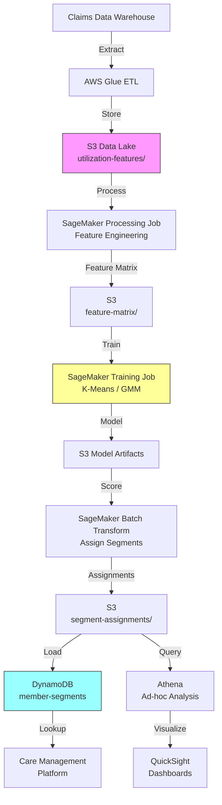

# Recipe 6.2: Utilization Pattern Segmentation ⭐

**Complexity:** Simple · **Phase:** MVP · **Estimated Cost:** ~$0.15 per 10,000 patients segmented

---

## The Problem

Every health plan and health system has a population health team. And every population health team has the same problem: they're running one-size-fits-all outreach campaigns against a population that contains wildly different types of people.

There's the 28-year-old who shows up once a year for a physical and fills one prescription. There's the 55-year-old with three chronic conditions who sees her PCP quarterly, two specialists monthly, and hits the ED twice a year when her COPD flares. There's the 40-year-old who hasn't engaged with the healthcare system in four years despite having diabetes on their problem list. And there's the 70-year-old "frequent flyer" with 47 ED visits in the last 12 months and no primary care relationship whatsoever.

These four patients require completely different interventions. Sending the disengaged diabetic a reminder about their annual wellness visit is pointless if they haven't opened a piece of mail from your organization in three years. Enrolling the well-managed chronic patient in an intensive care management program wastes expensive care manager time on someone who's already doing fine. And targeting the ED frequent flyer with a "did you know you have a PCP?" letter misses the point entirely (they know; they just can't get there, or they don't trust the system, or they have untreated behavioral health needs that drive crisis utilization).

The core problem is: how do you take a population of 100,000 (or 500,000, or 5 million) members and sort them into behaviorally distinct segments based on *how they actually use healthcare*, so you can target the right intervention to the right group?

This is utilization pattern segmentation. It's one of the most immediately actionable clustering problems in healthcare because the segments directly map to outreach strategies, care management programs, and resource allocation decisions. It doesn't require clinical expertise to interpret the results (unlike disease severity stratification in Recipe 6.4). It uses data you already have (claims and encounter data). And it produces segments that operational leaders can act on immediately.

The reason it's not already done well at most organizations: because they've been using static, rule-based tiers (high/medium/low utilizers based on cost thresholds) instead of letting the data reveal the actual behavioral patterns. A patient with $80,000 in annual spend from a single surgical episode looks nothing like a patient with $80,000 from 200 separate ED and urgent care visits. Same cost tier. Completely different patient. Completely different intervention.

Let's build the thing that actually finds these patterns.

---

## The Technology: Behavioral Clustering from Utilization Data

### What Is Utilization Pattern Segmentation?

Utilization pattern segmentation groups patients by *how they interact with the healthcare system over time*. Not by diagnosis. Not by cost. Not by demographics. By behavior: what services they use, how often, in what combination, and with what trajectory.

The output is a set of segments (typically 4-12, depending on population size and granularity needs) where each segment represents a distinct utilization archetype. The classic archetypes that tend to emerge in most populations:

- **Healthy/Preventive-Only:** Low total utilization. Annual wellness visits. Maybe one acute episode per year. Fills preventive medications. The "low-touch" group.
- **Episodic/Acute:** Moderate utilization driven by discrete events (surgery, injury, pregnancy). High spend in short bursts, then back to baseline. Not chronically ill; just had something happen.
- **Chronic/Managed:** Consistent, moderate-to-high utilization driven by ongoing chronic disease management. Regular PCP and specialist visits. Stable medication regimen. Engaged with the system.
- **Chronic/Unmanaged:** Similar conditions to the managed group but with gaps in care, medication non-adherence signals (gaps in fill patterns), and spikes of acute utilization (ED visits, hospitalizations) that suggest disease isn't well-controlled.
- **High-Utilizer/Complex:** Very high utilization across multiple care settings. Multiple chronic conditions, frequent ED visits, multiple hospitalizations. Often has behavioral health comorbidities and social determinant challenges.
- **Disengaged:** Has known conditions on the problem list but minimal recent utilization. May have fallen out of care entirely. High risk for future acute events because conditions are progressing unmonitored.

These aren't predefined categories you impose on the data. They're the patterns that *emerge* from clustering. The algorithm doesn't know what "disengaged" means. It just finds a group of patients who share the pattern of historical diagnoses combined with recent utilization near zero. You name the cluster after you see what's in it.

### Feature Engineering: Turning Claims Into Cluster-Ready Numbers

This is where the real work lives. Clustering algorithms need numeric features. Claims and encounter data is a mess of codes, dates, and dollar amounts. The translation from raw utilization data to cluster-ready features is the make-or-break step.

Here's what you typically extract from 12-24 months of claims/encounter history:

**Volume features (counts):**
- Total encounters/claims
- ED visits
- Inpatient admissions
- Outpatient visits (split by PCP vs. specialist)
- Urgent care visits
- Behavioral health encounters
- Telehealth visits
- Pharmacy fills (total, unique medications)
- Lab orders
- Imaging orders

**Intensity features (rates and ratios):**
- ED visits per 1,000 member-months
- Specialist-to-PCP visit ratio (high ratios with no PCP visits suggest fragmented care)
- Inpatient days per admission (proxy for severity)
- Readmission rate (30-day)
- Generic vs. brand medication ratio
- Medication possession ratio (MPR) across active prescriptions

**Temporal features (patterns over time):**
- Months since last encounter of any type
- Months since last PCP visit
- Trend direction (increasing, stable, decreasing utilization)
- Seasonality flags (utilization spikes in specific months)
- Gap duration (longest period without any encounter)

**Cost features (use carefully):**
- Total allowed amount
- Per-member-per-month (PMPM) cost
- Proportion of cost from ED vs. inpatient vs. outpatient vs. pharmacy
- Cost trend (increasing/decreasing over lookback period)

**Complexity proxies:**
- Unique diagnosis codes (breadth of conditions)
- Number of distinct providers seen
- Number of distinct facilities used
- HCC (Hierarchical Condition Category) score or similar risk score

A critical design decision: whether to include cost features at all. Cost correlates with utilization (obviously), but it can dominate the clustering and produce segments that are really just "expensive" vs. "cheap" rather than behaviorally distinct. In most implementations, clustering on utilization *patterns* (types of services, frequency, temporal distribution) and then analyzing cost *within* the resulting segments produces more actionable results than clustering on cost directly.

### Normalization: Why It Matters More Than You Think

Imagine two features: "total ED visits in 12 months" (range: 0-50) and "total pharmacy fills" (range: 0-300). Without normalization, the pharmacy fills feature will dominate the distance calculations simply because its numbers are bigger. The algorithm will effectively ignore ED visits because the numerical range is so much smaller.

Standard approaches:
- **Z-score normalization** (subtract mean, divide by standard deviation): good when features are roughly normally distributed. Most utilization features are not; they're heavily right-skewed.
- **Min-max scaling** (scale to 0-1 range): sensitive to outliers. A single patient with 200 ED visits will compress everyone else into a tiny range.
- **Robust scaling** (use median and IQR instead of mean and standard deviation): handles skewed distributions and outliers much better. This is usually the right choice for healthcare utilization data.
- **Log transformation before scaling**: For highly skewed count features (most utilization counts follow a power-law-like distribution), log-transform first, then scale. This prevents extreme outliers from dominating while preserving the relative ordering.

The standard recipe for healthcare utilization features: log1p transform (log(1 + x) to handle zeros), then robust scaling. It's not always perfect, but it's a strong default.

### Choosing the Algorithm

For utilization pattern segmentation specifically, here's the practical decision tree:

**K-Means** works well when:
- You have a hypothesis about how many segments you want (4-8 is common for population health use cases)
- You want segments that are easy to explain to non-technical stakeholders ("these are the five groups")
- You need to assign every patient to exactly one segment (no outliers, no "uncertain" patients)
- Your features are reasonably well-behaved after normalization

**Gaussian Mixture Models (GMM)** work better when:
- You want soft assignments ("this patient is 60% episodic, 40% chronic-managed")
- Your segments have different shapes and sizes (which they usually do in healthcare)
- You want a probability score that indicates how "typical" a patient is within their assigned segment
- You're comfortable with slightly more complex output

**HDBSCAN** works better when:
- You don't want to pre-specify the number of segments
- You want the algorithm to identify outliers (patients who don't fit any pattern) explicitly
- Your population has widely varying density (a large healthy group and small complex groups)
- You're in an exploratory phase and want to discover what's there

For a first implementation focused on population health operations, K-Means with k=5-8 and the elbow method or silhouette analysis to pick k is the pragmatic choice. It produces segments that are easy to name, easy to explain, and easy to operationalize. You can always graduate to GMMs or HDBSCAN once you've validated the basic approach.

### Dimensionality Reduction: When You Have Too Many Features

If you've engineered 30+ features (which is common once you start including all the temporal and ratio features), clustering directly in that high-dimensional space often produces poor results. The "curse of dimensionality" means that distance metrics become less meaningful as dimensions increase. Two patients who differ on 2 out of 30 features are "close" in 30-dimensional space, even if those 2 features are clinically crucial.

The standard approach: reduce to 5-15 dimensions using PCA (Principal Component Analysis) before clustering. PCA finds the directions of maximum variance in your data and projects everything onto those directions. You lose some information but gain much better cluster separation.

A useful diagnostic: run PCA, look at the explained variance per component. If the first 5 components explain 80%+ of the variance, you're in good shape. If you need 20 components to explain 80%, your features may be too noisy or too redundant (consider dropping some).

For visualization and stakeholder communication, UMAP or t-SNE can project your high-dimensional clusters down to 2D for plotting. These are visualization tools, not preprocessing steps for clustering. Don't cluster in UMAP space; cluster in PCA space and visualize in UMAP space.

### Validation: How Do You Know the Segments Are Good?

This is the unsupervised learning paradox: there's no ground truth. You can't compute accuracy because there's no "correct" answer. But you need to convince stakeholders (and yourself) that the segments are meaningful.

**Internal metrics** (mathematical quality):
- **Silhouette score** (-1 to 1): How similar is each patient to their own cluster vs. the nearest other cluster? Scores above 0.3 suggest reasonable structure; above 0.5 is strong.
- **Davies-Bouldin index** (lower is better): Ratio of within-cluster scatter to between-cluster separation.
- **Calinski-Harabasz index** (higher is better): Ratio of between-cluster variance to within-cluster variance.
- **Elbow method**: Plot within-cluster sum of squares vs. k. Look for the "elbow" where adding more clusters stops meaningfully reducing variance.

**External validation** (clinical meaningfulness):
- Do the segments have different outcomes? (Hospitalization rates, costs, mortality, quality measures)
- Can clinical and operational stakeholders name the segments after reviewing their characteristics?
- Do the segments map to different intervention strategies?
- Are the segments stable over time? (Re-run quarterly; do roughly the same segments appear?)
- Are the segments appropriately sized for action? (A segment of 12 patients isn't actionable at a population level)

The gold standard: present the segment profiles (without labels) to a population health medical director and ask "do these groups make clinical sense, and would you intervene differently for each one?" If the answer is yes, your segmentation is working.

### The General Architecture Pattern

```text
[Claims/Encounter Data] → [Feature Engineering] → [Normalize] → [Reduce Dimensions] → [Cluster] → [Profile & Validate] → [Assign & Monitor]
```

**Claims/Encounter Data:** Pull 12-24 months of utilization history from your claims data warehouse or EHR encounter records. Standardize to a per-member feature vector.

**Feature Engineering:** Compute volume, intensity, temporal, and complexity features for each member. This is the largest code surface and the most domain-specific step.

**Normalize:** Apply log transforms and robust scaling to handle skewed distributions and outliers. Healthcare utilization data is almost never normally distributed.

**Reduce Dimensions:** PCA to 5-15 components. Retains the signal, removes the noise, makes clustering more effective.

**Cluster:** Apply your chosen algorithm (K-Means for simplicity, GMM for probabilistic assignments, HDBSCAN for discovery). Evaluate multiple values of k and select based on a combination of internal metrics and domain judgment.

**Profile and Validate:** For each cluster, compute summary statistics (mean/median of key features, top diagnoses, demographic breakdown). Name the clusters. Validate with clinical stakeholders. Check for equity issues (does any segment disproportionately contain a demographic group in a way that suggests bias rather than genuine behavioral difference?).

**Assign and Monitor:** Score new/existing members into segments on a regular cadence (monthly or quarterly). Track segment migration (patients moving between segments over time). Feed segment assignments to downstream systems (care management platforms, outreach engines, reporting dashboards).

---

## The AWS Implementation

Now let's build this. The utilization segmentation pipeline is a batch analytics workload: you pull data periodically, compute features, run clustering, and push segment assignments to operational systems. It's not real-time. It doesn't need sub-second latency. It needs to handle large populations (hundreds of thousands to millions of members) reliably and repeatably.

### Why These Services

**Amazon SageMaker for ML pipeline orchestration and model training.** SageMaker provides managed infrastructure for the entire ML lifecycle: data processing (Processing Jobs), model training (Training Jobs), batch inference (Batch Transform), and pipeline orchestration (SageMaker Pipelines). For a clustering workload that runs monthly on a large population, SageMaker Processing Jobs handle the feature engineering at scale, and the built-in K-Means or your own scikit-learn container handles the clustering itself. You get experiment tracking, model versioning, and reproducibility without managing Spark clusters or ML infrastructure.

**Amazon S3 for data lake storage.** Claims data extracts, engineered feature matrices, trained models, segment assignments, and historical results all live in S3. It's the durable backbone that connects every stage of the pipeline. Versioning lets you reproduce any historical run. Lifecycle policies manage retention. Encryption with KMS protects PHI at rest.

**AWS Glue for data catalog and ETL.** If your claims data lives in a data warehouse (Redshift, Snowflake, or similar), Glue provides the extraction and cataloging layer. Glue crawlers catalog your data lake partitions; Glue jobs handle the heavy ETL from source systems into the standardized feature format that the ML pipeline expects.

**Amazon Athena for ad-hoc analysis and validation.** Once segment assignments land in S3, Athena lets population health analysts query them with SQL. "Show me all members in the disengaged segment who have diabetes and haven't had an A1c in 18 months." No infrastructure to manage, pay per query, and it speaks the language your analysts already know.

**Amazon DynamoDB for real-time segment lookup.** Downstream systems (care management platforms, call center tools, patient portals) need to look up a member's current segment assignment in real time. DynamoDB provides single-digit-millisecond lookups by member ID. The batch pipeline writes assignments here after each run; operational systems read from here continuously.

**Amazon QuickSight for visualization and stakeholder reporting.** Segment profiles, migration patterns, outcome comparisons, and equity dashboards all need visual representation for leadership consumption. QuickSight connects directly to Athena (and therefore to your S3 data lake) for interactive dashboards without data movement.

### Architecture Diagram



### Prerequisites

| Requirement | Details |
|-------------|---------|
| **AWS Services** | Amazon SageMaker, Amazon S3, AWS Glue, Amazon Athena, Amazon DynamoDB, Amazon QuickSight |
| **IAM Permissions** | `sagemaker:CreateProcessingJob`, `sagemaker:CreateTrainingJob`, `sagemaker:CreateTransformJob`, `s3:GetObject`, `s3:PutObject`, `glue:StartJobRun`, `dynamodb:PutItem`, `dynamodb:GetItem`, `athena:StartQueryExecution` |
| **BAA** | AWS BAA signed (required: utilization data is PHI) |
| **Encryption** | S3: SSE-KMS; DynamoDB: encryption at rest (default); SageMaker: KMS-encrypted volumes and output; all data in transit over TLS |
| **VPC** | Production: SageMaker jobs in VPC with no internet access; VPC endpoints for S3, DynamoDB, SageMaker API, CloudWatch Logs |
| **CloudTrail** | Enabled: log all SageMaker, S3, and DynamoDB API calls for HIPAA audit trail |
| **Sample Data** | CMS Synthetic Public Use Files (SynPUF) provide realistic claims data for development. Never use real member data in dev/test environments. |
| **Cost Estimate** | SageMaker Processing (ml.m5.xlarge, 2 hrs/month): ~$0.50/run. Training (ml.m5.xlarge, 30 min): ~$0.13/run. S3 storage: ~$2/month for feature data. DynamoDB: ~$5/month for on-demand reads. Total pipeline: ~$10-20/month for 500K-member population. |

### Ingredients

| AWS Service | Role |
|------------|------|
| **Amazon SageMaker** | Feature engineering (Processing Jobs), clustering (Training Jobs), segment assignment (Batch Transform), pipeline orchestration |
| **Amazon S3** | Data lake: raw extracts, feature matrices, models, segment assignments |
| **AWS Glue** | ETL from claims data warehouse; data catalog for Athena queries |
| **Amazon Athena** | SQL-based analysis of segment assignments and validation queries |
| **Amazon DynamoDB** | Real-time segment lookup for operational systems |
| **Amazon QuickSight** | Dashboards for segment profiles, trends, and equity reporting |
| **AWS KMS** | Encryption key management for all data at rest |
| **Amazon CloudWatch** | Pipeline monitoring, alerting on failures or segment drift |

### Code

> **Reference implementations:** The following AWS sample repos demonstrate patterns used in this recipe:
>
> - [`amazon-sagemaker-examples`](https://github.com/aws/amazon-sagemaker-examples): Comprehensive SageMaker examples including built-in K-Means, PCA, and custom scikit-learn containers for clustering workloads
> - [`aws-healthcare-lifescience-ai-ml`](https://github.com/aws-samples/aws-healthcare-lifescience-ai-ml): Healthcare-specific ML examples on AWS including patient cohort analysis patterns

#### Walkthrough

**Step 1: Extract utilization data.** The pipeline starts by pulling 12-24 months of claims and encounter data from your data warehouse. You need one row per member with all their utilization events within the lookback window. This is typically the most time-consuming step (not computationally, but in terms of getting the data right). The extract should include encounter type (ED, inpatient, outpatient, pharmacy), dates, provider identifiers, diagnosis codes, and allowed amounts. Missing this step or using incomplete data means your features will be wrong, your clusters will be meaningless, and nobody will trust the output.

```pseudocode
FUNCTION extract_utilization_data(lookback_months):
    // Pull raw utilization events from the claims data warehouse.
    // "lookback_months" controls how far back we look (typically 12 or 24 months).
    // We want every encounter for every active member in the population.

    start_date = today minus lookback_months months
    end_date = today

    // Query the claims warehouse for all encounters in the lookback window.
    // Each row represents one encounter for one member.
    raw_events = query claims warehouse:
        SELECT member_id, encounter_date, encounter_type, 
               provider_id, facility_id, primary_diagnosis,
               allowed_amount, service_category
        WHERE encounter_date BETWEEN start_date AND end_date
          AND member is currently active (enrolled)

    // Group events by member so we can compute per-member features.
    member_events = group raw_events by member_id

    // Store the grouped data in the data lake for the next step.
    write member_events to S3 at utilization-features/raw/{run_date}/

    RETURN member_events
```

**Step 2: Engineer features.** This is where raw events become the numeric vector that clustering algorithms consume. For each member, we compute counts, rates, ratios, and temporal patterns. The goal is to capture *how* they use healthcare, not just *how much*. A patient with 10 ED visits and 0 PCP visits is behaviorally very different from a patient with 0 ED visits and 10 PCP visits, even though both have 10 total encounters. The features need to distinguish these patterns. Skip this step or use only total cost, and you'll get cost tiers, not behavioral segments.

```pseudocode
FUNCTION engineer_features(member_events):
    // For each member, compute a feature vector that captures their utilization behavior.
    features = empty list

    FOR each member_id, events in member_events:
        feature_vector = {
            member_id: member_id,

            // Volume features: how much of each service type
            total_encounters: count(events),
            ed_visits: count(events where type = "ED"),
            inpatient_admissions: count(events where type = "Inpatient"),
            outpatient_visits: count(events where type = "Outpatient"),
            pcp_visits: count(events where type = "Outpatient" AND provider is PCP),
            specialist_visits: count(events where type = "Outpatient" AND provider is Specialist),
            urgent_care_visits: count(events where type = "Urgent Care"),
            behavioral_health: count(events where type = "Behavioral Health"),
            pharmacy_fills: count(events where type = "Pharmacy"),
            unique_medications: count distinct medications across pharmacy events,

            // Intensity features: ratios that reveal care patterns
            ed_to_total_ratio: ed_visits / max(total_encounters, 1),
            specialist_to_pcp_ratio: specialist_visits / max(pcp_visits, 1),
            inpatient_days_per_admit: total inpatient days / max(inpatient_admissions, 1),

            // Temporal features: when and how patterns change
            months_since_last_encounter: months between most recent event and today,
            months_since_last_pcp: months between most recent PCP visit and today,
            max_gap_months: longest gap (in months) between consecutive encounters,
            utilization_trend: slope of monthly encounter count over lookback period,
                                          // positive = increasing utilization, negative = decreasing

            // Complexity proxies
            unique_diagnoses: count distinct primary_diagnosis codes,
            unique_providers: count distinct provider_ids,
            unique_facilities: count distinct facility_ids,

            // Cost features (used cautiously, may be excluded from clustering)
            total_allowed: sum(allowed_amount across all events),
            ed_cost_proportion: sum(allowed where type="ED") / max(total_allowed, 1),
            inpatient_cost_proportion: sum(allowed where type="Inpatient") / max(total_allowed, 1)
        }

        append feature_vector to features

    // Write the complete feature matrix to S3.
    write features to S3 at feature-matrix/{run_date}/features.parquet

    RETURN features
```

**Step 3: Normalize and reduce dimensions.** Raw features have wildly different scales (ED visits range 0-50; pharmacy fills range 0-300; total cost ranges $0-$500,000). Without normalization, high-magnitude features dominate the clustering and low-magnitude features are effectively ignored. We apply log transforms to handle the heavy right skew of utilization counts, then robust scaling to handle remaining outliers. After normalization, PCA reduces the dimensionality to the components that capture most of the variance. This step prevents the curse of dimensionality from producing meaningless clusters in high-dimensional space.

```pseudocode
FUNCTION normalize_and_reduce(features):
    // Step 3a: Log transform skewed count features.
    // Healthcare utilization counts are heavily right-skewed (most people have few visits,
    // a small number have many). Log1p (log(1+x)) compresses the long tail while
    // preserving zeros.
    count_features = [total_encounters, ed_visits, inpatient_admissions, outpatient_visits,
                      pcp_visits, specialist_visits, pharmacy_fills, unique_medications,
                      unique_diagnoses, unique_providers, total_allowed]

    FOR each feature_name in count_features:
        FOR each member:
            member[feature_name] = log(1 + member[feature_name])

    // Step 3b: Robust scaling.
    // Subtract the median and divide by the interquartile range (IQR) for each feature.
    // This is more resistant to outliers than z-score normalization (mean/std),
    // which matters because healthcare data always has extreme outliers.
    FOR each feature_name in all numeric features:
        median_val = median of feature_name across all members
        iqr_val    = 75th percentile - 25th percentile of feature_name
        FOR each member:
            member[feature_name] = (member[feature_name] - median_val) / max(iqr_val, 0.001)
            // The max() prevents division by zero for features with no variance

    // Step 3c: PCA dimensionality reduction.
    // Reduce from ~20 features to 8-12 principal components.
    // This removes noise and redundancy (many utilization features are correlated).
    n_components = select number where cumulative explained variance >= 0.85
    reduced_features = apply PCA with n_components to all normalized features

    // Store normalized, reduced feature matrix.
    write reduced_features to S3 at feature-matrix/{run_date}/reduced.parquet

    RETURN reduced_features, pca_model
```

**Step 4: Cluster.** With clean, normalized, reduced-dimension features, we run the actual clustering. For a first implementation, K-Means with silhouette analysis to pick k is the pragmatic approach. We try multiple values of k (4 through 10), compute the silhouette score for each, and select the k that balances mathematical quality with operational usability (a k that's too large produces segments that are hard to act on; too small and you lose meaningful distinctions). The output is a cluster label for every member.

```pseudocode
FUNCTION cluster_members(reduced_features):
    // Try multiple values of k and evaluate each.
    results = empty list

    FOR k = 4 to 10:
        // Run K-Means clustering with k clusters.
        model = fit KMeans(n_clusters=k, random_state=42, n_init=10) on reduced_features
        labels = model.predict(reduced_features)

        // Compute silhouette score: how well-separated are the clusters?
        // Range -1 to 1. Higher is better. Above 0.3 is reasonable for real-world data.
        silhouette = compute silhouette_score(reduced_features, labels)

        // Compute cluster sizes (we want segments large enough to be actionable).
        sizes = count members per cluster label

        append {k: k, model: model, labels: labels, 
                silhouette: silhouette, sizes: sizes} to results

    // Select the best k.
    // Primary criterion: silhouette score.
    // Secondary: no cluster smaller than 2% of population (too small to operationalize).
    // Tertiary: operational preference for 5-8 segments.
    best = select from results where:
        min(sizes) >= 0.02 * total_members
        AND k is between 5 and 8 (prefer)
        ORDER BY silhouette DESC
        TAKE FIRST

    // Save the model and assignments.
    write best.model to S3 at models/{run_date}/kmeans_k{best.k}.pkl
    write best.labels to S3 at segment-assignments/{run_date}/assignments.parquet

    RETURN best.model, best.labels, best.silhouette
```

**Step 5: Profile and name segments.** A set of numeric cluster labels (0, 1, 2, 3, 4) means nothing to the population health team. This step computes the characteristic profile of each segment (average feature values, top diagnoses, demographic breakdown) and assigns human-readable names based on the dominant pattern. The profiles also serve as validation: if a segment doesn't have a coherent, nameable pattern, the clustering may not be working well. Skip this step and your output is unusable by anyone except the data scientist who built it.

```pseudocode
FUNCTION profile_segments(features, labels):
    // For each cluster, compute descriptive statistics.
    profiles = empty map

    FOR each cluster_id in unique(labels):
        cluster_members = features where label == cluster_id

        profile = {
            cluster_id: cluster_id,
            size: count(cluster_members),
            pct_of_total: count(cluster_members) / count(all features) * 100,

            // Mean feature values (in original, un-transformed scale for interpretability)
            avg_ed_visits: mean(ed_visits),
            avg_pcp_visits: mean(pcp_visits),
            avg_inpatient: mean(inpatient_admissions),
            avg_pharmacy_fills: mean(pharmacy_fills),
            avg_months_since_pcp: mean(months_since_last_pcp),
            avg_total_cost: mean(total_allowed),
            avg_unique_diagnoses: mean(unique_diagnoses),

            // Distribution of key categorical attributes within this cluster
            top_diagnoses: most frequent primary diagnoses in cluster,
            age_distribution: mean and std of age,
            payer_distribution: breakdown by payer type (commercial, Medicare, Medicaid)
        }

        // Assign a human-readable name based on dominant pattern.
        // This is heuristic: look at which features are notably high or low
        // relative to the population average.
        profile.suggested_name = assign_name_heuristic(profile)

        profiles[cluster_id] = profile

    // Store profiles for stakeholder review and downstream systems.
    write profiles to S3 at segment-assignments/{run_date}/profiles.json

    RETURN profiles


FUNCTION assign_name_heuristic(profile):
    // Simple rule-based naming based on dominant characteristics.
    // In practice, a clinician reviews and overrides these.
    IF profile.avg_months_since_pcp > 18 AND profile.avg_total_cost < population median * 0.3:
        RETURN "Disengaged"
    ELSE IF profile.avg_ed_visits > population mean * 3 AND profile.avg_inpatient > population mean * 2:
        RETURN "High-Utilizer Complex"
    ELSE IF profile.avg_ed_visits > population mean * 2 AND profile.avg_pcp_visits < 1:
        RETURN "ED-Dependent"
    ELSE IF profile.avg_pcp_visits > 4 AND profile.avg_unique_diagnoses > 5:
        RETURN "Chronic Managed"
    ELSE IF profile.avg_total_cost < population median * 0.5 AND profile.avg_pcp_visits >= 1:
        RETURN "Healthy Preventive"
    ELSE:
        RETURN "Moderate Episodic"
```

**Step 6: Store segment assignments for operational use.** The final step pushes segment assignments to systems where they can drive action. DynamoDB provides real-time lookup for care management platforms ("what segment is this member in?"). The S3-based assignment file feeds Athena for analytical queries and QuickSight for dashboards. This isn't just storage; it's the bridge between analytics and operations. Without this step, you have an interesting analysis that sits in a notebook and never changes a single patient interaction.

```pseudocode
FUNCTION store_assignments(features, labels, profiles):
    // Write to DynamoDB for real-time operational lookup.
    FOR each member_id, label in zip(features.member_ids, labels):
        write to DynamoDB table "member-segments":
            key            = member_id
            segment_id     = label
            segment_name   = profiles[label].suggested_name
            assigned_date  = today (ISO 8601)
            model_version  = run identifier for traceability
            confidence     = silhouette score for this member (optional, from per-sample silhouette)

    // Write full assignment file to S3 for analytical use.
    assignment_records = for each member:
        {member_id, segment_id, segment_name, assigned_date, 
         previous_segment (from last run, if available)}

    write assignment_records to S3 at segment-assignments/{run_date}/full_assignments.parquet

    // Track segment migration: members who changed segments since last run.
    migrations = members where current segment != previous segment
    write migrations to S3 at segment-assignments/{run_date}/migrations.parquet

    RETURN count of assignments written, count of migrations
```

> **Curious how this looks in Python?** The pseudocode above covers the concepts. If you'd like to see sample Python code that demonstrates these patterns using boto3, check out the [Python Example](chapter06.02-python-example). It walks through each step with inline comments and notes on what you'd need to change for a real deployment.

### Expected Results

**Sample output (segment profile summary):**

```json
{
  "run_date": "2026-06-01",
  "population_size": 250000,
  "k_selected": 6,
  "silhouette_score": 0.38,
  "segments": [
    {
      "id": 0,
      "name": "Healthy Preventive",
      "size": 95000,
      "pct": 38.0,
      "avg_ed_visits": 0.2,
      "avg_pcp_visits": 1.8,
      "avg_total_cost": 1200,
      "avg_months_since_pcp": 5.2
    },
    {
      "id": 1,
      "name": "Moderate Episodic",
      "size": 62000,
      "pct": 24.8,
      "avg_ed_visits": 0.8,
      "avg_pcp_visits": 2.4,
      "avg_total_cost": 8500,
      "avg_months_since_pcp": 4.1
    },
    {
      "id": 2,
      "name": "Chronic Managed",
      "size": 45000,
      "pct": 18.0,
      "avg_ed_visits": 1.1,
      "avg_pcp_visits": 5.2,
      "avg_total_cost": 22000,
      "avg_months_since_pcp": 2.1
    },
    {
      "id": 3,
      "name": "Disengaged",
      "size": 28000,
      "pct": 11.2,
      "avg_ed_visits": 0.3,
      "avg_pcp_visits": 0.1,
      "avg_total_cost": 400,
      "avg_months_since_pcp": 22.4
    },
    {
      "id": 4,
      "name": "ED-Dependent",
      "size": 12000,
      "pct": 4.8,
      "avg_ed_visits": 6.3,
      "avg_pcp_visits": 0.4,
      "avg_total_cost": 35000,
      "avg_months_since_pcp": 14.7
    },
    {
      "id": 5,
      "name": "High-Utilizer Complex",
      "size": 8000,
      "pct": 3.2,
      "avg_ed_visits": 9.8,
      "avg_pcp_visits": 3.1,
      "avg_total_cost": 95000,
      "avg_months_since_pcp": 1.8
    }
  ]
}
```

**Performance benchmarks:**

| Metric | Typical Value |
|--------|---------------|
| Feature engineering runtime | 15-45 minutes (250K members, SageMaker ml.m5.xlarge) |
| Clustering runtime | 2-5 minutes (K-Means on reduced features) |
| End-to-end pipeline | 30-60 minutes |
| Silhouette score | 0.25-0.45 (typical for real healthcare utilization data) |
| Segment stability (quarter-over-quarter) | 80-90% of members stay in same segment |
| DynamoDB lookup latency | < 5ms per member |
| Cost per monthly run | $10-20 (250K population) |

**Where it struggles:**
- New members with < 6 months of claims history (insufficient data for reliable segmentation)
- Members with a single high-cost event (surgery, NICU stay) that dominates their profile despite being otherwise healthy
- Populations with very homogeneous utilization (e.g., a young, healthy commercial population where 85% are in the "healthy preventive" bucket)
- Rapid behavioral changes (a new diagnosis that shifts utilization patterns won't be reflected until the next clustering run)

---

## The Honest Take

Utilization pattern segmentation is one of the most immediately useful things you can build in population health analytics. The segments are intuitive, the data is available, and the operational applications are obvious. A care management director who sees "11% of your members are disengaged diabetics" knows exactly what to do with that information.

That said, here's what will humble you:

**The "so what?" problem.** Producing segments is easy. Getting the organization to actually change its behavior based on them is hard. If the outreach team is going to send the same letter to every segment, you wasted your time. The segmentation only matters if it drives differentiated action. Start with the operational question ("what would we do differently for each group?") and work backward to the segmentation design.

**Segment instability around the edges.** Members near the boundaries between segments will flip back and forth between runs. A member at the border of "chronic managed" and "moderate episodic" might be in one segment in January and the other in April. This is mathematically expected but operationally annoying. Care managers hate it when their panel changes every month. Solutions: add hysteresis (require a member to meet the new segment criteria for two consecutive runs before migrating) or use GMMs and report the probability rather than a hard assignment.

**The denominator problem.** What counts as "your population"? Active members only? Include members who were active for part of the lookback but termed? Include members who enrolled mid-period (and therefore have less utilization simply because they had less time)? The denominator choice changes your segments. A member with 2 ED visits in 3 months of enrollment looks like a frequent flyer; that same member with 2 ED visits in 24 months of enrollment looks normal.

**Cost features are a trap.** If you include total cost as a clustering feature, it will dominate everything. Cost is correlated with almost every other utilization feature, and its magnitude dwarfs everything else even after normalization. You'll end up with cost quartiles, not behavioral segments. The disciplined approach: cluster on *utilization patterns* (types of services, frequencies, temporal distribution), then analyze cost *within* the resulting segments as a descriptive characteristic.

**The equity audit you can't skip.** Before you operationalize any segmentation, run demographics by segment. If your "disengaged" segment is 60% Black patients while your overall population is 25% Black, that's not a behavioral finding. That's a system access finding. "Disengaged" might really mean "historically excluded from accessible care." The intervention for that group isn't a reminder postcard; it's addressing the structural barriers. Every segmentation needs this check before deployment.

---

## Variations and Extensions

**Temporal trajectory clustering.** Instead of clustering on a single snapshot of 12-month utilization, cluster on the *trajectory* (how utilization changed over time). This finds "rising risk" patients (previously healthy, now escalating) vs. "recovering" patients (previously high-utilizer, now stabilizing). Requires time-series features or sequence clustering methods (like DTW + hierarchical clustering). More complex but clinically powerful because it distinguishes patients heading in different directions.

**Segment-specific predictive models.** Once you have stable segments, train separate predictive models within each segment. A readmission risk model trained on the "chronic managed" segment will outperform a population-wide model because it learns the patterns specific to that subpopulation. Each segment becomes its own modeling universe with its own features and thresholds.

**Real-time segment assignment for new members.** Instead of waiting for the monthly batch run to assign new members, deploy the trained model as a SageMaker endpoint that scores new members at enrollment. Use the first 90 days of claims to compute features, score against the saved model, and assign to a segment. This gets new members into appropriate programs months earlier.

---

## Related Recipes

- **Recipe 6.1 (Geographic Patient Clustering):** Adds a geographic dimension. Combine geographic clusters with utilization segments to find "disengaged members in underserved areas" for targeted mobile health outreach.
- **Recipe 6.4 (Disease Severity Stratification):** Builds clinical severity tiers within chronic disease cohorts. Layer severity on top of utilization segments for more nuanced care management targeting.
- **Recipe 7.4 (ED Visit Prediction):** Uses the "ED-Dependent" segment as a cohort for predictive modeling. Members in this segment are candidates for ED diversion programs.
- **Recipe 7.6 (Rising Risk Identification):** Related: identifies members whose utilization trajectory suggests impending segment migration (healthy to chronic, managed to unmanaged).
- **Recipe 4.7 (Care Management Program Enrollment):** Consumes segment assignments as input features for program enrollment decisions.

---

## Additional Resources

**AWS Documentation:**
- [Amazon SageMaker Built-in K-Means Algorithm](https://docs.aws.amazon.com/sagemaker/latest/dg/k-means.html)
- [Amazon SageMaker Built-in PCA Algorithm](https://docs.aws.amazon.com/sagemaker/latest/dg/pca.html)
- [Amazon SageMaker Processing Jobs](https://docs.aws.amazon.com/sagemaker/latest/dg/processing-job.html)
- [Amazon SageMaker Pipelines](https://docs.aws.amazon.com/sagemaker/latest/dg/pipelines.html)
- [AWS HIPAA Eligible Services](https://aws.amazon.com/compliance/hipaa-eligible-services-reference/)
- [Amazon SageMaker Pricing](https://aws.amazon.com/sagemaker/pricing/)

**AWS Sample Repos:**
- [`amazon-sagemaker-examples`](https://github.com/aws/amazon-sagemaker-examples): Comprehensive SageMaker examples including K-Means clustering, PCA, and scikit-learn container integration
- [`aws-healthcare-lifescience-ai-ml`](https://github.com/aws-samples/aws-healthcare-lifescience-ai-ml): Healthcare and life science ML examples on AWS

**AWS Solutions and Blogs:**
- [Guidance for Multi-Modal Data Analysis with AWS HealthOmics and Amazon SageMaker](https://aws.amazon.com/solutions/guidance/multi-modal-data-analysis-with-aws-health-omics-and-amazon-sagemaker/): Reference architecture for healthcare ML analytics pipelines
- [Population Health Management on AWS](https://aws.amazon.com/health/solutions/population-health/): Overview of AWS services for population health workloads

---

## Estimated Implementation Time

| Phase | Duration |
|-------|----------|
| **Basic** (single-run clustering on sample data, manual feature engineering) | 1-2 weeks |
| **Production-ready** (automated pipeline, DynamoDB integration, monitoring, equity audit) | 4-6 weeks |
| **With variations** (temporal trajectories, real-time scoring endpoint, segment-specific models) | 8-12 weeks |

---

## Tags

`cohort-analysis` · `clustering` · `k-means` · `utilization` · `population-health` · `segmentation` · `sagemaker` · `simple` · `mvp` · `batch-analytics` · `hipaa`

---

*← [Recipe 6.1: Geographic Patient Clustering](chapter06.01-geographic-patient-clustering) · [Chapter 6 Index](chapter06-index) · [Next: Recipe 6.3 - Payer Mix Financial Risk Clustering →](chapter06.03-payer-mix-financial-risk-clustering)*
