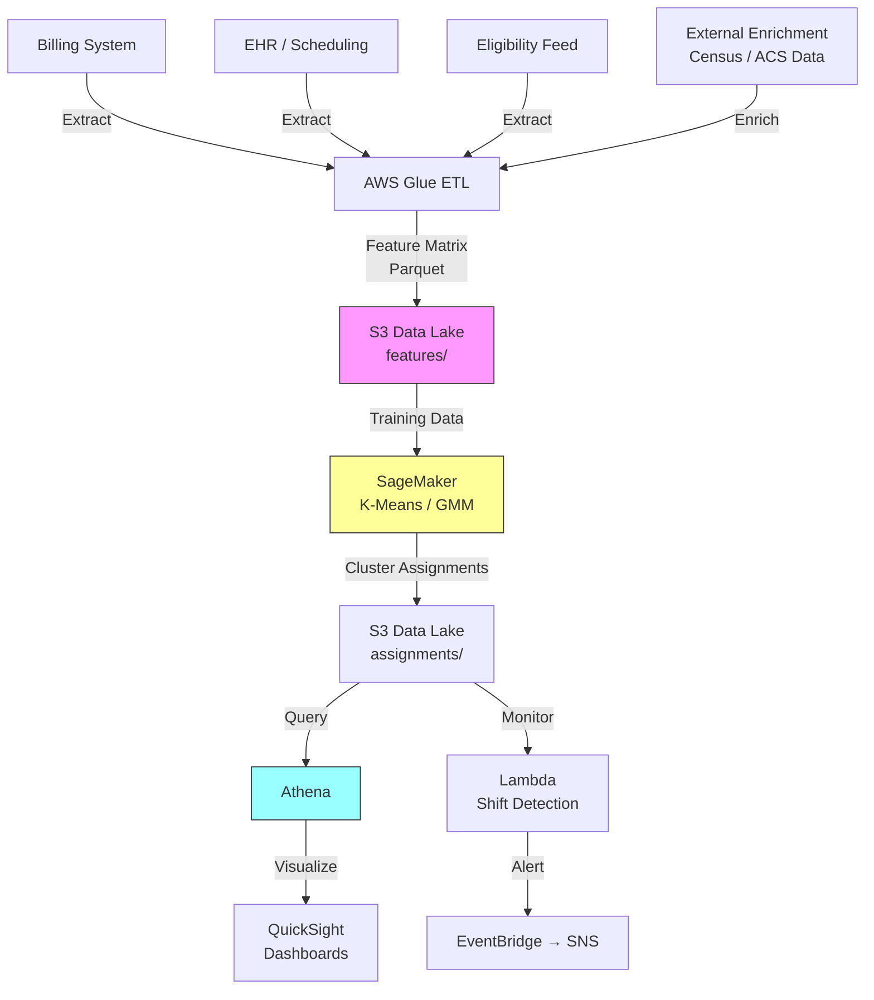

# Recipe 6.3 Architecture and Implementation: Payer Mix Financial Risk Clustering

*Companion to [Recipe 6.3: Payer Mix Financial Risk Clustering](chapter06.03-payer-mix-financial-risk-clustering). This page covers the AWS architecture, services, prerequisites, and pseudocode. For the problem framing and the conceptual approach, start with the main recipe.*

---

## Why These Services

**Amazon SageMaker for clustering.** SageMaker provides a managed K-Means algorithm (and access to scikit-learn for GMM or DBSCAN via processing jobs) that scales to millions of patients without managing infrastructure. The built-in K-Means implementation is optimized for large datasets and runs on distributed compute. For smaller populations (under 500K patients), a SageMaker Processing Job with scikit-learn is simpler and more flexible. The pseudocode below follows the scikit-learn API pattern. If using SageMaker's built-in K-Means algorithm, the training job requires RecordIO-protobuf or CSV input format and uses the SageMaker Estimator API rather than direct `fit_predict` calls. For populations under 500K patients, a Processing Job running scikit-learn (as shown in the pseudocode and Python companion) is simpler. For larger populations, the built-in algorithm's distributed training is worth the format conversion overhead.

**Amazon S3 for data lake storage.** Feature matrices, raw source extracts, cluster assignments, and historical snapshots all live in S3. Parquet format for the feature matrices gives you columnar compression and fast reads. S3 versioning preserves historical cluster assignments for trend analysis.

**AWS Glue for ETL and feature engineering.** Pulling data from billing systems, EHRs, and eligibility feeds, transforming it into a unified feature matrix, and handling the normalization logic. Glue's serverless Spark engine handles the joins across large datasets without capacity planning.

**Amazon Athena for profiling and ad-hoc analysis.** Once cluster assignments are written back to S3, finance analysts can query them directly with SQL. "Show me the average days-in-AR for each cluster" or "What's the payer mix breakdown for Cluster 4?" without needing a data engineering request.

**Amazon QuickSight for visualization.** Cluster profiles, population distribution trends, and shift alerts presented in dashboards that finance leadership actually looks at. Connects directly to Athena.

**Amazon EventBridge + Lambda for monitoring and alerts.** Scheduled re-clustering runs and population shift detection. When the distribution changes beyond a threshold, fire an alert to the revenue cycle team. Configure a dead-letter queue on the shift detection Lambda for failed invocations. For quarterly runs, a failed detection is low-urgency but should generate an ops alert so the team knows to investigate.

## Architecture Diagram



## Prerequisites

| Requirement | Details |
|-------------|---------|
| **AWS Services** | Amazon SageMaker, Amazon S3, AWS Glue, Amazon Athena, Amazon QuickSight, AWS Lambda, Amazon EventBridge, Amazon SNS |
| **IAM Permissions** | `sagemaker:CreateTrainingJob`, `sagemaker:CreateProcessingJob`, `s3:GetObject`, `s3:PutObject`, `glue:StartJobRun`, `athena:StartQueryExecution`, `sns:Publish` |
| **BAA** | Required. Patient financial data combined with utilization data constitutes PHI. |
| **Encryption** | S3: SSE-KMS for all buckets. SageMaker: KMS-encrypted training volumes and model artifacts. Athena: encrypted query results. All transit over TLS. |
| **VPC** | SageMaker training jobs and Glue jobs in VPC with no public internet access. VPC endpoints required: S3 (gateway), KMS (interface), CloudWatch Logs (interface), SageMaker API (interface), Glue (interface). For Athena queries from within VPC: Athena (interface). Interface endpoints incur hourly per-AZ charges (~$0.01/AZ/hour each). Consider enabling `EnableNetworkIsolation` on SageMaker training jobs to prevent outbound network calls from the training container, providing defense-in-depth against data exfiltration. The built-in K-Means algorithm works with network isolation enabled. |
| **Access Control** | Restrict read access to the `assignments/` prefix to authorized revenue cycle and finance roles. Use S3 bucket policies or AWS Lake Formation to enforce column-level and row-level access controls. Cluster labels are sensitive metadata (they reveal financial vulnerability) and must not be exposed to clinical or scheduling systems. |
| **CloudTrail** | Enabled for all services. Audit who accessed cluster assignments (they reveal financial status). |
| **Data Sources** | Billing/AR system extract, EHR utilization data, eligibility/enrollment feed, census-level demographic data (public). |
| **Cost Estimate** | Glue ETL: ~$5-20/run. SageMaker training: ~$2-10/run (ml.m5.xlarge, minutes). S3 + Athena: ~$10-50/month. QuickSight: $18/user/month. Total: $50-200/month for quarterly re-clustering. |

## Ingredients

| AWS Service | Role |
|------------|------|
| **Amazon SageMaker** | Runs K-Means or GMM clustering on the patient feature matrix |
| **Amazon S3** | Stores feature matrices, cluster assignments, and historical snapshots |
| **AWS Glue** | ETL: joins source data, engineers features, normalizes scales |
| **Amazon Athena** | SQL queries over cluster assignments for profiling and analysis |
| **Amazon QuickSight** | Dashboards for finance leadership showing cluster distributions and trends |
| **AWS Lambda** | Monitors cluster distribution shifts between runs |
| **Amazon EventBridge** | Schedules periodic re-clustering and triggers shift alerts |
| **Amazon SNS** | Delivers alerts when population distribution shifts beyond threshold |
| **AWS KMS** | Encryption key management for all data at rest |

## Pseudocode Walkthrough

**Step 1: Extract and join source data.** The first challenge is assembling a unified patient-level dataset from systems that were never designed to talk to each other. Billing knows about charges and payments. The EHR knows about visits and diagnoses. Eligibility knows about coverage. Each system has its own patient identifier, its own data model, and its own update cadence. This step pulls from each source, resolves to a single patient identity (using your MPI or whatever patient matching you have), and produces one row per patient with columns from all sources. Skip this step and you're clustering on incomplete information, which produces clusters that reflect data availability rather than actual financial risk.

```pseudocode
FUNCTION extract_patient_financial_data(date_range):
    // Pull from billing system: payment behavior over the lookback period.
    // Key fields: total charges, total payments, days to payment, write-offs,
    // number of accounts in collections, charity care applications.
    billing_data = query billing system for all patients with activity in date_range
        SELECT patient_id,
               sum(charges) as total_charges,
               sum(payments) as total_payments,
               avg(days_to_payment) as avg_days_to_pay,
               sum(write_offs) as total_write_offs,
               count(collections_referrals) as collections_count,
               count(charity_applications) as charity_app_count

    // Pull from EHR/scheduling: utilization patterns.
    // Key fields: visit count by type, no-show rate, average complexity.
    utilization_data = query EHR for all patients with encounters in date_range
        SELECT patient_id,
               count(visits) as total_visits,
               count(ed_visits) as ed_visit_count,
               count(inpatient_stays) as inpatient_count,
               avg(rvu_per_visit) as avg_complexity,
               (no_show_count / scheduled_count) as no_show_rate

    // Pull from eligibility: coverage characteristics and stability.
    // Key fields: current payer, plan type, coverage changes in last 24 months.
    eligibility_data = query eligibility system for current and historical coverage
        SELECT patient_id,
               current_payer_type,        // commercial, medicare, medicaid, self_pay
               current_plan_design,       // HMO, PPO, HDHP, etc.
               deductible_amount,
               coverage_changes_24mo,     // number of payer changes in 24 months
               months_continuously_covered

    // Join all three on patient_id. Left join: keep all patients even if
    // they're missing data from one source (handle nulls in feature engineering).
    patient_features = JOIN billing_data, utilization_data, eligibility_data
                       ON patient_id

    RETURN patient_features
```

**Step 2: Engineer and normalize features.** Raw data isn't ready for clustering. Dollar amounts span orders of magnitude. Categorical fields need numeric encoding. Missing values need handling. This step transforms the raw joined data into a clean numeric feature matrix where every feature is on a comparable scale. The choices here (which features to include, how to encode categoricals, how to handle missing data) have more impact on cluster quality than the choice of algorithm. Get this wrong and you'll cluster on noise or on a single dominant feature.

```pseudocode
FUNCTION engineer_features(patient_features):
    // Derive ratio-based features that are more stable than raw counts.
    // A patient with $100K in charges and $90K in payments is different from
    // a patient with $1K in charges and $900 in payments, even though both
    // have 90% payment rates. Include both the ratio and the magnitude.
    FOR each patient in patient_features:
        patient.payment_ratio = patient.total_payments / patient.total_charges
            // handle division by zero: if total_charges == 0, set to 1.0 (no risk signal)
        patient.write_off_ratio = patient.total_write_offs / patient.total_charges
        patient.utilization_intensity = patient.total_visits / months_in_date_range
        patient.ed_proportion = patient.ed_visit_count / max(patient.total_visits, 1)

    // Encode payer type as ordinal based on expected reimbursement.
    // This preserves the financial ordering that matters for this use case.
    // Commercial=4, Medicare=3, Medicaid=2, Self-pay=1
    // (These are rough ordinals, not precise reimbursement rates.)
    payer_encoding = {"commercial": 4, "medicare": 3, "medicaid": 2, "self_pay": 1}
    FOR each patient:
        patient.payer_ordinal = payer_encoding[patient.current_payer_type]

    // Select final feature set for clustering.
    feature_columns = [
        "payer_ordinal",
        "payment_ratio",
        "write_off_ratio",
        "avg_days_to_pay",
        "utilization_intensity",
        "ed_proportion",
        "avg_complexity",
        "no_show_rate",
        "coverage_changes_24mo",
        "deductible_amount",
        "collections_count",
        "charity_app_count"
    ]

    // Handle missing values: impute with median for numeric features.
    // Patients with no payment history (new patients) get median values,
    // which places them in the middle of the distribution rather than
    // artificially at an extreme.
    FOR each column in feature_columns:
        median_value = median of non-null values in column
        replace nulls in column with median_value

    // Handle outliers: cap extreme values at the 99th percentile
    // (winsorization) for dollar-amount and count features. K-Means
    // computes centroids as means, so a single $2M charge patient can
    // pull a centroid far from the cluster's true center. Winsorization
    // preserves relative ordering while preventing extreme values from
    // dominating distance calculations.
    FOR each column in ["avg_days_to_pay", "deductible_amount", "collections_count",
                        "charity_app_count"]:
        p99 = 99th percentile of column
        cap values above p99 at p99

    // Z-score normalize: subtract mean, divide by standard deviation.
    // This ensures no single feature dominates the distance calculation.
    // A $500K charge difference and a 0.1 no-show-rate difference
    // should both contribute meaningfully to cluster assignment.
    FOR each column in feature_columns:
        mean = average of column
        std  = standard deviation of column
        column = (column - mean) / std

    RETURN feature_matrix[feature_columns], normalization_parameters
    // Save normalization_parameters: you'll need them to transform new patients
    // into the same feature space when assigning them to existing clusters.
```

**Step 3: Run clustering and evaluate.** Now the algorithm does its work. Run K-Means for multiple values of k, evaluate each using internal metrics and interpretability, and select the best segmentation. This isn't a one-shot operation. You'll typically try k=3 through k=8, examine the resulting cluster profiles, and pick the k that produces segments your finance team can actually act on. An algorithm that produces beautiful silhouette scores but clusters that nobody can explain is useless.

```pseudocode
FUNCTION cluster_patients(feature_matrix, k_range=[3,4,5,6,7,8]):
    results = empty list

    FOR each k in k_range:
        // Run K-Means with multiple initializations to avoid local minima.
        // K-Means is sensitive to initial centroid placement; running it
        // 10 times with different random seeds and keeping the best result
        // is standard practice.
        model = KMeans(n_clusters=k, n_init=10, random_state=42)
        labels = model.fit_predict(feature_matrix)

        // Compute internal quality metrics.
        silhouette = silhouette_score(feature_matrix, labels)
            // Range: -1 to 1. Higher is better. Above 0.3 is decent for real-world data.
        inertia = model.inertia_
            // Within-cluster sum of squares. Lower is better, but always decreases with k.

        results.append({k: k, model: model, labels: labels,
                        silhouette: silhouette, inertia: inertia})

    // Select best k: highest silhouette score as starting point,
    // but final decision requires human review of cluster profiles.
    best = result with highest silhouette in results

    RETURN best.model, best.labels, results
    // Return all results so the team can compare profiles across k values.
```

**Step 4: Profile clusters.** Raw cluster labels (0, 1, 2, 3, 4) mean nothing to a CFO. This step computes summary statistics for each cluster and generates human-readable profiles. The goal is that a revenue cycle director can look at the output and immediately say "Cluster 2 is our high-deductible commercial patients who don't pay their patient responsibility." If they can't name the clusters, the segmentation isn't useful regardless of how good the metrics are.

```pseudocode
FUNCTION profile_clusters(patient_data, labels, feature_columns):
    profiles = empty map

    FOR each cluster_id in unique(labels):
        // Get all patients assigned to this cluster.
        cluster_patients = patient_data WHERE label == cluster_id

        // Compute summary statistics for each feature.
        profile = {}
        profile["size"] = count of cluster_patients
        profile["percentage"] = size / total_patients * 100

        FOR each column in feature_columns:
            profile[column + "_mean"] = mean of cluster_patients[column]
            profile[column + "_median"] = median of cluster_patients[column]

        // Compute financial outcome metrics (these validate the clustering).
        profile["avg_write_off_rate"] = mean write_off_ratio for cluster
        profile["avg_days_ar"] = mean days in accounts receivable for cluster
        profile["charity_care_rate"] = percentage with charity applications
        profile["payer_mix"] = distribution of payer types in cluster

        // Generate a human-readable label suggestion based on dominant characteristics.
        // This is a heuristic: pick the most distinguishing features.
        profile["suggested_label"] = generate_label(profile)
            // e.g., "High-HDHP, Low-Payment, Moderate-Utilization"

        profiles[cluster_id] = profile

    RETURN profiles
```

**Step 5: Monitor population shifts.** Clustering isn't a one-time analysis. The value comes from tracking how your population's financial risk distribution changes over time. This step compares the current cluster distribution to the previous period and alerts when shifts exceed a threshold. A 5-percentage-point shift in any cluster over a quarter is worth investigating. A 10-point shift is an alarm.

Important: K-Means cluster labels are arbitrary across runs. Cluster 0 this month might be Cluster 3 next month even if the underlying population segment is identical. To compare distributions between periods, align clusters by matching centroids (assign each new cluster to the previous-period cluster whose centroid is nearest) or use the previous period's centroids as initialization for the new run. Without label alignment, the shift detection below will produce false alerts when clusters simply swap labels.

```pseudocode
FUNCTION detect_population_shift(current_distribution, previous_distribution, threshold=5.0):
    // current_distribution: {cluster_id: percentage} from this period's clustering
    // previous_distribution: same structure from last period
    // threshold: percentage-point change that triggers an alert
    //
    // IMPORTANT: This assumes cluster labels have been aligned between runs
    // (e.g., via centroid matching). Without alignment, label swaps will
    // trigger false shift alerts.

    alerts = empty list

    FOR each cluster_id in current_distribution:
        current_pct = current_distribution[cluster_id]
        previous_pct = previous_distribution.get(cluster_id, 0)
        shift = current_pct - previous_pct

        IF abs(shift) >= threshold:
            direction = "growing" if shift > 0 else "shrinking"
            alerts.append({
                cluster_id: cluster_id,
                direction: direction,
                shift_pct: shift,
                current_pct: current_pct,
                previous_pct: previous_pct,
                message: "Cluster {cluster_id} is {direction}: "
                         "{previous_pct}% → {current_pct}% ({shift:+.1f} pp)"
            })

    IF alerts is not empty:
        send_notification(alerts)
            // Route to revenue cycle leadership via SNS/email.
            // Include recommended actions based on which clusters are shifting.

    RETURN alerts
```

> **Curious how this looks in Python?** The pseudocode above covers the concepts. If you'd like to see sample Python code that demonstrates these patterns using boto3, check out the [Python Example](chapter06.03-python-example). It walks through each step with inline comments and notes on what you'd need to change for a real deployment.

## Expected Results

**Sample cluster profiles (k=5):**

```json
{
  "clusters": [
    {
      "id": 0,
      "label": "Stable Commercial - Low Risk",
      "size": 45200,
      "percentage": 32.1,
      "avg_payment_ratio": 0.94,
      "avg_days_to_pay": 18,
      "dominant_payer": "commercial_ppo",
      "avg_write_off_rate": 0.02,
      "charity_care_rate": 0.001
    },
    {
      "id": 1,
      "label": "HDHP Commercial - Payment Challenged",
      "size": 28400,
      "percentage": 20.2,
      "avg_payment_ratio": 0.61,
      "avg_days_to_pay": 67,
      "dominant_payer": "commercial_hdhp",
      "avg_write_off_rate": 0.18,
      "charity_care_rate": 0.04
    },
    {
      "id": 2,
      "label": "Medicare - Stable Utilizers",
      "size": 31800,
      "percentage": 22.6,
      "avg_payment_ratio": 0.88,
      "avg_days_to_pay": 32,
      "dominant_payer": "medicare",
      "avg_write_off_rate": 0.05,
      "charity_care_rate": 0.008
    },
    {
      "id": 3,
      "label": "Medicaid - High Utilization",
      "size": 22100,
      "percentage": 15.7,
      "avg_payment_ratio": 0.72,
      "avg_days_to_pay": 45,
      "dominant_payer": "medicaid",
      "avg_write_off_rate": 0.12,
      "charity_care_rate": 0.06
    },
    {
      "id": 4,
      "label": "Coverage Unstable - High Risk",
      "size": 13200,
      "percentage": 9.4,
      "avg_payment_ratio": 0.34,
      "avg_days_to_pay": 112,
      "dominant_payer": "mixed_self_pay",
      "avg_write_off_rate": 0.41,
      "charity_care_rate": 0.22
    }
  ]
}
```

**Performance benchmarks:**

| Metric | Typical Value |
|--------|---------------|
| Clustering runtime (100K patients) | 2-5 minutes on ml.m5.xlarge |
| Clustering runtime (1M patients) | 10-20 minutes on ml.m5.4xlarge |
| Silhouette score | 0.25-0.45 (real-world financial data) |
| Feature engineering (Glue) | 15-30 minutes for full population |
| End-to-end pipeline | 30-60 minutes quarterly |
| Cluster stability (run-to-run) | 85-95% of patients stay in same cluster |

**Where it struggles:** Patients with very short history (new to the system, less than 6 months of data). Populations with highly uniform payer mix (if 90% of your patients are Medicare, clustering won't find much structure). Rapid coverage transitions (a patient who just lost commercial coverage and hasn't yet enrolled in Medicaid is temporarily unclassifiable). And the fundamental limitation: past payment behavior doesn't perfectly predict future behavior, especially during economic disruptions.

---

## Why This Isn't Production-Ready

**Cluster stability monitoring.** The pseudocode runs clustering once and trusts the output. Production needs a stability check between consecutive runs: if more than 15-20% of patients shift clusters between quarters without an obvious environmental cause (open enrollment, policy change), something is wrong with your features or data quality. You need automated drift detection that compares cluster centroids and membership distributions across runs and alerts before downstream systems consume bad assignments.

**Payer contract change propagation.** When a major payer changes reimbursement terms (or your organization renegotiates rates), the historical payment patterns that drove clustering no longer predict future risk. Production pipelines need a mechanism to detect contract changes, flag affected clusters, and trigger re-clustering with updated rate assumptions rather than waiting for the next scheduled quarterly run.

**PHI minimization in cluster outputs.** The pseudocode stores cluster assignments alongside patient identifiers. In production, cluster-level analytics (dashboards, reports, trend analysis) should use de-identified or aggregated data wherever possible. Only the operational layer (financial counseling workflows, patient outreach) should resolve back to PHI, and that resolution should be logged and access-controlled separately from the analytical outputs.

**Graceful handling of small clusters.** K-Means can produce clusters with very few members, especially at higher k values or with skewed populations. A cluster of 12 patients is not statistically meaningful for financial planning and creates re-identification risk. Production needs minimum-size thresholds: clusters below the threshold get merged into the nearest neighbor or flagged for manual review rather than surfaced to downstream consumers.

**Integration with revenue cycle systems.** The pseudocode produces cluster labels in S3. Real value comes from pushing those labels into your revenue cycle, scheduling, and patient access systems so that front-desk staff see financial risk context during registration. That integration layer (APIs, HL7/FHIR messaging, EHR embedding) is a significant engineering effort not addressed here.

---

## Variations and Extensions

**Temporal risk trajectories.** Instead of a single point-in-time clustering, track how patients move between clusters over time. A patient migrating from Cluster 0 (stable commercial) to Cluster 1 (HDHP payment-challenged) is an early warning signal. Build transition matrices showing the probability of moving between clusters quarter-over-quarter. This turns a static segmentation into a dynamic early warning system.

**Service-line-specific clustering.** Run separate clustering for different service lines (primary care, surgical, behavioral health, oncology). The financial risk profile for an oncology patient is fundamentally different from a primary care patient. A patient might be low-risk for routine visits but high-risk for a planned surgical episode. Service-line-specific clusters enable more targeted financial counseling.

**Predictive cluster assignment for new patients.** Once you have stable clusters, train a supervised classifier (random forest, gradient boosting) to predict cluster membership for new patients based on their initial features (payer type, zip code, first-visit characteristics). This lets you assign a financial risk segment at registration rather than waiting 6 months for behavioral data to accumulate.

---

## Additional Resources

**AWS Documentation:**
- [Amazon SageMaker Built-in K-Means Algorithm](https://docs.aws.amazon.com/sagemaker/latest/dg/k-means.html)
- [Amazon SageMaker Processing Jobs](https://docs.aws.amazon.com/sagemaker/latest/dg/processing-job.html)
- [AWS Glue Developer Guide](https://docs.aws.amazon.com/glue/latest/dg/what-is-glue.html)
- [Amazon Athena User Guide](https://docs.aws.amazon.com/athena/latest/ug/what-is.html)
- [Amazon QuickSight User Guide](https://docs.aws.amazon.com/quicksight/latest/user/welcome.html)
- [AWS HIPAA Eligible Services](https://aws.amazon.com/compliance/hipaa-eligible-services-reference/)

**AWS Solutions and Blogs:**
- [Guidance for Multi-Modal Data Analysis with AWS HealthLake](https://aws.amazon.com/solutions/guidance/multi-modal-data-analysis-with-aws-health-lake/): Reference architecture for healthcare analytics pipelines
- [Machine Learning Best Practices in Healthcare and Life Sciences](https://docs.aws.amazon.com/whitepapers/latest/ml-best-practices-healthcare-life-sciences/ml-best-practices-healthcare-life-sciences.html): Whitepaper covering ML governance, validation, and compliance in healthcare

---

## Estimated Implementation Time

| Phase | Duration |
|-------|----------|
| **Basic** (single-source clustering, manual feature selection, notebook-based) | 2-3 weeks |
| **Production-ready** (multi-source ETL, automated pipeline, dashboards, monitoring) | 6-8 weeks |
| **With variations** (temporal trajectories, service-line splits, predictive assignment) | 10-14 weeks |

---

*← [Main Recipe 6.3](chapter06.03-payer-mix-financial-risk-clustering) · [Python Example](chapter06.03-python-example) · [Chapter Preface](chapter06-preface)*
