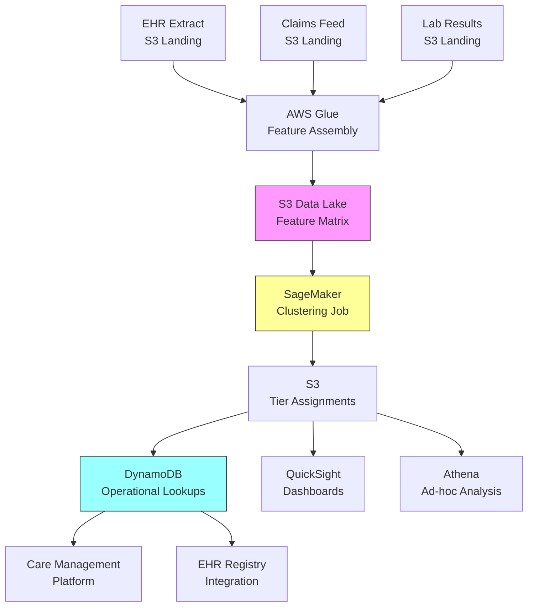

# Recipe 6.4 Architecture and Implementation: Disease Severity Stratification

*Companion to [Recipe 6.4: Disease Severity Stratification](chapter06.04-disease-severity-stratification). This page covers the AWS architecture, services, prerequisites, and pseudocode. For the problem framing and the conceptual approach, start with the main recipe.*

---

## The AWS Implementation

### Why These Services

**Amazon SageMaker for clustering.** SageMaker provides managed infrastructure for running K-Means and other clustering algorithms at scale. The built-in K-Means algorithm is optimized for large datasets and handles the distributed computation transparently. For a 40,000-patient cohort with 30 features, a SageMaker Processing Job with a scikit-learn container (ml.m5.large, ~$0.23/hour) is the simplest path: no model training infrastructure, just a Python script that reads from S3, runs sklearn.cluster.KMeans, and writes results back. For cohorts over 500K or when running multiple disease cohorts in parallel, SageMaker's built-in K-Means algorithm with distributed training provides horizontal scaling. SageMaker also provides the notebook environment for the iterative exploration phase (trying different K values, visualizing clusters, validating against outcomes).

**AWS Glue for feature assembly.** The feature engineering step requires joining data from multiple sources: EHR extracts, claims feeds, lab results, pharmacy data. Glue handles the ETL: schema discovery, data cataloging, and transformation jobs that assemble the patient feature matrix from disparate sources. The Glue Data Catalog also provides a single metadata layer so downstream consumers know what features are available and how they were computed.

**Amazon S3 for data lake storage.** Raw source data, intermediate feature matrices, and final tier assignments all live in S3. Partitioned by cohort and run date, encrypted with KMS. S3 is the gravity well that everything else reads from and writes to.

**Amazon DynamoDB for tier assignments.** The operational output (patient X is in tier Y as of date Z) needs to be queryable in real time by care management platforms and EHR integrations. DynamoDB provides single-digit-millisecond lookups by patient ID, which is the primary access pattern.

**Amazon QuickSight for visualization.** Population health leaders need dashboards showing tier distributions, migration patterns, and outcome comparisons across tiers. QuickSight connects directly to S3 and Athena for this reporting layer.

**Amazon Athena for ad-hoc analysis.** Clinical analysts need to query the feature matrix and tier assignments without spinning up infrastructure. Athena provides serverless SQL over the S3 data lake for validation queries, equity audits, and outcome comparisons.

### Architecture Diagram



### Prerequisites

| Requirement | Details |
|-------------|---------|
| **AWS Services** | Amazon SageMaker, AWS Glue, Amazon S3, Amazon DynamoDB, Amazon Athena, Amazon QuickSight |
| **IAM Permissions** | `sagemaker:CreateTrainingJob`, `sagemaker:CreateProcessingJob`, `glue:StartJobRun`, `s3:GetObject`, `s3:PutObject`, `dynamodb:PutItem`, `dynamodb:GetItem`, `athena:StartQueryExecution` |
| **BAA** | AWS BAA signed (required: patient clinical data is PHI) |
| **Encryption** | S3: SSE-KMS for all buckets; DynamoDB: encryption at rest (default); SageMaker: KMS-encrypted training volumes and model artifacts; all API calls over TLS |
| **VPC** | Production: SageMaker training jobs and Glue jobs in VPC with VPC endpoints for S3, DynamoDB, and CloudWatch Logs. No public internet access for compute touching PHI. Apply endpoint policies to restrict access to only the specific buckets and tables used by this pipeline. |
| **CloudTrail** | Enabled: log all SageMaker, Glue, and S3 API calls for HIPAA audit trail |
| **Sample Data** | Synthetic patient cohort data. CMS Synthetic Public Use Files provide realistic chronic disease populations. Never use real PHI in development. |
| **Cost Estimate** | SageMaker training: ~$2-5 per run (ml.m5.xlarge, 10-30 min). Glue ETL: ~$0.44/DPU-hour. S3 + DynamoDB: negligible at this scale. Monthly total for quarterly re-stratification: ~$20-50. |

### Ingredients

| AWS Service | Role |
|------------|------|
| **Amazon SageMaker** | Runs K-Means clustering on patient feature matrix; hosts notebooks for exploration |
| **AWS Glue** | Assembles patient feature vectors from multiple source systems |
| **Amazon S3** | Stores raw data, feature matrices, and tier assignment outputs |
| **Amazon DynamoDB** | Serves real-time tier lookups for care management integrations |
| **Amazon Athena** | Enables SQL-based validation queries and equity audits over S3 data |
| **Amazon QuickSight** | Provides population health dashboards for tier distribution and outcomes |
| **AWS KMS** | Manages encryption keys for all data at rest |
| **Amazon CloudWatch** | Monitors job execution, logs, and alerts on failures |

### Code (Pseudocode Walkthrough)

> **Reference implementations:** The following AWS sample repos demonstrate patterns used in this recipe:
>
> - [`amazon-sagemaker-examples`](https://github.com/aws/amazon-sagemaker-examples): Includes K-Means clustering examples with built-in algorithms on SageMaker
> - [`aws-glue-samples`](https://github.com/aws-samples/aws-glue-samples): ETL patterns for data lake assembly including healthcare data transformations

#### Walkthrough

**Step 1: Define the cohort and feature set.** Before any computation happens, you need to define two things: which patients are in the cohort, and which features describe their severity. The cohort definition is typically a diagnosis code filter (e.g., all patients with an active Type 2 diabetes diagnosis and at least 12 months of continuous enrollment). The feature set is the clinical consensus on what dimensions matter for this disease. This step is configuration, not computation, but it drives everything downstream. Get the feature set wrong and no algorithm will save you.

```pseudocode
// Configuration: defines what we're stratifying and how
COHORT_DEFINITION:
    diagnosis_codes: ["E11.*"]           // ICD-10 codes for Type 2 Diabetes
    min_enrollment_months: 12            // must have 12 months of data
    min_age: 18                          // adults only
    exclude_hospice: true                // exclude patients in hospice

FEATURE_SET:
    disease_control:
        - latest_hba1c                   // most recent HbA1c value
        - hba1c_trend_12mo               // slope of HbA1c over last 12 months
        - pct_time_above_target          // % of readings above 7.0 in last year

    complication_burden:
        - complication_count             // number of active diabetes complications
        - has_ckd                        // binary: CKD stage 3+ present
        - has_retinopathy                // binary: any retinopathy diagnosis
        - has_neuropathy                 // binary: peripheral neuropathy
        - has_cvd_event                  // binary: MI, stroke, or PVD in last 2 years

    functional_status:
        - phq9_latest                    // most recent depression screening score
        - adl_limitations                // count of ADL limitations documented

    utilization:
        - er_visits_12mo                 // ER visits in last 12 months
        - hospitalizations_12mo          // inpatient admissions in last 12 months
        - specialist_visits_12mo         // endocrinology/nephrology/cardiology visits
        - medication_changes_12mo        // number of diabetes med changes

CLUSTER_CONFIG:
    algorithm: "kmeans"
    k_range: [3, 4, 5]                   // try multiple values, validate each
    random_seed: 42                      // reproducibility
```

**Step 2: Assemble the feature matrix.** This is the ETL step where you pull data from multiple source systems and construct one row per patient with all the features defined in Step 1. In practice, this means joining EHR problem lists (for diagnoses and complications), lab results (for HbA1c and eGFR), claims data (for utilization counts), and screening tools (for PHQ-9 and ADL assessments). The output is a matrix: rows are patients, columns are features. Missing values are common and must be handled explicitly. Skip this step and you have no input for the algorithm.

```pseudocode
FUNCTION assemble_feature_matrix(cohort_definition, feature_set):
    // Step 2a: Identify the cohort
    // Query the clinical data warehouse for patients matching the cohort definition.
    // This returns a list of patient IDs who meet all inclusion criteria.
    eligible_patients = query patients WHERE:
        has active diagnosis matching cohort_definition.diagnosis_codes
        AND enrollment_months >= cohort_definition.min_enrollment_months
        AND age >= cohort_definition.min_age
        AND NOT in hospice (if cohort_definition.exclude_hospice)

    // Step 2b: Pull features for each patient
    // For each patient, compute every feature in the feature set.
    // Each feature may come from a different source system.
    feature_matrix = empty table with columns = all features in feature_set

    FOR each patient_id in eligible_patients:
        row = empty map

        // Disease control features from lab results
        row["latest_hba1c"] = most recent HbA1c value for patient_id
        row["hba1c_trend_12mo"] = linear slope of HbA1c values over last 12 months
        row["pct_time_above_target"] = count(hba1c > 7.0) / count(all hba1c) in last year

        // Complication burden from problem list and diagnoses
        row["complication_count"] = count of active diabetes complication diagnoses
        row["has_ckd"] = 1 if eGFR < 60 or CKD diagnosis present, else 0
        row["has_retinopathy"] = 1 if retinopathy diagnosis present, else 0
        row["has_neuropathy"] = 1 if neuropathy diagnosis present, else 0
        row["has_cvd_event"] = 1 if MI/stroke/PVD in last 24 months, else 0

        // Functional status from screening tools
        row["phq9_latest"] = most recent PHQ-9 score (NULL if no screening)
        row["adl_limitations"] = count of documented ADL limitations

        // Utilization from claims/encounters
        row["er_visits_12mo"] = count of ER encounters in last 12 months
        row["hospitalizations_12mo"] = count of inpatient admissions in last 12 months
        row["specialist_visits_12mo"] = count of relevant specialist visits
        row["medication_changes_12mo"] = count of diabetes medication changes

        append row to feature_matrix

    // Step 2c: Handle missing values
    // Clinical data is never complete. Patients without a recent HbA1c are not
    // the same as patients with a normal HbA1c. Strategy: impute with cohort
    // median for continuous features, 0 for binary features where absence of
    // diagnosis likely means absence of condition.
    //
    // CLINICAL SAFETY NOTE: Imputing binary complication flags with 0 assumes
    // absence of diagnosis means absence of disease. For patients with sparse
    // data (fewer than 3 visits in 12 months, no specialist encounters),
    // consider flagging them as "insufficient data for stratification" rather
    // than assigning them to a tier. A patient with no retinopathy screening
    // who gets placed in Tier 0 may be missed for outreach.
    // Track the percentage of patients with imputed values per feature; if
    // more than 20% of a feature is imputed, that feature's discriminating
    // power is degraded.

    // First: flag patients with insufficient data
    FOR each patient in feature_matrix:
        null_count = count of NULL values across all features for this patient
        IF null_count > (total_features * 0.5):
            mark patient as "insufficient_data" and exclude from clustering
            // These patients need manual review, not algorithmic assignment

    FOR each column in feature_matrix (excluding insufficient_data patients):
        IF column is continuous (hba1c, phq9, etc.):
            replace NULL values with median of non-null values in that column
        IF column is binary (has_ckd, has_retinopathy, etc.):
            replace NULL values with 0  // no diagnosis = assume absent

    RETURN feature_matrix
```

**Step 3: Preprocess and normalize.** Raw features are on wildly different scales. HbA1c ranges from 5 to 14. ER visits range from 0 to 50. Complication count ranges from 0 to 8. If you feed raw values into K-Means, the features with larger numeric ranges will dominate the distance calculation, and features with small ranges (like binary indicators) will be effectively ignored. Normalization puts all features on a common scale so each contributes proportionally to the clustering. Skip this step and your clusters will be driven entirely by whichever feature has the largest numeric range.

```pseudocode
FUNCTION preprocess_features(feature_matrix, clinical_weights):
    // Step 3a: Z-score normalization
    // For each feature, subtract the mean and divide by standard deviation.
    // This puts every feature on a scale where 0 = average and 1 = one standard
    // deviation above average. Now HbA1c and ER visits are comparable.
    normalized_matrix = empty table same shape as feature_matrix

    FOR each column in feature_matrix:
        mean = average of all values in column
        std  = standard deviation of all values in column

        IF std == 0:
            // All patients have the same value for this feature.
            // It provides no discriminating information. Set to 0.
            normalized_matrix[column] = 0 for all rows
        ELSE:
            normalized_matrix[column] = (feature_matrix[column] - mean) / std

    // Step 3b: Apply clinical weights (optional but recommended)
    // If clinicians have indicated that certain features matter more for
    // severity determination, multiply those columns by their weight.
    // Example: complication_count might get weight 1.5 because clinicians
    // consider accumulated complications the strongest severity signal.
    IF clinical_weights is provided:
        FOR each column, weight in clinical_weights:
            normalized_matrix[column] = normalized_matrix[column] * weight

    RETURN normalized_matrix
```

**Step 4: Run clustering.** This is the core algorithm step. For each candidate value of K (number of tiers), run K-Means on the normalized feature matrix and record the results. K-Means works by placing K cluster centers in the feature space, assigning each patient to the nearest center, then iteratively adjusting the centers until assignments stabilize. The output is a tier label for each patient and the cluster centers (which describe the "average patient" in each tier). Running multiple K values lets you compare and choose the best tier count in the validation step.

```pseudocode
FUNCTION run_clustering(normalized_matrix, cluster_config):
    results = empty map

    FOR each k in cluster_config.k_range:
        // Run K-Means with this number of clusters.
        // max_iterations prevents infinite loops if convergence is slow.
        // random_seed ensures reproducibility across runs.
        model = train KMeans with:
            data = normalized_matrix
            num_clusters = k
            max_iterations = 300
            random_seed = cluster_config.random_seed

        // Get the tier assignment for each patient
        assignments = model.predict(normalized_matrix)
        // assignments is a list: [2, 0, 1, 2, 0, ...] where each number
        // is the cluster (tier) that patient was assigned to

        // Get the cluster centers (centroids)
        // Each center is a vector in feature space describing the "typical"
        // patient in that tier. Useful for labeling and interpretation.
        centers = model.cluster_centers

        // Compute quality metrics
        // Inertia: sum of squared distances from each point to its cluster center.
        // Lower is better (tighter clusters), but always decreases with more K.
        inertia = model.inertia

        // Silhouette score: measures how similar each patient is to their own
        // cluster vs. the nearest other cluster. Ranges from -1 to 1.
        // Higher is better. Values above 0.3 suggest meaningful structure.
        silhouette = compute_silhouette_score(normalized_matrix, assignments)

        results[k] = {
            assignments: assignments,
            centers: centers,
            inertia: inertia,
            silhouette: silhouette
        }

    RETURN results
```

**Step 5: Validate and label tiers.** This is where data science meets clinical judgment. For each candidate K, examine the cluster centers to understand what each tier represents, then validate against real outcomes. The best K is the one where tiers are both statistically well-separated and clinically meaningful. Once you've chosen K, assign human-readable labels to each tier based on the cluster center profiles. Skip this step and you have numbered clusters that no clinician will trust or use.

```pseudocode
FUNCTION validate_and_label(clustering_results, feature_matrix, outcomes_data):
    // Step 5a: Compare K values using metrics
    FOR each k, result in clustering_results:
        PRINT "K={k}: silhouette={result.silhouette}, inertia={result.inertia}"

    // Step 5b: For the best K (highest silhouette that's operationally feasible),
    // examine what each cluster looks like
    best_k = select K with best silhouette score (subject to operational constraints)
    best_result = clustering_results[best_k]

    // Step 5c: Profile each cluster by computing feature averages
    // This tells you what the "typical patient" in each tier looks like.
    FOR each tier in 0..best_k-1:
        tier_patients = patients where best_result.assignments == tier
        tier_profile = compute mean of each feature for tier_patients

        PRINT "Tier {tier}: avg HbA1c={tier_profile.latest_hba1c}, "
              "avg complications={tier_profile.complication_count}, "
              "avg ER visits={tier_profile.er_visits_12mo}, "
              "patient count={count of tier_patients}"

    // Step 5d: Validate against outcomes
    // Tiers should correlate with real outcomes. If they don't, the
    // stratification isn't capturing true severity.
    FOR each tier in 0..best_k-1:
        tier_patients = patients where best_result.assignments == tier
        tier_outcomes = lookup outcomes for tier_patients in outcomes_data

        PRINT "Tier {tier} outcomes: "
              "hospitalization_rate={mean(tier_outcomes.hospitalized_next_12mo)}, "
              "cost_per_patient={mean(tier_outcomes.total_cost_12mo)}, "
              "mortality_rate={mean(tier_outcomes.deceased_next_12mo)}"

    // Step 5e: Assign clinical labels based on profiles
    // Sort tiers by average severity (e.g., by complication count + utilization)
    // and assign meaningful names.
    tier_labels = empty map
    sorted_tiers = sort tiers by ascending average severity score

    // Example for K=4:
    tier_labels[sorted_tiers[0]] = "Well-Controlled, Low Complexity"
    tier_labels[sorted_tiers[1]] = "Moderate, Stable Complications"
    tier_labels[sorted_tiers[2]] = "High Complexity, Active Complications"
    tier_labels[sorted_tiers[3]] = "Severe, Functional Decline"

    RETURN best_result.assignments, tier_labels
```

**Step 6: Store and operationalize.** The final step writes tier assignments to a database where care management platforms and EHR systems can look them up in real time. Each record includes the patient ID, their assigned tier, the run date (so you can track changes over time), and the key feature values that drove the assignment (for explainability). This step also writes the full results to the data lake for dashboarding and longitudinal analysis.

The severity-tiers table contains PHI (disease diagnosis, severity classification, clinical indicators). Restrict access by role: the pipeline write role gets `dynamodb:PutItem` only; the care management read role gets `dynamodb:GetItem` by patient_id only (no Scan); analytics queries run via Athena over the S3 Parquet copy, not DynamoDB directly. Use an opaque patient identifier as the partition key and maintain the MRN-to-opaque mapping in a separate identity service with tighter access controls.

```pseudocode
FUNCTION store_tier_assignments(patient_ids, assignments, tier_labels, feature_matrix, run_date):
    // Write to operational database for real-time lookups
    FOR each patient_id, tier_index in zip(patient_ids, assignments):
        write record to database table "severity-tiers":
            patient_id       = patient_id
            disease_cohort   = "type_2_diabetes"          // which disease this stratification covers
            tier_label       = tier_labels[tier_index]     // human-readable tier name
            tier_numeric     = tier_index                  // numeric tier for sorting/filtering
            run_date         = run_date                    // when this assignment was computed
            key_drivers      = top 3 features with highest // which features most influenced this
                               z-scores for this patient   // patient's tier (for explainability)
            // TODO (TechWriter): Expert review SEC-3 (MEDIUM). Consider whether key_drivers should live in the operational DynamoDB table or only in the S3 analytics layer. If the tier label alone suffices for workflow routing, storing drivers only in S3 reduces the table's sensitivity. Document this as a data minimization tradeoff.
            expires_at       = run_date + 90 days          // tier assignments should be refreshed
                                                           // quarterly; stale assignments get flagged

    // Write full results to data lake for analytics
    write feature_matrix + assignments to S3:
        path = "s3://data-lake/severity-stratification/diabetes/{run_date}/results.parquet"

    RETURN count of patients assigned
```

> **Curious how this looks in Python?** The pseudocode above covers the concepts. If you'd like to see sample Python code that demonstrates these patterns using boto3, check out the [Python Example](chapter06.04-python-example). It walks through each step with inline comments and notes on what you'd need to change for a real deployment.

### Expected Results

**Sample output for a 4-tier diabetes stratification:**

```json
{
  "patient_id": "PAT-00482",
  "disease_cohort": "type_2_diabetes",
  "tier_label": "High Complexity, Active Complications",
  "tier_numeric": 2,
  "run_date": "2026-03-01",
  "key_drivers": [
    {"feature": "complication_count", "value": 4, "z_score": 2.1},
    {"feature": "er_visits_12mo", "value": 5, "z_score": 1.8},
    {"feature": "has_ckd", "value": 1, "z_score": 1.5}
  ],
  "expires_at": "2026-06-01"
}
```

**Tier distribution for a typical 40,000-patient diabetes cohort:**

| Tier | Label | % of Cohort | Avg HbA1c | Avg Complications | Avg ER Visits/yr |
|------|-------|-------------|-----------|-------------------|-----------------|
| 0 | Well-Controlled, Low Complexity | 45% | 6.8 | 0.3 | 0.2 |
| 1 | Moderate, Stable Complications | 30% | 7.6 | 1.8 | 0.8 |
| 2 | High Complexity, Active Complications | 18% | 8.4 | 3.2 | 3.1 |
| 3 | Severe, Functional Decline | 7% | 9.1 | 4.6 | 5.8 |

**Performance benchmarks:**

| Metric | Typical Value |
|--------|---------------|
| Feature assembly (Glue ETL) | 15-45 minutes for 40K patients |
| Clustering (SageMaker) | 2-5 minutes for 40K patients, 30 features |
| End-to-end pipeline | ~1 hour including validation |
| Silhouette score | 0.3-0.5 (good separation for clinical data) |
| Outcome correlation | Tier 3 hospitalization rate 4-8x Tier 0 |
| Cost per run | ~$5-10 (Glue + SageMaker + storage) |

**Where it struggles:** Patients with multiple chronic conditions where severity signals conflict (well-controlled diabetes but severe heart failure). Patients with sparse data (new enrollees, patients who avoid care). Populations where social determinants drive utilization more than clinical severity. And any cohort where the "severe" tier is very small (less than 5% of the population), making cluster detection unstable.

---

## Why This Isn't Production-Ready

**Refresh orchestration.** The pseudocode runs once. Production needs a scheduled pipeline (monthly or quarterly) with monitoring for data freshness, job failures, and tier distribution drift. If your source data feed is delayed, the pipeline should wait rather than run on stale data.

**Tier migration tracking.** When a patient moves from Tier 1 to Tier 2 between runs, that's a clinical event that should trigger a care management alert. The pseudocode doesn't track changes between runs or generate notifications.

**Multi-disease coordination.** A patient might be in the "severe" tier for diabetes and the "mild" tier for COPD. Care management needs a unified view across disease-specific stratifications. That coordination layer is not addressed here.

**Model versioning.** When you change the feature set or weights, all tier assignments change. You need versioning so downstream systems know which model version produced which assignments, and so you can compare performance across versions.

---

## Variations and Extensions

**Multi-disease severity composite.** Run disease-specific stratifications for each chronic condition, then create a composite severity score that accounts for multi-morbidity interactions. A patient who is Tier 2 in three diseases simultaneously is more complex than a patient who is Tier 3 in one disease. The composite requires its own weighting logic and clinical validation.

**Trajectory-aware stratification.** Instead of clustering on current-state features only, include trajectory features (rate of change over 6-12 months). This separates "stable severe" patients (who may be well-managed at a high baseline) from "rapidly deteriorating" patients (who need immediate intervention regardless of current absolute values). The trajectory dimension often identifies the patients who benefit most from proactive outreach.

**Explainable tier boundaries.** Replace K-Means with a decision tree trained to reproduce the cluster assignments. The tree provides explicit rules ("if complication_count >= 3 AND er_visits >= 2, then Tier 3") that clinicians can audit and understand. You lose some nuance (decision boundaries become axis-aligned) but gain transparency. Some organizations require this for clinical governance approval.

---

## Additional Resources

**AWS Documentation:**
- [Amazon SageMaker Built-in K-Means Algorithm](https://docs.aws.amazon.com/sagemaker/latest/dg/k-means.html)
- [Amazon SageMaker Processing Jobs](https://docs.aws.amazon.com/sagemaker/latest/dg/processing-job.html)
- [AWS Glue Developer Guide](https://docs.aws.amazon.com/glue/latest/dg/what-is-glue.html)
- [Amazon Athena User Guide](https://docs.aws.amazon.com/athena/latest/ug/what-is.html)
- [AWS HIPAA Eligible Services](https://aws.amazon.com/compliance/hipaa-eligible-services-reference/)
- [Architecting for HIPAA on AWS](https://docs.aws.amazon.com/whitepapers/latest/architecting-hipaa-security-and-compliance-on-aws/welcome.html)

**AWS Sample Repos:**
- [`amazon-sagemaker-examples`](https://github.com/aws/amazon-sagemaker-examples): Comprehensive SageMaker examples including K-Means clustering, data preprocessing, and model evaluation
- [`aws-glue-samples`](https://github.com/aws-samples/aws-glue-samples): ETL job patterns for healthcare data lake assembly

**AWS Solutions and Blogs:**
- [AWS Solutions Library: Healthcare](https://aws.amazon.com/solutions/?solutions-all.sort-by=item.additionalFields.sortDate&solutions-all.sort-order=desc&awsf.content-type=*all&awsf.methodology=*all&awsf.tech-category=*all&awsf.industries=industry%23healthcare): Deployable healthcare solutions and reference architectures
- [Machine Learning Blog](https://aws.amazon.com/blogs/machine-learning/): Search for "clustering" and "healthcare" for relevant case studies

---

## Estimated Implementation Time

| Phase | Duration |
|-------|----------|
| Basic (single disease, 3 tiers, manual validation) | 3-4 weeks |
| Production-ready (automated pipeline, monitoring, EHR integration) | 8-12 weeks |
| With variations (multi-disease, trajectory, explainable boundaries) | 16-20 weeks |

---

---

*← [Main Recipe 6.4](chapter06.04-disease-severity-stratification) · [Python Example](chapter06.04-python-example) · [Chapter Preface](chapter06-preface)*
