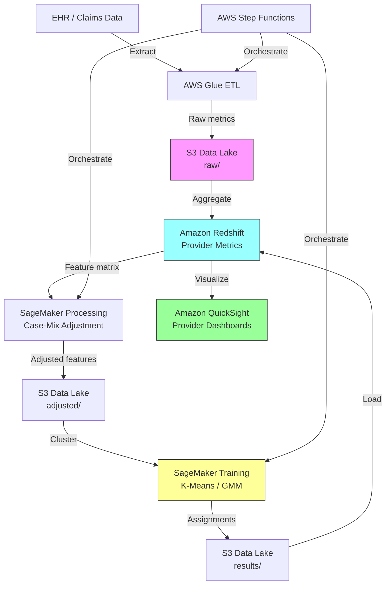

# Recipe 6.5 Architecture and Implementation: Provider Practice Pattern Analysis

*Companion to [Recipe 6.5: Provider Practice Pattern Analysis](chapter06.05-provider-practice-pattern-analysis). This page covers the AWS architecture, services, prerequisites, and pseudocode. For the problem framing and the conceptual approach, start with the main recipe.*

---

## The AWS Implementation

### Why These Services

**Amazon SageMaker for clustering and case-mix modeling.** SageMaker provides the ML infrastructure for both the case-mix adjustment models (regression) and the clustering algorithms. SageMaker Processing jobs handle the feature engineering and adjustment calculations at scale. The built-in K-Means algorithm works for straightforward segmentation; for GMM or hierarchical approaches, bring your own scikit-learn container. SageMaker also provides model versioning and experiment tracking, which matters when you're iterating on feature sets and adjustment methodologies.

<!-- TODO (TechWriter): Expert review SEC-3 (MEDIUM). Add note that patient-level PHI is loaded into SageMaker Processing ephemeral storage during case-mix model training. Apply minimum panel size filter (30-50 patients) before model training, not just before clustering, to prevent small-panel features from encoding individual patient characteristics. -->

**Amazon Redshift for data aggregation.** Provider profiling requires joining claims, encounters, orders, prescriptions, and outcomes data across millions of records, then aggregating to the provider level. Redshift handles this analytical workload efficiently. The columnar storage is well-suited to the wide, aggregation-heavy queries that provider profiling demands.

For quarterly batch workloads, consider Redshift Serverless (pay-per-query) instead of a provisioned cluster. A quarterly aggregation run processing 10M claims records might consume 30-60 RPU-hours (~$11-22 per run). If your organization already has a provisioned Redshift cluster for other analytics workloads, use it. If this pipeline is the only Redshift consumer, Serverless or even Athena over S3 Parquet files may be more cost-effective for the aggregation step.

**Amazon S3 for data lake storage.** Raw data extracts, intermediate feature matrices, model artifacts, and final cluster assignments all live in S3. The data lake pattern gives you lineage (you can trace any provider's cluster assignment back through the adjusted metrics to the raw claims) and reproducibility (re-run any historical analysis with the same inputs).

**AWS Glue for ETL orchestration.** The data pipeline from source systems (EHR, claims warehouse) through aggregation, adjustment, and feature engineering involves multiple transformation steps. Glue jobs handle the extract-transform-load work, with the Glue Data Catalog providing schema management across the pipeline stages.

**Amazon QuickSight for provider dashboards.** The end product of this pipeline is a set of reports and dashboards that medical directors and individual providers consume. QuickSight connects to Redshift for the aggregated metrics and provides the interactive visualization layer. Row-level security ensures providers see their own data and peer comparisons but not individually identified peer data.

QuickSight requires a VPC connection to reach Redshift in a private subnet: configure a network interface in the same private subnet as Redshift, with the Redshift security group allowing inbound on port 5439 from the QuickSight network interface's security group. QuickSight Enterprise edition is required for VPC connectivity.

Dashboards should prominently display the analysis period ("Based on data from April 2025 through March 2026, refreshed quarterly"). Include a "last updated" timestamp on every dashboard page and send email notifications to providers when new results are available.

<!-- TODO (TechWriter): Expert review SEC-1 (HIGH). Add tiered access control section: (1) Individual providers see only their own report. (2) Medical directors see specialty-level dashboards with individual provider identifiers (requires peer review privilege coverage in most states). (3) Analytics team sees de-identified data for model development. (4) For specialties with fewer than 5 providers in a cluster, suppress individual-level comparisons to prevent re-identification. Implement QuickSight row-level security with a permissions dataset mapping user identity to allowed provider_ids. Consult legal counsel on peer review privilege before exposing individually identified provider performance data. -->

**AWS Step Functions for pipeline orchestration.** The quarterly analysis run involves multiple sequential and parallel steps: data extraction, aggregation, adjustment, clustering, validation, and report generation. Step Functions coordinates this workflow with error handling, retry logic, and audit logging.

Include per-step failure handling: Glue ETL failure halts the pipeline (don't cluster on incomplete data); SageMaker convergence failure retries with different initialization; Redshift load failure retries with exponential backoff and falls back to S3-only output. Add a CloudWatch alarm on "days since last successful pipeline completion" to catch silent failures before the next quarterly review cycle.

### Architecture Diagram



### Prerequisites

| Requirement | Details |
|-------------|---------|
| **AWS Services** | Amazon SageMaker, Amazon Redshift, Amazon S3, AWS Glue, Amazon QuickSight, AWS Step Functions, AWS KMS |
| **IAM Permissions** | `sagemaker:CreateProcessingJob`, `sagemaker:CreateTrainingJob` (with condition key restricting VPC and instance types), `redshift:GetClusterCredentials` (scoped to specific `dbuser:provider_profiling_etl`), `s3:GetObject` and `s3:PutObject` (scoped to `arn:aws:s3:::your-bucket/provider-profiling/*`), `glue:StartJobRun`, `quicksight:CreateDashboard`, `states:StartExecution`, `kms:Decrypt` and `kms:GenerateDataKey` (scoped to pipeline CMK ARN) |
| **BAA** | Required. Provider practice data linked to patient panels contains PHI. |
| **Encryption** | S3: SSE-KMS with customer-managed key; Redshift: encrypted cluster with KMS CMK; SageMaker: volume encryption and inter-container encryption; QuickSight: TLS in transit |
| **VPC** | Production: Redshift in private subnet, SageMaker jobs in VPC mode with VPC endpoints for S3 and SageMaker API (endpoint policies restricting to specific buckets and APIs), Glue connections through VPC, QuickSight VPC connection for Redshift access |
| **CloudTrail** | Enabled for all service API calls. Provider profiling data is sensitive; full audit trail required. |
| **Data Sources** | Claims data warehouse, EHR encounter/order data, provider roster with specialty assignments, quality measure results |
| **Cost Estimate** | Redshift Serverless: ~$11-22/quarterly run (30-60 RPU-hours). SageMaker Processing: ~$0.05/hour (ml.m5.large) for quarterly runs. S3 + Glue: negligible. QuickSight: $18/user/month (Enterprise). Total for 500-provider system: ~$200-400/quarter for compute, plus QuickSight licensing. |

<!-- TODO (TechWriter): Expert review SEC-2 (HIGH). Expand IAM permissions with explicit resource ARN examples showing least-privilege scoping. Show sagemaker:CreateTrainingJob with condition key sagemaker:VpcSecurityGroupIds restricting to PHI security group. Show redshift:GetClusterCredentials restricted to specific database user with schema-level grants only on provider profiling tables. -->

### Ingredients

| AWS Service | Role |
|------------|------|
| **Amazon SageMaker** | Case-mix adjustment models, clustering algorithms, feature engineering at scale |
| **Amazon Redshift** | Analytical queries for provider metric aggregation, stores final results for dashboards |
| **Amazon S3** | Data lake for raw extracts, intermediate features, model artifacts, cluster results |
| **AWS Glue** | ETL from source systems, data catalog for schema management |
| **Amazon QuickSight** | Provider-facing dashboards with row-level security |
| **AWS Step Functions** | Orchestrates the quarterly analysis pipeline end-to-end |
| **AWS KMS** | Encryption key management for all data at rest |

### Code

#### Walkthrough

**Step 1: Extract and aggregate provider metrics.** The first step pulls raw clinical data from your source systems and aggregates it to the provider level. For each provider, you calculate raw utilization metrics over your chosen time window (typically 12 months). This includes ordering rates, referral rates, prescribing patterns, cost metrics, and quality scores. The aggregation must be specialty-specific: you only compare providers within the same specialty. Skip this step and you have no data to analyze. Get the time window wrong and you either have too much noise (short window, small panels) or miss practice evolution (overly long window).

Before case-mix adjustment, validate input data: check record counts against expected volumes (alert if more than 20% deviation from prior quarter), verify all expected providers appear in the extract, check for temporal completeness (all 12 months of the analysis window have data), and validate HCC score distributions haven't shifted dramatically (which could indicate a coding change rather than real acuity change). Halt the pipeline and alert if any validation fails.

```text
FUNCTION aggregate_provider_metrics(time_window_months, min_panel_size):
    // Pull all encounters, orders, referrals, prescriptions, and outcomes
    // for the specified time window from the claims/EHR data warehouse.
    raw_data = query data warehouse for:
        - encounters by provider (with patient demographics and diagnoses)
        - lab/imaging orders by provider
        - referrals by provider (with destination specialty)
        - prescriptions by provider (with drug class, brand/generic)
        - quality measure numerators/denominators by provider
        - cost per episode by provider
    
    // Aggregate to provider level. Each provider gets a vector of raw metrics.
    FOR each provider in raw_data:
        metrics[provider] = {
            panel_size:           count of unique patients seen,
            lab_rate:             labs ordered / patient / year,
            imaging_rate:         imaging studies / patient / year,
            mri_rate:             MRI specifically / patient / year,
            referral_rate:        referrals / patient / year,
            referral_breadth:     count of distinct specialists referred to,
            generic_rx_rate:      generic prescriptions / total prescriptions,
            opioid_rx_rate:       opioid prescriptions / total prescriptions,
            avg_cost_per_patient: total attributed cost / panel size,
            ed_rate:              ED visits among panel / panel size,
            readmit_rate:         30-day readmissions / discharges,
            quality_composite:    average quality measure performance (0-100),
            specialty:            provider's specialty code
        }
    
    // Filter out providers with panels too small for stable estimates.
    // Small panels produce noisy metrics that distort clustering.
    filtered = remove providers where panel_size < min_panel_size
    
    RETURN filtered metrics grouped by specialty
```

**Step 2: Case-mix adjustment.** This is the critical step that separates practice style from patient complexity. For each metric, you build a model that predicts the expected value based on the provider's patient panel characteristics. The difference between observed and expected is the provider's practice style signal. Without this step, you're just measuring which providers have sicker patients, not which providers practice differently. The adjustment model uses patient-level features (age, sex, HCC risk scores, chronic condition count, prior utilization) to predict expected utilization at the provider level.

```text
FUNCTION case_mix_adjust(provider_metrics, patient_data):
    // For each utilization metric, build a regression model predicting
    // expected values from patient characteristics.
    
    FOR each metric in [lab_rate, imaging_rate, referral_rate, avg_cost, ...]:
        
        // Build patient-level features for the adjustment model.
        // These represent the "difficulty" of each provider's panel.
        panel_features = FOR each provider:
            average HCC risk score of their patients,
            average age of their patients,
            percent female,
            average chronic condition count,
            percent dual-eligible (Medicare + Medicaid),
            average prior-year utilization of their patients
        
        // Train a regression model: metric = f(panel_features)
        // This learns what utilization you'd EXPECT given the patient mix.
        model = train regression on (panel_features -> observed metric values)
        
        // Calculate expected value for each provider given their panel.
        FOR each provider:
            expected = model.predict(provider's panel_features)
            
            // The O/E ratio isolates practice style from case mix.
            // O/E = 1.0 means "exactly as expected given your patients"
            // O/E = 1.3 means "30% more than expected" (practice style signal)
            provider.adjusted[metric] = provider.observed[metric] / expected
    
    RETURN adjusted provider metrics (O/E ratios for each metric)
```

**Step 3: Feature engineering and normalization.** The adjusted metrics need preparation before clustering. This step normalizes features to comparable scales, handles any remaining outliers, and optionally reduces dimensionality. Providers with extreme O/E ratios (say, 5x expected on imaging) can distort cluster centroids, so winsorization (capping at the 95th percentile) is common. If you have 20+ metrics, PCA reduction to 5-8 components helps the clustering algorithm find cleaner structure without overfitting to noise in individual metrics.

```text
FUNCTION prepare_features(adjusted_metrics, n_components):
    // Normalize each adjusted metric to zero mean, unit variance.
    // This prevents metrics with larger numeric ranges from
    // dominating the distance calculations in clustering.
    normalized = z_score_normalize(adjusted_metrics)
    
    // Winsorize extreme values to prevent outliers from distorting clusters.
    // Cap at 2.5 standard deviations (roughly the 99th percentile).
    // A provider with an O/E of 5.0 on imaging is interesting but shouldn't
    // pull an entire cluster centroid toward their extreme value.
    winsorized = cap values at +/- 2.5 standard deviations
    
    // Optional: reduce dimensionality if feature count is high.
    // PCA finds the directions of maximum variance in the data.
    // Clustering in PCA space is more stable and less prone to noise.
    IF number of features > 10:
        reduced = PCA(winsorized, n_components=n_components)
        // Retain enough components to explain 85-90% of variance.
        // Record the component loadings for interpretation later.
        loadings = PCA component loadings (which original metrics contribute to each component)
    ELSE:
        reduced = winsorized
        loadings = identity (each feature is its own "component")
    
    RETURN reduced feature matrix, loadings
```

**Step 4: Clustering.** Apply the clustering algorithm to the prepared feature matrix. This step identifies groups of providers with similar practice styles. The choice of K (number of clusters) should balance statistical separation with operational utility. Run multiple values of K and evaluate both quantitative metrics (silhouette score) and qualitative interpretability. A medical director needs to be able to explain what each cluster represents in plain clinical language.

```text
FUNCTION cluster_providers(feature_matrix, k_range):
    // Try multiple values of K to find the best segmentation.
    // k_range is typically [3, 4, 5, 6] for provider profiling.
    results = empty list
    
    FOR each k in k_range:
        // Run K-Means (or GMM for soft assignments).
        model = fit KMeans(n_clusters=k) on feature_matrix
        
        // Calculate silhouette score: measures how well-separated clusters are.
        // Range is -1 to 1. Above 0.3 is decent. Above 0.5 is good.
        silhouette = calculate silhouette score for this clustering
        
        // Calculate within-cluster sum of squares (inertia).
        // Lower is better, but always decreases with more clusters.
        inertia = model.inertia
        
        // Store results for comparison.
        results.append({k, model, silhouette, inertia})
    
    // Select K based on silhouette score AND interpretability.
    // The "best" K statistically may not be the most useful operationally.
    best_model = select model with best silhouette (or clinical preference)
    
    // Assign each provider to their cluster.
    assignments = best_model.predict(feature_matrix)
    
    // For GMM: also get soft assignments (probability per cluster).
    // "Dr. Smith is 72% Cluster A, 28% Cluster B" is more nuanced
    // than a hard assignment and useful for borderline cases.
    probabilities = best_model.predict_proba(feature_matrix)  // GMM only
    
    RETURN assignments, probabilities, best_model
```

**Step 5: Cluster interpretation and labeling.** Raw cluster numbers mean nothing to clinicians. This step characterizes each cluster by examining which metrics are most distinctive (highest or lowest relative to the overall mean). The goal is a plain-language label that a medical director can use in conversation: "conservative/efficient," "thorough/resource-intensive," "procedure-oriented," etc. These labels should be developed collaboratively with clinical leadership, not assigned unilaterally by the analytics team.

```text
FUNCTION interpret_clusters(assignments, original_metrics, loadings):
    // For each cluster, calculate the mean of each original (adjusted) metric.
    // Compare to the overall population mean.
    cluster_profiles = empty map
    
    FOR each cluster_id in unique(assignments):
        cluster_members = providers where assignment == cluster_id
        
        // Calculate mean of each metric for this cluster.
        cluster_means = mean of each metric across cluster_members
        
        // Calculate z-score relative to overall population.
        // Positive z-score = this cluster is ABOVE average on this metric.
        // Negative z-score = this cluster is BELOW average.
        relative_profile = (cluster_means - overall_means) / overall_std
        
        // Identify the 3-5 most distinctive features for this cluster.
        // These are the features with the largest absolute z-scores.
        distinctive_features = top 5 features by absolute z-score
        
        cluster_profiles[cluster_id] = {
            size:                 count of providers in this cluster,
            distinctive_features: distinctive_features,
            relative_profile:     relative_profile,
            suggested_label:      generate label from distinctive features
            // e.g., high imaging + high referral + high cost = "thorough/resource-intensive"
            // e.g., low imaging + low referral + low cost + avg quality = "conservative/efficient"
        }
    
    RETURN cluster_profiles
```

**Step 6: Generate provider reports.** The final step produces individual provider reports and aggregate dashboards. Each provider sees their cluster assignment, how their metrics compare to their cluster peers and to the overall specialty, and which specific metrics are most distinctive about their practice style. Medical directors see the full landscape: cluster sizes, characteristics, outcome correlations, and individual provider positions. Row-level security ensures providers see peer comparisons in aggregate but cannot identify individual peers.

```text
FUNCTION generate_reports(assignments, profiles, provider_metrics):
    // Individual provider report.
    FOR each provider:
        report = {
            provider_id:       provider identifier,
            specialty:         provider's specialty,
            cluster:           assigned cluster label (e.g., "Conservative/Efficient"),
            cluster_confidence: probability of cluster membership (from GMM),
            
            // Show where this provider sits relative to peers.
            peer_comparison: FOR each metric:
                {
                    metric_name:    metric label,
                    provider_value: this provider's adjusted value,
                    cluster_mean:   mean for their cluster,
                    specialty_mean: mean for all providers in this specialty,
                    percentile:     where they fall in the specialty distribution
                },
            
            // Highlight the 3 metrics most responsible for their cluster assignment.
            key_drivers: top 3 metrics by contribution to cluster assignment,
            
            // Outcome context: how does their cluster perform on outcomes?
            cluster_outcomes: {
                avg_quality_score:  cluster average quality composite,
                avg_cost:           cluster average cost per patient,
                avg_readmit_rate:   cluster average readmission rate
            }
        }
        
        write report to storage
    
    // Aggregate dashboard for medical directors.
    dashboard = {
        cluster_summary:    size and characteristics of each cluster,
        outcome_by_cluster: quality and cost metrics by cluster,
        outlier_list:       providers far from any cluster centroid,
        trend:              how cluster assignments changed from last quarter
    }
    
    write dashboard to storage
    RETURN reports, dashboard
```

> **Curious how this looks in Python?** The pseudocode above covers the concepts. If you'd like to see sample Python code that demonstrates these patterns using boto3, check out the [Python Example](chapter06.05-python-example). It walks through each step with inline comments and notes on what you'd need to change for a real deployment.

### Expected Results

**Sample cluster profile output:**

```json
{
  "analysis_period": "2025-04-01 to 2026-03-31",
  "specialty": "Internal Medicine",
  "provider_count": 142,
  "clusters": [
    {
      "cluster_id": 0,
      "label": "Conservative / Efficient",
      "size": 48,
      "distinctive_features": [
        {"metric": "imaging_rate_oe", "z_score": -1.2, "interpretation": "32% below expected imaging"},
        {"metric": "referral_rate_oe", "z_score": -0.9, "interpretation": "24% below expected referrals"},
        {"metric": "avg_cost_oe", "z_score": -1.1, "interpretation": "28% below expected cost"}
      ],
      "outcomes": {"quality_composite": 82.1, "readmit_rate": 0.11, "patient_satisfaction": 4.2}
    },
    {
      "cluster_id": 1,
      "label": "Thorough / Resource-Intensive",
      "size": 35,
      "distinctive_features": [
        {"metric": "imaging_rate_oe", "z_score": 1.4, "interpretation": "42% above expected imaging"},
        {"metric": "lab_rate_oe", "z_score": 1.1, "interpretation": "30% above expected labs"},
        {"metric": "avg_cost_oe", "z_score": 1.3, "interpretation": "35% above expected cost"}
      ],
      "outcomes": {"quality_composite": 84.7, "readmit_rate": 0.09, "patient_satisfaction": 4.4}
    },
    {
      "cluster_id": 2,
      "label": "Referral-Oriented",
      "size": 31,
      "distinctive_features": [
        {"metric": "referral_rate_oe", "z_score": 1.8, "interpretation": "55% above expected referrals"},
        {"metric": "referral_breadth", "z_score": 1.3, "interpretation": "Wide referral network"},
        {"metric": "imaging_rate_oe", "z_score": -0.4, "interpretation": "Near expected imaging"}
      ],
      "outcomes": {"quality_composite": 80.5, "readmit_rate": 0.12, "patient_satisfaction": 3.9}
    },
    {
      "cluster_id": 3,
      "label": "Balanced / Guideline-Adherent",
      "size": 28,
      "distinctive_features": [
        {"metric": "quality_composite", "z_score": 1.5, "interpretation": "High quality scores"},
        {"metric": "preventive_rate", "z_score": 1.2, "interpretation": "Strong preventive care"},
        {"metric": "avg_cost_oe", "z_score": 0.1, "interpretation": "Near expected cost"}
      ],
      "outcomes": {"quality_composite": 89.3, "readmit_rate": 0.08, "patient_satisfaction": 4.5}
    }
  ]
}
```

**Performance benchmarks:**

| Metric | Typical Value |
|--------|---------------|
| Analysis runtime (500 providers) | 15-30 minutes end-to-end |
| Case-mix model R-squared | 0.3-0.5 (typical for utilization prediction) |
| Silhouette score | 0.25-0.45 (provider data is noisy) |
| Cluster stability (quarter-over-quarter) | 70-80% of providers stay in same cluster |
| Minimum panel size for stable metrics | 30-50 patients (primary care) |
| Feature count after PCA | 5-8 components (from 15-25 raw metrics) |

**Where it struggles:** Providers with mixed roles (part-time hospitalist, part-time outpatient) produce incoherent profiles. New providers without 12 months of data can't be reliably profiled. Providers in unique subspecialties with no true peers (the only pediatric rheumatologist in the system) can't be meaningfully clustered. And the case-mix adjustment is never perfect: providers will always find cases where "my patients are different" is genuinely true.

---

## Why This Isn't Production-Ready

**Provider attribution methodology.** The pseudocode assumes you know which patients "belong to" which provider. In reality, patient attribution is its own complex problem. Primary care attribution (who is the PCP?) uses different logic than specialist attribution (who ordered the consult?). Get attribution wrong and every downstream metric is contaminated.

**Longitudinal stability monitoring.** A production system needs to track how cluster assignments change over time and distinguish real practice evolution (a provider adopting new guidelines) from noise (random fluctuation in small-sample metrics). Alert on providers whose assignments shift dramatically between runs.

**Provider feedback loop.** The reports need a mechanism for providers to contest their assignment or provide context. "My imaging rate is high because I run a concussion clinic" is legitimate context that the algorithm can't know. Build a structured feedback channel and incorporate validated exceptions into future runs.

**Data retention policy.** Define how long historical provider profiles are retained after a provider leaves the system (typically 7 years for peer review records, varies by state). For patient deletion requests, re-running the aggregation pipeline without the deleted patient's data is the cleanest approach, but may be impractical for historical snapshots. Document the retention policy and deletion procedures before go-live.

**Regulatory considerations.** In some states, provider profiling data has specific legal protections. Peer review privilege may apply to the analysis outputs. Consult legal counsel before sharing results broadly or tying them to compensation.

---

## Variations and Extensions

**Temporal practice pattern evolution.** Instead of a single snapshot, track how each provider's practice style evolves over time. Plot their trajectory through the cluster space. Identify providers who are drifting toward higher utilization (early intervention opportunity) or who shifted practice style after a specific event (new guidelines, peer feedback, malpractice claim). This requires maintaining historical feature vectors and computing movement vectors between analysis periods.

**Network-aware clustering.** Incorporate referral network structure into the clustering features. Two providers might have similar ordering rates but very different referral networks. One sends patients to a tight group of trusted specialists; the other scatters referrals across dozens of providers. Network metrics (degree centrality, clustering coefficient, referral concentration) add a relational dimension to the practice profile that pure utilization metrics miss.

**Outcome-weighted clustering.** Standard clustering treats all features equally (or uses PCA-derived weights). An alternative: weight features by their correlation with outcomes. Metrics that predict quality or cost get higher weight in the distance calculation. This produces clusters that are more directly relevant to value-based care conversations, though it blurs the line between descriptive clustering and predictive modeling.

---

## Additional Resources

**AWS Documentation:**
- [Amazon SageMaker Built-in K-Means Algorithm](https://docs.aws.amazon.com/sagemaker/latest/dg/k-means.html)
- [Amazon SageMaker Processing Jobs](https://docs.aws.amazon.com/sagemaker/latest/dg/processing-job.html)
- [Amazon Redshift ML (CREATE MODEL)](https://docs.aws.amazon.com/redshift/latest/dg/r_CREATE_MODEL.html)
- [Amazon QuickSight Row-Level Security](https://docs.aws.amazon.com/quicksight/latest/user/restrict-access-to-a-data-set-using-row-level-security.html)
- [AWS Step Functions Developer Guide](https://docs.aws.amazon.com/step-functions/latest/dg/welcome.html)
- [AWS HIPAA Eligible Services](https://aws.amazon.com/compliance/hipaa-eligible-services-reference/)

**AWS Sample Repos:**
- [`amazon-sagemaker-examples`](https://github.com/aws/amazon-sagemaker-examples): SageMaker notebook examples including K-Means clustering and Processing jobs
- [`aws-healthcare-lifescience-ai-ml`](https://github.com/aws-samples/aws-healthcare-lifescience-ai-ml): Healthcare-specific ML examples on AWS including population analytics patterns

**AWS Solutions and Blogs:**
- [AWS Solutions Library: Healthcare](https://aws.amazon.com/solutions/?solutions-all.sort-by=item.additionalFields.sortDate&solutions-all.sort-order=desc&awsf.content-type=*all&awsf.methodology=*all&awsf.tech-category=*all&awsf.industries=industry%23healthcare): Deployable healthcare solutions including analytics architectures
- [AWS for Health: Analytics](https://aws.amazon.com/health/solutions/analytics/): Healthcare analytics reference architectures and customer stories

<!-- TODO (TechWriter): Verify all URLs above are current and accessible -->

---

## Estimated Implementation Time

| Phase | Duration |
|-------|----------|
| **Basic** (single specialty, K-Means, manual case-mix adjustment) | 4-6 weeks |
| **Production-ready** (multi-specialty, automated pipeline, provider dashboards, feedback mechanism) | 12-16 weeks |
| **With variations** (temporal tracking, network analysis, outcome-weighted clustering) | 20-24 weeks |

---


---

*← [Main Recipe 6.5](chapter06.05-provider-practice-pattern-analysis) · [Python Example](chapter06.05-python-example) · [Chapter Preface](chapter06-preface)*
