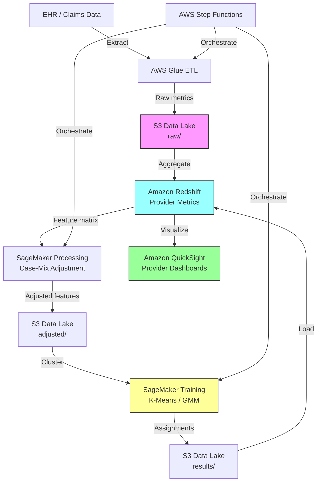

# Recipe 6.5: Provider Practice Pattern Analysis

**Complexity:** Medium · **Phase:** Production · **Estimated Cost:** ~$0.03 per provider per analysis cycle

---

## The Problem

Every health system has a version of this conversation. The CMO pulls up a report showing that orthopedic surgeons in the same practice, treating the same patient population, have a 3x difference in MRI ordering rates. Or that one hospitalist's average length of stay is two days longer than their peers. Or that a primary care physician refers to specialists at twice the rate of the doctor in the next office.

The immediate instinct is to call this "waste" or "variation" and try to stamp it out. But here's the thing: variation isn't inherently bad. The surgeon ordering more MRIs might be seeing more complex cases. The hospitalist with longer stays might be managing sicker patients who'd bounce back if discharged earlier. The high-referring PCP might be practicing in a community with higher disease burden.

The real question isn't "who's different?" It's "who's different *after accounting for the patients they see*?" That's the case-mix adjustment problem, and it's the reason naive provider comparisons are worse than useless. They're actively misleading.

Today, most health systems handle this with manual chart review. A medical director picks a metric (say, imaging utilization), pulls a report, eyeballs the outliers, and maybe has a conversation with the providers at the extremes. This works for one metric at a time, for a handful of providers, once a quarter. It doesn't scale to analyzing dozens of practice dimensions across hundreds of providers continuously.

What you actually want is a system that looks at the full practice pattern of every provider (ordering behavior, referral patterns, treatment choices, resource utilization, outcomes) and identifies clusters of similar practice styles. Not to punish outliers, but to understand the landscape. Which providers practice similarly? Where does meaningful variation exist? And critically: which variations correlate with better outcomes, and which correlate with higher cost without better outcomes?

This is clustering applied to providers rather than patients. The math is the same. The politics are completely different.

---

## The Technology: How Practice Pattern Clustering Works

### What We Mean by "Practice Pattern"

A provider's practice pattern is the aggregate of their clinical decision-making across their patient panel. It's not any single decision. It's the statistical fingerprint of how they practice medicine. Think of it as a behavioral profile built from thousands of individual choices.

The dimensions of a practice pattern typically include:

**Ordering behavior:** Lab test frequency, imaging utilization (by modality), medication prescribing patterns (brand vs. generic, opioid rates, antibiotic stewardship), diagnostic test ordering rates.

**Referral patterns:** Referral rates to specialists (by specialty), referral network breadth (do they send to 3 cardiologists or 30?), self-referral rates for providers in multi-specialty groups.

**Treatment intensity:** Procedure rates, surgical vs. conservative management ratios, escalation speed (how quickly they move from first-line to second-line therapy), preventive care completion rates.

**Resource utilization:** Average cost per episode, length of stay (for inpatient providers), readmission rates, ED utilization among their panel.

**Outcomes (when available):** Patient satisfaction scores, quality measure performance, complication rates, mortality-adjusted metrics.

Each of these dimensions generates a numeric profile for each provider. A primary care physician might be characterized by: 4.2 labs per patient per year, 0.8 imaging studies per patient per year, 12% specialist referral rate, 85% generic prescribing rate, $3,200 average annual cost per attributed patient. That vector of numbers is what the clustering algorithm operates on.

### The Case-Mix Adjustment Problem

This is the single most important technical challenge in provider profiling, and getting it wrong invalidates everything downstream.

Raw practice metrics are confounded by patient complexity. A provider who sees sicker patients will naturally order more tests, prescribe more medications, and generate higher costs. Comparing their raw utilization to a provider with a healthier panel is meaningless. You're measuring patient acuity, not practice style.

Case-mix adjustment attempts to answer: "Given the patients this provider sees, what would we *expect* their utilization to look like?" The difference between observed and expected is the provider's practice style signal, separated from their patient complexity signal.

Common approaches:

**Risk-adjusted ratios:** Calculate an expected value for each metric based on the provider's patient panel characteristics (age, sex, comorbidity burden using HCC or Charlson scores, diagnosis mix). The observed-to-expected ratio (O/E ratio) isolates practice style from case mix. An O/E ratio of 1.0 means the provider orders exactly what you'd expect given their patients. A ratio of 1.5 means 50% more than expected.

**Regression-based adjustment:** Build a regression model predicting each utilization metric from patient characteristics. The provider's residual (actual minus predicted) represents their practice style contribution. This is more flexible than simple O/E ratios because it can handle non-linear relationships and interactions.

**Propensity-matched comparison:** For each provider, find a comparison group of providers with similar patient panels and compare directly. This avoids parametric assumptions but requires large enough populations to find good matches.

**Hierarchical models:** Mixed-effects models that simultaneously estimate patient-level and provider-level effects. These are statistically elegant but computationally expensive and harder to explain to stakeholders.

The choice matters. Under-adjustment leaves patient complexity in the signal, making providers with sicker patients look like over-utilizers. Over-adjustment can remove real practice style variation by attributing it to patient factors. There's no perfect answer here, only thoughtful tradeoffs.

### Feature Engineering for Provider Profiles

Once you've case-mix adjusted your metrics, you need to assemble them into a feature vector for each provider. This is where domain expertise matters.

**Temporal aggregation:** What time window? Too short (one month) and you get noise from small sample sizes. Too long (three years) and you miss practice evolution. Six to twelve months is typical for stable estimates, but providers with small panels may need longer windows.

**Minimum panel size:** Providers with very few patients produce unreliable metrics. A surgeon who did 5 knee replacements last year doesn't have a stable "complication rate." Set a minimum panel size threshold (often 30-50 patients for primary care, 20-30 procedures for specialists) and exclude providers below it.

**Specialty segmentation:** You can't meaningfully cluster a cardiologist and a dermatologist on the same feature set. Practice pattern analysis is always done within specialty or role. Compare PCPs to PCPs, orthopedists to orthopedists, hospitalists to hospitalists.

**Feature selection:** Not every metric is informative for clustering. Some metrics have near-zero variance within a specialty (everyone orders a CBC on admission). Some are highly correlated (total imaging and MRI rate move together). Dimensionality reduction (PCA) or feature selection (variance thresholds, correlation filtering) helps focus the clustering on dimensions where meaningful variation actually exists.

### Clustering Algorithms for Provider Profiling

The algorithm choice depends on what you're trying to learn:

**K-Means:** The default starting point. Fast, interpretable, produces clean segments. Works well when you want to identify 3-5 distinct practice styles within a specialty. The centroids are directly interpretable: "Cluster 2 is characterized by high imaging, low referrals, and average prescribing."

**Gaussian Mixture Models:** Better than K-Means when practice styles overlap (which they usually do). Soft assignments are useful: "This provider is 60% consistent with the conservative practice style and 40% consistent with the interventionist style." That nuance matters for feedback conversations.

**Hierarchical clustering:** Useful for exploration. The dendrogram shows you whether there are truly distinct practice styles or a continuous spectrum. If the dendrogram shows no clear cut points, forcing K-Means into discrete clusters may be artificial.

**DBSCAN/HDBSCAN:** Excellent for identifying true outliers (providers whose practice patterns don't fit any cluster). In provider profiling, outliers are often the most interesting cases: either innovators or providers who need support.

**Dimensionality reduction + clustering:** When you have 30+ metrics per provider, clustering directly in that space is noisy. PCA or UMAP to reduce to 5-10 dimensions, then K-Means or GMM on the reduced space, is a common and effective pipeline.

### Interpreting and Labeling Clusters

Raw cluster assignments (Cluster 0, Cluster 1, Cluster 2) are useless for clinical conversations. You need interpretable labels that describe the practice style each cluster represents.

The standard approach: examine the cluster centroids (or medoids) and identify which features are most distinctive for each cluster relative to the overall mean. If Cluster 1 has high imaging, high referrals, and high cost but also high quality scores, you might label it "thorough/resource-intensive." If Cluster 3 has low utilization across the board with average outcomes, you might label it "conservative/efficient."

These labels should be developed collaboratively with clinical leadership. The labels frame the conversation. "You're in the high-utilization cluster" lands very differently than "Your practice style is consistent with the thorough-workup approach." Same data, different reception.

### The Political Reality

Let's be honest about something the technical literature rarely addresses: provider practice pattern analysis is politically explosive.

Providers are trained professionals who have spent a decade or more developing their clinical judgment. Telling them that an algorithm has categorized their practice style, especially if the implication is that they should change, triggers deep resistance. "My patients are different." "You can't reduce medicine to metrics." "This doesn't account for clinical nuance."

Some of that resistance is legitimate (case-mix adjustment is imperfect). Some is defensive (nobody likes being told they're an outlier). The system design must account for both. That means:

- Transparent methodology that providers can interrogate
- Case-mix adjustment that's defensible and explainable
- Framing as peer comparison and learning, not performance management
- Allowing providers to flag cases where the adjustment missed something
- Starting with non-punitive use cases (education, self-reflection) before tying to compensation

The technology is the easy part. The change management is where this lives or dies.

---

## General Architecture Pattern

The pipeline for provider practice pattern analysis has six logical stages:

```
[Claims/EHR Data] → [Case-Mix Adjustment] → [Feature Engineering] → [Clustering] → [Interpretation] → [Reporting/Feedback]
```

**Stage 1: Data Aggregation.** Pull claims, encounters, orders, prescriptions, referrals, and outcomes data. Aggregate to the provider level over your chosen time window. Calculate raw metrics: ordering rates, referral rates, cost per patient, quality scores.

**Stage 2: Case-Mix Adjustment.** For each metric, build an expected value based on the provider's patient panel characteristics. Calculate observed-to-expected ratios or residuals. This is the step that separates practice style from patient complexity.

**Stage 3: Feature Engineering.** Assemble adjusted metrics into a provider feature vector. Apply minimum panel size filters. Normalize features. Reduce dimensionality if needed. Segment by specialty.

**Stage 4: Clustering.** Apply the chosen algorithm to the feature matrix. Determine optimal cluster count. Assign each provider to a cluster (or compute soft assignments).

**Stage 5: Interpretation.** Characterize each cluster by its distinctive features. Develop clinically meaningful labels. Validate with clinical leadership. Check for equity concerns (are clusters correlated with provider demographics?).

**Stage 6: Reporting and Feedback.** Generate provider-facing reports showing their cluster assignment, how they compare to peers, and which specific metrics drive their classification. Build dashboards for medical directors. Create feedback loops for providers to contest or contextualize their assignments.

This pipeline runs periodically (quarterly is typical) rather than in real-time. Practice patterns are stable over months, not days. Running more frequently than quarterly introduces noise without adding signal.

---

## The AWS Implementation

### Why These Services

**Amazon SageMaker for clustering and case-mix modeling.** SageMaker provides the ML infrastructure for both the case-mix adjustment models (regression) and the clustering algorithms. SageMaker Processing jobs handle the feature engineering and adjustment calculations at scale. The built-in K-Means algorithm works for straightforward segmentation; for GMM or hierarchical approaches, bring your own scikit-learn container. SageMaker also provides model versioning and experiment tracking, which matters when you're iterating on feature sets and adjustment methodologies.

**Amazon Redshift for data aggregation.** Provider profiling requires joining claims, encounters, orders, prescriptions, and outcomes data across millions of records, then aggregating to the provider level. Redshift handles this analytical workload efficiently. The columnar storage is well-suited to the wide, aggregation-heavy queries that provider profiling demands.

**Amazon S3 for data lake storage.** Raw data extracts, intermediate feature matrices, model artifacts, and final cluster assignments all live in S3. The data lake pattern gives you lineage (you can trace any provider's cluster assignment back through the adjusted metrics to the raw claims) and reproducibility (re-run any historical analysis with the same inputs).

**AWS Glue for ETL orchestration.** The data pipeline from source systems (EHR, claims warehouse) through aggregation, adjustment, and feature engineering involves multiple transformation steps. Glue jobs handle the extract-transform-load work, with the Glue Data Catalog providing schema management across the pipeline stages.

**Amazon QuickSight for provider dashboards.** The end product of this pipeline is a set of reports and dashboards that medical directors and individual providers consume. QuickSight connects to Redshift for the aggregated metrics and provides the interactive visualization layer. Row-level security ensures providers see their own data and peer comparisons but not individually identified peer data.

**AWS Step Functions for pipeline orchestration.** The quarterly analysis run involves multiple sequential and parallel steps: data extraction, aggregation, adjustment, clustering, validation, and report generation. Step Functions coordinates this workflow with error handling, retry logic, and audit logging.

### Architecture Diagram



### Prerequisites

| Requirement | Details |
|-------------|---------|
| **AWS Services** | Amazon SageMaker, Amazon Redshift, Amazon S3, AWS Glue, Amazon QuickSight, AWS Step Functions, AWS KMS |
| **IAM Permissions** | `sagemaker:CreateProcessingJob`, `sagemaker:CreateTrainingJob`, `redshift:GetClusterCredentials`, `s3:GetObject`, `s3:PutObject`, `glue:StartJobRun`, `quicksight:CreateDashboard`, `states:StartExecution` |
| **BAA** | Required. Provider practice data linked to patient panels contains PHI. |
| **Encryption** | S3: SSE-KMS; Redshift: encrypted cluster with KMS CMK; SageMaker: volume encryption and inter-container encryption; QuickSight: TLS in transit |
| **VPC** | Production: Redshift in private subnet, SageMaker jobs in VPC mode with VPC endpoints for S3 and SageMaker API, Glue connections through VPC |
| **CloudTrail** | Enabled for all service API calls. Provider profiling data is sensitive; full audit trail required. |
| **Data Sources** | Claims data warehouse, EHR encounter/order data, provider roster with specialty assignments, quality measure results |
| **Cost Estimate** | Redshift: ~$0.25/hour (dc2.large reserved). SageMaker Processing: ~$0.05/hour (ml.m5.large) for quarterly runs. S3 + Glue: negligible. QuickSight: $18/user/month (Enterprise). Total for 500-provider system: ~$200-400/quarter for compute, plus QuickSight licensing. |

### Ingredients

| AWS Service | Role |
|------------|------|
| **Amazon SageMaker** | Case-mix adjustment models, clustering algorithms, feature engineering at scale |
| **Amazon Redshift** | Analytical queries for provider metric aggregation, stores final results for dashboards |
| **Amazon S3** | Data lake for raw extracts, intermediate features, model artifacts, cluster results |
| **AWS Glue** | ETL from source systems, data catalog for schema management |
| **Amazon QuickSight** | Provider-facing dashboards with row-level security |
| **AWS Step Functions** | Orchestrates the quarterly analysis pipeline end-to-end |
| **AWS KMS** | Encryption key management for all data at rest |

### Code

#### Walkthrough

**Step 1: Extract and aggregate provider metrics.** The first step pulls raw clinical data from your source systems and aggregates it to the provider level. For each provider, you calculate raw utilization metrics over your chosen time window (typically 12 months). This includes ordering rates, referral rates, prescribing patterns, cost metrics, and quality scores. The aggregation must be specialty-specific: you only compare providers within the same specialty. Skip this step and you have no data to analyze. Get the time window wrong and you either have too much noise (short window, small panels) or miss practice evolution (overly long window).

```
FUNCTION aggregate_provider_metrics(time_window_months, min_panel_size):
    // Pull all encounters, orders, referrals, prescriptions, and outcomes
    // for the specified time window from the claims/EHR data warehouse.
    raw_data = query data warehouse for:
        - encounters by provider (with patient demographics and diagnoses)
        - lab/imaging orders by provider
        - referrals by provider (with destination specialty)
        - prescriptions by provider (with drug class, brand/generic)
        - quality measure numerators/denominators by provider
        - cost per episode by provider
    
    // Aggregate to provider level. Each provider gets a vector of raw metrics.
    FOR each provider in raw_data:
        metrics[provider] = {
            panel_size:           count of unique patients seen,
            lab_rate:             labs ordered / patient / year,
            imaging_rate:         imaging studies / patient / year,
            mri_rate:             MRI specifically / patient / year,
            referral_rate:        referrals / patient / year,
            referral_breadth:     count of distinct specialists referred to,
            generic_rx_rate:      generic prescriptions / total prescriptions,
            opioid_rx_rate:       opioid prescriptions / total prescriptions,
            avg_cost_per_patient: total attributed cost / panel size,
            ed_rate:              ED visits among panel / panel size,
            readmit_rate:         30-day readmissions / discharges,
            quality_composite:    average quality measure performance (0-100),
            specialty:            provider's specialty code
        }
    
    // Filter out providers with panels too small for stable estimates.
    // Small panels produce noisy metrics that distort clustering.
    filtered = remove providers where panel_size < min_panel_size
    
    RETURN filtered metrics grouped by specialty
```

**Step 2: Case-mix adjustment.** This is the critical step that separates practice style from patient complexity. For each metric, you build a model that predicts the expected value based on the provider's patient panel characteristics. The difference between observed and expected is the provider's practice style signal. Without this step, you're just measuring which providers have sicker patients, not which providers practice differently. The adjustment model uses patient-level features (age, sex, HCC risk scores, chronic condition count, prior utilization) to predict expected utilization at the provider level.

```
FUNCTION case_mix_adjust(provider_metrics, patient_data):
    // For each utilization metric, build a regression model predicting
    // expected values from patient characteristics.
    
    FOR each metric in [lab_rate, imaging_rate, referral_rate, avg_cost, ...]:
        
        // Build patient-level features for the adjustment model.
        // These represent the "difficulty" of each provider's panel.
        panel_features = FOR each provider:
            average HCC risk score of their patients,
            average age of their patients,
            percent female,
            average chronic condition count,
            percent dual-eligible (Medicare + Medicaid),
            average prior-year utilization of their patients
        
        // Train a regression model: metric = f(panel_features)
        // This learns what utilization you'd EXPECT given the patient mix.
        model = train regression on (panel_features -> observed metric values)
        
        // Calculate expected value for each provider given their panel.
        FOR each provider:
            expected = model.predict(provider's panel_features)
            
            // The O/E ratio isolates practice style from case mix.
            // O/E = 1.0 means "exactly as expected given your patients"
            // O/E = 1.3 means "30% more than expected" (practice style signal)
            provider.adjusted[metric] = provider.observed[metric] / expected
    
    RETURN adjusted provider metrics (O/E ratios for each metric)
```

**Step 3: Feature engineering and normalization.** The adjusted metrics need preparation before clustering. This step normalizes features to comparable scales, handles any remaining outliers, and optionally reduces dimensionality. Providers with extreme O/E ratios (say, 5x expected on imaging) can distort cluster centroids, so winsorization (capping at the 95th percentile) is common. If you have 20+ metrics, PCA reduction to 5-8 components helps the clustering algorithm find cleaner structure without overfitting to noise in individual metrics.

```
FUNCTION prepare_features(adjusted_metrics, n_components):
    // Normalize each adjusted metric to zero mean, unit variance.
    // This prevents metrics with larger numeric ranges from
    // dominating the distance calculations in clustering.
    normalized = z_score_normalize(adjusted_metrics)
    
    // Winsorize extreme values to prevent outliers from distorting clusters.
    // Cap at 2.5 standard deviations (roughly the 99th percentile).
    // A provider with an O/E of 5.0 on imaging is interesting but shouldn't
    // pull an entire cluster centroid toward their extreme value.
    winsorized = cap values at +/- 2.5 standard deviations
    
    // Optional: reduce dimensionality if feature count is high.
    // PCA finds the directions of maximum variance in the data.
    // Clustering in PCA space is more stable and less prone to noise.
    IF number of features > 10:
        reduced = PCA(winsorized, n_components=n_components)
        // Retain enough components to explain 85-90% of variance.
        // Record the component loadings for interpretation later.
        loadings = PCA component loadings (which original metrics contribute to each component)
    ELSE:
        reduced = winsorized
        loadings = identity (each feature is its own "component")
    
    RETURN reduced feature matrix, loadings
```

**Step 4: Clustering.** Apply the clustering algorithm to the prepared feature matrix. This step identifies groups of providers with similar practice styles. The choice of K (number of clusters) should balance statistical separation with operational utility. Run multiple values of K and evaluate both quantitative metrics (silhouette score) and qualitative interpretability. A medical director needs to be able to explain what each cluster represents in plain clinical language.

```
FUNCTION cluster_providers(feature_matrix, k_range):
    // Try multiple values of K to find the best segmentation.
    // k_range is typically [3, 4, 5, 6] for provider profiling.
    results = empty list
    
    FOR each k in k_range:
        // Run K-Means (or GMM for soft assignments).
        model = fit KMeans(n_clusters=k) on feature_matrix
        
        // Calculate silhouette score: measures how well-separated clusters are.
        // Range is -1 to 1. Above 0.3 is decent. Above 0.5 is good.
        silhouette = calculate silhouette score for this clustering
        
        // Calculate within-cluster sum of squares (inertia).
        // Lower is better, but always decreases with more clusters.
        inertia = model.inertia
        
        // Store results for comparison.
        results.append({k, model, silhouette, inertia})
    
    // Select K based on silhouette score AND interpretability.
    // The "best" K statistically may not be the most useful operationally.
    best_model = select model with best silhouette (or clinical preference)
    
    // Assign each provider to their cluster.
    assignments = best_model.predict(feature_matrix)
    
    // For GMM: also get soft assignments (probability per cluster).
    // "Dr. Smith is 72% Cluster A, 28% Cluster B" is more nuanced
    // than a hard assignment and useful for borderline cases.
    probabilities = best_model.predict_proba(feature_matrix)  // GMM only
    
    RETURN assignments, probabilities, best_model
```

**Step 5: Cluster interpretation and labeling.** Raw cluster numbers mean nothing to clinicians. This step characterizes each cluster by examining which metrics are most distinctive (highest or lowest relative to the overall mean). The goal is a plain-language label that a medical director can use in conversation: "conservative/efficient," "thorough/resource-intensive," "procedure-oriented," etc. These labels should be developed collaboratively with clinical leadership, not assigned unilaterally by the analytics team.

```
FUNCTION interpret_clusters(assignments, original_metrics, loadings):
    // For each cluster, calculate the mean of each original (adjusted) metric.
    // Compare to the overall population mean.
    cluster_profiles = empty map
    
    FOR each cluster_id in unique(assignments):
        cluster_members = providers where assignment == cluster_id
        
        // Calculate mean of each metric for this cluster.
        cluster_means = mean of each metric across cluster_members
        
        // Calculate z-score relative to overall population.
        // Positive z-score = this cluster is ABOVE average on this metric.
        // Negative z-score = this cluster is BELOW average.
        relative_profile = (cluster_means - overall_means) / overall_std
        
        // Identify the 3-5 most distinctive features for this cluster.
        // These are the features with the largest absolute z-scores.
        distinctive_features = top 5 features by absolute z-score
        
        cluster_profiles[cluster_id] = {
            size:                 count of providers in this cluster,
            distinctive_features: distinctive_features,
            relative_profile:     relative_profile,
            suggested_label:      generate label from distinctive features
            // e.g., high imaging + high referral + high cost = "thorough/resource-intensive"
            // e.g., low imaging + low referral + low cost + avg quality = "conservative/efficient"
        }
    
    RETURN cluster_profiles
```

**Step 6: Generate provider reports.** The final step produces individual provider reports and aggregate dashboards. Each provider sees their cluster assignment, how their metrics compare to their cluster peers and to the overall specialty, and which specific metrics are most distinctive about their practice style. Medical directors see the full landscape: cluster sizes, characteristics, outcome correlations, and individual provider positions. Row-level security ensures providers see peer comparisons in aggregate but cannot identify individual peers.

```
FUNCTION generate_reports(assignments, profiles, provider_metrics):
    // Individual provider report.
    FOR each provider:
        report = {
            provider_id:       provider identifier,
            specialty:         provider's specialty,
            cluster:           assigned cluster label (e.g., "Conservative/Efficient"),
            cluster_confidence: probability of cluster membership (from GMM),
            
            // Show where this provider sits relative to peers.
            peer_comparison: FOR each metric:
                {
                    metric_name:    metric label,
                    provider_value: this provider's adjusted value,
                    cluster_mean:   mean for their cluster,
                    specialty_mean: mean for all providers in this specialty,
                    percentile:     where they fall in the specialty distribution
                },
            
            // Highlight the 3 metrics most responsible for their cluster assignment.
            key_drivers: top 3 metrics by contribution to cluster assignment,
            
            // Outcome context: how does their cluster perform on outcomes?
            cluster_outcomes: {
                avg_quality_score:  cluster average quality composite,
                avg_cost:           cluster average cost per patient,
                avg_readmit_rate:   cluster average readmission rate
            }
        }
        
        write report to storage
    
    // Aggregate dashboard for medical directors.
    dashboard = {
        cluster_summary:    size and characteristics of each cluster,
        outcome_by_cluster: quality and cost metrics by cluster,
        outlier_list:       providers far from any cluster centroid,
        trend:              how cluster assignments changed from last quarter
    }
    
    write dashboard to storage
    RETURN reports, dashboard
```

> **Curious how this looks in Python?** The pseudocode above covers the concepts. If you'd like to see sample Python code that demonstrates these patterns using boto3, check out the [Python Example](chapter06.05-python-example). It walks through each step with inline comments and notes on what you'd need to change for a real deployment.

### Expected Results

**Sample cluster profile output:**

```json
{
  "analysis_period": "2025-04-01 to 2026-03-31",
  "specialty": "Internal Medicine",
  "provider_count": 142,
  "clusters": [
    {
      "cluster_id": 0,
      "label": "Conservative / Efficient",
      "size": 48,
      "distinctive_features": [
        {"metric": "imaging_rate_oe", "z_score": -1.2, "interpretation": "32% below expected imaging"},
        {"metric": "referral_rate_oe", "z_score": -0.9, "interpretation": "24% below expected referrals"},
        {"metric": "avg_cost_oe", "z_score": -1.1, "interpretation": "28% below expected cost"}
      ],
      "outcomes": {"quality_composite": 82.1, "readmit_rate": 0.11, "patient_satisfaction": 4.2}
    },
    {
      "cluster_id": 1,
      "label": "Thorough / Resource-Intensive",
      "size": 35,
      "distinctive_features": [
        {"metric": "imaging_rate_oe", "z_score": 1.4, "interpretation": "42% above expected imaging"},
        {"metric": "lab_rate_oe", "z_score": 1.1, "interpretation": "30% above expected labs"},
        {"metric": "avg_cost_oe", "z_score": 1.3, "interpretation": "35% above expected cost"}
      ],
      "outcomes": {"quality_composite": 84.7, "readmit_rate": 0.09, "patient_satisfaction": 4.4}
    },
    {
      "cluster_id": 2,
      "label": "Referral-Oriented",
      "size": 31,
      "distinctive_features": [
        {"metric": "referral_rate_oe", "z_score": 1.8, "interpretation": "55% above expected referrals"},
        {"metric": "referral_breadth", "z_score": 1.3, "interpretation": "Wide referral network"},
        {"metric": "imaging_rate_oe", "z_score": -0.4, "interpretation": "Near expected imaging"}
      ],
      "outcomes": {"quality_composite": 80.5, "readmit_rate": 0.12, "patient_satisfaction": 3.9}
    },
    {
      "cluster_id": 3,
      "label": "Balanced / Guideline-Adherent",
      "size": 28,
      "distinctive_features": [
        {"metric": "quality_composite", "z_score": 1.5, "interpretation": "High quality scores"},
        {"metric": "preventive_rate", "z_score": 1.2, "interpretation": "Strong preventive care"},
        {"metric": "avg_cost_oe", "z_score": 0.1, "interpretation": "Near expected cost"}
      ],
      "outcomes": {"quality_composite": 89.3, "readmit_rate": 0.08, "patient_satisfaction": 4.5}
    }
  ]
}
```

**Performance benchmarks:**

| Metric | Typical Value |
|--------|---------------|
| Analysis runtime (500 providers) | 15-30 minutes end-to-end |
| Case-mix model R-squared | 0.3-0.5 (typical for utilization prediction) |
| Silhouette score | 0.25-0.45 (provider data is noisy) |
| Cluster stability (quarter-over-quarter) | 70-80% of providers stay in same cluster |
| Minimum panel size for stable metrics | 30-50 patients (primary care) |
| Feature count after PCA | 5-8 components (from 15-25 raw metrics) |

**Where it struggles:** Providers with mixed roles (part-time hospitalist, part-time outpatient) produce incoherent profiles. New providers without 12 months of data can't be reliably profiled. Providers in unique subspecialties with no true peers (the only pediatric rheumatologist in the system) can't be meaningfully clustered. And the case-mix adjustment is never perfect: providers will always find cases where "my patients are different" is genuinely true.

---

## Why This Isn't Production-Ready

**Provider attribution methodology.** The pseudocode assumes you know which patients "belong to" which provider. In reality, patient attribution is its own complex problem. Primary care attribution (who is the PCP?) uses different logic than specialist attribution (who ordered the consult?). Get attribution wrong and every downstream metric is contaminated.

**Longitudinal stability monitoring.** A production system needs to track how cluster assignments change over time and distinguish real practice evolution (a provider adopting new guidelines) from noise (random fluctuation in small-sample metrics). Alert on providers whose assignments shift dramatically between runs.

**Provider feedback loop.** The reports need a mechanism for providers to contest their assignment or provide context. "My imaging rate is high because I run a concussion clinic" is legitimate context that the algorithm can't know. Build a structured feedback channel and incorporate validated exceptions into future runs.

**Regulatory considerations.** In some states, provider profiling data has specific legal protections. Peer review privilege may apply to the analysis outputs. Consult legal counsel before sharing results broadly or tying them to compensation.

---

## The Honest Take

Here's what surprised me about building these systems: the clustering is the easy part. Getting clean, case-mix-adjusted data is 60% of the work. Getting providers to trust the methodology is 30%. The actual ML is maybe 10%.

The case-mix adjustment will never be perfect, and providers know it. The surgeon who specializes in revision hip replacements (inherently more complex than primary replacements) will always have higher complication rates than peers, and no risk adjustment model fully accounts for that level of subspecialization. You need a process for handling legitimate exceptions without undermining the entire system.

The silhouette scores you'll see in practice (0.25-0.45) are lower than what textbooks show for clean datasets. Provider practice patterns exist on a spectrum, not in discrete buckets. The clusters are useful simplifications, not natural categories. Present them that way.

The most valuable output is often not the cluster assignments themselves but the individual provider reports showing exactly where they differ from peers. A provider who learns "you order 40% more MRIs than expected given your patient mix" has actionable information regardless of which cluster they're in.

Start with a non-punitive use case. Peer learning, CME targeting, or resource planning. Once providers trust the methodology and see value in the insights, you can gradually connect it to quality improvement initiatives. Leading with "we're going to measure you and compare you to your peers" guarantees resistance. Leading with "we built a tool that shows you how your practice compares, and some providers found it useful for identifying blind spots" gets curiosity.

One more thing: the clusters will reveal uncomfortable truths. You'll find that the "thorough/resource-intensive" cluster has slightly better outcomes but dramatically higher costs. Is that worth it? That's not a data science question. That's an organizational values question. The system surfaces the tradeoff. Humans decide what to do about it.

---

## Variations and Extensions

**Temporal practice pattern evolution.** Instead of a single snapshot, track how each provider's practice style evolves over time. Plot their trajectory through the cluster space. Identify providers who are drifting toward higher utilization (early intervention opportunity) or who shifted practice style after a specific event (new guidelines, peer feedback, malpractice claim). This requires maintaining historical feature vectors and computing movement vectors between analysis periods.

**Network-aware clustering.** Incorporate referral network structure into the clustering features. Two providers might have similar ordering rates but very different referral networks. One sends patients to a tight group of trusted specialists; the other scatters referrals across dozens of providers. Network metrics (degree centrality, clustering coefficient, referral concentration) add a relational dimension to the practice profile that pure utilization metrics miss.

**Outcome-weighted clustering.** Standard clustering treats all features equally (or uses PCA-derived weights). An alternative: weight features by their correlation with outcomes. Metrics that predict quality or cost get higher weight in the distance calculation. This produces clusters that are more directly relevant to value-based care conversations, though it blurs the line between descriptive clustering and predictive modeling.

---

## Related Recipes

- **Recipe 6.2 (Utilization Pattern Segmentation):** Similar clustering approach applied to patients rather than providers. Shares feature engineering and normalization patterns.
- **Recipe 6.4 (Disease Severity Stratification):** The case-mix adjustment methodology here builds on the severity tiers from 6.4. Providers treating more severe patients should have higher expected utilization.
- **Recipe 7.3 (Cost Prediction Modeling):** Provider practice style is a feature in cost prediction models. The cluster assignments from this recipe can serve as inputs to predictive models.
- **Recipe 3.3 (Billing Code Anomalies):** Outlier providers identified here may overlap with billing anomaly detection. Cross-reference for investigation prioritization.

---

## Additional Resources

**AWS Documentation:**
- [Amazon SageMaker Built-in K-Means Algorithm](https://docs.aws.amazon.com/sagemaker/latest/dg/k-means.html)
- [Amazon SageMaker Processing Jobs](https://docs.aws.amazon.com/sagemaker/latest/dg/processing-job.html)
- [Amazon Redshift ML (CREATE MODEL)](https://docs.aws.amazon.com/redshift/latest/dg/r_CREATE_MODEL.html)
- [Amazon QuickSight Row-Level Security](https://docs.aws.amazon.com/quicksight/latest/user/restrict-access-to-a-data-set-using-row-level-security.html)
- [AWS Step Functions Developer Guide](https://docs.aws.amazon.com/step-functions/latest/dg/welcome.html)
- [AWS HIPAA Eligible Services](https://aws.amazon.com/compliance/hipaa-eligible-services-reference/)

**AWS Sample Repos:**
- [`amazon-sagemaker-examples`](https://github.com/aws/amazon-sagemaker-examples): SageMaker notebook examples including K-Means clustering and Processing jobs
- [`aws-healthcare-lifescience-ai-ml`](https://github.com/aws-samples/aws-healthcare-lifescience-ai-ml): Healthcare-specific ML examples on AWS including population analytics patterns

**AWS Solutions and Blogs:**
- [AWS Solutions Library: Healthcare](https://aws.amazon.com/solutions/?solutions-all.sort-by=item.additionalFields.sortDate&solutions-all.sort-order=desc&awsf.content-type=*all&awsf.methodology=*all&awsf.tech-category=*all&awsf.industries=industry%23healthcare): Deployable healthcare solutions including analytics architectures
- [AWS for Health: Analytics](https://aws.amazon.com/health/solutions/analytics/): Healthcare analytics reference architectures and customer stories

<!-- TODO: Verify all URLs above are current and accessible -->

---

## Estimated Implementation Time

| Phase | Duration |
|-------|----------|
| **Basic** (single specialty, K-Means, manual case-mix adjustment) | 4-6 weeks |
| **Production-ready** (multi-specialty, automated pipeline, provider dashboards, feedback mechanism) | 12-16 weeks |
| **With variations** (temporal tracking, network analysis, outcome-weighted clustering) | 20-24 weeks |

---

## Tags

`clustering` `provider-profiling` `practice-variation` `case-mix-adjustment` `peer-comparison` `value-based-care` `sagemaker` `redshift` `quicksight` `population-health`

---

*← [Recipe 6.4: Disease Severity Stratification](chapter06.04-disease-severity-stratification) | [Chapter 6 Index](chapter06-index) | [Recipe 6.6: Patient Similarity for Care Planning](chapter06.06-patient-similarity-care-planning) →*
