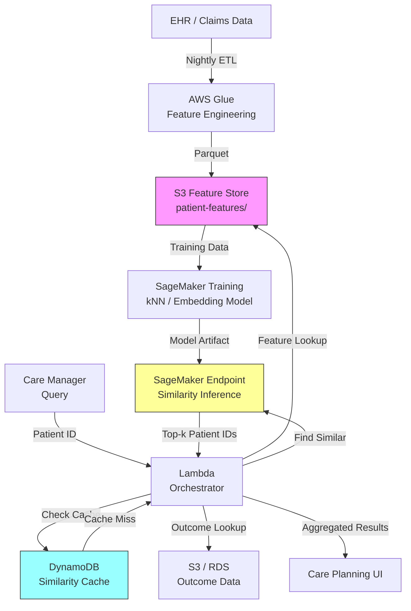

# Recipe 6.6 Architecture and Implementation: Patient Similarity for Care Planning

*Companion to [Recipe 6.6: Patient Similarity for Care Planning](chapter06.06-patient-similarity-care-planning). This page covers the AWS architecture, services, prerequisites, and pseudocode. For the problem framing and the conceptual approach, start with the main recipe.*

---

## The AWS Implementation

### Why These Services

**Amazon SageMaker for model training and hosting.** The similarity engine (whether kNN, an autoencoder, or a more complex model) needs to be trained on historical patient data and served for real-time inference. SageMaker provides the training infrastructure, model hosting, and built-in kNN algorithm. For embedding-based approaches, SageMaker's custom training containers support PyTorch or TensorFlow models. The built-in kNN algorithm supports both Euclidean and cosine distance with approximate search using FAISS under the hood.

**Amazon S3 for feature store storage.** The curated feature datasets (patient feature vectors, outcome labels, feature metadata) live in S3 as versioned Parquet files. S3 provides durable, encrypted storage with versioning for reproducibility. SageMaker Feature Store could also serve this role for organizations that want managed feature pipelines, but S3 with a well-organized prefix structure is simpler to start with and easier to debug.

**AWS Glue for feature engineering pipelines.** Transforming raw EHR data into engineered features (computing comorbidity indices, normalizing lab values, aggregating utilization) is an ETL job. Glue handles the extraction from source systems, the transformation logic, and the loading into the feature store. Spark-based processing handles the scale of multi-year patient populations.

**Amazon DynamoDB for similarity results caching.** Similarity queries for the same patient don't change until new data arrives. Caching results in DynamoDB (keyed by patient ID and feature version) avoids redundant inference calls. TTL-based expiration ensures results refresh when the feature store updates.

**Amazon OpenSearch Service for approximate nearest neighbor search (alternative).** For organizations that want sub-second similarity queries without managing a SageMaker endpoint, OpenSearch supports kNN search natively with HNSW and FAISS indices. You index patient embeddings as dense vectors and query with the target patient's vector. This is particularly attractive if you already have OpenSearch in your stack for other search use cases.

**AWS Lambda for orchestration.** The query flow (receive patient ID, look up features, check cache, call similarity engine, aggregate outcomes, return results) is a stateless orchestration task. Lambda handles the glue logic between services. The orchestrator should also emit application-level audit events (who queried which patient, when, and what was returned) to support HIPAA accounting-of-disclosures requirements.

### Architecture Diagram


### Prerequisites

| Requirement | Details |
|-------------|---------|
| **AWS Services** | Amazon SageMaker, Amazon S3, AWS Glue, Amazon DynamoDB, AWS Lambda, Amazon CloudWatch |
| **IAM Permissions** | `sagemaker:InvokeEndpoint` (scoped to the similarity endpoint ARN), `s3:GetObject`/`s3:PutObject` (scoped to the feature store bucket and prefix, e.g., `arn:aws:s3:::feature-store-bucket/patient-features/*`), `glue:StartJobRun`, `dynamodb:GetItem`/`dynamodb:PutItem` (scoped to the cache table ARN), `lambda:InvokeFunction`. Scope all permissions to specific resource ARNs. |
| **BAA** | AWS BAA signed (patient features and outcomes are PHI) |
| **Encryption** | S3: SSE-KMS; DynamoDB: encryption at rest; SageMaker: KMS for model artifacts and endpoint data; all API calls over TLS |
| **VPC** | Production: Lambda and SageMaker endpoint in VPC with VPC endpoints for S3, DynamoDB, CloudWatch Logs, and SageMaker Runtime (`com.amazonaws.{region}.sagemaker.runtime`). Configure security groups to restrict egress to VPC endpoint ENIs only (no internet egress). |
| **CloudTrail** | Enabled: log all SageMaker inference calls and S3 access for HIPAA audit trail |
| **Application Audit Log** | Lambda orchestrator logs each query: requesting user, query patient ID, timestamp, result count, and confidence level. Immutable log (CloudWatch Logs with retention policy) for HIPAA accounting of disclosures. |
| **Sample Data** | Synthetic patient cohort with features and outcomes. CMS Synthetic Public Use Files provide realistic population distributions. Never use real PHI in development. |
| **Cost Estimate** | SageMaker endpoint (ml.m5.large): ~$0.12/hour. Glue ETL: ~$0.44/DPU-hour. DynamoDB on-demand: ~$1.25 per million reads. S3 storage: negligible. Total per query (with caching): $0.15-$0.40 depending on cache hit rate. |

### Ingredients

| AWS Service | Role |
|------------|------|
| **Amazon SageMaker** | Trains similarity model; hosts real-time inference endpoint for kNN/embedding queries |
| **Amazon S3** | Stores versioned patient feature vectors and outcome datasets |
| **AWS Glue** | Runs nightly ETL to transform raw EHR/claims data into engineered features |
| **Amazon DynamoDB** | Caches similarity results to avoid redundant inference; TTL-based expiration |
| **AWS Lambda** | Orchestrates query flow: feature lookup, cache check, inference call, outcome aggregation |
| **AWS KMS** | Manages encryption keys for all data stores and model artifacts |
| **Amazon CloudWatch** | Monitors endpoint latency, cache hit rates, and feature freshness |

### Code

> **Reference implementations:** The following AWS sample repos demonstrate patterns used in this recipe:
>
> - [`amazon-sagemaker-examples`](https://github.com/aws/amazon-sagemaker-examples): Includes kNN algorithm examples, feature engineering notebooks, and endpoint deployment patterns
> - [`amazon-sagemaker-feature-store-end-to-end-workshop`](https://github.com/aws-samples/amazon-sagemaker-feature-store-end-to-end-workshop): End-to-end feature store patterns including ingestion, transformation, and real-time retrieval

#### Walkthrough

**Step 1: Feature engineering pipeline.** Raw EHR data is not suitable for similarity computation. Lab values arrive at different times, diagnoses accumulate over years, medications change. This step transforms raw clinical data into a fixed-length feature vector per patient: one row, one patient, all relevant characteristics normalized and ready for distance computation. The feature engineering runs nightly (or weekly, depending on data freshness requirements) and produces a versioned snapshot. Without this step, you'd be comparing raw, sparse, temporal clinical records directly, which is computationally intractable and clinically meaningless.

```pseudocode
FUNCTION engineer_patient_features(patient_id, raw_clinical_data):
    // Transform raw clinical records into a fixed-length feature vector.
    // Each patient becomes a single row with standardized, comparable values.

    features = empty map

    // Demographics: straightforward extraction
    features["age"]  = calculate_age(raw_clinical_data.date_of_birth)
    features["sex"]  = encode_binary(raw_clinical_data.sex)  // 0 or 1
    features["bmi"]  = most_recent_value(raw_clinical_data.vitals, "BMI")

    // Clinical markers: use most recent values, normalized to population z-scores.
    // Z-scoring ensures that A1C (range 4-14) and creatinine (range 0.5-5)
    // contribute equally to distance calculations.
    lab_features = ["a1c", "creatinine", "ldl", "hdl", "triglycerides",
                    "systolic_bp", "diastolic_bp"]
    FOR each lab in lab_features:
        raw_value = most_recent_value(raw_clinical_data.labs, lab)
        features[lab] = z_score_normalize(raw_value, population_mean[lab], population_std[lab])

    // Comorbidity profile: binary flags for conditions that influence trajectory.
    // These are condition-specific. For diabetes similarity, we care about
    // cardiovascular comorbidities, renal disease, and mental health conditions.
    comorbidity_flags = ["heart_failure", "ckd", "cad", "depression",
                         "obesity", "hypertension", "copd"]
    FOR each condition in comorbidity_flags:
        features[condition] = has_active_diagnosis(raw_clinical_data.problems, condition)

    // Medication complexity: count of active medications and specific drug classes.
    features["medication_count"] = count_active_medications(raw_clinical_data.medications)
    features["on_insulin"]       = is_on_drug_class(raw_clinical_data.medications, "insulin")
    features["on_metformin"]     = is_on_drug_class(raw_clinical_data.medications, "metformin")
    features["on_glp1"]          = is_on_drug_class(raw_clinical_data.medications, "GLP-1 agonist")

    // Utilization summary: captures disease burden beyond what labs show.
    features["ed_visits_12mo"]       = count_events(raw_clinical_data.encounters, "ED", months=12)
    features["hospitalizations_12mo"] = count_events(raw_clinical_data.encounters, "inpatient", months=12)

    // Disease duration: how long they've had the primary condition.
    features["years_since_diagnosis"] = years_since_first_diagnosis(
        raw_clinical_data.problems, target_condition
    )

    RETURN features  // fixed-length vector ready for similarity computation
```
**Step 2: Build the similarity index.** With feature vectors for the entire historical cohort, build an index that enables fast nearest-neighbor lookup. For cohorts under 100,000 patients, brute-force kNN is feasible. For larger populations, approximate nearest neighbor (ANN) indices provide sub-second query times at the cost of occasionally missing a true nearest neighbor. The index is rebuilt whenever the feature store updates. Skip this step and every query requires scanning the entire cohort, which is too slow for interactive care planning workflows.

A note on minimum cohort size: aim for at least 500-1,000 patients in a condition-specific index to provide meaningful diversity of neighbors. Below that threshold, consider broader condition groupings or display a warning that the comparison pool is limited.

```pseudocode
FUNCTION build_similarity_index(feature_store_path, index_config):
    // Load all patient feature vectors from the feature store.
    // Each row is one patient; each column is one engineered feature.
    patient_features = load_parquet(feature_store_path)

    // Apply feature weights before indexing.
    // Weights encode clinical judgment: "A1C matters 3x more than age for diabetes similarity."
    // These weights come from clinical SMEs, not from the data.
    weighted_features = apply_weights(patient_features, index_config.feature_weights)

    // Build the ANN index. HNSW (Hierarchical Navigable Small World) graphs
    // provide excellent recall (>95%) with sub-millisecond query times.
    // The ef_construction parameter controls index quality vs. build time.
    index = build_hnsw_index(
        vectors          = weighted_features,
        distance_metric  = index_config.distance_metric,  // "euclidean" or "cosine"
        ef_construction  = 200,   // higher = better recall, slower build
        M                = 16     // connections per node; 16 is a good default
    )

    // Store the index artifact for deployment to the inference endpoint.
    save_index(index, output_path=index_config.artifact_path)

    // Also store the patient ID mapping: index position -> patient_id.
    // The index returns positions (0, 1, 2...); we need to map back to real patient IDs.
    save_id_mapping(patient_features.patient_ids, index_config.mapping_path)

    RETURN index
```
**Step 3: Query for similar patients.** When a care manager requests similarity for a specific patient, look up that patient's current feature vector, query the index for the k nearest neighbors, and return the matched patient IDs with their distance scores. The distance score is important: it tells you how confident you should be in the similarity. A nearest neighbor at distance 0.1 is much more informative than one at distance 2.5. If all neighbors are far away, the system should say "no strong matches found" rather than returning poor matches with false confidence.

```pseudocode
FUNCTION find_similar_patients(query_patient_id, k=20, max_distance=None):
    // Look up the query patient's current feature vector.
    query_features = get_patient_features(query_patient_id)

    IF query_features is None:
        RETURN error("Patient not found in feature store. May need to wait for next ETL run.")

    // Apply the same feature weights used during index construction.
    weighted_query = apply_weights(query_features, feature_weights)

    // Query the ANN index for the k nearest neighbors.
    // Returns: list of (index_position, distance) pairs, sorted by distance ascending.
    neighbors = index.query(weighted_query, k=k)

    // Map index positions back to patient IDs.
    results = empty list
    FOR each (position, distance) in neighbors:
        patient_id = id_mapping[position]

        // Skip the query patient themselves (they're always their own nearest neighbor).
        IF patient_id == query_patient_id:
            CONTINUE

        // Optionally filter by maximum distance threshold.
        // If max_distance is set and this neighbor is too far, stop.
        IF max_distance is not None AND distance > max_distance:
            BREAK

        append to results: {
            patient_id: patient_id,
            distance: distance,
            similarity: 1.0 / (1.0 + distance)  // convert distance to 0-1 similarity score
        }

    RETURN results
```
**Step 4: Aggregate outcomes for similar patients.** Finding similar patients is only half the job. The value comes from examining what happened to them. This step retrieves outcome data for the matched cohort and aggregates it into actionable summaries: what interventions were used, what percentage achieved target goals, what adverse events occurred, and what the typical timeline looked like. The aggregation must be honest about sample size. If only 3 similar patients exist, the confidence in any conclusion is low, and the system should communicate that clearly.

```pseudocode
FUNCTION aggregate_outcomes(similar_patients, outcome_config):
    // Retrieve outcome records for all similar patients.
    // Outcomes include: goal achievement, interventions received, adverse events, timeline.
    outcomes = empty list
    FOR each match in similar_patients:
        patient_outcome = get_outcome_record(match.patient_id, outcome_config.condition)
        IF patient_outcome is not None:
            append to outcomes: {
                patient_id: match.patient_id,
                distance: match.distance,
                interventions: patient_outcome.interventions,   // list of treatments received
                goal_achieved: patient_outcome.goal_achieved,   // boolean: did they hit target?
                time_to_goal: patient_outcome.time_to_goal,    // months to achieve target (if achieved)
                adverse_events: patient_outcome.adverse_events  // list of complications
            }

    // Aggregate into a summary the care manager can act on.
    summary = {
        cohort_size: length(outcomes),
        goal_achievement_rate: count(o.goal_achieved == true for o in outcomes) / length(outcomes),
        median_time_to_goal: median(o.time_to_goal for o in outcomes where o.goal_achieved),

        // Intervention frequency: which treatments were most common among successful patients?
        intervention_frequency: count_interventions(
            [o for o in outcomes where o.goal_achieved == true]
        ),

        // Adverse event rate: what complications did similar patients experience?
        adverse_event_rate: count(o.adverse_events is not empty for o in outcomes) / length(outcomes),
        common_adverse_events: most_common(flatten(o.adverse_events for o in outcomes)),

        // Confidence indicator based on cohort size.
        confidence: CASE
            WHEN length(outcomes) >= 20 THEN "high"
            WHEN length(outcomes) >= 10 THEN "moderate"
            WHEN length(outcomes) >= 5  THEN "low"
            ELSE "insufficient"
        END
    }

    RETURN summary
```
**Step 5: Store and present results.** Cache the similarity results (they don't change until the feature store updates) and format them for the care planning interface. The presentation layer is critical: raw statistics are not useful to a care manager in a 15-minute appointment. The output should be a concise narrative with supporting data, not a data dump. Note that the default presentation returns only aggregated outcome statistics; individual similar patient IDs are not exposed to the UI unless the organization's data governance policy permits drill-down with appropriate authorization controls.

The DynamoDB cache stores derived PHI (patient IDs and outcome summaries) and should be treated as a PHI data store subject to your organization's retention and amendment policies. DynamoDB TTL deletion is eventually consistent (items may persist up to 48 hours past expiration), so do not rely on TTL alone as a hard deletion guarantee for compliance purposes. If source patient data is corrected or a patient exercises amendment rights, implement an explicit cache invalidation mechanism rather than waiting for TTL expiry.

```pseudocode
FUNCTION store_and_present(query_patient_id, similar_patients, outcome_summary):
    // Cache results in DynamoDB with TTL matching feature store refresh interval.
    cache_record = {
        patient_id: query_patient_id,
        feature_version: current_feature_store_version(),
        similar_patients: similar_patients,
        outcome_summary: outcome_summary,
        computed_at: current_utc_timestamp(),
        ttl: current_utc_timestamp() + 86400  // expire after 24 hours
    }
    write_to_cache(cache_record)

    // Format for care planning UI.
    presentation = {
        headline: format_headline(outcome_summary),
        // Example: "Among 18 similar patients, 72% achieved A1C < 7 within 6 months."

        top_interventions: outcome_summary.intervention_frequency[0:3],
        // Top 3 most common interventions among successful similar patients.

        risk_factors: outcome_summary.common_adverse_events[0:3],
        // Top 3 adverse events to watch for.

        confidence_note: format_confidence(outcome_summary.confidence, outcome_summary.cohort_size),
        // Example: "Based on 18 similar patients (moderate confidence)."

        similar_patient_details: similar_patients[0:5]
        // Top 5 most similar patients for drill-down (de-identified in the UI).
    }

    RETURN presentation
```
> **Curious how this looks in Python?** The pseudocode above covers the concepts. If you'd like to see sample Python code that demonstrates these patterns using boto3, check out the [Python Example](chapter06.06-python-example). It walks through each step with inline comments and notes on what you'd need to change for a real deployment.

### Expected Results

**Sample output for a newly diagnosed Type 2 diabetes patient:**

```json
{
  "query_patient_id": "PAT-2026-08842",
  "feature_version": "v2026-03-15",
  "cohort_size": 18,
  "confidence": "moderate",
  "outcome_summary": {
    "goal_achievement_rate": 0.72,
    "median_time_to_goal_months": 4.5,
    "top_interventions": [
      {"intervention": "metformin_1000mg", "frequency": 0.89},
      {"intervention": "lifestyle_counseling", "frequency": 0.78},
      {"intervention": "glp1_agonist", "frequency": 0.44}
    ],
    "adverse_event_rate": 0.22,
    "common_adverse_events": [
      {"event": "gi_intolerance_metformin", "frequency": 0.17},
      {"event": "hypoglycemia_mild", "frequency": 0.06}
    ]
  },
  "top_similar_patients": [
    {"patient_id": "PAT-2024-12091", "similarity": 0.94, "distance": 0.063},
    {"patient_id": "PAT-2023-45672", "similarity": 0.91, "distance": 0.099},
    {"patient_id": "PAT-2025-03318", "similarity": 0.89, "distance": 0.124}
  ]
}
```
**Performance benchmarks:**

| Metric | Typical Value |
|--------|---------------|
| Query latency (cached) | 50-150 ms |
| Query latency (uncached, ANN) | 500-1500 ms |
| Feature engineering (per patient) | ~200 ms |
| Index rebuild (100k patients) | 5-15 minutes |
| Recall@20 (ANN vs. brute-force) | 95-98% |
| Feature store refresh | Nightly (configurable) |

**Where it struggles:** Patients with rare condition combinations (few neighbors exist). Patients early in their disease course (limited outcome data for similar early-stage patients). Populations underrepresented in historical data (the system can only find similar patients if similar patients exist in the training set). Rapidly evolving treatment landscapes (historical outcomes may not reflect current best practices).

---

## Why This Isn't Production-Ready

**Feature drift.** Clinical practice changes. A feature set designed in 2024 may not capture what matters in 2026 if new drug classes emerge or guidelines shift. You need a process for periodic feature review with clinical SMEs, not just a one-time build.

**Outcome data lag.** You can only aggregate outcomes for patients who have had enough time to demonstrate them. A 6-month outcome requires patients who were diagnosed at least 6 months ago. For new conditions or new populations, the outcome data simply doesn't exist yet.

**Bias amplification.** If your historical data reflects disparities (certain populations received less aggressive treatment and had worse outcomes), the similarity engine will faithfully reproduce those patterns. "Patients like you historically did poorly" might mean "patients like you historically received inadequate care." The system needs bias auditing and the care manager needs to understand this limitation.

**Explainability.** A care manager needs to understand why two patients are considered similar. "The algorithm says so" is not acceptable in clinical decision support. You need feature-level explanations: "These patients are similar because they share age range, A1C level, comorbidity profile, and medication history."

<!-- TODO (TechWriter): Expert review A1 (HIGH). Add data governance subsection: patient similarity uses one patient's historical data to inform another's care. Under HIPAA, this typically falls under Treatment/Payment/Operations (no individual authorization required), but organizational policies, state laws, and data use agreements may impose additional constraints. IRB review may be required if the system is used for research or outcomes are published. Patients should be informed that de-identified data contributes to care planning tools. This is a must-address governance conversation before deployment. -->

**Feature store version transitions.** When the nightly ETL produces a new feature snapshot, the ANN index must be rebuilt before queries reflect the latest data. During the rebuild window (5-15 minutes for 100k patients), queries continue against the previous index version. Cached results include a `feature_version` key, so stale entries expire naturally when the version advances. A patient diagnosed with a new condition today won't appear in similarity results for that condition until the next ETL run plus index rebuild completes. For most care planning workflows, this eventual consistency (up to 24 hours) is acceptable. If same-day freshness is required, consider a hybrid approach: serve from the pre-built index for most queries, with a real-time override path for patients whose data changed since the last build.

<!-- TODO (TechWriter): Expert review S1 (HIGH). Address cross-patient PHI exposure model. The similarity results contain patient IDs of other patients. Default recommendation: return only aggregated outcome statistics to the care planning UI (no individual patient IDs). If drill-down into individual similar patient records is needed, require break-the-glass authorization and log the access. The current sample output JSON shows patient IDs in top_similar_patients; clarify that this is the internal API response, not what the UI displays. -->

---

## Variations and Extensions

**Condition-specific similarity models.** Rather than one general similarity engine, build condition-specific models with tailored feature sets and weights. Diabetes similarity emphasizes A1C, medication history, and comorbidities. Heart failure similarity emphasizes ejection fraction, NYHA class, and diuretic response. Each model is smaller, faster, and more clinically relevant.

**Temporal trajectory matching.** Instead of matching on current state, match on trajectory shape. Find patients who had a similar disease progression pattern (not just a similar snapshot) and see where their trajectories diverged. This requires time-series features and dynamic time warping or similar sequence-matching techniques. More complex, but captures the "where is this patient headed" question better than static similarity.

**Federated similarity across institutions.** Patient similarity improves with larger cohorts, but PHI can't leave institutional boundaries. Federated learning approaches train local similarity models at each institution and share model parameters (not patient data) to build a collective model. This is technically feasible but operationally complex: data harmonization across institutions is a prerequisite, and it's a hard problem in itself.

---

## Additional Resources

**AWS Documentation:**
- [Amazon SageMaker Built-in kNN Algorithm](https://docs.aws.amazon.com/sagemaker/latest/dg/k-nearest-neighbors.html)
- [Amazon SageMaker Feature Store](https://docs.aws.amazon.com/sagemaker/latest/dg/feature-store.html)
- [Amazon OpenSearch Service k-NN Search](https://docs.aws.amazon.com/opensearch-service/latest/developerguide/knn.html)
- [AWS Glue Developer Guide](https://docs.aws.amazon.com/glue/latest/dg/what-is-glue.html)
- [AWS HIPAA Eligible Services](https://aws.amazon.com/compliance/hipaa-eligible-services-reference/)
- [Amazon SageMaker Pricing](https://aws.amazon.com/sagemaker/pricing/)

**AWS Sample Repos:**
- [`amazon-sagemaker-examples`](https://github.com/aws/amazon-sagemaker-examples): Comprehensive SageMaker examples including kNN, feature engineering, and model deployment patterns
- [`amazon-sagemaker-feature-store-end-to-end-workshop`](https://github.com/aws-samples/amazon-sagemaker-feature-store-end-to-end-workshop): Feature store patterns for ingestion, transformation, and real-time retrieval

**AWS Solutions and Blogs:**
- [Guidance for Multi-Modal Data Analysis with AWS HealthOmics](https://aws.amazon.com/solutions/guidance/multi-modal-data-analysis-with-aws-health-omics/): Reference architecture for patient data analysis pipelines
- [Machine Learning Best Practices in Healthcare and Life Sciences](https://aws.amazon.com/blogs/machine-learning/): Search for patient similarity and cohort analysis posts

---

## Estimated Implementation Time

| Tier | Timeline | What You Get |
|------|----------|--------------|
| **Basic** | 4-6 weeks | Single-condition similarity with weighted kNN, manual feature selection, batch processing |
| **Production-ready** | 10-14 weeks | Multi-condition models, ANN indexing, real-time queries, caching, bias auditing, clinician-facing UI |
| **With variations** | 16-22 weeks | Temporal trajectory matching, condition-specific models, federated learning exploration |

---

**Tags:** `cohort-analysis` `patient-similarity` `knn` `nearest-neighbor` `care-planning` `feature-engineering` `sagemaker` `clinical-decision-support` `embeddings`

---

| [← 6.5: Provider Practice Pattern Analysis](chapter06.05-provider-practice-pattern-analysis) | [Chapter 6 Index](chapter06-preface) | [6.7: Clinical Trial Patient Matching →](chapter06.07-clinical-trial-patient-matching) |


---

*← [Main Recipe 6.6](chapter06.06-patient-similarity-care-planning) · [Python Example](chapter06.06-python-example) · [Chapter Preface](chapter06-preface)*
