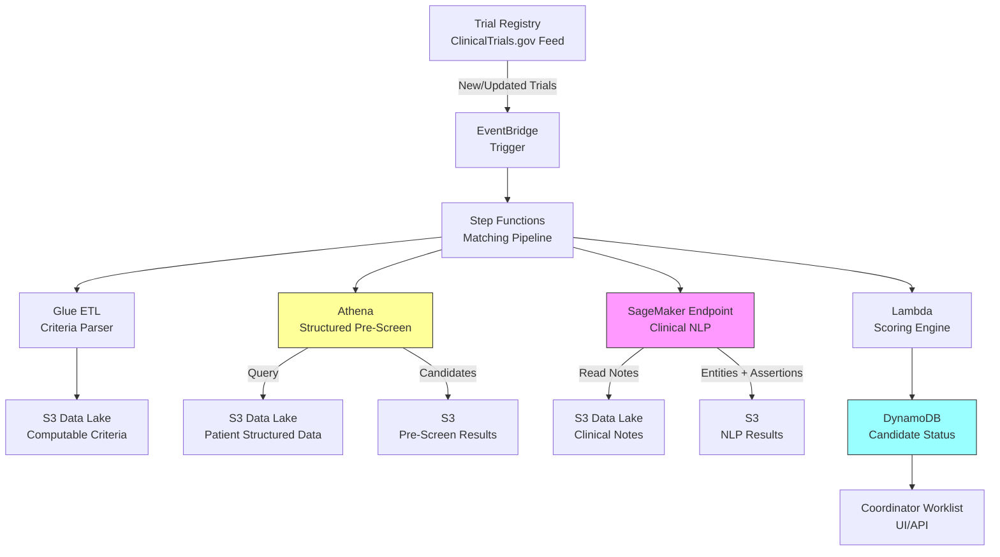

# Recipe 6.7: Clinical Trial Patient Matching

**Complexity:** Medium-Complex · **Phase:** Growth · **Estimated Cost:** ~$0.20–$0.75 per patient screened (depending on criteria complexity and NLP requirements)

---

## The Problem

There's a clinical trial for a promising new GLP-1 receptor agonist combination therapy. It's recruiting at your health system. The inclusion criteria specify: adults 30-65 with Type 2 diabetes, A1C between 7.5 and 10.5, on metformin monotherapy for at least 90 days, BMI over 27, no history of pancreatitis, no eGFR below 45, no active cancer diagnosis in the past 5 years, and willing to discontinue any SGLT2 inhibitors.

The research coordinator has a list of 180,000 patients in the health system's diabetes registry. She needs to find the ones who might qualify. Today, that means manually reviewing charts. One by one. Checking labs, medication lists, problem lists, procedure histories. A good coordinator can screen maybe 20 charts per hour. At that rate, screening the full registry would take over a year. The trial closes enrollment in four months.

This is not an edge case. This is the default state of clinical trial recruitment in 2026. The Tufts Center for the Study of Drug Development has reported that 80% of clinical trials fail to meet enrollment timelines. Not because eligible patients don't exist, but because finding them is a manual, exhausting process that doesn't scale. Sites leave money on the table. Patients who could benefit from experimental therapies never hear about them. Trials take longer, cost more, and sometimes fail entirely because they can't recruit fast enough.

The information needed to determine eligibility is already in the EHR. Lab results, medication lists, diagnosis codes, procedure histories, clinical notes. It's all there. The problem is that eligibility criteria are expressed in clinical language ("no history of pancreatitis") while the data lives in structured codes (ICD-10: K85.x, K86.1) and unstructured notes ("Patient reports episode of acute pancreatitis in 2019"). Bridging that gap at scale is the core technical challenge.

When this works, a research coordinator starts her day with a pre-screened list of 200 likely-eligible patients instead of a registry of 180,000. She spends her time on the nuanced judgment calls (is this patient actually willing to participate? does their schedule allow weekly visits?) rather than on mechanical chart review. Enrollment timelines compress. More patients get access to experimental therapies. Trials complete faster.

---

## The Technology: How Automated Trial Matching Works

### The Eligibility Criteria Problem

Clinical trial eligibility criteria are deceptively complex. A typical Phase III trial has 30-50 individual criteria, split between inclusion (must have) and exclusion (must not have). Each criterion maps to one or more data elements in the patient record, and the mapping is rarely straightforward.

Consider a single exclusion criterion: "No history of cardiovascular event within the past 12 months." To evaluate this computationally, you need to:

1. Define what counts as a "cardiovascular event" (MI, stroke, TIA, unstable angina, heart failure hospitalization, PCI, CABG?)
2. Map each of those to the relevant ICD-10, CPT, and SNOMED codes
3. Search the patient's problem list, encounter diagnoses, and procedure history
4. Apply the temporal constraint (within 12 months of what? screening date? enrollment date?)
5. Handle negation in clinical notes ("no history of MI" should not trigger a match)
6. Handle uncertainty ("possible TIA in 2023, workup inconclusive")

Multiply that by 40 criteria and you start to see why this is hard. Each criterion is a mini-NLP and data integration problem.

### Structured vs. Unstructured Data

Patient eligibility information lives in two places, and you need both.

**Structured data** includes diagnosis codes (ICD-10), procedure codes (CPT, HCPCS), medication lists (RxNorm), lab results (LOINC), vital signs, and demographics. This is the easy part. You can write deterministic rules: "A1C between 7.5 and 10.5" maps directly to a LOINC code and a value range. "On metformin for at least 90 days" maps to an active medication with a start date.

**Unstructured data** includes clinical notes, discharge summaries, pathology reports, and radiology reports. This is where the hard cases live. "No history of pancreatitis" might only be documented in a note from three years ago. "Willing to discontinue SGLT2 inhibitors" is a patient preference that exists nowhere in structured data until someone asks. Allergies, surgical history, social history, and family history are often documented in free text even when structured fields exist.

The practical split varies by criterion type. Demographics and labs are almost always structured. Medication history is mostly structured (but "patient reports taking herbal supplements" is not). Diagnosis history is partially structured (coded diagnoses) and partially unstructured (mentioned in notes but never formally coded). Exclusion criteria based on patient willingness, lifestyle factors, or nuanced clinical history almost always require NLP on notes.

### NLP for Criteria Extraction

Two NLP tasks dominate clinical trial matching:

**Criteria parsing:** Taking the eligibility criteria text (often written in semi-structured clinical language) and decomposing it into computable assertions. "Adults aged 30-65 with Type 2 diabetes" becomes three assertions: age >= 30, age <= 65, has_diagnosis(E11.x). This can be done with rule-based parsers for well-structured criteria, or with LLMs for more complex natural language criteria.

**Clinical note mining:** Extracting relevant clinical facts from patient notes to evaluate criteria that can't be resolved from structured data alone. This includes entity extraction (finding mentions of conditions, medications, procedures), negation detection ("denies history of pancreatitis"), temporal reasoning ("diagnosed in 2019"), and assertion classification (is this a confirmed finding, a suspected finding, or a family history?).

Negation detection deserves special attention. Clinical notes are full of negated findings: "no chest pain," "denies shortness of breath," "no family history of colon cancer." A naive keyword search for "pancreatitis" in notes will match "no history of pancreatitis" and incorrectly exclude the patient. Negation-aware NLP (algorithms like NegEx, or transformer-based models trained on clinical text) is essential.

### The Matching Architecture

At a conceptual level, trial matching is a multi-stage filter:

**Stage 1: Structured pre-screen.** Apply all criteria that can be evaluated from structured data alone. This is fast, deterministic, and eliminates the bulk of the population. If a trial requires A1C > 7.5 and 85% of your diabetes registry has A1C below that threshold, you've just reduced your candidate pool by 85% before touching a single clinical note.

**Stage 2: NLP-based deep screen.** For candidates that pass the structured pre-screen, apply NLP to clinical notes to evaluate criteria that require unstructured data. This is slower and more expensive per patient, but you're only running it on the pre-screened subset.

**Stage 3: Scoring and ranking.** Not all candidates are equally likely to be eligible. Some meet every structured criterion clearly. Others are borderline (A1C of 7.4 when the threshold is 7.5, but the lab is from 3 months ago and might have drifted). Score candidates by confidence of eligibility and surface the highest-confidence matches first.

**Stage 4: Human review.** A research coordinator reviews the top candidates, confirms eligibility through chart review, and initiates outreach. The system doesn't replace the coordinator; it focuses their attention on the most promising candidates.

This staged approach is critical for cost and performance. Running full NLP on 180,000 patients is expensive and slow. Running it on the 2,000 who pass structured pre-screening is manageable.

### Similarity-Based Approaches

Beyond rule-based matching, there's a complementary approach: find patients who are similar to previously enrolled patients. If you have data from patients who successfully enrolled in similar trials, you can build a similarity model that identifies new candidates based on their resemblance to past enrollees.

This works particularly well for:
- Trials with complex, multi-dimensional criteria that are hard to decompose into individual rules
- Identifying patients who are "close" to eligibility (might qualify with a medication washout or after a lab recheck)
- Prioritizing outreach when you have more candidates than you can contact

The similarity approach complements rule-based matching rather than replacing it. Rules give you precision (definitive yes/no on specific criteria). Similarity gives you recall (finding candidates you might have missed because a criterion was ambiguously documented).

### Temporal Reasoning

Clinical trial criteria are deeply temporal. "On metformin for at least 90 days" requires knowing when the medication was started. "No cardiovascular event in the past 12 months" requires knowing when events occurred relative to the screening date. "A1C between 7.5 and 10.5" implicitly means a recent A1C (a value from 2 years ago is clinically irrelevant).

Temporal reasoning in healthcare data is harder than it looks:

- Medication start dates are often approximate (the prescription was written on date X, but when did the patient actually start taking it?)
- Diagnosis dates may reflect when the code was entered, not when the condition began
- Lab values have a "freshness" window that varies by analyte (A1C is stable for ~3 months; potassium changes daily)
- "History of" is ambiguous (does it mean ever, or within some implied window?)

Your matching system needs explicit temporal logic: what's the acceptable recency window for each data element? How do you handle missing dates? What's the default assumption when timing is ambiguous?

---

## General Architecture Pattern

```
[Trial Registry] → [Criteria Parser] → [Computable Criteria]
                                              ↓
[Patient Data Store] → [Structured Pre-Screen] → [Candidate Pool]
                                                       ↓
[Clinical Notes] → [NLP Pipeline] → [Deep Screen] → [Scored Candidates]
                                                           ↓
                                                    [Coordinator Worklist]
```

**Stage 1: Criteria Ingestion.** Trial eligibility criteria are parsed into a computable representation. Each criterion becomes a rule with a data source (structured or unstructured), a logic operator, and a temporal constraint.

**Stage 2: Structured Pre-Screen.** Query structured patient data (demographics, labs, medications, diagnoses) against all criteria that can be evaluated deterministically. Eliminate patients who definitively fail any inclusion criterion or definitively meet any exclusion criterion.

**Stage 3: NLP Deep Screen.** For remaining candidates, run NLP on clinical notes to evaluate criteria that require unstructured data. Extract relevant entities, detect negation, apply temporal reasoning.

**Stage 4: Scoring and Ranking.** Assign each candidate a confidence score based on how clearly they meet each criterion. Criteria with high-confidence structured data matches score higher than criteria resolved through NLP with moderate confidence.

**Stage 5: Coordinator Worklist.** Present ranked candidates to research coordinators with per-criterion evidence (which data elements matched, from which source, with what confidence). The coordinator makes the final eligibility determination.

---

## The AWS Implementation

### Why These Services

**Amazon SageMaker for NLP models.** The clinical NLP pipeline (entity extraction, negation detection, temporal reasoning) requires custom models trained on clinical text. SageMaker gives you the training infrastructure and real-time inference endpoints for those custom models. For organizations without custom models, Amazon Comprehend Medical provides pre-trained clinical NLP as a starting point, though it lacks the trial-specific fine-tuning that improves precision.

**Amazon Comprehend Medical for clinical entity extraction.** Comprehend Medical extracts medical entities (conditions, medications, procedures, lab values) from clinical text with negation and assertion detection built in. It handles the "no history of pancreatitis" problem natively. For many criteria, this is sufficient without custom model training.

**AWS Glue and Amazon Athena for structured pre-screening.** The structured pre-screen is fundamentally a large-scale query against patient data. Glue ETL jobs transform EHR extracts into a queryable format. Athena runs the eligibility queries against the transformed data without requiring a persistent database cluster. For a 180,000-patient registry with 40 structured criteria, Athena can complete the pre-screen in minutes.

**Amazon S3 for data lake storage.** Patient data extracts, clinical notes, trial criteria definitions, and matching results all live in S3. The data lake pattern allows different processing stages to read from and write to a shared storage layer without tight coupling.

**AWS Step Functions for pipeline orchestration.** The multi-stage matching pipeline (pre-screen, NLP, scoring, notification) has dependencies between stages and needs error handling, retries, and monitoring. Step Functions provides visual workflow orchestration with built-in retry logic and state management.

**Amazon DynamoDB for candidate tracking.** Each candidate's matching status (which criteria passed, which failed, which are pending NLP, overall score) needs fast read/write access. DynamoDB's key-value model fits the per-patient status tracking pattern.

**Amazon EventBridge for trial registry updates.** When new trials open or criteria change, EventBridge triggers re-screening of the patient population. A scheduled Lambda polls the ClinicalTrials.gov API daily for new or amended trials matching your therapeutic areas and publishes events to EventBridge when changes are detected. This keeps the candidate pool current without manual intervention.

### Architecture Diagram



### Prerequisites

| Requirement | Details |
|-------------|---------|
| AWS Services | SageMaker, Comprehend Medical, Glue, Athena, S3, Step Functions, DynamoDB, EventBridge, Lambda |
| IAM Permissions | `sagemaker:InvokeEndpoint`, `comprehendmedical:DetectEntitiesV2`, `glue:StartJobRun`, `athena:StartQueryExecution`, `s3:GetObject`, `s3:PutObject`, `dynamodb:PutItem`, `dynamodb:GetItem`, `states:StartExecution`. Scope each action to specific resource ARNs (e.g., `arn:aws:s3:::trial-matching-*` for S3, specific endpoint ARN for SageMaker). In research contexts, consider separate roles for the pre-screen stage (structured data access) and the NLP stage (clinical notes access) to enforce least-privilege separation of access. |
| BAA | Required. All services processing PHI must be covered under your AWS BAA. |
| Encryption | S3 SSE-KMS for all data at rest. DynamoDB encryption at rest. TLS 1.2+ in transit. SageMaker endpoint encryption. |
| VPC | SageMaker endpoints and Glue jobs in private subnets. VPC endpoints for S3, DynamoDB, SageMaker Runtime, and Comprehend Medical (`com.amazonaws.{region}.comprehendmedical`). Consider adding Step Functions and Lambda VPC endpoints if orchestration components are VPC-bound. Restrict security group egress to VPC endpoints only (no internet egress) for Lambda functions and SageMaker endpoints processing clinical notes. Enable VPC Flow Logs to monitor data movement patterns. |
| CloudTrail | Enabled for all API calls. Log who queried which patients and when. |
| Sample Data | Synthetic patient records (Synthea is excellent for this). ClinicalTrials.gov API for real trial criteria. Never use real PHI in development. |
| Cost Estimate | ~$0.20–$0.75 per patient screened (Comprehend Medical: ~$0.01/100 chars; SageMaker inference: ~$0.10/patient for custom NLP; Athena: ~$5/TB scanned). Store structured patient data in Parquet format partitioned by relevant dimensions (e.g., patient cohort, data type) to minimize Athena scan volume. Separate clinical notes from structured data in the S3 layout so the structured pre-screen doesn't scan note text. |

### Ingredients

| AWS Service | Role in This Recipe |
|-------------|-------------------|
| Amazon S3 | Data lake for patient data, clinical notes, trial criteria, and intermediate results |
| AWS Glue | ETL for transforming EHR extracts and parsing trial criteria into computable format |
| Amazon Athena | SQL-based structured pre-screening against patient demographics, labs, medications |
| Amazon Comprehend Medical | Extract medical entities from clinical notes with negation detection |
| Amazon SageMaker | Host custom clinical NLP models for trial-specific criteria evaluation |
| AWS Step Functions | Orchestrate the multi-stage matching pipeline with error handling |
| Amazon DynamoDB | Track per-patient matching status and scores |
| AWS Lambda | Scoring logic, result aggregation, notification triggers |
| Amazon EventBridge | Trigger re-screening when new trials open or criteria change |

### Code (Pseudocode Walkthrough)

#### Step 1: Parse Trial Eligibility Criteria

Before you can match patients, you need to decompose the trial's eligibility criteria into computable rules. Each criterion becomes a structured object with a data source, operator, and temporal constraint.

If you skip this step, your matching logic is hardcoded per trial and you'll rewrite it every time a new trial opens. A generic criteria representation lets you add trials without code changes.

```
FUNCTION parse_trial_criteria(trial_id):
    // Fetch the raw eligibility text from the trial registry
    raw_criteria = fetch_from_clinicaltrials_gov(trial_id)
    
    parsed_criteria = []
    
    FOR EACH criterion IN raw_criteria.inclusion_criteria:
        rule = {
            criterion_id:   generate_unique_id()
            criterion_type: "INCLUSION"                    // patient MUST meet this
            raw_text:       criterion.text                 // original human-readable text
            data_source:    classify_data_source(criterion) // "STRUCTURED" or "UNSTRUCTURED" or "BOTH"
            logic:          extract_logic(criterion)        // the computable assertion
            temporal:       extract_temporal_constraint(criterion) // recency window, if any
            confidence:     0.0                            // will be filled during matching
        }
        parsed_criteria.append(rule)
    
    FOR EACH criterion IN raw_criteria.exclusion_criteria:
        rule = {
            criterion_id:   generate_unique_id()
            criterion_type: "EXCLUSION"                    // patient must NOT meet this
            raw_text:       criterion.text
            data_source:    classify_data_source(criterion)
            logic:          extract_logic(criterion)
            temporal:       extract_temporal_constraint(criterion)
            confidence:     0.0
        }
        parsed_criteria.append(rule)
    
    // Store the parsed criteria for use by the matching pipeline
    STORE parsed_criteria TO s3://trial-matching/criteria/{trial_id}.json
    
    RETURN parsed_criteria
```

**Example parsed criterion:**

```json
{
  "criterion_id": "crit-0042",
  "criterion_type": "INCLUSION",
  "raw_text": "A1C between 7.5% and 10.5% within the past 90 days",
  "data_source": "STRUCTURED",
  "logic": {
    "field": "lab_result",
    "loinc_code": "4548-4",
    "operator": "BETWEEN",
    "value_low": 7.5,
    "value_high": 10.5
  },
  "temporal": {
    "recency_days": 90,
    "reference_point": "screening_date"
  }
}
```

#### Step 2: Structured Pre-Screen

Run all structured criteria against the patient population using SQL. This eliminates the majority of patients quickly and cheaply.

If you skip this step and run NLP on every patient, you'll spend 100x more on compute and wait hours instead of minutes. The structured pre-screen is your cost control mechanism.

```
FUNCTION structured_prescreen(trial_id, patient_population):
    criteria = LOAD FROM s3://trial-matching/criteria/{trial_id}.json
    structured_criteria = FILTER criteria WHERE data_source = "STRUCTURED"
    
    // Build a SQL query that applies all structured criteria simultaneously
    // Each criterion becomes a WHERE clause condition
    sql_query = "SELECT patient_id, "
    
    FOR EACH criterion IN structured_criteria:
        // Add a column that evaluates this criterion (TRUE/FALSE/NULL)
        sql_query += build_criterion_clause(criterion)
    
    sql_query += " FROM patient_data"
    sql_query += " WHERE " + build_inclusion_filter(structured_criteria)
    sql_query += " AND NOT " + build_exclusion_filter(structured_criteria)
    
    // Execute against the patient data lake
    results = execute_athena_query(sql_query, output_location="s3://trial-matching/prescreen/")
    
    candidates = []
    FOR EACH row IN results:
        candidate = {
            patient_id:          row.patient_id
            structured_pass:     TRUE                    // they passed all structured criteria
            criteria_results:    extract_per_criterion_results(row)
            needs_nlp_screen:    has_unstructured_criteria(criteria)
        }
        candidates.append(candidate)
    
    STORE candidates TO s3://trial-matching/candidates/{trial_id}/prescreen.json
    RETURN candidates
```

#### Step 3: NLP Deep Screen on Clinical Notes

For candidates that passed structured pre-screening, evaluate criteria that require clinical note analysis. This is where you catch exclusions like "no history of pancreatitis" that might only be documented in free text.

If you skip this step, you'll send coordinators candidates who are clearly ineligible based on information in their notes. That wastes coordinator time and erodes trust in the system.

```
FUNCTION nlp_deep_screen(trial_id, candidates):
    criteria = LOAD FROM s3://trial-matching/criteria/{trial_id}.json
    nlp_criteria = FILTER criteria WHERE data_source IN ("UNSTRUCTURED", "BOTH")
    
    screened_candidates = []
    
    FOR EACH candidate IN candidates:
        // Retrieve relevant clinical notes for this patient
        // Limit to notes within the temporal window relevant to the criteria
        notes = fetch_clinical_notes(
            patient_id = candidate.patient_id,
            date_range = calculate_relevant_window(nlp_criteria)
        )
        
        // Run clinical NLP to extract entities with negation and temporality
        nlp_results = []
        FOR EACH note IN notes:
            entities = call_comprehend_medical(note.text)
            // entities include: conditions, medications, procedures
            // each with: text, category, type, negation flag, temporal info
            nlp_results.append({
                note_date:  note.date,
                note_type:  note.type,
                entities:   entities
            })
        
        // Evaluate each NLP criterion against extracted entities
        criterion_results = []
        FOR EACH criterion IN nlp_criteria:
            result = evaluate_criterion_against_entities(
                criterion = criterion,
                entities  = nlp_results,
                logic     = criterion.logic
            )
            // result includes: PASS, FAIL, UNCERTAIN, and confidence score
            criterion_results.append(result)
        
        // Determine overall NLP screen result
        any_definite_fail = ANY(result.status = "FAIL" AND result.confidence > 0.9 
                               FOR result IN criterion_results)
        
        IF NOT any_definite_fail:
            candidate.nlp_results = criterion_results
            candidate.nlp_pass = TRUE
            screened_candidates.append(candidate)
    
    STORE screened_candidates TO s3://trial-matching/candidates/{trial_id}/nlp_screened.json
    RETURN screened_candidates
```

#### Step 4: Score and Rank Candidates

Assign each candidate a composite eligibility score based on how confidently they meet each criterion. Higher scores mean more likely to be truly eligible.

If you skip scoring and just present an unranked list, coordinators waste time on borderline cases when clear matches are available. Ranking focuses their effort where it's most likely to result in enrollment.

```
FUNCTION score_candidates(trial_id, candidates):
    criteria = LOAD FROM s3://trial-matching/criteria/{trial_id}.json
    
    scored_candidates = []
    
    FOR EACH candidate IN candidates:
        total_score = 0.0
        max_possible_score = 0.0
        criterion_details = []
        
        FOR EACH criterion IN criteria:
            weight = get_criterion_weight(criterion)  // some criteria matter more than others
            max_possible_score += weight
            
            // Find this criterion's result from structured or NLP screening
            result = find_criterion_result(candidate, criterion)
            
            IF result.status = "PASS":
                criterion_score = weight * result.confidence
            ELSE IF result.status = "UNCERTAIN":
                criterion_score = weight * 0.5 * result.confidence
            ELSE:
                criterion_score = 0.0
            
            total_score += criterion_score
            criterion_details.append({
                criterion_id:   criterion.criterion_id
                raw_text:       criterion.raw_text
                status:         result.status
                confidence:     result.confidence
                evidence:       result.evidence        // what data supported this determination
                data_source:    result.source          // "structured" or "note from 2025-11-03"
            })
        
        candidate.eligibility_score = total_score / max_possible_score  // normalize to 0-1
        candidate.criterion_details = criterion_details
        candidate.uncertain_count = COUNT(d FOR d IN criterion_details WHERE d.status = "UNCERTAIN")
        
        scored_candidates.append(candidate)
    
    // Sort by score descending
    scored_candidates = SORT scored_candidates BY eligibility_score DESCENDING
    
    // Store to DynamoDB for coordinator access
    FOR EACH candidate IN scored_candidates:
        WRITE TO dynamodb table "trial-candidates":
            partition_key = trial_id
            sort_key      = candidate.patient_id
            score         = candidate.eligibility_score
            details       = candidate.criterion_details
            status        = "PENDING_REVIEW"
            timestamp     = current UTC time
    
    RETURN scored_candidates
```

#### Step 5: Generate Coordinator Worklist

Present the ranked candidates to research coordinators with actionable evidence for each criterion. The coordinator needs to see why the system thinks this patient qualifies, not just that it does.

```
FUNCTION generate_worklist(trial_id, top_n=50):
    // Retrieve top candidates from DynamoDB
    candidates = QUERY dynamodb table "trial-candidates"
        WHERE partition_key = trial_id
        AND status = "PENDING_REVIEW"
        ORDER BY score DESCENDING
        LIMIT top_n
    
    worklist = []
    FOR EACH candidate IN candidates:
        worklist_entry = {
            patient_id:       candidate.patient_id
            score:            candidate.score
            summary:          generate_eligibility_summary(candidate.details)
            uncertain_items:  FILTER candidate.details WHERE status = "UNCERTAIN"
            action_needed:    determine_coordinator_action(candidate)
            // e.g., "Confirm medication washout willingness" or "Verify no pancreatitis history"
        }
        worklist.append(worklist_entry)
    
    RETURN worklist
```

> **Curious how this looks in Python?** The pseudocode above covers the concepts. If you'd like to see sample Python code that demonstrates these patterns using boto3, check out the [Python Example](chapter06.07-python-example). It walks through each step with inline comments and notes on what you'd need to change for a real deployment.

### Expected Results

**Sample output for a single candidate:**

```json
{
  "trial_id": "NCT05891234",
  "patient_id": "PAT-00482931",
  "eligibility_score": 0.92,
  "status": "PENDING_REVIEW",
  "criteria_summary": {
    "total_criteria": 12,
    "definite_pass": 10,
    "uncertain": 2,
    "definite_fail": 0
  },
  "criterion_details": [
    {
      "criterion_id": "crit-0001",
      "raw_text": "Adults aged 30-65",
      "status": "PASS",
      "confidence": 1.0,
      "evidence": "DOB: 1972-03-15, Age: 54",
      "data_source": "structured:demographics"
    },
    {
      "criterion_id": "crit-0007",
      "raw_text": "No history of pancreatitis",
      "status": "PASS",
      "confidence": 0.85,
      "evidence": "No mentions of pancreatitis found in 47 clinical notes spanning 2019-2026",
      "data_source": "nlp:clinical_notes"
    },
    {
      "criterion_id": "crit-0011",
      "raw_text": "Willing to discontinue SGLT2 inhibitors",
      "status": "UNCERTAIN",
      "confidence": 0.5,
      "evidence": "Patient currently on empagliflozin. Willingness not documented.",
      "data_source": "structured:medications + nlp:no_evidence_found"
    }
  ],
  "coordinator_action": "Confirm patient willingness to discontinue empagliflozin. Verify no contraindications in recent cardiology note from 2026-02-14."
}
```

**Performance benchmarks:**

| Metric | Typical Value |
|--------|---------------|
| Structured pre-screen (180K patients) | 2-5 minutes (Athena) |
| NLP deep screen (per patient) | 3-8 seconds (depends on note volume) |
| NLP deep screen (2,000 candidates) | 15-30 minutes (parallelized) |
| End-to-end pipeline (new trial) | 30-60 minutes |
| Precision (candidates who are truly eligible) | 60-75% (before coordinator review) |
| Recall (eligible patients identified) | 80-90% (structured criteria); 65-80% (NLP criteria) |
| Cost per full population screen | ~$150-400 (180K patients, 12 criteria) |

**Where it struggles:**

- Criteria requiring patient willingness or preference (can't be determined from records alone)
- Criteria with ambiguous temporal boundaries ("recent" cardiovascular event)
- Patients with sparse documentation (new to the health system, few notes)
- Negation detection in complex sentence structures ("Patient's sister had pancreatitis but patient has no personal history")
- Criteria that reference external information ("no concurrent enrollment in another trial")

---

## Why This Isn't Production-Ready

**Consent and regulatory compliance.** This system performs automated pre-screening: identifying potentially eligible patients from existing EHR data. It does not constitute screening (which requires patient contact and informed consent). This distinction matters. Most institutions can operate pre-screening under a waiver of consent per 45 CFR 46.116(f) or under HIPAA's preparatory-to-research provision (45 CFR 164.512(i)(1)(ii)), but this requires documented IRB or Privacy Board approval. Some institutions require explicit patient opt-in for any research-related data use; others allow pre-screening under existing data governance frameworks. Your legal and IRB teams need to weigh in before you screen a single patient. Document your institution's determination before deploying. The system's audit trail (CloudTrail logs of which patients were evaluated, when, and for which trial) supports the accountability requirements of both provisions. The technical system is the easy part; the governance framework is harder.

**EHR integration.** This recipe assumes you have patient data in a queryable data lake. Getting it there from your EHR (Epic, Cerner, Meditech) requires an integration layer (FHIR APIs, bulk data exports, or HL7 feeds) that is a project unto itself. The matching logic is downstream of that integration.

**Criteria maintenance.** Trial criteria change. Amendments modify inclusion/exclusion criteria mid-enrollment. Your criteria parser needs to handle updates and trigger re-screening of the candidate pool. A stale criteria set produces stale matches.

**Coordinator workflow integration.** The worklist needs to live where coordinators already work, not in a separate application they have to remember to check. Integration with CTMS (Clinical Trial Management Systems) like OnCore, Velos, or Florence is essential for adoption.

**Data retention and minimization.** Matching results in DynamoDB contain per-criterion evidence strings with derived PHI. Define a retention policy: when a trial closes enrollment, archive or delete candidate records. Consider DynamoDB TTL on the `trial-candidates` table keyed to the trial's expected enrollment close date plus a buffer for audit purposes. Evidence strings containing PHI should be treated with the same retention controls as the source clinical data.

**Error handling in the NLP stage.** The NLP deep screen processes thousands of candidates over 15-30 minutes. A single patient failure (corrupt notes, encoding issues, Comprehend Medical throttling) shouldn't fail the entire pipeline. Use Step Functions Map state with `maxConcurrency` to control parallelism and `toleratedFailurePercentage` to allow completion even if some patients fail. Failed patients should be written to a dead letter queue for retry or manual review. Checkpoint progress so a pipeline restart doesn't reprocess already-screened candidates.

---

## The Honest Take

The structured pre-screen is the part that works reliably. Demographics, labs, medications, diagnosis codes: these are well-defined, queryable, and deterministic. If a patient's A1C is 6.2 and the trial requires > 7.5, that's a definitive exclusion. No ambiguity. You can build this part in a few weeks and it immediately saves coordinator time.

The NLP piece is where things get interesting and frustrating in equal measure. Negation detection has gotten genuinely good (Comprehend Medical handles it well for common patterns), but complex sentence structures still trip it up. "Patient reports that her mother had breast cancer but she herself has never been diagnosed with any malignancy" contains both a family history mention and a personal negation. Getting that right consistently requires either very good models or very careful prompt engineering.

The biggest surprise in production: the criteria that seem simplest are often the hardest. "On metformin monotherapy for at least 90 days" sounds straightforward until you realize that medication lists in EHRs are notoriously unreliable. Medications get added but never removed. Patients stop taking drugs without telling anyone. The "active medication list" is aspirational, not factual. You end up needing pharmacy fill data (which requires a separate integration) to have any confidence in medication duration.

The precision/recall tradeoff is real and you need to make it explicit with your research team. High precision (only surface patients who are almost certainly eligible) means coordinators waste less time but you miss eligible patients. High recall (surface anyone who might be eligible) means more coordinator work but fewer missed opportunities. Most sites start with high recall and tighten over time as they calibrate.

One more thing: the system gets dramatically more useful when you have multiple active trials. Screening for one trial is a project. Screening for 20 trials simultaneously against the same patient population is where the ROI compounds. A patient who doesn't qualify for Trial A might be perfect for Trial B. Build the system to handle multiple concurrent trials from day one.

---

## Variations and Extensions

**Real-time alerting on new eligibility.** Instead of batch screening, monitor incoming lab results and new diagnoses in real time. When a patient's A1C crosses a trial threshold, trigger an alert. This catches patients at the moment they become eligible rather than waiting for the next batch run. Requires streaming integration with the EHR (HL7 FHIR subscriptions or ADT feeds).

**Patient-facing trial discovery.** Flip the model: instead of coordinators finding patients, let patients find trials. Build a patient portal feature where patients can see trials they might qualify for, with plain-language explanations of what's involved. This requires careful UX design (don't overwhelm patients with options) and additional consent workflows, but it addresses the "patients never hear about trials" problem directly.

**Multi-site federated matching.** For trials recruiting across multiple health systems, run the matching pipeline at each site without sharing patient data between sites. Each site reports aggregate counts ("we have approximately 45 candidates for this trial") without exposing individual patient records. This supports network-level enrollment planning while preserving data sovereignty. Federated learning techniques can improve model performance across sites without centralizing data.

---

## Related Recipes

- **Recipe 6.6 (Patient Similarity for Care Planning):** Uses the same similarity infrastructure but for care planning rather than trial matching. The feature engineering and distance metric concepts transfer directly.
- **Recipe 5.6 (Claims-to-Clinical Data Linkage):** The data integration challenge of combining structured and unstructured patient data is shared between trial matching and record linkage.
- **Recipe 8.8 (NLP: Clinical Named Entity Recognition):** The clinical NLP pipeline used in the deep screen stage builds on entity extraction techniques covered in the NLP chapter.
- **Recipe 2.7 (Literature Search and Evidence Synthesis):** Trial criteria parsing shares techniques with literature search, particularly around structured query generation from natural language.

---

## Additional Resources

**AWS Documentation:**
- [Amazon Comprehend Medical Documentation](https://docs.aws.amazon.com/comprehend-medical/latest/dev/what-is.html)
- [Amazon Comprehend Medical DetectEntitiesV2 API](https://docs.aws.amazon.com/comprehend-medical/latest/dev/API_medical_DetectEntitiesV2.html)
- [Amazon SageMaker Real-Time Inference](https://docs.aws.amazon.com/sagemaker/latest/dg/realtime-endpoints.html)
- [Amazon Athena User Guide](https://docs.aws.amazon.com/athena/latest/ug/what-is.html)
- [AWS Step Functions Developer Guide](https://docs.aws.amazon.com/step-functions/latest/dg/welcome.html)
- [AWS HIPAA Eligible Services](https://aws.amazon.com/compliance/hipaa-eligible-services-reference/)
- [Architecting for HIPAA on AWS](https://docs.aws.amazon.com/whitepapers/latest/architecting-hipaa-security-and-compliance-on-aws/welcome.html)

**AWS Sample Repos:**
- [`amazon-comprehend-medical-fhir-integration`](https://github.com/aws-samples/amazon-comprehend-medical-fhir-integration): Demonstrates extracting medical entities from clinical text and mapping to FHIR resources
- [`amazon-sagemaker-examples`](https://github.com/aws/amazon-sagemaker-examples): Includes NLP model training and deployment patterns applicable to clinical text classification
- [`aws-step-functions-data-science-sdk-python`](https://github.com/aws/aws-step-functions-data-science-sdk-python): Building ML pipelines with Step Functions, relevant to orchestrating the matching workflow

**AWS Solutions and Blogs:**
- [Generating Real-World Evidence Using a Scalable Data Science Platform on AWS](https://aws.amazon.com/blogs/industries/generating-real-world-evidence-using-a-scalable-data-science-platform-on-aws/): Architecture patterns for clinical data processing at scale
- [Build a Cognitive Search and Health Knowledge Graph Using AWS AI Services](https://aws.amazon.com/blogs/machine-learning/build-a-cognitive-search-and-a-health-knowledge-graph-using-amazon-healthlake-amazon-neptune-and-amazon-comprehend-medical/): Demonstrates clinical NLP and knowledge graph patterns relevant to criteria matching

**External Resources:**
- [ClinicalTrials.gov API Documentation](https://clinicaltrials.gov/data-api/api): Official API for retrieving trial eligibility criteria programmatically
- [Synthea Patient Generator](https://synthetichealth.github.io/synthea/): Generate realistic synthetic patient data for development and testing

---

## Estimated Implementation Time

| Phase | Duration |
|-------|----------|
| Basic (structured pre-screen only, single trial) | 4-6 weeks |
| Production-ready (NLP deep screen, multi-trial, coordinator UI) | 12-16 weeks |
| With variations (real-time alerting, patient portal, federated) | 20-28 weeks |

---

## Tags

`cohort-analysis` · `clustering` · `clinical-trials` · `patient-matching` · `nlp` · `comprehend-medical` · `sagemaker` · `athena` · `step-functions` · `medium-complex` · `hipaa` · `research`

---

*← [Recipe 6.6: Patient Similarity for Care Planning](chapter06.06-patient-similarity-care-planning) · [Chapter 6 Index](chapter06-index) · [Next: Recipe 6.8: Disease Subtype Discovery →](chapter06.08-disease-subtype-discovery)*
