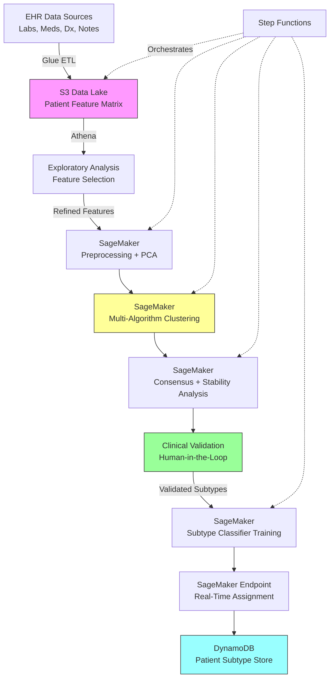

# Recipe 6.8 Architecture and Implementation: Disease Subtype Discovery

*Companion to [Recipe 6.8: Disease Subtype Discovery](chapter06.08-disease-subtype-discovery). This page covers the AWS architecture, services, prerequisites, and pseudocode. For the problem framing and the conceptual approach, start with the main recipe.*

---

## The AWS Implementation

### Why These Services

**Amazon SageMaker for ML compute and experimentation.** Disease subtype discovery is inherently iterative. You'll run dozens of clustering experiments with different feature sets, algorithms, and parameters before finding stable, clinically meaningful subtypes. SageMaker provides managed Jupyter notebooks for exploration, built-in implementations of K-means and PCA, and the ability to bring custom algorithms (GMM, HDBSCAN, consensus clustering) in containers. The experiment tracking in SageMaker Experiments lets you compare runs systematically rather than losing track of which parameter combination produced which result.

**A note on notebook hardening for research workloads.** Interactive notebooks with PHI access carry higher risk than automated pipelines because researchers can download data, install arbitrary packages, and run ad-hoc queries. Use SageMaker Studio with domain-level VPC configuration rather than standalone notebook instances. Disable root access on any notebook instances you do use. Apply lifecycle configurations that restrict pip and conda to approved internal package mirrors (preventing exfiltration via malicious packages). Enable notebook audit logging through CloudTrail to capture who ran what, when. These controls add 1-2 days of setup but prevent the scenario where a researcher accidentally installs a package that phones home with patient data.

**Amazon S3 for data lake storage.** The feature extraction pipeline pulls from multiple source systems (labs, medications, diagnoses, notes) and materializes a patient-feature matrix that may be hundreds of megabytes to several gigabytes. S3 provides durable, encrypted storage for both the raw extracted features and the intermediate/final clustering results. Versioning lets you reproduce any analysis from any point in time.

**Data retention for experiment artifacts.** Research workloads accumulate large volumes of intermediate results (feature matrices, cluster assignments, model artifacts) that contain PHI-derived data. Implement S3 lifecycle policies to transition experiment artifacts to S3 Glacier after your institution's active-use retention period (typically 90-180 days) and delete them after the maximum retention period required by your data governance policy (typically 6-7 years for research data). Maintain a manifest of patient IDs per experiment (stored separately from the data itself) to support HIPAA amendment requests and accounting-of-disclosures obligations. When a patient exercises their right to access or amend their records, you need to know which experiments included their data without having to thaw every archived artifact.

**AWS Glue for ETL and feature extraction.** Building the patient-feature matrix requires joining across multiple data domains, handling temporal logic (which lab value to use when there are multiple?), and applying business rules (how to encode medication history). Glue's Spark-based ETL handles this at scale, and the Glue Data Catalog provides schema management for the feature tables.

**Amazon Athena for ad-hoc exploration.** Before committing to a feature set, you need to explore the data: check distributions, identify missingness patterns, understand correlations. Athena lets you query the feature tables in S3 with standard SQL without provisioning any infrastructure.

**Amazon DynamoDB for subtype assignment storage.** Once subtypes are validated and a classifier is built, new patients need to be assigned to subtypes in real time. DynamoDB provides low-latency lookups by patient ID for downstream systems (care management platforms, clinical decision support) that need to know a patient's subtype.

**AWS Step Functions for pipeline orchestration.** The full pipeline (extract features, preprocess, reduce dimensions, cluster, validate, characterize) has multiple stages with dependencies. Step Functions orchestrates this as a state machine with error handling, retries, and audit logging. The clinical validation step uses Step Functions' callback pattern (`.waitForTaskToken`): the state machine pauses, sends a notification to the clinical review team with the cluster characterization report, and resumes when the clinician approves or requests re-analysis with different parameters.

### Architecture Diagram



### Prerequisites

| Requirement | Details |
|-------------|---------|
| **AWS Services** | Amazon SageMaker, Amazon S3, AWS Glue, Amazon Athena, Amazon DynamoDB, AWS Step Functions, AWS KMS |
| **IAM Permissions** | `sagemaker:CreateTrainingJob`, `sagemaker:CreateEndpoint`, `s3:GetObject`, `s3:PutObject`, `glue:StartJobRun`, `athena:StartQueryExecution`, `dynamodb:PutItem`, `dynamodb:GetItem`, `states:StartExecution`. Scope all permissions to specific resource ARNs (e.g., `s3:GetObject` on `arn:aws:s3:::patient-features-bucket/cohort-*`). |
| **BAA** | AWS BAA signed (patient clinical data is PHI) |
| **Encryption** | S3: SSE-KMS; DynamoDB: encryption at rest; SageMaker: KMS-encrypted volumes and endpoints; Glue: KMS for job bookmarks and temp storage; all transit over TLS |
| **VPC** | SageMaker notebooks and training jobs in VPC with VPC endpoints for S3, DynamoDB, and SageMaker API. No internet egress for PHI workloads. Configure Glue connections with VPC subnet and security group for jobs accessing VPC-resident data sources (EHR databases, data warehouses). |
| **CloudTrail** | Enabled for all service API calls. SageMaker experiment tracking provides additional audit of model lineage. |
| **Sample Data** | Synthetic patient cohort with clinical features. MIMIC-IV (PhysioNet) provides realistic ICU patient data for development. Never use real PHI in dev/research without IRB approval. |
| **Cost Estimate** | Glue ETL: ~$0.44/DPU-hour. SageMaker ml.m5.xlarge notebook: ~$0.23/hr. Training jobs (ml.m5.4xlarge): ~$0.92/hr. Expect 20-50 hours of compute for a full exploration cycle. |

### Ingredients

| AWS Service | Role |
|------------|------|
| **Amazon SageMaker** | ML experimentation, clustering algorithms, model training, real-time inference endpoint |
| **Amazon S3** | Stores patient feature matrices, intermediate results, model artifacts, and cluster characterizations |
| **AWS Glue** | ETL pipeline to extract and join clinical features from source systems into patient-feature matrix |
| **Amazon Athena** | SQL-based exploration of feature distributions, missingness, and correlations |
| **Amazon DynamoDB** | Low-latency storage of patient subtype assignments for downstream consumption |
| **AWS Step Functions** | Orchestrates the multi-stage pipeline with error handling and audit trail |
| **AWS KMS** | Encryption key management for all data at rest |
| **Amazon CloudWatch** | Monitoring, logging, and alerting for pipeline health and drift detection |

### Code

> **Reference implementations:** The following AWS sample repos demonstrate patterns used in this recipe:
>
> - [`amazon-sagemaker-examples`](https://github.com/aws/amazon-sagemaker-examples): Comprehensive SageMaker examples including built-in K-means, PCA, and custom algorithm containers
> - [`aws-healthcare-lifescience-ai-ml`](https://github.com/aws-samples/aws-healthcare-lifescience-ai-ml): Healthcare-specific ML examples on AWS including patient cohort analysis patterns

#### Walkthrough

**Step 1: Define the cohort.** Before any clustering happens, you need a clean, well-defined patient population. This means selecting patients with the target diagnosis, applying minimum data completeness thresholds, and defining the observation window. A cohort with 40% missing lab values will produce clusters driven by missingness patterns rather than biology. This step also handles temporal alignment: for each patient, define an "index date" (diagnosis date, first encounter, etc.) and extract features relative to that anchor. Skip this step and your clusters will reflect data availability rather than disease biology.

```pseudocode
FUNCTION define_cohort(diagnosis_codes, min_data_completeness, observation_window):
    // Select all patients with the target diagnosis within the study period.
    // diagnosis_codes: list of ICD-10 codes defining the disease (e.g., I50.x for heart failure)
    // min_data_completeness: minimum fraction of required features that must be non-null (e.g., 0.7)
    // observation_window: how far back/forward from index date to look for features (e.g., 365 days)

    candidates = query patients WHERE any diagnosis IN diagnosis_codes
                 AND diagnosis_date BETWEEN study_start AND study_end

    // For each candidate, determine their index date (first qualifying diagnosis)
    FOR each patient in candidates:
        patient.index_date = earliest date of qualifying diagnosis

    // Apply data completeness filter
    // Patients with too much missing data will create clusters based on missingness, not biology
    eligible = empty list
    FOR each patient in candidates:
        completeness = count_non_null_features(patient, observation_window) / total_required_features
        IF completeness >= min_data_completeness:
            append patient to eligible

    RETURN eligible  // The analysis cohort, with index dates assigned
```

**Step 2: Extract and engineer features.** This is where clinical expertise matters most. You're building a numerical representation of each patient that captures the dimensions along which subtypes might differ. For each patient, extract labs (using the value closest to index date, or the median over the observation window), medications (binary indicators or duration-weighted), comorbidities (binary or severity-scored), vitals, and any other relevant structured data. Feature engineering choices here directly determine what subtypes you can discover.

```pseudocode
FUNCTION extract_features(cohort, feature_config):
    // feature_config defines which features to extract and how to summarize them.
    // Example config entry: { name: "bnp_baseline", source: "labs", loinc: "42637-9",
    //                         aggregation: "closest_to_index", window: "90_days_before" }

    feature_matrix = empty matrix (rows = patients, columns = features)

    FOR each patient in cohort:
        FOR each feature_def in feature_config:

            IF feature_def.source == "labs":
                // Pull lab values within the specified window relative to index date
                values = get_lab_values(patient, feature_def.loinc,
                                        patient.index_date, feature_def.window)
                // Apply aggregation: closest_to_index, median, max, slope, etc.
                feature_matrix[patient][feature_def.name] = aggregate(values, feature_def.aggregation)

            ELSE IF feature_def.source == "medications":
                // Check if patient was on this medication class during the window
                // Can be binary (on/off) or continuous (days on therapy)
                feature_matrix[patient][feature_def.name] = get_medication_exposure(
                    patient, feature_def.drug_class, patient.index_date, feature_def.window)

            ELSE IF feature_def.source == "diagnoses":
                // Check for presence of comorbidity codes
                feature_matrix[patient][feature_def.name] = has_diagnosis(
                    patient, feature_def.icd_codes, before_date=patient.index_date)

            ELSE IF feature_def.source == "vitals":
                values = get_vitals(patient, feature_def.vital_type,
                                    patient.index_date, feature_def.window)
                feature_matrix[patient][feature_def.name] = aggregate(values, feature_def.aggregation)

    RETURN feature_matrix
```

**Step 3: Preprocess and reduce dimensions.** Raw clinical features have wildly different scales (BNP ranges from 0 to 35,000 pg/mL; ejection fraction ranges from 5 to 75%). Without normalization, high-magnitude features dominate the distance calculations and clustering finds "BNP subtypes" rather than meaningful phenotypes. After scaling, apply PCA to identify how many dimensions carry meaningful variance and reduce the feature space accordingly. This step also handles remaining missing values through imputation.

```pseudocode
FUNCTION preprocess_and_reduce(feature_matrix, variance_threshold=0.90):
    // Step 3a: Handle remaining missing values
    // Multiple imputation is preferred for research; median imputation is acceptable for exploration
    imputed_matrix = impute_missing(feature_matrix, method="iterative")
    // "iterative" = MICE (Multiple Imputation by Chained Equations)
    // Each missing value is predicted from the other features, iteratively

    // Step 3b: Standardize all features to zero mean, unit variance
    // Without this, features measured in large units (BNP: 0-35000) dominate
    // features measured in small units (creatinine: 0.5-15.0)
    scaled_matrix = standardize(imputed_matrix)  // z-score normalization: (x - mean) / std

    // Step 3c: PCA for dimensionality reduction
    // Determine how many components capture the specified fraction of total variance
    pca_model = fit_PCA(scaled_matrix)
    n_components = find_n_where_cumulative_variance >= variance_threshold
    // Typical result: 50 features reduce to 8-15 principal components capturing 90% of variance

    reduced_matrix = transform(scaled_matrix, pca_model, n_components)

    // Step 3d: Also generate UMAP embedding for visualization (2D)
    umap_embedding = fit_UMAP(scaled_matrix, n_components=2)
    // UMAP is for visualization only; clustering happens in PCA space

    RETURN reduced_matrix, pca_model, umap_embedding, scaled_matrix
```

**Step 4: Run multi-algorithm clustering.** Don't bet on a single algorithm or a single K. Run K-means, GMM, and hierarchical clustering across K=2 through K=10. For each combination, record the cluster assignments and internal validation metrics. This gives you a landscape of possible groupings rather than a single answer. The goal is to identify values of K and algorithm choices where the results converge, suggesting genuine structure rather than algorithmic artifacts.

```pseudocode
FUNCTION run_multi_algorithm_clustering(reduced_matrix, k_range=[2,3,4,5,6,7,8,9,10]):
    // Store all results for comparison
    all_results = empty list

    FOR each k in k_range:
        // K-means: fast, assumes spherical clusters
        kmeans_labels = fit_KMeans(reduced_matrix, n_clusters=k)
        kmeans_silhouette = compute_silhouette_score(reduced_matrix, kmeans_labels)

        // Gaussian Mixture Model: allows elliptical clusters, provides probabilities
        gmm_labels = fit_GMM(reduced_matrix, n_components=k)
        gmm_bic = compute_BIC(reduced_matrix, gmm_model)  // lower BIC = better fit/complexity tradeoff
        gmm_silhouette = compute_silhouette_score(reduced_matrix, gmm_labels)

        // Hierarchical (Ward linkage): builds dendrogram, cut at k clusters
        hier_labels = fit_hierarchical(reduced_matrix, n_clusters=k, linkage="ward")
        hier_silhouette = compute_silhouette_score(reduced_matrix, hier_labels)

        append to all_results: {
            k: k,
            algorithms: {
                "kmeans": { labels: kmeans_labels, silhouette: kmeans_silhouette },
                "gmm":    { labels: gmm_labels, silhouette: gmm_silhouette, bic: gmm_bic },
                "hierarchical": { labels: hier_labels, silhouette: hier_silhouette }
            }
        }

    RETURN all_results
```

**Step 5: Consensus clustering and stability analysis.** This is where you separate signal from noise. Run the clustering 100+ times with bootstrap resampling (randomly sampling 80% of patients each time) and track how often each pair of patients ends up in the same cluster. Build a consensus matrix: entry (i,j) is the fraction of runs where patient i and patient j were co-clustered. Cluster the consensus matrix itself to find the final stable groupings. Patients who consistently cluster together across resamples are genuinely similar; patients who bounce between clusters are on the boundary.

```pseudocode
FUNCTION consensus_clustering(scaled_matrix, k, n_iterations=100, subsample_fraction=0.8):
    // We use the full scaled feature space here rather than PCA-reduced space.
    // Bootstrap resampling provides implicit regularization, and retaining all features
    // ensures the consensus matrix captures the full phenotypic similarity structure.

    // consensus_matrix[i][j] = fraction of times patient i and j were in the same cluster
    n_patients = number of rows in scaled_matrix
    co_cluster_count = zero matrix (n_patients x n_patients)
    co_occurrence_count = zero matrix (n_patients x n_patients)  // times both were sampled

    FOR iteration = 1 to n_iterations:
        // Subsample 80% of patients (bootstrap)
        sampled_indices = random_sample(n_patients, fraction=subsample_fraction)

        // Cluster the subsample
        subsample = scaled_matrix[sampled_indices]
        labels = fit_KMeans(subsample, n_clusters=k)  // or rotate algorithms across iterations

        // Update co-clustering counts
        FOR each pair (i, j) in sampled_indices:
            co_occurrence_count[i][j] += 1
            IF labels[i] == labels[j]:
                co_cluster_count[i][j] += 1

    // Compute consensus matrix (fraction of co-occurrences where pair was co-clustered)
    consensus_matrix = co_cluster_count / co_occurrence_count
    // Values near 1.0 = always together. Values near 0.0 = never together.
    // Values near 0.5 = unstable assignment (boundary patients).

    // Final clustering on the consensus matrix itself
    final_labels = fit_hierarchical(1 - consensus_matrix, n_clusters=k, linkage="average")
    // Using (1 - consensus) as a distance: patients always co-clustered have distance 0

    // Compute cluster stability (proportion of ambiguous assignments)
    stability_scores = compute_PAC(consensus_matrix)  // Proportion of Ambiguous Clustering
    // PAC = fraction of consensus values between 0.1 and 0.9 (the "ambiguous zone")
    // Lower PAC = more stable clustering

    RETURN final_labels, consensus_matrix, stability_scores
```

**Step 6: Clinical validation and characterization.** The clusters mean nothing until validated against outcomes. For each discovered subtype, compute outcome differences (mortality, readmission, disease progression), treatment response differences, and generate interpretable profiles. Present these to clinical domain experts for review. A cluster is clinically meaningful if: (a) it has distinct outcomes, (b) a clinician can recognize the phenotype, and (c) it suggests actionable differences in care.

```pseudocode
FUNCTION validate_and_characterize(cohort, feature_matrix, labels, outcomes_data):
    n_clusters = number of unique values in labels
    characterization = empty map

    FOR each cluster_id in 0 to n_clusters-1:
        cluster_patients = cohort WHERE labels == cluster_id

        // Outcome analysis: do clusters have different trajectories?
        mortality_rate = compute_mortality(cluster_patients, outcomes_data)
        readmission_rate = compute_30day_readmission(cluster_patients, outcomes_data)
        progression_rate = compute_disease_progression(cluster_patients, outcomes_data)

        // Feature profile: what defines this cluster?
        // For each feature, compute mean/median for this cluster vs. overall population
        feature_profile = empty map
        FOR each feature in feature_matrix.columns:
            cluster_mean = mean(feature_matrix[cluster_patients][feature])
            overall_mean = mean(feature_matrix[feature])
            effect_size = (cluster_mean - overall_mean) / std(feature_matrix[feature])
            feature_profile[feature] = { cluster_mean, overall_mean, effect_size }

        // Identify top distinguishing features (largest absolute effect sizes)
        top_features = sort feature_profile by absolute(effect_size), take top 10

        // Statistical significance: are outcome differences real or chance?
        // Compare this cluster's outcomes to all other clusters combined
        outcome_p_values = compute_log_rank_test(cluster_patients, other_patients, outcomes_data)

        characterization[cluster_id] = {
            size: count(cluster_patients),
            fraction: count(cluster_patients) / count(cohort),
            outcomes: { mortality_rate, readmission_rate, progression_rate },
            top_features: top_features,
            p_values: outcome_p_values
        }

    // Generate summary report for clinical review
    report = format_clinical_report(characterization)
    RETURN characterization, report
```

#### From Research Finding to Deployed Classifier

Steps 1-6 above produce a research artifact: a set of validated disease subtypes discovered through unsupervised clustering. Step 7 below crosses into deployment territory. That transition deserves explicit attention because the gap between "we found interesting clusters" and "the system assigns subtypes to new patients in production" is where most research projects stall.

**Prospective validation on a temporal holdout.** Before deploying, validate on patients who were diagnosed after your training cohort's time window. If you discovered subtypes using 2022-2024 data, validate on 2025 patients. Do the same clusters appear? Do they have the same outcome differences? Temporal validation is more rigorous than random train/test splits because it tests whether the subtypes generalize forward in time, not just to held-out patients from the same era.

**FDA and regulatory considerations.** If the subtype classifier influences clinical decisions (treatment selection, risk stratification for intervention), it may qualify as Clinical Decision Support (CDS) under the 21st Century Cures Act. CDS that meets all four criteria in Section 3060 (displays information, intended for clinician review, does not provide a specific treatment recommendation for a specific patient without enabling independent review, allows the clinician to independently review the basis) is exempt from FDA device regulation. If your system directly recommends treatment based on subtype assignment, it likely falls under FDA oversight. Consult your regulatory team before deployment.

**Clinical governance approval.** Most health systems require a clinical governance committee (sometimes called a clinical informatics committee or a model oversight board) to approve any algorithm that surfaces in clinical workflows. Prepare documentation covering: what the model does, how it was validated, what its failure modes are, who is responsible for monitoring, and what the rollback plan is if it produces harmful recommendations.

**Drift monitoring strategy.** Patient populations change over time (new treatments, new referral patterns, demographic shifts). The subtypes you discovered in 2024 may not remain stable indefinitely. Deploy monitoring that tracks: (1) the distribution of subtype assignments over time (if Cluster 3 suddenly doubles in size, something changed), (2) the confidence scores of the classifier (declining average confidence suggests the population is drifting away from the training distribution), and (3) outcome differences between subtypes (if subtypes converge in outcomes, they may no longer be clinically useful). Set triggers for re-analysis when drift exceeds defined thresholds.

**Step 7: Build subtype classifier for new patients.** Once subtypes are validated, you need a way to assign new patients to the discovered subtypes without re-running the full clustering pipeline.

Train a supervised classifier (random forest, gradient boosting) on the original cohort using the cluster labels as the target. This classifier can then be deployed as a real-time endpoint that takes a new patient's features and returns their predicted subtype. Consider adding a confidence threshold: if the maximum predicted probability is below 0.6, flag the patient as "unclassifiable" rather than forcing assignment to a subtype. These boundary patients may represent emerging subtypes not captured in the original discovery cohort.

```pseudocode
FUNCTION train_subtype_classifier(feature_matrix, validated_labels):
    // Split into train/test to estimate assignment accuracy
    train_features, test_features, train_labels, test_labels = split(
        feature_matrix, validated_labels, test_fraction=0.2, stratified=True)

    // Train a gradient boosting classifier
    // Why gradient boosting? It handles mixed feature types well, provides feature importance,
    // and is robust to the moderate class imbalance typical in subtype discovery
    classifier = fit_GradientBoosting(
        train_features, train_labels,
        n_estimators=200,
        max_depth=5,
        learning_rate=0.1
    )

    // Evaluate: how accurately can we assign patients to the discovered subtypes?
    test_predictions = classifier.predict(test_features)
    accuracy = compute_accuracy(test_labels, test_predictions)
    confusion = compute_confusion_matrix(test_labels, test_predictions)
    // Accuracy > 90% is typical for well-separated subtypes
    // Lower accuracy suggests overlapping subtypes (which is clinically realistic)

    // Feature importance: which features drive subtype assignment?
    importance = classifier.feature_importances
    // This tells clinicians which measurements matter most for subtyping

    RETURN classifier, accuracy, confusion, importance
```

> **Curious how this looks in Python?** The pseudocode above covers the concepts. If you'd like to see sample Python code that demonstrates these patterns using boto3 and SageMaker, check out the [Python Example](chapter06.08-python-example). It walks through each step with inline comments and notes on what you'd need to change for a real deployment.

### Expected Results

**Sample output for a heart failure subtype discovery analysis (K=4):**

```json
{
  "analysis_id": "hf-subtype-discovery-2026-03",
  "cohort_size": 12847,
  "n_features": 42,
  "n_components_pca": 11,
  "variance_explained": 0.91,
  "optimal_k": 4,
  "consensus_stability_pac": 0.08,
  "subtypes": [
    {
      "subtype_id": 0,
      "label": "HF-Metabolic",
      "size": 3891,
      "fraction": 0.303,
      "defining_features": ["high_bmi", "diabetes", "elevated_hba1c", "preserved_ef"],
      "30day_readmission": 0.18,
      "1year_mortality": 0.06,
      "notes": "Metabolic syndrome-driven HFpEF. Responds well to SGLT2 inhibitors."
    },
    {
      "subtype_id": 1,
      "label": "HF-Ischemic-Progressive",
      "size": 4102,
      "fraction": 0.319,
      "defining_features": ["low_ef", "prior_mi", "elevated_troponin", "cad_history"],
      "30day_readmission": 0.24,
      "1year_mortality": 0.14,
      "notes": "Classic ischemic cardiomyopathy. Progressive LV remodeling. High device therapy rate."
    },
    {
      "subtype_id": 2,
      "label": "HF-Elderly-Multimorbid",
      "size": 2568,
      "fraction": 0.200,
      "defining_features": ["age_over_75", "ckd_stage_3plus", "anemia", "high_comorbidity_count"],
      "30day_readmission": 0.31,
      "1year_mortality": 0.22,
      "notes": "Frail, elderly, multi-organ dysfunction. Highest readmission and mortality. Palliative care discussions warranted."
    },
    {
      "subtype_id": 3,
      "label": "HF-Young-Idiopathic",
      "size": 2286,
      "fraction": 0.178,
      "defining_features": ["age_under_55", "low_comorbidity", "low_ef", "no_cad"],
      "30day_readmission": 0.11,
      "1year_mortality": 0.04,
      "notes": "Young, non-ischemic, few comorbidities. Best prognosis. May benefit from aggressive GDMT optimization."
    }
  ],
  "classifier_accuracy": 0.93,
  "top_discriminating_features": ["ejection_fraction", "age", "bmi", "creatinine", "hba1c", "prior_mi", "comorbidity_count"]
}
```

**Performance benchmarks:**

| Metric | Typical Value |
|--------|---------------|
| Feature extraction (Glue ETL) | 15-45 minutes for 10,000-50,000 patients |
| Clustering exploration (full sweep) | 2-4 hours on ml.m5.4xlarge |
| Consensus clustering (100 iterations) | 1-3 hours depending on cohort size |
| Classifier training | 5-15 minutes |
| Real-time subtype assignment | < 200ms per patient via SageMaker endpoint |
| Typical silhouette score | 0.25-0.45 (clinical data rarely produces clean separation) |
| Classifier accuracy | 85-95% (depends on cluster separation) |

**Memory note:** Consensus clustering memory scales quadratically with cohort size (the N x N consensus matrix). For the 14,000-patient example, an ml.m5.4xlarge (64 GB RAM) is sufficient. For cohorts above 20,000 patients, consider block-diagonal approximation, sparse consensus matrices (only store entries above a threshold), or mini-batch consensus approaches.

**Where it struggles:** Diseases with continuous spectrums rather than discrete subtypes (the clusters are real but boundaries are fuzzy). Cohorts with high missingness (clusters reflect data availability). Small cohorts (< 1,000 patients) where statistical power is insufficient. Features that are confounded by treatment (patients on different drugs look different because of the drugs, not because of underlying biology).

---

## Why This Isn't Production-Ready

This pipeline produces validated research-grade subtypes and a trained classifier. Getting from here to a system that runs in clinical workflows requires closing several gaps:

**Model governance and version control.** A production subtype system needs a model registry (SageMaker Model Registry or equivalent) that tracks which model version is deployed, who approved it, what training data it was trained on, and what its validation metrics were at approval time. When you retrain on updated data, the new model goes through the same clinical governance approval as the original before it replaces the production endpoint.

**Drift monitoring and retraining triggers.** Patient populations change. New treatments shift feature distributions. Your 2024 subtypes may not cleanly separate 2026 patients. Production requires automated monitoring of prediction confidence distributions, subtype prevalence trends, and outcome differences between subtypes. Define explicit thresholds (e.g., average classifier confidence drops below 0.7, or outcome differences between subtypes narrow by more than 30%) that trigger re-analysis.

**Clinical workflow integration.** A subtype assignment sitting in DynamoDB is useless unless it surfaces where clinicians make decisions. That means integration with the EHR (as a patient flag, a BPA, or a dashboard element), which requires HL7 FHIR interfaces, EHR vendor approval processes, and clinical workflow design to ensure the subtype information appears at the right moment without causing alert fatigue.

**Handling "unclassifiable" patients.** The confidence threshold that flags boundary patients needs a clinical workflow: who reviews these patients? How often? What happens when enough unclassifiable patients accumulate that they might represent a new subtype not in the original discovery?

**Access controls for subtype labels.** Subtype assignments are derived PHI. They need the same access controls as other clinical data: role-based access, audit logging, minimum necessary access principle. A researcher who discovered the subtypes should not automatically have ongoing access to production subtype assignments for all patients.

**Rollback plan.** If the subtypes turn out to produce harmful recommendations (e.g., a subtype label causes clinicians to withhold a beneficial treatment), you need a documented rollback plan that removes the subtype information from clinical workflows within a defined timeframe.

---

## Variations and Extensions

**Temporal subtyping.** Instead of clustering patients by their features at a single time point, cluster by their trajectories over time. A patient whose ejection fraction is declining at 5% per year is fundamentally different from one whose EF is stable, even if their current values are identical. Time-series clustering (using dynamic time warping or trajectory shape features) captures this temporal dimension. This is harder (requires longitudinal data with consistent measurement intervals) but often more clinically meaningful.

**Multi-omics integration.** If genomic, proteomic, or metabolomic data is available for a subset of patients, integrate it with clinical features for multi-modal clustering. The subtypes discovered from clinical data alone may align with (or be refined by) molecular subtypes. This is the frontier of precision medicine research. Technically, it requires careful handling of different data modalities with different scales, missingness patterns, and noise characteristics. Methods like MOFA (Multi-Omics Factor Analysis) or similarity network fusion are designed for this.

**Subtype-specific treatment response modeling.** Once subtypes are established, build separate predictive models within each subtype. Instead of one readmission risk model for all heart failure patients, build four models (one per subtype). The subtype-specific models often outperform the population-level model because the predictive features differ across subtypes. This is where subtype discovery transitions from research insight to operational clinical tool.

---

## Additional Resources

**AWS Documentation:**
- [Amazon SageMaker Built-in K-Means Algorithm](https://docs.aws.amazon.com/sagemaker/latest/dg/k-means.html)
- [Amazon SageMaker Built-in PCA Algorithm](https://docs.aws.amazon.com/sagemaker/latest/dg/pca.html)
- [Amazon SageMaker Experiments](https://docs.aws.amazon.com/sagemaker/latest/dg/experiments.html)
- [AWS Glue Developer Guide](https://docs.aws.amazon.com/glue/latest/dg/what-is-glue.html)
- [AWS HIPAA Eligible Services](https://aws.amazon.com/compliance/hipaa-eligible-services-reference/)
- [Architecting for HIPAA on AWS](https://docs.aws.amazon.com/whitepapers/latest/architecting-hipaa-security-and-compliance-on-aws/welcome.html)

**AWS Sample Repos:**
- [`amazon-sagemaker-examples`](https://github.com/aws/amazon-sagemaker-examples): Comprehensive SageMaker examples including K-means, PCA, and custom algorithm containers
- [`aws-healthcare-lifescience-ai-ml`](https://github.com/aws-samples/aws-healthcare-lifescience-ai-ml): Healthcare and life science ML examples on AWS

**AWS Solutions and Blogs:**
- [Guidance for Multi-Omics and Multi-Modal Data Integration and Analysis on AWS](https://aws.amazon.com/solutions/guidance/multi-omics-and-multi-modal-data-integration-and-analysis-on-aws/): Reference architecture for integrating multi-modal patient data for research
- [Build a Healthcare Data Lake on AWS](https://aws.amazon.com/blogs/big-data/build-a-healthcare-data-lake-on-aws/): Patterns for building the data foundation that subtype discovery requires

---

## Estimated Implementation Time

| Phase | Duration |
|-------|----------|
| **Basic** (single algorithm, single disease, exploratory) | 4-6 weeks |
| **Production-ready** (consensus clustering, clinical validation, deployed classifier) | 4-6 months |
| **With variations** (temporal subtyping, multi-omics, per-subtype models) | 9-12 months |

---

---

*← [Main Recipe 6.8](chapter06.08-disease-subtype-discovery) · [Python Example](chapter06.08-python-example) · [Chapter Preface](chapter06-preface)*
