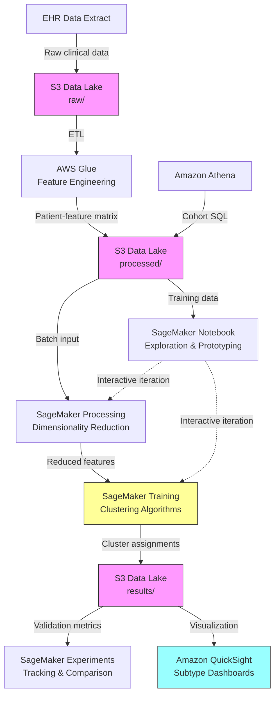

# Recipe 6.8: Disease Subtype Discovery

**Complexity:** Complex · **Phase:** Research/Clinical · **Estimated Cost:** Variable (compute-heavy)

---

## The Problem

Here's a dirty secret in medicine: many diseases we treat as single entities are actually collections of distinct conditions wearing the same name. "Type 2 diabetes" is not one disease. It's a label we slap on a heterogeneous group of metabolic dysfunctions that happen to share a common symptom (elevated blood glucose) but may have wildly different underlying mechanisms, progression patterns, and optimal treatments.

This isn't a theoretical concern. A patient with insulin-resistant Type 2 diabetes driven by visceral adiposity responds differently to metformin than a patient whose diabetes is primarily driven by beta-cell dysfunction. They both get the same ICD-10 code. They both get the same first-line treatment protocol. One of them responds well. The other doesn't, and we call that "treatment failure" when really it's "wrong treatment for this particular flavor of the disease."

The same story plays out across oncology (breast cancer has at least four molecular subtypes with different prognoses), psychiatry (major depressive disorder is almost certainly multiple distinct conditions), autoimmune diseases (lupus presents so differently across patients that clinicians joke it's a dozen diseases), and cardiology (heart failure with preserved ejection fraction is a grab-bag of distinct pathophysiologies).

The clinical impact is enormous. If you can identify meaningful subtypes within a disease population, you can:

- Match patients to treatments that actually work for their specific subtype
- Set realistic prognosis expectations (some subtypes progress faster)
- Design clinical trials that aren't diluted by heterogeneity (a drug that works for subtype A but not subtype B will fail a trial that mixes them)
- Identify biomarkers that distinguish subtypes early, before treatment failure reveals them

The challenge: these subtypes aren't labeled in your data. Nobody tagged patients as "Type 2 diabetes subtype 3." You have to discover the structure from the data itself. That's unsupervised learning, and it's one of the hardest problems in clinical informatics because there's no answer key to check your work against.

---

## The Technology: Unsupervised Clustering for Subtype Discovery

### What Is Unsupervised Clustering?

At its core, unsupervised clustering is the process of finding natural groupings in data without being told what the groups are. You hand the algorithm a bunch of patient records described by dozens or hundreds of features (lab values, vital signs, genetic markers, medication responses, comorbidities) and ask: "Are there distinct subgroups here that look meaningfully different from each other?"

The algorithm doesn't know what a "disease subtype" is. It doesn't know what diabetes is. It just finds regions of the feature space where patients cluster together, separated from other clusters by measurable gaps. Your job is to look at what the algorithm found and determine whether those clusters correspond to something clinically real.

This is fundamentally different from supervised learning (where you have labeled examples to learn from) and from rule-based stratification (where a clinician defines the tiers). Unsupervised discovery can find structure that humans haven't noticed yet. That's its power and its danger.

### The Clustering Algorithm Landscape

There's no single "best" clustering algorithm for disease subtype discovery. The right choice depends on your data characteristics and assumptions about cluster shape.

**K-Means and variants.** The workhorse. Partitions patients into K groups by minimizing within-cluster variance. Fast, scalable, interpretable. The catch: you have to specify K in advance (how many subtypes?), and it assumes roughly spherical clusters of similar size. For high-dimensional clinical data, those assumptions often don't hold. K-Means++ improves initialization; Mini-Batch K-Means handles large datasets.

**Gaussian Mixture Models (GMM).** A probabilistic generalization of K-Means. Instead of hard cluster assignments, each patient gets a probability of belonging to each cluster. This is valuable in medicine because patients often don't fit neatly into one subtype. A patient might be 70% subtype A and 30% subtype B. GMMs also handle elliptical (non-spherical) cluster shapes. The downside: more parameters to estimate, more sensitive to initialization, and model selection (choosing K) requires information criteria like BIC or AIC.

**Hierarchical clustering.** Builds a tree (dendrogram) of nested clusters, from individual patients up to the entire population. You can cut the tree at different levels to get different numbers of clusters. Useful for exploring structure at multiple granularities. Agglomerative (bottom-up) is more common than divisive (top-down). The downside: doesn't scale well beyond a few thousand patients without approximations, and the choice of linkage criterion (single, complete, Ward's) dramatically affects results.

**DBSCAN and density-based methods.** Finds clusters as dense regions separated by sparse regions. Doesn't require specifying K. Can find arbitrarily shaped clusters. Handles noise (patients that don't belong to any cluster). The downside: sensitive to the density threshold parameter (epsilon), and struggles with clusters of varying density, which is common in clinical data where some subtypes are rare.

**Spectral clustering.** Constructs a similarity graph between patients and partitions it using eigenvectors of the graph Laplacian. Can find non-convex cluster shapes that K-Means misses. Useful when the "similarity" between patients is better captured by a custom kernel than by Euclidean distance. The downside: computationally expensive for large populations, and the number of clusters still needs to be specified.

**Deep clustering (autoencoders + clustering).** Uses a neural network to learn a low-dimensional representation of patients, then clusters in that learned space. Can capture complex nonlinear relationships between features. Increasingly popular in genomics and multi-omics subtyping. The downside: less interpretable (what do the learned dimensions mean?), requires more data, and adds hyperparameter complexity.

### Why This Is Hard

Disease subtype discovery is not a standard clustering problem. Several factors make it uniquely challenging:

**No ground truth.** In a typical ML problem, you can evaluate your model against known correct answers. Here, the whole point is that the correct answers don't exist yet. You're proposing new categories. Validation requires clinical interpretation, external cohort replication, and ideally prospective studies showing that the subtypes predict different outcomes or treatment responses.

**Feature selection is everything.** Which patient attributes do you cluster on? Lab values? Genetic markers? Medication history? Comorbidities? Vital sign trajectories? The choice of features determines what kind of subtypes you'll find. Cluster on metabolic markers and you'll find metabolic subtypes. Cluster on genetic variants and you'll find genetic subtypes. These may or may not align. There's no objectively correct feature set; it depends on what clinical question you're trying to answer.

**Dimensionality.** Clinical datasets often have hundreds of features per patient. High-dimensional spaces are treacherous for clustering: distances become less meaningful (the "curse of dimensionality"), noise features dilute signal features, and visualization becomes impossible. Dimensionality reduction (PCA, UMAP, t-SNE, autoencoders) is almost always necessary, but each method makes different assumptions about what structure to preserve.

**Missing data.** Clinical data is notoriously incomplete. Not every patient has every lab test. Missingness is often informative (a test wasn't ordered because the clinician didn't suspect a condition). Simple imputation can introduce bias. Multiple imputation adds complexity. Some clustering methods handle missing data natively; most don't.

**Temporal complexity.** Diseases evolve over time. A patient's subtype might change as their condition progresses. Cross-sectional clustering (one snapshot per patient) misses this. Longitudinal clustering (trajectories over time) is more informative but dramatically more complex.

**Clinical meaningfulness.** Finding clusters is easy. Finding clusters that matter is hard. A clustering algorithm will always find groups if you ask it to. The question is whether those groups correspond to distinct biological mechanisms, different prognoses, or different treatment responses. Statistical separation is necessary but not sufficient for clinical relevance.

### Where the Field Has Moved

The last five years have seen significant advances:

**Multi-omics integration.** Combining genomics, transcriptomics, proteomics, and metabolomics data for subtyping. Methods like MOFA (Multi-Omics Factor Analysis) and similarity network fusion handle heterogeneous data types.

**Consensus clustering.** Running multiple clustering algorithms (or the same algorithm with different parameters) and identifying stable clusters that appear consistently. Reduces sensitivity to algorithmic choices.

**Deep phenotyping from EHR data.** Using the full richness of electronic health records (not just structured fields but also clinical notes via NLP) to build patient representations for clustering.

**Causal subtyping.** Moving beyond correlational clusters to identify subtypes with distinct causal mechanisms, often integrating Mendelian randomization or instrumental variable approaches.

**Federated subtype discovery.** Running clustering across multiple institutions without sharing patient-level data, enabling larger effective sample sizes while preserving privacy.

---

## General Architecture Pattern

The pipeline for disease subtype discovery follows a research-oriented workflow that's more iterative than a typical production ML pipeline:

```
[Cohort Definition] → [Feature Engineering] → [Dimensionality Reduction] →
[Clustering] → [Cluster Validation] → [Clinical Interpretation] →
[External Replication] → [Subtype Characterization]
```

**Cohort Definition.** Select the patient population. This sounds simple but involves critical decisions: which diagnosis codes define the disease? What's the minimum observation window? How do you handle patients with multiple qualifying conditions? Inclusion/exclusion criteria directly affect what subtypes you can discover.

**Feature Engineering.** Transform raw clinical data into a patient-feature matrix. Aggregate longitudinal data into summary statistics (mean HbA1c over 2 years, rate of eGFR decline, number of hospitalizations). Handle categorical variables (medications, comorbidities) via encoding. Normalize continuous features to prevent scale-dominant clustering.

**Dimensionality Reduction.** Reduce the feature space to a manageable number of dimensions while preserving meaningful structure. PCA for linear relationships, UMAP or t-SNE for nonlinear manifold structure, autoencoders for complex learned representations. The reduced space is where clustering happens.

**Clustering.** Apply one or more clustering algorithms to the reduced feature space. Run multiple algorithms and multiple parameter settings. Use ensemble/consensus approaches to identify robust clusters.

**Cluster Validation.** Assess cluster quality using internal metrics (silhouette score, Calinski-Harabasz index, Davies-Bouldin index) and stability metrics (bootstrap resampling, cross-validation). Determine the optimal number of clusters using elbow methods, gap statistics, or information criteria.

**Clinical Interpretation.** The most important step. Characterize each cluster by its distinguishing features. Are the clusters clinically coherent? Do they map to known biology? Do they predict different outcomes? This requires domain expertise and often iterative refinement.

**External Replication.** Validate discovered subtypes in an independent cohort. If the same clusters appear in a different population, they're more likely to reflect real biology rather than dataset-specific artifacts.

**Subtype Characterization.** For validated subtypes, build a complete clinical profile: demographics, biomarkers, comorbidity patterns, treatment responses, prognosis. Develop a classifier that can assign new patients to subtypes for prospective use.

---

## The AWS Implementation

### Why These Services

**Amazon SageMaker for the ML pipeline.** Subtype discovery is an iterative, compute-intensive research workflow. SageMaker provides managed Jupyter notebooks for exploration, built-in clustering algorithms (K-Means), support for custom algorithms via containers, distributed training for large cohorts, and experiment tracking via SageMaker Experiments. The notebook environment is where researchers spend most of their time, and SageMaker handles the infrastructure so they can focus on the science.

**Amazon S3 for data lake storage.** Clinical datasets for subtyping are large (thousands of patients, hundreds of features, often with longitudinal data) and come in multiple formats (Parquet for structured data, CSV exports from EHRs, FHIR bundles). S3 provides durable, encrypted storage with lifecycle policies for managing research data retention.

**AWS Glue for ETL and feature engineering.** Transforming raw EHR extracts into a clean patient-feature matrix requires significant data wrangling: joining tables, aggregating longitudinal records, encoding categoricals, handling missing values. Glue's serverless Spark environment handles this at scale without cluster management.

**Amazon Athena for cohort definition.** Defining the study cohort (which patients meet inclusion criteria) is a SQL problem. Athena lets researchers query the data lake directly with standard SQL, iterate on cohort definitions quickly, and export results to S3 for downstream processing.

**Amazon SageMaker Processing for batch computation.** Dimensionality reduction and consensus clustering are compute-intensive batch jobs. SageMaker Processing provides managed compute instances that spin up, run the job, and shut down. No idle infrastructure costs between experiments.

**Amazon QuickSight for visualization.** Communicating subtype characteristics to clinical stakeholders requires clear visualizations: cluster plots, feature distributions by subtype, outcome curves. QuickSight connects directly to S3/Athena results for interactive dashboards.

### Architecture Diagram



### Prerequisites

| Requirement | Details |
|-------------|---------|
| **AWS Services** | Amazon SageMaker, Amazon S3, AWS Glue, Amazon Athena, Amazon QuickSight |
| **IAM Permissions** | `sagemaker:*` (scoped to project), `s3:GetObject`, `s3:PutObject`, `glue:StartJobRun`, `athena:StartQueryExecution` |
| **BAA** | AWS BAA signed (patient clinical data is PHI) |
| **Encryption** | S3: SSE-KMS; SageMaker notebooks: EBS encryption; Glue: job bookmarks encrypted; all transit over TLS |
| **VPC** | SageMaker notebooks and processing jobs in private subnets with VPC endpoints for S3, SageMaker API, and CloudWatch Logs |
| **CloudTrail** | Enabled: log all data access for HIPAA audit trail |
| **Sample Data** | De-identified research datasets (MIMIC-IV for ICU populations, UK Biobank for chronic disease). Never use identifiable patient data without IRB approval. |
| **Cost Estimate** | Highly variable. Typical research project: $200-500/month (SageMaker notebooks + periodic processing jobs). Large-scale runs with GPU instances: $50-200 per experiment. |

### Ingredients

| AWS Service | Role |
|------------|------|
| **Amazon SageMaker** | ML experimentation, training, processing jobs |
| **Amazon S3** | Data lake for raw, processed, and result datasets |
| **AWS Glue** | ETL pipeline for feature engineering at scale |
| **Amazon Athena** | SQL-based cohort definition and ad-hoc queries |
| **Amazon QuickSight** | Visualization dashboards for clinical stakeholders |
| **AWS KMS** | Encryption key management for all data at rest |
| **Amazon CloudWatch** | Monitoring for long-running processing jobs |
| **SageMaker Experiments** | Tracking clustering runs, parameters, and metrics |

### Code

#### Walkthrough

**Step 1: Cohort definition.** Before any ML happens, you need to precisely define which patients are in your study population. This is a clinical decision with technical implementation. For diabetes subtyping, you might require: confirmed Type 2 diabetes diagnosis (ICD-10 E11.x), at least 2 years of continuous enrollment, age 30+ at diagnosis (to exclude likely Type 1 misclassifications), and no secondary diabetes causes. The cohort definition directly determines what subtypes you can discover. Too broad and you'll find subtypes that are really just different diseases mixed together. Too narrow and you'll miss rare but real subtypes. This step uses SQL against your clinical data warehouse.

```
FUNCTION define_cohort(data_lake_path):
    // Query the clinical data lake to identify eligible patients.
    // Each criterion is a deliberate clinical decision, not arbitrary filtering.
    
    query = """
        SELECT DISTINCT patient_id
        FROM diagnoses
        WHERE icd10_code LIKE 'E11%'           -- Type 2 diabetes diagnosis
          AND diagnosis_date >= '2020-01-01'    -- Recent enough for complete data
          AND patient_age_at_diagnosis >= 30    -- Exclude likely Type 1 misclassifications
        
        INTERSECT
        
        SELECT patient_id
        FROM enrollment
        WHERE continuous_months >= 24           -- Enough observation time for meaningful features
        
        EXCEPT
        
        SELECT patient_id
        FROM diagnoses
        WHERE icd10_code IN ('E08%', 'E09%')   -- Exclude drug-induced and post-procedural diabetes
    """
    
    // Execute against the data lake and save the cohort list
    cohort_ids = execute_query(query, output_path=data_lake_path + "/cohort/")
    
    RETURN cohort_ids
    // Typical result: 15,000-50,000 patients depending on your health system size
```

**Step 2: Feature engineering.** This is where clinical knowledge meets data engineering. You're transforming raw longitudinal records (thousands of lab results, vital signs, medication fills per patient) into a fixed-width feature vector that captures each patient's disease phenotype. The feature choices encode your hypothesis about what distinguishes subtypes. For metabolic subtyping, you might focus on: glycemic control trajectory, insulin resistance markers, beta-cell function indicators, lipid profiles, body composition, and comorbidity burden. Each feature needs careful aggregation (mean? trend? variability?) and normalization.

```
FUNCTION engineer_features(cohort_ids, data_lake_path):
    // For each patient in the cohort, compute a comprehensive feature vector.
    // These features encode our hypothesis about what distinguishes subtypes.
    
    features = empty matrix (rows = patients, columns = features)
    
    FOR each patient_id in cohort_ids:
        // Glycemic control features
        hba1c_values = get_lab_results(patient_id, test="HbA1c", window="2 years")
        features[patient_id]["hba1c_mean"]      = mean(hba1c_values)
        features[patient_id]["hba1c_trend"]      = linear_slope(hba1c_values)  // improving or worsening?
        features[patient_id]["hba1c_variability"] = coefficient_of_variation(hba1c_values)
        
        // Insulin resistance markers
        features[patient_id]["fasting_glucose_mean"] = mean(get_labs(patient_id, "fasting_glucose"))
        features[patient_id]["triglyceride_mean"]    = mean(get_labs(patient_id, "triglycerides"))
        features[patient_id]["homa_ir"]              = compute_homa_ir(patient_id)  // if insulin levels available
        
        // Beta-cell function indicators
        features[patient_id]["c_peptide"]         = latest(get_labs(patient_id, "c_peptide"))
        features[patient_id]["time_to_insulin"]   = months_from_diagnosis_to_first_insulin(patient_id)
        
        // Body composition
        features[patient_id]["bmi_mean"]          = mean(get_vitals(patient_id, "bmi"))
        features[patient_id]["bmi_trend"]         = linear_slope(get_vitals(patient_id, "bmi"))
        
        // Comorbidity burden
        features[patient_id]["n_comorbidities"]   = count_unique_chronic_conditions(patient_id)
        features[patient_id]["has_cvd"]           = has_diagnosis(patient_id, cardiovascular_codes)
        features[patient_id]["has_ckd"]           = has_diagnosis(patient_id, renal_codes)
        features[patient_id]["has_neuropathy"]    = has_diagnosis(patient_id, neuropathy_codes)
        
        // Treatment response (outcome-adjacent, use carefully)
        features[patient_id]["metformin_response"] = hba1c_change_after_medication(patient_id, "metformin")
        features[patient_id]["n_medication_classes"] = count_diabetes_med_classes(patient_id)
    
    // Handle missing values: multiple imputation for features missing < 30%,
    // drop features missing > 50% of values (too sparse to be informative)
    features = handle_missing_data(features, strategy="multiple_imputation", threshold=0.5)
    
    // Normalize all continuous features to zero mean, unit variance.
    // Without this, features on larger scales (glucose in mg/dL) dominate
    // features on smaller scales (HbA1c in %) during distance calculations.
    features = standardize(features, method="z_score")
    
    // Save the patient-feature matrix
    save_to_parquet(features, data_lake_path + "/features/patient_feature_matrix.parquet")
    
    RETURN features
```

**Step 3: Dimensionality reduction.** With 20-50 features per patient, direct clustering is feasible but noisy. Dimensionality reduction serves two purposes: it removes noise and redundancy (correlated features get collapsed), and it enables visualization (you can plot 2D or 3D projections to visually inspect cluster structure). PCA is the standard first pass because it's linear, deterministic, and interpretable (each component is a weighted combination of original features). UMAP provides better nonlinear structure preservation for visualization. Use both: PCA for the actual clustering input, UMAP for the plots you show clinicians.

```
FUNCTION reduce_dimensions(features):
    // Step 3a: PCA for clustering input
    // Retain enough components to explain 90% of variance.
    // This typically reduces 30-50 features down to 8-15 components.
    pca_model = fit_PCA(features, variance_threshold=0.90)
    pca_features = pca_model.transform(features)
    
    n_components = pca_features.n_columns
    // Log: "Retained {n_components} PCA components explaining 90% of variance"
    
    // Inspect component loadings to understand what each dimension captures.
    // Component 1 might be "overall metabolic severity"
    // Component 2 might be "insulin resistance vs. beta-cell failure axis"
    loadings = pca_model.get_loadings()
    save_loadings_report(loadings, "results/pca_loadings.csv")
    
    // Step 3b: UMAP for visualization (not for clustering input)
    // UMAP preserves local neighborhood structure, making clusters visually apparent.
    // n_neighbors controls local vs. global structure preservation.
    umap_2d = fit_UMAP(features, n_components=2, n_neighbors=30, min_dist=0.1)
    save_visualization(umap_2d, "results/umap_projection.png")
    
    RETURN pca_features, umap_2d
```

**Step 4: Consensus clustering.** Rather than betting on a single algorithm with a single parameter setting, consensus clustering runs many configurations and identifies clusters that are stable across them. The intuition: if two patients consistently end up in the same cluster regardless of which algorithm you use or how you perturb the data, they probably genuinely belong together. This is critical for subtype discovery because you need to convince clinicians (and reviewers, and the FDA) that your subtypes are real, not artifacts of a particular algorithmic choice.

```
FUNCTION consensus_clustering(pca_features, k_range):
    // Run multiple clustering approaches and find stable consensus.
    // k_range is typically [2, 3, 4, 5, 6, 7, 8] — we don't know how many subtypes exist.
    
    // Co-association matrix: tracks how often each pair of patients clusters together
    // across all runs. Size = n_patients x n_patients. Values range 0 to 1.
    n_patients = pca_features.n_rows
    co_association = zero_matrix(n_patients, n_patients)
    n_runs = 0
    
    FOR each k in k_range:
        // Run K-Means with multiple random initializations
        FOR iteration in 1 to 50:
            // Subsample 80% of patients (bootstrap stability)
            subsample_idx = random_sample(n_patients, fraction=0.80)
            subsample_data = pca_features[subsample_idx]
            
            labels = fit_kmeans(subsample_data, k=k, random_seed=iteration)
            
            // Update co-association: patients in the same cluster get +1
            FOR each pair (i, j) in subsample_idx:
                IF labels[i] == labels[j]:
                    co_association[i][j] += 1
            n_runs += 1
        
        // Also run Gaussian Mixture Model for this k
        FOR iteration in 1 to 20:
            subsample_idx = random_sample(n_patients, fraction=0.80)
            subsample_data = pca_features[subsample_idx]
            
            labels = fit_gmm(subsample_data, n_components=k, random_seed=iteration)
            
            FOR each pair (i, j) in subsample_idx:
                IF labels[i] == labels[j]:
                    co_association[i][j] += 1
            n_runs += 1
    
    // Normalize co-association matrix to [0, 1]
    co_association = co_association / n_runs
    
    // Final clustering on the co-association matrix itself.
    // Hierarchical clustering with average linkage works well here.
    // The co-association matrix IS the similarity measure.
    final_labels = hierarchical_cluster(co_association, method="average")
    
    RETURN co_association, final_labels
```

**Step 5: Determine optimal cluster count.** How many subtypes exist? This is the million-dollar question, and there's no single correct answer. Multiple metrics provide different perspectives. The Silhouette score measures how well-separated clusters are. The Calinski-Harabasz index rewards compact, well-separated clusters. The gap statistic compares your clustering to a null (random) distribution. Consensus matrix heatmaps show whether the co-association matrix has clean block-diagonal structure. Ultimately, the "right" number of clusters is the one that's both statistically supported AND clinically interpretable.

```
FUNCTION determine_optimal_k(pca_features, co_association, k_range):
    // Compute multiple metrics for each candidate k.
    // No single metric is definitive; look for convergence across metrics.
    
    metrics = empty table (columns: k, silhouette, calinski_harabasz, gap_statistic, bic)
    
    FOR each k in k_range:
        labels = cut_dendrogram(co_association, k=k)
        
        // Silhouette: ranges -1 to 1. Higher = better separated clusters.
        // Values > 0.5 indicate reasonable structure. > 0.7 is strong.
        sil = silhouette_score(pca_features, labels)
        
        // Calinski-Harabasz: ratio of between-cluster to within-cluster variance.
        // Higher is better. Look for a peak or elbow.
        ch = calinski_harabasz_score(pca_features, labels)
        
        // Gap statistic: compares clustering quality to random expectation.
        // Choose smallest k where gap(k) >= gap(k+1) - standard_error(k+1)
        gap = gap_statistic(pca_features, labels, n_references=50)
        
        // BIC from GMM fit: penalizes model complexity.
        // Lower is better. Balances fit quality against number of parameters.
        gmm = fit_gmm(pca_features, n_components=k)
        bic = gmm.bic(pca_features)
        
        metrics.add_row(k, sil, ch, gap, bic)
    
    // Present all metrics to the research team. The final decision is clinical.
    save_metrics_report(metrics, "results/cluster_count_metrics.csv")
    plot_metrics(metrics, "results/cluster_count_plots.png")
    
    // Automated suggestion (can be overridden by clinical judgment):
    optimal_k = k with highest silhouette score among those with gap statistic support
    
    RETURN optimal_k, metrics
```

**Step 6: Cluster validation and characterization.** Once you've settled on a cluster count, you need to validate that the clusters are stable and characterize what makes each one distinct. Stability testing uses bootstrap resampling: if you perturb the data slightly, do the same clusters appear? Feature importance analysis identifies which clinical features most strongly distinguish each cluster. Outcome association tests whether clusters predict different clinical trajectories.

```
FUNCTION validate_and_characterize(features, labels, outcomes):
    // Stability assessment: bootstrap the cohort and re-cluster.
    // Measure how consistently patients are assigned to the same cluster.
    stability_scores = empty list
    FOR iteration in 1 to 100:
        bootstrap_idx = random_sample_with_replacement(n_patients)
        bootstrap_labels = recluster(features[bootstrap_idx])
        
        // Adjusted Rand Index: 1.0 = perfect agreement, 0 = random
        ari = adjusted_rand_index(labels[bootstrap_idx], bootstrap_labels)
        stability_scores.append(ari)
    
    mean_stability = mean(stability_scores)
    // ARI > 0.8 indicates strong stability. < 0.6 is concerning.
    log("Cluster stability (mean ARI): {mean_stability}")
    
    // Feature importance: which features distinguish clusters?
    // Use Kruskal-Wallis test (non-parametric ANOVA) for each feature across clusters.
    feature_importance = empty table
    FOR each feature_name in features.columns:
        groups = [features[feature_name][labels == k] for k in unique(labels)]
        h_stat, p_value = kruskal_wallis_test(groups)
        effect_size = eta_squared(groups)
        feature_importance.add_row(feature_name, h_stat, p_value, effect_size)
    
    // Sort by effect size to identify the most discriminating features
    feature_importance = sort_by(feature_importance, "effect_size", descending=True)
    
    // Outcome association: do clusters predict different trajectories?
    // Test against clinically meaningful outcomes.
    outcome_tests = empty table
    FOR each outcome in ["time_to_insulin", "hba1c_at_3_years", "cvd_event", "ckd_progression"]:
        IF outcome is continuous:
            stat, p = kruskal_wallis_test(outcomes[outcome] grouped by labels)
        ELSE:  // binary outcome
            stat, p = chi_squared_test(outcomes[outcome] vs labels)
        outcome_tests.add_row(outcome, stat, p)
    
    // Generate cluster profiles: median values of top features per cluster
    cluster_profiles = empty table
    FOR each k in unique(labels):
        cluster_patients = features[labels == k]
        profile = compute_medians_and_iqr(cluster_patients, top_features)
        cluster_profiles.add_row(k, count=len(cluster_patients), profile)
    
    RETURN {
        stability: mean_stability,
        feature_importance: feature_importance,
        outcome_associations: outcome_tests,
        cluster_profiles: cluster_profiles
    }
```

> **Curious how this looks in Python?** The pseudocode above covers the concepts. If you'd like to see sample Python code that demonstrates these patterns using boto3 and scikit-learn, check out the [Python Example](chapter06.08-python-example). It walks through each step with inline comments and notes on what you'd need to change for a real deployment.

### Expected Results

**Sample output for a Type 2 diabetes subtyping study (illustrative, not from a real study):**

```json
{
  "study_id": "t2d-subtype-discovery-2026-03",
  "cohort_size": 23847,
  "optimal_k": 4,
  "cluster_stability_ari": 0.82,
  "subtypes": [
    {
      "cluster_id": 0,
      "n_patients": 8234,
      "label": "Insulin-Resistant Obesity-Driven",
      "distinguishing_features": ["high BMI", "high triglycerides", "high HOMA-IR", "preserved C-peptide"],
      "median_hba1c": 7.8,
      "median_bmi": 34.2,
      "metformin_response": "good"
    },
    {
      "cluster_id": 1,
      "n_patients": 6102,
      "label": "Age-Related Beta-Cell Decline",
      "distinguishing_features": ["older age", "low C-peptide", "rapid HbA1c rise", "normal BMI"],
      "median_hba1c": 8.4,
      "median_bmi": 26.1,
      "metformin_response": "poor"
    },
    {
      "cluster_id": 2,
      "n_patients": 5891,
      "label": "Mild Metabolic Syndrome",
      "distinguishing_features": ["borderline HbA1c", "high variability", "multiple comorbidities"],
      "median_hba1c": 7.1,
      "median_bmi": 30.5,
      "metformin_response": "moderate"
    },
    {
      "cluster_id": 3,
      "n_patients": 3620,
      "label": "Severe Insulin-Deficient",
      "distinguishing_features": ["very low C-peptide", "early insulin need", "low BMI", "autoimmune markers"],
      "median_hba1c": 9.2,
      "median_bmi": 24.8,
      "metformin_response": "poor"
    }
  ]
}
```

**Performance benchmarks:**

| Metric | Typical Value |
|--------|---------------|
| Feature engineering (Glue job) | 15-45 minutes for 25K patients |
| PCA + UMAP reduction | 2-5 minutes |
| Consensus clustering (full run) | 1-4 hours depending on cohort size and k_range |
| Silhouette score (good result) | 0.4-0.7 (clinical data rarely exceeds 0.7) |
| Cluster stability (ARI) | > 0.75 for publishable results |
| End-to-end experiment | 4-8 hours including all validation |
| Cost per full experiment run | $50-150 (SageMaker compute) |

**Where it struggles:** Diseases with continuous spectra rather than discrete subtypes (the clusters are real but boundaries are fuzzy). Small cohorts (< 1,000 patients) where statistical power is insufficient. Populations with strong confounders (age, sex, race) that dominate the clustering unless carefully handled. And the ever-present challenge: clusters that are statistically robust but clinically uninterpretable.

---

## The Honest Take

Disease subtype discovery is one of those problems where the ML part is actually the easy part. You can get clusters out of any dataset. The hard part is everything around it.

The feature selection problem haunts you. I've seen teams spend six months building a beautiful clustering pipeline only to realize their feature set was encoding treatment patterns rather than disease biology. Patients clustered by "which medications they were prescribed" rather than "what's biologically different about their disease." Those are correlated, but they're not the same thing, and the distinction matters enormously for clinical utility.

The validation problem is genuinely unsolved in a satisfying way. Internal metrics (silhouette, stability) tell you the clusters are statistically real. They don't tell you the clusters are clinically meaningful. The only true validation is prospective: assign new patients to subtypes and show that subtype-specific treatment works better than one-size-fits-all. That takes years and a clinical trial. Most subtyping papers stop at "we found clusters and they have different outcomes," which is suggestive but not definitive.

The reproducibility problem is real. Run the same pipeline on a different health system's data and you might find different subtypes. Is that because the populations are genuinely different, or because your method is sensitive to data collection practices, coding patterns, and population demographics? Usually it's some of both, and disentangling them is painful.

The thing that surprised me most: the number of clusters matters less than you'd think. Whether diabetes has 4 subtypes or 5 or 6 is less important than whether the coarsest distinction (say, insulin-resistant vs. insulin-deficient) is actionable. Start with the biggest, most robust split and work your way to finer distinctions only if the coarse ones prove clinically useful.

One more honest note: this is research-grade work. Don't promise your clinical leadership that you'll have actionable subtypes in six months. The pipeline takes weeks to build. The clinical validation takes months to years. The regulatory path to using subtypes in clinical decision-making is unclear. Set expectations accordingly.

---

## Variations and Extensions

**Multi-omics subtyping.** Integrate genomic data (SNP arrays, whole-genome sequencing) with clinical features for biologically grounded subtypes. Use methods like similarity network fusion (SNF) or multi-omics factor analysis (MOFA) to combine heterogeneous data types. This dramatically increases the chance of finding mechanistically distinct subtypes but requires genomic data that most health systems don't routinely collect.

**Longitudinal trajectory clustering.** Instead of clustering patients by their average feature values, cluster by their disease trajectories over time. Use methods like group-based trajectory modeling (GBTM) or latent class growth analysis (LCGA). This captures the dynamic nature of disease: two patients might have the same HbA1c today but very different trajectories (one stable, one rapidly worsening). Requires longer observation windows and more complex modeling.

**Federated subtype discovery.** Run the clustering across multiple institutions without sharing patient-level data. Each site computes local statistics or embeddings; a central coordinator aggregates them into a global clustering. This enables larger effective sample sizes (critical for rare subtypes) while preserving privacy. Technically challenging but increasingly important as health data networks grow.

---

## Related Recipes

- **Recipe 6.4 (Disease Severity Stratification):** Supervised stratification into known severity tiers; complementary to unsupervised subtype discovery
- **Recipe 6.6 (Patient Similarity for Care Planning):** Uses similar distance metrics but for individual patient matching rather than population-level subtyping
- **Recipe 6.10 (Multi-Morbidity Pattern Discovery):** Discovers co-occurring condition clusters; subtypes within a single disease vs. patterns across diseases
- **Recipe 7.3 (Treatment Response Prediction):** Once subtypes are established, predicting which treatment works for which subtype
- **Recipe 13.2 (Disease Ontology Mapping):** Knowledge graph approaches to representing discovered subtypes within existing disease taxonomies

---

## Additional Resources

**AWS Documentation:**
- [Amazon SageMaker Developer Guide](https://docs.aws.amazon.com/sagemaker/latest/dg/whatis.html)
- [SageMaker Built-in K-Means Algorithm](https://docs.aws.amazon.com/sagemaker/latest/dg/k-means.html)
- [SageMaker Processing Jobs](https://docs.aws.amazon.com/sagemaker/latest/dg/processing-job.html)
- [SageMaker Experiments](https://docs.aws.amazon.com/sagemaker/latest/dg/experiments.html)
- [AWS Glue Developer Guide](https://docs.aws.amazon.com/glue/latest/dg/what-is-glue.html)
- [Amazon Athena User Guide](https://docs.aws.amazon.com/athena/latest/ug/what-is.html)
- [AWS HIPAA Eligible Services](https://aws.amazon.com/compliance/hipaa-eligible-services-reference/)
- [Architecting for HIPAA on AWS](https://docs.aws.amazon.com/whitepapers/latest/architecting-hipaa-security-and-compliance-on-aws/welcome.html)

**AWS Sample Repos:**
- [`amazon-sagemaker-examples`](https://github.com/aws/amazon-sagemaker-examples): Comprehensive SageMaker examples including clustering and unsupervised learning notebooks
- [`aws-healthcare-lifescience-ai-ml`](https://github.com/aws-samples/aws-healthcare-lifescience-ai-ml): Healthcare and life sciences AI/ML examples on AWS

<!-- TODO: Verify these repos still exist and contain relevant clustering examples -->

**AWS Solutions and Blogs:**
- [AWS for Health](https://aws.amazon.com/health/): Overview of AWS healthcare solutions and compliance
- [Machine Learning Blog](https://aws.amazon.com/blogs/machine-learning/): Search for "clustering" and "healthcare" for relevant case studies

---

## Estimated Implementation Time

| Phase | Duration |
|-------|----------|
| **Basic** (single algorithm, single disease, exploratory) | 3-4 weeks |
| **Production-ready** (consensus clustering, validation suite, reproducible pipeline) | 2-3 months |
| **With variations** (multi-omics, longitudinal, federated) | 6-12 months |

---

**Tags:** `unsupervised-learning` `clustering` `disease-subtyping` `precision-medicine` `phenotyping` `cohort-analysis` `research` `sagemaker` `complex`

---

*[← Previous: 6.7 Clinical Trial Patient Matching](chapter06.07-clinical-trial-patient-matching) · [Chapter 6 Index](chapter06-index) · [Next: 6.9 Social Determinant Phenotyping →](chapter06.09-social-determinant-phenotyping)*
