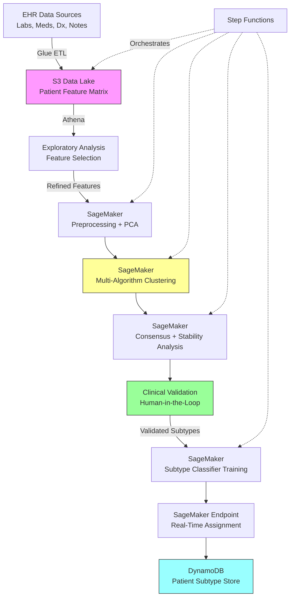

# Recipe 6.8: Disease Subtype Discovery

**Complexity:** Complex · **Phase:** Research/Innovation · **Estimated Cost:** ~$2.00–$8.00 per patient in the analysis cohort (depending on feature dimensionality and compute requirements)

---

## The Problem

A health system has 14,000 patients with a diagnosis of heart failure. They're all coded HFrEF or HFpEF. They all get guideline-directed medical therapy. And yet: some respond beautifully to beta-blockers while others don't. Some progress to transplant evaluation within two years while others remain stable for a decade. Some have readmission rates of 40% while others never come back.

The clinical intuition is obvious: "heart failure" is not one disease. It's a collection of diseases that happen to share a final common pathway (the heart can't pump effectively). Cardiologists know this. They talk about ischemic vs. non-ischemic, about infiltrative cardiomyopathies, about hypertensive heart disease. But the current taxonomy is based on mechanism of injury and ejection fraction. It doesn't capture the full heterogeneity of how these patients actually behave.

This isn't unique to heart failure. Type 2 diabetes, COPD, depression, sepsis, asthma, Parkinson's disease: all of these are "umbrella diagnoses" that likely contain distinct biological subtypes with different trajectories and different optimal treatments. The Lancet published a landmark study in 2018 (Ahlqvist et al., The Lancet Diabetes & Endocrinology) identifying five distinct clusters within Type 2 diabetes, each with different progression patterns and complication risks. That study used unsupervised clustering on six clinical variables across 8,980 patients. The subtypes they found predicted outcomes better than the traditional classification.

The promise of disease subtype discovery is precision medicine at the population level. If you can identify that your 14,000 heart failure patients actually fall into six distinct phenotypic clusters, and that Cluster 3 responds poorly to standard beta-blocker therapy but responds well to SGLT2 inhibitors, you've just generated a hypothesis that could change treatment protocols. If Cluster 5 has a 60% readmission rate while the others average 15%, you've identified a group that needs intensive care management.

The challenge: there are no labels. Nobody has pre-defined what the subtypes are. That's the whole point. You're using unsupervised learning to discover structure that the existing taxonomy doesn't capture. And that means you have no ground truth to validate against, no accuracy metric to optimize, and no way to know if the clusters you found are clinically meaningful until a physician looks at them and says "yes, these are real."

This is research-grade work. It requires clinical collaboration from day one, rigorous statistical validation, and the intellectual honesty to admit when your clusters are artifacts of data quality rather than biology.

<!-- TODO (TechWriter): Expert review A2 (HIGH). Add paragraph on IRB/ethics review requirements: research vs. QI classification, IRB timeline (4-12 weeks), and implication for the "Basic" implementation estimate. Disease subtype discovery using patient data typically requires IRB review before accessing real patient data. -->

---

## The Technology: How Unsupervised Clustering Discovers Disease Subtypes

### What Unsupervised Clustering Actually Does

Let's start from first principles. Supervised learning has labels: you know the answer and you're training a model to predict it. Unsupervised clustering has no labels. You're handing the algorithm a pile of patient data and asking: "Are there natural groupings here that I haven't noticed?"

The algorithm looks at each patient as a point in high-dimensional space. If you have 50 clinical features per patient (labs, vitals, medications, comorbidities, demographics), each patient is a point in 50-dimensional space. Clustering algorithms find regions of that space where patients are densely packed together and separated from other dense regions by relative emptiness.

The intuition: if patients in one region of the space share similar lab patterns, similar medication responses, and similar outcomes, they might represent a coherent biological subtype. The "might" is doing a lot of work in that sentence, and we'll come back to it.

### The Feature Engineering Problem

This is where disease subtype discovery diverges from standard clustering applications. In geographic clustering, your features are obvious (latitude, longitude). In disease subtype discovery, feature selection is the entire ballgame.

Consider heart failure. What features might distinguish subtypes?

**Clinical measurements:** Ejection fraction, BNP/NT-proBNP levels, troponin, creatinine, hemoglobin, sodium, potassium, liver function tests, thyroid function. Each measured at what time point? Baseline? Trajectory over time? Peak value? Rate of change?

**Comorbidity profiles:** Diabetes, hypertension, atrial fibrillation, chronic kidney disease, COPD, obesity, sleep apnea, anemia. Binary presence/absence? Or severity-weighted?

**Medication response:** Which drugs were tried? Which were tolerated? Which produced measurable improvement? This is retrospective observational data, not randomized trial data, so confounding is everywhere.

**Functional status:** NYHA class, 6-minute walk distance, quality of life scores. Often sparsely documented.

**Imaging features:** LV dimensions, wall motion abnormalities, valve disease, RV function. Requires structured extraction from echo reports.

**Genomic data:** If available. Usually it's not, outside of research cohorts.

The choices you make here determine what subtypes you can possibly find. If you only include lab values, you'll find lab-based subtypes. If you only include comorbidities, you'll find comorbidity-based subtypes. The subtypes are not "in the data" waiting to be discovered. They're a function of which data you choose to look at and how you represent it.

This is why you absolutely need clinical collaboration from day one. A data scientist working alone will make feature choices that seem reasonable but miss clinically important distinctions. A cardiologist will tell you that the ratio of BNP to creatinine matters more than either value alone, or that the trajectory of ejection fraction over the first 90 days after diagnosis is more informative than the baseline value.

### Choosing a Clustering Algorithm

There's no single "best" algorithm for disease subtype discovery. The choice depends on your assumptions about cluster shape, your tolerance for specifying the number of clusters in advance, and your data characteristics.

**K-means** is the simplest and most widely used. It assumes clusters are roughly spherical (equal variance in all directions) and requires you to specify K (the number of clusters) in advance. It's fast, scales well, and produces interpretable results. Its weakness: real disease subtypes are rarely spherical in feature space. If one subtype is defined by a tight range of BNP values but a wide range of ejection fractions, K-means will struggle.

**Gaussian Mixture Models (GMM)** generalize K-means by allowing elliptical clusters (different variances in different directions). They also provide soft assignments: instead of "this patient belongs to Cluster 3," you get "this patient has 72% probability of Cluster 3 and 28% probability of Cluster 1." That probabilistic assignment is clinically useful because many patients are genuinely on the boundary between subtypes.

**Hierarchical clustering** builds a tree (dendrogram) of nested clusters, from individual patients up to the entire population. You can cut the tree at different levels to get different numbers of clusters. The advantage: you can visualize the full hierarchy and see which subtypes are "close" to each other. The disadvantage: it doesn't scale well beyond a few thousand patients without approximation methods.

**DBSCAN and HDBSCAN** find clusters of arbitrary shape and automatically identify outliers (patients who don't fit any cluster). They don't require you to specify the number of clusters. The disadvantage: they're sensitive to their density parameters, and in high-dimensional clinical data, the concept of "density" becomes unreliable (the curse of dimensionality).

**Spectral clustering** works by building a similarity graph between patients and finding communities in that graph. It handles non-convex cluster shapes well. It's computationally expensive for large populations but produces excellent results when the underlying structure is complex.

**Consensus clustering** (also called ensemble clustering) runs multiple clustering algorithms (or the same algorithm with different parameters) and identifies groupings that are stable across runs. If patients consistently end up in the same cluster regardless of algorithm choice or random initialization, that's evidence the cluster is real rather than an artifact. This is the gold standard for disease subtype discovery in research settings.

For a first pass, I'd recommend: run K-means, GMM, and hierarchical clustering across a range of K values (3 through 10). Use consensus clustering to identify which groupings are stable. Then validate the stable clusters clinically.

### Dimensionality Reduction

If you have 50 or 100 clinical features, clustering directly in that space is problematic. The curse of dimensionality means that distance metrics become less meaningful as dimensions increase. Points that are "close" in 100-dimensional space may not be meaningfully similar.

**PCA (Principal Component Analysis)** projects the data onto the directions of maximum variance. If 90% of the variance in your 50 features can be captured by 8 principal components, you can cluster in 8 dimensions instead of 50. The downside: principal components are linear combinations of original features, which makes them hard to interpret clinically. "PC3 = 0.4 * BNP + 0.3 * creatinine - 0.2 * ejection fraction" is not something a cardiologist can act on.

**UMAP (Uniform Manifold Approximation and Projection)** is a non-linear dimensionality reduction technique that preserves local structure. It's excellent for visualization (projecting patients into 2D for plotting) and can reveal cluster structure that PCA misses. But it's stochastic (different runs produce different layouts) and the distances in UMAP space are not directly interpretable.

**Autoencoders** (neural network-based dimensionality reduction) learn a compressed representation of the patient data. They can capture non-linear relationships that PCA misses. The latent space of an autoencoder can be used as input to clustering. The downside: they're black boxes, and explaining why two patients ended up in the same cluster becomes harder.

For disease subtype discovery, I'd recommend: use PCA for initial exploration and to determine how many dimensions carry meaningful variance. Use UMAP for visualization. Cluster in the PCA-reduced space (or the original space if dimensionality is manageable). Use the UMAP visualization to sanity-check whether the clusters look coherent.

### Validation: The Hard Part

Here's the fundamental challenge of unsupervised disease subtype discovery: how do you know the clusters are real?

**Internal validation metrics** tell you whether your clusters are well-formed, without needing external labels to compare against:
- Silhouette score: How similar is each patient to their own cluster vs. the nearest other cluster? Ranges from -1 to 1; higher is better.
- Calinski-Harabasz index: Ratio of between-cluster variance to within-cluster variance. Higher means more separated clusters.
- Davies-Bouldin index: Average similarity between each cluster and its most similar cluster. Lower is better.

These metrics tell you whether the clusters are well-separated in feature space. They do not tell you whether the clusters are clinically meaningful. A clustering that perfectly separates patients by age and sex will have excellent internal metrics but zero clinical novelty.

**Stability validation** tests whether the clusters are robust:
- Bootstrap resampling: Resample patients with replacement, re-cluster, and measure how often the same patients end up together. Stable clusters survive resampling.
- Feature perturbation: Add noise to features or drop features and re-cluster. Robust clusters survive perturbation.
- Algorithm variation: Do different algorithms find the same groupings? Consensus clustering formalizes this.

**Clinical validation** is the only validation that ultimately matters:
- Do the clusters have different outcomes (mortality, readmission, progression)?
- Do the clusters have different treatment responses?
- Can a clinician look at the cluster profiles and say "yes, I recognize these patients"?
- Do the clusters suggest actionable differences in care?

If your clusters have beautiful silhouette scores but identical outcomes across groups, they're not clinically useful subtypes. If they have mediocre silhouette scores but dramatically different 5-year mortality rates, they might be the most important finding in your dataset.

### The General Architecture Pattern

```
[Cohort Definition] → [Feature Extraction] → [Preprocessing] → [Dimensionality Reduction]
    → [Multi-Algorithm Clustering] → [Consensus/Stability Analysis]
    → [Clinical Validation] → [Subtype Characterization] → [Deployment/Monitoring]
```

**Cohort definition:** Select the patient population. All patients with a specific diagnosis code? Only those with sufficient data completeness? Only those with a minimum follow-up period? These choices affect what subtypes you can find.

**Feature extraction:** Pull clinical features from EHR data. This requires joining across multiple data domains (labs, medications, diagnoses, procedures, notes). Handle missingness explicitly: impute, exclude, or use algorithms that handle missing data natively.

**Preprocessing:** Normalize features to comparable scales. Handle outliers. Encode categorical variables. This step has outsized impact on results because clustering algorithms are sensitive to feature scaling.

**Dimensionality reduction:** Reduce feature space to a manageable number of dimensions while preserving meaningful variance.

**Multi-algorithm clustering:** Run multiple algorithms across multiple K values. Don't commit to a single algorithm or a single K.

**Consensus/stability analysis:** Identify which groupings are robust across algorithms, initializations, and resampling.

**Clinical validation:** Evaluate discovered clusters against outcomes, treatment responses, and clinical interpretability. This is a human-in-the-loop step that cannot be automated.

**Subtype characterization:** For validated clusters, describe the defining features in clinically actionable terms. "Cluster 3 is characterized by preserved ejection fraction, elevated BNP, high comorbidity burden (diabetes + CKD), and poor response to beta-blockers" is actionable. "Cluster 3 has high values on PC2" is not.

**Deployment/monitoring:** If subtypes are validated and actionable, build a classifier that assigns new patients to discovered subtypes. Monitor for drift as the patient population changes over time.

---

## The AWS Implementation

### Why These Services

**Amazon SageMaker for ML compute and experimentation.** Disease subtype discovery is inherently iterative. You'll run dozens of clustering experiments with different feature sets, algorithms, and parameters before finding stable, clinically meaningful subtypes. SageMaker provides managed Jupyter notebooks for exploration, built-in implementations of K-means and PCA, and the ability to bring custom algorithms (GMM, HDBSCAN, consensus clustering) in containers. The experiment tracking in SageMaker Experiments lets you compare runs systematically rather than losing track of which parameter combination produced which result.

<!-- TODO (TechWriter): Expert review S2 (MEDIUM). Add note on SageMaker notebook hardening for research workloads: recommend SageMaker Studio with domain-level VPC config, disable root access on notebook instances, use lifecycle configurations to restrict pip/conda to approved package mirrors, and enable notebook audit logging. Research workflows with interactive PHI access have higher risk than automated pipelines. -->

**Amazon S3 for data lake storage.** The feature extraction pipeline pulls from multiple source systems (labs, medications, diagnoses, notes) and materializes a patient-feature matrix that may be hundreds of megabytes to several gigabytes. S3 provides durable, encrypted storage for both the raw extracted features and the intermediate/final clustering results. Versioning lets you reproduce any analysis from any point in time.

<!-- TODO (TechWriter): Expert review S3 (MEDIUM). Add note on data retention: implement S3 lifecycle policies for experiment artifacts (transition to Glacier after retention period, delete after maximum retention). Maintain a manifest of patient IDs per experiment to support HIPAA amendment and accounting-of-disclosures requests. -->

**AWS Glue for ETL and feature extraction.** Building the patient-feature matrix requires joining across multiple data domains, handling temporal logic (which lab value to use when there are multiple?), and applying business rules (how to encode medication history). Glue's Spark-based ETL handles this at scale, and the Glue Data Catalog provides schema management for the feature tables.

**Amazon Athena for ad-hoc exploration.** Before committing to a feature set, you need to explore the data: check distributions, identify missingness patterns, understand correlations. Athena lets you query the feature tables in S3 with standard SQL without provisioning any infrastructure.

**Amazon DynamoDB for subtype assignment storage.** Once subtypes are validated and a classifier is built, new patients need to be assigned to subtypes in real time. DynamoDB provides low-latency lookups by patient ID for downstream systems (care management platforms, clinical decision support) that need to know a patient's subtype.

**AWS Step Functions for pipeline orchestration.** The full pipeline (extract features, preprocess, reduce dimensions, cluster, validate, characterize) has multiple stages with dependencies. Step Functions orchestrates this as a state machine with error handling, retries, and audit logging. The clinical validation step uses Step Functions' callback pattern (`.waitForTaskToken`): the state machine pauses, sends a notification to the clinical review team with the cluster characterization report, and resumes when the clinician approves or requests re-analysis with different parameters.

### Architecture Diagram



### Prerequisites

| Requirement | Details |
|-------------|---------|
| **AWS Services** | Amazon SageMaker, Amazon S3, AWS Glue, Amazon Athena, Amazon DynamoDB, AWS Step Functions, AWS KMS |
| **IAM Permissions** | `sagemaker:CreateTrainingJob`, `sagemaker:CreateEndpoint`, `s3:GetObject`, `s3:PutObject`, `glue:StartJobRun`, `athena:StartQueryExecution`, `dynamodb:PutItem`, `dynamodb:GetItem`, `states:StartExecution`. Scope all permissions to specific resource ARNs (e.g., `s3:GetObject` on `arn:aws:s3:::patient-features-bucket/cohort-*`). |
| **BAA** | AWS BAA signed (patient clinical data is PHI) |
| **Encryption** | S3: SSE-KMS; DynamoDB: encryption at rest; SageMaker: KMS-encrypted volumes and endpoints; Glue: KMS for job bookmarks and temp storage; all transit over TLS |
| **VPC** | SageMaker notebooks and training jobs in VPC with VPC endpoints for S3, DynamoDB, and SageMaker API. No internet egress for PHI workloads. Configure Glue connections with VPC subnet and security group for jobs accessing VPC-resident data sources (EHR databases, data warehouses). |
| **CloudTrail** | Enabled for all service API calls. SageMaker experiment tracking provides additional audit of model lineage. |
| **Sample Data** | Synthetic patient cohort with clinical features. MIMIC-IV (PhysioNet) provides realistic ICU patient data for development. Never use real PHI in dev/research without IRB approval. |
| **Cost Estimate** | Glue ETL: ~$0.44/DPU-hour. SageMaker ml.m5.xlarge notebook: ~$0.23/hr. Training jobs (ml.m5.4xlarge): ~$0.92/hr. Expect 20-50 hours of compute for a full exploration cycle. |

### Ingredients

| AWS Service | Role |
|------------|------|
| **Amazon SageMaker** | ML experimentation, clustering algorithms, model training, real-time inference endpoint |
| **Amazon S3** | Stores patient feature matrices, intermediate results, model artifacts, and cluster characterizations |
| **AWS Glue** | ETL pipeline to extract and join clinical features from source systems into patient-feature matrix |
| **Amazon Athena** | SQL-based exploration of feature distributions, missingness, and correlations |
| **Amazon DynamoDB** | Low-latency storage of patient subtype assignments for downstream consumption |
| **AWS Step Functions** | Orchestrates the multi-stage pipeline with error handling and audit trail |
| **AWS KMS** | Encryption key management for all data at rest |
| **Amazon CloudWatch** | Monitoring, logging, and alerting for pipeline health and drift detection |

### Code

> **Reference implementations:** The following AWS sample repos demonstrate patterns used in this recipe:
>
> - [`amazon-sagemaker-examples`](https://github.com/aws/amazon-sagemaker-examples): Comprehensive SageMaker examples including built-in K-means, PCA, and custom algorithm containers
> - [`aws-healthcare-lifescience-ai-ml`](https://github.com/aws-samples/aws-healthcare-lifescience-ai-ml): Healthcare-specific ML examples on AWS including patient cohort analysis patterns

#### Walkthrough

**Step 1: Define the cohort.** Before any clustering happens, you need a clean, well-defined patient population. This means selecting patients with the target diagnosis, applying minimum data completeness thresholds, and defining the observation window. A cohort with 40% missing lab values will produce clusters driven by missingness patterns rather than biology. This step also handles temporal alignment: for each patient, define a "index date" (diagnosis date, first encounter, etc.) and extract features relative to that anchor. Skip this step and your clusters will reflect data availability rather than disease biology.

```
FUNCTION define_cohort(diagnosis_codes, min_data_completeness, observation_window):
    // Select all patients with the target diagnosis within the study period.
    // diagnosis_codes: list of ICD-10 codes defining the disease (e.g., I50.x for heart failure)
    // min_data_completeness: minimum fraction of required features that must be non-null (e.g., 0.7)
    // observation_window: how far back/forward from index date to look for features (e.g., 365 days)

    candidates = query patients WHERE any diagnosis IN diagnosis_codes
                 AND diagnosis_date BETWEEN study_start AND study_end

    // For each candidate, determine their index date (first qualifying diagnosis)
    FOR each patient in candidates:
        patient.index_date = earliest date of qualifying diagnosis

    // Apply data completeness filter
    // Patients with too much missing data will create clusters based on missingness, not biology
    eligible = empty list
    FOR each patient in candidates:
        completeness = count_non_null_features(patient, observation_window) / total_required_features
        IF completeness >= min_data_completeness:
            append patient to eligible

    RETURN eligible  // The analysis cohort, with index dates assigned
```

**Step 2: Extract and engineer features.** This is where clinical expertise matters most. You're building a numerical representation of each patient that captures the dimensions along which subtypes might differ. For each patient, extract labs (using the value closest to index date, or the median over the observation window), medications (binary indicators or duration-weighted), comorbidities (binary or severity-scored), vitals, and any other relevant structured data. Feature engineering choices here directly determine what subtypes you can discover.

```
FUNCTION extract_features(cohort, feature_config):
    // feature_config defines which features to extract and how to summarize them.
    // Example config entry: { name: "bnp_baseline", source: "labs", loinc: "42637-9",
    //                         aggregation: "closest_to_index", window: "90_days_before" }

    feature_matrix = empty matrix (rows = patients, columns = features)

    FOR each patient in cohort:
        FOR each feature_def in feature_config:

            IF feature_def.source == "labs":
                // Pull lab values within the specified window relative to index date
                values = get_lab_values(patient, feature_def.loinc,
                                        patient.index_date, feature_def.window)
                // Apply aggregation: closest_to_index, median, max, slope, etc.
                feature_matrix[patient][feature_def.name] = aggregate(values, feature_def.aggregation)

            ELSE IF feature_def.source == "medications":
                // Check if patient was on this medication class during the window
                // Can be binary (on/off) or continuous (days on therapy)
                feature_matrix[patient][feature_def.name] = get_medication_exposure(
                    patient, feature_def.drug_class, patient.index_date, feature_def.window)

            ELSE IF feature_def.source == "diagnoses":
                // Check for presence of comorbidity codes
                feature_matrix[patient][feature_def.name] = has_diagnosis(
                    patient, feature_def.icd_codes, before_date=patient.index_date)

            ELSE IF feature_def.source == "vitals":
                values = get_vitals(patient, feature_def.vital_type,
                                    patient.index_date, feature_def.window)
                feature_matrix[patient][feature_def.name] = aggregate(values, feature_def.aggregation)

    RETURN feature_matrix
```

**Step 3: Preprocess and reduce dimensions.** Raw clinical features have wildly different scales (BNP ranges from 0 to 35,000 pg/mL; ejection fraction ranges from 5 to 75%). Without normalization, high-magnitude features dominate the distance calculations and clustering finds "BNP subtypes" rather than meaningful phenotypes. After scaling, apply PCA to identify how many dimensions carry meaningful variance and reduce the feature space accordingly. This step also handles remaining missing values through imputation.

```
FUNCTION preprocess_and_reduce(feature_matrix, variance_threshold=0.90):
    // Step 3a: Handle remaining missing values
    // Multiple imputation is preferred for research; median imputation is acceptable for exploration
    imputed_matrix = impute_missing(feature_matrix, method="iterative")
    // "iterative" = MICE (Multiple Imputation by Chained Equations)
    // Each missing value is predicted from the other features, iteratively

    // Step 3b: Standardize all features to zero mean, unit variance
    // Without this, features measured in large units (BNP: 0-35000) dominate
    // features measured in small units (creatinine: 0.5-15.0)
    scaled_matrix = standardize(imputed_matrix)  // z-score normalization: (x - mean) / std

    // Step 3c: PCA for dimensionality reduction
    // Determine how many components capture the specified fraction of total variance
    pca_model = fit_PCA(scaled_matrix)
    n_components = find_n_where_cumulative_variance >= variance_threshold
    // Typical result: 50 features reduce to 8-15 principal components capturing 90% of variance

    reduced_matrix = transform(scaled_matrix, pca_model, n_components)

    // Step 3d: Also generate UMAP embedding for visualization (2D)
    umap_embedding = fit_UMAP(scaled_matrix, n_components=2)
    // UMAP is for visualization only; clustering happens in PCA space

    RETURN reduced_matrix, pca_model, umap_embedding, scaled_matrix
```

**Step 4: Run multi-algorithm clustering.** Don't bet on a single algorithm or a single K. Run K-means, GMM, and hierarchical clustering across K=2 through K=10. For each combination, record the cluster assignments and internal validation metrics. This gives you a landscape of possible groupings rather than a single answer. The goal is to identify values of K and algorithm choices where the results converge, suggesting genuine structure rather than algorithmic artifacts.

```
FUNCTION run_multi_algorithm_clustering(reduced_matrix, k_range=[2,3,4,5,6,7,8,9,10]):
    // Store all results for comparison
    all_results = empty list

    FOR each k in k_range:
        // K-means: fast, assumes spherical clusters
        kmeans_labels = fit_KMeans(reduced_matrix, n_clusters=k)
        kmeans_silhouette = compute_silhouette_score(reduced_matrix, kmeans_labels)

        // Gaussian Mixture Model: allows elliptical clusters, provides probabilities
        gmm_labels = fit_GMM(reduced_matrix, n_components=k)
        gmm_bic = compute_BIC(reduced_matrix, gmm_model)  // lower BIC = better fit/complexity tradeoff
        gmm_silhouette = compute_silhouette_score(reduced_matrix, gmm_labels)

        // Hierarchical (Ward linkage): builds dendrogram, cut at k clusters
        hier_labels = fit_hierarchical(reduced_matrix, n_clusters=k, linkage="ward")
        hier_silhouette = compute_silhouette_score(reduced_matrix, hier_labels)

        append to all_results: {
            k: k,
            algorithms: {
                "kmeans": { labels: kmeans_labels, silhouette: kmeans_silhouette },
                "gmm":    { labels: gmm_labels, silhouette: gmm_silhouette, bic: gmm_bic },
                "hierarchical": { labels: hier_labels, silhouette: hier_silhouette }
            }
        }

    RETURN all_results
```

**Step 5: Consensus clustering and stability analysis.** This is where you separate signal from noise. Run the clustering 100+ times with bootstrap resampling (randomly sampling 80% of patients each time) and track how often each pair of patients ends up in the same cluster. Build a consensus matrix: entry (i,j) is the fraction of runs where patient i and patient j were co-clustered. Cluster the consensus matrix itself to find the final stable groupings. Patients who consistently cluster together across resamples are genuinely similar; patients who bounce between clusters are on the boundary.

```
FUNCTION consensus_clustering(scaled_matrix, k, n_iterations=100, subsample_fraction=0.8):
    // consensus_matrix[i][j] = fraction of times patient i and j were in the same cluster
    n_patients = number of rows in scaled_matrix
    co_cluster_count = zero matrix (n_patients x n_patients)
    co_occurrence_count = zero matrix (n_patients x n_patients)  // times both were sampled

    FOR iteration = 1 to n_iterations:
        // Subsample 80% of patients (bootstrap)
        sampled_indices = random_sample(n_patients, fraction=subsample_fraction)

        // Cluster the subsample
        subsample = scaled_matrix[sampled_indices]
        labels = fit_KMeans(subsample, n_clusters=k)  // or rotate algorithms across iterations

        // Update co-clustering counts
        FOR each pair (i, j) in sampled_indices:
            co_occurrence_count[i][j] += 1
            IF labels[i] == labels[j]:
                co_cluster_count[i][j] += 1

    // Compute consensus matrix (fraction of co-occurrences where pair was co-clustered)
    consensus_matrix = co_cluster_count / co_occurrence_count
    // Values near 1.0 = always together. Values near 0.0 = never together.
    // Values near 0.5 = unstable assignment (boundary patients).

    // Final clustering on the consensus matrix itself
    final_labels = fit_hierarchical(1 - consensus_matrix, n_clusters=k, linkage="average")
    // Using (1 - consensus) as a distance: patients always co-clustered have distance 0

    // Compute cluster stability (proportion of ambiguous assignments)
    stability_scores = compute_PAC(consensus_matrix)  // Proportion of Ambiguous Clustering
    // PAC = fraction of consensus values between 0.1 and 0.9 (the "ambiguous zone")
    // Lower PAC = more stable clustering

    RETURN final_labels, consensus_matrix, stability_scores
```

**Step 6: Clinical validation and characterization.** The clusters mean nothing until validated against outcomes. For each discovered subtype, compute outcome differences (mortality, readmission, disease progression), treatment response differences, and generate interpretable profiles. Present these to clinical domain experts for review. A cluster is clinically meaningful if: (a) it has distinct outcomes, (b) a clinician can recognize the phenotype, and (c) it suggests actionable differences in care.

```
FUNCTION validate_and_characterize(cohort, feature_matrix, labels, outcomes_data):
    n_clusters = number of unique values in labels
    characterization = empty map

    FOR each cluster_id in 0 to n_clusters-1:
        cluster_patients = cohort WHERE labels == cluster_id

        // Outcome analysis: do clusters have different trajectories?
        mortality_rate = compute_mortality(cluster_patients, outcomes_data)
        readmission_rate = compute_30day_readmission(cluster_patients, outcomes_data)
        progression_rate = compute_disease_progression(cluster_patients, outcomes_data)

        // Feature profile: what defines this cluster?
        // For each feature, compute mean/median for this cluster vs. overall population
        feature_profile = empty map
        FOR each feature in feature_matrix.columns:
            cluster_mean = mean(feature_matrix[cluster_patients][feature])
            overall_mean = mean(feature_matrix[feature])
            effect_size = (cluster_mean - overall_mean) / std(feature_matrix[feature])
            feature_profile[feature] = { cluster_mean, overall_mean, effect_size }

        // Identify top distinguishing features (largest absolute effect sizes)
        top_features = sort feature_profile by absolute(effect_size), take top 10

        // Statistical significance: are outcome differences real or chance?
        // Compare this cluster's outcomes to all other clusters combined
        outcome_p_values = compute_log_rank_test(cluster_patients, other_patients, outcomes_data)

        characterization[cluster_id] = {
            size: count(cluster_patients),
            fraction: count(cluster_patients) / count(cohort),
            outcomes: { mortality_rate, readmission_rate, progression_rate },
            top_features: top_features,
            p_values: outcome_p_values
        }

    // Generate summary report for clinical review
    report = format_clinical_report(characterization)
    RETURN characterization, report
```

**Step 7: Build subtype classifier for new patients.** Once subtypes are validated, you need a way to assign new patients to the discovered subtypes without re-running the full clustering pipeline.

<!-- TODO (TechWriter): Expert review A1 (HIGH). Add subsection or expanded intro before Step 7 addressing the research-to-production transition: (1) prospective validation on a temporal holdout cohort, (2) FDA CDS considerations under 21st Century Cures Act, (3) clinical governance approval workflow, (4) drift monitoring strategy for deployed subtype classifier. -->

Train a supervised classifier (random forest, gradient boosting) on the original cohort using the cluster labels as the target. This classifier can then be deployed as a real-time endpoint that takes a new patient's features and returns their predicted subtype.

```
FUNCTION train_subtype_classifier(feature_matrix, validated_labels):
    // Split into train/test to estimate assignment accuracy
    train_features, test_features, train_labels, test_labels = split(
        feature_matrix, validated_labels, test_fraction=0.2, stratified=True)

    // Train a gradient boosting classifier
    // Why gradient boosting? It handles mixed feature types well, provides feature importance,
    // and is robust to the moderate class imbalance typical in subtype discovery
    classifier = fit_GradientBoosting(
        train_features, train_labels,
        n_estimators=200,
        max_depth=5,
        learning_rate=0.1
    )

    // Evaluate: how accurately can we assign patients to the discovered subtypes?
    test_predictions = classifier.predict(test_features)
    accuracy = compute_accuracy(test_labels, test_predictions)
    confusion = compute_confusion_matrix(test_labels, test_predictions)
    // Accuracy > 90% is typical for well-separated subtypes
    // Lower accuracy suggests overlapping subtypes (which is clinically realistic)

    // Feature importance: which features drive subtype assignment?
    importance = classifier.feature_importances
    // This tells clinicians which measurements matter most for subtyping

    RETURN classifier, accuracy, confusion, importance
```

> **Curious how this looks in Python?** The pseudocode above covers the concepts. If you'd like to see sample Python code that demonstrates these patterns using boto3 and SageMaker, check out the [Python Example](chapter06.08-python-example). It walks through each step with inline comments and notes on what you'd need to change for a real deployment.

### Expected Results

**Sample output for a heart failure subtype discovery analysis (K=4):**

```json
{
  "analysis_id": "hf-subtype-discovery-2026-03",
  "cohort_size": 12847,
  "n_features": 42,
  "n_components_pca": 11,
  "variance_explained": 0.91,
  "optimal_k": 4,
  "consensus_stability_pac": 0.08,
  "subtypes": [
    {
      "subtype_id": 0,
      "label": "HF-Metabolic",
      "size": 3891,
      "fraction": 0.303,
      "defining_features": ["high_bmi", "diabetes", "elevated_hba1c", "preserved_ef"],
      "30day_readmission": 0.18,
      "1year_mortality": 0.06,
      "notes": "Metabolic syndrome-driven HFpEF. Responds well to SGLT2 inhibitors."
    },
    {
      "subtype_id": 1,
      "label": "HF-Ischemic-Progressive",
      "size": 4102,
      "fraction": 0.319,
      "defining_features": ["low_ef", "prior_mi", "elevated_troponin", "cad_history"],
      "30day_readmission": 0.24,
      "1year_mortality": 0.14,
      "notes": "Classic ischemic cardiomyopathy. Progressive LV remodeling. High device therapy rate."
    },
    {
      "subtype_id": 2,
      "label": "HF-Elderly-Multimorbid",
      "size": 2568,
      "fraction": 0.200,
      "defining_features": ["age_over_75", "ckd_stage_3plus", "anemia", "high_comorbidity_count"],
      "30day_readmission": 0.31,
      "1year_mortality": 0.22,
      "notes": "Frail, elderly, multi-organ dysfunction. Highest readmission and mortality. Palliative care discussions warranted."
    },
    {
      "subtype_id": 3,
      "label": "HF-Young-Idiopathic",
      "size": 2286,
      "fraction": 0.178,
      "defining_features": ["age_under_55", "low_comorbidity", "low_ef", "no_cad"],
      "30day_readmission": 0.11,
      "1year_mortality": 0.04,
      "notes": "Young, non-ischemic, few comorbidities. Best prognosis. May benefit from aggressive GDMT optimization."
    }
  ],
  "classifier_accuracy": 0.93,
  "top_discriminating_features": ["ejection_fraction", "age", "bmi", "creatinine", "hba1c", "prior_mi", "comorbidity_count"]
}
```

**Performance benchmarks:**

| Metric | Typical Value |
|--------|---------------|
| Feature extraction (Glue ETL) | 15-45 minutes for 10,000-50,000 patients |
| Clustering exploration (full sweep) | 2-4 hours on ml.m5.4xlarge |
| Consensus clustering (100 iterations) | 1-3 hours depending on cohort size |
| Classifier training | 5-15 minutes |
| Real-time subtype assignment | < 200ms per patient via SageMaker endpoint |
| Typical silhouette score | 0.25-0.45 (clinical data rarely produces clean separation) |
| Classifier accuracy | 85-95% (depends on cluster separation) |

**Memory note:** Consensus clustering memory scales quadratically with cohort size (the N x N consensus matrix). For the 14,000-patient example, an ml.m5.4xlarge (64 GB RAM) is sufficient. For cohorts above 20,000 patients, consider block-diagonal approximation, sparse consensus matrices (only store entries above a threshold), or mini-batch consensus approaches.

**Where it struggles:** Diseases with continuous spectrums rather than discrete subtypes (the clusters are real but boundaries are fuzzy). Cohorts with high missingness (clusters reflect data availability). Small cohorts (< 1,000 patients) where statistical power is insufficient. Features that are confounded by treatment (patients on different drugs look different because of the drugs, not because of underlying biology).

---

## The Honest Take

Disease subtype discovery is one of those problems that feels like it should be straightforward. You have patients, you have features, you run clustering, you get subtypes. In practice, it's one of the most intellectually demanding ML applications in healthcare because the hardest question isn't "how do I cluster?" but "are these clusters real?"

The thing that surprised me most: the number of clusters matters less than you'd think. Whether you find 3 subtypes or 6 subtypes, the clinical utility depends entirely on whether the subtypes have different outcomes and different optimal treatments. Four well-characterized subtypes with clear treatment implications are infinitely more valuable than eight subtypes that a clinician can't distinguish at the bedside.

Feature selection is where projects succeed or fail. I've seen teams spend months on sophisticated clustering algorithms only to realize their features were dominated by age and sex. Of course you'll find clusters if you include demographics. The question is whether you find clusters that persist after adjusting for demographics. Start by clustering without age and sex, then check whether the clusters you find correlate with demographics. That ordering matters.

The validation gap is real. You can have beautiful, stable, well-separated clusters with excellent internal metrics, and they can still be clinically meaningless. The only validation that matters is: does a clinician look at these clusters and say "yes, I treat these patients differently"? If the answer is no, your clusters are a statistical curiosity, not a clinical tool.

One more thing: publication bias in this space is severe. The papers that get published are the ones that found clean, interpretable subtypes. The teams that ran the same analysis and found mush don't publish. If your first attempt produces ambiguous results, that's normal. It doesn't mean the approach is wrong. It might mean your feature set needs refinement, your cohort needs better definition, or the disease genuinely doesn't have discrete subtypes (it's a continuum, and forcing it into clusters is the wrong framing).

---

## Variations and Extensions

**Temporal subtyping.** Instead of clustering patients by their features at a single time point, cluster by their trajectories over time. A patient whose ejection fraction is declining at 5% per year is fundamentally different from one whose EF is stable, even if their current values are identical. Time-series clustering (using dynamic time warping or trajectory shape features) captures this temporal dimension. This is harder (requires longitudinal data with consistent measurement intervals) but often more clinically meaningful.

**Multi-omics integration.** If genomic, proteomic, or metabolomic data is available for a subset of patients, integrate it with clinical features for multi-modal clustering. The subtypes discovered from clinical data alone may align with (or be refined by) molecular subtypes. This is the frontier of precision medicine research. Technically, it requires careful handling of different data modalities with different scales, missingness patterns, and noise characteristics. Methods like MOFA (Multi-Omics Factor Analysis) or similarity network fusion are designed for this.

**Subtype-specific treatment response modeling.** Once subtypes are established, build separate predictive models within each subtype. Instead of one readmission risk model for all heart failure patients, build four models (one per subtype). The subtype-specific models often outperform the population-level model because the predictive features differ across subtypes. This is where subtype discovery transitions from research insight to operational clinical tool.

---

## Related Recipes

- **Recipe 6.4 (Disease Severity Stratification):** Stratifies within a known disease by severity; subtype discovery finds qualitatively different groups rather than a severity gradient
- **Recipe 6.6 (Patient Similarity for Care Planning):** Uses similarity metrics that subtype discovery also relies on; subtypes provide a higher-level grouping that similarity search operates within
- **Recipe 6.10 (Multi-Morbidity Pattern Discovery):** Discovers co-occurrence patterns across conditions; subtype discovery operates within a single condition
- **Recipe 7.3 (Disease Progression Modeling):** Subtypes often have different progression trajectories; progression models can be built per-subtype for better accuracy
- **Recipe 12.8 (Disease Progression Trajectory Modeling):** Temporal trajectory analysis that complements static subtype discovery

---

## Additional Resources

**AWS Documentation:**
- [Amazon SageMaker Built-in K-Means Algorithm](https://docs.aws.amazon.com/sagemaker/latest/dg/k-means.html)
- [Amazon SageMaker Built-in PCA Algorithm](https://docs.aws.amazon.com/sagemaker/latest/dg/pca.html)
- [Amazon SageMaker Experiments](https://docs.aws.amazon.com/sagemaker/latest/dg/experiments.html)
- [AWS Glue Developer Guide](https://docs.aws.amazon.com/glue/latest/dg/what-is-glue.html)
- [AWS HIPAA Eligible Services](https://aws.amazon.com/compliance/hipaa-eligible-services-reference/)
- [Architecting for HIPAA on AWS](https://docs.aws.amazon.com/whitepapers/latest/architecting-hipaa-security-and-compliance-on-aws/welcome.html)

**AWS Sample Repos:**
- [`amazon-sagemaker-examples`](https://github.com/aws/amazon-sagemaker-examples): Comprehensive SageMaker examples including K-means, PCA, and custom algorithm containers
- [`aws-healthcare-lifescience-ai-ml`](https://github.com/aws-samples/aws-healthcare-lifescience-ai-ml): Healthcare and life science ML examples on AWS

**AWS Solutions and Blogs:**
- [Guidance for Multi-Omics and Multi-Modal Data Integration and Analysis on AWS](https://aws.amazon.com/solutions/guidance/multi-omics-and-multi-modal-data-integration-and-analysis-on-aws/): Reference architecture for integrating multi-modal patient data for research
- [Build a Healthcare Data Lake on AWS](https://aws.amazon.com/blogs/big-data/build-a-healthcare-data-lake-on-aws/): Patterns for building the data foundation that subtype discovery requires

---

## Estimated Implementation Time

| Phase | Duration |
|-------|----------|
| **Basic** (single algorithm, single disease, exploratory) | 4-6 weeks |
| **Production-ready** (consensus clustering, clinical validation, deployed classifier) | 4-6 months |
| **With variations** (temporal subtyping, multi-omics, per-subtype models) | 9-12 months |

---

## Tags

`cohort-analysis` · `clustering` · `unsupervised-learning` · `disease-subtype` · `precision-medicine` · `sagemaker` · `pca` · `consensus-clustering` · `clinical-validation` · `research` · `complex` · `hipaa`

---

*← [Recipe 6.7: Clinical Trial Patient Matching](chapter06.07-clinical-trial-patient-matching) · [Chapter 6 Index](chapter06-index) · [Next: Recipe 6.9: Social Determinant Phenotyping →](chapter06.09-social-determinant-phenotyping)*
