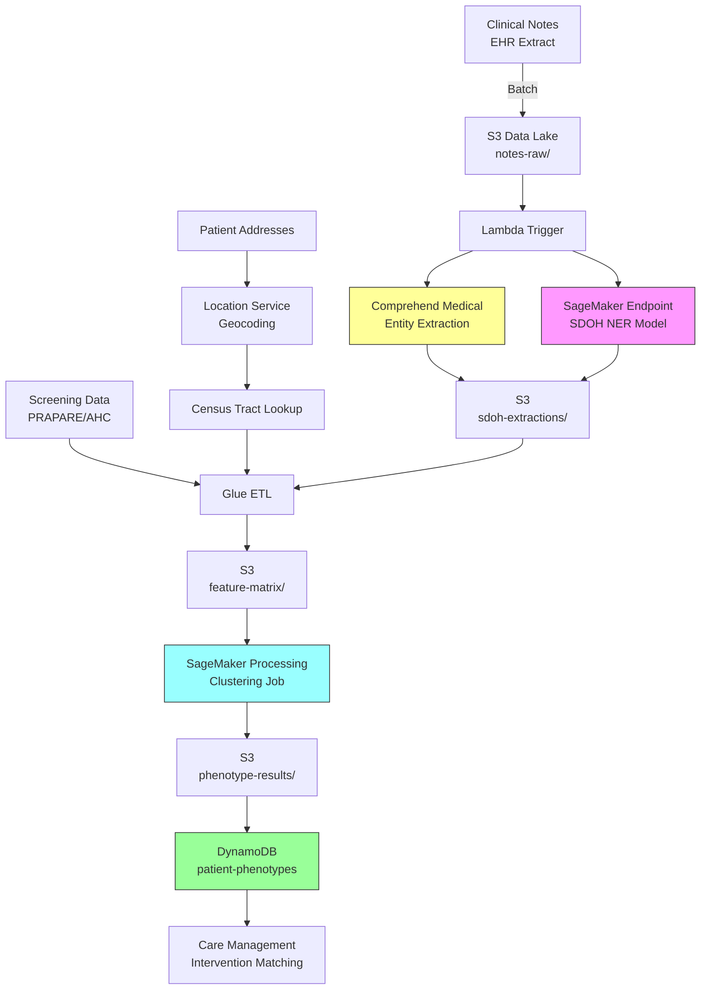

# Recipe 6.9 Architecture and Implementation: Social Determinant Phenotyping

*Companion to [Recipe 6.9: Social Determinant Phenotyping](chapter06.09-social-determinant-phenotyping). This page covers the AWS architecture, services, prerequisites, and pseudocode. For the problem framing and the conceptual approach, start with the main recipe.*

---

## The AWS Implementation

### Why These Services

**Amazon Comprehend Medical for NLP extraction.** Comprehend Medical is AWS's healthcare-specific NLP service. It detects medical entities, including social history mentions, from clinical text. While it doesn't have a dedicated SDOH extraction mode, its entity detection combined with custom classification models provides the foundation. For SDOH-specific extraction beyond what Comprehend Medical handles natively, you'll supplement with Amazon SageMaker hosting a fine-tuned model.

**Amazon SageMaker for SDOH-specific NLP and clustering.** SageMaker provides the ML infrastructure for two pieces: (1) a fine-tuned NER model for SDOH extraction that goes beyond Comprehend Medical's built-in capabilities, and (2) the clustering algorithm itself (LCA or k-prototypes). SageMaker Processing jobs handle the feature assembly and clustering computation. SageMaker endpoints serve real-time phenotype assignment for new patients.

**Amazon S3 for data lake storage.** Clinical notes, screening data, community indicator files, extracted features, and clustering results all live in S3. Organized by processing stage with lifecycle policies for PHI retention compliance.

**AWS Glue for ETL and feature assembly.** Glue jobs handle the integration of multiple data sources (EHR extracts, screening databases, census data) into the unified feature matrix. Glue's schema-on-read approach handles the heterogeneous source formats without requiring a rigid upfront schema.

**Amazon DynamoDB for phenotype assignments.** The final phenotype label for each patient needs to be queryable in real time by care management systems. DynamoDB provides single-digit-millisecond lookups by patient ID. Each phenotype lookup at the care management integration point must be application-level audit logged: requesting user or system identity, patient_id, timestamp, and phenotype returned. This satisfies HIPAA accounting-of-disclosures requirements. The audit log is separate from CloudTrail (which captures API-level access) because the disclosure semantics require recording who requested the clinical interpretation, not just which IAM principal called GetItem.

**AWS Lambda for orchestration.** Event-driven triggers coordinate the pipeline: new notes arrive, NLP extraction fires, features update, phenotype re-assignment runs on schedule.

**Amazon Location Service for geocoding.** Converting patient addresses to coordinates and linking to census tracts for community indicator lookup.

### Architecture Diagram



### Prerequisites

| Requirement | Details |
|-------------|---------|
| **AWS Services** | Amazon Comprehend Medical, Amazon SageMaker, Amazon S3, AWS Glue, Amazon DynamoDB, AWS Lambda, Amazon Location Service |
| **IAM Permissions** | `comprehend:DetectEntities`, `sagemaker:InvokeEndpoint`, `sagemaker:CreateProcessingJob`, `s3:GetObject`, `s3:PutObject`, `dynamodb:PutItem`, `dynamodb:GetItem`, `glue:StartJobRun`, `geo:SearchPlaceIndexForText`. Scope all permissions to specific resource ARNs in production (for example, `sagemaker:InvokeEndpoint` scoped to `arn:aws:sagemaker:REGION:ACCOUNT:endpoint/sdoh-ner-model`). |
| **BAA** | Required. Clinical notes and SDOH data are PHI. All services must be covered under your AWS BAA. |
| **Encryption** | S3: SSE-KMS for all buckets. DynamoDB: encryption at rest (default). SageMaker: KMS-encrypted training data, model artifacts, and endpoint traffic. All transit over TLS. |
| **VPC** | Production: SageMaker endpoints and Glue jobs in VPC with VPC endpoints for S3, DynamoDB, Comprehend Medical, Location Service (geo), and CloudWatch Logs. Location Service via PrivateLink keeps patient address geocoding traffic within the AWS network. |
| **CloudTrail** | Enabled for all API calls. SDOH data access must be auditable. |
| **Sample Data** | Synthetic clinical notes with SDOH mentions. MIMIC-III/IV contains social history sections. CDC SVI data is publicly available. Never use real patient notes in development. |
| **Cost Estimate** | Comprehend Medical: ~$0.01 per 100 characters. SageMaker endpoint: ~$0.05/hour (ml.m5.large). Glue: ~$0.44/DPU-hour. Per-patient total depends on note volume; estimate $0.15-$0.40 per patient for initial phenotyping. Cross-AZ data transfer costs apply for batch processing (Glue, SageMaker Processing) and should be factored into per-patient estimates for large populations. |

### Ingredients

| AWS Service | Role |
|------------|------|
| **Amazon Comprehend Medical** | Base NLP extraction of medical and social entities from clinical notes |
| **Amazon SageMaker** | Hosts fine-tuned SDOH NER model; runs clustering processing jobs; serves real-time phenotype assignment |
| **Amazon S3** | Data lake for notes, extractions, features, and results |
| **AWS Glue** | ETL for combining NLP output, screening data, and community indicators into feature matrix |
| **Amazon DynamoDB** | Real-time phenotype lookup by patient ID |
| **AWS Lambda** | Event-driven orchestration of extraction pipeline |
| **Amazon Location Service** | Geocoding patient addresses to census tracts |
| **AWS KMS** | Encryption key management for all PHI-containing stores |
| **Amazon CloudWatch** | Pipeline monitoring, extraction quality metrics, drift detection |

### Code

#### Walkthrough

**Step 1: NLP extraction from clinical notes.** When new clinical notes arrive in the data lake, the system extracts SDOH-relevant mentions. This is a two-pass approach: first, Amazon Comprehend Medical identifies general medical entities and social history mentions. Second, a fine-tuned SDOH-specific model (hosted on SageMaker) performs targeted extraction for the six core SDOH domains. The two-pass approach matters because Comprehend Medical catches broad patterns efficiently, while the specialized model handles the indirect, nuanced language of social determinants that general models miss. Skip this step and you're limited to the 20-40% of patients who completed structured screening tools.

```pseudocode
SDOH_DOMAINS = ["housing", "food", "transportation", "financial", "social_isolation", "safety"]

FUNCTION extract_sdoh_from_note(note_text, patient_id, encounter_date):
    // Pass 1: Use managed NLP service for broad entity detection.
    // This catches explicit mentions like "homeless" or "food stamps"
    // and provides medical context (diagnoses, medications) that helps
    // disambiguate social mentions.
    medical_entities = call ComprehendMedical.DetectEntities(Text = note_text)

    // Filter to social-history-relevant entities.
    // Comprehend Medical categorizes entities; we want the ones tagged
    // as social history, personal attributes, or behavioral factors.
    social_mentions = filter medical_entities where Category in
        ["SOCIAL_DETERMINANT", "BEHAVIORAL_ENVIRONMENTAL_SOCIAL"]

    // Pass 2: Use fine-tuned SDOH NER model for nuanced extraction.
    // This model was trained specifically on clinical text annotated
    // for SDOH mentions, including indirect language like
    // "patient reports skipping meals to pay rent."
    sdoh_extractions = call SageMaker.InvokeEndpoint(
        EndpointName = "sdoh-ner-model",
        Body = note_text
    )

    // Merge results from both passes, deduplicating overlapping spans.
    // Each extraction includes: domain, text_span, assertion (affirmed/negated),
    // confidence score, and character offsets in the original note.
    merged = deduplicate_and_merge(social_mentions, sdoh_extractions)

    // Classify assertion status for each mention.
    // "Patient denies food insecurity" is NEGATED.
    // "Patient reports difficulty affording food" is AFFIRMED.
    // "If patient loses housing" is HYPOTHETICAL.
    FOR each mention in merged:
        mention.assertion = classify_assertion(mention.text_span, note_text)
        mention.domain = map_to_sdoh_domain(mention, SDOH_DOMAINS)
        mention.patient_id = patient_id
        mention.encounter_date = encounter_date

    RETURN merged
```

**Step 2: Feature assembly.** This step combines three data sources into a single patient feature vector: NLP extractions from notes, structured screening responses, and community-level indicators linked via geocoding. The challenge is handling missingness honestly. A patient with no NLP mentions might have no social needs, or might simply have sparse documentation. A patient with no screening data wasn't necessarily screened negative; they may never have been asked. The feature vector must encode these distinctions because they affect clustering behavior. Treating "never screened" as "no needs" would systematically undercount SDOH burden in populations with less documentation.

```pseudocode
FUNCTION assemble_patient_features(patient_id, lookback_months = 24):
    features = empty map

    // --- NLP-derived features ---
    // Pull all SDOH extractions for this patient within the lookback window.
    extractions = query S3 for sdoh-extractions where
        patient_id = patient_id AND
        encounter_date >= (today - lookback_months)

    FOR each domain in SDOH_DOMAINS:
        domain_mentions = filter extractions where domain = domain AND assertion = "AFFIRMED"

        // Binary: was this domain ever mentioned as present?
        features[domain + "_present"] = (count of domain_mentions > 0)

        // Frequency: how often was it mentioned? More mentions suggest persistence.
        features[domain + "_mention_count"] = count of domain_mentions

        // Recency: days since most recent affirmed mention. Recent = more relevant.
        IF domain_mentions is not empty:
            features[domain + "_days_since_last"] = days between today and max(encounter_dates)
        ELSE:
            features[domain + "_days_since_last"] = NULL  // explicitly missing, not zero

        // Negation signal: was this domain explicitly screened negative?
        negated = filter extractions where domain = domain AND assertion = "NEGATED"
        features[domain + "_negated"] = (count of negated > 0)

    // --- Structured screening features ---
    screening = query screening database for patient_id
    IF screening exists:
        features["screening_completed"] = TRUE
        features["screening_date"] = screening.date
        features["screening_food_score"] = screening.food_insecurity_score
        features["screening_housing_score"] = screening.housing_instability_score
        features["screening_transport_score"] = screening.transportation_score
        features["screening_financial_score"] = screening.financial_strain_score
        features["screening_social_score"] = screening.social_isolation_score
        features["screening_safety_score"] = screening.safety_score
    ELSE:
        features["screening_completed"] = FALSE
        // All screening scores remain NULL (not zero)

    // --- Community-level features ---
    // PHI note: geocoding patient addresses is a sensitive operation.
    // Geocode at zip+4 level (not full street address) when census-tract
    // precision suffices for ADI/SVI lookup. This reduces PHI exposure
    // while maintaining the geographic resolution needed for community indicators.
    // Call Location Service via VPC endpoint to keep address data off the public internet.
    // Cache geocode results in the feature store so repeated pipeline runs
    // don't retransmit addresses. Log each geocoding call in the application
    // audit log (patient_id, timestamp, zip+4 sent, census_tract returned).
    address = get most recent address for patient_id
    IF address exists:
        zip_plus_4 = extract_zip_plus_4(address)  // reduce to zip+4 for census-tract lookup
        geocode_result = call LocationService.SearchPlaceIndex(Text = zip_plus_4)
        census_tract = lookup_census_tract(geocode_result.coordinates)
        audit_log("geocode_lookup", patient_id, timestamp, zip_plus_4, census_tract)

        features["adi_national_rank"] = lookup_adi(census_tract)          // 1-100, higher = more deprived
        features["food_desert_flag"] = lookup_food_desert(census_tract)   // binary
        features["svi_overall"] = lookup_svi(census_tract)                // 0-1, higher = more vulnerable
        features["svi_housing_transport"] = lookup_svi_theme(census_tract, "housing_transport")
    ELSE:
        // No address on file. Community features are NULL.
        features["adi_national_rank"] = NULL
        features["food_desert_flag"] = NULL
        features["svi_overall"] = NULL

    // --- Derived features ---
    // Total SDOH burden: count of domains with affirmed mentions
    features["sdoh_burden_count"] = count of domains where features[domain + "_present"] = TRUE

    // Documentation density: total notes in lookback period.
    // Low documentation density means NLP absence is less informative.
    features["note_count_in_window"] = count notes for patient_id in lookback window
    features["sdoh_mention_density"] = total affirmed mentions / features["note_count_in_window"]

    RETURN features
```

**Step 3: Clustering.** With the feature matrix assembled, this step applies a clustering algorithm to discover natural groupings of patients by social determinant profile. The choice of algorithm matters: we use Gower distance (which handles mixed binary, categorical, and continuous features natively) with hierarchical agglomerative clustering using average linkage (UPGMA). Average linkage is valid for non-Euclidean distance matrices like Gower. (Ward's linkage, while popular, requires Euclidean distances and produces unreliable results with Gower.) The optimal number of clusters is determined by a combination of silhouette score (statistical) and clinical interpretability (human judgment). In practice, SDOH phenotyping tends to produce 4-8 meaningful clusters. Fewer than 4 is too coarse to be actionable; more than 8 is too granular for care management teams to operationalize.

```pseudocode
FUNCTION cluster_patients(feature_matrix, min_k = 4, max_k = 8):
    // Compute pairwise Gower distance matrix.
    // Gower distance handles mixed types:
    //   - Binary features: simple matching (0 if same, 1 if different)
    //   - Continuous features: normalized absolute difference
    //   - Missing values: excluded from that pair's distance calculation
    //     (distance computed only over shared non-null features)
    distance_matrix = compute_gower_distance(feature_matrix)

    // Try each candidate cluster count and evaluate.
    best_k = min_k
    best_score = -1
    results = empty map

    FOR k in range(min_k, max_k + 1):
        // Hierarchical agglomerative clustering with average linkage (UPGMA).
        // Average linkage is valid for non-Euclidean distances like Gower.
        // Ward's linkage requires Euclidean distances and would produce
        // unreliable results here.
        labels = hierarchical_cluster(distance_matrix, method = "average", n_clusters = k)

        // Silhouette score: how well-separated are the clusters?
        // Range: -1 to 1. Higher is better. Above 0.3 is reasonable for social data.
        silhouette = compute_silhouette(distance_matrix, labels)

        // Store results for comparison.
        results[k] = { labels: labels, silhouette: silhouette }

        IF silhouette > best_score:
            best_score = silhouette
            best_k = k

    // Return the best clustering for clinical review.
    // The final k may be adjusted after clinical validation (Step 4).
    RETURN results[best_k]
```

**Step 4: Phenotype characterization and validation.** Raw cluster labels (0, 1, 2, ...) are meaningless to care teams. This step characterizes each cluster by its dominant features and assigns a human-readable phenotype name. It also runs the equity audit: checking whether clusters correlate with race/ethnicity in ways that could enable discrimination. The output is a phenotype catalog that care management teams can use to match patients to interventions.

```pseudocode
FUNCTION characterize_phenotypes(feature_matrix, cluster_labels, patient_demographics):
    phenotypes = empty list

    FOR each cluster_id in unique(cluster_labels):
        cluster_patients = filter feature_matrix where label = cluster_id
        cluster_size = count of cluster_patients

        // Compute feature prevalence within this cluster.
        // Which SDOH domains are most common in this group?
        profile = empty map
        FOR each domain in SDOH_DOMAINS:
            prevalence = mean of cluster_patients[domain + "_present"]
            profile[domain] = prevalence

        // Identify dominant features (prevalence > 50% in cluster).
        dominant_domains = filter profile where prevalence > 0.5

        // Compute community indicator averages.
        avg_adi = mean of cluster_patients["adi_national_rank"]
        avg_svi = mean of cluster_patients["svi_overall"]

        // --- Equity audit ---
        // Check demographic composition of this cluster.
        cluster_demographics = filter patient_demographics where label = cluster_id
        race_distribution = compute distribution of cluster_demographics.race
        // Flag if any racial group is overrepresented by more than 2x
        // compared to the overall population.
        equity_flags = check_overrepresentation(race_distribution, overall_distribution, threshold = 2.0)

        phenotype = {
            cluster_id:       cluster_id,
            size:             cluster_size,
            dominant_domains: dominant_domains,
            avg_adi:          avg_adi,
            avg_svi:          avg_svi,
            equity_flags:     equity_flags,
            // Human-readable name assigned after clinical review.
            // Examples: "Housing + Food Insecurity", "Transportation Barrier Only",
            //           "Multi-Domain Social Complexity", "Low Documentation / Unknown"
            name:             NULL  // assigned by clinical team in validation
        }
        append phenotype to phenotypes

    RETURN phenotypes
```

**Step 5: Store phenotype assignments.** Write each patient's phenotype assignment to the real-time lookup store. Include the assignment date, confidence (membership probability if using soft clustering), and a staleness indicator. Phenotypes decay: a patient's social circumstances change, and an assignment from 18 months ago may no longer reflect reality. Downstream systems should check the assignment date and trigger re-evaluation if it's stale.

```pseudocode
STALENESS_THRESHOLD_DAYS = 180  // re-evaluate phenotype if older than 6 months

FUNCTION store_phenotype_assignment(patient_id, phenotype, confidence, feature_snapshot):
    // NOTE: feature_snapshot is derived PHI, subject to the same retention
    // and access controls as the source clinical data. To reduce PHI surface
    // in the real-time lookup store, store the full snapshot in S3 (KMS-encrypted,
    // lifecycle-managed) and reference it by URI in DynamoDB.
    snapshot_s3_uri = write feature_snapshot to S3 at
        s3://phenotype-bucket/snapshots/{patient_id}/{timestamp}.json

    write to DynamoDB table "patient-phenotypes":
        patient_id       = patient_id
        phenotype_id     = phenotype.cluster_id
        phenotype_name   = phenotype.name
        confidence       = confidence                    // membership probability (0-1)
        assigned_date    = current UTC timestamp
        dominant_domains = phenotype.dominant_domains    // for quick reference without full lookup
        feature_snapshot_uri = snapshot_s3_uri           // S3 reference, not inline PHI
        stale_after      = today + STALENESS_THRESHOLD_DAYS
        version          = clustering model version     // track which model produced this
```

> **Curious how this looks in Python?** The pseudocode above covers the concepts. If you'd like to see sample Python code that demonstrates these patterns using boto3, check out the [Python Example](chapter06.09-python-example). It walks through each step with inline comments and notes on what you'd need to change for a real deployment.

### Expected Results

**Sample phenotype catalog (typical output from a large health system):**

```json
{
  "phenotypes": [
    {
      "cluster_id": 0,
      "name": "Housing Instability + Food Insecurity",
      "size": 2847,
      "dominant_domains": ["housing", "food", "financial"],
      "avg_adi": 78.3,
      "avg_svi": 0.82,
      "recommended_interventions": ["housing_navigator", "food_assistance_referral", "community_health_worker"]
    },
    {
      "cluster_id": 1,
      "name": "Transportation Barrier Primary",
      "size": 4102,
      "dominant_domains": ["transportation"],
      "avg_adi": 55.2,
      "avg_svi": 0.48,
      "recommended_interventions": ["ride_service_enrollment", "telehealth_preference", "pharmacy_delivery"]
    },
    {
      "cluster_id": 2,
      "name": "Social Isolation + Safety Concerns",
      "size": 1893,
      "dominant_domains": ["social_isolation", "safety"],
      "avg_adi": 62.1,
      "avg_svi": 0.61,
      "recommended_interventions": ["wellness_check_program", "peer_support_group", "domestic_violence_screening"]
    },
    {
      "cluster_id": 3,
      "name": "Multi-Domain Social Complexity",
      "size": 1204,
      "dominant_domains": ["housing", "food", "transportation", "financial", "social_isolation"],
      "avg_adi": 89.7,
      "avg_svi": 0.94,
      "recommended_interventions": ["intensive_case_management", "community_health_worker", "benefits_enrollment_assistance"]
    },
    {
      "cluster_id": 4,
      "name": "Low Documentation / Minimal Indicators",
      "size": 18432,
      "dominant_domains": [],
      "avg_adi": 38.4,
      "avg_svi": 0.29,
      "recommended_interventions": ["routine_screening_at_next_visit"]
    }
  ]
}
```

**Sample patient phenotype assignment:**

```json
{
  "patient_id": "PAT-2847193",
  "phenotype_id": 0,
  "phenotype_name": "Housing Instability + Food Insecurity",
  "confidence": 0.84,
  "assigned_date": "2026-05-15T09:22:14Z",
  "dominant_domains": ["housing", "food", "financial"],
  "stale_after": "2026-11-11",
  "version": "v2.3"
}
```

**Performance benchmarks:**

| Metric | Typical Value |
|--------|---------------|
| NLP extraction latency | 2-5 seconds per note |
| Feature assembly (batch) | ~10,000 patients/hour |
| Clustering (full re-run) | 30-60 minutes for 100K patients |
| Real-time phenotype lookup | <10ms (DynamoDB) |
| NLP SDOH detection recall | 65-80% (domain-dependent) |
| NLP SDOH detection precision | 75-90% |
| Cluster silhouette score | 0.25-0.45 (typical for social data) |
| Cost per patient (initial) | $0.15-$0.40 |
| Cost per patient (refresh) | $0.03-$0.08 (incremental notes only) |

**Where it struggles:**
- Patients with very sparse documentation (few notes, no screening) cluster into a "low information" group that's not actionable
- Indirect SDOH language ("patient seems stressed about bills") has lower extraction recall than explicit mentions
- Community-level indicators are proxies; they don't capture individual circumstances within a neighborhood
- Temporal dynamics: a patient's phenotype can change faster than the re-clustering cadence

---

## Why This Isn't Production-Ready

This architecture demonstrates the full pipeline shape, but several gaps remain before you'd trust it with real patient populations:

**NLP model training data.** The SDOH NER model requires annotated clinical text from your organization's notes. Annotation guidelines, inter-annotator agreement thresholds, and IRB-approved access to training data are prerequisites that take months. Without site-specific fine-tuning, extraction recall for indirect SDOH language will sit around 40-50% instead of the 65-80% a tuned model achieves.

**Missing input validation.** The pseudocode trusts its inputs. Production needs validation at every boundary: note text length limits, patient ID format checks, screening score range enforcement, and geocoding result plausibility checks. A single malformed input shouldn't crash the pipeline or produce a silently wrong phenotype.

**No circuit breakers.** If Comprehend Medical or the SageMaker endpoint degrades, the pipeline will accumulate failures without back-pressure. Production needs circuit breakers that pause ingestion when error rates exceed thresholds, route failures to dead-letter queues, and alert the operations team.

**Cluster stability monitoring.** The pipeline produces phenotypes but doesn't monitor whether they remain stable across runs. Production needs drift detection: if a monthly re-clustering produces dramatically different cluster boundaries, that's a signal that the underlying data distribution has shifted and clinical teams need to re-validate the phenotype definitions.

**No consent tracking.** Some organizations require explicit patient consent for SDOH data collection and use. This architecture doesn't model consent status. Production may need to filter patients from clustering based on consent records and track which patients opted out of phenotype-based outreach.

**Limited disaster recovery.** DynamoDB provides durability, but the full pipeline (trained models, feature store state, phenotype catalog) needs a recovery plan. Model artifacts, cluster definitions, and the mapping between phenotype IDs and intervention pathways all need versioned backups.

---

## Variations and Extensions

**Real-time phenotype assignment.** Instead of batch re-clustering, deploy the trained clustering model as a SageMaker endpoint that assigns a phenotype to new patients as soon as their features are assembled. Use the cluster centroids from the batch run as reference points and assign new patients to the nearest centroid. This enables same-day intervention matching for newly documented SDOH needs.

**Longitudinal trajectory tracking.** Rather than a single point-in-time phenotype, track how patients move between phenotypes over time. A patient who transitions from "multi-domain complexity" to "transportation barrier only" is improving. A patient moving in the opposite direction needs escalated support. Build a state-transition model that identifies patients on worsening trajectories before they reach crisis.

**Federated phenotyping across health systems.** SDOH phenotypes discovered at one health system may not generalize to another (different populations, different documentation practices, different community resources). A federated learning approach trains local models at each site and aggregates the cluster structures without sharing patient-level data. This enables regional or national SDOH phenotype taxonomies while preserving privacy.

**Cluster drift detection.** Monitor silhouette scores and cluster size distributions across consecutive clustering runs. Significant drift (new social determinants emerging, community resources eliminating a previously common barrier) should trigger a full re-validation with clinical stakeholders rather than silently producing stale phenotype definitions.

---

## Additional Resources

**AWS Documentation:**
- [Amazon Comprehend Medical Documentation](https://docs.aws.amazon.com/comprehend-medical/latest/dev/what-is.html)
- [Amazon SageMaker Processing Jobs](https://docs.aws.amazon.com/sagemaker/latest/dg/processing-job.html)
- [Amazon Location Service Developer Guide](https://docs.aws.amazon.com/location/latest/developerguide/what-is.html)
- [AWS Glue Developer Guide](https://docs.aws.amazon.com/glue/latest/dg/what-is-glue.html)
- [AWS HIPAA Eligible Services](https://aws.amazon.com/compliance/hipaa-eligible-services-reference/)
- [Architecting for HIPAA on AWS](https://docs.aws.amazon.com/whitepapers/latest/architecting-hipaa-security-and-compliance-on-aws/welcome.html)

**AWS Sample Repos:**
- [`amazon-comprehend-medical-fhir-integration`](https://github.com/aws-samples/amazon-comprehend-medical-fhir-integration): Comprehend Medical integration with FHIR for structured clinical data extraction
- [`amazon-sagemaker-examples`](https://github.com/aws/amazon-sagemaker-examples): SageMaker example notebooks including clustering and NLP fine-tuning patterns

**AWS Solutions and Blogs:**
- [Guidance for Multi-Modal Data Analysis with AWS HealthOmics](https://aws.amazon.com/solutions/guidance/multi-modal-data-analysis-with-aws-health-omics/): Multi-modal healthcare data integration patterns applicable to SDOH feature assembly
- [Build a Social Determinants of Health Solution on AWS](https://aws.amazon.com/blogs/publicsector/build-social-determinants-health-solution-aws/): Public sector blog on SDOH data integration architecture

**External References:**
- [Gravity Project SDOH Clinical Care Standard](https://thegravityproject.net/): The standard taxonomy for SDOH coding in clinical systems
- [CDC Social Vulnerability Index (SVI)](https://www.atsdr.cdc.gov/placeandhealth/svi/index.html): Community-level vulnerability indicators used as features
- [USDA Food Access Research Atlas](https://www.ers.usda.gov/data-products/food-access-research-atlas/): Food desert classification data
- [Area Deprivation Index (ADI)](https://www.neighborhoodatlas.medicine.wisc.edu/): Neighborhood-level socioeconomic deprivation ranking

---

## Estimated Implementation Time

| Tier | Timeline | What You Get |
|------|----------|--------------|
| **Basic** | 8-12 weeks | NLP extraction from notes + community indicators + initial clustering on structured screening data only |
| **Production-ready** | 16-24 weeks | Full multi-source feature assembly, validated phenotypes, real-time assignment, equity audit, intervention matching |
| **With variations** | 6-9 months | Longitudinal trajectory tracking, real-time assignment, federated learning across sites, outcome-validated phenotypes |

---

---

*← [Main Recipe 6.9](chapter06.09-social-determinant-phenotyping) · [Python Example](chapter06.09-python-example) · [Chapter Preface](chapter06-preface)*
