# Recipe 6.9: Social Determinant Phenotyping

**Complexity:** Complex · **Phase:** Research/Production · **Estimated Cost:** ~$0.15–$0.40 per patient profile

---

## The Problem

A 62-year-old woman with diabetes shows up in the ED for the third time this quarter with uncontrolled blood sugar. Her A1C is climbing. Her care team is frustrated. They've adjusted her insulin regimen twice. They've referred her to a diabetes educator. Nothing sticks.

What nobody documented in a structured field: she lost her housing six months ago. She's couch-surfing between her daughter's apartment and a friend's place. She can't refrigerate insulin reliably. She can't maintain a consistent meal schedule. The diabetes isn't the problem. The diabetes is a symptom of the problem.

This is the social determinants of health (SDOH) gap. Clinicians know intuitively that housing, food access, transportation, social isolation, and economic instability drive health outcomes. The research is overwhelming: zip code predicts life expectancy better than genetic code. But healthcare systems are terrible at capturing this information in a structured, actionable way.

Here's why. SDOH data lives in three places, and none of them talk to each other well:

1. **Clinical notes.** A social worker writes "patient reports difficulty affording medications" in a progress note. A physician documents "lives alone, no family support nearby." This information is trapped in free text, invisible to analytics.

2. **Screening tools.** Some organizations use structured SDOH screeners (PRAPARE, AHC HRSN, Protocol for Responding to and Assessing Patients' Assets, Risks, and Experiences). But screening rates are low, patients don't always disclose, and the data goes stale fast.

3. **External data.** Census tract poverty rates, food desert maps, Area Deprivation Index scores. These are population-level proxies, not individual-level truths. A wealthy person can live in a poor zip code and vice versa.

The result: health systems make clinical decisions without understanding the social context that determines whether those decisions will actually work. They cluster patients by disease, by utilization, by cost. But they rarely cluster by the social circumstances that explain why some patients thrive and others spiral.

Social determinant phenotyping is the practice of building composite profiles of patients' social circumstances by combining NLP extraction from clinical notes, structured screening data, and community-level indicators into coherent, actionable clusters. Not just "this patient has food insecurity" but "this patient belongs to a phenotype characterized by housing instability, transportation barriers, and social isolation, and patients in this phenotype respond best to community health worker outreach rather than phone-based care management."

That's what we're building.

---

## The Technology: Clustering on Sparse, Sensitive, Multi-Modal Data

### Why This Is Harder Than Standard Clustering

Standard patient clustering (Recipe 6.1 through 6.4) works on relatively clean, structured data: diagnosis codes, lab values, utilization counts. The features are numeric, complete (mostly), and well-understood. You pick a distance metric, run k-means or hierarchical clustering, and interpret the results.

Social determinant phenotyping breaks every one of those assumptions:

**Sparsity.** Most patients don't have structured SDOH data. Screening rates at even progressive health systems hover around 20-40% of encounters. For the remaining 60-80%, you're inferring from notes, or you have nothing at all. Your feature matrix is mostly zeros and nulls, and you can't tell the difference between "screened negative for food insecurity" and "never asked about food insecurity."

**Multi-modality.** Your signal comes from at least three different data types: free-text clinical notes (unstructured), screening questionnaire responses (structured categorical), and geographic/community indicators (continuous numeric). Combining these into a single feature space requires careful engineering.

**Temporal instability.** Social circumstances change. A patient who was stably housed last year may be homeless today. A patient who had reliable transportation lost it when their car broke down. SDOH phenotypes are not static labels; they're snapshots that decay in relevance over time.

**Sensitivity and bias.** Clustering patients by social vulnerability creates categories that correlate with race, ethnicity, and socioeconomic status. If you're not careful, you build a system that effectively redlines patients. The clusters must be used to direct resources toward vulnerable populations, never to deny care or justify disparities.

### NLP Extraction: Getting Signal from Notes

The first technical challenge is extracting SDOH mentions from clinical text. This is a specialized NLP problem because:

- SDOH language is indirect. Clinicians rarely write "patient is food insecure." They write "patient reports skipping meals to afford medications" or "difficulty maintaining diet due to limited grocery access."
- Negation matters enormously. "Patient denies housing instability" is the opposite of "patient reports housing instability." Your NLP must handle negation correctly.
- Context windows matter. The relevant sentence might be buried in a 3-page social work assessment, a brief aside in a physician note, or a nursing intake form.

The standard approach uses a combination of:

1. **Named Entity Recognition (NER)** trained on SDOH-specific ontologies. The most common taxonomy is the Gravity Project's SDOH Clinical Care standard, which defines categories like housing instability, food insecurity, transportation insecurity, financial strain, social isolation, and interpersonal violence.

2. **Assertion classification** to determine whether a detected mention is affirmed, negated, or hypothetical. "Patient has housing instability" (affirmed) vs. "patient denies housing instability" (negated) vs. "if patient loses housing" (hypothetical).

3. **Temporal reasoning** to determine when the social circumstance was active. "Patient was homeless in 2019 but is now stably housed" should not be coded as current homelessness.

Pre-trained clinical NLP models (trained on clinical text corpora) provide a starting point, but SDOH-specific fine-tuning is almost always necessary. The vocabulary of social determinants is different from the vocabulary of clinical findings, and general clinical NER models miss most SDOH mentions.

### Feature Engineering: Building the Phenotype Vector

Once you have extracted SDOH signals from notes and combined them with structured screening data and community indicators, you need to represent each patient as a feature vector suitable for clustering. The typical feature space includes:

**NLP-derived features (per SDOH domain):**
- Binary presence/absence of each SDOH category (housing, food, transport, financial, social, safety)
- Mention frequency (more mentions may indicate severity or persistence)
- Recency of most recent mention
- Assertion polarity (affirmed vs. negated)

**Structured screening features:**
- Screening tool responses (often Likert scales or yes/no)
- Screening completion rate (itself informative: patients who refuse screening may differ systematically)

**Community-level features:**
- Area Deprivation Index (ADI) for patient's census tract
- Food desert indicator (USDA Food Access Research Atlas)
- Transportation access score
- Social vulnerability index (CDC SVI)

**Derived features:**
- SDOH burden score (count of active domains)
- Temporal trajectory (improving, stable, worsening)
- Concordance between self-report and NLP extraction

### Clustering Approaches for Sparse, Mixed Data

Standard k-means assumes continuous features and Euclidean distance. That's a poor fit here. Better options:

**K-prototypes** handles mixed categorical and continuous features natively. It uses Hamming distance for categorical features and Euclidean for continuous ones, with a weighting parameter to balance the two.

**Gower distance with hierarchical clustering** computes pairwise distances that handle mixed types (binary, categorical, continuous) and missing values gracefully. Hierarchical clustering then builds a dendrogram you can cut at different levels to explore different granularities.

**Latent class analysis (LCA)** is a model-based approach that assumes patients belong to unobserved latent classes, each with its own probability distribution over the observed features. LCA handles categorical data naturally and provides probabilistic cluster membership rather than hard assignments.

**Autoencoders for dimensionality reduction** can learn a compressed representation of the sparse, high-dimensional feature space, and you cluster in the latent space. This works well when you have enough data to train the encoder, but interpretability suffers.

For SDOH phenotyping specifically, LCA and Gower-distance hierarchical clustering tend to work best because they handle the mixed data types and sparsity patterns without requiring imputation gymnastics.

### Validation: The Hard Part

Unlike supervised learning, there's no ground truth for "correct" SDOH phenotypes. Validation requires:

1. **Clinical face validity.** Do the clusters make intuitive sense to social workers and care managers? Can they describe the "typical patient" in each cluster?

2. **Predictive validity.** Do the phenotypes predict outcomes that matter? Patients in the "housing instability + social isolation" cluster should have different utilization patterns, different intervention response rates, and different health trajectories than patients in the "transportation barrier only" cluster.

3. **Stability.** If you re-run the clustering on a different time window or a different patient sample, do you get similar phenotypes? Unstable clusters aren't useful for operational decision-making.

4. **Equity audit.** Do the clusters correlate with race/ethnicity in ways that could enable discrimination? If cluster 3 is 90% Black patients, you need to understand why and ensure the cluster is used to direct resources, not to justify disparities.

---

## General Architecture Pattern

```
[Clinical Notes] ──→ [NLP Extraction] ──→ [SDOH Feature Store]
                                                    ↑
[Screening Data] ──────────────────────────────────→│
                                                    ↑
[Community Data] ──→ [Geocoding + Linkage] ────────→│
                                                    ↓
                                          [Feature Assembly] ──→ [Clustering Engine]
                                                                        ↓
                                                              [Phenotype Assignment]
                                                                        ↓
                                                              [Validation + Audit]
                                                                        ↓
                                                              [Intervention Matching]
```

**Stage 1: NLP Extraction.** Process clinical notes through an SDOH-specific NLP pipeline. Extract mentions, classify assertions, resolve temporality. Output: per-patient, per-encounter SDOH mention records with domain, polarity, and timestamp.

<!-- TODO (TechWriter): Expert review A1 (HIGH). Add 2-3 sentences on error handling: failed extractions should go to a dead-letter queue, feature assembly should distinguish "no extractions found" from "extraction never attempted," and a monitoring alarm should fire when DLQ depth exceeds a threshold. Silent NLP failures create ambiguous gaps indistinguishable from legitimate absence of SDOH mentions. -->

**Stage 2: Feature Assembly.** Combine NLP extractions, structured screening responses, and geocoded community indicators into a unified patient feature vector. Handle missingness explicitly (distinguish "screened negative" from "never screened"). Apply temporal weighting (recent signals matter more than old ones).

**Stage 3: Clustering.** Apply an appropriate clustering algorithm to the assembled feature matrix. Determine optimal cluster count through a combination of statistical criteria (silhouette score, BIC for LCA) and clinical interpretability. Assign each patient a phenotype label and a membership probability.

**Stage 4: Validation and Audit.** Assess clinical face validity with domain experts. Test predictive validity against outcomes. Run equity analysis. Document cluster characteristics and intended use.

**Stage 5: Intervention Matching.** Map phenotypes to recommended intervention strategies. The "housing instability + food insecurity" phenotype gets connected to housing navigators and food assistance programs. The "transportation barrier" phenotype gets connected to ride services and telehealth options. This is where the clustering becomes actionable.

---

## The AWS Implementation

### Why These Services

**Amazon Comprehend Medical for NLP extraction.** Comprehend Medical is AWS's healthcare-specific NLP service. It detects medical entities, including social history mentions, from clinical text. While it doesn't have a dedicated SDOH extraction mode, its entity detection combined with custom classification models provides the foundation. For SDOH-specific extraction beyond what Comprehend Medical handles natively, you'll supplement with Amazon SageMaker hosting a fine-tuned model.

**Amazon SageMaker for SDOH-specific NLP and clustering.** SageMaker provides the ML infrastructure for two pieces: (1) a fine-tuned NER model for SDOH extraction that goes beyond Comprehend Medical's built-in capabilities, and (2) the clustering algorithm itself (LCA or k-prototypes). SageMaker Processing jobs handle the feature assembly and clustering computation. SageMaker endpoints serve real-time phenotype assignment for new patients.

**Amazon S3 for data lake storage.** Clinical notes, screening data, community indicator files, extracted features, and clustering results all live in S3. Organized by processing stage with lifecycle policies for PHI retention compliance.

**AWS Glue for ETL and feature assembly.** Glue jobs handle the integration of multiple data sources (EHR extracts, screening databases, census data) into the unified feature matrix. Glue's schema-on-read approach handles the heterogeneous source formats without requiring a rigid upfront schema.

**Amazon DynamoDB for phenotype assignments.** The final phenotype label for each patient needs to be queryable in real time by care management systems. DynamoDB provides single-digit-millisecond lookups by patient ID.

**AWS Lambda for orchestration.** Event-driven triggers coordinate the pipeline: new notes arrive, NLP extraction fires, features update, phenotype re-assignment runs on schedule.

**Amazon Location Service for geocoding.** Converting patient addresses to coordinates and linking to census tracts for community indicator lookup.

### Architecture Diagram

```mermaid
flowchart TD
    A[Clinical Notes\nEHR Extract] -->|Batch| B[S3 Data Lake\nnotes-raw/]
    B --> C[Lambda Trigger]
    C --> D[Comprehend Medical\nEntity Extraction]
    C --> E[SageMaker Endpoint\nSDOH NER Model]
    D --> F[S3\nsdoh-extractions/]
    E --> F

    G[Screening Data\nPRAPARE/AHC] --> H[Glue ETL]
    I[Patient Addresses] --> J[Location Service\nGeocoding]
    J --> K[Census Tract Lookup]
    K --> H

    F --> H
    H --> L[S3\nfeature-matrix/]

    L --> M[SageMaker Processing\nClustering Job]
    M --> N[S3\nphenotype-results/]
    N --> O[DynamoDB\npatient-phenotypes]

    O --> P[Care Management\nIntervention Matching]

    style D fill:#ff9,stroke:#333
    style E fill:#f9f,stroke:#333
    style M fill:#9ff,stroke:#333
    style O fill:#9f9,stroke:#333
```



### Prerequisites

| Requirement | Details |
|-------------|---------|
| **AWS Services** | Amazon Comprehend Medical, Amazon SageMaker, Amazon S3, AWS Glue, Amazon DynamoDB, AWS Lambda, Amazon Location Service |
| **IAM Permissions** | `comprehend:DetectEntities`, `sagemaker:InvokeEndpoint`, `sagemaker:CreateProcessingJob`, `s3:GetObject`, `s3:PutObject`, `dynamodb:PutItem`, `dynamodb:GetItem`, `glue:StartJobRun`, `geo:SearchPlaceIndexForText`. Scope all permissions to specific resource ARNs in production (for example, `sagemaker:InvokeEndpoint` scoped to `arn:aws:sagemaker:REGION:ACCOUNT:endpoint/sdoh-ner-model`). |
| **BAA** | Required. Clinical notes and SDOH data are PHI. All services must be covered under your AWS BAA. |
| **Encryption** | S3: SSE-KMS for all buckets. DynamoDB: encryption at rest (default). SageMaker: KMS-encrypted training data, model artifacts, and endpoint traffic. All transit over TLS. |
| **VPC** | Production: SageMaker endpoints and Glue jobs in VPC with VPC endpoints for S3, DynamoDB, Comprehend Medical, Location Service, and CloudWatch Logs. |
| **CloudTrail** | Enabled for all API calls. SDOH data access must be auditable. |
| **Sample Data** | Synthetic clinical notes with SDOH mentions. MIMIC-III/IV contains social history sections. CDC SVI data is publicly available. Never use real patient notes in development. |
| **Cost Estimate** | Comprehend Medical: ~$0.01 per 100 characters. SageMaker endpoint: ~$0.05/hour (ml.m5.large). Glue: ~$0.44/DPU-hour. Per-patient total depends on note volume; estimate $0.15-$0.40 per patient for initial phenotyping. Cross-AZ data transfer costs apply for batch processing and should be factored into per-patient estimates for large populations. |

### Ingredients

| AWS Service | Role |
|------------|------|
| **Amazon Comprehend Medical** | Base NLP extraction of medical and social entities from clinical notes |
| **Amazon SageMaker** | Hosts fine-tuned SDOH NER model; runs clustering processing jobs; serves real-time phenotype assignment |
| **Amazon S3** | Data lake for notes, extractions, features, and results |
| **AWS Glue** | ETL for combining NLP output, screening data, and community indicators into feature matrix |
| **Amazon DynamoDB** | Real-time phenotype lookup by patient ID |
| **AWS Lambda** | Event-driven orchestration of extraction pipeline |
| **Amazon Location Service** | Geocoding patient addresses to census tracts |
| **AWS KMS** | Encryption key management for all PHI-containing stores |
| **Amazon CloudWatch** | Pipeline monitoring, extraction quality metrics, drift detection |

### Code

#### Walkthrough

**Step 1: NLP extraction from clinical notes.** When new clinical notes arrive in the data lake, the system extracts SDOH-relevant mentions. This is a two-pass approach: first, Amazon Comprehend Medical identifies general medical entities and social history mentions. Second, a fine-tuned SDOH-specific model (hosted on SageMaker) performs targeted extraction for the six core SDOH domains. The two-pass approach matters because Comprehend Medical catches broad patterns efficiently, while the specialized model handles the indirect, nuanced language of social determinants that general models miss. Skip this step and you're limited to the 20-40% of patients who completed structured screening tools.

```
SDOH_DOMAINS = ["housing", "food", "transportation", "financial", "social_isolation", "safety"]

FUNCTION extract_sdoh_from_note(note_text, patient_id, encounter_date):
    // Pass 1: Use managed NLP service for broad entity detection.
    // This catches explicit mentions like "homeless" or "food stamps"
    // and provides medical context (diagnoses, medications) that helps
    // disambiguate social mentions.
    medical_entities = call ComprehendMedical.DetectEntities(Text = note_text)

    // Filter to social-history-relevant entities.
    // Comprehend Medical categorizes entities; we want the ones tagged
    // as social history, personal attributes, or behavioral factors.
    social_mentions = filter medical_entities where Category in
        ["SOCIAL_DETERMINANT", "BEHAVIORAL_ENVIRONMENTAL_SOCIAL"]

    // Pass 2: Use fine-tuned SDOH NER model for nuanced extraction.
    // This model was trained specifically on clinical text annotated
    // for SDOH mentions, including indirect language like
    // "patient reports skipping meals to pay rent."
    sdoh_extractions = call SageMaker.InvokeEndpoint(
        EndpointName = "sdoh-ner-model",
        Body = note_text
    )

    // Merge results from both passes, deduplicating overlapping spans.
    // Each extraction includes: domain, text_span, assertion (affirmed/negated),
    // confidence score, and character offsets in the original note.
    merged = deduplicate_and_merge(social_mentions, sdoh_extractions)

    // Classify assertion status for each mention.
    // "Patient denies food insecurity" is NEGATED.
    // "Patient reports difficulty affording food" is AFFIRMED.
    // "If patient loses housing" is HYPOTHETICAL.
    FOR each mention in merged:
        mention.assertion = classify_assertion(mention.text_span, note_text)
        mention.domain = map_to_sdoh_domain(mention, SDOH_DOMAINS)
        mention.patient_id = patient_id
        mention.encounter_date = encounter_date

    RETURN merged
```

**Step 2: Feature assembly.** This step combines three data sources into a single patient feature vector: NLP extractions from notes, structured screening responses, and community-level indicators linked via geocoding. The challenge is handling missingness honestly. A patient with no NLP mentions might have no social needs, or might simply have sparse documentation. A patient with no screening data wasn't necessarily screened negative; they may never have been asked. The feature vector must encode these distinctions because they affect clustering behavior. Treating "never screened" as "no needs" would systematically undercount SDOH burden in populations with less documentation.

<!-- TODO (TechWriter): Expert review S1 (HIGH). Add guidance on geocoding PHI: recommend geocoding at zip+4 level (not full street address) when census-tract precision suffices for ADI/SVI lookup; call Location Service via VPC endpoint; cache geocode results in the feature store to avoid repeated address transmission; include geocoding calls in application-level audit logging. -->

```
FUNCTION assemble_patient_features(patient_id, lookback_months = 24):
    features = empty map

    // --- NLP-derived features ---
    // Pull all SDOH extractions for this patient within the lookback window.
    extractions = query S3 for sdoh-extractions where
        patient_id = patient_id AND
        encounter_date >= (today - lookback_months)

    FOR each domain in SDOH_DOMAINS:
        domain_mentions = filter extractions where domain = domain AND assertion = "AFFIRMED"

        // Binary: was this domain ever mentioned as present?
        features[domain + "_present"] = (count of domain_mentions > 0)

        // Frequency: how often was it mentioned? More mentions suggest persistence.
        features[domain + "_mention_count"] = count of domain_mentions

        // Recency: days since most recent affirmed mention. Recent = more relevant.
        IF domain_mentions is not empty:
            features[domain + "_days_since_last"] = days between today and max(encounter_dates)
        ELSE:
            features[domain + "_days_since_last"] = NULL  // explicitly missing, not zero

        // Negation signal: was this domain explicitly screened negative?
        negated = filter extractions where domain = domain AND assertion = "NEGATED"
        features[domain + "_negated"] = (count of negated > 0)

    // --- Structured screening features ---
    screening = query screening database for patient_id
    IF screening exists:
        features["screening_completed"] = TRUE
        features["screening_date"] = screening.date
        features["screening_food_score"] = screening.food_insecurity_score
        features["screening_housing_score"] = screening.housing_instability_score
        features["screening_transport_score"] = screening.transportation_score
        features["screening_financial_score"] = screening.financial_strain_score
        features["screening_social_score"] = screening.social_isolation_score
        features["screening_safety_score"] = screening.safety_score
    ELSE:
        features["screening_completed"] = FALSE
        // All screening scores remain NULL (not zero)

    // --- Community-level features ---
    address = get most recent address for patient_id
    IF address exists:
        geocode_result = call LocationService.SearchPlaceIndex(Text = address)
        census_tract = lookup_census_tract(geocode_result.coordinates)

        features["adi_national_rank"] = lookup_adi(census_tract)          // 1-100, higher = more deprived
        features["food_desert_flag"] = lookup_food_desert(census_tract)   // binary
        features["svi_overall"] = lookup_svi(census_tract)                // 0-1, higher = more vulnerable
        features["svi_housing_transport"] = lookup_svi_theme(census_tract, "housing_transport")
    ELSE:
        // No address on file. Community features are NULL.
        features["adi_national_rank"] = NULL
        features["food_desert_flag"] = NULL
        features["svi_overall"] = NULL

    // --- Derived features ---
    // Total SDOH burden: count of domains with affirmed mentions
    features["sdoh_burden_count"] = count of domains where features[domain + "_present"] = TRUE

    // Documentation density: total notes in lookback period.
    // Low documentation density means NLP absence is less informative.
    features["note_count_in_window"] = count notes for patient_id in lookback window
    features["sdoh_mention_density"] = total affirmed mentions / features["note_count_in_window"]

    RETURN features
```

**Step 3: Clustering.** With the feature matrix assembled, this step applies a clustering algorithm to discover natural groupings of patients by social determinant profile. The choice of algorithm matters: we use Gower distance (which handles mixed binary, categorical, and continuous features natively) with hierarchical agglomerative clustering using average linkage (UPGMA). Average linkage is valid for non-Euclidean distance matrices like Gower. (Ward's linkage, while popular, requires Euclidean distances and produces unreliable results with Gower.) The optimal number of clusters is determined by a combination of silhouette score (statistical) and clinical interpretability (human judgment). In practice, SDOH phenotyping tends to produce 4-8 meaningful clusters. Fewer than 4 is too coarse to be actionable; more than 8 is too granular for care management teams to operationalize.

```
FUNCTION cluster_patients(feature_matrix, min_k = 4, max_k = 8):
    // Compute pairwise Gower distance matrix.
    // Gower distance handles mixed types:
    //   - Binary features: simple matching (0 if same, 1 if different)
    //   - Continuous features: normalized absolute difference
    //   - Missing values: excluded from that pair's distance calculation
    //     (distance computed only over shared non-null features)
    distance_matrix = compute_gower_distance(feature_matrix)

    // Try each candidate cluster count and evaluate.
    best_k = min_k
    best_score = -1
    results = empty map

    FOR k in range(min_k, max_k + 1):
        // Hierarchical agglomerative clustering with average linkage (UPGMA).
        // Average linkage is valid for non-Euclidean distances like Gower.
        // Ward's linkage requires Euclidean distances and would produce
        // unreliable results here.
        labels = hierarchical_cluster(distance_matrix, method = "average", n_clusters = k)

        // Silhouette score: how well-separated are the clusters?
        // Range: -1 to 1. Higher is better. Above 0.3 is reasonable for social data.
        silhouette = compute_silhouette(distance_matrix, labels)

        // Store results for comparison.
        results[k] = { labels: labels, silhouette: silhouette }

        IF silhouette > best_score:
            best_score = silhouette
            best_k = k

    // Return the best clustering for clinical review.
    // The final k may be adjusted after clinical validation (Step 4).
    RETURN results[best_k]
```

**Step 4: Phenotype characterization and validation.** Raw cluster labels (0, 1, 2, ...) are meaningless to care teams. This step characterizes each cluster by its dominant features and assigns a human-readable phenotype name. It also runs the equity audit: checking whether clusters correlate with race/ethnicity in ways that could enable discrimination. The output is a phenotype catalog that care management teams can use to match patients to interventions.

```
FUNCTION characterize_phenotypes(feature_matrix, cluster_labels, patient_demographics):
    phenotypes = empty list

    FOR each cluster_id in unique(cluster_labels):
        cluster_patients = filter feature_matrix where label = cluster_id
        cluster_size = count of cluster_patients

        // Compute feature prevalence within this cluster.
        // Which SDOH domains are most common in this group?
        profile = empty map
        FOR each domain in SDOH_DOMAINS:
            prevalence = mean of cluster_patients[domain + "_present"]
            profile[domain] = prevalence

        // Identify dominant features (prevalence > 50% in cluster).
        dominant_domains = filter profile where prevalence > 0.5

        // Compute community indicator averages.
        avg_adi = mean of cluster_patients["adi_national_rank"]
        avg_svi = mean of cluster_patients["svi_overall"]

        // --- Equity audit ---
        // Check demographic composition of this cluster.
        cluster_demographics = filter patient_demographics where label = cluster_id
        race_distribution = compute distribution of cluster_demographics.race
        // Flag if any racial group is overrepresented by more than 2x
        // compared to the overall population.
        equity_flags = check_overrepresentation(race_distribution, overall_distribution, threshold = 2.0)

        phenotype = {
            cluster_id:       cluster_id,
            size:             cluster_size,
            dominant_domains: dominant_domains,
            avg_adi:          avg_adi,
            avg_svi:          avg_svi,
            equity_flags:     equity_flags,
            // Human-readable name assigned after clinical review.
            // Examples: "Housing + Food Insecurity", "Transportation Barrier Only",
            //           "Multi-Domain Social Complexity", "Low Documentation / Unknown"
            name:             NULL  // assigned by clinical team in validation
        }
        append phenotype to phenotypes

    RETURN phenotypes
```

**Step 5: Store phenotype assignments.** Write each patient's phenotype assignment to the real-time lookup store. Include the assignment date, confidence (membership probability if using soft clustering), and a staleness indicator. Phenotypes decay: a patient's social circumstances change, and an assignment from 18 months ago may no longer reflect reality. Downstream systems should check the assignment date and trigger re-evaluation if it's stale.

<!-- TODO (TechWriter): Expert review S3 (MEDIUM). Add note that feature_snapshot is derived PHI subject to the same retention and access controls as source data. Consider recommending an S3 URI reference in DynamoDB rather than the full snapshot, to reduce PHI surface in the real-time lookup store. -->

<!-- TODO (TechWriter): Expert review S4 (MEDIUM). Add requirement for application-level audit logging at the care management integration point: each phenotype lookup should log requesting user/system, patient_id, timestamp, and phenotype returned (HIPAA accounting-of-disclosures control). -->

```
STALENESS_THRESHOLD_DAYS = 180  // re-evaluate phenotype if older than 6 months

FUNCTION store_phenotype_assignment(patient_id, phenotype, confidence, feature_snapshot):
    write to DynamoDB table "patient-phenotypes":
        patient_id       = patient_id
        phenotype_id     = phenotype.cluster_id
        phenotype_name   = phenotype.name
        confidence       = confidence                    // membership probability (0-1)
        assigned_date    = current UTC timestamp
        dominant_domains = phenotype.dominant_domains    // for quick reference without full lookup
        feature_snapshot = feature_snapshot              // the features at time of assignment
        stale_after      = today + STALENESS_THRESHOLD_DAYS
        version          = clustering model version     // track which model produced this
```

> **Curious how this looks in Python?** The pseudocode above covers the concepts. If you'd like to see sample Python code that demonstrates these patterns using boto3, check out the [Python Example](chapter06.09-python-example). It walks through each step with inline comments and notes on what you'd need to change for a real deployment.

### Expected Results

**Sample phenotype catalog (typical output from a large health system):**

```json
{
  "phenotypes": [
    {
      "cluster_id": 0,
      "name": "Housing Instability + Food Insecurity",
      "size": 2847,
      "dominant_domains": ["housing", "food", "financial"],
      "avg_adi": 78.3,
      "avg_svi": 0.82,
      "recommended_interventions": ["housing_navigator", "food_assistance_referral", "community_health_worker"]
    },
    {
      "cluster_id": 1,
      "name": "Transportation Barrier Primary",
      "size": 4102,
      "dominant_domains": ["transportation"],
      "avg_adi": 55.2,
      "avg_svi": 0.48,
      "recommended_interventions": ["ride_service_enrollment", "telehealth_preference", "pharmacy_delivery"]
    },
    {
      "cluster_id": 2,
      "name": "Social Isolation + Safety Concerns",
      "size": 1893,
      "dominant_domains": ["social_isolation", "safety"],
      "avg_adi": 62.1,
      "avg_svi": 0.61,
      "recommended_interventions": ["wellness_check_program", "peer_support_group", "domestic_violence_screening"]
    },
    {
      "cluster_id": 3,
      "name": "Multi-Domain Social Complexity",
      "size": 1204,
      "dominant_domains": ["housing", "food", "transportation", "financial", "social_isolation"],
      "avg_adi": 89.7,
      "avg_svi": 0.94,
      "recommended_interventions": ["intensive_case_management", "community_health_worker", "benefits_enrollment_assistance"]
    },
    {
      "cluster_id": 4,
      "name": "Low Documentation / Minimal Indicators",
      "size": 18432,
      "dominant_domains": [],
      "avg_adi": 38.4,
      "avg_svi": 0.29,
      "recommended_interventions": ["routine_screening_at_next_visit"]
    }
  ]
}
```

**Sample patient phenotype assignment:**

```json
{
  "patient_id": "PAT-2847193",
  "phenotype_id": 0,
  "phenotype_name": "Housing Instability + Food Insecurity",
  "confidence": 0.84,
  "assigned_date": "2026-05-15T09:22:14Z",
  "dominant_domains": ["housing", "food", "financial"],
  "stale_after": "2026-11-11",
  "version": "v2.3"
}
```

**Performance benchmarks:**

| Metric | Typical Value |
|--------|---------------|
| NLP extraction latency | 2-5 seconds per note |
| Feature assembly (batch) | ~10,000 patients/hour |
| Clustering (full re-run) | 30-60 minutes for 100K patients |
| Real-time phenotype lookup | <10ms (DynamoDB) |
| NLP SDOH detection recall | 65-80% (domain-dependent) |
| NLP SDOH detection precision | 75-90% |
| Cluster silhouette score | 0.25-0.45 (typical for social data) |
| Cost per patient (initial) | $0.15-$0.40 |
| Cost per patient (refresh) | $0.03-$0.08 (incremental notes only) |

**Where it struggles:**
- Patients with very sparse documentation (few notes, no screening) cluster into a "low information" group that's not actionable
- Indirect SDOH language ("patient seems stressed about bills") has lower extraction recall than explicit mentions
- Community-level indicators are proxies; they don't capture individual circumstances within a neighborhood
- Temporal dynamics: a patient's phenotype can change faster than the re-clustering cadence

---

## The Honest Take

Here's what will surprise you when you build this:

The biggest cluster is always "we don't know." In every health system I've seen attempt SDOH phenotyping, the largest group (often 40-60% of patients) has insufficient data to assign a meaningful phenotype. They weren't screened, their notes don't mention social factors, and community-level indicators are too coarse to differentiate. Your first instinct will be to treat this as a failure. It's not. It's an honest signal that your organization needs to improve SDOH documentation and screening rates before the clustering can be maximally useful.

NLP extraction quality varies wildly by note type. Social work assessments are gold mines. Physician progress notes occasionally mention social factors in passing. Nursing intake forms sometimes capture transportation and housing. Specialist notes almost never mention SDOH. If you're only processing one note type, you're missing signal.

The equity audit is not optional. I've seen SDOH phenotyping projects produce clusters that are effectively racial categories with extra steps. If your "multi-domain social complexity" cluster is 85% patients of color, you need to ask hard questions about whether you're measuring social determinants or measuring structural racism. Both are real, but the interventions are different, and the risk of misuse is high.

Staleness is a real operational problem. Social circumstances change. A phenotype assigned 18 months ago based on a note from a crisis period may not reflect a patient's current situation. Build re-evaluation triggers: new screening data, new social work notes, address changes, or simple time-based expiration.

The intervention matching is where the value lives, and it's where most projects stall. Phenotyping without a clear "so what" is an academic exercise. Before you build the clustering, make sure you have community resources to connect patients to. A phenotype of "food insecurity" is only useful if you have a food assistance referral pathway ready.

<!-- TODO (TechWriter): Expert review A2 (MEDIUM). Add a recommendation for re-clustering cadence. Common pattern: weekly incremental assignment (new patients to existing centroids) with monthly full re-clustering and equity audit. Note that cadence should be driven by rate of new SDOH data accumulation, not calendar alone. -->

---

## Variations and Extensions

**Real-time phenotype assignment.** Instead of batch re-clustering, deploy the trained clustering model as a SageMaker endpoint that assigns a phenotype to new patients as soon as their features are assembled. Use the cluster centroids from the batch run as reference points and assign new patients to the nearest centroid. This enables same-day intervention matching for newly documented SDOH needs.

**Longitudinal trajectory tracking.** Rather than a single point-in-time phenotype, track how patients move between phenotypes over time. A patient who transitions from "multi-domain complexity" to "transportation barrier only" is improving. A patient moving in the opposite direction needs escalated support. Build a state-transition model that identifies patients on worsening trajectories before they reach crisis.

**Federated phenotyping across health systems.** SDOH phenotypes discovered at one health system may not generalize to another (different populations, different documentation practices, different community resources). A federated learning approach trains local models at each site and aggregates the cluster structures without sharing patient-level data. This enables regional or national SDOH phenotype taxonomies while preserving privacy.

**Cluster drift detection.** Monitor silhouette scores and cluster size distributions across consecutive clustering runs. Significant drift (new social determinants emerging, community resources eliminating a previously common barrier) should trigger a full re-validation with clinical stakeholders rather than silently producing stale phenotype definitions.

---

## Related Recipes

- **Recipe 6.1 (Geographic Patient Clustering):** Provides the geographic foundation; community indicators from 6.1 feed into SDOH feature assembly
- **Recipe 6.4 (Disease Severity Stratification):** Combines with SDOH phenotypes for a complete patient complexity picture (clinical + social)
- **Recipe 6.6 (Patient Similarity for Care Planning):** Uses SDOH phenotype as a feature in broader patient similarity calculations
- **Recipe 8.3 (Social Determinant Extraction from Clinical Notes):** The NLP extraction component used in Step 1 of this recipe; see 8.3 for detailed NLP architecture
- **Recipe 7.2 (Hospital Readmission Risk):** SDOH phenotype as a predictive feature for readmission models

---

## Additional Resources

**AWS Documentation:**
- [Amazon Comprehend Medical Documentation](https://docs.aws.amazon.com/comprehend-medical/latest/dev/what-is.html)
- [Amazon SageMaker Processing Jobs](https://docs.aws.amazon.com/sagemaker/latest/dg/processing-job.html)
- [Amazon Location Service Developer Guide](https://docs.aws.amazon.com/location/latest/developerguide/what-is.html)
- [AWS Glue Developer Guide](https://docs.aws.amazon.com/glue/latest/dg/what-is-glue.html)
- [AWS HIPAA Eligible Services](https://aws.amazon.com/compliance/hipaa-eligible-services-reference/)
- [Architecting for HIPAA on AWS](https://docs.aws.amazon.com/whitepapers/latest/architecting-hipaa-security-and-compliance-on-aws/welcome.html)

**AWS Sample Repos:**
- [`amazon-comprehend-medical-fhir-integration`](https://github.com/aws-samples/amazon-comprehend-medical-fhir-integration): Comprehend Medical integration with FHIR for structured clinical data extraction
- [`amazon-sagemaker-examples`](https://github.com/aws/amazon-sagemaker-examples): SageMaker example notebooks including clustering and NLP fine-tuning patterns

**AWS Solutions and Blogs:**
- [Guidance for Multi-Modal Data Analysis with AWS HealthOmics](https://aws.amazon.com/solutions/guidance/multi-modal-data-analysis-with-aws-health-omics/): Multi-modal healthcare data integration patterns applicable to SDOH feature assembly
- [Build a Social Determinants of Health Solution on AWS](https://aws.amazon.com/blogs/publicsector/build-social-determinants-health-solution-aws/): Public sector blog on SDOH data integration architecture

**External References:**
- [Gravity Project SDOH Clinical Care Standard](https://thegravityproject.net/): The standard taxonomy for SDOH coding in clinical systems
- [CDC Social Vulnerability Index (SVI)](https://www.atsdr.cdc.gov/placeandhealth/svi/index.html): Community-level vulnerability indicators used as features
- [USDA Food Access Research Atlas](https://www.ers.usda.gov/data-products/food-access-research-atlas/): Food desert classification data
- [Area Deprivation Index (ADI)](https://www.neighborhoodatlas.medicine.wisc.edu/): Neighborhood-level socioeconomic deprivation ranking

---

## Estimated Implementation Time

| Tier | Timeline | What You Get |
|------|----------|--------------|
| **Basic** | 8-12 weeks | NLP extraction from notes + community indicators + initial clustering on structured screening data only |
| **Production-ready** | 16-24 weeks | Full multi-source feature assembly, validated phenotypes, real-time assignment, equity audit, intervention matching |
| **With variations** | 6-9 months | Longitudinal trajectory tracking, real-time assignment, federated learning across sites, outcome-validated phenotypes |

---

## Tags

`cohort-analysis` · `clustering` · `sdoh` · `social-determinants` · `nlp` · `phenotyping` · `comprehend-medical` · `sagemaker` · `glue` · `complex` · `equity` · `population-health` · `hipaa`

---

*← [Recipe 6.8: Disease Subtype Discovery](chapter06.08-disease-subtype-discovery) · [Chapter 6 Index](chapter06-index) · [Next: Recipe 6.10: Multi-Morbidity Pattern Discovery →](chapter06.10-multi-morbidity-pattern-discovery)*
