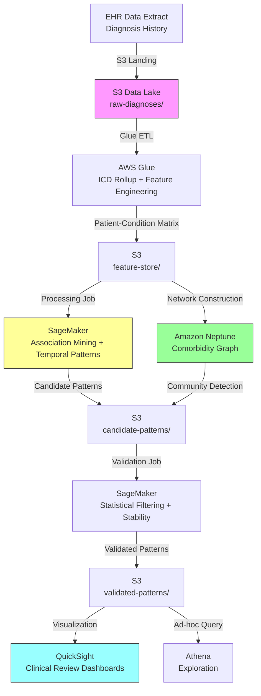

# Recipe 6.10 Architecture and Implementation: Multi-Morbidity Pattern Discovery

*Companion to [Recipe 6.10: Multi-Morbidity Pattern Discovery](chapter06.10-multi-morbidity-pattern-discovery). This page covers the AWS architecture, services, prerequisites, and pseudocode. For the problem framing and the conceptual approach, start with the main recipe.*

---

## Why These Services

**Amazon SageMaker** for the compute-intensive pattern mining and network analysis. Association rule mining on 200,000+ patients with 280 condition categories requires significant memory and compute. SageMaker Processing Jobs provide managed infrastructure that scales to the data size, runs the job, and shuts down. No persistent cluster to manage. For iterative exploration, SageMaker Studio notebooks let data scientists experiment with different parameters interactively. Processing Jobs should use a custom Docker image with all dependencies pre-installed (networkx, scipy, pandas, mlxtend). Do not rely on runtime `pip install`, which requires internet access unavailable in a VPC-deployed Processing Job without NAT Gateway.

**Amazon S3** as the data lake for all intermediate and final outputs. Raw diagnosis extracts, feature matrices, candidate patterns, filtered results, and clinical review outputs all live in S3. Versioning tracks how results change as parameters are tuned. Lifecycle policies manage storage costs for intermediate artifacts.

**AWS Glue** for the ETL pipeline that transforms raw EHR extracts into the patient-condition matrices the algorithms consume. Glue handles the ICD-10 rollup logic, prevalence calculations, and temporal feature construction at scale. Spark-based processing handles the large joins efficiently.

**Amazon Neptune** for the comorbidity network representation. Neptune Database stores conditions as nodes and co-occurrence relationships as edges. Note that community detection algorithms (Louvain, Leiden) are not native Gremlin traversal steps. Community detection runs in the SageMaker Processing Job using a graph library (networkx or igraph) after extracting the adjacency list from Neptune. Neptune stores the results (community labels as node properties) for subsequent queries and interactive exploration. The network can be updated incrementally as new data arrives without rebuilding from scratch.

**Amazon Athena** for ad-hoc exploration of intermediate results. When a data scientist wants to quickly check "how many patients have this three-condition combination?" or "what's the age distribution of patients in this cluster?", Athena queries S3 directly without loading data into a separate system. Configure a dedicated Athena workgroup for this pipeline with a KMS-encrypted results bucket that has the same access controls as the source data. Do not use the default Athena results bucket. Set result retention (S3 lifecycle) to 7 days to minimize PHI persistence in query results.

**Amazon QuickSight** (Enterprise edition) for visualization dashboards that present results to clinical stakeholders. Network visualizations, temporal progression charts, and pattern prevalence summaries need to be accessible to non-technical clinical leaders. If dashboards allow drill-down to patient-level data, use row-level security to restrict access to authorized clinical users via QuickSight groups mapped to your identity provider. Enable QuickSight audit logging. If dashboards display only aggregate pattern statistics (patient counts, prevalence, lift) without patient-level drill-down, PHI exposure risk is minimal, but confirm with your privacy officer. QuickSight reads validated pattern data from S3 and does not query Neptune directly.

## Architecture Diagram



## Prerequisites

| Requirement | Details |
|-------------|---------|
| **AWS Services** | Amazon SageMaker, Amazon S3, AWS Glue, Amazon Neptune, Amazon Athena, Amazon QuickSight (Enterprise), AWS KMS |
| **IAM Permissions** | `sagemaker:CreateProcessingJob`, `s3:GetObject`, `s3:PutObject`, `glue:StartJobRun`, `neptune-db:ReadDataViaQuery`, `neptune-db:WriteDataViaQuery`, `neptune-db:GetQueryStatus` (scoped to cluster ARN), `athena:StartQueryExecution`, `quicksight:CreateAnalysis`. Separate write roles (network construction) from read roles (dashboards, federated queries). Never grant `neptune-db:DeleteDataViaQuery` or `neptune-db:ResetDatabase` to pipeline roles. Scope all permissions to specific resource ARNs. |
| **BAA** | Required. Diagnosis histories are PHI. All services (including QuickSight Enterprise) must be covered under your AWS BAA. |
| **Encryption** | S3: SSE-KMS for all buckets (including Athena results bucket). Neptune: encryption at rest enabled at cluster creation (cannot be added later). SageMaker: KMS-encrypted processing volumes (`ProcessingResources.ClusterConfig.VolumeKmsKeyId`). All transit over TLS. |
| **VPC** | Production: SageMaker, Glue, and Neptune in VPC. VPC endpoints required: S3 (Gateway), CloudWatch Logs (Interface), KMS (Interface), SageMaker API (Interface), SageMaker Runtime (Interface), Athena (Interface), Glue (Interface). Neptune is deployed within the VPC by default (no public endpoint option). Glue jobs connecting to Neptune must run in the same VPC with security group rules allowing port 8182 access to the Neptune cluster. Neptune security group: allow inbound TCP 8182 from SageMaker Processing Job security group, Glue job security group only. Deny all other inbound. |
| **CloudTrail** | Management events enabled (default). S3 data events enabled for all PHI-containing buckets (raw-diagnoses/, feature-store/, candidate-patterns/, validated-patterns/). Data events are not enabled by default and must be configured explicitly. Cost: ~$0.10 per 100,000 events. |
| **Sample Data** | CMS Synthetic Public Use Files (SynPUFs) provide realistic Medicare claims data with diagnosis codes. MIMIC-IV contains diagnosis histories for ICU patients. Never use real patient data in development. |
| **Cost Estimate** | Glue ETL: ~$0.44/DPU-hour (typically 2-4 DPU for 2-3 hours). SageMaker Processing: ~$0.25/hour (ml.m5.4xlarge) for 4-8 hours per run. Neptune: ~$0.70/hour (db.r5.large primary + one reader replica) for production HA, or ~$0.35/hour (single instance) for research/development. For networks under 10,000 nodes, consider a simpler alternative: store the graph as a JSON adjacency list in S3, run algorithms in SageMaker, and skip the persistent Neptune cost. Athena: $5/TB scanned. Total per analysis run: $50-$200 depending on population size (excluding persistent Neptune). |

## Ingredients

| AWS Service | Role |
|------------|------|
| **Amazon SageMaker** | Runs association mining, sequential pattern mining, community detection, and statistical validation as Processing Jobs (custom container with pre-installed dependencies) |
| **Amazon S3** | Data lake for diagnosis extracts, feature matrices, pattern results, and Athena query results |
| **AWS Glue** | ETL for ICD-10 rollup, feature engineering, and patient-condition matrix construction |
| **Amazon Neptune** | Graph database for comorbidity network storage and interactive exploration queries |
| **Amazon Athena** | Ad-hoc SQL queries over intermediate results in S3 (dedicated workgroup with encrypted results bucket) |
| **Amazon QuickSight** | Enterprise edition visualization dashboards with row-level security for clinical stakeholder review |
| **AWS KMS** | Encryption key management for all PHI-containing stores |
| **Amazon CloudWatch** | Pipeline monitoring, job duration tracking, error alerting |

## Pseudocode Walkthrough

**Step 1: Diagnosis data extraction and ICD rollup.** The first step pulls longitudinal diagnosis data from the EHR extract and rolls granular ICD-10-CM codes up to a clinically meaningful grouping level. The choice of granularity is critical: too granular (full ICD-10) and you lack statistical power for combination analysis; too broad (major diagnostic categories) and you lose clinical specificity. Clinical Classifications Software Refined (CCSR) categories provide a good middle ground with ~530 categories, though many implementations use custom clinical groupers with 200-300 categories tuned to their population. The rollup also handles code versioning (ICD-10 codes change annually) and maps historical codes to current equivalents.

```pseudocode
FUNCTION extract_and_rollup(population_criteria, lookback_years = 10):
    // Pull all diagnosis records for the target population.
    // Each record: patient_id, icd10_code, first_documented_date, encounter_type
    raw_diagnoses = query EHR extract where:
        patient meets population_criteria AND
        diagnosis_date >= (today - lookback_years)

    // Load the ICD-10 to clinical grouper mapping.
    // This maps ~70,000 ICD-10 codes to ~300 clinical categories.
    // Example: E11.9 (Type 2 diabetes without complications) → "Diabetes mellitus"
    //          E11.65 (Type 2 diabetes with hyperglycemia) → "Diabetes mellitus"
    //          I50.9 (Heart failure, unspecified) → "Heart failure"
    grouper_map = load_clinical_grouper("ccsr_v2024")

    // Roll up each diagnosis to its clinical category.
    rolled_up = empty list
    FOR each record in raw_diagnoses:
        category = grouper_map.lookup(record.icd10_code)
        IF category is NULL:
            // Unmapped code. Log it for review but don't discard.
            log_unmapped_code(record.icd10_code)
            CONTINUE

        append to rolled_up: {
            patient_id:     record.patient_id,
            category:       category,
            first_date:     record.first_documented_date,
            encounter_type: record.encounter_type
        }

    // Deduplicate: keep only the earliest occurrence of each category per patient.
    // A patient's "diabetes" entry should reflect when it was first documented,
    // not every subsequent encounter where it was carried forward.
    deduplicated = FOR each (patient_id, category) pair:
        keep the record with the earliest first_date

    RETURN deduplicated
```

**Step 2: Build patient-condition matrix and compute baselines.** Transform the longitudinal records into a binary patient-condition matrix (rows = patients, columns = condition categories, values = 0/1 presence). Also compute individual condition prevalences and expected pairwise co-occurrence rates under independence. These baselines are essential for calculating lift and identifying combinations that exceed chance expectations. Without this step, your pattern mining would surface obvious high-prevalence combinations (hypertension + hyperlipidemia) rather than genuinely surprising associations.

```pseudocode
FUNCTION build_matrix_and_baselines(rolled_up_diagnoses, min_prevalence = 0.01):
    // Construct binary patient-condition matrix.
    // Rows: patients. Columns: condition categories. Values: 0 or 1.
    patients = unique patient_ids from rolled_up_diagnoses
    categories = unique categories from rolled_up_diagnoses
    N = count of patients

    matrix = zero matrix of shape (N, count of categories)
    FOR each record in rolled_up_diagnoses:
        row = index of record.patient_id in patients
        col = index of record.category in categories
        matrix[row][col] = 1

    // Compute individual prevalences.
    prevalences = empty map
    FOR each category in categories:
        col = index of category
        prevalences[category] = sum(matrix[:, col]) / N

    // Filter out rare conditions (below minimum prevalence threshold).
    // Rare conditions produce unstable association metrics.
    active_categories = filter categories where prevalences[category] >= min_prevalence

    // Compute expected pairwise co-occurrence under independence.
    // Expected P(A and B) = P(A) * P(B) if conditions are independent.
    expected_pairs = empty map
    FOR each pair (cat_a, cat_b) in combinations(active_categories, 2):
        expected_pairs[(cat_a, cat_b)] = prevalences[cat_a] * prevalences[cat_b] * N

    RETURN matrix, prevalences, expected_pairs, active_categories
```

**Step 3: Association rule mining.** Apply FP-Growth to find condition combinations with support above the minimum threshold. Then compute lift, confidence, and leverage for each discovered pattern. FP-Growth is preferred over Apriori for this workload because it builds a compressed representation of the dataset (the FP-tree) that avoids repeated database scans. For 200,000 patients with 285 categories, the FP-tree fits comfortably in memory on an ml.m5.4xlarge instance (64 GB RAM). Apriori would also work at this scale but requires more passes over the data. The minimum support threshold is a critical parameter: too low and you get millions of spurious patterns; too high and you miss clinically important but less common combinations. For a population of 200,000 patients, a minimum support of 0.5% (1,000 patients) is a reasonable starting point for pairwise patterns, with higher thresholds for three-way and four-way combinations.

```pseudocode
FUNCTION mine_association_rules(matrix, prevalences, active_categories,
                                min_support = 0.005, max_pattern_size = 4):
    N = number of rows in matrix

    // Use FP-Growth algorithm for efficient frequent itemset mining.
    // FP-Growth avoids the candidate generation step of Apriori,
    // making it faster for large, dense datasets.
    frequent_itemsets = fp_growth(
        transaction_matrix = matrix (filtered to active_categories),
        min_support = min_support,
        max_itemset_size = max_pattern_size
    )

    // Compute association metrics for each frequent itemset.
    patterns = empty list
    FOR each itemset in frequent_itemsets:
        observed_support = count patients with ALL conditions in itemset / N

        // Expected support under independence = product of individual prevalences
        expected_support = product of prevalences[cat] for cat in itemset

        lift = observed_support / expected_support
        leverage = observed_support - expected_support

        // Patient count for interpretability
        patient_count = observed_support * N

        pattern = {
            conditions:       itemset,
            size:             count of conditions in itemset,
            support:          observed_support,
            patient_count:    patient_count,
            lift:             lift,
            leverage:         leverage,
            expected_support: expected_support
        }
        append pattern to patterns

    // Sort by lift descending (most surprising combinations first).
    sort patterns by lift descending

    RETURN patterns
```

**Step 4: Temporal sequence analysis.** For the top candidate patterns from Step 3, analyze the temporal ordering of condition acquisition. This transforms static co-occurrence patterns into dynamic trajectories. For each multi-morbidity pattern, determine: which condition typically appears first? What's the median time between conditions? Is there a dominant ordering, or do patients arrive at the same combination via different paths? This temporal information is what makes patterns actionable for prevention: if condition A reliably precedes condition B by 3 years, you have a window for intervention.

```pseudocode
FUNCTION analyze_temporal_sequences(top_patterns, rolled_up_diagnoses, min_patients = 100):
    temporal_results = empty list

    FOR each pattern in top_patterns:
        conditions = pattern.conditions

        // Get all patients who have ALL conditions in this pattern.
        pattern_patients = find patients with all conditions in rolled_up_diagnoses

        IF count of pattern_patients < min_patients:
            CONTINUE  // insufficient data for temporal analysis

        // For each patient, extract the ordered sequence of condition onset dates.
        sequences = empty list
        FOR each patient in pattern_patients:
            patient_sequence = empty list
            FOR each condition in conditions:
                onset_date = first_documented_date for (patient, condition)
                append (condition, onset_date) to patient_sequence
            sort patient_sequence by onset_date ascending
            append patient_sequence to sequences

        // Identify the most common ordering (permutation).
        // Example: for {diabetes, CKD, heart failure}, the most common
        // ordering might be diabetes → CKD → heart failure (65% of patients).
        ordering_counts = count frequency of each unique ordering in sequences
        dominant_ordering = ordering with highest count
        dominant_fraction = max count / total sequences

        // Compute median inter-condition intervals.
        intervals = empty map
        FOR each consecutive pair (cond_a, cond_b) in dominant_ordering:
            days_between = collect (date_b - date_a) for all patients following this ordering
            intervals[(cond_a, cond_b)] = {
                median_days: median(days_between),
                iqr_days:    interquartile_range(days_between)
            }

        temporal_results.append({
            pattern:             pattern,
            dominant_ordering:   dominant_ordering,
            dominant_fraction:   dominant_fraction,
            intervals:           intervals,
            alternative_paths:   ordering_counts (excluding dominant)
        })

    RETURN temporal_results
```

**Step 5: Network construction and community detection.** Build a comorbidity network where conditions are nodes and edges represent statistically significant co-occurrence (lift > threshold, FDR-corrected p-value < 0.05). Apply community detection to identify clusters of tightly connected conditions. These communities represent multi-morbidity "neighborhoods" that may share underlying mechanisms. Community detection (Louvain algorithm) runs in the SageMaker Processing Job using networkx or igraph after extracting the adjacency list. Results (community labels) are written back to Neptune as node properties for interactive exploration.

```pseudocode
FUNCTION build_comorbidity_network(patterns, prevalences, fdr_threshold = 0.05, min_lift = 1.5):
    // Filter to significant pairwise associations.
    // Apply chi-squared test for each pair and correct for multiple testing.
    pairwise_patterns = filter patterns where size = 2

    p_values = empty list
    FOR each pair in pairwise_patterns:
        // Chi-squared test of independence for this condition pair.
        chi2, p_value = chi_squared_test(pair.observed_support, pair.expected_support, N)
        pair.p_value = p_value
        append p_value to p_values

    // Benjamini-Hochberg FDR correction.
    adjusted_p_values = benjamini_hochberg(p_values)
    FOR each pair, adj_p in zip(pairwise_patterns, adjusted_p_values):
        pair.adjusted_p = adj_p

    // Build network edges from significant, high-lift pairs.
    edges = empty list
    FOR each pair in pairwise_patterns:
        IF pair.adjusted_p < fdr_threshold AND pair.lift >= min_lift:
            edge = {
                source:    pair.conditions[0],
                target:    pair.conditions[1],
                weight:    pair.lift,
                support:   pair.support,
                p_value:   pair.adjusted_p
            }
            append edge to edges

    // Construct graph and run community detection.
    graph = build_graph(nodes = active_categories, edges = edges)

    // Louvain algorithm for community detection.
    // Finds groups of conditions that are more densely connected
    // to each other than to the rest of the network.
    communities = louvain_community_detection(graph, resolution = 1.0)

    // Store in graph database for interactive exploration.
    FOR each node in graph.nodes:
        write_to_neptune(node, properties = {
            prevalence: prevalences[node],
            community:  communities[node]
        })
    FOR each edge in edges:
        write_to_neptune(edge)

    RETURN graph, communities
```

**Step 6: Statistical validation and confounder adjustment.** Apply rigorous statistical filters to separate genuine multi-morbidity patterns from artifacts of age, sex, healthcare utilization, or multiple testing. This step is what separates research-grade discovery from noise. Patterns that survive validation are genuinely surprising given the population's demographics and utilization patterns. Patterns that don't survive were likely driven by confounders rather than true clinical associations. Note: bootstrap resamples are computed in-memory and not persisted to disk. Ensure the SageMaker Processing Job uses an encrypted volume (configured via `ProcessingResources.ClusterConfig.VolumeKmsKeyId`) in case the algorithm spills to local storage during large-population resampling.

```pseudocode
FUNCTION validate_patterns(patterns, patient_demographics, min_lift_adjusted = 1.3):
    validated = empty list

    FOR each pattern in patterns:
        // --- Age and sex adjustment ---
        // Stratify by age decade and sex. Recompute lift within each stratum.
        // If the pattern's lift drops below threshold after stratification,
        // it was driven by age/sex confounding, not a true clinical association.
        strata_lifts = empty list
        FOR each stratum in (age_decade x sex) combinations:
            stratum_patients = filter to patients in this stratum
            IF count of stratum_patients < 500:
                CONTINUE  // insufficient power in this stratum
            stratum_lift = compute_lift(pattern.conditions, stratum_patients)
            append stratum_lift to strata_lifts

        adjusted_lift = median(strata_lifts)
        IF adjusted_lift < min_lift_adjusted:
            CONTINUE  // pattern explained by demographics

        // --- Utilization adjustment ---
        // Patients with more encounters get more diagnoses documented.
        // Check if the pattern persists after matching on encounter count.
        utilization_adjusted_lift = compute_lift_matched_on_utilization(
            pattern.conditions, patient_demographics
        )
        IF utilization_adjusted_lift < min_lift_adjusted:
            CONTINUE  // pattern explained by documentation intensity

        // --- Bootstrap stability ---
        // Resample patients 100 times. Pattern must appear in >80% of resamples.
        stable_count = 0
        FOR i in 1 to 100:
            bootstrap_sample = resample patients with replacement
            bootstrap_lift = compute_lift(pattern.conditions, bootstrap_sample)
            IF bootstrap_lift >= min_lift_adjusted:
                stable_count += 1

        stability = stable_count / 100
        IF stability < 0.80:
            CONTINUE  // pattern is unstable

        // Pattern survived all validation checks.
        pattern.adjusted_lift = adjusted_lift
        pattern.stability = stability
        append pattern to validated

    RETURN validated
```

> **Curious how this looks in Python?** The pseudocode above covers the concepts. If you'd like to see sample Python code that demonstrates these patterns using boto3, check out the [Python Example](chapter06.10-python-example). It walks through each step with inline comments and notes on what you'd need to change for a real deployment.

## Expected Results

Sample output for a validated multi-morbidity pattern:

```json
{
  "pattern_id": "MMP-0042",
  "conditions": ["Type 2 Diabetes", "Chronic Kidney Disease Stage 3", "Heart Failure", "Anemia"],
  "size": 4,
  "support": 0.023,
  "patient_count": 4612,
  "lift": 3.8,
  "adjusted_lift": 3.2,
  "stability": 0.94,
  "dominant_ordering": ["Type 2 Diabetes", "Chronic Kidney Disease Stage 3", "Anemia", "Heart Failure"],
  "dominant_ordering_fraction": 0.41,
  "median_intervals": {
    "Type 2 Diabetes → CKD Stage 3": "4.2 years",
    "CKD Stage 3 → Anemia": "1.8 years",
    "Anemia → Heart Failure": "2.1 years"
  },
  "community": "Cardiorenal-Metabolic",
  "clinical_review_status": "pending"
}
```

**Performance benchmarks:**

| Metric | Value |
|--------|-------|
| Population size | 200,000 patients |
| Condition categories | 285 (after prevalence filter) |
| Pairwise patterns discovered | 1,847 (pre-validation) |
| Pairwise patterns validated | 312 |
| Three-way patterns validated | 89 |
| Four-way patterns validated | 18 |
| Glue ETL runtime | ~45 minutes |
| SageMaker mining job runtime | ~3.5 hours |
| Neptune network load | ~10 minutes |
| End-to-end pipeline | ~5 hours |

**Where it struggles:**

- Rare conditions (prevalence < 1%) lack statistical power for combination analysis
- Temporal ordering is unreliable when conditions are diagnosed at the same encounter
- Coding practices vary across providers and sites, introducing systematic bias
- Patterns involving mental health conditions are underrepresented due to documentation gaps
- The pipeline cannot distinguish causal relationships from shared risk factors

---

<!-- TODO (TechWriter): RECIPE-GUIDE requires a "Why This Isn't Production-Ready" section between Expected Results and Variations. Add section covering gaps a production deployment must close. -->

## Variations and Extensions

### Variation 1: Medication-Condition Interaction Patterns

Extend the condition-only analysis to include medication classes. Mine for patterns like "patients on metformin + ACE inhibitor + statin who develop condition X at rate Y." This surfaces potential drug-disease interactions and identifies medication combinations that may be protective or harmful for specific multi-morbidity profiles. Requires pharmacy claims data in addition to diagnosis data.

### Variation 2: Cost-Weighted Multi-Morbidity Patterns

Weight patterns not just by prevalence and lift but by total cost of care. A pattern affecting 2% of patients that costs $80,000/year per patient is more operationally important than a pattern affecting 5% at $15,000/year. Integrate claims cost data and rank patterns by total addressable spend. This framing resonates with health system CFOs and accelerates investment in dedicated care pathways.

### Variation 3: Real-Time Pattern Assignment for New Patients

Once patterns are discovered and validated, build a real-time scoring system that assigns incoming patients to known multi-morbidity patterns as their diagnoses accumulate. When a patient acquires their second condition in a known three-condition pattern, flag them for proactive intervention before the third condition develops. This transforms retrospective discovery into prospective prevention.

---

## Additional Resources

### AWS Documentation

- [Amazon SageMaker Processing Jobs](https://docs.aws.amazon.com/sagemaker/latest/dg/processing-job.html) - Running data processing and analysis workloads
- [Amazon Neptune Graph Analytics](https://docs.aws.amazon.com/neptune/latest/userguide/graph-analytics.html) - Graph algorithms including community detection
- [AWS Glue ETL Programming](https://docs.aws.amazon.com/glue/latest/dg/aws-glue-programming.html) - Spark-based ETL for large-scale data transformation
- [Amazon Athena User Guide](https://docs.aws.amazon.com/athena/latest/ug/what-is.html) - Serverless SQL queries over S3 data
- [Amazon QuickSight Visualizations](https://docs.aws.amazon.com/quicksight/latest/user/working-with-visuals.html) - Building interactive dashboards

### AWS Sample Repos

- [`amazon-neptune-samples`](https://github.com/aws-samples/amazon-neptune-samples) - Neptune graph database examples including graph analytics patterns
- [`amazon-sagemaker-examples`](https://github.com/aws-samples/amazon-sagemaker-examples) - SageMaker examples including processing jobs and custom algorithms

### Compliance and Research

- [HIPAA and Research (HHS)](https://www.hhs.gov/hipaa/for-professionals/special-topics/research/index.html) - Guidance on using PHI for research purposes
- [CMS Chronic Conditions Data Warehouse](https://www2.ccwdata.org/) - Reference for condition category definitions and multi-morbidity research

---

## Estimated Implementation Time

| Phase | Duration | Notes |
|-------|----------|-------|
| **Basic** (pairwise association mining, static co-occurrence) | 4-6 weeks | Glue ETL + SageMaker Processing + basic reporting |
| **Production-ready** (temporal analysis, network, validation, clinical review interface) | 12-16 weeks | Adds Neptune, QuickSight dashboards, confounder adjustment, stability testing |
| **With variations** (medication interactions, cost weighting, real-time scoring) | 20-28 weeks | Adds pharmacy data integration, cost modeling, streaming pattern assignment |

---


---

*← [Main Recipe 6.10](chapter06.10-multi-morbidity-pattern-discovery) · [Python Example](chapter06.10-python-example) · [Chapter Preface](chapter06-preface)*
