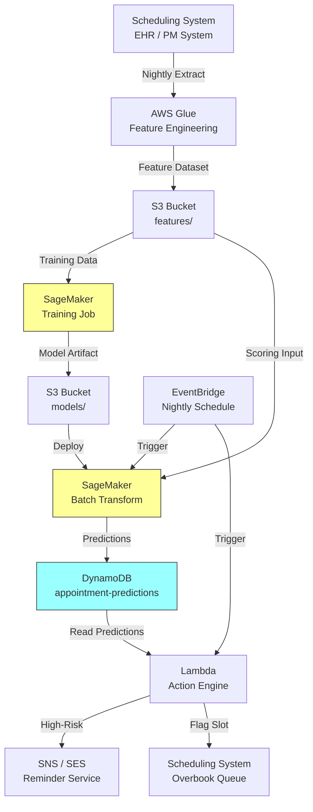

# Recipe 7.1: Appointment No-Show Prediction ⭐

**Complexity:** Simple · **Phase:** MVP · **Estimated Cost:** ~$0.001 per prediction

---

## The Problem

Here's a number that should make any clinic operations manager wince: somewhere between 5% and 30% of scheduled outpatient appointments end up as no-shows. The patient just doesn't come. No call, no cancellation, no reschedule. The slot sits empty.

That empty slot isn't free. A primary care physician's time is worth roughly $200-400 per hour, depending on specialty and market. A 15-minute slot that goes unused is $50-100 of lost revenue. Multiply that across a 20-provider practice with a 15% no-show rate, and you're looking at hundreds of thousands of dollars in annual lost revenue. For a large health system with hundreds of providers, the number crosses into the millions.

But the financial hit is only part of the story. That empty slot could have gone to another patient. Someone who needed to be seen. Someone on a waitlist. Someone whose condition is getting worse while they wait three weeks for the next available appointment. No-shows don't just cost money; they cost access.

The standard response has been blunt-force overbooking: schedule 110% of capacity and hope the math works out. Sometimes it does. Sometimes three patients all show up for two slots and the waiting room turns hostile. Overbooking without intelligence is a gamble, and the downside is a terrible patient experience for the people who did show up on time.

What if you could predict which specific appointments are likely to no-show? Not "15% of Tuesday afternoon appointments" as a population average, but "this specific appointment with this specific patient has a 73% chance of being missed." That changes everything. You can send targeted reminders to high-risk appointments. You can selectively overbook only the slots most likely to open up. You can offer waitlisted patients those specific slots as standby options. You can allocate staff time toward outreach rather than hoping for the best.

This is one of the cleanest prediction problems in healthcare operations. Binary outcome (showed vs. didn't show). Abundant historical data (every scheduling system has years of it). Low-stakes intervention (a reminder call or text). And the feedback loop is immediate: you find out within hours whether your prediction was right.

Let's build it.

---

## The Technology: Predicting Human Behavior from Patterns

### Binary Classification: The Foundation

At its core, no-show prediction is a binary classification problem. Given a set of features about an upcoming appointment, predict one of two outcomes: the patient will show up, or they won't. This is the bread and butter of machine learning, and it's been well-understood for decades.

The simplest version is logistic regression: a mathematical function that takes a weighted combination of input features and squishes the result into a probability between 0 and 1. If the output is 0.73, you interpret that as "73% chance of no-show." It's interpretable, fast, and surprisingly effective for this problem. Many production no-show models in healthcare are still logistic regression under the hood, because the features matter more than the algorithm.

Gradient-boosted trees (XGBoost, LightGBM, CatBoost) are the next step up. They build an ensemble of decision trees, each one correcting the errors of the previous ones. They handle non-linear relationships, feature interactions, and missing values more gracefully than logistic regression. For tabular data like appointment records, they're typically the best-performing approach without requiring deep learning infrastructure.

Deep learning (neural networks) is overkill for this problem in most cases. The data is tabular, the feature space is modest, and the relationship between features and outcome isn't complex enough to justify the training overhead. Save neural networks for problems where you have unstructured data (images, text, sequences) or millions of training examples with subtle patterns.

### The Features That Actually Matter

Here's what decades of no-show research have consistently found to be predictive:

**Patient history.** The single strongest predictor of a future no-show is past no-shows. A patient who has missed 4 of their last 10 appointments has a dramatically higher probability of missing the next one than a patient with a perfect attendance record. This is the "prior behavior predicts future behavior" principle, and it dominates most models.

**Lead time.** The gap between when the appointment was scheduled and when it's supposed to happen. An appointment booked 6 weeks out has a much higher no-show rate than one booked 2 days out. This makes intuitive sense: life changes, people forget, the urgency that prompted the booking fades.

**Day and time.** Monday mornings and Friday afternoons tend to have higher no-show rates. So do appointments during school hours for pediatric patients. These patterns are highly local to your specific practice and patient population.

**Appointment type.** Follow-up visits no-show at higher rates than new patient visits. Routine wellness checks no-show more than urgent symptom visits. The perceived urgency of the visit matters.

**Demographics and access factors.** Distance from the clinic, transportation access, insurance type (Medicaid populations historically show higher no-show rates, which reflects access barriers, not irresponsibility), age, and language barriers all correlate with no-show probability. These features improve accuracy but require careful handling to avoid reinforcing disparities (more on this in the Honest Take section).

**Weather and external events.** Rain, snow, extreme heat, and local events (school closures, major sports events) all measurably affect no-show rates. These are harder to incorporate because they require external data sources and real-time feature computation, but they can add a few percentage points of accuracy.

**Reminder history.** Whether the patient has already received a reminder, and whether they confirmed. A patient who confirmed via text 24 hours ago is much less likely to no-show than one who hasn't responded to any outreach.

### Why This Is Easier Than Most Healthcare ML

No-show prediction has several properties that make it unusually tractable:

**Clear, objective outcome.** The patient either showed up or didn't. There's no ambiguity, no subjective labeling, no inter-rater disagreement. Your training labels are clean.

**Abundant data.** Any scheduling system with 2+ years of history has tens of thousands of labeled examples. You don't need to go find data or label it manually. It's already there.

**Fast feedback loop.** You know the outcome within hours of the prediction. This means you can retrain frequently, detect model drift quickly, and measure your accuracy in near-real-time.

**Low-stakes intervention.** If your model says "high risk of no-show" and you send an extra reminder, the worst case is a mildly annoyed patient who was going to show up anyway. Compare that to a model that recommends a medication or a surgical intervention. The cost of a false positive here is a text message.

**No regulatory burden.** This isn't a clinical decision support tool. It's an operational optimization. You don't need FDA clearance, you don't need clinical validation studies, and you don't need physician sign-off on the model's recommendations. (You do still need to handle PHI appropriately, but that's table stakes in healthcare.)

### The General Architecture Pattern

The pipeline has four logical stages:

```
[Feature Store] → [Model Training] → [Scoring Service] → [Action Engine]
```

**Feature Store.** A pre-computed repository of patient and appointment features, updated on a schedule. Raw data from your scheduling system, EHR, and demographics tables gets transformed into model-ready features: no-show rate over the last N appointments, days since last visit, distance to clinic, appointment lead time, and so on. Computing these on the fly at prediction time is possible but slow and fragile. A feature store decouples feature engineering from model serving.

**Model Training.** A batch process that trains (or retrains) the classification model on historical appointment data. Runs on a schedule (weekly or monthly) or when triggered by performance degradation. Outputs a serialized model artifact and a performance report (AUC, calibration curve, feature importance).

**Scoring Service.** An inference endpoint that accepts an appointment's features and returns a no-show probability. This runs in near-real-time: when a new appointment is booked, or on a nightly batch for the next day's schedule. The output is a probability (0.0 to 1.0) and optionally the top contributing features (for explainability).

**Action Engine.** The system that decides what to do with the prediction. Above a certain threshold, trigger an extra reminder. Above a higher threshold, flag the slot for overbooking consideration. Below the threshold, do nothing special. The thresholds are operational decisions, not model decisions. They depend on your reminder capacity, your overbooking tolerance, and your patient experience goals.

This separation of concerns is important. The model predicts. The action engine decides. Changing your reminder strategy shouldn't require retraining the model, and improving the model shouldn't require changing your operational workflows.

---

## The AWS Implementation

### Why These Services

**Amazon SageMaker for model training and hosting.** SageMaker handles the infrastructure you don't want to manage yourself: spinning up a training instance, running the XGBoost job, storing the model artifact, and tearing everything down when it's done. For tabular classification problems like no-show prediction, the built-in XGBoost algorithm is a strong default. The batch transform mode is particularly useful here: score tomorrow's entire schedule in one job rather than standing up a persistent endpoint that sits idle 23 hours a day.

**Amazon S3 for data and model storage.** Training data (historical appointments with outcomes), feature datasets, and trained model artifacts all live in S3. It's the natural staging area between your data warehouse and SageMaker, and between SageMaker and your inference pipeline. Versioned buckets let you track which training data produced which model.

**AWS Glue for feature engineering.** The ETL layer that transforms raw scheduling data into model-ready features. Glue jobs can pull from your data warehouse (Redshift, RDS, or wherever your scheduling system stores data), compute derived features (rolling no-show rates, lead time calculations, distance computations), and write the results to S3 in a format SageMaker can consume. Scheduled Glue jobs keep your feature store fresh.

**Amazon EventBridge for orchestration.** Triggers the nightly scoring pipeline: "At 8 PM, score all appointments for the next 48 hours." Also triggers retraining on a schedule or when a CloudWatch alarm fires on model performance degradation.

**Amazon DynamoDB for prediction storage.** Scored predictions need to be accessible to downstream systems (your scheduling UI, your reminder engine, your overbooking logic). DynamoDB provides fast key-value lookups by appointment ID with low latency. The reminder engine queries "give me all appointments in the next 24 hours with no-show probability > 0.6" and acts on them.

**AWS Lambda for the action engine.** Lightweight functions that read predictions from DynamoDB and trigger interventions: send a reminder via SNS/SES, flag a slot in the scheduling system, notify the front desk. Lambda's event-driven model fits naturally: a DynamoDB stream or EventBridge schedule triggers the appropriate action based on the prediction score and your configured thresholds.

### Architecture Diagram



### Prerequisites

| Requirement | Details |
|-------------|---------|
| **AWS Services** | Amazon SageMaker, Amazon S3, AWS Glue, Amazon DynamoDB, AWS Lambda, Amazon EventBridge, Amazon SNS or SES |
| **IAM Permissions** | Distributed across service-specific roles: Glue execution role (S3 read/write on feature buckets, data source access); SageMaker execution role (S3 read/write on model/feature buckets, KMS decrypt); Lambda action engine role (DynamoDB read, SNS publish); EventBridge scheduler role (Lambda invoke, SageMaker transform). Scope each role to specific resource ARNs. The Lambda role should NOT have SageMaker or Glue permissions. |
| **BAA** | AWS BAA signed (appointment data contains PHI: patient names, dates of birth, contact info) |
| **Encryption** | S3: SSE-KMS for training data and model artifacts; DynamoDB: encryption at rest (default), TTL enabled to expire predictions after appointment date + 90 days (PHI retention policy); SageMaker: KMS-encrypted training volumes and endpoints; all transit over TLS |
| **VPC** | Production: SageMaker training and inference in VPC with gateway endpoints for S3 and DynamoDB. Additional interface endpoints required: SageMaker API, SNS, CloudWatch Logs, and KMS. Glue jobs in VPC with access to data sources. |
| **CloudTrail** | Enabled: log all SageMaker, S3, and DynamoDB API calls for audit |
| **Sample Data** | Synthetic appointment records. Generate from realistic distributions: 15% base no-show rate, correlated with lead time and patient history. Never use real patient data in dev. |
| **Cost Estimate** | SageMaker training: ~$5-20 per training run (ml.m5.xlarge, 1-2 hours). Batch transform: ~$2-5 per nightly scoring run. DynamoDB: negligible at appointment volumes. Total: ~$200-500/month for a mid-size practice. |

### Ingredients

| AWS Service | Role |
|------------|------|
| **Amazon SageMaker** | Train XGBoost model on historical data; batch-score upcoming appointments |
| **Amazon S3** | Store training datasets, feature files, and model artifacts |
| **AWS Glue** | ETL: transform raw scheduling data into model-ready features |
| **Amazon DynamoDB** | Store predictions for fast lookup by appointment ID or date range |
| **Amazon EventBridge** | Orchestrate nightly scoring and periodic retraining |
| **AWS Lambda** | Action engine: read predictions, trigger reminders or overbooking flags |
| **Amazon SNS/SES** | Deliver reminder messages (SMS via SNS, email via SES) |
| **Amazon CloudWatch** | Monitor model performance, prediction distributions, and pipeline health |

### Code

#### Walkthrough

**Step 1: Feature engineering.** The Glue job runs nightly, pulling the latest appointment and patient data from your scheduling system. For each upcoming appointment, it computes the features the model needs: the patient's historical no-show rate, the lead time in days, the day of week, the appointment type, and demographic factors. It also pulls the outcome labels for recent past appointments (to feed retraining). The output is a clean CSV or Parquet file in S3, one row per appointment, ready for the model. Skip this step and you're asking the model to work with raw database records that have no predictive signal computed.

```
FUNCTION compute_features(appointments, patient_history):
    // For each upcoming appointment, compute the feature vector
    // that the model needs to make a prediction.
    features = empty list

    FOR each appointment in appointments:
        patient_id   = appointment.patient_id
        history      = patient_history[patient_id]

        // The single most predictive feature: how often has this patient
        // no-showed in the past? Compute over their last 10 appointments
        // (or fewer if they're newer to the practice).
        past_appointments = history.last_n_appointments(10)
        no_show_rate = count(past_appointments where status = "NO_SHOW") / count(past_appointments)

        // Lead time: days between booking date and appointment date.
        // Longer lead times correlate strongly with higher no-show rates.
        lead_time_days = days_between(appointment.booked_date, appointment.scheduled_date)

        // Temporal features: day of week and hour of day both matter.
        // Monday mornings and Friday afternoons are historically worse.
        day_of_week = appointment.scheduled_date.day_of_week   // 0=Monday, 6=Sunday
        hour_of_day = appointment.scheduled_time.hour          // 0-23

        // Appointment characteristics
        visit_type     = encode_category(appointment.visit_type)   // "new", "follow_up", "wellness", "urgent"
        provider_id    = encode_category(appointment.provider_id)  // some providers have higher no-show rates
        department     = encode_category(appointment.department)

        // Patient demographics and access factors
        distance_miles = compute_distance(patient.address, clinic.address)
        // NOTE: If distance computation requires an external geocoding API,
        // route through a NAT gateway with a BAA-covered provider, or
        // pre-geocode addresses at patient registration time to avoid
        // runtime PHI egress from this pipeline.
        insurance_type = encode_category(patient.insurance_type)   // "commercial", "medicaid", "medicare", "self_pay"
        age            = years_between(patient.date_of_birth, today)

        // Recency: days since last completed visit.
        // Patients who haven't been seen in a long time are higher risk.
        days_since_last_visit = days_between(history.last_completed_visit_date, today)

        // Assemble the feature vector
        feature_row = {
            appointment_id:       appointment.id,
            no_show_rate_last_10: no_show_rate,
            lead_time_days:       lead_time_days,
            day_of_week:          day_of_week,
            hour_of_day:          hour_of_day,
            visit_type:           visit_type,
            provider_id:          provider_id,
            department:           department,
            distance_miles:       distance_miles,
            insurance_type:       insurance_type,
            age:                  age,
            days_since_last_visit: days_since_last_visit
        }

        append feature_row to features

    // Write to S3 as a Parquet file for SageMaker to consume
    write features to S3 at "s3://ml-data/features/upcoming/{date}.parquet"
    RETURN features
```

**Step 2: Model training.** Periodically (weekly or monthly), a SageMaker training job picks up the historical feature dataset (appointments with known outcomes) and trains a gradient-boosted tree classifier. The training job handles hyperparameter tuning, cross-validation, and outputs both the model artifact and an evaluation report. The key metrics to track are AUC-ROC (overall discrimination ability), calibration (does a predicted 0.7 actually mean 70% no-show?), and performance across subgroups (does the model work equally well for different patient populations?). Skip retraining and your model will drift as patient behavior and scheduling patterns change over time.

```
FUNCTION train_model(training_data_path):
    // Configure the SageMaker training job.
    // XGBoost is the right choice for tabular binary classification:
    // handles missing values, captures non-linear relationships,
    // and trains fast on modest data sizes.
    training_config = {
        algorithm:       "xgboost",
        objective:       "binary:logistic",    // output probabilities, not just 0/1
        eval_metric:     "auc",                // optimize for discrimination ability
        num_round:       200,                  // number of boosting rounds
        max_depth:       6,                    // tree depth (controls complexity)
        eta:             0.1,                  // learning rate (smaller = more conservative)
        subsample:       0.8,                  // use 80% of data per tree (reduces overfitting)
        colsample_bytree: 0.8,                // use 80% of features per tree
        scale_pos_weight: 5.5,                // adjust for class imbalance
                                              // Compute from YOUR training data:
                                              // count(showed) / count(no-showed).
                                              // 5.5 assumes ~15% no-show rate (85/15 ≈ 5.5).
                                              // A 25% rate needs ~3.0; a 7% rate needs ~13.
                                              // Recompute on each retrain as distribution shifts.
        input_data:      training_data_path,
        output_path:     "s3://ml-data/models/no-show/",
        instance_type:   "ml.m5.xlarge",      // sufficient for datasets under 1M rows
        instance_count:  1
    }

    // Launch the training job. SageMaker handles provisioning,
    // training, evaluation, and artifact storage.
    job = SageMaker.create_training_job(training_config)
    wait_for_completion(job)

    // Log the evaluation metrics for monitoring
    metrics = job.final_metrics   // AUC, accuracy, log loss
    log("Model trained. AUC: {metrics.auc}, LogLoss: {metrics.log_loss}")

    RETURN job.model_artifact_path
```

**Step 3: Batch scoring.** Every evening, a SageMaker batch transform job scores all appointments for the next 48 hours. Batch transform is more cost-effective than a persistent endpoint for this use case: you need predictions once per day, not continuously. The job reads the feature file from Step 1, applies the trained model, and outputs a prediction for each appointment. Each prediction is a probability between 0.0 and 1.0 representing the model's estimate of no-show likelihood.

```
FUNCTION score_upcoming_appointments(model_path, features_path):
    // Configure batch transform: apply the model to all upcoming appointments at once.
    // This is cheaper than a real-time endpoint when you only need predictions once daily.
    transform_config = {
        model_artifact:  model_path,
        input_data:      features_path,                          // today's feature file from Step 1
        output_path:     "s3://ml-data/predictions/{date}/",     // predictions land here
        instance_type:   "ml.m5.large",                          // sufficient for scoring
        instance_count:  1,
        content_type:    "text/csv",
        split_type:      "Line",                                 // one prediction per input row
        network_isolation: true                                   // defense-in-depth: container has no
                                                                 // outbound network access (reads/writes
                                                                 // via SageMaker-managed S3 channels only)
    }

    job = SageMaker.create_transform_job(transform_config)
    wait_for_completion(job)

    // Read predictions and pair them with appointment IDs.
    // Batch transform output is positional: line N of the output file
    // contains the prediction for line N of the input file.
    // Join predictions back to appointment IDs by index position.
    predictions = read_predictions(transform_config.output_path)
    RETURN predictions   // list of {appointment_id, no_show_probability}
```

**Step 4: Store predictions.** Write each prediction to DynamoDB so downstream systems can look them up quickly. The primary key is the appointment ID; a secondary index on scheduled date enables range queries like "all high-risk appointments for tomorrow." Each record includes the probability, the model version (for auditability), and a timestamp. This step bridges the ML pipeline and the operational systems. Without it, predictions exist only as a file in S3 that nothing can easily query.

<!-- TODO (TechWriter): Expert review A3 (MEDIUM). Add conditional write guidance to prevent overwriting predictions already acted upon. Use condition expression `attribute_not_exists(acted_at)` or append a pipeline_run_id for audit consistency between predictions and actions. -->

```
FUNCTION store_predictions(predictions):
    // Write each prediction to DynamoDB for fast downstream access.
    // The action engine and scheduling UI both read from this table.
    FOR each prediction in predictions:
        write to DynamoDB table "appointment-predictions":
            appointment_id     = prediction.appointment_id       // primary key
            scheduled_date     = prediction.scheduled_date       // sort key + GSI for date queries
            no_show_probability = prediction.probability         // 0.0 to 1.0
            risk_tier          = classify_risk(prediction.probability)  // "low", "medium", "high"
            model_version      = current_model_version           // which model produced this
            scored_at          = current UTC timestamp           // when the prediction was made
            features_used      = prediction.top_features         // top 3 contributing features
                                                                 // (for explainability in the UI)

FUNCTION classify_risk(probability):
    // Convert continuous probability into actionable tiers.
    // Thresholds are operational decisions, not model decisions.
    // Tune these based on your reminder capacity and tolerance for false positives.
    IF probability >= 0.7:  RETURN "high"      // aggressive intervention
    IF probability >= 0.4:  RETURN "medium"    // standard reminder
    RETURN "low"                                // no special action
```

**Step 5: Action engine.** A Lambda function, triggered by EventBridge on a schedule (e.g., every morning at 6 AM for that day's appointments, and again at 6 PM for the next day's), queries DynamoDB for high-risk appointments and triggers the appropriate intervention. The intervention depends on the risk tier and your operational capacity. High-risk appointments might get a personal phone call from staff. Medium-risk gets an automated text reminder. Low-risk gets the standard reminder workflow (which you probably already have). The key insight: this is where the prediction becomes action. A model that scores perfectly but never triggers an intervention is worthless.

```
FUNCTION run_action_engine(target_date):
    // Query all predictions for the target date, filtered to actionable risk levels.
    high_risk = query DynamoDB "appointment-predictions"
                WHERE scheduled_date = target_date
                AND risk_tier = "high"

    medium_risk = query DynamoDB "appointment-predictions"
                  WHERE scheduled_date = target_date
                  AND risk_tier = "medium"

    // High-risk: aggressive intervention
    FOR each appointment in high_risk:
        // Send personalized reminder with easy reschedule option.
        // Keep SMS content minimal: date/time and a generic prompt only.
        // Do not include provider name, visit type, or clinical details in SMS.
        // SMS is not encrypted end-to-end; link to a secure portal for specifics.
        send_reminder(
            patient_id:  appointment.patient_id,
            channel:     "sms",                          // SMS has highest open rates
            message:     personalized_reminder(appointment),
            include_reschedule_link: true                 // make it easy to reschedule rather than no-show
        )
        // Flag for potential overbooking
        flag_for_overbooking(appointment.slot_id)
        // Notify front desk for personal outreach if capacity allows
        notify_staff(appointment, reason="high no-show risk")

    // Medium-risk: automated reminder (supplement standard workflow)
    FOR each appointment in medium_risk:
        send_reminder(
            patient_id:  appointment.patient_id,
            channel:     "sms",
            message:     standard_reminder(appointment),
            include_reschedule_link: true
        )

    log("Actions triggered: {count(high_risk)} high-risk, {count(medium_risk)} medium-risk")
```

> **Curious how this looks in Python?** The pseudocode above covers the concepts. If you'd like to see sample Python code that demonstrates these patterns using boto3, check out the [Python Example](chapter07.01-python-example). It walks through each step with inline comments and notes on what you'd need to change for a real deployment.

<!-- TODO (TechWriter): Expert review A1 (HIGH). Add Step 6: Ground truth collection and model monitoring. Needs a nightly Lambda that joins predictions with actual outcomes after the appointment date, computes rolling AUC, publishes to CloudWatch, and triggers retraining when AUC drops below threshold (e.g., 0.72). Add feedback loop to architecture diagram from scheduling system back to training pipeline. -->

### Expected Results

**Sample prediction output:**

```json
{
  "appointment_id": "APT-2026-0531-1430",
  "patient_id": "PAT-88291",
  "scheduled_date": "2026-06-02",
  "scheduled_time": "14:30",
  "provider": "Dr. Martinez",
  "visit_type": "follow_up",
  "no_show_probability": 0.73,
  "risk_tier": "high",
  "top_features": [
    {"feature": "no_show_rate_last_10", "value": 0.5, "contribution": 0.28},
    {"feature": "lead_time_days", "value": 42, "contribution": 0.19},
    {"feature": "days_since_last_visit", "value": 180, "contribution": 0.11}
  ],
  "model_version": "v2.3.1",
  "scored_at": "2026-05-31T20:15:00Z"
}
```

**Performance benchmarks:**

| Metric | Typical Value |
|--------|---------------|
| AUC-ROC | 0.75-0.85 (depends on feature richness) |
| Precision at 50% recall | 0.40-0.55 |
| Calibration error | < 0.05 (Brier score) |
| Scoring latency (batch) | 5-15 minutes for 10,000 appointments |
| Feature computation (Glue) | 10-30 minutes nightly |
| Model training time | 30-90 minutes (weekly retrain) |
| End-to-end pipeline | < 1 hour from trigger to predictions in DynamoDB |

**Where it struggles:**

- New patients with no history (cold start problem). The model falls back to population averages, which are much less informative.
- Sudden life events (hospitalization, family emergency, job loss) that aren't captured in historical patterns.
- Patients who always confirm but still no-show. Confirmation behavior and actual attendance aren't perfectly correlated.
- Seasonal shifts (holiday weeks, school breaks) that don't appear in the training window.
- Practice changes (new provider, new location, new hours) that invalidate historical patterns.

---

## The Honest Take

This is genuinely one of the easiest ML problems in healthcare to get working. The data is clean, the outcome is binary, the feedback is fast, and the intervention is low-risk. If you're looking for a first ML project to prove value in a health system, this is a strong candidate.

That said, here's what will surprise you:

The model accuracy ceiling is lower than you'd expect. An AUC of 0.80 sounds good until you realize that means you're still wrong a lot. Human behavior is inherently stochastic. A patient with a 70% predicted no-show probability will still show up 30% of the time. You're not predicting certainty; you're predicting tendencies. Set expectations accordingly with your operations team.

The features matter more than the algorithm. I've seen teams spend weeks tuning XGBoost hyperparameters when the real gain was adding "distance to clinic" or "number of prior no-shows" to the feature set. Start with good features and a simple model. Only add complexity if the simple model plateaus.

The fairness question is real and uncomfortable. No-show models trained on historical data will learn that Medicaid patients, patients from certain zip codes, and patients of certain demographics no-show at higher rates. Those patterns are real, but they reflect systemic access barriers (transportation, childcare, work flexibility), not patient irresponsibility. If you use the model to deprioritize these patients (shorter reminder windows, less outreach), you're reinforcing the disparity. The ethical use is the opposite: direct more resources toward high-risk patients, not fewer. Make sure your action engine reflects this.

The overbooking decision is harder than the prediction. Even with a perfect model, deciding how many patients to overbook requires balancing revenue recovery against patient wait times, provider burnout, and the occasional day when everyone shows up. This is an operations research problem layered on top of the ML problem. Don't let the model make the overbooking decision directly; let it inform a human or a separate optimization system.

Retraining frequency matters more than you'd think. Patient populations shift. New providers join. Telehealth options change behavior. A model trained on 2024 data may not perform well on 2026 appointments. Monthly retraining with a 12-month rolling window is a reasonable default. Monitor AUC weekly and trigger an alert if it drops below your baseline.

---

## Variations and Extensions

**Real-time scoring at booking time.** Instead of nightly batch scoring, trigger a prediction the moment an appointment is booked. This enables immediate intervention: "We notice this slot is 6 weeks out. Would you like us to send you a reminder the week before?" Requires a SageMaker real-time endpoint instead of batch transform, which costs more but enables proactive engagement.

**Waitlist optimization.** Combine no-show predictions with a patient waitlist. When a slot has a high predicted no-show probability, automatically offer it as a standby option to waitlisted patients. If the original patient cancels or no-shows, the waitlisted patient is already prepared to fill the gap. This turns predicted no-shows into recovered access.

**Multi-class prediction.** Instead of binary (show/no-show), predict three outcomes: show, no-show, and late cancellation. Late cancellations (within 24 hours) are operationally different from true no-shows because they sometimes allow backfill. A multi-class model lets you tailor interventions differently for each predicted outcome.

---

## Related Recipes

- **Recipe 4.1 (Appointment Reminder Channel Optimization):** Uses patient preferences and response history to choose the best reminder channel (SMS, email, phone, app notification) for the interventions triggered by this recipe's predictions.
- **Recipe 7.4 (ED Visit Prediction):** Similar binary classification approach but predicting emergency department utilization rather than appointment attendance. Shares feature engineering patterns.
- **Recipe 7.5 (30-Day Readmission Risk):** Another predictive model with a well-defined binary outcome and established benchmarks. Demonstrates the same train/score/act pipeline at higher clinical stakes.
- **Recipe 12.1 (Appointment Volume Forecasting):** Complements no-show prediction by forecasting aggregate demand. Together, they enable intelligent capacity planning.

---

## Additional Resources

**AWS Documentation:**
- [Amazon SageMaker XGBoost Algorithm](https://docs.aws.amazon.com/sagemaker/latest/dg/xgboost.html)
- [Amazon SageMaker Batch Transform](https://docs.aws.amazon.com/sagemaker/latest/dg/batch-transform.html)
- [AWS Glue Developer Guide](https://docs.aws.amazon.com/glue/latest/dg/what-is-glue.html)
- [Amazon DynamoDB Developer Guide](https://docs.aws.amazon.com/amazondynamodb/latest/developerguide/Introduction.html)
- [AWS HIPAA Eligible Services](https://aws.amazon.com/compliance/hipaa-eligible-services-reference/)
- [Amazon SageMaker Pricing](https://aws.amazon.com/sagemaker/pricing/)

**AWS Sample Repos:**
- [`amazon-sagemaker-examples`](https://github.com/aws/amazon-sagemaker-examples): Comprehensive SageMaker examples including XGBoost for binary classification, batch transform, and model monitoring
- [`aws-healthcare-lifescience-ai-ml`](https://github.com/aws-samples/aws-healthcare-lifescience-ai-ml): Healthcare-specific ML examples on AWS including predictive analytics patterns

**AWS Solutions and Blogs:**
- [Machine Learning Best Practices in Healthcare and Life Sciences (Whitepaper)](https://docs.aws.amazon.com/whitepapers/latest/ml-best-practices-healthcare-life-sciences/ml-best-practices-healthcare-life-sciences.html)
- [Predictive Analytics with Amazon SageMaker (AWS Blog)](https://aws.amazon.com/blogs/machine-learning/tag/predictive-analytics/)

<!-- TODO (TechWriter): Verify all URLs above are current and accessible before publication -->

---

## Estimated Implementation Time

| Tier | Timeline | What You Get |
|------|----------|--------------|
| **Basic** | 2-3 weeks | Feature engineering from scheduling data, XGBoost model trained on historical no-shows, nightly batch scoring, predictions stored in DynamoDB |
| **Production-ready** | 6-8 weeks | Add model monitoring (AUC drift alerts), automated retraining pipeline, action engine with SMS reminders, fairness evaluation across patient subgroups, A/B testing framework |
| **With variations** | 10-12 weeks | Add real-time scoring at booking, waitlist integration, multi-class prediction, overbooking optimization, provider-facing dashboard with explainability |

---

**Tags:** `predictive-analytics`, `binary-classification`, `xgboost`, `no-show`, `scheduling`, `operations`, `sagemaker`, `glue`, `dynamodb`

---

| [← Chapter 7 Index](chapter07-index) | [Chapter 7 Index](chapter07-index) | [Recipe 7.2 →](chapter07.02-propensity-to-pay-scoring) |
