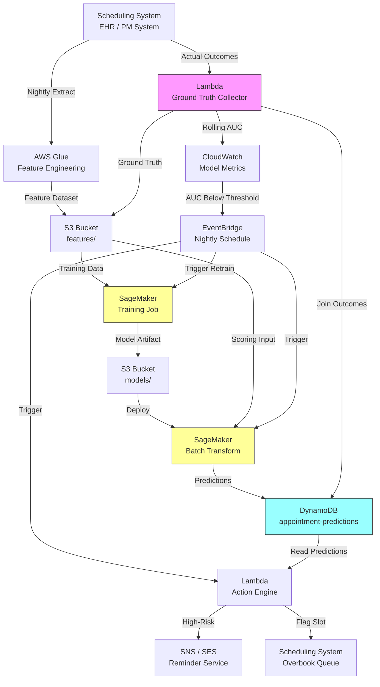

# Recipe 7.1 Architecture and Implementation: Appointment No-Show Prediction

*Companion to [Recipe 7.1: Appointment No-Show Prediction](chapter07.01-appointment-no-show-prediction). This page covers the AWS architecture, services, prerequisites, and pseudocode. For the problem framing and the conceptual approach, start with the main recipe.*

---

## The AWS Implementation

### Why These Services

**Amazon SageMaker for model training and hosting.** SageMaker handles the infrastructure you don't want to manage: spinning up a training instance, running the XGBoost job, storing the model artifact, and tearing everything down when it's done. For tabular classification like no-show prediction, the built-in XGBoost algorithm is a strong default that requires zero custom container work. The batch transform mode is particularly useful here: score tomorrow's entire schedule in one job rather than standing up a persistent endpoint that sits idle 23 hours a day.

**Amazon S3 for data and model storage.** Training data (historical appointments with outcomes), feature datasets, and trained model artifacts all live in S3. It's the natural staging area between your data warehouse and SageMaker, and between SageMaker and your inference pipeline. Versioned buckets let you track which training data produced which model.

**AWS Glue for feature engineering.** The ETL layer that transforms raw scheduling data into model-ready features. Glue jobs can pull from your data warehouse (Redshift, RDS, or wherever your scheduling system stores data), compute derived features (rolling no-show rates, lead time calculations, distance computations), and write the results to S3 in a format SageMaker can consume. Scheduled Glue jobs keep your feature store fresh.

**Amazon EventBridge for orchestration.** Triggers the nightly scoring pipeline: "At 8 PM, score all appointments for the next 48 hours." Also triggers retraining on a schedule or when a CloudWatch alarm fires on model performance degradation.

**Amazon DynamoDB for prediction storage.** Scored predictions need to be accessible to downstream systems (your scheduling UI, your reminder engine, your overbooking logic). DynamoDB provides fast key-value lookups by appointment ID with low latency. The reminder engine queries "give me all appointments in the next 24 hours with no-show probability > 0.6" and acts on them.

**AWS Lambda for the action engine.** Lightweight functions that read predictions from DynamoDB and trigger interventions: send a reminder via SNS/SES, flag a slot in the scheduling system, notify the front desk. Lambda's event-driven model fits naturally: a DynamoDB stream or EventBridge schedule triggers the appropriate action based on the prediction score and your configured thresholds.

### Architecture Diagram



### Prerequisites

| Requirement | Details |
|-------------|---------|
| **AWS Services** | Amazon SageMaker, Amazon S3, AWS Glue, Amazon DynamoDB, AWS Lambda, Amazon EventBridge, Amazon SNS or SES |
| **IAM Permissions** | Distributed across service-specific roles. Glue execution role: S3 read/write on feature buckets, data source access. SageMaker execution role: S3 read/write on model/feature buckets, KMS decrypt. Lambda action engine role: DynamoDB read, SNS publish. EventBridge scheduler role: Lambda invoke, SageMaker transform. Scope each role to specific resource ARNs. The Lambda role should NOT have SageMaker or Glue permissions. |
| **BAA** | AWS BAA signed (appointment data contains PHI: patient names, dates of birth, contact info) |
| **Encryption** | S3: SSE-KMS for training data and model artifacts. DynamoDB: encryption at rest (default); enable TTL on the table to expire prediction items after appointment date + 90 days (PHI retention policy). SageMaker: KMS-encrypted training volumes and endpoints. All transit over TLS. |
| **VPC** | Production: SageMaker training and inference in VPC with gateway endpoints for S3 and DynamoDB. Additional interface endpoints required: SageMaker API, SNS, CloudWatch Logs, KMS. Glue jobs in VPC with access to data sources. |
| **CloudTrail** | Enabled: log all SageMaker, S3, and DynamoDB API calls for audit |
| **Sample Data** | Synthetic appointment records. Generate from realistic distributions: 15% base no-show rate, correlated with lead time and patient history. Never use real patient data in dev. |
| **Cost Estimate** | SageMaker training: ~$5-20 per training run (ml.m5.xlarge, 1-2 hours). Batch transform: ~$2-5 per nightly scoring run. DynamoDB: negligible at appointment volumes. Total: ~$200-500/month for a mid-size practice. |

### Ingredients

| AWS Service | Role |
|------------|------|
| **Amazon SageMaker** | Train XGBoost model on historical data; batch-score upcoming appointments |
| **Amazon S3** | Store training datasets, feature files, and model artifacts |
| **AWS Glue** | ETL: transform raw scheduling data into model-ready features |
| **Amazon DynamoDB** | Store predictions for fast lookup by appointment ID or date range |
| **Amazon EventBridge** | Orchestrate nightly scoring and periodic retraining |
| **AWS Lambda** | Action engine: read predictions, trigger reminders or overbooking flags |
| **Amazon SNS/SES** | Deliver reminder messages (SMS via SNS, email via SES) |
| **Amazon CloudWatch** | Monitor model performance, prediction distributions, and pipeline health |

### Code

#### Walkthrough

**Step 1: Feature engineering.** The Glue job runs nightly, pulling the latest appointment and patient data from your scheduling system. For each upcoming appointment, it computes the features the model needs: the patient's historical no-show rate, the lead time in days, the day of week, the appointment type, and demographic factors. It also pulls the outcome labels for recent past appointments (to feed retraining). The output is a clean CSV or Parquet file in S3, one row per appointment, ready for the model. Skip this step and you're asking the model to work with raw database records that have no predictive signal computed.

```pseudocode
FUNCTION compute_features(appointments, patient_history):
    // For each upcoming appointment, compute the feature vector
    // that the model needs to make a prediction.
    features = empty list

    FOR each appointment in appointments:
        patient_id   = appointment.patient_id
        history      = patient_history[patient_id]

        // The single most predictive feature: how often has this patient
        // no-showed in the past? Compute over their last 10 appointments
        // (or fewer if they're newer to the practice).
        past_appointments = history.last_n_appointments(10)
        no_show_rate = count(past_appointments where status = "NO_SHOW") / count(past_appointments)

        // Lead time: days between booking date and appointment date.
        // Longer lead times correlate strongly with higher no-show rates.
        lead_time_days = days_between(appointment.booked_date, appointment.scheduled_date)

        // Temporal features: day of week and hour of day both matter.
        // Monday mornings and Friday afternoons are historically worse.
        day_of_week = appointment.scheduled_date.day_of_week   // 0=Monday, 6=Sunday
        hour_of_day = appointment.scheduled_time.hour          // 0-23

        // Appointment characteristics
        visit_type     = encode_category(appointment.visit_type)   // "new", "follow_up", "wellness", "urgent"
        provider_id    = encode_category(appointment.provider_id)  // some providers have higher no-show rates
        department     = encode_category(appointment.department)

        // Patient demographics and access factors
        distance_miles = compute_distance(patient.address, clinic.address)
        // NOTE: If distance computation requires an external geocoding API,
        // route through a NAT gateway with a BAA-covered provider, or
        // pre-geocode addresses at patient registration time to avoid
        // runtime PHI egress from this pipeline.
        insurance_type = encode_category(patient.insurance_type)   // "commercial", "medicaid", "medicare", "self_pay"
        age            = years_between(patient.date_of_birth, today)

        // Recency: days since last completed visit.
        // Patients who haven't been seen in a long time are higher risk.
        days_since_last_visit = days_between(history.last_completed_visit_date, today)

        // Assemble the feature vector
        feature_row = {
            appointment_id:       appointment.id,
            no_show_rate_last_10: no_show_rate,
            lead_time_days:       lead_time_days,
            day_of_week:          day_of_week,
            hour_of_day:          hour_of_day,
            visit_type:           visit_type,
            provider_id:          provider_id,
            department:           department,
            distance_miles:       distance_miles,
            insurance_type:       insurance_type,
            age:                  age,
            days_since_last_visit: days_since_last_visit
        }

        append feature_row to features

    // Write to S3 as a Parquet file for SageMaker to consume
    write features to S3 at "s3://ml-data/features/upcoming/{date}.parquet"
    RETURN features
```

**Step 2: Model training.** Periodically (weekly or monthly), a SageMaker training job picks up the historical feature dataset (appointments with known outcomes) and trains a gradient-boosted tree classifier. The training job handles hyperparameter tuning, cross-validation, and outputs both the model artifact and an evaluation report. The key metrics to track are AUC-ROC (overall discrimination ability), calibration (does a predicted 0.7 actually mean 70% no-show?), and performance across subgroups (does the model work equally well for different patient populations?). Skip retraining and your model will drift as patient behavior and scheduling patterns change over time.

```pseudocode
FUNCTION train_model(training_data_path):
    // Configure the SageMaker training job.
    // XGBoost is the right choice for tabular binary classification:
    // handles missing values, captures non-linear relationships,
    // and trains fast on modest data sizes.
    training_config = {
        algorithm:       "xgboost",
        objective:       "binary:logistic",    // output probabilities, not just 0/1
        eval_metric:     "auc",                // optimize for discrimination ability
        num_round:       200,                  // number of boosting rounds
        max_depth:       6,                    // tree depth (controls complexity)
        eta:             0.1,                  // learning rate (smaller = more conservative)
        subsample:       0.8,                  // use 80% of data per tree (reduces overfitting)
        colsample_bytree: 0.8,                // use 80% of features per tree
        scale_pos_weight: 5.5,                // adjust for class imbalance
                                              // Compute from YOUR training data:
                                              // count(showed) / count(no-showed).
                                              // 5.5 assumes ~15% no-show rate (85/15 ≈ 5.5).
                                              // A 25% rate needs ~3.0; a 7% rate needs ~13.
                                              // Recompute on each retrain as distribution shifts.
        input_data:      training_data_path,
        output_path:     "s3://ml-data/models/no-show/",
        instance_type:   "ml.m5.xlarge",      // sufficient for datasets under 1M rows
        instance_count:  1
    }

    // Launch the training job. SageMaker handles provisioning,
    // training, evaluation, and artifact storage.
    job = SageMaker.create_training_job(training_config)
    wait_for_completion(job)

    // Log the evaluation metrics for monitoring
    metrics = job.final_metrics   // AUC, accuracy, log loss
    log("Model trained. AUC: {metrics.auc}, LogLoss: {metrics.log_loss}")

    RETURN job.model_artifact_path
```

**Step 3: Batch scoring.** Every evening, a SageMaker batch transform job scores all appointments for the next 48 hours. Batch transform is more cost-effective than a persistent endpoint for this use case: you need predictions once per day, not continuously. The job reads the feature file from Step 1, applies the trained model, and outputs a prediction for each appointment. Each prediction is a probability between 0.0 and 1.0 representing the model's estimate of no-show likelihood.

```pseudocode
FUNCTION score_upcoming_appointments(model_path, features_path):
    // Configure batch transform: apply the model to all upcoming appointments at once.
    // This is cheaper than a real-time endpoint when you only need predictions once daily.
    transform_config = {
        model_artifact:  model_path,
        input_data:      features_path,                          // today's feature file from Step 1
        output_path:     "s3://ml-data/predictions/{date}/",     // predictions land here
        instance_type:   "ml.m5.large",                          // sufficient for scoring
        instance_count:  1,
        content_type:    "text/csv",
        split_type:      "Line",                                 // one prediction per input row
        network_isolation: true                                   // defense-in-depth: container has no
                                                                 // outbound network access (reads/writes
                                                                 // via SageMaker-managed S3 channels only)
    }

    job = SageMaker.create_transform_job(transform_config)
    wait_for_completion(job)

    // Read predictions and pair them with appointment IDs.
    // Batch transform output is positional: line N of the output file
    // contains the prediction for line N of the input file.
    // Join predictions back to appointment IDs by index position.
    predictions = read_predictions(transform_config.output_path)
    RETURN predictions   // list of {appointment_id, no_show_probability}
```

**Step 4: Store predictions.** Write each prediction to DynamoDB so downstream systems can look them up quickly. The primary key is the appointment ID; a secondary index on scheduled date enables range queries like "all high-risk appointments for tomorrow." Each record includes the probability, the model version (for auditability), and a timestamp. This step bridges the ML pipeline and the operational systems. Without it, predictions exist only as a file in S3 that nothing can easily query.

Important: use a conditional write to avoid overwriting predictions that downstream systems have already acted on. If the action engine has already triggered a reminder for a given appointment (recorded via an `acted_at` attribute), blindly overwriting that record loses the audit trail. Use a condition expression like `attribute_not_exists(acted_at)` so that re-runs of the scoring pipeline don't clobber records mid-workflow. Alternatively, append a `pipeline_run_id` to each record so you can trace exactly which pipeline run produced a given prediction, even after multiple scoring passes.

```pseudocode
FUNCTION store_predictions(predictions):
    // Write each prediction to DynamoDB for fast downstream access.
    // The action engine and scheduling UI both read from this table.
    //
    // IMPORTANT: Use a conditional write to prevent overwriting records
    // that have already been acted upon. If the action engine set
    // "acted_at" on a record, we must not clobber it with a fresh prediction.
    FOR each prediction in predictions:
        write to DynamoDB table "appointment-predictions"
            WITH ConditionExpression: attribute_not_exists(acted_at)
            item:
                appointment_id     = prediction.appointment_id       // primary key
                scheduled_date     = prediction.scheduled_date       // sort key + GSI for date queries
                no_show_probability = prediction.probability         // 0.0 to 1.0
                risk_tier          = classify_risk(prediction.probability)  // "low", "medium", "high"
                model_version      = current_model_version           // which model produced this
                pipeline_run_id    = current_pipeline_run_id         // unique per scoring run for audit
                scored_at          = current UTC timestamp           // when the prediction was made
                features_used      = prediction.top_features         // top 3 contributing features
                                                                     // (for explainability in the UI)
        ON ConditionalCheckFailed:
            // Record was already acted on. Log and skip; do not overwrite.
            log("Skipping {prediction.appointment_id}: already acted upon")

FUNCTION classify_risk(probability):
    // Convert continuous probability into actionable tiers.
    // Thresholds are operational decisions, not model decisions.
    // Tune these based on your reminder capacity and tolerance for false positives.
    IF probability >= 0.7:  RETURN "high"      // aggressive intervention
    IF probability >= 0.4:  RETURN "medium"    // standard reminder
    RETURN "low"                                // no special action
```

**Step 5: Action engine.** A Lambda function, triggered by EventBridge on a schedule (e.g., every morning at 6 AM for that day's appointments, and again at 6 PM for the next day's), queries DynamoDB for high-risk appointments and triggers the appropriate intervention. The intervention depends on the risk tier and your operational capacity. High-risk appointments might get a personal phone call from staff. Medium-risk gets an automated text reminder. Low-risk gets the standard reminder workflow (which you probably already have). The key insight: this is where the prediction becomes action. A model that scores perfectly but never triggers an intervention is worthless.

```pseudocode
FUNCTION run_action_engine(target_date):
    // Query all predictions for the target date, filtered to actionable risk levels.
    high_risk = query DynamoDB "appointment-predictions"
                WHERE scheduled_date = target_date
                AND risk_tier = "high"

    medium_risk = query DynamoDB "appointment-predictions"
                  WHERE scheduled_date = target_date
                  AND risk_tier = "medium"

    // High-risk: aggressive intervention
    FOR each appointment in high_risk:
        // Send personalized reminder with easy reschedule option.
        // Keep SMS content minimal: date/time and a generic prompt only.
        // Do not include provider name, visit type, or clinical details in SMS.
        // SMS is not encrypted end-to-end; link to a secure portal for specifics.
        send_reminder(
            patient_id:  appointment.patient_id,
            channel:     "sms",                          // SMS has highest open rates
            message:     personalized_reminder(appointment),
            include_reschedule_link: true                 // make it easy to reschedule rather than no-show
        )
        // Flag for potential overbooking
        flag_for_overbooking(appointment.slot_id)
        // Notify front desk for personal outreach if capacity allows
        notify_staff(appointment, reason="high no-show risk")

    // Medium-risk: automated reminder (supplement standard workflow)
    FOR each appointment in medium_risk:
        send_reminder(
            patient_id:  appointment.patient_id,
            channel:     "sms",
            message:     standard_reminder(appointment),
            include_reschedule_link: true
        )

    log("Actions triggered: {count(high_risk)} high-risk, {count(medium_risk)} medium-risk")
```

**Step 6: Ground truth collection and model monitoring.** After the appointment date passes, you know the actual outcome: did the patient show up or not? A nightly Lambda (or scheduled Glue job) joins predictions with actual outcomes from the scheduling system, computes rolling model performance metrics, publishes them to CloudWatch, and triggers retraining when performance drops below an acceptable threshold. Without this feedback loop, your model silently degrades as patient behavior shifts, new providers join, or your practice adds telehealth options. You won't notice until someone asks "why aren't our no-show reminders working anymore?"

```pseudocode
FUNCTION collect_ground_truth_and_monitor():
    // Runs nightly via EventBridge, one day after the appointment date.
    // Joins predictions (from DynamoDB) with actual outcomes (from scheduling system).

    yesterday = today - 1 day

    // Pull all predictions for appointments that occurred yesterday.
    predictions = query DynamoDB "appointment-predictions"
                  WHERE scheduled_date = yesterday

    // Pull actual outcomes from the scheduling system.
    // Each appointment now has a final status: "completed", "no_show", "cancelled", "rescheduled".
    actuals = query scheduling_system
              WHERE appointment_date = yesterday
              AND status IN ("completed", "no_show")
              // Exclude cancelled/rescheduled since those aren't true no-show events.

    // Join predictions to actuals by appointment_id.
    joined = inner_join(predictions, actuals, on="appointment_id")

    // Compute performance metrics on this batch.
    y_true = [1 if row.actual_status == "no_show" else 0 for row in joined]
    y_pred = [row.no_show_probability for row in joined]

    daily_auc = compute_auc_roc(y_true, y_pred)
    daily_brier = compute_brier_score(y_true, y_pred)
    daily_count = count(joined)

    // Compute a 30-day rolling AUC for stability (single-day AUC is noisy).
    rolling_auc = compute_rolling_auc(window_days=30)

    // Publish metrics to CloudWatch for dashboarding and alarming.
    publish_metric("ModelPerformance/DailyAUC", daily_auc)
    publish_metric("ModelPerformance/RollingAUC30d", rolling_auc)
    publish_metric("ModelPerformance/DailyBrierScore", daily_brier)
    publish_metric("ModelPerformance/PredictionCount", daily_count)

    // Check if rolling AUC has dropped below the retraining threshold.
    // 0.72 is a reasonable floor; below this, the model is barely better than
    // basic heuristics (e.g., "flag everyone with prior no-shows").
    AUC_RETRAIN_THRESHOLD = 0.72

    IF rolling_auc < AUC_RETRAIN_THRESHOLD:
        log("Rolling AUC ({rolling_auc}) below threshold ({AUC_RETRAIN_THRESHOLD}). Triggering retrain.")
        // Publish a CloudWatch alarm that triggers the retraining pipeline via EventBridge.
        trigger_retraining_pipeline()
    ELSE:
        log("Model performance OK. Rolling AUC: {rolling_auc}")

    // Write ground truth back to a training-data bucket so the next retrain
    // incorporates these recent outcomes. This closes the feedback loop.
    write_ground_truth_to_s3(joined, path="s3://ml-data/features/training/ground_truth/{yesterday}.parquet")
    RETURN {daily_auc, rolling_auc, daily_count}
```

> **Curious how this looks in Python?** The pseudocode above covers the concepts. If you'd like to see sample Python code that demonstrates these patterns using boto3, check out the [Python Example](chapter07.01-python-example). It walks through each step with inline comments and notes on what you'd need to change for a real deployment.

### Expected Results

**Sample prediction output:**

```json
{
  "appointment_id": "APT-2026-0531-1430",
  "patient_id": "PAT-88291",
  "scheduled_date": "2026-06-02",
  "scheduled_time": "14:30",
  "provider": "Dr. Martinez",
  "visit_type": "follow_up",
  "no_show_probability": 0.73,
  "risk_tier": "high",
  "top_features": [
    {"feature": "no_show_rate_last_10", "value": 0.5, "contribution": 0.28},
    {"feature": "lead_time_days", "value": 42, "contribution": 0.19},
    {"feature": "days_since_last_visit", "value": 180, "contribution": 0.11}
  ],
  "model_version": "v2.3.1",
  "scored_at": "2026-05-31T20:15:00Z"
}
```

**Performance benchmarks:**

| Metric | Typical Value |
|--------|---------------|
| AUC-ROC | 0.75-0.85 (depends on feature richness) |
| Precision at 50% recall | 0.40-0.55 |
| Calibration error | < 0.05 (Brier score) |
| Scoring latency (batch) | 5-15 minutes for 10,000 appointments |
| Feature computation (Glue) | 10-30 minutes nightly |
| Model training time | 30-90 minutes (weekly retrain) |
| End-to-end pipeline | < 1 hour from trigger to predictions in DynamoDB |

**Where it struggles:**

- New patients with no history (cold start problem). The model falls back to population averages, which are much less informative.
- Sudden life events (hospitalization, family emergency, job loss) that aren't captured in historical patterns.
- Patients who always confirm but still no-show. Confirmation behavior and actual attendance aren't perfectly correlated.
- Seasonal shifts (holiday weeks, school breaks) that don't appear in the training window.
- Practice changes (new provider, new location, new hours) that invalidate historical patterns.

---

## Why This Isn't Production-Ready

The architecture above is complete enough to score appointments and trigger reminders. But there's a meaningful set of gaps between "works in a demo" and "runs reliably for a 50-provider health system." Here's what a production deployment must close:

**Fairness auditing.** Before you deploy a model that influences which patients receive outreach, you must evaluate performance across patient subgroups: by race/ethnicity, insurance type, age, language preference, and zip code. If the model systematically under-predicts no-shows for one group (or over-predicts for another), your intervention engine amplifies that bias. Run stratified AUC analysis on every retrain. Set alerting thresholds on subgroup performance gaps, not just overall AUC. This is both an ethical obligation and a regulatory exposure.

**Intervention attribution and A/B testing.** You have a measurement problem: once you send a reminder to a high-risk patient and they show up, did the model help or would they have shown up anyway? Without a controlled experiment (randomly withholding interventions from a subset of high-risk patients), you cannot measure the causal impact of the system. Design your A/B testing framework before you launch, not after. Track the per-group no-show rate over time to quantify the lift from model-driven interventions.

**Drift detection beyond AUC.** Step 6 monitors overall model accuracy, but production systems also need feature drift detection. If the distribution of lead times shifts (because your booking system changed defaults) or patient demographics change (because you opened a new location), the model may degrade in ways that AUC alone doesn't catch immediately. Monitor input feature distributions with statistical tests (KS test, population stability index) and alert when they shift significantly from the training distribution.

**PHI minimization in the action layer.** The reminder messages, staff notifications, and overbooking flags all reference patient data. In production, ensure that SMS content never includes clinical details (visit type, provider name, diagnosis codes). Use a secure patient portal link instead. Log intervention events with appointment IDs, but do not log the message content itself in CloudWatch (where access controls may be broader than your HIPAA minimum-necessary standard).

**Graceful degradation.** What happens when the scoring pipeline fails? The action engine should not silently do nothing. Build fallback logic: if DynamoDB has no predictions for tomorrow (because the batch job failed), fall back to your existing standard reminder workflow. Alert the ML team that predictions are stale. Never let a pipeline failure silently eliminate patient outreach.

**Consent and opt-out.** Patients may opt out of automated reminders (or out of being scored by a predictive model entirely, depending on your consent framework). The action engine must check opt-out status before triggering any intervention. Store opt-out preferences in your patient master and filter them at action time, not at scoring time (you still want predictions for capacity planning even if you won't remind that patient directly).

**Retraining data quality.** The ground-truth loop in Step 6 feeds outcomes back into training data. But scheduling system outcomes can be noisy: a "completed" status might mean the patient showed up 45 minutes late, or that staff marked it complete by accident. Build data quality checks on your training labels. Flag suspicious patterns (e.g., a provider whose patients have a 0% no-show rate, which probably means they aren't recording no-shows properly).

---

## Variations and Extensions

**Real-time scoring at booking time.** Instead of nightly batch scoring, trigger a prediction the moment an appointment is booked. This enables immediate intervention: "We notice this slot is 6 weeks out. Would you like us to send you a reminder the week before?" Requires a SageMaker real-time endpoint instead of batch transform, which costs more but enables proactive engagement.

**Waitlist optimization.** Combine no-show predictions with a patient waitlist. When a slot has a high predicted no-show probability, automatically offer it as a standby option to waitlisted patients. If the original patient cancels or no-shows, the waitlisted patient is already prepared to fill the gap. This turns predicted no-shows into recovered access.

**Multi-class prediction.** Instead of binary (show/no-show), predict three outcomes: show, no-show, and late cancellation. Late cancellations (within 24 hours) are operationally different from true no-shows because they sometimes allow backfill. A multi-class model lets you tailor interventions differently for each predicted outcome.

---

## Additional Resources

**AWS Documentation:**
- [Amazon SageMaker XGBoost Algorithm](https://docs.aws.amazon.com/sagemaker/latest/dg/xgboost.html)
- [Amazon SageMaker Batch Transform](https://docs.aws.amazon.com/sagemaker/latest/dg/batch-transform.html)
- [AWS Glue Developer Guide](https://docs.aws.amazon.com/glue/latest/dg/what-is-glue.html)
- [Amazon DynamoDB Developer Guide](https://docs.aws.amazon.com/amazondynamodb/latest/developerguide/Introduction.html)
- [AWS HIPAA Eligible Services](https://aws.amazon.com/compliance/hipaa-eligible-services-reference/)
- [Amazon SageMaker Pricing](https://aws.amazon.com/sagemaker/pricing/)

**AWS Sample Repos:**
- [`amazon-sagemaker-examples`](https://github.com/aws/amazon-sagemaker-examples): Comprehensive SageMaker examples including XGBoost for binary classification, batch transform, and model monitoring

**AWS Solutions and Blogs:**
- [Predictive Analytics with Amazon SageMaker (AWS Blog)](https://aws.amazon.com/blogs/machine-learning/tag/predictive-analytics/)

---

## Estimated Implementation Time

| Tier | Timeline | What You Get |
|------|----------|--------------|
| **Basic** | 2-3 weeks | Feature engineering from scheduling data, XGBoost model trained on historical no-shows, nightly batch scoring, predictions stored in DynamoDB |
| **Production-ready** | 6-8 weeks | Add model monitoring (AUC drift alerts), automated retraining pipeline, action engine with SMS reminders, fairness evaluation across patient subgroups, A/B testing framework |
| **With variations** | 10-12 weeks | Add real-time scoring at booking, waitlist integration, multi-class prediction, overbooking optimization, provider-facing dashboard with explainability |

---

**Tags:** `predictive-analytics`, `binary-classification`, `xgboost`, `no-show`, `scheduling`, `operations`, `sagemaker`, `glue`, `dynamodb`

---

| [← Chapter 7 Index](chapter07-preface) | [Chapter 7 Index](chapter07-preface) | [Recipe 7.2 →](chapter07.02-propensity-to-pay-scoring) |

---

*← [Main Recipe 7.1](chapter07.01-appointment-no-show-prediction) · [Python Example](chapter07.01-python-example) · [Chapter Preface](chapter07-preface)*
