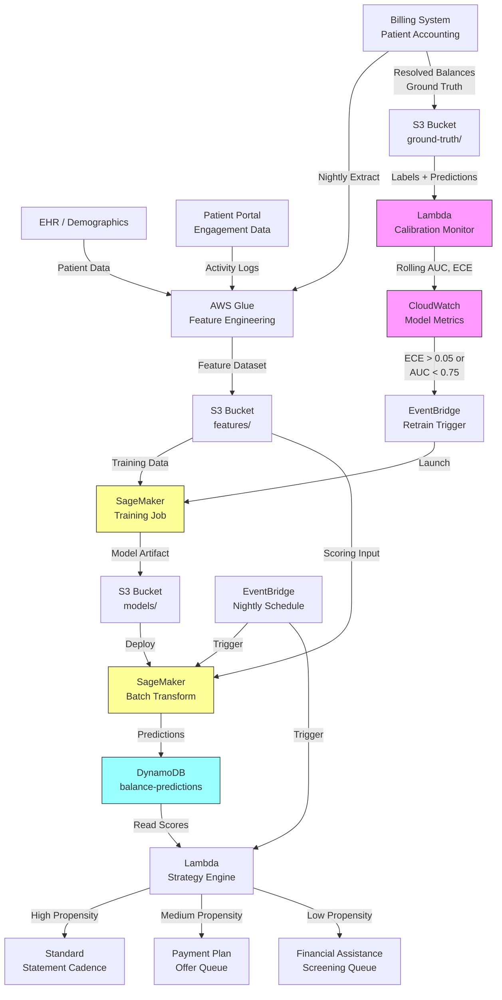

# Recipe 7.2 Architecture and Implementation: Propensity to Pay Scoring

*Companion to [Recipe 7.2: Propensity to Pay Scoring](chapter07.02-propensity-to-pay-scoring). This page covers the AWS architecture, services, prerequisites, and pseudocode. For the problem framing and the conceptual approach, start with the main recipe.*

---

## Why These Services

**Amazon SageMaker for model training and hosting.** SageMaker handles the full ML lifecycle for this tabular classification problem. The built-in XGBoost algorithm is ideal for the feature types involved (mix of categorical, numerical, and ratio features). SageMaker's batch transform mode lets you score all open balances nightly without maintaining a persistent endpoint. For organizations that want real-time scoring at the point of service, a SageMaker real-time endpoint works too, but batch is usually sufficient since collection strategy doesn't need sub-second latency.

**Amazon S3 for data and model storage.** Training datasets, feature files, model artifacts, and scoring outputs all live in S3. The data involved is PHI (patient names, account numbers, balance amounts), so SSE-KMS encryption is mandatory. S3 lifecycle policies can manage retention of historical scoring results for audit purposes.

**AWS Glue for feature engineering.** The ETL layer that pulls raw data from your billing system and patient accounting, computes derived features (rolling payment rates, days-to-pay averages, engagement scores), and writes model-ready datasets to S3. Glue handles the join logic across multiple source systems (billing, demographics, portal activity) that would be painful to maintain in custom code.

**Amazon DynamoDB for prediction storage and lookup.** Scored predictions need to be queryable by the collection workflow: "give me all balances with propensity < 0.4 that are over 60 days old" or "what's the propensity score for this specific patient's balance?" DynamoDB works here because the access patterns are predictable: look up a single balance by ID, or query a range of scores for the strategy engine's batch routing. You don't need the relational flexibility of RDS, and the read latency matters when the strategy engine is processing thousands of routing decisions. A GSI with `score_date` as partition key and `propensity_score` as sort key enables the range queries the strategy engine needs.

**Amazon EventBridge for orchestration.** Triggers the nightly scoring pipeline and the strategy engine. Also triggers retraining on a monthly schedule or when model monitoring detects drift.

**AWS Lambda for the strategy engine.** Reads predictions from DynamoDB, applies business rules (threshold-based routing), and triggers downstream actions: flag accounts for payment plan offers, route to financial counselors, or update the collection queue priority. Lambda's event-driven model fits the "react to new scores" pattern cleanly.

## Architecture Diagram



The feedback loop (pink nodes) is what makes this system self-correcting. Every night, a calibration monitoring Lambda compares recent predictions against ground truth outcomes (balances that have since resolved). It computes rolling AUC and Expected Calibration Error (ECE) over a trailing 30-day window and publishes both metrics to CloudWatch. When ECE exceeds 0.05 or AUC drops below 0.75, an EventBridge rule fires to trigger a new SageMaker training job. Without this loop, the model silently degrades as patient payment behavior shifts (seasonal patterns, economic changes, policy updates) and nobody notices until revenue cycle leadership asks why the scores "feel wrong."

## Prerequisites

| Requirement | Details |
|-------------|---------|
| **AWS Services** | Amazon SageMaker, Amazon S3, AWS Glue, Amazon DynamoDB, AWS Lambda, Amazon EventBridge |
| **IAM Permissions** | Distributed across service-specific execution roles: (1) Glue job role: `s3:GetObject`/`s3:PutObject` on feature buckets, connectivity to billing system; (2) SageMaker execution role: `s3:GetObject`/`s3:PutObject` on model and feature buckets, `kms:Decrypt`; (3) Lambda strategy engine role: `dynamodb:Query`/`dynamodb:GetItem` on predictions table only (no SageMaker or Glue permissions); (4) EventBridge scheduler role: `lambda:InvokeFunction`, `sagemaker:CreateTransformJob`. Scope each role with resource ARNs restricted to specific buckets, tables, and jobs. |
| **BAA** | AWS BAA signed (balance data contains PHI: patient names, account numbers, service dates) |
| **Encryption** | S3: SSE-KMS for all data and model artifacts (versioning enabled on models bucket); DynamoDB: encryption at rest (default); SageMaker: KMS-encrypted training volumes; all transit over TLS |
| **VPC** | Production: SageMaker training and inference in VPC with VPC endpoints for S3 and DynamoDB. Additional interface endpoints required: SageMaker API, CloudWatch Logs, KMS. Glue jobs in VPC with connectivity to source billing systems (typically via Direct Connect or site-to-site VPN; security groups on Glue ENIs must allow outbound traffic to the billing system's database port). |
| **CloudTrail** | Enabled: log all SageMaker, S3, and DynamoDB API calls. Critical for audit: you need to demonstrate that scores are used for collection strategy optimization, not care access decisions. |
| **Sample Data** | Synthetic patient balance records. Generate with realistic distributions: ~60% of balances paid within 90 days, ~20% partial payment, ~20% written off. Vary by balance amount and patient history. Never use real patient financial data in dev. |
| **Cost Estimate** | SageMaker training: ~$5-15 per training run (ml.m5.xlarge, 1 hour). Batch transform: ~$2-5 per nightly scoring run. Glue: ~$0.44/DPU-hour. Total: ~$150-400/month for a mid-size health system. |

## Ingredients

| AWS Service | Role |
|------------|------|
| **Amazon SageMaker** | Train XGBoost classifier on historical balance outcomes; batch-score open balances |
| **Amazon S3** | Store training datasets, feature files, model artifacts, and scoring outputs |
| **AWS Glue** | ETL: join billing, demographic, and engagement data; compute derived features |
| **Amazon DynamoDB** | Store predictions for fast lookup by account ID, patient ID, or score range |
| **Amazon EventBridge** | Orchestrate nightly scoring, monthly retraining, and strategy engine triggers |
| **AWS Lambda** | Strategy engine: apply business rules to scores, route to appropriate queues |
| **Amazon CloudWatch** | Monitor model performance, score distributions, and pipeline health |
| **AWS KMS** | Manage encryption keys for all data stores containing PHI |

## Pseudocode Walkthrough

**Step 1: Feature engineering.** The Glue job runs nightly, pulling open balances from the billing system and enriching them with patient history and engagement data. For each open balance, it computes the features the model needs: the patient's historical payment rate with your organization, the balance amount and type, how long the balance has been open, insurance context, and recent engagement signals. The output is a clean dataset in S3, one row per open balance. Skip this step and you're asking the model to predict payment behavior without knowing anything about the patient's history or the balance characteristics.

```pseudocode
FUNCTION compute_payment_features(open_balances, patient_history, engagement_data):
    // For each open balance, compute the feature vector that the model
    // needs to predict payment likelihood.
    features = empty list

    FOR each balance in open_balances:
        patient_id = balance.patient_id
        history    = patient_history[patient_id]
        engagement = engagement_data[patient_id]

        // --- Patient Payment History Features ---

        // The single strongest predictor: how has this patient handled
        // previous balances with us? Look at their last 20 balances.
        past_balances = history.last_n_balances(20)

        // Guard against new patients with no history (cold start).
        // Use population-average defaults when we have no behavioral signal.
        IF count(past_balances) == 0:
            pay_rate_full             = POPULATION_AVG_PAY_RATE  // e.g. 0.60
            pay_rate_any              = POPULATION_AVG_ANY_PAY   // e.g. 0.75
            avg_days_to_first_payment = POPULATION_AVG_DAYS      // e.g. 35
            payment_plans_completed   = 0
            payment_plans_defaulted   = 0
            cold_start                = true
        ELSE:
            pay_rate_full = count(past_balances where status = "PAID_IN_FULL") / count(past_balances)
            pay_rate_any  = count(past_balances where any_payment_made = true) / count(past_balances)

            // Average days to first payment across historical balances.
            // A patient who typically pays within 15 days is very different
            // from one who typically pays at 85 days.
            avg_days_to_first_payment = mean(past_balances.days_to_first_payment)

            // Payment plan history: has this patient successfully completed
            // payment plans before? Started and defaulted? Never used one?
            payment_plans_completed = count(past_balances where payment_plan_completed = true)
            payment_plans_defaulted = count(past_balances where payment_plan_defaulted = true)
            cold_start              = false

        // --- Balance Characteristics ---

        // Amount matters enormously. The relationship isn't linear:
        // $50 balances get paid at ~80%, $500 at ~60%, $5000 at ~30%.
        balance_amount = balance.amount
        balance_amount_log = log(balance.amount + 1)  // log transform for model stability

        // How old is this balance? Older balances are less likely to be paid.
        balance_age_days = days_between(balance.created_date, today)

        // Service type: elective vs. emergency vs. routine
        service_type = encode_category(balance.service_type)

        // Has insurance already adjudicated? Post-adjudication balances
        // (clearly the patient's responsibility) pay at higher rates.
        insurance_adjudicated = balance.insurance_processed  // boolean

        // Number of statements already sent
        statements_sent = balance.statement_count

        // --- Insurance and Financial Context ---

        insurance_type = encode_category(balance.insurance_type)
        has_other_open_balances = (count(open_balances where patient_id = patient_id) > 1)
        total_open_balance = sum(open_balances where patient_id = patient_id).amount

        // --- Engagement Signals ---

        // Portal activity: has the patient logged in recently?
        days_since_portal_login = days_between(engagement.last_portal_login, today)

        // Statement engagement: did they open the electronic statement?
        opened_last_statement = engagement.opened_last_e_statement  // boolean

        // Has the patient called billing? (Counterintuitively predictive of payment)
        called_billing_recently = engagement.billing_call_last_30_days  // boolean

        // Has the patient made any partial payment on this balance?
        partial_payment_made = (balance.amount_paid > 0)

        // Assemble the feature vector
        feature_row = {
            balance_id:                balance.id,
            patient_id:                patient_id,
            pay_rate_full:             pay_rate_full,
            pay_rate_any:              pay_rate_any,
            avg_days_to_first_payment: avg_days_to_first_payment,
            payment_plans_completed:   payment_plans_completed,
            payment_plans_defaulted:   payment_plans_defaulted,
            balance_amount:            balance_amount,
            balance_amount_log:        balance_amount_log,
            balance_age_days:          balance_age_days,
            service_type:              service_type,
            insurance_adjudicated:     insurance_adjudicated,
            statements_sent:           statements_sent,
            insurance_type:            insurance_type,
            has_other_open_balances:   has_other_open_balances,
            total_open_balance:        total_open_balance,
            days_since_portal_login:   days_since_portal_login,
            opened_last_statement:     opened_last_statement,
            called_billing_recently:   called_billing_recently,
            partial_payment_made:      partial_payment_made,
            cold_start:                cold_start
        }

        append feature_row to features

    // Write to S3 for SageMaker consumption
    write features to S3 at "s3://ml-data/features/propensity-to-pay/{date}.parquet"
    RETURN features
```

**Step 2: Model training.** A SageMaker training job picks up historical balance data (balances old enough to have definitive outcomes) and trains a gradient-boosted tree classifier. The outcome label is binary: paid within 90 days (1) or not paid within 90 days (0). The critical addition here is post-hoc calibration: after training, we apply Platt scaling to ensure the output probabilities are meaningful, not just well-ranked. A predicted 0.7 must actually mean 70% of similar balances get paid. Without calibration, the strategy engine's thresholds become meaningless. Retrain monthly to capture seasonal patterns and shifts in patient payment behavior.

```pseudocode
FUNCTION train_propensity_model(training_data_path):
    // Configure the SageMaker training job.
    // XGBoost for tabular binary classification with calibration.
    training_config = {
        algorithm:        "xgboost",
        objective:        "binary:logistic",    // output probabilities
        eval_metric:      "auc",                // primary: discrimination ability
        num_round:        300,                  // boosting rounds
        max_depth:        5,                    // slightly shallower than no-show model
                                                // (payment behavior is less non-linear)
        eta:              0.05,                 // conservative learning rate for stability
        subsample:        0.8,
        colsample_bytree: 0.7,
        scale_pos_weight: 0.67,                // adjust if ~60% pay (weight = 40/60)
        input_data:       training_data_path,
        output_path:      "s3://ml-data/models/propensity-to-pay/",
        instance_type:    "ml.m5.xlarge",
        instance_count:   1
    }

    job = SageMaker.create_training_job(training_config)
    wait_for_completion(job)

    // --- Post-hoc calibration ---
    // XGBoost probabilities are often poorly calibrated out of the box.
    // Apply Platt scaling (logistic regression on model outputs) using
    // a held-out calibration set to fix this.
    calibration_set = load_holdout_data("s3://ml-data/calibration/propensity-to-pay/")
    raw_predictions = score_with_model(job.model_artifact, calibration_set)
    calibration_model = fit_platt_scaling(raw_predictions, calibration_set.labels)

    // Save both the base model and the calibration model.
    // Enable S3 versioning on the models bucket and store a checksum
    // so the scoring pipeline can verify integrity before applying calibration.
    save_artifact(calibration_model, "s3://ml-data/models/propensity-to-pay/calibration/")
    save_checksum(calibration_model, "s3://ml-data/models/propensity-to-pay/calibration/checksum")

    RETURN job.model_artifact, calibration_model
```

**Step 3: Batch scoring.** Every night, the scoring pipeline runs all open balances through the trained model and calibration layer. Each balance gets a propensity score (0.0 to 1.0) and the top contributing features (for explainability to collection staff). The results are written to DynamoDB for fast lookup. Skip this step and your collection team is flying blind, treating every balance the same regardless of likelihood of recovery.

```pseudocode
FUNCTION score_open_balances(feature_file_path, model_artifact, calibration_model):
    // Verify calibration model integrity before use.
    // A corrupted calibration model silently miscalibrates all predictions.
    verify_checksum(calibration_model, expected_checksum)

    // Run SageMaker batch transform on all open balances.
    // This scores thousands of balances in a single job rather than
    // making individual API calls (much more cost-effective).
    // EnableNetworkIsolation prevents unintended data egress from the
    // scoring container (defense-in-depth for PHI).
    transform_config = {
        model:                  model_artifact,
        input_data:             feature_file_path,
        output_path:            "s3://ml-data/predictions/propensity-to-pay/{date}/",
        instance_type:          "ml.m5.xlarge",
        instance_count:         1,
        content_type:           "text/csv",
        split_type:             "Line",
        enable_network_isolation: true
    }

    transform_job = SageMaker.create_transform_job(transform_config)
    wait_for_completion(transform_job)

    // Apply calibration to raw model outputs
    raw_scores = load_predictions(transform_job.output_path)
    calibrated_scores = apply_platt_scaling(calibration_model, raw_scores)

    // Write calibrated predictions to DynamoDB for downstream consumption.
    // Set TTL to expire predictions 90 days after balance resolution
    // (keeps audit trail without accumulating stale PHI indefinitely).
    FOR each prediction in calibrated_scores:
        write to DynamoDB table "balance-predictions":
            balance_id       = prediction.balance_id
            patient_id       = prediction.patient_id
            propensity_score = prediction.calibrated_probability
            score_date       = today
            top_features     = prediction.feature_contributions  // SHAP values or similar
            model_version    = model_artifact.version
            ttl              = balance_resolution_date + 90 days

    RETURN calibrated_scores
```

**DynamoDB PHI retention and access control.** The predictions table stores PHI: patient IDs linked to financial behavioral data (propensity scores, payment history summaries via SHAP values). This combination is sensitive and requires deliberate access controls beyond default encryption at rest.

Three things to get right:

1. **TTL policy.** Enable DynamoDB TTL on a `ttl_expiry` attribute. Set it to balance resolution date plus your audit retention window (typically 90 days post-resolution for internal audit, longer if your compliance team requires it). This ensures predictions don't accumulate indefinitely. Stale predictions for resolved balances serve no operational purpose but still constitute PHI exposure.

2. **IAM policy separation.** Create distinct IAM policies for different consumers of this table. The strategy engine Lambda needs `dynamodb:Query` and `dynamodb:GetItem` with broad access to all score ranges (it processes the full portfolio). Other consumers, such as a patient-facing billing portal or a reporting dashboard, should have restricted policies: condition keys limiting access to specific `patient_id` values or requiring a specific `score_date` range. No consumer outside revenue cycle operations should have access to this table at all.

3. **GSI access restriction.** The `score-range` GSI (partition key: `score_date`, sort key: `propensity_score`) enables efficient queries like "all balances below 0.4 scored today." This GSI should be accessible only to the strategy engine role and authorized revenue cycle analysts. Clinical staff, patient access representatives, and other non-financial roles should never see propensity scores. Enforce this through IAM policies with `dynamodb:index` resource ARNs scoped to the specific GSI, not table-wide `dynamodb:Query` grants.

**Step 4: Strategy engine.** The Lambda function reads predictions from DynamoDB and routes each balance to the appropriate collection strategy based on propensity score thresholds. High-propensity balances get standard treatment (they'll pay on their own). Medium-propensity balances get proactive intervention (payment plan offers, financial counselor outreach). Low-propensity balances get early financial assistance screening. The thresholds are configurable business parameters, not model parameters. Adjust them based on your staff capacity, payment plan administrative costs, and financial assistance policies.

```pseudocode
// Thresholds are business decisions, stored as configuration.
// Adjust based on staff capacity and organizational policy.
HIGH_THRESHOLD    = 0.75   // above this: patient will likely pay without intervention
MEDIUM_THRESHOLD  = 0.40   // between medium and high: intervention may help
// below medium: likely needs financial assistance or will not pay

// Randomization holdout: reserve a fraction of balances for random
// strategy assignment to create counterfactual data. Without this,
// the model's predictions become self-fulfilling (see Honest Take).
HOLDOUT_RATE = 0.07  // 7% of balances get random assignment

FUNCTION apply_collection_strategy(balance_predictions):
    // Read today's predictions and route each balance to the right queue.
    FOR each prediction in balance_predictions:
        score      = prediction.propensity_score
        balance_id = prediction.balance_id
        patient_id = prediction.patient_id
        amount     = prediction.balance_amount

        // --- Randomization holdout ---
        // Reserve ~7% of balances for random strategy assignment.
        // This creates counterfactual data: what would have happened
        // if we'd treated this balance differently? Essential for
        // validating that the score-based routing actually improves
        // outcomes vs. random assignment.
        is_holdout = (hash(balance_id + today) mod 100) < (HOLDOUT_RATE * 100)

        IF is_holdout == true:
            // Randomly assign to any strategy, ignoring the score.
            random_strategy = random_choice(["standard_statements",
                                             "payment_plan_offer",
                                             "financial_counselor_outreach",
                                             "financial_assistance_screening"])
            route_to_queue(random_strategy, balance_id)
            log_decision(balance_id, patient_id, score, random_strategy,
                         is_holdout=true, model_recommended=determine_strategy(score, amount))
            CONTINUE

        // For cold-start patients (no payment history), route to a default
        // strategy rather than relying on a weak prediction.
        IF prediction.cold_start == true:
            route_to_queue("new_patient_default", balance_id)
            log_decision(balance_id, patient_id, score, "new_patient_default", is_holdout=false)
            CONTINUE

        IF score >= HIGH_THRESHOLD:
            // High propensity: standard statement cadence.
            // These patients typically pay without special intervention.
            // Don't waste outreach resources here.
            route_to_queue("standard_statements", balance_id)

        ELSE IF score >= MEDIUM_THRESHOLD:
            // Medium propensity: proactive intervention likely to help.
            // Offer payment plan early (before frustration builds).
            // Financial counselor outreach for larger balances.
            IF amount > 500:
                route_to_queue("financial_counselor_outreach", balance_id)
            ELSE:
                route_to_queue("payment_plan_offer", balance_id)

        ELSE:
            // Low propensity: likely unable to pay.
            // Screen for financial assistance eligibility early.
            // This preserves the patient relationship and avoids
            // wasting collection resources on uncollectible balances.
            route_to_queue("financial_assistance_screening", balance_id)

        // Log the routing decision for audit and model monitoring.
        // This creates the feedback loop: did the strategy work?
        log_decision(balance_id, patient_id, score, assigned_queue, is_holdout=false)
```

> **Curious how this looks in Python?** The pseudocode above covers the concepts. If you'd like to see sample Python code that demonstrates these patterns using boto3, check out the [Python Example](chapter07.02-python-example). It walks through each step with inline comments and notes on what you'd need to change for a real deployment.

## Expected Results

**Sample output for a scored balance:**

```json
{
  "balance_id": "BAL-2026-0847291",
  "patient_id": "PAT-00482916",
  "propensity_score": 0.62,
  "score_date": "2026-03-15",
  "model_version": "v2.3-20260301",
  "top_features": [
    {"feature": "pay_rate_full", "value": 0.55, "contribution": 0.18},
    {"feature": "balance_amount_log", "value": 6.21, "contribution": -0.12},
    {"feature": "opened_last_statement", "value": true, "contribution": 0.09},
    {"feature": "balance_age_days", "value": 34, "contribution": -0.05},
    {"feature": "avg_days_to_first_payment", "value": 42, "contribution": -0.04}
  ],
  "assigned_strategy": "payment_plan_offer",
  "balance_amount": 497.00,
  "balance_age_days": 34
}
```

**Performance benchmarks:**

| Metric | Typical Value |
|--------|---------------|
| AUC-ROC | 0.78-0.85 |
| Calibration error (ECE) | < 0.03 |
| Precision at 0.75 threshold | 80-88% |
| Recall at 0.40 threshold | 85-92% |
| Scoring latency (batch) | ~15 min for 100K balances |
| Cost per prediction | ~$0.001 |
| Lift over random (top decile) | 2.5-3.5x |

**Where it struggles:**

- New patients with no payment history (cold start problem). The model falls back to balance characteristics and demographics, which are weaker predictors. Route these to a default strategy rather than trusting a low-confidence score.
- Patients whose financial situation has recently changed (job loss, divorce, new insurance). Historical behavior stops being predictive.
- Very small balances ($10-25) where the signal-to-noise ratio is poor and the collection cost exceeds the balance.
- Balances in active dispute. A patient contesting a charge has different dynamics than one simply not paying.

**Interpreting scores relative to balance age.** A subtlety that catches people: a 90-day outcome model applied to a balance at day 85 has only 5 days of remaining outcome window. That score is much more definitive (the patient either pays in the next 5 days or they don't) than the same numerical score on a day-5 balance (which still has 85 days of uncertainty). A 0.4 score at day 85 is a near-certain non-payment signal; a 0.4 at day 5 means "we're not sure yet." The strategy engine should account for this. Two practical approaches: (1) train multiple time-horizon models (30-day, 60-day, 90-day) and use the one whose remaining window matches your decision point, or (2) add age-adjusted thresholds in the strategy engine so that a "medium" score on a young balance routes to "wait and re-score" rather than immediate intervention.

---

## Why This Isn't Production-Ready

This architecture works as a proof of concept and will generate real predictions. But there's a gap between "generates scores" and "runs in a revenue cycle department handling real patient financial decisions." Here's what's missing:

**Calibration monitoring.** The architecture diagram shows the feedback loop, but you need to operationalize it: daily comparison of predicted probabilities against actual outcomes for resolved balances, with alerting when ECE drifts above your threshold. Without this, your strategy engine's thresholds silently become meaningless over weeks to months.

**Fairness audits.** The model will learn demographic correlations with payment behavior. Some reflect systemic inequities, not individual behavior. You need regular (monthly minimum) fairness analysis using SageMaker Clarify or equivalent: check whether the model produces systematically different score distributions across protected groups, and whether the strategy engine's routing creates disparate impact.

**Integration with billing workflow.** The strategy engine routes to "queues" in pseudocode. In production, those queues are your actual collection workflow system (Epic WorkQueue, Waystar, Experian Health, or custom). The integration layer (API calls, file drops, HL7 messages) is where most of the real implementation effort lives, and it varies wildly by billing system vendor.

**Holdout analysis pipeline.** The randomization holdout creates counterfactual data, but someone needs to actually analyze it: is the model-driven routing producing better recovery rates than random assignment? This requires a periodic analysis job that compares outcomes across holdout vs. model-routed balances within each score band.

**Model versioning and rollback.** When you retrain, the new model may be worse than the old one. You need automated validation (score the calibration set, check that AUC and ECE meet thresholds) before promoting a new model to production. If validation fails, keep the previous model running and alert the ML team.

**Operational runbook.** What happens when the nightly scoring fails? When DynamoDB throttles? When the billing system extract is empty? Each failure mode needs a documented response: who gets paged, what's the fallback (use yesterday's scores? route everything to "standard"?), and what's the blast radius.

---

## Variations and Extensions

**Point-of-service scoring.** Instead of scoring open balances nightly, score at the moment of service. When a patient checks in for a procedure with a known out-of-pocket cost, predict their payment likelihood in real-time and offer a payment plan or discount for same-day payment before they leave. This requires a real-time SageMaker endpoint instead of batch transform, but the architecture is otherwise identical.

**Multi-outcome modeling.** Instead of binary (paid/not paid), predict the expected recovery amount. A patient might have 0.3 probability of paying in full but 0.7 probability of paying at least 50% on a payment plan. This changes the strategy engine from threshold-based routing to expected-value optimization: which strategy maximizes expected recovery for each balance?

**Segmented models.** Train separate models for different balance types (copays vs. deductibles vs. large surgical balances) or different patient segments (established patients vs. new patients). The features that matter for a $25 copay are different from those that matter for a $10,000 surgical balance. Segmented models often outperform a single model trying to handle all cases.

---

## Additional Resources

**AWS Documentation:**
- [Amazon SageMaker XGBoost Algorithm](https://docs.aws.amazon.com/sagemaker/latest/dg/xgboost.html)
- [Amazon SageMaker Batch Transform](https://docs.aws.amazon.com/sagemaker/latest/dg/batch-transform.html)
- [Amazon SageMaker Model Monitor](https://docs.aws.amazon.com/sagemaker/latest/dg/model-monitor.html)
- [AWS Glue ETL Programming Guide](https://docs.aws.amazon.com/glue/latest/dg/aws-glue-programming.html)
- [AWS HIPAA Eligible Services](https://aws.amazon.com/compliance/hipaa-eligible-services-reference/)
- [Amazon SageMaker Clarify for Bias Detection](https://docs.aws.amazon.com/sagemaker/latest/dg/clarify-detect-data-bias.html)

**AWS Sample Repos:**
- [`amazon-sagemaker-examples`](https://github.com/aws/amazon-sagemaker-examples): Comprehensive SageMaker examples including XGBoost classification, batch transform, and model monitoring
- [`amazon-sagemaker-clarify`](https://github.com/aws/amazon-sagemaker-clarify): Bias detection and explainability examples relevant to fairness monitoring in propensity models

**AWS Solutions and Blogs:**
- [Machine Learning Best Practices in Healthcare and Life Sciences](https://aws.amazon.com/blogs/machine-learning/machine-learning-best-practices-in-healthcare-and-life-sciences/): Best practices for healthcare ML on AWS
- [Amazon SageMaker Pricing](https://aws.amazon.com/sagemaker/pricing/): Current pricing for training, inference, and batch transform

---

## Estimated Implementation Time

| Phase | Duration |
|-------|----------|
| **Basic** (single model, batch scoring, manual threshold tuning) | 3-4 weeks |
| **Production-ready** (calibration, monitoring, fairness checks, automated retraining) | 8-12 weeks |
| **With variations** (real-time scoring, multi-outcome, segmented models) | 14-20 weeks |

---

*← [Main Recipe 7.2](chapter07.02-propensity-to-pay-scoring) · [Python Example](chapter07.02-python-example) · [Chapter Preface](chapter07-preface)*
